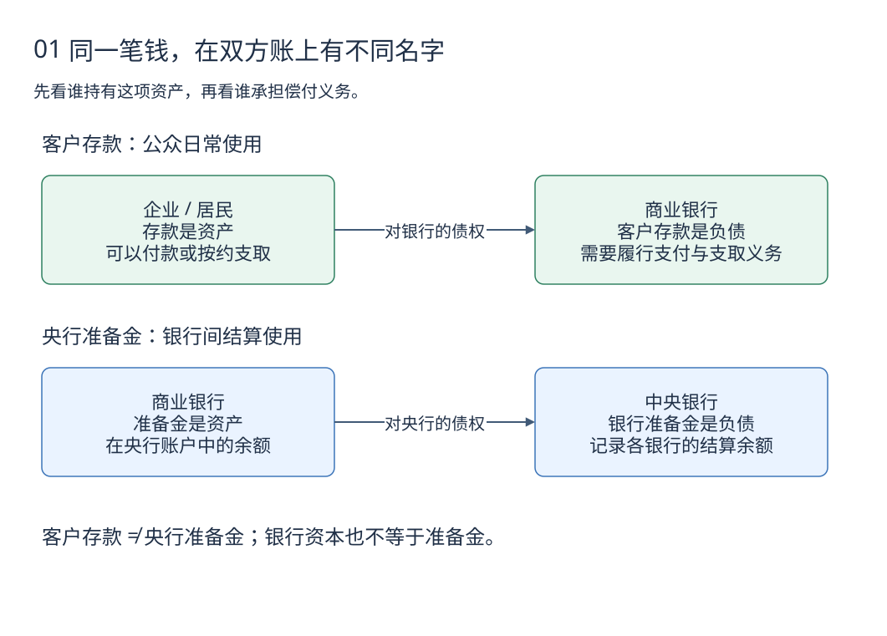
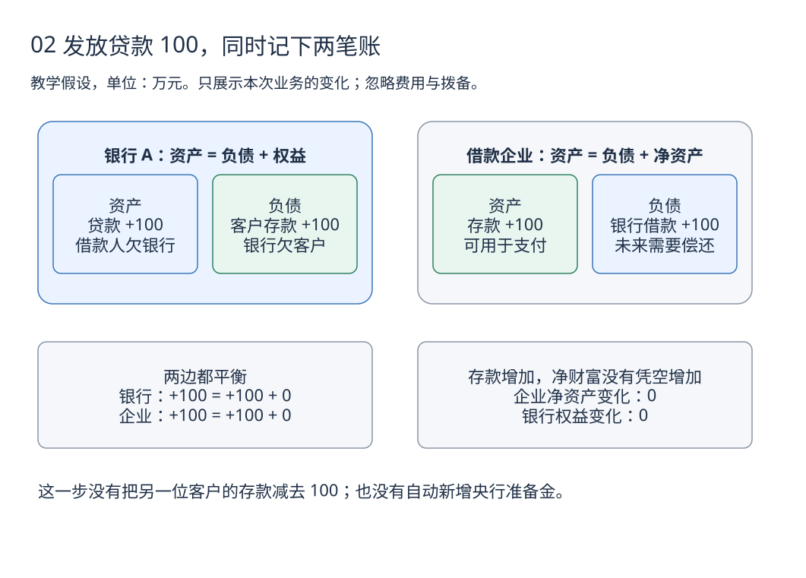
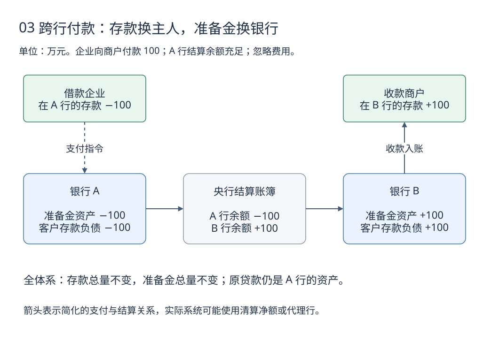
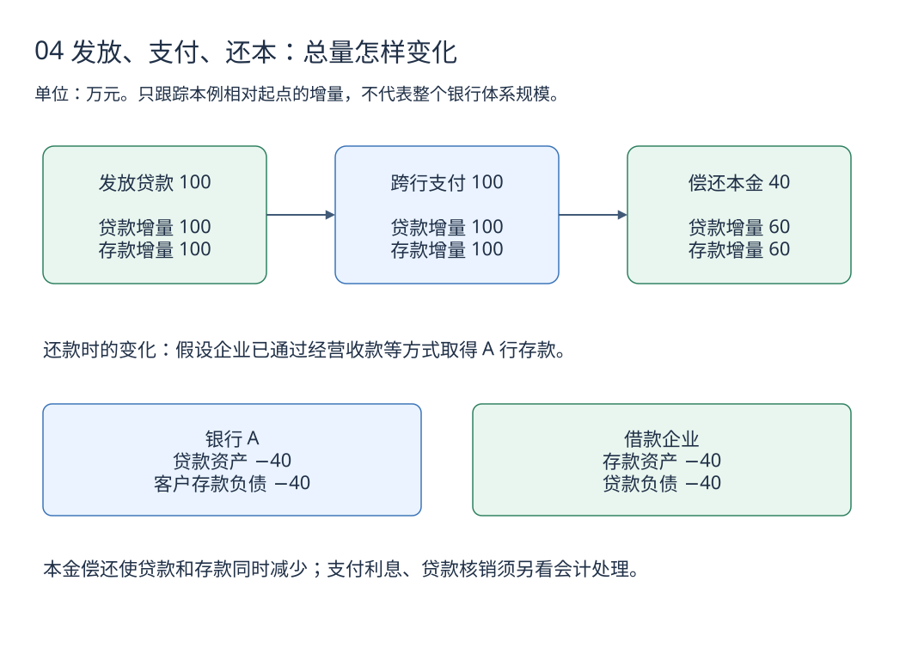
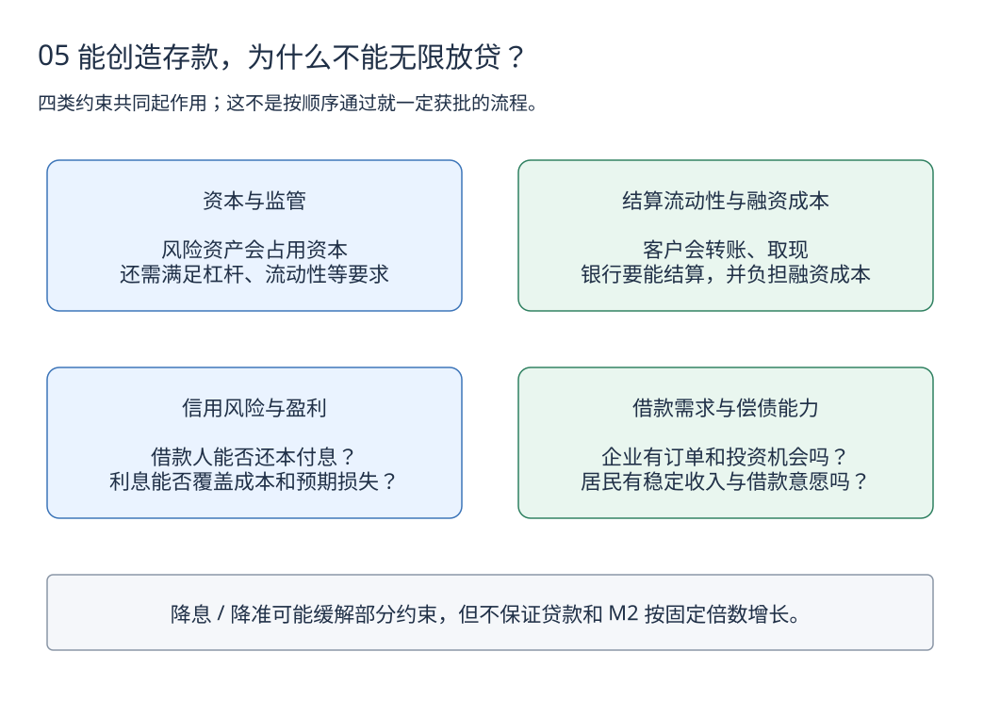

# 8. 银行与货币创造：一笔贷款的五张图

[学习路线](learning-guide.md) · 前一章：[风险与投资组合](investing/portfolio.md) · 下一章：[货币与信用指标](money-and-credit.md)

银行给企业发放贷款时，账户里的钱从哪里来？企业把钱付给另一家银行的商户，银行之间又怎样结算？贷款还掉后，钱去了哪里？

本章用同一笔 **100 万元贷款**追踪这些变化。所有金额均为教学假设。先读图中的变化，再看正文解释，不必先背下 M1、M2 或货币乘数。

## 读图前：只看本次业务的增减

图中的 `+100` 表示增加 100 万元，不表示银行原来一分钱也没有。假设银行业务合规、借款获批并实际入账，涉及跨行付款时已经有足够结算余额；先忽略利息、费用、税款、拨备和现金提取。

记住一条会计关系：**资产 = 负债 + 所有者权益**。企业自己的存款是资产，银行欠客户的存款是负债。同一个对象放在不同主体的账上，含义会不同。

这里介绍通用的现代银行记账与结算逻辑。中国 M1、M2 的具体统计范围留到[下一章](money-and-credit.md)；不把英国等资料中的制度参数直接套用于中国。

## 图一：客户存款与央行准备金，是两个层次

[下载可编辑源图](images/banking/money-claims.drawio)

上半图看客户与商业银行：企业在银行有 100 万元存款，意味着企业拥有对银行的债权，可以按约定进行支付或支取；银行承担相应义务。

下半图看商业银行与央行：商业银行在央行的准备金余额，可用于银行间结算等用途。它是商业银行的资产、央行的负债。普通居民付款使用的是自己的银行存款，不是在直接转移个人名下的央行准备金。

本章图示只画这两类账户，不覆盖纸币、数字人民币等全部货币形态。准备金也不全都意味着“被冻结不能用的钱”，具体制度下还要区分法定准备金要求、超额余额及账户安排。

| 容易混淆的词 | 在本章中的含义 | 不能理解成 |
|---|---|---|
| 客户存款 | 银行对客户的负债 | 银行赚到的利润 |
| 央行准备金 | 银行在央行的账户余额，属于银行资产 | 每一位客户的钱都在央行原样存放 |
| 银行资本 | 能够吸收损失的资本基础；监管资本有具体计量规则 | 专门锁在某个现金账户的一堆钱 |

## 图二：银行放贷，贷款和存款同时产生

[下载可编辑源图](images/banking/loan-creation.drawio)

借款企业获批并实际收到 100 万元贷款后：

1. 银行增加一项资产：企业未来需要还本付息的贷款。
2. 银行同时增加一项负债：贷记企业账户的 100 万元存款。
3. 企业获得可支付的存款，同时承担同额借款义务。

本例中，银行没有同时从另一位储户账户扣掉 100 万元。**发放贷款可以创造新的客户存款**，而不只是把某位储户的既有存款转交给借款人。

但企业并未凭空赚到 100 万元：其存款和债务同时增加，净资产没有因这笔初始记账而增加。银行也没有因本金入账立刻赚到同额利润。

### 这是不是意味着储蓄和存款不重要

不是。贷款入账后，客户可能立刻向别家银行付款或取现，银行要能完成支付；银行还要管理存款稳定性、融资成本与监管指标。是否能创造存款，与能否负担和持续经营这笔贷款，是两个相互联系的问题。

图二只解释发生贷款时怎样记账，不表示银行在发放前无需考虑资本、流动性和资金来源。

## 图三：跨行支付时，什么变了，什么没变

企业用这 100 万元向商户付款。企业在银行 A，商户在银行 B。

[下载可编辑源图](images/banking/interbank-payment.drawio)

在这个简化的直接结算例子中，A 行减少对企业的存款负债，同时转出准备金；B 行收到准备金，同时增加对商户的存款负债。

| 观察对象 | 付款后的变化 |
|---|---|
| 企业与商户 | 企业存款减少 100，商户存款增加 100 |
| 全体客户的存款合计 | 这次转账本身不改变合计金额 |
| 两家银行的准备金 | A 减少 100，B 增加 100，合计不变 |
| 企业的贷款 | 仍未偿还，继续是 A 行的资产、企业的负债 |

现实支付系统可能使用清算净额、代理行和不同结算时点，不能把图中的箭头理解为所有支付都逐笔按这个时序完成。图的重点是：**存款在客户间转移，结算资产在银行间转移；并没有自动发生第二次贷款。**

### 如果 A 行没有足够结算余额

A 行需要管理结算流动性，例如取得存款流入、进行银行间融资、出售或回购资产，或在满足条件时使用央行工具。这些途径有成本、抵押品与准入条件，不能假设随时可以无限取得。

贷款入账没有自动创造央行准备金，所以“可以记出存款”不等于“无需结算资金”。

## 图四：还本金，会让贷款和存款同时减少

在企业通过经营收款等方式取得存款后，假设它从 A 行账户偿还 40 万元本金。取得存款的过程在本例中只转移既有存款，不另增贷款。

[下载可编辑源图](images/banking/principal-repayment.drawio)

银行把企业的存款余额减去 40，同时把贷款余额减去 40；企业一侧的存款资产和借款负债也各减少 40。对银行体系而言，本例中的这部分客户存款被注销，并非必然转成另一位客户的新存款。

如果企业从 B 行账户向 A 行还贷，中间还涉及准备金转移，但从银行体系合计看，本例偿还本金仍会使客户存款与贷款各减少 40。

| 动作 | 本例对全体系客户存款的影响 | 对贷款的影响 |
|---|---|---|
| 发放并入账贷款 100 | +100 | +100 |
| 客户跨行转账 100 | 总量不变 | 不变 |
| 用既有存款偿还本金 40 | −40 | −40 |

### 利息与核销为什么要另看

**支付利息**涉及银行收入等项目，不是同额减少贷款本金。银行随后支付工资、采购、税款、分红等，又会带来其他账户变化；不能把“还本金”的图直接当成利息全流程。

**贷款核销**也不是客户拿存款还贷。贷款损失会通过减值准备、损益与资本等机制体现，原来贷款形成、后来转给商户的存款不会仅因贷款被核销就自动消失。实际核销时损失可能已经提前计提，不能把核销当天都算作新损失。

## 图五：为什么银行不能无限放贷

[下载可编辑源图](images/banking/lending-constraints.drawio)

四类约束会同时影响决策。例如准备金较充裕，但借款人缺乏可靠收入，贷款仍可能不获批；借款人信用良好，但银行资本承压或资金成本太高，贷款条件也可能收紧。

政策会影响这些条件。降息可能改变融资成本与借款需求，降准可能释放部分受要求约束的流动性，但企业有没有订单、居民是否愿意负债、银行是否愿意承担风险，并不会因此自动得到同一个答案。

### 为什么不直接套“1 ÷ 准备金率”

简化教材中的货币乘数依赖一组很强的假设，例如固定的准备金约束、没有现金漏出、没有额外准备金持有，以及信贷需求与其他约束都不阻碍扩张。

现实中，准备金供给方式、利率框架、资本要求、贷款需求和资产配置都在变化。某个时点“广义货币 ÷ 基础货币”的统计比值，不等于用准备金率就能机械预测的因果规律。

## 把记账逻辑连接到 M2 与社融

现在可以带着两个不同问题进入下一章：

- **货币统计**：符合统计范围的客户存款等货币余额有多少？本例的新存款如果属于 M2 覆盖范围，其他条件不变时会增加 M2。
- **融资统计**：实体经济通过什么渠道获得融资？贷款只是其中一种，政府债券、企业债券等也各有统计口径。

银行购买非银行部门的某些资产等交易也可能创造存款，因此现实 M2 的变化并不只由新增贷款决定。央行准备金的变化也不能直接当作居民企业的存款变化。

## 自测：先遮住答案再回答

1. 发放本例中的 100 万元贷款，银行是否要同时扣掉另一位客户的 100 万元存款？
2. A 行客户向 B 行客户支付 100 万元后，银行体系存款总量是否增加 100 万元？
3. 企业从已有存款中还掉 40 万元本金，贷款与存款总量如何变化？
4. 贷款被核销后，商户已经收到的存款会不会自动消失？
5. 银行准备金增加，能否断定明天一定多发某个固定倍数的贷款？

参考答案：第一题不需要，本例是贷款资产与存款负债同时增加；第二题不增加，只改变分布；第三题各减少 40；第四题不会仅因核销自动消失；第五题不能，还受其他约束和需求影响。

## 来源与适用范围

- [英格兰银行：Money creation in the modern economy](https://www.bankofengland.co.uk/quarterly-bulletin/2014/q1/money-creation-in-the-modern-economy)，2014 年第一季度季刊：解释贷款创造存款、对机械货币乘数的常见误解及银行和政策约束。本章图示为原创教学简化，不是原图翻译或具体中国支付系统的流程图。
- [中国人民银行：统计数据](https://www.pbc.gov.cn/diaochatongjisi/116219/116319/index.html)：用于核对中国货币、贷款与社会融资规模的统计口径。
- [国家金融监督管理总局](https://www.nfra.gov.cn/)：资本、流动性等具体监管制度需查询适用文件；本章不设置固定监管比率。

整理日期：2026-10-01。五张图均提供可编辑 Draw.io 图源与浅色 SVG；不需要网站访问实时数据接口即可阅读。
