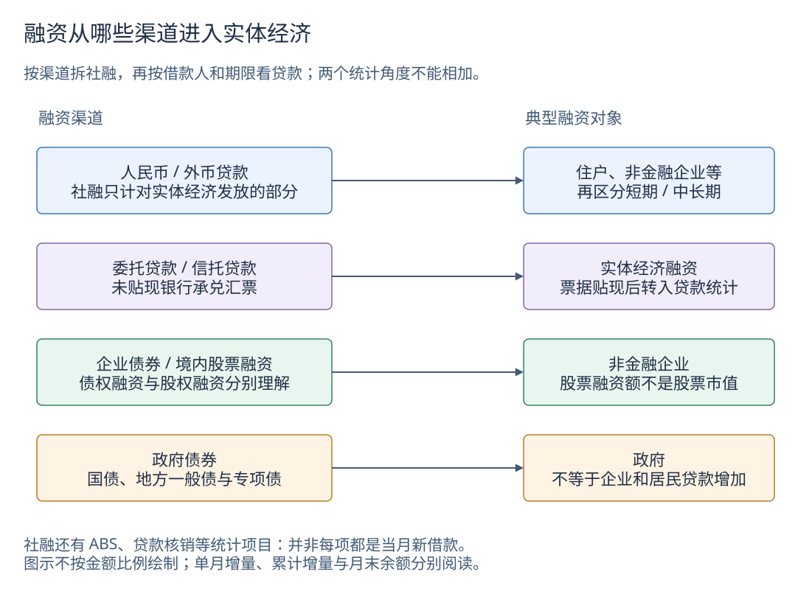

# 社融与信贷结构：谁在融资，借来做什么

[货币与信用](money-and-credit.md)解释总量，本页进一步拆结构；真实历史与可选点图表见[社融与信贷数据](data/credit-structure.md)。先记住：**融资规模增加，和居民、企业愿意扩大支出，并不是同一句话。**

## 先分开两个统计角度



[下载可编辑源图](images/learning/financing-channels.drawio)

社融按**渠道**观察实体经济获得的融资；人民币信贷表按**借款人和期限**观察金融机构的贷款余额。同一笔符合条件的住户人民币贷款，可能同时出现在两套统计中，把两者相加会重复计算。

全部金融机构人民币贷款还包括对非银行金融机构、境外等部门的贷款；社融中的人民币贷款排除金融机构和境外获得的资金。因此即使都写“人民币贷款”，范围也不能互换。[来源一、二]

## 社融各分项怎样理解

| 渠道或项目 | 日常理解 | 最容易误读的地方 |
|---|---|---|
| 人民币、外币贷款 | 对实体经济发放的贷款；外币折成人民币统计 | 不是全口径金融机构贷款；不同币种不能不换算就相加 |
| 委托贷款 | 委托人提供资金，由受托机构按约定办理贷款 | 不等于银行自行提供的资金；一般委托与现金管理业务范围需区分 |
| 信托贷款 | 通过信托业务形成的贷款融资 | 不等于全部信托资产规模 |
| 未贴现银行承兑汇票 | 银行承兑、尚未向银行贴现的票据融资 | 贴现后进入贷款统计，不能两边重复计算 |
| 企业债券 | 非金融企业通过债券融资，流量通常看净融资 | 发行金额减去到期偿还等形成净额；不是全部发行额 |
| 政府债券 | 国债、地方一般债、地方专项债 | 政府融资增加不自动意味着居民或企业借贷增加 |
| 非金融企业境内股票融资 | 企业在境内股票市场取得股权资金 | 不是股票市值，也不是二级市场成交额 |
| ABS、贷款核销等 | 统计中纳入的证券化与调整项目 | 核销不是新发放一笔贷款；不能把所有社融分项都解释成当月新借钱 |

债券的投资者可能是银行、基金、保险等，并非一种固定资金来源；股权融资也没有与贷款完全相同的还本付息义务。上图按融资渠道分类，不代表完整的资金提供者网络。[来源一、三]

## 为什么柱顶不是净社融

社融分项可能为负。例如债券到期偿还超过发行，净融资就可能小于零。用一个**教学假设**说明：贷款 +100、政府债券 +80、其他渠道 −30，净合计是 **150**，并不是上方正柱顶的 180。

数据页把正值向上、负值向下堆叠，黑线标出净合计。五组分别是人民币贷款、政府债券、企业债券＋股票、委托＋信托＋未贴现票据，以及“其余融资及统计调整”。最后一组为**本项目计算的差额**：

```text
其余融资及统计调整
= 同版官方社融总量
− 人民币贷款 − 政府债券
−（企业债券＋境内股票融资）
−（委托贷款＋信托贷款＋未贴现银行承兑汇票）
```

它含外币贷款、存款类金融机构 ABS、贷款核销、未单列项目和舍入差额，不是央行另行公布的同名指标。不能再把这些项目叠加到五组柱子上，否则重复统计。任何必要分项缺失时都不构造这组差额。[来源三]

## 住户和企业：余额告诉我们什么

**余额**回答“到月末还有多少贷款”；**当月增量**回答该月按统计口径增加多少；**年内累计增量**回答年初以来增加多少。数据页的住户、企业图采用官方月末余额，不能把一条余额线的高度说成“这个月借了这么多”。

余额变化还可能受核销、转让、统计范围等影响。公布的累计增量也有舍入问题；本专题不把余额差分当成官方月度新增贷款。解释当月需求，需要另外核对原始金融统计报告及消费、投资等证据。[来源二、四]

| 观察项 | 可以提供的线索 | 不能直接得出的结论 |
|---|---|---|
| 住户短期贷款 | 消费和经营周转相关融资的余额 | “全部是消费贷”或“增加的金额全用于消费” |
| 住户中长期贷款 | 住房及其他消费、经营用途的较长期融资 | “全部是按揭贷款”或“房价一定上涨” |
| 企业等短期贷款 | 较短期限融资安排 | 企业利润一定改善 |
| 企业等中长期贷款 | 较长期融资安排，需结合投资、项目等背景 | 增加的贷款已全部形成新增固定资产投资 |
| 票据融资 | 通过票据贴现等取得的贷款融资 | 只要票据增加，就说明真实需求强或弱 |

“企业等”还包括机关团体等非金融借款部门；企业三条期限曲线也不是全部组成，还有融资租赁、各项垫款等。借款人分类、期限分类、用途分类是三个维度，不能相互替代。[来源二]

## 三个读数练习

1. **社融多增，主要由政府债券贡献。** 能说明融资总量受政府债券净融资支持；尚不能说明居民、企业自主融资需求全面恢复。继续看贷款分项、消费、投资和就业。
2. **未贴现票据减少，人民币贷款增加。** 可能涉及票据贴现带来的项目转移，也可能叠加其他贷款变化；不能只看其中一项作判断。
3. **企业中长期余额增加。** 能确认这一类别余额更高；要判断新投资，仍需贷款用途、项目进度和实际投资数据，不能用两个余额点替代这些证据。

## 历史口径与本项目缺口

- 社融传统分项从 2002 年起有官方回溯；信托贷款 2002—2005 年原表的“——”表示缺失或业务量很小，不转成零。
- 政府债券完整类别使用 2019 年官方回溯的 2017 年起数据。不能将旧“地方政府专项债券”改名拼接，也不能把 2017 年前政府债券项空缺说成政府没借钱。
- 2007—2009 年企业贷款范围包括非居民，单独保留旧序列；2010 年起按境内、境外单列。“境内企业等”保留不同年份原表名称，不声称所有分类细节始终不变。
- 住户与企业部门贷款已从央行年度部门表核实到 2007 年起全部月份，包括 2012—2014 年旧 HTML 附件；当前快照截至 2026 年 8 月。更早的 2005、2006 年已查人民币信贷表没有住户拆分，不用全口径贷款替代。
- 2023 年起消费金融公司、理财公司、金融资产投资公司等三类机构纳入金融统计；原表已有说明。余额跨范围变化不能直接当作同口径新增融资或同比。

这些是已核验来源的实际覆盖，不是所有统计的历史起源。具体首末期间、条数、原始附件和缺口见[数据页](data/credit-structure.md)、[历史覆盖说明](data/history-coverage.md)及下载元数据。

## 一手来源

1. [人民银行：2014 年社会融资规模存量统计数据报告及定义](https://www.pbc.gov.cn/diaochatongjisi/116219/116225/2810586/index.html)。用于理解统计对象、渠道和计量方式；政府债券等后续扩围需再看新表。
2. [2026 年金融机构人民币信贷收支表](https://www.pbc.gov.cn/diaochatongjisi/attachDir/2026/09/2026091418213884368.xlsx)与[2026 年 8 月金融统计数据报告](https://www.pbc.gov.cn/diaochatongjisi/116219/116225/2026091417020862747/index.html)。分别提供月末余额、报告增量与机构范围说明。
3. [2019 年社融增量表及 2017 年起分项回溯](https://www.pbc.gov.cn/diaochatongjisi/attachDir/2025/11/2025110511302316239.xls)、[2026 年社融增量表](https://www.pbc.gov.cn/diaochatongjisi/attachDir/2026/09/2026091418125322850.xlsx)。分项、范围调整和堆叠图采用的来源。
4. [人民银行年度统计目录](https://www.pbc.gov.cn/diaochatongjisi/116219/116319/index.html)及[2002 年以来社融月度回溯](https://www.pbc.gov.cn/diaochatongjisi/116219/116225/2863562/index.html)。动态发现更新附件，不把当前附件路径当永久地址。

核验日期：2026-10-02。图为概念说明，不代表金额比例或投资建议。
