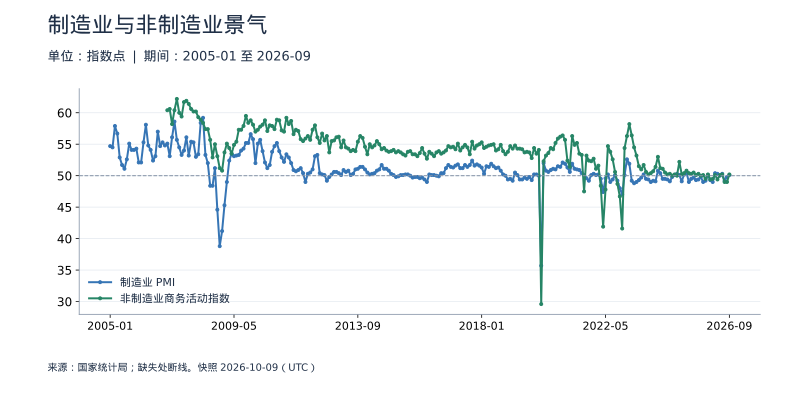
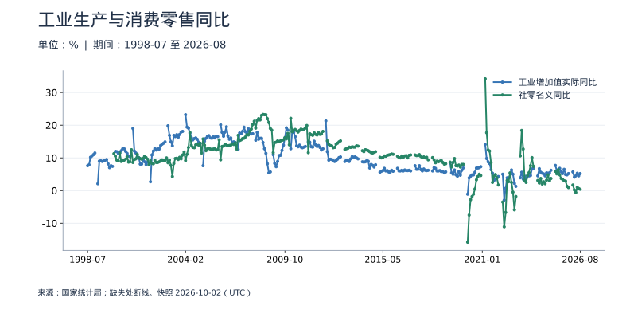
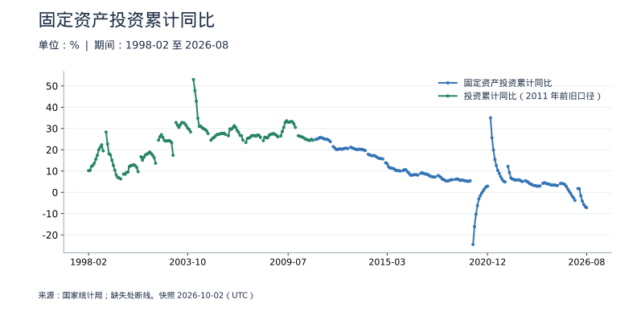

<!-- Generated by scripts/sync_macro.py; edit macro_catalog.py/macro_render.py. -->
# 景气、生产、消费与投资：真实数据

近期经济活动在哪些环节增强或减弱？

PMI 是调查扩散指数；工业、零售和投资是实际经营统计。它们观察对象不同，发布时间也不同。规模以上工业是实际增速，社零和投资是名义增速，不能因为单位相同就当成同一种量。

本页快照获取时间：**2026-10-02T03:25:31+00:00**。这是获取时间，不是所有数据的发布日期。每日检查上游；最新统计期以每个指标为准。

[CSV 下载](https://raw.githubusercontent.com/calcky/finance/main/data/macro/activity.csv) · [来源与采集参数](https://github.com/calcky/finance/blob/main/data/macro/activity.metadata.json) · [最近同步状态](https://github.com/calcky/finance/actions/workflows/update-gdp.yml)

```{only} html
本站同版快照：{download}`CSV <../../data/macro/activity.csv>` · {download}`元数据 <../../data/macro/activity.metadata.json>`
```

网页支持悬停查看、点击固定读数、按期间选择、缩放和定位明细。GitHub、打印或禁用 JavaScript 时显示静态图；数值与网页使用同一快照。

## 最新观测与覆盖

| 指标 | 最新期间 | 数值 | 单位 | 本项目起点 | 来源 |
|---|---|---:|---|---|---|
| 制造业 PMI | 2026-08 | 49.8 | 指数点 | 2024-01 | [国家统计局](https://data.stats.gov.cn/dg/website/page.html#/pc/national/monthData) |
| 非制造业商务活动指数 | 2026-08 | 49 | 指数点 | 2024-01 | [国家统计局](https://data.stats.gov.cn/dg/website/page.html#/pc/national/monthData) |
| 工业增加值实际同比 | 2026-08 | 5.2 | % | 2024-03 | [国家统计局](https://data.stats.gov.cn/dg/website/page.html#/pc/national/monthData) |
| 社零名义同比 | 2026-08 | 0.4 | % | 2024-03 | [国家统计局](https://data.stats.gov.cn/dg/website/page.html#/pc/national/monthData) |
| 固定资产投资累计同比 | 2026-08 | -7.2 | % | 2024-02 | [国家统计局](https://data.stats.gov.cn/dg/website/page.html#/pc/national/monthData) |

起点表示本项目当前覆盖范围，不代表该指标从此时才开始发布。各来源可能存在发布或入库滞后；空白不补零、不插值。发布日期未知的观测在 CSV 中留空。

## 制造业与非制造业景气

50 是扩张与收缩的调查临界点，不是 GDP 的零增长线。非制造业包含建筑业与服务业。



<details class="macro-details">
<summary>制造业与非制造业景气：展开完整数据表（指数点）</summary>
<div class="macro-table-wrap"><table><thead><tr><th>期间</th><th>制造业 PMI</th><th>非制造业商务活动指数</th></tr></thead><tbody>
<tr id="macro-pmi-2026-08" tabindex="-1"><td>2026-08</td><td>49.8</td><td>49</td></tr>
<tr id="macro-pmi-2026-07" tabindex="-1"><td>2026-07</td><td>49.2</td><td>49</td></tr>
<tr id="macro-pmi-2026-06" tabindex="-1"><td>2026-06</td><td>50.3</td><td>50.2</td></tr>
<tr id="macro-pmi-2026-05" tabindex="-1"><td>2026-05</td><td>50</td><td>50.1</td></tr>
<tr id="macro-pmi-2026-04" tabindex="-1"><td>2026-04</td><td>50.3</td><td>49.4</td></tr>
<tr id="macro-pmi-2026-03" tabindex="-1"><td>2026-03</td><td>50.4</td><td>50.1</td></tr>
<tr id="macro-pmi-2026-02" tabindex="-1"><td>2026-02</td><td>49</td><td>49.5</td></tr>
<tr id="macro-pmi-2026-01" tabindex="-1"><td>2026-01</td><td>49.3</td><td>49.4</td></tr>
<tr id="macro-pmi-2025-12" tabindex="-1"><td>2025-12</td><td>50.1</td><td>50.2</td></tr>
<tr id="macro-pmi-2025-11" tabindex="-1"><td>2025-11</td><td>49.2</td><td>49.5</td></tr>
<tr id="macro-pmi-2025-10" tabindex="-1"><td>2025-10</td><td>49</td><td>50.1</td></tr>
<tr id="macro-pmi-2025-09" tabindex="-1"><td>2025-09</td><td>49.8</td><td>50</td></tr>
<tr id="macro-pmi-2025-08" tabindex="-1"><td>2025-08</td><td>49.4</td><td>50.3</td></tr>
<tr id="macro-pmi-2025-07" tabindex="-1"><td>2025-07</td><td>49.3</td><td>50.1</td></tr>
<tr id="macro-pmi-2025-06" tabindex="-1"><td>2025-06</td><td>49.7</td><td>50.5</td></tr>
<tr id="macro-pmi-2025-05" tabindex="-1"><td>2025-05</td><td>49.5</td><td>50.3</td></tr>
<tr id="macro-pmi-2025-04" tabindex="-1"><td>2025-04</td><td>49</td><td>50.4</td></tr>
<tr id="macro-pmi-2025-03" tabindex="-1"><td>2025-03</td><td>50.5</td><td>50.8</td></tr>
<tr id="macro-pmi-2025-02" tabindex="-1"><td>2025-02</td><td>50.2</td><td>50.4</td></tr>
<tr id="macro-pmi-2025-01" tabindex="-1"><td>2025-01</td><td>49.1</td><td>50.2</td></tr>
<tr id="macro-pmi-2024-12" tabindex="-1"><td>2024-12</td><td>50.1</td><td>52.2</td></tr>
<tr id="macro-pmi-2024-11" tabindex="-1"><td>2024-11</td><td>50.3</td><td>50</td></tr>
<tr id="macro-pmi-2024-10" tabindex="-1"><td>2024-10</td><td>50.1</td><td>50.2</td></tr>
<tr id="macro-pmi-2024-09" tabindex="-1"><td>2024-09</td><td>49.8</td><td>50</td></tr>
<tr id="macro-pmi-2024-08" tabindex="-1"><td>2024-08</td><td>49.1</td><td>50.3</td></tr>
<tr id="macro-pmi-2024-07" tabindex="-1"><td>2024-07</td><td>49.4</td><td>50.2</td></tr>
<tr id="macro-pmi-2024-06" tabindex="-1"><td>2024-06</td><td>49.5</td><td>50.5</td></tr>
<tr id="macro-pmi-2024-05" tabindex="-1"><td>2024-05</td><td>49.5</td><td>51.1</td></tr>
<tr id="macro-pmi-2024-04" tabindex="-1"><td>2024-04</td><td>50.4</td><td>51.2</td></tr>
<tr id="macro-pmi-2024-03" tabindex="-1"><td>2024-03</td><td>50.8</td><td>53</td></tr>
<tr id="macro-pmi-2024-02" tabindex="-1"><td>2024-02</td><td>49.1</td><td>51.4</td></tr>
<tr id="macro-pmi-2024-01" tabindex="-1"><td>2024-01</td><td>49.2</td><td>50.7</td></tr>
</tbody></table></div></details>

## 工业生产与消费零售同比

两者可对照方向，但不是直接可比的实际需求增速。1—2 月合并发布值不冒充单独 2 月；图中缺口不插值。



<details class="macro-details">
<summary>工业生产与消费零售同比：展开完整数据表（%）</summary>
<div class="macro-table-wrap"><table><thead><tr><th>期间</th><th>工业增加值实际同比</th><th>社零名义同比</th></tr></thead><tbody>
<tr id="macro-production-retail-2026-08" tabindex="-1"><td>2026-08</td><td>5.2</td><td>0.4</td></tr>
<tr id="macro-production-retail-2026-07" tabindex="-1"><td>2026-07</td><td>4.5</td><td>0.6</td></tr>
<tr id="macro-production-retail-2026-06" tabindex="-1"><td>2026-06</td><td>5.3</td><td>1</td></tr>
<tr id="macro-production-retail-2026-05" tabindex="-1"><td>2026-05</td><td>4.5</td><td>-0.6</td></tr>
<tr id="macro-production-retail-2026-04" tabindex="-1"><td>2026-04</td><td>4.1</td><td>0.2</td></tr>
<tr id="macro-production-retail-2026-03" tabindex="-1"><td>2026-03</td><td>5.7</td><td>1.7</td></tr>
<tr id="macro-production-retail-2026-02" tabindex="-1"><td>2026-02</td><td>缺失</td><td>缺失</td></tr>
<tr id="macro-production-retail-2026-01" tabindex="-1"><td>2026-01</td><td>缺失</td><td>缺失</td></tr>
<tr id="macro-production-retail-2025-12" tabindex="-1"><td>2025-12</td><td>5.2</td><td>0.9</td></tr>
<tr id="macro-production-retail-2025-11" tabindex="-1"><td>2025-11</td><td>4.8</td><td>1.3</td></tr>
<tr id="macro-production-retail-2025-10" tabindex="-1"><td>2025-10</td><td>4.9</td><td>2.9</td></tr>
<tr id="macro-production-retail-2025-09" tabindex="-1"><td>2025-09</td><td>6.5</td><td>3</td></tr>
<tr id="macro-production-retail-2025-08" tabindex="-1"><td>2025-08</td><td>5.2</td><td>3.4</td></tr>
<tr id="macro-production-retail-2025-07" tabindex="-1"><td>2025-07</td><td>5.7</td><td>3.7</td></tr>
<tr id="macro-production-retail-2025-06" tabindex="-1"><td>2025-06</td><td>6.8</td><td>4.8</td></tr>
<tr id="macro-production-retail-2025-05" tabindex="-1"><td>2025-05</td><td>5.8</td><td>6.4</td></tr>
<tr id="macro-production-retail-2025-04" tabindex="-1"><td>2025-04</td><td>6.1</td><td>5.1</td></tr>
<tr id="macro-production-retail-2025-03" tabindex="-1"><td>2025-03</td><td>7.7</td><td>5.9</td></tr>
<tr id="macro-production-retail-2025-02" tabindex="-1"><td>2025-02</td><td>缺失</td><td>缺失</td></tr>
<tr id="macro-production-retail-2025-01" tabindex="-1"><td>2025-01</td><td>缺失</td><td>缺失</td></tr>
<tr id="macro-production-retail-2024-12" tabindex="-1"><td>2024-12</td><td>6.2</td><td>3.7</td></tr>
<tr id="macro-production-retail-2024-11" tabindex="-1"><td>2024-11</td><td>5.4</td><td>3</td></tr>
<tr id="macro-production-retail-2024-10" tabindex="-1"><td>2024-10</td><td>5.3</td><td>4.8</td></tr>
<tr id="macro-production-retail-2024-09" tabindex="-1"><td>2024-09</td><td>5.4</td><td>3.2</td></tr>
<tr id="macro-production-retail-2024-08" tabindex="-1"><td>2024-08</td><td>4.5</td><td>2.1</td></tr>
<tr id="macro-production-retail-2024-07" tabindex="-1"><td>2024-07</td><td>5.1</td><td>2.7</td></tr>
<tr id="macro-production-retail-2024-06" tabindex="-1"><td>2024-06</td><td>5.3</td><td>2</td></tr>
<tr id="macro-production-retail-2024-05" tabindex="-1"><td>2024-05</td><td>5.6</td><td>3.7</td></tr>
<tr id="macro-production-retail-2024-04" tabindex="-1"><td>2024-04</td><td>6.7</td><td>2.3</td></tr>
<tr id="macro-production-retail-2024-03" tabindex="-1"><td>2024-03</td><td>4.5</td><td>3.1</td></tr>
</tbody></table></div></details>

## 固定资产投资累计同比

每个点表示当年 1 月至该月，不含农户。不能把两个月的累计增速相减得到当月增速。



<details class="macro-details">
<summary>固定资产投资累计同比：展开完整数据表（%）</summary>
<div class="macro-table-wrap"><table><thead><tr><th>期间</th><th>固定资产投资累计同比</th></tr></thead><tbody>
<tr id="macro-investment-2026-08" tabindex="-1"><td>2026-08</td><td>-7.2</td></tr>
<tr id="macro-investment-2026-07" tabindex="-1"><td>2026-07</td><td>-6.7</td></tr>
<tr id="macro-investment-2026-06" tabindex="-1"><td>2026-06</td><td>-5.7</td></tr>
<tr id="macro-investment-2026-05" tabindex="-1"><td>2026-05</td><td>-4.1</td></tr>
<tr id="macro-investment-2026-04" tabindex="-1"><td>2026-04</td><td>-1.6</td></tr>
<tr id="macro-investment-2026-03" tabindex="-1"><td>2026-03</td><td>1.7</td></tr>
<tr id="macro-investment-2026-02" tabindex="-1"><td>2026-02</td><td>1.8</td></tr>
<tr id="macro-investment-2026-01" tabindex="-1"><td>2026-01</td><td>缺失</td></tr>
<tr id="macro-investment-2025-12" tabindex="-1"><td>2025-12</td><td>-3.8</td></tr>
<tr id="macro-investment-2025-11" tabindex="-1"><td>2025-11</td><td>-2.6</td></tr>
<tr id="macro-investment-2025-10" tabindex="-1"><td>2025-10</td><td>-1.7</td></tr>
<tr id="macro-investment-2025-09" tabindex="-1"><td>2025-09</td><td>-0.5</td></tr>
<tr id="macro-investment-2025-08" tabindex="-1"><td>2025-08</td><td>0.5</td></tr>
<tr id="macro-investment-2025-07" tabindex="-1"><td>2025-07</td><td>1.6</td></tr>
<tr id="macro-investment-2025-06" tabindex="-1"><td>2025-06</td><td>2.8</td></tr>
<tr id="macro-investment-2025-05" tabindex="-1"><td>2025-05</td><td>3.7</td></tr>
<tr id="macro-investment-2025-04" tabindex="-1"><td>2025-04</td><td>4</td></tr>
<tr id="macro-investment-2025-03" tabindex="-1"><td>2025-03</td><td>4.2</td></tr>
<tr id="macro-investment-2025-02" tabindex="-1"><td>2025-02</td><td>4.1</td></tr>
<tr id="macro-investment-2025-01" tabindex="-1"><td>2025-01</td><td>缺失</td></tr>
<tr id="macro-investment-2024-12" tabindex="-1"><td>2024-12</td><td>3.2</td></tr>
<tr id="macro-investment-2024-11" tabindex="-1"><td>2024-11</td><td>3.3</td></tr>
<tr id="macro-investment-2024-10" tabindex="-1"><td>2024-10</td><td>3.4</td></tr>
<tr id="macro-investment-2024-09" tabindex="-1"><td>2024-09</td><td>3.4</td></tr>
<tr id="macro-investment-2024-08" tabindex="-1"><td>2024-08</td><td>3.4</td></tr>
<tr id="macro-investment-2024-07" tabindex="-1"><td>2024-07</td><td>3.6</td></tr>
<tr id="macro-investment-2024-06" tabindex="-1"><td>2024-06</td><td>3.9</td></tr>
<tr id="macro-investment-2024-05" tabindex="-1"><td>2024-05</td><td>4</td></tr>
<tr id="macro-investment-2024-04" tabindex="-1"><td>2024-04</td><td>4.2</td></tr>
<tr id="macro-investment-2024-03" tabindex="-1"><td>2024-03</td><td>4.5</td></tr>
<tr id="macro-investment-2024-02" tabindex="-1"><td>2024-02</td><td>4.2</td></tr>
</tbody></table></div></details>

## 口径与阅读提醒

| 指标 | 口径 |
|---|---|
| 制造业 PMI | 扩散指数，50 为临界点，不是经济增速百分比。 |
| 非制造业商务活动指数 | 扩散指数，50 为临界点，不是经济增速百分比。 |
| 工业增加值实际同比 | 规模以上工业增加值，剔除价格影响；1—2 月合并发布不拆成单月。 |
| 社零名义同比 | 社会消费品零售总额，名义增速；1—2 月合并发布不拆成单月。 |
| 固定资产投资累计同比 | 不含农户，年初至当月累计名义同比；不是当月增速。 |


日度图保留日历缺口：节假日、没有操作或上游缺失的日期均无观测，不能仅从空白判断原因。图线在缺失处断开；月度与季度图也不插值。

来源可能修订历史值。同步程序对已有期间的消失报错，合法数值修订保存在 Git 历史中；这不是包含所有官方初值的实时数据库。这里只摘录指标事实并注明来源，来源文件和机构条款仍归各发布机构。

继续理解：[相关基础知识](../reading-macro-data.md) · [如何读宏观数据](../reading-macro-data.md) · [全部数据专题](index.md)
