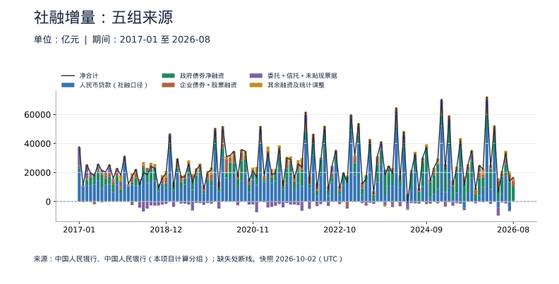
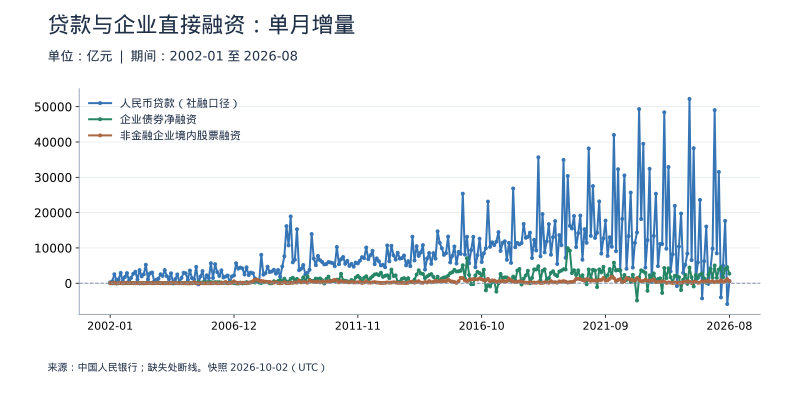
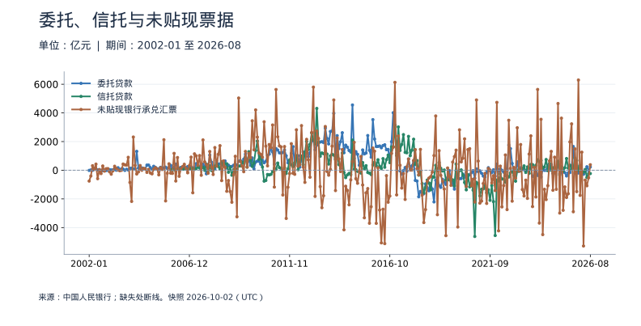
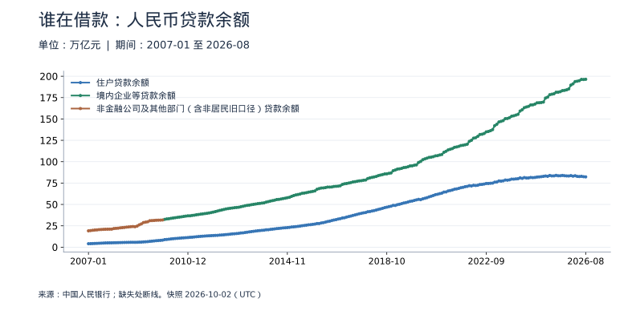
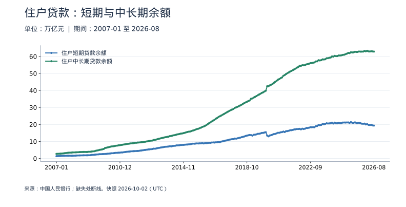
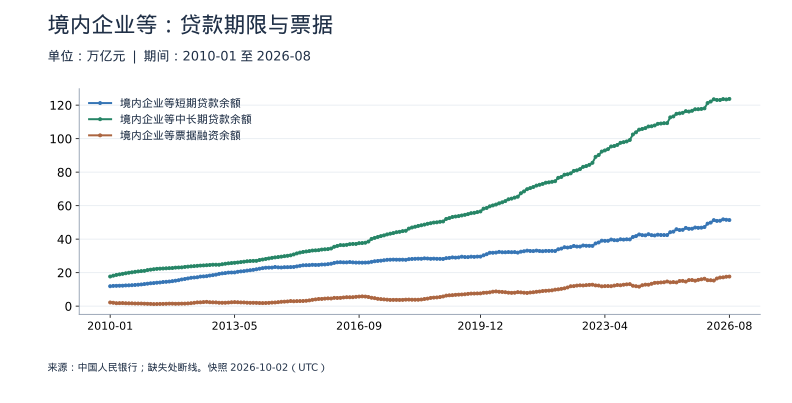

<!-- Generated by scripts/sync_macro.py; edit macro_catalog.py/macro_render.py. -->
# 社融与信贷结构：真实数据

融资增长来自谁，通过什么渠道，是否转化成了需求？

先按渠道拆社融单月增量，再按借款人和期限观察人民币贷款余额。这两套统计不能相加；贷款余额不是当月新增贷款。政府债券支撑总量，不自动说明居民和企业借贷需求回升。

本页快照获取时间：**2026-10-02T13:43:15+00:00**。这是获取时间，不是所有数据的发布日期。每日检查上游；最新统计期以每个指标为准。

[CSV 下载](https://raw.githubusercontent.com/calcky/finance/main/data/macro/credit-structure.csv) · [来源与采集参数](https://github.com/calcky/finance/blob/main/data/macro/credit-structure.metadata.json) · [最近同步状态](https://github.com/calcky/finance/actions/workflows/update-gdp.yml)

```{only} html
本站同版快照：{download}`CSV <../../data/macro/credit-structure.csv>` · {download}`元数据 <../../data/macro/credit-structure.metadata.json>`
```

网页支持悬停查看、点击固定读数、按期间选择、缩放和定位明细。GitHub、打印或禁用 JavaScript 时显示静态图；数值与网页使用同一快照。

## 最新观测与覆盖

| 指标 | 最新期间 | 数值 | 单位 | 本项目起点 | 观测数 | 来源 |
|---|---|---:|---|---|---:|---|
| 人民币贷款（社融口径） | 2026-08 | 552 | 亿元 | 2002-01 | 296 | [中国人民银行](https://www.pbc.gov.cn/diaochatongjisi/attachDir/2026/09/2026091418125322850.xlsx) |
| 政府债券净融资 | 2026-08 | 10,097 | 亿元 | 2017-01 | 116 | [中国人民银行](https://www.pbc.gov.cn/diaochatongjisi/attachDir/2026/09/2026091418125322850.xlsx) |
| 企业债券＋股票融资 | 2026-08 | 3,351 | 亿元 | 2002-01 | 296 | [中国人民银行（本项目计算分组）](https://www.pbc.gov.cn/diaochatongjisi/attachDir/2026/09/2026091418125322850.xlsx) |
| 委托＋信托＋未贴现票据 | 2026-08 | 378 | 亿元 | 2006-01 | 248 | [中国人民银行（本项目计算分组）](https://www.pbc.gov.cn/diaochatongjisi/attachDir/2026/09/2026091418125322850.xlsx) |
| 其余融资及统计调整 | 2026-08 | 2,199 | 亿元 | 2017-01 | 116 | [中国人民银行（本项目计算分组）](https://www.pbc.gov.cn/diaochatongjisi/attachDir/2026/09/2026091418125322850.xlsx) |
| 企业债券净融资 | 2026-08 | 2,712 | 亿元 | 2002-01 | 296 | [中国人民银行](https://www.pbc.gov.cn/diaochatongjisi/attachDir/2026/09/2026091418125322850.xlsx) |
| 非金融企业境内股票融资 | 2026-08 | 639 | 亿元 | 2002-01 | 296 | [中国人民银行](https://www.pbc.gov.cn/diaochatongjisi/attachDir/2026/09/2026091418125322850.xlsx) |
| 委托贷款 | 2026-08 | 229 | 亿元 | 2002-01 | 296 | [中国人民银行](https://www.pbc.gov.cn/diaochatongjisi/attachDir/2026/09/2026091418125322850.xlsx) |
| 信托贷款 | 2026-08 | -233 | 亿元 | 2006-01 | 248 | [中国人民银行](https://www.pbc.gov.cn/diaochatongjisi/attachDir/2026/09/2026091418125322850.xlsx) |
| 未贴现银行承兑汇票 | 2026-08 | 382 | 亿元 | 2002-01 | 296 | [中国人民银行](https://www.pbc.gov.cn/diaochatongjisi/attachDir/2026/09/2026091418125322850.xlsx) |
| 住户贷款余额 | 2026-08 | 82.243557 | 万亿元 | 2007-01 | 236 | [中国人民银行](https://www.pbc.gov.cn/diaochatongjisi/attachDir/2026/09/2026091418213884368.xlsx) |
| 境内企业等贷款余额 | 2026-08 | 196.424831 | 万亿元 | 2010-01 | 200 | [中国人民银行](https://www.pbc.gov.cn/diaochatongjisi/attachDir/2026/09/2026091418213884368.xlsx) |
| 非金融公司及其他部门（含非居民旧口径）贷款余额 | 2009-12 | 31.789792 | 万亿元 | 2007-01 | 36 | [中国人民银行](https://www.pbc.gov.cn/eportal/fileDir/defaultCurSite/resource/cms/2015/07/2009s03a.htm) |
| 住户短期贷款余额 | 2026-08 | 19.349787 | 万亿元 | 2007-01 | 236 | [中国人民银行](https://www.pbc.gov.cn/diaochatongjisi/attachDir/2026/09/2026091418213884368.xlsx) |
| 住户中长期贷款余额 | 2026-08 | 62.893771 | 万亿元 | 2007-01 | 236 | [中国人民银行](https://www.pbc.gov.cn/diaochatongjisi/attachDir/2026/09/2026091418213884368.xlsx) |
| 境内企业等短期贷款余额 | 2026-08 | 51.401439 | 万亿元 | 2010-01 | 200 | [中国人民银行](https://www.pbc.gov.cn/diaochatongjisi/attachDir/2026/09/2026091418213884368.xlsx) |
| 境内企业等中长期贷款余额 | 2026-08 | 123.711416 | 万亿元 | 2010-01 | 200 | [中国人民银行](https://www.pbc.gov.cn/diaochatongjisi/attachDir/2026/09/2026091418213884368.xlsx) |
| 境内企业等票据融资余额 | 2026-08 | 17.670368 | 万亿元 | 2010-01 | 200 | [中国人民银行](https://www.pbc.gov.cn/diaochatongjisi/attachDir/2026/09/2026091418213884368.xlsx) |
| 外币贷款折人民币 | 2026-08 | 409 | 亿元 | 2002-01 | 296 | [中国人民银行](https://www.pbc.gov.cn/diaochatongjisi/attachDir/2026/09/2026091418125322850.xlsx) |
| 存款类金融机构 ABS | 2026-08 | -176 | 亿元 | 2017-01 | 116 | [中国人民银行](https://www.pbc.gov.cn/diaochatongjisi/attachDir/2026/09/2026091418125322850.xlsx) |
| 贷款核销 | 2026-08 | 906 | 亿元 | 2017-01 | 116 | [中国人民银行](https://www.pbc.gov.cn/diaochatongjisi/attachDir/2026/09/2026091418125322850.xlsx) |
| 非金融公司及其他部门（含非居民旧口径）短期贷款余额 | 2009-12 | 12.037209 | 万亿元 | 2007-01 | 36 | [中国人民银行](https://www.pbc.gov.cn/eportal/fileDir/defaultCurSite/resource/cms/2015/07/2009s03a.htm) |
| 非金融公司及其他部门（含非居民旧口径）中长期贷款余额 | 2009-12 | 16.650094 | 万亿元 | 2007-01 | 36 | [中国人民银行](https://www.pbc.gov.cn/eportal/fileDir/defaultCurSite/resource/cms/2015/07/2009s03a.htm) |
| 非金融公司及其他部门（含非居民旧口径）票据融资余额 | 2009-12 | 2.385032 | 万亿元 | 2007-01 | 36 | [中国人民银行](https://www.pbc.gov.cn/eportal/fileDir/defaultCurSite/resource/cms/2015/07/2009s03a.htm) |

起点表示本项目当前覆盖范围，不代表该指标从此时才开始发布。旧定义序列的最后一期也不代表来源停止更新。各来源可能存在发布或入库滞后；空白不补零、不插值。发布日期未知的观测在 CSV 中留空。

图表的“全部”与 CSV 保留完整已采集历史；缩放近期不会删除早期数据。[历史来源、口径断点与剩余缺口](history-coverage.md)说明回溯范围。

## 社融增量：五组来源

从政府债券官方回溯及全部分组的共同起点2017年开始堆叠；更早分项在后续图和下载中保留。正值向上、负值向下，黑线为净合计，上方柱顶不是总量。其余组为计算差额，含外币贷款、ABS、核销等，不是全新的融资渠道。2023年机构范围扩展需另看口径。



<details class="macro-details">
<summary>社融增量：五组来源：展开完整数据表（亿元）</summary>
<div class="macro-table-wrap"><table><thead><tr><th>期间</th><th>人民币贷款（社融口径）</th><th>政府债券净融资</th><th>企业债券＋股票融资</th><th>委托＋信托＋未贴现票据</th><th>其余融资及统计调整</th><th>净合计</th></tr></thead><tbody>
<tr id="macro-financing-composition-2026-08" tabindex="-1"><td>2026-08</td><td>552</td><td>10,097</td><td>3,351</td><td>378</td><td>2,199</td><td>16,577</td></tr>
<tr id="macro-financing-composition-2026-07" tabindex="-1"><td>2026-07</td><td>-5,896</td><td>13,176</td><td>5,664</td><td>-778</td><td>1,902</td><td>14,068</td></tr>
<tr id="macro-financing-composition-2026-06" tabindex="-1"><td>2026-06</td><td>17,650</td><td>7,683</td><td>4,640</td><td>-1,344</td><td>5,042</td><td>33,671</td></tr>
<tr id="macro-financing-composition-2026-05" tabindex="-1"><td>2026-05</td><td>4,965</td><td>12,236</td><td>1,978</td><td>-722</td><td>1,836</td><td>20,293</td></tr>
<tr id="macro-financing-composition-2026-04" tabindex="-1"><td>2026-04</td><td>-4,006</td><td>9,041</td><td>5,355</td><td>-5,696</td><td>1,544</td><td>6,238</td></tr>
<tr id="macro-financing-composition-2026-03" tabindex="-1"><td>2026-03</td><td>31,522</td><td>11,658</td><td>4,338</td><td>801</td><td>3,921</td><td>52,240</td></tr>
<tr id="macro-financing-composition-2026-02" tabindex="-1"><td>2026-02</td><td>8,458</td><td>14,014</td><td>1,976</td><td>-1,626</td><td>1,015</td><td>23,837</td></tr>
<tr id="macro-financing-composition-2026-01" tabindex="-1"><td>2026-01</td><td>49,016</td><td>9,764</td><td>5,324</td><td>6,097</td><td>1,984</td><td>72,185</td></tr>
<tr id="macro-financing-composition-2025-12" tabindex="-1"><td>2025-12</td><td>9,804</td><td>6,833</td><td>2,100</td><td>-505</td><td>3,900</td><td>22,132</td></tr>
<tr id="macro-financing-composition-2025-11" tabindex="-1"><td>2025-11</td><td>4,096</td><td>12,077</td><td>4,486</td><td>2,144</td><td>2,123</td><td>24,926</td></tr>
<tr id="macro-financing-composition-2025-10" tabindex="-1"><td>2025-10</td><td>-154</td><td>4,852</td><td>3,195</td><td>-1,086</td><td>1,371</td><td>8,178</td></tr>
<tr id="macro-financing-composition-2025-09" tabindex="-1"><td>2025-09</td><td>16,081</td><td>11,893</td><td>635</td><td>3,579</td><td>3,111</td><td>35,299</td></tr>
<tr id="macro-financing-composition-2025-08" tabindex="-1"><td>2025-08</td><td>6,253</td><td>13,672</td><td>1,794</td><td>2,158</td><td>1,783</td><td>25,660</td></tr>
<tr id="macro-financing-composition-2025-07" tabindex="-1"><td>2025-07</td><td>-4,296</td><td>12,482</td><td>3,253</td><td>-1,666</td><td>1,534</td><td>11,307</td></tr>
<tr id="macro-financing-composition-2025-06" tabindex="-1"><td>2025-06</td><td>23,600</td><td>13,508</td><td>2,625</td><td>-1,484</td><td>4,002</td><td>42,251</td></tr>
<tr id="macro-financing-composition-2025-05" tabindex="-1"><td>2025-05</td><td>5,923</td><td>14,585</td><td>1,648</td><td>-1,157</td><td>1,901</td><td>22,900</td></tr>
<tr id="macro-financing-composition-2025-04" tabindex="-1"><td>2025-04</td><td>884</td><td>9,729</td><td>2,731</td><td>-2,873</td><td>1,128</td><td>11,599</td></tr>
<tr id="macro-financing-composition-2025-03" tabindex="-1"><td>2025-03</td><td>38,234</td><td>14,866</td><td>-493</td><td>3,705</td><td>2,649</td><td>58,961</td></tr>
<tr id="macro-financing-composition-2025-02" tabindex="-1"><td>2025-02</td><td>6,528</td><td>16,939</td><td>1,778</td><td>-3,545</td><td>631</td><td>22,331</td></tr>
<tr id="macro-financing-composition-2025-01" tabindex="-1"><td>2025-01</td><td>52,194</td><td>6,933</td><td>4,927</td><td>5,726</td><td>766</td><td>70,546</td></tr>
<tr id="macro-financing-composition-2024-12" tabindex="-1"><td>2024-12</td><td>8,402</td><td>17,566</td><td>325</td><td>-1,199</td><td>3,443</td><td>28,537</td></tr>
<tr id="macro-financing-composition-2024-11" tabindex="-1"><td>2024-11</td><td>5,216</td><td>13,089</td><td>2,809</td><td>818</td><td>1,356</td><td>23,288</td></tr>
<tr id="macro-financing-composition-2024-10" tabindex="-1"><td>2024-10</td><td>2,965</td><td>10,495</td><td>1,271</td><td>-1,443</td><td>832</td><td>14,120</td></tr>
<tr id="macro-financing-composition-2024-09" tabindex="-1"><td>2024-09</td><td>19,742</td><td>15,357</td><td>-1,798</td><td>1,710</td><td>2,624</td><td>37,635</td></tr>
<tr id="macro-financing-composition-2024-08" tabindex="-1"><td>2024-08</td><td>10,411</td><td>16,177</td><td>1,835</td><td>1,160</td><td>740</td><td>30,323</td></tr>
<tr id="macro-financing-composition-2024-07" tabindex="-1"><td>2024-07</td><td>-808</td><td>6,881</td><td>2,267</td><td>-756</td><td>123</td><td>7,707</td></tr>
<tr id="macro-financing-composition-2024-06" tabindex="-1"><td>2024-06</td><td>21,927</td><td>8,476</td><td>2,254</td><td>-1,300</td><td>1,628</td><td>32,985</td></tr>
<tr id="macro-financing-composition-2024-05" tabindex="-1"><td>2024-05</td><td>8,197</td><td>12,266</td><td>396</td><td>-1,116</td><td>880</td><td>20,623</td></tr>
<tr id="macro-financing-composition-2024-04" tabindex="-1"><td>2024-04</td><td>3,349</td><td>-937</td><td>1,893</td><td>-4,259</td><td>-704</td><td>-658</td></tr>
<tr id="macro-financing-composition-2024-03" tabindex="-1"><td>2024-03</td><td>32,920</td><td>4,626</td><td>4,464</td><td>3,768</td><td>2,557</td><td>48,335</td></tr>
<tr id="macro-financing-composition-2024-02" tabindex="-1"><td>2024-02</td><td>9,773</td><td>6,011</td><td>1,537</td><td>-3,287</td><td>925</td><td>14,959</td></tr>
<tr id="macro-financing-composition-2024-01" tabindex="-1"><td>2024-01</td><td>48,401</td><td>2,947</td><td>4,742</td><td>6,009</td><td>2,635</td><td>64,734</td></tr>
<tr id="macro-financing-composition-2023-12" tabindex="-1"><td>2023-12</td><td>11,092</td><td>9,324</td><td>-2,233</td><td>-1,561</td><td>2,704</td><td>19,326</td></tr>
<tr id="macro-financing-composition-2023-11" tabindex="-1"><td>2023-11</td><td>11,120</td><td>11,512</td><td>1,747</td><td>13</td><td>162</td><td>24,554</td></tr>
<tr id="macro-financing-composition-2023-10" tabindex="-1"><td>2023-10</td><td>4,837</td><td>15,638</td><td>1,499</td><td>-2,572</td><td>-961</td><td>18,441</td></tr>
<tr id="macro-financing-composition-2023-09" tabindex="-1"><td>2023-09</td><td>25,369</td><td>9,920</td><td>976</td><td>3,007</td><td>2,054</td><td>41,326</td></tr>
<tr id="macro-financing-composition-2023-08" tabindex="-1"><td>2023-08</td><td>13,412</td><td>11,759</td><td>3,824</td><td>1,005</td><td>1,279</td><td>31,279</td></tr>
<tr id="macro-financing-composition-2023-07" tabindex="-1"><td>2023-07</td><td>364</td><td>4,109</td><td>2,076</td><td>-1,725</td><td>542</td><td>5,366</td></tr>
<tr id="macro-financing-composition-2023-06" tabindex="-1"><td>2023-06</td><td>32,413</td><td>5,371</td><td>2,949</td><td>-901</td><td>2,433</td><td>42,265</td></tr>
<tr id="macro-financing-composition-2023-05" tabindex="-1"><td>2023-05</td><td>12,219</td><td>5,571</td><td>-1,391</td><td>-1,457</td><td>618</td><td>15,560</td></tr>
<tr id="macro-financing-composition-2023-04" tabindex="-1"><td>2023-04</td><td>4,431</td><td>4,548</td><td>3,933</td><td>-1,143</td><td>480</td><td>12,249</td></tr>
<tr id="macro-financing-composition-2023-03" tabindex="-1"><td>2023-03</td><td>39,487</td><td>6,015</td><td>3,971</td><td>1,922</td><td>2,472</td><td>53,867</td></tr>
<tr id="macro-financing-composition-2023-02" tabindex="-1"><td>2023-02</td><td>18,184</td><td>8,138</td><td>4,233</td><td>-80</td><td>1,135</td><td>31,610</td></tr>
<tr id="macro-financing-composition-2023-01" tabindex="-1"><td>2023-01</td><td>49,314</td><td>4,140</td><td>2,602</td><td>3,485</td><td>415</td><td>59,956</td></tr>
<tr id="macro-financing-composition-2022-12" tabindex="-1"><td>2022-12</td><td>14,401</td><td>2,809</td><td>-3,444</td><td>-1,419</td><td>716</td><td>13,063</td></tr>
<tr id="macro-financing-composition-2022-11" tabindex="-1"><td>2022-11</td><td>11,448</td><td>6,520</td><td>1,392</td><td>-262</td><td>739</td><td>19,837</td></tr>
<tr id="macro-financing-composition-2022-10" tabindex="-1"><td>2022-10</td><td>4,431</td><td>2,791</td><td>3,201</td><td>-1,747</td><td>458</td><td>9,134</td></tr>
<tr id="macro-financing-composition-2022-09" tabindex="-1"><td>2022-09</td><td>25,686</td><td>5,533</td><td>1,367</td><td>1,449</td><td>1,376</td><td>35,411</td></tr>
<tr id="macro-financing-composition-2022-08" tabindex="-1"><td>2022-08</td><td>13,344</td><td>3,045</td><td>2,763</td><td>4,769</td><td>791</td><td>24,712</td></tr>
<tr id="macro-financing-composition-2022-07" tabindex="-1"><td>2022-07</td><td>4,088</td><td>3,998</td><td>2,397</td><td>-3,053</td><td>355</td><td>7,785</td></tr>
<tr id="macro-financing-composition-2022-06" tabindex="-1"><td>2022-06</td><td>30,540</td><td>16,216</td><td>2,935</td><td>-142</td><td>2,377</td><td>51,926</td></tr>
<tr id="macro-financing-composition-2022-05" tabindex="-1"><td>2022-05</td><td>18,230</td><td>10,582</td><td>658</td><td>-1,819</td><td>764</td><td>28,415</td></tr>
<tr id="macro-financing-composition-2022-04" tabindex="-1"><td>2022-04</td><td>3,616</td><td>3,912</td><td>4,818</td><td>-3,174</td><td>155</td><td>9,327</td></tr>
<tr id="macro-financing-composition-2022-03" tabindex="-1"><td>2022-03</td><td>32,291</td><td>7,074</td><td>4,708</td><td>135</td><td>2,357</td><td>46,565</td></tr>
<tr id="macro-financing-composition-2022-02" tabindex="-1"><td>2022-02</td><td>9,084</td><td>2,722</td><td>4,195</td><td>-5,053</td><td>1,222</td><td>12,170</td></tr>
<tr id="macro-financing-composition-2022-01" tabindex="-1"><td>2022-01</td><td>41,988</td><td>6,026</td><td>7,277</td><td>4,481</td><td>1,987</td><td>61,759</td></tr>
<tr id="macro-financing-composition-2021-12" tabindex="-1"><td>2021-12</td><td>10,350</td><td>11,674</td><td>4,018</td><td>-6,388</td><td>3,926</td><td>23,580</td></tr>
<tr id="macro-financing-composition-2021-11" tabindex="-1"><td>2021-11</td><td>13,021</td><td>8,158</td><td>5,300</td><td>-2,538</td><td>2,042</td><td>25,983</td></tr>
<tr id="macro-financing-composition-2021-10" tabindex="-1"><td>2021-10</td><td>7,752</td><td>6,167</td><td>3,107</td><td>-2,120</td><td>1,270</td><td>16,176</td></tr>
<tr id="macro-financing-composition-2021-09" tabindex="-1"><td>2021-09</td><td>17,755</td><td>8,066</td><td>1,909</td><td>-2,106</td><td>3,402</td><td>29,026</td></tr>
<tr id="macro-financing-composition-2021-08" tabindex="-1"><td>2021-08</td><td>12,713</td><td>9,738</td><td>6,127</td><td>-1,058</td><td>2,373</td><td>29,893</td></tr>
<tr id="macro-financing-composition-2021-07" tabindex="-1"><td>2021-07</td><td>8,391</td><td>1,820</td><td>4,029</td><td>-4,038</td><td>550</td><td>10,752</td></tr>
<tr id="macro-financing-composition-2021-06" tabindex="-1"><td>2021-06</td><td>23,182</td><td>7,508</td><td>4,883</td><td>-1,741</td><td>3,185</td><td>37,017</td></tr>
<tr id="macro-financing-composition-2021-05" tabindex="-1"><td>2021-05</td><td>14,294</td><td>6,701</td><td>-360</td><td>-2,629</td><td>1,516</td><td>19,522</td></tr>
<tr id="macro-financing-composition-2021-04" tabindex="-1"><td>2021-04</td><td>12,840</td><td>3,739</td><td>4,438</td><td>-3,693</td><td>1,246</td><td>18,570</td></tr>
<tr id="macro-financing-composition-2021-03" tabindex="-1"><td>2021-03</td><td>27,511</td><td>3,131</td><td>4,590</td><td>-4,129</td><td>2,659</td><td>33,762</td></tr>
<tr id="macro-financing-composition-2021-02" tabindex="-1"><td>2021-02</td><td>13,413</td><td>1,017</td><td>2,049</td><td>-397</td><td>1,161</td><td>17,243</td></tr>
<tr id="macro-financing-composition-2021-01" tabindex="-1"><td>2021-01</td><td>38,182</td><td>2,437</td><td>4,908</td><td>4,151</td><td>2,206</td><td>51,884</td></tr>
<tr id="macro-financing-composition-2020-12" tabindex="-1"><td>2020-12</td><td>11,458</td><td>6,973</td><td>845</td><td>-7,395</td><td>4,595</td><td>16,476</td></tr>
<tr id="macro-financing-composition-2020-11" tabindex="-1"><td>2020-11</td><td>15,309</td><td>4,000</td><td>1,611</td><td>-2,043</td><td>2,478</td><td>21,355</td></tr>
<tr id="macro-financing-composition-2020-10" tabindex="-1"><td>2020-10</td><td>6,663</td><td>4,931</td><td>3,190</td><td>-2,138</td><td>1,283</td><td>13,929</td></tr>
<tr id="macro-financing-composition-2020-09" tabindex="-1"><td>2020-09</td><td>19,171</td><td>10,116</td><td>2,457</td><td>27</td><td>2,922</td><td>34,693</td></tr>
<tr id="macro-financing-composition-2020-08" tabindex="-1"><td>2020-08</td><td>14,201</td><td>13,788</td><td>4,941</td><td>710</td><td>2,213</td><td>35,853</td></tr>
<tr id="macro-financing-composition-2020-07" tabindex="-1"><td>2020-07</td><td>10,221</td><td>5,459</td><td>3,573</td><td>-2,649</td><td>324</td><td>16,928</td></tr>
<tr id="macro-financing-composition-2020-06" tabindex="-1"><td>2020-06</td><td>19,029</td><td>7,450</td><td>4,224</td><td>854</td><td>3,124</td><td>34,681</td></tr>
<tr id="macro-financing-composition-2020-05" tabindex="-1"><td>2020-05</td><td>15,502</td><td>11,362</td><td>3,232</td><td>226</td><td>1,544</td><td>31,866</td></tr>
<tr id="macro-financing-composition-2020-04" tabindex="-1"><td>2020-04</td><td>16,239</td><td>3,357</td><td>9,552</td><td>21</td><td>1,858</td><td>31,027</td></tr>
<tr id="macro-financing-composition-2020-03" tabindex="-1"><td>2020-03</td><td>30,390</td><td>6,344</td><td>10,129</td><td>2,209</td><td>2,766</td><td>51,838</td></tr>
<tr id="macro-financing-composition-2020-02" tabindex="-1"><td>2020-02</td><td>7,202</td><td>1,824</td><td>4,343</td><td>-4,857</td><td>225</td><td>8,737</td></tr>
<tr id="macro-financing-composition-2020-01" tabindex="-1"><td>2020-01</td><td>34,924</td><td>7,613</td><td>4,576</td><td>1,809</td><td>1,613</td><td>50,535</td></tr>
<tr id="macro-financing-composition-2019-12" tabindex="-1"><td>2019-12</td><td>10,770</td><td>3,738</td><td>4,025</td><td>-1,457</td><td>4,937</td><td>22,013</td></tr>
<tr id="macro-financing-composition-2019-11" tabindex="-1"><td>2019-11</td><td>13,633</td><td>1,716</td><td>3,854</td><td>-1,062</td><td>1,796</td><td>19,937</td></tr>
<tr id="macro-financing-composition-2019-10" tabindex="-1"><td>2019-10</td><td>5,470</td><td>1,871</td><td>2,212</td><td>-2,344</td><td>1,471</td><td>8,680</td></tr>
<tr id="macro-financing-composition-2019-09" tabindex="-1"><td>2019-09</td><td>17,612</td><td>3,777</td><td>2,720</td><td>-1,125</td><td>2,158</td><td>25,142</td></tr>
<tr id="macro-financing-composition-2019-08" tabindex="-1"><td>2019-08</td><td>13,045</td><td>5,059</td><td>3,640</td><td>-1,014</td><td>1,226</td><td>21,956</td></tr>
<tr id="macro-financing-composition-2019-07" tabindex="-1"><td>2019-07</td><td>8,086</td><td>6,427</td><td>3,537</td><td>-6,225</td><td>1,047</td><td>12,872</td></tr>
<tr id="macro-financing-composition-2019-06" tabindex="-1"><td>2019-06</td><td>16,737</td><td>6,867</td><td>1,592</td><td>-2,123</td><td>3,170</td><td>26,243</td></tr>
<tr id="macro-financing-composition-2019-05" tabindex="-1"><td>2019-05</td><td>11,855</td><td>3,857</td><td>1,292</td><td>-1,451</td><td>1,571</td><td>17,124</td></tr>
<tr id="macro-financing-composition-2019-04" tabindex="-1"><td>2019-04</td><td>8,733</td><td>4,433</td><td>4,211</td><td>-1,425</td><td>758</td><td>16,710</td></tr>
<tr id="macro-financing-composition-2019-03" tabindex="-1"><td>2019-03</td><td>19,584</td><td>3,412</td><td>3,668</td><td>823</td><td>2,115</td><td>29,602</td></tr>
<tr id="macro-financing-composition-2019-02" tabindex="-1"><td>2019-02</td><td>7,641</td><td>4,347</td><td>994</td><td>-3,648</td><td>331</td><td>9,665</td></tr>
<tr id="macro-financing-composition-2019-01" tabindex="-1"><td>2019-01</td><td>35,668</td><td>1,700</td><td>5,118</td><td>3,433</td><td>872</td><td>46,791</td></tr>
<tr id="macro-financing-composition-2018-12" tabindex="-1"><td>2018-12</td><td>9,281</td><td>3,452</td><td>4,025</td><td>-1,675</td><td>4,228</td><td>19,311</td></tr>
<tr id="macro-financing-composition-2018-11" tabindex="-1"><td>2018-11</td><td>12,302</td><td>-247</td><td>4,118</td><td>-1,892</td><td>1,846</td><td>16,127</td></tr>
<tr id="macro-financing-composition-2018-10" tabindex="-1"><td>2018-10</td><td>7,141</td><td>3,032</td><td>1,699</td><td>-2,768</td><td>434</td><td>9,538</td></tr>
<tr id="macro-financing-composition-2018-09" tabindex="-1"><td>2018-09</td><td>14,341</td><td>9,108</td><td>287</td><td>-2,870</td><td>2,195</td><td>23,061</td></tr>
<tr id="macro-financing-composition-2018-08" tabindex="-1"><td>2018-08</td><td>13,140</td><td>8,651</td><td>3,682</td><td>-2,671</td><td>1,276</td><td>24,078</td></tr>
<tr id="macro-financing-composition-2018-07" tabindex="-1"><td>2018-07</td><td>12,861</td><td>7,998</td><td>2,364</td><td>-4,899</td><td>58</td><td>18,382</td></tr>
<tr id="macro-financing-composition-2018-06" tabindex="-1"><td>2018-06</td><td>16,787</td><td>6,509</td><td>1,566</td><td>-6,867</td><td>2,378</td><td>20,373</td></tr>
<tr id="macro-financing-composition-2018-05" tabindex="-1"><td>2018-05</td><td>11,396</td><td>2,728</td><td>87</td><td>-4,247</td><td>1,270</td><td>11,234</td></tr>
<tr id="macro-financing-composition-2018-04" tabindex="-1"><td>2018-04</td><td>10,987</td><td>5,303</td><td>4,575</td><td>-128</td><td>1,506</td><td>22,243</td></tr>
<tr id="macro-financing-composition-2018-03" tabindex="-1"><td>2018-03</td><td>11,425</td><td>1,816</td><td>4,015</td><td>-2,516</td><td>2,351</td><td>17,091</td></tr>
<tr id="macro-financing-composition-2018-02" tabindex="-1"><td>2018-02</td><td>10,199</td><td>175</td><td>1,113</td><td>30</td><td>547</td><td>12,064</td></tr>
<tr id="macro-financing-composition-2018-01" tabindex="-1"><td>2018-01</td><td>26,850</td><td>5</td><td>2,394</td><td>1,125</td><td>1,043</td><td>31,417</td></tr>
<tr id="macro-financing-composition-2017-12" tabindex="-1"><td>2017-12</td><td>5,769</td><td>2,759</td><td>1,505</td><td>3,500</td><td>4,570</td><td>18,103</td></tr>
<tr id="macro-financing-composition-2017-11" tabindex="-1"><td>2017-11</td><td>11,428</td><td>5,979</td><td>2,303</td><td>1,721</td><td>1,525</td><td>22,956</td></tr>
<tr id="macro-financing-composition-2017-10" tabindex="-1"><td>2017-10</td><td>6,635</td><td>4,968</td><td>2,229</td><td>1,133</td><td>896</td><td>15,861</td></tr>
<tr id="macro-financing-composition-2017-09" tabindex="-1"><td>2017-09</td><td>11,885</td><td>5,486</td><td>2,188</td><td>3,929</td><td>1,951</td><td>25,439</td></tr>
<tr id="macro-financing-composition-2017-08" tabindex="-1"><td>2017-08</td><td>11,466</td><td>4,420</td><td>2,178</td><td>1,390</td><td>1,032</td><td>20,486</td></tr>
<tr id="macro-financing-composition-2017-07" tabindex="-1"><td>2017-07</td><td>9,152</td><td>9,472</td><td>3,178</td><td>-605</td><td>-9</td><td>21,188</td></tr>
<tr id="macro-financing-composition-2017-06" tabindex="-1"><td>2017-06</td><td>14,474</td><td>6,571</td><td>482</td><td>2,229</td><td>2,130</td><td>25,886</td></tr>
<tr id="macro-financing-composition-2017-05" tabindex="-1"><td>2017-05</td><td>11,780</td><td>6,505</td><td>-1,907</td><td>272</td><td>1,162</td><td>17,812</td></tr>
<tr id="macro-financing-composition-2017-04" tabindex="-1"><td>2017-04</td><td>10,806</td><td>5,939</td><td>1,397</td><td>1,678</td><td>-261</td><td>19,559</td></tr>
<tr id="macro-financing-composition-2017-03" tabindex="-1"><td>2017-03</td><td>11,586</td><td>3,230</td><td>1,064</td><td>7,453</td><td>2,139</td><td>25,472</td></tr>
<tr id="macro-financing-composition-2017-02" tabindex="-1"><td>2017-02</td><td>10,317</td><td>-191</td><td>-329</td><td>488</td><td>770</td><td>11,055</td></tr>
<tr id="macro-financing-composition-2017-01" tabindex="-1"><td>2017-01</td><td>23,133</td><td>665</td><td>715</td><td>12,400</td><td>807</td><td>37,720</td></tr>
</tbody></table></div></details>

## 贷款与企业直接融资：单月增量

保留2002年以来可核验历史。债券为净融资，股票融资不是股票市值；不能用曲线大小判断哪类融资更优。2017年政府债券回溯和2023年机构扩围见口径说明。



<details class="macro-details">
<summary>贷款与企业直接融资：单月增量：展开完整数据表（亿元）</summary>
<div class="macro-table-wrap"><table><thead><tr><th>期间</th><th>人民币贷款（社融口径）</th><th>企业债券净融资</th><th>非金融企业境内股票融资</th></tr></thead><tbody>
<tr id="macro-financing-market-2026-08" tabindex="-1"><td>2026-08</td><td>552</td><td>2,712</td><td>639</td></tr>
<tr id="macro-financing-market-2026-07" tabindex="-1"><td>2026-07</td><td>-5,896</td><td>4,536</td><td>1,128</td></tr>
<tr id="macro-financing-market-2026-06" tabindex="-1"><td>2026-06</td><td>17,650</td><td>4,012</td><td>628</td></tr>
<tr id="macro-financing-market-2026-05" tabindex="-1"><td>2026-05</td><td>4,965</td><td>1,680</td><td>298</td></tr>
<tr id="macro-financing-market-2026-04" tabindex="-1"><td>2026-04</td><td>-4,006</td><td>4,520</td><td>835</td></tr>
<tr id="macro-financing-market-2026-03" tabindex="-1"><td>2026-03</td><td>31,522</td><td>3,910</td><td>428</td></tr>
<tr id="macro-financing-market-2026-02" tabindex="-1"><td>2026-02</td><td>8,458</td><td>1,522</td><td>454</td></tr>
<tr id="macro-financing-market-2026-01" tabindex="-1"><td>2026-01</td><td>49,016</td><td>5,033</td><td>291</td></tr>
<tr id="macro-financing-market-2025-12" tabindex="-1"><td>2025-12</td><td>9,804</td><td>1,541</td><td>559</td></tr>
<tr id="macro-financing-market-2025-11" tabindex="-1"><td>2025-11</td><td>4,096</td><td>4,145</td><td>341</td></tr>
<tr id="macro-financing-market-2025-10" tabindex="-1"><td>2025-10</td><td>-154</td><td>2,500</td><td>695</td></tr>
<tr id="macro-financing-market-2025-09" tabindex="-1"><td>2025-09</td><td>16,081</td><td>136</td><td>499</td></tr>
<tr id="macro-financing-market-2025-08" tabindex="-1"><td>2025-08</td><td>6,253</td><td>1,338</td><td>456</td></tr>
<tr id="macro-financing-market-2025-07" tabindex="-1"><td>2025-07</td><td>-4,296</td><td>2,748</td><td>505</td></tr>
<tr id="macro-financing-market-2025-06" tabindex="-1"><td>2025-06</td><td>23,600</td><td>2,422</td><td>203</td></tr>
<tr id="macro-financing-market-2025-05" tabindex="-1"><td>2025-05</td><td>5,923</td><td>1,496</td><td>152</td></tr>
<tr id="macro-financing-market-2025-04" tabindex="-1"><td>2025-04</td><td>884</td><td>2,340</td><td>391</td></tr>
<tr id="macro-financing-market-2025-03" tabindex="-1"><td>2025-03</td><td>38,234</td><td>-905</td><td>412</td></tr>
<tr id="macro-financing-market-2025-02" tabindex="-1"><td>2025-02</td><td>6,528</td><td>1,702</td><td>76</td></tr>
<tr id="macro-financing-market-2025-01" tabindex="-1"><td>2025-01</td><td>52,194</td><td>4,454</td><td>473</td></tr>
<tr id="macro-financing-market-2024-12" tabindex="-1"><td>2024-12</td><td>8,402</td><td>-159</td><td>484</td></tr>
<tr id="macro-financing-market-2024-11" tabindex="-1"><td>2024-11</td><td>5,216</td><td>2,381</td><td>428</td></tr>
<tr id="macro-financing-market-2024-10" tabindex="-1"><td>2024-10</td><td>2,965</td><td>987</td><td>284</td></tr>
<tr id="macro-financing-market-2024-09" tabindex="-1"><td>2024-09</td><td>19,742</td><td>-1,926</td><td>128</td></tr>
<tr id="macro-financing-market-2024-08" tabindex="-1"><td>2024-08</td><td>10,411</td><td>1,703</td><td>132</td></tr>
<tr id="macro-financing-market-2024-07" tabindex="-1"><td>2024-07</td><td>-808</td><td>2,036</td><td>231</td></tr>
<tr id="macro-financing-market-2024-06" tabindex="-1"><td>2024-06</td><td>21,927</td><td>2,100</td><td>154</td></tr>
<tr id="macro-financing-market-2024-05" tabindex="-1"><td>2024-05</td><td>8,197</td><td>285</td><td>111</td></tr>
<tr id="macro-financing-market-2024-04" tabindex="-1"><td>2024-04</td><td>3,349</td><td>1,707</td><td>186</td></tr>
<tr id="macro-financing-market-2024-03" tabindex="-1"><td>2024-03</td><td>32,920</td><td>4,237</td><td>227</td></tr>
<tr id="macro-financing-market-2024-02" tabindex="-1"><td>2024-02</td><td>9,773</td><td>1,423</td><td>114</td></tr>
<tr id="macro-financing-market-2024-01" tabindex="-1"><td>2024-01</td><td>48,401</td><td>4,320</td><td>422</td></tr>
<tr id="macro-financing-market-2023-12" tabindex="-1"><td>2023-12</td><td>11,092</td><td>-2,741</td><td>508</td></tr>
<tr id="macro-financing-market-2023-11" tabindex="-1"><td>2023-11</td><td>11,120</td><td>1,388</td><td>359</td></tr>
<tr id="macro-financing-market-2023-10" tabindex="-1"><td>2023-10</td><td>4,837</td><td>1,178</td><td>321</td></tr>
<tr id="macro-financing-market-2023-09" tabindex="-1"><td>2023-09</td><td>25,369</td><td>650</td><td>326</td></tr>
<tr id="macro-financing-market-2023-08" tabindex="-1"><td>2023-08</td><td>13,412</td><td>2,788</td><td>1,036</td></tr>
<tr id="macro-financing-market-2023-07" tabindex="-1"><td>2023-07</td><td>364</td><td>1,290</td><td>786</td></tr>
<tr id="macro-financing-market-2023-06" tabindex="-1"><td>2023-06</td><td>32,413</td><td>2,249</td><td>700</td></tr>
<tr id="macro-financing-market-2023-05" tabindex="-1"><td>2023-05</td><td>12,219</td><td>-2,144</td><td>753</td></tr>
<tr id="macro-financing-market-2023-04" tabindex="-1"><td>2023-04</td><td>4,431</td><td>2,940</td><td>993</td></tr>
<tr id="macro-financing-market-2023-03" tabindex="-1"><td>2023-03</td><td>39,487</td><td>3,357</td><td>614</td></tr>
<tr id="macro-financing-market-2023-02" tabindex="-1"><td>2023-02</td><td>18,184</td><td>3,662</td><td>571</td></tr>
<tr id="macro-financing-market-2023-01" tabindex="-1"><td>2023-01</td><td>49,314</td><td>1,638</td><td>964</td></tr>
<tr id="macro-financing-market-2022-12" tabindex="-1"><td>2022-12</td><td>14,401</td><td>-4,887</td><td>1,443</td></tr>
<tr id="macro-financing-market-2022-11" tabindex="-1"><td>2022-11</td><td>11,448</td><td>604</td><td>788</td></tr>
<tr id="macro-financing-market-2022-10" tabindex="-1"><td>2022-10</td><td>4,431</td><td>2,413</td><td>788</td></tr>
<tr id="macro-financing-market-2022-09" tabindex="-1"><td>2022-09</td><td>25,686</td><td>345</td><td>1,022</td></tr>
<tr id="macro-financing-market-2022-08" tabindex="-1"><td>2022-08</td><td>13,344</td><td>1,512</td><td>1,251</td></tr>
<tr id="macro-financing-market-2022-07" tabindex="-1"><td>2022-07</td><td>4,088</td><td>960</td><td>1,437</td></tr>
<tr id="macro-financing-market-2022-06" tabindex="-1"><td>2022-06</td><td>30,540</td><td>2,346</td><td>589</td></tr>
<tr id="macro-financing-market-2022-05" tabindex="-1"><td>2022-05</td><td>18,230</td><td>366</td><td>292</td></tr>
<tr id="macro-financing-market-2022-04" tabindex="-1"><td>2022-04</td><td>3,616</td><td>3,652</td><td>1,166</td></tr>
<tr id="macro-financing-market-2022-03" tabindex="-1"><td>2022-03</td><td>32,291</td><td>3,750</td><td>958</td></tr>
<tr id="macro-financing-market-2022-02" tabindex="-1"><td>2022-02</td><td>9,084</td><td>3,610</td><td>585</td></tr>
<tr id="macro-financing-market-2022-01" tabindex="-1"><td>2022-01</td><td>41,988</td><td>5,838</td><td>1,439</td></tr>
<tr id="macro-financing-market-2021-12" tabindex="-1"><td>2021-12</td><td>10,350</td><td>2,167</td><td>1,851</td></tr>
<tr id="macro-financing-market-2021-11" tabindex="-1"><td>2021-11</td><td>13,021</td><td>4,006</td><td>1,294</td></tr>
<tr id="macro-financing-market-2021-10" tabindex="-1"><td>2021-10</td><td>7,752</td><td>2,261</td><td>846</td></tr>
<tr id="macro-financing-market-2021-09" tabindex="-1"><td>2021-09</td><td>17,755</td><td>1,137</td><td>772</td></tr>
<tr id="macro-financing-market-2021-08" tabindex="-1"><td>2021-08</td><td>12,713</td><td>4,649</td><td>1,478</td></tr>
<tr id="macro-financing-market-2021-07" tabindex="-1"><td>2021-07</td><td>8,391</td><td>3,091</td><td>938</td></tr>
<tr id="macro-financing-market-2021-06" tabindex="-1"><td>2021-06</td><td>23,182</td><td>3,927</td><td>956</td></tr>
<tr id="macro-financing-market-2021-05" tabindex="-1"><td>2021-05</td><td>14,294</td><td>-1,077</td><td>717</td></tr>
<tr id="macro-financing-market-2021-04" tabindex="-1"><td>2021-04</td><td>12,840</td><td>3,624</td><td>814</td></tr>
<tr id="macro-financing-market-2021-03" tabindex="-1"><td>2021-03</td><td>27,511</td><td>3,807</td><td>783</td></tr>
<tr id="macro-financing-market-2021-02" tabindex="-1"><td>2021-02</td><td>13,413</td><td>1,356</td><td>693</td></tr>
<tr id="macro-financing-market-2021-01" tabindex="-1"><td>2021-01</td><td>38,182</td><td>3,917</td><td>991</td></tr>
<tr id="macro-financing-market-2020-12" tabindex="-1"><td>2020-12</td><td>11,458</td><td>-281</td><td>1,126</td></tr>
<tr id="macro-financing-market-2020-11" tabindex="-1"><td>2020-11</td><td>15,309</td><td>840</td><td>771</td></tr>
<tr id="macro-financing-market-2020-10" tabindex="-1"><td>2020-10</td><td>6,663</td><td>2,263</td><td>927</td></tr>
<tr id="macro-financing-market-2020-09" tabindex="-1"><td>2020-09</td><td>19,171</td><td>1,316</td><td>1,141</td></tr>
<tr id="macro-financing-market-2020-08" tabindex="-1"><td>2020-08</td><td>14,201</td><td>3,659</td><td>1,282</td></tr>
<tr id="macro-financing-market-2020-07" tabindex="-1"><td>2020-07</td><td>10,221</td><td>2,358</td><td>1,215</td></tr>
<tr id="macro-financing-market-2020-06" tabindex="-1"><td>2020-06</td><td>19,029</td><td>3,686</td><td>538</td></tr>
<tr id="macro-financing-market-2020-05" tabindex="-1"><td>2020-05</td><td>15,502</td><td>2,879</td><td>353</td></tr>
<tr id="macro-financing-market-2020-04" tabindex="-1"><td>2020-04</td><td>16,239</td><td>9,237</td><td>315</td></tr>
<tr id="macro-financing-market-2020-03" tabindex="-1"><td>2020-03</td><td>30,390</td><td>9,931</td><td>198</td></tr>
<tr id="macro-financing-market-2020-02" tabindex="-1"><td>2020-02</td><td>7,202</td><td>3,894</td><td>449</td></tr>
<tr id="macro-financing-market-2020-01" tabindex="-1"><td>2020-01</td><td>34,924</td><td>3,967</td><td>609</td></tr>
<tr id="macro-financing-market-2019-12" tabindex="-1"><td>2019-12</td><td>10,770</td><td>3,593</td><td>432</td></tr>
<tr id="macro-financing-market-2019-11" tabindex="-1"><td>2019-11</td><td>13,633</td><td>3,330</td><td>524</td></tr>
<tr id="macro-financing-market-2019-10" tabindex="-1"><td>2019-10</td><td>5,470</td><td>2,032</td><td>180</td></tr>
<tr id="macro-financing-market-2019-09" tabindex="-1"><td>2019-09</td><td>17,612</td><td>2,431</td><td>289</td></tr>
<tr id="macro-financing-market-2019-08" tabindex="-1"><td>2019-08</td><td>13,045</td><td>3,384</td><td>256</td></tr>
<tr id="macro-financing-market-2019-07" tabindex="-1"><td>2019-07</td><td>8,086</td><td>2,944</td><td>593</td></tr>
<tr id="macro-financing-market-2019-06" tabindex="-1"><td>2019-06</td><td>16,737</td><td>1,439</td><td>153</td></tr>
<tr id="macro-financing-market-2019-05" tabindex="-1"><td>2019-05</td><td>11,855</td><td>1,033</td><td>259</td></tr>
<tr id="macro-financing-market-2019-04" tabindex="-1"><td>2019-04</td><td>8,733</td><td>3,949</td><td>262</td></tr>
<tr id="macro-financing-market-2019-03" tabindex="-1"><td>2019-03</td><td>19,584</td><td>3,546</td><td>122</td></tr>
<tr id="macro-financing-market-2019-02" tabindex="-1"><td>2019-02</td><td>7,641</td><td>875</td><td>119</td></tr>
<tr id="macro-financing-market-2019-01" tabindex="-1"><td>2019-01</td><td>35,668</td><td>4,829</td><td>289</td></tr>
<tr id="macro-financing-market-2018-12" tabindex="-1"><td>2018-12</td><td>9,281</td><td>3,895</td><td>130</td></tr>
<tr id="macro-financing-market-2018-11" tabindex="-1"><td>2018-11</td><td>12,302</td><td>3,918</td><td>200</td></tr>
<tr id="macro-financing-market-2018-10" tabindex="-1"><td>2018-10</td><td>7,141</td><td>1,523</td><td>176</td></tr>
<tr id="macro-financing-market-2018-09" tabindex="-1"><td>2018-09</td><td>14,341</td><td>15</td><td>272</td></tr>
<tr id="macro-financing-market-2018-08" tabindex="-1"><td>2018-08</td><td>13,140</td><td>3,541</td><td>141</td></tr>
<tr id="macro-financing-market-2018-07" tabindex="-1"><td>2018-07</td><td>12,861</td><td>2,189</td><td>175</td></tr>
<tr id="macro-financing-market-2018-06" tabindex="-1"><td>2018-06</td><td>16,787</td><td>1,308</td><td>258</td></tr>
<tr id="macro-financing-market-2018-05" tabindex="-1"><td>2018-05</td><td>11,396</td><td>-351</td><td>438</td></tr>
<tr id="macro-financing-market-2018-04" tabindex="-1"><td>2018-04</td><td>10,987</td><td>4,042</td><td>533</td></tr>
<tr id="macro-financing-market-2018-03" tabindex="-1"><td>2018-03</td><td>11,425</td><td>3,611</td><td>404</td></tr>
<tr id="macro-financing-market-2018-02" tabindex="-1"><td>2018-02</td><td>10,199</td><td>734</td><td>379</td></tr>
<tr id="macro-financing-market-2018-01" tabindex="-1"><td>2018-01</td><td>26,850</td><td>1,894</td><td>500</td></tr>
<tr id="macro-financing-market-2017-12" tabindex="-1"><td>2017-12</td><td>5,769</td><td>688</td><td>817</td></tr>
<tr id="macro-financing-market-2017-11" tabindex="-1"><td>2017-11</td><td>11,428</td><td>979</td><td>1,324</td></tr>
<tr id="macro-financing-market-2017-10" tabindex="-1"><td>2017-10</td><td>6,635</td><td>1,628</td><td>601</td></tr>
<tr id="macro-financing-market-2017-09" tabindex="-1"><td>2017-09</td><td>11,885</td><td>1,669</td><td>519</td></tr>
<tr id="macro-financing-market-2017-08" tabindex="-1"><td>2017-08</td><td>11,466</td><td>1,525</td><td>653</td></tr>
<tr id="macro-financing-market-2017-07" tabindex="-1"><td>2017-07</td><td>9,152</td><td>2,642</td><td>536</td></tr>
<tr id="macro-financing-market-2017-06" tabindex="-1"><td>2017-06</td><td>14,474</td><td>-5</td><td>487</td></tr>
<tr id="macro-financing-market-2017-05" tabindex="-1"><td>2017-05</td><td>11,780</td><td>-2,365</td><td>458</td></tr>
<tr id="macro-financing-market-2017-04" tabindex="-1"><td>2017-04</td><td>10,806</td><td>628</td><td>769</td></tr>
<tr id="macro-financing-market-2017-03" tabindex="-1"><td>2017-03</td><td>11,586</td><td>264</td><td>800</td></tr>
<tr id="macro-financing-market-2017-02" tabindex="-1"><td>2017-02</td><td>10,317</td><td>-899</td><td>570</td></tr>
<tr id="macro-financing-market-2017-01" tabindex="-1"><td>2017-01</td><td>23,133</td><td>-510</td><td>1,225</td></tr>
<tr id="macro-financing-market-2016-12" tabindex="-1"><td>2016-12</td><td>9,942.78798024</td><td>-2,015.892947</td><td>828.36</td></tr>
<tr id="macro-financing-market-2016-11" tabindex="-1"><td>2016-11</td><td>8,463.26204465</td><td>3,859.430134</td><td>861.03</td></tr>
<tr id="macro-financing-market-2016-10" tabindex="-1"><td>2016-10</td><td>6,010.33060127</td><td>2,192.20033</td><td>1,124.61</td></tr>
<tr id="macro-financing-market-2016-09" tabindex="-1"><td>2016-09</td><td>12,628.06365009</td><td>2,872.22</td><td>1,368.42</td></tr>
<tr id="macro-financing-market-2016-08" tabindex="-1"><td>2016-08</td><td>7,969.19620564</td><td>3,235.74055</td><td>1,074.81</td></tr>
<tr id="macro-financing-market-2016-07" tabindex="-1"><td>2016-07</td><td>4,550.22315747</td><td>2,207.98192</td><td>1,135.38</td></tr>
<tr id="macro-financing-market-2016-06" tabindex="-1"><td>2016-06</td><td>13,141.10751037</td><td>-250.39</td><td>1,158.09</td></tr>
<tr id="macro-financing-market-2016-05" tabindex="-1"><td>2016-05</td><td>9,374.26768771</td><td>-250.39</td><td>1,073.24</td></tr>
<tr id="macro-financing-market-2016-04" tabindex="-1"><td>2016-04</td><td>5,642.05271856</td><td>2,365.56</td><td>951.24</td></tr>
<tr id="macro-financing-market-2016-03" tabindex="-1"><td>2016-03</td><td>13,175.5618029</td><td>7,080.680004</td><td>561.5</td></tr>
<tr id="macro-financing-market-2016-02" tabindex="-1"><td>2016-02</td><td>8,105.44230874</td><td>1,385.656836</td><td>810.2</td></tr>
<tr id="macro-financing-market-2016-01" tabindex="-1"><td>2016-01</td><td>25,370.07021687</td><td>5,083.476852</td><td>1,468.72</td></tr>
<tr id="macro-financing-market-2015-12" tabindex="-1"><td>2015-12</td><td>8,323.08323111</td><td>3,535.389082</td><td>1,517.52</td></tr>
<tr id="macro-financing-market-2015-11" tabindex="-1"><td>2015-11</td><td>8,872.90243002</td><td>3,378.29433</td><td>568.23</td></tr>
<tr id="macro-financing-market-2015-10" tabindex="-1"><td>2015-10</td><td>5,573.75566537</td><td>3,330.62001</td><td>120.98</td></tr>
<tr id="macro-financing-market-2015-09" tabindex="-1"><td>2015-09</td><td>10,417.24486265</td><td>3,805.071655</td><td>348.69</td></tr>
<tr id="macro-financing-market-2015-08" tabindex="-1"><td>2015-08</td><td>7,755.91961692</td><td>3,121.17801</td><td>478.92</td></tr>
<tr id="macro-financing-market-2015-07" tabindex="-1"><td>2015-07</td><td>5,890.46893547</td><td>2,831.59</td><td>614.7</td></tr>
<tr id="macro-financing-market-2015-06" tabindex="-1"><td>2015-06</td><td>13,239.55879818</td><td>2,131.670872</td><td>1,051.24</td></tr>
<tr id="macro-financing-market-2015-05" tabindex="-1"><td>2015-05</td><td>8,510.18181363</td><td>1,710.1</td><td>584.27</td></tr>
<tr id="macro-financing-market-2015-04" tabindex="-1"><td>2015-04</td><td>8,045.06038651</td><td>1,616.00666</td><td>597.3</td></tr>
<tr id="macro-financing-market-2015-03" tabindex="-1"><td>2015-03</td><td>9,919.86199636</td><td>1,344.33935</td><td>639.48</td></tr>
<tr id="macro-financing-market-2015-02" tabindex="-1"><td>2015-02</td><td>11,436.98153689</td><td>715.56001</td><td>542.45</td></tr>
<tr id="macro-financing-market-2015-01" tabindex="-1"><td>2015-01</td><td>14,707.8839839</td><td>1,868.3</td><td>526.06</td></tr>
<tr id="macro-financing-market-2014-12" tabindex="-1"><td>2014-12</td><td>6,973</td><td>761</td><td>658</td></tr>
<tr id="macro-financing-market-2014-11" tabindex="-1"><td>2014-11</td><td>8,527</td><td>1,807</td><td>379</td></tr>
<tr id="macro-financing-market-2014-10" tabindex="-1"><td>2014-10</td><td>5,483</td><td>2,590</td><td>279</td></tr>
<tr id="macro-financing-market-2014-09" tabindex="-1"><td>2014-09</td><td>8,572</td><td>2,338</td><td>612</td></tr>
<tr id="macro-financing-market-2014-08" tabindex="-1"><td>2014-08</td><td>7,025</td><td>1,934</td><td>217</td></tr>
<tr id="macro-financing-market-2014-07" tabindex="-1"><td>2014-07</td><td>3,852</td><td>1,435</td><td>332</td></tr>
<tr id="macro-financing-market-2014-06" tabindex="-1"><td>2014-06</td><td>10,793</td><td>2,626</td><td>154</td></tr>
<tr id="macro-financing-market-2014-05" tabindex="-1"><td>2014-05</td><td>8,708</td><td>2,797</td><td>162</td></tr>
<tr id="macro-financing-market-2014-04" tabindex="-1"><td>2014-04</td><td>7,745</td><td>3,664</td><td>582</td></tr>
<tr id="macro-financing-market-2014-03" tabindex="-1"><td>2014-03</td><td>10,497</td><td>2,464</td><td>352</td></tr>
<tr id="macro-financing-market-2014-02" tabindex="-1"><td>2014-02</td><td>6,448</td><td>1,026</td><td>169</td></tr>
<tr id="macro-financing-market-2014-01" tabindex="-1"><td>2014-01</td><td>13,190</td><td>375</td><td>454</td></tr>
<tr id="macro-financing-market-2013-12" tabindex="-1"><td>2013-12</td><td>4,824</td><td>287</td><td>369</td></tr>
<tr id="macro-financing-market-2013-11" tabindex="-1"><td>2013-11</td><td>6,246</td><td>1,424</td><td>147</td></tr>
<tr id="macro-financing-market-2013-10" tabindex="-1"><td>2013-10</td><td>5,060</td><td>1,078</td><td>78</td></tr>
<tr id="macro-financing-market-2013-09" tabindex="-1"><td>2013-09</td><td>7,870</td><td>1,443</td><td>113</td></tr>
<tr id="macro-financing-market-2013-08" tabindex="-1"><td>2013-08</td><td>7,128</td><td>1,240</td><td>136</td></tr>
<tr id="macro-financing-market-2013-07" tabindex="-1"><td>2013-07</td><td>6,997</td><td>476</td><td>128</td></tr>
<tr id="macro-financing-market-2013-06" tabindex="-1"><td>2013-06</td><td>8,628</td><td>323</td><td>126</td></tr>
<tr id="macro-financing-market-2013-05" tabindex="-1"><td>2013-05</td><td>6,694</td><td>2,230</td><td>231</td></tr>
<tr id="macro-financing-market-2013-04" tabindex="-1"><td>2013-04</td><td>7,923</td><td>2,039</td><td>274</td></tr>
<tr id="macro-financing-market-2013-03" tabindex="-1"><td>2013-03</td><td>10,625</td><td>3,870</td><td>208</td></tr>
<tr id="macro-financing-market-2013-02" tabindex="-1"><td>2013-02</td><td>6,200</td><td>1,454</td><td>165</td></tr>
<tr id="macro-financing-market-2013-01" tabindex="-1"><td>2013-01</td><td>10,721</td><td>2,249</td><td>244</td></tr>
<tr id="macro-financing-market-2012-12" tabindex="-1"><td>2012-12</td><td>4,546</td><td>2,126</td><td>135</td></tr>
<tr id="macro-financing-market-2012-11" tabindex="-1"><td>2012-11</td><td>5,220</td><td>1,820</td><td>107</td></tr>
<tr id="macro-financing-market-2012-10" tabindex="-1"><td>2012-10</td><td>5,054</td><td>2,992</td><td>88</td></tr>
<tr id="macro-financing-market-2012-09" tabindex="-1"><td>2012-09</td><td>6,226</td><td>2,278</td><td>158</td></tr>
<tr id="macro-financing-market-2012-08" tabindex="-1"><td>2012-08</td><td>7,039</td><td>2,579</td><td>208</td></tr>
<tr id="macro-financing-market-2012-07" tabindex="-1"><td>2012-07</td><td>5,401</td><td>2,486</td><td>316</td></tr>
<tr id="macro-financing-market-2012-06" tabindex="-1"><td>2012-06</td><td>9,198</td><td>1,982</td><td>246</td></tr>
<tr id="macro-financing-market-2012-05" tabindex="-1"><td>2012-05</td><td>7,932</td><td>1,441</td><td>184</td></tr>
<tr id="macro-financing-market-2012-04" tabindex="-1"><td>2012-04</td><td>6,818</td><td>887</td><td>190</td></tr>
<tr id="macro-financing-market-2012-03" tabindex="-1"><td>2012-03</td><td>10,114</td><td>1,974</td><td>565</td></tr>
<tr id="macro-financing-market-2012-02" tabindex="-1"><td>2012-02</td><td>7,107</td><td>1,544</td><td>229</td></tr>
<tr id="macro-financing-market-2012-01" tabindex="-1"><td>2012-01</td><td>7,381</td><td>442</td><td>81</td></tr>
<tr id="macro-financing-market-2011-12" tabindex="-1"><td>2011-12</td><td>6,406</td><td>1,514</td><td>350</td></tr>
<tr id="macro-financing-market-2011-11" tabindex="-1"><td>2011-11</td><td>5,629</td><td>2,077</td><td>268</td></tr>
<tr id="macro-financing-market-2011-10" tabindex="-1"><td>2011-10</td><td>5,868</td><td>1,639</td><td>244</td></tr>
<tr id="macro-financing-market-2011-09" tabindex="-1"><td>2011-09</td><td>4,693</td><td>520</td><td>236</td></tr>
<tr id="macro-financing-market-2011-08" tabindex="-1"><td>2011-08</td><td>5,484</td><td>898</td><td>350</td></tr>
<tr id="macro-financing-market-2011-07" tabindex="-1"><td>2011-07</td><td>4,916</td><td>422</td><td>252</td></tr>
<tr id="macro-financing-market-2011-06" tabindex="-1"><td>2011-06</td><td>6,339</td><td>536</td><td>320</td></tr>
<tr id="macro-financing-market-2011-05" tabindex="-1"><td>2011-05</td><td>5,516</td><td>721</td><td>351</td></tr>
<tr id="macro-financing-market-2011-04" tabindex="-1"><td>2011-04</td><td>7,430</td><td>761</td><td>448</td></tr>
<tr id="macro-financing-market-2011-03" tabindex="-1"><td>2011-03</td><td>6,794</td><td>2,682</td><td>557</td></tr>
<tr id="macro-financing-market-2011-02" tabindex="-1"><td>2011-02</td><td>5,377</td><td>877</td><td>270</td></tr>
<tr id="macro-financing-market-2011-01" tabindex="-1"><td>2011-01</td><td>10,263</td><td>1,012</td><td>731</td></tr>
<tr id="macro-financing-market-2010-12" tabindex="-1"><td>2010-12</td><td>4,807</td><td>594</td><td>954</td></tr>
<tr id="macro-financing-market-2010-11" tabindex="-1"><td>2010-11</td><td>5,689</td><td>719</td><td>722</td></tr>
<tr id="macro-financing-market-2010-10" tabindex="-1"><td>2010-10</td><td>5,877</td><td>629</td><td>483</td></tr>
<tr id="macro-financing-market-2010-09" tabindex="-1"><td>2010-09</td><td>6,004</td><td>1,883</td><td>543</td></tr>
<tr id="macro-financing-market-2010-08" tabindex="-1"><td>2010-08</td><td>5,446</td><td>1,208</td><td>419</td></tr>
<tr id="macro-financing-market-2010-07" tabindex="-1"><td>2010-07</td><td>5,327</td><td>-69</td><td>262</td></tr>
<tr id="macro-financing-market-2010-06" tabindex="-1"><td>2010-06</td><td>6,027</td><td>872</td><td>468</td></tr>
<tr id="macro-financing-market-2010-05" tabindex="-1"><td>2010-05</td><td>6,493</td><td>1,356</td><td>253</td></tr>
<tr id="macro-financing-market-2010-04" tabindex="-1"><td>2010-04</td><td>7,740</td><td>1,192</td><td>432</td></tr>
<tr id="macro-financing-market-2010-03" tabindex="-1"><td>2010-03</td><td>5,107</td><td>1,324</td><td>365</td></tr>
<tr id="macro-financing-market-2010-02" tabindex="-1"><td>2010-02</td><td>6,999</td><td>688</td><td>366</td></tr>
<tr id="macro-financing-market-2010-01" tabindex="-1"><td>2010-01</td><td>13,934</td><td>664</td><td>519</td></tr>
<tr id="macro-financing-market-2009-12" tabindex="-1"><td>2009-12</td><td>3,800</td><td>973</td><td>815</td></tr>
<tr id="macro-financing-market-2009-11" tabindex="-1"><td>2009-11</td><td>2,948</td><td>1,909</td><td>168</td></tr>
<tr id="macro-financing-market-2009-10" tabindex="-1"><td>2009-10</td><td>2,530</td><td>723</td><td>302</td></tr>
<tr id="macro-financing-market-2009-09" tabindex="-1"><td>2009-09</td><td>5,167</td><td>1,678</td><td>299</td></tr>
<tr id="macro-financing-market-2009-08" tabindex="-1"><td>2009-08</td><td>4,104</td><td>634</td><td>234</td></tr>
<tr id="macro-financing-market-2009-07" tabindex="-1"><td>2009-07</td><td>3,691</td><td>587</td><td>788</td></tr>
<tr id="macro-financing-market-2009-06" tabindex="-1"><td>2009-06</td><td>15,304</td><td>1,238</td><td>190</td></tr>
<tr id="macro-financing-market-2009-05" tabindex="-1"><td>2009-05</td><td>6,669</td><td>876</td><td>238</td></tr>
<tr id="macro-financing-market-2009-04" tabindex="-1"><td>2009-04</td><td>5,918</td><td>1,557</td><td>137</td></tr>
<tr id="macro-financing-market-2009-03" tabindex="-1"><td>2009-03</td><td>18,920</td><td>1,240</td><td>119</td></tr>
<tr id="macro-financing-market-2009-02" tabindex="-1"><td>2009-02</td><td>10,715</td><td>447</td><td>48</td></tr>
<tr id="macro-financing-market-2009-01" tabindex="-1"><td>2009-01</td><td>16,177</td><td>507</td><td>14</td></tr>
<tr id="macro-financing-market-2008-12" tabindex="-1"><td>2008-12</td><td>7,645</td><td>1,309</td><td>315</td></tr>
<tr id="macro-financing-market-2008-11" tabindex="-1"><td>2008-11</td><td>4,775</td><td>573</td><td>69</td></tr>
<tr id="macro-financing-market-2008-10" tabindex="-1"><td>2008-10</td><td>1,819</td><td>948</td><td>7</td></tr>
<tr id="macro-financing-market-2008-09" tabindex="-1"><td>2008-09</td><td>3,745</td><td>616</td><td>50</td></tr>
<tr id="macro-financing-market-2008-08" tabindex="-1"><td>2008-08</td><td>2,715</td><td>352</td><td>290</td></tr>
<tr id="macro-financing-market-2008-07" tabindex="-1"><td>2008-07</td><td>3,818</td><td>572</td><td>188</td></tr>
<tr id="macro-financing-market-2008-06" tabindex="-1"><td>2008-06</td><td>3,324</td><td>0</td><td>185</td></tr>
<tr id="macro-financing-market-2008-05" tabindex="-1"><td>2008-05</td><td>3,185</td><td>2</td><td>365</td></tr>
<tr id="macro-financing-market-2008-04" tabindex="-1"><td>2008-04</td><td>4,690</td><td>333</td><td>317</td></tr>
<tr id="macro-financing-market-2008-03" tabindex="-1"><td>2008-03</td><td>2,834</td><td>427</td><td>367</td></tr>
<tr id="macro-financing-market-2008-02" tabindex="-1"><td>2008-02</td><td>2,434</td><td>316</td><td>557</td></tr>
<tr id="macro-financing-market-2008-01" tabindex="-1"><td>2008-01</td><td>8,058</td><td>75</td><td>615</td></tr>
<tr id="macro-financing-market-2007-12" tabindex="-1"><td>2007-12</td><td>485</td><td>198</td><td>718</td></tr>
<tr id="macro-financing-market-2007-11" tabindex="-1"><td>2007-11</td><td>874</td><td>790</td><td>1,017</td></tr>
<tr id="macro-financing-market-2007-10" tabindex="-1"><td>2007-10</td><td>1,361</td><td>213</td><td>992</td></tr>
<tr id="macro-financing-market-2007-09" tabindex="-1"><td>2007-09</td><td>2,835</td><td>310</td><td>548</td></tr>
<tr id="macro-financing-market-2007-08" tabindex="-1"><td>2007-08</td><td>3,029</td><td>263</td><td>256</td></tr>
<tr id="macro-financing-market-2007-07" tabindex="-1"><td>2007-07</td><td>2,314</td><td>133</td><td>149</td></tr>
<tr id="macro-financing-market-2007-06" tabindex="-1"><td>2007-06</td><td>4,515</td><td>309</td><td>20</td></tr>
<tr id="macro-financing-market-2007-05" tabindex="-1"><td>2007-05</td><td>2,473</td><td>52</td><td>137</td></tr>
<tr id="macro-financing-market-2007-04" tabindex="-1"><td>2007-04</td><td>4,220</td><td>-41</td><td>145</td></tr>
<tr id="macro-financing-market-2007-03" tabindex="-1"><td>2007-03</td><td>4,417</td><td>177</td><td>128</td></tr>
<tr id="macro-financing-market-2007-02" tabindex="-1"><td>2007-02</td><td>4,138</td><td>-80</td><td>65</td></tr>
<tr id="macro-financing-market-2007-01" tabindex="-1"><td>2007-01</td><td>5,663</td><td>-39</td><td>158</td></tr>
<tr id="macro-financing-market-2006-12" tabindex="-1"><td>2006-12</td><td>2,204</td><td>26</td><td>548</td></tr>
<tr id="macro-financing-market-2006-11" tabindex="-1"><td>2006-11</td><td>1,935</td><td>212</td><td>183</td></tr>
<tr id="macro-financing-market-2006-10" tabindex="-1"><td>2006-10</td><td>169</td><td>237</td><td>44</td></tr>
<tr id="macro-financing-market-2006-09" tabindex="-1"><td>2006-09</td><td>2,201</td><td>-8</td><td>52</td></tr>
<tr id="macro-financing-market-2006-08" tabindex="-1"><td>2006-08</td><td>1,900</td><td>153</td><td>357</td></tr>
<tr id="macro-financing-market-2006-07" tabindex="-1"><td>2006-07</td><td>1,634</td><td>116</td><td>114</td></tr>
<tr id="macro-financing-market-2006-06" tabindex="-1"><td>2006-06</td><td>3,655</td><td>209</td><td>104</td></tr>
<tr id="macro-financing-market-2006-05" tabindex="-1"><td>2006-05</td><td>2,094</td><td>289</td><td>6</td></tr>
<tr id="macro-financing-market-2006-04" tabindex="-1"><td>2006-04</td><td>3,163</td><td>271</td><td>0</td></tr>
<tr id="macro-financing-market-2006-03" tabindex="-1"><td>2006-03</td><td>5,402</td><td>299</td><td>127</td></tr>
<tr id="macro-financing-market-2006-02" tabindex="-1"><td>2006-02</td><td>1,491</td><td>204</td><td>0</td></tr>
<tr id="macro-financing-market-2006-01" tabindex="-1"><td>2006-01</td><td>5,674</td><td>303</td><td>0</td></tr>
<tr id="macro-financing-market-2005-12" tabindex="-1"><td>2005-12</td><td>1,454</td><td>422</td><td>0</td></tr>
<tr id="macro-financing-market-2005-11" tabindex="-1"><td>2005-11</td><td>2,251</td><td>265</td><td>0</td></tr>
<tr id="macro-financing-market-2005-10" tabindex="-1"><td>2005-10</td><td>264</td><td>347</td><td>0</td></tr>
<tr id="macro-financing-market-2005-09" tabindex="-1"><td>2005-09</td><td>3,453</td><td>253</td><td>0</td></tr>
<tr id="macro-financing-market-2005-08" tabindex="-1"><td>2005-08</td><td>1,897</td><td>90</td><td>0</td></tr>
<tr id="macro-financing-market-2005-07" tabindex="-1"><td>2005-07</td><td>-314</td><td>330</td><td>0</td></tr>
<tr id="macro-financing-market-2005-06" tabindex="-1"><td>2005-06</td><td>4,653</td><td>85</td><td>5</td></tr>
<tr id="macro-financing-market-2005-05" tabindex="-1"><td>2005-05</td><td>1,089</td><td>151</td><td>274</td></tr>
<tr id="macro-financing-market-2005-04" tabindex="-1"><td>2005-04</td><td>1,420</td><td>47</td><td>10</td></tr>
<tr id="macro-financing-market-2005-03" tabindex="-1"><td>2005-03</td><td>3,607</td><td>0</td><td>6</td></tr>
<tr id="macro-financing-market-2005-02" tabindex="-1"><td>2005-02</td><td>959</td><td>0</td><td>29</td></tr>
<tr id="macro-financing-market-2005-01" tabindex="-1"><td>2005-01</td><td>2,810</td><td>20</td><td>16</td></tr>
<tr id="macro-financing-market-2004-12" tabindex="-1"><td>2004-12</td><td>2,983</td><td>82</td><td>23</td></tr>
<tr id="macro-financing-market-2004-11" tabindex="-1"><td>2004-11</td><td>1,495</td><td>37</td><td>5</td></tr>
<tr id="macro-financing-market-2004-10" tabindex="-1"><td>2004-10</td><td>256</td><td>70</td><td>16</td></tr>
<tr id="macro-financing-market-2004-09" tabindex="-1"><td>2004-09</td><td>2,502</td><td>130</td><td>25</td></tr>
<tr id="macro-financing-market-2004-08" tabindex="-1"><td>2004-08</td><td>1,157</td><td>27</td><td>59</td></tr>
<tr id="macro-financing-market-2004-07" tabindex="-1"><td>2004-07</td><td>-19</td><td>4</td><td>194</td></tr>
<tr id="macro-financing-market-2004-06" tabindex="-1"><td>2004-06</td><td>2,821</td><td>17</td><td>103</td></tr>
<tr id="macro-financing-market-2004-05" tabindex="-1"><td>2004-05</td><td>1,132</td><td>23</td><td>42</td></tr>
<tr id="macro-financing-market-2004-04" tabindex="-1"><td>2004-04</td><td>1,995</td><td>19</td><td>70</td></tr>
<tr id="macro-financing-market-2004-03" tabindex="-1"><td>2004-03</td><td>3,726</td><td>10</td><td>45</td></tr>
<tr id="macro-financing-market-2004-02" tabindex="-1"><td>2004-02</td><td>2,085</td><td>45</td><td>20</td></tr>
<tr id="macro-financing-market-2004-01" tabindex="-1"><td>2004-01</td><td>2,540</td><td>4</td><td>70</td></tr>
<tr id="macro-financing-market-2003-12" tabindex="-1"><td>2003-12</td><td>1,295</td><td>210</td><td>44</td></tr>
<tr id="macro-financing-market-2003-11" tabindex="-1"><td>2003-11</td><td>1,025</td><td>34</td><td>110</td></tr>
<tr id="macro-financing-market-2003-10" tabindex="-1"><td>2003-10</td><td>616</td><td>15</td><td>36</td></tr>
<tr id="macro-financing-market-2003-09" tabindex="-1"><td>2003-09</td><td>3,035</td><td>14</td><td>34</td></tr>
<tr id="macro-financing-market-2003-08" tabindex="-1"><td>2003-08</td><td>2,808</td><td>55</td><td>73</td></tr>
<tr id="macro-financing-market-2003-07" tabindex="-1"><td>2003-07</td><td>1,062</td><td>58</td><td>92</td></tr>
<tr id="macro-financing-market-2003-06" tabindex="-1"><td>2003-06</td><td>5,250</td><td>16</td><td>40</td></tr>
<tr id="macro-financing-market-2003-05" tabindex="-1"><td>2003-05</td><td>2,534</td><td>5</td><td>8</td></tr>
<tr id="macro-financing-market-2003-04" tabindex="-1"><td>2003-04</td><td>1,945</td><td>12</td><td>47</td></tr>
<tr id="macro-financing-market-2003-03" tabindex="-1"><td>2003-03</td><td>3,725</td><td>0</td><td>26</td></tr>
<tr id="macro-financing-market-2003-02" tabindex="-1"><td>2003-02</td><td>1,091</td><td>56</td><td>20</td></tr>
<tr id="macro-financing-market-2003-01" tabindex="-1"><td>2003-01</td><td>3,266</td><td>25</td><td>29</td></tr>
<tr id="macro-financing-market-2002-12" tabindex="-1"><td>2002-12</td><td>2,673</td><td>30</td><td>34</td></tr>
<tr id="macro-financing-market-2002-11" tabindex="-1"><td>2002-11</td><td>1,539</td><td>60</td><td>34</td></tr>
<tr id="macro-financing-market-2002-10" tabindex="-1"><td>2002-10</td><td>722</td><td>87</td><td>27</td></tr>
<tr id="macro-financing-market-2002-09" tabindex="-1"><td>2002-09</td><td>2,885</td><td>58</td><td>162</td></tr>
<tr id="macro-financing-market-2002-08" tabindex="-1"><td>2002-08</td><td>1,736</td><td>23</td><td>48</td></tr>
<tr id="macro-financing-market-2002-07" tabindex="-1"><td>2002-07</td><td>620</td><td>10</td><td>34</td></tr>
<tr id="macro-financing-market-2002-06" tabindex="-1"><td>2002-06</td><td>2,929</td><td>78</td><td>55</td></tr>
<tr id="macro-financing-market-2002-05" tabindex="-1"><td>2002-05</td><td>1,110</td><td>10</td><td>50</td></tr>
<tr id="macro-financing-market-2002-04" tabindex="-1"><td>2002-04</td><td>937</td><td>10</td><td>-56</td></tr>
<tr id="macro-financing-market-2002-03" tabindex="-1"><td>2002-03</td><td>2,554</td><td>0</td><td>173</td></tr>
<tr id="macro-financing-market-2002-02" tabindex="-1"><td>2002-02</td><td>530</td><td>0</td><td>27</td></tr>
<tr id="macro-financing-market-2002-01" tabindex="-1"><td>2002-01</td><td>240</td><td>0</td><td>40</td></tr>
</tbody></table></div></details>

## 委托、信托与未贴现票据

三条线是社融单月分项。信托2002—2005原表为缺失/业务很小的标记，不补零。未贴现票据转为贴现时，融资可能从票据项转入贷款项，不能仅凭某一项下降断言融资总量收缩。



<details class="macro-details">
<summary>委托、信托与未贴现票据：展开完整数据表（亿元）</summary>
<div class="macro-table-wrap"><table><thead><tr><th>期间</th><th>委托贷款</th><th>信托贷款</th><th>未贴现银行承兑汇票</th></tr></thead><tbody>
<tr id="macro-financing-offbalance-2026-08" tabindex="-1"><td>2026-08</td><td>229</td><td>-233</td><td>382</td></tr>
<tr id="macro-financing-offbalance-2026-07" tabindex="-1"><td>2026-07</td><td>-22</td><td>-226</td><td>-530</td></tr>
<tr id="macro-financing-offbalance-2026-06" tabindex="-1"><td>2026-06</td><td>243</td><td>-503</td><td>-1,084</td></tr>
<tr id="macro-financing-offbalance-2026-05" tabindex="-1"><td>2026-05</td><td>-90</td><td>53</td><td>-685</td></tr>
<tr id="macro-financing-offbalance-2026-04" tabindex="-1"><td>2026-04</td><td>-283</td><td>-129</td><td>-5,284</td></tr>
<tr id="macro-financing-offbalance-2026-03" tabindex="-1"><td>2026-03</td><td>-284</td><td>-173</td><td>1,258</td></tr>
<tr id="macro-financing-offbalance-2026-02" tabindex="-1"><td>2026-02</td><td>-181</td><td>310</td><td>-1,755</td></tr>
<tr id="macro-financing-offbalance-2026-01" tabindex="-1"><td>2026-01</td><td>-192</td><td>-4</td><td>6,293</td></tr>
<tr id="macro-financing-offbalance-2025-12" tabindex="-1"><td>2025-12</td><td>308</td><td>679</td><td>-1,492</td></tr>
<tr id="macro-financing-offbalance-2025-11" tabindex="-1"><td>2025-11</td><td>-187</td><td>843</td><td>1,488</td></tr>
<tr id="macro-financing-offbalance-2025-10" tabindex="-1"><td>2025-10</td><td>1,654</td><td>155</td><td>-2,895</td></tr>
<tr id="macro-financing-offbalance-2025-09" tabindex="-1"><td>2025-09</td><td>283</td><td>62</td><td>3,234</td></tr>
<tr id="macro-financing-offbalance-2025-08" tabindex="-1"><td>2025-08</td><td>-165</td><td>350</td><td>1,973</td></tr>
<tr id="macro-financing-offbalance-2025-07" tabindex="-1"><td>2025-07</td><td>-177</td><td>149</td><td>-1,638</td></tr>
<tr id="macro-financing-offbalance-2025-06" tabindex="-1"><td>2025-06</td><td>-400</td><td>816</td><td>-1,900</td></tr>
<tr id="macro-financing-offbalance-2025-05" tabindex="-1"><td>2025-05</td><td>-166</td><td>173</td><td>-1,164</td></tr>
<tr id="macro-financing-offbalance-2025-04" tabindex="-1"><td>2025-04</td><td>-2</td><td>-77</td><td>-2,794</td></tr>
<tr id="macro-financing-offbalance-2025-03" tabindex="-1"><td>2025-03</td><td>-165</td><td>238</td><td>3,632</td></tr>
<tr id="macro-financing-offbalance-2025-02" tabindex="-1"><td>2025-02</td><td>-228</td><td>-330</td><td>-2,987</td></tr>
<tr id="macro-financing-offbalance-2025-01" tabindex="-1"><td>2025-01</td><td>449</td><td>623</td><td>4,654</td></tr>
<tr id="macro-financing-offbalance-2024-12" tabindex="-1"><td>2024-12</td><td>-20</td><td>151</td><td>-1,330</td></tr>
<tr id="macro-financing-offbalance-2024-11" tabindex="-1"><td>2024-11</td><td>-183</td><td>91</td><td>910</td></tr>
<tr id="macro-financing-offbalance-2024-10" tabindex="-1"><td>2024-10</td><td>-219</td><td>172</td><td>-1,396</td></tr>
<tr id="macro-financing-offbalance-2024-09" tabindex="-1"><td>2024-09</td><td>392</td><td>6</td><td>1,312</td></tr>
<tr id="macro-financing-offbalance-2024-08" tabindex="-1"><td>2024-08</td><td>25</td><td>484</td><td>651</td></tr>
<tr id="macro-financing-offbalance-2024-07" tabindex="-1"><td>2024-07</td><td>345</td><td>-26</td><td>-1,075</td></tr>
<tr id="macro-financing-offbalance-2024-06" tabindex="-1"><td>2024-06</td><td>-3</td><td>748</td><td>-2,045</td></tr>
<tr id="macro-financing-offbalance-2024-05" tabindex="-1"><td>2024-05</td><td>-9</td><td>224</td><td>-1,331</td></tr>
<tr id="macro-financing-offbalance-2024-04" tabindex="-1"><td>2024-04</td><td>89</td><td>142</td><td>-4,490</td></tr>
<tr id="macro-financing-offbalance-2024-03" tabindex="-1"><td>2024-03</td><td>-465</td><td>681</td><td>3,552</td></tr>
<tr id="macro-financing-offbalance-2024-02" tabindex="-1"><td>2024-02</td><td>-172</td><td>571</td><td>-3,686</td></tr>
<tr id="macro-financing-offbalance-2024-01" tabindex="-1"><td>2024-01</td><td>-359</td><td>732</td><td>5,636</td></tr>
<tr id="macro-financing-offbalance-2023-12" tabindex="-1"><td>2023-12</td><td>-43</td><td>347</td><td>-1,865</td></tr>
<tr id="macro-financing-offbalance-2023-11" tabindex="-1"><td>2023-11</td><td>-386</td><td>197</td><td>202</td></tr>
<tr id="macro-financing-offbalance-2023-10" tabindex="-1"><td>2023-10</td><td>-429</td><td>393</td><td>-2,536</td></tr>
<tr id="macro-financing-offbalance-2023-09" tabindex="-1"><td>2023-09</td><td>208</td><td>402</td><td>2,397</td></tr>
<tr id="macro-financing-offbalance-2023-08" tabindex="-1"><td>2023-08</td><td>97</td><td>-221</td><td>1,129</td></tr>
<tr id="macro-financing-offbalance-2023-07" tabindex="-1"><td>2023-07</td><td>8</td><td>230</td><td>-1,963</td></tr>
<tr id="macro-financing-offbalance-2023-06" tabindex="-1"><td>2023-06</td><td>-56</td><td>-154</td><td>-691</td></tr>
<tr id="macro-financing-offbalance-2023-05" tabindex="-1"><td>2023-05</td><td>35</td><td>303</td><td>-1,795</td></tr>
<tr id="macro-financing-offbalance-2023-04" tabindex="-1"><td>2023-04</td><td>83</td><td>119</td><td>-1,345</td></tr>
<tr id="macro-financing-offbalance-2023-03" tabindex="-1"><td>2023-03</td><td>175</td><td>-45</td><td>1,792</td></tr>
<tr id="macro-financing-offbalance-2023-02" tabindex="-1"><td>2023-02</td><td>-77</td><td>66</td><td>-69</td></tr>
<tr id="macro-financing-offbalance-2023-01" tabindex="-1"><td>2023-01</td><td>584</td><td>-62</td><td>2,963</td></tr>
<tr id="macro-financing-offbalance-2022-12" tabindex="-1"><td>2022-12</td><td>-101</td><td>-764</td><td>-554</td></tr>
<tr id="macro-financing-offbalance-2022-11" tabindex="-1"><td>2022-11</td><td>-88</td><td>-365</td><td>191</td></tr>
<tr id="macro-financing-offbalance-2022-10" tabindex="-1"><td>2022-10</td><td>470</td><td>-61</td><td>-2,156</td></tr>
<tr id="macro-financing-offbalance-2022-09" tabindex="-1"><td>2022-09</td><td>1,508</td><td>-191</td><td>132</td></tr>
<tr id="macro-financing-offbalance-2022-08" tabindex="-1"><td>2022-08</td><td>1,755</td><td>-472</td><td>3,486</td></tr>
<tr id="macro-financing-offbalance-2022-07" tabindex="-1"><td>2022-07</td><td>89</td><td>-398</td><td>-2,744</td></tr>
<tr id="macro-financing-offbalance-2022-06" tabindex="-1"><td>2022-06</td><td>-380</td><td>-828</td><td>1,066</td></tr>
<tr id="macro-financing-offbalance-2022-05" tabindex="-1"><td>2022-05</td><td>-132</td><td>-619</td><td>-1,068</td></tr>
<tr id="macro-financing-offbalance-2022-04" tabindex="-1"><td>2022-04</td><td>-2</td><td>-615</td><td>-2,557</td></tr>
<tr id="macro-financing-offbalance-2022-03" tabindex="-1"><td>2022-03</td><td>107</td><td>-259</td><td>287</td></tr>
<tr id="macro-financing-offbalance-2022-02" tabindex="-1"><td>2022-02</td><td>-74</td><td>-751</td><td>-4,228</td></tr>
<tr id="macro-financing-offbalance-2022-01" tabindex="-1"><td>2022-01</td><td>428</td><td>-680</td><td>4,733</td></tr>
<tr id="macro-financing-offbalance-2021-12" tabindex="-1"><td>2021-12</td><td>-416</td><td>-4,553</td><td>-1,419</td></tr>
<tr id="macro-financing-offbalance-2021-11" tabindex="-1"><td>2021-11</td><td>35</td><td>-2,190</td><td>-383</td></tr>
<tr id="macro-financing-offbalance-2021-10" tabindex="-1"><td>2021-10</td><td>-173</td><td>-1,061</td><td>-886</td></tr>
<tr id="macro-financing-offbalance-2021-09" tabindex="-1"><td>2021-09</td><td>-22</td><td>-2,098</td><td>14</td></tr>
<tr id="macro-financing-offbalance-2021-08" tabindex="-1"><td>2021-08</td><td>177</td><td>-1,362</td><td>127</td></tr>
<tr id="macro-financing-offbalance-2021-07" tabindex="-1"><td>2021-07</td><td>-151</td><td>-1,571</td><td>-2,316</td></tr>
<tr id="macro-financing-offbalance-2021-06" tabindex="-1"><td>2021-06</td><td>-474</td><td>-1,046</td><td>-221</td></tr>
<tr id="macro-financing-offbalance-2021-05" tabindex="-1"><td>2021-05</td><td>-408</td><td>-1,295</td><td>-926</td></tr>
<tr id="macro-financing-offbalance-2021-04" tabindex="-1"><td>2021-04</td><td>-213</td><td>-1,328</td><td>-2,152</td></tr>
<tr id="macro-financing-offbalance-2021-03" tabindex="-1"><td>2021-03</td><td>-42</td><td>-1,791</td><td>-2,296</td></tr>
<tr id="macro-financing-offbalance-2021-02" tabindex="-1"><td>2021-02</td><td>-100</td><td>-936</td><td>639</td></tr>
<tr id="macro-financing-offbalance-2021-01" tabindex="-1"><td>2021-01</td><td>91</td><td>-842</td><td>4,902</td></tr>
<tr id="macro-financing-offbalance-2020-12" tabindex="-1"><td>2020-12</td><td>-559</td><td>-4,620</td><td>-2,216</td></tr>
<tr id="macro-financing-offbalance-2020-11" tabindex="-1"><td>2020-11</td><td>-31</td><td>-1,387</td><td>-625</td></tr>
<tr id="macro-financing-offbalance-2020-10" tabindex="-1"><td>2020-10</td><td>-174</td><td>-875</td><td>-1,089</td></tr>
<tr id="macro-financing-offbalance-2020-09" tabindex="-1"><td>2020-09</td><td>-317</td><td>-1,159</td><td>1,503</td></tr>
<tr id="macro-financing-offbalance-2020-08" tabindex="-1"><td>2020-08</td><td>-415</td><td>-316</td><td>1,441</td></tr>
<tr id="macro-financing-offbalance-2020-07" tabindex="-1"><td>2020-07</td><td>-152</td><td>-1,367</td><td>-1,130</td></tr>
<tr id="macro-financing-offbalance-2020-06" tabindex="-1"><td>2020-06</td><td>-484</td><td>-852</td><td>2,190</td></tr>
<tr id="macro-financing-offbalance-2020-05" tabindex="-1"><td>2020-05</td><td>-273</td><td>-337</td><td>836</td></tr>
<tr id="macro-financing-offbalance-2020-04" tabindex="-1"><td>2020-04</td><td>-579</td><td>23</td><td>577</td></tr>
<tr id="macro-financing-offbalance-2020-03" tabindex="-1"><td>2020-03</td><td>-588</td><td>-21</td><td>2,818</td></tr>
<tr id="macro-financing-offbalance-2020-02" tabindex="-1"><td>2020-02</td><td>-356</td><td>-540</td><td>-3,961</td></tr>
<tr id="macro-financing-offbalance-2020-01" tabindex="-1"><td>2020-01</td><td>-26</td><td>432</td><td>1,403</td></tr>
<tr id="macro-financing-offbalance-2019-12" tabindex="-1"><td>2019-12</td><td>-1,316</td><td>-1,092</td><td>951</td></tr>
<tr id="macro-financing-offbalance-2019-11" tabindex="-1"><td>2019-11</td><td>-959</td><td>-673</td><td>570</td></tr>
<tr id="macro-financing-offbalance-2019-10" tabindex="-1"><td>2019-10</td><td>-667</td><td>-624</td><td>-1,053</td></tr>
<tr id="macro-financing-offbalance-2019-09" tabindex="-1"><td>2019-09</td><td>-22</td><td>-672</td><td>-431</td></tr>
<tr id="macro-financing-offbalance-2019-08" tabindex="-1"><td>2019-08</td><td>-513</td><td>-658</td><td>157</td></tr>
<tr id="macro-financing-offbalance-2019-07" tabindex="-1"><td>2019-07</td><td>-987</td><td>-676</td><td>-4,562</td></tr>
<tr id="macro-financing-offbalance-2019-06" tabindex="-1"><td>2019-06</td><td>-827</td><td>15</td><td>-1,311</td></tr>
<tr id="macro-financing-offbalance-2019-05" tabindex="-1"><td>2019-05</td><td>-631</td><td>-52</td><td>-768</td></tr>
<tr id="macro-financing-offbalance-2019-04" tabindex="-1"><td>2019-04</td><td>-1,197</td><td>129</td><td>-357</td></tr>
<tr id="macro-financing-offbalance-2019-03" tabindex="-1"><td>2019-03</td><td>-1,070</td><td>528</td><td>1,365</td></tr>
<tr id="macro-financing-offbalance-2019-02" tabindex="-1"><td>2019-02</td><td>-508</td><td>-37</td><td>-3,103</td></tr>
<tr id="macro-financing-offbalance-2019-01" tabindex="-1"><td>2019-01</td><td>-699</td><td>345</td><td>3,787</td></tr>
<tr id="macro-financing-offbalance-2018-12" tabindex="-1"><td>2018-12</td><td>-2,210</td><td>-488</td><td>1,023</td></tr>
<tr id="macro-financing-offbalance-2018-11" tabindex="-1"><td>2018-11</td><td>-1,310</td><td>-455</td><td>-127</td></tr>
<tr id="macro-financing-offbalance-2018-10" tabindex="-1"><td>2018-10</td><td>-949</td><td>-1,366</td><td>-453</td></tr>
<tr id="macro-financing-offbalance-2018-09" tabindex="-1"><td>2018-09</td><td>-1,432</td><td>-890</td><td>-548</td></tr>
<tr id="macro-financing-offbalance-2018-08" tabindex="-1"><td>2018-08</td><td>-1,207</td><td>-685</td><td>-779</td></tr>
<tr id="macro-financing-offbalance-2018-07" tabindex="-1"><td>2018-07</td><td>-950</td><td>-1,205</td><td>-2,744</td></tr>
<tr id="macro-financing-offbalance-2018-06" tabindex="-1"><td>2018-06</td><td>-1,642</td><td>-1,576</td><td>-3,649</td></tr>
<tr id="macro-financing-offbalance-2018-05" tabindex="-1"><td>2018-05</td><td>-1,570</td><td>-936</td><td>-1,741</td></tr>
<tr id="macro-financing-offbalance-2018-04" tabindex="-1"><td>2018-04</td><td>-1,481</td><td>-101</td><td>1,454</td></tr>
<tr id="macro-financing-offbalance-2018-03" tabindex="-1"><td>2018-03</td><td>-1,850</td><td>-343</td><td>-323</td></tr>
<tr id="macro-financing-offbalance-2018-02" tabindex="-1"><td>2018-02</td><td>-750</td><td>674</td><td>106</td></tr>
<tr id="macro-financing-offbalance-2018-01" tabindex="-1"><td>2018-01</td><td>-709</td><td>397</td><td>1,437</td></tr>
<tr id="macro-financing-offbalance-2017-12" tabindex="-1"><td>2017-12</td><td>661</td><td>2,163</td><td>676</td></tr>
<tr id="macro-financing-offbalance-2017-11" tabindex="-1"><td>2017-11</td><td>306</td><td>1,400</td><td>15</td></tr>
<tr id="macro-financing-offbalance-2017-10" tabindex="-1"><td>2017-10</td><td>108</td><td>1,013</td><td>12</td></tr>
<tr id="macro-financing-offbalance-2017-09" tabindex="-1"><td>2017-09</td><td>783</td><td>2,362</td><td>784</td></tr>
<tr id="macro-financing-offbalance-2017-08" tabindex="-1"><td>2017-08</td><td>-70</td><td>1,218</td><td>242</td></tr>
<tr id="macro-financing-offbalance-2017-07" tabindex="-1"><td>2017-07</td><td>187</td><td>1,245</td><td>-2,037</td></tr>
<tr id="macro-financing-offbalance-2017-06" tabindex="-1"><td>2017-06</td><td>-26</td><td>2,485</td><td>-230</td></tr>
<tr id="macro-financing-offbalance-2017-05" tabindex="-1"><td>2017-05</td><td>-274</td><td>1,791</td><td>-1,245</td></tr>
<tr id="macro-financing-offbalance-2017-04" tabindex="-1"><td>2017-04</td><td>-48</td><td>1,381</td><td>345</td></tr>
<tr id="macro-financing-offbalance-2017-03" tabindex="-1"><td>2017-03</td><td>2,043</td><td>3,020</td><td>2,390</td></tr>
<tr id="macro-financing-offbalance-2017-02" tabindex="-1"><td>2017-02</td><td>1,181</td><td>1,026</td><td>-1,719</td></tr>
<tr id="macro-financing-offbalance-2017-01" tabindex="-1"><td>2017-01</td><td>3,142</td><td>3,128</td><td>6,130</td></tr>
<tr id="macro-financing-offbalance-2016-12" tabindex="-1"><td>2016-12</td><td>4,011.20126527</td><td>1,643.07869241</td><td>1,606.24202097</td></tr>
<tr id="macro-financing-offbalance-2016-11" tabindex="-1"><td>2016-11</td><td>1,993.82484448</td><td>1,625.27081894</td><td>1,171.25168742</td></tr>
<tr id="macro-financing-offbalance-2016-10" tabindex="-1"><td>2016-10</td><td>725.08098981</td><td>530.02004486</td><td>-1,800.52402102</td></tr>
<tr id="macro-financing-offbalance-2016-09" tabindex="-1"><td>2016-09</td><td>1,451.48902326</td><td>1,056.84022234</td><td>-2,229.95272281</td></tr>
<tr id="macro-financing-offbalance-2016-08" tabindex="-1"><td>2016-08</td><td>1,432.31473462</td><td>735.74864944</td><td>-375.853076</td></tr>
<tr id="macro-financing-offbalance-2016-07" tabindex="-1"><td>2016-07</td><td>1,774.90323339</td><td>209.56229236</td><td>-5,118.09192237</td></tr>
<tr id="macro-financing-offbalance-2016-06" tabindex="-1"><td>2016-06</td><td>1,721.29760008</td><td>809.48776818</td><td>-2,719.74007104</td></tr>
<tr id="macro-financing-offbalance-2016-05" tabindex="-1"><td>2016-05</td><td>1,565.64553161</td><td>121.15934469</td><td>-5,066.7400318</td></tr>
<tr id="macro-financing-offbalance-2016-04" tabindex="-1"><td>2016-04</td><td>1,693.73844863</td><td>269.00369785</td><td>-2,776.05765492</td></tr>
<tr id="macro-financing-offbalance-2016-03" tabindex="-1"><td>2016-03</td><td>1,659.57107943</td><td>732.41493174</td><td>173.38344382</td></tr>
<tr id="macro-financing-offbalance-2016-02" tabindex="-1"><td>2016-02</td><td>1,650.33435803</td><td>308.4364397</td><td>-3,704.96176827</td></tr>
<tr id="macro-financing-offbalance-2016-01" tabindex="-1"><td>2016-01</td><td>2,174.88931867</td><td>551.88170752</td><td>1,326.93125209</td></tr>
<tr id="macro-financing-offbalance-2015-12" tabindex="-1"><td>2015-12</td><td>3,529.95087847</td><td>369.56518077</td><td>1,546.27036083</td></tr>
<tr id="macro-financing-offbalance-2015-11" tabindex="-1"><td>2015-11</td><td>910.4393801</td><td>-300.93579919</td><td>-2,544.5361335</td></tr>
<tr id="macro-financing-offbalance-2015-10" tabindex="-1"><td>2015-10</td><td>1,389.66584214</td><td>-200.52122938</td><td>-3,697.21493308</td></tr>
<tr id="macro-financing-offbalance-2015-09" tabindex="-1"><td>2015-09</td><td>2,421.64171013</td><td>-159.03229166</td><td>-1,279.29232641</td></tr>
<tr id="macro-financing-offbalance-2015-08" tabindex="-1"><td>2015-08</td><td>1,198.42985312</td><td>317.17562185</td><td>-1,577.41010413</td></tr>
<tr id="macro-financing-offbalance-2015-07" tabindex="-1"><td>2015-07</td><td>1,137.35449406</td><td>98.72439013</td><td>-3,317.43262755</td></tr>
<tr id="macro-financing-offbalance-2015-06" tabindex="-1"><td>2015-06</td><td>1,413.98330331</td><td>535.89949293</td><td>-1,028.46266095</td></tr>
<tr id="macro-financing-offbalance-2015-05" tabindex="-1"><td>2015-05</td><td>324.08089373</td><td>-194.91717771</td><td>960.83198078</td></tr>
<tr id="macro-financing-offbalance-2015-04" tabindex="-1"><td>2015-04</td><td>343.92580557</td><td>-45.66924356</td><td>-73.81748131</td></tr>
<tr id="macro-financing-offbalance-2015-03" tabindex="-1"><td>2015-03</td><td>1,111.11346729</td><td>-76.53257255</td><td>-909.59878265</td></tr>
<tr id="macro-financing-offbalance-2015-02" tabindex="-1"><td>2015-02</td><td>1,299.13580234</td><td>37.90952704</td><td>-592.49493514</td></tr>
<tr id="macro-financing-offbalance-2015-01" tabindex="-1"><td>2015-01</td><td>831.67921311</td><td>52.07066668</td><td>1,946.04725946</td></tr>
<tr id="macro-financing-offbalance-2014-12" tabindex="-1"><td>2014-12</td><td>4,551</td><td>2,102</td><td>601</td></tr>
<tr id="macro-financing-offbalance-2014-11" tabindex="-1"><td>2014-11</td><td>1,270</td><td>-314</td><td>-668</td></tr>
<tr id="macro-financing-offbalance-2014-10" tabindex="-1"><td>2014-10</td><td>1,377</td><td>-215</td><td>-2,411</td></tr>
<tr id="macro-financing-offbalance-2014-09" tabindex="-1"><td>2014-09</td><td>1,610</td><td>-326</td><td>-1,410</td></tr>
<tr id="macro-financing-offbalance-2014-08" tabindex="-1"><td>2014-08</td><td>1,751</td><td>-515</td><td>-1,116</td></tr>
<tr id="macro-financing-offbalance-2014-07" tabindex="-1"><td>2014-07</td><td>1,219</td><td>-158</td><td>-4,157</td></tr>
<tr id="macro-financing-offbalance-2014-06" tabindex="-1"><td>2014-06</td><td>2,616</td><td>1,200</td><td>1,445</td></tr>
<tr id="macro-financing-offbalance-2014-05" tabindex="-1"><td>2014-05</td><td>1,987</td><td>125</td><td>-94</td></tr>
<tr id="macro-financing-offbalance-2014-04" tabindex="-1"><td>2014-04</td><td>1,505</td><td>398</td><td>789</td></tr>
<tr id="macro-financing-offbalance-2014-03" tabindex="-1"><td>2014-03</td><td>2,413</td><td>1,071</td><td>2,252</td></tr>
<tr id="macro-financing-offbalance-2014-02" tabindex="-1"><td>2014-02</td><td>799</td><td>747</td><td>-1,419</td></tr>
<tr id="macro-financing-offbalance-2014-01" tabindex="-1"><td>2014-01</td><td>3,971</td><td>1,059</td><td>4,902</td></tr>
<tr id="macro-financing-offbalance-2013-12" tabindex="-1"><td>2013-12</td><td>2,727</td><td>1,111</td><td>1,679</td></tr>
<tr id="macro-financing-offbalance-2013-11" tabindex="-1"><td>2013-11</td><td>2,704</td><td>1,006</td><td>60</td></tr>
<tr id="macro-financing-offbalance-2013-10" tabindex="-1"><td>2013-10</td><td>1,834</td><td>431</td><td>-345</td></tr>
<tr id="macro-financing-offbalance-2013-09" tabindex="-1"><td>2013-09</td><td>2,218</td><td>1,130</td><td>-79</td></tr>
<tr id="macro-financing-offbalance-2013-08" tabindex="-1"><td>2013-08</td><td>2,938</td><td>1,209</td><td>3,049</td></tr>
<tr id="macro-financing-offbalance-2013-07" tabindex="-1"><td>2013-07</td><td>1,927</td><td>1,151</td><td>-1,777</td></tr>
<tr id="macro-financing-offbalance-2013-06" tabindex="-1"><td>2013-06</td><td>1,990</td><td>1,208</td><td>-2,615</td></tr>
<tr id="macro-financing-offbalance-2013-05" tabindex="-1"><td>2013-05</td><td>1,967</td><td>971</td><td>-1,141</td></tr>
<tr id="macro-financing-offbalance-2013-04" tabindex="-1"><td>2013-04</td><td>1,926</td><td>1,942</td><td>2,218</td></tr>
<tr id="macro-financing-offbalance-2013-03" tabindex="-1"><td>2013-03</td><td>1,748</td><td>4,312</td><td>2,731</td></tr>
<tr id="macro-financing-offbalance-2013-02" tabindex="-1"><td>2013-02</td><td>1,426</td><td>1,825</td><td>-1,823</td></tr>
<tr id="macro-financing-offbalance-2013-01" tabindex="-1"><td>2013-01</td><td>2,061</td><td>2,108</td><td>5,798</td></tr>
<tr id="macro-financing-offbalance-2012-12" tabindex="-1"><td>2012-12</td><td>2,079</td><td>2,598</td><td>2,637</td></tr>
<tr id="macro-financing-offbalance-2012-11" tabindex="-1"><td>2012-11</td><td>1,218</td><td>1,802</td><td>-489</td></tr>
<tr id="macro-financing-offbalance-2012-10" tabindex="-1"><td>2012-10</td><td>941</td><td>1,444</td><td>729</td></tr>
<tr id="macro-financing-offbalance-2012-09" tabindex="-1"><td>2012-09</td><td>1,449</td><td>2,012</td><td>2,155</td></tr>
<tr id="macro-financing-offbalance-2012-08" tabindex="-1"><td>2012-08</td><td>1,046</td><td>1,238</td><td>-846</td></tr>
<tr id="macro-financing-offbalance-2012-07" tabindex="-1"><td>2012-07</td><td>1,279</td><td>384</td><td>218</td></tr>
<tr id="macro-financing-offbalance-2012-06" tabindex="-1"><td>2012-06</td><td>789</td><td>988</td><td>3,113</td></tr>
<tr id="macro-financing-offbalance-2012-05" tabindex="-1"><td>2012-05</td><td>215</td><td>557</td><td>380</td></tr>
<tr id="macro-financing-offbalance-2012-04" tabindex="-1"><td>2012-04</td><td>1,015</td><td>37</td><td>279</td></tr>
<tr id="macro-financing-offbalance-2012-03" tabindex="-1"><td>2012-03</td><td>770</td><td>1,018</td><td>2,821</td></tr>
<tr id="macro-financing-offbalance-2012-02" tabindex="-1"><td>2012-02</td><td>394</td><td>522</td><td>-284</td></tr>
<tr id="macro-financing-offbalance-2012-01" tabindex="-1"><td>2012-01</td><td>1,646</td><td>247</td><td>-214</td></tr>
<tr id="macro-financing-offbalance-2011-12" tabindex="-1"><td>2011-12</td><td>1,173</td><td>389</td><td>1,851</td></tr>
<tr id="macro-financing-offbalance-2011-11" tabindex="-1"><td>2011-11</td><td>595</td><td>716</td><td>-227</td></tr>
<tr id="macro-financing-offbalance-2011-10" tabindex="-1"><td>2011-10</td><td>518</td><td>90</td><td>-1,186</td></tr>
<tr id="macro-financing-offbalance-2011-09" tabindex="-1"><td>2011-09</td><td>1,008</td><td>-223</td><td>-3,361</td></tr>
<tr id="macro-financing-offbalance-2011-08" tabindex="-1"><td>2011-08</td><td>1,409</td><td>176</td><td>1,652</td></tr>
<tr id="macro-financing-offbalance-2011-07" tabindex="-1"><td>2011-07</td><td>1,232</td><td>-28</td><td>-1,726</td></tr>
<tr id="macro-financing-offbalance-2011-06" tabindex="-1"><td>2011-06</td><td>1,202</td><td>141</td><td>1,630</td></tr>
<tr id="macro-financing-offbalance-2011-05" tabindex="-1"><td>2011-05</td><td>1,216</td><td>180</td><td>1,695</td></tr>
<tr id="macro-financing-offbalance-2011-04" tabindex="-1"><td>2011-04</td><td>1,407</td><td>501</td><td>2,332</td></tr>
<tr id="macro-financing-offbalance-2011-03" tabindex="-1"><td>2011-03</td><td>1,513</td><td>47</td><td>5,631</td></tr>
<tr id="macro-financing-offbalance-2011-02" tabindex="-1"><td>2011-02</td><td>419</td><td>141</td><td>-1,176</td></tr>
<tr id="macro-financing-offbalance-2011-01" tabindex="-1"><td>2011-01</td><td>1,272</td><td>-98</td><td>3,157</td></tr>
<tr id="macro-financing-offbalance-2010-12" tabindex="-1"><td>2010-12</td><td>1,549</td><td>-288</td><td>1,576</td></tr>
<tr id="macro-financing-offbalance-2010-11" tabindex="-1"><td>2010-11</td><td>1,121</td><td>-324</td><td>1,796</td></tr>
<tr id="macro-financing-offbalance-2010-10" tabindex="-1"><td>2010-10</td><td>1,027</td><td>-297</td><td>306</td></tr>
<tr id="macro-financing-offbalance-2010-09" tabindex="-1"><td>2010-09</td><td>626</td><td>-713</td><td>1,679</td></tr>
<tr id="macro-financing-offbalance-2010-08" tabindex="-1"><td>2010-08</td><td>521</td><td>-761</td><td>3,381</td></tr>
<tr id="macro-financing-offbalance-2010-07" tabindex="-1"><td>2010-07</td><td>706</td><td>231</td><td>900</td></tr>
<tr id="macro-financing-offbalance-2010-06" tabindex="-1"><td>2010-06</td><td>421</td><td>1,077</td><td>1,105</td></tr>
<tr id="macro-financing-offbalance-2010-05" tabindex="-1"><td>2010-05</td><td>623</td><td>762</td><td>1,213</td></tr>
<tr id="macro-financing-offbalance-2010-04" tabindex="-1"><td>2010-04</td><td>635</td><td>2,039</td><td>2,309</td></tr>
<tr id="macro-financing-offbalance-2010-03" tabindex="-1"><td>2010-03</td><td>567</td><td>1,377</td><td>4,208</td></tr>
<tr id="macro-financing-offbalance-2010-02" tabindex="-1"><td>2010-02</td><td>96</td><td>496</td><td>1,425</td></tr>
<tr id="macro-financing-offbalance-2010-01" tabindex="-1"><td>2010-01</td><td>857</td><td>265</td><td>3,449</td></tr>
<tr id="macro-financing-offbalance-2009-12" tabindex="-1"><td>2009-12</td><td>347</td><td>710</td><td>874</td></tr>
<tr id="macro-financing-offbalance-2009-11" tabindex="-1"><td>2009-11</td><td>670</td><td>1,294</td><td>1,178</td></tr>
<tr id="macro-financing-offbalance-2009-10" tabindex="-1"><td>2009-10</td><td>708</td><td>218</td><td>217</td></tr>
<tr id="macro-financing-offbalance-2009-09" tabindex="-1"><td>2009-09</td><td>1,125</td><td>869</td><td>1,310</td></tr>
<tr id="macro-financing-offbalance-2009-08" tabindex="-1"><td>2009-08</td><td>776</td><td>482</td><td>-103</td></tr>
<tr id="macro-financing-offbalance-2009-07" tabindex="-1"><td>2009-07</td><td>502</td><td>572</td><td>295</td></tr>
<tr id="macro-financing-offbalance-2009-06" tabindex="-1"><td>2009-06</td><td>678</td><td>297</td><td>613</td></tr>
<tr id="macro-financing-offbalance-2009-05" tabindex="-1"><td>2009-05</td><td>619</td><td>292</td><td>5,035</td></tr>
<tr id="macro-financing-offbalance-2009-04" tabindex="-1"><td>2009-04</td><td>339</td><td>75</td><td>-3,247</td></tr>
<tr id="macro-financing-offbalance-2009-03" tabindex="-1"><td>2009-03</td><td>407</td><td>-137</td><td>972</td></tr>
<tr id="macro-financing-offbalance-2009-02" tabindex="-1"><td>2009-02</td><td>347</td><td>38</td><td>-305</td></tr>
<tr id="macro-financing-offbalance-2009-01" tabindex="-1"><td>2009-01</td><td>262</td><td>-346</td><td>-2,232</td></tr>
<tr id="macro-financing-offbalance-2008-12" tabindex="-1"><td>2008-12</td><td>255</td><td>214</td><td>-1,486</td></tr>
<tr id="macro-financing-offbalance-2008-11" tabindex="-1"><td>2008-11</td><td>355</td><td>-143</td><td>-717</td></tr>
<tr id="macro-financing-offbalance-2008-10" tabindex="-1"><td>2008-10</td><td>158</td><td>451</td><td>-1,469</td></tr>
<tr id="macro-financing-offbalance-2008-09" tabindex="-1"><td>2008-09</td><td>648</td><td>445</td><td>206</td></tr>
<tr id="macro-financing-offbalance-2008-08" tabindex="-1"><td>2008-08</td><td>326</td><td>323</td><td>648</td></tr>
<tr id="macro-financing-offbalance-2008-07" tabindex="-1"><td>2008-07</td><td>373</td><td>594</td><td>-723</td></tr>
<tr id="macro-financing-offbalance-2008-06" tabindex="-1"><td>2008-06</td><td>447</td><td>95</td><td>1,713</td></tr>
<tr id="macro-financing-offbalance-2008-05" tabindex="-1"><td>2008-05</td><td>423</td><td>261</td><td>1,110</td></tr>
<tr id="macro-financing-offbalance-2008-04" tabindex="-1"><td>2008-04</td><td>537</td><td>660</td><td>279</td></tr>
<tr id="macro-financing-offbalance-2008-03" tabindex="-1"><td>2008-03</td><td>82</td><td>242</td><td>1,582</td></tr>
<tr id="macro-financing-offbalance-2008-02" tabindex="-1"><td>2008-02</td><td>93</td><td>22</td><td>-297</td></tr>
<tr id="macro-financing-offbalance-2008-01" tabindex="-1"><td>2008-01</td><td>564</td><td>-19</td><td>219</td></tr>
<tr id="macro-financing-offbalance-2007-12" tabindex="-1"><td>2007-12</td><td>1,058</td><td>307</td><td>1,306</td></tr>
<tr id="macro-financing-offbalance-2007-11" tabindex="-1"><td>2007-11</td><td>135</td><td>-169</td><td>-212</td></tr>
<tr id="macro-financing-offbalance-2007-10" tabindex="-1"><td>2007-10</td><td>-250</td><td>434</td><td>398</td></tr>
<tr id="macro-financing-offbalance-2007-09" tabindex="-1"><td>2007-09</td><td>270</td><td>-3</td><td>588</td></tr>
<tr id="macro-financing-offbalance-2007-08" tabindex="-1"><td>2007-08</td><td>421</td><td>203</td><td>2,113</td></tr>
<tr id="macro-financing-offbalance-2007-07" tabindex="-1"><td>2007-07</td><td>331</td><td>126</td><td>-351</td></tr>
<tr id="macro-financing-offbalance-2007-06" tabindex="-1"><td>2007-06</td><td>243</td><td>152</td><td>1,025</td></tr>
<tr id="macro-financing-offbalance-2007-05" tabindex="-1"><td>2007-05</td><td>230</td><td>245</td><td>346</td></tr>
<tr id="macro-financing-offbalance-2007-04" tabindex="-1"><td>2007-04</td><td>460</td><td>111</td><td>1,006</td></tr>
<tr id="macro-financing-offbalance-2007-03" tabindex="-1"><td>2007-03</td><td>100</td><td>65</td><td>1,143</td></tr>
<tr id="macro-financing-offbalance-2007-02" tabindex="-1"><td>2007-02</td><td>162</td><td>108</td><td>-1,573</td></tr>
<tr id="macro-financing-offbalance-2007-01" tabindex="-1"><td>2007-01</td><td>211</td><td>124</td><td>913</td></tr>
<tr id="macro-financing-offbalance-2006-12" tabindex="-1"><td>2006-12</td><td>188</td><td>107</td><td>322</td></tr>
<tr id="macro-financing-offbalance-2006-11" tabindex="-1"><td>2006-11</td><td>254</td><td>68</td><td>-179</td></tr>
<tr id="macro-financing-offbalance-2006-10" tabindex="-1"><td>2006-10</td><td>155</td><td>107</td><td>128</td></tr>
<tr id="macro-financing-offbalance-2006-09" tabindex="-1"><td>2006-09</td><td>228</td><td>94</td><td>415</td></tr>
<tr id="macro-financing-offbalance-2006-08" tabindex="-1"><td>2006-08</td><td>201</td><td>68</td><td>253</td></tr>
<tr id="macro-financing-offbalance-2006-07" tabindex="-1"><td>2006-07</td><td>194</td><td>98</td><td>100</td></tr>
<tr id="macro-financing-offbalance-2006-06" tabindex="-1"><td>2006-06</td><td>129</td><td>75</td><td>-420</td></tr>
<tr id="macro-financing-offbalance-2006-05" tabindex="-1"><td>2006-05</td><td>257</td><td>87</td><td>886</td></tr>
<tr id="macro-financing-offbalance-2006-04" tabindex="-1"><td>2006-04</td><td>419</td><td>27</td><td>-752</td></tr>
<tr id="macro-financing-offbalance-2006-03" tabindex="-1"><td>2006-03</td><td>204</td><td>38</td><td>1,176</td></tr>
<tr id="macro-financing-offbalance-2006-02" tabindex="-1"><td>2006-02</td><td>119</td><td>26</td><td>-221</td></tr>
<tr id="macro-financing-offbalance-2006-01" tabindex="-1"><td>2006-01</td><td>345</td><td>31</td><td>-208</td></tr>
<tr id="macro-financing-offbalance-2005-12" tabindex="-1"><td>2005-12</td><td>184</td><td>缺失</td><td>450</td></tr>
<tr id="macro-financing-offbalance-2005-11" tabindex="-1"><td>2005-11</td><td>123</td><td>缺失</td><td>-208</td></tr>
<tr id="macro-financing-offbalance-2005-10" tabindex="-1"><td>2005-10</td><td>215</td><td>缺失</td><td>-2,141</td></tr>
<tr id="macro-financing-offbalance-2005-09" tabindex="-1"><td>2005-09</td><td>171</td><td>缺失</td><td>2,126</td></tr>
<tr id="macro-financing-offbalance-2005-08" tabindex="-1"><td>2005-08</td><td>153</td><td>缺失</td><td>50</td></tr>
<tr id="macro-financing-offbalance-2005-07" tabindex="-1"><td>2005-07</td><td>202</td><td>缺失</td><td>172</td></tr>
<tr id="macro-financing-offbalance-2005-06" tabindex="-1"><td>2005-06</td><td>89</td><td>缺失</td><td>-323</td></tr>
<tr id="macro-financing-offbalance-2005-05" tabindex="-1"><td>2005-05</td><td>109</td><td>缺失</td><td>92</td></tr>
<tr id="macro-financing-offbalance-2005-04" tabindex="-1"><td>2005-04</td><td>200</td><td>缺失</td><td>177</td></tr>
<tr id="macro-financing-offbalance-2005-03" tabindex="-1"><td>2005-03</td><td>277</td><td>缺失</td><td>69</td></tr>
<tr id="macro-financing-offbalance-2005-02" tabindex="-1"><td>2005-02</td><td>53</td><td>缺失</td><td>-251</td></tr>
<tr id="macro-financing-offbalance-2005-01" tabindex="-1"><td>2005-01</td><td>187</td><td>缺失</td><td>-190</td></tr>
<tr id="macro-financing-offbalance-2004-12" tabindex="-1"><td>2004-12</td><td>357</td><td>缺失</td><td>58</td></tr>
<tr id="macro-financing-offbalance-2004-11" tabindex="-1"><td>2004-11</td><td>358</td><td>缺失</td><td>-151</td></tr>
<tr id="macro-financing-offbalance-2004-10" tabindex="-1"><td>2004-10</td><td>98</td><td>缺失</td><td>105</td></tr>
<tr id="macro-financing-offbalance-2004-09" tabindex="-1"><td>2004-09</td><td>115</td><td>缺失</td><td>134</td></tr>
<tr id="macro-financing-offbalance-2004-08" tabindex="-1"><td>2004-08</td><td>162</td><td>缺失</td><td>-3</td></tr>
<tr id="macro-financing-offbalance-2004-07" tabindex="-1"><td>2004-07</td><td>99</td><td>缺失</td><td>329</td></tr>
<tr id="macro-financing-offbalance-2004-06" tabindex="-1"><td>2004-06</td><td>144</td><td>缺失</td><td>-119</td></tr>
<tr id="macro-financing-offbalance-2004-05" tabindex="-1"><td>2004-05</td><td>1,316</td><td>缺失</td><td>-263</td></tr>
<tr id="macro-financing-offbalance-2004-04" tabindex="-1"><td>2004-04</td><td>99</td><td>缺失</td><td>331</td></tr>
<tr id="macro-financing-offbalance-2004-03" tabindex="-1"><td>2004-03</td><td>98</td><td>缺失</td><td>2,316</td></tr>
<tr id="macro-financing-offbalance-2004-02" tabindex="-1"><td>2004-02</td><td>138</td><td>缺失</td><td>-2,174</td></tr>
<tr id="macro-financing-offbalance-2004-01" tabindex="-1"><td>2004-01</td><td>133</td><td>缺失</td><td>-851</td></tr>
<tr id="macro-financing-offbalance-2003-12" tabindex="-1"><td>2003-12</td><td>21</td><td>缺失</td><td>902</td></tr>
<tr id="macro-financing-offbalance-2003-11" tabindex="-1"><td>2003-11</td><td>66</td><td>缺失</td><td>355</td></tr>
<tr id="macro-financing-offbalance-2003-10" tabindex="-1"><td>2003-10</td><td>-10</td><td>缺失</td><td>378</td></tr>
<tr id="macro-financing-offbalance-2003-09" tabindex="-1"><td>2003-09</td><td>78</td><td>缺失</td><td>432</td></tr>
<tr id="macro-financing-offbalance-2003-08" tabindex="-1"><td>2003-08</td><td>100</td><td>缺失</td><td>-5</td></tr>
<tr id="macro-financing-offbalance-2003-07" tabindex="-1"><td>2003-07</td><td>22</td><td>缺失</td><td>-34</td></tr>
<tr id="macro-financing-offbalance-2003-06" tabindex="-1"><td>2003-06</td><td>176</td><td>缺失</td><td>13</td></tr>
<tr id="macro-financing-offbalance-2003-05" tabindex="-1"><td>2003-05</td><td>2</td><td>缺失</td><td>121</td></tr>
<tr id="macro-financing-offbalance-2003-04" tabindex="-1"><td>2003-04</td><td>68</td><td>缺失</td><td>280</td></tr>
<tr id="macro-financing-offbalance-2003-03" tabindex="-1"><td>2003-03</td><td>23</td><td>缺失</td><td>-41</td></tr>
<tr id="macro-financing-offbalance-2003-02" tabindex="-1"><td>2003-02</td><td>18</td><td>缺失</td><td>-277</td></tr>
<tr id="macro-financing-offbalance-2003-01" tabindex="-1"><td>2003-01</td><td>37</td><td>缺失</td><td>-113</td></tr>
<tr id="macro-financing-offbalance-2002-12" tabindex="-1"><td>2002-12</td><td>0</td><td>缺失</td><td>113</td></tr>
<tr id="macro-financing-offbalance-2002-11" tabindex="-1"><td>2002-11</td><td>-16</td><td>缺失</td><td>107</td></tr>
<tr id="macro-financing-offbalance-2002-10" tabindex="-1"><td>2002-10</td><td>-27</td><td>缺失</td><td>-61</td></tr>
<tr id="macro-financing-offbalance-2002-09" tabindex="-1"><td>2002-09</td><td>-23</td><td>缺失</td><td>296</td></tr>
<tr id="macro-financing-offbalance-2002-08" tabindex="-1"><td>2002-08</td><td>-14</td><td>缺失</td><td>-233</td></tr>
<tr id="macro-financing-offbalance-2002-07" tabindex="-1"><td>2002-07</td><td>45</td><td>缺失</td><td>36</td></tr>
<tr id="macro-financing-offbalance-2002-06" tabindex="-1"><td>2002-06</td><td>18</td><td>缺失</td><td>-589</td></tr>
<tr id="macro-financing-offbalance-2002-05" tabindex="-1"><td>2002-05</td><td>74</td><td>缺失</td><td>426</td></tr>
<tr id="macro-financing-offbalance-2002-04" tabindex="-1"><td>2002-04</td><td>119</td><td>缺失</td><td>51</td></tr>
<tr id="macro-financing-offbalance-2002-03" tabindex="-1"><td>2002-03</td><td>-3</td><td>缺失</td><td>315</td></tr>
<tr id="macro-financing-offbalance-2002-02" tabindex="-1"><td>2002-02</td><td>16</td><td>缺失</td><td>-402</td></tr>
<tr id="macro-financing-offbalance-2002-01" tabindex="-1"><td>2002-01</td><td>-12</td><td>缺失</td><td>-755</td></tr>
</tbody></table></div></details>

## 谁在借款：人民币贷款余额

这里是月末余额，不能当作当月借款需求。旧企业线含非居民，与2010年起境外单列后的境内企业线分开。2007年起的部门表逐年回溯；2023年机构扩围，不能直接用跨口径余额计算可比增速。



<details class="macro-details">
<summary>谁在借款：人民币贷款余额：展开完整数据表（万亿元）</summary>
<div class="macro-table-wrap"><table><thead><tr><th>期间</th><th>住户贷款余额</th><th>境内企业等贷款余额</th><th>非金融公司及其他部门（含非居民旧口径）贷款余额</th></tr></thead><tbody>
<tr id="macro-loan-borrowers-2026-08" tabindex="-1"><td>2026-08</td><td>82.243557</td><td>196.424831</td><td>缺失</td></tr>
<tr id="macro-loan-borrowers-2026-07" tabindex="-1"><td>2026-07</td><td>82.444326</td><td>196.166158</td><td>缺失</td></tr>
<tr id="macro-loan-borrowers-2026-06" tabindex="-1"><td>2026-06</td><td>82.904557</td><td>196.295783</td><td>缺失</td></tr>
<tr id="macro-loan-borrowers-2026-05" tabindex="-1"><td>2026-05</td><td>82.639982</td><td>194.792297</td><td>缺失</td></tr>
<tr id="macro-loan-borrowers-2026-04" tabindex="-1"><td>2026-04</td><td>82.781162</td><td>194.154866</td><td>缺失</td></tr>
<tr id="macro-loan-borrowers-2026-03" tabindex="-1"><td>2026-03</td><td>83.568133</td><td>193.766811</td><td>缺失</td></tr>
<tr id="macro-loan-borrowers-2026-02" tabindex="-1"><td>2026-02</td><td>83.077239</td><td>191.106044</td><td>缺失</td></tr>
<tr id="macro-loan-borrowers-2026-01" tabindex="-1"><td>2026-01</td><td>83.727932</td><td>189.610437</td><td>缺失</td></tr>
<tr id="macro-loan-borrowers-2025-12" tabindex="-1"><td>2025-12</td><td>83.271426</td><td>185.165389</td><td>缺失</td></tr>
<tr id="macro-loan-borrowers-2025-11" tabindex="-1"><td>2025-11</td><td>83.363103</td><td>184.09345</td><td>缺失</td></tr>
<tr id="macro-loan-borrowers-2025-10" tabindex="-1"><td>2025-10</td><td>83.569359</td><td>183.478409</td><td>缺失</td></tr>
<tr id="macro-loan-borrowers-2025-09" tabindex="-1"><td>2025-09</td><td>83.932734</td><td>183.130866</td><td>缺失</td></tr>
<tr id="macro-loan-borrowers-2025-08" tabindex="-1"><td>2025-08</td><td>83.540771</td><td>181.913798</td><td>缺失</td></tr>
<tr id="macro-loan-borrowers-2025-07" tabindex="-1"><td>2025-07</td><td>83.510495</td><td>181.318887</td><td>缺失</td></tr>
<tr id="macro-loan-borrowers-2025-06" tabindex="-1"><td>2025-06</td><td>83.999799</td><td>181.260674</td><td>缺失</td></tr>
<tr id="macro-loan-borrowers-2025-05" tabindex="-1"><td>2025-05</td><td>83.402123</td><td>179.496471</td><td>缺失</td></tr>
<tr id="macro-loan-borrowers-2025-04" tabindex="-1"><td>2025-04</td><td>83.34818</td><td>178.960728</td><td>缺失</td></tr>
<tr id="macro-loan-borrowers-2025-03" tabindex="-1"><td>2025-03</td><td>83.873255</td><td>178.349121</td><td>缺失</td></tr>
<tr id="macro-loan-borrowers-2025-02" tabindex="-1"><td>2025-02</td><td>82.884412</td><td>175.511241</td><td>缺失</td></tr>
<tr id="macro-loan-borrowers-2025-01" tabindex="-1"><td>2025-01</td><td>83.273572</td><td>174.470948</td><td>缺失</td></tr>
<tr id="macro-loan-borrowers-2024-12" tabindex="-1"><td>2024-12</td><td>82.829741</td><td>169.73177</td><td>缺失</td></tr>
<tr id="macro-loan-borrowers-2024-11" tabindex="-1"><td>2024-11</td><td>82.472021</td><td>169.248818</td><td>缺失</td></tr>
<tr id="macro-loan-borrowers-2024-10" tabindex="-1"><td>2024-10</td><td>82.202495</td><td>168.996717</td><td>缺失</td></tr>
<tr id="macro-loan-borrowers-2024-09" tabindex="-1"><td>2024-09</td><td>82.042681</td><td>168.860645</td><td>缺失</td></tr>
<tr id="macro-loan-borrowers-2024-08" tabindex="-1"><td>2024-08</td><td>81.548543</td><td>167.380224</td><td>缺失</td></tr>
<tr id="macro-loan-borrowers-2024-07" tabindex="-1"><td>2024-07</td><td>81.352246</td><td>166.532289</td><td>缺失</td></tr>
<tr id="macro-loan-borrowers-2024-06" tabindex="-1"><td>2024-06</td><td>81.564152</td><td>166.401329</td><td>缺失</td></tr>
<tr id="macro-loan-borrowers-2024-05" tabindex="-1"><td>2024-05</td><td>80.994287</td><td>164.777173</td><td>缺失</td></tr>
<tr id="macro-loan-borrowers-2024-04" tabindex="-1"><td>2024-04</td><td>80.918604</td><td>164.032257</td><td>缺失</td></tr>
<tr id="macro-loan-borrowers-2024-03" tabindex="-1"><td>2024-03</td><td>81.437041</td><td>163.179077</td><td>缺失</td></tr>
<tr id="macro-loan-borrowers-2024-02" tabindex="-1"><td>2024-02</td><td>80.494653</td><td>160.830689</td><td>缺失</td></tr>
<tr id="macro-loan-borrowers-2024-01" tabindex="-1"><td>2024-01</td><td>81.085287</td><td>159.265104</td><td>缺失</td></tr>
<tr id="macro-loan-borrowers-2023-12" tabindex="-1"><td>2023-12</td><td>80.092093</td><td>155.423158</td><td>缺失</td></tr>
<tr id="macro-loan-borrowers-2023-11" tabindex="-1"><td>2023-11</td><td>79.875106</td><td>154.529566</td><td>缺失</td></tr>
<tr id="macro-loan-borrowers-2023-10" tabindex="-1"><td>2023-10</td><td>79.582605</td><td>153.707434</td><td>缺失</td></tr>
<tr id="macro-loan-borrowers-2023-09" tabindex="-1"><td>2023-09</td><td>79.617168</td><td>153.191125</td><td>缺失</td></tr>
<tr id="macro-loan-borrowers-2023-08" tabindex="-1"><td>2023-08</td><td>78.7526</td><td>151.517443</td><td>缺失</td></tr>
<tr id="macro-loan-borrowers-2023-07" tabindex="-1"><td>2023-07</td><td>78.360401</td><td>150.568601</td><td>缺失</td></tr>
<tr id="macro-loan-borrowers-2023-06" tabindex="-1"><td>2023-06</td><td>78.561062</td><td>150.330795</td><td>缺失</td></tr>
<tr id="macro-loan-borrowers-2023-05" tabindex="-1"><td>2023-05</td><td>77.601523</td><td>148.047406</td><td>缺失</td></tr>
<tr id="macro-loan-borrowers-2023-04" tabindex="-1"><td>2023-04</td><td>77.23437</td><td>147.191587</td><td>缺失</td></tr>
<tr id="macro-loan-borrowers-2023-03" tabindex="-1"><td>2023-03</td><td>77.475482</td><td>146.507709</td><td>缺失</td></tr>
<tr id="macro-loan-borrowers-2023-02" tabindex="-1"><td>2023-02</td><td>76.231316</td><td>143.802174</td><td>缺失</td></tr>
<tr id="macro-loan-borrowers-2023-01" tabindex="-1"><td>2023-01</td><td>76.023186</td><td>142.192555</td><td>缺失</td></tr>
<tr id="macro-loan-borrowers-2022-12" tabindex="-1"><td>2022-12</td><td>74.932311</td><td>137.520805</td><td>缺失</td></tr>
<tr id="macro-loan-borrowers-2022-11" tabindex="-1"><td>2022-11</td><td>74.758963</td><td>136.254814</td><td>缺失</td></tr>
<tr id="macro-loan-borrowers-2022-10" tabindex="-1"><td>2022-10</td><td>74.496231</td><td>135.371127</td><td>缺失</td></tr>
<tr id="macro-loan-borrowers-2022-09" tabindex="-1"><td>2022-09</td><td>74.514257</td><td>134.908534</td><td>缺失</td></tr>
<tr id="macro-loan-borrowers-2022-08" tabindex="-1"><td>2022-08</td><td>73.863462</td><td>132.991004</td><td>缺失</td></tr>
<tr id="macro-loan-borrowers-2022-07" tabindex="-1"><td>2022-07</td><td>73.405502</td><td>132.115985</td><td>缺失</td></tr>
<tr id="macro-loan-borrowers-2022-06" tabindex="-1"><td>2022-06</td><td>73.283807</td><td>131.828265</td><td>缺失</td></tr>
<tr id="macro-loan-borrowers-2022-05" tabindex="-1"><td>2022-05</td><td>72.431533</td><td>129.625459</td><td>缺失</td></tr>
<tr id="macro-loan-borrowers-2022-04" tabindex="-1"><td>2022-04</td><td>72.142741</td><td>128.090649</td><td>缺失</td></tr>
<tr id="macro-loan-borrowers-2022-03" tabindex="-1"><td>2022-03</td><td>72.3597</td><td>127.51228</td><td>缺失</td></tr>
<tr id="macro-loan-borrowers-2022-02" tabindex="-1"><td>2022-02</td><td>71.605856</td><td>125.032598</td><td>缺失</td></tr>
<tr id="macro-loan-borrowers-2022-01" tabindex="-1"><td>2022-01</td><td>71.94277</td><td>123.788894</td><td>缺失</td></tr>
<tr id="macro-loan-borrowers-2021-12" tabindex="-1"><td>2021-12</td><td>71.10428</td><td>120.453733</td><td>缺失</td></tr>
<tr id="macro-loan-borrowers-2021-11" tabindex="-1"><td>2021-11</td><td>70.728261</td><td>119.794222</td><td>缺失</td></tr>
<tr id="macro-loan-borrowers-2021-10" tabindex="-1"><td>2021-10</td><td>69.994516</td><td>119.226361</td><td>缺失</td></tr>
<tr id="macro-loan-borrowers-2021-09" tabindex="-1"><td>2021-09</td><td>69.52978</td><td>118.916285</td><td>缺失</td></tr>
<tr id="macro-loan-borrowers-2021-08" tabindex="-1"><td>2021-08</td><td>68.743687</td><td>117.932822</td><td>缺失</td></tr>
<tr id="macro-loan-borrowers-2021-07" tabindex="-1"><td>2021-07</td><td>68.168211</td><td>117.236532</td><td>缺失</td></tr>
<tr id="macro-loan-borrowers-2021-06" tabindex="-1"><td>2021-06</td><td>67.762332</td><td>116.803153</td><td>缺失</td></tr>
<tr id="macro-loan-borrowers-2021-05" tabindex="-1"><td>2021-05</td><td>66.898164</td><td>115.348735</td><td>缺失</td></tr>
<tr id="macro-loan-borrowers-2021-04" tabindex="-1"><td>2021-04</td><td>66.274964</td><td>114.543</td><td>缺失</td></tr>
<tr id="macro-loan-borrowers-2021-03" tabindex="-1"><td>2021-03</td><td>65.746681</td><td>113.787803</td><td>缺失</td></tr>
<tr id="macro-loan-borrowers-2021-02" tabindex="-1"><td>2021-02</td><td>64.599437</td><td>112.18335</td><td>缺失</td></tr>
<tr id="macro-loan-borrowers-2021-01" tabindex="-1"><td>2021-01</td><td>64.457295</td><td>110.98459</td><td>缺失</td></tr>
<tr id="macro-loan-borrowers-2020-12" tabindex="-1"><td>2020-12</td><td>63.184685</td><td>108.4388</td><td>缺失</td></tr>
<tr id="macro-loan-borrowers-2020-11" tabindex="-1"><td>2020-11</td><td>62.629577</td><td>107.849514</td><td>缺失</td></tr>
<tr id="macro-loan-borrowers-2020-10" tabindex="-1"><td>2020-10</td><td>61.876155</td><td>107.068269</td><td>缺失</td></tr>
<tr id="macro-loan-borrowers-2020-09" tabindex="-1"><td>2020-09</td><td>61.443102</td><td>106.834726</td><td>缺失</td></tr>
<tr id="macro-loan-borrowers-2020-08" tabindex="-1"><td>2020-08</td><td>60.474307</td><td>105.886195</td><td>缺失</td></tr>
<tr id="macro-loan-borrowers-2020-07" tabindex="-1"><td>2020-07</td><td>59.632845</td><td>105.306534</td><td>缺失</td></tr>
<tr id="macro-loan-borrowers-2020-06" tabindex="-1"><td>2020-06</td><td>58.875086</td><td>105.042013</td><td>缺失</td></tr>
<tr id="macro-loan-borrowers-2020-05" tabindex="-1"><td>2020-05</td><td>57.897606</td><td>104.116566</td><td>缺失</td></tr>
<tr id="macro-loan-borrowers-2020-04" tabindex="-1"><td>2020-04</td><td>57.193353</td><td>103.270676</td><td>缺失</td></tr>
<tr id="macro-loan-borrowers-2020-03" tabindex="-1"><td>2020-03</td><td>56.526448</td><td>102.314406</td><td>缺失</td></tr>
<tr id="macro-loan-borrowers-2020-02" tabindex="-1"><td>2020-02</td><td>55.539899</td><td>100.262736</td><td>缺失</td></tr>
<tr id="macro-loan-borrowers-2020-01" tabindex="-1"><td>2020-01</td><td>55.953154</td><td>99.129445</td><td>缺失</td></tr>
<tr id="macro-loan-borrowers-2019-12" tabindex="-1"><td>2019-12</td><td>55.319127</td><td>96.273685</td><td>缺失</td></tr>
<tr id="macro-loan-borrowers-2019-11" tabindex="-1"><td>2019-11</td><td>54.670656</td><td>95.847988</td><td>缺失</td></tr>
<tr id="macro-loan-borrowers-2019-10" tabindex="-1"><td>2019-10</td><td>53.987528</td><td>95.168624</td><td>缺失</td></tr>
<tr id="macro-loan-borrowers-2019-09" tabindex="-1"><td>2019-09</td><td>53.566578</td><td>95.042423</td><td>缺失</td></tr>
<tr id="macro-loan-borrowers-2019-08" tabindex="-1"><td>2019-08</td><td>52.810005</td><td>94.038957</td><td>缺失</td></tr>
<tr id="macro-loan-borrowers-2019-07" tabindex="-1"><td>2019-07</td><td>52.156187</td><td>93.387705</td><td>缺失</td></tr>
<tr id="macro-loan-borrowers-2019-06" tabindex="-1"><td>2019-06</td><td>51.644945</td><td>93.090263</td><td>缺失</td></tr>
<tr id="macro-loan-borrowers-2019-05" tabindex="-1"><td>2019-05</td><td>50.886788</td><td>92.174282</td><td>缺失</td></tr>
<tr id="macro-loan-borrowers-2019-04" tabindex="-1"><td>2019-04</td><td>50.224254</td><td>91.651895</td><td>缺失</td></tr>
<tr id="macro-loan-borrowers-2019-03" tabindex="-1"><td>2019-03</td><td>49.698476</td><td>91.304844</td><td>缺失</td></tr>
<tr id="macro-loan-borrowers-2019-02" tabindex="-1"><td>2019-02</td><td>48.808051</td><td>90.23776</td><td>缺失</td></tr>
<tr id="macro-loan-borrowers-2019-01" tabindex="-1"><td>2019-01</td><td>48.878645</td><td>89.403663</td><td>缺失</td></tr>
<tr id="macro-loan-borrowers-2018-12" tabindex="-1"><td>2018-12</td><td>47.884255</td><td>86.828888</td><td>缺失</td></tr>
<tr id="macro-loan-borrowers-2018-11" tabindex="-1"><td>2018-11</td><td>47.424929</td><td>86.361867</td><td>缺失</td></tr>
<tr id="macro-loan-borrowers-2018-10" tabindex="-1"><td>2018-10</td><td>46.768931</td><td>85.78548</td><td>缺失</td></tr>
<tr id="macro-loan-borrowers-2018-09" tabindex="-1"><td>2018-09</td><td>46.205316</td><td>85.635194</td><td>缺失</td></tr>
<tr id="macro-loan-borrowers-2018-08" tabindex="-1"><td>2018-08</td><td>45.457319</td><td>84.949883</td><td>缺失</td></tr>
<tr id="macro-loan-borrowers-2018-07" tabindex="-1"><td>2018-07</td><td>44.756085</td><td>84.33723</td><td>缺失</td></tr>
<tr id="macro-loan-borrowers-2018-06" tabindex="-1"><td>2018-06</td><td>44.121719</td><td>83.687147</td><td>缺失</td></tr>
<tr id="macro-loan-borrowers-2018-05" tabindex="-1"><td>2018-05</td><td>43.415979</td><td>82.713463</td><td>缺失</td></tr>
<tr id="macro-loan-borrowers-2018-04" tabindex="-1"><td>2018-04</td><td>42.801708</td><td>82.187947</td><td>缺失</td></tr>
<tr id="macro-loan-borrowers-2018-03" tabindex="-1"><td>2018-03</td><td>42.27332</td><td>81.61537</td><td>缺失</td></tr>
<tr id="macro-loan-borrowers-2018-02" tabindex="-1"><td>2018-02</td><td>41.696903</td><td>81.049414</td><td>缺失</td></tr>
<tr id="macro-loan-borrowers-2018-01" tabindex="-1"><td>2018-01</td><td>41.421815</td><td>80.30472</td><td>缺失</td></tr>
<tr id="macro-loan-borrowers-2017-12" tabindex="-1"><td>2017-12</td><td>40.504545</td><td>78.549579</td><td>缺失</td></tr>
<tr id="macro-loan-borrowers-2017-11" tabindex="-1"><td>2017-11</td><td>40.173202</td><td>78.304576</td><td>缺失</td></tr>
<tr id="macro-loan-borrowers-2017-10" tabindex="-1"><td>2017-10</td><td>39.552663</td><td>77.78197</td><td>缺失</td></tr>
<tr id="macro-loan-borrowers-2017-09" tabindex="-1"><td>2017-09</td><td>39.10258</td><td>77.567781</td><td>缺失</td></tr>
<tr id="macro-loan-borrowers-2017-08" tabindex="-1"><td>2017-08</td><td>38.370418</td><td>77.111345</td><td>缺失</td></tr>
<tr id="macro-loan-borrowers-2017-07" tabindex="-1"><td>2017-07</td><td>37.706878</td><td>76.628313</td><td>缺失</td></tr>
<tr id="macro-loan-borrowers-2017-06" tabindex="-1"><td>2017-06</td><td>37.145308</td><td>76.274779</td><td>缺失</td></tr>
<tr id="macro-loan-borrowers-2017-05" tabindex="-1"><td>2017-05</td><td>36.398989</td><td>75.574362</td><td>缺失</td></tr>
<tr id="macro-loan-borrowers-2017-04" tabindex="-1"><td>2017-04</td><td>35.788361</td><td>75.008234</td><td>缺失</td></tr>
<tr id="macro-loan-borrowers-2017-03" tabindex="-1"><td>2017-03</td><td>35.217383</td><td>74.499567</td><td>缺失</td></tr>
<tr id="macro-loan-borrowers-2017-02" tabindex="-1"><td>2017-02</td><td>34.422699</td><td>74.135088</td><td>缺失</td></tr>
<tr id="macro-loan-borrowers-2017-01" tabindex="-1"><td>2017-01</td><td>34.122502</td><td>73.403694</td><td>缺失</td></tr>
<tr id="macro-loan-borrowers-2016-12" tabindex="-1"><td>2016-12</td><td>33.361474</td><td>71.852056</td><td>缺失</td></tr>
<tr id="macro-loan-borrowers-2016-11" tabindex="-1"><td>2016-11</td><td>32.865212</td><td>71.353888</td><td>缺失</td></tr>
<tr id="macro-loan-borrowers-2016-10" tabindex="-1"><td>2016-10</td><td>32.185656</td><td>71.188319</td><td>缺失</td></tr>
<tr id="macro-loan-borrowers-2016-09" tabindex="-1"><td>2016-09</td><td>31.752601</td><td>71.019882</td><td>缺失</td></tr>
<tr id="macro-loan-borrowers-2016-08" tabindex="-1"><td>2016-08</td><td>31.109806</td><td>70.401636</td><td>缺失</td></tr>
<tr id="macro-loan-borrowers-2016-07" tabindex="-1"><td>2016-07</td><td>30.434267</td><td>70.280711</td><td>缺失</td></tr>
<tr id="macro-loan-borrowers-2016-06" tabindex="-1"><td>2016-06</td><td>29.97674</td><td>70.28327</td><td>缺失</td></tr>
<tr id="macro-loan-borrowers-2016-05" tabindex="-1"><td>2016-05</td><td>29.27314</td><td>69.67429</td><td>缺失</td></tr>
<tr id="macro-loan-borrowers-2016-04" tabindex="-1"><td>2016-04</td><td>28.69722</td><td>69.314611</td><td>缺失</td></tr>
<tr id="macro-loan-borrowers-2016-03" tabindex="-1"><td>2016-03</td><td>28.275536</td><td>69.173081</td><td>缺失</td></tr>
<tr id="macro-loan-borrowers-2016-02" tabindex="-1"><td>2016-02</td><td>27.631795</td><td>68.500118</td><td>缺失</td></tr>
<tr id="macro-loan-borrowers-2016-01" tabindex="-1"><td>2016-01</td><td>27.638308</td><td>67.689385</td><td>缺失</td></tr>
<tr id="macro-loan-borrowers-2015-12" tabindex="-1"><td>2015-12</td><td>27.021385</td><td>65.763348</td><td>缺失</td></tr>
<tr id="macro-loan-borrowers-2015-11" tabindex="-1"><td>2015-11</td><td>26.703021</td><td>65.252267</td><td>缺失</td></tr>
<tr id="macro-loan-borrowers-2015-10" tabindex="-1"><td>2015-10</td><td>26.318592</td><td>64.751153</td><td>缺失</td></tr>
<tr id="macro-loan-borrowers-2015-09" tabindex="-1"><td>2015-09</td><td>26.151489</td><td>64.363062</td><td>缺失</td></tr>
<tr id="macro-loan-borrowers-2015-08" tabindex="-1"><td>2015-08</td><td>25.731294</td><td>63.742466</td><td>缺失</td></tr>
<tr id="macro-loan-borrowers-2015-07" tabindex="-1"><td>2015-07</td><td>25.378286</td><td>63.321484</td><td>缺失</td></tr>
<tr id="macro-loan-borrowers-2015-06" tabindex="-1"><td>2015-06</td><td>25.103042</td><td>63.008794</td><td>缺失</td></tr>
<tr id="macro-loan-borrowers-2015-05" tabindex="-1"><td>2015-05</td><td>24.641763</td><td>62.149322</td><td>缺失</td></tr>
<tr id="macro-loan-borrowers-2015-04" tabindex="-1"><td>2015-04</td><td>24.330783</td><td>61.609586</td><td>缺失</td></tr>
<tr id="macro-loan-borrowers-2015-03" tabindex="-1"><td>2015-03</td><td>24.038437</td><td>61.099633</td><td>缺失</td></tr>
<tr id="macro-loan-borrowers-2015-02" tabindex="-1"><td>2015-02</td><td>23.78733</td><td>60.360801</td><td>缺失</td></tr>
<tr id="macro-loan-borrowers-2015-01" tabindex="-1"><td>2015-01</td><td>23.575383</td><td>59.431151</td><td>缺失</td></tr>
<tr id="macro-loan-borrowers-2014-12" tabindex="-1"><td>2014-12</td><td>23.14104</td><td>58.336993</td><td>缺失</td></tr>
<tr id="macro-loan-borrowers-2014-11" tabindex="-1"><td>2014-11</td><td>22.91337</td><td>57.871227</td><td>缺失</td></tr>
<tr id="macro-loan-borrowers-2014-10" tabindex="-1"><td>2014-10</td><td>22.664742</td><td>57.267761</td><td>缺失</td></tr>
<tr id="macro-loan-borrowers-2014-09" tabindex="-1"><td>2014-09</td><td>22.506228</td><td>56.878723</td><td>缺失</td></tr>
<tr id="macro-loan-borrowers-2014-08" tabindex="-1"><td>2014-08</td><td>22.208061</td><td>56.319828</td><td>缺失</td></tr>
<tr id="macro-loan-borrowers-2014-07" tabindex="-1"><td>2014-07</td><td>21.93515</td><td>55.890791</td><td>缺失</td></tr>
<tr id="macro-loan-borrowers-2014-06" tabindex="-1"><td>2014-06</td><td>21.728985</td><td>55.713444</td><td>缺失</td></tr>
<tr id="macro-loan-borrowers-2014-05" tabindex="-1"><td>2014-05</td><td>21.372771</td><td>54.994296</td><td>缺失</td></tr>
<tr id="macro-loan-borrowers-2014-04" tabindex="-1"><td>2014-04</td><td>21.060296</td><td>54.435691</td><td>缺失</td></tr>
<tr id="macro-loan-borrowers-2014-03" tabindex="-1"><td>2014-03</td><td>20.779519</td><td>53.941162</td><td>缺失</td></tr>
<tr id="macro-loan-borrowers-2014-02" tabindex="-1"><td>2014-02</td><td>20.391163</td><td>53.278782</td><td>缺失</td></tr>
<tr id="macro-loan-borrowers-2014-01" tabindex="-1"><td>2014-01</td><td>20.341974</td><td>52.683818</td><td>缺失</td></tr>
<tr id="macro-loan-borrowers-2013-12" tabindex="-1"><td>2013-12</td><td>19.850379</td><td>51.858391</td><td>缺失</td></tr>
<tr id="macro-loan-borrowers-2013-11" tabindex="-1"><td>2013-11</td><td>19.675674</td><td>51.553513</td><td>缺失</td></tr>
<tr id="macro-loan-borrowers-2013-10" tabindex="-1"><td>2013-10</td><td>19.414139</td><td>51.189661</td><td>缺失</td></tr>
<tr id="macro-loan-borrowers-2013-09" tabindex="-1"><td>2013-09</td><td>19.20926</td><td>50.888762</td><td>缺失</td></tr>
<tr id="macro-loan-borrowers-2013-08" tabindex="-1"><td>2013-08</td><td>18.856911</td><td>50.453548</td><td>缺失</td></tr>
<tr id="macro-loan-borrowers-2013-07" tabindex="-1"><td>2013-07</td><td>18.517315</td><td>50.079831</td><td>缺失</td></tr>
<tr id="macro-loan-borrowers-2013-06" tabindex="-1"><td>2013-06</td><td>18.2106</td><td>49.688008</td><td>缺失</td></tr>
<tr id="macro-loan-borrowers-2013-05" tabindex="-1"><td>2013-05</td><td>17.867022</td><td>49.170835</td><td>缺失</td></tr>
<tr id="macro-loan-borrowers-2013-04" tabindex="-1"><td>2013-04</td><td>17.484693</td><td>48.883427</td><td>缺失</td></tr>
<tr id="macro-loan-borrowers-2013-03" tabindex="-1"><td>2013-03</td><td>17.11295</td><td>48.463742</td><td>缺失</td></tr>
<tr id="macro-loan-borrowers-2013-02" tabindex="-1"><td>2013-02</td><td>16.728189</td><td>47.786405</td><td>缺失</td></tr>
<tr id="macro-loan-borrowers-2013-01" tabindex="-1"><td>2013-01</td><td>16.606918</td><td>47.286918</td><td>缺失</td></tr>
<tr id="macro-loan-borrowers-2012-12" tabindex="-1"><td>2012-12</td><td>16.129999</td><td>46.680054</td><td>缺失</td></tr>
<tr id="macro-loan-borrowers-2012-11" tabindex="-1"><td>2012-11</td><td>15.919839</td><td>46.439327</td><td>缺失</td></tr>
<tr id="macro-loan-borrowers-2012-10" tabindex="-1"><td>2012-10</td><td>15.679049</td><td>46.158489</td><td>缺失</td></tr>
<tr id="macro-loan-borrowers-2012-09" tabindex="-1"><td>2012-09</td><td>15.533476</td><td>45.799661</td><td>缺失</td></tr>
<tr id="macro-loan-borrowers-2012-08" tabindex="-1"><td>2012-08</td><td>15.200894</td><td>45.508702</td><td>缺失</td></tr>
<tr id="macro-loan-borrowers-2012-07" tabindex="-1"><td>2012-07</td><td>14.918362</td><td>45.087582</td><td>缺失</td></tr>
<tr id="macro-loan-borrowers-2012-06" tabindex="-1"><td>2012-06</td><td>14.734364</td><td>44.73181</td><td>缺失</td></tr>
<tr id="macro-loan-borrowers-2012-05" tabindex="-1"><td>2012-05</td><td>14.461929</td><td>44.087945</td><td>缺失</td></tr>
<tr id="macro-loan-borrowers-2012-04" tabindex="-1"><td>2012-04</td><td>14.248158</td><td>43.511908</td><td>缺失</td></tr>
<tr id="macro-loan-borrowers-2012-03" tabindex="-1"><td>2012-03</td><td>14.106022</td><td>42.976925</td><td>缺失</td></tr>
<tr id="macro-loan-borrowers-2012-02" tabindex="-1"><td>2012-02</td><td>13.824433</td><td>42.250884</td><td>缺失</td></tr>
<tr id="macro-loan-borrowers-2012-01" tabindex="-1"><td>2012-01</td><td>13.75919</td><td>41.607284</td><td>缺失</td></tr>
<tr id="macro-loan-borrowers-2011-12" tabindex="-1"><td>2011-12</td><td>13.601158</td><td>41.038668</td><td>缺失</td></tr>
<tr id="macro-loan-borrowers-2011-11" tabindex="-1"><td>2011-11</td><td>13.460568</td><td>40.449487</td><td>缺失</td></tr>
<tr id="macro-loan-borrowers-2011-10" tabindex="-1"><td>2011-10</td><td>13.317045</td><td>40.030524</td><td>缺失</td></tr>
<tr id="macro-loan-borrowers-2011-09" tabindex="-1"><td>2011-09</td><td>13.186302</td><td>39.575795</td><td>缺失</td></tr>
<tr id="macro-loan-borrowers-2011-08" tabindex="-1"><td>2011-08</td><td>13.005089</td><td>39.282634</td><td>缺失</td></tr>
<tr id="macro-loan-borrowers-2011-07" tabindex="-1"><td>2011-07</td><td>12.816287</td><td>38.922493</td><td>缺失</td></tr>
<tr id="macro-loan-borrowers-2011-06" tabindex="-1"><td>2011-06</td><td>12.640119</td><td>38.607798</td><td>缺失</td></tr>
<tr id="macro-loan-borrowers-2011-05" tabindex="-1"><td>2011-05</td><td>12.405051</td><td>38.210829</td><td>缺失</td></tr>
<tr id="macro-loan-borrowers-2011-04" tabindex="-1"><td>2011-04</td><td>12.187529</td><td>37.885978</td><td>缺失</td></tr>
<tr id="macro-loan-borrowers-2011-03" tabindex="-1"><td>2011-03</td><td>11.940549</td><td>37.389745</td><td>缺失</td></tr>
<tr id="macro-loan-borrowers-2011-02" tabindex="-1"><td>2011-02</td><td>11.637522</td><td>37.108137</td><td>缺失</td></tr>
<tr id="macro-loan-borrowers-2011-01" tabindex="-1"><td>2011-01</td><td>11.531665</td><td>36.675442</td><td>缺失</td></tr>
<tr id="macro-loan-borrowers-2010-12" tabindex="-1"><td>2010-12</td><td>11.254209</td><td>36.643438</td><td>缺失</td></tr>
<tr id="macro-loan-borrowers-2010-11" tabindex="-1"><td>2010-11</td><td>11.103824</td><td>36.313749</td><td>缺失</td></tr>
<tr id="macro-loan-borrowers-2010-10" tabindex="-1"><td>2010-10</td><td>10.913734</td><td>35.935065</td><td>缺失</td></tr>
<tr id="macro-loan-borrowers-2010-09" tabindex="-1"><td>2010-09</td><td>10.748113</td><td>35.512915</td><td>缺失</td></tr>
<tr id="macro-loan-borrowers-2010-08" tabindex="-1"><td>2010-08</td><td>10.499756</td><td>35.170758</td><td>缺失</td></tr>
<tr id="macro-loan-borrowers-2010-07" tabindex="-1"><td>2010-07</td><td>10.298694</td><td>34.827766</td><td>缺失</td></tr>
<tr id="macro-loan-borrowers-2010-06" tabindex="-1"><td>2010-06</td><td>10.126678</td><td>34.468254</td><td>缺失</td></tr>
<tr id="macro-loan-borrowers-2010-05" tabindex="-1"><td>2010-05</td><td>9.892371</td><td>34.099175</td><td>缺失</td></tr>
<tr id="macro-loan-borrowers-2010-04" tabindex="-1"><td>2010-04</td><td>9.629103</td><td>33.712639</td><td>缺失</td></tr>
<tr id="macro-loan-borrowers-2010-03" tabindex="-1"><td>2010-03</td><td>9.304872</td><td>33.251278</td><td>缺失</td></tr>
<tr id="macro-loan-borrowers-2010-02" tabindex="-1"><td>2010-02</td><td>9.022618</td><td>33.025231</td><td>缺失</td></tr>
<tr id="macro-loan-borrowers-2010-01" tabindex="-1"><td>2010-01</td><td>8.823194</td><td>32.518116</td><td>缺失</td></tr>
<tr id="macro-loan-borrowers-2009-12" tabindex="-1"><td>2009-12</td><td>8.17869</td><td>缺失</td><td>31.789792</td></tr>
<tr id="macro-loan-borrowers-2009-11" tabindex="-1"><td>2009-11</td><td>7.951409</td><td>缺失</td><td>31.637122</td></tr>
<tr id="macro-loan-borrowers-2009-10" tabindex="-1"><td>2009-10</td><td>7.713667</td><td>缺失</td><td>31.580097</td></tr>
<tr id="macro-loan-borrowers-2009-09" tabindex="-1"><td>2009-09</td><td>7.556116</td><td>缺失</td><td>31.484669</td></tr>
<tr id="macro-loan-borrowers-2009-08" tabindex="-1"><td>2009-08</td><td>7.276834</td><td>缺失</td><td>31.247285</td></tr>
<tr id="macro-loan-borrowers-2009-07" tabindex="-1"><td>2009-07</td><td>7.025558</td><td>缺失</td><td>31.088204</td></tr>
<tr id="macro-loan-borrowers-2009-06" tabindex="-1"><td>2009-06</td><td>6.780696</td><td>缺失</td><td>30.963916</td></tr>
<tr id="macro-loan-borrowers-2009-05" tabindex="-1"><td>2009-05</td><td>6.477611</td><td>缺失</td><td>29.736558</td></tr>
<tr id="macro-loan-borrowers-2009-04" tabindex="-1"><td>2009-04</td><td>6.289512</td><td>缺失</td><td>29.257769</td></tr>
<tr id="macro-loan-borrowers-2009-03" tabindex="-1"><td>2009-03</td><td>6.142356</td><td>缺失</td><td>28.813126</td></tr>
<tr id="macro-loan-borrowers-2009-02" tabindex="-1"><td>2009-02</td><td>5.885571</td><td>缺失</td><td>27.1782</td></tr>
<tr id="macro-loan-borrowers-2009-01" tabindex="-1"><td>2009-01</td><td>5.841534</td><td>缺失</td><td>26.15065</td></tr>
<tr id="macro-loan-borrowers-2008-12" tabindex="-1"><td>2008-12</td><td>5.705792</td><td>缺失</td><td>24.633673</td></tr>
<tr id="macro-loan-borrowers-2008-11" tabindex="-1"><td>2008-11</td><td>5.649242</td><td>缺失</td><td>23.925713</td></tr>
<tr id="macro-loan-borrowers-2008-10" tabindex="-1"><td>2008-10</td><td>5.684635</td><td>缺失</td><td>24.14493</td></tr>
<tr id="macro-loan-borrowers-2008-09" tabindex="-1"><td>2008-09</td><td>5.680657</td><td>缺失</td><td>23.967052</td></tr>
<tr id="macro-loan-borrowers-2008-08" tabindex="-1"><td>2008-08</td><td>5.619254</td><td>缺失</td><td>23.653982</td></tr>
<tr id="macro-loan-borrowers-2008-07" tabindex="-1"><td>2008-07</td><td>5.56885</td><td>缺失</td><td>23.432848</td></tr>
<tr id="macro-loan-borrowers-2008-06" tabindex="-1"><td>2008-06</td><td>5.519894</td><td>缺失</td><td>23.100043</td></tr>
<tr id="macro-loan-borrowers-2008-05" tabindex="-1"><td>2008-05</td><td>5.441126</td><td>缺失</td><td>22.846391</td></tr>
<tr id="macro-loan-borrowers-2008-04" tabindex="-1"><td>2008-04</td><td>5.371838</td><td>缺失</td><td>22.597178</td></tr>
<tr id="macro-loan-borrowers-2008-03" tabindex="-1"><td>2008-03</td><td>5.299001</td><td>缺失</td><td>22.201019</td></tr>
<tr id="macro-loan-borrowers-2008-02" tabindex="-1"><td>2008-02</td><td>5.205746</td><td>缺失</td><td>22.010853</td></tr>
<tr id="macro-loan-borrowers-2008-01" tabindex="-1"><td>2008-01</td><td>5.194865</td><td>缺失</td><td>21.774694</td></tr>
<tr id="macro-loan-borrowers-2007-12" tabindex="-1"><td>2007-12</td><td>5.065226</td><td>缺失</td><td>21.103862</td></tr>
<tr id="macro-loan-borrowers-2007-11" tabindex="-1"><td>2007-11</td><td>5.063652</td><td>缺失</td><td>21.056888</td></tr>
<tr id="macro-loan-borrowers-2007-10" tabindex="-1"><td>2007-10</td><td>5.010583</td><td>缺失</td><td>21.02256</td></tr>
<tr id="macro-loan-borrowers-2007-09" tabindex="-1"><td>2007-09</td><td>4.942375</td><td>缺失</td><td>20.954658</td></tr>
<tr id="macro-loan-borrowers-2007-08" tabindex="-1"><td>2007-08</td><td>4.798152</td><td>缺失</td><td>20.81539</td></tr>
<tr id="macro-loan-borrowers-2007-07" tabindex="-1"><td>2007-07</td><td>4.669889</td><td>缺失</td><td>20.640778</td></tr>
<tr id="macro-loan-borrowers-2007-06" tabindex="-1"><td>2007-06</td><td>4.559642</td><td>缺失</td><td>20.519616</td></tr>
<tr id="macro-loan-borrowers-2007-05" tabindex="-1"><td>2007-05</td><td>4.430708</td><td>缺失</td><td>20.197089</td></tr>
<tr id="macro-loan-borrowers-2007-04" tabindex="-1"><td>2007-04</td><td>4.341263</td><td>缺失</td><td>20.039259</td></tr>
<tr id="macro-loan-borrowers-2007-03" tabindex="-1"><td>2007-03</td><td>4.217626</td><td>缺失</td><td>19.740932</td></tr>
<tr id="macro-loan-borrowers-2007-02" tabindex="-1"><td>2007-02</td><td>4.109777</td><td>缺失</td><td>19.407097</td></tr>
<tr id="macro-loan-borrowers-2007-01" tabindex="-1"><td>2007-01</td><td>4.022932</td><td>缺失</td><td>19.080186</td></tr>
</tbody></table></div></details>

## 住户贷款：短期与中长期余额

短期与中长期都可能包含消费和经营用途；中长期不全是房贷，短期也不全是消费贷。早期金额按同表的消费性与经营性分项相加。



<details class="macro-details">
<summary>住户贷款：短期与中长期余额：展开完整数据表（万亿元）</summary>
<div class="macro-table-wrap"><table><thead><tr><th>期间</th><th>住户短期贷款余额</th><th>住户中长期贷款余额</th></tr></thead><tbody>
<tr id="macro-loan-household-terms-2026-08" tabindex="-1"><td>2026-08</td><td>19.349787</td><td>62.893771</td></tr>
<tr id="macro-loan-household-terms-2026-07" tabindex="-1"><td>2026-07</td><td>19.468331</td><td>62.975995</td></tr>
<tr id="macro-loan-household-terms-2026-06" tabindex="-1"><td>2026-06</td><td>19.808347</td><td>63.09621</td></tr>
<tr id="macro-loan-household-terms-2026-05" tabindex="-1"><td>2026-05</td><td>19.702208</td><td>62.937774</td></tr>
<tr id="macro-loan-household-terms-2026-04" tabindex="-1"><td>2026-04</td><td>19.786268</td><td>62.994895</td></tr>
<tr id="macro-loan-household-terms-2026-03" tabindex="-1"><td>2026-03</td><td>20.232407</td><td>63.335725</td></tr>
<tr id="macro-loan-household-terms-2026-02" tabindex="-1"><td>2026-02</td><td>20.03682</td><td>63.04042</td></tr>
<tr id="macro-loan-household-terms-2026-01" tabindex="-1"><td>2026-01</td><td>20.50609</td><td>63.221842</td></tr>
<tr id="macro-loan-household-terms-2025-12" tabindex="-1"><td>2025-12</td><td>20.396398</td><td>62.875028</td></tr>
<tr id="macro-loan-household-terms-2025-11" tabindex="-1"><td>2025-11</td><td>20.498685</td><td>62.864418</td></tr>
<tr id="macro-loan-household-terms-2025-10" tabindex="-1"><td>2025-10</td><td>20.714444</td><td>62.854915</td></tr>
<tr id="macro-loan-household-terms-2025-09" tabindex="-1"><td>2025-09</td><td>21.001009</td><td>62.931725</td></tr>
<tr id="macro-loan-household-terms-2025-08" tabindex="-1"><td>2025-08</td><td>20.858908</td><td>62.681863</td></tr>
<tr id="macro-loan-household-terms-2025-07" tabindex="-1"><td>2025-07</td><td>20.848463</td><td>62.662033</td></tr>
<tr id="macro-loan-household-terms-2025-06" tabindex="-1"><td>2025-06</td><td>21.231189</td><td>62.76861</td></tr>
<tr id="macro-loan-household-terms-2025-05" tabindex="-1"><td>2025-05</td><td>20.96908</td><td>62.433043</td></tr>
<tr id="macro-loan-household-terms-2025-04" tabindex="-1"><td>2025-04</td><td>20.989821</td><td>62.358359</td></tr>
<tr id="macro-loan-household-terms-2025-03" tabindex="-1"><td>2025-03</td><td>21.391753</td><td>62.481502</td></tr>
<tr id="macro-loan-household-terms-2025-02" tabindex="-1"><td>2025-02</td><td>20.907617</td><td>61.976796</td></tr>
<tr id="macro-loan-household-terms-2025-01" tabindex="-1"><td>2025-01</td><td>21.181732</td><td>62.091839</td></tr>
<tr id="macro-loan-household-terms-2024-12" tabindex="-1"><td>2024-12</td><td>21.182577</td><td>61.647163</td></tr>
<tr id="macro-loan-household-terms-2024-11" tabindex="-1"><td>2024-11</td><td>21.123823</td><td>61.348198</td></tr>
<tr id="macro-loan-household-terms-2024-10" tabindex="-1"><td>2024-10</td><td>21.160825</td><td>61.04167</td></tr>
<tr id="macro-loan-household-terms-2024-09" tabindex="-1"><td>2024-09</td><td>21.111785</td><td>60.930896</td></tr>
<tr id="macro-loan-household-terms-2024-08" tabindex="-1"><td>2024-08</td><td>20.841772</td><td>60.706771</td></tr>
<tr id="macro-loan-household-terms-2024-07" tabindex="-1"><td>2024-07</td><td>20.770229</td><td>60.582016</td></tr>
<tr id="macro-loan-household-terms-2024-06" tabindex="-1"><td>2024-06</td><td>20.985777</td><td>60.578376</td></tr>
<tr id="macro-loan-household-terms-2024-05" tabindex="-1"><td>2024-05</td><td>20.738693</td><td>60.255594</td></tr>
<tr id="macro-loan-household-terms-2024-04" tabindex="-1"><td>2024-04</td><td>20.7144</td><td>60.204205</td></tr>
<tr id="macro-loan-household-terms-2024-03" tabindex="-1"><td>2024-03</td><td>21.066211</td><td>60.37083</td></tr>
<tr id="macro-loan-household-terms-2024-02" tabindex="-1"><td>2024-02</td><td>20.575431</td><td>59.919223</td></tr>
<tr id="macro-loan-household-terms-2024-01" tabindex="-1"><td>2024-01</td><td>21.062244</td><td>60.023043</td></tr>
<tr id="macro-loan-household-terms-2023-12" tabindex="-1"><td>2023-12</td><td>20.703362</td><td>59.388732</td></tr>
<tr id="macro-loan-household-terms-2023-11" tabindex="-1"><td>2023-11</td><td>20.634024</td><td>59.241081</td></tr>
<tr id="macro-loan-household-terms-2023-10" tabindex="-1"><td>2023-10</td><td>20.574623</td><td>59.007982</td></tr>
<tr id="macro-loan-household-terms-2023-09" tabindex="-1"><td>2023-09</td><td>20.679883</td><td>58.937286</td></tr>
<tr id="macro-loan-household-terms-2023-08" tabindex="-1"><td>2023-08</td><td>20.358792</td><td>58.393809</td></tr>
<tr id="macro-loan-household-terms-2023-07" tabindex="-1"><td>2023-07</td><td>20.126752</td><td>58.23365</td></tr>
<tr id="macro-loan-household-terms-2023-06" tabindex="-1"><td>2023-06</td><td>20.260233</td><td>58.300829</td></tr>
<tr id="macro-loan-household-terms-2023-05" tabindex="-1"><td>2023-05</td><td>19.766455</td><td>57.835068</td></tr>
<tr id="macro-loan-household-terms-2023-04" tabindex="-1"><td>2023-04</td><td>19.56766</td><td>57.666711</td></tr>
<tr id="macro-loan-household-terms-2023-03" tabindex="-1"><td>2023-03</td><td>19.69318</td><td>57.782302</td></tr>
<tr id="macro-loan-household-terms-2023-02" tabindex="-1"><td>2023-02</td><td>19.083796</td><td>57.14752</td></tr>
<tr id="macro-loan-household-terms-2023-01" tabindex="-1"><td>2023-01</td><td>18.962016</td><td>57.06117</td></tr>
<tr id="macro-loan-household-terms-2022-12" tabindex="-1"><td>2022-12</td><td>18.398151</td><td>56.534159</td></tr>
<tr id="macro-loan-household-terms-2022-11" tabindex="-1"><td>2022-11</td><td>18.409549</td><td>56.349414</td></tr>
<tr id="macro-loan-household-terms-2022-10" tabindex="-1"><td>2022-10</td><td>18.357075</td><td>56.139157</td></tr>
<tr id="macro-loan-household-terms-2022-09" tabindex="-1"><td>2022-09</td><td>18.408316</td><td>56.105941</td></tr>
<tr id="macro-loan-household-terms-2022-08" tabindex="-1"><td>2022-08</td><td>18.10464</td><td>55.758822</td></tr>
<tr id="macro-loan-household-terms-2022-07" tabindex="-1"><td>2022-07</td><td>17.91243</td><td>55.493072</td></tr>
<tr id="macro-loan-household-terms-2022-06" tabindex="-1"><td>2022-06</td><td>17.939296</td><td>55.344511</td></tr>
<tr id="macro-loan-household-terms-2022-05" tabindex="-1"><td>2022-05</td><td>17.511079</td><td>54.920454</td></tr>
<tr id="macro-loan-household-terms-2022-04" tabindex="-1"><td>2022-04</td><td>17.327035</td><td>54.815706</td></tr>
<tr id="macro-loan-household-terms-2022-03" tabindex="-1"><td>2022-03</td><td>17.512622</td><td>54.847078</td></tr>
<tr id="macro-loan-household-terms-2022-02" tabindex="-1"><td>2022-02</td><td>17.12787</td><td>54.477986</td></tr>
<tr id="macro-loan-household-terms-2022-01" tabindex="-1"><td>2022-01</td><td>17.418932</td><td>54.523838</td></tr>
<tr id="macro-loan-household-terms-2021-12" tabindex="-1"><td>2021-12</td><td>17.319556</td><td>53.784724</td></tr>
<tr id="macro-loan-household-terms-2021-11" tabindex="-1"><td>2021-11</td><td>17.295704</td><td>53.432556</td></tr>
<tr id="macro-loan-household-terms-2021-10" tabindex="-1"><td>2021-10</td><td>17.144042</td><td>52.850474</td></tr>
<tr id="macro-loan-household-terms-2021-09" tabindex="-1"><td>2021-09</td><td>17.101401</td><td>52.428379</td></tr>
<tr id="macro-loan-household-terms-2021-08" tabindex="-1"><td>2021-08</td><td>16.781374</td><td>51.962314</td></tr>
<tr id="macro-loan-household-terms-2021-07" tabindex="-1"><td>2021-07</td><td>16.631806</td><td>51.536404</td></tr>
<tr id="macro-loan-household-terms-2021-06" tabindex="-1"><td>2021-06</td><td>16.623358</td><td>51.138974</td></tr>
<tr id="macro-loan-household-terms-2021-05" tabindex="-1"><td>2021-05</td><td>16.275805</td><td>50.622359</td></tr>
<tr id="macro-loan-household-terms-2021-04" tabindex="-1"><td>2021-04</td><td>16.095231</td><td>50.179733</td></tr>
<tr id="macro-loan-household-terms-2021-03" tabindex="-1"><td>2021-03</td><td>16.058763</td><td>49.687918</td></tr>
<tr id="macro-loan-household-terms-2021-02" tabindex="-1"><td>2021-02</td><td>15.534535</td><td>49.064902</td></tr>
<tr id="macro-loan-household-terms-2021-01" tabindex="-1"><td>2021-01</td><td>15.803663</td><td>48.653632</td></tr>
<tr id="macro-loan-household-terms-2020-12" tabindex="-1"><td>2020-12</td><td>15.504529</td><td>47.680157</td></tr>
<tr id="macro-loan-household-terms-2020-11" tabindex="-1"><td>2020-11</td><td>15.387605</td><td>47.241972</td></tr>
<tr id="macro-loan-household-terms-2020-10" tabindex="-1"><td>2020-10</td><td>15.13904</td><td>46.737115</td></tr>
<tr id="macro-loan-household-terms-2020-09" tabindex="-1"><td>2020-09</td><td>15.111868</td><td>46.331233</td></tr>
<tr id="macro-loan-household-terms-2020-08" tabindex="-1"><td>2020-08</td><td>14.774807</td><td>45.699501</td></tr>
<tr id="macro-loan-household-terms-2020-07" tabindex="-1"><td>2020-07</td><td>14.490402</td><td>45.142443</td></tr>
<tr id="macro-loan-household-terms-2020-06" tabindex="-1"><td>2020-06</td><td>14.339371</td><td>44.535714</td></tr>
<tr id="macro-loan-household-terms-2020-05" tabindex="-1"><td>2020-05</td><td>13.99929</td><td>43.898316</td></tr>
<tr id="macro-loan-household-terms-2020-04" tabindex="-1"><td>2020-04</td><td>13.761199</td><td>43.432154</td></tr>
<tr id="macro-loan-household-terms-2020-03" tabindex="-1"><td>2020-03</td><td>13.533233</td><td>42.993215</td></tr>
<tr id="macro-loan-household-terms-2020-02" tabindex="-1"><td>2020-02</td><td>13.018866</td><td>42.521033</td></tr>
<tr id="macro-loan-household-terms-2020-01" tabindex="-1"><td>2020-01</td><td>13.469225</td><td>42.483929</td></tr>
<tr id="macro-loan-household-terms-2019-12" tabindex="-1"><td>2019-12</td><td>15.447193</td><td>39.871935</td></tr>
<tr id="macro-loan-household-terms-2019-11" tabindex="-1"><td>2019-11</td><td>15.282373</td><td>39.388284</td></tr>
<tr id="macro-loan-household-terms-2019-10" tabindex="-1"><td>2019-10</td><td>15.068164</td><td>38.919364</td></tr>
<tr id="macro-loan-household-terms-2019-09" tabindex="-1"><td>2019-09</td><td>15.005876</td><td>38.560702</td></tr>
<tr id="macro-loan-household-terms-2019-08" tabindex="-1"><td>2019-08</td><td>14.740194</td><td>38.069811</td></tr>
<tr id="macro-loan-household-terms-2019-07" tabindex="-1"><td>2019-07</td><td>14.540407</td><td>37.615779</td></tr>
<tr id="macro-loan-household-terms-2019-06" tabindex="-1"><td>2019-06</td><td>14.470868</td><td>37.174077</td></tr>
<tr id="macro-loan-household-terms-2019-05" tabindex="-1"><td>2019-05</td><td>14.20178</td><td>36.685008</td></tr>
<tr id="macro-loan-household-terms-2019-04" tabindex="-1"><td>2019-04</td><td>14.006973</td><td>36.217281</td></tr>
<tr id="macro-loan-household-terms-2019-03" tabindex="-1"><td>2019-03</td><td>13.897703</td><td>35.800772</td></tr>
<tr id="macro-loan-household-terms-2019-02" tabindex="-1"><td>2019-02</td><td>13.468234</td><td>35.339817</td></tr>
<tr id="macro-loan-household-terms-2019-01" tabindex="-1"><td>2019-01</td><td>13.761444</td><td>35.117201</td></tr>
<tr id="macro-loan-household-terms-2018-12" tabindex="-1"><td>2018-12</td><td>13.799791</td><td>34.084465</td></tr>
<tr id="macro-loan-household-terms-2018-11" tabindex="-1"><td>2018-11</td><td>13.647056</td><td>33.777873</td></tr>
<tr id="macro-loan-household-terms-2018-10" tabindex="-1"><td>2018-10</td><td>13.430121</td><td>33.338809</td></tr>
<tr id="macro-loan-household-terms-2018-09" tabindex="-1"><td>2018-09</td><td>13.239458</td><td>32.965859</td></tr>
<tr id="macro-loan-household-terms-2018-08" tabindex="-1"><td>2018-08</td><td>12.925676</td><td>32.531644</td></tr>
<tr id="macro-loan-household-terms-2018-07" tabindex="-1"><td>2018-07</td><td>12.665897</td><td>32.090187</td></tr>
<tr id="macro-loan-household-terms-2018-06" tabindex="-1"><td>2018-06</td><td>12.489097</td><td>31.632623</td></tr>
<tr id="macro-loan-household-terms-2018-05" tabindex="-1"><td>2018-05</td><td>12.251955</td><td>31.164024</td></tr>
<tr id="macro-loan-household-terms-2018-04" tabindex="-1"><td>2018-04</td><td>12.029994</td><td>30.771714</td></tr>
<tr id="macro-loan-household-terms-2018-03" tabindex="-1"><td>2018-03</td><td>11.85588</td><td>30.41744</td></tr>
<tr id="macro-loan-household-terms-2018-02" tabindex="-1"><td>2018-02</td><td>11.652713</td><td>30.044191</td></tr>
<tr id="macro-loan-household-terms-2018-01" tabindex="-1"><td>2018-01</td><td>11.699623</td><td>29.722192</td></tr>
<tr id="macro-loan-household-terms-2017-12" tabindex="-1"><td>2017-12</td><td>11.389252</td><td>29.115293</td></tr>
<tr id="macro-loan-household-terms-2017-11" tabindex="-1"><td>2017-11</td><td>11.370662</td><td>28.80254</td></tr>
<tr id="macro-loan-household-terms-2017-10" tabindex="-1"><td>2017-10</td><td>11.167902</td><td>28.384761</td></tr>
<tr id="macro-loan-household-terms-2017-09" tabindex="-1"><td>2017-09</td><td>11.08879</td><td>28.01379</td></tr>
<tr id="macro-loan-household-terms-2017-08" tabindex="-1"><td>2017-08</td><td>10.833142</td><td>27.537276</td></tr>
<tr id="macro-loan-household-terms-2017-07" tabindex="-1"><td>2017-07</td><td>10.616621</td><td>27.090257</td></tr>
<tr id="macro-loan-household-terms-2017-06" tabindex="-1"><td>2017-06</td><td>10.509479</td><td>26.635829</td></tr>
<tr id="macro-loan-household-terms-2017-05" tabindex="-1"><td>2017-05</td><td>10.24867</td><td>26.150319</td></tr>
<tr id="macro-loan-household-terms-2017-04" tabindex="-1"><td>2017-04</td><td>10.070643</td><td>25.717719</td></tr>
<tr id="macro-loan-household-terms-2017-03" tabindex="-1"><td>2017-03</td><td>9.943726</td><td>25.273657</td></tr>
<tr id="macro-loan-household-terms-2017-02" tabindex="-1"><td>2017-02</td><td>9.599463</td><td>24.823235</td></tr>
<tr id="macro-loan-household-terms-2017-01" tabindex="-1"><td>2017-01</td><td>9.679629</td><td>24.442874</td></tr>
<tr id="macro-loan-household-terms-2016-12" tabindex="-1"><td>2016-12</td><td>9.552045</td><td>23.809429</td></tr>
<tr id="macro-loan-household-terms-2016-11" tabindex="-1"><td>2016-11</td><td>9.48165</td><td>23.383561</td></tr>
<tr id="macro-loan-household-terms-2016-10" tabindex="-1"><td>2016-10</td><td>9.3713</td><td>22.814356</td></tr>
<tr id="macro-loan-household-terms-2016-09" tabindex="-1"><td>2016-09</td><td>9.42735</td><td>22.325251</td></tr>
<tr id="macro-loan-household-terms-2016-08" tabindex="-1"><td>2016-08</td><td>9.355857</td><td>21.753949</td></tr>
<tr id="macro-loan-household-terms-2016-07" tabindex="-1"><td>2016-07</td><td>9.20896</td><td>21.225307</td></tr>
<tr id="macro-loan-household-terms-2016-06" tabindex="-1"><td>2016-06</td><td>9.228691</td><td>20.748048</td></tr>
<tr id="macro-loan-household-terms-2016-05" tabindex="-1"><td>2016-05</td><td>9.091121</td><td>20.182019</td></tr>
<tr id="macro-loan-household-terms-2016-04" tabindex="-1"><td>2016-04</td><td>9.043322</td><td>19.653898</td></tr>
<tr id="macro-loan-household-terms-2016-03" tabindex="-1"><td>2016-03</td><td>9.04967</td><td>19.225866</td></tr>
<tr id="macro-loan-household-terms-2016-02" tabindex="-1"><td>2016-02</td><td>8.843328</td><td>18.788467</td></tr>
<tr id="macro-loan-household-terms-2016-01" tabindex="-1"><td>2016-01</td><td>9.031848</td><td>18.60646</td></tr>
<tr id="macro-loan-household-terms-2015-12" tabindex="-1"><td>2015-12</td><td>8.900608</td><td>18.120777</td></tr>
<tr id="macro-loan-household-terms-2015-11" tabindex="-1"><td>2015-11</td><td>8.880524</td><td>17.822497</td></tr>
<tr id="macro-loan-household-terms-2015-10" tabindex="-1"><td>2015-10</td><td>8.823855</td><td>17.494737</td></tr>
<tr id="macro-loan-household-terms-2015-09" tabindex="-1"><td>2015-09</td><td>8.856524</td><td>17.294966</td></tr>
<tr id="macro-loan-household-terms-2015-08" tabindex="-1"><td>2015-08</td><td>8.761755</td><td>16.969539</td></tr>
<tr id="macro-loan-household-terms-2015-07" tabindex="-1"><td>2015-07</td><td>8.694238</td><td>16.684048</td></tr>
<tr id="macro-loan-household-terms-2015-06" tabindex="-1"><td>2015-06</td><td>8.697868</td><td>16.405175</td></tr>
<tr id="macro-loan-household-terms-2015-05" tabindex="-1"><td>2015-05</td><td>8.52734</td><td>16.114422</td></tr>
<tr id="macro-loan-household-terms-2015-04" tabindex="-1"><td>2015-04</td><td>8.422672</td><td>15.908111</td></tr>
<tr id="macro-loan-household-terms-2015-03" tabindex="-1"><td>2015-03</td><td>8.287115</td><td>15.751322</td></tr>
<tr id="macro-loan-household-terms-2015-02" tabindex="-1"><td>2015-02</td><td>8.202969</td><td>15.584361</td></tr>
<tr id="macro-loan-household-terms-2015-01" tabindex="-1"><td>2015-01</td><td>8.177523</td><td>15.397859</td></tr>
<tr id="macro-loan-household-terms-2014-12" tabindex="-1"><td>2014-12</td><td>8.071606</td><td>15.069434</td></tr>
<tr id="macro-loan-household-terms-2014-11" tabindex="-1"><td>2014-11</td><td>8.017955</td><td>14.895415</td></tr>
<tr id="macro-loan-household-terms-2014-10" tabindex="-1"><td>2014-10</td><td>7.952361</td><td>14.712382</td></tr>
<tr id="macro-loan-household-terms-2014-09" tabindex="-1"><td>2014-09</td><td>7.913315</td><td>14.592913</td></tr>
<tr id="macro-loan-household-terms-2014-08" tabindex="-1"><td>2014-08</td><td>7.784322</td><td>14.42374</td></tr>
<tr id="macro-loan-household-terms-2014-07" tabindex="-1"><td>2014-07</td><td>7.700419</td><td>14.234731</td></tr>
<tr id="macro-loan-household-terms-2014-06" tabindex="-1"><td>2014-06</td><td>7.674542</td><td>14.054443</td></tr>
<tr id="macro-loan-household-terms-2014-05" tabindex="-1"><td>2014-05</td><td>7.51596</td><td>13.856811</td></tr>
<tr id="macro-loan-household-terms-2014-04" tabindex="-1"><td>2014-04</td><td>7.405587</td><td>13.654709</td></tr>
<tr id="macro-loan-household-terms-2014-03" tabindex="-1"><td>2014-03</td><td>7.314925</td><td>13.464594</td></tr>
<tr id="macro-loan-household-terms-2014-02" tabindex="-1"><td>2014-02</td><td>7.119575</td><td>13.271589</td></tr>
<tr id="macro-loan-household-terms-2014-01" tabindex="-1"><td>2014-01</td><td>7.19416</td><td>13.147815</td></tr>
<tr id="macro-loan-household-terms-2013-12" tabindex="-1"><td>2013-12</td><td>7.014336</td><td>12.836043</td></tr>
<tr id="macro-loan-household-terms-2013-11" tabindex="-1"><td>2013-11</td><td>6.953618</td><td>12.722055</td></tr>
<tr id="macro-loan-household-terms-2013-10" tabindex="-1"><td>2013-10</td><td>6.873791</td><td>12.540347</td></tr>
<tr id="macro-loan-household-terms-2013-09" tabindex="-1"><td>2013-09</td><td>6.822367</td><td>12.386893</td></tr>
<tr id="macro-loan-household-terms-2013-08" tabindex="-1"><td>2013-08</td><td>6.65536</td><td>12.201551</td></tr>
<tr id="macro-loan-household-terms-2013-07" tabindex="-1"><td>2013-07</td><td>6.507389</td><td>12.009926</td></tr>
<tr id="macro-loan-household-terms-2013-06" tabindex="-1"><td>2013-06</td><td>6.395757</td><td>11.814843</td></tr>
<tr id="macro-loan-household-terms-2013-05" tabindex="-1"><td>2013-05</td><td>6.240477</td><td>11.626546</td></tr>
<tr id="macro-loan-household-terms-2013-04" tabindex="-1"><td>2013-04</td><td>6.087309</td><td>11.397384</td></tr>
<tr id="macro-loan-household-terms-2013-03" tabindex="-1"><td>2013-03</td><td>5.946669</td><td>11.166282</td></tr>
<tr id="macro-loan-household-terms-2013-02" tabindex="-1"><td>2013-02</td><td>5.735595</td><td>10.992595</td></tr>
<tr id="macro-loan-household-terms-2013-01" tabindex="-1"><td>2013-01</td><td>5.752327</td><td>10.854591</td></tr>
<tr id="macro-loan-household-terms-2012-12" tabindex="-1"><td>2012-12</td><td>5.560252</td><td>10.569747</td></tr>
<tr id="macro-loan-household-terms-2012-11" tabindex="-1"><td>2012-11</td><td>5.453879</td><td>10.46596</td></tr>
<tr id="macro-loan-household-terms-2012-10" tabindex="-1"><td>2012-10</td><td>5.364546</td><td>10.314503</td></tr>
<tr id="macro-loan-household-terms-2012-09" tabindex="-1"><td>2012-09</td><td>5.334087</td><td>10.199388</td></tr>
<tr id="macro-loan-household-terms-2012-08" tabindex="-1"><td>2012-08</td><td>5.160616</td><td>10.040279</td></tr>
<tr id="macro-loan-household-terms-2012-07" tabindex="-1"><td>2012-07</td><td>5.043818</td><td>9.874543</td></tr>
<tr id="macro-loan-household-terms-2012-06" tabindex="-1"><td>2012-06</td><td>4.977753</td><td>9.756612</td></tr>
<tr id="macro-loan-household-terms-2012-05" tabindex="-1"><td>2012-05</td><td>4.825039</td><td>9.636889</td></tr>
<tr id="macro-loan-household-terms-2012-04" tabindex="-1"><td>2012-04</td><td>4.710656</td><td>9.537502</td></tr>
<tr id="macro-loan-household-terms-2012-03" tabindex="-1"><td>2012-03</td><td>4.631368</td><td>9.474655</td></tr>
<tr id="macro-loan-household-terms-2012-02" tabindex="-1"><td>2012-02</td><td>4.442592</td><td>9.38184</td></tr>
<tr id="macro-loan-household-terms-2012-01" tabindex="-1"><td>2012-01</td><td>4.409852</td><td>9.349338</td></tr>
<tr id="macro-loan-household-terms-2011-12" tabindex="-1"><td>2011-12</td><td>4.375263</td><td>9.225894</td></tr>
<tr id="macro-loan-household-terms-2011-11" tabindex="-1"><td>2011-11</td><td>4.31365</td><td>9.146918</td></tr>
<tr id="macro-loan-household-terms-2011-10" tabindex="-1"><td>2011-10</td><td>4.283648</td><td>9.033397</td></tr>
<tr id="macro-loan-household-terms-2011-09" tabindex="-1"><td>2011-09</td><td>4.25051</td><td>8.935792</td></tr>
<tr id="macro-loan-household-terms-2011-08" tabindex="-1"><td>2011-08</td><td>4.161966</td><td>8.843123</td></tr>
<tr id="macro-loan-household-terms-2011-07" tabindex="-1"><td>2011-07</td><td>4.074088</td><td>8.742198</td></tr>
<tr id="macro-loan-household-terms-2011-06" tabindex="-1"><td>2011-06</td><td>4.02001</td><td>8.620109</td></tr>
<tr id="macro-loan-household-terms-2011-05" tabindex="-1"><td>2011-05</td><td>3.902877</td><td>8.502174</td></tr>
<tr id="macro-loan-household-terms-2011-04" tabindex="-1"><td>2011-04</td><td>3.811719</td><td>8.37581</td></tr>
<tr id="macro-loan-household-terms-2011-03" tabindex="-1"><td>2011-03</td><td>3.706863</td><td>8.233685</td></tr>
<tr id="macro-loan-household-terms-2011-02" tabindex="-1"><td>2011-02</td><td>3.558444</td><td>8.079078</td></tr>
<tr id="macro-loan-household-terms-2011-01" tabindex="-1"><td>2011-01</td><td>3.557759</td><td>7.973906</td></tr>
<tr id="macro-loan-household-terms-2010-12" tabindex="-1"><td>2010-12</td><td>3.434734</td><td>7.819475</td></tr>
<tr id="macro-loan-household-terms-2010-11" tabindex="-1"><td>2010-11</td><td>3.39532</td><td>7.708504</td></tr>
<tr id="macro-loan-household-terms-2010-10" tabindex="-1"><td>2010-10</td><td>3.342524</td><td>7.57121</td></tr>
<tr id="macro-loan-household-terms-2010-09" tabindex="-1"><td>2010-09</td><td>3.29585</td><td>7.452263</td></tr>
<tr id="macro-loan-household-terms-2010-08" tabindex="-1"><td>2010-08</td><td>3.196607</td><td>7.303149</td></tr>
<tr id="macro-loan-household-terms-2010-07" tabindex="-1"><td>2010-07</td><td>3.106919</td><td>7.191775</td></tr>
<tr id="macro-loan-household-terms-2010-06" tabindex="-1"><td>2010-06</td><td>3.060836</td><td>7.065842</td></tr>
<tr id="macro-loan-household-terms-2010-05" tabindex="-1"><td>2010-05</td><td>2.969278</td><td>6.923094</td></tr>
<tr id="macro-loan-household-terms-2010-04" tabindex="-1"><td>2010-04</td><td>2.897872</td><td>6.731231</td></tr>
<tr id="macro-loan-household-terms-2010-03" tabindex="-1"><td>2010-03</td><td>2.803906</td><td>6.500965</td></tr>
<tr id="macro-loan-household-terms-2010-02" tabindex="-1"><td>2010-02</td><td>2.698758</td><td>6.32386</td></tr>
<tr id="macro-loan-household-terms-2010-01" tabindex="-1"><td>2010-01</td><td>2.652131</td><td>6.171063</td></tr>
<tr id="macro-loan-household-terms-2009-12" tabindex="-1"><td>2009-12</td><td>2.592781</td><td>5.585909</td></tr>
<tr id="macro-loan-household-terms-2009-11" tabindex="-1"><td>2009-11</td><td>2.558489</td><td>5.39292</td></tr>
<tr id="macro-loan-household-terms-2009-10" tabindex="-1"><td>2009-10</td><td>2.521972</td><td>5.191696</td></tr>
<tr id="macro-loan-household-terms-2009-09" tabindex="-1"><td>2009-09</td><td>2.502992</td><td>5.053124</td></tr>
<tr id="macro-loan-household-terms-2009-08" tabindex="-1"><td>2009-08</td><td>2.425497</td><td>4.851337</td></tr>
<tr id="macro-loan-household-terms-2009-07" tabindex="-1"><td>2009-07</td><td>2.354775</td><td>4.670783</td></tr>
<tr id="macro-loan-household-terms-2009-06" tabindex="-1"><td>2009-06</td><td>2.301413</td><td>4.479282</td></tr>
<tr id="macro-loan-household-terms-2009-05" tabindex="-1"><td>2009-05</td><td>2.206486</td><td>4.271124</td></tr>
<tr id="macro-loan-household-terms-2009-04" tabindex="-1"><td>2009-04</td><td>2.119592</td><td>4.169921</td></tr>
<tr id="macro-loan-household-terms-2009-03" tabindex="-1"><td>2009-03</td><td>2.070729</td><td>4.071626</td></tr>
<tr id="macro-loan-household-terms-2009-02" tabindex="-1"><td>2009-02</td><td>1.928265</td><td>3.957306</td></tr>
<tr id="macro-loan-household-terms-2009-01" tabindex="-1"><td>2009-01</td><td>1.897898</td><td>3.943636</td></tr>
<tr id="macro-loan-household-terms-2008-12" tabindex="-1"><td>2008-12</td><td>1.869142</td><td>3.83665</td></tr>
<tr id="macro-loan-household-terms-2008-11" tabindex="-1"><td>2008-11</td><td>1.85477</td><td>3.794472</td></tr>
<tr id="macro-loan-household-terms-2008-10" tabindex="-1"><td>2008-10</td><td>1.854555</td><td>3.83008</td></tr>
<tr id="macro-loan-household-terms-2008-09" tabindex="-1"><td>2008-09</td><td>1.852681</td><td>3.827976</td></tr>
<tr id="macro-loan-household-terms-2008-08" tabindex="-1"><td>2008-08</td><td>1.821376</td><td>3.797878</td></tr>
<tr id="macro-loan-household-terms-2008-07" tabindex="-1"><td>2008-07</td><td>1.798275</td><td>3.770575</td></tr>
<tr id="macro-loan-household-terms-2008-06" tabindex="-1"><td>2008-06</td><td>1.78677</td><td>3.733124</td></tr>
<tr id="macro-loan-household-terms-2008-05" tabindex="-1"><td>2008-05</td><td>1.759604</td><td>3.681521</td></tr>
<tr id="macro-loan-household-terms-2008-04" tabindex="-1"><td>2008-04</td><td>1.732572</td><td>3.639266</td></tr>
<tr id="macro-loan-household-terms-2008-03" tabindex="-1"><td>2008-03</td><td>1.68806</td><td>3.610941</td></tr>
<tr id="macro-loan-household-terms-2008-02" tabindex="-1"><td>2008-02</td><td>1.6313</td><td>3.574446</td></tr>
<tr id="macro-loan-household-terms-2008-01" tabindex="-1"><td>2008-01</td><td>1.629946</td><td>3.564919</td></tr>
<tr id="macro-loan-household-terms-2007-12" tabindex="-1"><td>2007-12</td><td>1.589601</td><td>3.475625</td></tr>
<tr id="macro-loan-household-terms-2007-11" tabindex="-1"><td>2007-11</td><td>1.62612</td><td>3.437532</td></tr>
<tr id="macro-loan-household-terms-2007-10" tabindex="-1"><td>2007-10</td><td>1.643558</td><td>3.367025</td></tr>
<tr id="macro-loan-household-terms-2007-09" tabindex="-1"><td>2007-09</td><td>1.640884</td><td>3.301491</td></tr>
<tr id="macro-loan-household-terms-2007-08" tabindex="-1"><td>2007-08</td><td>1.615734</td><td>3.182418</td></tr>
<tr id="macro-loan-household-terms-2007-07" tabindex="-1"><td>2007-07</td><td>1.587732</td><td>3.082157</td></tr>
<tr id="macro-loan-household-terms-2007-06" tabindex="-1"><td>2007-06</td><td>1.565339</td><td>2.994303</td></tr>
<tr id="macro-loan-household-terms-2007-05" tabindex="-1"><td>2007-05</td><td>1.52925</td><td>2.901458</td></tr>
<tr id="macro-loan-household-terms-2007-04" tabindex="-1"><td>2007-04</td><td>1.490119</td><td>2.851144</td></tr>
<tr id="macro-loan-household-terms-2007-03" tabindex="-1"><td>2007-03</td><td>1.425277</td><td>2.792349</td></tr>
<tr id="macro-loan-household-terms-2007-02" tabindex="-1"><td>2007-02</td><td>1.373816</td><td>2.735961</td></tr>
<tr id="macro-loan-household-terms-2007-01" tabindex="-1"><td>2007-01</td><td>1.335003</td><td>2.687929</td></tr>
</tbody></table></div></details>

## 境内企业等：贷款期限与票据

短期贷款、中长期贷款与票据融资分别观察，不把短期贷款及票据融资的合计行再与票据相加。三条线不穷尽所有企业贷款，还包括租赁、垫款等；机关团体也在企业等范围内。



<details class="macro-details">
<summary>境内企业等：贷款期限与票据：展开完整数据表（万亿元）</summary>
<div class="macro-table-wrap"><table><thead><tr><th>期间</th><th>境内企业等短期贷款余额</th><th>境内企业等中长期贷款余额</th><th>境内企业等票据融资余额</th></tr></thead><tbody>
<tr id="macro-loan-business-terms-2026-08" tabindex="-1"><td>2026-08</td><td>51.401439</td><td>123.711416</td><td>17.670368</td></tr>
<tr id="macro-loan-business-terms-2026-07" tabindex="-1"><td>2026-07</td><td>51.559813</td><td>123.395758</td><td>17.570186</td></tr>
<tr id="macro-loan-business-terms-2026-06" tabindex="-1"><td>2026-06</td><td>51.816925</td><td>123.618078</td><td>17.194681</td></tr>
<tr id="macro-loan-business-terms-2026-05" tabindex="-1"><td>2026-05</td><td>50.993805</td><td>123.065781</td><td>17.0803</td></tr>
<tr id="macro-loan-business-terms-2026-04" tabindex="-1"><td>2026-04</td><td>50.891515</td><td>123.085193</td><td>16.523217</td></tr>
<tr id="macro-loan-business-terms-2026-03" tabindex="-1"><td>2026-03</td><td>51.349156</td><td>123.493981</td><td>15.28312</td></tr>
<tr id="macro-loan-business-terms-2026-02" tabindex="-1"><td>2026-02</td><td>49.870318</td><td>122.14371</td><td>15.471504</td></tr>
<tr id="macro-loan-business-terms-2026-01" tabindex="-1"><td>2026-01</td><td>49.268919</td><td>121.247951</td><td>15.506432</td></tr>
<tr id="macro-loan-business-terms-2025-12" tabindex="-1"><td>2025-12</td><td>47.224349</td><td>118.072219</td><td>16.380345</td></tr>
<tr id="macro-loan-business-terms-2025-11" tabindex="-1"><td>2025-11</td><td>46.857442</td><td>117.733675</td><td>16.031654</td></tr>
<tr id="macro-loan-business-terms-2025-10" tabindex="-1"><td>2025-10</td><td>46.754578</td><td>117.569534</td><td>15.695249</td></tr>
<tr id="macro-loan-business-terms-2025-09" tabindex="-1"><td>2025-09</td><td>46.945295</td><td>117.534598</td><td>15.194705</td></tr>
<tr id="macro-loan-business-terms-2025-08" tabindex="-1"><td>2025-08</td><td>46.232852</td><td>116.631335</td><td>15.597255</td></tr>
<tr id="macro-loan-business-terms-2025-07" tabindex="-1"><td>2025-07</td><td>46.167956</td><td>116.158778</td><td>15.544171</td></tr>
<tr id="macro-loan-business-terms-2025-06" tabindex="-1"><td>2025-06</td><td>46.710794</td><td>116.415111</td><td>14.67306</td></tr>
<tr id="macro-loan-business-terms-2025-05" tabindex="-1"><td>2025-05</td><td>45.558045</td><td>115.409462</td><td>15.083939</td></tr>
<tr id="macro-loan-business-terms-2025-04" tabindex="-1"><td>2025-04</td><td>45.443116</td><td>115.076936</td><td>15.009402</td></tr>
<tr id="macro-loan-business-terms-2025-03" tabindex="-1"><td>2025-03</td><td>45.920409</td><td>114.825818</td><td>14.175264</td></tr>
<tr id="macro-loan-business-terms-2025-02" tabindex="-1"><td>2025-02</td><td>44.482708</td><td>113.249514</td><td>14.373823</td></tr>
<tr id="macro-loan-business-terms-2025-01" tabindex="-1"><td>2025-01</td><td>44.150892</td><td>112.705337</td><td>14.204552</td></tr>
<tr id="macro-loan-business-terms-2024-12" tabindex="-1"><td>2024-12</td><td>42.441914</td><td>109.260613</td><td>14.719459</td></tr>
<tr id="macro-loan-business-terms-2024-11" tabindex="-1"><td>2024-11</td><td>42.455657</td><td>109.220031</td><td>14.267966</td></tr>
<tr id="macro-loan-business-terms-2024-10" tabindex="-1"><td>2024-10</td><td>42.469661</td><td>109.008895</td><td>14.147755</td></tr>
<tr id="macro-loan-business-terms-2024-09" tabindex="-1"><td>2024-09</td><td>42.655347</td><td>108.838469</td><td>13.978354</td></tr>
<tr id="macro-loan-business-terms-2024-08" tabindex="-1"><td>2024-08</td><td>42.203661</td><td>107.875045</td><td>13.90974</td></tr>
<tr id="macro-loan-business-terms-2024-07" tabindex="-1"><td>2024-07</td><td>42.385283</td><td>107.388281</td><td>13.36466</td></tr>
<tr id="macro-loan-business-terms-2024-06" tabindex="-1"><td>2024-06</td><td>42.943498</td><td>107.253233</td><td>12.80602</td></tr>
<tr id="macro-loan-business-terms-2024-05" tabindex="-1"><td>2024-05</td><td>42.267037</td><td>106.287468</td><td>12.845325</td></tr>
<tr id="macro-loan-business-terms-2024-04" tabindex="-1"><td>2024-04</td><td>42.392736</td><td>105.786242</td><td>12.48809</td></tr>
<tr id="macro-loan-business-terms-2024-03" tabindex="-1"><td>2024-03</td><td>42.800382</td><td>105.378077</td><td>11.64805</td></tr>
<tr id="macro-loan-business-terms-2024-02" tabindex="-1"><td>2024-02</td><td>41.816784</td><td>103.780533</td><td>11.901134</td></tr>
<tr id="macro-loan-business-terms-2024-01" tabindex="-1"><td>2024-01</td><td>41.289923</td><td>102.487725</td><td>12.176699</td></tr>
<tr id="macro-loan-business-terms-2023-12" tabindex="-1"><td>2023-12</td><td>39.838839</td><td>99.185339</td><td>13.150014</td></tr>
<tr id="macro-loan-business-terms-2023-11" tabindex="-1"><td>2023-11</td><td>39.90633</td><td>98.331148</td><td>13.000393</td></tr>
<tr id="macro-loan-business-terms-2023-10" tabindex="-1"><td>2023-10</td><td>39.735788</td><td>97.885138</td><td>12.791184</td></tr>
<tr id="macro-loan-business-terms-2023-09" tabindex="-1"><td>2023-09</td><td>39.912802</td><td>97.502301</td><td>12.47358</td></tr>
<tr id="macro-loan-business-terms-2023-08" tabindex="-1"><td>2023-08</td><td>39.343964</td><td>96.248177</td><td>12.623621</td></tr>
<tr id="macro-loan-business-terms-2023-07" tabindex="-1"><td>2023-07</td><td>39.384088</td><td>95.603793</td><td>12.276384</td></tr>
<tr id="macro-loan-business-terms-2023-06" tabindex="-1"><td>2023-06</td><td>39.762557</td><td>95.332639</td><td>11.916697</td></tr>
<tr id="macro-loan-business-terms-2023-05" tabindex="-1"><td>2023-05</td><td>39.019189</td><td>93.73357</td><td>11.998756</td></tr>
<tr id="macro-loan-business-terms-2023-04" tabindex="-1"><td>2023-04</td><td>38.984164</td><td>92.96377</td><td>11.956762</td></tr>
<tr id="macro-loan-business-terms-2023-03" tabindex="-1"><td>2023-03</td><td>39.094031</td><td>92.296875</td><td>11.828757</td></tr>
<tr id="macro-loan-business-terms-2023-02" tabindex="-1"><td>2023-02</td><td>38.01523</td><td>90.235991</td><td>12.297481</td></tr>
<tr id="macro-loan-business-terms-2023-01" tabindex="-1"><td>2023-01</td><td>37.436714</td><td>89.123236</td><td>12.396352</td></tr>
<tr id="macro-loan-business-terms-2022-12" tabindex="-1"><td>2022-12</td><td>35.978685</td><td>85.568453</td><td>12.809048</td></tr>
<tr id="macro-loan-business-terms-2022-11" tabindex="-1"><td>2022-11</td><td>36.019276</td><td>84.36104</td><td>12.696996</td></tr>
<tr id="macro-loan-business-terms-2022-10" tabindex="-1"><td>2022-10</td><td>36.043399</td><td>83.624333</td><td>12.542081</td></tr>
<tr id="macro-loan-business-terms-2022-09" tabindex="-1"><td>2022-09</td><td>36.227699</td><td>83.162031</td><td>12.351625</td></tr>
<tr id="macro-loan-business-terms-2022-08" tabindex="-1"><td>2022-08</td><td>35.572172</td><td>81.808595</td><td>12.432726</td></tr>
<tr id="macro-loan-business-terms-2022-07" tabindex="-1"><td>2022-07</td><td>35.584312</td><td>81.073333</td><td>12.273605</td></tr>
<tr id="macro-loan-business-terms-2022-06" tabindex="-1"><td>2022-06</td><td>35.938948</td><td>80.727476</td><td>11.959981</td></tr>
<tr id="macro-loan-business-terms-2022-05" tabindex="-1"><td>2022-05</td><td>35.25286</td><td>79.280087</td><td>11.881669</td></tr>
<tr id="macro-loan-business-terms-2022-04" tabindex="-1"><td>2022-04</td><td>34.988646</td><td>78.724992</td><td>11.168757</td></tr>
<tr id="macro-loan-business-terms-2022-03" tabindex="-1"><td>2022-03</td><td>35.183419</td><td>78.459832</td><td>10.653972</td></tr>
<tr id="macro-loan-business-terms-2022-02" tabindex="-1"><td>2022-02</td><td>34.369029</td><td>77.115272</td><td>10.335349</td></tr>
<tr id="macro-loan-business-terms-2022-01" tabindex="-1"><td>2022-01</td><td>33.957908</td><td>76.610065</td><td>10.030105</td></tr>
<tr id="macro-loan-business-terms-2021-12" tabindex="-1"><td>2021-12</td><td>32.899733</td><td>74.582311</td><td>9.851605</td></tr>
<tr id="macro-loan-business-terms-2021-11" tabindex="-1"><td>2021-11</td><td>33.001772</td><td>74.245006</td><td>9.447021</td></tr>
<tr id="macro-loan-business-terms-2021-10" tabindex="-1"><td>2021-10</td><td>32.960817</td><td>73.903307</td><td>9.286532</td></tr>
<tr id="macro-loan-business-terms-2021-09" tabindex="-1"><td>2021-09</td><td>32.989664</td><td>73.684346</td><td>9.170516</td></tr>
<tr id="macro-loan-business-terms-2021-08" tabindex="-1"><td>2021-08</td><td>32.805513</td><td>72.98632</td><td>9.035229</td></tr>
<tr id="macro-loan-business-terms-2021-07" tabindex="-1"><td>2021-07</td><td>32.920372</td><td>72.464866</td><td>8.753882</td></tr>
<tr id="macro-loan-business-terms-2021-06" tabindex="-1"><td>2021-06</td><td>33.17806</td><td>71.971205</td><td>8.576765</td></tr>
<tr id="macro-loan-business-terms-2021-05" tabindex="-1"><td>2021-05</td><td>32.873388</td><td>71.133799</td><td>8.302083</td></tr>
<tr id="macro-loan-business-terms-2021-04" tabindex="-1"><td>2021-04</td><td>32.937774</td><td>70.481035</td><td>8.148257</td></tr>
<tr id="macro-loan-business-terms-2021-03" tabindex="-1"><td>2021-03</td><td>33.152468</td><td>69.820549</td><td>7.87714</td></tr>
<tr id="macro-loan-business-terms-2021-02" tabindex="-1"><td>2021-02</td><td>32.778224</td><td>68.497397</td><td>8.029644</td></tr>
<tr id="macro-loan-business-terms-2021-01" tabindex="-1"><td>2021-01</td><td>32.528493</td><td>67.393167</td><td>8.215157</td></tr>
<tr id="macro-loan-business-terms-2020-12" tabindex="-1"><td>2020-12</td><td>31.971893</td><td>65.335017</td><td>8.355454</td></tr>
<tr id="macro-loan-business-terms-2020-11" tabindex="-1"><td>2020-11</td><td>32.278365</td><td>64.788269</td><td>8.021354</td></tr>
<tr id="macro-loan-business-terms-2020-10" tabindex="-1"><td>2020-10</td><td>32.204936</td><td>64.199552</td><td>7.940905</td></tr>
<tr id="macro-loan-business-terms-2020-09" tabindex="-1"><td>2020-09</td><td>32.288642</td><td>63.788257</td><td>8.053278</td></tr>
<tr id="macro-loan-business-terms-2020-08" tabindex="-1"><td>2020-08</td><td>32.166664</td><td>62.716729</td><td>8.316521</td></tr>
<tr id="macro-loan-business-terms-2020-07" tabindex="-1"><td>2020-07</td><td>32.161917</td><td>61.991486</td><td>8.484105</td></tr>
<tr id="macro-loan-business-terms-2020-06" tabindex="-1"><td>2020-06</td><td>32.404034</td><td>61.394711</td><td>8.586177</td></tr>
<tr id="macro-loan-business-terms-2020-05" tabindex="-1"><td>2020-05</td><td>31.994553</td><td>60.668018</td><td>8.79665</td></tr>
<tr id="macro-loan-business-terms-2020-04" tabindex="-1"><td>2020-04</td><td>31.873453</td><td>60.137558</td><td>8.638005</td></tr>
<tr id="macro-loan-business-terms-2020-03" tabindex="-1"><td>2020-03</td><td>31.879619</td><td>59.58283</td><td>8.247027</td></tr>
<tr id="macro-loan-business-terms-2020-02" tabindex="-1"><td>2020-02</td><td>31.007006</td><td>58.615852</td><td>8.03958</td></tr>
<tr id="macro-loan-business-terms-2020-01" tabindex="-1"><td>2020-01</td><td>30.35213</td><td>58.200156</td><td>7.976142</td></tr>
<tr id="macro-loan-business-terms-2019-12" tabindex="-1"><td>2019-12</td><td>29.583875</td><td>56.538994</td><td>7.617551</td></tr>
<tr id="macro-loan-business-terms-2019-11" tabindex="-1"><td>2019-11</td><td>29.58524</td><td>56.140433</td><td>7.591635</td></tr>
<tr id="macro-loan-business-terms-2019-10" tabindex="-1"><td>2019-10</td><td>29.420978</td><td>55.719792</td><td>7.529271</td></tr>
<tr id="macro-loan-business-terms-2019-09" tabindex="-1"><td>2019-09</td><td>29.538756</td><td>55.49817</td><td>7.50785</td></tr>
<tr id="macro-loan-business-terms-2019-08" tabindex="-1"><td>2019-08</td><td>29.276641</td><td>54.941084</td><td>7.332333</td></tr>
<tr id="macro-loan-business-terms-2019-07" tabindex="-1"><td>2019-07</td><td>29.312111</td><td>54.512573</td><td>7.089768</td></tr>
<tr id="macro-loan-business-terms-2019-06" tabindex="-1"><td>2019-06</td><td>29.531569</td><td>54.144723</td><td>6.961407</td></tr>
<tr id="macro-loan-business-terms-2019-05" tabindex="-1"><td>2019-05</td><td>29.090031</td><td>53.762061</td><td>6.864744</td></tr>
<tr id="macro-loan-business-terms-2019-04" tabindex="-1"><td>2019-04</td><td>28.969147</td><td>53.509622</td><td>6.751499</td></tr>
<tr id="macro-loan-business-terms-2019-03" tabindex="-1"><td>2019-03</td><td>29.110832</td><td>53.227347</td><td>6.56405</td></tr>
<tr id="macro-loan-business-terms-2019-02" tabindex="-1"><td>2019-02</td><td>28.804836</td><td>52.576774</td><td>6.466254</td></tr>
<tr id="macro-loan-business-terms-2019-01" tabindex="-1"><td>2019-01</td><td>28.656834</td><td>52.064083</td><td>6.296757</td></tr>
<tr id="macro-loan-business-terms-2018-12" tabindex="-1"><td>2018-12</td><td>28.163309</td><td>50.564565</td><td>5.780688</td></tr>
<tr id="macro-loan-business-terms-2018-11" tabindex="-1"><td>2018-11</td><td>28.242255</td><td>50.367552</td><td>5.439294</td></tr>
<tr id="macro-loan-business-terms-2018-10" tabindex="-1"><td>2018-10</td><td>28.25623</td><td>50.03803</td><td>5.205166</td></tr>
<tr id="macro-loan-business-terms-2018-09" tabindex="-1"><td>2018-09</td><td>28.369655</td><td>49.895175</td><td>5.098744</td></tr>
<tr id="macro-loan-business-terms-2018-08" tabindex="-1"><td>2018-08</td><td>28.259889</td><td>49.509437</td><td>4.921716</td></tr>
<tr id="macro-loan-business-terms-2018-07" tabindex="-1"><td>2018-07</td><td>28.434654</td><td>49.166955</td><td>4.511781</td></tr>
<tr id="macro-loan-business-terms-2018-06" tabindex="-1"><td>2018-06</td><td>28.538203</td><td>48.679463</td><td>4.272985</td></tr>
<tr id="macro-loan-business-terms-2018-05" tabindex="-1"><td>2018-05</td><td>28.278985</td><td>48.28244</td><td>3.978287</td></tr>
<tr id="macro-loan-business-terms-2018-04" tabindex="-1"><td>2018-04</td><td>28.337493</td><td>47.879367</td><td>3.833587</td></tr>
<tr id="macro-loan-business-terms-2018-03" tabindex="-1"><td>2018-03</td><td>28.263746</td><td>47.412529</td><td>3.831328</td></tr>
<tr id="macro-loan-business-terms-2018-02" tabindex="-1"><td>2018-02</td><td>28.180909</td><td>46.953726</td><td>3.843209</td></tr>
<tr id="macro-loan-business-terms-2018-01" tabindex="-1"><td>2018-01</td><td>28.040085</td><td>46.295232</td><td>3.92071</td></tr>
<tr id="macro-loan-business-terms-2017-12" tabindex="-1"><td>2017-12</td><td>27.655501</td><td>45.002222</td><td>3.887341</td></tr>
<tr id="macro-loan-business-terms-2017-11" tabindex="-1"><td>2017-11</td><td>27.748133</td><td>44.794317</td><td>3.747033</td></tr>
<tr id="macro-loan-business-terms-2017-10" tabindex="-1"><td>2017-10</td><td>27.728433</td><td>44.366855</td><td>3.708513</td></tr>
<tr id="macro-loan-business-terms-2017-09" tabindex="-1"><td>2017-09</td><td>27.739761</td><td>44.130293</td><td>3.746327</td></tr>
<tr id="macro-loan-business-terms-2017-08" tabindex="-1"><td>2017-08</td><td>27.796404</td><td>43.627851</td><td>3.748498</td></tr>
<tr id="macro-loan-business-terms-2017-07" tabindex="-1"><td>2017-07</td><td>27.726927</td><td>43.26394</td><td>3.716649</td></tr>
<tr id="macro-loan-business-terms-2017-06" tabindex="-1"><td>2017-06</td><td>27.664321</td><td>42.830695</td><td>3.882835</td></tr>
<tr id="macro-loan-business-terms-2017-05" tabindex="-1"><td>2017-05</td><td>27.389657</td><td>42.254105</td><td>4.042557</td></tr>
<tr id="macro-loan-business-terms-2017-04" tabindex="-1"><td>2017-04</td><td>27.142458</td><td>41.814554</td><td>4.189459</td></tr>
<tr id="macro-loan-business-terms-2017-03" tabindex="-1"><td>2017-03</td><td>26.987036</td><td>41.291983</td><td>4.38772</td></tr>
<tr id="macro-loan-business-terms-2017-02" tabindex="-1"><td>2017-02</td><td>26.795055</td><td>40.744241</td><td>4.776984</td></tr>
<tr id="macro-loan-business-terms-2017-01" tabindex="-1"><td>2017-01</td><td>26.456456</td><td>40.142486</td><td>5.018814</td></tr>
<tr id="macro-loan-business-terms-2016-12" tabindex="-1"><td>2016-12</td><td>26.089869</td><td>38.566191</td><td>5.470952</td></tr>
<tr id="macro-loan-business-terms-2016-11" tabindex="-1"><td>2016-11</td><td>26.011292</td><td>37.872832</td><td>5.724017</td></tr>
<tr id="macro-loan-business-terms-2016-10" tabindex="-1"><td>2016-10</td><td>25.968502</td><td>37.671065</td><td>5.824871</td></tr>
<tr id="macro-loan-business-terms-2016-09" tabindex="-1"><td>2016-09</td><td>26.012292</td><td>37.598244</td><td>5.71517</td></tr>
<tr id="macro-loan-business-terms-2016-08" tabindex="-1"><td>2016-08</td><td>26.00951</td><td>37.143006</td><td>5.572941</td></tr>
<tr id="macro-loan-business-terms-2016-07" tabindex="-1"><td>2016-07</td><td>26.126724</td><td>37.151006</td><td>5.349482</td></tr>
<tr id="macro-loan-business-terms-2016-06" tabindex="-1"><td>2016-06</td><td>26.327857</td><td>36.999623</td><td>5.321832</td></tr>
<tr id="macro-loan-business-terms-2016-05" tabindex="-1"><td>2016-05</td><td>26.129778</td><td>36.59238</td><td>5.336834</td></tr>
<tr id="macro-loan-business-terms-2016-04" tabindex="-1"><td>2016-04</td><td>26.141871</td><td>36.409919</td><td>5.180442</td></tr>
<tr id="macro-loan-business-terms-2016-03" tabindex="-1"><td>2016-03</td><td>26.234399</td><td>36.452892</td><td>4.941688</td></tr>
<tr id="macro-loan-business-terms-2016-02" tabindex="-1"><td>2016-02</td><td>26.146389</td><td>35.948065</td><td>4.889889</td></tr>
<tr id="macro-loan-business-terms-2016-01" tabindex="-1"><td>2016-01</td><td>25.813782</td><td>35.445908</td><td>4.948204</td></tr>
<tr id="macro-loan-business-terms-2015-12" tabindex="-1"><td>2015-12</td><td>25.337121</td><td>34.418184</td><td>4.575602</td></tr>
<tr id="macro-loan-business-terms-2015-11" tabindex="-1"><td>2015-11</td><td>25.072859</td><td>34.069698</td><td>4.639006</td></tr>
<tr id="macro-loan-business-terms-2015-10" tabindex="-1"><td>2015-10</td><td>24.877647</td><td>33.938004</td><td>4.496412</td></tr>
<tr id="macro-loan-business-terms-2015-09" tabindex="-1"><td>2015-09</td><td>24.847485</td><td>33.786133</td><td>4.312843</td></tr>
<tr id="macro-loan-business-terms-2015-08" tabindex="-1"><td>2015-08</td><td>24.624108</td><td>33.429026</td><td>4.284112</td></tr>
<tr id="macro-loan-business-terms-2015-07" tabindex="-1"><td>2015-07</td><td>24.595209</td><td>33.307336</td><td>4.038405</td></tr>
<tr id="macro-loan-business-terms-2015-06" tabindex="-1"><td>2015-06</td><td>24.670991</td><td>33.204584</td><td>3.781749</td></tr>
<tr id="macro-loan-business-terms-2015-05" tabindex="-1"><td>2015-05</td><td>24.489369</td><td>32.89114</td><td>3.43625</td></tr>
<tr id="macro-loan-business-terms-2015-04" tabindex="-1"><td>2015-04</td><td>24.459875</td><td>32.636373</td><td>3.212984</td></tr>
<tr id="macro-loan-business-terms-2015-03" tabindex="-1"><td>2015-03</td><td>24.389461</td><td>32.358736</td><td>3.076879</td></tr>
<tr id="macro-loan-business-terms-2015-02" tabindex="-1"><td>2015-02</td><td>24.082622</td><td>31.993317</td><td>3.048849</td></tr>
<tr id="macro-loan-business-terms-2015-01" tabindex="-1"><td>2015-01</td><td>23.733674</td><td>31.489703</td><td>3.008831</td></tr>
<tr id="macro-loan-business-terms-2014-12" tabindex="-1"><td>2014-12</td><td>23.407964</td><td>30.878773</td><td>2.916941</td></tr>
<tr id="macro-loan-business-terms-2014-11" tabindex="-1"><td>2014-11</td><td>23.325331</td><td>30.347034</td><td>3.057246</td></tr>
<tr id="macro-loan-business-terms-2014-10" tabindex="-1"><td>2014-10</td><td>23.271918</td><td>30.059176</td><td>2.814865</td></tr>
<tr id="macro-loan-business-terms-2014-09" tabindex="-1"><td>2014-09</td><td>23.254049</td><td>29.835963</td><td>2.69778</td></tr>
<tr id="macro-loan-business-terms-2014-08" tabindex="-1"><td>2014-08</td><td>23.083302</td><td>29.559168</td><td>2.612027</td></tr>
<tr id="macro-loan-business-terms-2014-07" tabindex="-1"><td>2014-07</td><td>23.152274</td><td>29.318367</td><td>2.37535</td></tr>
<tr id="macro-loan-business-terms-2014-06" tabindex="-1"><td>2014-06</td><td>23.387842</td><td>29.110155</td><td>2.202766</td></tr>
<tr id="macro-loan-business-terms-2014-05" tabindex="-1"><td>2014-05</td><td>23.037376</td><td>28.843216</td><td>2.123915</td></tr>
<tr id="macro-loan-business-terms-2014-04" tabindex="-1"><td>2014-04</td><td>23.001765</td><td>28.495293</td><td>1.969368</td></tr>
<tr id="macro-loan-business-terms-2014-03" tabindex="-1"><td>2014-03</td><td>22.944403</td><td>28.172543</td><td>1.883607</td></tr>
<tr id="macro-loan-business-terms-2014-02" tabindex="-1"><td>2014-02</td><td>22.685568</td><td>27.842694</td><td>1.844354</td></tr>
<tr id="macro-loan-business-terms-2014-01" tabindex="-1"><td>2014-01</td><td>22.369891</td><td>27.552309</td><td>1.876752</td></tr>
<tr id="macro-loan-business-terms-2013-12" tabindex="-1"><td>2013-12</td><td>22.009445</td><td>27.050199</td><td>1.9594</td></tr>
<tr id="macro-loan-business-terms-2013-11" tabindex="-1"><td>2013-11</td><td>21.68245</td><td>27.024843</td><td>2.007814</td></tr>
<tr id="macro-loan-business-terms-2013-10" tabindex="-1"><td>2013-10</td><td>21.441786</td><td>26.939046</td><td>1.988739</td></tr>
<tr id="macro-loan-business-terms-2013-09" tabindex="-1"><td>2013-09</td><td>21.227112</td><td>26.795075</td><td>2.059357</td></tr>
<tr id="macro-loan-business-terms-2013-08" tabindex="-1"><td>2013-08</td><td>20.896079</td><td>26.543178</td><td>2.211803</td></tr>
<tr id="macro-loan-business-terms-2013-07" tabindex="-1"><td>2013-07</td><td>20.749573</td><td>26.311543</td><td>2.224264</td></tr>
<tr id="macro-loan-business-terms-2013-06" tabindex="-1"><td>2013-06</td><td>20.521197</td><td>26.068442</td><td>2.328315</td></tr>
<tr id="macro-loan-business-terms-2013-05" tabindex="-1"><td>2013-05</td><td>20.131926</td><td>25.878164</td><td>2.406495</td></tr>
<tr id="macro-loan-business-terms-2013-04" tabindex="-1"><td>2013-04</td><td>20.094122</td><td>25.732648</td><td>2.320089</td></tr>
<tr id="macro-loan-business-terms-2013-03" tabindex="-1"><td>2013-03</td><td>20.040509</td><td>25.55764</td><td>2.151963</td></tr>
<tr id="macro-loan-business-terms-2013-02" tabindex="-1"><td>2013-02</td><td>19.745253</td><td>25.312325</td><td>2.033616</td></tr>
<tr id="macro-loan-business-terms-2013-01" tabindex="-1"><td>2013-01</td><td>19.563847</td><td>25.029726</td><td>2.015521</td></tr>
<tr id="macro-loan-business-terms-2012-12" tabindex="-1"><td>2012-12</td><td>19.267025</td><td>24.720995</td><td>2.043324</td></tr>
<tr id="macro-loan-business-terms-2012-11" tabindex="-1"><td>2012-11</td><td>18.811256</td><td>24.738781</td><td>2.233324</td></tr>
<tr id="macro-loan-business-terms-2012-10" tabindex="-1"><td>2012-10</td><td>18.506989</td><td>24.741862</td><td>2.270515</td></tr>
<tr id="macro-loan-business-terms-2012-09" tabindex="-1"><td>2012-09</td><td>18.260161</td><td>24.573298</td><td>2.343726</td></tr>
<tr id="macro-loan-business-terms-2012-08" tabindex="-1"><td>2012-08</td><td>17.905251</td><td>24.441645</td><td>2.560758</td></tr>
<tr id="macro-loan-business-terms-2012-07" tabindex="-1"><td>2012-07</td><td>17.755083</td><td>24.321347</td><td>2.429322</td></tr>
<tr id="macro-loan-business-terms-2012-06" tabindex="-1"><td>2012-06</td><td>17.659632</td><td>24.229364</td><td>2.276768</td></tr>
<tr id="macro-loan-business-terms-2012-05" tabindex="-1"><td>2012-05</td><td>17.242257</td><td>24.070829</td><td>2.242653</td></tr>
<tr id="macro-loan-business-terms-2012-04" tabindex="-1"><td>2012-04</td><td>17.089891</td><td>23.901079</td><td>2.010632</td></tr>
<tr id="macro-loan-business-terms-2012-03" tabindex="-1"><td>2012-03</td><td>16.939018</td><td>23.77459</td><td>1.76999</td></tr>
<tr id="macro-loan-business-terms-2012-02" tabindex="-1"><td>2012-02</td><td>16.558165</td><td>23.596747</td><td>1.63104</td></tr>
<tr id="macro-loan-business-terms-2012-01" tabindex="-1"><td>2012-01</td><td>16.22106</td><td>23.418377</td><td>1.520475</td></tr>
<tr id="macro-loan-business-terms-2011-12" tabindex="-1"><td>2011-12</td><td>15.937999</td><td>23.154758</td><td>1.512445</td></tr>
<tr id="macro-loan-business-terms-2011-11" tabindex="-1"><td>2011-11</td><td>15.491766</td><td>23.079617</td><td>1.460442</td></tr>
<tr id="macro-loan-business-terms-2011-10" tabindex="-1"><td>2011-10</td><td>15.206476</td><td>22.998366</td><td>1.424418</td></tr>
<tr id="macro-loan-business-terms-2011-09" tabindex="-1"><td>2011-09</td><td>14.927816</td><td>22.761446</td><td>1.494526</td></tr>
<tr id="macro-loan-business-terms-2011-08" tabindex="-1"><td>2011-08</td><td>14.695941</td><td>22.688128</td><td>1.515298</td></tr>
<tr id="macro-loan-business-terms-2011-07" tabindex="-1"><td>2011-07</td><td>14.537202</td><td>22.587007</td><td>1.423643</td></tr>
<tr id="macro-loan-business-terms-2011-06" tabindex="-1"><td>2011-06</td><td>14.40645</td><td>22.482585</td><td>1.359044</td></tr>
<tr id="macro-loan-business-terms-2011-05" tabindex="-1"><td>2011-05</td><td>14.135299</td><td>22.390941</td><td>1.333982</td></tr>
<tr id="macro-loan-business-terms-2011-04" tabindex="-1"><td>2011-04</td><td>13.996741</td><td>22.27254</td><td>1.277166</td></tr>
<tr id="macro-loan-business-terms-2011-03" tabindex="-1"><td>2011-03</td><td>13.788632</td><td>22.038402</td><td>1.238972</td></tr>
<tr id="macro-loan-business-terms-2011-02" tabindex="-1"><td>2011-02</td><td>13.652563</td><td>21.799916</td><td>1.342223</td></tr>
<tr id="macro-loan-business-terms-2011-01" tabindex="-1"><td>2011-01</td><td>13.419117</td><td>21.536436</td><td>1.413379</td></tr>
<tr id="macro-loan-business-terms-2010-12" tabindex="-1"><td>2010-12</td><td>13.188604</td><td>21.073569</td><td>1.481452</td></tr>
<tr id="macro-loan-business-terms-2010-11" tabindex="-1"><td>2010-11</td><td>12.960937</td><td>20.930947</td><td>1.562794</td></tr>
<tr id="macro-loan-business-terms-2010-10" tabindex="-1"><td>2010-10</td><td>12.792238</td><td>20.736905</td><td>1.576715</td></tr>
<tr id="macro-loan-business-terms-2010-09" tabindex="-1"><td>2010-09</td><td>12.645474</td><td>20.495851</td><td>1.57686</td></tr>
<tr id="macro-loan-business-terms-2010-08" tabindex="-1"><td>2010-08</td><td>12.514283</td><td>20.199408</td><td>1.66954</td></tr>
<tr id="macro-loan-business-terms-2010-07" tabindex="-1"><td>2010-07</td><td>12.418453</td><td>19.94637</td><td>1.689998</td></tr>
<tr id="macro-loan-business-terms-2010-06" tabindex="-1"><td>2010-06</td><td>12.365381</td><td>19.619381</td><td>1.733585</td></tr>
<tr id="macro-loan-business-terms-2010-05" tabindex="-1"><td>2010-05</td><td>12.222949</td><td>19.286275</td><td>1.846961</td></tr>
<tr id="macro-loan-business-terms-2010-04" tabindex="-1"><td>2010-04</td><td>12.189594</td><td>18.977547</td><td>1.809274</td></tr>
<tr id="macro-loan-business-terms-2010-03" tabindex="-1"><td>2010-03</td><td>12.130701</td><td>18.650657</td><td>1.762299</td></tr>
<tr id="macro-loan-business-terms-2010-02" tabindex="-1"><td>2010-02</td><td>12.09466</td><td>18.20298</td><td>2.030617</td></tr>
<tr id="macro-loan-business-terms-2010-01" tabindex="-1"><td>2010-01</td><td>11.897866</td><td>17.694991</td><td>2.205303</td></tr>
</tbody></table></div></details>

## 外币贷款折人民币：补充明细

社融单月分项；不是年内累计、存量差分或所有新签合同金额。负值保留；统计范围按当期原表。

<details class="macro-details">
<summary>展开完整数据表（亿元）</summary>
<div class="macro-table-wrap"><table><thead><tr><th>期间</th><th>数值</th></tr></thead><tbody>
<tr><td>2026-08</td><td>409</td></tr>
<tr><td>2026-07</td><td>85</td></tr>
<tr><td>2026-06</td><td>455</td></tr>
<tr><td>2026-05</td><td>117</td></tr>
<tr><td>2026-04</td><td>184</td></tr>
<tr><td>2026-03</td><td>420</td></tr>
<tr><td>2026-02</td><td>-36</td></tr>
<tr><td>2026-01</td><td>468</td></tr>
<tr><td>2025-12</td><td>-675</td></tr>
<tr><td>2025-11</td><td>-222</td></tr>
<tr><td>2025-10</td><td>-200</td></tr>
<tr><td>2025-09</td><td>-129</td></tr>
<tr><td>2025-08</td><td>-91</td></tr>
<tr><td>2025-07</td><td>-87</td></tr>
<tr><td>2025-06</td><td>325</td></tr>
<tr><td>2025-05</td><td>134</td></tr>
<tr><td>2025-04</td><td>-130</td></tr>
<tr><td>2025-03</td><td>-295</td></tr>
<tr><td>2025-02</td><td>-281</td></tr>
<tr><td>2025-01</td><td>-392</td></tr>
<tr><td>2024-12</td><td>-675</td></tr>
<tr><td>2024-11</td><td>-468</td></tr>
<tr><td>2024-10</td><td>-710</td></tr>
<tr><td>2024-09</td><td>-480</td></tr>
<tr><td>2024-08</td><td>-612</td></tr>
<tr><td>2024-07</td><td>-890</td></tr>
<tr><td>2024-06</td><td>-807</td></tr>
<tr><td>2024-05</td><td>-487</td></tr>
<tr><td>2024-04</td><td>-310</td></tr>
<tr><td>2024-03</td><td>543</td></tr>
<tr><td>2024-02</td><td>-9</td></tr>
<tr><td>2024-01</td><td>989</td></tr>
<tr><td>2023-12</td><td>-635</td></tr>
<tr><td>2023-11</td><td>-357</td></tr>
<tr><td>2023-10</td><td>152</td></tr>
<tr><td>2023-09</td><td>-583</td></tr>
<tr><td>2023-08</td><td>-201</td></tr>
<tr><td>2023-07</td><td>-339</td></tr>
<tr><td>2023-06</td><td>-191</td></tr>
<tr><td>2023-05</td><td>-338</td></tr>
<tr><td>2023-04</td><td>-319</td></tr>
<tr><td>2023-03</td><td>427</td></tr>
<tr><td>2023-02</td><td>310</td></tr>
<tr><td>2023-01</td><td>-131</td></tr>
<tr><td>2022-12</td><td>-1,665</td></tr>
<tr><td>2022-11</td><td>-648</td></tr>
<tr><td>2022-10</td><td>-724</td></tr>
<tr><td>2022-09</td><td>-713</td></tr>
<tr><td>2022-08</td><td>-826</td></tr>
<tr><td>2022-07</td><td>-1,137</td></tr>
<tr><td>2022-06</td><td>-291</td></tr>
<tr><td>2022-05</td><td>-240</td></tr>
<tr><td>2022-04</td><td>-760</td></tr>
<tr><td>2022-03</td><td>239</td></tr>
<tr><td>2022-02</td><td>480</td></tr>
<tr><td>2022-01</td><td>1,031</td></tr>
<tr><td>2021-12</td><td>-649</td></tr>
<tr><td>2021-11</td><td>-134</td></tr>
<tr><td>2021-10</td><td>-33</td></tr>
<tr><td>2021-09</td><td>-19</td></tr>
<tr><td>2021-08</td><td>347</td></tr>
<tr><td>2021-07</td><td>-78</td></tr>
<tr><td>2021-06</td><td>701</td></tr>
<tr><td>2021-05</td><td>7</td></tr>
<tr><td>2021-04</td><td>-272</td></tr>
<tr><td>2021-03</td><td>282</td></tr>
<tr><td>2021-02</td><td>464</td></tr>
<tr><td>2021-01</td><td>1,098</td></tr>
<tr><td>2020-12</td><td>-981</td></tr>
<tr><td>2020-11</td><td>-447</td></tr>
<tr><td>2020-10</td><td>-175</td></tr>
<tr><td>2020-09</td><td>-302</td></tr>
<tr><td>2020-08</td><td>397</td></tr>
<tr><td>2020-07</td><td>-524</td></tr>
<tr><td>2020-06</td><td>204</td></tr>
<tr><td>2020-05</td><td>457</td></tr>
<tr><td>2020-04</td><td>910</td></tr>
<tr><td>2020-03</td><td>1,145</td></tr>
<tr><td>2020-02</td><td>252</td></tr>
<tr><td>2020-01</td><td>513</td></tr>
<tr><td>2019-12</td><td>-205</td></tr>
<tr><td>2019-11</td><td>-249</td></tr>
<tr><td>2019-10</td><td>-10</td></tr>
<tr><td>2019-09</td><td>-440</td></tr>
<tr><td>2019-08</td><td>-247</td></tr>
<tr><td>2019-07</td><td>-221</td></tr>
<tr><td>2019-06</td><td>-4</td></tr>
<tr><td>2019-05</td><td>191</td></tr>
<tr><td>2019-04</td><td>-330</td></tr>
<tr><td>2019-03</td><td>3</td></tr>
<tr><td>2019-02</td><td>-105</td></tr>
<tr><td>2019-01</td><td>343</td></tr>
<tr><td>2018-12</td><td>-702</td></tr>
<tr><td>2018-11</td><td>-787</td></tr>
<tr><td>2018-10</td><td>-800</td></tr>
<tr><td>2018-09</td><td>-670</td></tr>
<tr><td>2018-08</td><td>-344</td></tr>
<tr><td>2018-07</td><td>-773</td></tr>
<tr><td>2018-06</td><td>-364</td></tr>
<tr><td>2018-05</td><td>-228</td></tr>
<tr><td>2018-04</td><td>-26</td></tr>
<tr><td>2018-03</td><td>139</td></tr>
<tr><td>2018-02</td><td>86</td></tr>
<tr><td>2018-01</td><td>266</td></tr>
<tr><td>2017-12</td><td>169</td></tr>
<tr><td>2017-11</td><td>198</td></tr>
<tr><td>2017-10</td><td>-44</td></tr>
<tr><td>2017-09</td><td>-232</td></tr>
<tr><td>2017-08</td><td>-332</td></tr>
<tr><td>2017-07</td><td>-213</td></tr>
<tr><td>2017-06</td><td>73</td></tr>
<tr><td>2017-05</td><td>-99</td></tr>
<tr><td>2017-04</td><td>-283</td></tr>
<tr><td>2017-03</td><td>288</td></tr>
<tr><td>2017-02</td><td>368</td></tr>
<tr><td>2017-01</td><td>126</td></tr>
<tr><td>2016-12</td><td>-388.96609603</td></tr>
<tr><td>2016-11</td><td>-310.14659581</td></tr>
<tr><td>2016-10</td><td>-334.91890516</td></tr>
<tr><td>2016-09</td><td>-487.42164013</td></tr>
<tr><td>2016-08</td><td>69.94523032</td></tr>
<tr><td>2016-07</td><td>-400.88494585</td></tr>
<tr><td>2016-06</td><td>-266.90647621</td></tr>
<tr><td>2016-05</td><td>-524.1612218</td></tr>
<tr><td>2016-04</td><td>-706.45718146</td></tr>
<tr><td>2016-03</td><td>5.98863092</td></tr>
<tr><td>2016-02</td><td>-568.65406295</td></tr>
<tr><td>2016-01</td><td>-1,726.99450894</td></tr>
<tr><td>2015-12</td><td>-1,307.66547586</td></tr>
<tr><td>2015-11</td><td>-1,142.08302672</td></tr>
<tr><td>2015-10</td><td>-1,317.23878698</td></tr>
<tr><td>2015-09</td><td>-2,343.58442238</td></tr>
<tr><td>2015-08</td><td>-620.01958107</td></tr>
<tr><td>2015-07</td><td>-132.7045391</td></tr>
<tr><td>2015-06</td><td>559.92417676</td></tr>
<tr><td>2015-05</td><td>80.60966516</td></tr>
<tr><td>2015-04</td><td>-265.28784813</td></tr>
<tr><td>2015-03</td><td>-4.34726724</td></tr>
<tr><td>2015-02</td><td>-146.24297136</td></tr>
<tr><td>2015-01</td><td>211.51252449</td></tr>
<tr><td>2014-12</td><td>540</td></tr>
<tr><td>2014-11</td><td>-26</td></tr>
<tr><td>2014-10</td><td>-716</td></tr>
<tr><td>2014-09</td><td>-506</td></tr>
<tr><td>2014-08</td><td>-201</td></tr>
<tr><td>2014-07</td><td>-169</td></tr>
<tr><td>2014-06</td><td>357</td></tr>
<tr><td>2014-05</td><td>-162</td></tr>
<tr><td>2014-04</td><td>186</td></tr>
<tr><td>2014-03</td><td>1,363</td></tr>
<tr><td>2014-02</td><td>1,302</td></tr>
<tr><td>2014-01</td><td>1,588</td></tr>
<tr><td>2013-12</td><td>509</td></tr>
<tr><td>2013-11</td><td>122</td></tr>
<tr><td>2013-10</td><td>53</td></tr>
<tr><td>2013-09</td><td>891</td></tr>
<tr><td>2013-08</td><td>-360</td></tr>
<tr><td>2013-07</td><td>-1,157</td></tr>
<tr><td>2013-06</td><td>133</td></tr>
<tr><td>2013-05</td><td>357</td></tr>
<tr><td>2013-04</td><td>847</td></tr>
<tr><td>2013-03</td><td>1,509</td></tr>
<tr><td>2013-02</td><td>1,149</td></tr>
<tr><td>2013-01</td><td>1,795</td></tr>
<tr><td>2012-12</td><td>1,486</td></tr>
<tr><td>2012-11</td><td>1,045</td></tr>
<tr><td>2012-10</td><td>1,290</td></tr>
<tr><td>2012-09</td><td>1,764</td></tr>
<tr><td>2012-08</td><td>743</td></tr>
<tr><td>2012-07</td><td>70</td></tr>
<tr><td>2012-06</td><td>1,040</td></tr>
<tr><td>2012-05</td><td>302</td></tr>
<tr><td>2012-04</td><td>96</td></tr>
<tr><td>2012-03</td><td>950</td></tr>
<tr><td>2012-02</td><td>526</td></tr>
<tr><td>2012-01</td><td>-148</td></tr>
<tr><td>2011-12</td><td>478</td></tr>
<tr><td>2011-11</td><td>49</td></tr>
<tr><td>2011-10</td><td>415</td></tr>
<tr><td>2011-09</td><td>1,025</td></tr>
<tr><td>2011-08</td><td>376</td></tr>
<tr><td>2011-07</td><td>9</td></tr>
<tr><td>2011-06</td><td>245</td></tr>
<tr><td>2011-05</td><td>842</td></tr>
<tr><td>2011-04</td><td>492</td></tr>
<tr><td>2011-03</td><td>572</td></tr>
<tr><td>2011-02</td><td>347</td></tr>
<tr><td>2011-01</td><td>862</td></tr>
<tr><td>2010-12</td><td>1,090</td></tr>
<tr><td>2010-11</td><td>526</td></tr>
<tr><td>2010-10</td><td>346</td></tr>
<tr><td>2010-09</td><td>918</td></tr>
<tr><td>2010-08</td><td>166</td></tr>
<tr><td>2010-07</td><td>-378</td></tr>
<tr><td>2010-06</td><td>-18</td></tr>
<tr><td>2010-05</td><td>-112</td></tr>
<tr><td>2010-04</td><td>349</td></tr>
<tr><td>2010-03</td><td>662</td></tr>
<tr><td>2010-02</td><td>663</td></tr>
<tr><td>2010-01</td><td>641</td></tr>
<tr><td>2009-12</td><td>252</td></tr>
<tr><td>2009-11</td><td>1,131</td></tr>
<tr><td>2009-10</td><td>1,112</td></tr>
<tr><td>2009-09</td><td>1,208</td></tr>
<tr><td>2009-08</td><td>1,315</td></tr>
<tr><td>2009-07</td><td>752</td></tr>
<tr><td>2009-06</td><td>2,542</td></tr>
<tr><td>2009-05</td><td>1,054</td></tr>
<tr><td>2009-04</td><td>478</td></tr>
<tr><td>2009-03</td><td>291</td></tr>
<tr><td>2009-02</td><td>-288</td></tr>
<tr><td>2009-01</td><td>-582</td></tr>
<tr><td>2008-12</td><td>-314</td></tr>
<tr><td>2008-11</td><td>-534</td></tr>
<tr><td>2008-10</td><td>-742</td></tr>
<tr><td>2008-09</td><td>-171</td></tr>
<tr><td>2008-08</td><td>-204</td></tr>
<tr><td>2008-07</td><td>-43</td></tr>
<tr><td>2008-06</td><td>97</td></tr>
<tr><td>2008-05</td><td>209</td></tr>
<tr><td>2008-04</td><td>149</td></tr>
<tr><td>2008-03</td><td>733</td></tr>
<tr><td>2008-02</td><td>1,532</td></tr>
<tr><td>2008-01</td><td>1,235</td></tr>
<tr><td>2007-12</td><td>66</td></tr>
<tr><td>2007-11</td><td>525</td></tr>
<tr><td>2007-10</td><td>458</td></tr>
<tr><td>2007-09</td><td>647</td></tr>
<tr><td>2007-08</td><td>585</td></tr>
<tr><td>2007-07</td><td>316</td></tr>
<tr><td>2007-06</td><td>684</td></tr>
<tr><td>2007-05</td><td>265</td></tr>
<tr><td>2007-04</td><td>118</td></tr>
<tr><td>2007-03</td><td>211</td></tr>
<tr><td>2007-02</td><td>197</td></tr>
<tr><td>2007-01</td><td>-208</td></tr>
<tr><td>2006-12</td><td>341</td></tr>
<tr><td>2006-11</td><td>233</td></tr>
<tr><td>2006-10</td><td>-12</td></tr>
<tr><td>2006-09</td><td>14</td></tr>
<tr><td>2006-08</td><td>353</td></tr>
<tr><td>2006-07</td><td>-65</td></tr>
<tr><td>2006-06</td><td>17</td></tr>
<tr><td>2006-05</td><td>108</td></tr>
<tr><td>2006-04</td><td>128</td></tr>
<tr><td>2006-03</td><td>159</td></tr>
<tr><td>2006-02</td><td>71</td></tr>
<tr><td>2006-01</td><td>114</td></tr>
<tr><td>2005-12</td><td>-80</td></tr>
<tr><td>2005-11</td><td>-136</td></tr>
<tr><td>2005-10</td><td>287</td></tr>
<tr><td>2005-09</td><td>-30</td></tr>
<tr><td>2005-08</td><td>-155</td></tr>
<tr><td>2005-07</td><td>186</td></tr>
<tr><td>2005-06</td><td>152</td></tr>
<tr><td>2005-05</td><td>206</td></tr>
<tr><td>2005-04</td><td>91</td></tr>
<tr><td>2005-03</td><td>172</td></tr>
<tr><td>2005-02</td><td>-6</td></tr>
<tr><td>2005-01</td><td>727</td></tr>
<tr><td>2004-12</td><td>1</td></tr>
<tr><td>2004-11</td><td>175</td></tr>
<tr><td>2004-10</td><td>-105</td></tr>
<tr><td>2004-09</td><td>16</td></tr>
<tr><td>2004-08</td><td>50</td></tr>
<tr><td>2004-07</td><td>-65</td></tr>
<tr><td>2004-06</td><td>209</td></tr>
<tr><td>2004-05</td><td>151</td></tr>
<tr><td>2004-04</td><td>171</td></tr>
<tr><td>2004-03</td><td>313</td></tr>
<tr><td>2004-02</td><td>287</td></tr>
<tr><td>2004-01</td><td>180</td></tr>
<tr><td>2003-12</td><td>-37</td></tr>
<tr><td>2003-11</td><td>202</td></tr>
<tr><td>2003-10</td><td>148</td></tr>
<tr><td>2003-09</td><td>400</td></tr>
<tr><td>2003-08</td><td>247</td></tr>
<tr><td>2003-07</td><td>103</td></tr>
<tr><td>2003-06</td><td>299</td></tr>
<tr><td>2003-05</td><td>265</td></tr>
<tr><td>2003-04</td><td>227</td></tr>
<tr><td>2003-03</td><td>271</td></tr>
<tr><td>2003-02</td><td>53</td></tr>
<tr><td>2003-01</td><td>106</td></tr>
<tr><td>2002-12</td><td>205</td></tr>
<tr><td>2002-11</td><td>42</td></tr>
<tr><td>2002-10</td><td>16</td></tr>
<tr><td>2002-09</td><td>88</td></tr>
<tr><td>2002-08</td><td>-15</td></tr>
<tr><td>2002-07</td><td>33</td></tr>
<tr><td>2002-06</td><td>88</td></tr>
<tr><td>2002-05</td><td>73</td></tr>
<tr><td>2002-04</td><td>54</td></tr>
<tr><td>2002-03</td><td>65</td></tr>
<tr><td>2002-02</td><td>92</td></tr>
<tr><td>2002-01</td><td>-11</td></tr>
</tbody></table></div></details>

## 存款类金融机构 ABS：补充明细

社融单月分项；不是年内累计、存量差分或所有新签合同金额。负值保留；统计范围按当期原表。

<details class="macro-details">
<summary>展开完整数据表（亿元）</summary>
<div class="macro-table-wrap"><table><thead><tr><th>期间</th><th>数值</th></tr></thead><tbody>
<tr><td>2026-08</td><td>-176</td></tr>
<tr><td>2026-07</td><td>-159</td></tr>
<tr><td>2026-06</td><td>322</td></tr>
<tr><td>2026-05</td><td>-241</td></tr>
<tr><td>2026-04</td><td>-128</td></tr>
<tr><td>2026-03</td><td>-132</td></tr>
<tr><td>2026-02</td><td>-56</td></tr>
<tr><td>2026-01</td><td>-99</td></tr>
<tr><td>2025-12</td><td>7</td></tr>
<tr><td>2025-11</td><td>-13</td></tr>
<tr><td>2025-10</td><td>98</td></tr>
<tr><td>2025-09</td><td>73</td></tr>
<tr><td>2025-08</td><td>-48</td></tr>
<tr><td>2025-07</td><td>11</td></tr>
<tr><td>2025-06</td><td>-111</td></tr>
<tr><td>2025-05</td><td>-102</td></tr>
<tr><td>2025-04</td><td>-316</td></tr>
<tr><td>2025-03</td><td>-76</td></tr>
<tr><td>2025-02</td><td>-269</td></tr>
<tr><td>2025-01</td><td>-227</td></tr>
<tr><td>2024-12</td><td>-117</td></tr>
<tr><td>2024-11</td><td>-112</td></tr>
<tr><td>2024-10</td><td>-200</td></tr>
<tr><td>2024-09</td><td>-163</td></tr>
<tr><td>2024-08</td><td>-466</td></tr>
<tr><td>2024-07</td><td>-490</td></tr>
<tr><td>2024-06</td><td>-695</td></tr>
<tr><td>2024-05</td><td>-426</td></tr>
<tr><td>2024-04</td><td>-1,967</td></tr>
<tr><td>2024-03</td><td>-588</td></tr>
<tr><td>2024-02</td><td>-210</td></tr>
<tr><td>2024-01</td><td>-203</td></tr>
<tr><td>2023-12</td><td>-278</td></tr>
<tr><td>2023-11</td><td>-1,355</td></tr>
<tr><td>2023-10</td><td>-2,530</td></tr>
<tr><td>2023-09</td><td>-172</td></tr>
<tr><td>2023-08</td><td>-135</td></tr>
<tr><td>2023-07</td><td>-296</td></tr>
<tr><td>2023-06</td><td>-26</td></tr>
<tr><td>2023-05</td><td>-349</td></tr>
<tr><td>2023-04</td><td>-376</td></tr>
<tr><td>2023-03</td><td>-150</td></tr>
<tr><td>2023-02</td><td>-279</td></tr>
<tr><td>2023-01</td><td>-333</td></tr>
<tr><td>2022-12</td><td>-152</td></tr>
<tr><td>2022-11</td><td>-233</td></tr>
<tr><td>2022-10</td><td>-132</td></tr>
<tr><td>2022-09</td><td>-192</td></tr>
<tr><td>2022-08</td><td>4</td></tr>
<tr><td>2022-07</td><td>-357</td></tr>
<tr><td>2022-06</td><td>-23</td></tr>
<tr><td>2022-05</td><td>-191</td></tr>
<tr><td>2022-04</td><td>-216</td></tr>
<tr><td>2022-03</td><td>-102</td></tr>
<tr><td>2022-02</td><td>-53</td></tr>
<tr><td>2022-01</td><td>-214</td></tr>
<tr><td>2021-12</td><td>618</td></tr>
<tr><td>2021-11</td><td>742</td></tr>
<tr><td>2021-10</td><td>-139</td></tr>
<tr><td>2021-09</td><td>642</td></tr>
<tr><td>2021-08</td><td>268</td></tr>
<tr><td>2021-07</td><td>-19</td></tr>
<tr><td>2021-06</td><td>-23</td></tr>
<tr><td>2021-05</td><td>247</td></tr>
<tr><td>2021-04</td><td>174</td></tr>
<tr><td>2021-03</td><td>477</td></tr>
<tr><td>2021-02</td><td>-177</td></tr>
<tr><td>2021-01</td><td>-28</td></tr>
<tr><td>2020-12</td><td>1,177</td></tr>
<tr><td>2020-11</td><td>1,270</td></tr>
<tr><td>2020-10</td><td>194</td></tr>
<tr><td>2020-09</td><td>440</td></tr>
<tr><td>2020-08</td><td>308</td></tr>
<tr><td>2020-07</td><td>-742</td></tr>
<tr><td>2020-06</td><td>-15</td></tr>
<tr><td>2020-05</td><td>-88</td></tr>
<tr><td>2020-04</td><td>-202</td></tr>
<tr><td>2020-03</td><td>-161</td></tr>
<tr><td>2020-02</td><td>-549</td></tr>
<tr><td>2020-01</td><td>478</td></tr>
<tr><td>2019-12</td><td>865</td></tr>
<tr><td>2019-11</td><td>693</td></tr>
<tr><td>2019-10</td><td>623</td></tr>
<tr><td>2019-09</td><td>284</td></tr>
<tr><td>2019-08</td><td>269</td></tr>
<tr><td>2019-07</td><td>286</td></tr>
<tr><td>2019-06</td><td>607</td></tr>
<tr><td>2019-05</td><td>383</td></tr>
<tr><td>2019-04</td><td>243</td></tr>
<tr><td>2019-03</td><td>261</td></tr>
<tr><td>2019-02</td><td>-14</td></tr>
<tr><td>2019-01</td><td>-466</td></tr>
<tr><td>2018-12</td><td>1,503</td></tr>
<tr><td>2018-11</td><td>1,157</td></tr>
<tr><td>2018-10</td><td>188</td></tr>
<tr><td>2018-09</td><td>895</td></tr>
<tr><td>2018-08</td><td>501</td></tr>
<tr><td>2018-07</td><td>123</td></tr>
<tr><td>2018-06</td><td>272</td></tr>
<tr><td>2018-05</td><td>377</td></tr>
<tr><td>2018-04</td><td>821</td></tr>
<tr><td>2018-03</td><td>387</td></tr>
<tr><td>2018-02</td><td>-146</td></tr>
<tr><td>2018-01</td><td>-137</td></tr>
<tr><td>2017-12</td><td>1,476</td></tr>
<tr><td>2017-11</td><td>248</td></tr>
<tr><td>2017-10</td><td>61</td></tr>
<tr><td>2017-09</td><td>324</td></tr>
<tr><td>2017-08</td><td>446</td></tr>
<tr><td>2017-07</td><td>-505</td></tr>
<tr><td>2017-06</td><td>113</td></tr>
<tr><td>2017-05</td><td>294</td></tr>
<tr><td>2017-04</td><td>-505</td></tr>
<tr><td>2017-03</td><td>164</td></tr>
<tr><td>2017-02</td><td>-10</td></tr>
<tr><td>2017-01</td><td>-129</td></tr>
</tbody></table></div></details>

## 贷款核销：补充明细

社融单月分项；不是年内累计、存量差分或所有新签合同金额。负值保留；统计范围按当期原表。核销是统计调整项目，不是当月新增客户借款。

<details class="macro-details">
<summary>展开完整数据表（亿元）</summary>
<div class="macro-table-wrap"><table><thead><tr><th>期间</th><th>数值</th></tr></thead><tbody>
<tr><td>2026-08</td><td>906</td></tr>
<tr><td>2026-07</td><td>798</td></tr>
<tr><td>2026-06</td><td>3,188</td></tr>
<tr><td>2026-05</td><td>1,016</td></tr>
<tr><td>2026-04</td><td>580</td></tr>
<tr><td>2026-03</td><td>2,538</td></tr>
<tr><td>2026-02</td><td>379</td></tr>
<tr><td>2026-01</td><td>355</td></tr>
<tr><td>2025-12</td><td>2,845</td></tr>
<tr><td>2025-11</td><td>1,122</td></tr>
<tr><td>2025-10</td><td>452</td></tr>
<tr><td>2025-09</td><td>2,030</td></tr>
<tr><td>2025-08</td><td>875</td></tr>
<tr><td>2025-07</td><td>548</td></tr>
<tr><td>2025-06</td><td>2,478</td></tr>
<tr><td>2025-05</td><td>830</td></tr>
<tr><td>2025-04</td><td>631</td></tr>
<tr><td>2025-03</td><td>1,967</td></tr>
<tr><td>2025-02</td><td>542</td></tr>
<tr><td>2025-01</td><td>397</td></tr>
<tr><td>2024-12</td><td>2,637</td></tr>
<tr><td>2024-11</td><td>824</td></tr>
<tr><td>2024-10</td><td>577</td></tr>
<tr><td>2024-09</td><td>2,154</td></tr>
<tr><td>2024-08</td><td>758</td></tr>
<tr><td>2024-07</td><td>448</td></tr>
<tr><td>2024-06</td><td>2,092</td></tr>
<tr><td>2024-05</td><td>734</td></tr>
<tr><td>2024-04</td><td>520</td></tr>
<tr><td>2024-03</td><td>1,587</td></tr>
<tr><td>2024-02</td><td>488</td></tr>
<tr><td>2024-01</td><td>474</td></tr>
<tr><td>2023-12</td><td>2,347</td></tr>
<tr><td>2023-11</td><td>742</td></tr>
<tr><td>2023-10</td><td>427</td></tr>
<tr><td>2023-09</td><td>1,799</td></tr>
<tr><td>2023-08</td><td>596</td></tr>
<tr><td>2023-07</td><td>402</td></tr>
<tr><td>2023-06</td><td>1,776</td></tr>
<tr><td>2023-05</td><td>516</td></tr>
<tr><td>2023-04</td><td>448</td></tr>
<tr><td>2023-03</td><td>1,235</td></tr>
<tr><td>2023-02</td><td>367</td></tr>
<tr><td>2023-01</td><td>312</td></tr>
<tr><td>2022-12</td><td>1,384</td></tr>
<tr><td>2022-11</td><td>625</td></tr>
<tr><td>2022-10</td><td>326</td></tr>
<tr><td>2022-09</td><td>1,512</td></tr>
<tr><td>2022-08</td><td>625</td></tr>
<tr><td>2022-07</td><td>1,021</td></tr>
<tr><td>2022-06</td><td>1,760</td></tr>
<tr><td>2022-05</td><td>487</td></tr>
<tr><td>2022-04</td><td>484</td></tr>
<tr><td>2022-03</td><td>1,584</td></tr>
<tr><td>2022-02</td><td>257</td></tr>
<tr><td>2022-01</td><td>204</td></tr>
<tr><td>2021-12</td><td>2,726</td></tr>
<tr><td>2021-11</td><td>582</td></tr>
<tr><td>2021-10</td><td>348</td></tr>
<tr><td>2021-09</td><td>1,505</td></tr>
<tr><td>2021-08</td><td>526</td></tr>
<tr><td>2021-07</td><td>269</td></tr>
<tr><td>2021-06</td><td>1,779</td></tr>
<tr><td>2021-05</td><td>378</td></tr>
<tr><td>2021-04</td><td>456</td></tr>
<tr><td>2021-03</td><td>1,080</td></tr>
<tr><td>2021-02</td><td>370</td></tr>
<tr><td>2021-01</td><td>280</td></tr>
<tr><td>2020-12</td><td>3,366</td></tr>
<tr><td>2020-11</td><td>673</td></tr>
<tr><td>2020-10</td><td>539</td></tr>
<tr><td>2020-09</td><td>1,790</td></tr>
<tr><td>2020-08</td><td>643</td></tr>
<tr><td>2020-07</td><td>748</td></tr>
<tr><td>2020-06</td><td>2,044</td></tr>
<tr><td>2020-05</td><td>413</td></tr>
<tr><td>2020-04</td><td>460</td></tr>
<tr><td>2020-03</td><td>1,117</td></tr>
<tr><td>2020-02</td><td>263</td></tr>
<tr><td>2020-01</td><td>166</td></tr>
<tr><td>2019-12</td><td>3,018</td></tr>
<tr><td>2019-11</td><td>639</td></tr>
<tr><td>2019-10</td><td>416</td></tr>
<tr><td>2019-09</td><td>1,692</td></tr>
<tr><td>2019-08</td><td>351</td></tr>
<tr><td>2019-07</td><td>244</td></tr>
<tr><td>2019-06</td><td>1,806</td></tr>
<tr><td>2019-05</td><td>392</td></tr>
<tr><td>2019-04</td><td>316</td></tr>
<tr><td>2019-03</td><td>1,227</td></tr>
<tr><td>2019-02</td><td>201</td></tr>
<tr><td>2019-01</td><td>249</td></tr>
<tr><td>2018-12</td><td>2,522</td></tr>
<tr><td>2018-11</td><td>729</td></tr>
<tr><td>2018-10</td><td>446</td></tr>
<tr><td>2018-09</td><td>1,615</td></tr>
<tr><td>2018-08</td><td>377</td></tr>
<tr><td>2018-07</td><td>176</td></tr>
<tr><td>2018-06</td><td>1,737</td></tr>
<tr><td>2018-05</td><td>479</td></tr>
<tr><td>2018-04</td><td>259</td></tr>
<tr><td>2018-03</td><td>1,234</td></tr>
<tr><td>2018-02</td><td>261</td></tr>
<tr><td>2018-01</td><td>320</td></tr>
<tr><td>2017-12</td><td>2,059</td></tr>
<tr><td>2017-11</td><td>481</td></tr>
<tr><td>2017-10</td><td>271</td></tr>
<tr><td>2017-09</td><td>1,276</td></tr>
<tr><td>2017-08</td><td>250</td></tr>
<tr><td>2017-07</td><td>205</td></tr>
<tr><td>2017-06</td><td>1,309</td></tr>
<tr><td>2017-05</td><td>277</td></tr>
<tr><td>2017-04</td><td>210</td></tr>
<tr><td>2017-03</td><td>846</td></tr>
<tr><td>2017-02</td><td>149</td></tr>
<tr><td>2017-01</td><td>253</td></tr>
</tbody></table></div></details>

## 非金融公司及其他部门（含非居民旧口径）短期贷款余额：补充明细

金融机构人民币贷款月末余额，源亿元除以10000；不是当月新增贷款。2023年机构统计范围扩展。2007—2009包含非居民，独立保存，不与境内企业线拼接。

<details class="macro-details">
<summary>展开完整数据表（万亿元）</summary>
<div class="macro-table-wrap"><table><thead><tr><th>期间</th><th>数值</th></tr></thead><tbody>
<tr><td>2009-12</td><td>12.037209</td></tr>
<tr><td>2009-11</td><td>12.067031</td></tr>
<tr><td>2009-10</td><td>12.087489</td></tr>
<tr><td>2009-09</td><td>12.098597</td></tr>
<tr><td>2009-08</td><td>11.974481</td></tr>
<tr><td>2009-07</td><td>11.923626</td></tr>
<tr><td>2009-06</td><td>11.977501</td></tr>
<tr><td>2009-05</td><td>11.57046</td></tr>
<tr><td>2009-04</td><td>11.548302</td></tr>
<tr><td>2009-03</td><td>11.626934</td></tr>
<tr><td>2009-02</td><td>11.154129</td></tr>
<tr><td>2009-01</td><td>10.995935</td></tr>
<tr><td>2008-12</td><td>10.630788</td></tr>
<tr><td>2008-11</td><td>10.422093</td></tr>
<tr><td>2008-10</td><td>10.84533</td></tr>
<tr><td>2008-09</td><td>10.827674</td></tr>
<tr><td>2008-08</td><td>10.707375</td></tr>
<tr><td>2008-07</td><td>10.668008</td></tr>
<tr><td>2008-06</td><td>10.582302</td></tr>
<tr><td>2008-05</td><td>10.457048</td></tr>
<tr><td>2008-04</td><td>10.396678</td></tr>
<tr><td>2008-03</td><td>10.304529</td></tr>
<tr><td>2008-02</td><td>10.249612</td></tr>
<tr><td>2008-01</td><td>10.128658</td></tr>
<tr><td>2007-12</td><td>9.844458</td></tr>
<tr><td>2007-11</td><td>9.791095</td></tr>
<tr><td>2007-10</td><td>9.725159</td></tr>
<tr><td>2007-09</td><td>9.638643</td></tr>
<tr><td>2007-08</td><td>9.517878</td></tr>
<tr><td>2007-07</td><td>9.45852</td></tr>
<tr><td>2007-06</td><td>9.41844</td></tr>
<tr><td>2007-05</td><td>9.237559</td></tr>
<tr><td>2007-04</td><td>9.17966</td></tr>
<tr><td>2007-03</td><td>9.080151</td></tr>
<tr><td>2007-02</td><td>8.934929</td></tr>
<tr><td>2007-01</td><td>8.767565</td></tr>
</tbody></table></div></details>

## 非金融公司及其他部门（含非居民旧口径）中长期贷款余额：补充明细

金融机构人民币贷款月末余额，源亿元除以10000；不是当月新增贷款。2023年机构统计范围扩展。2007—2009包含非居民，独立保存，不与境内企业线拼接。

<details class="macro-details">
<summary>展开完整数据表（万亿元）</summary>
<div class="macro-table-wrap"><table><thead><tr><th>期间</th><th>数值</th></tr></thead><tbody>
<tr><td>2009-12</td><td>16.650094</td></tr>
<tr><td>2009-11</td><td>16.386719</td></tr>
<tr><td>2009-10</td><td>16.224124</td></tr>
<tr><td>2009-09</td><td>15.951391</td></tr>
<tr><td>2009-08</td><td>15.547532</td></tr>
<tr><td>2009-07</td><td>15.18</td></tr>
<tr><td>2009-06</td><td>14.828442</td></tr>
<tr><td>2009-05</td><td>14.05283</td></tr>
<tr><td>2009-04</td><td>13.703473</td></tr>
<tr><td>2009-03</td><td>13.329079</td></tr>
<tr><td>2009-02</td><td>12.544856</td></tr>
<tr><td>2009-01</td><td>12.177055</td></tr>
<tr><td>2008-12</td><td>11.6584</td></tr>
<tr><td>2008-11</td><td>11.419225</td></tr>
<tr><td>2008-10</td><td>11.447087</td></tr>
<tr><td>2008-09</td><td>11.364091</td></tr>
<tr><td>2008-08</td><td>11.212802</td></tr>
<tr><td>2008-07</td><td>11.089739</td></tr>
<tr><td>2008-06</td><td>10.923811</td></tr>
<tr><td>2008-05</td><td>10.763572</td></tr>
<tr><td>2008-04</td><td>10.608292</td></tr>
<tr><td>2008-03</td><td>10.394904</td></tr>
<tr><td>2008-02</td><td>10.213796</td></tr>
<tr><td>2008-01</td><td>10.030213</td></tr>
<tr><td>2007-12</td><td>9.6736</td></tr>
<tr><td>2007-11</td><td>9.581726</td></tr>
<tr><td>2007-10</td><td>9.525463</td></tr>
<tr><td>2007-09</td><td>9.413094</td></tr>
<tr><td>2007-08</td><td>9.252932</td></tr>
<tr><td>2007-07</td><td>9.137662</td></tr>
<tr><td>2007-06</td><td>9.038639</td></tr>
<tr><td>2007-05</td><td>8.796774</td></tr>
<tr><td>2007-04</td><td>8.676937</td></tr>
<tr><td>2007-03</td><td>8.543945</td></tr>
<tr><td>2007-02</td><td>8.341582</td></tr>
<tr><td>2007-01</td><td>8.202903</td></tr>
</tbody></table></div></details>

## 非金融公司及其他部门（含非居民旧口径）票据融资余额：补充明细

金融机构人民币贷款月末余额，源亿元除以10000；不是当月新增贷款。2023年机构统计范围扩展。2007—2009包含非居民，独立保存，不与境内企业线拼接。

<details class="macro-details">
<summary>展开完整数据表（万亿元）</summary>
<div class="macro-table-wrap"><table><thead><tr><th>期间</th><th>数值</th></tr></thead><tbody>
<tr><td>2009-12</td><td>2.385032</td></tr>
<tr><td>2009-11</td><td>2.496545</td></tr>
<tr><td>2009-10</td><td>2.605038</td></tr>
<tr><td>2009-09</td><td>2.808982</td></tr>
<tr><td>2009-08</td><td>3.160687</td></tr>
<tr><td>2009-07</td><td>3.437051</td></tr>
<tr><td>2009-06</td><td>3.635214</td></tr>
<tr><td>2009-05</td><td>3.622405</td></tr>
<tr><td>2009-04</td><td>3.536121</td></tr>
<tr><td>2009-03</td><td>3.410407</td></tr>
<tr><td>2009-02</td><td>3.040996</td></tr>
<tr><td>2009-01</td><td>2.552639</td></tr>
<tr><td>2008-12</td><td>1.927924</td></tr>
<tr><td>2008-11</td><td>1.713226</td></tr>
<tr><td>2008-10</td><td>1.502734</td></tr>
<tr><td>2008-09</td><td>1.441961</td></tr>
<tr><td>2008-08</td><td>1.416249</td></tr>
<tr><td>2008-07</td><td>1.363441</td></tr>
<tr><td>2008-06</td><td>1.286872</td></tr>
<tr><td>2008-05</td><td>1.317735</td></tr>
<tr><td>2008-04</td><td>1.285911</td></tr>
<tr><td>2008-03</td><td>1.202317</td></tr>
<tr><td>2008-02</td><td>1.231998</td></tr>
<tr><td>2008-01</td><td>1.300244</td></tr>
<tr><td>2007-12</td><td>1.281807</td></tr>
<tr><td>2007-11</td><td>1.373853</td></tr>
<tr><td>2007-10</td><td>1.448962</td></tr>
<tr><td>2007-09</td><td>1.575178</td></tr>
<tr><td>2007-08</td><td>1.718824</td></tr>
<tr><td>2007-07</td><td>1.721238</td></tr>
<tr><td>2007-06</td><td>1.746913</td></tr>
<tr><td>2007-05</td><td>1.849768</td></tr>
<tr><td>2007-04</td><td>1.867009</td></tr>
<tr><td>2007-03</td><td>1.805124</td></tr>
<tr><td>2007-02</td><td>1.807944</td></tr>
<tr><td>2007-01</td><td>1.791399</td></tr>
</tbody></table></div></details>

## 口径与阅读提醒

| 指标 | 口径 |
|---|---|
| 人民币贷款（社融口径） | 社融单月分项；不是年内累计、存量差分或所有新签合同金额。负值保留；统计范围按当期原表。排除金融机构和境外借款人，与全部金融机构人民币贷款不同。 |
| 政府债券净融资 | 社融单月分项；不是年内累计、存量差分或所有新签合同金额。负值保留；统计范围按当期原表。含国债及地方一般债、专项债；官方回溯至2017年，之前缺项不等于零。 |
| 企业债券＋股票融资 | 计算式：企业债券净融资＋非金融企业境内股票融资。仅在所需分项全部存在时计算，非央行独立发布的指标。 |
| 委托＋信托＋未贴现票据 | 计算式：委托贷款＋信托贷款＋未贴现银行承兑汇票。仅在所需分项全部存在时计算，非央行独立发布的指标。 |
| 其余融资及统计调整 | 计算式：同版社融总量－人民币贷款－政府债券－企业债券/股票组－委托/信托/票据组；含外币贷款、ABS、核销及未列示项和舍入差额。仅在所需分项全部存在时计算，非央行独立发布的指标。 |
| 企业债券净融资 | 社融单月分项；不是年内累计、存量差分或所有新签合同金额。负值保留；统计范围按当期原表。 |
| 非金融企业境内股票融资 | 社融单月分项；不是年内累计、存量差分或所有新签合同金额。负值保留；统计范围按当期原表。 |
| 委托贷款 | 社融单月分项；不是年内累计、存量差分或所有新签合同金额。负值保留；统计范围按当期原表。 |
| 信托贷款 | 社融单月分项；不是年内累计、存量差分或所有新签合同金额。负值保留；统计范围按当期原表。 |
| 未贴现银行承兑汇票 | 社融单月分项；不是年内累计、存量差分或所有新签合同金额。负值保留；统计范围按当期原表。 |
| 住户贷款余额 | 金融机构人民币贷款月末余额，源亿元除以10000；不是当月新增贷款。2023年机构统计范围扩展。早期短期/中长期按同表消费性＋经营性贷款相加；中长期不全是房贷，短期不全是消费贷。 |
| 境内企业等贷款余额 | 金融机构人民币贷款月末余额，源亿元除以10000；不是当月新增贷款。2023年机构统计范围扩展。含机关团体等，2010年起境外单列；三类期限图不穷尽企业贷款，另有租赁、垫款等。 |
| 非金融公司及其他部门（含非居民旧口径）贷款余额 | 金融机构人民币贷款月末余额，源亿元除以10000；不是当月新增贷款。2023年机构统计范围扩展。2007—2009包含非居民，独立保存，不与境内企业线拼接。 |
| 住户短期贷款余额 | 金融机构人民币贷款月末余额，源亿元除以10000；不是当月新增贷款。2023年机构统计范围扩展。早期短期/中长期按同表消费性＋经营性贷款相加；中长期不全是房贷，短期不全是消费贷。 |
| 住户中长期贷款余额 | 金融机构人民币贷款月末余额，源亿元除以10000；不是当月新增贷款。2023年机构统计范围扩展。早期短期/中长期按同表消费性＋经营性贷款相加；中长期不全是房贷，短期不全是消费贷。 |
| 境内企业等短期贷款余额 | 金融机构人民币贷款月末余额，源亿元除以10000；不是当月新增贷款。2023年机构统计范围扩展。含机关团体等，2010年起境外单列；三类期限图不穷尽企业贷款，另有租赁、垫款等。 |
| 境内企业等中长期贷款余额 | 金融机构人民币贷款月末余额，源亿元除以10000；不是当月新增贷款。2023年机构统计范围扩展。含机关团体等，2010年起境外单列；三类期限图不穷尽企业贷款，另有租赁、垫款等。 |
| 境内企业等票据融资余额 | 金融机构人民币贷款月末余额，源亿元除以10000；不是当月新增贷款。2023年机构统计范围扩展。含机关团体等，2010年起境外单列；三类期限图不穷尽企业贷款，另有租赁、垫款等。 |
| 外币贷款折人民币 | 社融单月分项；不是年内累计、存量差分或所有新签合同金额。负值保留；统计范围按当期原表。 |
| 存款类金融机构 ABS | 社融单月分项；不是年内累计、存量差分或所有新签合同金额。负值保留；统计范围按当期原表。 |
| 贷款核销 | 社融单月分项；不是年内累计、存量差分或所有新签合同金额。负值保留；统计范围按当期原表。核销是统计调整项目，不是当月新增客户借款。 |
| 非金融公司及其他部门（含非居民旧口径）短期贷款余额 | 金融机构人民币贷款月末余额，源亿元除以10000；不是当月新增贷款。2023年机构统计范围扩展。2007—2009包含非居民，独立保存，不与境内企业线拼接。 |
| 非金融公司及其他部门（含非居民旧口径）中长期贷款余额 | 金融机构人民币贷款月末余额，源亿元除以10000；不是当月新增贷款。2023年机构统计范围扩展。2007—2009包含非居民，独立保存，不与境内企业线拼接。 |
| 非金融公司及其他部门（含非居民旧口径）票据融资余额 | 金融机构人民币贷款月末余额，源亿元除以10000；不是当月新增贷款。2023年机构统计范围扩展。2007—2009包含非居民，独立保存，不与境内企业线拼接。 |

- 住户与企业人民币贷款余额；已核验2007年起全部年度部门表，包括2012—2014年旧HTML附件；未发布月份不填值。
- 2007—2009企业含非居民，旧序列分列；2010年起境内/境外单列。
- 2023年消费金融公司、理财公司、金融资产投资公司等三类机构纳入金融统计；不由跨范围余额计算可比增速。
- 住户与境内企业余额不穷尽全部金融机构贷款；还包括非银行金融机构和境外等借款人。
- 官方历史分项；2002—2005年信托贷款空白不补零；2019表附录回溯2017年起分项，政府债券不等于旧地方专项债。
- 2018年纳入存款类金融机构ABS、贷款核销与地方专项债；2019年纳入国债和地方一般债并官方回溯至2017年。
- 2023年增加消费金融公司、理财公司、金融资产投资公司等三类机构；保留当期统计范围，不反推旧值。

日度图保留日历缺口：节假日、没有操作或上游缺失的日期均无观测，不能仅从空白判断原因。图线在缺失处断开；月度与季度图也不插值。

来源可能修订历史值。同步程序对已有期间的消失报错，合法数值修订保存在 Git 历史中；这不是包含所有官方初值的实时数据库。这里只摘录指标事实并注明来源，来源文件和机构条款仍归各发布机构。

继续理解：[相关基础知识](../credit-structure.md) · [如何读宏观数据](../reading-macro-data.md) · [全部数据专题](index.md)
