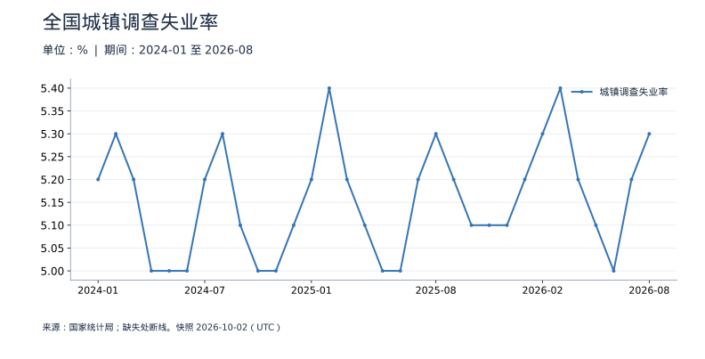
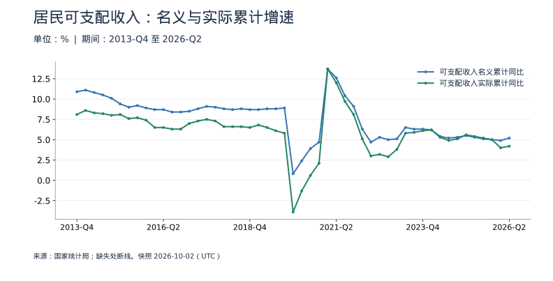

<!-- Generated by scripts/sync_macro.py; edit macro_catalog.py/macro_render.py. -->
# 就业与居民收入：真实数据

经济变化如何体现在就业和家庭购买力上？

调查失业率是月度比例，居民收入按季度发布、以年内累计为主。本专题不把季度值复制成三个月的数值，也不将调查失业率、登记失业率或不同青年失业率口径拼成一条线。

本页快照获取时间：**2026-10-02T10:37:59+00:00**。这是获取时间，不是所有数据的发布日期。每日检查上游；最新统计期以每个指标为准。

[CSV 下载](https://raw.githubusercontent.com/calcky/finance/main/data/macro/employment-income.csv) · [来源与采集参数](https://github.com/calcky/finance/blob/main/data/macro/employment-income.metadata.json) · [最近同步状态](https://github.com/calcky/finance/actions/workflows/update-gdp.yml)

```{only} html
本站同版快照：{download}`CSV <../../data/macro/employment-income.csv>` · {download}`元数据 <../../data/macro/employment-income.metadata.json>`
```

网页支持悬停查看、点击固定读数、按期间选择、缩放和定位明细。GitHub、打印或禁用 JavaScript 时显示静态图；数值与网页使用同一快照。

## 最新观测与覆盖

| 指标 | 最新期间 | 数值 | 单位 | 本项目起点 | 观测数 | 来源 |
|---|---|---:|---|---|---:|---|
| 城镇调查失业率 | 2026-08 | 5.3 | % | 2018-01 | 104 | [国家统计局](https://data.stats.gov.cn/dg/website/page.html#/pc/national/monthData) |
| 可支配收入名义累计同比 | 2026-Q2 | 5.2 | % | 2013-Q4 | 51 | [国家统计局](https://www.stats.gov.cn/sj/zxfb/202607/t20260715_1964129.html) |
| 可支配收入实际累计同比 | 2026-Q2 | 4.2 | % | 2013-Q4 | 51 | [国家统计局](https://data.stats.gov.cn/dg/website/page.html#/pc/national/quarterData) |
| 人均可支配收入累计金额 | 2026-Q2 | 22,981 | 元/人 | 2013-Q1 | 54 | [国家统计局](https://data.stats.gov.cn/dg/website/page.html#/pc/national/quarterData) |

起点表示本项目当前覆盖范围，不代表该指标从此时才开始发布。旧定义序列的最后一期也不代表来源停止更新。各来源可能存在发布或入库滞后；空白不补零、不插值。发布日期未知的观测在 CSV 中留空。

图表的“全部”与 CSV 保留完整已采集历史；缩放近期不会删除早期数据。[历史来源、口径断点与剩余缺口](history-coverage.md)说明回溯范围。

## 全国城镇调查失业率

失业率描述调查定义下劳动力中失业者的比例，不是未就业人口占全部人口的比例；单看它也不能反映工时和收入质量。



<details class="macro-details">
<summary>全国城镇调查失业率：展开完整数据表（%）</summary>
<div class="macro-table-wrap"><table><thead><tr><th>期间</th><th>城镇调查失业率</th></tr></thead><tbody>
<tr id="macro-unemployment-2026-08" tabindex="-1"><td>2026-08</td><td>5.3</td></tr>
<tr id="macro-unemployment-2026-07" tabindex="-1"><td>2026-07</td><td>5.2</td></tr>
<tr id="macro-unemployment-2026-06" tabindex="-1"><td>2026-06</td><td>5</td></tr>
<tr id="macro-unemployment-2026-05" tabindex="-1"><td>2026-05</td><td>5.1</td></tr>
<tr id="macro-unemployment-2026-04" tabindex="-1"><td>2026-04</td><td>5.2</td></tr>
<tr id="macro-unemployment-2026-03" tabindex="-1"><td>2026-03</td><td>5.4</td></tr>
<tr id="macro-unemployment-2026-02" tabindex="-1"><td>2026-02</td><td>5.3</td></tr>
<tr id="macro-unemployment-2026-01" tabindex="-1"><td>2026-01</td><td>5.2</td></tr>
<tr id="macro-unemployment-2025-12" tabindex="-1"><td>2025-12</td><td>5.1</td></tr>
<tr id="macro-unemployment-2025-11" tabindex="-1"><td>2025-11</td><td>5.1</td></tr>
<tr id="macro-unemployment-2025-10" tabindex="-1"><td>2025-10</td><td>5.1</td></tr>
<tr id="macro-unemployment-2025-09" tabindex="-1"><td>2025-09</td><td>5.2</td></tr>
<tr id="macro-unemployment-2025-08" tabindex="-1"><td>2025-08</td><td>5.3</td></tr>
<tr id="macro-unemployment-2025-07" tabindex="-1"><td>2025-07</td><td>5.2</td></tr>
<tr id="macro-unemployment-2025-06" tabindex="-1"><td>2025-06</td><td>5</td></tr>
<tr id="macro-unemployment-2025-05" tabindex="-1"><td>2025-05</td><td>5</td></tr>
<tr id="macro-unemployment-2025-04" tabindex="-1"><td>2025-04</td><td>5.1</td></tr>
<tr id="macro-unemployment-2025-03" tabindex="-1"><td>2025-03</td><td>5.2</td></tr>
<tr id="macro-unemployment-2025-02" tabindex="-1"><td>2025-02</td><td>5.4</td></tr>
<tr id="macro-unemployment-2025-01" tabindex="-1"><td>2025-01</td><td>5.2</td></tr>
<tr id="macro-unemployment-2024-12" tabindex="-1"><td>2024-12</td><td>5.1</td></tr>
<tr id="macro-unemployment-2024-11" tabindex="-1"><td>2024-11</td><td>5</td></tr>
<tr id="macro-unemployment-2024-10" tabindex="-1"><td>2024-10</td><td>5</td></tr>
<tr id="macro-unemployment-2024-09" tabindex="-1"><td>2024-09</td><td>5.1</td></tr>
<tr id="macro-unemployment-2024-08" tabindex="-1"><td>2024-08</td><td>5.3</td></tr>
<tr id="macro-unemployment-2024-07" tabindex="-1"><td>2024-07</td><td>5.2</td></tr>
<tr id="macro-unemployment-2024-06" tabindex="-1"><td>2024-06</td><td>5</td></tr>
<tr id="macro-unemployment-2024-05" tabindex="-1"><td>2024-05</td><td>5</td></tr>
<tr id="macro-unemployment-2024-04" tabindex="-1"><td>2024-04</td><td>5</td></tr>
<tr id="macro-unemployment-2024-03" tabindex="-1"><td>2024-03</td><td>5.2</td></tr>
<tr id="macro-unemployment-2024-02" tabindex="-1"><td>2024-02</td><td>5.3</td></tr>
<tr id="macro-unemployment-2024-01" tabindex="-1"><td>2024-01</td><td>5.2</td></tr>
<tr id="macro-unemployment-2023-12" tabindex="-1"><td>2023-12</td><td>5.1</td></tr>
<tr id="macro-unemployment-2023-11" tabindex="-1"><td>2023-11</td><td>5</td></tr>
<tr id="macro-unemployment-2023-10" tabindex="-1"><td>2023-10</td><td>5</td></tr>
<tr id="macro-unemployment-2023-09" tabindex="-1"><td>2023-09</td><td>5</td></tr>
<tr id="macro-unemployment-2023-08" tabindex="-1"><td>2023-08</td><td>5.2</td></tr>
<tr id="macro-unemployment-2023-07" tabindex="-1"><td>2023-07</td><td>5.3</td></tr>
<tr id="macro-unemployment-2023-06" tabindex="-1"><td>2023-06</td><td>5.2</td></tr>
<tr id="macro-unemployment-2023-05" tabindex="-1"><td>2023-05</td><td>5.2</td></tr>
<tr id="macro-unemployment-2023-04" tabindex="-1"><td>2023-04</td><td>5.2</td></tr>
<tr id="macro-unemployment-2023-03" tabindex="-1"><td>2023-03</td><td>5.3</td></tr>
<tr id="macro-unemployment-2023-02" tabindex="-1"><td>2023-02</td><td>5.6</td></tr>
<tr id="macro-unemployment-2023-01" tabindex="-1"><td>2023-01</td><td>5.5</td></tr>
<tr id="macro-unemployment-2022-12" tabindex="-1"><td>2022-12</td><td>5.5</td></tr>
<tr id="macro-unemployment-2022-11" tabindex="-1"><td>2022-11</td><td>5.7</td></tr>
<tr id="macro-unemployment-2022-10" tabindex="-1"><td>2022-10</td><td>5.5</td></tr>
<tr id="macro-unemployment-2022-09" tabindex="-1"><td>2022-09</td><td>5.5</td></tr>
<tr id="macro-unemployment-2022-08" tabindex="-1"><td>2022-08</td><td>5.3</td></tr>
<tr id="macro-unemployment-2022-07" tabindex="-1"><td>2022-07</td><td>5.4</td></tr>
<tr id="macro-unemployment-2022-06" tabindex="-1"><td>2022-06</td><td>5.5</td></tr>
<tr id="macro-unemployment-2022-05" tabindex="-1"><td>2022-05</td><td>5.9</td></tr>
<tr id="macro-unemployment-2022-04" tabindex="-1"><td>2022-04</td><td>6.1</td></tr>
<tr id="macro-unemployment-2022-03" tabindex="-1"><td>2022-03</td><td>5.8</td></tr>
<tr id="macro-unemployment-2022-02" tabindex="-1"><td>2022-02</td><td>5.5</td></tr>
<tr id="macro-unemployment-2022-01" tabindex="-1"><td>2022-01</td><td>5.3</td></tr>
<tr id="macro-unemployment-2021-12" tabindex="-1"><td>2021-12</td><td>5.1</td></tr>
<tr id="macro-unemployment-2021-11" tabindex="-1"><td>2021-11</td><td>5</td></tr>
<tr id="macro-unemployment-2021-10" tabindex="-1"><td>2021-10</td><td>4.9</td></tr>
<tr id="macro-unemployment-2021-09" tabindex="-1"><td>2021-09</td><td>4.9</td></tr>
<tr id="macro-unemployment-2021-08" tabindex="-1"><td>2021-08</td><td>5.1</td></tr>
<tr id="macro-unemployment-2021-07" tabindex="-1"><td>2021-07</td><td>5.1</td></tr>
<tr id="macro-unemployment-2021-06" tabindex="-1"><td>2021-06</td><td>5</td></tr>
<tr id="macro-unemployment-2021-05" tabindex="-1"><td>2021-05</td><td>5</td></tr>
<tr id="macro-unemployment-2021-04" tabindex="-1"><td>2021-04</td><td>5.1</td></tr>
<tr id="macro-unemployment-2021-03" tabindex="-1"><td>2021-03</td><td>5.3</td></tr>
<tr id="macro-unemployment-2021-02" tabindex="-1"><td>2021-02</td><td>5.5</td></tr>
<tr id="macro-unemployment-2021-01" tabindex="-1"><td>2021-01</td><td>5.4</td></tr>
<tr id="macro-unemployment-2020-12" tabindex="-1"><td>2020-12</td><td>5.2</td></tr>
<tr id="macro-unemployment-2020-11" tabindex="-1"><td>2020-11</td><td>5.2</td></tr>
<tr id="macro-unemployment-2020-10" tabindex="-1"><td>2020-10</td><td>5.3</td></tr>
<tr id="macro-unemployment-2020-09" tabindex="-1"><td>2020-09</td><td>5.4</td></tr>
<tr id="macro-unemployment-2020-08" tabindex="-1"><td>2020-08</td><td>5.6</td></tr>
<tr id="macro-unemployment-2020-07" tabindex="-1"><td>2020-07</td><td>5.7</td></tr>
<tr id="macro-unemployment-2020-06" tabindex="-1"><td>2020-06</td><td>5.7</td></tr>
<tr id="macro-unemployment-2020-05" tabindex="-1"><td>2020-05</td><td>5.9</td></tr>
<tr id="macro-unemployment-2020-04" tabindex="-1"><td>2020-04</td><td>6</td></tr>
<tr id="macro-unemployment-2020-03" tabindex="-1"><td>2020-03</td><td>5.9</td></tr>
<tr id="macro-unemployment-2020-02" tabindex="-1"><td>2020-02</td><td>6.2</td></tr>
<tr id="macro-unemployment-2020-01" tabindex="-1"><td>2020-01</td><td>5.3</td></tr>
<tr id="macro-unemployment-2019-12" tabindex="-1"><td>2019-12</td><td>5.2</td></tr>
<tr id="macro-unemployment-2019-11" tabindex="-1"><td>2019-11</td><td>5.1</td></tr>
<tr id="macro-unemployment-2019-10" tabindex="-1"><td>2019-10</td><td>5.1</td></tr>
<tr id="macro-unemployment-2019-09" tabindex="-1"><td>2019-09</td><td>5.2</td></tr>
<tr id="macro-unemployment-2019-08" tabindex="-1"><td>2019-08</td><td>5.2</td></tr>
<tr id="macro-unemployment-2019-07" tabindex="-1"><td>2019-07</td><td>5.3</td></tr>
<tr id="macro-unemployment-2019-06" tabindex="-1"><td>2019-06</td><td>5.1</td></tr>
<tr id="macro-unemployment-2019-05" tabindex="-1"><td>2019-05</td><td>5</td></tr>
<tr id="macro-unemployment-2019-04" tabindex="-1"><td>2019-04</td><td>5</td></tr>
<tr id="macro-unemployment-2019-03" tabindex="-1"><td>2019-03</td><td>5.2</td></tr>
<tr id="macro-unemployment-2019-02" tabindex="-1"><td>2019-02</td><td>5.3</td></tr>
<tr id="macro-unemployment-2019-01" tabindex="-1"><td>2019-01</td><td>5.1</td></tr>
<tr id="macro-unemployment-2018-12" tabindex="-1"><td>2018-12</td><td>4.9</td></tr>
<tr id="macro-unemployment-2018-11" tabindex="-1"><td>2018-11</td><td>4.8</td></tr>
<tr id="macro-unemployment-2018-10" tabindex="-1"><td>2018-10</td><td>4.9</td></tr>
<tr id="macro-unemployment-2018-09" tabindex="-1"><td>2018-09</td><td>4.9</td></tr>
<tr id="macro-unemployment-2018-08" tabindex="-1"><td>2018-08</td><td>5</td></tr>
<tr id="macro-unemployment-2018-07" tabindex="-1"><td>2018-07</td><td>5.1</td></tr>
<tr id="macro-unemployment-2018-06" tabindex="-1"><td>2018-06</td><td>4.8</td></tr>
<tr id="macro-unemployment-2018-05" tabindex="-1"><td>2018-05</td><td>4.8</td></tr>
<tr id="macro-unemployment-2018-04" tabindex="-1"><td>2018-04</td><td>4.9</td></tr>
<tr id="macro-unemployment-2018-03" tabindex="-1"><td>2018-03</td><td>5.1</td></tr>
<tr id="macro-unemployment-2018-02" tabindex="-1"><td>2018-02</td><td>5</td></tr>
<tr id="macro-unemployment-2018-01" tabindex="-1"><td>2018-01</td><td>5</td></tr>
</tbody></table></div></details>

## 居民可支配收入：名义与实际累计增速

实际增速扣除了价格因素。Q1、Q2、Q3、Q4 分别代表一季度、上半年、前三季度、全年累计，不能解读为单季环比。



<details class="macro-details">
<summary>居民可支配收入：名义与实际累计增速：展开完整数据表（%）</summary>
<div class="macro-table-wrap"><table><thead><tr><th>期间</th><th>可支配收入名义累计同比</th><th>可支配收入实际累计同比</th></tr></thead><tbody>
<tr id="macro-income-growth-2026-Q2" tabindex="-1"><td>2026-Q2</td><td>5.2</td><td>4.2</td></tr>
<tr id="macro-income-growth-2026-Q1" tabindex="-1"><td>2026-Q1</td><td>4.9</td><td>4</td></tr>
<tr id="macro-income-growth-2025-Q4" tabindex="-1"><td>2025-Q4</td><td>5</td><td>5</td></tr>
<tr id="macro-income-growth-2025-Q3" tabindex="-1"><td>2025-Q3</td><td>5.1</td><td>5.2</td></tr>
<tr id="macro-income-growth-2025-Q2" tabindex="-1"><td>2025-Q2</td><td>5.3</td><td>5.4</td></tr>
<tr id="macro-income-growth-2025-Q1" tabindex="-1"><td>2025-Q1</td><td>5.5</td><td>5.6</td></tr>
<tr id="macro-income-growth-2024-Q4" tabindex="-1"><td>2024-Q4</td><td>5.3</td><td>5.1</td></tr>
<tr id="macro-income-growth-2024-Q3" tabindex="-1"><td>2024-Q3</td><td>5.2</td><td>4.9</td></tr>
<tr id="macro-income-growth-2024-Q2" tabindex="-1"><td>2024-Q2</td><td>5.4</td><td>5.3</td></tr>
<tr id="macro-income-growth-2024-Q1" tabindex="-1"><td>2024-Q1</td><td>6.2</td><td>6.2</td></tr>
<tr id="macro-income-growth-2023-Q4" tabindex="-1"><td>2023-Q4</td><td>6.3</td><td>6.1</td></tr>
<tr id="macro-income-growth-2023-Q3" tabindex="-1"><td>2023-Q3</td><td>6.3</td><td>5.9</td></tr>
<tr id="macro-income-growth-2023-Q2" tabindex="-1"><td>2023-Q2</td><td>6.5</td><td>5.8</td></tr>
<tr id="macro-income-growth-2023-Q1" tabindex="-1"><td>2023-Q1</td><td>5.1</td><td>3.8</td></tr>
<tr id="macro-income-growth-2022-Q4" tabindex="-1"><td>2022-Q4</td><td>5</td><td>2.9</td></tr>
<tr id="macro-income-growth-2022-Q3" tabindex="-1"><td>2022-Q3</td><td>5.3</td><td>3.2</td></tr>
<tr id="macro-income-growth-2022-Q2" tabindex="-1"><td>2022-Q2</td><td>4.7</td><td>3</td></tr>
<tr id="macro-income-growth-2022-Q1" tabindex="-1"><td>2022-Q1</td><td>6.3</td><td>5.1</td></tr>
<tr id="macro-income-growth-2021-Q4" tabindex="-1"><td>2021-Q4</td><td>9.1</td><td>8.1</td></tr>
<tr id="macro-income-growth-2021-Q3" tabindex="-1"><td>2021-Q3</td><td>10.4</td><td>9.7</td></tr>
<tr id="macro-income-growth-2021-Q2" tabindex="-1"><td>2021-Q2</td><td>12.6</td><td>12</td></tr>
<tr id="macro-income-growth-2021-Q1" tabindex="-1"><td>2021-Q1</td><td>13.7</td><td>13.7</td></tr>
<tr id="macro-income-growth-2020-Q4" tabindex="-1"><td>2020-Q4</td><td>4.7</td><td>2.1</td></tr>
<tr id="macro-income-growth-2020-Q3" tabindex="-1"><td>2020-Q3</td><td>3.9</td><td>0.6</td></tr>
<tr id="macro-income-growth-2020-Q2" tabindex="-1"><td>2020-Q2</td><td>2.4</td><td>-1.3</td></tr>
<tr id="macro-income-growth-2020-Q1" tabindex="-1"><td>2020-Q1</td><td>0.8</td><td>-3.9</td></tr>
<tr id="macro-income-growth-2019-Q4" tabindex="-1"><td>2019-Q4</td><td>8.9</td><td>5.8</td></tr>
<tr id="macro-income-growth-2019-Q3" tabindex="-1"><td>2019-Q3</td><td>8.8</td><td>6.1</td></tr>
<tr id="macro-income-growth-2019-Q2" tabindex="-1"><td>2019-Q2</td><td>8.8</td><td>6.5</td></tr>
<tr id="macro-income-growth-2019-Q1" tabindex="-1"><td>2019-Q1</td><td>8.7</td><td>6.8</td></tr>
<tr id="macro-income-growth-2018-Q4" tabindex="-1"><td>2018-Q4</td><td>8.7</td><td>6.5</td></tr>
<tr id="macro-income-growth-2018-Q3" tabindex="-1"><td>2018-Q3</td><td>8.8</td><td>6.6</td></tr>
<tr id="macro-income-growth-2018-Q2" tabindex="-1"><td>2018-Q2</td><td>8.7</td><td>6.6</td></tr>
<tr id="macro-income-growth-2018-Q1" tabindex="-1"><td>2018-Q1</td><td>8.8</td><td>6.6</td></tr>
<tr id="macro-income-growth-2017-Q4" tabindex="-1"><td>2017-Q4</td><td>9</td><td>7.3</td></tr>
<tr id="macro-income-growth-2017-Q3" tabindex="-1"><td>2017-Q3</td><td>9.1</td><td>7.5</td></tr>
<tr id="macro-income-growth-2017-Q2" tabindex="-1"><td>2017-Q2</td><td>8.8</td><td>7.3</td></tr>
<tr id="macro-income-growth-2017-Q1" tabindex="-1"><td>2017-Q1</td><td>8.5</td><td>7</td></tr>
<tr id="macro-income-growth-2016-Q4" tabindex="-1"><td>2016-Q4</td><td>8.4</td><td>6.3</td></tr>
<tr id="macro-income-growth-2016-Q3" tabindex="-1"><td>2016-Q3</td><td>8.4</td><td>6.3</td></tr>
<tr id="macro-income-growth-2016-Q2" tabindex="-1"><td>2016-Q2</td><td>8.7</td><td>6.5</td></tr>
<tr id="macro-income-growth-2016-Q1" tabindex="-1"><td>2016-Q1</td><td>8.7</td><td>6.5</td></tr>
<tr id="macro-income-growth-2015-Q4" tabindex="-1"><td>2015-Q4</td><td>8.9</td><td>7.4</td></tr>
<tr id="macro-income-growth-2015-Q3" tabindex="-1"><td>2015-Q3</td><td>9.2</td><td>7.7</td></tr>
<tr id="macro-income-growth-2015-Q2" tabindex="-1"><td>2015-Q2</td><td>9</td><td>7.6</td></tr>
<tr id="macro-income-growth-2015-Q1" tabindex="-1"><td>2015-Q1</td><td>9.4</td><td>8.1</td></tr>
<tr id="macro-income-growth-2014-Q4" tabindex="-1"><td>2014-Q4</td><td>10.1</td><td>8</td></tr>
<tr id="macro-income-growth-2014-Q3" tabindex="-1"><td>2014-Q3</td><td>10.5</td><td>8.2</td></tr>
<tr id="macro-income-growth-2014-Q2" tabindex="-1"><td>2014-Q2</td><td>10.8</td><td>8.3</td></tr>
<tr id="macro-income-growth-2014-Q1" tabindex="-1"><td>2014-Q1</td><td>11.1</td><td>8.6</td></tr>
<tr id="macro-income-growth-2013-Q4" tabindex="-1"><td>2013-Q4</td><td>10.9</td><td>8.1</td></tr>
</tbody></table></div></details>

## 人均可支配收入累计金额：补充明细

年初至季度末累计，不把年末到次年一季度的重置解释为收入暴跌。

<details class="macro-details">
<summary>展开完整数据表（元/人）</summary>
<div class="macro-table-wrap"><table><thead><tr><th>期间</th><th>数值</th></tr></thead><tbody>
<tr><td>2026-Q2</td><td>22,981</td></tr>
<tr><td>2026-Q1</td><td>12,782</td></tr>
<tr><td>2025-Q4</td><td>43,377</td></tr>
<tr><td>2025-Q3</td><td>32,509</td></tr>
<tr><td>2025-Q2</td><td>21,840</td></tr>
<tr><td>2025-Q1</td><td>12,179</td></tr>
<tr><td>2024-Q4</td><td>41,314</td></tr>
<tr><td>2024-Q3</td><td>30,941</td></tr>
<tr><td>2024-Q2</td><td>20,733</td></tr>
<tr><td>2024-Q1</td><td>11,539</td></tr>
<tr><td>2023-Q4</td><td>39,218</td></tr>
<tr><td>2023-Q3</td><td>29,398</td></tr>
<tr><td>2023-Q2</td><td>19,672</td></tr>
<tr><td>2023-Q1</td><td>10,870</td></tr>
<tr><td>2022-Q4</td><td>36,883</td></tr>
<tr><td>2022-Q3</td><td>27,650</td></tr>
<tr><td>2022-Q2</td><td>18,463</td></tr>
<tr><td>2022-Q1</td><td>10,345</td></tr>
<tr><td>2021-Q4</td><td>35,128</td></tr>
<tr><td>2021-Q3</td><td>26,265</td></tr>
<tr><td>2021-Q2</td><td>17,642</td></tr>
<tr><td>2021-Q1</td><td>9,730</td></tr>
<tr><td>2020-Q4</td><td>32,189</td></tr>
<tr><td>2020-Q3</td><td>23,781</td></tr>
<tr><td>2020-Q2</td><td>15,666</td></tr>
<tr><td>2020-Q1</td><td>8,561</td></tr>
<tr><td>2019-Q4</td><td>30,733</td></tr>
<tr><td>2019-Q3</td><td>22,882</td></tr>
<tr><td>2019-Q2</td><td>15,294</td></tr>
<tr><td>2019-Q1</td><td>8,493</td></tr>
<tr><td>2018-Q4</td><td>28,228</td></tr>
<tr><td>2018-Q3</td><td>21,035</td></tr>
<tr><td>2018-Q2</td><td>14,063</td></tr>
<tr><td>2018-Q1</td><td>7,815</td></tr>
<tr><td>2017-Q4</td><td>25,974</td></tr>
<tr><td>2017-Q3</td><td>19,342</td></tr>
<tr><td>2017-Q2</td><td>12,932</td></tr>
<tr><td>2017-Q1</td><td>7,184</td></tr>
<tr><td>2016-Q4</td><td>23,821</td></tr>
<tr><td>2016-Q3</td><td>17,735</td></tr>
<tr><td>2016-Q2</td><td>11,886</td></tr>
<tr><td>2016-Q1</td><td>6,619</td></tr>
<tr><td>2015-Q4</td><td>21,966</td></tr>
<tr><td>2015-Q3</td><td>16,367</td></tr>
<tr><td>2015-Q2</td><td>10,931</td></tr>
<tr><td>2015-Q1</td><td>6,087</td></tr>
<tr><td>2014-Q4</td><td>20,167</td></tr>
<tr><td>2014-Q3</td><td>14,986</td></tr>
<tr><td>2014-Q2</td><td>10,025</td></tr>
<tr><td>2014-Q1</td><td>5,562</td></tr>
<tr><td>2013-Q4</td><td>18,311</td></tr>
<tr><td>2013-Q3</td><td>13,557</td></tr>
<tr><td>2013-Q2</td><td>9,049</td></tr>
<tr><td>2013-Q1</td><td>5,006</td></tr>
</tbody></table></div></details>

## 口径与阅读提醒

| 指标 | 口径 |
|---|---|
| 城镇调查失业率 | 全国城镇调查口径，不等于登记失业率或青年失业率。 |
| 可支配收入名义累计同比 | 全国居民人均可支配收入，年内累计同比；Q2 指上半年而非单独第二季度。 |
| 可支配收入实际累计同比 | 年内累计实际同比，扣除价格因素。 |
| 人均可支配收入累计金额 | 年初至季度末累计，不把年末到次年一季度的重置解释为收入暴跌。 |

- 全国一体化住户调查；金额自2013年，增速仅保留官方明确且可核验期间，不推算缺失增速。
- 金额2013Q1起；本API实际增速2014Q1起；2013Q4 API值10.9与实际增速注释不一致，排除该API值并由原始官方公告补齐，不冒充实际增速。
- 查询1949年至当前期间的全部可用非缺失值；最早观测不等于官方统计创始日期；缺失不填零。

日度图保留日历缺口：节假日、没有操作或上游缺失的日期均无观测，不能仅从空白判断原因。图线在缺失处断开；月度与季度图也不插值。

来源可能修订历史值。同步程序对已有期间的消失报错，合法数值修订保存在 Git 历史中；这不是包含所有官方初值的实时数据库。这里只摘录指标事实并注明来源，来源文件和机构条款仍归各发布机构。

继续理解：[相关基础知识](../foundations/household-finance.md) · [如何读宏观数据](../reading-macro-data.md) · [全部数据专题](index.md)
