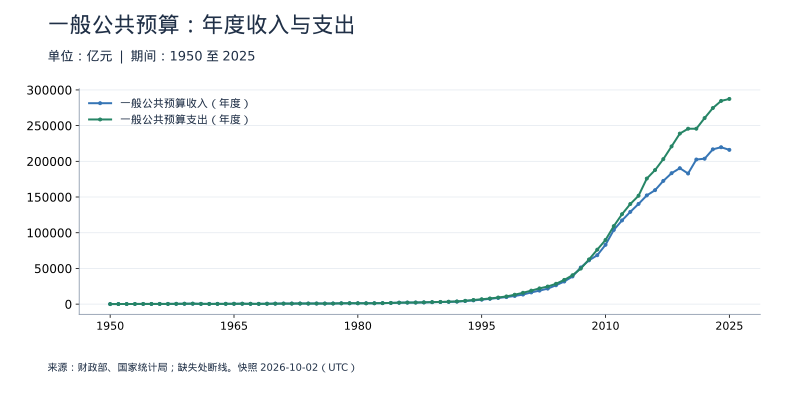
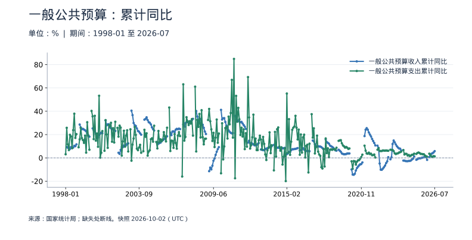
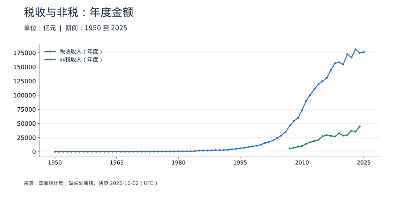
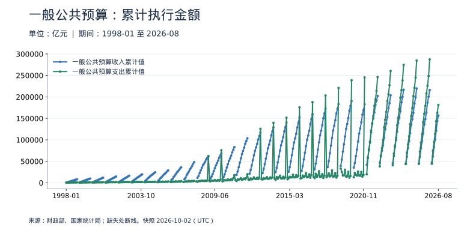
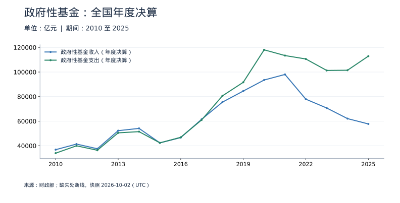
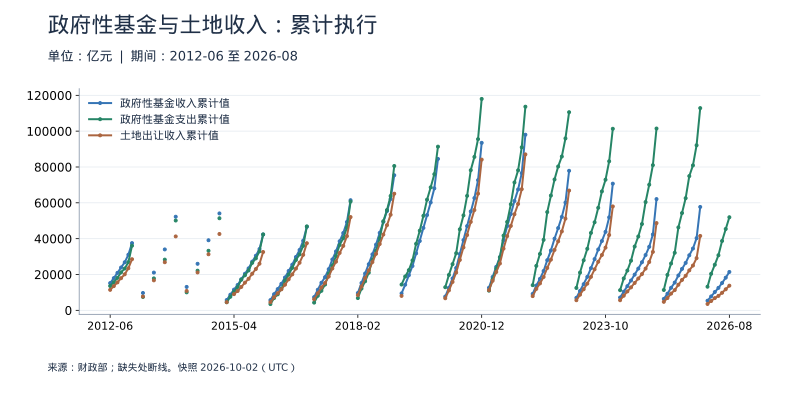
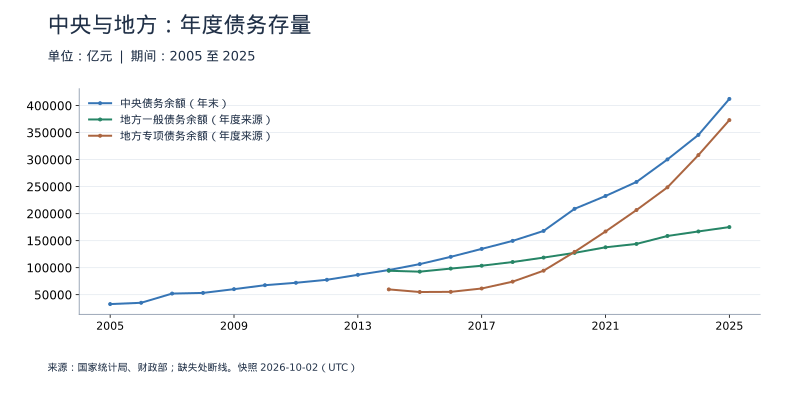
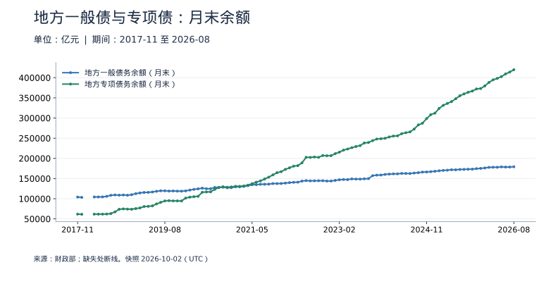
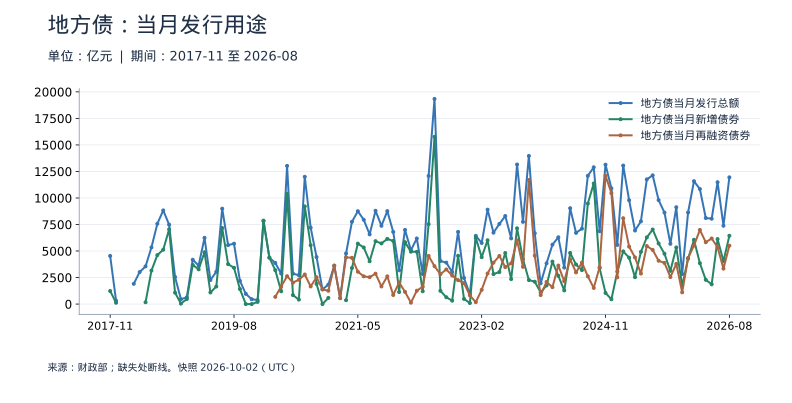
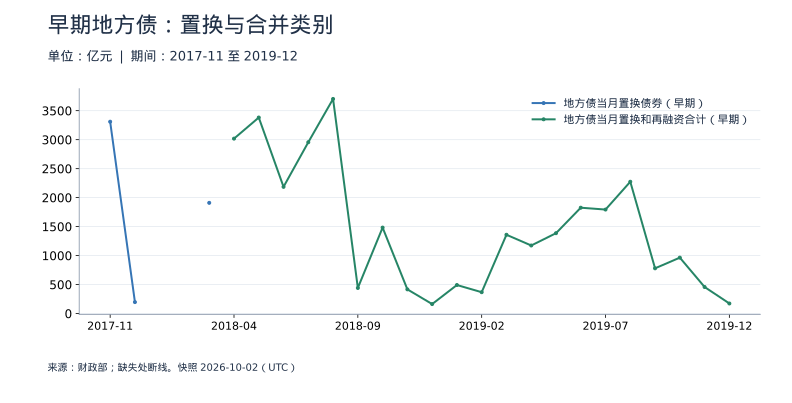

<!-- Generated by scripts/sync_macro.py; edit macro_catalog.py/macro_render.py. -->
# 财政政策与政府债务：真实数据

收入、支出、债务余额与发债各说明什么，哪些数不能相加或直接作差？

分开观察一般公共预算、政府性基金、法定债务存量和当月发行。年度来源与月度累计执行数独立保存；各年度统计范围会调整。地方债发行不等于同期财政支出，法定债务也不是整个公共部门的全部负债。

本页快照获取时间：**2026-10-02T15:57:34+00:00**。这是获取时间，不是所有数据的发布日期。每日检查上游；最新统计期以每个指标为准。

[CSV 下载](https://raw.githubusercontent.com/calcky/finance/main/data/macro/fiscal.csv) · [来源与采集参数](https://github.com/calcky/finance/blob/main/data/macro/fiscal.metadata.json) · [最近同步状态](https://github.com/calcky/finance/actions/workflows/update-gdp.yml)

```{only} html
本站同版快照：{download}`CSV <../../data/macro/fiscal.csv>` · {download}`元数据 <../../data/macro/fiscal.metadata.json>`
```

网页支持悬停查看、点击固定读数、按期间选择、缩放和定位明细。GitHub、打印或禁用 JavaScript 时显示静态图；数值与网页使用同一快照。

## 最新观测与覆盖

| 指标 | 最新期间 | 数值 | 单位 | 本项目起点 | 观测数 | 来源 |
|---|---|---:|---|---|---:|---|
| 一般公共预算收入（年度） | 2025 | 216,044.88 | 亿元 | 1950 | 76 | [财政部、国家统计局](https://data.stats.gov.cn/dg/website/page.html#/pc/national/yearData) |
| 一般公共预算支出（年度） | 2025 | 287,395.42 | 亿元 | 1950 | 76 | [财政部、国家统计局](https://data.stats.gov.cn/dg/website/page.html#/pc/national/yearData) |
| 一般公共预算收入累计同比 | 2026-07 | 5.8 | % | 1998-02 | 302 | [国家统计局](https://data.stats.gov.cn/dg/website/page.html#/pc/national/monthData) |
| 一般公共预算支出累计同比 | 2026-07 | 1.3 | % | 1998-01 | 321 | [国家统计局](https://data.stats.gov.cn/dg/website/page.html#/pc/national/monthData) |
| 税收收入（年度） | 2025 | 176,363.23 | 亿元 | 1950 | 76 | [国家统计局](https://data.stats.gov.cn/dg/website/page.html#/pc/national/yearData) |
| 非税收入（年度） | 2024 | 44,727.42 | 亿元 | 2007 | 18 | [国家统计局](https://data.stats.gov.cn/dg/website/page.html#/pc/national/yearData) |
| 一般公共预算收入累计值 | 2026-08 | 156,633 | 亿元 | 1998-02 | 307 | [财政部、国家统计局](https://gks.mof.gov.cn/tongjishuju/202609/t20260918_3997709.htm) |
| 一般公共预算支出累计值 | 2026-08 | 181,451 | 亿元 | 1998-01 | 326 | [财政部、国家统计局](https://gks.mof.gov.cn/tongjishuju/202609/t20260918_3997709.htm) |
| 政府性基金收入（年度决算） | 2025 | 57,718.02 | 亿元 | 2010 | 16 | [财政部](https://yss.mof.gov.cn/2025zyjs/202609/t20260916_3997522.htm) |
| 政府性基金支出（年度决算） | 2025 | 112,923.1 | 亿元 | 2010 | 16 | [财政部](https://yss.mof.gov.cn/2025zyjs/202609/t20260916_3997520.htm) |
| 政府性基金收入累计值 | 2026-08 | 21,419 | 亿元 | 2012-06 | 143 | [财政部](https://gks.mof.gov.cn/tongjishuju/202609/t20260918_3997709.htm) |
| 政府性基金支出累计值 | 2026-08 | 51,948 | 亿元 | 2012-06 | 143 | [财政部](https://gks.mof.gov.cn/tongjishuju/202609/t20260918_3997709.htm) |
| 土地出让收入累计值 | 2026-08 | 13,753 | 亿元 | 2012-06 | 132 | [财政部](https://gks.mof.gov.cn/tongjishuju/202609/t20260918_3997709.htm) |
| 中央债务余额（年末） | 2025 | 412,317.68 | 亿元 | 2005 | 21 | [国家统计局](https://data.stats.gov.cn/dg/website/page.html#/pc/national/yearData) |
| 地方一般债务余额（年度来源） | 2025 | 175,123.66 | 亿元 | 2014 | 12 | [财政部](https://yss.mof.gov.cn/2025zyjs/202607/t20260715_3993585.htm) |
| 地方专项债务余额（年度来源） | 2025 | 373,108.3 | 亿元 | 2014 | 12 | [财政部](https://yss.mof.gov.cn/2025zyjs/202607/t20260715_3993577.htm) |
| 地方一般债务余额（月末） | 2026-08 | 179,194 | 亿元 | 2017-11 | 104 | [财政部](https://zwgls.mof.gov.cn/tjsj/202609/t20260924_3998108.htm) |
| 地方专项债务余额（月末） | 2026-08 | 419,761 | 亿元 | 2017-11 | 104 | [财政部](https://zwgls.mof.gov.cn/tjsj/202609/t20260924_3998108.htm) |
| 地方债当月发行总额 | 2026-08 | 11,945 | 亿元 | 2017-11 | 104 | [财政部](https://zwgls.mof.gov.cn/tjsj/202609/t20260924_3998108.htm) |
| 地方债当月新增债券 | 2026-08 | 6,440 | 亿元 | 2017-11 | 100 | [财政部](https://zwgls.mof.gov.cn/tjsj/202609/t20260924_3998108.htm) |
| 地方债当月再融资债券 | 2026-08 | 5,505 | 亿元 | 2020-03 | 78 | [财政部](https://zwgls.mof.gov.cn/tjsj/202609/t20260924_3998108.htm) |
| 地方债当月置换债券（早期） | 2018-03 | 1,910 | 亿元 | 2017-11 | 3 | [财政部](https://yss.mof.gov.cn/zhuantilanmu/dfzgl/sjtj/201804/t20180413_2867535.htm) |
| 地方债当月置换和再融资合计（早期） | 2019-12 | 173.21 | 亿元 | 2018-04 | 21 | [财政部](https://yss.mof.gov.cn/zhuantilanmu/dfzgl/sjtj/202001/t20200121_3462828.htm) |
| 一般公共预算收入年度同比 | 2025 | -1.7 | % | 1951 | 75 | [财政部、国家统计局](https://data.stats.gov.cn/dg/website/page.html#/pc/national/yearData) |
| 一般公共预算支出年度同比 | 2025 | 1 | % | 1951 | 75 | [财政部、国家统计局](https://data.stats.gov.cn/dg/website/page.html#/pc/national/yearData) |
| 税收收入累计值 | 2026-08 | 129,104 | 亿元 | 2009-01 | 187 | [财政部](https://gks.mof.gov.cn/tongjishuju/202609/t20260918_3997709.htm) |
| 非税收入累计值 | 2026-08 | 27,529 | 亿元 | 2009-05 | 164 | [财政部](https://gks.mof.gov.cn/tongjishuju/202609/t20260918_3997709.htm) |
| 土地出让金收入（窄口径年度决算） | 2025 | 40,623.99 | 亿元 | 2010 | 16 | [财政部](https://yss.mof.gov.cn/2025zyjs/202609/t20260916_3997522.htm) |
| 地方债务总余额（月末） | 2026-08 | 598,955 | 亿元 | 2017-11 | 104 | [财政部](https://zwgls.mof.gov.cn/tjsj/202609/t20260924_3998108.htm) |

起点表示本项目当前覆盖范围，不代表该指标从此时才开始发布。旧定义序列的最后一期也不代表来源停止更新。各来源可能存在发布或入库滞后；空白不补零、不插值。发布日期未知的观测在 CSV 中留空。

图表的“全部”与 CSV 保留完整已采集历史；缩放近期不会删除早期数据。[历史来源、口径断点与剩余缺口](history-coverage.md)说明回溯范围。

## 一般公共预算：年度收入与支出

1950年起保留来源长历史；1950年代、预算外资金纳入及2007分类改革等口径不同。两条线之差不是正式预算赤字，还需核对调入、结转结余等资金。



<details class="macro-details">
<summary>一般公共预算：年度收入与支出：展开完整数据表（亿元）</summary>
<div class="macro-table-wrap"><table><thead><tr><th>期间</th><th>一般公共预算收入（年度）</th><th>一般公共预算支出（年度）</th></tr></thead><tbody>
<tr id="macro-fiscal-annual-2025" tabindex="-1"><td>2025</td><td>216,044.88</td><td>287,395.42</td></tr>
<tr id="macro-fiscal-annual-2024" tabindex="-1"><td>2024</td><td>219,734.3</td><td>284,605.57</td></tr>
<tr id="macro-fiscal-annual-2023" tabindex="-1"><td>2023</td><td>216,795.43</td><td>274,622.94</td></tr>
<tr id="macro-fiscal-annual-2022" tabindex="-1"><td>2022</td><td>203,649.3</td><td>260,552.1</td></tr>
<tr id="macro-fiscal-annual-2021" tabindex="-1"><td>2021</td><td>202,554.6</td><td>245,673</td></tr>
<tr id="macro-fiscal-annual-2020" tabindex="-1"><td>2020</td><td>182,913.9</td><td>245,679</td></tr>
<tr id="macro-fiscal-annual-2019" tabindex="-1"><td>2019</td><td>190,390.08</td><td>238,858.37</td></tr>
<tr id="macro-fiscal-annual-2018" tabindex="-1"><td>2018</td><td>183,359.84</td><td>220,904.13</td></tr>
<tr id="macro-fiscal-annual-2017" tabindex="-1"><td>2017</td><td>172,592.77</td><td>203,085.49</td></tr>
<tr id="macro-fiscal-annual-2016" tabindex="-1"><td>2016</td><td>159,604.97</td><td>187,755.21</td></tr>
<tr id="macro-fiscal-annual-2015" tabindex="-1"><td>2015</td><td>152,269.23</td><td>175,877.77</td></tr>
<tr id="macro-fiscal-annual-2014" tabindex="-1"><td>2014</td><td>140,370.03</td><td>151,785.56</td></tr>
<tr id="macro-fiscal-annual-2013" tabindex="-1"><td>2013</td><td>129,209.64</td><td>140,212.1</td></tr>
<tr id="macro-fiscal-annual-2012" tabindex="-1"><td>2012</td><td>117,253.52</td><td>125,952.97</td></tr>
<tr id="macro-fiscal-annual-2011" tabindex="-1"><td>2011</td><td>103,874.43</td><td>109,247.79</td></tr>
<tr id="macro-fiscal-annual-2010" tabindex="-1"><td>2010</td><td>83,101.51</td><td>89,874.16</td></tr>
<tr id="macro-fiscal-annual-2009" tabindex="-1"><td>2009</td><td>68,518.3</td><td>76,299.93</td></tr>
<tr id="macro-fiscal-annual-2008" tabindex="-1"><td>2008</td><td>61,330.35</td><td>62,592.66</td></tr>
<tr id="macro-fiscal-annual-2007" tabindex="-1"><td>2007</td><td>51,321.78</td><td>49,781.35</td></tr>
<tr id="macro-fiscal-annual-2006" tabindex="-1"><td>2006</td><td>38,760.2</td><td>40,422.73</td></tr>
<tr id="macro-fiscal-annual-2005" tabindex="-1"><td>2005</td><td>31,649.29</td><td>33,930.28</td></tr>
<tr id="macro-fiscal-annual-2004" tabindex="-1"><td>2004</td><td>26,396.47</td><td>28,486.89</td></tr>
<tr id="macro-fiscal-annual-2003" tabindex="-1"><td>2003</td><td>21,715.25</td><td>24,649.95</td></tr>
<tr id="macro-fiscal-annual-2002" tabindex="-1"><td>2002</td><td>18,903.64</td><td>22,053.15</td></tr>
<tr id="macro-fiscal-annual-2001" tabindex="-1"><td>2001</td><td>16,386.04</td><td>18,902.58</td></tr>
<tr id="macro-fiscal-annual-2000" tabindex="-1"><td>2000</td><td>13,395.23</td><td>15,886.5</td></tr>
<tr id="macro-fiscal-annual-1999" tabindex="-1"><td>1999</td><td>11,444.08</td><td>13,187.67</td></tr>
<tr id="macro-fiscal-annual-1998" tabindex="-1"><td>1998</td><td>9,875.95</td><td>10,798.18</td></tr>
<tr id="macro-fiscal-annual-1997" tabindex="-1"><td>1997</td><td>8,651.14</td><td>9,233.56</td></tr>
<tr id="macro-fiscal-annual-1996" tabindex="-1"><td>1996</td><td>7,407.99</td><td>7,937.55</td></tr>
<tr id="macro-fiscal-annual-1995" tabindex="-1"><td>1995</td><td>6,242.2</td><td>6,823.72</td></tr>
<tr id="macro-fiscal-annual-1994" tabindex="-1"><td>1994</td><td>5,218.1</td><td>5,792.62</td></tr>
<tr id="macro-fiscal-annual-1993" tabindex="-1"><td>1993</td><td>4,348.95</td><td>4,642.3</td></tr>
<tr id="macro-fiscal-annual-1992" tabindex="-1"><td>1992</td><td>3,483.37</td><td>3,742.2</td></tr>
<tr id="macro-fiscal-annual-1991" tabindex="-1"><td>1991</td><td>3,149.48</td><td>3,386.62</td></tr>
<tr id="macro-fiscal-annual-1990" tabindex="-1"><td>1990</td><td>2,937.1</td><td>3,083.59</td></tr>
<tr id="macro-fiscal-annual-1989" tabindex="-1"><td>1989</td><td>2,664.9</td><td>2,823.78</td></tr>
<tr id="macro-fiscal-annual-1988" tabindex="-1"><td>1988</td><td>2,357.24</td><td>2,491.21</td></tr>
<tr id="macro-fiscal-annual-1987" tabindex="-1"><td>1987</td><td>2,199.35</td><td>2,262.18</td></tr>
<tr id="macro-fiscal-annual-1986" tabindex="-1"><td>1986</td><td>2,122.01</td><td>2,204.91</td></tr>
<tr id="macro-fiscal-annual-1985" tabindex="-1"><td>1985</td><td>2,004.82</td><td>2,004.25</td></tr>
<tr id="macro-fiscal-annual-1984" tabindex="-1"><td>1984</td><td>1,642.86</td><td>1,701.02</td></tr>
<tr id="macro-fiscal-annual-1983" tabindex="-1"><td>1983</td><td>1,366.95</td><td>1,409.52</td></tr>
<tr id="macro-fiscal-annual-1982" tabindex="-1"><td>1982</td><td>1,212.33</td><td>1,229.98</td></tr>
<tr id="macro-fiscal-annual-1981" tabindex="-1"><td>1981</td><td>1,175.79</td><td>1,138.41</td></tr>
<tr id="macro-fiscal-annual-1980" tabindex="-1"><td>1980</td><td>1,159.93</td><td>1,228.83</td></tr>
<tr id="macro-fiscal-annual-1979" tabindex="-1"><td>1979</td><td>1,146.38</td><td>1,281.79</td></tr>
<tr id="macro-fiscal-annual-1978" tabindex="-1"><td>1978</td><td>1,132.26</td><td>1,122.09</td></tr>
<tr id="macro-fiscal-annual-1977" tabindex="-1"><td>1977</td><td>874.46</td><td>843.53</td></tr>
<tr id="macro-fiscal-annual-1976" tabindex="-1"><td>1976</td><td>776.58</td><td>806.2</td></tr>
<tr id="macro-fiscal-annual-1975" tabindex="-1"><td>1975</td><td>815.61</td><td>820.88</td></tr>
<tr id="macro-fiscal-annual-1974" tabindex="-1"><td>1974</td><td>783.14</td><td>790.25</td></tr>
<tr id="macro-fiscal-annual-1973" tabindex="-1"><td>1973</td><td>809.67</td><td>808.78</td></tr>
<tr id="macro-fiscal-annual-1972" tabindex="-1"><td>1972</td><td>766.56</td><td>765.86</td></tr>
<tr id="macro-fiscal-annual-1971" tabindex="-1"><td>1971</td><td>744.73</td><td>732.17</td></tr>
<tr id="macro-fiscal-annual-1970" tabindex="-1"><td>1970</td><td>662.9</td><td>649.41</td></tr>
<tr id="macro-fiscal-annual-1969" tabindex="-1"><td>1969</td><td>526.76</td><td>525.86</td></tr>
<tr id="macro-fiscal-annual-1968" tabindex="-1"><td>1968</td><td>361.25</td><td>357.84</td></tr>
<tr id="macro-fiscal-annual-1967" tabindex="-1"><td>1967</td><td>419.36</td><td>439.84</td></tr>
<tr id="macro-fiscal-annual-1966" tabindex="-1"><td>1966</td><td>558.71</td><td>537.65</td></tr>
<tr id="macro-fiscal-annual-1965" tabindex="-1"><td>1965</td><td>473.32</td><td>459.97</td></tr>
<tr id="macro-fiscal-annual-1964" tabindex="-1"><td>1964</td><td>399.54</td><td>393.79</td></tr>
<tr id="macro-fiscal-annual-1963" tabindex="-1"><td>1963</td><td>342.25</td><td>332.05</td></tr>
<tr id="macro-fiscal-annual-1962" tabindex="-1"><td>1962</td><td>313.55</td><td>294.88</td></tr>
<tr id="macro-fiscal-annual-1961" tabindex="-1"><td>1961</td><td>356.06</td><td>356.09</td></tr>
<tr id="macro-fiscal-annual-1960" tabindex="-1"><td>1960</td><td>572.29</td><td>643.68</td></tr>
<tr id="macro-fiscal-annual-1959" tabindex="-1"><td>1959</td><td>487.12</td><td>543.17</td></tr>
<tr id="macro-fiscal-annual-1958" tabindex="-1"><td>1958</td><td>379.62</td><td>400.36</td></tr>
<tr id="macro-fiscal-annual-1957" tabindex="-1"><td>1957</td><td>303.2</td><td>295.95</td></tr>
<tr id="macro-fiscal-annual-1956" tabindex="-1"><td>1956</td><td>280.19</td><td>298.52</td></tr>
<tr id="macro-fiscal-annual-1955" tabindex="-1"><td>1955</td><td>249.27</td><td>262.73</td></tr>
<tr id="macro-fiscal-annual-1954" tabindex="-1"><td>1954</td><td>245.17</td><td>244.11</td></tr>
<tr id="macro-fiscal-annual-1953" tabindex="-1"><td>1953</td><td>213.24</td><td>219.21</td></tr>
<tr id="macro-fiscal-annual-1952" tabindex="-1"><td>1952</td><td>173.94</td><td>172.07</td></tr>
<tr id="macro-fiscal-annual-1951" tabindex="-1"><td>1951</td><td>124.96</td><td>122.07</td></tr>
<tr id="macro-fiscal-annual-1950" tabindex="-1"><td>1950</td><td>62.17</td><td>68.05</td></tr>
</tbody></table></div></details>

## 一般公共预算：累计同比

按年初至当前月与上年同期比较；不是当月或环比。NBS入库可能晚于财政部，最新金额与最新同比的统计期需分别看。2015预算调整、2022退税不能忽略。



<details class="macro-details">
<summary>一般公共预算：累计同比：展开完整数据表（%）</summary>
<div class="macro-table-wrap"><table><thead><tr><th>期间</th><th>一般公共预算收入累计同比</th><th>一般公共预算支出累计同比</th></tr></thead><tbody>
<tr id="macro-fiscal-growth-2026-07" tabindex="-1"><td>2026-07</td><td>5.8</td><td>1.3</td></tr>
<tr id="macro-fiscal-growth-2026-06" tabindex="-1"><td>2026-06</td><td>4.7</td><td>1.5</td></tr>
<tr id="macro-fiscal-growth-2026-05" tabindex="-1"><td>2026-05</td><td>4</td><td>0.8</td></tr>
<tr id="macro-fiscal-growth-2026-04" tabindex="-1"><td>2026-04</td><td>3.5</td><td>1.3</td></tr>
<tr id="macro-fiscal-growth-2026-03" tabindex="-1"><td>2026-03</td><td>2.4</td><td>2.6</td></tr>
<tr id="macro-fiscal-growth-2026-02" tabindex="-1"><td>2026-02</td><td>0.7</td><td>3.6</td></tr>
<tr id="macro-fiscal-growth-2026-01" tabindex="-1"><td>2026-01</td><td>缺失</td><td>缺失</td></tr>
<tr id="macro-fiscal-growth-2025-12" tabindex="-1"><td>2025-12</td><td>-1.7</td><td>1</td></tr>
<tr id="macro-fiscal-growth-2025-11" tabindex="-1"><td>2025-11</td><td>0.8</td><td>1.4</td></tr>
<tr id="macro-fiscal-growth-2025-10" tabindex="-1"><td>2025-10</td><td>0.8</td><td>2</td></tr>
<tr id="macro-fiscal-growth-2025-09" tabindex="-1"><td>2025-09</td><td>0.5</td><td>3.1</td></tr>
<tr id="macro-fiscal-growth-2025-08" tabindex="-1"><td>2025-08</td><td>0.3</td><td>3.1</td></tr>
<tr id="macro-fiscal-growth-2025-07" tabindex="-1"><td>2025-07</td><td>0.1</td><td>3.4</td></tr>
<tr id="macro-fiscal-growth-2025-06" tabindex="-1"><td>2025-06</td><td>-0.3</td><td>3.4</td></tr>
<tr id="macro-fiscal-growth-2025-05" tabindex="-1"><td>2025-05</td><td>-0.3</td><td>4.2</td></tr>
<tr id="macro-fiscal-growth-2025-04" tabindex="-1"><td>2025-04</td><td>-0.4</td><td>4.6</td></tr>
<tr id="macro-fiscal-growth-2025-03" tabindex="-1"><td>2025-03</td><td>-1.1</td><td>4.2</td></tr>
<tr id="macro-fiscal-growth-2025-02" tabindex="-1"><td>2025-02</td><td>-1.6</td><td>3.4</td></tr>
<tr id="macro-fiscal-growth-2025-01" tabindex="-1"><td>2025-01</td><td>缺失</td><td>缺失</td></tr>
<tr id="macro-fiscal-growth-2024-12" tabindex="-1"><td>2024-12</td><td>1.3</td><td>3.6</td></tr>
<tr id="macro-fiscal-growth-2024-11" tabindex="-1"><td>2024-11</td><td>-0.6</td><td>2.8</td></tr>
<tr id="macro-fiscal-growth-2024-10" tabindex="-1"><td>2024-10</td><td>-1.3</td><td>2.7</td></tr>
<tr id="macro-fiscal-growth-2024-09" tabindex="-1"><td>2024-09</td><td>-2.2</td><td>2</td></tr>
<tr id="macro-fiscal-growth-2024-08" tabindex="-1"><td>2024-08</td><td>-2.6</td><td>1.5</td></tr>
<tr id="macro-fiscal-growth-2024-07" tabindex="-1"><td>2024-07</td><td>-2.6</td><td>2.5</td></tr>
<tr id="macro-fiscal-growth-2024-06" tabindex="-1"><td>2024-06</td><td>-2.8</td><td>2</td></tr>
<tr id="macro-fiscal-growth-2024-05" tabindex="-1"><td>2024-05</td><td>-2.8</td><td>3.4</td></tr>
<tr id="macro-fiscal-growth-2024-04" tabindex="-1"><td>2024-04</td><td>-2.7</td><td>3.5</td></tr>
<tr id="macro-fiscal-growth-2024-03" tabindex="-1"><td>2024-03</td><td>-2.3</td><td>2.9</td></tr>
<tr id="macro-fiscal-growth-2024-02" tabindex="-1"><td>2024-02</td><td>-2.3</td><td>6.7</td></tr>
<tr id="macro-fiscal-growth-2024-01" tabindex="-1"><td>2024-01</td><td>缺失</td><td>缺失</td></tr>
<tr id="macro-fiscal-growth-2023-12" tabindex="-1"><td>2023-12</td><td>6.4</td><td>5.4</td></tr>
<tr id="macro-fiscal-growth-2023-11" tabindex="-1"><td>2023-11</td><td>7.9</td><td>4.9</td></tr>
<tr id="macro-fiscal-growth-2023-10" tabindex="-1"><td>2023-10</td><td>8.1</td><td>4.6</td></tr>
<tr id="macro-fiscal-growth-2023-09" tabindex="-1"><td>2023-09</td><td>8.9</td><td>3.9</td></tr>
<tr id="macro-fiscal-growth-2023-08" tabindex="-1"><td>2023-08</td><td>10</td><td>3.8</td></tr>
<tr id="macro-fiscal-growth-2023-07" tabindex="-1"><td>2023-07</td><td>11.5</td><td>3.3</td></tr>
<tr id="macro-fiscal-growth-2023-06" tabindex="-1"><td>2023-06</td><td>13.3</td><td>3.9</td></tr>
<tr id="macro-fiscal-growth-2023-05" tabindex="-1"><td>2023-05</td><td>14.9</td><td>5.8</td></tr>
<tr id="macro-fiscal-growth-2023-04" tabindex="-1"><td>2023-04</td><td>11.9</td><td>6.8</td></tr>
<tr id="macro-fiscal-growth-2023-03" tabindex="-1"><td>2023-03</td><td>0.5</td><td>6.8</td></tr>
<tr id="macro-fiscal-growth-2023-02" tabindex="-1"><td>2023-02</td><td>-1.2</td><td>7</td></tr>
<tr id="macro-fiscal-growth-2023-01" tabindex="-1"><td>2023-01</td><td>缺失</td><td>缺失</td></tr>
<tr id="macro-fiscal-growth-2022-12" tabindex="-1"><td>2022-12</td><td>0.6</td><td>6.1</td></tr>
<tr id="macro-fiscal-growth-2022-11" tabindex="-1"><td>2022-11</td><td>-3</td><td>6.2</td></tr>
<tr id="macro-fiscal-growth-2022-10" tabindex="-1"><td>2022-10</td><td>-4.5</td><td>6.4</td></tr>
<tr id="macro-fiscal-growth-2022-09" tabindex="-1"><td>2022-09</td><td>-6.6</td><td>6.2</td></tr>
<tr id="macro-fiscal-growth-2022-08" tabindex="-1"><td>2022-08</td><td>-8</td><td>6.3</td></tr>
<tr id="macro-fiscal-growth-2022-07" tabindex="-1"><td>2022-07</td><td>-9.2</td><td>6.4</td></tr>
<tr id="macro-fiscal-growth-2022-06" tabindex="-1"><td>2022-06</td><td>-10.2</td><td>5.9</td></tr>
<tr id="macro-fiscal-growth-2022-05" tabindex="-1"><td>2022-05</td><td>-10.1</td><td>5.9</td></tr>
<tr id="macro-fiscal-growth-2022-04" tabindex="-1"><td>2022-04</td><td>-4.8</td><td>5.9</td></tr>
<tr id="macro-fiscal-growth-2022-03" tabindex="-1"><td>2022-03</td><td>8.6</td><td>8.3</td></tr>
<tr id="macro-fiscal-growth-2022-02" tabindex="-1"><td>2022-02</td><td>10.5</td><td>7</td></tr>
<tr id="macro-fiscal-growth-2022-01" tabindex="-1"><td>2022-01</td><td>缺失</td><td>缺失</td></tr>
<tr id="macro-fiscal-growth-2021-12" tabindex="-1"><td>2021-12</td><td>10.7</td><td>0.3</td></tr>
<tr id="macro-fiscal-growth-2021-11" tabindex="-1"><td>2021-11</td><td>12.8</td><td>2.9</td></tr>
<tr id="macro-fiscal-growth-2021-10" tabindex="-1"><td>2021-10</td><td>14.5</td><td>2.4</td></tr>
<tr id="macro-fiscal-growth-2021-09" tabindex="-1"><td>2021-09</td><td>16.3</td><td>2.3</td></tr>
<tr id="macro-fiscal-growth-2021-08" tabindex="-1"><td>2021-08</td><td>18.4</td><td>3.6</td></tr>
<tr id="macro-fiscal-growth-2021-07" tabindex="-1"><td>2021-07</td><td>20</td><td>3.3</td></tr>
<tr id="macro-fiscal-growth-2021-06" tabindex="-1"><td>2021-06</td><td>21.8</td><td>4.5</td></tr>
<tr id="macro-fiscal-growth-2021-05" tabindex="-1"><td>2021-05</td><td>24.2</td><td>3.6</td></tr>
<tr id="macro-fiscal-growth-2021-04" tabindex="-1"><td>2021-04</td><td>25.5</td><td>3.8</td></tr>
<tr id="macro-fiscal-growth-2021-03" tabindex="-1"><td>2021-03</td><td>24.2</td><td>6.2</td></tr>
<tr id="macro-fiscal-growth-2021-02" tabindex="-1"><td>2021-02</td><td>18.7</td><td>10.5</td></tr>
<tr id="macro-fiscal-growth-2021-01" tabindex="-1"><td>2021-01</td><td>缺失</td><td>缺失</td></tr>
<tr id="macro-fiscal-growth-2020-12" tabindex="-1"><td>2020-12</td><td>-3.9</td><td>2.8</td></tr>
<tr id="macro-fiscal-growth-2020-11" tabindex="-1"><td>2020-11</td><td>-5.3</td><td>0.7</td></tr>
<tr id="macro-fiscal-growth-2020-10" tabindex="-1"><td>2020-10</td><td>-5.5</td><td>-0.6</td></tr>
<tr id="macro-fiscal-growth-2020-09" tabindex="-1"><td>2020-09</td><td>-6.4</td><td>-1.9</td></tr>
<tr id="macro-fiscal-growth-2020-08" tabindex="-1"><td>2020-08</td><td>-7.5</td><td>-2.1</td></tr>
<tr id="macro-fiscal-growth-2020-07" tabindex="-1"><td>2020-07</td><td>-8.7</td><td>-3.2</td></tr>
<tr id="macro-fiscal-growth-2020-06" tabindex="-1"><td>2020-06</td><td>-10.8</td><td>-5.8</td></tr>
<tr id="macro-fiscal-growth-2020-05" tabindex="-1"><td>2020-05</td><td>-13.6</td><td>-2.9</td></tr>
<tr id="macro-fiscal-growth-2020-04" tabindex="-1"><td>2020-04</td><td>-14.5</td><td>-2.7</td></tr>
<tr id="macro-fiscal-growth-2020-03" tabindex="-1"><td>2020-03</td><td>-14.3</td><td>-9.4</td></tr>
<tr id="macro-fiscal-growth-2020-02" tabindex="-1"><td>2020-02</td><td>-9.9</td><td>-2.9</td></tr>
<tr id="macro-fiscal-growth-2020-01" tabindex="-1"><td>2020-01</td><td>缺失</td><td>缺失</td></tr>
<tr id="macro-fiscal-growth-2019-12" tabindex="-1"><td>2019-12</td><td>3.8</td><td>8.1</td></tr>
<tr id="macro-fiscal-growth-2019-11" tabindex="-1"><td>2019-11</td><td>3.8</td><td>7.7</td></tr>
<tr id="macro-fiscal-growth-2019-10" tabindex="-1"><td>2019-10</td><td>3.8</td><td>8.7</td></tr>
<tr id="macro-fiscal-growth-2019-09" tabindex="-1"><td>2019-09</td><td>3.3</td><td>9.4</td></tr>
<tr id="macro-fiscal-growth-2019-08" tabindex="-1"><td>2019-08</td><td>3.2</td><td>8.8</td></tr>
<tr id="macro-fiscal-growth-2019-07" tabindex="-1"><td>2019-07</td><td>3.1</td><td>9.9</td></tr>
<tr id="macro-fiscal-growth-2019-06" tabindex="-1"><td>2019-06</td><td>3.4</td><td>10.7</td></tr>
<tr id="macro-fiscal-growth-2019-05" tabindex="-1"><td>2019-05</td><td>3.8</td><td>12.5</td></tr>
<tr id="macro-fiscal-growth-2019-04" tabindex="-1"><td>2019-04</td><td>5.3</td><td>15.2</td></tr>
<tr id="macro-fiscal-growth-2019-03" tabindex="-1"><td>2019-03</td><td>6.2</td><td>15</td></tr>
<tr id="macro-fiscal-growth-2019-02" tabindex="-1"><td>2019-02</td><td>7</td><td>14.6</td></tr>
<tr id="macro-fiscal-growth-2019-01" tabindex="-1"><td>2019-01</td><td>缺失</td><td>缺失</td></tr>
<tr id="macro-fiscal-growth-2018-12" tabindex="-1"><td>2018-12</td><td>6.2</td><td>8.7</td></tr>
<tr id="macro-fiscal-growth-2018-11" tabindex="-1"><td>2018-11</td><td>6.5</td><td>6.8</td></tr>
<tr id="macro-fiscal-growth-2018-10" tabindex="-1"><td>2018-10</td><td>7.4</td><td>7.6</td></tr>
<tr id="macro-fiscal-growth-2018-09" tabindex="-1"><td>2018-09</td><td>8.7</td><td>7.5</td></tr>
<tr id="macro-fiscal-growth-2018-08" tabindex="-1"><td>2018-08</td><td>9.4</td><td>6.9</td></tr>
<tr id="macro-fiscal-growth-2018-07" tabindex="-1"><td>2018-07</td><td>10</td><td>7.3</td></tr>
<tr id="macro-fiscal-growth-2018-06" tabindex="-1"><td>2018-06</td><td>10.6</td><td>7</td></tr>
<tr id="macro-fiscal-growth-2018-05" tabindex="-1"><td>2018-05</td><td>12.2</td><td>0.5</td></tr>
<tr id="macro-fiscal-growth-2018-04" tabindex="-1"><td>2018-04</td><td>12.9</td><td>8.2</td></tr>
<tr id="macro-fiscal-growth-2018-03" tabindex="-1"><td>2018-03</td><td>13.6</td><td>4.1</td></tr>
<tr id="macro-fiscal-growth-2018-02" tabindex="-1"><td>2018-02</td><td>15.8</td><td>16.7</td></tr>
<tr id="macro-fiscal-growth-2018-01" tabindex="-1"><td>2018-01</td><td>缺失</td><td>-7.4</td></tr>
<tr id="macro-fiscal-growth-2017-12" tabindex="-1"><td>2017-12</td><td>7.4</td><td>7.7</td></tr>
<tr id="macro-fiscal-growth-2017-11" tabindex="-1"><td>2017-11</td><td>8.4</td><td>-9.1</td></tr>
<tr id="macro-fiscal-growth-2017-10" tabindex="-1"><td>2017-10</td><td>9.2</td><td>-8</td></tr>
<tr id="macro-fiscal-growth-2017-09" tabindex="-1"><td>2017-09</td><td>9.7</td><td>1.7</td></tr>
<tr id="macro-fiscal-growth-2017-08" tabindex="-1"><td>2017-08</td><td>9.8</td><td>2.9</td></tr>
<tr id="macro-fiscal-growth-2017-07" tabindex="-1"><td>2017-07</td><td>10</td><td>5.4</td></tr>
<tr id="macro-fiscal-growth-2017-06" tabindex="-1"><td>2017-06</td><td>9.8</td><td>19.1</td></tr>
<tr id="macro-fiscal-growth-2017-05" tabindex="-1"><td>2017-05</td><td>10</td><td>9.2</td></tr>
<tr id="macro-fiscal-growth-2017-04" tabindex="-1"><td>2017-04</td><td>11.8</td><td>3.8</td></tr>
<tr id="macro-fiscal-growth-2017-03" tabindex="-1"><td>2017-03</td><td>14.1</td><td>25.4</td></tr>
<tr id="macro-fiscal-growth-2017-02" tabindex="-1"><td>2017-02</td><td>14.9</td><td>17.4</td></tr>
<tr id="macro-fiscal-growth-2017-01" tabindex="-1"><td>2017-01</td><td>缺失</td><td>37.5</td></tr>
<tr id="macro-fiscal-growth-2016-12" tabindex="-1"><td>2016-12</td><td>缺失</td><td>缺失</td></tr>
<tr id="macro-fiscal-growth-2016-11" tabindex="-1"><td>2016-11</td><td>5.7</td><td>12.2</td></tr>
<tr id="macro-fiscal-growth-2016-10" tabindex="-1"><td>2016-10</td><td>5.9</td><td>-12.5</td></tr>
<tr id="macro-fiscal-growth-2016-09" tabindex="-1"><td>2016-09</td><td>5.9</td><td>11.3</td></tr>
<tr id="macro-fiscal-growth-2016-08" tabindex="-1"><td>2016-08</td><td>6</td><td>10.3</td></tr>
<tr id="macro-fiscal-growth-2016-07" tabindex="-1"><td>2016-07</td><td>6.5</td><td>0.3</td></tr>
<tr id="macro-fiscal-growth-2016-06" tabindex="-1"><td>2016-06</td><td>7.1</td><td>19.9</td></tr>
<tr id="macro-fiscal-growth-2016-05" tabindex="-1"><td>2016-05</td><td>8.3</td><td>17.6</td></tr>
<tr id="macro-fiscal-growth-2016-04" tabindex="-1"><td>2016-04</td><td>8.6</td><td>4.5</td></tr>
<tr id="macro-fiscal-growth-2016-03" tabindex="-1"><td>2016-03</td><td>6.5</td><td>20.1</td></tr>
<tr id="macro-fiscal-growth-2016-02" tabindex="-1"><td>2016-02</td><td>6.3</td><td>2.7</td></tr>
<tr id="macro-fiscal-growth-2016-01" tabindex="-1"><td>2016-01</td><td>缺失</td><td>24.3</td></tr>
<tr id="macro-fiscal-growth-2015-12" tabindex="-1"><td>2015-12</td><td>8.4</td><td>15.8</td></tr>
<tr id="macro-fiscal-growth-2015-11" tabindex="-1"><td>2015-11</td><td>8</td><td>25.9</td></tr>
<tr id="macro-fiscal-growth-2015-10" tabindex="-1"><td>2015-10</td><td>7.7</td><td>36.1</td></tr>
<tr id="macro-fiscal-growth-2015-09" tabindex="-1"><td>2015-09</td><td>7.6</td><td>26.9</td></tr>
<tr id="macro-fiscal-growth-2015-08" tabindex="-1"><td>2015-08</td><td>7.4</td><td>25.9</td></tr>
<tr id="macro-fiscal-growth-2015-07" tabindex="-1"><td>2015-07</td><td>7.5</td><td>24.1</td></tr>
<tr id="macro-fiscal-growth-2015-06" tabindex="-1"><td>2015-06</td><td>6.6</td><td>13.9</td></tr>
<tr id="macro-fiscal-growth-2015-05" tabindex="-1"><td>2015-05</td><td>5</td><td>2.6</td></tr>
<tr id="macro-fiscal-growth-2015-04" tabindex="-1"><td>2015-04</td><td>5.1</td><td>33.2</td></tr>
<tr id="macro-fiscal-growth-2015-03" tabindex="-1"><td>2015-03</td><td>3.9</td><td>4.4</td></tr>
<tr id="macro-fiscal-growth-2015-02" tabindex="-1"><td>2015-02</td><td>3.2</td><td>55.2</td></tr>
<tr id="macro-fiscal-growth-2015-01" tabindex="-1"><td>2015-01</td><td>缺失</td><td>-19.9</td></tr>
<tr id="macro-fiscal-growth-2014-12" tabindex="-1"><td>2014-12</td><td>8.6</td><td>8.2</td></tr>
<tr id="macro-fiscal-growth-2014-11" tabindex="-1"><td>2014-11</td><td>8.3</td><td>0.8</td></tr>
<tr id="macro-fiscal-growth-2014-10" tabindex="-1"><td>2014-10</td><td>8.2</td><td>-5.7</td></tr>
<tr id="macro-fiscal-growth-2014-09" tabindex="-1"><td>2014-09</td><td>8.1</td><td>9.1</td></tr>
<tr id="macro-fiscal-growth-2014-08" tabindex="-1"><td>2014-08</td><td>8.3</td><td>6.2</td></tr>
<tr id="macro-fiscal-growth-2014-07" tabindex="-1"><td>2014-07</td><td>8.5</td><td>9.6</td></tr>
<tr id="macro-fiscal-growth-2014-06" tabindex="-1"><td>2014-06</td><td>8.8</td><td>26.1</td></tr>
<tr id="macro-fiscal-growth-2014-05" tabindex="-1"><td>2014-05</td><td>8.8</td><td>24.6</td></tr>
<tr id="macro-fiscal-growth-2014-04" tabindex="-1"><td>2014-04</td><td>9.3</td><td>1.1</td></tr>
<tr id="macro-fiscal-growth-2014-03" tabindex="-1"><td>2014-03</td><td>9.3</td><td>22.3</td></tr>
<tr id="macro-fiscal-growth-2014-02" tabindex="-1"><td>2014-02</td><td>11.1</td><td>-10.7</td></tr>
<tr id="macro-fiscal-growth-2014-01" tabindex="-1"><td>2014-01</td><td>缺失</td><td>缺失</td></tr>
<tr id="macro-fiscal-growth-2013-12" tabindex="-1"><td>2013-12</td><td>10.1</td><td>10.9</td></tr>
<tr id="macro-fiscal-growth-2013-11" tabindex="-1"><td>2013-11</td><td>9.9</td><td>4.1</td></tr>
<tr id="macro-fiscal-growth-2013-10" tabindex="-1"><td>2013-10</td><td>9.4</td><td>21.9</td></tr>
<tr id="macro-fiscal-growth-2013-09" tabindex="-1"><td>2013-09</td><td>8.6</td><td>8.8</td></tr>
<tr id="macro-fiscal-growth-2013-08" tabindex="-1"><td>2013-08</td><td>8.1</td><td>6.5</td></tr>
<tr id="macro-fiscal-growth-2013-07" tabindex="-1"><td>2013-07</td><td>8</td><td>-1.8</td></tr>
<tr id="macro-fiscal-growth-2013-06" tabindex="-1"><td>2013-06</td><td>7.5</td><td>3</td></tr>
<tr id="macro-fiscal-growth-2013-05" tabindex="-1"><td>2013-05</td><td>6.6</td><td>12</td></tr>
<tr id="macro-fiscal-growth-2013-04" tabindex="-1"><td>2013-04</td><td>6.7</td><td>18</td></tr>
<tr id="macro-fiscal-growth-2013-03" tabindex="-1"><td>2013-03</td><td>6.9</td><td>7.2</td></tr>
<tr id="macro-fiscal-growth-2013-02" tabindex="-1"><td>2013-02</td><td>7.2</td><td>15.7</td></tr>
<tr id="macro-fiscal-growth-2013-01" tabindex="-1"><td>2013-01</td><td>缺失</td><td>19.1</td></tr>
<tr id="macro-fiscal-growth-2012-12" tabindex="-1"><td>2012-12</td><td>12.8</td><td>15.1</td></tr>
<tr id="macro-fiscal-growth-2012-11" tabindex="-1"><td>2012-11</td><td>11.9</td><td>6.7</td></tr>
<tr id="macro-fiscal-growth-2012-10" tabindex="-1"><td>2012-10</td><td>11.2</td><td>6.7</td></tr>
<tr id="macro-fiscal-growth-2012-09" tabindex="-1"><td>2012-09</td><td>10.9</td><td>16.6</td></tr>
<tr id="macro-fiscal-growth-2012-08" tabindex="-1"><td>2012-08</td><td>10.8</td><td>11.7</td></tr>
<tr id="macro-fiscal-growth-2012-07" tabindex="-1"><td>2012-07</td><td>11.6</td><td>37.1</td></tr>
<tr id="macro-fiscal-growth-2012-06" tabindex="-1"><td>2012-06</td><td>12.2</td><td>17.7</td></tr>
<tr id="macro-fiscal-growth-2012-05" tabindex="-1"><td>2012-05</td><td>12.7</td><td>10.9</td></tr>
<tr id="macro-fiscal-growth-2012-04" tabindex="-1"><td>2012-04</td><td>12.5</td><td>8</td></tr>
<tr id="macro-fiscal-growth-2012-03" tabindex="-1"><td>2012-03</td><td>14.7</td><td>34.7</td></tr>
<tr id="macro-fiscal-growth-2012-02" tabindex="-1"><td>2012-02</td><td>13.1</td><td>69.3</td></tr>
<tr id="macro-fiscal-growth-2012-01" tabindex="-1"><td>2012-01</td><td>缺失</td><td>9.6</td></tr>
<tr id="macro-fiscal-growth-2011-12" tabindex="-1"><td>2011-12</td><td>24.8</td><td>21.2</td></tr>
<tr id="macro-fiscal-growth-2011-11" tabindex="-1"><td>2011-11</td><td>26.8</td><td>7.5</td></tr>
<tr id="macro-fiscal-growth-2011-10" tabindex="-1"><td>2011-10</td><td>28.1</td><td>24.5</td></tr>
<tr id="macro-fiscal-growth-2011-09" tabindex="-1"><td>2011-09</td><td>29.5</td><td>18.3</td></tr>
<tr id="macro-fiscal-growth-2011-08" tabindex="-1"><td>2011-08</td><td>30.9</td><td>25.9</td></tr>
<tr id="macro-fiscal-growth-2011-07" tabindex="-1"><td>2011-07</td><td>30.5</td><td>19.6</td></tr>
<tr id="macro-fiscal-growth-2011-06" tabindex="-1"><td>2011-06</td><td>31.2</td><td>33.1</td></tr>
<tr id="macro-fiscal-growth-2011-05" tabindex="-1"><td>2011-05</td><td>32</td><td>42.9</td></tr>
<tr id="macro-fiscal-growth-2011-04" tabindex="-1"><td>2011-04</td><td>31.4</td><td>31</td></tr>
<tr id="macro-fiscal-growth-2011-03" tabindex="-1"><td>2011-03</td><td>33.1</td><td>53.2</td></tr>
<tr id="macro-fiscal-growth-2011-02" tabindex="-1"><td>2011-02</td><td>36</td><td>-17.5</td></tr>
<tr id="macro-fiscal-growth-2011-01" tabindex="-1"><td>2011-01</td><td>缺失</td><td>84.9</td></tr>
<tr id="macro-fiscal-growth-2010-12" tabindex="-1"><td>2010-12</td><td>21.3</td><td>17.4</td></tr>
<tr id="macro-fiscal-growth-2010-11" tabindex="-1"><td>2010-11</td><td>21.1</td><td>66.9</td></tr>
<tr id="macro-fiscal-growth-2010-10" tabindex="-1"><td>2010-10</td><td>21.5</td><td>38.5</td></tr>
<tr id="macro-fiscal-growth-2010-09" tabindex="-1"><td>2010-09</td><td>22.4</td><td>28.8</td></tr>
<tr id="macro-fiscal-growth-2010-08" tabindex="-1"><td>2010-08</td><td>23.6</td><td>35.4</td></tr>
<tr id="macro-fiscal-growth-2010-07" tabindex="-1"><td>2010-07</td><td>25.7</td><td>16.6</td></tr>
<tr id="macro-fiscal-growth-2010-06" tabindex="-1"><td>2010-06</td><td>27.6</td><td>26.8</td></tr>
<tr id="macro-fiscal-growth-2010-05" tabindex="-1"><td>2010-05</td><td>30.8</td><td>25.6</td></tr>
<tr id="macro-fiscal-growth-2010-04" tabindex="-1"><td>2010-04</td><td>34.1</td><td>9.8</td></tr>
<tr id="macro-fiscal-growth-2010-03" tabindex="-1"><td>2010-03</td><td>34</td><td>-1.3</td></tr>
<tr id="macro-fiscal-growth-2010-02" tabindex="-1"><td>2010-02</td><td>32.9</td><td>29.7</td></tr>
<tr id="macro-fiscal-growth-2010-01" tabindex="-1"><td>2010-01</td><td>41.2</td><td>-13.2</td></tr>
<tr id="macro-fiscal-growth-2009-12" tabindex="-1"><td>2009-12</td><td>缺失</td><td>缺失</td></tr>
<tr id="macro-fiscal-growth-2009-11" tabindex="-1"><td>2009-11</td><td>9.2</td><td>20.9</td></tr>
<tr id="macro-fiscal-growth-2009-10" tabindex="-1"><td>2009-10</td><td>7.5</td><td>13</td></tr>
<tr id="macro-fiscal-growth-2009-09" tabindex="-1"><td>2009-09</td><td>5.3</td><td>32.9</td></tr>
<tr id="macro-fiscal-growth-2009-08" tabindex="-1"><td>2009-08</td><td>2.6</td><td>17.4</td></tr>
<tr id="macro-fiscal-growth-2009-07" tabindex="-1"><td>2009-07</td><td>-0.5</td><td>9.3</td></tr>
<tr id="macro-fiscal-growth-2009-06" tabindex="-1"><td>2009-06</td><td>-2.4</td><td>21.5</td></tr>
<tr id="macro-fiscal-growth-2009-05" tabindex="-1"><td>2009-05</td><td>-6.7</td><td>14.5</td></tr>
<tr id="macro-fiscal-growth-2009-04" tabindex="-1"><td>2009-04</td><td>-9.9</td><td>24.5</td></tr>
<tr id="macro-fiscal-growth-2009-03" tabindex="-1"><td>2009-03</td><td>-8.3</td><td>31.4</td></tr>
<tr id="macro-fiscal-growth-2009-02" tabindex="-1"><td>2009-02</td><td>-11.4</td><td>42</td></tr>
<tr id="macro-fiscal-growth-2009-01" tabindex="-1"><td>2009-01</td><td>缺失</td><td>32.5</td></tr>
<tr id="macro-fiscal-growth-2008-12" tabindex="-1"><td>2008-12</td><td>缺失</td><td>缺失</td></tr>
<tr id="macro-fiscal-growth-2008-11" tabindex="-1"><td>2008-11</td><td>20.5</td><td>16.5</td></tr>
<tr id="macro-fiscal-growth-2008-10" tabindex="-1"><td>2008-10</td><td>22.6</td><td>16.4</td></tr>
<tr id="macro-fiscal-growth-2008-09" tabindex="-1"><td>2008-09</td><td>25.8</td><td>11.6</td></tr>
<tr id="macro-fiscal-growth-2008-08" tabindex="-1"><td>2008-08</td><td>28.4</td><td>17.8</td></tr>
<tr id="macro-fiscal-growth-2008-07" tabindex="-1"><td>2008-07</td><td>30.5</td><td>40.9</td></tr>
<tr id="macro-fiscal-growth-2008-06" tabindex="-1"><td>2008-06</td><td>33.3</td><td>17.5</td></tr>
<tr id="macro-fiscal-growth-2008-05" tabindex="-1"><td>2008-05</td><td>33.8</td><td>37.7</td></tr>
<tr id="macro-fiscal-growth-2008-04" tabindex="-1"><td>2008-04</td><td>29.4</td><td>26.6</td></tr>
<tr id="macro-fiscal-growth-2008-03" tabindex="-1"><td>2008-03</td><td>35.5</td><td>32.6</td></tr>
<tr id="macro-fiscal-growth-2008-02" tabindex="-1"><td>2008-02</td><td>40.2</td><td>5.5</td></tr>
<tr id="macro-fiscal-growth-2008-01" tabindex="-1"><td>2008-01</td><td>缺失</td><td>61.1</td></tr>
<tr id="macro-fiscal-growth-2007-12" tabindex="-1"><td>2007-12</td><td>缺失</td><td>缺失</td></tr>
<tr id="macro-fiscal-growth-2007-11" tabindex="-1"><td>2007-11</td><td>33.5</td><td>19.1</td></tr>
<tr id="macro-fiscal-growth-2007-10" tabindex="-1"><td>2007-10</td><td>32.4</td><td>33.3</td></tr>
<tr id="macro-fiscal-growth-2007-09" tabindex="-1"><td>2007-09</td><td>31.4</td><td>29.4</td></tr>
<tr id="macro-fiscal-growth-2007-08" tabindex="-1"><td>2007-08</td><td>30.2</td><td>31.5</td></tr>
<tr id="macro-fiscal-growth-2007-07" tabindex="-1"><td>2007-07</td><td>30.3</td><td>28.2</td></tr>
<tr id="macro-fiscal-growth-2007-06" tabindex="-1"><td>2007-06</td><td>30.6</td><td>31.5</td></tr>
<tr id="macro-fiscal-growth-2007-05" tabindex="-1"><td>2007-05</td><td>30.6</td><td>34.9</td></tr>
<tr id="macro-fiscal-growth-2007-04" tabindex="-1"><td>2007-04</td><td>29.8</td><td>18</td></tr>
<tr id="macro-fiscal-growth-2007-03" tabindex="-1"><td>2007-03</td><td>26.7</td><td>14.8</td></tr>
<tr id="macro-fiscal-growth-2007-02" tabindex="-1"><td>2007-02</td><td>28.7</td><td>63.1</td></tr>
<tr id="macro-fiscal-growth-2007-01" tabindex="-1"><td>2007-01</td><td>缺失</td><td>-16</td></tr>
<tr id="macro-fiscal-growth-2006-12" tabindex="-1"><td>2006-12</td><td>缺失</td><td>缺失</td></tr>
<tr id="macro-fiscal-growth-2006-11" tabindex="-1"><td>2006-11</td><td>24.7</td><td>18.7</td></tr>
<tr id="macro-fiscal-growth-2006-10" tabindex="-1"><td>2006-10</td><td>25.1</td><td>22.1</td></tr>
<tr id="macro-fiscal-growth-2006-09" tabindex="-1"><td>2006-09</td><td>24.6</td><td>19.1</td></tr>
<tr id="macro-fiscal-growth-2006-08" tabindex="-1"><td>2006-08</td><td>24.9</td><td>7.9</td></tr>
<tr id="macro-fiscal-growth-2006-07" tabindex="-1"><td>2006-07</td><td>24.2</td><td>12.8</td></tr>
<tr id="macro-fiscal-growth-2006-06" tabindex="-1"><td>2006-06</td><td>22</td><td>20.4</td></tr>
<tr id="macro-fiscal-growth-2006-05" tabindex="-1"><td>2006-05</td><td>22.8</td><td>8.6</td></tr>
<tr id="macro-fiscal-growth-2006-04" tabindex="-1"><td>2006-04</td><td>22.7</td><td>14.6</td></tr>
<tr id="macro-fiscal-growth-2006-03" tabindex="-1"><td>2006-03</td><td>19.5</td><td>14.8</td></tr>
<tr id="macro-fiscal-growth-2006-02" tabindex="-1"><td>2006-02</td><td>21.7</td><td>5.9</td></tr>
<tr id="macro-fiscal-growth-2006-01" tabindex="-1"><td>2006-01</td><td>缺失</td><td>43.2</td></tr>
<tr id="macro-fiscal-growth-2005-12" tabindex="-1"><td>2005-12</td><td>缺失</td><td>缺失</td></tr>
<tr id="macro-fiscal-growth-2005-11" tabindex="-1"><td>2005-11</td><td>18.5</td><td>25.9</td></tr>
<tr id="macro-fiscal-growth-2005-10" tabindex="-1"><td>2005-10</td><td>18.2</td><td>14.1</td></tr>
<tr id="macro-fiscal-growth-2005-09" tabindex="-1"><td>2005-09</td><td>16.7</td><td>18.4</td></tr>
<tr id="macro-fiscal-growth-2005-08" tabindex="-1"><td>2005-08</td><td>15.9</td><td>22.1</td></tr>
<tr id="macro-fiscal-growth-2005-07" tabindex="-1"><td>2005-07</td><td>15.2</td><td>15.7</td></tr>
<tr id="macro-fiscal-growth-2005-06" tabindex="-1"><td>2005-06</td><td>14.6</td><td>14.3</td></tr>
<tr id="macro-fiscal-growth-2005-05" tabindex="-1"><td>2005-05</td><td>13.1</td><td>15.9</td></tr>
<tr id="macro-fiscal-growth-2005-04" tabindex="-1"><td>2005-04</td><td>12.9</td><td>13.4</td></tr>
<tr id="macro-fiscal-growth-2005-03" tabindex="-1"><td>2005-03</td><td>12.1</td><td>23.1</td></tr>
<tr id="macro-fiscal-growth-2005-02" tabindex="-1"><td>2005-02</td><td>13.4</td><td>8.1</td></tr>
<tr id="macro-fiscal-growth-2005-01" tabindex="-1"><td>2005-01</td><td>缺失</td><td>13.7</td></tr>
<tr id="macro-fiscal-growth-2004-12" tabindex="-1"><td>2004-12</td><td>缺失</td><td>缺失</td></tr>
<tr id="macro-fiscal-growth-2004-11" tabindex="-1"><td>2004-11</td><td>23.5</td><td>27.6</td></tr>
<tr id="macro-fiscal-growth-2004-10" tabindex="-1"><td>2004-10</td><td>24.6</td><td>13.9</td></tr>
<tr id="macro-fiscal-growth-2004-09" tabindex="-1"><td>2004-09</td><td>26.2</td><td>16.8</td></tr>
<tr id="macro-fiscal-growth-2004-08" tabindex="-1"><td>2004-08</td><td>28.7</td><td>16</td></tr>
<tr id="macro-fiscal-growth-2004-07" tabindex="-1"><td>2004-07</td><td>30.1</td><td>6.6</td></tr>
<tr id="macro-fiscal-growth-2004-06" tabindex="-1"><td>2004-06</td><td>30.6</td><td>5.5</td></tr>
<tr id="macro-fiscal-growth-2004-05" tabindex="-1"><td>2004-05</td><td>32.4</td><td>1.9</td></tr>
<tr id="macro-fiscal-growth-2004-04" tabindex="-1"><td>2004-04</td><td>34.8</td><td>21.1</td></tr>
<tr id="macro-fiscal-growth-2004-03" tabindex="-1"><td>2004-03</td><td>33.4</td><td>18.1</td></tr>
<tr id="macro-fiscal-growth-2004-02" tabindex="-1"><td>2004-02</td><td>32.8</td><td>24.1</td></tr>
<tr id="macro-fiscal-growth-2004-01" tabindex="-1"><td>2004-01</td><td>缺失</td><td>5.7</td></tr>
<tr id="macro-fiscal-growth-2003-12" tabindex="-1"><td>2003-12</td><td>缺失</td><td>缺失</td></tr>
<tr id="macro-fiscal-growth-2003-11" tabindex="-1"><td>2003-11</td><td>19.9</td><td>4.4</td></tr>
<tr id="macro-fiscal-growth-2003-10" tabindex="-1"><td>2003-10</td><td>21.1</td><td>11.2</td></tr>
<tr id="macro-fiscal-growth-2003-09" tabindex="-1"><td>2003-09</td><td>22.5</td><td>8.9</td></tr>
<tr id="macro-fiscal-growth-2003-08" tabindex="-1"><td>2003-08</td><td>23.1</td><td>6.6</td></tr>
<tr id="macro-fiscal-growth-2003-07" tabindex="-1"><td>2003-07</td><td>25.3</td><td>7.9</td></tr>
<tr id="macro-fiscal-growth-2003-06" tabindex="-1"><td>2003-06</td><td>27.4</td><td>19.7</td></tr>
<tr id="macro-fiscal-growth-2003-05" tabindex="-1"><td>2003-05</td><td>28</td><td>26.5</td></tr>
<tr id="macro-fiscal-growth-2003-04" tabindex="-1"><td>2003-04</td><td>29.9</td><td>16.6</td></tr>
<tr id="macro-fiscal-growth-2003-03" tabindex="-1"><td>2003-03</td><td>36.7</td><td>11.4</td></tr>
<tr id="macro-fiscal-growth-2003-02" tabindex="-1"><td>2003-02</td><td>40.5</td><td>-2.4</td></tr>
<tr id="macro-fiscal-growth-2003-01" tabindex="-1"><td>2003-01</td><td>缺失</td><td>24.5</td></tr>
<tr id="macro-fiscal-growth-2002-12" tabindex="-1"><td>2002-12</td><td>缺失</td><td>缺失</td></tr>
<tr id="macro-fiscal-growth-2002-11" tabindex="-1"><td>2002-11</td><td>12.4</td><td>5.5</td></tr>
<tr id="macro-fiscal-growth-2002-10" tabindex="-1"><td>2002-10</td><td>12.1</td><td>23.7</td></tr>
<tr id="macro-fiscal-growth-2002-09" tabindex="-1"><td>2002-09</td><td>10.9</td><td>19.1</td></tr>
<tr id="macro-fiscal-growth-2002-08" tabindex="-1"><td>2002-08</td><td>10.2</td><td>9.6</td></tr>
<tr id="macro-fiscal-growth-2002-07" tabindex="-1"><td>2002-07</td><td>10.6</td><td>23.3</td></tr>
<tr id="macro-fiscal-growth-2002-06" tabindex="-1"><td>2002-06</td><td>9.2</td><td>14.1</td></tr>
<tr id="macro-fiscal-growth-2002-05" tabindex="-1"><td>2002-05</td><td>9.3</td><td>1.9</td></tr>
<tr id="macro-fiscal-growth-2002-04" tabindex="-1"><td>2002-04</td><td>6.9</td><td>26</td></tr>
<tr id="macro-fiscal-growth-2002-03" tabindex="-1"><td>2002-03</td><td>3.4</td><td>27.7</td></tr>
<tr id="macro-fiscal-growth-2002-02" tabindex="-1"><td>2002-02</td><td>4.4</td><td>18.2</td></tr>
<tr id="macro-fiscal-growth-2002-01" tabindex="-1"><td>2002-01</td><td>缺失</td><td>25.8</td></tr>
<tr id="macro-fiscal-growth-2001-12" tabindex="-1"><td>2001-12</td><td>缺失</td><td>缺失</td></tr>
<tr id="macro-fiscal-growth-2001-11" tabindex="-1"><td>2001-11</td><td>23.1</td><td>31</td></tr>
<tr id="macro-fiscal-growth-2001-10" tabindex="-1"><td>2001-10</td><td>23.8</td><td>13.2</td></tr>
<tr id="macro-fiscal-growth-2001-09" tabindex="-1"><td>2001-09</td><td>24.2</td><td>25.5</td></tr>
<tr id="macro-fiscal-growth-2001-08" tabindex="-1"><td>2001-08</td><td>24.7</td><td>13.9</td></tr>
<tr id="macro-fiscal-growth-2001-07" tabindex="-1"><td>2001-07</td><td>25.4</td><td>30.1</td></tr>
<tr id="macro-fiscal-growth-2001-06" tabindex="-1"><td>2001-06</td><td>26.2</td><td>27.2</td></tr>
<tr id="macro-fiscal-growth-2001-05" tabindex="-1"><td>2001-05</td><td>28.9</td><td>28.2</td></tr>
<tr id="macro-fiscal-growth-2001-04" tabindex="-1"><td>2001-04</td><td>28.8</td><td>8.6</td></tr>
<tr id="macro-fiscal-growth-2001-03" tabindex="-1"><td>2001-03</td><td>27.9</td><td>20.1</td></tr>
<tr id="macro-fiscal-growth-2001-02" tabindex="-1"><td>2001-02</td><td>32.1</td><td>32.4</td></tr>
<tr id="macro-fiscal-growth-2001-01" tabindex="-1"><td>2001-01</td><td>缺失</td><td>6.1</td></tr>
<tr id="macro-fiscal-growth-2000-12" tabindex="-1"><td>2000-12</td><td>缺失</td><td>缺失</td></tr>
<tr id="macro-fiscal-growth-2000-11" tabindex="-1"><td>2000-11</td><td>21.2</td><td>23</td></tr>
<tr id="macro-fiscal-growth-2000-10" tabindex="-1"><td>2000-10</td><td>21.6</td><td>4.4</td></tr>
<tr id="macro-fiscal-growth-2000-09" tabindex="-1"><td>2000-09</td><td>20.8</td><td>0.2</td></tr>
<tr id="macro-fiscal-growth-2000-08" tabindex="-1"><td>2000-08</td><td>19.8</td><td>53.3</td></tr>
<tr id="macro-fiscal-growth-2000-07" tabindex="-1"><td>2000-07</td><td>17.4</td><td>9.5</td></tr>
<tr id="macro-fiscal-growth-2000-06" tabindex="-1"><td>2000-06</td><td>17.9</td><td>20.9</td></tr>
<tr id="macro-fiscal-growth-2000-05" tabindex="-1"><td>2000-05</td><td>20.6</td><td>14.8</td></tr>
<tr id="macro-fiscal-growth-2000-04" tabindex="-1"><td>2000-04</td><td>22.8</td><td>36.1</td></tr>
<tr id="macro-fiscal-growth-2000-03" tabindex="-1"><td>2000-03</td><td>23.8</td><td>16.1</td></tr>
<tr id="macro-fiscal-growth-2000-02" tabindex="-1"><td>2000-02</td><td>25.3</td><td>35.6</td></tr>
<tr id="macro-fiscal-growth-2000-01" tabindex="-1"><td>2000-01</td><td>缺失</td><td>40.3</td></tr>
<tr id="macro-fiscal-growth-1999-12" tabindex="-1"><td>1999-12</td><td>缺失</td><td>缺失</td></tr>
<tr id="macro-fiscal-growth-1999-11" tabindex="-1"><td>1999-11</td><td>18.2</td><td>7</td></tr>
<tr id="macro-fiscal-growth-1999-10" tabindex="-1"><td>1999-10</td><td>19.4</td><td>19</td></tr>
<tr id="macro-fiscal-growth-1999-09" tabindex="-1"><td>1999-09</td><td>21</td><td>30.6</td></tr>
<tr id="macro-fiscal-growth-1999-08" tabindex="-1"><td>1999-08</td><td>22.8</td><td>4.5</td></tr>
<tr id="macro-fiscal-growth-1999-07" tabindex="-1"><td>1999-07</td><td>23.7</td><td>19.1</td></tr>
<tr id="macro-fiscal-growth-1999-06" tabindex="-1"><td>1999-06</td><td>24.3</td><td>12.9</td></tr>
<tr id="macro-fiscal-growth-1999-05" tabindex="-1"><td>1999-05</td><td>24.9</td><td>15.3</td></tr>
<tr id="macro-fiscal-growth-1999-04" tabindex="-1"><td>1999-04</td><td>24.6</td><td>17</td></tr>
<tr id="macro-fiscal-growth-1999-03" tabindex="-1"><td>1999-03</td><td>26.1</td><td>25.7</td></tr>
<tr id="macro-fiscal-growth-1999-02" tabindex="-1"><td>1999-02</td><td>28.6</td><td>15.9</td></tr>
<tr id="macro-fiscal-growth-1999-01" tabindex="-1"><td>1999-01</td><td>缺失</td><td>9.1</td></tr>
<tr id="macro-fiscal-growth-1998-12" tabindex="-1"><td>1998-12</td><td>缺失</td><td>缺失</td></tr>
<tr id="macro-fiscal-growth-1998-11" tabindex="-1"><td>1998-11</td><td>11.6</td><td>20.4</td></tr>
<tr id="macro-fiscal-growth-1998-10" tabindex="-1"><td>1998-10</td><td>10</td><td>17.1</td></tr>
<tr id="macro-fiscal-growth-1998-09" tabindex="-1"><td>1998-09</td><td>10.4</td><td>37.9</td></tr>
<tr id="macro-fiscal-growth-1998-08" tabindex="-1"><td>1998-08</td><td>8.9</td><td>23.8</td></tr>
<tr id="macro-fiscal-growth-1998-07" tabindex="-1"><td>1998-07</td><td>8.6</td><td>8.3</td></tr>
<tr id="macro-fiscal-growth-1998-06" tabindex="-1"><td>1998-06</td><td>9.2</td><td>18.4</td></tr>
<tr id="macro-fiscal-growth-1998-05" tabindex="-1"><td>1998-05</td><td>7.7</td><td>19.8</td></tr>
<tr id="macro-fiscal-growth-1998-04" tabindex="-1"><td>1998-04</td><td>9.6</td><td>6.7</td></tr>
<tr id="macro-fiscal-growth-1998-03" tabindex="-1"><td>1998-03</td><td>8.7</td><td>11.6</td></tr>
<tr id="macro-fiscal-growth-1998-02" tabindex="-1"><td>1998-02</td><td>9.3</td><td>25.8</td></tr>
<tr id="macro-fiscal-growth-1998-01" tabindex="-1"><td>1998-01</td><td>缺失</td><td>3.1</td></tr>
</tbody></table></div></details>

## 税收与非税：年度金额

非税历史缺口不按总收入减税收倒推；未找到的年份断线。非税增长不代表税基同比例改善，债券融资也不是这里的非税收入。



<details class="macro-details">
<summary>税收与非税：年度金额：展开完整数据表（亿元）</summary>
<div class="macro-table-wrap"><table><thead><tr><th>期间</th><th>税收收入（年度）</th><th>非税收入（年度）</th></tr></thead><tbody>
<tr id="macro-fiscal-tax-2025" tabindex="-1"><td>2025</td><td>176,363.23</td><td>缺失</td></tr>
<tr id="macro-fiscal-tax-2024" tabindex="-1"><td>2024</td><td>175,006.88</td><td>44,727.42</td></tr>
<tr id="macro-fiscal-tax-2023" tabindex="-1"><td>2023</td><td>181,136.25</td><td>35,659.18</td></tr>
<tr id="macro-fiscal-tax-2022" tabindex="-1"><td>2022</td><td>166,620.1</td><td>37,029.19</td></tr>
<tr id="macro-fiscal-tax-2021" tabindex="-1"><td>2021</td><td>172,735.7</td><td>29,818.97</td></tr>
<tr id="macro-fiscal-tax-2020" tabindex="-1"><td>2020</td><td>154,312.3</td><td>28,601.59</td></tr>
<tr id="macro-fiscal-tax-2019" tabindex="-1"><td>2019</td><td>158,000.46</td><td>32,389.62</td></tr>
<tr id="macro-fiscal-tax-2018" tabindex="-1"><td>2018</td><td>156,402.86</td><td>26,956.98</td></tr>
<tr id="macro-fiscal-tax-2017" tabindex="-1"><td>2017</td><td>144,369.87</td><td>28,222.9</td></tr>
<tr id="macro-fiscal-tax-2016" tabindex="-1"><td>2016</td><td>130,360.73</td><td>29,244.24</td></tr>
<tr id="macro-fiscal-tax-2015" tabindex="-1"><td>2015</td><td>124,922.2</td><td>27,347.03</td></tr>
<tr id="macro-fiscal-tax-2014" tabindex="-1"><td>2014</td><td>119,175.31</td><td>21,194.72</td></tr>
<tr id="macro-fiscal-tax-2013" tabindex="-1"><td>2013</td><td>110,530.7</td><td>18,678.94</td></tr>
<tr id="macro-fiscal-tax-2012" tabindex="-1"><td>2012</td><td>100,614.28</td><td>16,639.24</td></tr>
<tr id="macro-fiscal-tax-2011" tabindex="-1"><td>2011</td><td>89,738.39</td><td>14,136.04</td></tr>
<tr id="macro-fiscal-tax-2010" tabindex="-1"><td>2010</td><td>73,210.79</td><td>9,890.72</td></tr>
<tr id="macro-fiscal-tax-2009" tabindex="-1"><td>2009</td><td>59,521.59</td><td>8,996.71</td></tr>
<tr id="macro-fiscal-tax-2008" tabindex="-1"><td>2008</td><td>54,223.79</td><td>7,106.56</td></tr>
<tr id="macro-fiscal-tax-2007" tabindex="-1"><td>2007</td><td>45,621.97</td><td>5,699.81</td></tr>
<tr id="macro-fiscal-tax-2006" tabindex="-1"><td>2006</td><td>34,804.35</td><td>缺失</td></tr>
<tr id="macro-fiscal-tax-2005" tabindex="-1"><td>2005</td><td>28,778.54</td><td>缺失</td></tr>
<tr id="macro-fiscal-tax-2004" tabindex="-1"><td>2004</td><td>24,165.68</td><td>缺失</td></tr>
<tr id="macro-fiscal-tax-2003" tabindex="-1"><td>2003</td><td>20,017.31</td><td>缺失</td></tr>
<tr id="macro-fiscal-tax-2002" tabindex="-1"><td>2002</td><td>17,636.45</td><td>缺失</td></tr>
<tr id="macro-fiscal-tax-2001" tabindex="-1"><td>2001</td><td>15,301.38</td><td>缺失</td></tr>
<tr id="macro-fiscal-tax-2000" tabindex="-1"><td>2000</td><td>12,581.51</td><td>缺失</td></tr>
<tr id="macro-fiscal-tax-1999" tabindex="-1"><td>1999</td><td>10,682.58</td><td>缺失</td></tr>
<tr id="macro-fiscal-tax-1998" tabindex="-1"><td>1998</td><td>9,262.8</td><td>缺失</td></tr>
<tr id="macro-fiscal-tax-1997" tabindex="-1"><td>1997</td><td>8,234.04</td><td>缺失</td></tr>
<tr id="macro-fiscal-tax-1996" tabindex="-1"><td>1996</td><td>6,909.82</td><td>缺失</td></tr>
<tr id="macro-fiscal-tax-1995" tabindex="-1"><td>1995</td><td>6,038.04</td><td>缺失</td></tr>
<tr id="macro-fiscal-tax-1994" tabindex="-1"><td>1994</td><td>5,126.88</td><td>缺失</td></tr>
<tr id="macro-fiscal-tax-1993" tabindex="-1"><td>1993</td><td>4,255.3</td><td>缺失</td></tr>
<tr id="macro-fiscal-tax-1992" tabindex="-1"><td>1992</td><td>3,296.91</td><td>缺失</td></tr>
<tr id="macro-fiscal-tax-1991" tabindex="-1"><td>1991</td><td>2,990.17</td><td>缺失</td></tr>
<tr id="macro-fiscal-tax-1990" tabindex="-1"><td>1990</td><td>2,821.86</td><td>缺失</td></tr>
<tr id="macro-fiscal-tax-1989" tabindex="-1"><td>1989</td><td>2,727.4</td><td>缺失</td></tr>
<tr id="macro-fiscal-tax-1988" tabindex="-1"><td>1988</td><td>2,390.47</td><td>缺失</td></tr>
<tr id="macro-fiscal-tax-1987" tabindex="-1"><td>1987</td><td>2,140.36</td><td>缺失</td></tr>
<tr id="macro-fiscal-tax-1986" tabindex="-1"><td>1986</td><td>2,090.73</td><td>缺失</td></tr>
<tr id="macro-fiscal-tax-1985" tabindex="-1"><td>1985</td><td>2,040.79</td><td>缺失</td></tr>
<tr id="macro-fiscal-tax-1984" tabindex="-1"><td>1984</td><td>947.35</td><td>缺失</td></tr>
<tr id="macro-fiscal-tax-1983" tabindex="-1"><td>1983</td><td>775.59</td><td>缺失</td></tr>
<tr id="macro-fiscal-tax-1982" tabindex="-1"><td>1982</td><td>700.02</td><td>缺失</td></tr>
<tr id="macro-fiscal-tax-1981" tabindex="-1"><td>1981</td><td>629.89</td><td>缺失</td></tr>
<tr id="macro-fiscal-tax-1980" tabindex="-1"><td>1980</td><td>571.7</td><td>缺失</td></tr>
<tr id="macro-fiscal-tax-1979" tabindex="-1"><td>1979</td><td>537.82</td><td>缺失</td></tr>
<tr id="macro-fiscal-tax-1978" tabindex="-1"><td>1978</td><td>519.28</td><td>缺失</td></tr>
<tr id="macro-fiscal-tax-1977" tabindex="-1"><td>1977</td><td>468.27</td><td>缺失</td></tr>
<tr id="macro-fiscal-tax-1976" tabindex="-1"><td>1976</td><td>407.96</td><td>缺失</td></tr>
<tr id="macro-fiscal-tax-1975" tabindex="-1"><td>1975</td><td>402.77</td><td>缺失</td></tr>
<tr id="macro-fiscal-tax-1974" tabindex="-1"><td>1974</td><td>360.4</td><td>缺失</td></tr>
<tr id="macro-fiscal-tax-1973" tabindex="-1"><td>1973</td><td>348.95</td><td>缺失</td></tr>
<tr id="macro-fiscal-tax-1972" tabindex="-1"><td>1972</td><td>317.02</td><td>缺失</td></tr>
<tr id="macro-fiscal-tax-1971" tabindex="-1"><td>1971</td><td>312.56</td><td>缺失</td></tr>
<tr id="macro-fiscal-tax-1970" tabindex="-1"><td>1970</td><td>281.2</td><td>缺失</td></tr>
<tr id="macro-fiscal-tax-1969" tabindex="-1"><td>1969</td><td>235.44</td><td>缺失</td></tr>
<tr id="macro-fiscal-tax-1968" tabindex="-1"><td>1968</td><td>191.56</td><td>缺失</td></tr>
<tr id="macro-fiscal-tax-1967" tabindex="-1"><td>1967</td><td>196.63</td><td>缺失</td></tr>
<tr id="macro-fiscal-tax-1966" tabindex="-1"><td>1966</td><td>221.96</td><td>缺失</td></tr>
<tr id="macro-fiscal-tax-1965" tabindex="-1"><td>1965</td><td>204.3</td><td>缺失</td></tr>
<tr id="macro-fiscal-tax-1964" tabindex="-1"><td>1964</td><td>182</td><td>缺失</td></tr>
<tr id="macro-fiscal-tax-1963" tabindex="-1"><td>1963</td><td>164.31</td><td>缺失</td></tr>
<tr id="macro-fiscal-tax-1962" tabindex="-1"><td>1962</td><td>162.07</td><td>缺失</td></tr>
<tr id="macro-fiscal-tax-1961" tabindex="-1"><td>1961</td><td>158.76</td><td>缺失</td></tr>
<tr id="macro-fiscal-tax-1960" tabindex="-1"><td>1960</td><td>203.65</td><td>缺失</td></tr>
<tr id="macro-fiscal-tax-1959" tabindex="-1"><td>1959</td><td>204.71</td><td>缺失</td></tr>
<tr id="macro-fiscal-tax-1958" tabindex="-1"><td>1958</td><td>187.36</td><td>缺失</td></tr>
<tr id="macro-fiscal-tax-1957" tabindex="-1"><td>1957</td><td>154.89</td><td>缺失</td></tr>
<tr id="macro-fiscal-tax-1956" tabindex="-1"><td>1956</td><td>140.88</td><td>缺失</td></tr>
<tr id="macro-fiscal-tax-1955" tabindex="-1"><td>1955</td><td>127.45</td><td>缺失</td></tr>
<tr id="macro-fiscal-tax-1954" tabindex="-1"><td>1954</td><td>132.18</td><td>缺失</td></tr>
<tr id="macro-fiscal-tax-1953" tabindex="-1"><td>1953</td><td>119.67</td><td>缺失</td></tr>
<tr id="macro-fiscal-tax-1952" tabindex="-1"><td>1952</td><td>97.69</td><td>缺失</td></tr>
<tr id="macro-fiscal-tax-1951" tabindex="-1"><td>1951</td><td>81.13</td><td>缺失</td></tr>
<tr id="macro-fiscal-tax-1950" tabindex="-1"><td>1950</td><td>48.98</td><td>缺失</td></tr>
</tbody></table></div></details>

## 一般公共预算：累计执行金额

每年重新从1月累计；年末到次年初回落是期间重置，不是财政断崖。早年有真实1月数据，不统一删除1月。12月缺失不由年度来源填补。



<details class="macro-details">
<summary>一般公共预算：累计执行金额：展开完整数据表（亿元）</summary>
<div class="macro-table-wrap"><table><thead><tr><th>期间</th><th>一般公共预算收入累计值</th><th>一般公共预算支出累计值</th></tr></thead><tbody>
<tr id="macro-fiscal-ytd-2026-08" tabindex="-1"><td>2026-08</td><td>156,633</td><td>181,451</td></tr>
<tr id="macro-fiscal-ytd-2026-07" tabindex="-1"><td>2026-07</td><td>143,696</td><td>162,889</td></tr>
<tr id="macro-fiscal-ytd-2026-06" tabindex="-1"><td>2026-06</td><td>121,047</td><td>143,329</td></tr>
<tr id="macro-fiscal-ytd-2026-05" tabindex="-1"><td>2026-05</td><td>100,465</td><td>113,877</td></tr>
<tr id="macro-fiscal-ytd-2026-04" tabindex="-1"><td>2026-04</td><td>83,404</td><td>94,809</td></tr>
<tr id="macro-fiscal-ytd-2026-03" tabindex="-1"><td>2026-03</td><td>61,613</td><td>74,706</td></tr>
<tr id="macro-fiscal-ytd-2026-02" tabindex="-1"><td>2026-02</td><td>44,154</td><td>46,706</td></tr>
<tr id="macro-fiscal-ytd-2026-01" tabindex="-1"><td>2026-01</td><td>缺失</td><td>缺失</td></tr>
<tr id="macro-fiscal-ytd-2025-12" tabindex="-1"><td>2025-12</td><td>216,045</td><td>287,395</td></tr>
<tr id="macro-fiscal-ytd-2025-11" tabindex="-1"><td>2025-11</td><td>200,516</td><td>248,538</td></tr>
<tr id="macro-fiscal-ytd-2025-10" tabindex="-1"><td>2025-10</td><td>186,490</td><td>225,825</td></tr>
<tr id="macro-fiscal-ytd-2025-09" tabindex="-1"><td>2025-09</td><td>163,876</td><td>208,064</td></tr>
<tr id="macro-fiscal-ytd-2025-08" tabindex="-1"><td>2025-08</td><td>148,198</td><td>179,324</td></tr>
<tr id="macro-fiscal-ytd-2025-07" tabindex="-1"><td>2025-07</td><td>135,839</td><td>160,737</td></tr>
<tr id="macro-fiscal-ytd-2025-06" tabindex="-1"><td>2025-06</td><td>115,566</td><td>141,271</td></tr>
<tr id="macro-fiscal-ytd-2025-05" tabindex="-1"><td>2025-05</td><td>96,623</td><td>112,953</td></tr>
<tr id="macro-fiscal-ytd-2025-04" tabindex="-1"><td>2025-04</td><td>80,616</td><td>93,581</td></tr>
<tr id="macro-fiscal-ytd-2025-03" tabindex="-1"><td>2025-03</td><td>60,189</td><td>72,815</td></tr>
<tr id="macro-fiscal-ytd-2025-02" tabindex="-1"><td>2025-02</td><td>43,856</td><td>45,096</td></tr>
<tr id="macro-fiscal-ytd-2025-01" tabindex="-1"><td>2025-01</td><td>缺失</td><td>缺失</td></tr>
<tr id="macro-fiscal-ytd-2024-12" tabindex="-1"><td>2024-12</td><td>219,702</td><td>284,612</td></tr>
<tr id="macro-fiscal-ytd-2024-11" tabindex="-1"><td>2024-11</td><td>199,010</td><td>245,053</td></tr>
<tr id="macro-fiscal-ytd-2024-10" tabindex="-1"><td>2024-10</td><td>184,981</td><td>221,465</td></tr>
<tr id="macro-fiscal-ytd-2024-09" tabindex="-1"><td>2024-09</td><td>163,059</td><td>201,779</td></tr>
<tr id="macro-fiscal-ytd-2024-08" tabindex="-1"><td>2024-08</td><td>147,776</td><td>173,898</td></tr>
<tr id="macro-fiscal-ytd-2024-07" tabindex="-1"><td>2024-07</td><td>135,663</td><td>155,463</td></tr>
<tr id="macro-fiscal-ytd-2024-06" tabindex="-1"><td>2024-06</td><td>115,913</td><td>136,571</td></tr>
<tr id="macro-fiscal-ytd-2024-05" tabindex="-1"><td>2024-05</td><td>96,912</td><td>108,359</td></tr>
<tr id="macro-fiscal-ytd-2024-04" tabindex="-1"><td>2024-04</td><td>80,926</td><td>89,483</td></tr>
<tr id="macro-fiscal-ytd-2024-03" tabindex="-1"><td>2024-03</td><td>60,877</td><td>69,856</td></tr>
<tr id="macro-fiscal-ytd-2024-02" tabindex="-1"><td>2024-02</td><td>44,585</td><td>43,624</td></tr>
<tr id="macro-fiscal-ytd-2024-01" tabindex="-1"><td>2024-01</td><td>缺失</td><td>缺失</td></tr>
<tr id="macro-fiscal-ytd-2023-12" tabindex="-1"><td>2023-12</td><td>216,784</td><td>274,574</td></tr>
<tr id="macro-fiscal-ytd-2023-11" tabindex="-1"><td>2023-11</td><td>200,131</td><td>238,462</td></tr>
<tr id="macro-fiscal-ytd-2023-10" tabindex="-1"><td>2023-10</td><td>187,494</td><td>215,734</td></tr>
<tr id="macro-fiscal-ytd-2023-09" tabindex="-1"><td>2023-09</td><td>166,713</td><td>197,897</td></tr>
<tr id="macro-fiscal-ytd-2023-08" tabindex="-1"><td>2023-08</td><td>151,796</td><td>171,382</td></tr>
<tr id="macro-fiscal-ytd-2023-07" tabindex="-1"><td>2023-07</td><td>139,334</td><td>151,623</td></tr>
<tr id="macro-fiscal-ytd-2023-06" tabindex="-1"><td>2023-06</td><td>119,203</td><td>133,893</td></tr>
<tr id="macro-fiscal-ytd-2023-05" tabindex="-1"><td>2023-05</td><td>99,692</td><td>104,821</td></tr>
<tr id="macro-fiscal-ytd-2023-04" tabindex="-1"><td>2023-04</td><td>83,171</td><td>86,418</td></tr>
<tr id="macro-fiscal-ytd-2023-03" tabindex="-1"><td>2023-03</td><td>62,341</td><td>67,915</td></tr>
<tr id="macro-fiscal-ytd-2023-02" tabindex="-1"><td>2023-02</td><td>45,642</td><td>40,898</td></tr>
<tr id="macro-fiscal-ytd-2023-01" tabindex="-1"><td>2023-01</td><td>缺失</td><td>缺失</td></tr>
<tr id="macro-fiscal-ytd-2022-12" tabindex="-1"><td>2022-12</td><td>203,703</td><td>260,609</td></tr>
<tr id="macro-fiscal-ytd-2022-11" tabindex="-1"><td>2022-11</td><td>185,518</td><td>227,255</td></tr>
<tr id="macro-fiscal-ytd-2022-10" tabindex="-1"><td>2022-10</td><td>173,397</td><td>206,334</td></tr>
<tr id="macro-fiscal-ytd-2022-09" tabindex="-1"><td>2022-09</td><td>153,151</td><td>190,389</td></tr>
<tr id="macro-fiscal-ytd-2022-08" tabindex="-1"><td>2022-08</td><td>138,043</td><td>165,177</td></tr>
<tr id="macro-fiscal-ytd-2022-07" tabindex="-1"><td>2022-07</td><td>124,981</td><td>146,751</td></tr>
<tr id="macro-fiscal-ytd-2022-06" tabindex="-1"><td>2022-06</td><td>105,221</td><td>128,887</td></tr>
<tr id="macro-fiscal-ytd-2022-05" tabindex="-1"><td>2022-05</td><td>86,739</td><td>99,059</td></tr>
<tr id="macro-fiscal-ytd-2022-04" tabindex="-1"><td>2022-04</td><td>74,293</td><td>80,933</td></tr>
<tr id="macro-fiscal-ytd-2022-03" tabindex="-1"><td>2022-03</td><td>62,037</td><td>63,587</td></tr>
<tr id="macro-fiscal-ytd-2022-02" tabindex="-1"><td>2022-02</td><td>46,203</td><td>38,227</td></tr>
<tr id="macro-fiscal-ytd-2022-01" tabindex="-1"><td>2022-01</td><td>缺失</td><td>缺失</td></tr>
<tr id="macro-fiscal-ytd-2021-12" tabindex="-1"><td>2021-12</td><td>202,539</td><td>246,322</td></tr>
<tr id="macro-fiscal-ytd-2021-11" tabindex="-1"><td>2021-11</td><td>191,252</td><td>213,924</td></tr>
<tr id="macro-fiscal-ytd-2021-10" tabindex="-1"><td>2021-10</td><td>181,526</td><td>193,961</td></tr>
<tr id="macro-fiscal-ytd-2021-09" tabindex="-1"><td>2021-09</td><td>164,020</td><td>179,293</td></tr>
<tr id="macro-fiscal-ytd-2021-08" tabindex="-1"><td>2021-08</td><td>150,088</td><td>155,371</td></tr>
<tr id="macro-fiscal-ytd-2021-07" tabindex="-1"><td>2021-07</td><td>137,716</td><td>137,928</td></tr>
<tr id="macro-fiscal-ytd-2021-06" tabindex="-1"><td>2021-06</td><td>117,116</td><td>121,676</td></tr>
<tr id="macro-fiscal-ytd-2021-05" tabindex="-1"><td>2021-05</td><td>96,454</td><td>93,553</td></tr>
<tr id="macro-fiscal-ytd-2021-04" tabindex="-1"><td>2021-04</td><td>78,008</td><td>76,396</td></tr>
<tr id="macro-fiscal-ytd-2021-03" tabindex="-1"><td>2021-03</td><td>57,115</td><td>58,703</td></tr>
<tr id="macro-fiscal-ytd-2021-02" tabindex="-1"><td>2021-02</td><td>41,805.4</td><td>19,719.7</td></tr>
<tr id="macro-fiscal-ytd-2021-01" tabindex="-1"><td>2021-01</td><td>缺失</td><td>缺失</td></tr>
<tr id="macro-fiscal-ytd-2020-12" tabindex="-1"><td>2020-12</td><td>182,895</td><td>245,588</td></tr>
<tr id="macro-fiscal-ytd-2020-11" tabindex="-1"><td>2020-11</td><td>169,489</td><td>18,407</td></tr>
<tr id="macro-fiscal-ytd-2020-10" tabindex="-1"><td>2020-10</td><td>158,533</td><td>14,253</td></tr>
<tr id="macro-fiscal-ytd-2020-09" tabindex="-1"><td>2020-09</td><td>141,002</td><td>25,260</td></tr>
<tr id="macro-fiscal-ytd-2020-08" tabindex="-1"><td>2020-08</td><td>126,768</td><td>16,426</td></tr>
<tr id="macro-fiscal-ytd-2020-07" tabindex="-1"><td>2020-07</td><td>114,725</td><td>17,088</td></tr>
<tr id="macro-fiscal-ytd-2020-06" tabindex="-1"><td>2020-06</td><td>96,176</td><td>26,130</td></tr>
<tr id="macro-fiscal-ytd-2020-05" tabindex="-1"><td>2020-05</td><td>77,672</td><td>16,685</td></tr>
<tr id="macro-fiscal-ytd-2020-04" tabindex="-1"><td>2020-04</td><td>62,132.9</td><td>18,311.4</td></tr>
<tr id="macro-fiscal-ytd-2020-03" tabindex="-1"><td>2020-03</td><td>45,984</td><td>22,934.2</td></tr>
<tr id="macro-fiscal-ytd-2020-02" tabindex="-1"><td>2020-02</td><td>35,232</td><td>13,099.1</td></tr>
<tr id="macro-fiscal-ytd-2020-01" tabindex="-1"><td>2020-01</td><td>缺失</td><td>缺失</td></tr>
<tr id="macro-fiscal-ytd-2019-12" tabindex="-1"><td>2019-12</td><td>190,382</td><td>238,874</td></tr>
<tr id="macro-fiscal-ytd-2019-11" tabindex="-1"><td>2019-11</td><td>178,967</td><td>15,876.2</td></tr>
<tr id="macro-fiscal-ytd-2019-10" tabindex="-1"><td>2019-10</td><td>167,704</td><td>11,975</td></tr>
<tr id="macro-fiscal-ytd-2019-09" tabindex="-1"><td>2019-09</td><td>150,678</td><td>25,543</td></tr>
<tr id="macro-fiscal-ytd-2019-08" tabindex="-1"><td>2019-08</td><td>137,061</td><td>15,106</td></tr>
<tr id="macro-fiscal-ytd-2019-07" tabindex="-1"><td>2019-07</td><td>125,623</td><td>14,425</td></tr>
<tr id="macro-fiscal-ytd-2019-06" tabindex="-1"><td>2019-06</td><td>107,846</td><td>30,515</td></tr>
<tr id="macro-fiscal-ytd-2019-05" tabindex="-1"><td>2019-05</td><td>89,919</td><td>17,356</td></tr>
<tr id="macro-fiscal-ytd-2019-04" tabindex="-1"><td>2019-04</td><td>72,651</td><td>17,038</td></tr>
<tr id="macro-fiscal-ytd-2019-03" tabindex="-1"><td>2019-03</td><td>53,656</td><td>25,316</td></tr>
<tr id="macro-fiscal-ytd-2019-02" tabindex="-1"><td>2019-02</td><td>39,104</td><td>33,314</td></tr>
<tr id="macro-fiscal-ytd-2019-01" tabindex="-1"><td>2019-01</td><td>缺失</td><td>缺失</td></tr>
<tr id="macro-fiscal-ytd-2018-12" tabindex="-1"><td>2018-12</td><td>183,352</td><td>220,906</td></tr>
<tr id="macro-fiscal-ytd-2018-11" tabindex="-1"><td>2018-11</td><td>172,332.7</td><td>16,431</td></tr>
<tr id="macro-fiscal-ytd-2018-10" tabindex="-1"><td>2018-10</td><td>161,557.9</td><td>12,030.8</td></tr>
<tr id="macro-fiscal-ytd-2018-09" tabindex="-1"><td>2018-09</td><td>145,831.3</td><td>22,616</td></tr>
<tr id="macro-fiscal-ytd-2018-08" tabindex="-1"><td>2018-08</td><td>132,868.2</td><td>15,137</td></tr>
<tr id="macro-fiscal-ytd-2018-07" tabindex="-1"><td>2018-07</td><td>121,791.4</td><td>13,944.4</td></tr>
<tr id="macro-fiscal-ytd-2018-06" tabindex="-1"><td>2018-06</td><td>104,330.7</td><td>28,896.9</td></tr>
<tr id="macro-fiscal-ytd-2018-05" tabindex="-1"><td>2018-05</td><td>86,650.5</td><td>17,002.7</td></tr>
<tr id="macro-fiscal-ytd-2018-04" tabindex="-1"><td>2018-04</td><td>69,019.3</td><td>14,695.6</td></tr>
<tr id="macro-fiscal-ytd-2018-03" tabindex="-1"><td>2018-03</td><td>50,546.4</td><td>21,935.2</td></tr>
<tr id="macro-fiscal-ytd-2018-02" tabindex="-1"><td>2018-02</td><td>36,553.4</td><td>16,134.3</td></tr>
<tr id="macro-fiscal-ytd-2018-01" tabindex="-1"><td>2018-01</td><td>缺失</td><td>12,927.6</td></tr>
<tr id="macro-fiscal-ytd-2017-12" tabindex="-1"><td>2017-12</td><td>172,567</td><td>203,330</td></tr>
<tr id="macro-fiscal-ytd-2017-11" tabindex="-1"><td>2017-11</td><td>161,747.9</td><td>16,565.6</td></tr>
<tr id="macro-fiscal-ytd-2017-10" tabindex="-1"><td>2017-10</td><td>150,362.6</td><td>11,121.8</td></tr>
<tr id="macro-fiscal-ytd-2017-09" tabindex="-1"><td>2017-09</td><td>134,128.9</td><td>20,246.4</td></tr>
<tr id="macro-fiscal-ytd-2017-08" tabindex="-1"><td>2017-08</td><td>121,414.9</td><td>14,647.3</td></tr>
<tr id="macro-fiscal-ytd-2017-07" tabindex="-1"><td>2017-07</td><td>110,762.5</td><td>13,496</td></tr>
<tr id="macro-fiscal-ytd-2017-06" tabindex="-1"><td>2017-06</td><td>94,306</td><td>27,015.9</td></tr>
<tr id="macro-fiscal-ytd-2017-05" tabindex="-1"><td>2017-05</td><td>77,223.6</td><td>16,914.8</td></tr>
<tr id="macro-fiscal-ytd-2017-04" tabindex="-1"><td>2017-04</td><td>61,150.2</td><td>13,635.5</td></tr>
<tr id="macro-fiscal-ytd-2017-03" tabindex="-1"><td>2017-03</td><td>44,366</td><td>21,057.5</td></tr>
<tr id="macro-fiscal-ytd-2017-02" tabindex="-1"><td>2017-02</td><td>31,453.5</td><td>10,924.3</td></tr>
<tr id="macro-fiscal-ytd-2017-01" tabindex="-1"><td>2017-01</td><td>缺失</td><td>13,935.4</td></tr>
<tr id="macro-fiscal-ytd-2016-12" tabindex="-1"><td>2016-12</td><td>159,552</td><td>187,841</td></tr>
<tr id="macro-fiscal-ytd-2016-11" tabindex="-1"><td>2016-11</td><td>148,250</td><td>18,064</td></tr>
<tr id="macro-fiscal-ytd-2016-10" tabindex="-1"><td>2016-10</td><td>136,759.1</td><td>11,818.5</td></tr>
<tr id="macro-fiscal-ytd-2016-09" tabindex="-1"><td>2016-09</td><td>121,400</td><td>19,836.2</td></tr>
<tr id="macro-fiscal-ytd-2016-08" tabindex="-1"><td>2016-08</td><td>110,178.1</td><td>14,186.8</td></tr>
<tr id="macro-fiscal-ytd-2016-07" tabindex="-1"><td>2016-07</td><td>100,284</td><td>12,768.3</td></tr>
<tr id="macro-fiscal-ytd-2016-06" tabindex="-1"><td>2016-06</td><td>85,513.8</td><td>22,636.9</td></tr>
<tr id="macro-fiscal-ytd-2016-05" tabindex="-1"><td>2016-05</td><td>69,879.8</td><td>15,460.5</td></tr>
<tr id="macro-fiscal-ytd-2016-04" tabindex="-1"><td>2016-04</td><td>54,419</td><td>13,109.3</td></tr>
<tr id="macro-fiscal-ytd-2016-03" tabindex="-1"><td>2016-03</td><td>38,896</td><td>16,788</td></tr>
<tr id="macro-fiscal-ytd-2016-02" tabindex="-1"><td>2016-02</td><td>27,384.8</td><td>11,036.2</td></tr>
<tr id="macro-fiscal-ytd-2016-01" tabindex="-1"><td>2016-01</td><td>缺失</td><td>10,134.1</td></tr>
<tr id="macro-fiscal-ytd-2015-12" tabindex="-1"><td>2015-12</td><td>152,217</td><td>175,768</td></tr>
<tr id="macro-fiscal-ytd-2015-11" tabindex="-1"><td>2015-11</td><td>139,935</td><td>16,069.4</td></tr>
<tr id="macro-fiscal-ytd-2015-10" tabindex="-1"><td>2015-10</td><td>128,847.6</td><td>13,491.4</td></tr>
<tr id="macro-fiscal-ytd-2015-09" tabindex="-1"><td>2015-09</td><td>114,412.5</td><td>17,798.7</td></tr>
<tr id="macro-fiscal-ytd-2015-08" tabindex="-1"><td>2015-08</td><td>103,520.6</td><td>12,843.5</td></tr>
<tr id="macro-fiscal-ytd-2015-07" tabindex="-1"><td>2015-07</td><td>93,849.3</td><td>12,732.4</td></tr>
<tr id="macro-fiscal-ytd-2015-06" tabindex="-1"><td>2015-06</td><td>79,599.9</td><td>18,814</td></tr>
<tr id="macro-fiscal-ytd-2015-05" tabindex="-1"><td>2015-05</td><td>64,265</td><td>13,124.2</td></tr>
<tr id="macro-fiscal-ytd-2015-04" tabindex="-1"><td>2015-04</td><td>49,909.2</td><td>12,534.5</td></tr>
<tr id="macro-fiscal-ytd-2015-03" tabindex="-1"><td>2015-03</td><td>36,407.1</td><td>13,950.1</td></tr>
<tr id="macro-fiscal-ytd-2015-02" tabindex="-1"><td>2015-02</td><td>25,716.5</td><td>10,728.4</td></tr>
<tr id="macro-fiscal-ytd-2015-01" tabindex="-1"><td>2015-01</td><td>缺失</td><td>8,136.8</td></tr>
<tr id="macro-fiscal-ytd-2014-12" tabindex="-1"><td>2014-12</td><td>140,350</td><td>151,662</td></tr>
<tr id="macro-fiscal-ytd-2014-11" tabindex="-1"><td>2014-11</td><td>129,594.9</td><td>12,758.6</td></tr>
<tr id="macro-fiscal-ytd-2014-10" tabindex="-1"><td>2014-10</td><td>119,642</td><td>9,909.8</td></tr>
<tr id="macro-fiscal-ytd-2014-09" tabindex="-1"><td>2014-09</td><td>106,361.8</td><td>14,025.5</td></tr>
<tr id="macro-fiscal-ytd-2014-08" tabindex="-1"><td>2014-08</td><td>96,408.8</td><td>10,203.7</td></tr>
<tr id="macro-fiscal-ytd-2014-07" tabindex="-1"><td>2014-07</td><td>87,299.6</td><td>10,256.2</td></tr>
<tr id="macro-fiscal-ytd-2014-06" tabindex="-1"><td>2014-06</td><td>74,638</td><td>16,522</td></tr>
<tr id="macro-fiscal-ytd-2014-05" tabindex="-1"><td>2014-05</td><td>61,177</td><td>12,789.8</td></tr>
<tr id="macro-fiscal-ytd-2014-04" tabindex="-1"><td>2014-04</td><td>47,507</td><td>9,409.8</td></tr>
<tr id="macro-fiscal-ytd-2014-03" tabindex="-1"><td>2014-03</td><td>35,025.7</td><td>13,365.8</td></tr>
<tr id="macro-fiscal-ytd-2014-02" tabindex="-1"><td>2014-02</td><td>24,922.5</td><td>6,913.4</td></tr>
<tr id="macro-fiscal-ytd-2014-01" tabindex="-1"><td>2014-01</td><td>缺失</td><td>10,153.3</td></tr>
<tr id="macro-fiscal-ytd-2013-12" tabindex="-1"><td>2013-12</td><td>129,143</td><td>139,744</td></tr>
<tr id="macro-fiscal-ytd-2013-11" tabindex="-1"><td>2013-11</td><td>119,650</td><td>12,657.5</td></tr>
<tr id="macro-fiscal-ytd-2013-10" tabindex="-1"><td>2013-10</td><td>110,525.4</td><td>10,507.4</td></tr>
<tr id="macro-fiscal-ytd-2013-09" tabindex="-1"><td>2013-09</td><td>98,389</td><td>12,586.2</td></tr>
<tr id="macro-fiscal-ytd-2013-08" tabindex="-1"><td>2013-08</td><td>89,027.3</td><td>9,607.6</td></tr>
<tr id="macro-fiscal-ytd-2013-07" tabindex="-1"><td>2013-07</td><td>80,439.1</td><td>9,354.5</td></tr>
<tr id="macro-fiscal-ytd-2013-06" tabindex="-1"><td>2013-06</td><td>68,590.5</td><td>13,103.7</td></tr>
<tr id="macro-fiscal-ytd-2013-05" tabindex="-1"><td>2013-05</td><td>56,213.6</td><td>10,265.6</td></tr>
<tr id="macro-fiscal-ytd-2013-04" tabindex="-1"><td>2013-04</td><td>43,464.7</td><td>9,308</td></tr>
<tr id="macro-fiscal-ytd-2013-03" tabindex="-1"><td>2013-03</td><td>32,033.9</td><td>10,931.9</td></tr>
<tr id="macro-fiscal-ytd-2013-02" tabindex="-1"><td>2013-02</td><td>22,426.1</td><td>7,737.6</td></tr>
<tr id="macro-fiscal-ytd-2013-01" tabindex="-1"><td>2013-01</td><td>缺失</td><td>8,367.3</td></tr>
<tr id="macro-fiscal-ytd-2012-12" tabindex="-1"><td>2012-12</td><td>117,210</td><td>125,712</td></tr>
<tr id="macro-fiscal-ytd-2012-11" tabindex="-1"><td>2012-11</td><td>108,903.3</td><td>12,159.7</td></tr>
<tr id="macro-fiscal-ytd-2012-10" tabindex="-1"><td>2012-10</td><td>101,032</td><td>8,616.6</td></tr>
<tr id="macro-fiscal-ytd-2012-09" tabindex="-1"><td>2012-09</td><td>90,588.4</td><td>11,679</td></tr>
<tr id="macro-fiscal-ytd-2012-08" tabindex="-1"><td>2012-08</td><td>82,330</td><td>9,019.6</td></tr>
<tr id="macro-fiscal-ytd-2012-07" tabindex="-1"><td>2012-07</td><td>74,467</td><td>9,527.7</td></tr>
<tr id="macro-fiscal-ytd-2012-06" tabindex="-1"><td>2012-06</td><td>63,795.3</td><td>12,724.2</td></tr>
<tr id="macro-fiscal-ytd-2012-05" tabindex="-1"><td>2012-05</td><td>52,755</td><td>9,165</td></tr>
<tr id="macro-fiscal-ytd-2012-04" tabindex="-1"><td>2012-04</td><td>40,750.3</td><td>7,885.8</td></tr>
<tr id="macro-fiscal-ytd-2012-03" tabindex="-1"><td>2012-03</td><td>29,976.3</td><td>10,193.9</td></tr>
<tr id="macro-fiscal-ytd-2012-02" tabindex="-1"><td>2012-02</td><td>20,918.3</td><td>6,897.3</td></tr>
<tr id="macro-fiscal-ytd-2012-01" tabindex="-1"><td>2012-01</td><td>缺失</td><td>7,026.8</td></tr>
<tr id="macro-fiscal-ytd-2011-12" tabindex="-1"><td>2011-12</td><td>103,740</td><td>19,974.2</td></tr>
<tr id="macro-fiscal-ytd-2011-11" tabindex="-1"><td>2011-11</td><td>97,309</td><td>11,396.2</td></tr>
<tr id="macro-fiscal-ytd-2011-10" tabindex="-1"><td>2011-10</td><td>90,851.7</td><td>8,079</td></tr>
<tr id="macro-fiscal-ytd-2011-09" tabindex="-1"><td>2011-09</td><td>81,663.3</td><td>10,018.5</td></tr>
<tr id="macro-fiscal-ytd-2011-08" tabindex="-1"><td>2011-08</td><td>74,286.3</td><td>8,077</td></tr>
<tr id="macro-fiscal-ytd-2011-07" tabindex="-1"><td>2011-07</td><td>66,739.9</td><td>6,949.9</td></tr>
<tr id="macro-fiscal-ytd-2011-06" tabindex="-1"><td>2011-06</td><td>56,875.8</td><td>10,809.1</td></tr>
<tr id="macro-fiscal-ytd-2011-05" tabindex="-1"><td>2011-05</td><td>46,820.1</td><td>8,268</td></tr>
<tr id="macro-fiscal-ytd-2011-04" tabindex="-1"><td>2011-04</td><td>36,207.8</td><td>7,304.4</td></tr>
<tr id="macro-fiscal-ytd-2011-03" tabindex="-1"><td>2011-03</td><td>26,125.7</td><td>7,570</td></tr>
<tr id="macro-fiscal-ytd-2011-02" tabindex="-1"><td>2011-02</td><td>18,494.4</td><td>4,074.8</td></tr>
<tr id="macro-fiscal-ytd-2011-01" tabindex="-1"><td>2011-01</td><td>缺失</td><td>6,408.8</td></tr>
<tr id="macro-fiscal-ytd-2010-12" tabindex="-1"><td>2010-12</td><td>83,080</td><td>17,982</td></tr>
<tr id="macro-fiscal-ytd-2010-11" tabindex="-1"><td>2010-11</td><td>76,740.5</td><td>10,599.6</td></tr>
<tr id="macro-fiscal-ytd-2010-10" tabindex="-1"><td>2010-10</td><td>70,899.8</td><td>6,488.3</td></tr>
<tr id="macro-fiscal-ytd-2010-09" tabindex="-1"><td>2010-09</td><td>63,039.5</td><td>8,469</td></tr>
<tr id="macro-fiscal-ytd-2010-08" tabindex="-1"><td>2010-08</td><td>56,752.3</td><td>6,413.7</td></tr>
<tr id="macro-fiscal-ytd-2010-07" tabindex="-1"><td>2010-07</td><td>51,133</td><td>5,810.9</td></tr>
<tr id="macro-fiscal-ytd-2010-06" tabindex="-1"><td>2010-06</td><td>43,349.8</td><td>8,119.1</td></tr>
<tr id="macro-fiscal-ytd-2010-05" tabindex="-1"><td>2010-05</td><td>35,470.4</td><td>5,786.7</td></tr>
<tr id="macro-fiscal-ytd-2010-04" tabindex="-1"><td>2010-04</td><td>27,552.7</td><td>5,575.6</td></tr>
<tr id="macro-fiscal-ytd-2010-03" tabindex="-1"><td>2010-03</td><td>19,627.1</td><td>5,923.9</td></tr>
<tr id="macro-fiscal-ytd-2010-02" tabindex="-1"><td>2010-02</td><td>13,603.6</td><td>4,940.2</td></tr>
<tr id="macro-fiscal-ytd-2010-01" tabindex="-1"><td>2010-01</td><td>8,658.7</td><td>3,465.8</td></tr>
<tr id="macro-fiscal-ytd-2009-12" tabindex="-1"><td>2009-12</td><td>68,477</td><td>75,874</td></tr>
<tr id="macro-fiscal-ytd-2009-11" tabindex="-1"><td>2009-11</td><td>63,393.1</td><td>6,349.9</td></tr>
<tr id="macro-fiscal-ytd-2009-10" tabindex="-1"><td>2009-10</td><td>58,363.8</td><td>4,683.3</td></tr>
<tr id="macro-fiscal-ytd-2009-09" tabindex="-1"><td>2009-09</td><td>51,518.9</td><td>6,577.4</td></tr>
<tr id="macro-fiscal-ytd-2009-08" tabindex="-1"><td>2009-08</td><td>45,909.5</td><td>4,737.1</td></tr>
<tr id="macro-fiscal-ytd-2009-07" tabindex="-1"><td>2009-07</td><td>40,672.1</td><td>4,985.7</td></tr>
<tr id="macro-fiscal-ytd-2009-06" tabindex="-1"><td>2009-06</td><td>33,976.1</td><td>6,405.6</td></tr>
<tr id="macro-fiscal-ytd-2009-05" tabindex="-1"><td>2009-05</td><td>27,108.7</td><td>4,608</td></tr>
<tr id="macro-fiscal-ytd-2009-04" tabindex="-1"><td>2009-04</td><td>20,539.2</td><td>5,078.1</td></tr>
<tr id="macro-fiscal-ytd-2009-03" tabindex="-1"><td>2009-03</td><td>14,642.1</td><td>5,007.4</td></tr>
<tr id="macro-fiscal-ytd-2009-02" tabindex="-1"><td>2009-02</td><td>10,239.8</td><td>3,810.1</td></tr>
<tr id="macro-fiscal-ytd-2009-01" tabindex="-1"><td>2009-01</td><td>6,131.61</td><td>3,993.4</td></tr>
<tr id="macro-fiscal-ytd-2008-12" tabindex="-1"><td>2008-12</td><td>61,316.9</td><td>62,427.03</td></tr>
<tr id="macro-fiscal-ytd-2008-11" tabindex="-1"><td>2008-11</td><td>58,068.2</td><td>5,254</td></tr>
<tr id="macro-fiscal-ytd-2008-10" tabindex="-1"><td>2008-10</td><td>54,275.8</td><td>4,143.2</td></tr>
<tr id="macro-fiscal-ytd-2008-09" tabindex="-1"><td>2008-09</td><td>48,946.9</td><td>4,948.9</td></tr>
<tr id="macro-fiscal-ytd-2008-08" tabindex="-1"><td>2008-08</td><td>44,729.6</td><td>4,035.7</td></tr>
<tr id="macro-fiscal-ytd-2008-07" tabindex="-1"><td>2008-07</td><td>40,881.7</td><td>4,561.4</td></tr>
<tr id="macro-fiscal-ytd-2008-06" tabindex="-1"><td>2008-06</td><td>34,808.2</td><td>5,272.2</td></tr>
<tr id="macro-fiscal-ytd-2008-05" tabindex="-1"><td>2008-05</td><td>29,064.4</td><td>4,024.6</td></tr>
<tr id="macro-fiscal-ytd-2008-04" tabindex="-1"><td>2008-04</td><td>22,796.2</td><td>4,078.4</td></tr>
<tr id="macro-fiscal-ytd-2008-03" tabindex="-1"><td>2008-03</td><td>15,971.3</td><td>3,809.8</td></tr>
<tr id="macro-fiscal-ytd-2008-02" tabindex="-1"><td>2008-02</td><td>11,555.4</td><td>2,682.8</td></tr>
<tr id="macro-fiscal-ytd-2008-01" tabindex="-1"><td>2008-01</td><td>缺失</td><td>3,014.1</td></tr>
<tr id="macro-fiscal-ytd-2007-12" tabindex="-1"><td>2007-12</td><td>缺失</td><td>缺失</td></tr>
<tr id="macro-fiscal-ytd-2007-11" tabindex="-1"><td>2007-11</td><td>48,177.1</td><td>4,508.2</td></tr>
<tr id="macro-fiscal-ytd-2007-10" tabindex="-1"><td>2007-10</td><td>44,264</td><td>3,560.3</td></tr>
<tr id="macro-fiscal-ytd-2007-09" tabindex="-1"><td>2007-09</td><td>38,916.9</td><td>4,433.1</td></tr>
<tr id="macro-fiscal-ytd-2007-08" tabindex="-1"><td>2007-08</td><td>34,825.6</td><td>3,426.7</td></tr>
<tr id="macro-fiscal-ytd-2007-07" tabindex="-1"><td>2007-07</td><td>31,330.2</td><td>3,236.6</td></tr>
<tr id="macro-fiscal-ytd-2007-06" tabindex="-1"><td>2007-06</td><td>26,117.8</td><td>4,488.6</td></tr>
<tr id="macro-fiscal-ytd-2007-05" tabindex="-1"><td>2007-05</td><td>21,723.5</td><td>2,922.2</td></tr>
<tr id="macro-fiscal-ytd-2007-04" tabindex="-1"><td>2007-04</td><td>17,616</td><td>3,220.5</td></tr>
<tr id="macro-fiscal-ytd-2007-03" tabindex="-1"><td>2007-03</td><td>11,783.6</td><td>2,874.2</td></tr>
<tr id="macro-fiscal-ytd-2007-02" tabindex="-1"><td>2007-02</td><td>8,241.6</td><td>2,543.7</td></tr>
<tr id="macro-fiscal-ytd-2007-01" tabindex="-1"><td>2007-01</td><td>缺失</td><td>1,870.9</td></tr>
<tr id="macro-fiscal-ytd-2006-12" tabindex="-1"><td>2006-12</td><td>缺失</td><td>缺失</td></tr>
<tr id="macro-fiscal-ytd-2006-11" tabindex="-1"><td>2006-11</td><td>36,083.6</td><td>3,783.7</td></tr>
<tr id="macro-fiscal-ytd-2006-10" tabindex="-1"><td>2006-10</td><td>33,422.9</td><td>2,670.6</td></tr>
<tr id="macro-fiscal-ytd-2006-09" tabindex="-1"><td>2006-09</td><td>29,622.3</td><td>3,426.2</td></tr>
<tr id="macro-fiscal-ytd-2006-08" tabindex="-1"><td>2006-08</td><td>26,745.6</td><td>2,604.9</td></tr>
<tr id="macro-fiscal-ytd-2006-07" tabindex="-1"><td>2006-07</td><td>24,049</td><td>2,524.8</td></tr>
<tr id="macro-fiscal-ytd-2006-06" tabindex="-1"><td>2006-06</td><td>20,005.9</td><td>3,414.6</td></tr>
<tr id="macro-fiscal-ytd-2006-05" tabindex="-1"><td>2006-05</td><td>16,631</td><td>2,166.3</td></tr>
<tr id="macro-fiscal-ytd-2006-04" tabindex="-1"><td>2006-04</td><td>13,570.5</td><td>2,728.5</td></tr>
<tr id="macro-fiscal-ytd-2006-03" tabindex="-1"><td>2006-03</td><td>9,300</td><td>2,504.1</td></tr>
<tr id="macro-fiscal-ytd-2006-02" tabindex="-1"><td>2006-02</td><td>6,405.6</td><td>1,559.7</td></tr>
<tr id="macro-fiscal-ytd-2006-01" tabindex="-1"><td>2006-01</td><td>缺失</td><td>2,227.9</td></tr>
<tr id="macro-fiscal-ytd-2005-12" tabindex="-1"><td>2005-12</td><td>缺失</td><td>缺失</td></tr>
<tr id="macro-fiscal-ytd-2005-11" tabindex="-1"><td>2005-11</td><td>28,941.9</td><td>3,188.4</td></tr>
<tr id="macro-fiscal-ytd-2005-10" tabindex="-1"><td>2005-10</td><td>26,720.6</td><td>2,187.9</td></tr>
<tr id="macro-fiscal-ytd-2005-09" tabindex="-1"><td>2005-09</td><td>23,768.1</td><td>2,876</td></tr>
<tr id="macro-fiscal-ytd-2005-08" tabindex="-1"><td>2005-08</td><td>21,415.8</td><td>2,413.3</td></tr>
<tr id="macro-fiscal-ytd-2005-07" tabindex="-1"><td>2005-07</td><td>19,359.2</td><td>2,239.3</td></tr>
<tr id="macro-fiscal-ytd-2005-06" tabindex="-1"><td>2005-06</td><td>16,391.7</td><td>2,836</td></tr>
<tr id="macro-fiscal-ytd-2005-05" tabindex="-1"><td>2005-05</td><td>13,541.4</td><td>1,995.1</td></tr>
<tr id="macro-fiscal-ytd-2005-04" tabindex="-1"><td>2005-04</td><td>11,061.9</td><td>2,380.9</td></tr>
<tr id="macro-fiscal-ytd-2005-03" tabindex="-1"><td>2005-03</td><td>7,783.2</td><td>2,180.9</td></tr>
<tr id="macro-fiscal-ytd-2005-02" tabindex="-1"><td>2005-02</td><td>5,262.6</td><td>1,472.8</td></tr>
<tr id="macro-fiscal-ytd-2005-01" tabindex="-1"><td>2005-01</td><td>缺失</td><td>1,555.6</td></tr>
<tr id="macro-fiscal-ytd-2004-12" tabindex="-1"><td>2004-12</td><td>缺失</td><td>缺失</td></tr>
<tr id="macro-fiscal-ytd-2004-11" tabindex="-1"><td>2004-11</td><td>24,430.4</td><td>2,531.8</td></tr>
<tr id="macro-fiscal-ytd-2004-10" tabindex="-1"><td>2004-10</td><td>22,614.6</td><td>1,917.3</td></tr>
<tr id="macro-fiscal-ytd-2004-09" tabindex="-1"><td>2004-09</td><td>20,359.3</td><td>2,429.9</td></tr>
<tr id="macro-fiscal-ytd-2004-08" tabindex="-1"><td>2004-08</td><td>18,476.8</td><td>1,976.5</td></tr>
<tr id="macro-fiscal-ytd-2004-07" tabindex="-1"><td>2004-07</td><td>16,809.8</td><td>1,935.3</td></tr>
<tr id="macro-fiscal-ytd-2004-06" tabindex="-1"><td>2004-06</td><td>14,306.8</td><td>2,480.3</td></tr>
<tr id="macro-fiscal-ytd-2004-05" tabindex="-1"><td>2004-05</td><td>11,972.5</td><td>1,720.9</td></tr>
<tr id="macro-fiscal-ytd-2004-04" tabindex="-1"><td>2004-04</td><td>9,798.3</td><td>2,099.7</td></tr>
<tr id="macro-fiscal-ytd-2004-03" tabindex="-1"><td>2004-03</td><td>6,944.2</td><td>1,771.5</td></tr>
<tr id="macro-fiscal-ytd-2004-02" tabindex="-1"><td>2004-02</td><td>4,640</td><td>1,362</td></tr>
<tr id="macro-fiscal-ytd-2004-01" tabindex="-1"><td>2004-01</td><td>缺失</td><td>1,368.6</td></tr>
<tr id="macro-fiscal-ytd-2003-12" tabindex="-1"><td>2003-12</td><td>缺失</td><td>缺失</td></tr>
<tr id="macro-fiscal-ytd-2003-11" tabindex="-1"><td>2003-11</td><td>19,774</td><td>1,984.1</td></tr>
<tr id="macro-fiscal-ytd-2003-10" tabindex="-1"><td>2003-10</td><td>18,149.6</td><td>1,683</td></tr>
<tr id="macro-fiscal-ytd-2003-09" tabindex="-1"><td>2003-09</td><td>16,131.9</td><td>2,079.8</td></tr>
<tr id="macro-fiscal-ytd-2003-08" tabindex="-1"><td>2003-08</td><td>14,351.2</td><td>1,703.7</td></tr>
<tr id="macro-fiscal-ytd-2003-07" tabindex="-1"><td>2003-07</td><td>12,922.4</td><td>1,815.6</td></tr>
<tr id="macro-fiscal-ytd-2003-06" tabindex="-1"><td>2003-06</td><td>10,955</td><td>2,350.3</td></tr>
<tr id="macro-fiscal-ytd-2003-05" tabindex="-1"><td>2003-05</td><td>9,040</td><td>1,688.7</td></tr>
<tr id="macro-fiscal-ytd-2003-04" tabindex="-1"><td>2003-04</td><td>7,270.3</td><td>1,734.5</td></tr>
<tr id="macro-fiscal-ytd-2003-03" tabindex="-1"><td>2003-03</td><td>5,205.2</td><td>1,500</td></tr>
<tr id="macro-fiscal-ytd-2003-02" tabindex="-1"><td>2003-02</td><td>3,493.7</td><td>1,097.1</td></tr>
<tr id="macro-fiscal-ytd-2003-01" tabindex="-1"><td>2003-01</td><td>缺失</td><td>1,295.3</td></tr>
<tr id="macro-fiscal-ytd-2002-12" tabindex="-1"><td>2002-12</td><td>缺失</td><td>缺失</td></tr>
<tr id="macro-fiscal-ytd-2002-11" tabindex="-1"><td>2002-11</td><td>16,488.1</td><td>1,900</td></tr>
<tr id="macro-fiscal-ytd-2002-10" tabindex="-1"><td>2002-10</td><td>14,992.8</td><td>1,513.9</td></tr>
<tr id="macro-fiscal-ytd-2002-09" tabindex="-1"><td>2002-09</td><td>13,169.9</td><td>1,910.5</td></tr>
<tr id="macro-fiscal-ytd-2002-08" tabindex="-1"><td>2002-08</td><td>11,657</td><td>1,607.5</td></tr>
<tr id="macro-fiscal-ytd-2002-07" tabindex="-1"><td>2002-07</td><td>10,314.9</td><td>1,682.2</td></tr>
<tr id="macro-fiscal-ytd-2002-06" tabindex="-1"><td>2002-06</td><td>8,599.6</td><td>1,963</td></tr>
<tr id="macro-fiscal-ytd-2002-05" tabindex="-1"><td>2002-05</td><td>7,061.3</td><td>1,335</td></tr>
<tr id="macro-fiscal-ytd-2002-04" tabindex="-1"><td>2002-04</td><td>5,595.4</td><td>1,488.1</td></tr>
<tr id="macro-fiscal-ytd-2002-03" tabindex="-1"><td>2002-03</td><td>3,807.8</td><td>1,346.6</td></tr>
<tr id="macro-fiscal-ytd-2002-02" tabindex="-1"><td>2002-02</td><td>2,486.9</td><td>1,124.2</td></tr>
<tr id="macro-fiscal-ytd-2002-01" tabindex="-1"><td>2002-01</td><td>缺失</td><td>1,040.6</td></tr>
<tr id="macro-fiscal-ytd-2001-12" tabindex="-1"><td>2001-12</td><td>缺失</td><td>缺失</td></tr>
<tr id="macro-fiscal-ytd-2001-11" tabindex="-1"><td>2001-11</td><td>14,667.9</td><td>1,801.4</td></tr>
<tr id="macro-fiscal-ytd-2001-10" tabindex="-1"><td>2001-10</td><td>13,374.7</td><td>1,223.5</td></tr>
<tr id="macro-fiscal-ytd-2001-09" tabindex="-1"><td>2001-09</td><td>11,872.3</td><td>1,603.9</td></tr>
<tr id="macro-fiscal-ytd-2001-08" tabindex="-1"><td>2001-08</td><td>10,575</td><td>1,467.2</td></tr>
<tr id="macro-fiscal-ytd-2001-07" tabindex="-1"><td>2001-07</td><td>9,327.4</td><td>1,363.8</td></tr>
<tr id="macro-fiscal-ytd-2001-06" tabindex="-1"><td>2001-06</td><td>7,872.4</td><td>1,720.4</td></tr>
<tr id="macro-fiscal-ytd-2001-05" tabindex="-1"><td>2001-05</td><td>6,462.6</td><td>1,310</td></tr>
<tr id="macro-fiscal-ytd-2001-04" tabindex="-1"><td>2001-04</td><td>5,236</td><td>1,181.3</td></tr>
<tr id="macro-fiscal-ytd-2001-03" tabindex="-1"><td>2001-03</td><td>3,682</td><td>1,054.9</td></tr>
<tr id="macro-fiscal-ytd-2001-02" tabindex="-1"><td>2001-02</td><td>2,383</td><td>950.8</td></tr>
<tr id="macro-fiscal-ytd-2001-01" tabindex="-1"><td>2001-01</td><td>缺失</td><td>827.3</td></tr>
<tr id="macro-fiscal-ytd-2000-12" tabindex="-1"><td>2000-12</td><td>缺失</td><td>缺失</td></tr>
<tr id="macro-fiscal-ytd-2000-11" tabindex="-1"><td>2000-11</td><td>11,912.8</td><td>1,375.6</td></tr>
<tr id="macro-fiscal-ytd-2000-10" tabindex="-1"><td>2000-10</td><td>10,806.9</td><td>1,080.9</td></tr>
<tr id="macro-fiscal-ytd-2000-09" tabindex="-1"><td>2000-09</td><td>9,560.6</td><td>1,278.3</td></tr>
<tr id="macro-fiscal-ytd-2000-08" tabindex="-1"><td>2000-08</td><td>8,479.4</td><td>1,287.7</td></tr>
<tr id="macro-fiscal-ytd-2000-07" tabindex="-1"><td>2000-07</td><td>7,436.5</td><td>1,048.5</td></tr>
<tr id="macro-fiscal-ytd-2000-06" tabindex="-1"><td>2000-06</td><td>6,240.2</td><td>1,352.4</td></tr>
<tr id="macro-fiscal-ytd-2000-05" tabindex="-1"><td>2000-05</td><td>5,012.9</td><td>1,022.2</td></tr>
<tr id="macro-fiscal-ytd-2000-04" tabindex="-1"><td>2000-04</td><td>4,064.8</td><td>1,087.3</td></tr>
<tr id="macro-fiscal-ytd-2000-03" tabindex="-1"><td>2000-03</td><td>2,878.4</td><td>878.7</td></tr>
<tr id="macro-fiscal-ytd-2000-02" tabindex="-1"><td>2000-02</td><td>1,803.7</td><td>718.2</td></tr>
<tr id="macro-fiscal-ytd-2000-01" tabindex="-1"><td>2000-01</td><td>缺失</td><td>776.6</td></tr>
<tr id="macro-fiscal-ytd-1999-12" tabindex="-1"><td>1999-12</td><td>缺失</td><td>缺失</td></tr>
<tr id="macro-fiscal-ytd-1999-11" tabindex="-1"><td>1999-11</td><td>9,828.1</td><td>1,118.3</td></tr>
<tr id="macro-fiscal-ytd-1999-10" tabindex="-1"><td>1999-10</td><td>8,886.7</td><td>1,035.7</td></tr>
<tr id="macro-fiscal-ytd-1999-09" tabindex="-1"><td>1999-09</td><td>7,911.3</td><td>1,275.6</td></tr>
<tr id="macro-fiscal-ytd-1999-08" tabindex="-1"><td>1999-08</td><td>7,080.6</td><td>840</td></tr>
<tr id="macro-fiscal-ytd-1999-07" tabindex="-1"><td>1999-07</td><td>6,332</td><td>957.6</td></tr>
<tr id="macro-fiscal-ytd-1999-06" tabindex="-1"><td>1999-06</td><td>5,294.2</td><td>1,118.9</td></tr>
<tr id="macro-fiscal-ytd-1999-05" tabindex="-1"><td>1999-05</td><td>4,157.9</td><td>890.6</td></tr>
<tr id="macro-fiscal-ytd-1999-04" tabindex="-1"><td>1999-04</td><td>3,308.9</td><td>794.8</td></tr>
<tr id="macro-fiscal-ytd-1999-03" tabindex="-1"><td>1999-03</td><td>2,324.4</td><td>756.9</td></tr>
<tr id="macro-fiscal-ytd-1999-02" tabindex="-1"><td>1999-02</td><td>1,439</td><td>529.8</td></tr>
<tr id="macro-fiscal-ytd-1999-01" tabindex="-1"><td>1999-01</td><td>缺失</td><td>553.6</td></tr>
<tr id="macro-fiscal-ytd-1998-12" tabindex="-1"><td>1998-12</td><td>缺失</td><td>缺失</td></tr>
<tr id="macro-fiscal-ytd-1998-11" tabindex="-1"><td>1998-11</td><td>8,317.4</td><td>1,045.3</td></tr>
<tr id="macro-fiscal-ytd-1998-10" tabindex="-1"><td>1998-10</td><td>7,444.9</td><td>870.6</td></tr>
<tr id="macro-fiscal-ytd-1998-09" tabindex="-1"><td>1998-09</td><td>6,539.5</td><td>976.6</td></tr>
<tr id="macro-fiscal-ytd-1998-08" tabindex="-1"><td>1998-08</td><td>5,765.9</td><td>803.8</td></tr>
<tr id="macro-fiscal-ytd-1998-07" tabindex="-1"><td>1998-07</td><td>5,120.3</td><td>804.4</td></tr>
<tr id="macro-fiscal-ytd-1998-06" tabindex="-1"><td>1998-06</td><td>4,258.2</td><td>990.9</td></tr>
<tr id="macro-fiscal-ytd-1998-05" tabindex="-1"><td>1998-05</td><td>3,328.3</td><td>772.3</td></tr>
<tr id="macro-fiscal-ytd-1998-04" tabindex="-1"><td>1998-04</td><td>2,655.5</td><td>679.1</td></tr>
<tr id="macro-fiscal-ytd-1998-03" tabindex="-1"><td>1998-03</td><td>1,842.7</td><td>602.1</td></tr>
<tr id="macro-fiscal-ytd-1998-02" tabindex="-1"><td>1998-02</td><td>1,119.5</td><td>456.9</td></tr>
<tr id="macro-fiscal-ytd-1998-01" tabindex="-1"><td>1998-01</td><td>缺失</td><td>507.4</td></tr>
</tbody></table></div></details>

## 政府性基金：全国年度决算

2010年起的已核验全国决算；中央本级不能替代全国。支出还可由专项债、结转等支持，不要求等于当年基金收入。



<details class="macro-details">
<summary>政府性基金：全国年度决算：展开完整数据表（亿元）</summary>
<div class="macro-table-wrap"><table><thead><tr><th>期间</th><th>政府性基金收入（年度决算）</th><th>政府性基金支出（年度决算）</th></tr></thead><tbody>
<tr id="macro-fiscal-funds-annual-2025" tabindex="-1"><td>2025</td><td>57,718.02</td><td>112,923.1</td></tr>
<tr id="macro-fiscal-funds-annual-2024" tabindex="-1"><td>2024</td><td>62,073.73</td><td>101,453.73</td></tr>
<tr id="macro-fiscal-funds-annual-2023" tabindex="-1"><td>2023</td><td>70,706.93</td><td>101,277.84</td></tr>
<tr id="macro-fiscal-funds-annual-2022" tabindex="-1"><td>2022</td><td>77,896.37</td><td>110,607.51</td></tr>
<tr id="macro-fiscal-funds-annual-2021" tabindex="-1"><td>2021</td><td>98,024.17</td><td>113,389.9</td></tr>
<tr id="macro-fiscal-funds-annual-2020" tabindex="-1"><td>2020</td><td>93,491.26</td><td>118,057.98</td></tr>
<tr id="macro-fiscal-funds-annual-2019" tabindex="-1"><td>2019</td><td>84,517.72</td><td>91,647.77</td></tr>
<tr id="macro-fiscal-funds-annual-2018" tabindex="-1"><td>2018</td><td>75,479.07</td><td>80,601.62</td></tr>
<tr id="macro-fiscal-funds-annual-2017" tabindex="-1"><td>2017</td><td>61,479.66</td><td>60,968.59</td></tr>
<tr id="macro-fiscal-funds-annual-2016" tabindex="-1"><td>2016</td><td>46,643.31</td><td>46,878.32</td></tr>
<tr id="macro-fiscal-funds-annual-2015" tabindex="-1"><td>2015</td><td>42,338.14</td><td>42,347.11</td></tr>
<tr id="macro-fiscal-funds-annual-2014" tabindex="-1"><td>2014</td><td>54,113.65</td><td>51,463.83</td></tr>
<tr id="macro-fiscal-funds-annual-2013" tabindex="-1"><td>2013</td><td>52,268.75</td><td>50,500.86</td></tr>
<tr id="macro-fiscal-funds-annual-2012" tabindex="-1"><td>2012</td><td>37,534.9</td><td>36,330.87</td></tr>
<tr id="macro-fiscal-funds-annual-2011" tabindex="-1"><td>2011</td><td>41,363.13</td><td>39,946.61</td></tr>
<tr id="macro-fiscal-funds-annual-2010" tabindex="-1"><td>2010</td><td>36,785.02</td><td>33,951.16</td></tr>
</tbody></table></div></details>

## 政府性基金与土地收入：累计执行

土地收入包含在基金收入中，不能叠加。2013—2014只保留季度末；2015年3月、2019年3—12月土地金额缺失，不用同比反推。累计值跨年重置。



<details class="macro-details">
<summary>政府性基金与土地收入：累计执行：展开完整数据表（亿元）</summary>
<div class="macro-table-wrap"><table><thead><tr><th>期间</th><th>政府性基金收入累计值</th><th>政府性基金支出累计值</th><th>土地出让收入累计值</th></tr></thead><tbody>
<tr id="macro-fiscal-funds-2026-08" tabindex="-1"><td>2026-08</td><td>21,419</td><td>51,948</td><td>13,753</td></tr>
<tr id="macro-fiscal-funds-2026-07" tabindex="-1"><td>2026-07</td><td>18,219</td><td>45,410</td><td>11,731</td></tr>
<tr id="macro-fiscal-funds-2026-06" tabindex="-1"><td>2026-06</td><td>15,244</td><td>38,705</td><td>9,778</td></tr>
<tr id="macro-fiscal-funds-2026-05" tabindex="-1"><td>2026-05</td><td>12,518</td><td>30,734</td><td>8,048</td></tr>
<tr id="macro-fiscal-funds-2026-04" tabindex="-1"><td>2026-04</td><td>10,208</td><td>25,431</td><td>6,801</td></tr>
<tr id="macro-fiscal-funds-2026-03" tabindex="-1"><td>2026-03</td><td>7,751</td><td>20,387</td><td>5,176</td></tr>
<tr id="macro-fiscal-funds-2026-02" tabindex="-1"><td>2026-02</td><td>5,363</td><td>13,174</td><td>3,547</td></tr>
<tr id="macro-fiscal-funds-2026-01" tabindex="-1"><td>2026-01</td><td>缺失</td><td>缺失</td><td>缺失</td></tr>
<tr id="macro-fiscal-funds-2025-12" tabindex="-1"><td>2025-12</td><td>57,704</td><td>112,874</td><td>41,518</td></tr>
<tr id="macro-fiscal-funds-2025-11" tabindex="-1"><td>2025-11</td><td>40,274</td><td>92,124</td><td>29,119</td></tr>
<tr id="macro-fiscal-funds-2025-10" tabindex="-1"><td>2025-10</td><td>34,473</td><td>80,892</td><td>24,982</td></tr>
<tr id="macro-fiscal-funds-2025-09" tabindex="-1"><td>2025-09</td><td>30,717</td><td>74,924</td><td>22,302</td></tr>
<tr id="macro-fiscal-funds-2025-08" tabindex="-1"><td>2025-08</td><td>26,449</td><td>62,602</td><td>19,263</td></tr>
<tr id="macro-fiscal-funds-2025-07" tabindex="-1"><td>2025-07</td><td>23,124</td><td>54,287</td><td>16,950</td></tr>
<tr id="macro-fiscal-funds-2025-06" tabindex="-1"><td>2025-06</td><td>19,442</td><td>46,273</td><td>14,271</td></tr>
<tr id="macro-fiscal-funds-2025-05" tabindex="-1"><td>2025-05</td><td>15,483</td><td>32,125</td><td>11,281</td></tr>
<tr id="macro-fiscal-funds-2025-04" tabindex="-1"><td>2025-04</td><td>12,586</td><td>26,136</td><td>9,340</td></tr>
<tr id="macro-fiscal-funds-2025-03" tabindex="-1"><td>2025-03</td><td>9,247</td><td>19,769</td><td>6,849</td></tr>
<tr id="macro-fiscal-funds-2025-02" tabindex="-1"><td>2025-02</td><td>6,381</td><td>11,358</td><td>4,744</td></tr>
<tr id="macro-fiscal-funds-2025-01" tabindex="-1"><td>2025-01</td><td>缺失</td><td>缺失</td><td>缺失</td></tr>
<tr id="macro-fiscal-funds-2024-12" tabindex="-1"><td>2024-12</td><td>62,090</td><td>101,478</td><td>48,699</td></tr>
<tr id="macro-fiscal-funds-2024-11" tabindex="-1"><td>2024-11</td><td>42,348</td><td>81,038</td><td>32,626</td></tr>
<tr id="macro-fiscal-funds-2024-10" tabindex="-1"><td>2024-10</td><td>35,462</td><td>70,107</td><td>26,971</td></tr>
<tr id="macro-fiscal-funds-2024-09" tabindex="-1"><td>2024-09</td><td>30,861</td><td>60,448</td><td>23,287</td></tr>
<tr id="macro-fiscal-funds-2024-08" tabindex="-1"><td>2024-08</td><td>26,821</td><td>48,171</td><td>20,218</td></tr>
<tr id="macro-fiscal-funds-2024-07" tabindex="-1"><td>2024-07</td><td>23,295</td><td>41,228</td><td>17,763</td></tr>
<tr id="macro-fiscal-funds-2024-06" tabindex="-1"><td>2024-06</td><td>19,915</td><td>35,599</td><td>15,263</td></tr>
<tr id="macro-fiscal-funds-2024-05" tabindex="-1"><td>2024-05</td><td>16,638</td><td>27,704</td><td>12,810</td></tr>
<tr id="macro-fiscal-funds-2024-04" tabindex="-1"><td>2024-04</td><td>13,484</td><td>22,198</td><td>10,536</td></tr>
<tr id="macro-fiscal-funds-2024-03" tabindex="-1"><td>2024-03</td><td>10,394</td><td>17,798</td><td>8,147</td></tr>
<tr id="macro-fiscal-funds-2024-02" tabindex="-1"><td>2024-02</td><td>7,149</td><td>11,223</td><td>5,625</td></tr>
<tr id="macro-fiscal-funds-2024-01" tabindex="-1"><td>2024-01</td><td>缺失</td><td>缺失</td><td>缺失</td></tr>
<tr id="macro-fiscal-funds-2023-12" tabindex="-1"><td>2023-12</td><td>70,705</td><td>101,339</td><td>57,996</td></tr>
<tr id="macro-fiscal-funds-2023-11" tabindex="-1"><td>2023-11</td><td>51,884</td><td>83,181</td><td>42,031</td></tr>
<tr id="macro-fiscal-funds-2023-10" tabindex="-1"><td>2023-10</td><td>43,795</td><td>72,899</td><td>34,992</td></tr>
<tr id="macro-fiscal-funds-2023-09" tabindex="-1"><td>2023-09</td><td>38,683</td><td>66,368</td><td>30,875</td></tr>
<tr id="macro-fiscal-funds-2023-08" tabindex="-1"><td>2023-08</td><td>33,974</td><td>57,218</td><td>27,096</td></tr>
<tr id="macro-fiscal-funds-2023-07" tabindex="-1"><td>2023-07</td><td>28,596</td><td>49,147</td><td>22,875</td></tr>
<tr id="macro-fiscal-funds-2023-06" tabindex="-1"><td>2023-06</td><td>23,506</td><td>43,222</td><td>18,687</td></tr>
<tr id="macro-fiscal-funds-2023-05" tabindex="-1"><td>2023-05</td><td>18,657</td><td>34,343</td><td>14,893</td></tr>
<tr id="macro-fiscal-funds-2023-04" tabindex="-1"><td>2023-04</td><td>14,601</td><td>27,928</td><td>11,761</td></tr>
<tr id="macro-fiscal-funds-2023-03" tabindex="-1"><td>2023-03</td><td>10,825</td><td>21,066</td><td>8,728</td></tr>
<tr id="macro-fiscal-funds-2023-02" tabindex="-1"><td>2023-02</td><td>6,965</td><td>12,493</td><td>5,627</td></tr>
<tr id="macro-fiscal-funds-2023-01" tabindex="-1"><td>2023-01</td><td>缺失</td><td>缺失</td><td>缺失</td></tr>
<tr id="macro-fiscal-funds-2022-12" tabindex="-1"><td>2022-12</td><td>77,879</td><td>110,583</td><td>66,854</td></tr>
<tr id="macro-fiscal-funds-2022-11" tabindex="-1"><td>2022-11</td><td>60,161</td><td>95,961</td><td>51,174</td></tr>
<tr id="macro-fiscal-funds-2022-10" tabindex="-1"><td>2022-10</td><td>52,166</td><td>85,845</td><td>44,027</td></tr>
<tr id="macro-fiscal-funds-2022-09" tabindex="-1"><td>2022-09</td><td>45,898</td><td>80,294</td><td>38,507</td></tr>
<tr id="macro-fiscal-funds-2022-08" tabindex="-1"><td>2022-08</td><td>39,979</td><td>73,040</td><td>33,704</td></tr>
<tr id="macro-fiscal-funds-2022-07" tabindex="-1"><td>2022-07</td><td>33,384</td><td>64,062</td><td>28,279</td></tr>
<tr id="macro-fiscal-funds-2022-06" tabindex="-1"><td>2022-06</td><td>27,968</td><td>54,826</td><td>23,622</td></tr>
<tr id="macro-fiscal-funds-2022-05" tabindex="-1"><td>2022-05</td><td>21,948</td><td>39,329</td><td>18,613</td></tr>
<tr id="macro-fiscal-funds-2022-04" tabindex="-1"><td>2022-04</td><td>17,565</td><td>31,488</td><td>15,012</td></tr>
<tr id="macro-fiscal-funds-2022-03" tabindex="-1"><td>2022-03</td><td>13,842</td><td>24,787</td><td>11,958</td></tr>
<tr id="macro-fiscal-funds-2022-02" tabindex="-1"><td>2022-02</td><td>9,159</td><td>14,042</td><td>7,922</td></tr>
<tr id="macro-fiscal-funds-2022-01" tabindex="-1"><td>2022-01</td><td>缺失</td><td>缺失</td><td>缺失</td></tr>
<tr id="macro-fiscal-funds-2021-12" tabindex="-1"><td>2021-12</td><td>98,024</td><td>113,661</td><td>87,051</td></tr>
<tr id="macro-fiscal-funds-2021-11" tabindex="-1"><td>2021-11</td><td>76,614</td><td>90,998</td><td>67,625</td></tr>
<tr id="macro-fiscal-funds-2021-10" tabindex="-1"><td>2021-10</td><td>67,459</td><td>78,155</td><td>59,371</td></tr>
<tr id="macro-fiscal-funds-2021-09" tabindex="-1"><td>2021-09</td><td>61,018</td><td>71,373</td><td>53,634</td></tr>
<tr id="macro-fiscal-funds-2021-08" tabindex="-1"><td>2021-08</td><td>53,693</td><td>59,213</td><td>47,110</td></tr>
<tr id="macro-fiscal-funds-2021-07" tabindex="-1"><td>2021-07</td><td>46,967</td><td>49,366</td><td>41,407</td></tr>
<tr id="macro-fiscal-funds-2021-06" tabindex="-1"><td>2021-06</td><td>39,078</td><td>41,699</td><td>34,436</td></tr>
<tr id="macro-fiscal-funds-2021-05" tabindex="-1"><td>2021-05</td><td>29,704</td><td>29,614</td><td>26,123</td></tr>
<tr id="macro-fiscal-funds-2021-04" tabindex="-1"><td>2021-04</td><td>24,277</td><td>23,289</td><td>21,383</td></tr>
<tr id="macro-fiscal-funds-2021-03" tabindex="-1"><td>2021-03</td><td>18,605</td><td>17,331</td><td>16,467</td></tr>
<tr id="macro-fiscal-funds-2021-02" tabindex="-1"><td>2021-02</td><td>12,585</td><td>10,977</td><td>11,236</td></tr>
<tr id="macro-fiscal-funds-2021-01" tabindex="-1"><td>2021-01</td><td>缺失</td><td>缺失</td><td>缺失</td></tr>
<tr id="macro-fiscal-funds-2020-12" tabindex="-1"><td>2020-12</td><td>93,489</td><td>117,999</td><td>84,142</td></tr>
<tr id="macro-fiscal-funds-2020-11" tabindex="-1"><td>2020-11</td><td>72,672</td><td>95,553</td><td>65,126</td></tr>
<tr id="macro-fiscal-funds-2020-10" tabindex="-1"><td>2020-10</td><td>62,645</td><td>85,619</td><td>55,965</td></tr>
<tr id="macro-fiscal-funds-2020-09" tabindex="-1"><td>2020-09</td><td>55,207</td><td>78,218</td><td>49,360</td></tr>
<tr id="macro-fiscal-funds-2020-08" tabindex="-1"><td>2020-08</td><td>47,030</td><td>63,889</td><td>42,017</td></tr>
<tr id="macro-fiscal-funds-2020-07" tabindex="-1"><td>2020-07</td><td>39,173</td><td>52,985</td><td>35,101</td></tr>
<tr id="macro-fiscal-funds-2020-06" tabindex="-1"><td>2020-06</td><td>31,479</td><td>45,212</td><td>28,129</td></tr>
<tr id="macro-fiscal-funds-2020-05" tabindex="-1"><td>2020-05</td><td>23,641</td><td>31,856</td><td>21,091</td></tr>
<tr id="macro-fiscal-funds-2020-04" tabindex="-1"><td>2020-04</td><td>17,770</td><td>25,766</td><td>15,839</td></tr>
<tr id="macro-fiscal-funds-2020-03" tabindex="-1"><td>2020-03</td><td>12,577</td><td>19,749</td><td>11,117</td></tr>
<tr id="macro-fiscal-funds-2020-02" tabindex="-1"><td>2020-02</td><td>7,688</td><td>12,879</td><td>6,725</td></tr>
<tr id="macro-fiscal-funds-2020-01" tabindex="-1"><td>2020-01</td><td>缺失</td><td>缺失</td><td>缺失</td></tr>
<tr id="macro-fiscal-funds-2019-12" tabindex="-1"><td>2019-12</td><td>84,516</td><td>91,365</td><td>缺失</td></tr>
<tr id="macro-fiscal-funds-2019-11" tabindex="-1"><td>2019-11</td><td>68,080</td><td>75,976</td><td>缺失</td></tr>
<tr id="macro-fiscal-funds-2019-10" tabindex="-1"><td>2019-10</td><td>60,206</td><td>68,647</td><td>缺失</td></tr>
<tr id="macro-fiscal-funds-2019-09" tabindex="-1"><td>2019-09</td><td>53,163</td><td>61,768</td><td>缺失</td></tr>
<tr id="macro-fiscal-funds-2019-08" tabindex="-1"><td>2019-08</td><td>45,987</td><td>52,745</td><td>缺失</td></tr>
<tr id="macro-fiscal-funds-2019-07" tabindex="-1"><td>2019-07</td><td>38,691</td><td>44,446</td><td>缺失</td></tr>
<tr id="macro-fiscal-funds-2019-06" tabindex="-1"><td>2019-06</td><td>31,781</td><td>37,150</td><td>缺失</td></tr>
<tr id="macro-fiscal-funds-2019-05" tabindex="-1"><td>2019-05</td><td>24,744</td><td>27,857</td><td>缺失</td></tr>
<tr id="macro-fiscal-funds-2019-04" tabindex="-1"><td>2019-04</td><td>19,563</td><td>22,421</td><td>缺失</td></tr>
<tr id="macro-fiscal-funds-2019-03" tabindex="-1"><td>2019-03</td><td>14,300</td><td>18,881</td><td>缺失</td></tr>
<tr id="macro-fiscal-funds-2019-02" tabindex="-1"><td>2019-02</td><td>9,450</td><td>14,374</td><td>8,047</td></tr>
<tr id="macro-fiscal-funds-2019-01" tabindex="-1"><td>2019-01</td><td>缺失</td><td>缺失</td><td>缺失</td></tr>
<tr id="macro-fiscal-funds-2018-12" tabindex="-1"><td>2018-12</td><td>75,405</td><td>80,562</td><td>65,096</td></tr>
<tr id="macro-fiscal-funds-2018-11" tabindex="-1"><td>2018-11</td><td>62,151</td><td>63,825</td><td>53,362</td></tr>
<tr id="macro-fiscal-funds-2018-10" tabindex="-1"><td>2018-10</td><td>55,399</td><td>55,979</td><td>47,519</td></tr>
<tr id="macro-fiscal-funds-2018-09" tabindex="-1"><td>2018-09</td><td>49,348</td><td>49,728</td><td>42,298</td></tr>
<tr id="macro-fiscal-funds-2018-08" tabindex="-1"><td>2018-08</td><td>43,228</td><td>40,320</td><td>37,009</td></tr>
<tr id="macro-fiscal-funds-2018-07" tabindex="-1"><td>2018-07</td><td>36,680</td><td>33,223</td><td>31,548</td></tr>
<tr id="macro-fiscal-funds-2018-06" tabindex="-1"><td>2018-06</td><td>31,237</td><td>28,130</td><td>26,941</td></tr>
<tr id="macro-fiscal-funds-2018-05" tabindex="-1"><td>2018-05</td><td>25,722</td><td>20,983</td><td>22,251</td></tr>
<tr id="macro-fiscal-funds-2018-04" tabindex="-1"><td>2018-04</td><td>20,559</td><td>16,207</td><td>17,958</td></tr>
<tr id="macro-fiscal-funds-2018-03" tabindex="-1"><td>2018-03</td><td>15,253</td><td>12,111</td><td>13,327</td></tr>
<tr id="macro-fiscal-funds-2018-02" tabindex="-1"><td>2018-02</td><td>9,671</td><td>6,828</td><td>8,499</td></tr>
<tr id="macro-fiscal-funds-2018-01" tabindex="-1"><td>2018-01</td><td>缺失</td><td>缺失</td><td>缺失</td></tr>
<tr id="macro-fiscal-funds-2017-12" tabindex="-1"><td>2017-12</td><td>61,462</td><td>60,700</td><td>52,059</td></tr>
<tr id="macro-fiscal-funds-2017-11" tabindex="-1"><td>2017-11</td><td>49,307</td><td>46,188</td><td>41,390</td></tr>
<tr id="macro-fiscal-funds-2017-10" tabindex="-1"><td>2017-10</td><td>43,152</td><td>40,218</td><td>35,959</td></tr>
<tr id="macro-fiscal-funds-2017-09" tabindex="-1"><td>2017-09</td><td>38,545</td><td>36,488</td><td>32,031</td></tr>
<tr id="macro-fiscal-funds-2017-08" tabindex="-1"><td>2017-08</td><td>32,867</td><td>30,268</td><td>27,134</td></tr>
<tr id="macro-fiscal-funds-2017-07" tabindex="-1"><td>2017-07</td><td>28,395</td><td>24,943</td><td>23,357</td></tr>
<tr id="macro-fiscal-funds-2017-06" tabindex="-1"><td>2017-06</td><td>22,969</td><td>20,491</td><td>18,836</td></tr>
<tr id="macro-fiscal-funds-2017-05" tabindex="-1"><td>2017-05</td><td>18,512</td><td>14,391</td><td>15,251</td></tr>
<tr id="macro-fiscal-funds-2017-04" tabindex="-1"><td>2017-04</td><td>15,382</td><td>10,888</td><td>12,767</td></tr>
<tr id="macro-fiscal-funds-2017-03" tabindex="-1"><td>2017-03</td><td>11,473</td><td>8,090</td><td>9,486</td></tr>
<tr id="macro-fiscal-funds-2017-02" tabindex="-1"><td>2017-02</td><td>7,364</td><td>4,298</td><td>6,196</td></tr>
<tr id="macro-fiscal-funds-2017-01" tabindex="-1"><td>2017-01</td><td>缺失</td><td>缺失</td><td>缺失</td></tr>
<tr id="macro-fiscal-funds-2016-12" tabindex="-1"><td>2016-12</td><td>46,619</td><td>46,852</td><td>37,457</td></tr>
<tr id="macro-fiscal-funds-2016-11" tabindex="-1"><td>2016-11</td><td>38,850</td><td>35,994</td><td>30,979</td></tr>
<tr id="macro-fiscal-funds-2016-10" tabindex="-1"><td>2016-10</td><td>33,685</td><td>31,207</td><td>26,546</td></tr>
<tr id="macro-fiscal-funds-2016-09" tabindex="-1"><td>2016-09</td><td>29,777</td><td>28,121</td><td>23,306</td></tr>
<tr id="macro-fiscal-funds-2016-08" tabindex="-1"><td>2016-08</td><td>25,478</td><td>23,671</td><td>20,057</td></tr>
<tr id="macro-fiscal-funds-2016-07" tabindex="-1"><td>2016-07</td><td>21,968</td><td>19,917</td><td>17,288</td></tr>
<tr id="macro-fiscal-funds-2016-06" tabindex="-1"><td>2016-06</td><td>18,335</td><td>16,640</td><td>14,303</td></tr>
<tr id="macro-fiscal-funds-2016-05" tabindex="-1"><td>2016-05</td><td>14,768</td><td>11,988</td><td>11,694</td></tr>
<tr id="macro-fiscal-funds-2016-04" tabindex="-1"><td>2016-04</td><td>11,846</td><td>8,921</td><td>9,536</td></tr>
<tr id="macro-fiscal-funds-2016-03" tabindex="-1"><td>2016-03</td><td>8,997</td><td>6,823</td><td>7,300</td></tr>
<tr id="macro-fiscal-funds-2016-02" tabindex="-1"><td>2016-02</td><td>5,698</td><td>3,477</td><td>4,553</td></tr>
<tr id="macro-fiscal-funds-2016-01" tabindex="-1"><td>2016-01</td><td>缺失</td><td>缺失</td><td>缺失</td></tr>
<tr id="macro-fiscal-funds-2015-12" tabindex="-1"><td>2015-12</td><td>42,330</td><td>42,364</td><td>32,547</td></tr>
<tr id="macro-fiscal-funds-2015-11" tabindex="-1"><td>2015-11</td><td>34,205</td><td>32,934</td><td>26,020</td></tr>
<tr id="macro-fiscal-funds-2015-10" tabindex="-1"><td>2015-10</td><td>30,472</td><td>28,990</td><td>23,043</td></tr>
<tr id="macro-fiscal-funds-2015-09" tabindex="-1"><td>2015-09</td><td>27,166</td><td>26,499</td><td>20,437</td></tr>
<tr id="macro-fiscal-funds-2015-08" tabindex="-1"><td>2015-08</td><td>23,399</td><td>22,243</td><td>17,599</td></tr>
<tr id="macro-fiscal-funds-2015-07" tabindex="-1"><td>2015-07</td><td>20,396</td><td>19,557</td><td>15,425</td></tr>
<tr id="macro-fiscal-funds-2015-06" tabindex="-1"><td>2015-06</td><td>17,340</td><td>17,059</td><td>13,043</td></tr>
<tr id="macro-fiscal-funds-2015-05" tabindex="-1"><td>2015-05</td><td>14,143</td><td>13,004</td><td>10,793</td></tr>
<tr id="macro-fiscal-funds-2015-04" tabindex="-1"><td>2015-04</td><td>11,547</td><td>10,355</td><td>9,016</td></tr>
<tr id="macro-fiscal-funds-2015-03" tabindex="-1"><td>2015-03</td><td>8,719</td><td>7,564</td><td>缺失</td></tr>
<tr id="macro-fiscal-funds-2015-02" tabindex="-1"><td>2015-02</td><td>5,756</td><td>4,493</td><td>4,553</td></tr>
<tr id="macro-fiscal-funds-2015-01" tabindex="-1"><td>2015-01</td><td>缺失</td><td>缺失</td><td>缺失</td></tr>
<tr id="macro-fiscal-funds-2014-12" tabindex="-1"><td>2014-12</td><td>54,093</td><td>51,388</td><td>42,606</td></tr>
<tr id="macro-fiscal-funds-2014-11" tabindex="-1"><td>2014-11</td><td>缺失</td><td>缺失</td><td>缺失</td></tr>
<tr id="macro-fiscal-funds-2014-10" tabindex="-1"><td>2014-10</td><td>缺失</td><td>缺失</td><td>缺失</td></tr>
<tr id="macro-fiscal-funds-2014-09" tabindex="-1"><td>2014-09</td><td>39,109</td><td>33,238</td><td>31,290</td></tr>
<tr id="macro-fiscal-funds-2014-08" tabindex="-1"><td>2014-08</td><td>缺失</td><td>缺失</td><td>缺失</td></tr>
<tr id="macro-fiscal-funds-2014-07" tabindex="-1"><td>2014-07</td><td>缺失</td><td>缺失</td><td>缺失</td></tr>
<tr id="macro-fiscal-funds-2014-06" tabindex="-1"><td>2014-06</td><td>25,968</td><td>22,126</td><td>21,129</td></tr>
<tr id="macro-fiscal-funds-2014-05" tabindex="-1"><td>2014-05</td><td>缺失</td><td>缺失</td><td>缺失</td></tr>
<tr id="macro-fiscal-funds-2014-04" tabindex="-1"><td>2014-04</td><td>缺失</td><td>缺失</td><td>缺失</td></tr>
<tr id="macro-fiscal-funds-2014-03" tabindex="-1"><td>2014-03</td><td>13,063</td><td>10,018</td><td>10,802</td></tr>
<tr id="macro-fiscal-funds-2014-02" tabindex="-1"><td>2014-02</td><td>缺失</td><td>缺失</td><td>缺失</td></tr>
<tr id="macro-fiscal-funds-2014-01" tabindex="-1"><td>2014-01</td><td>缺失</td><td>缺失</td><td>缺失</td></tr>
<tr id="macro-fiscal-funds-2013-12" tabindex="-1"><td>2013-12</td><td>52,239</td><td>50,116</td><td>41,250</td></tr>
<tr id="macro-fiscal-funds-2013-11" tabindex="-1"><td>2013-11</td><td>缺失</td><td>缺失</td><td>缺失</td></tr>
<tr id="macro-fiscal-funds-2013-10" tabindex="-1"><td>2013-10</td><td>缺失</td><td>缺失</td><td>缺失</td></tr>
<tr id="macro-fiscal-funds-2013-09" tabindex="-1"><td>2013-09</td><td>33,989</td><td>28,299</td><td>26,836</td></tr>
<tr id="macro-fiscal-funds-2013-08" tabindex="-1"><td>2013-08</td><td>缺失</td><td>缺失</td><td>缺失</td></tr>
<tr id="macro-fiscal-funds-2013-07" tabindex="-1"><td>2013-07</td><td>缺失</td><td>缺失</td><td>缺失</td></tr>
<tr id="macro-fiscal-funds-2013-06" tabindex="-1"><td>2013-06</td><td>21,061</td><td>17,819</td><td>16,722</td></tr>
<tr id="macro-fiscal-funds-2013-05" tabindex="-1"><td>2013-05</td><td>缺失</td><td>缺失</td><td>缺失</td></tr>
<tr id="macro-fiscal-funds-2013-04" tabindex="-1"><td>2013-04</td><td>缺失</td><td>缺失</td><td>缺失</td></tr>
<tr id="macro-fiscal-funds-2013-03" tabindex="-1"><td>2013-03</td><td>9,681</td><td>7,454</td><td>7,700</td></tr>
<tr id="macro-fiscal-funds-2013-02" tabindex="-1"><td>2013-02</td><td>缺失</td><td>缺失</td><td>缺失</td></tr>
<tr id="macro-fiscal-funds-2013-01" tabindex="-1"><td>2013-01</td><td>缺失</td><td>缺失</td><td>缺失</td></tr>
<tr id="macro-fiscal-funds-2012-12" tabindex="-1"><td>2012-12</td><td>37,517</td><td>36,069</td><td>28,517</td></tr>
<tr id="macro-fiscal-funds-2012-11" tabindex="-1"><td>2012-11</td><td>31,023</td><td>26,873</td><td>23,478</td></tr>
<tr id="macro-fiscal-funds-2012-10" tabindex="-1"><td>2012-10</td><td>26,824</td><td>23,331</td><td>20,093</td></tr>
<tr id="macro-fiscal-funds-2012-09" tabindex="-1"><td>2012-09</td><td>23,894</td><td>21,189</td><td>17,936</td></tr>
<tr id="macro-fiscal-funds-2012-08" tabindex="-1"><td>2012-08</td><td>20,894</td><td>18,114</td><td>15,579</td></tr>
<tr id="macro-fiscal-funds-2012-07" tabindex="-1"><td>2012-07</td><td>17,967</td><td>15,651</td><td>13,490</td></tr>
<tr id="macro-fiscal-funds-2012-06" tabindex="-1"><td>2012-06</td><td>15,191</td><td>13,587</td><td>11,430</td></tr>
</tbody></table></div></details>

## 中央与地方：年度债务存量

中央2005年起，地方2014年起；缺少早年地方余额不等于没有债务。一般/专项分类调整与存量认定会改变构成。这里只画法定债务，不合成广义政府债务率。



<details class="macro-details">
<summary>中央与地方：年度债务存量：展开完整数据表（亿元）</summary>
<div class="macro-table-wrap"><table><thead><tr><th>期间</th><th>中央债务余额（年末）</th><th>地方一般债务余额（年度来源）</th><th>地方专项债务余额（年度来源）</th></tr></thead><tbody>
<tr id="macro-fiscal-debt-annual-2025" tabindex="-1"><td>2025</td><td>412,317.68</td><td>175,123.66</td><td>373,108.3</td></tr>
<tr id="macro-fiscal-debt-annual-2024" tabindex="-1"><td>2024</td><td>345,723.62</td><td>167,043.47</td><td>308,357.78</td></tr>
<tr id="macro-fiscal-debt-annual-2023" tabindex="-1"><td>2023</td><td>300,325.5</td><td>158,685.16</td><td>248,685.13</td></tr>
<tr id="macro-fiscal-debt-annual-2022" tabindex="-1"><td>2022</td><td>258,692.8</td><td>143,961.67</td><td>206,691.24</td></tr>
<tr id="macro-fiscal-debt-annual-2021" tabindex="-1"><td>2021</td><td>232,697.3</td><td>137,706.81</td><td>166,993.68</td></tr>
<tr id="macro-fiscal-debt-annual-2020" tabindex="-1"><td>2020</td><td>208,905.9</td><td>127,393.4</td><td>129,217.37</td></tr>
<tr id="macro-fiscal-debt-annual-2019" tabindex="-1"><td>2019</td><td>168,038.04</td><td>118,670.79</td><td>94,426.99</td></tr>
<tr id="macro-fiscal-debt-annual-2018" tabindex="-1"><td>2018</td><td>149,607.41</td><td>110,484.51</td><td>74,134.16</td></tr>
<tr id="macro-fiscal-debt-annual-2017" tabindex="-1"><td>2017</td><td>134,770.15</td><td>103,631.79</td><td>61,468.01</td></tr>
<tr id="macro-fiscal-debt-annual-2016" tabindex="-1"><td>2016</td><td>120,066.75</td><td>98,312.88</td><td>55,244.71</td></tr>
<tr id="macro-fiscal-debt-annual-2015" tabindex="-1"><td>2015</td><td>106,599.59</td><td>92,619.04</td><td>54,949.33</td></tr>
<tr id="macro-fiscal-debt-annual-2014" tabindex="-1"><td>2014</td><td>95,655.45</td><td>94,272.4</td><td>59,801.9</td></tr>
<tr id="macro-fiscal-debt-annual-2013" tabindex="-1"><td>2013</td><td>86,746.91</td><td>缺失</td><td>缺失</td></tr>
<tr id="macro-fiscal-debt-annual-2012" tabindex="-1"><td>2012</td><td>77,565.7</td><td>缺失</td><td>缺失</td></tr>
<tr id="macro-fiscal-debt-annual-2011" tabindex="-1"><td>2011</td><td>72,044.51</td><td>缺失</td><td>缺失</td></tr>
<tr id="macro-fiscal-debt-annual-2010" tabindex="-1"><td>2010</td><td>67,548.11</td><td>缺失</td><td>缺失</td></tr>
<tr id="macro-fiscal-debt-annual-2009" tabindex="-1"><td>2009</td><td>60,237.68</td><td>缺失</td><td>缺失</td></tr>
<tr id="macro-fiscal-debt-annual-2008" tabindex="-1"><td>2008</td><td>53,271.54</td><td>缺失</td><td>缺失</td></tr>
<tr id="macro-fiscal-debt-annual-2007" tabindex="-1"><td>2007</td><td>52,074.65</td><td>缺失</td><td>缺失</td></tr>
<tr id="macro-fiscal-debt-annual-2006" tabindex="-1"><td>2006</td><td>35,015.26</td><td>缺失</td><td>缺失</td></tr>
<tr id="macro-fiscal-debt-annual-2005" tabindex="-1"><td>2005</td><td>32,614.21</td><td>缺失</td><td>缺失</td></tr>
</tbody></table></div></details>

## 地方一般债与专项债：月末余额

存量不是发债量；2017年11月起档案，2018年1—2月暂缺。与年度决算有修订差异时分别保留。



<details class="macro-details">
<summary>地方一般债与专项债：月末余额：展开完整数据表（亿元）</summary>
<div class="macro-table-wrap"><table><thead><tr><th>期间</th><th>地方一般债务余额（月末）</th><th>地方专项债务余额（月末）</th></tr></thead><tbody>
<tr id="macro-fiscal-local-stock-2026-08" tabindex="-1"><td>2026-08</td><td>179,194</td><td>419,761</td></tr>
<tr id="macro-fiscal-local-stock-2026-07" tabindex="-1"><td>2026-07</td><td>178,533</td><td>413,878</td></tr>
<tr id="macro-fiscal-local-stock-2026-06" tabindex="-1"><td>2026-06</td><td>178,413</td><td>409,293</td></tr>
<tr id="macro-fiscal-local-stock-2026-05" tabindex="-1"><td>2026-05</td><td>178,881</td><td>402,572</td></tr>
<tr id="macro-fiscal-local-stock-2026-04" tabindex="-1"><td>2026-04</td><td>177,943</td><td>398,196</td></tr>
<tr id="macro-fiscal-local-stock-2026-03" tabindex="-1"><td>2026-03</td><td>177,973</td><td>394,614</td></tr>
<tr id="macro-fiscal-local-stock-2026-02" tabindex="-1"><td>2026-02</td><td>177,703</td><td>388,233</td></tr>
<tr id="macro-fiscal-local-stock-2026-01" tabindex="-1"><td>2026-01</td><td>176,238</td><td>379,536</td></tr>
<tr id="macro-fiscal-local-stock-2025-12" tabindex="-1"><td>2025-12</td><td>175,120</td><td>373,111</td></tr>
<tr id="macro-fiscal-local-stock-2025-11" tabindex="-1"><td>2025-11</td><td>174,509</td><td>372,088</td></tr>
<tr id="macro-fiscal-local-stock-2025-10" tabindex="-1"><td>2025-10</td><td>173,289</td><td>366,817</td></tr>
<tr id="macro-fiscal-local-stock-2025-09" tabindex="-1"><td>2025-09</td><td>173,119</td><td>363,876</td></tr>
<tr id="macro-fiscal-local-stock-2025-08" tabindex="-1"><td>2025-08</td><td>172,728</td><td>359,756</td></tr>
<tr id="macro-fiscal-local-stock-2025-07" tabindex="-1"><td>2025-07</td><td>172,483</td><td>355,144</td></tr>
<tr id="macro-fiscal-local-stock-2025-06" tabindex="-1"><td>2025-06</td><td>171,704</td><td>347,799</td></tr>
<tr id="macro-fiscal-local-stock-2025-05" tabindex="-1"><td>2025-05</td><td>171,838</td><td>340,637</td></tr>
<tr id="macro-fiscal-local-stock-2025-04" tabindex="-1"><td>2025-04</td><td>170,692</td><td>336,239</td></tr>
<tr id="macro-fiscal-local-stock-2025-03" tabindex="-1"><td>2025-03</td><td>170,225</td><td>331,425</td></tr>
<tr id="macro-fiscal-local-stock-2025-02" tabindex="-1"><td>2025-02</td><td>169,153</td><td>323,706</td></tr>
<tr id="macro-fiscal-local-stock-2025-01" tabindex="-1"><td>2025-01</td><td>168,069</td><td>312,062</td></tr>
<tr id="macro-fiscal-local-stock-2024-12" tabindex="-1"><td>2024-12</td><td>167,013</td><td>308,358</td></tr>
<tr id="macro-fiscal-local-stock-2024-11" tabindex="-1"><td>2024-11</td><td>166,293</td><td>298,681</td></tr>
<tr id="macro-fiscal-local-stock-2024-10" tabindex="-1"><td>2024-10</td><td>166,016</td><td>287,144</td></tr>
<tr id="macro-fiscal-local-stock-2024-09" tabindex="-1"><td>2024-09</td><td>164,491</td><td>282,912</td></tr>
<tr id="macro-fiscal-local-stock-2024-08" tabindex="-1"><td>2024-08</td><td>163,635</td><td>272,662</td></tr>
<tr id="macro-fiscal-local-stock-2024-07" tabindex="-1"><td>2024-07</td><td>162,425</td><td>265,584</td></tr>
<tr id="macro-fiscal-local-stock-2024-06" tabindex="-1"><td>2024-06</td><td>162,582</td><td>263,516</td></tr>
<tr id="macro-fiscal-local-stock-2024-05" tabindex="-1"><td>2024-05</td><td>162,693</td><td>261,145</td></tr>
<tr id="macro-fiscal-local-stock-2024-04" tabindex="-1"><td>2024-04</td><td>161,677</td><td>255,812</td></tr>
<tr id="macro-fiscal-local-stock-2024-03" tabindex="-1"><td>2024-03</td><td>161,585</td><td>255,355</td></tr>
<tr id="macro-fiscal-local-stock-2024-02" tabindex="-1"><td>2024-02</td><td>160,952</td><td>253,140</td></tr>
<tr id="macro-fiscal-local-stock-2024-01" tabindex="-1"><td>2024-01</td><td>160,203</td><td>249,756</td></tr>
<tr id="macro-fiscal-local-stock-2023-12" tabindex="-1"><td>2023-12</td><td>158,688</td><td>248,685</td></tr>
<tr id="macro-fiscal-local-stock-2023-11" tabindex="-1"><td>2023-11</td><td>158,459</td><td>247,927</td></tr>
<tr id="macro-fiscal-local-stock-2023-10" tabindex="-1"><td>2023-10</td><td>157,086</td><td>243,925</td></tr>
<tr id="macro-fiscal-local-stock-2023-09" tabindex="-1"><td>2023-09</td><td>149,731</td><td>239,265</td></tr>
<tr id="macro-fiscal-local-stock-2023-08" tabindex="-1"><td>2023-08</td><td>149,314</td><td>238,166</td></tr>
<tr id="macro-fiscal-local-stock-2023-07" tabindex="-1"><td>2023-07</td><td>148,593</td><td>231,641</td></tr>
<tr id="macro-fiscal-local-stock-2023-06" tabindex="-1"><td>2023-06</td><td>148,608</td><td>229,391</td></tr>
<tr id="macro-fiscal-local-stock-2023-05" tabindex="-1"><td>2023-05</td><td>149,103</td><td>226,476</td></tr>
<tr id="macro-fiscal-local-stock-2023-04" tabindex="-1"><td>2023-04</td><td>147,328</td><td>223,199</td></tr>
<tr id="macro-fiscal-local-stock-2023-03" tabindex="-1"><td>2023-03</td><td>147,611</td><td>220,480</td></tr>
<tr id="macro-fiscal-local-stock-2023-02" tabindex="-1"><td>2023-02</td><td>146,934</td><td>215,335</td></tr>
<tr id="macro-fiscal-local-stock-2023-01" tabindex="-1"><td>2023-01</td><td>145,344</td><td>211,674</td></tr>
<tr id="macro-fiscal-local-stock-2022-12" tabindex="-1"><td>2022-12</td><td>143,896</td><td>206,722</td></tr>
<tr id="macro-fiscal-local-stock-2022-11" tabindex="-1"><td>2022-11</td><td>143,841</td><td>206,523</td></tr>
<tr id="macro-fiscal-local-stock-2022-10" tabindex="-1"><td>2022-10</td><td>144,628</td><td>207,060</td></tr>
<tr id="macro-fiscal-local-stock-2022-09" tabindex="-1"><td>2022-09</td><td>144,546</td><td>202,578</td></tr>
<tr id="macro-fiscal-local-stock-2022-08" tabindex="-1"><td>2022-08</td><td>144,422</td><td>203,416</td></tr>
<tr id="macro-fiscal-local-stock-2022-07" tabindex="-1"><td>2022-07</td><td>144,223</td><td>202,423</td></tr>
<tr id="macro-fiscal-local-stock-2022-06" tabindex="-1"><td>2022-06</td><td>144,858</td><td>202,645</td></tr>
<tr id="macro-fiscal-local-stock-2022-05" tabindex="-1"><td>2022-05</td><td>143,668</td><td>188,841</td></tr>
<tr id="macro-fiscal-local-stock-2022-04" tabindex="-1"><td>2022-04</td><td>140,942</td><td>181,929</td></tr>
<tr id="macro-fiscal-local-stock-2022-03" tabindex="-1"><td>2022-03</td><td>140,650</td><td>180,746</td></tr>
<tr id="macro-fiscal-local-stock-2022-02" tabindex="-1"><td>2022-02</td><td>139,809</td><td>176,555</td></tr>
<tr id="macro-fiscal-local-stock-2022-01" tabindex="-1"><td>2022-01</td><td>138,714</td><td>172,687</td></tr>
<tr id="macro-fiscal-local-stock-2021-12" tabindex="-1"><td>2021-12</td><td>137,709</td><td>166,991</td></tr>
<tr id="macro-fiscal-local-stock-2021-11" tabindex="-1"><td>2021-11</td><td>137,498</td><td>164,464</td></tr>
<tr id="macro-fiscal-local-stock-2021-10" tabindex="-1"><td>2021-10</td><td>137,549</td><td>159,000</td></tr>
<tr id="macro-fiscal-local-stock-2021-09" tabindex="-1"><td>2021-09</td><td>136,181</td><td>153,403</td></tr>
<tr id="macro-fiscal-local-stock-2021-08" tabindex="-1"><td>2021-08</td><td>135,893</td><td>148,838</td></tr>
<tr id="macro-fiscal-local-stock-2021-07" tabindex="-1"><td>2021-07</td><td>135,743</td><td>144,158</td></tr>
<tr id="macro-fiscal-local-stock-2021-06" tabindex="-1"><td>2021-06</td><td>134,841</td><td>141,008</td></tr>
<tr id="macro-fiscal-local-stock-2021-05" tabindex="-1"><td>2021-05</td><td>134,673</td><td>137,248</td></tr>
<tr id="macro-fiscal-local-stock-2021-04" tabindex="-1"><td>2021-04</td><td>132,387</td><td>133,660</td></tr>
<tr id="macro-fiscal-local-stock-2021-03" tabindex="-1"><td>2021-03</td><td>130,433</td><td>131,619</td></tr>
<tr id="macro-fiscal-local-stock-2021-02" tabindex="-1"><td>2021-02</td><td>129,499</td><td>130,667</td></tr>
<tr id="macro-fiscal-local-stock-2021-01" tabindex="-1"><td>2021-01</td><td>129,495</td><td>130,713</td></tr>
<tr id="macro-fiscal-local-stock-2020-12" tabindex="-1"><td>2020-12</td><td>127,395</td><td>129,220</td></tr>
<tr id="macro-fiscal-local-stock-2020-11" tabindex="-1"><td>2020-11</td><td>127,127</td><td>128,468</td></tr>
<tr id="macro-fiscal-local-stock-2020-10" tabindex="-1"><td>2020-10</td><td>128,498</td><td>129,576</td></tr>
<tr id="macro-fiscal-local-stock-2020-09" tabindex="-1"><td>2020-09</td><td>128,193</td><td>127,628</td></tr>
<tr id="macro-fiscal-local-stock-2020-08" tabindex="-1"><td>2020-08</td><td>127,835</td><td>123,205</td></tr>
<tr id="macro-fiscal-local-stock-2020-07" tabindex="-1"><td>2020-07</td><td>124,704</td><td>116,912</td></tr>
<tr id="macro-fiscal-local-stock-2020-06" tabindex="-1"><td>2020-06</td><td>124,822</td><td>116,761</td></tr>
<tr id="macro-fiscal-local-stock-2020-05" tabindex="-1"><td>2020-05</td><td>126,115</td><td>115,960</td></tr>
<tr id="macro-fiscal-local-stock-2020-04" tabindex="-1"><td>2020-04</td><td>124,468</td><td>105,934</td></tr>
<tr id="macro-fiscal-local-stock-2020-03" tabindex="-1"><td>2020-03</td><td>123,214</td><td>105,005</td></tr>
<tr id="macro-fiscal-local-stock-2020-02" tabindex="-1"><td>2020-02</td><td>121,426</td><td>103,876</td></tr>
<tr id="macro-fiscal-local-stock-2020-01" tabindex="-1"><td>2020-01</td><td>119,397</td><td>101,526</td></tr>
<tr id="macro-fiscal-local-stock-2019-12" tabindex="-1"><td>2019-12</td><td>118,694</td><td>94,378</td></tr>
<tr id="macro-fiscal-local-stock-2019-11" tabindex="-1"><td>2019-11</td><td>118,790</td><td>94,543</td></tr>
<tr id="macro-fiscal-local-stock-2019-10" tabindex="-1"><td>2019-10</td><td>119,235</td><td>94,565</td></tr>
<tr id="macro-fiscal-local-stock-2019-09" tabindex="-1"><td>2019-09</td><td>118,985</td><td>95,165</td></tr>
<tr id="macro-fiscal-local-stock-2019-08" tabindex="-1"><td>2019-08</td><td>119,622</td><td>94,517</td></tr>
<tr id="macro-fiscal-local-stock-2019-07" tabindex="-1"><td>2019-07</td><td>119,674</td><td>90,979</td></tr>
<tr id="macro-fiscal-local-stock-2019-06" tabindex="-1"><td>2019-06</td><td>118,397</td><td>87,080</td></tr>
<tr id="macro-fiscal-local-stock-2019-05" tabindex="-1"><td>2019-05</td><td>116,710</td><td>82,243</td></tr>
<tr id="macro-fiscal-local-stock-2019-04" tabindex="-1"><td>2019-04</td><td>115,742</td><td>81,052</td></tr>
<tr id="macro-fiscal-local-stock-2019-03" tabindex="-1"><td>2019-03</td><td>115,559</td><td>80,635</td></tr>
<tr id="macro-fiscal-local-stock-2019-02" tabindex="-1"><td>2019-02</td><td>114,273</td><td>77,147</td></tr>
<tr id="macro-fiscal-local-stock-2019-01" tabindex="-1"><td>2019-01</td><td>112,574</td><td>75,467</td></tr>
<tr id="macro-fiscal-local-stock-2018-12" tabindex="-1"><td>2018-12</td><td>109,939</td><td>73,923</td></tr>
<tr id="macro-fiscal-local-stock-2018-11" tabindex="-1"><td>2018-11</td><td>108,616</td><td>74,287</td></tr>
<tr id="macro-fiscal-local-stock-2018-10" tabindex="-1"><td>2018-10</td><td>109,269</td><td>74,774</td></tr>
<tr id="macro-fiscal-local-stock-2018-09" tabindex="-1"><td>2018-09</td><td>108,779</td><td>73,813</td></tr>
<tr id="macro-fiscal-local-stock-2018-08" tabindex="-1"><td>2018-08</td><td>109,320</td><td>67,364</td></tr>
<tr id="macro-fiscal-local-stock-2018-07" tabindex="-1"><td>2018-07</td><td>108,481</td><td>63,076</td></tr>
<tr id="macro-fiscal-local-stock-2018-06" tabindex="-1"><td>2018-06</td><td>105,904</td><td>62,093</td></tr>
<tr id="macro-fiscal-local-stock-2018-05" tabindex="-1"><td>2018-05</td><td>104,526</td><td>61,746</td></tr>
<tr id="macro-fiscal-local-stock-2018-04" tabindex="-1"><td>2018-04</td><td>104,355</td><td>61,746</td></tr>
<tr id="macro-fiscal-local-stock-2018-03" tabindex="-1"><td>2018-03</td><td>104,355</td><td>61,746</td></tr>
<tr id="macro-fiscal-local-stock-2018-02" tabindex="-1"><td>2018-02</td><td>缺失</td><td>缺失</td></tr>
<tr id="macro-fiscal-local-stock-2018-01" tabindex="-1"><td>2018-01</td><td>缺失</td><td>缺失</td></tr>
<tr id="macro-fiscal-local-stock-2017-12" tabindex="-1"><td>2017-12</td><td>103,322</td><td>61,384</td></tr>
<tr id="macro-fiscal-local-stock-2017-11" tabindex="-1"><td>2017-11</td><td>104,109</td><td>61,835</td></tr>
</tbody></table></div></details>

## 地方债：当月发行用途

总发行已含新增和再融资，不能三者相加。早期只给置换或置换+再融资合计的月份，纯再融资留空，见下一张图。



<details class="macro-details">
<summary>地方债：当月发行用途：展开完整数据表（亿元）</summary>
<div class="macro-table-wrap"><table><thead><tr><th>期间</th><th>地方债当月发行总额</th><th>地方债当月新增债券</th><th>地方债当月再融资债券</th></tr></thead><tbody>
<tr id="macro-fiscal-issuance-2026-08" tabindex="-1"><td>2026-08</td><td>11,945</td><td>6,440</td><td>5,505</td></tr>
<tr id="macro-fiscal-issuance-2026-07" tabindex="-1"><td>2026-07</td><td>7,383</td><td>4,041</td><td>3,342</td></tr>
<tr id="macro-fiscal-issuance-2026-06" tabindex="-1"><td>2026-06</td><td>11,487</td><td>6,128</td><td>5,359</td></tr>
<tr id="macro-fiscal-issuance-2026-05" tabindex="-1"><td>2026-05</td><td>8,047</td><td>1,862</td><td>6,185</td></tr>
<tr id="macro-fiscal-issuance-2026-04" tabindex="-1"><td>2026-04</td><td>8,113</td><td>2,286</td><td>5,827</td></tr>
<tr id="macro-fiscal-issuance-2026-03" tabindex="-1"><td>2026-03</td><td>10,843</td><td>3,853</td><td>6,990</td></tr>
<tr id="macro-fiscal-issuance-2026-02" tabindex="-1"><td>2026-02</td><td>11,582</td><td>6,061</td><td>5,521</td></tr>
<tr id="macro-fiscal-issuance-2026-01" tabindex="-1"><td>2026-01</td><td>8,634</td><td>4,285</td><td>4,349</td></tr>
<tr id="macro-fiscal-issuance-2025-12" tabindex="-1"><td>2025-12</td><td>2,837</td><td>1,732</td><td>1,105</td></tr>
<tr id="macro-fiscal-issuance-2025-11" tabindex="-1"><td>2025-11</td><td>9,127</td><td>5,338</td><td>3,789</td></tr>
<tr id="macro-fiscal-issuance-2025-10" tabindex="-1"><td>2025-10</td><td>5,680</td><td>3,132</td><td>2,548</td></tr>
<tr id="macro-fiscal-issuance-2025-09" tabindex="-1"><td>2025-09</td><td>8,619</td><td>4,741</td><td>3,878</td></tr>
<tr id="macro-fiscal-issuance-2025-08" tabindex="-1"><td>2025-08</td><td>9,801</td><td>5,715</td><td>4,086</td></tr>
<tr id="macro-fiscal-issuance-2025-07" tabindex="-1"><td>2025-07</td><td>12,135</td><td>7,032</td><td>5,103</td></tr>
<tr id="macro-fiscal-issuance-2025-06" tabindex="-1"><td>2025-06</td><td>11,753</td><td>6,281</td><td>5,472</td></tr>
<tr id="macro-fiscal-issuance-2025-05" tabindex="-1"><td>2025-05</td><td>7,795</td><td>4,919</td><td>2,876</td></tr>
<tr id="macro-fiscal-issuance-2025-04" tabindex="-1"><td>2025-04</td><td>6,933</td><td>2,534</td><td>4,399</td></tr>
<tr id="macro-fiscal-issuance-2025-03" tabindex="-1"><td>2025-03</td><td>9,788</td><td>4,375</td><td>5,413</td></tr>
<tr id="macro-fiscal-issuance-2025-02" tabindex="-1"><td>2025-02</td><td>13,057</td><td>4,966</td><td>8,091</td></tr>
<tr id="macro-fiscal-issuance-2025-01" tabindex="-1"><td>2025-01</td><td>5,575</td><td>3,053</td><td>2,522</td></tr>
<tr id="macro-fiscal-issuance-2024-12" tabindex="-1"><td>2024-12</td><td>10,913</td><td>453</td><td>10,460</td></tr>
<tr id="macro-fiscal-issuance-2024-11" tabindex="-1"><td>2024-11</td><td>13,141</td><td>1,051</td><td>12,090</td></tr>
<tr id="macro-fiscal-issuance-2024-10" tabindex="-1"><td>2024-10</td><td>6,861</td><td>3,385</td><td>3,476</td></tr>
<tr id="macro-fiscal-issuance-2024-09" tabindex="-1"><td>2024-09</td><td>12,893</td><td>11,371</td><td>1,522</td></tr>
<tr id="macro-fiscal-issuance-2024-08" tabindex="-1"><td>2024-08</td><td>12,091</td><td>9,474</td><td>2,617</td></tr>
<tr id="macro-fiscal-issuance-2024-07" tabindex="-1"><td>2024-07</td><td>7,108</td><td>3,200</td><td>3,908</td></tr>
<tr id="macro-fiscal-issuance-2024-06" tabindex="-1"><td>2024-06</td><td>6,714</td><td>3,731</td><td>2,983</td></tr>
<tr id="macro-fiscal-issuance-2024-05" tabindex="-1"><td>2024-05</td><td>9,036</td><td>4,819</td><td>4,217</td></tr>
<tr id="macro-fiscal-issuance-2024-04" tabindex="-1"><td>2024-04</td><td>3,439</td><td>1,285</td><td>2,154</td></tr>
<tr id="macro-fiscal-issuance-2024-03" tabindex="-1"><td>2024-03</td><td>6,295</td><td>2,664</td><td>3,631</td></tr>
<tr id="macro-fiscal-issuance-2024-02" tabindex="-1"><td>2024-02</td><td>5,600</td><td>4,006</td><td>1,594</td></tr>
<tr id="macro-fiscal-issuance-2024-01" tabindex="-1"><td>2024-01</td><td>3,845</td><td>1,754</td><td>2,091</td></tr>
<tr id="macro-fiscal-issuance-2023-12" tabindex="-1"><td>2023-12</td><td>1,956</td><td>1,106</td><td>850</td></tr>
<tr id="macro-fiscal-issuance-2023-11" tabindex="-1"><td>2023-11</td><td>6,672</td><td>2,109</td><td>4,563</td></tr>
<tr id="macro-fiscal-issuance-2023-10" tabindex="-1"><td>2023-10</td><td>13,963</td><td>2,267</td><td>11,696</td></tr>
<tr id="macro-fiscal-issuance-2023-09" tabindex="-1"><td>2023-09</td><td>7,751</td><td>4,240</td><td>3,511</td></tr>
<tr id="macro-fiscal-issuance-2023-08" tabindex="-1"><td>2023-08</td><td>13,159</td><td>7,143</td><td>6,016</td></tr>
<tr id="macro-fiscal-issuance-2023-07" tabindex="-1"><td>2023-07</td><td>6,191</td><td>2,353</td><td>3,838</td></tr>
<tr id="macro-fiscal-issuance-2023-06" tabindex="-1"><td>2023-06</td><td>8,302</td><td>4,814</td><td>3,488</td></tr>
<tr id="macro-fiscal-issuance-2023-05" tabindex="-1"><td>2023-05</td><td>7,554</td><td>3,019</td><td>4,535</td></tr>
<tr id="macro-fiscal-issuance-2023-04" tabindex="-1"><td>2023-04</td><td>6,728</td><td>2,825</td><td>3,903</td></tr>
<tr id="macro-fiscal-issuance-2023-03" tabindex="-1"><td>2023-03</td><td>8,900</td><td>6,017</td><td>2,883</td></tr>
<tr id="macro-fiscal-issuance-2023-02" tabindex="-1"><td>2023-02</td><td>5,761</td><td>4,419</td><td>1,342</td></tr>
<tr id="macro-fiscal-issuance-2023-01" tabindex="-1"><td>2023-01</td><td>6,435</td><td>6,258</td><td>177</td></tr>
<tr id="macro-fiscal-issuance-2022-12" tabindex="-1"><td>2022-12</td><td>915</td><td>98</td><td>817</td></tr>
<tr id="macro-fiscal-issuance-2022-11" tabindex="-1"><td>2022-11</td><td>2,469</td><td>491</td><td>1,978</td></tr>
<tr id="macro-fiscal-issuance-2022-10" tabindex="-1"><td>2022-10</td><td>6,807</td><td>4,555</td><td>2,252</td></tr>
<tr id="macro-fiscal-issuance-2022-09" tabindex="-1"><td>2022-09</td><td>3,011</td><td>322</td><td>2,689</td></tr>
<tr id="macro-fiscal-issuance-2022-08" tabindex="-1"><td>2022-08</td><td>3,909</td><td>642</td><td>3,267</td></tr>
<tr id="macro-fiscal-issuance-2022-07" tabindex="-1"><td>2022-07</td><td>4,063</td><td>1,248</td><td>2,815</td></tr>
<tr id="macro-fiscal-issuance-2022-06" tabindex="-1"><td>2022-06</td><td>19,337</td><td>15,765</td><td>3,572</td></tr>
<tr id="macro-fiscal-issuance-2022-05" tabindex="-1"><td>2022-05</td><td>12,077</td><td>7,536</td><td>4,541</td></tr>
<tr id="macro-fiscal-issuance-2022-04" tabindex="-1"><td>2022-04</td><td>2,842</td><td>1,208</td><td>1,634</td></tr>
<tr id="macro-fiscal-issuance-2022-03" tabindex="-1"><td>2022-03</td><td>6,187</td><td>4,926</td><td>1,261</td></tr>
<tr id="macro-fiscal-issuance-2022-02" tabindex="-1"><td>2022-02</td><td>5,071</td><td>4,939</td><td>132</td></tr>
<tr id="macro-fiscal-issuance-2022-01" tabindex="-1"><td>2022-01</td><td>6,989</td><td>5,837</td><td>1,152</td></tr>
<tr id="macro-fiscal-issuance-2021-12" tabindex="-1"><td>2021-12</td><td>3,179</td><td>1,136</td><td>2,043</td></tr>
<tr id="macro-fiscal-issuance-2021-11" tabindex="-1"><td>2021-11</td><td>6,804</td><td>5,949</td><td>855</td></tr>
<tr id="macro-fiscal-issuance-2021-10" tabindex="-1"><td>2021-10</td><td>8,761</td><td>6,145</td><td>2,616</td></tr>
<tr id="macro-fiscal-issuance-2021-09" tabindex="-1"><td>2021-09</td><td>7,378</td><td>5,716</td><td>1,662</td></tr>
<tr id="macro-fiscal-issuance-2021-08" tabindex="-1"><td>2021-08</td><td>8,797</td><td>5,930</td><td>2,867</td></tr>
<tr id="macro-fiscal-issuance-2021-07" tabindex="-1"><td>2021-07</td><td>6,568</td><td>4,033</td><td>2,535</td></tr>
<tr id="macro-fiscal-issuance-2021-06" tabindex="-1"><td>2021-06</td><td>7,949</td><td>5,335</td><td>2,614</td></tr>
<tr id="macro-fiscal-issuance-2021-05" tabindex="-1"><td>2021-05</td><td>8,753</td><td>5,701</td><td>3,052</td></tr>
<tr id="macro-fiscal-issuance-2021-04" tabindex="-1"><td>2021-04</td><td>7,758</td><td>3,399</td><td>4,359</td></tr>
<tr id="macro-fiscal-issuance-2021-03" tabindex="-1"><td>2021-03</td><td>4,771</td><td>364</td><td>4,407</td></tr>
<tr id="macro-fiscal-issuance-2021-02" tabindex="-1"><td>2021-02</td><td>557</td><td>缺失</td><td>557</td></tr>
<tr id="macro-fiscal-issuance-2021-01" tabindex="-1"><td>2021-01</td><td>3,623</td><td>缺失</td><td>3,623</td></tr>
<tr id="macro-fiscal-issuance-2020-12" tabindex="-1"><td>2020-12</td><td>1,836</td><td>580</td><td>1,256</td></tr>
<tr id="macro-fiscal-issuance-2020-11" tabindex="-1"><td>2020-11</td><td>1,384</td><td>0</td><td>1,384</td></tr>
<tr id="macro-fiscal-issuance-2020-10" tabindex="-1"><td>2020-10</td><td>4,429</td><td>1,899</td><td>2,530</td></tr>
<tr id="macro-fiscal-issuance-2020-09" tabindex="-1"><td>2020-09</td><td>7,205</td><td>5,546</td><td>1,659</td></tr>
<tr id="macro-fiscal-issuance-2020-08" tabindex="-1"><td>2020-08</td><td>11,997</td><td>9,209</td><td>2,788</td></tr>
<tr id="macro-fiscal-issuance-2020-07" tabindex="-1"><td>2020-07</td><td>2,722</td><td>422</td><td>2,300</td></tr>
<tr id="macro-fiscal-issuance-2020-06" tabindex="-1"><td>2020-06</td><td>2,867</td><td>845</td><td>2,022</td></tr>
<tr id="macro-fiscal-issuance-2020-05" tabindex="-1"><td>2020-05</td><td>13,025</td><td>10,398</td><td>2,627</td></tr>
<tr id="macro-fiscal-issuance-2020-04" tabindex="-1"><td>2020-04</td><td>2,868</td><td>1,202</td><td>1,666</td></tr>
<tr id="macro-fiscal-issuance-2020-03" tabindex="-1"><td>2020-03</td><td>3,875</td><td>3,194</td><td>681</td></tr>
<tr id="macro-fiscal-issuance-2020-02" tabindex="-1"><td>2020-02</td><td>4,379</td><td>4,379</td><td>缺失</td></tr>
<tr id="macro-fiscal-issuance-2020-01" tabindex="-1"><td>2020-01</td><td>7,850.64</td><td>7,850.64</td><td>缺失</td></tr>
<tr id="macro-fiscal-issuance-2019-12" tabindex="-1"><td>2019-12</td><td>379.87</td><td>206.66</td><td>缺失</td></tr>
<tr id="macro-fiscal-issuance-2019-11" tabindex="-1"><td>2019-11</td><td>457.89</td><td>0</td><td>缺失</td></tr>
<tr id="macro-fiscal-issuance-2019-10" tabindex="-1"><td>2019-10</td><td>964.6</td><td>0</td><td>缺失</td></tr>
<tr id="macro-fiscal-issuance-2019-09" tabindex="-1"><td>2019-09</td><td>2,196</td><td>1,416</td><td>缺失</td></tr>
<tr id="macro-fiscal-issuance-2019-08" tabindex="-1"><td>2019-08</td><td>5,695</td><td>3,421</td><td>缺失</td></tr>
<tr id="macro-fiscal-issuance-2019-07" tabindex="-1"><td>2019-07</td><td>5,559</td><td>3,765</td><td>缺失</td></tr>
<tr id="macro-fiscal-issuance-2019-06" tabindex="-1"><td>2019-06</td><td>8,996</td><td>7,170</td><td>缺失</td></tr>
<tr id="macro-fiscal-issuance-2019-05" tabindex="-1"><td>2019-05</td><td>3,043</td><td>1,657</td><td>缺失</td></tr>
<tr id="macro-fiscal-issuance-2019-04" tabindex="-1"><td>2019-04</td><td>2,267</td><td>1,093</td><td>缺失</td></tr>
<tr id="macro-fiscal-issuance-2019-03" tabindex="-1"><td>2019-03</td><td>6,245</td><td>4,886</td><td>缺失</td></tr>
<tr id="macro-fiscal-issuance-2019-02" tabindex="-1"><td>2019-02</td><td>3,642</td><td>3,274</td><td>缺失</td></tr>
<tr id="macro-fiscal-issuance-2019-01" tabindex="-1"><td>2019-01</td><td>4,180</td><td>3,688</td><td>缺失</td></tr>
<tr id="macro-fiscal-issuance-2018-12" tabindex="-1"><td>2018-12</td><td>638</td><td>475</td><td>缺失</td></tr>
<tr id="macro-fiscal-issuance-2018-11" tabindex="-1"><td>2018-11</td><td>459</td><td>42</td><td>缺失</td></tr>
<tr id="macro-fiscal-issuance-2018-10" tabindex="-1"><td>2018-10</td><td>2,560</td><td>1,077</td><td>缺失</td></tr>
<tr id="macro-fiscal-issuance-2018-09" tabindex="-1"><td>2018-09</td><td>7,485</td><td>7,044</td><td>缺失</td></tr>
<tr id="macro-fiscal-issuance-2018-08" tabindex="-1"><td>2018-08</td><td>8,830</td><td>5,127</td><td>缺失</td></tr>
<tr id="macro-fiscal-issuance-2018-07" tabindex="-1"><td>2018-07</td><td>7,570</td><td>4,614</td><td>缺失</td></tr>
<tr id="macro-fiscal-issuance-2018-06" tabindex="-1"><td>2018-06</td><td>5,343</td><td>3,157</td><td>缺失</td></tr>
<tr id="macro-fiscal-issuance-2018-05" tabindex="-1"><td>2018-05</td><td>3,553</td><td>171</td><td>缺失</td></tr>
<tr id="macro-fiscal-issuance-2018-04" tabindex="-1"><td>2018-04</td><td>3,018</td><td>缺失</td><td>缺失</td></tr>
<tr id="macro-fiscal-issuance-2018-03" tabindex="-1"><td>2018-03</td><td>1,910</td><td>缺失</td><td>缺失</td></tr>
<tr id="macro-fiscal-issuance-2018-02" tabindex="-1"><td>2018-02</td><td>缺失</td><td>缺失</td><td>缺失</td></tr>
<tr id="macro-fiscal-issuance-2018-01" tabindex="-1"><td>2018-01</td><td>缺失</td><td>缺失</td><td>缺失</td></tr>
<tr id="macro-fiscal-issuance-2017-12" tabindex="-1"><td>2017-12</td><td>323</td><td>126</td><td>缺失</td></tr>
<tr id="macro-fiscal-issuance-2017-11" tabindex="-1"><td>2017-11</td><td>4,541</td><td>1,231</td><td>缺失</td></tr>
</tbody></table></div></details>

## 早期地方债：置换与合并类别

两类来自不同报告期间，分别保存；空白不是零，不能将合计拆成单独再融资。



<details class="macro-details">
<summary>早期地方债：置换与合并类别：展开完整数据表（亿元）</summary>
<div class="macro-table-wrap"><table><thead><tr><th>期间</th><th>地方债当月置换债券（早期）</th><th>地方债当月置换和再融资合计（早期）</th></tr></thead><tbody>
<tr id="macro-fiscal-issuance-legacy-2019-12" tabindex="-1"><td>2019-12</td><td>缺失</td><td>173.21</td></tr>
<tr id="macro-fiscal-issuance-legacy-2019-11" tabindex="-1"><td>2019-11</td><td>缺失</td><td>457.89</td></tr>
<tr id="macro-fiscal-issuance-legacy-2019-10" tabindex="-1"><td>2019-10</td><td>缺失</td><td>964.6</td></tr>
<tr id="macro-fiscal-issuance-legacy-2019-09" tabindex="-1"><td>2019-09</td><td>缺失</td><td>780</td></tr>
<tr id="macro-fiscal-issuance-legacy-2019-08" tabindex="-1"><td>2019-08</td><td>缺失</td><td>2,274</td></tr>
<tr id="macro-fiscal-issuance-legacy-2019-07" tabindex="-1"><td>2019-07</td><td>缺失</td><td>1,794</td></tr>
<tr id="macro-fiscal-issuance-legacy-2019-06" tabindex="-1"><td>2019-06</td><td>缺失</td><td>1,826</td></tr>
<tr id="macro-fiscal-issuance-legacy-2019-05" tabindex="-1"><td>2019-05</td><td>缺失</td><td>1,386</td></tr>
<tr id="macro-fiscal-issuance-legacy-2019-04" tabindex="-1"><td>2019-04</td><td>缺失</td><td>1,174</td></tr>
<tr id="macro-fiscal-issuance-legacy-2019-03" tabindex="-1"><td>2019-03</td><td>缺失</td><td>1,359</td></tr>
<tr id="macro-fiscal-issuance-legacy-2019-02" tabindex="-1"><td>2019-02</td><td>缺失</td><td>368</td></tr>
<tr id="macro-fiscal-issuance-legacy-2019-01" tabindex="-1"><td>2019-01</td><td>缺失</td><td>492</td></tr>
<tr id="macro-fiscal-issuance-legacy-2018-12" tabindex="-1"><td>2018-12</td><td>缺失</td><td>163</td></tr>
<tr id="macro-fiscal-issuance-legacy-2018-11" tabindex="-1"><td>2018-11</td><td>缺失</td><td>417</td></tr>
<tr id="macro-fiscal-issuance-legacy-2018-10" tabindex="-1"><td>2018-10</td><td>缺失</td><td>1,483</td></tr>
<tr id="macro-fiscal-issuance-legacy-2018-09" tabindex="-1"><td>2018-09</td><td>缺失</td><td>441</td></tr>
<tr id="macro-fiscal-issuance-legacy-2018-08" tabindex="-1"><td>2018-08</td><td>缺失</td><td>3,703</td></tr>
<tr id="macro-fiscal-issuance-legacy-2018-07" tabindex="-1"><td>2018-07</td><td>缺失</td><td>2,956</td></tr>
<tr id="macro-fiscal-issuance-legacy-2018-06" tabindex="-1"><td>2018-06</td><td>缺失</td><td>2,186</td></tr>
<tr id="macro-fiscal-issuance-legacy-2018-05" tabindex="-1"><td>2018-05</td><td>缺失</td><td>3,382</td></tr>
<tr id="macro-fiscal-issuance-legacy-2018-04" tabindex="-1"><td>2018-04</td><td>缺失</td><td>3,018</td></tr>
<tr id="macro-fiscal-issuance-legacy-2018-03" tabindex="-1"><td>2018-03</td><td>1,910</td><td>缺失</td></tr>
<tr id="macro-fiscal-issuance-legacy-2018-02" tabindex="-1"><td>2018-02</td><td>缺失</td><td>缺失</td></tr>
<tr id="macro-fiscal-issuance-legacy-2018-01" tabindex="-1"><td>2018-01</td><td>缺失</td><td>缺失</td></tr>
<tr id="macro-fiscal-issuance-legacy-2017-12" tabindex="-1"><td>2017-12</td><td>197</td><td>缺失</td></tr>
<tr id="macro-fiscal-issuance-legacy-2017-11" tabindex="-1"><td>2017-11</td><td>3,310</td><td>缺失</td></tr>
</tbody></table></div></details>

## 一般公共预算收入年度同比：补充明细

官方年度增速，按当期来源口径保存，不从金额重新计算。

<details class="macro-details">
<summary>展开完整数据表（%）</summary>
<div class="macro-table-wrap"><table><thead><tr><th>期间</th><th>数值</th></tr></thead><tbody>
<tr><td>2025</td><td>-1.7</td></tr>
<tr><td>2024</td><td>1.4</td></tr>
<tr><td>2023</td><td>6.5</td></tr>
<tr><td>2022</td><td>0.5</td></tr>
<tr><td>2021</td><td>10.7</td></tr>
<tr><td>2020</td><td>-3.9</td></tr>
<tr><td>2019</td><td>3.8</td></tr>
<tr><td>2018</td><td>6.2</td></tr>
<tr><td>2017</td><td>7.4</td></tr>
<tr><td>2016</td><td>4.5</td></tr>
<tr><td>2015</td><td>5.8</td></tr>
<tr><td>2014</td><td>8.6</td></tr>
<tr><td>2013</td><td>10.2</td></tr>
<tr><td>2012</td><td>12.9</td></tr>
<tr><td>2011</td><td>25</td></tr>
<tr><td>2010</td><td>21.3</td></tr>
<tr><td>2009</td><td>11.7</td></tr>
<tr><td>2008</td><td>19.5</td></tr>
<tr><td>2007</td><td>32.4</td></tr>
<tr><td>2006</td><td>22.5</td></tr>
<tr><td>2005</td><td>19.9</td></tr>
<tr><td>2004</td><td>21.6</td></tr>
<tr><td>2003</td><td>14.9</td></tr>
<tr><td>2002</td><td>15.4</td></tr>
<tr><td>2001</td><td>22.3</td></tr>
<tr><td>2000</td><td>17</td></tr>
<tr><td>1999</td><td>15.9</td></tr>
<tr><td>1998</td><td>14.2</td></tr>
<tr><td>1997</td><td>16.8</td></tr>
<tr><td>1996</td><td>18.7</td></tr>
<tr><td>1995</td><td>19.6</td></tr>
<tr><td>1994</td><td>20</td></tr>
<tr><td>1993</td><td>24.8</td></tr>
<tr><td>1992</td><td>10.6</td></tr>
<tr><td>1991</td><td>7.2</td></tr>
<tr><td>1990</td><td>10.2</td></tr>
<tr><td>1989</td><td>13.1</td></tr>
<tr><td>1988</td><td>7.2</td></tr>
<tr><td>1987</td><td>3.6</td></tr>
<tr><td>1986</td><td>5.8</td></tr>
<tr><td>1985</td><td>22</td></tr>
<tr><td>1984</td><td>20.2</td></tr>
<tr><td>1983</td><td>12.8</td></tr>
<tr><td>1982</td><td>3.1</td></tr>
<tr><td>1981</td><td>1.4</td></tr>
<tr><td>1980</td><td>1.2</td></tr>
<tr><td>1979</td><td>1.2</td></tr>
<tr><td>1978</td><td>29.5</td></tr>
<tr><td>1977</td><td>12.6</td></tr>
<tr><td>1976</td><td>-4.8</td></tr>
<tr><td>1975</td><td>4.1</td></tr>
<tr><td>1974</td><td>-3.3</td></tr>
<tr><td>1973</td><td>5.6</td></tr>
<tr><td>1972</td><td>2.9</td></tr>
<tr><td>1971</td><td>12.3</td></tr>
<tr><td>1970</td><td>25.8</td></tr>
<tr><td>1969</td><td>45.8</td></tr>
<tr><td>1968</td><td>-13.9</td></tr>
<tr><td>1967</td><td>-24.9</td></tr>
<tr><td>1966</td><td>18</td></tr>
<tr><td>1965</td><td>18.5</td></tr>
<tr><td>1964</td><td>16.7</td></tr>
<tr><td>1963</td><td>9.2</td></tr>
<tr><td>1962</td><td>-11.9</td></tr>
<tr><td>1961</td><td>-37.8</td></tr>
<tr><td>1960</td><td>17.5</td></tr>
<tr><td>1959</td><td>28.3</td></tr>
<tr><td>1958</td><td>25.2</td></tr>
<tr><td>1957</td><td>8.2</td></tr>
<tr><td>1956</td><td>12.4</td></tr>
<tr><td>1955</td><td>1.7</td></tr>
<tr><td>1954</td><td>15</td></tr>
<tr><td>1953</td><td>22.6</td></tr>
<tr><td>1952</td><td>39.2</td></tr>
<tr><td>1951</td><td>101</td></tr>
</tbody></table></div></details>

## 一般公共预算支出年度同比：补充明细

官方年度增速，按当期来源口径保存，不从金额重新计算。

<details class="macro-details">
<summary>展开完整数据表（%）</summary>
<div class="macro-table-wrap"><table><thead><tr><th>期间</th><th>数值</th></tr></thead><tbody>
<tr><td>2025</td><td>1</td></tr>
<tr><td>2024</td><td>3.6</td></tr>
<tr><td>2023</td><td>5.4</td></tr>
<tr><td>2022</td><td>6.1</td></tr>
<tr><td>2021</td><td>0</td></tr>
<tr><td>2020</td><td>2.9</td></tr>
<tr><td>2019</td><td>8.1</td></tr>
<tr><td>2018</td><td>8.7</td></tr>
<tr><td>2017</td><td>7.6</td></tr>
<tr><td>2016</td><td>6.3</td></tr>
<tr><td>2015</td><td>13.2</td></tr>
<tr><td>2014</td><td>8.3</td></tr>
<tr><td>2013</td><td>11.3</td></tr>
<tr><td>2012</td><td>15.3</td></tr>
<tr><td>2011</td><td>21.6</td></tr>
<tr><td>2010</td><td>17.8</td></tr>
<tr><td>2009</td><td>21.9</td></tr>
<tr><td>2008</td><td>25.7</td></tr>
<tr><td>2007</td><td>23.2</td></tr>
<tr><td>2006</td><td>19.1</td></tr>
<tr><td>2005</td><td>19.1</td></tr>
<tr><td>2004</td><td>15.6</td></tr>
<tr><td>2003</td><td>11.8</td></tr>
<tr><td>2002</td><td>16.7</td></tr>
<tr><td>2001</td><td>19</td></tr>
<tr><td>2000</td><td>20.5</td></tr>
<tr><td>1999</td><td>22.1</td></tr>
<tr><td>1998</td><td>16.9</td></tr>
<tr><td>1997</td><td>16.3</td></tr>
<tr><td>1996</td><td>16.3</td></tr>
<tr><td>1995</td><td>17.8</td></tr>
<tr><td>1994</td><td>24.8</td></tr>
<tr><td>1993</td><td>24.1</td></tr>
<tr><td>1992</td><td>10.5</td></tr>
<tr><td>1991</td><td>9.8</td></tr>
<tr><td>1990</td><td>9.2</td></tr>
<tr><td>1989</td><td>13.3</td></tr>
<tr><td>1988</td><td>10.1</td></tr>
<tr><td>1987</td><td>2.6</td></tr>
<tr><td>1986</td><td>10</td></tr>
<tr><td>1985</td><td>17.8</td></tr>
<tr><td>1984</td><td>20.7</td></tr>
<tr><td>1983</td><td>14.6</td></tr>
<tr><td>1982</td><td>8</td></tr>
<tr><td>1981</td><td>-7.5</td></tr>
<tr><td>1980</td><td>-4.1</td></tr>
<tr><td>1979</td><td>14.2</td></tr>
<tr><td>1978</td><td>33</td></tr>
<tr><td>1977</td><td>4.6</td></tr>
<tr><td>1976</td><td>-1.8</td></tr>
<tr><td>1975</td><td>3.8</td></tr>
<tr><td>1974</td><td>-2.3</td></tr>
<tr><td>1973</td><td>5.6</td></tr>
<tr><td>1972</td><td>4.6</td></tr>
<tr><td>1971</td><td>12.7</td></tr>
<tr><td>1970</td><td>23.5</td></tr>
<tr><td>1969</td><td>47</td></tr>
<tr><td>1968</td><td>-18.6</td></tr>
<tr><td>1967</td><td>-18.2</td></tr>
<tr><td>1966</td><td>16.9</td></tr>
<tr><td>1965</td><td>16.8</td></tr>
<tr><td>1964</td><td>18.6</td></tr>
<tr><td>1963</td><td>12.6</td></tr>
<tr><td>1962</td><td>-17.2</td></tr>
<tr><td>1961</td><td>-44.7</td></tr>
<tr><td>1960</td><td>18.5</td></tr>
<tr><td>1959</td><td>35.7</td></tr>
<tr><td>1958</td><td>35.3</td></tr>
<tr><td>1957</td><td>-0.9</td></tr>
<tr><td>1956</td><td>13.6</td></tr>
<tr><td>1955</td><td>7.6</td></tr>
<tr><td>1954</td><td>11.4</td></tr>
<tr><td>1953</td><td>27.4</td></tr>
<tr><td>1952</td><td>41</td></tr>
<tr><td>1951</td><td>79.4</td></tr>
</tbody></table></div></details>

## 税收收入累计值：补充明细

年初至该月累计执行数，不是单月，不能按月相加；不含债务融资收入/还本，收入减支出不等于官方赤字。同版财政部税收/非税合计可能与统计局修订后的总量不同。

<details class="macro-details">
<summary>展开完整数据表（亿元）</summary>
<div class="macro-table-wrap"><table><thead><tr><th>期间</th><th>数值</th></tr></thead><tbody>
<tr><td>2026-08</td><td>129,104</td></tr>
<tr><td>2026-07</td><td>118,381</td></tr>
<tr><td>2026-06</td><td>97,865</td></tr>
<tr><td>2026-05</td><td>82,617</td></tr>
<tr><td>2026-04</td><td>68,097</td></tr>
<tr><td>2026-03</td><td>48,505</td></tr>
<tr><td>2026-02</td><td>36,393</td></tr>
<tr><td>2025-12</td><td>176,363</td></tr>
<tr><td>2025-11</td><td>164,814</td></tr>
<tr><td>2025-10</td><td>153,364</td></tr>
<tr><td>2025-09</td><td>132,664</td></tr>
<tr><td>2025-08</td><td>121,085</td></tr>
<tr><td>2025-07</td><td>110,933</td></tr>
<tr><td>2025-06</td><td>92,915</td></tr>
<tr><td>2025-05</td><td>79,156</td></tr>
<tr><td>2025-04</td><td>65,556</td></tr>
<tr><td>2025-03</td><td>47,450</td></tr>
<tr><td>2025-02</td><td>36,349</td></tr>
<tr><td>2024-12</td><td>174,972</td></tr>
<tr><td>2024-11</td><td>161,922</td></tr>
<tr><td>2024-10</td><td>150,782</td></tr>
<tr><td>2024-09</td><td>131,715</td></tr>
<tr><td>2024-08</td><td>121,059</td></tr>
<tr><td>2024-07</td><td>111,240</td></tr>
<tr><td>2024-06</td><td>94,080</td></tr>
<tr><td>2024-05</td><td>80,462</td></tr>
<tr><td>2024-04</td><td>66,938</td></tr>
<tr><td>2024-03</td><td>49,172</td></tr>
<tr><td>2024-02</td><td>37,820</td></tr>
<tr><td>2023-12</td><td>181,129</td></tr>
<tr><td>2023-11</td><td>168,420</td></tr>
<tr><td>2023-10</td><td>157,841</td></tr>
<tr><td>2023-09</td><td>139,105</td></tr>
<tr><td>2023-08</td><td>127,885</td></tr>
<tr><td>2023-07</td><td>117,531</td></tr>
<tr><td>2023-06</td><td>99,661</td></tr>
<tr><td>2023-05</td><td>84,774</td></tr>
<tr><td>2023-04</td><td>70,379</td></tr>
<tr><td>2023-03</td><td>51,707</td></tr>
<tr><td>2023-02</td><td>39,412</td></tr>
<tr><td>2022-12</td><td>166,614</td></tr>
<tr><td>2022-11</td><td>152,826</td></tr>
<tr><td>2022-10</td><td>142,579</td></tr>
<tr><td>2022-09</td><td>124,365</td></tr>
<tr><td>2022-08</td><td>113,249</td></tr>
<tr><td>2022-07</td><td>102,667</td></tr>
<tr><td>2022-06</td><td>85,564</td></tr>
<tr><td>2022-05</td><td>72,459</td></tr>
<tr><td>2022-04</td><td>62,319</td></tr>
<tr><td>2022-03</td><td>52,452</td></tr>
<tr><td>2022-02</td><td>40,812</td></tr>
<tr><td>2021-12</td><td>172,731</td></tr>
<tr><td>2021-11</td><td>164,490</td></tr>
<tr><td>2021-10</td><td>156,508</td></tr>
<tr><td>2021-09</td><td>140,702</td></tr>
<tr><td>2021-08</td><td>129,627</td></tr>
<tr><td>2021-07</td><td>119,112</td></tr>
<tr><td>2021-06</td><td>100,461</td></tr>
<tr><td>2021-05</td><td>83,831</td></tr>
<tr><td>2021-04</td><td>67,450</td></tr>
<tr><td>2021-03</td><td>48,723</td></tr>
<tr><td>2021-02</td><td>37,064</td></tr>
<tr><td>2020-12</td><td>154,310</td></tr>
<tr><td>2020-11</td><td>144,227</td></tr>
<tr><td>2020-10</td><td>135,044</td></tr>
<tr><td>2020-09</td><td>118,876</td></tr>
<tr><td>2020-08</td><td>108,236</td></tr>
<tr><td>2020-07</td><td>98,509</td></tr>
<tr><td>2020-06</td><td>81,990</td></tr>
<tr><td>2020-05</td><td>66,810</td></tr>
<tr><td>2020-04</td><td>53,081</td></tr>
<tr><td>2020-03</td><td>39,029</td></tr>
<tr><td>2020-02</td><td>31,175</td></tr>
<tr><td>2019-12</td><td>157,992</td></tr>
<tr><td>2019-11</td><td>149,699</td></tr>
<tr><td>2019-10</td><td>141,514</td></tr>
<tr><td>2019-09</td><td>126,970</td></tr>
<tr><td>2019-08</td><td>117,134</td></tr>
<tr><td>2019-07</td><td>108,046</td></tr>
<tr><td>2019-06</td><td>92,424</td></tr>
<tr><td>2019-05</td><td>78,493</td></tr>
<tr><td>2019-04</td><td>63,692</td></tr>
<tr><td>2019-03</td><td>46,706</td></tr>
<tr><td>2019-02</td><td>35,114</td></tr>
<tr><td>2018-12</td><td>156,401</td></tr>
<tr><td>2018-11</td><td>149,001</td></tr>
<tr><td>2018-10</td><td>140,950</td></tr>
<tr><td>2018-09</td><td>127,486</td></tr>
<tr><td>2018-08</td><td>117,217</td></tr>
<tr><td>2018-07</td><td>107,709</td></tr>
<tr><td>2018-06</td><td>91,629</td></tr>
<tr><td>2018-05</td><td>76,810</td></tr>
<tr><td>2018-04</td><td>60,898</td></tr>
<tr><td>2018-03</td><td>44,332</td></tr>
<tr><td>2018-02</td><td>32,952</td></tr>
<tr><td>2017-12</td><td>144,360</td></tr>
<tr><td>2017-11</td><td>136,072</td></tr>
<tr><td>2017-10</td><td>127,293</td></tr>
<tr><td>2017-09</td><td>113,101</td></tr>
<tr><td>2017-08</td><td>103,410</td></tr>
<tr><td>2017-07</td><td>94,503</td></tr>
<tr><td>2017-06</td><td>80,074</td></tr>
<tr><td>2017-05</td><td>66,354</td></tr>
<tr><td>2017-04</td><td>52,252</td></tr>
<tr><td>2017-03</td><td>37,793</td></tr>
<tr><td>2017-02</td><td>27,833</td></tr>
<tr><td>2016-12</td><td>130,354</td></tr>
<tr><td>2016-11</td><td>122,326</td></tr>
<tr><td>2016-10</td><td>113,771</td></tr>
<tr><td>2016-09</td><td>100,881</td></tr>
<tr><td>2016-08</td><td>92,637</td></tr>
<tr><td>2016-07</td><td>84,957</td></tr>
<tr><td>2016-06</td><td>72,236</td></tr>
<tr><td>2016-05</td><td>59,987</td></tr>
<tr><td>2016-03</td><td>32,954</td></tr>
<tr><td>2016-02</td><td>23,867</td></tr>
<tr><td>2015-12</td><td>124,892</td></tr>
<tr><td>2015-10</td><td>106,654</td></tr>
<tr><td>2015-09</td><td>94,631</td></tr>
<tr><td>2015-07</td><td>78,793</td></tr>
<tr><td>2015-06</td><td>66,507</td></tr>
<tr><td>2015-05</td><td>54,531</td></tr>
<tr><td>2015-03</td><td>30,563</td></tr>
<tr><td>2015-02</td><td>22,361</td></tr>
<tr><td>2014-12</td><td>119,158</td></tr>
<tr><td>2014-11</td><td>110,598</td></tr>
<tr><td>2014-10</td><td>102,501</td></tr>
<tr><td>2014-09</td><td>90,695</td></tr>
<tr><td>2014-08</td><td>82,688</td></tr>
<tr><td>2014-07</td><td>75,401</td></tr>
<tr><td>2014-06</td><td>64,269</td></tr>
<tr><td>2014-05</td><td>53,463</td></tr>
<tr><td>2013-12</td><td>110,497</td></tr>
<tr><td>2013-11</td><td>102,877</td></tr>
<tr><td>2013-10</td><td>95,305</td></tr>
<tr><td>2013-09</td><td>84,412</td></tr>
<tr><td>2013-08</td><td>76,581</td></tr>
<tr><td>2013-07</td><td>69,432</td></tr>
<tr><td>2013-06</td><td>59,261</td></tr>
<tr><td>2013-05</td><td>48,979</td></tr>
<tr><td>2013-04</td><td>37,568</td></tr>
<tr><td>2013-03</td><td>27,399</td></tr>
<tr><td>2013-02</td><td>19,594</td></tr>
<tr><td>2012-12</td><td>100,601</td></tr>
<tr><td>2012-11</td><td>93,552</td></tr>
<tr><td>2012-10</td><td>86,792</td></tr>
<tr><td>2012-09</td><td>77,410</td></tr>
<tr><td>2012-08</td><td>70,626</td></tr>
<tr><td>2012-07</td><td>64,008</td></tr>
<tr><td>2012-06</td><td>54,932</td></tr>
<tr><td>2012-05</td><td>45,821</td></tr>
<tr><td>2012-04</td><td>35,286</td></tr>
<tr><td>2012-03</td><td>25,857.81</td></tr>
<tr><td>2012-02</td><td>18,501.34</td></tr>
<tr><td>2011-12</td><td>89,720</td></tr>
<tr><td>2011-11</td><td>85,216.4</td></tr>
<tr><td>2011-10</td><td>79,634.28</td></tr>
<tr><td>2011-09</td><td>71,292.18</td></tr>
<tr><td>2011-08</td><td>64,880.09</td></tr>
<tr><td>2011-07</td><td>58,708.04</td></tr>
<tr><td>2011-06</td><td>50,028.43</td></tr>
<tr><td>2011-05</td><td>41,896.23</td></tr>
<tr><td>2011-04</td><td>32,631.52</td></tr>
<tr><td>2011-03</td><td>23,438.85</td></tr>
<tr><td>2011-02</td><td>16,894.84</td></tr>
<tr><td>2010-12</td><td>73,202</td></tr>
<tr><td>2010-11</td><td>68,332.36</td></tr>
<tr><td>2010-10</td><td>62,895.14</td></tr>
<tr><td>2010-09</td><td>55,957.37</td></tr>
<tr><td>2010-08</td><td>50,555.8</td></tr>
<tr><td>2010-07</td><td>45,534.22</td></tr>
<tr><td>2010-06</td><td>38,611.53</td></tr>
<tr><td>2010-05</td><td>32,029.93</td></tr>
<tr><td>2010-04</td><td>25,004.57</td></tr>
<tr><td>2010-03</td><td>17,702.55</td></tr>
<tr><td>2010-02</td><td>12,473.47</td></tr>
<tr><td>2009-12</td><td>59,515</td></tr>
<tr><td>2009-11</td><td>55,687.26</td></tr>
<tr><td>2009-10</td><td>51,317.65</td></tr>
<tr><td>2009-09</td><td>45,057.56</td></tr>
<tr><td>2009-07</td><td>35,464.99</td></tr>
<tr><td>2009-06</td><td>29,530.07</td></tr>
<tr><td>2009-05</td><td>24,046.51</td></tr>
<tr><td>2009-04</td><td>18,336.81</td></tr>
<tr><td>2009-03</td><td>13,023.58</td></tr>
<tr><td>2009-02</td><td>9,237.27</td></tr>
<tr><td>2009-01</td><td>5,639.01</td></tr>
</tbody></table></div></details>

## 非税收入累计值：补充明细

年初至该月累计执行数，不是单月，不能按月相加；不含债务融资收入/还本，收入减支出不等于官方赤字。同版财政部税收/非税合计可能与统计局修订后的总量不同。

<details class="macro-details">
<summary>展开完整数据表（亿元）</summary>
<div class="macro-table-wrap"><table><thead><tr><th>期间</th><th>数值</th></tr></thead><tbody>
<tr><td>2026-08</td><td>27,529</td></tr>
<tr><td>2026-07</td><td>25,315</td></tr>
<tr><td>2026-06</td><td>23,182</td></tr>
<tr><td>2026-05</td><td>17,848</td></tr>
<tr><td>2026-04</td><td>15,307</td></tr>
<tr><td>2026-03</td><td>13,108</td></tr>
<tr><td>2026-02</td><td>7,761</td></tr>
<tr><td>2025-12</td><td>39,682</td></tr>
<tr><td>2025-11</td><td>35,702</td></tr>
<tr><td>2025-10</td><td>33,126</td></tr>
<tr><td>2025-09</td><td>31,212</td></tr>
<tr><td>2025-08</td><td>27,113</td></tr>
<tr><td>2025-07</td><td>24,906</td></tr>
<tr><td>2025-06</td><td>22,651</td></tr>
<tr><td>2025-05</td><td>17,467</td></tr>
<tr><td>2025-04</td><td>15,060</td></tr>
<tr><td>2025-03</td><td>12,739</td></tr>
<tr><td>2025-02</td><td>7,507</td></tr>
<tr><td>2024-12</td><td>44,730</td></tr>
<tr><td>2024-11</td><td>37,088</td></tr>
<tr><td>2024-10</td><td>34,199</td></tr>
<tr><td>2024-09</td><td>31,344</td></tr>
<tr><td>2024-08</td><td>26,717</td></tr>
<tr><td>2024-07</td><td>24,423</td></tr>
<tr><td>2024-06</td><td>21,833</td></tr>
<tr><td>2024-05</td><td>16,450</td></tr>
<tr><td>2024-04</td><td>13,988</td></tr>
<tr><td>2024-03</td><td>11,705</td></tr>
<tr><td>2024-02</td><td>6,765</td></tr>
<tr><td>2023-12</td><td>35,655</td></tr>
<tr><td>2023-11</td><td>31,711</td></tr>
<tr><td>2023-10</td><td>29,653</td></tr>
<tr><td>2023-09</td><td>27,608</td></tr>
<tr><td>2023-08</td><td>23,911</td></tr>
<tr><td>2023-07</td><td>21,803</td></tr>
<tr><td>2023-06</td><td>19,542</td></tr>
<tr><td>2023-05</td><td>14,918</td></tr>
<tr><td>2023-04</td><td>12,792</td></tr>
<tr><td>2023-03</td><td>10,634</td></tr>
<tr><td>2023-02</td><td>6,230</td></tr>
<tr><td>2022-12</td><td>37,089</td></tr>
<tr><td>2022-11</td><td>32,692</td></tr>
<tr><td>2022-10</td><td>30,818</td></tr>
<tr><td>2022-09</td><td>28,786</td></tr>
<tr><td>2022-08</td><td>24,794</td></tr>
<tr><td>2022-07</td><td>22,314</td></tr>
<tr><td>2022-06</td><td>19,657</td></tr>
<tr><td>2022-05</td><td>14,280</td></tr>
<tr><td>2022-04</td><td>11,974</td></tr>
<tr><td>2022-03</td><td>9,585</td></tr>
<tr><td>2022-02</td><td>5,391</td></tr>
<tr><td>2021-12</td><td>29,808</td></tr>
<tr><td>2021-11</td><td>26,762</td></tr>
<tr><td>2021-10</td><td>25,018</td></tr>
<tr><td>2021-09</td><td>23,318</td></tr>
<tr><td>2021-08</td><td>20,461</td></tr>
<tr><td>2021-07</td><td>18,604</td></tr>
<tr><td>2021-06</td><td>16,655</td></tr>
<tr><td>2021-05</td><td>12,623</td></tr>
<tr><td>2021-04</td><td>10,558</td></tr>
<tr><td>2021-03</td><td>8,392</td></tr>
<tr><td>2021-02</td><td>4,741</td></tr>
<tr><td>2020-12</td><td>28,585</td></tr>
<tr><td>2020-11</td><td>25,262</td></tr>
<tr><td>2020-10</td><td>23,489</td></tr>
<tr><td>2020-09</td><td>22,126</td></tr>
<tr><td>2020-08</td><td>18,532</td></tr>
<tr><td>2020-07</td><td>16,216</td></tr>
<tr><td>2020-06</td><td>14,186</td></tr>
<tr><td>2020-05</td><td>10,862</td></tr>
<tr><td>2020-04</td><td>9,052</td></tr>
<tr><td>2020-03</td><td>6,955</td></tr>
<tr><td>2020-02</td><td>4,057</td></tr>
<tr><td>2019-12</td><td>32,390</td></tr>
<tr><td>2019-11</td><td>29,268</td></tr>
<tr><td>2019-10</td><td>26,190</td></tr>
<tr><td>2019-09</td><td>23,708</td></tr>
<tr><td>2019-08</td><td>19,927</td></tr>
<tr><td>2019-07</td><td>17,577</td></tr>
<tr><td>2019-06</td><td>15,422</td></tr>
<tr><td>2019-05</td><td>11,426</td></tr>
<tr><td>2019-04</td><td>8,959</td></tr>
<tr><td>2019-03</td><td>6,950</td></tr>
<tr><td>2019-02</td><td>3,990</td></tr>
<tr><td>2018-12</td><td>26,951</td></tr>
<tr><td>2018-11</td><td>23,332</td></tr>
<tr><td>2018-10</td><td>20,608</td></tr>
<tr><td>2018-09</td><td>18,345</td></tr>
<tr><td>2018-08</td><td>15,651</td></tr>
<tr><td>2018-07</td><td>14,082</td></tr>
<tr><td>2018-06</td><td>12,702</td></tr>
<tr><td>2018-05</td><td>9,840</td></tr>
<tr><td>2018-04</td><td>8,121</td></tr>
<tr><td>2018-03</td><td>6,214</td></tr>
<tr><td>2018-02</td><td>3,601</td></tr>
<tr><td>2017-12</td><td>28,207</td></tr>
<tr><td>2017-11</td><td>25,676</td></tr>
<tr><td>2017-10</td><td>23,070</td></tr>
<tr><td>2017-09</td><td>21,028</td></tr>
<tr><td>2017-08</td><td>18,005</td></tr>
<tr><td>2017-07</td><td>16,259</td></tr>
<tr><td>2017-06</td><td>14,232</td></tr>
<tr><td>2017-05</td><td>10,870</td></tr>
<tr><td>2017-04</td><td>8,898</td></tr>
<tr><td>2017-03</td><td>6,573</td></tr>
<tr><td>2017-02</td><td>3,621</td></tr>
<tr><td>2016-12</td><td>29,198</td></tr>
<tr><td>2016-11</td><td>25,924</td></tr>
<tr><td>2016-09</td><td>20,519</td></tr>
<tr><td>2016-06</td><td>13,278</td></tr>
<tr><td>2016-03</td><td>5,942</td></tr>
<tr><td>2016-02</td><td>3,518</td></tr>
<tr><td>2015-12</td><td>27,325</td></tr>
<tr><td>2015-09</td><td>19,781</td></tr>
<tr><td>2015-06</td><td>13,093</td></tr>
<tr><td>2015-03</td><td>5,844</td></tr>
<tr><td>2015-02</td><td>3,355</td></tr>
<tr><td>2014-12</td><td>21,192</td></tr>
<tr><td>2014-09</td><td>15,667</td></tr>
<tr><td>2014-06</td><td>10,369</td></tr>
<tr><td>2014-05</td><td>7,714</td></tr>
<tr><td>2014-03</td><td>4,838</td></tr>
<tr><td>2014-02</td><td>2,735</td></tr>
<tr><td>2013-12</td><td>18,646</td></tr>
<tr><td>2013-09</td><td>13,977</td></tr>
<tr><td>2013-06</td><td>9,330</td></tr>
<tr><td>2013-03</td><td>4,635</td></tr>
<tr><td>2013-02</td><td>2,832</td></tr>
<tr><td>2012-12</td><td>16,609</td></tr>
<tr><td>2012-09</td><td>13,178</td></tr>
<tr><td>2012-08</td><td>11,704</td></tr>
<tr><td>2012-07</td><td>10,459</td></tr>
<tr><td>2012-06</td><td>8,863</td></tr>
<tr><td>2012-03</td><td>4,118</td></tr>
<tr><td>2012-02</td><td>2,416.94</td></tr>
<tr><td>2011-12</td><td>14,020</td></tr>
<tr><td>2011-11</td><td>12,092.6</td></tr>
<tr><td>2011-10</td><td>11,217.4</td></tr>
<tr><td>2011-09</td><td>10,371.16</td></tr>
<tr><td>2011-08</td><td>9,406.2</td></tr>
<tr><td>2011-07</td><td>8,031.88</td></tr>
<tr><td>2011-06</td><td>6,847.39</td></tr>
<tr><td>2011-05</td><td>4,923.83</td></tr>
<tr><td>2011-04</td><td>3,576.28</td></tr>
<tr><td>2011-03</td><td>2,686.89</td></tr>
<tr><td>2011-02</td><td>1,599.55</td></tr>
<tr><td>2010-12</td><td>9,878</td></tr>
<tr><td>2010-11</td><td>8,408.15</td></tr>
<tr><td>2010-10</td><td>8,004.68</td></tr>
<tr><td>2010-09</td><td>7,082.14</td></tr>
<tr><td>2010-08</td><td>6,196.52</td></tr>
<tr><td>2010-07</td><td>5,598.75</td></tr>
<tr><td>2010-06</td><td>4,738.26</td></tr>
<tr><td>2010-05</td><td>3,440.46</td></tr>
<tr><td>2010-04</td><td>2,548.16</td></tr>
<tr><td>2010-03</td><td>1,924.52</td></tr>
<tr><td>2010-02</td><td>1,130.16</td></tr>
<tr><td>2009-12</td><td>8,962</td></tr>
<tr><td>2009-11</td><td>7,705.84</td></tr>
<tr><td>2009-10</td><td>7,046.15</td></tr>
<tr><td>2009-09</td><td>6,461.31</td></tr>
<tr><td>2009-07</td><td>5,207.06</td></tr>
<tr><td>2009-06</td><td>4,446.07</td></tr>
<tr><td>2009-05</td><td>3,062.16</td></tr>
</tbody></table></div></details>

## 土地出让金收入（窄口径年度决算）：补充明细

原表国有土地使用权出让金收入，不含其他土地相关基金；不可替代较宽的土地出让收入，也不与月报连线。

<details class="macro-details">
<summary>展开完整数据表（亿元）</summary>
<div class="macro-table-wrap"><table><thead><tr><th>期间</th><th>数值</th></tr></thead><tbody>
<tr><td>2025</td><td>40,623.99</td></tr>
<tr><td>2024</td><td>47,741.7</td></tr>
<tr><td>2023</td><td>56,633.68</td></tr>
<tr><td>2022</td><td>65,326</td></tr>
<tr><td>2021</td><td>84,977.85</td></tr>
<tr><td>2020</td><td>82,158.99</td></tr>
<tr><td>2019</td><td>70,679.31</td></tr>
<tr><td>2018</td><td>62,910.55</td></tr>
<tr><td>2017</td><td>49,997.07</td></tr>
<tr><td>2016</td><td>35,639.69</td></tr>
<tr><td>2015</td><td>30,783.8</td></tr>
<tr><td>2014</td><td>40,479.69</td></tr>
<tr><td>2013</td><td>39,142.03</td></tr>
<tr><td>2012</td><td>26,691.52</td></tr>
<tr><td>2011</td><td>31,140.42</td></tr>
<tr><td>2010</td><td>28,197.7</td></tr>
</tbody></table></div></details>

## 地方债务总余额（月末）：补充明细

法定地方债务，含债券和非债券形式；不把城投全部负债直接加入，不以发行减还本硬推余额。

<details class="macro-details">
<summary>展开完整数据表（亿元）</summary>
<div class="macro-table-wrap"><table><thead><tr><th>期间</th><th>数值</th></tr></thead><tbody>
<tr><td>2026-08</td><td>598,955</td></tr>
<tr><td>2026-07</td><td>592,411</td></tr>
<tr><td>2026-06</td><td>587,706</td></tr>
<tr><td>2026-05</td><td>581,453</td></tr>
<tr><td>2026-04</td><td>576,139</td></tr>
<tr><td>2026-03</td><td>572,587</td></tr>
<tr><td>2026-02</td><td>565,936</td></tr>
<tr><td>2026-01</td><td>555,774</td></tr>
<tr><td>2025-12</td><td>548,231</td></tr>
<tr><td>2025-11</td><td>546,597</td></tr>
<tr><td>2025-10</td><td>540,106</td></tr>
<tr><td>2025-09</td><td>536,995</td></tr>
<tr><td>2025-08</td><td>532,484</td></tr>
<tr><td>2025-07</td><td>527,627</td></tr>
<tr><td>2025-06</td><td>519,503</td></tr>
<tr><td>2025-05</td><td>512,475</td></tr>
<tr><td>2025-04</td><td>506,931</td></tr>
<tr><td>2025-03</td><td>501,650</td></tr>
<tr><td>2025-02</td><td>492,859</td></tr>
<tr><td>2025-01</td><td>480,131</td></tr>
<tr><td>2024-12</td><td>475,371</td></tr>
<tr><td>2024-11</td><td>464,974</td></tr>
<tr><td>2024-10</td><td>453,160</td></tr>
<tr><td>2024-09</td><td>447,403</td></tr>
<tr><td>2024-08</td><td>436,297</td></tr>
<tr><td>2024-07</td><td>428,009</td></tr>
<tr><td>2024-06</td><td>426,098</td></tr>
<tr><td>2024-05</td><td>423,838</td></tr>
<tr><td>2024-04</td><td>417,489</td></tr>
<tr><td>2024-03</td><td>416,940</td></tr>
<tr><td>2024-02</td><td>414,092</td></tr>
<tr><td>2024-01</td><td>409,959</td></tr>
<tr><td>2023-12</td><td>407,373</td></tr>
<tr><td>2023-11</td><td>406,386</td></tr>
<tr><td>2023-10</td><td>401,011</td></tr>
<tr><td>2023-09</td><td>388,996</td></tr>
<tr><td>2023-08</td><td>387,480</td></tr>
<tr><td>2023-07</td><td>380,234</td></tr>
<tr><td>2023-06</td><td>377,999</td></tr>
<tr><td>2023-05</td><td>375,579</td></tr>
<tr><td>2023-04</td><td>370,527</td></tr>
<tr><td>2023-03</td><td>368,091</td></tr>
<tr><td>2023-02</td><td>362,269</td></tr>
<tr><td>2023-01</td><td>357,018</td></tr>
<tr><td>2022-12</td><td>350,618</td></tr>
<tr><td>2022-11</td><td>350,364</td></tr>
<tr><td>2022-10</td><td>351,688</td></tr>
<tr><td>2022-09</td><td>347,124</td></tr>
<tr><td>2022-08</td><td>347,838</td></tr>
<tr><td>2022-07</td><td>346,646</td></tr>
<tr><td>2022-06</td><td>347,503</td></tr>
<tr><td>2022-05</td><td>332,509</td></tr>
<tr><td>2022-04</td><td>322,871</td></tr>
<tr><td>2022-03</td><td>321,396</td></tr>
<tr><td>2022-02</td><td>316,364</td></tr>
<tr><td>2022-01</td><td>311,401</td></tr>
<tr><td>2021-12</td><td>304,700</td></tr>
<tr><td>2021-11</td><td>301,962</td></tr>
<tr><td>2021-10</td><td>296,549</td></tr>
<tr><td>2021-09</td><td>289,584</td></tr>
<tr><td>2021-08</td><td>284,731</td></tr>
<tr><td>2021-07</td><td>279,901</td></tr>
<tr><td>2021-06</td><td>275,849</td></tr>
<tr><td>2021-05</td><td>271,921</td></tr>
<tr><td>2021-04</td><td>266,047</td></tr>
<tr><td>2021-03</td><td>262,052</td></tr>
<tr><td>2021-02</td><td>260,166</td></tr>
<tr><td>2021-01</td><td>260,208</td></tr>
<tr><td>2020-12</td><td>256,615</td></tr>
<tr><td>2020-11</td><td>255,595</td></tr>
<tr><td>2020-10</td><td>258,074</td></tr>
<tr><td>2020-09</td><td>255,821</td></tr>
<tr><td>2020-08</td><td>251,040</td></tr>
<tr><td>2020-07</td><td>241,616</td></tr>
<tr><td>2020-06</td><td>241,583</td></tr>
<tr><td>2020-05</td><td>242,075</td></tr>
<tr><td>2020-04</td><td>230,402</td></tr>
<tr><td>2020-03</td><td>228,219</td></tr>
<tr><td>2020-02</td><td>225,302</td></tr>
<tr><td>2020-01</td><td>220,923</td></tr>
<tr><td>2019-12</td><td>213,072</td></tr>
<tr><td>2019-11</td><td>213,333</td></tr>
<tr><td>2019-10</td><td>213,800</td></tr>
<tr><td>2019-09</td><td>214,150</td></tr>
<tr><td>2019-08</td><td>214,139</td></tr>
<tr><td>2019-07</td><td>210,653</td></tr>
<tr><td>2019-06</td><td>205,477</td></tr>
<tr><td>2019-05</td><td>198,953</td></tr>
<tr><td>2019-04</td><td>196,794</td></tr>
<tr><td>2019-03</td><td>196,194</td></tr>
<tr><td>2019-02</td><td>191,420</td></tr>
<tr><td>2019-01</td><td>188,041</td></tr>
<tr><td>2018-12</td><td>183,862</td></tr>
<tr><td>2018-11</td><td>182,903</td></tr>
<tr><td>2018-10</td><td>184,043</td></tr>
<tr><td>2018-09</td><td>182,592</td></tr>
<tr><td>2018-08</td><td>176,684</td></tr>
<tr><td>2018-07</td><td>171,557</td></tr>
<tr><td>2018-06</td><td>167,997</td></tr>
<tr><td>2018-05</td><td>166,272</td></tr>
<tr><td>2018-04</td><td>166,101</td></tr>
<tr><td>2018-03</td><td>166,101</td></tr>
<tr><td>2017-12</td><td>164,706</td></tr>
<tr><td>2017-11</td><td>165,944</td></tr>
</tbody></table></div></details>

## 口径与阅读提醒

| 指标 | 口径 |
|---|---|
| 一般公共预算收入（年度） | 年度来源，亿元、当年价；与12月累计执行数分开保存。1950年起长历史含预算范围与分类变化，不是恒定统计边界。 |
| 一般公共预算支出（年度） | 年度来源，亿元、当年价；与12月累计执行数分开保存。1950年起长历史含预算范围与分类变化，不是恒定统计边界。 |
| 一般公共预算收入累计同比 | 官方累计同比；2011/2015预算范围变化及2022退税等会影响可比性；不从旧金额计算，不与剔除退税后的增速拼接。 |
| 一般公共预算支出累计同比 | 官方累计同比；2011/2015预算范围变化及2022退税等会影响可比性；不从旧金额计算，不与剔除退税后的增速拼接。 |
| 税收收入（年度） | 年度来源，亿元、当年价；与12月累计执行数分开保存。1950年起长历史含预算范围与分类变化，不是恒定统计边界。非税早期缺口不由差额反推。 |
| 非税收入（年度） | 年度来源，亿元、当年价；与12月累计执行数分开保存。1950年起长历史含预算范围与分类变化，不是恒定统计边界。非税早期缺口不由差额反推。 |
| 一般公共预算收入累计值 | 年初至该月累计执行数，不是单月，不能按月相加；不含债务融资收入/还本，收入减支出不等于官方赤字。NBS历史优先，财政部补缺和新期。 |
| 一般公共预算支出累计值 | 年初至该月累计执行数，不是单月，不能按月相加；不含债务融资收入/还本，收入减支出不等于官方赤字。NBS历史优先，财政部补缺和新期。 |
| 政府性基金收入（年度决算） | 全国政府性基金决算，非中央本级；不含单列融资、调入及结转。独立于12月执行数。 |
| 政府性基金支出（年度决算） | 全国政府性基金决算，非中央本级；不含单列融资、调入及结转。独立于12月执行数。 |
| 政府性基金收入累计值 | 全国年内累计执行数；2013—2014只在季度末提供，不复制为月度；2015部分基金转列一般公共预算。 |
| 政府性基金支出累计值 | 全国年内累计执行数；2013—2014只在季度末提供，不复制为月度；2015部分基金转列一般公共预算。 |
| 土地出让收入累计值 | 地方国有土地使用权出让收入，政府性基金收入中的一部分；毛收入不等于可自由支配的净收益；仅同比而无金额时留缺口。 |
| 中央债务余额（年末） | 中央财政法定债务年末存量，含国内/国外债务；不是当年发债、债务限额或全部公共部门负债。 |
| 地方一般债务余额（年度来源） | 年度债务决算表的年末实际数；同年及次年表有修订时采用较晚表并记录版本，不将预计执行数当决算。 |
| 地方专项债务余额（年度来源） | 年度债务决算表的年末实际数；同年及次年表有修订时采用较晚表并记录版本，不将预计执行数当决算。 |
| 地方一般债务余额（月末） | 月末法定地方政府债务存量，非月内新增；不含未纳入法定口径的隐性债务，与年度决算独立。 |
| 地方专项债务余额（月末） | 月末法定地方政府债务存量，非月内新增；不含未纳入法定口径的隐性债务，与年度决算独立。 |
| 地方债当月发行总额 | 当月发行流量，非年内累计。含新增和偿旧，不等于新增财政刺激。 |
| 地方债当月新增债券 | 当月发行流量，非年内累计。新增债券类别，不表示全部资金都已支出。 |
| 地方债当月再融资债券 | 当月发行流量，非年内累计。纯再融资类别；既可能滚续到期债券，也可能按政策用于化债，不能一律理解为常规到期再融资。 |
| 地方债当月置换债券（早期） | 当月发行流量，非年内累计。早期单列置换，保留原类别。 |
| 地方债当月置换和再融资合计（早期） | 当月发行流量，非年内累计。原文只给合计，不拆分、不冒充纯再融资。 |
| 一般公共预算收入年度同比 | 官方年度增速，按当期来源口径保存，不从金额重新计算。 |
| 一般公共预算支出年度同比 | 官方年度增速，按当期来源口径保存，不从金额重新计算。 |
| 税收收入累计值 | 年初至该月累计执行数，不是单月，不能按月相加；不含债务融资收入/还本，收入减支出不等于官方赤字。同版财政部税收/非税合计可能与统计局修订后的总量不同。 |
| 非税收入累计值 | 年初至该月累计执行数，不是单月，不能按月相加；不含债务融资收入/还本，收入减支出不等于官方赤字。同版财政部税收/非税合计可能与统计局修订后的总量不同。 |
| 土地出让金收入（窄口径年度决算） | 原表国有土地使用权出让金收入，不含其他土地相关基金；不可替代较宽的土地出让收入，也不与月报连线。 |
| 地方债务总余额（月末） | 法定地方债务，含债券和非债券形式；不把城投全部负债直接加入，不以发行减还本硬推余额。 |

- 查询1949年至当前全部非缺失观测；查询边界不是起点。年度财政主体1950年起、非税2007年起、中央债务2005年起；月度主体1998年起，保留真实缺口。
- 年度来源不一概标为决算；与财政部月报12月累计分别保存；不同期、版不能强求分项精确加总。。
- 2011预算外收入纳入；2015部分基金转入一般公共预算；2022留抵退税影响同比；长历史不等于口径恒定。。
- 国库司23页历史起点2008-07；不能相信页面写死的4页。基金累计自2012-06，2013/2014仅季度末；土地2015-03和2019-03至12原文仅有增速，金额留空。
- 月度金额累计至当前月，早期月报当月与累计并存，按明确期间上下文提取；年度值不补月度12月。。
- 财政部年度档案2010年起有可核验全国政府性基金决算；已查更早年度入口，不以中央基金表替代全国。地方年度债务表自2015年起，含2014年末实际数。每日核对最近两年表，全量回溯遍历早期表。
- 地方年度余额采用较晚年度表中的实际数，保留2015/2016等修订前后值与来源；2016基金及对应债务在一般/专项之间调整。。
- 年度土地出让金为窄口径；不通过加总其他基金反推更宽的土地出让收入，也不接入月度土地线。。
- 旧预算司与新债务管理司档案同时查询；已核验104个月自2017-11起，2018-01/02暂缺。迁移重复项必须数值相同，发布日期采用页面PubDate/页脚，不使用URL迁移日期。
- 2017—2019早期置换、置换与再融资合计和纯再融资分别存放；未提及不填零。只有明确未发行新增债券才记0。。
- 部分页脚与正文日期不一致，采用页面PubDate/页脚；3处余额单位漏写元，按同段分项和加总核对，逐行保留说明。。

日度图保留日历缺口：节假日、没有操作或上游缺失的日期均无观测，不能仅从空白判断原因。图线在缺失处断开；月度与季度图也不插值。

来源可能修订历史值。同步程序对已有期间的消失报错，合法数值修订保存在 Git 历史中；这不是包含所有官方初值的实时数据库。这里只摘录指标事实并注明来源，来源文件和机构条款仍归各发布机构。

继续理解：[相关基础知识](../fiscal-policy-and-debt.md) · [如何读宏观数据](../reading-macro-data.md) · [全部数据专题](index.md)
