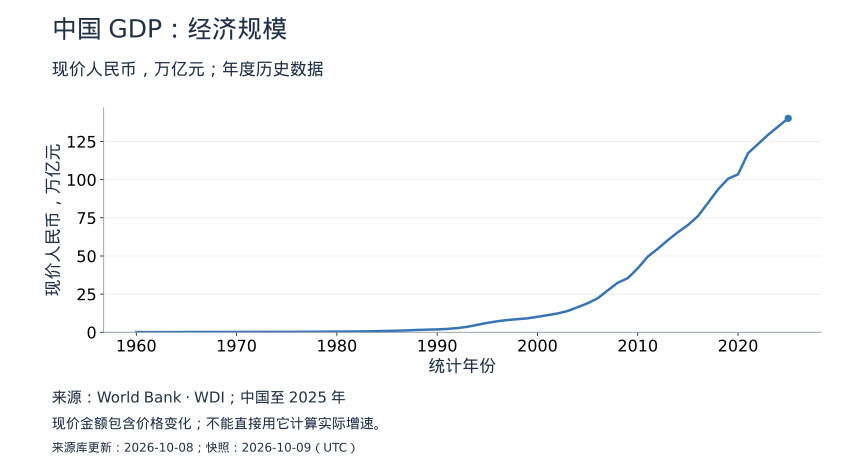
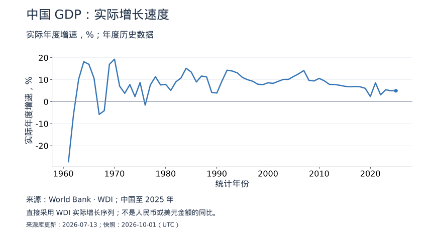
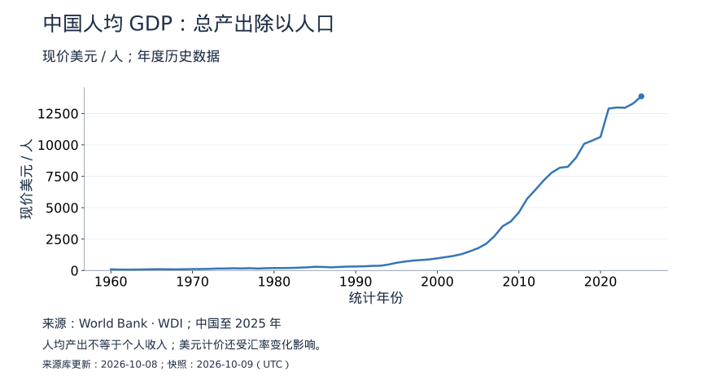
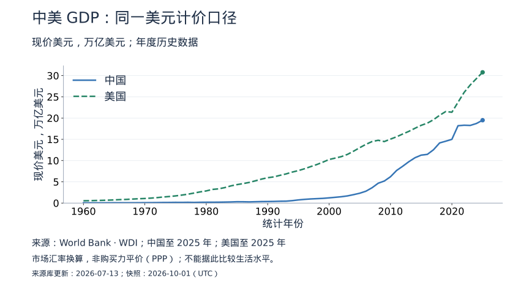

<!-- Generated by scripts/sync_gdp.py; edit the script, not this page. -->
# GDP 数据专题

从经济规模、实际增长、人均产出和跨国比较四个角度阅读 GDP。这里是真实年度数据，与课程中的教学假设分开；来源为世界银行 World Development Indicators（WDI），不保证与国家统计局最新季度快报同步。

## 最新可得读数

| 指标 | 统计年份 | 数值 | 单位 |
|---|---|---|---|
| 中国GDP（现价人民币） | 2025 | 140.19 | 万亿元 |
| 中国GDP 实际年度增速 | 2025 | 4.96 | % |
| 中国人均 GDP（现价美元） | 2025 | 13,861.97 | 美元 / 人 |
| 中国GDP（现价美元） | 2025 | 19.50 | 万亿美元 |
| 美国GDP（现价美元） | 2025 | 30.77 | 万亿美元 |

- **来源库更新时间**：2026-07-13。这是 WDI 数据库的更新日期，不是每条观测的发布日期。
- **本快照获取时间**：2026-10-01T15:44:06+00:00。只有观测或来源元数据变化才更新快照；最近检查是否成功请看 [GitHub 同步记录](https://github.com/calcky/finance/actions/workflows/update-gdp.yml)。
- **发布时间**：接口未提供逐条发布时间，CSV 的 `published_at` 留空。历史数据可修订，不把本次读数当作当年首次公布值。
- **显示精度**：表格保留两位小数，CSV 保存接口数值。缺失值显示“—”，不是零。

文档站中的图支持悬停读数、点击固定年份，以及拖动时间滑块或切换近 10 年、近 20 年。也可以用年份下拉框准确选择，再点“查看该年完整指标”跳到高亮的表格行。GitHub、打印或脚本不可用时显示静态图，历年表格和下载仍可使用。

## 1. 经济规模：人民币现价 GDP

这张图回答“一年生产的最终产品与服务，按当期价格合计有多少”。金额增长可能来自产出增加，也可能来自价格上涨。早期值在线性坐标上显得小，不代表那时没有经济活动。

## 2. 增长速度：实际 GDP 年度增速

实际增速剔除价格变化。增速从 6% 降到 4% 表示增长放慢，通常不是产出下降；低于 0 才表示该期间实际总产出收缩。这条序列直接使用 WDI 的实际增速，不能用上一张现价金额计算后替代。

## 3. 人均 GDP：不等于人均收入

人均 GDP 是总产出除以人口，不能理解成每个人能分到这些钱。这里选择美元口径方便跨国阅读，但汇率和价格也会影响走势；讨论真实生活水平，还要参考实际购买力、居民收入及分配。

## 4. 中美对照：美元 GDP

两条曲线采用相同指标和单位，但用市场汇率换算的美元规模不等于实际产量比较，也不等于 PPP。人民币贬值可能压低美元计价的中国 GDP，即使当年实际产出仍在增长。最新年份分别标明，比较时应使用共同年份。

## 历年明细与下载

{download}`下载 CSV <../../data/gdp.csv>` · {download}`下载来源元数据 <../../data/gdp.metadata.json>` · [GitHub 数据与说明](https://github.com/calcky/finance/tree/main/data)

| 年份 | 中国 GDP（万亿元） | 中国实际增速（%） | 中国人均 GDP（美元） | 中国 GDP（万亿美元） | 美国 GDP（万亿美元） |
|---|---|---|---|---|---|
| 2025 | 140.19 | 4.96 | 13,861.97 | 19.50 | 30.77 |
| 2024 | 134.81 | 4.96 | 13,293.12 | 18.73 | 29.30 |
| 2023 | 129.43 | 5.42 | 12,951.18 | 18.27 | 27.81 |
| 2022 | 123.40 | 3.13 | 12,970.61 | 18.32 | 26.05 |
| 2021 | 117.38 | 8.57 | 12,887.44 | 18.20 | 23.73 |
| 2020 | 103.49 | 2.34 | 10,627.46 | 15.00 | 21.38 |
| 2019 | 100.59 | 6.07 | 10,342.90 | 14.56 | 21.54 |
| 2018 | 93.60 | 6.76 | 10,085.66 | 14.15 | 20.66 |
| 2017 | 84.74 | 6.89 | 8,979.68 | 12.54 | 19.61 |
| 2016 | 76.12 | 6.77 | 8,254.87 | 11.46 | 18.80 |
| 2015 | 70.25 | 6.98 | 8,175.33 | 11.28 | 18.30 |
| 2014 | 65.58 | 7.46 | 7,781.07 | 10.67 | 17.61 |
| 2013 | 60.37 | 7.78 | 7,147.04 | 9.74 | 16.88 |
| 2012 | 54.75 | 7.86 | 6,405.06 | 8.67 | 16.25 |
| 2011 | 49.57 | 9.46 | 5,703.76 | 7.67 | 15.60 |
| 2010 | 41.93 | 10.59 | 4,629.25 | 6.19 | 15.05 |
| 2009 | 35.45 | 9.41 | 3,898.24 | 5.19 | 14.48 |
| 2008 | 32.43 | 9.67 | 3,523.44 | 4.67 | 14.77 |
| 2007 | 27.42 | 14.15 | 2,734.73 | 3.60 | 14.47 |
| 2006 | 22.26 | 12.68 | 2,129.26 | 2.79 | 13.82 |
| 2005 | 18.99 | 11.45 | 1,777.64 | 2.32 | 13.04 |
| 2004 | 16.42 | 10.14 | 1,530.93 | 1.98 | 12.22 |
| 2003 | 13.94 | 10.11 | 1,306.97 | 1.68 | 11.46 |
| 2002 | 12.33 | 9.24 | 1,163.56 | 1.49 | 10.93 |
| 2001 | 11.22 | 8.32 | 1,065.41 | 1.36 | 10.58 |
| 2000 | 10.13 | 8.57 | 969.20 | 1.22 | 10.25 |
| 1999 | 9.14 | 7.74 | 881.15 | 1.10 | 9.63 |
| 1998 | 8.59 | 7.92 | 835.10 | 1.04 | 9.06 |
| 1997 | 8.02 | 9.30 | 786.74 | 0.97 | 8.58 |
| 1996 | 7.22 | 9.97 | 713.34 | 0.87 | 8.07 |
| 1995 | 6.16 | 11.02 | 612.68 | 0.74 | 7.64 |
| 1994 | 4.89 | 13.08 | 475.68 | 0.57 | 7.29 |
| 1993 | 3.58 | 13.93 | 378.94 | 0.45 | 6.86 |
| 1992 | 2.73 | 14.30 | 367.82 | 0.43 | 6.52 |
| 1991 | 2.21 | 9.38 | 334.13 | 0.38 | 6.16 |
| 1990 | 1.89 | 3.92 | 318.50 | 0.36 | 5.96 |
| 1989 | 1.72 | 4.21 | 311.43 | 0.35 | 5.64 |
| 1988 | 1.52 | 11.22 | 284.02 | 0.31 | 5.24 |
| 1987 | 1.22 | 11.66 | 252.26 | 0.27 | 4.86 |
| 1986 | 1.04 | 8.94 | 282.45 | 0.30 | 4.58 |
| 1985 | 0.91 | 13.43 | 295.01 | 0.31 | 4.34 |
| 1984 | 0.73 | 15.19 | 251.19 | 0.26 | 4.04 |
| 1983 | 0.60 | 10.77 | 225.87 | 0.23 | 3.63 |
| 1982 | 0.54 | 9.02 | 203.72 | 0.21 | 3.34 |
| 1981 | 0.49 | 5.11 | 197.43 | 0.20 | 3.21 |
| 1980 | 0.46 | 7.84 | 195.15 | 0.19 | 2.86 |
| 1979 | 0.41 | 7.59 | 184.29 | 0.18 | 2.63 |
| 1978 | 0.37 | 11.33 | 156.66 | 0.15 | 2.35 |
| 1977 | 0.33 | 7.57 | 185.73 | 0.18 | 2.08 |
| 1976 | 0.30 | -1.57 | 165.68 | 0.15 | 1.87 |
| 1975 | 0.30 | 8.72 | 178.62 | 0.16 | 1.68 |
| 1974 | 0.28 | 2.31 | 160.40 | 0.14 | 1.55 |
| 1973 | 0.28 | 7.76 | 157.34 | 0.14 | 1.43 |
| 1972 | 0.26 | 3.81 | 132.10 | 0.11 | 1.28 |
| 1971 | 0.25 | 7.06 | 118.84 | 0.10 | 1.16 |
| 1970 | 0.23 | 19.30 | 113.35 | 0.09 | 1.07 |
| 1969 | 0.20 | 16.94 | 100.31 | 0.08 | 1.02 |
| 1968 | 0.17 | -4.10 | 91.65 | 0.07 | 0.94 |
| 1967 | 0.18 | -5.77 | 96.76 | 0.07 | 0.86 |
| 1966 | 0.19 | 10.65 | 104.51 | 0.08 | 0.81 |
| 1965 | 0.17 | 16.95 | 98.67 | 0.07 | 0.74 |
| 1964 | 0.15 | 18.18 | 85.66 | 0.06 | 0.68 |
| 1963 | 0.13 | 10.30 | 74.47 | 0.05 | 0.64 |
| 1962 | 0.12 | -5.58 | 71.06 | 0.05 | 0.60 |
| 1961 | 0.12 | -27.27 | 75.97 | 0.05 | 0.56 |
| 1960 | 0.15 | — | 89.72 | 0.06 | 0.54 |

## 来源、口径与修订

- [GDP（现价人民币）](https://data.worldbank.org/indicator/NY.GDP.MKTP.CN)：`NY.GDP.MKTP.CN`。
- [GDP 实际年度增速](https://data.worldbank.org/indicator/NY.GDP.MKTP.KD.ZG)：`NY.GDP.MKTP.KD.ZG`。
- [GDP（现价美元）](https://data.worldbank.org/indicator/NY.GDP.MKTP.CD)：`NY.GDP.MKTP.CD`。
- [人均 GDP（现价美元）](https://data.worldbank.org/indicator/NY.GDP.PCAP.CD)：`NY.GDP.PCAP.CD`。

归属：**The World Bank: World Development Indicators**，及指标元数据列明的国家统计机构、央行、OECD 和世界银行估算等提供方。具体定义与提供方保存在下载的元数据中。WDI 是汇编数据源，不能把所有历史观测都称为同一天发布的国家统计局原始值。

遵循[世界银行数据使用条款](https://data.worldbank.org/summary-terms-of-use)及相应元数据要求；其默认许可为 CC BY 4.0，附加条件和第三方例外以来源为准。本专题的单位换算、中文说明和图表由本项目制作，不代表世界银行认可。

每天检查新值和历史修订。数据、图表、表格由同一快照生成；采集或校验失败不发布新快照。Git 历史保留**本项目开始采集以来**的版本，不提供采集前的历史初值。[查看数据变更](https://github.com/calcky/finance/commits/main/data/gdp.csv)。

继续阅读：[GDP 与通胀原理](../growth-and-inflation.md) · [如何阅读宏观数据](../reading-macro-data.md) · [数据更新规则](index.md)。
