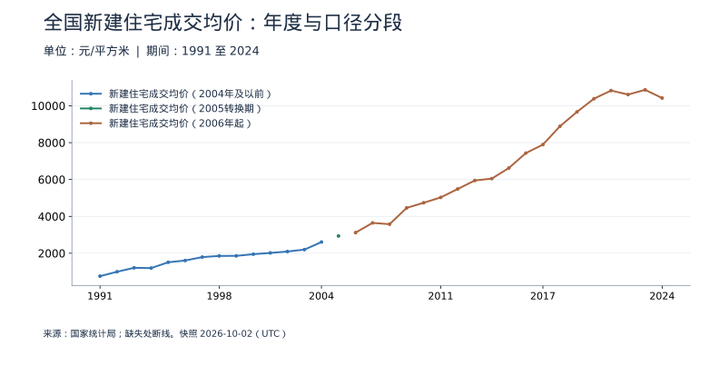
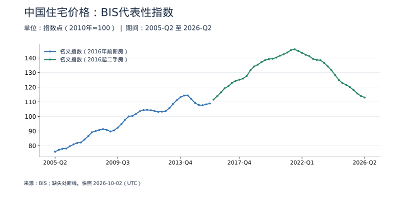
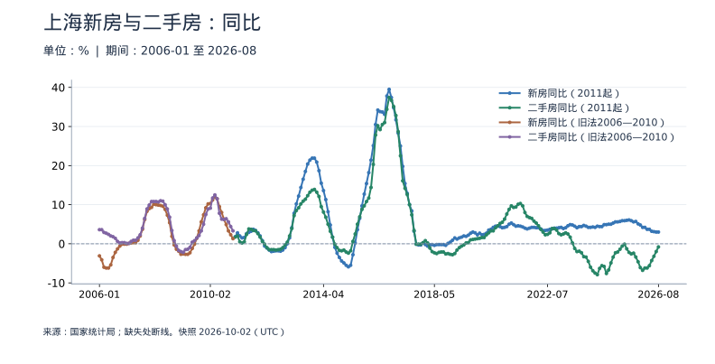
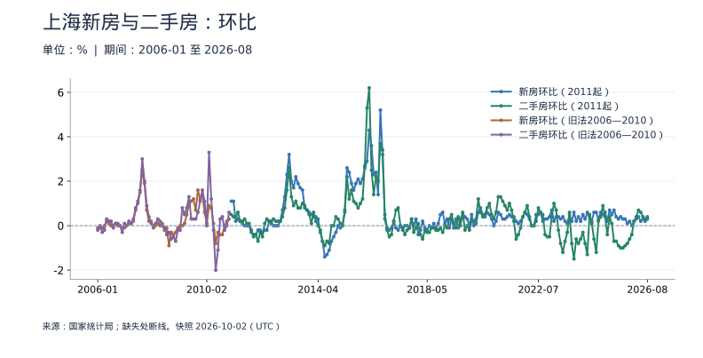

<!-- Generated by scripts/sync_macro.py; edit macro_catalog.py/macro_render.py. -->
# 中国与上海房价：真实数据

成交均价与价格指数有什么区别，全国趋势能否代表上海？

房价不存在一个可以代表所有房屋的单一数字。全国新建住宅成交均价用元/平方米，BIS70城代表序列用指数，上海新房与二手房用同比、环比；不混成一条曲线。真实口径转换分段保留，旧数据仍在图表或补充明细中。

本页快照获取时间：**2026-10-02T15:33:59+00:00**。这是获取时间，不是所有数据的发布日期。每日检查上游；最新统计期以每个指标为准。

[CSV 下载](https://raw.githubusercontent.com/calcky/finance/main/data/macro/housing-prices.csv) · [来源与采集参数](https://github.com/calcky/finance/blob/main/data/macro/housing-prices.metadata.json) · [最近同步状态](https://github.com/calcky/finance/actions/workflows/update-gdp.yml)

```{only} html
本站同版快照：{download}`CSV <../../data/macro/housing-prices.csv>` · {download}`元数据 <../../data/macro/housing-prices.metadata.json>`
```

网页支持悬停查看、点击固定读数、按期间选择、缩放和定位明细。GitHub、打印或禁用 JavaScript 时显示静态图；数值与网页使用同一快照。

## 最新观测与覆盖

| 指标 | 最新期间 | 数值 | 单位 | 本项目起点 | 观测数 | 来源 |
|---|---|---:|---|---|---:|---|
| 新建住宅成交均价（2004年及以前） | 2004 | 2,608 | 元/平方米 | 1991 | 14 | [国家统计局](https://data.stats.gov.cn/dg/website/page.html#/pc/national/yearData) |
| 新建住宅成交均价（2005转换期） | 2005 | 2,937 | 元/平方米 | 2005 | 1 | [国家统计局](https://data.stats.gov.cn/dg/website/page.html#/pc/national/yearData) |
| 新建住宅成交均价（2006年起） | 2024 | 10,419 | 元/平方米 | 2006 | 19 | [国家统计局](https://data.stats.gov.cn/dg/website/page.html#/pc/national/yearData) |
| 名义指数（2016年前新房） | 2015-Q4 | 108.8422 | 指数点（2010年=100） | 2005-Q2 | 43 | [BIS](https://stats.bis.org/api/v1/data/WS_SPP/Q.CN.N.628?format=csv) |
| 名义指数（2016起二手房） | 2026-Q2 | 112.9201 | 指数点（2010年=100） | 2016-Q1 | 42 | [BIS](https://stats.bis.org/api/v1/data/WS_SPP/Q.CN.N.628?format=csv) |
| 新房同比（2011起） | 2026-08 | 3 | % | 2011-01 | 188 | [国家统计局](https://data.stats.gov.cn/) |
| 二手房同比（2011起） | 2026-08 | -0.8 | % | 2011-01 | 188 | [国家统计局](https://data.stats.gov.cn/) |
| 新房同比（旧法2006—2010） | 2010-12 | 1.3 | % | 2006-01 | 60 | [国家统计局](https://data.stats.gov.cn/) |
| 二手房同比（旧法2006—2010） | 2010-12 | 3.3 | % | 2006-01 | 60 | [国家统计局](https://data.stats.gov.cn/) |
| 新房环比（2011起） | 2026-08 | 0.4 | % | 2011-01 | 188 | [国家统计局](https://data.stats.gov.cn/) |
| 二手房环比（2011起） | 2026-08 | 0.3 | % | 2011-01 | 188 | [国家统计局](https://data.stats.gov.cn/) |
| 新房环比（旧法2006—2010） | 2010-12 | 0.3 | % | 2006-01 | 60 | [国家统计局](https://data.stats.gov.cn/) |
| 二手房环比（旧法2006—2010） | 2010-12 | 0.6 | % | 2006-01 | 60 | [国家统计局](https://data.stats.gov.cn/) |
| 商品房成交均价（2004年及以前） | 2004 | 2,778 | 元/平方米 | 1991 | 14 | [国家统计局](https://data.stats.gov.cn/dg/website/page.html#/pc/national/yearData) |
| 商品房成交均价（2005转换期） | 2005 | 3,168 | 元/平方米 | 2005 | 1 | [国家统计局](https://data.stats.gov.cn/dg/website/page.html#/pc/national/yearData) |
| 商品房成交均价（2006年起） | 2024 | 9,935 | 元/平方米 | 2006 | 19 | [国家统计局](https://data.stats.gov.cn/dg/website/page.html#/pc/national/yearData) |
| CPI调整后指数（2016年前新房） | 2015-Q4 | 94.2591 | 指数点（2010年=100） | 2005-Q2 | 43 | [BIS](https://stats.bis.org/api/v1/data/WS_SPP/Q.CN.R.628?format=csv) |
| CPI调整后指数（2016起二手房） | 2026-Q2 | 84.37 | 指数点（2010年=100） | 2016-Q1 | 42 | [BIS](https://stats.bis.org/api/v1/data/WS_SPP/Q.CN.R.628?format=csv) |

起点表示本项目当前覆盖范围，不代表该指标从此时才开始发布。旧定义序列的最后一期也不代表来源停止更新。各来源可能存在发布或入库滞后；空白不补零、不插值。发布日期未知的观测在 CSV 中留空。

图表的“全部”与 CSV 保留完整已采集历史；缩放近期不会删除早期数据。[历史来源、口径断点与剩余缺口](history-coverage.md)说明回溯范围。

## 全国新建住宅成交均价：年度与口径分段

官方公布的销售均价，不是同一套房的价格变化。城市和户型成交结构会改变均价；2005年销售范围转换单列。1991—1999年来自旧年鉴，之后优先最新数据库。



<details class="macro-details">
<summary>全国新建住宅成交均价：年度与口径分段：展开完整数据表（元/平方米）</summary>
<div class="macro-table-wrap"><table><thead><tr><th>期间</th><th>新建住宅成交均价（2004年及以前）</th><th>新建住宅成交均价（2005转换期）</th><th>新建住宅成交均价（2006年起）</th></tr></thead><tbody>
<tr id="macro-housing-average-2024" tabindex="-1"><td>2024</td><td>缺失</td><td>缺失</td><td>10,419</td></tr>
<tr id="macro-housing-average-2023" tabindex="-1"><td>2023</td><td>缺失</td><td>缺失</td><td>10,864</td></tr>
<tr id="macro-housing-average-2022" tabindex="-1"><td>2022</td><td>缺失</td><td>缺失</td><td>10,608</td></tr>
<tr id="macro-housing-average-2021" tabindex="-1"><td>2021</td><td>缺失</td><td>缺失</td><td>10,825</td></tr>
<tr id="macro-housing-average-2020" tabindex="-1"><td>2020</td><td>缺失</td><td>缺失</td><td>10,385</td></tr>
<tr id="macro-housing-average-2019" tabindex="-1"><td>2019</td><td>缺失</td><td>缺失</td><td>9,667</td></tr>
<tr id="macro-housing-average-2018" tabindex="-1"><td>2018</td><td>缺失</td><td>缺失</td><td>8,886</td></tr>
<tr id="macro-housing-average-2017" tabindex="-1"><td>2017</td><td>缺失</td><td>缺失</td><td>7,893</td></tr>
<tr id="macro-housing-average-2016" tabindex="-1"><td>2016</td><td>缺失</td><td>缺失</td><td>7,433</td></tr>
<tr id="macro-housing-average-2015" tabindex="-1"><td>2015</td><td>缺失</td><td>缺失</td><td>6,622</td></tr>
<tr id="macro-housing-average-2014" tabindex="-1"><td>2014</td><td>缺失</td><td>缺失</td><td>6,048</td></tr>
<tr id="macro-housing-average-2013" tabindex="-1"><td>2013</td><td>缺失</td><td>缺失</td><td>5,946</td></tr>
<tr id="macro-housing-average-2012" tabindex="-1"><td>2012</td><td>缺失</td><td>缺失</td><td>5,486</td></tr>
<tr id="macro-housing-average-2011" tabindex="-1"><td>2011</td><td>缺失</td><td>缺失</td><td>5,029</td></tr>
<tr id="macro-housing-average-2010" tabindex="-1"><td>2010</td><td>缺失</td><td>缺失</td><td>4,738</td></tr>
<tr id="macro-housing-average-2009" tabindex="-1"><td>2009</td><td>缺失</td><td>缺失</td><td>4,459</td></tr>
<tr id="macro-housing-average-2008" tabindex="-1"><td>2008</td><td>缺失</td><td>缺失</td><td>3,576</td></tr>
<tr id="macro-housing-average-2007" tabindex="-1"><td>2007</td><td>缺失</td><td>缺失</td><td>3,645</td></tr>
<tr id="macro-housing-average-2006" tabindex="-1"><td>2006</td><td>缺失</td><td>缺失</td><td>3,119</td></tr>
<tr id="macro-housing-average-2005" tabindex="-1"><td>2005</td><td>缺失</td><td>2,937</td><td>缺失</td></tr>
<tr id="macro-housing-average-2004" tabindex="-1"><td>2004</td><td>2,608</td><td>缺失</td><td>缺失</td></tr>
<tr id="macro-housing-average-2003" tabindex="-1"><td>2003</td><td>2,197</td><td>缺失</td><td>缺失</td></tr>
<tr id="macro-housing-average-2002" tabindex="-1"><td>2002</td><td>2,092</td><td>缺失</td><td>缺失</td></tr>
<tr id="macro-housing-average-2001" tabindex="-1"><td>2001</td><td>2,017</td><td>缺失</td><td>缺失</td></tr>
<tr id="macro-housing-average-2000" tabindex="-1"><td>2000</td><td>1,948</td><td>缺失</td><td>缺失</td></tr>
<tr id="macro-housing-average-1999" tabindex="-1"><td>1999</td><td>1,857</td><td>缺失</td><td>缺失</td></tr>
<tr id="macro-housing-average-1998" tabindex="-1"><td>1998</td><td>1,854</td><td>缺失</td><td>缺失</td></tr>
<tr id="macro-housing-average-1997" tabindex="-1"><td>1997</td><td>1,790</td><td>缺失</td><td>缺失</td></tr>
<tr id="macro-housing-average-1996" tabindex="-1"><td>1996</td><td>1,605</td><td>缺失</td><td>缺失</td></tr>
<tr id="macro-housing-average-1995" tabindex="-1"><td>1995</td><td>1,509</td><td>缺失</td><td>缺失</td></tr>
<tr id="macro-housing-average-1994" tabindex="-1"><td>1994</td><td>1,194</td><td>缺失</td><td>缺失</td></tr>
<tr id="macro-housing-average-1993" tabindex="-1"><td>1993</td><td>1,208</td><td>缺失</td><td>缺失</td></tr>
<tr id="macro-housing-average-1992" tabindex="-1"><td>1992</td><td>996</td><td>缺失</td><td>缺失</td></tr>
<tr id="macro-housing-average-1991" tabindex="-1"><td>1991</td><td>756</td><td>缺失</td><td>缺失</td></tr>
</tbody></table></div></details>

## 中国住宅价格：BIS代表性指数

覆盖70城的代表性序列，不代表全国所有房屋。2016年由新建住宅转为二手住宅范围，曲线分开，仍保留来源的2010年=100；不能将2016年后的线解读为同一套新房的连续涨跌。



<details class="macro-details">
<summary>中国住宅价格：BIS代表性指数：展开完整数据表（指数点（2010年=100））</summary>
<div class="macro-table-wrap"><table><thead><tr><th>期间</th><th>名义指数（2016年前新房）</th><th>名义指数（2016起二手房）</th></tr></thead><tbody>
<tr id="macro-housing-bis-2026-Q2" tabindex="-1"><td>2026-Q2</td><td>缺失</td><td>112.9201</td></tr>
<tr id="macro-housing-bis-2026-Q1" tabindex="-1"><td>2026-Q1</td><td>缺失</td><td>113.9785</td></tr>
<tr id="macro-housing-bis-2025-Q4" tabindex="-1"><td>2025-Q4</td><td>缺失</td><td>115.6573</td></tr>
<tr id="macro-housing-bis-2025-Q3" tabindex="-1"><td>2025-Q3</td><td>缺失</td><td>118.0296</td></tr>
<tr id="macro-housing-bis-2025-Q2" tabindex="-1"><td>2025-Q2</td><td>缺失</td><td>120.0004</td></tr>
<tr id="macro-housing-bis-2025-Q1" tabindex="-1"><td>2025-Q1</td><td>缺失</td><td>121.6428</td></tr>
<tr id="macro-housing-bis-2024-Q4" tabindex="-1"><td>2024-Q4</td><td>缺失</td><td>122.7012</td></tr>
<tr id="macro-housing-bis-2024-Q3" tabindex="-1"><td>2024-Q3</td><td>缺失</td><td>124.9274</td></tr>
<tr id="macro-housing-bis-2024-Q2" tabindex="-1"><td>2024-Q2</td><td>缺失</td><td>128.2121</td></tr>
<tr id="macro-housing-bis-2024-Q1" tabindex="-1"><td>2024-Q1</td><td>缺失</td><td>131.5333</td></tr>
<tr id="macro-housing-bis-2023-Q4" tabindex="-1"><td>2023-Q4</td><td>缺失</td><td>134.1976</td></tr>
<tr id="macro-housing-bis-2023-Q3" tabindex="-1"><td>2023-Q3</td><td>缺失</td><td>136.6428</td></tr>
<tr id="macro-housing-bis-2023-Q2" tabindex="-1"><td>2023-Q2</td><td>缺失</td><td>138.4311</td></tr>
<tr id="macro-housing-bis-2023-Q1" tabindex="-1"><td>2023-Q1</td><td>缺失</td><td>138.6866</td></tr>
<tr id="macro-housing-bis-2022-Q4" tabindex="-1"><td>2022-Q4</td><td>缺失</td><td>139.3801</td></tr>
<tr id="macro-housing-bis-2022-Q3" tabindex="-1"><td>2022-Q3</td><td>缺失</td><td>141.1319</td></tr>
<tr id="macro-housing-bis-2022-Q2" tabindex="-1"><td>2022-Q2</td><td>缺失</td><td>142.2268</td></tr>
<tr id="macro-housing-bis-2022-Q1" tabindex="-1"><td>2022-Q1</td><td>缺失</td><td>143.5042</td></tr>
<tr id="macro-housing-bis-2021-Q4" tabindex="-1"><td>2021-Q4</td><td>缺失</td><td>144.745</td></tr>
<tr id="macro-housing-bis-2021-Q3" tabindex="-1"><td>2021-Q3</td><td>缺失</td><td>145.9129</td></tr>
<tr id="macro-housing-bis-2021-Q2" tabindex="-1"><td>2021-Q2</td><td>缺失</td><td>145.402</td></tr>
<tr id="macro-housing-bis-2021-Q1" tabindex="-1"><td>2021-Q1</td><td>缺失</td><td>143.7231</td></tr>
<tr id="macro-housing-bis-2020-Q4" tabindex="-1"><td>2020-Q4</td><td>缺失</td><td>142.4458</td></tr>
<tr id="macro-housing-bis-2020-Q3" tabindex="-1"><td>2020-Q3</td><td>缺失</td><td>141.5698</td></tr>
<tr id="macro-housing-bis-2020-Q2" tabindex="-1"><td>2020-Q2</td><td>缺失</td><td>140.256</td></tr>
<tr id="macro-housing-bis-2020-Q1" tabindex="-1"><td>2020-Q1</td><td>缺失</td><td>139.4895</td></tr>
<tr id="macro-housing-bis-2019-Q4" tabindex="-1"><td>2019-Q4</td><td>缺失</td><td>139.2341</td></tr>
<tr id="macro-housing-bis-2019-Q3" tabindex="-1"><td>2019-Q3</td><td>缺失</td><td>138.5041</td></tr>
<tr id="macro-housing-bis-2019-Q2" tabindex="-1"><td>2019-Q2</td><td>缺失</td><td>137.1538</td></tr>
<tr id="macro-housing-bis-2019-Q1" tabindex="-1"><td>2019-Q1</td><td>缺失</td><td>135.4384</td></tr>
<tr id="macro-housing-bis-2018-Q4" tabindex="-1"><td>2018-Q4</td><td>缺失</td><td>134.1611</td></tr>
<tr id="macro-housing-bis-2018-Q3" tabindex="-1"><td>2018-Q3</td><td>缺失</td><td>131.5698</td></tr>
<tr id="macro-housing-bis-2018-Q2" tabindex="-1"><td>2018-Q2</td><td>缺失</td><td>127.7012</td></tr>
<tr id="macro-housing-bis-2018-Q1" tabindex="-1"><td>2018-Q1</td><td>缺失</td><td>125.8764</td></tr>
<tr id="macro-housing-bis-2017-Q4" tabindex="-1"><td>2017-Q4</td><td>缺失</td><td>125.1464</td></tr>
<tr id="macro-housing-bis-2017-Q3" tabindex="-1"><td>2017-Q3</td><td>缺失</td><td>124.38</td></tr>
<tr id="macro-housing-bis-2017-Q2" tabindex="-1"><td>2017-Q2</td><td>缺失</td><td>122.9931</td></tr>
<tr id="macro-housing-bis-2017-Q1" tabindex="-1"><td>2017-Q1</td><td>缺失</td><td>120.6209</td></tr>
<tr id="macro-housing-bis-2016-Q4" tabindex="-1"><td>2016-Q4</td><td>缺失</td><td>119.1975</td></tr>
<tr id="macro-housing-bis-2016-Q3" tabindex="-1"><td>2016-Q3</td><td>缺失</td><td>116.4238</td></tr>
<tr id="macro-housing-bis-2016-Q2" tabindex="-1"><td>2016-Q2</td><td>缺失</td><td>113.8325</td></tr>
<tr id="macro-housing-bis-2016-Q1" tabindex="-1"><td>2016-Q1</td><td>缺失</td><td>111.5332</td></tr>
<tr id="macro-housing-bis-2015-Q4" tabindex="-1"><td>2015-Q4</td><td>108.8422</td><td>缺失</td></tr>
<tr id="macro-housing-bis-2015-Q3" tabindex="-1"><td>2015-Q3</td><td>108.2437</td><td>缺失</td></tr>
<tr id="macro-housing-bis-2015-Q2" tabindex="-1"><td>2015-Q2</td><td>107.5882</td><td>缺失</td></tr>
<tr id="macro-housing-bis-2015-Q1" tabindex="-1"><td>2015-Q1</td><td>107.8162</td><td>缺失</td></tr>
<tr id="macro-housing-bis-2014-Q4" tabindex="-1"><td>2014-Q4</td><td>109.1557</td><td>缺失</td></tr>
<tr id="macro-housing-bis-2014-Q3" tabindex="-1"><td>2014-Q3</td><td>111.7207</td><td>缺失</td></tr>
<tr id="macro-housing-bis-2014-Q2" tabindex="-1"><td>2014-Q2</td><td>114.3427</td><td>缺失</td></tr>
<tr id="macro-housing-bis-2014-Q1" tabindex="-1"><td>2014-Q1</td><td>114.2857</td><td>缺失</td></tr>
<tr id="macro-housing-bis-2013-Q4" tabindex="-1"><td>2013-Q4</td><td>113.0602</td><td>缺失</td></tr>
<tr id="macro-housing-bis-2013-Q3" tabindex="-1"><td>2013-Q3</td><td>111.0082</td><td>缺失</td></tr>
<tr id="macro-housing-bis-2013-Q2" tabindex="-1"><td>2013-Q2</td><td>108.5572</td><td>缺失</td></tr>
<tr id="macro-housing-bis-2013-Q1" tabindex="-1"><td>2013-Q1</td><td>105.5932</td><td>缺失</td></tr>
<tr id="macro-housing-bis-2012-Q4" tabindex="-1"><td>2012-Q4</td><td>103.6551</td><td>缺失</td></tr>
<tr id="macro-housing-bis-2012-Q3" tabindex="-1"><td>2012-Q3</td><td>103.2561</td><td>缺失</td></tr>
<tr id="macro-housing-bis-2012-Q2" tabindex="-1"><td>2012-Q2</td><td>103.1136</td><td>缺失</td></tr>
<tr id="macro-housing-bis-2012-Q1" tabindex="-1"><td>2012-Q1</td><td>103.6551</td><td>缺失</td></tr>
<tr id="macro-housing-bis-2011-Q4" tabindex="-1"><td>2011-Q4</td><td>104.1967</td><td>缺失</td></tr>
<tr id="macro-housing-bis-2011-Q3" tabindex="-1"><td>2011-Q3</td><td>104.4817</td><td>缺失</td></tr>
<tr id="macro-housing-bis-2011-Q2" tabindex="-1"><td>2011-Q2</td><td>104.2822</td><td>缺失</td></tr>
<tr id="macro-housing-bis-2011-Q1" tabindex="-1"><td>2011-Q1</td><td>103.5126</td><td>缺失</td></tr>
<tr id="macro-housing-bis-2010-Q4" tabindex="-1"><td>2010-Q4</td><td>101.8596</td><td>缺失</td></tr>
<tr id="macro-housing-bis-2010-Q3" tabindex="-1"><td>2010-Q3</td><td>100.3776</td><td>缺失</td></tr>
<tr id="macro-housing-bis-2010-Q2" tabindex="-1"><td>2010-Q2</td><td>100.0071</td><td>缺失</td></tr>
<tr id="macro-housing-bis-2010-Q1" tabindex="-1"><td>2010-Q1</td><td>97.7556</td><td>缺失</td></tr>
<tr id="macro-housing-bis-2009-Q4" tabindex="-1"><td>2009-Q4</td><td>94.7631</td><td>缺失</td></tr>
<tr id="macro-housing-bis-2009-Q3" tabindex="-1"><td>2009-Q3</td><td>92.3406</td><td>缺失</td></tr>
<tr id="macro-housing-bis-2009-Q2" tabindex="-1"><td>2009-Q2</td><td>90.4026</td><td>缺失</td></tr>
<tr id="macro-housing-bis-2009-Q1" tabindex="-1"><td>2009-Q1</td><td>89.6901</td><td>缺失</td></tr>
<tr id="macro-housing-bis-2008-Q4" tabindex="-1"><td>2008-Q4</td><td>90.7446</td><td>缺失</td></tr>
<tr id="macro-housing-bis-2008-Q3" tabindex="-1"><td>2008-Q3</td><td>91.2576</td><td>缺失</td></tr>
<tr id="macro-housing-bis-2008-Q2" tabindex="-1"><td>2008-Q2</td><td>90.8301</td><td>缺失</td></tr>
<tr id="macro-housing-bis-2008-Q1" tabindex="-1"><td>2008-Q1</td><td>89.8611</td><td>缺失</td></tr>
<tr id="macro-housing-bis-2007-Q4" tabindex="-1"><td>2007-Q4</td><td>89.1486</td><td>缺失</td></tr>
<tr id="macro-housing-bis-2007-Q3" tabindex="-1"><td>2007-Q3</td><td>86.498</td><td>缺失</td></tr>
<tr id="macro-housing-bis-2007-Q2" tabindex="-1"><td>2007-Q2</td><td>84.218</td><td>缺失</td></tr>
<tr id="macro-housing-bis-2007-Q1" tabindex="-1"><td>2007-Q1</td><td>82.1375</td><td>缺失</td></tr>
<tr id="macro-housing-bis-2006-Q4" tabindex="-1"><td>2006-Q4</td><td>81.824</td><td>缺失</td></tr>
<tr id="macro-housing-bis-2006-Q3" tabindex="-1"><td>2006-Q3</td><td>80.855</td><td>缺失</td></tr>
<tr id="macro-housing-bis-2006-Q2" tabindex="-1"><td>2006-Q2</td><td>79.544</td><td>缺失</td></tr>
<tr id="macro-housing-bis-2006-Q1" tabindex="-1"><td>2006-Q1</td><td>78.005</td><td>缺失</td></tr>
<tr id="macro-housing-bis-2005-Q4" tabindex="-1"><td>2005-Q4</td><td>77.9195</td><td>缺失</td></tr>
<tr id="macro-housing-bis-2005-Q3" tabindex="-1"><td>2005-Q3</td><td>77.0645</td><td>缺失</td></tr>
<tr id="macro-housing-bis-2005-Q2" tabindex="-1"><td>2005-Q2</td><td>75.8675</td><td>缺失</td></tr>
</tbody></table></div></details>

## 上海新房与二手房：同比

相对上年同月。旧法2006—2010和2011年改革后分开；同比下降不等于房价回到若干年前。指数减100得到百分比变化。



<details class="macro-details">
<summary>上海新房与二手房：同比：展开完整数据表（%）</summary>
<div class="macro-table-wrap"><table><thead><tr><th>期间</th><th>新房同比（2011起）</th><th>二手房同比（2011起）</th><th>新房同比（旧法2006—2010）</th><th>二手房同比（旧法2006—2010）</th></tr></thead><tbody>
<tr id="macro-housing-shanghai-yoy-2026-08" tabindex="-1"><td>2026-08</td><td>3</td><td>-0.8</td><td>缺失</td><td>缺失</td></tr>
<tr id="macro-housing-shanghai-yoy-2026-07" tabindex="-1"><td>2026-07</td><td>3</td><td>-2</td><td>缺失</td><td>缺失</td></tr>
<tr id="macro-housing-shanghai-yoy-2026-06" tabindex="-1"><td>2026-06</td><td>3.1</td><td>-3.2</td><td>缺失</td><td>缺失</td></tr>
<tr id="macro-housing-shanghai-yoy-2026-05" tabindex="-1"><td>2026-05</td><td>3.2</td><td>-4.3</td><td>缺失</td><td>缺失</td></tr>
<tr id="macro-housing-shanghai-yoy-2026-04" tabindex="-1"><td>2026-04</td><td>3.7</td><td>-5.6</td><td>缺失</td><td>缺失</td></tr>
<tr id="macro-housing-shanghai-yoy-2026-03" tabindex="-1"><td>2026-03</td><td>3.7</td><td>-6.2</td><td>缺失</td><td>缺失</td></tr>
<tr id="macro-housing-shanghai-yoy-2026-02" tabindex="-1"><td>2026-02</td><td>4.2</td><td>-6.2</td><td>缺失</td><td>缺失</td></tr>
<tr id="macro-housing-shanghai-yoy-2026-01" tabindex="-1"><td>2026-01</td><td>4.2</td><td>-6.8</td><td>缺失</td><td>缺失</td></tr>
<tr id="macro-housing-shanghai-yoy-2025-12" tabindex="-1"><td>2025-12</td><td>4.8</td><td>-6.1</td><td>缺失</td><td>缺失</td></tr>
<tr id="macro-housing-shanghai-yoy-2025-11" tabindex="-1"><td>2025-11</td><td>5.1</td><td>-4.6</td><td>缺失</td><td>缺失</td></tr>
<tr id="macro-housing-shanghai-yoy-2025-10" tabindex="-1"><td>2025-10</td><td>5.7</td><td>-3.4</td><td>缺失</td><td>缺失</td></tr>
<tr id="macro-housing-shanghai-yoy-2025-09" tabindex="-1"><td>2025-09</td><td>5.6</td><td>-2.4</td><td>缺失</td><td>缺失</td></tr>
<tr id="macro-housing-shanghai-yoy-2025-08" tabindex="-1"><td>2025-08</td><td>5.9</td><td>-2.6</td><td>缺失</td><td>缺失</td></tr>
<tr id="macro-housing-shanghai-yoy-2025-07" tabindex="-1"><td>2025-07</td><td>6.1</td><td>-2.2</td><td>缺失</td><td>缺失</td></tr>
<tr id="macro-housing-shanghai-yoy-2025-06" tabindex="-1"><td>2025-06</td><td>6</td><td>-1.3</td><td>缺失</td><td>缺失</td></tr>
<tr id="macro-housing-shanghai-yoy-2025-05" tabindex="-1"><td>2025-05</td><td>5.9</td><td>-0.1</td><td>缺失</td><td>缺失</td></tr>
<tr id="macro-housing-shanghai-yoy-2025-04" tabindex="-1"><td>2025-04</td><td>5.9</td><td>-0.6</td><td>缺失</td><td>缺失</td></tr>
<tr id="macro-housing-shanghai-yoy-2025-03" tabindex="-1"><td>2025-03</td><td>5.7</td><td>-1.4</td><td>缺失</td><td>缺失</td></tr>
<tr id="macro-housing-shanghai-yoy-2025-02" tabindex="-1"><td>2025-02</td><td>5.6</td><td>-2.1</td><td>缺失</td><td>缺失</td></tr>
<tr id="macro-housing-shanghai-yoy-2025-01" tabindex="-1"><td>2025-01</td><td>5.6</td><td>-2.3</td><td>缺失</td><td>缺失</td></tr>
<tr id="macro-housing-shanghai-yoy-2024-12" tabindex="-1"><td>2024-12</td><td>5.3</td><td>-3.4</td><td>缺失</td><td>缺失</td></tr>
<tr id="macro-housing-shanghai-yoy-2024-11" tabindex="-1"><td>2024-11</td><td>5</td><td>-4.9</td><td>缺失</td><td>缺失</td></tr>
<tr id="macro-housing-shanghai-yoy-2024-10" tabindex="-1"><td>2024-10</td><td>5</td><td>-6.7</td><td>缺失</td><td>缺失</td></tr>
<tr id="macro-housing-shanghai-yoy-2024-09" tabindex="-1"><td>2024-09</td><td>4.9</td><td>-7.6</td><td>缺失</td><td>缺失</td></tr>
<tr id="macro-housing-shanghai-yoy-2024-08" tabindex="-1"><td>2024-08</td><td>4.9</td><td>-5.8</td><td>缺失</td><td>缺失</td></tr>
<tr id="macro-housing-shanghai-yoy-2024-07" tabindex="-1"><td>2024-07</td><td>4.4</td><td>-5.6</td><td>缺失</td><td>缺失</td></tr>
<tr id="macro-housing-shanghai-yoy-2024-06" tabindex="-1"><td>2024-06</td><td>4.4</td><td>-6.3</td><td>缺失</td><td>缺失</td></tr>
<tr id="macro-housing-shanghai-yoy-2024-05" tabindex="-1"><td>2024-05</td><td>4.5</td><td>-7.9</td><td>缺失</td><td>缺失</td></tr>
<tr id="macro-housing-shanghai-yoy-2024-04" tabindex="-1"><td>2024-04</td><td>4.2</td><td>-7.5</td><td>缺失</td><td>缺失</td></tr>
<tr id="macro-housing-shanghai-yoy-2024-03" tabindex="-1"><td>2024-03</td><td>4.3</td><td>-6.9</td><td>缺失</td><td>缺失</td></tr>
<tr id="macro-housing-shanghai-yoy-2024-02" tabindex="-1"><td>2024-02</td><td>4.2</td><td>-6</td><td>缺失</td><td>缺失</td></tr>
<tr id="macro-housing-shanghai-yoy-2024-01" tabindex="-1"><td>2024-01</td><td>4.2</td><td>-4.5</td><td>缺失</td><td>缺失</td></tr>
<tr id="macro-housing-shanghai-yoy-2023-12" tabindex="-1"><td>2023-12</td><td>4.5</td><td>-3.4</td><td>缺失</td><td>缺失</td></tr>
<tr id="macro-housing-shanghai-yoy-2023-11" tabindex="-1"><td>2023-11</td><td>4.7</td><td>-3.3</td><td>缺失</td><td>缺失</td></tr>
<tr id="macro-housing-shanghai-yoy-2023-10" tabindex="-1"><td>2023-10</td><td>4.4</td><td>-2.3</td><td>缺失</td><td>缺失</td></tr>
<tr id="macro-housing-shanghai-yoy-2023-09" tabindex="-1"><td>2023-09</td><td>4.4</td><td>-1.9</td><td>缺失</td><td>缺失</td></tr>
<tr id="macro-housing-shanghai-yoy-2023-08" tabindex="-1"><td>2023-08</td><td>4.1</td><td>-2</td><td>缺失</td><td>缺失</td></tr>
<tr id="macro-housing-shanghai-yoy-2023-07" tabindex="-1"><td>2023-07</td><td>4.5</td><td>-1.2</td><td>缺失</td><td>缺失</td></tr>
<tr id="macro-housing-shanghai-yoy-2023-06" tabindex="-1"><td>2023-06</td><td>4.8</td><td>0.2</td><td>缺失</td><td>缺失</td></tr>
<tr id="macro-housing-shanghai-yoy-2023-05" tabindex="-1"><td>2023-05</td><td>4.9</td><td>1.7</td><td>缺失</td><td>缺失</td></tr>
<tr id="macro-housing-shanghai-yoy-2023-04" tabindex="-1"><td>2023-04</td><td>4.6</td><td>2.5</td><td>缺失</td><td>缺失</td></tr>
<tr id="macro-housing-shanghai-yoy-2023-03" tabindex="-1"><td>2023-03</td><td>4.1</td><td>2.8</td><td>缺失</td><td>缺失</td></tr>
<tr id="macro-housing-shanghai-yoy-2023-02" tabindex="-1"><td>2023-02</td><td>3.9</td><td>2.5</td><td>缺失</td><td>缺失</td></tr>
<tr id="macro-housing-shanghai-yoy-2023-01" tabindex="-1"><td>2023-01</td><td>4.2</td><td>2.3</td><td>缺失</td><td>缺失</td></tr>
<tr id="macro-housing-shanghai-yoy-2022-12" tabindex="-1"><td>2022-12</td><td>4.1</td><td>2.6</td><td>缺失</td><td>缺失</td></tr>
<tr id="macro-housing-shanghai-yoy-2022-11" tabindex="-1"><td>2022-11</td><td>4</td><td>3.5</td><td>缺失</td><td>缺失</td></tr>
<tr id="macro-housing-shanghai-yoy-2022-10" tabindex="-1"><td>2022-10</td><td>4</td><td>3.9</td><td>缺失</td><td>缺失</td></tr>
<tr id="macro-housing-shanghai-yoy-2022-09" tabindex="-1"><td>2022-09</td><td>3.8</td><td>3.9</td><td>缺失</td><td>缺失</td></tr>
<tr id="macro-housing-shanghai-yoy-2022-08" tabindex="-1"><td>2022-08</td><td>3.7</td><td>2.8</td><td>缺失</td><td>缺失</td></tr>
<tr id="macro-housing-shanghai-yoy-2022-07" tabindex="-1"><td>2022-07</td><td>3.5</td><td>2.4</td><td>缺失</td><td>缺失</td></tr>
<tr id="macro-housing-shanghai-yoy-2022-06" tabindex="-1"><td>2022-06</td><td>3.4</td><td>2.3</td><td>缺失</td><td>缺失</td></tr>
<tr id="macro-housing-shanghai-yoy-2022-05" tabindex="-1"><td>2022-05</td><td>3.4</td><td>3</td><td>缺失</td><td>缺失</td></tr>
<tr id="macro-housing-shanghai-yoy-2022-04" tabindex="-1"><td>2022-04</td><td>3.8</td><td>3.7</td><td>缺失</td><td>缺失</td></tr>
<tr id="macro-housing-shanghai-yoy-2022-03" tabindex="-1"><td>2022-03</td><td>4.1</td><td>4.6</td><td>缺失</td><td>缺失</td></tr>
<tr id="macro-housing-shanghai-yoy-2022-02" tabindex="-1"><td>2022-02</td><td>4.1</td><td>5.3</td><td>缺失</td><td>缺失</td></tr>
<tr id="macro-housing-shanghai-yoy-2022-01" tabindex="-1"><td>2022-01</td><td>4.2</td><td>5.8</td><td>缺失</td><td>缺失</td></tr>
<tr id="macro-housing-shanghai-yoy-2021-12" tabindex="-1"><td>2021-12</td><td>4.2</td><td>6.5</td><td>缺失</td><td>缺失</td></tr>
<tr id="macro-housing-shanghai-yoy-2021-11" tabindex="-1"><td>2021-11</td><td>4</td><td>6.7</td><td>缺失</td><td>缺失</td></tr>
<tr id="macro-housing-shanghai-yoy-2021-10" tabindex="-1"><td>2021-10</td><td>3.8</td><td>7</td><td>缺失</td><td>缺失</td></tr>
<tr id="macro-housing-shanghai-yoy-2021-09" tabindex="-1"><td>2021-09</td><td>4</td><td>8</td><td>缺失</td><td>缺失</td></tr>
<tr id="macro-housing-shanghai-yoy-2021-08" tabindex="-1"><td>2021-08</td><td>4.3</td><td>9.7</td><td>缺失</td><td>缺失</td></tr>
<tr id="macro-housing-shanghai-yoy-2021-07" tabindex="-1"><td>2021-07</td><td>4.5</td><td>10.3</td><td>缺失</td><td>缺失</td></tr>
<tr id="macro-housing-shanghai-yoy-2021-06" tabindex="-1"><td>2021-06</td><td>4.6</td><td>10.1</td><td>缺失</td><td>缺失</td></tr>
<tr id="macro-housing-shanghai-yoy-2021-05" tabindex="-1"><td>2021-05</td><td>4.5</td><td>9.4</td><td>缺失</td><td>缺失</td></tr>
<tr id="macro-housing-shanghai-yoy-2021-04" tabindex="-1"><td>2021-04</td><td>4.9</td><td>9.3</td><td>缺失</td><td>缺失</td></tr>
<tr id="macro-housing-shanghai-yoy-2021-03" tabindex="-1"><td>2021-03</td><td>5.3</td><td>9.7</td><td>缺失</td><td>缺失</td></tr>
<tr id="macro-housing-shanghai-yoy-2021-02" tabindex="-1"><td>2021-02</td><td>5</td><td>8.8</td><td>缺失</td><td>缺失</td></tr>
<tr id="macro-housing-shanghai-yoy-2021-01" tabindex="-1"><td>2021-01</td><td>4.4</td><td>7.6</td><td>缺失</td><td>缺失</td></tr>
<tr id="macro-housing-shanghai-yoy-2020-12" tabindex="-1"><td>2020-12</td><td>4.2</td><td>6.3</td><td>缺失</td><td>缺失</td></tr>
<tr id="macro-housing-shanghai-yoy-2020-11" tabindex="-1"><td>2020-11</td><td>4.1</td><td>5.5</td><td>缺失</td><td>缺失</td></tr>
<tr id="macro-housing-shanghai-yoy-2020-10" tabindex="-1"><td>2020-10</td><td>4.4</td><td>5.2</td><td>缺失</td><td>缺失</td></tr>
<tr id="macro-housing-shanghai-yoy-2020-09" tabindex="-1"><td>2020-09</td><td>4.5</td><td>4.6</td><td>缺失</td><td>缺失</td></tr>
<tr id="macro-housing-shanghai-yoy-2020-08" tabindex="-1"><td>2020-08</td><td>4.5</td><td>4.1</td><td>缺失</td><td>缺失</td></tr>
<tr id="macro-housing-shanghai-yoy-2020-07" tabindex="-1"><td>2020-07</td><td>4.2</td><td>3.3</td><td>缺失</td><td>缺失</td></tr>
<tr id="macro-housing-shanghai-yoy-2020-06" tabindex="-1"><td>2020-06</td><td>3.7</td><td>3.3</td><td>缺失</td><td>缺失</td></tr>
<tr id="macro-housing-shanghai-yoy-2020-05" tabindex="-1"><td>2020-05</td><td>3.5</td><td>2.8</td><td>缺失</td><td>缺失</td></tr>
<tr id="macro-housing-shanghai-yoy-2020-04" tabindex="-1"><td>2020-04</td><td>2.7</td><td>2.3</td><td>缺失</td><td>缺失</td></tr>
<tr id="macro-housing-shanghai-yoy-2020-03" tabindex="-1"><td>2020-03</td><td>2.4</td><td>1.6</td><td>缺失</td><td>缺失</td></tr>
<tr id="macro-housing-shanghai-yoy-2020-02" tabindex="-1"><td>2020-02</td><td>2.3</td><td>1.6</td><td>缺失</td><td>缺失</td></tr>
<tr id="macro-housing-shanghai-yoy-2020-01" tabindex="-1"><td>2020-01</td><td>2.7</td><td>1.4</td><td>缺失</td><td>缺失</td></tr>
<tr id="macro-housing-shanghai-yoy-2019-12" tabindex="-1"><td>2019-12</td><td>2.3</td><td>1.3</td><td>缺失</td><td>缺失</td></tr>
<tr id="macro-housing-shanghai-yoy-2019-11" tabindex="-1"><td>2019-11</td><td>2.8</td><td>1.2</td><td>缺失</td><td>缺失</td></tr>
<tr id="macro-housing-shanghai-yoy-2019-10" tabindex="-1"><td>2019-10</td><td>3</td><td>1.1</td><td>缺失</td><td>缺失</td></tr>
<tr id="macro-housing-shanghai-yoy-2019-09" tabindex="-1"><td>2019-09</td><td>2.7</td><td>1</td><td>缺失</td><td>缺失</td></tr>
<tr id="macro-housing-shanghai-yoy-2019-08" tabindex="-1"><td>2019-08</td><td>2.2</td><td>0.3</td><td>缺失</td><td>缺失</td></tr>
<tr id="macro-housing-shanghai-yoy-2019-07" tabindex="-1"><td>2019-07</td><td>1.9</td><td>0.2</td><td>缺失</td><td>缺失</td></tr>
<tr id="macro-housing-shanghai-yoy-2019-06" tabindex="-1"><td>2019-06</td><td>2</td><td>-0.3</td><td>缺失</td><td>缺失</td></tr>
<tr id="macro-housing-shanghai-yoy-2019-05" tabindex="-1"><td>2019-05</td><td>1.7</td><td>-0.6</td><td>缺失</td><td>缺失</td></tr>
<tr id="macro-housing-shanghai-yoy-2019-04" tabindex="-1"><td>2019-04</td><td>1.5</td><td>-1</td><td>缺失</td><td>缺失</td></tr>
<tr id="macro-housing-shanghai-yoy-2019-03" tabindex="-1"><td>2019-03</td><td>1.2</td><td>-1.6</td><td>缺失</td><td>缺失</td></tr>
<tr id="macro-housing-shanghai-yoy-2019-02" tabindex="-1"><td>2019-02</td><td>1.5</td><td>-2.5</td><td>缺失</td><td>缺失</td></tr>
<tr id="macro-housing-shanghai-yoy-2019-01" tabindex="-1"><td>2019-01</td><td>0.9</td><td>-2.8</td><td>缺失</td><td>缺失</td></tr>
<tr id="macro-housing-shanghai-yoy-2018-12" tabindex="-1"><td>2018-12</td><td>0.4</td><td>-2.7</td><td>缺失</td><td>缺失</td></tr>
<tr id="macro-housing-shanghai-yoy-2018-11" tabindex="-1"><td>2018-11</td><td>0.1</td><td>-2.5</td><td>缺失</td><td>缺失</td></tr>
<tr id="macro-housing-shanghai-yoy-2018-10" tabindex="-1"><td>2018-10</td><td>-0.4</td><td>-2.6</td><td>缺失</td><td>缺失</td></tr>
<tr id="macro-housing-shanghai-yoy-2018-09" tabindex="-1"><td>2018-09</td><td>-0.2</td><td>-2.1</td><td>缺失</td><td>缺失</td></tr>
<tr id="macro-housing-shanghai-yoy-2018-08" tabindex="-1"><td>2018-08</td><td>-0.2</td><td>-2.1</td><td>缺失</td><td>缺失</td></tr>
<tr id="macro-housing-shanghai-yoy-2018-07" tabindex="-1"><td>2018-07</td><td>-0.2</td><td>-2.2</td><td>缺失</td><td>缺失</td></tr>
<tr id="macro-housing-shanghai-yoy-2018-06" tabindex="-1"><td>2018-06</td><td>-0.2</td><td>-2.5</td><td>缺失</td><td>缺失</td></tr>
<tr id="macro-housing-shanghai-yoy-2018-05" tabindex="-1"><td>2018-05</td><td>-0.4</td><td>-2.3</td><td>缺失</td><td>缺失</td></tr>
<tr id="macro-housing-shanghai-yoy-2018-04" tabindex="-1"><td>2018-04</td><td>-0.2</td><td>-2</td><td>缺失</td><td>缺失</td></tr>
<tr id="macro-housing-shanghai-yoy-2018-03" tabindex="-1"><td>2018-03</td><td>-0.3</td><td>-1.1</td><td>缺失</td><td>缺失</td></tr>
<tr id="macro-housing-shanghai-yoy-2018-02" tabindex="-1"><td>2018-02</td><td>-0.6</td><td>0.2</td><td>缺失</td><td>缺失</td></tr>
<tr id="macro-housing-shanghai-yoy-2018-01" tabindex="-1"><td>2018-01</td><td>-0.2</td><td>0.8</td><td>缺失</td><td>缺失</td></tr>
<tr id="macro-housing-shanghai-yoy-2017-12" tabindex="-1"><td>2017-12</td><td>0.2</td><td>0.3</td><td>缺失</td><td>缺失</td></tr>
<tr id="macro-housing-shanghai-yoy-2017-11" tabindex="-1"><td>2017-11</td><td>-0.3</td><td>-0.1</td><td>缺失</td><td>缺失</td></tr>
<tr id="macro-housing-shanghai-yoy-2017-10" tabindex="-1"><td>2017-10</td><td>-0.3</td><td>-0.1</td><td>缺失</td><td>缺失</td></tr>
<tr id="macro-housing-shanghai-yoy-2017-09" tabindex="-1"><td>2017-09</td><td>-0.1</td><td>-0.1</td><td>缺失</td><td>缺失</td></tr>
<tr id="macro-housing-shanghai-yoy-2017-08" tabindex="-1"><td>2017-08</td><td>3.2</td><td>3.4</td><td>缺失</td><td>缺失</td></tr>
<tr id="macro-housing-shanghai-yoy-2017-07" tabindex="-1"><td>2017-07</td><td>8.4</td><td>7.4</td><td>缺失</td><td>缺失</td></tr>
<tr id="macro-housing-shanghai-yoy-2017-06" tabindex="-1"><td>2017-06</td><td>10</td><td>10</td><td>缺失</td><td>缺失</td></tr>
<tr id="macro-housing-shanghai-yoy-2017-05" tabindex="-1"><td>2017-05</td><td>12.9</td><td>12.6</td><td>缺失</td><td>缺失</td></tr>
<tr id="macro-housing-shanghai-yoy-2017-04" tabindex="-1"><td>2017-04</td><td>15.4</td><td>14.2</td><td>缺失</td><td>缺失</td></tr>
<tr id="macro-housing-shanghai-yoy-2017-03" tabindex="-1"><td>2017-03</td><td>19.8</td><td>16.1</td><td>缺失</td><td>缺失</td></tr>
<tr id="macro-housing-shanghai-yoy-2017-02" tabindex="-1"><td>2017-02</td><td>25</td><td>22.5</td><td>缺失</td><td>缺失</td></tr>
<tr id="macro-housing-shanghai-yoy-2017-01" tabindex="-1"><td>2017-01</td><td>28.3</td><td>28.7</td><td>缺失</td><td>缺失</td></tr>
<tr id="macro-housing-shanghai-yoy-2016-12" tabindex="-1"><td>2016-12</td><td>31.7</td><td>32.8</td><td>缺失</td><td>缺失</td></tr>
<tr id="macro-housing-shanghai-yoy-2016-11" tabindex="-1"><td>2016-11</td><td>34.8</td><td>35.1</td><td>缺失</td><td>缺失</td></tr>
<tr id="macro-housing-shanghai-yoy-2016-10" tabindex="-1"><td>2016-10</td><td>37.4</td><td>36.7</td><td>缺失</td><td>缺失</td></tr>
<tr id="macro-housing-shanghai-yoy-2016-09" tabindex="-1"><td>2016-09</td><td>39.5</td><td>37.4</td><td>缺失</td><td>缺失</td></tr>
<tr id="macro-housing-shanghai-yoy-2016-08" tabindex="-1"><td>2016-08</td><td>37.8</td><td>34.4</td><td>缺失</td><td>缺失</td></tr>
<tr id="macro-housing-shanghai-yoy-2016-07" tabindex="-1"><td>2016-07</td><td>33.1</td><td>31</td><td>缺失</td><td>缺失</td></tr>
<tr id="macro-housing-shanghai-yoy-2016-06" tabindex="-1"><td>2016-06</td><td>33.7</td><td>30.5</td><td>缺失</td><td>缺失</td></tr>
<tr id="macro-housing-shanghai-yoy-2016-05" tabindex="-1"><td>2016-05</td><td>33.8</td><td>29.2</td><td>缺失</td><td>缺失</td></tr>
<tr id="macro-housing-shanghai-yoy-2016-04" tabindex="-1"><td>2016-04</td><td>34.2</td><td>30.2</td><td>缺失</td><td>缺失</td></tr>
<tr id="macro-housing-shanghai-yoy-2016-03" tabindex="-1"><td>2016-03</td><td>30.5</td><td>27.8</td><td>缺失</td><td>缺失</td></tr>
<tr id="macro-housing-shanghai-yoy-2016-02" tabindex="-1"><td>2016-02</td><td>25.1</td><td>20.3</td><td>缺失</td><td>缺失</td></tr>
<tr id="macro-housing-shanghai-yoy-2016-01" tabindex="-1"><td>2016-01</td><td>21.4</td><td>14.4</td><td>缺失</td><td>缺失</td></tr>
<tr id="macro-housing-shanghai-yoy-2015-12" tabindex="-1"><td>2015-12</td><td>18.2</td><td>11.7</td><td>缺失</td><td>缺失</td></tr>
<tr id="macro-housing-shanghai-yoy-2015-11" tabindex="-1"><td>2015-11</td><td>15.4</td><td>10.8</td><td>缺失</td><td>缺失</td></tr>
<tr id="macro-housing-shanghai-yoy-2015-10" tabindex="-1"><td>2015-10</td><td>12.7</td><td>9.7</td><td>缺失</td><td>缺失</td></tr>
<tr id="macro-housing-shanghai-yoy-2015-09" tabindex="-1"><td>2015-09</td><td>9.7</td><td>8.8</td><td>缺失</td><td>缺失</td></tr>
<tr id="macro-housing-shanghai-yoy-2015-08" tabindex="-1"><td>2015-08</td><td>6.5</td><td>6.9</td><td>缺失</td><td>缺失</td></tr>
<tr id="macro-housing-shanghai-yoy-2015-07" tabindex="-1"><td>2015-07</td><td>3.6</td><td>5</td><td>缺失</td><td>缺失</td></tr>
<tr id="macro-housing-shanghai-yoy-2015-06" tabindex="-1"><td>2015-06</td><td>0.2</td><td>2.5</td><td>缺失</td><td>缺失</td></tr>
<tr id="macro-housing-shanghai-yoy-2015-05" tabindex="-1"><td>2015-05</td><td>-2.8</td><td>0.6</td><td>缺失</td><td>缺失</td></tr>
<tr id="macro-housing-shanghai-yoy-2015-04" tabindex="-1"><td>2015-04</td><td>-5.5</td><td>-1.8</td><td>缺失</td><td>缺失</td></tr>
<tr id="macro-housing-shanghai-yoy-2015-03" tabindex="-1"><td>2015-03</td><td>-5.9</td><td>-2.4</td><td>缺失</td><td>缺失</td></tr>
<tr id="macro-housing-shanghai-yoy-2015-02" tabindex="-1"><td>2015-02</td><td>-5.5</td><td>-2.1</td><td>缺失</td><td>缺失</td></tr>
<tr id="macro-housing-shanghai-yoy-2015-01" tabindex="-1"><td>2015-01</td><td>-4.9</td><td>-1.6</td><td>缺失</td><td>缺失</td></tr>
<tr id="macro-housing-shanghai-yoy-2014-12" tabindex="-1"><td>2014-12</td><td>-4.4</td><td>-1.8</td><td>缺失</td><td>缺失</td></tr>
<tr id="macro-housing-shanghai-yoy-2014-11" tabindex="-1"><td>2014-11</td><td>-3.5</td><td>-1.7</td><td>缺失</td><td>缺失</td></tr>
<tr id="macro-housing-shanghai-yoy-2014-10" tabindex="-1"><td>2014-10</td><td>-2.4</td><td>-1</td><td>缺失</td><td>缺失</td></tr>
<tr id="macro-housing-shanghai-yoy-2014-09" tabindex="-1"><td>2014-09</td><td>-0.9</td><td>-0.1</td><td>缺失</td><td>缺失</td></tr>
<tr id="macro-housing-shanghai-yoy-2014-08" tabindex="-1"><td>2014-08</td><td>1.7</td><td>1.7</td><td>缺失</td><td>缺失</td></tr>
<tr id="macro-housing-shanghai-yoy-2014-07" tabindex="-1"><td>2014-07</td><td>4.8</td><td>3.2</td><td>缺失</td><td>缺失</td></tr>
<tr id="macro-housing-shanghai-yoy-2014-06" tabindex="-1"><td>2014-06</td><td>8.2</td><td>5</td><td>缺失</td><td>缺失</td></tr>
<tr id="macro-housing-shanghai-yoy-2014-05" tabindex="-1"><td>2014-05</td><td>11.3</td><td>6.8</td><td>缺失</td><td>缺失</td></tr>
<tr id="macro-housing-shanghai-yoy-2014-04" tabindex="-1"><td>2014-04</td><td>13.6</td><td>8.1</td><td>缺失</td><td>缺失</td></tr>
<tr id="macro-housing-shanghai-yoy-2014-03" tabindex="-1"><td>2014-03</td><td>15.5</td><td>9.5</td><td>缺失</td><td>缺失</td></tr>
<tr id="macro-housing-shanghai-yoy-2014-02" tabindex="-1"><td>2014-02</td><td>18.7</td><td>12.1</td><td>缺失</td><td>缺失</td></tr>
<tr id="macro-housing-shanghai-yoy-2014-01" tabindex="-1"><td>2014-01</td><td>20.9</td><td>13.2</td><td>缺失</td><td>缺失</td></tr>
<tr id="macro-housing-shanghai-yoy-2013-12" tabindex="-1"><td>2013-12</td><td>21.9</td><td>13.9</td><td>缺失</td><td>缺失</td></tr>
<tr id="macro-housing-shanghai-yoy-2013-11" tabindex="-1"><td>2013-11</td><td>21.9</td><td>13.7</td><td>缺失</td><td>缺失</td></tr>
<tr id="macro-housing-shanghai-yoy-2013-10" tabindex="-1"><td>2013-10</td><td>21.4</td><td>13.2</td><td>缺失</td><td>缺失</td></tr>
<tr id="macro-housing-shanghai-yoy-2013-09" tabindex="-1"><td>2013-09</td><td>20.4</td><td>12.3</td><td>缺失</td><td>缺失</td></tr>
<tr id="macro-housing-shanghai-yoy-2013-08" tabindex="-1"><td>2013-08</td><td>18.5</td><td>11.4</td><td>缺失</td><td>缺失</td></tr>
<tr id="macro-housing-shanghai-yoy-2013-07" tabindex="-1"><td>2013-07</td><td>16.5</td><td>10.9</td><td>缺失</td><td>缺失</td></tr>
<tr id="macro-housing-shanghai-yoy-2013-06" tabindex="-1"><td>2013-06</td><td>14.4</td><td>10.2</td><td>缺失</td><td>缺失</td></tr>
<tr id="macro-housing-shanghai-yoy-2013-05" tabindex="-1"><td>2013-05</td><td>12.2</td><td>9.2</td><td>缺失</td><td>缺失</td></tr>
<tr id="macro-housing-shanghai-yoy-2013-04" tabindex="-1"><td>2013-04</td><td>10.2</td><td>8.5</td><td>缺失</td><td>缺失</td></tr>
<tr id="macro-housing-shanghai-yoy-2013-03" tabindex="-1"><td>2013-03</td><td>7.8</td><td>7.2</td><td>缺失</td><td>缺失</td></tr>
<tr id="macro-housing-shanghai-yoy-2013-02" tabindex="-1"><td>2013-02</td><td>4.1</td><td>3.9</td><td>缺失</td><td>缺失</td></tr>
<tr id="macro-housing-shanghai-yoy-2013-01" tabindex="-1"><td>2013-01</td><td>1.5</td><td>2</td><td>缺失</td><td>缺失</td></tr>
<tr id="macro-housing-shanghai-yoy-2012-12" tabindex="-1"><td>2012-12</td><td>0</td><td>0.4</td><td>缺失</td><td>缺失</td></tr>
<tr id="macro-housing-shanghai-yoy-2012-11" tabindex="-1"><td>2012-11</td><td>-1</td><td>-0.3</td><td>缺失</td><td>缺失</td></tr>
<tr id="macro-housing-shanghai-yoy-2012-10" tabindex="-1"><td>2012-10</td><td>-1.6</td><td>-1</td><td>缺失</td><td>缺失</td></tr>
<tr id="macro-housing-shanghai-yoy-2012-09" tabindex="-1"><td>2012-09</td><td>-1.9</td><td>-1.4</td><td>缺失</td><td>缺失</td></tr>
<tr id="macro-housing-shanghai-yoy-2012-08" tabindex="-1"><td>2012-08</td><td>-1.8</td><td>-1.5</td><td>缺失</td><td>缺失</td></tr>
<tr id="macro-housing-shanghai-yoy-2012-07" tabindex="-1"><td>2012-07</td><td>-1.8</td><td>-1.6</td><td>缺失</td><td>缺失</td></tr>
<tr id="macro-housing-shanghai-yoy-2012-06" tabindex="-1"><td>2012-06</td><td>-1.9</td><td>-1.5</td><td>缺失</td><td>缺失</td></tr>
<tr id="macro-housing-shanghai-yoy-2012-05" tabindex="-1"><td>2012-05</td><td>-2</td><td>-1.5</td><td>缺失</td><td>缺失</td></tr>
<tr id="macro-housing-shanghai-yoy-2012-04" tabindex="-1"><td>2012-04</td><td>-1.6</td><td>-1.5</td><td>缺失</td><td>缺失</td></tr>
<tr id="macro-housing-shanghai-yoy-2012-03" tabindex="-1"><td>2012-03</td><td>-1.1</td><td>-1</td><td>缺失</td><td>缺失</td></tr>
<tr id="macro-housing-shanghai-yoy-2012-02" tabindex="-1"><td>2012-02</td><td>-0.6</td><td>-0.1</td><td>缺失</td><td>缺失</td></tr>
<tr id="macro-housing-shanghai-yoy-2012-01" tabindex="-1"><td>2012-01</td><td>0.8</td><td>0.6</td><td>缺失</td><td>缺失</td></tr>
<tr id="macro-housing-shanghai-yoy-2011-12" tabindex="-1"><td>2011-12</td><td>2</td><td>1.7</td><td>缺失</td><td>缺失</td></tr>
<tr id="macro-housing-shanghai-yoy-2011-11" tabindex="-1"><td>2011-11</td><td>2.8</td><td>2.6</td><td>缺失</td><td>缺失</td></tr>
<tr id="macro-housing-shanghai-yoy-2011-10" tabindex="-1"><td>2011-10</td><td>3.4</td><td>3.3</td><td>缺失</td><td>缺失</td></tr>
<tr id="macro-housing-shanghai-yoy-2011-09" tabindex="-1"><td>2011-09</td><td>3.7</td><td>3.4</td><td>缺失</td><td>缺失</td></tr>
<tr id="macro-housing-shanghai-yoy-2011-08" tabindex="-1"><td>2011-08</td><td>3.2</td><td>3.7</td><td>缺失</td><td>缺失</td></tr>
<tr id="macro-housing-shanghai-yoy-2011-07" tabindex="-1"><td>2011-07</td><td>2.9</td><td>3.8</td><td>缺失</td><td>缺失</td></tr>
<tr id="macro-housing-shanghai-yoy-2011-06" tabindex="-1"><td>2011-06</td><td>2.6</td><td>2.4</td><td>缺失</td><td>缺失</td></tr>
<tr id="macro-housing-shanghai-yoy-2011-05" tabindex="-1"><td>2011-05</td><td>1.6</td><td>0.5</td><td>缺失</td><td>缺失</td></tr>
<tr id="macro-housing-shanghai-yoy-2011-04" tabindex="-1"><td>2011-04</td><td>1.5</td><td>0.2</td><td>缺失</td><td>缺失</td></tr>
<tr id="macro-housing-shanghai-yoy-2011-03" tabindex="-1"><td>2011-03</td><td>2</td><td>0.5</td><td>缺失</td><td>缺失</td></tr>
<tr id="macro-housing-shanghai-yoy-2011-02" tabindex="-1"><td>2011-02</td><td>2.8</td><td>2</td><td>缺失</td><td>缺失</td></tr>
<tr id="macro-housing-shanghai-yoy-2011-01" tabindex="-1"><td>2011-01</td><td>1.8</td><td>1.7</td><td>缺失</td><td>缺失</td></tr>
<tr id="macro-housing-shanghai-yoy-2010-12" tabindex="-1"><td>2010-12</td><td>缺失</td><td>缺失</td><td>1.3</td><td>3.3</td></tr>
<tr id="macro-housing-shanghai-yoy-2010-11" tabindex="-1"><td>2010-11</td><td>缺失</td><td>缺失</td><td>2.3</td><td>4.4</td></tr>
<tr id="macro-housing-shanghai-yoy-2010-10" tabindex="-1"><td>2010-10</td><td>缺失</td><td>缺失</td><td>3.3</td><td>5.6</td></tr>
<tr id="macro-housing-shanghai-yoy-2010-09" tabindex="-1"><td>2010-09</td><td>缺失</td><td>缺失</td><td>4.9</td><td>6.4</td></tr>
<tr id="macro-housing-shanghai-yoy-2010-08" tabindex="-1"><td>2010-08</td><td>缺失</td><td>缺失</td><td>6.3</td><td>6.2</td></tr>
<tr id="macro-housing-shanghai-yoy-2010-07" tabindex="-1"><td>2010-07</td><td>缺失</td><td>缺失</td><td>8</td><td>6.3</td></tr>
<tr id="macro-housing-shanghai-yoy-2010-06" tabindex="-1"><td>2010-06</td><td>缺失</td><td>缺失</td><td>9.5</td><td>7.8</td></tr>
<tr id="macro-housing-shanghai-yoy-2010-05" tabindex="-1"><td>2010-05</td><td>缺失</td><td>缺失</td><td>11.5</td><td>11.5</td></tr>
<tr id="macro-housing-shanghai-yoy-2010-04" tabindex="-1"><td>2010-04</td><td>缺失</td><td>缺失</td><td>12</td><td>12.5</td></tr>
<tr id="macro-housing-shanghai-yoy-2010-03" tabindex="-1"><td>2010-03</td><td>缺失</td><td>缺失</td><td>11.2</td><td>11.7</td></tr>
<tr id="macro-housing-shanghai-yoy-2010-02" tabindex="-1"><td>2010-02</td><td>缺失</td><td>缺失</td><td>10.3</td><td>9.1</td></tr>
<tr id="macro-housing-shanghai-yoy-2010-01" tabindex="-1"><td>2010-01</td><td>缺失</td><td>缺失</td><td>10.2</td><td>8.9</td></tr>
<tr id="macro-housing-shanghai-yoy-2009-12" tabindex="-1"><td>2009-12</td><td>缺失</td><td>缺失</td><td>9.2</td><td>7.5</td></tr>
<tr id="macro-housing-shanghai-yoy-2009-11" tabindex="-1"><td>2009-11</td><td>缺失</td><td>缺失</td><td>7.4</td><td>5</td></tr>
<tr id="macro-housing-shanghai-yoy-2009-10" tabindex="-1"><td>2009-10</td><td>缺失</td><td>缺失</td><td>5.6</td><td>3.3</td></tr>
<tr id="macro-housing-shanghai-yoy-2009-09" tabindex="-1"><td>2009-09</td><td>缺失</td><td>缺失</td><td>3.3</td><td>2.1</td></tr>
<tr id="macro-housing-shanghai-yoy-2009-08" tabindex="-1"><td>2009-08</td><td>缺失</td><td>缺失</td><td>1.4</td><td>1.5</td></tr>
<tr id="macro-housing-shanghai-yoy-2009-07" tabindex="-1"><td>2009-07</td><td>缺失</td><td>缺失</td><td>-0.1</td><td>0.8</td></tr>
<tr id="macro-housing-shanghai-yoy-2009-06" tabindex="-1"><td>2009-06</td><td>缺失</td><td>缺失</td><td>-1.2</td><td>0.4</td></tr>
<tr id="macro-housing-shanghai-yoy-2009-05" tabindex="-1"><td>2009-05</td><td>缺失</td><td>缺失</td><td>-2.3</td><td>-0.9</td></tr>
<tr id="macro-housing-shanghai-yoy-2009-04" tabindex="-1"><td>2009-04</td><td>缺失</td><td>缺失</td><td>-2.7</td><td>-1.4</td></tr>
<tr id="macro-housing-shanghai-yoy-2009-03" tabindex="-1"><td>2009-03</td><td>缺失</td><td>缺失</td><td>-2.7</td><td>-1.5</td></tr>
<tr id="macro-housing-shanghai-yoy-2009-02" tabindex="-1"><td>2009-02</td><td>缺失</td><td>缺失</td><td>-2.6</td><td>-2.2</td></tr>
<tr id="macro-housing-shanghai-yoy-2009-01" tabindex="-1"><td>2009-01</td><td>缺失</td><td>缺失</td><td>-2.7</td><td>-2</td></tr>
<tr id="macro-housing-shanghai-yoy-2008-12" tabindex="-1"><td>2008-12</td><td>缺失</td><td>缺失</td><td>-1.9</td><td>-1.7</td></tr>
<tr id="macro-housing-shanghai-yoy-2008-11" tabindex="-1"><td>2008-11</td><td>缺失</td><td>缺失</td><td>-1.4</td><td>-0.6</td></tr>
<tr id="macro-housing-shanghai-yoy-2008-10" tabindex="-1"><td>2008-10</td><td>缺失</td><td>缺失</td><td>-0.3</td><td>0.8</td></tr>
<tr id="macro-housing-shanghai-yoy-2008-09" tabindex="-1"><td>2008-09</td><td>缺失</td><td>缺失</td><td>1.9</td><td>3.4</td></tr>
<tr id="macro-housing-shanghai-yoy-2008-08" tabindex="-1"><td>2008-08</td><td>缺失</td><td>缺失</td><td>5.4</td><td>6.8</td></tr>
<tr id="macro-housing-shanghai-yoy-2008-07" tabindex="-1"><td>2008-07</td><td>缺失</td><td>缺失</td><td>7.3</td><td>8.9</td></tr>
<tr id="macro-housing-shanghai-yoy-2008-06" tabindex="-1"><td>2008-06</td><td>缺失</td><td>缺失</td><td>8.8</td><td>10</td></tr>
<tr id="macro-housing-shanghai-yoy-2008-05" tabindex="-1"><td>2008-05</td><td>缺失</td><td>缺失</td><td>9.6</td><td>10.9</td></tr>
<tr id="macro-housing-shanghai-yoy-2008-04" tabindex="-1"><td>2008-04</td><td>缺失</td><td>缺失</td><td>9.8</td><td>11</td></tr>
<tr id="macro-housing-shanghai-yoy-2008-03" tabindex="-1"><td>2008-03</td><td>缺失</td><td>缺失</td><td>9.9</td><td>10.7</td></tr>
<tr id="macro-housing-shanghai-yoy-2008-02" tabindex="-1"><td>2008-02</td><td>缺失</td><td>缺失</td><td>10</td><td>10.8</td></tr>
<tr id="macro-housing-shanghai-yoy-2008-01" tabindex="-1"><td>2008-01</td><td>缺失</td><td>缺失</td><td>10.1</td><td>10.8</td></tr>
<tr id="macro-housing-shanghai-yoy-2007-12" tabindex="-1"><td>2007-12</td><td>缺失</td><td>缺失</td><td>9.3</td><td>10.8</td></tr>
<tr id="macro-housing-shanghai-yoy-2007-11" tabindex="-1"><td>2007-11</td><td>缺失</td><td>缺失</td><td>9</td><td>9.9</td></tr>
<tr id="macro-housing-shanghai-yoy-2007-10" tabindex="-1"><td>2007-10</td><td>缺失</td><td>缺失</td><td>8.3</td><td>8.9</td></tr>
<tr id="macro-housing-shanghai-yoy-2007-09" tabindex="-1"><td>2007-09</td><td>缺失</td><td>缺失</td><td>6.2</td><td>6.5</td></tr>
<tr id="macro-housing-shanghai-yoy-2007-08" tabindex="-1"><td>2007-08</td><td>缺失</td><td>缺失</td><td>3.7</td><td>4</td></tr>
<tr id="macro-housing-shanghai-yoy-2007-07" tabindex="-1"><td>2007-07</td><td>缺失</td><td>缺失</td><td>2</td><td>2.3</td></tr>
<tr id="macro-housing-shanghai-yoy-2007-06" tabindex="-1"><td>2007-06</td><td>缺失</td><td>缺失</td><td>0.9</td><td>1.5</td></tr>
<tr id="macro-housing-shanghai-yoy-2007-05" tabindex="-1"><td>2007-05</td><td>缺失</td><td>缺失</td><td>0.3</td><td>0.9</td></tr>
<tr id="macro-housing-shanghai-yoy-2007-04" tabindex="-1"><td>2007-04</td><td>缺失</td><td>缺失</td><td>0.3</td><td>0.9</td></tr>
<tr id="macro-housing-shanghai-yoy-2007-03" tabindex="-1"><td>2007-03</td><td>缺失</td><td>缺失</td><td>0.2</td><td>0.6</td></tr>
<tr id="macro-housing-shanghai-yoy-2007-02" tabindex="-1"><td>2007-02</td><td>缺失</td><td>缺失</td><td>0.1</td><td>0.1</td></tr>
<tr id="macro-housing-shanghai-yoy-2007-01" tabindex="-1"><td>2007-01</td><td>缺失</td><td>缺失</td><td>-0.1</td><td>0.1</td></tr>
<tr id="macro-housing-shanghai-yoy-2006-12" tabindex="-1"><td>2006-12</td><td>缺失</td><td>缺失</td><td>-0.1</td><td>0.3</td></tr>
<tr id="macro-housing-shanghai-yoy-2006-11" tabindex="-1"><td>2006-11</td><td>缺失</td><td>缺失</td><td>-0.1</td><td>0.3</td></tr>
<tr id="macro-housing-shanghai-yoy-2006-10" tabindex="-1"><td>2006-10</td><td>缺失</td><td>缺失</td><td>-0.6</td><td>0.2</td></tr>
<tr id="macro-housing-shanghai-yoy-2006-09" tabindex="-1"><td>2006-09</td><td>缺失</td><td>缺失</td><td>-1.3</td><td>0.6</td></tr>
<tr id="macro-housing-shanghai-yoy-2006-08" tabindex="-1"><td>2006-08</td><td>缺失</td><td>缺失</td><td>-2.2</td><td>1.4</td></tr>
<tr id="macro-housing-shanghai-yoy-2006-07" tabindex="-1"><td>2006-07</td><td>缺失</td><td>缺失</td><td>-3.5</td><td>1.8</td></tr>
<tr id="macro-housing-shanghai-yoy-2006-06" tabindex="-1"><td>2006-06</td><td>缺失</td><td>缺失</td><td>-5.4</td><td>2</td></tr>
<tr id="macro-housing-shanghai-yoy-2006-05" tabindex="-1"><td>2006-05</td><td>缺失</td><td>缺失</td><td>-6.2</td><td>2.4</td></tr>
<tr id="macro-housing-shanghai-yoy-2006-04" tabindex="-1"><td>2006-04</td><td>缺失</td><td>缺失</td><td>-6.2</td><td>2.7</td></tr>
<tr id="macro-housing-shanghai-yoy-2006-03" tabindex="-1"><td>2006-03</td><td>缺失</td><td>缺失</td><td>-6</td><td>2.9</td></tr>
<tr id="macro-housing-shanghai-yoy-2006-02" tabindex="-1"><td>2006-02</td><td>缺失</td><td>缺失</td><td>-4.1</td><td>3.6</td></tr>
<tr id="macro-housing-shanghai-yoy-2006-01" tabindex="-1"><td>2006-01</td><td>缺失</td><td>缺失</td><td>-3.1</td><td>3.6</td></tr>
</tbody></table></div></details>

## 上海新房与二手房：环比

相对上月，未经季调。新房与二手房市场可不同步；不连乘同比，也不把不同五年基期的定基指数直接拼接。



<details class="macro-details">
<summary>上海新房与二手房：环比：展开完整数据表（%）</summary>
<div class="macro-table-wrap"><table><thead><tr><th>期间</th><th>新房环比（2011起）</th><th>二手房环比（2011起）</th><th>新房环比（旧法2006—2010）</th><th>二手房环比（旧法2006—2010）</th></tr></thead><tbody>
<tr id="macro-housing-shanghai-mom-2026-08" tabindex="-1"><td>2026-08</td><td>0.4</td><td>0.3</td><td>缺失</td><td>缺失</td></tr>
<tr id="macro-housing-shanghai-mom-2026-07" tabindex="-1"><td>2026-07</td><td>0.2</td><td>0.3</td><td>缺失</td><td>缺失</td></tr>
<tr id="macro-housing-shanghai-mom-2026-06" tabindex="-1"><td>2026-06</td><td>0.3</td><td>0.4</td><td>缺失</td><td>缺失</td></tr>
<tr id="macro-housing-shanghai-mom-2026-05" tabindex="-1"><td>2026-05</td><td>0.2</td><td>0.6</td><td>缺失</td><td>缺失</td></tr>
<tr id="macro-housing-shanghai-mom-2026-04" tabindex="-1"><td>2026-04</td><td>0.4</td><td>0.7</td><td>缺失</td><td>缺失</td></tr>
<tr id="macro-housing-shanghai-mom-2026-03" tabindex="-1"><td>2026-03</td><td>0.3</td><td>0.4</td><td>缺失</td><td>缺失</td></tr>
<tr id="macro-housing-shanghai-mom-2026-02" tabindex="-1"><td>2026-02</td><td>0.2</td><td>0.2</td><td>缺失</td><td>缺失</td></tr>
<tr id="macro-housing-shanghai-mom-2026-01" tabindex="-1"><td>2026-01</td><td>0</td><td>-0.4</td><td>缺失</td><td>缺失</td></tr>
<tr id="macro-housing-shanghai-mom-2025-12" tabindex="-1"><td>2025-12</td><td>0.2</td><td>-0.6</td><td>缺失</td><td>缺失</td></tr>
<tr id="macro-housing-shanghai-mom-2025-11" tabindex="-1"><td>2025-11</td><td>0.1</td><td>-0.8</td><td>缺失</td><td>缺失</td></tr>
<tr id="macro-housing-shanghai-mom-2025-10" tabindex="-1"><td>2025-10</td><td>0.3</td><td>-0.9</td><td>缺失</td><td>缺失</td></tr>
<tr id="macro-housing-shanghai-mom-2025-09" tabindex="-1"><td>2025-09</td><td>0.3</td><td>-1</td><td>缺失</td><td>缺失</td></tr>
<tr id="macro-housing-shanghai-mom-2025-08" tabindex="-1"><td>2025-08</td><td>0.4</td><td>-1</td><td>缺失</td><td>缺失</td></tr>
<tr id="macro-housing-shanghai-mom-2025-07" tabindex="-1"><td>2025-07</td><td>0.3</td><td>-0.9</td><td>缺失</td><td>缺失</td></tr>
<tr id="macro-housing-shanghai-mom-2025-06" tabindex="-1"><td>2025-06</td><td>0.4</td><td>-0.7</td><td>缺失</td><td>缺失</td></tr>
<tr id="macro-housing-shanghai-mom-2025-05" tabindex="-1"><td>2025-05</td><td>0.7</td><td>-0.7</td><td>缺失</td><td>缺失</td></tr>
<tr id="macro-housing-shanghai-mom-2025-04" tabindex="-1"><td>2025-04</td><td>0.5</td><td>0.1</td><td>缺失</td><td>缺失</td></tr>
<tr id="macro-housing-shanghai-mom-2025-03" tabindex="-1"><td>2025-03</td><td>0.7</td><td>0.4</td><td>缺失</td><td>缺失</td></tr>
<tr id="macro-housing-shanghai-mom-2025-02" tabindex="-1"><td>2025-02</td><td>0.2</td><td>-0.4</td><td>缺失</td><td>缺失</td></tr>
<tr id="macro-housing-shanghai-mom-2025-01" tabindex="-1"><td>2025-01</td><td>0.6</td><td>0.4</td><td>缺失</td><td>缺失</td></tr>
<tr id="macro-housing-shanghai-mom-2024-12" tabindex="-1"><td>2024-12</td><td>0.5</td><td>0.9</td><td>缺失</td><td>缺失</td></tr>
<tr id="macro-housing-shanghai-mom-2024-11" tabindex="-1"><td>2024-11</td><td>0.6</td><td>0.4</td><td>缺失</td><td>缺失</td></tr>
<tr id="macro-housing-shanghai-mom-2024-10" tabindex="-1"><td>2024-10</td><td>0.3</td><td>0.2</td><td>缺失</td><td>缺失</td></tr>
<tr id="macro-housing-shanghai-mom-2024-09" tabindex="-1"><td>2024-09</td><td>0.6</td><td>-1.2</td><td>缺失</td><td>缺失</td></tr>
<tr id="macro-housing-shanghai-mom-2024-08" tabindex="-1"><td>2024-08</td><td>0.6</td><td>-0.6</td><td>缺失</td><td>缺失</td></tr>
<tr id="macro-housing-shanghai-mom-2024-07" tabindex="-1"><td>2024-07</td><td>0.2</td><td>0.1</td><td>缺失</td><td>缺失</td></tr>
<tr id="macro-housing-shanghai-mom-2024-06" tabindex="-1"><td>2024-06</td><td>0.4</td><td>0.5</td><td>缺失</td><td>缺失</td></tr>
<tr id="macro-housing-shanghai-mom-2024-05" tabindex="-1"><td>2024-05</td><td>0.6</td><td>-1.3</td><td>缺失</td><td>缺失</td></tr>
<tr id="macro-housing-shanghai-mom-2024-04" tabindex="-1"><td>2024-04</td><td>0.3</td><td>-0.8</td><td>缺失</td><td>缺失</td></tr>
<tr id="macro-housing-shanghai-mom-2024-03" tabindex="-1"><td>2024-03</td><td>0.5</td><td>-0.3</td><td>缺失</td><td>缺失</td></tr>
<tr id="macro-housing-shanghai-mom-2024-02" tabindex="-1"><td>2024-02</td><td>0.2</td><td>-0.6</td><td>缺失</td><td>缺失</td></tr>
<tr id="macro-housing-shanghai-mom-2024-01" tabindex="-1"><td>2024-01</td><td>0.4</td><td>-0.8</td><td>缺失</td><td>缺失</td></tr>
<tr id="macro-housing-shanghai-mom-2023-12" tabindex="-1"><td>2023-12</td><td>0.2</td><td>-0.6</td><td>缺失</td><td>缺失</td></tr>
<tr id="macro-housing-shanghai-mom-2023-11" tabindex="-1"><td>2023-11</td><td>0.6</td><td>-1.5</td><td>缺失</td><td>缺失</td></tr>
<tr id="macro-housing-shanghai-mom-2023-10" tabindex="-1"><td>2023-10</td><td>0.2</td><td>-0.8</td><td>缺失</td><td>缺失</td></tr>
<tr id="macro-housing-shanghai-mom-2023-09" tabindex="-1"><td>2023-09</td><td>0.5</td><td>0.6</td><td>缺失</td><td>缺失</td></tr>
<tr id="macro-housing-shanghai-mom-2023-08" tabindex="-1"><td>2023-08</td><td>0.1</td><td>-0.3</td><td>缺失</td><td>缺失</td></tr>
<tr id="macro-housing-shanghai-mom-2023-07" tabindex="-1"><td>2023-07</td><td>0.2</td><td>-0.7</td><td>缺失</td><td>缺失</td></tr>
<tr id="macro-housing-shanghai-mom-2023-06" tabindex="-1"><td>2023-06</td><td>0.4</td><td>-1.2</td><td>缺失</td><td>缺失</td></tr>
<tr id="macro-housing-shanghai-mom-2023-05" tabindex="-1"><td>2023-05</td><td>0.3</td><td>-0.8</td><td>缺失</td><td>缺失</td></tr>
<tr id="macro-housing-shanghai-mom-2023-04" tabindex="-1"><td>2023-04</td><td>0.4</td><td>-0.2</td><td>缺失</td><td>缺失</td></tr>
<tr id="macro-housing-shanghai-mom-2023-03" tabindex="-1"><td>2023-03</td><td>0.4</td><td>0.7</td><td>缺失</td><td>缺失</td></tr>
<tr id="macro-housing-shanghai-mom-2023-02" tabindex="-1"><td>2023-02</td><td>0.2</td><td>1</td><td>缺失</td><td>缺失</td></tr>
<tr id="macro-housing-shanghai-mom-2023-01" tabindex="-1"><td>2023-01</td><td>0.7</td><td>0.4</td><td>缺失</td><td>缺失</td></tr>
<tr id="macro-housing-shanghai-mom-2022-12" tabindex="-1"><td>2022-12</td><td>0.4</td><td>-0.5</td><td>缺失</td><td>缺失</td></tr>
<tr id="macro-housing-shanghai-mom-2022-11" tabindex="-1"><td>2022-11</td><td>0.3</td><td>-0.5</td><td>缺失</td><td>缺失</td></tr>
<tr id="macro-housing-shanghai-mom-2022-10" tabindex="-1"><td>2022-10</td><td>0.3</td><td>-0.4</td><td>缺失</td><td>缺失</td></tr>
<tr id="macro-housing-shanghai-mom-2022-09" tabindex="-1"><td>2022-09</td><td>0.2</td><td>0.5</td><td>缺失</td><td>缺失</td></tr>
<tr id="macro-housing-shanghai-mom-2022-08" tabindex="-1"><td>2022-08</td><td>0.6</td><td>0.6</td><td>缺失</td><td>缺失</td></tr>
<tr id="macro-housing-shanghai-mom-2022-07" tabindex="-1"><td>2022-07</td><td>0.5</td><td>0.8</td><td>缺失</td><td>缺失</td></tr>
<tr id="macro-housing-shanghai-mom-2022-06" tabindex="-1"><td>2022-06</td><td>0.5</td><td>0.2</td><td>缺失</td><td>缺失</td></tr>
<tr id="macro-housing-shanghai-mom-2022-05" tabindex="-1"><td>2022-05</td><td>0</td><td>0</td><td>缺失</td><td>缺失</td></tr>
<tr id="macro-housing-shanghai-mom-2022-04" tabindex="-1"><td>2022-04</td><td>0</td><td>0</td><td>缺失</td><td>缺失</td></tr>
<tr id="macro-housing-shanghai-mom-2022-03" tabindex="-1"><td>2022-03</td><td>0.3</td><td>0.4</td><td>缺失</td><td>缺失</td></tr>
<tr id="macro-housing-shanghai-mom-2022-02" tabindex="-1"><td>2022-02</td><td>0.5</td><td>0.9</td><td>缺失</td><td>缺失</td></tr>
<tr id="macro-housing-shanghai-mom-2022-01" tabindex="-1"><td>2022-01</td><td>0.6</td><td>0.6</td><td>缺失</td><td>缺失</td></tr>
<tr id="macro-housing-shanghai-mom-2021-12" tabindex="-1"><td>2021-12</td><td>0.4</td><td>0.4</td><td>缺失</td><td>缺失</td></tr>
<tr id="macro-housing-shanghai-mom-2021-11" tabindex="-1"><td>2021-11</td><td>0.2</td><td>-0.1</td><td>缺失</td><td>缺失</td></tr>
<tr id="macro-housing-shanghai-mom-2021-10" tabindex="-1"><td>2021-10</td><td>0.1</td><td>-0.4</td><td>缺失</td><td>缺失</td></tr>
<tr id="macro-housing-shanghai-mom-2021-09" tabindex="-1"><td>2021-09</td><td>0.2</td><td>-0.6</td><td>缺失</td><td>缺失</td></tr>
<tr id="macro-housing-shanghai-mom-2021-08" tabindex="-1"><td>2021-08</td><td>0.4</td><td>0.2</td><td>缺失</td><td>缺失</td></tr>
<tr id="macro-housing-shanghai-mom-2021-07" tabindex="-1"><td>2021-07</td><td>0.4</td><td>0.7</td><td>缺失</td><td>缺失</td></tr>
<tr id="macro-housing-shanghai-mom-2021-06" tabindex="-1"><td>2021-06</td><td>0.5</td><td>1</td><td>缺失</td><td>缺失</td></tr>
<tr id="macro-housing-shanghai-mom-2021-05" tabindex="-1"><td>2021-05</td><td>0.4</td><td>0.7</td><td>缺失</td><td>缺失</td></tr>
<tr id="macro-housing-shanghai-mom-2021-04" tabindex="-1"><td>2021-04</td><td>0.3</td><td>0.9</td><td>缺失</td><td>缺失</td></tr>
<tr id="macro-housing-shanghai-mom-2021-03" tabindex="-1"><td>2021-03</td><td>0.3</td><td>1.1</td><td>缺失</td><td>缺失</td></tr>
<tr id="macro-housing-shanghai-mom-2021-02" tabindex="-1"><td>2021-02</td><td>0.5</td><td>1.3</td><td>缺失</td><td>缺失</td></tr>
<tr id="macro-housing-shanghai-mom-2021-01" tabindex="-1"><td>2021-01</td><td>0.6</td><td>1.3</td><td>缺失</td><td>缺失</td></tr>
<tr id="macro-housing-shanghai-mom-2020-12" tabindex="-1"><td>2020-12</td><td>0.2</td><td>0.6</td><td>缺失</td><td>缺失</td></tr>
<tr id="macro-housing-shanghai-mom-2020-11" tabindex="-1"><td>2020-11</td><td>0</td><td>0.3</td><td>缺失</td><td>缺失</td></tr>
<tr id="macro-housing-shanghai-mom-2020-10" tabindex="-1"><td>2020-10</td><td>0.3</td><td>0.5</td><td>缺失</td><td>缺失</td></tr>
<tr id="macro-housing-shanghai-mom-2020-09" tabindex="-1"><td>2020-09</td><td>0.5</td><td>1</td><td>缺失</td><td>缺失</td></tr>
<tr id="macro-housing-shanghai-mom-2020-08" tabindex="-1"><td>2020-08</td><td>0.6</td><td>0.8</td><td>缺失</td><td>缺失</td></tr>
<tr id="macro-housing-shanghai-mom-2020-07" tabindex="-1"><td>2020-07</td><td>0.4</td><td>0.5</td><td>缺失</td><td>缺失</td></tr>
<tr id="macro-housing-shanghai-mom-2020-06" tabindex="-1"><td>2020-06</td><td>0.5</td><td>0.4</td><td>缺失</td><td>缺失</td></tr>
<tr id="macro-housing-shanghai-mom-2020-05" tabindex="-1"><td>2020-05</td><td>0.8</td><td>0.6</td><td>缺失</td><td>缺失</td></tr>
<tr id="macro-housing-shanghai-mom-2020-04" tabindex="-1"><td>2020-04</td><td>0.6</td><td>1.2</td><td>缺失</td><td>缺失</td></tr>
<tr id="macro-housing-shanghai-mom-2020-03" tabindex="-1"><td>2020-03</td><td>0.1</td><td>0.3</td><td>缺失</td><td>缺失</td></tr>
<tr id="macro-housing-shanghai-mom-2020-02" tabindex="-1"><td>2020-02</td><td>0</td><td>0.2</td><td>缺失</td><td>缺失</td></tr>
<tr id="macro-housing-shanghai-mom-2020-01" tabindex="-1"><td>2020-01</td><td>0.5</td><td>0.2</td><td>缺失</td><td>缺失</td></tr>
<tr id="macro-housing-shanghai-mom-2019-12" tabindex="-1"><td>2019-12</td><td>0</td><td>-0.2</td><td>缺失</td><td>缺失</td></tr>
<tr id="macro-housing-shanghai-mom-2019-11" tabindex="-1"><td>2019-11</td><td>0.3</td><td>0</td><td>缺失</td><td>缺失</td></tr>
<tr id="macro-housing-shanghai-mom-2019-10" tabindex="-1"><td>2019-10</td><td>0.4</td><td>-0.2</td><td>缺失</td><td>缺失</td></tr>
<tr id="macro-housing-shanghai-mom-2019-09" tabindex="-1"><td>2019-09</td><td>0.5</td><td>0.6</td><td>缺失</td><td>缺失</td></tr>
<tr id="macro-housing-shanghai-mom-2019-08" tabindex="-1"><td>2019-08</td><td>0.3</td><td>0</td><td>缺失</td><td>缺失</td></tr>
<tr id="macro-housing-shanghai-mom-2019-07" tabindex="-1"><td>2019-07</td><td>-0.1</td><td>0.4</td><td>缺失</td><td>缺失</td></tr>
<tr id="macro-housing-shanghai-mom-2019-06" tabindex="-1"><td>2019-06</td><td>0.3</td><td>-0.1</td><td>缺失</td><td>缺失</td></tr>
<tr id="macro-housing-shanghai-mom-2019-05" tabindex="-1"><td>2019-05</td><td>-0.1</td><td>0.1</td><td>缺失</td><td>缺失</td></tr>
<tr id="macro-housing-shanghai-mom-2019-04" tabindex="-1"><td>2019-04</td><td>0.3</td><td>0.5</td><td>缺失</td><td>缺失</td></tr>
<tr id="macro-housing-shanghai-mom-2019-03" tabindex="-1"><td>2019-03</td><td>-0.1</td><td>0.3</td><td>缺失</td><td>缺失</td></tr>
<tr id="macro-housing-shanghai-mom-2019-02" tabindex="-1"><td>2019-02</td><td>0.3</td><td>-0.1</td><td>缺失</td><td>缺失</td></tr>
<tr id="macro-housing-shanghai-mom-2019-01" tabindex="-1"><td>2019-01</td><td>0.1</td><td>0</td><td>缺失</td><td>缺失</td></tr>
<tr id="macro-housing-shanghai-mom-2018-12" tabindex="-1"><td>2018-12</td><td>0.6</td><td>-0.3</td><td>缺失</td><td>缺失</td></tr>
<tr id="macro-housing-shanghai-mom-2018-11" tabindex="-1"><td>2018-11</td><td>0.5</td><td>-0.1</td><td>缺失</td><td>缺失</td></tr>
<tr id="macro-housing-shanghai-mom-2018-10" tabindex="-1"><td>2018-10</td><td>0.1</td><td>-0.2</td><td>缺失</td><td>缺失</td></tr>
<tr id="macro-housing-shanghai-mom-2018-09" tabindex="-1"><td>2018-09</td><td>-0.1</td><td>-0.2</td><td>缺失</td><td>缺失</td></tr>
<tr id="macro-housing-shanghai-mom-2018-08" tabindex="-1"><td>2018-08</td><td>0.1</td><td>-0.1</td><td>缺失</td><td>缺失</td></tr>
<tr id="macro-housing-shanghai-mom-2018-07" tabindex="-1"><td>2018-07</td><td>-0.1</td><td>-0.1</td><td>缺失</td><td>缺失</td></tr>
<tr id="macro-housing-shanghai-mom-2018-06" tabindex="-1"><td>2018-06</td><td>0</td><td>-0.3</td><td>缺失</td><td>缺失</td></tr>
<tr id="macro-housing-shanghai-mom-2018-05" tabindex="-1"><td>2018-05</td><td>-0.2</td><td>-0.3</td><td>缺失</td><td>缺失</td></tr>
<tr id="macro-housing-shanghai-mom-2018-04" tabindex="-1"><td>2018-04</td><td>-0.1</td><td>-0.2</td><td>缺失</td><td>缺失</td></tr>
<tr id="macro-housing-shanghai-mom-2018-03" tabindex="-1"><td>2018-03</td><td>0.2</td><td>-0.6</td><td>缺失</td><td>缺失</td></tr>
<tr id="macro-housing-shanghai-mom-2018-02" tabindex="-1"><td>2018-02</td><td>-0.2</td><td>-0.4</td><td>缺失</td><td>缺失</td></tr>
<tr id="macro-housing-shanghai-mom-2018-01" tabindex="-1"><td>2018-01</td><td>-0.4</td><td>0.1</td><td>缺失</td><td>缺失</td></tr>
<tr id="macro-housing-shanghai-mom-2017-12" tabindex="-1"><td>2017-12</td><td>0.3</td><td>-0.1</td><td>缺失</td><td>缺失</td></tr>
<tr id="macro-housing-shanghai-mom-2017-11" tabindex="-1"><td>2017-11</td><td>0</td><td>-0.3</td><td>缺失</td><td>缺失</td></tr>
<tr id="macro-housing-shanghai-mom-2017-10" tabindex="-1"><td>2017-10</td><td>0.3</td><td>0.3</td><td>缺失</td><td>缺失</td></tr>
<tr id="macro-housing-shanghai-mom-2017-09" tabindex="-1"><td>2017-09</td><td>-0.1</td><td>-0.1</td><td>缺失</td><td>缺失</td></tr>
<tr id="macro-housing-shanghai-mom-2017-08" tabindex="-1"><td>2017-08</td><td>0</td><td>-0.2</td><td>缺失</td><td>缺失</td></tr>
<tr id="macro-housing-shanghai-mom-2017-07" tabindex="-1"><td>2017-07</td><td>0</td><td>-0.4</td><td>缺失</td><td>缺失</td></tr>
<tr id="macro-housing-shanghai-mom-2017-06" tabindex="-1"><td>2017-06</td><td>-0.2</td><td>-0.1</td><td>缺失</td><td>缺失</td></tr>
<tr id="macro-housing-shanghai-mom-2017-05" tabindex="-1"><td>2017-05</td><td>0</td><td>0</td><td>缺失</td><td>缺失</td></tr>
<tr id="macro-housing-shanghai-mom-2017-04" tabindex="-1"><td>2017-04</td><td>-0.2</td><td>0.8</td><td>缺失</td><td>缺失</td></tr>
<tr id="macro-housing-shanghai-mom-2017-03" tabindex="-1"><td>2017-03</td><td>-0.1</td><td>0.7</td><td>缺失</td><td>缺失</td></tr>
<tr id="macro-housing-shanghai-mom-2017-02" tabindex="-1"><td>2017-02</td><td>0.2</td><td>0.2</td><td>缺失</td><td>缺失</td></tr>
<tr id="macro-housing-shanghai-mom-2017-01" tabindex="-1"><td>2017-01</td><td>-0.1</td><td>-0.4</td><td>缺失</td><td>缺失</td></tr>
<tr id="macro-housing-shanghai-mom-2016-12" tabindex="-1"><td>2016-12</td><td>-0.2</td><td>-0.5</td><td>缺失</td><td>缺失</td></tr>
<tr id="macro-housing-shanghai-mom-2016-11" tabindex="-1"><td>2016-11</td><td>-0.1</td><td>-0.2</td><td>缺失</td><td>缺失</td></tr>
<tr id="macro-housing-shanghai-mom-2016-10" tabindex="-1"><td>2016-10</td><td>0.5</td><td>0.3</td><td>缺失</td><td>缺失</td></tr>
<tr id="macro-housing-shanghai-mom-2016-09" tabindex="-1"><td>2016-09</td><td>3.2</td><td>3.4</td><td>缺失</td><td>缺失</td></tr>
<tr id="macro-housing-shanghai-mom-2016-08" tabindex="-1"><td>2016-08</td><td>5.2</td><td>3.7</td><td>缺失</td><td>缺失</td></tr>
<tr id="macro-housing-shanghai-mom-2016-07" tabindex="-1"><td>2016-07</td><td>1.4</td><td>2</td><td>缺失</td><td>缺失</td></tr>
<tr id="macro-housing-shanghai-mom-2016-06" tabindex="-1"><td>2016-06</td><td>2.4</td><td>2.2</td><td>缺失</td><td>缺失</td></tr>
<tr id="macro-housing-shanghai-mom-2016-05" tabindex="-1"><td>2016-05</td><td>2.3</td><td>1.4</td><td>缺失</td><td>缺失</td></tr>
<tr id="macro-housing-shanghai-mom-2016-04" tabindex="-1"><td>2016-04</td><td>3.6</td><td>2.5</td><td>缺失</td><td>缺失</td></tr>
<tr id="macro-housing-shanghai-mom-2016-03" tabindex="-1"><td>2016-03</td><td>4.3</td><td>6.2</td><td>缺失</td><td>缺失</td></tr>
<tr id="macro-housing-shanghai-mom-2016-02" tabindex="-1"><td>2016-02</td><td>2.9</td><td>5.3</td><td>缺失</td><td>缺失</td></tr>
<tr id="macro-housing-shanghai-mom-2016-01" tabindex="-1"><td>2016-01</td><td>2.6</td><td>2.7</td><td>缺失</td><td>缺失</td></tr>
<tr id="macro-housing-shanghai-mom-2015-12" tabindex="-1"><td>2015-12</td><td>2.1</td><td>1.2</td><td>缺失</td><td>缺失</td></tr>
<tr id="macro-housing-shanghai-mom-2015-11" tabindex="-1"><td>2015-11</td><td>1.9</td><td>1</td><td>缺失</td><td>缺失</td></tr>
<tr id="macro-housing-shanghai-mom-2015-10" tabindex="-1"><td>2015-10</td><td>2.1</td><td>0.8</td><td>缺失</td><td>缺失</td></tr>
<tr id="macro-housing-shanghai-mom-2015-09" tabindex="-1"><td>2015-09</td><td>1.9</td><td>1</td><td>缺失</td><td>缺失</td></tr>
<tr id="macro-housing-shanghai-mom-2015-08" tabindex="-1"><td>2015-08</td><td>1.6</td><td>1.1</td><td>缺失</td><td>缺失</td></tr>
<tr id="macro-housing-shanghai-mom-2015-07" tabindex="-1"><td>2015-07</td><td>1.9</td><td>1.6</td><td>缺失</td><td>缺失</td></tr>
<tr id="macro-housing-shanghai-mom-2015-06" tabindex="-1"><td>2015-06</td><td>2.4</td><td>1.2</td><td>缺失</td><td>缺失</td></tr>
<tr id="macro-housing-shanghai-mom-2015-05" tabindex="-1"><td>2015-05</td><td>2.6</td><td>2.2</td><td>缺失</td><td>缺失</td></tr>
<tr id="macro-housing-shanghai-mom-2015-04" tabindex="-1"><td>2015-04</td><td>0.7</td><td>0.6</td><td>缺失</td><td>缺失</td></tr>
<tr id="macro-housing-shanghai-mom-2015-03" tabindex="-1"><td>2015-03</td><td>0</td><td>0</td><td>缺失</td><td>缺失</td></tr>
<tr id="macro-housing-shanghai-mom-2015-02" tabindex="-1"><td>2015-02</td><td>-0.1</td><td>0.1</td><td>缺失</td><td>缺失</td></tr>
<tr id="macro-housing-shanghai-mom-2015-01" tabindex="-1"><td>2015-01</td><td>0</td><td>0.3</td><td>缺失</td><td>缺失</td></tr>
<tr id="macro-housing-shanghai-mom-2014-12" tabindex="-1"><td>2014-12</td><td>-0.3</td><td>0.4</td><td>缺失</td><td>缺失</td></tr>
<tr id="macro-housing-shanghai-mom-2014-11" tabindex="-1"><td>2014-11</td><td>-0.5</td><td>0</td><td>缺失</td><td>缺失</td></tr>
<tr id="macro-housing-shanghai-mom-2014-10" tabindex="-1"><td>2014-10</td><td>-0.7</td><td>0</td><td>缺失</td><td>缺失</td></tr>
<tr id="macro-housing-shanghai-mom-2014-09" tabindex="-1"><td>2014-09</td><td>-1.1</td><td>-0.8</td><td>缺失</td><td>缺失</td></tr>
<tr id="macro-housing-shanghai-mom-2014-08" tabindex="-1"><td>2014-08</td><td>-1.3</td><td>-0.7</td><td>缺失</td><td>缺失</td></tr>
<tr id="macro-housing-shanghai-mom-2014-07" tabindex="-1"><td>2014-07</td><td>-1.4</td><td>-0.9</td><td>缺失</td><td>缺失</td></tr>
<tr id="macro-housing-shanghai-mom-2014-06" tabindex="-1"><td>2014-06</td><td>-0.7</td><td>-0.7</td><td>缺失</td><td>缺失</td></tr>
<tr id="macro-housing-shanghai-mom-2014-05" tabindex="-1"><td>2014-05</td><td>-0.3</td><td>-0.2</td><td>缺失</td><td>缺失</td></tr>
<tr id="macro-housing-shanghai-mom-2014-04" tabindex="-1"><td>2014-04</td><td>0.3</td><td>0</td><td>缺失</td><td>缺失</td></tr>
<tr id="macro-housing-shanghai-mom-2014-03" tabindex="-1"><td>2014-03</td><td>0.4</td><td>0.2</td><td>缺失</td><td>缺失</td></tr>
<tr id="macro-housing-shanghai-mom-2014-02" tabindex="-1"><td>2014-02</td><td>0.4</td><td>0.6</td><td>缺失</td><td>缺失</td></tr>
<tr id="macro-housing-shanghai-mom-2014-01" tabindex="-1"><td>2014-01</td><td>0.5</td><td>0.1</td><td>缺失</td><td>缺失</td></tr>
<tr id="macro-housing-shanghai-mom-2013-12" tabindex="-1"><td>2013-12</td><td>0.6</td><td>0.5</td><td>缺失</td><td>缺失</td></tr>
<tr id="macro-housing-shanghai-mom-2013-11" tabindex="-1"><td>2013-11</td><td>0.7</td><td>0.7</td><td>缺失</td><td>缺失</td></tr>
<tr id="macro-housing-shanghai-mom-2013-10" tabindex="-1"><td>2013-10</td><td>0.8</td><td>0.9</td><td>缺失</td><td>缺失</td></tr>
<tr id="macro-housing-shanghai-mom-2013-09" tabindex="-1"><td>2013-09</td><td>1.6</td><td>1</td><td>缺失</td><td>缺失</td></tr>
<tr id="macro-housing-shanghai-mom-2013-08" tabindex="-1"><td>2013-08</td><td>1.7</td><td>0.8</td><td>缺失</td><td>缺失</td></tr>
<tr id="macro-housing-shanghai-mom-2013-07" tabindex="-1"><td>2013-07</td><td>1.9</td><td>0.8</td><td>缺失</td><td>缺失</td></tr>
<tr id="macro-housing-shanghai-mom-2013-06" tabindex="-1"><td>2013-06</td><td>2.2</td><td>1.1</td><td>缺失</td><td>缺失</td></tr>
<tr id="macro-housing-shanghai-mom-2013-05" tabindex="-1"><td>2013-05</td><td>1.7</td><td>0.9</td><td>缺失</td><td>缺失</td></tr>
<tr id="macro-housing-shanghai-mom-2013-04" tabindex="-1"><td>2013-04</td><td>2</td><td>1.3</td><td>缺失</td><td>缺失</td></tr>
<tr id="macro-housing-shanghai-mom-2013-03" tabindex="-1"><td>2013-03</td><td>3.2</td><td>2.6</td><td>缺失</td><td>缺失</td></tr>
<tr id="macro-housing-shanghai-mom-2013-02" tabindex="-1"><td>2013-02</td><td>2.3</td><td>1.6</td><td>缺失</td><td>缺失</td></tr>
<tr id="macro-housing-shanghai-mom-2013-01" tabindex="-1"><td>2013-01</td><td>1.3</td><td>0.8</td><td>缺失</td><td>缺失</td></tr>
<tr id="macro-housing-shanghai-mom-2012-12" tabindex="-1"><td>2012-12</td><td>0.7</td><td>0.4</td><td>缺失</td><td>缺失</td></tr>
<tr id="macro-housing-shanghai-mom-2012-11" tabindex="-1"><td>2012-11</td><td>0.2</td><td>0.2</td><td>缺失</td><td>缺失</td></tr>
<tr id="macro-housing-shanghai-mom-2012-10" tabindex="-1"><td>2012-10</td><td>0</td><td>0.2</td><td>缺失</td><td>缺失</td></tr>
<tr id="macro-housing-shanghai-mom-2012-09" tabindex="-1"><td>2012-09</td><td>0</td><td>0.2</td><td>缺失</td><td>缺失</td></tr>
<tr id="macro-housing-shanghai-mom-2012-08" tabindex="-1"><td>2012-08</td><td>0</td><td>0.3</td><td>缺失</td><td>缺失</td></tr>
<tr id="macro-housing-shanghai-mom-2012-07" tabindex="-1"><td>2012-07</td><td>0.1</td><td>0.2</td><td>缺失</td><td>缺失</td></tr>
<tr id="macro-housing-shanghai-mom-2012-06" tabindex="-1"><td>2012-06</td><td>0.2</td><td>0.2</td><td>缺失</td><td>缺失</td></tr>
<tr id="macro-housing-shanghai-mom-2012-05" tabindex="-1"><td>2012-05</td><td>-0.2</td><td>0.3</td><td>缺失</td><td>缺失</td></tr>
<tr id="macro-housing-shanghai-mom-2012-04" tabindex="-1"><td>2012-04</td><td>-0.2</td><td>0.1</td><td>缺失</td><td>缺失</td></tr>
<tr id="macro-housing-shanghai-mom-2012-03" tabindex="-1"><td>2012-03</td><td>-0.3</td><td>-0.5</td><td>缺失</td><td>缺失</td></tr>
<tr id="macro-housing-shanghai-mom-2012-02" tabindex="-1"><td>2012-02</td><td>-0.2</td><td>-0.3</td><td>缺失</td><td>缺失</td></tr>
<tr id="macro-housing-shanghai-mom-2012-01" tabindex="-1"><td>2012-01</td><td>-0.2</td><td>-0.7</td><td>缺失</td><td>缺失</td></tr>
<tr id="macro-housing-shanghai-mom-2011-12" tabindex="-1"><td>2011-12</td><td>-0.4</td><td>-0.4</td><td>缺失</td><td>缺失</td></tr>
<tr id="macro-housing-shanghai-mom-2011-11" tabindex="-1"><td>2011-11</td><td>-0.4</td><td>-0.5</td><td>缺失</td><td>缺失</td></tr>
<tr id="macro-housing-shanghai-mom-2011-10" tabindex="-1"><td>2011-10</td><td>-0.3</td><td>-0.2</td><td>缺失</td><td>缺失</td></tr>
<tr id="macro-housing-shanghai-mom-2011-09" tabindex="-1"><td>2011-09</td><td>0</td><td>0.1</td><td>缺失</td><td>缺失</td></tr>
<tr id="macro-housing-shanghai-mom-2011-08" tabindex="-1"><td>2011-08</td><td>0</td><td>0.1</td><td>缺失</td><td>缺失</td></tr>
<tr id="macro-housing-shanghai-mom-2011-07" tabindex="-1"><td>2011-07</td><td>0</td><td>0.3</td><td>缺失</td><td>缺失</td></tr>
<tr id="macro-housing-shanghai-mom-2011-06" tabindex="-1"><td>2011-06</td><td>0.1</td><td>0.2</td><td>缺失</td><td>缺失</td></tr>
<tr id="macro-housing-shanghai-mom-2011-05" tabindex="-1"><td>2011-05</td><td>0.2</td><td>0.2</td><td>缺失</td><td>缺失</td></tr>
<tr id="macro-housing-shanghai-mom-2011-04" tabindex="-1"><td>2011-04</td><td>0.3</td><td>0.6</td><td>缺失</td><td>缺失</td></tr>
<tr id="macro-housing-shanghai-mom-2011-03" tabindex="-1"><td>2011-03</td><td>0.2</td><td>0.4</td><td>缺失</td><td>缺失</td></tr>
<tr id="macro-housing-shanghai-mom-2011-02" tabindex="-1"><td>2011-02</td><td>1.1</td><td>0.4</td><td>缺失</td><td>缺失</td></tr>
<tr id="macro-housing-shanghai-mom-2011-01" tabindex="-1"><td>2011-01</td><td>1.1</td><td>0.5</td><td>缺失</td><td>缺失</td></tr>
<tr id="macro-housing-shanghai-mom-2010-12" tabindex="-1"><td>2010-12</td><td>缺失</td><td>缺失</td><td>0.3</td><td>0.6</td></tr>
<tr id="macro-housing-shanghai-mom-2010-11" tabindex="-1"><td>2010-11</td><td>缺失</td><td>缺失</td><td>0.2</td><td>0</td></tr>
<tr id="macro-housing-shanghai-mom-2010-10" tabindex="-1"><td>2010-10</td><td>缺失</td><td>缺失</td><td>0</td><td>-0.2</td></tr>
<tr id="macro-housing-shanghai-mom-2010-09" tabindex="-1"><td>2010-09</td><td>缺失</td><td>缺失</td><td>-0.4</td><td>0.4</td></tr>
<tr id="macro-housing-shanghai-mom-2010-08" tabindex="-1"><td>2010-08</td><td>缺失</td><td>缺失</td><td>-0.4</td><td>0.3</td></tr>
<tr id="macro-housing-shanghai-mom-2010-07" tabindex="-1"><td>2010-07</td><td>缺失</td><td>缺失</td><td>-0.3</td><td>-1.1</td></tr>
<tr id="macro-housing-shanghai-mom-2010-06" tabindex="-1"><td>2010-06</td><td>缺失</td><td>缺失</td><td>-0.8</td><td>-2</td></tr>
<tr id="macro-housing-shanghai-mom-2010-05" tabindex="-1"><td>2010-05</td><td>缺失</td><td>缺失</td><td>0.1</td><td>-0.2</td></tr>
<tr id="macro-housing-shanghai-mom-2010-04" tabindex="-1"><td>2010-04</td><td>缺失</td><td>缺失</td><td>0.8</td><td>1.2</td></tr>
<tr id="macro-housing-shanghai-mom-2010-03" tabindex="-1"><td>2010-03</td><td>缺失</td><td>缺失</td><td>0.9</td><td>3.3</td></tr>
<tr id="macro-housing-shanghai-mom-2010-02" tabindex="-1"><td>2010-02</td><td>缺失</td><td>缺失</td><td>0.1</td><td>0</td></tr>
<tr id="macro-housing-shanghai-mom-2010-01" tabindex="-1"><td>2010-01</td><td>缺失</td><td>缺失</td><td>0.6</td><td>1.1</td></tr>
<tr id="macro-housing-shanghai-mom-2009-12" tabindex="-1"><td>2009-12</td><td>缺失</td><td>缺失</td><td>1.4</td><td>1.6</td></tr>
<tr id="macro-housing-shanghai-mom-2009-11" tabindex="-1"><td>2009-11</td><td>缺失</td><td>缺失</td><td>1.2</td><td>1.1</td></tr>
<tr id="macro-housing-shanghai-mom-2009-10" tabindex="-1"><td>2009-10</td><td>缺失</td><td>缺失</td><td>1.6</td><td>0.6</td></tr>
<tr id="macro-housing-shanghai-mom-2009-09" tabindex="-1"><td>2009-09</td><td>缺失</td><td>缺失</td><td>0.7</td><td>0.3</td></tr>
<tr id="macro-housing-shanghai-mom-2009-08" tabindex="-1"><td>2009-08</td><td>缺失</td><td>缺失</td><td>1.2</td><td>0.3</td></tr>
<tr id="macro-housing-shanghai-mom-2009-07" tabindex="-1"><td>2009-07</td><td>缺失</td><td>缺失</td><td>1.1</td><td>0.3</td></tr>
<tr id="macro-housing-shanghai-mom-2009-06" tabindex="-1"><td>2009-06</td><td>缺失</td><td>缺失</td><td>1</td><td>1.3</td></tr>
<tr id="macro-housing-shanghai-mom-2009-05" tabindex="-1"><td>2009-05</td><td>缺失</td><td>缺失</td><td>0.5</td><td>0.8</td></tr>
<tr id="macro-housing-shanghai-mom-2009-04" tabindex="-1"><td>2009-04</td><td>缺失</td><td>缺失</td><td>0.1</td><td>0.5</td></tr>
<tr id="macro-housing-shanghai-mom-2009-03" tabindex="-1"><td>2009-03</td><td>缺失</td><td>缺失</td><td>0</td><td>0.8</td></tr>
<tr id="macro-housing-shanghai-mom-2009-02" tabindex="-1"><td>2009-02</td><td>缺失</td><td>缺失</td><td>0</td><td>-0.2</td></tr>
<tr id="macro-housing-shanghai-mom-2009-01" tabindex="-1"><td>2009-01</td><td>缺失</td><td>缺失</td><td>-0.1</td><td>-0.2</td></tr>
<tr id="macro-housing-shanghai-mom-2008-12" tabindex="-1"><td>2008-12</td><td>缺失</td><td>缺失</td><td>-0.3</td><td>-0.7</td></tr>
<tr id="macro-housing-shanghai-mom-2008-11" tabindex="-1"><td>2008-11</td><td>缺失</td><td>缺失</td><td>-0.4</td><td>-0.5</td></tr>
<tr id="macro-housing-shanghai-mom-2008-10" tabindex="-1"><td>2008-10</td><td>缺失</td><td>缺失</td><td>-0.3</td><td>-0.6</td></tr>
<tr id="macro-housing-shanghai-mom-2008-09" tabindex="-1"><td>2008-09</td><td>缺失</td><td>缺失</td><td>-0.9</td><td>-0.3</td></tr>
<tr id="macro-housing-shanghai-mom-2008-08" tabindex="-1"><td>2008-08</td><td>缺失</td><td>缺失</td><td>-0.1</td><td>-0.4</td></tr>
<tr id="macro-housing-shanghai-mom-2008-07" tabindex="-1"><td>2008-07</td><td>缺失</td><td>缺失</td><td>-0.2</td><td>-0.1</td></tr>
<tr id="macro-housing-shanghai-mom-2008-06" tabindex="-1"><td>2008-06</td><td>缺失</td><td>缺失</td><td>0.1</td><td>0</td></tr>
<tr id="macro-housing-shanghai-mom-2008-05" tabindex="-1"><td>2008-05</td><td>缺失</td><td>缺失</td><td>0</td><td>0.2</td></tr>
<tr id="macro-housing-shanghai-mom-2008-04" tabindex="-1"><td>2008-04</td><td>缺失</td><td>缺失</td><td>0.1</td><td>0.3</td></tr>
<tr id="macro-housing-shanghai-mom-2008-03" tabindex="-1"><td>2008-03</td><td>缺失</td><td>缺失</td><td>0</td><td>0.1</td></tr>
<tr id="macro-housing-shanghai-mom-2008-02" tabindex="-1"><td>2008-02</td><td>缺失</td><td>缺失</td><td>-0.1</td><td>0</td></tr>
<tr id="macro-housing-shanghai-mom-2008-01" tabindex="-1"><td>2008-01</td><td>缺失</td><td>缺失</td><td>0.2</td><td>0.1</td></tr>
<tr id="macro-housing-shanghai-mom-2007-12" tabindex="-1"><td>2007-12</td><td>缺失</td><td>缺失</td><td>0.2</td><td>0.4</td></tr>
<tr id="macro-housing-shanghai-mom-2007-11" tabindex="-1"><td>2007-11</td><td>缺失</td><td>缺失</td><td>0.7</td><td>0.9</td></tr>
<tr id="macro-housing-shanghai-mom-2007-10" tabindex="-1"><td>2007-10</td><td>缺失</td><td>缺失</td><td>1.9</td><td>2</td></tr>
<tr id="macro-housing-shanghai-mom-2007-09" tabindex="-1"><td>2007-09</td><td>缺失</td><td>缺失</td><td>2.5</td><td>3</td></tr>
<tr id="macro-housing-shanghai-mom-2007-08" tabindex="-1"><td>2007-08</td><td>缺失</td><td>缺失</td><td>1.6</td><td>1.5</td></tr>
<tr id="macro-housing-shanghai-mom-2007-07" tabindex="-1"><td>2007-07</td><td>缺失</td><td>缺失</td><td>1.1</td><td>1</td></tr>
<tr id="macro-housing-shanghai-mom-2007-06" tabindex="-1"><td>2007-06</td><td>缺失</td><td>缺失</td><td>0.7</td><td>0.8</td></tr>
<tr id="macro-housing-shanghai-mom-2007-05" tabindex="-1"><td>2007-05</td><td>缺失</td><td>缺失</td><td>0.2</td><td>0.3</td></tr>
<tr id="macro-housing-shanghai-mom-2007-04" tabindex="-1"><td>2007-04</td><td>缺失</td><td>缺失</td><td>0.1</td><td>0.1</td></tr>
<tr id="macro-housing-shanghai-mom-2007-03" tabindex="-1"><td>2007-03</td><td>缺失</td><td>缺失</td><td>0.1</td><td>0.2</td></tr>
<tr id="macro-housing-shanghai-mom-2007-02" tabindex="-1"><td>2007-02</td><td>缺失</td><td>缺失</td><td>0</td><td>0</td></tr>
<tr id="macro-housing-shanghai-mom-2007-01" tabindex="-1"><td>2007-01</td><td>缺失</td><td>缺失</td><td>-0.1</td><td>0.1</td></tr>
<tr id="macro-housing-shanghai-mom-2006-12" tabindex="-1"><td>2006-12</td><td>缺失</td><td>缺失</td><td>-0.1</td><td>-0.3</td></tr>
<tr id="macro-housing-shanghai-mom-2006-11" tabindex="-1"><td>2006-11</td><td>缺失</td><td>缺失</td><td>0</td><td>0</td></tr>
<tr id="macro-housing-shanghai-mom-2006-10" tabindex="-1"><td>2006-10</td><td>缺失</td><td>缺失</td><td>0</td><td>0.1</td></tr>
<tr id="macro-housing-shanghai-mom-2006-09" tabindex="-1"><td>2006-09</td><td>缺失</td><td>缺失</td><td>0.1</td><td>0.1</td></tr>
<tr id="macro-housing-shanghai-mom-2006-08" tabindex="-1"><td>2006-08</td><td>缺失</td><td>缺失</td><td>0</td><td>-0.1</td></tr>
<tr id="macro-housing-shanghai-mom-2006-07" tabindex="-1"><td>2006-07</td><td>缺失</td><td>缺失</td><td>0</td><td>0.2</td></tr>
<tr id="macro-housing-shanghai-mom-2006-06" tabindex="-1"><td>2006-06</td><td>缺失</td><td>缺失</td><td>0.1</td><td>0.2</td></tr>
<tr id="macro-housing-shanghai-mom-2006-05" tabindex="-1"><td>2006-05</td><td>缺失</td><td>缺失</td><td>0.2</td><td>0.3</td></tr>
<tr id="macro-housing-shanghai-mom-2006-04" tabindex="-1"><td>2006-04</td><td>缺失</td><td>缺失</td><td>0</td><td>-0.2</td></tr>
<tr id="macro-housing-shanghai-mom-2006-03" tabindex="-1"><td>2006-03</td><td>缺失</td><td>缺失</td><td>-0.1</td><td>-0.3</td></tr>
<tr id="macro-housing-shanghai-mom-2006-02" tabindex="-1"><td>2006-02</td><td>缺失</td><td>缺失</td><td>-0.1</td><td>0</td></tr>
<tr id="macro-housing-shanghai-mom-2006-01" tabindex="-1"><td>2006-01</td><td>缺失</td><td>缺失</td><td>-0.1</td><td>-0.2</td></tr>
</tbody></table></div></details>

## 商品房成交均价（2004年及以前）：补充明细

年度销售额/销售面积口径的成交均价，非同质房价指数；受地域与产品结构影响。销售统计2005年范围变化，分段保留。1991—1999年取2005年鉴，2000年起优先最新数据库，未把2004年初值覆盖修订值。

<details class="macro-details">
<summary>展开完整数据表（元/平方米）</summary>
<div class="macro-table-wrap"><table><thead><tr><th>期间</th><th>数值</th></tr></thead><tbody>
<tr><td>2004</td><td>2,778</td></tr>
<tr><td>2003</td><td>2,359</td></tr>
<tr><td>2002</td><td>2,250</td></tr>
<tr><td>2001</td><td>2,170</td></tr>
<tr><td>2000</td><td>2,112</td></tr>
<tr><td>1999</td><td>2,053</td></tr>
<tr><td>1998</td><td>2,063</td></tr>
<tr><td>1997</td><td>1,997</td></tr>
<tr><td>1996</td><td>1,806</td></tr>
<tr><td>1995</td><td>1,591</td></tr>
<tr><td>1994</td><td>1,409</td></tr>
<tr><td>1993</td><td>1,291</td></tr>
<tr><td>1992</td><td>995</td></tr>
<tr><td>1991</td><td>786</td></tr>
</tbody></table></div></details>

## 商品房成交均价（2005转换期）：补充明细

年度销售额/销售面积口径的成交均价，非同质房价指数；受地域与产品结构影响。销售统计2005年范围变化，分段保留。1991—1999年取2005年鉴，2000年起优先最新数据库，未把2004年初值覆盖修订值。

<details class="macro-details">
<summary>展开完整数据表（元/平方米）</summary>
<div class="macro-table-wrap"><table><thead><tr><th>期间</th><th>数值</th></tr></thead><tbody>
<tr><td>2005</td><td>3,168</td></tr>
</tbody></table></div></details>

## 商品房成交均价（2006年起）：补充明细

年度销售额/销售面积口径的成交均价，非同质房价指数；受地域与产品结构影响。销售统计2005年范围变化，分段保留。1991—1999年取2005年鉴，2000年起优先最新数据库，未把2004年初值覆盖修订值。

<details class="macro-details">
<summary>展开完整数据表（元/平方米）</summary>
<div class="macro-table-wrap"><table><thead><tr><th>期间</th><th>数值</th></tr></thead><tbody>
<tr><td>2024</td><td>9,935</td></tr>
<tr><td>2023</td><td>10,438</td></tr>
<tr><td>2022</td><td>10,210</td></tr>
<tr><td>2021</td><td>10,546</td></tr>
<tr><td>2020</td><td>10,248</td></tr>
<tr><td>2019</td><td>9,673</td></tr>
<tr><td>2018</td><td>9,045</td></tr>
<tr><td>2017</td><td>8,160</td></tr>
<tr><td>2016</td><td>7,699</td></tr>
<tr><td>2015</td><td>6,932</td></tr>
<tr><td>2014</td><td>6,427</td></tr>
<tr><td>2013</td><td>6,328</td></tr>
<tr><td>2012</td><td>5,839</td></tr>
<tr><td>2011</td><td>5,384</td></tr>
<tr><td>2010</td><td>5,045</td></tr>
<tr><td>2009</td><td>4,681</td></tr>
<tr><td>2008</td><td>3,800</td></tr>
<tr><td>2007</td><td>3,864</td></tr>
<tr><td>2006</td><td>3,367</td></tr>
</tbody></table></div></details>

## CPI调整后指数（2016年前新房）：补充明细

BIS基于国家统计局70城数据计算的中国代表性住宅价格序列，非全国所有住房普查。2005Q2—2015Q4为新建住宅，2016Q1起为二手住宅；使用BIS提供的2010年均值=100，断点分段，不重定基。实际指数由名义指数按CPI平减。

<details class="macro-details">
<summary>展开完整数据表（指数点（2010年=100））</summary>
<div class="macro-table-wrap"><table><thead><tr><th>期间</th><th>数值</th></tr></thead><tbody>
<tr><td>2015-Q4</td><td>94.2591</td></tr>
<tr><td>2015-Q3</td><td>93.8338</td></tr>
<tr><td>2015-Q2</td><td>93.8242</td></tr>
<tr><td>2015-Q1</td><td>93.7689</td></tr>
<tr><td>2014-Q4</td><td>95.9506</td></tr>
<tr><td>2014-Q3</td><td>98.5642</td></tr>
<tr><td>2014-Q2</td><td>101.245</td></tr>
<tr><td>2014-Q1</td><td>100.7569</td></tr>
<tr><td>2013-Q4</td><td>101.0089</td></tr>
<tr><td>2013-Q3</td><td>100.0011</td></tr>
<tr><td>2013-Q2</td><td>98.2806</td></tr>
<tr><td>2013-Q1</td><td>95.1768</td></tr>
<tr><td>2012-Q4</td><td>95.3053</td></tr>
<tr><td>2012-Q3</td><td>95.5394</td></tr>
<tr><td>2012-Q2</td><td>95.5014</td></tr>
<tr><td>2012-Q1</td><td>95.6192</td></tr>
<tr><td>2011-Q4</td><td>97.6907</td></tr>
<tr><td>2011-Q3</td><td>98.4485</td></tr>
<tr><td>2011-Q2</td><td>99.3216</td></tr>
<tr><td>2011-Q1</td><td>99.1316</td></tr>
<tr><td>2010-Q4</td><td>99.9567</td></tr>
<tr><td>2010-Q3</td><td>100.6863</td></tr>
<tr><td>2010-Q2</td><td>100.8828</td></tr>
<tr><td>2010-Q1</td><td>98.4735</td></tr>
<tr><td>2009-Q4</td><td>97.3105</td></tr>
<tr><td>2009-Q3</td><td>95.6501</td></tr>
<tr><td>2009-Q2</td><td>93.6717</td></tr>
<tr><td>2009-Q1</td><td>92.2225</td></tr>
<tr><td>2008-Q4</td><td>93.6743</td></tr>
<tr><td>2008-Q3</td><td>93.3268</td></tr>
<tr><td>2008-Q2</td><td>92.6727</td></tr>
<tr><td>2008-Q1</td><td>91.8193</td></tr>
<tr><td>2007-Q4</td><td>94.4012</td></tr>
<tr><td>2007-Q3</td><td>93.1592</td></tr>
<tr><td>2007-Q2</td><td>92.6815</td></tr>
<tr><td>2007-Q1</td><td>90.7212</td></tr>
<tr><td>2006-Q4</td><td>92.4653</td></tr>
<tr><td>2006-Q3</td><td>92.4696</td></tr>
<tr><td>2006-Q2</td><td>90.6989</td></tr>
<tr><td>2006-Q1</td><td>88.5259</td></tr>
<tr><td>2005-Q4</td><td>89.7334</td></tr>
<tr><td>2005-Q3</td><td>89.5356</td></tr>
<tr><td>2005-Q2</td><td>87.95</td></tr>
</tbody></table></div></details>

## CPI调整后指数（2016起二手房）：补充明细

BIS基于国家统计局70城数据计算的中国代表性住宅价格序列，非全国所有住房普查。2005Q2—2015Q4为新建住宅，2016Q1起为二手住宅；使用BIS提供的2010年均值=100，断点分段，不重定基。实际指数由名义指数按CPI平减。

<details class="macro-details">
<summary>展开完整数据表（指数点（2010年=100））</summary>
<div class="macro-table-wrap"><table><thead><tr><th>期间</th><th>数值</th></tr></thead><tbody>
<tr><td>2026-Q2</td><td>84.37</td></tr>
<tr><td>2026-Q1</td><td>85.1336</td></tr>
<tr><td>2025-Q4</td><td>86.7897</td></tr>
<tr><td>2025-Q3</td><td>88.8506</td></tr>
<tr><td>2025-Q2</td><td>90.6763</td></tr>
<tr><td>2025-Q1</td><td>91.6149</td></tr>
<tr><td>2024-Q4</td><td>92.5967</td></tr>
<tr><td>2024-Q3</td><td>93.823</td></tr>
<tr><td>2024-Q2</td><td>96.8513</td></tr>
<tr><td>2024-Q1</td><td>98.9629</td></tr>
<tr><td>2023-Q4</td><td>101.4751</td></tr>
<tr><td>2023-Q3</td><td>103.1349</td></tr>
<tr><td>2023-Q2</td><td>104.8471</td></tr>
<tr><td>2023-Q1</td><td>104.3427</td></tr>
<tr><td>2022-Q4</td><td>105.0432</td></tr>
<tr><td>2022-Q3</td><td>106.4509</td></tr>
<tr><td>2022-Q2</td><td>107.8288</td></tr>
<tr><td>2022-Q1</td><td>109.3304</td></tr>
<tr><td>2021-Q4</td><td>111.0876</td></tr>
<tr><td>2021-Q3</td><td>112.9908</td></tr>
<tr><td>2021-Q2</td><td>112.6308</td></tr>
<tr><td>2021-Q1</td><td>110.5531</td></tr>
<tr><td>2020-Q4</td><td>111.2144</td></tr>
<tr><td>2020-Q3</td><td>110.3074</td></tr>
<tr><td>2020-Q2</td><td>109.9375</td></tr>
<tr><td>2020-Q1</td><td>107.1595</td></tr>
<tr><td>2019-Q4</td><td>108.7462</td></tr>
<tr><td>2019-Q3</td><td>110.3512</td></tr>
<tr><td>2019-Q2</td><td>110.5525</td></tr>
<tr><td>2019-Q1</td><td>109.4584</td></tr>
<tr><td>2018-Q4</td><td>109.4386</td></tr>
<tr><td>2018-Q3</td><td>108.0745</td></tr>
<tr><td>2018-Q2</td><td>105.8087</td></tr>
<tr><td>2018-Q1</td><td>103.5601</td></tr>
<tr><td>2017-Q4</td><td>104.2285</td></tr>
<tr><td>2017-Q3</td><td>104.2838</td></tr>
<tr><td>2017-Q2</td><td>103.497</td></tr>
<tr><td>2017-Q1</td><td>101.1945</td></tr>
<tr><td>2016-Q4</td><td>100.9351</td></tr>
<tr><td>2016-Q3</td><td>99.1101</td></tr>
<tr><td>2016-Q2</td><td>97.1635</td></tr>
<tr><td>2016-Q1</td><td>94.9072</td></tr>
</tbody></table></div></details>

## 口径与阅读提醒

| 指标 | 口径 |
|---|---|
| 新建住宅成交均价（2004年及以前） | 年度销售额/销售面积口径的成交均价，非同质房价指数；受地域与产品结构影响。销售统计2005年范围变化，分段保留。1991—1999年取2005年鉴，2000年起优先最新数据库，未把2004年初值覆盖修订值。 |
| 新建住宅成交均价（2005转换期） | 年度销售额/销售面积口径的成交均价，非同质房价指数；受地域与产品结构影响。销售统计2005年范围变化，分段保留。1991—1999年取2005年鉴，2000年起优先最新数据库，未把2004年初值覆盖修订值。 |
| 新建住宅成交均价（2006年起） | 年度销售额/销售面积口径的成交均价，非同质房价指数；受地域与产品结构影响。销售统计2005年范围变化，分段保留。1991—1999年取2005年鉴，2000年起优先最新数据库，未把2004年初值覆盖修订值。 |
| 名义指数（2016年前新房） | BIS基于国家统计局70城数据计算的中国代表性住宅价格序列，非全国所有住房普查。2005Q2—2015Q4为新建住宅，2016Q1起为二手住宅；使用BIS提供的2010年均值=100，断点分段，不重定基。实际指数由名义指数按CPI平减。 |
| 名义指数（2016起二手房） | BIS基于国家统计局70城数据计算的中国代表性住宅价格序列，非全国所有住房普查。2005Q2—2015Q4为新建住宅，2016Q1起为二手住宅；使用BIS提供的2010年均值=100，断点分段，不重定基。实际指数由名义指数按CPI平减。 |
| 新房同比（2011起） | 上海住宅价格同比，原上月/上年同月=100指数减100；不表示房价元/平方米。2011年调查方法改革，早期单列；五年换基不构成删除同比环比历史的理由。 |
| 二手房同比（2011起） | 上海住宅价格同比，原上月/上年同月=100指数减100；不表示房价元/平方米。2011年调查方法改革，早期单列；五年换基不构成删除同比环比历史的理由。 |
| 新房同比（旧法2006—2010） | 上海住宅价格同比，原上月/上年同月=100指数减100；不表示房价元/平方米。2011年调查方法改革，早期单列；五年换基不构成删除同比环比历史的理由。 |
| 二手房同比（旧法2006—2010） | 上海住宅价格同比，原上月/上年同月=100指数减100；不表示房价元/平方米。2011年调查方法改革，早期单列；五年换基不构成删除同比环比历史的理由。 |
| 新房环比（2011起） | 上海住宅价格环比，原上月/上年同月=100指数减100；不表示房价元/平方米。2011年调查方法改革，早期单列；五年换基不构成删除同比环比历史的理由。 |
| 二手房环比（2011起） | 上海住宅价格环比，原上月/上年同月=100指数减100；不表示房价元/平方米。2011年调查方法改革，早期单列；五年换基不构成删除同比环比历史的理由。 |
| 新房环比（旧法2006—2010） | 上海住宅价格环比，原上月/上年同月=100指数减100；不表示房价元/平方米。2011年调查方法改革，早期单列；五年换基不构成删除同比环比历史的理由。 |
| 二手房环比（旧法2006—2010） | 上海住宅价格环比，原上月/上年同月=100指数减100；不表示房价元/平方米。2011年调查方法改革，早期单列；五年换基不构成删除同比环比历史的理由。 |
| 商品房成交均价（2004年及以前） | 年度销售额/销售面积口径的成交均价，非同质房价指数；受地域与产品结构影响。销售统计2005年范围变化，分段保留。1991—1999年取2005年鉴，2000年起优先最新数据库，未把2004年初值覆盖修订值。 |
| 商品房成交均价（2005转换期） | 年度销售额/销售面积口径的成交均价，非同质房价指数；受地域与产品结构影响。销售统计2005年范围变化，分段保留。1991—1999年取2005年鉴，2000年起优先最新数据库，未把2004年初值覆盖修订值。 |
| 商品房成交均价（2006年起） | 年度销售额/销售面积口径的成交均价，非同质房价指数；受地域与产品结构影响。销售统计2005年范围变化，分段保留。1991—1999年取2005年鉴，2000年起优先最新数据库，未把2004年初值覆盖修订值。 |
| CPI调整后指数（2016年前新房） | BIS基于国家统计局70城数据计算的中国代表性住宅价格序列，非全国所有住房普查。2005Q2—2015Q4为新建住宅，2016Q1起为二手住宅；使用BIS提供的2010年均值=100，断点分段，不重定基。实际指数由名义指数按CPI平减。 |
| CPI调整后指数（2016起二手房） | BIS基于国家统计局70城数据计算的中国代表性住宅价格序列，非全国所有住房普查。2005Q2—2015Q4为新建住宅，2016Q1起为二手住宅；使用BIS提供的2010年均值=100，断点分段，不重定基。实际指数由名义指数按CPI平减。 |

- 年度均价1991年起，非恒定质量房价；1991—1999取旧年鉴，2000年起数据库优先；2004年数据库修订不同于旧年鉴初值，不覆盖修订。
- 销售统计2005年范围变化，2004年及以前、2005转换期、2006年起分段；均价受成交结构影响。
- BIS代表性70城住宅指数2005Q2起；2016Q1由新建改为二手住宅，分段保留；非全国所有住房统计。
- 上海2006年起月度；2011调查方法改革前后单列保留；普通五年换基不删除同比环比历史。

日度图保留日历缺口：节假日、没有操作或上游缺失的日期均无观测，不能仅从空白判断原因。图线在缺失处断开；月度与季度图也不插值。

来源可能修订历史值。同步程序对已有期间的消失报错，合法数值修订保存在 Git 历史中；这不是包含所有官方初值的实时数据库。这里只摘录指标事实并注明来源，来源文件和机构条款仍归各发布机构。

继续理解：[相关基础知识](../housing-population.md) · [如何读宏观数据](../reading-macro-data.md) · [全部数据专题](index.md)
