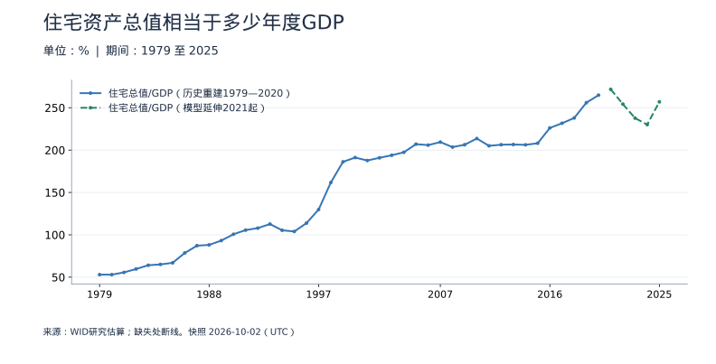

<!-- Generated by scripts/sync_macro.py; edit macro_catalog.py/macro_render.py. -->
# 中国住宅资产总值：研究估算：真实数据

住房资产存量有多大，为什么不能用一年销售额代表房地产总市值？

本页是WID对全国住宅及对应土地的资产总值估算，不是所有房地产的官方总市值，不包括全部商业地产，也未扣房贷。历史重建与2021年起模型延伸分线展示；尤其不能把模型延伸段的快速变化当作直接观测到的市场涨跌。

本页快照获取时间：**2026-10-02T15:21:39+00:00**。这是获取时间，不是所有数据的发布日期。每日检查上游；最新统计期以每个指标为准。

[CSV 下载](https://raw.githubusercontent.com/calcky/finance/main/data/macro/housing-wealth.csv) · [来源与采集参数](https://github.com/calcky/finance/blob/main/data/macro/housing-wealth.metadata.json) · [最近同步状态](https://github.com/calcky/finance/actions/workflows/update-gdp.yml)

```{only} html
本站同版快照：{download}`CSV <../../data/macro/housing-wealth.csv>` · {download}`元数据 <../../data/macro/housing-wealth.metadata.json>`
```

网页支持悬停查看、点击固定读数、按期间选择、缩放和定位明细。GitHub、打印或禁用 JavaScript 时显示静态图；数值与网页使用同一快照。

## 最新观测与覆盖

| 指标 | 最新期间 | 数值 | 单位 | 本项目起点 | 观测数 | 来源 |
|---|---|---:|---|---|---:|---|
| 住宅总值（历史重建1979—2020） | 2020 | 274.09 | 万亿元（当年价格） | 1979 | 42 | [WID研究估算](https://wid.world/bulk_download/WID_data_CN.csv) |
| 住宅总值（模型延伸2021起） | 2025 | 360.18 | 万亿元（当年价格） | 2021 | 5 | [WID研究估算](https://wid.world/bulk_download/WID_data_CN.csv) |
| 住宅总值/GDP（历史重建1979—2020） | 2020 | 264.85 | % | 1979 | 42 | [WID研究估算](https://wid.world/bulk_download/WID_data_CN.csv) |
| 住宅总值/GDP（模型延伸2021起） | 2025 | 256.95 | % | 2021 | 5 | [WID研究估算](https://wid.world/bulk_download/WID_data_CN.csv) |

起点表示本项目当前覆盖范围，不代表该指标从此时才开始发布。旧定义序列的最后一期也不代表来源停止更新。各来源可能存在发布或入库滞后；空白不补零、不插值。发布日期未知的观测在 CSV 中留空。

图表的“全部”与 CSV 保留完整已采集历史；缩放近期不会删除早期数据。[历史来源、口径断点与剩余缺口](history-coverage.md)说明回溯范围。

## 中国住宅资产总值：含住宅土地

单位当年价格万亿元。WID原始金额按最新基年不变价提供，本项目用同版价格指数还原各年名义值。1979—2020也是研究重建；2021年后缺少同等基础观测，使用模型延伸（虚线）。


<details class="macro-details">
<summary>中国住宅资产总值：含住宅土地：展开完整数据表（万亿元（当年价格））</summary>
<div class="macro-table-wrap"><table><thead><tr><th>期间</th><th>住宅总值（历史重建1979—2020）</th><th>住宅总值（模型延伸2021起）</th></tr></thead><tbody>
<tr id="macro-housing-wealth-2025" tabindex="-1"><td>2025</td><td>缺失</td><td>360.18</td></tr>
<tr id="macro-housing-wealth-2024" tabindex="-1"><td>2024</td><td>缺失</td><td>310.51</td></tr>
<tr id="macro-housing-wealth-2023" tabindex="-1"><td>2023</td><td>缺失</td><td>307.73</td></tr>
<tr id="macro-housing-wealth-2022" tabindex="-1"><td>2022</td><td>缺失</td><td>313.82</td></tr>
<tr id="macro-housing-wealth-2021" tabindex="-1"><td>2021</td><td>缺失</td><td>318.95</td></tr>
<tr id="macro-housing-wealth-2020" tabindex="-1"><td>2020</td><td>274.09</td><td>缺失</td></tr>
<tr id="macro-housing-wealth-2019" tabindex="-1"><td>2019</td><td>257.51</td><td>缺失</td></tr>
<tr id="macro-housing-wealth-2018" tabindex="-1"><td>2018</td><td>222.72</td><td>缺失</td></tr>
<tr id="macro-housing-wealth-2017" tabindex="-1"><td>2017</td><td>196.35</td><td>缺失</td></tr>
<tr id="macro-housing-wealth-2016" tabindex="-1"><td>2016</td><td>172.17</td><td>缺失</td></tr>
<tr id="macro-housing-wealth-2015" tabindex="-1"><td>2015</td><td>146.18</td><td>缺失</td></tr>
<tr id="macro-housing-wealth-2014" tabindex="-1"><td>2014</td><td>135.24</td><td>缺失</td></tr>
<tr id="macro-housing-wealth-2013" tabindex="-1"><td>2013</td><td>124.7</td><td>缺失</td></tr>
<tr id="macro-housing-wealth-2012" tabindex="-1"><td>2012</td><td>112.99</td><td>缺失</td></tr>
<tr id="macro-housing-wealth-2011" tabindex="-1"><td>2011</td><td>101.64</td><td>缺失</td></tr>
<tr id="macro-housing-wealth-2010" tabindex="-1"><td>2010</td><td>89.59</td><td>缺失</td></tr>
<tr id="macro-housing-wealth-2009" tabindex="-1"><td>2009</td><td>73.15</td><td>缺失</td></tr>
<tr id="macro-housing-wealth-2008" tabindex="-1"><td>2008</td><td>66.01</td><td>缺失</td></tr>
<tr id="macro-housing-wealth-2007" tabindex="-1"><td>2007</td><td>57.43</td><td>缺失</td></tr>
<tr id="macro-housing-wealth-2006" tabindex="-1"><td>2006</td><td>45.82</td><td>缺失</td></tr>
<tr id="macro-housing-wealth-2005" tabindex="-1"><td>2005</td><td>39.32</td><td>缺失</td></tr>
<tr id="macro-housing-wealth-2004" tabindex="-1"><td>2004</td><td>31.95</td><td>缺失</td></tr>
<tr id="macro-housing-wealth-2003" tabindex="-1"><td>2003</td><td>26.64</td><td>缺失</td></tr>
<tr id="macro-housing-wealth-2002" tabindex="-1"><td>2002</td><td>23.24</td><td>缺失</td></tr>
<tr id="macro-housing-wealth-2001" tabindex="-1"><td>2001</td><td>20.81</td><td>缺失</td></tr>
<tr id="macro-housing-wealth-2000" tabindex="-1"><td>2000</td><td>19.17</td><td>缺失</td></tr>
<tr id="macro-housing-wealth-1999" tabindex="-1"><td>1999</td><td>16.86</td><td>缺失</td></tr>
<tr id="macro-housing-wealth-1998" tabindex="-1"><td>1998</td><td>13.78</td><td>缺失</td></tr>
<tr id="macro-housing-wealth-1997" tabindex="-1"><td>1997</td><td>10.35</td><td>缺失</td></tr>
<tr id="macro-housing-wealth-1996" tabindex="-1"><td>1996</td><td>8.17</td><td>缺失</td></tr>
<tr id="macro-housing-wealth-1995" tabindex="-1"><td>1995</td><td>6.38</td><td>缺失</td></tr>
<tr id="macro-housing-wealth-1994" tabindex="-1"><td>1994</td><td>5.12</td><td>缺失</td></tr>
<tr id="macro-housing-wealth-1993" tabindex="-1"><td>1993</td><td>4.02</td><td>缺失</td></tr>
<tr id="macro-housing-wealth-1992" tabindex="-1"><td>1992</td><td>2.93</td><td>缺失</td></tr>
<tr id="macro-housing-wealth-1991" tabindex="-1"><td>1991</td><td>2.32</td><td>缺失</td></tr>
<tr id="macro-housing-wealth-1990" tabindex="-1"><td>1990</td><td>1.9</td><td>缺失</td></tr>
<tr id="macro-housing-wealth-1989" tabindex="-1"><td>1989</td><td>1.6</td><td>缺失</td></tr>
<tr id="macro-housing-wealth-1988" tabindex="-1"><td>1988</td><td>1.34</td><td>缺失</td></tr>
<tr id="macro-housing-wealth-1987" tabindex="-1"><td>1987</td><td>1.06</td><td>缺失</td></tr>
<tr id="macro-housing-wealth-1986" tabindex="-1"><td>1986</td><td>0.82</td><td>缺失</td></tr>
<tr id="macro-housing-wealth-1985" tabindex="-1"><td>1985</td><td>0.61</td><td>缺失</td></tr>
<tr id="macro-housing-wealth-1984" tabindex="-1"><td>1984</td><td>0.47</td><td>缺失</td></tr>
<tr id="macro-housing-wealth-1983" tabindex="-1"><td>1983</td><td>0.39</td><td>缺失</td></tr>
<tr id="macro-housing-wealth-1982" tabindex="-1"><td>1982</td><td>0.32</td><td>缺失</td></tr>
<tr id="macro-housing-wealth-1981" tabindex="-1"><td>1981</td><td>0.27</td><td>缺失</td></tr>
<tr id="macro-housing-wealth-1980" tabindex="-1"><td>1980</td><td>0.24</td><td>缺失</td></tr>
<tr id="macro-housing-wealth-1979" tabindex="-1"><td>1979</td><td>0.22</td><td>缺失</td></tr>
</tbody></table></div></details>

## 住宅资产总值相当于多少年度GDP

250%意为住宅资产存量约为2.5年的GDP，不表示房地产创造了250%的当年产出。使用同一WID版本的比率，不与其他GDP数据混配；延伸估算用虚线。



<details class="macro-details">
<summary>住宅资产总值相当于多少年度GDP：展开完整数据表（%）</summary>
<div class="macro-table-wrap"><table><thead><tr><th>期间</th><th>住宅总值/GDP（历史重建1979—2020）</th><th>住宅总值/GDP（模型延伸2021起）</th></tr></thead><tbody>
<tr id="macro-housing-wealth-gdp-2025" tabindex="-1"><td>2025</td><td>缺失</td><td>256.95</td></tr>
<tr id="macro-housing-wealth-gdp-2024" tabindex="-1"><td>2024</td><td>缺失</td><td>230.16</td></tr>
<tr id="macro-housing-wealth-gdp-2023" tabindex="-1"><td>2023</td><td>缺失</td><td>237.76</td></tr>
<tr id="macro-housing-wealth-gdp-2022" tabindex="-1"><td>2022</td><td>缺失</td><td>254.31</td></tr>
<tr id="macro-housing-wealth-gdp-2021" tabindex="-1"><td>2021</td><td>缺失</td><td>271.72</td></tr>
<tr id="macro-housing-wealth-gdp-2020" tabindex="-1"><td>2020</td><td>264.85</td><td>缺失</td></tr>
<tr id="macro-housing-wealth-gdp-2019" tabindex="-1"><td>2019</td><td>256</td><td>缺失</td></tr>
<tr id="macro-housing-wealth-gdp-2018" tabindex="-1"><td>2018</td><td>237.94</td><td>缺失</td></tr>
<tr id="macro-housing-wealth-gdp-2017" tabindex="-1"><td>2017</td><td>231.71</td><td>缺失</td></tr>
<tr id="macro-housing-wealth-gdp-2016" tabindex="-1"><td>2016</td><td>226.18</td><td>缺失</td></tr>
<tr id="macro-housing-wealth-gdp-2015" tabindex="-1"><td>2015</td><td>208.08</td><td>缺失</td></tr>
<tr id="macro-housing-wealth-gdp-2014" tabindex="-1"><td>2014</td><td>206.22</td><td>缺失</td></tr>
<tr id="macro-housing-wealth-gdp-2013" tabindex="-1"><td>2013</td><td>206.58</td><td>缺失</td></tr>
<tr id="macro-housing-wealth-gdp-2012" tabindex="-1"><td>2012</td><td>206.37</td><td>缺失</td></tr>
<tr id="macro-housing-wealth-gdp-2011" tabindex="-1"><td>2011</td><td>205.04</td><td>缺失</td></tr>
<tr id="macro-housing-wealth-gdp-2010" tabindex="-1"><td>2010</td><td>213.68</td><td>缺失</td></tr>
<tr id="macro-housing-wealth-gdp-2009" tabindex="-1"><td>2009</td><td>206.33</td><td>缺失</td></tr>
<tr id="macro-housing-wealth-gdp-2008" tabindex="-1"><td>2008</td><td>203.54</td><td>缺失</td></tr>
<tr id="macro-housing-wealth-gdp-2007" tabindex="-1"><td>2007</td><td>209.47</td><td>缺失</td></tr>
<tr id="macro-housing-wealth-gdp-2006" tabindex="-1"><td>2006</td><td>205.87</td><td>缺失</td></tr>
<tr id="macro-housing-wealth-gdp-2005" tabindex="-1"><td>2005</td><td>207.05</td><td>缺失</td></tr>
<tr id="macro-housing-wealth-gdp-2004" tabindex="-1"><td>2004</td><td>197.4</td><td>缺失</td></tr>
<tr id="macro-housing-wealth-gdp-2003" tabindex="-1"><td>2003</td><td>193.89</td><td>缺失</td></tr>
<tr id="macro-housing-wealth-gdp-2002" tabindex="-1"><td>2002</td><td>190.91</td><td>缺失</td></tr>
<tr id="macro-housing-wealth-gdp-2001" tabindex="-1"><td>2001</td><td>187.74</td><td>缺失</td></tr>
<tr id="macro-housing-wealth-gdp-2000" tabindex="-1"><td>2000</td><td>191.19</td><td>缺失</td></tr>
<tr id="macro-housing-wealth-gdp-1999" tabindex="-1"><td>1999</td><td>186.14</td><td>缺失</td></tr>
<tr id="macro-housing-wealth-gdp-1998" tabindex="-1"><td>1998</td><td>161.71</td><td>缺失</td></tr>
<tr id="macro-housing-wealth-gdp-1997" tabindex="-1"><td>1997</td><td>129.88</td><td>缺失</td></tr>
<tr id="macro-housing-wealth-gdp-1996" tabindex="-1"><td>1996</td><td>113.8</td><td>缺失</td></tr>
<tr id="macro-housing-wealth-gdp-1995" tabindex="-1"><td>1995</td><td>103.94</td><td>缺失</td></tr>
<tr id="macro-housing-wealth-gdp-1994" tabindex="-1"><td>1994</td><td>105.36</td><td>缺失</td></tr>
<tr id="macro-housing-wealth-gdp-1993" tabindex="-1"><td>1993</td><td>112.71</td><td>缺失</td></tr>
<tr id="macro-housing-wealth-gdp-1992" tabindex="-1"><td>1992</td><td>107.92</td><td>缺失</td></tr>
<tr id="macro-housing-wealth-gdp-1991" tabindex="-1"><td>1991</td><td>105.57</td><td>缺失</td></tr>
<tr id="macro-housing-wealth-gdp-1990" tabindex="-1"><td>1990</td><td>100.66</td><td>缺失</td></tr>
<tr id="macro-housing-wealth-gdp-1989" tabindex="-1"><td>1989</td><td>93.2</td><td>缺失</td></tr>
<tr id="macro-housing-wealth-gdp-1988" tabindex="-1"><td>1988</td><td>88.11</td><td>缺失</td></tr>
<tr id="macro-housing-wealth-gdp-1987" tabindex="-1"><td>1987</td><td>87.18</td><td>缺失</td></tr>
<tr id="macro-housing-wealth-gdp-1986" tabindex="-1"><td>1986</td><td>78.58</td><td>缺失</td></tr>
<tr id="macro-housing-wealth-gdp-1985" tabindex="-1"><td>1985</td><td>66.94</td><td>缺失</td></tr>
<tr id="macro-housing-wealth-gdp-1984" tabindex="-1"><td>1984</td><td>65.06</td><td>缺失</td></tr>
<tr id="macro-housing-wealth-gdp-1983" tabindex="-1"><td>1983</td><td>64.09</td><td>缺失</td></tr>
<tr id="macro-housing-wealth-gdp-1982" tabindex="-1"><td>1982</td><td>59.67</td><td>缺失</td></tr>
<tr id="macro-housing-wealth-gdp-1981" tabindex="-1"><td>1981</td><td>55.64</td><td>缺失</td></tr>
<tr id="macro-housing-wealth-gdp-1980" tabindex="-1"><td>1980</td><td>52.98</td><td>缺失</td></tr>
<tr id="macro-housing-wealth-gdp-1979" tabindex="-1"><td>1979</td><td>52.99</td><td>缺失</td></tr>
</tbody></table></div></details>

## 口径与阅读提醒

| 指标 | 口径 |
|---|---|
| 住宅总值（历史重建1979—2020） | 全经济住宅及对应土地的资产总值，未减房贷，不含全部商业地产，不是官方市场普查。源不变价总量mnwhoui999乘同年inyixxi999，再除以1e12转成当年价万亿元；2021年起为延伸模型估算，不能直接据此判断实际市值涨跌。 |
| 住宅总值（模型延伸2021起） | 全经济住宅及对应土地的资产总值，未减房贷，不含全部商业地产，不是官方市场普查。源不变价总量mnwhoui999乘同年inyixxi999，再除以1e12转成当年价万亿元；2021年起为延伸模型估算，不能直接据此判断实际市值涨跌。 |
| 住宅总值/GDP（历史重建1979—2020） | 存量与年度流量的比率，不是住宅产业贡献的GDP占比；直接采用同一WID版本ynwhoui999乘100，不混用其他版本GDP。研究重建与模型延伸分别展示。 |
| 住宅总值/GDP（模型延伸2021起） | 存量与年度流量的比率，不是住宅产业贡献的GDP占比；直接采用同一WID版本ynwhoui999乘100，不混用其他版本GDP。研究重建与模型延伸分别展示。 |

- WID中国住宅及对应土地资产总值1979年起，非全部房地产总市值；未扣房贷；原不变价按同版平减指数还原当年价。
- 基础研究覆盖1979—2020；2021年起为外推/模型延伸，虚线单列，不据其波动断言真实市场涨跌。
- 历史重建也含估算，公共/企业住宅资产可能以比例补足；原data_quality标记不解释为直接观测。
- WID新版可能修订全历史及价格基年；每次重取完整数据与同版平减指数，不混用旧版。

日度图保留日历缺口：节假日、没有操作或上游缺失的日期均无观测，不能仅从空白判断原因。图线在缺失处断开；月度与季度图也不插值。

来源可能修订历史值。同步程序对已有期间的消失报错，合法数值修订保存在 Git 历史中；这不是包含所有官方初值的实时数据库。这里只摘录指标事实并注明来源，来源文件和机构条款仍归各发布机构。

继续理解：[相关基础知识](../housing-population.md) · [如何读宏观数据](../reading-macro-data.md) · [全部数据专题](index.md)
