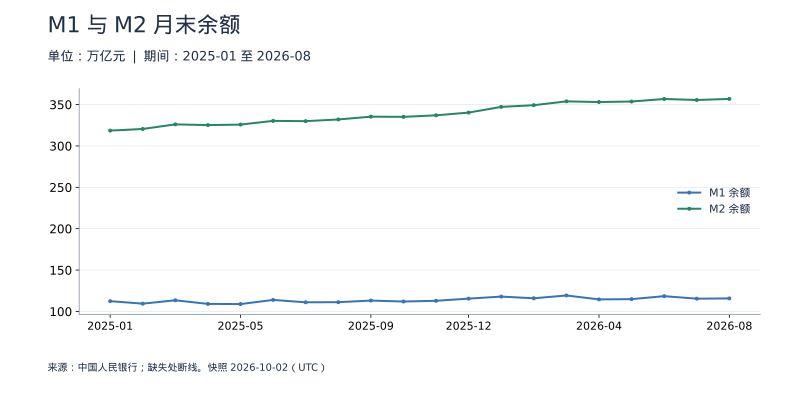
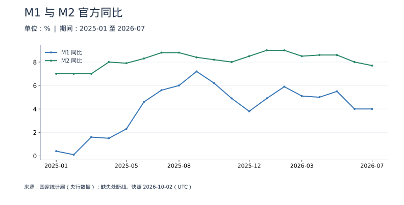
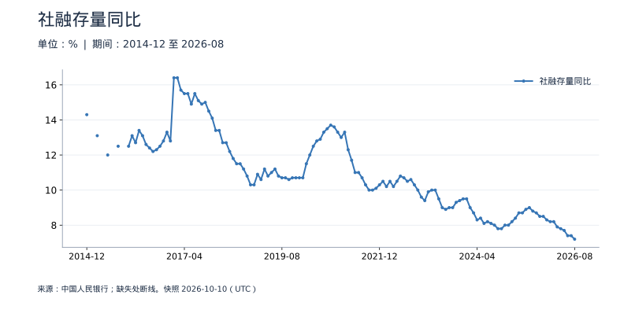
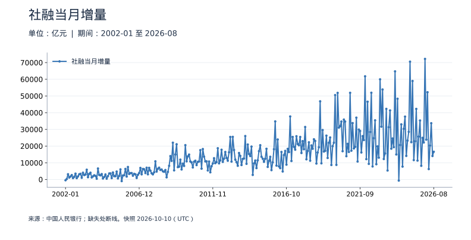

<!-- Generated by scripts/sync_macro.py; edit macro_catalog.py/macro_render.py. -->
# 货币与社会融资：真实数据

货币存量与融资是否增加，它们分别描述什么？

M1、M2 是月末货币存量，社融从实体经济获得融资的角度统计。2025 年起 M1 增加个人活期存款和非银行支付机构客户备付金。本专题分别保留旧定义历史、新定义以及官方回溯的 2024 年新定义数据，不能把两种余额直接拼接。

本页快照获取时间：**2026-10-02T10:37:58+00:00**。这是获取时间，不是所有数据的发布日期。每日检查上游；最新统计期以每个指标为准。

[CSV 下载](https://raw.githubusercontent.com/calcky/finance/main/data/macro/money-credit.csv) · [来源与采集参数](https://github.com/calcky/finance/blob/main/data/macro/money-credit.metadata.json) · [最近同步状态](https://github.com/calcky/finance/actions/workflows/update-gdp.yml)

```{only} html
本站同版快照：{download}`CSV <../../data/macro/money-credit.csv>` · {download}`元数据 <../../data/macro/money-credit.metadata.json>`
```

网页支持悬停查看、点击固定读数、按期间选择、缩放和定位明细。GitHub、打印或禁用 JavaScript 时显示静态图；数值与网页使用同一快照。

## 最新观测与覆盖

| 指标 | 最新期间 | 数值 | 单位 | 本项目起点 | 观测数 | 来源 |
|---|---|---:|---|---|---:|---|
| M1 余额（新定义） | 2026-08 | 115.774143 | 万亿元 | 2024-01 | 32 | [中国人民银行](https://www.pbc.gov.cn/diaochatongjisi/attachDir/2026/09/2026091418181718462.xlsx) |
| M2 余额 | 2026-08 | 356.80836 | 万亿元 | 1999-12 | 321 | [中国人民银行](https://www.pbc.gov.cn/diaochatongjisi/attachDir/2026/09/2026091418181718462.xlsx) |
| M1 余额（旧定义） | 2024-12 | 67.095941 | 万亿元 | 1999-12 | 301 | [中国人民银行](https://www.pbc.gov.cn/diaochatongjisi/attachDir/2025/11/2025111416485162540.xlsx) |
| M1 同比（新定义） | 2026-07 | 4 | % | 2024-01 | 31 | [中国人民银行、国家统计局](https://data.stats.gov.cn/dg/website/page.html#/pc/national/monthData) |
| M2 同比 | 2026-07 | 7.7 | % | 1999-12 | 320 | [国家统计局（央行数据）](https://data.stats.gov.cn/dg/website/page.html#/pc/national/monthData) |
| M1 同比（旧定义） | 2024-12 | -1.4 | % | 1999-12 | 301 | [国家统计局（央行数据）](https://data.stats.gov.cn/dg/website/page.html#/pc/national/monthData) |
| 社融存量同比 | 2026-08 | 7.2 | % | 2014-12 | 133 | [中国人民银行](https://www.pbc.gov.cn/diaochatongjisi/attachDir/2026/09/2026091418132334323.xlsx) |
| 社融当月增量 | 2026-08 | 16,577 | 亿元 | 2002-01 | 296 | [中国人民银行](https://www.pbc.gov.cn/diaochatongjisi/attachDir/2026/09/2026091418125322850.xlsx) |
| 社融存量 | 2026-08 | 464.8 | 万亿元 | 2014-12 | 133 | [中国人民银行](https://www.pbc.gov.cn/diaochatongjisi/attachDir/2026/09/2026091418132334323.xlsx) |

起点表示本项目当前覆盖范围，不代表该指标从此时才开始发布。旧定义序列的最后一期也不代表来源停止更新。各来源可能存在发布或入库滞后；空白不补零、不插值。发布日期未知的观测在 CSV 中留空。

图表的“全部”与 CSV 保留完整已采集历史；缩放近期不会删除早期数据。[历史来源、口径断点与剩余缺口](history-coverage.md)说明回溯范围。

## M1 与 M2 月末余额

M1 包含在 M2 中，不能相加。新旧 M1 分列，2024 年重叠部分展示定义变化的影响；不把 2025 年的口径扩展解读为货币突然暴增。M2 也不是全社会财富。



<details class="macro-details">
<summary>M1 与 M2 月末余额：展开完整数据表（万亿元）</summary>
<div class="macro-table-wrap"><table><thead><tr><th>期间</th><th>M1 余额（新定义）</th><th>M2 余额</th><th>M1 余额（旧定义）</th></tr></thead><tbody>
<tr id="macro-money-stock-2026-08" tabindex="-1"><td>2026-08</td><td>115.774143</td><td>356.80836</td><td>缺失</td></tr>
<tr id="macro-money-stock-2026-07" tabindex="-1"><td>2026-07</td><td>115.4623</td><td>355.507724</td><td>缺失</td></tr>
<tr id="macro-money-stock-2026-06" tabindex="-1"><td>2026-06</td><td>118.477553</td><td>356.710843</td><td>缺失</td></tr>
<tr id="macro-money-stock-2026-05" tabindex="-1"><td>2026-05</td><td>114.889141</td><td>353.668892</td><td>缺失</td></tr>
<tr id="macro-money-stock-2026-04" tabindex="-1"><td>2026-04</td><td>114.583373</td><td>353.042521</td><td>缺失</td></tr>
<tr id="macro-money-stock-2026-03" tabindex="-1"><td>2026-03</td><td>119.320299</td><td>353.863653</td><td>缺失</td></tr>
<tr id="macro-money-stock-2026-02" tabindex="-1"><td>2026-02</td><td>115.925882</td><td>349.215991</td><td>缺失</td></tr>
<tr id="macro-money-stock-2026-01" tabindex="-1"><td>2026-01</td><td>117.968052</td><td>347.186039</td><td>缺失</td></tr>
<tr id="macro-money-stock-2025-12" tabindex="-1"><td>2025-12</td><td>115.51465</td><td>340.294806</td><td>缺失</td></tr>
<tr id="macro-money-stock-2025-11" tabindex="-1"><td>2025-11</td><td>112.886664</td><td>336.989052</td><td>缺失</td></tr>
<tr id="macro-money-stock-2025-10" tabindex="-1"><td>2025-10</td><td>111.996273</td><td>335.131231</td><td>缺失</td></tr>
<tr id="macro-money-stock-2025-09" tabindex="-1"><td>2025-09</td><td>113.145507</td><td>335.377103</td><td>缺失</td></tr>
<tr id="macro-money-stock-2025-08" tabindex="-1"><td>2025-08</td><td>111.22557</td><td>331.983144</td><td>缺失</td></tr>
<tr id="macro-money-stock-2025-07" tabindex="-1"><td>2025-07</td><td>111.058692</td><td>329.942906</td><td>缺失</td></tr>
<tr id="macro-money-stock-2025-06" tabindex="-1"><td>2025-06</td><td>113.949408</td><td>330.286817</td><td>缺失</td></tr>
<tr id="macro-money-stock-2025-05" tabindex="-1"><td>2025-05</td><td>108.914765</td><td>325.783811</td><td>缺失</td></tr>
<tr id="macro-money-stock-2025-04" tabindex="-1"><td>2025-04</td><td>109.140733</td><td>325.173932</td><td>缺失</td></tr>
<tr id="macro-money-stock-2025-03" tabindex="-1"><td>2025-03</td><td>113.48631</td><td>326.055457</td><td>缺失</td></tr>
<tr id="macro-money-stock-2025-02" tabindex="-1"><td>2025-02</td><td>109.437001</td><td>320.517324</td><td>缺失</td></tr>
<tr id="macro-money-stock-2025-01" tabindex="-1"><td>2025-01</td><td>112.445745</td><td>318.524718</td><td>缺失</td></tr>
<tr id="macro-money-stock-2024-12" tabindex="-1"><td>2024-12</td><td>111.3069</td><td>313.53223</td><td>67.095941</td></tr>
<tr id="macro-money-stock-2024-11" tabindex="-1"><td>2024-11</td><td>107.6379</td><td>311.958727</td><td>65.090416</td></tr>
<tr id="macro-money-stock-2024-10" tabindex="-1"><td>2024-10</td><td>105.4884</td><td>309.709201</td><td>63.335747</td></tr>
<tr id="macro-money-stock-2024-09" tabindex="-1"><td>2024-09</td><td>105.541</td><td>309.479824</td><td>62.823654</td></tr>
<tr id="macro-money-stock-2024-08" tabindex="-1"><td>2024-08</td><td>104.9684</td><td>305.046127</td><td>63.023809</td></tr>
<tr id="macro-money-stock-2024-07" tabindex="-1"><td>2024-07</td><td>105.18</td><td>303.306078</td><td>63.229654</td></tr>
<tr id="macro-money-stock-2024-06" tabindex="-1"><td>2024-06</td><td>108.917</td><td>305.016154</td><td>66.061052</td></tr>
<tr id="macro-money-stock-2024-05" tabindex="-1"><td>2024-05</td><td>106.4391</td><td>301.850673</td><td>64.684247</td></tr>
<tr id="macro-money-stock-2024-04" tabindex="-1"><td>2024-04</td><td>107.5084</td><td>301.194198</td><td>66.006569</td></tr>
<tr id="macro-money-stock-2024-03" tabindex="-1"><td>2024-03</td><td>111.7433</td><td>304.795216</td><td>68.58089</td></tr>
<tr id="macro-money-stock-2024-02" tabindex="-1"><td>2024-02</td><td>109.3158</td><td>299.557297</td><td>66.591609</td></tr>
<tr id="macro-money-stock-2024-01" tabindex="-1"><td>2024-01</td><td>112.012</td><td>297.62502</td><td>69.419788</td></tr>
<tr id="macro-money-stock-2023-12" tabindex="-1"><td>2023-12</td><td>缺失</td><td>292.271333</td><td>68.054252</td></tr>
<tr id="macro-money-stock-2023-11" tabindex="-1"><td>2023-11</td><td>缺失</td><td>291.201422</td><td>67.590341</td></tr>
<tr id="macro-money-stock-2023-10" tabindex="-1"><td>2023-10</td><td>缺失</td><td>288.227607</td><td>67.469607</td></tr>
<tr id="macro-money-stock-2023-09" tabindex="-1"><td>2023-09</td><td>缺失</td><td>289.665911</td><td>67.844365</td></tr>
<tr id="macro-money-stock-2023-08" tabindex="-1"><td>2023-08</td><td>缺失</td><td>286.934325</td><td>67.958835</td></tr>
<tr id="macro-money-stock-2023-07" tabindex="-1"><td>2023-07</td><td>缺失</td><td>285.403156</td><td>67.721892</td></tr>
<tr id="macro-money-stock-2023-06" tabindex="-1"><td>2023-06</td><td>缺失</td><td>287.302383</td><td>69.559548</td></tr>
<tr id="macro-money-stock-2023-05" tabindex="-1"><td>2023-05</td><td>缺失</td><td>282.050468</td><td>67.525298</td></tr>
<tr id="macro-money-stock-2023-04" tabindex="-1"><td>2023-04</td><td>缺失</td><td>280.846934</td><td>66.976155</td></tr>
<tr id="macro-money-stock-2023-03" tabindex="-1"><td>2023-03</td><td>缺失</td><td>281.456631</td><td>67.805963</td></tr>
<tr id="macro-money-stock-2023-02" tabindex="-1"><td>2023-02</td><td>缺失</td><td>275.524923</td><td>65.793874</td></tr>
<tr id="macro-money-stock-2023-01" tabindex="-1"><td>2023-01</td><td>缺失</td><td>273.807206</td><td>65.521416</td></tr>
<tr id="macro-money-stock-2022-12" tabindex="-1"><td>2022-12</td><td>缺失</td><td>266.432084</td><td>67.167476</td></tr>
<tr id="macro-money-stock-2022-11" tabindex="-1"><td>2022-11</td><td>缺失</td><td>264.700848</td><td>66.704261</td></tr>
<tr id="macro-money-stock-2022-10" tabindex="-1"><td>2022-10</td><td>缺失</td><td>261.291457</td><td>66.214099</td></tr>
<tr id="macro-money-stock-2022-09" tabindex="-1"><td>2022-09</td><td>缺失</td><td>262.660092</td><td>66.453517</td></tr>
<tr id="macro-money-stock-2022-08" tabindex="-1"><td>2022-08</td><td>缺失</td><td>259.506827</td><td>66.460485</td></tr>
<tr id="macro-money-stock-2022-07" tabindex="-1"><td>2022-07</td><td>缺失</td><td>257.807857</td><td>66.183233</td></tr>
<tr id="macro-money-stock-2022-06" tabindex="-1"><td>2022-06</td><td>缺失</td><td>258.14512</td><td>67.437481</td></tr>
<tr id="macro-money-stock-2022-05" tabindex="-1"><td>2022-05</td><td>缺失</td><td>252.702615</td><td>64.510752</td></tr>
<tr id="macro-money-stock-2022-04" tabindex="-1"><td>2022-04</td><td>缺失</td><td>249.97109</td><td>63.613901</td></tr>
<tr id="macro-money-stock-2022-03" tabindex="-1"><td>2022-03</td><td>缺失</td><td>249.768834</td><td>64.50638</td></tr>
<tr id="macro-money-stock-2022-02" tabindex="-1"><td>2022-02</td><td>缺失</td><td>244.14889</td><td>62.161211</td></tr>
<tr id="macro-money-stock-2022-01" tabindex="-1"><td>2022-01</td><td>缺失</td><td>243.102272</td><td>61.385935</td></tr>
<tr id="macro-money-stock-2021-12" tabindex="-1"><td>2021-12</td><td>缺失</td><td>238.289956</td><td>64.744335</td></tr>
<tr id="macro-money-stock-2021-11" tabindex="-1"><td>2021-11</td><td>缺失</td><td>235.601276</td><td>63.748204</td></tr>
<tr id="macro-money-stock-2021-10" tabindex="-1"><td>2021-10</td><td>缺失</td><td>233.616048</td><td>62.608212</td></tr>
<tr id="macro-money-stock-2021-09" tabindex="-1"><td>2021-09</td><td>缺失</td><td>234.28297</td><td>62.464568</td></tr>
<tr id="macro-money-stock-2021-08" tabindex="-1"><td>2021-08</td><td>缺失</td><td>231.226768</td><td>62.665869</td></tr>
<tr id="macro-money-stock-2021-07" tabindex="-1"><td>2021-07</td><td>缺失</td><td>230.215382</td><td>62.036705</td></tr>
<tr id="macro-money-stock-2021-06" tabindex="-1"><td>2021-06</td><td>缺失</td><td>231.778836</td><td>63.747936</td></tr>
<tr id="macro-money-stock-2021-05" tabindex="-1"><td>2021-05</td><td>缺失</td><td>227.553807</td><td>61.682832</td></tr>
<tr id="macro-money-stock-2021-04" tabindex="-1"><td>2021-04</td><td>缺失</td><td>226.210712</td><td>60.542189</td></tr>
<tr id="macro-money-stock-2021-03" tabindex="-1"><td>2021-03</td><td>缺失</td><td>227.648845</td><td>61.611317</td></tr>
<tr id="macro-money-stock-2021-02" tabindex="-1"><td>2021-02</td><td>缺失</td><td>223.603026</td><td>59.348746</td></tr>
<tr id="macro-money-stock-2021-01" tabindex="-1"><td>2021-01</td><td>缺失</td><td>221.304733</td><td>62.556381</td></tr>
<tr id="macro-money-stock-2020-12" tabindex="-1"><td>2020-12</td><td>缺失</td><td>218.679589</td><td>62.558099</td></tr>
<tr id="macro-money-stock-2020-11" tabindex="-1"><td>2020-11</td><td>缺失</td><td>217.200255</td><td>61.863217</td></tr>
<tr id="macro-money-stock-2020-10" tabindex="-1"><td>2020-10</td><td>缺失</td><td>214.972042</td><td>60.918241</td></tr>
<tr id="macro-money-stock-2020-09" tabindex="-1"><td>2020-09</td><td>缺失</td><td>216.40848</td><td>60.231212</td></tr>
<tr id="macro-money-stock-2020-08" tabindex="-1"><td>2020-08</td><td>缺失</td><td>213.683691</td><td>60.12891</td></tr>
<tr id="macro-money-stock-2020-07" tabindex="-1"><td>2020-07</td><td>缺失</td><td>212.545846</td><td>59.119264</td></tr>
<tr id="macro-money-stock-2020-06" tabindex="-1"><td>2020-06</td><td>缺失</td><td>213.494866</td><td>60.431797</td></tr>
<tr id="macro-money-stock-2020-05" tabindex="-1"><td>2020-05</td><td>缺失</td><td>210.018374</td><td>58.111106</td></tr>
<tr id="macro-money-stock-2020-04" tabindex="-1"><td>2020-04</td><td>缺失</td><td>209.353383</td><td>57.015048</td></tr>
<tr id="macro-money-stock-2020-03" tabindex="-1"><td>2020-03</td><td>缺失</td><td>208.092341</td><td>57.505029</td></tr>
<tr id="macro-money-stock-2020-02" tabindex="-1"><td>2020-02</td><td>缺失</td><td>203.083042</td><td>55.270073</td></tr>
<tr id="macro-money-stock-2020-01" tabindex="-1"><td>2020-01</td><td>缺失</td><td>202.306649</td><td>54.553179</td></tr>
<tr id="macro-money-stock-2019-12" tabindex="-1"><td>2019-12</td><td>缺失</td><td>198.648882</td><td>57.600915</td></tr>
<tr id="macro-money-stock-2019-11" tabindex="-1"><td>2019-11</td><td>缺失</td><td>196.142956</td><td>56.248652</td></tr>
<tr id="macro-money-stock-2019-10" tabindex="-1"><td>2019-10</td><td>缺失</td><td>194.560055</td><td>55.814392</td></tr>
<tr id="macro-money-stock-2019-09" tabindex="-1"><td>2019-09</td><td>缺失</td><td>195.225049</td><td>55.713795</td></tr>
<tr id="macro-money-stock-2019-08" tabindex="-1"><td>2019-08</td><td>缺失</td><td>193.549243</td><td>55.679809</td></tr>
<tr id="macro-money-stock-2019-07" tabindex="-1"><td>2019-07</td><td>缺失</td><td>191.941082</td><td>55.304311</td></tr>
<tr id="macro-money-stock-2019-06" tabindex="-1"><td>2019-06</td><td>缺失</td><td>192.136019</td><td>56.769618</td></tr>
<tr id="macro-money-stock-2019-05" tabindex="-1"><td>2019-05</td><td>缺失</td><td>189.11537</td><td>54.435564</td></tr>
<tr id="macro-money-stock-2019-04" tabindex="-1"><td>2019-04</td><td>缺失</td><td>188.467033</td><td>54.06146</td></tr>
<tr id="macro-money-stock-2019-03" tabindex="-1"><td>2019-03</td><td>缺失</td><td>188.941214</td><td>54.757554</td></tr>
<tr id="macro-money-stock-2019-02" tabindex="-1"><td>2019-02</td><td>缺失</td><td>186.742745</td><td>52.719048</td></tr>
<tr id="macro-money-stock-2019-01" tabindex="-1"><td>2019-01</td><td>缺失</td><td>186.593533</td><td>54.563846</td></tr>
<tr id="macro-money-stock-2018-12" tabindex="-1"><td>2018-12</td><td>缺失</td><td>182.674422</td><td>55.168591</td></tr>
<tr id="macro-money-stock-2018-11" tabindex="-1"><td>2018-11</td><td>缺失</td><td>181.317507</td><td>54.349866</td></tr>
<tr id="macro-money-stock-2018-10" tabindex="-1"><td>2018-10</td><td>缺失</td><td>179.55616</td><td>54.012837</td></tr>
<tr id="macro-money-stock-2018-09" tabindex="-1"><td>2018-09</td><td>缺失</td><td>180.166558</td><td>53.857408</td></tr>
<tr id="macro-money-stock-2018-08" tabindex="-1"><td>2018-08</td><td>缺失</td><td>178.867043</td><td>53.832464</td></tr>
<tr id="macro-money-stock-2018-07" tabindex="-1"><td>2018-07</td><td>缺失</td><td>177.619611</td><td>53.662429</td></tr>
<tr id="macro-money-stock-2018-06" tabindex="-1"><td>2018-06</td><td>缺失</td><td>177.017837</td><td>54.394471</td></tr>
<tr id="macro-money-stock-2018-05" tabindex="-1"><td>2018-05</td><td>缺失</td><td>174.306379</td><td>52.627672</td></tr>
<tr id="macro-money-stock-2018-04" tabindex="-1"><td>2018-04</td><td>缺失</td><td>173.768373</td><td>52.544777</td></tr>
<tr id="macro-money-stock-2018-03" tabindex="-1"><td>2018-03</td><td>缺失</td><td>173.985948</td><td>52.354007</td></tr>
<tr id="macro-money-stock-2018-02" tabindex="-1"><td>2018-02</td><td>缺失</td><td>172.907012</td><td>51.703599</td></tr>
<tr id="macro-money-stock-2018-01" tabindex="-1"><td>2018-01</td><td>缺失</td><td>172.081446</td><td>54.324713</td></tr>
<tr id="macro-money-stock-2017-12" tabindex="-1"><td>2017-12</td><td>缺失</td><td>169.02353147</td><td>54.37901452</td></tr>
<tr id="macro-money-stock-2017-11" tabindex="-1"><td>2017-11</td><td>缺失</td><td>167.91566361</td><td>53.55650495</td></tr>
<tr id="macro-money-stock-2017-10" tabindex="-1"><td>2017-10</td><td>缺失</td><td>166.24499602</td><td>52.59771904</td></tr>
<tr id="macro-money-stock-2017-09" tabindex="-1"><td>2017-09</td><td>缺失</td><td>166.36660544</td><td>51.78630373</td></tr>
<tr id="macro-money-stock-2017-08" tabindex="-1"><td>2017-08</td><td>缺失</td><td>165.29473003</td><td>51.81139298</td></tr>
<tr id="macro-money-stock-2017-07" tabindex="-1"><td>2017-07</td><td>缺失</td><td>163.63411052</td><td>51.04845775</td></tr>
<tr id="macro-money-stock-2017-06" tabindex="-1"><td>2017-06</td><td>缺失</td><td>163.94970451</td><td>51.0228166</td></tr>
<tr id="macro-money-stock-2017-05" tabindex="-1"><td>2017-05</td><td>缺失</td><td>160.97407738</td><td>49.63897822</td></tr>
<tr id="macro-money-stock-2017-04" tabindex="-1"><td>2017-04</td><td>缺失</td><td>160.39188402</td><td>49.01804197</td></tr>
<tr id="macro-money-stock-2017-03" tabindex="-1"><td>2017-03</td><td>缺失</td><td>160.793898</td><td>48.877009</td></tr>
<tr id="macro-money-stock-2017-02" tabindex="-1"><td>2017-02</td><td>缺失</td><td>158.98569954</td><td>47.65276</td></tr>
<tr id="macro-money-stock-2017-01" tabindex="-1"><td>2017-01</td><td>缺失</td><td>158.41945638</td><td>47.252645</td></tr>
<tr id="macro-money-stock-2016-12" tabindex="-1"><td>2016-12</td><td>缺失</td><td>155.00666678</td><td>48.65572374</td></tr>
<tr id="macro-money-stock-2016-11" tabindex="-1"><td>2016-11</td><td>缺失</td><td>153.043206</td><td>47.540554</td></tr>
<tr id="macro-money-stock-2016-10" tabindex="-1"><td>2016-10</td><td>缺失</td><td>151.94854</td><td>46.544665</td></tr>
<tr id="macro-money-stock-2016-09" tabindex="-1"><td>2016-09</td><td>缺失</td><td>151.63605</td><td>45.434025</td></tr>
<tr id="macro-money-stock-2016-08" tabindex="-1"><td>2016-08</td><td>缺失</td><td>151.098291</td><td>45.45436</td></tr>
<tr id="macro-money-stock-2016-07" tabindex="-1"><td>2016-07</td><td>缺失</td><td>149.155872</td><td>44.293443</td></tr>
<tr id="macro-money-stock-2016-06" tabindex="-1"><td>2016-06</td><td>缺失</td><td>149.049183</td><td>44.36437</td></tr>
<tr id="macro-money-stock-2016-05" tabindex="-1"><td>2016-05</td><td>缺失</td><td>146.169511</td><td>42.42507</td></tr>
<tr id="macro-money-stock-2016-04" tabindex="-1"><td>2016-04</td><td>缺失</td><td>144.520959</td><td>41.350484</td></tr>
<tr id="macro-money-stock-2016-03" tabindex="-1"><td>2016-03</td><td>缺失</td><td>144.619803</td><td>41.158131</td></tr>
<tr id="macro-money-stock-2016-02" tabindex="-1"><td>2016-02</td><td>缺失</td><td>142.46186779</td><td>39.25046963</td></tr>
<tr id="macro-money-stock-2016-01" tabindex="-1"><td>2016-01</td><td>缺失</td><td>141.631955</td><td>41.268564</td></tr>
<tr id="macro-money-stock-2015-12" tabindex="-1"><td>2015-12</td><td>缺失</td><td>139.22781092</td><td>40.095344</td></tr>
<tr id="macro-money-stock-2015-11" tabindex="-1"><td>2015-11</td><td>缺失</td><td>137.395601</td><td>38.761832</td></tr>
<tr id="macro-money-stock-2015-10" tabindex="-1"><td>2015-10</td><td>缺失</td><td>136.10207046</td><td>37.58064497</td></tr>
<tr id="macro-money-stock-2015-09" tabindex="-1"><td>2015-09</td><td>缺失</td><td>135.982406</td><td>36.44169</td></tr>
<tr id="macro-money-stock-2015-08" tabindex="-1"><td>2015-08</td><td>缺失</td><td>135.690798</td><td>36.279373</td></tr>
<tr id="macro-money-stock-2015-07" tabindex="-1"><td>2015-07</td><td>缺失</td><td>135.32109248</td><td>35.31221938</td></tr>
<tr id="macro-money-stock-2015-06" tabindex="-1"><td>2015-06</td><td>缺失</td><td>133.33753645</td><td>35.60828555</td></tr>
<tr id="macro-money-stock-2015-05" tabindex="-1"><td>2015-05</td><td>缺失</td><td>130.735763</td><td>34.308586</td></tr>
<tr id="macro-money-stock-2015-04" tabindex="-1"><td>2015-04</td><td>缺失</td><td>128.077914</td><td>33.638824</td></tr>
<tr id="macro-money-stock-2015-03" tabindex="-1"><td>2015-03</td><td>缺失</td><td>127.533278</td><td>33.721052</td></tr>
<tr id="macro-money-stock-2015-02" tabindex="-1"><td>2015-02</td><td>缺失</td><td>125.73804785</td><td>33.44392227</td></tr>
<tr id="macro-money-stock-2015-01" tabindex="-1"><td>2015-01</td><td>缺失</td><td>124.27102185</td><td>34.81095022</td></tr>
<tr id="macro-money-stock-2014-12" tabindex="-1"><td>2014-12</td><td>缺失</td><td>122.837481</td><td>34.805641</td></tr>
<tr id="macro-money-stock-2014-11" tabindex="-1"><td>2014-11</td><td>缺失</td><td>120.860595</td><td>33.511413</td></tr>
<tr id="macro-money-stock-2014-10" tabindex="-1"><td>2014-10</td><td>缺失</td><td>119.923631</td><td>32.961773</td></tr>
<tr id="macro-money-stock-2014-09" tabindex="-1"><td>2014-09</td><td>缺失</td><td>120.205141</td><td>32.722021</td></tr>
<tr id="macro-money-stock-2014-08" tabindex="-1"><td>2014-08</td><td>缺失</td><td>119.749908</td><td>33.202323</td></tr>
<tr id="macro-money-stock-2014-07" tabindex="-1"><td>2014-07</td><td>缺失</td><td>119.424924</td><td>33.134732</td></tr>
<tr id="macro-money-stock-2014-06" tabindex="-1"><td>2014-06</td><td>缺失</td><td>120.95872</td><td>34.148745</td></tr>
<tr id="macro-money-stock-2014-05" tabindex="-1"><td>2014-05</td><td>缺失</td><td>118.229396</td><td>32.783956</td></tr>
<tr id="macro-money-stock-2014-04" tabindex="-1"><td>2014-04</td><td>缺失</td><td>116.881267</td><td>32.448252</td></tr>
<tr id="macro-money-stock-2014-03" tabindex="-1"><td>2014-03</td><td>缺失</td><td>116.068738</td><td>32.768374</td></tr>
<tr id="macro-money-stock-2014-02" tabindex="-1"><td>2014-02</td><td>缺失</td><td>113.176083</td><td>31.662511</td></tr>
<tr id="macro-money-stock-2014-01" tabindex="-1"><td>2014-01</td><td>缺失</td><td>112.352121</td><td>31.490055</td></tr>
<tr id="macro-money-stock-2013-12" tabindex="-1"><td>2013-12</td><td>缺失</td><td>110.652498</td><td>33.729105</td></tr>
<tr id="macro-money-stock-2013-11" tabindex="-1"><td>2013-11</td><td>缺失</td><td>107.925706</td><td>32.482192</td></tr>
<tr id="macro-money-stock-2013-10" tabindex="-1"><td>2013-10</td><td>缺失</td><td>107.024217</td><td>31.950938</td></tr>
<tr id="macro-money-stock-2013-09" tabindex="-1"><td>2013-09</td><td>缺失</td><td>107.737916</td><td>31.233034</td></tr>
<tr id="macro-money-stock-2013-08" tabindex="-1"><td>2013-08</td><td>缺失</td><td>106.125643</td><td>31.408591</td></tr>
<tr id="macro-money-stock-2013-07" tabindex="-1"><td>2013-07</td><td>缺失</td><td>105.221234</td><td>31.059646</td></tr>
<tr id="macro-money-stock-2013-06" tabindex="-1"><td>2013-06</td><td>缺失</td><td>105.440369</td><td>31.349982</td></tr>
<tr id="macro-money-stock-2013-05" tabindex="-1"><td>2013-05</td><td>缺失</td><td>104.216916</td><td>31.020448</td></tr>
<tr id="macro-money-stock-2013-04" tabindex="-1"><td>2013-04</td><td>缺失</td><td>103.25519</td><td>30.764842</td></tr>
<tr id="macro-money-stock-2013-03" tabindex="-1"><td>2013-03</td><td>缺失</td><td>103.585837</td><td>31.089829</td></tr>
<tr id="macro-money-stock-2013-02" tabindex="-1"><td>2013-02</td><td>缺失</td><td>99.860083</td><td>29.610324</td></tr>
<tr id="macro-money-stock-2013-01" tabindex="-1"><td>2013-01</td><td>缺失</td><td>99.212925</td><td>31.122855</td></tr>
<tr id="macro-money-stock-2012-12" tabindex="-1"><td>2012-12</td><td>缺失</td><td>97.41488</td><td>30.866423</td></tr>
<tr id="macro-money-stock-2012-11" tabindex="-1"><td>2012-11</td><td>缺失</td><td>94.48324</td><td>29.6883</td></tr>
<tr id="macro-money-stock-2012-10" tabindex="-1"><td>2012-10</td><td>缺失</td><td>93.640428</td><td>29.330978</td></tr>
<tr id="macro-money-stock-2012-09" tabindex="-1"><td>2012-09</td><td>缺失</td><td>94.368875</td><td>28.678821</td></tr>
<tr id="macro-money-stock-2012-08" tabindex="-1"><td>2012-08</td><td>缺失</td><td>92.489459</td><td>28.573927</td></tr>
<tr id="macro-money-stock-2012-07" tabindex="-1"><td>2012-07</td><td>缺失</td><td>91.90724</td><td>28.309068</td></tr>
<tr id="macro-money-stock-2012-06" tabindex="-1"><td>2012-06</td><td>缺失</td><td>92.49912</td><td>28.752617</td></tr>
<tr id="macro-money-stock-2012-05" tabindex="-1"><td>2012-05</td><td>缺失</td><td>90.004877</td><td>27.865631</td></tr>
<tr id="macro-money-stock-2012-04" tabindex="-1"><td>2012-04</td><td>缺失</td><td>88.960404</td><td>27.498382</td></tr>
<tr id="macro-money-stock-2012-03" tabindex="-1"><td>2012-03</td><td>缺失</td><td>89.55655</td><td>27.799811</td></tr>
<tr id="macro-money-stock-2012-02" tabindex="-1"><td>2012-02</td><td>缺失</td><td>86.717142</td><td>27.031211</td></tr>
<tr id="macro-money-stock-2012-01" tabindex="-1"><td>2012-01</td><td>缺失</td><td>85.589889</td><td>27.00104</td></tr>
<tr id="macro-money-stock-2011-12" tabindex="-1"><td>2011-12</td><td>缺失</td><td>85.15909</td><td>28.98477</td></tr>
<tr id="macro-money-stock-2011-11" tabindex="-1"><td>2011-11</td><td>缺失</td><td>82.549394</td><td>28.141637</td></tr>
<tr id="macro-money-stock-2011-10" tabindex="-1"><td>2011-10</td><td>缺失</td><td>81.682925</td><td>27.655267</td></tr>
<tr id="macro-money-stock-2011-09" tabindex="-1"><td>2011-09</td><td>缺失</td><td>78.74062</td><td>26.719316</td></tr>
<tr id="macro-money-stock-2011-08" tabindex="-1"><td>2011-08</td><td>缺失</td><td>78.08523</td><td>27.339377</td></tr>
<tr id="macro-money-stock-2011-07" tabindex="-1"><td>2011-07</td><td>缺失</td><td>77.292365</td><td>27.054565</td></tr>
<tr id="macro-money-stock-2011-06" tabindex="-1"><td>2011-06</td><td>缺失</td><td>78.082085</td><td>27.466257</td></tr>
<tr id="macro-money-stock-2011-05" tabindex="-1"><td>2011-05</td><td>缺失</td><td>76.340922</td><td>26.928963</td></tr>
<tr id="macro-money-stock-2011-04" tabindex="-1"><td>2011-04</td><td>缺失</td><td>75.738456</td><td>26.676691</td></tr>
<tr id="macro-money-stock-2011-03" tabindex="-1"><td>2011-03</td><td>缺失</td><td>75.813088</td><td>26.625548</td></tr>
<tr id="macro-money-stock-2011-02" tabindex="-1"><td>2011-02</td><td>缺失</td><td>73.613086</td><td>25.92005</td></tr>
<tr id="macro-money-stock-2011-01" tabindex="-1"><td>2011-01</td><td>缺失</td><td>73.388483</td><td>26.176501</td></tr>
<tr id="macro-money-stock-2010-12" tabindex="-1"><td>2010-12</td><td>缺失</td><td>72.585179</td><td>26.662154</td></tr>
<tr id="macro-money-stock-2010-11" tabindex="-1"><td>2010-11</td><td>缺失</td><td>71.033903</td><td>25.942032</td></tr>
<tr id="macro-money-stock-2010-10" tabindex="-1"><td>2010-10</td><td>缺失</td><td>69.977674</td><td>25.331317</td></tr>
<tr id="macro-money-stock-2010-09" tabindex="-1"><td>2010-09</td><td>缺失</td><td>69.64715</td><td>24.38219</td></tr>
<tr id="macro-money-stock-2010-08" tabindex="-1"><td>2010-08</td><td>缺失</td><td>68.750692</td><td>24.434064</td></tr>
<tr id="macro-money-stock-2010-07" tabindex="-1"><td>2010-07</td><td>缺失</td><td>67.405148</td><td>24.066407</td></tr>
<tr id="macro-money-stock-2010-06" tabindex="-1"><td>2010-06</td><td>缺失</td><td>67.392172</td><td>24.058</td></tr>
<tr id="macro-money-stock-2010-05" tabindex="-1"><td>2010-05</td><td>缺失</td><td>66.335137</td><td>23.649788</td></tr>
<tr id="macro-money-stock-2010-04" tabindex="-1"><td>2010-04</td><td>缺失</td><td>65.656122</td><td>23.390976</td></tr>
<tr id="macro-money-stock-2010-03" tabindex="-1"><td>2010-03</td><td>缺失</td><td>64.994746</td><td>22.939793</td></tr>
<tr id="macro-money-stock-2010-02" tabindex="-1"><td>2010-02</td><td>缺失</td><td>63.607226</td><td>22.428695</td></tr>
<tr id="macro-money-stock-2010-01" tabindex="-1"><td>2010-01</td><td>缺失</td><td>62.560929</td><td>22.958898</td></tr>
<tr id="macro-money-stock-2009-12" tabindex="-1"><td>2009-12</td><td>缺失</td><td>61.022452</td><td>22.144581</td></tr>
<tr id="macro-money-stock-2009-11" tabindex="-1"><td>2009-11</td><td>缺失</td><td>59.460472</td><td>21.24932</td></tr>
<tr id="macro-money-stock-2009-10" tabindex="-1"><td>2009-10</td><td>缺失</td><td>58.664329</td><td>20.754574</td></tr>
<tr id="macro-money-stock-2009-09" tabindex="-1"><td>2009-09</td><td>缺失</td><td>58.540534</td><td>20.170814</td></tr>
<tr id="macro-money-stock-2009-08" tabindex="-1"><td>2009-08</td><td>缺失</td><td>57.669895</td><td>20.039483</td></tr>
<tr id="macro-money-stock-2009-07" tabindex="-1"><td>2009-07</td><td>缺失</td><td>57.310285</td><td>19.588927</td></tr>
<tr id="macro-money-stock-2009-06" tabindex="-1"><td>2009-06</td><td>缺失</td><td>56.89162</td><td>19.313815</td></tr>
<tr id="macro-money-stock-2009-05" tabindex="-1"><td>2009-05</td><td>缺失</td><td>54.826351</td><td>18.202558</td></tr>
<tr id="macro-money-stock-2009-04" tabindex="-1"><td>2009-04</td><td>缺失</td><td>54.048121</td><td>17.821357</td></tr>
<tr id="macro-money-stock-2009-03" tabindex="-1"><td>2009-03</td><td>缺失</td><td>53.062671</td><td>17.654113</td></tr>
<tr id="macro-money-stock-2009-02" tabindex="-1"><td>2009-02</td><td>缺失</td><td>50.670807</td><td>16.61496</td></tr>
<tr id="macro-money-stock-2009-01" tabindex="-1"><td>2009-01</td><td>缺失</td><td>49.613531</td><td>16.521434</td></tr>
<tr id="macro-money-stock-2008-12" tabindex="-1"><td>2008-12</td><td>缺失</td><td>47.51666</td><td>16.621713</td></tr>
<tr id="macro-money-stock-2008-11" tabindex="-1"><td>2008-11</td><td>缺失</td><td>45.864466</td><td>15.782663</td></tr>
<tr id="macro-money-stock-2008-10" tabindex="-1"><td>2008-10</td><td>缺失</td><td>45.313332</td><td>15.719436</td></tr>
<tr id="macro-money-stock-2008-09" tabindex="-1"><td>2008-09</td><td>缺失</td><td>45.289871</td><td>15.574897</td></tr>
<tr id="macro-money-stock-2008-08" tabindex="-1"><td>2008-08</td><td>缺失</td><td>44.884668</td><td>15.688992</td></tr>
<tr id="macro-money-stock-2008-07" tabindex="-1"><td>2008-07</td><td>缺失</td><td>44.636217</td><td>15.499244</td></tr>
<tr id="macro-money-stock-2008-06" tabindex="-1"><td>2008-06</td><td>缺失</td><td>44.314102</td><td>15.482015</td></tr>
<tr id="macro-money-stock-2008-05" tabindex="-1"><td>2008-05</td><td>缺失</td><td>43.62216</td><td>15.334475</td></tr>
<tr id="macro-money-stock-2008-04" tabindex="-1"><td>2008-04</td><td>缺失</td><td>42.931372</td><td>15.169491</td></tr>
<tr id="macro-money-stock-2008-03" tabindex="-1"><td>2008-03</td><td>缺失</td><td>42.305453</td><td>15.086747</td></tr>
<tr id="macro-money-stock-2008-02" tabindex="-1"><td>2008-02</td><td>缺失</td><td>42.103784</td><td>15.017788</td></tr>
<tr id="macro-money-stock-2008-01" tabindex="-1"><td>2008-01</td><td>缺失</td><td>41.784617</td><td>15.487259</td></tr>
<tr id="macro-money-stock-2007-12" tabindex="-1"><td>2007-12</td><td>缺失</td><td>40.34013</td><td>15.251917</td></tr>
<tr id="macro-money-stock-2007-11" tabindex="-1"><td>2007-11</td><td>缺失</td><td>39.975791</td><td>14.800982</td></tr>
<tr id="macro-money-stock-2007-10" tabindex="-1"><td>2007-10</td><td>缺失</td><td>39.420417</td><td>14.464933</td></tr>
<tr id="macro-money-stock-2007-09" tabindex="-1"><td>2007-09</td><td>缺失</td><td>39.309891</td><td>14.259157</td></tr>
<tr id="macro-money-stock-2007-08" tabindex="-1"><td>2007-08</td><td>缺失</td><td>38.720504</td><td>14.099321</td></tr>
<tr id="macro-money-stock-2007-07" tabindex="-1"><td>2007-07</td><td>缺失</td><td>38.388488</td><td>13.623743</td></tr>
<tr id="macro-money-stock-2007-06" tabindex="-1"><td>2007-06</td><td>缺失</td><td>37.783215</td><td>13.58474</td></tr>
<tr id="macro-money-stock-2007-05" tabindex="-1"><td>2007-05</td><td>缺失</td><td>36.971815</td><td>13.02758</td></tr>
<tr id="macro-money-stock-2007-04" tabindex="-1"><td>2007-04</td><td>缺失</td><td>36.732645</td><td>12.767833</td></tr>
<tr id="macro-money-stock-2007-03" tabindex="-1"><td>2007-03</td><td>缺失</td><td>36.410466</td><td>12.788131</td></tr>
<tr id="macro-money-stock-2007-02" tabindex="-1"><td>2007-02</td><td>缺失</td><td>35.865925</td><td>12.625808</td></tr>
<tr id="macro-money-stock-2007-01" tabindex="-1"><td>2007-01</td><td>缺失</td><td>35.149877</td><td>12.848406</td></tr>
<tr id="macro-money-stock-2006-12" tabindex="-1"><td>2006-12</td><td>缺失</td><td>34.557791</td><td>12.602805</td></tr>
<tr id="macro-money-stock-2006-11" tabindex="-1"><td>2006-11</td><td>缺失</td><td>33.750415</td><td>12.164495</td></tr>
<tr id="macro-money-stock-2006-10" tabindex="-1"><td>2006-10</td><td>缺失</td><td>33.274717</td><td>11.835996</td></tr>
<tr id="macro-money-stock-2006-09" tabindex="-1"><td>2006-09</td><td>缺失</td><td>33.186536</td><td>11.68141</td></tr>
<tr id="macro-money-stock-2006-08" tabindex="-1"><td>2006-08</td><td>缺失</td><td>32.788567</td><td>11.484567</td></tr>
<tr id="macro-money-stock-2006-07" tabindex="-1"><td>2006-07</td><td>缺失</td><td>32.401076</td><td>11.265304</td></tr>
<tr id="macro-money-stock-2006-06" tabindex="-1"><td>2006-06</td><td>缺失</td><td>32.275635</td><td>11.234236</td></tr>
<tr id="macro-money-stock-2006-05" tabindex="-1"><td>2006-05</td><td>缺失</td><td>31.670981</td><td>10.921922</td></tr>
<tr id="macro-money-stock-2006-04" tabindex="-1"><td>2006-04</td><td>缺失</td><td>31.370234</td><td>10.638911</td></tr>
<tr id="macro-money-stock-2006-03" tabindex="-1"><td>2006-03</td><td>缺失</td><td>31.049065</td><td>10.673708</td></tr>
<tr id="macro-money-stock-2006-02" tabindex="-1"><td>2006-02</td><td>缺失</td><td>30.451627</td><td>10.435708</td></tr>
<tr id="macro-money-stock-2006-01" tabindex="-1"><td>2006-01</td><td>缺失</td><td>30.357165</td><td>10.725068</td></tr>
<tr id="macro-money-stock-2005-12" tabindex="-1"><td>2005-12</td><td>缺失</td><td>29.875548</td><td>10.727857</td></tr>
<tr id="macro-money-stock-2005-11" tabindex="-1"><td>2005-11</td><td>缺失</td><td>29.235039</td><td>10.412578</td></tr>
<tr id="macro-money-stock-2005-10" tabindex="-1"><td>2005-10</td><td>缺失</td><td>28.759161</td><td>10.175198</td></tr>
<tr id="macro-money-stock-2005-09" tabindex="-1"><td>2005-09</td><td>缺失</td><td>28.743827</td><td>10.0964</td></tr>
<tr id="macro-money-stock-2005-08" tabindex="-1"><td>2005-08</td><td>缺失</td><td>28.128822</td><td>9.93777</td></tr>
<tr id="macro-money-stock-2005-07" tabindex="-1"><td>2005-07</td><td>缺失</td><td>27.696628</td><td>9.76741</td></tr>
<tr id="macro-money-stock-2005-06" tabindex="-1"><td>2005-06</td><td>缺失</td><td>27.578553</td><td>9.860125</td></tr>
<tr id="macro-money-stock-2005-05" tabindex="-1"><td>2005-05</td><td>缺失</td><td>26.924049</td><td>9.580201</td></tr>
<tr id="macro-money-stock-2005-04" tabindex="-1"><td>2005-04</td><td>缺失</td><td>26.699266</td><td>9.459372</td></tr>
<tr id="macro-money-stock-2005-03" tabindex="-1"><td>2005-03</td><td>缺失</td><td>26.458894</td><td>9.474319</td></tr>
<tr id="macro-money-stock-2005-02" tabindex="-1"><td>2005-02</td><td>缺失</td><td>25.935729</td><td>9.281495</td></tr>
<tr id="macro-money-stock-2005-01" tabindex="-1"><td>2005-01</td><td>缺失</td><td>25.770847</td><td>9.707903</td></tr>
<tr id="macro-money-stock-2004-12" tabindex="-1"><td>2004-12</td><td>缺失</td><td>25.32077</td><td>9.597082</td></tr>
<tr id="macro-money-stock-2004-11" tabindex="-1"><td>2004-11</td><td>缺失</td><td>24.713558</td><td>9.238713</td></tr>
<tr id="macro-money-stock-2004-10" tabindex="-1"><td>2004-10</td><td>缺失</td><td>24.374</td><td>9.0782</td></tr>
<tr id="macro-money-stock-2004-09" tabindex="-1"><td>2004-09</td><td>缺失</td><td>24.3757</td><td>9.0439</td></tr>
<tr id="macro-money-stock-2004-08" tabindex="-1"><td>2004-08</td><td>缺失</td><td>23.972919</td><td>8.912533</td></tr>
<tr id="macro-money-stock-2004-07" tabindex="-1"><td>2004-07</td><td>缺失</td><td>23.48424</td><td>8.678037</td></tr>
<tr id="macro-money-stock-2004-06" tabindex="-1"><td>2004-06</td><td>缺失</td><td>23.842749</td><td>8.862714</td></tr>
<tr id="macro-money-stock-2004-05" tabindex="-1"><td>2004-05</td><td>缺失</td><td>23.48424</td><td>8.678037</td></tr>
<tr id="macro-money-stock-2004-04" tabindex="-1"><td>2004-04</td><td>缺失</td><td>23.362786</td><td>8.560364</td></tr>
<tr id="macro-money-stock-2004-03" tabindex="-1"><td>2004-03</td><td>缺失</td><td>23.16546</td><td>8.581557</td></tr>
<tr id="macro-money-stock-2004-02" tabindex="-1"><td>2004-02</td><td>缺失</td><td>22.705072</td><td>8.355643</td></tr>
<tr id="macro-money-stock-2004-01" tabindex="-1"><td>2004-01</td><td>缺失</td><td>22.510193</td><td>8.38059</td></tr>
<tr id="macro-money-stock-2003-12" tabindex="-1"><td>2003-12</td><td>缺失</td><td>21.922681</td><td>8.411881</td></tr>
<tr id="macro-money-stock-2003-11" tabindex="-1"><td>2003-11</td><td>缺失</td><td>21.435884</td><td>8.081522</td></tr>
<tr id="macro-money-stock-2003-10" tabindex="-1"><td>2003-10</td><td>缺失</td><td>21.25054</td><td>8.026737</td></tr>
<tr id="macro-money-stock-2003-09" tabindex="-1"><td>2003-09</td><td>缺失</td><td>21.16115</td><td>7.916414</td></tr>
<tr id="macro-money-stock-2003-08" tabindex="-1"><td>2003-08</td><td>缺失</td><td>20.86924</td><td>7.70333</td></tr>
<tr id="macro-money-stock-2003-07" tabindex="-1"><td>2003-07</td><td>缺失</td><td>20.43811</td><td>7.615304</td></tr>
<tr id="macro-money-stock-2003-06" tabindex="-1"><td>2003-06</td><td>缺失</td><td>20.307174</td><td>7.592352</td></tr>
<tr id="macro-money-stock-2003-05" tabindex="-1"><td>2003-05</td><td>缺失</td><td>19.781196</td><td>7.277815</td></tr>
<tr id="macro-money-stock-2003-04" tabindex="-1"><td>2003-04</td><td>缺失</td><td>19.447698</td><td>7.132154</td></tr>
<tr id="macro-money-stock-2003-03" tabindex="-1"><td>2003-03</td><td>缺失</td><td>19.283244</td><td>7.143921</td></tr>
<tr id="macro-money-stock-2003-02" tabindex="-1"><td>2003-02</td><td>缺失</td><td>18.844437</td><td>6.975705</td></tr>
<tr id="macro-money-stock-2003-01" tabindex="-1"><td>2003-01</td><td>缺失</td><td>18.891838</td><td>7.240605</td></tr>
<tr id="macro-money-stock-2002-12" tabindex="-1"><td>2002-12</td><td>缺失</td><td>18.324694</td><td>7.088219</td></tr>
<tr id="macro-money-stock-2002-11" tabindex="-1"><td>2002-11</td><td>缺失</td><td>17.801843</td><td>6.799328</td></tr>
<tr id="macro-money-stock-2002-10" tabindex="-1"><td>2002-10</td><td>缺失</td><td>17.553474</td><td>6.710077</td></tr>
<tr id="macro-money-stock-2002-09" tabindex="-1"><td>2002-09</td><td>缺失</td><td>17.525487</td><td>6.680029</td></tr>
<tr id="macro-money-stock-2002-08" tabindex="-1"><td>2002-08</td><td>缺失</td><td>17.15242</td><td>6.48695</td></tr>
<tr id="macro-money-stock-2002-07" tabindex="-1"><td>2002-07</td><td>缺失</td><td>16.912295</td><td>6.348841</td></tr>
<tr id="macro-money-stock-2002-06" tabindex="-1"><td>2002-06</td><td>缺失</td><td>16.786941</td><td>6.314469</td></tr>
<tr id="macro-money-stock-2002-05" tabindex="-1"><td>2002-05</td><td>缺失</td><td>16.426836</td><td>6.124753</td></tr>
<tr id="macro-money-stock-2002-04" tabindex="-1"><td>2002-04</td><td>缺失</td><td>16.282522</td><td>6.046204</td></tr>
<tr id="macro-money-stock-2002-03" tabindex="-1"><td>2002-03</td><td>缺失</td><td>16.230093</td><td>5.947567</td></tr>
<tr id="macro-money-stock-2002-02" tabindex="-1"><td>2002-02</td><td>缺失</td><td>15.918297</td><td>5.870397</td></tr>
<tr id="macro-money-stock-2002-01" tabindex="-1"><td>2002-01</td><td>缺失</td><td>15.785345</td><td>6.057723</td></tr>
<tr id="macro-money-stock-2001-12" tabindex="-1"><td>2001-12</td><td>缺失</td><td>15.28885</td><td>5.987159</td></tr>
<tr id="macro-money-stock-2001-11" tabindex="-1"><td>2001-11</td><td>缺失</td><td>14.723686</td><td>5.657956</td></tr>
<tr id="macro-money-stock-2001-10" tabindex="-1"><td>2001-10</td><td>缺失</td><td>14.615758</td><td>5.61149</td></tr>
<tr id="macro-money-stock-2001-09" tabindex="-1"><td>2001-09</td><td>缺失</td><td>14.62485</td><td>5.664396</td></tr>
<tr id="macro-money-stock-2001-08" tabindex="-1"><td>2001-08</td><td>缺失</td><td>14.37873</td><td>5.580892</td></tr>
<tr id="macro-money-stock-2001-07" tabindex="-1"><td>2001-07</td><td>缺失</td><td>14.007648</td><td>5.35028</td></tr>
<tr id="macro-money-stock-2001-06" tabindex="-1"><td>2001-06</td><td>缺失</td><td>14.18856</td><td>5.518736</td></tr>
<tr id="macro-money-stock-2001-05" tabindex="-1"><td>2001-05</td><td>缺失</td><td>13.721927</td><td>5.254299</td></tr>
<tr id="macro-money-stock-2001-04" tabindex="-1"><td>2001-04</td><td>缺失</td><td>13.812103</td><td>5.326132</td></tr>
<tr id="macro-money-stock-2001-03" tabindex="-1"><td>2001-03</td><td>缺失</td><td>13.691512</td><td>5.303336</td></tr>
<tr id="macro-money-stock-2001-02" tabindex="-1"><td>2001-02</td><td>缺失</td><td>13.439049</td><td>5.199768</td></tr>
<tr id="macro-money-stock-2001-01" tabindex="-1"><td>2001-01</td><td>缺失</td><td>13.568599</td><td>5.440623</td></tr>
<tr id="macro-money-stock-2000-12" tabindex="-1"><td>2000-12</td><td>缺失</td><td>13.248752</td><td>5.314715</td></tr>
<tr id="macro-money-stock-2000-11" tabindex="-1"><td>2000-11</td><td>缺失</td><td>12.88874</td><td>5.078749</td></tr>
<tr id="macro-money-stock-2000-10" tabindex="-1"><td>2000-10</td><td>缺失</td><td>12.743253</td><td>4.995284</td></tr>
<tr id="macro-money-stock-2000-09" tabindex="-1"><td>2000-09</td><td>缺失</td><td>12.835261</td><td>5.061689</td></tr>
<tr id="macro-money-stock-2000-08" tabindex="-1"><td>2000-08</td><td>缺失</td><td>12.567326</td><td>4.888538</td></tr>
<tr id="macro-money-stock-2000-07" tabindex="-1"><td>2000-07</td><td>缺失</td><td>12.419278</td><td>4.780309</td></tr>
<tr id="macro-money-stock-2000-06" tabindex="-1"><td>2000-06</td><td>缺失</td><td>12.448678</td><td>4.80244</td></tr>
<tr id="macro-money-stock-2000-05" tabindex="-1"><td>2000-05</td><td>缺失</td><td>12.190265</td><td>4.649023</td></tr>
<tr id="macro-money-stock-2000-04" tabindex="-1"><td>2000-04</td><td>缺失</td><td>12.191477</td><td>4.631903</td></tr>
<tr id="macro-money-stock-2000-03" tabindex="-1"><td>2000-03</td><td>缺失</td><td>12.039958</td><td>4.515845</td></tr>
<tr id="macro-money-stock-2000-02" tabindex="-1"><td>2000-02</td><td>缺失</td><td>11.93536</td><td>4.46792</td></tr>
<tr id="macro-money-stock-2000-01" tabindex="-1"><td>2000-01</td><td>缺失</td><td>11.89078</td><td>4.65701</td></tr>
<tr id="macro-money-stock-1999-12" tabindex="-1"><td>1999-12</td><td>缺失</td><td>11.76381</td><td>4.58373</td></tr>
</tbody></table></div></details>

## M1 与 M2 官方同比

余额和增速分开看。采用官方可比同比，新旧 M1 分列；不能用跨口径余额自行计算同比，也不能仅凭货币增速推断股市涨跌。



<details class="macro-details">
<summary>M1 与 M2 官方同比：展开完整数据表（%）</summary>
<div class="macro-table-wrap"><table><thead><tr><th>期间</th><th>M1 同比（新定义）</th><th>M2 同比</th><th>M1 同比（旧定义）</th></tr></thead><tbody>
<tr id="macro-money-growth-2026-07" tabindex="-1"><td>2026-07</td><td>4</td><td>7.7</td><td>缺失</td></tr>
<tr id="macro-money-growth-2026-06" tabindex="-1"><td>2026-06</td><td>4</td><td>8</td><td>缺失</td></tr>
<tr id="macro-money-growth-2026-05" tabindex="-1"><td>2026-05</td><td>5.5</td><td>8.6</td><td>缺失</td></tr>
<tr id="macro-money-growth-2026-04" tabindex="-1"><td>2026-04</td><td>5</td><td>8.6</td><td>缺失</td></tr>
<tr id="macro-money-growth-2026-03" tabindex="-1"><td>2026-03</td><td>5.1</td><td>8.5</td><td>缺失</td></tr>
<tr id="macro-money-growth-2026-02" tabindex="-1"><td>2026-02</td><td>5.9</td><td>9</td><td>缺失</td></tr>
<tr id="macro-money-growth-2026-01" tabindex="-1"><td>2026-01</td><td>4.9</td><td>9</td><td>缺失</td></tr>
<tr id="macro-money-growth-2025-12" tabindex="-1"><td>2025-12</td><td>3.8</td><td>8.5</td><td>缺失</td></tr>
<tr id="macro-money-growth-2025-11" tabindex="-1"><td>2025-11</td><td>4.9</td><td>8</td><td>缺失</td></tr>
<tr id="macro-money-growth-2025-10" tabindex="-1"><td>2025-10</td><td>6.2</td><td>8.2</td><td>缺失</td></tr>
<tr id="macro-money-growth-2025-09" tabindex="-1"><td>2025-09</td><td>7.2</td><td>8.4</td><td>缺失</td></tr>
<tr id="macro-money-growth-2025-08" tabindex="-1"><td>2025-08</td><td>6</td><td>8.8</td><td>缺失</td></tr>
<tr id="macro-money-growth-2025-07" tabindex="-1"><td>2025-07</td><td>5.6</td><td>8.8</td><td>缺失</td></tr>
<tr id="macro-money-growth-2025-06" tabindex="-1"><td>2025-06</td><td>4.6</td><td>8.3</td><td>缺失</td></tr>
<tr id="macro-money-growth-2025-05" tabindex="-1"><td>2025-05</td><td>2.3</td><td>7.9</td><td>缺失</td></tr>
<tr id="macro-money-growth-2025-04" tabindex="-1"><td>2025-04</td><td>1.5</td><td>8</td><td>缺失</td></tr>
<tr id="macro-money-growth-2025-03" tabindex="-1"><td>2025-03</td><td>1.6</td><td>7</td><td>缺失</td></tr>
<tr id="macro-money-growth-2025-02" tabindex="-1"><td>2025-02</td><td>0.1</td><td>7</td><td>缺失</td></tr>
<tr id="macro-money-growth-2025-01" tabindex="-1"><td>2025-01</td><td>0.4</td><td>7</td><td>缺失</td></tr>
<tr id="macro-money-growth-2024-12" tabindex="-1"><td>2024-12</td><td>1.2</td><td>7.3</td><td>-1.4</td></tr>
<tr id="macro-money-growth-2024-11" tabindex="-1"><td>2024-11</td><td>-0.7</td><td>7.1</td><td>-3.7</td></tr>
<tr id="macro-money-growth-2024-10" tabindex="-1"><td>2024-10</td><td>-2.3</td><td>7.5</td><td>-6.1</td></tr>
<tr id="macro-money-growth-2024-09" tabindex="-1"><td>2024-09</td><td>-3.3</td><td>6.8</td><td>-7.4</td></tr>
<tr id="macro-money-growth-2024-08" tabindex="-1"><td>2024-08</td><td>-3</td><td>6.3</td><td>-7.1</td></tr>
<tr id="macro-money-growth-2024-07" tabindex="-1"><td>2024-07</td><td>-2.6</td><td>6.3</td><td>-6.6</td></tr>
<tr id="macro-money-growth-2024-06" tabindex="-1"><td>2024-06</td><td>-1.7</td><td>6.2</td><td>-5</td></tr>
<tr id="macro-money-growth-2024-05" tabindex="-1"><td>2024-05</td><td>-0.8</td><td>7</td><td>-4.2</td></tr>
<tr id="macro-money-growth-2024-04" tabindex="-1"><td>2024-04</td><td>0.6</td><td>7.2</td><td>-1.4</td></tr>
<tr id="macro-money-growth-2024-03" tabindex="-1"><td>2024-03</td><td>2.3</td><td>8.3</td><td>1.1</td></tr>
<tr id="macro-money-growth-2024-02" tabindex="-1"><td>2024-02</td><td>2.6</td><td>8.7</td><td>1.2</td></tr>
<tr id="macro-money-growth-2024-01" tabindex="-1"><td>2024-01</td><td>3.3</td><td>8.7</td><td>5.9</td></tr>
<tr id="macro-money-growth-2023-12" tabindex="-1"><td>2023-12</td><td>缺失</td><td>9.7</td><td>1.3</td></tr>
<tr id="macro-money-growth-2023-11" tabindex="-1"><td>2023-11</td><td>缺失</td><td>10</td><td>1.3</td></tr>
<tr id="macro-money-growth-2023-10" tabindex="-1"><td>2023-10</td><td>缺失</td><td>10.3</td><td>1.9</td></tr>
<tr id="macro-money-growth-2023-09" tabindex="-1"><td>2023-09</td><td>缺失</td><td>10.3</td><td>2.1</td></tr>
<tr id="macro-money-growth-2023-08" tabindex="-1"><td>2023-08</td><td>缺失</td><td>10.6</td><td>2.2</td></tr>
<tr id="macro-money-growth-2023-07" tabindex="-1"><td>2023-07</td><td>缺失</td><td>10.7</td><td>2.3</td></tr>
<tr id="macro-money-growth-2023-06" tabindex="-1"><td>2023-06</td><td>缺失</td><td>11.3</td><td>3.1</td></tr>
<tr id="macro-money-growth-2023-05" tabindex="-1"><td>2023-05</td><td>缺失</td><td>11.6</td><td>4.7</td></tr>
<tr id="macro-money-growth-2023-04" tabindex="-1"><td>2023-04</td><td>缺失</td><td>12.4</td><td>5.3</td></tr>
<tr id="macro-money-growth-2023-03" tabindex="-1"><td>2023-03</td><td>缺失</td><td>12.7</td><td>5.1</td></tr>
<tr id="macro-money-growth-2023-02" tabindex="-1"><td>2023-02</td><td>缺失</td><td>12.9</td><td>5.8</td></tr>
<tr id="macro-money-growth-2023-01" tabindex="-1"><td>2023-01</td><td>缺失</td><td>12.6</td><td>6.7</td></tr>
<tr id="macro-money-growth-2022-12" tabindex="-1"><td>2022-12</td><td>缺失</td><td>11.8</td><td>3.7</td></tr>
<tr id="macro-money-growth-2022-11" tabindex="-1"><td>2022-11</td><td>缺失</td><td>12.4</td><td>4.6</td></tr>
<tr id="macro-money-growth-2022-10" tabindex="-1"><td>2022-10</td><td>缺失</td><td>11.8</td><td>5.8</td></tr>
<tr id="macro-money-growth-2022-09" tabindex="-1"><td>2022-09</td><td>缺失</td><td>12.1</td><td>6.4</td></tr>
<tr id="macro-money-growth-2022-08" tabindex="-1"><td>2022-08</td><td>缺失</td><td>12.2</td><td>6.1</td></tr>
<tr id="macro-money-growth-2022-07" tabindex="-1"><td>2022-07</td><td>缺失</td><td>12</td><td>6.7</td></tr>
<tr id="macro-money-growth-2022-06" tabindex="-1"><td>2022-06</td><td>缺失</td><td>11.4</td><td>5.8</td></tr>
<tr id="macro-money-growth-2022-05" tabindex="-1"><td>2022-05</td><td>缺失</td><td>11.1</td><td>4.6</td></tr>
<tr id="macro-money-growth-2022-04" tabindex="-1"><td>2022-04</td><td>缺失</td><td>10.5</td><td>5.1</td></tr>
<tr id="macro-money-growth-2022-03" tabindex="-1"><td>2022-03</td><td>缺失</td><td>9.7</td><td>4.7</td></tr>
<tr id="macro-money-growth-2022-02" tabindex="-1"><td>2022-02</td><td>缺失</td><td>9.2</td><td>4.7</td></tr>
<tr id="macro-money-growth-2022-01" tabindex="-1"><td>2022-01</td><td>缺失</td><td>9.8</td><td>-1.9</td></tr>
<tr id="macro-money-growth-2021-12" tabindex="-1"><td>2021-12</td><td>缺失</td><td>9</td><td>3.5</td></tr>
<tr id="macro-money-growth-2021-11" tabindex="-1"><td>2021-11</td><td>缺失</td><td>8.5</td><td>3</td></tr>
<tr id="macro-money-growth-2021-10" tabindex="-1"><td>2021-10</td><td>缺失</td><td>8.7</td><td>2.8</td></tr>
<tr id="macro-money-growth-2021-09" tabindex="-1"><td>2021-09</td><td>缺失</td><td>8.3</td><td>3.7</td></tr>
<tr id="macro-money-growth-2021-08" tabindex="-1"><td>2021-08</td><td>缺失</td><td>8.2</td><td>4.2</td></tr>
<tr id="macro-money-growth-2021-07" tabindex="-1"><td>2021-07</td><td>缺失</td><td>8.3</td><td>4.9</td></tr>
<tr id="macro-money-growth-2021-06" tabindex="-1"><td>2021-06</td><td>缺失</td><td>8.6</td><td>5.5</td></tr>
<tr id="macro-money-growth-2021-05" tabindex="-1"><td>2021-05</td><td>缺失</td><td>8.3</td><td>6.1</td></tr>
<tr id="macro-money-growth-2021-04" tabindex="-1"><td>2021-04</td><td>缺失</td><td>8.1</td><td>6.2</td></tr>
<tr id="macro-money-growth-2021-03" tabindex="-1"><td>2021-03</td><td>缺失</td><td>9.4</td><td>7.1</td></tr>
<tr id="macro-money-growth-2021-02" tabindex="-1"><td>2021-02</td><td>缺失</td><td>10.1</td><td>7.4</td></tr>
<tr id="macro-money-growth-2021-01" tabindex="-1"><td>2021-01</td><td>缺失</td><td>9.4</td><td>14.7</td></tr>
<tr id="macro-money-growth-2020-12" tabindex="-1"><td>2020-12</td><td>缺失</td><td>10.1</td><td>8.6</td></tr>
<tr id="macro-money-growth-2020-11" tabindex="-1"><td>2020-11</td><td>缺失</td><td>10.7</td><td>10</td></tr>
<tr id="macro-money-growth-2020-10" tabindex="-1"><td>2020-10</td><td>缺失</td><td>10.5</td><td>9.1</td></tr>
<tr id="macro-money-growth-2020-09" tabindex="-1"><td>2020-09</td><td>缺失</td><td>10.9</td><td>8.1</td></tr>
<tr id="macro-money-growth-2020-08" tabindex="-1"><td>2020-08</td><td>缺失</td><td>10.4</td><td>8</td></tr>
<tr id="macro-money-growth-2020-07" tabindex="-1"><td>2020-07</td><td>缺失</td><td>10.7</td><td>6.9</td></tr>
<tr id="macro-money-growth-2020-06" tabindex="-1"><td>2020-06</td><td>缺失</td><td>11.1</td><td>6.5</td></tr>
<tr id="macro-money-growth-2020-05" tabindex="-1"><td>2020-05</td><td>缺失</td><td>11.1</td><td>6.8</td></tr>
<tr id="macro-money-growth-2020-04" tabindex="-1"><td>2020-04</td><td>缺失</td><td>11.1</td><td>5.5</td></tr>
<tr id="macro-money-growth-2020-03" tabindex="-1"><td>2020-03</td><td>缺失</td><td>10.1</td><td>5</td></tr>
<tr id="macro-money-growth-2020-02" tabindex="-1"><td>2020-02</td><td>缺失</td><td>8.8</td><td>4.8</td></tr>
<tr id="macro-money-growth-2020-01" tabindex="-1"><td>2020-01</td><td>缺失</td><td>8.4</td><td>0</td></tr>
<tr id="macro-money-growth-2019-12" tabindex="-1"><td>2019-12</td><td>缺失</td><td>8.7</td><td>4.4</td></tr>
<tr id="macro-money-growth-2019-11" tabindex="-1"><td>2019-11</td><td>缺失</td><td>8.2</td><td>3.5</td></tr>
<tr id="macro-money-growth-2019-10" tabindex="-1"><td>2019-10</td><td>缺失</td><td>8.4</td><td>3.3</td></tr>
<tr id="macro-money-growth-2019-09" tabindex="-1"><td>2019-09</td><td>缺失</td><td>8.4</td><td>3.4</td></tr>
<tr id="macro-money-growth-2019-08" tabindex="-1"><td>2019-08</td><td>缺失</td><td>8.2</td><td>3.4</td></tr>
<tr id="macro-money-growth-2019-07" tabindex="-1"><td>2019-07</td><td>缺失</td><td>8.1</td><td>3.1</td></tr>
<tr id="macro-money-growth-2019-06" tabindex="-1"><td>2019-06</td><td>缺失</td><td>8.5</td><td>4.4</td></tr>
<tr id="macro-money-growth-2019-05" tabindex="-1"><td>2019-05</td><td>缺失</td><td>8.5</td><td>3.4</td></tr>
<tr id="macro-money-growth-2019-04" tabindex="-1"><td>2019-04</td><td>缺失</td><td>8.5</td><td>2.9</td></tr>
<tr id="macro-money-growth-2019-03" tabindex="-1"><td>2019-03</td><td>缺失</td><td>8.6</td><td>4.6</td></tr>
<tr id="macro-money-growth-2019-02" tabindex="-1"><td>2019-02</td><td>缺失</td><td>8</td><td>2</td></tr>
<tr id="macro-money-growth-2019-01" tabindex="-1"><td>2019-01</td><td>缺失</td><td>8.4</td><td>0.4</td></tr>
<tr id="macro-money-growth-2018-12" tabindex="-1"><td>2018-12</td><td>缺失</td><td>8.1</td><td>1.5</td></tr>
<tr id="macro-money-growth-2018-11" tabindex="-1"><td>2018-11</td><td>缺失</td><td>8</td><td>1.5</td></tr>
<tr id="macro-money-growth-2018-10" tabindex="-1"><td>2018-10</td><td>缺失</td><td>8</td><td>2.7</td></tr>
<tr id="macro-money-growth-2018-09" tabindex="-1"><td>2018-09</td><td>缺失</td><td>8.3</td><td>4</td></tr>
<tr id="macro-money-growth-2018-08" tabindex="-1"><td>2018-08</td><td>缺失</td><td>8.2</td><td>3.9</td></tr>
<tr id="macro-money-growth-2018-07" tabindex="-1"><td>2018-07</td><td>缺失</td><td>8.5</td><td>5.1</td></tr>
<tr id="macro-money-growth-2018-06" tabindex="-1"><td>2018-06</td><td>缺失</td><td>8</td><td>6.6</td></tr>
<tr id="macro-money-growth-2018-05" tabindex="-1"><td>2018-05</td><td>缺失</td><td>8.3</td><td>6</td></tr>
<tr id="macro-money-growth-2018-04" tabindex="-1"><td>2018-04</td><td>缺失</td><td>8.3</td><td>7.2</td></tr>
<tr id="macro-money-growth-2018-03" tabindex="-1"><td>2018-03</td><td>缺失</td><td>8.2</td><td>7.1</td></tr>
<tr id="macro-money-growth-2018-02" tabindex="-1"><td>2018-02</td><td>缺失</td><td>8.8</td><td>8.5</td></tr>
<tr id="macro-money-growth-2018-01" tabindex="-1"><td>2018-01</td><td>缺失</td><td>8.6</td><td>15</td></tr>
<tr id="macro-money-growth-2017-12" tabindex="-1"><td>2017-12</td><td>缺失</td><td>8.2</td><td>11.8</td></tr>
<tr id="macro-money-growth-2017-11" tabindex="-1"><td>2017-11</td><td>缺失</td><td>9.1</td><td>12.7</td></tr>
<tr id="macro-money-growth-2017-10" tabindex="-1"><td>2017-10</td><td>缺失</td><td>8.8</td><td>13</td></tr>
<tr id="macro-money-growth-2017-09" tabindex="-1"><td>2017-09</td><td>缺失</td><td>9.2</td><td>14</td></tr>
<tr id="macro-money-growth-2017-08" tabindex="-1"><td>2017-08</td><td>缺失</td><td>8.9</td><td>14</td></tr>
<tr id="macro-money-growth-2017-07" tabindex="-1"><td>2017-07</td><td>缺失</td><td>9.2</td><td>15.3</td></tr>
<tr id="macro-money-growth-2017-06" tabindex="-1"><td>2017-06</td><td>缺失</td><td>9.4</td><td>15</td></tr>
<tr id="macro-money-growth-2017-05" tabindex="-1"><td>2017-05</td><td>缺失</td><td>9.6</td><td>17</td></tr>
<tr id="macro-money-growth-2017-04" tabindex="-1"><td>2017-04</td><td>缺失</td><td>10.5</td><td>18.5</td></tr>
<tr id="macro-money-growth-2017-03" tabindex="-1"><td>2017-03</td><td>缺失</td><td>10.6</td><td>18.8</td></tr>
<tr id="macro-money-growth-2017-02" tabindex="-1"><td>2017-02</td><td>缺失</td><td>11.1</td><td>21.4</td></tr>
<tr id="macro-money-growth-2017-01" tabindex="-1"><td>2017-01</td><td>缺失</td><td>11.3</td><td>14.5</td></tr>
<tr id="macro-money-growth-2016-12" tabindex="-1"><td>2016-12</td><td>缺失</td><td>11.3</td><td>21.4</td></tr>
<tr id="macro-money-growth-2016-11" tabindex="-1"><td>2016-11</td><td>缺失</td><td>11.4</td><td>22.7</td></tr>
<tr id="macro-money-growth-2016-10" tabindex="-1"><td>2016-10</td><td>缺失</td><td>11.6</td><td>23.9</td></tr>
<tr id="macro-money-growth-2016-09" tabindex="-1"><td>2016-09</td><td>缺失</td><td>11.5</td><td>24.7</td></tr>
<tr id="macro-money-growth-2016-08" tabindex="-1"><td>2016-08</td><td>缺失</td><td>11.4</td><td>25.3</td></tr>
<tr id="macro-money-growth-2016-07" tabindex="-1"><td>2016-07</td><td>缺失</td><td>10.2</td><td>25.4</td></tr>
<tr id="macro-money-growth-2016-06" tabindex="-1"><td>2016-06</td><td>缺失</td><td>11.8</td><td>24.6</td></tr>
<tr id="macro-money-growth-2016-05" tabindex="-1"><td>2016-05</td><td>缺失</td><td>11.8</td><td>23.7</td></tr>
<tr id="macro-money-growth-2016-04" tabindex="-1"><td>2016-04</td><td>缺失</td><td>12.8</td><td>22.9</td></tr>
<tr id="macro-money-growth-2016-03" tabindex="-1"><td>2016-03</td><td>缺失</td><td>13.4</td><td>22.1</td></tr>
<tr id="macro-money-growth-2016-02" tabindex="-1"><td>2016-02</td><td>缺失</td><td>13.3</td><td>17.4</td></tr>
<tr id="macro-money-growth-2016-01" tabindex="-1"><td>2016-01</td><td>缺失</td><td>14</td><td>18.6</td></tr>
<tr id="macro-money-growth-2015-12" tabindex="-1"><td>2015-12</td><td>缺失</td><td>13.3</td><td>15.2</td></tr>
<tr id="macro-money-growth-2015-11" tabindex="-1"><td>2015-11</td><td>缺失</td><td>13.7</td><td>15.7</td></tr>
<tr id="macro-money-growth-2015-10" tabindex="-1"><td>2015-10</td><td>缺失</td><td>13.5</td><td>14</td></tr>
<tr id="macro-money-growth-2015-09" tabindex="-1"><td>2015-09</td><td>缺失</td><td>13.1</td><td>11.4</td></tr>
<tr id="macro-money-growth-2015-08" tabindex="-1"><td>2015-08</td><td>缺失</td><td>13.3</td><td>9.3</td></tr>
<tr id="macro-money-growth-2015-07" tabindex="-1"><td>2015-07</td><td>缺失</td><td>13.3</td><td>6.6</td></tr>
<tr id="macro-money-growth-2015-06" tabindex="-1"><td>2015-06</td><td>缺失</td><td>11.8</td><td>4.3</td></tr>
<tr id="macro-money-growth-2015-05" tabindex="-1"><td>2015-05</td><td>缺失</td><td>10.8</td><td>4.7</td></tr>
<tr id="macro-money-growth-2015-04" tabindex="-1"><td>2015-04</td><td>缺失</td><td>10.1</td><td>3.7</td></tr>
<tr id="macro-money-growth-2015-03" tabindex="-1"><td>2015-03</td><td>缺失</td><td>11.6</td><td>2.9</td></tr>
<tr id="macro-money-growth-2015-02" tabindex="-1"><td>2015-02</td><td>缺失</td><td>12.5</td><td>5.6</td></tr>
<tr id="macro-money-growth-2015-01" tabindex="-1"><td>2015-01</td><td>缺失</td><td>10.8</td><td>10.6</td></tr>
<tr id="macro-money-growth-2014-12" tabindex="-1"><td>2014-12</td><td>缺失</td><td>12.2</td><td>3.2</td></tr>
<tr id="macro-money-growth-2014-11" tabindex="-1"><td>2014-11</td><td>缺失</td><td>12.3</td><td>3.2</td></tr>
<tr id="macro-money-growth-2014-10" tabindex="-1"><td>2014-10</td><td>缺失</td><td>12.6</td><td>3.2</td></tr>
<tr id="macro-money-growth-2014-09" tabindex="-1"><td>2014-09</td><td>缺失</td><td>12.9</td><td>4.8</td></tr>
<tr id="macro-money-growth-2014-08" tabindex="-1"><td>2014-08</td><td>缺失</td><td>12.8</td><td>5.7</td></tr>
<tr id="macro-money-growth-2014-07" tabindex="-1"><td>2014-07</td><td>缺失</td><td>13.5</td><td>6.7</td></tr>
<tr id="macro-money-growth-2014-06" tabindex="-1"><td>2014-06</td><td>缺失</td><td>14.7</td><td>8.9</td></tr>
<tr id="macro-money-growth-2014-05" tabindex="-1"><td>2014-05</td><td>缺失</td><td>13.4</td><td>5.7</td></tr>
<tr id="macro-money-growth-2014-04" tabindex="-1"><td>2014-04</td><td>缺失</td><td>13.2</td><td>5.5</td></tr>
<tr id="macro-money-growth-2014-03" tabindex="-1"><td>2014-03</td><td>缺失</td><td>12.1</td><td>5.4</td></tr>
<tr id="macro-money-growth-2014-02" tabindex="-1"><td>2014-02</td><td>缺失</td><td>13.3</td><td>6.9</td></tr>
<tr id="macro-money-growth-2014-01" tabindex="-1"><td>2014-01</td><td>缺失</td><td>13.2</td><td>1.2</td></tr>
<tr id="macro-money-growth-2013-12" tabindex="-1"><td>2013-12</td><td>缺失</td><td>13.6</td><td>9.3</td></tr>
<tr id="macro-money-growth-2013-11" tabindex="-1"><td>2013-11</td><td>缺失</td><td>14.2</td><td>9.4</td></tr>
<tr id="macro-money-growth-2013-10" tabindex="-1"><td>2013-10</td><td>缺失</td><td>14.3</td><td>8.9</td></tr>
<tr id="macro-money-growth-2013-09" tabindex="-1"><td>2013-09</td><td>缺失</td><td>14.2</td><td>8.9</td></tr>
<tr id="macro-money-growth-2013-08" tabindex="-1"><td>2013-08</td><td>缺失</td><td>14.7</td><td>9.9</td></tr>
<tr id="macro-money-growth-2013-07" tabindex="-1"><td>2013-07</td><td>缺失</td><td>14.5</td><td>9.7</td></tr>
<tr id="macro-money-growth-2013-06" tabindex="-1"><td>2013-06</td><td>缺失</td><td>14</td><td>9</td></tr>
<tr id="macro-money-growth-2013-05" tabindex="-1"><td>2013-05</td><td>缺失</td><td>15.8</td><td>11.3</td></tr>
<tr id="macro-money-growth-2013-04" tabindex="-1"><td>2013-04</td><td>缺失</td><td>16.1</td><td>11.9</td></tr>
<tr id="macro-money-growth-2013-03" tabindex="-1"><td>2013-03</td><td>缺失</td><td>15.7</td><td>11.8</td></tr>
<tr id="macro-money-growth-2013-02" tabindex="-1"><td>2013-02</td><td>缺失</td><td>15.2</td><td>9.5</td></tr>
<tr id="macro-money-growth-2013-01" tabindex="-1"><td>2013-01</td><td>缺失</td><td>15.9</td><td>15.3</td></tr>
<tr id="macro-money-growth-2012-12" tabindex="-1"><td>2012-12</td><td>缺失</td><td>13.8</td><td>6.5</td></tr>
<tr id="macro-money-growth-2012-11" tabindex="-1"><td>2012-11</td><td>缺失</td><td>13.9</td><td>5.5</td></tr>
<tr id="macro-money-growth-2012-10" tabindex="-1"><td>2012-10</td><td>缺失</td><td>14.1</td><td>6.1</td></tr>
<tr id="macro-money-growth-2012-09" tabindex="-1"><td>2012-09</td><td>缺失</td><td>14.8</td><td>7.3</td></tr>
<tr id="macro-money-growth-2012-08" tabindex="-1"><td>2012-08</td><td>缺失</td><td>13.5</td><td>4.5</td></tr>
<tr id="macro-money-growth-2012-07" tabindex="-1"><td>2012-07</td><td>缺失</td><td>13.9</td><td>4.6</td></tr>
<tr id="macro-money-growth-2012-06" tabindex="-1"><td>2012-06</td><td>缺失</td><td>13.6</td><td>4.7</td></tr>
<tr id="macro-money-growth-2012-05" tabindex="-1"><td>2012-05</td><td>缺失</td><td>13.2</td><td>3.5</td></tr>
<tr id="macro-money-growth-2012-04" tabindex="-1"><td>2012-04</td><td>缺失</td><td>12.8</td><td>3.1</td></tr>
<tr id="macro-money-growth-2012-03" tabindex="-1"><td>2012-03</td><td>缺失</td><td>13.4</td><td>4.4</td></tr>
<tr id="macro-money-growth-2012-02" tabindex="-1"><td>2012-02</td><td>缺失</td><td>13</td><td>4.3</td></tr>
<tr id="macro-money-growth-2012-01" tabindex="-1"><td>2012-01</td><td>缺失</td><td>12.4</td><td>3.2</td></tr>
<tr id="macro-money-growth-2011-12" tabindex="-1"><td>2011-12</td><td>缺失</td><td>13.6</td><td>7.9</td></tr>
<tr id="macro-money-growth-2011-11" tabindex="-1"><td>2011-11</td><td>缺失</td><td>12.7</td><td>7.8</td></tr>
<tr id="macro-money-growth-2011-10" tabindex="-1"><td>2011-10</td><td>缺失</td><td>12.9</td><td>8.4</td></tr>
<tr id="macro-money-growth-2011-09" tabindex="-1"><td>2011-09</td><td>缺失</td><td>13</td><td>8.9</td></tr>
<tr id="macro-money-growth-2011-08" tabindex="-1"><td>2011-08</td><td>缺失</td><td>13.6</td><td>11.2</td></tr>
<tr id="macro-money-growth-2011-07" tabindex="-1"><td>2011-07</td><td>缺失</td><td>14.7</td><td>11.6</td></tr>
<tr id="macro-money-growth-2011-06" tabindex="-1"><td>2011-06</td><td>缺失</td><td>15.9</td><td>13.1</td></tr>
<tr id="macro-money-growth-2011-05" tabindex="-1"><td>2011-05</td><td>缺失</td><td>15.1</td><td>12.7</td></tr>
<tr id="macro-money-growth-2011-04" tabindex="-1"><td>2011-04</td><td>缺失</td><td>15.3</td><td>12.9</td></tr>
<tr id="macro-money-growth-2011-03" tabindex="-1"><td>2011-03</td><td>缺失</td><td>16.6</td><td>15</td></tr>
<tr id="macro-money-growth-2011-02" tabindex="-1"><td>2011-02</td><td>缺失</td><td>15.7</td><td>14.5</td></tr>
<tr id="macro-money-growth-2011-01" tabindex="-1"><td>2011-01</td><td>缺失</td><td>17.2</td><td>13.6</td></tr>
<tr id="macro-money-growth-2010-12" tabindex="-1"><td>2010-12</td><td>缺失</td><td>19.7</td><td>21.2</td></tr>
<tr id="macro-money-growth-2010-11" tabindex="-1"><td>2010-11</td><td>缺失</td><td>19.5</td><td>22.1</td></tr>
<tr id="macro-money-growth-2010-10" tabindex="-1"><td>2010-10</td><td>缺失</td><td>19.3</td><td>22.1</td></tr>
<tr id="macro-money-growth-2010-09" tabindex="-1"><td>2010-09</td><td>缺失</td><td>19</td><td>20.9</td></tr>
<tr id="macro-money-growth-2010-08" tabindex="-1"><td>2010-08</td><td>缺失</td><td>19.2</td><td>21.9</td></tr>
<tr id="macro-money-growth-2010-07" tabindex="-1"><td>2010-07</td><td>缺失</td><td>17.6</td><td>22.9</td></tr>
<tr id="macro-money-growth-2010-06" tabindex="-1"><td>2010-06</td><td>缺失</td><td>18.5</td><td>24.6</td></tr>
<tr id="macro-money-growth-2010-05" tabindex="-1"><td>2010-05</td><td>缺失</td><td>21</td><td>29.9</td></tr>
<tr id="macro-money-growth-2010-04" tabindex="-1"><td>2010-04</td><td>缺失</td><td>21.5</td><td>31.3</td></tr>
<tr id="macro-money-growth-2010-03" tabindex="-1"><td>2010-03</td><td>缺失</td><td>22.5</td><td>29.9</td></tr>
<tr id="macro-money-growth-2010-02" tabindex="-1"><td>2010-02</td><td>缺失</td><td>25.5</td><td>35</td></tr>
<tr id="macro-money-growth-2010-01" tabindex="-1"><td>2010-01</td><td>缺失</td><td>26</td><td>39</td></tr>
<tr id="macro-money-growth-2009-12" tabindex="-1"><td>2009-12</td><td>缺失</td><td>27.7</td><td>32.4</td></tr>
<tr id="macro-money-growth-2009-11" tabindex="-1"><td>2009-11</td><td>缺失</td><td>29.7</td><td>36.6</td></tr>
<tr id="macro-money-growth-2009-10" tabindex="-1"><td>2009-10</td><td>缺失</td><td>29.4</td><td>32</td></tr>
<tr id="macro-money-growth-2009-09" tabindex="-1"><td>2009-09</td><td>缺失</td><td>29.3</td><td>29.5</td></tr>
<tr id="macro-money-growth-2009-08" tabindex="-1"><td>2009-08</td><td>缺失</td><td>28.5</td><td>27.7</td></tr>
<tr id="macro-money-growth-2009-07" tabindex="-1"><td>2009-07</td><td>缺失</td><td>28.4</td><td>26.4</td></tr>
<tr id="macro-money-growth-2009-06" tabindex="-1"><td>2009-06</td><td>缺失</td><td>28.5</td><td>24.8</td></tr>
<tr id="macro-money-growth-2009-05" tabindex="-1"><td>2009-05</td><td>缺失</td><td>25.7</td><td>18.7</td></tr>
<tr id="macro-money-growth-2009-04" tabindex="-1"><td>2009-04</td><td>缺失</td><td>26</td><td>17.5</td></tr>
<tr id="macro-money-growth-2009-03" tabindex="-1"><td>2009-03</td><td>缺失</td><td>25.5</td><td>17</td></tr>
<tr id="macro-money-growth-2009-02" tabindex="-1"><td>2009-02</td><td>缺失</td><td>20.5</td><td>10.9</td></tr>
<tr id="macro-money-growth-2009-01" tabindex="-1"><td>2009-01</td><td>缺失</td><td>18.8</td><td>6.7</td></tr>
<tr id="macro-money-growth-2008-12" tabindex="-1"><td>2008-12</td><td>缺失</td><td>17.8</td><td>9.1</td></tr>
<tr id="macro-money-growth-2008-11" tabindex="-1"><td>2008-11</td><td>缺失</td><td>14.8</td><td>6.8</td></tr>
<tr id="macro-money-growth-2008-10" tabindex="-1"><td>2008-10</td><td>缺失</td><td>15</td><td>8.9</td></tr>
<tr id="macro-money-growth-2008-09" tabindex="-1"><td>2008-09</td><td>缺失</td><td>15.3</td><td>9.4</td></tr>
<tr id="macro-money-growth-2008-08" tabindex="-1"><td>2008-08</td><td>缺失</td><td>16</td><td>11.5</td></tr>
<tr id="macro-money-growth-2008-07" tabindex="-1"><td>2008-07</td><td>缺失</td><td>16.4</td><td>14</td></tr>
<tr id="macro-money-growth-2008-06" tabindex="-1"><td>2008-06</td><td>缺失</td><td>17.4</td><td>14.2</td></tr>
<tr id="macro-money-growth-2008-05" tabindex="-1"><td>2008-05</td><td>缺失</td><td>18.1</td><td>17.9</td></tr>
<tr id="macro-money-growth-2008-04" tabindex="-1"><td>2008-04</td><td>缺失</td><td>16.9</td><td>19.1</td></tr>
<tr id="macro-money-growth-2008-03" tabindex="-1"><td>2008-03</td><td>缺失</td><td>16.2</td><td>18</td></tr>
<tr id="macro-money-growth-2008-02" tabindex="-1"><td>2008-02</td><td>缺失</td><td>17.4</td><td>19</td></tr>
<tr id="macro-money-growth-2008-01" tabindex="-1"><td>2008-01</td><td>缺失</td><td>18.9</td><td>20.5</td></tr>
<tr id="macro-money-growth-2007-12" tabindex="-1"><td>2007-12</td><td>缺失</td><td>16.7</td><td>21</td></tr>
<tr id="macro-money-growth-2007-11" tabindex="-1"><td>2007-11</td><td>缺失</td><td>18.5</td><td>21.7</td></tr>
<tr id="macro-money-growth-2007-10" tabindex="-1"><td>2007-10</td><td>缺失</td><td>18.5</td><td>22.2</td></tr>
<tr id="macro-money-growth-2007-09" tabindex="-1"><td>2007-09</td><td>缺失</td><td>18.5</td><td>22.1</td></tr>
<tr id="macro-money-growth-2007-08" tabindex="-1"><td>2007-08</td><td>缺失</td><td>18.1</td><td>22.8</td></tr>
<tr id="macro-money-growth-2007-07" tabindex="-1"><td>2007-07</td><td>缺失</td><td>18.5</td><td>20.9</td></tr>
<tr id="macro-money-growth-2007-06" tabindex="-1"><td>2007-06</td><td>缺失</td><td>17.1</td><td>20.9</td></tr>
<tr id="macro-money-growth-2007-05" tabindex="-1"><td>2007-05</td><td>缺失</td><td>16.7</td><td>19.3</td></tr>
<tr id="macro-money-growth-2007-04" tabindex="-1"><td>2007-04</td><td>缺失</td><td>17.1</td><td>20</td></tr>
<tr id="macro-money-growth-2007-03" tabindex="-1"><td>2007-03</td><td>缺失</td><td>17.3</td><td>19.8</td></tr>
<tr id="macro-money-growth-2007-02" tabindex="-1"><td>2007-02</td><td>缺失</td><td>17.8</td><td>21</td></tr>
<tr id="macro-money-growth-2007-01" tabindex="-1"><td>2007-01</td><td>缺失</td><td>15.8</td><td>19.8</td></tr>
<tr id="macro-money-growth-2006-12" tabindex="-1"><td>2006-12</td><td>缺失</td><td>16.9</td><td>17.5</td></tr>
<tr id="macro-money-growth-2006-11" tabindex="-1"><td>2006-11</td><td>缺失</td><td>16.8</td><td>16.8</td></tr>
<tr id="macro-money-growth-2006-10" tabindex="-1"><td>2006-10</td><td>缺失</td><td>17.1</td><td>16.3</td></tr>
<tr id="macro-money-growth-2006-09" tabindex="-1"><td>2006-09</td><td>缺失</td><td>16.8</td><td>15.7</td></tr>
<tr id="macro-money-growth-2006-08" tabindex="-1"><td>2006-08</td><td>缺失</td><td>17.9</td><td>15.6</td></tr>
<tr id="macro-money-growth-2006-07" tabindex="-1"><td>2006-07</td><td>缺失</td><td>18.4</td><td>15.3</td></tr>
<tr id="macro-money-growth-2006-06" tabindex="-1"><td>2006-06</td><td>缺失</td><td>18.4</td><td>13.9</td></tr>
<tr id="macro-money-growth-2006-05" tabindex="-1"><td>2006-05</td><td>缺失</td><td>19.1</td><td>14</td></tr>
<tr id="macro-money-growth-2006-04" tabindex="-1"><td>2006-04</td><td>缺失</td><td>18.9</td><td>12.5</td></tr>
<tr id="macro-money-growth-2006-03" tabindex="-1"><td>2006-03</td><td>缺失</td><td>18.8</td><td>12.7</td></tr>
<tr id="macro-money-growth-2006-02" tabindex="-1"><td>2006-02</td><td>缺失</td><td>18.8</td><td>12.4</td></tr>
<tr id="macro-money-growth-2006-01" tabindex="-1"><td>2006-01</td><td>缺失</td><td>19.2</td><td>10.6</td></tr>
<tr id="macro-money-growth-2005-12" tabindex="-1"><td>2005-12</td><td>缺失</td><td>17.6</td><td>11.8</td></tr>
<tr id="macro-money-growth-2005-11" tabindex="-1"><td>2005-11</td><td>缺失</td><td>18.3</td><td>12.7</td></tr>
<tr id="macro-money-growth-2005-10" tabindex="-1"><td>2005-10</td><td>缺失</td><td>18</td><td>12.1</td></tr>
<tr id="macro-money-growth-2005-09" tabindex="-1"><td>2005-09</td><td>缺失</td><td>17.9</td><td>11.6</td></tr>
<tr id="macro-money-growth-2005-08" tabindex="-1"><td>2005-08</td><td>缺失</td><td>17.3</td><td>11.5</td></tr>
<tr id="macro-money-growth-2005-07" tabindex="-1"><td>2005-07</td><td>缺失</td><td>16.3</td><td>11</td></tr>
<tr id="macro-money-growth-2005-06" tabindex="-1"><td>2005-06</td><td>缺失</td><td>15.7</td><td>11.3</td></tr>
<tr id="macro-money-growth-2005-05" tabindex="-1"><td>2005-05</td><td>缺失</td><td>14.7</td><td>10.4</td></tr>
<tr id="macro-money-growth-2005-04" tabindex="-1"><td>2005-04</td><td>缺失</td><td>14.1</td><td>10</td></tr>
<tr id="macro-money-growth-2005-03" tabindex="-1"><td>2005-03</td><td>缺失</td><td>14</td><td>9.9</td></tr>
<tr id="macro-money-growth-2005-02" tabindex="-1"><td>2005-02</td><td>缺失</td><td>13.9</td><td>10.6</td></tr>
<tr id="macro-money-growth-2005-01" tabindex="-1"><td>2005-01</td><td>缺失</td><td>14.1</td><td>15.3</td></tr>
<tr id="macro-money-growth-2004-12" tabindex="-1"><td>2004-12</td><td>缺失</td><td>14.6</td><td>13.6</td></tr>
<tr id="macro-money-growth-2004-11" tabindex="-1"><td>2004-11</td><td>缺失</td><td>14</td><td>13.8</td></tr>
<tr id="macro-money-growth-2004-10" tabindex="-1"><td>2004-10</td><td>缺失</td><td>13.5</td><td>12.6</td></tr>
<tr id="macro-money-growth-2004-09" tabindex="-1"><td>2004-09</td><td>缺失</td><td>13.9</td><td>13.7</td></tr>
<tr id="macro-money-growth-2004-08" tabindex="-1"><td>2004-08</td><td>缺失</td><td>13.6</td><td>15.1</td></tr>
<tr id="macro-money-growth-2004-07" tabindex="-1"><td>2004-07</td><td>缺失</td><td>15.3</td><td>15</td></tr>
<tr id="macro-money-growth-2004-06" tabindex="-1"><td>2004-06</td><td>缺失</td><td>16.2</td><td>16.2</td></tr>
<tr id="macro-money-growth-2004-05" tabindex="-1"><td>2004-05</td><td>缺失</td><td>17.5</td><td>18.6</td></tr>
<tr id="macro-money-growth-2004-04" tabindex="-1"><td>2004-04</td><td>缺失</td><td>19.1</td><td>20</td></tr>
<tr id="macro-money-growth-2004-03" tabindex="-1"><td>2004-03</td><td>缺失</td><td>19.1</td><td>20.1</td></tr>
<tr id="macro-money-growth-2004-02" tabindex="-1"><td>2004-02</td><td>缺失</td><td>19.4</td><td>19.8</td></tr>
<tr id="macro-money-growth-2004-01" tabindex="-1"><td>2004-01</td><td>缺失</td><td>18.1</td><td>15.7</td></tr>
<tr id="macro-money-growth-2003-12" tabindex="-1"><td>2003-12</td><td>缺失</td><td>19.6</td><td>18.7</td></tr>
<tr id="macro-money-growth-2003-11" tabindex="-1"><td>2003-11</td><td>缺失</td><td>20.4</td><td>18.9</td></tr>
<tr id="macro-money-growth-2003-10" tabindex="-1"><td>2003-10</td><td>缺失</td><td>21</td><td>19.6</td></tr>
<tr id="macro-money-growth-2003-09" tabindex="-1"><td>2003-09</td><td>缺失</td><td>20.7</td><td>18.5</td></tr>
<tr id="macro-money-growth-2003-08" tabindex="-1"><td>2003-08</td><td>缺失</td><td>21.6</td><td>18.8</td></tr>
<tr id="macro-money-growth-2003-07" tabindex="-1"><td>2003-07</td><td>缺失</td><td>20.7</td><td>20</td></tr>
<tr id="macro-money-growth-2003-06" tabindex="-1"><td>2003-06</td><td>缺失</td><td>20.8</td><td>20.2</td></tr>
<tr id="macro-money-growth-2003-05" tabindex="-1"><td>2003-05</td><td>缺失</td><td>20.2</td><td>18.8</td></tr>
<tr id="macro-money-growth-2003-04" tabindex="-1"><td>2003-04</td><td>缺失</td><td>19.2</td><td>18</td></tr>
<tr id="macro-money-growth-2003-03" tabindex="-1"><td>2003-03</td><td>缺失</td><td>18.5</td><td>20.1</td></tr>
<tr id="macro-money-growth-2003-02" tabindex="-1"><td>2003-02</td><td>缺失</td><td>18.1</td><td>18.8</td></tr>
<tr id="macro-money-growth-2003-01" tabindex="-1"><td>2003-01</td><td>缺失</td><td>19.3</td><td>19.5</td></tr>
<tr id="macro-money-growth-2002-12" tabindex="-1"><td>2002-12</td><td>缺失</td><td>16.8</td><td>16.8</td></tr>
<tr id="macro-money-growth-2002-11" tabindex="-1"><td>2002-11</td><td>缺失</td><td>16.6</td><td>18.5</td></tr>
<tr id="macro-money-growth-2002-10" tabindex="-1"><td>2002-10</td><td>缺失</td><td>17</td><td>17.9</td></tr>
<tr id="macro-money-growth-2002-09" tabindex="-1"><td>2002-09</td><td>缺失</td><td>16.5</td><td>15.9</td></tr>
<tr id="macro-money-growth-2002-08" tabindex="-1"><td>2002-08</td><td>缺失</td><td>15.5</td><td>14.6</td></tr>
<tr id="macro-money-growth-2002-07" tabindex="-1"><td>2002-07</td><td>缺失</td><td>14.4</td><td>17</td></tr>
<tr id="macro-money-growth-2002-06" tabindex="-1"><td>2002-06</td><td>缺失</td><td>14.7</td><td>12.8</td></tr>
<tr id="macro-money-growth-2002-05" tabindex="-1"><td>2002-05</td><td>缺失</td><td>14</td><td>14.6</td></tr>
<tr id="macro-money-growth-2002-04" tabindex="-1"><td>2002-04</td><td>缺失</td><td>14.1</td><td>11.5</td></tr>
<tr id="macro-money-growth-2002-03" tabindex="-1"><td>2002-03</td><td>缺失</td><td>14.4</td><td>10.1</td></tr>
<tr id="macro-money-growth-2002-02" tabindex="-1"><td>2002-02</td><td>缺失</td><td>13</td><td>10.9</td></tr>
<tr id="macro-money-growth-2002-01" tabindex="-1"><td>2002-01</td><td>缺失</td><td>13.1</td><td>9.5</td></tr>
<tr id="macro-money-growth-2001-12" tabindex="-1"><td>2001-12</td><td>缺失</td><td>14.4</td><td>12.7</td></tr>
<tr id="macro-money-growth-2001-11" tabindex="-1"><td>2001-11</td><td>缺失</td><td>17.6</td><td>11.4</td></tr>
<tr id="macro-money-growth-2001-10" tabindex="-1"><td>2001-10</td><td>缺失</td><td>12.9</td><td>12.3</td></tr>
<tr id="macro-money-growth-2001-09" tabindex="-1"><td>2001-09</td><td>缺失</td><td>16.4</td><td>12.3</td></tr>
<tr id="macro-money-growth-2001-08" tabindex="-1"><td>2001-08</td><td>缺失</td><td>13.6</td><td>14.2</td></tr>
<tr id="macro-money-growth-2001-07" tabindex="-1"><td>2001-07</td><td>缺失</td><td>13.5</td><td>11.9</td></tr>
<tr id="macro-money-growth-2001-06" tabindex="-1"><td>2001-06</td><td>缺失</td><td>14.3</td><td>14.9</td></tr>
<tr id="macro-money-growth-2001-05" tabindex="-1"><td>2001-05</td><td>缺失</td><td>12.1</td><td>13</td></tr>
<tr id="macro-money-growth-2001-04" tabindex="-1"><td>2001-04</td><td>缺失</td><td>12.8</td><td>15</td></tr>
<tr id="macro-money-growth-2001-03" tabindex="-1"><td>2001-03</td><td>缺失</td><td>13.2</td><td>17.4</td></tr>
<tr id="macro-money-growth-2001-02" tabindex="-1"><td>2001-02</td><td>缺失</td><td>12</td><td>16.4</td></tr>
<tr id="macro-money-growth-2001-01" tabindex="-1"><td>2001-01</td><td>缺失</td><td>13.5</td><td>16.8</td></tr>
<tr id="macro-money-growth-2000-12" tabindex="-1"><td>2000-12</td><td>缺失</td><td>12.3</td><td>16</td></tr>
<tr id="macro-money-growth-2000-11" tabindex="-1"><td>2000-11</td><td>缺失</td><td>12.4</td><td>17.1</td></tr>
<tr id="macro-money-growth-2000-10" tabindex="-1"><td>2000-10</td><td>缺失</td><td>12.3</td><td>18.2</td></tr>
<tr id="macro-money-growth-2000-09" tabindex="-1"><td>2000-09</td><td>缺失</td><td>13.4</td><td>20.8</td></tr>
<tr id="macro-money-growth-2000-08" tabindex="-1"><td>2000-08</td><td>缺失</td><td>13.3</td><td>21.9</td></tr>
<tr id="macro-money-growth-2000-07" tabindex="-1"><td>2000-07</td><td>缺失</td><td>13.4</td><td>22.6</td></tr>
<tr id="macro-money-growth-2000-06" tabindex="-1"><td>2000-06</td><td>缺失</td><td>13.7</td><td>23.7</td></tr>
<tr id="macro-money-growth-2000-05" tabindex="-1"><td>2000-05</td><td>缺失</td><td>12.7</td><td>22.3</td></tr>
<tr id="macro-money-growth-2000-04" tabindex="-1"><td>2000-04</td><td>缺失</td><td>13.7</td><td>21.7</td></tr>
<tr id="macro-money-growth-2000-03" tabindex="-1"><td>2000-03</td><td>缺失</td><td>13</td><td>18.7</td></tr>
<tr id="macro-money-growth-2000-02" tabindex="-1"><td>2000-02</td><td>缺失</td><td>12.8</td><td>15.3</td></tr>
<tr id="macro-money-growth-2000-01" tabindex="-1"><td>2000-01</td><td>缺失</td><td>14.9</td><td>19.4</td></tr>
<tr id="macro-money-growth-1999-12" tabindex="-1"><td>1999-12</td><td>缺失</td><td>14.7</td><td>17.7</td></tr>
</tbody></table></div></details>

## 社融存量同比

衡量存量融资扩张速度，不是当月新增融资增速。社融与 M2 来自不同统计角度，不应相加。



<details class="macro-details">
<summary>社融存量同比：展开完整数据表（%）</summary>
<div class="macro-table-wrap"><table><thead><tr><th>期间</th><th>社融存量同比</th></tr></thead><tbody>
<tr id="macro-credit-stock-2026-08" tabindex="-1"><td>2026-08</td><td>7.2</td></tr>
<tr id="macro-credit-stock-2026-07" tabindex="-1"><td>2026-07</td><td>7.4</td></tr>
<tr id="macro-credit-stock-2026-06" tabindex="-1"><td>2026-06</td><td>7.4</td></tr>
<tr id="macro-credit-stock-2026-05" tabindex="-1"><td>2026-05</td><td>7.7</td></tr>
<tr id="macro-credit-stock-2026-04" tabindex="-1"><td>2026-04</td><td>7.8</td></tr>
<tr id="macro-credit-stock-2026-03" tabindex="-1"><td>2026-03</td><td>7.9</td></tr>
<tr id="macro-credit-stock-2026-02" tabindex="-1"><td>2026-02</td><td>8.2</td></tr>
<tr id="macro-credit-stock-2026-01" tabindex="-1"><td>2026-01</td><td>8.2</td></tr>
<tr id="macro-credit-stock-2025-12" tabindex="-1"><td>2025-12</td><td>8.3</td></tr>
<tr id="macro-credit-stock-2025-11" tabindex="-1"><td>2025-11</td><td>8.5</td></tr>
<tr id="macro-credit-stock-2025-10" tabindex="-1"><td>2025-10</td><td>8.5</td></tr>
<tr id="macro-credit-stock-2025-09" tabindex="-1"><td>2025-09</td><td>8.7</td></tr>
<tr id="macro-credit-stock-2025-08" tabindex="-1"><td>2025-08</td><td>8.8</td></tr>
<tr id="macro-credit-stock-2025-07" tabindex="-1"><td>2025-07</td><td>9</td></tr>
<tr id="macro-credit-stock-2025-06" tabindex="-1"><td>2025-06</td><td>8.9</td></tr>
<tr id="macro-credit-stock-2025-05" tabindex="-1"><td>2025-05</td><td>8.7</td></tr>
<tr id="macro-credit-stock-2025-04" tabindex="-1"><td>2025-04</td><td>8.7</td></tr>
<tr id="macro-credit-stock-2025-03" tabindex="-1"><td>2025-03</td><td>8.4</td></tr>
<tr id="macro-credit-stock-2025-02" tabindex="-1"><td>2025-02</td><td>8.2</td></tr>
<tr id="macro-credit-stock-2025-01" tabindex="-1"><td>2025-01</td><td>8</td></tr>
<tr id="macro-credit-stock-2024-12" tabindex="-1"><td>2024-12</td><td>8</td></tr>
<tr id="macro-credit-stock-2024-11" tabindex="-1"><td>2024-11</td><td>7.8</td></tr>
<tr id="macro-credit-stock-2024-10" tabindex="-1"><td>2024-10</td><td>7.8</td></tr>
<tr id="macro-credit-stock-2024-09" tabindex="-1"><td>2024-09</td><td>8</td></tr>
<tr id="macro-credit-stock-2024-08" tabindex="-1"><td>2024-08</td><td>8.1</td></tr>
<tr id="macro-credit-stock-2024-07" tabindex="-1"><td>2024-07</td><td>8.2</td></tr>
<tr id="macro-credit-stock-2024-06" tabindex="-1"><td>2024-06</td><td>8.1</td></tr>
<tr id="macro-credit-stock-2024-05" tabindex="-1"><td>2024-05</td><td>8.4</td></tr>
<tr id="macro-credit-stock-2024-04" tabindex="-1"><td>2024-04</td><td>8.3</td></tr>
<tr id="macro-credit-stock-2024-03" tabindex="-1"><td>2024-03</td><td>8.7</td></tr>
<tr id="macro-credit-stock-2024-02" tabindex="-1"><td>2024-02</td><td>9</td></tr>
<tr id="macro-credit-stock-2024-01" tabindex="-1"><td>2024-01</td><td>9.5</td></tr>
<tr id="macro-credit-stock-2023-12" tabindex="-1"><td>2023-12</td><td>9.5</td></tr>
<tr id="macro-credit-stock-2023-11" tabindex="-1"><td>2023-11</td><td>9.4</td></tr>
<tr id="macro-credit-stock-2023-10" tabindex="-1"><td>2023-10</td><td>9.3</td></tr>
<tr id="macro-credit-stock-2023-09" tabindex="-1"><td>2023-09</td><td>9</td></tr>
<tr id="macro-credit-stock-2023-08" tabindex="-1"><td>2023-08</td><td>9</td></tr>
<tr id="macro-credit-stock-2023-07" tabindex="-1"><td>2023-07</td><td>8.9</td></tr>
<tr id="macro-credit-stock-2023-06" tabindex="-1"><td>2023-06</td><td>9</td></tr>
<tr id="macro-credit-stock-2023-05" tabindex="-1"><td>2023-05</td><td>9.5</td></tr>
<tr id="macro-credit-stock-2023-04" tabindex="-1"><td>2023-04</td><td>10</td></tr>
<tr id="macro-credit-stock-2023-03" tabindex="-1"><td>2023-03</td><td>10</td></tr>
<tr id="macro-credit-stock-2023-02" tabindex="-1"><td>2023-02</td><td>9.9</td></tr>
<tr id="macro-credit-stock-2023-01" tabindex="-1"><td>2023-01</td><td>9.4</td></tr>
<tr id="macro-credit-stock-2022-12" tabindex="-1"><td>2022-12</td><td>9.6</td></tr>
<tr id="macro-credit-stock-2022-11" tabindex="-1"><td>2022-11</td><td>10</td></tr>
<tr id="macro-credit-stock-2022-10" tabindex="-1"><td>2022-10</td><td>10.3</td></tr>
<tr id="macro-credit-stock-2022-09" tabindex="-1"><td>2022-09</td><td>10.6</td></tr>
<tr id="macro-credit-stock-2022-08" tabindex="-1"><td>2022-08</td><td>10.5</td></tr>
<tr id="macro-credit-stock-2022-07" tabindex="-1"><td>2022-07</td><td>10.7</td></tr>
<tr id="macro-credit-stock-2022-06" tabindex="-1"><td>2022-06</td><td>10.8</td></tr>
<tr id="macro-credit-stock-2022-05" tabindex="-1"><td>2022-05</td><td>10.5</td></tr>
<tr id="macro-credit-stock-2022-04" tabindex="-1"><td>2022-04</td><td>10.2</td></tr>
<tr id="macro-credit-stock-2022-03" tabindex="-1"><td>2022-03</td><td>10.5</td></tr>
<tr id="macro-credit-stock-2022-02" tabindex="-1"><td>2022-02</td><td>10.2</td></tr>
<tr id="macro-credit-stock-2022-01" tabindex="-1"><td>2022-01</td><td>10.5</td></tr>
<tr id="macro-credit-stock-2021-12" tabindex="-1"><td>2021-12</td><td>10.3</td></tr>
<tr id="macro-credit-stock-2021-11" tabindex="-1"><td>2021-11</td><td>10.1</td></tr>
<tr id="macro-credit-stock-2021-10" tabindex="-1"><td>2021-10</td><td>10</td></tr>
<tr id="macro-credit-stock-2021-09" tabindex="-1"><td>2021-09</td><td>10</td></tr>
<tr id="macro-credit-stock-2021-08" tabindex="-1"><td>2021-08</td><td>10.3</td></tr>
<tr id="macro-credit-stock-2021-07" tabindex="-1"><td>2021-07</td><td>10.7</td></tr>
<tr id="macro-credit-stock-2021-06" tabindex="-1"><td>2021-06</td><td>11</td></tr>
<tr id="macro-credit-stock-2021-05" tabindex="-1"><td>2021-05</td><td>11</td></tr>
<tr id="macro-credit-stock-2021-04" tabindex="-1"><td>2021-04</td><td>11.7</td></tr>
<tr id="macro-credit-stock-2021-03" tabindex="-1"><td>2021-03</td><td>12.3</td></tr>
<tr id="macro-credit-stock-2021-02" tabindex="-1"><td>2021-02</td><td>13.3</td></tr>
<tr id="macro-credit-stock-2021-01" tabindex="-1"><td>2021-01</td><td>13</td></tr>
<tr id="macro-credit-stock-2020-12" tabindex="-1"><td>2020-12</td><td>13.3</td></tr>
<tr id="macro-credit-stock-2020-11" tabindex="-1"><td>2020-11</td><td>13.6</td></tr>
<tr id="macro-credit-stock-2020-10" tabindex="-1"><td>2020-10</td><td>13.7</td></tr>
<tr id="macro-credit-stock-2020-09" tabindex="-1"><td>2020-09</td><td>13.5</td></tr>
<tr id="macro-credit-stock-2020-08" tabindex="-1"><td>2020-08</td><td>13.3</td></tr>
<tr id="macro-credit-stock-2020-07" tabindex="-1"><td>2020-07</td><td>12.9</td></tr>
<tr id="macro-credit-stock-2020-06" tabindex="-1"><td>2020-06</td><td>12.8</td></tr>
<tr id="macro-credit-stock-2020-05" tabindex="-1"><td>2020-05</td><td>12.5</td></tr>
<tr id="macro-credit-stock-2020-04" tabindex="-1"><td>2020-04</td><td>12</td></tr>
<tr id="macro-credit-stock-2020-03" tabindex="-1"><td>2020-03</td><td>11.5</td></tr>
<tr id="macro-credit-stock-2020-02" tabindex="-1"><td>2020-02</td><td>10.7</td></tr>
<tr id="macro-credit-stock-2020-01" tabindex="-1"><td>2020-01</td><td>10.7</td></tr>
<tr id="macro-credit-stock-2019-12" tabindex="-1"><td>2019-12</td><td>10.7</td></tr>
<tr id="macro-credit-stock-2019-11" tabindex="-1"><td>2019-11</td><td>10.7</td></tr>
<tr id="macro-credit-stock-2019-10" tabindex="-1"><td>2019-10</td><td>10.6</td></tr>
<tr id="macro-credit-stock-2019-09" tabindex="-1"><td>2019-09</td><td>10.7</td></tr>
<tr id="macro-credit-stock-2019-08" tabindex="-1"><td>2019-08</td><td>10.7</td></tr>
<tr id="macro-credit-stock-2019-07" tabindex="-1"><td>2019-07</td><td>10.8</td></tr>
<tr id="macro-credit-stock-2019-06" tabindex="-1"><td>2019-06</td><td>11.2</td></tr>
<tr id="macro-credit-stock-2019-05" tabindex="-1"><td>2019-05</td><td>11</td></tr>
<tr id="macro-credit-stock-2019-04" tabindex="-1"><td>2019-04</td><td>10.8</td></tr>
<tr id="macro-credit-stock-2019-03" tabindex="-1"><td>2019-03</td><td>11.2</td></tr>
<tr id="macro-credit-stock-2019-02" tabindex="-1"><td>2019-02</td><td>10.6</td></tr>
<tr id="macro-credit-stock-2019-01" tabindex="-1"><td>2019-01</td><td>10.9</td></tr>
<tr id="macro-credit-stock-2018-12" tabindex="-1"><td>2018-12</td><td>10.3</td></tr>
<tr id="macro-credit-stock-2018-11" tabindex="-1"><td>2018-11</td><td>10.3</td></tr>
<tr id="macro-credit-stock-2018-10" tabindex="-1"><td>2018-10</td><td>10.8</td></tr>
<tr id="macro-credit-stock-2018-09" tabindex="-1"><td>2018-09</td><td>11.2</td></tr>
<tr id="macro-credit-stock-2018-08" tabindex="-1"><td>2018-08</td><td>11.5</td></tr>
<tr id="macro-credit-stock-2018-07" tabindex="-1"><td>2018-07</td><td>11.5</td></tr>
<tr id="macro-credit-stock-2018-06" tabindex="-1"><td>2018-06</td><td>11.8</td></tr>
<tr id="macro-credit-stock-2018-05" tabindex="-1"><td>2018-05</td><td>12.2</td></tr>
<tr id="macro-credit-stock-2018-04" tabindex="-1"><td>2018-04</td><td>12.7</td></tr>
<tr id="macro-credit-stock-2018-03" tabindex="-1"><td>2018-03</td><td>12.7</td></tr>
<tr id="macro-credit-stock-2018-02" tabindex="-1"><td>2018-02</td><td>13.4</td></tr>
<tr id="macro-credit-stock-2018-01" tabindex="-1"><td>2018-01</td><td>13.4</td></tr>
<tr id="macro-credit-stock-2017-12" tabindex="-1"><td>2017-12</td><td>14.1</td></tr>
<tr id="macro-credit-stock-2017-11" tabindex="-1"><td>2017-11</td><td>14.5</td></tr>
<tr id="macro-credit-stock-2017-10" tabindex="-1"><td>2017-10</td><td>15</td></tr>
<tr id="macro-credit-stock-2017-09" tabindex="-1"><td>2017-09</td><td>14.9</td></tr>
<tr id="macro-credit-stock-2017-08" tabindex="-1"><td>2017-08</td><td>15.1</td></tr>
<tr id="macro-credit-stock-2017-07" tabindex="-1"><td>2017-07</td><td>15.5</td></tr>
<tr id="macro-credit-stock-2017-06" tabindex="-1"><td>2017-06</td><td>14.9</td></tr>
<tr id="macro-credit-stock-2017-05" tabindex="-1"><td>2017-05</td><td>15.5</td></tr>
<tr id="macro-credit-stock-2017-04" tabindex="-1"><td>2017-04</td><td>15.5</td></tr>
<tr id="macro-credit-stock-2017-03" tabindex="-1"><td>2017-03</td><td>15.7</td></tr>
<tr id="macro-credit-stock-2017-02" tabindex="-1"><td>2017-02</td><td>16.4</td></tr>
<tr id="macro-credit-stock-2017-01" tabindex="-1"><td>2017-01</td><td>16.4</td></tr>
<tr id="macro-credit-stock-2016-12" tabindex="-1"><td>2016-12</td><td>12.8</td></tr>
<tr id="macro-credit-stock-2016-11" tabindex="-1"><td>2016-11</td><td>13.3</td></tr>
<tr id="macro-credit-stock-2016-10" tabindex="-1"><td>2016-10</td><td>12.8</td></tr>
<tr id="macro-credit-stock-2016-09" tabindex="-1"><td>2016-09</td><td>12.5</td></tr>
<tr id="macro-credit-stock-2016-08" tabindex="-1"><td>2016-08</td><td>12.3</td></tr>
<tr id="macro-credit-stock-2016-07" tabindex="-1"><td>2016-07</td><td>12.2</td></tr>
<tr id="macro-credit-stock-2016-06" tabindex="-1"><td>2016-06</td><td>12.4</td></tr>
<tr id="macro-credit-stock-2016-05" tabindex="-1"><td>2016-05</td><td>12.6</td></tr>
<tr id="macro-credit-stock-2016-04" tabindex="-1"><td>2016-04</td><td>13.1</td></tr>
<tr id="macro-credit-stock-2016-03" tabindex="-1"><td>2016-03</td><td>13.4</td></tr>
<tr id="macro-credit-stock-2016-02" tabindex="-1"><td>2016-02</td><td>12.7</td></tr>
<tr id="macro-credit-stock-2016-01" tabindex="-1"><td>2016-01</td><td>13.1</td></tr>
<tr id="macro-credit-stock-2015-12" tabindex="-1"><td>2015-12</td><td>12.5</td></tr>
<tr id="macro-credit-stock-2015-11" tabindex="-1"><td>2015-11</td><td>缺失</td></tr>
<tr id="macro-credit-stock-2015-10" tabindex="-1"><td>2015-10</td><td>缺失</td></tr>
<tr id="macro-credit-stock-2015-09" tabindex="-1"><td>2015-09</td><td>12.5</td></tr>
<tr id="macro-credit-stock-2015-08" tabindex="-1"><td>2015-08</td><td>缺失</td></tr>
<tr id="macro-credit-stock-2015-07" tabindex="-1"><td>2015-07</td><td>缺失</td></tr>
<tr id="macro-credit-stock-2015-06" tabindex="-1"><td>2015-06</td><td>12</td></tr>
<tr id="macro-credit-stock-2015-05" tabindex="-1"><td>2015-05</td><td>缺失</td></tr>
<tr id="macro-credit-stock-2015-04" tabindex="-1"><td>2015-04</td><td>缺失</td></tr>
<tr id="macro-credit-stock-2015-03" tabindex="-1"><td>2015-03</td><td>13.1</td></tr>
<tr id="macro-credit-stock-2015-02" tabindex="-1"><td>2015-02</td><td>缺失</td></tr>
<tr id="macro-credit-stock-2015-01" tabindex="-1"><td>2015-01</td><td>缺失</td></tr>
<tr id="macro-credit-stock-2014-12" tabindex="-1"><td>2014-12</td><td>14.3</td></tr>
</tbody></table></div></details>

## 社融当月增量

单月流量可能受季节性和政府债券发行节奏影响。负值也可能出现；不把它与累计值混在同一条线上。



<details class="macro-details">
<summary>社融当月增量：展开完整数据表（亿元）</summary>
<div class="macro-table-wrap"><table><thead><tr><th>期间</th><th>社融当月增量</th></tr></thead><tbody>
<tr id="macro-credit-flow-2026-08" tabindex="-1"><td>2026-08</td><td>16,577</td></tr>
<tr id="macro-credit-flow-2026-07" tabindex="-1"><td>2026-07</td><td>14,068</td></tr>
<tr id="macro-credit-flow-2026-06" tabindex="-1"><td>2026-06</td><td>33,671</td></tr>
<tr id="macro-credit-flow-2026-05" tabindex="-1"><td>2026-05</td><td>20,293</td></tr>
<tr id="macro-credit-flow-2026-04" tabindex="-1"><td>2026-04</td><td>6,238</td></tr>
<tr id="macro-credit-flow-2026-03" tabindex="-1"><td>2026-03</td><td>52,240</td></tr>
<tr id="macro-credit-flow-2026-02" tabindex="-1"><td>2026-02</td><td>23,837</td></tr>
<tr id="macro-credit-flow-2026-01" tabindex="-1"><td>2026-01</td><td>72,185</td></tr>
<tr id="macro-credit-flow-2025-12" tabindex="-1"><td>2025-12</td><td>22,132</td></tr>
<tr id="macro-credit-flow-2025-11" tabindex="-1"><td>2025-11</td><td>24,926</td></tr>
<tr id="macro-credit-flow-2025-10" tabindex="-1"><td>2025-10</td><td>8,178</td></tr>
<tr id="macro-credit-flow-2025-09" tabindex="-1"><td>2025-09</td><td>35,299</td></tr>
<tr id="macro-credit-flow-2025-08" tabindex="-1"><td>2025-08</td><td>25,660</td></tr>
<tr id="macro-credit-flow-2025-07" tabindex="-1"><td>2025-07</td><td>11,307</td></tr>
<tr id="macro-credit-flow-2025-06" tabindex="-1"><td>2025-06</td><td>42,251</td></tr>
<tr id="macro-credit-flow-2025-05" tabindex="-1"><td>2025-05</td><td>22,900</td></tr>
<tr id="macro-credit-flow-2025-04" tabindex="-1"><td>2025-04</td><td>11,599</td></tr>
<tr id="macro-credit-flow-2025-03" tabindex="-1"><td>2025-03</td><td>58,961</td></tr>
<tr id="macro-credit-flow-2025-02" tabindex="-1"><td>2025-02</td><td>22,331</td></tr>
<tr id="macro-credit-flow-2025-01" tabindex="-1"><td>2025-01</td><td>70,546</td></tr>
<tr id="macro-credit-flow-2024-12" tabindex="-1"><td>2024-12</td><td>28,537</td></tr>
<tr id="macro-credit-flow-2024-11" tabindex="-1"><td>2024-11</td><td>23,288</td></tr>
<tr id="macro-credit-flow-2024-10" tabindex="-1"><td>2024-10</td><td>14,120</td></tr>
<tr id="macro-credit-flow-2024-09" tabindex="-1"><td>2024-09</td><td>37,635</td></tr>
<tr id="macro-credit-flow-2024-08" tabindex="-1"><td>2024-08</td><td>30,323</td></tr>
<tr id="macro-credit-flow-2024-07" tabindex="-1"><td>2024-07</td><td>7,707</td></tr>
<tr id="macro-credit-flow-2024-06" tabindex="-1"><td>2024-06</td><td>32,985</td></tr>
<tr id="macro-credit-flow-2024-05" tabindex="-1"><td>2024-05</td><td>20,623</td></tr>
<tr id="macro-credit-flow-2024-04" tabindex="-1"><td>2024-04</td><td>-658</td></tr>
<tr id="macro-credit-flow-2024-03" tabindex="-1"><td>2024-03</td><td>48,335</td></tr>
<tr id="macro-credit-flow-2024-02" tabindex="-1"><td>2024-02</td><td>14,959</td></tr>
<tr id="macro-credit-flow-2024-01" tabindex="-1"><td>2024-01</td><td>64,734</td></tr>
<tr id="macro-credit-flow-2023-12" tabindex="-1"><td>2023-12</td><td>19,326</td></tr>
<tr id="macro-credit-flow-2023-11" tabindex="-1"><td>2023-11</td><td>24,554</td></tr>
<tr id="macro-credit-flow-2023-10" tabindex="-1"><td>2023-10</td><td>18,441</td></tr>
<tr id="macro-credit-flow-2023-09" tabindex="-1"><td>2023-09</td><td>41,326</td></tr>
<tr id="macro-credit-flow-2023-08" tabindex="-1"><td>2023-08</td><td>31,279</td></tr>
<tr id="macro-credit-flow-2023-07" tabindex="-1"><td>2023-07</td><td>5,366</td></tr>
<tr id="macro-credit-flow-2023-06" tabindex="-1"><td>2023-06</td><td>42,265</td></tr>
<tr id="macro-credit-flow-2023-05" tabindex="-1"><td>2023-05</td><td>15,560</td></tr>
<tr id="macro-credit-flow-2023-04" tabindex="-1"><td>2023-04</td><td>12,249</td></tr>
<tr id="macro-credit-flow-2023-03" tabindex="-1"><td>2023-03</td><td>53,867</td></tr>
<tr id="macro-credit-flow-2023-02" tabindex="-1"><td>2023-02</td><td>31,610</td></tr>
<tr id="macro-credit-flow-2023-01" tabindex="-1"><td>2023-01</td><td>59,956</td></tr>
<tr id="macro-credit-flow-2022-12" tabindex="-1"><td>2022-12</td><td>13,063</td></tr>
<tr id="macro-credit-flow-2022-11" tabindex="-1"><td>2022-11</td><td>19,837</td></tr>
<tr id="macro-credit-flow-2022-10" tabindex="-1"><td>2022-10</td><td>9,134</td></tr>
<tr id="macro-credit-flow-2022-09" tabindex="-1"><td>2022-09</td><td>35,411</td></tr>
<tr id="macro-credit-flow-2022-08" tabindex="-1"><td>2022-08</td><td>24,712</td></tr>
<tr id="macro-credit-flow-2022-07" tabindex="-1"><td>2022-07</td><td>7,785</td></tr>
<tr id="macro-credit-flow-2022-06" tabindex="-1"><td>2022-06</td><td>51,926</td></tr>
<tr id="macro-credit-flow-2022-05" tabindex="-1"><td>2022-05</td><td>28,415</td></tr>
<tr id="macro-credit-flow-2022-04" tabindex="-1"><td>2022-04</td><td>9,327</td></tr>
<tr id="macro-credit-flow-2022-03" tabindex="-1"><td>2022-03</td><td>46,565</td></tr>
<tr id="macro-credit-flow-2022-02" tabindex="-1"><td>2022-02</td><td>12,170</td></tr>
<tr id="macro-credit-flow-2022-01" tabindex="-1"><td>2022-01</td><td>61,759</td></tr>
<tr id="macro-credit-flow-2021-12" tabindex="-1"><td>2021-12</td><td>23,580</td></tr>
<tr id="macro-credit-flow-2021-11" tabindex="-1"><td>2021-11</td><td>25,983</td></tr>
<tr id="macro-credit-flow-2021-10" tabindex="-1"><td>2021-10</td><td>16,176</td></tr>
<tr id="macro-credit-flow-2021-09" tabindex="-1"><td>2021-09</td><td>29,026</td></tr>
<tr id="macro-credit-flow-2021-08" tabindex="-1"><td>2021-08</td><td>29,893</td></tr>
<tr id="macro-credit-flow-2021-07" tabindex="-1"><td>2021-07</td><td>10,752</td></tr>
<tr id="macro-credit-flow-2021-06" tabindex="-1"><td>2021-06</td><td>37,017</td></tr>
<tr id="macro-credit-flow-2021-05" tabindex="-1"><td>2021-05</td><td>19,522</td></tr>
<tr id="macro-credit-flow-2021-04" tabindex="-1"><td>2021-04</td><td>18,570</td></tr>
<tr id="macro-credit-flow-2021-03" tabindex="-1"><td>2021-03</td><td>33,762</td></tr>
<tr id="macro-credit-flow-2021-02" tabindex="-1"><td>2021-02</td><td>17,243</td></tr>
<tr id="macro-credit-flow-2021-01" tabindex="-1"><td>2021-01</td><td>51,884</td></tr>
<tr id="macro-credit-flow-2020-12" tabindex="-1"><td>2020-12</td><td>16,476</td></tr>
<tr id="macro-credit-flow-2020-11" tabindex="-1"><td>2020-11</td><td>21,355</td></tr>
<tr id="macro-credit-flow-2020-10" tabindex="-1"><td>2020-10</td><td>13,929</td></tr>
<tr id="macro-credit-flow-2020-09" tabindex="-1"><td>2020-09</td><td>34,693</td></tr>
<tr id="macro-credit-flow-2020-08" tabindex="-1"><td>2020-08</td><td>35,853</td></tr>
<tr id="macro-credit-flow-2020-07" tabindex="-1"><td>2020-07</td><td>16,928</td></tr>
<tr id="macro-credit-flow-2020-06" tabindex="-1"><td>2020-06</td><td>34,681</td></tr>
<tr id="macro-credit-flow-2020-05" tabindex="-1"><td>2020-05</td><td>31,866</td></tr>
<tr id="macro-credit-flow-2020-04" tabindex="-1"><td>2020-04</td><td>31,027</td></tr>
<tr id="macro-credit-flow-2020-03" tabindex="-1"><td>2020-03</td><td>51,838</td></tr>
<tr id="macro-credit-flow-2020-02" tabindex="-1"><td>2020-02</td><td>8,737</td></tr>
<tr id="macro-credit-flow-2020-01" tabindex="-1"><td>2020-01</td><td>50,535</td></tr>
<tr id="macro-credit-flow-2019-12" tabindex="-1"><td>2019-12</td><td>22,013</td></tr>
<tr id="macro-credit-flow-2019-11" tabindex="-1"><td>2019-11</td><td>19,937</td></tr>
<tr id="macro-credit-flow-2019-10" tabindex="-1"><td>2019-10</td><td>8,680</td></tr>
<tr id="macro-credit-flow-2019-09" tabindex="-1"><td>2019-09</td><td>25,142</td></tr>
<tr id="macro-credit-flow-2019-08" tabindex="-1"><td>2019-08</td><td>21,956</td></tr>
<tr id="macro-credit-flow-2019-07" tabindex="-1"><td>2019-07</td><td>12,872</td></tr>
<tr id="macro-credit-flow-2019-06" tabindex="-1"><td>2019-06</td><td>26,243</td></tr>
<tr id="macro-credit-flow-2019-05" tabindex="-1"><td>2019-05</td><td>17,124</td></tr>
<tr id="macro-credit-flow-2019-04" tabindex="-1"><td>2019-04</td><td>16,710</td></tr>
<tr id="macro-credit-flow-2019-03" tabindex="-1"><td>2019-03</td><td>29,602</td></tr>
<tr id="macro-credit-flow-2019-02" tabindex="-1"><td>2019-02</td><td>9,665</td></tr>
<tr id="macro-credit-flow-2019-01" tabindex="-1"><td>2019-01</td><td>46,791</td></tr>
<tr id="macro-credit-flow-2018-12" tabindex="-1"><td>2018-12</td><td>19,311</td></tr>
<tr id="macro-credit-flow-2018-11" tabindex="-1"><td>2018-11</td><td>16,127</td></tr>
<tr id="macro-credit-flow-2018-10" tabindex="-1"><td>2018-10</td><td>9,538</td></tr>
<tr id="macro-credit-flow-2018-09" tabindex="-1"><td>2018-09</td><td>23,061</td></tr>
<tr id="macro-credit-flow-2018-08" tabindex="-1"><td>2018-08</td><td>24,078</td></tr>
<tr id="macro-credit-flow-2018-07" tabindex="-1"><td>2018-07</td><td>18,382</td></tr>
<tr id="macro-credit-flow-2018-06" tabindex="-1"><td>2018-06</td><td>20,373</td></tr>
<tr id="macro-credit-flow-2018-05" tabindex="-1"><td>2018-05</td><td>11,234</td></tr>
<tr id="macro-credit-flow-2018-04" tabindex="-1"><td>2018-04</td><td>22,243</td></tr>
<tr id="macro-credit-flow-2018-03" tabindex="-1"><td>2018-03</td><td>17,091</td></tr>
<tr id="macro-credit-flow-2018-02" tabindex="-1"><td>2018-02</td><td>12,064</td></tr>
<tr id="macro-credit-flow-2018-01" tabindex="-1"><td>2018-01</td><td>31,417</td></tr>
<tr id="macro-credit-flow-2017-12" tabindex="-1"><td>2017-12</td><td>18,103</td></tr>
<tr id="macro-credit-flow-2017-11" tabindex="-1"><td>2017-11</td><td>22,956</td></tr>
<tr id="macro-credit-flow-2017-10" tabindex="-1"><td>2017-10</td><td>15,861</td></tr>
<tr id="macro-credit-flow-2017-09" tabindex="-1"><td>2017-09</td><td>25,439</td></tr>
<tr id="macro-credit-flow-2017-08" tabindex="-1"><td>2017-08</td><td>20,486</td></tr>
<tr id="macro-credit-flow-2017-07" tabindex="-1"><td>2017-07</td><td>21,188</td></tr>
<tr id="macro-credit-flow-2017-06" tabindex="-1"><td>2017-06</td><td>25,886</td></tr>
<tr id="macro-credit-flow-2017-05" tabindex="-1"><td>2017-05</td><td>17,812</td></tr>
<tr id="macro-credit-flow-2017-04" tabindex="-1"><td>2017-04</td><td>19,559</td></tr>
<tr id="macro-credit-flow-2017-03" tabindex="-1"><td>2017-03</td><td>25,472</td></tr>
<tr id="macro-credit-flow-2017-02" tabindex="-1"><td>2017-02</td><td>11,055</td></tr>
<tr id="macro-credit-flow-2017-01" tabindex="-1"><td>2017-01</td><td>37,720</td></tr>
<tr id="macro-credit-flow-2016-12" tabindex="-1"><td>2016-12</td><td>16,397.16743909</td></tr>
<tr id="macro-credit-flow-2016-11" tabindex="-1"><td>2016-11</td><td>18,328.09510604</td></tr>
<tr id="macro-credit-flow-2016-10" tabindex="-1"><td>2016-10</td><td>8,864.63302976</td></tr>
<tr id="macro-credit-flow-2016-09" tabindex="-1"><td>2016-09</td><td>17,115.36007922</td></tr>
<tr id="macro-credit-flow-2016-08" tabindex="-1"><td>2016-08</td><td>14,604.55880815</td></tr>
<tr id="macro-credit-flow-2016-07" tabindex="-1"><td>2016-07</td><td>4,791.15010135</td></tr>
<tr id="macro-credit-flow-2016-06" tabindex="-1"><td>2016-06</td><td>16,479.26439627</td></tr>
<tr id="macro-credit-flow-2016-05" tabindex="-1"><td>2016-05</td><td>6,769.54218745</td></tr>
<tr id="macro-credit-flow-2016-04" tabindex="-1"><td>2016-04</td><td>7,809.39308696</td></tr>
<tr id="macro-credit-flow-2016-03" tabindex="-1"><td>2016-03</td><td>23,930.51376934</td></tr>
<tr id="macro-credit-flow-2016-02" tabindex="-1"><td>2016-02</td><td>8,312.09297577</td></tr>
<tr id="macro-credit-flow-2016-01" tabindex="-1"><td>2016-01</td><td>34,757.71941247</td></tr>
<tr id="macro-credit-flow-2015-12" tabindex="-1"><td>2015-12</td><td>18,114.44031582</td></tr>
<tr id="macro-credit-flow-2015-11" tabindex="-1"><td>2015-11</td><td>10,255.17340819</td></tr>
<tr id="macro-credit-flow-2015-10" tabindex="-1"><td>2015-10</td><td>5,593.49164893</td></tr>
<tr id="macro-credit-flow-2015-09" tabindex="-1"><td>2015-09</td><td>13,571.22329512</td></tr>
<tr id="macro-credit-flow-2015-08" tabindex="-1"><td>2015-08</td><td>11,097.49598429</td></tr>
<tr id="macro-credit-flow-2015-07" tabindex="-1"><td>2015-07</td><td>7,510.57444767</td></tr>
<tr id="macro-credit-flow-2015-06" tabindex="-1"><td>2015-06</td><td>18,383.51743184</td></tr>
<tr id="macro-credit-flow-2015-05" tabindex="-1"><td>2015-05</td><td>12,396.89334414</td></tr>
<tr id="macro-credit-flow-2015-04" tabindex="-1"><td>2015-04</td><td>10,582.06738108</td></tr>
<tr id="macro-credit-flow-2015-03" tabindex="-1"><td>2015-03</td><td>12,432.63492567</td></tr>
<tr id="macro-credit-flow-2015-02" tabindex="-1"><td>2015-02</td><td>13,609.47579818</td></tr>
<tr id="macro-credit-flow-2015-01" tabindex="-1"><td>2015-01</td><td>20,516.42003547</td></tr>
<tr id="macro-credit-flow-2014-12" tabindex="-1"><td>2014-12</td><td>16,945</td></tr>
<tr id="macro-credit-flow-2014-11" tabindex="-1"><td>2014-11</td><td>11,459</td></tr>
<tr id="macro-credit-flow-2014-10" tabindex="-1"><td>2014-10</td><td>6,807</td></tr>
<tr id="macro-credit-flow-2014-09" tabindex="-1"><td>2014-09</td><td>11,355</td></tr>
<tr id="macro-credit-flow-2014-08" tabindex="-1"><td>2014-08</td><td>9,577</td></tr>
<tr id="macro-credit-flow-2014-07" tabindex="-1"><td>2014-07</td><td>2,737</td></tr>
<tr id="macro-credit-flow-2014-06" tabindex="-1"><td>2014-06</td><td>19,673</td></tr>
<tr id="macro-credit-flow-2014-05" tabindex="-1"><td>2014-05</td><td>14,013</td></tr>
<tr id="macro-credit-flow-2014-04" tabindex="-1"><td>2014-04</td><td>15,259</td></tr>
<tr id="macro-credit-flow-2014-03" tabindex="-1"><td>2014-03</td><td>20,934</td></tr>
<tr id="macro-credit-flow-2014-02" tabindex="-1"><td>2014-02</td><td>9,370</td></tr>
<tr id="macro-credit-flow-2014-01" tabindex="-1"><td>2014-01</td><td>26,004</td></tr>
<tr id="macro-credit-flow-2013-12" tabindex="-1"><td>2013-12</td><td>12,532</td></tr>
<tr id="macro-credit-flow-2013-11" tabindex="-1"><td>2013-11</td><td>12,310</td></tr>
<tr id="macro-credit-flow-2013-10" tabindex="-1"><td>2013-10</td><td>8,645</td></tr>
<tr id="macro-credit-flow-2013-09" tabindex="-1"><td>2013-09</td><td>14,120</td></tr>
<tr id="macro-credit-flow-2013-08" tabindex="-1"><td>2013-08</td><td>15,841</td></tr>
<tr id="macro-credit-flow-2013-07" tabindex="-1"><td>2013-07</td><td>8,191</td></tr>
<tr id="macro-credit-flow-2013-06" tabindex="-1"><td>2013-06</td><td>10,375</td></tr>
<tr id="macro-credit-flow-2013-05" tabindex="-1"><td>2013-05</td><td>11,871</td></tr>
<tr id="macro-credit-flow-2013-04" tabindex="-1"><td>2013-04</td><td>17,629</td></tr>
<tr id="macro-credit-flow-2013-03" tabindex="-1"><td>2013-03</td><td>25,503</td></tr>
<tr id="macro-credit-flow-2013-02" tabindex="-1"><td>2013-02</td><td>10,705</td></tr>
<tr id="macro-credit-flow-2013-01" tabindex="-1"><td>2013-01</td><td>25,446</td></tr>
<tr id="macro-credit-flow-2012-12" tabindex="-1"><td>2012-12</td><td>16,282</td></tr>
<tr id="macro-credit-flow-2012-11" tabindex="-1"><td>2012-11</td><td>11,225</td></tr>
<tr id="macro-credit-flow-2012-10" tabindex="-1"><td>2012-10</td><td>12,906</td></tr>
<tr id="macro-credit-flow-2012-09" tabindex="-1"><td>2012-09</td><td>16,462</td></tr>
<tr id="macro-credit-flow-2012-08" tabindex="-1"><td>2012-08</td><td>12,475</td></tr>
<tr id="macro-credit-flow-2012-07" tabindex="-1"><td>2012-07</td><td>10,522</td></tr>
<tr id="macro-credit-flow-2012-06" tabindex="-1"><td>2012-06</td><td>17,802</td></tr>
<tr id="macro-credit-flow-2012-05" tabindex="-1"><td>2012-05</td><td>11,432</td></tr>
<tr id="macro-credit-flow-2012-04" tabindex="-1"><td>2012-04</td><td>9,637</td></tr>
<tr id="macro-credit-flow-2012-03" tabindex="-1"><td>2012-03</td><td>18,703</td></tr>
<tr id="macro-credit-flow-2012-02" tabindex="-1"><td>2012-02</td><td>10,431</td></tr>
<tr id="macro-credit-flow-2012-01" tabindex="-1"><td>2012-01</td><td>9,754</td></tr>
<tr id="macro-credit-flow-2011-12" tabindex="-1"><td>2011-12</td><td>12,744</td></tr>
<tr id="macro-credit-flow-2011-11" tabindex="-1"><td>2011-11</td><td>9,581</td></tr>
<tr id="macro-credit-flow-2011-10" tabindex="-1"><td>2011-10</td><td>7,908</td></tr>
<tr id="macro-credit-flow-2011-09" tabindex="-1"><td>2011-09</td><td>4,279</td></tr>
<tr id="macro-credit-flow-2011-08" tabindex="-1"><td>2011-08</td><td>10,741</td></tr>
<tr id="macro-credit-flow-2011-07" tabindex="-1"><td>2011-07</td><td>5,393</td></tr>
<tr id="macro-credit-flow-2011-06" tabindex="-1"><td>2011-06</td><td>10,873</td></tr>
<tr id="macro-credit-flow-2011-05" tabindex="-1"><td>2011-05</td><td>10,854</td></tr>
<tr id="macro-credit-flow-2011-04" tabindex="-1"><td>2011-04</td><td>13,673</td></tr>
<tr id="macro-credit-flow-2011-03" tabindex="-1"><td>2011-03</td><td>18,212</td></tr>
<tr id="macro-credit-flow-2011-02" tabindex="-1"><td>2011-02</td><td>6,468</td></tr>
<tr id="macro-credit-flow-2011-01" tabindex="-1"><td>2011-01</td><td>17,560</td></tr>
<tr id="macro-credit-flow-2010-12" tabindex="-1"><td>2010-12</td><td>10,780</td></tr>
<tr id="macro-credit-flow-2010-11" tabindex="-1"><td>2010-11</td><td>10,554</td></tr>
<tr id="macro-credit-flow-2010-10" tabindex="-1"><td>2010-10</td><td>8,608</td></tr>
<tr id="macro-credit-flow-2010-09" tabindex="-1"><td>2010-09</td><td>11,224</td></tr>
<tr id="macro-credit-flow-2010-08" tabindex="-1"><td>2010-08</td><td>10,646</td></tr>
<tr id="macro-credit-flow-2010-07" tabindex="-1"><td>2010-07</td><td>7,202</td></tr>
<tr id="macro-credit-flow-2010-06" tabindex="-1"><td>2010-06</td><td>10,196</td></tr>
<tr id="macro-credit-flow-2010-05" tabindex="-1"><td>2010-05</td><td>10,805</td></tr>
<tr id="macro-credit-flow-2010-04" tabindex="-1"><td>2010-04</td><td>14,919</td></tr>
<tr id="macro-credit-flow-2010-03" tabindex="-1"><td>2010-03</td><td>13,830</td></tr>
<tr id="macro-credit-flow-2010-02" tabindex="-1"><td>2010-02</td><td>10,877</td></tr>
<tr id="macro-credit-flow-2010-01" tabindex="-1"><td>2010-01</td><td>20,550</td></tr>
<tr id="macro-credit-flow-2009-12" tabindex="-1"><td>2009-12</td><td>8,100</td></tr>
<tr id="macro-credit-flow-2009-11" tabindex="-1"><td>2009-11</td><td>9,501</td></tr>
<tr id="macro-credit-flow-2009-10" tabindex="-1"><td>2009-10</td><td>5,985</td></tr>
<tr id="macro-credit-flow-2009-09" tabindex="-1"><td>2009-09</td><td>11,871</td></tr>
<tr id="macro-credit-flow-2009-08" tabindex="-1"><td>2009-08</td><td>7,650</td></tr>
<tr id="macro-credit-flow-2009-07" tabindex="-1"><td>2009-07</td><td>7,388</td></tr>
<tr id="macro-credit-flow-2009-06" tabindex="-1"><td>2009-06</td><td>21,067</td></tr>
<tr id="macro-credit-flow-2009-05" tabindex="-1"><td>2009-05</td><td>14,959</td></tr>
<tr id="macro-credit-flow-2009-04" tabindex="-1"><td>2009-04</td><td>5,452</td></tr>
<tr id="macro-credit-flow-2009-03" tabindex="-1"><td>2009-03</td><td>22,011</td></tr>
<tr id="macro-credit-flow-2009-02" tabindex="-1"><td>2009-02</td><td>11,131</td></tr>
<tr id="macro-credit-flow-2009-01" tabindex="-1"><td>2009-01</td><td>13,990</td></tr>
<tr id="macro-credit-flow-2008-12" tabindex="-1"><td>2008-12</td><td>8,164</td></tr>
<tr id="macro-credit-flow-2008-11" tabindex="-1"><td>2008-11</td><td>4,517</td></tr>
<tr id="macro-credit-flow-2008-10" tabindex="-1"><td>2008-10</td><td>1,288</td></tr>
<tr id="macro-credit-flow-2008-09" tabindex="-1"><td>2008-09</td><td>5,659</td></tr>
<tr id="macro-credit-flow-2008-08" tabindex="-1"><td>2008-08</td><td>4,575</td></tr>
<tr id="macro-credit-flow-2008-07" tabindex="-1"><td>2008-07</td><td>4,890</td></tr>
<tr id="macro-credit-flow-2008-06" tabindex="-1"><td>2008-06</td><td>5,976</td></tr>
<tr id="macro-credit-flow-2008-05" tabindex="-1"><td>2008-05</td><td>5,678</td></tr>
<tr id="macro-credit-flow-2008-04" tabindex="-1"><td>2008-04</td><td>7,076</td></tr>
<tr id="macro-credit-flow-2008-03" tabindex="-1"><td>2008-03</td><td>6,391</td></tr>
<tr id="macro-credit-flow-2008-02" tabindex="-1"><td>2008-02</td><td>4,731</td></tr>
<tr id="macro-credit-flow-2008-01" tabindex="-1"><td>2008-01</td><td>10,859</td></tr>
<tr id="macro-credit-flow-2007-12" tabindex="-1"><td>2007-12</td><td>4,281</td></tr>
<tr id="macro-credit-flow-2007-11" tabindex="-1"><td>2007-11</td><td>3,073</td></tr>
<tr id="macro-credit-flow-2007-10" tabindex="-1"><td>2007-10</td><td>3,688</td></tr>
<tr id="macro-credit-flow-2007-09" tabindex="-1"><td>2007-09</td><td>5,290</td></tr>
<tr id="macro-credit-flow-2007-08" tabindex="-1"><td>2007-08</td><td>6,961</td></tr>
<tr id="macro-credit-flow-2007-07" tabindex="-1"><td>2007-07</td><td>3,100</td></tr>
<tr id="macro-credit-flow-2007-06" tabindex="-1"><td>2007-06</td><td>7,042</td></tr>
<tr id="macro-credit-flow-2007-05" tabindex="-1"><td>2007-05</td><td>3,824</td></tr>
<tr id="macro-credit-flow-2007-04" tabindex="-1"><td>2007-04</td><td>6,103</td></tr>
<tr id="macro-credit-flow-2007-03" tabindex="-1"><td>2007-03</td><td>6,311</td></tr>
<tr id="macro-credit-flow-2007-02" tabindex="-1"><td>2007-02</td><td>3,083</td></tr>
<tr id="macro-credit-flow-2007-01" tabindex="-1"><td>2007-01</td><td>6,908</td></tr>
<tr id="macro-credit-flow-2006-12" tabindex="-1"><td>2006-12</td><td>3,837</td></tr>
<tr id="macro-credit-flow-2006-11" tabindex="-1"><td>2006-11</td><td>2,788</td></tr>
<tr id="macro-credit-flow-2006-10" tabindex="-1"><td>2006-10</td><td>894</td></tr>
<tr id="macro-credit-flow-2006-09" tabindex="-1"><td>2006-09</td><td>3,077</td></tr>
<tr id="macro-credit-flow-2006-08" tabindex="-1"><td>2006-08</td><td>3,362</td></tr>
<tr id="macro-credit-flow-2006-07" tabindex="-1"><td>2006-07</td><td>2,254</td></tr>
<tr id="macro-credit-flow-2006-06" tabindex="-1"><td>2006-06</td><td>3,843</td></tr>
<tr id="macro-credit-flow-2006-05" tabindex="-1"><td>2006-05</td><td>3,785</td></tr>
<tr id="macro-credit-flow-2006-04" tabindex="-1"><td>2006-04</td><td>3,325</td></tr>
<tr id="macro-credit-flow-2006-03" tabindex="-1"><td>2006-03</td><td>7,472</td></tr>
<tr id="macro-credit-flow-2006-02" tabindex="-1"><td>2006-02</td><td>1,737</td></tr>
<tr id="macro-credit-flow-2006-01" tabindex="-1"><td>2006-01</td><td>6,323</td></tr>
<tr id="macro-credit-flow-2005-12" tabindex="-1"><td>2005-12</td><td>2,524</td></tr>
<tr id="macro-credit-flow-2005-11" tabindex="-1"><td>2005-11</td><td>2,368</td></tr>
<tr id="macro-credit-flow-2005-10" tabindex="-1"><td>2005-10</td><td>-974</td></tr>
<tr id="macro-credit-flow-2005-09" tabindex="-1"><td>2005-09</td><td>6,041</td></tr>
<tr id="macro-credit-flow-2005-08" tabindex="-1"><td>2005-08</td><td>2,097</td></tr>
<tr id="macro-credit-flow-2005-07" tabindex="-1"><td>2005-07</td><td>629</td></tr>
<tr id="macro-credit-flow-2005-06" tabindex="-1"><td>2005-06</td><td>4,723</td></tr>
<tr id="macro-credit-flow-2005-05" tabindex="-1"><td>2005-05</td><td>1,968</td></tr>
<tr id="macro-credit-flow-2005-04" tabindex="-1"><td>2005-04</td><td>1,999</td></tr>
<tr id="macro-credit-flow-2005-03" tabindex="-1"><td>2005-03</td><td>4,189</td></tr>
<tr id="macro-credit-flow-2005-02" tabindex="-1"><td>2005-02</td><td>824</td></tr>
<tr id="macro-credit-flow-2005-01" tabindex="-1"><td>2005-01</td><td>3,620</td></tr>
<tr id="macro-credit-flow-2004-12" tabindex="-1"><td>2004-12</td><td>3,586</td></tr>
<tr id="macro-credit-flow-2004-11" tabindex="-1"><td>2004-11</td><td>1,977</td></tr>
<tr id="macro-credit-flow-2004-10" tabindex="-1"><td>2004-10</td><td>483</td></tr>
<tr id="macro-credit-flow-2004-09" tabindex="-1"><td>2004-09</td><td>2,981</td></tr>
<tr id="macro-credit-flow-2004-08" tabindex="-1"><td>2004-08</td><td>1,501</td></tr>
<tr id="macro-credit-flow-2004-07" tabindex="-1"><td>2004-07</td><td>590</td></tr>
<tr id="macro-credit-flow-2004-06" tabindex="-1"><td>2004-06</td><td>3,229</td></tr>
<tr id="macro-credit-flow-2004-05" tabindex="-1"><td>2004-05</td><td>2,443</td></tr>
<tr id="macro-credit-flow-2004-04" tabindex="-1"><td>2004-04</td><td>2,731</td></tr>
<tr id="macro-credit-flow-2004-03" tabindex="-1"><td>2004-03</td><td>6,557</td></tr>
<tr id="macro-credit-flow-2004-02" tabindex="-1"><td>2004-02</td><td>438</td></tr>
<tr id="macro-credit-flow-2004-01" tabindex="-1"><td>2004-01</td><td>2,114</td></tr>
<tr id="macro-credit-flow-2003-12" tabindex="-1"><td>2003-12</td><td>2,498</td></tr>
<tr id="macro-credit-flow-2003-11" tabindex="-1"><td>2003-11</td><td>1,832</td></tr>
<tr id="macro-credit-flow-2003-10" tabindex="-1"><td>2003-10</td><td>1,218</td></tr>
<tr id="macro-credit-flow-2003-09" tabindex="-1"><td>2003-09</td><td>4,040</td></tr>
<tr id="macro-credit-flow-2003-08" tabindex="-1"><td>2003-08</td><td>3,321</td></tr>
<tr id="macro-credit-flow-2003-07" tabindex="-1"><td>2003-07</td><td>1,344</td></tr>
<tr id="macro-credit-flow-2003-06" tabindex="-1"><td>2003-06</td><td>5,842</td></tr>
<tr id="macro-credit-flow-2003-05" tabindex="-1"><td>2003-05</td><td>2,971</td></tr>
<tr id="macro-credit-flow-2003-04" tabindex="-1"><td>2003-04</td><td>2,622</td></tr>
<tr id="macro-credit-flow-2003-03" tabindex="-1"><td>2003-03</td><td>4,041</td></tr>
<tr id="macro-credit-flow-2003-02" tabindex="-1"><td>2003-02</td><td>998</td></tr>
<tr id="macro-credit-flow-2003-01" tabindex="-1"><td>2003-01</td><td>3,386</td></tr>
<tr id="macro-credit-flow-2002-12" tabindex="-1"><td>2002-12</td><td>3,109</td></tr>
<tr id="macro-credit-flow-2002-11" tabindex="-1"><td>2002-11</td><td>1,805</td></tr>
<tr id="macro-credit-flow-2002-10" tabindex="-1"><td>2002-10</td><td>795</td></tr>
<tr id="macro-credit-flow-2002-09" tabindex="-1"><td>2002-09</td><td>3,507</td></tr>
<tr id="macro-credit-flow-2002-08" tabindex="-1"><td>2002-08</td><td>1,585</td></tr>
<tr id="macro-credit-flow-2002-07" tabindex="-1"><td>2002-07</td><td>813</td></tr>
<tr id="macro-credit-flow-2002-06" tabindex="-1"><td>2002-06</td><td>2,621</td></tr>
<tr id="macro-credit-flow-2002-05" tabindex="-1"><td>2002-05</td><td>1,774</td></tr>
<tr id="macro-credit-flow-2002-04" tabindex="-1"><td>2002-04</td><td>1,151</td></tr>
<tr id="macro-credit-flow-2002-03" tabindex="-1"><td>2002-03</td><td>3,136</td></tr>
<tr id="macro-credit-flow-2002-02" tabindex="-1"><td>2002-02</td><td>289</td></tr>
<tr id="macro-credit-flow-2002-01" tabindex="-1"><td>2002-01</td><td>-472</td></tr>
</tbody></table></div></details>

## 社融存量：补充明细

社融期末余额；2014 年仅年末、2015 年仅季度末，2016 年起月度，不复制成不存在的月份。

<details class="macro-details">
<summary>展开完整数据表（万亿元）</summary>
<div class="macro-table-wrap"><table><thead><tr><th>期间</th><th>数值</th></tr></thead><tbody>
<tr><td>2026-08</td><td>464.8</td></tr>
<tr><td>2026-07</td><td>463.28</td></tr>
<tr><td>2026-06</td><td>462.06</td></tr>
<tr><td>2026-05</td><td>458.81</td></tr>
<tr><td>2026-04</td><td>456.88</td></tr>
<tr><td>2026-03</td><td>456.46</td></tr>
<tr><td>2026-02</td><td>451.4</td></tr>
<tr><td>2026-01</td><td>449.11</td></tr>
<tr><td>2025-12</td><td>442.12</td></tr>
<tr><td>2025-11</td><td>440.07</td></tr>
<tr><td>2025-10</td><td>437.71</td></tr>
<tr><td>2025-09</td><td>437.08</td></tr>
<tr><td>2025-08</td><td>433.65</td></tr>
<tr><td>2025-07</td><td>431.25</td></tr>
<tr><td>2025-06</td><td>430.24</td></tr>
<tr><td>2025-05</td><td>426.16</td></tr>
<tr><td>2025-04</td><td>424</td></tr>
<tr><td>2025-03</td><td>422.97</td></tr>
<tr><td>2025-02</td><td>417.29</td></tr>
<tr><td>2025-01</td><td>415.19</td></tr>
<tr><td>2024-12</td><td>408.34</td></tr>
<tr><td>2024-11</td><td>405.6</td></tr>
<tr><td>2024-10</td><td>403.45</td></tr>
<tr><td>2024-09</td><td>402.19</td></tr>
<tr><td>2024-08</td><td>398.56</td></tr>
<tr><td>2024-07</td><td>395.72</td></tr>
<tr><td>2024-06</td><td>395.1</td></tr>
<tr><td>2024-05</td><td>391.93</td></tr>
<tr><td>2024-04</td><td>389.93</td></tr>
<tr><td>2024-03</td><td>390.32</td></tr>
<tr><td>2024-02</td><td>385.71</td></tr>
<tr><td>2024-01</td><td>384.32</td></tr>
<tr><td>2023-12</td><td>378.08</td></tr>
<tr><td>2023-11</td><td>376.39</td></tr>
<tr><td>2023-10</td><td>374.17</td></tr>
<tr><td>2023-09</td><td>372.5</td></tr>
<tr><td>2023-08</td><td>368.61</td></tr>
<tr><td>2023-07</td><td>365.77</td></tr>
<tr><td>2023-06</td><td>365.45</td></tr>
<tr><td>2023-05</td><td>361.42</td></tr>
<tr><td>2023-04</td><td>359.95</td></tr>
<tr><td>2023-03</td><td>359.02</td></tr>
<tr><td>2023-02</td><td>353.97</td></tr>
<tr><td>2023-01</td><td>350.93</td></tr>
<tr><td>2022-12</td><td>344.22</td></tr>
<tr><td>2022-11</td><td>343.19</td></tr>
<tr><td>2022-10</td><td>341.42</td></tr>
<tr><td>2022-09</td><td>340.65</td></tr>
<tr><td>2022-08</td><td>337.22</td></tr>
<tr><td>2022-07</td><td>334.9</td></tr>
<tr><td>2022-06</td><td>334.28</td></tr>
<tr><td>2022-05</td><td>329.2</td></tr>
<tr><td>2022-04</td><td>326.47</td></tr>
<tr><td>2022-03</td><td>325.63</td></tr>
<tr><td>2022-02</td><td>321.12</td></tr>
<tr><td>2022-01</td><td>320.03</td></tr>
<tr><td>2021-12</td><td>314.12</td></tr>
<tr><td>2021-11</td><td>311.9</td></tr>
<tr><td>2021-10</td><td>309.45</td></tr>
<tr><td>2021-09</td><td>308.05</td></tr>
<tr><td>2021-08</td><td>305.29</td></tr>
<tr><td>2021-07</td><td>302.47</td></tr>
<tr><td>2021-06</td><td>301.56</td></tr>
<tr><td>2021-05</td><td>297.98</td></tr>
<tr><td>2021-04</td><td>296.15</td></tr>
<tr><td>2021-03</td><td>294.56</td></tr>
<tr><td>2021-02</td><td>291.36</td></tr>
<tr><td>2021-01</td><td>289.74</td></tr>
<tr><td>2020-12</td><td>284.75</td></tr>
<tr><td>2020-11</td><td>283.25</td></tr>
<tr><td>2020-10</td><td>281.25</td></tr>
<tr><td>2020-09</td><td>280.05</td></tr>
<tr><td>2020-08</td><td>276.73</td></tr>
<tr><td>2020-07</td><td>273.33</td></tr>
<tr><td>2020-06</td><td>271.78</td></tr>
<tr><td>2020-05</td><td>268.38</td></tr>
<tr><td>2020-04</td><td>265.22</td></tr>
<tr><td>2020-03</td><td>262.27</td></tr>
<tr><td>2020-02</td><td>257.17</td></tr>
<tr><td>2020-01</td><td>256.34</td></tr>
<tr><td>2019-12</td><td>251.4071</td></tr>
<tr><td>2019-11</td><td>249.2701</td></tr>
<tr><td>2019-10</td><td>247.4237</td></tr>
<tr><td>2019-09</td><td>246.6786</td></tr>
<tr><td>2019-08</td><td>244.3064</td></tr>
<tr><td>2019-07</td><td>242.194</td></tr>
<tr><td>2019-06</td><td>241.0483</td></tr>
<tr><td>2019-05</td><td>238.4958</td></tr>
<tr><td>2019-04</td><td>236.8118</td></tr>
<tr><td>2019-03</td><td>235.24</td></tr>
<tr><td>2019-02</td><td>232.4102</td></tr>
<tr><td>2019-01</td><td>231.5476</td></tr>
<tr><td>2018-12</td><td>227.0356</td></tr>
<tr><td>2018-11</td><td>225.2389</td></tr>
<tr><td>2018-10</td><td>223.747</td></tr>
<tr><td>2018-09</td><td>222.9029</td></tr>
<tr><td>2018-08</td><td>220.7398</td></tr>
<tr><td>2018-07</td><td>218.4906</td></tr>
<tr><td>2018-06</td><td>216.7829</td></tr>
<tr><td>2018-05</td><td>214.8127</td></tr>
<tr><td>2018-04</td><td>213.7184</td></tr>
<tr><td>2018-03</td><td>211.6188</td></tr>
<tr><td>2018-02</td><td>210.049</td></tr>
<tr><td>2018-01</td><td>208.8804</td></tr>
<tr><td>2017-12</td><td>205.9098</td></tr>
<tr><td>2017-11</td><td>204.1924</td></tr>
<tr><td>2017-10</td><td>201.956</td></tr>
<tr><td>2017-09</td><td>200.4371</td></tr>
<tr><td>2017-08</td><td>197.9443</td></tr>
<tr><td>2017-07</td><td>195.9819</td></tr>
<tr><td>2017-06</td><td>193.9696</td></tr>
<tr><td>2017-05</td><td>191.4567</td></tr>
<tr><td>2017-04</td><td>189.7139</td></tr>
<tr><td>2017-03</td><td>187.788</td></tr>
<tr><td>2017-02</td><td>185.2475</td></tr>
<tr><td>2017-01</td><td>184.1433</td></tr>
<tr><td>2016-12</td><td>156</td></tr>
<tr><td>2016-11</td><td>154.35</td></tr>
<tr><td>2016-10</td><td>152.43</td></tr>
<tr><td>2016-09</td><td>151.51</td></tr>
<tr><td>2016-08</td><td>149.81</td></tr>
<tr><td>2016-07</td><td>148.37</td></tr>
<tr><td>2016-06</td><td>147.99</td></tr>
<tr><td>2016-05</td><td>146.33</td></tr>
<tr><td>2016-04</td><td>145.59</td></tr>
<tr><td>2016-03</td><td>144.75</td></tr>
<tr><td>2016-02</td><td>142.52</td></tr>
<tr><td>2016-01</td><td>141.57</td></tr>
<tr><td>2015-12</td><td>138.28</td></tr>
<tr><td>2015-09</td><td>134.7</td></tr>
<tr><td>2015-06</td><td>131.7</td></tr>
<tr><td>2015-03</td><td>127.68</td></tr>
<tr><td>2014-12</td><td>122.86</td></tr>
</tbody></table></div></details>

## 口径与阅读提醒

| 指标 | 口径 |
|---|---|
| M1 余额（新定义） | 2025 年起新定义，含官方回溯的 2024 年可比余额；旧定义另列，不跨定义拼接。 |
| M2 余额 | 月末货币存量；保留历次官方统计范围，2011、2018、2022 年调整见历史口径说明。 |
| M1 余额（旧定义） | 2025 年以前旧定义，单独保留；不能与增加个人活期存款等项目后的 M1 直接拼接。 |
| M1 同比（新定义） | 采用官方可比口径同比，不用旧口径余额重新计算 M1 增速。 |
| M2 同比 | 采用官方可比口径同比，不用旧口径余额重新计算 M1 增速。 |
| M1 同比（旧定义） | 旧定义官方同比；与 2025 年起按新定义计算的可比同比分别展示。 |
| 社融存量同比 | 采用官方可比口径同比，不用旧口径余额重新计算 M1 增速。 |
| 社融当月增量 | 单月融资流量，不是年内累计，也不是存量的机械差分。 |
| 社融存量 | 社融期末余额；2014 年仅年末、2015 年仅季度末，2016 年起月度，不复制成不存在的月份。 |

- 按官方年度目录回溯；早期表的稀疏期间按原样保留。
- 2025 年 M1 纳入个人活期存款与非银行支付机构客户备付金；新旧序列分列，新口径仅向前使用官方 2024 年回溯。
- 查询1949年至当前期间的全部可用非缺失值；最早观测不等于官方统计创始日期；缺失不填零。
- 2011 年 10 月起包括住房公积金中心存款和非存款类金融机构在存款类金融机构的存款；不能由跨口径余额机械计算同比。
- 2018 年 1 月起以非存款机构部门持有的货币市场基金替代货币市场基金存款；官方同比使用可比口径。
- 2022 年 12 月起 M0 含流通中数字人民币；官方说明 M1、M2 增速无明显变化。
- 2018 年 7 月纳入存款类金融机构资产支持证券与贷款核销；2018 年 9 月纳入地方政府专项债券。
- 2019 年 9 月企业债券纳入交易所企业资产支持证券；2019 年 12 月纳入国债与地方政府一般债券，采用官方回溯至 2017 年的数据。
- 2023 年 1 月纳入消费金融公司、理财公司、金融资产投资公司等三类机构；贷款及核销调整，旧历史金额不强行回算。
- 已核验最早 2014 年末单点、2015 年季度末、2016 年起月末；2015 年首次发布说明提及 2002 年存量研究，但未提供可逐期提取的早期存量表，未反推余额。

日度图保留日历缺口：节假日、没有操作或上游缺失的日期均无观测，不能仅从空白判断原因。图线在缺失处断开；月度与季度图也不插值。

来源可能修订历史值。同步程序对已有期间的消失报错，合法数值修订保存在 Git 历史中；这不是包含所有官方初值的实时数据库。这里只摘录指标事实并注明来源，来源文件和机构条款仍归各发布机构。

继续理解：[相关基础知识](../money-and-credit.md) · [如何读宏观数据](../reading-macro-data.md) · [全部数据专题](index.md)
