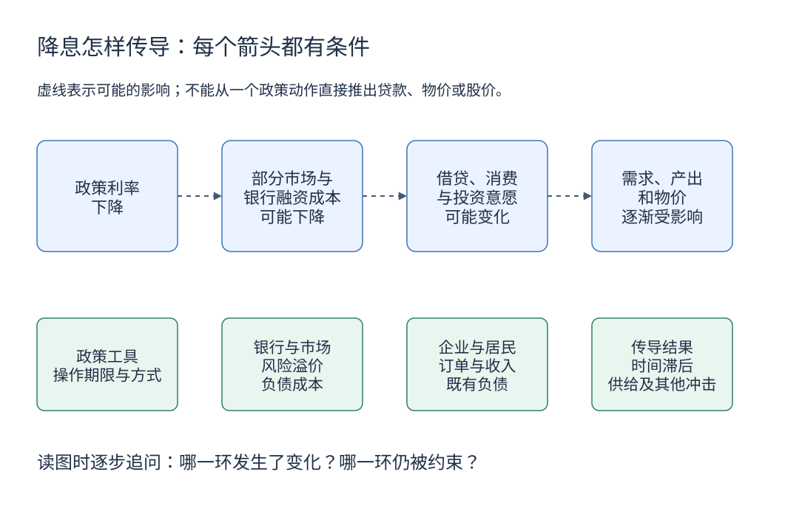

<!-- Generated by scripts/macro_overview.py from committed data. -->
# 中国宏观经济总览

先看增长与物价，再看融资条件、家庭状况和对外收支。每张卡片保留指标自己的统计期，帮助选择下一步要读的专题。

**读法：最新值 → 前次观测 → 历史范围 → 查口径。** 位置条显示最近五个日历年内已收录观测的最低值、最高值与最新位置；向右只表示数值较高。[季度 GDP](quarterly-gdp.md)观察近期增长，[年度 GDP](gdp.md)用于长期背景。

## 增长与景气

先看季度产出的实际增长，再用月度调查观察方向；年度 GDP 保留作长期背景。

::::{container} overview-grid

:::{admonition} GDP当季实际同比
:class: overview-card
:name: overview-gdp_q_yoy

**4.3 %**

统计期 **2026-Q2** · 季度（独立单季）

上一有效观测：2026-Q1 · 5 %；差值 **-0.7 个百分点**。

范围：**0.8 — 6.5 %**；2022-Q1 至 2026-Q2，18 个有效观测。

独立本季度与上年同季度比较；不是年内累计，也不是季调环比。

[查看完整历史与口径](quarterly-gdp.md) · [来源：国家统计局](https://data.stats.gov.cn/dg/website/page.html#/pc/national/quarterData)

本项目覆盖 1993-Q1 至 2026-Q2（134 条）。来源发布日期：未提供逐条日期；快照获取：2026-10-02T12:42:00+00:00。
:::

:::{admonition} 制造业 PMI
:class: overview-card
:name: overview-pmi_manufacturing

**49.8 指数点**

统计期 **2026-08** · 月度

上一有效观测：2026-07 · 49.2 指数点；差值 **+0.6 指数点**。

范围：**47 — 52.6 指数点**；2022-01 至 2026-08，56 个有效观测。

50 是调查扩张与收缩的分界；指数高低不是 GDP 增速。

[查看完整历史与口径](activity.md) · [来源：国家统计局](https://data.stats.gov.cn/dg/website/page.html#/pc/national/monthData)

本项目覆盖 2005-01 至 2026-08（260 条）。来源发布日期：未提供逐条日期；快照获取：2026-10-02T10:37:58+00:00。
:::

::::

## 物价

分清居民消费端与工业生产端；同比增速与价格水平也不同。

::::{container} overview-grid

:::{admonition} CPI 同比
:class: overview-card
:name: overview-cpi_yoy

**0.8 %**

统计期 **2026-08** · 月度

上一有效观测：2026-07 · 0.5 %；差值 **+0.3 个百分点**。

范围：**-0.8 — 2.8 %**；2022-01 至 2026-08，56 个有效观测。

同比回落可能只是涨价放缓，需结合环比、核心 CPI 和基数。

[查看完整历史与口径](prices.md) · [来源：国家统计局](https://data.stats.gov.cn/dg/website/page.html#/pc/national/monthData)

本项目覆盖 1998-01 至 2026-08（344 条）。来源发布日期：未提供逐条日期；快照获取：2026-10-02T10:37:57+00:00。
:::

:::{admonition} PPI 同比
:class: overview-card
:name: overview-ppi_yoy

**3.8 %**

统计期 **2026-08** · 月度

上一有效观测：2026-07 · 3.5 %；差值 **+0.3 个百分点**。

范围：**-5.4 — 9.1 %**；2022-01 至 2026-08，56 个有效观测。

反映工业出厂价格，向消费端的传导受成本、利润和需求影响。

[查看完整历史与口径](prices.md) · [来源：国家统计局](https://data.stats.gov.cn/dg/website/page.html#/pc/national/monthData)

本项目覆盖 1993-01 至 2026-08（404 条）。来源发布日期：未提供逐条日期；快照获取：2026-10-02T10:37:57+00:00。
:::

::::

## 货币与信用

存款增加与实体融资扩张是两个角度，不能相加。

::::{container} overview-grid

:::{admonition} M2 同比
:class: overview-card
:name: overview-m2_yoy

**7.7 %**

统计期 **2026-07** · 月度

上一有效观测：2026-06 · 8 %；差值 **-0.3 个百分点**。

范围：**6.2 — 12.9 %**；2022-01 至 2026-07，55 个有效观测。

采用官方可比同比；M2 增长并不等于消费或投资同比增长。

[查看完整历史与口径](money-credit.md) · [来源：国家统计局（央行数据）](https://data.stats.gov.cn/dg/website/page.html#/pc/national/monthData)

本项目覆盖 1999-12 至 2026-07（320 条）。来源发布日期：未提供逐条日期；快照获取：2026-10-02T10:37:58+00:00。
:::

:::{admonition} 社融存量同比
:class: overview-card
:name: overview-tsf_stock_yoy

**7.2 %**

统计期 **2026-08** · 月度

上一有效观测：2026-07 · 7.4 %；差值 **-0.2 个百分点**。

范围：**7.2 — 10.8 %**；2022-01 至 2026-08，56 个有效观测。

存量融资的同比增速；总量变化还需看政府债券、企业与居民融资结构。

[查看完整历史与口径](money-credit.md) · [来源：中国人民银行](https://www.pbc.gov.cn/diaochatongjisi/attachDir/2026/09/2026091418132334323.xlsx)

本项目覆盖 2014-12 至 2026-08（133 条）。来源发布日期：未提供逐条日期；快照获取：2026-10-02T10:37:58+00:00。
:::

::::

## 利率

政策操作与长期市场收益率分别观察。

::::{container} overview-grid

:::{admonition} 7 天逆回购操作利率
:class: overview-card
:name: overview-repo_7d

**1.4 %**

统计期 **2026-09-29** · 日度

上一有效观测：2026-09-28 · 1.4 %；差值 **0 个百分点**。

范围：**1.4 — 2.2 %**；2022-01-04 至 2026-09-29，1141 个有效观测。

最新有操作且公告明确利率的日期；无操作日不补零、不复制利率。

[查看完整历史与口径](rates.md) · [来源：中国人民银行](https://www.pbc.gov.cn/zhengcehuobisi/125207/125213/125431/125475/2026092908461628271/index.html)

本项目覆盖 2012-05-03 至 2026-09-29（2198 条）。来源发布日期：2026-09-29；快照获取：2026-10-02T10:37:58+00:00。
:::

:::{admonition} 10 年期国债收益率
:class: overview-card
:name: overview-yield_10y

**1.6822 %**

统计期 **2026-09-30** · 日度

上一有效观测：2026-09-29 · 1.667 %；差值 **+0.0152 个百分点**。

范围：**1.5958 — 2.9341 %**；2022-01-04 至 2026-09-30，1185 个有效观测。

国债收益率曲线的 10 年期限，包含政策、通胀及期限溢价预期。

[查看完整历史与口径](rates.md) · [来源：中央国债登记结算有限责任公司](https://yield.chinabond.com.cn/cbweb-pbc-web/pbc/historyQuery?startDate=2026-09-30&endDate=2026-09-30&gjqx=0&qxId=hzsylqx&locale=zh_CN)

本项目覆盖 2006-03-01 至 2026-09-30（5150 条）。来源发布日期：未提供逐条日期；快照获取：2026-10-02T10:37:58+00:00。
:::

::::

## 就业与收入

劳动力市场与购买力互相补充，但统计频率不同。

::::{container} overview-grid

:::{admonition} 城镇调查失业率
:class: overview-card
:name: overview-unemployment

**5.3 %**

统计期 **2026-08** · 月度

上一有效观测：2026-07 · 5.2 %；差值 **+0.1 个百分点**。

范围：**5 — 6.1 %**；2022-01 至 2026-08，56 个有效观测。

全国城镇调查口径；还需结合工时、劳动参与和收入理解。

[查看完整历史与口径](employment-income.md) · [来源：国家统计局](https://data.stats.gov.cn/dg/website/page.html#/pc/national/monthData)

本项目覆盖 2018-01 至 2026-08（104 条）。来源发布日期：未提供逐条日期；快照获取：2026-10-02T10:37:59+00:00。
:::

:::{admonition} 可支配收入实际累计同比
:class: overview-card
:name: overview-income_real_ytd_yoy

**4.2 %**

统计期 **2026-Q2** · 季度（年内累计）

上一有效观测：2026-Q1 · 4 %；差值 **+0.2 个百分点**。

范围：**2.9 — 6.2 %**；2022-Q1 至 2026-Q2，18 个有效观测。

Q2 是上半年、Q3 是前三季度；前后累计同比之差不是单季增速。

[查看完整历史与口径](employment-income.md) · [来源：国家统计局](https://data.stats.gov.cn/dg/website/page.html#/pc/national/quarterData)

本项目覆盖 2013-Q4 至 2026-Q2（51 条）。来源发布日期：未提供逐条日期；快照获取：2026-10-02T10:37:59+00:00。
:::

::::

## 外贸与汇率

贸易金额与货币价格分开读。

::::{container} overview-grid

:::{admonition} 当月出口
:class: overview-card
:name: overview-exports

**3,978.51708 亿美元**

统计期 **2026-07** · 月度

上一有效观测：2026-06 · 4,123.87125 亿美元；差值 **-145.35417 亿美元**。

范围：**2,140.25811 — 4,123.87125 亿美元**；2022-01 至 2026-07，55 个有效观测。

单月美元金额，含数量与价格影响；前次差额没有剔除季节性。

[查看完整历史与口径](trade-fx.md) · [来源：国家统计局（海关统计）](https://data.stats.gov.cn/dg/website/page.html#/pc/national/monthData)

本项目覆盖 1995-01 至 2026-07（375 条）。来源发布日期：未提供逐条日期；快照获取：2026-10-08T02:12:34+00:00。
:::

:::{admonition} 美元兑人民币中间价
:class: overview-card
:name: overview-usdcny_mid

**6.7367 人民币/美元**

统计期 **2026-10-08** · 日度

上一有效观测：2026-09-30 · 6.7351 人民币/美元；差值 **+0.0016 人民币/美元**。

范围：**6.3014 — 7.2555 人民币/美元**；2022-01-04 至 2026-10-08，1152 个有效观测。

人民币/美元；数值上升表示人民币对美元贬值，中间价并非成交价。

[查看完整历史与口径](trade-fx.md) · [来源：中国货币网](https://www.chinamoney.com.cn/chinese/bkccpr/)

本项目覆盖 2006-01-04 至 2026-10-08（5044 条）。来源发布日期：未提供逐条日期；快照获取：2026-10-08T02:12:34+00:00。
:::

::::

## 把指标放回传导链

[下载可编辑源图](../images/learning/rate-transmission.drawio) · [阅读完整的利率解释](../interest-rates.md)

虚线表示可能的影响。各环节的反应强弱与先后没有固定保证，也可能被其他因素抵消。

| 传导环节 | 用哪些数据核对 | 还缺什么证据 |
|---|---|---|
| 政策操作 → 融资条件 | [逆回购、LPR、国债收益率](rates.md) | 实际贷款利率、风险加点、存量合同重定价情况 |
| 融资条件 → 借贷和支出 | [社融总量](money-credit.md)、[融资与信贷结构](credit-structure.md)、[房地产](property.md)、[消费与投资](activity.md) | 贷款用途、订单、收入预期；余额不能替代新增需求 |
| 支出 → 生产与就业 | [工业与 PMI](activity.md)、[就业与收入](employment-income.md) | 库存、工时、劳动参与率、供给约束 |
| 需求与供给 → 价格 | [CPI、核心 CPI、PPI](prices.md) | 能源与食品冲击、进口成本、历史基数 |

政策也会回应经济变化。例如经济走弱可能促使降息，因此“降息与增长偏弱同时出现”不能证明降息造成了走弱。月度、季度和日度序列需要先对齐期间，再讨论先后关系。

## 三种组合，练习怎样读

以下是**条件式阅读示例**，不是对最新数据自动作出的经济判断。展开查看解释，先提出假设，再寻找支持或反对的证据。

M2 增长，但物价偏弱

**可以同时发生。** 存款余额增加，不代表资金同等速度地转为消费或投资；居民储蓄意愿、企业订单、融资结构与供给变化都可能影响支出和价格。

先比较 [M2 与社融](money-credit.md)，通过[融资与信贷结构](credit-structure.md)区分渠道和借款人，再看 [社零与投资](activity.md)、[CPI 与核心 CPI](prices.md)。CPI 同比还受基数、食品和能源影响。只凭 M2 与 CPI 两条线，尚不能证明资金“闲置”，也不能推算下一月通胀。

继续学习：[银行怎样创造存款](../banking-and-money-creation.md) · [货币与信用](../money-and-credit.md)

出口增长，但人民币对美元贬值

**出口只是外汇供求的一部分。** 进口、服务贸易、资本流动、结汇意愿、利差及预期都可能同时变化。出口的美元金额还包含数量和价格因素。

核对 [进出口与人民币汇率](trade-fx.md)时，出口按月、中间价按日，不能把两个不同日期的变化直接配对。USD/CNY 中间价上升表示人民币对美元贬值，但中间价不是即期成交价；还需国际收支、资本流动和市场汇率证据。

继续学习：[汇率如何形成](../exchange-rates.md)

政策利率下调，长期国债收益率却没有同步下降

**短期政策操作与长期定价对应不同信息。** 市场可能已提前计价降息，也可能同时上调未来增长、通胀或期限溢价预期。债券供求也会影响收益率。

先在 [利率专题](rates.md)核对操作日期、收益率日期和此前变化，再检查 [物价](prices.md)与[景气](activity.md)。仅凭一次降息，无法确定长期债券价格或收益率将怎样变化。

继续学习：[债券价格与收益率](../investing/bonds.md) · [政策传导](../interest-rates.md)

## 使用边界

- “最新”指各来源快照的最新有效观测；统计期、来源发布日期与快照获取时间分别列示，获取时间不是发布日期。
- 前次差值只是两个有效观测相减。百分比之差用**个百分点**，PMI 用指数点；它不自动等于环比增速，也不保证两个观测紧邻。
- 位置条是 `(最新值 − 窗口最低值) ÷ (窗口最高值 − 窗口最低值)`，不是历史百分位、经济评分或投资信号。区间内全为同值时不绘制位置。
- 总览最多显示八位小数，计算使用入库原值；完整精度以专题 CSV 为准。
- 窗口以每个指标最新有效观测所属年及此前四年为边界，保留该范围内实际观测；不足五年的只用已有数据。不同卡片可能对应不同窗口，不能比较条长来排名经济表现。
- 高低值可能受到基数、季节性、异常冲击或统计范围变化影响；先读专题中的口径说明。缺失不补零，所有完整历史仍保存在专题图表、表格与 CSV 中。

下一步可按[数据阅读练习](reading-exercise.md)复核一组数据，也可查看[全部专题](index.md)、[历史覆盖与缺口](history-coverage.md)和[最近自动更新状态](https://github.com/calcky/finance/actions/workflows/update-gdp.yml)。
