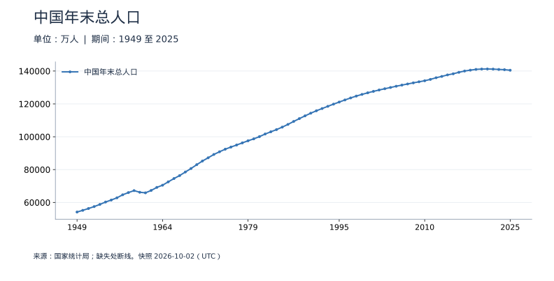
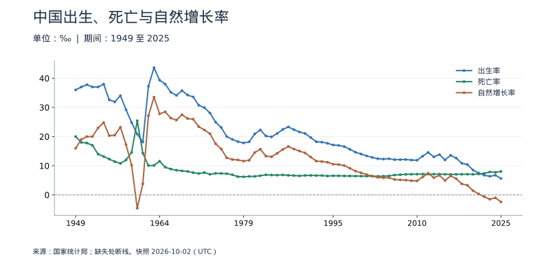
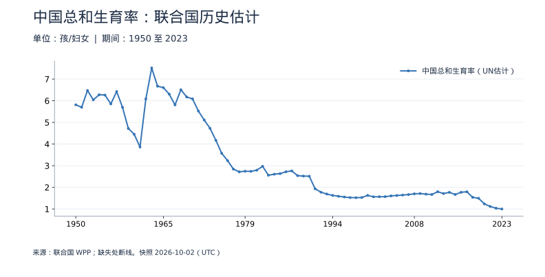
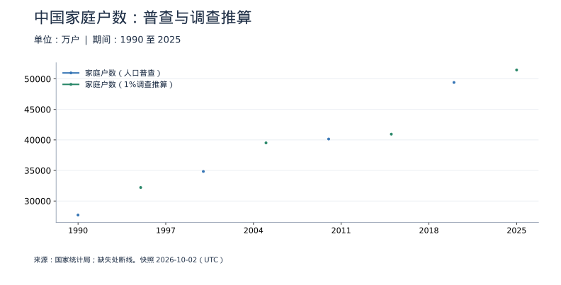
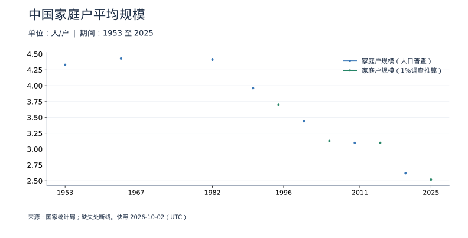

<!-- Generated by scripts/sync_macro.py; edit macro_catalog.py/macro_render.py. -->
# 中国人口、生育与家庭：真实数据

人口、出生和家庭户数，为什么可能朝不同方向变化？

人口是人数，家庭户是共同居住生活的单位，出生率与总和生育率的分母也不同。普查和1%调查只画真实调查年份，不制造年度插值。联合国总和生育率采用历史估计，排除预测期。

本页快照获取时间：**2026-10-02T15:21:37+00:00**。这是获取时间，不是所有数据的发布日期。每日检查上游；最新统计期以每个指标为准。

[CSV 下载](https://raw.githubusercontent.com/calcky/finance/main/data/macro/population.csv) · [来源与采集参数](https://github.com/calcky/finance/blob/main/data/macro/population.metadata.json) · [最近同步状态](https://github.com/calcky/finance/actions/workflows/update-gdp.yml)

```{only} html
本站同版快照：{download}`CSV <../../data/macro/population.csv>` · {download}`元数据 <../../data/macro/population.metadata.json>`
```

网页支持悬停查看、点击固定读数、按期间选择、缩放和定位明细。GitHub、打印或禁用 JavaScript 时显示静态图；数值与网页使用同一快照。

## 最新观测与覆盖

| 指标 | 最新期间 | 数值 | 单位 | 本项目起点 | 观测数 | 来源 |
|---|---|---:|---|---|---:|---|
| 中国年末总人口 | 2025 | 140,489 | 万人 | 1949 | 77 | [国家统计局](https://data.stats.gov.cn/dg/website/page.html#/pc/national/yearData) |
| 出生率 | 2025 | 5.63 | ‰ | 1949 | 77 | [国家统计局](https://data.stats.gov.cn/dg/website/page.html#/pc/national/yearData) |
| 死亡率 | 2025 | 8.04 | ‰ | 1949 | 77 | [国家统计局](https://data.stats.gov.cn/dg/website/page.html#/pc/national/yearData) |
| 自然增长率 | 2025 | -2.41 | ‰ | 1949 | 77 | [国家统计局](https://data.stats.gov.cn/dg/website/page.html#/pc/national/yearData) |
| 中国总和生育率（UN估计） | 2023 | 0.9995 | 孩/妇女 | 1950 | 74 | [联合国 WPP](https://population.un.org/wpp/assets/Excel%20Files/1_Indicator%20%28Standard%29/CSV_FILES/WPP2024_Demographic_Indicators_Medium.csv.gz) |
| 家庭户数（人口普查） | 2020 | 49,415.7423 | 万户 | 1990 | 4 | [国家统计局](https://www.stats.gov.cn/sj/zxfb/202302/t20230203_1901082.html) |
| 家庭户数（1%调查推算） | 2025 | 51,465 | 万户 | 1995 | 4 | [国家统计局](https://www.stats.gov.cn/sj/zxfb/202605/t20260522_1963788.html) |
| 家庭户规模（人口普查） | 2020 | 2.62 | 人/户 | 1953 | 7 | [国家统计局](https://data.stats.gov.cn/dg/website/page.html#/pc/national/yearData) |
| 家庭户规模（1%调查推算） | 2025 | 2.52 | 人/户 | 1995 | 4 | [国家统计局](https://www.stats.gov.cn/sj/zxfb/202605/t20260522_1963788.html) |

起点表示本项目当前覆盖范围，不代表该指标从此时才开始发布。旧定义序列的最后一期也不代表来源停止更新。各来源可能存在发布或入库滞后；空白不补零、不插值。发布日期未知的观测在 CSV 中留空。

图表的“全部”与 CSV 保留完整已采集历史；缩放近期不会删除早期数据。[历史来源、口径断点与剩余缺口](history-coverage.md)说明回溯范围。

## 中国年末总人口

人口总量是存量。1981年前户籍统计、之后普查及抽样推算，采用统计局当前历史版本；不含港澳台。单位万人，140000万人即14亿人。



<details class="macro-details">
<summary>中国年末总人口：展开完整数据表（万人）</summary>
<div class="macro-table-wrap"><table><thead><tr><th>期间</th><th>中国年末总人口</th></tr></thead><tbody>
<tr id="macro-population-china-2025" tabindex="-1"><td>2025</td><td>140,489</td></tr>
<tr id="macro-population-china-2024" tabindex="-1"><td>2024</td><td>140,828</td></tr>
<tr id="macro-population-china-2023" tabindex="-1"><td>2023</td><td>140,967</td></tr>
<tr id="macro-population-china-2022" tabindex="-1"><td>2022</td><td>141,175</td></tr>
<tr id="macro-population-china-2021" tabindex="-1"><td>2021</td><td>141,260</td></tr>
<tr id="macro-population-china-2020" tabindex="-1"><td>2020</td><td>141,212</td></tr>
<tr id="macro-population-china-2019" tabindex="-1"><td>2019</td><td>141,008</td></tr>
<tr id="macro-population-china-2018" tabindex="-1"><td>2018</td><td>140,541</td></tr>
<tr id="macro-population-china-2017" tabindex="-1"><td>2017</td><td>140,011</td></tr>
<tr id="macro-population-china-2016" tabindex="-1"><td>2016</td><td>139,232</td></tr>
<tr id="macro-population-china-2015" tabindex="-1"><td>2015</td><td>138,326</td></tr>
<tr id="macro-population-china-2014" tabindex="-1"><td>2014</td><td>137,646</td></tr>
<tr id="macro-population-china-2013" tabindex="-1"><td>2013</td><td>136,726</td></tr>
<tr id="macro-population-china-2012" tabindex="-1"><td>2012</td><td>135,922</td></tr>
<tr id="macro-population-china-2011" tabindex="-1"><td>2011</td><td>134,916</td></tr>
<tr id="macro-population-china-2010" tabindex="-1"><td>2010</td><td>134,091</td></tr>
<tr id="macro-population-china-2009" tabindex="-1"><td>2009</td><td>133,450</td></tr>
<tr id="macro-population-china-2008" tabindex="-1"><td>2008</td><td>132,802</td></tr>
<tr id="macro-population-china-2007" tabindex="-1"><td>2007</td><td>132,129</td></tr>
<tr id="macro-population-china-2006" tabindex="-1"><td>2006</td><td>131,448</td></tr>
<tr id="macro-population-china-2005" tabindex="-1"><td>2005</td><td>130,756</td></tr>
<tr id="macro-population-china-2004" tabindex="-1"><td>2004</td><td>129,988</td></tr>
<tr id="macro-population-china-2003" tabindex="-1"><td>2003</td><td>129,227</td></tr>
<tr id="macro-population-china-2002" tabindex="-1"><td>2002</td><td>128,453</td></tr>
<tr id="macro-population-china-2001" tabindex="-1"><td>2001</td><td>127,627</td></tr>
<tr id="macro-population-china-2000" tabindex="-1"><td>2000</td><td>126,743</td></tr>
<tr id="macro-population-china-1999" tabindex="-1"><td>1999</td><td>125,786</td></tr>
<tr id="macro-population-china-1998" tabindex="-1"><td>1998</td><td>124,761</td></tr>
<tr id="macro-population-china-1997" tabindex="-1"><td>1997</td><td>123,626</td></tr>
<tr id="macro-population-china-1996" tabindex="-1"><td>1996</td><td>122,389</td></tr>
<tr id="macro-population-china-1995" tabindex="-1"><td>1995</td><td>121,121</td></tr>
<tr id="macro-population-china-1994" tabindex="-1"><td>1994</td><td>119,850</td></tr>
<tr id="macro-population-china-1993" tabindex="-1"><td>1993</td><td>118,517</td></tr>
<tr id="macro-population-china-1992" tabindex="-1"><td>1992</td><td>117,171</td></tr>
<tr id="macro-population-china-1991" tabindex="-1"><td>1991</td><td>115,823</td></tr>
<tr id="macro-population-china-1990" tabindex="-1"><td>1990</td><td>114,333</td></tr>
<tr id="macro-population-china-1989" tabindex="-1"><td>1989</td><td>112,704</td></tr>
<tr id="macro-population-china-1988" tabindex="-1"><td>1988</td><td>111,026</td></tr>
<tr id="macro-population-china-1987" tabindex="-1"><td>1987</td><td>109,300</td></tr>
<tr id="macro-population-china-1986" tabindex="-1"><td>1986</td><td>107,507</td></tr>
<tr id="macro-population-china-1985" tabindex="-1"><td>1985</td><td>105,851</td></tr>
<tr id="macro-population-china-1984" tabindex="-1"><td>1984</td><td>104,357</td></tr>
<tr id="macro-population-china-1983" tabindex="-1"><td>1983</td><td>103,008</td></tr>
<tr id="macro-population-china-1982" tabindex="-1"><td>1982</td><td>101,654</td></tr>
<tr id="macro-population-china-1981" tabindex="-1"><td>1981</td><td>100,072</td></tr>
<tr id="macro-population-china-1980" tabindex="-1"><td>1980</td><td>98,705</td></tr>
<tr id="macro-population-china-1979" tabindex="-1"><td>1979</td><td>97,542</td></tr>
<tr id="macro-population-china-1978" tabindex="-1"><td>1978</td><td>96,259</td></tr>
<tr id="macro-population-china-1977" tabindex="-1"><td>1977</td><td>94,974</td></tr>
<tr id="macro-population-china-1976" tabindex="-1"><td>1976</td><td>93,717</td></tr>
<tr id="macro-population-china-1975" tabindex="-1"><td>1975</td><td>92,420</td></tr>
<tr id="macro-population-china-1974" tabindex="-1"><td>1974</td><td>90,859</td></tr>
<tr id="macro-population-china-1973" tabindex="-1"><td>1973</td><td>89,211</td></tr>
<tr id="macro-population-china-1972" tabindex="-1"><td>1972</td><td>87,177</td></tr>
<tr id="macro-population-china-1971" tabindex="-1"><td>1971</td><td>85,229</td></tr>
<tr id="macro-population-china-1970" tabindex="-1"><td>1970</td><td>82,992</td></tr>
<tr id="macro-population-china-1969" tabindex="-1"><td>1969</td><td>80,671</td></tr>
<tr id="macro-population-china-1968" tabindex="-1"><td>1968</td><td>78,534</td></tr>
<tr id="macro-population-china-1967" tabindex="-1"><td>1967</td><td>76,368</td></tr>
<tr id="macro-population-china-1966" tabindex="-1"><td>1966</td><td>74,542</td></tr>
<tr id="macro-population-china-1965" tabindex="-1"><td>1965</td><td>72,538</td></tr>
<tr id="macro-population-china-1964" tabindex="-1"><td>1964</td><td>70,499</td></tr>
<tr id="macro-population-china-1963" tabindex="-1"><td>1963</td><td>69,172</td></tr>
<tr id="macro-population-china-1962" tabindex="-1"><td>1962</td><td>67,296</td></tr>
<tr id="macro-population-china-1961" tabindex="-1"><td>1961</td><td>65,859</td></tr>
<tr id="macro-population-china-1960" tabindex="-1"><td>1960</td><td>66,207</td></tr>
<tr id="macro-population-china-1959" tabindex="-1"><td>1959</td><td>67,207</td></tr>
<tr id="macro-population-china-1958" tabindex="-1"><td>1958</td><td>65,994</td></tr>
<tr id="macro-population-china-1957" tabindex="-1"><td>1957</td><td>64,653</td></tr>
<tr id="macro-population-china-1956" tabindex="-1"><td>1956</td><td>62,828</td></tr>
<tr id="macro-population-china-1955" tabindex="-1"><td>1955</td><td>61,465</td></tr>
<tr id="macro-population-china-1954" tabindex="-1"><td>1954</td><td>60,266</td></tr>
<tr id="macro-population-china-1953" tabindex="-1"><td>1953</td><td>58,796</td></tr>
<tr id="macro-population-china-1952" tabindex="-1"><td>1952</td><td>57,482</td></tr>
<tr id="macro-population-china-1951" tabindex="-1"><td>1951</td><td>56,300</td></tr>
<tr id="macro-population-china-1950" tabindex="-1"><td>1950</td><td>55,196</td></tr>
<tr id="macro-population-china-1949" tabindex="-1"><td>1949</td><td>54,167</td></tr>
</tbody></table></div></details>

## 中国出生、死亡与自然增长率

分母是年平均总人口。自然增长率等于出生率减死亡率，不含迁移；‰不是%。



<details class="macro-details">
<summary>中国出生、死亡与自然增长率：展开完整数据表（‰）</summary>
<div class="macro-table-wrap"><table><thead><tr><th>期间</th><th>出生率</th><th>死亡率</th><th>自然增长率</th></tr></thead><tbody>
<tr id="macro-population-rates-2025" tabindex="-1"><td>2025</td><td>5.63</td><td>8.04</td><td>-2.41</td></tr>
<tr id="macro-population-rates-2024" tabindex="-1"><td>2024</td><td>6.77</td><td>7.76</td><td>-0.99</td></tr>
<tr id="macro-population-rates-2023" tabindex="-1"><td>2023</td><td>6.39</td><td>7.87</td><td>-1.48</td></tr>
<tr id="macro-population-rates-2022" tabindex="-1"><td>2022</td><td>6.77</td><td>7.37</td><td>-0.6</td></tr>
<tr id="macro-population-rates-2021" tabindex="-1"><td>2021</td><td>7.52</td><td>7.18</td><td>0.34</td></tr>
<tr id="macro-population-rates-2020" tabindex="-1"><td>2020</td><td>8.52</td><td>7.07</td><td>1.45</td></tr>
<tr id="macro-population-rates-2019" tabindex="-1"><td>2019</td><td>10.41</td><td>7.09</td><td>3.32</td></tr>
<tr id="macro-population-rates-2018" tabindex="-1"><td>2018</td><td>10.86</td><td>7.08</td><td>3.78</td></tr>
<tr id="macro-population-rates-2017" tabindex="-1"><td>2017</td><td>12.64</td><td>7.06</td><td>5.58</td></tr>
<tr id="macro-population-rates-2016" tabindex="-1"><td>2016</td><td>13.57</td><td>7.04</td><td>6.53</td></tr>
<tr id="macro-population-rates-2015" tabindex="-1"><td>2015</td><td>11.99</td><td>7.07</td><td>4.93</td></tr>
<tr id="macro-population-rates-2014" tabindex="-1"><td>2014</td><td>13.83</td><td>7.12</td><td>6.71</td></tr>
<tr id="macro-population-rates-2013" tabindex="-1"><td>2013</td><td>13.03</td><td>7.13</td><td>5.9</td></tr>
<tr id="macro-population-rates-2012" tabindex="-1"><td>2012</td><td>14.57</td><td>7.13</td><td>7.43</td></tr>
<tr id="macro-population-rates-2011" tabindex="-1"><td>2011</td><td>13.27</td><td>7.14</td><td>6.13</td></tr>
<tr id="macro-population-rates-2010" tabindex="-1"><td>2010</td><td>11.9</td><td>7.11</td><td>4.79</td></tr>
<tr id="macro-population-rates-2009" tabindex="-1"><td>2009</td><td>11.95</td><td>7.08</td><td>4.87</td></tr>
<tr id="macro-population-rates-2008" tabindex="-1"><td>2008</td><td>12.14</td><td>7.06</td><td>5.08</td></tr>
<tr id="macro-population-rates-2007" tabindex="-1"><td>2007</td><td>12.1</td><td>6.93</td><td>5.17</td></tr>
<tr id="macro-population-rates-2006" tabindex="-1"><td>2006</td><td>12.09</td><td>6.81</td><td>5.28</td></tr>
<tr id="macro-population-rates-2005" tabindex="-1"><td>2005</td><td>12.4</td><td>6.51</td><td>5.89</td></tr>
<tr id="macro-population-rates-2004" tabindex="-1"><td>2004</td><td>12.29</td><td>6.42</td><td>5.87</td></tr>
<tr id="macro-population-rates-2003" tabindex="-1"><td>2003</td><td>12.41</td><td>6.4</td><td>6.01</td></tr>
<tr id="macro-population-rates-2002" tabindex="-1"><td>2002</td><td>12.86</td><td>6.41</td><td>6.45</td></tr>
<tr id="macro-population-rates-2001" tabindex="-1"><td>2001</td><td>13.38</td><td>6.43</td><td>6.95</td></tr>
<tr id="macro-population-rates-2000" tabindex="-1"><td>2000</td><td>14.03</td><td>6.45</td><td>7.58</td></tr>
<tr id="macro-population-rates-1999" tabindex="-1"><td>1999</td><td>14.64</td><td>6.46</td><td>8.18</td></tr>
<tr id="macro-population-rates-1998" tabindex="-1"><td>1998</td><td>15.64</td><td>6.5</td><td>9.14</td></tr>
<tr id="macro-population-rates-1997" tabindex="-1"><td>1997</td><td>16.57</td><td>6.51</td><td>10.06</td></tr>
<tr id="macro-population-rates-1996" tabindex="-1"><td>1996</td><td>16.98</td><td>6.56</td><td>10.42</td></tr>
<tr id="macro-population-rates-1995" tabindex="-1"><td>1995</td><td>17.12</td><td>6.57</td><td>10.55</td></tr>
<tr id="macro-population-rates-1994" tabindex="-1"><td>1994</td><td>17.7</td><td>6.49</td><td>11.21</td></tr>
<tr id="macro-population-rates-1993" tabindex="-1"><td>1993</td><td>18.09</td><td>6.64</td><td>11.45</td></tr>
<tr id="macro-population-rates-1992" tabindex="-1"><td>1992</td><td>18.24</td><td>6.64</td><td>11.6</td></tr>
<tr id="macro-population-rates-1991" tabindex="-1"><td>1991</td><td>19.68</td><td>6.7</td><td>12.98</td></tr>
<tr id="macro-population-rates-1990" tabindex="-1"><td>1990</td><td>21.06</td><td>6.67</td><td>14.39</td></tr>
<tr id="macro-population-rates-1989" tabindex="-1"><td>1989</td><td>21.58</td><td>6.54</td><td>15.04</td></tr>
<tr id="macro-population-rates-1988" tabindex="-1"><td>1988</td><td>22.37</td><td>6.64</td><td>15.73</td></tr>
<tr id="macro-population-rates-1987" tabindex="-1"><td>1987</td><td>23.33</td><td>6.72</td><td>16.61</td></tr>
<tr id="macro-population-rates-1986" tabindex="-1"><td>1986</td><td>22.43</td><td>6.86</td><td>15.57</td></tr>
<tr id="macro-population-rates-1985" tabindex="-1"><td>1985</td><td>21.04</td><td>6.78</td><td>14.26</td></tr>
<tr id="macro-population-rates-1984" tabindex="-1"><td>1984</td><td>19.9</td><td>6.82</td><td>13.08</td></tr>
<tr id="macro-population-rates-1983" tabindex="-1"><td>1983</td><td>20.19</td><td>6.9</td><td>13.29</td></tr>
<tr id="macro-population-rates-1982" tabindex="-1"><td>1982</td><td>22.28</td><td>6.6</td><td>15.68</td></tr>
<tr id="macro-population-rates-1981" tabindex="-1"><td>1981</td><td>20.91</td><td>6.36</td><td>14.55</td></tr>
<tr id="macro-population-rates-1980" tabindex="-1"><td>1980</td><td>18.21</td><td>6.34</td><td>11.87</td></tr>
<tr id="macro-population-rates-1979" tabindex="-1"><td>1979</td><td>17.82</td><td>6.21</td><td>11.61</td></tr>
<tr id="macro-population-rates-1978" tabindex="-1"><td>1978</td><td>18.25</td><td>6.25</td><td>12</td></tr>
<tr id="macro-population-rates-1977" tabindex="-1"><td>1977</td><td>19.03</td><td>6.91</td><td>12.12</td></tr>
<tr id="macro-population-rates-1976" tabindex="-1"><td>1976</td><td>20.01</td><td>7.29</td><td>12.72</td></tr>
<tr id="macro-population-rates-1975" tabindex="-1"><td>1975</td><td>23.13</td><td>7.36</td><td>15.77</td></tr>
<tr id="macro-population-rates-1974" tabindex="-1"><td>1974</td><td>24.95</td><td>7.38</td><td>17.57</td></tr>
<tr id="macro-population-rates-1973" tabindex="-1"><td>1973</td><td>28.07</td><td>7.08</td><td>20.99</td></tr>
<tr id="macro-population-rates-1972" tabindex="-1"><td>1972</td><td>29.92</td><td>7.65</td><td>22.27</td></tr>
<tr id="macro-population-rates-1971" tabindex="-1"><td>1971</td><td>30.74</td><td>7.34</td><td>23.4</td></tr>
<tr id="macro-population-rates-1970" tabindex="-1"><td>1970</td><td>33.59</td><td>7.64</td><td>25.95</td></tr>
<tr id="macro-population-rates-1969" tabindex="-1"><td>1969</td><td>34.25</td><td>8.06</td><td>26.19</td></tr>
<tr id="macro-population-rates-1968" tabindex="-1"><td>1968</td><td>35.75</td><td>8.25</td><td>27.5</td></tr>
<tr id="macro-population-rates-1967" tabindex="-1"><td>1967</td><td>34.12</td><td>8.47</td><td>25.65</td></tr>
<tr id="macro-population-rates-1966" tabindex="-1"><td>1966</td><td>35.21</td><td>8.87</td><td>26.34</td></tr>
<tr id="macro-population-rates-1965" tabindex="-1"><td>1965</td><td>38</td><td>9.5</td><td>28.5</td></tr>
<tr id="macro-population-rates-1964" tabindex="-1"><td>1964</td><td>39.34</td><td>11.56</td><td>27.78</td></tr>
<tr id="macro-population-rates-1963" tabindex="-1"><td>1963</td><td>43.6</td><td>10.1</td><td>33.5</td></tr>
<tr id="macro-population-rates-1962" tabindex="-1"><td>1962</td><td>37.22</td><td>10.08</td><td>27.14</td></tr>
<tr id="macro-population-rates-1961" tabindex="-1"><td>1961</td><td>18.13</td><td>14.33</td><td>3.8</td></tr>
<tr id="macro-population-rates-1960" tabindex="-1"><td>1960</td><td>20.86</td><td>25.43</td><td>-4.57</td></tr>
<tr id="macro-population-rates-1959" tabindex="-1"><td>1959</td><td>24.78</td><td>14.59</td><td>10.19</td></tr>
<tr id="macro-population-rates-1958" tabindex="-1"><td>1958</td><td>29.22</td><td>11.98</td><td>17.24</td></tr>
<tr id="macro-population-rates-1957" tabindex="-1"><td>1957</td><td>34.03</td><td>10.8</td><td>23.23</td></tr>
<tr id="macro-population-rates-1956" tabindex="-1"><td>1956</td><td>31.9</td><td>11.4</td><td>20.5</td></tr>
<tr id="macro-population-rates-1955" tabindex="-1"><td>1955</td><td>32.6</td><td>12.28</td><td>20.32</td></tr>
<tr id="macro-population-rates-1954" tabindex="-1"><td>1954</td><td>37.97</td><td>13.18</td><td>24.79</td></tr>
<tr id="macro-population-rates-1953" tabindex="-1"><td>1953</td><td>37</td><td>14</td><td>23</td></tr>
<tr id="macro-population-rates-1952" tabindex="-1"><td>1952</td><td>37</td><td>17</td><td>20</td></tr>
<tr id="macro-population-rates-1951" tabindex="-1"><td>1951</td><td>37.8</td><td>17.8</td><td>20</td></tr>
<tr id="macro-population-rates-1950" tabindex="-1"><td>1950</td><td>37</td><td>18</td><td>19</td></tr>
<tr id="macro-population-rates-1949" tabindex="-1"><td>1949</td><td>36</td><td>20</td><td>16</td></tr>
</tbody></table></div></details>

## 中国总和生育率：联合国历史估计

WPP2024的1950—2023年估计；2024年起是预测，未混入。总和生育率反映当年的年龄别生育率，不是当年每位女性都生了多少，也不是某一代人的最终生育数。



<details class="macro-details">
<summary>中国总和生育率：联合国历史估计：展开完整数据表（孩/妇女）</summary>
<div class="macro-table-wrap"><table><thead><tr><th>期间</th><th>中国总和生育率（UN估计）</th></tr></thead><tbody>
<tr id="macro-population-fertility-2023" tabindex="-1"><td>2023</td><td>0.9995</td></tr>
<tr id="macro-population-fertility-2022" tabindex="-1"><td>2022</td><td>1.0344</td></tr>
<tr id="macro-population-fertility-2021" tabindex="-1"><td>2021</td><td>1.1174</td></tr>
<tr id="macro-population-fertility-2020" tabindex="-1"><td>2020</td><td>1.2357</td></tr>
<tr id="macro-population-fertility-2019" tabindex="-1"><td>2019</td><td>1.4961</td></tr>
<tr id="macro-population-fertility-2018" tabindex="-1"><td>2018</td><td>1.5387</td></tr>
<tr id="macro-population-fertility-2017" tabindex="-1"><td>2017</td><td>1.7953</td></tr>
<tr id="macro-population-fertility-2016" tabindex="-1"><td>2016</td><td>1.7719</td></tr>
<tr id="macro-population-fertility-2015" tabindex="-1"><td>2015</td><td>1.6696</td></tr>
<tr id="macro-population-fertility-2014" tabindex="-1"><td>2014</td><td>1.7694</td></tr>
<tr id="macro-population-fertility-2013" tabindex="-1"><td>2013</td><td>1.714</td></tr>
<tr id="macro-population-fertility-2012" tabindex="-1"><td>2012</td><td>1.7984</td></tr>
<tr id="macro-population-fertility-2011" tabindex="-1"><td>2011</td><td>1.6683</td></tr>
<tr id="macro-population-fertility-2010" tabindex="-1"><td>2010</td><td>1.6865</td></tr>
<tr id="macro-population-fertility-2009" tabindex="-1"><td>2009</td><td>1.7142</td></tr>
<tr id="macro-population-fertility-2008" tabindex="-1"><td>2008</td><td>1.7005</td></tr>
<tr id="macro-population-fertility-2007" tabindex="-1"><td>2007</td><td>1.666</td></tr>
<tr id="macro-population-fertility-2006" tabindex="-1"><td>2006</td><td>1.6441</td></tr>
<tr id="macro-population-fertility-2005" tabindex="-1"><td>2005</td><td>1.6238</td></tr>
<tr id="macro-population-fertility-2004" tabindex="-1"><td>2004</td><td>1.605</td></tr>
<tr id="macro-population-fertility-2003" tabindex="-1"><td>2003</td><td>1.5697</td></tr>
<tr id="macro-population-fertility-2002" tabindex="-1"><td>2002</td><td>1.5658</td></tr>
<tr id="macro-population-fertility-2001" tabindex="-1"><td>2001</td><td>1.5629</td></tr>
<tr id="macro-population-fertility-2000" tabindex="-1"><td>2000</td><td>1.6281</td></tr>
<tr id="macro-population-fertility-1999" tabindex="-1"><td>1999</td><td>1.5302</td></tr>
<tr id="macro-population-fertility-1998" tabindex="-1"><td>1998</td><td>1.5224</td></tr>
<tr id="macro-population-fertility-1997" tabindex="-1"><td>1997</td><td>1.527</td></tr>
<tr id="macro-population-fertility-1996" tabindex="-1"><td>1996</td><td>1.5542</td></tr>
<tr id="macro-population-fertility-1995" tabindex="-1"><td>1995</td><td>1.5885</td></tr>
<tr id="macro-population-fertility-1994" tabindex="-1"><td>1994</td><td>1.6285</td></tr>
<tr id="macro-population-fertility-1993" tabindex="-1"><td>1993</td><td>1.6909</td></tr>
<tr id="macro-population-fertility-1992" tabindex="-1"><td>1992</td><td>1.776</td></tr>
<tr id="macro-population-fertility-1991" tabindex="-1"><td>1991</td><td>1.934</td></tr>
<tr id="macro-population-fertility-1990" tabindex="-1"><td>1990</td><td>2.514</td></tr>
<tr id="macro-population-fertility-1989" tabindex="-1"><td>1989</td><td>2.5204</td></tr>
<tr id="macro-population-fertility-1988" tabindex="-1"><td>1988</td><td>2.5395</td></tr>
<tr id="macro-population-fertility-1987" tabindex="-1"><td>1987</td><td>2.7597</td></tr>
<tr id="macro-population-fertility-1986" tabindex="-1"><td>1986</td><td>2.7209</td></tr>
<tr id="macro-population-fertility-1985" tabindex="-1"><td>1985</td><td>2.633</td></tr>
<tr id="macro-population-fertility-1984" tabindex="-1"><td>1984</td><td>2.607</td></tr>
<tr id="macro-population-fertility-1983" tabindex="-1"><td>1983</td><td>2.559</td></tr>
<tr id="macro-population-fertility-1982" tabindex="-1"><td>1982</td><td>2.972</td></tr>
<tr id="macro-population-fertility-1981" tabindex="-1"><td>1981</td><td>2.792</td></tr>
<tr id="macro-population-fertility-1980" tabindex="-1"><td>1980</td><td>2.739</td></tr>
<tr id="macro-population-fertility-1979" tabindex="-1"><td>1979</td><td>2.745</td></tr>
<tr id="macro-population-fertility-1978" tabindex="-1"><td>1978</td><td>2.716</td></tr>
<tr id="macro-population-fertility-1977" tabindex="-1"><td>1977</td><td>2.844</td></tr>
<tr id="macro-population-fertility-1976" tabindex="-1"><td>1976</td><td>3.235</td></tr>
<tr id="macro-population-fertility-1975" tabindex="-1"><td>1975</td><td>3.571</td></tr>
<tr id="macro-population-fertility-1974" tabindex="-1"><td>1974</td><td>4.17</td></tr>
<tr id="macro-population-fertility-1973" tabindex="-1"><td>1973</td><td>4.726</td></tr>
<tr id="macro-population-fertility-1972" tabindex="-1"><td>1972</td><td>5.112</td></tr>
<tr id="macro-population-fertility-1971" tabindex="-1"><td>1971</td><td>5.523</td></tr>
<tr id="macro-population-fertility-1970" tabindex="-1"><td>1970</td><td>6.085</td></tr>
<tr id="macro-population-fertility-1969" tabindex="-1"><td>1969</td><td>6.175</td></tr>
<tr id="macro-population-fertility-1968" tabindex="-1"><td>1968</td><td>6.508</td></tr>
<tr id="macro-population-fertility-1967" tabindex="-1"><td>1967</td><td>5.806</td></tr>
<tr id="macro-population-fertility-1966" tabindex="-1"><td>1966</td><td>6.307</td></tr>
<tr id="macro-population-fertility-1965" tabindex="-1"><td>1965</td><td>6.605</td></tr>
<tr id="macro-population-fertility-1964" tabindex="-1"><td>1964</td><td>6.672</td></tr>
<tr id="macro-population-fertility-1963" tabindex="-1"><td>1963</td><td>7.513</td></tr>
<tr id="macro-population-fertility-1962" tabindex="-1"><td>1962</td><td>6.085</td></tr>
<tr id="macro-population-fertility-1961" tabindex="-1"><td>1961</td><td>3.863</td></tr>
<tr id="macro-population-fertility-1960" tabindex="-1"><td>1960</td><td>4.451</td></tr>
<tr id="macro-population-fertility-1959" tabindex="-1"><td>1959</td><td>4.718</td></tr>
<tr id="macro-population-fertility-1958" tabindex="-1"><td>1958</td><td>5.698</td></tr>
<tr id="macro-population-fertility-1957" tabindex="-1"><td>1957</td><td>6.425</td></tr>
<tr id="macro-population-fertility-1956" tabindex="-1"><td>1956</td><td>5.854</td></tr>
<tr id="macro-population-fertility-1955" tabindex="-1"><td>1955</td><td>6.263</td></tr>
<tr id="macro-population-fertility-1954" tabindex="-1"><td>1954</td><td>6.278</td></tr>
<tr id="macro-population-fertility-1953" tabindex="-1"><td>1953</td><td>6.042</td></tr>
<tr id="macro-population-fertility-1952" tabindex="-1"><td>1952</td><td>6.472</td></tr>
<tr id="macro-population-fertility-1951" tabindex="-1"><td>1951</td><td>5.699</td></tr>
<tr id="macro-population-fertility-1950" tabindex="-1"><td>1950</td><td>5.813</td></tr>
</tbody></table></div></details>

## 中国家庭户数：普查与调查推算

只有调查时点的点，空白年没有估算线；1%调查采用官方推算全国总量，而非样本户数乘100。家庭户排除集体户，不能直接用总人口除以家庭规模计算。



<details class="macro-details">
<summary>中国家庭户数：普查与调查推算：展开完整数据表（万户）</summary>
<div class="macro-table-wrap"><table><thead><tr><th>期间</th><th>家庭户数（人口普查）</th><th>家庭户数（1%调查推算）</th></tr></thead><tbody>
<tr id="macro-population-households-2025" tabindex="-1"><td>2025</td><td>缺失</td><td>51,465</td></tr>
<tr id="macro-population-households-2024" tabindex="-1"><td>2024</td><td>缺失</td><td>缺失</td></tr>
<tr id="macro-population-households-2023" tabindex="-1"><td>2023</td><td>缺失</td><td>缺失</td></tr>
<tr id="macro-population-households-2022" tabindex="-1"><td>2022</td><td>缺失</td><td>缺失</td></tr>
<tr id="macro-population-households-2021" tabindex="-1"><td>2021</td><td>缺失</td><td>缺失</td></tr>
<tr id="macro-population-households-2020" tabindex="-1"><td>2020</td><td>49,415.7423</td><td>缺失</td></tr>
<tr id="macro-population-households-2019" tabindex="-1"><td>2019</td><td>缺失</td><td>缺失</td></tr>
<tr id="macro-population-households-2018" tabindex="-1"><td>2018</td><td>缺失</td><td>缺失</td></tr>
<tr id="macro-population-households-2017" tabindex="-1"><td>2017</td><td>缺失</td><td>缺失</td></tr>
<tr id="macro-population-households-2016" tabindex="-1"><td>2016</td><td>缺失</td><td>缺失</td></tr>
<tr id="macro-population-households-2015" tabindex="-1"><td>2015</td><td>缺失</td><td>40,947</td></tr>
<tr id="macro-population-households-2014" tabindex="-1"><td>2014</td><td>缺失</td><td>缺失</td></tr>
<tr id="macro-population-households-2013" tabindex="-1"><td>2013</td><td>缺失</td><td>缺失</td></tr>
<tr id="macro-population-households-2012" tabindex="-1"><td>2012</td><td>缺失</td><td>缺失</td></tr>
<tr id="macro-population-households-2011" tabindex="-1"><td>2011</td><td>缺失</td><td>缺失</td></tr>
<tr id="macro-population-households-2010" tabindex="-1"><td>2010</td><td>40,151.733</td><td>缺失</td></tr>
<tr id="macro-population-households-2009" tabindex="-1"><td>2009</td><td>缺失</td><td>缺失</td></tr>
<tr id="macro-population-households-2008" tabindex="-1"><td>2008</td><td>缺失</td><td>缺失</td></tr>
<tr id="macro-population-households-2007" tabindex="-1"><td>2007</td><td>缺失</td><td>缺失</td></tr>
<tr id="macro-population-households-2006" tabindex="-1"><td>2006</td><td>缺失</td><td>缺失</td></tr>
<tr id="macro-population-households-2005" tabindex="-1"><td>2005</td><td>缺失</td><td>39,519</td></tr>
<tr id="macro-population-households-2004" tabindex="-1"><td>2004</td><td>缺失</td><td>缺失</td></tr>
<tr id="macro-population-households-2003" tabindex="-1"><td>2003</td><td>缺失</td><td>缺失</td></tr>
<tr id="macro-population-households-2002" tabindex="-1"><td>2002</td><td>缺失</td><td>缺失</td></tr>
<tr id="macro-population-households-2001" tabindex="-1"><td>2001</td><td>缺失</td><td>缺失</td></tr>
<tr id="macro-population-households-2000" tabindex="-1"><td>2000</td><td>34,837</td><td>缺失</td></tr>
<tr id="macro-population-households-1999" tabindex="-1"><td>1999</td><td>缺失</td><td>缺失</td></tr>
<tr id="macro-population-households-1998" tabindex="-1"><td>1998</td><td>缺失</td><td>缺失</td></tr>
<tr id="macro-population-households-1997" tabindex="-1"><td>1997</td><td>缺失</td><td>缺失</td></tr>
<tr id="macro-population-households-1996" tabindex="-1"><td>1996</td><td>缺失</td><td>缺失</td></tr>
<tr id="macro-population-households-1995" tabindex="-1"><td>1995</td><td>缺失</td><td>32,211</td></tr>
<tr id="macro-population-households-1994" tabindex="-1"><td>1994</td><td>缺失</td><td>缺失</td></tr>
<tr id="macro-population-households-1993" tabindex="-1"><td>1993</td><td>缺失</td><td>缺失</td></tr>
<tr id="macro-population-households-1992" tabindex="-1"><td>1992</td><td>缺失</td><td>缺失</td></tr>
<tr id="macro-population-households-1991" tabindex="-1"><td>1991</td><td>缺失</td><td>缺失</td></tr>
<tr id="macro-population-households-1990" tabindex="-1"><td>1990</td><td>27,694.7962</td><td>缺失</td></tr>
</tbody></table></div></details>

## 中国家庭户平均规模

家庭变小可使户数在人口增长放缓时继续增加；但新增一户不等于新增购买一套房。普查与调查分列，早期仅有规模数据时不反算家庭总数。



<details class="macro-details">
<summary>中国家庭户平均规模：展开完整数据表（人/户）</summary>
<div class="macro-table-wrap"><table><thead><tr><th>期间</th><th>家庭户规模（人口普查）</th><th>家庭户规模（1%调查推算）</th></tr></thead><tbody>
<tr id="macro-population-household-size-2025" tabindex="-1"><td>2025</td><td>缺失</td><td>2.52</td></tr>
<tr id="macro-population-household-size-2024" tabindex="-1"><td>2024</td><td>缺失</td><td>缺失</td></tr>
<tr id="macro-population-household-size-2023" tabindex="-1"><td>2023</td><td>缺失</td><td>缺失</td></tr>
<tr id="macro-population-household-size-2022" tabindex="-1"><td>2022</td><td>缺失</td><td>缺失</td></tr>
<tr id="macro-population-household-size-2021" tabindex="-1"><td>2021</td><td>缺失</td><td>缺失</td></tr>
<tr id="macro-population-household-size-2020" tabindex="-1"><td>2020</td><td>2.62</td><td>缺失</td></tr>
<tr id="macro-population-household-size-2019" tabindex="-1"><td>2019</td><td>缺失</td><td>缺失</td></tr>
<tr id="macro-population-household-size-2018" tabindex="-1"><td>2018</td><td>缺失</td><td>缺失</td></tr>
<tr id="macro-population-household-size-2017" tabindex="-1"><td>2017</td><td>缺失</td><td>缺失</td></tr>
<tr id="macro-population-household-size-2016" tabindex="-1"><td>2016</td><td>缺失</td><td>缺失</td></tr>
<tr id="macro-population-household-size-2015" tabindex="-1"><td>2015</td><td>缺失</td><td>3.1</td></tr>
<tr id="macro-population-household-size-2014" tabindex="-1"><td>2014</td><td>缺失</td><td>缺失</td></tr>
<tr id="macro-population-household-size-2013" tabindex="-1"><td>2013</td><td>缺失</td><td>缺失</td></tr>
<tr id="macro-population-household-size-2012" tabindex="-1"><td>2012</td><td>缺失</td><td>缺失</td></tr>
<tr id="macro-population-household-size-2011" tabindex="-1"><td>2011</td><td>缺失</td><td>缺失</td></tr>
<tr id="macro-population-household-size-2010" tabindex="-1"><td>2010</td><td>3.1</td><td>缺失</td></tr>
<tr id="macro-population-household-size-2009" tabindex="-1"><td>2009</td><td>缺失</td><td>缺失</td></tr>
<tr id="macro-population-household-size-2008" tabindex="-1"><td>2008</td><td>缺失</td><td>缺失</td></tr>
<tr id="macro-population-household-size-2007" tabindex="-1"><td>2007</td><td>缺失</td><td>缺失</td></tr>
<tr id="macro-population-household-size-2006" tabindex="-1"><td>2006</td><td>缺失</td><td>缺失</td></tr>
<tr id="macro-population-household-size-2005" tabindex="-1"><td>2005</td><td>缺失</td><td>3.13</td></tr>
<tr id="macro-population-household-size-2004" tabindex="-1"><td>2004</td><td>缺失</td><td>缺失</td></tr>
<tr id="macro-population-household-size-2003" tabindex="-1"><td>2003</td><td>缺失</td><td>缺失</td></tr>
<tr id="macro-population-household-size-2002" tabindex="-1"><td>2002</td><td>缺失</td><td>缺失</td></tr>
<tr id="macro-population-household-size-2001" tabindex="-1"><td>2001</td><td>缺失</td><td>缺失</td></tr>
<tr id="macro-population-household-size-2000" tabindex="-1"><td>2000</td><td>3.44</td><td>缺失</td></tr>
<tr id="macro-population-household-size-1999" tabindex="-1"><td>1999</td><td>缺失</td><td>缺失</td></tr>
<tr id="macro-population-household-size-1998" tabindex="-1"><td>1998</td><td>缺失</td><td>缺失</td></tr>
<tr id="macro-population-household-size-1997" tabindex="-1"><td>1997</td><td>缺失</td><td>缺失</td></tr>
<tr id="macro-population-household-size-1996" tabindex="-1"><td>1996</td><td>缺失</td><td>缺失</td></tr>
<tr id="macro-population-household-size-1995" tabindex="-1"><td>1995</td><td>缺失</td><td>3.7</td></tr>
<tr id="macro-population-household-size-1994" tabindex="-1"><td>1994</td><td>缺失</td><td>缺失</td></tr>
<tr id="macro-population-household-size-1993" tabindex="-1"><td>1993</td><td>缺失</td><td>缺失</td></tr>
<tr id="macro-population-household-size-1992" tabindex="-1"><td>1992</td><td>缺失</td><td>缺失</td></tr>
<tr id="macro-population-household-size-1991" tabindex="-1"><td>1991</td><td>缺失</td><td>缺失</td></tr>
<tr id="macro-population-household-size-1990" tabindex="-1"><td>1990</td><td>3.96</td><td>缺失</td></tr>
<tr id="macro-population-household-size-1989" tabindex="-1"><td>1989</td><td>缺失</td><td>缺失</td></tr>
<tr id="macro-population-household-size-1988" tabindex="-1"><td>1988</td><td>缺失</td><td>缺失</td></tr>
<tr id="macro-population-household-size-1987" tabindex="-1"><td>1987</td><td>缺失</td><td>缺失</td></tr>
<tr id="macro-population-household-size-1986" tabindex="-1"><td>1986</td><td>缺失</td><td>缺失</td></tr>
<tr id="macro-population-household-size-1985" tabindex="-1"><td>1985</td><td>缺失</td><td>缺失</td></tr>
<tr id="macro-population-household-size-1984" tabindex="-1"><td>1984</td><td>缺失</td><td>缺失</td></tr>
<tr id="macro-population-household-size-1983" tabindex="-1"><td>1983</td><td>缺失</td><td>缺失</td></tr>
<tr id="macro-population-household-size-1982" tabindex="-1"><td>1982</td><td>4.41</td><td>缺失</td></tr>
<tr id="macro-population-household-size-1981" tabindex="-1"><td>1981</td><td>缺失</td><td>缺失</td></tr>
<tr id="macro-population-household-size-1980" tabindex="-1"><td>1980</td><td>缺失</td><td>缺失</td></tr>
<tr id="macro-population-household-size-1979" tabindex="-1"><td>1979</td><td>缺失</td><td>缺失</td></tr>
<tr id="macro-population-household-size-1978" tabindex="-1"><td>1978</td><td>缺失</td><td>缺失</td></tr>
<tr id="macro-population-household-size-1977" tabindex="-1"><td>1977</td><td>缺失</td><td>缺失</td></tr>
<tr id="macro-population-household-size-1976" tabindex="-1"><td>1976</td><td>缺失</td><td>缺失</td></tr>
<tr id="macro-population-household-size-1975" tabindex="-1"><td>1975</td><td>缺失</td><td>缺失</td></tr>
<tr id="macro-population-household-size-1974" tabindex="-1"><td>1974</td><td>缺失</td><td>缺失</td></tr>
<tr id="macro-population-household-size-1973" tabindex="-1"><td>1973</td><td>缺失</td><td>缺失</td></tr>
<tr id="macro-population-household-size-1972" tabindex="-1"><td>1972</td><td>缺失</td><td>缺失</td></tr>
<tr id="macro-population-household-size-1971" tabindex="-1"><td>1971</td><td>缺失</td><td>缺失</td></tr>
<tr id="macro-population-household-size-1970" tabindex="-1"><td>1970</td><td>缺失</td><td>缺失</td></tr>
<tr id="macro-population-household-size-1969" tabindex="-1"><td>1969</td><td>缺失</td><td>缺失</td></tr>
<tr id="macro-population-household-size-1968" tabindex="-1"><td>1968</td><td>缺失</td><td>缺失</td></tr>
<tr id="macro-population-household-size-1967" tabindex="-1"><td>1967</td><td>缺失</td><td>缺失</td></tr>
<tr id="macro-population-household-size-1966" tabindex="-1"><td>1966</td><td>缺失</td><td>缺失</td></tr>
<tr id="macro-population-household-size-1965" tabindex="-1"><td>1965</td><td>缺失</td><td>缺失</td></tr>
<tr id="macro-population-household-size-1964" tabindex="-1"><td>1964</td><td>4.43</td><td>缺失</td></tr>
<tr id="macro-population-household-size-1963" tabindex="-1"><td>1963</td><td>缺失</td><td>缺失</td></tr>
<tr id="macro-population-household-size-1962" tabindex="-1"><td>1962</td><td>缺失</td><td>缺失</td></tr>
<tr id="macro-population-household-size-1961" tabindex="-1"><td>1961</td><td>缺失</td><td>缺失</td></tr>
<tr id="macro-population-household-size-1960" tabindex="-1"><td>1960</td><td>缺失</td><td>缺失</td></tr>
<tr id="macro-population-household-size-1959" tabindex="-1"><td>1959</td><td>缺失</td><td>缺失</td></tr>
<tr id="macro-population-household-size-1958" tabindex="-1"><td>1958</td><td>缺失</td><td>缺失</td></tr>
<tr id="macro-population-household-size-1957" tabindex="-1"><td>1957</td><td>缺失</td><td>缺失</td></tr>
<tr id="macro-population-household-size-1956" tabindex="-1"><td>1956</td><td>缺失</td><td>缺失</td></tr>
<tr id="macro-population-household-size-1955" tabindex="-1"><td>1955</td><td>缺失</td><td>缺失</td></tr>
<tr id="macro-population-household-size-1954" tabindex="-1"><td>1954</td><td>缺失</td><td>缺失</td></tr>
<tr id="macro-population-household-size-1953" tabindex="-1"><td>1953</td><td>4.33</td><td>缺失</td></tr>
</tbody></table></div></details>

## 口径与阅读提醒

| 指标 | 口径 |
|---|---|
| 中国年末总人口 | 大陆31省区市及现役军人，不含港澳台和海外华侨；1981年及以前为户籍统计，之后采用普查及抽样调查推算，保留官方修订。 |
| 出生率 | 当年活产人数除以年平均人口，再乘1000；不是每名妇女生育子女数。 |
| 死亡率 | 当年死亡人数除以年平均人口，再乘1000。 |
| 自然增长率 | 出生率减死亡率；不包含人口迁移。 |
| 中国总和生育率（UN估计） | WPP2024历史估计，1950—2023；反映当年各年龄生育率，非一代妇女实际最终子女数。排除2024年起预测，不与其他版本拼接。 |
| 家庭户数（人口普查） | 家庭户不含集体户，一人独居也是家庭户；1990年7月1日，2000年起11月1日普查时点，不是年末数。原公告户数除以10000；不由人口除以平均规模估算。 |
| 家庭户数（1%调查推算） | 官方1%人口抽样调查推算的全国家庭户数，非样本实际户数；调查时点存量，不与普查数拼成逐年观测。 |
| 家庭户规模（人口普查） | 家庭户人口除以家庭户数；采用官方普查历史序列，只有普查年有观测，不插值。 |
| 家庭户规模（1%调查推算） | 官方全国1%人口抽样调查结果；不含集体户人口，单列于人口普查结果之外。 |

- 联合国WPP2024完整1950—2023历史估计；2024年起预测不收录；新版本发布后需核对估计边界再升级，不能自动把过去的预测改叫观测。
- 2026年1月联合国公告：下一次完整修订推迟到2027年7月；2026临时更新仅涉及多哥。
- 普查及1%调查原始公报点；仅真实调查年有值，缺年不插值；新增普查/调查须核验后更新证据清单，不是逐年自动估算。

日度图保留日历缺口：节假日、没有操作或上游缺失的日期均无观测，不能仅从空白判断原因。图线在缺失处断开；月度与季度图也不插值。

来源可能修订历史值。同步程序对已有期间的消失报错，合法数值修订保存在 Git 历史中；这不是包含所有官方初值的实时数据库。这里只摘录指标事实并注明来源，来源文件和机构条款仍归各发布机构。

继续理解：[相关基础知识](../housing-population.md) · [如何读宏观数据](../reading-macro-data.md) · [全部数据专题](index.md)
