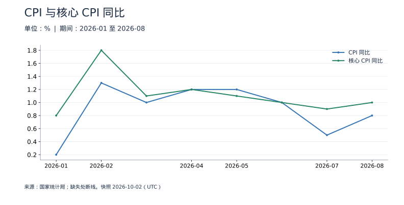
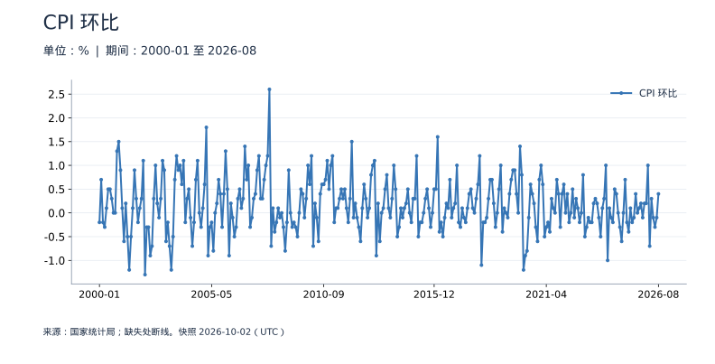
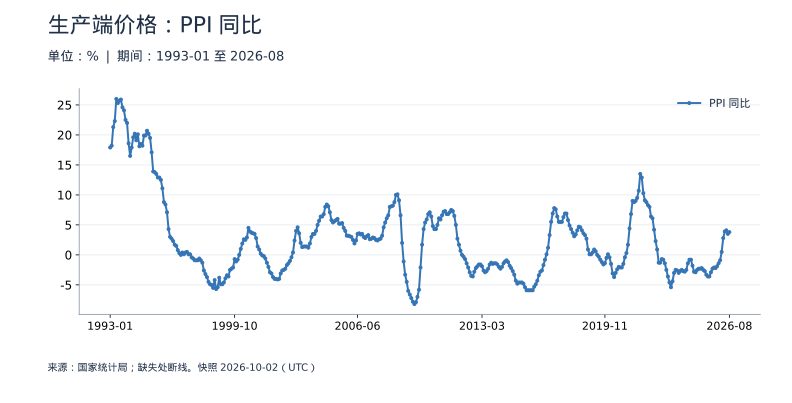
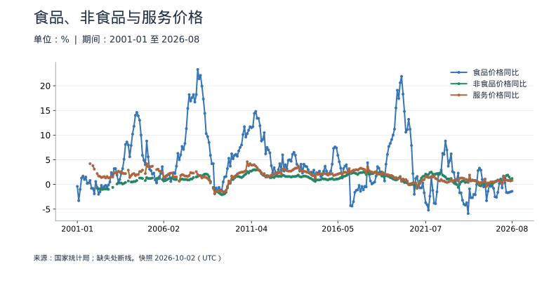

<!-- Generated by scripts/sync_macro.py; edit macro_catalog.py/macro_render.py. -->
# 物价与通胀：真实数据

消费端和生产端价格怎样变化，涨价是否广泛？

CPI 描述居民消费价格，核心 CPI 扣除食品和能源，PPI 描述工业生产者出厂价格。同比看相对上年同月，环比看相对上月，不能把同比序列连乘成价格水平。历史涨跌幅按官方发布保留；各期权重、分类变化和确实缺失的时期另作说明。

本页快照获取时间：**2026-10-02T10:37:57+00:00**。这是获取时间，不是所有数据的发布日期。每日检查上游；最新统计期以每个指标为准。

[CSV 下载](https://raw.githubusercontent.com/calcky/finance/main/data/macro/prices.csv) · [来源与采集参数](https://github.com/calcky/finance/blob/main/data/macro/prices.metadata.json) · [最近同步状态](https://github.com/calcky/finance/actions/workflows/update-gdp.yml)

```{only} html
本站同版快照：{download}`CSV <../../data/macro/prices.csv>` · {download}`元数据 <../../data/macro/prices.metadata.json>`
```

网页支持悬停查看、点击固定读数、按期间选择、缩放和定位明细。GitHub、打印或禁用 JavaScript 时显示静态图；数值与网页使用同一快照。

## 最新观测与覆盖

| 指标 | 最新期间 | 数值 | 单位 | 本项目起点 | 观测数 | 来源 |
|---|---|---:|---|---|---:|---|
| CPI 同比 | 2026-08 | 0.8 | % | 1998-01 | 344 | [国家统计局](https://data.stats.gov.cn/dg/website/page.html#/pc/national/monthData) |
| 核心 CPI 同比 | 2026-08 | 1 | % | 2013-01 | 164 | [国家统计局](https://data.stats.gov.cn/dg/website/page.html#/pc/national/monthData) |
| CPI 环比 | 2026-08 | 0.4 | % | 2000-01 | 320 | [国家统计局](https://data.stats.gov.cn/dg/website/page.html#/pc/national/monthData) |
| PPI 同比 | 2026-08 | 3.8 | % | 1993-01 | 404 | [国家统计局](https://data.stats.gov.cn/dg/website/page.html#/pc/national/monthData) |
| 食品价格同比 | 2026-08 | -1.4 | % | 2001-01 | 308 | [国家统计局](https://data.stats.gov.cn/dg/website/page.html#/pc/national/monthData) |
| 非食品价格同比 | 2026-08 | 1.2 | % | 2002-03 | 280 | [国家统计局](https://data.stats.gov.cn/dg/website/page.html#/pc/national/monthData) |
| 服务价格同比 | 2026-08 | 0.8 | % | 2001-10 | 289 | [国家统计局](https://data.stats.gov.cn/dg/website/page.html#/pc/national/monthData) |
| 食品价格同比（2001 年前旧分类） | 2000-12 | -0.1 | % | 1998-01 | 36 | [国家统计局](https://data.stats.gov.cn/dg/website/page.html#/pc/national/monthData) |

起点表示本项目当前覆盖范围，不代表该指标从此时才开始发布。旧定义序列的最后一期也不代表来源停止更新。各来源可能存在发布或入库滞后；空白不补零、不插值。发布日期未知的观测在 CSV 中留空。

图表的“全部”与 CSV 保留完整已采集历史；缩放近期不会删除早期数据。[历史来源、口径断点与剩余缺口](history-coverage.md)说明回溯范围。

## CPI 与核心 CPI 同比

总 CPI 与核心 CPI 的差异帮助观察食品、能源等因素，但两者之差不是这些项目的精确贡献率。



<details class="macro-details">
<summary>CPI 与核心 CPI 同比：展开完整数据表（%）</summary>
<div class="macro-table-wrap"><table><thead><tr><th>期间</th><th>CPI 同比</th><th>核心 CPI 同比</th></tr></thead><tbody>
<tr id="macro-cpi-core-2026-08" tabindex="-1"><td>2026-08</td><td>0.8</td><td>1</td></tr>
<tr id="macro-cpi-core-2026-07" tabindex="-1"><td>2026-07</td><td>0.5</td><td>0.9</td></tr>
<tr id="macro-cpi-core-2026-06" tabindex="-1"><td>2026-06</td><td>1</td><td>1</td></tr>
<tr id="macro-cpi-core-2026-05" tabindex="-1"><td>2026-05</td><td>1.2</td><td>1.1</td></tr>
<tr id="macro-cpi-core-2026-04" tabindex="-1"><td>2026-04</td><td>1.2</td><td>1.2</td></tr>
<tr id="macro-cpi-core-2026-03" tabindex="-1"><td>2026-03</td><td>1</td><td>1.1</td></tr>
<tr id="macro-cpi-core-2026-02" tabindex="-1"><td>2026-02</td><td>1.3</td><td>1.8</td></tr>
<tr id="macro-cpi-core-2026-01" tabindex="-1"><td>2026-01</td><td>0.2</td><td>0.8</td></tr>
<tr id="macro-cpi-core-2025-12" tabindex="-1"><td>2025-12</td><td>0.8</td><td>1.2</td></tr>
<tr id="macro-cpi-core-2025-11" tabindex="-1"><td>2025-11</td><td>0.7</td><td>1.2</td></tr>
<tr id="macro-cpi-core-2025-10" tabindex="-1"><td>2025-10</td><td>0.2</td><td>1.2</td></tr>
<tr id="macro-cpi-core-2025-09" tabindex="-1"><td>2025-09</td><td>-0.3</td><td>1</td></tr>
<tr id="macro-cpi-core-2025-08" tabindex="-1"><td>2025-08</td><td>-0.4</td><td>0.9</td></tr>
<tr id="macro-cpi-core-2025-07" tabindex="-1"><td>2025-07</td><td>0</td><td>0.8</td></tr>
<tr id="macro-cpi-core-2025-06" tabindex="-1"><td>2025-06</td><td>0.1</td><td>0.7</td></tr>
<tr id="macro-cpi-core-2025-05" tabindex="-1"><td>2025-05</td><td>-0.1</td><td>0.6</td></tr>
<tr id="macro-cpi-core-2025-04" tabindex="-1"><td>2025-04</td><td>-0.1</td><td>0.5</td></tr>
<tr id="macro-cpi-core-2025-03" tabindex="-1"><td>2025-03</td><td>-0.1</td><td>0.5</td></tr>
<tr id="macro-cpi-core-2025-02" tabindex="-1"><td>2025-02</td><td>-0.7</td><td>-0.1</td></tr>
<tr id="macro-cpi-core-2025-01" tabindex="-1"><td>2025-01</td><td>0.5</td><td>0.6</td></tr>
<tr id="macro-cpi-core-2024-12" tabindex="-1"><td>2024-12</td><td>0.1</td><td>0.4</td></tr>
<tr id="macro-cpi-core-2024-11" tabindex="-1"><td>2024-11</td><td>0.2</td><td>0.3</td></tr>
<tr id="macro-cpi-core-2024-10" tabindex="-1"><td>2024-10</td><td>0.3</td><td>0.2</td></tr>
<tr id="macro-cpi-core-2024-09" tabindex="-1"><td>2024-09</td><td>0.4</td><td>0.1</td></tr>
<tr id="macro-cpi-core-2024-08" tabindex="-1"><td>2024-08</td><td>0.6</td><td>0.3</td></tr>
<tr id="macro-cpi-core-2024-07" tabindex="-1"><td>2024-07</td><td>0.5</td><td>0.4</td></tr>
<tr id="macro-cpi-core-2024-06" tabindex="-1"><td>2024-06</td><td>0.2</td><td>0.6</td></tr>
<tr id="macro-cpi-core-2024-05" tabindex="-1"><td>2024-05</td><td>0.3</td><td>0.6</td></tr>
<tr id="macro-cpi-core-2024-04" tabindex="-1"><td>2024-04</td><td>0.3</td><td>0.7</td></tr>
<tr id="macro-cpi-core-2024-03" tabindex="-1"><td>2024-03</td><td>0.1</td><td>0.6</td></tr>
<tr id="macro-cpi-core-2024-02" tabindex="-1"><td>2024-02</td><td>0.7</td><td>1.2</td></tr>
<tr id="macro-cpi-core-2024-01" tabindex="-1"><td>2024-01</td><td>-0.8</td><td>0.4</td></tr>
<tr id="macro-cpi-core-2023-12" tabindex="-1"><td>2023-12</td><td>-0.3</td><td>0.6</td></tr>
<tr id="macro-cpi-core-2023-11" tabindex="-1"><td>2023-11</td><td>-0.5</td><td>0.6</td></tr>
<tr id="macro-cpi-core-2023-10" tabindex="-1"><td>2023-10</td><td>-0.2</td><td>0.6</td></tr>
<tr id="macro-cpi-core-2023-09" tabindex="-1"><td>2023-09</td><td>0</td><td>0.8</td></tr>
<tr id="macro-cpi-core-2023-08" tabindex="-1"><td>2023-08</td><td>0.1</td><td>0.8</td></tr>
<tr id="macro-cpi-core-2023-07" tabindex="-1"><td>2023-07</td><td>-0.3</td><td>0.8</td></tr>
<tr id="macro-cpi-core-2023-06" tabindex="-1"><td>2023-06</td><td>0</td><td>0.4</td></tr>
<tr id="macro-cpi-core-2023-05" tabindex="-1"><td>2023-05</td><td>0.2</td><td>0.6</td></tr>
<tr id="macro-cpi-core-2023-04" tabindex="-1"><td>2023-04</td><td>0.1</td><td>0.7</td></tr>
<tr id="macro-cpi-core-2023-03" tabindex="-1"><td>2023-03</td><td>0.7</td><td>0.7</td></tr>
<tr id="macro-cpi-core-2023-02" tabindex="-1"><td>2023-02</td><td>1</td><td>0.6</td></tr>
<tr id="macro-cpi-core-2023-01" tabindex="-1"><td>2023-01</td><td>2.1</td><td>1</td></tr>
<tr id="macro-cpi-core-2022-12" tabindex="-1"><td>2022-12</td><td>1.8</td><td>0.7</td></tr>
<tr id="macro-cpi-core-2022-11" tabindex="-1"><td>2022-11</td><td>1.6</td><td>0.6</td></tr>
<tr id="macro-cpi-core-2022-10" tabindex="-1"><td>2022-10</td><td>2.1</td><td>0.6</td></tr>
<tr id="macro-cpi-core-2022-09" tabindex="-1"><td>2022-09</td><td>2.8</td><td>0.6</td></tr>
<tr id="macro-cpi-core-2022-08" tabindex="-1"><td>2022-08</td><td>2.5</td><td>0.8</td></tr>
<tr id="macro-cpi-core-2022-07" tabindex="-1"><td>2022-07</td><td>2.7</td><td>0.8</td></tr>
<tr id="macro-cpi-core-2022-06" tabindex="-1"><td>2022-06</td><td>2.5</td><td>1</td></tr>
<tr id="macro-cpi-core-2022-05" tabindex="-1"><td>2022-05</td><td>2.1</td><td>0.9</td></tr>
<tr id="macro-cpi-core-2022-04" tabindex="-1"><td>2022-04</td><td>2.1</td><td>0.9</td></tr>
<tr id="macro-cpi-core-2022-03" tabindex="-1"><td>2022-03</td><td>1.5</td><td>1.1</td></tr>
<tr id="macro-cpi-core-2022-02" tabindex="-1"><td>2022-02</td><td>0.9</td><td>1.1</td></tr>
<tr id="macro-cpi-core-2022-01" tabindex="-1"><td>2022-01</td><td>0.9</td><td>1.2</td></tr>
<tr id="macro-cpi-core-2021-12" tabindex="-1"><td>2021-12</td><td>1.5</td><td>1.2</td></tr>
<tr id="macro-cpi-core-2021-11" tabindex="-1"><td>2021-11</td><td>2.3</td><td>1.2</td></tr>
<tr id="macro-cpi-core-2021-10" tabindex="-1"><td>2021-10</td><td>1.5</td><td>1.3</td></tr>
<tr id="macro-cpi-core-2021-09" tabindex="-1"><td>2021-09</td><td>0.7</td><td>1.2</td></tr>
<tr id="macro-cpi-core-2021-08" tabindex="-1"><td>2021-08</td><td>0.8</td><td>1.2</td></tr>
<tr id="macro-cpi-core-2021-07" tabindex="-1"><td>2021-07</td><td>1</td><td>1.3</td></tr>
<tr id="macro-cpi-core-2021-06" tabindex="-1"><td>2021-06</td><td>1.1</td><td>0.9</td></tr>
<tr id="macro-cpi-core-2021-05" tabindex="-1"><td>2021-05</td><td>1.3</td><td>0.9</td></tr>
<tr id="macro-cpi-core-2021-04" tabindex="-1"><td>2021-04</td><td>0.9</td><td>0.7</td></tr>
<tr id="macro-cpi-core-2021-03" tabindex="-1"><td>2021-03</td><td>0.4</td><td>0.3</td></tr>
<tr id="macro-cpi-core-2021-02" tabindex="-1"><td>2021-02</td><td>-0.2</td><td>0</td></tr>
<tr id="macro-cpi-core-2021-01" tabindex="-1"><td>2021-01</td><td>-0.3</td><td>-0.3</td></tr>
<tr id="macro-cpi-core-2020-12" tabindex="-1"><td>2020-12</td><td>0.2</td><td>0.4</td></tr>
<tr id="macro-cpi-core-2020-11" tabindex="-1"><td>2020-11</td><td>-0.5</td><td>0.5</td></tr>
<tr id="macro-cpi-core-2020-10" tabindex="-1"><td>2020-10</td><td>0.5</td><td>0.5</td></tr>
<tr id="macro-cpi-core-2020-09" tabindex="-1"><td>2020-09</td><td>1.7</td><td>0.5</td></tr>
<tr id="macro-cpi-core-2020-08" tabindex="-1"><td>2020-08</td><td>2.4</td><td>0.5</td></tr>
<tr id="macro-cpi-core-2020-07" tabindex="-1"><td>2020-07</td><td>2.7</td><td>0.5</td></tr>
<tr id="macro-cpi-core-2020-06" tabindex="-1"><td>2020-06</td><td>2.5</td><td>0.9</td></tr>
<tr id="macro-cpi-core-2020-05" tabindex="-1"><td>2020-05</td><td>2.4</td><td>1.1</td></tr>
<tr id="macro-cpi-core-2020-04" tabindex="-1"><td>2020-04</td><td>3.3</td><td>1.1</td></tr>
<tr id="macro-cpi-core-2020-03" tabindex="-1"><td>2020-03</td><td>4.3</td><td>1.2</td></tr>
<tr id="macro-cpi-core-2020-02" tabindex="-1"><td>2020-02</td><td>5.2</td><td>1</td></tr>
<tr id="macro-cpi-core-2020-01" tabindex="-1"><td>2020-01</td><td>5.4</td><td>1.5</td></tr>
<tr id="macro-cpi-core-2019-12" tabindex="-1"><td>2019-12</td><td>4.5</td><td>1.4</td></tr>
<tr id="macro-cpi-core-2019-11" tabindex="-1"><td>2019-11</td><td>4.5</td><td>1.4</td></tr>
<tr id="macro-cpi-core-2019-10" tabindex="-1"><td>2019-10</td><td>3.8</td><td>1.5</td></tr>
<tr id="macro-cpi-core-2019-09" tabindex="-1"><td>2019-09</td><td>3</td><td>1.5</td></tr>
<tr id="macro-cpi-core-2019-08" tabindex="-1"><td>2019-08</td><td>2.8</td><td>1.5</td></tr>
<tr id="macro-cpi-core-2019-07" tabindex="-1"><td>2019-07</td><td>2.8</td><td>1.6</td></tr>
<tr id="macro-cpi-core-2019-06" tabindex="-1"><td>2019-06</td><td>2.7</td><td>1.6</td></tr>
<tr id="macro-cpi-core-2019-05" tabindex="-1"><td>2019-05</td><td>2.7</td><td>1.6</td></tr>
<tr id="macro-cpi-core-2019-04" tabindex="-1"><td>2019-04</td><td>2.5</td><td>1.7</td></tr>
<tr id="macro-cpi-core-2019-03" tabindex="-1"><td>2019-03</td><td>2.3</td><td>1.8</td></tr>
<tr id="macro-cpi-core-2019-02" tabindex="-1"><td>2019-02</td><td>1.5</td><td>1.8</td></tr>
<tr id="macro-cpi-core-2019-01" tabindex="-1"><td>2019-01</td><td>1.7</td><td>1.9</td></tr>
<tr id="macro-cpi-core-2018-12" tabindex="-1"><td>2018-12</td><td>1.9</td><td>1.8</td></tr>
<tr id="macro-cpi-core-2018-11" tabindex="-1"><td>2018-11</td><td>2.2</td><td>1.8</td></tr>
<tr id="macro-cpi-core-2018-10" tabindex="-1"><td>2018-10</td><td>2.5</td><td>1.8</td></tr>
<tr id="macro-cpi-core-2018-09" tabindex="-1"><td>2018-09</td><td>2.5</td><td>1.7</td></tr>
<tr id="macro-cpi-core-2018-08" tabindex="-1"><td>2018-08</td><td>2.3</td><td>2</td></tr>
<tr id="macro-cpi-core-2018-07" tabindex="-1"><td>2018-07</td><td>2.1</td><td>1.9</td></tr>
<tr id="macro-cpi-core-2018-06" tabindex="-1"><td>2018-06</td><td>1.9</td><td>1.9</td></tr>
<tr id="macro-cpi-core-2018-05" tabindex="-1"><td>2018-05</td><td>1.8</td><td>1.9</td></tr>
<tr id="macro-cpi-core-2018-04" tabindex="-1"><td>2018-04</td><td>1.8</td><td>2</td></tr>
<tr id="macro-cpi-core-2018-03" tabindex="-1"><td>2018-03</td><td>2.1</td><td>2</td></tr>
<tr id="macro-cpi-core-2018-02" tabindex="-1"><td>2018-02</td><td>2.9</td><td>2.5</td></tr>
<tr id="macro-cpi-core-2018-01" tabindex="-1"><td>2018-01</td><td>1.5</td><td>1.9</td></tr>
<tr id="macro-cpi-core-2017-12" tabindex="-1"><td>2017-12</td><td>1.8</td><td>2.2</td></tr>
<tr id="macro-cpi-core-2017-11" tabindex="-1"><td>2017-11</td><td>1.7</td><td>2.3</td></tr>
<tr id="macro-cpi-core-2017-10" tabindex="-1"><td>2017-10</td><td>1.9</td><td>2.3</td></tr>
<tr id="macro-cpi-core-2017-09" tabindex="-1"><td>2017-09</td><td>1.6</td><td>2.3</td></tr>
<tr id="macro-cpi-core-2017-08" tabindex="-1"><td>2017-08</td><td>1.8</td><td>2.2</td></tr>
<tr id="macro-cpi-core-2017-07" tabindex="-1"><td>2017-07</td><td>1.4</td><td>2.1</td></tr>
<tr id="macro-cpi-core-2017-06" tabindex="-1"><td>2017-06</td><td>1.5</td><td>2.2</td></tr>
<tr id="macro-cpi-core-2017-05" tabindex="-1"><td>2017-05</td><td>1.5</td><td>2.1</td></tr>
<tr id="macro-cpi-core-2017-04" tabindex="-1"><td>2017-04</td><td>1.2</td><td>2.1</td></tr>
<tr id="macro-cpi-core-2017-03" tabindex="-1"><td>2017-03</td><td>0.9</td><td>2</td></tr>
<tr id="macro-cpi-core-2017-02" tabindex="-1"><td>2017-02</td><td>0.8</td><td>1.8</td></tr>
<tr id="macro-cpi-core-2017-01" tabindex="-1"><td>2017-01</td><td>2.5</td><td>2.2</td></tr>
<tr id="macro-cpi-core-2016-12" tabindex="-1"><td>2016-12</td><td>2.1</td><td>1.9</td></tr>
<tr id="macro-cpi-core-2016-11" tabindex="-1"><td>2016-11</td><td>2.3</td><td>1.9</td></tr>
<tr id="macro-cpi-core-2016-10" tabindex="-1"><td>2016-10</td><td>2.1</td><td>1.8</td></tr>
<tr id="macro-cpi-core-2016-09" tabindex="-1"><td>2016-09</td><td>1.9</td><td>1.7</td></tr>
<tr id="macro-cpi-core-2016-08" tabindex="-1"><td>2016-08</td><td>1.3</td><td>1.6</td></tr>
<tr id="macro-cpi-core-2016-07" tabindex="-1"><td>2016-07</td><td>1.8</td><td>1.8</td></tr>
<tr id="macro-cpi-core-2016-06" tabindex="-1"><td>2016-06</td><td>1.9</td><td>1.6</td></tr>
<tr id="macro-cpi-core-2016-05" tabindex="-1"><td>2016-05</td><td>2</td><td>1.6</td></tr>
<tr id="macro-cpi-core-2016-04" tabindex="-1"><td>2016-04</td><td>2.3</td><td>1.5</td></tr>
<tr id="macro-cpi-core-2016-03" tabindex="-1"><td>2016-03</td><td>2.3</td><td>1.5</td></tr>
<tr id="macro-cpi-core-2016-02" tabindex="-1"><td>2016-02</td><td>2.3</td><td>1.3</td></tr>
<tr id="macro-cpi-core-2016-01" tabindex="-1"><td>2016-01</td><td>1.8</td><td>1.5</td></tr>
<tr id="macro-cpi-core-2015-12" tabindex="-1"><td>2015-12</td><td>1.6</td><td>1.5</td></tr>
<tr id="macro-cpi-core-2015-11" tabindex="-1"><td>2015-11</td><td>1.5</td><td>1.5</td></tr>
<tr id="macro-cpi-core-2015-10" tabindex="-1"><td>2015-10</td><td>1.3</td><td>1.5</td></tr>
<tr id="macro-cpi-core-2015-09" tabindex="-1"><td>2015-09</td><td>1.6</td><td>1.6</td></tr>
<tr id="macro-cpi-core-2015-08" tabindex="-1"><td>2015-08</td><td>2</td><td>1.7</td></tr>
<tr id="macro-cpi-core-2015-07" tabindex="-1"><td>2015-07</td><td>1.6</td><td>1.7</td></tr>
<tr id="macro-cpi-core-2015-06" tabindex="-1"><td>2015-06</td><td>1.4</td><td>1.7</td></tr>
<tr id="macro-cpi-core-2015-05" tabindex="-1"><td>2015-05</td><td>1.2</td><td>1.6</td></tr>
<tr id="macro-cpi-core-2015-04" tabindex="-1"><td>2015-04</td><td>1.5</td><td>1.5</td></tr>
<tr id="macro-cpi-core-2015-03" tabindex="-1"><td>2015-03</td><td>1.4</td><td>1.5</td></tr>
<tr id="macro-cpi-core-2015-02" tabindex="-1"><td>2015-02</td><td>1.4</td><td>1.6</td></tr>
<tr id="macro-cpi-core-2015-01" tabindex="-1"><td>2015-01</td><td>0.8</td><td>1.2</td></tr>
<tr id="macro-cpi-core-2014-12" tabindex="-1"><td>2014-12</td><td>1.5</td><td>1.3</td></tr>
<tr id="macro-cpi-core-2014-11" tabindex="-1"><td>2014-11</td><td>1.4</td><td>1.3</td></tr>
<tr id="macro-cpi-core-2014-10" tabindex="-1"><td>2014-10</td><td>1.6</td><td>1.4</td></tr>
<tr id="macro-cpi-core-2014-09" tabindex="-1"><td>2014-09</td><td>1.6</td><td>1.5</td></tr>
<tr id="macro-cpi-core-2014-08" tabindex="-1"><td>2014-08</td><td>2</td><td>1.6</td></tr>
<tr id="macro-cpi-core-2014-07" tabindex="-1"><td>2014-07</td><td>2.3</td><td>1.7</td></tr>
<tr id="macro-cpi-core-2014-06" tabindex="-1"><td>2014-06</td><td>2.3</td><td>1.7</td></tr>
<tr id="macro-cpi-core-2014-05" tabindex="-1"><td>2014-05</td><td>2.5</td><td>1.7</td></tr>
<tr id="macro-cpi-core-2014-04" tabindex="-1"><td>2014-04</td><td>1.8</td><td>1.6</td></tr>
<tr id="macro-cpi-core-2014-03" tabindex="-1"><td>2014-03</td><td>2.4</td><td>1.7</td></tr>
<tr id="macro-cpi-core-2014-02" tabindex="-1"><td>2014-02</td><td>2</td><td>1.7</td></tr>
<tr id="macro-cpi-core-2014-01" tabindex="-1"><td>2014-01</td><td>2.5</td><td>2</td></tr>
<tr id="macro-cpi-core-2013-12" tabindex="-1"><td>2013-12</td><td>2.5</td><td>1.8</td></tr>
<tr id="macro-cpi-core-2013-11" tabindex="-1"><td>2013-11</td><td>3</td><td>1.8</td></tr>
<tr id="macro-cpi-core-2013-10" tabindex="-1"><td>2013-10</td><td>3.2</td><td>1.8</td></tr>
<tr id="macro-cpi-core-2013-09" tabindex="-1"><td>2013-09</td><td>3.1</td><td>1.7</td></tr>
<tr id="macro-cpi-core-2013-08" tabindex="-1"><td>2013-08</td><td>2.6</td><td>1.6</td></tr>
<tr id="macro-cpi-core-2013-07" tabindex="-1"><td>2013-07</td><td>2.7</td><td>1.6</td></tr>
<tr id="macro-cpi-core-2013-06" tabindex="-1"><td>2013-06</td><td>2.7</td><td>1.7</td></tr>
<tr id="macro-cpi-core-2013-05" tabindex="-1"><td>2013-05</td><td>2.1</td><td>1.8</td></tr>
<tr id="macro-cpi-core-2013-04" tabindex="-1"><td>2013-04</td><td>2.4</td><td>1.8</td></tr>
<tr id="macro-cpi-core-2013-03" tabindex="-1"><td>2013-03</td><td>2.1</td><td>1.9</td></tr>
<tr id="macro-cpi-core-2013-02" tabindex="-1"><td>2013-02</td><td>3.2</td><td>1.8</td></tr>
<tr id="macro-cpi-core-2013-01" tabindex="-1"><td>2013-01</td><td>2</td><td>1.5</td></tr>
<tr id="macro-cpi-core-2012-12" tabindex="-1"><td>2012-12</td><td>2.5</td><td>缺失</td></tr>
<tr id="macro-cpi-core-2012-11" tabindex="-1"><td>2012-11</td><td>2</td><td>缺失</td></tr>
<tr id="macro-cpi-core-2012-10" tabindex="-1"><td>2012-10</td><td>1.7</td><td>缺失</td></tr>
<tr id="macro-cpi-core-2012-09" tabindex="-1"><td>2012-09</td><td>1.9</td><td>缺失</td></tr>
<tr id="macro-cpi-core-2012-08" tabindex="-1"><td>2012-08</td><td>2</td><td>缺失</td></tr>
<tr id="macro-cpi-core-2012-07" tabindex="-1"><td>2012-07</td><td>1.8</td><td>缺失</td></tr>
<tr id="macro-cpi-core-2012-06" tabindex="-1"><td>2012-06</td><td>2.2</td><td>缺失</td></tr>
<tr id="macro-cpi-core-2012-05" tabindex="-1"><td>2012-05</td><td>3</td><td>缺失</td></tr>
<tr id="macro-cpi-core-2012-04" tabindex="-1"><td>2012-04</td><td>3.4</td><td>缺失</td></tr>
<tr id="macro-cpi-core-2012-03" tabindex="-1"><td>2012-03</td><td>3.6</td><td>缺失</td></tr>
<tr id="macro-cpi-core-2012-02" tabindex="-1"><td>2012-02</td><td>3.2</td><td>缺失</td></tr>
<tr id="macro-cpi-core-2012-01" tabindex="-1"><td>2012-01</td><td>4.5</td><td>缺失</td></tr>
<tr id="macro-cpi-core-2011-12" tabindex="-1"><td>2011-12</td><td>4.1</td><td>缺失</td></tr>
<tr id="macro-cpi-core-2011-11" tabindex="-1"><td>2011-11</td><td>4.2</td><td>缺失</td></tr>
<tr id="macro-cpi-core-2011-10" tabindex="-1"><td>2011-10</td><td>5.5</td><td>缺失</td></tr>
<tr id="macro-cpi-core-2011-09" tabindex="-1"><td>2011-09</td><td>6.1</td><td>缺失</td></tr>
<tr id="macro-cpi-core-2011-08" tabindex="-1"><td>2011-08</td><td>6.2</td><td>缺失</td></tr>
<tr id="macro-cpi-core-2011-07" tabindex="-1"><td>2011-07</td><td>6.5</td><td>缺失</td></tr>
<tr id="macro-cpi-core-2011-06" tabindex="-1"><td>2011-06</td><td>6.4</td><td>缺失</td></tr>
<tr id="macro-cpi-core-2011-05" tabindex="-1"><td>2011-05</td><td>5.5</td><td>缺失</td></tr>
<tr id="macro-cpi-core-2011-04" tabindex="-1"><td>2011-04</td><td>5.3</td><td>缺失</td></tr>
<tr id="macro-cpi-core-2011-03" tabindex="-1"><td>2011-03</td><td>5.4</td><td>缺失</td></tr>
<tr id="macro-cpi-core-2011-02" tabindex="-1"><td>2011-02</td><td>4.9</td><td>缺失</td></tr>
<tr id="macro-cpi-core-2011-01" tabindex="-1"><td>2011-01</td><td>4.9</td><td>缺失</td></tr>
<tr id="macro-cpi-core-2010-12" tabindex="-1"><td>2010-12</td><td>4.6</td><td>缺失</td></tr>
<tr id="macro-cpi-core-2010-11" tabindex="-1"><td>2010-11</td><td>5.1</td><td>缺失</td></tr>
<tr id="macro-cpi-core-2010-10" tabindex="-1"><td>2010-10</td><td>4.4</td><td>缺失</td></tr>
<tr id="macro-cpi-core-2010-09" tabindex="-1"><td>2010-09</td><td>3.6</td><td>缺失</td></tr>
<tr id="macro-cpi-core-2010-08" tabindex="-1"><td>2010-08</td><td>3.5</td><td>缺失</td></tr>
<tr id="macro-cpi-core-2010-07" tabindex="-1"><td>2010-07</td><td>3.3</td><td>缺失</td></tr>
<tr id="macro-cpi-core-2010-06" tabindex="-1"><td>2010-06</td><td>2.9</td><td>缺失</td></tr>
<tr id="macro-cpi-core-2010-05" tabindex="-1"><td>2010-05</td><td>3.1</td><td>缺失</td></tr>
<tr id="macro-cpi-core-2010-04" tabindex="-1"><td>2010-04</td><td>2.8</td><td>缺失</td></tr>
<tr id="macro-cpi-core-2010-03" tabindex="-1"><td>2010-03</td><td>2.4</td><td>缺失</td></tr>
<tr id="macro-cpi-core-2010-02" tabindex="-1"><td>2010-02</td><td>2.7</td><td>缺失</td></tr>
<tr id="macro-cpi-core-2010-01" tabindex="-1"><td>2010-01</td><td>1.5</td><td>缺失</td></tr>
<tr id="macro-cpi-core-2009-12" tabindex="-1"><td>2009-12</td><td>1.9</td><td>缺失</td></tr>
<tr id="macro-cpi-core-2009-11" tabindex="-1"><td>2009-11</td><td>0.6</td><td>缺失</td></tr>
<tr id="macro-cpi-core-2009-10" tabindex="-1"><td>2009-10</td><td>-0.5</td><td>缺失</td></tr>
<tr id="macro-cpi-core-2009-09" tabindex="-1"><td>2009-09</td><td>-0.8</td><td>缺失</td></tr>
<tr id="macro-cpi-core-2009-08" tabindex="-1"><td>2009-08</td><td>-1.2</td><td>缺失</td></tr>
<tr id="macro-cpi-core-2009-07" tabindex="-1"><td>2009-07</td><td>-1.8</td><td>缺失</td></tr>
<tr id="macro-cpi-core-2009-06" tabindex="-1"><td>2009-06</td><td>-1.7</td><td>缺失</td></tr>
<tr id="macro-cpi-core-2009-05" tabindex="-1"><td>2009-05</td><td>-1.4</td><td>缺失</td></tr>
<tr id="macro-cpi-core-2009-04" tabindex="-1"><td>2009-04</td><td>-1.5</td><td>缺失</td></tr>
<tr id="macro-cpi-core-2009-03" tabindex="-1"><td>2009-03</td><td>-1.2</td><td>缺失</td></tr>
<tr id="macro-cpi-core-2009-02" tabindex="-1"><td>2009-02</td><td>-1.6</td><td>缺失</td></tr>
<tr id="macro-cpi-core-2009-01" tabindex="-1"><td>2009-01</td><td>1</td><td>缺失</td></tr>
<tr id="macro-cpi-core-2008-12" tabindex="-1"><td>2008-12</td><td>1.2</td><td>缺失</td></tr>
<tr id="macro-cpi-core-2008-11" tabindex="-1"><td>2008-11</td><td>2.4</td><td>缺失</td></tr>
<tr id="macro-cpi-core-2008-10" tabindex="-1"><td>2008-10</td><td>4</td><td>缺失</td></tr>
<tr id="macro-cpi-core-2008-09" tabindex="-1"><td>2008-09</td><td>4.6</td><td>缺失</td></tr>
<tr id="macro-cpi-core-2008-08" tabindex="-1"><td>2008-08</td><td>4.9</td><td>缺失</td></tr>
<tr id="macro-cpi-core-2008-07" tabindex="-1"><td>2008-07</td><td>6.3</td><td>缺失</td></tr>
<tr id="macro-cpi-core-2008-06" tabindex="-1"><td>2008-06</td><td>7.1</td><td>缺失</td></tr>
<tr id="macro-cpi-core-2008-05" tabindex="-1"><td>2008-05</td><td>7.7</td><td>缺失</td></tr>
<tr id="macro-cpi-core-2008-04" tabindex="-1"><td>2008-04</td><td>8.5</td><td>缺失</td></tr>
<tr id="macro-cpi-core-2008-03" tabindex="-1"><td>2008-03</td><td>8.3</td><td>缺失</td></tr>
<tr id="macro-cpi-core-2008-02" tabindex="-1"><td>2008-02</td><td>8.7</td><td>缺失</td></tr>
<tr id="macro-cpi-core-2008-01" tabindex="-1"><td>2008-01</td><td>7.1</td><td>缺失</td></tr>
<tr id="macro-cpi-core-2007-12" tabindex="-1"><td>2007-12</td><td>6.5</td><td>缺失</td></tr>
<tr id="macro-cpi-core-2007-11" tabindex="-1"><td>2007-11</td><td>6.9</td><td>缺失</td></tr>
<tr id="macro-cpi-core-2007-10" tabindex="-1"><td>2007-10</td><td>6.5</td><td>缺失</td></tr>
<tr id="macro-cpi-core-2007-09" tabindex="-1"><td>2007-09</td><td>6.2</td><td>缺失</td></tr>
<tr id="macro-cpi-core-2007-08" tabindex="-1"><td>2007-08</td><td>6.5</td><td>缺失</td></tr>
<tr id="macro-cpi-core-2007-07" tabindex="-1"><td>2007-07</td><td>5.6</td><td>缺失</td></tr>
<tr id="macro-cpi-core-2007-06" tabindex="-1"><td>2007-06</td><td>4.4</td><td>缺失</td></tr>
<tr id="macro-cpi-core-2007-05" tabindex="-1"><td>2007-05</td><td>3.4</td><td>缺失</td></tr>
<tr id="macro-cpi-core-2007-04" tabindex="-1"><td>2007-04</td><td>3</td><td>缺失</td></tr>
<tr id="macro-cpi-core-2007-03" tabindex="-1"><td>2007-03</td><td>3.3</td><td>缺失</td></tr>
<tr id="macro-cpi-core-2007-02" tabindex="-1"><td>2007-02</td><td>2.7</td><td>缺失</td></tr>
<tr id="macro-cpi-core-2007-01" tabindex="-1"><td>2007-01</td><td>2.2</td><td>缺失</td></tr>
<tr id="macro-cpi-core-2006-12" tabindex="-1"><td>2006-12</td><td>2.8</td><td>缺失</td></tr>
<tr id="macro-cpi-core-2006-11" tabindex="-1"><td>2006-11</td><td>1.9</td><td>缺失</td></tr>
<tr id="macro-cpi-core-2006-10" tabindex="-1"><td>2006-10</td><td>1.4</td><td>缺失</td></tr>
<tr id="macro-cpi-core-2006-09" tabindex="-1"><td>2006-09</td><td>1.5</td><td>缺失</td></tr>
<tr id="macro-cpi-core-2006-08" tabindex="-1"><td>2006-08</td><td>1.3</td><td>缺失</td></tr>
<tr id="macro-cpi-core-2006-07" tabindex="-1"><td>2006-07</td><td>1</td><td>缺失</td></tr>
<tr id="macro-cpi-core-2006-06" tabindex="-1"><td>2006-06</td><td>1.5</td><td>缺失</td></tr>
<tr id="macro-cpi-core-2006-05" tabindex="-1"><td>2006-05</td><td>1.4</td><td>缺失</td></tr>
<tr id="macro-cpi-core-2006-04" tabindex="-1"><td>2006-04</td><td>1.2</td><td>缺失</td></tr>
<tr id="macro-cpi-core-2006-03" tabindex="-1"><td>2006-03</td><td>0.8</td><td>缺失</td></tr>
<tr id="macro-cpi-core-2006-02" tabindex="-1"><td>2006-02</td><td>0.9</td><td>缺失</td></tr>
<tr id="macro-cpi-core-2006-01" tabindex="-1"><td>2006-01</td><td>1.9</td><td>缺失</td></tr>
<tr id="macro-cpi-core-2005-12" tabindex="-1"><td>2005-12</td><td>1.6</td><td>缺失</td></tr>
<tr id="macro-cpi-core-2005-11" tabindex="-1"><td>2005-11</td><td>1.3</td><td>缺失</td></tr>
<tr id="macro-cpi-core-2005-10" tabindex="-1"><td>2005-10</td><td>1.2</td><td>缺失</td></tr>
<tr id="macro-cpi-core-2005-09" tabindex="-1"><td>2005-09</td><td>0.9</td><td>缺失</td></tr>
<tr id="macro-cpi-core-2005-08" tabindex="-1"><td>2005-08</td><td>1.3</td><td>缺失</td></tr>
<tr id="macro-cpi-core-2005-07" tabindex="-1"><td>2005-07</td><td>1.8</td><td>缺失</td></tr>
<tr id="macro-cpi-core-2005-06" tabindex="-1"><td>2005-06</td><td>1.6</td><td>缺失</td></tr>
<tr id="macro-cpi-core-2005-05" tabindex="-1"><td>2005-05</td><td>1.8</td><td>缺失</td></tr>
<tr id="macro-cpi-core-2005-04" tabindex="-1"><td>2005-04</td><td>1.8</td><td>缺失</td></tr>
<tr id="macro-cpi-core-2005-03" tabindex="-1"><td>2005-03</td><td>2.7</td><td>缺失</td></tr>
<tr id="macro-cpi-core-2005-02" tabindex="-1"><td>2005-02</td><td>3.9</td><td>缺失</td></tr>
<tr id="macro-cpi-core-2005-01" tabindex="-1"><td>2005-01</td><td>1.9</td><td>缺失</td></tr>
<tr id="macro-cpi-core-2004-12" tabindex="-1"><td>2004-12</td><td>2.4</td><td>缺失</td></tr>
<tr id="macro-cpi-core-2004-11" tabindex="-1"><td>2004-11</td><td>2.8</td><td>缺失</td></tr>
<tr id="macro-cpi-core-2004-10" tabindex="-1"><td>2004-10</td><td>4.3</td><td>缺失</td></tr>
<tr id="macro-cpi-core-2004-09" tabindex="-1"><td>2004-09</td><td>5.2</td><td>缺失</td></tr>
<tr id="macro-cpi-core-2004-08" tabindex="-1"><td>2004-08</td><td>5.3</td><td>缺失</td></tr>
<tr id="macro-cpi-core-2004-07" tabindex="-1"><td>2004-07</td><td>5.3</td><td>缺失</td></tr>
<tr id="macro-cpi-core-2004-06" tabindex="-1"><td>2004-06</td><td>5</td><td>缺失</td></tr>
<tr id="macro-cpi-core-2004-05" tabindex="-1"><td>2004-05</td><td>4.4</td><td>缺失</td></tr>
<tr id="macro-cpi-core-2004-04" tabindex="-1"><td>2004-04</td><td>3.8</td><td>缺失</td></tr>
<tr id="macro-cpi-core-2004-03" tabindex="-1"><td>2004-03</td><td>3</td><td>缺失</td></tr>
<tr id="macro-cpi-core-2004-02" tabindex="-1"><td>2004-02</td><td>2.1</td><td>缺失</td></tr>
<tr id="macro-cpi-core-2004-01" tabindex="-1"><td>2004-01</td><td>3.2</td><td>缺失</td></tr>
<tr id="macro-cpi-core-2003-12" tabindex="-1"><td>2003-12</td><td>3.2</td><td>缺失</td></tr>
<tr id="macro-cpi-core-2003-11" tabindex="-1"><td>2003-11</td><td>3</td><td>缺失</td></tr>
<tr id="macro-cpi-core-2003-10" tabindex="-1"><td>2003-10</td><td>1.8</td><td>缺失</td></tr>
<tr id="macro-cpi-core-2003-09" tabindex="-1"><td>2003-09</td><td>1.1</td><td>缺失</td></tr>
<tr id="macro-cpi-core-2003-08" tabindex="-1"><td>2003-08</td><td>0.9</td><td>缺失</td></tr>
<tr id="macro-cpi-core-2003-07" tabindex="-1"><td>2003-07</td><td>0.5</td><td>缺失</td></tr>
<tr id="macro-cpi-core-2003-06" tabindex="-1"><td>2003-06</td><td>0.3</td><td>缺失</td></tr>
<tr id="macro-cpi-core-2003-05" tabindex="-1"><td>2003-05</td><td>0.7</td><td>缺失</td></tr>
<tr id="macro-cpi-core-2003-04" tabindex="-1"><td>2003-04</td><td>1</td><td>缺失</td></tr>
<tr id="macro-cpi-core-2003-03" tabindex="-1"><td>2003-03</td><td>0.9</td><td>缺失</td></tr>
<tr id="macro-cpi-core-2003-02" tabindex="-1"><td>2003-02</td><td>0.2</td><td>缺失</td></tr>
<tr id="macro-cpi-core-2003-01" tabindex="-1"><td>2003-01</td><td>0.4</td><td>缺失</td></tr>
<tr id="macro-cpi-core-2002-12" tabindex="-1"><td>2002-12</td><td>-0.4</td><td>缺失</td></tr>
<tr id="macro-cpi-core-2002-11" tabindex="-1"><td>2002-11</td><td>-0.7</td><td>缺失</td></tr>
<tr id="macro-cpi-core-2002-10" tabindex="-1"><td>2002-10</td><td>-0.8</td><td>缺失</td></tr>
<tr id="macro-cpi-core-2002-09" tabindex="-1"><td>2002-09</td><td>-0.7</td><td>缺失</td></tr>
<tr id="macro-cpi-core-2002-08" tabindex="-1"><td>2002-08</td><td>-0.7</td><td>缺失</td></tr>
<tr id="macro-cpi-core-2002-07" tabindex="-1"><td>2002-07</td><td>-0.9</td><td>缺失</td></tr>
<tr id="macro-cpi-core-2002-06" tabindex="-1"><td>2002-06</td><td>-0.8</td><td>缺失</td></tr>
<tr id="macro-cpi-core-2002-05" tabindex="-1"><td>2002-05</td><td>-1.1</td><td>缺失</td></tr>
<tr id="macro-cpi-core-2002-04" tabindex="-1"><td>2002-04</td><td>-1.3</td><td>缺失</td></tr>
<tr id="macro-cpi-core-2002-03" tabindex="-1"><td>2002-03</td><td>-0.8</td><td>缺失</td></tr>
<tr id="macro-cpi-core-2002-02" tabindex="-1"><td>2002-02</td><td>0</td><td>缺失</td></tr>
<tr id="macro-cpi-core-2002-01" tabindex="-1"><td>2002-01</td><td>-1</td><td>缺失</td></tr>
<tr id="macro-cpi-core-2001-12" tabindex="-1"><td>2001-12</td><td>-0.3</td><td>缺失</td></tr>
<tr id="macro-cpi-core-2001-11" tabindex="-1"><td>2001-11</td><td>-0.3</td><td>缺失</td></tr>
<tr id="macro-cpi-core-2001-10" tabindex="-1"><td>2001-10</td><td>0.2</td><td>缺失</td></tr>
<tr id="macro-cpi-core-2001-09" tabindex="-1"><td>2001-09</td><td>-0.1</td><td>缺失</td></tr>
<tr id="macro-cpi-core-2001-08" tabindex="-1"><td>2001-08</td><td>1</td><td>缺失</td></tr>
<tr id="macro-cpi-core-2001-07" tabindex="-1"><td>2001-07</td><td>1.5</td><td>缺失</td></tr>
<tr id="macro-cpi-core-2001-06" tabindex="-1"><td>2001-06</td><td>1.4</td><td>缺失</td></tr>
<tr id="macro-cpi-core-2001-05" tabindex="-1"><td>2001-05</td><td>1.7</td><td>缺失</td></tr>
<tr id="macro-cpi-core-2001-04" tabindex="-1"><td>2001-04</td><td>1.6</td><td>缺失</td></tr>
<tr id="macro-cpi-core-2001-03" tabindex="-1"><td>2001-03</td><td>0.8</td><td>缺失</td></tr>
<tr id="macro-cpi-core-2001-02" tabindex="-1"><td>2001-02</td><td>0</td><td>缺失</td></tr>
<tr id="macro-cpi-core-2001-01" tabindex="-1"><td>2001-01</td><td>1.2</td><td>缺失</td></tr>
<tr id="macro-cpi-core-2000-12" tabindex="-1"><td>2000-12</td><td>1.5</td><td>缺失</td></tr>
<tr id="macro-cpi-core-2000-11" tabindex="-1"><td>2000-11</td><td>1.3</td><td>缺失</td></tr>
<tr id="macro-cpi-core-2000-10" tabindex="-1"><td>2000-10</td><td>0</td><td>缺失</td></tr>
<tr id="macro-cpi-core-2000-09" tabindex="-1"><td>2000-09</td><td>0</td><td>缺失</td></tr>
<tr id="macro-cpi-core-2000-08" tabindex="-1"><td>2000-08</td><td>0.3</td><td>缺失</td></tr>
<tr id="macro-cpi-core-2000-07" tabindex="-1"><td>2000-07</td><td>0.5</td><td>缺失</td></tr>
<tr id="macro-cpi-core-2000-06" tabindex="-1"><td>2000-06</td><td>0.5</td><td>缺失</td></tr>
<tr id="macro-cpi-core-2000-05" tabindex="-1"><td>2000-05</td><td>0.1</td><td>缺失</td></tr>
<tr id="macro-cpi-core-2000-04" tabindex="-1"><td>2000-04</td><td>-0.3</td><td>缺失</td></tr>
<tr id="macro-cpi-core-2000-03" tabindex="-1"><td>2000-03</td><td>-0.2</td><td>缺失</td></tr>
<tr id="macro-cpi-core-2000-02" tabindex="-1"><td>2000-02</td><td>0.7</td><td>缺失</td></tr>
<tr id="macro-cpi-core-2000-01" tabindex="-1"><td>2000-01</td><td>-0.2</td><td>缺失</td></tr>
<tr id="macro-cpi-core-1999-12" tabindex="-1"><td>1999-12</td><td>-1</td><td>缺失</td></tr>
<tr id="macro-cpi-core-1999-11" tabindex="-1"><td>1999-11</td><td>-0.9</td><td>缺失</td></tr>
<tr id="macro-cpi-core-1999-10" tabindex="-1"><td>1999-10</td><td>-0.6</td><td>缺失</td></tr>
<tr id="macro-cpi-core-1999-09" tabindex="-1"><td>1999-09</td><td>-0.8</td><td>缺失</td></tr>
<tr id="macro-cpi-core-1999-08" tabindex="-1"><td>1999-08</td><td>-1.3</td><td>缺失</td></tr>
<tr id="macro-cpi-core-1999-07" tabindex="-1"><td>1999-07</td><td>-1.4</td><td>缺失</td></tr>
<tr id="macro-cpi-core-1999-06" tabindex="-1"><td>1999-06</td><td>-2.1</td><td>缺失</td></tr>
<tr id="macro-cpi-core-1999-05" tabindex="-1"><td>1999-05</td><td>-2.2</td><td>缺失</td></tr>
<tr id="macro-cpi-core-1999-04" tabindex="-1"><td>1999-04</td><td>-2.2</td><td>缺失</td></tr>
<tr id="macro-cpi-core-1999-03" tabindex="-1"><td>1999-03</td><td>-1.8</td><td>缺失</td></tr>
<tr id="macro-cpi-core-1999-02" tabindex="-1"><td>1999-02</td><td>-1.3</td><td>缺失</td></tr>
<tr id="macro-cpi-core-1999-01" tabindex="-1"><td>1999-01</td><td>-1.2</td><td>缺失</td></tr>
<tr id="macro-cpi-core-1998-12" tabindex="-1"><td>1998-12</td><td>-1</td><td>缺失</td></tr>
<tr id="macro-cpi-core-1998-11" tabindex="-1"><td>1998-11</td><td>-1.2</td><td>缺失</td></tr>
<tr id="macro-cpi-core-1998-10" tabindex="-1"><td>1998-10</td><td>-1.1</td><td>缺失</td></tr>
<tr id="macro-cpi-core-1998-09" tabindex="-1"><td>1998-09</td><td>-1.5</td><td>缺失</td></tr>
<tr id="macro-cpi-core-1998-08" tabindex="-1"><td>1998-08</td><td>-1.4</td><td>缺失</td></tr>
<tr id="macro-cpi-core-1998-07" tabindex="-1"><td>1998-07</td><td>-1.4</td><td>缺失</td></tr>
<tr id="macro-cpi-core-1998-06" tabindex="-1"><td>1998-06</td><td>-1.3</td><td>缺失</td></tr>
<tr id="macro-cpi-core-1998-05" tabindex="-1"><td>1998-05</td><td>-1</td><td>缺失</td></tr>
<tr id="macro-cpi-core-1998-04" tabindex="-1"><td>1998-04</td><td>-0.3</td><td>缺失</td></tr>
<tr id="macro-cpi-core-1998-03" tabindex="-1"><td>1998-03</td><td>0.7</td><td>缺失</td></tr>
<tr id="macro-cpi-core-1998-02" tabindex="-1"><td>1998-02</td><td>-0.1</td><td>缺失</td></tr>
<tr id="macro-cpi-core-1998-01" tabindex="-1"><td>1998-01</td><td>0.3</td><td>缺失</td></tr>
</tbody></table></div></details>

## CPI 环比

观察最近一个月的价格变化。这里不是季调环比，春节错位、旅游旺季等季节性需要结合官方解读。



<details class="macro-details">
<summary>CPI 环比：展开完整数据表（%）</summary>
<div class="macro-table-wrap"><table><thead><tr><th>期间</th><th>CPI 环比</th></tr></thead><tbody>
<tr id="macro-cpi-monthly-2026-08" tabindex="-1"><td>2026-08</td><td>0.4</td></tr>
<tr id="macro-cpi-monthly-2026-07" tabindex="-1"><td>2026-07</td><td>-0.1</td></tr>
<tr id="macro-cpi-monthly-2026-06" tabindex="-1"><td>2026-06</td><td>-0.3</td></tr>
<tr id="macro-cpi-monthly-2026-05" tabindex="-1"><td>2026-05</td><td>-0.1</td></tr>
<tr id="macro-cpi-monthly-2026-04" tabindex="-1"><td>2026-04</td><td>0.3</td></tr>
<tr id="macro-cpi-monthly-2026-03" tabindex="-1"><td>2026-03</td><td>-0.7</td></tr>
<tr id="macro-cpi-monthly-2026-02" tabindex="-1"><td>2026-02</td><td>1</td></tr>
<tr id="macro-cpi-monthly-2026-01" tabindex="-1"><td>2026-01</td><td>0.2</td></tr>
<tr id="macro-cpi-monthly-2025-12" tabindex="-1"><td>2025-12</td><td>0.2</td></tr>
<tr id="macro-cpi-monthly-2025-11" tabindex="-1"><td>2025-11</td><td>-0.1</td></tr>
<tr id="macro-cpi-monthly-2025-10" tabindex="-1"><td>2025-10</td><td>0.2</td></tr>
<tr id="macro-cpi-monthly-2025-09" tabindex="-1"><td>2025-09</td><td>0.1</td></tr>
<tr id="macro-cpi-monthly-2025-08" tabindex="-1"><td>2025-08</td><td>0</td></tr>
<tr id="macro-cpi-monthly-2025-07" tabindex="-1"><td>2025-07</td><td>0.4</td></tr>
<tr id="macro-cpi-monthly-2025-06" tabindex="-1"><td>2025-06</td><td>-0.1</td></tr>
<tr id="macro-cpi-monthly-2025-05" tabindex="-1"><td>2025-05</td><td>-0.2</td></tr>
<tr id="macro-cpi-monthly-2025-04" tabindex="-1"><td>2025-04</td><td>0.1</td></tr>
<tr id="macro-cpi-monthly-2025-03" tabindex="-1"><td>2025-03</td><td>-0.4</td></tr>
<tr id="macro-cpi-monthly-2025-02" tabindex="-1"><td>2025-02</td><td>-0.2</td></tr>
<tr id="macro-cpi-monthly-2025-01" tabindex="-1"><td>2025-01</td><td>0.7</td></tr>
<tr id="macro-cpi-monthly-2024-12" tabindex="-1"><td>2024-12</td><td>0</td></tr>
<tr id="macro-cpi-monthly-2024-11" tabindex="-1"><td>2024-11</td><td>-0.6</td></tr>
<tr id="macro-cpi-monthly-2024-10" tabindex="-1"><td>2024-10</td><td>-0.3</td></tr>
<tr id="macro-cpi-monthly-2024-09" tabindex="-1"><td>2024-09</td><td>0</td></tr>
<tr id="macro-cpi-monthly-2024-08" tabindex="-1"><td>2024-08</td><td>0.4</td></tr>
<tr id="macro-cpi-monthly-2024-07" tabindex="-1"><td>2024-07</td><td>0.5</td></tr>
<tr id="macro-cpi-monthly-2024-06" tabindex="-1"><td>2024-06</td><td>-0.2</td></tr>
<tr id="macro-cpi-monthly-2024-05" tabindex="-1"><td>2024-05</td><td>-0.1</td></tr>
<tr id="macro-cpi-monthly-2024-04" tabindex="-1"><td>2024-04</td><td>0.1</td></tr>
<tr id="macro-cpi-monthly-2024-03" tabindex="-1"><td>2024-03</td><td>-1</td></tr>
<tr id="macro-cpi-monthly-2024-02" tabindex="-1"><td>2024-02</td><td>1</td></tr>
<tr id="macro-cpi-monthly-2024-01" tabindex="-1"><td>2024-01</td><td>0.3</td></tr>
<tr id="macro-cpi-monthly-2023-12" tabindex="-1"><td>2023-12</td><td>0.1</td></tr>
<tr id="macro-cpi-monthly-2023-11" tabindex="-1"><td>2023-11</td><td>-0.5</td></tr>
<tr id="macro-cpi-monthly-2023-10" tabindex="-1"><td>2023-10</td><td>-0.1</td></tr>
<tr id="macro-cpi-monthly-2023-09" tabindex="-1"><td>2023-09</td><td>0.2</td></tr>
<tr id="macro-cpi-monthly-2023-08" tabindex="-1"><td>2023-08</td><td>0.3</td></tr>
<tr id="macro-cpi-monthly-2023-07" tabindex="-1"><td>2023-07</td><td>0.2</td></tr>
<tr id="macro-cpi-monthly-2023-06" tabindex="-1"><td>2023-06</td><td>-0.2</td></tr>
<tr id="macro-cpi-monthly-2023-05" tabindex="-1"><td>2023-05</td><td>-0.2</td></tr>
<tr id="macro-cpi-monthly-2023-04" tabindex="-1"><td>2023-04</td><td>-0.1</td></tr>
<tr id="macro-cpi-monthly-2023-03" tabindex="-1"><td>2023-03</td><td>-0.3</td></tr>
<tr id="macro-cpi-monthly-2023-02" tabindex="-1"><td>2023-02</td><td>-0.5</td></tr>
<tr id="macro-cpi-monthly-2023-01" tabindex="-1"><td>2023-01</td><td>0.8</td></tr>
<tr id="macro-cpi-monthly-2022-12" tabindex="-1"><td>2022-12</td><td>0</td></tr>
<tr id="macro-cpi-monthly-2022-11" tabindex="-1"><td>2022-11</td><td>-0.2</td></tr>
<tr id="macro-cpi-monthly-2022-10" tabindex="-1"><td>2022-10</td><td>0.1</td></tr>
<tr id="macro-cpi-monthly-2022-09" tabindex="-1"><td>2022-09</td><td>0.3</td></tr>
<tr id="macro-cpi-monthly-2022-08" tabindex="-1"><td>2022-08</td><td>-0.1</td></tr>
<tr id="macro-cpi-monthly-2022-07" tabindex="-1"><td>2022-07</td><td>0.5</td></tr>
<tr id="macro-cpi-monthly-2022-06" tabindex="-1"><td>2022-06</td><td>0</td></tr>
<tr id="macro-cpi-monthly-2022-05" tabindex="-1"><td>2022-05</td><td>-0.2</td></tr>
<tr id="macro-cpi-monthly-2022-04" tabindex="-1"><td>2022-04</td><td>0.4</td></tr>
<tr id="macro-cpi-monthly-2022-03" tabindex="-1"><td>2022-03</td><td>0</td></tr>
<tr id="macro-cpi-monthly-2022-02" tabindex="-1"><td>2022-02</td><td>0.6</td></tr>
<tr id="macro-cpi-monthly-2022-01" tabindex="-1"><td>2022-01</td><td>0.4</td></tr>
<tr id="macro-cpi-monthly-2021-12" tabindex="-1"><td>2021-12</td><td>-0.3</td></tr>
<tr id="macro-cpi-monthly-2021-11" tabindex="-1"><td>2021-11</td><td>0.4</td></tr>
<tr id="macro-cpi-monthly-2021-10" tabindex="-1"><td>2021-10</td><td>0.7</td></tr>
<tr id="macro-cpi-monthly-2021-09" tabindex="-1"><td>2021-09</td><td>0</td></tr>
<tr id="macro-cpi-monthly-2021-08" tabindex="-1"><td>2021-08</td><td>0.1</td></tr>
<tr id="macro-cpi-monthly-2021-07" tabindex="-1"><td>2021-07</td><td>0.3</td></tr>
<tr id="macro-cpi-monthly-2021-06" tabindex="-1"><td>2021-06</td><td>-0.4</td></tr>
<tr id="macro-cpi-monthly-2021-05" tabindex="-1"><td>2021-05</td><td>-0.2</td></tr>
<tr id="macro-cpi-monthly-2021-04" tabindex="-1"><td>2021-04</td><td>-0.3</td></tr>
<tr id="macro-cpi-monthly-2021-03" tabindex="-1"><td>2021-03</td><td>-0.5</td></tr>
<tr id="macro-cpi-monthly-2021-02" tabindex="-1"><td>2021-02</td><td>0.6</td></tr>
<tr id="macro-cpi-monthly-2021-01" tabindex="-1"><td>2021-01</td><td>1</td></tr>
<tr id="macro-cpi-monthly-2020-12" tabindex="-1"><td>2020-12</td><td>0.7</td></tr>
<tr id="macro-cpi-monthly-2020-11" tabindex="-1"><td>2020-11</td><td>-0.6</td></tr>
<tr id="macro-cpi-monthly-2020-10" tabindex="-1"><td>2020-10</td><td>-0.3</td></tr>
<tr id="macro-cpi-monthly-2020-09" tabindex="-1"><td>2020-09</td><td>0.2</td></tr>
<tr id="macro-cpi-monthly-2020-08" tabindex="-1"><td>2020-08</td><td>0.4</td></tr>
<tr id="macro-cpi-monthly-2020-07" tabindex="-1"><td>2020-07</td><td>0.6</td></tr>
<tr id="macro-cpi-monthly-2020-06" tabindex="-1"><td>2020-06</td><td>-0.1</td></tr>
<tr id="macro-cpi-monthly-2020-05" tabindex="-1"><td>2020-05</td><td>-0.8</td></tr>
<tr id="macro-cpi-monthly-2020-04" tabindex="-1"><td>2020-04</td><td>-0.9</td></tr>
<tr id="macro-cpi-monthly-2020-03" tabindex="-1"><td>2020-03</td><td>-1.2</td></tr>
<tr id="macro-cpi-monthly-2020-02" tabindex="-1"><td>2020-02</td><td>0.8</td></tr>
<tr id="macro-cpi-monthly-2020-01" tabindex="-1"><td>2020-01</td><td>1.4</td></tr>
<tr id="macro-cpi-monthly-2019-12" tabindex="-1"><td>2019-12</td><td>0</td></tr>
<tr id="macro-cpi-monthly-2019-11" tabindex="-1"><td>2019-11</td><td>0.4</td></tr>
<tr id="macro-cpi-monthly-2019-10" tabindex="-1"><td>2019-10</td><td>0.9</td></tr>
<tr id="macro-cpi-monthly-2019-09" tabindex="-1"><td>2019-09</td><td>0.9</td></tr>
<tr id="macro-cpi-monthly-2019-08" tabindex="-1"><td>2019-08</td><td>0.7</td></tr>
<tr id="macro-cpi-monthly-2019-07" tabindex="-1"><td>2019-07</td><td>0.4</td></tr>
<tr id="macro-cpi-monthly-2019-06" tabindex="-1"><td>2019-06</td><td>-0.1</td></tr>
<tr id="macro-cpi-monthly-2019-05" tabindex="-1"><td>2019-05</td><td>0</td></tr>
<tr id="macro-cpi-monthly-2019-04" tabindex="-1"><td>2019-04</td><td>0.1</td></tr>
<tr id="macro-cpi-monthly-2019-03" tabindex="-1"><td>2019-03</td><td>-0.4</td></tr>
<tr id="macro-cpi-monthly-2019-02" tabindex="-1"><td>2019-02</td><td>1</td></tr>
<tr id="macro-cpi-monthly-2019-01" tabindex="-1"><td>2019-01</td><td>0.5</td></tr>
<tr id="macro-cpi-monthly-2018-12" tabindex="-1"><td>2018-12</td><td>0</td></tr>
<tr id="macro-cpi-monthly-2018-11" tabindex="-1"><td>2018-11</td><td>-0.3</td></tr>
<tr id="macro-cpi-monthly-2018-10" tabindex="-1"><td>2018-10</td><td>0.2</td></tr>
<tr id="macro-cpi-monthly-2018-09" tabindex="-1"><td>2018-09</td><td>0.7</td></tr>
<tr id="macro-cpi-monthly-2018-08" tabindex="-1"><td>2018-08</td><td>0.7</td></tr>
<tr id="macro-cpi-monthly-2018-07" tabindex="-1"><td>2018-07</td><td>0.3</td></tr>
<tr id="macro-cpi-monthly-2018-06" tabindex="-1"><td>2018-06</td><td>-0.1</td></tr>
<tr id="macro-cpi-monthly-2018-05" tabindex="-1"><td>2018-05</td><td>-0.2</td></tr>
<tr id="macro-cpi-monthly-2018-04" tabindex="-1"><td>2018-04</td><td>-0.2</td></tr>
<tr id="macro-cpi-monthly-2018-03" tabindex="-1"><td>2018-03</td><td>-1.1</td></tr>
<tr id="macro-cpi-monthly-2018-02" tabindex="-1"><td>2018-02</td><td>1.2</td></tr>
<tr id="macro-cpi-monthly-2018-01" tabindex="-1"><td>2018-01</td><td>0.6</td></tr>
<tr id="macro-cpi-monthly-2017-12" tabindex="-1"><td>2017-12</td><td>0.3</td></tr>
<tr id="macro-cpi-monthly-2017-11" tabindex="-1"><td>2017-11</td><td>0</td></tr>
<tr id="macro-cpi-monthly-2017-10" tabindex="-1"><td>2017-10</td><td>0.1</td></tr>
<tr id="macro-cpi-monthly-2017-09" tabindex="-1"><td>2017-09</td><td>0.5</td></tr>
<tr id="macro-cpi-monthly-2017-08" tabindex="-1"><td>2017-08</td><td>0.4</td></tr>
<tr id="macro-cpi-monthly-2017-07" tabindex="-1"><td>2017-07</td><td>0.1</td></tr>
<tr id="macro-cpi-monthly-2017-06" tabindex="-1"><td>2017-06</td><td>-0.2</td></tr>
<tr id="macro-cpi-monthly-2017-05" tabindex="-1"><td>2017-05</td><td>-0.1</td></tr>
<tr id="macro-cpi-monthly-2017-04" tabindex="-1"><td>2017-04</td><td>0.1</td></tr>
<tr id="macro-cpi-monthly-2017-03" tabindex="-1"><td>2017-03</td><td>-0.3</td></tr>
<tr id="macro-cpi-monthly-2017-02" tabindex="-1"><td>2017-02</td><td>-0.2</td></tr>
<tr id="macro-cpi-monthly-2017-01" tabindex="-1"><td>2017-01</td><td>1</td></tr>
<tr id="macro-cpi-monthly-2016-12" tabindex="-1"><td>2016-12</td><td>0.2</td></tr>
<tr id="macro-cpi-monthly-2016-11" tabindex="-1"><td>2016-11</td><td>0.1</td></tr>
<tr id="macro-cpi-monthly-2016-10" tabindex="-1"><td>2016-10</td><td>-0.1</td></tr>
<tr id="macro-cpi-monthly-2016-09" tabindex="-1"><td>2016-09</td><td>0.7</td></tr>
<tr id="macro-cpi-monthly-2016-08" tabindex="-1"><td>2016-08</td><td>0.1</td></tr>
<tr id="macro-cpi-monthly-2016-07" tabindex="-1"><td>2016-07</td><td>0.2</td></tr>
<tr id="macro-cpi-monthly-2016-06" tabindex="-1"><td>2016-06</td><td>-0.1</td></tr>
<tr id="macro-cpi-monthly-2016-05" tabindex="-1"><td>2016-05</td><td>-0.5</td></tr>
<tr id="macro-cpi-monthly-2016-04" tabindex="-1"><td>2016-04</td><td>-0.2</td></tr>
<tr id="macro-cpi-monthly-2016-03" tabindex="-1"><td>2016-03</td><td>-0.4</td></tr>
<tr id="macro-cpi-monthly-2016-02" tabindex="-1"><td>2016-02</td><td>1.6</td></tr>
<tr id="macro-cpi-monthly-2016-01" tabindex="-1"><td>2016-01</td><td>0.5</td></tr>
<tr id="macro-cpi-monthly-2015-12" tabindex="-1"><td>2015-12</td><td>0.5</td></tr>
<tr id="macro-cpi-monthly-2015-11" tabindex="-1"><td>2015-11</td><td>0</td></tr>
<tr id="macro-cpi-monthly-2015-10" tabindex="-1"><td>2015-10</td><td>-0.3</td></tr>
<tr id="macro-cpi-monthly-2015-09" tabindex="-1"><td>2015-09</td><td>0.1</td></tr>
<tr id="macro-cpi-monthly-2015-08" tabindex="-1"><td>2015-08</td><td>0.5</td></tr>
<tr id="macro-cpi-monthly-2015-07" tabindex="-1"><td>2015-07</td><td>0.3</td></tr>
<tr id="macro-cpi-monthly-2015-06" tabindex="-1"><td>2015-06</td><td>0</td></tr>
<tr id="macro-cpi-monthly-2015-05" tabindex="-1"><td>2015-05</td><td>-0.2</td></tr>
<tr id="macro-cpi-monthly-2015-04" tabindex="-1"><td>2015-04</td><td>-0.2</td></tr>
<tr id="macro-cpi-monthly-2015-03" tabindex="-1"><td>2015-03</td><td>-0.5</td></tr>
<tr id="macro-cpi-monthly-2015-02" tabindex="-1"><td>2015-02</td><td>1.2</td></tr>
<tr id="macro-cpi-monthly-2015-01" tabindex="-1"><td>2015-01</td><td>0.3</td></tr>
<tr id="macro-cpi-monthly-2014-12" tabindex="-1"><td>2014-12</td><td>0.3</td></tr>
<tr id="macro-cpi-monthly-2014-11" tabindex="-1"><td>2014-11</td><td>-0.2</td></tr>
<tr id="macro-cpi-monthly-2014-10" tabindex="-1"><td>2014-10</td><td>0</td></tr>
<tr id="macro-cpi-monthly-2014-09" tabindex="-1"><td>2014-09</td><td>0.5</td></tr>
<tr id="macro-cpi-monthly-2014-08" tabindex="-1"><td>2014-08</td><td>0.2</td></tr>
<tr id="macro-cpi-monthly-2014-07" tabindex="-1"><td>2014-07</td><td>0.1</td></tr>
<tr id="macro-cpi-monthly-2014-06" tabindex="-1"><td>2014-06</td><td>-0.1</td></tr>
<tr id="macro-cpi-monthly-2014-05" tabindex="-1"><td>2014-05</td><td>0.1</td></tr>
<tr id="macro-cpi-monthly-2014-04" tabindex="-1"><td>2014-04</td><td>-0.3</td></tr>
<tr id="macro-cpi-monthly-2014-03" tabindex="-1"><td>2014-03</td><td>-0.5</td></tr>
<tr id="macro-cpi-monthly-2014-02" tabindex="-1"><td>2014-02</td><td>0.5</td></tr>
<tr id="macro-cpi-monthly-2014-01" tabindex="-1"><td>2014-01</td><td>1</td></tr>
<tr id="macro-cpi-monthly-2013-12" tabindex="-1"><td>2013-12</td><td>0.3</td></tr>
<tr id="macro-cpi-monthly-2013-11" tabindex="-1"><td>2013-11</td><td>-0.1</td></tr>
<tr id="macro-cpi-monthly-2013-10" tabindex="-1"><td>2013-10</td><td>0.1</td></tr>
<tr id="macro-cpi-monthly-2013-09" tabindex="-1"><td>2013-09</td><td>0.8</td></tr>
<tr id="macro-cpi-monthly-2013-08" tabindex="-1"><td>2013-08</td><td>0.5</td></tr>
<tr id="macro-cpi-monthly-2013-07" tabindex="-1"><td>2013-07</td><td>0.1</td></tr>
<tr id="macro-cpi-monthly-2013-06" tabindex="-1"><td>2013-06</td><td>0</td></tr>
<tr id="macro-cpi-monthly-2013-05" tabindex="-1"><td>2013-05</td><td>-0.6</td></tr>
<tr id="macro-cpi-monthly-2013-04" tabindex="-1"><td>2013-04</td><td>0.2</td></tr>
<tr id="macro-cpi-monthly-2013-03" tabindex="-1"><td>2013-03</td><td>-0.9</td></tr>
<tr id="macro-cpi-monthly-2013-02" tabindex="-1"><td>2013-02</td><td>1.1</td></tr>
<tr id="macro-cpi-monthly-2013-01" tabindex="-1"><td>2013-01</td><td>1</td></tr>
<tr id="macro-cpi-monthly-2012-12" tabindex="-1"><td>2012-12</td><td>0.8</td></tr>
<tr id="macro-cpi-monthly-2012-11" tabindex="-1"><td>2012-11</td><td>0.1</td></tr>
<tr id="macro-cpi-monthly-2012-10" tabindex="-1"><td>2012-10</td><td>-0.1</td></tr>
<tr id="macro-cpi-monthly-2012-09" tabindex="-1"><td>2012-09</td><td>0.3</td></tr>
<tr id="macro-cpi-monthly-2012-08" tabindex="-1"><td>2012-08</td><td>0.6</td></tr>
<tr id="macro-cpi-monthly-2012-07" tabindex="-1"><td>2012-07</td><td>0.1</td></tr>
<tr id="macro-cpi-monthly-2012-06" tabindex="-1"><td>2012-06</td><td>-0.6</td></tr>
<tr id="macro-cpi-monthly-2012-05" tabindex="-1"><td>2012-05</td><td>-0.3</td></tr>
<tr id="macro-cpi-monthly-2012-04" tabindex="-1"><td>2012-04</td><td>-0.1</td></tr>
<tr id="macro-cpi-monthly-2012-03" tabindex="-1"><td>2012-03</td><td>0.2</td></tr>
<tr id="macro-cpi-monthly-2012-02" tabindex="-1"><td>2012-02</td><td>-0.1</td></tr>
<tr id="macro-cpi-monthly-2012-01" tabindex="-1"><td>2012-01</td><td>1.5</td></tr>
<tr id="macro-cpi-monthly-2011-12" tabindex="-1"><td>2011-12</td><td>0.3</td></tr>
<tr id="macro-cpi-monthly-2011-11" tabindex="-1"><td>2011-11</td><td>-0.2</td></tr>
<tr id="macro-cpi-monthly-2011-10" tabindex="-1"><td>2011-10</td><td>0.1</td></tr>
<tr id="macro-cpi-monthly-2011-09" tabindex="-1"><td>2011-09</td><td>0.5</td></tr>
<tr id="macro-cpi-monthly-2011-08" tabindex="-1"><td>2011-08</td><td>0.3</td></tr>
<tr id="macro-cpi-monthly-2011-07" tabindex="-1"><td>2011-07</td><td>0.5</td></tr>
<tr id="macro-cpi-monthly-2011-06" tabindex="-1"><td>2011-06</td><td>0.3</td></tr>
<tr id="macro-cpi-monthly-2011-05" tabindex="-1"><td>2011-05</td><td>0.1</td></tr>
<tr id="macro-cpi-monthly-2011-04" tabindex="-1"><td>2011-04</td><td>0.1</td></tr>
<tr id="macro-cpi-monthly-2011-03" tabindex="-1"><td>2011-03</td><td>-0.2</td></tr>
<tr id="macro-cpi-monthly-2011-02" tabindex="-1"><td>2011-02</td><td>1.2</td></tr>
<tr id="macro-cpi-monthly-2011-01" tabindex="-1"><td>2011-01</td><td>1</td></tr>
<tr id="macro-cpi-monthly-2010-12" tabindex="-1"><td>2010-12</td><td>0.5</td></tr>
<tr id="macro-cpi-monthly-2010-11" tabindex="-1"><td>2010-11</td><td>1.1</td></tr>
<tr id="macro-cpi-monthly-2010-10" tabindex="-1"><td>2010-10</td><td>0.7</td></tr>
<tr id="macro-cpi-monthly-2010-09" tabindex="-1"><td>2010-09</td><td>0.6</td></tr>
<tr id="macro-cpi-monthly-2010-08" tabindex="-1"><td>2010-08</td><td>0.6</td></tr>
<tr id="macro-cpi-monthly-2010-07" tabindex="-1"><td>2010-07</td><td>0.4</td></tr>
<tr id="macro-cpi-monthly-2010-06" tabindex="-1"><td>2010-06</td><td>-0.6</td></tr>
<tr id="macro-cpi-monthly-2010-05" tabindex="-1"><td>2010-05</td><td>-0.1</td></tr>
<tr id="macro-cpi-monthly-2010-04" tabindex="-1"><td>2010-04</td><td>0.2</td></tr>
<tr id="macro-cpi-monthly-2010-03" tabindex="-1"><td>2010-03</td><td>-0.7</td></tr>
<tr id="macro-cpi-monthly-2010-02" tabindex="-1"><td>2010-02</td><td>1.2</td></tr>
<tr id="macro-cpi-monthly-2010-01" tabindex="-1"><td>2010-01</td><td>0.6</td></tr>
<tr id="macro-cpi-monthly-2009-12" tabindex="-1"><td>2009-12</td><td>1</td></tr>
<tr id="macro-cpi-monthly-2009-11" tabindex="-1"><td>2009-11</td><td>0.3</td></tr>
<tr id="macro-cpi-monthly-2009-10" tabindex="-1"><td>2009-10</td><td>-0.1</td></tr>
<tr id="macro-cpi-monthly-2009-09" tabindex="-1"><td>2009-09</td><td>0.4</td></tr>
<tr id="macro-cpi-monthly-2009-08" tabindex="-1"><td>2009-08</td><td>0.5</td></tr>
<tr id="macro-cpi-monthly-2009-07" tabindex="-1"><td>2009-07</td><td>0</td></tr>
<tr id="macro-cpi-monthly-2009-06" tabindex="-1"><td>2009-06</td><td>-0.5</td></tr>
<tr id="macro-cpi-monthly-2009-05" tabindex="-1"><td>2009-05</td><td>-0.3</td></tr>
<tr id="macro-cpi-monthly-2009-04" tabindex="-1"><td>2009-04</td><td>-0.2</td></tr>
<tr id="macro-cpi-monthly-2009-03" tabindex="-1"><td>2009-03</td><td>-0.3</td></tr>
<tr id="macro-cpi-monthly-2009-02" tabindex="-1"><td>2009-02</td><td>0</td></tr>
<tr id="macro-cpi-monthly-2009-01" tabindex="-1"><td>2009-01</td><td>0.9</td></tr>
<tr id="macro-cpi-monthly-2008-12" tabindex="-1"><td>2008-12</td><td>-0.2</td></tr>
<tr id="macro-cpi-monthly-2008-11" tabindex="-1"><td>2008-11</td><td>-0.8</td></tr>
<tr id="macro-cpi-monthly-2008-10" tabindex="-1"><td>2008-10</td><td>-0.3</td></tr>
<tr id="macro-cpi-monthly-2008-09" tabindex="-1"><td>2008-09</td><td>0</td></tr>
<tr id="macro-cpi-monthly-2008-08" tabindex="-1"><td>2008-08</td><td>-0.1</td></tr>
<tr id="macro-cpi-monthly-2008-07" tabindex="-1"><td>2008-07</td><td>0.1</td></tr>
<tr id="macro-cpi-monthly-2008-06" tabindex="-1"><td>2008-06</td><td>-0.2</td></tr>
<tr id="macro-cpi-monthly-2008-05" tabindex="-1"><td>2008-05</td><td>-0.4</td></tr>
<tr id="macro-cpi-monthly-2008-04" tabindex="-1"><td>2008-04</td><td>0.1</td></tr>
<tr id="macro-cpi-monthly-2008-03" tabindex="-1"><td>2008-03</td><td>-0.7</td></tr>
<tr id="macro-cpi-monthly-2008-02" tabindex="-1"><td>2008-02</td><td>2.6</td></tr>
<tr id="macro-cpi-monthly-2008-01" tabindex="-1"><td>2008-01</td><td>1.2</td></tr>
<tr id="macro-cpi-monthly-2007-12" tabindex="-1"><td>2007-12</td><td>1</td></tr>
<tr id="macro-cpi-monthly-2007-11" tabindex="-1"><td>2007-11</td><td>0.7</td></tr>
<tr id="macro-cpi-monthly-2007-10" tabindex="-1"><td>2007-10</td><td>0.3</td></tr>
<tr id="macro-cpi-monthly-2007-09" tabindex="-1"><td>2007-09</td><td>0.3</td></tr>
<tr id="macro-cpi-monthly-2007-08" tabindex="-1"><td>2007-08</td><td>1.2</td></tr>
<tr id="macro-cpi-monthly-2007-07" tabindex="-1"><td>2007-07</td><td>0.9</td></tr>
<tr id="macro-cpi-monthly-2007-06" tabindex="-1"><td>2007-06</td><td>0.4</td></tr>
<tr id="macro-cpi-monthly-2007-05" tabindex="-1"><td>2007-05</td><td>0.3</td></tr>
<tr id="macro-cpi-monthly-2007-04" tabindex="-1"><td>2007-04</td><td>-0.1</td></tr>
<tr id="macro-cpi-monthly-2007-03" tabindex="-1"><td>2007-03</td><td>-0.3</td></tr>
<tr id="macro-cpi-monthly-2007-02" tabindex="-1"><td>2007-02</td><td>1</td></tr>
<tr id="macro-cpi-monthly-2007-01" tabindex="-1"><td>2007-01</td><td>0.7</td></tr>
<tr id="macro-cpi-monthly-2006-12" tabindex="-1"><td>2006-12</td><td>1.4</td></tr>
<tr id="macro-cpi-monthly-2006-11" tabindex="-1"><td>2006-11</td><td>0.3</td></tr>
<tr id="macro-cpi-monthly-2006-10" tabindex="-1"><td>2006-10</td><td>0.1</td></tr>
<tr id="macro-cpi-monthly-2006-09" tabindex="-1"><td>2006-09</td><td>0.5</td></tr>
<tr id="macro-cpi-monthly-2006-08" tabindex="-1"><td>2006-08</td><td>0.3</td></tr>
<tr id="macro-cpi-monthly-2006-07" tabindex="-1"><td>2006-07</td><td>-0.3</td></tr>
<tr id="macro-cpi-monthly-2006-06" tabindex="-1"><td>2006-06</td><td>-0.5</td></tr>
<tr id="macro-cpi-monthly-2006-05" tabindex="-1"><td>2006-05</td><td>-0.1</td></tr>
<tr id="macro-cpi-monthly-2006-04" tabindex="-1"><td>2006-04</td><td>0.2</td></tr>
<tr id="macro-cpi-monthly-2006-03" tabindex="-1"><td>2006-03</td><td>-0.9</td></tr>
<tr id="macro-cpi-monthly-2006-02" tabindex="-1"><td>2006-02</td><td>0.5</td></tr>
<tr id="macro-cpi-monthly-2006-01" tabindex="-1"><td>2006-01</td><td>1.3</td></tr>
<tr id="macro-cpi-monthly-2005-12" tabindex="-1"><td>2005-12</td><td>0.4</td></tr>
<tr id="macro-cpi-monthly-2005-11" tabindex="-1"><td>2005-11</td><td>-0.3</td></tr>
<tr id="macro-cpi-monthly-2005-10" tabindex="-1"><td>2005-10</td><td>0.4</td></tr>
<tr id="macro-cpi-monthly-2005-09" tabindex="-1"><td>2005-09</td><td>0.7</td></tr>
<tr id="macro-cpi-monthly-2005-08" tabindex="-1"><td>2005-08</td><td>0.2</td></tr>
<tr id="macro-cpi-monthly-2005-07" tabindex="-1"><td>2005-07</td><td>0</td></tr>
<tr id="macro-cpi-monthly-2005-06" tabindex="-1"><td>2005-06</td><td>-0.8</td></tr>
<tr id="macro-cpi-monthly-2005-05" tabindex="-1"><td>2005-05</td><td>-0.2</td></tr>
<tr id="macro-cpi-monthly-2005-04" tabindex="-1"><td>2005-04</td><td>-0.3</td></tr>
<tr id="macro-cpi-monthly-2005-03" tabindex="-1"><td>2005-03</td><td>-0.9</td></tr>
<tr id="macro-cpi-monthly-2005-02" tabindex="-1"><td>2005-02</td><td>1.8</td></tr>
<tr id="macro-cpi-monthly-2005-01" tabindex="-1"><td>2005-01</td><td>0.6</td></tr>
<tr id="macro-cpi-monthly-2004-12" tabindex="-1"><td>2004-12</td><td>0.1</td></tr>
<tr id="macro-cpi-monthly-2004-11" tabindex="-1"><td>2004-11</td><td>-0.3</td></tr>
<tr id="macro-cpi-monthly-2004-10" tabindex="-1"><td>2004-10</td><td>0</td></tr>
<tr id="macro-cpi-monthly-2004-09" tabindex="-1"><td>2004-09</td><td>1.1</td></tr>
<tr id="macro-cpi-monthly-2004-08" tabindex="-1"><td>2004-08</td><td>0.7</td></tr>
<tr id="macro-cpi-monthly-2004-07" tabindex="-1"><td>2004-07</td><td>-0.2</td></tr>
<tr id="macro-cpi-monthly-2004-06" tabindex="-1"><td>2004-06</td><td>-0.7</td></tr>
<tr id="macro-cpi-monthly-2004-05" tabindex="-1"><td>2004-05</td><td>-0.1</td></tr>
<tr id="macro-cpi-monthly-2004-04" tabindex="-1"><td>2004-04</td><td>0.5</td></tr>
<tr id="macro-cpi-monthly-2004-03" tabindex="-1"><td>2004-03</td><td>0.3</td></tr>
<tr id="macro-cpi-monthly-2004-02" tabindex="-1"><td>2004-02</td><td>-0.2</td></tr>
<tr id="macro-cpi-monthly-2004-01" tabindex="-1"><td>2004-01</td><td>1.1</td></tr>
<tr id="macro-cpi-monthly-2003-12" tabindex="-1"><td>2003-12</td><td>0.6</td></tr>
<tr id="macro-cpi-monthly-2003-11" tabindex="-1"><td>2003-11</td><td>1</td></tr>
<tr id="macro-cpi-monthly-2003-10" tabindex="-1"><td>2003-10</td><td>0.9</td></tr>
<tr id="macro-cpi-monthly-2003-09" tabindex="-1"><td>2003-09</td><td>1.2</td></tr>
<tr id="macro-cpi-monthly-2003-08" tabindex="-1"><td>2003-08</td><td>0.7</td></tr>
<tr id="macro-cpi-monthly-2003-07" tabindex="-1"><td>2003-07</td><td>-0.5</td></tr>
<tr id="macro-cpi-monthly-2003-06" tabindex="-1"><td>2003-06</td><td>-1.2</td></tr>
<tr id="macro-cpi-monthly-2003-05" tabindex="-1"><td>2003-05</td><td>-0.7</td></tr>
<tr id="macro-cpi-monthly-2003-04" tabindex="-1"><td>2003-04</td><td>-0.2</td></tr>
<tr id="macro-cpi-monthly-2003-03" tabindex="-1"><td>2003-03</td><td>-0.6</td></tr>
<tr id="macro-cpi-monthly-2003-02" tabindex="-1"><td>2003-02</td><td>0.9</td></tr>
<tr id="macro-cpi-monthly-2003-01" tabindex="-1"><td>2003-01</td><td>1.1</td></tr>
<tr id="macro-cpi-monthly-2002-12" tabindex="-1"><td>2002-12</td><td>0.3</td></tr>
<tr id="macro-cpi-monthly-2002-11" tabindex="-1"><td>2002-11</td><td>-0.1</td></tr>
<tr id="macro-cpi-monthly-2002-10" tabindex="-1"><td>2002-10</td><td>0.2</td></tr>
<tr id="macro-cpi-monthly-2002-09" tabindex="-1"><td>2002-09</td><td>1</td></tr>
<tr id="macro-cpi-monthly-2002-08" tabindex="-1"><td>2002-08</td><td>0.3</td></tr>
<tr id="macro-cpi-monthly-2002-07" tabindex="-1"><td>2002-07</td><td>-0.7</td></tr>
<tr id="macro-cpi-monthly-2002-06" tabindex="-1"><td>2002-06</td><td>-0.9</td></tr>
<tr id="macro-cpi-monthly-2002-05" tabindex="-1"><td>2002-05</td><td>-0.3</td></tr>
<tr id="macro-cpi-monthly-2002-04" tabindex="-1"><td>2002-04</td><td>-0.3</td></tr>
<tr id="macro-cpi-monthly-2002-03" tabindex="-1"><td>2002-03</td><td>-1.3</td></tr>
<tr id="macro-cpi-monthly-2002-02" tabindex="-1"><td>2002-02</td><td>1.1</td></tr>
<tr id="macro-cpi-monthly-2002-01" tabindex="-1"><td>2002-01</td><td>0.3</td></tr>
<tr id="macro-cpi-monthly-2001-12" tabindex="-1"><td>2001-12</td><td>0.1</td></tr>
<tr id="macro-cpi-monthly-2001-11" tabindex="-1"><td>2001-11</td><td>-0.2</td></tr>
<tr id="macro-cpi-monthly-2001-10" tabindex="-1"><td>2001-10</td><td>0.3</td></tr>
<tr id="macro-cpi-monthly-2001-09" tabindex="-1"><td>2001-09</td><td>0.9</td></tr>
<tr id="macro-cpi-monthly-2001-08" tabindex="-1"><td>2001-08</td><td>0.1</td></tr>
<tr id="macro-cpi-monthly-2001-07" tabindex="-1"><td>2001-07</td><td>-0.5</td></tr>
<tr id="macro-cpi-monthly-2001-06" tabindex="-1"><td>2001-06</td><td>-1.2</td></tr>
<tr id="macro-cpi-monthly-2001-05" tabindex="-1"><td>2001-05</td><td>-0.5</td></tr>
<tr id="macro-cpi-monthly-2001-04" tabindex="-1"><td>2001-04</td><td>0.2</td></tr>
<tr id="macro-cpi-monthly-2001-03" tabindex="-1"><td>2001-03</td><td>-0.6</td></tr>
<tr id="macro-cpi-monthly-2001-02" tabindex="-1"><td>2001-02</td><td>0.1</td></tr>
<tr id="macro-cpi-monthly-2001-01" tabindex="-1"><td>2001-01</td><td>0.9</td></tr>
<tr id="macro-cpi-monthly-2000-12" tabindex="-1"><td>2000-12</td><td>1.5</td></tr>
<tr id="macro-cpi-monthly-2000-11" tabindex="-1"><td>2000-11</td><td>1.3</td></tr>
<tr id="macro-cpi-monthly-2000-10" tabindex="-1"><td>2000-10</td><td>0</td></tr>
<tr id="macro-cpi-monthly-2000-09" tabindex="-1"><td>2000-09</td><td>0</td></tr>
<tr id="macro-cpi-monthly-2000-08" tabindex="-1"><td>2000-08</td><td>0.3</td></tr>
<tr id="macro-cpi-monthly-2000-07" tabindex="-1"><td>2000-07</td><td>0.5</td></tr>
<tr id="macro-cpi-monthly-2000-06" tabindex="-1"><td>2000-06</td><td>0.5</td></tr>
<tr id="macro-cpi-monthly-2000-05" tabindex="-1"><td>2000-05</td><td>0.1</td></tr>
<tr id="macro-cpi-monthly-2000-04" tabindex="-1"><td>2000-04</td><td>-0.3</td></tr>
<tr id="macro-cpi-monthly-2000-03" tabindex="-1"><td>2000-03</td><td>-0.2</td></tr>
<tr id="macro-cpi-monthly-2000-02" tabindex="-1"><td>2000-02</td><td>0.7</td></tr>
<tr id="macro-cpi-monthly-2000-01" tabindex="-1"><td>2000-01</td><td>-0.2</td></tr>
</tbody></table></div></details>

## 生产端价格：PPI 同比

工业出厂价格与消费价格覆盖范围不同。PPI 上升不意味着 CPI 一定等幅上升，传导受成本、利润、库存与需求影响。



<details class="macro-details">
<summary>生产端价格：PPI 同比：展开完整数据表（%）</summary>
<div class="macro-table-wrap"><table><thead><tr><th>期间</th><th>PPI 同比</th></tr></thead><tbody>
<tr id="macro-ppi-2026-08" tabindex="-1"><td>2026-08</td><td>3.8</td></tr>
<tr id="macro-ppi-2026-07" tabindex="-1"><td>2026-07</td><td>3.5</td></tr>
<tr id="macro-ppi-2026-06" tabindex="-1"><td>2026-06</td><td>4.1</td></tr>
<tr id="macro-ppi-2026-05" tabindex="-1"><td>2026-05</td><td>3.9</td></tr>
<tr id="macro-ppi-2026-04" tabindex="-1"><td>2026-04</td><td>2.8</td></tr>
<tr id="macro-ppi-2026-03" tabindex="-1"><td>2026-03</td><td>0.5</td></tr>
<tr id="macro-ppi-2026-02" tabindex="-1"><td>2026-02</td><td>-0.9</td></tr>
<tr id="macro-ppi-2026-01" tabindex="-1"><td>2026-01</td><td>-1.4</td></tr>
<tr id="macro-ppi-2025-12" tabindex="-1"><td>2025-12</td><td>-1.9</td></tr>
<tr id="macro-ppi-2025-11" tabindex="-1"><td>2025-11</td><td>-2.2</td></tr>
<tr id="macro-ppi-2025-10" tabindex="-1"><td>2025-10</td><td>-2.1</td></tr>
<tr id="macro-ppi-2025-09" tabindex="-1"><td>2025-09</td><td>-2.3</td></tr>
<tr id="macro-ppi-2025-08" tabindex="-1"><td>2025-08</td><td>-2.9</td></tr>
<tr id="macro-ppi-2025-07" tabindex="-1"><td>2025-07</td><td>-3.6</td></tr>
<tr id="macro-ppi-2025-06" tabindex="-1"><td>2025-06</td><td>-3.6</td></tr>
<tr id="macro-ppi-2025-05" tabindex="-1"><td>2025-05</td><td>-3.3</td></tr>
<tr id="macro-ppi-2025-04" tabindex="-1"><td>2025-04</td><td>-2.7</td></tr>
<tr id="macro-ppi-2025-03" tabindex="-1"><td>2025-03</td><td>-2.5</td></tr>
<tr id="macro-ppi-2025-02" tabindex="-1"><td>2025-02</td><td>-2.2</td></tr>
<tr id="macro-ppi-2025-01" tabindex="-1"><td>2025-01</td><td>-2.3</td></tr>
<tr id="macro-ppi-2024-12" tabindex="-1"><td>2024-12</td><td>-2.3</td></tr>
<tr id="macro-ppi-2024-11" tabindex="-1"><td>2024-11</td><td>-2.5</td></tr>
<tr id="macro-ppi-2024-10" tabindex="-1"><td>2024-10</td><td>-2.9</td></tr>
<tr id="macro-ppi-2024-09" tabindex="-1"><td>2024-09</td><td>-2.8</td></tr>
<tr id="macro-ppi-2024-08" tabindex="-1"><td>2024-08</td><td>-1.8</td></tr>
<tr id="macro-ppi-2024-07" tabindex="-1"><td>2024-07</td><td>-0.8</td></tr>
<tr id="macro-ppi-2024-06" tabindex="-1"><td>2024-06</td><td>-0.8</td></tr>
<tr id="macro-ppi-2024-05" tabindex="-1"><td>2024-05</td><td>-1.4</td></tr>
<tr id="macro-ppi-2024-04" tabindex="-1"><td>2024-04</td><td>-2.5</td></tr>
<tr id="macro-ppi-2024-03" tabindex="-1"><td>2024-03</td><td>-2.8</td></tr>
<tr id="macro-ppi-2024-02" tabindex="-1"><td>2024-02</td><td>-2.7</td></tr>
<tr id="macro-ppi-2024-01" tabindex="-1"><td>2024-01</td><td>-2.5</td></tr>
<tr id="macro-ppi-2023-12" tabindex="-1"><td>2023-12</td><td>-2.7</td></tr>
<tr id="macro-ppi-2023-11" tabindex="-1"><td>2023-11</td><td>-3</td></tr>
<tr id="macro-ppi-2023-10" tabindex="-1"><td>2023-10</td><td>-2.6</td></tr>
<tr id="macro-ppi-2023-09" tabindex="-1"><td>2023-09</td><td>-2.5</td></tr>
<tr id="macro-ppi-2023-08" tabindex="-1"><td>2023-08</td><td>-3</td></tr>
<tr id="macro-ppi-2023-07" tabindex="-1"><td>2023-07</td><td>-4.4</td></tr>
<tr id="macro-ppi-2023-06" tabindex="-1"><td>2023-06</td><td>-5.4</td></tr>
<tr id="macro-ppi-2023-05" tabindex="-1"><td>2023-05</td><td>-4.6</td></tr>
<tr id="macro-ppi-2023-04" tabindex="-1"><td>2023-04</td><td>-3.6</td></tr>
<tr id="macro-ppi-2023-03" tabindex="-1"><td>2023-03</td><td>-2.5</td></tr>
<tr id="macro-ppi-2023-02" tabindex="-1"><td>2023-02</td><td>-1.4</td></tr>
<tr id="macro-ppi-2023-01" tabindex="-1"><td>2023-01</td><td>-0.8</td></tr>
<tr id="macro-ppi-2022-12" tabindex="-1"><td>2022-12</td><td>-0.7</td></tr>
<tr id="macro-ppi-2022-11" tabindex="-1"><td>2022-11</td><td>-1.3</td></tr>
<tr id="macro-ppi-2022-10" tabindex="-1"><td>2022-10</td><td>-1.3</td></tr>
<tr id="macro-ppi-2022-09" tabindex="-1"><td>2022-09</td><td>0.9</td></tr>
<tr id="macro-ppi-2022-08" tabindex="-1"><td>2022-08</td><td>2.3</td></tr>
<tr id="macro-ppi-2022-07" tabindex="-1"><td>2022-07</td><td>4.2</td></tr>
<tr id="macro-ppi-2022-06" tabindex="-1"><td>2022-06</td><td>6.1</td></tr>
<tr id="macro-ppi-2022-05" tabindex="-1"><td>2022-05</td><td>6.4</td></tr>
<tr id="macro-ppi-2022-04" tabindex="-1"><td>2022-04</td><td>8</td></tr>
<tr id="macro-ppi-2022-03" tabindex="-1"><td>2022-03</td><td>8.3</td></tr>
<tr id="macro-ppi-2022-02" tabindex="-1"><td>2022-02</td><td>8.8</td></tr>
<tr id="macro-ppi-2022-01" tabindex="-1"><td>2022-01</td><td>9.1</td></tr>
<tr id="macro-ppi-2021-12" tabindex="-1"><td>2021-12</td><td>10.3</td></tr>
<tr id="macro-ppi-2021-11" tabindex="-1"><td>2021-11</td><td>12.9</td></tr>
<tr id="macro-ppi-2021-10" tabindex="-1"><td>2021-10</td><td>13.5</td></tr>
<tr id="macro-ppi-2021-09" tabindex="-1"><td>2021-09</td><td>10.7</td></tr>
<tr id="macro-ppi-2021-08" tabindex="-1"><td>2021-08</td><td>9.5</td></tr>
<tr id="macro-ppi-2021-07" tabindex="-1"><td>2021-07</td><td>9</td></tr>
<tr id="macro-ppi-2021-06" tabindex="-1"><td>2021-06</td><td>8.8</td></tr>
<tr id="macro-ppi-2021-05" tabindex="-1"><td>2021-05</td><td>9</td></tr>
<tr id="macro-ppi-2021-04" tabindex="-1"><td>2021-04</td><td>6.8</td></tr>
<tr id="macro-ppi-2021-03" tabindex="-1"><td>2021-03</td><td>4.4</td></tr>
<tr id="macro-ppi-2021-02" tabindex="-1"><td>2021-02</td><td>1.7</td></tr>
<tr id="macro-ppi-2021-01" tabindex="-1"><td>2021-01</td><td>0.3</td></tr>
<tr id="macro-ppi-2020-12" tabindex="-1"><td>2020-12</td><td>-0.4</td></tr>
<tr id="macro-ppi-2020-11" tabindex="-1"><td>2020-11</td><td>-1.5</td></tr>
<tr id="macro-ppi-2020-10" tabindex="-1"><td>2020-10</td><td>-2.1</td></tr>
<tr id="macro-ppi-2020-09" tabindex="-1"><td>2020-09</td><td>-2.1</td></tr>
<tr id="macro-ppi-2020-08" tabindex="-1"><td>2020-08</td><td>-2</td></tr>
<tr id="macro-ppi-2020-07" tabindex="-1"><td>2020-07</td><td>-2.4</td></tr>
<tr id="macro-ppi-2020-06" tabindex="-1"><td>2020-06</td><td>-3</td></tr>
<tr id="macro-ppi-2020-05" tabindex="-1"><td>2020-05</td><td>-3.7</td></tr>
<tr id="macro-ppi-2020-04" tabindex="-1"><td>2020-04</td><td>-3.1</td></tr>
<tr id="macro-ppi-2020-03" tabindex="-1"><td>2020-03</td><td>-1.5</td></tr>
<tr id="macro-ppi-2020-02" tabindex="-1"><td>2020-02</td><td>-0.4</td></tr>
<tr id="macro-ppi-2020-01" tabindex="-1"><td>2020-01</td><td>0.1</td></tr>
<tr id="macro-ppi-2019-12" tabindex="-1"><td>2019-12</td><td>-0.5</td></tr>
<tr id="macro-ppi-2019-11" tabindex="-1"><td>2019-11</td><td>-1.4</td></tr>
<tr id="macro-ppi-2019-10" tabindex="-1"><td>2019-10</td><td>-1.6</td></tr>
<tr id="macro-ppi-2019-09" tabindex="-1"><td>2019-09</td><td>-1.2</td></tr>
<tr id="macro-ppi-2019-08" tabindex="-1"><td>2019-08</td><td>-0.8</td></tr>
<tr id="macro-ppi-2019-07" tabindex="-1"><td>2019-07</td><td>-0.3</td></tr>
<tr id="macro-ppi-2019-06" tabindex="-1"><td>2019-06</td><td>0</td></tr>
<tr id="macro-ppi-2019-05" tabindex="-1"><td>2019-05</td><td>0.6</td></tr>
<tr id="macro-ppi-2019-04" tabindex="-1"><td>2019-04</td><td>0.9</td></tr>
<tr id="macro-ppi-2019-03" tabindex="-1"><td>2019-03</td><td>0.4</td></tr>
<tr id="macro-ppi-2019-02" tabindex="-1"><td>2019-02</td><td>0.1</td></tr>
<tr id="macro-ppi-2019-01" tabindex="-1"><td>2019-01</td><td>0.1</td></tr>
<tr id="macro-ppi-2018-12" tabindex="-1"><td>2018-12</td><td>0.9</td></tr>
<tr id="macro-ppi-2018-11" tabindex="-1"><td>2018-11</td><td>2.7</td></tr>
<tr id="macro-ppi-2018-10" tabindex="-1"><td>2018-10</td><td>3.3</td></tr>
<tr id="macro-ppi-2018-09" tabindex="-1"><td>2018-09</td><td>3.6</td></tr>
<tr id="macro-ppi-2018-08" tabindex="-1"><td>2018-08</td><td>4.1</td></tr>
<tr id="macro-ppi-2018-07" tabindex="-1"><td>2018-07</td><td>4.6</td></tr>
<tr id="macro-ppi-2018-06" tabindex="-1"><td>2018-06</td><td>4.7</td></tr>
<tr id="macro-ppi-2018-05" tabindex="-1"><td>2018-05</td><td>4.1</td></tr>
<tr id="macro-ppi-2018-04" tabindex="-1"><td>2018-04</td><td>3.4</td></tr>
<tr id="macro-ppi-2018-03" tabindex="-1"><td>2018-03</td><td>3.1</td></tr>
<tr id="macro-ppi-2018-02" tabindex="-1"><td>2018-02</td><td>3.7</td></tr>
<tr id="macro-ppi-2018-01" tabindex="-1"><td>2018-01</td><td>4.3</td></tr>
<tr id="macro-ppi-2017-12" tabindex="-1"><td>2017-12</td><td>4.9</td></tr>
<tr id="macro-ppi-2017-11" tabindex="-1"><td>2017-11</td><td>5.8</td></tr>
<tr id="macro-ppi-2017-10" tabindex="-1"><td>2017-10</td><td>6.9</td></tr>
<tr id="macro-ppi-2017-09" tabindex="-1"><td>2017-09</td><td>6.9</td></tr>
<tr id="macro-ppi-2017-08" tabindex="-1"><td>2017-08</td><td>6.3</td></tr>
<tr id="macro-ppi-2017-07" tabindex="-1"><td>2017-07</td><td>5.5</td></tr>
<tr id="macro-ppi-2017-06" tabindex="-1"><td>2017-06</td><td>5.5</td></tr>
<tr id="macro-ppi-2017-05" tabindex="-1"><td>2017-05</td><td>5.5</td></tr>
<tr id="macro-ppi-2017-04" tabindex="-1"><td>2017-04</td><td>6.4</td></tr>
<tr id="macro-ppi-2017-03" tabindex="-1"><td>2017-03</td><td>7.6</td></tr>
<tr id="macro-ppi-2017-02" tabindex="-1"><td>2017-02</td><td>7.8</td></tr>
<tr id="macro-ppi-2017-01" tabindex="-1"><td>2017-01</td><td>6.9</td></tr>
<tr id="macro-ppi-2016-12" tabindex="-1"><td>2016-12</td><td>5.5</td></tr>
<tr id="macro-ppi-2016-11" tabindex="-1"><td>2016-11</td><td>3.3</td></tr>
<tr id="macro-ppi-2016-10" tabindex="-1"><td>2016-10</td><td>1.2</td></tr>
<tr id="macro-ppi-2016-09" tabindex="-1"><td>2016-09</td><td>0.1</td></tr>
<tr id="macro-ppi-2016-08" tabindex="-1"><td>2016-08</td><td>-0.8</td></tr>
<tr id="macro-ppi-2016-07" tabindex="-1"><td>2016-07</td><td>-1.7</td></tr>
<tr id="macro-ppi-2016-06" tabindex="-1"><td>2016-06</td><td>-2.6</td></tr>
<tr id="macro-ppi-2016-05" tabindex="-1"><td>2016-05</td><td>-2.8</td></tr>
<tr id="macro-ppi-2016-04" tabindex="-1"><td>2016-04</td><td>-3.4</td></tr>
<tr id="macro-ppi-2016-03" tabindex="-1"><td>2016-03</td><td>-4.3</td></tr>
<tr id="macro-ppi-2016-02" tabindex="-1"><td>2016-02</td><td>-4.9</td></tr>
<tr id="macro-ppi-2016-01" tabindex="-1"><td>2016-01</td><td>-5.3</td></tr>
<tr id="macro-ppi-2015-12" tabindex="-1"><td>2015-12</td><td>-5.9</td></tr>
<tr id="macro-ppi-2015-11" tabindex="-1"><td>2015-11</td><td>-5.9</td></tr>
<tr id="macro-ppi-2015-10" tabindex="-1"><td>2015-10</td><td>-5.9</td></tr>
<tr id="macro-ppi-2015-09" tabindex="-1"><td>2015-09</td><td>-5.9</td></tr>
<tr id="macro-ppi-2015-08" tabindex="-1"><td>2015-08</td><td>-5.9</td></tr>
<tr id="macro-ppi-2015-07" tabindex="-1"><td>2015-07</td><td>-5.4</td></tr>
<tr id="macro-ppi-2015-06" tabindex="-1"><td>2015-06</td><td>-4.8</td></tr>
<tr id="macro-ppi-2015-05" tabindex="-1"><td>2015-05</td><td>-4.6</td></tr>
<tr id="macro-ppi-2015-04" tabindex="-1"><td>2015-04</td><td>-4.6</td></tr>
<tr id="macro-ppi-2015-03" tabindex="-1"><td>2015-03</td><td>-4.6</td></tr>
<tr id="macro-ppi-2015-02" tabindex="-1"><td>2015-02</td><td>-4.8</td></tr>
<tr id="macro-ppi-2015-01" tabindex="-1"><td>2015-01</td><td>-4.3</td></tr>
<tr id="macro-ppi-2014-12" tabindex="-1"><td>2014-12</td><td>-3.3</td></tr>
<tr id="macro-ppi-2014-11" tabindex="-1"><td>2014-11</td><td>-2.7</td></tr>
<tr id="macro-ppi-2014-10" tabindex="-1"><td>2014-10</td><td>-2.2</td></tr>
<tr id="macro-ppi-2014-09" tabindex="-1"><td>2014-09</td><td>-1.8</td></tr>
<tr id="macro-ppi-2014-08" tabindex="-1"><td>2014-08</td><td>-1.2</td></tr>
<tr id="macro-ppi-2014-07" tabindex="-1"><td>2014-07</td><td>-0.9</td></tr>
<tr id="macro-ppi-2014-06" tabindex="-1"><td>2014-06</td><td>-1.1</td></tr>
<tr id="macro-ppi-2014-05" tabindex="-1"><td>2014-05</td><td>-1.4</td></tr>
<tr id="macro-ppi-2014-04" tabindex="-1"><td>2014-04</td><td>-2</td></tr>
<tr id="macro-ppi-2014-03" tabindex="-1"><td>2014-03</td><td>-2.3</td></tr>
<tr id="macro-ppi-2014-02" tabindex="-1"><td>2014-02</td><td>-2</td></tr>
<tr id="macro-ppi-2014-01" tabindex="-1"><td>2014-01</td><td>-1.6</td></tr>
<tr id="macro-ppi-2013-12" tabindex="-1"><td>2013-12</td><td>-1.4</td></tr>
<tr id="macro-ppi-2013-11" tabindex="-1"><td>2013-11</td><td>-1.4</td></tr>
<tr id="macro-ppi-2013-10" tabindex="-1"><td>2013-10</td><td>-1.5</td></tr>
<tr id="macro-ppi-2013-09" tabindex="-1"><td>2013-09</td><td>-1.3</td></tr>
<tr id="macro-ppi-2013-08" tabindex="-1"><td>2013-08</td><td>-1.6</td></tr>
<tr id="macro-ppi-2013-07" tabindex="-1"><td>2013-07</td><td>-2.3</td></tr>
<tr id="macro-ppi-2013-06" tabindex="-1"><td>2013-06</td><td>-2.7</td></tr>
<tr id="macro-ppi-2013-05" tabindex="-1"><td>2013-05</td><td>-2.9</td></tr>
<tr id="macro-ppi-2013-04" tabindex="-1"><td>2013-04</td><td>-2.6</td></tr>
<tr id="macro-ppi-2013-03" tabindex="-1"><td>2013-03</td><td>-1.9</td></tr>
<tr id="macro-ppi-2013-02" tabindex="-1"><td>2013-02</td><td>-1.6</td></tr>
<tr id="macro-ppi-2013-01" tabindex="-1"><td>2013-01</td><td>-1.6</td></tr>
<tr id="macro-ppi-2012-12" tabindex="-1"><td>2012-12</td><td>-1.9</td></tr>
<tr id="macro-ppi-2012-11" tabindex="-1"><td>2012-11</td><td>-2.2</td></tr>
<tr id="macro-ppi-2012-10" tabindex="-1"><td>2012-10</td><td>-2.8</td></tr>
<tr id="macro-ppi-2012-09" tabindex="-1"><td>2012-09</td><td>-3.6</td></tr>
<tr id="macro-ppi-2012-08" tabindex="-1"><td>2012-08</td><td>-3.5</td></tr>
<tr id="macro-ppi-2012-07" tabindex="-1"><td>2012-07</td><td>-2.9</td></tr>
<tr id="macro-ppi-2012-06" tabindex="-1"><td>2012-06</td><td>-2.1</td></tr>
<tr id="macro-ppi-2012-05" tabindex="-1"><td>2012-05</td><td>-1.4</td></tr>
<tr id="macro-ppi-2012-04" tabindex="-1"><td>2012-04</td><td>-0.7</td></tr>
<tr id="macro-ppi-2012-03" tabindex="-1"><td>2012-03</td><td>-0.3</td></tr>
<tr id="macro-ppi-2012-02" tabindex="-1"><td>2012-02</td><td>0</td></tr>
<tr id="macro-ppi-2012-01" tabindex="-1"><td>2012-01</td><td>0.7</td></tr>
<tr id="macro-ppi-2011-12" tabindex="-1"><td>2011-12</td><td>1.7</td></tr>
<tr id="macro-ppi-2011-11" tabindex="-1"><td>2011-11</td><td>2.7</td></tr>
<tr id="macro-ppi-2011-10" tabindex="-1"><td>2011-10</td><td>5</td></tr>
<tr id="macro-ppi-2011-09" tabindex="-1"><td>2011-09</td><td>6.5</td></tr>
<tr id="macro-ppi-2011-08" tabindex="-1"><td>2011-08</td><td>7.3</td></tr>
<tr id="macro-ppi-2011-07" tabindex="-1"><td>2011-07</td><td>7.5</td></tr>
<tr id="macro-ppi-2011-06" tabindex="-1"><td>2011-06</td><td>7.1</td></tr>
<tr id="macro-ppi-2011-05" tabindex="-1"><td>2011-05</td><td>6.8</td></tr>
<tr id="macro-ppi-2011-04" tabindex="-1"><td>2011-04</td><td>6.8</td></tr>
<tr id="macro-ppi-2011-03" tabindex="-1"><td>2011-03</td><td>7.3</td></tr>
<tr id="macro-ppi-2011-02" tabindex="-1"><td>2011-02</td><td>7.2</td></tr>
<tr id="macro-ppi-2011-01" tabindex="-1"><td>2011-01</td><td>6.6</td></tr>
<tr id="macro-ppi-2010-12" tabindex="-1"><td>2010-12</td><td>5.9</td></tr>
<tr id="macro-ppi-2010-11" tabindex="-1"><td>2010-11</td><td>6.1</td></tr>
<tr id="macro-ppi-2010-10" tabindex="-1"><td>2010-10</td><td>5</td></tr>
<tr id="macro-ppi-2010-09" tabindex="-1"><td>2010-09</td><td>4.3</td></tr>
<tr id="macro-ppi-2010-08" tabindex="-1"><td>2010-08</td><td>4.3</td></tr>
<tr id="macro-ppi-2010-07" tabindex="-1"><td>2010-07</td><td>4.8</td></tr>
<tr id="macro-ppi-2010-06" tabindex="-1"><td>2010-06</td><td>6.4</td></tr>
<tr id="macro-ppi-2010-05" tabindex="-1"><td>2010-05</td><td>7.1</td></tr>
<tr id="macro-ppi-2010-04" tabindex="-1"><td>2010-04</td><td>6.8</td></tr>
<tr id="macro-ppi-2010-03" tabindex="-1"><td>2010-03</td><td>5.9</td></tr>
<tr id="macro-ppi-2010-02" tabindex="-1"><td>2010-02</td><td>5.4</td></tr>
<tr id="macro-ppi-2010-01" tabindex="-1"><td>2010-01</td><td>4.3</td></tr>
<tr id="macro-ppi-2009-12" tabindex="-1"><td>2009-12</td><td>1.7</td></tr>
<tr id="macro-ppi-2009-11" tabindex="-1"><td>2009-11</td><td>-2.1</td></tr>
<tr id="macro-ppi-2009-10" tabindex="-1"><td>2009-10</td><td>-5.8</td></tr>
<tr id="macro-ppi-2009-09" tabindex="-1"><td>2009-09</td><td>-7</td></tr>
<tr id="macro-ppi-2009-08" tabindex="-1"><td>2009-08</td><td>-7.9</td></tr>
<tr id="macro-ppi-2009-07" tabindex="-1"><td>2009-07</td><td>-8.2</td></tr>
<tr id="macro-ppi-2009-06" tabindex="-1"><td>2009-06</td><td>-7.8</td></tr>
<tr id="macro-ppi-2009-05" tabindex="-1"><td>2009-05</td><td>-7.2</td></tr>
<tr id="macro-ppi-2009-04" tabindex="-1"><td>2009-04</td><td>-6.6</td></tr>
<tr id="macro-ppi-2009-03" tabindex="-1"><td>2009-03</td><td>-6</td></tr>
<tr id="macro-ppi-2009-02" tabindex="-1"><td>2009-02</td><td>-4.5</td></tr>
<tr id="macro-ppi-2009-01" tabindex="-1"><td>2009-01</td><td>-3.3</td></tr>
<tr id="macro-ppi-2008-12" tabindex="-1"><td>2008-12</td><td>-1.1</td></tr>
<tr id="macro-ppi-2008-11" tabindex="-1"><td>2008-11</td><td>2</td></tr>
<tr id="macro-ppi-2008-10" tabindex="-1"><td>2008-10</td><td>6.6</td></tr>
<tr id="macro-ppi-2008-09" tabindex="-1"><td>2008-09</td><td>9.1</td></tr>
<tr id="macro-ppi-2008-08" tabindex="-1"><td>2008-08</td><td>10.1</td></tr>
<tr id="macro-ppi-2008-07" tabindex="-1"><td>2008-07</td><td>10</td></tr>
<tr id="macro-ppi-2008-06" tabindex="-1"><td>2008-06</td><td>8.8</td></tr>
<tr id="macro-ppi-2008-05" tabindex="-1"><td>2008-05</td><td>8.2</td></tr>
<tr id="macro-ppi-2008-04" tabindex="-1"><td>2008-04</td><td>8.1</td></tr>
<tr id="macro-ppi-2008-03" tabindex="-1"><td>2008-03</td><td>8</td></tr>
<tr id="macro-ppi-2008-02" tabindex="-1"><td>2008-02</td><td>6.6</td></tr>
<tr id="macro-ppi-2008-01" tabindex="-1"><td>2008-01</td><td>6.1</td></tr>
<tr id="macro-ppi-2007-12" tabindex="-1"><td>2007-12</td><td>5.4</td></tr>
<tr id="macro-ppi-2007-11" tabindex="-1"><td>2007-11</td><td>4.6</td></tr>
<tr id="macro-ppi-2007-10" tabindex="-1"><td>2007-10</td><td>3.2</td></tr>
<tr id="macro-ppi-2007-09" tabindex="-1"><td>2007-09</td><td>2.7</td></tr>
<tr id="macro-ppi-2007-08" tabindex="-1"><td>2007-08</td><td>2.6</td></tr>
<tr id="macro-ppi-2007-07" tabindex="-1"><td>2007-07</td><td>2.4</td></tr>
<tr id="macro-ppi-2007-06" tabindex="-1"><td>2007-06</td><td>2.5</td></tr>
<tr id="macro-ppi-2007-05" tabindex="-1"><td>2007-05</td><td>2.8</td></tr>
<tr id="macro-ppi-2007-04" tabindex="-1"><td>2007-04</td><td>2.9</td></tr>
<tr id="macro-ppi-2007-03" tabindex="-1"><td>2007-03</td><td>2.7</td></tr>
<tr id="macro-ppi-2007-02" tabindex="-1"><td>2007-02</td><td>2.6</td></tr>
<tr id="macro-ppi-2007-01" tabindex="-1"><td>2007-01</td><td>3.3</td></tr>
<tr id="macro-ppi-2006-12" tabindex="-1"><td>2006-12</td><td>3.1</td></tr>
<tr id="macro-ppi-2006-11" tabindex="-1"><td>2006-11</td><td>2.8</td></tr>
<tr id="macro-ppi-2006-10" tabindex="-1"><td>2006-10</td><td>3</td></tr>
<tr id="macro-ppi-2006-09" tabindex="-1"><td>2006-09</td><td>3.5</td></tr>
<tr id="macro-ppi-2006-08" tabindex="-1"><td>2006-08</td><td>3.4</td></tr>
<tr id="macro-ppi-2006-07" tabindex="-1"><td>2006-07</td><td>3.6</td></tr>
<tr id="macro-ppi-2006-06" tabindex="-1"><td>2006-06</td><td>3.5</td></tr>
<tr id="macro-ppi-2006-05" tabindex="-1"><td>2006-05</td><td>2.4</td></tr>
<tr id="macro-ppi-2006-04" tabindex="-1"><td>2006-04</td><td>1.9</td></tr>
<tr id="macro-ppi-2006-03" tabindex="-1"><td>2006-03</td><td>2.5</td></tr>
<tr id="macro-ppi-2006-02" tabindex="-1"><td>2006-02</td><td>3</td></tr>
<tr id="macro-ppi-2006-01" tabindex="-1"><td>2006-01</td><td>3.1</td></tr>
<tr id="macro-ppi-2005-12" tabindex="-1"><td>2005-12</td><td>3.2</td></tr>
<tr id="macro-ppi-2005-11" tabindex="-1"><td>2005-11</td><td>3.2</td></tr>
<tr id="macro-ppi-2005-10" tabindex="-1"><td>2005-10</td><td>4</td></tr>
<tr id="macro-ppi-2005-09" tabindex="-1"><td>2005-09</td><td>4.5</td></tr>
<tr id="macro-ppi-2005-08" tabindex="-1"><td>2005-08</td><td>5.3</td></tr>
<tr id="macro-ppi-2005-07" tabindex="-1"><td>2005-07</td><td>5.2</td></tr>
<tr id="macro-ppi-2005-06" tabindex="-1"><td>2005-06</td><td>5.2</td></tr>
<tr id="macro-ppi-2005-05" tabindex="-1"><td>2005-05</td><td>6</td></tr>
<tr id="macro-ppi-2005-04" tabindex="-1"><td>2005-04</td><td>5.8</td></tr>
<tr id="macro-ppi-2005-03" tabindex="-1"><td>2005-03</td><td>5.6</td></tr>
<tr id="macro-ppi-2005-02" tabindex="-1"><td>2005-02</td><td>5.4</td></tr>
<tr id="macro-ppi-2005-01" tabindex="-1"><td>2005-01</td><td>5.8</td></tr>
<tr id="macro-ppi-2004-12" tabindex="-1"><td>2004-12</td><td>7.1</td></tr>
<tr id="macro-ppi-2004-11" tabindex="-1"><td>2004-11</td><td>8.1</td></tr>
<tr id="macro-ppi-2004-10" tabindex="-1"><td>2004-10</td><td>8.4</td></tr>
<tr id="macro-ppi-2004-09" tabindex="-1"><td>2004-09</td><td>8</td></tr>
<tr id="macro-ppi-2004-08" tabindex="-1"><td>2004-08</td><td>6.8</td></tr>
<tr id="macro-ppi-2004-07" tabindex="-1"><td>2004-07</td><td>6.4</td></tr>
<tr id="macro-ppi-2004-06" tabindex="-1"><td>2004-06</td><td>6.4</td></tr>
<tr id="macro-ppi-2004-05" tabindex="-1"><td>2004-05</td><td>5.7</td></tr>
<tr id="macro-ppi-2004-04" tabindex="-1"><td>2004-04</td><td>5</td></tr>
<tr id="macro-ppi-2004-03" tabindex="-1"><td>2004-03</td><td>4</td></tr>
<tr id="macro-ppi-2004-02" tabindex="-1"><td>2004-02</td><td>3.5</td></tr>
<tr id="macro-ppi-2004-01" tabindex="-1"><td>2004-01</td><td>3.5</td></tr>
<tr id="macro-ppi-2003-12" tabindex="-1"><td>2003-12</td><td>3</td></tr>
<tr id="macro-ppi-2003-11" tabindex="-1"><td>2003-11</td><td>1.9</td></tr>
<tr id="macro-ppi-2003-10" tabindex="-1"><td>2003-10</td><td>1.2</td></tr>
<tr id="macro-ppi-2003-09" tabindex="-1"><td>2003-09</td><td>1.4</td></tr>
<tr id="macro-ppi-2003-08" tabindex="-1"><td>2003-08</td><td>1.4</td></tr>
<tr id="macro-ppi-2003-07" tabindex="-1"><td>2003-07</td><td>1.4</td></tr>
<tr id="macro-ppi-2003-06" tabindex="-1"><td>2003-06</td><td>1.3</td></tr>
<tr id="macro-ppi-2003-05" tabindex="-1"><td>2003-05</td><td>2</td></tr>
<tr id="macro-ppi-2003-04" tabindex="-1"><td>2003-04</td><td>3.6</td></tr>
<tr id="macro-ppi-2003-03" tabindex="-1"><td>2003-03</td><td>4.6</td></tr>
<tr id="macro-ppi-2003-02" tabindex="-1"><td>2003-02</td><td>4</td></tr>
<tr id="macro-ppi-2003-01" tabindex="-1"><td>2003-01</td><td>2.4</td></tr>
<tr id="macro-ppi-2002-12" tabindex="-1"><td>2002-12</td><td>0.4</td></tr>
<tr id="macro-ppi-2002-11" tabindex="-1"><td>2002-11</td><td>-0.4</td></tr>
<tr id="macro-ppi-2002-10" tabindex="-1"><td>2002-10</td><td>-1</td></tr>
<tr id="macro-ppi-2002-09" tabindex="-1"><td>2002-09</td><td>-1.4</td></tr>
<tr id="macro-ppi-2002-08" tabindex="-1"><td>2002-08</td><td>-1.7</td></tr>
<tr id="macro-ppi-2002-07" tabindex="-1"><td>2002-07</td><td>-2.3</td></tr>
<tr id="macro-ppi-2002-06" tabindex="-1"><td>2002-06</td><td>-2.5</td></tr>
<tr id="macro-ppi-2002-05" tabindex="-1"><td>2002-05</td><td>-2.6</td></tr>
<tr id="macro-ppi-2002-04" tabindex="-1"><td>2002-04</td><td>-3.1</td></tr>
<tr id="macro-ppi-2002-03" tabindex="-1"><td>2002-03</td><td>-4</td></tr>
<tr id="macro-ppi-2002-02" tabindex="-1"><td>2002-02</td><td>-4.1</td></tr>
<tr id="macro-ppi-2002-01" tabindex="-1"><td>2002-01</td><td>-4</td></tr>
<tr id="macro-ppi-2001-12" tabindex="-1"><td>2001-12</td><td>-4</td></tr>
<tr id="macro-ppi-2001-11" tabindex="-1"><td>2001-11</td><td>-3.7</td></tr>
<tr id="macro-ppi-2001-10" tabindex="-1"><td>2001-10</td><td>-3.1</td></tr>
<tr id="macro-ppi-2001-09" tabindex="-1"><td>2001-09</td><td>-2.9</td></tr>
<tr id="macro-ppi-2001-08" tabindex="-1"><td>2001-08</td><td>-2</td></tr>
<tr id="macro-ppi-2001-07" tabindex="-1"><td>2001-07</td><td>-1.3</td></tr>
<tr id="macro-ppi-2001-06" tabindex="-1"><td>2001-06</td><td>-0.6</td></tr>
<tr id="macro-ppi-2001-05" tabindex="-1"><td>2001-05</td><td>-0.2</td></tr>
<tr id="macro-ppi-2001-04" tabindex="-1"><td>2001-04</td><td>-0.1</td></tr>
<tr id="macro-ppi-2001-03" tabindex="-1"><td>2001-03</td><td>0.2</td></tr>
<tr id="macro-ppi-2001-02" tabindex="-1"><td>2001-02</td><td>0.9</td></tr>
<tr id="macro-ppi-2001-01" tabindex="-1"><td>2001-01</td><td>1.4</td></tr>
<tr id="macro-ppi-2000-12" tabindex="-1"><td>2000-12</td><td>2.8</td></tr>
<tr id="macro-ppi-2000-11" tabindex="-1"><td>2000-11</td><td>3.5</td></tr>
<tr id="macro-ppi-2000-10" tabindex="-1"><td>2000-10</td><td>3.6</td></tr>
<tr id="macro-ppi-2000-09" tabindex="-1"><td>2000-09</td><td>3.7</td></tr>
<tr id="macro-ppi-2000-08" tabindex="-1"><td>2000-08</td><td>3.9</td></tr>
<tr id="macro-ppi-2000-07" tabindex="-1"><td>2000-07</td><td>4.5</td></tr>
<tr id="macro-ppi-2000-06" tabindex="-1"><td>2000-06</td><td>2.9</td></tr>
<tr id="macro-ppi-2000-05" tabindex="-1"><td>2000-05</td><td>2.5</td></tr>
<tr id="macro-ppi-2000-04" tabindex="-1"><td>2000-04</td><td>2.6</td></tr>
<tr id="macro-ppi-2000-03" tabindex="-1"><td>2000-03</td><td>1.9</td></tr>
<tr id="macro-ppi-2000-02" tabindex="-1"><td>2000-02</td><td>1</td></tr>
<tr id="macro-ppi-2000-01" tabindex="-1"><td>2000-01</td><td>0</td></tr>
<tr id="macro-ppi-1999-12" tabindex="-1"><td>1999-12</td><td>-0.8</td></tr>
<tr id="macro-ppi-1999-11" tabindex="-1"><td>1999-11</td><td>-1.1</td></tr>
<tr id="macro-ppi-1999-10" tabindex="-1"><td>1999-10</td><td>-0.7</td></tr>
<tr id="macro-ppi-1999-09" tabindex="-1"><td>1999-09</td><td>-2.1</td></tr>
<tr id="macro-ppi-1999-08" tabindex="-1"><td>1999-08</td><td>-2.3</td></tr>
<tr id="macro-ppi-1999-07" tabindex="-1"><td>1999-07</td><td>-2.5</td></tr>
<tr id="macro-ppi-1999-06" tabindex="-1"><td>1999-06</td><td>-3.6</td></tr>
<tr id="macro-ppi-1999-05" tabindex="-1"><td>1999-05</td><td>-3.4</td></tr>
<tr id="macro-ppi-1999-04" tabindex="-1"><td>1999-04</td><td>-3.9</td></tr>
<tr id="macro-ppi-1999-03" tabindex="-1"><td>1999-03</td><td>-4.6</td></tr>
<tr id="macro-ppi-1999-02" tabindex="-1"><td>1999-02</td><td>-4.9</td></tr>
<tr id="macro-ppi-1999-01" tabindex="-1"><td>1999-01</td><td>-4.9</td></tr>
<tr id="macro-ppi-1998-12" tabindex="-1"><td>1998-12</td><td>-3.8</td></tr>
<tr id="macro-ppi-1998-11" tabindex="-1"><td>1998-11</td><td>-5.4</td></tr>
<tr id="macro-ppi-1998-10" tabindex="-1"><td>1998-10</td><td>-5.7</td></tr>
<tr id="macro-ppi-1998-09" tabindex="-1"><td>1998-09</td><td>-4.2</td></tr>
<tr id="macro-ppi-1998-08" tabindex="-1"><td>1998-08</td><td>-5.5</td></tr>
<tr id="macro-ppi-1998-07" tabindex="-1"><td>1998-07</td><td>-5</td></tr>
<tr id="macro-ppi-1998-06" tabindex="-1"><td>1998-06</td><td>-4.9</td></tr>
<tr id="macro-ppi-1998-05" tabindex="-1"><td>1998-05</td><td>-4.5</td></tr>
<tr id="macro-ppi-1998-04" tabindex="-1"><td>1998-04</td><td>-3.7</td></tr>
<tr id="macro-ppi-1998-03" tabindex="-1"><td>1998-03</td><td>-3.2</td></tr>
<tr id="macro-ppi-1998-02" tabindex="-1"><td>1998-02</td><td>-2.6</td></tr>
<tr id="macro-ppi-1998-01" tabindex="-1"><td>1998-01</td><td>-1.3</td></tr>
<tr id="macro-ppi-1997-12" tabindex="-1"><td>1997-12</td><td>-0.9</td></tr>
<tr id="macro-ppi-1997-11" tabindex="-1"><td>1997-11</td><td>-0.6</td></tr>
<tr id="macro-ppi-1997-10" tabindex="-1"><td>1997-10</td><td>-0.9</td></tr>
<tr id="macro-ppi-1997-09" tabindex="-1"><td>1997-09</td><td>-0.9</td></tr>
<tr id="macro-ppi-1997-08" tabindex="-1"><td>1997-08</td><td>-0.9</td></tr>
<tr id="macro-ppi-1997-07" tabindex="-1"><td>1997-07</td><td>-0.6</td></tr>
<tr id="macro-ppi-1997-06" tabindex="-1"><td>1997-06</td><td>-0.4</td></tr>
<tr id="macro-ppi-1997-05" tabindex="-1"><td>1997-05</td><td>0.1</td></tr>
<tr id="macro-ppi-1997-04" tabindex="-1"><td>1997-04</td><td>0.1</td></tr>
<tr id="macro-ppi-1997-03" tabindex="-1"><td>1997-03</td><td>0.5</td></tr>
<tr id="macro-ppi-1997-02" tabindex="-1"><td>1997-02</td><td>0.4</td></tr>
<tr id="macro-ppi-1997-01" tabindex="-1"><td>1997-01</td><td>0.1</td></tr>
<tr id="macro-ppi-1996-12" tabindex="-1"><td>1996-12</td><td>0.4</td></tr>
<tr id="macro-ppi-1996-11" tabindex="-1"><td>1996-11</td><td>0</td></tr>
<tr id="macro-ppi-1996-10" tabindex="-1"><td>1996-10</td><td>0.3</td></tr>
<tr id="macro-ppi-1996-09" tabindex="-1"><td>1996-09</td><td>0.8</td></tr>
<tr id="macro-ppi-1996-08" tabindex="-1"><td>1996-08</td><td>1.5</td></tr>
<tr id="macro-ppi-1996-07" tabindex="-1"><td>1996-07</td><td>1.7</td></tr>
<tr id="macro-ppi-1996-06" tabindex="-1"><td>1996-06</td><td>2.3</td></tr>
<tr id="macro-ppi-1996-05" tabindex="-1"><td>1996-05</td><td>2.7</td></tr>
<tr id="macro-ppi-1996-04" tabindex="-1"><td>1996-04</td><td>3</td></tr>
<tr id="macro-ppi-1996-03" tabindex="-1"><td>1996-03</td><td>4.3</td></tr>
<tr id="macro-ppi-1996-02" tabindex="-1"><td>1996-02</td><td>7.1</td></tr>
<tr id="macro-ppi-1996-01" tabindex="-1"><td>1996-01</td><td>8.4</td></tr>
<tr id="macro-ppi-1995-12" tabindex="-1"><td>1995-12</td><td>8.8</td></tr>
<tr id="macro-ppi-1995-11" tabindex="-1"><td>1995-11</td><td>11.1</td></tr>
<tr id="macro-ppi-1995-10" tabindex="-1"><td>1995-10</td><td>12.5</td></tr>
<tr id="macro-ppi-1995-09" tabindex="-1"><td>1995-09</td><td>12.9</td></tr>
<tr id="macro-ppi-1995-08" tabindex="-1"><td>1995-08</td><td>12.9</td></tr>
<tr id="macro-ppi-1995-07" tabindex="-1"><td>1995-07</td><td>13.5</td></tr>
<tr id="macro-ppi-1995-06" tabindex="-1"><td>1995-06</td><td>13.8</td></tr>
<tr id="macro-ppi-1995-05" tabindex="-1"><td>1995-05</td><td>13.9</td></tr>
<tr id="macro-ppi-1995-04" tabindex="-1"><td>1995-04</td><td>17.1</td></tr>
<tr id="macro-ppi-1995-03" tabindex="-1"><td>1995-03</td><td>19.5</td></tr>
<tr id="macro-ppi-1995-02" tabindex="-1"><td>1995-02</td><td>20.2</td></tr>
<tr id="macro-ppi-1995-01" tabindex="-1"><td>1995-01</td><td>20.7</td></tr>
<tr id="macro-ppi-1994-12" tabindex="-1"><td>1994-12</td><td>19.9</td></tr>
<tr id="macro-ppi-1994-11" tabindex="-1"><td>1994-11</td><td>19.9</td></tr>
<tr id="macro-ppi-1994-10" tabindex="-1"><td>1994-10</td><td>18.2</td></tr>
<tr id="macro-ppi-1994-09" tabindex="-1"><td>1994-09</td><td>18.5</td></tr>
<tr id="macro-ppi-1994-08" tabindex="-1"><td>1994-08</td><td>18.1</td></tr>
<tr id="macro-ppi-1994-07" tabindex="-1"><td>1994-07</td><td>20.1</td></tr>
<tr id="macro-ppi-1994-06" tabindex="-1"><td>1994-06</td><td>19.1</td></tr>
<tr id="macro-ppi-1994-05" tabindex="-1"><td>1994-05</td><td>20.2</td></tr>
<tr id="macro-ppi-1994-04" tabindex="-1"><td>1994-04</td><td>19.6</td></tr>
<tr id="macro-ppi-1994-03" tabindex="-1"><td>1994-03</td><td>17.9</td></tr>
<tr id="macro-ppi-1994-02" tabindex="-1"><td>1994-02</td><td>16.5</td></tr>
<tr id="macro-ppi-1994-01" tabindex="-1"><td>1994-01</td><td>18.6</td></tr>
<tr id="macro-ppi-1993-12" tabindex="-1"><td>1993-12</td><td>22</td></tr>
<tr id="macro-ppi-1993-11" tabindex="-1"><td>1993-11</td><td>22.5</td></tr>
<tr id="macro-ppi-1993-10" tabindex="-1"><td>1993-10</td><td>24.1</td></tr>
<tr id="macro-ppi-1993-09" tabindex="-1"><td>1993-09</td><td>24.6</td></tr>
<tr id="macro-ppi-1993-08" tabindex="-1"><td>1993-08</td><td>25.9</td></tr>
<tr id="macro-ppi-1993-07" tabindex="-1"><td>1993-07</td><td>25.7</td></tr>
<tr id="macro-ppi-1993-06" tabindex="-1"><td>1993-06</td><td>25.3</td></tr>
<tr id="macro-ppi-1993-05" tabindex="-1"><td>1993-05</td><td>26</td></tr>
<tr id="macro-ppi-1993-04" tabindex="-1"><td>1993-04</td><td>22.3</td></tr>
<tr id="macro-ppi-1993-03" tabindex="-1"><td>1993-03</td><td>21.3</td></tr>
<tr id="macro-ppi-1993-02" tabindex="-1"><td>1993-02</td><td>18.2</td></tr>
<tr id="macro-ppi-1993-01" tabindex="-1"><td>1993-01</td><td>17.9</td></tr>
</tbody></table></div></details>

## 食品、非食品与服务价格

这些是分项涨幅，不是贡献率。服务属于非食品的一部分，三条线不能相加。食品也不等于更大的“食品烟酒”类别。



<details class="macro-details">
<summary>食品、非食品与服务价格：展开完整数据表（%）</summary>
<div class="macro-table-wrap"><table><thead><tr><th>期间</th><th>食品价格同比</th><th>非食品价格同比</th><th>服务价格同比</th></tr></thead><tbody>
<tr id="macro-cpi-components-2026-08" tabindex="-1"><td>2026-08</td><td>-1.4</td><td>1.2</td><td>0.8</td></tr>
<tr id="macro-cpi-components-2026-07" tabindex="-1"><td>2026-07</td><td>-1.5</td><td>0.9</td><td>0.7</td></tr>
<tr id="macro-cpi-components-2026-06" tabindex="-1"><td>2026-06</td><td>-1.6</td><td>1.5</td><td>0.8</td></tr>
<tr id="macro-cpi-components-2026-05" tabindex="-1"><td>2026-05</td><td>-1.7</td><td>1.9</td><td>0.8</td></tr>
<tr id="macro-cpi-components-2026-04" tabindex="-1"><td>2026-04</td><td>-1.6</td><td>1.8</td><td>0.9</td></tr>
<tr id="macro-cpi-components-2026-03" tabindex="-1"><td>2026-03</td><td>0.3</td><td>1.2</td><td>0.8</td></tr>
<tr id="macro-cpi-components-2026-02" tabindex="-1"><td>2026-02</td><td>1.7</td><td>1.3</td><td>1.6</td></tr>
<tr id="macro-cpi-components-2026-01" tabindex="-1"><td>2026-01</td><td>-0.7</td><td>0.4</td><td>0.1</td></tr>
<tr id="macro-cpi-components-2025-12" tabindex="-1"><td>2025-12</td><td>1.1</td><td>0.8</td><td>0.6</td></tr>
<tr id="macro-cpi-components-2025-11" tabindex="-1"><td>2025-11</td><td>0.2</td><td>0.8</td><td>0.7</td></tr>
<tr id="macro-cpi-components-2025-10" tabindex="-1"><td>2025-10</td><td>-1.6</td><td>0.9</td><td>0.8</td></tr>
<tr id="macro-cpi-components-2025-09" tabindex="-1"><td>2025-09</td><td>-2.6</td><td>0.7</td><td>0.6</td></tr>
<tr id="macro-cpi-components-2025-08" tabindex="-1"><td>2025-08</td><td>-2.5</td><td>0.5</td><td>0.6</td></tr>
<tr id="macro-cpi-components-2025-07" tabindex="-1"><td>2025-07</td><td>-0.8</td><td>0.3</td><td>0.5</td></tr>
<tr id="macro-cpi-components-2025-06" tabindex="-1"><td>2025-06</td><td>-0.3</td><td>0.1</td><td>0.5</td></tr>
<tr id="macro-cpi-components-2025-05" tabindex="-1"><td>2025-05</td><td>-0.4</td><td>0</td><td>0.5</td></tr>
<tr id="macro-cpi-components-2025-04" tabindex="-1"><td>2025-04</td><td>-0.2</td><td>0</td><td>0.3</td></tr>
<tr id="macro-cpi-components-2025-03" tabindex="-1"><td>2025-03</td><td>-1.4</td><td>0.2</td><td>0.3</td></tr>
<tr id="macro-cpi-components-2025-02" tabindex="-1"><td>2025-02</td><td>-3.3</td><td>-0.1</td><td>-0.4</td></tr>
<tr id="macro-cpi-components-2025-01" tabindex="-1"><td>2025-01</td><td>0.4</td><td>0.5</td><td>1.1</td></tr>
<tr id="macro-cpi-components-2024-12" tabindex="-1"><td>2024-12</td><td>-0.5</td><td>0.2</td><td>0.5</td></tr>
<tr id="macro-cpi-components-2024-11" tabindex="-1"><td>2024-11</td><td>1</td><td>0</td><td>0.4</td></tr>
<tr id="macro-cpi-components-2024-10" tabindex="-1"><td>2024-10</td><td>2.9</td><td>-0.3</td><td>0.4</td></tr>
<tr id="macro-cpi-components-2024-09" tabindex="-1"><td>2024-09</td><td>3.3</td><td>-0.2</td><td>0.2</td></tr>
<tr id="macro-cpi-components-2024-08" tabindex="-1"><td>2024-08</td><td>2.8</td><td>0.2</td><td>0.5</td></tr>
<tr id="macro-cpi-components-2024-07" tabindex="-1"><td>2024-07</td><td>0</td><td>0.7</td><td>0.6</td></tr>
<tr id="macro-cpi-components-2024-06" tabindex="-1"><td>2024-06</td><td>-2.1</td><td>0.8</td><td>0.7</td></tr>
<tr id="macro-cpi-components-2024-05" tabindex="-1"><td>2024-05</td><td>-2</td><td>0.8</td><td>0.8</td></tr>
<tr id="macro-cpi-components-2024-04" tabindex="-1"><td>2024-04</td><td>-2.7</td><td>0.9</td><td>0.8</td></tr>
<tr id="macro-cpi-components-2024-03" tabindex="-1"><td>2024-03</td><td>-2.7</td><td>0.7</td><td>0.8</td></tr>
<tr id="macro-cpi-components-2024-02" tabindex="-1"><td>2024-02</td><td>-0.9</td><td>1.1</td><td>1.9</td></tr>
<tr id="macro-cpi-components-2024-01" tabindex="-1"><td>2024-01</td><td>-5.9</td><td>0.4</td><td>0.5</td></tr>
<tr id="macro-cpi-components-2023-12" tabindex="-1"><td>2023-12</td><td>-3.7</td><td>0.5</td><td>1</td></tr>
<tr id="macro-cpi-components-2023-11" tabindex="-1"><td>2023-11</td><td>-4.2</td><td>0.4</td><td>1</td></tr>
<tr id="macro-cpi-components-2023-10" tabindex="-1"><td>2023-10</td><td>-4</td><td>0.7</td><td>1.2</td></tr>
<tr id="macro-cpi-components-2023-09" tabindex="-1"><td>2023-09</td><td>-3.2</td><td>0.7</td><td>1.3</td></tr>
<tr id="macro-cpi-components-2023-08" tabindex="-1"><td>2023-08</td><td>-1.7</td><td>0.5</td><td>1.3</td></tr>
<tr id="macro-cpi-components-2023-07" tabindex="-1"><td>2023-07</td><td>-1.7</td><td>0</td><td>1.2</td></tr>
<tr id="macro-cpi-components-2023-06" tabindex="-1"><td>2023-06</td><td>2.3</td><td>-0.6</td><td>0.7</td></tr>
<tr id="macro-cpi-components-2023-05" tabindex="-1"><td>2023-05</td><td>1</td><td>0</td><td>0.9</td></tr>
<tr id="macro-cpi-components-2023-04" tabindex="-1"><td>2023-04</td><td>0.4</td><td>0.1</td><td>1</td></tr>
<tr id="macro-cpi-components-2023-03" tabindex="-1"><td>2023-03</td><td>2.4</td><td>0.3</td><td>0.8</td></tr>
<tr id="macro-cpi-components-2023-02" tabindex="-1"><td>2023-02</td><td>2.6</td><td>0.6</td><td>0.6</td></tr>
<tr id="macro-cpi-components-2023-01" tabindex="-1"><td>2023-01</td><td>6.2</td><td>1.2</td><td>1</td></tr>
<tr id="macro-cpi-components-2022-12" tabindex="-1"><td>2022-12</td><td>4.8</td><td>1.1</td><td>0.6</td></tr>
<tr id="macro-cpi-components-2022-11" tabindex="-1"><td>2022-11</td><td>3.7</td><td>1.1</td><td>0.5</td></tr>
<tr id="macro-cpi-components-2022-10" tabindex="-1"><td>2022-10</td><td>7</td><td>1.1</td><td>0.4</td></tr>
<tr id="macro-cpi-components-2022-09" tabindex="-1"><td>2022-09</td><td>8.8</td><td>1.5</td><td>0.5</td></tr>
<tr id="macro-cpi-components-2022-08" tabindex="-1"><td>2022-08</td><td>6.1</td><td>1.7</td><td>0.7</td></tr>
<tr id="macro-cpi-components-2022-07" tabindex="-1"><td>2022-07</td><td>6.3</td><td>1.9</td><td>0.7</td></tr>
<tr id="macro-cpi-components-2022-06" tabindex="-1"><td>2022-06</td><td>2.9</td><td>2.5</td><td>1</td></tr>
<tr id="macro-cpi-components-2022-05" tabindex="-1"><td>2022-05</td><td>2.3</td><td>2.1</td><td>0.7</td></tr>
<tr id="macro-cpi-components-2022-04" tabindex="-1"><td>2022-04</td><td>1.9</td><td>2.2</td><td>0.8</td></tr>
<tr id="macro-cpi-components-2022-03" tabindex="-1"><td>2022-03</td><td>-1.5</td><td>2.2</td><td>1.1</td></tr>
<tr id="macro-cpi-components-2022-02" tabindex="-1"><td>2022-02</td><td>-3.9</td><td>2.1</td><td>1.2</td></tr>
<tr id="macro-cpi-components-2022-01" tabindex="-1"><td>2022-01</td><td>-3.8</td><td>2</td><td>1.7</td></tr>
<tr id="macro-cpi-components-2021-12" tabindex="-1"><td>2021-12</td><td>-1.2</td><td>2.1</td><td>1.5</td></tr>
<tr id="macro-cpi-components-2021-11" tabindex="-1"><td>2021-11</td><td>1.6</td><td>2.5</td><td>1.5</td></tr>
<tr id="macro-cpi-components-2021-10" tabindex="-1"><td>2021-10</td><td>-2.4</td><td>2.4</td><td>1.4</td></tr>
<tr id="macro-cpi-components-2021-09" tabindex="-1"><td>2021-09</td><td>-5.2</td><td>2</td><td>1.4</td></tr>
<tr id="macro-cpi-components-2021-08" tabindex="-1"><td>2021-08</td><td>-4.1</td><td>1.9</td><td>1.5</td></tr>
<tr id="macro-cpi-components-2021-07" tabindex="-1"><td>2021-07</td><td>-3.7</td><td>2.1</td><td>1.6</td></tr>
<tr id="macro-cpi-components-2021-06" tabindex="-1"><td>2021-06</td><td>-1.7</td><td>1.7</td><td>1</td></tr>
<tr id="macro-cpi-components-2021-05" tabindex="-1"><td>2021-05</td><td>0.3</td><td>1.6</td><td>0.9</td></tr>
<tr id="macro-cpi-components-2021-04" tabindex="-1"><td>2021-04</td><td>-0.7</td><td>1.3</td><td>0.7</td></tr>
<tr id="macro-cpi-components-2021-03" tabindex="-1"><td>2021-03</td><td>-0.7</td><td>0.7</td><td>0.2</td></tr>
<tr id="macro-cpi-components-2021-02" tabindex="-1"><td>2021-02</td><td>-0.2</td><td>-0.2</td><td>-0.1</td></tr>
<tr id="macro-cpi-components-2021-01" tabindex="-1"><td>2021-01</td><td>1.6</td><td>-0.8</td><td>-0.7</td></tr>
<tr id="macro-cpi-components-2020-12" tabindex="-1"><td>2020-12</td><td>1.2</td><td>0</td><td>0.3</td></tr>
<tr id="macro-cpi-components-2020-11" tabindex="-1"><td>2020-11</td><td>-2</td><td>-0.1</td><td>0.3</td></tr>
<tr id="macro-cpi-components-2020-10" tabindex="-1"><td>2020-10</td><td>2.2</td><td>0</td><td>0.3</td></tr>
<tr id="macro-cpi-components-2020-09" tabindex="-1"><td>2020-09</td><td>7.9</td><td>0</td><td>0.2</td></tr>
<tr id="macro-cpi-components-2020-08" tabindex="-1"><td>2020-08</td><td>11.2</td><td>0.1</td><td>-0.1</td></tr>
<tr id="macro-cpi-components-2020-07" tabindex="-1"><td>2020-07</td><td>13.2</td><td>0</td><td>0</td></tr>
<tr id="macro-cpi-components-2020-06" tabindex="-1"><td>2020-06</td><td>11.1</td><td>0.3</td><td>0.7</td></tr>
<tr id="macro-cpi-components-2020-05" tabindex="-1"><td>2020-05</td><td>10.6</td><td>0.4</td><td>1</td></tr>
<tr id="macro-cpi-components-2020-04" tabindex="-1"><td>2020-04</td><td>14.8</td><td>0.4</td><td>0.9</td></tr>
<tr id="macro-cpi-components-2020-03" tabindex="-1"><td>2020-03</td><td>18.3</td><td>0.7</td><td>1.1</td></tr>
<tr id="macro-cpi-components-2020-02" tabindex="-1"><td>2020-02</td><td>21.9</td><td>0.9</td><td>0.6</td></tr>
<tr id="macro-cpi-components-2020-01" tabindex="-1"><td>2020-01</td><td>20.6</td><td>1.6</td><td>1.5</td></tr>
<tr id="macro-cpi-components-2019-12" tabindex="-1"><td>2019-12</td><td>17.4</td><td>1.3</td><td>1.2</td></tr>
<tr id="macro-cpi-components-2019-11" tabindex="-1"><td>2019-11</td><td>19.1</td><td>1</td><td>1.2</td></tr>
<tr id="macro-cpi-components-2019-10" tabindex="-1"><td>2019-10</td><td>15.5</td><td>0.9</td><td>1.4</td></tr>
<tr id="macro-cpi-components-2019-09" tabindex="-1"><td>2019-09</td><td>11.2</td><td>1</td><td>1.3</td></tr>
<tr id="macro-cpi-components-2019-08" tabindex="-1"><td>2019-08</td><td>10</td><td>1.1</td><td>1.6</td></tr>
<tr id="macro-cpi-components-2019-07" tabindex="-1"><td>2019-07</td><td>9.1</td><td>1.3</td><td>1.8</td></tr>
<tr id="macro-cpi-components-2019-06" tabindex="-1"><td>2019-06</td><td>8.3</td><td>1.4</td><td>1.8</td></tr>
<tr id="macro-cpi-components-2019-05" tabindex="-1"><td>2019-05</td><td>7.7</td><td>1.6</td><td>1.9</td></tr>
<tr id="macro-cpi-components-2019-04" tabindex="-1"><td>2019-04</td><td>6.1</td><td>1.7</td><td>2</td></tr>
<tr id="macro-cpi-components-2019-03" tabindex="-1"><td>2019-03</td><td>4.1</td><td>1.8</td><td>2</td></tr>
<tr id="macro-cpi-components-2019-02" tabindex="-1"><td>2019-02</td><td>0.7</td><td>1.7</td><td>2.1</td></tr>
<tr id="macro-cpi-components-2019-01" tabindex="-1"><td>2019-01</td><td>1.9</td><td>1.7</td><td>2.4</td></tr>
<tr id="macro-cpi-components-2018-12" tabindex="-1"><td>2018-12</td><td>2.5</td><td>1.7</td><td>2.1</td></tr>
<tr id="macro-cpi-components-2018-11" tabindex="-1"><td>2018-11</td><td>2.5</td><td>2.1</td><td>2.1</td></tr>
<tr id="macro-cpi-components-2018-10" tabindex="-1"><td>2018-10</td><td>3.3</td><td>2.4</td><td>2.1</td></tr>
<tr id="macro-cpi-components-2018-09" tabindex="-1"><td>2018-09</td><td>3.6</td><td>2.2</td><td>2.1</td></tr>
<tr id="macro-cpi-components-2018-08" tabindex="-1"><td>2018-08</td><td>1.7</td><td>2.5</td><td>2.6</td></tr>
<tr id="macro-cpi-components-2018-07" tabindex="-1"><td>2018-07</td><td>0.5</td><td>2.4</td><td>2.5</td></tr>
<tr id="macro-cpi-components-2018-06" tabindex="-1"><td>2018-06</td><td>0.3</td><td>2.2</td><td>2.4</td></tr>
<tr id="macro-cpi-components-2018-05" tabindex="-1"><td>2018-05</td><td>0.1</td><td>2.2</td><td>2.5</td></tr>
<tr id="macro-cpi-components-2018-04" tabindex="-1"><td>2018-04</td><td>0.7</td><td>2.1</td><td>2.6</td></tr>
<tr id="macro-cpi-components-2018-03" tabindex="-1"><td>2018-03</td><td>2.1</td><td>2.1</td><td>2.8</td></tr>
<tr id="macro-cpi-components-2018-02" tabindex="-1"><td>2018-02</td><td>4.4</td><td>2.5</td><td>3.6</td></tr>
<tr id="macro-cpi-components-2018-01" tabindex="-1"><td>2018-01</td><td>-0.5</td><td>2</td><td>2.3</td></tr>
<tr id="macro-cpi-components-2017-12" tabindex="-1"><td>2017-12</td><td>-0.4</td><td>2.4</td><td>3</td></tr>
<tr id="macro-cpi-components-2017-11" tabindex="-1"><td>2017-11</td><td>-1.1</td><td>2.5</td><td>3.1</td></tr>
<tr id="macro-cpi-components-2017-10" tabindex="-1"><td>2017-10</td><td>-0.4</td><td>2.4</td><td>3.2</td></tr>
<tr id="macro-cpi-components-2017-09" tabindex="-1"><td>2017-09</td><td>-1.4</td><td>2.4</td><td>3.3</td></tr>
<tr id="macro-cpi-components-2017-08" tabindex="-1"><td>2017-08</td><td>-0.2</td><td>2.3</td><td>3.1</td></tr>
<tr id="macro-cpi-components-2017-07" tabindex="-1"><td>2017-07</td><td>-1.1</td><td>2</td><td>2.9</td></tr>
<tr id="macro-cpi-components-2017-06" tabindex="-1"><td>2017-06</td><td>-1.2</td><td>2.2</td><td>3</td></tr>
<tr id="macro-cpi-components-2017-05" tabindex="-1"><td>2017-05</td><td>-1.6</td><td>2.3</td><td>2.9</td></tr>
<tr id="macro-cpi-components-2017-04" tabindex="-1"><td>2017-04</td><td>-3.5</td><td>2.4</td><td>2.9</td></tr>
<tr id="macro-cpi-components-2017-03" tabindex="-1"><td>2017-03</td><td>-4.4</td><td>2.3</td><td>2.7</td></tr>
<tr id="macro-cpi-components-2017-02" tabindex="-1"><td>2017-02</td><td>-4.3</td><td>2.2</td><td>2.4</td></tr>
<tr id="macro-cpi-components-2017-01" tabindex="-1"><td>2017-01</td><td>2.7</td><td>2.5</td><td>3.2</td></tr>
<tr id="macro-cpi-components-2016-12" tabindex="-1"><td>2016-12</td><td>2.4</td><td>2</td><td>2.5</td></tr>
<tr id="macro-cpi-components-2016-11" tabindex="-1"><td>2016-11</td><td>4</td><td>1.8</td><td>2.4</td></tr>
<tr id="macro-cpi-components-2016-10" tabindex="-1"><td>2016-10</td><td>3.7</td><td>1.7</td><td>2.5</td></tr>
<tr id="macro-cpi-components-2016-09" tabindex="-1"><td>2016-09</td><td>3.2</td><td>1.6</td><td>2.4</td></tr>
<tr id="macro-cpi-components-2016-08" tabindex="-1"><td>2016-08</td><td>1.3</td><td>1.4</td><td>2.1</td></tr>
<tr id="macro-cpi-components-2016-07" tabindex="-1"><td>2016-07</td><td>3.3</td><td>1.4</td><td>2.3</td></tr>
<tr id="macro-cpi-components-2016-06" tabindex="-1"><td>2016-06</td><td>4.6</td><td>1.2</td><td>2.2</td></tr>
<tr id="macro-cpi-components-2016-05" tabindex="-1"><td>2016-05</td><td>5.9</td><td>1.1</td><td>2.1</td></tr>
<tr id="macro-cpi-components-2016-04" tabindex="-1"><td>2016-04</td><td>7.4</td><td>1.1</td><td>2</td></tr>
<tr id="macro-cpi-components-2016-03" tabindex="-1"><td>2016-03</td><td>7.6</td><td>1</td><td>1.9</td></tr>
<tr id="macro-cpi-components-2016-02" tabindex="-1"><td>2016-02</td><td>7.3</td><td>1</td><td>1.8</td></tr>
<tr id="macro-cpi-components-2016-01" tabindex="-1"><td>2016-01</td><td>4.1</td><td>1.2</td><td>2.2</td></tr>
<tr id="macro-cpi-components-2015-12" tabindex="-1"><td>2015-12</td><td>2.7</td><td>1.1</td><td>2.1</td></tr>
<tr id="macro-cpi-components-2015-11" tabindex="-1"><td>2015-11</td><td>2.3</td><td>1.1</td><td>2.1</td></tr>
<tr id="macro-cpi-components-2015-10" tabindex="-1"><td>2015-10</td><td>1.9</td><td>0.9</td><td>1.9</td></tr>
<tr id="macro-cpi-components-2015-09" tabindex="-1"><td>2015-09</td><td>2.7</td><td>1</td><td>2.1</td></tr>
<tr id="macro-cpi-components-2015-08" tabindex="-1"><td>2015-08</td><td>3.7</td><td>1.1</td><td>2.2</td></tr>
<tr id="macro-cpi-components-2015-07" tabindex="-1"><td>2015-07</td><td>2.7</td><td>1.1</td><td>2.2</td></tr>
<tr id="macro-cpi-components-2015-06" tabindex="-1"><td>2015-06</td><td>1.9</td><td>1.2</td><td>2.2</td></tr>
<tr id="macro-cpi-components-2015-05" tabindex="-1"><td>2015-05</td><td>1.6</td><td>1</td><td>2.1</td></tr>
<tr id="macro-cpi-components-2015-04" tabindex="-1"><td>2015-04</td><td>2.7</td><td>0.9</td><td>2.1</td></tr>
<tr id="macro-cpi-components-2015-03" tabindex="-1"><td>2015-03</td><td>2.3</td><td>0.9</td><td>2</td></tr>
<tr id="macro-cpi-components-2015-02" tabindex="-1"><td>2015-02</td><td>2.4</td><td>0.9</td><td>2.2</td></tr>
<tr id="macro-cpi-components-2015-01" tabindex="-1"><td>2015-01</td><td>1.1</td><td>0.6</td><td>1.3</td></tr>
<tr id="macro-cpi-components-2014-12" tabindex="-1"><td>2014-12</td><td>2.9</td><td>0.8</td><td>1.8</td></tr>
<tr id="macro-cpi-components-2014-11" tabindex="-1"><td>2014-11</td><td>2.3</td><td>1</td><td>1.8</td></tr>
<tr id="macro-cpi-components-2014-10" tabindex="-1"><td>2014-10</td><td>2.5</td><td>1.2</td><td>2</td></tr>
<tr id="macro-cpi-components-2014-09" tabindex="-1"><td>2014-09</td><td>2.3</td><td>1.3</td><td>2.3</td></tr>
<tr id="macro-cpi-components-2014-08" tabindex="-1"><td>2014-08</td><td>3</td><td>1.5</td><td>2.4</td></tr>
<tr id="macro-cpi-components-2014-07" tabindex="-1"><td>2014-07</td><td>3.6</td><td>1.6</td><td>2.5</td></tr>
<tr id="macro-cpi-components-2014-06" tabindex="-1"><td>2014-06</td><td>3.7</td><td>1.7</td><td>2.6</td></tr>
<tr id="macro-cpi-components-2014-05" tabindex="-1"><td>2014-05</td><td>4.1</td><td>1.7</td><td>2.7</td></tr>
<tr id="macro-cpi-components-2014-04" tabindex="-1"><td>2014-04</td><td>2.3</td><td>1.6</td><td>2.7</td></tr>
<tr id="macro-cpi-components-2014-03" tabindex="-1"><td>2014-03</td><td>4.1</td><td>1.5</td><td>2.8</td></tr>
<tr id="macro-cpi-components-2014-02" tabindex="-1"><td>2014-02</td><td>2.7</td><td>1.6</td><td>2.9</td></tr>
<tr id="macro-cpi-components-2014-01" tabindex="-1"><td>2014-01</td><td>3.7</td><td>1.9</td><td>3.7</td></tr>
<tr id="macro-cpi-components-2013-12" tabindex="-1"><td>2013-12</td><td>4.1</td><td>1.7</td><td>3.3</td></tr>
<tr id="macro-cpi-components-2013-11" tabindex="-1"><td>2013-11</td><td>5.9</td><td>1.6</td><td>3.3</td></tr>
<tr id="macro-cpi-components-2013-10" tabindex="-1"><td>2013-10</td><td>6.5</td><td>1.6</td><td>3.1</td></tr>
<tr id="macro-cpi-components-2013-09" tabindex="-1"><td>2013-09</td><td>6.1</td><td>1.6</td><td>2.9</td></tr>
<tr id="macro-cpi-components-2013-08" tabindex="-1"><td>2013-08</td><td>4.7</td><td>1.5</td><td>2.7</td></tr>
<tr id="macro-cpi-components-2013-07" tabindex="-1"><td>2013-07</td><td>5</td><td>1.6</td><td>2.7</td></tr>
<tr id="macro-cpi-components-2013-06" tabindex="-1"><td>2013-06</td><td>4.9</td><td>1.6</td><td>2.7</td></tr>
<tr id="macro-cpi-components-2013-05" tabindex="-1"><td>2013-05</td><td>3.2</td><td>1.6</td><td>2.8</td></tr>
<tr id="macro-cpi-components-2013-04" tabindex="-1"><td>2013-04</td><td>4</td><td>1.6</td><td>2.9</td></tr>
<tr id="macro-cpi-components-2013-03" tabindex="-1"><td>2013-03</td><td>2.7</td><td>1.8</td><td>3.1</td></tr>
<tr id="macro-cpi-components-2013-02" tabindex="-1"><td>2013-02</td><td>6</td><td>1.9</td><td>3.1</td></tr>
<tr id="macro-cpi-components-2013-01" tabindex="-1"><td>2013-01</td><td>2.9</td><td>1.6</td><td>2.2</td></tr>
<tr id="macro-cpi-components-2012-12" tabindex="-1"><td>2012-12</td><td>4.2</td><td>1.7</td><td>2.5</td></tr>
<tr id="macro-cpi-components-2012-11" tabindex="-1"><td>2012-11</td><td>3</td><td>1.6</td><td>2.3</td></tr>
<tr id="macro-cpi-components-2012-10" tabindex="-1"><td>2012-10</td><td>1.8</td><td>1.7</td><td>2.3</td></tr>
<tr id="macro-cpi-components-2012-09" tabindex="-1"><td>2012-09</td><td>2.5</td><td>1.7</td><td>2.3</td></tr>
<tr id="macro-cpi-components-2012-08" tabindex="-1"><td>2012-08</td><td>3.4</td><td>1.4</td><td>2</td></tr>
<tr id="macro-cpi-components-2012-07" tabindex="-1"><td>2012-07</td><td>2.4</td><td>1.5</td><td>2</td></tr>
<tr id="macro-cpi-components-2012-06" tabindex="-1"><td>2012-06</td><td>3.8</td><td>1.4</td><td>1.9</td></tr>
<tr id="macro-cpi-components-2012-05" tabindex="-1"><td>2012-05</td><td>6.4</td><td>1.4</td><td>1.7</td></tr>
<tr id="macro-cpi-components-2012-04" tabindex="-1"><td>2012-04</td><td>7</td><td>1.7</td><td>1.7</td></tr>
<tr id="macro-cpi-components-2012-03" tabindex="-1"><td>2012-03</td><td>7.5</td><td>1.8</td><td>1.5</td></tr>
<tr id="macro-cpi-components-2012-02" tabindex="-1"><td>2012-02</td><td>6.2</td><td>1.7</td><td>1.5</td></tr>
<tr id="macro-cpi-components-2012-01" tabindex="-1"><td>2012-01</td><td>10.5</td><td>1.8</td><td>2.2</td></tr>
<tr id="macro-cpi-components-2011-12" tabindex="-1"><td>2011-12</td><td>9.1</td><td>1.9</td><td>2</td></tr>
<tr id="macro-cpi-components-2011-11" tabindex="-1"><td>2011-11</td><td>8.8</td><td>2.2</td><td>2.4</td></tr>
<tr id="macro-cpi-components-2011-10" tabindex="-1"><td>2011-10</td><td>11.9</td><td>2.7</td><td>2.8</td></tr>
<tr id="macro-cpi-components-2011-09" tabindex="-1"><td>2011-09</td><td>13.4</td><td>2.9</td><td>3</td></tr>
<tr id="macro-cpi-components-2011-08" tabindex="-1"><td>2011-08</td><td>13.4</td><td>3</td><td>3.4</td></tr>
<tr id="macro-cpi-components-2011-07" tabindex="-1"><td>2011-07</td><td>14.8</td><td>2.9</td><td>3.7</td></tr>
<tr id="macro-cpi-components-2011-06" tabindex="-1"><td>2011-06</td><td>14.4</td><td>3</td><td>4</td></tr>
<tr id="macro-cpi-components-2011-05" tabindex="-1"><td>2011-05</td><td>11.7</td><td>2.9</td><td>3.9</td></tr>
<tr id="macro-cpi-components-2011-04" tabindex="-1"><td>2011-04</td><td>11.5</td><td>2.7</td><td>3.9</td></tr>
<tr id="macro-cpi-components-2011-03" tabindex="-1"><td>2011-03</td><td>11.7</td><td>2.7</td><td>4.2</td></tr>
<tr id="macro-cpi-components-2011-02" tabindex="-1"><td>2011-02</td><td>11</td><td>2.3</td><td>3.8</td></tr>
<tr id="macro-cpi-components-2011-01" tabindex="-1"><td>2011-01</td><td>10.3</td><td>2.6</td><td>4.6</td></tr>
<tr id="macro-cpi-components-2010-12" tabindex="-1"><td>2010-12</td><td>9.6</td><td>2.1</td><td>2.8</td></tr>
<tr id="macro-cpi-components-2010-11" tabindex="-1"><td>2010-11</td><td>11.7</td><td>1.9</td><td>2.6</td></tr>
<tr id="macro-cpi-components-2010-10" tabindex="-1"><td>2010-10</td><td>10.1</td><td>1.6</td><td>2.5</td></tr>
<tr id="macro-cpi-components-2010-09" tabindex="-1"><td>2010-09</td><td>8</td><td>1.4</td><td>2.5</td></tr>
<tr id="macro-cpi-components-2010-08" tabindex="-1"><td>2010-08</td><td>7.5</td><td>1.5</td><td>2.4</td></tr>
<tr id="macro-cpi-components-2010-07" tabindex="-1"><td>2010-07</td><td>6.8</td><td>1.6</td><td>2.3</td></tr>
<tr id="macro-cpi-components-2010-06" tabindex="-1"><td>2010-06</td><td>5.7</td><td>1.6</td><td>2.1</td></tr>
<tr id="macro-cpi-components-2010-05" tabindex="-1"><td>2010-05</td><td>6.1</td><td>1.6</td><td>1.8</td></tr>
<tr id="macro-cpi-components-2010-04" tabindex="-1"><td>2010-04</td><td>5.9</td><td>1.3</td><td>1.6</td></tr>
<tr id="macro-cpi-components-2010-03" tabindex="-1"><td>2010-03</td><td>5.2</td><td>1</td><td>1.3</td></tr>
<tr id="macro-cpi-components-2010-02" tabindex="-1"><td>2010-02</td><td>6.2</td><td>1</td><td>1.7</td></tr>
<tr id="macro-cpi-components-2010-01" tabindex="-1"><td>2010-01</td><td>3.7</td><td>0.5</td><td>0.2</td></tr>
<tr id="macro-cpi-components-2009-12" tabindex="-1"><td>2009-12</td><td>5.3</td><td>0.2</td><td>0.7</td></tr>
<tr id="macro-cpi-components-2009-11" tabindex="-1"><td>2009-11</td><td>3.2</td><td>-0.7</td><td>-0.4</td></tr>
<tr id="macro-cpi-components-2009-10" tabindex="-1"><td>2009-10</td><td>1.6</td><td>-1.6</td><td>-1.2</td></tr>
<tr id="macro-cpi-components-2009-09" tabindex="-1"><td>2009-09</td><td>1.5</td><td>-1.9</td><td>-1.5</td></tr>
<tr id="macro-cpi-components-2009-08" tabindex="-1"><td>2009-08</td><td>0.5</td><td>-2</td><td>-1.5</td></tr>
<tr id="macro-cpi-components-2009-07" tabindex="-1"><td>2009-07</td><td>-1.2</td><td>-2.1</td><td>-1.4</td></tr>
<tr id="macro-cpi-components-2009-06" tabindex="-1"><td>2009-06</td><td>-1.1</td><td>-1.9</td><td>-1.3</td></tr>
<tr id="macro-cpi-components-2009-05" tabindex="-1"><td>2009-05</td><td>-0.6</td><td>-1.7</td><td>-1.3</td></tr>
<tr id="macro-cpi-components-2009-04" tabindex="-1"><td>2009-04</td><td>-1.3</td><td>-1.5</td><td>-1.4</td></tr>
<tr id="macro-cpi-components-2009-03" tabindex="-1"><td>2009-03</td><td>-0.7</td><td>-1.3</td><td>-1.4</td></tr>
<tr id="macro-cpi-components-2009-02" tabindex="-1"><td>2009-02</td><td>-1.9</td><td>-1.2</td><td>-1.8</td></tr>
<tr id="macro-cpi-components-2009-01" tabindex="-1"><td>2009-01</td><td>4.2</td><td>-0.6</td><td>-0.8</td></tr>
<tr id="macro-cpi-components-2008-12" tabindex="-1"><td>2008-12</td><td>4.2</td><td>缺失</td><td>缺失</td></tr>
<tr id="macro-cpi-components-2008-11" tabindex="-1"><td>2008-11</td><td>5.9</td><td>0.6</td><td>0.3</td></tr>
<tr id="macro-cpi-components-2008-10" tabindex="-1"><td>2008-10</td><td>8.5</td><td>1.6</td><td>0.9</td></tr>
<tr id="macro-cpi-components-2008-09" tabindex="-1"><td>2008-09</td><td>9.7</td><td>2</td><td>1.2</td></tr>
<tr id="macro-cpi-components-2008-08" tabindex="-1"><td>2008-08</td><td>10.3</td><td>2.1</td><td>1.4</td></tr>
<tr id="macro-cpi-components-2008-07" tabindex="-1"><td>2008-07</td><td>14.4</td><td>2.1</td><td>1.5</td></tr>
<tr id="macro-cpi-components-2008-06" tabindex="-1"><td>2008-06</td><td>17.3</td><td>1.9</td><td>1.5</td></tr>
<tr id="macro-cpi-components-2008-05" tabindex="-1"><td>2008-05</td><td>19.9</td><td>1.7</td><td>1.3</td></tr>
<tr id="macro-cpi-components-2008-04" tabindex="-1"><td>2008-04</td><td>22.1</td><td>1.8</td><td>1.7</td></tr>
<tr id="macro-cpi-components-2008-03" tabindex="-1"><td>2008-03</td><td>21.4</td><td>1.8</td><td>1.8</td></tr>
<tr id="macro-cpi-components-2008-02" tabindex="-1"><td>2008-02</td><td>23.3</td><td>1.6</td><td>2</td></tr>
<tr id="macro-cpi-components-2008-01" tabindex="-1"><td>2008-01</td><td>18.2</td><td>1.5</td><td>2.6</td></tr>
<tr id="macro-cpi-components-2007-12" tabindex="-1"><td>2007-12</td><td>16.7</td><td>缺失</td><td>缺失</td></tr>
<tr id="macro-cpi-components-2007-11" tabindex="-1"><td>2007-11</td><td>18.2</td><td>1.4</td><td>2.3</td></tr>
<tr id="macro-cpi-components-2007-10" tabindex="-1"><td>2007-10</td><td>17.6</td><td>1.1</td><td>2.3</td></tr>
<tr id="macro-cpi-components-2007-09" tabindex="-1"><td>2007-09</td><td>16.9</td><td>1.1</td><td>2.4</td></tr>
<tr id="macro-cpi-components-2007-08" tabindex="-1"><td>2007-08</td><td>18.2</td><td>0.9</td><td>1.8</td></tr>
<tr id="macro-cpi-components-2007-07" tabindex="-1"><td>2007-07</td><td>15.4</td><td>0.9</td><td>1.6</td></tr>
<tr id="macro-cpi-components-2007-06" tabindex="-1"><td>2007-06</td><td>11.3</td><td>1</td><td>1.7</td></tr>
<tr id="macro-cpi-components-2007-05" tabindex="-1"><td>2007-05</td><td>8.3</td><td>1</td><td>1.7</td></tr>
<tr id="macro-cpi-components-2007-04" tabindex="-1"><td>2007-04</td><td>7.1</td><td>1</td><td>1.9</td></tr>
<tr id="macro-cpi-components-2007-03" tabindex="-1"><td>2007-03</td><td>7.7</td><td>1.1</td><td>2</td></tr>
<tr id="macro-cpi-components-2007-02" tabindex="-1"><td>2007-02</td><td>6</td><td>1</td><td>1.8</td></tr>
<tr id="macro-cpi-components-2007-01" tabindex="-1"><td>2007-01</td><td>5</td><td>0.7</td><td>0.7</td></tr>
<tr id="macro-cpi-components-2006-12" tabindex="-1"><td>2006-12</td><td>6.3</td><td>缺失</td><td>缺失</td></tr>
<tr id="macro-cpi-components-2006-11" tabindex="-1"><td>2006-11</td><td>3.7</td><td>1</td><td>1.5</td></tr>
<tr id="macro-cpi-components-2006-10" tabindex="-1"><td>2006-10</td><td>2.2</td><td>1</td><td>1.5</td></tr>
<tr id="macro-cpi-components-2006-09" tabindex="-1"><td>2006-09</td><td>2.4</td><td>1.1</td><td>1.5</td></tr>
<tr id="macro-cpi-components-2006-08" tabindex="-1"><td>2006-08</td><td>1.4</td><td>1.3</td><td>2.3</td></tr>
<tr id="macro-cpi-components-2006-07" tabindex="-1"><td>2006-07</td><td>0.6</td><td>1.2</td><td>2.3</td></tr>
<tr id="macro-cpi-components-2006-06" tabindex="-1"><td>2006-06</td><td>2.1</td><td>1.2</td><td>2.2</td></tr>
<tr id="macro-cpi-components-2006-05" tabindex="-1"><td>2006-05</td><td>1.9</td><td>1.1</td><td>2</td></tr>
<tr id="macro-cpi-components-2006-04" tabindex="-1"><td>2006-04</td><td>1.8</td><td>0.9</td><td>1.7</td></tr>
<tr id="macro-cpi-components-2006-03" tabindex="-1"><td>2006-03</td><td>0.8</td><td>0.8</td><td>1.6</td></tr>
<tr id="macro-cpi-components-2006-02" tabindex="-1"><td>2006-02</td><td>1.2</td><td>0.7</td><td>1.4</td></tr>
<tr id="macro-cpi-components-2006-01" tabindex="-1"><td>2006-01</td><td>3.6</td><td>1</td><td>2.5</td></tr>
<tr id="macro-cpi-components-2005-12" tabindex="-1"><td>2005-12</td><td>2.2</td><td>缺失</td><td>缺失</td></tr>
<tr id="macro-cpi-components-2005-11" tabindex="-1"><td>2005-11</td><td>1.6</td><td>1.2</td><td>2.7</td></tr>
<tr id="macro-cpi-components-2005-10" tabindex="-1"><td>2005-10</td><td>1.3</td><td>1.2</td><td>3.1</td></tr>
<tr id="macro-cpi-components-2005-09" tabindex="-1"><td>2005-09</td><td>0.3</td><td>1.2</td><td>3</td></tr>
<tr id="macro-cpi-components-2005-08" tabindex="-1"><td>2005-08</td><td>0.9</td><td>缺失</td><td>缺失</td></tr>
<tr id="macro-cpi-components-2005-07" tabindex="-1"><td>2005-07</td><td>2.3</td><td>缺失</td><td>缺失</td></tr>
<tr id="macro-cpi-components-2005-06" tabindex="-1"><td>2005-06</td><td>2.1</td><td>1.3</td><td>3.7</td></tr>
<tr id="macro-cpi-components-2005-05" tabindex="-1"><td>2005-05</td><td>2.8</td><td>1.2</td><td>3.6</td></tr>
<tr id="macro-cpi-components-2005-04" tabindex="-1"><td>2005-04</td><td>3.1</td><td>1.2</td><td>3.6</td></tr>
<tr id="macro-cpi-components-2005-03" tabindex="-1"><td>2005-03</td><td>5.6</td><td>1.2</td><td>3.6</td></tr>
<tr id="macro-cpi-components-2005-02" tabindex="-1"><td>2005-02</td><td>8.8</td><td>1.4</td><td>4.2</td></tr>
<tr id="macro-cpi-components-2005-01" tabindex="-1"><td>2005-01</td><td>4</td><td>0.8</td><td>2.2</td></tr>
<tr id="macro-cpi-components-2004-12" tabindex="-1"><td>2004-12</td><td>4.9</td><td>缺失</td><td>缺失</td></tr>
<tr id="macro-cpi-components-2004-11" tabindex="-1"><td>2004-11</td><td>5.9</td><td>1.2</td><td>2.9</td></tr>
<tr id="macro-cpi-components-2004-10" tabindex="-1"><td>2004-10</td><td>10</td><td>1.3</td><td>2.6</td></tr>
<tr id="macro-cpi-components-2004-09" tabindex="-1"><td>2004-09</td><td>13</td><td>1.3</td><td>2.6</td></tr>
<tr id="macro-cpi-components-2004-08" tabindex="-1"><td>2004-08</td><td>13.9</td><td>缺失</td><td>2</td></tr>
<tr id="macro-cpi-components-2004-07" tabindex="-1"><td>2004-07</td><td>14.6</td><td>0.8</td><td>2</td></tr>
<tr id="macro-cpi-components-2004-06" tabindex="-1"><td>2004-06</td><td>14</td><td>0.6</td><td>1.8</td></tr>
<tr id="macro-cpi-components-2004-05" tabindex="-1"><td>2004-05</td><td>11.8</td><td>0.6</td><td>2.2</td></tr>
<tr id="macro-cpi-components-2004-04" tabindex="-1"><td>2004-04</td><td>10.2</td><td>0.5</td><td>2.1</td></tr>
<tr id="macro-cpi-components-2004-03" tabindex="-1"><td>2004-03</td><td>7.9</td><td>0.5</td><td>1.8</td></tr>
<tr id="macro-cpi-components-2004-02" tabindex="-1"><td>2004-02</td><td>5.6</td><td>缺失</td><td>1.4</td></tr>
<tr id="macro-cpi-components-2004-01" tabindex="-1"><td>2004-01</td><td>8</td><td>0.7</td><td>2.9</td></tr>
<tr id="macro-cpi-components-2003-12" tabindex="-1"><td>2003-12</td><td>8.6</td><td>缺失</td><td>缺失</td></tr>
<tr id="macro-cpi-components-2003-11" tabindex="-1"><td>2003-11</td><td>8.1</td><td>0.4</td><td>2.2</td></tr>
<tr id="macro-cpi-components-2003-10" tabindex="-1"><td>2003-10</td><td>5.1</td><td>0.2</td><td>2.2</td></tr>
<tr id="macro-cpi-components-2003-09" tabindex="-1"><td>2003-09</td><td>3.2</td><td>0.1</td><td>2.3</td></tr>
<tr id="macro-cpi-components-2003-08" tabindex="-1"><td>2003-08</td><td>2.2</td><td>0.3</td><td>2.6</td></tr>
<tr id="macro-cpi-components-2003-07" tabindex="-1"><td>2003-07</td><td>1</td><td>0.3</td><td>2.5</td></tr>
<tr id="macro-cpi-components-2003-06" tabindex="-1"><td>2003-06</td><td>0.4</td><td>0.3</td><td>2.7</td></tr>
<tr id="macro-cpi-components-2003-05" tabindex="-1"><td>2003-05</td><td>1.9</td><td>0.1</td><td>2.3</td></tr>
<tr id="macro-cpi-components-2003-04" tabindex="-1"><td>2003-04</td><td>3.2</td><td>缺失</td><td>2.4</td></tr>
<tr id="macro-cpi-components-2003-03" tabindex="-1"><td>2003-03</td><td>3.2</td><td>缺失</td><td>2.3</td></tr>
<tr id="macro-cpi-components-2003-02" tabindex="-1"><td>2003-02</td><td>1.8</td><td>-0.6</td><td>1.5</td></tr>
<tr id="macro-cpi-components-2003-01" tabindex="-1"><td>2003-01</td><td>2.4</td><td>缺失</td><td>1.6</td></tr>
<tr id="macro-cpi-components-2002-12" tabindex="-1"><td>2002-12</td><td>0.5</td><td>缺失</td><td>1.4</td></tr>
<tr id="macro-cpi-components-2002-11" tabindex="-1"><td>2002-11</td><td>-0.1</td><td>-1</td><td>1.3</td></tr>
<tr id="macro-cpi-components-2002-10" tabindex="-1"><td>2002-10</td><td>-0.5</td><td>-0.9</td><td>1.6</td></tr>
<tr id="macro-cpi-components-2002-09" tabindex="-1"><td>2002-09</td><td>-0.2</td><td>-0.9</td><td>1.3</td></tr>
<tr id="macro-cpi-components-2002-08" tabindex="-1"><td>2002-08</td><td>-0.4</td><td>-0.9</td><td>1.6</td></tr>
<tr id="macro-cpi-components-2002-07" tabindex="-1"><td>2002-07</td><td>-0.9</td><td>-1</td><td>1.5</td></tr>
<tr id="macro-cpi-components-2002-06" tabindex="-1"><td>2002-06</td><td>-0.2</td><td>-1</td><td>1.4</td></tr>
<tr id="macro-cpi-components-2002-05" tabindex="-1"><td>2002-05</td><td>-1.5</td><td>-0.9</td><td>1.6</td></tr>
<tr id="macro-cpi-components-2002-04" tabindex="-1"><td>2002-04</td><td>-2</td><td>-0.9</td><td>1.7</td></tr>
<tr id="macro-cpi-components-2002-03" tabindex="-1"><td>2002-03</td><td>-0.6</td><td>-0.8</td><td>2.2</td></tr>
<tr id="macro-cpi-components-2002-02" tabindex="-1"><td>2002-02</td><td>0.6</td><td>缺失</td><td>缺失</td></tr>
<tr id="macro-cpi-components-2002-01" tabindex="-1"><td>2002-01</td><td>-1.9</td><td>缺失</td><td>3.1</td></tr>
<tr id="macro-cpi-components-2001-12" tabindex="-1"><td>2001-12</td><td>-0.8</td><td>缺失</td><td>3.8</td></tr>
<tr id="macro-cpi-components-2001-11" tabindex="-1"><td>2001-11</td><td>-0.8</td><td>缺失</td><td>缺失</td></tr>
<tr id="macro-cpi-components-2001-10" tabindex="-1"><td>2001-10</td><td>0.8</td><td>缺失</td><td>4.2</td></tr>
<tr id="macro-cpi-components-2001-09" tabindex="-1"><td>2001-09</td><td>0.3</td><td>缺失</td><td>缺失</td></tr>
<tr id="macro-cpi-components-2001-08" tabindex="-1"><td>2001-08</td><td>0.2</td><td>缺失</td><td>缺失</td></tr>
<tr id="macro-cpi-components-2001-07" tabindex="-1"><td>2001-07</td><td>1.5</td><td>缺失</td><td>缺失</td></tr>
<tr id="macro-cpi-components-2001-06" tabindex="-1"><td>2001-06</td><td>1</td><td>缺失</td><td>缺失</td></tr>
<tr id="macro-cpi-components-2001-05" tabindex="-1"><td>2001-05</td><td>1.7</td><td>缺失</td><td>缺失</td></tr>
<tr id="macro-cpi-components-2001-04" tabindex="-1"><td>2001-04</td><td>1.3</td><td>缺失</td><td>缺失</td></tr>
<tr id="macro-cpi-components-2001-03" tabindex="-1"><td>2001-03</td><td>-1</td><td>缺失</td><td>缺失</td></tr>
<tr id="macro-cpi-components-2001-02" tabindex="-1"><td>2001-02</td><td>-3.3</td><td>缺失</td><td>缺失</td></tr>
<tr id="macro-cpi-components-2001-01" tabindex="-1"><td>2001-01</td><td>-0.4</td><td>缺失</td><td>缺失</td></tr>
</tbody></table></div></details>

## 食品价格同比（2001 年前旧分类）：补充明细

2001 年前食品分类包含烟酒，与此后的食品分类区分保留。

<details class="macro-details">
<summary>展开完整数据表（%）</summary>
<div class="macro-table-wrap"><table><thead><tr><th>期间</th><th>数值</th></tr></thead><tbody>
<tr><td>2000-12</td><td>-0.1</td></tr>
<tr><td>2000-11</td><td>-1</td></tr>
<tr><td>2000-10</td><td>-3.7</td></tr>
<tr><td>2000-09</td><td>-3.7</td></tr>
<tr><td>2000-08</td><td>-2.6</td></tr>
<tr><td>2000-07</td><td>-2.4</td></tr>
<tr><td>2000-06</td><td>-2.4</td></tr>
<tr><td>2000-05</td><td>-3.1</td></tr>
<tr><td>2000-04</td><td>-3.9</td></tr>
<tr><td>2000-03</td><td>-3.3</td></tr>
<tr><td>2000-02</td><td>-1.4</td></tr>
<tr><td>2000-01</td><td>-3.1</td></tr>
<tr><td>1999-12</td><td>-4.4</td></tr>
<tr><td>1999-11</td><td>-3.9</td></tr>
<tr><td>1999-10</td><td>-3.3</td></tr>
<tr><td>1999-09</td><td>-3.7</td></tr>
<tr><td>1999-08</td><td>-3.4</td></tr>
<tr><td>1999-07</td><td>-3.5</td></tr>
<tr><td>1999-06</td><td>-5.1</td></tr>
<tr><td>1999-05</td><td>-5.4</td></tr>
<tr><td>1999-04</td><td>-5.5</td></tr>
<tr><td>1999-03</td><td>-4.9</td></tr>
<tr><td>1999-02</td><td>-3.7</td></tr>
<tr><td>1999-01</td><td>-3.6</td></tr>
<tr><td>1998-12</td><td>-2.8</td></tr>
<tr><td>1998-11</td><td>-3.3</td></tr>
<tr><td>1998-10</td><td>-3.2</td></tr>
<tr><td>1998-09</td><td>-3.9</td></tr>
<tr><td>1998-08</td><td>-4.1</td></tr>
<tr><td>1998-07</td><td>-4.2</td></tr>
<tr><td>1998-06</td><td>-4.2</td></tr>
<tr><td>1998-05</td><td>-3.9</td></tr>
<tr><td>1998-04</td><td>-2.8</td></tr>
<tr><td>1998-03</td><td>-0.8</td></tr>
<tr><td>1998-02</td><td>-2.9</td></tr>
<tr><td>1998-01</td><td>-2.3</td></tr>
</tbody></table></div></details>

## 口径与阅读提醒

| 指标 | 口径 |
|---|---|
| CPI 同比 | 官方各期同比/环比涨跌幅；保留各期权重和分类，不把换基误作只有当年数据，也不连乘同比构造价格指数。 |
| 核心 CPI 同比 | 官方各期同比/环比涨跌幅；保留各期权重和分类，不把换基误作只有当年数据，也不连乘同比构造价格指数。 |
| CPI 环比 | 官方各期同比/环比涨跌幅；保留各期权重和分类，不把换基误作只有当年数据，也不连乘同比构造价格指数。 |
| PPI 同比 | 官方各期同比/环比涨跌幅；保留各期权重和分类，不把换基误作只有当年数据，也不连乘同比构造价格指数。 |
| 食品价格同比 | 官方各期同比/环比涨跌幅；保留各期权重和分类，不把换基误作只有当年数据，也不连乘同比构造价格指数。 |
| 非食品价格同比 | 官方各期同比/环比涨跌幅；保留各期权重和分类，不把换基误作只有当年数据，也不连乘同比构造价格指数。 |
| 服务价格同比 | 官方各期同比/环比涨跌幅；保留各期权重和分类，不把换基误作只有当年数据，也不连乘同比构造价格指数。 |
| 食品价格同比（2001 年前旧分类） | 2001 年前食品分类包含烟酒，与此后的食品分类区分保留。 |

- 查询1949年至当前期间的全部可用非缺失值；最早观测不等于官方统计创始日期；缺失不填零。此JSON目录提供2021年起数据；独立历史公告采集器补充2021年前可核验的月度记录，未找到的早期分项保留缺口，不宣称2021为官方首次发布。
- 遍历官方搜索1900年至2021年1月CPI标题分区及全部分页，以分项词和国民经济标题补查早期经济运行公告、新闻发布会文字稿及已核验归档页；搜索索引存在漏收，早期缺少某分项则保留缺口，不把本项目最早有效公告等同官方首次发布。
- 查询1949年至当前期间的全部可用非缺失值；最早观测不等于官方统计创始日期；缺失不填零。

日度图保留日历缺口：节假日、没有操作或上游缺失的日期均无观测，不能仅从空白判断原因。图线在缺失处断开；月度与季度图也不插值。

来源可能修订历史值。同步程序对已有期间的消失报错，合法数值修订保存在 Git 历史中；这不是包含所有官方初值的实时数据库。这里只摘录指标事实并注明来源，来源文件和机构条款仍归各发布机构。

继续理解：[相关基础知识](../growth-and-inflation.md) · [如何读宏观数据](../reading-macro-data.md) · [全部数据专题](index.md)
