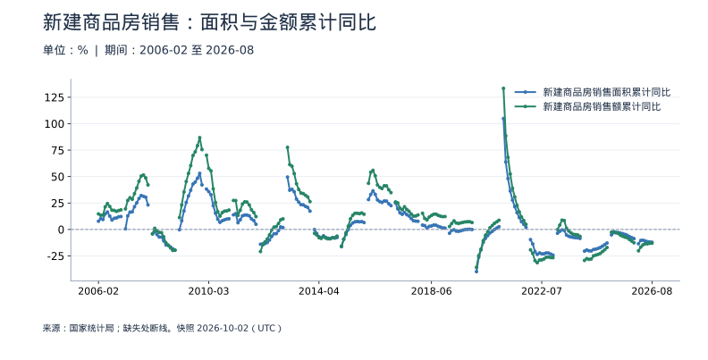
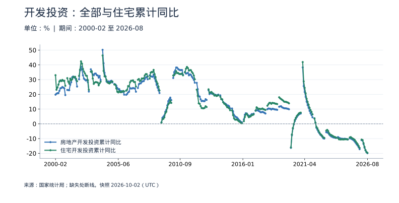
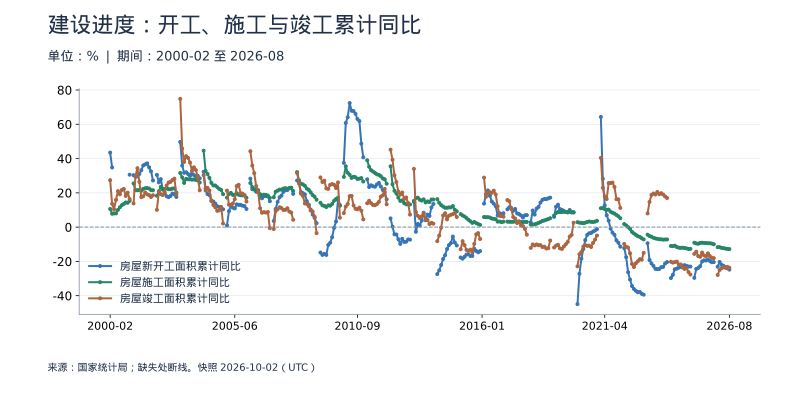
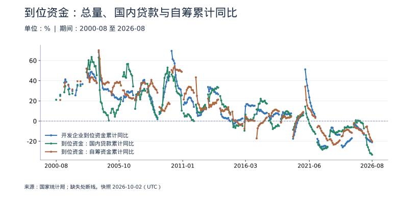
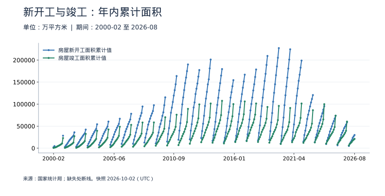
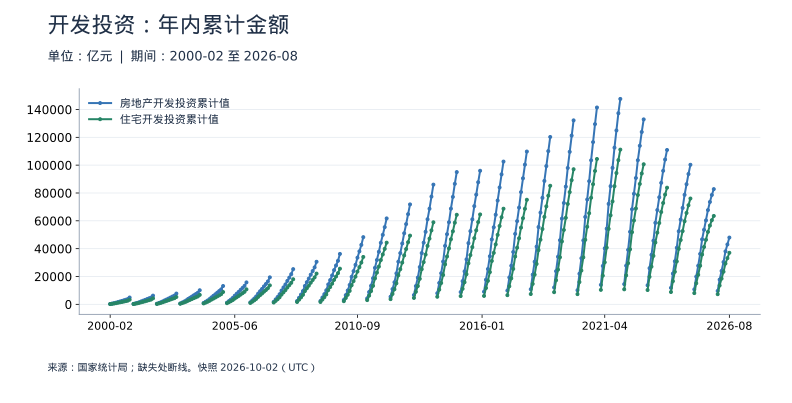

<!-- Generated by scripts/sync_macro.py; edit macro_catalog.py/macro_render.py. -->
# 房地产：销售、资金与建设：真实数据

销售变化怎样传到资金、开工和投资，哪些数据不能直接相加？

全国开发企业的新建商品房与开发建设统计，不是二手房市场或房价指数。以下全部是年内累计值或累计同比：2月代表1—2月，1月不发布，不能把每个月的累计金额相加。官方可比增速独立保存，不从历史金额反算。

本页快照获取时间：**2026-10-02T14:19:42+00:00**。这是获取时间，不是所有数据的发布日期。每日检查上游；最新统计期以每个指标为准。

[CSV 下载](https://raw.githubusercontent.com/calcky/finance/main/data/macro/property.csv) · [来源与采集参数](https://github.com/calcky/finance/blob/main/data/macro/property.metadata.json) · [最近同步状态](https://github.com/calcky/finance/actions/workflows/update-gdp.yml)

```{only} html
本站同版快照：{download}`CSV <../../data/macro/property.csv>` · {download}`元数据 <../../data/macro/property.metadata.json>`
```

网页支持悬停查看、点击固定读数、按期间选择、缩放和定位明细。GitHub、打印或禁用 JavaScript 时显示静态图；数值与网页使用同一快照。

## 最新观测与覆盖

| 指标 | 最新期间 | 数值 | 单位 | 本项目起点 | 观测数 | 来源 |
|---|---|---:|---|---|---:|---|
| 新建商品房销售面积累计同比 | 2026-08 | -12.1 | % | 2006-02 | 227 | [国家统计局](https://data.stats.gov.cn/dg/website/page.html#/pc/national/monthData) |
| 新建商品房销售额累计同比 | 2026-08 | -13 | % | 2006-02 | 227 | [国家统计局](https://data.stats.gov.cn/dg/website/page.html#/pc/national/monthData) |
| 房地产开发投资累计同比 | 2026-08 | -19.9 | % | 2000-02 | 293 | [国家统计局](https://data.stats.gov.cn/dg/website/page.html#/pc/national/monthData) |
| 住宅开发投资累计同比 | 2026-08 | -19.7 | % | 2000-02 | 293 | [国家统计局](https://data.stats.gov.cn/dg/website/page.html#/pc/national/monthData) |
| 房屋新开工面积累计同比 | 2026-08 | -24.8 | % | 2000-02 | 285 | [国家统计局](https://data.stats.gov.cn/dg/website/page.html#/pc/national/monthData) |
| 房屋施工面积累计同比 | 2026-08 | -12.8 | % | 2000-02 | 293 | [国家统计局](https://data.stats.gov.cn/dg/website/page.html#/pc/national/monthData) |
| 房屋竣工面积累计同比 | 2026-08 | -23.7 | % | 2000-02 | 293 | [国家统计局](https://data.stats.gov.cn/dg/website/page.html#/pc/national/monthData) |
| 开发企业到位资金累计同比 | 2026-08 | -21 | % | 2000-12 | 272 | [国家统计局](https://data.stats.gov.cn/dg/website/page.html#/pc/national/monthData) |
| 到位资金：国内贷款累计同比 | 2026-08 | -33.3 | % | 2000-08 | 269 | [国家统计局](https://data.stats.gov.cn/dg/website/page.html#/pc/national/monthData) |
| 到位资金：自筹资金累计同比 | 2026-08 | -20 | % | 2000-12 | 267 | [国家统计局](https://data.stats.gov.cn/dg/website/page.html#/pc/national/monthData) |
| 房屋新开工面积累计值 | 2026-08 | 29,894.06 | 万平方米 | 2000-02 | 285 | [国家统计局](https://data.stats.gov.cn/dg/website/page.html#/pc/national/monthData) |
| 房屋竣工面积累计值 | 2026-08 | 21,097.4 | 万平方米 | 2000-02 | 293 | [国家统计局](https://data.stats.gov.cn/dg/website/page.html#/pc/national/monthData) |
| 房地产开发投资累计值 | 2026-08 | 47,978.85 | 亿元 | 2000-02 | 293 | [国家统计局](https://data.stats.gov.cn/dg/website/page.html#/pc/national/monthData) |
| 住宅开发投资累计值 | 2026-08 | 37,016.61 | 亿元 | 2000-02 | 293 | [国家统计局](https://data.stats.gov.cn/dg/website/page.html#/pc/national/monthData) |
| 开发企业到位资金累计值 | 2026-08 | 50,892.64 | 亿元 | 2000-02 | 293 | [国家统计局](https://data.stats.gov.cn/dg/website/page.html#/pc/national/monthData) |
| 到位资金：国内贷款累计值 | 2026-08 | 6,880.28 | 亿元 | 2000-02 | 293 | [国家统计局](https://data.stats.gov.cn/dg/website/page.html#/pc/national/monthData) |
| 到位资金：自筹资金累计值 | 2026-08 | 18,432.33 | 亿元 | 2000-02 | 293 | [国家统计局](https://data.stats.gov.cn/dg/website/page.html#/pc/national/monthData) |
| 房屋施工面积累计值 | 2026-08 | 560,769.71 | 万平方米 | 2000-02 | 293 | [国家统计局](https://data.stats.gov.cn/dg/website/page.html#/pc/national/monthData) |
| 新建商品房销售面积累计值 | 2026-08 | 49,879.77 | 万平方米 | 2006-02 | 227 | [国家统计局](https://data.stats.gov.cn/dg/website/page.html#/pc/national/monthData) |
| 新建商品房销售额累计值 | 2026-08 | 47,470.45 | 亿元 | 2006-02 | 227 | [国家统计局](https://data.stats.gov.cn/dg/website/page.html#/pc/national/monthData) |
| 新建商品房销售面积累计值（2004年及以前实际销售口径） | 2004-12 | 38,231.64 | 万平方米 | 2000-02 | 55 | [国家统计局](https://data.stats.gov.cn/dg/website/page.html#/pc/national/monthData) |
| 新建商品房销售面积累计同比（2004年及以前实际销售口径） | 2004-12 | 13.7 | % | 2000-02 | 55 | [国家统计局](https://data.stats.gov.cn/dg/website/page.html#/pc/national/monthData) |
| 新建商品房销售额累计值（2004年及以前实际销售口径） | 2004-12 | 10,375.71 | 亿元 | 2000-02 | 55 | [国家统计局](https://data.stats.gov.cn/dg/website/page.html#/pc/national/monthData) |
| 新建商品房销售额累计同比（2004年及以前实际销售口径） | 2004-12 | 30 | % | 2000-02 | 55 | [国家统计局](https://data.stats.gov.cn/dg/website/page.html#/pc/national/monthData) |
| 新建商品房销售面积累计值（2005年口径转换期） | 2005-12 | 55,769.14 | 万平方米 | 2005-02 | 11 | [国家统计局](https://data.stats.gov.cn/dg/website/page.html#/pc/national/monthData) |
| 新建商品房销售面积累计同比（2005年口径转换期） | 2005-12 | 15.7 | % | 2005-02 | 11 | [国家统计局](https://data.stats.gov.cn/dg/website/page.html#/pc/national/monthData) |
| 新建商品房销售额累计值（2005年口径转换期） | 2005-12 | 18,080.3 | 亿元 | 2005-02 | 11 | [国家统计局](https://data.stats.gov.cn/dg/website/page.html#/pc/national/monthData) |
| 新建商品房销售额累计同比（2005年口径转换期） | 2005-12 | 30 | % | 2005-02 | 11 | [国家统计局](https://data.stats.gov.cn/dg/website/page.html#/pc/national/monthData) |

起点表示本项目当前覆盖范围，不代表该指标从此时才开始发布。旧定义序列的最后一期也不代表来源停止更新。各来源可能存在发布或入库滞后；空白不补零、不插值。发布日期未知的观测在 CSV 中留空。

图表的“全部”与 CSV 保留完整已采集历史；缩放近期不会删除早期数据。[历史来源、口径断点与剩余缺口](history-coverage.md)说明回溯范围。

## 新建商品房销售：面积与金额累计同比

销售范围包含期房和现房、住宅和非住宅。2005年范围调整：2004年及以前和2005转换期的全部原值在补充表与CSV独立保留，这张图从2006年起。金额比面积增长快不等于同一套房涨价，城市、面积和产品结构都会影响均价。



<details class="macro-details">
<summary>新建商品房销售：面积与金额累计同比：展开完整数据表（%）</summary>
<div class="macro-table-wrap"><table><thead><tr><th>期间</th><th>新建商品房销售面积累计同比</th><th>新建商品房销售额累计同比</th></tr></thead><tbody>
<tr id="macro-property-sales-growth-2026-08" tabindex="-1"><td>2026-08</td><td>-12.1</td><td>-13</td></tr>
<tr id="macro-property-sales-growth-2026-07" tabindex="-1"><td>2026-07</td><td>-11.8</td><td>-13.1</td></tr>
<tr id="macro-property-sales-growth-2026-06" tabindex="-1"><td>2026-06</td><td>-11.6</td><td>-13.6</td></tr>
<tr id="macro-property-sales-growth-2026-05" tabindex="-1"><td>2026-05</td><td>-10.8</td><td>-13.5</td></tr>
<tr id="macro-property-sales-growth-2026-04" tabindex="-1"><td>2026-04</td><td>-10.2</td><td>-14.6</td></tr>
<tr id="macro-property-sales-growth-2026-03" tabindex="-1"><td>2026-03</td><td>-10.4</td><td>-16.7</td></tr>
<tr id="macro-property-sales-growth-2026-02" tabindex="-1"><td>2026-02</td><td>-13.5</td><td>-20.2</td></tr>
<tr id="macro-property-sales-growth-2026-01" tabindex="-1"><td>2026-01</td><td>缺失</td><td>缺失</td></tr>
<tr id="macro-property-sales-growth-2025-12" tabindex="-1"><td>2025-12</td><td>-8.7</td><td>-12.6</td></tr>
<tr id="macro-property-sales-growth-2025-11" tabindex="-1"><td>2025-11</td><td>-7.8</td><td>-11.1</td></tr>
<tr id="macro-property-sales-growth-2025-10" tabindex="-1"><td>2025-10</td><td>-6.8</td><td>-9.6</td></tr>
<tr id="macro-property-sales-growth-2025-09" tabindex="-1"><td>2025-09</td><td>-5.5</td><td>-7.9</td></tr>
<tr id="macro-property-sales-growth-2025-08" tabindex="-1"><td>2025-08</td><td>-4.7</td><td>-7.3</td></tr>
<tr id="macro-property-sales-growth-2025-07" tabindex="-1"><td>2025-07</td><td>-4</td><td>-6.5</td></tr>
<tr id="macro-property-sales-growth-2025-06" tabindex="-1"><td>2025-06</td><td>-3.5</td><td>-5.5</td></tr>
<tr id="macro-property-sales-growth-2025-05" tabindex="-1"><td>2025-05</td><td>-2.9</td><td>-3.8</td></tr>
<tr id="macro-property-sales-growth-2025-04" tabindex="-1"><td>2025-04</td><td>-2.8</td><td>-3.2</td></tr>
<tr id="macro-property-sales-growth-2025-03" tabindex="-1"><td>2025-03</td><td>-3</td><td>-2.1</td></tr>
<tr id="macro-property-sales-growth-2025-02" tabindex="-1"><td>2025-02</td><td>-5.1</td><td>-2.6</td></tr>
<tr id="macro-property-sales-growth-2025-01" tabindex="-1"><td>2025-01</td><td>缺失</td><td>缺失</td></tr>
<tr id="macro-property-sales-growth-2024-12" tabindex="-1"><td>2024-12</td><td>-12.9</td><td>-17.1</td></tr>
<tr id="macro-property-sales-growth-2024-11" tabindex="-1"><td>2024-11</td><td>-14.3</td><td>-19.2</td></tr>
<tr id="macro-property-sales-growth-2024-10" tabindex="-1"><td>2024-10</td><td>-15.8</td><td>-20.9</td></tr>
<tr id="macro-property-sales-growth-2024-09" tabindex="-1"><td>2024-09</td><td>-17.1</td><td>-22.7</td></tr>
<tr id="macro-property-sales-growth-2024-08" tabindex="-1"><td>2024-08</td><td>-18</td><td>-23.6</td></tr>
<tr id="macro-property-sales-growth-2024-07" tabindex="-1"><td>2024-07</td><td>-18.6</td><td>-24.3</td></tr>
<tr id="macro-property-sales-growth-2024-06" tabindex="-1"><td>2024-06</td><td>-19</td><td>-25</td></tr>
<tr id="macro-property-sales-growth-2024-05" tabindex="-1"><td>2024-05</td><td>-20.3</td><td>-27.9</td></tr>
<tr id="macro-property-sales-growth-2024-04" tabindex="-1"><td>2024-04</td><td>-20.2</td><td>-28.3</td></tr>
<tr id="macro-property-sales-growth-2024-03" tabindex="-1"><td>2024-03</td><td>-19.4</td><td>-27.6</td></tr>
<tr id="macro-property-sales-growth-2024-02" tabindex="-1"><td>2024-02</td><td>-20.5</td><td>-29.3</td></tr>
<tr id="macro-property-sales-growth-2024-01" tabindex="-1"><td>2024-01</td><td>缺失</td><td>缺失</td></tr>
<tr id="macro-property-sales-growth-2023-12" tabindex="-1"><td>2023-12</td><td>-8.5</td><td>-6.5</td></tr>
<tr id="macro-property-sales-growth-2023-11" tabindex="-1"><td>2023-11</td><td>-8</td><td>-5.2</td></tr>
<tr id="macro-property-sales-growth-2023-10" tabindex="-1"><td>2023-10</td><td>-7.8</td><td>-4.9</td></tr>
<tr id="macro-property-sales-growth-2023-09" tabindex="-1"><td>2023-09</td><td>-7.5</td><td>-4.6</td></tr>
<tr id="macro-property-sales-growth-2023-08" tabindex="-1"><td>2023-08</td><td>-7.1</td><td>-3.2</td></tr>
<tr id="macro-property-sales-growth-2023-07" tabindex="-1"><td>2023-07</td><td>-6.5</td><td>-1.5</td></tr>
<tr id="macro-property-sales-growth-2023-06" tabindex="-1"><td>2023-06</td><td>-5.3</td><td>1.1</td></tr>
<tr id="macro-property-sales-growth-2023-05" tabindex="-1"><td>2023-05</td><td>-0.9</td><td>8.4</td></tr>
<tr id="macro-property-sales-growth-2023-04" tabindex="-1"><td>2023-04</td><td>-0.4</td><td>8.8</td></tr>
<tr id="macro-property-sales-growth-2023-03" tabindex="-1"><td>2023-03</td><td>-1.8</td><td>4.1</td></tr>
<tr id="macro-property-sales-growth-2023-02" tabindex="-1"><td>2023-02</td><td>-3.6</td><td>-0.1</td></tr>
<tr id="macro-property-sales-growth-2023-01" tabindex="-1"><td>2023-01</td><td>缺失</td><td>缺失</td></tr>
<tr id="macro-property-sales-growth-2022-12" tabindex="-1"><td>2022-12</td><td>-24.3</td><td>-26.7</td></tr>
<tr id="macro-property-sales-growth-2022-11" tabindex="-1"><td>2022-11</td><td>-23.3</td><td>-26.6</td></tr>
<tr id="macro-property-sales-growth-2022-10" tabindex="-1"><td>2022-10</td><td>-22.3</td><td>-26.1</td></tr>
<tr id="macro-property-sales-growth-2022-09" tabindex="-1"><td>2022-09</td><td>-22.2</td><td>-26.3</td></tr>
<tr id="macro-property-sales-growth-2022-08" tabindex="-1"><td>2022-08</td><td>-23</td><td>-27.9</td></tr>
<tr id="macro-property-sales-growth-2022-07" tabindex="-1"><td>2022-07</td><td>-23.1</td><td>-28.8</td></tr>
<tr id="macro-property-sales-growth-2022-06" tabindex="-1"><td>2022-06</td><td>-22.2</td><td>-28.9</td></tr>
<tr id="macro-property-sales-growth-2022-05" tabindex="-1"><td>2022-05</td><td>-23.6</td><td>-31.5</td></tr>
<tr id="macro-property-sales-growth-2022-04" tabindex="-1"><td>2022-04</td><td>-20.9</td><td>-29.5</td></tr>
<tr id="macro-property-sales-growth-2022-03" tabindex="-1"><td>2022-03</td><td>-13.8</td><td>-22.7</td></tr>
<tr id="macro-property-sales-growth-2022-02" tabindex="-1"><td>2022-02</td><td>-9.6</td><td>-19.3</td></tr>
<tr id="macro-property-sales-growth-2022-01" tabindex="-1"><td>2022-01</td><td>缺失</td><td>缺失</td></tr>
<tr id="macro-property-sales-growth-2021-12" tabindex="-1"><td>2021-12</td><td>1.9</td><td>4.8</td></tr>
<tr id="macro-property-sales-growth-2021-11" tabindex="-1"><td>2021-11</td><td>4.8</td><td>8.5</td></tr>
<tr id="macro-property-sales-growth-2021-10" tabindex="-1"><td>2021-10</td><td>7.3</td><td>11.8</td></tr>
<tr id="macro-property-sales-growth-2021-09" tabindex="-1"><td>2021-09</td><td>11.3</td><td>16.6</td></tr>
<tr id="macro-property-sales-growth-2021-08" tabindex="-1"><td>2021-08</td><td>15.9</td><td>22.8</td></tr>
<tr id="macro-property-sales-growth-2021-07" tabindex="-1"><td>2021-07</td><td>21.5</td><td>30.7</td></tr>
<tr id="macro-property-sales-growth-2021-06" tabindex="-1"><td>2021-06</td><td>27.7</td><td>38.9</td></tr>
<tr id="macro-property-sales-growth-2021-05" tabindex="-1"><td>2021-05</td><td>36.3</td><td>52.4</td></tr>
<tr id="macro-property-sales-growth-2021-04" tabindex="-1"><td>2021-04</td><td>48.1</td><td>68.2</td></tr>
<tr id="macro-property-sales-growth-2021-03" tabindex="-1"><td>2021-03</td><td>63.8</td><td>88.5</td></tr>
<tr id="macro-property-sales-growth-2021-02" tabindex="-1"><td>2021-02</td><td>104.9</td><td>133.4</td></tr>
<tr id="macro-property-sales-growth-2021-01" tabindex="-1"><td>2021-01</td><td>缺失</td><td>缺失</td></tr>
<tr id="macro-property-sales-growth-2020-12" tabindex="-1"><td>2020-12</td><td>2.6</td><td>8.7</td></tr>
<tr id="macro-property-sales-growth-2020-11" tabindex="-1"><td>2020-11</td><td>1.3</td><td>7.2</td></tr>
<tr id="macro-property-sales-growth-2020-10" tabindex="-1"><td>2020-10</td><td>0</td><td>5.8</td></tr>
<tr id="macro-property-sales-growth-2020-09" tabindex="-1"><td>2020-09</td><td>-1.8</td><td>3.7</td></tr>
<tr id="macro-property-sales-growth-2020-08" tabindex="-1"><td>2020-08</td><td>-3.3</td><td>1.6</td></tr>
<tr id="macro-property-sales-growth-2020-07" tabindex="-1"><td>2020-07</td><td>-5.8</td><td>-2.1</td></tr>
<tr id="macro-property-sales-growth-2020-06" tabindex="-1"><td>2020-06</td><td>-8.4</td><td>-5.4</td></tr>
<tr id="macro-property-sales-growth-2020-05" tabindex="-1"><td>2020-05</td><td>-12.3</td><td>-10.6</td></tr>
<tr id="macro-property-sales-growth-2020-04" tabindex="-1"><td>2020-04</td><td>-19.3</td><td>-18.6</td></tr>
<tr id="macro-property-sales-growth-2020-03" tabindex="-1"><td>2020-03</td><td>-26.3</td><td>-24.7</td></tr>
<tr id="macro-property-sales-growth-2020-02" tabindex="-1"><td>2020-02</td><td>-39.9</td><td>-35.9</td></tr>
<tr id="macro-property-sales-growth-2020-01" tabindex="-1"><td>2020-01</td><td>缺失</td><td>缺失</td></tr>
<tr id="macro-property-sales-growth-2019-12" tabindex="-1"><td>2019-12</td><td>-0.1</td><td>6.5</td></tr>
<tr id="macro-property-sales-growth-2019-11" tabindex="-1"><td>2019-11</td><td>0.2</td><td>7.3</td></tr>
<tr id="macro-property-sales-growth-2019-10" tabindex="-1"><td>2019-10</td><td>0.1</td><td>7.3</td></tr>
<tr id="macro-property-sales-growth-2019-09" tabindex="-1"><td>2019-09</td><td>-0.1</td><td>7.1</td></tr>
<tr id="macro-property-sales-growth-2019-08" tabindex="-1"><td>2019-08</td><td>-0.6</td><td>6.7</td></tr>
<tr id="macro-property-sales-growth-2019-07" tabindex="-1"><td>2019-07</td><td>-1.3</td><td>6.2</td></tr>
<tr id="macro-property-sales-growth-2019-06" tabindex="-1"><td>2019-06</td><td>-1.8</td><td>5.6</td></tr>
<tr id="macro-property-sales-growth-2019-05" tabindex="-1"><td>2019-05</td><td>-1.6</td><td>6.1</td></tr>
<tr id="macro-property-sales-growth-2019-04" tabindex="-1"><td>2019-04</td><td>-0.3</td><td>8.1</td></tr>
<tr id="macro-property-sales-growth-2019-03" tabindex="-1"><td>2019-03</td><td>-0.9</td><td>5.6</td></tr>
<tr id="macro-property-sales-growth-2019-02" tabindex="-1"><td>2019-02</td><td>-3.6</td><td>2.8</td></tr>
<tr id="macro-property-sales-growth-2019-01" tabindex="-1"><td>2019-01</td><td>缺失</td><td>缺失</td></tr>
<tr id="macro-property-sales-growth-2018-12" tabindex="-1"><td>2018-12</td><td>1.3</td><td>12.2</td></tr>
<tr id="macro-property-sales-growth-2018-11" tabindex="-1"><td>2018-11</td><td>1.4</td><td>12.1</td></tr>
<tr id="macro-property-sales-growth-2018-10" tabindex="-1"><td>2018-10</td><td>2.2</td><td>12.5</td></tr>
<tr id="macro-property-sales-growth-2018-09" tabindex="-1"><td>2018-09</td><td>2.9</td><td>13.3</td></tr>
<tr id="macro-property-sales-growth-2018-08" tabindex="-1"><td>2018-08</td><td>4</td><td>14.5</td></tr>
<tr id="macro-property-sales-growth-2018-07" tabindex="-1"><td>2018-07</td><td>4.2</td><td>14.4</td></tr>
<tr id="macro-property-sales-growth-2018-06" tabindex="-1"><td>2018-06</td><td>3.3</td><td>13.2</td></tr>
<tr id="macro-property-sales-growth-2018-05" tabindex="-1"><td>2018-05</td><td>2.9</td><td>11.8</td></tr>
<tr id="macro-property-sales-growth-2018-04" tabindex="-1"><td>2018-04</td><td>1.3</td><td>9</td></tr>
<tr id="macro-property-sales-growth-2018-03" tabindex="-1"><td>2018-03</td><td>3.6</td><td>10.4</td></tr>
<tr id="macro-property-sales-growth-2018-02" tabindex="-1"><td>2018-02</td><td>4.1</td><td>15.3</td></tr>
<tr id="macro-property-sales-growth-2018-01" tabindex="-1"><td>2018-01</td><td>缺失</td><td>缺失</td></tr>
<tr id="macro-property-sales-growth-2017-12" tabindex="-1"><td>2017-12</td><td>7.7</td><td>13.7</td></tr>
<tr id="macro-property-sales-growth-2017-11" tabindex="-1"><td>2017-11</td><td>7.9</td><td>12.7</td></tr>
<tr id="macro-property-sales-growth-2017-10" tabindex="-1"><td>2017-10</td><td>8.2</td><td>12.6</td></tr>
<tr id="macro-property-sales-growth-2017-09" tabindex="-1"><td>2017-09</td><td>10.3</td><td>14.6</td></tr>
<tr id="macro-property-sales-growth-2017-08" tabindex="-1"><td>2017-08</td><td>12.7</td><td>17.2</td></tr>
<tr id="macro-property-sales-growth-2017-07" tabindex="-1"><td>2017-07</td><td>14</td><td>18.9</td></tr>
<tr id="macro-property-sales-growth-2017-06" tabindex="-1"><td>2017-06</td><td>16.1</td><td>21.5</td></tr>
<tr id="macro-property-sales-growth-2017-05" tabindex="-1"><td>2017-05</td><td>14.3</td><td>18.6</td></tr>
<tr id="macro-property-sales-growth-2017-04" tabindex="-1"><td>2017-04</td><td>15.7</td><td>20.1</td></tr>
<tr id="macro-property-sales-growth-2017-03" tabindex="-1"><td>2017-03</td><td>19.5</td><td>25.1</td></tr>
<tr id="macro-property-sales-growth-2017-02" tabindex="-1"><td>2017-02</td><td>25.1</td><td>26</td></tr>
<tr id="macro-property-sales-growth-2017-01" tabindex="-1"><td>2017-01</td><td>缺失</td><td>缺失</td></tr>
<tr id="macro-property-sales-growth-2016-12" tabindex="-1"><td>2016-12</td><td>22.5</td><td>34.8</td></tr>
<tr id="macro-property-sales-growth-2016-11" tabindex="-1"><td>2016-11</td><td>24.3</td><td>37.5</td></tr>
<tr id="macro-property-sales-growth-2016-10" tabindex="-1"><td>2016-10</td><td>26.8</td><td>41.2</td></tr>
<tr id="macro-property-sales-growth-2016-09" tabindex="-1"><td>2016-09</td><td>26.9</td><td>41.3</td></tr>
<tr id="macro-property-sales-growth-2016-08" tabindex="-1"><td>2016-08</td><td>25.5</td><td>38.7</td></tr>
<tr id="macro-property-sales-growth-2016-07" tabindex="-1"><td>2016-07</td><td>26.4</td><td>39.8</td></tr>
<tr id="macro-property-sales-growth-2016-06" tabindex="-1"><td>2016-06</td><td>27.9</td><td>42.1</td></tr>
<tr id="macro-property-sales-growth-2016-05" tabindex="-1"><td>2016-05</td><td>33.2</td><td>50.7</td></tr>
<tr id="macro-property-sales-growth-2016-04" tabindex="-1"><td>2016-04</td><td>36.5</td><td>55.9</td></tr>
<tr id="macro-property-sales-growth-2016-03" tabindex="-1"><td>2016-03</td><td>33.1</td><td>54.1</td></tr>
<tr id="macro-property-sales-growth-2016-02" tabindex="-1"><td>2016-02</td><td>28.2</td><td>43.6</td></tr>
<tr id="macro-property-sales-growth-2016-01" tabindex="-1"><td>2016-01</td><td>缺失</td><td>缺失</td></tr>
<tr id="macro-property-sales-growth-2015-12" tabindex="-1"><td>2015-12</td><td>6.5</td><td>14.4</td></tr>
<tr id="macro-property-sales-growth-2015-11" tabindex="-1"><td>2015-11</td><td>7.4</td><td>15.6</td></tr>
<tr id="macro-property-sales-growth-2015-10" tabindex="-1"><td>2015-10</td><td>7.2</td><td>14.9</td></tr>
<tr id="macro-property-sales-growth-2015-09" tabindex="-1"><td>2015-09</td><td>7.5</td><td>15.3</td></tr>
<tr id="macro-property-sales-growth-2015-08" tabindex="-1"><td>2015-08</td><td>7.2</td><td>15.3</td></tr>
<tr id="macro-property-sales-growth-2015-07" tabindex="-1"><td>2015-07</td><td>6.1</td><td>13.4</td></tr>
<tr id="macro-property-sales-growth-2015-06" tabindex="-1"><td>2015-06</td><td>3.9</td><td>10</td></tr>
<tr id="macro-property-sales-growth-2015-05" tabindex="-1"><td>2015-05</td><td>-0.2</td><td>3.1</td></tr>
<tr id="macro-property-sales-growth-2015-04" tabindex="-1"><td>2015-04</td><td>-4.8</td><td>-3.1</td></tr>
<tr id="macro-property-sales-growth-2015-03" tabindex="-1"><td>2015-03</td><td>-9.2</td><td>-9.3</td></tr>
<tr id="macro-property-sales-growth-2015-02" tabindex="-1"><td>2015-02</td><td>-16.3</td><td>-15.8</td></tr>
<tr id="macro-property-sales-growth-2015-01" tabindex="-1"><td>2015-01</td><td>缺失</td><td>缺失</td></tr>
<tr id="macro-property-sales-growth-2014-12" tabindex="-1"><td>2014-12</td><td>-7.6</td><td>-6.3</td></tr>
<tr id="macro-property-sales-growth-2014-11" tabindex="-1"><td>2014-11</td><td>-8.2</td><td>-7.8</td></tr>
<tr id="macro-property-sales-growth-2014-10" tabindex="-1"><td>2014-10</td><td>-7.8</td><td>-7.9</td></tr>
<tr id="macro-property-sales-growth-2014-09" tabindex="-1"><td>2014-09</td><td>-8.6</td><td>-8.9</td></tr>
<tr id="macro-property-sales-growth-2014-08" tabindex="-1"><td>2014-08</td><td>-8.3</td><td>-8.9</td></tr>
<tr id="macro-property-sales-growth-2014-07" tabindex="-1"><td>2014-07</td><td>-7.6</td><td>-8.2</td></tr>
<tr id="macro-property-sales-growth-2014-06" tabindex="-1"><td>2014-06</td><td>-6</td><td>-6.7</td></tr>
<tr id="macro-property-sales-growth-2014-05" tabindex="-1"><td>2014-05</td><td>-7.8</td><td>-8.5</td></tr>
<tr id="macro-property-sales-growth-2014-04" tabindex="-1"><td>2014-04</td><td>-6.9</td><td>-7.8</td></tr>
<tr id="macro-property-sales-growth-2014-03" tabindex="-1"><td>2014-03</td><td>-3.8</td><td>-5.2</td></tr>
<tr id="macro-property-sales-growth-2014-02" tabindex="-1"><td>2014-02</td><td>-0.1</td><td>-3.7</td></tr>
<tr id="macro-property-sales-growth-2014-01" tabindex="-1"><td>2014-01</td><td>缺失</td><td>缺失</td></tr>
<tr id="macro-property-sales-growth-2013-12" tabindex="-1"><td>2013-12</td><td>17.3</td><td>26.3</td></tr>
<tr id="macro-property-sales-growth-2013-11" tabindex="-1"><td>2013-11</td><td>20.8</td><td>30.7</td></tr>
<tr id="macro-property-sales-growth-2013-10" tabindex="-1"><td>2013-10</td><td>21.8</td><td>32.3</td></tr>
<tr id="macro-property-sales-growth-2013-09" tabindex="-1"><td>2013-09</td><td>23.3</td><td>33.9</td></tr>
<tr id="macro-property-sales-growth-2013-08" tabindex="-1"><td>2013-08</td><td>23.4</td><td>34.4</td></tr>
<tr id="macro-property-sales-growth-2013-07" tabindex="-1"><td>2013-07</td><td>25.8</td><td>37.8</td></tr>
<tr id="macro-property-sales-growth-2013-06" tabindex="-1"><td>2013-06</td><td>28.7</td><td>43.2</td></tr>
<tr id="macro-property-sales-growth-2013-05" tabindex="-1"><td>2013-05</td><td>35.6</td><td>52.8</td></tr>
<tr id="macro-property-sales-growth-2013-04" tabindex="-1"><td>2013-04</td><td>38</td><td>59.8</td></tr>
<tr id="macro-property-sales-growth-2013-03" tabindex="-1"><td>2013-03</td><td>37.1</td><td>61.3</td></tr>
<tr id="macro-property-sales-growth-2013-02" tabindex="-1"><td>2013-02</td><td>49.5</td><td>77.6</td></tr>
<tr id="macro-property-sales-growth-2013-01" tabindex="-1"><td>2013-01</td><td>缺失</td><td>缺失</td></tr>
<tr id="macro-property-sales-growth-2012-12" tabindex="-1"><td>2012-12</td><td>1.8</td><td>10</td></tr>
<tr id="macro-property-sales-growth-2012-11" tabindex="-1"><td>2012-11</td><td>2.4</td><td>9.1</td></tr>
<tr id="macro-property-sales-growth-2012-10" tabindex="-1"><td>2012-10</td><td>-1.1</td><td>5.6</td></tr>
<tr id="macro-property-sales-growth-2012-09" tabindex="-1"><td>2012-09</td><td>-4</td><td>2.7</td></tr>
<tr id="macro-property-sales-growth-2012-08" tabindex="-1"><td>2012-08</td><td>-4.1</td><td>2.2</td></tr>
<tr id="macro-property-sales-growth-2012-07" tabindex="-1"><td>2012-07</td><td>-6.6</td><td>-0.5</td></tr>
<tr id="macro-property-sales-growth-2012-06" tabindex="-1"><td>2012-06</td><td>-10</td><td>-5.2</td></tr>
<tr id="macro-property-sales-growth-2012-05" tabindex="-1"><td>2012-05</td><td>-12.4</td><td>-9.1</td></tr>
<tr id="macro-property-sales-growth-2012-04" tabindex="-1"><td>2012-04</td><td>-13.4</td><td>-11.8</td></tr>
<tr id="macro-property-sales-growth-2012-03" tabindex="-1"><td>2012-03</td><td>-13.6</td><td>-14.6</td></tr>
<tr id="macro-property-sales-growth-2012-02" tabindex="-1"><td>2012-02</td><td>-14</td><td>-20.9</td></tr>
<tr id="macro-property-sales-growth-2012-01" tabindex="-1"><td>2012-01</td><td>缺失</td><td>缺失</td></tr>
<tr id="macro-property-sales-growth-2011-12" tabindex="-1"><td>2011-12</td><td>4.9</td><td>12.1</td></tr>
<tr id="macro-property-sales-growth-2011-11" tabindex="-1"><td>2011-11</td><td>8.5</td><td>16</td></tr>
<tr id="macro-property-sales-growth-2011-10" tabindex="-1"><td>2011-10</td><td>10</td><td>18.5</td></tr>
<tr id="macro-property-sales-growth-2011-09" tabindex="-1"><td>2011-09</td><td>12.9</td><td>23.2</td></tr>
<tr id="macro-property-sales-growth-2011-08" tabindex="-1"><td>2011-08</td><td>13.6</td><td>25.9</td></tr>
<tr id="macro-property-sales-growth-2011-07" tabindex="-1"><td>2011-07</td><td>13.6</td><td>26.1</td></tr>
<tr id="macro-property-sales-growth-2011-06" tabindex="-1"><td>2011-06</td><td>12.9</td><td>24.1</td></tr>
<tr id="macro-property-sales-growth-2011-05" tabindex="-1"><td>2011-05</td><td>9.1</td><td>18.1</td></tr>
<tr id="macro-property-sales-growth-2011-04" tabindex="-1"><td>2011-04</td><td>6.3</td><td>13.3</td></tr>
<tr id="macro-property-sales-growth-2011-03" tabindex="-1"><td>2011-03</td><td>14.9</td><td>27.3</td></tr>
<tr id="macro-property-sales-growth-2011-02" tabindex="-1"><td>2011-02</td><td>13.8</td><td>27.4</td></tr>
<tr id="macro-property-sales-growth-2011-01" tabindex="-1"><td>2011-01</td><td>缺失</td><td>缺失</td></tr>
<tr id="macro-property-sales-growth-2010-12" tabindex="-1"><td>2010-12</td><td>10.1</td><td>18.3</td></tr>
<tr id="macro-property-sales-growth-2010-11" tabindex="-1"><td>2010-11</td><td>9.8</td><td>17.5</td></tr>
<tr id="macro-property-sales-growth-2010-10" tabindex="-1"><td>2010-10</td><td>9.1</td><td>17.3</td></tr>
<tr id="macro-property-sales-growth-2010-09" tabindex="-1"><td>2010-09</td><td>8.2</td><td>15.9</td></tr>
<tr id="macro-property-sales-growth-2010-08" tabindex="-1"><td>2010-08</td><td>6.7</td><td>12.6</td></tr>
<tr id="macro-property-sales-growth-2010-07" tabindex="-1"><td>2010-07</td><td>9.7</td><td>16.8</td></tr>
<tr id="macro-property-sales-growth-2010-06" tabindex="-1"><td>2010-06</td><td>15.4</td><td>25.4</td></tr>
<tr id="macro-property-sales-growth-2010-05" tabindex="-1"><td>2010-05</td><td>22.5</td><td>38.4</td></tr>
<tr id="macro-property-sales-growth-2010-04" tabindex="-1"><td>2010-04</td><td>32.8</td><td>55.4</td></tr>
<tr id="macro-property-sales-growth-2010-03" tabindex="-1"><td>2010-03</td><td>35.8</td><td>57.7</td></tr>
<tr id="macro-property-sales-growth-2010-02" tabindex="-1"><td>2010-02</td><td>38.2</td><td>70.2</td></tr>
<tr id="macro-property-sales-growth-2010-01" tabindex="-1"><td>2010-01</td><td>缺失</td><td>缺失</td></tr>
<tr id="macro-property-sales-growth-2009-12" tabindex="-1"><td>2009-12</td><td>42.1</td><td>75.5</td></tr>
<tr id="macro-property-sales-growth-2009-11" tabindex="-1"><td>2009-11</td><td>53</td><td>86.8</td></tr>
<tr id="macro-property-sales-growth-2009-10" tabindex="-1"><td>2009-10</td><td>48.4</td><td>79.2</td></tr>
<tr id="macro-property-sales-growth-2009-09" tabindex="-1"><td>2009-09</td><td>44.8</td><td>73.4</td></tr>
<tr id="macro-property-sales-growth-2009-08" tabindex="-1"><td>2009-08</td><td>42.9</td><td>69.9</td></tr>
<tr id="macro-property-sales-growth-2009-07" tabindex="-1"><td>2009-07</td><td>37.1</td><td>60.4</td></tr>
<tr id="macro-property-sales-growth-2009-06" tabindex="-1"><td>2009-06</td><td>31.7</td><td>53</td></tr>
<tr id="macro-property-sales-growth-2009-05" tabindex="-1"><td>2009-05</td><td>25.5</td><td>45.3</td></tr>
<tr id="macro-property-sales-growth-2009-04" tabindex="-1"><td>2009-04</td><td>17.5</td><td>35.4</td></tr>
<tr id="macro-property-sales-growth-2009-03" tabindex="-1"><td>2009-03</td><td>8.2</td><td>23.1</td></tr>
<tr id="macro-property-sales-growth-2009-02" tabindex="-1"><td>2009-02</td><td>-0.3</td><td>11.2</td></tr>
<tr id="macro-property-sales-growth-2009-01" tabindex="-1"><td>2009-01</td><td>缺失</td><td>缺失</td></tr>
<tr id="macro-property-sales-growth-2008-12" tabindex="-1"><td>2008-12</td><td>-19.7</td><td>-19.5</td></tr>
<tr id="macro-property-sales-growth-2008-11" tabindex="-1"><td>2008-11</td><td>-18.3</td><td>-19.8</td></tr>
<tr id="macro-property-sales-growth-2008-10" tabindex="-1"><td>2008-10</td><td>-16.5</td><td>-17.4</td></tr>
<tr id="macro-property-sales-growth-2008-09" tabindex="-1"><td>2008-09</td><td>-14.9</td><td>-15</td></tr>
<tr id="macro-property-sales-growth-2008-08" tabindex="-1"><td>2008-08</td><td>-14.7</td><td>-12.7</td></tr>
<tr id="macro-property-sales-growth-2008-07" tabindex="-1"><td>2008-07</td><td>-10.8</td><td>-7</td></tr>
<tr id="macro-property-sales-growth-2008-06" tabindex="-1"><td>2008-06</td><td>-7.2</td><td>-3</td></tr>
<tr id="macro-property-sales-growth-2008-05" tabindex="-1"><td>2008-05</td><td>-7.2</td><td>-2.8</td></tr>
<tr id="macro-property-sales-growth-2008-04" tabindex="-1"><td>2008-04</td><td>-4.9</td><td>-1.5</td></tr>
<tr id="macro-property-sales-growth-2008-03" tabindex="-1"><td>2008-03</td><td>-2</td><td>1.1</td></tr>
<tr id="macro-property-sales-growth-2008-02" tabindex="-1"><td>2008-02</td><td>-4.2</td><td>-4.1</td></tr>
<tr id="macro-property-sales-growth-2008-01" tabindex="-1"><td>2008-01</td><td>缺失</td><td>缺失</td></tr>
<tr id="macro-property-sales-growth-2007-12" tabindex="-1"><td>2007-12</td><td>23.2</td><td>42.1</td></tr>
<tr id="macro-property-sales-growth-2007-11" tabindex="-1"><td>2007-11</td><td>30.5</td><td>48.7</td></tr>
<tr id="macro-property-sales-growth-2007-10" tabindex="-1"><td>2007-10</td><td>31.3</td><td>51.5</td></tr>
<tr id="macro-property-sales-growth-2007-09" tabindex="-1"><td>2007-09</td><td>32.1</td><td>50.5</td></tr>
<tr id="macro-property-sales-growth-2007-08" tabindex="-1"><td>2007-08</td><td>29.3</td><td>45.6</td></tr>
<tr id="macro-property-sales-growth-2007-07" tabindex="-1"><td>2007-07</td><td>25.1</td><td>39.2</td></tr>
<tr id="macro-property-sales-growth-2007-06" tabindex="-1"><td>2007-06</td><td>21.5</td><td>33.8</td></tr>
<tr id="macro-property-sales-growth-2007-05" tabindex="-1"><td>2007-05</td><td>16.6</td><td>28.5</td></tr>
<tr id="macro-property-sales-growth-2007-04" tabindex="-1"><td>2007-04</td><td>16.4</td><td>30</td></tr>
<tr id="macro-property-sales-growth-2007-03" tabindex="-1"><td>2007-03</td><td>12.8</td><td>27.4</td></tr>
<tr id="macro-property-sales-growth-2007-02" tabindex="-1"><td>2007-02</td><td>0.5</td><td>19.4</td></tr>
<tr id="macro-property-sales-growth-2007-01" tabindex="-1"><td>2007-01</td><td>缺失</td><td>缺失</td></tr>
<tr id="macro-property-sales-growth-2006-12" tabindex="-1"><td>2006-12</td><td>12.2</td><td>18.5</td></tr>
<tr id="macro-property-sales-growth-2006-11" tabindex="-1"><td>2006-11</td><td>12</td><td>17.9</td></tr>
<tr id="macro-property-sales-growth-2006-10" tabindex="-1"><td>2006-10</td><td>10.9</td><td>17.1</td></tr>
<tr id="macro-property-sales-growth-2006-09" tabindex="-1"><td>2006-09</td><td>10.5</td><td>18</td></tr>
<tr id="macro-property-sales-growth-2006-08" tabindex="-1"><td>2006-08</td><td>8.9</td><td>18.2</td></tr>
<tr id="macro-property-sales-growth-2006-07" tabindex="-1"><td>2006-07</td><td>12.6</td><td>21.7</td></tr>
<tr id="macro-property-sales-growth-2006-06" tabindex="-1"><td>2006-06</td><td>16.5</td><td>24.5</td></tr>
<tr id="macro-property-sales-growth-2006-05" tabindex="-1"><td>2006-05</td><td>14.7</td><td>21.4</td></tr>
<tr id="macro-property-sales-growth-2006-04" tabindex="-1"><td>2006-04</td><td>9.4</td><td>13.6</td></tr>
<tr id="macro-property-sales-growth-2006-03" tabindex="-1"><td>2006-03</td><td>10.2</td><td>13.4</td></tr>
<tr id="macro-property-sales-growth-2006-02" tabindex="-1"><td>2006-02</td><td>7.8</td><td>14.7</td></tr>
</tbody></table></div></details>

## 开发投资：全部与住宅累计同比

住宅包含在全部开发投资中，不能相加。投资额包含建筑安装、设备和其他费用等，不等于房地产增加值；土地购置费不直接形成等额新增GDP。增速按官方可比范围计算。



<details class="macro-details">
<summary>开发投资：全部与住宅累计同比：展开完整数据表（%）</summary>
<div class="macro-table-wrap"><table><thead><tr><th>期间</th><th>房地产开发投资累计同比</th><th>住宅开发投资累计同比</th></tr></thead><tbody>
<tr id="macro-property-investment-growth-2026-08" tabindex="-1"><td>2026-08</td><td>-19.9</td><td>-19.7</td></tr>
<tr id="macro-property-investment-growth-2026-07" tabindex="-1"><td>2026-07</td><td>-19.2</td><td>-19.1</td></tr>
<tr id="macro-property-investment-growth-2026-06" tabindex="-1"><td>2026-06</td><td>-18</td><td>-17.8</td></tr>
<tr id="macro-property-investment-growth-2026-05" tabindex="-1"><td>2026-05</td><td>-16.2</td><td>-15.6</td></tr>
<tr id="macro-property-investment-growth-2026-04" tabindex="-1"><td>2026-04</td><td>-13.7</td><td>-13.1</td></tr>
<tr id="macro-property-investment-growth-2026-03" tabindex="-1"><td>2026-03</td><td>-11.2</td><td>-11</td></tr>
<tr id="macro-property-investment-growth-2026-02" tabindex="-1"><td>2026-02</td><td>-11.1</td><td>-10.7</td></tr>
<tr id="macro-property-investment-growth-2026-01" tabindex="-1"><td>2026-01</td><td>缺失</td><td>缺失</td></tr>
<tr id="macro-property-investment-growth-2025-12" tabindex="-1"><td>2025-12</td><td>-17.2</td><td>-16.3</td></tr>
<tr id="macro-property-investment-growth-2025-11" tabindex="-1"><td>2025-11</td><td>-15.9</td><td>-15</td></tr>
<tr id="macro-property-investment-growth-2025-10" tabindex="-1"><td>2025-10</td><td>-14.7</td><td>-13.8</td></tr>
<tr id="macro-property-investment-growth-2025-09" tabindex="-1"><td>2025-09</td><td>-13.9</td><td>-12.9</td></tr>
<tr id="macro-property-investment-growth-2025-08" tabindex="-1"><td>2025-08</td><td>-12.9</td><td>-11.9</td></tr>
<tr id="macro-property-investment-growth-2025-07" tabindex="-1"><td>2025-07</td><td>-12</td><td>-10.9</td></tr>
<tr id="macro-property-investment-growth-2025-06" tabindex="-1"><td>2025-06</td><td>-11.2</td><td>-10.4</td></tr>
<tr id="macro-property-investment-growth-2025-05" tabindex="-1"><td>2025-05</td><td>-10.7</td><td>-10</td></tr>
<tr id="macro-property-investment-growth-2025-04" tabindex="-1"><td>2025-04</td><td>-10.3</td><td>-9.6</td></tr>
<tr id="macro-property-investment-growth-2025-03" tabindex="-1"><td>2025-03</td><td>-9.9</td><td>-9</td></tr>
<tr id="macro-property-investment-growth-2025-02" tabindex="-1"><td>2025-02</td><td>-9.8</td><td>-9.2</td></tr>
<tr id="macro-property-investment-growth-2025-01" tabindex="-1"><td>2025-01</td><td>缺失</td><td>缺失</td></tr>
<tr id="macro-property-investment-growth-2024-12" tabindex="-1"><td>2024-12</td><td>-10.6</td><td>-10.5</td></tr>
<tr id="macro-property-investment-growth-2024-11" tabindex="-1"><td>2024-11</td><td>-10.4</td><td>-10.5</td></tr>
<tr id="macro-property-investment-growth-2024-10" tabindex="-1"><td>2024-10</td><td>-10.3</td><td>-10.4</td></tr>
<tr id="macro-property-investment-growth-2024-09" tabindex="-1"><td>2024-09</td><td>-10.1</td><td>-10.5</td></tr>
<tr id="macro-property-investment-growth-2024-08" tabindex="-1"><td>2024-08</td><td>-10.2</td><td>-10.5</td></tr>
<tr id="macro-property-investment-growth-2024-07" tabindex="-1"><td>2024-07</td><td>-10.2</td><td>-10.6</td></tr>
<tr id="macro-property-investment-growth-2024-06" tabindex="-1"><td>2024-06</td><td>-10.1</td><td>-10.4</td></tr>
<tr id="macro-property-investment-growth-2024-05" tabindex="-1"><td>2024-05</td><td>-10.1</td><td>-10.6</td></tr>
<tr id="macro-property-investment-growth-2024-04" tabindex="-1"><td>2024-04</td><td>-9.8</td><td>-10.5</td></tr>
<tr id="macro-property-investment-growth-2024-03" tabindex="-1"><td>2024-03</td><td>-9.5</td><td>-10.5</td></tr>
<tr id="macro-property-investment-growth-2024-02" tabindex="-1"><td>2024-02</td><td>-9</td><td>-9.7</td></tr>
<tr id="macro-property-investment-growth-2024-01" tabindex="-1"><td>2024-01</td><td>缺失</td><td>缺失</td></tr>
<tr id="macro-property-investment-growth-2023-12" tabindex="-1"><td>2023-12</td><td>-9.6</td><td>-9.3</td></tr>
<tr id="macro-property-investment-growth-2023-11" tabindex="-1"><td>2023-11</td><td>-9.4</td><td>-9</td></tr>
<tr id="macro-property-investment-growth-2023-10" tabindex="-1"><td>2023-10</td><td>-9.3</td><td>-8.8</td></tr>
<tr id="macro-property-investment-growth-2023-09" tabindex="-1"><td>2023-09</td><td>-9.1</td><td>-8.4</td></tr>
<tr id="macro-property-investment-growth-2023-08" tabindex="-1"><td>2023-08</td><td>-8.8</td><td>-8</td></tr>
<tr id="macro-property-investment-growth-2023-07" tabindex="-1"><td>2023-07</td><td>-8.5</td><td>-7.6</td></tr>
<tr id="macro-property-investment-growth-2023-06" tabindex="-1"><td>2023-06</td><td>-7.9</td><td>-7.3</td></tr>
<tr id="macro-property-investment-growth-2023-05" tabindex="-1"><td>2023-05</td><td>-7.2</td><td>-6.4</td></tr>
<tr id="macro-property-investment-growth-2023-04" tabindex="-1"><td>2023-04</td><td>-6.2</td><td>-4.9</td></tr>
<tr id="macro-property-investment-growth-2023-03" tabindex="-1"><td>2023-03</td><td>-5.8</td><td>-4.1</td></tr>
<tr id="macro-property-investment-growth-2023-02" tabindex="-1"><td>2023-02</td><td>-5.7</td><td>-4.6</td></tr>
<tr id="macro-property-investment-growth-2023-01" tabindex="-1"><td>2023-01</td><td>缺失</td><td>缺失</td></tr>
<tr id="macro-property-investment-growth-2022-12" tabindex="-1"><td>2022-12</td><td>-10</td><td>-9.5</td></tr>
<tr id="macro-property-investment-growth-2022-11" tabindex="-1"><td>2022-11</td><td>-9.8</td><td>-9.2</td></tr>
<tr id="macro-property-investment-growth-2022-10" tabindex="-1"><td>2022-10</td><td>-8.8</td><td>-8.3</td></tr>
<tr id="macro-property-investment-growth-2022-09" tabindex="-1"><td>2022-09</td><td>-8</td><td>-7.5</td></tr>
<tr id="macro-property-investment-growth-2022-08" tabindex="-1"><td>2022-08</td><td>-7.4</td><td>-6.9</td></tr>
<tr id="macro-property-investment-growth-2022-07" tabindex="-1"><td>2022-07</td><td>-6.4</td><td>-5.8</td></tr>
<tr id="macro-property-investment-growth-2022-06" tabindex="-1"><td>2022-06</td><td>-5.4</td><td>-4.5</td></tr>
<tr id="macro-property-investment-growth-2022-05" tabindex="-1"><td>2022-05</td><td>-4</td><td>-3</td></tr>
<tr id="macro-property-investment-growth-2022-04" tabindex="-1"><td>2022-04</td><td>-2.7</td><td>-2.1</td></tr>
<tr id="macro-property-investment-growth-2022-03" tabindex="-1"><td>2022-03</td><td>0.7</td><td>0.7</td></tr>
<tr id="macro-property-investment-growth-2022-02" tabindex="-1"><td>2022-02</td><td>3.7</td><td>3.7</td></tr>
<tr id="macro-property-investment-growth-2022-01" tabindex="-1"><td>2022-01</td><td>缺失</td><td>缺失</td></tr>
<tr id="macro-property-investment-growth-2021-12" tabindex="-1"><td>2021-12</td><td>4.4</td><td>6.4</td></tr>
<tr id="macro-property-investment-growth-2021-11" tabindex="-1"><td>2021-11</td><td>6</td><td>8.1</td></tr>
<tr id="macro-property-investment-growth-2021-10" tabindex="-1"><td>2021-10</td><td>7.2</td><td>9.3</td></tr>
<tr id="macro-property-investment-growth-2021-09" tabindex="-1"><td>2021-09</td><td>8.8</td><td>10.9</td></tr>
<tr id="macro-property-investment-growth-2021-08" tabindex="-1"><td>2021-08</td><td>10.9</td><td>13</td></tr>
<tr id="macro-property-investment-growth-2021-07" tabindex="-1"><td>2021-07</td><td>12.7</td><td>14.9</td></tr>
<tr id="macro-property-investment-growth-2021-06" tabindex="-1"><td>2021-06</td><td>15</td><td>17</td></tr>
<tr id="macro-property-investment-growth-2021-05" tabindex="-1"><td>2021-05</td><td>18.3</td><td>20.7</td></tr>
<tr id="macro-property-investment-growth-2021-04" tabindex="-1"><td>2021-04</td><td>21.6</td><td>24.4</td></tr>
<tr id="macro-property-investment-growth-2021-03" tabindex="-1"><td>2021-03</td><td>25.6</td><td>28.8</td></tr>
<tr id="macro-property-investment-growth-2021-02" tabindex="-1"><td>2021-02</td><td>38.3</td><td>41.9</td></tr>
<tr id="macro-property-investment-growth-2021-01" tabindex="-1"><td>2021-01</td><td>缺失</td><td>缺失</td></tr>
<tr id="macro-property-investment-growth-2020-12" tabindex="-1"><td>2020-12</td><td>7</td><td>7.6</td></tr>
<tr id="macro-property-investment-growth-2020-11" tabindex="-1"><td>2020-11</td><td>6.8</td><td>7.4</td></tr>
<tr id="macro-property-investment-growth-2020-10" tabindex="-1"><td>2020-10</td><td>6.3</td><td>7</td></tr>
<tr id="macro-property-investment-growth-2020-09" tabindex="-1"><td>2020-09</td><td>5.6</td><td>6.1</td></tr>
<tr id="macro-property-investment-growth-2020-08" tabindex="-1"><td>2020-08</td><td>4.6</td><td>5.3</td></tr>
<tr id="macro-property-investment-growth-2020-07" tabindex="-1"><td>2020-07</td><td>3.4</td><td>4.1</td></tr>
<tr id="macro-property-investment-growth-2020-06" tabindex="-1"><td>2020-06</td><td>1.9</td><td>2.6</td></tr>
<tr id="macro-property-investment-growth-2020-05" tabindex="-1"><td>2020-05</td><td>-0.3</td><td>0</td></tr>
<tr id="macro-property-investment-growth-2020-04" tabindex="-1"><td>2020-04</td><td>-3.3</td><td>-2.8</td></tr>
<tr id="macro-property-investment-growth-2020-03" tabindex="-1"><td>2020-03</td><td>-7.7</td><td>-7.2</td></tr>
<tr id="macro-property-investment-growth-2020-02" tabindex="-1"><td>2020-02</td><td>-16.3</td><td>-16</td></tr>
<tr id="macro-property-investment-growth-2020-01" tabindex="-1"><td>2020-01</td><td>缺失</td><td>缺失</td></tr>
<tr id="macro-property-investment-growth-2019-12" tabindex="-1"><td>2019-12</td><td>9.9</td><td>13.9</td></tr>
<tr id="macro-property-investment-growth-2019-11" tabindex="-1"><td>2019-11</td><td>10.2</td><td>14.4</td></tr>
<tr id="macro-property-investment-growth-2019-10" tabindex="-1"><td>2019-10</td><td>10.3</td><td>14.6</td></tr>
<tr id="macro-property-investment-growth-2019-09" tabindex="-1"><td>2019-09</td><td>10.5</td><td>14.9</td></tr>
<tr id="macro-property-investment-growth-2019-08" tabindex="-1"><td>2019-08</td><td>10.5</td><td>14.9</td></tr>
<tr id="macro-property-investment-growth-2019-07" tabindex="-1"><td>2019-07</td><td>10.6</td><td>15.1</td></tr>
<tr id="macro-property-investment-growth-2019-06" tabindex="-1"><td>2019-06</td><td>10.9</td><td>15.8</td></tr>
<tr id="macro-property-investment-growth-2019-05" tabindex="-1"><td>2019-05</td><td>11.2</td><td>16.3</td></tr>
<tr id="macro-property-investment-growth-2019-04" tabindex="-1"><td>2019-04</td><td>11.9</td><td>16.8</td></tr>
<tr id="macro-property-investment-growth-2019-03" tabindex="-1"><td>2019-03</td><td>11.8</td><td>17.3</td></tr>
<tr id="macro-property-investment-growth-2019-02" tabindex="-1"><td>2019-02</td><td>11.6</td><td>18</td></tr>
<tr id="macro-property-investment-growth-2019-01" tabindex="-1"><td>2019-01</td><td>缺失</td><td>缺失</td></tr>
<tr id="macro-property-investment-growth-2018-12" tabindex="-1"><td>2018-12</td><td>9.5</td><td>13.4</td></tr>
<tr id="macro-property-investment-growth-2018-11" tabindex="-1"><td>2018-11</td><td>9.7</td><td>13.6</td></tr>
<tr id="macro-property-investment-growth-2018-10" tabindex="-1"><td>2018-10</td><td>9.7</td><td>13.7</td></tr>
<tr id="macro-property-investment-growth-2018-09" tabindex="-1"><td>2018-09</td><td>9.9</td><td>14</td></tr>
<tr id="macro-property-investment-growth-2018-08" tabindex="-1"><td>2018-08</td><td>10.1</td><td>14.1</td></tr>
<tr id="macro-property-investment-growth-2018-07" tabindex="-1"><td>2018-07</td><td>10.2</td><td>14.2</td></tr>
<tr id="macro-property-investment-growth-2018-06" tabindex="-1"><td>2018-06</td><td>9.7</td><td>13.6</td></tr>
<tr id="macro-property-investment-growth-2018-05" tabindex="-1"><td>2018-05</td><td>10.2</td><td>14.2</td></tr>
<tr id="macro-property-investment-growth-2018-04" tabindex="-1"><td>2018-04</td><td>10.3</td><td>14.2</td></tr>
<tr id="macro-property-investment-growth-2018-03" tabindex="-1"><td>2018-03</td><td>10.4</td><td>13.3</td></tr>
<tr id="macro-property-investment-growth-2018-02" tabindex="-1"><td>2018-02</td><td>9.9</td><td>12.3</td></tr>
<tr id="macro-property-investment-growth-2018-01" tabindex="-1"><td>2018-01</td><td>缺失</td><td>缺失</td></tr>
<tr id="macro-property-investment-growth-2017-12" tabindex="-1"><td>2017-12</td><td>7</td><td>9.4</td></tr>
<tr id="macro-property-investment-growth-2017-11" tabindex="-1"><td>2017-11</td><td>7.5</td><td>9.7</td></tr>
<tr id="macro-property-investment-growth-2017-10" tabindex="-1"><td>2017-10</td><td>7.8</td><td>9.9</td></tr>
<tr id="macro-property-investment-growth-2017-09" tabindex="-1"><td>2017-09</td><td>8.1</td><td>10.4</td></tr>
<tr id="macro-property-investment-growth-2017-08" tabindex="-1"><td>2017-08</td><td>7.9</td><td>10.1</td></tr>
<tr id="macro-property-investment-growth-2017-07" tabindex="-1"><td>2017-07</td><td>7.9</td><td>10</td></tr>
<tr id="macro-property-investment-growth-2017-06" tabindex="-1"><td>2017-06</td><td>8.5</td><td>10.2</td></tr>
<tr id="macro-property-investment-growth-2017-05" tabindex="-1"><td>2017-05</td><td>8.8</td><td>10</td></tr>
<tr id="macro-property-investment-growth-2017-04" tabindex="-1"><td>2017-04</td><td>9.3</td><td>10.6</td></tr>
<tr id="macro-property-investment-growth-2017-03" tabindex="-1"><td>2017-03</td><td>9.1</td><td>11.2</td></tr>
<tr id="macro-property-investment-growth-2017-02" tabindex="-1"><td>2017-02</td><td>8.9</td><td>9</td></tr>
<tr id="macro-property-investment-growth-2017-01" tabindex="-1"><td>2017-01</td><td>缺失</td><td>缺失</td></tr>
<tr id="macro-property-investment-growth-2016-12" tabindex="-1"><td>2016-12</td><td>6.9</td><td>6.4</td></tr>
<tr id="macro-property-investment-growth-2016-11" tabindex="-1"><td>2016-11</td><td>6.5</td><td>6</td></tr>
<tr id="macro-property-investment-growth-2016-10" tabindex="-1"><td>2016-10</td><td>6.6</td><td>5.9</td></tr>
<tr id="macro-property-investment-growth-2016-09" tabindex="-1"><td>2016-09</td><td>5.8</td><td>5.1</td></tr>
<tr id="macro-property-investment-growth-2016-08" tabindex="-1"><td>2016-08</td><td>5.4</td><td>4.8</td></tr>
<tr id="macro-property-investment-growth-2016-07" tabindex="-1"><td>2016-07</td><td>5.3</td><td>4.5</td></tr>
<tr id="macro-property-investment-growth-2016-06" tabindex="-1"><td>2016-06</td><td>6.1</td><td>5.6</td></tr>
<tr id="macro-property-investment-growth-2016-05" tabindex="-1"><td>2016-05</td><td>7</td><td>6.8</td></tr>
<tr id="macro-property-investment-growth-2016-04" tabindex="-1"><td>2016-04</td><td>7.2</td><td>6.4</td></tr>
<tr id="macro-property-investment-growth-2016-03" tabindex="-1"><td>2016-03</td><td>6.2</td><td>4.6</td></tr>
<tr id="macro-property-investment-growth-2016-02" tabindex="-1"><td>2016-02</td><td>3</td><td>1.8</td></tr>
<tr id="macro-property-investment-growth-2016-01" tabindex="-1"><td>2016-01</td><td>缺失</td><td>缺失</td></tr>
<tr id="macro-property-investment-growth-2015-12" tabindex="-1"><td>2015-12</td><td>1</td><td>0.4</td></tr>
<tr id="macro-property-investment-growth-2015-11" tabindex="-1"><td>2015-11</td><td>1.3</td><td>0.7</td></tr>
<tr id="macro-property-investment-growth-2015-10" tabindex="-1"><td>2015-10</td><td>2</td><td>1.3</td></tr>
<tr id="macro-property-investment-growth-2015-09" tabindex="-1"><td>2015-09</td><td>2.6</td><td>1.7</td></tr>
<tr id="macro-property-investment-growth-2015-08" tabindex="-1"><td>2015-08</td><td>3.5</td><td>2.3</td></tr>
<tr id="macro-property-investment-growth-2015-07" tabindex="-1"><td>2015-07</td><td>4.3</td><td>3</td></tr>
<tr id="macro-property-investment-growth-2015-06" tabindex="-1"><td>2015-06</td><td>4.6</td><td>2.8</td></tr>
<tr id="macro-property-investment-growth-2015-05" tabindex="-1"><td>2015-05</td><td>5.1</td><td>2.9</td></tr>
<tr id="macro-property-investment-growth-2015-04" tabindex="-1"><td>2015-04</td><td>6</td><td>3.7</td></tr>
<tr id="macro-property-investment-growth-2015-03" tabindex="-1"><td>2015-03</td><td>8.5</td><td>5.9</td></tr>
<tr id="macro-property-investment-growth-2015-02" tabindex="-1"><td>2015-02</td><td>10.4</td><td>9.1</td></tr>
<tr id="macro-property-investment-growth-2015-01" tabindex="-1"><td>2015-01</td><td>缺失</td><td>缺失</td></tr>
<tr id="macro-property-investment-growth-2014-12" tabindex="-1"><td>2014-12</td><td>10.5</td><td>9.2</td></tr>
<tr id="macro-property-investment-growth-2014-11" tabindex="-1"><td>2014-11</td><td>11.9</td><td>10.5</td></tr>
<tr id="macro-property-investment-growth-2014-10" tabindex="-1"><td>2014-10</td><td>12.4</td><td>11.1</td></tr>
<tr id="macro-property-investment-growth-2014-09" tabindex="-1"><td>2014-09</td><td>12.5</td><td>11.3</td></tr>
<tr id="macro-property-investment-growth-2014-08" tabindex="-1"><td>2014-08</td><td>13.2</td><td>12.4</td></tr>
<tr id="macro-property-investment-growth-2014-07" tabindex="-1"><td>2014-07</td><td>13.7</td><td>13.3</td></tr>
<tr id="macro-property-investment-growth-2014-06" tabindex="-1"><td>2014-06</td><td>14.1</td><td>13.7</td></tr>
<tr id="macro-property-investment-growth-2014-05" tabindex="-1"><td>2014-05</td><td>14.7</td><td>14.6</td></tr>
<tr id="macro-property-investment-growth-2014-04" tabindex="-1"><td>2014-04</td><td>16.4</td><td>16.6</td></tr>
<tr id="macro-property-investment-growth-2014-03" tabindex="-1"><td>2014-03</td><td>16.8</td><td>16.8</td></tr>
<tr id="macro-property-investment-growth-2014-02" tabindex="-1"><td>2014-02</td><td>19.3</td><td>18.4</td></tr>
<tr id="macro-property-investment-growth-2014-01" tabindex="-1"><td>2014-01</td><td>缺失</td><td>缺失</td></tr>
<tr id="macro-property-investment-growth-2013-12" tabindex="-1"><td>2013-12</td><td>19.8</td><td>19.4</td></tr>
<tr id="macro-property-investment-growth-2013-11" tabindex="-1"><td>2013-11</td><td>19.5</td><td>19.1</td></tr>
<tr id="macro-property-investment-growth-2013-10" tabindex="-1"><td>2013-10</td><td>19.2</td><td>18.9</td></tr>
<tr id="macro-property-investment-growth-2013-09" tabindex="-1"><td>2013-09</td><td>19.7</td><td>19.5</td></tr>
<tr id="macro-property-investment-growth-2013-08" tabindex="-1"><td>2013-08</td><td>19.3</td><td>19.2</td></tr>
<tr id="macro-property-investment-growth-2013-07" tabindex="-1"><td>2013-07</td><td>20.5</td><td>20.2</td></tr>
<tr id="macro-property-investment-growth-2013-06" tabindex="-1"><td>2013-06</td><td>20.3</td><td>20.8</td></tr>
<tr id="macro-property-investment-growth-2013-05" tabindex="-1"><td>2013-05</td><td>20.6</td><td>21.6</td></tr>
<tr id="macro-property-investment-growth-2013-04" tabindex="-1"><td>2013-04</td><td>21.1</td><td>21.3</td></tr>
<tr id="macro-property-investment-growth-2013-03" tabindex="-1"><td>2013-03</td><td>20.2</td><td>21.1</td></tr>
<tr id="macro-property-investment-growth-2013-02" tabindex="-1"><td>2013-02</td><td>22.8</td><td>23.4</td></tr>
<tr id="macro-property-investment-growth-2013-01" tabindex="-1"><td>2013-01</td><td>缺失</td><td>缺失</td></tr>
<tr id="macro-property-investment-growth-2012-12" tabindex="-1"><td>2012-12</td><td>16.2</td><td>11.4</td></tr>
<tr id="macro-property-investment-growth-2012-11" tabindex="-1"><td>2012-11</td><td>16.7</td><td>11.9</td></tr>
<tr id="macro-property-investment-growth-2012-10" tabindex="-1"><td>2012-10</td><td>15.4</td><td>10.8</td></tr>
<tr id="macro-property-investment-growth-2012-09" tabindex="-1"><td>2012-09</td><td>15.4</td><td>10.5</td></tr>
<tr id="macro-property-investment-growth-2012-08" tabindex="-1"><td>2012-08</td><td>15.6</td><td>10.6</td></tr>
<tr id="macro-property-investment-growth-2012-07" tabindex="-1"><td>2012-07</td><td>15.4</td><td>10.7</td></tr>
<tr id="macro-property-investment-growth-2012-06" tabindex="-1"><td>2012-06</td><td>16.6</td><td>12</td></tr>
<tr id="macro-property-investment-growth-2012-05" tabindex="-1"><td>2012-05</td><td>18.5</td><td>13.6</td></tr>
<tr id="macro-property-investment-growth-2012-04" tabindex="-1"><td>2012-04</td><td>18.7</td><td>13.9</td></tr>
<tr id="macro-property-investment-growth-2012-03" tabindex="-1"><td>2012-03</td><td>23.5</td><td>19</td></tr>
<tr id="macro-property-investment-growth-2012-02" tabindex="-1"><td>2012-02</td><td>27.8</td><td>23.2</td></tr>
<tr id="macro-property-investment-growth-2012-01" tabindex="-1"><td>2012-01</td><td>缺失</td><td>缺失</td></tr>
<tr id="macro-property-investment-growth-2011-12" tabindex="-1"><td>2011-12</td><td>27.9</td><td>30.2</td></tr>
<tr id="macro-property-investment-growth-2011-11" tabindex="-1"><td>2011-11</td><td>29.9</td><td>32.8</td></tr>
<tr id="macro-property-investment-growth-2011-10" tabindex="-1"><td>2011-10</td><td>31.1</td><td>34.3</td></tr>
<tr id="macro-property-investment-growth-2011-09" tabindex="-1"><td>2011-09</td><td>32</td><td>35.2</td></tr>
<tr id="macro-property-investment-growth-2011-08" tabindex="-1"><td>2011-08</td><td>33.2</td><td>36.4</td></tr>
<tr id="macro-property-investment-growth-2011-07" tabindex="-1"><td>2011-07</td><td>33.6</td><td>36.4</td></tr>
<tr id="macro-property-investment-growth-2011-06" tabindex="-1"><td>2011-06</td><td>32.9</td><td>36.1</td></tr>
<tr id="macro-property-investment-growth-2011-05" tabindex="-1"><td>2011-05</td><td>34.6</td><td>37.8</td></tr>
<tr id="macro-property-investment-growth-2011-04" tabindex="-1"><td>2011-04</td><td>34.3</td><td>38.6</td></tr>
<tr id="macro-property-investment-growth-2011-03" tabindex="-1"><td>2011-03</td><td>34.1</td><td>37.4</td></tr>
<tr id="macro-property-investment-growth-2011-02" tabindex="-1"><td>2011-02</td><td>35.2</td><td>34.9</td></tr>
<tr id="macro-property-investment-growth-2011-01" tabindex="-1"><td>2011-01</td><td>缺失</td><td>缺失</td></tr>
<tr id="macro-property-investment-growth-2010-12" tabindex="-1"><td>2010-12</td><td>33.2</td><td>32.9</td></tr>
<tr id="macro-property-investment-growth-2010-11" tabindex="-1"><td>2010-11</td><td>36.5</td><td>34.2</td></tr>
<tr id="macro-property-investment-growth-2010-10" tabindex="-1"><td>2010-10</td><td>36.5</td><td>33.8</td></tr>
<tr id="macro-property-investment-growth-2010-09" tabindex="-1"><td>2010-09</td><td>36.4</td><td>33.8</td></tr>
<tr id="macro-property-investment-growth-2010-08" tabindex="-1"><td>2010-08</td><td>36.7</td><td>33.9</td></tr>
<tr id="macro-property-investment-growth-2010-07" tabindex="-1"><td>2010-07</td><td>37.2</td><td>34.5</td></tr>
<tr id="macro-property-investment-growth-2010-06" tabindex="-1"><td>2010-06</td><td>38.1</td><td>34.4</td></tr>
<tr id="macro-property-investment-growth-2010-05" tabindex="-1"><td>2010-05</td><td>38.2</td><td>35.7</td></tr>
<tr id="macro-property-investment-growth-2010-04" tabindex="-1"><td>2010-04</td><td>36.2</td><td>34</td></tr>
<tr id="macro-property-investment-growth-2010-03" tabindex="-1"><td>2010-03</td><td>35.1</td><td>33</td></tr>
<tr id="macro-property-investment-growth-2010-02" tabindex="-1"><td>2010-02</td><td>31.1</td><td>32.8</td></tr>
<tr id="macro-property-investment-growth-2010-01" tabindex="-1"><td>2010-01</td><td>缺失</td><td>缺失</td></tr>
<tr id="macro-property-investment-growth-2009-12" tabindex="-1"><td>2009-12</td><td>16.1</td><td>14.2</td></tr>
<tr id="macro-property-investment-growth-2009-11" tabindex="-1"><td>2009-11</td><td>17.8</td><td>15.7</td></tr>
<tr id="macro-property-investment-growth-2009-10" tabindex="-1"><td>2009-10</td><td>16.6</td><td>14.1</td></tr>
<tr id="macro-property-investment-growth-2009-09" tabindex="-1"><td>2009-09</td><td>15.4</td><td>13.3</td></tr>
<tr id="macro-property-investment-growth-2009-08" tabindex="-1"><td>2009-08</td><td>12.5</td><td>10.9</td></tr>
<tr id="macro-property-investment-growth-2009-07" tabindex="-1"><td>2009-07</td><td>9.5</td><td>8.2</td></tr>
<tr id="macro-property-investment-growth-2009-06" tabindex="-1"><td>2009-06</td><td>8.3</td><td>7.3</td></tr>
<tr id="macro-property-investment-growth-2009-05" tabindex="-1"><td>2009-05</td><td>5.8</td><td>4.4</td></tr>
<tr id="macro-property-investment-growth-2009-04" tabindex="-1"><td>2009-04</td><td>4.9</td><td>3.4</td></tr>
<tr id="macro-property-investment-growth-2009-03" tabindex="-1"><td>2009-03</td><td>4.1</td><td>3.2</td></tr>
<tr id="macro-property-investment-growth-2009-02" tabindex="-1"><td>2009-02</td><td>1</td><td>0.8</td></tr>
<tr id="macro-property-investment-growth-2009-01" tabindex="-1"><td>2009-01</td><td>缺失</td><td>缺失</td></tr>
<tr id="macro-property-investment-growth-2008-12" tabindex="-1"><td>2008-12</td><td>20.9</td><td>22.6</td></tr>
<tr id="macro-property-investment-growth-2008-11" tabindex="-1"><td>2008-11</td><td>22.7</td><td>25.2</td></tr>
<tr id="macro-property-investment-growth-2008-10" tabindex="-1"><td>2008-10</td><td>24.6</td><td>27.4</td></tr>
<tr id="macro-property-investment-growth-2008-09" tabindex="-1"><td>2008-09</td><td>26.5</td><td>28.7</td></tr>
<tr id="macro-property-investment-growth-2008-08" tabindex="-1"><td>2008-08</td><td>29.1</td><td>31.7</td></tr>
<tr id="macro-property-investment-growth-2008-07" tabindex="-1"><td>2008-07</td><td>30.9</td><td>33.7</td></tr>
<tr id="macro-property-investment-growth-2008-06" tabindex="-1"><td>2008-06</td><td>33.5</td><td>36.6</td></tr>
<tr id="macro-property-investment-growth-2008-05" tabindex="-1"><td>2008-05</td><td>31.9</td><td>35</td></tr>
<tr id="macro-property-investment-growth-2008-04" tabindex="-1"><td>2008-04</td><td>32.1</td><td>35.2</td></tr>
<tr id="macro-property-investment-growth-2008-03" tabindex="-1"><td>2008-03</td><td>32.3</td><td>34.7</td></tr>
<tr id="macro-property-investment-growth-2008-02" tabindex="-1"><td>2008-02</td><td>32.9</td><td>30.7</td></tr>
<tr id="macro-property-investment-growth-2008-01" tabindex="-1"><td>2008-01</td><td>缺失</td><td>缺失</td></tr>
<tr id="macro-property-investment-growth-2007-12" tabindex="-1"><td>2007-12</td><td>30.2</td><td>32.1</td></tr>
<tr id="macro-property-investment-growth-2007-11" tabindex="-1"><td>2007-11</td><td>31.8</td><td>33.7</td></tr>
<tr id="macro-property-investment-growth-2007-10" tabindex="-1"><td>2007-10</td><td>31.4</td><td>33.7</td></tr>
<tr id="macro-property-investment-growth-2007-09" tabindex="-1"><td>2007-09</td><td>30.3</td><td>32.8</td></tr>
<tr id="macro-property-investment-growth-2007-08" tabindex="-1"><td>2007-08</td><td>29</td><td>30.9</td></tr>
<tr id="macro-property-investment-growth-2007-07" tabindex="-1"><td>2007-07</td><td>28.9</td><td>30.7</td></tr>
<tr id="macro-property-investment-growth-2007-06" tabindex="-1"><td>2007-06</td><td>28.5</td><td>30.8</td></tr>
<tr id="macro-property-investment-growth-2007-05" tabindex="-1"><td>2007-05</td><td>27.5</td><td>29.5</td></tr>
<tr id="macro-property-investment-growth-2007-04" tabindex="-1"><td>2007-04</td><td>27.4</td><td>29</td></tr>
<tr id="macro-property-investment-growth-2007-03" tabindex="-1"><td>2007-03</td><td>26.9</td><td>30.4</td></tr>
<tr id="macro-property-investment-growth-2007-02" tabindex="-1"><td>2007-02</td><td>24.3</td><td>29.9</td></tr>
<tr id="macro-property-investment-growth-2007-01" tabindex="-1"><td>2007-01</td><td>缺失</td><td>缺失</td></tr>
<tr id="macro-property-investment-growth-2006-12" tabindex="-1"><td>2006-12</td><td>21.8</td><td>25.3</td></tr>
<tr id="macro-property-investment-growth-2006-11" tabindex="-1"><td>2006-11</td><td>24</td><td>28.4</td></tr>
<tr id="macro-property-investment-growth-2006-10" tabindex="-1"><td>2006-10</td><td>24.1</td><td>28.4</td></tr>
<tr id="macro-property-investment-growth-2006-09" tabindex="-1"><td>2006-09</td><td>24.3</td><td>29.5</td></tr>
<tr id="macro-property-investment-growth-2006-08" tabindex="-1"><td>2006-08</td><td>24</td><td>29.2</td></tr>
<tr id="macro-property-investment-growth-2006-07" tabindex="-1"><td>2006-07</td><td>24</td><td>29.2</td></tr>
<tr id="macro-property-investment-growth-2006-06" tabindex="-1"><td>2006-06</td><td>24.2</td><td>28.2</td></tr>
<tr id="macro-property-investment-growth-2006-05" tabindex="-1"><td>2006-05</td><td>21.8</td><td>25.4</td></tr>
<tr id="macro-property-investment-growth-2006-04" tabindex="-1"><td>2006-04</td><td>21.3</td><td>25.6</td></tr>
<tr id="macro-property-investment-growth-2006-03" tabindex="-1"><td>2006-03</td><td>20.2</td><td>23.1</td></tr>
<tr id="macro-property-investment-growth-2006-02" tabindex="-1"><td>2006-02</td><td>19.7</td><td>22.5</td></tr>
<tr id="macro-property-investment-growth-2006-01" tabindex="-1"><td>2006-01</td><td>缺失</td><td>缺失</td></tr>
<tr id="macro-property-investment-growth-2005-12" tabindex="-1"><td>2005-12</td><td>19.8</td><td>21.9</td></tr>
<tr id="macro-property-investment-growth-2005-11" tabindex="-1"><td>2005-11</td><td>22.2</td><td>22.3</td></tr>
<tr id="macro-property-investment-growth-2005-10" tabindex="-1"><td>2005-10</td><td>21.6</td><td>21.9</td></tr>
<tr id="macro-property-investment-growth-2005-09" tabindex="-1"><td>2005-09</td><td>22.2</td><td>21.5</td></tr>
<tr id="macro-property-investment-growth-2005-08" tabindex="-1"><td>2005-08</td><td>22.3</td><td>21.5</td></tr>
<tr id="macro-property-investment-growth-2005-07" tabindex="-1"><td>2005-07</td><td>23.5</td><td>22.2</td></tr>
<tr id="macro-property-investment-growth-2005-06" tabindex="-1"><td>2005-06</td><td>23.5</td><td>21.3</td></tr>
<tr id="macro-property-investment-growth-2005-05" tabindex="-1"><td>2005-05</td><td>24.3</td><td>21.8</td></tr>
<tr id="macro-property-investment-growth-2005-04" tabindex="-1"><td>2005-04</td><td>25.9</td><td>24</td></tr>
<tr id="macro-property-investment-growth-2005-03" tabindex="-1"><td>2005-03</td><td>26.7</td><td>26.6</td></tr>
<tr id="macro-property-investment-growth-2005-02" tabindex="-1"><td>2005-02</td><td>27</td><td>26.7</td></tr>
<tr id="macro-property-investment-growth-2005-01" tabindex="-1"><td>2005-01</td><td>缺失</td><td>缺失</td></tr>
<tr id="macro-property-investment-growth-2004-12" tabindex="-1"><td>2004-12</td><td>28.1</td><td>28.7</td></tr>
<tr id="macro-property-investment-growth-2004-11" tabindex="-1"><td>2004-11</td><td>29.2</td><td>28.7</td></tr>
<tr id="macro-property-investment-growth-2004-10" tabindex="-1"><td>2004-10</td><td>28.9</td><td>27.9</td></tr>
<tr id="macro-property-investment-growth-2004-09" tabindex="-1"><td>2004-09</td><td>28.3</td><td>27.4</td></tr>
<tr id="macro-property-investment-growth-2004-08" tabindex="-1"><td>2004-08</td><td>28.8</td><td>27.7</td></tr>
<tr id="macro-property-investment-growth-2004-07" tabindex="-1"><td>2004-07</td><td>28.6</td><td>28.1</td></tr>
<tr id="macro-property-investment-growth-2004-06" tabindex="-1"><td>2004-06</td><td>28.7</td><td>29.7</td></tr>
<tr id="macro-property-investment-growth-2004-05" tabindex="-1"><td>2004-05</td><td>32</td><td>32.2</td></tr>
<tr id="macro-property-investment-growth-2004-04" tabindex="-1"><td>2004-04</td><td>34.6</td><td>32.2</td></tr>
<tr id="macro-property-investment-growth-2004-03" tabindex="-1"><td>2004-03</td><td>41.1</td><td>35.9</td></tr>
<tr id="macro-property-investment-growth-2004-02" tabindex="-1"><td>2004-02</td><td>50.2</td><td>46.4</td></tr>
<tr id="macro-property-investment-growth-2004-01" tabindex="-1"><td>2004-01</td><td>缺失</td><td>缺失</td></tr>
<tr id="macro-property-investment-growth-2003-12" tabindex="-1"><td>2003-12</td><td>29.7</td><td>28.6</td></tr>
<tr id="macro-property-investment-growth-2003-11" tabindex="-1"><td>2003-11</td><td>32.5</td><td>27.5</td></tr>
<tr id="macro-property-investment-growth-2003-10" tabindex="-1"><td>2003-10</td><td>31.3</td><td>26.1</td></tr>
<tr id="macro-property-investment-growth-2003-09" tabindex="-1"><td>2003-09</td><td>32.8</td><td>28</td></tr>
<tr id="macro-property-investment-growth-2003-08" tabindex="-1"><td>2003-08</td><td>33.1</td><td>28.2</td></tr>
<tr id="macro-property-investment-growth-2003-07" tabindex="-1"><td>2003-07</td><td>34.1</td><td>28.3</td></tr>
<tr id="macro-property-investment-growth-2003-06" tabindex="-1"><td>2003-06</td><td>34</td><td>28</td></tr>
<tr id="macro-property-investment-growth-2003-05" tabindex="-1"><td>2003-05</td><td>32.9</td><td>27.1</td></tr>
<tr id="macro-property-investment-growth-2003-04" tabindex="-1"><td>2003-04</td><td>33.5</td><td>30.8</td></tr>
<tr id="macro-property-investment-growth-2003-03" tabindex="-1"><td>2003-03</td><td>34.9</td><td>35.7</td></tr>
<tr id="macro-property-investment-growth-2003-02" tabindex="-1"><td>2003-02</td><td>37</td><td>35.4</td></tr>
<tr id="macro-property-investment-growth-2003-01" tabindex="-1"><td>2003-01</td><td>缺失</td><td>缺失</td></tr>
<tr id="macro-property-investment-growth-2002-12" tabindex="-1"><td>2002-12</td><td>21.9</td><td>23.1</td></tr>
<tr id="macro-property-investment-growth-2002-11" tabindex="-1"><td>2002-11</td><td>28.2</td><td>29.6</td></tr>
<tr id="macro-property-investment-growth-2002-10" tabindex="-1"><td>2002-10</td><td>29.8</td><td>32.5</td></tr>
<tr id="macro-property-investment-growth-2002-09" tabindex="-1"><td>2002-09</td><td>29.4</td><td>32.8</td></tr>
<tr id="macro-property-investment-growth-2002-08" tabindex="-1"><td>2002-08</td><td>30</td><td>34.2</td></tr>
<tr id="macro-property-investment-growth-2002-07" tabindex="-1"><td>2002-07</td><td>30.7</td><td>35.4</td></tr>
<tr id="macro-property-investment-growth-2002-06" tabindex="-1"><td>2002-06</td><td>32.9</td><td>37.2</td></tr>
<tr id="macro-property-investment-growth-2002-05" tabindex="-1"><td>2002-05</td><td>36.7</td><td>40.8</td></tr>
<tr id="macro-property-investment-growth-2002-04" tabindex="-1"><td>2002-04</td><td>38.8</td><td>42.4</td></tr>
<tr id="macro-property-investment-growth-2002-03" tabindex="-1"><td>2002-03</td><td>36.2</td><td>36.8</td></tr>
<tr id="macro-property-investment-growth-2002-02" tabindex="-1"><td>2002-02</td><td>30.2</td><td>32.5</td></tr>
<tr id="macro-property-investment-growth-2002-01" tabindex="-1"><td>2002-01</td><td>缺失</td><td>缺失</td></tr>
<tr id="macro-property-investment-growth-2001-12" tabindex="-1"><td>2001-12</td><td>25.3</td><td>28.9</td></tr>
<tr id="macro-property-investment-growth-2001-11" tabindex="-1"><td>2001-11</td><td>29.7</td><td>30.5</td></tr>
<tr id="macro-property-investment-growth-2001-10" tabindex="-1"><td>2001-10</td><td>31.2</td><td>31.9</td></tr>
<tr id="macro-property-investment-growth-2001-09" tabindex="-1"><td>2001-09</td><td>31.4</td><td>31.8</td></tr>
<tr id="macro-property-investment-growth-2001-08" tabindex="-1"><td>2001-08</td><td>32.1</td><td>31.7</td></tr>
<tr id="macro-property-investment-growth-2001-07" tabindex="-1"><td>2001-07</td><td>31.6</td><td>30.2</td></tr>
<tr id="macro-property-investment-growth-2001-06" tabindex="-1"><td>2001-06</td><td>28.2</td><td>29.5</td></tr>
<tr id="macro-property-investment-growth-2001-05" tabindex="-1"><td>2001-05</td><td>26.5</td><td>30.7</td></tr>
<tr id="macro-property-investment-growth-2001-04" tabindex="-1"><td>2001-04</td><td>22.8</td><td>27.3</td></tr>
<tr id="macro-property-investment-growth-2001-03" tabindex="-1"><td>2001-03</td><td>22.9</td><td>28.6</td></tr>
<tr id="macro-property-investment-growth-2001-02" tabindex="-1"><td>2001-02</td><td>23</td><td>31</td></tr>
<tr id="macro-property-investment-growth-2001-01" tabindex="-1"><td>2001-01</td><td>缺失</td><td>缺失</td></tr>
<tr id="macro-property-investment-growth-2000-12" tabindex="-1"><td>2000-12</td><td>19.5</td><td>25.8</td></tr>
<tr id="macro-property-investment-growth-2000-11" tabindex="-1"><td>2000-11</td><td>24.1</td><td>29.2</td></tr>
<tr id="macro-property-investment-growth-2000-10" tabindex="-1"><td>2000-10</td><td>24.6</td><td>29.2</td></tr>
<tr id="macro-property-investment-growth-2000-09" tabindex="-1"><td>2000-09</td><td>25</td><td>29.8</td></tr>
<tr id="macro-property-investment-growth-2000-08" tabindex="-1"><td>2000-08</td><td>24.3</td><td>29</td></tr>
<tr id="macro-property-investment-growth-2000-07" tabindex="-1"><td>2000-07</td><td>24.1</td><td>29.5</td></tr>
<tr id="macro-property-investment-growth-2000-06" tabindex="-1"><td>2000-06</td><td>22.4</td><td>28.8</td></tr>
<tr id="macro-property-investment-growth-2000-05" tabindex="-1"><td>2000-05</td><td>20.8</td><td>26.6</td></tr>
<tr id="macro-property-investment-growth-2000-04" tabindex="-1"><td>2000-04</td><td>20.8</td><td>24.6</td></tr>
<tr id="macro-property-investment-growth-2000-03" tabindex="-1"><td>2000-03</td><td>20.4</td><td>23.1</td></tr>
<tr id="macro-property-investment-growth-2000-02" tabindex="-1"><td>2000-02</td><td>19.8</td><td>33</td></tr>
</tbody></table></div></details>

## 建设进度：开工、施工与竣工累计同比

面积不是套数。新开工和竣工通常属于不同项目批次；施工是年内施工过的面积范围，不是当年新增。三者可以不同步，不能作开工减竣工等于库存的运算。



<details class="macro-details">
<summary>建设进度：开工、施工与竣工累计同比：展开完整数据表（%）</summary>
<div class="macro-table-wrap"><table><thead><tr><th>期间</th><th>房屋新开工面积累计同比</th><th>房屋施工面积累计同比</th><th>房屋竣工面积累计同比</th></tr></thead><tbody>
<tr id="macro-property-building-growth-2026-08" tabindex="-1"><td>2026-08</td><td>-24.8</td><td>-12.8</td><td>-23.7</td></tr>
<tr id="macro-property-building-growth-2026-07" tabindex="-1"><td>2026-07</td><td>-24</td><td>-12.7</td><td>-23.2</td></tr>
<tr id="macro-property-building-growth-2026-06" tabindex="-1"><td>2026-06</td><td>-23.4</td><td>-12.5</td><td>-23.7</td></tr>
<tr id="macro-property-building-growth-2026-05" tabindex="-1"><td>2026-05</td><td>-22.6</td><td>-12.3</td><td>-23.4</td></tr>
<tr id="macro-property-building-growth-2026-04" tabindex="-1"><td>2026-04</td><td>-22</td><td>-12.1</td><td>-24</td></tr>
<tr id="macro-property-building-growth-2026-03" tabindex="-1"><td>2026-03</td><td>-20.3</td><td>-11.7</td><td>-25</td></tr>
<tr id="macro-property-building-growth-2026-02" tabindex="-1"><td>2026-02</td><td>-23.1</td><td>-11.7</td><td>-27.9</td></tr>
<tr id="macro-property-building-growth-2026-01" tabindex="-1"><td>2026-01</td><td>缺失</td><td>缺失</td><td>缺失</td></tr>
<tr id="macro-property-building-growth-2025-12" tabindex="-1"><td>2025-12</td><td>-20.4</td><td>-10</td><td>-18.1</td></tr>
<tr id="macro-property-building-growth-2025-11" tabindex="-1"><td>2025-11</td><td>-20.5</td><td>-9.6</td><td>-18</td></tr>
<tr id="macro-property-building-growth-2025-10" tabindex="-1"><td>2025-10</td><td>-19.8</td><td>-9.4</td><td>-16.9</td></tr>
<tr id="macro-property-building-growth-2025-09" tabindex="-1"><td>2025-09</td><td>-18.9</td><td>-9.4</td><td>-15.3</td></tr>
<tr id="macro-property-building-growth-2025-08" tabindex="-1"><td>2025-08</td><td>-19.5</td><td>-9.3</td><td>-17</td></tr>
<tr id="macro-property-building-growth-2025-07" tabindex="-1"><td>2025-07</td><td>-19.4</td><td>-9.2</td><td>-16.5</td></tr>
<tr id="macro-property-building-growth-2025-06" tabindex="-1"><td>2025-06</td><td>-20</td><td>-9.1</td><td>-14.8</td></tr>
<tr id="macro-property-building-growth-2025-05" tabindex="-1"><td>2025-05</td><td>-22.8</td><td>-9.2</td><td>-17.3</td></tr>
<tr id="macro-property-building-growth-2025-04" tabindex="-1"><td>2025-04</td><td>-23.8</td><td>-9.7</td><td>-16.9</td></tr>
<tr id="macro-property-building-growth-2025-03" tabindex="-1"><td>2025-03</td><td>-24.4</td><td>-9.5</td><td>-14.3</td></tr>
<tr id="macro-property-building-growth-2025-02" tabindex="-1"><td>2025-02</td><td>-29.6</td><td>-9.1</td><td>-15.6</td></tr>
<tr id="macro-property-building-growth-2025-01" tabindex="-1"><td>2025-01</td><td>缺失</td><td>缺失</td><td>缺失</td></tr>
<tr id="macro-property-building-growth-2024-12" tabindex="-1"><td>2024-12</td><td>-23</td><td>-12.7</td><td>-27.7</td></tr>
<tr id="macro-property-building-growth-2024-11" tabindex="-1"><td>2024-11</td><td>-23</td><td>-12.7</td><td>-26.2</td></tr>
<tr id="macro-property-building-growth-2024-10" tabindex="-1"><td>2024-10</td><td>-22.6</td><td>-12.4</td><td>-23.9</td></tr>
<tr id="macro-property-building-growth-2024-09" tabindex="-1"><td>2024-09</td><td>-22.2</td><td>-12.2</td><td>-24.4</td></tr>
<tr id="macro-property-building-growth-2024-08" tabindex="-1"><td>2024-08</td><td>-22.5</td><td>-12</td><td>-23.6</td></tr>
<tr id="macro-property-building-growth-2024-07" tabindex="-1"><td>2024-07</td><td>-23.2</td><td>-12.1</td><td>-21.8</td></tr>
<tr id="macro-property-building-growth-2024-06" tabindex="-1"><td>2024-06</td><td>-23.7</td><td>-12</td><td>-21.8</td></tr>
<tr id="macro-property-building-growth-2024-05" tabindex="-1"><td>2024-05</td><td>-24.2</td><td>-11.6</td><td>-20.1</td></tr>
<tr id="macro-property-building-growth-2024-04" tabindex="-1"><td>2024-04</td><td>-24.6</td><td>-10.8</td><td>-20.4</td></tr>
<tr id="macro-property-building-growth-2024-03" tabindex="-1"><td>2024-03</td><td>-27.8</td><td>-11.1</td><td>-20.7</td></tr>
<tr id="macro-property-building-growth-2024-02" tabindex="-1"><td>2024-02</td><td>-29.7</td><td>-11</td><td>-20.2</td></tr>
<tr id="macro-property-building-growth-2024-01" tabindex="-1"><td>2024-01</td><td>缺失</td><td>缺失</td><td>缺失</td></tr>
<tr id="macro-property-building-growth-2023-12" tabindex="-1"><td>2023-12</td><td>-20.4</td><td>-7.2</td><td>17</td></tr>
<tr id="macro-property-building-growth-2023-11" tabindex="-1"><td>2023-11</td><td>-21.2</td><td>-7.2</td><td>17.9</td></tr>
<tr id="macro-property-building-growth-2023-10" tabindex="-1"><td>2023-10</td><td>-23.2</td><td>-7.3</td><td>19</td></tr>
<tr id="macro-property-building-growth-2023-09" tabindex="-1"><td>2023-09</td><td>-23.4</td><td>-7.1</td><td>19.8</td></tr>
<tr id="macro-property-building-growth-2023-08" tabindex="-1"><td>2023-08</td><td>-24.4</td><td>-7.1</td><td>19.2</td></tr>
<tr id="macro-property-building-growth-2023-07" tabindex="-1"><td>2023-07</td><td>-24.5</td><td>-6.8</td><td>20.5</td></tr>
<tr id="macro-property-building-growth-2023-06" tabindex="-1"><td>2023-06</td><td>-24.3</td><td>-6.6</td><td>19</td></tr>
<tr id="macro-property-building-growth-2023-05" tabindex="-1"><td>2023-05</td><td>-22.6</td><td>-6.2</td><td>19.6</td></tr>
<tr id="macro-property-building-growth-2023-04" tabindex="-1"><td>2023-04</td><td>-21.2</td><td>-5.6</td><td>18.8</td></tr>
<tr id="macro-property-building-growth-2023-03" tabindex="-1"><td>2023-03</td><td>-19.2</td><td>-5.2</td><td>14.7</td></tr>
<tr id="macro-property-building-growth-2023-02" tabindex="-1"><td>2023-02</td><td>-9.4</td><td>-4.4</td><td>8</td></tr>
<tr id="macro-property-building-growth-2023-01" tabindex="-1"><td>2023-01</td><td>缺失</td><td>缺失</td><td>缺失</td></tr>
<tr id="macro-property-building-growth-2022-12" tabindex="-1"><td>2022-12</td><td>-39.4</td><td>-7.2</td><td>-15</td></tr>
<tr id="macro-property-building-growth-2022-11" tabindex="-1"><td>2022-11</td><td>-38.9</td><td>-6.5</td><td>-19</td></tr>
<tr id="macro-property-building-growth-2022-10" tabindex="-1"><td>2022-10</td><td>-37.8</td><td>-5.7</td><td>-18.7</td></tr>
<tr id="macro-property-building-growth-2022-09" tabindex="-1"><td>2022-09</td><td>-38</td><td>-5.3</td><td>-19.9</td></tr>
<tr id="macro-property-building-growth-2022-08" tabindex="-1"><td>2022-08</td><td>-37.2</td><td>-4.5</td><td>-21.1</td></tr>
<tr id="macro-property-building-growth-2022-07" tabindex="-1"><td>2022-07</td><td>-36.1</td><td>-3.7</td><td>-23.3</td></tr>
<tr id="macro-property-building-growth-2022-06" tabindex="-1"><td>2022-06</td><td>-34.4</td><td>-2.8</td><td>-21.5</td></tr>
<tr id="macro-property-building-growth-2022-05" tabindex="-1"><td>2022-05</td><td>-30.6</td><td>-1</td><td>-15.3</td></tr>
<tr id="macro-property-building-growth-2022-04" tabindex="-1"><td>2022-04</td><td>-26.3</td><td>0</td><td>-11.9</td></tr>
<tr id="macro-property-building-growth-2022-03" tabindex="-1"><td>2022-03</td><td>-17.5</td><td>1</td><td>-11.5</td></tr>
<tr id="macro-property-building-growth-2022-02" tabindex="-1"><td>2022-02</td><td>-12.2</td><td>1.8</td><td>-9.8</td></tr>
<tr id="macro-property-building-growth-2022-01" tabindex="-1"><td>2022-01</td><td>缺失</td><td>缺失</td><td>缺失</td></tr>
<tr id="macro-property-building-growth-2021-12" tabindex="-1"><td>2021-12</td><td>-11.4</td><td>5.2</td><td>11.2</td></tr>
<tr id="macro-property-building-growth-2021-11" tabindex="-1"><td>2021-11</td><td>-9.1</td><td>6.3</td><td>16.2</td></tr>
<tr id="macro-property-building-growth-2021-10" tabindex="-1"><td>2021-10</td><td>-7.7</td><td>7.1</td><td>16.3</td></tr>
<tr id="macro-property-building-growth-2021-09" tabindex="-1"><td>2021-09</td><td>-4.5</td><td>7.9</td><td>23.4</td></tr>
<tr id="macro-property-building-growth-2021-08" tabindex="-1"><td>2021-08</td><td>-3.2</td><td>8.4</td><td>26</td></tr>
<tr id="macro-property-building-growth-2021-07" tabindex="-1"><td>2021-07</td><td>-0.9</td><td>9</td><td>25.7</td></tr>
<tr id="macro-property-building-growth-2021-06" tabindex="-1"><td>2021-06</td><td>3.8</td><td>10.2</td><td>25.7</td></tr>
<tr id="macro-property-building-growth-2021-05" tabindex="-1"><td>2021-05</td><td>6.9</td><td>10.1</td><td>16.4</td></tr>
<tr id="macro-property-building-growth-2021-04" tabindex="-1"><td>2021-04</td><td>12.8</td><td>10.5</td><td>17.9</td></tr>
<tr id="macro-property-building-growth-2021-03" tabindex="-1"><td>2021-03</td><td>28.2</td><td>11.2</td><td>22.9</td></tr>
<tr id="macro-property-building-growth-2021-02" tabindex="-1"><td>2021-02</td><td>64.3</td><td>11</td><td>40.4</td></tr>
<tr id="macro-property-building-growth-2021-01" tabindex="-1"><td>2021-01</td><td>缺失</td><td>缺失</td><td>缺失</td></tr>
<tr id="macro-property-building-growth-2020-12" tabindex="-1"><td>2020-12</td><td>-1.2</td><td>3.7</td><td>-4.9</td></tr>
<tr id="macro-property-building-growth-2020-11" tabindex="-1"><td>2020-11</td><td>-2</td><td>3.2</td><td>-7.3</td></tr>
<tr id="macro-property-building-growth-2020-10" tabindex="-1"><td>2020-10</td><td>-2.6</td><td>3</td><td>-9.2</td></tr>
<tr id="macro-property-building-growth-2020-09" tabindex="-1"><td>2020-09</td><td>-3.4</td><td>3.1</td><td>-11.6</td></tr>
<tr id="macro-property-building-growth-2020-08" tabindex="-1"><td>2020-08</td><td>-3.6</td><td>3.3</td><td>-10.8</td></tr>
<tr id="macro-property-building-growth-2020-07" tabindex="-1"><td>2020-07</td><td>-4.5</td><td>3</td><td>-10.9</td></tr>
<tr id="macro-property-building-growth-2020-06" tabindex="-1"><td>2020-06</td><td>-7.6</td><td>2.6</td><td>-10.5</td></tr>
<tr id="macro-property-building-growth-2020-05" tabindex="-1"><td>2020-05</td><td>-12.8</td><td>2.3</td><td>-11.3</td></tr>
<tr id="macro-property-building-growth-2020-04" tabindex="-1"><td>2020-04</td><td>-18.4</td><td>2.5</td><td>-14.5</td></tr>
<tr id="macro-property-building-growth-2020-03" tabindex="-1"><td>2020-03</td><td>-27.2</td><td>2.6</td><td>-15.8</td></tr>
<tr id="macro-property-building-growth-2020-02" tabindex="-1"><td>2020-02</td><td>-44.9</td><td>2.9</td><td>-22.9</td></tr>
<tr id="macro-property-building-growth-2020-01" tabindex="-1"><td>2020-01</td><td>缺失</td><td>缺失</td><td>缺失</td></tr>
<tr id="macro-property-building-growth-2019-12" tabindex="-1"><td>2019-12</td><td>8.5</td><td>8.7</td><td>2.6</td></tr>
<tr id="macro-property-building-growth-2019-11" tabindex="-1"><td>2019-11</td><td>8.6</td><td>8.7</td><td>-4.5</td></tr>
<tr id="macro-property-building-growth-2019-10" tabindex="-1"><td>2019-10</td><td>10</td><td>9</td><td>-5.5</td></tr>
<tr id="macro-property-building-growth-2019-09" tabindex="-1"><td>2019-09</td><td>8.6</td><td>8.7</td><td>-8.6</td></tr>
<tr id="macro-property-building-growth-2019-08" tabindex="-1"><td>2019-08</td><td>8.9</td><td>8.8</td><td>-10</td></tr>
<tr id="macro-property-building-growth-2019-07" tabindex="-1"><td>2019-07</td><td>9.5</td><td>9</td><td>-11.3</td></tr>
<tr id="macro-property-building-growth-2019-06" tabindex="-1"><td>2019-06</td><td>10.1</td><td>8.8</td><td>-12.7</td></tr>
<tr id="macro-property-building-growth-2019-05" tabindex="-1"><td>2019-05</td><td>10.5</td><td>8.8</td><td>-12.4</td></tr>
<tr id="macro-property-building-growth-2019-04" tabindex="-1"><td>2019-04</td><td>13.1</td><td>8.8</td><td>-10.3</td></tr>
<tr id="macro-property-building-growth-2019-03" tabindex="-1"><td>2019-03</td><td>11.9</td><td>8.2</td><td>-10.8</td></tr>
<tr id="macro-property-building-growth-2019-02" tabindex="-1"><td>2019-02</td><td>6</td><td>6.8</td><td>-11.9</td></tr>
<tr id="macro-property-building-growth-2019-01" tabindex="-1"><td>2019-01</td><td>缺失</td><td>缺失</td><td>缺失</td></tr>
<tr id="macro-property-building-growth-2018-12" tabindex="-1"><td>2018-12</td><td>17.2</td><td>5.2</td><td>-7.8</td></tr>
<tr id="macro-property-building-growth-2018-11" tabindex="-1"><td>2018-11</td><td>16.8</td><td>4.7</td><td>-12.3</td></tr>
<tr id="macro-property-building-growth-2018-10" tabindex="-1"><td>2018-10</td><td>16.3</td><td>4.3</td><td>-12.5</td></tr>
<tr id="macro-property-building-growth-2018-09" tabindex="-1"><td>2018-09</td><td>16.4</td><td>3.9</td><td>-11.4</td></tr>
<tr id="macro-property-building-growth-2018-08" tabindex="-1"><td>2018-08</td><td>15.9</td><td>3.6</td><td>-11.6</td></tr>
<tr id="macro-property-building-growth-2018-07" tabindex="-1"><td>2018-07</td><td>14.4</td><td>3</td><td>-10.5</td></tr>
<tr id="macro-property-building-growth-2018-06" tabindex="-1"><td>2018-06</td><td>11.8</td><td>2.5</td><td>-10.6</td></tr>
<tr id="macro-property-building-growth-2018-05" tabindex="-1"><td>2018-05</td><td>10.8</td><td>2</td><td>-10.1</td></tr>
<tr id="macro-property-building-growth-2018-04" tabindex="-1"><td>2018-04</td><td>7.3</td><td>1.6</td><td>-10.7</td></tr>
<tr id="macro-property-building-growth-2018-03" tabindex="-1"><td>2018-03</td><td>9.7</td><td>1.5</td><td>-10.1</td></tr>
<tr id="macro-property-building-growth-2018-02" tabindex="-1"><td>2018-02</td><td>2.9</td><td>1.5</td><td>-12.1</td></tr>
<tr id="macro-property-building-growth-2018-01" tabindex="-1"><td>2018-01</td><td>缺失</td><td>缺失</td><td>缺失</td></tr>
<tr id="macro-property-building-growth-2017-12" tabindex="-1"><td>2017-12</td><td>7</td><td>3</td><td>-4.4</td></tr>
<tr id="macro-property-building-growth-2017-11" tabindex="-1"><td>2017-11</td><td>6.9</td><td>3.1</td><td>-1</td></tr>
<tr id="macro-property-building-growth-2017-10" tabindex="-1"><td>2017-10</td><td>5.6</td><td>2.9</td><td>0.6</td></tr>
<tr id="macro-property-building-growth-2017-09" tabindex="-1"><td>2017-09</td><td>6.8</td><td>3.1</td><td>1</td></tr>
<tr id="macro-property-building-growth-2017-08" tabindex="-1"><td>2017-08</td><td>7.6</td><td>3.1</td><td>3.4</td></tr>
<tr id="macro-property-building-growth-2017-07" tabindex="-1"><td>2017-07</td><td>8</td><td>3.2</td><td>2.4</td></tr>
<tr id="macro-property-building-growth-2017-06" tabindex="-1"><td>2017-06</td><td>10.6</td><td>3.4</td><td>5</td></tr>
<tr id="macro-property-building-growth-2017-05" tabindex="-1"><td>2017-05</td><td>9.5</td><td>3.1</td><td>5.9</td></tr>
<tr id="macro-property-building-growth-2017-04" tabindex="-1"><td>2017-04</td><td>11.1</td><td>3.1</td><td>10.6</td></tr>
<tr id="macro-property-building-growth-2017-03" tabindex="-1"><td>2017-03</td><td>11.6</td><td>3.1</td><td>15.1</td></tr>
<tr id="macro-property-building-growth-2017-02" tabindex="-1"><td>2017-02</td><td>10.4</td><td>3.2</td><td>15.8</td></tr>
<tr id="macro-property-building-growth-2017-01" tabindex="-1"><td>2017-01</td><td>缺失</td><td>缺失</td><td>缺失</td></tr>
<tr id="macro-property-building-growth-2016-12" tabindex="-1"><td>2016-12</td><td>8.1</td><td>3.2</td><td>6.1</td></tr>
<tr id="macro-property-building-growth-2016-11" tabindex="-1"><td>2016-11</td><td>7.6</td><td>2.9</td><td>6.4</td></tr>
<tr id="macro-property-building-growth-2016-10" tabindex="-1"><td>2016-10</td><td>8.1</td><td>3.3</td><td>6.6</td></tr>
<tr id="macro-property-building-growth-2016-09" tabindex="-1"><td>2016-09</td><td>6.8</td><td>3.2</td><td>12.1</td></tr>
<tr id="macro-property-building-growth-2016-08" tabindex="-1"><td>2016-08</td><td>12.2</td><td>4.6</td><td>19.1</td></tr>
<tr id="macro-property-building-growth-2016-07" tabindex="-1"><td>2016-07</td><td>13.7</td><td>4.8</td><td>21.3</td></tr>
<tr id="macro-property-building-growth-2016-06" tabindex="-1"><td>2016-06</td><td>14.9</td><td>5</td><td>20</td></tr>
<tr id="macro-property-building-growth-2016-05" tabindex="-1"><td>2016-05</td><td>18.3</td><td>5.6</td><td>20.4</td></tr>
<tr id="macro-property-building-growth-2016-04" tabindex="-1"><td>2016-04</td><td>21.4</td><td>5.8</td><td>20.1</td></tr>
<tr id="macro-property-building-growth-2016-03" tabindex="-1"><td>2016-03</td><td>19.2</td><td>5.8</td><td>17.7</td></tr>
<tr id="macro-property-building-growth-2016-02" tabindex="-1"><td>2016-02</td><td>13.7</td><td>5.9</td><td>28.9</td></tr>
<tr id="macro-property-building-growth-2016-01" tabindex="-1"><td>2016-01</td><td>缺失</td><td>缺失</td><td>缺失</td></tr>
<tr id="macro-property-building-growth-2015-12" tabindex="-1"><td>2015-12</td><td>-14</td><td>1.3</td><td>-6.9</td></tr>
<tr id="macro-property-building-growth-2015-11" tabindex="-1"><td>2015-11</td><td>-14.7</td><td>1.8</td><td>-3.5</td></tr>
<tr id="macro-property-building-growth-2015-10" tabindex="-1"><td>2015-10</td><td>-13.9</td><td>2.3</td><td>-4.2</td></tr>
<tr id="macro-property-building-growth-2015-09" tabindex="-1"><td>2015-09</td><td>-12.6</td><td>3</td><td>-9.8</td></tr>
<tr id="macro-property-building-growth-2015-08" tabindex="-1"><td>2015-08</td><td>-16.8</td><td>2.5</td><td>-14.6</td></tr>
<tr id="macro-property-building-growth-2015-07" tabindex="-1"><td>2015-07</td><td>-16.8</td><td>3.4</td><td>-13.1</td></tr>
<tr id="macro-property-building-growth-2015-06" tabindex="-1"><td>2015-06</td><td>-15.8</td><td>4.3</td><td>-13.8</td></tr>
<tr id="macro-property-building-growth-2015-05" tabindex="-1"><td>2015-05</td><td>-16</td><td>5.3</td><td>-13.3</td></tr>
<tr id="macro-property-building-growth-2015-04" tabindex="-1"><td>2015-04</td><td>-17.3</td><td>6.2</td><td>-10.5</td></tr>
<tr id="macro-property-building-growth-2015-03" tabindex="-1"><td>2015-03</td><td>-18.4</td><td>6.8</td><td>-8.2</td></tr>
<tr id="macro-property-building-growth-2015-02" tabindex="-1"><td>2015-02</td><td>-17.7</td><td>7.6</td><td>-12.9</td></tr>
<tr id="macro-property-building-growth-2015-01" tabindex="-1"><td>2015-01</td><td>缺失</td><td>缺失</td><td>缺失</td></tr>
<tr id="macro-property-building-growth-2014-12" tabindex="-1"><td>2014-12</td><td>-10.7</td><td>9.2</td><td>5.9</td></tr>
<tr id="macro-property-building-growth-2014-11" tabindex="-1"><td>2014-11</td><td>-9</td><td>10.1</td><td>8.1</td></tr>
<tr id="macro-property-building-growth-2014-10" tabindex="-1"><td>2014-10</td><td>-5.5</td><td>12.3</td><td>7.6</td></tr>
<tr id="macro-property-building-growth-2014-09" tabindex="-1"><td>2014-09</td><td>-9.3</td><td>11.5</td><td>7.2</td></tr>
<tr id="macro-property-building-growth-2014-08" tabindex="-1"><td>2014-08</td><td>-10.5</td><td>11.5</td><td>6.7</td></tr>
<tr id="macro-property-building-growth-2014-07" tabindex="-1"><td>2014-07</td><td>-12.8</td><td>11.3</td><td>4.5</td></tr>
<tr id="macro-property-building-growth-2014-06" tabindex="-1"><td>2014-06</td><td>-16.4</td><td>11.3</td><td>8.1</td></tr>
<tr id="macro-property-building-growth-2014-05" tabindex="-1"><td>2014-05</td><td>-18.6</td><td>12</td><td>6.8</td></tr>
<tr id="macro-property-building-growth-2014-04" tabindex="-1"><td>2014-04</td><td>-22.1</td><td>12.8</td><td>-0.3</td></tr>
<tr id="macro-property-building-growth-2014-03" tabindex="-1"><td>2014-03</td><td>-25.2</td><td>14.2</td><td>-4.9</td></tr>
<tr id="macro-property-building-growth-2014-02" tabindex="-1"><td>2014-02</td><td>-27.4</td><td>16.3</td><td>-8.2</td></tr>
<tr id="macro-property-building-growth-2014-01" tabindex="-1"><td>2014-01</td><td>缺失</td><td>缺失</td><td>缺失</td></tr>
<tr id="macro-property-building-growth-2013-12" tabindex="-1"><td>2013-12</td><td>13.5</td><td>16.1</td><td>2</td></tr>
<tr id="macro-property-building-growth-2013-11" tabindex="-1"><td>2013-11</td><td>11.5</td><td>16.1</td><td>2.5</td></tr>
<tr id="macro-property-building-growth-2013-10" tabindex="-1"><td>2013-10</td><td>6.5</td><td>14.6</td><td>1.8</td></tr>
<tr id="macro-property-building-growth-2013-09" tabindex="-1"><td>2013-09</td><td>7.3</td><td>15</td><td>4.2</td></tr>
<tr id="macro-property-building-growth-2013-08" tabindex="-1"><td>2013-08</td><td>4</td><td>14.4</td><td>4.6</td></tr>
<tr id="macro-property-building-growth-2013-07" tabindex="-1"><td>2013-07</td><td>8.4</td><td>16.2</td><td>7.9</td></tr>
<tr id="macro-property-building-growth-2013-06" tabindex="-1"><td>2013-06</td><td>3.8</td><td>15.5</td><td>6.3</td></tr>
<tr id="macro-property-building-growth-2013-05" tabindex="-1"><td>2013-05</td><td>1</td><td>16</td><td>5.3</td></tr>
<tr id="macro-property-building-growth-2013-04" tabindex="-1"><td>2013-04</td><td>1.9</td><td>17.2</td><td>6.6</td></tr>
<tr id="macro-property-building-growth-2013-03" tabindex="-1"><td>2013-03</td><td>-2.7</td><td>17</td><td>8.9</td></tr>
<tr id="macro-property-building-growth-2013-02" tabindex="-1"><td>2013-02</td><td>14.7</td><td>15.3</td><td>34</td></tr>
<tr id="macro-property-building-growth-2013-01" tabindex="-1"><td>2013-01</td><td>缺失</td><td>缺失</td><td>缺失</td></tr>
<tr id="macro-property-building-growth-2012-12" tabindex="-1"><td>2012-12</td><td>-7.3</td><td>13.2</td><td>7.3</td></tr>
<tr id="macro-property-building-growth-2012-11" tabindex="-1"><td>2012-11</td><td>-7.2</td><td>13.3</td><td>14.1</td></tr>
<tr id="macro-property-building-growth-2012-10" tabindex="-1"><td>2012-10</td><td>-8.5</td><td>13.3</td><td>17.3</td></tr>
<tr id="macro-property-building-growth-2012-09" tabindex="-1"><td>2012-09</td><td>-8.6</td><td>14</td><td>16.4</td></tr>
<tr id="macro-property-building-growth-2012-08" tabindex="-1"><td>2012-08</td><td>-6.8</td><td>15.6</td><td>20.2</td></tr>
<tr id="macro-property-building-growth-2012-07" tabindex="-1"><td>2012-07</td><td>-9.8</td><td>15.3</td><td>19</td></tr>
<tr id="macro-property-building-growth-2012-06" tabindex="-1"><td>2012-06</td><td>-7.1</td><td>17.2</td><td>20.7</td></tr>
<tr id="macro-property-building-growth-2012-05" tabindex="-1"><td>2012-05</td><td>-4.3</td><td>19.6</td><td>26.3</td></tr>
<tr id="macro-property-building-growth-2012-04" tabindex="-1"><td>2012-04</td><td>-4.2</td><td>21.2</td><td>30.2</td></tr>
<tr id="macro-property-building-growth-2012-03" tabindex="-1"><td>2012-03</td><td>0.3</td><td>25</td><td>39.3</td></tr>
<tr id="macro-property-building-growth-2012-02" tabindex="-1"><td>2012-02</td><td>5.1</td><td>35.5</td><td>45.2</td></tr>
<tr id="macro-property-building-growth-2012-01" tabindex="-1"><td>2012-01</td><td>缺失</td><td>缺失</td><td>缺失</td></tr>
<tr id="macro-property-building-growth-2011-12" tabindex="-1"><td>2011-12</td><td>16.2</td><td>25.3</td><td>13.3</td></tr>
<tr id="macro-property-building-growth-2011-11" tabindex="-1"><td>2011-11</td><td>20.5</td><td>27.9</td><td>22.3</td></tr>
<tr id="macro-property-building-growth-2011-10" tabindex="-1"><td>2011-10</td><td>21.7</td><td>28.4</td><td>18.5</td></tr>
<tr id="macro-property-building-growth-2011-09" tabindex="-1"><td>2011-09</td><td>23.7</td><td>29.7</td><td>17.8</td></tr>
<tr id="macro-property-building-growth-2011-08" tabindex="-1"><td>2011-08</td><td>25.8</td><td>30.5</td><td>14.7</td></tr>
<tr id="macro-property-building-growth-2011-07" tabindex="-1"><td>2011-07</td><td>24.9</td><td>30.8</td><td>13.4</td></tr>
<tr id="macro-property-building-growth-2011-06" tabindex="-1"><td>2011-06</td><td>23.6</td><td>31.6</td><td>12.8</td></tr>
<tr id="macro-property-building-growth-2011-05" tabindex="-1"><td>2011-05</td><td>23.8</td><td>32.4</td><td>12.9</td></tr>
<tr id="macro-property-building-growth-2011-04" tabindex="-1"><td>2011-04</td><td>24.4</td><td>33.2</td><td>14</td></tr>
<tr id="macro-property-building-growth-2011-03" tabindex="-1"><td>2011-03</td><td>23.4</td><td>35.2</td><td>15.4</td></tr>
<tr id="macro-property-building-growth-2011-02" tabindex="-1"><td>2011-02</td><td>27.9</td><td>39</td><td>13.9</td></tr>
<tr id="macro-property-building-growth-2011-01" tabindex="-1"><td>2011-01</td><td>缺失</td><td>缺失</td><td>缺失</td></tr>
<tr id="macro-property-building-growth-2010-12" tabindex="-1"><td>2010-12</td><td>40.7</td><td>26.6</td><td>4.5</td></tr>
<tr id="macro-property-building-growth-2010-11" tabindex="-1"><td>2010-11</td><td>48.7</td><td>28.6</td><td>9.6</td></tr>
<tr id="macro-property-building-growth-2010-10" tabindex="-1"><td>2010-10</td><td>61.9</td><td>28.3</td><td>11.4</td></tr>
<tr id="macro-property-building-growth-2010-09" tabindex="-1"><td>2010-09</td><td>63.1</td><td>28.1</td><td>10.4</td></tr>
<tr id="macro-property-building-growth-2010-08" tabindex="-1"><td>2010-08</td><td>66.1</td><td>29.1</td><td>10.7</td></tr>
<tr id="macro-property-building-growth-2010-07" tabindex="-1"><td>2010-07</td><td>67.7</td><td>29.4</td><td>12.6</td></tr>
<tr id="macro-property-building-growth-2010-06" tabindex="-1"><td>2010-06</td><td>67.9</td><td>28.7</td><td>18.2</td></tr>
<tr id="macro-property-building-growth-2010-05" tabindex="-1"><td>2010-05</td><td>72.4</td><td>30.5</td><td>18.1</td></tr>
<tr id="macro-property-building-growth-2010-04" tabindex="-1"><td>2010-04</td><td>64.1</td><td>31.7</td><td>13.5</td></tr>
<tr id="macro-property-building-growth-2010-03" tabindex="-1"><td>2010-03</td><td>60.8</td><td>35.5</td><td>12</td></tr>
<tr id="macro-property-building-growth-2010-02" tabindex="-1"><td>2010-02</td><td>37.5</td><td>29.3</td><td>8.2</td></tr>
<tr id="macro-property-building-growth-2010-01" tabindex="-1"><td>2010-01</td><td>缺失</td><td>缺失</td><td>缺失</td></tr>
<tr id="macro-property-building-growth-2009-12" tabindex="-1"><td>2009-12</td><td>12.5</td><td>12.8</td><td>5.5</td></tr>
<tr id="macro-property-building-growth-2009-11" tabindex="-1"><td>2009-11</td><td>15.8</td><td>17.2</td><td>26.1</td></tr>
<tr id="macro-property-building-growth-2009-10" tabindex="-1"><td>2009-10</td><td>3.3</td><td>16.4</td><td>22.8</td></tr>
<tr id="macro-property-building-growth-2009-09" tabindex="-1"><td>2009-09</td><td>-0.4</td><td>15.4</td><td>24.7</td></tr>
<tr id="macro-property-building-growth-2009-08" tabindex="-1"><td>2009-08</td><td>-5.9</td><td>13.5</td><td>25.1</td></tr>
<tr id="macro-property-building-growth-2009-07" tabindex="-1"><td>2009-07</td><td>-9.1</td><td>12.5</td><td>24.7</td></tr>
<tr id="macro-property-building-growth-2009-06" tabindex="-1"><td>2009-06</td><td>-10.4</td><td>12.7</td><td>22.3</td></tr>
<tr id="macro-property-building-growth-2009-05" tabindex="-1"><td>2009-05</td><td>-16.2</td><td>11.7</td><td>22.6</td></tr>
<tr id="macro-property-building-growth-2009-04" tabindex="-1"><td>2009-04</td><td>-15.6</td><td>12.4</td><td>27.1</td></tr>
<tr id="macro-property-building-growth-2009-03" tabindex="-1"><td>2009-03</td><td>-16.2</td><td>12.7</td><td>26.3</td></tr>
<tr id="macro-property-building-growth-2009-02" tabindex="-1"><td>2009-02</td><td>-14.8</td><td>14.2</td><td>29</td></tr>
<tr id="macro-property-building-growth-2009-01" tabindex="-1"><td>2009-01</td><td>缺失</td><td>缺失</td><td>缺失</td></tr>
<tr id="macro-property-building-growth-2008-12" tabindex="-1"><td>2008-12</td><td>2.3</td><td>16</td><td>-3.5</td></tr>
<tr id="macro-property-building-growth-2008-11" tabindex="-1"><td>2008-11</td><td>5.4</td><td>17.7</td><td>6.1</td></tr>
<tr id="macro-property-building-growth-2008-10" tabindex="-1"><td>2008-10</td><td>7.3</td><td>18.7</td><td>9.1</td></tr>
<tr id="macro-property-building-growth-2008-09" tabindex="-1"><td>2008-09</td><td>10.2</td><td>20.3</td><td>9.7</td></tr>
<tr id="macro-property-building-growth-2008-08" tabindex="-1"><td>2008-08</td><td>13.1</td><td>21.7</td><td>12.2</td></tr>
<tr id="macro-property-building-growth-2008-07" tabindex="-1"><td>2008-07</td><td>15.1</td><td>22.5</td><td>13.6</td></tr>
<tr id="macro-property-building-growth-2008-06" tabindex="-1"><td>2008-06</td><td>19.1</td><td>24.1</td><td>13.8</td></tr>
<tr id="macro-property-building-growth-2008-05" tabindex="-1"><td>2008-05</td><td>19.8</td><td>24.9</td><td>18.2</td></tr>
<tr id="macro-property-building-growth-2008-04" tabindex="-1"><td>2008-04</td><td>20.4</td><td>25.4</td><td>19.5</td></tr>
<tr id="macro-property-building-growth-2008-03" tabindex="-1"><td>2008-03</td><td>25.5</td><td>27.3</td><td>25.7</td></tr>
<tr id="macro-property-building-growth-2008-02" tabindex="-1"><td>2008-02</td><td>27.2</td><td>32.1</td><td>31.6</td></tr>
<tr id="macro-property-building-growth-2008-01" tabindex="-1"><td>2008-01</td><td>缺失</td><td>缺失</td><td>缺失</td></tr>
<tr id="macro-property-building-growth-2007-12" tabindex="-1"><td>2007-12</td><td>19.4</td><td>21.1</td><td>4.3</td></tr>
<tr id="macro-property-building-growth-2007-11" tabindex="-1"><td>2007-11</td><td>22.9</td><td>23</td><td>8.5</td></tr>
<tr id="macro-property-building-growth-2007-10" tabindex="-1"><td>2007-10</td><td>22.6</td><td>22.8</td><td>9.1</td></tr>
<tr id="macro-property-building-growth-2007-09" tabindex="-1"><td>2007-09</td><td>21.6</td><td>22.4</td><td>11</td></tr>
<tr id="macro-property-building-growth-2007-08" tabindex="-1"><td>2007-08</td><td>21.6</td><td>22.7</td><td>10.1</td></tr>
<tr id="macro-property-building-growth-2007-07" tabindex="-1"><td>2007-07</td><td>20.6</td><td>22.5</td><td>10</td></tr>
<tr id="macro-property-building-growth-2007-06" tabindex="-1"><td>2007-06</td><td>18.4</td><td>21.9</td><td>11.1</td></tr>
<tr id="macro-property-building-growth-2007-05" tabindex="-1"><td>2007-05</td><td>17.4</td><td>21.9</td><td>11.6</td></tr>
<tr id="macro-property-building-growth-2007-04" tabindex="-1"><td>2007-04</td><td>14.7</td><td>21.3</td><td>10.4</td></tr>
<tr id="macro-property-building-growth-2007-03" tabindex="-1"><td>2007-03</td><td>10.6</td><td>20.7</td><td>9.5</td></tr>
<tr id="macro-property-building-growth-2007-02" tabindex="-1"><td>2007-02</td><td>3.6</td><td>17.4</td><td>-1.1</td></tr>
<tr id="macro-property-building-growth-2007-01" tabindex="-1"><td>2007-01</td><td>缺失</td><td>缺失</td><td>缺失</td></tr>
<tr id="macro-property-building-growth-2006-12" tabindex="-1"><td>2006-12</td><td>15.1</td><td>17.1</td><td>-0.6</td></tr>
<tr id="macro-property-building-growth-2006-11" tabindex="-1"><td>2006-11</td><td>18</td><td>18.4</td><td>8.8</td></tr>
<tr id="macro-property-building-growth-2006-10" tabindex="-1"><td>2006-10</td><td>18.1</td><td>18.8</td><td>8.5</td></tr>
<tr id="macro-property-building-growth-2006-09" tabindex="-1"><td>2006-09</td><td>18</td><td>18.9</td><td>8.7</td></tr>
<tr id="macro-property-building-growth-2006-08" tabindex="-1"><td>2006-08</td><td>16.8</td><td>18.5</td><td>8.4</td></tr>
<tr id="macro-property-building-growth-2006-07" tabindex="-1"><td>2006-07</td><td>17.4</td><td>19.2</td><td>11</td></tr>
<tr id="macro-property-building-growth-2006-06" tabindex="-1"><td>2006-06</td><td>21.6</td><td>20.9</td><td>20.4</td></tr>
<tr id="macro-property-building-growth-2006-05" tabindex="-1"><td>2006-05</td><td>20.7</td><td>20.9</td><td>24</td></tr>
<tr id="macro-property-building-growth-2006-04" tabindex="-1"><td>2006-04</td><td>21.9</td><td>22.1</td><td>31.5</td></tr>
<tr id="macro-property-building-growth-2006-03" tabindex="-1"><td>2006-03</td><td>22.1</td><td>23.3</td><td>35.9</td></tr>
<tr id="macro-property-building-growth-2006-02" tabindex="-1"><td>2006-02</td><td>28.3</td><td>25.7</td><td>44.3</td></tr>
<tr id="macro-property-building-growth-2006-01" tabindex="-1"><td>2006-01</td><td>缺失</td><td>缺失</td><td>缺失</td></tr>
<tr id="macro-property-building-growth-2005-12" tabindex="-1"><td>2005-12</td><td>10.6</td><td>17.1</td><td>14.9</td></tr>
<tr id="macro-property-building-growth-2005-11" tabindex="-1"><td>2005-11</td><td>12.3</td><td>18.5</td><td>18.6</td></tr>
<tr id="macro-property-building-growth-2005-10" tabindex="-1"><td>2005-10</td><td>12.5</td><td>18.5</td><td>19.6</td></tr>
<tr id="macro-property-building-growth-2005-09" tabindex="-1"><td>2005-09</td><td>13</td><td>18.6</td><td>19.7</td></tr>
<tr id="macro-property-building-growth-2005-08" tabindex="-1"><td>2005-08</td><td>13</td><td>18.9</td><td>24.7</td></tr>
<tr id="macro-property-building-growth-2005-07" tabindex="-1"><td>2005-07</td><td>13.3</td><td>19.8</td><td>24</td></tr>
<tr id="macro-property-building-growth-2005-06" tabindex="-1"><td>2005-06</td><td>10.9</td><td>18.8</td><td>16.3</td></tr>
<tr id="macro-property-building-growth-2005-05" tabindex="-1"><td>2005-05</td><td>11.4</td><td>18.8</td><td>13.8</td></tr>
<tr id="macro-property-building-growth-2005-04" tabindex="-1"><td>2005-04</td><td>12.5</td><td>20</td><td>13</td></tr>
<tr id="macro-property-building-growth-2005-03" tabindex="-1"><td>2005-03</td><td>9.3</td><td>19.2</td><td>13.1</td></tr>
<tr id="macro-property-building-growth-2005-02" tabindex="-1"><td>2005-02</td><td>1</td><td>17.2</td><td>21.3</td></tr>
<tr id="macro-property-building-growth-2005-01" tabindex="-1"><td>2005-01</td><td>缺失</td><td>缺失</td><td>缺失</td></tr>
<tr id="macro-property-building-growth-2004-12" tabindex="-1"><td>2004-12</td><td>10.4</td><td>19.2</td><td>2.1</td></tr>
<tr id="macro-property-building-growth-2004-11" tabindex="-1"><td>2004-11</td><td>11.7</td><td>21.7</td><td>11.7</td></tr>
<tr id="macro-property-building-growth-2004-10" tabindex="-1"><td>2004-10</td><td>11.7</td><td>22.3</td><td>9.8</td></tr>
<tr id="macro-property-building-growth-2004-09" tabindex="-1"><td>2004-09</td><td>12.2</td><td>23.3</td><td>9.5</td></tr>
<tr id="macro-property-building-growth-2004-08" tabindex="-1"><td>2004-08</td><td>13.7</td><td>24.3</td><td>11.6</td></tr>
<tr id="macro-property-building-growth-2004-07" tabindex="-1"><td>2004-07</td><td>14.9</td><td>24.3</td><td>12.9</td></tr>
<tr id="macro-property-building-growth-2004-06" tabindex="-1"><td>2004-06</td><td>15.2</td><td>25.8</td><td>15.6</td></tr>
<tr id="macro-property-building-growth-2004-05" tabindex="-1"><td>2004-05</td><td>18.7</td><td>28.7</td><td>21.4</td></tr>
<tr id="macro-property-building-growth-2004-04" tabindex="-1"><td>2004-04</td><td>19.3</td><td>31</td><td>22.9</td></tr>
<tr id="macro-property-building-growth-2004-03" tabindex="-1"><td>2004-03</td><td>22.5</td><td>32.8</td><td>21.3</td></tr>
<tr id="macro-property-building-growth-2004-02" tabindex="-1"><td>2004-02</td><td>32.3</td><td>44.6</td><td>30.3</td></tr>
<tr id="macro-property-building-growth-2004-01" tabindex="-1"><td>2004-01</td><td>缺失</td><td>缺失</td><td>缺失</td></tr>
<tr id="macro-property-building-growth-2003-12" tabindex="-1"><td>2003-12</td><td>28.5</td><td>26</td><td>21.5</td></tr>
<tr id="macro-property-building-growth-2003-11" tabindex="-1"><td>2003-11</td><td>29.9</td><td>27.3</td><td>29</td></tr>
<tr id="macro-property-building-growth-2003-10" tabindex="-1"><td>2003-10</td><td>29.6</td><td>27.6</td><td>33.3</td></tr>
<tr id="macro-property-building-growth-2003-09" tabindex="-1"><td>2003-09</td><td>30.4</td><td>27.8</td><td>34.9</td></tr>
<tr id="macro-property-building-growth-2003-08" tabindex="-1"><td>2003-08</td><td>31.2</td><td>27.7</td><td>32.8</td></tr>
<tr id="macro-property-building-growth-2003-07" tabindex="-1"><td>2003-07</td><td>29.9</td><td>27.9</td><td>37.7</td></tr>
<tr id="macro-property-building-growth-2003-06" tabindex="-1"><td>2003-06</td><td>31</td><td>27.9</td><td>40.4</td></tr>
<tr id="macro-property-building-growth-2003-05" tabindex="-1"><td>2003-05</td><td>32</td><td>28.1</td><td>41.4</td></tr>
<tr id="macro-property-building-growth-2003-04" tabindex="-1"><td>2003-04</td><td>31.7</td><td>25.8</td><td>38</td></tr>
<tr id="macro-property-building-growth-2003-03" tabindex="-1"><td>2003-03</td><td>35.9</td><td>29</td><td>45.8</td></tr>
<tr id="macro-property-building-growth-2003-02" tabindex="-1"><td>2003-02</td><td>49.7</td><td>31.6</td><td>74.8</td></tr>
<tr id="macro-property-building-growth-2003-01" tabindex="-1"><td>2003-01</td><td>缺失</td><td>缺失</td><td>缺失</td></tr>
<tr id="macro-property-building-growth-2002-12" tabindex="-1"><td>2002-12</td><td>17.6</td><td>20.1</td><td>19.1</td></tr>
<tr id="macro-property-building-growth-2002-11" tabindex="-1"><td>2002-11</td><td>19.1</td><td>22.6</td><td>28.3</td></tr>
<tr id="macro-property-building-growth-2002-10" tabindex="-1"><td>2002-10</td><td>19.6</td><td>22.5</td><td>27.5</td></tr>
<tr id="macro-property-building-growth-2002-09" tabindex="-1"><td>2002-09</td><td>18.2</td><td>22.1</td><td>26.4</td></tr>
<tr id="macro-property-building-growth-2002-08" tabindex="-1"><td>2002-08</td><td>17.5</td><td>22.1</td><td>26</td></tr>
<tr id="macro-property-building-growth-2002-07" tabindex="-1"><td>2002-07</td><td>18</td><td>22.7</td><td>24.3</td></tr>
<tr id="macro-property-building-growth-2002-06" tabindex="-1"><td>2002-06</td><td>19.8</td><td>22.2</td><td>20.4</td></tr>
<tr id="macro-property-building-growth-2002-05" tabindex="-1"><td>2002-05</td><td>22.3</td><td>21.9</td><td>18.7</td></tr>
<tr id="macro-property-building-growth-2002-04" tabindex="-1"><td>2002-04</td><td>28</td><td>23.5</td><td>19.2</td></tr>
<tr id="macro-property-building-growth-2002-03" tabindex="-1"><td>2002-03</td><td>26.1</td><td>20.9</td><td>20.8</td></tr>
<tr id="macro-property-building-growth-2002-02" tabindex="-1"><td>2002-02</td><td>30.5</td><td>18.3</td><td>10.1</td></tr>
<tr id="macro-property-building-growth-2002-01" tabindex="-1"><td>2002-01</td><td>缺失</td><td>缺失</td><td>缺失</td></tr>
<tr id="macro-property-building-growth-2001-12" tabindex="-1"><td>2001-12</td><td>27.2</td><td>21.5</td><td>18.6</td></tr>
<tr id="macro-property-building-growth-2001-11" tabindex="-1"><td>2001-11</td><td>32.5</td><td>21.6</td><td>17.6</td></tr>
<tr id="macro-property-building-growth-2001-10" tabindex="-1"><td>2001-10</td><td>34.9</td><td>22.5</td><td>18.7</td></tr>
<tr id="macro-property-building-growth-2001-09" tabindex="-1"><td>2001-09</td><td>37.2</td><td>22.8</td><td>19.1</td></tr>
<tr id="macro-property-building-growth-2001-08" tabindex="-1"><td>2001-08</td><td>36.6</td><td>22.7</td><td>20.2</td></tr>
<tr id="macro-property-building-growth-2001-07" tabindex="-1"><td>2001-07</td><td>36</td><td>22.3</td><td>18</td></tr>
<tr id="macro-property-building-growth-2001-06" tabindex="-1"><td>2001-06</td><td>33.2</td><td>21.2</td><td>17.5</td></tr>
<tr id="macro-property-building-growth-2001-05" tabindex="-1"><td>2001-05</td><td>31</td><td>21.7</td><td>26.4</td></tr>
<tr id="macro-property-building-growth-2001-04" tabindex="-1"><td>2001-04</td><td>29.6</td><td>21.5</td><td>34.4</td></tr>
<tr id="macro-property-building-growth-2001-03" tabindex="-1"><td>2001-03</td><td>29.4</td><td>21.6</td><td>29.8</td></tr>
<tr id="macro-property-building-growth-2001-02" tabindex="-1"><td>2001-02</td><td>30.3</td><td>25.5</td><td>13.8</td></tr>
<tr id="macro-property-building-growth-2001-01" tabindex="-1"><td>2001-01</td><td>缺失</td><td>缺失</td><td>缺失</td></tr>
<tr id="macro-property-building-growth-2000-12" tabindex="-1"><td>2000-12</td><td>30.6</td><td>15.3</td><td>16.4</td></tr>
<tr id="macro-property-building-growth-2000-11" tabindex="-1"><td>2000-11</td><td>缺失</td><td>14.2</td><td>20.1</td></tr>
<tr id="macro-property-building-growth-2000-10" tabindex="-1"><td>2000-10</td><td>缺失</td><td>14.4</td><td>18.2</td></tr>
<tr id="macro-property-building-growth-2000-09" tabindex="-1"><td>2000-09</td><td>缺失</td><td>13.5</td><td>22.3</td></tr>
<tr id="macro-property-building-growth-2000-08" tabindex="-1"><td>2000-08</td><td>缺失</td><td>12.8</td><td>21.7</td></tr>
<tr id="macro-property-building-growth-2000-07" tabindex="-1"><td>2000-07</td><td>缺失</td><td>11.6</td><td>19.1</td></tr>
<tr id="macro-property-building-growth-2000-06" tabindex="-1"><td>2000-06</td><td>缺失</td><td>10.1</td><td>21</td></tr>
<tr id="macro-property-building-growth-2000-05" tabindex="-1"><td>2000-05</td><td>缺失</td><td>8</td><td>15.9</td></tr>
<tr id="macro-property-building-growth-2000-04" tabindex="-1"><td>2000-04</td><td>缺失</td><td>8</td><td>10.3</td></tr>
<tr id="macro-property-building-growth-2000-03" tabindex="-1"><td>2000-03</td><td>34.8</td><td>7.8</td><td>13.6</td></tr>
<tr id="macro-property-building-growth-2000-02" tabindex="-1"><td>2000-02</td><td>43.5</td><td>10.6</td><td>27.4</td></tr>
</tbody></table></div></details>

## 到位资金：总量、国内贷款与自筹累计同比

到位资金是实际落实的资金，不是授信额度。国内贷款和自筹是总量的部分来源，此外还有定金及预收款、个人按揭贷款、外资等；三条线不相加，也不穷尽资金结构。缺失的早期增速不由金额反算。



<details class="macro-details">
<summary>到位资金：总量、国内贷款与自筹累计同比：展开完整数据表（%）</summary>
<div class="macro-table-wrap"><table><thead><tr><th>期间</th><th>开发企业到位资金累计同比</th><th>到位资金：国内贷款累计同比</th><th>到位资金：自筹资金累计同比</th></tr></thead><tbody>
<tr id="macro-property-funding-growth-2026-08" tabindex="-1"><td>2026-08</td><td>-21</td><td>-33.3</td><td>-20</td></tr>
<tr id="macro-property-funding-growth-2026-07" tabindex="-1"><td>2026-07</td><td>-20.3</td><td>-32.1</td><td>-18.5</td></tr>
<tr id="macro-property-funding-growth-2026-06" tabindex="-1"><td>2026-06</td><td>-20.2</td><td>-31.7</td><td>-16.4</td></tr>
<tr id="macro-property-funding-growth-2026-05" tabindex="-1"><td>2026-05</td><td>-19</td><td>-28.7</td><td>-13</td></tr>
<tr id="macro-property-funding-growth-2026-04" tabindex="-1"><td>2026-04</td><td>-18.4</td><td>-25.9</td><td>-10.5</td></tr>
<tr id="macro-property-funding-growth-2026-03" tabindex="-1"><td>2026-03</td><td>-17.3</td><td>-23.7</td><td>-5.3</td></tr>
<tr id="macro-property-funding-growth-2026-02" tabindex="-1"><td>2026-02</td><td>-16.5</td><td>-13.9</td><td>-5.9</td></tr>
<tr id="macro-property-funding-growth-2026-01" tabindex="-1"><td>2026-01</td><td>缺失</td><td>缺失</td><td>缺失</td></tr>
<tr id="macro-property-funding-growth-2025-12" tabindex="-1"><td>2025-12</td><td>-13.4</td><td>-7.3</td><td>-12.2</td></tr>
<tr id="macro-property-funding-growth-2025-11" tabindex="-1"><td>2025-11</td><td>-11.9</td><td>-2.5</td><td>-11.9</td></tr>
<tr id="macro-property-funding-growth-2025-10" tabindex="-1"><td>2025-10</td><td>-9.7</td><td>-1.8</td><td>-10</td></tr>
<tr id="macro-property-funding-growth-2025-09" tabindex="-1"><td>2025-09</td><td>-8.4</td><td>-1.4</td><td>-9.3</td></tr>
<tr id="macro-property-funding-growth-2025-08" tabindex="-1"><td>2025-08</td><td>-8</td><td>0.2</td><td>-8.9</td></tr>
<tr id="macro-property-funding-growth-2025-07" tabindex="-1"><td>2025-07</td><td>-7.5</td><td>0.1</td><td>-8.5</td></tr>
<tr id="macro-property-funding-growth-2025-06" tabindex="-1"><td>2025-06</td><td>-6.2</td><td>0.6</td><td>-7.2</td></tr>
<tr id="macro-property-funding-growth-2025-05" tabindex="-1"><td>2025-05</td><td>-5.3</td><td>-1.7</td><td>-7.2</td></tr>
<tr id="macro-property-funding-growth-2025-04" tabindex="-1"><td>2025-04</td><td>-4.1</td><td>0.8</td><td>-6.8</td></tr>
<tr id="macro-property-funding-growth-2025-03" tabindex="-1"><td>2025-03</td><td>-3.7</td><td>-2.3</td><td>-5.8</td></tr>
<tr id="macro-property-funding-growth-2025-02" tabindex="-1"><td>2025-02</td><td>-3.6</td><td>-6.1</td><td>-2.1</td></tr>
<tr id="macro-property-funding-growth-2025-01" tabindex="-1"><td>2025-01</td><td>缺失</td><td>缺失</td><td>缺失</td></tr>
<tr id="macro-property-funding-growth-2024-12" tabindex="-1"><td>2024-12</td><td>-17</td><td>-6.1</td><td>-11.6</td></tr>
<tr id="macro-property-funding-growth-2024-11" tabindex="-1"><td>2024-11</td><td>-18</td><td>-6.2</td><td>-11</td></tr>
<tr id="macro-property-funding-growth-2024-10" tabindex="-1"><td>2024-10</td><td>-19.2</td><td>-6.4</td><td>-10.5</td></tr>
<tr id="macro-property-funding-growth-2024-09" tabindex="-1"><td>2024-09</td><td>-20</td><td>-6.2</td><td>-9.1</td></tr>
<tr id="macro-property-funding-growth-2024-08" tabindex="-1"><td>2024-08</td><td>-20.2</td><td>-5.1</td><td>-8.4</td></tr>
<tr id="macro-property-funding-growth-2024-07" tabindex="-1"><td>2024-07</td><td>-21.3</td><td>-6.3</td><td>-8.7</td></tr>
<tr id="macro-property-funding-growth-2024-06" tabindex="-1"><td>2024-06</td><td>-22.6</td><td>-6.6</td><td>-9.1</td></tr>
<tr id="macro-property-funding-growth-2024-05" tabindex="-1"><td>2024-05</td><td>-24.3</td><td>-6.2</td><td>-9.8</td></tr>
<tr id="macro-property-funding-growth-2024-04" tabindex="-1"><td>2024-04</td><td>-24.9</td><td>-10.1</td><td>-10.1</td></tr>
<tr id="macro-property-funding-growth-2024-03" tabindex="-1"><td>2024-03</td><td>-26</td><td>-9.1</td><td>-14.6</td></tr>
<tr id="macro-property-funding-growth-2024-02" tabindex="-1"><td>2024-02</td><td>-24.1</td><td>-10.3</td><td>-15.2</td></tr>
<tr id="macro-property-funding-growth-2024-01" tabindex="-1"><td>2024-01</td><td>缺失</td><td>缺失</td><td>缺失</td></tr>
<tr id="macro-property-funding-growth-2023-12" tabindex="-1"><td>2023-12</td><td>-13.6</td><td>-9.9</td><td>-19.1</td></tr>
<tr id="macro-property-funding-growth-2023-11" tabindex="-1"><td>2023-11</td><td>-13.4</td><td>-9.8</td><td>-20.3</td></tr>
<tr id="macro-property-funding-growth-2023-10" tabindex="-1"><td>2023-10</td><td>-13.8</td><td>-11</td><td>-21.4</td></tr>
<tr id="macro-property-funding-growth-2023-09" tabindex="-1"><td>2023-09</td><td>-13.5</td><td>-11.1</td><td>-21.8</td></tr>
<tr id="macro-property-funding-growth-2023-08" tabindex="-1"><td>2023-08</td><td>-12.9</td><td>-12.8</td><td>-22.9</td></tr>
<tr id="macro-property-funding-growth-2023-07" tabindex="-1"><td>2023-07</td><td>-11.2</td><td>-11.5</td><td>-23</td></tr>
<tr id="macro-property-funding-growth-2023-06" tabindex="-1"><td>2023-06</td><td>-9.8</td><td>-11.1</td><td>-23.4</td></tr>
<tr id="macro-property-funding-growth-2023-05" tabindex="-1"><td>2023-05</td><td>-6.6</td><td>-10.5</td><td>-21.6</td></tr>
<tr id="macro-property-funding-growth-2023-04" tabindex="-1"><td>2023-04</td><td>-6.4</td><td>-10</td><td>-19.4</td></tr>
<tr id="macro-property-funding-growth-2023-03" tabindex="-1"><td>2023-03</td><td>-9</td><td>-9.6</td><td>-17.9</td></tr>
<tr id="macro-property-funding-growth-2023-02" tabindex="-1"><td>2023-02</td><td>-15.2</td><td>-15</td><td>-18.2</td></tr>
<tr id="macro-property-funding-growth-2023-01" tabindex="-1"><td>2023-01</td><td>缺失</td><td>缺失</td><td>缺失</td></tr>
<tr id="macro-property-funding-growth-2022-12" tabindex="-1"><td>2022-12</td><td>-25.9</td><td>-25.4</td><td>-19.1</td></tr>
<tr id="macro-property-funding-growth-2022-11" tabindex="-1"><td>2022-11</td><td>-25.7</td><td>-26.9</td><td>-17.5</td></tr>
<tr id="macro-property-funding-growth-2022-10" tabindex="-1"><td>2022-10</td><td>-24.7</td><td>-26.6</td><td>-14.8</td></tr>
<tr id="macro-property-funding-growth-2022-09" tabindex="-1"><td>2022-09</td><td>-24.5</td><td>-27.2</td><td>-14.1</td></tr>
<tr id="macro-property-funding-growth-2022-08" tabindex="-1"><td>2022-08</td><td>-25</td><td>-27.4</td><td>-12.3</td></tr>
<tr id="macro-property-funding-growth-2022-07" tabindex="-1"><td>2022-07</td><td>-25.4</td><td>-28.4</td><td>-11.4</td></tr>
<tr id="macro-property-funding-growth-2022-06" tabindex="-1"><td>2022-06</td><td>-25.3</td><td>-27.2</td><td>-9.7</td></tr>
<tr id="macro-property-funding-growth-2022-05" tabindex="-1"><td>2022-05</td><td>-25.8</td><td>-26</td><td>-7.2</td></tr>
<tr id="macro-property-funding-growth-2022-04" tabindex="-1"><td>2022-04</td><td>-23.6</td><td>-24.4</td><td>-5.2</td></tr>
<tr id="macro-property-funding-growth-2022-03" tabindex="-1"><td>2022-03</td><td>-19.6</td><td>-23.5</td><td>-4.8</td></tr>
<tr id="macro-property-funding-growth-2022-02" tabindex="-1"><td>2022-02</td><td>-17.7</td><td>-21.1</td><td>-6.2</td></tr>
<tr id="macro-property-funding-growth-2022-01" tabindex="-1"><td>2022-01</td><td>缺失</td><td>缺失</td><td>缺失</td></tr>
<tr id="macro-property-funding-growth-2021-12" tabindex="-1"><td>2021-12</td><td>4.2</td><td>-12.7</td><td>3.2</td></tr>
<tr id="macro-property-funding-growth-2021-11" tabindex="-1"><td>2021-11</td><td>7.2</td><td>-10.8</td><td>4.8</td></tr>
<tr id="macro-property-funding-growth-2021-10" tabindex="-1"><td>2021-10</td><td>8.8</td><td>-10</td><td>5.1</td></tr>
<tr id="macro-property-funding-growth-2021-09" tabindex="-1"><td>2021-09</td><td>11.1</td><td>-8.4</td><td>6.1</td></tr>
<tr id="macro-property-funding-growth-2021-08" tabindex="-1"><td>2021-08</td><td>14.8</td><td>-6.1</td><td>9.3</td></tr>
<tr id="macro-property-funding-growth-2021-07" tabindex="-1"><td>2021-07</td><td>18.2</td><td>-4.5</td><td>10.9</td></tr>
<tr id="macro-property-funding-growth-2021-06" tabindex="-1"><td>2021-06</td><td>23.5</td><td>-2.4</td><td>11.9</td></tr>
<tr id="macro-property-funding-growth-2021-05" tabindex="-1"><td>2021-05</td><td>29.9</td><td>1.6</td><td>12.8</td></tr>
<tr id="macro-property-funding-growth-2021-04" tabindex="-1"><td>2021-04</td><td>35.2</td><td>3.6</td><td>15.4</td></tr>
<tr id="macro-property-funding-growth-2021-03" tabindex="-1"><td>2021-03</td><td>41.4</td><td>7.5</td><td>21</td></tr>
<tr id="macro-property-funding-growth-2021-02" tabindex="-1"><td>2021-02</td><td>51.2</td><td>14.4</td><td>34.2</td></tr>
<tr id="macro-property-funding-growth-2021-01" tabindex="-1"><td>2021-01</td><td>缺失</td><td>缺失</td><td>缺失</td></tr>
<tr id="macro-property-funding-growth-2020-12" tabindex="-1"><td>2020-12</td><td>8.1</td><td>5.7</td><td>9</td></tr>
<tr id="macro-property-funding-growth-2020-11" tabindex="-1"><td>2020-11</td><td>6.6</td><td>5.4</td><td>7.9</td></tr>
<tr id="macro-property-funding-growth-2020-10" tabindex="-1"><td>2020-10</td><td>5.5</td><td>5.1</td><td>6.5</td></tr>
<tr id="macro-property-funding-growth-2020-09" tabindex="-1"><td>2020-09</td><td>4.4</td><td>4</td><td>5.9</td></tr>
<tr id="macro-property-funding-growth-2020-08" tabindex="-1"><td>2020-08</td><td>3</td><td>4</td><td>3.6</td></tr>
<tr id="macro-property-funding-growth-2020-07" tabindex="-1"><td>2020-07</td><td>0.8</td><td>4.9</td><td>3.3</td></tr>
<tr id="macro-property-funding-growth-2020-06" tabindex="-1"><td>2020-06</td><td>-1.9</td><td>3.5</td><td>0.8</td></tr>
<tr id="macro-property-funding-growth-2020-05" tabindex="-1"><td>2020-05</td><td>-6.1</td><td>-0.5</td><td>-0.8</td></tr>
<tr id="macro-property-funding-growth-2020-04" tabindex="-1"><td>2020-04</td><td>-10.4</td><td>-2.5</td><td>-5.2</td></tr>
<tr id="macro-property-funding-growth-2020-03" tabindex="-1"><td>2020-03</td><td>-13.8</td><td>-5.9</td><td>-8.8</td></tr>
<tr id="macro-property-funding-growth-2020-02" tabindex="-1"><td>2020-02</td><td>-17.5</td><td>-8.6</td><td>-15.4</td></tr>
<tr id="macro-property-funding-growth-2020-01" tabindex="-1"><td>2020-01</td><td>缺失</td><td>缺失</td><td>缺失</td></tr>
<tr id="macro-property-funding-growth-2019-12" tabindex="-1"><td>2019-12</td><td>7.6</td><td>5.1</td><td>4.2</td></tr>
<tr id="macro-property-funding-growth-2019-11" tabindex="-1"><td>2019-11</td><td>7</td><td>5.5</td><td>3.7</td></tr>
<tr id="macro-property-funding-growth-2019-10" tabindex="-1"><td>2019-10</td><td>7</td><td>7.9</td><td>3.3</td></tr>
<tr id="macro-property-funding-growth-2019-09" tabindex="-1"><td>2019-09</td><td>7.1</td><td>9.1</td><td>3.5</td></tr>
<tr id="macro-property-funding-growth-2019-08" tabindex="-1"><td>2019-08</td><td>6.6</td><td>9.8</td><td>3.1</td></tr>
<tr id="macro-property-funding-growth-2019-07" tabindex="-1"><td>2019-07</td><td>7</td><td>9.5</td><td>2.8</td></tr>
<tr id="macro-property-funding-growth-2019-06" tabindex="-1"><td>2019-06</td><td>7.2</td><td>8.4</td><td>4.7</td></tr>
<tr id="macro-property-funding-growth-2019-05" tabindex="-1"><td>2019-05</td><td>7.6</td><td>5.5</td><td>4.1</td></tr>
<tr id="macro-property-funding-growth-2019-04" tabindex="-1"><td>2019-04</td><td>8.9</td><td>3.7</td><td>5.3</td></tr>
<tr id="macro-property-funding-growth-2019-03" tabindex="-1"><td>2019-03</td><td>5.9</td><td>2.5</td><td>3</td></tr>
<tr id="macro-property-funding-growth-2019-02" tabindex="-1"><td>2019-02</td><td>2.1</td><td>-0.5</td><td>-1.5</td></tr>
<tr id="macro-property-funding-growth-2019-01" tabindex="-1"><td>2019-01</td><td>缺失</td><td>缺失</td><td>缺失</td></tr>
<tr id="macro-property-funding-growth-2018-12" tabindex="-1"><td>2018-12</td><td>6.4</td><td>-4.9</td><td>9.7</td></tr>
<tr id="macro-property-funding-growth-2018-11" tabindex="-1"><td>2018-11</td><td>7.6</td><td>-3.7</td><td>10</td></tr>
<tr id="macro-property-funding-growth-2018-10" tabindex="-1"><td>2018-10</td><td>7.7</td><td>-5.2</td><td>10.8</td></tr>
<tr id="macro-property-funding-growth-2018-09" tabindex="-1"><td>2018-09</td><td>7.8</td><td>-5.1</td><td>11.4</td></tr>
<tr id="macro-property-funding-growth-2018-08" tabindex="-1"><td>2018-08</td><td>6.9</td><td>-6.6</td><td>11.2</td></tr>
<tr id="macro-property-funding-growth-2018-07" tabindex="-1"><td>2018-07</td><td>6.4</td><td>-6.9</td><td>10.4</td></tr>
<tr id="macro-property-funding-growth-2018-06" tabindex="-1"><td>2018-06</td><td>4.6</td><td>-7.9</td><td>9.7</td></tr>
<tr id="macro-property-funding-growth-2018-05" tabindex="-1"><td>2018-05</td><td>5.1</td><td>-2.8</td><td>8.1</td></tr>
<tr id="macro-property-funding-growth-2018-04" tabindex="-1"><td>2018-04</td><td>2.1</td><td>-1.6</td><td>4.8</td></tr>
<tr id="macro-property-funding-growth-2018-03" tabindex="-1"><td>2018-03</td><td>3.1</td><td>0.9</td><td>5.1</td></tr>
<tr id="macro-property-funding-growth-2018-02" tabindex="-1"><td>2018-02</td><td>4.8</td><td>0.3</td><td>7.2</td></tr>
<tr id="macro-property-funding-growth-2018-01" tabindex="-1"><td>2018-01</td><td>缺失</td><td>缺失</td><td>缺失</td></tr>
<tr id="macro-property-funding-growth-2017-12" tabindex="-1"><td>2017-12</td><td>8.2</td><td>17.3</td><td>3.5</td></tr>
<tr id="macro-property-funding-growth-2017-11" tabindex="-1"><td>2017-11</td><td>7.7</td><td>18</td><td>2.7</td></tr>
<tr id="macro-property-funding-growth-2017-10" tabindex="-1"><td>2017-10</td><td>7.4</td><td>20.2</td><td>0.8</td></tr>
<tr id="macro-property-funding-growth-2017-09" tabindex="-1"><td>2017-09</td><td>8</td><td>19.5</td><td>-0.3</td></tr>
<tr id="macro-property-funding-growth-2017-08" tabindex="-1"><td>2017-08</td><td>9</td><td>19</td><td>-1.7</td></tr>
<tr id="macro-property-funding-growth-2017-07" tabindex="-1"><td>2017-07</td><td>9.7</td><td>19.8</td><td>-1.9</td></tr>
<tr id="macro-property-funding-growth-2017-06" tabindex="-1"><td>2017-06</td><td>11.2</td><td>22.1</td><td>-2.3</td></tr>
<tr id="macro-property-funding-growth-2017-05" tabindex="-1"><td>2017-05</td><td>9.9</td><td>17.3</td><td>-3.4</td></tr>
<tr id="macro-property-funding-growth-2017-04" tabindex="-1"><td>2017-04</td><td>11.4</td><td>17</td><td>-4.7</td></tr>
<tr id="macro-property-funding-growth-2017-03" tabindex="-1"><td>2017-03</td><td>11.5</td><td>10.7</td><td>-7.2</td></tr>
<tr id="macro-property-funding-growth-2017-02" tabindex="-1"><td>2017-02</td><td>7</td><td>11.5</td><td>-17.2</td></tr>
<tr id="macro-property-funding-growth-2017-01" tabindex="-1"><td>2017-01</td><td>缺失</td><td>缺失</td><td>缺失</td></tr>
<tr id="macro-property-funding-growth-2016-12" tabindex="-1"><td>2016-12</td><td>15.2</td><td>6.4</td><td>0.2</td></tr>
<tr id="macro-property-funding-growth-2016-11" tabindex="-1"><td>2016-11</td><td>15</td><td>3.1</td><td>0.3</td></tr>
<tr id="macro-property-funding-growth-2016-10" tabindex="-1"><td>2016-10</td><td>15.5</td><td>1.2</td><td>0.6</td></tr>
<tr id="macro-property-funding-growth-2016-09" tabindex="-1"><td>2016-09</td><td>15.5</td><td>1.2</td><td>0.8</td></tr>
<tr id="macro-property-funding-growth-2016-08" tabindex="-1"><td>2016-08</td><td>14.8</td><td>1.7</td><td>0.6</td></tr>
<tr id="macro-property-funding-growth-2016-07" tabindex="-1"><td>2016-07</td><td>15.3</td><td>0.7</td><td>0.4</td></tr>
<tr id="macro-property-funding-growth-2016-06" tabindex="-1"><td>2016-06</td><td>15.6</td><td>1</td><td>-0.1</td></tr>
<tr id="macro-property-funding-growth-2016-05" tabindex="-1"><td>2016-05</td><td>16.8</td><td>2.3</td><td>1.4</td></tr>
<tr id="macro-property-funding-growth-2016-04" tabindex="-1"><td>2016-04</td><td>16.8</td><td>2.2</td><td>3.7</td></tr>
<tr id="macro-property-funding-growth-2016-03" tabindex="-1"><td>2016-03</td><td>14.7</td><td>6.5</td><td>4.7</td></tr>
<tr id="macro-property-funding-growth-2016-02" tabindex="-1"><td>2016-02</td><td>-1</td><td>-9.5</td><td>-7.6</td></tr>
<tr id="macro-property-funding-growth-2016-01" tabindex="-1"><td>2016-01</td><td>缺失</td><td>缺失</td><td>缺失</td></tr>
<tr id="macro-property-funding-growth-2015-12" tabindex="-1"><td>2015-12</td><td>2.6</td><td>-4.8</td><td>-2.7</td></tr>
<tr id="macro-property-funding-growth-2015-11" tabindex="-1"><td>2015-11</td><td>2.2</td><td>-3.2</td><td>-3.4</td></tr>
<tr id="macro-property-funding-growth-2015-10" tabindex="-1"><td>2015-10</td><td>1.3</td><td>-3.6</td><td>-4</td></tr>
<tr id="macro-property-funding-growth-2015-09" tabindex="-1"><td>2015-09</td><td>0.9</td><td>-3.6</td><td>-3.3</td></tr>
<tr id="macro-property-funding-growth-2015-08" tabindex="-1"><td>2015-08</td><td>0.9</td><td>-4.8</td><td>-2.5</td></tr>
<tr id="macro-property-funding-growth-2015-07" tabindex="-1"><td>2015-07</td><td>0.5</td><td>-4.5</td><td>-1.1</td></tr>
<tr id="macro-property-funding-growth-2015-06" tabindex="-1"><td>2015-06</td><td>0.1</td><td>-4.1</td><td>0.1</td></tr>
<tr id="macro-property-funding-growth-2015-05" tabindex="-1"><td>2015-05</td><td>-1.6</td><td>-6.8</td><td>0.9</td></tr>
<tr id="macro-property-funding-growth-2015-04" tabindex="-1"><td>2015-04</td><td>-2.5</td><td>-4.8</td><td>0.1</td></tr>
<tr id="macro-property-funding-growth-2015-03" tabindex="-1"><td>2015-03</td><td>-2.9</td><td>-6.1</td><td>1.1</td></tr>
<tr id="macro-property-funding-growth-2015-02" tabindex="-1"><td>2015-02</td><td>1.6</td><td>0.6</td><td>9.3</td></tr>
<tr id="macro-property-funding-growth-2015-01" tabindex="-1"><td>2015-01</td><td>缺失</td><td>缺失</td><td>缺失</td></tr>
<tr id="macro-property-funding-growth-2014-12" tabindex="-1"><td>2014-12</td><td>-0.1</td><td>8</td><td>6.3</td></tr>
<tr id="macro-property-funding-growth-2014-11" tabindex="-1"><td>2014-11</td><td>0.6</td><td>9</td><td>8.2</td></tr>
<tr id="macro-property-funding-growth-2014-10" tabindex="-1"><td>2014-10</td><td>3.1</td><td>11.1</td><td>13.8</td></tr>
<tr id="macro-property-funding-growth-2014-09" tabindex="-1"><td>2014-09</td><td>2.3</td><td>11.8</td><td>11.5</td></tr>
<tr id="macro-property-funding-growth-2014-08" tabindex="-1"><td>2014-08</td><td>2.7</td><td>13.8</td><td>11.6</td></tr>
<tr id="macro-property-funding-growth-2014-07" tabindex="-1"><td>2014-07</td><td>3.2</td><td>14.7</td><td>11.6</td></tr>
<tr id="macro-property-funding-growth-2014-06" tabindex="-1"><td>2014-06</td><td>3</td><td>14.1</td><td>10.1</td></tr>
<tr id="macro-property-funding-growth-2014-05" tabindex="-1"><td>2014-05</td><td>3.6</td><td>16.5</td><td>9.8</td></tr>
<tr id="macro-property-funding-growth-2014-04" tabindex="-1"><td>2014-04</td><td>4.5</td><td>16.5</td><td>11</td></tr>
<tr id="macro-property-funding-growth-2014-03" tabindex="-1"><td>2014-03</td><td>6.6</td><td>20.4</td><td>9.6</td></tr>
<tr id="macro-property-funding-growth-2014-02" tabindex="-1"><td>2014-02</td><td>12.4</td><td>24.8</td><td>12.6</td></tr>
<tr id="macro-property-funding-growth-2014-01" tabindex="-1"><td>2014-01</td><td>缺失</td><td>缺失</td><td>缺失</td></tr>
<tr id="macro-property-funding-growth-2013-12" tabindex="-1"><td>2013-12</td><td>26.5</td><td>33.1</td><td>21.3</td></tr>
<tr id="macro-property-funding-growth-2013-11" tabindex="-1"><td>2013-11</td><td>27.6</td><td>33.8</td><td>20.8</td></tr>
<tr id="macro-property-funding-growth-2013-10" tabindex="-1"><td>2013-10</td><td>27.2</td><td>31.9</td><td>17.7</td></tr>
<tr id="macro-property-funding-growth-2013-09" tabindex="-1"><td>2013-09</td><td>28.7</td><td>32.3</td><td>18.4</td></tr>
<tr id="macro-property-funding-growth-2013-08" tabindex="-1"><td>2013-08</td><td>28.9</td><td>30.3</td><td>16.7</td></tr>
<tr id="macro-property-funding-growth-2013-07" tabindex="-1"><td>2013-07</td><td>31.5</td><td>31.1</td><td>18.2</td></tr>
<tr id="macro-property-funding-growth-2013-06" tabindex="-1"><td>2013-06</td><td>32.1</td><td>30.4</td><td>16.3</td></tr>
<tr id="macro-property-funding-growth-2013-05" tabindex="-1"><td>2013-05</td><td>32</td><td>27.9</td><td>14.3</td></tr>
<tr id="macro-property-funding-growth-2013-04" tabindex="-1"><td>2013-04</td><td>33.5</td><td>26.8</td><td>16.2</td></tr>
<tr id="macro-property-funding-growth-2013-03" tabindex="-1"><td>2013-03</td><td>29.3</td><td>19.8</td><td>13.6</td></tr>
<tr id="macro-property-funding-growth-2013-02" tabindex="-1"><td>2013-02</td><td>33.7</td><td>26.4</td><td>22.3</td></tr>
<tr id="macro-property-funding-growth-2013-01" tabindex="-1"><td>2013-01</td><td>缺失</td><td>缺失</td><td>缺失</td></tr>
<tr id="macro-property-funding-growth-2012-12" tabindex="-1"><td>2012-12</td><td>12.7</td><td>13.2</td><td>11.7</td></tr>
<tr id="macro-property-funding-growth-2012-11" tabindex="-1"><td>2012-11</td><td>14.1</td><td>16.1</td><td>13.8</td></tr>
<tr id="macro-property-funding-growth-2012-10" tabindex="-1"><td>2012-10</td><td>11.6</td><td>14.7</td><td>11.7</td></tr>
<tr id="macro-property-funding-growth-2012-09" tabindex="-1"><td>2012-09</td><td>10.1</td><td>12.9</td><td>11.4</td></tr>
<tr id="macro-property-funding-growth-2012-08" tabindex="-1"><td>2012-08</td><td>9.1</td><td>11.2</td><td>12.5</td></tr>
<tr id="macro-property-funding-growth-2012-07" tabindex="-1"><td>2012-07</td><td>6.2</td><td>8.8</td><td>10.3</td></tr>
<tr id="macro-property-funding-growth-2012-06" tabindex="-1"><td>2012-06</td><td>5.7</td><td>8.1</td><td>12.9</td></tr>
<tr id="macro-property-funding-growth-2012-05" tabindex="-1"><td>2012-05</td><td>5.7</td><td>8.5</td><td>16.3</td></tr>
<tr id="macro-property-funding-growth-2012-04" tabindex="-1"><td>2012-04</td><td>5.1</td><td>8.8</td><td>17.5</td></tr>
<tr id="macro-property-funding-growth-2012-03" tabindex="-1"><td>2012-03</td><td>8.2</td><td>12.6</td><td>25</td></tr>
<tr id="macro-property-funding-growth-2012-02" tabindex="-1"><td>2012-02</td><td>16.2</td><td>16.3</td><td>43.3</td></tr>
<tr id="macro-property-funding-growth-2012-01" tabindex="-1"><td>2012-01</td><td>缺失</td><td>缺失</td><td>缺失</td></tr>
<tr id="macro-property-funding-growth-2011-12" tabindex="-1"><td>2011-12</td><td>14.1</td><td>0</td><td>28</td></tr>
<tr id="macro-property-funding-growth-2011-11" tabindex="-1"><td>2011-11</td><td>19</td><td>1.2</td><td>30.6</td></tr>
<tr id="macro-property-funding-growth-2011-10" tabindex="-1"><td>2011-10</td><td>20.2</td><td>1</td><td>30.8</td></tr>
<tr id="macro-property-funding-growth-2011-09" tabindex="-1"><td>2011-09</td><td>22.7</td><td>3.7</td><td>33.5</td></tr>
<tr id="macro-property-funding-growth-2011-08" tabindex="-1"><td>2011-08</td><td>23.4</td><td>5.1</td><td>33.8</td></tr>
<tr id="macro-property-funding-growth-2011-07" tabindex="-1"><td>2011-07</td><td>23.1</td><td>6.4</td><td>34</td></tr>
<tr id="macro-property-funding-growth-2011-06" tabindex="-1"><td>2011-06</td><td>21.6</td><td>6.8</td><td>32.7</td></tr>
<tr id="macro-property-funding-growth-2011-05" tabindex="-1"><td>2011-05</td><td>18.5</td><td>4.6</td><td>30.9</td></tr>
<tr id="macro-property-funding-growth-2011-04" tabindex="-1"><td>2011-04</td><td>17.4</td><td>5.4</td><td>27.2</td></tr>
<tr id="macro-property-funding-growth-2011-03" tabindex="-1"><td>2011-03</td><td>18.6</td><td>4.4</td><td>27.2</td></tr>
<tr id="macro-property-funding-growth-2011-02" tabindex="-1"><td>2011-02</td><td>16.3</td><td>7.7</td><td>21.4</td></tr>
<tr id="macro-property-funding-growth-2011-01" tabindex="-1"><td>2011-01</td><td>缺失</td><td>缺失</td><td>缺失</td></tr>
<tr id="macro-property-funding-growth-2010-12" tabindex="-1"><td>2010-12</td><td>25.4</td><td>10.3</td><td>48.8</td></tr>
<tr id="macro-property-funding-growth-2010-11" tabindex="-1"><td>2010-11</td><td>31.2</td><td>25</td><td>49.6</td></tr>
<tr id="macro-property-funding-growth-2010-10" tabindex="-1"><td>2010-10</td><td>32</td><td>26.3</td><td>50.7</td></tr>
<tr id="macro-property-funding-growth-2010-09" tabindex="-1"><td>2010-09</td><td>32.5</td><td>27.2</td><td>49.7</td></tr>
<tr id="macro-property-funding-growth-2010-08" tabindex="-1"><td>2010-08</td><td>35</td><td>27.8</td><td>50.7</td></tr>
<tr id="macro-property-funding-growth-2010-07" tabindex="-1"><td>2010-07</td><td>39.4</td><td>29.3</td><td>50.8</td></tr>
<tr id="macro-property-funding-growth-2010-06" tabindex="-1"><td>2010-06</td><td>45.6</td><td>34.5</td><td>50.9</td></tr>
<tr id="macro-property-funding-growth-2010-05" tabindex="-1"><td>2010-05</td><td>57.2</td><td>43.6</td><td>54.3</td></tr>
<tr id="macro-property-funding-growth-2010-04" tabindex="-1"><td>2010-04</td><td>59.9</td><td>39.9</td><td>52.5</td></tr>
<tr id="macro-property-funding-growth-2010-03" tabindex="-1"><td>2010-03</td><td>61.4</td><td>44.3</td><td>47.8</td></tr>
<tr id="macro-property-funding-growth-2010-02" tabindex="-1"><td>2010-02</td><td>69.5</td><td>46.1</td><td>50.6</td></tr>
<tr id="macro-property-funding-growth-2010-01" tabindex="-1"><td>2010-01</td><td>缺失</td><td>缺失</td><td>缺失</td></tr>
<tr id="macro-property-funding-growth-2009-12" tabindex="-1"><td>2009-12</td><td>44.2</td><td>48.5</td><td>16.9</td></tr>
<tr id="macro-property-funding-growth-2009-11" tabindex="-1"><td>2009-11</td><td>44.2</td><td>40.2</td><td>18.3</td></tr>
<tr id="macro-property-funding-growth-2009-10" tabindex="-1"><td>2009-10</td><td>43.4</td><td>53</td><td>16.7</td></tr>
<tr id="macro-property-funding-growth-2009-09" tabindex="-1"><td>2009-09</td><td>38.8</td><td>47.2</td><td>14.5</td></tr>
<tr id="macro-property-funding-growth-2009-08" tabindex="-1"><td>2009-08</td><td>34.2</td><td>46.3</td><td>12.6</td></tr>
<tr id="macro-property-funding-growth-2009-07" tabindex="-1"><td>2009-07</td><td>28.7</td><td>42.7</td><td>9.9</td></tr>
<tr id="macro-property-funding-growth-2009-06" tabindex="-1"><td>2009-06</td><td>23.6</td><td>32.6</td><td>10.4</td></tr>
<tr id="macro-property-funding-growth-2009-05" tabindex="-1"><td>2009-05</td><td>16.1</td><td>15.8</td><td>10.9</td></tr>
<tr id="macro-property-funding-growth-2009-04" tabindex="-1"><td>2009-04</td><td>12.4</td><td>12.4</td><td>10.2</td></tr>
<tr id="macro-property-funding-growth-2009-03" tabindex="-1"><td>2009-03</td><td>9.2</td><td>8</td><td>13.1</td></tr>
<tr id="macro-property-funding-growth-2009-02" tabindex="-1"><td>2009-02</td><td>6.9</td><td>9</td><td>13.9</td></tr>
<tr id="macro-property-funding-growth-2009-01" tabindex="-1"><td>2009-01</td><td>缺失</td><td>缺失</td><td>缺失</td></tr>
<tr id="macro-property-funding-growth-2008-12" tabindex="-1"><td>2008-12</td><td>1.8</td><td>3.4</td><td>28.1</td></tr>
<tr id="macro-property-funding-growth-2008-11" tabindex="-1"><td>2008-11</td><td>4.2</td><td>5.2</td><td>30.9</td></tr>
<tr id="macro-property-funding-growth-2008-10" tabindex="-1"><td>2008-10</td><td>6.4</td><td>6.2</td><td>31.7</td></tr>
<tr id="macro-property-funding-growth-2008-09" tabindex="-1"><td>2008-09</td><td>10.7</td><td>8.6</td><td>33.4</td></tr>
<tr id="macro-property-funding-growth-2008-08" tabindex="-1"><td>2008-08</td><td>14.1</td><td>11.5</td><td>34.5</td></tr>
<tr id="macro-property-funding-growth-2008-07" tabindex="-1"><td>2008-07</td><td>19.1</td><td>15.7</td><td>37.3</td></tr>
<tr id="macro-property-funding-growth-2008-06" tabindex="-1"><td>2008-06</td><td>22.8</td><td>17.5</td><td>40.8</td></tr>
<tr id="macro-property-funding-growth-2008-05" tabindex="-1"><td>2008-05</td><td>24.3</td><td>21.5</td><td>36.7</td></tr>
<tr id="macro-property-funding-growth-2008-04" tabindex="-1"><td>2008-04</td><td>25.9</td><td>24.7</td><td>35</td></tr>
<tr id="macro-property-funding-growth-2008-03" tabindex="-1"><td>2008-03</td><td>29.5</td><td>33.8</td><td>34.3</td></tr>
<tr id="macro-property-funding-growth-2008-02" tabindex="-1"><td>2008-02</td><td>31.9</td><td>36.9</td><td>28.3</td></tr>
<tr id="macro-property-funding-growth-2008-01" tabindex="-1"><td>2008-01</td><td>缺失</td><td>缺失</td><td>缺失</td></tr>
<tr id="macro-property-funding-growth-2007-12" tabindex="-1"><td>2007-12</td><td>37.3</td><td>29.9</td><td>36.9</td></tr>
<tr id="macro-property-funding-growth-2007-11" tabindex="-1"><td>2007-11</td><td>40.8</td><td>32</td><td>38.5</td></tr>
<tr id="macro-property-funding-growth-2007-10" tabindex="-1"><td>2007-10</td><td>40.2</td><td>30.1</td><td>38</td></tr>
<tr id="macro-property-funding-growth-2007-09" tabindex="-1"><td>2007-09</td><td>37.9</td><td>30.1</td><td>37.4</td></tr>
<tr id="macro-property-funding-growth-2007-08" tabindex="-1"><td>2007-08</td><td>35.9</td><td>26.4</td><td>37.6</td></tr>
<tr id="macro-property-funding-growth-2007-07" tabindex="-1"><td>2007-07</td><td>29.6</td><td>21.4</td><td>32.2</td></tr>
<tr id="macro-property-funding-growth-2007-06" tabindex="-1"><td>2007-06</td><td>27.8</td><td>25.9</td><td>28.4</td></tr>
<tr id="macro-property-funding-growth-2007-05" tabindex="-1"><td>2007-05</td><td>26.2</td><td>28.8</td><td>26.7</td></tr>
<tr id="macro-property-funding-growth-2007-04" tabindex="-1"><td>2007-04</td><td>26</td><td>26.8</td><td>25.7</td></tr>
<tr id="macro-property-funding-growth-2007-03" tabindex="-1"><td>2007-03</td><td>26.3</td><td>20.9</td><td>23.2</td></tr>
<tr id="macro-property-funding-growth-2007-02" tabindex="-1"><td>2007-02</td><td>21.5</td><td>12.1</td><td>20.5</td></tr>
<tr id="macro-property-funding-growth-2007-01" tabindex="-1"><td>2007-01</td><td>缺失</td><td>缺失</td><td>缺失</td></tr>
<tr id="macro-property-funding-growth-2006-12" tabindex="-1"><td>2006-12</td><td>25.6</td><td>34.3</td><td>22.7</td></tr>
<tr id="macro-property-funding-growth-2006-11" tabindex="-1"><td>2006-11</td><td>29.8</td><td>44.9</td><td>22.2</td></tr>
<tr id="macro-property-funding-growth-2006-10" tabindex="-1"><td>2006-10</td><td>29.2</td><td>46.4</td><td>22.7</td></tr>
<tr id="macro-property-funding-growth-2006-09" tabindex="-1"><td>2006-09</td><td>28.5</td><td>49.4</td><td>23</td></tr>
<tr id="macro-property-funding-growth-2006-08" tabindex="-1"><td>2006-08</td><td>28.1</td><td>51</td><td>23.4</td></tr>
<tr id="macro-property-funding-growth-2006-07" tabindex="-1"><td>2006-07</td><td>29.4</td><td>56.6</td><td>25.3</td></tr>
<tr id="macro-property-funding-growth-2006-06" tabindex="-1"><td>2006-06</td><td>29.1</td><td>56.4</td><td>26.3</td></tr>
<tr id="macro-property-funding-growth-2006-05" tabindex="-1"><td>2006-05</td><td>24.1</td><td>42.9</td><td>25.7</td></tr>
<tr id="macro-property-funding-growth-2006-04" tabindex="-1"><td>2006-04</td><td>23.4</td><td>44</td><td>26.9</td></tr>
<tr id="macro-property-funding-growth-2006-03" tabindex="-1"><td>2006-03</td><td>24.8</td><td>48.5</td><td>30.3</td></tr>
<tr id="macro-property-funding-growth-2006-02" tabindex="-1"><td>2006-02</td><td>19.7</td><td>44.1</td><td>30.5</td></tr>
<tr id="macro-property-funding-growth-2006-01" tabindex="-1"><td>2006-01</td><td>缺失</td><td>缺失</td><td>缺失</td></tr>
<tr id="macro-property-funding-growth-2005-12" tabindex="-1"><td>2005-12</td><td>23.4</td><td>21.4</td><td>35.2</td></tr>
<tr id="macro-property-funding-growth-2005-11" tabindex="-1"><td>2005-11</td><td>22.2</td><td>16.5</td><td>38.9</td></tr>
<tr id="macro-property-funding-growth-2005-10" tabindex="-1"><td>2005-10</td><td>21.4</td><td>15</td><td>37.9</td></tr>
<tr id="macro-property-funding-growth-2005-09" tabindex="-1"><td>2005-09</td><td>21.6</td><td>11.1</td><td>37.9</td></tr>
<tr id="macro-property-funding-growth-2005-08" tabindex="-1"><td>2005-08</td><td>22.8</td><td>10.9</td><td>38.8</td></tr>
<tr id="macro-property-funding-growth-2005-07" tabindex="-1"><td>2005-07</td><td>23.5</td><td>7.9</td><td>37.7</td></tr>
<tr id="macro-property-funding-growth-2005-06" tabindex="-1"><td>2005-06</td><td>23.3</td><td>4.3</td><td>37.6</td></tr>
<tr id="macro-property-funding-growth-2005-05" tabindex="-1"><td>2005-05</td><td>25.5</td><td>8.7</td><td>34.6</td></tr>
<tr id="macro-property-funding-growth-2005-04" tabindex="-1"><td>2005-04</td><td>26.6</td><td>12.3</td><td>33.2</td></tr>
<tr id="macro-property-funding-growth-2005-03" tabindex="-1"><td>2005-03</td><td>25.5</td><td>12.1</td><td>26.6</td></tr>
<tr id="macro-property-funding-growth-2005-02" tabindex="-1"><td>2005-02</td><td>29.3</td><td>8</td><td>29.2</td></tr>
<tr id="macro-property-funding-growth-2005-01" tabindex="-1"><td>2005-01</td><td>缺失</td><td>缺失</td><td>缺失</td></tr>
<tr id="macro-property-funding-growth-2004-12" tabindex="-1"><td>2004-12</td><td>29.9</td><td>0.5</td><td>38</td></tr>
<tr id="macro-property-funding-growth-2004-11" tabindex="-1"><td>2004-11</td><td>31.7</td><td>5.8</td><td>38.8</td></tr>
<tr id="macro-property-funding-growth-2004-10" tabindex="-1"><td>2004-10</td><td>31.4</td><td>5.9</td><td>38.1</td></tr>
<tr id="macro-property-funding-growth-2004-09" tabindex="-1"><td>2004-09</td><td>31.4</td><td>7.8</td><td>37.6</td></tr>
<tr id="macro-property-funding-growth-2004-08" tabindex="-1"><td>2004-08</td><td>31.6</td><td>8.9</td><td>36.3</td></tr>
<tr id="macro-property-funding-growth-2004-07" tabindex="-1"><td>2004-07</td><td>31.2</td><td>8.8</td><td>37.2</td></tr>
<tr id="macro-property-funding-growth-2004-06" tabindex="-1"><td>2004-06</td><td>32.8</td><td>12.1</td><td>36.9</td></tr>
<tr id="macro-property-funding-growth-2004-05" tabindex="-1"><td>2004-05</td><td>39.3</td><td>17.6</td><td>42.3</td></tr>
<tr id="macro-property-funding-growth-2004-04" tabindex="-1"><td>2004-04</td><td>40.8</td><td>19</td><td>45.3</td></tr>
<tr id="macro-property-funding-growth-2004-03" tabindex="-1"><td>2004-03</td><td>53.2</td><td>30.7</td><td>61.5</td></tr>
<tr id="macro-property-funding-growth-2004-02" tabindex="-1"><td>2004-02</td><td>68.4</td><td>63</td><td>70.1</td></tr>
<tr id="macro-property-funding-growth-2004-01" tabindex="-1"><td>2004-01</td><td>缺失</td><td>缺失</td><td>缺失</td></tr>
<tr id="macro-property-funding-growth-2003-12" tabindex="-1"><td>2003-12</td><td>37.6</td><td>45.4</td><td>38.1</td></tr>
<tr id="macro-property-funding-growth-2003-11" tabindex="-1"><td>2003-11</td><td>42.6</td><td>54.6</td><td>40</td></tr>
<tr id="macro-property-funding-growth-2003-10" tabindex="-1"><td>2003-10</td><td>43.8</td><td>54.1</td><td>39.9</td></tr>
<tr id="macro-property-funding-growth-2003-09" tabindex="-1"><td>2003-09</td><td>46.2</td><td>58.3</td><td>41.1</td></tr>
<tr id="macro-property-funding-growth-2003-08" tabindex="-1"><td>2003-08</td><td>47</td><td>58.6</td><td>43.1</td></tr>
<tr id="macro-property-funding-growth-2003-07" tabindex="-1"><td>2003-07</td><td>48.8</td><td>63.5</td><td>43.4</td></tr>
<tr id="macro-property-funding-growth-2003-06" tabindex="-1"><td>2003-06</td><td>48.4</td><td>58.4</td><td>42.8</td></tr>
<tr id="macro-property-funding-growth-2003-05" tabindex="-1"><td>2003-05</td><td>42.5</td><td>51.3</td><td>38.6</td></tr>
<tr id="macro-property-funding-growth-2003-04" tabindex="-1"><td>2003-04</td><td>47.3</td><td>60.3</td><td>43.4</td></tr>
<tr id="macro-property-funding-growth-2003-03" tabindex="-1"><td>2003-03</td><td>43</td><td>51.4</td><td>46.8</td></tr>
<tr id="macro-property-funding-growth-2003-02" tabindex="-1"><td>2003-02</td><td>51.9</td><td>48.4</td><td>52.1</td></tr>
<tr id="macro-property-funding-growth-2003-01" tabindex="-1"><td>2003-01</td><td>缺失</td><td>缺失</td><td>缺失</td></tr>
<tr id="macro-property-funding-growth-2002-12" tabindex="-1"><td>2002-12</td><td>缺失</td><td>缺失</td><td>缺失</td></tr>
<tr id="macro-property-funding-growth-2002-11" tabindex="-1"><td>2002-11</td><td>缺失</td><td>缺失</td><td>缺失</td></tr>
<tr id="macro-property-funding-growth-2002-10" tabindex="-1"><td>2002-10</td><td>36.6</td><td>缺失</td><td>缺失</td></tr>
<tr id="macro-property-funding-growth-2002-09" tabindex="-1"><td>2002-09</td><td>缺失</td><td>缺失</td><td>缺失</td></tr>
<tr id="macro-property-funding-growth-2002-08" tabindex="-1"><td>2002-08</td><td>36.4</td><td>34.8</td><td>39.3</td></tr>
<tr id="macro-property-funding-growth-2002-07" tabindex="-1"><td>2002-07</td><td>缺失</td><td>缺失</td><td>缺失</td></tr>
<tr id="macro-property-funding-growth-2002-06" tabindex="-1"><td>2002-06</td><td>缺失</td><td>缺失</td><td>缺失</td></tr>
<tr id="macro-property-funding-growth-2002-05" tabindex="-1"><td>2002-05</td><td>35</td><td>35.9</td><td>39.5</td></tr>
<tr id="macro-property-funding-growth-2002-04" tabindex="-1"><td>2002-04</td><td>30.6</td><td>缺失</td><td>缺失</td></tr>
<tr id="macro-property-funding-growth-2002-03" tabindex="-1"><td>2002-03</td><td>25.5</td><td>缺失</td><td>缺失</td></tr>
<tr id="macro-property-funding-growth-2002-02" tabindex="-1"><td>2002-02</td><td>缺失</td><td>缺失</td><td>缺失</td></tr>
<tr id="macro-property-funding-growth-2002-01" tabindex="-1"><td>2002-01</td><td>缺失</td><td>缺失</td><td>缺失</td></tr>
<tr id="macro-property-funding-growth-2001-12" tabindex="-1"><td>2001-12</td><td>29.8</td><td>27.2</td><td>31.3</td></tr>
<tr id="macro-property-funding-growth-2001-11" tabindex="-1"><td>2001-11</td><td>缺失</td><td>缺失</td><td>缺失</td></tr>
<tr id="macro-property-funding-growth-2001-10" tabindex="-1"><td>2001-10</td><td>缺失</td><td>缺失</td><td>缺失</td></tr>
<tr id="macro-property-funding-growth-2001-09" tabindex="-1"><td>2001-09</td><td>32</td><td>26.5</td><td>缺失</td></tr>
<tr id="macro-property-funding-growth-2001-08" tabindex="-1"><td>2001-08</td><td>36.1</td><td>31.3</td><td>35.4</td></tr>
<tr id="macro-property-funding-growth-2001-07" tabindex="-1"><td>2001-07</td><td>缺失</td><td>缺失</td><td>缺失</td></tr>
<tr id="macro-property-funding-growth-2001-06" tabindex="-1"><td>2001-06</td><td>38.8</td><td>缺失</td><td>缺失</td></tr>
<tr id="macro-property-funding-growth-2001-05" tabindex="-1"><td>2001-05</td><td>41.3</td><td>34.7</td><td>38.2</td></tr>
<tr id="macro-property-funding-growth-2001-04" tabindex="-1"><td>2001-04</td><td>38</td><td>28.5</td><td>34</td></tr>
<tr id="macro-property-funding-growth-2001-03" tabindex="-1"><td>2001-03</td><td>缺失</td><td>缺失</td><td>缺失</td></tr>
<tr id="macro-property-funding-growth-2001-02" tabindex="-1"><td>2001-02</td><td>缺失</td><td>缺失</td><td>缺失</td></tr>
<tr id="macro-property-funding-growth-2001-01" tabindex="-1"><td>2001-01</td><td>缺失</td><td>缺失</td><td>缺失</td></tr>
<tr id="macro-property-funding-growth-2000-12" tabindex="-1"><td>2000-12</td><td>26.1</td><td>24.9</td><td>20.9</td></tr>
<tr id="macro-property-funding-growth-2000-11" tabindex="-1"><td>2000-11</td><td>缺失</td><td>缺失</td><td>缺失</td></tr>
<tr id="macro-property-funding-growth-2000-10" tabindex="-1"><td>2000-10</td><td>缺失</td><td>缺失</td><td>缺失</td></tr>
<tr id="macro-property-funding-growth-2000-09" tabindex="-1"><td>2000-09</td><td>缺失</td><td>缺失</td><td>缺失</td></tr>
<tr id="macro-property-funding-growth-2000-08" tabindex="-1"><td>2000-08</td><td>缺失</td><td>21.1</td><td>缺失</td></tr>
</tbody></table></div></details>

## 新开工与竣工：年内累计面积

每年重新累计，跨年回落不是当月建设崩塌；比较规模宜选同年内进度或同月。保留来源的实际缺口，零与未公布不同。



<details class="macro-details">
<summary>新开工与竣工：年内累计面积：展开完整数据表（万平方米）</summary>
<div class="macro-table-wrap"><table><thead><tr><th>期间</th><th>房屋新开工面积累计值</th><th>房屋竣工面积累计值</th></tr></thead><tbody>
<tr id="macro-property-building-area-2026-08" tabindex="-1"><td>2026-08</td><td>29,894.06</td><td>21,097.4</td></tr>
<tr id="macro-property-building-area-2026-07" tabindex="-1"><td>2026-07</td><td>26,700.19</td><td>19,195.35</td></tr>
<tr id="macro-property-building-area-2026-06" tabindex="-1"><td>2026-06</td><td>23,238.94</td><td>17,221.11</td></tr>
<tr id="macro-property-building-area-2026-05" tabindex="-1"><td>2026-05</td><td>17,928.6</td><td>14,086.61</td></tr>
<tr id="macro-property-building-area-2026-04" tabindex="-1"><td>2026-04</td><td>13,900.22</td><td>11,885.8</td></tr>
<tr id="macro-property-building-area-2026-03" tabindex="-1"><td>2026-03</td><td>10,372.9</td><td>9,789.32</td></tr>
<tr id="macro-property-building-area-2026-02" tabindex="-1"><td>2026-02</td><td>5,083.9</td><td>6,320.42</td></tr>
<tr id="macro-property-building-area-2026-01" tabindex="-1"><td>2026-01</td><td>缺失</td><td>缺失</td></tr>
<tr id="macro-property-building-area-2025-12" tabindex="-1"><td>2025-12</td><td>58,769.96</td><td>60,348.13</td></tr>
<tr id="macro-property-building-area-2025-11" tabindex="-1"><td>2025-11</td><td>53,456.7</td><td>39,453.93</td></tr>
<tr id="macro-property-building-area-2025-10" tabindex="-1"><td>2025-10</td><td>49,061.39</td><td>34,861</td></tr>
<tr id="macro-property-building-area-2025-09" tabindex="-1"><td>2025-09</td><td>45,399.32</td><td>31,128.88</td></tr>
<tr id="macro-property-building-area-2025-08" tabindex="-1"><td>2025-08</td><td>39,801.01</td><td>27,693.54</td></tr>
<tr id="macro-property-building-area-2025-07" tabindex="-1"><td>2025-07</td><td>35,206.14</td><td>25,034.41</td></tr>
<tr id="macro-property-building-area-2025-06" tabindex="-1"><td>2025-06</td><td>30,364.32</td><td>22,566.61</td></tr>
<tr id="macro-property-building-area-2025-05" tabindex="-1"><td>2025-05</td><td>23,183.61</td><td>18,385.14</td></tr>
<tr id="macro-property-building-area-2025-04" tabindex="-1"><td>2025-04</td><td>17,835.84</td><td>15,647.85</td></tr>
<tr id="macro-property-building-area-2025-03" tabindex="-1"><td>2025-03</td><td>12,996.46</td><td>13,060.27</td></tr>
<tr id="macro-property-building-area-2025-02" tabindex="-1"><td>2025-02</td><td>6,613.94</td><td>8,764.21</td></tr>
<tr id="macro-property-building-area-2025-01" tabindex="-1"><td>2025-01</td><td>缺失</td><td>缺失</td></tr>
<tr id="macro-property-building-area-2024-12" tabindex="-1"><td>2024-12</td><td>73,892.84</td><td>73,743.21</td></tr>
<tr id="macro-property-building-area-2024-11" tabindex="-1"><td>2024-11</td><td>67,308.44</td><td>48,151.71</td></tr>
<tr id="macro-property-building-area-2024-10" tabindex="-1"><td>2024-10</td><td>61,226.93</td><td>41,995.15</td></tr>
<tr id="macro-property-building-area-2024-09" tabindex="-1"><td>2024-09</td><td>56,050.75</td><td>36,815.56</td></tr>
<tr id="macro-property-building-area-2024-08" tabindex="-1"><td>2024-08</td><td>49,464.89</td><td>33,393.56</td></tr>
<tr id="macro-property-building-area-2024-07" tabindex="-1"><td>2024-07</td><td>43,732.89</td><td>30,016.52</td></tr>
<tr id="macro-property-building-area-2024-06" tabindex="-1"><td>2024-06</td><td>38,022.53</td><td>26,518.89</td></tr>
<tr id="macro-property-building-area-2024-05" tabindex="-1"><td>2024-05</td><td>30,089.53</td><td>22,245.03</td></tr>
<tr id="macro-property-building-area-2024-04" tabindex="-1"><td>2024-04</td><td>23,509.73</td><td>18,860.34</td></tr>
<tr id="macro-property-building-area-2024-03" tabindex="-1"><td>2024-03</td><td>17,282.82</td><td>15,258.65</td></tr>
<tr id="macro-property-building-area-2024-02" tabindex="-1"><td>2024-02</td><td>9,428.94</td><td>10,394.66</td></tr>
<tr id="macro-property-building-area-2024-01" tabindex="-1"><td>2024-01</td><td>缺失</td><td>缺失</td></tr>
<tr id="macro-property-building-area-2023-12" tabindex="-1"><td>2023-12</td><td>95,375.53</td><td>99,831.09</td></tr>
<tr id="macro-property-building-area-2023-11" tabindex="-1"><td>2023-11</td><td>87,455.66</td><td>65,237.02</td></tr>
<tr id="macro-property-building-area-2023-10" tabindex="-1"><td>2023-10</td><td>79,176.6</td><td>55,150.72</td></tr>
<tr id="macro-property-building-area-2023-09" tabindex="-1"><td>2023-09</td><td>72,123.41</td><td>48,704.63</td></tr>
<tr id="macro-property-building-area-2023-08" tabindex="-1"><td>2023-08</td><td>63,891.13</td><td>43,726.13</td></tr>
<tr id="macro-property-building-area-2023-07" tabindex="-1"><td>2023-07</td><td>56,969.11</td><td>38,405.13</td></tr>
<tr id="macro-property-building-area-2023-06" tabindex="-1"><td>2023-06</td><td>49,879.5</td><td>33,903.81</td></tr>
<tr id="macro-property-building-area-2023-05" tabindex="-1"><td>2023-05</td><td>39,722.73</td><td>27,825.96</td></tr>
<tr id="macro-property-building-area-2023-04" tabindex="-1"><td>2023-04</td><td>31,219.95</td><td>23,677.73</td></tr>
<tr id="macro-property-building-area-2023-03" tabindex="-1"><td>2023-03</td><td>24,121.15</td><td>19,422.12</td></tr>
<tr id="macro-property-building-area-2023-02" tabindex="-1"><td>2023-02</td><td>13,567.23</td><td>13,177.78</td></tr>
<tr id="macro-property-building-area-2023-01" tabindex="-1"><td>2023-01</td><td>缺失</td><td>缺失</td></tr>
<tr id="macro-property-building-area-2022-12" tabindex="-1"><td>2022-12</td><td>120,587.07</td><td>86,222.22</td></tr>
<tr id="macro-property-building-area-2022-11" tabindex="-1"><td>2022-11</td><td>111,632.04</td><td>55,708.82</td></tr>
<tr id="macro-property-building-area-2022-10" tabindex="-1"><td>2022-10</td><td>103,721.71</td><td>46,564.58</td></tr>
<tr id="macro-property-building-area-2022-09" tabindex="-1"><td>2022-09</td><td>94,767.26</td><td>40,878.97</td></tr>
<tr id="macro-property-building-area-2022-08" tabindex="-1"><td>2022-08</td><td>85,061.83</td><td>36,861.14</td></tr>
<tr id="macro-property-building-area-2022-07" tabindex="-1"><td>2022-07</td><td>76,066.76</td><td>32,027.62</td></tr>
<tr id="macro-property-building-area-2022-06" tabindex="-1"><td>2022-06</td><td>66,423.47</td><td>28,635.79</td></tr>
<tr id="macro-property-building-area-2022-05" tabindex="-1"><td>2022-05</td><td>51,628.07</td><td>23,361.6</td></tr>
<tr id="macro-property-building-area-2022-04" tabindex="-1"><td>2022-04</td><td>39,739.01</td><td>20,030.06</td></tr>
<tr id="macro-property-building-area-2022-03" tabindex="-1"><td>2022-03</td><td>29,837.59</td><td>16,929.25</td></tr>
<tr id="macro-property-building-area-2022-02" tabindex="-1"><td>2022-02</td><td>14,966.74</td><td>12,199.53</td></tr>
<tr id="macro-property-building-area-2022-01" tabindex="-1"><td>2022-01</td><td>缺失</td><td>缺失</td></tr>
<tr id="macro-property-building-area-2021-12" tabindex="-1"><td>2021-12</td><td>198,895.05</td><td>101,411.94</td></tr>
<tr id="macro-property-building-area-2021-11" tabindex="-1"><td>2021-11</td><td>182,819.53</td><td>68,753.82</td></tr>
<tr id="macro-property-building-area-2021-10" tabindex="-1"><td>2021-10</td><td>166,736.25</td><td>57,290.28</td></tr>
<tr id="macro-property-building-area-2021-09" tabindex="-1"><td>2021-09</td><td>152,943.59</td><td>51,012.65</td></tr>
<tr id="macro-property-building-area-2021-08" tabindex="-1"><td>2021-08</td><td>135,502.09</td><td>46,738.95</td></tr>
<tr id="macro-property-building-area-2021-07" tabindex="-1"><td>2021-07</td><td>118,948.27</td><td>41,782.25</td></tr>
<tr id="macro-property-building-area-2021-06" tabindex="-1"><td>2021-06</td><td>101,288.34</td><td>36,481.04</td></tr>
<tr id="macro-property-building-area-2021-05" tabindex="-1"><td>2021-05</td><td>74,348.71</td><td>27,582.69</td></tr>
<tr id="macro-property-building-area-2021-04" tabindex="-1"><td>2021-04</td><td>53,904.55</td><td>22,735.52</td></tr>
<tr id="macro-property-building-area-2021-03" tabindex="-1"><td>2021-03</td><td>36,162.54</td><td>19,121.96</td></tr>
<tr id="macro-property-building-area-2021-02" tabindex="-1"><td>2021-02</td><td>17,036.94</td><td>13,524.97</td></tr>
<tr id="macro-property-building-area-2021-01" tabindex="-1"><td>2021-01</td><td>缺失</td><td>缺失</td></tr>
<tr id="macro-property-building-area-2020-12" tabindex="-1"><td>2020-12</td><td>224,433.13</td><td>91,218.23</td></tr>
<tr id="macro-property-building-area-2020-11" tabindex="-1"><td>2020-11</td><td>201,084.67</td><td>59,172.64</td></tr>
<tr id="macro-property-building-area-2020-10" tabindex="-1"><td>2020-10</td><td>180,718.42</td><td>49,239.73</td></tr>
<tr id="macro-property-building-area-2020-09" tabindex="-1"><td>2020-09</td><td>160,090</td><td>41,338.2</td></tr>
<tr id="macro-property-building-area-2020-08" tabindex="-1"><td>2020-08</td><td>139,916.96</td><td>37,107.48</td></tr>
<tr id="macro-property-building-area-2020-07" tabindex="-1"><td>2020-07</td><td>120,031.54</td><td>33,248.41</td></tr>
<tr id="macro-property-building-area-2020-06" tabindex="-1"><td>2020-06</td><td>97,536.43</td><td>29,029.81</td></tr>
<tr id="macro-property-building-area-2020-05" tabindex="-1"><td>2020-05</td><td>69,532.81</td><td>23,687.12</td></tr>
<tr id="macro-property-building-area-2020-04" tabindex="-1"><td>2020-04</td><td>47,767.62</td><td>19,286.05</td></tr>
<tr id="macro-property-building-area-2020-03" tabindex="-1"><td>2020-03</td><td>28,202.99</td><td>15,557.21</td></tr>
<tr id="macro-property-building-area-2020-02" tabindex="-1"><td>2020-02</td><td>10,369.62</td><td>9,635.54</td></tr>
<tr id="macro-property-building-area-2020-01" tabindex="-1"><td>2020-01</td><td>缺失</td><td>缺失</td></tr>
<tr id="macro-property-building-area-2019-12" tabindex="-1"><td>2019-12</td><td>227,153.58</td><td>95,941.53</td></tr>
<tr id="macro-property-building-area-2019-11" tabindex="-1"><td>2019-11</td><td>205,194.43</td><td>63,846.49</td></tr>
<tr id="macro-property-building-area-2019-10" tabindex="-1"><td>2019-10</td><td>185,634.42</td><td>54,211.14</td></tr>
<tr id="macro-property-building-area-2019-09" tabindex="-1"><td>2019-09</td><td>165,706.71</td><td>46,748.28</td></tr>
<tr id="macro-property-building-area-2019-08" tabindex="-1"><td>2019-08</td><td>145,133.07</td><td>41,610.27</td></tr>
<tr id="macro-property-building-area-2019-07" tabindex="-1"><td>2019-07</td><td>125,715.88</td><td>37,330.75</td></tr>
<tr id="macro-property-building-area-2019-06" tabindex="-1"><td>2019-06</td><td>105,508.6</td><td>32,425.77</td></tr>
<tr id="macro-property-building-area-2019-05" tabindex="-1"><td>2019-05</td><td>79,783.53</td><td>26,706.9</td></tr>
<tr id="macro-property-building-area-2019-04" tabindex="-1"><td>2019-04</td><td>58,552.34</td><td>22,563.93</td></tr>
<tr id="macro-property-building-area-2019-03" tabindex="-1"><td>2019-03</td><td>38,728.43</td><td>18,474.09</td></tr>
<tr id="macro-property-building-area-2019-02" tabindex="-1"><td>2019-02</td><td>18,813.78</td><td>12,499.76</td></tr>
<tr id="macro-property-building-area-2019-01" tabindex="-1"><td>2019-01</td><td>缺失</td><td>缺失</td></tr>
<tr id="macro-property-building-area-2018-12" tabindex="-1"><td>2018-12</td><td>209,341.79</td><td>93,550.11</td></tr>
<tr id="macro-property-building-area-2018-11" tabindex="-1"><td>2018-11</td><td>188,894.53</td><td>66,855.74</td></tr>
<tr id="macro-property-building-area-2018-10" tabindex="-1"><td>2018-10</td><td>168,754.05</td><td>57,391.81</td></tr>
<tr id="macro-property-building-area-2018-09" tabindex="-1"><td>2018-09</td><td>152,582.72</td><td>51,132.1</td></tr>
<tr id="macro-property-building-area-2018-08" tabindex="-1"><td>2018-08</td><td>133,293.15</td><td>46,229.94</td></tr>
<tr id="macro-property-building-area-2018-07" tabindex="-1"><td>2018-07</td><td>114,780.62</td><td>42,066.68</td></tr>
<tr id="macro-property-building-area-2018-06" tabindex="-1"><td>2018-06</td><td>95,816.6</td><td>37,130.85</td></tr>
<tr id="macro-property-building-area-2018-05" tabindex="-1"><td>2018-05</td><td>72,190.34</td><td>30,483.78</td></tr>
<tr id="macro-property-building-area-2018-04" tabindex="-1"><td>2018-04</td><td>51,779.03</td><td>25,150.73</td></tr>
<tr id="macro-property-building-area-2018-03" tabindex="-1"><td>2018-03</td><td>34,614.96</td><td>20,708.94</td></tr>
<tr id="macro-property-building-area-2018-02" tabindex="-1"><td>2018-02</td><td>17,746.29</td><td>14,184.37</td></tr>
<tr id="macro-property-building-area-2018-01" tabindex="-1"><td>2018-01</td><td>缺失</td><td>缺失</td></tr>
<tr id="macro-property-building-area-2017-12" tabindex="-1"><td>2017-12</td><td>178,653.77</td><td>101,486.41</td></tr>
<tr id="macro-property-building-area-2017-11" tabindex="-1"><td>2017-11</td><td>161,678.65</td><td>76,245.01</td></tr>
<tr id="macro-property-building-area-2017-10" tabindex="-1"><td>2017-10</td><td>145,127.07</td><td>65,612.28</td></tr>
<tr id="macro-property-building-area-2017-09" tabindex="-1"><td>2017-09</td><td>131,032.74</td><td>57,693.83</td></tr>
<tr id="macro-property-building-area-2017-08" tabindex="-1"><td>2017-08</td><td>114,996.2</td><td>52,296.3</td></tr>
<tr id="macro-property-building-area-2017-07" tabindex="-1"><td>2017-07</td><td>100,370.8</td><td>47,020.6</td></tr>
<tr id="macro-property-building-area-2017-06" tabindex="-1"><td>2017-06</td><td>85,719.61</td><td>41,524.01</td></tr>
<tr id="macro-property-building-area-2017-05" tabindex="-1"><td>2017-05</td><td>65,178.73</td><td>33,911.06</td></tr>
<tr id="macro-property-building-area-2017-04" tabindex="-1"><td>2017-04</td><td>48,239.92</td><td>28,173.58</td></tr>
<tr id="macro-property-building-area-2017-03" tabindex="-1"><td>2017-03</td><td>31,559.7</td><td>23,030.73</td></tr>
<tr id="macro-property-building-area-2017-02" tabindex="-1"><td>2017-02</td><td>17,238.39</td><td>16,140.77</td></tr>
<tr id="macro-property-building-area-2017-01" tabindex="-1"><td>2017-01</td><td>缺失</td><td>缺失</td></tr>
<tr id="macro-property-building-area-2016-12" tabindex="-1"><td>2016-12</td><td>166,928</td><td>106,128</td></tr>
<tr id="macro-property-building-area-2016-11" tabindex="-1"><td>2016-11</td><td>151,303.48</td><td>77,036.6</td></tr>
<tr id="macro-property-building-area-2016-10" tabindex="-1"><td>2016-10</td><td>137,375.4</td><td>65,211.16</td></tr>
<tr id="macro-property-building-area-2016-09" tabindex="-1"><td>2016-09</td><td>122,655.32</td><td>57,111.81</td></tr>
<tr id="macro-property-building-area-2016-08" tabindex="-1"><td>2016-08</td><td>106,833.59</td><td>50,592.3</td></tr>
<tr id="macro-property-building-area-2016-07" tabindex="-1"><td>2016-07</td><td>92,944.18</td><td>45,903.78</td></tr>
<tr id="macro-property-building-area-2016-06" tabindex="-1"><td>2016-06</td><td>77,536.93</td><td>39,545.96</td></tr>
<tr id="macro-property-building-area-2016-05" tabindex="-1"><td>2016-05</td><td>59,521.61</td><td>32,027.7</td></tr>
<tr id="macro-property-building-area-2016-04" tabindex="-1"><td>2016-04</td><td>43,425.43</td><td>25,478.22</td></tr>
<tr id="macro-property-building-area-2016-03" tabindex="-1"><td>2016-03</td><td>28,281.42</td><td>20,000.82</td></tr>
<tr id="macro-property-building-area-2016-02" tabindex="-1"><td>2016-02</td><td>15,620.21</td><td>13,941.84</td></tr>
<tr id="macro-property-building-area-2016-01" tabindex="-1"><td>2016-01</td><td>缺失</td><td>缺失</td></tr>
<tr id="macro-property-building-area-2015-12" tabindex="-1"><td>2015-12</td><td>154,453.68</td><td>100,039.1</td></tr>
<tr id="macro-property-building-area-2015-11" tabindex="-1"><td>2015-11</td><td>140,568.66</td><td>72,412.89</td></tr>
<tr id="macro-property-building-area-2015-10" tabindex="-1"><td>2015-10</td><td>127,085.85</td><td>61,200.64</td></tr>
<tr id="macro-property-building-area-2015-09" tabindex="-1"><td>2015-09</td><td>114,814</td><td>50,967.04</td></tr>
<tr id="macro-property-building-area-2015-08" tabindex="-1"><td>2015-08</td><td>95,181.85</td><td>42,475.17</td></tr>
<tr id="macro-property-building-area-2015-07" tabindex="-1"><td>2015-07</td><td>81,730.66</td><td>37,833.37</td></tr>
<tr id="macro-property-building-area-2015-06" tabindex="-1"><td>2015-06</td><td>67,478.78</td><td>32,941.25</td></tr>
<tr id="macro-property-building-area-2015-05" tabindex="-1"><td>2015-05</td><td>50,304.75</td><td>26,611.42</td></tr>
<tr id="macro-property-building-area-2015-04" tabindex="-1"><td>2015-04</td><td>35,756.09</td><td>21,209.94</td></tr>
<tr id="macro-property-building-area-2015-03" tabindex="-1"><td>2015-03</td><td>23,723.62</td><td>16,993.65</td></tr>
<tr id="macro-property-building-area-2015-02" tabindex="-1"><td>2015-02</td><td>13,743.52</td><td>10,814.54</td></tr>
<tr id="macro-property-building-area-2015-01" tabindex="-1"><td>2015-01</td><td>缺失</td><td>缺失</td></tr>
<tr id="macro-property-building-area-2014-12" tabindex="-1"><td>2014-12</td><td>179,592.49</td><td>107,459.05</td></tr>
<tr id="macro-property-building-area-2014-11" tabindex="-1"><td>2014-11</td><td>164,705.46</td><td>75,062.66</td></tr>
<tr id="macro-property-building-area-2014-10" tabindex="-1"><td>2014-10</td><td>147,661.01</td><td>63,888.88</td></tr>
<tr id="macro-property-building-area-2014-09" tabindex="-1"><td>2014-09</td><td>131,410.97</td><td>56,503.8</td></tr>
<tr id="macro-property-building-area-2014-08" tabindex="-1"><td>2014-08</td><td>114,381.52</td><td>49,758.81</td></tr>
<tr id="macro-property-building-area-2014-07" tabindex="-1"><td>2014-07</td><td>98,231.77</td><td>43,524.49</td></tr>
<tr id="macro-property-building-area-2014-06" tabindex="-1"><td>2014-06</td><td>80,125.74</td><td>38,214.96</td></tr>
<tr id="macro-property-building-area-2014-05" tabindex="-1"><td>2014-05</td><td>59,912.47</td><td>30,700.42</td></tr>
<tr id="macro-property-building-area-2014-04" tabindex="-1"><td>2014-04</td><td>43,234.32</td><td>23,685.46</td></tr>
<tr id="macro-property-building-area-2014-03" tabindex="-1"><td>2014-03</td><td>29,089.66</td><td>18,520.17</td></tr>
<tr id="macro-property-building-area-2014-02" tabindex="-1"><td>2014-02</td><td>16,693.01</td><td>12,418.24</td></tr>
<tr id="macro-property-building-area-2014-01" tabindex="-1"><td>2014-01</td><td>缺失</td><td>缺失</td></tr>
<tr id="macro-property-building-area-2013-12" tabindex="-1"><td>2013-12</td><td>201,207.84</td><td>101,434.99</td></tr>
<tr id="macro-property-building-area-2013-11" tabindex="-1"><td>2013-11</td><td>181,054.68</td><td>69,419.65</td></tr>
<tr id="macro-property-building-area-2013-10" tabindex="-1"><td>2013-10</td><td>156,275</td><td>59,390.19</td></tr>
<tr id="macro-property-building-area-2013-09" tabindex="-1"><td>2013-09</td><td>144,899.56</td><td>52,705.61</td></tr>
<tr id="macro-property-building-area-2013-08" tabindex="-1"><td>2013-08</td><td>127,840.31</td><td>46,649.66</td></tr>
<tr id="macro-property-building-area-2013-07" tabindex="-1"><td>2013-07</td><td>112,637.72</td><td>41,642.71</td></tr>
<tr id="macro-property-building-area-2013-06" tabindex="-1"><td>2013-06</td><td>95,901.09</td><td>35,346.07</td></tr>
<tr id="macro-property-building-area-2013-05" tabindex="-1"><td>2013-05</td><td>73,613.29</td><td>28,745.07</td></tr>
<tr id="macro-property-building-area-2013-04" tabindex="-1"><td>2013-04</td><td>55,505.88</td><td>23,758.9</td></tr>
<tr id="macro-property-building-area-2013-03" tabindex="-1"><td>2013-03</td><td>38,872.95</td><td>19,473.41</td></tr>
<tr id="macro-property-building-area-2013-02" tabindex="-1"><td>2013-02</td><td>23,001.02</td><td>13,524.44</td></tr>
<tr id="macro-property-building-area-2013-01" tabindex="-1"><td>2013-01</td><td>缺失</td><td>缺失</td></tr>
<tr id="macro-property-building-area-2012-12" tabindex="-1"><td>2012-12</td><td>177,333.62</td><td>99,424.96</td></tr>
<tr id="macro-property-building-area-2012-11" tabindex="-1"><td>2012-11</td><td>162,413.22</td><td>67,706</td></tr>
<tr id="macro-property-building-area-2012-10" tabindex="-1"><td>2012-10</td><td>146,792.2</td><td>58,317.09</td></tr>
<tr id="macro-property-building-area-2012-09" tabindex="-1"><td>2012-09</td><td>135,014.43</td><td>50,566.62</td></tr>
<tr id="macro-property-building-area-2012-08" tabindex="-1"><td>2012-08</td><td>122,940.43</td><td>44,602.87</td></tr>
<tr id="macro-property-building-area-2012-07" tabindex="-1"><td>2012-07</td><td>103,904.55</td><td>38,607.92</td></tr>
<tr id="macro-property-building-area-2012-06" tabindex="-1"><td>2012-06</td><td>92,379.67</td><td>33,258.81</td></tr>
<tr id="macro-property-building-area-2012-05" tabindex="-1"><td>2012-05</td><td>72,859.3</td><td>27,305.52</td></tr>
<tr id="macro-property-building-area-2012-04" tabindex="-1"><td>2012-04</td><td>54,467.8</td><td>22,295.87</td></tr>
<tr id="macro-property-building-area-2012-03" tabindex="-1"><td>2012-03</td><td>39,946.27</td><td>17,880.4</td></tr>
<tr id="macro-property-building-area-2012-02" tabindex="-1"><td>2012-02</td><td>20,048.65</td><td>10,093.92</td></tr>
<tr id="macro-property-building-area-2012-01" tabindex="-1"><td>2012-01</td><td>缺失</td><td>缺失</td></tr>
<tr id="macro-property-building-area-2011-12" tabindex="-1"><td>2011-12</td><td>190,082.7</td><td>89,244.25</td></tr>
<tr id="macro-property-building-area-2011-11" tabindex="-1"><td>2011-11</td><td>174,951.75</td><td>59,326.17</td></tr>
<tr id="macro-property-building-area-2011-10" tabindex="-1"><td>2011-10</td><td>160,362.19</td><td>49,720.67</td></tr>
<tr id="macro-property-building-area-2011-09" tabindex="-1"><td>2011-09</td><td>147,774.69</td><td>43,455.98</td></tr>
<tr id="macro-property-building-area-2011-08" tabindex="-1"><td>2011-08</td><td>131,880.67</td><td>37,094.98</td></tr>
<tr id="macro-property-building-area-2011-07" tabindex="-1"><td>2011-07</td><td>115,169.16</td><td>32,445.43</td></tr>
<tr id="macro-property-building-area-2011-06" tabindex="-1"><td>2011-06</td><td>99,442.59</td><td>27,558.03</td></tr>
<tr id="macro-property-building-area-2011-05" tabindex="-1"><td>2011-05</td><td>76,118.16</td><td>21,620.51</td></tr>
<tr id="macro-property-building-area-2011-04" tabindex="-1"><td>2011-04</td><td>56,840.51</td><td>17,126.97</td></tr>
<tr id="macro-property-building-area-2011-03" tabindex="-1"><td>2011-03</td><td>39,842.43</td><td>12,831.51</td></tr>
<tr id="macro-property-building-area-2011-02" tabindex="-1"><td>2011-02</td><td>19,082.79</td><td>6,951.52</td></tr>
<tr id="macro-property-building-area-2011-01" tabindex="-1"><td>2011-01</td><td>缺失</td><td>缺失</td></tr>
<tr id="macro-property-building-area-2010-12" tabindex="-1"><td>2010-12</td><td>163,776.67</td><td>75,960.97</td></tr>
<tr id="macro-property-building-area-2010-11" tabindex="-1"><td>2010-11</td><td>145,130</td><td>48,497.39</td></tr>
<tr id="macro-property-building-area-2010-10" tabindex="-1"><td>2010-10</td><td>131,756.46</td><td>41,966.38</td></tr>
<tr id="macro-property-building-area-2010-09" tabindex="-1"><td>2010-09</td><td>119,441</td><td>36,874.96</td></tr>
<tr id="macro-property-building-area-2010-08" tabindex="-1"><td>2010-08</td><td>104,847.46</td><td>32,347.59</td></tr>
<tr id="macro-property-building-area-2010-07" tabindex="-1"><td>2010-07</td><td>92,183.27</td><td>28,603.48</td></tr>
<tr id="macro-property-building-area-2010-06" tabindex="-1"><td>2010-06</td><td>80,450.94</td><td>24,423.57</td></tr>
<tr id="macro-property-building-area-2010-05" tabindex="-1"><td>2010-05</td><td>61,462.64</td><td>19,158.11</td></tr>
<tr id="macro-property-building-area-2010-04" tabindex="-1"><td>2010-04</td><td>45,686.81</td><td>15,020.06</td></tr>
<tr id="macro-property-building-area-2010-03" tabindex="-1"><td>2010-03</td><td>32,288.6</td><td>11,116.96</td></tr>
<tr id="macro-property-building-area-2010-02" tabindex="-1"><td>2010-02</td><td>14,914.32</td><td>6,100.87</td></tr>
<tr id="macro-property-building-area-2010-01" tabindex="-1"><td>2010-01</td><td>缺失</td><td>缺失</td></tr>
<tr id="macro-property-building-area-2009-12" tabindex="-1"><td>2009-12</td><td>115,385.34</td><td>70,218.76</td></tr>
<tr id="macro-property-building-area-2009-11" tabindex="-1"><td>2009-11</td><td>97,573.65</td><td>44,248.87</td></tr>
<tr id="macro-property-building-area-2009-10" tabindex="-1"><td>2009-10</td><td>81,374.61</td><td>37,695.24</td></tr>
<tr id="macro-property-building-area-2009-09" tabindex="-1"><td>2009-09</td><td>73,223.49</td><td>33,425.55</td></tr>
<tr id="macro-property-building-area-2009-08" tabindex="-1"><td>2009-08</td><td>63,107.06</td><td>29,246.54</td></tr>
<tr id="macro-property-building-area-2009-07" tabindex="-1"><td>2009-07</td><td>54,979.73</td><td>25,422.05</td></tr>
<tr id="macro-property-building-area-2009-06" tabindex="-1"><td>2009-06</td><td>47,921.45</td><td>20,692.27</td></tr>
<tr id="macro-property-building-area-2009-05" tabindex="-1"><td>2009-05</td><td>35,652.2</td><td>16,218.79</td></tr>
<tr id="macro-property-building-area-2009-04" tabindex="-1"><td>2009-04</td><td>27,836.75</td><td>13,230.97</td></tr>
<tr id="macro-property-building-area-2009-03" tabindex="-1"><td>2009-03</td><td>20,082.36</td><td>9,922.33</td></tr>
<tr id="macro-property-building-area-2009-02" tabindex="-1"><td>2009-02</td><td>10,798.4</td><td>5,650.57</td></tr>
<tr id="macro-property-building-area-2009-01" tabindex="-1"><td>2009-01</td><td>缺失</td><td>缺失</td></tr>
<tr id="macro-property-building-area-2008-12" tabindex="-1"><td>2008-12</td><td>97,573.9</td><td>58,502.01</td></tr>
<tr id="macro-property-building-area-2008-11" tabindex="-1"><td>2008-11</td><td>84,289.51</td><td>35,084.23</td></tr>
<tr id="macro-property-building-area-2008-10" tabindex="-1"><td>2008-10</td><td>78,772.28</td><td>30,691.69</td></tr>
<tr id="macro-property-building-area-2008-09" tabindex="-1"><td>2008-09</td><td>73,521.25</td><td>26,804.66</td></tr>
<tr id="macro-property-building-area-2008-08" tabindex="-1"><td>2008-08</td><td>67,048.63</td><td>23,371.45</td></tr>
<tr id="macro-property-building-area-2008-07" tabindex="-1"><td>2008-07</td><td>60,509.99</td><td>20,382.39</td></tr>
<tr id="macro-property-building-area-2008-06" tabindex="-1"><td>2008-06</td><td>53,472.78</td><td>16,920.28</td></tr>
<tr id="macro-property-building-area-2008-05" tabindex="-1"><td>2008-05</td><td>42,525.71</td><td>13,233.22</td></tr>
<tr id="macro-property-building-area-2008-04" tabindex="-1"><td>2008-04</td><td>32,969.96</td><td>10,411.03</td></tr>
<tr id="macro-property-building-area-2008-03" tabindex="-1"><td>2008-03</td><td>23,901.85</td><td>7,785.72</td></tr>
<tr id="macro-property-building-area-2008-02" tabindex="-1"><td>2008-02</td><td>12,679.1</td><td>4,381.65</td></tr>
<tr id="macro-property-building-area-2008-01" tabindex="-1"><td>2008-01</td><td>缺失</td><td>缺失</td></tr>
<tr id="macro-property-building-area-2007-12" tabindex="-1"><td>2007-12</td><td>94,590.2</td><td>58,235.88</td></tr>
<tr id="macro-property-building-area-2007-11" tabindex="-1"><td>2007-11</td><td>79,935.57</td><td>33,061.21</td></tr>
<tr id="macro-property-building-area-2007-10" tabindex="-1"><td>2007-10</td><td>73,393.32</td><td>28,134.75</td></tr>
<tr id="macro-property-building-area-2007-09" tabindex="-1"><td>2007-09</td><td>66,727.97</td><td>24,436.62</td></tr>
<tr id="macro-property-building-area-2007-08" tabindex="-1"><td>2007-08</td><td>59,272.37</td><td>20,834.65</td></tr>
<tr id="macro-property-building-area-2007-07" tabindex="-1"><td>2007-07</td><td>52,557.66</td><td>17,939.48</td></tr>
<tr id="macro-property-building-area-2007-06" tabindex="-1"><td>2007-06</td><td>44,891.97</td><td>14,870.66</td></tr>
<tr id="macro-property-building-area-2007-05" tabindex="-1"><td>2007-05</td><td>35,510.34</td><td>11,196.87</td></tr>
<tr id="macro-property-building-area-2007-04" tabindex="-1"><td>2007-04</td><td>27,382.31</td><td>8,711.57</td></tr>
<tr id="macro-property-building-area-2007-03" tabindex="-1"><td>2007-03</td><td>19,044.23</td><td>6,192.19</td></tr>
<tr id="macro-property-building-area-2007-02" tabindex="-1"><td>2007-02</td><td>9,966.74</td><td>3,330.54</td></tr>
<tr id="macro-property-building-area-2007-01" tabindex="-1"><td>2007-01</td><td>缺失</td><td>缺失</td></tr>
<tr id="macro-property-building-area-2006-12" tabindex="-1"><td>2006-12</td><td>78,131.35</td><td>53,019.36</td></tr>
<tr id="macro-property-building-area-2006-11" tabindex="-1"><td>2006-11</td><td>65,048.32</td><td>30,471.5</td></tr>
<tr id="macro-property-building-area-2006-10" tabindex="-1"><td>2006-10</td><td>59,847.52</td><td>25,790.49</td></tr>
<tr id="macro-property-building-area-2006-09" tabindex="-1"><td>2006-09</td><td>54,885.49</td><td>22,014.83</td></tr>
<tr id="macro-property-building-area-2006-08" tabindex="-1"><td>2006-08</td><td>48,740.93</td><td>18,919.34</td></tr>
<tr id="macro-property-building-area-2006-07" tabindex="-1"><td>2006-07</td><td>43,575.58</td><td>16,313.57</td></tr>
<tr id="macro-property-building-area-2006-06" tabindex="-1"><td>2006-06</td><td>37,904.62</td><td>13,390.88</td></tr>
<tr id="macro-property-building-area-2006-05" tabindex="-1"><td>2006-05</td><td>30,246.54</td><td>10,034.66</td></tr>
<tr id="macro-property-building-area-2006-04" tabindex="-1"><td>2006-04</td><td>23,882.87</td><td>7,888.88</td></tr>
<tr id="macro-property-building-area-2006-03" tabindex="-1"><td>2006-03</td><td>17,215.92</td><td>5,657.16</td></tr>
<tr id="macro-property-building-area-2006-02" tabindex="-1"><td>2006-02</td><td>9,617.24</td><td>3,368.36</td></tr>
<tr id="macro-property-building-area-2006-01" tabindex="-1"><td>2006-01</td><td>缺失</td><td>缺失</td></tr>
<tr id="macro-property-building-area-2005-12" tabindex="-1"><td>2005-12</td><td>66,840.04</td><td>48,792.52</td></tr>
<tr id="macro-property-building-area-2005-11" tabindex="-1"><td>2005-11</td><td>55,126.01</td><td>28,010.61</td></tr>
<tr id="macro-property-building-area-2005-10" tabindex="-1"><td>2005-10</td><td>50,681.06</td><td>23,773.69</td></tr>
<tr id="macro-property-building-area-2005-09" tabindex="-1"><td>2005-09</td><td>46,495.57</td><td>20,250.01</td></tr>
<tr id="macro-property-building-area-2005-08" tabindex="-1"><td>2005-08</td><td>41,714.9</td><td>17,460.73</td></tr>
<tr id="macro-property-building-area-2005-07" tabindex="-1"><td>2005-07</td><td>37,128.21</td><td>14,700.51</td></tr>
<tr id="macro-property-building-area-2005-06" tabindex="-1"><td>2005-06</td><td>31,175.25</td><td>11,124.36</td></tr>
<tr id="macro-property-building-area-2005-05" tabindex="-1"><td>2005-05</td><td>25,066.05</td><td>8,095.27</td></tr>
<tr id="macro-property-building-area-2005-04" tabindex="-1"><td>2005-04</td><td>19,590.93</td><td>5,999.14</td></tr>
<tr id="macro-property-building-area-2005-03" tabindex="-1"><td>2005-03</td><td>14,096.6</td><td>4,161.33</td></tr>
<tr id="macro-property-building-area-2005-02" tabindex="-1"><td>2005-02</td><td>7,498.1</td><td>2,334.84</td></tr>
<tr id="macro-property-building-area-2005-01" tabindex="-1"><td>2005-01</td><td>缺失</td><td>缺失</td></tr>
<tr id="macro-property-building-area-2004-12" tabindex="-1"><td>2004-12</td><td>60,413.86</td><td>42,464.87</td></tr>
<tr id="macro-property-building-area-2004-11" tabindex="-1"><td>2004-11</td><td>49,015.63</td><td>23,607.54</td></tr>
<tr id="macro-property-building-area-2004-10" tabindex="-1"><td>2004-10</td><td>44,987.66</td><td>19,849.59</td></tr>
<tr id="macro-property-building-area-2004-09" tabindex="-1"><td>2004-09</td><td>41,070.29</td><td>16,882.61</td></tr>
<tr id="macro-property-building-area-2004-08" tabindex="-1"><td>2004-08</td><td>36,900.19</td><td>13,989.1</td></tr>
<tr id="macro-property-building-area-2004-07" tabindex="-1"><td>2004-07</td><td>32,763</td><td>11,808.51</td></tr>
<tr id="macro-property-building-area-2004-06" tabindex="-1"><td>2004-06</td><td>28,036.74</td><td>9,552.98</td></tr>
<tr id="macro-property-building-area-2004-05" tabindex="-1"><td>2004-05</td><td>22,495.81</td><td>7,084.31</td></tr>
<tr id="macro-property-building-area-2004-04" tabindex="-1"><td>2004-04</td><td>17,412.06</td><td>5,309.84</td></tr>
<tr id="macro-property-building-area-2004-03" tabindex="-1"><td>2004-03</td><td>12,899.54</td><td>3,680.62</td></tr>
<tr id="macro-property-building-area-2004-02" tabindex="-1"><td>2004-02</td><td>7,427.45</td><td>1,909.93</td></tr>
<tr id="macro-property-building-area-2004-01" tabindex="-1"><td>2004-01</td><td>缺失</td><td>缺失</td></tr>
<tr id="macro-property-building-area-2003-12" tabindex="-1"><td>2003-12</td><td>54,319.1</td><td>39,509.75</td></tr>
<tr id="macro-property-building-area-2003-11" tabindex="-1"><td>2003-11</td><td>43,836.89</td><td>21,006.93</td></tr>
<tr id="macro-property-building-area-2003-10" tabindex="-1"><td>2003-10</td><td>40,226.54</td><td>17,990.74</td></tr>
<tr id="macro-property-building-area-2003-09" tabindex="-1"><td>2003-09</td><td>36,563.13</td><td>15,325.81</td></tr>
<tr id="macro-property-building-area-2003-08" tabindex="-1"><td>2003-08</td><td>32,472.59</td><td>12,439.98</td></tr>
<tr id="macro-property-building-area-2003-07" tabindex="-1"><td>2003-07</td><td>28,520.07</td><td>10,367.9</td></tr>
<tr id="macro-property-building-area-2003-06" tabindex="-1"><td>2003-06</td><td>24,340.89</td><td>8,187.4</td></tr>
<tr id="macro-property-building-area-2003-05" tabindex="-1"><td>2003-05</td><td>18,948.75</td><td>5,791.34</td></tr>
<tr id="macro-property-building-area-2003-04" tabindex="-1"><td>2003-04</td><td>14,629.87</td><td>4,280.79</td></tr>
<tr id="macro-property-building-area-2003-03" tabindex="-1"><td>2003-03</td><td>10,528.64</td><td>2,989.68</td></tr>
<tr id="macro-property-building-area-2003-02" tabindex="-1"><td>2003-02</td><td>5,615.46</td><td>1,463.71</td></tr>
<tr id="macro-property-building-area-2003-01" tabindex="-1"><td>2003-01</td><td>缺失</td><td>缺失</td></tr>
<tr id="macro-property-building-area-2002-12" tabindex="-1"><td>2002-12</td><td>42,259.85</td><td>32,522.81</td></tr>
<tr id="macro-property-building-area-2002-11" tabindex="-1"><td>2002-11</td><td>33,675.81</td><td>16,270.66</td></tr>
<tr id="macro-property-building-area-2002-10" tabindex="-1"><td>2002-10</td><td>30,957.54</td><td>13,463.57</td></tr>
<tr id="macro-property-building-area-2002-09" tabindex="-1"><td>2002-09</td><td>27,980.8</td><td>11,342.09</td></tr>
<tr id="macro-property-building-area-2002-08" tabindex="-1"><td>2002-08</td><td>24,697.21</td><td>9,346.21</td></tr>
<tr id="macro-property-building-area-2002-07" tabindex="-1"><td>2002-07</td><td>21,779.18</td><td>7,516.55</td></tr>
<tr id="macro-property-building-area-2002-06" tabindex="-1"><td>2002-06</td><td>18,534.66</td><td>5,826.43</td></tr>
<tr id="macro-property-building-area-2002-05" tabindex="-1"><td>2002-05</td><td>14,355.8</td><td>4,075.5</td></tr>
<tr id="macro-property-building-area-2002-04" tabindex="-1"><td>2002-04</td><td>11,108.46</td><td>3,083.81</td></tr>
<tr id="macro-property-building-area-2002-03" tabindex="-1"><td>2002-03</td><td>7,744.98</td><td>2,050.9</td></tr>
<tr id="macro-property-building-area-2002-02" tabindex="-1"><td>2002-02</td><td>3,750.76</td><td>837.34</td></tr>
<tr id="macro-property-building-area-2002-01" tabindex="-1"><td>2002-01</td><td>缺失</td><td>缺失</td></tr>
<tr id="macro-property-building-area-2001-12" tabindex="-1"><td>2001-12</td><td>35,946.03</td><td>27,303.16</td></tr>
<tr id="macro-property-building-area-2001-11" tabindex="-1"><td>2001-11</td><td>28,277.37</td><td>12,681.84</td></tr>
<tr id="macro-property-building-area-2001-10" tabindex="-1"><td>2001-10</td><td>25,893.56</td><td>10,555.58</td></tr>
<tr id="macro-property-building-area-2001-09" tabindex="-1"><td>2001-09</td><td>23,666.89</td><td>8,975.83</td></tr>
<tr id="macro-property-building-area-2001-08" tabindex="-1"><td>2001-08</td><td>21,022.86</td><td>7,419.87</td></tr>
<tr id="macro-property-building-area-2001-07" tabindex="-1"><td>2001-07</td><td>18,458.4</td><td>6,044.74</td></tr>
<tr id="macro-property-building-area-2001-06" tabindex="-1"><td>2001-06</td><td>15,477.51</td><td>4,840.66</td></tr>
<tr id="macro-property-building-area-2001-05" tabindex="-1"><td>2001-05</td><td>11,741.26</td><td>3,433.83</td></tr>
<tr id="macro-property-building-area-2001-04" tabindex="-1"><td>2001-04</td><td>8,677.92</td><td>2,586.29</td></tr>
<tr id="macro-property-building-area-2001-03" tabindex="-1"><td>2001-03</td><td>6,142.25</td><td>1,698.02</td></tr>
<tr id="macro-property-building-area-2001-02" tabindex="-1"><td>2001-02</td><td>2,873.66</td><td>760.36</td></tr>
<tr id="macro-property-building-area-2001-01" tabindex="-1"><td>2001-01</td><td>缺失</td><td>缺失</td></tr>
<tr id="macro-property-building-area-2000-12" tabindex="-1"><td>2000-12</td><td>28,300</td><td>23,027.9</td></tr>
<tr id="macro-property-building-area-2000-11" tabindex="-1"><td>2000-11</td><td>缺失</td><td>10,779.3</td></tr>
<tr id="macro-property-building-area-2000-10" tabindex="-1"><td>2000-10</td><td>缺失</td><td>8,893.4</td></tr>
<tr id="macro-property-building-area-2000-09" tabindex="-1"><td>2000-09</td><td>缺失</td><td>7,536.9</td></tr>
<tr id="macro-property-building-area-2000-08" tabindex="-1"><td>2000-08</td><td>缺失</td><td>6,173.4</td></tr>
<tr id="macro-property-building-area-2000-07" tabindex="-1"><td>2000-07</td><td>缺失</td><td>5,123</td></tr>
<tr id="macro-property-building-area-2000-06" tabindex="-1"><td>2000-06</td><td>缺失</td><td>4,119.1</td></tr>
<tr id="macro-property-building-area-2000-05" tabindex="-1"><td>2000-05</td><td>缺失</td><td>2,715.6</td></tr>
<tr id="macro-property-building-area-2000-04" tabindex="-1"><td>2000-04</td><td>缺失</td><td>1,925</td></tr>
<tr id="macro-property-building-area-2000-03" tabindex="-1"><td>2000-03</td><td>4,747.18</td><td>1,308.12</td></tr>
<tr id="macro-property-building-area-2000-02" tabindex="-1"><td>2000-02</td><td>2,206.23</td><td>668.38</td></tr>
</tbody></table></div></details>

## 开发投资：年内累计金额

按当期统计金额展示，包含价格与结构影响，不是剔除价格后的实际增长。1—8月累计不是8月单月，全年规模看12月，不能把2月至12月再次求和。



<details class="macro-details">
<summary>开发投资：年内累计金额：展开完整数据表（亿元）</summary>
<div class="macro-table-wrap"><table><thead><tr><th>期间</th><th>房地产开发投资累计值</th><th>住宅开发投资累计值</th></tr></thead><tbody>
<tr id="macro-property-investment-level-2026-08" tabindex="-1"><td>2026-08</td><td>47,978.85</td><td>37,016.61</td></tr>
<tr id="macro-property-investment-level-2026-07" tabindex="-1"><td>2026-07</td><td>43,008.95</td><td>33,172.31</td></tr>
<tr id="macro-property-investment-level-2026-06" tabindex="-1"><td>2026-06</td><td>38,073.7</td><td>29,300.19</td></tr>
<tr id="macro-property-investment-level-2026-05" tabindex="-1"><td>2026-05</td><td>30,355.68</td><td>23,426.26</td></tr>
<tr id="macro-property-investment-level-2026-04" tabindex="-1"><td>2026-04</td><td>23,969.4</td><td>18,464.28</td></tr>
<tr id="macro-property-investment-level-2026-03" tabindex="-1"><td>2026-03</td><td>17,719.91</td><td>13,530.55</td></tr>
<tr id="macro-property-investment-level-2026-02" tabindex="-1"><td>2026-02</td><td>9,612.11</td><td>7,281.75</td></tr>
<tr id="macro-property-investment-level-2026-01" tabindex="-1"><td>2026-01</td><td>缺失</td><td>缺失</td></tr>
<tr id="macro-property-investment-level-2025-12" tabindex="-1"><td>2025-12</td><td>82,788.14</td><td>63,513.66</td></tr>
<tr id="macro-property-investment-level-2025-11" tabindex="-1"><td>2025-11</td><td>78,590.9</td><td>60,432.46</td></tr>
<tr id="macro-property-investment-level-2025-10" tabindex="-1"><td>2025-10</td><td>73,562.7</td><td>56,594.55</td></tr>
<tr id="macro-property-investment-level-2025-09" tabindex="-1"><td>2025-09</td><td>67,705.71</td><td>52,045.76</td></tr>
<tr id="macro-property-investment-level-2025-08" tabindex="-1"><td>2025-08</td><td>60,309.19</td><td>46,381.75</td></tr>
<tr id="macro-property-investment-level-2025-07" tabindex="-1"><td>2025-07</td><td>53,579.77</td><td>41,207.65</td></tr>
<tr id="macro-property-investment-level-2025-06" tabindex="-1"><td>2025-06</td><td>46,657.56</td><td>35,770.41</td></tr>
<tr id="macro-property-investment-level-2025-05" tabindex="-1"><td>2025-05</td><td>36,233.84</td><td>27,730.96</td></tr>
<tr id="macro-property-investment-level-2025-04" tabindex="-1"><td>2025-04</td><td>27,729.57</td><td>21,178.53</td></tr>
<tr id="macro-property-investment-level-2025-03" tabindex="-1"><td>2025-03</td><td>19,904.17</td><td>15,132.8</td></tr>
<tr id="macro-property-investment-level-2025-02" tabindex="-1"><td>2025-02</td><td>10,719.74</td><td>8,055.71</td></tr>
<tr id="macro-property-investment-level-2025-01" tabindex="-1"><td>2025-01</td><td>缺失</td><td>缺失</td></tr>
<tr id="macro-property-investment-level-2024-12" tabindex="-1"><td>2024-12</td><td>100,280.21</td><td>76,039.94</td></tr>
<tr id="macro-property-investment-level-2024-11" tabindex="-1"><td>2024-11</td><td>93,634.1</td><td>71,189.54</td></tr>
<tr id="macro-property-investment-level-2024-10" tabindex="-1"><td>2024-10</td><td>86,308.85</td><td>65,644.28</td></tr>
<tr id="macro-property-investment-level-2024-09" tabindex="-1"><td>2024-09</td><td>78,680.28</td><td>59,701.21</td></tr>
<tr id="macro-property-investment-level-2024-08" tabindex="-1"><td>2024-08</td><td>69,283.55</td><td>52,627.09</td></tr>
<tr id="macro-property-investment-level-2024-07" tabindex="-1"><td>2024-07</td><td>60,877.42</td><td>46,230.04</td></tr>
<tr id="macro-property-investment-level-2024-06" tabindex="-1"><td>2024-06</td><td>52,528.83</td><td>39,882.92</td></tr>
<tr id="macro-property-investment-level-2024-05" tabindex="-1"><td>2024-05</td><td>40,632.35</td><td>30,824.13</td></tr>
<tr id="macro-property-investment-level-2024-04" tabindex="-1"><td>2024-04</td><td>30,927.8</td><td>23,392.46</td></tr>
<tr id="macro-property-investment-level-2024-03" tabindex="-1"><td>2024-03</td><td>22,082.37</td><td>16,584.78</td></tr>
<tr id="macro-property-investment-level-2024-02" tabindex="-1"><td>2024-02</td><td>11,841.73</td><td>8,823.11</td></tr>
<tr id="macro-property-investment-level-2024-01" tabindex="-1"><td>2024-01</td><td>缺失</td><td>缺失</td></tr>
<tr id="macro-property-investment-level-2023-12" tabindex="-1"><td>2023-12</td><td>110,912.88</td><td>83,820.03</td></tr>
<tr id="macro-property-investment-level-2023-11" tabindex="-1"><td>2023-11</td><td>104,045.43</td><td>78,852.04</td></tr>
<tr id="macro-property-investment-level-2023-10" tabindex="-1"><td>2023-10</td><td>95,921.78</td><td>72,799.2</td></tr>
<tr id="macro-property-investment-level-2023-09" tabindex="-1"><td>2023-09</td><td>87,269.19</td><td>66,279.36</td></tr>
<tr id="macro-property-investment-level-2023-08" tabindex="-1"><td>2023-08</td><td>76,899.97</td><td>58,424.7</td></tr>
<tr id="macro-property-investment-level-2023-07" tabindex="-1"><td>2023-07</td><td>67,717.13</td><td>51,484.68</td></tr>
<tr id="macro-property-investment-level-2023-06" tabindex="-1"><td>2023-06</td><td>58,549.86</td><td>44,439.44</td></tr>
<tr id="macro-property-investment-level-2023-05" tabindex="-1"><td>2023-05</td><td>45,701.25</td><td>34,809.15</td></tr>
<tr id="macro-property-investment-level-2023-04" tabindex="-1"><td>2023-04</td><td>35,514.21</td><td>27,071.97</td></tr>
<tr id="macro-property-investment-level-2023-03" tabindex="-1"><td>2023-03</td><td>25,973.72</td><td>19,767.03</td></tr>
<tr id="macro-property-investment-level-2023-02" tabindex="-1"><td>2023-02</td><td>13,669.25</td><td>10,272.6</td></tr>
<tr id="macro-property-investment-level-2023-01" tabindex="-1"><td>2023-01</td><td>缺失</td><td>缺失</td></tr>
<tr id="macro-property-investment-level-2022-12" tabindex="-1"><td>2022-12</td><td>132,895.41</td><td>100,646.38</td></tr>
<tr id="macro-property-investment-level-2022-11" tabindex="-1"><td>2022-11</td><td>123,863</td><td>94,015.88</td></tr>
<tr id="macro-property-investment-level-2022-10" tabindex="-1"><td>2022-10</td><td>113,945.3</td><td>86,519.61</td></tr>
<tr id="macro-property-investment-level-2022-09" tabindex="-1"><td>2022-09</td><td>103,558.54</td><td>78,556.05</td></tr>
<tr id="macro-property-investment-level-2022-08" tabindex="-1"><td>2022-08</td><td>90,808.86</td><td>68,877.8</td></tr>
<tr id="macro-property-investment-level-2022-07" tabindex="-1"><td>2022-07</td><td>79,462.39</td><td>60,237.69</td></tr>
<tr id="macro-property-investment-level-2022-06" tabindex="-1"><td>2022-06</td><td>68,314.21</td><td>51,804.5</td></tr>
<tr id="macro-property-investment-level-2022-05" tabindex="-1"><td>2022-05</td><td>52,133.62</td><td>39,521.24</td></tr>
<tr id="macro-property-investment-level-2022-04" tabindex="-1"><td>2022-04</td><td>39,154.31</td><td>29,527.27</td></tr>
<tr id="macro-property-investment-level-2022-03" tabindex="-1"><td>2022-03</td><td>27,764.95</td><td>20,761.26</td></tr>
<tr id="macro-property-investment-level-2022-02" tabindex="-1"><td>2022-02</td><td>14,499.38</td><td>10,768.87</td></tr>
<tr id="macro-property-investment-level-2022-01" tabindex="-1"><td>2022-01</td><td>缺失</td><td>缺失</td></tr>
<tr id="macro-property-investment-level-2021-12" tabindex="-1"><td>2021-12</td><td>147,602.08</td><td>111,173</td></tr>
<tr id="macro-property-investment-level-2021-11" tabindex="-1"><td>2021-11</td><td>137,313.96</td><td>103,587.48</td></tr>
<tr id="macro-property-investment-level-2021-10" tabindex="-1"><td>2021-10</td><td>124,933.62</td><td>94,326.63</td></tr>
<tr id="macro-property-investment-level-2021-09" tabindex="-1"><td>2021-09</td><td>112,568.07</td><td>84,905.56</td></tr>
<tr id="macro-property-investment-level-2021-08" tabindex="-1"><td>2021-08</td><td>98,059.73</td><td>73,971.13</td></tr>
<tr id="macro-property-investment-level-2021-07" tabindex="-1"><td>2021-07</td><td>84,895.41</td><td>63,980.28</td></tr>
<tr id="macro-property-investment-level-2021-06" tabindex="-1"><td>2021-06</td><td>72,179.07</td><td>54,244.22</td></tr>
<tr id="macro-property-investment-level-2021-05" tabindex="-1"><td>2021-05</td><td>54,318.08</td><td>40,750.21</td></tr>
<tr id="macro-property-investment-level-2021-04" tabindex="-1"><td>2021-04</td><td>40,239.76</td><td>30,161.69</td></tr>
<tr id="macro-property-investment-level-2021-03" tabindex="-1"><td>2021-03</td><td>27,575.82</td><td>20,623.7</td></tr>
<tr id="macro-property-investment-level-2021-02" tabindex="-1"><td>2021-02</td><td>13,985.87</td><td>10,387.26</td></tr>
<tr id="macro-property-investment-level-2021-01" tabindex="-1"><td>2021-01</td><td>缺失</td><td>缺失</td></tr>
<tr id="macro-property-investment-level-2020-12" tabindex="-1"><td>2020-12</td><td>141,442.95</td><td>104,445.73</td></tr>
<tr id="macro-property-investment-level-2020-11" tabindex="-1"><td>2020-11</td><td>129,492.36</td><td>95,836.93</td></tr>
<tr id="macro-property-investment-level-2020-10" tabindex="-1"><td>2020-10</td><td>116,555.76</td><td>86,298.38</td></tr>
<tr id="macro-property-investment-level-2020-09" tabindex="-1"><td>2020-09</td><td>103,484.2</td><td>76,561.94</td></tr>
<tr id="macro-property-investment-level-2020-08" tabindex="-1"><td>2020-08</td><td>88,454.14</td><td>65,454.07</td></tr>
<tr id="macro-property-investment-level-2020-07" tabindex="-1"><td>2020-07</td><td>75,324.61</td><td>55,682.29</td></tr>
<tr id="macro-property-investment-level-2020-06" tabindex="-1"><td>2020-06</td><td>62,780.21</td><td>46,350.42</td></tr>
<tr id="macro-property-investment-level-2020-05" tabindex="-1"><td>2020-05</td><td>45,919.59</td><td>33,764.97</td></tr>
<tr id="macro-property-investment-level-2020-04" tabindex="-1"><td>2020-04</td><td>33,102.84</td><td>24,237.86</td></tr>
<tr id="macro-property-investment-level-2020-03" tabindex="-1"><td>2020-03</td><td>21,962.61</td><td>16,014.9</td></tr>
<tr id="macro-property-investment-level-2020-02" tabindex="-1"><td>2020-02</td><td>10,115.42</td><td>7,318.29</td></tr>
<tr id="macro-property-investment-level-2020-01" tabindex="-1"><td>2020-01</td><td>缺失</td><td>缺失</td></tr>
<tr id="macro-property-investment-level-2019-12" tabindex="-1"><td>2019-12</td><td>132,194.26</td><td>97,070.74</td></tr>
<tr id="macro-property-investment-level-2019-11" tabindex="-1"><td>2019-11</td><td>121,265.05</td><td>89,232.28</td></tr>
<tr id="macro-property-investment-level-2019-10" tabindex="-1"><td>2019-10</td><td>109,603.45</td><td>80,666.16</td></tr>
<tr id="macro-property-investment-level-2019-09" tabindex="-1"><td>2019-09</td><td>98,007.67</td><td>72,145.72</td></tr>
<tr id="macro-property-investment-level-2019-08" tabindex="-1"><td>2019-08</td><td>84,589.06</td><td>62,186.77</td></tr>
<tr id="macro-property-investment-level-2019-07" tabindex="-1"><td>2019-07</td><td>72,843.12</td><td>53,466.29</td></tr>
<tr id="macro-property-investment-level-2019-06" tabindex="-1"><td>2019-06</td><td>61,609.3</td><td>45,166.82</td></tr>
<tr id="macro-property-investment-level-2019-05" tabindex="-1"><td>2019-05</td><td>46,074.89</td><td>33,780.12</td></tr>
<tr id="macro-property-investment-level-2019-04" tabindex="-1"><td>2019-04</td><td>34,217.45</td><td>24,925.29</td></tr>
<tr id="macro-property-investment-level-2019-03" tabindex="-1"><td>2019-03</td><td>23,802.92</td><td>17,255.84</td></tr>
<tr id="macro-property-investment-level-2019-02" tabindex="-1"><td>2019-02</td><td>12,089.84</td><td>8,711.01</td></tr>
<tr id="macro-property-investment-level-2019-01" tabindex="-1"><td>2019-01</td><td>缺失</td><td>缺失</td></tr>
<tr id="macro-property-investment-level-2018-12" tabindex="-1"><td>2018-12</td><td>120,263.51</td><td>85,192.25</td></tr>
<tr id="macro-property-investment-level-2018-11" tabindex="-1"><td>2018-11</td><td>110,083</td><td>78,026.72</td></tr>
<tr id="macro-property-investment-level-2018-10" tabindex="-1"><td>2018-10</td><td>99,324.92</td><td>70,369.92</td></tr>
<tr id="macro-property-investment-level-2018-09" tabindex="-1"><td>2018-09</td><td>88,665.04</td><td>62,806.34</td></tr>
<tr id="macro-property-investment-level-2018-08" tabindex="-1"><td>2018-08</td><td>76,518.84</td><td>54,114.44</td></tr>
<tr id="macro-property-investment-level-2018-07" tabindex="-1"><td>2018-07</td><td>65,885.71</td><td>46,443.04</td></tr>
<tr id="macro-property-investment-level-2018-06" tabindex="-1"><td>2018-06</td><td>55,530.96</td><td>38,989.94</td></tr>
<tr id="macro-property-investment-level-2018-05" tabindex="-1"><td>2018-05</td><td>41,420.27</td><td>29,037.28</td></tr>
<tr id="macro-property-investment-level-2018-04" tabindex="-1"><td>2018-04</td><td>30,591.95</td><td>21,331.37</td></tr>
<tr id="macro-property-investment-level-2018-03" tabindex="-1"><td>2018-03</td><td>21,291.29</td><td>14,704.59</td></tr>
<tr id="macro-property-investment-level-2018-02" tabindex="-1"><td>2018-02</td><td>10,831.09</td><td>7,379.38</td></tr>
<tr id="macro-property-investment-level-2018-01" tabindex="-1"><td>2018-01</td><td>缺失</td><td>缺失</td></tr>
<tr id="macro-property-investment-level-2017-12" tabindex="-1"><td>2017-12</td><td>109,798.53</td><td>75,147.88</td></tr>
<tr id="macro-property-investment-level-2017-11" tabindex="-1"><td>2017-11</td><td>100,386.55</td><td>68,670.48</td></tr>
<tr id="macro-property-investment-level-2017-10" tabindex="-1"><td>2017-10</td><td>90,544.36</td><td>61,871.23</td></tr>
<tr id="macro-property-investment-level-2017-09" tabindex="-1"><td>2017-09</td><td>80,644.45</td><td>55,109.28</td></tr>
<tr id="macro-property-investment-level-2017-08" tabindex="-1"><td>2017-08</td><td>69,493.88</td><td>47,440.04</td></tr>
<tr id="macro-property-investment-level-2017-07" tabindex="-1"><td>2017-07</td><td>59,761.08</td><td>40,683.03</td></tr>
<tr id="macro-property-investment-level-2017-06" tabindex="-1"><td>2017-06</td><td>50,610.22</td><td>34,318.26</td></tr>
<tr id="macro-property-investment-level-2017-05" tabindex="-1"><td>2017-05</td><td>37,594.68</td><td>25,422.94</td></tr>
<tr id="macro-property-investment-level-2017-04" tabindex="-1"><td>2017-04</td><td>27,731.58</td><td>18,671.32</td></tr>
<tr id="macro-property-investment-level-2017-03" tabindex="-1"><td>2017-03</td><td>19,291.92</td><td>12,981.02</td></tr>
<tr id="macro-property-investment-level-2017-02" tabindex="-1"><td>2017-02</td><td>9,854.34</td><td>6,571.07</td></tr>
<tr id="macro-property-investment-level-2017-01" tabindex="-1"><td>2017-01</td><td>缺失</td><td>缺失</td></tr>
<tr id="macro-property-investment-level-2016-12" tabindex="-1"><td>2016-12</td><td>102,581</td><td>68,704</td></tr>
<tr id="macro-property-investment-level-2016-11" tabindex="-1"><td>2016-11</td><td>93,387.08</td><td>62,588.23</td></tr>
<tr id="macro-property-investment-level-2016-10" tabindex="-1"><td>2016-10</td><td>83,974.61</td><td>56,293.72</td></tr>
<tr id="macro-property-investment-level-2016-09" tabindex="-1"><td>2016-09</td><td>74,597.59</td><td>49,930.85</td></tr>
<tr id="macro-property-investment-level-2016-08" tabindex="-1"><td>2016-08</td><td>64,386.74</td><td>43,076.06</td></tr>
<tr id="macro-property-investment-level-2016-07" tabindex="-1"><td>2016-07</td><td>55,360.5</td><td>36,981.32</td></tr>
<tr id="macro-property-investment-level-2016-06" tabindex="-1"><td>2016-06</td><td>46,630.52</td><td>31,149.27</td></tr>
<tr id="macro-property-investment-level-2016-05" tabindex="-1"><td>2016-05</td><td>34,564.11</td><td>23,118.18</td></tr>
<tr id="macro-property-investment-level-2016-04" tabindex="-1"><td>2016-04</td><td>25,375.64</td><td>16,887.37</td></tr>
<tr id="macro-property-investment-level-2016-03" tabindex="-1"><td>2016-03</td><td>17,676.62</td><td>11,669.52</td></tr>
<tr id="macro-property-investment-level-2016-02" tabindex="-1"><td>2016-02</td><td>9,051.79</td><td>6,027.52</td></tr>
<tr id="macro-property-investment-level-2016-01" tabindex="-1"><td>2016-01</td><td>缺失</td><td>缺失</td></tr>
<tr id="macro-property-investment-level-2015-12" tabindex="-1"><td>2015-12</td><td>95,978.85</td><td>64,595.24</td></tr>
<tr id="macro-property-investment-level-2015-11" tabindex="-1"><td>2015-11</td><td>87,702.38</td><td>59,069.18</td></tr>
<tr id="macro-property-investment-level-2015-10" tabindex="-1"><td>2015-10</td><td>78,800.74</td><td>53,149.7</td></tr>
<tr id="macro-property-investment-level-2015-09" tabindex="-1"><td>2015-09</td><td>70,535.07</td><td>47,505.17</td></tr>
<tr id="macro-property-investment-level-2015-08" tabindex="-1"><td>2015-08</td><td>61,062.54</td><td>41,097.94</td></tr>
<tr id="macro-property-investment-level-2015-07" tabindex="-1"><td>2015-07</td><td>52,562.22</td><td>35,380.18</td></tr>
<tr id="macro-property-investment-level-2015-06" tabindex="-1"><td>2015-06</td><td>43,954.95</td><td>29,505.67</td></tr>
<tr id="macro-property-investment-level-2015-05" tabindex="-1"><td>2015-05</td><td>32,291.84</td><td>21,644.55</td></tr>
<tr id="macro-property-investment-level-2015-04" tabindex="-1"><td>2015-04</td><td>23,669.04</td><td>15,870.14</td></tr>
<tr id="macro-property-investment-level-2015-03" tabindex="-1"><td>2015-03</td><td>16,650.64</td><td>11,156.22</td></tr>
<tr id="macro-property-investment-level-2015-02" tabindex="-1"><td>2015-02</td><td>8,786.36</td><td>5,921.94</td></tr>
<tr id="macro-property-investment-level-2015-01" tabindex="-1"><td>2015-01</td><td>缺失</td><td>缺失</td></tr>
<tr id="macro-property-investment-level-2014-12" tabindex="-1"><td>2014-12</td><td>95,035.61</td><td>64,352.15</td></tr>
<tr id="macro-property-investment-level-2014-11" tabindex="-1"><td>2014-11</td><td>86,601.36</td><td>58,675.54</td></tr>
<tr id="macro-property-investment-level-2014-10" tabindex="-1"><td>2014-10</td><td>77,220.27</td><td>52,464.21</td></tr>
<tr id="macro-property-investment-level-2014-09" tabindex="-1"><td>2014-09</td><td>68,751.21</td><td>46,724.74</td></tr>
<tr id="macro-property-investment-level-2014-08" tabindex="-1"><td>2014-08</td><td>58,974.51</td><td>40,159.32</td></tr>
<tr id="macro-property-investment-level-2014-07" tabindex="-1"><td>2014-07</td><td>50,381.25</td><td>34,365.47</td></tr>
<tr id="macro-property-investment-level-2014-06" tabindex="-1"><td>2014-06</td><td>42,018.62</td><td>28,689.21</td></tr>
<tr id="macro-property-investment-level-2014-05" tabindex="-1"><td>2014-05</td><td>30,738.58</td><td>21,043.03</td></tr>
<tr id="macro-property-investment-level-2014-04" tabindex="-1"><td>2014-04</td><td>22,321.56</td><td>15,298.76</td></tr>
<tr id="macro-property-investment-level-2014-03" tabindex="-1"><td>2014-03</td><td>15,339.24</td><td>10,530.49</td></tr>
<tr id="macro-property-investment-level-2014-02" tabindex="-1"><td>2014-02</td><td>7,955.98</td><td>5,426.29</td></tr>
<tr id="macro-property-investment-level-2014-01" tabindex="-1"><td>2014-01</td><td>缺失</td><td>缺失</td></tr>
<tr id="macro-property-investment-level-2013-12" tabindex="-1"><td>2013-12</td><td>86,013.38</td><td>58,950.76</td></tr>
<tr id="macro-property-investment-level-2013-11" tabindex="-1"><td>2013-11</td><td>77,412.16</td><td>53,112.49</td></tr>
<tr id="macro-property-investment-level-2013-10" tabindex="-1"><td>2013-10</td><td>68,693.18</td><td>47,222.48</td></tr>
<tr id="macro-property-investment-level-2013-09" tabindex="-1"><td>2013-09</td><td>61,119.55</td><td>41,979.18</td></tr>
<tr id="macro-property-investment-level-2013-08" tabindex="-1"><td>2013-08</td><td>52,119.77</td><td>35,738.46</td></tr>
<tr id="macro-property-investment-level-2013-07" tabindex="-1"><td>2013-07</td><td>44,301.57</td><td>30,318.1</td></tr>
<tr id="macro-property-investment-level-2013-06" tabindex="-1"><td>2013-06</td><td>36,827.94</td><td>25,227.14</td></tr>
<tr id="macro-property-investment-level-2013-05" tabindex="-1"><td>2013-05</td><td>26,797.97</td><td>18,363.32</td></tr>
<tr id="macro-property-investment-level-2013-04" tabindex="-1"><td>2013-04</td><td>19,180.14</td><td>13,120.65</td></tr>
<tr id="macro-property-investment-level-2013-03" tabindex="-1"><td>2013-03</td><td>13,132.57</td><td>9,012.62</td></tr>
<tr id="macro-property-investment-level-2013-02" tabindex="-1"><td>2013-02</td><td>6,669.7</td><td>4,583.09</td></tr>
<tr id="macro-property-investment-level-2013-01" tabindex="-1"><td>2013-01</td><td>缺失</td><td>缺失</td></tr>
<tr id="macro-property-investment-level-2012-12" tabindex="-1"><td>2012-12</td><td>71,803.79</td><td>49,374.21</td></tr>
<tr id="macro-property-investment-level-2012-11" tabindex="-1"><td>2012-11</td><td>64,772.4</td><td>44,606.47</td></tr>
<tr id="macro-property-investment-level-2012-10" tabindex="-1"><td>2012-10</td><td>57,628.75</td><td>39,704.12</td></tr>
<tr id="macro-property-investment-level-2012-09" tabindex="-1"><td>2012-09</td><td>51,045.93</td><td>35,126.17</td></tr>
<tr id="macro-property-investment-level-2012-08" tabindex="-1"><td>2012-08</td><td>43,687.88</td><td>29,989.61</td></tr>
<tr id="macro-property-investment-level-2012-07" tabindex="-1"><td>2012-07</td><td>36,774.48</td><td>25,226.45</td></tr>
<tr id="macro-property-investment-level-2012-06" tabindex="-1"><td>2012-06</td><td>30,609.83</td><td>20,878.57</td></tr>
<tr id="macro-property-investment-level-2012-05" tabindex="-1"><td>2012-05</td><td>22,212.93</td><td>15,097.65</td></tr>
<tr id="macro-property-investment-level-2012-04" tabindex="-1"><td>2012-04</td><td>15,835.19</td><td>10,818.27</td></tr>
<tr id="macro-property-investment-level-2012-03" tabindex="-1"><td>2012-03</td><td>10,927.17</td><td>7,443.07</td></tr>
<tr id="macro-property-investment-level-2012-02" tabindex="-1"><td>2012-02</td><td>5,431.46</td><td>3,713.43</td></tr>
<tr id="macro-property-investment-level-2012-01" tabindex="-1"><td>2012-01</td><td>缺失</td><td>缺失</td></tr>
<tr id="macro-property-investment-level-2011-12" tabindex="-1"><td>2011-12</td><td>61,739.78</td><td>44,308.43</td></tr>
<tr id="macro-property-investment-level-2011-11" tabindex="-1"><td>2011-11</td><td>55,483.03</td><td>39,856.64</td></tr>
<tr id="macro-property-investment-level-2011-10" tabindex="-1"><td>2011-10</td><td>49,922.82</td><td>35,832.12</td></tr>
<tr id="macro-property-investment-level-2011-09" tabindex="-1"><td>2011-09</td><td>44,224.84</td><td>31,787.77</td></tr>
<tr id="macro-property-investment-level-2011-08" tabindex="-1"><td>2011-08</td><td>37,780.84</td><td>27,117.98</td></tr>
<tr id="macro-property-investment-level-2011-07" tabindex="-1"><td>2011-07</td><td>31,873.03</td><td>22,789.38</td></tr>
<tr id="macro-property-investment-level-2011-06" tabindex="-1"><td>2011-06</td><td>26,250.45</td><td>18,640.67</td></tr>
<tr id="macro-property-investment-level-2011-05" tabindex="-1"><td>2011-05</td><td>18,737.23</td><td>13,290.41</td></tr>
<tr id="macro-property-investment-level-2011-04" tabindex="-1"><td>2011-04</td><td>13,340.16</td><td>9,497.31</td></tr>
<tr id="macro-property-investment-level-2011-03" tabindex="-1"><td>2011-03</td><td>8,846.36</td><td>6,253.13</td></tr>
<tr id="macro-property-investment-level-2011-02" tabindex="-1"><td>2011-02</td><td>4,250.37</td><td>3,013.7</td></tr>
<tr id="macro-property-investment-level-2011-01" tabindex="-1"><td>2011-01</td><td>缺失</td><td>缺失</td></tr>
<tr id="macro-property-investment-level-2010-12" tabindex="-1"><td>2010-12</td><td>48,267.07</td><td>34,038.14</td></tr>
<tr id="macro-property-investment-level-2010-11" tabindex="-1"><td>2010-11</td><td>42,697.33</td><td>30,021.63</td></tr>
<tr id="macro-property-investment-level-2010-10" tabindex="-1"><td>2010-10</td><td>38,069.52</td><td>26,682.92</td></tr>
<tr id="macro-property-investment-level-2010-09" tabindex="-1"><td>2010-09</td><td>33,511.25</td><td>23,512.05</td></tr>
<tr id="macro-property-investment-level-2010-08" tabindex="-1"><td>2010-08</td><td>28,355.05</td><td>19,876.18</td></tr>
<tr id="macro-property-investment-level-2010-07" tabindex="-1"><td>2010-07</td><td>23,864.77</td><td>16,708.8</td></tr>
<tr id="macro-property-investment-level-2010-06" tabindex="-1"><td>2010-06</td><td>19,747.12</td><td>13,692.29</td></tr>
<tr id="macro-property-investment-level-2010-05" tabindex="-1"><td>2010-05</td><td>13,917.41</td><td>9,643.18</td></tr>
<tr id="macro-property-investment-level-2010-04" tabindex="-1"><td>2010-04</td><td>9,932.05</td><td>6,854.48</td></tr>
<tr id="macro-property-investment-level-2010-03" tabindex="-1"><td>2010-03</td><td>6,594.45</td><td>4,551.83</td></tr>
<tr id="macro-property-investment-level-2010-02" tabindex="-1"><td>2010-02</td><td>3,143.64</td><td>2,233.42</td></tr>
<tr id="macro-property-investment-level-2010-01" tabindex="-1"><td>2010-01</td><td>缺失</td><td>缺失</td></tr>
<tr id="macro-property-investment-level-2009-12" tabindex="-1"><td>2009-12</td><td>36,231.71</td><td>25,618.74</td></tr>
<tr id="macro-property-investment-level-2009-11" tabindex="-1"><td>2009-11</td><td>31,270.92</td><td>22,368.99</td></tr>
<tr id="macro-property-investment-level-2009-10" tabindex="-1"><td>2009-10</td><td>27,886.58</td><td>19,948.53</td></tr>
<tr id="macro-property-investment-level-2009-09" tabindex="-1"><td>2009-09</td><td>24,560</td><td>17,578.45</td></tr>
<tr id="macro-property-investment-level-2009-08" tabindex="-1"><td>2009-08</td><td>20,740.94</td><td>14,844.68</td></tr>
<tr id="macro-property-investment-level-2009-07" tabindex="-1"><td>2009-07</td><td>17,392.3</td><td>12,426.22</td></tr>
<tr id="macro-property-investment-level-2009-06" tabindex="-1"><td>2009-06</td><td>14,295.41</td><td>10,187.86</td></tr>
<tr id="macro-property-investment-level-2009-05" tabindex="-1"><td>2009-05</td><td>10,067.22</td><td>7,104.59</td></tr>
<tr id="macro-property-investment-level-2009-04" tabindex="-1"><td>2009-04</td><td>7,289.98</td><td>5,114.09</td></tr>
<tr id="macro-property-investment-level-2009-03" tabindex="-1"><td>2009-03</td><td>4,880.29</td><td>3,421.74</td></tr>
<tr id="macro-property-investment-level-2009-02" tabindex="-1"><td>2009-02</td><td>2,398.15</td><td>1,682.35</td></tr>
<tr id="macro-property-investment-level-2009-01" tabindex="-1"><td>2009-01</td><td>缺失</td><td>缺失</td></tr>
<tr id="macro-property-investment-level-2008-12" tabindex="-1"><td>2008-12</td><td>30,579.82</td><td>22,081.26</td></tr>
<tr id="macro-property-investment-level-2008-11" tabindex="-1"><td>2008-11</td><td>26,545.73</td><td>19,332.66</td></tr>
<tr id="macro-property-investment-level-2008-10" tabindex="-1"><td>2008-10</td><td>23,917.71</td><td>17,482.35</td></tr>
<tr id="macro-property-investment-level-2008-09" tabindex="-1"><td>2008-09</td><td>21,277.69</td><td>15,508.31</td></tr>
<tr id="macro-property-investment-level-2008-08" tabindex="-1"><td>2008-08</td><td>18,429.97</td><td>13,384.8</td></tr>
<tr id="macro-property-investment-level-2008-07" tabindex="-1"><td>2008-07</td><td>15,883.54</td><td>11,486.17</td></tr>
<tr id="macro-property-investment-level-2008-06" tabindex="-1"><td>2008-06</td><td>13,195.67</td><td>9,497.09</td></tr>
<tr id="macro-property-investment-level-2008-05" tabindex="-1"><td>2008-05</td><td>9,519.28</td><td>6,806.26</td></tr>
<tr id="macro-property-investment-level-2008-04" tabindex="-1"><td>2008-04</td><td>6,952.08</td><td>4,944.38</td></tr>
<tr id="macro-property-investment-level-2008-03" tabindex="-1"><td>2008-03</td><td>4,687.75</td><td>3,316.48</td></tr>
<tr id="macro-property-investment-level-2008-02" tabindex="-1"><td>2008-02</td><td>2,373.72</td><td>1,669.45</td></tr>
<tr id="macro-property-investment-level-2008-01" tabindex="-1"><td>2008-01</td><td>缺失</td><td>缺失</td></tr>
<tr id="macro-property-investment-level-2007-12" tabindex="-1"><td>2007-12</td><td>25,279.65</td><td>18,010.25</td></tr>
<tr id="macro-property-investment-level-2007-11" tabindex="-1"><td>2007-11</td><td>21,631.88</td><td>15,439.89</td></tr>
<tr id="macro-property-investment-level-2007-10" tabindex="-1"><td>2007-10</td><td>19,192.21</td><td>13,725.78</td></tr>
<tr id="macro-property-investment-level-2007-09" tabindex="-1"><td>2007-09</td><td>16,814.05</td><td>12,049.99</td></tr>
<tr id="macro-property-investment-level-2007-08" tabindex="-1"><td>2007-08</td><td>14,276.75</td><td>10,160.69</td></tr>
<tr id="macro-property-investment-level-2007-07" tabindex="-1"><td>2007-07</td><td>12,134.72</td><td>8,593.71</td></tr>
<tr id="macro-property-investment-level-2007-06" tabindex="-1"><td>2007-06</td><td>9,887.23</td><td>6,954.87</td></tr>
<tr id="macro-property-investment-level-2007-05" tabindex="-1"><td>2007-05</td><td>7,214.36</td><td>5,042.26</td></tr>
<tr id="macro-property-investment-level-2007-04" tabindex="-1"><td>2007-04</td><td>5,264.61</td><td>3,657.93</td></tr>
<tr id="macro-property-investment-level-2007-03" tabindex="-1"><td>2007-03</td><td>3,543.78</td><td>2,461.97</td></tr>
<tr id="macro-property-investment-level-2007-02" tabindex="-1"><td>2007-02</td><td>1,785.66</td><td>1,277.43</td></tr>
<tr id="macro-property-investment-level-2007-01" tabindex="-1"><td>2007-01</td><td>缺失</td><td>缺失</td></tr>
<tr id="macro-property-investment-level-2006-12" tabindex="-1"><td>2006-12</td><td>19,382.46</td><td>13,611.62</td></tr>
<tr id="macro-property-investment-level-2006-11" tabindex="-1"><td>2006-11</td><td>16,415.73</td><td>11,549.53</td></tr>
<tr id="macro-property-investment-level-2006-10" tabindex="-1"><td>2006-10</td><td>14,610.55</td><td>10,268.48</td></tr>
<tr id="macro-property-investment-level-2006-09" tabindex="-1"><td>2006-09</td><td>12,902.4</td><td>9,076.35</td></tr>
<tr id="macro-property-investment-level-2006-08" tabindex="-1"><td>2006-08</td><td>11,063.07</td><td>7,761.93</td></tr>
<tr id="macro-property-investment-level-2006-07" tabindex="-1"><td>2006-07</td><td>9,411.47</td><td>6,575.41</td></tr>
<tr id="macro-property-investment-level-2006-06" tabindex="-1"><td>2006-06</td><td>7,694.59</td><td>5,317.92</td></tr>
<tr id="macro-property-investment-level-2006-05" tabindex="-1"><td>2006-05</td><td>5,657.68</td><td>3,892.28</td></tr>
<tr id="macro-property-investment-level-2006-04" tabindex="-1"><td>2006-04</td><td>4,130.91</td><td>2,835.33</td></tr>
<tr id="macro-property-investment-level-2006-03" tabindex="-1"><td>2006-03</td><td>2,792.68</td><td>1,887.54</td></tr>
<tr id="macro-property-investment-level-2006-02" tabindex="-1"><td>2006-02</td><td>1,436.39</td><td>983.73</td></tr>
<tr id="macro-property-investment-level-2006-01" tabindex="-1"><td>2006-01</td><td>缺失</td><td>缺失</td></tr>
<tr id="macro-property-investment-level-2005-12" tabindex="-1"><td>2005-12</td><td>15,759.3</td><td>10,768.19</td></tr>
<tr id="macro-property-investment-level-2005-11" tabindex="-1"><td>2005-11</td><td>13,239.98</td><td>8,993.15</td></tr>
<tr id="macro-property-investment-level-2005-10" tabindex="-1"><td>2005-10</td><td>11,769.35</td><td>7,998.82</td></tr>
<tr id="macro-property-investment-level-2005-09" tabindex="-1"><td>2005-09</td><td>10,377.57</td><td>7,009.86</td></tr>
<tr id="macro-property-investment-level-2005-08" tabindex="-1"><td>2005-08</td><td>8,920.12</td><td>6,009.8</td></tr>
<tr id="macro-property-investment-level-2005-07" tabindex="-1"><td>2005-07</td><td>7,586.99</td><td>5,089.03</td></tr>
<tr id="macro-property-investment-level-2005-06" tabindex="-1"><td>2005-06</td><td>6,193.06</td><td>4,147.12</td></tr>
<tr id="macro-property-investment-level-2005-05" tabindex="-1"><td>2005-05</td><td>4,644.15</td><td>3,103.93</td></tr>
<tr id="macro-property-investment-level-2005-04" tabindex="-1"><td>2005-04</td><td>3,405.32</td><td>2,256.79</td></tr>
<tr id="macro-property-investment-level-2005-03" tabindex="-1"><td>2005-03</td><td>2,323.57</td><td>1,532.86</td></tr>
<tr id="macro-property-investment-level-2005-02" tabindex="-1"><td>2005-02</td><td>1,199.65</td><td>802.87</td></tr>
<tr id="macro-property-investment-level-2005-01" tabindex="-1"><td>2005-01</td><td>缺失</td><td>缺失</td></tr>
<tr id="macro-property-investment-level-2004-12" tabindex="-1"><td>2004-12</td><td>13,158.25</td><td>8,836.95</td></tr>
<tr id="macro-property-investment-level-2004-11" tabindex="-1"><td>2004-11</td><td>10,738.32</td><td>7,283.66</td></tr>
<tr id="macro-property-investment-level-2004-10" tabindex="-1"><td>2004-10</td><td>9,526.44</td><td>6,460.96</td></tr>
<tr id="macro-property-investment-level-2004-09" tabindex="-1"><td>2004-09</td><td>8,356.77</td><td>5,683.92</td></tr>
<tr id="macro-property-investment-level-2004-08" tabindex="-1"><td>2004-08</td><td>7,184.59</td><td>4,876.94</td></tr>
<tr id="macro-property-investment-level-2004-07" tabindex="-1"><td>2004-07</td><td>6,055.26</td><td>4,110.93</td></tr>
<tr id="macro-property-investment-level-2004-06" tabindex="-1"><td>2004-06</td><td>4,923.69</td><td>3,362.35</td></tr>
<tr id="macro-property-investment-level-2004-05" tabindex="-1"><td>2004-05</td><td>3,703.21</td><td>2,521.01</td></tr>
<tr id="macro-property-investment-level-2004-04" tabindex="-1"><td>2004-04</td><td>2,686.23</td><td>1,814.63</td></tr>
<tr id="macro-property-investment-level-2004-03" tabindex="-1"><td>2004-03</td><td>1,820.4</td><td>1,203.02</td></tr>
<tr id="macro-property-investment-level-2004-02" tabindex="-1"><td>2004-02</td><td>944.81</td><td>633.49</td></tr>
<tr id="macro-property-investment-level-2004-01" tabindex="-1"><td>2004-01</td><td>缺失</td><td>缺失</td></tr>
<tr id="macro-property-investment-level-2003-12" tabindex="-1"><td>2003-12</td><td>10,106.12</td><td>6,782.41</td></tr>
<tr id="macro-property-investment-level-2003-11" tabindex="-1"><td>2003-11</td><td>8,284.81</td><td>5,646.78</td></tr>
<tr id="macro-property-investment-level-2003-10" tabindex="-1"><td>2003-10</td><td>7,367.08</td><td>5,036</td></tr>
<tr id="macro-property-investment-level-2003-09" tabindex="-1"><td>2003-09</td><td>6,495.01</td><td>4,453.1</td></tr>
<tr id="macro-property-investment-level-2003-08" tabindex="-1"><td>2003-08</td><td>5,566.48</td><td>3,814.27</td></tr>
<tr id="macro-property-investment-level-2003-07" tabindex="-1"><td>2003-07</td><td>4,697.89</td><td>3,199.72</td></tr>
<tr id="macro-property-investment-level-2003-06" tabindex="-1"><td>2003-06</td><td>3,816.81</td><td>2,586.79</td></tr>
<tr id="macro-property-investment-level-2003-05" tabindex="-1"><td>2003-05</td><td>2,801.37</td><td>1,902.94</td></tr>
<tr id="macro-property-investment-level-2003-04" tabindex="-1"><td>2003-04</td><td>1,980.34</td><td>1,359.02</td></tr>
<tr id="macro-property-investment-level-2003-03" tabindex="-1"><td>2003-03</td><td>1,285.1</td><td>882.36</td></tr>
<tr id="macro-property-investment-level-2003-02" tabindex="-1"><td>2003-02</td><td>598.26</td><td>411.03</td></tr>
<tr id="macro-property-investment-level-2003-01" tabindex="-1"><td>2003-01</td><td>缺失</td><td>缺失</td></tr>
<tr id="macro-property-investment-level-2002-12" tabindex="-1"><td>2002-12</td><td>7,736.42</td><td>5,267.35</td></tr>
<tr id="macro-property-investment-level-2002-11" tabindex="-1"><td>2002-11</td><td>6,228.07</td><td>4,405.57</td></tr>
<tr id="macro-property-investment-level-2002-10" tabindex="-1"><td>2002-10</td><td>5,587.95</td><td>3,971.75</td></tr>
<tr id="macro-property-investment-level-2002-09" tabindex="-1"><td>2002-09</td><td>4,862.69</td><td>3,458.22</td></tr>
<tr id="macro-property-investment-level-2002-08" tabindex="-1"><td>2002-08</td><td>4,143.7</td><td>2,948.05</td></tr>
<tr id="macro-property-investment-level-2002-07" tabindex="-1"><td>2002-07</td><td>3,466.78</td><td>2,464.96</td></tr>
<tr id="macro-property-investment-level-2002-06" tabindex="-1"><td>2002-06</td><td>2,821.28</td><td>1,999.71</td></tr>
<tr id="macro-property-investment-level-2002-05" tabindex="-1"><td>2002-05</td><td>2,097.87</td><td>1,488.36</td></tr>
<tr id="macro-property-investment-level-2002-04" tabindex="-1"><td>2002-04</td><td>1,467.47</td><td>1,027.82</td></tr>
<tr id="macro-property-investment-level-2002-03" tabindex="-1"><td>2002-03</td><td>922.35</td><td>631.14</td></tr>
<tr id="macro-property-investment-level-2002-02" tabindex="-1"><td>2002-02</td><td>416.58</td><td>287.08</td></tr>
<tr id="macro-property-investment-level-2002-01" tabindex="-1"><td>2002-01</td><td>缺失</td><td>缺失</td></tr>
<tr id="macro-property-investment-level-2001-12" tabindex="-1"><td>2001-12</td><td>6,245.48</td><td>4,278.74</td></tr>
<tr id="macro-property-investment-level-2001-11" tabindex="-1"><td>2001-11</td><td>4,857.16</td><td>3,400.14</td></tr>
<tr id="macro-property-investment-level-2001-10" tabindex="-1"><td>2001-10</td><td>4,305.74</td><td>2,997.92</td></tr>
<tr id="macro-property-investment-level-2001-09" tabindex="-1"><td>2001-09</td><td>3,758.82</td><td>2,604.01</td></tr>
<tr id="macro-property-investment-level-2001-08" tabindex="-1"><td>2001-08</td><td>3,187.93</td><td>2,196.54</td></tr>
<tr id="macro-property-investment-level-2001-07" tabindex="-1"><td>2001-07</td><td>2,651.75</td><td>1,820.09</td></tr>
<tr id="macro-property-investment-level-2001-06" tabindex="-1"><td>2001-06</td><td>2,122.5</td><td>1,457.98</td></tr>
<tr id="macro-property-investment-level-2001-05" tabindex="-1"><td>2001-05</td><td>1,534.85</td><td>1,056.75</td></tr>
<tr id="macro-property-investment-level-2001-04" tabindex="-1"><td>2001-04</td><td>1,057.25</td><td>721.95</td></tr>
<tr id="macro-property-investment-level-2001-03" tabindex="-1"><td>2001-03</td><td>677.2</td><td>461.32</td></tr>
<tr id="macro-property-investment-level-2001-02" tabindex="-1"><td>2001-02</td><td>319.93</td><td>216.73</td></tr>
<tr id="macro-property-investment-level-2001-01" tabindex="-1"><td>2001-01</td><td>缺失</td><td>缺失</td></tr>
<tr id="macro-property-investment-level-2000-12" tabindex="-1"><td>2000-12</td><td>4,901.73</td><td>3,318.74</td></tr>
<tr id="macro-property-investment-level-2000-11" tabindex="-1"><td>2000-11</td><td>3,744.28</td><td>2,605.45</td></tr>
<tr id="macro-property-investment-level-2000-10" tabindex="-1"><td>2000-10</td><td>3,282.65</td><td>2,272.17</td></tr>
<tr id="macro-property-investment-level-2000-09" tabindex="-1"><td>2000-09</td><td>2,860.6</td><td>1,976.31</td></tr>
<tr id="macro-property-investment-level-2000-08" tabindex="-1"><td>2000-08</td><td>2,413.38</td><td>1,668.16</td></tr>
<tr id="macro-property-investment-level-2000-07" tabindex="-1"><td>2000-07</td><td>2,014.55</td><td>1,397.42</td></tr>
<tr id="macro-property-investment-level-2000-06" tabindex="-1"><td>2000-06</td><td>1,622.6</td><td>1,125.54</td></tr>
<tr id="macro-property-investment-level-2000-05" tabindex="-1"><td>2000-05</td><td>1,175.89</td><td>808.23</td></tr>
<tr id="macro-property-investment-level-2000-04" tabindex="-1"><td>2000-04</td><td>834.81</td><td>567.12</td></tr>
<tr id="macro-property-investment-level-2000-03" tabindex="-1"><td>2000-03</td><td>534.5</td><td>358.75</td></tr>
<tr id="macro-property-investment-level-2000-02" tabindex="-1"><td>2000-02</td><td>246.04</td><td>165.39</td></tr>
</tbody></table></div></details>

## 开发企业到位资金累计值：补充明细

全国房地产开发经营企业统计；YYYY-MM表示年初至该月，2月为1—2月合计；不将累计值当单月。保留原表金额/面积及精度；不能将各月累计值相加。

<details class="macro-details">
<summary>展开完整数据表（亿元）</summary>
<div class="macro-table-wrap"><table><thead><tr><th>期间</th><th>数值</th></tr></thead><tbody>
<tr><td>2026-08</td><td>50,892.64</td></tr>
<tr><td>2026-07</td><td>45,747.95</td></tr>
<tr><td>2026-06</td><td>40,233.35</td></tr>
<tr><td>2026-05</td><td>32,756.14</td></tr>
<tr><td>2026-04</td><td>26,697.03</td></tr>
<tr><td>2026-03</td><td>20,524.36</td></tr>
<tr><td>2026-02</td><td>13,047.37</td></tr>
<tr><td>2025-12</td><td>93,117.16</td></tr>
<tr><td>2025-11</td><td>85,145.19</td></tr>
<tr><td>2025-10</td><td>78,852.78</td></tr>
<tr><td>2025-09</td><td>72,298.64</td></tr>
<tr><td>2025-08</td><td>64,318.03</td></tr>
<tr><td>2025-07</td><td>57,286.55</td></tr>
<tr><td>2025-06</td><td>50,202.29</td></tr>
<tr><td>2025-05</td><td>40,232.41</td></tr>
<tr><td>2025-04</td><td>32,595.64</td></tr>
<tr><td>2025-03</td><td>24,729.37</td></tr>
<tr><td>2025-02</td><td>15,577.28</td></tr>
<tr><td>2024-12</td><td>107,661.27</td></tr>
<tr><td>2024-11</td><td>96,575.27</td></tr>
<tr><td>2024-10</td><td>87,234.71</td></tr>
<tr><td>2024-09</td><td>78,897.91</td></tr>
<tr><td>2024-08</td><td>69,932.48</td></tr>
<tr><td>2024-07</td><td>61,900.76</td></tr>
<tr><td>2024-06</td><td>53,538.19</td></tr>
<tr><td>2024-05</td><td>42,571.08</td></tr>
<tr><td>2024-04</td><td>34,036.24</td></tr>
<tr><td>2024-03</td><td>25,689.17</td></tr>
<tr><td>2024-02</td><td>16,192.77</td></tr>
<tr><td>2023-12</td><td>127,459.15</td></tr>
<tr><td>2023-11</td><td>117,044.07</td></tr>
<tr><td>2023-10</td><td>107,344.98</td></tr>
<tr><td>2023-09</td><td>98,066.85</td></tr>
<tr><td>2023-08</td><td>87,115.55</td></tr>
<tr><td>2023-07</td><td>78,216.8</td></tr>
<tr><td>2023-06</td><td>68,797.48</td></tr>
<tr><td>2023-05</td><td>55,958.13</td></tr>
<tr><td>2023-04</td><td>45,154.75</td></tr>
<tr><td>2023-03</td><td>34,707.78</td></tr>
<tr><td>2023-02</td><td>21,330.66</td></tr>
<tr><td>2022-12</td><td>148,979.21</td></tr>
<tr><td>2022-11</td><td>136,313.05</td></tr>
<tr><td>2022-10</td><td>125,480.12</td></tr>
<tr><td>2022-09</td><td>114,298.07</td></tr>
<tr><td>2022-08</td><td>100,817.08</td></tr>
<tr><td>2022-07</td><td>88,770.37</td></tr>
<tr><td>2022-06</td><td>76,847.1</td></tr>
<tr><td>2022-05</td><td>60,404.36</td></tr>
<tr><td>2022-04</td><td>48,522.17</td></tr>
<tr><td>2022-03</td><td>38,158.54</td></tr>
<tr><td>2022-02</td><td>25,142.97</td></tr>
<tr><td>2021-12</td><td>201,132.21</td></tr>
<tr><td>2021-11</td><td>183,361.71</td></tr>
<tr><td>2021-10</td><td>166,596.59</td></tr>
<tr><td>2021-09</td><td>151,485.92</td></tr>
<tr><td>2021-08</td><td>134,363.7</td></tr>
<tr><td>2021-07</td><td>118,970.45</td></tr>
<tr><td>2021-06</td><td>102,898.03</td></tr>
<tr><td>2021-05</td><td>81,380.26</td></tr>
<tr><td>2021-04</td><td>63,542.47</td></tr>
<tr><td>2021-03</td><td>47,464.73</td></tr>
<tr><td>2021-02</td><td>30,559.75</td></tr>
<tr><td>2020-12</td><td>193,114.85</td></tr>
<tr><td>2020-11</td><td>171,099.41</td></tr>
<tr><td>2020-10</td><td>153,069.67</td></tr>
<tr><td>2020-09</td><td>136,376.47</td></tr>
<tr><td>2020-08</td><td>117,091.86</td></tr>
<tr><td>2020-07</td><td>100,625</td></tr>
<tr><td>2020-06</td><td>83,344.37</td></tr>
<tr><td>2020-05</td><td>62,653.87</td></tr>
<tr><td>2020-04</td><td>47,003.73</td></tr>
<tr><td>2020-03</td><td>33,565.8</td></tr>
<tr><td>2020-02</td><td>20,209.94</td></tr>
<tr><td>2019-12</td><td>178,608.59</td></tr>
<tr><td>2019-11</td><td>160,531.2</td></tr>
<tr><td>2019-10</td><td>145,150.55</td></tr>
<tr><td>2019-09</td><td>130,570.72</td></tr>
<tr><td>2019-08</td><td>113,723.66</td></tr>
<tr><td>2019-07</td><td>99,800.46</td></tr>
<tr><td>2019-06</td><td>84,965.52</td></tr>
<tr><td>2019-05</td><td>66,688.61</td></tr>
<tr><td>2019-04</td><td>52,466.37</td></tr>
<tr><td>2019-03</td><td>38,948.05</td></tr>
<tr><td>2019-02</td><td>24,497.31</td></tr>
<tr><td>2018-12</td><td>165,962.89</td></tr>
<tr><td>2018-11</td><td>150,076.84</td></tr>
<tr><td>2018-10</td><td>135,636.25</td></tr>
<tr><td>2018-09</td><td>121,882.17</td></tr>
<tr><td>2018-08</td><td>106,682.37</td></tr>
<tr><td>2018-07</td><td>93,307.55</td></tr>
<tr><td>2018-06</td><td>79,287.35</td></tr>
<tr><td>2018-05</td><td>62,003.24</td></tr>
<tr><td>2018-04</td><td>48,191.87</td></tr>
<tr><td>2018-03</td><td>36,770.01</td></tr>
<tr><td>2018-02</td><td>23,988.02</td></tr>
<tr><td>2017-12</td><td>156,052.62</td></tr>
<tr><td>2017-11</td><td>139,488.78</td></tr>
<tr><td>2017-10</td><td>125,940.92</td></tr>
<tr><td>2017-09</td><td>113,095.45</td></tr>
<tr><td>2017-08</td><td>99,804.29</td></tr>
<tr><td>2017-07</td><td>87,664.14</td></tr>
<tr><td>2017-06</td><td>75,764.55</td></tr>
<tr><td>2017-05</td><td>58,988.54</td></tr>
<tr><td>2017-04</td><td>47,221.34</td></tr>
<tr><td>2017-03</td><td>35,666.33</td></tr>
<tr><td>2017-02</td><td>22,880.06</td></tr>
<tr><td>2016-12</td><td>144,214</td></tr>
<tr><td>2016-11</td><td>129,484.38</td></tr>
<tr><td>2016-10</td><td>117,260.94</td></tr>
<tr><td>2016-09</td><td>104,711.34</td></tr>
<tr><td>2016-08</td><td>91,573.36</td></tr>
<tr><td>2016-07</td><td>79,881.14</td></tr>
<tr><td>2016-06</td><td>68,134.54</td></tr>
<tr><td>2016-05</td><td>53,680.76</td></tr>
<tr><td>2016-04</td><td>42,370.97</td></tr>
<tr><td>2016-03</td><td>31,991.75</td></tr>
<tr><td>2016-02</td><td>21,391.64</td></tr>
<tr><td>2015-12</td><td>125,203.06</td></tr>
<tr><td>2015-11</td><td>112,562.51</td></tr>
<tr><td>2015-10</td><td>101,566.2</td></tr>
<tr><td>2015-09</td><td>90,652.53</td></tr>
<tr><td>2015-08</td><td>79,742.39</td></tr>
<tr><td>2015-07</td><td>69,301.31</td></tr>
<tr><td>2015-06</td><td>58,947.98</td></tr>
<tr><td>2015-05</td><td>45,966.41</td></tr>
<tr><td>2015-04</td><td>36,278.81</td></tr>
<tr><td>2015-03</td><td>27,892.32</td></tr>
<tr><td>2015-02</td><td>21,613.35</td></tr>
<tr><td>2014-12</td><td>121,991.48</td></tr>
<tr><td>2014-11</td><td>110,115.3</td></tr>
<tr><td>2014-10</td><td>100,240.79</td></tr>
<tr><td>2014-09</td><td>89,868.91</td></tr>
<tr><td>2014-08</td><td>79,062.13</td></tr>
<tr><td>2014-07</td><td>68,986.85</td></tr>
<tr><td>2014-06</td><td>58,912.96</td></tr>
<tr><td>2014-05</td><td>46,727.67</td></tr>
<tr><td>2014-04</td><td>37,200.25</td></tr>
<tr><td>2014-03</td><td>28,730.7</td></tr>
<tr><td>2014-02</td><td>21,264.44</td></tr>
<tr><td>2013-12</td><td>122,122.47</td></tr>
<tr><td>2013-11</td><td>109,475.49</td></tr>
<tr><td>2013-10</td><td>97,193.93</td></tr>
<tr><td>2013-09</td><td>87,827.78</td></tr>
<tr><td>2013-08</td><td>76,960.31</td></tr>
<tr><td>2013-07</td><td>66,830.54</td></tr>
<tr><td>2013-06</td><td>57,224.72</td></tr>
<tr><td>2013-05</td><td>45,114.78</td></tr>
<tr><td>2013-04</td><td>35,601.51</td></tr>
<tr><td>2013-03</td><td>26,962</td></tr>
<tr><td>2013-02</td><td>18,925.75</td></tr>
<tr><td>2012-12</td><td>96,536.81</td></tr>
<tr><td>2012-11</td><td>85,802.04</td></tr>
<tr><td>2012-10</td><td>76,397.06</td></tr>
<tr><td>2012-09</td><td>68,231.62</td></tr>
<tr><td>2012-08</td><td>59,713.95</td></tr>
<tr><td>2012-07</td><td>50,832.14</td></tr>
<tr><td>2012-06</td><td>43,329.02</td></tr>
<tr><td>2012-05</td><td>34,170.56</td></tr>
<tr><td>2012-04</td><td>26,667.25</td></tr>
<tr><td>2012-03</td><td>20,846.6</td></tr>
<tr><td>2012-02</td><td>14,150.92</td></tr>
<tr><td>2011-12</td><td>83,245.94</td></tr>
<tr><td>2011-11</td><td>75,208.36</td></tr>
<tr><td>2011-10</td><td>68,428.77</td></tr>
<tr><td>2011-09</td><td>61,947.19</td></tr>
<tr><td>2011-08</td><td>54,738.05</td></tr>
<tr><td>2011-07</td><td>47,851.63</td></tr>
<tr><td>2011-06</td><td>40,990.87</td></tr>
<tr><td>2011-05</td><td>32,340.01</td></tr>
<tr><td>2011-04</td><td>25,361.73</td></tr>
<tr><td>2011-03</td><td>19,268.05</td></tr>
<tr><td>2011-02</td><td>12,173.08</td></tr>
<tr><td>2010-12</td><td>72,494.34</td></tr>
<tr><td>2010-11</td><td>63,219.86</td></tr>
<tr><td>2010-10</td><td>56,923.04</td></tr>
<tr><td>2010-09</td><td>50,504.44</td></tr>
<tr><td>2010-08</td><td>44,363.44</td></tr>
<tr><td>2010-07</td><td>38,876.14</td></tr>
<tr><td>2010-06</td><td>33,718.96</td></tr>
<tr><td>2010-05</td><td>27,288.45</td></tr>
<tr><td>2010-04</td><td>21,602.5</td></tr>
<tr><td>2010-03</td><td>16,250.48</td></tr>
<tr><td>2010-02</td><td>10,469.25</td></tr>
<tr><td>2009-12</td><td>57,127.63</td></tr>
<tr><td>2009-11</td><td>48,169.7</td></tr>
<tr><td>2009-10</td><td>43,108.77</td></tr>
<tr><td>2009-09</td><td>38,121.18</td></tr>
<tr><td>2009-08</td><td>32,856.28</td></tr>
<tr><td>2009-07</td><td>27,885.86</td></tr>
<tr><td>2009-06</td><td>23,151.53</td></tr>
<tr><td>2009-05</td><td>17,359.78</td></tr>
<tr><td>2009-04</td><td>13,511.8</td></tr>
<tr><td>2009-03</td><td>10,070.32</td></tr>
<tr><td>2009-02</td><td>6,045.87</td></tr>
<tr><td>2008-12</td><td>38,146.03</td></tr>
<tr><td>2008-11</td><td>33,404.48</td></tr>
<tr><td>2008-10</td><td>30,699.79</td></tr>
<tr><td>2008-09</td><td>28,082.94</td></tr>
<tr><td>2008-08</td><td>25,102.39</td></tr>
<tr><td>2008-07</td><td>22,252.42</td></tr>
<tr><td>2008-06</td><td>19,173.34</td></tr>
<tr><td>2008-05</td><td>15,099.06</td></tr>
<tr><td>2008-04</td><td>12,022.49</td></tr>
<tr><td>2008-03</td><td>9,225.55</td></tr>
<tr><td>2008-02</td><td>5,653.14</td></tr>
<tr><td>2007-12</td><td>37,256.62</td></tr>
<tr><td>2007-11</td><td>32,043.04</td></tr>
<tr><td>2007-10</td><td>28,863.65</td></tr>
<tr><td>2007-09</td><td>25,379.03</td></tr>
<tr><td>2007-08</td><td>21,997.58</td></tr>
<tr><td>2007-07</td><td>18,689.39</td></tr>
<tr><td>2007-06</td><td>15,617.59</td></tr>
<tr><td>2007-05</td><td>12,142.98</td></tr>
<tr><td>2007-04</td><td>9,552.3</td></tr>
<tr><td>2007-03</td><td>7,125.49</td></tr>
<tr><td>2007-02</td><td>4,286.48</td></tr>
<tr><td>2006-12</td><td>26,880.21</td></tr>
<tr><td>2006-11</td><td>22,764.27</td></tr>
<tr><td>2006-10</td><td>20,592.45</td></tr>
<tr><td>2006-09</td><td>18,401.85</td></tr>
<tr><td>2006-08</td><td>16,284.5</td></tr>
<tr><td>2006-07</td><td>14,416.75</td></tr>
<tr><td>2006-06</td><td>12,223.83</td></tr>
<tr><td>2006-05</td><td>9,624</td></tr>
<tr><td>2006-04</td><td>7,584.08</td></tr>
<tr><td>2006-03</td><td>5,640.08</td></tr>
<tr><td>2006-02</td><td>3,526.68</td></tr>
<tr><td>2005-12</td><td>21,178.48</td></tr>
<tr><td>2005-11</td><td>17,533.06</td></tr>
<tr><td>2005-10</td><td>15,940.12</td></tr>
<tr><td>2005-09</td><td>14,317.45</td></tr>
<tr><td>2005-08</td><td>12,712.33</td></tr>
<tr><td>2005-07</td><td>11,140.98</td></tr>
<tr><td>2005-06</td><td>9,465.49</td></tr>
<tr><td>2005-05</td><td>7,752.55</td></tr>
<tr><td>2005-04</td><td>6,144.05</td></tr>
<tr><td>2005-03</td><td>4,520.62</td></tr>
<tr><td>2005-02</td><td>2,946.69</td></tr>
<tr><td>2004-12</td><td>17,168.77</td></tr>
<tr><td>2004-11</td><td>14,310.19</td></tr>
<tr><td>2004-10</td><td>12,967.15</td></tr>
<tr><td>2004-09</td><td>11,614.1</td></tr>
<tr><td>2004-08</td><td>10,217.96</td></tr>
<tr><td>2004-07</td><td>8,908.72</td></tr>
<tr><td>2004-06</td><td>7,602.8</td></tr>
<tr><td>2004-05</td><td>6,173.38</td></tr>
<tr><td>2004-04</td><td>4,850.26</td></tr>
<tr><td>2004-03</td><td>3,595.39</td></tr>
<tr><td>2004-02</td><td>2,279.71</td></tr>
<tr><td>2003-12</td><td>13,128.22</td></tr>
<tr><td>2003-11</td><td>10,800</td></tr>
<tr><td>2003-10</td><td>9,865.83</td></tr>
<tr><td>2003-09</td><td>8,837.59</td></tr>
<tr><td>2003-08</td><td>7,765.75</td></tr>
<tr><td>2003-07</td><td>6,768.25</td></tr>
<tr><td>2003-06</td><td>5,722.82</td></tr>
<tr><td>2003-05</td><td>4,432.66</td></tr>
<tr><td>2003-04</td><td>3,442.66</td></tr>
<tr><td>2003-03</td><td>2,346.53</td></tr>
<tr><td>2003-02</td><td>1,353.26</td></tr>
<tr><td>2002-12</td><td>9,541.63</td></tr>
<tr><td>2002-11</td><td>7,565.96</td></tr>
<tr><td>2002-10</td><td>6,855.68</td></tr>
<tr><td>2002-09</td><td>6,039.97</td></tr>
<tr><td>2002-08</td><td>5,415.57</td></tr>
<tr><td>2002-07</td><td>4,540.23</td></tr>
<tr><td>2002-06</td><td>3,854.29</td></tr>
<tr><td>2002-05</td><td>3,105.48</td></tr>
<tr><td>2002-04</td><td>2,334.31</td></tr>
<tr><td>2002-03</td><td>1,633.61</td></tr>
<tr><td>2002-02</td><td>890.74</td></tr>
<tr><td>2001-12</td><td>7,377.58</td></tr>
<tr><td>2001-11</td><td>5,534.84</td></tr>
<tr><td>2001-10</td><td>5,020.3</td></tr>
<tr><td>2001-09</td><td>4,498.82</td></tr>
<tr><td>2001-08</td><td>3,970.52</td></tr>
<tr><td>2001-07</td><td>3,478.42</td></tr>
<tr><td>2001-06</td><td>2,892.17</td></tr>
<tr><td>2001-05</td><td>2,300.32</td></tr>
<tr><td>2001-04</td><td>1,787.77</td></tr>
<tr><td>2001-03</td><td>1,301.51</td></tr>
<tr><td>2001-02</td><td>664.07</td></tr>
<tr><td>2000-12</td><td>5,685.95</td></tr>
<tr><td>2000-11</td><td>4,281.16</td></tr>
<tr><td>2000-10</td><td>3,808.17</td></tr>
<tr><td>2000-09</td><td>3,408.7</td></tr>
<tr><td>2000-08</td><td>2,917.17</td></tr>
<tr><td>2000-07</td><td>2,504.2</td></tr>
<tr><td>2000-06</td><td>2,084</td></tr>
<tr><td>2000-05</td><td>1,628.02</td></tr>
<tr><td>2000-04</td><td>1,295.67</td></tr>
<tr><td>2000-03</td><td>933.79</td></tr>
<tr><td>2000-02</td><td>512.37</td></tr>
</tbody></table></div></details>

## 到位资金：国内贷款累计值：补充明细

全国房地产开发经营企业统计；YYYY-MM表示年初至该月，2月为1—2月合计；不将累计值当单月。保留原表金额/面积及精度；不能将各月累计值相加。

<details class="macro-details">
<summary>展开完整数据表（亿元）</summary>
<div class="macro-table-wrap"><table><thead><tr><th>期间</th><th>数值</th></tr></thead><tbody>
<tr><td>2026-08</td><td>6,880.28</td></tr>
<tr><td>2026-07</td><td>6,299.8</td></tr>
<tr><td>2026-06</td><td>5,716.03</td></tr>
<tr><td>2026-05</td><td>4,875.42</td></tr>
<tr><td>2026-04</td><td>4,198.72</td></tr>
<tr><td>2026-03</td><td>3,419.15</td></tr>
<tr><td>2026-02</td><td>2,569.58</td></tr>
<tr><td>2025-12</td><td>14,093.99</td></tr>
<tr><td>2025-11</td><td>13,148.79</td></tr>
<tr><td>2025-10</td><td>12,159.96</td></tr>
<tr><td>2025-09</td><td>11,293.87</td></tr>
<tr><td>2025-08</td><td>10,232.32</td></tr>
<tr><td>2025-07</td><td>9,206.58</td></tr>
<tr><td>2025-06</td><td>8,245.33</td></tr>
<tr><td>2025-05</td><td>6,678.89</td></tr>
<tr><td>2025-04</td><td>5,618.86</td></tr>
<tr><td>2025-03</td><td>4,441.32</td></tr>
<tr><td>2025-02</td><td>2,954</td></tr>
<tr><td>2024-12</td><td>15,217.11</td></tr>
<tr><td>2024-11</td><td>13,476.22</td></tr>
<tr><td>2024-10</td><td>12,400.18</td></tr>
<tr><td>2024-09</td><td>11,466.37</td></tr>
<tr><td>2024-08</td><td>10,229.02</td></tr>
<tr><td>2024-07</td><td>9,216.29</td></tr>
<tr><td>2024-06</td><td>8,207.34</td></tr>
<tr><td>2024-05</td><td>6,810.09</td></tr>
<tr><td>2024-04</td><td>5,583.31</td></tr>
<tr><td>2024-03</td><td>4,554.18</td></tr>
<tr><td>2024-02</td><td>3,144.25</td></tr>
<tr><td>2023-12</td><td>15,595.04</td></tr>
<tr><td>2023-11</td><td>14,226.94</td></tr>
<tr><td>2023-10</td><td>13,116.95</td></tr>
<tr><td>2023-09</td><td>12,099.8</td></tr>
<tr><td>2023-08</td><td>10,671.39</td></tr>
<tr><td>2023-07</td><td>9,732.39</td></tr>
<tr><td>2023-06</td><td>8,690.8</td></tr>
<tr><td>2023-05</td><td>7,175.26</td></tr>
<tr><td>2023-04</td><td>6,144.14</td></tr>
<tr><td>2023-03</td><td>4,994.69</td></tr>
<tr><td>2023-02</td><td>3,489.09</td></tr>
<tr><td>2022-12</td><td>17,387.56</td></tr>
<tr><td>2022-11</td><td>15,823.21</td></tr>
<tr><td>2022-10</td><td>14,786.32</td></tr>
<tr><td>2022-09</td><td>13,660.74</td></tr>
<tr><td>2022-08</td><td>12,279.83</td></tr>
<tr><td>2022-07</td><td>11,030.32</td></tr>
<tr><td>2022-06</td><td>9,806.02</td></tr>
<tr><td>2022-05</td><td>8,045.3</td></tr>
<tr><td>2022-04</td><td>6,837.04</td></tr>
<tr><td>2022-03</td><td>5,525.43</td></tr>
<tr><td>2022-02</td><td>4,105.2</td></tr>
<tr><td>2021-12</td><td>23,295.79</td></tr>
<tr><td>2021-11</td><td>21,640.29</td></tr>
<tr><td>2021-10</td><td>20,147.99</td></tr>
<tr><td>2021-09</td><td>18,769.81</td></tr>
<tr><td>2021-08</td><td>16,917.9</td></tr>
<tr><td>2021-07</td><td>15,401.83</td></tr>
<tr><td>2021-06</td><td>13,464.96</td></tr>
<tr><td>2021-05</td><td>10,872.84</td></tr>
<tr><td>2021-04</td><td>9,042.95</td></tr>
<tr><td>2021-03</td><td>7,221.66</td></tr>
<tr><td>2021-02</td><td>5,201.07</td></tr>
<tr><td>2020-12</td><td>26,675.94</td></tr>
<tr><td>2020-11</td><td>24,255.79</td></tr>
<tr><td>2020-10</td><td>22,378.18</td></tr>
<tr><td>2020-09</td><td>20,484.26</td></tr>
<tr><td>2020-08</td><td>18,015.7</td></tr>
<tr><td>2020-07</td><td>16,130.43</td></tr>
<tr><td>2020-06</td><td>13,792.16</td></tr>
<tr><td>2020-05</td><td>10,703.27</td></tr>
<tr><td>2020-04</td><td>8,730.06</td></tr>
<tr><td>2020-03</td><td>6,715.97</td></tr>
<tr><td>2020-02</td><td>4,547.28</td></tr>
<tr><td>2019-12</td><td>25,228.77</td></tr>
<tr><td>2019-11</td><td>23,012.61</td></tr>
<tr><td>2019-10</td><td>21,287.79</td></tr>
<tr><td>2019-09</td><td>19,689.33</td></tr>
<tr><td>2019-08</td><td>17,321.83</td></tr>
<tr><td>2019-07</td><td>15,377.4</td></tr>
<tr><td>2019-06</td><td>13,329.68</td></tr>
<tr><td>2019-05</td><td>10,761.64</td></tr>
<tr><td>2019-04</td><td>8,954.79</td></tr>
<tr><td>2019-03</td><td>7,133.82</td></tr>
<tr><td>2019-02</td><td>4,976.33</td></tr>
<tr><td>2018-12</td><td>24,004.52</td></tr>
<tr><td>2018-11</td><td>21,807.49</td></tr>
<tr><td>2018-10</td><td>19,726.67</td></tr>
<tr><td>2018-09</td><td>18,041.19</td></tr>
<tr><td>2018-08</td><td>15,782.63</td></tr>
<tr><td>2018-07</td><td>14,044.98</td></tr>
<tr><td>2018-06</td><td>12,291.85</td></tr>
<tr><td>2018-05</td><td>10,200.85</td></tr>
<tr><td>2018-04</td><td>8,637.47</td></tr>
<tr><td>2018-03</td><td>6,957.32</td></tr>
<tr><td>2018-02</td><td>5,001.43</td></tr>
<tr><td>2017-12</td><td>25,241.76</td></tr>
<tr><td>2017-11</td><td>22,649.24</td></tr>
<tr><td>2017-10</td><td>20,798.04</td></tr>
<tr><td>2017-09</td><td>19,002.68</td></tr>
<tr><td>2017-08</td><td>16,903.85</td></tr>
<tr><td>2017-07</td><td>15,094</td></tr>
<tr><td>2017-06</td><td>13,352.05</td></tr>
<tr><td>2017-05</td><td>10,496.69</td></tr>
<tr><td>2017-04</td><td>8,773.83</td></tr>
<tr><td>2017-03</td><td>6,892.04</td></tr>
<tr><td>2017-02</td><td>4,984.77</td></tr>
<tr><td>2016-12</td><td>21,512</td></tr>
<tr><td>2016-11</td><td>19,199.37</td></tr>
<tr><td>2016-10</td><td>17,303.11</td></tr>
<tr><td>2016-09</td><td>15,895.5</td></tr>
<tr><td>2016-08</td><td>14,199.08</td></tr>
<tr><td>2016-07</td><td>12,604.55</td></tr>
<tr><td>2016-06</td><td>10,938.57</td></tr>
<tr><td>2016-05</td><td>8,945.11</td></tr>
<tr><td>2016-04</td><td>7,501.5</td></tr>
<tr><td>2016-03</td><td>6,226.09</td></tr>
<tr><td>2016-02</td><td>4,471.47</td></tr>
<tr><td>2015-12</td><td>20,214.38</td></tr>
<tr><td>2015-11</td><td>18,627.93</td></tr>
<tr><td>2015-10</td><td>17,096.98</td></tr>
<tr><td>2015-09</td><td>15,701.08</td></tr>
<tr><td>2015-08</td><td>13,956.09</td></tr>
<tr><td>2015-07</td><td>12,515.06</td></tr>
<tr><td>2015-06</td><td>10,830.67</td></tr>
<tr><td>2015-05</td><td>8,740.1</td></tr>
<tr><td>2015-04</td><td>7,340.57</td></tr>
<tr><td>2015-03</td><td>5,845.39</td></tr>
<tr><td>2015-02</td><td>4,941.54</td></tr>
<tr><td>2014-12</td><td>21,242.61</td></tr>
<tr><td>2014-11</td><td>19,252.46</td></tr>
<tr><td>2014-10</td><td>17,734.54</td></tr>
<tr><td>2014-09</td><td>16,288.05</td></tr>
<tr><td>2014-08</td><td>14,663.63</td></tr>
<tr><td>2014-07</td><td>13,111.42</td></tr>
<tr><td>2014-06</td><td>11,292.89</td></tr>
<tr><td>2014-05</td><td>9,378.62</td></tr>
<tr><td>2014-04</td><td>7,709.13</td></tr>
<tr><td>2014-03</td><td>6,226.42</td></tr>
<tr><td>2014-02</td><td>4,913.09</td></tr>
<tr><td>2013-12</td><td>19,672.66</td></tr>
<tr><td>2013-11</td><td>17,666.81</td></tr>
<tr><td>2013-10</td><td>15,968.52</td></tr>
<tr><td>2013-09</td><td>14,567.83</td></tr>
<tr><td>2013-08</td><td>12,883.21</td></tr>
<tr><td>2013-07</td><td>11,433.24</td></tr>
<tr><td>2013-06</td><td>9,901.24</td></tr>
<tr><td>2013-05</td><td>8,051.14</td></tr>
<tr><td>2013-04</td><td>6,618.29</td></tr>
<tr><td>2013-03</td><td>5,172.24</td></tr>
<tr><td>2013-02</td><td>3,937.6</td></tr>
<tr><td>2012-12</td><td>14,778.39</td></tr>
<tr><td>2012-11</td><td>13,207.78</td></tr>
<tr><td>2012-10</td><td>12,105.68</td></tr>
<tr><td>2012-09</td><td>11,008.12</td></tr>
<tr><td>2012-08</td><td>9,885.92</td></tr>
<tr><td>2012-07</td><td>8,723</td></tr>
<tr><td>2012-06</td><td>7,591.82</td></tr>
<tr><td>2012-05</td><td>6,296.41</td></tr>
<tr><td>2012-04</td><td>5,220.64</td></tr>
<tr><td>2012-03</td><td>4,318.52</td></tr>
<tr><td>2012-02</td><td>3,116.22</td></tr>
<tr><td>2011-12</td><td>12,563.79</td></tr>
<tr><td>2011-11</td><td>11,376.09</td></tr>
<tr><td>2011-10</td><td>10,552.37</td></tr>
<tr><td>2011-09</td><td>9,749.25</td></tr>
<tr><td>2011-08</td><td>8,888.83</td></tr>
<tr><td>2011-07</td><td>8,017.97</td></tr>
<tr><td>2011-06</td><td>7,022.68</td></tr>
<tr><td>2011-05</td><td>5,803.43</td></tr>
<tr><td>2011-04</td><td>4,800.06</td></tr>
<tr><td>2011-03</td><td>3,836.84</td></tr>
<tr><td>2011-02</td><td>2,679.15</td></tr>
<tr><td>2010-12</td><td>12,540.48</td></tr>
<tr><td>2010-11</td><td>11,245.08</td></tr>
<tr><td>2010-10</td><td>10,442.86</td></tr>
<tr><td>2010-09</td><td>9,398.14</td></tr>
<tr><td>2010-08</td><td>8,459.81</td></tr>
<tr><td>2010-07</td><td>7,538.59</td></tr>
<tr><td>2010-06</td><td>6,572.54</td></tr>
<tr><td>2010-05</td><td>5,549.63</td></tr>
<tr><td>2010-04</td><td>4,552.32</td></tr>
<tr><td>2010-03</td><td>3,673.55</td></tr>
<tr><td>2010-02</td><td>2,488.53</td></tr>
<tr><td>2009-12</td><td>11,292.69</td></tr>
<tr><td>2009-11</td><td>8,993.64</td></tr>
<tr><td>2009-10</td><td>8,267.53</td></tr>
<tr><td>2009-09</td><td>7,388.35</td></tr>
<tr><td>2009-08</td><td>6,617.39</td></tr>
<tr><td>2009-07</td><td>5,831.28</td></tr>
<tr><td>2009-06</td><td>4,885.33</td></tr>
<tr><td>2009-05</td><td>3,865.88</td></tr>
<tr><td>2009-04</td><td>3,254.68</td></tr>
<tr><td>2009-03</td><td>2,545.46</td></tr>
<tr><td>2009-02</td><td>1,674.21</td></tr>
<tr><td>2008-12</td><td>7,256.55</td></tr>
<tr><td>2008-11</td><td>6,416.36</td></tr>
<tr><td>2008-10</td><td>5,960.62</td></tr>
<tr><td>2008-09</td><td>5,562.5</td></tr>
<tr><td>2008-08</td><td>5,048.83</td></tr>
<tr><td>2008-07</td><td>4,571.67</td></tr>
<tr><td>2008-06</td><td>4,058.8</td></tr>
<tr><td>2008-05</td><td>3,423.07</td></tr>
<tr><td>2008-04</td><td>2,896.08</td></tr>
<tr><td>2008-03</td><td>2,356.33</td></tr>
<tr><td>2008-02</td><td>1,536.39</td></tr>
<tr><td>2007-12</td><td>6,960.98</td></tr>
<tr><td>2007-11</td><td>6,098.33</td></tr>
<tr><td>2007-10</td><td>5,611.4</td></tr>
<tr><td>2007-09</td><td>5,123.67</td></tr>
<tr><td>2007-08</td><td>4,529.72</td></tr>
<tr><td>2007-07</td><td>3,950.56</td></tr>
<tr><td>2007-06</td><td>3,454.79</td></tr>
<tr><td>2007-05</td><td>2,817.68</td></tr>
<tr><td>2007-04</td><td>2,322.41</td></tr>
<tr><td>2007-03</td><td>1,760.6</td></tr>
<tr><td>2007-02</td><td>1,122.05</td></tr>
<tr><td>2006-12</td><td>5,263.41</td></tr>
<tr><td>2006-11</td><td>4,618.56</td></tr>
<tr><td>2006-10</td><td>4,312.03</td></tr>
<tr><td>2006-09</td><td>3,939.58</td></tr>
<tr><td>2006-08</td><td>3,584.13</td></tr>
<tr><td>2006-07</td><td>3,254.8</td></tr>
<tr><td>2006-06</td><td>2,743.33</td></tr>
<tr><td>2006-05</td><td>2,187.86</td></tr>
<tr><td>2006-04</td><td>1,831.31</td></tr>
<tr><td>2006-03</td><td>1,456.11</td></tr>
<tr><td>2006-02</td><td>1,000.93</td></tr>
<tr><td>2005-12</td><td>3,834.67</td></tr>
<tr><td>2005-11</td><td>3,187.45</td></tr>
<tr><td>2005-10</td><td>2,944.46</td></tr>
<tr><td>2005-09</td><td>2,637.22</td></tr>
<tr><td>2005-08</td><td>2,373.7</td></tr>
<tr><td>2005-07</td><td>2,078.16</td></tr>
<tr><td>2005-06</td><td>1,754.51</td></tr>
<tr><td>2005-05</td><td>1,530.98</td></tr>
<tr><td>2005-04</td><td>1,272.03</td></tr>
<tr><td>2005-03</td><td>980.66</td></tr>
<tr><td>2005-02</td><td>694.54</td></tr>
<tr><td>2004-12</td><td>3,158.41</td></tr>
<tr><td>2004-11</td><td>2,734.82</td></tr>
<tr><td>2004-10</td><td>2,528.13</td></tr>
<tr><td>2004-09</td><td>2,342.36</td></tr>
<tr><td>2004-08</td><td>2,112.23</td></tr>
<tr><td>2004-07</td><td>1,904.33</td></tr>
<tr><td>2004-06</td><td>1,667.69</td></tr>
<tr><td>2004-05</td><td>1,407.96</td></tr>
<tr><td>2004-04</td><td>1,132.51</td></tr>
<tr><td>2004-03</td><td>874.86</td></tr>
<tr><td>2004-02</td><td>642.9</td></tr>
<tr><td>2003-12</td><td>3,125.14</td></tr>
<tr><td>2003-11</td><td>2,586.02</td></tr>
<tr><td>2003-10</td><td>2,387.84</td></tr>
<tr><td>2003-09</td><td>2,174.43</td></tr>
<tr><td>2003-08</td><td>1,940.63</td></tr>
<tr><td>2003-07</td><td>1,745.29</td></tr>
<tr><td>2003-06</td><td>1,487.57</td></tr>
<tr><td>2003-05</td><td>1,196.92</td></tr>
<tr><td>2003-04</td><td>949.91</td></tr>
<tr><td>2003-03</td><td>669.15</td></tr>
<tr><td>2003-02</td><td>394.49</td></tr>
<tr><td>2002-12</td><td>2,149.09</td></tr>
<tr><td>2002-11</td><td>1,670.72</td></tr>
<tr><td>2002-10</td><td>1,548.62</td></tr>
<tr><td>2002-09</td><td>1,372.75</td></tr>
<tr><td>2002-08</td><td>1,255.12</td></tr>
<tr><td>2002-07</td><td>1,066.38</td></tr>
<tr><td>2002-06</td><td>938.01</td></tr>
<tr><td>2002-05</td><td>790.07</td></tr>
<tr><td>2002-04</td><td>591.98</td></tr>
<tr><td>2002-03</td><td>440.13</td></tr>
<tr><td>2002-02</td><td>265.77</td></tr>
<tr><td>2001-12</td><td>1,639.53</td></tr>
<tr><td>2001-11</td><td>1,199.94</td></tr>
<tr><td>2001-10</td><td>1,118.22</td></tr>
<tr><td>2001-09</td><td>1,017.65</td></tr>
<tr><td>2001-08</td><td>930.8</td></tr>
<tr><td>2001-07</td><td>834.57</td></tr>
<tr><td>2001-06</td><td>712.56</td></tr>
<tr><td>2001-05</td><td>581.25</td></tr>
<tr><td>2001-04</td><td>471.15</td></tr>
<tr><td>2001-03</td><td>360.21</td></tr>
<tr><td>2001-02</td><td>176.79</td></tr>
<tr><td>2000-12</td><td>1,289.12</td></tr>
<tr><td>2000-11</td><td>975.39</td></tr>
<tr><td>2000-10</td><td>879.68</td></tr>
<tr><td>2000-09</td><td>804.22</td></tr>
<tr><td>2000-08</td><td>708.84</td></tr>
<tr><td>2000-07</td><td>626.12</td></tr>
<tr><td>2000-06</td><td>524.09</td></tr>
<tr><td>2000-05</td><td>431.5</td></tr>
<tr><td>2000-04</td><td>366.52</td></tr>
<tr><td>2000-03</td><td>273.29</td></tr>
<tr><td>2000-02</td><td>141.56</td></tr>
</tbody></table></div></details>

## 到位资金：自筹资金累计值：补充明细

全国房地产开发经营企业统计；YYYY-MM表示年初至该月，2月为1—2月合计；不将累计值当单月。保留原表金额/面积及精度；不能将各月累计值相加。

<details class="macro-details">
<summary>展开完整数据表（亿元）</summary>
<div class="macro-table-wrap"><table><thead><tr><th>期间</th><th>数值</th></tr></thead><tbody>
<tr><td>2026-08</td><td>18,432.33</td></tr>
<tr><td>2026-07</td><td>16,543.63</td></tr>
<tr><td>2026-06</td><td>14,739.86</td></tr>
<tr><td>2026-05</td><td>11,984.68</td></tr>
<tr><td>2026-04</td><td>9,837.97</td></tr>
<tr><td>2026-03</td><td>7,761.71</td></tr>
<tr><td>2026-02</td><td>4,938.56</td></tr>
<tr><td>2025-12</td><td>33,149.19</td></tr>
<tr><td>2025-11</td><td>30,628.48</td></tr>
<tr><td>2025-10</td><td>28,419.43</td></tr>
<tr><td>2025-09</td><td>26,111.3</td></tr>
<tr><td>2025-08</td><td>22,974.03</td></tr>
<tr><td>2025-07</td><td>20,230.14</td></tr>
<tr><td>2025-06</td><td>17,543.99</td></tr>
<tr><td>2025-05</td><td>13,742.66</td></tr>
<tr><td>2025-04</td><td>10,952.95</td></tr>
<tr><td>2025-03</td><td>8,168.21</td></tr>
<tr><td>2025-02</td><td>5,232.94</td></tr>
<tr><td>2024-12</td><td>37,745.85</td></tr>
<tr><td>2024-11</td><td>34,676.2</td></tr>
<tr><td>2024-10</td><td>31,482.91</td></tr>
<tr><td>2024-09</td><td>28,680.02</td></tr>
<tr><td>2024-08</td><td>25,149.93</td></tr>
<tr><td>2024-07</td><td>22,056.95</td></tr>
<tr><td>2024-06</td><td>18,862.16</td></tr>
<tr><td>2024-05</td><td>14,815.77</td></tr>
<tr><td>2024-04</td><td>11,736.44</td></tr>
<tr><td>2024-03</td><td>8,681.03</td></tr>
<tr><td>2024-02</td><td>5,373.71</td></tr>
<tr><td>2023-12</td><td>41,989.13</td></tr>
<tr><td>2023-11</td><td>38,504.94</td></tr>
<tr><td>2023-10</td><td>34,781.3</td></tr>
<tr><td>2023-09</td><td>31,252.12</td></tr>
<tr><td>2023-08</td><td>27,194.73</td></tr>
<tr><td>2023-07</td><td>23,915.83</td></tr>
<tr><td>2023-06</td><td>20,561.29</td></tr>
<tr><td>2023-05</td><td>16,266.57</td></tr>
<tr><td>2023-04</td><td>12,964.65</td></tr>
<tr><td>2023-03</td><td>10,170.88</td></tr>
<tr><td>2023-02</td><td>6,341.77</td></tr>
<tr><td>2022-12</td><td>52,940.2</td></tr>
<tr><td>2022-11</td><td>48,993.84</td></tr>
<tr><td>2022-10</td><td>44,856.06</td></tr>
<tr><td>2022-09</td><td>40,568.31</td></tr>
<tr><td>2022-08</td><td>35,771.09</td></tr>
<tr><td>2022-07</td><td>31,495.32</td></tr>
<tr><td>2022-06</td><td>27,223.61</td></tr>
<tr><td>2022-05</td><td>21,060.78</td></tr>
<tr><td>2022-04</td><td>16,271.44</td></tr>
<tr><td>2022-03</td><td>12,395.05</td></tr>
<tr><td>2022-02</td><td>7,757.27</td></tr>
<tr><td>2021-12</td><td>65,427.69</td></tr>
<tr><td>2021-11</td><td>59,377.73</td></tr>
<tr><td>2021-10</td><td>52,617.43</td></tr>
<tr><td>2021-09</td><td>47,211.79</td></tr>
<tr><td>2021-08</td><td>40,773.17</td></tr>
<tr><td>2021-07</td><td>35,532.66</td></tr>
<tr><td>2021-06</td><td>30,153.11</td></tr>
<tr><td>2021-05</td><td>22,686.45</td></tr>
<tr><td>2021-04</td><td>17,166.52</td></tr>
<tr><td>2021-03</td><td>13,014.92</td></tr>
<tr><td>2021-02</td><td>8,268.19</td></tr>
<tr><td>2020-12</td><td>63,376.65</td></tr>
<tr><td>2020-11</td><td>56,666.44</td></tr>
<tr><td>2020-10</td><td>50,044.84</td></tr>
<tr><td>2020-09</td><td>44,485.11</td></tr>
<tr><td>2020-08</td><td>37,319.58</td></tr>
<tr><td>2020-07</td><td>32,042.11</td></tr>
<tr><td>2020-06</td><td>26,943.19</td></tr>
<tr><td>2020-05</td><td>20,105.7</td></tr>
<tr><td>2020-04</td><td>14,875.1</td></tr>
<tr><td>2020-03</td><td>10,755.46</td></tr>
<tr><td>2020-02</td><td>6,160.79</td></tr>
<tr><td>2019-12</td><td>58,157.84</td></tr>
<tr><td>2019-11</td><td>52,511.27</td></tr>
<tr><td>2019-10</td><td>46,996.3</td></tr>
<tr><td>2019-09</td><td>42,023.8</td></tr>
<tr><td>2019-08</td><td>36,035.57</td></tr>
<tr><td>2019-07</td><td>31,031.63</td></tr>
<tr><td>2019-06</td><td>26,730.65</td></tr>
<tr><td>2019-05</td><td>20,276.11</td></tr>
<tr><td>2019-04</td><td>15,687.02</td></tr>
<tr><td>2019-03</td><td>11,794.59</td></tr>
<tr><td>2019-02</td><td>7,279.1</td></tr>
<tr><td>2018-12</td><td>55,830.65</td></tr>
<tr><td>2018-11</td><td>50,618.71</td></tr>
<tr><td>2018-10</td><td>45,512.36</td></tr>
<tr><td>2018-09</td><td>40,595.81</td></tr>
<tr><td>2018-08</td><td>34,959.45</td></tr>
<tr><td>2018-07</td><td>30,187.42</td></tr>
<tr><td>2018-06</td><td>25,541.12</td></tr>
<tr><td>2018-05</td><td>19,472.93</td></tr>
<tr><td>2018-04</td><td>14,894.12</td></tr>
<tr><td>2018-03</td><td>11,448.78</td></tr>
<tr><td>2018-02</td><td>7,389.98</td></tr>
<tr><td>2017-12</td><td>50,872.22</td></tr>
<tr><td>2017-11</td><td>45,996.78</td></tr>
<tr><td>2017-10</td><td>41,086.32</td></tr>
<tr><td>2017-09</td><td>36,450.87</td></tr>
<tr><td>2017-08</td><td>31,439.32</td></tr>
<tr><td>2017-07</td><td>27,340.23</td></tr>
<tr><td>2017-06</td><td>23,273.26</td></tr>
<tr><td>2017-05</td><td>18,008.16</td></tr>
<tr><td>2017-04</td><td>14,217.04</td></tr>
<tr><td>2017-03</td><td>10,894.21</td></tr>
<tr><td>2017-02</td><td>6,896.66</td></tr>
<tr><td>2016-12</td><td>49,133</td></tr>
<tr><td>2016-11</td><td>44,772</td></tr>
<tr><td>2016-10</td><td>40,764.2</td></tr>
<tr><td>2016-09</td><td>36,574.22</td></tr>
<tr><td>2016-08</td><td>31,983.16</td></tr>
<tr><td>2016-07</td><td>27,877.01</td></tr>
<tr><td>2016-06</td><td>23,816.12</td></tr>
<tr><td>2016-05</td><td>18,642.53</td></tr>
<tr><td>2016-04</td><td>14,919.59</td></tr>
<tr><td>2016-03</td><td>11,740.44</td></tr>
<tr><td>2016-02</td><td>8,332.57</td></tr>
<tr><td>2015-12</td><td>49,037.56</td></tr>
<tr><td>2015-11</td><td>44,647.77</td></tr>
<tr><td>2015-10</td><td>40,537.55</td></tr>
<tr><td>2015-09</td><td>36,285.27</td></tr>
<tr><td>2015-08</td><td>31,796.97</td></tr>
<tr><td>2015-07</td><td>27,761.17</td></tr>
<tr><td>2015-06</td><td>23,843.62</td></tr>
<tr><td>2015-05</td><td>18,388.68</td></tr>
<tr><td>2015-04</td><td>14,386.41</td></tr>
<tr><td>2015-03</td><td>11,214.07</td></tr>
<tr><td>2015-02</td><td>9,022.65</td></tr>
<tr><td>2014-12</td><td>50,419.8</td></tr>
<tr><td>2014-11</td><td>46,242.92</td></tr>
<tr><td>2014-10</td><td>42,231.53</td></tr>
<tr><td>2014-09</td><td>37,535.11</td></tr>
<tr><td>2014-08</td><td>32,617.97</td></tr>
<tr><td>2014-07</td><td>28,077.95</td></tr>
<tr><td>2014-06</td><td>23,810.27</td></tr>
<tr><td>2014-05</td><td>18,221.78</td></tr>
<tr><td>2014-04</td><td>14,376.1</td></tr>
<tr><td>2014-03</td><td>11,093.15</td></tr>
<tr><td>2014-02</td><td>8,256.12</td></tr>
<tr><td>2013-12</td><td>47,424.95</td></tr>
<tr><td>2013-11</td><td>42,742.18</td></tr>
<tr><td>2013-10</td><td>37,095.9</td></tr>
<tr><td>2013-09</td><td>33,673.69</td></tr>
<tr><td>2013-08</td><td>29,216.24</td></tr>
<tr><td>2013-07</td><td>25,151.42</td></tr>
<tr><td>2013-06</td><td>21,629.72</td></tr>
<tr><td>2013-05</td><td>16,588.3</td></tr>
<tr><td>2013-04</td><td>12,951.7</td></tr>
<tr><td>2013-03</td><td>10,119.66</td></tr>
<tr><td>2013-02</td><td>7,330.85</td></tr>
<tr><td>2012-12</td><td>39,081.96</td></tr>
<tr><td>2012-11</td><td>35,374.25</td></tr>
<tr><td>2012-10</td><td>31,514.57</td></tr>
<tr><td>2012-09</td><td>28,437.71</td></tr>
<tr><td>2012-08</td><td>25,039.88</td></tr>
<tr><td>2012-07</td><td>21,284.48</td></tr>
<tr><td>2012-06</td><td>18,590.98</td></tr>
<tr><td>2012-05</td><td>14,517.94</td></tr>
<tr><td>2012-04</td><td>11,144.02</td></tr>
<tr><td>2012-03</td><td>8,910.35</td></tr>
<tr><td>2012-02</td><td>5,994.88</td></tr>
<tr><td>2011-12</td><td>34,093.4</td></tr>
<tr><td>2011-11</td><td>31,091.52</td></tr>
<tr><td>2011-10</td><td>28,201.35</td></tr>
<tr><td>2011-09</td><td>25,534.82</td></tr>
<tr><td>2011-08</td><td>22,253.11</td></tr>
<tr><td>2011-07</td><td>19,293.39</td></tr>
<tr><td>2011-06</td><td>16,462.97</td></tr>
<tr><td>2011-05</td><td>12,485.79</td></tr>
<tr><td>2011-04</td><td>9,486.35</td></tr>
<tr><td>2011-03</td><td>7,126.29</td></tr>
<tr><td>2011-02</td><td>4,184.18</td></tr>
<tr><td>2010-12</td><td>26,704.58</td></tr>
<tr><td>2010-11</td><td>23,806.23</td></tr>
<tr><td>2010-10</td><td>21,553.33</td></tr>
<tr><td>2010-09</td><td>19,123.01</td></tr>
<tr><td>2010-08</td><td>16,627.76</td></tr>
<tr><td>2010-07</td><td>14,393.83</td></tr>
<tr><td>2010-06</td><td>12,409.62</td></tr>
<tr><td>2010-05</td><td>9,540.62</td></tr>
<tr><td>2010-04</td><td>7,459.14</td></tr>
<tr><td>2010-03</td><td>5,601.84</td></tr>
<tr><td>2010-02</td><td>3,445.6</td></tr>
<tr><td>2009-12</td><td>17,905.99</td></tr>
<tr><td>2009-11</td><td>15,909.28</td></tr>
<tr><td>2009-10</td><td>14,303.54</td></tr>
<tr><td>2009-09</td><td>12,770.96</td></tr>
<tr><td>2009-08</td><td>11,030.56</td></tr>
<tr><td>2009-07</td><td>9,542.53</td></tr>
<tr><td>2009-06</td><td>8,226.24</td></tr>
<tr><td>2009-05</td><td>6,184.76</td></tr>
<tr><td>2009-04</td><td>4,892.72</td></tr>
<tr><td>2009-03</td><td>3,790.61</td></tr>
<tr><td>2009-02</td><td>2,214.65</td></tr>
<tr><td>2008-12</td><td>15,081.27</td></tr>
<tr><td>2008-11</td><td>13,444.13</td></tr>
<tr><td>2008-10</td><td>12,273.17</td></tr>
<tr><td>2008-09</td><td>11,163.23</td></tr>
<tr><td>2008-08</td><td>9,808.64</td></tr>
<tr><td>2008-07</td><td>8,693.29</td></tr>
<tr><td>2008-06</td><td>7,464.83</td></tr>
<tr><td>2008-05</td><td>5,630.21</td></tr>
<tr><td>2008-04</td><td>4,440.55</td></tr>
<tr><td>2008-03</td><td>3,350.62</td></tr>
<tr><td>2008-02</td><td>1,944.43</td></tr>
<tr><td>2007-12</td><td>11,772</td></tr>
<tr><td>2007-11</td><td>10,271.7</td></tr>
<tr><td>2007-10</td><td>9,317.28</td></tr>
<tr><td>2007-09</td><td>8,370.66</td></tr>
<tr><td>2007-08</td><td>7,294.51</td></tr>
<tr><td>2007-07</td><td>6,332.15</td></tr>
<tr><td>2007-06</td><td>5,300.71</td></tr>
<tr><td>2007-05</td><td>4,119.78</td></tr>
<tr><td>2007-04</td><td>3,288.36</td></tr>
<tr><td>2007-03</td><td>2,495.23</td></tr>
<tr><td>2007-02</td><td>1,516.06</td></tr>
<tr><td>2006-12</td><td>8,587.08</td></tr>
<tr><td>2006-11</td><td>7,414</td></tr>
<tr><td>2006-10</td><td>6,752.53</td></tr>
<tr><td>2006-09</td><td>6,091.67</td></tr>
<tr><td>2006-08</td><td>5,396.6</td></tr>
<tr><td>2006-07</td><td>4,788.22</td></tr>
<tr><td>2006-06</td><td>4,127.86</td></tr>
<tr><td>2006-05</td><td>3,252.04</td></tr>
<tr><td>2006-04</td><td>2,616.31</td></tr>
<tr><td>2006-03</td><td>2,024.54</td></tr>
<tr><td>2006-02</td><td>1,258.45</td></tr>
<tr><td>2005-12</td><td>7,038.95</td></tr>
<tr><td>2005-11</td><td>6,065.21</td></tr>
<tr><td>2005-10</td><td>5,503.63</td></tr>
<tr><td>2005-09</td><td>4,950.7</td></tr>
<tr><td>2005-08</td><td>4,373.74</td></tr>
<tr><td>2005-07</td><td>3,820.33</td></tr>
<tr><td>2005-06</td><td>3,269.07</td></tr>
<tr><td>2005-05</td><td>2,586.18</td></tr>
<tr><td>2005-04</td><td>2,061.99</td></tr>
<tr><td>2005-03</td><td>1,554.16</td></tr>
<tr><td>2005-02</td><td>964.25</td></tr>
<tr><td>2004-12</td><td>5,207.56</td></tr>
<tr><td>2004-11</td><td>4,347.42</td></tr>
<tr><td>2004-10</td><td>3,951.06</td></tr>
<tr><td>2004-09</td><td>3,553.07</td></tr>
<tr><td>2004-08</td><td>3,117.34</td></tr>
<tr><td>2004-07</td><td>2,742.14</td></tr>
<tr><td>2004-06</td><td>2,352.93</td></tr>
<tr><td>2004-05</td><td>1,919.04</td></tr>
<tr><td>2004-04</td><td>1,546.94</td></tr>
<tr><td>2004-03</td><td>1,225.33</td></tr>
<tr><td>2004-02</td><td>746.61</td></tr>
<tr><td>2003-12</td><td>3,758.24</td></tr>
<tr><td>2003-11</td><td>3,131.54</td></tr>
<tr><td>2003-10</td><td>2,858</td></tr>
<tr><td>2003-09</td><td>2,581.55</td></tr>
<tr><td>2003-08</td><td>2,288.25</td></tr>
<tr><td>2003-07</td><td>1,990.9</td></tr>
<tr><td>2003-06</td><td>1,718.22</td></tr>
<tr><td>2003-05</td><td>1,348.82</td></tr>
<tr><td>2003-04</td><td>1,063.88</td></tr>
<tr><td>2003-03</td><td>758.74</td></tr>
<tr><td>2003-02</td><td>438.71</td></tr>
<tr><td>2002-12</td><td>2,720.44</td></tr>
<tr><td>2002-11</td><td>2,234.5</td></tr>
<tr><td>2002-10</td><td>2,041.15</td></tr>
<tr><td>2002-09</td><td>1,827.25</td></tr>
<tr><td>2002-08</td><td>1,638.3</td></tr>
<tr><td>2002-07</td><td>1,381.72</td></tr>
<tr><td>2002-06</td><td>1,201.62</td></tr>
<tr><td>2002-05</td><td>971.12</td></tr>
<tr><td>2002-04</td><td>739.95</td></tr>
<tr><td>2002-03</td><td>514.12</td></tr>
<tr><td>2002-02</td><td>288.45</td></tr>
<tr><td>2001-12</td><td>2,100.5</td></tr>
<tr><td>2001-11</td><td>1,639.01</td></tr>
<tr><td>2001-10</td><td>1,494.05</td></tr>
<tr><td>2001-09</td><td>1,338.48</td></tr>
<tr><td>2001-08</td><td>1,176.1</td></tr>
<tr><td>2001-07</td><td>1,044.97</td></tr>
<tr><td>2001-06</td><td>871.19</td></tr>
<tr><td>2001-05</td><td>696.01</td></tr>
<tr><td>2001-04</td><td>546.9</td></tr>
<tr><td>2001-03</td><td>400.01</td></tr>
<tr><td>2001-02</td><td>211.99</td></tr>
<tr><td>2000-12</td><td>1,599.16</td></tr>
<tr><td>2000-11</td><td>1,262.4</td></tr>
<tr><td>2000-10</td><td>1,138.12</td></tr>
<tr><td>2000-09</td><td>1,019.44</td></tr>
<tr><td>2000-08</td><td>868.45</td></tr>
<tr><td>2000-07</td><td>757.09</td></tr>
<tr><td>2000-06</td><td>646.63</td></tr>
<tr><td>2000-05</td><td>503.55</td></tr>
<tr><td>2000-04</td><td>408.06</td></tr>
<tr><td>2000-03</td><td>302.86</td></tr>
<tr><td>2000-02</td><td>170.84</td></tr>
</tbody></table></div></details>

## 房屋施工面积累计值：补充明细

全国房地产开发经营企业统计；YYYY-MM表示年初至该月，2月为1—2月合计；不将累计值当单月。保留原表金额/面积及精度；不能将各月累计值相加。是本年施工过的房屋面积范围，包括上年结转、恢复施工等；不是本年新增面积，也不等于月末未完工库存。

<details class="macro-details">
<summary>展开完整数据表（万平方米）</summary>
<div class="macro-table-wrap"><table><thead><tr><th>期间</th><th>数值</th></tr></thead><tbody>
<tr><td>2026-08</td><td>560,769.71</td></tr>
<tr><td>2026-07</td><td>557,572.46</td></tr>
<tr><td>2026-06</td><td>554,049.01</td></tr>
<tr><td>2026-05</td><td>548,774.82</td></tr>
<tr><td>2026-04</td><td>545,116.38</td></tr>
<tr><td>2026-03</td><td>541,737.38</td></tr>
<tr><td>2026-02</td><td>535,372.16</td></tr>
<tr><td>2025-12</td><td>659,890.29</td></tr>
<tr><td>2025-11</td><td>656,066.2</td></tr>
<tr><td>2025-10</td><td>652,939.03</td></tr>
<tr><td>2025-09</td><td>648,579.75</td></tr>
<tr><td>2025-08</td><td>643,108.94</td></tr>
<tr><td>2025-07</td><td>638,731.27</td></tr>
<tr><td>2025-06</td><td>633,321.43</td></tr>
<tr><td>2025-05</td><td>625,019.54</td></tr>
<tr><td>2025-04</td><td>620,315.05</td></tr>
<tr><td>2025-03</td><td>613,705.44</td></tr>
<tr><td>2025-02</td><td>605,972.35</td></tr>
<tr><td>2024-12</td><td>733,247.36</td></tr>
<tr><td>2024-11</td><td>726,013.91</td></tr>
<tr><td>2024-10</td><td>720,659.8</td></tr>
<tr><td>2024-09</td><td>715,967.59</td></tr>
<tr><td>2024-08</td><td>709,420.5</td></tr>
<tr><td>2024-07</td><td>703,285.74</td></tr>
<tr><td>2024-06</td><td>696,817.85</td></tr>
<tr><td>2024-05</td><td>688,895.68</td></tr>
<tr><td>2024-04</td><td>687,544.48</td></tr>
<tr><td>2024-03</td><td>678,501</td></tr>
<tr><td>2024-02</td><td>666,901.62</td></tr>
<tr><td>2023-12</td><td>838,364.46</td></tr>
<tr><td>2023-11</td><td>831,344.9</td></tr>
<tr><td>2023-10</td><td>822,894.94</td></tr>
<tr><td>2023-09</td><td>815,688.35</td></tr>
<tr><td>2023-08</td><td>806,415.25</td></tr>
<tr><td>2023-07</td><td>799,682.27</td></tr>
<tr><td>2023-06</td><td>791,548.25</td></tr>
<tr><td>2023-05</td><td>779,506.41</td></tr>
<tr><td>2023-04</td><td>771,271.07</td></tr>
<tr><td>2023-03</td><td>764,577.16</td></tr>
<tr><td>2023-02</td><td>750,239.55</td></tr>
<tr><td>2022-12</td><td>904,999.26</td></tr>
<tr><td>2022-11</td><td>896,856.56</td></tr>
<tr><td>2022-10</td><td>888,893.8</td></tr>
<tr><td>2022-09</td><td>878,919.41</td></tr>
<tr><td>2022-08</td><td>868,648.52</td></tr>
<tr><td>2022-07</td><td>859,194.16</td></tr>
<tr><td>2022-06</td><td>848,811.99</td></tr>
<tr><td>2022-05</td><td>831,525.06</td></tr>
<tr><td>2022-04</td><td>818,587.74</td></tr>
<tr><td>2022-03</td><td>806,259.46</td></tr>
<tr><td>2022-02</td><td>784,459.24</td></tr>
<tr><td>2021-12</td><td>975,386.51</td></tr>
<tr><td>2021-11</td><td>959,653.82</td></tr>
<tr><td>2021-10</td><td>942,858.63</td></tr>
<tr><td>2021-09</td><td>928,064.72</td></tr>
<tr><td>2021-08</td><td>909,992.02</td></tr>
<tr><td>2021-07</td><td>891,880.29</td></tr>
<tr><td>2021-06</td><td>873,250.61</td></tr>
<tr><td>2021-05</td><td>839,961.63</td></tr>
<tr><td>2021-04</td><td>818,512.92</td></tr>
<tr><td>2021-03</td><td>798,393.85</td></tr>
<tr><td>2021-02</td><td>770,628.93</td></tr>
<tr><td>2020-12</td><td>926,759.19</td></tr>
<tr><td>2020-11</td><td>902,424.8</td></tr>
<tr><td>2020-10</td><td>880,117.46</td></tr>
<tr><td>2020-09</td><td>859,820.27</td></tr>
<tr><td>2020-08</td><td>839,733.6</td></tr>
<tr><td>2020-07</td><td>818,279.71</td></tr>
<tr><td>2020-06</td><td>792,721.18</td></tr>
<tr><td>2020-05</td><td>762,627.75</td></tr>
<tr><td>2020-04</td><td>740,567.73</td></tr>
<tr><td>2020-03</td><td>717,886.41</td></tr>
<tr><td>2020-02</td><td>694,241.2</td></tr>
<tr><td>2019-12</td><td>893,820.89</td></tr>
<tr><td>2019-11</td><td>874,813.93</td></tr>
<tr><td>2019-10</td><td>854,881.8</td></tr>
<tr><td>2019-09</td><td>834,201.18</td></tr>
<tr><td>2019-08</td><td>813,156.49</td></tr>
<tr><td>2019-07</td><td>794,207.48</td></tr>
<tr><td>2019-06</td><td>772,292.42</td></tr>
<tr><td>2019-05</td><td>745,285.67</td></tr>
<tr><td>2019-04</td><td>722,569.23</td></tr>
<tr><td>2019-03</td><td>699,444.22</td></tr>
<tr><td>2019-02</td><td>674,945.94</td></tr>
<tr><td>2018-12</td><td>822,300.24</td></tr>
<tr><td>2018-11</td><td>804,886.01</td></tr>
<tr><td>2018-10</td><td>784,424.65</td></tr>
<tr><td>2018-09</td><td>767,217.95</td></tr>
<tr><td>2018-08</td><td>747,658.48</td></tr>
<tr><td>2018-07</td><td>728,593.33</td></tr>
<tr><td>2018-06</td><td>709,649.42</td></tr>
<tr><td>2018-05</td><td>684,991.12</td></tr>
<tr><td>2018-04</td><td>664,409.82</td></tr>
<tr><td>2018-03</td><td>646,555.53</td></tr>
<tr><td>2018-02</td><td>632,001.56</td></tr>
<tr><td>2017-12</td><td>781,483.73</td></tr>
<tr><td>2017-11</td><td>768,442.69</td></tr>
<tr><td>2017-10</td><td>752,333.69</td></tr>
<tr><td>2017-09</td><td>738,064.53</td></tr>
<tr><td>2017-08</td><td>721,780.6</td></tr>
<tr><td>2017-07</td><td>707,312.81</td></tr>
<tr><td>2017-06</td><td>692,325.94</td></tr>
<tr><td>2017-05</td><td>671,438.23</td></tr>
<tr><td>2017-04</td><td>654,053.57</td></tr>
<tr><td>2017-03</td><td>636,977.01</td></tr>
<tr><td>2017-02</td><td>622,950.29</td></tr>
<tr><td>2016-12</td><td>758,975</td></tr>
<tr><td>2016-11</td><td>745,121.76</td></tr>
<tr><td>2016-10</td><td>730,980.81</td></tr>
<tr><td>2016-09</td><td>716,028.88</td></tr>
<tr><td>2016-08</td><td>700,120.98</td></tr>
<tr><td>2016-07</td><td>685,605.68</td></tr>
<tr><td>2016-06</td><td>669,750.49</td></tr>
<tr><td>2016-05</td><td>651,338.11</td></tr>
<tr><td>2016-04</td><td>634,261.07</td></tr>
<tr><td>2016-03</td><td>617,975.21</td></tr>
<tr><td>2016-02</td><td>603,543.72</td></tr>
<tr><td>2015-12</td><td>735,693.37</td></tr>
<tr><td>2015-11</td><td>723,989.92</td></tr>
<tr><td>2015-10</td><td>707,805.06</td></tr>
<tr><td>2015-09</td><td>693,652.06</td></tr>
<tr><td>2015-08</td><td>669,359.69</td></tr>
<tr><td>2015-07</td><td>654,172.48</td></tr>
<tr><td>2015-06</td><td>637,563</td></tr>
<tr><td>2015-05</td><td>616,903.06</td></tr>
<tr><td>2015-04</td><td>599,580.42</td></tr>
<tr><td>2015-03</td><td>584,018.38</td></tr>
<tr><td>2015-02</td><td>570,096.78</td></tr>
<tr><td>2014-12</td><td>726,482.34</td></tr>
<tr><td>2014-11</td><td>711,307.44</td></tr>
<tr><td>2014-10</td><td>692,132.3</td></tr>
<tr><td>2014-09</td><td>673,229.98</td></tr>
<tr><td>2014-08</td><td>652,952.5</td></tr>
<tr><td>2014-07</td><td>632,684.92</td></tr>
<tr><td>2014-06</td><td>611,405.64</td></tr>
<tr><td>2014-05</td><td>586,080.91</td></tr>
<tr><td>2014-04</td><td>564,782.49</td></tr>
<tr><td>2014-03</td><td>547,030.44</td></tr>
<tr><td>2014-02</td><td>529,592.92</td></tr>
<tr><td>2013-12</td><td>665,571.89</td></tr>
<tr><td>2013-11</td><td>646,096.11</td></tr>
<tr><td>2013-10</td><td>616,465.06</td></tr>
<tr><td>2013-09</td><td>603,981.64</td></tr>
<tr><td>2013-08</td><td>585,552.79</td></tr>
<tr><td>2013-07</td><td>568,680.95</td></tr>
<tr><td>2013-06</td><td>549,408.42</td></tr>
<tr><td>2013-05</td><td>523,430.98</td></tr>
<tr><td>2013-04</td><td>500,617.69</td></tr>
<tr><td>2013-03</td><td>478,949.58</td></tr>
<tr><td>2013-02</td><td>455,422.43</td></tr>
<tr><td>2012-12</td><td>573,417.52</td></tr>
<tr><td>2012-11</td><td>556,657.88</td></tr>
<tr><td>2012-10</td><td>538,149.2</td></tr>
<tr><td>2012-09</td><td>525,376.54</td></tr>
<tr><td>2012-08</td><td>511,657.29</td></tr>
<tr><td>2012-07</td><td>489,216.14</td></tr>
<tr><td>2012-06</td><td>475,613.77</td></tr>
<tr><td>2012-05</td><td>451,363.7</td></tr>
<tr><td>2012-04</td><td>427,187.37</td></tr>
<tr><td>2012-03</td><td>409,221.49</td></tr>
<tr><td>2012-02</td><td>394,900.82</td></tr>
<tr><td>2011-12</td><td>507,959.39</td></tr>
<tr><td>2011-11</td><td>491,311.06</td></tr>
<tr><td>2011-10</td><td>474,785.67</td></tr>
<tr><td>2011-09</td><td>460,785.55</td></tr>
<tr><td>2011-08</td><td>442,615.96</td></tr>
<tr><td>2011-07</td><td>424,195.25</td></tr>
<tr><td>2011-06</td><td>405,737.56</td></tr>
<tr><td>2011-05</td><td>377,516.04</td></tr>
<tr><td>2011-04</td><td>352,471.62</td></tr>
<tr><td>2011-03</td><td>327,401.76</td></tr>
<tr><td>2011-02</td><td>291,472.97</td></tr>
<tr><td>2010-12</td><td>405,538.91</td></tr>
<tr><td>2010-11</td><td>384,277.15</td></tr>
<tr><td>2010-10</td><td>369,796.79</td></tr>
<tr><td>2010-09</td><td>355,402.2</td></tr>
<tr><td>2010-08</td><td>339,180.73</td></tr>
<tr><td>2010-07</td><td>324,259.39</td></tr>
<tr><td>2010-06</td><td>308,427.72</td></tr>
<tr><td>2010-05</td><td>285,085.24</td></tr>
<tr><td>2010-04</td><td>264,631.14</td></tr>
<tr><td>2010-03</td><td>242,202.68</td></tr>
<tr><td>2010-02</td><td>209,687.37</td></tr>
<tr><td>2009-12</td><td>319,649.54</td></tr>
<tr><td>2009-11</td><td>298,839.83</td></tr>
<tr><td>2009-10</td><td>288,262.83</td></tr>
<tr><td>2009-09</td><td>277,473.13</td></tr>
<tr><td>2009-08</td><td>262,887.32</td></tr>
<tr><td>2009-07</td><td>250,746.5</td></tr>
<tr><td>2009-06</td><td>239,697.1</td></tr>
<tr><td>2009-05</td><td>218,526.97</td></tr>
<tr><td>2009-04</td><td>200,977.72</td></tr>
<tr><td>2009-03</td><td>178,718.13</td></tr>
<tr><td>2009-02</td><td>142,061.03</td></tr>
<tr><td>2008-12</td><td>274,149.01</td></tr>
<tr><td>2008-11</td><td>254,936.14</td></tr>
<tr><td>2008-10</td><td>247,635.35</td></tr>
<tr><td>2008-09</td><td>240,384.38</td></tr>
<tr><td>2008-08</td><td>231,607.94</td></tr>
<tr><td>2008-07</td><td>222,896.7</td></tr>
<tr><td>2008-06</td><td>212,660.46</td></tr>
<tr><td>2008-05</td><td>195,699.3</td></tr>
<tr><td>2008-04</td><td>178,864.39</td></tr>
<tr><td>2008-03</td><td>158,392.45</td></tr>
<tr><td>2008-02</td><td>124,405.79</td></tr>
<tr><td>2007-12</td><td>235,881.61</td></tr>
<tr><td>2007-11</td><td>216,629.25</td></tr>
<tr><td>2007-10</td><td>208,565.69</td></tr>
<tr><td>2007-09</td><td>199,866.63</td></tr>
<tr><td>2007-08</td><td>190,302.36</td></tr>
<tr><td>2007-07</td><td>181,937.89</td></tr>
<tr><td>2007-06</td><td>171,375.6</td></tr>
<tr><td>2007-05</td><td>156,739.87</td></tr>
<tr><td>2007-04</td><td>142,615.71</td></tr>
<tr><td>2007-03</td><td>124,377.13</td></tr>
<tr><td>2007-02</td><td>94,210.69</td></tr>
<tr><td>2006-12</td><td>194,090.16</td></tr>
<tr><td>2006-11</td><td>176,169.71</td></tr>
<tr><td>2006-10</td><td>169,840.69</td></tr>
<tr><td>2006-09</td><td>163,273.63</td></tr>
<tr><td>2006-08</td><td>155,122.52</td></tr>
<tr><td>2006-07</td><td>148,498.89</td></tr>
<tr><td>2006-06</td><td>140,551.89</td></tr>
<tr><td>2006-05</td><td>128,577.09</td></tr>
<tr><td>2006-04</td><td>117,564.67</td></tr>
<tr><td>2006-03</td><td>103,062.07</td></tr>
<tr><td>2006-02</td><td>80,259.71</td></tr>
<tr><td>2005-12</td><td>164,444.97</td></tr>
<tr><td>2005-11</td><td>148,851.11</td></tr>
<tr><td>2005-10</td><td>142,968.65</td></tr>
<tr><td>2005-09</td><td>137,325.28</td></tr>
<tr><td>2005-08</td><td>130,957.76</td></tr>
<tr><td>2005-07</td><td>124,535.12</td></tr>
<tr><td>2005-06</td><td>116,270.43</td></tr>
<tr><td>2005-05</td><td>106,346.94</td></tr>
<tr><td>2005-04</td><td>96,315.61</td></tr>
<tr><td>2005-03</td><td>83,558.64</td></tr>
<tr><td>2005-02</td><td>63,848.4</td></tr>
<tr><td>2004-12</td><td>140,451.39</td></tr>
<tr><td>2004-11</td><td>125,532.31</td></tr>
<tr><td>2004-10</td><td>120,484.91</td></tr>
<tr><td>2004-09</td><td>115,680.8</td></tr>
<tr><td>2004-08</td><td>109,988.15</td></tr>
<tr><td>2004-07</td><td>103,899.17</td></tr>
<tr><td>2004-06</td><td>97,785.41</td></tr>
<tr><td>2004-05</td><td>89,534.56</td></tr>
<tr><td>2004-04</td><td>80,291.4</td></tr>
<tr><td>2004-03</td><td>70,072.86</td></tr>
<tr><td>2004-02</td><td>54,212.47</td></tr>
<tr><td>2003-12</td><td>116,907.46</td></tr>
<tr><td>2003-11</td><td>102,930.02</td></tr>
<tr><td>2003-10</td><td>98,234.15</td></tr>
<tr><td>2003-09</td><td>93,615.86</td></tr>
<tr><td>2003-08</td><td>88,296.57</td></tr>
<tr><td>2003-07</td><td>83,423.86</td></tr>
<tr><td>2003-06</td><td>77,582.92</td></tr>
<tr><td>2003-05</td><td>69,463.31</td></tr>
<tr><td>2003-04</td><td>61,320.18</td></tr>
<tr><td>2003-03</td><td>52,592.31</td></tr>
<tr><td>2003-02</td><td>37,464.59</td></tr>
<tr><td>2002-12</td><td>92,756.99</td></tr>
<tr><td>2002-11</td><td>80,730.04</td></tr>
<tr><td>2002-10</td><td>77,386.61</td></tr>
<tr><td>2002-09</td><td>73,749.19</td></tr>
<tr><td>2002-08</td><td>69,714.75</td></tr>
<tr><td>2002-07</td><td>66,031.41</td></tr>
<tr><td>2002-06</td><td>60,528.95</td></tr>
<tr><td>2002-05</td><td>54,111.98</td></tr>
<tr><td>2002-04</td><td>48,546.94</td></tr>
<tr><td>2002-03</td><td>40,784.29</td></tr>
<tr><td>2002-02</td><td>28,453.23</td></tr>
<tr><td>2001-12</td><td>77,213.49</td></tr>
<tr><td>2001-11</td><td>65,851.55</td></tr>
<tr><td>2001-10</td><td>63,184.03</td></tr>
<tr><td>2001-09</td><td>60,384.53</td></tr>
<tr><td>2001-08</td><td>57,115.96</td></tr>
<tr><td>2001-07</td><td>53,829.41</td></tr>
<tr><td>2001-06</td><td>49,523.89</td></tr>
<tr><td>2001-05</td><td>44,394.02</td></tr>
<tr><td>2001-04</td><td>39,322.04</td></tr>
<tr><td>2001-03</td><td>33,741.24</td></tr>
<tr><td>2001-02</td><td>24,049.59</td></tr>
<tr><td>2000-12</td><td>63,529</td></tr>
<tr><td>2000-11</td><td>53,134.7</td></tr>
<tr><td>2000-10</td><td>51,567.6</td></tr>
<tr><td>2000-09</td><td>49,154.6</td></tr>
<tr><td>2000-08</td><td>46,559.5</td></tr>
<tr><td>2000-07</td><td>44,030.4</td></tr>
<tr><td>2000-06</td><td>40,846.4</td></tr>
<tr><td>2000-05</td><td>36,463.6</td></tr>
<tr><td>2000-04</td><td>32,351.1</td></tr>
<tr><td>2000-03</td><td>27,754.92</td></tr>
<tr><td>2000-02</td><td>19,169.33</td></tr>
</tbody></table></div></details>

## 新建商品房销售面积累计值：补充明细

全国房地产开发经营企业统计；YYYY-MM表示年初至该月，2月为1—2月合计；不将累计值当单月。保留原表金额/面积及精度；不能将各月累计值相加。包含住宅及非住宅的新建商品房，不含二手房；2006年起单列，2005转换期及更早实际销售口径另存。

<details class="macro-details">
<summary>展开完整数据表（万平方米）</summary>
<div class="macro-table-wrap"><table><thead><tr><th>期间</th><th>数值</th></tr></thead><tbody>
<tr><td>2026-08</td><td>49,879.77</td></tr>
<tr><td>2026-07</td><td>45,020.81</td></tr>
<tr><td>2026-06</td><td>40,139.62</td></tr>
<tr><td>2026-05</td><td>31,319.91</td></tr>
<tr><td>2026-04</td><td>25,257.98</td></tr>
<tr><td>2026-03</td><td>19,524.95</td></tr>
<tr><td>2026-02</td><td>9,293.43</td></tr>
<tr><td>2025-12</td><td>88,101.37</td></tr>
<tr><td>2025-11</td><td>78,701.74</td></tr>
<tr><td>2025-10</td><td>71,982</td></tr>
<tr><td>2025-09</td><td>65,834.79</td></tr>
<tr><td>2025-08</td><td>57,303.92</td></tr>
<tr><td>2025-07</td><td>51,559.77</td></tr>
<tr><td>2025-06</td><td>45,850.55</td></tr>
<tr><td>2025-05</td><td>35,315.19</td></tr>
<tr><td>2025-04</td><td>28,261.74</td></tr>
<tr><td>2025-03</td><td>21,869.35</td></tr>
<tr><td>2025-02</td><td>10,745.92</td></tr>
<tr><td>2024-12</td><td>97,385.01</td></tr>
<tr><td>2024-11</td><td>86,117.95</td></tr>
<tr><td>2024-10</td><td>77,930.16</td></tr>
<tr><td>2024-09</td><td>70,284.03</td></tr>
<tr><td>2024-08</td><td>60,601.89</td></tr>
<tr><td>2024-07</td><td>54,148.94</td></tr>
<tr><td>2024-06</td><td>47,916.24</td></tr>
<tr><td>2024-05</td><td>36,642.06</td></tr>
<tr><td>2024-04</td><td>29,251.84</td></tr>
<tr><td>2024-03</td><td>22,667.53</td></tr>
<tr><td>2024-02</td><td>11,368.86</td></tr>
<tr><td>2023-12</td><td>111,735.14</td></tr>
<tr><td>2023-11</td><td>100,508.71</td></tr>
<tr><td>2023-10</td><td>92,578.54</td></tr>
<tr><td>2023-09</td><td>84,805.71</td></tr>
<tr><td>2023-08</td><td>73,948.62</td></tr>
<tr><td>2023-07</td><td>66,562.87</td></tr>
<tr><td>2023-06</td><td>59,514.72</td></tr>
<tr><td>2023-05</td><td>46,440.01</td></tr>
<tr><td>2023-04</td><td>37,635.87</td></tr>
<tr><td>2023-03</td><td>29,945.74</td></tr>
<tr><td>2023-02</td><td>15,132.84</td></tr>
<tr><td>2022-12</td><td>135,836.89</td></tr>
<tr><td>2022-11</td><td>121,250.08</td></tr>
<tr><td>2022-10</td><td>111,179.29</td></tr>
<tr><td>2022-09</td><td>101,421.72</td></tr>
<tr><td>2022-08</td><td>87,890.4</td></tr>
<tr><td>2022-07</td><td>78,177.97</td></tr>
<tr><td>2022-06</td><td>68,923.04</td></tr>
<tr><td>2022-05</td><td>50,738.38</td></tr>
<tr><td>2022-04</td><td>39,768.15</td></tr>
<tr><td>2022-03</td><td>31,045.96</td></tr>
<tr><td>2022-02</td><td>15,702.61</td></tr>
<tr><td>2021-12</td><td>179,433.41</td></tr>
<tr><td>2021-11</td><td>158,130.73</td></tr>
<tr><td>2021-10</td><td>143,040.71</td></tr>
<tr><td>2021-09</td><td>130,331.78</td></tr>
<tr><td>2021-08</td><td>114,192.81</td></tr>
<tr><td>2021-07</td><td>101,648.18</td></tr>
<tr><td>2021-06</td><td>88,635.35</td></tr>
<tr><td>2021-05</td><td>66,383.32</td></tr>
<tr><td>2021-04</td><td>50,305</td></tr>
<tr><td>2021-03</td><td>36,007.05</td></tr>
<tr><td>2021-02</td><td>17,363.14</td></tr>
<tr><td>2020-12</td><td>176,086.22</td></tr>
<tr><td>2020-11</td><td>150,834.45</td></tr>
<tr><td>2020-10</td><td>133,293.8</td></tr>
<tr><td>2020-09</td><td>117,072.67</td></tr>
<tr><td>2020-08</td><td>98,485.95</td></tr>
<tr><td>2020-07</td><td>83,631.36</td></tr>
<tr><td>2020-06</td><td>69,403.68</td></tr>
<tr><td>2020-05</td><td>48,702.97</td></tr>
<tr><td>2020-04</td><td>33,972.58</td></tr>
<tr><td>2020-03</td><td>21,978.32</td></tr>
<tr><td>2020-02</td><td>8,474.95</td></tr>
<tr><td>2019-12</td><td>171,557.87</td></tr>
<tr><td>2019-11</td><td>148,905.02</td></tr>
<tr><td>2019-10</td><td>133,250.68</td></tr>
<tr><td>2019-09</td><td>119,178.53</td></tr>
<tr><td>2019-08</td><td>101,848.56</td></tr>
<tr><td>2019-07</td><td>88,782.91</td></tr>
<tr><td>2019-06</td><td>75,785.59</td></tr>
<tr><td>2019-05</td><td>55,518.05</td></tr>
<tr><td>2019-04</td><td>42,085.45</td></tr>
<tr><td>2019-03</td><td>29,828.94</td></tr>
<tr><td>2019-02</td><td>14,102.15</td></tr>
<tr><td>2018-12</td><td>171,654.36</td></tr>
<tr><td>2018-11</td><td>148,603.93</td></tr>
<tr><td>2018-10</td><td>133,116.85</td></tr>
<tr><td>2018-09</td><td>119,312.77</td></tr>
<tr><td>2018-08</td><td>102,473.53</td></tr>
<tr><td>2018-07</td><td>89,989.53</td></tr>
<tr><td>2018-06</td><td>77,143.28</td></tr>
<tr><td>2018-05</td><td>56,409.09</td></tr>
<tr><td>2018-04</td><td>42,192.06</td></tr>
<tr><td>2018-03</td><td>30,088.4</td></tr>
<tr><td>2018-02</td><td>14,632.64</td></tr>
<tr><td>2017-12</td><td>169,407.82</td></tr>
<tr><td>2017-11</td><td>146,568.32</td></tr>
<tr><td>2017-10</td><td>130,253.9</td></tr>
<tr><td>2017-09</td><td>116,006.16</td></tr>
<tr><td>2017-08</td><td>98,539.02</td></tr>
<tr><td>2017-07</td><td>86,350.89</td></tr>
<tr><td>2017-06</td><td>74,661.7</td></tr>
<tr><td>2017-05</td><td>54,820.5</td></tr>
<tr><td>2017-04</td><td>41,655.15</td></tr>
<tr><td>2017-03</td><td>29,034.85</td></tr>
<tr><td>2017-02</td><td>14,054.34</td></tr>
<tr><td>2016-12</td><td>157,349</td></tr>
<tr><td>2016-11</td><td>135,829.49</td></tr>
<tr><td>2016-10</td><td>120,338.28</td></tr>
<tr><td>2016-09</td><td>105,184.53</td></tr>
<tr><td>2016-08</td><td>87,450.77</td></tr>
<tr><td>2016-07</td><td>75,760.19</td></tr>
<tr><td>2016-06</td><td>64,302.49</td></tr>
<tr><td>2016-05</td><td>47,954.22</td></tr>
<tr><td>2016-04</td><td>36,012.24</td></tr>
<tr><td>2016-03</td><td>24,299.21</td></tr>
<tr><td>2016-02</td><td>11,234.56</td></tr>
<tr><td>2015-12</td><td>128,494.97</td></tr>
<tr><td>2015-11</td><td>109,252.74</td></tr>
<tr><td>2015-10</td><td>94,898.12</td></tr>
<tr><td>2015-09</td><td>82,908</td></tr>
<tr><td>2015-08</td><td>69,674.96</td></tr>
<tr><td>2015-07</td><td>59,914.42</td></tr>
<tr><td>2015-06</td><td>50,263.64</td></tr>
<tr><td>2015-05</td><td>35,996.38</td></tr>
<tr><td>2015-04</td><td>26,384.57</td></tr>
<tr><td>2015-03</td><td>18,254.44</td></tr>
<tr><td>2015-02</td><td>8,763.89</td></tr>
<tr><td>2014-12</td><td>120,648.54</td></tr>
<tr><td>2014-11</td><td>101,716.57</td></tr>
<tr><td>2014-10</td><td>88,493.81</td></tr>
<tr><td>2014-09</td><td>77,131.82</td></tr>
<tr><td>2014-08</td><td>64,987.5</td></tr>
<tr><td>2014-07</td><td>56,479.59</td></tr>
<tr><td>2014-06</td><td>48,365.23</td></tr>
<tr><td>2014-05</td><td>36,069.6</td></tr>
<tr><td>2014-04</td><td>27,709.26</td></tr>
<tr><td>2014-03</td><td>20,111.18</td></tr>
<tr><td>2014-02</td><td>10,465.62</td></tr>
<tr><td>2013-12</td><td>130,550.59</td></tr>
<tr><td>2013-11</td><td>110,806.8</td></tr>
<tr><td>2013-10</td><td>95,930.99</td></tr>
<tr><td>2013-09</td><td>84,383.31</td></tr>
<tr><td>2013-08</td><td>70,841.9</td></tr>
<tr><td>2013-07</td><td>61,133.28</td></tr>
<tr><td>2013-06</td><td>51,433.33</td></tr>
<tr><td>2013-05</td><td>39,118.13</td></tr>
<tr><td>2013-04</td><td>29,760.52</td></tr>
<tr><td>2013-03</td><td>20,897.98</td></tr>
<tr><td>2013-02</td><td>10,471.14</td></tr>
<tr><td>2012-12</td><td>111,303.65</td></tr>
<tr><td>2012-11</td><td>91,704.99</td></tr>
<tr><td>2012-10</td><td>78,742.94</td></tr>
<tr><td>2012-09</td><td>68,441.41</td></tr>
<tr><td>2012-08</td><td>57,414.82</td></tr>
<tr><td>2012-07</td><td>48,593.23</td></tr>
<tr><td>2012-06</td><td>39,964.38</td></tr>
<tr><td>2012-05</td><td>28,852.45</td></tr>
<tr><td>2012-04</td><td>21,561.66</td></tr>
<tr><td>2012-03</td><td>15,239.15</td></tr>
<tr><td>2012-02</td><td>7,004.15</td></tr>
<tr><td>2011-12</td><td>109,945.56</td></tr>
<tr><td>2011-11</td><td>89,593.88</td></tr>
<tr><td>2011-10</td><td>79,653.12</td></tr>
<tr><td>2011-09</td><td>71,288.75</td></tr>
<tr><td>2011-08</td><td>59,854.18</td></tr>
<tr><td>2011-07</td><td>52,037.12</td></tr>
<tr><td>2011-06</td><td>44,419.33</td></tr>
<tr><td>2011-05</td><td>32,931.64</td></tr>
<tr><td>2011-04</td><td>24,897.92</td></tr>
<tr><td>2011-03</td><td>17,642.79</td></tr>
<tr><td>2011-02</td><td>8,142.95</td></tr>
<tr><td>2010-12</td><td>104,349.11</td></tr>
<tr><td>2010-11</td><td>82,541.27</td></tr>
<tr><td>2010-10</td><td>72,428.55</td></tr>
<tr><td>2010-09</td><td>63,150.23</td></tr>
<tr><td>2010-08</td><td>52,704.47</td></tr>
<tr><td>2010-07</td><td>45,818.61</td></tr>
<tr><td>2010-06</td><td>39,352.53</td></tr>
<tr><td>2010-05</td><td>30,189.43</td></tr>
<tr><td>2010-04</td><td>23,412.16</td></tr>
<tr><td>2010-03</td><td>15,360.92</td></tr>
<tr><td>2010-02</td><td>7,155.18</td></tr>
<tr><td>2009-12</td><td>93,713.04</td></tr>
<tr><td>2009-11</td><td>75,203.15</td></tr>
<tr><td>2009-10</td><td>66,368.73</td></tr>
<tr><td>2009-09</td><td>58,371.02</td></tr>
<tr><td>2009-08</td><td>49,416.04</td></tr>
<tr><td>2009-07</td><td>41,754.98</td></tr>
<tr><td>2009-06</td><td>34,108.59</td></tr>
<tr><td>2009-05</td><td>24,644.44</td></tr>
<tr><td>2009-04</td><td>17,625.45</td></tr>
<tr><td>2009-03</td><td>11,308.74</td></tr>
<tr><td>2009-02</td><td>5,131.23</td></tr>
<tr><td>2008-12</td><td>62,088.94</td></tr>
<tr><td>2008-11</td><td>49,148.38</td></tr>
<tr><td>2008-10</td><td>44,722.96</td></tr>
<tr><td>2008-09</td><td>40,320.76</td></tr>
<tr><td>2008-08</td><td>34,592.28</td></tr>
<tr><td>2008-07</td><td>30,453.96</td></tr>
<tr><td>2008-06</td><td>25,892.63</td></tr>
<tr><td>2008-05</td><td>19,633.4</td></tr>
<tr><td>2008-04</td><td>14,994.15</td></tr>
<tr><td>2008-03</td><td>10,449.56</td></tr>
<tr><td>2008-02</td><td>5,144.15</td></tr>
<tr><td>2007-12</td><td>76,192.7</td></tr>
<tr><td>2007-11</td><td>60,156.89</td></tr>
<tr><td>2007-10</td><td>53,564.96</td></tr>
<tr><td>2007-09</td><td>47,369.71</td></tr>
<tr><td>2007-08</td><td>40,572.81</td></tr>
<tr><td>2007-07</td><td>34,137.24</td></tr>
<tr><td>2007-06</td><td>27,904.15</td></tr>
<tr><td>2007-05</td><td>21,148</td></tr>
<tr><td>2007-04</td><td>15,765.16</td></tr>
<tr><td>2007-03</td><td>10,600.77</td></tr>
<tr><td>2007-02</td><td>5,371.47</td></tr>
<tr><td>2006-12</td><td>60,628.14</td></tr>
<tr><td>2006-11</td><td>46,113.93</td></tr>
<tr><td>2006-10</td><td>40,780.67</td></tr>
<tr><td>2006-09</td><td>35,883.37</td></tr>
<tr><td>2006-08</td><td>31,384.59</td></tr>
<tr><td>2006-07</td><td>27,307.98</td></tr>
<tr><td>2006-06</td><td>22,976.62</td></tr>
<tr><td>2006-05</td><td>18,136.96</td></tr>
<tr><td>2006-04</td><td>13,560.87</td></tr>
<tr><td>2006-03</td><td>9,458.71</td></tr>
<tr><td>2006-02</td><td>5,343.89</td></tr>
</tbody></table></div></details>

## 新建商品房销售额累计值：补充明细

全国房地产开发经营企业统计；YYYY-MM表示年初至该月，2月为1—2月合计；不将累计值当单月。保留原表金额/面积及精度；不能将各月累计值相加。包含住宅及非住宅的新建商品房，不含二手房；2006年起单列，2005转换期及更早实际销售口径另存。

<details class="macro-details">
<summary>展开完整数据表（亿元）</summary>
<div class="macro-table-wrap"><table><thead><tr><th>期间</th><th>数值</th></tr></thead><tbody>
<tr><td>2026-08</td><td>47,470.45</td></tr>
<tr><td>2026-07</td><td>42,718.18</td></tr>
<tr><td>2026-06</td><td>37,944.58</td></tr>
<tr><td>2026-05</td><td>29,365.71</td></tr>
<tr><td>2026-04</td><td>23,000.25</td></tr>
<tr><td>2026-03</td><td>17,262.05</td></tr>
<tr><td>2026-02</td><td>8,185.83</td></tr>
<tr><td>2025-12</td><td>83,936.78</td></tr>
<tr><td>2025-11</td><td>75,129.65</td></tr>
<tr><td>2025-10</td><td>69,017.06</td></tr>
<tr><td>2025-09</td><td>63,040.49</td></tr>
<tr><td>2025-08</td><td>55,015.33</td></tr>
<tr><td>2025-07</td><td>49,565.57</td></tr>
<tr><td>2025-06</td><td>44,241.25</td></tr>
<tr><td>2025-05</td><td>34,090.84</td></tr>
<tr><td>2025-04</td><td>27,034.61</td></tr>
<tr><td>2025-03</td><td>20,798.09</td></tr>
<tr><td>2025-02</td><td>10,259.37</td></tr>
<tr><td>2024-12</td><td>96,750.33</td></tr>
<tr><td>2024-11</td><td>85,124.77</td></tr>
<tr><td>2024-10</td><td>76,854.9</td></tr>
<tr><td>2024-09</td><td>68,880.06</td></tr>
<tr><td>2024-08</td><td>59,723.47</td></tr>
<tr><td>2024-07</td><td>53,330.39</td></tr>
<tr><td>2024-06</td><td>47,133.33</td></tr>
<tr><td>2024-05</td><td>35,665.08</td></tr>
<tr><td>2024-04</td><td>28,066.6</td></tr>
<tr><td>2024-03</td><td>21,354.96</td></tr>
<tr><td>2024-02</td><td>10,566.34</td></tr>
<tr><td>2023-12</td><td>116,622.21</td></tr>
<tr><td>2023-11</td><td>105,317.79</td></tr>
<tr><td>2023-10</td><td>97,160.85</td></tr>
<tr><td>2023-09</td><td>89,070.28</td></tr>
<tr><td>2023-08</td><td>78,157.88</td></tr>
<tr><td>2023-07</td><td>70,450.21</td></tr>
<tr><td>2023-06</td><td>63,091.77</td></tr>
<tr><td>2023-05</td><td>49,786.59</td></tr>
<tr><td>2023-04</td><td>39,750.42</td></tr>
<tr><td>2023-03</td><td>30,545.12</td></tr>
<tr><td>2023-02</td><td>15,448.57</td></tr>
<tr><td>2022-12</td><td>133,307.84</td></tr>
<tr><td>2022-11</td><td>118,647.59</td></tr>
<tr><td>2022-10</td><td>108,832.22</td></tr>
<tr><td>2022-09</td><td>99,379.69</td></tr>
<tr><td>2022-08</td><td>85,869.52</td></tr>
<tr><td>2022-07</td><td>75,763</td></tr>
<tr><td>2022-06</td><td>66,072.38</td></tr>
<tr><td>2022-05</td><td>48,336.6</td></tr>
<tr><td>2022-04</td><td>37,789.4</td></tr>
<tr><td>2022-03</td><td>29,654.6</td></tr>
<tr><td>2022-02</td><td>15,458.67</td></tr>
<tr><td>2021-12</td><td>181,929.95</td></tr>
<tr><td>2021-11</td><td>161,666.7</td></tr>
<tr><td>2021-10</td><td>147,184.66</td></tr>
<tr><td>2021-09</td><td>134,794.93</td></tr>
<tr><td>2021-08</td><td>119,046.86</td></tr>
<tr><td>2021-07</td><td>106,430.43</td></tr>
<tr><td>2021-06</td><td>92,931.31</td></tr>
<tr><td>2021-05</td><td>70,533.7</td></tr>
<tr><td>2021-04</td><td>53,609.15</td></tr>
<tr><td>2021-03</td><td>38,377.79</td></tr>
<tr><td>2021-02</td><td>19,150.74</td></tr>
<tr><td>2020-12</td><td>173,612.66</td></tr>
<tr><td>2020-11</td><td>148,968.73</td></tr>
<tr><td>2020-10</td><td>131,665.09</td></tr>
<tr><td>2020-09</td><td>115,647.29</td></tr>
<tr><td>2020-08</td><td>96,942.54</td></tr>
<tr><td>2020-07</td><td>81,422.03</td></tr>
<tr><td>2020-06</td><td>66,894.57</td></tr>
<tr><td>2020-05</td><td>46,269.48</td></tr>
<tr><td>2020-04</td><td>31,863.09</td></tr>
<tr><td>2020-03</td><td>20,364.86</td></tr>
<tr><td>2020-02</td><td>8,203.47</td></tr>
<tr><td>2019-12</td><td>159,725.12</td></tr>
<tr><td>2019-11</td><td>139,005.78</td></tr>
<tr><td>2019-10</td><td>124,417.24</td></tr>
<tr><td>2019-09</td><td>111,491.29</td></tr>
<tr><td>2019-08</td><td>95,372.95</td></tr>
<tr><td>2019-07</td><td>83,162.35</td></tr>
<tr><td>2019-06</td><td>70,698.06</td></tr>
<tr><td>2019-05</td><td>51,772.83</td></tr>
<tr><td>2019-04</td><td>39,140.87</td></tr>
<tr><td>2019-03</td><td>27,038.77</td></tr>
<tr><td>2019-02</td><td>12,803.34</td></tr>
<tr><td>2018-12</td><td>149,972.74</td></tr>
<tr><td>2018-11</td><td>129,508.1</td></tr>
<tr><td>2018-10</td><td>115,913.67</td></tr>
<tr><td>2018-09</td><td>104,132.23</td></tr>
<tr><td>2018-08</td><td>89,396.01</td></tr>
<tr><td>2018-07</td><td>78,300.15</td></tr>
<tr><td>2018-06</td><td>66,945.23</td></tr>
<tr><td>2018-05</td><td>48,777.57</td></tr>
<tr><td>2018-04</td><td>36,222.48</td></tr>
<tr><td>2018-03</td><td>25,597.18</td></tr>
<tr><td>2018-02</td><td>12,453.65</td></tr>
<tr><td>2017-12</td><td>133,701.31</td></tr>
<tr><td>2017-11</td><td>115,480.6</td></tr>
<tr><td>2017-10</td><td>102,990.34</td></tr>
<tr><td>2017-09</td><td>91,903.53</td></tr>
<tr><td>2017-08</td><td>78,095.59</td></tr>
<tr><td>2017-07</td><td>68,461.36</td></tr>
<tr><td>2017-06</td><td>59,151.83</td></tr>
<tr><td>2017-05</td><td>43,631.73</td></tr>
<tr><td>2017-04</td><td>33,222.61</td></tr>
<tr><td>2017-03</td><td>23,182.25</td></tr>
<tr><td>2017-02</td><td>10,805.54</td></tr>
<tr><td>2016-12</td><td>117,627</td></tr>
<tr><td>2016-11</td><td>102,502.67</td></tr>
<tr><td>2016-10</td><td>91,482.12</td></tr>
<tr><td>2016-09</td><td>80,208.16</td></tr>
<tr><td>2016-08</td><td>66,622.98</td></tr>
<tr><td>2016-07</td><td>57,569.05</td></tr>
<tr><td>2016-06</td><td>48,682.35</td></tr>
<tr><td>2016-05</td><td>36,775.49</td></tr>
<tr><td>2016-04</td><td>27,655.65</td></tr>
<tr><td>2016-03</td><td>18,524.27</td></tr>
<tr><td>2016-02</td><td>8,576.81</td></tr>
<tr><td>2015-12</td><td>87,280.84</td></tr>
<tr><td>2015-11</td><td>74,522.19</td></tr>
<tr><td>2015-10</td><td>64,789.77</td></tr>
<tr><td>2015-09</td><td>56,745</td></tr>
<tr><td>2015-08</td><td>48,041.56</td></tr>
<tr><td>2015-07</td><td>41,170.76</td></tr>
<tr><td>2015-06</td><td>34,259.21</td></tr>
<tr><td>2015-05</td><td>24,408.62</td></tr>
<tr><td>2015-04</td><td>17,738.72</td></tr>
<tr><td>2015-03</td><td>12,023.08</td></tr>
<tr><td>2015-02</td><td>5,972.29</td></tr>
<tr><td>2014-12</td><td>76,292.41</td></tr>
<tr><td>2014-11</td><td>64,480.58</td></tr>
<tr><td>2014-10</td><td>56,384.93</td></tr>
<tr><td>2014-09</td><td>49,227.01</td></tr>
<tr><td>2014-08</td><td>41,661.01</td></tr>
<tr><td>2014-07</td><td>36,315.14</td></tr>
<tr><td>2014-06</td><td>31,132.81</td></tr>
<tr><td>2014-05</td><td>23,673.64</td></tr>
<tr><td>2014-04</td><td>18,306.56</td></tr>
<tr><td>2014-03</td><td>13,262.96</td></tr>
<tr><td>2014-02</td><td>7,090.42</td></tr>
<tr><td>2013-12</td><td>81,428.28</td></tr>
<tr><td>2013-11</td><td>69,946</td></tr>
<tr><td>2013-10</td><td>61,237.63</td></tr>
<tr><td>2013-09</td><td>54,028.13</td></tr>
<tr><td>2013-08</td><td>45,723.98</td></tr>
<tr><td>2013-07</td><td>39,548.84</td></tr>
<tr><td>2013-06</td><td>33,376.41</td></tr>
<tr><td>2013-05</td><td>25,863.98</td></tr>
<tr><td>2013-04</td><td>19,847.19</td></tr>
<tr><td>2013-03</td><td>13,991.63</td></tr>
<tr><td>2013-02</td><td>7,361.33</td></tr>
<tr><td>2012-12</td><td>64,455.79</td></tr>
<tr><td>2012-11</td><td>53,525.93</td></tr>
<tr><td>2012-10</td><td>46,300.76</td></tr>
<tr><td>2012-09</td><td>40,353.67</td></tr>
<tr><td>2012-08</td><td>34,011.11</td></tr>
<tr><td>2012-07</td><td>28,699.47</td></tr>
<tr><td>2012-06</td><td>23,314.04</td></tr>
<tr><td>2012-05</td><td>16,932.16</td></tr>
<tr><td>2012-04</td><td>12,421.09</td></tr>
<tr><td>2012-03</td><td>8,672.03</td></tr>
<tr><td>2012-02</td><td>4,144.58</td></tr>
<tr><td>2011-12</td><td>59,119.09</td></tr>
<tr><td>2011-11</td><td>49,046.86</td></tr>
<tr><td>2011-10</td><td>43,826.24</td></tr>
<tr><td>2011-09</td><td>39,311.54</td></tr>
<tr><td>2011-08</td><td>33,264.4</td></tr>
<tr><td>2011-07</td><td>28,852.11</td></tr>
<tr><td>2011-06</td><td>24,589.42</td></tr>
<tr><td>2011-05</td><td>18,620.1</td></tr>
<tr><td>2011-04</td><td>14,077.73</td></tr>
<tr><td>2011-03</td><td>10,151.91</td></tr>
<tr><td>2011-02</td><td>5,241.61</td></tr>
<tr><td>2010-12</td><td>52,478.72</td></tr>
<tr><td>2010-11</td><td>42,277.89</td></tr>
<tr><td>2010-10</td><td>36,992.28</td></tr>
<tr><td>2010-09</td><td>31,916.58</td></tr>
<tr><td>2010-08</td><td>26,418.24</td></tr>
<tr><td>2010-07</td><td>22,885.69</td></tr>
<tr><td>2010-06</td><td>19,819.85</td></tr>
<tr><td>2010-05</td><td>15,760.19</td></tr>
<tr><td>2010-04</td><td>12,425.24</td></tr>
<tr><td>2010-03</td><td>7,976.8</td></tr>
<tr><td>2010-02</td><td>4,115.74</td></tr>
<tr><td>2009-12</td><td>43,994.54</td></tr>
<tr><td>2009-11</td><td>35,987.12</td></tr>
<tr><td>2009-10</td><td>31,529.12</td></tr>
<tr><td>2009-09</td><td>27,531.89</td></tr>
<tr><td>2009-08</td><td>23,463.74</td></tr>
<tr><td>2009-07</td><td>19,599.59</td></tr>
<tr><td>2009-06</td><td>15,799.57</td></tr>
<tr><td>2009-05</td><td>11,388.92</td></tr>
<tr><td>2009-04</td><td>7,995.92</td></tr>
<tr><td>2009-03</td><td>5,058.64</td></tr>
<tr><td>2009-02</td><td>2,396.98</td></tr>
<tr><td>2008-12</td><td>24,071.41</td></tr>
<tr><td>2008-11</td><td>19,261.19</td></tr>
<tr><td>2008-10</td><td>17,590.03</td></tr>
<tr><td>2008-09</td><td>15,878.53</td></tr>
<tr><td>2008-08</td><td>13,813.44</td></tr>
<tr><td>2008-07</td><td>12,221.17</td></tr>
<tr><td>2008-06</td><td>10,325.43</td></tr>
<tr><td>2008-05</td><td>7,837.24</td></tr>
<tr><td>2008-04</td><td>5,904.79</td></tr>
<tr><td>2008-03</td><td>4,095.97</td></tr>
<tr><td>2008-02</td><td>2,154.75</td></tr>
<tr><td>2007-12</td><td>29,603.87</td></tr>
<tr><td>2007-11</td><td>24,002.64</td></tr>
<tr><td>2007-10</td><td>21,286.95</td></tr>
<tr><td>2007-09</td><td>18,684.77</td></tr>
<tr><td>2007-08</td><td>15,820.34</td></tr>
<tr><td>2007-07</td><td>13,142.44</td></tr>
<tr><td>2007-06</td><td>10,642.83</td></tr>
<tr><td>2007-05</td><td>8,059.75</td></tr>
<tr><td>2007-04</td><td>5,997.32</td></tr>
<tr><td>2007-03</td><td>4,050.75</td></tr>
<tr><td>2007-02</td><td>2,247.9</td></tr>
<tr><td>2006-12</td><td>20,509.68</td></tr>
<tr><td>2006-11</td><td>16,141.36</td></tr>
<tr><td>2006-10</td><td>14,053.17</td></tr>
<tr><td>2006-09</td><td>12,415.34</td></tr>
<tr><td>2006-08</td><td>10,870.72</td></tr>
<tr><td>2006-07</td><td>9,440.08</td></tr>
<tr><td>2006-06</td><td>7,957.48</td></tr>
<tr><td>2006-05</td><td>6,270.04</td></tr>
<tr><td>2006-04</td><td>4,615.35</td></tr>
<tr><td>2006-03</td><td>3,192.7</td></tr>
<tr><td>2006-02</td><td>1,881.93</td></tr>
</tbody></table></div></details>

## 新建商品房销售面积累计值（2004年及以前实际销售口径）：补充明细

来源原值独立保留；2004年及以前实际销售口径，不与2006年起曲线拼接；2005年8月附近统计范围改变，转换年整年单列，非缺失。年内累计，不是单月。

<details class="macro-details">
<summary>展开完整数据表（万平方米）</summary>
<div class="macro-table-wrap"><table><thead><tr><th>期间</th><th>数值</th></tr></thead><tbody>
<tr><td>2004-12</td><td>38,231.64</td></tr>
<tr><td>2004-11</td><td>23,725.51</td></tr>
<tr><td>2004-10</td><td>20,681.63</td></tr>
<tr><td>2004-09</td><td>18,201.77</td></tr>
<tr><td>2004-08</td><td>15,595.97</td></tr>
<tr><td>2004-07</td><td>13,426.58</td></tr>
<tr><td>2004-06</td><td>11,009.88</td></tr>
<tr><td>2004-05</td><td>8,310.09</td></tr>
<tr><td>2004-04</td><td>6,200.7</td></tr>
<tr><td>2004-03</td><td>4,271.16</td></tr>
<tr><td>2004-02</td><td>2,221.51</td></tr>
<tr><td>2003-12</td><td>32,247.24</td></tr>
<tr><td>2003-11</td><td>19,950.2</td></tr>
<tr><td>2003-10</td><td>17,447.89</td></tr>
<tr><td>2003-09</td><td>15,189.24</td></tr>
<tr><td>2003-08</td><td>12,628.7</td></tr>
<tr><td>2003-07</td><td>10,657.13</td></tr>
<tr><td>2003-06</td><td>8,672.35</td></tr>
<tr><td>2003-05</td><td>6,333.16</td></tr>
<tr><td>2003-04</td><td>4,632.51</td></tr>
<tr><td>2003-03</td><td>3,125.42</td></tr>
<tr><td>2003-02</td><td>1,560.38</td></tr>
<tr><td>2002-12</td><td>24,969.29</td></tr>
<tr><td>2002-11</td><td>15,079.36</td></tr>
<tr><td>2002-10</td><td>12,975.9</td></tr>
<tr><td>2002-09</td><td>11,129.09</td></tr>
<tr><td>2002-08</td><td>9,300.17</td></tr>
<tr><td>2002-07</td><td>7,689.7</td></tr>
<tr><td>2002-06</td><td>6,279.85</td></tr>
<tr><td>2002-05</td><td>4,564.6</td></tr>
<tr><td>2002-04</td><td>3,379.57</td></tr>
<tr><td>2002-03</td><td>2,152.66</td></tr>
<tr><td>2002-02</td><td>923.75</td></tr>
<tr><td>2001-12</td><td>20,779.24</td></tr>
<tr><td>2001-11</td><td>11,617.55</td></tr>
<tr><td>2001-10</td><td>10,168.94</td></tr>
<tr><td>2001-09</td><td>8,977.27</td></tr>
<tr><td>2001-08</td><td>7,603.85</td></tr>
<tr><td>2001-07</td><td>6,365.29</td></tr>
<tr><td>2001-06</td><td>5,126.57</td></tr>
<tr><td>2001-05</td><td>3,795.05</td></tr>
<tr><td>2001-04</td><td>2,800.78</td></tr>
<tr><td>2001-03</td><td>1,828.72</td></tr>
<tr><td>2001-02</td><td>877.96</td></tr>
<tr><td>2000-12</td><td>16,984.1</td></tr>
<tr><td>2000-11</td><td>9,553.3</td></tr>
<tr><td>2000-10</td><td>8,248.8</td></tr>
<tr><td>2000-09</td><td>7,088.7</td></tr>
<tr><td>2000-08</td><td>6,006.9</td></tr>
<tr><td>2000-07</td><td>5,014.8</td></tr>
<tr><td>2000-06</td><td>4,073.2</td></tr>
<tr><td>2000-05</td><td>2,958.1</td></tr>
<tr><td>2000-04</td><td>2,153.9</td></tr>
<tr><td>2000-03</td><td>1,391.55</td></tr>
<tr><td>2000-02</td><td>636.1</td></tr>
</tbody></table></div></details>

## 新建商品房销售面积累计同比（2004年及以前实际销售口径）：补充明细

来源原值独立保留；2004年及以前实际销售口径，不与2006年起曲线拼接；2005年8月附近统计范围改变，转换年整年单列，非缺失。年内累计，不是单月。

<details class="macro-details">
<summary>展开完整数据表（%）</summary>
<div class="macro-table-wrap"><table><thead><tr><th>期间</th><th>数值</th></tr></thead><tbody>
<tr><td>2004-12</td><td>13.7</td></tr>
<tr><td>2004-11</td><td>18.5</td></tr>
<tr><td>2004-10</td><td>18</td></tr>
<tr><td>2004-09</td><td>19.3</td></tr>
<tr><td>2004-08</td><td>23</td></tr>
<tr><td>2004-07</td><td>25.2</td></tr>
<tr><td>2004-06</td><td>26.3</td></tr>
<tr><td>2004-05</td><td>30.9</td></tr>
<tr><td>2004-04</td><td>33.3</td></tr>
<tr><td>2004-03</td><td>35.4</td></tr>
<tr><td>2004-02</td><td>42.7</td></tr>
<tr><td>2003-12</td><td>29.1</td></tr>
<tr><td>2003-11</td><td>32</td></tr>
<tr><td>2003-10</td><td>34</td></tr>
<tr><td>2003-09</td><td>35.9</td></tr>
<tr><td>2003-08</td><td>35</td></tr>
<tr><td>2003-07</td><td>38</td></tr>
<tr><td>2003-06</td><td>37.4</td></tr>
<tr><td>2003-05</td><td>37.5</td></tr>
<tr><td>2003-04</td><td>36.4</td></tr>
<tr><td>2003-03</td><td>45.2</td></tr>
<tr><td>2003-02</td><td>68.9</td></tr>
<tr><td>2002-12</td><td>20.2</td></tr>
<tr><td>2002-11</td><td>29.8</td></tr>
<tr><td>2002-10</td><td>27.6</td></tr>
<tr><td>2002-09</td><td>24</td></tr>
<tr><td>2002-08</td><td>22.3</td></tr>
<tr><td>2002-07</td><td>20.8</td></tr>
<tr><td>2002-06</td><td>22.5</td></tr>
<tr><td>2002-05</td><td>20.3</td></tr>
<tr><td>2002-04</td><td>20.7</td></tr>
<tr><td>2002-03</td><td>17.7</td></tr>
<tr><td>2002-02</td><td>5.2</td></tr>
<tr><td>2001-12</td><td>22.3</td></tr>
<tr><td>2001-11</td><td>21.6</td></tr>
<tr><td>2001-10</td><td>23.3</td></tr>
<tr><td>2001-09</td><td>26.6</td></tr>
<tr><td>2001-08</td><td>26.6</td></tr>
<tr><td>2001-07</td><td>26.9</td></tr>
<tr><td>2001-06</td><td>25.9</td></tr>
<tr><td>2001-05</td><td>28.3</td></tr>
<tr><td>2001-04</td><td>30</td></tr>
<tr><td>2001-03</td><td>31.4</td></tr>
<tr><td>2001-02</td><td>38</td></tr>
<tr><td>2000-12</td><td>26.9</td></tr>
<tr><td>2000-11</td><td>35.3</td></tr>
<tr><td>2000-10</td><td>36.1</td></tr>
<tr><td>2000-09</td><td>38.9</td></tr>
<tr><td>2000-08</td><td>40.1</td></tr>
<tr><td>2000-07</td><td>38</td></tr>
<tr><td>2000-06</td><td>36.7</td></tr>
<tr><td>2000-05</td><td>37.8</td></tr>
<tr><td>2000-04</td><td>35.8</td></tr>
<tr><td>2000-03</td><td>35.7</td></tr>
<tr><td>2000-02</td><td>53.3</td></tr>
</tbody></table></div></details>

## 新建商品房销售额累计值（2004年及以前实际销售口径）：补充明细

来源原值独立保留；2004年及以前实际销售口径，不与2006年起曲线拼接；2005年8月附近统计范围改变，转换年整年单列，非缺失。年内累计，不是单月。

<details class="macro-details">
<summary>展开完整数据表（亿元）</summary>
<div class="macro-table-wrap"><table><thead><tr><th>期间</th><th>数值</th></tr></thead><tbody>
<tr><td>2004-12</td><td>10,375.71</td></tr>
<tr><td>2004-11</td><td>6,545.73</td></tr>
<tr><td>2004-10</td><td>5,703.89</td></tr>
<tr><td>2004-09</td><td>5,053.88</td></tr>
<tr><td>2004-08</td><td>4,287.05</td></tr>
<tr><td>2004-07</td><td>3,657.49</td></tr>
<tr><td>2004-06</td><td>2,973.54</td></tr>
<tr><td>2004-05</td><td>2,250.27</td></tr>
<tr><td>2004-04</td><td>1,641.54</td></tr>
<tr><td>2004-03</td><td>1,143.34</td></tr>
<tr><td>2004-02</td><td>578.78</td></tr>
<tr><td>2003-12</td><td>7,670.9</td></tr>
<tr><td>2003-11</td><td>4,898.86</td></tr>
<tr><td>2003-10</td><td>4,309.46</td></tr>
<tr><td>2003-09</td><td>3,736.43</td></tr>
<tr><td>2003-08</td><td>3,058.14</td></tr>
<tr><td>2003-07</td><td>2,574.92</td></tr>
<tr><td>2003-06</td><td>2,101.77</td></tr>
<tr><td>2003-05</td><td>1,549.95</td></tr>
<tr><td>2003-04</td><td>1,147.43</td></tr>
<tr><td>2003-03</td><td>784.69</td></tr>
<tr><td>2003-02</td><td>392.42</td></tr>
<tr><td>2002-12</td><td>5,721.22</td></tr>
<tr><td>2002-11</td><td>3,535.84</td></tr>
<tr><td>2002-10</td><td>3,058.84</td></tr>
<tr><td>2002-09</td><td>2,635.4</td></tr>
<tr><td>2002-08</td><td>2,157.03</td></tr>
<tr><td>2002-07</td><td>1,779.98</td></tr>
<tr><td>2002-06</td><td>1,445.17</td></tr>
<tr><td>2002-05</td><td>1,045.49</td></tr>
<tr><td>2002-04</td><td>779.74</td></tr>
<tr><td>2002-03</td><td>514.03</td></tr>
<tr><td>2002-02</td><td>222.86</td></tr>
<tr><td>2001-12</td><td>4,625.72</td></tr>
<tr><td>2001-11</td><td>2,578.17</td></tr>
<tr><td>2001-10</td><td>2,259.39</td></tr>
<tr><td>2001-09</td><td>1,998.27</td></tr>
<tr><td>2001-08</td><td>1,721.13</td></tr>
<tr><td>2001-07</td><td>1,453.88</td></tr>
<tr><td>2001-06</td><td>1,181.16</td></tr>
<tr><td>2001-05</td><td>898.84</td></tr>
<tr><td>2001-04</td><td>653.78</td></tr>
<tr><td>2001-03</td><td>440.65</td></tr>
<tr><td>2001-02</td><td>222.46</td></tr>
<tr><td>2000-12</td><td>3,572</td></tr>
<tr><td>2000-11</td><td>1,997.91</td></tr>
<tr><td>2000-10</td><td>1,691.74</td></tr>
<tr><td>2000-09</td><td>1,460.74</td></tr>
<tr><td>2000-08</td><td>1,244.7</td></tr>
<tr><td>2000-07</td><td>1,032.55</td></tr>
<tr><td>2000-06</td><td>844.93</td></tr>
<tr><td>2000-05</td><td>623.65</td></tr>
<tr><td>2000-04</td><td>450.31</td></tr>
<tr><td>2000-03</td><td>295.97</td></tr>
<tr><td>2000-02</td><td>144.39</td></tr>
</tbody></table></div></details>

## 新建商品房销售额累计同比（2004年及以前实际销售口径）：补充明细

来源原值独立保留；2004年及以前实际销售口径，不与2006年起曲线拼接；2005年8月附近统计范围改变，转换年整年单列，非缺失。年内累计，不是单月。

<details class="macro-details">
<summary>展开完整数据表（%）</summary>
<div class="macro-table-wrap"><table><thead><tr><th>期间</th><th>数值</th></tr></thead><tbody>
<tr><td>2004-12</td><td>30</td></tr>
<tr><td>2004-11</td><td>33.3</td></tr>
<tr><td>2004-10</td><td>31.9</td></tr>
<tr><td>2004-09</td><td>34.8</td></tr>
<tr><td>2004-08</td><td>39.7</td></tr>
<tr><td>2004-07</td><td>41.4</td></tr>
<tr><td>2004-06</td><td>40.9</td></tr>
<tr><td>2004-05</td><td>44.9</td></tr>
<tr><td>2004-04</td><td>42.5</td></tr>
<tr><td>2004-03</td><td>44.4</td></tr>
<tr><td>2004-02</td><td>47.8</td></tr>
<tr><td>2003-12</td><td>34.1</td></tr>
<tr><td>2003-11</td><td>38.3</td></tr>
<tr><td>2003-10</td><td>40.6</td></tr>
<tr><td>2003-09</td><td>41.4</td></tr>
<tr><td>2003-08</td><td>41.1</td></tr>
<tr><td>2003-07</td><td>43.9</td></tr>
<tr><td>2003-06</td><td>44.8</td></tr>
<tr><td>2003-05</td><td>47.2</td></tr>
<tr><td>2003-04</td><td>46.6</td></tr>
<tr><td>2003-03</td><td>52.7</td></tr>
<tr><td>2003-02</td><td>76.1</td></tr>
<tr><td>2002-12</td><td>23.7</td></tr>
<tr><td>2002-11</td><td>37.1</td></tr>
<tr><td>2002-10</td><td>35.4</td></tr>
<tr><td>2002-09</td><td>31.9</td></tr>
<tr><td>2002-08</td><td>25.3</td></tr>
<tr><td>2002-07</td><td>22.4</td></tr>
<tr><td>2002-06</td><td>22.4</td></tr>
<tr><td>2002-05</td><td>16.3</td></tr>
<tr><td>2002-04</td><td>19.3</td></tr>
<tr><td>2002-03</td><td>16.7</td></tr>
<tr><td>2002-02</td><td>0.2</td></tr>
<tr><td>2001-12</td><td>29.4</td></tr>
<tr><td>2001-11</td><td>29</td></tr>
<tr><td>2001-10</td><td>33.6</td></tr>
<tr><td>2001-09</td><td>36.8</td></tr>
<tr><td>2001-08</td><td>38.3</td></tr>
<tr><td>2001-07</td><td>40.8</td></tr>
<tr><td>2001-06</td><td>39.8</td></tr>
<tr><td>2001-05</td><td>44.1</td></tr>
<tr><td>2001-04</td><td>45.2</td></tr>
<tr><td>2001-03</td><td>48.9</td></tr>
<tr><td>2001-02</td><td>54.1</td></tr>
<tr><td>2000-12</td><td>30.1</td></tr>
<tr><td>2000-11</td><td>38.3</td></tr>
<tr><td>2000-10</td><td>36.4</td></tr>
<tr><td>2000-09</td><td>40.2</td></tr>
<tr><td>2000-08</td><td>42.8</td></tr>
<tr><td>2000-07</td><td>38.6</td></tr>
<tr><td>2000-06</td><td>38.4</td></tr>
<tr><td>2000-05</td><td>41.5</td></tr>
<tr><td>2000-04</td><td>40.9</td></tr>
<tr><td>2000-03</td><td>42.4</td></tr>
<tr><td>2000-02</td><td>60.7</td></tr>
</tbody></table></div></details>

## 新建商品房销售面积累计值（2005年口径转换期）：补充明细

来源原值独立保留；2005年口径转换期，不与2006年起曲线拼接；2005年8月附近统计范围改变，转换年整年单列，非缺失。年内累计，不是单月。

<details class="macro-details">
<summary>展开完整数据表（万平方米）</summary>
<div class="macro-table-wrap"><table><thead><tr><th>期间</th><th>数值</th></tr></thead><tbody>
<tr><td>2005-12</td><td>55,769.14</td></tr>
<tr><td>2005-11</td><td>43,388.23</td></tr>
<tr><td>2005-10</td><td>39,352.19</td></tr>
<tr><td>2005-09</td><td>34,725.6</td></tr>
<tr><td>2005-08</td><td>31,202.47</td></tr>
<tr><td>2005-07</td><td>16,526.92</td></tr>
<tr><td>2005-06</td><td>12,536.35</td></tr>
<tr><td>2005-05</td><td>9,484.83</td></tr>
<tr><td>2005-04</td><td>7,194.27</td></tr>
<tr><td>2005-03</td><td>5,172.67</td></tr>
<tr><td>2005-02</td><td>2,596.45</td></tr>
</tbody></table></div></details>

## 新建商品房销售面积累计同比（2005年口径转换期）：补充明细

来源原值独立保留；2005年口径转换期，不与2006年起曲线拼接；2005年8月附近统计范围改变，转换年整年单列，非缺失。年内累计，不是单月。

<details class="macro-details">
<summary>展开完整数据表（%）</summary>
<div class="macro-table-wrap"><table><thead><tr><th>期间</th><th>数值</th></tr></thead><tbody>
<tr><td>2005-12</td><td>15.7</td></tr>
<tr><td>2005-11</td><td>20.8</td></tr>
<tr><td>2005-10</td><td>22.2</td></tr>
<tr><td>2005-09</td><td>23</td></tr>
<tr><td>2005-08</td><td>24.3</td></tr>
<tr><td>2005-07</td><td>22.9</td></tr>
<tr><td>2005-06</td><td>14</td></tr>
<tr><td>2005-05</td><td>13.9</td></tr>
<tr><td>2005-04</td><td>16</td></tr>
<tr><td>2005-03</td><td>20.3</td></tr>
<tr><td>2005-02</td><td>15.4</td></tr>
</tbody></table></div></details>

## 新建商品房销售额累计值（2005年口径转换期）：补充明细

来源原值独立保留；2005年口径转换期，不与2006年起曲线拼接；2005年8月附近统计范围改变，转换年整年单列，非缺失。年内累计，不是单月。

<details class="macro-details">
<summary>展开完整数据表（亿元）</summary>
<div class="macro-table-wrap"><table><thead><tr><th>期间</th><th>数值</th></tr></thead><tbody>
<tr><td>2005-12</td><td>18,080.3</td></tr>
<tr><td>2005-11</td><td>14,430.14</td></tr>
<tr><td>2005-10</td><td>12,925.89</td></tr>
<tr><td>2005-09</td><td>11,313.3</td></tr>
<tr><td>2005-08</td><td>10,027.37</td></tr>
<tr><td>2005-07</td><td>4,938.28</td></tr>
<tr><td>2005-06</td><td>3,727.28</td></tr>
<tr><td>2005-05</td><td>2,796.38</td></tr>
<tr><td>2005-04</td><td>2,141.72</td></tr>
<tr><td>2005-03</td><td>1,559.33</td></tr>
<tr><td>2005-02</td><td>807.37</td></tr>
</tbody></table></div></details>

## 新建商品房销售额累计同比（2005年口径转换期）：补充明细

来源原值独立保留；2005年口径转换期，不与2006年起曲线拼接；2005年8月附近统计范围改变，转换年整年单列，非缺失。年内累计，不是单月。

<details class="macro-details">
<summary>展开完整数据表（%）</summary>
<div class="macro-table-wrap"><table><thead><tr><th>期间</th><th>数值</th></tr></thead><tbody>
<tr><td>2005-12</td><td>30</td></tr>
<tr><td>2005-11</td><td>33.3</td></tr>
<tr><td>2005-10</td><td>33.6</td></tr>
<tr><td>2005-09</td><td>33.8</td></tr>
<tr><td>2005-08</td><td>35.9</td></tr>
<tr><td>2005-07</td><td>34.9</td></tr>
<tr><td>2005-06</td><td>25.6</td></tr>
<tr><td>2005-05</td><td>24.1</td></tr>
<tr><td>2005-04</td><td>30.5</td></tr>
<tr><td>2005-03</td><td>35.3</td></tr>
<tr><td>2005-02</td><td>37.3</td></tr>
</tbody></table></div></details>

## 口径与阅读提醒

| 指标 | 口径 |
|---|---|
| 新建商品房销售面积累计同比 | 全国房地产开发经营企业统计；YYYY-MM表示年初至该月，2月为1—2月合计；不将累计值当单月。采用官方可比口径增速，不由历年公布的累计金额反算。包含住宅及非住宅的新建商品房，不含二手房；2006年起单列，2005转换期及更早实际销售口径另存。 |
| 新建商品房销售额累计同比 | 全国房地产开发经营企业统计；YYYY-MM表示年初至该月，2月为1—2月合计；不将累计值当单月。采用官方可比口径增速，不由历年公布的累计金额反算。包含住宅及非住宅的新建商品房，不含二手房；2006年起单列，2005转换期及更早实际销售口径另存。 |
| 房地产开发投资累计同比 | 全国房地产开发经营企业统计；YYYY-MM表示年初至该月，2月为1—2月合计；不将累计值当单月。采用官方可比口径增速，不由历年公布的累计金额反算。 |
| 住宅开发投资累计同比 | 全国房地产开发经营企业统计；YYYY-MM表示年初至该月，2月为1—2月合计；不将累计值当单月。采用官方可比口径增速，不由历年公布的累计金额反算。 |
| 房屋新开工面积累计同比 | 全国房地产开发经营企业统计；YYYY-MM表示年初至该月，2月为1—2月合计；不将累计值当单月。采用官方可比口径增速，不由历年公布的累计金额反算。 |
| 房屋施工面积累计同比 | 全国房地产开发经营企业统计；YYYY-MM表示年初至该月，2月为1—2月合计；不将累计值当单月。采用官方可比口径增速，不由历年公布的累计金额反算。是本年施工过的房屋面积范围，包括上年结转、恢复施工等；不是本年新增面积，也不等于月末未完工库存。 |
| 房屋竣工面积累计同比 | 全国房地产开发经营企业统计；YYYY-MM表示年初至该月，2月为1—2月合计；不将累计值当单月。采用官方可比口径增速，不由历年公布的累计金额反算。 |
| 开发企业到位资金累计同比 | 全国房地产开发经营企业统计；YYYY-MM表示年初至该月，2月为1—2月合计；不将累计值当单月。采用官方可比口径增速，不由历年公布的累计金额反算。 |
| 到位资金：国内贷款累计同比 | 全国房地产开发经营企业统计；YYYY-MM表示年初至该月，2月为1—2月合计；不将累计值当单月。采用官方可比口径增速，不由历年公布的累计金额反算。 |
| 到位资金：自筹资金累计同比 | 全国房地产开发经营企业统计；YYYY-MM表示年初至该月，2月为1—2月合计；不将累计值当单月。采用官方可比口径增速，不由历年公布的累计金额反算。 |
| 房屋新开工面积累计值 | 全国房地产开发经营企业统计；YYYY-MM表示年初至该月，2月为1—2月合计；不将累计值当单月。保留原表金额/面积及精度；不能将各月累计值相加。 |
| 房屋竣工面积累计值 | 全国房地产开发经营企业统计；YYYY-MM表示年初至该月，2月为1—2月合计；不将累计值当单月。保留原表金额/面积及精度；不能将各月累计值相加。 |
| 房地产开发投资累计值 | 全国房地产开发经营企业统计；YYYY-MM表示年初至该月，2月为1—2月合计；不将累计值当单月。保留原表金额/面积及精度；不能将各月累计值相加。 |
| 住宅开发投资累计值 | 全国房地产开发经营企业统计；YYYY-MM表示年初至该月，2月为1—2月合计；不将累计值当单月。保留原表金额/面积及精度；不能将各月累计值相加。 |
| 开发企业到位资金累计值 | 全国房地产开发经营企业统计；YYYY-MM表示年初至该月，2月为1—2月合计；不将累计值当单月。保留原表金额/面积及精度；不能将各月累计值相加。 |
| 到位资金：国内贷款累计值 | 全国房地产开发经营企业统计；YYYY-MM表示年初至该月，2月为1—2月合计；不将累计值当单月。保留原表金额/面积及精度；不能将各月累计值相加。 |
| 到位资金：自筹资金累计值 | 全国房地产开发经营企业统计；YYYY-MM表示年初至该月，2月为1—2月合计；不将累计值当单月。保留原表金额/面积及精度；不能将各月累计值相加。 |
| 房屋施工面积累计值 | 全国房地产开发经营企业统计；YYYY-MM表示年初至该月，2月为1—2月合计；不将累计值当单月。保留原表金额/面积及精度；不能将各月累计值相加。是本年施工过的房屋面积范围，包括上年结转、恢复施工等；不是本年新增面积，也不等于月末未完工库存。 |
| 新建商品房销售面积累计值 | 全国房地产开发经营企业统计；YYYY-MM表示年初至该月，2月为1—2月合计；不将累计值当单月。保留原表金额/面积及精度；不能将各月累计值相加。包含住宅及非住宅的新建商品房，不含二手房；2006年起单列，2005转换期及更早实际销售口径另存。 |
| 新建商品房销售额累计值 | 全国房地产开发经营企业统计；YYYY-MM表示年初至该月，2月为1—2月合计；不将累计值当单月。保留原表金额/面积及精度；不能将各月累计值相加。包含住宅及非住宅的新建商品房，不含二手房；2006年起单列，2005转换期及更早实际销售口径另存。 |
| 新建商品房销售面积累计值（2004年及以前实际销售口径） | 来源原值独立保留；2004年及以前实际销售口径，不与2006年起曲线拼接；2005年8月附近统计范围改变，转换年整年单列，非缺失。年内累计，不是单月。 |
| 新建商品房销售面积累计同比（2004年及以前实际销售口径） | 来源原值独立保留；2004年及以前实际销售口径，不与2006年起曲线拼接；2005年8月附近统计范围改变，转换年整年单列，非缺失。年内累计，不是单月。 |
| 新建商品房销售额累计值（2004年及以前实际销售口径） | 来源原值独立保留；2004年及以前实际销售口径，不与2006年起曲线拼接；2005年8月附近统计范围改变，转换年整年单列，非缺失。年内累计，不是单月。 |
| 新建商品房销售额累计同比（2004年及以前实际销售口径） | 来源原值独立保留；2004年及以前实际销售口径，不与2006年起曲线拼接；2005年8月附近统计范围改变，转换年整年单列，非缺失。年内累计，不是单月。 |
| 新建商品房销售面积累计值（2005年口径转换期） | 来源原值独立保留；2005年口径转换期，不与2006年起曲线拼接；2005年8月附近统计范围改变，转换年整年单列，非缺失。年内累计，不是单月。 |
| 新建商品房销售面积累计同比（2005年口径转换期） | 来源原值独立保留；2005年口径转换期，不与2006年起曲线拼接；2005年8月附近统计范围改变，转换年整年单列，非缺失。年内累计，不是单月。 |
| 新建商品房销售额累计值（2005年口径转换期） | 来源原值独立保留；2005年口径转换期，不与2006年起曲线拼接；2005年8月附近统计范围改变，转换年整年单列，非缺失。年内累计，不是单月。 |
| 新建商品房销售额累计同比（2005年口径转换期） | 来源原值独立保留；2005年口径转换期，不与2006年起曲线拼接；2005年8月附近统计范围改变，转换年整年单列，非缺失。年内累计，不是单月。 |

- 查询1949年至当前月全部非缺失值；1949是查询边界，不是统计起点；1月不发布、2月为1—2月累计。
- 现有月度目录主体自2000年起；另核验12篇早期原始公告补入29个缺失观测。新开工2000年4—11月及部分2000—2002年到位资金增速仍缺失；非1月缺口不插值。
- 2005年销售范围变化：2004年及以前、2005转换期、2006年起分别保留，旧数据不删除。
- 累计同比为官方可比口径：调查范围、退房和统计执法等调整后，不能由旧发布金额直接计算。
- 施工面积是本年施工过的范围，不是新增面积或期末未完工库存；销售范围包含住宅和非住宅，不含二手房。

日度图保留日历缺口：节假日、没有操作或上游缺失的日期均无观测，不能仅从空白判断原因。图线在缺失处断开；月度与季度图也不插值。

来源可能修订历史值。同步程序对已有期间的消失报错，合法数值修订保存在 Git 历史中；这不是包含所有官方初值的实时数据库。这里只摘录指标事实并注明来源，来源文件和机构条款仍归各发布机构。

继续理解：[相关基础知识](../property-and-economy.md) · [如何读宏观数据](../reading-macro-data.md) · [全部数据专题](index.md)
