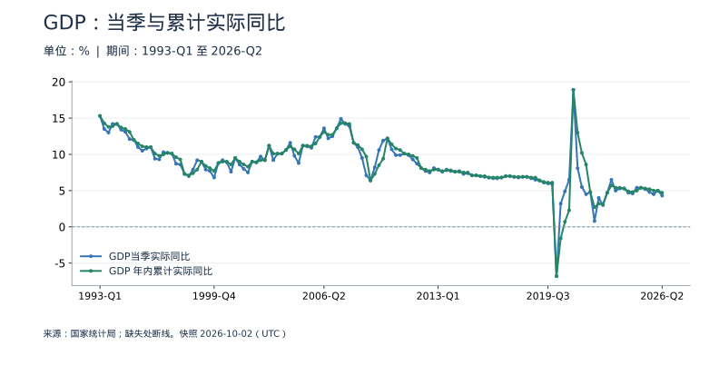
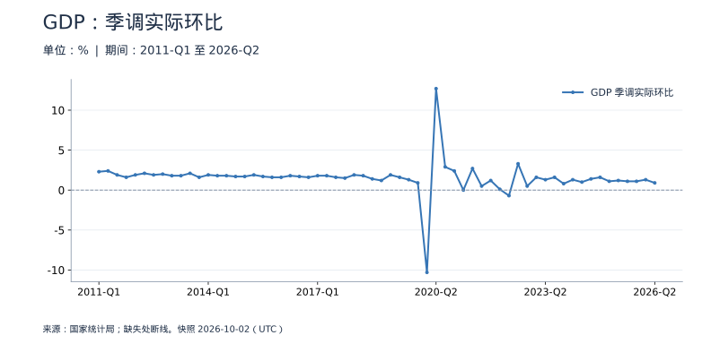
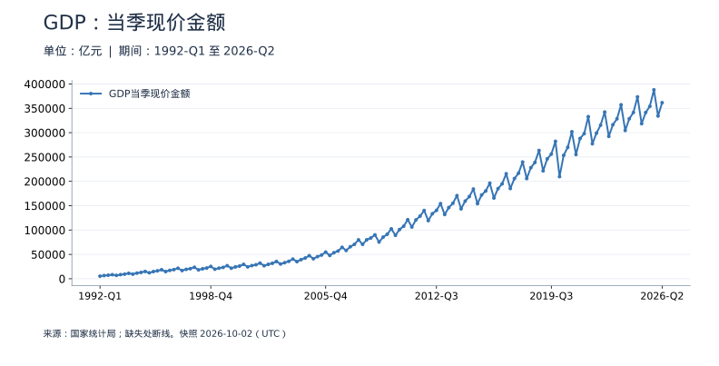
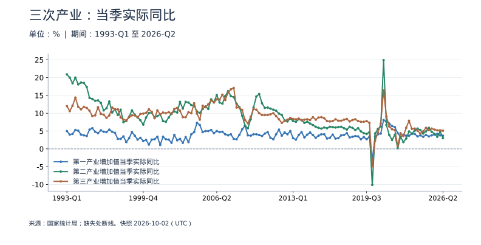

<!-- Generated by scripts/sync_macro.py; edit macro_catalog.py/macro_render.py. -->
# 中国季度 GDP：真实数据

这个季度产出增长多快，和累计增长、上一季度有什么不同？

使用国家统计局修订后的季度历史，分别展示当季、年内累计和季调环比。现价金额包含价格变化，实际增速剔除价格影响。季度资料与 World Bank 年度 GDP 独立保留，不混接。

本页快照获取时间：**2026-10-02T12:42:00+00:00**。这是获取时间，不是所有数据的发布日期。每日检查上游；最新统计期以每个指标为准。

[CSV 下载](https://raw.githubusercontent.com/calcky/finance/main/data/macro/quarterly-gdp.csv) · [来源与采集参数](https://github.com/calcky/finance/blob/main/data/macro/quarterly-gdp.metadata.json) · [最近同步状态](https://github.com/calcky/finance/actions/workflows/update-gdp.yml)

```{only} html
本站同版快照：{download}`CSV <../../data/macro/quarterly-gdp.csv>` · {download}`元数据 <../../data/macro/quarterly-gdp.metadata.json>`
```

网页支持悬停查看、点击固定读数、按期间选择、缩放和定位明细。GitHub、打印或禁用 JavaScript 时显示静态图；数值与网页使用同一快照。

## 最新观测与覆盖

| 指标 | 最新期间 | 数值 | 单位 | 本项目起点 | 观测数 | 来源 |
|---|---|---:|---|---|---:|---|
| GDP当季实际同比 | 2026-Q2 | 4.3 | % | 1993-Q1 | 134 | [国家统计局](https://data.stats.gov.cn/dg/website/page.html#/pc/national/quarterData) |
| GDP 年内累计实际同比 | 2026-Q2 | 4.7 | % | 1993-Q1 | 134 | [国家统计局](https://data.stats.gov.cn/dg/website/page.html#/pc/national/quarterData) |
| GDP 季调实际环比 | 2026-Q2 | 0.9 | % | 2011-Q1 | 62 | [国家统计局](https://data.stats.gov.cn/dg/website/page.html#/pc/national/quarterData) |
| GDP当季现价金额 | 2026-Q2 | 361,511.1 | 亿元 | 1992-Q1 | 138 | [国家统计局](https://data.stats.gov.cn/dg/website/page.html#/pc/national/quarterData) |
| 第一产业增加值当季实际同比 | 2026-Q2 | 3.7 | % | 1993-Q1 | 134 | [国家统计局](https://data.stats.gov.cn/dg/website/page.html#/pc/national/quarterData) |
| 第二产业增加值当季实际同比 | 2026-Q2 | 3 | % | 1993-Q1 | 134 | [国家统计局](https://data.stats.gov.cn/dg/website/page.html#/pc/national/quarterData) |
| 第三产业增加值当季实际同比 | 2026-Q2 | 5.1 | % | 1993-Q1 | 134 | [国家统计局](https://data.stats.gov.cn/dg/website/page.html#/pc/national/quarterData) |
| GDP 年内累计现价金额 | 2026-Q2 | 695,704 | 亿元 | 1992-Q1 | 138 | [国家统计局](https://data.stats.gov.cn/dg/website/page.html#/pc/national/quarterData) |
| 第一产业增加值当季现价金额 | 2026-Q2 | 19,581 | 亿元 | 1992-Q1 | 138 | [国家统计局](https://data.stats.gov.cn/dg/website/page.html#/pc/national/quarterData) |
| 第二产业增加值当季现价金额 | 2026-Q2 | 134,338 | 亿元 | 1992-Q1 | 138 | [国家统计局](https://data.stats.gov.cn/dg/website/page.html#/pc/national/quarterData) |
| 第三产业增加值当季现价金额 | 2026-Q2 | 207,592 | 亿元 | 1992-Q1 | 138 | [国家统计局](https://data.stats.gov.cn/dg/website/page.html#/pc/national/quarterData) |

起点表示本项目当前覆盖范围，不代表该指标从此时才开始发布。旧定义序列的最后一期也不代表来源停止更新。各来源可能存在发布或入库滞后；空白不补零、不插值。发布日期未知的观测在 CSV 中留空。

图表的“全部”与 CSV 保留完整已采集历史；缩放近期不会删除早期数据。[历史来源、口径断点与剩余缺口](history-coverage.md)说明回溯范围。

## GDP：当季与累计实际同比

当季同比比较本季与上年同季；累计同比比较年初至今与上年同期，例如 Q2 累计是上半年。两者不能相减得到其他季度增速。低基数会放大同比，应结合下一张环比图。



<details class="macro-details">
<summary>GDP：当季与累计实际同比：展开完整数据表（%）</summary>
<div class="macro-table-wrap"><table><thead><tr><th>期间</th><th>GDP当季实际同比</th><th>GDP 年内累计实际同比</th></tr></thead><tbody>
<tr id="macro-gdp-quarter-yoy-2026-Q2" tabindex="-1"><td>2026-Q2</td><td>4.3</td><td>4.7</td></tr>
<tr id="macro-gdp-quarter-yoy-2026-Q1" tabindex="-1"><td>2026-Q1</td><td>5</td><td>5</td></tr>
<tr id="macro-gdp-quarter-yoy-2025-Q4" tabindex="-1"><td>2025-Q4</td><td>4.5</td><td>5</td></tr>
<tr id="macro-gdp-quarter-yoy-2025-Q3" tabindex="-1"><td>2025-Q3</td><td>4.8</td><td>5.2</td></tr>
<tr id="macro-gdp-quarter-yoy-2025-Q2" tabindex="-1"><td>2025-Q2</td><td>5.2</td><td>5.3</td></tr>
<tr id="macro-gdp-quarter-yoy-2025-Q1" tabindex="-1"><td>2025-Q1</td><td>5.4</td><td>5.4</td></tr>
<tr id="macro-gdp-quarter-yoy-2024-Q4" tabindex="-1"><td>2024-Q4</td><td>5.4</td><td>5</td></tr>
<tr id="macro-gdp-quarter-yoy-2024-Q3" tabindex="-1"><td>2024-Q3</td><td>4.6</td><td>4.8</td></tr>
<tr id="macro-gdp-quarter-yoy-2024-Q2" tabindex="-1"><td>2024-Q2</td><td>4.7</td><td>4.9</td></tr>
<tr id="macro-gdp-quarter-yoy-2024-Q1" tabindex="-1"><td>2024-Q1</td><td>5.3</td><td>5.3</td></tr>
<tr id="macro-gdp-quarter-yoy-2023-Q4" tabindex="-1"><td>2023-Q4</td><td>5.3</td><td>5.4</td></tr>
<tr id="macro-gdp-quarter-yoy-2023-Q3" tabindex="-1"><td>2023-Q3</td><td>5</td><td>5.4</td></tr>
<tr id="macro-gdp-quarter-yoy-2023-Q2" tabindex="-1"><td>2023-Q2</td><td>6.5</td><td>5.7</td></tr>
<tr id="macro-gdp-quarter-yoy-2023-Q1" tabindex="-1"><td>2023-Q1</td><td>4.7</td><td>4.7</td></tr>
<tr id="macro-gdp-quarter-yoy-2022-Q4" tabindex="-1"><td>2022-Q4</td><td>3</td><td>3.1</td></tr>
<tr id="macro-gdp-quarter-yoy-2022-Q3" tabindex="-1"><td>2022-Q3</td><td>4</td><td>3.2</td></tr>
<tr id="macro-gdp-quarter-yoy-2022-Q2" tabindex="-1"><td>2022-Q2</td><td>0.8</td><td>2.7</td></tr>
<tr id="macro-gdp-quarter-yoy-2022-Q1" tabindex="-1"><td>2022-Q1</td><td>4.8</td><td>4.8</td></tr>
<tr id="macro-gdp-quarter-yoy-2021-Q4" tabindex="-1"><td>2021-Q4</td><td>4.5</td><td>8.6</td></tr>
<tr id="macro-gdp-quarter-yoy-2021-Q3" tabindex="-1"><td>2021-Q3</td><td>5.5</td><td>10.2</td></tr>
<tr id="macro-gdp-quarter-yoy-2021-Q2" tabindex="-1"><td>2021-Q2</td><td>8.1</td><td>13</td></tr>
<tr id="macro-gdp-quarter-yoy-2021-Q1" tabindex="-1"><td>2021-Q1</td><td>18.9</td><td>18.9</td></tr>
<tr id="macro-gdp-quarter-yoy-2020-Q4" tabindex="-1"><td>2020-Q4</td><td>6.5</td><td>2.3</td></tr>
<tr id="macro-gdp-quarter-yoy-2020-Q3" tabindex="-1"><td>2020-Q3</td><td>4.9</td><td>0.7</td></tr>
<tr id="macro-gdp-quarter-yoy-2020-Q2" tabindex="-1"><td>2020-Q2</td><td>3.2</td><td>-1.6</td></tr>
<tr id="macro-gdp-quarter-yoy-2020-Q1" tabindex="-1"><td>2020-Q1</td><td>-6.8</td><td>-6.8</td></tr>
<tr id="macro-gdp-quarter-yoy-2019-Q4" tabindex="-1"><td>2019-Q4</td><td>5.9</td><td>6.1</td></tr>
<tr id="macro-gdp-quarter-yoy-2019-Q3" tabindex="-1"><td>2019-Q3</td><td>6</td><td>6.1</td></tr>
<tr id="macro-gdp-quarter-yoy-2019-Q2" tabindex="-1"><td>2019-Q2</td><td>6.1</td><td>6.2</td></tr>
<tr id="macro-gdp-quarter-yoy-2019-Q1" tabindex="-1"><td>2019-Q1</td><td>6.4</td><td>6.4</td></tr>
<tr id="macro-gdp-quarter-yoy-2018-Q4" tabindex="-1"><td>2018-Q4</td><td>6.5</td><td>6.8</td></tr>
<tr id="macro-gdp-quarter-yoy-2018-Q3" tabindex="-1"><td>2018-Q3</td><td>6.7</td><td>6.8</td></tr>
<tr id="macro-gdp-quarter-yoy-2018-Q2" tabindex="-1"><td>2018-Q2</td><td>6.9</td><td>6.9</td></tr>
<tr id="macro-gdp-quarter-yoy-2018-Q1" tabindex="-1"><td>2018-Q1</td><td>6.9</td><td>6.9</td></tr>
<tr id="macro-gdp-quarter-yoy-2017-Q4" tabindex="-1"><td>2017-Q4</td><td>6.8</td><td>6.9</td></tr>
<tr id="macro-gdp-quarter-yoy-2017-Q3" tabindex="-1"><td>2017-Q3</td><td>6.9</td><td>6.9</td></tr>
<tr id="macro-gdp-quarter-yoy-2017-Q2" tabindex="-1"><td>2017-Q2</td><td>7</td><td>7</td></tr>
<tr id="macro-gdp-quarter-yoy-2017-Q1" tabindex="-1"><td>2017-Q1</td><td>7</td><td>7</td></tr>
<tr id="macro-gdp-quarter-yoy-2016-Q4" tabindex="-1"><td>2016-Q4</td><td>6.8</td><td>6.8</td></tr>
<tr id="macro-gdp-quarter-yoy-2016-Q3" tabindex="-1"><td>2016-Q3</td><td>6.7</td><td>6.8</td></tr>
<tr id="macro-gdp-quarter-yoy-2016-Q2" tabindex="-1"><td>2016-Q2</td><td>6.7</td><td>6.8</td></tr>
<tr id="macro-gdp-quarter-yoy-2016-Q1" tabindex="-1"><td>2016-Q1</td><td>6.8</td><td>6.8</td></tr>
<tr id="macro-gdp-quarter-yoy-2015-Q4" tabindex="-1"><td>2015-Q4</td><td>6.9</td><td>7</td></tr>
<tr id="macro-gdp-quarter-yoy-2015-Q3" tabindex="-1"><td>2015-Q3</td><td>7</td><td>7</td></tr>
<tr id="macro-gdp-quarter-yoy-2015-Q2" tabindex="-1"><td>2015-Q2</td><td>7.1</td><td>7.1</td></tr>
<tr id="macro-gdp-quarter-yoy-2015-Q1" tabindex="-1"><td>2015-Q1</td><td>7.1</td><td>7.1</td></tr>
<tr id="macro-gdp-quarter-yoy-2014-Q4" tabindex="-1"><td>2014-Q4</td><td>7.4</td><td>7.5</td></tr>
<tr id="macro-gdp-quarter-yoy-2014-Q3" tabindex="-1"><td>2014-Q3</td><td>7.3</td><td>7.5</td></tr>
<tr id="macro-gdp-quarter-yoy-2014-Q2" tabindex="-1"><td>2014-Q2</td><td>7.7</td><td>7.6</td></tr>
<tr id="macro-gdp-quarter-yoy-2014-Q1" tabindex="-1"><td>2014-Q1</td><td>7.6</td><td>7.6</td></tr>
<tr id="macro-gdp-quarter-yoy-2013-Q4" tabindex="-1"><td>2013-Q4</td><td>7.7</td><td>7.8</td></tr>
<tr id="macro-gdp-quarter-yoy-2013-Q3" tabindex="-1"><td>2013-Q3</td><td>7.9</td><td>7.8</td></tr>
<tr id="macro-gdp-quarter-yoy-2013-Q2" tabindex="-1"><td>2013-Q2</td><td>7.6</td><td>7.7</td></tr>
<tr id="macro-gdp-quarter-yoy-2013-Q1" tabindex="-1"><td>2013-Q1</td><td>7.9</td><td>7.9</td></tr>
<tr id="macro-gdp-quarter-yoy-2012-Q4" tabindex="-1"><td>2012-Q4</td><td>8.1</td><td>7.9</td></tr>
<tr id="macro-gdp-quarter-yoy-2012-Q3" tabindex="-1"><td>2012-Q3</td><td>7.5</td><td>7.7</td></tr>
<tr id="macro-gdp-quarter-yoy-2012-Q2" tabindex="-1"><td>2012-Q2</td><td>7.7</td><td>7.9</td></tr>
<tr id="macro-gdp-quarter-yoy-2012-Q1" tabindex="-1"><td>2012-Q1</td><td>8.1</td><td>8.1</td></tr>
<tr id="macro-gdp-quarter-yoy-2011-Q4" tabindex="-1"><td>2011-Q4</td><td>8.7</td><td>9.5</td></tr>
<tr id="macro-gdp-quarter-yoy-2011-Q3" tabindex="-1"><td>2011-Q3</td><td>9.3</td><td>9.8</td></tr>
<tr id="macro-gdp-quarter-yoy-2011-Q2" tabindex="-1"><td>2011-Q2</td><td>9.9</td><td>10</td></tr>
<tr id="macro-gdp-quarter-yoy-2011-Q1" tabindex="-1"><td>2011-Q1</td><td>10.1</td><td>10.1</td></tr>
<tr id="macro-gdp-quarter-yoy-2010-Q4" tabindex="-1"><td>2010-Q4</td><td>9.9</td><td>10.6</td></tr>
<tr id="macro-gdp-quarter-yoy-2010-Q3" tabindex="-1"><td>2010-Q3</td><td>9.9</td><td>10.8</td></tr>
<tr id="macro-gdp-quarter-yoy-2010-Q2" tabindex="-1"><td>2010-Q2</td><td>10.7</td><td>11.4</td></tr>
<tr id="macro-gdp-quarter-yoy-2010-Q1" tabindex="-1"><td>2010-Q1</td><td>12.2</td><td>12.2</td></tr>
<tr id="macro-gdp-quarter-yoy-2009-Q4" tabindex="-1"><td>2009-Q4</td><td>11.9</td><td>9.4</td></tr>
<tr id="macro-gdp-quarter-yoy-2009-Q3" tabindex="-1"><td>2009-Q3</td><td>10.6</td><td>8.5</td></tr>
<tr id="macro-gdp-quarter-yoy-2009-Q2" tabindex="-1"><td>2009-Q2</td><td>8.2</td><td>7.3</td></tr>
<tr id="macro-gdp-quarter-yoy-2009-Q1" tabindex="-1"><td>2009-Q1</td><td>6.4</td><td>6.4</td></tr>
<tr id="macro-gdp-quarter-yoy-2008-Q4" tabindex="-1"><td>2008-Q4</td><td>7.1</td><td>9.7</td></tr>
<tr id="macro-gdp-quarter-yoy-2008-Q3" tabindex="-1"><td>2008-Q3</td><td>9.5</td><td>10.7</td></tr>
<tr id="macro-gdp-quarter-yoy-2008-Q2" tabindex="-1"><td>2008-Q2</td><td>11</td><td>11.3</td></tr>
<tr id="macro-gdp-quarter-yoy-2008-Q1" tabindex="-1"><td>2008-Q1</td><td>11.6</td><td>11.6</td></tr>
<tr id="macro-gdp-quarter-yoy-2007-Q4" tabindex="-1"><td>2007-Q4</td><td>13.9</td><td>14.2</td></tr>
<tr id="macro-gdp-quarter-yoy-2007-Q3" tabindex="-1"><td>2007-Q3</td><td>14.2</td><td>14.3</td></tr>
<tr id="macro-gdp-quarter-yoy-2007-Q2" tabindex="-1"><td>2007-Q2</td><td>14.9</td><td>14.3</td></tr>
<tr id="macro-gdp-quarter-yoy-2007-Q1" tabindex="-1"><td>2007-Q1</td><td>13.6</td><td>13.6</td></tr>
<tr id="macro-gdp-quarter-yoy-2006-Q4" tabindex="-1"><td>2006-Q4</td><td>12.5</td><td>12.7</td></tr>
<tr id="macro-gdp-quarter-yoy-2006-Q3" tabindex="-1"><td>2006-Q3</td><td>12.2</td><td>12.7</td></tr>
<tr id="macro-gdp-quarter-yoy-2006-Q2" tabindex="-1"><td>2006-Q2</td><td>13.6</td><td>13.1</td></tr>
<tr id="macro-gdp-quarter-yoy-2006-Q1" tabindex="-1"><td>2006-Q1</td><td>12.4</td><td>12.4</td></tr>
<tr id="macro-gdp-quarter-yoy-2005-Q4" tabindex="-1"><td>2005-Q4</td><td>12.4</td><td>11.5</td></tr>
<tr id="macro-gdp-quarter-yoy-2005-Q3" tabindex="-1"><td>2005-Q3</td><td>10.9</td><td>11.1</td></tr>
<tr id="macro-gdp-quarter-yoy-2005-Q2" tabindex="-1"><td>2005-Q2</td><td>11.1</td><td>11.2</td></tr>
<tr id="macro-gdp-quarter-yoy-2005-Q1" tabindex="-1"><td>2005-Q1</td><td>11.2</td><td>11.2</td></tr>
<tr id="macro-gdp-quarter-yoy-2004-Q4" tabindex="-1"><td>2004-Q4</td><td>8.8</td><td>10.1</td></tr>
<tr id="macro-gdp-quarter-yoy-2004-Q3" tabindex="-1"><td>2004-Q3</td><td>9.8</td><td>10.7</td></tr>
<tr id="macro-gdp-quarter-yoy-2004-Q2" tabindex="-1"><td>2004-Q2</td><td>11.6</td><td>11.1</td></tr>
<tr id="macro-gdp-quarter-yoy-2004-Q1" tabindex="-1"><td>2004-Q1</td><td>10.6</td><td>10.6</td></tr>
<tr id="macro-gdp-quarter-yoy-2003-Q4" tabindex="-1"><td>2003-Q4</td><td>10.1</td><td>10.1</td></tr>
<tr id="macro-gdp-quarter-yoy-2003-Q3" tabindex="-1"><td>2003-Q3</td><td>10.1</td><td>10.1</td></tr>
<tr id="macro-gdp-quarter-yoy-2003-Q2" tabindex="-1"><td>2003-Q2</td><td>9.2</td><td>10.1</td></tr>
<tr id="macro-gdp-quarter-yoy-2003-Q1" tabindex="-1"><td>2003-Q1</td><td>11.2</td><td>11.2</td></tr>
<tr id="macro-gdp-quarter-yoy-2002-Q4" tabindex="-1"><td>2002-Q4</td><td>9.2</td><td>9.2</td></tr>
<tr id="macro-gdp-quarter-yoy-2002-Q3" tabindex="-1"><td>2002-Q3</td><td>9.7</td><td>9.2</td></tr>
<tr id="macro-gdp-quarter-yoy-2002-Q2" tabindex="-1"><td>2002-Q2</td><td>8.9</td><td>8.9</td></tr>
<tr id="macro-gdp-quarter-yoy-2002-Q1" tabindex="-1"><td>2002-Q1</td><td>9</td><td>9</td></tr>
<tr id="macro-gdp-quarter-yoy-2001-Q4" tabindex="-1"><td>2001-Q4</td><td>7.5</td><td>8.3</td></tr>
<tr id="macro-gdp-quarter-yoy-2001-Q3" tabindex="-1"><td>2001-Q3</td><td>8</td><td>8.6</td></tr>
<tr id="macro-gdp-quarter-yoy-2001-Q2" tabindex="-1"><td>2001-Q2</td><td>8.6</td><td>9</td></tr>
<tr id="macro-gdp-quarter-yoy-2001-Q1" tabindex="-1"><td>2001-Q1</td><td>9.5</td><td>9.5</td></tr>
<tr id="macro-gdp-quarter-yoy-2000-Q4" tabindex="-1"><td>2000-Q4</td><td>7.6</td><td>8.6</td></tr>
<tr id="macro-gdp-quarter-yoy-2000-Q3" tabindex="-1"><td>2000-Q3</td><td>8.9</td><td>9</td></tr>
<tr id="macro-gdp-quarter-yoy-2000-Q2" tabindex="-1"><td>2000-Q2</td><td>9.2</td><td>9</td></tr>
<tr id="macro-gdp-quarter-yoy-2000-Q1" tabindex="-1"><td>2000-Q1</td><td>8.8</td><td>8.8</td></tr>
<tr id="macro-gdp-quarter-yoy-1999-Q4" tabindex="-1"><td>1999-Q4</td><td>6.8</td><td>7.7</td></tr>
<tr id="macro-gdp-quarter-yoy-1999-Q3" tabindex="-1"><td>1999-Q3</td><td>7.7</td><td>8.1</td></tr>
<tr id="macro-gdp-quarter-yoy-1999-Q2" tabindex="-1"><td>1999-Q2</td><td>7.9</td><td>8.4</td></tr>
<tr id="macro-gdp-quarter-yoy-1999-Q1" tabindex="-1"><td>1999-Q1</td><td>9</td><td>9</td></tr>
<tr id="macro-gdp-quarter-yoy-1998-Q4" tabindex="-1"><td>1998-Q4</td><td>9.2</td><td>7.9</td></tr>
<tr id="macro-gdp-quarter-yoy-1998-Q3" tabindex="-1"><td>1998-Q3</td><td>7.9</td><td>7.4</td></tr>
<tr id="macro-gdp-quarter-yoy-1998-Q2" tabindex="-1"><td>1998-Q2</td><td>7</td><td>7.1</td></tr>
<tr id="macro-gdp-quarter-yoy-1998-Q1" tabindex="-1"><td>1998-Q1</td><td>7.3</td><td>7.3</td></tr>
<tr id="macro-gdp-quarter-yoy-1997-Q4" tabindex="-1"><td>1997-Q4</td><td>8.6</td><td>9.3</td></tr>
<tr id="macro-gdp-quarter-yoy-1997-Q3" tabindex="-1"><td>1997-Q3</td><td>8.7</td><td>9.6</td></tr>
<tr id="macro-gdp-quarter-yoy-1997-Q2" tabindex="-1"><td>1997-Q2</td><td>10.1</td><td>10.1</td></tr>
<tr id="macro-gdp-quarter-yoy-1997-Q1" tabindex="-1"><td>1997-Q1</td><td>10.2</td><td>10.2</td></tr>
<tr id="macro-gdp-quarter-yoy-1996-Q4" tabindex="-1"><td>1996-Q4</td><td>10.3</td><td>10</td></tr>
<tr id="macro-gdp-quarter-yoy-1996-Q3" tabindex="-1"><td>1996-Q3</td><td>9.3</td><td>9.8</td></tr>
<tr id="macro-gdp-quarter-yoy-1996-Q2" tabindex="-1"><td>1996-Q2</td><td>9.4</td><td>10.1</td></tr>
<tr id="macro-gdp-quarter-yoy-1996-Q1" tabindex="-1"><td>1996-Q1</td><td>11</td><td>11</td></tr>
<tr id="macro-gdp-quarter-yoy-1995-Q4" tabindex="-1"><td>1995-Q4</td><td>10.8</td><td>11</td></tr>
<tr id="macro-gdp-quarter-yoy-1995-Q3" tabindex="-1"><td>1995-Q3</td><td>10.5</td><td>11.1</td></tr>
<tr id="macro-gdp-quarter-yoy-1995-Q2" tabindex="-1"><td>1995-Q2</td><td>11</td><td>11.5</td></tr>
<tr id="macro-gdp-quarter-yoy-1995-Q1" tabindex="-1"><td>1995-Q1</td><td>12</td><td>12</td></tr>
<tr id="macro-gdp-quarter-yoy-1994-Q4" tabindex="-1"><td>1994-Q4</td><td>12.1</td><td>13.1</td></tr>
<tr id="macro-gdp-quarter-yoy-1994-Q3" tabindex="-1"><td>1994-Q3</td><td>13.1</td><td>13.5</td></tr>
<tr id="macro-gdp-quarter-yoy-1994-Q2" tabindex="-1"><td>1994-Q2</td><td>13.4</td><td>13.7</td></tr>
<tr id="macro-gdp-quarter-yoy-1994-Q1" tabindex="-1"><td>1994-Q1</td><td>14.2</td><td>14.2</td></tr>
<tr id="macro-gdp-quarter-yoy-1993-Q4" tabindex="-1"><td>1993-Q4</td><td>14.2</td><td>13.9</td></tr>
<tr id="macro-gdp-quarter-yoy-1993-Q3" tabindex="-1"><td>1993-Q3</td><td>13</td><td>13.8</td></tr>
<tr id="macro-gdp-quarter-yoy-1993-Q2" tabindex="-1"><td>1993-Q2</td><td>13.5</td><td>14.3</td></tr>
<tr id="macro-gdp-quarter-yoy-1993-Q1" tabindex="-1"><td>1993-Q1</td><td>15.3</td><td>15.3</td></tr>
</tbody></table></div></details>

## GDP：季调实际环比

比较剔除季节因素后的本季与上季，非年化。0.9% 表示比上季增长 0.9%，不是同比，也不是年增长率。历史值会随新数据和季调模型修订。



<details class="macro-details">
<summary>GDP：季调实际环比：展开完整数据表（%）</summary>
<div class="macro-table-wrap"><table><thead><tr><th>期间</th><th>GDP 季调实际环比</th></tr></thead><tbody>
<tr id="macro-gdp-quarter-qoq-2026-Q2" tabindex="-1"><td>2026-Q2</td><td>0.9</td></tr>
<tr id="macro-gdp-quarter-qoq-2026-Q1" tabindex="-1"><td>2026-Q1</td><td>1.3</td></tr>
<tr id="macro-gdp-quarter-qoq-2025-Q4" tabindex="-1"><td>2025-Q4</td><td>1.1</td></tr>
<tr id="macro-gdp-quarter-qoq-2025-Q3" tabindex="-1"><td>2025-Q3</td><td>1.1</td></tr>
<tr id="macro-gdp-quarter-qoq-2025-Q2" tabindex="-1"><td>2025-Q2</td><td>1.2</td></tr>
<tr id="macro-gdp-quarter-qoq-2025-Q1" tabindex="-1"><td>2025-Q1</td><td>1.1</td></tr>
<tr id="macro-gdp-quarter-qoq-2024-Q4" tabindex="-1"><td>2024-Q4</td><td>1.6</td></tr>
<tr id="macro-gdp-quarter-qoq-2024-Q3" tabindex="-1"><td>2024-Q3</td><td>1.4</td></tr>
<tr id="macro-gdp-quarter-qoq-2024-Q2" tabindex="-1"><td>2024-Q2</td><td>1</td></tr>
<tr id="macro-gdp-quarter-qoq-2024-Q1" tabindex="-1"><td>2024-Q1</td><td>1.3</td></tr>
<tr id="macro-gdp-quarter-qoq-2023-Q4" tabindex="-1"><td>2023-Q4</td><td>0.8</td></tr>
<tr id="macro-gdp-quarter-qoq-2023-Q3" tabindex="-1"><td>2023-Q3</td><td>1.6</td></tr>
<tr id="macro-gdp-quarter-qoq-2023-Q2" tabindex="-1"><td>2023-Q2</td><td>1.3</td></tr>
<tr id="macro-gdp-quarter-qoq-2023-Q1" tabindex="-1"><td>2023-Q1</td><td>1.6</td></tr>
<tr id="macro-gdp-quarter-qoq-2022-Q4" tabindex="-1"><td>2022-Q4</td><td>0.5</td></tr>
<tr id="macro-gdp-quarter-qoq-2022-Q3" tabindex="-1"><td>2022-Q3</td><td>3.3</td></tr>
<tr id="macro-gdp-quarter-qoq-2022-Q2" tabindex="-1"><td>2022-Q2</td><td>-0.7</td></tr>
<tr id="macro-gdp-quarter-qoq-2022-Q1" tabindex="-1"><td>2022-Q1</td><td>0.1</td></tr>
<tr id="macro-gdp-quarter-qoq-2021-Q4" tabindex="-1"><td>2021-Q4</td><td>1.2</td></tr>
<tr id="macro-gdp-quarter-qoq-2021-Q3" tabindex="-1"><td>2021-Q3</td><td>0.5</td></tr>
<tr id="macro-gdp-quarter-qoq-2021-Q2" tabindex="-1"><td>2021-Q2</td><td>2.7</td></tr>
<tr id="macro-gdp-quarter-qoq-2021-Q1" tabindex="-1"><td>2021-Q1</td><td>0</td></tr>
<tr id="macro-gdp-quarter-qoq-2020-Q4" tabindex="-1"><td>2020-Q4</td><td>2.4</td></tr>
<tr id="macro-gdp-quarter-qoq-2020-Q3" tabindex="-1"><td>2020-Q3</td><td>2.9</td></tr>
<tr id="macro-gdp-quarter-qoq-2020-Q2" tabindex="-1"><td>2020-Q2</td><td>12.7</td></tr>
<tr id="macro-gdp-quarter-qoq-2020-Q1" tabindex="-1"><td>2020-Q1</td><td>-10.3</td></tr>
<tr id="macro-gdp-quarter-qoq-2019-Q4" tabindex="-1"><td>2019-Q4</td><td>0.9</td></tr>
<tr id="macro-gdp-quarter-qoq-2019-Q3" tabindex="-1"><td>2019-Q3</td><td>1.3</td></tr>
<tr id="macro-gdp-quarter-qoq-2019-Q2" tabindex="-1"><td>2019-Q2</td><td>1.6</td></tr>
<tr id="macro-gdp-quarter-qoq-2019-Q1" tabindex="-1"><td>2019-Q1</td><td>1.9</td></tr>
<tr id="macro-gdp-quarter-qoq-2018-Q4" tabindex="-1"><td>2018-Q4</td><td>1.2</td></tr>
<tr id="macro-gdp-quarter-qoq-2018-Q3" tabindex="-1"><td>2018-Q3</td><td>1.4</td></tr>
<tr id="macro-gdp-quarter-qoq-2018-Q2" tabindex="-1"><td>2018-Q2</td><td>1.8</td></tr>
<tr id="macro-gdp-quarter-qoq-2018-Q1" tabindex="-1"><td>2018-Q1</td><td>1.9</td></tr>
<tr id="macro-gdp-quarter-qoq-2017-Q4" tabindex="-1"><td>2017-Q4</td><td>1.5</td></tr>
<tr id="macro-gdp-quarter-qoq-2017-Q3" tabindex="-1"><td>2017-Q3</td><td>1.6</td></tr>
<tr id="macro-gdp-quarter-qoq-2017-Q2" tabindex="-1"><td>2017-Q2</td><td>1.8</td></tr>
<tr id="macro-gdp-quarter-qoq-2017-Q1" tabindex="-1"><td>2017-Q1</td><td>1.8</td></tr>
<tr id="macro-gdp-quarter-qoq-2016-Q4" tabindex="-1"><td>2016-Q4</td><td>1.6</td></tr>
<tr id="macro-gdp-quarter-qoq-2016-Q3" tabindex="-1"><td>2016-Q3</td><td>1.7</td></tr>
<tr id="macro-gdp-quarter-qoq-2016-Q2" tabindex="-1"><td>2016-Q2</td><td>1.8</td></tr>
<tr id="macro-gdp-quarter-qoq-2016-Q1" tabindex="-1"><td>2016-Q1</td><td>1.6</td></tr>
<tr id="macro-gdp-quarter-qoq-2015-Q4" tabindex="-1"><td>2015-Q4</td><td>1.6</td></tr>
<tr id="macro-gdp-quarter-qoq-2015-Q3" tabindex="-1"><td>2015-Q3</td><td>1.7</td></tr>
<tr id="macro-gdp-quarter-qoq-2015-Q2" tabindex="-1"><td>2015-Q2</td><td>1.9</td></tr>
<tr id="macro-gdp-quarter-qoq-2015-Q1" tabindex="-1"><td>2015-Q1</td><td>1.7</td></tr>
<tr id="macro-gdp-quarter-qoq-2014-Q4" tabindex="-1"><td>2014-Q4</td><td>1.7</td></tr>
<tr id="macro-gdp-quarter-qoq-2014-Q3" tabindex="-1"><td>2014-Q3</td><td>1.8</td></tr>
<tr id="macro-gdp-quarter-qoq-2014-Q2" tabindex="-1"><td>2014-Q2</td><td>1.8</td></tr>
<tr id="macro-gdp-quarter-qoq-2014-Q1" tabindex="-1"><td>2014-Q1</td><td>1.9</td></tr>
<tr id="macro-gdp-quarter-qoq-2013-Q4" tabindex="-1"><td>2013-Q4</td><td>1.6</td></tr>
<tr id="macro-gdp-quarter-qoq-2013-Q3" tabindex="-1"><td>2013-Q3</td><td>2.1</td></tr>
<tr id="macro-gdp-quarter-qoq-2013-Q2" tabindex="-1"><td>2013-Q2</td><td>1.8</td></tr>
<tr id="macro-gdp-quarter-qoq-2013-Q1" tabindex="-1"><td>2013-Q1</td><td>1.8</td></tr>
<tr id="macro-gdp-quarter-qoq-2012-Q4" tabindex="-1"><td>2012-Q4</td><td>2</td></tr>
<tr id="macro-gdp-quarter-qoq-2012-Q3" tabindex="-1"><td>2012-Q3</td><td>1.9</td></tr>
<tr id="macro-gdp-quarter-qoq-2012-Q2" tabindex="-1"><td>2012-Q2</td><td>2.1</td></tr>
<tr id="macro-gdp-quarter-qoq-2012-Q1" tabindex="-1"><td>2012-Q1</td><td>1.9</td></tr>
<tr id="macro-gdp-quarter-qoq-2011-Q4" tabindex="-1"><td>2011-Q4</td><td>1.6</td></tr>
<tr id="macro-gdp-quarter-qoq-2011-Q3" tabindex="-1"><td>2011-Q3</td><td>1.9</td></tr>
<tr id="macro-gdp-quarter-qoq-2011-Q2" tabindex="-1"><td>2011-Q2</td><td>2.4</td></tr>
<tr id="macro-gdp-quarter-qoq-2011-Q1" tabindex="-1"><td>2011-Q1</td><td>2.3</td></tr>
</tbody></table></div></details>

## GDP：当季现价金额

每个点是独立一个季度的产出增加值，未季调。年内起伏包含季节性；金额增长也包含价格因素，不能当作实际增速。累计金额在下方另列。



<details class="macro-details">
<summary>GDP：当季现价金额：展开完整数据表（亿元）</summary>
<div class="macro-table-wrap"><table><thead><tr><th>期间</th><th>GDP当季现价金额</th></tr></thead><tbody>
<tr id="macro-gdp-quarter-nominal-2026-Q2" tabindex="-1"><td>2026-Q2</td><td>361,511.1</td></tr>
<tr id="macro-gdp-quarter-nominal-2026-Q1" tabindex="-1"><td>2026-Q1</td><td>334,192.9</td></tr>
<tr id="macro-gdp-quarter-nominal-2025-Q4" tabindex="-1"><td>2025-Q4</td><td>387,911.3</td></tr>
<tr id="macro-gdp-quarter-nominal-2025-Q3" tabindex="-1"><td>2025-Q3</td><td>354,106.2</td></tr>
<tr id="macro-gdp-quarter-nominal-2025-Q2" tabindex="-1"><td>2025-Q2</td><td>341,395.3</td></tr>
<tr id="macro-gdp-quarter-nominal-2025-Q1" tabindex="-1"><td>2025-Q1</td><td>318,466.4</td></tr>
<tr id="macro-gdp-quarter-nominal-2024-Q4" tabindex="-1"><td>2024-Q4</td><td>373,512.4</td></tr>
<tr id="macro-gdp-quarter-nominal-2024-Q3" tabindex="-1"><td>2024-Q3</td><td>341,443.2</td></tr>
<tr id="macro-gdp-quarter-nominal-2024-Q2" tabindex="-1"><td>2024-Q2</td><td>328,585.4</td></tr>
<tr id="macro-gdp-quarter-nominal-2024-Q1" tabindex="-1"><td>2024-Q1</td><td>304,525.2</td></tr>
<tr id="macro-gdp-quarter-nominal-2023-Q4" tabindex="-1"><td>2023-Q4</td><td>357,224.8</td></tr>
<tr id="macro-gdp-quarter-nominal-2023-Q3" tabindex="-1"><td>2023-Q3</td><td>328,440.7</td></tr>
<tr id="macro-gdp-quarter-nominal-2023-Q2" tabindex="-1"><td>2023-Q2</td><td>316,237.5</td></tr>
<tr id="macro-gdp-quarter-nominal-2023-Q1" tabindex="-1"><td>2023-Q1</td><td>292,368.8</td></tr>
<tr id="macro-gdp-quarter-nominal-2022-Q4" tabindex="-1"><td>2022-Q4</td><td>342,342.4</td></tr>
<tr id="macro-gdp-quarter-nominal-2022-Q3" tabindex="-1"><td>2022-Q3</td><td>315,399.6</td></tr>
<tr id="macro-gdp-quarter-nominal-2022-Q2" tabindex="-1"><td>2022-Q2</td><td>299,111.5</td></tr>
<tr id="macro-gdp-quarter-nominal-2022-Q1" tabindex="-1"><td>2022-Q1</td><td>277,175.8</td></tr>
<tr id="macro-gdp-quarter-nominal-2021-Q4" tabindex="-1"><td>2021-Q4</td><td>332,826.7</td></tr>
<tr id="macro-gdp-quarter-nominal-2021-Q3" tabindex="-1"><td>2021-Q3</td><td>297,961.9</td></tr>
<tr id="macro-gdp-quarter-nominal-2021-Q2" tabindex="-1"><td>2021-Q2</td><td>287,979.2</td></tr>
<tr id="macro-gdp-quarter-nominal-2021-Q1" tabindex="-1"><td>2021-Q1</td><td>255,055.2</td></tr>
<tr id="macro-gdp-quarter-nominal-2020-Q4" tabindex="-1"><td>2020-Q4</td><td>301,836.2</td></tr>
<tr id="macro-gdp-quarter-nominal-2020-Q3" tabindex="-1"><td>2020-Q3</td><td>269,910.2</td></tr>
<tr id="macro-gdp-quarter-nominal-2020-Q2" tabindex="-1"><td>2020-Q2</td><td>253,450</td></tr>
<tr id="macro-gdp-quarter-nominal-2020-Q1" tabindex="-1"><td>2020-Q1</td><td>209,671.1</td></tr>
<tr id="macro-gdp-quarter-nominal-2019-Q4" tabindex="-1"><td>2019-Q4</td><td>282,201.4</td></tr>
<tr id="macro-gdp-quarter-nominal-2019-Q3" tabindex="-1"><td>2019-Q3</td><td>256,023.2</td></tr>
<tr id="macro-gdp-quarter-nominal-2019-Q2" tabindex="-1"><td>2019-Q2</td><td>246,193.9</td></tr>
<tr id="macro-gdp-quarter-nominal-2019-Q1" tabindex="-1"><td>2019-Q1</td><td>221,453.9</td></tr>
<tr id="macro-gdp-quarter-nominal-2018-Q4" tabindex="-1"><td>2018-Q4</td><td>263,435.6</td></tr>
<tr id="macro-gdp-quarter-nominal-2018-Q3" tabindex="-1"><td>2018-Q3</td><td>238,796.8</td></tr>
<tr id="macro-gdp-quarter-nominal-2018-Q2" tabindex="-1"><td>2018-Q2</td><td>228,042.4</td></tr>
<tr id="macro-gdp-quarter-nominal-2018-Q1" tabindex="-1"><td>2018-Q1</td><td>205,735.3</td></tr>
<tr id="macro-gdp-quarter-nominal-2017-Q4" tabindex="-1"><td>2017-Q4</td><td>239,687.6</td></tr>
<tr id="macro-gdp-quarter-nominal-2017-Q3" tabindex="-1"><td>2017-Q3</td><td>216,755.3</td></tr>
<tr id="macro-gdp-quarter-nominal-2017-Q2" tabindex="-1"><td>2017-Q2</td><td>205,665.6</td></tr>
<tr id="macro-gdp-quarter-nominal-2017-Q1" tabindex="-1"><td>2017-Q1</td><td>185,274.4</td></tr>
<tr id="macro-gdp-quarter-nominal-2016-Q4" tabindex="-1"><td>2016-Q4</td><td>215,617.9</td></tr>
<tr id="macro-gdp-quarter-nominal-2016-Q3" tabindex="-1"><td>2016-Q3</td><td>194,837.5</td></tr>
<tr id="macro-gdp-quarter-nominal-2016-Q2" tabindex="-1"><td>2016-Q2</td><td>185,002.2</td></tr>
<tr id="macro-gdp-quarter-nominal-2016-Q1" tabindex="-1"><td>2016-Q1</td><td>165,735.3</td></tr>
<tr id="macro-gdp-quarter-nominal-2015-Q4" tabindex="-1"><td>2015-Q4</td><td>196,334.4</td></tr>
<tr id="macro-gdp-quarter-nominal-2015-Q3" tabindex="-1"><td>2015-Q3</td><td>180,118.7</td></tr>
<tr id="macro-gdp-quarter-nominal-2015-Q2" tabindex="-1"><td>2015-Q2</td><td>171,887</td></tr>
<tr id="macro-gdp-quarter-nominal-2015-Q1" tabindex="-1"><td>2015-Q1</td><td>154,171.4</td></tr>
<tr id="macro-gdp-quarter-nominal-2014-Q4" tabindex="-1"><td>2014-Q4</td><td>184,179.4</td></tr>
<tr id="macro-gdp-quarter-nominal-2014-Q3" tabindex="-1"><td>2014-Q3</td><td>168,601.7</td></tr>
<tr id="macro-gdp-quarter-nominal-2014-Q2" tabindex="-1"><td>2014-Q2</td><td>159,462.4</td></tr>
<tr id="macro-gdp-quarter-nominal-2014-Q1" tabindex="-1"><td>2014-Q1</td><td>143,539.4</td></tr>
<tr id="macro-gdp-quarter-nominal-2013-Q4" tabindex="-1"><td>2013-Q4</td><td>170,694.7</td></tr>
<tr id="macro-gdp-quarter-nominal-2013-Q3" tabindex="-1"><td>2013-Q3</td><td>154,972.1</td></tr>
<tr id="macro-gdp-quarter-nominal-2013-Q2" tabindex="-1"><td>2013-Q2</td><td>146,113.9</td></tr>
<tr id="macro-gdp-quarter-nominal-2013-Q1" tabindex="-1"><td>2013-Q1</td><td>131,879.7</td></tr>
<tr id="macro-gdp-quarter-nominal-2012-Q4" tabindex="-1"><td>2012-Q4</td><td>154,258</td></tr>
<tr id="macro-gdp-quarter-nominal-2012-Q3" tabindex="-1"><td>2012-Q3</td><td>140,384</td></tr>
<tr id="macro-gdp-quarter-nominal-2012-Q2" tabindex="-1"><td>2012-Q2</td><td>133,491.2</td></tr>
<tr id="macro-gdp-quarter-nominal-2012-Q1" tabindex="-1"><td>2012-Q1</td><td>119,377.5</td></tr>
<tr id="macro-gdp-quarter-nominal-2011-Q4" tabindex="-1"><td>2011-Q4</td><td>140,150.3</td></tr>
<tr id="macro-gdp-quarter-nominal-2011-Q3" tabindex="-1"><td>2011-Q3</td><td>128,561.5</td></tr>
<tr id="macro-gdp-quarter-nominal-2011-Q2" tabindex="-1"><td>2011-Q2</td><td>120,776.8</td></tr>
<tr id="macro-gdp-quarter-nominal-2011-Q1" tabindex="-1"><td>2011-Q1</td><td>106,218.9</td></tr>
<tr id="macro-gdp-quarter-nominal-2010-Q4" tabindex="-1"><td>2010-Q4</td><td>121,260.4</td></tr>
<tr id="macro-gdp-quarter-nominal-2010-Q3" tabindex="-1"><td>2010-Q3</td><td>107,792.9</td></tr>
<tr id="macro-gdp-quarter-nominal-2010-Q2" tabindex="-1"><td>2010-Q2</td><td>101,075</td></tr>
<tr id="macro-gdp-quarter-nominal-2010-Q1" tabindex="-1"><td>2010-Q1</td><td>89,125</td></tr>
<tr id="macro-gdp-quarter-nominal-2009-Q4" tabindex="-1"><td>2009-Q4</td><td>102,494.7</td></tr>
<tr id="macro-gdp-quarter-nominal-2009-Q3" tabindex="-1"><td>2009-Q3</td><td>91,330</td></tr>
<tr id="macro-gdp-quarter-nominal-2009-Q2" tabindex="-1"><td>2009-Q2</td><td>85,355.6</td></tr>
<tr id="macro-gdp-quarter-nominal-2009-Q1" tabindex="-1"><td>2009-Q1</td><td>75,341.3</td></tr>
<tr id="macro-gdp-quarter-nominal-2008-Q4" tabindex="-1"><td>2008-Q4</td><td>90,075</td></tr>
<tr id="macro-gdp-quarter-nominal-2008-Q3" tabindex="-1"><td>2008-Q3</td><td>83,668.3</td></tr>
<tr id="macro-gdp-quarter-nominal-2008-Q2" tabindex="-1"><td>2008-Q2</td><td>79,965</td></tr>
<tr id="macro-gdp-quarter-nominal-2008-Q1" tabindex="-1"><td>2008-Q1</td><td>70,609.6</td></tr>
<tr id="macro-gdp-quarter-nominal-2007-Q4" tabindex="-1"><td>2007-Q4</td><td>79,854</td></tr>
<tr id="macro-gdp-quarter-nominal-2007-Q3" tabindex="-1"><td>2007-Q3</td><td>70,494.1</td></tr>
<tr id="macro-gdp-quarter-nominal-2007-Q2" tabindex="-1"><td>2007-Q2</td><td>65,751</td></tr>
<tr id="macro-gdp-quarter-nominal-2007-Q1" tabindex="-1"><td>2007-Q1</td><td>58,080.6</td></tr>
<tr id="macro-gdp-quarter-nominal-2006-Q4" tabindex="-1"><td>2006-Q4</td><td>64,510.8</td></tr>
<tr id="macro-gdp-quarter-nominal-2006-Q3" tabindex="-1"><td>2006-Q3</td><td>56,820.5</td></tr>
<tr id="macro-gdp-quarter-nominal-2006-Q2" tabindex="-1"><td>2006-Q2</td><td>53,415.3</td></tr>
<tr id="macro-gdp-quarter-nominal-2006-Q1" tabindex="-1"><td>2006-Q1</td><td>47,831.7</td></tr>
<tr id="macro-gdp-quarter-nominal-2005-Q4" tabindex="-1"><td>2005-Q4</td><td>54,746.8</td></tr>
<tr id="macro-gdp-quarter-nominal-2005-Q3" tabindex="-1"><td>2005-Q3</td><td>48,681.7</td></tr>
<tr id="macro-gdp-quarter-nominal-2005-Q2" tabindex="-1"><td>2005-Q2</td><td>45,399.8</td></tr>
<tr id="macro-gdp-quarter-nominal-2005-Q1" tabindex="-1"><td>2005-Q1</td><td>41,079.2</td></tr>
<tr id="macro-gdp-quarter-nominal-2004-Q4" tabindex="-1"><td>2004-Q4</td><td>47,420.3</td></tr>
<tr id="macro-gdp-quarter-nominal-2004-Q3" tabindex="-1"><td>2004-Q3</td><td>42,448</td></tr>
<tr id="macro-gdp-quarter-nominal-2004-Q2" tabindex="-1"><td>2004-Q2</td><td>39,251.8</td></tr>
<tr id="macro-gdp-quarter-nominal-2004-Q1" tabindex="-1"><td>2004-Q1</td><td>35,107.8</td></tr>
<tr id="macro-gdp-quarter-nominal-2003-Q4" tabindex="-1"><td>2003-Q4</td><td>40,338.8</td></tr>
<tr id="macro-gdp-quarter-nominal-2003-Q3" tabindex="-1"><td>2003-Q3</td><td>35,778.3</td></tr>
<tr id="macro-gdp-quarter-nominal-2003-Q2" tabindex="-1"><td>2003-Q2</td><td>32,978.2</td></tr>
<tr id="macro-gdp-quarter-nominal-2003-Q1" tabindex="-1"><td>2003-Q1</td><td>30,282</td></tr>
<tr id="macro-gdp-quarter-nominal-2002-Q4" tabindex="-1"><td>2002-Q4</td><td>35,430.7</td></tr>
<tr id="macro-gdp-quarter-nominal-2002-Q3" tabindex="-1"><td>2002-Q3</td><td>31,664.4</td></tr>
<tr id="macro-gdp-quarter-nominal-2002-Q2" tabindex="-1"><td>2002-Q2</td><td>29,550.7</td></tr>
<tr id="macro-gdp-quarter-nominal-2002-Q1" tabindex="-1"><td>2002-Q1</td><td>26,666</td></tr>
<tr id="macro-gdp-quarter-nominal-2001-Q4" tabindex="-1"><td>2001-Q4</td><td>32,086.9</td></tr>
<tr id="macro-gdp-quarter-nominal-2001-Q3" tabindex="-1"><td>2001-Q3</td><td>28,662</td></tr>
<tr id="macro-gdp-quarter-nominal-2001-Q2" tabindex="-1"><td>2001-Q2</td><td>27,017.8</td></tr>
<tr id="macro-gdp-quarter-nominal-2001-Q1" tabindex="-1"><td>2001-Q1</td><td>24,390.6</td></tr>
<tr id="macro-gdp-quarter-nominal-2000-Q4" tabindex="-1"><td>2000-Q4</td><td>29,488.6</td></tr>
<tr id="macro-gdp-quarter-nominal-2000-Q3" tabindex="-1"><td>2000-Q3</td><td>25,973.8</td></tr>
<tr id="macro-gdp-quarter-nominal-2000-Q2" tabindex="-1"><td>2000-Q2</td><td>24,277.1</td></tr>
<tr id="macro-gdp-quarter-nominal-2000-Q1" tabindex="-1"><td>2000-Q1</td><td>21,569.1</td></tr>
<tr id="macro-gdp-quarter-nominal-1999-Q4" tabindex="-1"><td>1999-Q4</td><td>26,820.7</td></tr>
<tr id="macro-gdp-quarter-nominal-1999-Q3" tabindex="-1"><td>1999-Q3</td><td>23,255.8</td></tr>
<tr id="macro-gdp-quarter-nominal-1999-Q2" tabindex="-1"><td>1999-Q2</td><td>21,751.3</td></tr>
<tr id="macro-gdp-quarter-nominal-1999-Q1" tabindex="-1"><td>1999-Q1</td><td>19,551.1</td></tr>
<tr id="macro-gdp-quarter-nominal-1998-Q4" tabindex="-1"><td>1998-Q4</td><td>25,263.2</td></tr>
<tr id="macro-gdp-quarter-nominal-1998-Q3" tabindex="-1"><td>1998-Q3</td><td>21,945.6</td></tr>
<tr id="macro-gdp-quarter-nominal-1998-Q2" tabindex="-1"><td>1998-Q2</td><td>20,449.7</td></tr>
<tr id="macro-gdp-quarter-nominal-1998-Q1" tabindex="-1"><td>1998-Q1</td><td>18,205.4</td></tr>
<tr id="macro-gdp-quarter-nominal-1997-Q4" tabindex="-1"><td>1997-Q4</td><td>23,506.4</td></tr>
<tr id="macro-gdp-quarter-nominal-1997-Q3" tabindex="-1"><td>1997-Q3</td><td>20,629.8</td></tr>
<tr id="macro-gdp-quarter-nominal-1997-Q2" tabindex="-1"><td>1997-Q2</td><td>19,280.8</td></tr>
<tr id="macro-gdp-quarter-nominal-1997-Q1" tabindex="-1"><td>1997-Q1</td><td>16,808.1</td></tr>
<tr id="macro-gdp-quarter-nominal-1996-Q4" tabindex="-1"><td>1996-Q4</td><td>21,544.7</td></tr>
<tr id="macro-gdp-quarter-nominal-1996-Q3" tabindex="-1"><td>1996-Q3</td><td>18,705.5</td></tr>
<tr id="macro-gdp-quarter-nominal-1996-Q2" tabindex="-1"><td>1996-Q2</td><td>17,239.7</td></tr>
<tr id="macro-gdp-quarter-nominal-1996-Q1" tabindex="-1"><td>1996-Q1</td><td>14,720.6</td></tr>
<tr id="macro-gdp-quarter-nominal-1995-Q4" tabindex="-1"><td>1995-Q4</td><td>18,540.1</td></tr>
<tr id="macro-gdp-quarter-nominal-1995-Q3" tabindex="-1"><td>1995-Q3</td><td>16,241.8</td></tr>
<tr id="macro-gdp-quarter-nominal-1995-Q2" tabindex="-1"><td>1995-Q2</td><td>14,685.2</td></tr>
<tr id="macro-gdp-quarter-nominal-1995-Q1" tabindex="-1"><td>1995-Q1</td><td>12,182.3</td></tr>
<tr id="macro-gdp-quarter-nominal-1994-Q4" tabindex="-1"><td>1994-Q4</td><td>14,980.1</td></tr>
<tr id="macro-gdp-quarter-nominal-1994-Q3" tabindex="-1"><td>1994-Q3</td><td>12,925.4</td></tr>
<tr id="macro-gdp-quarter-nominal-1994-Q2" tabindex="-1"><td>1994-Q2</td><td>11,532.7</td></tr>
<tr id="macro-gdp-quarter-nominal-1994-Q1" tabindex="-1"><td>1994-Q1</td><td>9,424.1</td></tr>
<tr id="macro-gdp-quarter-nominal-1993-Q4" tabindex="-1"><td>1993-Q4</td><td>11,139.9</td></tr>
<tr id="macro-gdp-quarter-nominal-1993-Q3" tabindex="-1"><td>1993-Q3</td><td>9,423.1</td></tr>
<tr id="macro-gdp-quarter-nominal-1993-Q2" tabindex="-1"><td>1993-Q2</td><td>8,390.4</td></tr>
<tr id="macro-gdp-quarter-nominal-1993-Q1" tabindex="-1"><td>1993-Q1</td><td>6,866.3</td></tr>
<tr id="macro-gdp-quarter-nominal-1992-Q4" tabindex="-1"><td>1992-Q4</td><td>8,284.4</td></tr>
<tr id="macro-gdp-quarter-nominal-1992-Q3" tabindex="-1"><td>1992-Q3</td><td>7,218.4</td></tr>
<tr id="macro-gdp-quarter-nominal-1992-Q2" tabindex="-1"><td>1992-Q2</td><td>6,507.9</td></tr>
<tr id="macro-gdp-quarter-nominal-1992-Q1" tabindex="-1"><td>1992-Q1</td><td>5,284.9</td></tr>
</tbody></table></div></details>

## 三次产业：当季实际同比

比较农业相关、工业建筑相关和服务业的增长节奏；准确分类见口径说明。产业增速不能相加，也不等于对 GDP 增长的贡献率。



<details class="macro-details">
<summary>三次产业：当季实际同比：展开完整数据表（%）</summary>
<div class="macro-table-wrap"><table><thead><tr><th>期间</th><th>第一产业增加值当季实际同比</th><th>第二产业增加值当季实际同比</th><th>第三产业增加值当季实际同比</th></tr></thead><tbody>
<tr id="macro-gdp-quarter-sectors-2026-Q2" tabindex="-1"><td>2026-Q2</td><td>3.7</td><td>3</td><td>5.1</td></tr>
<tr id="macro-gdp-quarter-sectors-2026-Q1" tabindex="-1"><td>2026-Q1</td><td>3.8</td><td>4.9</td><td>5.2</td></tr>
<tr id="macro-gdp-quarter-sectors-2025-Q4" tabindex="-1"><td>2025-Q4</td><td>4.2</td><td>3.4</td><td>5.2</td></tr>
<tr id="macro-gdp-quarter-sectors-2025-Q3" tabindex="-1"><td>2025-Q3</td><td>4</td><td>4.2</td><td>5.4</td></tr>
<tr id="macro-gdp-quarter-sectors-2025-Q2" tabindex="-1"><td>2025-Q2</td><td>3.8</td><td>4.8</td><td>5.7</td></tr>
<tr id="macro-gdp-quarter-sectors-2025-Q1" tabindex="-1"><td>2025-Q1</td><td>3.5</td><td>5.9</td><td>5.3</td></tr>
<tr id="macro-gdp-quarter-sectors-2024-Q4" tabindex="-1"><td>2024-Q4</td><td>3.9</td><td>4.9</td><td>5.9</td></tr>
<tr id="macro-gdp-quarter-sectors-2024-Q3" tabindex="-1"><td>2024-Q3</td><td>3.4</td><td>4.3</td><td>4.9</td></tr>
<tr id="macro-gdp-quarter-sectors-2024-Q2" tabindex="-1"><td>2024-Q2</td><td>3.8</td><td>5.3</td><td>4.3</td></tr>
<tr id="macro-gdp-quarter-sectors-2024-Q1" tabindex="-1"><td>2024-Q1</td><td>3.5</td><td>5.7</td><td>5.1</td></tr>
<tr id="macro-gdp-quarter-sectors-2023-Q4" tabindex="-1"><td>2023-Q4</td><td>4.2</td><td>5.1</td><td>5.7</td></tr>
<tr id="macro-gdp-quarter-sectors-2023-Q3" tabindex="-1"><td>2023-Q3</td><td>4.2</td><td>4.3</td><td>5.6</td></tr>
<tr id="macro-gdp-quarter-sectors-2023-Q2" tabindex="-1"><td>2023-Q2</td><td>3.7</td><td>4.9</td><td>7.9</td></tr>
<tr id="macro-gdp-quarter-sectors-2023-Q1" tabindex="-1"><td>2023-Q1</td><td>3.7</td><td>2.9</td><td>5.9</td></tr>
<tr id="macro-gdp-quarter-sectors-2022-Q4" tabindex="-1"><td>2022-Q4</td><td>4</td><td>1.9</td><td>3.6</td></tr>
<tr id="macro-gdp-quarter-sectors-2022-Q3" tabindex="-1"><td>2022-Q3</td><td>3.4</td><td>3.4</td><td>4.4</td></tr>
<tr id="macro-gdp-quarter-sectors-2022-Q2" tabindex="-1"><td>2022-Q2</td><td>4.4</td><td>0.2</td><td>0.8</td></tr>
<tr id="macro-gdp-quarter-sectors-2022-Q1" tabindex="-1"><td>2022-Q1</td><td>6.1</td><td>4</td><td>5.3</td></tr>
<tr id="macro-gdp-quarter-sectors-2021-Q4" tabindex="-1"><td>2021-Q4</td><td>6.4</td><td>2.5</td><td>5.5</td></tr>
<tr id="macro-gdp-quarter-sectors-2021-Q3" tabindex="-1"><td>2021-Q3</td><td>7.1</td><td>3.9</td><td>6.3</td></tr>
<tr id="macro-gdp-quarter-sectors-2021-Q2" tabindex="-1"><td>2021-Q2</td><td>7.6</td><td>6.7</td><td>9.1</td></tr>
<tr id="macro-gdp-quarter-sectors-2021-Q1" tabindex="-1"><td>2021-Q1</td><td>8.1</td><td>24.9</td><td>16.4</td></tr>
<tr id="macro-gdp-quarter-sectors-2020-Q4" tabindex="-1"><td>2020-Q4</td><td>4.3</td><td>6.3</td><td>7.1</td></tr>
<tr id="macro-gdp-quarter-sectors-2020-Q3" tabindex="-1"><td>2020-Q3</td><td>4.1</td><td>5.6</td><td>4.6</td></tr>
<tr id="macro-gdp-quarter-sectors-2020-Q2" tabindex="-1"><td>2020-Q2</td><td>3.5</td><td>4.3</td><td>2.3</td></tr>
<tr id="macro-gdp-quarter-sectors-2020-Q1" tabindex="-1"><td>2020-Q1</td><td>-3.1</td><td>-10.1</td><td>-4.9</td></tr>
<tr id="macro-gdp-quarter-sectors-2019-Q4" tabindex="-1"><td>2019-Q4</td><td>3.4</td><td>4.7</td><td>7.3</td></tr>
<tr id="macro-gdp-quarter-sectors-2019-Q3" tabindex="-1"><td>2019-Q3</td><td>2.7</td><td>4.2</td><td>7.8</td></tr>
<tr id="macro-gdp-quarter-sectors-2019-Q2" tabindex="-1"><td>2019-Q2</td><td>3.3</td><td>4.4</td><td>7.6</td></tr>
<tr id="macro-gdp-quarter-sectors-2019-Q1" tabindex="-1"><td>2019-Q1</td><td>2.7</td><td>4.9</td><td>7.6</td></tr>
<tr id="macro-gdp-quarter-sectors-2018-Q4" tabindex="-1"><td>2018-Q4</td><td>3.5</td><td>5.8</td><td>7.8</td></tr>
<tr id="macro-gdp-quarter-sectors-2018-Q3" tabindex="-1"><td>2018-Q3</td><td>3.6</td><td>5.3</td><td>8.3</td></tr>
<tr id="macro-gdp-quarter-sectors-2018-Q2" tabindex="-1"><td>2018-Q2</td><td>3.4</td><td>5.9</td><td>8.1</td></tr>
<tr id="macro-gdp-quarter-sectors-2018-Q1" tabindex="-1"><td>2018-Q1</td><td>3.2</td><td>6.2</td><td>7.7</td></tr>
<tr id="macro-gdp-quarter-sectors-2017-Q4" tabindex="-1"><td>2017-Q4</td><td>4.4</td><td>5.4</td><td>8.4</td></tr>
<tr id="macro-gdp-quarter-sectors-2017-Q3" tabindex="-1"><td>2017-Q3</td><td>3.9</td><td>5.8</td><td>8.2</td></tr>
<tr id="macro-gdp-quarter-sectors-2017-Q2" tabindex="-1"><td>2017-Q2</td><td>3.8</td><td>6.2</td><td>7.9</td></tr>
<tr id="macro-gdp-quarter-sectors-2017-Q1" tabindex="-1"><td>2017-Q1</td><td>3</td><td>6.1</td><td>7.9</td></tr>
<tr id="macro-gdp-quarter-sectors-2016-Q4" tabindex="-1"><td>2016-Q4</td><td>2.9</td><td>6</td><td>8.3</td></tr>
<tr id="macro-gdp-quarter-sectors-2016-Q3" tabindex="-1"><td>2016-Q3</td><td>4</td><td>6.1</td><td>7.8</td></tr>
<tr id="macro-gdp-quarter-sectors-2016-Q2" tabindex="-1"><td>2016-Q2</td><td>3.1</td><td>6.2</td><td>7.7</td></tr>
<tr id="macro-gdp-quarter-sectors-2016-Q1" tabindex="-1"><td>2016-Q1</td><td>2.9</td><td>5.8</td><td>7.8</td></tr>
<tr id="macro-gdp-quarter-sectors-2015-Q4" tabindex="-1"><td>2015-Q4</td><td>4.1</td><td>6</td><td>8.6</td></tr>
<tr id="macro-gdp-quarter-sectors-2015-Q3" tabindex="-1"><td>2015-Q3</td><td>4.1</td><td>5.7</td><td>8.9</td></tr>
<tr id="macro-gdp-quarter-sectors-2015-Q2" tabindex="-1"><td>2015-Q2</td><td>3.7</td><td>5.9</td><td>8.8</td></tr>
<tr id="macro-gdp-quarter-sectors-2015-Q1" tabindex="-1"><td>2015-Q1</td><td>3.1</td><td>6.2</td><td>8.2</td></tr>
<tr id="macro-gdp-quarter-sectors-2014-Q4" tabindex="-1"><td>2014-Q4</td><td>3.9</td><td>6.7</td><td>8.9</td></tr>
<tr id="macro-gdp-quarter-sectors-2014-Q3" tabindex="-1"><td>2014-Q3</td><td>4.6</td><td>7.1</td><td>8.1</td></tr>
<tr id="macro-gdp-quarter-sectors-2014-Q2" tabindex="-1"><td>2014-Q2</td><td>4</td><td>7.6</td><td>8.3</td></tr>
<tr id="macro-gdp-quarter-sectors-2014-Q1" tabindex="-1"><td>2014-Q1</td><td>3.2</td><td>7.3</td><td>8.2</td></tr>
<tr id="macro-gdp-quarter-sectors-2013-Q4" tabindex="-1"><td>2013-Q4</td><td>4.7</td><td>8.1</td><td>8</td></tr>
<tr id="macro-gdp-quarter-sectors-2013-Q3" tabindex="-1"><td>2013-Q3</td><td>3.9</td><td>8.3</td><td>8.5</td></tr>
<tr id="macro-gdp-quarter-sectors-2013-Q2" tabindex="-1"><td>2013-Q2</td><td>2.6</td><td>7.6</td><td>8.3</td></tr>
<tr id="macro-gdp-quarter-sectors-2013-Q1" tabindex="-1"><td>2013-Q1</td><td>3</td><td>7.8</td><td>8.4</td></tr>
<tr id="macro-gdp-quarter-sectors-2012-Q4" tabindex="-1"><td>2012-Q4</td><td>5</td><td>8.5</td><td>8.7</td></tr>
<tr id="macro-gdp-quarter-sectors-2012-Q3" tabindex="-1"><td>2012-Q3</td><td>4.1</td><td>7.7</td><td>8.2</td></tr>
<tr id="macro-gdp-quarter-sectors-2012-Q2" tabindex="-1"><td>2012-Q2</td><td>4.6</td><td>8</td><td>7.8</td></tr>
<tr id="macro-gdp-quarter-sectors-2012-Q1" tabindex="-1"><td>2012-Q1</td><td>3.7</td><td>9.5</td><td>7.3</td></tr>
<tr id="macro-gdp-quarter-sectors-2011-Q4" tabindex="-1"><td>2011-Q4</td><td>5.4</td><td>9.9</td><td>8.3</td></tr>
<tr id="macro-gdp-quarter-sectors-2011-Q3" tabindex="-1"><td>2011-Q3</td><td>4.1</td><td>10.7</td><td>9.2</td></tr>
<tr id="macro-gdp-quarter-sectors-2011-Q2" tabindex="-1"><td>2011-Q2</td><td>2.7</td><td>11</td><td>10</td></tr>
<tr id="macro-gdp-quarter-sectors-2011-Q1" tabindex="-1"><td>2011-Q1</td><td>3.1</td><td>11.3</td><td>9.7</td></tr>
<tr id="macro-gdp-quarter-sectors-2010-Q4" tabindex="-1"><td>2010-Q4</td><td>4.7</td><td>11.6</td><td>9.5</td></tr>
<tr id="macro-gdp-quarter-sectors-2010-Q3" tabindex="-1"><td>2010-Q3</td><td>4.3</td><td>11.5</td><td>9.5</td></tr>
<tr id="macro-gdp-quarter-sectors-2010-Q2" tabindex="-1"><td>2010-Q2</td><td>3.6</td><td>12.8</td><td>9.5</td></tr>
<tr id="macro-gdp-quarter-sectors-2010-Q1" tabindex="-1"><td>2010-Q1</td><td>3.9</td><td>15.4</td><td>10</td></tr>
<tr id="macro-gdp-quarter-sectors-2009-Q4" tabindex="-1"><td>2009-Q4</td><td>4.1</td><td>14.7</td><td>11</td></tr>
<tr id="macro-gdp-quarter-sectors-2009-Q3" tabindex="-1"><td>2009-Q3</td><td>4.1</td><td>11.6</td><td>11.2</td></tr>
<tr id="macro-gdp-quarter-sectors-2009-Q2" tabindex="-1"><td>2009-Q2</td><td>3.7</td><td>8.3</td><td>9</td></tr>
<tr id="macro-gdp-quarter-sectors-2009-Q1" tabindex="-1"><td>2009-Q1</td><td>3.8</td><td>5.8</td><td>7.2</td></tr>
<tr id="macro-gdp-quarter-sectors-2008-Q4" tabindex="-1"><td>2008-Q4</td><td>6.5</td><td>6.5</td><td>8.1</td></tr>
<tr id="macro-gdp-quarter-sectors-2008-Q3" tabindex="-1"><td>2008-Q3</td><td>5.5</td><td>9.3</td><td>10.9</td></tr>
<tr id="macro-gdp-quarter-sectors-2008-Q2" tabindex="-1"><td>2008-Q2</td><td>3.9</td><td>11.7</td><td>11.6</td></tr>
<tr id="macro-gdp-quarter-sectors-2008-Q1" tabindex="-1"><td>2008-Q1</td><td>2.7</td><td>12.7</td><td>11.6</td></tr>
<tr id="macro-gdp-quarter-sectors-2007-Q4" tabindex="-1"><td>2007-Q4</td><td>2.8</td><td>14.5</td><td>17.1</td></tr>
<tr id="macro-gdp-quarter-sectors-2007-Q3" tabindex="-1"><td>2007-Q3</td><td>4.1</td><td>14.8</td><td>16.7</td></tr>
<tr id="macro-gdp-quarter-sectors-2007-Q2" tabindex="-1"><td>2007-Q2</td><td>3.8</td><td>16.2</td><td>15.8</td></tr>
<tr id="macro-gdp-quarter-sectors-2007-Q1" tabindex="-1"><td>2007-Q1</td><td>4.1</td><td>14.8</td><td>13.7</td></tr>
<tr id="macro-gdp-quarter-sectors-2006-Q4" tabindex="-1"><td>2006-Q4</td><td>4.8</td><td>12.7</td><td>15.2</td></tr>
<tr id="macro-gdp-quarter-sectors-2006-Q3" tabindex="-1"><td>2006-Q3</td><td>4.7</td><td>13</td><td>13.8</td></tr>
<tr id="macro-gdp-quarter-sectors-2006-Q2" tabindex="-1"><td>2006-Q2</td><td>5</td><td>15.1</td><td>13.9</td></tr>
<tr id="macro-gdp-quarter-sectors-2006-Q1" tabindex="-1"><td>2006-Q1</td><td>4.4</td><td>13.1</td><td>13</td></tr>
<tr id="macro-gdp-quarter-sectors-2005-Q4" tabindex="-1"><td>2005-Q4</td><td>5.3</td><td>13.9</td><td>13.6</td></tr>
<tr id="macro-gdp-quarter-sectors-2005-Q3" tabindex="-1"><td>2005-Q3</td><td>5</td><td>11.2</td><td>12.5</td></tr>
<tr id="macro-gdp-quarter-sectors-2005-Q2" tabindex="-1"><td>2005-Q2</td><td>5</td><td>11.9</td><td>11.7</td></tr>
<tr id="macro-gdp-quarter-sectors-2005-Q1" tabindex="-1"><td>2005-Q1</td><td>4.7</td><td>11.2</td><td>12.1</td></tr>
<tr id="macro-gdp-quarter-sectors-2004-Q4" tabindex="-1"><td>2004-Q4</td><td>6.7</td><td>10.1</td><td>8.2</td></tr>
<tr id="macro-gdp-quarter-sectors-2004-Q3" tabindex="-1"><td>2004-Q3</td><td>7.3</td><td>10.5</td><td>9.9</td></tr>
<tr id="macro-gdp-quarter-sectors-2004-Q2" tabindex="-1"><td>2004-Q2</td><td>4.7</td><td>12.1</td><td>12.8</td></tr>
<tr id="macro-gdp-quarter-sectors-2004-Q1" tabindex="-1"><td>2004-Q1</td><td>4.1</td><td>12.3</td><td>10</td></tr>
<tr id="macro-gdp-quarter-sectors-2003-Q4" tabindex="-1"><td>2003-Q4</td><td>1.9</td><td>13</td><td>10.3</td></tr>
<tr id="macro-gdp-quarter-sectors-2003-Q3" tabindex="-1"><td>2003-Q3</td><td>3.3</td><td>13.2</td><td>8.9</td></tr>
<tr id="macro-gdp-quarter-sectors-2003-Q2" tabindex="-1"><td>2003-Q2</td><td>1.7</td><td>11.3</td><td>8.9</td></tr>
<tr id="macro-gdp-quarter-sectors-2003-Q1" tabindex="-1"><td>2003-Q1</td><td>2.8</td><td>13.2</td><td>10.7</td></tr>
<tr id="macro-gdp-quarter-sectors-2002-Q4" tabindex="-1"><td>2002-Q4</td><td>2.4</td><td>10.2</td><td>11.5</td></tr>
<tr id="macro-gdp-quarter-sectors-2002-Q3" tabindex="-1"><td>2002-Q3</td><td>3.9</td><td>10.5</td><td>11.2</td></tr>
<tr id="macro-gdp-quarter-sectors-2002-Q2" tabindex="-1"><td>2002-Q2</td><td>1.7</td><td>10</td><td>9.8</td></tr>
<tr id="macro-gdp-quarter-sectors-2002-Q1" tabindex="-1"><td>2002-Q1</td><td>2.6</td><td>8.8</td><td>10.3</td></tr>
<tr id="macro-gdp-quarter-sectors-2001-Q4" tabindex="-1"><td>2001-Q4</td><td>2.7</td><td>7.6</td><td>10</td></tr>
<tr id="macro-gdp-quarter-sectors-2001-Q3" tabindex="-1"><td>2001-Q3</td><td>3.4</td><td>7.8</td><td>10.2</td></tr>
<tr id="macro-gdp-quarter-sectors-2001-Q2" tabindex="-1"><td>2001-Q2</td><td>1.1</td><td>9.7</td><td>9.7</td></tr>
<tr id="macro-gdp-quarter-sectors-2001-Q1" tabindex="-1"><td>2001-Q1</td><td>3.4</td><td>9.2</td><td>10.8</td></tr>
<tr id="macro-gdp-quarter-sectors-2000-Q4" tabindex="-1"><td>2000-Q4</td><td>2.7</td><td>8.8</td><td>8.6</td></tr>
<tr id="macro-gdp-quarter-sectors-2000-Q3" tabindex="-1"><td>2000-Q3</td><td>2.6</td><td>10.1</td><td>10.4</td></tr>
<tr id="macro-gdp-quarter-sectors-2000-Q2" tabindex="-1"><td>2000-Q2</td><td>1.2</td><td>10.1</td><td>11.1</td></tr>
<tr id="macro-gdp-quarter-sectors-2000-Q1" tabindex="-1"><td>2000-Q1</td><td>2.5</td><td>8.8</td><td>10.1</td></tr>
<tr id="macro-gdp-quarter-sectors-1999-Q4" tabindex="-1"><td>1999-Q4</td><td>2.2</td><td>6.8</td><td>9.9</td></tr>
<tr id="macro-gdp-quarter-sectors-1999-Q3" tabindex="-1"><td>1999-Q3</td><td>3.1</td><td>8</td><td>9.8</td></tr>
<tr id="macro-gdp-quarter-sectors-1999-Q2" tabindex="-1"><td>1999-Q2</td><td>2.6</td><td>8.9</td><td>8.8</td></tr>
<tr id="macro-gdp-quarter-sectors-1999-Q1" tabindex="-1"><td>1999-Q1</td><td>3.7</td><td>9.6</td><td>9.4</td></tr>
<tr id="macro-gdp-quarter-sectors-1998-Q4" tabindex="-1"><td>1998-Q4</td><td>4.7</td><td>10.8</td><td>9.4</td></tr>
<tr id="macro-gdp-quarter-sectors-1998-Q3" tabindex="-1"><td>1998-Q3</td><td>3</td><td>9</td><td>8.9</td></tr>
<tr id="macro-gdp-quarter-sectors-1998-Q2" tabindex="-1"><td>1998-Q2</td><td>1.9</td><td>7.8</td><td>8</td></tr>
<tr id="macro-gdp-quarter-sectors-1998-Q1" tabindex="-1"><td>1998-Q1</td><td>3.5</td><td>7.5</td><td>8.2</td></tr>
<tr id="macro-gdp-quarter-sectors-1997-Q4" tabindex="-1"><td>1997-Q4</td><td>2.8</td><td>11</td><td>8.8</td></tr>
<tr id="macro-gdp-quarter-sectors-1997-Q3" tabindex="-1"><td>1997-Q3</td><td>2.8</td><td>9.5</td><td>11.1</td></tr>
<tr id="macro-gdp-quarter-sectors-1997-Q2" tabindex="-1"><td>1997-Q2</td><td>4.5</td><td>11.1</td><td>11.1</td></tr>
<tr id="macro-gdp-quarter-sectors-1997-Q1" tabindex="-1"><td>1997-Q1</td><td>4.8</td><td>10.2</td><td>11.6</td></tr>
<tr id="macro-gdp-quarter-sectors-1996-Q4" tabindex="-1"><td>1996-Q4</td><td>5.4</td><td>13.3</td><td>9.4</td></tr>
<tr id="macro-gdp-quarter-sectors-1996-Q3" tabindex="-1"><td>1996-Q3</td><td>4.7</td><td>11.4</td><td>8.7</td></tr>
<tr id="macro-gdp-quarter-sectors-1996-Q2" tabindex="-1"><td>1996-Q2</td><td>4.8</td><td>10.8</td><td>9.6</td></tr>
<tr id="macro-gdp-quarter-sectors-1996-Q1" tabindex="-1"><td>1996-Q1</td><td>5.2</td><td>12.9</td><td>9.8</td></tr>
<tr id="macro-gdp-quarter-sectors-1995-Q4" tabindex="-1"><td>1995-Q4</td><td>4.4</td><td>13.6</td><td>11.7</td></tr>
<tr id="macro-gdp-quarter-sectors-1995-Q3" tabindex="-1"><td>1995-Q3</td><td>4.8</td><td>13.5</td><td>9.4</td></tr>
<tr id="macro-gdp-quarter-sectors-1995-Q2" tabindex="-1"><td>1995-Q2</td><td>5.8</td><td>14</td><td>9.2</td></tr>
<tr id="macro-gdp-quarter-sectors-1995-Q1" tabindex="-1"><td>1995-Q1</td><td>5.4</td><td>14.3</td><td>10.7</td></tr>
<tr id="macro-gdp-quarter-sectors-1994-Q4" tabindex="-1"><td>1994-Q4</td><td>3.6</td><td>17.4</td><td>11.5</td></tr>
<tr id="macro-gdp-quarter-sectors-1994-Q3" tabindex="-1"><td>1994-Q3</td><td>3.8</td><td>18.5</td><td>11.8</td></tr>
<tr id="macro-gdp-quarter-sectors-1994-Q2" tabindex="-1"><td>1994-Q2</td><td>4</td><td>18.6</td><td>11.1</td></tr>
<tr id="macro-gdp-quarter-sectors-1994-Q1" tabindex="-1"><td>1994-Q1</td><td>5.1</td><td>18.1</td><td>11.8</td></tr>
<tr id="macro-gdp-quarter-sectors-1993-Q4" tabindex="-1"><td>1993-Q4</td><td>5.3</td><td>20</td><td>14.4</td></tr>
<tr id="macro-gdp-quarter-sectors-1993-Q3" tabindex="-1"><td>1993-Q3</td><td>4.2</td><td>18.4</td><td>12.1</td></tr>
<tr id="macro-gdp-quarter-sectors-1993-Q2" tabindex="-1"><td>1993-Q2</td><td>4</td><td>20</td><td>10.6</td></tr>
<tr id="macro-gdp-quarter-sectors-1993-Q1" tabindex="-1"><td>1993-Q1</td><td>5</td><td>20.9</td><td>12</td></tr>
</tbody></table></div></details>

## GDP 年内累计现价金额：补充明细

年初至季度末的现价增加值；Q2为上半年，Q4为全年；不用累计同比作差得到单季增速。

<details class="macro-details">
<summary>展开完整数据表（亿元）</summary>
<div class="macro-table-wrap"><table><thead><tr><th>期间</th><th>数值</th></tr></thead><tbody>
<tr><td>2026-Q2</td><td>695,704</td></tr>
<tr><td>2026-Q1</td><td>334,192.9</td></tr>
<tr><td>2025-Q4</td><td>1,401,879.2</td></tr>
<tr><td>2025-Q3</td><td>1,013,967.9</td></tr>
<tr><td>2025-Q2</td><td>659,861.6</td></tr>
<tr><td>2025-Q1</td><td>318,466.4</td></tr>
<tr><td>2024-Q4</td><td>1,348,066.2</td></tr>
<tr><td>2024-Q3</td><td>974,553.8</td></tr>
<tr><td>2024-Q2</td><td>633,110.6</td></tr>
<tr><td>2024-Q1</td><td>304,525.2</td></tr>
<tr><td>2023-Q4</td><td>1,294,271.7</td></tr>
<tr><td>2023-Q3</td><td>937,047</td></tr>
<tr><td>2023-Q2</td><td>608,606.3</td></tr>
<tr><td>2023-Q1</td><td>292,368.8</td></tr>
<tr><td>2022-Q4</td><td>1,234,029.4</td></tr>
<tr><td>2022-Q3</td><td>891,687</td></tr>
<tr><td>2022-Q2</td><td>576,287.3</td></tr>
<tr><td>2022-Q1</td><td>277,175.8</td></tr>
<tr><td>2021-Q4</td><td>1,173,823</td></tr>
<tr><td>2021-Q3</td><td>840,996.2</td></tr>
<tr><td>2021-Q2</td><td>543,034.4</td></tr>
<tr><td>2021-Q1</td><td>255,055.2</td></tr>
<tr><td>2020-Q4</td><td>1,034,867.6</td></tr>
<tr><td>2020-Q3</td><td>733,031.4</td></tr>
<tr><td>2020-Q2</td><td>463,121.1</td></tr>
<tr><td>2020-Q1</td><td>209,671.1</td></tr>
<tr><td>2019-Q4</td><td>1,005,872.4</td></tr>
<tr><td>2019-Q3</td><td>723,671</td></tr>
<tr><td>2019-Q2</td><td>467,647.8</td></tr>
<tr><td>2019-Q1</td><td>221,453.9</td></tr>
<tr><td>2018-Q4</td><td>936,010.1</td></tr>
<tr><td>2018-Q3</td><td>672,574.5</td></tr>
<tr><td>2018-Q2</td><td>433,777.7</td></tr>
<tr><td>2018-Q1</td><td>205,735.3</td></tr>
<tr><td>2017-Q4</td><td>847,382.9</td></tr>
<tr><td>2017-Q3</td><td>607,695.3</td></tr>
<tr><td>2017-Q2</td><td>390,940</td></tr>
<tr><td>2017-Q1</td><td>185,274.4</td></tr>
<tr><td>2016-Q4</td><td>761,193</td></tr>
<tr><td>2016-Q3</td><td>545,575.1</td></tr>
<tr><td>2016-Q2</td><td>350,737.5</td></tr>
<tr><td>2016-Q1</td><td>165,735.3</td></tr>
<tr><td>2015-Q4</td><td>702,511.5</td></tr>
<tr><td>2015-Q3</td><td>506,177.1</td></tr>
<tr><td>2015-Q2</td><td>326,058.4</td></tr>
<tr><td>2015-Q1</td><td>154,171.4</td></tr>
<tr><td>2014-Q4</td><td>655,782.9</td></tr>
<tr><td>2014-Q3</td><td>471,603.5</td></tr>
<tr><td>2014-Q2</td><td>303,001.7</td></tr>
<tr><td>2014-Q1</td><td>143,539.4</td></tr>
<tr><td>2013-Q4</td><td>603,660.4</td></tr>
<tr><td>2013-Q3</td><td>432,965.7</td></tr>
<tr><td>2013-Q2</td><td>277,993.6</td></tr>
<tr><td>2013-Q1</td><td>131,879.7</td></tr>
<tr><td>2012-Q4</td><td>547,510.6</td></tr>
<tr><td>2012-Q3</td><td>393,252.7</td></tr>
<tr><td>2012-Q2</td><td>252,868.7</td></tr>
<tr><td>2012-Q1</td><td>119,377.5</td></tr>
<tr><td>2011-Q4</td><td>495,707.6</td></tr>
<tr><td>2011-Q3</td><td>355,557.3</td></tr>
<tr><td>2011-Q2</td><td>226,995.8</td></tr>
<tr><td>2011-Q1</td><td>106,218.9</td></tr>
<tr><td>2010-Q4</td><td>419,253.3</td></tr>
<tr><td>2010-Q3</td><td>297,992.9</td></tr>
<tr><td>2010-Q2</td><td>190,200</td></tr>
<tr><td>2010-Q1</td><td>89,125</td></tr>
<tr><td>2009-Q4</td><td>354,521.6</td></tr>
<tr><td>2009-Q3</td><td>252,027</td></tr>
<tr><td>2009-Q2</td><td>160,697</td></tr>
<tr><td>2009-Q1</td><td>75,341.3</td></tr>
<tr><td>2008-Q4</td><td>324,317.8</td></tr>
<tr><td>2008-Q3</td><td>234,242.9</td></tr>
<tr><td>2008-Q2</td><td>150,574.5</td></tr>
<tr><td>2008-Q1</td><td>70,609.6</td></tr>
<tr><td>2007-Q4</td><td>274,179.7</td></tr>
<tr><td>2007-Q3</td><td>194,325.7</td></tr>
<tr><td>2007-Q2</td><td>123,831.6</td></tr>
<tr><td>2007-Q1</td><td>58,080.6</td></tr>
<tr><td>2006-Q4</td><td>222,578.4</td></tr>
<tr><td>2006-Q3</td><td>158,067.6</td></tr>
<tr><td>2006-Q2</td><td>101,247</td></tr>
<tr><td>2006-Q1</td><td>47,831.7</td></tr>
<tr><td>2005-Q4</td><td>189,907.5</td></tr>
<tr><td>2005-Q3</td><td>135,160.7</td></tr>
<tr><td>2005-Q2</td><td>86,479.1</td></tr>
<tr><td>2005-Q1</td><td>41,079.2</td></tr>
<tr><td>2004-Q4</td><td>164,228</td></tr>
<tr><td>2004-Q3</td><td>116,807.6</td></tr>
<tr><td>2004-Q2</td><td>74,359.6</td></tr>
<tr><td>2004-Q1</td><td>35,107.8</td></tr>
<tr><td>2003-Q4</td><td>139,377.3</td></tr>
<tr><td>2003-Q3</td><td>99,038.5</td></tr>
<tr><td>2003-Q2</td><td>63,260.2</td></tr>
<tr><td>2003-Q1</td><td>30,282</td></tr>
<tr><td>2002-Q4</td><td>123,311.9</td></tr>
<tr><td>2002-Q3</td><td>87,881.2</td></tr>
<tr><td>2002-Q2</td><td>56,216.8</td></tr>
<tr><td>2002-Q1</td><td>26,666</td></tr>
<tr><td>2001-Q4</td><td>112,157.3</td></tr>
<tr><td>2001-Q3</td><td>80,070.4</td></tr>
<tr><td>2001-Q2</td><td>51,408.4</td></tr>
<tr><td>2001-Q1</td><td>24,390.6</td></tr>
<tr><td>2000-Q4</td><td>101,308.6</td></tr>
<tr><td>2000-Q3</td><td>71,820</td></tr>
<tr><td>2000-Q2</td><td>45,846.2</td></tr>
<tr><td>2000-Q1</td><td>21,569.1</td></tr>
<tr><td>1999-Q4</td><td>91,378.9</td></tr>
<tr><td>1999-Q3</td><td>64,558.2</td></tr>
<tr><td>1999-Q2</td><td>41,302.4</td></tr>
<tr><td>1999-Q1</td><td>19,551.1</td></tr>
<tr><td>1998-Q4</td><td>85,863.9</td></tr>
<tr><td>1998-Q3</td><td>60,600.7</td></tr>
<tr><td>1998-Q2</td><td>38,655.1</td></tr>
<tr><td>1998-Q1</td><td>18,205.4</td></tr>
<tr><td>1997-Q4</td><td>80,225</td></tr>
<tr><td>1997-Q3</td><td>56,718.6</td></tr>
<tr><td>1997-Q2</td><td>36,088.8</td></tr>
<tr><td>1997-Q1</td><td>16,808.1</td></tr>
<tr><td>1996-Q4</td><td>72,210.6</td></tr>
<tr><td>1996-Q3</td><td>50,665.8</td></tr>
<tr><td>1996-Q2</td><td>31,960.3</td></tr>
<tr><td>1996-Q1</td><td>14,720.6</td></tr>
<tr><td>1995-Q4</td><td>61,649.4</td></tr>
<tr><td>1995-Q3</td><td>43,109.3</td></tr>
<tr><td>1995-Q2</td><td>26,867.5</td></tr>
<tr><td>1995-Q1</td><td>12,182.3</td></tr>
<tr><td>1994-Q4</td><td>48,862.2</td></tr>
<tr><td>1994-Q3</td><td>33,882.2</td></tr>
<tr><td>1994-Q2</td><td>20,956.8</td></tr>
<tr><td>1994-Q1</td><td>9,424.1</td></tr>
<tr><td>1993-Q4</td><td>35,819.7</td></tr>
<tr><td>1993-Q3</td><td>24,679.9</td></tr>
<tr><td>1993-Q2</td><td>15,256.8</td></tr>
<tr><td>1993-Q1</td><td>6,866.3</td></tr>
<tr><td>1992-Q4</td><td>27,295.6</td></tr>
<tr><td>1992-Q3</td><td>19,011.1</td></tr>
<tr><td>1992-Q2</td><td>11,792.7</td></tr>
<tr><td>1992-Q1</td><td>5,284.9</td></tr>
</tbody></table></div></details>

## 第一产业增加值当季现价金额：补充明细

独立单季、现价增加值，未季调；包含价格与季节性影响，不用金额变化推算实际增长。

<details class="macro-details">
<summary>展开完整数据表（亿元）</summary>
<div class="macro-table-wrap"><table><thead><tr><th>期间</th><th>数值</th></tr></thead><tbody>
<tr><td>2026-Q2</td><td>19,581</td></tr>
<tr><td>2026-Q1</td><td>11,940.8</td></tr>
<tr><td>2025-Q4</td><td>35,159.7</td></tr>
<tr><td>2025-Q3</td><td>26,952.3</td></tr>
<tr><td>2025-Q2</td><td>19,505</td></tr>
<tr><td>2025-Q1</td><td>11,729.8</td></tr>
<tr><td>2024-Q4</td><td>34,138.3</td></tr>
<tr><td>2024-Q3</td><td>26,964.5</td></tr>
<tr><td>2024-Q2</td><td>19,057.5</td></tr>
<tr><td>2024-Q1</td><td>11,475.6</td></tr>
<tr><td>2023-Q4</td><td>33,213.5</td></tr>
<tr><td>2023-Q3</td><td>25,759.7</td></tr>
<tr><td>2023-Q2</td><td>18,695.5</td></tr>
<tr><td>2023-Q1</td><td>11,500.4</td></tr>
<tr><td>2022-Q4</td><td>33,450.1</td></tr>
<tr><td>2022-Q3</td><td>25,653.5</td></tr>
<tr><td>2022-Q2</td><td>18,182.7</td></tr>
<tr><td>2022-Q1</td><td>10,920.7</td></tr>
<tr><td>2021-Q4</td><td>31,539.1</td></tr>
<tr><td>2021-Q3</td><td>23,142.6</td></tr>
<tr><td>2021-Q2</td><td>17,165.5</td></tr>
<tr><td>2021-Q1</td><td>11,369.3</td></tr>
<tr><td>2020-Q4</td><td>29,715.7</td></tr>
<tr><td>2020-Q3</td><td>22,158.1</td></tr>
<tr><td>2020-Q2</td><td>15,934.5</td></tr>
<tr><td>2020-Q1</td><td>10,222.5</td></tr>
<tr><td>2019-Q4</td><td>27,464.4</td></tr>
<tr><td>2019-Q3</td><td>19,801</td></tr>
<tr><td>2019-Q2</td><td>14,439.9</td></tr>
<tr><td>2019-Q1</td><td>8,768.3</td></tr>
<tr><td>2018-Q4</td><td>24,938.7</td></tr>
<tr><td>2018-Q3</td><td>18,226.9</td></tr>
<tr><td>2018-Q2</td><td>13,003.8</td></tr>
<tr><td>2018-Q1</td><td>8,575.7</td></tr>
<tr><td>2017-Q4</td><td>22,992.9</td></tr>
<tr><td>2017-Q3</td><td>18,255.8</td></tr>
<tr><td>2017-Q2</td><td>12,644.9</td></tr>
<tr><td>2017-Q1</td><td>8,205.9</td></tr>
<tr><td>2016-Q4</td><td>21,728.2</td></tr>
<tr><td>2016-Q3</td><td>17,542.4</td></tr>
<tr><td>2016-Q2</td><td>12,555.9</td></tr>
<tr><td>2016-Q1</td><td>8,312.7</td></tr>
<tr><td>2015-Q4</td><td>21,376.1</td></tr>
<tr><td>2015-Q3</td><td>17,173.1</td></tr>
<tr><td>2015-Q2</td><td>11,852.2</td></tr>
<tr><td>2015-Q1</td><td>7,373.2</td></tr>
<tr><td>2014-Q4</td><td>20,522.1</td></tr>
<tr><td>2014-Q3</td><td>16,854.9</td></tr>
<tr><td>2014-Q2</td><td>11,109.4</td></tr>
<tr><td>2014-Q1</td><td>7,140</td></tr>
<tr><td>2013-Q4</td><td>19,864.3</td></tr>
<tr><td>2013-Q3</td><td>15,904.9</td></tr>
<tr><td>2013-Q2</td><td>10,389.7</td></tr>
<tr><td>2013-Q1</td><td>6,869.1</td></tr>
<tr><td>2012-Q4</td><td>18,071.3</td></tr>
<tr><td>2012-Q3</td><td>14,656</td></tr>
<tr><td>2012-Q2</td><td>9,911.4</td></tr>
<tr><td>2012-Q1</td><td>6,446</td></tr>
<tr><td>2011-Q4</td><td>16,189.7</td></tr>
<tr><td>2011-Q3</td><td>13,855.6</td></tr>
<tr><td>2011-Q2</td><td>9,143.3</td></tr>
<tr><td>2011-Q1</td><td>5,592.8</td></tr>
<tr><td>2010-Q4</td><td>14,185.4</td></tr>
<tr><td>2010-Q3</td><td>11,633.8</td></tr>
<tr><td>2010-Q2</td><td>7,785.6</td></tr>
<tr><td>2010-Q1</td><td>4,826</td></tr>
<tr><td>2009-Q4</td><td>12,355.9</td></tr>
<tr><td>2009-Q3</td><td>9,994.8</td></tr>
<tr><td>2009-Q2</td><td>6,868.3</td></tr>
<tr><td>2009-Q1</td><td>4,364.8</td></tr>
<tr><td>2008-Q4</td><td>11,440.1</td></tr>
<tr><td>2008-Q3</td><td>9,825.3</td></tr>
<tr><td>2008-Q2</td><td>6,831.2</td></tr>
<tr><td>2008-Q1</td><td>4,367.5</td></tr>
<tr><td>2007-Q4</td><td>10,338.4</td></tr>
<tr><td>2007-Q3</td><td>8,352.6</td></tr>
<tr><td>2007-Q2</td><td>5,510.1</td></tr>
<tr><td>2007-Q1</td><td>3,473</td></tr>
<tr><td>2006-Q4</td><td>8,616.6</td></tr>
<tr><td>2006-Q3</td><td>6,937.7</td></tr>
<tr><td>2006-Q2</td><td>4,750</td></tr>
<tr><td>2006-Q1</td><td>3,012.7</td></tr>
<tr><td>2005-Q4</td><td>7,956.4</td></tr>
<tr><td>2005-Q3</td><td>6,527.7</td></tr>
<tr><td>2005-Q2</td><td>4,438.6</td></tr>
<tr><td>2005-Q1</td><td>2,884</td></tr>
<tr><td>2004-Q4</td><td>7,679.7</td></tr>
<tr><td>2004-Q3</td><td>6,358.6</td></tr>
<tr><td>2004-Q2</td><td>4,250.5</td></tr>
<tr><td>2004-Q1</td><td>2,615.6</td></tr>
<tr><td>2003-Q4</td><td>6,254.4</td></tr>
<tr><td>2003-Q3</td><td>5,046.1</td></tr>
<tr><td>2003-Q2</td><td>3,447.2</td></tr>
<tr><td>2003-Q1</td><td>2,222.5</td></tr>
<tr><td>2002-Q4</td><td>5,925.6</td></tr>
<tr><td>2002-Q3</td><td>4,731.2</td></tr>
<tr><td>2002-Q2</td><td>3,385.8</td></tr>
<tr><td>2002-Q1</td><td>2,147.6</td></tr>
<tr><td>2001-Q4</td><td>5,798.4</td></tr>
<tr><td>2001-Q3</td><td>4,453.8</td></tr>
<tr><td>2001-Q2</td><td>3,235</td></tr>
<tr><td>2001-Q1</td><td>2,015.3</td></tr>
<tr><td>2000-Q4</td><td>5,510.2</td></tr>
<tr><td>2000-Q3</td><td>4,140.6</td></tr>
<tr><td>2000-Q2</td><td>3,158.2</td></tr>
<tr><td>2000-Q1</td><td>1,908.3</td></tr>
<tr><td>1999-Q4</td><td>5,458.8</td></tr>
<tr><td>1999-Q3</td><td>4,068.2</td></tr>
<tr><td>1999-Q2</td><td>3,143.7</td></tr>
<tr><td>1999-Q1</td><td>1,878.2</td></tr>
<tr><td>1998-Q4</td><td>5,526.3</td></tr>
<tr><td>1998-Q3</td><td>4,089.3</td></tr>
<tr><td>1998-Q2</td><td>3,147.6</td></tr>
<tr><td>1998-Q1</td><td>1,855.4</td></tr>
<tr><td>1997-Q4</td><td>5,348</td></tr>
<tr><td>1997-Q3</td><td>4,036.7</td></tr>
<tr><td>1997-Q2</td><td>3,127.6</td></tr>
<tr><td>1997-Q1</td><td>1,752.9</td></tr>
<tr><td>1996-Q4</td><td>5,285</td></tr>
<tr><td>1996-Q3</td><td>3,948.4</td></tr>
<tr><td>1996-Q2</td><td>3,006.6</td></tr>
<tr><td>1996-Q1</td><td>1,638.4</td></tr>
<tr><td>1995-Q4</td><td>4,627.1</td></tr>
<tr><td>1995-Q3</td><td>3,551</td></tr>
<tr><td>1995-Q2</td><td>2,498.6</td></tr>
<tr><td>1995-Q1</td><td>1,343.8</td></tr>
<tr><td>1994-Q4</td><td>3,768.8</td></tr>
<tr><td>1994-Q3</td><td>2,808.8</td></tr>
<tr><td>1994-Q2</td><td>1,913.6</td></tr>
<tr><td>1994-Q1</td><td>980.5</td></tr>
<tr><td>1993-Q4</td><td>2,731.5</td></tr>
<tr><td>1993-Q3</td><td>2,010.2</td></tr>
<tr><td>1993-Q2</td><td>1,415.8</td></tr>
<tr><td>1993-Q1</td><td>730.1</td></tr>
<tr><td>1992-Q4</td><td>2,184</td></tr>
<tr><td>1992-Q3</td><td>1,709.1</td></tr>
<tr><td>1992-Q2</td><td>1,257.9</td></tr>
<tr><td>1992-Q1</td><td>649.3</td></tr>
</tbody></table></div></details>

## 第二产业增加值当季现价金额：补充明细

独立单季、现价增加值，未季调；包含价格与季节性影响，不用金额变化推算实际增长。

<details class="macro-details">
<summary>展开完整数据表（亿元）</summary>
<div class="macro-table-wrap"><table><thead><tr><th>期间</th><th>数值</th></tr></thead><tbody>
<tr><td>2026-Q2</td><td>134,338</td></tr>
<tr><td>2026-Q1</td><td>116,134.9</td></tr>
<tr><td>2025-Q4</td><td>136,803.3</td></tr>
<tr><td>2025-Q3</td><td>124,587.1</td></tr>
<tr><td>2025-Q2</td><td>126,713.3</td></tr>
<tr><td>2025-Q1</td><td>111,549.3</td></tr>
<tr><td>2024-Q4</td><td>135,068.1</td></tr>
<tr><td>2024-Q3</td><td>122,810.3</td></tr>
<tr><td>2024-Q2</td><td>124,509.4</td></tr>
<tr><td>2024-Q1</td><td>107,917.6</td></tr>
<tr><td>2023-Q4</td><td>131,746</td></tr>
<tr><td>2023-Q3</td><td>119,681.7</td></tr>
<tr><td>2023-Q2</td><td>119,928.9</td></tr>
<tr><td>2023-Q1</td><td>104,579.5</td></tr>
<tr><td>2022-Q4</td><td>128,172.4</td></tr>
<tr><td>2022-Q3</td><td>117,848.5</td></tr>
<tr><td>2022-Q2</td><td>118,689.2</td></tr>
<tr><td>2022-Q1</td><td>102,919.5</td></tr>
<tr><td>2021-Q4</td><td>129,572.3</td></tr>
<tr><td>2021-Q3</td><td>113,008</td></tr>
<tr><td>2021-Q2</td><td>112,619.1</td></tr>
<tr><td>2021-Q1</td><td>91,938.7</td></tr>
<tr><td>2020-Q4</td><td>113,254.1</td></tr>
<tr><td>2020-Q3</td><td>99,516</td></tr>
<tr><td>2020-Q2</td><td>97,123.6</td></tr>
<tr><td>2020-Q1</td><td>72,092</td></tr>
<tr><td>2019-Q4</td><td>107,508.2</td></tr>
<tr><td>2019-Q3</td><td>96,225.9</td></tr>
<tr><td>2019-Q2</td><td>95,705.6</td></tr>
<tr><td>2019-Q1</td><td>80,420.3</td></tr>
<tr><td>2018-Q4</td><td>104,023.9</td></tr>
<tr><td>2018-Q3</td><td>93,112.5</td></tr>
<tr><td>2018-Q2</td><td>91,100.6</td></tr>
<tr><td>2018-Q1</td><td>76,598.2</td></tr>
<tr><td>2017-Q4</td><td>95,368</td></tr>
<tr><td>2017-Q3</td><td>84,574.1</td></tr>
<tr><td>2017-Q2</td><td>82,323</td></tr>
<tr><td>2017-Q1</td><td>69,315.5</td></tr>
<tr><td>2016-Q4</td><td>85,504.1</td></tr>
<tr><td>2016-Q3</td><td>75,400.5</td></tr>
<tr><td>2016-Q2</td><td>73,416.5</td></tr>
<tr><td>2016-Q1</td><td>61,106.8</td></tr>
<tr><td>2015-Q4</td><td>78,356.3</td></tr>
<tr><td>2015-Q3</td><td>71,526.7</td></tr>
<tr><td>2015-Q2</td><td>70,950</td></tr>
<tr><td>2015-Q1</td><td>60,505.9</td></tr>
<tr><td>2014-Q4</td><td>77,725.9</td></tr>
<tr><td>2014-Q3</td><td>70,971.1</td></tr>
<tr><td>2014-Q2</td><td>69,458.3</td></tr>
<tr><td>2014-Q1</td><td>59,127.4</td></tr>
<tr><td>2013-Q4</td><td>74,211.4</td></tr>
<tr><td>2013-Q3</td><td>66,748.7</td></tr>
<tr><td>2013-Q2</td><td>65,130.3</td></tr>
<tr><td>2013-Q1</td><td>55,861.2</td></tr>
<tr><td>2012-Q4</td><td>68,633.5</td></tr>
<tr><td>2012-Q3</td><td>62,256.2</td></tr>
<tr><td>2012-Q2</td><td>61,433.2</td></tr>
<tr><td>2012-Q1</td><td>52,316.2</td></tr>
<tr><td>2011-Q4</td><td>64,334.6</td></tr>
<tr><td>2011-Q3</td><td>58,622.5</td></tr>
<tr><td>2011-Q2</td><td>56,884</td></tr>
<tr><td>2011-Q1</td><td>47,194</td></tr>
<tr><td>2010-Q4</td><td>55,933.6</td></tr>
<tr><td>2010-Q3</td><td>48,906.4</td></tr>
<tr><td>2010-Q2</td><td>47,422.3</td></tr>
<tr><td>2010-Q1</td><td>39,364.2</td></tr>
<tr><td>2009-Q4</td><td>46,928.2</td></tr>
<tr><td>2009-Q3</td><td>41,313</td></tr>
<tr><td>2009-Q2</td><td>39,378.6</td></tr>
<tr><td>2009-Q1</td><td>32,549</td></tr>
<tr><td>2008-Q4</td><td>41,196.4</td></tr>
<tr><td>2008-Q3</td><td>38,895</td></tr>
<tr><td>2008-Q2</td><td>38,248.4</td></tr>
<tr><td>2008-Q1</td><td>31,613.2</td></tr>
<tr><td>2007-Q4</td><td>36,861.1</td></tr>
<tr><td>2007-Q3</td><td>32,660.2</td></tr>
<tr><td>2007-Q2</td><td>31,126.2</td></tr>
<tr><td>2007-Q1</td><td>25,983.1</td></tr>
<tr><td>2006-Q4</td><td>30,429.8</td></tr>
<tr><td>2006-Q3</td><td>26,936.6</td></tr>
<tr><td>2006-Q2</td><td>25,574.7</td></tr>
<tr><td>2006-Q1</td><td>21,418.2</td></tr>
<tr><td>2005-Q4</td><td>25,723.9</td></tr>
<tr><td>2005-Q3</td><td>22,774</td></tr>
<tr><td>2005-Q2</td><td>21,425.3</td></tr>
<tr><td>2005-Q1</td><td>18,159</td></tr>
<tr><td>2004-Q4</td><td>21,535.5</td></tr>
<tr><td>2004-Q3</td><td>19,372.1</td></tr>
<tr><td>2004-Q2</td><td>18,085.4</td></tr>
<tr><td>2004-Q1</td><td>15,292.1</td></tr>
<tr><td>2003-Q4</td><td>18,031.6</td></tr>
<tr><td>2003-Q3</td><td>16,298.4</td></tr>
<tr><td>2003-Q2</td><td>15,219.6</td></tr>
<tr><td>2003-Q1</td><td>13,146.2</td></tr>
<tr><td>2002-Q4</td><td>15,460.6</td></tr>
<tr><td>2002-Q3</td><td>14,024</td></tr>
<tr><td>2002-Q2</td><td>13,299.8</td></tr>
<tr><td>2002-Q1</td><td>11,319.7</td></tr>
<tr><td>2001-Q4</td><td>13,915.4</td></tr>
<tr><td>2001-Q3</td><td>12,790</td></tr>
<tr><td>2001-Q2</td><td>12,312.6</td></tr>
<tr><td>2001-Q1</td><td>10,641.4</td></tr>
<tr><td>2000-Q4</td><td>13,102</td></tr>
<tr><td>2000-Q3</td><td>11,886.6</td></tr>
<tr><td>2000-Q2</td><td>11,127.2</td></tr>
<tr><td>2000-Q1</td><td>9,547.8</td></tr>
<tr><td>1999-Q4</td><td>11,780.4</td></tr>
<tr><td>1999-Q3</td><td>10,549.6</td></tr>
<tr><td>1999-Q2</td><td>9,982.7</td></tr>
<tr><td>1999-Q1</td><td>8,767.2</td></tr>
<tr><td>1998-Q4</td><td>11,138</td></tr>
<tr><td>1998-Q3</td><td>10,045.3</td></tr>
<tr><td>1998-Q2</td><td>9,459.7</td></tr>
<tr><td>1998-Q1</td><td>8,374.4</td></tr>
<tr><td>1997-Q4</td><td>10,569</td></tr>
<tr><td>1997-Q3</td><td>9,721</td></tr>
<tr><td>1997-Q2</td><td>9,207.9</td></tr>
<tr><td>1997-Q1</td><td>8,047</td></tr>
<tr><td>1996-Q4</td><td>9,598.9</td></tr>
<tr><td>1996-Q3</td><td>8,837</td></tr>
<tr><td>1996-Q2</td><td>8,219.9</td></tr>
<tr><td>1996-Q1</td><td>7,171.5</td></tr>
<tr><td>1995-Q4</td><td>8,152.5</td></tr>
<tr><td>1995-Q3</td><td>7,586.6</td></tr>
<tr><td>1995-Q2</td><td>7,036.2</td></tr>
<tr><td>1995-Q1</td><td>5,901.4</td></tr>
<tr><td>1994-Q4</td><td>6,453.6</td></tr>
<tr><td>1994-Q3</td><td>5,971.1</td></tr>
<tr><td>1994-Q2</td><td>5,459.1</td></tr>
<tr><td>1994-Q1</td><td>4,568.7</td></tr>
<tr><td>1993-Q4</td><td>4,825.1</td></tr>
<tr><td>1993-Q3</td><td>4,403.2</td></tr>
<tr><td>1993-Q2</td><td>3,938.2</td></tr>
<tr><td>1993-Q1</td><td>3,306.2</td></tr>
<tr><td>1992-Q4</td><td>3,384</td></tr>
<tr><td>1992-Q3</td><td>3,141.1</td></tr>
<tr><td>1992-Q2</td><td>2,799.1</td></tr>
<tr><td>1992-Q1</td><td>2,400.8</td></tr>
</tbody></table></div></details>

## 第三产业增加值当季现价金额：补充明细

独立单季、现价增加值，未季调；包含价格与季节性影响，不用金额变化推算实际增长。

<details class="macro-details">
<summary>展开完整数据表（亿元）</summary>
<div class="macro-table-wrap"><table><thead><tr><th>期间</th><th>数值</th></tr></thead><tbody>
<tr><td>2026-Q2</td><td>207,592</td></tr>
<tr><td>2026-Q1</td><td>206,117.2</td></tr>
<tr><td>2025-Q4</td><td>215,948.3</td></tr>
<tr><td>2025-Q3</td><td>202,566.8</td></tr>
<tr><td>2025-Q2</td><td>195,176.9</td></tr>
<tr><td>2025-Q1</td><td>195,187.3</td></tr>
<tr><td>2024-Q4</td><td>204,306</td></tr>
<tr><td>2024-Q3</td><td>191,668.5</td></tr>
<tr><td>2024-Q2</td><td>185,018.5</td></tr>
<tr><td>2024-Q1</td><td>185,132</td></tr>
<tr><td>2023-Q4</td><td>192,265.3</td></tr>
<tr><td>2023-Q3</td><td>182,999.2</td></tr>
<tr><td>2023-Q2</td><td>177,613.2</td></tr>
<tr><td>2023-Q1</td><td>176,288.8</td></tr>
<tr><td>2022-Q4</td><td>180,719.8</td></tr>
<tr><td>2022-Q3</td><td>171,897.6</td></tr>
<tr><td>2022-Q2</td><td>162,239.6</td></tr>
<tr><td>2022-Q1</td><td>163,335.6</td></tr>
<tr><td>2021-Q4</td><td>171,715.3</td></tr>
<tr><td>2021-Q3</td><td>161,811.3</td></tr>
<tr><td>2021-Q2</td><td>158,194.6</td></tr>
<tr><td>2021-Q1</td><td>151,747.2</td></tr>
<tr><td>2020-Q4</td><td>158,866.3</td></tr>
<tr><td>2020-Q3</td><td>148,236.1</td></tr>
<tr><td>2020-Q2</td><td>140,391.9</td></tr>
<tr><td>2020-Q1</td><td>127,356.6</td></tr>
<tr><td>2019-Q4</td><td>147,228.8</td></tr>
<tr><td>2019-Q3</td><td>139,996.3</td></tr>
<tr><td>2019-Q2</td><td>136,048.3</td></tr>
<tr><td>2019-Q1</td><td>132,265.4</td></tr>
<tr><td>2018-Q4</td><td>134,473</td></tr>
<tr><td>2018-Q3</td><td>127,457.4</td></tr>
<tr><td>2018-Q2</td><td>123,938</td></tr>
<tr><td>2018-Q1</td><td>120,561.4</td></tr>
<tr><td>2017-Q4</td><td>121,326.7</td></tr>
<tr><td>2017-Q3</td><td>113,925.4</td></tr>
<tr><td>2017-Q2</td><td>110,697.7</td></tr>
<tr><td>2017-Q1</td><td>107,753</td></tr>
<tr><td>2016-Q4</td><td>108,385.7</td></tr>
<tr><td>2016-Q3</td><td>101,894.7</td></tr>
<tr><td>2016-Q2</td><td>99,029.8</td></tr>
<tr><td>2016-Q1</td><td>96,315.8</td></tr>
<tr><td>2015-Q4</td><td>96,602</td></tr>
<tr><td>2015-Q3</td><td>91,418.9</td></tr>
<tr><td>2015-Q2</td><td>89,084.7</td></tr>
<tr><td>2015-Q1</td><td>86,292.2</td></tr>
<tr><td>2014-Q4</td><td>85,931.5</td></tr>
<tr><td>2014-Q3</td><td>80,775.7</td></tr>
<tr><td>2014-Q2</td><td>78,894.7</td></tr>
<tr><td>2014-Q1</td><td>77,271.9</td></tr>
<tr><td>2013-Q4</td><td>76,619</td></tr>
<tr><td>2013-Q3</td><td>72,318.4</td></tr>
<tr><td>2013-Q2</td><td>70,593.9</td></tr>
<tr><td>2013-Q1</td><td>69,149.4</td></tr>
<tr><td>2012-Q4</td><td>67,553.2</td></tr>
<tr><td>2012-Q3</td><td>63,471.8</td></tr>
<tr><td>2012-Q2</td><td>62,146.7</td></tr>
<tr><td>2012-Q1</td><td>60,615.3</td></tr>
<tr><td>2011-Q4</td><td>59,625.9</td></tr>
<tr><td>2011-Q3</td><td>56,083.3</td></tr>
<tr><td>2011-Q2</td><td>54,749.6</td></tr>
<tr><td>2011-Q1</td><td>53,432.2</td></tr>
<tr><td>2010-Q4</td><td>51,141.4</td></tr>
<tr><td>2010-Q3</td><td>47,252.6</td></tr>
<tr><td>2010-Q2</td><td>45,867.1</td></tr>
<tr><td>2010-Q1</td><td>44,934.8</td></tr>
<tr><td>2009-Q4</td><td>43,210.5</td></tr>
<tr><td>2009-Q3</td><td>40,022.2</td></tr>
<tr><td>2009-Q2</td><td>39,108.7</td></tr>
<tr><td>2009-Q1</td><td>38,427.6</td></tr>
<tr><td>2008-Q4</td><td>37,438.4</td></tr>
<tr><td>2008-Q3</td><td>34,948</td></tr>
<tr><td>2008-Q2</td><td>34,885.4</td></tr>
<tr><td>2008-Q1</td><td>34,628.9</td></tr>
<tr><td>2007-Q4</td><td>32,654.5</td></tr>
<tr><td>2007-Q3</td><td>29,481.3</td></tr>
<tr><td>2007-Q2</td><td>29,114.7</td></tr>
<tr><td>2007-Q1</td><td>28,624.5</td></tr>
<tr><td>2006-Q4</td><td>25,464.5</td></tr>
<tr><td>2006-Q3</td><td>22,946.3</td></tr>
<tr><td>2006-Q2</td><td>23,090.6</td></tr>
<tr><td>2006-Q1</td><td>23,400.7</td></tr>
<tr><td>2005-Q4</td><td>21,066.5</td></tr>
<tr><td>2005-Q3</td><td>19,379.9</td></tr>
<tr><td>2005-Q2</td><td>19,536</td></tr>
<tr><td>2005-Q1</td><td>20,036.2</td></tr>
<tr><td>2004-Q4</td><td>18,205.2</td></tr>
<tr><td>2004-Q3</td><td>16,717.4</td></tr>
<tr><td>2004-Q2</td><td>16,915.9</td></tr>
<tr><td>2004-Q1</td><td>17,200.2</td></tr>
<tr><td>2003-Q4</td><td>16,052.8</td></tr>
<tr><td>2003-Q3</td><td>14,433.8</td></tr>
<tr><td>2003-Q2</td><td>14,311.5</td></tr>
<tr><td>2003-Q1</td><td>14,913.3</td></tr>
<tr><td>2002-Q4</td><td>14,044.5</td></tr>
<tr><td>2002-Q3</td><td>12,909.2</td></tr>
<tr><td>2002-Q2</td><td>12,865.2</td></tr>
<tr><td>2002-Q1</td><td>13,198.7</td></tr>
<tr><td>2001-Q4</td><td>12,373.1</td></tr>
<tr><td>2001-Q3</td><td>11,418.3</td></tr>
<tr><td>2001-Q2</td><td>11,470.1</td></tr>
<tr><td>2001-Q1</td><td>11,733.9</td></tr>
<tr><td>2000-Q4</td><td>10,876.4</td></tr>
<tr><td>2000-Q3</td><td>9,946.6</td></tr>
<tr><td>2000-Q2</td><td>9,991.6</td></tr>
<tr><td>2000-Q1</td><td>10,113</td></tr>
<tr><td>1999-Q4</td><td>9,581.4</td></tr>
<tr><td>1999-Q3</td><td>8,638</td></tr>
<tr><td>1999-Q2</td><td>8,624.9</td></tr>
<tr><td>1999-Q1</td><td>8,905.8</td></tr>
<tr><td>1998-Q4</td><td>8,598.9</td></tr>
<tr><td>1998-Q3</td><td>7,810.9</td></tr>
<tr><td>1998-Q2</td><td>7,842.4</td></tr>
<tr><td>1998-Q1</td><td>7,975.5</td></tr>
<tr><td>1997-Q4</td><td>7,589.4</td></tr>
<tr><td>1997-Q3</td><td>6,872</td></tr>
<tr><td>1997-Q2</td><td>6,945.3</td></tr>
<tr><td>1997-Q1</td><td>7,008.1</td></tr>
<tr><td>1996-Q4</td><td>6,660.9</td></tr>
<tr><td>1996-Q3</td><td>5,920.1</td></tr>
<tr><td>1996-Q2</td><td>6,013.2</td></tr>
<tr><td>1996-Q1</td><td>5,910.8</td></tr>
<tr><td>1995-Q4</td><td>5,760.5</td></tr>
<tr><td>1995-Q3</td><td>5,104.2</td></tr>
<tr><td>1995-Q2</td><td>5,150.4</td></tr>
<tr><td>1995-Q1</td><td>4,937.1</td></tr>
<tr><td>1994-Q4</td><td>4,757.7</td></tr>
<tr><td>1994-Q3</td><td>4,145.4</td></tr>
<tr><td>1994-Q2</td><td>4,159.9</td></tr>
<tr><td>1994-Q1</td><td>3,874.8</td></tr>
<tr><td>1993-Q4</td><td>3,583.3</td></tr>
<tr><td>1993-Q3</td><td>3,009.7</td></tr>
<tr><td>1993-Q2</td><td>3,036.5</td></tr>
<tr><td>1993-Q1</td><td>2,830.1</td></tr>
<tr><td>1992-Q4</td><td>2,716.4</td></tr>
<tr><td>1992-Q3</td><td>2,368.2</td></tr>
<tr><td>1992-Q2</td><td>2,450.8</td></tr>
<tr><td>1992-Q1</td><td>2,234.8</td></tr>
</tbody></table></div></details>

## 口径与阅读提醒

| 指标 | 口径 |
|---|---|
| GDP当季实际同比 | 按不变价计算，与上年同季相比；官方上年同期=100指数减100，不是产业增长贡献率。 |
| GDP 年内累计实际同比 | 按不变价计算，比较本年与上年相同累计期间；不是各季度同比的简单平均。 |
| GDP 季调实际环比 | 季节调整后相对上一季度的实际增速，非年化；直接采用官方百分比，历史会随季调模型更新修订。 |
| GDP当季现价金额 | 独立单季、现价增加值，未季调；包含价格与季节性影响，不用金额变化推算实际增长。 |
| 第一产业增加值当季实际同比 | 按不变价计算，与上年同季相比；官方上年同期=100指数减100，不是产业增长贡献率。 |
| 第二产业增加值当季实际同比 | 按不变价计算，与上年同季相比；官方上年同期=100指数减100，不是产业增长贡献率。 |
| 第三产业增加值当季实际同比 | 按不变价计算，与上年同季相比；官方上年同期=100指数减100，不是产业增长贡献率。 |
| GDP 年内累计现价金额 | 年初至季度末的现价增加值；Q2为上半年，Q4为全年；不用累计同比作差得到单季增速。 |
| 第一产业增加值当季现价金额 | 独立单季、现价增加值，未季调；包含价格与季节性影响，不用金额变化推算实际增长。 |
| 第二产业增加值当季现价金额 | 独立单季、现价增加值，未季调；包含价格与季节性影响，不用金额变化推算实际增长。 |
| 第三产业增加值当季现价金额 | 独立单季、现价增加值，未季调；包含价格与季节性影响，不用金额变化推算实际增长。 |

- 官方修订后季度历史；每日全量复核；空白不补值；不混入旧公告初值。

日度图保留日历缺口：节假日、没有操作或上游缺失的日期均无观测，不能仅从空白判断原因。图线在缺失处断开；月度与季度图也不插值。

来源可能修订历史值。同步程序对已有期间的消失报错，合法数值修订保存在 Git 历史中；这不是包含所有官方初值的实时数据库。这里只摘录指标事实并注明来源，来源文件和机构条款仍归各发布机构。

继续理解：[相关基础知识](../data/quarterly-gdp-methodology.md) · [如何读宏观数据](../reading-macro-data.md) · [全部数据专题](index.md)
