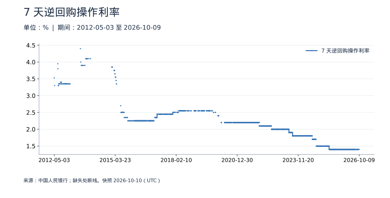
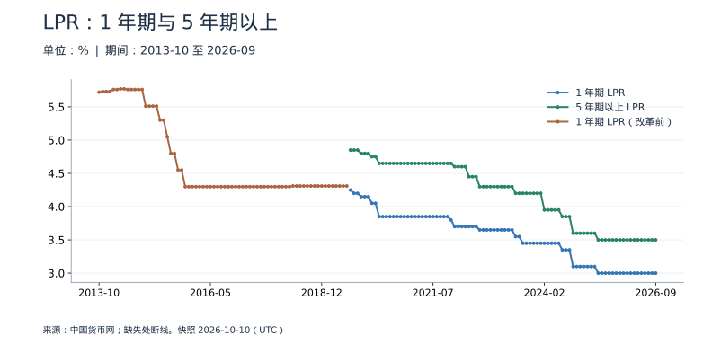
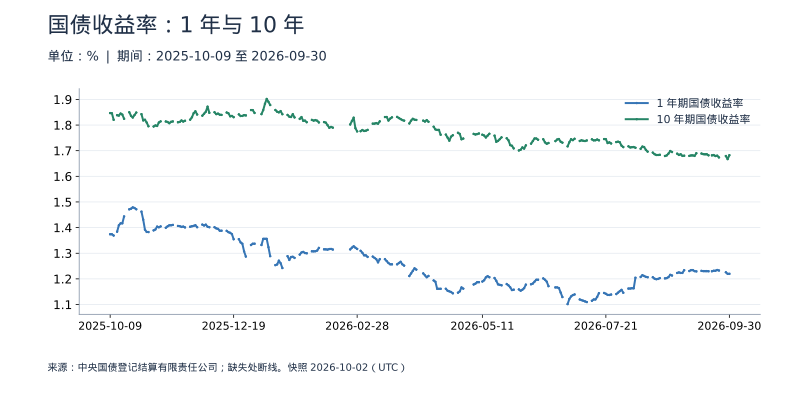

<!-- Generated by scripts/sync_macro.py; edit macro_catalog.py/macro_render.py. -->
# 利率与融资成本：真实数据

政策操作、贷款报价与市场收益率如何变化？

逆回购操作利率、LPR 和国债收益率对应不同环节。图中纵轴都是年化百分比，但经济含义不同；变动 0.10 个百分点等于 10 个基点。不同图的日度、月度频率不混用。

本页快照获取时间：**2026-10-09T02:25:55+00:00**。这是获取时间，不是所有数据的发布日期。每日检查上游；最新统计期以每个指标为准。

[CSV 下载](https://raw.githubusercontent.com/calcky/finance/main/data/macro/rates.csv) · [来源与采集参数](https://github.com/calcky/finance/blob/main/data/macro/rates.metadata.json) · [最近同步状态](https://github.com/calcky/finance/actions/workflows/update-gdp.yml)

```{only} html
本站同版快照：{download}`CSV <../../data/macro/rates.csv>` · {download}`元数据 <../../data/macro/rates.metadata.json>`
```

网页支持悬停查看、点击固定读数、按期间选择、缩放和定位明细。GitHub、打印或禁用 JavaScript 时显示静态图；数值与网页使用同一快照。

## 最新观测与覆盖

| 指标 | 最新期间 | 数值 | 单位 | 本项目起点 | 观测数 | 来源 |
|---|---|---:|---|---|---:|---|
| 7 天逆回购操作利率 | 2026-10-09 | 1.4 | % | 2012-05-03 | 2199 | [中国人民银行](https://www.pbc.gov.cn/zhengcehuobisi/125207/125213/125431/125475/2026100908472888323/index.html) |
| 1 年期 LPR | 2026-09 | 3 | % | 2019-08 | 86 | [中国货币网](https://www.chinamoney.com.cn/ags/ms/cm-u-bk-currency/LprChrtCSV?startDate=2013-01-01) |
| 5 年期以上 LPR | 2026-09 | 3.5 | % | 2019-08 | 86 | [中国货币网](https://www.chinamoney.com.cn/ags/ms/cm-u-bk-currency/LprChrtCSV?startDate=2013-01-01) |
| 1 年期 LPR（改革前） | 2019-07 | 4.31 | % | 2013-10 | 70 | [中国货币网](https://www.chinamoney.com.cn/ags/ms/cm-u-bk-currency/LprChrtCSV?startDate=2013-01-01) |
| 1 年期国债收益率 | 2026-10-08 | 1.2282 | % | 2006-03-01 | 5151 | [中央国债登记结算有限责任公司](https://yield.chinabond.com.cn/cbweb-pbc-web/pbc/historyQuery?startDate=2026-10-08&endDate=2026-10-08&gjqx=0&qxId=hzsylqx&locale=zh_CN) |
| 10 年期国债收益率 | 2026-10-08 | 1.6899 | % | 2006-03-01 | 5151 | [中央国债登记结算有限责任公司](https://yield.chinabond.com.cn/cbweb-pbc-web/pbc/historyQuery?startDate=2026-10-08&endDate=2026-10-08&gjqx=0&qxId=hzsylqx&locale=zh_CN) |

起点表示本项目当前覆盖范围，不代表该指标从此时才开始发布。旧定义序列的最后一期也不代表来源停止更新。各来源可能存在发布或入库滞后；空白不补零、不插值。发布日期未知的观测在 CSV 中留空。

图表的“全部”与 CSV 保留完整已采集历史；缩放近期不会删除早期数据。[历史来源、口径断点与剩余缺口](history-coverage.md)说明回溯范围。

## 7 天逆回购操作利率

只记录有明确利率的公开市场操作公告。未操作的日期没有观测，不填零，也不把缺失连成连续每日报价。



<details class="macro-details">
<summary>7 天逆回购操作利率：展开完整数据表（%）</summary>
<div class="macro-table-wrap"><table><thead><tr><th>期间</th><th>7 天逆回购操作利率</th></tr></thead><tbody>
<tr id="macro-policy-repo-2026-10-09" tabindex="-1"><td>2026-10-09</td><td>1.4</td></tr>
<tr id="macro-policy-repo-2026-10-08" tabindex="-1"><td>2026-10-08</td><td>缺失</td></tr>
<tr id="macro-policy-repo-2026-10-07" tabindex="-1"><td>2026-10-07</td><td>缺失</td></tr>
<tr id="macro-policy-repo-2026-10-06" tabindex="-1"><td>2026-10-06</td><td>缺失</td></tr>
<tr id="macro-policy-repo-2026-10-05" tabindex="-1"><td>2026-10-05</td><td>缺失</td></tr>
<tr id="macro-policy-repo-2026-10-04" tabindex="-1"><td>2026-10-04</td><td>缺失</td></tr>
<tr id="macro-policy-repo-2026-10-03" tabindex="-1"><td>2026-10-03</td><td>缺失</td></tr>
<tr id="macro-policy-repo-2026-10-02" tabindex="-1"><td>2026-10-02</td><td>缺失</td></tr>
<tr id="macro-policy-repo-2026-10-01" tabindex="-1"><td>2026-10-01</td><td>缺失</td></tr>
<tr id="macro-policy-repo-2026-09-30" tabindex="-1"><td>2026-09-30</td><td>缺失</td></tr>
<tr id="macro-policy-repo-2026-09-29" tabindex="-1"><td>2026-09-29</td><td>1.4</td></tr>
<tr id="macro-policy-repo-2026-09-28" tabindex="-1"><td>2026-09-28</td><td>1.4</td></tr>
<tr id="macro-policy-repo-2026-09-27" tabindex="-1"><td>2026-09-27</td><td>缺失</td></tr>
<tr id="macro-policy-repo-2026-09-26" tabindex="-1"><td>2026-09-26</td><td>缺失</td></tr>
<tr id="macro-policy-repo-2026-09-25" tabindex="-1"><td>2026-09-25</td><td>缺失</td></tr>
<tr id="macro-policy-repo-2026-09-24" tabindex="-1"><td>2026-09-24</td><td>1.4</td></tr>
<tr id="macro-policy-repo-2026-09-23" tabindex="-1"><td>2026-09-23</td><td>1.4</td></tr>
<tr id="macro-policy-repo-2026-09-22" tabindex="-1"><td>2026-09-22</td><td>1.4</td></tr>
<tr id="macro-policy-repo-2026-09-21" tabindex="-1"><td>2026-09-21</td><td>1.4</td></tr>
<tr id="macro-policy-repo-2026-09-20" tabindex="-1"><td>2026-09-20</td><td>1.4</td></tr>
<tr id="macro-policy-repo-2026-09-19" tabindex="-1"><td>2026-09-19</td><td>缺失</td></tr>
<tr id="macro-policy-repo-2026-09-18" tabindex="-1"><td>2026-09-18</td><td>1.4</td></tr>
<tr id="macro-policy-repo-2026-09-17" tabindex="-1"><td>2026-09-17</td><td>1.4</td></tr>
<tr id="macro-policy-repo-2026-09-16" tabindex="-1"><td>2026-09-16</td><td>1.4</td></tr>
<tr id="macro-policy-repo-2026-09-15" tabindex="-1"><td>2026-09-15</td><td>缺失</td></tr>
<tr id="macro-policy-repo-2026-09-14" tabindex="-1"><td>2026-09-14</td><td>缺失</td></tr>
<tr id="macro-policy-repo-2026-09-13" tabindex="-1"><td>2026-09-13</td><td>缺失</td></tr>
<tr id="macro-policy-repo-2026-09-12" tabindex="-1"><td>2026-09-12</td><td>缺失</td></tr>
<tr id="macro-policy-repo-2026-09-11" tabindex="-1"><td>2026-09-11</td><td>1.4</td></tr>
<tr id="macro-policy-repo-2026-09-10" tabindex="-1"><td>2026-09-10</td><td>1.4</td></tr>
<tr id="macro-policy-repo-2026-09-09" tabindex="-1"><td>2026-09-09</td><td>缺失</td></tr>
<tr id="macro-policy-repo-2026-09-08" tabindex="-1"><td>2026-09-08</td><td>1.4</td></tr>
<tr id="macro-policy-repo-2026-09-07" tabindex="-1"><td>2026-09-07</td><td>1.4</td></tr>
<tr id="macro-policy-repo-2026-09-06" tabindex="-1"><td>2026-09-06</td><td>缺失</td></tr>
<tr id="macro-policy-repo-2026-09-05" tabindex="-1"><td>2026-09-05</td><td>缺失</td></tr>
<tr id="macro-policy-repo-2026-09-04" tabindex="-1"><td>2026-09-04</td><td>缺失</td></tr>
<tr id="macro-policy-repo-2026-09-03" tabindex="-1"><td>2026-09-03</td><td>缺失</td></tr>
<tr id="macro-policy-repo-2026-09-02" tabindex="-1"><td>2026-09-02</td><td>缺失</td></tr>
<tr id="macro-policy-repo-2026-09-01" tabindex="-1"><td>2026-09-01</td><td>1.4</td></tr>
<tr id="macro-policy-repo-2026-08-31" tabindex="-1"><td>2026-08-31</td><td>1.4</td></tr>
<tr id="macro-policy-repo-2026-08-30" tabindex="-1"><td>2026-08-30</td><td>缺失</td></tr>
<tr id="macro-policy-repo-2026-08-29" tabindex="-1"><td>2026-08-29</td><td>缺失</td></tr>
<tr id="macro-policy-repo-2026-08-28" tabindex="-1"><td>2026-08-28</td><td>1.4</td></tr>
<tr id="macro-policy-repo-2026-08-27" tabindex="-1"><td>2026-08-27</td><td>1.4</td></tr>
<tr id="macro-policy-repo-2026-08-26" tabindex="-1"><td>2026-08-26</td><td>1.4</td></tr>
<tr id="macro-policy-repo-2026-08-25" tabindex="-1"><td>2026-08-25</td><td>1.4</td></tr>
<tr id="macro-policy-repo-2026-08-24" tabindex="-1"><td>2026-08-24</td><td>1.4</td></tr>
<tr id="macro-policy-repo-2026-08-23" tabindex="-1"><td>2026-08-23</td><td>缺失</td></tr>
<tr id="macro-policy-repo-2026-08-22" tabindex="-1"><td>2026-08-22</td><td>缺失</td></tr>
<tr id="macro-policy-repo-2026-08-21" tabindex="-1"><td>2026-08-21</td><td>1.4</td></tr>
<tr id="macro-policy-repo-2026-08-20" tabindex="-1"><td>2026-08-20</td><td>缺失</td></tr>
<tr id="macro-policy-repo-2026-08-19" tabindex="-1"><td>2026-08-19</td><td>缺失</td></tr>
<tr id="macro-policy-repo-2026-08-18" tabindex="-1"><td>2026-08-18</td><td>缺失</td></tr>
<tr id="macro-policy-repo-2026-08-17" tabindex="-1"><td>2026-08-17</td><td>缺失</td></tr>
<tr id="macro-policy-repo-2026-08-16" tabindex="-1"><td>2026-08-16</td><td>缺失</td></tr>
<tr id="macro-policy-repo-2026-08-15" tabindex="-1"><td>2026-08-15</td><td>缺失</td></tr>
<tr id="macro-policy-repo-2026-08-14" tabindex="-1"><td>2026-08-14</td><td>缺失</td></tr>
<tr id="macro-policy-repo-2026-08-13" tabindex="-1"><td>2026-08-13</td><td>缺失</td></tr>
<tr id="macro-policy-repo-2026-08-12" tabindex="-1"><td>2026-08-12</td><td>缺失</td></tr>
<tr id="macro-policy-repo-2026-08-11" tabindex="-1"><td>2026-08-11</td><td>缺失</td></tr>
<tr id="macro-policy-repo-2026-08-10" tabindex="-1"><td>2026-08-10</td><td>1.4</td></tr>
<tr id="macro-policy-repo-2026-08-09" tabindex="-1"><td>2026-08-09</td><td>缺失</td></tr>
<tr id="macro-policy-repo-2026-08-08" tabindex="-1"><td>2026-08-08</td><td>缺失</td></tr>
<tr id="macro-policy-repo-2026-08-07" tabindex="-1"><td>2026-08-07</td><td>1.4</td></tr>
<tr id="macro-policy-repo-2026-08-06" tabindex="-1"><td>2026-08-06</td><td>1.4</td></tr>
<tr id="macro-policy-repo-2026-08-05" tabindex="-1"><td>2026-08-05</td><td>1.4</td></tr>
<tr id="macro-policy-repo-2026-08-04" tabindex="-1"><td>2026-08-04</td><td>1.4</td></tr>
<tr id="macro-policy-repo-2026-08-03" tabindex="-1"><td>2026-08-03</td><td>1.4</td></tr>
<tr id="macro-policy-repo-2026-08-02" tabindex="-1"><td>2026-08-02</td><td>缺失</td></tr>
<tr id="macro-policy-repo-2026-08-01" tabindex="-1"><td>2026-08-01</td><td>缺失</td></tr>
<tr id="macro-policy-repo-2026-07-31" tabindex="-1"><td>2026-07-31</td><td>1.4</td></tr>
<tr id="macro-policy-repo-2026-07-30" tabindex="-1"><td>2026-07-30</td><td>1.4</td></tr>
<tr id="macro-policy-repo-2026-07-29" tabindex="-1"><td>2026-07-29</td><td>1.4</td></tr>
<tr id="macro-policy-repo-2026-07-28" tabindex="-1"><td>2026-07-28</td><td>1.4</td></tr>
<tr id="macro-policy-repo-2026-07-27" tabindex="-1"><td>2026-07-27</td><td>1.4</td></tr>
<tr id="macro-policy-repo-2026-07-26" tabindex="-1"><td>2026-07-26</td><td>缺失</td></tr>
<tr id="macro-policy-repo-2026-07-25" tabindex="-1"><td>2026-07-25</td><td>缺失</td></tr>
<tr id="macro-policy-repo-2026-07-24" tabindex="-1"><td>2026-07-24</td><td>1.4</td></tr>
<tr id="macro-policy-repo-2026-07-23" tabindex="-1"><td>2026-07-23</td><td>1.4</td></tr>
<tr id="macro-policy-repo-2026-07-22" tabindex="-1"><td>2026-07-22</td><td>1.4</td></tr>
<tr id="macro-policy-repo-2026-07-21" tabindex="-1"><td>2026-07-21</td><td>1.4</td></tr>
<tr id="macro-policy-repo-2026-07-20" tabindex="-1"><td>2026-07-20</td><td>1.4</td></tr>
<tr id="macro-policy-repo-2026-07-19" tabindex="-1"><td>2026-07-19</td><td>缺失</td></tr>
<tr id="macro-policy-repo-2026-07-18" tabindex="-1"><td>2026-07-18</td><td>缺失</td></tr>
<tr id="macro-policy-repo-2026-07-17" tabindex="-1"><td>2026-07-17</td><td>1.4</td></tr>
<tr id="macro-policy-repo-2026-07-16" tabindex="-1"><td>2026-07-16</td><td>1.4</td></tr>
<tr id="macro-policy-repo-2026-07-15" tabindex="-1"><td>2026-07-15</td><td>1.4</td></tr>
<tr id="macro-policy-repo-2026-07-14" tabindex="-1"><td>2026-07-14</td><td>1.4</td></tr>
<tr id="macro-policy-repo-2026-07-13" tabindex="-1"><td>2026-07-13</td><td>1.4</td></tr>
<tr id="macro-policy-repo-2026-07-12" tabindex="-1"><td>2026-07-12</td><td>缺失</td></tr>
<tr id="macro-policy-repo-2026-07-11" tabindex="-1"><td>2026-07-11</td><td>缺失</td></tr>
<tr id="macro-policy-repo-2026-07-10" tabindex="-1"><td>2026-07-10</td><td>1.4</td></tr>
<tr id="macro-policy-repo-2026-07-09" tabindex="-1"><td>2026-07-09</td><td>1.4</td></tr>
<tr id="macro-policy-repo-2026-07-08" tabindex="-1"><td>2026-07-08</td><td>1.4</td></tr>
<tr id="macro-policy-repo-2026-07-07" tabindex="-1"><td>2026-07-07</td><td>1.4</td></tr>
<tr id="macro-policy-repo-2026-07-06" tabindex="-1"><td>2026-07-06</td><td>1.4</td></tr>
<tr id="macro-policy-repo-2026-07-05" tabindex="-1"><td>2026-07-05</td><td>缺失</td></tr>
<tr id="macro-policy-repo-2026-07-04" tabindex="-1"><td>2026-07-04</td><td>缺失</td></tr>
<tr id="macro-policy-repo-2026-07-03" tabindex="-1"><td>2026-07-03</td><td>1.4</td></tr>
<tr id="macro-policy-repo-2026-07-02" tabindex="-1"><td>2026-07-02</td><td>1.4</td></tr>
<tr id="macro-policy-repo-2026-07-01" tabindex="-1"><td>2026-07-01</td><td>1.4</td></tr>
<tr id="macro-policy-repo-2026-06-30" tabindex="-1"><td>2026-06-30</td><td>1.4</td></tr>
<tr id="macro-policy-repo-2026-06-29" tabindex="-1"><td>2026-06-29</td><td>1.4</td></tr>
<tr id="macro-policy-repo-2026-06-28" tabindex="-1"><td>2026-06-28</td><td>缺失</td></tr>
<tr id="macro-policy-repo-2026-06-27" tabindex="-1"><td>2026-06-27</td><td>缺失</td></tr>
<tr id="macro-policy-repo-2026-06-26" tabindex="-1"><td>2026-06-26</td><td>1.4</td></tr>
<tr id="macro-policy-repo-2026-06-25" tabindex="-1"><td>2026-06-25</td><td>1.4</td></tr>
<tr id="macro-policy-repo-2026-06-24" tabindex="-1"><td>2026-06-24</td><td>1.4</td></tr>
<tr id="macro-policy-repo-2026-06-23" tabindex="-1"><td>2026-06-23</td><td>1.4</td></tr>
<tr id="macro-policy-repo-2026-06-22" tabindex="-1"><td>2026-06-22</td><td>1.4</td></tr>
<tr id="macro-policy-repo-2026-06-21" tabindex="-1"><td>2026-06-21</td><td>缺失</td></tr>
<tr id="macro-policy-repo-2026-06-20" tabindex="-1"><td>2026-06-20</td><td>缺失</td></tr>
<tr id="macro-policy-repo-2026-06-19" tabindex="-1"><td>2026-06-19</td><td>缺失</td></tr>
<tr id="macro-policy-repo-2026-06-18" tabindex="-1"><td>2026-06-18</td><td>1.4</td></tr>
<tr id="macro-policy-repo-2026-06-17" tabindex="-1"><td>2026-06-17</td><td>1.4</td></tr>
<tr id="macro-policy-repo-2026-06-16" tabindex="-1"><td>2026-06-16</td><td>1.4</td></tr>
<tr id="macro-policy-repo-2026-06-15" tabindex="-1"><td>2026-06-15</td><td>1.4</td></tr>
<tr id="macro-policy-repo-2026-06-14" tabindex="-1"><td>2026-06-14</td><td>缺失</td></tr>
<tr id="macro-policy-repo-2026-06-13" tabindex="-1"><td>2026-06-13</td><td>缺失</td></tr>
<tr id="macro-policy-repo-2026-06-12" tabindex="-1"><td>2026-06-12</td><td>1.4</td></tr>
<tr id="macro-policy-repo-2026-06-11" tabindex="-1"><td>2026-06-11</td><td>1.4</td></tr>
<tr id="macro-policy-repo-2026-06-10" tabindex="-1"><td>2026-06-10</td><td>1.4</td></tr>
<tr id="macro-policy-repo-2026-06-09" tabindex="-1"><td>2026-06-09</td><td>1.4</td></tr>
<tr id="macro-policy-repo-2026-06-08" tabindex="-1"><td>2026-06-08</td><td>1.4</td></tr>
<tr id="macro-policy-repo-2026-06-07" tabindex="-1"><td>2026-06-07</td><td>缺失</td></tr>
<tr id="macro-policy-repo-2026-06-06" tabindex="-1"><td>2026-06-06</td><td>缺失</td></tr>
<tr id="macro-policy-repo-2026-06-05" tabindex="-1"><td>2026-06-05</td><td>1.4</td></tr>
<tr id="macro-policy-repo-2026-06-04" tabindex="-1"><td>2026-06-04</td><td>缺失</td></tr>
<tr id="macro-policy-repo-2026-06-03" tabindex="-1"><td>2026-06-03</td><td>缺失</td></tr>
<tr id="macro-policy-repo-2026-06-02" tabindex="-1"><td>2026-06-02</td><td>1.4</td></tr>
<tr id="macro-policy-repo-2026-06-01" tabindex="-1"><td>2026-06-01</td><td>1.4</td></tr>
<tr id="macro-policy-repo-2026-05-31" tabindex="-1"><td>2026-05-31</td><td>缺失</td></tr>
<tr id="macro-policy-repo-2026-05-30" tabindex="-1"><td>2026-05-30</td><td>缺失</td></tr>
<tr id="macro-policy-repo-2026-05-29" tabindex="-1"><td>2026-05-29</td><td>1.4</td></tr>
<tr id="macro-policy-repo-2026-05-28" tabindex="-1"><td>2026-05-28</td><td>1.4</td></tr>
<tr id="macro-policy-repo-2026-05-27" tabindex="-1"><td>2026-05-27</td><td>1.4</td></tr>
<tr id="macro-policy-repo-2026-05-26" tabindex="-1"><td>2026-05-26</td><td>1.4</td></tr>
<tr id="macro-policy-repo-2026-05-25" tabindex="-1"><td>2026-05-25</td><td>1.4</td></tr>
<tr id="macro-policy-repo-2026-05-24" tabindex="-1"><td>2026-05-24</td><td>缺失</td></tr>
<tr id="macro-policy-repo-2026-05-23" tabindex="-1"><td>2026-05-23</td><td>缺失</td></tr>
<tr id="macro-policy-repo-2026-05-22" tabindex="-1"><td>2026-05-22</td><td>1.4</td></tr>
<tr id="macro-policy-repo-2026-05-21" tabindex="-1"><td>2026-05-21</td><td>1.4</td></tr>
<tr id="macro-policy-repo-2026-05-20" tabindex="-1"><td>2026-05-20</td><td>1.4</td></tr>
<tr id="macro-policy-repo-2026-05-19" tabindex="-1"><td>2026-05-19</td><td>1.4</td></tr>
<tr id="macro-policy-repo-2026-05-18" tabindex="-1"><td>2026-05-18</td><td>1.4</td></tr>
<tr id="macro-policy-repo-2026-05-17" tabindex="-1"><td>2026-05-17</td><td>缺失</td></tr>
<tr id="macro-policy-repo-2026-05-16" tabindex="-1"><td>2026-05-16</td><td>缺失</td></tr>
<tr id="macro-policy-repo-2026-05-15" tabindex="-1"><td>2026-05-15</td><td>1.4</td></tr>
<tr id="macro-policy-repo-2026-05-14" tabindex="-1"><td>2026-05-14</td><td>1.4</td></tr>
<tr id="macro-policy-repo-2026-05-13" tabindex="-1"><td>2026-05-13</td><td>1.4</td></tr>
<tr id="macro-policy-repo-2026-05-12" tabindex="-1"><td>2026-05-12</td><td>1.4</td></tr>
<tr id="macro-policy-repo-2026-05-11" tabindex="-1"><td>2026-05-11</td><td>1.4</td></tr>
<tr id="macro-policy-repo-2026-05-10" tabindex="-1"><td>2026-05-10</td><td>缺失</td></tr>
<tr id="macro-policy-repo-2026-05-09" tabindex="-1"><td>2026-05-09</td><td>1.4</td></tr>
<tr id="macro-policy-repo-2026-05-08" tabindex="-1"><td>2026-05-08</td><td>1.4</td></tr>
<tr id="macro-policy-repo-2026-05-07" tabindex="-1"><td>2026-05-07</td><td>1.4</td></tr>
<tr id="macro-policy-repo-2026-05-06" tabindex="-1"><td>2026-05-06</td><td>1.4</td></tr>
<tr id="macro-policy-repo-2026-05-05" tabindex="-1"><td>2026-05-05</td><td>缺失</td></tr>
<tr id="macro-policy-repo-2026-05-04" tabindex="-1"><td>2026-05-04</td><td>缺失</td></tr>
<tr id="macro-policy-repo-2026-05-03" tabindex="-1"><td>2026-05-03</td><td>缺失</td></tr>
<tr id="macro-policy-repo-2026-05-02" tabindex="-1"><td>2026-05-02</td><td>缺失</td></tr>
<tr id="macro-policy-repo-2026-05-01" tabindex="-1"><td>2026-05-01</td><td>缺失</td></tr>
<tr id="macro-policy-repo-2026-04-30" tabindex="-1"><td>2026-04-30</td><td>1.4</td></tr>
<tr id="macro-policy-repo-2026-04-29" tabindex="-1"><td>2026-04-29</td><td>1.4</td></tr>
<tr id="macro-policy-repo-2026-04-28" tabindex="-1"><td>2026-04-28</td><td>1.4</td></tr>
<tr id="macro-policy-repo-2026-04-27" tabindex="-1"><td>2026-04-27</td><td>1.4</td></tr>
<tr id="macro-policy-repo-2026-04-26" tabindex="-1"><td>2026-04-26</td><td>缺失</td></tr>
<tr id="macro-policy-repo-2026-04-25" tabindex="-1"><td>2026-04-25</td><td>缺失</td></tr>
<tr id="macro-policy-repo-2026-04-24" tabindex="-1"><td>2026-04-24</td><td>1.4</td></tr>
<tr id="macro-policy-repo-2026-04-23" tabindex="-1"><td>2026-04-23</td><td>1.4</td></tr>
<tr id="macro-policy-repo-2026-04-22" tabindex="-1"><td>2026-04-22</td><td>1.4</td></tr>
<tr id="macro-policy-repo-2026-04-21" tabindex="-1"><td>2026-04-21</td><td>1.4</td></tr>
<tr id="macro-policy-repo-2026-04-20" tabindex="-1"><td>2026-04-20</td><td>1.4</td></tr>
<tr id="macro-policy-repo-2026-04-19" tabindex="-1"><td>2026-04-19</td><td>缺失</td></tr>
<tr id="macro-policy-repo-2026-04-18" tabindex="-1"><td>2026-04-18</td><td>缺失</td></tr>
<tr id="macro-policy-repo-2026-04-17" tabindex="-1"><td>2026-04-17</td><td>1.4</td></tr>
<tr id="macro-policy-repo-2026-04-16" tabindex="-1"><td>2026-04-16</td><td>1.4</td></tr>
<tr id="macro-policy-repo-2026-04-15" tabindex="-1"><td>2026-04-15</td><td>1.4</td></tr>
<tr id="macro-policy-repo-2026-04-14" tabindex="-1"><td>2026-04-14</td><td>1.4</td></tr>
<tr id="macro-policy-repo-2026-04-13" tabindex="-1"><td>2026-04-13</td><td>1.4</td></tr>
<tr id="macro-policy-repo-2026-04-12" tabindex="-1"><td>2026-04-12</td><td>缺失</td></tr>
<tr id="macro-policy-repo-2026-04-11" tabindex="-1"><td>2026-04-11</td><td>缺失</td></tr>
<tr id="macro-policy-repo-2026-04-10" tabindex="-1"><td>2026-04-10</td><td>1.4</td></tr>
<tr id="macro-policy-repo-2026-04-09" tabindex="-1"><td>2026-04-09</td><td>1.4</td></tr>
<tr id="macro-policy-repo-2026-04-08" tabindex="-1"><td>2026-04-08</td><td>1.4</td></tr>
<tr id="macro-policy-repo-2026-04-07" tabindex="-1"><td>2026-04-07</td><td>1.4</td></tr>
<tr id="macro-policy-repo-2026-04-06" tabindex="-1"><td>2026-04-06</td><td>缺失</td></tr>
<tr id="macro-policy-repo-2026-04-05" tabindex="-1"><td>2026-04-05</td><td>缺失</td></tr>
<tr id="macro-policy-repo-2026-04-04" tabindex="-1"><td>2026-04-04</td><td>缺失</td></tr>
<tr id="macro-policy-repo-2026-04-03" tabindex="-1"><td>2026-04-03</td><td>1.4</td></tr>
<tr id="macro-policy-repo-2026-04-02" tabindex="-1"><td>2026-04-02</td><td>1.4</td></tr>
<tr id="macro-policy-repo-2026-04-01" tabindex="-1"><td>2026-04-01</td><td>1.4</td></tr>
<tr id="macro-policy-repo-2026-03-31" tabindex="-1"><td>2026-03-31</td><td>1.4</td></tr>
<tr id="macro-policy-repo-2026-03-30" tabindex="-1"><td>2026-03-30</td><td>1.4</td></tr>
<tr id="macro-policy-repo-2026-03-29" tabindex="-1"><td>2026-03-29</td><td>缺失</td></tr>
<tr id="macro-policy-repo-2026-03-28" tabindex="-1"><td>2026-03-28</td><td>缺失</td></tr>
<tr id="macro-policy-repo-2026-03-27" tabindex="-1"><td>2026-03-27</td><td>1.4</td></tr>
<tr id="macro-policy-repo-2026-03-26" tabindex="-1"><td>2026-03-26</td><td>1.4</td></tr>
<tr id="macro-policy-repo-2026-03-25" tabindex="-1"><td>2026-03-25</td><td>1.4</td></tr>
<tr id="macro-policy-repo-2026-03-24" tabindex="-1"><td>2026-03-24</td><td>1.4</td></tr>
<tr id="macro-policy-repo-2026-03-23" tabindex="-1"><td>2026-03-23</td><td>1.4</td></tr>
<tr id="macro-policy-repo-2026-03-22" tabindex="-1"><td>2026-03-22</td><td>缺失</td></tr>
<tr id="macro-policy-repo-2026-03-21" tabindex="-1"><td>2026-03-21</td><td>缺失</td></tr>
<tr id="macro-policy-repo-2026-03-20" tabindex="-1"><td>2026-03-20</td><td>1.4</td></tr>
<tr id="macro-policy-repo-2026-03-19" tabindex="-1"><td>2026-03-19</td><td>1.4</td></tr>
<tr id="macro-policy-repo-2026-03-18" tabindex="-1"><td>2026-03-18</td><td>1.4</td></tr>
<tr id="macro-policy-repo-2026-03-17" tabindex="-1"><td>2026-03-17</td><td>1.4</td></tr>
<tr id="macro-policy-repo-2026-03-16" tabindex="-1"><td>2026-03-16</td><td>1.4</td></tr>
<tr id="macro-policy-repo-2026-03-15" tabindex="-1"><td>2026-03-15</td><td>缺失</td></tr>
<tr id="macro-policy-repo-2026-03-14" tabindex="-1"><td>2026-03-14</td><td>缺失</td></tr>
<tr id="macro-policy-repo-2026-03-13" tabindex="-1"><td>2026-03-13</td><td>1.4</td></tr>
<tr id="macro-policy-repo-2026-03-12" tabindex="-1"><td>2026-03-12</td><td>1.4</td></tr>
<tr id="macro-policy-repo-2026-03-11" tabindex="-1"><td>2026-03-11</td><td>1.4</td></tr>
<tr id="macro-policy-repo-2026-03-10" tabindex="-1"><td>2026-03-10</td><td>1.4</td></tr>
<tr id="macro-policy-repo-2026-03-09" tabindex="-1"><td>2026-03-09</td><td>1.4</td></tr>
<tr id="macro-policy-repo-2026-03-08" tabindex="-1"><td>2026-03-08</td><td>缺失</td></tr>
<tr id="macro-policy-repo-2026-03-07" tabindex="-1"><td>2026-03-07</td><td>缺失</td></tr>
<tr id="macro-policy-repo-2026-03-06" tabindex="-1"><td>2026-03-06</td><td>1.4</td></tr>
<tr id="macro-policy-repo-2026-03-05" tabindex="-1"><td>2026-03-05</td><td>1.4</td></tr>
<tr id="macro-policy-repo-2026-03-04" tabindex="-1"><td>2026-03-04</td><td>1.4</td></tr>
<tr id="macro-policy-repo-2026-03-03" tabindex="-1"><td>2026-03-03</td><td>1.4</td></tr>
<tr id="macro-policy-repo-2026-03-02" tabindex="-1"><td>2026-03-02</td><td>1.4</td></tr>
<tr id="macro-policy-repo-2026-03-01" tabindex="-1"><td>2026-03-01</td><td>缺失</td></tr>
<tr id="macro-policy-repo-2026-02-28" tabindex="-1"><td>2026-02-28</td><td>1.4</td></tr>
<tr id="macro-policy-repo-2026-02-27" tabindex="-1"><td>2026-02-27</td><td>1.4</td></tr>
<tr id="macro-policy-repo-2026-02-26" tabindex="-1"><td>2026-02-26</td><td>1.4</td></tr>
<tr id="macro-policy-repo-2026-02-25" tabindex="-1"><td>2026-02-25</td><td>1.4</td></tr>
<tr id="macro-policy-repo-2026-02-24" tabindex="-1"><td>2026-02-24</td><td>1.4</td></tr>
<tr id="macro-policy-repo-2026-02-23" tabindex="-1"><td>2026-02-23</td><td>缺失</td></tr>
<tr id="macro-policy-repo-2026-02-22" tabindex="-1"><td>2026-02-22</td><td>缺失</td></tr>
<tr id="macro-policy-repo-2026-02-21" tabindex="-1"><td>2026-02-21</td><td>缺失</td></tr>
<tr id="macro-policy-repo-2026-02-20" tabindex="-1"><td>2026-02-20</td><td>缺失</td></tr>
<tr id="macro-policy-repo-2026-02-19" tabindex="-1"><td>2026-02-19</td><td>缺失</td></tr>
<tr id="macro-policy-repo-2026-02-18" tabindex="-1"><td>2026-02-18</td><td>缺失</td></tr>
<tr id="macro-policy-repo-2026-02-17" tabindex="-1"><td>2026-02-17</td><td>缺失</td></tr>
<tr id="macro-policy-repo-2026-02-16" tabindex="-1"><td>2026-02-16</td><td>缺失</td></tr>
<tr id="macro-policy-repo-2026-02-15" tabindex="-1"><td>2026-02-15</td><td>缺失</td></tr>
<tr id="macro-policy-repo-2026-02-14" tabindex="-1"><td>2026-02-14</td><td>1.4</td></tr>
<tr id="macro-policy-repo-2026-02-13" tabindex="-1"><td>2026-02-13</td><td>1.4</td></tr>
<tr id="macro-policy-repo-2026-02-12" tabindex="-1"><td>2026-02-12</td><td>1.4</td></tr>
<tr id="macro-policy-repo-2026-02-11" tabindex="-1"><td>2026-02-11</td><td>1.4</td></tr>
<tr id="macro-policy-repo-2026-02-10" tabindex="-1"><td>2026-02-10</td><td>1.4</td></tr>
<tr id="macro-policy-repo-2026-02-09" tabindex="-1"><td>2026-02-09</td><td>1.4</td></tr>
<tr id="macro-policy-repo-2026-02-08" tabindex="-1"><td>2026-02-08</td><td>缺失</td></tr>
<tr id="macro-policy-repo-2026-02-07" tabindex="-1"><td>2026-02-07</td><td>缺失</td></tr>
<tr id="macro-policy-repo-2026-02-06" tabindex="-1"><td>2026-02-06</td><td>1.4</td></tr>
<tr id="macro-policy-repo-2026-02-05" tabindex="-1"><td>2026-02-05</td><td>1.4</td></tr>
<tr id="macro-policy-repo-2026-02-04" tabindex="-1"><td>2026-02-04</td><td>1.4</td></tr>
<tr id="macro-policy-repo-2026-02-03" tabindex="-1"><td>2026-02-03</td><td>1.4</td></tr>
<tr id="macro-policy-repo-2026-02-02" tabindex="-1"><td>2026-02-02</td><td>1.4</td></tr>
<tr id="macro-policy-repo-2026-02-01" tabindex="-1"><td>2026-02-01</td><td>缺失</td></tr>
<tr id="macro-policy-repo-2026-01-31" tabindex="-1"><td>2026-01-31</td><td>缺失</td></tr>
<tr id="macro-policy-repo-2026-01-30" tabindex="-1"><td>2026-01-30</td><td>1.4</td></tr>
<tr id="macro-policy-repo-2026-01-29" tabindex="-1"><td>2026-01-29</td><td>1.4</td></tr>
<tr id="macro-policy-repo-2026-01-28" tabindex="-1"><td>2026-01-28</td><td>1.4</td></tr>
<tr id="macro-policy-repo-2026-01-27" tabindex="-1"><td>2026-01-27</td><td>1.4</td></tr>
<tr id="macro-policy-repo-2026-01-26" tabindex="-1"><td>2026-01-26</td><td>1.4</td></tr>
<tr id="macro-policy-repo-2026-01-25" tabindex="-1"><td>2026-01-25</td><td>缺失</td></tr>
<tr id="macro-policy-repo-2026-01-24" tabindex="-1"><td>2026-01-24</td><td>缺失</td></tr>
<tr id="macro-policy-repo-2026-01-23" tabindex="-1"><td>2026-01-23</td><td>1.4</td></tr>
<tr id="macro-policy-repo-2026-01-22" tabindex="-1"><td>2026-01-22</td><td>1.4</td></tr>
<tr id="macro-policy-repo-2026-01-21" tabindex="-1"><td>2026-01-21</td><td>1.4</td></tr>
<tr id="macro-policy-repo-2026-01-20" tabindex="-1"><td>2026-01-20</td><td>1.4</td></tr>
<tr id="macro-policy-repo-2026-01-19" tabindex="-1"><td>2026-01-19</td><td>1.4</td></tr>
<tr id="macro-policy-repo-2026-01-18" tabindex="-1"><td>2026-01-18</td><td>缺失</td></tr>
<tr id="macro-policy-repo-2026-01-17" tabindex="-1"><td>2026-01-17</td><td>缺失</td></tr>
<tr id="macro-policy-repo-2026-01-16" tabindex="-1"><td>2026-01-16</td><td>1.4</td></tr>
<tr id="macro-policy-repo-2026-01-15" tabindex="-1"><td>2026-01-15</td><td>1.4</td></tr>
<tr id="macro-policy-repo-2026-01-14" tabindex="-1"><td>2026-01-14</td><td>1.4</td></tr>
<tr id="macro-policy-repo-2026-01-13" tabindex="-1"><td>2026-01-13</td><td>1.4</td></tr>
<tr id="macro-policy-repo-2026-01-12" tabindex="-1"><td>2026-01-12</td><td>1.4</td></tr>
<tr id="macro-policy-repo-2026-01-11" tabindex="-1"><td>2026-01-11</td><td>缺失</td></tr>
<tr id="macro-policy-repo-2026-01-10" tabindex="-1"><td>2026-01-10</td><td>缺失</td></tr>
<tr id="macro-policy-repo-2026-01-09" tabindex="-1"><td>2026-01-09</td><td>1.4</td></tr>
<tr id="macro-policy-repo-2026-01-08" tabindex="-1"><td>2026-01-08</td><td>1.4</td></tr>
<tr id="macro-policy-repo-2026-01-07" tabindex="-1"><td>2026-01-07</td><td>1.4</td></tr>
<tr id="macro-policy-repo-2026-01-06" tabindex="-1"><td>2026-01-06</td><td>1.4</td></tr>
<tr id="macro-policy-repo-2026-01-05" tabindex="-1"><td>2026-01-05</td><td>1.4</td></tr>
<tr id="macro-policy-repo-2026-01-04" tabindex="-1"><td>2026-01-04</td><td>1.4</td></tr>
<tr id="macro-policy-repo-2026-01-03" tabindex="-1"><td>2026-01-03</td><td>缺失</td></tr>
<tr id="macro-policy-repo-2026-01-02" tabindex="-1"><td>2026-01-02</td><td>缺失</td></tr>
<tr id="macro-policy-repo-2026-01-01" tabindex="-1"><td>2026-01-01</td><td>缺失</td></tr>
<tr id="macro-policy-repo-2025-12-31" tabindex="-1"><td>2025-12-31</td><td>1.4</td></tr>
<tr id="macro-policy-repo-2025-12-30" tabindex="-1"><td>2025-12-30</td><td>1.4</td></tr>
<tr id="macro-policy-repo-2025-12-29" tabindex="-1"><td>2025-12-29</td><td>1.4</td></tr>
<tr id="macro-policy-repo-2025-12-28" tabindex="-1"><td>2025-12-28</td><td>缺失</td></tr>
<tr id="macro-policy-repo-2025-12-27" tabindex="-1"><td>2025-12-27</td><td>缺失</td></tr>
<tr id="macro-policy-repo-2025-12-26" tabindex="-1"><td>2025-12-26</td><td>1.4</td></tr>
<tr id="macro-policy-repo-2025-12-25" tabindex="-1"><td>2025-12-25</td><td>1.4</td></tr>
<tr id="macro-policy-repo-2025-12-24" tabindex="-1"><td>2025-12-24</td><td>1.4</td></tr>
<tr id="macro-policy-repo-2025-12-23" tabindex="-1"><td>2025-12-23</td><td>1.4</td></tr>
<tr id="macro-policy-repo-2025-12-22" tabindex="-1"><td>2025-12-22</td><td>1.4</td></tr>
<tr id="macro-policy-repo-2025-12-21" tabindex="-1"><td>2025-12-21</td><td>缺失</td></tr>
<tr id="macro-policy-repo-2025-12-20" tabindex="-1"><td>2025-12-20</td><td>缺失</td></tr>
<tr id="macro-policy-repo-2025-12-19" tabindex="-1"><td>2025-12-19</td><td>1.4</td></tr>
<tr id="macro-policy-repo-2025-12-18" tabindex="-1"><td>2025-12-18</td><td>1.4</td></tr>
<tr id="macro-policy-repo-2025-12-17" tabindex="-1"><td>2025-12-17</td><td>1.4</td></tr>
<tr id="macro-policy-repo-2025-12-16" tabindex="-1"><td>2025-12-16</td><td>1.4</td></tr>
<tr id="macro-policy-repo-2025-12-15" tabindex="-1"><td>2025-12-15</td><td>1.4</td></tr>
<tr id="macro-policy-repo-2025-12-14" tabindex="-1"><td>2025-12-14</td><td>缺失</td></tr>
<tr id="macro-policy-repo-2025-12-13" tabindex="-1"><td>2025-12-13</td><td>缺失</td></tr>
<tr id="macro-policy-repo-2025-12-12" tabindex="-1"><td>2025-12-12</td><td>1.4</td></tr>
<tr id="macro-policy-repo-2025-12-11" tabindex="-1"><td>2025-12-11</td><td>1.4</td></tr>
<tr id="macro-policy-repo-2025-12-10" tabindex="-1"><td>2025-12-10</td><td>1.4</td></tr>
<tr id="macro-policy-repo-2025-12-09" tabindex="-1"><td>2025-12-09</td><td>1.4</td></tr>
<tr id="macro-policy-repo-2025-12-08" tabindex="-1"><td>2025-12-08</td><td>1.4</td></tr>
<tr id="macro-policy-repo-2025-12-07" tabindex="-1"><td>2025-12-07</td><td>缺失</td></tr>
<tr id="macro-policy-repo-2025-12-06" tabindex="-1"><td>2025-12-06</td><td>缺失</td></tr>
<tr id="macro-policy-repo-2025-12-05" tabindex="-1"><td>2025-12-05</td><td>1.4</td></tr>
<tr id="macro-policy-repo-2025-12-04" tabindex="-1"><td>2025-12-04</td><td>1.4</td></tr>
<tr id="macro-policy-repo-2025-12-03" tabindex="-1"><td>2025-12-03</td><td>1.4</td></tr>
<tr id="macro-policy-repo-2025-12-02" tabindex="-1"><td>2025-12-02</td><td>1.4</td></tr>
<tr id="macro-policy-repo-2025-12-01" tabindex="-1"><td>2025-12-01</td><td>1.4</td></tr>
<tr id="macro-policy-repo-2025-11-30" tabindex="-1"><td>2025-11-30</td><td>缺失</td></tr>
<tr id="macro-policy-repo-2025-11-29" tabindex="-1"><td>2025-11-29</td><td>缺失</td></tr>
<tr id="macro-policy-repo-2025-11-28" tabindex="-1"><td>2025-11-28</td><td>1.4</td></tr>
<tr id="macro-policy-repo-2025-11-27" tabindex="-1"><td>2025-11-27</td><td>1.4</td></tr>
<tr id="macro-policy-repo-2025-11-26" tabindex="-1"><td>2025-11-26</td><td>1.4</td></tr>
<tr id="macro-policy-repo-2025-11-25" tabindex="-1"><td>2025-11-25</td><td>1.4</td></tr>
<tr id="macro-policy-repo-2025-11-24" tabindex="-1"><td>2025-11-24</td><td>1.4</td></tr>
<tr id="macro-policy-repo-2025-11-23" tabindex="-1"><td>2025-11-23</td><td>缺失</td></tr>
<tr id="macro-policy-repo-2025-11-22" tabindex="-1"><td>2025-11-22</td><td>缺失</td></tr>
<tr id="macro-policy-repo-2025-11-21" tabindex="-1"><td>2025-11-21</td><td>1.4</td></tr>
<tr id="macro-policy-repo-2025-11-20" tabindex="-1"><td>2025-11-20</td><td>1.4</td></tr>
<tr id="macro-policy-repo-2025-11-19" tabindex="-1"><td>2025-11-19</td><td>1.4</td></tr>
<tr id="macro-policy-repo-2025-11-18" tabindex="-1"><td>2025-11-18</td><td>1.4</td></tr>
<tr id="macro-policy-repo-2025-11-17" tabindex="-1"><td>2025-11-17</td><td>1.4</td></tr>
<tr id="macro-policy-repo-2025-11-16" tabindex="-1"><td>2025-11-16</td><td>缺失</td></tr>
<tr id="macro-policy-repo-2025-11-15" tabindex="-1"><td>2025-11-15</td><td>缺失</td></tr>
<tr id="macro-policy-repo-2025-11-14" tabindex="-1"><td>2025-11-14</td><td>1.4</td></tr>
<tr id="macro-policy-repo-2025-11-13" tabindex="-1"><td>2025-11-13</td><td>1.4</td></tr>
<tr id="macro-policy-repo-2025-11-12" tabindex="-1"><td>2025-11-12</td><td>1.4</td></tr>
<tr id="macro-policy-repo-2025-11-11" tabindex="-1"><td>2025-11-11</td><td>1.4</td></tr>
<tr id="macro-policy-repo-2025-11-10" tabindex="-1"><td>2025-11-10</td><td>1.4</td></tr>
<tr id="macro-policy-repo-2025-11-09" tabindex="-1"><td>2025-11-09</td><td>缺失</td></tr>
<tr id="macro-policy-repo-2025-11-08" tabindex="-1"><td>2025-11-08</td><td>缺失</td></tr>
<tr id="macro-policy-repo-2025-11-07" tabindex="-1"><td>2025-11-07</td><td>1.4</td></tr>
<tr id="macro-policy-repo-2025-11-06" tabindex="-1"><td>2025-11-06</td><td>1.4</td></tr>
<tr id="macro-policy-repo-2025-11-05" tabindex="-1"><td>2025-11-05</td><td>1.4</td></tr>
<tr id="macro-policy-repo-2025-11-04" tabindex="-1"><td>2025-11-04</td><td>1.4</td></tr>
<tr id="macro-policy-repo-2025-11-03" tabindex="-1"><td>2025-11-03</td><td>1.4</td></tr>
<tr id="macro-policy-repo-2025-11-02" tabindex="-1"><td>2025-11-02</td><td>缺失</td></tr>
<tr id="macro-policy-repo-2025-11-01" tabindex="-1"><td>2025-11-01</td><td>缺失</td></tr>
<tr id="macro-policy-repo-2025-10-31" tabindex="-1"><td>2025-10-31</td><td>1.4</td></tr>
<tr id="macro-policy-repo-2025-10-30" tabindex="-1"><td>2025-10-30</td><td>1.4</td></tr>
<tr id="macro-policy-repo-2025-10-29" tabindex="-1"><td>2025-10-29</td><td>1.4</td></tr>
<tr id="macro-policy-repo-2025-10-28" tabindex="-1"><td>2025-10-28</td><td>1.4</td></tr>
<tr id="macro-policy-repo-2025-10-27" tabindex="-1"><td>2025-10-27</td><td>1.4</td></tr>
<tr id="macro-policy-repo-2025-10-26" tabindex="-1"><td>2025-10-26</td><td>缺失</td></tr>
<tr id="macro-policy-repo-2025-10-25" tabindex="-1"><td>2025-10-25</td><td>缺失</td></tr>
<tr id="macro-policy-repo-2025-10-24" tabindex="-1"><td>2025-10-24</td><td>1.4</td></tr>
<tr id="macro-policy-repo-2025-10-23" tabindex="-1"><td>2025-10-23</td><td>1.4</td></tr>
<tr id="macro-policy-repo-2025-10-22" tabindex="-1"><td>2025-10-22</td><td>1.4</td></tr>
<tr id="macro-policy-repo-2025-10-21" tabindex="-1"><td>2025-10-21</td><td>1.4</td></tr>
<tr id="macro-policy-repo-2025-10-20" tabindex="-1"><td>2025-10-20</td><td>1.4</td></tr>
<tr id="macro-policy-repo-2025-10-19" tabindex="-1"><td>2025-10-19</td><td>缺失</td></tr>
<tr id="macro-policy-repo-2025-10-18" tabindex="-1"><td>2025-10-18</td><td>缺失</td></tr>
<tr id="macro-policy-repo-2025-10-17" tabindex="-1"><td>2025-10-17</td><td>1.4</td></tr>
<tr id="macro-policy-repo-2025-10-16" tabindex="-1"><td>2025-10-16</td><td>1.4</td></tr>
<tr id="macro-policy-repo-2025-10-15" tabindex="-1"><td>2025-10-15</td><td>1.4</td></tr>
<tr id="macro-policy-repo-2025-10-14" tabindex="-1"><td>2025-10-14</td><td>1.4</td></tr>
<tr id="macro-policy-repo-2025-10-13" tabindex="-1"><td>2025-10-13</td><td>1.4</td></tr>
<tr id="macro-policy-repo-2025-10-12" tabindex="-1"><td>2025-10-12</td><td>缺失</td></tr>
<tr id="macro-policy-repo-2025-10-11" tabindex="-1"><td>2025-10-11</td><td>1.4</td></tr>
<tr id="macro-policy-repo-2025-10-10" tabindex="-1"><td>2025-10-10</td><td>1.4</td></tr>
<tr id="macro-policy-repo-2025-10-09" tabindex="-1"><td>2025-10-09</td><td>1.4</td></tr>
<tr id="macro-policy-repo-2025-10-08" tabindex="-1"><td>2025-10-08</td><td>缺失</td></tr>
<tr id="macro-policy-repo-2025-10-07" tabindex="-1"><td>2025-10-07</td><td>缺失</td></tr>
<tr id="macro-policy-repo-2025-10-06" tabindex="-1"><td>2025-10-06</td><td>缺失</td></tr>
<tr id="macro-policy-repo-2025-10-05" tabindex="-1"><td>2025-10-05</td><td>缺失</td></tr>
<tr id="macro-policy-repo-2025-10-04" tabindex="-1"><td>2025-10-04</td><td>缺失</td></tr>
<tr id="macro-policy-repo-2025-10-03" tabindex="-1"><td>2025-10-03</td><td>缺失</td></tr>
<tr id="macro-policy-repo-2025-10-02" tabindex="-1"><td>2025-10-02</td><td>缺失</td></tr>
<tr id="macro-policy-repo-2025-10-01" tabindex="-1"><td>2025-10-01</td><td>缺失</td></tr>
<tr id="macro-policy-repo-2025-09-30" tabindex="-1"><td>2025-09-30</td><td>1.4</td></tr>
<tr id="macro-policy-repo-2025-09-29" tabindex="-1"><td>2025-09-29</td><td>1.4</td></tr>
<tr id="macro-policy-repo-2025-09-28" tabindex="-1"><td>2025-09-28</td><td>1.4</td></tr>
<tr id="macro-policy-repo-2025-09-27" tabindex="-1"><td>2025-09-27</td><td>缺失</td></tr>
<tr id="macro-policy-repo-2025-09-26" tabindex="-1"><td>2025-09-26</td><td>1.4</td></tr>
<tr id="macro-policy-repo-2025-09-25" tabindex="-1"><td>2025-09-25</td><td>1.4</td></tr>
<tr id="macro-policy-repo-2025-09-24" tabindex="-1"><td>2025-09-24</td><td>1.4</td></tr>
<tr id="macro-policy-repo-2025-09-23" tabindex="-1"><td>2025-09-23</td><td>1.4</td></tr>
<tr id="macro-policy-repo-2025-09-22" tabindex="-1"><td>2025-09-22</td><td>1.4</td></tr>
<tr id="macro-policy-repo-2025-09-21" tabindex="-1"><td>2025-09-21</td><td>缺失</td></tr>
<tr id="macro-policy-repo-2025-09-20" tabindex="-1"><td>2025-09-20</td><td>缺失</td></tr>
<tr id="macro-policy-repo-2025-09-19" tabindex="-1"><td>2025-09-19</td><td>1.4</td></tr>
<tr id="macro-policy-repo-2025-09-18" tabindex="-1"><td>2025-09-18</td><td>1.4</td></tr>
<tr id="macro-policy-repo-2025-09-17" tabindex="-1"><td>2025-09-17</td><td>1.4</td></tr>
<tr id="macro-policy-repo-2025-09-16" tabindex="-1"><td>2025-09-16</td><td>1.4</td></tr>
<tr id="macro-policy-repo-2025-09-15" tabindex="-1"><td>2025-09-15</td><td>1.4</td></tr>
<tr id="macro-policy-repo-2025-09-14" tabindex="-1"><td>2025-09-14</td><td>缺失</td></tr>
<tr id="macro-policy-repo-2025-09-13" tabindex="-1"><td>2025-09-13</td><td>缺失</td></tr>
<tr id="macro-policy-repo-2025-09-12" tabindex="-1"><td>2025-09-12</td><td>1.4</td></tr>
<tr id="macro-policy-repo-2025-09-11" tabindex="-1"><td>2025-09-11</td><td>1.4</td></tr>
<tr id="macro-policy-repo-2025-09-10" tabindex="-1"><td>2025-09-10</td><td>1.4</td></tr>
<tr id="macro-policy-repo-2025-09-09" tabindex="-1"><td>2025-09-09</td><td>1.4</td></tr>
<tr id="macro-policy-repo-2025-09-08" tabindex="-1"><td>2025-09-08</td><td>1.4</td></tr>
<tr id="macro-policy-repo-2025-09-07" tabindex="-1"><td>2025-09-07</td><td>缺失</td></tr>
<tr id="macro-policy-repo-2025-09-06" tabindex="-1"><td>2025-09-06</td><td>缺失</td></tr>
<tr id="macro-policy-repo-2025-09-05" tabindex="-1"><td>2025-09-05</td><td>1.4</td></tr>
<tr id="macro-policy-repo-2025-09-04" tabindex="-1"><td>2025-09-04</td><td>1.4</td></tr>
<tr id="macro-policy-repo-2025-09-03" tabindex="-1"><td>2025-09-03</td><td>1.4</td></tr>
<tr id="macro-policy-repo-2025-09-02" tabindex="-1"><td>2025-09-02</td><td>1.4</td></tr>
<tr id="macro-policy-repo-2025-09-01" tabindex="-1"><td>2025-09-01</td><td>1.4</td></tr>
<tr id="macro-policy-repo-2025-08-31" tabindex="-1"><td>2025-08-31</td><td>缺失</td></tr>
<tr id="macro-policy-repo-2025-08-30" tabindex="-1"><td>2025-08-30</td><td>缺失</td></tr>
<tr id="macro-policy-repo-2025-08-29" tabindex="-1"><td>2025-08-29</td><td>1.4</td></tr>
<tr id="macro-policy-repo-2025-08-28" tabindex="-1"><td>2025-08-28</td><td>1.4</td></tr>
<tr id="macro-policy-repo-2025-08-27" tabindex="-1"><td>2025-08-27</td><td>1.4</td></tr>
<tr id="macro-policy-repo-2025-08-26" tabindex="-1"><td>2025-08-26</td><td>1.4</td></tr>
<tr id="macro-policy-repo-2025-08-25" tabindex="-1"><td>2025-08-25</td><td>1.4</td></tr>
<tr id="macro-policy-repo-2025-08-24" tabindex="-1"><td>2025-08-24</td><td>缺失</td></tr>
<tr id="macro-policy-repo-2025-08-23" tabindex="-1"><td>2025-08-23</td><td>缺失</td></tr>
<tr id="macro-policy-repo-2025-08-22" tabindex="-1"><td>2025-08-22</td><td>1.4</td></tr>
<tr id="macro-policy-repo-2025-08-21" tabindex="-1"><td>2025-08-21</td><td>1.4</td></tr>
<tr id="macro-policy-repo-2025-08-20" tabindex="-1"><td>2025-08-20</td><td>1.4</td></tr>
<tr id="macro-policy-repo-2025-08-19" tabindex="-1"><td>2025-08-19</td><td>1.4</td></tr>
<tr id="macro-policy-repo-2025-08-18" tabindex="-1"><td>2025-08-18</td><td>1.4</td></tr>
<tr id="macro-policy-repo-2025-08-17" tabindex="-1"><td>2025-08-17</td><td>缺失</td></tr>
<tr id="macro-policy-repo-2025-08-16" tabindex="-1"><td>2025-08-16</td><td>缺失</td></tr>
<tr id="macro-policy-repo-2025-08-15" tabindex="-1"><td>2025-08-15</td><td>1.4</td></tr>
<tr id="macro-policy-repo-2025-08-14" tabindex="-1"><td>2025-08-14</td><td>1.4</td></tr>
<tr id="macro-policy-repo-2025-08-13" tabindex="-1"><td>2025-08-13</td><td>1.4</td></tr>
<tr id="macro-policy-repo-2025-08-12" tabindex="-1"><td>2025-08-12</td><td>1.4</td></tr>
<tr id="macro-policy-repo-2025-08-11" tabindex="-1"><td>2025-08-11</td><td>1.4</td></tr>
<tr id="macro-policy-repo-2025-08-10" tabindex="-1"><td>2025-08-10</td><td>缺失</td></tr>
<tr id="macro-policy-repo-2025-08-09" tabindex="-1"><td>2025-08-09</td><td>缺失</td></tr>
<tr id="macro-policy-repo-2025-08-08" tabindex="-1"><td>2025-08-08</td><td>1.4</td></tr>
<tr id="macro-policy-repo-2025-08-07" tabindex="-1"><td>2025-08-07</td><td>1.4</td></tr>
<tr id="macro-policy-repo-2025-08-06" tabindex="-1"><td>2025-08-06</td><td>1.4</td></tr>
<tr id="macro-policy-repo-2025-08-05" tabindex="-1"><td>2025-08-05</td><td>1.4</td></tr>
<tr id="macro-policy-repo-2025-08-04" tabindex="-1"><td>2025-08-04</td><td>1.4</td></tr>
<tr id="macro-policy-repo-2025-08-03" tabindex="-1"><td>2025-08-03</td><td>缺失</td></tr>
<tr id="macro-policy-repo-2025-08-02" tabindex="-1"><td>2025-08-02</td><td>缺失</td></tr>
<tr id="macro-policy-repo-2025-08-01" tabindex="-1"><td>2025-08-01</td><td>1.4</td></tr>
<tr id="macro-policy-repo-2025-07-31" tabindex="-1"><td>2025-07-31</td><td>1.4</td></tr>
<tr id="macro-policy-repo-2025-07-30" tabindex="-1"><td>2025-07-30</td><td>1.4</td></tr>
<tr id="macro-policy-repo-2025-07-29" tabindex="-1"><td>2025-07-29</td><td>1.4</td></tr>
<tr id="macro-policy-repo-2025-07-28" tabindex="-1"><td>2025-07-28</td><td>1.4</td></tr>
<tr id="macro-policy-repo-2025-07-27" tabindex="-1"><td>2025-07-27</td><td>缺失</td></tr>
<tr id="macro-policy-repo-2025-07-26" tabindex="-1"><td>2025-07-26</td><td>缺失</td></tr>
<tr id="macro-policy-repo-2025-07-25" tabindex="-1"><td>2025-07-25</td><td>1.4</td></tr>
<tr id="macro-policy-repo-2025-07-24" tabindex="-1"><td>2025-07-24</td><td>1.4</td></tr>
<tr id="macro-policy-repo-2025-07-23" tabindex="-1"><td>2025-07-23</td><td>1.4</td></tr>
<tr id="macro-policy-repo-2025-07-22" tabindex="-1"><td>2025-07-22</td><td>1.4</td></tr>
<tr id="macro-policy-repo-2025-07-21" tabindex="-1"><td>2025-07-21</td><td>1.4</td></tr>
<tr id="macro-policy-repo-2025-07-20" tabindex="-1"><td>2025-07-20</td><td>缺失</td></tr>
<tr id="macro-policy-repo-2025-07-19" tabindex="-1"><td>2025-07-19</td><td>缺失</td></tr>
<tr id="macro-policy-repo-2025-07-18" tabindex="-1"><td>2025-07-18</td><td>1.4</td></tr>
<tr id="macro-policy-repo-2025-07-17" tabindex="-1"><td>2025-07-17</td><td>1.4</td></tr>
<tr id="macro-policy-repo-2025-07-16" tabindex="-1"><td>2025-07-16</td><td>1.4</td></tr>
<tr id="macro-policy-repo-2025-07-15" tabindex="-1"><td>2025-07-15</td><td>1.4</td></tr>
<tr id="macro-policy-repo-2025-07-14" tabindex="-1"><td>2025-07-14</td><td>1.4</td></tr>
<tr id="macro-policy-repo-2025-07-13" tabindex="-1"><td>2025-07-13</td><td>缺失</td></tr>
<tr id="macro-policy-repo-2025-07-12" tabindex="-1"><td>2025-07-12</td><td>缺失</td></tr>
<tr id="macro-policy-repo-2025-07-11" tabindex="-1"><td>2025-07-11</td><td>1.4</td></tr>
<tr id="macro-policy-repo-2025-07-10" tabindex="-1"><td>2025-07-10</td><td>1.4</td></tr>
<tr id="macro-policy-repo-2025-07-09" tabindex="-1"><td>2025-07-09</td><td>1.4</td></tr>
<tr id="macro-policy-repo-2025-07-08" tabindex="-1"><td>2025-07-08</td><td>1.4</td></tr>
<tr id="macro-policy-repo-2025-07-07" tabindex="-1"><td>2025-07-07</td><td>1.4</td></tr>
<tr id="macro-policy-repo-2025-07-06" tabindex="-1"><td>2025-07-06</td><td>缺失</td></tr>
<tr id="macro-policy-repo-2025-07-05" tabindex="-1"><td>2025-07-05</td><td>缺失</td></tr>
<tr id="macro-policy-repo-2025-07-04" tabindex="-1"><td>2025-07-04</td><td>1.4</td></tr>
<tr id="macro-policy-repo-2025-07-03" tabindex="-1"><td>2025-07-03</td><td>1.4</td></tr>
<tr id="macro-policy-repo-2025-07-02" tabindex="-1"><td>2025-07-02</td><td>1.4</td></tr>
<tr id="macro-policy-repo-2025-07-01" tabindex="-1"><td>2025-07-01</td><td>1.4</td></tr>
<tr id="macro-policy-repo-2025-06-30" tabindex="-1"><td>2025-06-30</td><td>1.4</td></tr>
<tr id="macro-policy-repo-2025-06-29" tabindex="-1"><td>2025-06-29</td><td>缺失</td></tr>
<tr id="macro-policy-repo-2025-06-28" tabindex="-1"><td>2025-06-28</td><td>缺失</td></tr>
<tr id="macro-policy-repo-2025-06-27" tabindex="-1"><td>2025-06-27</td><td>1.4</td></tr>
<tr id="macro-policy-repo-2025-06-26" tabindex="-1"><td>2025-06-26</td><td>1.4</td></tr>
<tr id="macro-policy-repo-2025-06-25" tabindex="-1"><td>2025-06-25</td><td>1.4</td></tr>
<tr id="macro-policy-repo-2025-06-24" tabindex="-1"><td>2025-06-24</td><td>1.4</td></tr>
<tr id="macro-policy-repo-2025-06-23" tabindex="-1"><td>2025-06-23</td><td>1.4</td></tr>
<tr id="macro-policy-repo-2025-06-22" tabindex="-1"><td>2025-06-22</td><td>缺失</td></tr>
<tr id="macro-policy-repo-2025-06-21" tabindex="-1"><td>2025-06-21</td><td>缺失</td></tr>
<tr id="macro-policy-repo-2025-06-20" tabindex="-1"><td>2025-06-20</td><td>1.4</td></tr>
<tr id="macro-policy-repo-2025-06-19" tabindex="-1"><td>2025-06-19</td><td>1.4</td></tr>
<tr id="macro-policy-repo-2025-06-18" tabindex="-1"><td>2025-06-18</td><td>1.4</td></tr>
<tr id="macro-policy-repo-2025-06-17" tabindex="-1"><td>2025-06-17</td><td>1.4</td></tr>
<tr id="macro-policy-repo-2025-06-16" tabindex="-1"><td>2025-06-16</td><td>1.4</td></tr>
<tr id="macro-policy-repo-2025-06-15" tabindex="-1"><td>2025-06-15</td><td>缺失</td></tr>
<tr id="macro-policy-repo-2025-06-14" tabindex="-1"><td>2025-06-14</td><td>缺失</td></tr>
<tr id="macro-policy-repo-2025-06-13" tabindex="-1"><td>2025-06-13</td><td>1.4</td></tr>
<tr id="macro-policy-repo-2025-06-12" tabindex="-1"><td>2025-06-12</td><td>1.4</td></tr>
<tr id="macro-policy-repo-2025-06-11" tabindex="-1"><td>2025-06-11</td><td>1.4</td></tr>
<tr id="macro-policy-repo-2025-06-10" tabindex="-1"><td>2025-06-10</td><td>1.4</td></tr>
<tr id="macro-policy-repo-2025-06-09" tabindex="-1"><td>2025-06-09</td><td>1.4</td></tr>
<tr id="macro-policy-repo-2025-06-08" tabindex="-1"><td>2025-06-08</td><td>缺失</td></tr>
<tr id="macro-policy-repo-2025-06-07" tabindex="-1"><td>2025-06-07</td><td>缺失</td></tr>
<tr id="macro-policy-repo-2025-06-06" tabindex="-1"><td>2025-06-06</td><td>1.4</td></tr>
<tr id="macro-policy-repo-2025-06-05" tabindex="-1"><td>2025-06-05</td><td>1.4</td></tr>
<tr id="macro-policy-repo-2025-06-04" tabindex="-1"><td>2025-06-04</td><td>1.4</td></tr>
<tr id="macro-policy-repo-2025-06-03" tabindex="-1"><td>2025-06-03</td><td>1.4</td></tr>
<tr id="macro-policy-repo-2025-06-02" tabindex="-1"><td>2025-06-02</td><td>缺失</td></tr>
<tr id="macro-policy-repo-2025-06-01" tabindex="-1"><td>2025-06-01</td><td>缺失</td></tr>
<tr id="macro-policy-repo-2025-05-31" tabindex="-1"><td>2025-05-31</td><td>缺失</td></tr>
<tr id="macro-policy-repo-2025-05-30" tabindex="-1"><td>2025-05-30</td><td>1.4</td></tr>
<tr id="macro-policy-repo-2025-05-29" tabindex="-1"><td>2025-05-29</td><td>1.4</td></tr>
<tr id="macro-policy-repo-2025-05-28" tabindex="-1"><td>2025-05-28</td><td>1.4</td></tr>
<tr id="macro-policy-repo-2025-05-27" tabindex="-1"><td>2025-05-27</td><td>1.4</td></tr>
<tr id="macro-policy-repo-2025-05-26" tabindex="-1"><td>2025-05-26</td><td>1.4</td></tr>
<tr id="macro-policy-repo-2025-05-25" tabindex="-1"><td>2025-05-25</td><td>缺失</td></tr>
<tr id="macro-policy-repo-2025-05-24" tabindex="-1"><td>2025-05-24</td><td>缺失</td></tr>
<tr id="macro-policy-repo-2025-05-23" tabindex="-1"><td>2025-05-23</td><td>1.4</td></tr>
<tr id="macro-policy-repo-2025-05-22" tabindex="-1"><td>2025-05-22</td><td>1.4</td></tr>
<tr id="macro-policy-repo-2025-05-21" tabindex="-1"><td>2025-05-21</td><td>1.4</td></tr>
<tr id="macro-policy-repo-2025-05-20" tabindex="-1"><td>2025-05-20</td><td>1.4</td></tr>
<tr id="macro-policy-repo-2025-05-19" tabindex="-1"><td>2025-05-19</td><td>1.4</td></tr>
<tr id="macro-policy-repo-2025-05-18" tabindex="-1"><td>2025-05-18</td><td>缺失</td></tr>
<tr id="macro-policy-repo-2025-05-17" tabindex="-1"><td>2025-05-17</td><td>缺失</td></tr>
<tr id="macro-policy-repo-2025-05-16" tabindex="-1"><td>2025-05-16</td><td>1.4</td></tr>
<tr id="macro-policy-repo-2025-05-15" tabindex="-1"><td>2025-05-15</td><td>1.4</td></tr>
<tr id="macro-policy-repo-2025-05-14" tabindex="-1"><td>2025-05-14</td><td>1.4</td></tr>
<tr id="macro-policy-repo-2025-05-13" tabindex="-1"><td>2025-05-13</td><td>1.4</td></tr>
<tr id="macro-policy-repo-2025-05-12" tabindex="-1"><td>2025-05-12</td><td>1.4</td></tr>
<tr id="macro-policy-repo-2025-05-11" tabindex="-1"><td>2025-05-11</td><td>缺失</td></tr>
<tr id="macro-policy-repo-2025-05-10" tabindex="-1"><td>2025-05-10</td><td>缺失</td></tr>
<tr id="macro-policy-repo-2025-05-09" tabindex="-1"><td>2025-05-09</td><td>1.4</td></tr>
<tr id="macro-policy-repo-2025-05-08" tabindex="-1"><td>2025-05-08</td><td>1.4</td></tr>
<tr id="macro-policy-repo-2025-05-07" tabindex="-1"><td>2025-05-07</td><td>1.5</td></tr>
<tr id="macro-policy-repo-2025-05-06" tabindex="-1"><td>2025-05-06</td><td>1.5</td></tr>
<tr id="macro-policy-repo-2025-05-05" tabindex="-1"><td>2025-05-05</td><td>缺失</td></tr>
<tr id="macro-policy-repo-2025-05-04" tabindex="-1"><td>2025-05-04</td><td>缺失</td></tr>
<tr id="macro-policy-repo-2025-05-03" tabindex="-1"><td>2025-05-03</td><td>缺失</td></tr>
<tr id="macro-policy-repo-2025-05-02" tabindex="-1"><td>2025-05-02</td><td>缺失</td></tr>
<tr id="macro-policy-repo-2025-05-01" tabindex="-1"><td>2025-05-01</td><td>缺失</td></tr>
<tr id="macro-policy-repo-2025-04-30" tabindex="-1"><td>2025-04-30</td><td>1.5</td></tr>
<tr id="macro-policy-repo-2025-04-29" tabindex="-1"><td>2025-04-29</td><td>1.5</td></tr>
<tr id="macro-policy-repo-2025-04-28" tabindex="-1"><td>2025-04-28</td><td>1.5</td></tr>
<tr id="macro-policy-repo-2025-04-27" tabindex="-1"><td>2025-04-27</td><td>1.5</td></tr>
<tr id="macro-policy-repo-2025-04-26" tabindex="-1"><td>2025-04-26</td><td>缺失</td></tr>
<tr id="macro-policy-repo-2025-04-25" tabindex="-1"><td>2025-04-25</td><td>1.5</td></tr>
<tr id="macro-policy-repo-2025-04-24" tabindex="-1"><td>2025-04-24</td><td>1.5</td></tr>
<tr id="macro-policy-repo-2025-04-23" tabindex="-1"><td>2025-04-23</td><td>1.5</td></tr>
<tr id="macro-policy-repo-2025-04-22" tabindex="-1"><td>2025-04-22</td><td>1.5</td></tr>
<tr id="macro-policy-repo-2025-04-21" tabindex="-1"><td>2025-04-21</td><td>1.5</td></tr>
<tr id="macro-policy-repo-2025-04-20" tabindex="-1"><td>2025-04-20</td><td>缺失</td></tr>
<tr id="macro-policy-repo-2025-04-19" tabindex="-1"><td>2025-04-19</td><td>缺失</td></tr>
<tr id="macro-policy-repo-2025-04-18" tabindex="-1"><td>2025-04-18</td><td>1.5</td></tr>
<tr id="macro-policy-repo-2025-04-17" tabindex="-1"><td>2025-04-17</td><td>1.5</td></tr>
<tr id="macro-policy-repo-2025-04-16" tabindex="-1"><td>2025-04-16</td><td>1.5</td></tr>
<tr id="macro-policy-repo-2025-04-15" tabindex="-1"><td>2025-04-15</td><td>1.5</td></tr>
<tr id="macro-policy-repo-2025-04-14" tabindex="-1"><td>2025-04-14</td><td>1.5</td></tr>
<tr id="macro-policy-repo-2025-04-13" tabindex="-1"><td>2025-04-13</td><td>缺失</td></tr>
<tr id="macro-policy-repo-2025-04-12" tabindex="-1"><td>2025-04-12</td><td>缺失</td></tr>
<tr id="macro-policy-repo-2025-04-11" tabindex="-1"><td>2025-04-11</td><td>1.5</td></tr>
<tr id="macro-policy-repo-2025-04-10" tabindex="-1"><td>2025-04-10</td><td>1.5</td></tr>
<tr id="macro-policy-repo-2025-04-09" tabindex="-1"><td>2025-04-09</td><td>1.5</td></tr>
<tr id="macro-policy-repo-2025-04-08" tabindex="-1"><td>2025-04-08</td><td>1.5</td></tr>
<tr id="macro-policy-repo-2025-04-07" tabindex="-1"><td>2025-04-07</td><td>1.5</td></tr>
<tr id="macro-policy-repo-2025-04-06" tabindex="-1"><td>2025-04-06</td><td>缺失</td></tr>
<tr id="macro-policy-repo-2025-04-05" tabindex="-1"><td>2025-04-05</td><td>缺失</td></tr>
<tr id="macro-policy-repo-2025-04-04" tabindex="-1"><td>2025-04-04</td><td>缺失</td></tr>
<tr id="macro-policy-repo-2025-04-03" tabindex="-1"><td>2025-04-03</td><td>1.5</td></tr>
<tr id="macro-policy-repo-2025-04-02" tabindex="-1"><td>2025-04-02</td><td>1.5</td></tr>
<tr id="macro-policy-repo-2025-04-01" tabindex="-1"><td>2025-04-01</td><td>1.5</td></tr>
<tr id="macro-policy-repo-2025-03-31" tabindex="-1"><td>2025-03-31</td><td>1.5</td></tr>
<tr id="macro-policy-repo-2025-03-30" tabindex="-1"><td>2025-03-30</td><td>缺失</td></tr>
<tr id="macro-policy-repo-2025-03-29" tabindex="-1"><td>2025-03-29</td><td>缺失</td></tr>
<tr id="macro-policy-repo-2025-03-28" tabindex="-1"><td>2025-03-28</td><td>1.5</td></tr>
<tr id="macro-policy-repo-2025-03-27" tabindex="-1"><td>2025-03-27</td><td>1.5</td></tr>
<tr id="macro-policy-repo-2025-03-26" tabindex="-1"><td>2025-03-26</td><td>1.5</td></tr>
<tr id="macro-policy-repo-2025-03-25" tabindex="-1"><td>2025-03-25</td><td>1.5</td></tr>
<tr id="macro-policy-repo-2025-03-24" tabindex="-1"><td>2025-03-24</td><td>1.5</td></tr>
<tr id="macro-policy-repo-2025-03-23" tabindex="-1"><td>2025-03-23</td><td>缺失</td></tr>
<tr id="macro-policy-repo-2025-03-22" tabindex="-1"><td>2025-03-22</td><td>缺失</td></tr>
<tr id="macro-policy-repo-2025-03-21" tabindex="-1"><td>2025-03-21</td><td>1.5</td></tr>
<tr id="macro-policy-repo-2025-03-20" tabindex="-1"><td>2025-03-20</td><td>1.5</td></tr>
<tr id="macro-policy-repo-2025-03-19" tabindex="-1"><td>2025-03-19</td><td>1.5</td></tr>
<tr id="macro-policy-repo-2025-03-18" tabindex="-1"><td>2025-03-18</td><td>1.5</td></tr>
<tr id="macro-policy-repo-2025-03-17" tabindex="-1"><td>2025-03-17</td><td>1.5</td></tr>
<tr id="macro-policy-repo-2025-03-16" tabindex="-1"><td>2025-03-16</td><td>缺失</td></tr>
<tr id="macro-policy-repo-2025-03-15" tabindex="-1"><td>2025-03-15</td><td>缺失</td></tr>
<tr id="macro-policy-repo-2025-03-14" tabindex="-1"><td>2025-03-14</td><td>1.5</td></tr>
<tr id="macro-policy-repo-2025-03-13" tabindex="-1"><td>2025-03-13</td><td>1.5</td></tr>
<tr id="macro-policy-repo-2025-03-12" tabindex="-1"><td>2025-03-12</td><td>1.5</td></tr>
<tr id="macro-policy-repo-2025-03-11" tabindex="-1"><td>2025-03-11</td><td>1.5</td></tr>
<tr id="macro-policy-repo-2025-03-10" tabindex="-1"><td>2025-03-10</td><td>1.5</td></tr>
<tr id="macro-policy-repo-2025-03-09" tabindex="-1"><td>2025-03-09</td><td>缺失</td></tr>
<tr id="macro-policy-repo-2025-03-08" tabindex="-1"><td>2025-03-08</td><td>缺失</td></tr>
<tr id="macro-policy-repo-2025-03-07" tabindex="-1"><td>2025-03-07</td><td>1.5</td></tr>
<tr id="macro-policy-repo-2025-03-06" tabindex="-1"><td>2025-03-06</td><td>1.5</td></tr>
<tr id="macro-policy-repo-2025-03-05" tabindex="-1"><td>2025-03-05</td><td>1.5</td></tr>
<tr id="macro-policy-repo-2025-03-04" tabindex="-1"><td>2025-03-04</td><td>1.5</td></tr>
<tr id="macro-policy-repo-2025-03-03" tabindex="-1"><td>2025-03-03</td><td>1.5</td></tr>
<tr id="macro-policy-repo-2025-03-02" tabindex="-1"><td>2025-03-02</td><td>缺失</td></tr>
<tr id="macro-policy-repo-2025-03-01" tabindex="-1"><td>2025-03-01</td><td>缺失</td></tr>
<tr id="macro-policy-repo-2025-02-28" tabindex="-1"><td>2025-02-28</td><td>1.5</td></tr>
<tr id="macro-policy-repo-2025-02-27" tabindex="-1"><td>2025-02-27</td><td>1.5</td></tr>
<tr id="macro-policy-repo-2025-02-26" tabindex="-1"><td>2025-02-26</td><td>1.5</td></tr>
<tr id="macro-policy-repo-2025-02-25" tabindex="-1"><td>2025-02-25</td><td>1.5</td></tr>
<tr id="macro-policy-repo-2025-02-24" tabindex="-1"><td>2025-02-24</td><td>1.5</td></tr>
<tr id="macro-policy-repo-2025-02-23" tabindex="-1"><td>2025-02-23</td><td>缺失</td></tr>
<tr id="macro-policy-repo-2025-02-22" tabindex="-1"><td>2025-02-22</td><td>缺失</td></tr>
<tr id="macro-policy-repo-2025-02-21" tabindex="-1"><td>2025-02-21</td><td>1.5</td></tr>
<tr id="macro-policy-repo-2025-02-20" tabindex="-1"><td>2025-02-20</td><td>1.5</td></tr>
<tr id="macro-policy-repo-2025-02-19" tabindex="-1"><td>2025-02-19</td><td>1.5</td></tr>
<tr id="macro-policy-repo-2025-02-18" tabindex="-1"><td>2025-02-18</td><td>1.5</td></tr>
<tr id="macro-policy-repo-2025-02-17" tabindex="-1"><td>2025-02-17</td><td>1.5</td></tr>
<tr id="macro-policy-repo-2025-02-16" tabindex="-1"><td>2025-02-16</td><td>缺失</td></tr>
<tr id="macro-policy-repo-2025-02-15" tabindex="-1"><td>2025-02-15</td><td>缺失</td></tr>
<tr id="macro-policy-repo-2025-02-14" tabindex="-1"><td>2025-02-14</td><td>1.5</td></tr>
<tr id="macro-policy-repo-2025-02-13" tabindex="-1"><td>2025-02-13</td><td>1.5</td></tr>
<tr id="macro-policy-repo-2025-02-12" tabindex="-1"><td>2025-02-12</td><td>1.5</td></tr>
<tr id="macro-policy-repo-2025-02-11" tabindex="-1"><td>2025-02-11</td><td>1.5</td></tr>
<tr id="macro-policy-repo-2025-02-10" tabindex="-1"><td>2025-02-10</td><td>1.5</td></tr>
<tr id="macro-policy-repo-2025-02-09" tabindex="-1"><td>2025-02-09</td><td>缺失</td></tr>
<tr id="macro-policy-repo-2025-02-08" tabindex="-1"><td>2025-02-08</td><td>1.5</td></tr>
<tr id="macro-policy-repo-2025-02-07" tabindex="-1"><td>2025-02-07</td><td>1.5</td></tr>
<tr id="macro-policy-repo-2025-02-06" tabindex="-1"><td>2025-02-06</td><td>1.5</td></tr>
<tr id="macro-policy-repo-2025-02-05" tabindex="-1"><td>2025-02-05</td><td>1.5</td></tr>
<tr id="macro-policy-repo-2025-02-04" tabindex="-1"><td>2025-02-04</td><td>缺失</td></tr>
<tr id="macro-policy-repo-2025-02-03" tabindex="-1"><td>2025-02-03</td><td>缺失</td></tr>
<tr id="macro-policy-repo-2025-02-02" tabindex="-1"><td>2025-02-02</td><td>缺失</td></tr>
<tr id="macro-policy-repo-2025-02-01" tabindex="-1"><td>2025-02-01</td><td>缺失</td></tr>
<tr id="macro-policy-repo-2025-01-31" tabindex="-1"><td>2025-01-31</td><td>缺失</td></tr>
<tr id="macro-policy-repo-2025-01-30" tabindex="-1"><td>2025-01-30</td><td>缺失</td></tr>
<tr id="macro-policy-repo-2025-01-29" tabindex="-1"><td>2025-01-29</td><td>缺失</td></tr>
<tr id="macro-policy-repo-2025-01-28" tabindex="-1"><td>2025-01-28</td><td>缺失</td></tr>
<tr id="macro-policy-repo-2025-01-27" tabindex="-1"><td>2025-01-27</td><td>缺失</td></tr>
<tr id="macro-policy-repo-2025-01-26" tabindex="-1"><td>2025-01-26</td><td>缺失</td></tr>
<tr id="macro-policy-repo-2025-01-25" tabindex="-1"><td>2025-01-25</td><td>缺失</td></tr>
<tr id="macro-policy-repo-2025-01-24" tabindex="-1"><td>2025-01-24</td><td>缺失</td></tr>
<tr id="macro-policy-repo-2025-01-23" tabindex="-1"><td>2025-01-23</td><td>缺失</td></tr>
<tr id="macro-policy-repo-2025-01-22" tabindex="-1"><td>2025-01-22</td><td>缺失</td></tr>
<tr id="macro-policy-repo-2025-01-21" tabindex="-1"><td>2025-01-21</td><td>缺失</td></tr>
<tr id="macro-policy-repo-2025-01-20" tabindex="-1"><td>2025-01-20</td><td>1.5</td></tr>
<tr id="macro-policy-repo-2025-01-19" tabindex="-1"><td>2025-01-19</td><td>缺失</td></tr>
<tr id="macro-policy-repo-2025-01-18" tabindex="-1"><td>2025-01-18</td><td>缺失</td></tr>
<tr id="macro-policy-repo-2025-01-17" tabindex="-1"><td>2025-01-17</td><td>1.5</td></tr>
<tr id="macro-policy-repo-2025-01-16" tabindex="-1"><td>2025-01-16</td><td>1.5</td></tr>
<tr id="macro-policy-repo-2025-01-15" tabindex="-1"><td>2025-01-15</td><td>1.5</td></tr>
<tr id="macro-policy-repo-2025-01-14" tabindex="-1"><td>2025-01-14</td><td>1.5</td></tr>
<tr id="macro-policy-repo-2025-01-13" tabindex="-1"><td>2025-01-13</td><td>1.5</td></tr>
<tr id="macro-policy-repo-2025-01-12" tabindex="-1"><td>2025-01-12</td><td>缺失</td></tr>
<tr id="macro-policy-repo-2025-01-11" tabindex="-1"><td>2025-01-11</td><td>缺失</td></tr>
<tr id="macro-policy-repo-2025-01-10" tabindex="-1"><td>2025-01-10</td><td>1.5</td></tr>
<tr id="macro-policy-repo-2025-01-09" tabindex="-1"><td>2025-01-09</td><td>1.5</td></tr>
<tr id="macro-policy-repo-2025-01-08" tabindex="-1"><td>2025-01-08</td><td>1.5</td></tr>
<tr id="macro-policy-repo-2025-01-07" tabindex="-1"><td>2025-01-07</td><td>1.5</td></tr>
<tr id="macro-policy-repo-2025-01-06" tabindex="-1"><td>2025-01-06</td><td>1.5</td></tr>
<tr id="macro-policy-repo-2025-01-05" tabindex="-1"><td>2025-01-05</td><td>缺失</td></tr>
<tr id="macro-policy-repo-2025-01-04" tabindex="-1"><td>2025-01-04</td><td>缺失</td></tr>
<tr id="macro-policy-repo-2025-01-03" tabindex="-1"><td>2025-01-03</td><td>1.5</td></tr>
<tr id="macro-policy-repo-2025-01-02" tabindex="-1"><td>2025-01-02</td><td>1.5</td></tr>
<tr id="macro-policy-repo-2025-01-01" tabindex="-1"><td>2025-01-01</td><td>缺失</td></tr>
<tr id="macro-policy-repo-2024-12-31" tabindex="-1"><td>2024-12-31</td><td>1.5</td></tr>
<tr id="macro-policy-repo-2024-12-30" tabindex="-1"><td>2024-12-30</td><td>1.5</td></tr>
<tr id="macro-policy-repo-2024-12-29" tabindex="-1"><td>2024-12-29</td><td>缺失</td></tr>
<tr id="macro-policy-repo-2024-12-28" tabindex="-1"><td>2024-12-28</td><td>缺失</td></tr>
<tr id="macro-policy-repo-2024-12-27" tabindex="-1"><td>2024-12-27</td><td>1.5</td></tr>
<tr id="macro-policy-repo-2024-12-26" tabindex="-1"><td>2024-12-26</td><td>1.5</td></tr>
<tr id="macro-policy-repo-2024-12-25" tabindex="-1"><td>2024-12-25</td><td>1.5</td></tr>
<tr id="macro-policy-repo-2024-12-24" tabindex="-1"><td>2024-12-24</td><td>1.5</td></tr>
<tr id="macro-policy-repo-2024-12-23" tabindex="-1"><td>2024-12-23</td><td>1.5</td></tr>
<tr id="macro-policy-repo-2024-12-22" tabindex="-1"><td>2024-12-22</td><td>缺失</td></tr>
<tr id="macro-policy-repo-2024-12-21" tabindex="-1"><td>2024-12-21</td><td>缺失</td></tr>
<tr id="macro-policy-repo-2024-12-20" tabindex="-1"><td>2024-12-20</td><td>1.5</td></tr>
<tr id="macro-policy-repo-2024-12-19" tabindex="-1"><td>2024-12-19</td><td>1.5</td></tr>
<tr id="macro-policy-repo-2024-12-18" tabindex="-1"><td>2024-12-18</td><td>1.5</td></tr>
<tr id="macro-policy-repo-2024-12-17" tabindex="-1"><td>2024-12-17</td><td>1.5</td></tr>
<tr id="macro-policy-repo-2024-12-16" tabindex="-1"><td>2024-12-16</td><td>1.5</td></tr>
<tr id="macro-policy-repo-2024-12-15" tabindex="-1"><td>2024-12-15</td><td>缺失</td></tr>
<tr id="macro-policy-repo-2024-12-14" tabindex="-1"><td>2024-12-14</td><td>缺失</td></tr>
<tr id="macro-policy-repo-2024-12-13" tabindex="-1"><td>2024-12-13</td><td>1.5</td></tr>
<tr id="macro-policy-repo-2024-12-12" tabindex="-1"><td>2024-12-12</td><td>1.5</td></tr>
<tr id="macro-policy-repo-2024-12-11" tabindex="-1"><td>2024-12-11</td><td>1.5</td></tr>
<tr id="macro-policy-repo-2024-12-10" tabindex="-1"><td>2024-12-10</td><td>1.5</td></tr>
<tr id="macro-policy-repo-2024-12-09" tabindex="-1"><td>2024-12-09</td><td>1.5</td></tr>
<tr id="macro-policy-repo-2024-12-08" tabindex="-1"><td>2024-12-08</td><td>缺失</td></tr>
<tr id="macro-policy-repo-2024-12-07" tabindex="-1"><td>2024-12-07</td><td>缺失</td></tr>
<tr id="macro-policy-repo-2024-12-06" tabindex="-1"><td>2024-12-06</td><td>1.5</td></tr>
<tr id="macro-policy-repo-2024-12-05" tabindex="-1"><td>2024-12-05</td><td>1.5</td></tr>
<tr id="macro-policy-repo-2024-12-04" tabindex="-1"><td>2024-12-04</td><td>1.5</td></tr>
<tr id="macro-policy-repo-2024-12-03" tabindex="-1"><td>2024-12-03</td><td>1.5</td></tr>
<tr id="macro-policy-repo-2024-12-02" tabindex="-1"><td>2024-12-02</td><td>1.5</td></tr>
<tr id="macro-policy-repo-2024-12-01" tabindex="-1"><td>2024-12-01</td><td>缺失</td></tr>
<tr id="macro-policy-repo-2024-11-30" tabindex="-1"><td>2024-11-30</td><td>缺失</td></tr>
<tr id="macro-policy-repo-2024-11-29" tabindex="-1"><td>2024-11-29</td><td>1.5</td></tr>
<tr id="macro-policy-repo-2024-11-28" tabindex="-1"><td>2024-11-28</td><td>1.5</td></tr>
<tr id="macro-policy-repo-2024-11-27" tabindex="-1"><td>2024-11-27</td><td>1.5</td></tr>
<tr id="macro-policy-repo-2024-11-26" tabindex="-1"><td>2024-11-26</td><td>1.5</td></tr>
<tr id="macro-policy-repo-2024-11-25" tabindex="-1"><td>2024-11-25</td><td>1.5</td></tr>
<tr id="macro-policy-repo-2024-11-24" tabindex="-1"><td>2024-11-24</td><td>缺失</td></tr>
<tr id="macro-policy-repo-2024-11-23" tabindex="-1"><td>2024-11-23</td><td>缺失</td></tr>
<tr id="macro-policy-repo-2024-11-22" tabindex="-1"><td>2024-11-22</td><td>1.5</td></tr>
<tr id="macro-policy-repo-2024-11-21" tabindex="-1"><td>2024-11-21</td><td>1.5</td></tr>
<tr id="macro-policy-repo-2024-11-20" tabindex="-1"><td>2024-11-20</td><td>1.5</td></tr>
<tr id="macro-policy-repo-2024-11-19" tabindex="-1"><td>2024-11-19</td><td>1.5</td></tr>
<tr id="macro-policy-repo-2024-11-18" tabindex="-1"><td>2024-11-18</td><td>1.5</td></tr>
<tr id="macro-policy-repo-2024-11-17" tabindex="-1"><td>2024-11-17</td><td>缺失</td></tr>
<tr id="macro-policy-repo-2024-11-16" tabindex="-1"><td>2024-11-16</td><td>缺失</td></tr>
<tr id="macro-policy-repo-2024-11-15" tabindex="-1"><td>2024-11-15</td><td>1.5</td></tr>
<tr id="macro-policy-repo-2024-11-14" tabindex="-1"><td>2024-11-14</td><td>1.5</td></tr>
<tr id="macro-policy-repo-2024-11-13" tabindex="-1"><td>2024-11-13</td><td>1.5</td></tr>
<tr id="macro-policy-repo-2024-11-12" tabindex="-1"><td>2024-11-12</td><td>1.5</td></tr>
<tr id="macro-policy-repo-2024-11-11" tabindex="-1"><td>2024-11-11</td><td>1.5</td></tr>
<tr id="macro-policy-repo-2024-11-10" tabindex="-1"><td>2024-11-10</td><td>缺失</td></tr>
<tr id="macro-policy-repo-2024-11-09" tabindex="-1"><td>2024-11-09</td><td>缺失</td></tr>
<tr id="macro-policy-repo-2024-11-08" tabindex="-1"><td>2024-11-08</td><td>1.5</td></tr>
<tr id="macro-policy-repo-2024-11-07" tabindex="-1"><td>2024-11-07</td><td>1.5</td></tr>
<tr id="macro-policy-repo-2024-11-06" tabindex="-1"><td>2024-11-06</td><td>1.5</td></tr>
<tr id="macro-policy-repo-2024-11-05" tabindex="-1"><td>2024-11-05</td><td>1.5</td></tr>
<tr id="macro-policy-repo-2024-11-04" tabindex="-1"><td>2024-11-04</td><td>1.5</td></tr>
<tr id="macro-policy-repo-2024-11-03" tabindex="-1"><td>2024-11-03</td><td>缺失</td></tr>
<tr id="macro-policy-repo-2024-11-02" tabindex="-1"><td>2024-11-02</td><td>缺失</td></tr>
<tr id="macro-policy-repo-2024-11-01" tabindex="-1"><td>2024-11-01</td><td>1.5</td></tr>
<tr id="macro-policy-repo-2024-10-31" tabindex="-1"><td>2024-10-31</td><td>1.5</td></tr>
<tr id="macro-policy-repo-2024-10-30" tabindex="-1"><td>2024-10-30</td><td>1.5</td></tr>
<tr id="macro-policy-repo-2024-10-29" tabindex="-1"><td>2024-10-29</td><td>1.5</td></tr>
<tr id="macro-policy-repo-2024-10-28" tabindex="-1"><td>2024-10-28</td><td>1.5</td></tr>
<tr id="macro-policy-repo-2024-10-27" tabindex="-1"><td>2024-10-27</td><td>缺失</td></tr>
<tr id="macro-policy-repo-2024-10-26" tabindex="-1"><td>2024-10-26</td><td>缺失</td></tr>
<tr id="macro-policy-repo-2024-10-25" tabindex="-1"><td>2024-10-25</td><td>1.5</td></tr>
<tr id="macro-policy-repo-2024-10-24" tabindex="-1"><td>2024-10-24</td><td>1.5</td></tr>
<tr id="macro-policy-repo-2024-10-23" tabindex="-1"><td>2024-10-23</td><td>1.5</td></tr>
<tr id="macro-policy-repo-2024-10-22" tabindex="-1"><td>2024-10-22</td><td>1.5</td></tr>
<tr id="macro-policy-repo-2024-10-21" tabindex="-1"><td>2024-10-21</td><td>1.5</td></tr>
<tr id="macro-policy-repo-2024-10-20" tabindex="-1"><td>2024-10-20</td><td>缺失</td></tr>
<tr id="macro-policy-repo-2024-10-19" tabindex="-1"><td>2024-10-19</td><td>缺失</td></tr>
<tr id="macro-policy-repo-2024-10-18" tabindex="-1"><td>2024-10-18</td><td>1.5</td></tr>
<tr id="macro-policy-repo-2024-10-17" tabindex="-1"><td>2024-10-17</td><td>1.5</td></tr>
<tr id="macro-policy-repo-2024-10-16" tabindex="-1"><td>2024-10-16</td><td>1.5</td></tr>
<tr id="macro-policy-repo-2024-10-15" tabindex="-1"><td>2024-10-15</td><td>1.5</td></tr>
<tr id="macro-policy-repo-2024-10-14" tabindex="-1"><td>2024-10-14</td><td>1.5</td></tr>
<tr id="macro-policy-repo-2024-10-13" tabindex="-1"><td>2024-10-13</td><td>缺失</td></tr>
<tr id="macro-policy-repo-2024-10-12" tabindex="-1"><td>2024-10-12</td><td>1.5</td></tr>
<tr id="macro-policy-repo-2024-10-11" tabindex="-1"><td>2024-10-11</td><td>1.5</td></tr>
<tr id="macro-policy-repo-2024-10-10" tabindex="-1"><td>2024-10-10</td><td>1.5</td></tr>
<tr id="macro-policy-repo-2024-10-09" tabindex="-1"><td>2024-10-09</td><td>1.5</td></tr>
<tr id="macro-policy-repo-2024-10-08" tabindex="-1"><td>2024-10-08</td><td>1.5</td></tr>
<tr id="macro-policy-repo-2024-10-07" tabindex="-1"><td>2024-10-07</td><td>缺失</td></tr>
<tr id="macro-policy-repo-2024-10-06" tabindex="-1"><td>2024-10-06</td><td>缺失</td></tr>
<tr id="macro-policy-repo-2024-10-05" tabindex="-1"><td>2024-10-05</td><td>缺失</td></tr>
<tr id="macro-policy-repo-2024-10-04" tabindex="-1"><td>2024-10-04</td><td>缺失</td></tr>
<tr id="macro-policy-repo-2024-10-03" tabindex="-1"><td>2024-10-03</td><td>缺失</td></tr>
<tr id="macro-policy-repo-2024-10-02" tabindex="-1"><td>2024-10-02</td><td>缺失</td></tr>
<tr id="macro-policy-repo-2024-10-01" tabindex="-1"><td>2024-10-01</td><td>缺失</td></tr>
<tr id="macro-policy-repo-2024-09-30" tabindex="-1"><td>2024-09-30</td><td>1.5</td></tr>
<tr id="macro-policy-repo-2024-09-29" tabindex="-1"><td>2024-09-29</td><td>1.5</td></tr>
<tr id="macro-policy-repo-2024-09-28" tabindex="-1"><td>2024-09-28</td><td>缺失</td></tr>
<tr id="macro-policy-repo-2024-09-27" tabindex="-1"><td>2024-09-27</td><td>缺失</td></tr>
<tr id="macro-policy-repo-2024-09-26" tabindex="-1"><td>2024-09-26</td><td>缺失</td></tr>
<tr id="macro-policy-repo-2024-09-25" tabindex="-1"><td>2024-09-25</td><td>缺失</td></tr>
<tr id="macro-policy-repo-2024-09-24" tabindex="-1"><td>2024-09-24</td><td>缺失</td></tr>
<tr id="macro-policy-repo-2024-09-23" tabindex="-1"><td>2024-09-23</td><td>1.7</td></tr>
<tr id="macro-policy-repo-2024-09-22" tabindex="-1"><td>2024-09-22</td><td>缺失</td></tr>
<tr id="macro-policy-repo-2024-09-21" tabindex="-1"><td>2024-09-21</td><td>缺失</td></tr>
<tr id="macro-policy-repo-2024-09-20" tabindex="-1"><td>2024-09-20</td><td>1.7</td></tr>
<tr id="macro-policy-repo-2024-09-19" tabindex="-1"><td>2024-09-19</td><td>1.7</td></tr>
<tr id="macro-policy-repo-2024-09-18" tabindex="-1"><td>2024-09-18</td><td>1.7</td></tr>
<tr id="macro-policy-repo-2024-09-17" tabindex="-1"><td>2024-09-17</td><td>缺失</td></tr>
<tr id="macro-policy-repo-2024-09-16" tabindex="-1"><td>2024-09-16</td><td>缺失</td></tr>
<tr id="macro-policy-repo-2024-09-15" tabindex="-1"><td>2024-09-15</td><td>缺失</td></tr>
<tr id="macro-policy-repo-2024-09-14" tabindex="-1"><td>2024-09-14</td><td>1.7</td></tr>
<tr id="macro-policy-repo-2024-09-13" tabindex="-1"><td>2024-09-13</td><td>1.7</td></tr>
<tr id="macro-policy-repo-2024-09-12" tabindex="-1"><td>2024-09-12</td><td>1.7</td></tr>
<tr id="macro-policy-repo-2024-09-11" tabindex="-1"><td>2024-09-11</td><td>1.7</td></tr>
<tr id="macro-policy-repo-2024-09-10" tabindex="-1"><td>2024-09-10</td><td>1.7</td></tr>
<tr id="macro-policy-repo-2024-09-09" tabindex="-1"><td>2024-09-09</td><td>1.7</td></tr>
<tr id="macro-policy-repo-2024-09-08" tabindex="-1"><td>2024-09-08</td><td>缺失</td></tr>
<tr id="macro-policy-repo-2024-09-07" tabindex="-1"><td>2024-09-07</td><td>缺失</td></tr>
<tr id="macro-policy-repo-2024-09-06" tabindex="-1"><td>2024-09-06</td><td>1.7</td></tr>
<tr id="macro-policy-repo-2024-09-05" tabindex="-1"><td>2024-09-05</td><td>1.7</td></tr>
<tr id="macro-policy-repo-2024-09-04" tabindex="-1"><td>2024-09-04</td><td>1.7</td></tr>
<tr id="macro-policy-repo-2024-09-03" tabindex="-1"><td>2024-09-03</td><td>1.7</td></tr>
<tr id="macro-policy-repo-2024-09-02" tabindex="-1"><td>2024-09-02</td><td>1.7</td></tr>
<tr id="macro-policy-repo-2024-09-01" tabindex="-1"><td>2024-09-01</td><td>缺失</td></tr>
<tr id="macro-policy-repo-2024-08-31" tabindex="-1"><td>2024-08-31</td><td>缺失</td></tr>
<tr id="macro-policy-repo-2024-08-30" tabindex="-1"><td>2024-08-30</td><td>1.7</td></tr>
<tr id="macro-policy-repo-2024-08-29" tabindex="-1"><td>2024-08-29</td><td>1.7</td></tr>
<tr id="macro-policy-repo-2024-08-28" tabindex="-1"><td>2024-08-28</td><td>1.7</td></tr>
<tr id="macro-policy-repo-2024-08-27" tabindex="-1"><td>2024-08-27</td><td>1.7</td></tr>
<tr id="macro-policy-repo-2024-08-26" tabindex="-1"><td>2024-08-26</td><td>1.7</td></tr>
<tr id="macro-policy-repo-2024-08-25" tabindex="-1"><td>2024-08-25</td><td>缺失</td></tr>
<tr id="macro-policy-repo-2024-08-24" tabindex="-1"><td>2024-08-24</td><td>缺失</td></tr>
<tr id="macro-policy-repo-2024-08-23" tabindex="-1"><td>2024-08-23</td><td>1.7</td></tr>
<tr id="macro-policy-repo-2024-08-22" tabindex="-1"><td>2024-08-22</td><td>1.7</td></tr>
<tr id="macro-policy-repo-2024-08-21" tabindex="-1"><td>2024-08-21</td><td>1.7</td></tr>
<tr id="macro-policy-repo-2024-08-20" tabindex="-1"><td>2024-08-20</td><td>1.7</td></tr>
<tr id="macro-policy-repo-2024-08-19" tabindex="-1"><td>2024-08-19</td><td>1.7</td></tr>
<tr id="macro-policy-repo-2024-08-18" tabindex="-1"><td>2024-08-18</td><td>缺失</td></tr>
<tr id="macro-policy-repo-2024-08-17" tabindex="-1"><td>2024-08-17</td><td>缺失</td></tr>
<tr id="macro-policy-repo-2024-08-16" tabindex="-1"><td>2024-08-16</td><td>1.7</td></tr>
<tr id="macro-policy-repo-2024-08-15" tabindex="-1"><td>2024-08-15</td><td>1.7</td></tr>
<tr id="macro-policy-repo-2024-08-14" tabindex="-1"><td>2024-08-14</td><td>1.7</td></tr>
<tr id="macro-policy-repo-2024-08-13" tabindex="-1"><td>2024-08-13</td><td>1.7</td></tr>
<tr id="macro-policy-repo-2024-08-12" tabindex="-1"><td>2024-08-12</td><td>1.7</td></tr>
<tr id="macro-policy-repo-2024-08-11" tabindex="-1"><td>2024-08-11</td><td>缺失</td></tr>
<tr id="macro-policy-repo-2024-08-10" tabindex="-1"><td>2024-08-10</td><td>缺失</td></tr>
<tr id="macro-policy-repo-2024-08-09" tabindex="-1"><td>2024-08-09</td><td>1.7</td></tr>
<tr id="macro-policy-repo-2024-08-08" tabindex="-1"><td>2024-08-08</td><td>1.7</td></tr>
<tr id="macro-policy-repo-2024-08-07" tabindex="-1"><td>2024-08-07</td><td>缺失</td></tr>
<tr id="macro-policy-repo-2024-08-06" tabindex="-1"><td>2024-08-06</td><td>1.7</td></tr>
<tr id="macro-policy-repo-2024-08-05" tabindex="-1"><td>2024-08-05</td><td>1.7</td></tr>
<tr id="macro-policy-repo-2024-08-04" tabindex="-1"><td>2024-08-04</td><td>缺失</td></tr>
<tr id="macro-policy-repo-2024-08-03" tabindex="-1"><td>2024-08-03</td><td>缺失</td></tr>
<tr id="macro-policy-repo-2024-08-02" tabindex="-1"><td>2024-08-02</td><td>1.7</td></tr>
<tr id="macro-policy-repo-2024-08-01" tabindex="-1"><td>2024-08-01</td><td>1.7</td></tr>
<tr id="macro-policy-repo-2024-07-31" tabindex="-1"><td>2024-07-31</td><td>1.7</td></tr>
<tr id="macro-policy-repo-2024-07-30" tabindex="-1"><td>2024-07-30</td><td>1.7</td></tr>
<tr id="macro-policy-repo-2024-07-29" tabindex="-1"><td>2024-07-29</td><td>1.7</td></tr>
<tr id="macro-policy-repo-2024-07-28" tabindex="-1"><td>2024-07-28</td><td>缺失</td></tr>
<tr id="macro-policy-repo-2024-07-27" tabindex="-1"><td>2024-07-27</td><td>缺失</td></tr>
<tr id="macro-policy-repo-2024-07-26" tabindex="-1"><td>2024-07-26</td><td>1.7</td></tr>
<tr id="macro-policy-repo-2024-07-25" tabindex="-1"><td>2024-07-25</td><td>1.7</td></tr>
<tr id="macro-policy-repo-2024-07-24" tabindex="-1"><td>2024-07-24</td><td>1.7</td></tr>
<tr id="macro-policy-repo-2024-07-23" tabindex="-1"><td>2024-07-23</td><td>1.7</td></tr>
<tr id="macro-policy-repo-2024-07-22" tabindex="-1"><td>2024-07-22</td><td>1.7</td></tr>
<tr id="macro-policy-repo-2024-07-21" tabindex="-1"><td>2024-07-21</td><td>缺失</td></tr>
<tr id="macro-policy-repo-2024-07-20" tabindex="-1"><td>2024-07-20</td><td>缺失</td></tr>
<tr id="macro-policy-repo-2024-07-19" tabindex="-1"><td>2024-07-19</td><td>1.8</td></tr>
<tr id="macro-policy-repo-2024-07-18" tabindex="-1"><td>2024-07-18</td><td>1.8</td></tr>
<tr id="macro-policy-repo-2024-07-17" tabindex="-1"><td>2024-07-17</td><td>1.8</td></tr>
<tr id="macro-policy-repo-2024-07-16" tabindex="-1"><td>2024-07-16</td><td>1.8</td></tr>
<tr id="macro-policy-repo-2024-07-15" tabindex="-1"><td>2024-07-15</td><td>1.8</td></tr>
<tr id="macro-policy-repo-2024-07-14" tabindex="-1"><td>2024-07-14</td><td>缺失</td></tr>
<tr id="macro-policy-repo-2024-07-13" tabindex="-1"><td>2024-07-13</td><td>缺失</td></tr>
<tr id="macro-policy-repo-2024-07-12" tabindex="-1"><td>2024-07-12</td><td>1.8</td></tr>
<tr id="macro-policy-repo-2024-07-11" tabindex="-1"><td>2024-07-11</td><td>1.8</td></tr>
<tr id="macro-policy-repo-2024-07-10" tabindex="-1"><td>2024-07-10</td><td>1.8</td></tr>
<tr id="macro-policy-repo-2024-07-09" tabindex="-1"><td>2024-07-09</td><td>1.8</td></tr>
<tr id="macro-policy-repo-2024-07-08" tabindex="-1"><td>2024-07-08</td><td>1.8</td></tr>
<tr id="macro-policy-repo-2024-07-07" tabindex="-1"><td>2024-07-07</td><td>缺失</td></tr>
<tr id="macro-policy-repo-2024-07-06" tabindex="-1"><td>2024-07-06</td><td>缺失</td></tr>
<tr id="macro-policy-repo-2024-07-05" tabindex="-1"><td>2024-07-05</td><td>1.8</td></tr>
<tr id="macro-policy-repo-2024-07-04" tabindex="-1"><td>2024-07-04</td><td>1.8</td></tr>
<tr id="macro-policy-repo-2024-07-03" tabindex="-1"><td>2024-07-03</td><td>1.8</td></tr>
<tr id="macro-policy-repo-2024-07-02" tabindex="-1"><td>2024-07-02</td><td>1.8</td></tr>
<tr id="macro-policy-repo-2024-07-01" tabindex="-1"><td>2024-07-01</td><td>1.8</td></tr>
<tr id="macro-policy-repo-2024-06-30" tabindex="-1"><td>2024-06-30</td><td>缺失</td></tr>
<tr id="macro-policy-repo-2024-06-29" tabindex="-1"><td>2024-06-29</td><td>缺失</td></tr>
<tr id="macro-policy-repo-2024-06-28" tabindex="-1"><td>2024-06-28</td><td>1.8</td></tr>
<tr id="macro-policy-repo-2024-06-27" tabindex="-1"><td>2024-06-27</td><td>1.8</td></tr>
<tr id="macro-policy-repo-2024-06-26" tabindex="-1"><td>2024-06-26</td><td>1.8</td></tr>
<tr id="macro-policy-repo-2024-06-25" tabindex="-1"><td>2024-06-25</td><td>1.8</td></tr>
<tr id="macro-policy-repo-2024-06-24" tabindex="-1"><td>2024-06-24</td><td>1.8</td></tr>
<tr id="macro-policy-repo-2024-06-23" tabindex="-1"><td>2024-06-23</td><td>缺失</td></tr>
<tr id="macro-policy-repo-2024-06-22" tabindex="-1"><td>2024-06-22</td><td>缺失</td></tr>
<tr id="macro-policy-repo-2024-06-21" tabindex="-1"><td>2024-06-21</td><td>1.8</td></tr>
<tr id="macro-policy-repo-2024-06-20" tabindex="-1"><td>2024-06-20</td><td>1.8</td></tr>
<tr id="macro-policy-repo-2024-06-19" tabindex="-1"><td>2024-06-19</td><td>1.8</td></tr>
<tr id="macro-policy-repo-2024-06-18" tabindex="-1"><td>2024-06-18</td><td>1.8</td></tr>
<tr id="macro-policy-repo-2024-06-17" tabindex="-1"><td>2024-06-17</td><td>1.8</td></tr>
<tr id="macro-policy-repo-2024-06-16" tabindex="-1"><td>2024-06-16</td><td>缺失</td></tr>
<tr id="macro-policy-repo-2024-06-15" tabindex="-1"><td>2024-06-15</td><td>缺失</td></tr>
<tr id="macro-policy-repo-2024-06-14" tabindex="-1"><td>2024-06-14</td><td>1.8</td></tr>
<tr id="macro-policy-repo-2024-06-13" tabindex="-1"><td>2024-06-13</td><td>1.8</td></tr>
<tr id="macro-policy-repo-2024-06-12" tabindex="-1"><td>2024-06-12</td><td>1.8</td></tr>
<tr id="macro-policy-repo-2024-06-11" tabindex="-1"><td>2024-06-11</td><td>1.8</td></tr>
<tr id="macro-policy-repo-2024-06-10" tabindex="-1"><td>2024-06-10</td><td>缺失</td></tr>
<tr id="macro-policy-repo-2024-06-09" tabindex="-1"><td>2024-06-09</td><td>缺失</td></tr>
<tr id="macro-policy-repo-2024-06-08" tabindex="-1"><td>2024-06-08</td><td>缺失</td></tr>
<tr id="macro-policy-repo-2024-06-07" tabindex="-1"><td>2024-06-07</td><td>1.8</td></tr>
<tr id="macro-policy-repo-2024-06-06" tabindex="-1"><td>2024-06-06</td><td>1.8</td></tr>
<tr id="macro-policy-repo-2024-06-05" tabindex="-1"><td>2024-06-05</td><td>1.8</td></tr>
<tr id="macro-policy-repo-2024-06-04" tabindex="-1"><td>2024-06-04</td><td>1.8</td></tr>
<tr id="macro-policy-repo-2024-06-03" tabindex="-1"><td>2024-06-03</td><td>1.8</td></tr>
<tr id="macro-policy-repo-2024-06-02" tabindex="-1"><td>2024-06-02</td><td>缺失</td></tr>
<tr id="macro-policy-repo-2024-06-01" tabindex="-1"><td>2024-06-01</td><td>缺失</td></tr>
<tr id="macro-policy-repo-2024-05-31" tabindex="-1"><td>2024-05-31</td><td>1.8</td></tr>
<tr id="macro-policy-repo-2024-05-30" tabindex="-1"><td>2024-05-30</td><td>1.8</td></tr>
<tr id="macro-policy-repo-2024-05-29" tabindex="-1"><td>2024-05-29</td><td>1.8</td></tr>
<tr id="macro-policy-repo-2024-05-28" tabindex="-1"><td>2024-05-28</td><td>1.8</td></tr>
<tr id="macro-policy-repo-2024-05-27" tabindex="-1"><td>2024-05-27</td><td>1.8</td></tr>
<tr id="macro-policy-repo-2024-05-26" tabindex="-1"><td>2024-05-26</td><td>缺失</td></tr>
<tr id="macro-policy-repo-2024-05-25" tabindex="-1"><td>2024-05-25</td><td>缺失</td></tr>
<tr id="macro-policy-repo-2024-05-24" tabindex="-1"><td>2024-05-24</td><td>1.8</td></tr>
<tr id="macro-policy-repo-2024-05-23" tabindex="-1"><td>2024-05-23</td><td>1.8</td></tr>
<tr id="macro-policy-repo-2024-05-22" tabindex="-1"><td>2024-05-22</td><td>1.8</td></tr>
<tr id="macro-policy-repo-2024-05-21" tabindex="-1"><td>2024-05-21</td><td>1.8</td></tr>
<tr id="macro-policy-repo-2024-05-20" tabindex="-1"><td>2024-05-20</td><td>1.8</td></tr>
<tr id="macro-policy-repo-2024-05-19" tabindex="-1"><td>2024-05-19</td><td>缺失</td></tr>
<tr id="macro-policy-repo-2024-05-18" tabindex="-1"><td>2024-05-18</td><td>缺失</td></tr>
<tr id="macro-policy-repo-2024-05-17" tabindex="-1"><td>2024-05-17</td><td>1.8</td></tr>
<tr id="macro-policy-repo-2024-05-16" tabindex="-1"><td>2024-05-16</td><td>1.8</td></tr>
<tr id="macro-policy-repo-2024-05-15" tabindex="-1"><td>2024-05-15</td><td>1.8</td></tr>
<tr id="macro-policy-repo-2024-05-14" tabindex="-1"><td>2024-05-14</td><td>1.8</td></tr>
<tr id="macro-policy-repo-2024-05-13" tabindex="-1"><td>2024-05-13</td><td>1.8</td></tr>
<tr id="macro-policy-repo-2024-05-12" tabindex="-1"><td>2024-05-12</td><td>缺失</td></tr>
<tr id="macro-policy-repo-2024-05-11" tabindex="-1"><td>2024-05-11</td><td>1.8</td></tr>
<tr id="macro-policy-repo-2024-05-10" tabindex="-1"><td>2024-05-10</td><td>1.8</td></tr>
<tr id="macro-policy-repo-2024-05-09" tabindex="-1"><td>2024-05-09</td><td>1.8</td></tr>
<tr id="macro-policy-repo-2024-05-08" tabindex="-1"><td>2024-05-08</td><td>1.8</td></tr>
<tr id="macro-policy-repo-2024-05-07" tabindex="-1"><td>2024-05-07</td><td>1.8</td></tr>
<tr id="macro-policy-repo-2024-05-06" tabindex="-1"><td>2024-05-06</td><td>1.8</td></tr>
<tr id="macro-policy-repo-2024-05-05" tabindex="-1"><td>2024-05-05</td><td>缺失</td></tr>
<tr id="macro-policy-repo-2024-05-04" tabindex="-1"><td>2024-05-04</td><td>缺失</td></tr>
<tr id="macro-policy-repo-2024-05-03" tabindex="-1"><td>2024-05-03</td><td>缺失</td></tr>
<tr id="macro-policy-repo-2024-05-02" tabindex="-1"><td>2024-05-02</td><td>缺失</td></tr>
<tr id="macro-policy-repo-2024-05-01" tabindex="-1"><td>2024-05-01</td><td>缺失</td></tr>
<tr id="macro-policy-repo-2024-04-30" tabindex="-1"><td>2024-04-30</td><td>1.8</td></tr>
<tr id="macro-policy-repo-2024-04-29" tabindex="-1"><td>2024-04-29</td><td>1.8</td></tr>
<tr id="macro-policy-repo-2024-04-28" tabindex="-1"><td>2024-04-28</td><td>1.8</td></tr>
<tr id="macro-policy-repo-2024-04-27" tabindex="-1"><td>2024-04-27</td><td>缺失</td></tr>
<tr id="macro-policy-repo-2024-04-26" tabindex="-1"><td>2024-04-26</td><td>1.8</td></tr>
<tr id="macro-policy-repo-2024-04-25" tabindex="-1"><td>2024-04-25</td><td>1.8</td></tr>
<tr id="macro-policy-repo-2024-04-24" tabindex="-1"><td>2024-04-24</td><td>1.8</td></tr>
<tr id="macro-policy-repo-2024-04-23" tabindex="-1"><td>2024-04-23</td><td>1.8</td></tr>
<tr id="macro-policy-repo-2024-04-22" tabindex="-1"><td>2024-04-22</td><td>1.8</td></tr>
<tr id="macro-policy-repo-2024-04-21" tabindex="-1"><td>2024-04-21</td><td>缺失</td></tr>
<tr id="macro-policy-repo-2024-04-20" tabindex="-1"><td>2024-04-20</td><td>缺失</td></tr>
<tr id="macro-policy-repo-2024-04-19" tabindex="-1"><td>2024-04-19</td><td>1.8</td></tr>
<tr id="macro-policy-repo-2024-04-18" tabindex="-1"><td>2024-04-18</td><td>1.8</td></tr>
<tr id="macro-policy-repo-2024-04-17" tabindex="-1"><td>2024-04-17</td><td>1.8</td></tr>
<tr id="macro-policy-repo-2024-04-16" tabindex="-1"><td>2024-04-16</td><td>1.8</td></tr>
<tr id="macro-policy-repo-2024-04-15" tabindex="-1"><td>2024-04-15</td><td>1.8</td></tr>
<tr id="macro-policy-repo-2024-04-14" tabindex="-1"><td>2024-04-14</td><td>缺失</td></tr>
<tr id="macro-policy-repo-2024-04-13" tabindex="-1"><td>2024-04-13</td><td>缺失</td></tr>
<tr id="macro-policy-repo-2024-04-12" tabindex="-1"><td>2024-04-12</td><td>1.8</td></tr>
<tr id="macro-policy-repo-2024-04-11" tabindex="-1"><td>2024-04-11</td><td>1.8</td></tr>
<tr id="macro-policy-repo-2024-04-10" tabindex="-1"><td>2024-04-10</td><td>1.8</td></tr>
<tr id="macro-policy-repo-2024-04-09" tabindex="-1"><td>2024-04-09</td><td>1.8</td></tr>
<tr id="macro-policy-repo-2024-04-08" tabindex="-1"><td>2024-04-08</td><td>1.8</td></tr>
<tr id="macro-policy-repo-2024-04-07" tabindex="-1"><td>2024-04-07</td><td>1.8</td></tr>
<tr id="macro-policy-repo-2024-04-06" tabindex="-1"><td>2024-04-06</td><td>缺失</td></tr>
<tr id="macro-policy-repo-2024-04-05" tabindex="-1"><td>2024-04-05</td><td>缺失</td></tr>
<tr id="macro-policy-repo-2024-04-04" tabindex="-1"><td>2024-04-04</td><td>缺失</td></tr>
<tr id="macro-policy-repo-2024-04-03" tabindex="-1"><td>2024-04-03</td><td>1.8</td></tr>
<tr id="macro-policy-repo-2024-04-02" tabindex="-1"><td>2024-04-02</td><td>1.8</td></tr>
<tr id="macro-policy-repo-2024-04-01" tabindex="-1"><td>2024-04-01</td><td>1.8</td></tr>
<tr id="macro-policy-repo-2024-03-31" tabindex="-1"><td>2024-03-31</td><td>缺失</td></tr>
<tr id="macro-policy-repo-2024-03-30" tabindex="-1"><td>2024-03-30</td><td>缺失</td></tr>
<tr id="macro-policy-repo-2024-03-29" tabindex="-1"><td>2024-03-29</td><td>1.8</td></tr>
<tr id="macro-policy-repo-2024-03-28" tabindex="-1"><td>2024-03-28</td><td>1.8</td></tr>
<tr id="macro-policy-repo-2024-03-27" tabindex="-1"><td>2024-03-27</td><td>1.8</td></tr>
<tr id="macro-policy-repo-2024-03-26" tabindex="-1"><td>2024-03-26</td><td>1.8</td></tr>
<tr id="macro-policy-repo-2024-03-25" tabindex="-1"><td>2024-03-25</td><td>1.8</td></tr>
<tr id="macro-policy-repo-2024-03-24" tabindex="-1"><td>2024-03-24</td><td>缺失</td></tr>
<tr id="macro-policy-repo-2024-03-23" tabindex="-1"><td>2024-03-23</td><td>缺失</td></tr>
<tr id="macro-policy-repo-2024-03-22" tabindex="-1"><td>2024-03-22</td><td>1.8</td></tr>
<tr id="macro-policy-repo-2024-03-21" tabindex="-1"><td>2024-03-21</td><td>1.8</td></tr>
<tr id="macro-policy-repo-2024-03-20" tabindex="-1"><td>2024-03-20</td><td>1.8</td></tr>
<tr id="macro-policy-repo-2024-03-19" tabindex="-1"><td>2024-03-19</td><td>1.8</td></tr>
<tr id="macro-policy-repo-2024-03-18" tabindex="-1"><td>2024-03-18</td><td>1.8</td></tr>
<tr id="macro-policy-repo-2024-03-17" tabindex="-1"><td>2024-03-17</td><td>缺失</td></tr>
<tr id="macro-policy-repo-2024-03-16" tabindex="-1"><td>2024-03-16</td><td>缺失</td></tr>
<tr id="macro-policy-repo-2024-03-15" tabindex="-1"><td>2024-03-15</td><td>1.8</td></tr>
<tr id="macro-policy-repo-2024-03-14" tabindex="-1"><td>2024-03-14</td><td>1.8</td></tr>
<tr id="macro-policy-repo-2024-03-13" tabindex="-1"><td>2024-03-13</td><td>1.8</td></tr>
<tr id="macro-policy-repo-2024-03-12" tabindex="-1"><td>2024-03-12</td><td>1.8</td></tr>
<tr id="macro-policy-repo-2024-03-11" tabindex="-1"><td>2024-03-11</td><td>1.8</td></tr>
<tr id="macro-policy-repo-2024-03-10" tabindex="-1"><td>2024-03-10</td><td>缺失</td></tr>
<tr id="macro-policy-repo-2024-03-09" tabindex="-1"><td>2024-03-09</td><td>缺失</td></tr>
<tr id="macro-policy-repo-2024-03-08" tabindex="-1"><td>2024-03-08</td><td>1.8</td></tr>
<tr id="macro-policy-repo-2024-03-07" tabindex="-1"><td>2024-03-07</td><td>1.8</td></tr>
<tr id="macro-policy-repo-2024-03-06" tabindex="-1"><td>2024-03-06</td><td>1.8</td></tr>
<tr id="macro-policy-repo-2024-03-05" tabindex="-1"><td>2024-03-05</td><td>1.8</td></tr>
<tr id="macro-policy-repo-2024-03-04" tabindex="-1"><td>2024-03-04</td><td>1.8</td></tr>
<tr id="macro-policy-repo-2024-03-03" tabindex="-1"><td>2024-03-03</td><td>缺失</td></tr>
<tr id="macro-policy-repo-2024-03-02" tabindex="-1"><td>2024-03-02</td><td>缺失</td></tr>
<tr id="macro-policy-repo-2024-03-01" tabindex="-1"><td>2024-03-01</td><td>1.8</td></tr>
<tr id="macro-policy-repo-2024-02-29" tabindex="-1"><td>2024-02-29</td><td>1.8</td></tr>
<tr id="macro-policy-repo-2024-02-28" tabindex="-1"><td>2024-02-28</td><td>1.8</td></tr>
<tr id="macro-policy-repo-2024-02-27" tabindex="-1"><td>2024-02-27</td><td>1.8</td></tr>
<tr id="macro-policy-repo-2024-02-26" tabindex="-1"><td>2024-02-26</td><td>1.8</td></tr>
<tr id="macro-policy-repo-2024-02-25" tabindex="-1"><td>2024-02-25</td><td>缺失</td></tr>
<tr id="macro-policy-repo-2024-02-24" tabindex="-1"><td>2024-02-24</td><td>缺失</td></tr>
<tr id="macro-policy-repo-2024-02-23" tabindex="-1"><td>2024-02-23</td><td>1.8</td></tr>
<tr id="macro-policy-repo-2024-02-22" tabindex="-1"><td>2024-02-22</td><td>1.8</td></tr>
<tr id="macro-policy-repo-2024-02-21" tabindex="-1"><td>2024-02-21</td><td>1.8</td></tr>
<tr id="macro-policy-repo-2024-02-20" tabindex="-1"><td>2024-02-20</td><td>1.8</td></tr>
<tr id="macro-policy-repo-2024-02-19" tabindex="-1"><td>2024-02-19</td><td>1.8</td></tr>
<tr id="macro-policy-repo-2024-02-18" tabindex="-1"><td>2024-02-18</td><td>1.8</td></tr>
<tr id="macro-policy-repo-2024-02-17" tabindex="-1"><td>2024-02-17</td><td>缺失</td></tr>
<tr id="macro-policy-repo-2024-02-16" tabindex="-1"><td>2024-02-16</td><td>缺失</td></tr>
<tr id="macro-policy-repo-2024-02-15" tabindex="-1"><td>2024-02-15</td><td>缺失</td></tr>
<tr id="macro-policy-repo-2024-02-14" tabindex="-1"><td>2024-02-14</td><td>缺失</td></tr>
<tr id="macro-policy-repo-2024-02-13" tabindex="-1"><td>2024-02-13</td><td>缺失</td></tr>
<tr id="macro-policy-repo-2024-02-12" tabindex="-1"><td>2024-02-12</td><td>缺失</td></tr>
<tr id="macro-policy-repo-2024-02-11" tabindex="-1"><td>2024-02-11</td><td>缺失</td></tr>
<tr id="macro-policy-repo-2024-02-10" tabindex="-1"><td>2024-02-10</td><td>缺失</td></tr>
<tr id="macro-policy-repo-2024-02-09" tabindex="-1"><td>2024-02-09</td><td>1.8</td></tr>
<tr id="macro-policy-repo-2024-02-08" tabindex="-1"><td>2024-02-08</td><td>1.8</td></tr>
<tr id="macro-policy-repo-2024-02-07" tabindex="-1"><td>2024-02-07</td><td>缺失</td></tr>
<tr id="macro-policy-repo-2024-02-06" tabindex="-1"><td>2024-02-06</td><td>缺失</td></tr>
<tr id="macro-policy-repo-2024-02-05" tabindex="-1"><td>2024-02-05</td><td>缺失</td></tr>
<tr id="macro-policy-repo-2024-02-04" tabindex="-1"><td>2024-02-04</td><td>缺失</td></tr>
<tr id="macro-policy-repo-2024-02-03" tabindex="-1"><td>2024-02-03</td><td>缺失</td></tr>
<tr id="macro-policy-repo-2024-02-02" tabindex="-1"><td>2024-02-02</td><td>1.8</td></tr>
<tr id="macro-policy-repo-2024-02-01" tabindex="-1"><td>2024-02-01</td><td>1.8</td></tr>
<tr id="macro-policy-repo-2024-01-31" tabindex="-1"><td>2024-01-31</td><td>1.8</td></tr>
<tr id="macro-policy-repo-2024-01-30" tabindex="-1"><td>2024-01-30</td><td>1.8</td></tr>
<tr id="macro-policy-repo-2024-01-29" tabindex="-1"><td>2024-01-29</td><td>1.8</td></tr>
<tr id="macro-policy-repo-2024-01-28" tabindex="-1"><td>2024-01-28</td><td>缺失</td></tr>
<tr id="macro-policy-repo-2024-01-27" tabindex="-1"><td>2024-01-27</td><td>缺失</td></tr>
<tr id="macro-policy-repo-2024-01-26" tabindex="-1"><td>2024-01-26</td><td>1.8</td></tr>
<tr id="macro-policy-repo-2024-01-25" tabindex="-1"><td>2024-01-25</td><td>1.8</td></tr>
<tr id="macro-policy-repo-2024-01-24" tabindex="-1"><td>2024-01-24</td><td>1.8</td></tr>
<tr id="macro-policy-repo-2024-01-23" tabindex="-1"><td>2024-01-23</td><td>1.8</td></tr>
<tr id="macro-policy-repo-2024-01-22" tabindex="-1"><td>2024-01-22</td><td>1.8</td></tr>
<tr id="macro-policy-repo-2024-01-21" tabindex="-1"><td>2024-01-21</td><td>缺失</td></tr>
<tr id="macro-policy-repo-2024-01-20" tabindex="-1"><td>2024-01-20</td><td>缺失</td></tr>
<tr id="macro-policy-repo-2024-01-19" tabindex="-1"><td>2024-01-19</td><td>1.8</td></tr>
<tr id="macro-policy-repo-2024-01-18" tabindex="-1"><td>2024-01-18</td><td>1.8</td></tr>
<tr id="macro-policy-repo-2024-01-17" tabindex="-1"><td>2024-01-17</td><td>1.8</td></tr>
<tr id="macro-policy-repo-2024-01-16" tabindex="-1"><td>2024-01-16</td><td>1.8</td></tr>
<tr id="macro-policy-repo-2024-01-15" tabindex="-1"><td>2024-01-15</td><td>1.8</td></tr>
<tr id="macro-policy-repo-2024-01-14" tabindex="-1"><td>2024-01-14</td><td>缺失</td></tr>
<tr id="macro-policy-repo-2024-01-13" tabindex="-1"><td>2024-01-13</td><td>缺失</td></tr>
<tr id="macro-policy-repo-2024-01-12" tabindex="-1"><td>2024-01-12</td><td>1.8</td></tr>
<tr id="macro-policy-repo-2024-01-11" tabindex="-1"><td>2024-01-11</td><td>1.8</td></tr>
<tr id="macro-policy-repo-2024-01-10" tabindex="-1"><td>2024-01-10</td><td>1.8</td></tr>
<tr id="macro-policy-repo-2024-01-09" tabindex="-1"><td>2024-01-09</td><td>1.8</td></tr>
<tr id="macro-policy-repo-2024-01-08" tabindex="-1"><td>2024-01-08</td><td>1.8</td></tr>
<tr id="macro-policy-repo-2024-01-07" tabindex="-1"><td>2024-01-07</td><td>缺失</td></tr>
<tr id="macro-policy-repo-2024-01-06" tabindex="-1"><td>2024-01-06</td><td>缺失</td></tr>
<tr id="macro-policy-repo-2024-01-05" tabindex="-1"><td>2024-01-05</td><td>1.8</td></tr>
<tr id="macro-policy-repo-2024-01-04" tabindex="-1"><td>2024-01-04</td><td>1.8</td></tr>
<tr id="macro-policy-repo-2024-01-03" tabindex="-1"><td>2024-01-03</td><td>1.8</td></tr>
<tr id="macro-policy-repo-2024-01-02" tabindex="-1"><td>2024-01-02</td><td>1.8</td></tr>
<tr id="macro-policy-repo-2024-01-01" tabindex="-1"><td>2024-01-01</td><td>缺失</td></tr>
<tr id="macro-policy-repo-2023-12-31" tabindex="-1"><td>2023-12-31</td><td>缺失</td></tr>
<tr id="macro-policy-repo-2023-12-30" tabindex="-1"><td>2023-12-30</td><td>缺失</td></tr>
<tr id="macro-policy-repo-2023-12-29" tabindex="-1"><td>2023-12-29</td><td>1.8</td></tr>
<tr id="macro-policy-repo-2023-12-28" tabindex="-1"><td>2023-12-28</td><td>1.8</td></tr>
<tr id="macro-policy-repo-2023-12-27" tabindex="-1"><td>2023-12-27</td><td>1.8</td></tr>
<tr id="macro-policy-repo-2023-12-26" tabindex="-1"><td>2023-12-26</td><td>1.8</td></tr>
<tr id="macro-policy-repo-2023-12-25" tabindex="-1"><td>2023-12-25</td><td>1.8</td></tr>
<tr id="macro-policy-repo-2023-12-24" tabindex="-1"><td>2023-12-24</td><td>缺失</td></tr>
<tr id="macro-policy-repo-2023-12-23" tabindex="-1"><td>2023-12-23</td><td>缺失</td></tr>
<tr id="macro-policy-repo-2023-12-22" tabindex="-1"><td>2023-12-22</td><td>1.8</td></tr>
<tr id="macro-policy-repo-2023-12-21" tabindex="-1"><td>2023-12-21</td><td>1.8</td></tr>
<tr id="macro-policy-repo-2023-12-20" tabindex="-1"><td>2023-12-20</td><td>1.8</td></tr>
<tr id="macro-policy-repo-2023-12-19" tabindex="-1"><td>2023-12-19</td><td>1.8</td></tr>
<tr id="macro-policy-repo-2023-12-18" tabindex="-1"><td>2023-12-18</td><td>1.8</td></tr>
<tr id="macro-policy-repo-2023-12-17" tabindex="-1"><td>2023-12-17</td><td>缺失</td></tr>
<tr id="macro-policy-repo-2023-12-16" tabindex="-1"><td>2023-12-16</td><td>缺失</td></tr>
<tr id="macro-policy-repo-2023-12-15" tabindex="-1"><td>2023-12-15</td><td>1.8</td></tr>
<tr id="macro-policy-repo-2023-12-14" tabindex="-1"><td>2023-12-14</td><td>1.8</td></tr>
<tr id="macro-policy-repo-2023-12-13" tabindex="-1"><td>2023-12-13</td><td>1.8</td></tr>
<tr id="macro-policy-repo-2023-12-12" tabindex="-1"><td>2023-12-12</td><td>1.8</td></tr>
<tr id="macro-policy-repo-2023-12-11" tabindex="-1"><td>2023-12-11</td><td>1.8</td></tr>
<tr id="macro-policy-repo-2023-12-10" tabindex="-1"><td>2023-12-10</td><td>缺失</td></tr>
<tr id="macro-policy-repo-2023-12-09" tabindex="-1"><td>2023-12-09</td><td>缺失</td></tr>
<tr id="macro-policy-repo-2023-12-08" tabindex="-1"><td>2023-12-08</td><td>1.8</td></tr>
<tr id="macro-policy-repo-2023-12-07" tabindex="-1"><td>2023-12-07</td><td>1.8</td></tr>
<tr id="macro-policy-repo-2023-12-06" tabindex="-1"><td>2023-12-06</td><td>1.8</td></tr>
<tr id="macro-policy-repo-2023-12-05" tabindex="-1"><td>2023-12-05</td><td>1.8</td></tr>
<tr id="macro-policy-repo-2023-12-04" tabindex="-1"><td>2023-12-04</td><td>1.8</td></tr>
<tr id="macro-policy-repo-2023-12-03" tabindex="-1"><td>2023-12-03</td><td>缺失</td></tr>
<tr id="macro-policy-repo-2023-12-02" tabindex="-1"><td>2023-12-02</td><td>缺失</td></tr>
<tr id="macro-policy-repo-2023-12-01" tabindex="-1"><td>2023-12-01</td><td>1.8</td></tr>
<tr id="macro-policy-repo-2023-11-30" tabindex="-1"><td>2023-11-30</td><td>1.8</td></tr>
<tr id="macro-policy-repo-2023-11-29" tabindex="-1"><td>2023-11-29</td><td>1.8</td></tr>
<tr id="macro-policy-repo-2023-11-28" tabindex="-1"><td>2023-11-28</td><td>1.8</td></tr>
<tr id="macro-policy-repo-2023-11-27" tabindex="-1"><td>2023-11-27</td><td>1.8</td></tr>
<tr id="macro-policy-repo-2023-11-26" tabindex="-1"><td>2023-11-26</td><td>缺失</td></tr>
<tr id="macro-policy-repo-2023-11-25" tabindex="-1"><td>2023-11-25</td><td>缺失</td></tr>
<tr id="macro-policy-repo-2023-11-24" tabindex="-1"><td>2023-11-24</td><td>1.8</td></tr>
<tr id="macro-policy-repo-2023-11-23" tabindex="-1"><td>2023-11-23</td><td>1.8</td></tr>
<tr id="macro-policy-repo-2023-11-22" tabindex="-1"><td>2023-11-22</td><td>1.8</td></tr>
<tr id="macro-policy-repo-2023-11-21" tabindex="-1"><td>2023-11-21</td><td>1.8</td></tr>
<tr id="macro-policy-repo-2023-11-20" tabindex="-1"><td>2023-11-20</td><td>1.8</td></tr>
<tr id="macro-policy-repo-2023-11-19" tabindex="-1"><td>2023-11-19</td><td>缺失</td></tr>
<tr id="macro-policy-repo-2023-11-18" tabindex="-1"><td>2023-11-18</td><td>缺失</td></tr>
<tr id="macro-policy-repo-2023-11-17" tabindex="-1"><td>2023-11-17</td><td>1.8</td></tr>
<tr id="macro-policy-repo-2023-11-16" tabindex="-1"><td>2023-11-16</td><td>1.8</td></tr>
<tr id="macro-policy-repo-2023-11-15" tabindex="-1"><td>2023-11-15</td><td>1.8</td></tr>
<tr id="macro-policy-repo-2023-11-14" tabindex="-1"><td>2023-11-14</td><td>1.8</td></tr>
<tr id="macro-policy-repo-2023-11-13" tabindex="-1"><td>2023-11-13</td><td>1.8</td></tr>
<tr id="macro-policy-repo-2023-11-12" tabindex="-1"><td>2023-11-12</td><td>缺失</td></tr>
<tr id="macro-policy-repo-2023-11-11" tabindex="-1"><td>2023-11-11</td><td>缺失</td></tr>
<tr id="macro-policy-repo-2023-11-10" tabindex="-1"><td>2023-11-10</td><td>1.8</td></tr>
<tr id="macro-policy-repo-2023-11-09" tabindex="-1"><td>2023-11-09</td><td>1.8</td></tr>
<tr id="macro-policy-repo-2023-11-08" tabindex="-1"><td>2023-11-08</td><td>1.8</td></tr>
<tr id="macro-policy-repo-2023-11-07" tabindex="-1"><td>2023-11-07</td><td>1.8</td></tr>
<tr id="macro-policy-repo-2023-11-06" tabindex="-1"><td>2023-11-06</td><td>1.8</td></tr>
<tr id="macro-policy-repo-2023-11-05" tabindex="-1"><td>2023-11-05</td><td>缺失</td></tr>
<tr id="macro-policy-repo-2023-11-04" tabindex="-1"><td>2023-11-04</td><td>缺失</td></tr>
<tr id="macro-policy-repo-2023-11-03" tabindex="-1"><td>2023-11-03</td><td>1.8</td></tr>
<tr id="macro-policy-repo-2023-11-02" tabindex="-1"><td>2023-11-02</td><td>1.8</td></tr>
<tr id="macro-policy-repo-2023-11-01" tabindex="-1"><td>2023-11-01</td><td>1.8</td></tr>
<tr id="macro-policy-repo-2023-10-31" tabindex="-1"><td>2023-10-31</td><td>1.8</td></tr>
<tr id="macro-policy-repo-2023-10-30" tabindex="-1"><td>2023-10-30</td><td>1.8</td></tr>
<tr id="macro-policy-repo-2023-10-29" tabindex="-1"><td>2023-10-29</td><td>缺失</td></tr>
<tr id="macro-policy-repo-2023-10-28" tabindex="-1"><td>2023-10-28</td><td>缺失</td></tr>
<tr id="macro-policy-repo-2023-10-27" tabindex="-1"><td>2023-10-27</td><td>1.8</td></tr>
<tr id="macro-policy-repo-2023-10-26" tabindex="-1"><td>2023-10-26</td><td>1.8</td></tr>
<tr id="macro-policy-repo-2023-10-25" tabindex="-1"><td>2023-10-25</td><td>1.8</td></tr>
<tr id="macro-policy-repo-2023-10-24" tabindex="-1"><td>2023-10-24</td><td>1.8</td></tr>
<tr id="macro-policy-repo-2023-10-23" tabindex="-1"><td>2023-10-23</td><td>1.8</td></tr>
<tr id="macro-policy-repo-2023-10-22" tabindex="-1"><td>2023-10-22</td><td>缺失</td></tr>
<tr id="macro-policy-repo-2023-10-21" tabindex="-1"><td>2023-10-21</td><td>缺失</td></tr>
<tr id="macro-policy-repo-2023-10-20" tabindex="-1"><td>2023-10-20</td><td>1.8</td></tr>
<tr id="macro-policy-repo-2023-10-19" tabindex="-1"><td>2023-10-19</td><td>1.8</td></tr>
<tr id="macro-policy-repo-2023-10-18" tabindex="-1"><td>2023-10-18</td><td>1.8</td></tr>
<tr id="macro-policy-repo-2023-10-17" tabindex="-1"><td>2023-10-17</td><td>1.8</td></tr>
<tr id="macro-policy-repo-2023-10-16" tabindex="-1"><td>2023-10-16</td><td>1.8</td></tr>
<tr id="macro-policy-repo-2023-10-15" tabindex="-1"><td>2023-10-15</td><td>缺失</td></tr>
<tr id="macro-policy-repo-2023-10-14" tabindex="-1"><td>2023-10-14</td><td>缺失</td></tr>
<tr id="macro-policy-repo-2023-10-13" tabindex="-1"><td>2023-10-13</td><td>1.8</td></tr>
<tr id="macro-policy-repo-2023-10-12" tabindex="-1"><td>2023-10-12</td><td>1.8</td></tr>
<tr id="macro-policy-repo-2023-10-11" tabindex="-1"><td>2023-10-11</td><td>1.8</td></tr>
<tr id="macro-policy-repo-2023-10-10" tabindex="-1"><td>2023-10-10</td><td>1.8</td></tr>
<tr id="macro-policy-repo-2023-10-09" tabindex="-1"><td>2023-10-09</td><td>1.8</td></tr>
<tr id="macro-policy-repo-2023-10-08" tabindex="-1"><td>2023-10-08</td><td>1.8</td></tr>
<tr id="macro-policy-repo-2023-10-07" tabindex="-1"><td>2023-10-07</td><td>1.8</td></tr>
<tr id="macro-policy-repo-2023-10-06" tabindex="-1"><td>2023-10-06</td><td>缺失</td></tr>
<tr id="macro-policy-repo-2023-10-05" tabindex="-1"><td>2023-10-05</td><td>缺失</td></tr>
<tr id="macro-policy-repo-2023-10-04" tabindex="-1"><td>2023-10-04</td><td>缺失</td></tr>
<tr id="macro-policy-repo-2023-10-03" tabindex="-1"><td>2023-10-03</td><td>缺失</td></tr>
<tr id="macro-policy-repo-2023-10-02" tabindex="-1"><td>2023-10-02</td><td>缺失</td></tr>
<tr id="macro-policy-repo-2023-10-01" tabindex="-1"><td>2023-10-01</td><td>缺失</td></tr>
<tr id="macro-policy-repo-2023-09-30" tabindex="-1"><td>2023-09-30</td><td>缺失</td></tr>
<tr id="macro-policy-repo-2023-09-29" tabindex="-1"><td>2023-09-29</td><td>缺失</td></tr>
<tr id="macro-policy-repo-2023-09-28" tabindex="-1"><td>2023-09-28</td><td>1.8</td></tr>
<tr id="macro-policy-repo-2023-09-27" tabindex="-1"><td>2023-09-27</td><td>1.8</td></tr>
<tr id="macro-policy-repo-2023-09-26" tabindex="-1"><td>2023-09-26</td><td>缺失</td></tr>
<tr id="macro-policy-repo-2023-09-25" tabindex="-1"><td>2023-09-25</td><td>缺失</td></tr>
<tr id="macro-policy-repo-2023-09-24" tabindex="-1"><td>2023-09-24</td><td>缺失</td></tr>
<tr id="macro-policy-repo-2023-09-23" tabindex="-1"><td>2023-09-23</td><td>缺失</td></tr>
<tr id="macro-policy-repo-2023-09-22" tabindex="-1"><td>2023-09-22</td><td>缺失</td></tr>
<tr id="macro-policy-repo-2023-09-21" tabindex="-1"><td>2023-09-21</td><td>1.8</td></tr>
<tr id="macro-policy-repo-2023-09-20" tabindex="-1"><td>2023-09-20</td><td>1.8</td></tr>
<tr id="macro-policy-repo-2023-09-19" tabindex="-1"><td>2023-09-19</td><td>1.8</td></tr>
<tr id="macro-policy-repo-2023-09-18" tabindex="-1"><td>2023-09-18</td><td>1.8</td></tr>
<tr id="macro-policy-repo-2023-09-17" tabindex="-1"><td>2023-09-17</td><td>缺失</td></tr>
<tr id="macro-policy-repo-2023-09-16" tabindex="-1"><td>2023-09-16</td><td>缺失</td></tr>
<tr id="macro-policy-repo-2023-09-15" tabindex="-1"><td>2023-09-15</td><td>1.8</td></tr>
<tr id="macro-policy-repo-2023-09-14" tabindex="-1"><td>2023-09-14</td><td>1.8</td></tr>
<tr id="macro-policy-repo-2023-09-13" tabindex="-1"><td>2023-09-13</td><td>1.8</td></tr>
<tr id="macro-policy-repo-2023-09-12" tabindex="-1"><td>2023-09-12</td><td>1.8</td></tr>
<tr id="macro-policy-repo-2023-09-11" tabindex="-1"><td>2023-09-11</td><td>1.8</td></tr>
<tr id="macro-policy-repo-2023-09-10" tabindex="-1"><td>2023-09-10</td><td>缺失</td></tr>
<tr id="macro-policy-repo-2023-09-09" tabindex="-1"><td>2023-09-09</td><td>缺失</td></tr>
<tr id="macro-policy-repo-2023-09-08" tabindex="-1"><td>2023-09-08</td><td>1.8</td></tr>
<tr id="macro-policy-repo-2023-09-07" tabindex="-1"><td>2023-09-07</td><td>1.8</td></tr>
<tr id="macro-policy-repo-2023-09-06" tabindex="-1"><td>2023-09-06</td><td>1.8</td></tr>
<tr id="macro-policy-repo-2023-09-05" tabindex="-1"><td>2023-09-05</td><td>1.8</td></tr>
<tr id="macro-policy-repo-2023-09-04" tabindex="-1"><td>2023-09-04</td><td>1.8</td></tr>
<tr id="macro-policy-repo-2023-09-03" tabindex="-1"><td>2023-09-03</td><td>缺失</td></tr>
<tr id="macro-policy-repo-2023-09-02" tabindex="-1"><td>2023-09-02</td><td>缺失</td></tr>
<tr id="macro-policy-repo-2023-09-01" tabindex="-1"><td>2023-09-01</td><td>1.8</td></tr>
<tr id="macro-policy-repo-2023-08-31" tabindex="-1"><td>2023-08-31</td><td>1.8</td></tr>
<tr id="macro-policy-repo-2023-08-30" tabindex="-1"><td>2023-08-30</td><td>1.8</td></tr>
<tr id="macro-policy-repo-2023-08-29" tabindex="-1"><td>2023-08-29</td><td>1.8</td></tr>
<tr id="macro-policy-repo-2023-08-28" tabindex="-1"><td>2023-08-28</td><td>1.8</td></tr>
<tr id="macro-policy-repo-2023-08-27" tabindex="-1"><td>2023-08-27</td><td>缺失</td></tr>
<tr id="macro-policy-repo-2023-08-26" tabindex="-1"><td>2023-08-26</td><td>缺失</td></tr>
<tr id="macro-policy-repo-2023-08-25" tabindex="-1"><td>2023-08-25</td><td>1.8</td></tr>
<tr id="macro-policy-repo-2023-08-24" tabindex="-1"><td>2023-08-24</td><td>1.8</td></tr>
<tr id="macro-policy-repo-2023-08-23" tabindex="-1"><td>2023-08-23</td><td>1.8</td></tr>
<tr id="macro-policy-repo-2023-08-22" tabindex="-1"><td>2023-08-22</td><td>1.8</td></tr>
<tr id="macro-policy-repo-2023-08-21" tabindex="-1"><td>2023-08-21</td><td>1.8</td></tr>
<tr id="macro-policy-repo-2023-08-20" tabindex="-1"><td>2023-08-20</td><td>缺失</td></tr>
<tr id="macro-policy-repo-2023-08-19" tabindex="-1"><td>2023-08-19</td><td>缺失</td></tr>
<tr id="macro-policy-repo-2023-08-18" tabindex="-1"><td>2023-08-18</td><td>1.8</td></tr>
<tr id="macro-policy-repo-2023-08-17" tabindex="-1"><td>2023-08-17</td><td>1.8</td></tr>
<tr id="macro-policy-repo-2023-08-16" tabindex="-1"><td>2023-08-16</td><td>1.8</td></tr>
<tr id="macro-policy-repo-2023-08-15" tabindex="-1"><td>2023-08-15</td><td>1.8</td></tr>
<tr id="macro-policy-repo-2023-08-14" tabindex="-1"><td>2023-08-14</td><td>1.9</td></tr>
<tr id="macro-policy-repo-2023-08-13" tabindex="-1"><td>2023-08-13</td><td>缺失</td></tr>
<tr id="macro-policy-repo-2023-08-12" tabindex="-1"><td>2023-08-12</td><td>缺失</td></tr>
<tr id="macro-policy-repo-2023-08-11" tabindex="-1"><td>2023-08-11</td><td>1.9</td></tr>
<tr id="macro-policy-repo-2023-08-10" tabindex="-1"><td>2023-08-10</td><td>1.9</td></tr>
<tr id="macro-policy-repo-2023-08-09" tabindex="-1"><td>2023-08-09</td><td>1.9</td></tr>
<tr id="macro-policy-repo-2023-08-08" tabindex="-1"><td>2023-08-08</td><td>1.9</td></tr>
<tr id="macro-policy-repo-2023-08-07" tabindex="-1"><td>2023-08-07</td><td>1.9</td></tr>
<tr id="macro-policy-repo-2023-08-06" tabindex="-1"><td>2023-08-06</td><td>缺失</td></tr>
<tr id="macro-policy-repo-2023-08-05" tabindex="-1"><td>2023-08-05</td><td>缺失</td></tr>
<tr id="macro-policy-repo-2023-08-04" tabindex="-1"><td>2023-08-04</td><td>1.9</td></tr>
<tr id="macro-policy-repo-2023-08-03" tabindex="-1"><td>2023-08-03</td><td>1.9</td></tr>
<tr id="macro-policy-repo-2023-08-02" tabindex="-1"><td>2023-08-02</td><td>1.9</td></tr>
<tr id="macro-policy-repo-2023-08-01" tabindex="-1"><td>2023-08-01</td><td>1.9</td></tr>
<tr id="macro-policy-repo-2023-07-31" tabindex="-1"><td>2023-07-31</td><td>1.9</td></tr>
<tr id="macro-policy-repo-2023-07-30" tabindex="-1"><td>2023-07-30</td><td>缺失</td></tr>
<tr id="macro-policy-repo-2023-07-29" tabindex="-1"><td>2023-07-29</td><td>缺失</td></tr>
<tr id="macro-policy-repo-2023-07-28" tabindex="-1"><td>2023-07-28</td><td>1.9</td></tr>
<tr id="macro-policy-repo-2023-07-27" tabindex="-1"><td>2023-07-27</td><td>1.9</td></tr>
<tr id="macro-policy-repo-2023-07-26" tabindex="-1"><td>2023-07-26</td><td>1.9</td></tr>
<tr id="macro-policy-repo-2023-07-25" tabindex="-1"><td>2023-07-25</td><td>1.9</td></tr>
<tr id="macro-policy-repo-2023-07-24" tabindex="-1"><td>2023-07-24</td><td>1.9</td></tr>
<tr id="macro-policy-repo-2023-07-23" tabindex="-1"><td>2023-07-23</td><td>缺失</td></tr>
<tr id="macro-policy-repo-2023-07-22" tabindex="-1"><td>2023-07-22</td><td>缺失</td></tr>
<tr id="macro-policy-repo-2023-07-21" tabindex="-1"><td>2023-07-21</td><td>1.9</td></tr>
<tr id="macro-policy-repo-2023-07-20" tabindex="-1"><td>2023-07-20</td><td>1.9</td></tr>
<tr id="macro-policy-repo-2023-07-19" tabindex="-1"><td>2023-07-19</td><td>1.9</td></tr>
<tr id="macro-policy-repo-2023-07-18" tabindex="-1"><td>2023-07-18</td><td>1.9</td></tr>
<tr id="macro-policy-repo-2023-07-17" tabindex="-1"><td>2023-07-17</td><td>1.9</td></tr>
<tr id="macro-policy-repo-2023-07-16" tabindex="-1"><td>2023-07-16</td><td>缺失</td></tr>
<tr id="macro-policy-repo-2023-07-15" tabindex="-1"><td>2023-07-15</td><td>缺失</td></tr>
<tr id="macro-policy-repo-2023-07-14" tabindex="-1"><td>2023-07-14</td><td>1.9</td></tr>
<tr id="macro-policy-repo-2023-07-13" tabindex="-1"><td>2023-07-13</td><td>1.9</td></tr>
<tr id="macro-policy-repo-2023-07-12" tabindex="-1"><td>2023-07-12</td><td>1.9</td></tr>
<tr id="macro-policy-repo-2023-07-11" tabindex="-1"><td>2023-07-11</td><td>1.9</td></tr>
<tr id="macro-policy-repo-2023-07-10" tabindex="-1"><td>2023-07-10</td><td>1.9</td></tr>
<tr id="macro-policy-repo-2023-07-09" tabindex="-1"><td>2023-07-09</td><td>缺失</td></tr>
<tr id="macro-policy-repo-2023-07-08" tabindex="-1"><td>2023-07-08</td><td>缺失</td></tr>
<tr id="macro-policy-repo-2023-07-07" tabindex="-1"><td>2023-07-07</td><td>1.9</td></tr>
<tr id="macro-policy-repo-2023-07-06" tabindex="-1"><td>2023-07-06</td><td>1.9</td></tr>
<tr id="macro-policy-repo-2023-07-05" tabindex="-1"><td>2023-07-05</td><td>1.9</td></tr>
<tr id="macro-policy-repo-2023-07-04" tabindex="-1"><td>2023-07-04</td><td>1.9</td></tr>
<tr id="macro-policy-repo-2023-07-03" tabindex="-1"><td>2023-07-03</td><td>1.9</td></tr>
<tr id="macro-policy-repo-2023-07-02" tabindex="-1"><td>2023-07-02</td><td>缺失</td></tr>
<tr id="macro-policy-repo-2023-07-01" tabindex="-1"><td>2023-07-01</td><td>缺失</td></tr>
<tr id="macro-policy-repo-2023-06-30" tabindex="-1"><td>2023-06-30</td><td>1.9</td></tr>
<tr id="macro-policy-repo-2023-06-29" tabindex="-1"><td>2023-06-29</td><td>1.9</td></tr>
<tr id="macro-policy-repo-2023-06-28" tabindex="-1"><td>2023-06-28</td><td>1.9</td></tr>
<tr id="macro-policy-repo-2023-06-27" tabindex="-1"><td>2023-06-27</td><td>1.9</td></tr>
<tr id="macro-policy-repo-2023-06-26" tabindex="-1"><td>2023-06-26</td><td>1.9</td></tr>
<tr id="macro-policy-repo-2023-06-25" tabindex="-1"><td>2023-06-25</td><td>1.9</td></tr>
<tr id="macro-policy-repo-2023-06-24" tabindex="-1"><td>2023-06-24</td><td>缺失</td></tr>
<tr id="macro-policy-repo-2023-06-23" tabindex="-1"><td>2023-06-23</td><td>缺失</td></tr>
<tr id="macro-policy-repo-2023-06-22" tabindex="-1"><td>2023-06-22</td><td>缺失</td></tr>
<tr id="macro-policy-repo-2023-06-21" tabindex="-1"><td>2023-06-21</td><td>1.9</td></tr>
<tr id="macro-policy-repo-2023-06-20" tabindex="-1"><td>2023-06-20</td><td>1.9</td></tr>
<tr id="macro-policy-repo-2023-06-19" tabindex="-1"><td>2023-06-19</td><td>1.9</td></tr>
<tr id="macro-policy-repo-2023-06-18" tabindex="-1"><td>2023-06-18</td><td>缺失</td></tr>
<tr id="macro-policy-repo-2023-06-17" tabindex="-1"><td>2023-06-17</td><td>缺失</td></tr>
<tr id="macro-policy-repo-2023-06-16" tabindex="-1"><td>2023-06-16</td><td>1.9</td></tr>
<tr id="macro-policy-repo-2023-06-15" tabindex="-1"><td>2023-06-15</td><td>1.9</td></tr>
<tr id="macro-policy-repo-2023-06-14" tabindex="-1"><td>2023-06-14</td><td>1.9</td></tr>
<tr id="macro-policy-repo-2023-06-13" tabindex="-1"><td>2023-06-13</td><td>1.9</td></tr>
<tr id="macro-policy-repo-2023-06-12" tabindex="-1"><td>2023-06-12</td><td>2</td></tr>
<tr id="macro-policy-repo-2023-06-11" tabindex="-1"><td>2023-06-11</td><td>缺失</td></tr>
<tr id="macro-policy-repo-2023-06-10" tabindex="-1"><td>2023-06-10</td><td>缺失</td></tr>
<tr id="macro-policy-repo-2023-06-09" tabindex="-1"><td>2023-06-09</td><td>2</td></tr>
<tr id="macro-policy-repo-2023-06-08" tabindex="-1"><td>2023-06-08</td><td>2</td></tr>
<tr id="macro-policy-repo-2023-06-07" tabindex="-1"><td>2023-06-07</td><td>2</td></tr>
<tr id="macro-policy-repo-2023-06-06" tabindex="-1"><td>2023-06-06</td><td>2</td></tr>
<tr id="macro-policy-repo-2023-06-05" tabindex="-1"><td>2023-06-05</td><td>2</td></tr>
<tr id="macro-policy-repo-2023-06-04" tabindex="-1"><td>2023-06-04</td><td>缺失</td></tr>
<tr id="macro-policy-repo-2023-06-03" tabindex="-1"><td>2023-06-03</td><td>缺失</td></tr>
<tr id="macro-policy-repo-2023-06-02" tabindex="-1"><td>2023-06-02</td><td>2</td></tr>
<tr id="macro-policy-repo-2023-06-01" tabindex="-1"><td>2023-06-01</td><td>2</td></tr>
<tr id="macro-policy-repo-2023-05-31" tabindex="-1"><td>2023-05-31</td><td>2</td></tr>
<tr id="macro-policy-repo-2023-05-30" tabindex="-1"><td>2023-05-30</td><td>2</td></tr>
<tr id="macro-policy-repo-2023-05-29" tabindex="-1"><td>2023-05-29</td><td>2</td></tr>
<tr id="macro-policy-repo-2023-05-28" tabindex="-1"><td>2023-05-28</td><td>缺失</td></tr>
<tr id="macro-policy-repo-2023-05-27" tabindex="-1"><td>2023-05-27</td><td>缺失</td></tr>
<tr id="macro-policy-repo-2023-05-26" tabindex="-1"><td>2023-05-26</td><td>2</td></tr>
<tr id="macro-policy-repo-2023-05-25" tabindex="-1"><td>2023-05-25</td><td>2</td></tr>
<tr id="macro-policy-repo-2023-05-24" tabindex="-1"><td>2023-05-24</td><td>2</td></tr>
<tr id="macro-policy-repo-2023-05-23" tabindex="-1"><td>2023-05-23</td><td>2</td></tr>
<tr id="macro-policy-repo-2023-05-22" tabindex="-1"><td>2023-05-22</td><td>2</td></tr>
<tr id="macro-policy-repo-2023-05-21" tabindex="-1"><td>2023-05-21</td><td>缺失</td></tr>
<tr id="macro-policy-repo-2023-05-20" tabindex="-1"><td>2023-05-20</td><td>缺失</td></tr>
<tr id="macro-policy-repo-2023-05-19" tabindex="-1"><td>2023-05-19</td><td>2</td></tr>
<tr id="macro-policy-repo-2023-05-18" tabindex="-1"><td>2023-05-18</td><td>2</td></tr>
<tr id="macro-policy-repo-2023-05-17" tabindex="-1"><td>2023-05-17</td><td>2</td></tr>
<tr id="macro-policy-repo-2023-05-16" tabindex="-1"><td>2023-05-16</td><td>2</td></tr>
<tr id="macro-policy-repo-2023-05-15" tabindex="-1"><td>2023-05-15</td><td>2</td></tr>
<tr id="macro-policy-repo-2023-05-14" tabindex="-1"><td>2023-05-14</td><td>缺失</td></tr>
<tr id="macro-policy-repo-2023-05-13" tabindex="-1"><td>2023-05-13</td><td>缺失</td></tr>
<tr id="macro-policy-repo-2023-05-12" tabindex="-1"><td>2023-05-12</td><td>2</td></tr>
<tr id="macro-policy-repo-2023-05-11" tabindex="-1"><td>2023-05-11</td><td>2</td></tr>
<tr id="macro-policy-repo-2023-05-10" tabindex="-1"><td>2023-05-10</td><td>2</td></tr>
<tr id="macro-policy-repo-2023-05-09" tabindex="-1"><td>2023-05-09</td><td>2</td></tr>
<tr id="macro-policy-repo-2023-05-08" tabindex="-1"><td>2023-05-08</td><td>2</td></tr>
<tr id="macro-policy-repo-2023-05-07" tabindex="-1"><td>2023-05-07</td><td>缺失</td></tr>
<tr id="macro-policy-repo-2023-05-06" tabindex="-1"><td>2023-05-06</td><td>2</td></tr>
<tr id="macro-policy-repo-2023-05-05" tabindex="-1"><td>2023-05-05</td><td>2</td></tr>
<tr id="macro-policy-repo-2023-05-04" tabindex="-1"><td>2023-05-04</td><td>2</td></tr>
<tr id="macro-policy-repo-2023-05-03" tabindex="-1"><td>2023-05-03</td><td>缺失</td></tr>
<tr id="macro-policy-repo-2023-05-02" tabindex="-1"><td>2023-05-02</td><td>缺失</td></tr>
<tr id="macro-policy-repo-2023-05-01" tabindex="-1"><td>2023-05-01</td><td>缺失</td></tr>
<tr id="macro-policy-repo-2023-04-30" tabindex="-1"><td>2023-04-30</td><td>缺失</td></tr>
<tr id="macro-policy-repo-2023-04-29" tabindex="-1"><td>2023-04-29</td><td>缺失</td></tr>
<tr id="macro-policy-repo-2023-04-28" tabindex="-1"><td>2023-04-28</td><td>2</td></tr>
<tr id="macro-policy-repo-2023-04-27" tabindex="-1"><td>2023-04-27</td><td>2</td></tr>
<tr id="macro-policy-repo-2023-04-26" tabindex="-1"><td>2023-04-26</td><td>2</td></tr>
<tr id="macro-policy-repo-2023-04-25" tabindex="-1"><td>2023-04-25</td><td>2</td></tr>
<tr id="macro-policy-repo-2023-04-24" tabindex="-1"><td>2023-04-24</td><td>2</td></tr>
<tr id="macro-policy-repo-2023-04-23" tabindex="-1"><td>2023-04-23</td><td>2</td></tr>
<tr id="macro-policy-repo-2023-04-22" tabindex="-1"><td>2023-04-22</td><td>缺失</td></tr>
<tr id="macro-policy-repo-2023-04-21" tabindex="-1"><td>2023-04-21</td><td>2</td></tr>
<tr id="macro-policy-repo-2023-04-20" tabindex="-1"><td>2023-04-20</td><td>2</td></tr>
<tr id="macro-policy-repo-2023-04-19" tabindex="-1"><td>2023-04-19</td><td>2</td></tr>
<tr id="macro-policy-repo-2023-04-18" tabindex="-1"><td>2023-04-18</td><td>2</td></tr>
<tr id="macro-policy-repo-2023-04-17" tabindex="-1"><td>2023-04-17</td><td>2</td></tr>
<tr id="macro-policy-repo-2023-04-16" tabindex="-1"><td>2023-04-16</td><td>缺失</td></tr>
<tr id="macro-policy-repo-2023-04-15" tabindex="-1"><td>2023-04-15</td><td>缺失</td></tr>
<tr id="macro-policy-repo-2023-04-14" tabindex="-1"><td>2023-04-14</td><td>2</td></tr>
<tr id="macro-policy-repo-2023-04-13" tabindex="-1"><td>2023-04-13</td><td>2</td></tr>
<tr id="macro-policy-repo-2023-04-12" tabindex="-1"><td>2023-04-12</td><td>2</td></tr>
<tr id="macro-policy-repo-2023-04-11" tabindex="-1"><td>2023-04-11</td><td>2</td></tr>
<tr id="macro-policy-repo-2023-04-10" tabindex="-1"><td>2023-04-10</td><td>2</td></tr>
<tr id="macro-policy-repo-2023-04-09" tabindex="-1"><td>2023-04-09</td><td>缺失</td></tr>
<tr id="macro-policy-repo-2023-04-08" tabindex="-1"><td>2023-04-08</td><td>缺失</td></tr>
<tr id="macro-policy-repo-2023-04-07" tabindex="-1"><td>2023-04-07</td><td>2</td></tr>
<tr id="macro-policy-repo-2023-04-06" tabindex="-1"><td>2023-04-06</td><td>2</td></tr>
<tr id="macro-policy-repo-2023-04-05" tabindex="-1"><td>2023-04-05</td><td>缺失</td></tr>
<tr id="macro-policy-repo-2023-04-04" tabindex="-1"><td>2023-04-04</td><td>2</td></tr>
<tr id="macro-policy-repo-2023-04-03" tabindex="-1"><td>2023-04-03</td><td>2</td></tr>
<tr id="macro-policy-repo-2023-04-02" tabindex="-1"><td>2023-04-02</td><td>缺失</td></tr>
<tr id="macro-policy-repo-2023-04-01" tabindex="-1"><td>2023-04-01</td><td>缺失</td></tr>
<tr id="macro-policy-repo-2023-03-31" tabindex="-1"><td>2023-03-31</td><td>2</td></tr>
<tr id="macro-policy-repo-2023-03-30" tabindex="-1"><td>2023-03-30</td><td>2</td></tr>
<tr id="macro-policy-repo-2023-03-29" tabindex="-1"><td>2023-03-29</td><td>2</td></tr>
<tr id="macro-policy-repo-2023-03-28" tabindex="-1"><td>2023-03-28</td><td>2</td></tr>
<tr id="macro-policy-repo-2023-03-27" tabindex="-1"><td>2023-03-27</td><td>2</td></tr>
<tr id="macro-policy-repo-2023-03-26" tabindex="-1"><td>2023-03-26</td><td>缺失</td></tr>
<tr id="macro-policy-repo-2023-03-25" tabindex="-1"><td>2023-03-25</td><td>缺失</td></tr>
<tr id="macro-policy-repo-2023-03-24" tabindex="-1"><td>2023-03-24</td><td>2</td></tr>
<tr id="macro-policy-repo-2023-03-23" tabindex="-1"><td>2023-03-23</td><td>2</td></tr>
<tr id="macro-policy-repo-2023-03-22" tabindex="-1"><td>2023-03-22</td><td>2</td></tr>
<tr id="macro-policy-repo-2023-03-21" tabindex="-1"><td>2023-03-21</td><td>2</td></tr>
<tr id="macro-policy-repo-2023-03-20" tabindex="-1"><td>2023-03-20</td><td>2</td></tr>
<tr id="macro-policy-repo-2023-03-19" tabindex="-1"><td>2023-03-19</td><td>缺失</td></tr>
<tr id="macro-policy-repo-2023-03-18" tabindex="-1"><td>2023-03-18</td><td>缺失</td></tr>
<tr id="macro-policy-repo-2023-03-17" tabindex="-1"><td>2023-03-17</td><td>2</td></tr>
<tr id="macro-policy-repo-2023-03-16" tabindex="-1"><td>2023-03-16</td><td>2</td></tr>
<tr id="macro-policy-repo-2023-03-15" tabindex="-1"><td>2023-03-15</td><td>2</td></tr>
<tr id="macro-policy-repo-2023-03-14" tabindex="-1"><td>2023-03-14</td><td>2</td></tr>
<tr id="macro-policy-repo-2023-03-13" tabindex="-1"><td>2023-03-13</td><td>2</td></tr>
<tr id="macro-policy-repo-2023-03-12" tabindex="-1"><td>2023-03-12</td><td>缺失</td></tr>
<tr id="macro-policy-repo-2023-03-11" tabindex="-1"><td>2023-03-11</td><td>缺失</td></tr>
<tr id="macro-policy-repo-2023-03-10" tabindex="-1"><td>2023-03-10</td><td>2</td></tr>
<tr id="macro-policy-repo-2023-03-09" tabindex="-1"><td>2023-03-09</td><td>2</td></tr>
<tr id="macro-policy-repo-2023-03-08" tabindex="-1"><td>2023-03-08</td><td>2</td></tr>
<tr id="macro-policy-repo-2023-03-07" tabindex="-1"><td>2023-03-07</td><td>2</td></tr>
<tr id="macro-policy-repo-2023-03-06" tabindex="-1"><td>2023-03-06</td><td>2</td></tr>
<tr id="macro-policy-repo-2023-03-05" tabindex="-1"><td>2023-03-05</td><td>缺失</td></tr>
<tr id="macro-policy-repo-2023-03-04" tabindex="-1"><td>2023-03-04</td><td>缺失</td></tr>
<tr id="macro-policy-repo-2023-03-03" tabindex="-1"><td>2023-03-03</td><td>2</td></tr>
<tr id="macro-policy-repo-2023-03-02" tabindex="-1"><td>2023-03-02</td><td>2</td></tr>
<tr id="macro-policy-repo-2023-03-01" tabindex="-1"><td>2023-03-01</td><td>2</td></tr>
<tr id="macro-policy-repo-2023-02-28" tabindex="-1"><td>2023-02-28</td><td>2</td></tr>
<tr id="macro-policy-repo-2023-02-27" tabindex="-1"><td>2023-02-27</td><td>2</td></tr>
<tr id="macro-policy-repo-2023-02-26" tabindex="-1"><td>2023-02-26</td><td>缺失</td></tr>
<tr id="macro-policy-repo-2023-02-25" tabindex="-1"><td>2023-02-25</td><td>缺失</td></tr>
<tr id="macro-policy-repo-2023-02-24" tabindex="-1"><td>2023-02-24</td><td>2</td></tr>
<tr id="macro-policy-repo-2023-02-23" tabindex="-1"><td>2023-02-23</td><td>2</td></tr>
<tr id="macro-policy-repo-2023-02-22" tabindex="-1"><td>2023-02-22</td><td>2</td></tr>
<tr id="macro-policy-repo-2023-02-21" tabindex="-1"><td>2023-02-21</td><td>2</td></tr>
<tr id="macro-policy-repo-2023-02-20" tabindex="-1"><td>2023-02-20</td><td>2</td></tr>
<tr id="macro-policy-repo-2023-02-19" tabindex="-1"><td>2023-02-19</td><td>缺失</td></tr>
<tr id="macro-policy-repo-2023-02-18" tabindex="-1"><td>2023-02-18</td><td>缺失</td></tr>
<tr id="macro-policy-repo-2023-02-17" tabindex="-1"><td>2023-02-17</td><td>2</td></tr>
<tr id="macro-policy-repo-2023-02-16" tabindex="-1"><td>2023-02-16</td><td>2</td></tr>
<tr id="macro-policy-repo-2023-02-15" tabindex="-1"><td>2023-02-15</td><td>2</td></tr>
<tr id="macro-policy-repo-2023-02-14" tabindex="-1"><td>2023-02-14</td><td>2</td></tr>
<tr id="macro-policy-repo-2023-02-13" tabindex="-1"><td>2023-02-13</td><td>2</td></tr>
<tr id="macro-policy-repo-2023-02-12" tabindex="-1"><td>2023-02-12</td><td>缺失</td></tr>
<tr id="macro-policy-repo-2023-02-11" tabindex="-1"><td>2023-02-11</td><td>缺失</td></tr>
<tr id="macro-policy-repo-2023-02-10" tabindex="-1"><td>2023-02-10</td><td>2</td></tr>
<tr id="macro-policy-repo-2023-02-09" tabindex="-1"><td>2023-02-09</td><td>2</td></tr>
<tr id="macro-policy-repo-2023-02-08" tabindex="-1"><td>2023-02-08</td><td>2</td></tr>
<tr id="macro-policy-repo-2023-02-07" tabindex="-1"><td>2023-02-07</td><td>2</td></tr>
<tr id="macro-policy-repo-2023-02-06" tabindex="-1"><td>2023-02-06</td><td>2</td></tr>
<tr id="macro-policy-repo-2023-02-05" tabindex="-1"><td>2023-02-05</td><td>缺失</td></tr>
<tr id="macro-policy-repo-2023-02-04" tabindex="-1"><td>2023-02-04</td><td>缺失</td></tr>
<tr id="macro-policy-repo-2023-02-03" tabindex="-1"><td>2023-02-03</td><td>2</td></tr>
<tr id="macro-policy-repo-2023-02-02" tabindex="-1"><td>2023-02-02</td><td>2</td></tr>
<tr id="macro-policy-repo-2023-02-01" tabindex="-1"><td>2023-02-01</td><td>2</td></tr>
<tr id="macro-policy-repo-2023-01-31" tabindex="-1"><td>2023-01-31</td><td>2</td></tr>
<tr id="macro-policy-repo-2023-01-30" tabindex="-1"><td>2023-01-30</td><td>2</td></tr>
<tr id="macro-policy-repo-2023-01-29" tabindex="-1"><td>2023-01-29</td><td>2</td></tr>
<tr id="macro-policy-repo-2023-01-28" tabindex="-1"><td>2023-01-28</td><td>2</td></tr>
<tr id="macro-policy-repo-2023-01-27" tabindex="-1"><td>2023-01-27</td><td>缺失</td></tr>
<tr id="macro-policy-repo-2023-01-26" tabindex="-1"><td>2023-01-26</td><td>缺失</td></tr>
<tr id="macro-policy-repo-2023-01-25" tabindex="-1"><td>2023-01-25</td><td>缺失</td></tr>
<tr id="macro-policy-repo-2023-01-24" tabindex="-1"><td>2023-01-24</td><td>缺失</td></tr>
<tr id="macro-policy-repo-2023-01-23" tabindex="-1"><td>2023-01-23</td><td>缺失</td></tr>
<tr id="macro-policy-repo-2023-01-22" tabindex="-1"><td>2023-01-22</td><td>缺失</td></tr>
<tr id="macro-policy-repo-2023-01-21" tabindex="-1"><td>2023-01-21</td><td>缺失</td></tr>
<tr id="macro-policy-repo-2023-01-20" tabindex="-1"><td>2023-01-20</td><td>2</td></tr>
<tr id="macro-policy-repo-2023-01-19" tabindex="-1"><td>2023-01-19</td><td>2</td></tr>
<tr id="macro-policy-repo-2023-01-18" tabindex="-1"><td>2023-01-18</td><td>2</td></tr>
<tr id="macro-policy-repo-2023-01-17" tabindex="-1"><td>2023-01-17</td><td>2</td></tr>
<tr id="macro-policy-repo-2023-01-16" tabindex="-1"><td>2023-01-16</td><td>2</td></tr>
<tr id="macro-policy-repo-2023-01-15" tabindex="-1"><td>2023-01-15</td><td>缺失</td></tr>
<tr id="macro-policy-repo-2023-01-14" tabindex="-1"><td>2023-01-14</td><td>缺失</td></tr>
<tr id="macro-policy-repo-2023-01-13" tabindex="-1"><td>2023-01-13</td><td>2</td></tr>
<tr id="macro-policy-repo-2023-01-12" tabindex="-1"><td>2023-01-12</td><td>2</td></tr>
<tr id="macro-policy-repo-2023-01-11" tabindex="-1"><td>2023-01-11</td><td>2</td></tr>
<tr id="macro-policy-repo-2023-01-10" tabindex="-1"><td>2023-01-10</td><td>2</td></tr>
<tr id="macro-policy-repo-2023-01-09" tabindex="-1"><td>2023-01-09</td><td>2</td></tr>
<tr id="macro-policy-repo-2023-01-08" tabindex="-1"><td>2023-01-08</td><td>缺失</td></tr>
<tr id="macro-policy-repo-2023-01-07" tabindex="-1"><td>2023-01-07</td><td>缺失</td></tr>
<tr id="macro-policy-repo-2023-01-06" tabindex="-1"><td>2023-01-06</td><td>2</td></tr>
<tr id="macro-policy-repo-2023-01-05" tabindex="-1"><td>2023-01-05</td><td>2</td></tr>
<tr id="macro-policy-repo-2023-01-04" tabindex="-1"><td>2023-01-04</td><td>2</td></tr>
<tr id="macro-policy-repo-2023-01-03" tabindex="-1"><td>2023-01-03</td><td>2</td></tr>
<tr id="macro-policy-repo-2023-01-02" tabindex="-1"><td>2023-01-02</td><td>缺失</td></tr>
<tr id="macro-policy-repo-2023-01-01" tabindex="-1"><td>2023-01-01</td><td>缺失</td></tr>
<tr id="macro-policy-repo-2022-12-31" tabindex="-1"><td>2022-12-31</td><td>缺失</td></tr>
<tr id="macro-policy-repo-2022-12-30" tabindex="-1"><td>2022-12-30</td><td>2</td></tr>
<tr id="macro-policy-repo-2022-12-29" tabindex="-1"><td>2022-12-29</td><td>2</td></tr>
<tr id="macro-policy-repo-2022-12-28" tabindex="-1"><td>2022-12-28</td><td>2</td></tr>
<tr id="macro-policy-repo-2022-12-27" tabindex="-1"><td>2022-12-27</td><td>2</td></tr>
<tr id="macro-policy-repo-2022-12-26" tabindex="-1"><td>2022-12-26</td><td>2</td></tr>
<tr id="macro-policy-repo-2022-12-25" tabindex="-1"><td>2022-12-25</td><td>缺失</td></tr>
<tr id="macro-policy-repo-2022-12-24" tabindex="-1"><td>2022-12-24</td><td>缺失</td></tr>
<tr id="macro-policy-repo-2022-12-23" tabindex="-1"><td>2022-12-23</td><td>2</td></tr>
<tr id="macro-policy-repo-2022-12-22" tabindex="-1"><td>2022-12-22</td><td>2</td></tr>
<tr id="macro-policy-repo-2022-12-21" tabindex="-1"><td>2022-12-21</td><td>2</td></tr>
<tr id="macro-policy-repo-2022-12-20" tabindex="-1"><td>2022-12-20</td><td>2</td></tr>
<tr id="macro-policy-repo-2022-12-19" tabindex="-1"><td>2022-12-19</td><td>2</td></tr>
<tr id="macro-policy-repo-2022-12-18" tabindex="-1"><td>2022-12-18</td><td>缺失</td></tr>
<tr id="macro-policy-repo-2022-12-17" tabindex="-1"><td>2022-12-17</td><td>缺失</td></tr>
<tr id="macro-policy-repo-2022-12-16" tabindex="-1"><td>2022-12-16</td><td>2</td></tr>
<tr id="macro-policy-repo-2022-12-15" tabindex="-1"><td>2022-12-15</td><td>2</td></tr>
<tr id="macro-policy-repo-2022-12-14" tabindex="-1"><td>2022-12-14</td><td>2</td></tr>
<tr id="macro-policy-repo-2022-12-13" tabindex="-1"><td>2022-12-13</td><td>2</td></tr>
<tr id="macro-policy-repo-2022-12-12" tabindex="-1"><td>2022-12-12</td><td>2</td></tr>
<tr id="macro-policy-repo-2022-12-11" tabindex="-1"><td>2022-12-11</td><td>缺失</td></tr>
<tr id="macro-policy-repo-2022-12-10" tabindex="-1"><td>2022-12-10</td><td>缺失</td></tr>
<tr id="macro-policy-repo-2022-12-09" tabindex="-1"><td>2022-12-09</td><td>2</td></tr>
<tr id="macro-policy-repo-2022-12-08" tabindex="-1"><td>2022-12-08</td><td>2</td></tr>
<tr id="macro-policy-repo-2022-12-07" tabindex="-1"><td>2022-12-07</td><td>2</td></tr>
<tr id="macro-policy-repo-2022-12-06" tabindex="-1"><td>2022-12-06</td><td>2</td></tr>
<tr id="macro-policy-repo-2022-12-05" tabindex="-1"><td>2022-12-05</td><td>2</td></tr>
<tr id="macro-policy-repo-2022-12-04" tabindex="-1"><td>2022-12-04</td><td>缺失</td></tr>
<tr id="macro-policy-repo-2022-12-03" tabindex="-1"><td>2022-12-03</td><td>缺失</td></tr>
<tr id="macro-policy-repo-2022-12-02" tabindex="-1"><td>2022-12-02</td><td>2</td></tr>
<tr id="macro-policy-repo-2022-12-01" tabindex="-1"><td>2022-12-01</td><td>2</td></tr>
<tr id="macro-policy-repo-2022-11-30" tabindex="-1"><td>2022-11-30</td><td>2</td></tr>
<tr id="macro-policy-repo-2022-11-29" tabindex="-1"><td>2022-11-29</td><td>2</td></tr>
<tr id="macro-policy-repo-2022-11-28" tabindex="-1"><td>2022-11-28</td><td>2</td></tr>
<tr id="macro-policy-repo-2022-11-27" tabindex="-1"><td>2022-11-27</td><td>缺失</td></tr>
<tr id="macro-policy-repo-2022-11-26" tabindex="-1"><td>2022-11-26</td><td>缺失</td></tr>
<tr id="macro-policy-repo-2022-11-25" tabindex="-1"><td>2022-11-25</td><td>2</td></tr>
<tr id="macro-policy-repo-2022-11-24" tabindex="-1"><td>2022-11-24</td><td>2</td></tr>
<tr id="macro-policy-repo-2022-11-23" tabindex="-1"><td>2022-11-23</td><td>2</td></tr>
<tr id="macro-policy-repo-2022-11-22" tabindex="-1"><td>2022-11-22</td><td>2</td></tr>
<tr id="macro-policy-repo-2022-11-21" tabindex="-1"><td>2022-11-21</td><td>2</td></tr>
<tr id="macro-policy-repo-2022-11-20" tabindex="-1"><td>2022-11-20</td><td>缺失</td></tr>
<tr id="macro-policy-repo-2022-11-19" tabindex="-1"><td>2022-11-19</td><td>缺失</td></tr>
<tr id="macro-policy-repo-2022-11-18" tabindex="-1"><td>2022-11-18</td><td>2</td></tr>
<tr id="macro-policy-repo-2022-11-17" tabindex="-1"><td>2022-11-17</td><td>2</td></tr>
<tr id="macro-policy-repo-2022-11-16" tabindex="-1"><td>2022-11-16</td><td>2</td></tr>
<tr id="macro-policy-repo-2022-11-15" tabindex="-1"><td>2022-11-15</td><td>2</td></tr>
<tr id="macro-policy-repo-2022-11-14" tabindex="-1"><td>2022-11-14</td><td>2</td></tr>
<tr id="macro-policy-repo-2022-11-13" tabindex="-1"><td>2022-11-13</td><td>缺失</td></tr>
<tr id="macro-policy-repo-2022-11-12" tabindex="-1"><td>2022-11-12</td><td>缺失</td></tr>
<tr id="macro-policy-repo-2022-11-11" tabindex="-1"><td>2022-11-11</td><td>2</td></tr>
<tr id="macro-policy-repo-2022-11-10" tabindex="-1"><td>2022-11-10</td><td>2</td></tr>
<tr id="macro-policy-repo-2022-11-09" tabindex="-1"><td>2022-11-09</td><td>2</td></tr>
<tr id="macro-policy-repo-2022-11-08" tabindex="-1"><td>2022-11-08</td><td>2</td></tr>
<tr id="macro-policy-repo-2022-11-07" tabindex="-1"><td>2022-11-07</td><td>2</td></tr>
<tr id="macro-policy-repo-2022-11-06" tabindex="-1"><td>2022-11-06</td><td>缺失</td></tr>
<tr id="macro-policy-repo-2022-11-05" tabindex="-1"><td>2022-11-05</td><td>缺失</td></tr>
<tr id="macro-policy-repo-2022-11-04" tabindex="-1"><td>2022-11-04</td><td>2</td></tr>
<tr id="macro-policy-repo-2022-11-03" tabindex="-1"><td>2022-11-03</td><td>2</td></tr>
<tr id="macro-policy-repo-2022-11-02" tabindex="-1"><td>2022-11-02</td><td>2</td></tr>
<tr id="macro-policy-repo-2022-11-01" tabindex="-1"><td>2022-11-01</td><td>2</td></tr>
<tr id="macro-policy-repo-2022-10-31" tabindex="-1"><td>2022-10-31</td><td>2</td></tr>
<tr id="macro-policy-repo-2022-10-30" tabindex="-1"><td>2022-10-30</td><td>缺失</td></tr>
<tr id="macro-policy-repo-2022-10-29" tabindex="-1"><td>2022-10-29</td><td>缺失</td></tr>
<tr id="macro-policy-repo-2022-10-28" tabindex="-1"><td>2022-10-28</td><td>2</td></tr>
<tr id="macro-policy-repo-2022-10-27" tabindex="-1"><td>2022-10-27</td><td>2</td></tr>
<tr id="macro-policy-repo-2022-10-26" tabindex="-1"><td>2022-10-26</td><td>2</td></tr>
<tr id="macro-policy-repo-2022-10-25" tabindex="-1"><td>2022-10-25</td><td>2</td></tr>
<tr id="macro-policy-repo-2022-10-24" tabindex="-1"><td>2022-10-24</td><td>2</td></tr>
<tr id="macro-policy-repo-2022-10-23" tabindex="-1"><td>2022-10-23</td><td>缺失</td></tr>
<tr id="macro-policy-repo-2022-10-22" tabindex="-1"><td>2022-10-22</td><td>缺失</td></tr>
<tr id="macro-policy-repo-2022-10-21" tabindex="-1"><td>2022-10-21</td><td>2</td></tr>
<tr id="macro-policy-repo-2022-10-20" tabindex="-1"><td>2022-10-20</td><td>2</td></tr>
<tr id="macro-policy-repo-2022-10-19" tabindex="-1"><td>2022-10-19</td><td>2</td></tr>
<tr id="macro-policy-repo-2022-10-18" tabindex="-1"><td>2022-10-18</td><td>2</td></tr>
<tr id="macro-policy-repo-2022-10-17" tabindex="-1"><td>2022-10-17</td><td>2</td></tr>
<tr id="macro-policy-repo-2022-10-16" tabindex="-1"><td>2022-10-16</td><td>缺失</td></tr>
<tr id="macro-policy-repo-2022-10-15" tabindex="-1"><td>2022-10-15</td><td>缺失</td></tr>
<tr id="macro-policy-repo-2022-10-14" tabindex="-1"><td>2022-10-14</td><td>2</td></tr>
<tr id="macro-policy-repo-2022-10-13" tabindex="-1"><td>2022-10-13</td><td>2</td></tr>
<tr id="macro-policy-repo-2022-10-12" tabindex="-1"><td>2022-10-12</td><td>2</td></tr>
<tr id="macro-policy-repo-2022-10-11" tabindex="-1"><td>2022-10-11</td><td>2</td></tr>
<tr id="macro-policy-repo-2022-10-10" tabindex="-1"><td>2022-10-10</td><td>2</td></tr>
<tr id="macro-policy-repo-2022-10-09" tabindex="-1"><td>2022-10-09</td><td>2</td></tr>
<tr id="macro-policy-repo-2022-10-08" tabindex="-1"><td>2022-10-08</td><td>2</td></tr>
<tr id="macro-policy-repo-2022-10-07" tabindex="-1"><td>2022-10-07</td><td>缺失</td></tr>
<tr id="macro-policy-repo-2022-10-06" tabindex="-1"><td>2022-10-06</td><td>缺失</td></tr>
<tr id="macro-policy-repo-2022-10-05" tabindex="-1"><td>2022-10-05</td><td>缺失</td></tr>
<tr id="macro-policy-repo-2022-10-04" tabindex="-1"><td>2022-10-04</td><td>缺失</td></tr>
<tr id="macro-policy-repo-2022-10-03" tabindex="-1"><td>2022-10-03</td><td>缺失</td></tr>
<tr id="macro-policy-repo-2022-10-02" tabindex="-1"><td>2022-10-02</td><td>缺失</td></tr>
<tr id="macro-policy-repo-2022-10-01" tabindex="-1"><td>2022-10-01</td><td>缺失</td></tr>
<tr id="macro-policy-repo-2022-09-30" tabindex="-1"><td>2022-09-30</td><td>2</td></tr>
<tr id="macro-policy-repo-2022-09-29" tabindex="-1"><td>2022-09-29</td><td>2</td></tr>
<tr id="macro-policy-repo-2022-09-28" tabindex="-1"><td>2022-09-28</td><td>2</td></tr>
<tr id="macro-policy-repo-2022-09-27" tabindex="-1"><td>2022-09-27</td><td>2</td></tr>
<tr id="macro-policy-repo-2022-09-26" tabindex="-1"><td>2022-09-26</td><td>2</td></tr>
<tr id="macro-policy-repo-2022-09-25" tabindex="-1"><td>2022-09-25</td><td>缺失</td></tr>
<tr id="macro-policy-repo-2022-09-24" tabindex="-1"><td>2022-09-24</td><td>缺失</td></tr>
<tr id="macro-policy-repo-2022-09-23" tabindex="-1"><td>2022-09-23</td><td>2</td></tr>
<tr id="macro-policy-repo-2022-09-22" tabindex="-1"><td>2022-09-22</td><td>2</td></tr>
<tr id="macro-policy-repo-2022-09-21" tabindex="-1"><td>2022-09-21</td><td>2</td></tr>
<tr id="macro-policy-repo-2022-09-20" tabindex="-1"><td>2022-09-20</td><td>2</td></tr>
<tr id="macro-policy-repo-2022-09-19" tabindex="-1"><td>2022-09-19</td><td>2</td></tr>
<tr id="macro-policy-repo-2022-09-18" tabindex="-1"><td>2022-09-18</td><td>缺失</td></tr>
<tr id="macro-policy-repo-2022-09-17" tabindex="-1"><td>2022-09-17</td><td>缺失</td></tr>
<tr id="macro-policy-repo-2022-09-16" tabindex="-1"><td>2022-09-16</td><td>2</td></tr>
<tr id="macro-policy-repo-2022-09-15" tabindex="-1"><td>2022-09-15</td><td>2</td></tr>
<tr id="macro-policy-repo-2022-09-14" tabindex="-1"><td>2022-09-14</td><td>2</td></tr>
<tr id="macro-policy-repo-2022-09-13" tabindex="-1"><td>2022-09-13</td><td>2</td></tr>
<tr id="macro-policy-repo-2022-09-12" tabindex="-1"><td>2022-09-12</td><td>缺失</td></tr>
<tr id="macro-policy-repo-2022-09-11" tabindex="-1"><td>2022-09-11</td><td>缺失</td></tr>
<tr id="macro-policy-repo-2022-09-10" tabindex="-1"><td>2022-09-10</td><td>缺失</td></tr>
<tr id="macro-policy-repo-2022-09-09" tabindex="-1"><td>2022-09-09</td><td>2</td></tr>
<tr id="macro-policy-repo-2022-09-08" tabindex="-1"><td>2022-09-08</td><td>2</td></tr>
<tr id="macro-policy-repo-2022-09-07" tabindex="-1"><td>2022-09-07</td><td>2</td></tr>
<tr id="macro-policy-repo-2022-09-06" tabindex="-1"><td>2022-09-06</td><td>2</td></tr>
<tr id="macro-policy-repo-2022-09-05" tabindex="-1"><td>2022-09-05</td><td>2</td></tr>
<tr id="macro-policy-repo-2022-09-04" tabindex="-1"><td>2022-09-04</td><td>缺失</td></tr>
<tr id="macro-policy-repo-2022-09-03" tabindex="-1"><td>2022-09-03</td><td>缺失</td></tr>
<tr id="macro-policy-repo-2022-09-02" tabindex="-1"><td>2022-09-02</td><td>2</td></tr>
<tr id="macro-policy-repo-2022-09-01" tabindex="-1"><td>2022-09-01</td><td>2</td></tr>
<tr id="macro-policy-repo-2022-08-31" tabindex="-1"><td>2022-08-31</td><td>2</td></tr>
<tr id="macro-policy-repo-2022-08-30" tabindex="-1"><td>2022-08-30</td><td>2</td></tr>
<tr id="macro-policy-repo-2022-08-29" tabindex="-1"><td>2022-08-29</td><td>2</td></tr>
<tr id="macro-policy-repo-2022-08-28" tabindex="-1"><td>2022-08-28</td><td>缺失</td></tr>
<tr id="macro-policy-repo-2022-08-27" tabindex="-1"><td>2022-08-27</td><td>缺失</td></tr>
<tr id="macro-policy-repo-2022-08-26" tabindex="-1"><td>2022-08-26</td><td>2</td></tr>
<tr id="macro-policy-repo-2022-08-25" tabindex="-1"><td>2022-08-25</td><td>2</td></tr>
<tr id="macro-policy-repo-2022-08-24" tabindex="-1"><td>2022-08-24</td><td>2</td></tr>
<tr id="macro-policy-repo-2022-08-23" tabindex="-1"><td>2022-08-23</td><td>2</td></tr>
<tr id="macro-policy-repo-2022-08-22" tabindex="-1"><td>2022-08-22</td><td>2</td></tr>
<tr id="macro-policy-repo-2022-08-21" tabindex="-1"><td>2022-08-21</td><td>缺失</td></tr>
<tr id="macro-policy-repo-2022-08-20" tabindex="-1"><td>2022-08-20</td><td>缺失</td></tr>
<tr id="macro-policy-repo-2022-08-19" tabindex="-1"><td>2022-08-19</td><td>2</td></tr>
<tr id="macro-policy-repo-2022-08-18" tabindex="-1"><td>2022-08-18</td><td>2</td></tr>
<tr id="macro-policy-repo-2022-08-17" tabindex="-1"><td>2022-08-17</td><td>2</td></tr>
<tr id="macro-policy-repo-2022-08-16" tabindex="-1"><td>2022-08-16</td><td>2</td></tr>
<tr id="macro-policy-repo-2022-08-15" tabindex="-1"><td>2022-08-15</td><td>2</td></tr>
<tr id="macro-policy-repo-2022-08-14" tabindex="-1"><td>2022-08-14</td><td>缺失</td></tr>
<tr id="macro-policy-repo-2022-08-13" tabindex="-1"><td>2022-08-13</td><td>缺失</td></tr>
<tr id="macro-policy-repo-2022-08-12" tabindex="-1"><td>2022-08-12</td><td>2.1</td></tr>
<tr id="macro-policy-repo-2022-08-11" tabindex="-1"><td>2022-08-11</td><td>2.1</td></tr>
<tr id="macro-policy-repo-2022-08-10" tabindex="-1"><td>2022-08-10</td><td>2.1</td></tr>
<tr id="macro-policy-repo-2022-08-09" tabindex="-1"><td>2022-08-09</td><td>2.1</td></tr>
<tr id="macro-policy-repo-2022-08-08" tabindex="-1"><td>2022-08-08</td><td>2.1</td></tr>
<tr id="macro-policy-repo-2022-08-07" tabindex="-1"><td>2022-08-07</td><td>缺失</td></tr>
<tr id="macro-policy-repo-2022-08-06" tabindex="-1"><td>2022-08-06</td><td>缺失</td></tr>
<tr id="macro-policy-repo-2022-08-05" tabindex="-1"><td>2022-08-05</td><td>2.1</td></tr>
<tr id="macro-policy-repo-2022-08-04" tabindex="-1"><td>2022-08-04</td><td>2.1</td></tr>
<tr id="macro-policy-repo-2022-08-03" tabindex="-1"><td>2022-08-03</td><td>2.1</td></tr>
<tr id="macro-policy-repo-2022-08-02" tabindex="-1"><td>2022-08-02</td><td>2.1</td></tr>
<tr id="macro-policy-repo-2022-08-01" tabindex="-1"><td>2022-08-01</td><td>2.1</td></tr>
<tr id="macro-policy-repo-2022-07-31" tabindex="-1"><td>2022-07-31</td><td>缺失</td></tr>
<tr id="macro-policy-repo-2022-07-30" tabindex="-1"><td>2022-07-30</td><td>缺失</td></tr>
<tr id="macro-policy-repo-2022-07-29" tabindex="-1"><td>2022-07-29</td><td>2.1</td></tr>
<tr id="macro-policy-repo-2022-07-28" tabindex="-1"><td>2022-07-28</td><td>2.1</td></tr>
<tr id="macro-policy-repo-2022-07-27" tabindex="-1"><td>2022-07-27</td><td>2.1</td></tr>
<tr id="macro-policy-repo-2022-07-26" tabindex="-1"><td>2022-07-26</td><td>2.1</td></tr>
<tr id="macro-policy-repo-2022-07-25" tabindex="-1"><td>2022-07-25</td><td>2.1</td></tr>
<tr id="macro-policy-repo-2022-07-24" tabindex="-1"><td>2022-07-24</td><td>缺失</td></tr>
<tr id="macro-policy-repo-2022-07-23" tabindex="-1"><td>2022-07-23</td><td>缺失</td></tr>
<tr id="macro-policy-repo-2022-07-22" tabindex="-1"><td>2022-07-22</td><td>2.1</td></tr>
<tr id="macro-policy-repo-2022-07-21" tabindex="-1"><td>2022-07-21</td><td>2.1</td></tr>
<tr id="macro-policy-repo-2022-07-20" tabindex="-1"><td>2022-07-20</td><td>2.1</td></tr>
<tr id="macro-policy-repo-2022-07-19" tabindex="-1"><td>2022-07-19</td><td>2.1</td></tr>
<tr id="macro-policy-repo-2022-07-18" tabindex="-1"><td>2022-07-18</td><td>2.1</td></tr>
<tr id="macro-policy-repo-2022-07-17" tabindex="-1"><td>2022-07-17</td><td>缺失</td></tr>
<tr id="macro-policy-repo-2022-07-16" tabindex="-1"><td>2022-07-16</td><td>缺失</td></tr>
<tr id="macro-policy-repo-2022-07-15" tabindex="-1"><td>2022-07-15</td><td>2.1</td></tr>
<tr id="macro-policy-repo-2022-07-14" tabindex="-1"><td>2022-07-14</td><td>2.1</td></tr>
<tr id="macro-policy-repo-2022-07-13" tabindex="-1"><td>2022-07-13</td><td>2.1</td></tr>
<tr id="macro-policy-repo-2022-07-12" tabindex="-1"><td>2022-07-12</td><td>2.1</td></tr>
<tr id="macro-policy-repo-2022-07-11" tabindex="-1"><td>2022-07-11</td><td>2.1</td></tr>
<tr id="macro-policy-repo-2022-07-10" tabindex="-1"><td>2022-07-10</td><td>缺失</td></tr>
<tr id="macro-policy-repo-2022-07-09" tabindex="-1"><td>2022-07-09</td><td>缺失</td></tr>
<tr id="macro-policy-repo-2022-07-08" tabindex="-1"><td>2022-07-08</td><td>2.1</td></tr>
<tr id="macro-policy-repo-2022-07-07" tabindex="-1"><td>2022-07-07</td><td>2.1</td></tr>
<tr id="macro-policy-repo-2022-07-06" tabindex="-1"><td>2022-07-06</td><td>2.1</td></tr>
<tr id="macro-policy-repo-2022-07-05" tabindex="-1"><td>2022-07-05</td><td>2.1</td></tr>
<tr id="macro-policy-repo-2022-07-04" tabindex="-1"><td>2022-07-04</td><td>2.1</td></tr>
<tr id="macro-policy-repo-2022-07-03" tabindex="-1"><td>2022-07-03</td><td>缺失</td></tr>
<tr id="macro-policy-repo-2022-07-02" tabindex="-1"><td>2022-07-02</td><td>缺失</td></tr>
<tr id="macro-policy-repo-2022-07-01" tabindex="-1"><td>2022-07-01</td><td>2.1</td></tr>
<tr id="macro-policy-repo-2022-06-30" tabindex="-1"><td>2022-06-30</td><td>2.1</td></tr>
<tr id="macro-policy-repo-2022-06-29" tabindex="-1"><td>2022-06-29</td><td>2.1</td></tr>
<tr id="macro-policy-repo-2022-06-28" tabindex="-1"><td>2022-06-28</td><td>2.1</td></tr>
<tr id="macro-policy-repo-2022-06-27" tabindex="-1"><td>2022-06-27</td><td>2.1</td></tr>
<tr id="macro-policy-repo-2022-06-26" tabindex="-1"><td>2022-06-26</td><td>缺失</td></tr>
<tr id="macro-policy-repo-2022-06-25" tabindex="-1"><td>2022-06-25</td><td>缺失</td></tr>
<tr id="macro-policy-repo-2022-06-24" tabindex="-1"><td>2022-06-24</td><td>2.1</td></tr>
<tr id="macro-policy-repo-2022-06-23" tabindex="-1"><td>2022-06-23</td><td>2.1</td></tr>
<tr id="macro-policy-repo-2022-06-22" tabindex="-1"><td>2022-06-22</td><td>2.1</td></tr>
<tr id="macro-policy-repo-2022-06-21" tabindex="-1"><td>2022-06-21</td><td>2.1</td></tr>
<tr id="macro-policy-repo-2022-06-20" tabindex="-1"><td>2022-06-20</td><td>2.1</td></tr>
<tr id="macro-policy-repo-2022-06-19" tabindex="-1"><td>2022-06-19</td><td>缺失</td></tr>
<tr id="macro-policy-repo-2022-06-18" tabindex="-1"><td>2022-06-18</td><td>缺失</td></tr>
<tr id="macro-policy-repo-2022-06-17" tabindex="-1"><td>2022-06-17</td><td>2.1</td></tr>
<tr id="macro-policy-repo-2022-06-16" tabindex="-1"><td>2022-06-16</td><td>2.1</td></tr>
<tr id="macro-policy-repo-2022-06-15" tabindex="-1"><td>2022-06-15</td><td>2.1</td></tr>
<tr id="macro-policy-repo-2022-06-14" tabindex="-1"><td>2022-06-14</td><td>2.1</td></tr>
<tr id="macro-policy-repo-2022-06-13" tabindex="-1"><td>2022-06-13</td><td>2.1</td></tr>
<tr id="macro-policy-repo-2022-06-12" tabindex="-1"><td>2022-06-12</td><td>缺失</td></tr>
<tr id="macro-policy-repo-2022-06-11" tabindex="-1"><td>2022-06-11</td><td>缺失</td></tr>
<tr id="macro-policy-repo-2022-06-10" tabindex="-1"><td>2022-06-10</td><td>2.1</td></tr>
<tr id="macro-policy-repo-2022-06-09" tabindex="-1"><td>2022-06-09</td><td>2.1</td></tr>
<tr id="macro-policy-repo-2022-06-08" tabindex="-1"><td>2022-06-08</td><td>2.1</td></tr>
<tr id="macro-policy-repo-2022-06-07" tabindex="-1"><td>2022-06-07</td><td>2.1</td></tr>
<tr id="macro-policy-repo-2022-06-06" tabindex="-1"><td>2022-06-06</td><td>2.1</td></tr>
<tr id="macro-policy-repo-2022-06-05" tabindex="-1"><td>2022-06-05</td><td>缺失</td></tr>
<tr id="macro-policy-repo-2022-06-04" tabindex="-1"><td>2022-06-04</td><td>缺失</td></tr>
<tr id="macro-policy-repo-2022-06-03" tabindex="-1"><td>2022-06-03</td><td>缺失</td></tr>
<tr id="macro-policy-repo-2022-06-02" tabindex="-1"><td>2022-06-02</td><td>2.1</td></tr>
<tr id="macro-policy-repo-2022-06-01" tabindex="-1"><td>2022-06-01</td><td>2.1</td></tr>
<tr id="macro-policy-repo-2022-05-31" tabindex="-1"><td>2022-05-31</td><td>2.1</td></tr>
<tr id="macro-policy-repo-2022-05-30" tabindex="-1"><td>2022-05-30</td><td>2.1</td></tr>
<tr id="macro-policy-repo-2022-05-29" tabindex="-1"><td>2022-05-29</td><td>缺失</td></tr>
<tr id="macro-policy-repo-2022-05-28" tabindex="-1"><td>2022-05-28</td><td>缺失</td></tr>
<tr id="macro-policy-repo-2022-05-27" tabindex="-1"><td>2022-05-27</td><td>2.1</td></tr>
<tr id="macro-policy-repo-2022-05-26" tabindex="-1"><td>2022-05-26</td><td>2.1</td></tr>
<tr id="macro-policy-repo-2022-05-25" tabindex="-1"><td>2022-05-25</td><td>2.1</td></tr>
<tr id="macro-policy-repo-2022-05-24" tabindex="-1"><td>2022-05-24</td><td>2.1</td></tr>
<tr id="macro-policy-repo-2022-05-23" tabindex="-1"><td>2022-05-23</td><td>2.1</td></tr>
<tr id="macro-policy-repo-2022-05-22" tabindex="-1"><td>2022-05-22</td><td>缺失</td></tr>
<tr id="macro-policy-repo-2022-05-21" tabindex="-1"><td>2022-05-21</td><td>缺失</td></tr>
<tr id="macro-policy-repo-2022-05-20" tabindex="-1"><td>2022-05-20</td><td>2.1</td></tr>
<tr id="macro-policy-repo-2022-05-19" tabindex="-1"><td>2022-05-19</td><td>2.1</td></tr>
<tr id="macro-policy-repo-2022-05-18" tabindex="-1"><td>2022-05-18</td><td>2.1</td></tr>
<tr id="macro-policy-repo-2022-05-17" tabindex="-1"><td>2022-05-17</td><td>2.1</td></tr>
<tr id="macro-policy-repo-2022-05-16" tabindex="-1"><td>2022-05-16</td><td>2.1</td></tr>
<tr id="macro-policy-repo-2022-05-15" tabindex="-1"><td>2022-05-15</td><td>缺失</td></tr>
<tr id="macro-policy-repo-2022-05-14" tabindex="-1"><td>2022-05-14</td><td>缺失</td></tr>
<tr id="macro-policy-repo-2022-05-13" tabindex="-1"><td>2022-05-13</td><td>2.1</td></tr>
<tr id="macro-policy-repo-2022-05-12" tabindex="-1"><td>2022-05-12</td><td>2.1</td></tr>
<tr id="macro-policy-repo-2022-05-11" tabindex="-1"><td>2022-05-11</td><td>2.1</td></tr>
<tr id="macro-policy-repo-2022-05-10" tabindex="-1"><td>2022-05-10</td><td>2.1</td></tr>
<tr id="macro-policy-repo-2022-05-09" tabindex="-1"><td>2022-05-09</td><td>2.1</td></tr>
<tr id="macro-policy-repo-2022-05-08" tabindex="-1"><td>2022-05-08</td><td>缺失</td></tr>
<tr id="macro-policy-repo-2022-05-07" tabindex="-1"><td>2022-05-07</td><td>2.1</td></tr>
<tr id="macro-policy-repo-2022-05-06" tabindex="-1"><td>2022-05-06</td><td>2.1</td></tr>
<tr id="macro-policy-repo-2022-05-05" tabindex="-1"><td>2022-05-05</td><td>2.1</td></tr>
<tr id="macro-policy-repo-2022-05-04" tabindex="-1"><td>2022-05-04</td><td>缺失</td></tr>
<tr id="macro-policy-repo-2022-05-03" tabindex="-1"><td>2022-05-03</td><td>缺失</td></tr>
<tr id="macro-policy-repo-2022-05-02" tabindex="-1"><td>2022-05-02</td><td>缺失</td></tr>
<tr id="macro-policy-repo-2022-05-01" tabindex="-1"><td>2022-05-01</td><td>缺失</td></tr>
<tr id="macro-policy-repo-2022-04-30" tabindex="-1"><td>2022-04-30</td><td>缺失</td></tr>
<tr id="macro-policy-repo-2022-04-29" tabindex="-1"><td>2022-04-29</td><td>2.1</td></tr>
<tr id="macro-policy-repo-2022-04-28" tabindex="-1"><td>2022-04-28</td><td>2.1</td></tr>
<tr id="macro-policy-repo-2022-04-27" tabindex="-1"><td>2022-04-27</td><td>2.1</td></tr>
<tr id="macro-policy-repo-2022-04-26" tabindex="-1"><td>2022-04-26</td><td>2.1</td></tr>
<tr id="macro-policy-repo-2022-04-25" tabindex="-1"><td>2022-04-25</td><td>2.1</td></tr>
<tr id="macro-policy-repo-2022-04-24" tabindex="-1"><td>2022-04-24</td><td>2.1</td></tr>
<tr id="macro-policy-repo-2022-04-23" tabindex="-1"><td>2022-04-23</td><td>缺失</td></tr>
<tr id="macro-policy-repo-2022-04-22" tabindex="-1"><td>2022-04-22</td><td>2.1</td></tr>
<tr id="macro-policy-repo-2022-04-21" tabindex="-1"><td>2022-04-21</td><td>2.1</td></tr>
<tr id="macro-policy-repo-2022-04-20" tabindex="-1"><td>2022-04-20</td><td>2.1</td></tr>
<tr id="macro-policy-repo-2022-04-19" tabindex="-1"><td>2022-04-19</td><td>2.1</td></tr>
<tr id="macro-policy-repo-2022-04-18" tabindex="-1"><td>2022-04-18</td><td>2.1</td></tr>
<tr id="macro-policy-repo-2022-04-17" tabindex="-1"><td>2022-04-17</td><td>缺失</td></tr>
<tr id="macro-policy-repo-2022-04-16" tabindex="-1"><td>2022-04-16</td><td>缺失</td></tr>
<tr id="macro-policy-repo-2022-04-15" tabindex="-1"><td>2022-04-15</td><td>2.1</td></tr>
<tr id="macro-policy-repo-2022-04-14" tabindex="-1"><td>2022-04-14</td><td>2.1</td></tr>
<tr id="macro-policy-repo-2022-04-13" tabindex="-1"><td>2022-04-13</td><td>2.1</td></tr>
<tr id="macro-policy-repo-2022-04-12" tabindex="-1"><td>2022-04-12</td><td>2.1</td></tr>
<tr id="macro-policy-repo-2022-04-11" tabindex="-1"><td>2022-04-11</td><td>2.1</td></tr>
<tr id="macro-policy-repo-2022-04-10" tabindex="-1"><td>2022-04-10</td><td>缺失</td></tr>
<tr id="macro-policy-repo-2022-04-09" tabindex="-1"><td>2022-04-09</td><td>缺失</td></tr>
<tr id="macro-policy-repo-2022-04-08" tabindex="-1"><td>2022-04-08</td><td>2.1</td></tr>
<tr id="macro-policy-repo-2022-04-07" tabindex="-1"><td>2022-04-07</td><td>2.1</td></tr>
<tr id="macro-policy-repo-2022-04-06" tabindex="-1"><td>2022-04-06</td><td>2.1</td></tr>
<tr id="macro-policy-repo-2022-04-05" tabindex="-1"><td>2022-04-05</td><td>缺失</td></tr>
<tr id="macro-policy-repo-2022-04-04" tabindex="-1"><td>2022-04-04</td><td>缺失</td></tr>
<tr id="macro-policy-repo-2022-04-03" tabindex="-1"><td>2022-04-03</td><td>缺失</td></tr>
<tr id="macro-policy-repo-2022-04-02" tabindex="-1"><td>2022-04-02</td><td>2.1</td></tr>
<tr id="macro-policy-repo-2022-04-01" tabindex="-1"><td>2022-04-01</td><td>2.1</td></tr>
<tr id="macro-policy-repo-2022-03-31" tabindex="-1"><td>2022-03-31</td><td>2.1</td></tr>
<tr id="macro-policy-repo-2022-03-30" tabindex="-1"><td>2022-03-30</td><td>2.1</td></tr>
<tr id="macro-policy-repo-2022-03-29" tabindex="-1"><td>2022-03-29</td><td>2.1</td></tr>
<tr id="macro-policy-repo-2022-03-28" tabindex="-1"><td>2022-03-28</td><td>2.1</td></tr>
<tr id="macro-policy-repo-2022-03-27" tabindex="-1"><td>2022-03-27</td><td>缺失</td></tr>
<tr id="macro-policy-repo-2022-03-26" tabindex="-1"><td>2022-03-26</td><td>缺失</td></tr>
<tr id="macro-policy-repo-2022-03-25" tabindex="-1"><td>2022-03-25</td><td>2.1</td></tr>
<tr id="macro-policy-repo-2022-03-24" tabindex="-1"><td>2022-03-24</td><td>2.1</td></tr>
<tr id="macro-policy-repo-2022-03-23" tabindex="-1"><td>2022-03-23</td><td>2.1</td></tr>
<tr id="macro-policy-repo-2022-03-22" tabindex="-1"><td>2022-03-22</td><td>2.1</td></tr>
<tr id="macro-policy-repo-2022-03-21" tabindex="-1"><td>2022-03-21</td><td>2.1</td></tr>
<tr id="macro-policy-repo-2022-03-20" tabindex="-1"><td>2022-03-20</td><td>缺失</td></tr>
<tr id="macro-policy-repo-2022-03-19" tabindex="-1"><td>2022-03-19</td><td>缺失</td></tr>
<tr id="macro-policy-repo-2022-03-18" tabindex="-1"><td>2022-03-18</td><td>2.1</td></tr>
<tr id="macro-policy-repo-2022-03-17" tabindex="-1"><td>2022-03-17</td><td>2.1</td></tr>
<tr id="macro-policy-repo-2022-03-16" tabindex="-1"><td>2022-03-16</td><td>2.1</td></tr>
<tr id="macro-policy-repo-2022-03-15" tabindex="-1"><td>2022-03-15</td><td>2.1</td></tr>
<tr id="macro-policy-repo-2022-03-14" tabindex="-1"><td>2022-03-14</td><td>2.1</td></tr>
<tr id="macro-policy-repo-2022-03-13" tabindex="-1"><td>2022-03-13</td><td>缺失</td></tr>
<tr id="macro-policy-repo-2022-03-12" tabindex="-1"><td>2022-03-12</td><td>缺失</td></tr>
<tr id="macro-policy-repo-2022-03-11" tabindex="-1"><td>2022-03-11</td><td>2.1</td></tr>
<tr id="macro-policy-repo-2022-03-10" tabindex="-1"><td>2022-03-10</td><td>2.1</td></tr>
<tr id="macro-policy-repo-2022-03-09" tabindex="-1"><td>2022-03-09</td><td>2.1</td></tr>
<tr id="macro-policy-repo-2022-03-08" tabindex="-1"><td>2022-03-08</td><td>2.1</td></tr>
<tr id="macro-policy-repo-2022-03-07" tabindex="-1"><td>2022-03-07</td><td>2.1</td></tr>
<tr id="macro-policy-repo-2022-03-06" tabindex="-1"><td>2022-03-06</td><td>缺失</td></tr>
<tr id="macro-policy-repo-2022-03-05" tabindex="-1"><td>2022-03-05</td><td>缺失</td></tr>
<tr id="macro-policy-repo-2022-03-04" tabindex="-1"><td>2022-03-04</td><td>2.1</td></tr>
<tr id="macro-policy-repo-2022-03-03" tabindex="-1"><td>2022-03-03</td><td>2.1</td></tr>
<tr id="macro-policy-repo-2022-03-02" tabindex="-1"><td>2022-03-02</td><td>2.1</td></tr>
<tr id="macro-policy-repo-2022-03-01" tabindex="-1"><td>2022-03-01</td><td>2.1</td></tr>
<tr id="macro-policy-repo-2022-02-28" tabindex="-1"><td>2022-02-28</td><td>2.1</td></tr>
<tr id="macro-policy-repo-2022-02-27" tabindex="-1"><td>2022-02-27</td><td>缺失</td></tr>
<tr id="macro-policy-repo-2022-02-26" tabindex="-1"><td>2022-02-26</td><td>缺失</td></tr>
<tr id="macro-policy-repo-2022-02-25" tabindex="-1"><td>2022-02-25</td><td>2.1</td></tr>
<tr id="macro-policy-repo-2022-02-24" tabindex="-1"><td>2022-02-24</td><td>2.1</td></tr>
<tr id="macro-policy-repo-2022-02-23" tabindex="-1"><td>2022-02-23</td><td>2.1</td></tr>
<tr id="macro-policy-repo-2022-02-22" tabindex="-1"><td>2022-02-22</td><td>2.1</td></tr>
<tr id="macro-policy-repo-2022-02-21" tabindex="-1"><td>2022-02-21</td><td>2.1</td></tr>
<tr id="macro-policy-repo-2022-02-20" tabindex="-1"><td>2022-02-20</td><td>缺失</td></tr>
<tr id="macro-policy-repo-2022-02-19" tabindex="-1"><td>2022-02-19</td><td>缺失</td></tr>
<tr id="macro-policy-repo-2022-02-18" tabindex="-1"><td>2022-02-18</td><td>2.1</td></tr>
<tr id="macro-policy-repo-2022-02-17" tabindex="-1"><td>2022-02-17</td><td>2.1</td></tr>
<tr id="macro-policy-repo-2022-02-16" tabindex="-1"><td>2022-02-16</td><td>2.1</td></tr>
<tr id="macro-policy-repo-2022-02-15" tabindex="-1"><td>2022-02-15</td><td>2.1</td></tr>
<tr id="macro-policy-repo-2022-02-14" tabindex="-1"><td>2022-02-14</td><td>2.1</td></tr>
<tr id="macro-policy-repo-2022-02-13" tabindex="-1"><td>2022-02-13</td><td>缺失</td></tr>
<tr id="macro-policy-repo-2022-02-12" tabindex="-1"><td>2022-02-12</td><td>缺失</td></tr>
<tr id="macro-policy-repo-2022-02-11" tabindex="-1"><td>2022-02-11</td><td>2.1</td></tr>
<tr id="macro-policy-repo-2022-02-10" tabindex="-1"><td>2022-02-10</td><td>2.1</td></tr>
<tr id="macro-policy-repo-2022-02-09" tabindex="-1"><td>2022-02-09</td><td>2.1</td></tr>
<tr id="macro-policy-repo-2022-02-08" tabindex="-1"><td>2022-02-08</td><td>2.1</td></tr>
<tr id="macro-policy-repo-2022-02-07" tabindex="-1"><td>2022-02-07</td><td>2.1</td></tr>
<tr id="macro-policy-repo-2022-02-06" tabindex="-1"><td>2022-02-06</td><td>缺失</td></tr>
<tr id="macro-policy-repo-2022-02-05" tabindex="-1"><td>2022-02-05</td><td>缺失</td></tr>
<tr id="macro-policy-repo-2022-02-04" tabindex="-1"><td>2022-02-04</td><td>缺失</td></tr>
<tr id="macro-policy-repo-2022-02-03" tabindex="-1"><td>2022-02-03</td><td>缺失</td></tr>
<tr id="macro-policy-repo-2022-02-02" tabindex="-1"><td>2022-02-02</td><td>缺失</td></tr>
<tr id="macro-policy-repo-2022-02-01" tabindex="-1"><td>2022-02-01</td><td>缺失</td></tr>
<tr id="macro-policy-repo-2022-01-31" tabindex="-1"><td>2022-01-31</td><td>缺失</td></tr>
<tr id="macro-policy-repo-2022-01-30" tabindex="-1"><td>2022-01-30</td><td>缺失</td></tr>
<tr id="macro-policy-repo-2022-01-29" tabindex="-1"><td>2022-01-29</td><td>缺失</td></tr>
<tr id="macro-policy-repo-2022-01-28" tabindex="-1"><td>2022-01-28</td><td>缺失</td></tr>
<tr id="macro-policy-repo-2022-01-27" tabindex="-1"><td>2022-01-27</td><td>缺失</td></tr>
<tr id="macro-policy-repo-2022-01-26" tabindex="-1"><td>2022-01-26</td><td>缺失</td></tr>
<tr id="macro-policy-repo-2022-01-25" tabindex="-1"><td>2022-01-25</td><td>缺失</td></tr>
<tr id="macro-policy-repo-2022-01-24" tabindex="-1"><td>2022-01-24</td><td>缺失</td></tr>
<tr id="macro-policy-repo-2022-01-23" tabindex="-1"><td>2022-01-23</td><td>缺失</td></tr>
<tr id="macro-policy-repo-2022-01-22" tabindex="-1"><td>2022-01-22</td><td>缺失</td></tr>
<tr id="macro-policy-repo-2022-01-21" tabindex="-1"><td>2022-01-21</td><td>2.1</td></tr>
<tr id="macro-policy-repo-2022-01-20" tabindex="-1"><td>2022-01-20</td><td>2.1</td></tr>
<tr id="macro-policy-repo-2022-01-19" tabindex="-1"><td>2022-01-19</td><td>2.1</td></tr>
<tr id="macro-policy-repo-2022-01-18" tabindex="-1"><td>2022-01-18</td><td>2.1</td></tr>
<tr id="macro-policy-repo-2022-01-17" tabindex="-1"><td>2022-01-17</td><td>2.1</td></tr>
<tr id="macro-policy-repo-2022-01-16" tabindex="-1"><td>2022-01-16</td><td>缺失</td></tr>
<tr id="macro-policy-repo-2022-01-15" tabindex="-1"><td>2022-01-15</td><td>缺失</td></tr>
<tr id="macro-policy-repo-2022-01-14" tabindex="-1"><td>2022-01-14</td><td>2.2</td></tr>
<tr id="macro-policy-repo-2022-01-13" tabindex="-1"><td>2022-01-13</td><td>2.2</td></tr>
<tr id="macro-policy-repo-2022-01-12" tabindex="-1"><td>2022-01-12</td><td>2.2</td></tr>
<tr id="macro-policy-repo-2022-01-11" tabindex="-1"><td>2022-01-11</td><td>2.2</td></tr>
<tr id="macro-policy-repo-2022-01-10" tabindex="-1"><td>2022-01-10</td><td>2.2</td></tr>
<tr id="macro-policy-repo-2022-01-09" tabindex="-1"><td>2022-01-09</td><td>缺失</td></tr>
<tr id="macro-policy-repo-2022-01-08" tabindex="-1"><td>2022-01-08</td><td>缺失</td></tr>
<tr id="macro-policy-repo-2022-01-07" tabindex="-1"><td>2022-01-07</td><td>2.2</td></tr>
<tr id="macro-policy-repo-2022-01-06" tabindex="-1"><td>2022-01-06</td><td>2.2</td></tr>
<tr id="macro-policy-repo-2022-01-05" tabindex="-1"><td>2022-01-05</td><td>2.2</td></tr>
<tr id="macro-policy-repo-2022-01-04" tabindex="-1"><td>2022-01-04</td><td>2.2</td></tr>
<tr id="macro-policy-repo-2022-01-03" tabindex="-1"><td>2022-01-03</td><td>缺失</td></tr>
<tr id="macro-policy-repo-2022-01-02" tabindex="-1"><td>2022-01-02</td><td>缺失</td></tr>
<tr id="macro-policy-repo-2022-01-01" tabindex="-1"><td>2022-01-01</td><td>缺失</td></tr>
<tr id="macro-policy-repo-2021-12-31" tabindex="-1"><td>2021-12-31</td><td>2.2</td></tr>
<tr id="macro-policy-repo-2021-12-30" tabindex="-1"><td>2021-12-30</td><td>2.2</td></tr>
<tr id="macro-policy-repo-2021-12-29" tabindex="-1"><td>2021-12-29</td><td>2.2</td></tr>
<tr id="macro-policy-repo-2021-12-28" tabindex="-1"><td>2021-12-28</td><td>2.2</td></tr>
<tr id="macro-policy-repo-2021-12-27" tabindex="-1"><td>2021-12-27</td><td>2.2</td></tr>
<tr id="macro-policy-repo-2021-12-26" tabindex="-1"><td>2021-12-26</td><td>缺失</td></tr>
<tr id="macro-policy-repo-2021-12-25" tabindex="-1"><td>2021-12-25</td><td>缺失</td></tr>
<tr id="macro-policy-repo-2021-12-24" tabindex="-1"><td>2021-12-24</td><td>2.2</td></tr>
<tr id="macro-policy-repo-2021-12-23" tabindex="-1"><td>2021-12-23</td><td>2.2</td></tr>
<tr id="macro-policy-repo-2021-12-22" tabindex="-1"><td>2021-12-22</td><td>2.2</td></tr>
<tr id="macro-policy-repo-2021-12-21" tabindex="-1"><td>2021-12-21</td><td>2.2</td></tr>
<tr id="macro-policy-repo-2021-12-20" tabindex="-1"><td>2021-12-20</td><td>2.2</td></tr>
<tr id="macro-policy-repo-2021-12-19" tabindex="-1"><td>2021-12-19</td><td>缺失</td></tr>
<tr id="macro-policy-repo-2021-12-18" tabindex="-1"><td>2021-12-18</td><td>缺失</td></tr>
<tr id="macro-policy-repo-2021-12-17" tabindex="-1"><td>2021-12-17</td><td>2.2</td></tr>
<tr id="macro-policy-repo-2021-12-16" tabindex="-1"><td>2021-12-16</td><td>2.2</td></tr>
<tr id="macro-policy-repo-2021-12-15" tabindex="-1"><td>2021-12-15</td><td>2.2</td></tr>
<tr id="macro-policy-repo-2021-12-14" tabindex="-1"><td>2021-12-14</td><td>2.2</td></tr>
<tr id="macro-policy-repo-2021-12-13" tabindex="-1"><td>2021-12-13</td><td>2.2</td></tr>
<tr id="macro-policy-repo-2021-12-12" tabindex="-1"><td>2021-12-12</td><td>缺失</td></tr>
<tr id="macro-policy-repo-2021-12-11" tabindex="-1"><td>2021-12-11</td><td>缺失</td></tr>
<tr id="macro-policy-repo-2021-12-10" tabindex="-1"><td>2021-12-10</td><td>2.2</td></tr>
<tr id="macro-policy-repo-2021-12-09" tabindex="-1"><td>2021-12-09</td><td>2.2</td></tr>
<tr id="macro-policy-repo-2021-12-08" tabindex="-1"><td>2021-12-08</td><td>2.2</td></tr>
<tr id="macro-policy-repo-2021-12-07" tabindex="-1"><td>2021-12-07</td><td>2.2</td></tr>
<tr id="macro-policy-repo-2021-12-06" tabindex="-1"><td>2021-12-06</td><td>2.2</td></tr>
<tr id="macro-policy-repo-2021-12-05" tabindex="-1"><td>2021-12-05</td><td>缺失</td></tr>
<tr id="macro-policy-repo-2021-12-04" tabindex="-1"><td>2021-12-04</td><td>缺失</td></tr>
<tr id="macro-policy-repo-2021-12-03" tabindex="-1"><td>2021-12-03</td><td>2.2</td></tr>
<tr id="macro-policy-repo-2021-12-02" tabindex="-1"><td>2021-12-02</td><td>2.2</td></tr>
<tr id="macro-policy-repo-2021-12-01" tabindex="-1"><td>2021-12-01</td><td>2.2</td></tr>
<tr id="macro-policy-repo-2021-11-30" tabindex="-1"><td>2021-11-30</td><td>2.2</td></tr>
<tr id="macro-policy-repo-2021-11-29" tabindex="-1"><td>2021-11-29</td><td>2.2</td></tr>
<tr id="macro-policy-repo-2021-11-28" tabindex="-1"><td>2021-11-28</td><td>缺失</td></tr>
<tr id="macro-policy-repo-2021-11-27" tabindex="-1"><td>2021-11-27</td><td>缺失</td></tr>
<tr id="macro-policy-repo-2021-11-26" tabindex="-1"><td>2021-11-26</td><td>2.2</td></tr>
<tr id="macro-policy-repo-2021-11-25" tabindex="-1"><td>2021-11-25</td><td>2.2</td></tr>
<tr id="macro-policy-repo-2021-11-24" tabindex="-1"><td>2021-11-24</td><td>2.2</td></tr>
<tr id="macro-policy-repo-2021-11-23" tabindex="-1"><td>2021-11-23</td><td>2.2</td></tr>
<tr id="macro-policy-repo-2021-11-22" tabindex="-1"><td>2021-11-22</td><td>2.2</td></tr>
<tr id="macro-policy-repo-2021-11-21" tabindex="-1"><td>2021-11-21</td><td>缺失</td></tr>
<tr id="macro-policy-repo-2021-11-20" tabindex="-1"><td>2021-11-20</td><td>缺失</td></tr>
<tr id="macro-policy-repo-2021-11-19" tabindex="-1"><td>2021-11-19</td><td>2.2</td></tr>
<tr id="macro-policy-repo-2021-11-18" tabindex="-1"><td>2021-11-18</td><td>2.2</td></tr>
<tr id="macro-policy-repo-2021-11-17" tabindex="-1"><td>2021-11-17</td><td>2.2</td></tr>
<tr id="macro-policy-repo-2021-11-16" tabindex="-1"><td>2021-11-16</td><td>2.2</td></tr>
<tr id="macro-policy-repo-2021-11-15" tabindex="-1"><td>2021-11-15</td><td>2.2</td></tr>
<tr id="macro-policy-repo-2021-11-14" tabindex="-1"><td>2021-11-14</td><td>缺失</td></tr>
<tr id="macro-policy-repo-2021-11-13" tabindex="-1"><td>2021-11-13</td><td>缺失</td></tr>
<tr id="macro-policy-repo-2021-11-12" tabindex="-1"><td>2021-11-12</td><td>2.2</td></tr>
<tr id="macro-policy-repo-2021-11-11" tabindex="-1"><td>2021-11-11</td><td>2.2</td></tr>
<tr id="macro-policy-repo-2021-11-10" tabindex="-1"><td>2021-11-10</td><td>2.2</td></tr>
<tr id="macro-policy-repo-2021-11-09" tabindex="-1"><td>2021-11-09</td><td>2.2</td></tr>
<tr id="macro-policy-repo-2021-11-08" tabindex="-1"><td>2021-11-08</td><td>2.2</td></tr>
<tr id="macro-policy-repo-2021-11-07" tabindex="-1"><td>2021-11-07</td><td>缺失</td></tr>
<tr id="macro-policy-repo-2021-11-06" tabindex="-1"><td>2021-11-06</td><td>缺失</td></tr>
<tr id="macro-policy-repo-2021-11-05" tabindex="-1"><td>2021-11-05</td><td>2.2</td></tr>
<tr id="macro-policy-repo-2021-11-04" tabindex="-1"><td>2021-11-04</td><td>2.2</td></tr>
<tr id="macro-policy-repo-2021-11-03" tabindex="-1"><td>2021-11-03</td><td>2.2</td></tr>
<tr id="macro-policy-repo-2021-11-02" tabindex="-1"><td>2021-11-02</td><td>2.2</td></tr>
<tr id="macro-policy-repo-2021-11-01" tabindex="-1"><td>2021-11-01</td><td>2.2</td></tr>
<tr id="macro-policy-repo-2021-10-31" tabindex="-1"><td>2021-10-31</td><td>缺失</td></tr>
<tr id="macro-policy-repo-2021-10-30" tabindex="-1"><td>2021-10-30</td><td>缺失</td></tr>
<tr id="macro-policy-repo-2021-10-29" tabindex="-1"><td>2021-10-29</td><td>2.2</td></tr>
<tr id="macro-policy-repo-2021-10-28" tabindex="-1"><td>2021-10-28</td><td>2.2</td></tr>
<tr id="macro-policy-repo-2021-10-27" tabindex="-1"><td>2021-10-27</td><td>2.2</td></tr>
<tr id="macro-policy-repo-2021-10-26" tabindex="-1"><td>2021-10-26</td><td>2.2</td></tr>
<tr id="macro-policy-repo-2021-10-25" tabindex="-1"><td>2021-10-25</td><td>2.2</td></tr>
<tr id="macro-policy-repo-2021-10-24" tabindex="-1"><td>2021-10-24</td><td>缺失</td></tr>
<tr id="macro-policy-repo-2021-10-23" tabindex="-1"><td>2021-10-23</td><td>缺失</td></tr>
<tr id="macro-policy-repo-2021-10-22" tabindex="-1"><td>2021-10-22</td><td>2.2</td></tr>
<tr id="macro-policy-repo-2021-10-21" tabindex="-1"><td>2021-10-21</td><td>2.2</td></tr>
<tr id="macro-policy-repo-2021-10-20" tabindex="-1"><td>2021-10-20</td><td>2.2</td></tr>
<tr id="macro-policy-repo-2021-10-19" tabindex="-1"><td>2021-10-19</td><td>2.2</td></tr>
<tr id="macro-policy-repo-2021-10-18" tabindex="-1"><td>2021-10-18</td><td>2.2</td></tr>
<tr id="macro-policy-repo-2021-10-17" tabindex="-1"><td>2021-10-17</td><td>缺失</td></tr>
<tr id="macro-policy-repo-2021-10-16" tabindex="-1"><td>2021-10-16</td><td>缺失</td></tr>
<tr id="macro-policy-repo-2021-10-15" tabindex="-1"><td>2021-10-15</td><td>2.2</td></tr>
<tr id="macro-policy-repo-2021-10-14" tabindex="-1"><td>2021-10-14</td><td>2.2</td></tr>
<tr id="macro-policy-repo-2021-10-13" tabindex="-1"><td>2021-10-13</td><td>2.2</td></tr>
<tr id="macro-policy-repo-2021-10-12" tabindex="-1"><td>2021-10-12</td><td>2.2</td></tr>
<tr id="macro-policy-repo-2021-10-11" tabindex="-1"><td>2021-10-11</td><td>2.2</td></tr>
<tr id="macro-policy-repo-2021-10-10" tabindex="-1"><td>2021-10-10</td><td>缺失</td></tr>
<tr id="macro-policy-repo-2021-10-09" tabindex="-1"><td>2021-10-09</td><td>2.2</td></tr>
<tr id="macro-policy-repo-2021-10-08" tabindex="-1"><td>2021-10-08</td><td>2.2</td></tr>
<tr id="macro-policy-repo-2021-10-07" tabindex="-1"><td>2021-10-07</td><td>缺失</td></tr>
<tr id="macro-policy-repo-2021-10-06" tabindex="-1"><td>2021-10-06</td><td>缺失</td></tr>
<tr id="macro-policy-repo-2021-10-05" tabindex="-1"><td>2021-10-05</td><td>缺失</td></tr>
<tr id="macro-policy-repo-2021-10-04" tabindex="-1"><td>2021-10-04</td><td>缺失</td></tr>
<tr id="macro-policy-repo-2021-10-03" tabindex="-1"><td>2021-10-03</td><td>缺失</td></tr>
<tr id="macro-policy-repo-2021-10-02" tabindex="-1"><td>2021-10-02</td><td>缺失</td></tr>
<tr id="macro-policy-repo-2021-10-01" tabindex="-1"><td>2021-10-01</td><td>缺失</td></tr>
<tr id="macro-policy-repo-2021-09-30" tabindex="-1"><td>2021-09-30</td><td>缺失</td></tr>
<tr id="macro-policy-repo-2021-09-29" tabindex="-1"><td>2021-09-29</td><td>缺失</td></tr>
<tr id="macro-policy-repo-2021-09-28" tabindex="-1"><td>2021-09-28</td><td>缺失</td></tr>
<tr id="macro-policy-repo-2021-09-27" tabindex="-1"><td>2021-09-27</td><td>缺失</td></tr>
<tr id="macro-policy-repo-2021-09-26" tabindex="-1"><td>2021-09-26</td><td>缺失</td></tr>
<tr id="macro-policy-repo-2021-09-25" tabindex="-1"><td>2021-09-25</td><td>缺失</td></tr>
<tr id="macro-policy-repo-2021-09-24" tabindex="-1"><td>2021-09-24</td><td>缺失</td></tr>
<tr id="macro-policy-repo-2021-09-23" tabindex="-1"><td>2021-09-23</td><td>2.2</td></tr>
<tr id="macro-policy-repo-2021-09-22" tabindex="-1"><td>2021-09-22</td><td>2.2</td></tr>
<tr id="macro-policy-repo-2021-09-21" tabindex="-1"><td>2021-09-21</td><td>缺失</td></tr>
<tr id="macro-policy-repo-2021-09-20" tabindex="-1"><td>2021-09-20</td><td>缺失</td></tr>
<tr id="macro-policy-repo-2021-09-19" tabindex="-1"><td>2021-09-19</td><td>缺失</td></tr>
<tr id="macro-policy-repo-2021-09-18" tabindex="-1"><td>2021-09-18</td><td>2.2</td></tr>
<tr id="macro-policy-repo-2021-09-17" tabindex="-1"><td>2021-09-17</td><td>2.2</td></tr>
<tr id="macro-policy-repo-2021-09-16" tabindex="-1"><td>2021-09-16</td><td>2.2</td></tr>
<tr id="macro-policy-repo-2021-09-15" tabindex="-1"><td>2021-09-15</td><td>2.2</td></tr>
<tr id="macro-policy-repo-2021-09-14" tabindex="-1"><td>2021-09-14</td><td>2.2</td></tr>
<tr id="macro-policy-repo-2021-09-13" tabindex="-1"><td>2021-09-13</td><td>2.2</td></tr>
<tr id="macro-policy-repo-2021-09-12" tabindex="-1"><td>2021-09-12</td><td>缺失</td></tr>
<tr id="macro-policy-repo-2021-09-11" tabindex="-1"><td>2021-09-11</td><td>缺失</td></tr>
<tr id="macro-policy-repo-2021-09-10" tabindex="-1"><td>2021-09-10</td><td>2.2</td></tr>
<tr id="macro-policy-repo-2021-09-09" tabindex="-1"><td>2021-09-09</td><td>2.2</td></tr>
<tr id="macro-policy-repo-2021-09-08" tabindex="-1"><td>2021-09-08</td><td>2.2</td></tr>
<tr id="macro-policy-repo-2021-09-07" tabindex="-1"><td>2021-09-07</td><td>2.2</td></tr>
<tr id="macro-policy-repo-2021-09-06" tabindex="-1"><td>2021-09-06</td><td>2.2</td></tr>
<tr id="macro-policy-repo-2021-09-05" tabindex="-1"><td>2021-09-05</td><td>缺失</td></tr>
<tr id="macro-policy-repo-2021-09-04" tabindex="-1"><td>2021-09-04</td><td>缺失</td></tr>
<tr id="macro-policy-repo-2021-09-03" tabindex="-1"><td>2021-09-03</td><td>2.2</td></tr>
<tr id="macro-policy-repo-2021-09-02" tabindex="-1"><td>2021-09-02</td><td>2.2</td></tr>
<tr id="macro-policy-repo-2021-09-01" tabindex="-1"><td>2021-09-01</td><td>2.2</td></tr>
<tr id="macro-policy-repo-2021-08-31" tabindex="-1"><td>2021-08-31</td><td>2.2</td></tr>
<tr id="macro-policy-repo-2021-08-30" tabindex="-1"><td>2021-08-30</td><td>2.2</td></tr>
<tr id="macro-policy-repo-2021-08-29" tabindex="-1"><td>2021-08-29</td><td>缺失</td></tr>
<tr id="macro-policy-repo-2021-08-28" tabindex="-1"><td>2021-08-28</td><td>缺失</td></tr>
<tr id="macro-policy-repo-2021-08-27" tabindex="-1"><td>2021-08-27</td><td>2.2</td></tr>
<tr id="macro-policy-repo-2021-08-26" tabindex="-1"><td>2021-08-26</td><td>2.2</td></tr>
<tr id="macro-policy-repo-2021-08-25" tabindex="-1"><td>2021-08-25</td><td>2.2</td></tr>
<tr id="macro-policy-repo-2021-08-24" tabindex="-1"><td>2021-08-24</td><td>2.2</td></tr>
<tr id="macro-policy-repo-2021-08-23" tabindex="-1"><td>2021-08-23</td><td>2.2</td></tr>
<tr id="macro-policy-repo-2021-08-22" tabindex="-1"><td>2021-08-22</td><td>缺失</td></tr>
<tr id="macro-policy-repo-2021-08-21" tabindex="-1"><td>2021-08-21</td><td>缺失</td></tr>
<tr id="macro-policy-repo-2021-08-20" tabindex="-1"><td>2021-08-20</td><td>2.2</td></tr>
<tr id="macro-policy-repo-2021-08-19" tabindex="-1"><td>2021-08-19</td><td>2.2</td></tr>
<tr id="macro-policy-repo-2021-08-18" tabindex="-1"><td>2021-08-18</td><td>2.2</td></tr>
<tr id="macro-policy-repo-2021-08-17" tabindex="-1"><td>2021-08-17</td><td>2.2</td></tr>
<tr id="macro-policy-repo-2021-08-16" tabindex="-1"><td>2021-08-16</td><td>2.2</td></tr>
<tr id="macro-policy-repo-2021-08-15" tabindex="-1"><td>2021-08-15</td><td>缺失</td></tr>
<tr id="macro-policy-repo-2021-08-14" tabindex="-1"><td>2021-08-14</td><td>缺失</td></tr>
<tr id="macro-policy-repo-2021-08-13" tabindex="-1"><td>2021-08-13</td><td>2.2</td></tr>
<tr id="macro-policy-repo-2021-08-12" tabindex="-1"><td>2021-08-12</td><td>2.2</td></tr>
<tr id="macro-policy-repo-2021-08-11" tabindex="-1"><td>2021-08-11</td><td>2.2</td></tr>
<tr id="macro-policy-repo-2021-08-10" tabindex="-1"><td>2021-08-10</td><td>2.2</td></tr>
<tr id="macro-policy-repo-2021-08-09" tabindex="-1"><td>2021-08-09</td><td>2.2</td></tr>
<tr id="macro-policy-repo-2021-08-08" tabindex="-1"><td>2021-08-08</td><td>缺失</td></tr>
<tr id="macro-policy-repo-2021-08-07" tabindex="-1"><td>2021-08-07</td><td>缺失</td></tr>
<tr id="macro-policy-repo-2021-08-06" tabindex="-1"><td>2021-08-06</td><td>2.2</td></tr>
<tr id="macro-policy-repo-2021-08-05" tabindex="-1"><td>2021-08-05</td><td>2.2</td></tr>
<tr id="macro-policy-repo-2021-08-04" tabindex="-1"><td>2021-08-04</td><td>2.2</td></tr>
<tr id="macro-policy-repo-2021-08-03" tabindex="-1"><td>2021-08-03</td><td>2.2</td></tr>
<tr id="macro-policy-repo-2021-08-02" tabindex="-1"><td>2021-08-02</td><td>2.2</td></tr>
<tr id="macro-policy-repo-2021-08-01" tabindex="-1"><td>2021-08-01</td><td>缺失</td></tr>
<tr id="macro-policy-repo-2021-07-31" tabindex="-1"><td>2021-07-31</td><td>缺失</td></tr>
<tr id="macro-policy-repo-2021-07-30" tabindex="-1"><td>2021-07-30</td><td>2.2</td></tr>
<tr id="macro-policy-repo-2021-07-29" tabindex="-1"><td>2021-07-29</td><td>2.2</td></tr>
<tr id="macro-policy-repo-2021-07-28" tabindex="-1"><td>2021-07-28</td><td>2.2</td></tr>
<tr id="macro-policy-repo-2021-07-27" tabindex="-1"><td>2021-07-27</td><td>2.2</td></tr>
<tr id="macro-policy-repo-2021-07-26" tabindex="-1"><td>2021-07-26</td><td>2.2</td></tr>
<tr id="macro-policy-repo-2021-07-25" tabindex="-1"><td>2021-07-25</td><td>缺失</td></tr>
<tr id="macro-policy-repo-2021-07-24" tabindex="-1"><td>2021-07-24</td><td>缺失</td></tr>
<tr id="macro-policy-repo-2021-07-23" tabindex="-1"><td>2021-07-23</td><td>2.2</td></tr>
<tr id="macro-policy-repo-2021-07-22" tabindex="-1"><td>2021-07-22</td><td>2.2</td></tr>
<tr id="macro-policy-repo-2021-07-21" tabindex="-1"><td>2021-07-21</td><td>2.2</td></tr>
<tr id="macro-policy-repo-2021-07-20" tabindex="-1"><td>2021-07-20</td><td>2.2</td></tr>
<tr id="macro-policy-repo-2021-07-19" tabindex="-1"><td>2021-07-19</td><td>2.2</td></tr>
<tr id="macro-policy-repo-2021-07-18" tabindex="-1"><td>2021-07-18</td><td>缺失</td></tr>
<tr id="macro-policy-repo-2021-07-17" tabindex="-1"><td>2021-07-17</td><td>缺失</td></tr>
<tr id="macro-policy-repo-2021-07-16" tabindex="-1"><td>2021-07-16</td><td>2.2</td></tr>
<tr id="macro-policy-repo-2021-07-15" tabindex="-1"><td>2021-07-15</td><td>2.2</td></tr>
<tr id="macro-policy-repo-2021-07-14" tabindex="-1"><td>2021-07-14</td><td>2.2</td></tr>
<tr id="macro-policy-repo-2021-07-13" tabindex="-1"><td>2021-07-13</td><td>2.2</td></tr>
<tr id="macro-policy-repo-2021-07-12" tabindex="-1"><td>2021-07-12</td><td>2.2</td></tr>
<tr id="macro-policy-repo-2021-07-11" tabindex="-1"><td>2021-07-11</td><td>缺失</td></tr>
<tr id="macro-policy-repo-2021-07-10" tabindex="-1"><td>2021-07-10</td><td>缺失</td></tr>
<tr id="macro-policy-repo-2021-07-09" tabindex="-1"><td>2021-07-09</td><td>2.2</td></tr>
<tr id="macro-policy-repo-2021-07-08" tabindex="-1"><td>2021-07-08</td><td>2.2</td></tr>
<tr id="macro-policy-repo-2021-07-07" tabindex="-1"><td>2021-07-07</td><td>2.2</td></tr>
<tr id="macro-policy-repo-2021-07-06" tabindex="-1"><td>2021-07-06</td><td>2.2</td></tr>
<tr id="macro-policy-repo-2021-07-05" tabindex="-1"><td>2021-07-05</td><td>2.2</td></tr>
<tr id="macro-policy-repo-2021-07-04" tabindex="-1"><td>2021-07-04</td><td>缺失</td></tr>
<tr id="macro-policy-repo-2021-07-03" tabindex="-1"><td>2021-07-03</td><td>缺失</td></tr>
<tr id="macro-policy-repo-2021-07-02" tabindex="-1"><td>2021-07-02</td><td>2.2</td></tr>
<tr id="macro-policy-repo-2021-07-01" tabindex="-1"><td>2021-07-01</td><td>2.2</td></tr>
<tr id="macro-policy-repo-2021-06-30" tabindex="-1"><td>2021-06-30</td><td>2.2</td></tr>
<tr id="macro-policy-repo-2021-06-29" tabindex="-1"><td>2021-06-29</td><td>2.2</td></tr>
<tr id="macro-policy-repo-2021-06-28" tabindex="-1"><td>2021-06-28</td><td>2.2</td></tr>
<tr id="macro-policy-repo-2021-06-27" tabindex="-1"><td>2021-06-27</td><td>缺失</td></tr>
<tr id="macro-policy-repo-2021-06-26" tabindex="-1"><td>2021-06-26</td><td>缺失</td></tr>
<tr id="macro-policy-repo-2021-06-25" tabindex="-1"><td>2021-06-25</td><td>2.2</td></tr>
<tr id="macro-policy-repo-2021-06-24" tabindex="-1"><td>2021-06-24</td><td>2.2</td></tr>
<tr id="macro-policy-repo-2021-06-23" tabindex="-1"><td>2021-06-23</td><td>2.2</td></tr>
<tr id="macro-policy-repo-2021-06-22" tabindex="-1"><td>2021-06-22</td><td>2.2</td></tr>
<tr id="macro-policy-repo-2021-06-21" tabindex="-1"><td>2021-06-21</td><td>2.2</td></tr>
<tr id="macro-policy-repo-2021-06-20" tabindex="-1"><td>2021-06-20</td><td>缺失</td></tr>
<tr id="macro-policy-repo-2021-06-19" tabindex="-1"><td>2021-06-19</td><td>缺失</td></tr>
<tr id="macro-policy-repo-2021-06-18" tabindex="-1"><td>2021-06-18</td><td>2.2</td></tr>
<tr id="macro-policy-repo-2021-06-17" tabindex="-1"><td>2021-06-17</td><td>2.2</td></tr>
<tr id="macro-policy-repo-2021-06-16" tabindex="-1"><td>2021-06-16</td><td>2.2</td></tr>
<tr id="macro-policy-repo-2021-06-15" tabindex="-1"><td>2021-06-15</td><td>2.2</td></tr>
<tr id="macro-policy-repo-2021-06-14" tabindex="-1"><td>2021-06-14</td><td>缺失</td></tr>
<tr id="macro-policy-repo-2021-06-13" tabindex="-1"><td>2021-06-13</td><td>缺失</td></tr>
<tr id="macro-policy-repo-2021-06-12" tabindex="-1"><td>2021-06-12</td><td>缺失</td></tr>
<tr id="macro-policy-repo-2021-06-11" tabindex="-1"><td>2021-06-11</td><td>2.2</td></tr>
<tr id="macro-policy-repo-2021-06-10" tabindex="-1"><td>2021-06-10</td><td>2.2</td></tr>
<tr id="macro-policy-repo-2021-06-09" tabindex="-1"><td>2021-06-09</td><td>2.2</td></tr>
<tr id="macro-policy-repo-2021-06-08" tabindex="-1"><td>2021-06-08</td><td>2.2</td></tr>
<tr id="macro-policy-repo-2021-06-07" tabindex="-1"><td>2021-06-07</td><td>2.2</td></tr>
<tr id="macro-policy-repo-2021-06-06" tabindex="-1"><td>2021-06-06</td><td>缺失</td></tr>
<tr id="macro-policy-repo-2021-06-05" tabindex="-1"><td>2021-06-05</td><td>缺失</td></tr>
<tr id="macro-policy-repo-2021-06-04" tabindex="-1"><td>2021-06-04</td><td>2.2</td></tr>
<tr id="macro-policy-repo-2021-06-03" tabindex="-1"><td>2021-06-03</td><td>2.2</td></tr>
<tr id="macro-policy-repo-2021-06-02" tabindex="-1"><td>2021-06-02</td><td>2.2</td></tr>
<tr id="macro-policy-repo-2021-06-01" tabindex="-1"><td>2021-06-01</td><td>2.2</td></tr>
<tr id="macro-policy-repo-2021-05-31" tabindex="-1"><td>2021-05-31</td><td>2.2</td></tr>
<tr id="macro-policy-repo-2021-05-30" tabindex="-1"><td>2021-05-30</td><td>缺失</td></tr>
<tr id="macro-policy-repo-2021-05-29" tabindex="-1"><td>2021-05-29</td><td>缺失</td></tr>
<tr id="macro-policy-repo-2021-05-28" tabindex="-1"><td>2021-05-28</td><td>2.2</td></tr>
<tr id="macro-policy-repo-2021-05-27" tabindex="-1"><td>2021-05-27</td><td>2.2</td></tr>
<tr id="macro-policy-repo-2021-05-26" tabindex="-1"><td>2021-05-26</td><td>2.2</td></tr>
<tr id="macro-policy-repo-2021-05-25" tabindex="-1"><td>2021-05-25</td><td>2.2</td></tr>
<tr id="macro-policy-repo-2021-05-24" tabindex="-1"><td>2021-05-24</td><td>2.2</td></tr>
<tr id="macro-policy-repo-2021-05-23" tabindex="-1"><td>2021-05-23</td><td>缺失</td></tr>
<tr id="macro-policy-repo-2021-05-22" tabindex="-1"><td>2021-05-22</td><td>缺失</td></tr>
<tr id="macro-policy-repo-2021-05-21" tabindex="-1"><td>2021-05-21</td><td>2.2</td></tr>
<tr id="macro-policy-repo-2021-05-20" tabindex="-1"><td>2021-05-20</td><td>2.2</td></tr>
<tr id="macro-policy-repo-2021-05-19" tabindex="-1"><td>2021-05-19</td><td>2.2</td></tr>
<tr id="macro-policy-repo-2021-05-18" tabindex="-1"><td>2021-05-18</td><td>2.2</td></tr>
<tr id="macro-policy-repo-2021-05-17" tabindex="-1"><td>2021-05-17</td><td>2.2</td></tr>
<tr id="macro-policy-repo-2021-05-16" tabindex="-1"><td>2021-05-16</td><td>缺失</td></tr>
<tr id="macro-policy-repo-2021-05-15" tabindex="-1"><td>2021-05-15</td><td>缺失</td></tr>
<tr id="macro-policy-repo-2021-05-14" tabindex="-1"><td>2021-05-14</td><td>2.2</td></tr>
<tr id="macro-policy-repo-2021-05-13" tabindex="-1"><td>2021-05-13</td><td>2.2</td></tr>
<tr id="macro-policy-repo-2021-05-12" tabindex="-1"><td>2021-05-12</td><td>2.2</td></tr>
<tr id="macro-policy-repo-2021-05-11" tabindex="-1"><td>2021-05-11</td><td>2.2</td></tr>
<tr id="macro-policy-repo-2021-05-10" tabindex="-1"><td>2021-05-10</td><td>2.2</td></tr>
<tr id="macro-policy-repo-2021-05-09" tabindex="-1"><td>2021-05-09</td><td>缺失</td></tr>
<tr id="macro-policy-repo-2021-05-08" tabindex="-1"><td>2021-05-08</td><td>2.2</td></tr>
<tr id="macro-policy-repo-2021-05-07" tabindex="-1"><td>2021-05-07</td><td>2.2</td></tr>
<tr id="macro-policy-repo-2021-05-06" tabindex="-1"><td>2021-05-06</td><td>2.2</td></tr>
<tr id="macro-policy-repo-2021-05-05" tabindex="-1"><td>2021-05-05</td><td>缺失</td></tr>
<tr id="macro-policy-repo-2021-05-04" tabindex="-1"><td>2021-05-04</td><td>缺失</td></tr>
<tr id="macro-policy-repo-2021-05-03" tabindex="-1"><td>2021-05-03</td><td>缺失</td></tr>
<tr id="macro-policy-repo-2021-05-02" tabindex="-1"><td>2021-05-02</td><td>缺失</td></tr>
<tr id="macro-policy-repo-2021-05-01" tabindex="-1"><td>2021-05-01</td><td>缺失</td></tr>
<tr id="macro-policy-repo-2021-04-30" tabindex="-1"><td>2021-04-30</td><td>2.2</td></tr>
<tr id="macro-policy-repo-2021-04-29" tabindex="-1"><td>2021-04-29</td><td>2.2</td></tr>
<tr id="macro-policy-repo-2021-04-28" tabindex="-1"><td>2021-04-28</td><td>2.2</td></tr>
<tr id="macro-policy-repo-2021-04-27" tabindex="-1"><td>2021-04-27</td><td>2.2</td></tr>
<tr id="macro-policy-repo-2021-04-26" tabindex="-1"><td>2021-04-26</td><td>2.2</td></tr>
<tr id="macro-policy-repo-2021-04-25" tabindex="-1"><td>2021-04-25</td><td>2.2</td></tr>
<tr id="macro-policy-repo-2021-04-24" tabindex="-1"><td>2021-04-24</td><td>缺失</td></tr>
<tr id="macro-policy-repo-2021-04-23" tabindex="-1"><td>2021-04-23</td><td>2.2</td></tr>
<tr id="macro-policy-repo-2021-04-22" tabindex="-1"><td>2021-04-22</td><td>2.2</td></tr>
<tr id="macro-policy-repo-2021-04-21" tabindex="-1"><td>2021-04-21</td><td>2.2</td></tr>
<tr id="macro-policy-repo-2021-04-20" tabindex="-1"><td>2021-04-20</td><td>2.2</td></tr>
<tr id="macro-policy-repo-2021-04-19" tabindex="-1"><td>2021-04-19</td><td>2.2</td></tr>
<tr id="macro-policy-repo-2021-04-18" tabindex="-1"><td>2021-04-18</td><td>缺失</td></tr>
<tr id="macro-policy-repo-2021-04-17" tabindex="-1"><td>2021-04-17</td><td>缺失</td></tr>
<tr id="macro-policy-repo-2021-04-16" tabindex="-1"><td>2021-04-16</td><td>2.2</td></tr>
<tr id="macro-policy-repo-2021-04-15" tabindex="-1"><td>2021-04-15</td><td>2.2</td></tr>
<tr id="macro-policy-repo-2021-04-14" tabindex="-1"><td>2021-04-14</td><td>2.2</td></tr>
<tr id="macro-policy-repo-2021-04-13" tabindex="-1"><td>2021-04-13</td><td>2.2</td></tr>
<tr id="macro-policy-repo-2021-04-12" tabindex="-1"><td>2021-04-12</td><td>2.2</td></tr>
<tr id="macro-policy-repo-2021-04-11" tabindex="-1"><td>2021-04-11</td><td>缺失</td></tr>
<tr id="macro-policy-repo-2021-04-10" tabindex="-1"><td>2021-04-10</td><td>缺失</td></tr>
<tr id="macro-policy-repo-2021-04-09" tabindex="-1"><td>2021-04-09</td><td>2.2</td></tr>
<tr id="macro-policy-repo-2021-04-08" tabindex="-1"><td>2021-04-08</td><td>2.2</td></tr>
<tr id="macro-policy-repo-2021-04-07" tabindex="-1"><td>2021-04-07</td><td>2.2</td></tr>
<tr id="macro-policy-repo-2021-04-06" tabindex="-1"><td>2021-04-06</td><td>2.2</td></tr>
<tr id="macro-policy-repo-2021-04-05" tabindex="-1"><td>2021-04-05</td><td>缺失</td></tr>
<tr id="macro-policy-repo-2021-04-04" tabindex="-1"><td>2021-04-04</td><td>缺失</td></tr>
<tr id="macro-policy-repo-2021-04-03" tabindex="-1"><td>2021-04-03</td><td>缺失</td></tr>
<tr id="macro-policy-repo-2021-04-02" tabindex="-1"><td>2021-04-02</td><td>2.2</td></tr>
<tr id="macro-policy-repo-2021-04-01" tabindex="-1"><td>2021-04-01</td><td>2.2</td></tr>
<tr id="macro-policy-repo-2021-03-31" tabindex="-1"><td>2021-03-31</td><td>2.2</td></tr>
<tr id="macro-policy-repo-2021-03-30" tabindex="-1"><td>2021-03-30</td><td>2.2</td></tr>
<tr id="macro-policy-repo-2021-03-29" tabindex="-1"><td>2021-03-29</td><td>2.2</td></tr>
<tr id="macro-policy-repo-2021-03-28" tabindex="-1"><td>2021-03-28</td><td>缺失</td></tr>
<tr id="macro-policy-repo-2021-03-27" tabindex="-1"><td>2021-03-27</td><td>缺失</td></tr>
<tr id="macro-policy-repo-2021-03-26" tabindex="-1"><td>2021-03-26</td><td>2.2</td></tr>
<tr id="macro-policy-repo-2021-03-25" tabindex="-1"><td>2021-03-25</td><td>2.2</td></tr>
<tr id="macro-policy-repo-2021-03-24" tabindex="-1"><td>2021-03-24</td><td>2.2</td></tr>
<tr id="macro-policy-repo-2021-03-23" tabindex="-1"><td>2021-03-23</td><td>2.2</td></tr>
<tr id="macro-policy-repo-2021-03-22" tabindex="-1"><td>2021-03-22</td><td>2.2</td></tr>
<tr id="macro-policy-repo-2021-03-21" tabindex="-1"><td>2021-03-21</td><td>缺失</td></tr>
<tr id="macro-policy-repo-2021-03-20" tabindex="-1"><td>2021-03-20</td><td>缺失</td></tr>
<tr id="macro-policy-repo-2021-03-19" tabindex="-1"><td>2021-03-19</td><td>2.2</td></tr>
<tr id="macro-policy-repo-2021-03-18" tabindex="-1"><td>2021-03-18</td><td>2.2</td></tr>
<tr id="macro-policy-repo-2021-03-17" tabindex="-1"><td>2021-03-17</td><td>2.2</td></tr>
<tr id="macro-policy-repo-2021-03-16" tabindex="-1"><td>2021-03-16</td><td>2.2</td></tr>
<tr id="macro-policy-repo-2021-03-15" tabindex="-1"><td>2021-03-15</td><td>2.2</td></tr>
<tr id="macro-policy-repo-2021-03-14" tabindex="-1"><td>2021-03-14</td><td>缺失</td></tr>
<tr id="macro-policy-repo-2021-03-13" tabindex="-1"><td>2021-03-13</td><td>缺失</td></tr>
<tr id="macro-policy-repo-2021-03-12" tabindex="-1"><td>2021-03-12</td><td>2.2</td></tr>
<tr id="macro-policy-repo-2021-03-11" tabindex="-1"><td>2021-03-11</td><td>2.2</td></tr>
<tr id="macro-policy-repo-2021-03-10" tabindex="-1"><td>2021-03-10</td><td>2.2</td></tr>
<tr id="macro-policy-repo-2021-03-09" tabindex="-1"><td>2021-03-09</td><td>2.2</td></tr>
<tr id="macro-policy-repo-2021-03-08" tabindex="-1"><td>2021-03-08</td><td>2.2</td></tr>
<tr id="macro-policy-repo-2021-03-07" tabindex="-1"><td>2021-03-07</td><td>缺失</td></tr>
<tr id="macro-policy-repo-2021-03-06" tabindex="-1"><td>2021-03-06</td><td>缺失</td></tr>
<tr id="macro-policy-repo-2021-03-05" tabindex="-1"><td>2021-03-05</td><td>2.2</td></tr>
<tr id="macro-policy-repo-2021-03-04" tabindex="-1"><td>2021-03-04</td><td>2.2</td></tr>
<tr id="macro-policy-repo-2021-03-03" tabindex="-1"><td>2021-03-03</td><td>2.2</td></tr>
<tr id="macro-policy-repo-2021-03-02" tabindex="-1"><td>2021-03-02</td><td>2.2</td></tr>
<tr id="macro-policy-repo-2021-03-01" tabindex="-1"><td>2021-03-01</td><td>2.2</td></tr>
<tr id="macro-policy-repo-2021-02-28" tabindex="-1"><td>2021-02-28</td><td>缺失</td></tr>
<tr id="macro-policy-repo-2021-02-27" tabindex="-1"><td>2021-02-27</td><td>缺失</td></tr>
<tr id="macro-policy-repo-2021-02-26" tabindex="-1"><td>2021-02-26</td><td>2.2</td></tr>
<tr id="macro-policy-repo-2021-02-25" tabindex="-1"><td>2021-02-25</td><td>2.2</td></tr>
<tr id="macro-policy-repo-2021-02-24" tabindex="-1"><td>2021-02-24</td><td>2.2</td></tr>
<tr id="macro-policy-repo-2021-02-23" tabindex="-1"><td>2021-02-23</td><td>2.2</td></tr>
<tr id="macro-policy-repo-2021-02-22" tabindex="-1"><td>2021-02-22</td><td>2.2</td></tr>
<tr id="macro-policy-repo-2021-02-21" tabindex="-1"><td>2021-02-21</td><td>缺失</td></tr>
<tr id="macro-policy-repo-2021-02-20" tabindex="-1"><td>2021-02-20</td><td>2.2</td></tr>
<tr id="macro-policy-repo-2021-02-19" tabindex="-1"><td>2021-02-19</td><td>2.2</td></tr>
<tr id="macro-policy-repo-2021-02-18" tabindex="-1"><td>2021-02-18</td><td>2.2</td></tr>
<tr id="macro-policy-repo-2021-02-17" tabindex="-1"><td>2021-02-17</td><td>缺失</td></tr>
<tr id="macro-policy-repo-2021-02-16" tabindex="-1"><td>2021-02-16</td><td>缺失</td></tr>
<tr id="macro-policy-repo-2021-02-15" tabindex="-1"><td>2021-02-15</td><td>缺失</td></tr>
<tr id="macro-policy-repo-2021-02-14" tabindex="-1"><td>2021-02-14</td><td>缺失</td></tr>
<tr id="macro-policy-repo-2021-02-13" tabindex="-1"><td>2021-02-13</td><td>缺失</td></tr>
<tr id="macro-policy-repo-2021-02-12" tabindex="-1"><td>2021-02-12</td><td>缺失</td></tr>
<tr id="macro-policy-repo-2021-02-11" tabindex="-1"><td>2021-02-11</td><td>缺失</td></tr>
<tr id="macro-policy-repo-2021-02-10" tabindex="-1"><td>2021-02-10</td><td>2.2</td></tr>
<tr id="macro-policy-repo-2021-02-09" tabindex="-1"><td>2021-02-09</td><td>2.2</td></tr>
<tr id="macro-policy-repo-2021-02-08" tabindex="-1"><td>2021-02-08</td><td>2.2</td></tr>
<tr id="macro-policy-repo-2021-02-07" tabindex="-1"><td>2021-02-07</td><td>缺失</td></tr>
<tr id="macro-policy-repo-2021-02-06" tabindex="-1"><td>2021-02-06</td><td>缺失</td></tr>
<tr id="macro-policy-repo-2021-02-05" tabindex="-1"><td>2021-02-05</td><td>缺失</td></tr>
<tr id="macro-policy-repo-2021-02-04" tabindex="-1"><td>2021-02-04</td><td>缺失</td></tr>
<tr id="macro-policy-repo-2021-02-03" tabindex="-1"><td>2021-02-03</td><td>2.2</td></tr>
<tr id="macro-policy-repo-2021-02-02" tabindex="-1"><td>2021-02-02</td><td>2.2</td></tr>
<tr id="macro-policy-repo-2021-02-01" tabindex="-1"><td>2021-02-01</td><td>2.2</td></tr>
<tr id="macro-policy-repo-2021-01-31" tabindex="-1"><td>2021-01-31</td><td>缺失</td></tr>
<tr id="macro-policy-repo-2021-01-30" tabindex="-1"><td>2021-01-30</td><td>缺失</td></tr>
<tr id="macro-policy-repo-2021-01-29" tabindex="-1"><td>2021-01-29</td><td>2.2</td></tr>
<tr id="macro-policy-repo-2021-01-28" tabindex="-1"><td>2021-01-28</td><td>2.2</td></tr>
<tr id="macro-policy-repo-2021-01-27" tabindex="-1"><td>2021-01-27</td><td>2.2</td></tr>
<tr id="macro-policy-repo-2021-01-26" tabindex="-1"><td>2021-01-26</td><td>2.2</td></tr>
<tr id="macro-policy-repo-2021-01-25" tabindex="-1"><td>2021-01-25</td><td>2.2</td></tr>
<tr id="macro-policy-repo-2021-01-24" tabindex="-1"><td>2021-01-24</td><td>缺失</td></tr>
<tr id="macro-policy-repo-2021-01-23" tabindex="-1"><td>2021-01-23</td><td>缺失</td></tr>
<tr id="macro-policy-repo-2021-01-22" tabindex="-1"><td>2021-01-22</td><td>2.2</td></tr>
<tr id="macro-policy-repo-2021-01-21" tabindex="-1"><td>2021-01-21</td><td>2.2</td></tr>
<tr id="macro-policy-repo-2021-01-20" tabindex="-1"><td>2021-01-20</td><td>2.2</td></tr>
<tr id="macro-policy-repo-2021-01-19" tabindex="-1"><td>2021-01-19</td><td>2.2</td></tr>
<tr id="macro-policy-repo-2021-01-18" tabindex="-1"><td>2021-01-18</td><td>2.2</td></tr>
<tr id="macro-policy-repo-2021-01-17" tabindex="-1"><td>2021-01-17</td><td>缺失</td></tr>
<tr id="macro-policy-repo-2021-01-16" tabindex="-1"><td>2021-01-16</td><td>缺失</td></tr>
<tr id="macro-policy-repo-2021-01-15" tabindex="-1"><td>2021-01-15</td><td>2.2</td></tr>
<tr id="macro-policy-repo-2021-01-14" tabindex="-1"><td>2021-01-14</td><td>2.2</td></tr>
<tr id="macro-policy-repo-2021-01-13" tabindex="-1"><td>2021-01-13</td><td>2.2</td></tr>
<tr id="macro-policy-repo-2021-01-12" tabindex="-1"><td>2021-01-12</td><td>2.2</td></tr>
<tr id="macro-policy-repo-2021-01-11" tabindex="-1"><td>2021-01-11</td><td>2.2</td></tr>
<tr id="macro-policy-repo-2021-01-10" tabindex="-1"><td>2021-01-10</td><td>缺失</td></tr>
<tr id="macro-policy-repo-2021-01-09" tabindex="-1"><td>2021-01-09</td><td>缺失</td></tr>
<tr id="macro-policy-repo-2021-01-08" tabindex="-1"><td>2021-01-08</td><td>2.2</td></tr>
<tr id="macro-policy-repo-2021-01-07" tabindex="-1"><td>2021-01-07</td><td>2.2</td></tr>
<tr id="macro-policy-repo-2021-01-06" tabindex="-1"><td>2021-01-06</td><td>2.2</td></tr>
<tr id="macro-policy-repo-2021-01-05" tabindex="-1"><td>2021-01-05</td><td>2.2</td></tr>
<tr id="macro-policy-repo-2021-01-04" tabindex="-1"><td>2021-01-04</td><td>2.2</td></tr>
<tr id="macro-policy-repo-2021-01-03" tabindex="-1"><td>2021-01-03</td><td>缺失</td></tr>
<tr id="macro-policy-repo-2021-01-02" tabindex="-1"><td>2021-01-02</td><td>缺失</td></tr>
<tr id="macro-policy-repo-2021-01-01" tabindex="-1"><td>2021-01-01</td><td>缺失</td></tr>
<tr id="macro-policy-repo-2020-12-31" tabindex="-1"><td>2020-12-31</td><td>2.2</td></tr>
<tr id="macro-policy-repo-2020-12-30" tabindex="-1"><td>2020-12-30</td><td>2.2</td></tr>
<tr id="macro-policy-repo-2020-12-29" tabindex="-1"><td>2020-12-29</td><td>2.2</td></tr>
<tr id="macro-policy-repo-2020-12-28" tabindex="-1"><td>2020-12-28</td><td>2.2</td></tr>
<tr id="macro-policy-repo-2020-12-27" tabindex="-1"><td>2020-12-27</td><td>缺失</td></tr>
<tr id="macro-policy-repo-2020-12-26" tabindex="-1"><td>2020-12-26</td><td>缺失</td></tr>
<tr id="macro-policy-repo-2020-12-25" tabindex="-1"><td>2020-12-25</td><td>2.2</td></tr>
<tr id="macro-policy-repo-2020-12-24" tabindex="-1"><td>2020-12-24</td><td>2.2</td></tr>
<tr id="macro-policy-repo-2020-12-23" tabindex="-1"><td>2020-12-23</td><td>2.2</td></tr>
<tr id="macro-policy-repo-2020-12-22" tabindex="-1"><td>2020-12-22</td><td>2.2</td></tr>
<tr id="macro-policy-repo-2020-12-21" tabindex="-1"><td>2020-12-21</td><td>2.2</td></tr>
<tr id="macro-policy-repo-2020-12-20" tabindex="-1"><td>2020-12-20</td><td>缺失</td></tr>
<tr id="macro-policy-repo-2020-12-19" tabindex="-1"><td>2020-12-19</td><td>缺失</td></tr>
<tr id="macro-policy-repo-2020-12-18" tabindex="-1"><td>2020-12-18</td><td>2.2</td></tr>
<tr id="macro-policy-repo-2020-12-17" tabindex="-1"><td>2020-12-17</td><td>2.2</td></tr>
<tr id="macro-policy-repo-2020-12-16" tabindex="-1"><td>2020-12-16</td><td>2.2</td></tr>
<tr id="macro-policy-repo-2020-12-15" tabindex="-1"><td>2020-12-15</td><td>2.2</td></tr>
<tr id="macro-policy-repo-2020-12-14" tabindex="-1"><td>2020-12-14</td><td>2.2</td></tr>
<tr id="macro-policy-repo-2020-12-13" tabindex="-1"><td>2020-12-13</td><td>缺失</td></tr>
<tr id="macro-policy-repo-2020-12-12" tabindex="-1"><td>2020-12-12</td><td>缺失</td></tr>
<tr id="macro-policy-repo-2020-12-11" tabindex="-1"><td>2020-12-11</td><td>2.2</td></tr>
<tr id="macro-policy-repo-2020-12-10" tabindex="-1"><td>2020-12-10</td><td>2.2</td></tr>
<tr id="macro-policy-repo-2020-12-09" tabindex="-1"><td>2020-12-09</td><td>2.2</td></tr>
<tr id="macro-policy-repo-2020-12-08" tabindex="-1"><td>2020-12-08</td><td>2.2</td></tr>
<tr id="macro-policy-repo-2020-12-07" tabindex="-1"><td>2020-12-07</td><td>2.2</td></tr>
<tr id="macro-policy-repo-2020-12-06" tabindex="-1"><td>2020-12-06</td><td>缺失</td></tr>
<tr id="macro-policy-repo-2020-12-05" tabindex="-1"><td>2020-12-05</td><td>缺失</td></tr>
<tr id="macro-policy-repo-2020-12-04" tabindex="-1"><td>2020-12-04</td><td>2.2</td></tr>
<tr id="macro-policy-repo-2020-12-03" tabindex="-1"><td>2020-12-03</td><td>2.2</td></tr>
<tr id="macro-policy-repo-2020-12-02" tabindex="-1"><td>2020-12-02</td><td>2.2</td></tr>
<tr id="macro-policy-repo-2020-12-01" tabindex="-1"><td>2020-12-01</td><td>2.2</td></tr>
<tr id="macro-policy-repo-2020-11-30" tabindex="-1"><td>2020-11-30</td><td>2.2</td></tr>
<tr id="macro-policy-repo-2020-11-29" tabindex="-1"><td>2020-11-29</td><td>缺失</td></tr>
<tr id="macro-policy-repo-2020-11-28" tabindex="-1"><td>2020-11-28</td><td>缺失</td></tr>
<tr id="macro-policy-repo-2020-11-27" tabindex="-1"><td>2020-11-27</td><td>2.2</td></tr>
<tr id="macro-policy-repo-2020-11-26" tabindex="-1"><td>2020-11-26</td><td>2.2</td></tr>
<tr id="macro-policy-repo-2020-11-25" tabindex="-1"><td>2020-11-25</td><td>2.2</td></tr>
<tr id="macro-policy-repo-2020-11-24" tabindex="-1"><td>2020-11-24</td><td>2.2</td></tr>
<tr id="macro-policy-repo-2020-11-23" tabindex="-1"><td>2020-11-23</td><td>2.2</td></tr>
<tr id="macro-policy-repo-2020-11-22" tabindex="-1"><td>2020-11-22</td><td>缺失</td></tr>
<tr id="macro-policy-repo-2020-11-21" tabindex="-1"><td>2020-11-21</td><td>缺失</td></tr>
<tr id="macro-policy-repo-2020-11-20" tabindex="-1"><td>2020-11-20</td><td>2.2</td></tr>
<tr id="macro-policy-repo-2020-11-19" tabindex="-1"><td>2020-11-19</td><td>2.2</td></tr>
<tr id="macro-policy-repo-2020-11-18" tabindex="-1"><td>2020-11-18</td><td>2.2</td></tr>
<tr id="macro-policy-repo-2020-11-17" tabindex="-1"><td>2020-11-17</td><td>2.2</td></tr>
<tr id="macro-policy-repo-2020-11-16" tabindex="-1"><td>2020-11-16</td><td>缺失</td></tr>
<tr id="macro-policy-repo-2020-11-15" tabindex="-1"><td>2020-11-15</td><td>缺失</td></tr>
<tr id="macro-policy-repo-2020-11-14" tabindex="-1"><td>2020-11-14</td><td>缺失</td></tr>
<tr id="macro-policy-repo-2020-11-13" tabindex="-1"><td>2020-11-13</td><td>2.2</td></tr>
<tr id="macro-policy-repo-2020-11-12" tabindex="-1"><td>2020-11-12</td><td>2.2</td></tr>
<tr id="macro-policy-repo-2020-11-11" tabindex="-1"><td>2020-11-11</td><td>2.2</td></tr>
<tr id="macro-policy-repo-2020-11-10" tabindex="-1"><td>2020-11-10</td><td>2.2</td></tr>
<tr id="macro-policy-repo-2020-11-09" tabindex="-1"><td>2020-11-09</td><td>缺失</td></tr>
<tr id="macro-policy-repo-2020-11-08" tabindex="-1"><td>2020-11-08</td><td>缺失</td></tr>
<tr id="macro-policy-repo-2020-11-07" tabindex="-1"><td>2020-11-07</td><td>缺失</td></tr>
<tr id="macro-policy-repo-2020-11-06" tabindex="-1"><td>2020-11-06</td><td>缺失</td></tr>
<tr id="macro-policy-repo-2020-11-05" tabindex="-1"><td>2020-11-05</td><td>2.2</td></tr>
<tr id="macro-policy-repo-2020-11-04" tabindex="-1"><td>2020-11-04</td><td>2.2</td></tr>
<tr id="macro-policy-repo-2020-11-03" tabindex="-1"><td>2020-11-03</td><td>2.2</td></tr>
<tr id="macro-policy-repo-2020-11-02" tabindex="-1"><td>2020-11-02</td><td>2.2</td></tr>
<tr id="macro-policy-repo-2020-11-01" tabindex="-1"><td>2020-11-01</td><td>缺失</td></tr>
<tr id="macro-policy-repo-2020-10-31" tabindex="-1"><td>2020-10-31</td><td>缺失</td></tr>
<tr id="macro-policy-repo-2020-10-30" tabindex="-1"><td>2020-10-30</td><td>2.2</td></tr>
<tr id="macro-policy-repo-2020-10-29" tabindex="-1"><td>2020-10-29</td><td>2.2</td></tr>
<tr id="macro-policy-repo-2020-10-28" tabindex="-1"><td>2020-10-28</td><td>2.2</td></tr>
<tr id="macro-policy-repo-2020-10-27" tabindex="-1"><td>2020-10-27</td><td>2.2</td></tr>
<tr id="macro-policy-repo-2020-10-26" tabindex="-1"><td>2020-10-26</td><td>2.2</td></tr>
<tr id="macro-policy-repo-2020-10-25" tabindex="-1"><td>2020-10-25</td><td>缺失</td></tr>
<tr id="macro-policy-repo-2020-10-24" tabindex="-1"><td>2020-10-24</td><td>缺失</td></tr>
<tr id="macro-policy-repo-2020-10-23" tabindex="-1"><td>2020-10-23</td><td>2.2</td></tr>
<tr id="macro-policy-repo-2020-10-22" tabindex="-1"><td>2020-10-22</td><td>2.2</td></tr>
<tr id="macro-policy-repo-2020-10-21" tabindex="-1"><td>2020-10-21</td><td>2.2</td></tr>
<tr id="macro-policy-repo-2020-10-20" tabindex="-1"><td>2020-10-20</td><td>2.2</td></tr>
<tr id="macro-policy-repo-2020-10-19" tabindex="-1"><td>2020-10-19</td><td>2.2</td></tr>
<tr id="macro-policy-repo-2020-10-18" tabindex="-1"><td>2020-10-18</td><td>缺失</td></tr>
<tr id="macro-policy-repo-2020-10-17" tabindex="-1"><td>2020-10-17</td><td>缺失</td></tr>
<tr id="macro-policy-repo-2020-10-16" tabindex="-1"><td>2020-10-16</td><td>2.2</td></tr>
<tr id="macro-policy-repo-2020-10-15" tabindex="-1"><td>2020-10-15</td><td>2.2</td></tr>
<tr id="macro-policy-repo-2020-10-14" tabindex="-1"><td>2020-10-14</td><td>缺失</td></tr>
<tr id="macro-policy-repo-2020-10-13" tabindex="-1"><td>2020-10-13</td><td>缺失</td></tr>
<tr id="macro-policy-repo-2020-10-12" tabindex="-1"><td>2020-10-12</td><td>缺失</td></tr>
<tr id="macro-policy-repo-2020-10-11" tabindex="-1"><td>2020-10-11</td><td>缺失</td></tr>
<tr id="macro-policy-repo-2020-10-10" tabindex="-1"><td>2020-10-10</td><td>缺失</td></tr>
<tr id="macro-policy-repo-2020-10-09" tabindex="-1"><td>2020-10-09</td><td>缺失</td></tr>
<tr id="macro-policy-repo-2020-10-08" tabindex="-1"><td>2020-10-08</td><td>缺失</td></tr>
<tr id="macro-policy-repo-2020-10-07" tabindex="-1"><td>2020-10-07</td><td>缺失</td></tr>
<tr id="macro-policy-repo-2020-10-06" tabindex="-1"><td>2020-10-06</td><td>缺失</td></tr>
<tr id="macro-policy-repo-2020-10-05" tabindex="-1"><td>2020-10-05</td><td>缺失</td></tr>
<tr id="macro-policy-repo-2020-10-04" tabindex="-1"><td>2020-10-04</td><td>缺失</td></tr>
<tr id="macro-policy-repo-2020-10-03" tabindex="-1"><td>2020-10-03</td><td>缺失</td></tr>
<tr id="macro-policy-repo-2020-10-02" tabindex="-1"><td>2020-10-02</td><td>缺失</td></tr>
<tr id="macro-policy-repo-2020-10-01" tabindex="-1"><td>2020-10-01</td><td>缺失</td></tr>
<tr id="macro-policy-repo-2020-09-30" tabindex="-1"><td>2020-09-30</td><td>缺失</td></tr>
<tr id="macro-policy-repo-2020-09-29" tabindex="-1"><td>2020-09-29</td><td>缺失</td></tr>
<tr id="macro-policy-repo-2020-09-28" tabindex="-1"><td>2020-09-28</td><td>缺失</td></tr>
<tr id="macro-policy-repo-2020-09-27" tabindex="-1"><td>2020-09-27</td><td>缺失</td></tr>
<tr id="macro-policy-repo-2020-09-26" tabindex="-1"><td>2020-09-26</td><td>缺失</td></tr>
<tr id="macro-policy-repo-2020-09-25" tabindex="-1"><td>2020-09-25</td><td>缺失</td></tr>
<tr id="macro-policy-repo-2020-09-24" tabindex="-1"><td>2020-09-24</td><td>缺失</td></tr>
<tr id="macro-policy-repo-2020-09-23" tabindex="-1"><td>2020-09-23</td><td>2.2</td></tr>
<tr id="macro-policy-repo-2020-09-22" tabindex="-1"><td>2020-09-22</td><td>2.2</td></tr>
<tr id="macro-policy-repo-2020-09-21" tabindex="-1"><td>2020-09-21</td><td>2.2</td></tr>
<tr id="macro-policy-repo-2020-09-20" tabindex="-1"><td>2020-09-20</td><td>缺失</td></tr>
<tr id="macro-policy-repo-2020-09-19" tabindex="-1"><td>2020-09-19</td><td>缺失</td></tr>
<tr id="macro-policy-repo-2020-09-18" tabindex="-1"><td>2020-09-18</td><td>2.2</td></tr>
<tr id="macro-policy-repo-2020-09-17" tabindex="-1"><td>2020-09-17</td><td>2.2</td></tr>
<tr id="macro-policy-repo-2020-09-16" tabindex="-1"><td>2020-09-16</td><td>2.2</td></tr>
<tr id="macro-policy-repo-2020-09-15" tabindex="-1"><td>2020-09-15</td><td>缺失</td></tr>
<tr id="macro-policy-repo-2020-09-14" tabindex="-1"><td>2020-09-14</td><td>2.2</td></tr>
<tr id="macro-policy-repo-2020-09-13" tabindex="-1"><td>2020-09-13</td><td>缺失</td></tr>
<tr id="macro-policy-repo-2020-09-12" tabindex="-1"><td>2020-09-12</td><td>缺失</td></tr>
<tr id="macro-policy-repo-2020-09-11" tabindex="-1"><td>2020-09-11</td><td>2.2</td></tr>
<tr id="macro-policy-repo-2020-09-10" tabindex="-1"><td>2020-09-10</td><td>2.2</td></tr>
<tr id="macro-policy-repo-2020-09-09" tabindex="-1"><td>2020-09-09</td><td>2.2</td></tr>
<tr id="macro-policy-repo-2020-09-08" tabindex="-1"><td>2020-09-08</td><td>2.2</td></tr>
<tr id="macro-policy-repo-2020-09-07" tabindex="-1"><td>2020-09-07</td><td>2.2</td></tr>
<tr id="macro-policy-repo-2020-09-06" tabindex="-1"><td>2020-09-06</td><td>缺失</td></tr>
<tr id="macro-policy-repo-2020-09-05" tabindex="-1"><td>2020-09-05</td><td>缺失</td></tr>
<tr id="macro-policy-repo-2020-09-04" tabindex="-1"><td>2020-09-04</td><td>2.2</td></tr>
<tr id="macro-policy-repo-2020-09-03" tabindex="-1"><td>2020-09-03</td><td>2.2</td></tr>
<tr id="macro-policy-repo-2020-09-02" tabindex="-1"><td>2020-09-02</td><td>2.2</td></tr>
<tr id="macro-policy-repo-2020-09-01" tabindex="-1"><td>2020-09-01</td><td>2.2</td></tr>
<tr id="macro-policy-repo-2020-08-31" tabindex="-1"><td>2020-08-31</td><td>2.2</td></tr>
<tr id="macro-policy-repo-2020-08-30" tabindex="-1"><td>2020-08-30</td><td>缺失</td></tr>
<tr id="macro-policy-repo-2020-08-29" tabindex="-1"><td>2020-08-29</td><td>缺失</td></tr>
<tr id="macro-policy-repo-2020-08-28" tabindex="-1"><td>2020-08-28</td><td>2.2</td></tr>
<tr id="macro-policy-repo-2020-08-27" tabindex="-1"><td>2020-08-27</td><td>2.2</td></tr>
<tr id="macro-policy-repo-2020-08-26" tabindex="-1"><td>2020-08-26</td><td>2.2</td></tr>
<tr id="macro-policy-repo-2020-08-25" tabindex="-1"><td>2020-08-25</td><td>2.2</td></tr>
<tr id="macro-policy-repo-2020-08-24" tabindex="-1"><td>2020-08-24</td><td>2.2</td></tr>
<tr id="macro-policy-repo-2020-08-23" tabindex="-1"><td>2020-08-23</td><td>缺失</td></tr>
<tr id="macro-policy-repo-2020-08-22" tabindex="-1"><td>2020-08-22</td><td>缺失</td></tr>
<tr id="macro-policy-repo-2020-08-21" tabindex="-1"><td>2020-08-21</td><td>2.2</td></tr>
<tr id="macro-policy-repo-2020-08-20" tabindex="-1"><td>2020-08-20</td><td>2.2</td></tr>
<tr id="macro-policy-repo-2020-08-19" tabindex="-1"><td>2020-08-19</td><td>2.2</td></tr>
<tr id="macro-policy-repo-2020-08-18" tabindex="-1"><td>2020-08-18</td><td>2.2</td></tr>
<tr id="macro-policy-repo-2020-08-17" tabindex="-1"><td>2020-08-17</td><td>2.2</td></tr>
<tr id="macro-policy-repo-2020-08-16" tabindex="-1"><td>2020-08-16</td><td>缺失</td></tr>
<tr id="macro-policy-repo-2020-08-15" tabindex="-1"><td>2020-08-15</td><td>缺失</td></tr>
<tr id="macro-policy-repo-2020-08-14" tabindex="-1"><td>2020-08-14</td><td>2.2</td></tr>
<tr id="macro-policy-repo-2020-08-13" tabindex="-1"><td>2020-08-13</td><td>2.2</td></tr>
<tr id="macro-policy-repo-2020-08-12" tabindex="-1"><td>2020-08-12</td><td>2.2</td></tr>
<tr id="macro-policy-repo-2020-08-11" tabindex="-1"><td>2020-08-11</td><td>2.2</td></tr>
<tr id="macro-policy-repo-2020-08-10" tabindex="-1"><td>2020-08-10</td><td>2.2</td></tr>
<tr id="macro-policy-repo-2020-08-09" tabindex="-1"><td>2020-08-09</td><td>缺失</td></tr>
<tr id="macro-policy-repo-2020-08-08" tabindex="-1"><td>2020-08-08</td><td>缺失</td></tr>
<tr id="macro-policy-repo-2020-08-07" tabindex="-1"><td>2020-08-07</td><td>2.2</td></tr>
<tr id="macro-policy-repo-2020-08-06" tabindex="-1"><td>2020-08-06</td><td>缺失</td></tr>
<tr id="macro-policy-repo-2020-08-05" tabindex="-1"><td>2020-08-05</td><td>缺失</td></tr>
<tr id="macro-policy-repo-2020-08-04" tabindex="-1"><td>2020-08-04</td><td>缺失</td></tr>
<tr id="macro-policy-repo-2020-08-03" tabindex="-1"><td>2020-08-03</td><td>缺失</td></tr>
<tr id="macro-policy-repo-2020-08-02" tabindex="-1"><td>2020-08-02</td><td>缺失</td></tr>
<tr id="macro-policy-repo-2020-08-01" tabindex="-1"><td>2020-08-01</td><td>缺失</td></tr>
<tr id="macro-policy-repo-2020-07-31" tabindex="-1"><td>2020-07-31</td><td>2.2</td></tr>
<tr id="macro-policy-repo-2020-07-30" tabindex="-1"><td>2020-07-30</td><td>2.2</td></tr>
<tr id="macro-policy-repo-2020-07-29" tabindex="-1"><td>2020-07-29</td><td>2.2</td></tr>
<tr id="macro-policy-repo-2020-07-28" tabindex="-1"><td>2020-07-28</td><td>2.2</td></tr>
<tr id="macro-policy-repo-2020-07-27" tabindex="-1"><td>2020-07-27</td><td>2.2</td></tr>
<tr id="macro-policy-repo-2020-07-26" tabindex="-1"><td>2020-07-26</td><td>缺失</td></tr>
<tr id="macro-policy-repo-2020-07-25" tabindex="-1"><td>2020-07-25</td><td>缺失</td></tr>
<tr id="macro-policy-repo-2020-07-24" tabindex="-1"><td>2020-07-24</td><td>缺失</td></tr>
<tr id="macro-policy-repo-2020-07-23" tabindex="-1"><td>2020-07-23</td><td>2.2</td></tr>
<tr id="macro-policy-repo-2020-07-22" tabindex="-1"><td>2020-07-22</td><td>缺失</td></tr>
<tr id="macro-policy-repo-2020-07-21" tabindex="-1"><td>2020-07-21</td><td>2.2</td></tr>
<tr id="macro-policy-repo-2020-07-20" tabindex="-1"><td>2020-07-20</td><td>2.2</td></tr>
<tr id="macro-policy-repo-2020-07-19" tabindex="-1"><td>2020-07-19</td><td>缺失</td></tr>
<tr id="macro-policy-repo-2020-07-18" tabindex="-1"><td>2020-07-18</td><td>缺失</td></tr>
<tr id="macro-policy-repo-2020-07-17" tabindex="-1"><td>2020-07-17</td><td>2.2</td></tr>
<tr id="macro-policy-repo-2020-07-16" tabindex="-1"><td>2020-07-16</td><td>2.2</td></tr>
<tr id="macro-policy-repo-2020-07-15" tabindex="-1"><td>2020-07-15</td><td>缺失</td></tr>
<tr id="macro-policy-repo-2020-07-14" tabindex="-1"><td>2020-07-14</td><td>2.2</td></tr>
<tr id="macro-policy-repo-2020-07-13" tabindex="-1"><td>2020-07-13</td><td>2.2</td></tr>
<tr id="macro-policy-repo-2020-07-12" tabindex="-1"><td>2020-07-12</td><td>缺失</td></tr>
<tr id="macro-policy-repo-2020-07-11" tabindex="-1"><td>2020-07-11</td><td>缺失</td></tr>
<tr id="macro-policy-repo-2020-07-10" tabindex="-1"><td>2020-07-10</td><td>缺失</td></tr>
<tr id="macro-policy-repo-2020-07-09" tabindex="-1"><td>2020-07-09</td><td>缺失</td></tr>
<tr id="macro-policy-repo-2020-07-08" tabindex="-1"><td>2020-07-08</td><td>缺失</td></tr>
<tr id="macro-policy-repo-2020-07-07" tabindex="-1"><td>2020-07-07</td><td>缺失</td></tr>
<tr id="macro-policy-repo-2020-07-06" tabindex="-1"><td>2020-07-06</td><td>缺失</td></tr>
<tr id="macro-policy-repo-2020-07-05" tabindex="-1"><td>2020-07-05</td><td>缺失</td></tr>
<tr id="macro-policy-repo-2020-07-04" tabindex="-1"><td>2020-07-04</td><td>缺失</td></tr>
<tr id="macro-policy-repo-2020-07-03" tabindex="-1"><td>2020-07-03</td><td>缺失</td></tr>
<tr id="macro-policy-repo-2020-07-02" tabindex="-1"><td>2020-07-02</td><td>缺失</td></tr>
<tr id="macro-policy-repo-2020-07-01" tabindex="-1"><td>2020-07-01</td><td>缺失</td></tr>
<tr id="macro-policy-repo-2020-06-30" tabindex="-1"><td>2020-06-30</td><td>缺失</td></tr>
<tr id="macro-policy-repo-2020-06-29" tabindex="-1"><td>2020-06-29</td><td>缺失</td></tr>
<tr id="macro-policy-repo-2020-06-28" tabindex="-1"><td>2020-06-28</td><td>2.2</td></tr>
<tr id="macro-policy-repo-2020-06-27" tabindex="-1"><td>2020-06-27</td><td>缺失</td></tr>
<tr id="macro-policy-repo-2020-06-26" tabindex="-1"><td>2020-06-26</td><td>缺失</td></tr>
<tr id="macro-policy-repo-2020-06-25" tabindex="-1"><td>2020-06-25</td><td>缺失</td></tr>
<tr id="macro-policy-repo-2020-06-24" tabindex="-1"><td>2020-06-24</td><td>2.2</td></tr>
<tr id="macro-policy-repo-2020-06-23" tabindex="-1"><td>2020-06-23</td><td>2.2</td></tr>
<tr id="macro-policy-repo-2020-06-22" tabindex="-1"><td>2020-06-22</td><td>2.2</td></tr>
<tr id="macro-policy-repo-2020-06-21" tabindex="-1"><td>2020-06-21</td><td>缺失</td></tr>
<tr id="macro-policy-repo-2020-06-20" tabindex="-1"><td>2020-06-20</td><td>缺失</td></tr>
<tr id="macro-policy-repo-2020-06-19" tabindex="-1"><td>2020-06-19</td><td>2.2</td></tr>
<tr id="macro-policy-repo-2020-06-18" tabindex="-1"><td>2020-06-18</td><td>2.2</td></tr>
<tr id="macro-policy-repo-2020-06-17" tabindex="-1"><td>2020-06-17</td><td>缺失</td></tr>
<tr id="macro-policy-repo-2020-06-16" tabindex="-1"><td>2020-06-16</td><td>缺失</td></tr>
<tr id="macro-policy-repo-2020-06-15" tabindex="-1"><td>2020-06-15</td><td>缺失</td></tr>
<tr id="macro-policy-repo-2020-06-14" tabindex="-1"><td>2020-06-14</td><td>缺失</td></tr>
<tr id="macro-policy-repo-2020-06-13" tabindex="-1"><td>2020-06-13</td><td>缺失</td></tr>
<tr id="macro-policy-repo-2020-06-12" tabindex="-1"><td>2020-06-12</td><td>2.2</td></tr>
<tr id="macro-policy-repo-2020-06-11" tabindex="-1"><td>2020-06-11</td><td>2.2</td></tr>
<tr id="macro-policy-repo-2020-06-10" tabindex="-1"><td>2020-06-10</td><td>2.2</td></tr>
<tr id="macro-policy-repo-2020-06-09" tabindex="-1"><td>2020-06-09</td><td>2.2</td></tr>
<tr id="macro-policy-repo-2020-06-08" tabindex="-1"><td>2020-06-08</td><td>2.2</td></tr>
<tr id="macro-policy-repo-2020-06-07" tabindex="-1"><td>2020-06-07</td><td>缺失</td></tr>
<tr id="macro-policy-repo-2020-06-06" tabindex="-1"><td>2020-06-06</td><td>缺失</td></tr>
<tr id="macro-policy-repo-2020-06-05" tabindex="-1"><td>2020-06-05</td><td>2.2</td></tr>
<tr id="macro-policy-repo-2020-06-04" tabindex="-1"><td>2020-06-04</td><td>2.2</td></tr>
<tr id="macro-policy-repo-2020-06-03" tabindex="-1"><td>2020-06-03</td><td>缺失</td></tr>
<tr id="macro-policy-repo-2020-06-02" tabindex="-1"><td>2020-06-02</td><td>缺失</td></tr>
<tr id="macro-policy-repo-2020-06-01" tabindex="-1"><td>2020-06-01</td><td>缺失</td></tr>
<tr id="macro-policy-repo-2020-05-31" tabindex="-1"><td>2020-05-31</td><td>缺失</td></tr>
<tr id="macro-policy-repo-2020-05-30" tabindex="-1"><td>2020-05-30</td><td>缺失</td></tr>
<tr id="macro-policy-repo-2020-05-29" tabindex="-1"><td>2020-05-29</td><td>2.2</td></tr>
<tr id="macro-policy-repo-2020-05-28" tabindex="-1"><td>2020-05-28</td><td>2.2</td></tr>
<tr id="macro-policy-repo-2020-05-27" tabindex="-1"><td>2020-05-27</td><td>2.2</td></tr>
<tr id="macro-policy-repo-2020-05-26" tabindex="-1"><td>2020-05-26</td><td>2.2</td></tr>
<tr id="macro-policy-repo-2020-05-25" tabindex="-1"><td>2020-05-25</td><td>缺失</td></tr>
<tr id="macro-policy-repo-2020-05-24" tabindex="-1"><td>2020-05-24</td><td>缺失</td></tr>
<tr id="macro-policy-repo-2020-05-23" tabindex="-1"><td>2020-05-23</td><td>缺失</td></tr>
<tr id="macro-policy-repo-2020-05-22" tabindex="-1"><td>2020-05-22</td><td>缺失</td></tr>
<tr id="macro-policy-repo-2020-05-21" tabindex="-1"><td>2020-05-21</td><td>缺失</td></tr>
<tr id="macro-policy-repo-2020-05-20" tabindex="-1"><td>2020-05-20</td><td>缺失</td></tr>
<tr id="macro-policy-repo-2020-05-19" tabindex="-1"><td>2020-05-19</td><td>缺失</td></tr>
<tr id="macro-policy-repo-2020-05-18" tabindex="-1"><td>2020-05-18</td><td>缺失</td></tr>
<tr id="macro-policy-repo-2020-05-17" tabindex="-1"><td>2020-05-17</td><td>缺失</td></tr>
<tr id="macro-policy-repo-2020-05-16" tabindex="-1"><td>2020-05-16</td><td>缺失</td></tr>
<tr id="macro-policy-repo-2020-05-15" tabindex="-1"><td>2020-05-15</td><td>缺失</td></tr>
<tr id="macro-policy-repo-2020-05-14" tabindex="-1"><td>2020-05-14</td><td>缺失</td></tr>
<tr id="macro-policy-repo-2020-05-13" tabindex="-1"><td>2020-05-13</td><td>缺失</td></tr>
<tr id="macro-policy-repo-2020-05-12" tabindex="-1"><td>2020-05-12</td><td>缺失</td></tr>
<tr id="macro-policy-repo-2020-05-11" tabindex="-1"><td>2020-05-11</td><td>缺失</td></tr>
<tr id="macro-policy-repo-2020-05-10" tabindex="-1"><td>2020-05-10</td><td>缺失</td></tr>
<tr id="macro-policy-repo-2020-05-09" tabindex="-1"><td>2020-05-09</td><td>缺失</td></tr>
<tr id="macro-policy-repo-2020-05-08" tabindex="-1"><td>2020-05-08</td><td>缺失</td></tr>
<tr id="macro-policy-repo-2020-05-07" tabindex="-1"><td>2020-05-07</td><td>缺失</td></tr>
<tr id="macro-policy-repo-2020-05-06" tabindex="-1"><td>2020-05-06</td><td>缺失</td></tr>
<tr id="macro-policy-repo-2020-05-05" tabindex="-1"><td>2020-05-05</td><td>缺失</td></tr>
<tr id="macro-policy-repo-2020-05-04" tabindex="-1"><td>2020-05-04</td><td>缺失</td></tr>
<tr id="macro-policy-repo-2020-05-03" tabindex="-1"><td>2020-05-03</td><td>缺失</td></tr>
<tr id="macro-policy-repo-2020-05-02" tabindex="-1"><td>2020-05-02</td><td>缺失</td></tr>
<tr id="macro-policy-repo-2020-05-01" tabindex="-1"><td>2020-05-01</td><td>缺失</td></tr>
<tr id="macro-policy-repo-2020-04-30" tabindex="-1"><td>2020-04-30</td><td>缺失</td></tr>
<tr id="macro-policy-repo-2020-04-29" tabindex="-1"><td>2020-04-29</td><td>缺失</td></tr>
<tr id="macro-policy-repo-2020-04-28" tabindex="-1"><td>2020-04-28</td><td>缺失</td></tr>
<tr id="macro-policy-repo-2020-04-27" tabindex="-1"><td>2020-04-27</td><td>缺失</td></tr>
<tr id="macro-policy-repo-2020-04-26" tabindex="-1"><td>2020-04-26</td><td>缺失</td></tr>
<tr id="macro-policy-repo-2020-04-25" tabindex="-1"><td>2020-04-25</td><td>缺失</td></tr>
<tr id="macro-policy-repo-2020-04-24" tabindex="-1"><td>2020-04-24</td><td>缺失</td></tr>
<tr id="macro-policy-repo-2020-04-23" tabindex="-1"><td>2020-04-23</td><td>缺失</td></tr>
<tr id="macro-policy-repo-2020-04-22" tabindex="-1"><td>2020-04-22</td><td>缺失</td></tr>
<tr id="macro-policy-repo-2020-04-21" tabindex="-1"><td>2020-04-21</td><td>缺失</td></tr>
<tr id="macro-policy-repo-2020-04-20" tabindex="-1"><td>2020-04-20</td><td>缺失</td></tr>
<tr id="macro-policy-repo-2020-04-19" tabindex="-1"><td>2020-04-19</td><td>缺失</td></tr>
<tr id="macro-policy-repo-2020-04-18" tabindex="-1"><td>2020-04-18</td><td>缺失</td></tr>
<tr id="macro-policy-repo-2020-04-17" tabindex="-1"><td>2020-04-17</td><td>缺失</td></tr>
<tr id="macro-policy-repo-2020-04-16" tabindex="-1"><td>2020-04-16</td><td>缺失</td></tr>
<tr id="macro-policy-repo-2020-04-15" tabindex="-1"><td>2020-04-15</td><td>缺失</td></tr>
<tr id="macro-policy-repo-2020-04-14" tabindex="-1"><td>2020-04-14</td><td>缺失</td></tr>
<tr id="macro-policy-repo-2020-04-13" tabindex="-1"><td>2020-04-13</td><td>缺失</td></tr>
<tr id="macro-policy-repo-2020-04-12" tabindex="-1"><td>2020-04-12</td><td>缺失</td></tr>
<tr id="macro-policy-repo-2020-04-11" tabindex="-1"><td>2020-04-11</td><td>缺失</td></tr>
<tr id="macro-policy-repo-2020-04-10" tabindex="-1"><td>2020-04-10</td><td>缺失</td></tr>
<tr id="macro-policy-repo-2020-04-09" tabindex="-1"><td>2020-04-09</td><td>缺失</td></tr>
<tr id="macro-policy-repo-2020-04-08" tabindex="-1"><td>2020-04-08</td><td>缺失</td></tr>
<tr id="macro-policy-repo-2020-04-07" tabindex="-1"><td>2020-04-07</td><td>缺失</td></tr>
<tr id="macro-policy-repo-2020-04-06" tabindex="-1"><td>2020-04-06</td><td>缺失</td></tr>
<tr id="macro-policy-repo-2020-04-05" tabindex="-1"><td>2020-04-05</td><td>缺失</td></tr>
<tr id="macro-policy-repo-2020-04-04" tabindex="-1"><td>2020-04-04</td><td>缺失</td></tr>
<tr id="macro-policy-repo-2020-04-03" tabindex="-1"><td>2020-04-03</td><td>缺失</td></tr>
<tr id="macro-policy-repo-2020-04-02" tabindex="-1"><td>2020-04-02</td><td>缺失</td></tr>
<tr id="macro-policy-repo-2020-04-01" tabindex="-1"><td>2020-04-01</td><td>缺失</td></tr>
<tr id="macro-policy-repo-2020-03-31" tabindex="-1"><td>2020-03-31</td><td>2.2</td></tr>
<tr id="macro-policy-repo-2020-03-30" tabindex="-1"><td>2020-03-30</td><td>2.2</td></tr>
<tr id="macro-policy-repo-2020-03-29" tabindex="-1"><td>2020-03-29</td><td>缺失</td></tr>
<tr id="macro-policy-repo-2020-03-28" tabindex="-1"><td>2020-03-28</td><td>缺失</td></tr>
<tr id="macro-policy-repo-2020-03-27" tabindex="-1"><td>2020-03-27</td><td>缺失</td></tr>
<tr id="macro-policy-repo-2020-03-26" tabindex="-1"><td>2020-03-26</td><td>缺失</td></tr>
<tr id="macro-policy-repo-2020-03-25" tabindex="-1"><td>2020-03-25</td><td>缺失</td></tr>
<tr id="macro-policy-repo-2020-03-24" tabindex="-1"><td>2020-03-24</td><td>缺失</td></tr>
<tr id="macro-policy-repo-2020-03-23" tabindex="-1"><td>2020-03-23</td><td>缺失</td></tr>
<tr id="macro-policy-repo-2020-03-22" tabindex="-1"><td>2020-03-22</td><td>缺失</td></tr>
<tr id="macro-policy-repo-2020-03-21" tabindex="-1"><td>2020-03-21</td><td>缺失</td></tr>
<tr id="macro-policy-repo-2020-03-20" tabindex="-1"><td>2020-03-20</td><td>缺失</td></tr>
<tr id="macro-policy-repo-2020-03-19" tabindex="-1"><td>2020-03-19</td><td>缺失</td></tr>
<tr id="macro-policy-repo-2020-03-18" tabindex="-1"><td>2020-03-18</td><td>缺失</td></tr>
<tr id="macro-policy-repo-2020-03-17" tabindex="-1"><td>2020-03-17</td><td>缺失</td></tr>
<tr id="macro-policy-repo-2020-03-16" tabindex="-1"><td>2020-03-16</td><td>缺失</td></tr>
<tr id="macro-policy-repo-2020-03-15" tabindex="-1"><td>2020-03-15</td><td>缺失</td></tr>
<tr id="macro-policy-repo-2020-03-14" tabindex="-1"><td>2020-03-14</td><td>缺失</td></tr>
<tr id="macro-policy-repo-2020-03-13" tabindex="-1"><td>2020-03-13</td><td>缺失</td></tr>
<tr id="macro-policy-repo-2020-03-12" tabindex="-1"><td>2020-03-12</td><td>缺失</td></tr>
<tr id="macro-policy-repo-2020-03-11" tabindex="-1"><td>2020-03-11</td><td>缺失</td></tr>
<tr id="macro-policy-repo-2020-03-10" tabindex="-1"><td>2020-03-10</td><td>缺失</td></tr>
<tr id="macro-policy-repo-2020-03-09" tabindex="-1"><td>2020-03-09</td><td>缺失</td></tr>
<tr id="macro-policy-repo-2020-03-08" tabindex="-1"><td>2020-03-08</td><td>缺失</td></tr>
<tr id="macro-policy-repo-2020-03-07" tabindex="-1"><td>2020-03-07</td><td>缺失</td></tr>
<tr id="macro-policy-repo-2020-03-06" tabindex="-1"><td>2020-03-06</td><td>缺失</td></tr>
<tr id="macro-policy-repo-2020-03-05" tabindex="-1"><td>2020-03-05</td><td>缺失</td></tr>
<tr id="macro-policy-repo-2020-03-04" tabindex="-1"><td>2020-03-04</td><td>缺失</td></tr>
<tr id="macro-policy-repo-2020-03-03" tabindex="-1"><td>2020-03-03</td><td>缺失</td></tr>
<tr id="macro-policy-repo-2020-03-02" tabindex="-1"><td>2020-03-02</td><td>缺失</td></tr>
<tr id="macro-policy-repo-2020-03-01" tabindex="-1"><td>2020-03-01</td><td>缺失</td></tr>
<tr id="macro-policy-repo-2020-02-29" tabindex="-1"><td>2020-02-29</td><td>缺失</td></tr>
<tr id="macro-policy-repo-2020-02-28" tabindex="-1"><td>2020-02-28</td><td>缺失</td></tr>
<tr id="macro-policy-repo-2020-02-27" tabindex="-1"><td>2020-02-27</td><td>缺失</td></tr>
<tr id="macro-policy-repo-2020-02-26" tabindex="-1"><td>2020-02-26</td><td>缺失</td></tr>
<tr id="macro-policy-repo-2020-02-25" tabindex="-1"><td>2020-02-25</td><td>缺失</td></tr>
<tr id="macro-policy-repo-2020-02-24" tabindex="-1"><td>2020-02-24</td><td>缺失</td></tr>
<tr id="macro-policy-repo-2020-02-23" tabindex="-1"><td>2020-02-23</td><td>缺失</td></tr>
<tr id="macro-policy-repo-2020-02-22" tabindex="-1"><td>2020-02-22</td><td>缺失</td></tr>
<tr id="macro-policy-repo-2020-02-21" tabindex="-1"><td>2020-02-21</td><td>缺失</td></tr>
<tr id="macro-policy-repo-2020-02-20" tabindex="-1"><td>2020-02-20</td><td>缺失</td></tr>
<tr id="macro-policy-repo-2020-02-19" tabindex="-1"><td>2020-02-19</td><td>缺失</td></tr>
<tr id="macro-policy-repo-2020-02-18" tabindex="-1"><td>2020-02-18</td><td>缺失</td></tr>
<tr id="macro-policy-repo-2020-02-17" tabindex="-1"><td>2020-02-17</td><td>2.4</td></tr>
<tr id="macro-policy-repo-2020-02-16" tabindex="-1"><td>2020-02-16</td><td>缺失</td></tr>
<tr id="macro-policy-repo-2020-02-15" tabindex="-1"><td>2020-02-15</td><td>缺失</td></tr>
<tr id="macro-policy-repo-2020-02-14" tabindex="-1"><td>2020-02-14</td><td>缺失</td></tr>
<tr id="macro-policy-repo-2020-02-13" tabindex="-1"><td>2020-02-13</td><td>缺失</td></tr>
<tr id="macro-policy-repo-2020-02-12" tabindex="-1"><td>2020-02-12</td><td>缺失</td></tr>
<tr id="macro-policy-repo-2020-02-11" tabindex="-1"><td>2020-02-11</td><td>2.4</td></tr>
<tr id="macro-policy-repo-2020-02-10" tabindex="-1"><td>2020-02-10</td><td>2.4</td></tr>
<tr id="macro-policy-repo-2020-02-09" tabindex="-1"><td>2020-02-09</td><td>缺失</td></tr>
<tr id="macro-policy-repo-2020-02-08" tabindex="-1"><td>2020-02-08</td><td>缺失</td></tr>
<tr id="macro-policy-repo-2020-02-07" tabindex="-1"><td>2020-02-07</td><td>缺失</td></tr>
<tr id="macro-policy-repo-2020-02-06" tabindex="-1"><td>2020-02-06</td><td>缺失</td></tr>
<tr id="macro-policy-repo-2020-02-05" tabindex="-1"><td>2020-02-05</td><td>缺失</td></tr>
<tr id="macro-policy-repo-2020-02-04" tabindex="-1"><td>2020-02-04</td><td>2.4</td></tr>
<tr id="macro-policy-repo-2020-02-03" tabindex="-1"><td>2020-02-03</td><td>2.4</td></tr>
<tr id="macro-policy-repo-2020-02-02" tabindex="-1"><td>2020-02-02</td><td>缺失</td></tr>
<tr id="macro-policy-repo-2020-02-01" tabindex="-1"><td>2020-02-01</td><td>缺失</td></tr>
<tr id="macro-policy-repo-2020-01-31" tabindex="-1"><td>2020-01-31</td><td>缺失</td></tr>
<tr id="macro-policy-repo-2020-01-30" tabindex="-1"><td>2020-01-30</td><td>缺失</td></tr>
<tr id="macro-policy-repo-2020-01-29" tabindex="-1"><td>2020-01-29</td><td>缺失</td></tr>
<tr id="macro-policy-repo-2020-01-28" tabindex="-1"><td>2020-01-28</td><td>缺失</td></tr>
<tr id="macro-policy-repo-2020-01-27" tabindex="-1"><td>2020-01-27</td><td>缺失</td></tr>
<tr id="macro-policy-repo-2020-01-26" tabindex="-1"><td>2020-01-26</td><td>缺失</td></tr>
<tr id="macro-policy-repo-2020-01-25" tabindex="-1"><td>2020-01-25</td><td>缺失</td></tr>
<tr id="macro-policy-repo-2020-01-24" tabindex="-1"><td>2020-01-24</td><td>缺失</td></tr>
<tr id="macro-policy-repo-2020-01-23" tabindex="-1"><td>2020-01-23</td><td>缺失</td></tr>
<tr id="macro-policy-repo-2020-01-22" tabindex="-1"><td>2020-01-22</td><td>缺失</td></tr>
<tr id="macro-policy-repo-2020-01-21" tabindex="-1"><td>2020-01-21</td><td>缺失</td></tr>
<tr id="macro-policy-repo-2020-01-20" tabindex="-1"><td>2020-01-20</td><td>缺失</td></tr>
<tr id="macro-policy-repo-2020-01-19" tabindex="-1"><td>2020-01-19</td><td>缺失</td></tr>
<tr id="macro-policy-repo-2020-01-18" tabindex="-1"><td>2020-01-18</td><td>缺失</td></tr>
<tr id="macro-policy-repo-2020-01-17" tabindex="-1"><td>2020-01-17</td><td>缺失</td></tr>
<tr id="macro-policy-repo-2020-01-16" tabindex="-1"><td>2020-01-16</td><td>缺失</td></tr>
<tr id="macro-policy-repo-2020-01-15" tabindex="-1"><td>2020-01-15</td><td>缺失</td></tr>
<tr id="macro-policy-repo-2020-01-14" tabindex="-1"><td>2020-01-14</td><td>缺失</td></tr>
<tr id="macro-policy-repo-2020-01-13" tabindex="-1"><td>2020-01-13</td><td>缺失</td></tr>
<tr id="macro-policy-repo-2020-01-12" tabindex="-1"><td>2020-01-12</td><td>缺失</td></tr>
<tr id="macro-policy-repo-2020-01-11" tabindex="-1"><td>2020-01-11</td><td>缺失</td></tr>
<tr id="macro-policy-repo-2020-01-10" tabindex="-1"><td>2020-01-10</td><td>缺失</td></tr>
<tr id="macro-policy-repo-2020-01-09" tabindex="-1"><td>2020-01-09</td><td>缺失</td></tr>
<tr id="macro-policy-repo-2020-01-08" tabindex="-1"><td>2020-01-08</td><td>缺失</td></tr>
<tr id="macro-policy-repo-2020-01-07" tabindex="-1"><td>2020-01-07</td><td>缺失</td></tr>
<tr id="macro-policy-repo-2020-01-06" tabindex="-1"><td>2020-01-06</td><td>缺失</td></tr>
<tr id="macro-policy-repo-2020-01-05" tabindex="-1"><td>2020-01-05</td><td>缺失</td></tr>
<tr id="macro-policy-repo-2020-01-04" tabindex="-1"><td>2020-01-04</td><td>缺失</td></tr>
<tr id="macro-policy-repo-2020-01-03" tabindex="-1"><td>2020-01-03</td><td>缺失</td></tr>
<tr id="macro-policy-repo-2020-01-02" tabindex="-1"><td>2020-01-02</td><td>缺失</td></tr>
<tr id="macro-policy-repo-2020-01-01" tabindex="-1"><td>2020-01-01</td><td>缺失</td></tr>
<tr id="macro-policy-repo-2019-12-31" tabindex="-1"><td>2019-12-31</td><td>缺失</td></tr>
<tr id="macro-policy-repo-2019-12-30" tabindex="-1"><td>2019-12-30</td><td>缺失</td></tr>
<tr id="macro-policy-repo-2019-12-29" tabindex="-1"><td>2019-12-29</td><td>缺失</td></tr>
<tr id="macro-policy-repo-2019-12-28" tabindex="-1"><td>2019-12-28</td><td>缺失</td></tr>
<tr id="macro-policy-repo-2019-12-27" tabindex="-1"><td>2019-12-27</td><td>缺失</td></tr>
<tr id="macro-policy-repo-2019-12-26" tabindex="-1"><td>2019-12-26</td><td>缺失</td></tr>
<tr id="macro-policy-repo-2019-12-25" tabindex="-1"><td>2019-12-25</td><td>缺失</td></tr>
<tr id="macro-policy-repo-2019-12-24" tabindex="-1"><td>2019-12-24</td><td>缺失</td></tr>
<tr id="macro-policy-repo-2019-12-23" tabindex="-1"><td>2019-12-23</td><td>缺失</td></tr>
<tr id="macro-policy-repo-2019-12-22" tabindex="-1"><td>2019-12-22</td><td>缺失</td></tr>
<tr id="macro-policy-repo-2019-12-21" tabindex="-1"><td>2019-12-21</td><td>缺失</td></tr>
<tr id="macro-policy-repo-2019-12-20" tabindex="-1"><td>2019-12-20</td><td>缺失</td></tr>
<tr id="macro-policy-repo-2019-12-19" tabindex="-1"><td>2019-12-19</td><td>2.5</td></tr>
<tr id="macro-policy-repo-2019-12-18" tabindex="-1"><td>2019-12-18</td><td>2.5</td></tr>
<tr id="macro-policy-repo-2019-12-17" tabindex="-1"><td>2019-12-17</td><td>缺失</td></tr>
<tr id="macro-policy-repo-2019-12-16" tabindex="-1"><td>2019-12-16</td><td>缺失</td></tr>
<tr id="macro-policy-repo-2019-12-15" tabindex="-1"><td>2019-12-15</td><td>缺失</td></tr>
<tr id="macro-policy-repo-2019-12-14" tabindex="-1"><td>2019-12-14</td><td>缺失</td></tr>
<tr id="macro-policy-repo-2019-12-13" tabindex="-1"><td>2019-12-13</td><td>缺失</td></tr>
<tr id="macro-policy-repo-2019-12-12" tabindex="-1"><td>2019-12-12</td><td>缺失</td></tr>
<tr id="macro-policy-repo-2019-12-11" tabindex="-1"><td>2019-12-11</td><td>缺失</td></tr>
<tr id="macro-policy-repo-2019-12-10" tabindex="-1"><td>2019-12-10</td><td>缺失</td></tr>
<tr id="macro-policy-repo-2019-12-09" tabindex="-1"><td>2019-12-09</td><td>缺失</td></tr>
<tr id="macro-policy-repo-2019-12-08" tabindex="-1"><td>2019-12-08</td><td>缺失</td></tr>
<tr id="macro-policy-repo-2019-12-07" tabindex="-1"><td>2019-12-07</td><td>缺失</td></tr>
<tr id="macro-policy-repo-2019-12-06" tabindex="-1"><td>2019-12-06</td><td>缺失</td></tr>
<tr id="macro-policy-repo-2019-12-05" tabindex="-1"><td>2019-12-05</td><td>缺失</td></tr>
<tr id="macro-policy-repo-2019-12-04" tabindex="-1"><td>2019-12-04</td><td>缺失</td></tr>
<tr id="macro-policy-repo-2019-12-03" tabindex="-1"><td>2019-12-03</td><td>缺失</td></tr>
<tr id="macro-policy-repo-2019-12-02" tabindex="-1"><td>2019-12-02</td><td>缺失</td></tr>
<tr id="macro-policy-repo-2019-12-01" tabindex="-1"><td>2019-12-01</td><td>缺失</td></tr>
<tr id="macro-policy-repo-2019-11-30" tabindex="-1"><td>2019-11-30</td><td>缺失</td></tr>
<tr id="macro-policy-repo-2019-11-29" tabindex="-1"><td>2019-11-29</td><td>缺失</td></tr>
<tr id="macro-policy-repo-2019-11-28" tabindex="-1"><td>2019-11-28</td><td>缺失</td></tr>
<tr id="macro-policy-repo-2019-11-27" tabindex="-1"><td>2019-11-27</td><td>缺失</td></tr>
<tr id="macro-policy-repo-2019-11-26" tabindex="-1"><td>2019-11-26</td><td>缺失</td></tr>
<tr id="macro-policy-repo-2019-11-25" tabindex="-1"><td>2019-11-25</td><td>缺失</td></tr>
<tr id="macro-policy-repo-2019-11-24" tabindex="-1"><td>2019-11-24</td><td>缺失</td></tr>
<tr id="macro-policy-repo-2019-11-23" tabindex="-1"><td>2019-11-23</td><td>缺失</td></tr>
<tr id="macro-policy-repo-2019-11-22" tabindex="-1"><td>2019-11-22</td><td>缺失</td></tr>
<tr id="macro-policy-repo-2019-11-21" tabindex="-1"><td>2019-11-21</td><td>缺失</td></tr>
<tr id="macro-policy-repo-2019-11-20" tabindex="-1"><td>2019-11-20</td><td>缺失</td></tr>
<tr id="macro-policy-repo-2019-11-19" tabindex="-1"><td>2019-11-19</td><td>2.5</td></tr>
<tr id="macro-policy-repo-2019-11-18" tabindex="-1"><td>2019-11-18</td><td>2.5</td></tr>
<tr id="macro-policy-repo-2019-11-17" tabindex="-1"><td>2019-11-17</td><td>缺失</td></tr>
<tr id="macro-policy-repo-2019-11-16" tabindex="-1"><td>2019-11-16</td><td>缺失</td></tr>
<tr id="macro-policy-repo-2019-11-15" tabindex="-1"><td>2019-11-15</td><td>缺失</td></tr>
<tr id="macro-policy-repo-2019-11-14" tabindex="-1"><td>2019-11-14</td><td>缺失</td></tr>
<tr id="macro-policy-repo-2019-11-13" tabindex="-1"><td>2019-11-13</td><td>缺失</td></tr>
<tr id="macro-policy-repo-2019-11-12" tabindex="-1"><td>2019-11-12</td><td>缺失</td></tr>
<tr id="macro-policy-repo-2019-11-11" tabindex="-1"><td>2019-11-11</td><td>缺失</td></tr>
<tr id="macro-policy-repo-2019-11-10" tabindex="-1"><td>2019-11-10</td><td>缺失</td></tr>
<tr id="macro-policy-repo-2019-11-09" tabindex="-1"><td>2019-11-09</td><td>缺失</td></tr>
<tr id="macro-policy-repo-2019-11-08" tabindex="-1"><td>2019-11-08</td><td>缺失</td></tr>
<tr id="macro-policy-repo-2019-11-07" tabindex="-1"><td>2019-11-07</td><td>缺失</td></tr>
<tr id="macro-policy-repo-2019-11-06" tabindex="-1"><td>2019-11-06</td><td>缺失</td></tr>
<tr id="macro-policy-repo-2019-11-05" tabindex="-1"><td>2019-11-05</td><td>缺失</td></tr>
<tr id="macro-policy-repo-2019-11-04" tabindex="-1"><td>2019-11-04</td><td>缺失</td></tr>
<tr id="macro-policy-repo-2019-11-03" tabindex="-1"><td>2019-11-03</td><td>缺失</td></tr>
<tr id="macro-policy-repo-2019-11-02" tabindex="-1"><td>2019-11-02</td><td>缺失</td></tr>
<tr id="macro-policy-repo-2019-11-01" tabindex="-1"><td>2019-11-01</td><td>缺失</td></tr>
<tr id="macro-policy-repo-2019-10-31" tabindex="-1"><td>2019-10-31</td><td>缺失</td></tr>
<tr id="macro-policy-repo-2019-10-30" tabindex="-1"><td>2019-10-30</td><td>缺失</td></tr>
<tr id="macro-policy-repo-2019-10-29" tabindex="-1"><td>2019-10-29</td><td>缺失</td></tr>
<tr id="macro-policy-repo-2019-10-28" tabindex="-1"><td>2019-10-28</td><td>缺失</td></tr>
<tr id="macro-policy-repo-2019-10-27" tabindex="-1"><td>2019-10-27</td><td>缺失</td></tr>
<tr id="macro-policy-repo-2019-10-26" tabindex="-1"><td>2019-10-26</td><td>缺失</td></tr>
<tr id="macro-policy-repo-2019-10-25" tabindex="-1"><td>2019-10-25</td><td>2.55</td></tr>
<tr id="macro-policy-repo-2019-10-24" tabindex="-1"><td>2019-10-24</td><td>2.55</td></tr>
<tr id="macro-policy-repo-2019-10-23" tabindex="-1"><td>2019-10-23</td><td>2.55</td></tr>
<tr id="macro-policy-repo-2019-10-22" tabindex="-1"><td>2019-10-22</td><td>2.55</td></tr>
<tr id="macro-policy-repo-2019-10-21" tabindex="-1"><td>2019-10-21</td><td>2.55</td></tr>
<tr id="macro-policy-repo-2019-10-20" tabindex="-1"><td>2019-10-20</td><td>缺失</td></tr>
<tr id="macro-policy-repo-2019-10-19" tabindex="-1"><td>2019-10-19</td><td>缺失</td></tr>
<tr id="macro-policy-repo-2019-10-18" tabindex="-1"><td>2019-10-18</td><td>2.55</td></tr>
<tr id="macro-policy-repo-2019-10-17" tabindex="-1"><td>2019-10-17</td><td>缺失</td></tr>
<tr id="macro-policy-repo-2019-10-16" tabindex="-1"><td>2019-10-16</td><td>缺失</td></tr>
<tr id="macro-policy-repo-2019-10-15" tabindex="-1"><td>2019-10-15</td><td>缺失</td></tr>
<tr id="macro-policy-repo-2019-10-14" tabindex="-1"><td>2019-10-14</td><td>缺失</td></tr>
<tr id="macro-policy-repo-2019-10-13" tabindex="-1"><td>2019-10-13</td><td>缺失</td></tr>
<tr id="macro-policy-repo-2019-10-12" tabindex="-1"><td>2019-10-12</td><td>缺失</td></tr>
<tr id="macro-policy-repo-2019-10-11" tabindex="-1"><td>2019-10-11</td><td>缺失</td></tr>
<tr id="macro-policy-repo-2019-10-10" tabindex="-1"><td>2019-10-10</td><td>缺失</td></tr>
<tr id="macro-policy-repo-2019-10-09" tabindex="-1"><td>2019-10-09</td><td>缺失</td></tr>
<tr id="macro-policy-repo-2019-10-08" tabindex="-1"><td>2019-10-08</td><td>缺失</td></tr>
<tr id="macro-policy-repo-2019-10-07" tabindex="-1"><td>2019-10-07</td><td>缺失</td></tr>
<tr id="macro-policy-repo-2019-10-06" tabindex="-1"><td>2019-10-06</td><td>缺失</td></tr>
<tr id="macro-policy-repo-2019-10-05" tabindex="-1"><td>2019-10-05</td><td>缺失</td></tr>
<tr id="macro-policy-repo-2019-10-04" tabindex="-1"><td>2019-10-04</td><td>缺失</td></tr>
<tr id="macro-policy-repo-2019-10-03" tabindex="-1"><td>2019-10-03</td><td>缺失</td></tr>
<tr id="macro-policy-repo-2019-10-02" tabindex="-1"><td>2019-10-02</td><td>缺失</td></tr>
<tr id="macro-policy-repo-2019-10-01" tabindex="-1"><td>2019-10-01</td><td>缺失</td></tr>
<tr id="macro-policy-repo-2019-09-30" tabindex="-1"><td>2019-09-30</td><td>缺失</td></tr>
<tr id="macro-policy-repo-2019-09-29" tabindex="-1"><td>2019-09-29</td><td>缺失</td></tr>
<tr id="macro-policy-repo-2019-09-28" tabindex="-1"><td>2019-09-28</td><td>缺失</td></tr>
<tr id="macro-policy-repo-2019-09-27" tabindex="-1"><td>2019-09-27</td><td>缺失</td></tr>
<tr id="macro-policy-repo-2019-09-26" tabindex="-1"><td>2019-09-26</td><td>缺失</td></tr>
<tr id="macro-policy-repo-2019-09-25" tabindex="-1"><td>2019-09-25</td><td>缺失</td></tr>
<tr id="macro-policy-repo-2019-09-24" tabindex="-1"><td>2019-09-24</td><td>缺失</td></tr>
<tr id="macro-policy-repo-2019-09-23" tabindex="-1"><td>2019-09-23</td><td>2.55</td></tr>
<tr id="macro-policy-repo-2019-09-22" tabindex="-1"><td>2019-09-22</td><td>缺失</td></tr>
<tr id="macro-policy-repo-2019-09-21" tabindex="-1"><td>2019-09-21</td><td>缺失</td></tr>
<tr id="macro-policy-repo-2019-09-20" tabindex="-1"><td>2019-09-20</td><td>2.55</td></tr>
<tr id="macro-policy-repo-2019-09-19" tabindex="-1"><td>2019-09-19</td><td>2.55</td></tr>
<tr id="macro-policy-repo-2019-09-18" tabindex="-1"><td>2019-09-18</td><td>2.55</td></tr>
<tr id="macro-policy-repo-2019-09-17" tabindex="-1"><td>2019-09-17</td><td>缺失</td></tr>
<tr id="macro-policy-repo-2019-09-16" tabindex="-1"><td>2019-09-16</td><td>缺失</td></tr>
<tr id="macro-policy-repo-2019-09-15" tabindex="-1"><td>2019-09-15</td><td>缺失</td></tr>
<tr id="macro-policy-repo-2019-09-14" tabindex="-1"><td>2019-09-14</td><td>缺失</td></tr>
<tr id="macro-policy-repo-2019-09-13" tabindex="-1"><td>2019-09-13</td><td>缺失</td></tr>
<tr id="macro-policy-repo-2019-09-12" tabindex="-1"><td>2019-09-12</td><td>缺失</td></tr>
<tr id="macro-policy-repo-2019-09-11" tabindex="-1"><td>2019-09-11</td><td>2.55</td></tr>
<tr id="macro-policy-repo-2019-09-10" tabindex="-1"><td>2019-09-10</td><td>2.55</td></tr>
<tr id="macro-policy-repo-2019-09-09" tabindex="-1"><td>2019-09-09</td><td>2.55</td></tr>
<tr id="macro-policy-repo-2019-09-08" tabindex="-1"><td>2019-09-08</td><td>缺失</td></tr>
<tr id="macro-policy-repo-2019-09-07" tabindex="-1"><td>2019-09-07</td><td>缺失</td></tr>
<tr id="macro-policy-repo-2019-09-06" tabindex="-1"><td>2019-09-06</td><td>2.55</td></tr>
<tr id="macro-policy-repo-2019-09-05" tabindex="-1"><td>2019-09-05</td><td>缺失</td></tr>
<tr id="macro-policy-repo-2019-09-04" tabindex="-1"><td>2019-09-04</td><td>缺失</td></tr>
<tr id="macro-policy-repo-2019-09-03" tabindex="-1"><td>2019-09-03</td><td>缺失</td></tr>
<tr id="macro-policy-repo-2019-09-02" tabindex="-1"><td>2019-09-02</td><td>缺失</td></tr>
<tr id="macro-policy-repo-2019-09-01" tabindex="-1"><td>2019-09-01</td><td>缺失</td></tr>
<tr id="macro-policy-repo-2019-08-31" tabindex="-1"><td>2019-08-31</td><td>缺失</td></tr>
<tr id="macro-policy-repo-2019-08-30" tabindex="-1"><td>2019-08-30</td><td>缺失</td></tr>
<tr id="macro-policy-repo-2019-08-29" tabindex="-1"><td>2019-08-29</td><td>缺失</td></tr>
<tr id="macro-policy-repo-2019-08-28" tabindex="-1"><td>2019-08-28</td><td>2.55</td></tr>
<tr id="macro-policy-repo-2019-08-27" tabindex="-1"><td>2019-08-27</td><td>2.55</td></tr>
<tr id="macro-policy-repo-2019-08-26" tabindex="-1"><td>2019-08-26</td><td>缺失</td></tr>
<tr id="macro-policy-repo-2019-08-25" tabindex="-1"><td>2019-08-25</td><td>缺失</td></tr>
<tr id="macro-policy-repo-2019-08-24" tabindex="-1"><td>2019-08-24</td><td>缺失</td></tr>
<tr id="macro-policy-repo-2019-08-23" tabindex="-1"><td>2019-08-23</td><td>2.55</td></tr>
<tr id="macro-policy-repo-2019-08-22" tabindex="-1"><td>2019-08-22</td><td>2.55</td></tr>
<tr id="macro-policy-repo-2019-08-21" tabindex="-1"><td>2019-08-21</td><td>2.55</td></tr>
<tr id="macro-policy-repo-2019-08-20" tabindex="-1"><td>2019-08-20</td><td>2.55</td></tr>
<tr id="macro-policy-repo-2019-08-19" tabindex="-1"><td>2019-08-19</td><td>2.55</td></tr>
<tr id="macro-policy-repo-2019-08-18" tabindex="-1"><td>2019-08-18</td><td>缺失</td></tr>
<tr id="macro-policy-repo-2019-08-17" tabindex="-1"><td>2019-08-17</td><td>缺失</td></tr>
<tr id="macro-policy-repo-2019-08-16" tabindex="-1"><td>2019-08-16</td><td>2.55</td></tr>
<tr id="macro-policy-repo-2019-08-15" tabindex="-1"><td>2019-08-15</td><td>2.55</td></tr>
<tr id="macro-policy-repo-2019-08-14" tabindex="-1"><td>2019-08-14</td><td>2.55</td></tr>
<tr id="macro-policy-repo-2019-08-13" tabindex="-1"><td>2019-08-13</td><td>2.55</td></tr>
<tr id="macro-policy-repo-2019-08-12" tabindex="-1"><td>2019-08-12</td><td>2.55</td></tr>
<tr id="macro-policy-repo-2019-08-11" tabindex="-1"><td>2019-08-11</td><td>缺失</td></tr>
<tr id="macro-policy-repo-2019-08-10" tabindex="-1"><td>2019-08-10</td><td>缺失</td></tr>
<tr id="macro-policy-repo-2019-08-09" tabindex="-1"><td>2019-08-09</td><td>缺失</td></tr>
<tr id="macro-policy-repo-2019-08-08" tabindex="-1"><td>2019-08-08</td><td>缺失</td></tr>
<tr id="macro-policy-repo-2019-08-07" tabindex="-1"><td>2019-08-07</td><td>缺失</td></tr>
<tr id="macro-policy-repo-2019-08-06" tabindex="-1"><td>2019-08-06</td><td>缺失</td></tr>
<tr id="macro-policy-repo-2019-08-05" tabindex="-1"><td>2019-08-05</td><td>缺失</td></tr>
<tr id="macro-policy-repo-2019-08-04" tabindex="-1"><td>2019-08-04</td><td>缺失</td></tr>
<tr id="macro-policy-repo-2019-08-03" tabindex="-1"><td>2019-08-03</td><td>缺失</td></tr>
<tr id="macro-policy-repo-2019-08-02" tabindex="-1"><td>2019-08-02</td><td>缺失</td></tr>
<tr id="macro-policy-repo-2019-08-01" tabindex="-1"><td>2019-08-01</td><td>缺失</td></tr>
<tr id="macro-policy-repo-2019-07-31" tabindex="-1"><td>2019-07-31</td><td>缺失</td></tr>
<tr id="macro-policy-repo-2019-07-30" tabindex="-1"><td>2019-07-30</td><td>缺失</td></tr>
<tr id="macro-policy-repo-2019-07-29" tabindex="-1"><td>2019-07-29</td><td>缺失</td></tr>
<tr id="macro-policy-repo-2019-07-28" tabindex="-1"><td>2019-07-28</td><td>缺失</td></tr>
<tr id="macro-policy-repo-2019-07-27" tabindex="-1"><td>2019-07-27</td><td>缺失</td></tr>
<tr id="macro-policy-repo-2019-07-26" tabindex="-1"><td>2019-07-26</td><td>缺失</td></tr>
<tr id="macro-policy-repo-2019-07-25" tabindex="-1"><td>2019-07-25</td><td>缺失</td></tr>
<tr id="macro-policy-repo-2019-07-24" tabindex="-1"><td>2019-07-24</td><td>缺失</td></tr>
<tr id="macro-policy-repo-2019-07-23" tabindex="-1"><td>2019-07-23</td><td>缺失</td></tr>
<tr id="macro-policy-repo-2019-07-22" tabindex="-1"><td>2019-07-22</td><td>2.55</td></tr>
<tr id="macro-policy-repo-2019-07-21" tabindex="-1"><td>2019-07-21</td><td>缺失</td></tr>
<tr id="macro-policy-repo-2019-07-20" tabindex="-1"><td>2019-07-20</td><td>缺失</td></tr>
<tr id="macro-policy-repo-2019-07-19" tabindex="-1"><td>2019-07-19</td><td>2.55</td></tr>
<tr id="macro-policy-repo-2019-07-18" tabindex="-1"><td>2019-07-18</td><td>2.55</td></tr>
<tr id="macro-policy-repo-2019-07-17" tabindex="-1"><td>2019-07-17</td><td>2.55</td></tr>
<tr id="macro-policy-repo-2019-07-16" tabindex="-1"><td>2019-07-16</td><td>2.55</td></tr>
<tr id="macro-policy-repo-2019-07-15" tabindex="-1"><td>2019-07-15</td><td>缺失</td></tr>
<tr id="macro-policy-repo-2019-07-14" tabindex="-1"><td>2019-07-14</td><td>缺失</td></tr>
<tr id="macro-policy-repo-2019-07-13" tabindex="-1"><td>2019-07-13</td><td>缺失</td></tr>
<tr id="macro-policy-repo-2019-07-12" tabindex="-1"><td>2019-07-12</td><td>缺失</td></tr>
<tr id="macro-policy-repo-2019-07-11" tabindex="-1"><td>2019-07-11</td><td>缺失</td></tr>
<tr id="macro-policy-repo-2019-07-10" tabindex="-1"><td>2019-07-10</td><td>缺失</td></tr>
<tr id="macro-policy-repo-2019-07-09" tabindex="-1"><td>2019-07-09</td><td>缺失</td></tr>
<tr id="macro-policy-repo-2019-07-08" tabindex="-1"><td>2019-07-08</td><td>缺失</td></tr>
<tr id="macro-policy-repo-2019-07-07" tabindex="-1"><td>2019-07-07</td><td>缺失</td></tr>
<tr id="macro-policy-repo-2019-07-06" tabindex="-1"><td>2019-07-06</td><td>缺失</td></tr>
<tr id="macro-policy-repo-2019-07-05" tabindex="-1"><td>2019-07-05</td><td>缺失</td></tr>
<tr id="macro-policy-repo-2019-07-04" tabindex="-1"><td>2019-07-04</td><td>缺失</td></tr>
<tr id="macro-policy-repo-2019-07-03" tabindex="-1"><td>2019-07-03</td><td>缺失</td></tr>
<tr id="macro-policy-repo-2019-07-02" tabindex="-1"><td>2019-07-02</td><td>缺失</td></tr>
<tr id="macro-policy-repo-2019-07-01" tabindex="-1"><td>2019-07-01</td><td>缺失</td></tr>
<tr id="macro-policy-repo-2019-06-30" tabindex="-1"><td>2019-06-30</td><td>缺失</td></tr>
<tr id="macro-policy-repo-2019-06-29" tabindex="-1"><td>2019-06-29</td><td>缺失</td></tr>
<tr id="macro-policy-repo-2019-06-28" tabindex="-1"><td>2019-06-28</td><td>缺失</td></tr>
<tr id="macro-policy-repo-2019-06-27" tabindex="-1"><td>2019-06-27</td><td>缺失</td></tr>
<tr id="macro-policy-repo-2019-06-26" tabindex="-1"><td>2019-06-26</td><td>缺失</td></tr>
<tr id="macro-policy-repo-2019-06-25" tabindex="-1"><td>2019-06-25</td><td>缺失</td></tr>
<tr id="macro-policy-repo-2019-06-24" tabindex="-1"><td>2019-06-24</td><td>缺失</td></tr>
<tr id="macro-policy-repo-2019-06-23" tabindex="-1"><td>2019-06-23</td><td>缺失</td></tr>
<tr id="macro-policy-repo-2019-06-22" tabindex="-1"><td>2019-06-22</td><td>缺失</td></tr>
<tr id="macro-policy-repo-2019-06-21" tabindex="-1"><td>2019-06-21</td><td>缺失</td></tr>
<tr id="macro-policy-repo-2019-06-20" tabindex="-1"><td>2019-06-20</td><td>缺失</td></tr>
<tr id="macro-policy-repo-2019-06-19" tabindex="-1"><td>2019-06-19</td><td>缺失</td></tr>
<tr id="macro-policy-repo-2019-06-18" tabindex="-1"><td>2019-06-18</td><td>缺失</td></tr>
<tr id="macro-policy-repo-2019-06-17" tabindex="-1"><td>2019-06-17</td><td>缺失</td></tr>
<tr id="macro-policy-repo-2019-06-16" tabindex="-1"><td>2019-06-16</td><td>缺失</td></tr>
<tr id="macro-policy-repo-2019-06-15" tabindex="-1"><td>2019-06-15</td><td>缺失</td></tr>
<tr id="macro-policy-repo-2019-06-14" tabindex="-1"><td>2019-06-14</td><td>缺失</td></tr>
<tr id="macro-policy-repo-2019-06-13" tabindex="-1"><td>2019-06-13</td><td>缺失</td></tr>
<tr id="macro-policy-repo-2019-06-12" tabindex="-1"><td>2019-06-12</td><td>2.55</td></tr>
<tr id="macro-policy-repo-2019-06-11" tabindex="-1"><td>2019-06-11</td><td>2.55</td></tr>
<tr id="macro-policy-repo-2019-06-10" tabindex="-1"><td>2019-06-10</td><td>2.55</td></tr>
<tr id="macro-policy-repo-2019-06-09" tabindex="-1"><td>2019-06-09</td><td>缺失</td></tr>
<tr id="macro-policy-repo-2019-06-08" tabindex="-1"><td>2019-06-08</td><td>缺失</td></tr>
<tr id="macro-policy-repo-2019-06-07" tabindex="-1"><td>2019-06-07</td><td>缺失</td></tr>
<tr id="macro-policy-repo-2019-06-06" tabindex="-1"><td>2019-06-06</td><td>2.55</td></tr>
<tr id="macro-policy-repo-2019-06-05" tabindex="-1"><td>2019-06-05</td><td>2.55</td></tr>
<tr id="macro-policy-repo-2019-06-04" tabindex="-1"><td>2019-06-04</td><td>2.55</td></tr>
<tr id="macro-policy-repo-2019-06-03" tabindex="-1"><td>2019-06-03</td><td>2.55</td></tr>
<tr id="macro-policy-repo-2019-06-02" tabindex="-1"><td>2019-06-02</td><td>缺失</td></tr>
<tr id="macro-policy-repo-2019-06-01" tabindex="-1"><td>2019-06-01</td><td>缺失</td></tr>
<tr id="macro-policy-repo-2019-05-31" tabindex="-1"><td>2019-05-31</td><td>缺失</td></tr>
<tr id="macro-policy-repo-2019-05-30" tabindex="-1"><td>2019-05-30</td><td>2.55</td></tr>
<tr id="macro-policy-repo-2019-05-29" tabindex="-1"><td>2019-05-29</td><td>2.55</td></tr>
<tr id="macro-policy-repo-2019-05-28" tabindex="-1"><td>2019-05-28</td><td>2.55</td></tr>
<tr id="macro-policy-repo-2019-05-27" tabindex="-1"><td>2019-05-27</td><td>2.55</td></tr>
<tr id="macro-policy-repo-2019-05-26" tabindex="-1"><td>2019-05-26</td><td>缺失</td></tr>
<tr id="macro-policy-repo-2019-05-25" tabindex="-1"><td>2019-05-25</td><td>缺失</td></tr>
<tr id="macro-policy-repo-2019-05-24" tabindex="-1"><td>2019-05-24</td><td>缺失</td></tr>
<tr id="macro-policy-repo-2019-05-23" tabindex="-1"><td>2019-05-23</td><td>缺失</td></tr>
<tr id="macro-policy-repo-2019-05-22" tabindex="-1"><td>2019-05-22</td><td>2.55</td></tr>
<tr id="macro-policy-repo-2019-05-21" tabindex="-1"><td>2019-05-21</td><td>2.55</td></tr>
<tr id="macro-policy-repo-2019-05-20" tabindex="-1"><td>2019-05-20</td><td>缺失</td></tr>
<tr id="macro-policy-repo-2019-05-19" tabindex="-1"><td>2019-05-19</td><td>缺失</td></tr>
<tr id="macro-policy-repo-2019-05-18" tabindex="-1"><td>2019-05-18</td><td>缺失</td></tr>
<tr id="macro-policy-repo-2019-05-17" tabindex="-1"><td>2019-05-17</td><td>缺失</td></tr>
<tr id="macro-policy-repo-2019-05-16" tabindex="-1"><td>2019-05-16</td><td>缺失</td></tr>
<tr id="macro-policy-repo-2019-05-15" tabindex="-1"><td>2019-05-15</td><td>缺失</td></tr>
<tr id="macro-policy-repo-2019-05-14" tabindex="-1"><td>2019-05-14</td><td>缺失</td></tr>
<tr id="macro-policy-repo-2019-05-13" tabindex="-1"><td>2019-05-13</td><td>缺失</td></tr>
<tr id="macro-policy-repo-2019-05-12" tabindex="-1"><td>2019-05-12</td><td>缺失</td></tr>
<tr id="macro-policy-repo-2019-05-11" tabindex="-1"><td>2019-05-11</td><td>缺失</td></tr>
<tr id="macro-policy-repo-2019-05-10" tabindex="-1"><td>2019-05-10</td><td>缺失</td></tr>
<tr id="macro-policy-repo-2019-05-09" tabindex="-1"><td>2019-05-09</td><td>缺失</td></tr>
<tr id="macro-policy-repo-2019-05-08" tabindex="-1"><td>2019-05-08</td><td>2.55</td></tr>
<tr id="macro-policy-repo-2019-05-07" tabindex="-1"><td>2019-05-07</td><td>2.55</td></tr>
<tr id="macro-policy-repo-2019-05-06" tabindex="-1"><td>2019-05-06</td><td>2.55</td></tr>
<tr id="macro-policy-repo-2019-05-05" tabindex="-1"><td>2019-05-05</td><td>缺失</td></tr>
<tr id="macro-policy-repo-2019-05-04" tabindex="-1"><td>2019-05-04</td><td>缺失</td></tr>
<tr id="macro-policy-repo-2019-05-03" tabindex="-1"><td>2019-05-03</td><td>缺失</td></tr>
<tr id="macro-policy-repo-2019-05-02" tabindex="-1"><td>2019-05-02</td><td>缺失</td></tr>
<tr id="macro-policy-repo-2019-05-01" tabindex="-1"><td>2019-05-01</td><td>缺失</td></tr>
<tr id="macro-policy-repo-2019-04-30" tabindex="-1"><td>2019-04-30</td><td>缺失</td></tr>
<tr id="macro-policy-repo-2019-04-29" tabindex="-1"><td>2019-04-29</td><td>缺失</td></tr>
<tr id="macro-policy-repo-2019-04-28" tabindex="-1"><td>2019-04-28</td><td>缺失</td></tr>
<tr id="macro-policy-repo-2019-04-27" tabindex="-1"><td>2019-04-27</td><td>缺失</td></tr>
<tr id="macro-policy-repo-2019-04-26" tabindex="-1"><td>2019-04-26</td><td>缺失</td></tr>
<tr id="macro-policy-repo-2019-04-25" tabindex="-1"><td>2019-04-25</td><td>缺失</td></tr>
<tr id="macro-policy-repo-2019-04-24" tabindex="-1"><td>2019-04-24</td><td>缺失</td></tr>
<tr id="macro-policy-repo-2019-04-23" tabindex="-1"><td>2019-04-23</td><td>缺失</td></tr>
<tr id="macro-policy-repo-2019-04-22" tabindex="-1"><td>2019-04-22</td><td>缺失</td></tr>
<tr id="macro-policy-repo-2019-04-21" tabindex="-1"><td>2019-04-21</td><td>缺失</td></tr>
<tr id="macro-policy-repo-2019-04-20" tabindex="-1"><td>2019-04-20</td><td>缺失</td></tr>
<tr id="macro-policy-repo-2019-04-19" tabindex="-1"><td>2019-04-19</td><td>2.55</td></tr>
<tr id="macro-policy-repo-2019-04-18" tabindex="-1"><td>2019-04-18</td><td>2.55</td></tr>
<tr id="macro-policy-repo-2019-04-17" tabindex="-1"><td>2019-04-17</td><td>2.55</td></tr>
<tr id="macro-policy-repo-2019-04-16" tabindex="-1"><td>2019-04-16</td><td>2.55</td></tr>
<tr id="macro-policy-repo-2019-04-15" tabindex="-1"><td>2019-04-15</td><td>缺失</td></tr>
<tr id="macro-policy-repo-2019-04-14" tabindex="-1"><td>2019-04-14</td><td>缺失</td></tr>
<tr id="macro-policy-repo-2019-04-13" tabindex="-1"><td>2019-04-13</td><td>缺失</td></tr>
<tr id="macro-policy-repo-2019-04-12" tabindex="-1"><td>2019-04-12</td><td>缺失</td></tr>
<tr id="macro-policy-repo-2019-04-11" tabindex="-1"><td>2019-04-11</td><td>缺失</td></tr>
<tr id="macro-policy-repo-2019-04-10" tabindex="-1"><td>2019-04-10</td><td>缺失</td></tr>
<tr id="macro-policy-repo-2019-04-09" tabindex="-1"><td>2019-04-09</td><td>缺失</td></tr>
<tr id="macro-policy-repo-2019-04-08" tabindex="-1"><td>2019-04-08</td><td>缺失</td></tr>
<tr id="macro-policy-repo-2019-04-07" tabindex="-1"><td>2019-04-07</td><td>缺失</td></tr>
<tr id="macro-policy-repo-2019-04-06" tabindex="-1"><td>2019-04-06</td><td>缺失</td></tr>
<tr id="macro-policy-repo-2019-04-05" tabindex="-1"><td>2019-04-05</td><td>缺失</td></tr>
<tr id="macro-policy-repo-2019-04-04" tabindex="-1"><td>2019-04-04</td><td>缺失</td></tr>
<tr id="macro-policy-repo-2019-04-03" tabindex="-1"><td>2019-04-03</td><td>缺失</td></tr>
<tr id="macro-policy-repo-2019-04-02" tabindex="-1"><td>2019-04-02</td><td>缺失</td></tr>
<tr id="macro-policy-repo-2019-04-01" tabindex="-1"><td>2019-04-01</td><td>缺失</td></tr>
<tr id="macro-policy-repo-2019-03-31" tabindex="-1"><td>2019-03-31</td><td>缺失</td></tr>
<tr id="macro-policy-repo-2019-03-30" tabindex="-1"><td>2019-03-30</td><td>缺失</td></tr>
<tr id="macro-policy-repo-2019-03-29" tabindex="-1"><td>2019-03-29</td><td>缺失</td></tr>
<tr id="macro-policy-repo-2019-03-28" tabindex="-1"><td>2019-03-28</td><td>缺失</td></tr>
<tr id="macro-policy-repo-2019-03-27" tabindex="-1"><td>2019-03-27</td><td>缺失</td></tr>
<tr id="macro-policy-repo-2019-03-26" tabindex="-1"><td>2019-03-26</td><td>缺失</td></tr>
<tr id="macro-policy-repo-2019-03-25" tabindex="-1"><td>2019-03-25</td><td>缺失</td></tr>
<tr id="macro-policy-repo-2019-03-24" tabindex="-1"><td>2019-03-24</td><td>缺失</td></tr>
<tr id="macro-policy-repo-2019-03-23" tabindex="-1"><td>2019-03-23</td><td>缺失</td></tr>
<tr id="macro-policy-repo-2019-03-22" tabindex="-1"><td>2019-03-22</td><td>缺失</td></tr>
<tr id="macro-policy-repo-2019-03-21" tabindex="-1"><td>2019-03-21</td><td>缺失</td></tr>
<tr id="macro-policy-repo-2019-03-20" tabindex="-1"><td>2019-03-20</td><td>缺失</td></tr>
<tr id="macro-policy-repo-2019-03-19" tabindex="-1"><td>2019-03-19</td><td>2.55</td></tr>
<tr id="macro-policy-repo-2019-03-18" tabindex="-1"><td>2019-03-18</td><td>2.55</td></tr>
<tr id="macro-policy-repo-2019-03-17" tabindex="-1"><td>2019-03-17</td><td>缺失</td></tr>
<tr id="macro-policy-repo-2019-03-16" tabindex="-1"><td>2019-03-16</td><td>缺失</td></tr>
<tr id="macro-policy-repo-2019-03-15" tabindex="-1"><td>2019-03-15</td><td>2.55</td></tr>
<tr id="macro-policy-repo-2019-03-14" tabindex="-1"><td>2019-03-14</td><td>缺失</td></tr>
<tr id="macro-policy-repo-2019-03-13" tabindex="-1"><td>2019-03-13</td><td>缺失</td></tr>
<tr id="macro-policy-repo-2019-03-12" tabindex="-1"><td>2019-03-12</td><td>缺失</td></tr>
<tr id="macro-policy-repo-2019-03-11" tabindex="-1"><td>2019-03-11</td><td>缺失</td></tr>
<tr id="macro-policy-repo-2019-03-10" tabindex="-1"><td>2019-03-10</td><td>缺失</td></tr>
<tr id="macro-policy-repo-2019-03-09" tabindex="-1"><td>2019-03-09</td><td>缺失</td></tr>
<tr id="macro-policy-repo-2019-03-08" tabindex="-1"><td>2019-03-08</td><td>缺失</td></tr>
<tr id="macro-policy-repo-2019-03-07" tabindex="-1"><td>2019-03-07</td><td>缺失</td></tr>
<tr id="macro-policy-repo-2019-03-06" tabindex="-1"><td>2019-03-06</td><td>缺失</td></tr>
<tr id="macro-policy-repo-2019-03-05" tabindex="-1"><td>2019-03-05</td><td>缺失</td></tr>
<tr id="macro-policy-repo-2019-03-04" tabindex="-1"><td>2019-03-04</td><td>缺失</td></tr>
<tr id="macro-policy-repo-2019-03-03" tabindex="-1"><td>2019-03-03</td><td>缺失</td></tr>
<tr id="macro-policy-repo-2019-03-02" tabindex="-1"><td>2019-03-02</td><td>缺失</td></tr>
<tr id="macro-policy-repo-2019-03-01" tabindex="-1"><td>2019-03-01</td><td>缺失</td></tr>
<tr id="macro-policy-repo-2019-02-28" tabindex="-1"><td>2019-02-28</td><td>缺失</td></tr>
<tr id="macro-policy-repo-2019-02-27" tabindex="-1"><td>2019-02-27</td><td>2.55</td></tr>
<tr id="macro-policy-repo-2019-02-26" tabindex="-1"><td>2019-02-26</td><td>2.55</td></tr>
<tr id="macro-policy-repo-2019-02-25" tabindex="-1"><td>2019-02-25</td><td>2.55</td></tr>
<tr id="macro-policy-repo-2019-02-24" tabindex="-1"><td>2019-02-24</td><td>缺失</td></tr>
<tr id="macro-policy-repo-2019-02-23" tabindex="-1"><td>2019-02-23</td><td>缺失</td></tr>
<tr id="macro-policy-repo-2019-02-22" tabindex="-1"><td>2019-02-22</td><td>2.55</td></tr>
<tr id="macro-policy-repo-2019-02-21" tabindex="-1"><td>2019-02-21</td><td>缺失</td></tr>
<tr id="macro-policy-repo-2019-02-20" tabindex="-1"><td>2019-02-20</td><td>2.55</td></tr>
<tr id="macro-policy-repo-2019-02-19" tabindex="-1"><td>2019-02-19</td><td>缺失</td></tr>
<tr id="macro-policy-repo-2019-02-18" tabindex="-1"><td>2019-02-18</td><td>缺失</td></tr>
<tr id="macro-policy-repo-2019-02-17" tabindex="-1"><td>2019-02-17</td><td>缺失</td></tr>
<tr id="macro-policy-repo-2019-02-16" tabindex="-1"><td>2019-02-16</td><td>缺失</td></tr>
<tr id="macro-policy-repo-2019-02-15" tabindex="-1"><td>2019-02-15</td><td>缺失</td></tr>
<tr id="macro-policy-repo-2019-02-14" tabindex="-1"><td>2019-02-14</td><td>缺失</td></tr>
<tr id="macro-policy-repo-2019-02-13" tabindex="-1"><td>2019-02-13</td><td>缺失</td></tr>
<tr id="macro-policy-repo-2019-02-12" tabindex="-1"><td>2019-02-12</td><td>缺失</td></tr>
<tr id="macro-policy-repo-2019-02-11" tabindex="-1"><td>2019-02-11</td><td>缺失</td></tr>
<tr id="macro-policy-repo-2019-02-10" tabindex="-1"><td>2019-02-10</td><td>缺失</td></tr>
<tr id="macro-policy-repo-2019-02-09" tabindex="-1"><td>2019-02-09</td><td>缺失</td></tr>
<tr id="macro-policy-repo-2019-02-08" tabindex="-1"><td>2019-02-08</td><td>缺失</td></tr>
<tr id="macro-policy-repo-2019-02-07" tabindex="-1"><td>2019-02-07</td><td>缺失</td></tr>
<tr id="macro-policy-repo-2019-02-06" tabindex="-1"><td>2019-02-06</td><td>缺失</td></tr>
<tr id="macro-policy-repo-2019-02-05" tabindex="-1"><td>2019-02-05</td><td>缺失</td></tr>
<tr id="macro-policy-repo-2019-02-04" tabindex="-1"><td>2019-02-04</td><td>缺失</td></tr>
<tr id="macro-policy-repo-2019-02-03" tabindex="-1"><td>2019-02-03</td><td>缺失</td></tr>
<tr id="macro-policy-repo-2019-02-02" tabindex="-1"><td>2019-02-02</td><td>缺失</td></tr>
<tr id="macro-policy-repo-2019-02-01" tabindex="-1"><td>2019-02-01</td><td>缺失</td></tr>
<tr id="macro-policy-repo-2019-01-31" tabindex="-1"><td>2019-01-31</td><td>缺失</td></tr>
<tr id="macro-policy-repo-2019-01-30" tabindex="-1"><td>2019-01-30</td><td>缺失</td></tr>
<tr id="macro-policy-repo-2019-01-29" tabindex="-1"><td>2019-01-29</td><td>缺失</td></tr>
<tr id="macro-policy-repo-2019-01-28" tabindex="-1"><td>2019-01-28</td><td>缺失</td></tr>
<tr id="macro-policy-repo-2019-01-27" tabindex="-1"><td>2019-01-27</td><td>缺失</td></tr>
<tr id="macro-policy-repo-2019-01-26" tabindex="-1"><td>2019-01-26</td><td>缺失</td></tr>
<tr id="macro-policy-repo-2019-01-25" tabindex="-1"><td>2019-01-25</td><td>缺失</td></tr>
<tr id="macro-policy-repo-2019-01-24" tabindex="-1"><td>2019-01-24</td><td>缺失</td></tr>
<tr id="macro-policy-repo-2019-01-23" tabindex="-1"><td>2019-01-23</td><td>缺失</td></tr>
<tr id="macro-policy-repo-2019-01-22" tabindex="-1"><td>2019-01-22</td><td>缺失</td></tr>
<tr id="macro-policy-repo-2019-01-21" tabindex="-1"><td>2019-01-21</td><td>缺失</td></tr>
<tr id="macro-policy-repo-2019-01-20" tabindex="-1"><td>2019-01-20</td><td>缺失</td></tr>
<tr id="macro-policy-repo-2019-01-19" tabindex="-1"><td>2019-01-19</td><td>缺失</td></tr>
<tr id="macro-policy-repo-2019-01-18" tabindex="-1"><td>2019-01-18</td><td>2.55</td></tr>
<tr id="macro-policy-repo-2019-01-17" tabindex="-1"><td>2019-01-17</td><td>2.55</td></tr>
<tr id="macro-policy-repo-2019-01-16" tabindex="-1"><td>2019-01-16</td><td>2.55</td></tr>
<tr id="macro-policy-repo-2019-01-15" tabindex="-1"><td>2019-01-15</td><td>2.55</td></tr>
<tr id="macro-policy-repo-2019-01-14" tabindex="-1"><td>2019-01-14</td><td>2.55</td></tr>
<tr id="macro-policy-repo-2019-01-13" tabindex="-1"><td>2019-01-13</td><td>缺失</td></tr>
<tr id="macro-policy-repo-2019-01-12" tabindex="-1"><td>2019-01-12</td><td>缺失</td></tr>
<tr id="macro-policy-repo-2019-01-11" tabindex="-1"><td>2019-01-11</td><td>缺失</td></tr>
<tr id="macro-policy-repo-2019-01-10" tabindex="-1"><td>2019-01-10</td><td>缺失</td></tr>
<tr id="macro-policy-repo-2019-01-09" tabindex="-1"><td>2019-01-09</td><td>缺失</td></tr>
<tr id="macro-policy-repo-2019-01-08" tabindex="-1"><td>2019-01-08</td><td>缺失</td></tr>
<tr id="macro-policy-repo-2019-01-07" tabindex="-1"><td>2019-01-07</td><td>缺失</td></tr>
<tr id="macro-policy-repo-2019-01-06" tabindex="-1"><td>2019-01-06</td><td>缺失</td></tr>
<tr id="macro-policy-repo-2019-01-05" tabindex="-1"><td>2019-01-05</td><td>缺失</td></tr>
<tr id="macro-policy-repo-2019-01-04" tabindex="-1"><td>2019-01-04</td><td>2.55</td></tr>
<tr id="macro-policy-repo-2019-01-03" tabindex="-1"><td>2019-01-03</td><td>2.55</td></tr>
<tr id="macro-policy-repo-2019-01-02" tabindex="-1"><td>2019-01-02</td><td>2.55</td></tr>
<tr id="macro-policy-repo-2019-01-01" tabindex="-1"><td>2019-01-01</td><td>缺失</td></tr>
<tr id="macro-policy-repo-2018-12-31" tabindex="-1"><td>2018-12-31</td><td>缺失</td></tr>
<tr id="macro-policy-repo-2018-12-30" tabindex="-1"><td>2018-12-30</td><td>缺失</td></tr>
<tr id="macro-policy-repo-2018-12-29" tabindex="-1"><td>2018-12-29</td><td>2.55</td></tr>
<tr id="macro-policy-repo-2018-12-28" tabindex="-1"><td>2018-12-28</td><td>2.55</td></tr>
<tr id="macro-policy-repo-2018-12-27" tabindex="-1"><td>2018-12-27</td><td>2.55</td></tr>
<tr id="macro-policy-repo-2018-12-26" tabindex="-1"><td>2018-12-26</td><td>2.55</td></tr>
<tr id="macro-policy-repo-2018-12-25" tabindex="-1"><td>2018-12-25</td><td>2.55</td></tr>
<tr id="macro-policy-repo-2018-12-24" tabindex="-1"><td>2018-12-24</td><td>缺失</td></tr>
<tr id="macro-policy-repo-2018-12-23" tabindex="-1"><td>2018-12-23</td><td>缺失</td></tr>
<tr id="macro-policy-repo-2018-12-22" tabindex="-1"><td>2018-12-22</td><td>缺失</td></tr>
<tr id="macro-policy-repo-2018-12-21" tabindex="-1"><td>2018-12-21</td><td>2.55</td></tr>
<tr id="macro-policy-repo-2018-12-20" tabindex="-1"><td>2018-12-20</td><td>2.55</td></tr>
<tr id="macro-policy-repo-2018-12-19" tabindex="-1"><td>2018-12-19</td><td>2.55</td></tr>
<tr id="macro-policy-repo-2018-12-18" tabindex="-1"><td>2018-12-18</td><td>2.55</td></tr>
<tr id="macro-policy-repo-2018-12-17" tabindex="-1"><td>2018-12-17</td><td>2.55</td></tr>
<tr id="macro-policy-repo-2018-12-16" tabindex="-1"><td>2018-12-16</td><td>缺失</td></tr>
<tr id="macro-policy-repo-2018-12-15" tabindex="-1"><td>2018-12-15</td><td>缺失</td></tr>
<tr id="macro-policy-repo-2018-12-14" tabindex="-1"><td>2018-12-14</td><td>缺失</td></tr>
<tr id="macro-policy-repo-2018-12-13" tabindex="-1"><td>2018-12-13</td><td>缺失</td></tr>
<tr id="macro-policy-repo-2018-12-12" tabindex="-1"><td>2018-12-12</td><td>缺失</td></tr>
<tr id="macro-policy-repo-2018-12-11" tabindex="-1"><td>2018-12-11</td><td>缺失</td></tr>
<tr id="macro-policy-repo-2018-12-10" tabindex="-1"><td>2018-12-10</td><td>缺失</td></tr>
<tr id="macro-policy-repo-2018-12-09" tabindex="-1"><td>2018-12-09</td><td>缺失</td></tr>
<tr id="macro-policy-repo-2018-12-08" tabindex="-1"><td>2018-12-08</td><td>缺失</td></tr>
<tr id="macro-policy-repo-2018-12-07" tabindex="-1"><td>2018-12-07</td><td>缺失</td></tr>
<tr id="macro-policy-repo-2018-12-06" tabindex="-1"><td>2018-12-06</td><td>缺失</td></tr>
<tr id="macro-policy-repo-2018-12-05" tabindex="-1"><td>2018-12-05</td><td>缺失</td></tr>
<tr id="macro-policy-repo-2018-12-04" tabindex="-1"><td>2018-12-04</td><td>缺失</td></tr>
<tr id="macro-policy-repo-2018-12-03" tabindex="-1"><td>2018-12-03</td><td>缺失</td></tr>
<tr id="macro-policy-repo-2018-12-02" tabindex="-1"><td>2018-12-02</td><td>缺失</td></tr>
<tr id="macro-policy-repo-2018-12-01" tabindex="-1"><td>2018-12-01</td><td>缺失</td></tr>
<tr id="macro-policy-repo-2018-11-30" tabindex="-1"><td>2018-11-30</td><td>缺失</td></tr>
<tr id="macro-policy-repo-2018-11-29" tabindex="-1"><td>2018-11-29</td><td>缺失</td></tr>
<tr id="macro-policy-repo-2018-11-28" tabindex="-1"><td>2018-11-28</td><td>缺失</td></tr>
<tr id="macro-policy-repo-2018-11-27" tabindex="-1"><td>2018-11-27</td><td>缺失</td></tr>
<tr id="macro-policy-repo-2018-11-26" tabindex="-1"><td>2018-11-26</td><td>缺失</td></tr>
<tr id="macro-policy-repo-2018-11-25" tabindex="-1"><td>2018-11-25</td><td>缺失</td></tr>
<tr id="macro-policy-repo-2018-11-24" tabindex="-1"><td>2018-11-24</td><td>缺失</td></tr>
<tr id="macro-policy-repo-2018-11-23" tabindex="-1"><td>2018-11-23</td><td>缺失</td></tr>
<tr id="macro-policy-repo-2018-11-22" tabindex="-1"><td>2018-11-22</td><td>缺失</td></tr>
<tr id="macro-policy-repo-2018-11-21" tabindex="-1"><td>2018-11-21</td><td>缺失</td></tr>
<tr id="macro-policy-repo-2018-11-20" tabindex="-1"><td>2018-11-20</td><td>缺失</td></tr>
<tr id="macro-policy-repo-2018-11-19" tabindex="-1"><td>2018-11-19</td><td>缺失</td></tr>
<tr id="macro-policy-repo-2018-11-18" tabindex="-1"><td>2018-11-18</td><td>缺失</td></tr>
<tr id="macro-policy-repo-2018-11-17" tabindex="-1"><td>2018-11-17</td><td>缺失</td></tr>
<tr id="macro-policy-repo-2018-11-16" tabindex="-1"><td>2018-11-16</td><td>缺失</td></tr>
<tr id="macro-policy-repo-2018-11-15" tabindex="-1"><td>2018-11-15</td><td>缺失</td></tr>
<tr id="macro-policy-repo-2018-11-14" tabindex="-1"><td>2018-11-14</td><td>缺失</td></tr>
<tr id="macro-policy-repo-2018-11-13" tabindex="-1"><td>2018-11-13</td><td>缺失</td></tr>
<tr id="macro-policy-repo-2018-11-12" tabindex="-1"><td>2018-11-12</td><td>缺失</td></tr>
<tr id="macro-policy-repo-2018-11-11" tabindex="-1"><td>2018-11-11</td><td>缺失</td></tr>
<tr id="macro-policy-repo-2018-11-10" tabindex="-1"><td>2018-11-10</td><td>缺失</td></tr>
<tr id="macro-policy-repo-2018-11-09" tabindex="-1"><td>2018-11-09</td><td>缺失</td></tr>
<tr id="macro-policy-repo-2018-11-08" tabindex="-1"><td>2018-11-08</td><td>缺失</td></tr>
<tr id="macro-policy-repo-2018-11-07" tabindex="-1"><td>2018-11-07</td><td>缺失</td></tr>
<tr id="macro-policy-repo-2018-11-06" tabindex="-1"><td>2018-11-06</td><td>缺失</td></tr>
<tr id="macro-policy-repo-2018-11-05" tabindex="-1"><td>2018-11-05</td><td>缺失</td></tr>
<tr id="macro-policy-repo-2018-11-04" tabindex="-1"><td>2018-11-04</td><td>缺失</td></tr>
<tr id="macro-policy-repo-2018-11-03" tabindex="-1"><td>2018-11-03</td><td>缺失</td></tr>
<tr id="macro-policy-repo-2018-11-02" tabindex="-1"><td>2018-11-02</td><td>缺失</td></tr>
<tr id="macro-policy-repo-2018-11-01" tabindex="-1"><td>2018-11-01</td><td>缺失</td></tr>
<tr id="macro-policy-repo-2018-10-31" tabindex="-1"><td>2018-10-31</td><td>缺失</td></tr>
<tr id="macro-policy-repo-2018-10-30" tabindex="-1"><td>2018-10-30</td><td>缺失</td></tr>
<tr id="macro-policy-repo-2018-10-29" tabindex="-1"><td>2018-10-29</td><td>缺失</td></tr>
<tr id="macro-policy-repo-2018-10-28" tabindex="-1"><td>2018-10-28</td><td>缺失</td></tr>
<tr id="macro-policy-repo-2018-10-27" tabindex="-1"><td>2018-10-27</td><td>缺失</td></tr>
<tr id="macro-policy-repo-2018-10-26" tabindex="-1"><td>2018-10-26</td><td>缺失</td></tr>
<tr id="macro-policy-repo-2018-10-25" tabindex="-1"><td>2018-10-25</td><td>2.55</td></tr>
<tr id="macro-policy-repo-2018-10-24" tabindex="-1"><td>2018-10-24</td><td>2.55</td></tr>
<tr id="macro-policy-repo-2018-10-23" tabindex="-1"><td>2018-10-23</td><td>2.55</td></tr>
<tr id="macro-policy-repo-2018-10-22" tabindex="-1"><td>2018-10-22</td><td>2.55</td></tr>
<tr id="macro-policy-repo-2018-10-21" tabindex="-1"><td>2018-10-21</td><td>缺失</td></tr>
<tr id="macro-policy-repo-2018-10-20" tabindex="-1"><td>2018-10-20</td><td>缺失</td></tr>
<tr id="macro-policy-repo-2018-10-19" tabindex="-1"><td>2018-10-19</td><td>2.55</td></tr>
<tr id="macro-policy-repo-2018-10-18" tabindex="-1"><td>2018-10-18</td><td>缺失</td></tr>
<tr id="macro-policy-repo-2018-10-17" tabindex="-1"><td>2018-10-17</td><td>缺失</td></tr>
<tr id="macro-policy-repo-2018-10-16" tabindex="-1"><td>2018-10-16</td><td>缺失</td></tr>
<tr id="macro-policy-repo-2018-10-15" tabindex="-1"><td>2018-10-15</td><td>缺失</td></tr>
<tr id="macro-policy-repo-2018-10-14" tabindex="-1"><td>2018-10-14</td><td>缺失</td></tr>
<tr id="macro-policy-repo-2018-10-13" tabindex="-1"><td>2018-10-13</td><td>缺失</td></tr>
<tr id="macro-policy-repo-2018-10-12" tabindex="-1"><td>2018-10-12</td><td>缺失</td></tr>
<tr id="macro-policy-repo-2018-10-11" tabindex="-1"><td>2018-10-11</td><td>缺失</td></tr>
<tr id="macro-policy-repo-2018-10-10" tabindex="-1"><td>2018-10-10</td><td>缺失</td></tr>
<tr id="macro-policy-repo-2018-10-09" tabindex="-1"><td>2018-10-09</td><td>缺失</td></tr>
<tr id="macro-policy-repo-2018-10-08" tabindex="-1"><td>2018-10-08</td><td>缺失</td></tr>
<tr id="macro-policy-repo-2018-10-07" tabindex="-1"><td>2018-10-07</td><td>缺失</td></tr>
<tr id="macro-policy-repo-2018-10-06" tabindex="-1"><td>2018-10-06</td><td>缺失</td></tr>
<tr id="macro-policy-repo-2018-10-05" tabindex="-1"><td>2018-10-05</td><td>缺失</td></tr>
<tr id="macro-policy-repo-2018-10-04" tabindex="-1"><td>2018-10-04</td><td>缺失</td></tr>
<tr id="macro-policy-repo-2018-10-03" tabindex="-1"><td>2018-10-03</td><td>缺失</td></tr>
<tr id="macro-policy-repo-2018-10-02" tabindex="-1"><td>2018-10-02</td><td>缺失</td></tr>
<tr id="macro-policy-repo-2018-10-01" tabindex="-1"><td>2018-10-01</td><td>缺失</td></tr>
<tr id="macro-policy-repo-2018-09-30" tabindex="-1"><td>2018-09-30</td><td>缺失</td></tr>
<tr id="macro-policy-repo-2018-09-29" tabindex="-1"><td>2018-09-29</td><td>缺失</td></tr>
<tr id="macro-policy-repo-2018-09-28" tabindex="-1"><td>2018-09-28</td><td>缺失</td></tr>
<tr id="macro-policy-repo-2018-09-27" tabindex="-1"><td>2018-09-27</td><td>缺失</td></tr>
<tr id="macro-policy-repo-2018-09-26" tabindex="-1"><td>2018-09-26</td><td>缺失</td></tr>
<tr id="macro-policy-repo-2018-09-25" tabindex="-1"><td>2018-09-25</td><td>缺失</td></tr>
<tr id="macro-policy-repo-2018-09-24" tabindex="-1"><td>2018-09-24</td><td>缺失</td></tr>
<tr id="macro-policy-repo-2018-09-23" tabindex="-1"><td>2018-09-23</td><td>缺失</td></tr>
<tr id="macro-policy-repo-2018-09-22" tabindex="-1"><td>2018-09-22</td><td>缺失</td></tr>
<tr id="macro-policy-repo-2018-09-21" tabindex="-1"><td>2018-09-21</td><td>缺失</td></tr>
<tr id="macro-policy-repo-2018-09-20" tabindex="-1"><td>2018-09-20</td><td>2.55</td></tr>
<tr id="macro-policy-repo-2018-09-19" tabindex="-1"><td>2018-09-19</td><td>2.55</td></tr>
<tr id="macro-policy-repo-2018-09-18" tabindex="-1"><td>2018-09-18</td><td>2.55</td></tr>
<tr id="macro-policy-repo-2018-09-17" tabindex="-1"><td>2018-09-17</td><td>缺失</td></tr>
<tr id="macro-policy-repo-2018-09-16" tabindex="-1"><td>2018-09-16</td><td>缺失</td></tr>
<tr id="macro-policy-repo-2018-09-15" tabindex="-1"><td>2018-09-15</td><td>缺失</td></tr>
<tr id="macro-policy-repo-2018-09-14" tabindex="-1"><td>2018-09-14</td><td>2.55</td></tr>
<tr id="macro-policy-repo-2018-09-13" tabindex="-1"><td>2018-09-13</td><td>2.55</td></tr>
<tr id="macro-policy-repo-2018-09-12" tabindex="-1"><td>2018-09-12</td><td>2.55</td></tr>
<tr id="macro-policy-repo-2018-09-11" tabindex="-1"><td>2018-09-11</td><td>缺失</td></tr>
<tr id="macro-policy-repo-2018-09-10" tabindex="-1"><td>2018-09-10</td><td>缺失</td></tr>
<tr id="macro-policy-repo-2018-09-09" tabindex="-1"><td>2018-09-09</td><td>缺失</td></tr>
<tr id="macro-policy-repo-2018-09-08" tabindex="-1"><td>2018-09-08</td><td>缺失</td></tr>
<tr id="macro-policy-repo-2018-09-07" tabindex="-1"><td>2018-09-07</td><td>缺失</td></tr>
<tr id="macro-policy-repo-2018-09-06" tabindex="-1"><td>2018-09-06</td><td>缺失</td></tr>
<tr id="macro-policy-repo-2018-09-05" tabindex="-1"><td>2018-09-05</td><td>缺失</td></tr>
<tr id="macro-policy-repo-2018-09-04" tabindex="-1"><td>2018-09-04</td><td>缺失</td></tr>
<tr id="macro-policy-repo-2018-09-03" tabindex="-1"><td>2018-09-03</td><td>缺失</td></tr>
<tr id="macro-policy-repo-2018-09-02" tabindex="-1"><td>2018-09-02</td><td>缺失</td></tr>
<tr id="macro-policy-repo-2018-09-01" tabindex="-1"><td>2018-09-01</td><td>缺失</td></tr>
<tr id="macro-policy-repo-2018-08-31" tabindex="-1"><td>2018-08-31</td><td>缺失</td></tr>
<tr id="macro-policy-repo-2018-08-30" tabindex="-1"><td>2018-08-30</td><td>缺失</td></tr>
<tr id="macro-policy-repo-2018-08-29" tabindex="-1"><td>2018-08-29</td><td>缺失</td></tr>
<tr id="macro-policy-repo-2018-08-28" tabindex="-1"><td>2018-08-28</td><td>缺失</td></tr>
<tr id="macro-policy-repo-2018-08-27" tabindex="-1"><td>2018-08-27</td><td>缺失</td></tr>
<tr id="macro-policy-repo-2018-08-26" tabindex="-1"><td>2018-08-26</td><td>缺失</td></tr>
<tr id="macro-policy-repo-2018-08-25" tabindex="-1"><td>2018-08-25</td><td>缺失</td></tr>
<tr id="macro-policy-repo-2018-08-24" tabindex="-1"><td>2018-08-24</td><td>缺失</td></tr>
<tr id="macro-policy-repo-2018-08-23" tabindex="-1"><td>2018-08-23</td><td>缺失</td></tr>
<tr id="macro-policy-repo-2018-08-22" tabindex="-1"><td>2018-08-22</td><td>缺失</td></tr>
<tr id="macro-policy-repo-2018-08-21" tabindex="-1"><td>2018-08-21</td><td>2.55</td></tr>
<tr id="macro-policy-repo-2018-08-20" tabindex="-1"><td>2018-08-20</td><td>2.55</td></tr>
<tr id="macro-policy-repo-2018-08-19" tabindex="-1"><td>2018-08-19</td><td>缺失</td></tr>
<tr id="macro-policy-repo-2018-08-18" tabindex="-1"><td>2018-08-18</td><td>缺失</td></tr>
<tr id="macro-policy-repo-2018-08-17" tabindex="-1"><td>2018-08-17</td><td>2.55</td></tr>
<tr id="macro-policy-repo-2018-08-16" tabindex="-1"><td>2018-08-16</td><td>2.55</td></tr>
<tr id="macro-policy-repo-2018-08-15" tabindex="-1"><td>2018-08-15</td><td>缺失</td></tr>
<tr id="macro-policy-repo-2018-08-14" tabindex="-1"><td>2018-08-14</td><td>缺失</td></tr>
<tr id="macro-policy-repo-2018-08-13" tabindex="-1"><td>2018-08-13</td><td>缺失</td></tr>
<tr id="macro-policy-repo-2018-08-12" tabindex="-1"><td>2018-08-12</td><td>缺失</td></tr>
<tr id="macro-policy-repo-2018-08-11" tabindex="-1"><td>2018-08-11</td><td>缺失</td></tr>
<tr id="macro-policy-repo-2018-08-10" tabindex="-1"><td>2018-08-10</td><td>缺失</td></tr>
<tr id="macro-policy-repo-2018-08-09" tabindex="-1"><td>2018-08-09</td><td>缺失</td></tr>
<tr id="macro-policy-repo-2018-08-08" tabindex="-1"><td>2018-08-08</td><td>缺失</td></tr>
<tr id="macro-policy-repo-2018-08-07" tabindex="-1"><td>2018-08-07</td><td>缺失</td></tr>
<tr id="macro-policy-repo-2018-08-06" tabindex="-1"><td>2018-08-06</td><td>缺失</td></tr>
<tr id="macro-policy-repo-2018-08-05" tabindex="-1"><td>2018-08-05</td><td>缺失</td></tr>
<tr id="macro-policy-repo-2018-08-04" tabindex="-1"><td>2018-08-04</td><td>缺失</td></tr>
<tr id="macro-policy-repo-2018-08-03" tabindex="-1"><td>2018-08-03</td><td>缺失</td></tr>
<tr id="macro-policy-repo-2018-08-02" tabindex="-1"><td>2018-08-02</td><td>缺失</td></tr>
<tr id="macro-policy-repo-2018-08-01" tabindex="-1"><td>2018-08-01</td><td>缺失</td></tr>
<tr id="macro-policy-repo-2018-07-31" tabindex="-1"><td>2018-07-31</td><td>缺失</td></tr>
<tr id="macro-policy-repo-2018-07-30" tabindex="-1"><td>2018-07-30</td><td>缺失</td></tr>
<tr id="macro-policy-repo-2018-07-29" tabindex="-1"><td>2018-07-29</td><td>缺失</td></tr>
<tr id="macro-policy-repo-2018-07-28" tabindex="-1"><td>2018-07-28</td><td>缺失</td></tr>
<tr id="macro-policy-repo-2018-07-27" tabindex="-1"><td>2018-07-27</td><td>缺失</td></tr>
<tr id="macro-policy-repo-2018-07-26" tabindex="-1"><td>2018-07-26</td><td>缺失</td></tr>
<tr id="macro-policy-repo-2018-07-25" tabindex="-1"><td>2018-07-25</td><td>缺失</td></tr>
<tr id="macro-policy-repo-2018-07-24" tabindex="-1"><td>2018-07-24</td><td>缺失</td></tr>
<tr id="macro-policy-repo-2018-07-23" tabindex="-1"><td>2018-07-23</td><td>缺失</td></tr>
<tr id="macro-policy-repo-2018-07-22" tabindex="-1"><td>2018-07-22</td><td>缺失</td></tr>
<tr id="macro-policy-repo-2018-07-21" tabindex="-1"><td>2018-07-21</td><td>缺失</td></tr>
<tr id="macro-policy-repo-2018-07-20" tabindex="-1"><td>2018-07-20</td><td>缺失</td></tr>
<tr id="macro-policy-repo-2018-07-19" tabindex="-1"><td>2018-07-19</td><td>2.55</td></tr>
<tr id="macro-policy-repo-2018-07-18" tabindex="-1"><td>2018-07-18</td><td>2.55</td></tr>
<tr id="macro-policy-repo-2018-07-17" tabindex="-1"><td>2018-07-17</td><td>2.55</td></tr>
<tr id="macro-policy-repo-2018-07-16" tabindex="-1"><td>2018-07-16</td><td>2.55</td></tr>
<tr id="macro-policy-repo-2018-07-15" tabindex="-1"><td>2018-07-15</td><td>缺失</td></tr>
<tr id="macro-policy-repo-2018-07-14" tabindex="-1"><td>2018-07-14</td><td>缺失</td></tr>
<tr id="macro-policy-repo-2018-07-13" tabindex="-1"><td>2018-07-13</td><td>缺失</td></tr>
<tr id="macro-policy-repo-2018-07-12" tabindex="-1"><td>2018-07-12</td><td>2.55</td></tr>
<tr id="macro-policy-repo-2018-07-11" tabindex="-1"><td>2018-07-11</td><td>缺失</td></tr>
<tr id="macro-policy-repo-2018-07-10" tabindex="-1"><td>2018-07-10</td><td>缺失</td></tr>
<tr id="macro-policy-repo-2018-07-09" tabindex="-1"><td>2018-07-09</td><td>缺失</td></tr>
<tr id="macro-policy-repo-2018-07-08" tabindex="-1"><td>2018-07-08</td><td>缺失</td></tr>
<tr id="macro-policy-repo-2018-07-07" tabindex="-1"><td>2018-07-07</td><td>缺失</td></tr>
<tr id="macro-policy-repo-2018-07-06" tabindex="-1"><td>2018-07-06</td><td>缺失</td></tr>
<tr id="macro-policy-repo-2018-07-05" tabindex="-1"><td>2018-07-05</td><td>缺失</td></tr>
<tr id="macro-policy-repo-2018-07-04" tabindex="-1"><td>2018-07-04</td><td>2.55</td></tr>
<tr id="macro-policy-repo-2018-07-03" tabindex="-1"><td>2018-07-03</td><td>缺失</td></tr>
<tr id="macro-policy-repo-2018-07-02" tabindex="-1"><td>2018-07-02</td><td>缺失</td></tr>
<tr id="macro-policy-repo-2018-07-01" tabindex="-1"><td>2018-07-01</td><td>缺失</td></tr>
<tr id="macro-policy-repo-2018-06-30" tabindex="-1"><td>2018-06-30</td><td>缺失</td></tr>
<tr id="macro-policy-repo-2018-06-29" tabindex="-1"><td>2018-06-29</td><td>2.55</td></tr>
<tr id="macro-policy-repo-2018-06-28" tabindex="-1"><td>2018-06-28</td><td>2.55</td></tr>
<tr id="macro-policy-repo-2018-06-27" tabindex="-1"><td>2018-06-27</td><td>2.55</td></tr>
<tr id="macro-policy-repo-2018-06-26" tabindex="-1"><td>2018-06-26</td><td>2.55</td></tr>
<tr id="macro-policy-repo-2018-06-25" tabindex="-1"><td>2018-06-25</td><td>缺失</td></tr>
<tr id="macro-policy-repo-2018-06-24" tabindex="-1"><td>2018-06-24</td><td>缺失</td></tr>
<tr id="macro-policy-repo-2018-06-23" tabindex="-1"><td>2018-06-23</td><td>缺失</td></tr>
<tr id="macro-policy-repo-2018-06-22" tabindex="-1"><td>2018-06-22</td><td>2.55</td></tr>
<tr id="macro-policy-repo-2018-06-21" tabindex="-1"><td>2018-06-21</td><td>2.55</td></tr>
<tr id="macro-policy-repo-2018-06-20" tabindex="-1"><td>2018-06-20</td><td>2.55</td></tr>
<tr id="macro-policy-repo-2018-06-19" tabindex="-1"><td>2018-06-19</td><td>2.55</td></tr>
<tr id="macro-policy-repo-2018-06-18" tabindex="-1"><td>2018-06-18</td><td>缺失</td></tr>
<tr id="macro-policy-repo-2018-06-17" tabindex="-1"><td>2018-06-17</td><td>缺失</td></tr>
<tr id="macro-policy-repo-2018-06-16" tabindex="-1"><td>2018-06-16</td><td>缺失</td></tr>
<tr id="macro-policy-repo-2018-06-15" tabindex="-1"><td>2018-06-15</td><td>2.55</td></tr>
<tr id="macro-policy-repo-2018-06-14" tabindex="-1"><td>2018-06-14</td><td>2.55</td></tr>
<tr id="macro-policy-repo-2018-06-13" tabindex="-1"><td>2018-06-13</td><td>2.55</td></tr>
<tr id="macro-policy-repo-2018-06-12" tabindex="-1"><td>2018-06-12</td><td>2.55</td></tr>
<tr id="macro-policy-repo-2018-06-11" tabindex="-1"><td>2018-06-11</td><td>缺失</td></tr>
<tr id="macro-policy-repo-2018-06-10" tabindex="-1"><td>2018-06-10</td><td>缺失</td></tr>
<tr id="macro-policy-repo-2018-06-09" tabindex="-1"><td>2018-06-09</td><td>缺失</td></tr>
<tr id="macro-policy-repo-2018-06-08" tabindex="-1"><td>2018-06-08</td><td>缺失</td></tr>
<tr id="macro-policy-repo-2018-06-07" tabindex="-1"><td>2018-06-07</td><td>2.55</td></tr>
<tr id="macro-policy-repo-2018-06-06" tabindex="-1"><td>2018-06-06</td><td>缺失</td></tr>
<tr id="macro-policy-repo-2018-06-05" tabindex="-1"><td>2018-06-05</td><td>2.55</td></tr>
<tr id="macro-policy-repo-2018-06-04" tabindex="-1"><td>2018-06-04</td><td>2.55</td></tr>
<tr id="macro-policy-repo-2018-06-03" tabindex="-1"><td>2018-06-03</td><td>缺失</td></tr>
<tr id="macro-policy-repo-2018-06-02" tabindex="-1"><td>2018-06-02</td><td>缺失</td></tr>
<tr id="macro-policy-repo-2018-06-01" tabindex="-1"><td>2018-06-01</td><td>2.55</td></tr>
<tr id="macro-policy-repo-2018-05-31" tabindex="-1"><td>2018-05-31</td><td>2.55</td></tr>
<tr id="macro-policy-repo-2018-05-30" tabindex="-1"><td>2018-05-30</td><td>2.55</td></tr>
<tr id="macro-policy-repo-2018-05-29" tabindex="-1"><td>2018-05-29</td><td>2.55</td></tr>
<tr id="macro-policy-repo-2018-05-28" tabindex="-1"><td>2018-05-28</td><td>2.55</td></tr>
<tr id="macro-policy-repo-2018-05-27" tabindex="-1"><td>2018-05-27</td><td>缺失</td></tr>
<tr id="macro-policy-repo-2018-05-26" tabindex="-1"><td>2018-05-26</td><td>缺失</td></tr>
<tr id="macro-policy-repo-2018-05-25" tabindex="-1"><td>2018-05-25</td><td>缺失</td></tr>
<tr id="macro-policy-repo-2018-05-24" tabindex="-1"><td>2018-05-24</td><td>2.55</td></tr>
<tr id="macro-policy-repo-2018-05-23" tabindex="-1"><td>2018-05-23</td><td>2.55</td></tr>
<tr id="macro-policy-repo-2018-05-22" tabindex="-1"><td>2018-05-22</td><td>2.55</td></tr>
<tr id="macro-policy-repo-2018-05-21" tabindex="-1"><td>2018-05-21</td><td>缺失</td></tr>
<tr id="macro-policy-repo-2018-05-20" tabindex="-1"><td>2018-05-20</td><td>缺失</td></tr>
<tr id="macro-policy-repo-2018-05-19" tabindex="-1"><td>2018-05-19</td><td>缺失</td></tr>
<tr id="macro-policy-repo-2018-05-18" tabindex="-1"><td>2018-05-18</td><td>缺失</td></tr>
<tr id="macro-policy-repo-2018-05-17" tabindex="-1"><td>2018-05-17</td><td>2.55</td></tr>
<tr id="macro-policy-repo-2018-05-16" tabindex="-1"><td>2018-05-16</td><td>2.55</td></tr>
<tr id="macro-policy-repo-2018-05-15" tabindex="-1"><td>2018-05-15</td><td>2.55</td></tr>
<tr id="macro-policy-repo-2018-05-14" tabindex="-1"><td>2018-05-14</td><td>缺失</td></tr>
<tr id="macro-policy-repo-2018-05-13" tabindex="-1"><td>2018-05-13</td><td>缺失</td></tr>
<tr id="macro-policy-repo-2018-05-12" tabindex="-1"><td>2018-05-12</td><td>缺失</td></tr>
<tr id="macro-policy-repo-2018-05-11" tabindex="-1"><td>2018-05-11</td><td>缺失</td></tr>
<tr id="macro-policy-repo-2018-05-10" tabindex="-1"><td>2018-05-10</td><td>2.55</td></tr>
<tr id="macro-policy-repo-2018-05-09" tabindex="-1"><td>2018-05-09</td><td>2.55</td></tr>
<tr id="macro-policy-repo-2018-05-08" tabindex="-1"><td>2018-05-08</td><td>缺失</td></tr>
<tr id="macro-policy-repo-2018-05-07" tabindex="-1"><td>2018-05-07</td><td>缺失</td></tr>
<tr id="macro-policy-repo-2018-05-06" tabindex="-1"><td>2018-05-06</td><td>缺失</td></tr>
<tr id="macro-policy-repo-2018-05-05" tabindex="-1"><td>2018-05-05</td><td>缺失</td></tr>
<tr id="macro-policy-repo-2018-05-04" tabindex="-1"><td>2018-05-04</td><td>2.55</td></tr>
<tr id="macro-policy-repo-2018-05-03" tabindex="-1"><td>2018-05-03</td><td>2.55</td></tr>
<tr id="macro-policy-repo-2018-05-02" tabindex="-1"><td>2018-05-02</td><td>2.55</td></tr>
<tr id="macro-policy-repo-2018-05-01" tabindex="-1"><td>2018-05-01</td><td>缺失</td></tr>
<tr id="macro-policy-repo-2018-04-30" tabindex="-1"><td>2018-04-30</td><td>缺失</td></tr>
<tr id="macro-policy-repo-2018-04-29" tabindex="-1"><td>2018-04-29</td><td>缺失</td></tr>
<tr id="macro-policy-repo-2018-04-28" tabindex="-1"><td>2018-04-28</td><td>缺失</td></tr>
<tr id="macro-policy-repo-2018-04-27" tabindex="-1"><td>2018-04-27</td><td>2.55</td></tr>
<tr id="macro-policy-repo-2018-04-26" tabindex="-1"><td>2018-04-26</td><td>2.55</td></tr>
<tr id="macro-policy-repo-2018-04-25" tabindex="-1"><td>2018-04-25</td><td>缺失</td></tr>
<tr id="macro-policy-repo-2018-04-24" tabindex="-1"><td>2018-04-24</td><td>2.55</td></tr>
<tr id="macro-policy-repo-2018-04-23" tabindex="-1"><td>2018-04-23</td><td>2.55</td></tr>
<tr id="macro-policy-repo-2018-04-22" tabindex="-1"><td>2018-04-22</td><td>缺失</td></tr>
<tr id="macro-policy-repo-2018-04-21" tabindex="-1"><td>2018-04-21</td><td>缺失</td></tr>
<tr id="macro-policy-repo-2018-04-20" tabindex="-1"><td>2018-04-20</td><td>缺失</td></tr>
<tr id="macro-policy-repo-2018-04-19" tabindex="-1"><td>2018-04-19</td><td>2.55</td></tr>
<tr id="macro-policy-repo-2018-04-18" tabindex="-1"><td>2018-04-18</td><td>2.55</td></tr>
<tr id="macro-policy-repo-2018-04-17" tabindex="-1"><td>2018-04-17</td><td>缺失</td></tr>
<tr id="macro-policy-repo-2018-04-16" tabindex="-1"><td>2018-04-16</td><td>2.55</td></tr>
<tr id="macro-policy-repo-2018-04-15" tabindex="-1"><td>2018-04-15</td><td>缺失</td></tr>
<tr id="macro-policy-repo-2018-04-14" tabindex="-1"><td>2018-04-14</td><td>缺失</td></tr>
<tr id="macro-policy-repo-2018-04-13" tabindex="-1"><td>2018-04-13</td><td>缺失</td></tr>
<tr id="macro-policy-repo-2018-04-12" tabindex="-1"><td>2018-04-12</td><td>缺失</td></tr>
<tr id="macro-policy-repo-2018-04-11" tabindex="-1"><td>2018-04-11</td><td>缺失</td></tr>
<tr id="macro-policy-repo-2018-04-10" tabindex="-1"><td>2018-04-10</td><td>缺失</td></tr>
<tr id="macro-policy-repo-2018-04-09" tabindex="-1"><td>2018-04-09</td><td>2.55</td></tr>
<tr id="macro-policy-repo-2018-04-08" tabindex="-1"><td>2018-04-08</td><td>2.55</td></tr>
<tr id="macro-policy-repo-2018-04-07" tabindex="-1"><td>2018-04-07</td><td>缺失</td></tr>
<tr id="macro-policy-repo-2018-04-06" tabindex="-1"><td>2018-04-06</td><td>缺失</td></tr>
<tr id="macro-policy-repo-2018-04-05" tabindex="-1"><td>2018-04-05</td><td>缺失</td></tr>
<tr id="macro-policy-repo-2018-04-04" tabindex="-1"><td>2018-04-04</td><td>缺失</td></tr>
<tr id="macro-policy-repo-2018-04-03" tabindex="-1"><td>2018-04-03</td><td>缺失</td></tr>
<tr id="macro-policy-repo-2018-04-02" tabindex="-1"><td>2018-04-02</td><td>缺失</td></tr>
<tr id="macro-policy-repo-2018-04-01" tabindex="-1"><td>2018-04-01</td><td>缺失</td></tr>
<tr id="macro-policy-repo-2018-03-31" tabindex="-1"><td>2018-03-31</td><td>缺失</td></tr>
<tr id="macro-policy-repo-2018-03-30" tabindex="-1"><td>2018-03-30</td><td>缺失</td></tr>
<tr id="macro-policy-repo-2018-03-29" tabindex="-1"><td>2018-03-29</td><td>缺失</td></tr>
<tr id="macro-policy-repo-2018-03-28" tabindex="-1"><td>2018-03-28</td><td>缺失</td></tr>
<tr id="macro-policy-repo-2018-03-27" tabindex="-1"><td>2018-03-27</td><td>缺失</td></tr>
<tr id="macro-policy-repo-2018-03-26" tabindex="-1"><td>2018-03-26</td><td>缺失</td></tr>
<tr id="macro-policy-repo-2018-03-25" tabindex="-1"><td>2018-03-25</td><td>缺失</td></tr>
<tr id="macro-policy-repo-2018-03-24" tabindex="-1"><td>2018-03-24</td><td>缺失</td></tr>
<tr id="macro-policy-repo-2018-03-23" tabindex="-1"><td>2018-03-23</td><td>缺失</td></tr>
<tr id="macro-policy-repo-2018-03-22" tabindex="-1"><td>2018-03-22</td><td>2.55</td></tr>
<tr id="macro-policy-repo-2018-03-21" tabindex="-1"><td>2018-03-21</td><td>缺失</td></tr>
<tr id="macro-policy-repo-2018-03-20" tabindex="-1"><td>2018-03-20</td><td>缺失</td></tr>
<tr id="macro-policy-repo-2018-03-19" tabindex="-1"><td>2018-03-19</td><td>2.5</td></tr>
<tr id="macro-policy-repo-2018-03-18" tabindex="-1"><td>2018-03-18</td><td>缺失</td></tr>
<tr id="macro-policy-repo-2018-03-17" tabindex="-1"><td>2018-03-17</td><td>缺失</td></tr>
<tr id="macro-policy-repo-2018-03-16" tabindex="-1"><td>2018-03-16</td><td>缺失</td></tr>
<tr id="macro-policy-repo-2018-03-15" tabindex="-1"><td>2018-03-15</td><td>2.5</td></tr>
<tr id="macro-policy-repo-2018-03-14" tabindex="-1"><td>2018-03-14</td><td>2.5</td></tr>
<tr id="macro-policy-repo-2018-03-13" tabindex="-1"><td>2018-03-13</td><td>2.5</td></tr>
<tr id="macro-policy-repo-2018-03-12" tabindex="-1"><td>2018-03-12</td><td>2.5</td></tr>
<tr id="macro-policy-repo-2018-03-11" tabindex="-1"><td>2018-03-11</td><td>缺失</td></tr>
<tr id="macro-policy-repo-2018-03-10" tabindex="-1"><td>2018-03-10</td><td>缺失</td></tr>
<tr id="macro-policy-repo-2018-03-09" tabindex="-1"><td>2018-03-09</td><td>缺失</td></tr>
<tr id="macro-policy-repo-2018-03-08" tabindex="-1"><td>2018-03-08</td><td>缺失</td></tr>
<tr id="macro-policy-repo-2018-03-07" tabindex="-1"><td>2018-03-07</td><td>缺失</td></tr>
<tr id="macro-policy-repo-2018-03-06" tabindex="-1"><td>2018-03-06</td><td>缺失</td></tr>
<tr id="macro-policy-repo-2018-03-05" tabindex="-1"><td>2018-03-05</td><td>缺失</td></tr>
<tr id="macro-policy-repo-2018-03-04" tabindex="-1"><td>2018-03-04</td><td>缺失</td></tr>
<tr id="macro-policy-repo-2018-03-03" tabindex="-1"><td>2018-03-03</td><td>缺失</td></tr>
<tr id="macro-policy-repo-2018-03-02" tabindex="-1"><td>2018-03-02</td><td>2.5</td></tr>
<tr id="macro-policy-repo-2018-03-01" tabindex="-1"><td>2018-03-01</td><td>2.5</td></tr>
<tr id="macro-policy-repo-2018-02-28" tabindex="-1"><td>2018-02-28</td><td>缺失</td></tr>
<tr id="macro-policy-repo-2018-02-27" tabindex="-1"><td>2018-02-27</td><td>缺失</td></tr>
<tr id="macro-policy-repo-2018-02-26" tabindex="-1"><td>2018-02-26</td><td>2.5</td></tr>
<tr id="macro-policy-repo-2018-02-25" tabindex="-1"><td>2018-02-25</td><td>缺失</td></tr>
<tr id="macro-policy-repo-2018-02-24" tabindex="-1"><td>2018-02-24</td><td>缺失</td></tr>
<tr id="macro-policy-repo-2018-02-23" tabindex="-1"><td>2018-02-23</td><td>2.5</td></tr>
<tr id="macro-policy-repo-2018-02-22" tabindex="-1"><td>2018-02-22</td><td>2.5</td></tr>
<tr id="macro-policy-repo-2018-02-21" tabindex="-1"><td>2018-02-21</td><td>缺失</td></tr>
<tr id="macro-policy-repo-2018-02-20" tabindex="-1"><td>2018-02-20</td><td>缺失</td></tr>
<tr id="macro-policy-repo-2018-02-19" tabindex="-1"><td>2018-02-19</td><td>缺失</td></tr>
<tr id="macro-policy-repo-2018-02-18" tabindex="-1"><td>2018-02-18</td><td>缺失</td></tr>
<tr id="macro-policy-repo-2018-02-17" tabindex="-1"><td>2018-02-17</td><td>缺失</td></tr>
<tr id="macro-policy-repo-2018-02-16" tabindex="-1"><td>2018-02-16</td><td>缺失</td></tr>
<tr id="macro-policy-repo-2018-02-15" tabindex="-1"><td>2018-02-15</td><td>缺失</td></tr>
<tr id="macro-policy-repo-2018-02-14" tabindex="-1"><td>2018-02-14</td><td>缺失</td></tr>
<tr id="macro-policy-repo-2018-02-13" tabindex="-1"><td>2018-02-13</td><td>缺失</td></tr>
<tr id="macro-policy-repo-2018-02-12" tabindex="-1"><td>2018-02-12</td><td>缺失</td></tr>
<tr id="macro-policy-repo-2018-02-11" tabindex="-1"><td>2018-02-11</td><td>缺失</td></tr>
<tr id="macro-policy-repo-2018-02-10" tabindex="-1"><td>2018-02-10</td><td>缺失</td></tr>
<tr id="macro-policy-repo-2018-02-09" tabindex="-1"><td>2018-02-09</td><td>缺失</td></tr>
<tr id="macro-policy-repo-2018-02-08" tabindex="-1"><td>2018-02-08</td><td>缺失</td></tr>
<tr id="macro-policy-repo-2018-02-07" tabindex="-1"><td>2018-02-07</td><td>缺失</td></tr>
<tr id="macro-policy-repo-2018-02-06" tabindex="-1"><td>2018-02-06</td><td>缺失</td></tr>
<tr id="macro-policy-repo-2018-02-05" tabindex="-1"><td>2018-02-05</td><td>缺失</td></tr>
<tr id="macro-policy-repo-2018-02-04" tabindex="-1"><td>2018-02-04</td><td>缺失</td></tr>
<tr id="macro-policy-repo-2018-02-03" tabindex="-1"><td>2018-02-03</td><td>缺失</td></tr>
<tr id="macro-policy-repo-2018-02-02" tabindex="-1"><td>2018-02-02</td><td>缺失</td></tr>
<tr id="macro-policy-repo-2018-02-01" tabindex="-1"><td>2018-02-01</td><td>缺失</td></tr>
<tr id="macro-policy-repo-2018-01-31" tabindex="-1"><td>2018-01-31</td><td>缺失</td></tr>
<tr id="macro-policy-repo-2018-01-30" tabindex="-1"><td>2018-01-30</td><td>缺失</td></tr>
<tr id="macro-policy-repo-2018-01-29" tabindex="-1"><td>2018-01-29</td><td>缺失</td></tr>
<tr id="macro-policy-repo-2018-01-28" tabindex="-1"><td>2018-01-28</td><td>缺失</td></tr>
<tr id="macro-policy-repo-2018-01-27" tabindex="-1"><td>2018-01-27</td><td>缺失</td></tr>
<tr id="macro-policy-repo-2018-01-26" tabindex="-1"><td>2018-01-26</td><td>缺失</td></tr>
<tr id="macro-policy-repo-2018-01-25" tabindex="-1"><td>2018-01-25</td><td>缺失</td></tr>
<tr id="macro-policy-repo-2018-01-24" tabindex="-1"><td>2018-01-24</td><td>2.5</td></tr>
<tr id="macro-policy-repo-2018-01-23" tabindex="-1"><td>2018-01-23</td><td>2.5</td></tr>
<tr id="macro-policy-repo-2018-01-22" tabindex="-1"><td>2018-01-22</td><td>2.5</td></tr>
<tr id="macro-policy-repo-2018-01-21" tabindex="-1"><td>2018-01-21</td><td>缺失</td></tr>
<tr id="macro-policy-repo-2018-01-20" tabindex="-1"><td>2018-01-20</td><td>缺失</td></tr>
<tr id="macro-policy-repo-2018-01-19" tabindex="-1"><td>2018-01-19</td><td>2.5</td></tr>
<tr id="macro-policy-repo-2018-01-18" tabindex="-1"><td>2018-01-18</td><td>2.5</td></tr>
<tr id="macro-policy-repo-2018-01-17" tabindex="-1"><td>2018-01-17</td><td>2.5</td></tr>
<tr id="macro-policy-repo-2018-01-16" tabindex="-1"><td>2018-01-16</td><td>2.5</td></tr>
<tr id="macro-policy-repo-2018-01-15" tabindex="-1"><td>2018-01-15</td><td>2.5</td></tr>
<tr id="macro-policy-repo-2018-01-14" tabindex="-1"><td>2018-01-14</td><td>缺失</td></tr>
<tr id="macro-policy-repo-2018-01-13" tabindex="-1"><td>2018-01-13</td><td>缺失</td></tr>
<tr id="macro-policy-repo-2018-01-12" tabindex="-1"><td>2018-01-12</td><td>2.5</td></tr>
<tr id="macro-policy-repo-2018-01-11" tabindex="-1"><td>2018-01-11</td><td>2.5</td></tr>
<tr id="macro-policy-repo-2018-01-10" tabindex="-1"><td>2018-01-10</td><td>2.5</td></tr>
<tr id="macro-policy-repo-2018-01-09" tabindex="-1"><td>2018-01-09</td><td>缺失</td></tr>
<tr id="macro-policy-repo-2018-01-08" tabindex="-1"><td>2018-01-08</td><td>缺失</td></tr>
<tr id="macro-policy-repo-2018-01-07" tabindex="-1"><td>2018-01-07</td><td>缺失</td></tr>
<tr id="macro-policy-repo-2018-01-06" tabindex="-1"><td>2018-01-06</td><td>缺失</td></tr>
<tr id="macro-policy-repo-2018-01-05" tabindex="-1"><td>2018-01-05</td><td>缺失</td></tr>
<tr id="macro-policy-repo-2018-01-04" tabindex="-1"><td>2018-01-04</td><td>缺失</td></tr>
<tr id="macro-policy-repo-2018-01-03" tabindex="-1"><td>2018-01-03</td><td>缺失</td></tr>
<tr id="macro-policy-repo-2018-01-02" tabindex="-1"><td>2018-01-02</td><td>缺失</td></tr>
<tr id="macro-policy-repo-2018-01-01" tabindex="-1"><td>2018-01-01</td><td>缺失</td></tr>
<tr id="macro-policy-repo-2017-12-31" tabindex="-1"><td>2017-12-31</td><td>缺失</td></tr>
<tr id="macro-policy-repo-2017-12-30" tabindex="-1"><td>2017-12-30</td><td>缺失</td></tr>
<tr id="macro-policy-repo-2017-12-29" tabindex="-1"><td>2017-12-29</td><td>缺失</td></tr>
<tr id="macro-policy-repo-2017-12-28" tabindex="-1"><td>2017-12-28</td><td>缺失</td></tr>
<tr id="macro-policy-repo-2017-12-27" tabindex="-1"><td>2017-12-27</td><td>缺失</td></tr>
<tr id="macro-policy-repo-2017-12-26" tabindex="-1"><td>2017-12-26</td><td>缺失</td></tr>
<tr id="macro-policy-repo-2017-12-25" tabindex="-1"><td>2017-12-25</td><td>缺失</td></tr>
<tr id="macro-policy-repo-2017-12-24" tabindex="-1"><td>2017-12-24</td><td>缺失</td></tr>
<tr id="macro-policy-repo-2017-12-23" tabindex="-1"><td>2017-12-23</td><td>缺失</td></tr>
<tr id="macro-policy-repo-2017-12-22" tabindex="-1"><td>2017-12-22</td><td>缺失</td></tr>
<tr id="macro-policy-repo-2017-12-21" tabindex="-1"><td>2017-12-21</td><td>2.5</td></tr>
<tr id="macro-policy-repo-2017-12-20" tabindex="-1"><td>2017-12-20</td><td>2.5</td></tr>
<tr id="macro-policy-repo-2017-12-19" tabindex="-1"><td>2017-12-19</td><td>2.5</td></tr>
<tr id="macro-policy-repo-2017-12-18" tabindex="-1"><td>2017-12-18</td><td>2.5</td></tr>
<tr id="macro-policy-repo-2017-12-17" tabindex="-1"><td>2017-12-17</td><td>缺失</td></tr>
<tr id="macro-policy-repo-2017-12-16" tabindex="-1"><td>2017-12-16</td><td>缺失</td></tr>
<tr id="macro-policy-repo-2017-12-15" tabindex="-1"><td>2017-12-15</td><td>2.5</td></tr>
<tr id="macro-policy-repo-2017-12-14" tabindex="-1"><td>2017-12-14</td><td>2.5</td></tr>
<tr id="macro-policy-repo-2017-12-13" tabindex="-1"><td>2017-12-13</td><td>2.45</td></tr>
<tr id="macro-policy-repo-2017-12-12" tabindex="-1"><td>2017-12-12</td><td>2.45</td></tr>
<tr id="macro-policy-repo-2017-12-11" tabindex="-1"><td>2017-12-11</td><td>2.45</td></tr>
<tr id="macro-policy-repo-2017-12-10" tabindex="-1"><td>2017-12-10</td><td>缺失</td></tr>
<tr id="macro-policy-repo-2017-12-09" tabindex="-1"><td>2017-12-09</td><td>缺失</td></tr>
<tr id="macro-policy-repo-2017-12-08" tabindex="-1"><td>2017-12-08</td><td>缺失</td></tr>
<tr id="macro-policy-repo-2017-12-07" tabindex="-1"><td>2017-12-07</td><td>2.45</td></tr>
<tr id="macro-policy-repo-2017-12-06" tabindex="-1"><td>2017-12-06</td><td>缺失</td></tr>
<tr id="macro-policy-repo-2017-12-05" tabindex="-1"><td>2017-12-05</td><td>缺失</td></tr>
<tr id="macro-policy-repo-2017-12-04" tabindex="-1"><td>2017-12-04</td><td>缺失</td></tr>
<tr id="macro-policy-repo-2017-12-03" tabindex="-1"><td>2017-12-03</td><td>缺失</td></tr>
<tr id="macro-policy-repo-2017-12-02" tabindex="-1"><td>2017-12-02</td><td>缺失</td></tr>
<tr id="macro-policy-repo-2017-12-01" tabindex="-1"><td>2017-12-01</td><td>缺失</td></tr>
<tr id="macro-policy-repo-2017-11-30" tabindex="-1"><td>2017-11-30</td><td>2.45</td></tr>
<tr id="macro-policy-repo-2017-11-29" tabindex="-1"><td>2017-11-29</td><td>2.45</td></tr>
<tr id="macro-policy-repo-2017-11-28" tabindex="-1"><td>2017-11-28</td><td>2.45</td></tr>
<tr id="macro-policy-repo-2017-11-27" tabindex="-1"><td>2017-11-27</td><td>2.45</td></tr>
<tr id="macro-policy-repo-2017-11-26" tabindex="-1"><td>2017-11-26</td><td>缺失</td></tr>
<tr id="macro-policy-repo-2017-11-25" tabindex="-1"><td>2017-11-25</td><td>缺失</td></tr>
<tr id="macro-policy-repo-2017-11-24" tabindex="-1"><td>2017-11-24</td><td>2.45</td></tr>
<tr id="macro-policy-repo-2017-11-23" tabindex="-1"><td>2017-11-23</td><td>2.45</td></tr>
<tr id="macro-policy-repo-2017-11-22" tabindex="-1"><td>2017-11-22</td><td>2.45</td></tr>
<tr id="macro-policy-repo-2017-11-21" tabindex="-1"><td>2017-11-21</td><td>2.45</td></tr>
<tr id="macro-policy-repo-2017-11-20" tabindex="-1"><td>2017-11-20</td><td>2.45</td></tr>
<tr id="macro-policy-repo-2017-11-19" tabindex="-1"><td>2017-11-19</td><td>缺失</td></tr>
<tr id="macro-policy-repo-2017-11-18" tabindex="-1"><td>2017-11-18</td><td>缺失</td></tr>
<tr id="macro-policy-repo-2017-11-17" tabindex="-1"><td>2017-11-17</td><td>2.45</td></tr>
<tr id="macro-policy-repo-2017-11-16" tabindex="-1"><td>2017-11-16</td><td>2.45</td></tr>
<tr id="macro-policy-repo-2017-11-15" tabindex="-1"><td>2017-11-15</td><td>2.45</td></tr>
<tr id="macro-policy-repo-2017-11-14" tabindex="-1"><td>2017-11-14</td><td>2.45</td></tr>
<tr id="macro-policy-repo-2017-11-13" tabindex="-1"><td>2017-11-13</td><td>2.45</td></tr>
<tr id="macro-policy-repo-2017-11-12" tabindex="-1"><td>2017-11-12</td><td>缺失</td></tr>
<tr id="macro-policy-repo-2017-11-11" tabindex="-1"><td>2017-11-11</td><td>缺失</td></tr>
<tr id="macro-policy-repo-2017-11-10" tabindex="-1"><td>2017-11-10</td><td>2.45</td></tr>
<tr id="macro-policy-repo-2017-11-09" tabindex="-1"><td>2017-11-09</td><td>2.45</td></tr>
<tr id="macro-policy-repo-2017-11-08" tabindex="-1"><td>2017-11-08</td><td>2.45</td></tr>
<tr id="macro-policy-repo-2017-11-07" tabindex="-1"><td>2017-11-07</td><td>2.45</td></tr>
<tr id="macro-policy-repo-2017-11-06" tabindex="-1"><td>2017-11-06</td><td>缺失</td></tr>
<tr id="macro-policy-repo-2017-11-05" tabindex="-1"><td>2017-11-05</td><td>缺失</td></tr>
<tr id="macro-policy-repo-2017-11-04" tabindex="-1"><td>2017-11-04</td><td>缺失</td></tr>
<tr id="macro-policy-repo-2017-11-03" tabindex="-1"><td>2017-11-03</td><td>缺失</td></tr>
<tr id="macro-policy-repo-2017-11-02" tabindex="-1"><td>2017-11-02</td><td>缺失</td></tr>
<tr id="macro-policy-repo-2017-11-01" tabindex="-1"><td>2017-11-01</td><td>2.45</td></tr>
<tr id="macro-policy-repo-2017-10-31" tabindex="-1"><td>2017-10-31</td><td>2.45</td></tr>
<tr id="macro-policy-repo-2017-10-30" tabindex="-1"><td>2017-10-30</td><td>2.45</td></tr>
<tr id="macro-policy-repo-2017-10-29" tabindex="-1"><td>2017-10-29</td><td>缺失</td></tr>
<tr id="macro-policy-repo-2017-10-28" tabindex="-1"><td>2017-10-28</td><td>缺失</td></tr>
<tr id="macro-policy-repo-2017-10-27" tabindex="-1"><td>2017-10-27</td><td>2.45</td></tr>
<tr id="macro-policy-repo-2017-10-26" tabindex="-1"><td>2017-10-26</td><td>2.45</td></tr>
<tr id="macro-policy-repo-2017-10-25" tabindex="-1"><td>2017-10-25</td><td>2.45</td></tr>
<tr id="macro-policy-repo-2017-10-24" tabindex="-1"><td>2017-10-24</td><td>2.45</td></tr>
<tr id="macro-policy-repo-2017-10-23" tabindex="-1"><td>2017-10-23</td><td>2.45</td></tr>
<tr id="macro-policy-repo-2017-10-22" tabindex="-1"><td>2017-10-22</td><td>缺失</td></tr>
<tr id="macro-policy-repo-2017-10-21" tabindex="-1"><td>2017-10-21</td><td>缺失</td></tr>
<tr id="macro-policy-repo-2017-10-20" tabindex="-1"><td>2017-10-20</td><td>2.45</td></tr>
<tr id="macro-policy-repo-2017-10-19" tabindex="-1"><td>2017-10-19</td><td>2.45</td></tr>
<tr id="macro-policy-repo-2017-10-18" tabindex="-1"><td>2017-10-18</td><td>2.45</td></tr>
<tr id="macro-policy-repo-2017-10-17" tabindex="-1"><td>2017-10-17</td><td>2.45</td></tr>
<tr id="macro-policy-repo-2017-10-16" tabindex="-1"><td>2017-10-16</td><td>2.45</td></tr>
<tr id="macro-policy-repo-2017-10-15" tabindex="-1"><td>2017-10-15</td><td>缺失</td></tr>
<tr id="macro-policy-repo-2017-10-14" tabindex="-1"><td>2017-10-14</td><td>缺失</td></tr>
<tr id="macro-policy-repo-2017-10-13" tabindex="-1"><td>2017-10-13</td><td>缺失</td></tr>
<tr id="macro-policy-repo-2017-10-12" tabindex="-1"><td>2017-10-12</td><td>2.45</td></tr>
<tr id="macro-policy-repo-2017-10-11" tabindex="-1"><td>2017-10-11</td><td>2.45</td></tr>
<tr id="macro-policy-repo-2017-10-10" tabindex="-1"><td>2017-10-10</td><td>2.45</td></tr>
<tr id="macro-policy-repo-2017-10-09" tabindex="-1"><td>2017-10-09</td><td>缺失</td></tr>
<tr id="macro-policy-repo-2017-10-08" tabindex="-1"><td>2017-10-08</td><td>缺失</td></tr>
<tr id="macro-policy-repo-2017-10-07" tabindex="-1"><td>2017-10-07</td><td>缺失</td></tr>
<tr id="macro-policy-repo-2017-10-06" tabindex="-1"><td>2017-10-06</td><td>缺失</td></tr>
<tr id="macro-policy-repo-2017-10-05" tabindex="-1"><td>2017-10-05</td><td>缺失</td></tr>
<tr id="macro-policy-repo-2017-10-04" tabindex="-1"><td>2017-10-04</td><td>缺失</td></tr>
<tr id="macro-policy-repo-2017-10-03" tabindex="-1"><td>2017-10-03</td><td>缺失</td></tr>
<tr id="macro-policy-repo-2017-10-02" tabindex="-1"><td>2017-10-02</td><td>缺失</td></tr>
<tr id="macro-policy-repo-2017-10-01" tabindex="-1"><td>2017-10-01</td><td>缺失</td></tr>
<tr id="macro-policy-repo-2017-09-30" tabindex="-1"><td>2017-09-30</td><td>缺失</td></tr>
<tr id="macro-policy-repo-2017-09-29" tabindex="-1"><td>2017-09-29</td><td>缺失</td></tr>
<tr id="macro-policy-repo-2017-09-28" tabindex="-1"><td>2017-09-28</td><td>缺失</td></tr>
<tr id="macro-policy-repo-2017-09-27" tabindex="-1"><td>2017-09-27</td><td>缺失</td></tr>
<tr id="macro-policy-repo-2017-09-26" tabindex="-1"><td>2017-09-26</td><td>缺失</td></tr>
<tr id="macro-policy-repo-2017-09-25" tabindex="-1"><td>2017-09-25</td><td>缺失</td></tr>
<tr id="macro-policy-repo-2017-09-24" tabindex="-1"><td>2017-09-24</td><td>缺失</td></tr>
<tr id="macro-policy-repo-2017-09-23" tabindex="-1"><td>2017-09-23</td><td>缺失</td></tr>
<tr id="macro-policy-repo-2017-09-22" tabindex="-1"><td>2017-09-22</td><td>2.45</td></tr>
<tr id="macro-policy-repo-2017-09-21" tabindex="-1"><td>2017-09-21</td><td>2.45</td></tr>
<tr id="macro-policy-repo-2017-09-20" tabindex="-1"><td>2017-09-20</td><td>2.45</td></tr>
<tr id="macro-policy-repo-2017-09-19" tabindex="-1"><td>2017-09-19</td><td>2.45</td></tr>
<tr id="macro-policy-repo-2017-09-18" tabindex="-1"><td>2017-09-18</td><td>2.45</td></tr>
<tr id="macro-policy-repo-2017-09-17" tabindex="-1"><td>2017-09-17</td><td>缺失</td></tr>
<tr id="macro-policy-repo-2017-09-16" tabindex="-1"><td>2017-09-16</td><td>缺失</td></tr>
<tr id="macro-policy-repo-2017-09-15" tabindex="-1"><td>2017-09-15</td><td>2.45</td></tr>
<tr id="macro-policy-repo-2017-09-14" tabindex="-1"><td>2017-09-14</td><td>2.45</td></tr>
<tr id="macro-policy-repo-2017-09-13" tabindex="-1"><td>2017-09-13</td><td>2.45</td></tr>
<tr id="macro-policy-repo-2017-09-12" tabindex="-1"><td>2017-09-12</td><td>缺失</td></tr>
<tr id="macro-policy-repo-2017-09-11" tabindex="-1"><td>2017-09-11</td><td>缺失</td></tr>
<tr id="macro-policy-repo-2017-09-10" tabindex="-1"><td>2017-09-10</td><td>缺失</td></tr>
<tr id="macro-policy-repo-2017-09-09" tabindex="-1"><td>2017-09-09</td><td>缺失</td></tr>
<tr id="macro-policy-repo-2017-09-08" tabindex="-1"><td>2017-09-08</td><td>缺失</td></tr>
<tr id="macro-policy-repo-2017-09-07" tabindex="-1"><td>2017-09-07</td><td>缺失</td></tr>
<tr id="macro-policy-repo-2017-09-06" tabindex="-1"><td>2017-09-06</td><td>2.45</td></tr>
<tr id="macro-policy-repo-2017-09-05" tabindex="-1"><td>2017-09-05</td><td>缺失</td></tr>
<tr id="macro-policy-repo-2017-09-04" tabindex="-1"><td>2017-09-04</td><td>缺失</td></tr>
<tr id="macro-policy-repo-2017-09-03" tabindex="-1"><td>2017-09-03</td><td>缺失</td></tr>
<tr id="macro-policy-repo-2017-09-02" tabindex="-1"><td>2017-09-02</td><td>缺失</td></tr>
<tr id="macro-policy-repo-2017-09-01" tabindex="-1"><td>2017-09-01</td><td>缺失</td></tr>
<tr id="macro-policy-repo-2017-08-31" tabindex="-1"><td>2017-08-31</td><td>缺失</td></tr>
<tr id="macro-policy-repo-2017-08-30" tabindex="-1"><td>2017-08-30</td><td>2.45</td></tr>
<tr id="macro-policy-repo-2017-08-29" tabindex="-1"><td>2017-08-29</td><td>2.45</td></tr>
<tr id="macro-policy-repo-2017-08-28" tabindex="-1"><td>2017-08-28</td><td>2.45</td></tr>
<tr id="macro-policy-repo-2017-08-27" tabindex="-1"><td>2017-08-27</td><td>缺失</td></tr>
<tr id="macro-policy-repo-2017-08-26" tabindex="-1"><td>2017-08-26</td><td>缺失</td></tr>
<tr id="macro-policy-repo-2017-08-25" tabindex="-1"><td>2017-08-25</td><td>缺失</td></tr>
<tr id="macro-policy-repo-2017-08-24" tabindex="-1"><td>2017-08-24</td><td>缺失</td></tr>
<tr id="macro-policy-repo-2017-08-23" tabindex="-1"><td>2017-08-23</td><td>2.45</td></tr>
<tr id="macro-policy-repo-2017-08-22" tabindex="-1"><td>2017-08-22</td><td>2.45</td></tr>
<tr id="macro-policy-repo-2017-08-21" tabindex="-1"><td>2017-08-21</td><td>2.45</td></tr>
<tr id="macro-policy-repo-2017-08-20" tabindex="-1"><td>2017-08-20</td><td>缺失</td></tr>
<tr id="macro-policy-repo-2017-08-19" tabindex="-1"><td>2017-08-19</td><td>缺失</td></tr>
<tr id="macro-policy-repo-2017-08-18" tabindex="-1"><td>2017-08-18</td><td>2.45</td></tr>
<tr id="macro-policy-repo-2017-08-17" tabindex="-1"><td>2017-08-17</td><td>2.45</td></tr>
<tr id="macro-policy-repo-2017-08-16" tabindex="-1"><td>2017-08-16</td><td>2.45</td></tr>
<tr id="macro-policy-repo-2017-08-15" tabindex="-1"><td>2017-08-15</td><td>缺失</td></tr>
<tr id="macro-policy-repo-2017-08-14" tabindex="-1"><td>2017-08-14</td><td>2.45</td></tr>
<tr id="macro-policy-repo-2017-08-13" tabindex="-1"><td>2017-08-13</td><td>缺失</td></tr>
<tr id="macro-policy-repo-2017-08-12" tabindex="-1"><td>2017-08-12</td><td>缺失</td></tr>
<tr id="macro-policy-repo-2017-08-11" tabindex="-1"><td>2017-08-11</td><td>2.45</td></tr>
<tr id="macro-policy-repo-2017-08-10" tabindex="-1"><td>2017-08-10</td><td>2.45</td></tr>
<tr id="macro-policy-repo-2017-08-09" tabindex="-1"><td>2017-08-09</td><td>2.45</td></tr>
<tr id="macro-policy-repo-2017-08-08" tabindex="-1"><td>2017-08-08</td><td>2.45</td></tr>
<tr id="macro-policy-repo-2017-08-07" tabindex="-1"><td>2017-08-07</td><td>2.45</td></tr>
<tr id="macro-policy-repo-2017-08-06" tabindex="-1"><td>2017-08-06</td><td>缺失</td></tr>
<tr id="macro-policy-repo-2017-08-05" tabindex="-1"><td>2017-08-05</td><td>缺失</td></tr>
<tr id="macro-policy-repo-2017-08-04" tabindex="-1"><td>2017-08-04</td><td>2.45</td></tr>
<tr id="macro-policy-repo-2017-08-03" tabindex="-1"><td>2017-08-03</td><td>2.45</td></tr>
<tr id="macro-policy-repo-2017-08-02" tabindex="-1"><td>2017-08-02</td><td>2.45</td></tr>
<tr id="macro-policy-repo-2017-08-01" tabindex="-1"><td>2017-08-01</td><td>2.45</td></tr>
<tr id="macro-policy-repo-2017-07-31" tabindex="-1"><td>2017-07-31</td><td>2.45</td></tr>
<tr id="macro-policy-repo-2017-07-30" tabindex="-1"><td>2017-07-30</td><td>缺失</td></tr>
<tr id="macro-policy-repo-2017-07-29" tabindex="-1"><td>2017-07-29</td><td>缺失</td></tr>
<tr id="macro-policy-repo-2017-07-28" tabindex="-1"><td>2017-07-28</td><td>2.45</td></tr>
<tr id="macro-policy-repo-2017-07-27" tabindex="-1"><td>2017-07-27</td><td>2.45</td></tr>
<tr id="macro-policy-repo-2017-07-26" tabindex="-1"><td>2017-07-26</td><td>2.45</td></tr>
<tr id="macro-policy-repo-2017-07-25" tabindex="-1"><td>2017-07-25</td><td>2.45</td></tr>
<tr id="macro-policy-repo-2017-07-24" tabindex="-1"><td>2017-07-24</td><td>2.45</td></tr>
<tr id="macro-policy-repo-2017-07-23" tabindex="-1"><td>2017-07-23</td><td>缺失</td></tr>
<tr id="macro-policy-repo-2017-07-22" tabindex="-1"><td>2017-07-22</td><td>缺失</td></tr>
<tr id="macro-policy-repo-2017-07-21" tabindex="-1"><td>2017-07-21</td><td>2.45</td></tr>
<tr id="macro-policy-repo-2017-07-20" tabindex="-1"><td>2017-07-20</td><td>2.45</td></tr>
<tr id="macro-policy-repo-2017-07-19" tabindex="-1"><td>2017-07-19</td><td>2.45</td></tr>
<tr id="macro-policy-repo-2017-07-18" tabindex="-1"><td>2017-07-18</td><td>2.45</td></tr>
<tr id="macro-policy-repo-2017-07-17" tabindex="-1"><td>2017-07-17</td><td>2.45</td></tr>
<tr id="macro-policy-repo-2017-07-16" tabindex="-1"><td>2017-07-16</td><td>缺失</td></tr>
<tr id="macro-policy-repo-2017-07-15" tabindex="-1"><td>2017-07-15</td><td>缺失</td></tr>
<tr id="macro-policy-repo-2017-07-14" tabindex="-1"><td>2017-07-14</td><td>2.45</td></tr>
<tr id="macro-policy-repo-2017-07-13" tabindex="-1"><td>2017-07-13</td><td>缺失</td></tr>
<tr id="macro-policy-repo-2017-07-12" tabindex="-1"><td>2017-07-12</td><td>2.45</td></tr>
<tr id="macro-policy-repo-2017-07-11" tabindex="-1"><td>2017-07-11</td><td>2.45</td></tr>
<tr id="macro-policy-repo-2017-07-10" tabindex="-1"><td>2017-07-10</td><td>缺失</td></tr>
<tr id="macro-policy-repo-2017-07-09" tabindex="-1"><td>2017-07-09</td><td>缺失</td></tr>
<tr id="macro-policy-repo-2017-07-08" tabindex="-1"><td>2017-07-08</td><td>缺失</td></tr>
<tr id="macro-policy-repo-2017-07-07" tabindex="-1"><td>2017-07-07</td><td>缺失</td></tr>
<tr id="macro-policy-repo-2017-07-06" tabindex="-1"><td>2017-07-06</td><td>缺失</td></tr>
<tr id="macro-policy-repo-2017-07-05" tabindex="-1"><td>2017-07-05</td><td>缺失</td></tr>
<tr id="macro-policy-repo-2017-07-04" tabindex="-1"><td>2017-07-04</td><td>缺失</td></tr>
<tr id="macro-policy-repo-2017-07-03" tabindex="-1"><td>2017-07-03</td><td>缺失</td></tr>
<tr id="macro-policy-repo-2017-07-02" tabindex="-1"><td>2017-07-02</td><td>缺失</td></tr>
<tr id="macro-policy-repo-2017-07-01" tabindex="-1"><td>2017-07-01</td><td>缺失</td></tr>
<tr id="macro-policy-repo-2017-06-30" tabindex="-1"><td>2017-06-30</td><td>缺失</td></tr>
<tr id="macro-policy-repo-2017-06-29" tabindex="-1"><td>2017-06-29</td><td>缺失</td></tr>
<tr id="macro-policy-repo-2017-06-28" tabindex="-1"><td>2017-06-28</td><td>缺失</td></tr>
<tr id="macro-policy-repo-2017-06-27" tabindex="-1"><td>2017-06-27</td><td>缺失</td></tr>
<tr id="macro-policy-repo-2017-06-26" tabindex="-1"><td>2017-06-26</td><td>缺失</td></tr>
<tr id="macro-policy-repo-2017-06-25" tabindex="-1"><td>2017-06-25</td><td>缺失</td></tr>
<tr id="macro-policy-repo-2017-06-24" tabindex="-1"><td>2017-06-24</td><td>缺失</td></tr>
<tr id="macro-policy-repo-2017-06-23" tabindex="-1"><td>2017-06-23</td><td>缺失</td></tr>
<tr id="macro-policy-repo-2017-06-22" tabindex="-1"><td>2017-06-22</td><td>2.45</td></tr>
<tr id="macro-policy-repo-2017-06-21" tabindex="-1"><td>2017-06-21</td><td>2.45</td></tr>
<tr id="macro-policy-repo-2017-06-20" tabindex="-1"><td>2017-06-20</td><td>2.45</td></tr>
<tr id="macro-policy-repo-2017-06-19" tabindex="-1"><td>2017-06-19</td><td>2.45</td></tr>
<tr id="macro-policy-repo-2017-06-18" tabindex="-1"><td>2017-06-18</td><td>缺失</td></tr>
<tr id="macro-policy-repo-2017-06-17" tabindex="-1"><td>2017-06-17</td><td>缺失</td></tr>
<tr id="macro-policy-repo-2017-06-16" tabindex="-1"><td>2017-06-16</td><td>2.45</td></tr>
<tr id="macro-policy-repo-2017-06-15" tabindex="-1"><td>2017-06-15</td><td>2.45</td></tr>
<tr id="macro-policy-repo-2017-06-14" tabindex="-1"><td>2017-06-14</td><td>2.45</td></tr>
<tr id="macro-policy-repo-2017-06-13" tabindex="-1"><td>2017-06-13</td><td>2.45</td></tr>
<tr id="macro-policy-repo-2017-06-12" tabindex="-1"><td>2017-06-12</td><td>2.45</td></tr>
<tr id="macro-policy-repo-2017-06-11" tabindex="-1"><td>2017-06-11</td><td>缺失</td></tr>
<tr id="macro-policy-repo-2017-06-10" tabindex="-1"><td>2017-06-10</td><td>缺失</td></tr>
<tr id="macro-policy-repo-2017-06-09" tabindex="-1"><td>2017-06-09</td><td>2.45</td></tr>
<tr id="macro-policy-repo-2017-06-08" tabindex="-1"><td>2017-06-08</td><td>2.45</td></tr>
<tr id="macro-policy-repo-2017-06-07" tabindex="-1"><td>2017-06-07</td><td>2.45</td></tr>
<tr id="macro-policy-repo-2017-06-06" tabindex="-1"><td>2017-06-06</td><td>缺失</td></tr>
<tr id="macro-policy-repo-2017-06-05" tabindex="-1"><td>2017-06-05</td><td>2.45</td></tr>
<tr id="macro-policy-repo-2017-06-04" tabindex="-1"><td>2017-06-04</td><td>缺失</td></tr>
<tr id="macro-policy-repo-2017-06-03" tabindex="-1"><td>2017-06-03</td><td>缺失</td></tr>
<tr id="macro-policy-repo-2017-06-02" tabindex="-1"><td>2017-06-02</td><td>2.45</td></tr>
<tr id="macro-policy-repo-2017-06-01" tabindex="-1"><td>2017-06-01</td><td>2.45</td></tr>
<tr id="macro-policy-repo-2017-05-31" tabindex="-1"><td>2017-05-31</td><td>2.45</td></tr>
<tr id="macro-policy-repo-2017-05-30" tabindex="-1"><td>2017-05-30</td><td>缺失</td></tr>
<tr id="macro-policy-repo-2017-05-29" tabindex="-1"><td>2017-05-29</td><td>缺失</td></tr>
<tr id="macro-policy-repo-2017-05-28" tabindex="-1"><td>2017-05-28</td><td>缺失</td></tr>
<tr id="macro-policy-repo-2017-05-27" tabindex="-1"><td>2017-05-27</td><td>缺失</td></tr>
<tr id="macro-policy-repo-2017-05-26" tabindex="-1"><td>2017-05-26</td><td>2.45</td></tr>
<tr id="macro-policy-repo-2017-05-25" tabindex="-1"><td>2017-05-25</td><td>2.45</td></tr>
<tr id="macro-policy-repo-2017-05-24" tabindex="-1"><td>2017-05-24</td><td>2.45</td></tr>
<tr id="macro-policy-repo-2017-05-23" tabindex="-1"><td>2017-05-23</td><td>2.45</td></tr>
<tr id="macro-policy-repo-2017-05-22" tabindex="-1"><td>2017-05-22</td><td>2.45</td></tr>
<tr id="macro-policy-repo-2017-05-21" tabindex="-1"><td>2017-05-21</td><td>缺失</td></tr>
<tr id="macro-policy-repo-2017-05-20" tabindex="-1"><td>2017-05-20</td><td>缺失</td></tr>
<tr id="macro-policy-repo-2017-05-19" tabindex="-1"><td>2017-05-19</td><td>缺失</td></tr>
<tr id="macro-policy-repo-2017-05-18" tabindex="-1"><td>2017-05-18</td><td>2.45</td></tr>
<tr id="macro-policy-repo-2017-05-17" tabindex="-1"><td>2017-05-17</td><td>2.45</td></tr>
<tr id="macro-policy-repo-2017-05-16" tabindex="-1"><td>2017-05-16</td><td>2.45</td></tr>
<tr id="macro-policy-repo-2017-05-15" tabindex="-1"><td>2017-05-15</td><td>缺失</td></tr>
<tr id="macro-policy-repo-2017-05-14" tabindex="-1"><td>2017-05-14</td><td>缺失</td></tr>
<tr id="macro-policy-repo-2017-05-13" tabindex="-1"><td>2017-05-13</td><td>缺失</td></tr>
<tr id="macro-policy-repo-2017-05-12" tabindex="-1"><td>2017-05-12</td><td>缺失</td></tr>
<tr id="macro-policy-repo-2017-05-11" tabindex="-1"><td>2017-05-11</td><td>2.45</td></tr>
<tr id="macro-policy-repo-2017-05-10" tabindex="-1"><td>2017-05-10</td><td>2.45</td></tr>
<tr id="macro-policy-repo-2017-05-09" tabindex="-1"><td>2017-05-09</td><td>缺失</td></tr>
<tr id="macro-policy-repo-2017-05-08" tabindex="-1"><td>2017-05-08</td><td>缺失</td></tr>
<tr id="macro-policy-repo-2017-05-07" tabindex="-1"><td>2017-05-07</td><td>缺失</td></tr>
<tr id="macro-policy-repo-2017-05-06" tabindex="-1"><td>2017-05-06</td><td>缺失</td></tr>
<tr id="macro-policy-repo-2017-05-05" tabindex="-1"><td>2017-05-05</td><td>缺失</td></tr>
<tr id="macro-policy-repo-2017-05-04" tabindex="-1"><td>2017-05-04</td><td>2.45</td></tr>
<tr id="macro-policy-repo-2017-05-03" tabindex="-1"><td>2017-05-03</td><td>2.45</td></tr>
<tr id="macro-policy-repo-2017-05-02" tabindex="-1"><td>2017-05-02</td><td>缺失</td></tr>
<tr id="macro-policy-repo-2017-05-01" tabindex="-1"><td>2017-05-01</td><td>缺失</td></tr>
<tr id="macro-policy-repo-2017-04-30" tabindex="-1"><td>2017-04-30</td><td>缺失</td></tr>
<tr id="macro-policy-repo-2017-04-29" tabindex="-1"><td>2017-04-29</td><td>缺失</td></tr>
<tr id="macro-policy-repo-2017-04-28" tabindex="-1"><td>2017-04-28</td><td>2.45</td></tr>
<tr id="macro-policy-repo-2017-04-27" tabindex="-1"><td>2017-04-27</td><td>2.45</td></tr>
<tr id="macro-policy-repo-2017-04-26" tabindex="-1"><td>2017-04-26</td><td>2.45</td></tr>
<tr id="macro-policy-repo-2017-04-25" tabindex="-1"><td>2017-04-25</td><td>2.45</td></tr>
<tr id="macro-policy-repo-2017-04-24" tabindex="-1"><td>2017-04-24</td><td>2.45</td></tr>
<tr id="macro-policy-repo-2017-04-23" tabindex="-1"><td>2017-04-23</td><td>缺失</td></tr>
<tr id="macro-policy-repo-2017-04-22" tabindex="-1"><td>2017-04-22</td><td>缺失</td></tr>
<tr id="macro-policy-repo-2017-04-21" tabindex="-1"><td>2017-04-21</td><td>2.45</td></tr>
<tr id="macro-policy-repo-2017-04-20" tabindex="-1"><td>2017-04-20</td><td>2.45</td></tr>
<tr id="macro-policy-repo-2017-04-19" tabindex="-1"><td>2017-04-19</td><td>2.45</td></tr>
<tr id="macro-policy-repo-2017-04-18" tabindex="-1"><td>2017-04-18</td><td>2.45</td></tr>
<tr id="macro-policy-repo-2017-04-17" tabindex="-1"><td>2017-04-17</td><td>缺失</td></tr>
<tr id="macro-policy-repo-2017-04-16" tabindex="-1"><td>2017-04-16</td><td>缺失</td></tr>
<tr id="macro-policy-repo-2017-04-15" tabindex="-1"><td>2017-04-15</td><td>缺失</td></tr>
<tr id="macro-policy-repo-2017-04-14" tabindex="-1"><td>2017-04-14</td><td>2.45</td></tr>
<tr id="macro-policy-repo-2017-04-13" tabindex="-1"><td>2017-04-13</td><td>2.45</td></tr>
<tr id="macro-policy-repo-2017-04-12" tabindex="-1"><td>2017-04-12</td><td>缺失</td></tr>
<tr id="macro-policy-repo-2017-04-11" tabindex="-1"><td>2017-04-11</td><td>缺失</td></tr>
<tr id="macro-policy-repo-2017-04-10" tabindex="-1"><td>2017-04-10</td><td>缺失</td></tr>
<tr id="macro-policy-repo-2017-04-09" tabindex="-1"><td>2017-04-09</td><td>缺失</td></tr>
<tr id="macro-policy-repo-2017-04-08" tabindex="-1"><td>2017-04-08</td><td>缺失</td></tr>
<tr id="macro-policy-repo-2017-04-07" tabindex="-1"><td>2017-04-07</td><td>缺失</td></tr>
<tr id="macro-policy-repo-2017-04-06" tabindex="-1"><td>2017-04-06</td><td>缺失</td></tr>
<tr id="macro-policy-repo-2017-04-05" tabindex="-1"><td>2017-04-05</td><td>缺失</td></tr>
<tr id="macro-policy-repo-2017-04-04" tabindex="-1"><td>2017-04-04</td><td>缺失</td></tr>
<tr id="macro-policy-repo-2017-04-03" tabindex="-1"><td>2017-04-03</td><td>缺失</td></tr>
<tr id="macro-policy-repo-2017-04-02" tabindex="-1"><td>2017-04-02</td><td>缺失</td></tr>
<tr id="macro-policy-repo-2017-04-01" tabindex="-1"><td>2017-04-01</td><td>缺失</td></tr>
<tr id="macro-policy-repo-2017-03-31" tabindex="-1"><td>2017-03-31</td><td>缺失</td></tr>
<tr id="macro-policy-repo-2017-03-30" tabindex="-1"><td>2017-03-30</td><td>缺失</td></tr>
<tr id="macro-policy-repo-2017-03-29" tabindex="-1"><td>2017-03-29</td><td>缺失</td></tr>
<tr id="macro-policy-repo-2017-03-28" tabindex="-1"><td>2017-03-28</td><td>缺失</td></tr>
<tr id="macro-policy-repo-2017-03-27" tabindex="-1"><td>2017-03-27</td><td>缺失</td></tr>
<tr id="macro-policy-repo-2017-03-26" tabindex="-1"><td>2017-03-26</td><td>缺失</td></tr>
<tr id="macro-policy-repo-2017-03-25" tabindex="-1"><td>2017-03-25</td><td>缺失</td></tr>
<tr id="macro-policy-repo-2017-03-24" tabindex="-1"><td>2017-03-24</td><td>缺失</td></tr>
<tr id="macro-policy-repo-2017-03-23" tabindex="-1"><td>2017-03-23</td><td>2.45</td></tr>
<tr id="macro-policy-repo-2017-03-22" tabindex="-1"><td>2017-03-22</td><td>2.45</td></tr>
<tr id="macro-policy-repo-2017-03-21" tabindex="-1"><td>2017-03-21</td><td>2.45</td></tr>
<tr id="macro-policy-repo-2017-03-20" tabindex="-1"><td>2017-03-20</td><td>2.45</td></tr>
<tr id="macro-policy-repo-2017-03-19" tabindex="-1"><td>2017-03-19</td><td>缺失</td></tr>
<tr id="macro-policy-repo-2017-03-18" tabindex="-1"><td>2017-03-18</td><td>缺失</td></tr>
<tr id="macro-policy-repo-2017-03-17" tabindex="-1"><td>2017-03-17</td><td>2.45</td></tr>
<tr id="macro-policy-repo-2017-03-16" tabindex="-1"><td>2017-03-16</td><td>2.45</td></tr>
<tr id="macro-policy-repo-2017-03-15" tabindex="-1"><td>2017-03-15</td><td>2.35</td></tr>
<tr id="macro-policy-repo-2017-03-14" tabindex="-1"><td>2017-03-14</td><td>2.35</td></tr>
<tr id="macro-policy-repo-2017-03-13" tabindex="-1"><td>2017-03-13</td><td>2.35</td></tr>
<tr id="macro-policy-repo-2017-03-12" tabindex="-1"><td>2017-03-12</td><td>缺失</td></tr>
<tr id="macro-policy-repo-2017-03-11" tabindex="-1"><td>2017-03-11</td><td>缺失</td></tr>
<tr id="macro-policy-repo-2017-03-10" tabindex="-1"><td>2017-03-10</td><td>缺失</td></tr>
<tr id="macro-policy-repo-2017-03-09" tabindex="-1"><td>2017-03-09</td><td>缺失</td></tr>
<tr id="macro-policy-repo-2017-03-08" tabindex="-1"><td>2017-03-08</td><td>2.35</td></tr>
<tr id="macro-policy-repo-2017-03-07" tabindex="-1"><td>2017-03-07</td><td>2.35</td></tr>
<tr id="macro-policy-repo-2017-03-06" tabindex="-1"><td>2017-03-06</td><td>2.35</td></tr>
<tr id="macro-policy-repo-2017-03-05" tabindex="-1"><td>2017-03-05</td><td>缺失</td></tr>
<tr id="macro-policy-repo-2017-03-04" tabindex="-1"><td>2017-03-04</td><td>缺失</td></tr>
<tr id="macro-policy-repo-2017-03-03" tabindex="-1"><td>2017-03-03</td><td>2.35</td></tr>
<tr id="macro-policy-repo-2017-03-02" tabindex="-1"><td>2017-03-02</td><td>2.35</td></tr>
<tr id="macro-policy-repo-2017-03-01" tabindex="-1"><td>2017-03-01</td><td>2.35</td></tr>
<tr id="macro-policy-repo-2017-02-28" tabindex="-1"><td>2017-02-28</td><td>2.35</td></tr>
<tr id="macro-policy-repo-2017-02-27" tabindex="-1"><td>2017-02-27</td><td>2.35</td></tr>
<tr id="macro-policy-repo-2017-02-26" tabindex="-1"><td>2017-02-26</td><td>缺失</td></tr>
<tr id="macro-policy-repo-2017-02-25" tabindex="-1"><td>2017-02-25</td><td>缺失</td></tr>
<tr id="macro-policy-repo-2017-02-24" tabindex="-1"><td>2017-02-24</td><td>2.35</td></tr>
<tr id="macro-policy-repo-2017-02-23" tabindex="-1"><td>2017-02-23</td><td>2.35</td></tr>
<tr id="macro-policy-repo-2017-02-22" tabindex="-1"><td>2017-02-22</td><td>2.35</td></tr>
<tr id="macro-policy-repo-2017-02-21" tabindex="-1"><td>2017-02-21</td><td>2.35</td></tr>
<tr id="macro-policy-repo-2017-02-20" tabindex="-1"><td>2017-02-20</td><td>2.35</td></tr>
<tr id="macro-policy-repo-2017-02-19" tabindex="-1"><td>2017-02-19</td><td>缺失</td></tr>
<tr id="macro-policy-repo-2017-02-18" tabindex="-1"><td>2017-02-18</td><td>缺失</td></tr>
<tr id="macro-policy-repo-2017-02-17" tabindex="-1"><td>2017-02-17</td><td>2.35</td></tr>
<tr id="macro-policy-repo-2017-02-16" tabindex="-1"><td>2017-02-16</td><td>2.35</td></tr>
<tr id="macro-policy-repo-2017-02-15" tabindex="-1"><td>2017-02-15</td><td>2.35</td></tr>
<tr id="macro-policy-repo-2017-02-14" tabindex="-1"><td>2017-02-14</td><td>2.35</td></tr>
<tr id="macro-policy-repo-2017-02-13" tabindex="-1"><td>2017-02-13</td><td>2.35</td></tr>
<tr id="macro-policy-repo-2017-02-12" tabindex="-1"><td>2017-02-12</td><td>缺失</td></tr>
<tr id="macro-policy-repo-2017-02-11" tabindex="-1"><td>2017-02-11</td><td>缺失</td></tr>
<tr id="macro-policy-repo-2017-02-10" tabindex="-1"><td>2017-02-10</td><td>缺失</td></tr>
<tr id="macro-policy-repo-2017-02-09" tabindex="-1"><td>2017-02-09</td><td>缺失</td></tr>
<tr id="macro-policy-repo-2017-02-08" tabindex="-1"><td>2017-02-08</td><td>缺失</td></tr>
<tr id="macro-policy-repo-2017-02-07" tabindex="-1"><td>2017-02-07</td><td>缺失</td></tr>
<tr id="macro-policy-repo-2017-02-06" tabindex="-1"><td>2017-02-06</td><td>缺失</td></tr>
<tr id="macro-policy-repo-2017-02-05" tabindex="-1"><td>2017-02-05</td><td>缺失</td></tr>
<tr id="macro-policy-repo-2017-02-04" tabindex="-1"><td>2017-02-04</td><td>缺失</td></tr>
<tr id="macro-policy-repo-2017-02-03" tabindex="-1"><td>2017-02-03</td><td>2.35</td></tr>
<tr id="macro-policy-repo-2017-02-02" tabindex="-1"><td>2017-02-02</td><td>缺失</td></tr>
<tr id="macro-policy-repo-2017-02-01" tabindex="-1"><td>2017-02-01</td><td>缺失</td></tr>
<tr id="macro-policy-repo-2017-01-31" tabindex="-1"><td>2017-01-31</td><td>缺失</td></tr>
<tr id="macro-policy-repo-2017-01-30" tabindex="-1"><td>2017-01-30</td><td>缺失</td></tr>
<tr id="macro-policy-repo-2017-01-29" tabindex="-1"><td>2017-01-29</td><td>缺失</td></tr>
<tr id="macro-policy-repo-2017-01-28" tabindex="-1"><td>2017-01-28</td><td>缺失</td></tr>
<tr id="macro-policy-repo-2017-01-27" tabindex="-1"><td>2017-01-27</td><td>缺失</td></tr>
<tr id="macro-policy-repo-2017-01-26" tabindex="-1"><td>2017-01-26</td><td>缺失</td></tr>
<tr id="macro-policy-repo-2017-01-25" tabindex="-1"><td>2017-01-25</td><td>缺失</td></tr>
<tr id="macro-policy-repo-2017-01-24" tabindex="-1"><td>2017-01-24</td><td>缺失</td></tr>
<tr id="macro-policy-repo-2017-01-23" tabindex="-1"><td>2017-01-23</td><td>缺失</td></tr>
<tr id="macro-policy-repo-2017-01-22" tabindex="-1"><td>2017-01-22</td><td>缺失</td></tr>
<tr id="macro-policy-repo-2017-01-21" tabindex="-1"><td>2017-01-21</td><td>缺失</td></tr>
<tr id="macro-policy-repo-2017-01-20" tabindex="-1"><td>2017-01-20</td><td>缺失</td></tr>
<tr id="macro-policy-repo-2017-01-19" tabindex="-1"><td>2017-01-19</td><td>2.25</td></tr>
<tr id="macro-policy-repo-2017-01-18" tabindex="-1"><td>2017-01-18</td><td>2.25</td></tr>
<tr id="macro-policy-repo-2017-01-17" tabindex="-1"><td>2017-01-17</td><td>2.25</td></tr>
<tr id="macro-policy-repo-2017-01-16" tabindex="-1"><td>2017-01-16</td><td>2.25</td></tr>
<tr id="macro-policy-repo-2017-01-15" tabindex="-1"><td>2017-01-15</td><td>缺失</td></tr>
<tr id="macro-policy-repo-2017-01-14" tabindex="-1"><td>2017-01-14</td><td>缺失</td></tr>
<tr id="macro-policy-repo-2017-01-13" tabindex="-1"><td>2017-01-13</td><td>2.25</td></tr>
<tr id="macro-policy-repo-2017-01-12" tabindex="-1"><td>2017-01-12</td><td>2.25</td></tr>
<tr id="macro-policy-repo-2017-01-11" tabindex="-1"><td>2017-01-11</td><td>2.25</td></tr>
<tr id="macro-policy-repo-2017-01-10" tabindex="-1"><td>2017-01-10</td><td>2.25</td></tr>
<tr id="macro-policy-repo-2017-01-09" tabindex="-1"><td>2017-01-09</td><td>2.25</td></tr>
<tr id="macro-policy-repo-2017-01-08" tabindex="-1"><td>2017-01-08</td><td>缺失</td></tr>
<tr id="macro-policy-repo-2017-01-07" tabindex="-1"><td>2017-01-07</td><td>缺失</td></tr>
<tr id="macro-policy-repo-2017-01-06" tabindex="-1"><td>2017-01-06</td><td>2.25</td></tr>
<tr id="macro-policy-repo-2017-01-05" tabindex="-1"><td>2017-01-05</td><td>2.25</td></tr>
<tr id="macro-policy-repo-2017-01-04" tabindex="-1"><td>2017-01-04</td><td>2.25</td></tr>
<tr id="macro-policy-repo-2017-01-03" tabindex="-1"><td>2017-01-03</td><td>2.25</td></tr>
<tr id="macro-policy-repo-2017-01-02" tabindex="-1"><td>2017-01-02</td><td>缺失</td></tr>
<tr id="macro-policy-repo-2017-01-01" tabindex="-1"><td>2017-01-01</td><td>缺失</td></tr>
<tr id="macro-policy-repo-2016-12-31" tabindex="-1"><td>2016-12-31</td><td>缺失</td></tr>
<tr id="macro-policy-repo-2016-12-30" tabindex="-1"><td>2016-12-30</td><td>2.25</td></tr>
<tr id="macro-policy-repo-2016-12-29" tabindex="-1"><td>2016-12-29</td><td>2.25</td></tr>
<tr id="macro-policy-repo-2016-12-28" tabindex="-1"><td>2016-12-28</td><td>2.25</td></tr>
<tr id="macro-policy-repo-2016-12-27" tabindex="-1"><td>2016-12-27</td><td>2.25</td></tr>
<tr id="macro-policy-repo-2016-12-26" tabindex="-1"><td>2016-12-26</td><td>2.25</td></tr>
<tr id="macro-policy-repo-2016-12-25" tabindex="-1"><td>2016-12-25</td><td>缺失</td></tr>
<tr id="macro-policy-repo-2016-12-24" tabindex="-1"><td>2016-12-24</td><td>缺失</td></tr>
<tr id="macro-policy-repo-2016-12-23" tabindex="-1"><td>2016-12-23</td><td>2.25</td></tr>
<tr id="macro-policy-repo-2016-12-22" tabindex="-1"><td>2016-12-22</td><td>2.25</td></tr>
<tr id="macro-policy-repo-2016-12-21" tabindex="-1"><td>2016-12-21</td><td>2.25</td></tr>
<tr id="macro-policy-repo-2016-12-20" tabindex="-1"><td>2016-12-20</td><td>2.25</td></tr>
<tr id="macro-policy-repo-2016-12-19" tabindex="-1"><td>2016-12-19</td><td>2.25</td></tr>
<tr id="macro-policy-repo-2016-12-18" tabindex="-1"><td>2016-12-18</td><td>缺失</td></tr>
<tr id="macro-policy-repo-2016-12-17" tabindex="-1"><td>2016-12-17</td><td>缺失</td></tr>
<tr id="macro-policy-repo-2016-12-16" tabindex="-1"><td>2016-12-16</td><td>2.25</td></tr>
<tr id="macro-policy-repo-2016-12-15" tabindex="-1"><td>2016-12-15</td><td>2.25</td></tr>
<tr id="macro-policy-repo-2016-12-14" tabindex="-1"><td>2016-12-14</td><td>2.25</td></tr>
<tr id="macro-policy-repo-2016-12-13" tabindex="-1"><td>2016-12-13</td><td>2.25</td></tr>
<tr id="macro-policy-repo-2016-12-12" tabindex="-1"><td>2016-12-12</td><td>2.25</td></tr>
<tr id="macro-policy-repo-2016-12-11" tabindex="-1"><td>2016-12-11</td><td>缺失</td></tr>
<tr id="macro-policy-repo-2016-12-10" tabindex="-1"><td>2016-12-10</td><td>缺失</td></tr>
<tr id="macro-policy-repo-2016-12-09" tabindex="-1"><td>2016-12-09</td><td>2.25</td></tr>
<tr id="macro-policy-repo-2016-12-08" tabindex="-1"><td>2016-12-08</td><td>2.25</td></tr>
<tr id="macro-policy-repo-2016-12-07" tabindex="-1"><td>2016-12-07</td><td>2.25</td></tr>
<tr id="macro-policy-repo-2016-12-06" tabindex="-1"><td>2016-12-06</td><td>2.25</td></tr>
<tr id="macro-policy-repo-2016-12-05" tabindex="-1"><td>2016-12-05</td><td>2.25</td></tr>
<tr id="macro-policy-repo-2016-12-04" tabindex="-1"><td>2016-12-04</td><td>缺失</td></tr>
<tr id="macro-policy-repo-2016-12-03" tabindex="-1"><td>2016-12-03</td><td>缺失</td></tr>
<tr id="macro-policy-repo-2016-12-02" tabindex="-1"><td>2016-12-02</td><td>2.25</td></tr>
<tr id="macro-policy-repo-2016-12-01" tabindex="-1"><td>2016-12-01</td><td>2.25</td></tr>
<tr id="macro-policy-repo-2016-11-30" tabindex="-1"><td>2016-11-30</td><td>2.25</td></tr>
<tr id="macro-policy-repo-2016-11-29" tabindex="-1"><td>2016-11-29</td><td>2.25</td></tr>
<tr id="macro-policy-repo-2016-11-28" tabindex="-1"><td>2016-11-28</td><td>2.25</td></tr>
<tr id="macro-policy-repo-2016-11-27" tabindex="-1"><td>2016-11-27</td><td>缺失</td></tr>
<tr id="macro-policy-repo-2016-11-26" tabindex="-1"><td>2016-11-26</td><td>缺失</td></tr>
<tr id="macro-policy-repo-2016-11-25" tabindex="-1"><td>2016-11-25</td><td>2.25</td></tr>
<tr id="macro-policy-repo-2016-11-24" tabindex="-1"><td>2016-11-24</td><td>2.25</td></tr>
<tr id="macro-policy-repo-2016-11-23" tabindex="-1"><td>2016-11-23</td><td>2.25</td></tr>
<tr id="macro-policy-repo-2016-11-22" tabindex="-1"><td>2016-11-22</td><td>2.25</td></tr>
<tr id="macro-policy-repo-2016-11-21" tabindex="-1"><td>2016-11-21</td><td>2.25</td></tr>
<tr id="macro-policy-repo-2016-11-20" tabindex="-1"><td>2016-11-20</td><td>缺失</td></tr>
<tr id="macro-policy-repo-2016-11-19" tabindex="-1"><td>2016-11-19</td><td>缺失</td></tr>
<tr id="macro-policy-repo-2016-11-18" tabindex="-1"><td>2016-11-18</td><td>2.25</td></tr>
<tr id="macro-policy-repo-2016-11-17" tabindex="-1"><td>2016-11-17</td><td>2.25</td></tr>
<tr id="macro-policy-repo-2016-11-16" tabindex="-1"><td>2016-11-16</td><td>2.25</td></tr>
<tr id="macro-policy-repo-2016-11-15" tabindex="-1"><td>2016-11-15</td><td>2.25</td></tr>
<tr id="macro-policy-repo-2016-11-14" tabindex="-1"><td>2016-11-14</td><td>2.25</td></tr>
<tr id="macro-policy-repo-2016-11-13" tabindex="-1"><td>2016-11-13</td><td>缺失</td></tr>
<tr id="macro-policy-repo-2016-11-12" tabindex="-1"><td>2016-11-12</td><td>缺失</td></tr>
<tr id="macro-policy-repo-2016-11-11" tabindex="-1"><td>2016-11-11</td><td>2.25</td></tr>
<tr id="macro-policy-repo-2016-11-10" tabindex="-1"><td>2016-11-10</td><td>2.25</td></tr>
<tr id="macro-policy-repo-2016-11-09" tabindex="-1"><td>2016-11-09</td><td>2.25</td></tr>
<tr id="macro-policy-repo-2016-11-08" tabindex="-1"><td>2016-11-08</td><td>2.25</td></tr>
<tr id="macro-policy-repo-2016-11-07" tabindex="-1"><td>2016-11-07</td><td>2.25</td></tr>
<tr id="macro-policy-repo-2016-11-06" tabindex="-1"><td>2016-11-06</td><td>缺失</td></tr>
<tr id="macro-policy-repo-2016-11-05" tabindex="-1"><td>2016-11-05</td><td>缺失</td></tr>
<tr id="macro-policy-repo-2016-11-04" tabindex="-1"><td>2016-11-04</td><td>2.25</td></tr>
<tr id="macro-policy-repo-2016-11-03" tabindex="-1"><td>2016-11-03</td><td>2.25</td></tr>
<tr id="macro-policy-repo-2016-11-02" tabindex="-1"><td>2016-11-02</td><td>2.25</td></tr>
<tr id="macro-policy-repo-2016-11-01" tabindex="-1"><td>2016-11-01</td><td>2.25</td></tr>
<tr id="macro-policy-repo-2016-10-31" tabindex="-1"><td>2016-10-31</td><td>2.25</td></tr>
<tr id="macro-policy-repo-2016-10-30" tabindex="-1"><td>2016-10-30</td><td>缺失</td></tr>
<tr id="macro-policy-repo-2016-10-29" tabindex="-1"><td>2016-10-29</td><td>缺失</td></tr>
<tr id="macro-policy-repo-2016-10-28" tabindex="-1"><td>2016-10-28</td><td>2.25</td></tr>
<tr id="macro-policy-repo-2016-10-27" tabindex="-1"><td>2016-10-27</td><td>2.25</td></tr>
<tr id="macro-policy-repo-2016-10-26" tabindex="-1"><td>2016-10-26</td><td>2.25</td></tr>
<tr id="macro-policy-repo-2016-10-25" tabindex="-1"><td>2016-10-25</td><td>2.25</td></tr>
<tr id="macro-policy-repo-2016-10-24" tabindex="-1"><td>2016-10-24</td><td>2.25</td></tr>
<tr id="macro-policy-repo-2016-10-23" tabindex="-1"><td>2016-10-23</td><td>缺失</td></tr>
<tr id="macro-policy-repo-2016-10-22" tabindex="-1"><td>2016-10-22</td><td>缺失</td></tr>
<tr id="macro-policy-repo-2016-10-21" tabindex="-1"><td>2016-10-21</td><td>2.25</td></tr>
<tr id="macro-policy-repo-2016-10-20" tabindex="-1"><td>2016-10-20</td><td>2.25</td></tr>
<tr id="macro-policy-repo-2016-10-19" tabindex="-1"><td>2016-10-19</td><td>2.25</td></tr>
<tr id="macro-policy-repo-2016-10-18" tabindex="-1"><td>2016-10-18</td><td>2.25</td></tr>
<tr id="macro-policy-repo-2016-10-17" tabindex="-1"><td>2016-10-17</td><td>2.25</td></tr>
<tr id="macro-policy-repo-2016-10-16" tabindex="-1"><td>2016-10-16</td><td>缺失</td></tr>
<tr id="macro-policy-repo-2016-10-15" tabindex="-1"><td>2016-10-15</td><td>缺失</td></tr>
<tr id="macro-policy-repo-2016-10-14" tabindex="-1"><td>2016-10-14</td><td>2.25</td></tr>
<tr id="macro-policy-repo-2016-10-13" tabindex="-1"><td>2016-10-13</td><td>2.25</td></tr>
<tr id="macro-policy-repo-2016-10-12" tabindex="-1"><td>2016-10-12</td><td>2.25</td></tr>
<tr id="macro-policy-repo-2016-10-11" tabindex="-1"><td>2016-10-11</td><td>2.25</td></tr>
<tr id="macro-policy-repo-2016-10-10" tabindex="-1"><td>2016-10-10</td><td>2.25</td></tr>
<tr id="macro-policy-repo-2016-10-09" tabindex="-1"><td>2016-10-09</td><td>2.25</td></tr>
<tr id="macro-policy-repo-2016-10-08" tabindex="-1"><td>2016-10-08</td><td>缺失</td></tr>
<tr id="macro-policy-repo-2016-10-07" tabindex="-1"><td>2016-10-07</td><td>缺失</td></tr>
<tr id="macro-policy-repo-2016-10-06" tabindex="-1"><td>2016-10-06</td><td>缺失</td></tr>
<tr id="macro-policy-repo-2016-10-05" tabindex="-1"><td>2016-10-05</td><td>缺失</td></tr>
<tr id="macro-policy-repo-2016-10-04" tabindex="-1"><td>2016-10-04</td><td>缺失</td></tr>
<tr id="macro-policy-repo-2016-10-03" tabindex="-1"><td>2016-10-03</td><td>缺失</td></tr>
<tr id="macro-policy-repo-2016-10-02" tabindex="-1"><td>2016-10-02</td><td>缺失</td></tr>
<tr id="macro-policy-repo-2016-10-01" tabindex="-1"><td>2016-10-01</td><td>缺失</td></tr>
<tr id="macro-policy-repo-2016-09-30" tabindex="-1"><td>2016-09-30</td><td>缺失</td></tr>
<tr id="macro-policy-repo-2016-09-29" tabindex="-1"><td>2016-09-29</td><td>缺失</td></tr>
<tr id="macro-policy-repo-2016-09-28" tabindex="-1"><td>2016-09-28</td><td>缺失</td></tr>
<tr id="macro-policy-repo-2016-09-27" tabindex="-1"><td>2016-09-27</td><td>缺失</td></tr>
<tr id="macro-policy-repo-2016-09-26" tabindex="-1"><td>2016-09-26</td><td>缺失</td></tr>
<tr id="macro-policy-repo-2016-09-25" tabindex="-1"><td>2016-09-25</td><td>缺失</td></tr>
<tr id="macro-policy-repo-2016-09-24" tabindex="-1"><td>2016-09-24</td><td>缺失</td></tr>
<tr id="macro-policy-repo-2016-09-23" tabindex="-1"><td>2016-09-23</td><td>2.25</td></tr>
<tr id="macro-policy-repo-2016-09-22" tabindex="-1"><td>2016-09-22</td><td>2.25</td></tr>
<tr id="macro-policy-repo-2016-09-21" tabindex="-1"><td>2016-09-21</td><td>2.25</td></tr>
<tr id="macro-policy-repo-2016-09-20" tabindex="-1"><td>2016-09-20</td><td>2.25</td></tr>
<tr id="macro-policy-repo-2016-09-19" tabindex="-1"><td>2016-09-19</td><td>2.25</td></tr>
<tr id="macro-policy-repo-2016-09-18" tabindex="-1"><td>2016-09-18</td><td>2.25</td></tr>
<tr id="macro-policy-repo-2016-09-17" tabindex="-1"><td>2016-09-17</td><td>缺失</td></tr>
<tr id="macro-policy-repo-2016-09-16" tabindex="-1"><td>2016-09-16</td><td>缺失</td></tr>
<tr id="macro-policy-repo-2016-09-15" tabindex="-1"><td>2016-09-15</td><td>缺失</td></tr>
<tr id="macro-policy-repo-2016-09-14" tabindex="-1"><td>2016-09-14</td><td>2.25</td></tr>
<tr id="macro-policy-repo-2016-09-13" tabindex="-1"><td>2016-09-13</td><td>2.25</td></tr>
<tr id="macro-policy-repo-2016-09-12" tabindex="-1"><td>2016-09-12</td><td>2.25</td></tr>
<tr id="macro-policy-repo-2016-09-11" tabindex="-1"><td>2016-09-11</td><td>缺失</td></tr>
<tr id="macro-policy-repo-2016-09-10" tabindex="-1"><td>2016-09-10</td><td>缺失</td></tr>
<tr id="macro-policy-repo-2016-09-09" tabindex="-1"><td>2016-09-09</td><td>2.25</td></tr>
<tr id="macro-policy-repo-2016-09-08" tabindex="-1"><td>2016-09-08</td><td>2.25</td></tr>
<tr id="macro-policy-repo-2016-09-07" tabindex="-1"><td>2016-09-07</td><td>2.25</td></tr>
<tr id="macro-policy-repo-2016-09-06" tabindex="-1"><td>2016-09-06</td><td>2.25</td></tr>
<tr id="macro-policy-repo-2016-09-05" tabindex="-1"><td>2016-09-05</td><td>2.25</td></tr>
<tr id="macro-policy-repo-2016-09-04" tabindex="-1"><td>2016-09-04</td><td>缺失</td></tr>
<tr id="macro-policy-repo-2016-09-03" tabindex="-1"><td>2016-09-03</td><td>缺失</td></tr>
<tr id="macro-policy-repo-2016-09-02" tabindex="-1"><td>2016-09-02</td><td>2.25</td></tr>
<tr id="macro-policy-repo-2016-09-01" tabindex="-1"><td>2016-09-01</td><td>2.25</td></tr>
<tr id="macro-policy-repo-2016-08-31" tabindex="-1"><td>2016-08-31</td><td>2.25</td></tr>
<tr id="macro-policy-repo-2016-08-30" tabindex="-1"><td>2016-08-30</td><td>2.25</td></tr>
<tr id="macro-policy-repo-2016-08-29" tabindex="-1"><td>2016-08-29</td><td>2.25</td></tr>
<tr id="macro-policy-repo-2016-08-28" tabindex="-1"><td>2016-08-28</td><td>缺失</td></tr>
<tr id="macro-policy-repo-2016-08-27" tabindex="-1"><td>2016-08-27</td><td>缺失</td></tr>
<tr id="macro-policy-repo-2016-08-26" tabindex="-1"><td>2016-08-26</td><td>2.25</td></tr>
<tr id="macro-policy-repo-2016-08-25" tabindex="-1"><td>2016-08-25</td><td>2.25</td></tr>
<tr id="macro-policy-repo-2016-08-24" tabindex="-1"><td>2016-08-24</td><td>2.25</td></tr>
<tr id="macro-policy-repo-2016-08-23" tabindex="-1"><td>2016-08-23</td><td>2.25</td></tr>
<tr id="macro-policy-repo-2016-08-22" tabindex="-1"><td>2016-08-22</td><td>2.25</td></tr>
<tr id="macro-policy-repo-2016-08-21" tabindex="-1"><td>2016-08-21</td><td>缺失</td></tr>
<tr id="macro-policy-repo-2016-08-20" tabindex="-1"><td>2016-08-20</td><td>缺失</td></tr>
<tr id="macro-policy-repo-2016-08-19" tabindex="-1"><td>2016-08-19</td><td>2.25</td></tr>
<tr id="macro-policy-repo-2016-08-18" tabindex="-1"><td>2016-08-18</td><td>2.25</td></tr>
<tr id="macro-policy-repo-2016-08-17" tabindex="-1"><td>2016-08-17</td><td>2.25</td></tr>
<tr id="macro-policy-repo-2016-08-16" tabindex="-1"><td>2016-08-16</td><td>2.25</td></tr>
<tr id="macro-policy-repo-2016-08-15" tabindex="-1"><td>2016-08-15</td><td>2.25</td></tr>
<tr id="macro-policy-repo-2016-08-14" tabindex="-1"><td>2016-08-14</td><td>缺失</td></tr>
<tr id="macro-policy-repo-2016-08-13" tabindex="-1"><td>2016-08-13</td><td>缺失</td></tr>
<tr id="macro-policy-repo-2016-08-12" tabindex="-1"><td>2016-08-12</td><td>2.25</td></tr>
<tr id="macro-policy-repo-2016-08-11" tabindex="-1"><td>2016-08-11</td><td>2.25</td></tr>
<tr id="macro-policy-repo-2016-08-10" tabindex="-1"><td>2016-08-10</td><td>2.25</td></tr>
<tr id="macro-policy-repo-2016-08-09" tabindex="-1"><td>2016-08-09</td><td>2.25</td></tr>
<tr id="macro-policy-repo-2016-08-08" tabindex="-1"><td>2016-08-08</td><td>2.25</td></tr>
<tr id="macro-policy-repo-2016-08-07" tabindex="-1"><td>2016-08-07</td><td>缺失</td></tr>
<tr id="macro-policy-repo-2016-08-06" tabindex="-1"><td>2016-08-06</td><td>缺失</td></tr>
<tr id="macro-policy-repo-2016-08-05" tabindex="-1"><td>2016-08-05</td><td>2.25</td></tr>
<tr id="macro-policy-repo-2016-08-04" tabindex="-1"><td>2016-08-04</td><td>2.25</td></tr>
<tr id="macro-policy-repo-2016-08-03" tabindex="-1"><td>2016-08-03</td><td>2.25</td></tr>
<tr id="macro-policy-repo-2016-08-02" tabindex="-1"><td>2016-08-02</td><td>2.25</td></tr>
<tr id="macro-policy-repo-2016-08-01" tabindex="-1"><td>2016-08-01</td><td>2.25</td></tr>
<tr id="macro-policy-repo-2016-07-31" tabindex="-1"><td>2016-07-31</td><td>缺失</td></tr>
<tr id="macro-policy-repo-2016-07-30" tabindex="-1"><td>2016-07-30</td><td>缺失</td></tr>
<tr id="macro-policy-repo-2016-07-29" tabindex="-1"><td>2016-07-29</td><td>2.25</td></tr>
<tr id="macro-policy-repo-2016-07-28" tabindex="-1"><td>2016-07-28</td><td>2.25</td></tr>
<tr id="macro-policy-repo-2016-07-27" tabindex="-1"><td>2016-07-27</td><td>2.25</td></tr>
<tr id="macro-policy-repo-2016-07-26" tabindex="-1"><td>2016-07-26</td><td>2.25</td></tr>
<tr id="macro-policy-repo-2016-07-25" tabindex="-1"><td>2016-07-25</td><td>2.25</td></tr>
<tr id="macro-policy-repo-2016-07-24" tabindex="-1"><td>2016-07-24</td><td>缺失</td></tr>
<tr id="macro-policy-repo-2016-07-23" tabindex="-1"><td>2016-07-23</td><td>缺失</td></tr>
<tr id="macro-policy-repo-2016-07-22" tabindex="-1"><td>2016-07-22</td><td>2.25</td></tr>
<tr id="macro-policy-repo-2016-07-21" tabindex="-1"><td>2016-07-21</td><td>2.25</td></tr>
<tr id="macro-policy-repo-2016-07-20" tabindex="-1"><td>2016-07-20</td><td>2.25</td></tr>
<tr id="macro-policy-repo-2016-07-19" tabindex="-1"><td>2016-07-19</td><td>2.25</td></tr>
<tr id="macro-policy-repo-2016-07-18" tabindex="-1"><td>2016-07-18</td><td>2.25</td></tr>
<tr id="macro-policy-repo-2016-07-17" tabindex="-1"><td>2016-07-17</td><td>缺失</td></tr>
<tr id="macro-policy-repo-2016-07-16" tabindex="-1"><td>2016-07-16</td><td>缺失</td></tr>
<tr id="macro-policy-repo-2016-07-15" tabindex="-1"><td>2016-07-15</td><td>2.25</td></tr>
<tr id="macro-policy-repo-2016-07-14" tabindex="-1"><td>2016-07-14</td><td>2.25</td></tr>
<tr id="macro-policy-repo-2016-07-13" tabindex="-1"><td>2016-07-13</td><td>2.25</td></tr>
<tr id="macro-policy-repo-2016-07-12" tabindex="-1"><td>2016-07-12</td><td>2.25</td></tr>
<tr id="macro-policy-repo-2016-07-11" tabindex="-1"><td>2016-07-11</td><td>2.25</td></tr>
<tr id="macro-policy-repo-2016-07-10" tabindex="-1"><td>2016-07-10</td><td>缺失</td></tr>
<tr id="macro-policy-repo-2016-07-09" tabindex="-1"><td>2016-07-09</td><td>缺失</td></tr>
<tr id="macro-policy-repo-2016-07-08" tabindex="-1"><td>2016-07-08</td><td>2.25</td></tr>
<tr id="macro-policy-repo-2016-07-07" tabindex="-1"><td>2016-07-07</td><td>2.25</td></tr>
<tr id="macro-policy-repo-2016-07-06" tabindex="-1"><td>2016-07-06</td><td>2.25</td></tr>
<tr id="macro-policy-repo-2016-07-05" tabindex="-1"><td>2016-07-05</td><td>2.25</td></tr>
<tr id="macro-policy-repo-2016-07-04" tabindex="-1"><td>2016-07-04</td><td>2.25</td></tr>
<tr id="macro-policy-repo-2016-07-03" tabindex="-1"><td>2016-07-03</td><td>缺失</td></tr>
<tr id="macro-policy-repo-2016-07-02" tabindex="-1"><td>2016-07-02</td><td>缺失</td></tr>
<tr id="macro-policy-repo-2016-07-01" tabindex="-1"><td>2016-07-01</td><td>2.25</td></tr>
<tr id="macro-policy-repo-2016-06-30" tabindex="-1"><td>2016-06-30</td><td>2.25</td></tr>
<tr id="macro-policy-repo-2016-06-29" tabindex="-1"><td>2016-06-29</td><td>2.25</td></tr>
<tr id="macro-policy-repo-2016-06-28" tabindex="-1"><td>2016-06-28</td><td>2.25</td></tr>
<tr id="macro-policy-repo-2016-06-27" tabindex="-1"><td>2016-06-27</td><td>2.25</td></tr>
<tr id="macro-policy-repo-2016-06-26" tabindex="-1"><td>2016-06-26</td><td>缺失</td></tr>
<tr id="macro-policy-repo-2016-06-25" tabindex="-1"><td>2016-06-25</td><td>缺失</td></tr>
<tr id="macro-policy-repo-2016-06-24" tabindex="-1"><td>2016-06-24</td><td>2.25</td></tr>
<tr id="macro-policy-repo-2016-06-23" tabindex="-1"><td>2016-06-23</td><td>2.25</td></tr>
<tr id="macro-policy-repo-2016-06-22" tabindex="-1"><td>2016-06-22</td><td>2.25</td></tr>
<tr id="macro-policy-repo-2016-06-21" tabindex="-1"><td>2016-06-21</td><td>2.25</td></tr>
<tr id="macro-policy-repo-2016-06-20" tabindex="-1"><td>2016-06-20</td><td>2.25</td></tr>
<tr id="macro-policy-repo-2016-06-19" tabindex="-1"><td>2016-06-19</td><td>缺失</td></tr>
<tr id="macro-policy-repo-2016-06-18" tabindex="-1"><td>2016-06-18</td><td>缺失</td></tr>
<tr id="macro-policy-repo-2016-06-17" tabindex="-1"><td>2016-06-17</td><td>2.25</td></tr>
<tr id="macro-policy-repo-2016-06-16" tabindex="-1"><td>2016-06-16</td><td>2.25</td></tr>
<tr id="macro-policy-repo-2016-06-15" tabindex="-1"><td>2016-06-15</td><td>2.25</td></tr>
<tr id="macro-policy-repo-2016-06-14" tabindex="-1"><td>2016-06-14</td><td>2.25</td></tr>
<tr id="macro-policy-repo-2016-06-13" tabindex="-1"><td>2016-06-13</td><td>2.25</td></tr>
<tr id="macro-policy-repo-2016-06-12" tabindex="-1"><td>2016-06-12</td><td>2.25</td></tr>
<tr id="macro-policy-repo-2016-06-11" tabindex="-1"><td>2016-06-11</td><td>缺失</td></tr>
<tr id="macro-policy-repo-2016-06-10" tabindex="-1"><td>2016-06-10</td><td>缺失</td></tr>
<tr id="macro-policy-repo-2016-06-09" tabindex="-1"><td>2016-06-09</td><td>缺失</td></tr>
<tr id="macro-policy-repo-2016-06-08" tabindex="-1"><td>2016-06-08</td><td>2.25</td></tr>
<tr id="macro-policy-repo-2016-06-07" tabindex="-1"><td>2016-06-07</td><td>2.25</td></tr>
<tr id="macro-policy-repo-2016-06-06" tabindex="-1"><td>2016-06-06</td><td>2.25</td></tr>
<tr id="macro-policy-repo-2016-06-05" tabindex="-1"><td>2016-06-05</td><td>缺失</td></tr>
<tr id="macro-policy-repo-2016-06-04" tabindex="-1"><td>2016-06-04</td><td>缺失</td></tr>
<tr id="macro-policy-repo-2016-06-03" tabindex="-1"><td>2016-06-03</td><td>2.25</td></tr>
<tr id="macro-policy-repo-2016-06-02" tabindex="-1"><td>2016-06-02</td><td>2.25</td></tr>
<tr id="macro-policy-repo-2016-06-01" tabindex="-1"><td>2016-06-01</td><td>2.25</td></tr>
<tr id="macro-policy-repo-2016-05-31" tabindex="-1"><td>2016-05-31</td><td>2.25</td></tr>
<tr id="macro-policy-repo-2016-05-30" tabindex="-1"><td>2016-05-30</td><td>2.25</td></tr>
<tr id="macro-policy-repo-2016-05-29" tabindex="-1"><td>2016-05-29</td><td>缺失</td></tr>
<tr id="macro-policy-repo-2016-05-28" tabindex="-1"><td>2016-05-28</td><td>缺失</td></tr>
<tr id="macro-policy-repo-2016-05-27" tabindex="-1"><td>2016-05-27</td><td>2.25</td></tr>
<tr id="macro-policy-repo-2016-05-26" tabindex="-1"><td>2016-05-26</td><td>2.25</td></tr>
<tr id="macro-policy-repo-2016-05-25" tabindex="-1"><td>2016-05-25</td><td>2.25</td></tr>
<tr id="macro-policy-repo-2016-05-24" tabindex="-1"><td>2016-05-24</td><td>2.25</td></tr>
<tr id="macro-policy-repo-2016-05-23" tabindex="-1"><td>2016-05-23</td><td>2.25</td></tr>
<tr id="macro-policy-repo-2016-05-22" tabindex="-1"><td>2016-05-22</td><td>缺失</td></tr>
<tr id="macro-policy-repo-2016-05-21" tabindex="-1"><td>2016-05-21</td><td>缺失</td></tr>
<tr id="macro-policy-repo-2016-05-20" tabindex="-1"><td>2016-05-20</td><td>2.25</td></tr>
<tr id="macro-policy-repo-2016-05-19" tabindex="-1"><td>2016-05-19</td><td>2.25</td></tr>
<tr id="macro-policy-repo-2016-05-18" tabindex="-1"><td>2016-05-18</td><td>2.25</td></tr>
<tr id="macro-policy-repo-2016-05-17" tabindex="-1"><td>2016-05-17</td><td>2.25</td></tr>
<tr id="macro-policy-repo-2016-05-16" tabindex="-1"><td>2016-05-16</td><td>2.25</td></tr>
<tr id="macro-policy-repo-2016-05-15" tabindex="-1"><td>2016-05-15</td><td>缺失</td></tr>
<tr id="macro-policy-repo-2016-05-14" tabindex="-1"><td>2016-05-14</td><td>缺失</td></tr>
<tr id="macro-policy-repo-2016-05-13" tabindex="-1"><td>2016-05-13</td><td>2.25</td></tr>
<tr id="macro-policy-repo-2016-05-12" tabindex="-1"><td>2016-05-12</td><td>2.25</td></tr>
<tr id="macro-policy-repo-2016-05-11" tabindex="-1"><td>2016-05-11</td><td>2.25</td></tr>
<tr id="macro-policy-repo-2016-05-10" tabindex="-1"><td>2016-05-10</td><td>2.25</td></tr>
<tr id="macro-policy-repo-2016-05-09" tabindex="-1"><td>2016-05-09</td><td>2.25</td></tr>
<tr id="macro-policy-repo-2016-05-08" tabindex="-1"><td>2016-05-08</td><td>缺失</td></tr>
<tr id="macro-policy-repo-2016-05-07" tabindex="-1"><td>2016-05-07</td><td>缺失</td></tr>
<tr id="macro-policy-repo-2016-05-06" tabindex="-1"><td>2016-05-06</td><td>2.25</td></tr>
<tr id="macro-policy-repo-2016-05-05" tabindex="-1"><td>2016-05-05</td><td>2.25</td></tr>
<tr id="macro-policy-repo-2016-05-04" tabindex="-1"><td>2016-05-04</td><td>2.25</td></tr>
<tr id="macro-policy-repo-2016-05-03" tabindex="-1"><td>2016-05-03</td><td>2.25</td></tr>
<tr id="macro-policy-repo-2016-05-02" tabindex="-1"><td>2016-05-02</td><td>缺失</td></tr>
<tr id="macro-policy-repo-2016-05-01" tabindex="-1"><td>2016-05-01</td><td>缺失</td></tr>
<tr id="macro-policy-repo-2016-04-30" tabindex="-1"><td>2016-04-30</td><td>缺失</td></tr>
<tr id="macro-policy-repo-2016-04-29" tabindex="-1"><td>2016-04-29</td><td>2.25</td></tr>
<tr id="macro-policy-repo-2016-04-28" tabindex="-1"><td>2016-04-28</td><td>2.25</td></tr>
<tr id="macro-policy-repo-2016-04-27" tabindex="-1"><td>2016-04-27</td><td>2.25</td></tr>
<tr id="macro-policy-repo-2016-04-26" tabindex="-1"><td>2016-04-26</td><td>2.25</td></tr>
<tr id="macro-policy-repo-2016-04-25" tabindex="-1"><td>2016-04-25</td><td>2.25</td></tr>
<tr id="macro-policy-repo-2016-04-24" tabindex="-1"><td>2016-04-24</td><td>缺失</td></tr>
<tr id="macro-policy-repo-2016-04-23" tabindex="-1"><td>2016-04-23</td><td>缺失</td></tr>
<tr id="macro-policy-repo-2016-04-22" tabindex="-1"><td>2016-04-22</td><td>2.25</td></tr>
<tr id="macro-policy-repo-2016-04-21" tabindex="-1"><td>2016-04-21</td><td>2.25</td></tr>
<tr id="macro-policy-repo-2016-04-20" tabindex="-1"><td>2016-04-20</td><td>2.25</td></tr>
<tr id="macro-policy-repo-2016-04-19" tabindex="-1"><td>2016-04-19</td><td>2.25</td></tr>
<tr id="macro-policy-repo-2016-04-18" tabindex="-1"><td>2016-04-18</td><td>2.25</td></tr>
<tr id="macro-policy-repo-2016-04-17" tabindex="-1"><td>2016-04-17</td><td>缺失</td></tr>
<tr id="macro-policy-repo-2016-04-16" tabindex="-1"><td>2016-04-16</td><td>缺失</td></tr>
<tr id="macro-policy-repo-2016-04-15" tabindex="-1"><td>2016-04-15</td><td>2.25</td></tr>
<tr id="macro-policy-repo-2016-04-14" tabindex="-1"><td>2016-04-14</td><td>2.25</td></tr>
<tr id="macro-policy-repo-2016-04-13" tabindex="-1"><td>2016-04-13</td><td>2.25</td></tr>
<tr id="macro-policy-repo-2016-04-12" tabindex="-1"><td>2016-04-12</td><td>2.25</td></tr>
<tr id="macro-policy-repo-2016-04-11" tabindex="-1"><td>2016-04-11</td><td>2.25</td></tr>
<tr id="macro-policy-repo-2016-04-10" tabindex="-1"><td>2016-04-10</td><td>缺失</td></tr>
<tr id="macro-policy-repo-2016-04-09" tabindex="-1"><td>2016-04-09</td><td>缺失</td></tr>
<tr id="macro-policy-repo-2016-04-08" tabindex="-1"><td>2016-04-08</td><td>2.25</td></tr>
<tr id="macro-policy-repo-2016-04-07" tabindex="-1"><td>2016-04-07</td><td>2.25</td></tr>
<tr id="macro-policy-repo-2016-04-06" tabindex="-1"><td>2016-04-06</td><td>2.25</td></tr>
<tr id="macro-policy-repo-2016-04-05" tabindex="-1"><td>2016-04-05</td><td>2.25</td></tr>
<tr id="macro-policy-repo-2016-04-04" tabindex="-1"><td>2016-04-04</td><td>缺失</td></tr>
<tr id="macro-policy-repo-2016-04-03" tabindex="-1"><td>2016-04-03</td><td>缺失</td></tr>
<tr id="macro-policy-repo-2016-04-02" tabindex="-1"><td>2016-04-02</td><td>缺失</td></tr>
<tr id="macro-policy-repo-2016-04-01" tabindex="-1"><td>2016-04-01</td><td>2.25</td></tr>
<tr id="macro-policy-repo-2016-03-31" tabindex="-1"><td>2016-03-31</td><td>2.25</td></tr>
<tr id="macro-policy-repo-2016-03-30" tabindex="-1"><td>2016-03-30</td><td>2.25</td></tr>
<tr id="macro-policy-repo-2016-03-29" tabindex="-1"><td>2016-03-29</td><td>2.25</td></tr>
<tr id="macro-policy-repo-2016-03-28" tabindex="-1"><td>2016-03-28</td><td>2.25</td></tr>
<tr id="macro-policy-repo-2016-03-27" tabindex="-1"><td>2016-03-27</td><td>缺失</td></tr>
<tr id="macro-policy-repo-2016-03-26" tabindex="-1"><td>2016-03-26</td><td>缺失</td></tr>
<tr id="macro-policy-repo-2016-03-25" tabindex="-1"><td>2016-03-25</td><td>2.25</td></tr>
<tr id="macro-policy-repo-2016-03-24" tabindex="-1"><td>2016-03-24</td><td>2.25</td></tr>
<tr id="macro-policy-repo-2016-03-23" tabindex="-1"><td>2016-03-23</td><td>2.25</td></tr>
<tr id="macro-policy-repo-2016-03-22" tabindex="-1"><td>2016-03-22</td><td>2.25</td></tr>
<tr id="macro-policy-repo-2016-03-21" tabindex="-1"><td>2016-03-21</td><td>2.25</td></tr>
<tr id="macro-policy-repo-2016-03-20" tabindex="-1"><td>2016-03-20</td><td>缺失</td></tr>
<tr id="macro-policy-repo-2016-03-19" tabindex="-1"><td>2016-03-19</td><td>缺失</td></tr>
<tr id="macro-policy-repo-2016-03-18" tabindex="-1"><td>2016-03-18</td><td>2.25</td></tr>
<tr id="macro-policy-repo-2016-03-17" tabindex="-1"><td>2016-03-17</td><td>2.25</td></tr>
<tr id="macro-policy-repo-2016-03-16" tabindex="-1"><td>2016-03-16</td><td>2.25</td></tr>
<tr id="macro-policy-repo-2016-03-15" tabindex="-1"><td>2016-03-15</td><td>2.25</td></tr>
<tr id="macro-policy-repo-2016-03-14" tabindex="-1"><td>2016-03-14</td><td>2.25</td></tr>
<tr id="macro-policy-repo-2016-03-13" tabindex="-1"><td>2016-03-13</td><td>缺失</td></tr>
<tr id="macro-policy-repo-2016-03-12" tabindex="-1"><td>2016-03-12</td><td>缺失</td></tr>
<tr id="macro-policy-repo-2016-03-11" tabindex="-1"><td>2016-03-11</td><td>2.25</td></tr>
<tr id="macro-policy-repo-2016-03-10" tabindex="-1"><td>2016-03-10</td><td>2.25</td></tr>
<tr id="macro-policy-repo-2016-03-09" tabindex="-1"><td>2016-03-09</td><td>2.25</td></tr>
<tr id="macro-policy-repo-2016-03-08" tabindex="-1"><td>2016-03-08</td><td>2.25</td></tr>
<tr id="macro-policy-repo-2016-03-07" tabindex="-1"><td>2016-03-07</td><td>2.25</td></tr>
<tr id="macro-policy-repo-2016-03-06" tabindex="-1"><td>2016-03-06</td><td>缺失</td></tr>
<tr id="macro-policy-repo-2016-03-05" tabindex="-1"><td>2016-03-05</td><td>缺失</td></tr>
<tr id="macro-policy-repo-2016-03-04" tabindex="-1"><td>2016-03-04</td><td>2.25</td></tr>
<tr id="macro-policy-repo-2016-03-03" tabindex="-1"><td>2016-03-03</td><td>2.25</td></tr>
<tr id="macro-policy-repo-2016-03-02" tabindex="-1"><td>2016-03-02</td><td>缺失</td></tr>
<tr id="macro-policy-repo-2016-03-01" tabindex="-1"><td>2016-03-01</td><td>缺失</td></tr>
<tr id="macro-policy-repo-2016-02-29" tabindex="-1"><td>2016-02-29</td><td>2.25</td></tr>
<tr id="macro-policy-repo-2016-02-28" tabindex="-1"><td>2016-02-28</td><td>缺失</td></tr>
<tr id="macro-policy-repo-2016-02-27" tabindex="-1"><td>2016-02-27</td><td>缺失</td></tr>
<tr id="macro-policy-repo-2016-02-26" tabindex="-1"><td>2016-02-26</td><td>2.25</td></tr>
<tr id="macro-policy-repo-2016-02-25" tabindex="-1"><td>2016-02-25</td><td>2.25</td></tr>
<tr id="macro-policy-repo-2016-02-24" tabindex="-1"><td>2016-02-24</td><td>2.25</td></tr>
<tr id="macro-policy-repo-2016-02-23" tabindex="-1"><td>2016-02-23</td><td>2.25</td></tr>
<tr id="macro-policy-repo-2016-02-22" tabindex="-1"><td>2016-02-22</td><td>2.25</td></tr>
<tr id="macro-policy-repo-2016-02-21" tabindex="-1"><td>2016-02-21</td><td>缺失</td></tr>
<tr id="macro-policy-repo-2016-02-20" tabindex="-1"><td>2016-02-20</td><td>缺失</td></tr>
<tr id="macro-policy-repo-2016-02-19" tabindex="-1"><td>2016-02-19</td><td>2.25</td></tr>
<tr id="macro-policy-repo-2016-02-18" tabindex="-1"><td>2016-02-18</td><td>2.25</td></tr>
<tr id="macro-policy-repo-2016-02-17" tabindex="-1"><td>2016-02-17</td><td>2.25</td></tr>
<tr id="macro-policy-repo-2016-02-16" tabindex="-1"><td>2016-02-16</td><td>2.25</td></tr>
<tr id="macro-policy-repo-2016-02-15" tabindex="-1"><td>2016-02-15</td><td>2.25</td></tr>
<tr id="macro-policy-repo-2016-02-14" tabindex="-1"><td>2016-02-14</td><td>2.25</td></tr>
<tr id="macro-policy-repo-2016-02-13" tabindex="-1"><td>2016-02-13</td><td>缺失</td></tr>
<tr id="macro-policy-repo-2016-02-12" tabindex="-1"><td>2016-02-12</td><td>缺失</td></tr>
<tr id="macro-policy-repo-2016-02-11" tabindex="-1"><td>2016-02-11</td><td>缺失</td></tr>
<tr id="macro-policy-repo-2016-02-10" tabindex="-1"><td>2016-02-10</td><td>缺失</td></tr>
<tr id="macro-policy-repo-2016-02-09" tabindex="-1"><td>2016-02-09</td><td>缺失</td></tr>
<tr id="macro-policy-repo-2016-02-08" tabindex="-1"><td>2016-02-08</td><td>缺失</td></tr>
<tr id="macro-policy-repo-2016-02-07" tabindex="-1"><td>2016-02-07</td><td>缺失</td></tr>
<tr id="macro-policy-repo-2016-02-06" tabindex="-1"><td>2016-02-06</td><td>缺失</td></tr>
<tr id="macro-policy-repo-2016-02-05" tabindex="-1"><td>2016-02-05</td><td>缺失</td></tr>
<tr id="macro-policy-repo-2016-02-04" tabindex="-1"><td>2016-02-04</td><td>缺失</td></tr>
<tr id="macro-policy-repo-2016-02-03" tabindex="-1"><td>2016-02-03</td><td>缺失</td></tr>
<tr id="macro-policy-repo-2016-02-02" tabindex="-1"><td>2016-02-02</td><td>缺失</td></tr>
<tr id="macro-policy-repo-2016-02-01" tabindex="-1"><td>2016-02-01</td><td>缺失</td></tr>
<tr id="macro-policy-repo-2016-01-31" tabindex="-1"><td>2016-01-31</td><td>缺失</td></tr>
<tr id="macro-policy-repo-2016-01-30" tabindex="-1"><td>2016-01-30</td><td>缺失</td></tr>
<tr id="macro-policy-repo-2016-01-29" tabindex="-1"><td>2016-01-29</td><td>2.25</td></tr>
<tr id="macro-policy-repo-2016-01-28" tabindex="-1"><td>2016-01-28</td><td>2.25</td></tr>
<tr id="macro-policy-repo-2016-01-27" tabindex="-1"><td>2016-01-27</td><td>缺失</td></tr>
<tr id="macro-policy-repo-2016-01-26" tabindex="-1"><td>2016-01-26</td><td>2.25</td></tr>
<tr id="macro-policy-repo-2016-01-25" tabindex="-1"><td>2016-01-25</td><td>缺失</td></tr>
<tr id="macro-policy-repo-2016-01-24" tabindex="-1"><td>2016-01-24</td><td>缺失</td></tr>
<tr id="macro-policy-repo-2016-01-23" tabindex="-1"><td>2016-01-23</td><td>缺失</td></tr>
<tr id="macro-policy-repo-2016-01-22" tabindex="-1"><td>2016-01-22</td><td>缺失</td></tr>
<tr id="macro-policy-repo-2016-01-21" tabindex="-1"><td>2016-01-21</td><td>2.25</td></tr>
<tr id="macro-policy-repo-2016-01-20" tabindex="-1"><td>2016-01-20</td><td>缺失</td></tr>
<tr id="macro-policy-repo-2016-01-19" tabindex="-1"><td>2016-01-19</td><td>2.25</td></tr>
<tr id="macro-policy-repo-2016-01-18" tabindex="-1"><td>2016-01-18</td><td>缺失</td></tr>
<tr id="macro-policy-repo-2016-01-17" tabindex="-1"><td>2016-01-17</td><td>缺失</td></tr>
<tr id="macro-policy-repo-2016-01-16" tabindex="-1"><td>2016-01-16</td><td>缺失</td></tr>
<tr id="macro-policy-repo-2016-01-15" tabindex="-1"><td>2016-01-15</td><td>缺失</td></tr>
<tr id="macro-policy-repo-2016-01-14" tabindex="-1"><td>2016-01-14</td><td>2.25</td></tr>
<tr id="macro-policy-repo-2016-01-13" tabindex="-1"><td>2016-01-13</td><td>缺失</td></tr>
<tr id="macro-policy-repo-2016-01-12" tabindex="-1"><td>2016-01-12</td><td>2.25</td></tr>
<tr id="macro-policy-repo-2016-01-11" tabindex="-1"><td>2016-01-11</td><td>缺失</td></tr>
<tr id="macro-policy-repo-2016-01-10" tabindex="-1"><td>2016-01-10</td><td>缺失</td></tr>
<tr id="macro-policy-repo-2016-01-09" tabindex="-1"><td>2016-01-09</td><td>缺失</td></tr>
<tr id="macro-policy-repo-2016-01-08" tabindex="-1"><td>2016-01-08</td><td>缺失</td></tr>
<tr id="macro-policy-repo-2016-01-07" tabindex="-1"><td>2016-01-07</td><td>2.25</td></tr>
<tr id="macro-policy-repo-2016-01-06" tabindex="-1"><td>2016-01-06</td><td>缺失</td></tr>
<tr id="macro-policy-repo-2016-01-05" tabindex="-1"><td>2016-01-05</td><td>2.25</td></tr>
<tr id="macro-policy-repo-2016-01-04" tabindex="-1"><td>2016-01-04</td><td>缺失</td></tr>
<tr id="macro-policy-repo-2016-01-03" tabindex="-1"><td>2016-01-03</td><td>缺失</td></tr>
<tr id="macro-policy-repo-2016-01-02" tabindex="-1"><td>2016-01-02</td><td>缺失</td></tr>
<tr id="macro-policy-repo-2016-01-01" tabindex="-1"><td>2016-01-01</td><td>缺失</td></tr>
<tr id="macro-policy-repo-2015-12-31" tabindex="-1"><td>2015-12-31</td><td>缺失</td></tr>
<tr id="macro-policy-repo-2015-12-30" tabindex="-1"><td>2015-12-30</td><td>缺失</td></tr>
<tr id="macro-policy-repo-2015-12-29" tabindex="-1"><td>2015-12-29</td><td>2.25</td></tr>
<tr id="macro-policy-repo-2015-12-28" tabindex="-1"><td>2015-12-28</td><td>缺失</td></tr>
<tr id="macro-policy-repo-2015-12-27" tabindex="-1"><td>2015-12-27</td><td>缺失</td></tr>
<tr id="macro-policy-repo-2015-12-26" tabindex="-1"><td>2015-12-26</td><td>缺失</td></tr>
<tr id="macro-policy-repo-2015-12-25" tabindex="-1"><td>2015-12-25</td><td>缺失</td></tr>
<tr id="macro-policy-repo-2015-12-24" tabindex="-1"><td>2015-12-24</td><td>2.25</td></tr>
<tr id="macro-policy-repo-2015-12-23" tabindex="-1"><td>2015-12-23</td><td>缺失</td></tr>
<tr id="macro-policy-repo-2015-12-22" tabindex="-1"><td>2015-12-22</td><td>2.25</td></tr>
<tr id="macro-policy-repo-2015-12-21" tabindex="-1"><td>2015-12-21</td><td>缺失</td></tr>
<tr id="macro-policy-repo-2015-12-20" tabindex="-1"><td>2015-12-20</td><td>缺失</td></tr>
<tr id="macro-policy-repo-2015-12-19" tabindex="-1"><td>2015-12-19</td><td>缺失</td></tr>
<tr id="macro-policy-repo-2015-12-18" tabindex="-1"><td>2015-12-18</td><td>缺失</td></tr>
<tr id="macro-policy-repo-2015-12-17" tabindex="-1"><td>2015-12-17</td><td>2.25</td></tr>
<tr id="macro-policy-repo-2015-12-16" tabindex="-1"><td>2015-12-16</td><td>缺失</td></tr>
<tr id="macro-policy-repo-2015-12-15" tabindex="-1"><td>2015-12-15</td><td>2.25</td></tr>
<tr id="macro-policy-repo-2015-12-14" tabindex="-1"><td>2015-12-14</td><td>缺失</td></tr>
<tr id="macro-policy-repo-2015-12-13" tabindex="-1"><td>2015-12-13</td><td>缺失</td></tr>
<tr id="macro-policy-repo-2015-12-12" tabindex="-1"><td>2015-12-12</td><td>缺失</td></tr>
<tr id="macro-policy-repo-2015-12-11" tabindex="-1"><td>2015-12-11</td><td>缺失</td></tr>
<tr id="macro-policy-repo-2015-12-10" tabindex="-1"><td>2015-12-10</td><td>2.25</td></tr>
<tr id="macro-policy-repo-2015-12-09" tabindex="-1"><td>2015-12-09</td><td>缺失</td></tr>
<tr id="macro-policy-repo-2015-12-08" tabindex="-1"><td>2015-12-08</td><td>2.25</td></tr>
<tr id="macro-policy-repo-2015-12-07" tabindex="-1"><td>2015-12-07</td><td>缺失</td></tr>
<tr id="macro-policy-repo-2015-12-06" tabindex="-1"><td>2015-12-06</td><td>缺失</td></tr>
<tr id="macro-policy-repo-2015-12-05" tabindex="-1"><td>2015-12-05</td><td>缺失</td></tr>
<tr id="macro-policy-repo-2015-12-04" tabindex="-1"><td>2015-12-04</td><td>缺失</td></tr>
<tr id="macro-policy-repo-2015-12-03" tabindex="-1"><td>2015-12-03</td><td>2.25</td></tr>
<tr id="macro-policy-repo-2015-12-02" tabindex="-1"><td>2015-12-02</td><td>缺失</td></tr>
<tr id="macro-policy-repo-2015-12-01" tabindex="-1"><td>2015-12-01</td><td>2.25</td></tr>
<tr id="macro-policy-repo-2015-11-30" tabindex="-1"><td>2015-11-30</td><td>缺失</td></tr>
<tr id="macro-policy-repo-2015-11-29" tabindex="-1"><td>2015-11-29</td><td>缺失</td></tr>
<tr id="macro-policy-repo-2015-11-28" tabindex="-1"><td>2015-11-28</td><td>缺失</td></tr>
<tr id="macro-policy-repo-2015-11-27" tabindex="-1"><td>2015-11-27</td><td>缺失</td></tr>
<tr id="macro-policy-repo-2015-11-26" tabindex="-1"><td>2015-11-26</td><td>2.25</td></tr>
<tr id="macro-policy-repo-2015-11-25" tabindex="-1"><td>2015-11-25</td><td>缺失</td></tr>
<tr id="macro-policy-repo-2015-11-24" tabindex="-1"><td>2015-11-24</td><td>2.25</td></tr>
<tr id="macro-policy-repo-2015-11-23" tabindex="-1"><td>2015-11-23</td><td>缺失</td></tr>
<tr id="macro-policy-repo-2015-11-22" tabindex="-1"><td>2015-11-22</td><td>缺失</td></tr>
<tr id="macro-policy-repo-2015-11-21" tabindex="-1"><td>2015-11-21</td><td>缺失</td></tr>
<tr id="macro-policy-repo-2015-11-20" tabindex="-1"><td>2015-11-20</td><td>缺失</td></tr>
<tr id="macro-policy-repo-2015-11-19" tabindex="-1"><td>2015-11-19</td><td>2.25</td></tr>
<tr id="macro-policy-repo-2015-11-18" tabindex="-1"><td>2015-11-18</td><td>缺失</td></tr>
<tr id="macro-policy-repo-2015-11-17" tabindex="-1"><td>2015-11-17</td><td>2.25</td></tr>
<tr id="macro-policy-repo-2015-11-16" tabindex="-1"><td>2015-11-16</td><td>缺失</td></tr>
<tr id="macro-policy-repo-2015-11-15" tabindex="-1"><td>2015-11-15</td><td>缺失</td></tr>
<tr id="macro-policy-repo-2015-11-14" tabindex="-1"><td>2015-11-14</td><td>缺失</td></tr>
<tr id="macro-policy-repo-2015-11-13" tabindex="-1"><td>2015-11-13</td><td>缺失</td></tr>
<tr id="macro-policy-repo-2015-11-12" tabindex="-1"><td>2015-11-12</td><td>2.25</td></tr>
<tr id="macro-policy-repo-2015-11-11" tabindex="-1"><td>2015-11-11</td><td>缺失</td></tr>
<tr id="macro-policy-repo-2015-11-10" tabindex="-1"><td>2015-11-10</td><td>2.25</td></tr>
<tr id="macro-policy-repo-2015-11-09" tabindex="-1"><td>2015-11-09</td><td>缺失</td></tr>
<tr id="macro-policy-repo-2015-11-08" tabindex="-1"><td>2015-11-08</td><td>缺失</td></tr>
<tr id="macro-policy-repo-2015-11-07" tabindex="-1"><td>2015-11-07</td><td>缺失</td></tr>
<tr id="macro-policy-repo-2015-11-06" tabindex="-1"><td>2015-11-06</td><td>缺失</td></tr>
<tr id="macro-policy-repo-2015-11-05" tabindex="-1"><td>2015-11-05</td><td>2.25</td></tr>
<tr id="macro-policy-repo-2015-11-04" tabindex="-1"><td>2015-11-04</td><td>缺失</td></tr>
<tr id="macro-policy-repo-2015-11-03" tabindex="-1"><td>2015-11-03</td><td>2.25</td></tr>
<tr id="macro-policy-repo-2015-11-02" tabindex="-1"><td>2015-11-02</td><td>缺失</td></tr>
<tr id="macro-policy-repo-2015-11-01" tabindex="-1"><td>2015-11-01</td><td>缺失</td></tr>
<tr id="macro-policy-repo-2015-10-31" tabindex="-1"><td>2015-10-31</td><td>缺失</td></tr>
<tr id="macro-policy-repo-2015-10-30" tabindex="-1"><td>2015-10-30</td><td>缺失</td></tr>
<tr id="macro-policy-repo-2015-10-29" tabindex="-1"><td>2015-10-29</td><td>2.25</td></tr>
<tr id="macro-policy-repo-2015-10-28" tabindex="-1"><td>2015-10-28</td><td>缺失</td></tr>
<tr id="macro-policy-repo-2015-10-27" tabindex="-1"><td>2015-10-27</td><td>2.25</td></tr>
<tr id="macro-policy-repo-2015-10-26" tabindex="-1"><td>2015-10-26</td><td>缺失</td></tr>
<tr id="macro-policy-repo-2015-10-25" tabindex="-1"><td>2015-10-25</td><td>缺失</td></tr>
<tr id="macro-policy-repo-2015-10-24" tabindex="-1"><td>2015-10-24</td><td>缺失</td></tr>
<tr id="macro-policy-repo-2015-10-23" tabindex="-1"><td>2015-10-23</td><td>缺失</td></tr>
<tr id="macro-policy-repo-2015-10-22" tabindex="-1"><td>2015-10-22</td><td>2.35</td></tr>
<tr id="macro-policy-repo-2015-10-21" tabindex="-1"><td>2015-10-21</td><td>缺失</td></tr>
<tr id="macro-policy-repo-2015-10-20" tabindex="-1"><td>2015-10-20</td><td>2.35</td></tr>
<tr id="macro-policy-repo-2015-10-19" tabindex="-1"><td>2015-10-19</td><td>缺失</td></tr>
<tr id="macro-policy-repo-2015-10-18" tabindex="-1"><td>2015-10-18</td><td>缺失</td></tr>
<tr id="macro-policy-repo-2015-10-17" tabindex="-1"><td>2015-10-17</td><td>缺失</td></tr>
<tr id="macro-policy-repo-2015-10-16" tabindex="-1"><td>2015-10-16</td><td>缺失</td></tr>
<tr id="macro-policy-repo-2015-10-15" tabindex="-1"><td>2015-10-15</td><td>2.35</td></tr>
<tr id="macro-policy-repo-2015-10-14" tabindex="-1"><td>2015-10-14</td><td>缺失</td></tr>
<tr id="macro-policy-repo-2015-10-13" tabindex="-1"><td>2015-10-13</td><td>2.35</td></tr>
<tr id="macro-policy-repo-2015-10-12" tabindex="-1"><td>2015-10-12</td><td>缺失</td></tr>
<tr id="macro-policy-repo-2015-10-11" tabindex="-1"><td>2015-10-11</td><td>缺失</td></tr>
<tr id="macro-policy-repo-2015-10-10" tabindex="-1"><td>2015-10-10</td><td>缺失</td></tr>
<tr id="macro-policy-repo-2015-10-09" tabindex="-1"><td>2015-10-09</td><td>缺失</td></tr>
<tr id="macro-policy-repo-2015-10-08" tabindex="-1"><td>2015-10-08</td><td>2.35</td></tr>
<tr id="macro-policy-repo-2015-10-07" tabindex="-1"><td>2015-10-07</td><td>缺失</td></tr>
<tr id="macro-policy-repo-2015-10-06" tabindex="-1"><td>2015-10-06</td><td>缺失</td></tr>
<tr id="macro-policy-repo-2015-10-05" tabindex="-1"><td>2015-10-05</td><td>缺失</td></tr>
<tr id="macro-policy-repo-2015-10-04" tabindex="-1"><td>2015-10-04</td><td>缺失</td></tr>
<tr id="macro-policy-repo-2015-10-03" tabindex="-1"><td>2015-10-03</td><td>缺失</td></tr>
<tr id="macro-policy-repo-2015-10-02" tabindex="-1"><td>2015-10-02</td><td>缺失</td></tr>
<tr id="macro-policy-repo-2015-10-01" tabindex="-1"><td>2015-10-01</td><td>缺失</td></tr>
<tr id="macro-policy-repo-2015-09-30" tabindex="-1"><td>2015-09-30</td><td>缺失</td></tr>
<tr id="macro-policy-repo-2015-09-29" tabindex="-1"><td>2015-09-29</td><td>缺失</td></tr>
<tr id="macro-policy-repo-2015-09-28" tabindex="-1"><td>2015-09-28</td><td>缺失</td></tr>
<tr id="macro-policy-repo-2015-09-27" tabindex="-1"><td>2015-09-27</td><td>缺失</td></tr>
<tr id="macro-policy-repo-2015-09-26" tabindex="-1"><td>2015-09-26</td><td>缺失</td></tr>
<tr id="macro-policy-repo-2015-09-25" tabindex="-1"><td>2015-09-25</td><td>缺失</td></tr>
<tr id="macro-policy-repo-2015-09-24" tabindex="-1"><td>2015-09-24</td><td>缺失</td></tr>
<tr id="macro-policy-repo-2015-09-23" tabindex="-1"><td>2015-09-23</td><td>缺失</td></tr>
<tr id="macro-policy-repo-2015-09-22" tabindex="-1"><td>2015-09-22</td><td>2.35</td></tr>
<tr id="macro-policy-repo-2015-09-21" tabindex="-1"><td>2015-09-21</td><td>缺失</td></tr>
<tr id="macro-policy-repo-2015-09-20" tabindex="-1"><td>2015-09-20</td><td>缺失</td></tr>
<tr id="macro-policy-repo-2015-09-19" tabindex="-1"><td>2015-09-19</td><td>缺失</td></tr>
<tr id="macro-policy-repo-2015-09-18" tabindex="-1"><td>2015-09-18</td><td>缺失</td></tr>
<tr id="macro-policy-repo-2015-09-17" tabindex="-1"><td>2015-09-17</td><td>2.35</td></tr>
<tr id="macro-policy-repo-2015-09-16" tabindex="-1"><td>2015-09-16</td><td>缺失</td></tr>
<tr id="macro-policy-repo-2015-09-15" tabindex="-1"><td>2015-09-15</td><td>2.35</td></tr>
<tr id="macro-policy-repo-2015-09-14" tabindex="-1"><td>2015-09-14</td><td>缺失</td></tr>
<tr id="macro-policy-repo-2015-09-13" tabindex="-1"><td>2015-09-13</td><td>缺失</td></tr>
<tr id="macro-policy-repo-2015-09-12" tabindex="-1"><td>2015-09-12</td><td>缺失</td></tr>
<tr id="macro-policy-repo-2015-09-11" tabindex="-1"><td>2015-09-11</td><td>缺失</td></tr>
<tr id="macro-policy-repo-2015-09-10" tabindex="-1"><td>2015-09-10</td><td>2.35</td></tr>
<tr id="macro-policy-repo-2015-09-09" tabindex="-1"><td>2015-09-09</td><td>缺失</td></tr>
<tr id="macro-policy-repo-2015-09-08" tabindex="-1"><td>2015-09-08</td><td>2.35</td></tr>
<tr id="macro-policy-repo-2015-09-07" tabindex="-1"><td>2015-09-07</td><td>缺失</td></tr>
<tr id="macro-policy-repo-2015-09-06" tabindex="-1"><td>2015-09-06</td><td>缺失</td></tr>
<tr id="macro-policy-repo-2015-09-05" tabindex="-1"><td>2015-09-05</td><td>缺失</td></tr>
<tr id="macro-policy-repo-2015-09-04" tabindex="-1"><td>2015-09-04</td><td>缺失</td></tr>
<tr id="macro-policy-repo-2015-09-03" tabindex="-1"><td>2015-09-03</td><td>缺失</td></tr>
<tr id="macro-policy-repo-2015-09-02" tabindex="-1"><td>2015-09-02</td><td>缺失</td></tr>
<tr id="macro-policy-repo-2015-09-01" tabindex="-1"><td>2015-09-01</td><td>2.35</td></tr>
<tr id="macro-policy-repo-2015-08-31" tabindex="-1"><td>2015-08-31</td><td>缺失</td></tr>
<tr id="macro-policy-repo-2015-08-30" tabindex="-1"><td>2015-08-30</td><td>缺失</td></tr>
<tr id="macro-policy-repo-2015-08-29" tabindex="-1"><td>2015-08-29</td><td>缺失</td></tr>
<tr id="macro-policy-repo-2015-08-28" tabindex="-1"><td>2015-08-28</td><td>缺失</td></tr>
<tr id="macro-policy-repo-2015-08-27" tabindex="-1"><td>2015-08-27</td><td>2.35</td></tr>
<tr id="macro-policy-repo-2015-08-26" tabindex="-1"><td>2015-08-26</td><td>缺失</td></tr>
<tr id="macro-policy-repo-2015-08-25" tabindex="-1"><td>2015-08-25</td><td>2.5</td></tr>
<tr id="macro-policy-repo-2015-08-24" tabindex="-1"><td>2015-08-24</td><td>缺失</td></tr>
<tr id="macro-policy-repo-2015-08-23" tabindex="-1"><td>2015-08-23</td><td>缺失</td></tr>
<tr id="macro-policy-repo-2015-08-22" tabindex="-1"><td>2015-08-22</td><td>缺失</td></tr>
<tr id="macro-policy-repo-2015-08-21" tabindex="-1"><td>2015-08-21</td><td>缺失</td></tr>
<tr id="macro-policy-repo-2015-08-20" tabindex="-1"><td>2015-08-20</td><td>2.5</td></tr>
<tr id="macro-policy-repo-2015-08-19" tabindex="-1"><td>2015-08-19</td><td>缺失</td></tr>
<tr id="macro-policy-repo-2015-08-18" tabindex="-1"><td>2015-08-18</td><td>2.5</td></tr>
<tr id="macro-policy-repo-2015-08-17" tabindex="-1"><td>2015-08-17</td><td>缺失</td></tr>
<tr id="macro-policy-repo-2015-08-16" tabindex="-1"><td>2015-08-16</td><td>缺失</td></tr>
<tr id="macro-policy-repo-2015-08-15" tabindex="-1"><td>2015-08-15</td><td>缺失</td></tr>
<tr id="macro-policy-repo-2015-08-14" tabindex="-1"><td>2015-08-14</td><td>缺失</td></tr>
<tr id="macro-policy-repo-2015-08-13" tabindex="-1"><td>2015-08-13</td><td>2.5</td></tr>
<tr id="macro-policy-repo-2015-08-12" tabindex="-1"><td>2015-08-12</td><td>缺失</td></tr>
<tr id="macro-policy-repo-2015-08-11" tabindex="-1"><td>2015-08-11</td><td>2.5</td></tr>
<tr id="macro-policy-repo-2015-08-10" tabindex="-1"><td>2015-08-10</td><td>缺失</td></tr>
<tr id="macro-policy-repo-2015-08-09" tabindex="-1"><td>2015-08-09</td><td>缺失</td></tr>
<tr id="macro-policy-repo-2015-08-08" tabindex="-1"><td>2015-08-08</td><td>缺失</td></tr>
<tr id="macro-policy-repo-2015-08-07" tabindex="-1"><td>2015-08-07</td><td>缺失</td></tr>
<tr id="macro-policy-repo-2015-08-06" tabindex="-1"><td>2015-08-06</td><td>2.5</td></tr>
<tr id="macro-policy-repo-2015-08-05" tabindex="-1"><td>2015-08-05</td><td>缺失</td></tr>
<tr id="macro-policy-repo-2015-08-04" tabindex="-1"><td>2015-08-04</td><td>2.5</td></tr>
<tr id="macro-policy-repo-2015-08-03" tabindex="-1"><td>2015-08-03</td><td>缺失</td></tr>
<tr id="macro-policy-repo-2015-08-02" tabindex="-1"><td>2015-08-02</td><td>缺失</td></tr>
<tr id="macro-policy-repo-2015-08-01" tabindex="-1"><td>2015-08-01</td><td>缺失</td></tr>
<tr id="macro-policy-repo-2015-07-31" tabindex="-1"><td>2015-07-31</td><td>缺失</td></tr>
<tr id="macro-policy-repo-2015-07-30" tabindex="-1"><td>2015-07-30</td><td>2.5</td></tr>
<tr id="macro-policy-repo-2015-07-29" tabindex="-1"><td>2015-07-29</td><td>缺失</td></tr>
<tr id="macro-policy-repo-2015-07-28" tabindex="-1"><td>2015-07-28</td><td>2.5</td></tr>
<tr id="macro-policy-repo-2015-07-27" tabindex="-1"><td>2015-07-27</td><td>缺失</td></tr>
<tr id="macro-policy-repo-2015-07-26" tabindex="-1"><td>2015-07-26</td><td>缺失</td></tr>
<tr id="macro-policy-repo-2015-07-25" tabindex="-1"><td>2015-07-25</td><td>缺失</td></tr>
<tr id="macro-policy-repo-2015-07-24" tabindex="-1"><td>2015-07-24</td><td>缺失</td></tr>
<tr id="macro-policy-repo-2015-07-23" tabindex="-1"><td>2015-07-23</td><td>2.5</td></tr>
<tr id="macro-policy-repo-2015-07-22" tabindex="-1"><td>2015-07-22</td><td>缺失</td></tr>
<tr id="macro-policy-repo-2015-07-21" tabindex="-1"><td>2015-07-21</td><td>2.5</td></tr>
<tr id="macro-policy-repo-2015-07-20" tabindex="-1"><td>2015-07-20</td><td>缺失</td></tr>
<tr id="macro-policy-repo-2015-07-19" tabindex="-1"><td>2015-07-19</td><td>缺失</td></tr>
<tr id="macro-policy-repo-2015-07-18" tabindex="-1"><td>2015-07-18</td><td>缺失</td></tr>
<tr id="macro-policy-repo-2015-07-17" tabindex="-1"><td>2015-07-17</td><td>缺失</td></tr>
<tr id="macro-policy-repo-2015-07-16" tabindex="-1"><td>2015-07-16</td><td>2.5</td></tr>
<tr id="macro-policy-repo-2015-07-15" tabindex="-1"><td>2015-07-15</td><td>缺失</td></tr>
<tr id="macro-policy-repo-2015-07-14" tabindex="-1"><td>2015-07-14</td><td>2.5</td></tr>
<tr id="macro-policy-repo-2015-07-13" tabindex="-1"><td>2015-07-13</td><td>缺失</td></tr>
<tr id="macro-policy-repo-2015-07-12" tabindex="-1"><td>2015-07-12</td><td>缺失</td></tr>
<tr id="macro-policy-repo-2015-07-11" tabindex="-1"><td>2015-07-11</td><td>缺失</td></tr>
<tr id="macro-policy-repo-2015-07-10" tabindex="-1"><td>2015-07-10</td><td>缺失</td></tr>
<tr id="macro-policy-repo-2015-07-09" tabindex="-1"><td>2015-07-09</td><td>2.5</td></tr>
<tr id="macro-policy-repo-2015-07-08" tabindex="-1"><td>2015-07-08</td><td>缺失</td></tr>
<tr id="macro-policy-repo-2015-07-07" tabindex="-1"><td>2015-07-07</td><td>2.5</td></tr>
<tr id="macro-policy-repo-2015-07-06" tabindex="-1"><td>2015-07-06</td><td>缺失</td></tr>
<tr id="macro-policy-repo-2015-07-05" tabindex="-1"><td>2015-07-05</td><td>缺失</td></tr>
<tr id="macro-policy-repo-2015-07-04" tabindex="-1"><td>2015-07-04</td><td>缺失</td></tr>
<tr id="macro-policy-repo-2015-07-03" tabindex="-1"><td>2015-07-03</td><td>缺失</td></tr>
<tr id="macro-policy-repo-2015-07-02" tabindex="-1"><td>2015-07-02</td><td>2.5</td></tr>
<tr id="macro-policy-repo-2015-07-01" tabindex="-1"><td>2015-07-01</td><td>缺失</td></tr>
<tr id="macro-policy-repo-2015-06-30" tabindex="-1"><td>2015-06-30</td><td>2.5</td></tr>
<tr id="macro-policy-repo-2015-06-29" tabindex="-1"><td>2015-06-29</td><td>缺失</td></tr>
<tr id="macro-policy-repo-2015-06-28" tabindex="-1"><td>2015-06-28</td><td>缺失</td></tr>
<tr id="macro-policy-repo-2015-06-27" tabindex="-1"><td>2015-06-27</td><td>缺失</td></tr>
<tr id="macro-policy-repo-2015-06-26" tabindex="-1"><td>2015-06-26</td><td>缺失</td></tr>
<tr id="macro-policy-repo-2015-06-25" tabindex="-1"><td>2015-06-25</td><td>2.7</td></tr>
<tr id="macro-policy-repo-2015-06-24" tabindex="-1"><td>2015-06-24</td><td>缺失</td></tr>
<tr id="macro-policy-repo-2015-06-23" tabindex="-1"><td>2015-06-23</td><td>缺失</td></tr>
<tr id="macro-policy-repo-2015-06-22" tabindex="-1"><td>2015-06-22</td><td>缺失</td></tr>
<tr id="macro-policy-repo-2015-06-21" tabindex="-1"><td>2015-06-21</td><td>缺失</td></tr>
<tr id="macro-policy-repo-2015-06-20" tabindex="-1"><td>2015-06-20</td><td>缺失</td></tr>
<tr id="macro-policy-repo-2015-06-19" tabindex="-1"><td>2015-06-19</td><td>缺失</td></tr>
<tr id="macro-policy-repo-2015-06-18" tabindex="-1"><td>2015-06-18</td><td>缺失</td></tr>
<tr id="macro-policy-repo-2015-06-17" tabindex="-1"><td>2015-06-17</td><td>缺失</td></tr>
<tr id="macro-policy-repo-2015-06-16" tabindex="-1"><td>2015-06-16</td><td>缺失</td></tr>
<tr id="macro-policy-repo-2015-06-15" tabindex="-1"><td>2015-06-15</td><td>缺失</td></tr>
<tr id="macro-policy-repo-2015-06-14" tabindex="-1"><td>2015-06-14</td><td>缺失</td></tr>
<tr id="macro-policy-repo-2015-06-13" tabindex="-1"><td>2015-06-13</td><td>缺失</td></tr>
<tr id="macro-policy-repo-2015-06-12" tabindex="-1"><td>2015-06-12</td><td>缺失</td></tr>
<tr id="macro-policy-repo-2015-06-11" tabindex="-1"><td>2015-06-11</td><td>缺失</td></tr>
<tr id="macro-policy-repo-2015-06-10" tabindex="-1"><td>2015-06-10</td><td>缺失</td></tr>
<tr id="macro-policy-repo-2015-06-09" tabindex="-1"><td>2015-06-09</td><td>缺失</td></tr>
<tr id="macro-policy-repo-2015-06-08" tabindex="-1"><td>2015-06-08</td><td>缺失</td></tr>
<tr id="macro-policy-repo-2015-06-07" tabindex="-1"><td>2015-06-07</td><td>缺失</td></tr>
<tr id="macro-policy-repo-2015-06-06" tabindex="-1"><td>2015-06-06</td><td>缺失</td></tr>
<tr id="macro-policy-repo-2015-06-05" tabindex="-1"><td>2015-06-05</td><td>缺失</td></tr>
<tr id="macro-policy-repo-2015-06-04" tabindex="-1"><td>2015-06-04</td><td>缺失</td></tr>
<tr id="macro-policy-repo-2015-06-03" tabindex="-1"><td>2015-06-03</td><td>缺失</td></tr>
<tr id="macro-policy-repo-2015-06-02" tabindex="-1"><td>2015-06-02</td><td>缺失</td></tr>
<tr id="macro-policy-repo-2015-06-01" tabindex="-1"><td>2015-06-01</td><td>缺失</td></tr>
<tr id="macro-policy-repo-2015-05-31" tabindex="-1"><td>2015-05-31</td><td>缺失</td></tr>
<tr id="macro-policy-repo-2015-05-30" tabindex="-1"><td>2015-05-30</td><td>缺失</td></tr>
<tr id="macro-policy-repo-2015-05-29" tabindex="-1"><td>2015-05-29</td><td>缺失</td></tr>
<tr id="macro-policy-repo-2015-05-28" tabindex="-1"><td>2015-05-28</td><td>缺失</td></tr>
<tr id="macro-policy-repo-2015-05-27" tabindex="-1"><td>2015-05-27</td><td>缺失</td></tr>
<tr id="macro-policy-repo-2015-05-26" tabindex="-1"><td>2015-05-26</td><td>缺失</td></tr>
<tr id="macro-policy-repo-2015-05-25" tabindex="-1"><td>2015-05-25</td><td>缺失</td></tr>
<tr id="macro-policy-repo-2015-05-24" tabindex="-1"><td>2015-05-24</td><td>缺失</td></tr>
<tr id="macro-policy-repo-2015-05-23" tabindex="-1"><td>2015-05-23</td><td>缺失</td></tr>
<tr id="macro-policy-repo-2015-05-22" tabindex="-1"><td>2015-05-22</td><td>缺失</td></tr>
<tr id="macro-policy-repo-2015-05-21" tabindex="-1"><td>2015-05-21</td><td>缺失</td></tr>
<tr id="macro-policy-repo-2015-05-20" tabindex="-1"><td>2015-05-20</td><td>缺失</td></tr>
<tr id="macro-policy-repo-2015-05-19" tabindex="-1"><td>2015-05-19</td><td>缺失</td></tr>
<tr id="macro-policy-repo-2015-05-18" tabindex="-1"><td>2015-05-18</td><td>缺失</td></tr>
<tr id="macro-policy-repo-2015-05-17" tabindex="-1"><td>2015-05-17</td><td>缺失</td></tr>
<tr id="macro-policy-repo-2015-05-16" tabindex="-1"><td>2015-05-16</td><td>缺失</td></tr>
<tr id="macro-policy-repo-2015-05-15" tabindex="-1"><td>2015-05-15</td><td>缺失</td></tr>
<tr id="macro-policy-repo-2015-05-14" tabindex="-1"><td>2015-05-14</td><td>缺失</td></tr>
<tr id="macro-policy-repo-2015-05-13" tabindex="-1"><td>2015-05-13</td><td>缺失</td></tr>
<tr id="macro-policy-repo-2015-05-12" tabindex="-1"><td>2015-05-12</td><td>缺失</td></tr>
<tr id="macro-policy-repo-2015-05-11" tabindex="-1"><td>2015-05-11</td><td>缺失</td></tr>
<tr id="macro-policy-repo-2015-05-10" tabindex="-1"><td>2015-05-10</td><td>缺失</td></tr>
<tr id="macro-policy-repo-2015-05-09" tabindex="-1"><td>2015-05-09</td><td>缺失</td></tr>
<tr id="macro-policy-repo-2015-05-08" tabindex="-1"><td>2015-05-08</td><td>缺失</td></tr>
<tr id="macro-policy-repo-2015-05-07" tabindex="-1"><td>2015-05-07</td><td>缺失</td></tr>
<tr id="macro-policy-repo-2015-05-06" tabindex="-1"><td>2015-05-06</td><td>缺失</td></tr>
<tr id="macro-policy-repo-2015-05-05" tabindex="-1"><td>2015-05-05</td><td>缺失</td></tr>
<tr id="macro-policy-repo-2015-05-04" tabindex="-1"><td>2015-05-04</td><td>缺失</td></tr>
<tr id="macro-policy-repo-2015-05-03" tabindex="-1"><td>2015-05-03</td><td>缺失</td></tr>
<tr id="macro-policy-repo-2015-05-02" tabindex="-1"><td>2015-05-02</td><td>缺失</td></tr>
<tr id="macro-policy-repo-2015-05-01" tabindex="-1"><td>2015-05-01</td><td>缺失</td></tr>
<tr id="macro-policy-repo-2015-04-30" tabindex="-1"><td>2015-04-30</td><td>缺失</td></tr>
<tr id="macro-policy-repo-2015-04-29" tabindex="-1"><td>2015-04-29</td><td>缺失</td></tr>
<tr id="macro-policy-repo-2015-04-28" tabindex="-1"><td>2015-04-28</td><td>缺失</td></tr>
<tr id="macro-policy-repo-2015-04-27" tabindex="-1"><td>2015-04-27</td><td>缺失</td></tr>
<tr id="macro-policy-repo-2015-04-26" tabindex="-1"><td>2015-04-26</td><td>缺失</td></tr>
<tr id="macro-policy-repo-2015-04-25" tabindex="-1"><td>2015-04-25</td><td>缺失</td></tr>
<tr id="macro-policy-repo-2015-04-24" tabindex="-1"><td>2015-04-24</td><td>缺失</td></tr>
<tr id="macro-policy-repo-2015-04-23" tabindex="-1"><td>2015-04-23</td><td>缺失</td></tr>
<tr id="macro-policy-repo-2015-04-22" tabindex="-1"><td>2015-04-22</td><td>缺失</td></tr>
<tr id="macro-policy-repo-2015-04-21" tabindex="-1"><td>2015-04-21</td><td>缺失</td></tr>
<tr id="macro-policy-repo-2015-04-20" tabindex="-1"><td>2015-04-20</td><td>缺失</td></tr>
<tr id="macro-policy-repo-2015-04-19" tabindex="-1"><td>2015-04-19</td><td>缺失</td></tr>
<tr id="macro-policy-repo-2015-04-18" tabindex="-1"><td>2015-04-18</td><td>缺失</td></tr>
<tr id="macro-policy-repo-2015-04-17" tabindex="-1"><td>2015-04-17</td><td>缺失</td></tr>
<tr id="macro-policy-repo-2015-04-16" tabindex="-1"><td>2015-04-16</td><td>3.35</td></tr>
<tr id="macro-policy-repo-2015-04-15" tabindex="-1"><td>2015-04-15</td><td>缺失</td></tr>
<tr id="macro-policy-repo-2015-04-14" tabindex="-1"><td>2015-04-14</td><td>3.35</td></tr>
<tr id="macro-policy-repo-2015-04-13" tabindex="-1"><td>2015-04-13</td><td>缺失</td></tr>
<tr id="macro-policy-repo-2015-04-12" tabindex="-1"><td>2015-04-12</td><td>缺失</td></tr>
<tr id="macro-policy-repo-2015-04-11" tabindex="-1"><td>2015-04-11</td><td>缺失</td></tr>
<tr id="macro-policy-repo-2015-04-10" tabindex="-1"><td>2015-04-10</td><td>缺失</td></tr>
<tr id="macro-policy-repo-2015-04-09" tabindex="-1"><td>2015-04-09</td><td>3.45</td></tr>
<tr id="macro-policy-repo-2015-04-08" tabindex="-1"><td>2015-04-08</td><td>缺失</td></tr>
<tr id="macro-policy-repo-2015-04-07" tabindex="-1"><td>2015-04-07</td><td>3.45</td></tr>
<tr id="macro-policy-repo-2015-04-06" tabindex="-1"><td>2015-04-06</td><td>缺失</td></tr>
<tr id="macro-policy-repo-2015-04-05" tabindex="-1"><td>2015-04-05</td><td>缺失</td></tr>
<tr id="macro-policy-repo-2015-04-04" tabindex="-1"><td>2015-04-04</td><td>缺失</td></tr>
<tr id="macro-policy-repo-2015-04-03" tabindex="-1"><td>2015-04-03</td><td>缺失</td></tr>
<tr id="macro-policy-repo-2015-04-02" tabindex="-1"><td>2015-04-02</td><td>3.55</td></tr>
<tr id="macro-policy-repo-2015-04-01" tabindex="-1"><td>2015-04-01</td><td>缺失</td></tr>
<tr id="macro-policy-repo-2015-03-31" tabindex="-1"><td>2015-03-31</td><td>3.55</td></tr>
<tr id="macro-policy-repo-2015-03-30" tabindex="-1"><td>2015-03-30</td><td>缺失</td></tr>
<tr id="macro-policy-repo-2015-03-29" tabindex="-1"><td>2015-03-29</td><td>缺失</td></tr>
<tr id="macro-policy-repo-2015-03-28" tabindex="-1"><td>2015-03-28</td><td>缺失</td></tr>
<tr id="macro-policy-repo-2015-03-27" tabindex="-1"><td>2015-03-27</td><td>缺失</td></tr>
<tr id="macro-policy-repo-2015-03-26" tabindex="-1"><td>2015-03-26</td><td>3.55</td></tr>
<tr id="macro-policy-repo-2015-03-25" tabindex="-1"><td>2015-03-25</td><td>缺失</td></tr>
<tr id="macro-policy-repo-2015-03-24" tabindex="-1"><td>2015-03-24</td><td>3.55</td></tr>
<tr id="macro-policy-repo-2015-03-23" tabindex="-1"><td>2015-03-23</td><td>缺失</td></tr>
<tr id="macro-policy-repo-2015-03-22" tabindex="-1"><td>2015-03-22</td><td>缺失</td></tr>
<tr id="macro-policy-repo-2015-03-21" tabindex="-1"><td>2015-03-21</td><td>缺失</td></tr>
<tr id="macro-policy-repo-2015-03-20" tabindex="-1"><td>2015-03-20</td><td>缺失</td></tr>
<tr id="macro-policy-repo-2015-03-19" tabindex="-1"><td>2015-03-19</td><td>3.65</td></tr>
<tr id="macro-policy-repo-2015-03-18" tabindex="-1"><td>2015-03-18</td><td>缺失</td></tr>
<tr id="macro-policy-repo-2015-03-17" tabindex="-1"><td>2015-03-17</td><td>3.65</td></tr>
<tr id="macro-policy-repo-2015-03-16" tabindex="-1"><td>2015-03-16</td><td>缺失</td></tr>
<tr id="macro-policy-repo-2015-03-15" tabindex="-1"><td>2015-03-15</td><td>缺失</td></tr>
<tr id="macro-policy-repo-2015-03-14" tabindex="-1"><td>2015-03-14</td><td>缺失</td></tr>
<tr id="macro-policy-repo-2015-03-13" tabindex="-1"><td>2015-03-13</td><td>缺失</td></tr>
<tr id="macro-policy-repo-2015-03-12" tabindex="-1"><td>2015-03-12</td><td>3.75</td></tr>
<tr id="macro-policy-repo-2015-03-11" tabindex="-1"><td>2015-03-11</td><td>缺失</td></tr>
<tr id="macro-policy-repo-2015-03-10" tabindex="-1"><td>2015-03-10</td><td>3.75</td></tr>
<tr id="macro-policy-repo-2015-03-09" tabindex="-1"><td>2015-03-09</td><td>缺失</td></tr>
<tr id="macro-policy-repo-2015-03-08" tabindex="-1"><td>2015-03-08</td><td>缺失</td></tr>
<tr id="macro-policy-repo-2015-03-07" tabindex="-1"><td>2015-03-07</td><td>缺失</td></tr>
<tr id="macro-policy-repo-2015-03-06" tabindex="-1"><td>2015-03-06</td><td>缺失</td></tr>
<tr id="macro-policy-repo-2015-03-05" tabindex="-1"><td>2015-03-05</td><td>3.75</td></tr>
<tr id="macro-policy-repo-2015-03-04" tabindex="-1"><td>2015-03-04</td><td>缺失</td></tr>
<tr id="macro-policy-repo-2015-03-03" tabindex="-1"><td>2015-03-03</td><td>3.75</td></tr>
<tr id="macro-policy-repo-2015-03-02" tabindex="-1"><td>2015-03-02</td><td>缺失</td></tr>
<tr id="macro-policy-repo-2015-03-01" tabindex="-1"><td>2015-03-01</td><td>缺失</td></tr>
<tr id="macro-policy-repo-2015-02-28" tabindex="-1"><td>2015-02-28</td><td>缺失</td></tr>
<tr id="macro-policy-repo-2015-02-27" tabindex="-1"><td>2015-02-27</td><td>缺失</td></tr>
<tr id="macro-policy-repo-2015-02-26" tabindex="-1"><td>2015-02-26</td><td>缺失</td></tr>
<tr id="macro-policy-repo-2015-02-25" tabindex="-1"><td>2015-02-25</td><td>缺失</td></tr>
<tr id="macro-policy-repo-2015-02-24" tabindex="-1"><td>2015-02-24</td><td>缺失</td></tr>
<tr id="macro-policy-repo-2015-02-23" tabindex="-1"><td>2015-02-23</td><td>缺失</td></tr>
<tr id="macro-policy-repo-2015-02-22" tabindex="-1"><td>2015-02-22</td><td>缺失</td></tr>
<tr id="macro-policy-repo-2015-02-21" tabindex="-1"><td>2015-02-21</td><td>缺失</td></tr>
<tr id="macro-policy-repo-2015-02-20" tabindex="-1"><td>2015-02-20</td><td>缺失</td></tr>
<tr id="macro-policy-repo-2015-02-19" tabindex="-1"><td>2015-02-19</td><td>缺失</td></tr>
<tr id="macro-policy-repo-2015-02-18" tabindex="-1"><td>2015-02-18</td><td>缺失</td></tr>
<tr id="macro-policy-repo-2015-02-17" tabindex="-1"><td>2015-02-17</td><td>缺失</td></tr>
<tr id="macro-policy-repo-2015-02-16" tabindex="-1"><td>2015-02-16</td><td>缺失</td></tr>
<tr id="macro-policy-repo-2015-02-15" tabindex="-1"><td>2015-02-15</td><td>缺失</td></tr>
<tr id="macro-policy-repo-2015-02-14" tabindex="-1"><td>2015-02-14</td><td>缺失</td></tr>
<tr id="macro-policy-repo-2015-02-13" tabindex="-1"><td>2015-02-13</td><td>缺失</td></tr>
<tr id="macro-policy-repo-2015-02-12" tabindex="-1"><td>2015-02-12</td><td>缺失</td></tr>
<tr id="macro-policy-repo-2015-02-11" tabindex="-1"><td>2015-02-11</td><td>缺失</td></tr>
<tr id="macro-policy-repo-2015-02-10" tabindex="-1"><td>2015-02-10</td><td>缺失</td></tr>
<tr id="macro-policy-repo-2015-02-09" tabindex="-1"><td>2015-02-09</td><td>缺失</td></tr>
<tr id="macro-policy-repo-2015-02-08" tabindex="-1"><td>2015-02-08</td><td>缺失</td></tr>
<tr id="macro-policy-repo-2015-02-07" tabindex="-1"><td>2015-02-07</td><td>缺失</td></tr>
<tr id="macro-policy-repo-2015-02-06" tabindex="-1"><td>2015-02-06</td><td>缺失</td></tr>
<tr id="macro-policy-repo-2015-02-05" tabindex="-1"><td>2015-02-05</td><td>缺失</td></tr>
<tr id="macro-policy-repo-2015-02-04" tabindex="-1"><td>2015-02-04</td><td>缺失</td></tr>
<tr id="macro-policy-repo-2015-02-03" tabindex="-1"><td>2015-02-03</td><td>3.85</td></tr>
<tr id="macro-policy-repo-2015-02-02" tabindex="-1"><td>2015-02-02</td><td>缺失</td></tr>
<tr id="macro-policy-repo-2015-02-01" tabindex="-1"><td>2015-02-01</td><td>缺失</td></tr>
<tr id="macro-policy-repo-2015-01-31" tabindex="-1"><td>2015-01-31</td><td>缺失</td></tr>
<tr id="macro-policy-repo-2015-01-30" tabindex="-1"><td>2015-01-30</td><td>缺失</td></tr>
<tr id="macro-policy-repo-2015-01-29" tabindex="-1"><td>2015-01-29</td><td>缺失</td></tr>
<tr id="macro-policy-repo-2015-01-28" tabindex="-1"><td>2015-01-28</td><td>缺失</td></tr>
<tr id="macro-policy-repo-2015-01-27" tabindex="-1"><td>2015-01-27</td><td>3.85</td></tr>
<tr id="macro-policy-repo-2015-01-26" tabindex="-1"><td>2015-01-26</td><td>缺失</td></tr>
<tr id="macro-policy-repo-2015-01-25" tabindex="-1"><td>2015-01-25</td><td>缺失</td></tr>
<tr id="macro-policy-repo-2015-01-24" tabindex="-1"><td>2015-01-24</td><td>缺失</td></tr>
<tr id="macro-policy-repo-2015-01-23" tabindex="-1"><td>2015-01-23</td><td>缺失</td></tr>
<tr id="macro-policy-repo-2015-01-22" tabindex="-1"><td>2015-01-22</td><td>3.85</td></tr>
<tr id="macro-policy-repo-2015-01-21" tabindex="-1"><td>2015-01-21</td><td>缺失</td></tr>
<tr id="macro-policy-repo-2015-01-20" tabindex="-1"><td>2015-01-20</td><td>缺失</td></tr>
<tr id="macro-policy-repo-2015-01-19" tabindex="-1"><td>2015-01-19</td><td>缺失</td></tr>
<tr id="macro-policy-repo-2015-01-18" tabindex="-1"><td>2015-01-18</td><td>缺失</td></tr>
<tr id="macro-policy-repo-2015-01-17" tabindex="-1"><td>2015-01-17</td><td>缺失</td></tr>
<tr id="macro-policy-repo-2015-01-16" tabindex="-1"><td>2015-01-16</td><td>缺失</td></tr>
<tr id="macro-policy-repo-2015-01-15" tabindex="-1"><td>2015-01-15</td><td>缺失</td></tr>
<tr id="macro-policy-repo-2015-01-14" tabindex="-1"><td>2015-01-14</td><td>缺失</td></tr>
<tr id="macro-policy-repo-2015-01-13" tabindex="-1"><td>2015-01-13</td><td>缺失</td></tr>
<tr id="macro-policy-repo-2015-01-12" tabindex="-1"><td>2015-01-12</td><td>缺失</td></tr>
<tr id="macro-policy-repo-2015-01-11" tabindex="-1"><td>2015-01-11</td><td>缺失</td></tr>
<tr id="macro-policy-repo-2015-01-10" tabindex="-1"><td>2015-01-10</td><td>缺失</td></tr>
<tr id="macro-policy-repo-2015-01-09" tabindex="-1"><td>2015-01-09</td><td>缺失</td></tr>
<tr id="macro-policy-repo-2015-01-08" tabindex="-1"><td>2015-01-08</td><td>缺失</td></tr>
<tr id="macro-policy-repo-2015-01-07" tabindex="-1"><td>2015-01-07</td><td>缺失</td></tr>
<tr id="macro-policy-repo-2015-01-06" tabindex="-1"><td>2015-01-06</td><td>缺失</td></tr>
<tr id="macro-policy-repo-2015-01-05" tabindex="-1"><td>2015-01-05</td><td>缺失</td></tr>
<tr id="macro-policy-repo-2015-01-04" tabindex="-1"><td>2015-01-04</td><td>缺失</td></tr>
<tr id="macro-policy-repo-2015-01-03" tabindex="-1"><td>2015-01-03</td><td>缺失</td></tr>
<tr id="macro-policy-repo-2015-01-02" tabindex="-1"><td>2015-01-02</td><td>缺失</td></tr>
<tr id="macro-policy-repo-2015-01-01" tabindex="-1"><td>2015-01-01</td><td>缺失</td></tr>
<tr id="macro-policy-repo-2014-12-31" tabindex="-1"><td>2014-12-31</td><td>缺失</td></tr>
<tr id="macro-policy-repo-2014-12-30" tabindex="-1"><td>2014-12-30</td><td>缺失</td></tr>
<tr id="macro-policy-repo-2014-12-29" tabindex="-1"><td>2014-12-29</td><td>缺失</td></tr>
<tr id="macro-policy-repo-2014-12-28" tabindex="-1"><td>2014-12-28</td><td>缺失</td></tr>
<tr id="macro-policy-repo-2014-12-27" tabindex="-1"><td>2014-12-27</td><td>缺失</td></tr>
<tr id="macro-policy-repo-2014-12-26" tabindex="-1"><td>2014-12-26</td><td>缺失</td></tr>
<tr id="macro-policy-repo-2014-12-25" tabindex="-1"><td>2014-12-25</td><td>缺失</td></tr>
<tr id="macro-policy-repo-2014-12-24" tabindex="-1"><td>2014-12-24</td><td>缺失</td></tr>
<tr id="macro-policy-repo-2014-12-23" tabindex="-1"><td>2014-12-23</td><td>缺失</td></tr>
<tr id="macro-policy-repo-2014-12-22" tabindex="-1"><td>2014-12-22</td><td>缺失</td></tr>
<tr id="macro-policy-repo-2014-12-21" tabindex="-1"><td>2014-12-21</td><td>缺失</td></tr>
<tr id="macro-policy-repo-2014-12-20" tabindex="-1"><td>2014-12-20</td><td>缺失</td></tr>
<tr id="macro-policy-repo-2014-12-19" tabindex="-1"><td>2014-12-19</td><td>缺失</td></tr>
<tr id="macro-policy-repo-2014-12-18" tabindex="-1"><td>2014-12-18</td><td>缺失</td></tr>
<tr id="macro-policy-repo-2014-12-17" tabindex="-1"><td>2014-12-17</td><td>缺失</td></tr>
<tr id="macro-policy-repo-2014-12-16" tabindex="-1"><td>2014-12-16</td><td>缺失</td></tr>
<tr id="macro-policy-repo-2014-12-15" tabindex="-1"><td>2014-12-15</td><td>缺失</td></tr>
<tr id="macro-policy-repo-2014-12-14" tabindex="-1"><td>2014-12-14</td><td>缺失</td></tr>
<tr id="macro-policy-repo-2014-12-13" tabindex="-1"><td>2014-12-13</td><td>缺失</td></tr>
<tr id="macro-policy-repo-2014-12-12" tabindex="-1"><td>2014-12-12</td><td>缺失</td></tr>
<tr id="macro-policy-repo-2014-12-11" tabindex="-1"><td>2014-12-11</td><td>缺失</td></tr>
<tr id="macro-policy-repo-2014-12-10" tabindex="-1"><td>2014-12-10</td><td>缺失</td></tr>
<tr id="macro-policy-repo-2014-12-09" tabindex="-1"><td>2014-12-09</td><td>缺失</td></tr>
<tr id="macro-policy-repo-2014-12-08" tabindex="-1"><td>2014-12-08</td><td>缺失</td></tr>
<tr id="macro-policy-repo-2014-12-07" tabindex="-1"><td>2014-12-07</td><td>缺失</td></tr>
<tr id="macro-policy-repo-2014-12-06" tabindex="-1"><td>2014-12-06</td><td>缺失</td></tr>
<tr id="macro-policy-repo-2014-12-05" tabindex="-1"><td>2014-12-05</td><td>缺失</td></tr>
<tr id="macro-policy-repo-2014-12-04" tabindex="-1"><td>2014-12-04</td><td>缺失</td></tr>
<tr id="macro-policy-repo-2014-12-03" tabindex="-1"><td>2014-12-03</td><td>缺失</td></tr>
<tr id="macro-policy-repo-2014-12-02" tabindex="-1"><td>2014-12-02</td><td>缺失</td></tr>
<tr id="macro-policy-repo-2014-12-01" tabindex="-1"><td>2014-12-01</td><td>缺失</td></tr>
<tr id="macro-policy-repo-2014-11-30" tabindex="-1"><td>2014-11-30</td><td>缺失</td></tr>
<tr id="macro-policy-repo-2014-11-29" tabindex="-1"><td>2014-11-29</td><td>缺失</td></tr>
<tr id="macro-policy-repo-2014-11-28" tabindex="-1"><td>2014-11-28</td><td>缺失</td></tr>
<tr id="macro-policy-repo-2014-11-27" tabindex="-1"><td>2014-11-27</td><td>缺失</td></tr>
<tr id="macro-policy-repo-2014-11-26" tabindex="-1"><td>2014-11-26</td><td>缺失</td></tr>
<tr id="macro-policy-repo-2014-11-25" tabindex="-1"><td>2014-11-25</td><td>缺失</td></tr>
<tr id="macro-policy-repo-2014-11-24" tabindex="-1"><td>2014-11-24</td><td>缺失</td></tr>
<tr id="macro-policy-repo-2014-11-23" tabindex="-1"><td>2014-11-23</td><td>缺失</td></tr>
<tr id="macro-policy-repo-2014-11-22" tabindex="-1"><td>2014-11-22</td><td>缺失</td></tr>
<tr id="macro-policy-repo-2014-11-21" tabindex="-1"><td>2014-11-21</td><td>缺失</td></tr>
<tr id="macro-policy-repo-2014-11-20" tabindex="-1"><td>2014-11-20</td><td>缺失</td></tr>
<tr id="macro-policy-repo-2014-11-19" tabindex="-1"><td>2014-11-19</td><td>缺失</td></tr>
<tr id="macro-policy-repo-2014-11-18" tabindex="-1"><td>2014-11-18</td><td>缺失</td></tr>
<tr id="macro-policy-repo-2014-11-17" tabindex="-1"><td>2014-11-17</td><td>缺失</td></tr>
<tr id="macro-policy-repo-2014-11-16" tabindex="-1"><td>2014-11-16</td><td>缺失</td></tr>
<tr id="macro-policy-repo-2014-11-15" tabindex="-1"><td>2014-11-15</td><td>缺失</td></tr>
<tr id="macro-policy-repo-2014-11-14" tabindex="-1"><td>2014-11-14</td><td>缺失</td></tr>
<tr id="macro-policy-repo-2014-11-13" tabindex="-1"><td>2014-11-13</td><td>缺失</td></tr>
<tr id="macro-policy-repo-2014-11-12" tabindex="-1"><td>2014-11-12</td><td>缺失</td></tr>
<tr id="macro-policy-repo-2014-11-11" tabindex="-1"><td>2014-11-11</td><td>缺失</td></tr>
<tr id="macro-policy-repo-2014-11-10" tabindex="-1"><td>2014-11-10</td><td>缺失</td></tr>
<tr id="macro-policy-repo-2014-11-09" tabindex="-1"><td>2014-11-09</td><td>缺失</td></tr>
<tr id="macro-policy-repo-2014-11-08" tabindex="-1"><td>2014-11-08</td><td>缺失</td></tr>
<tr id="macro-policy-repo-2014-11-07" tabindex="-1"><td>2014-11-07</td><td>缺失</td></tr>
<tr id="macro-policy-repo-2014-11-06" tabindex="-1"><td>2014-11-06</td><td>缺失</td></tr>
<tr id="macro-policy-repo-2014-11-05" tabindex="-1"><td>2014-11-05</td><td>缺失</td></tr>
<tr id="macro-policy-repo-2014-11-04" tabindex="-1"><td>2014-11-04</td><td>缺失</td></tr>
<tr id="macro-policy-repo-2014-11-03" tabindex="-1"><td>2014-11-03</td><td>缺失</td></tr>
<tr id="macro-policy-repo-2014-11-02" tabindex="-1"><td>2014-11-02</td><td>缺失</td></tr>
<tr id="macro-policy-repo-2014-11-01" tabindex="-1"><td>2014-11-01</td><td>缺失</td></tr>
<tr id="macro-policy-repo-2014-10-31" tabindex="-1"><td>2014-10-31</td><td>缺失</td></tr>
<tr id="macro-policy-repo-2014-10-30" tabindex="-1"><td>2014-10-30</td><td>缺失</td></tr>
<tr id="macro-policy-repo-2014-10-29" tabindex="-1"><td>2014-10-29</td><td>缺失</td></tr>
<tr id="macro-policy-repo-2014-10-28" tabindex="-1"><td>2014-10-28</td><td>缺失</td></tr>
<tr id="macro-policy-repo-2014-10-27" tabindex="-1"><td>2014-10-27</td><td>缺失</td></tr>
<tr id="macro-policy-repo-2014-10-26" tabindex="-1"><td>2014-10-26</td><td>缺失</td></tr>
<tr id="macro-policy-repo-2014-10-25" tabindex="-1"><td>2014-10-25</td><td>缺失</td></tr>
<tr id="macro-policy-repo-2014-10-24" tabindex="-1"><td>2014-10-24</td><td>缺失</td></tr>
<tr id="macro-policy-repo-2014-10-23" tabindex="-1"><td>2014-10-23</td><td>缺失</td></tr>
<tr id="macro-policy-repo-2014-10-22" tabindex="-1"><td>2014-10-22</td><td>缺失</td></tr>
<tr id="macro-policy-repo-2014-10-21" tabindex="-1"><td>2014-10-21</td><td>缺失</td></tr>
<tr id="macro-policy-repo-2014-10-20" tabindex="-1"><td>2014-10-20</td><td>缺失</td></tr>
<tr id="macro-policy-repo-2014-10-19" tabindex="-1"><td>2014-10-19</td><td>缺失</td></tr>
<tr id="macro-policy-repo-2014-10-18" tabindex="-1"><td>2014-10-18</td><td>缺失</td></tr>
<tr id="macro-policy-repo-2014-10-17" tabindex="-1"><td>2014-10-17</td><td>缺失</td></tr>
<tr id="macro-policy-repo-2014-10-16" tabindex="-1"><td>2014-10-16</td><td>缺失</td></tr>
<tr id="macro-policy-repo-2014-10-15" tabindex="-1"><td>2014-10-15</td><td>缺失</td></tr>
<tr id="macro-policy-repo-2014-10-14" tabindex="-1"><td>2014-10-14</td><td>缺失</td></tr>
<tr id="macro-policy-repo-2014-10-13" tabindex="-1"><td>2014-10-13</td><td>缺失</td></tr>
<tr id="macro-policy-repo-2014-10-12" tabindex="-1"><td>2014-10-12</td><td>缺失</td></tr>
<tr id="macro-policy-repo-2014-10-11" tabindex="-1"><td>2014-10-11</td><td>缺失</td></tr>
<tr id="macro-policy-repo-2014-10-10" tabindex="-1"><td>2014-10-10</td><td>缺失</td></tr>
<tr id="macro-policy-repo-2014-10-09" tabindex="-1"><td>2014-10-09</td><td>缺失</td></tr>
<tr id="macro-policy-repo-2014-10-08" tabindex="-1"><td>2014-10-08</td><td>缺失</td></tr>
<tr id="macro-policy-repo-2014-10-07" tabindex="-1"><td>2014-10-07</td><td>缺失</td></tr>
<tr id="macro-policy-repo-2014-10-06" tabindex="-1"><td>2014-10-06</td><td>缺失</td></tr>
<tr id="macro-policy-repo-2014-10-05" tabindex="-1"><td>2014-10-05</td><td>缺失</td></tr>
<tr id="macro-policy-repo-2014-10-04" tabindex="-1"><td>2014-10-04</td><td>缺失</td></tr>
<tr id="macro-policy-repo-2014-10-03" tabindex="-1"><td>2014-10-03</td><td>缺失</td></tr>
<tr id="macro-policy-repo-2014-10-02" tabindex="-1"><td>2014-10-02</td><td>缺失</td></tr>
<tr id="macro-policy-repo-2014-10-01" tabindex="-1"><td>2014-10-01</td><td>缺失</td></tr>
<tr id="macro-policy-repo-2014-09-30" tabindex="-1"><td>2014-09-30</td><td>缺失</td></tr>
<tr id="macro-policy-repo-2014-09-29" tabindex="-1"><td>2014-09-29</td><td>缺失</td></tr>
<tr id="macro-policy-repo-2014-09-28" tabindex="-1"><td>2014-09-28</td><td>缺失</td></tr>
<tr id="macro-policy-repo-2014-09-27" tabindex="-1"><td>2014-09-27</td><td>缺失</td></tr>
<tr id="macro-policy-repo-2014-09-26" tabindex="-1"><td>2014-09-26</td><td>缺失</td></tr>
<tr id="macro-policy-repo-2014-09-25" tabindex="-1"><td>2014-09-25</td><td>缺失</td></tr>
<tr id="macro-policy-repo-2014-09-24" tabindex="-1"><td>2014-09-24</td><td>缺失</td></tr>
<tr id="macro-policy-repo-2014-09-23" tabindex="-1"><td>2014-09-23</td><td>缺失</td></tr>
<tr id="macro-policy-repo-2014-09-22" tabindex="-1"><td>2014-09-22</td><td>缺失</td></tr>
<tr id="macro-policy-repo-2014-09-21" tabindex="-1"><td>2014-09-21</td><td>缺失</td></tr>
<tr id="macro-policy-repo-2014-09-20" tabindex="-1"><td>2014-09-20</td><td>缺失</td></tr>
<tr id="macro-policy-repo-2014-09-19" tabindex="-1"><td>2014-09-19</td><td>缺失</td></tr>
<tr id="macro-policy-repo-2014-09-18" tabindex="-1"><td>2014-09-18</td><td>缺失</td></tr>
<tr id="macro-policy-repo-2014-09-17" tabindex="-1"><td>2014-09-17</td><td>缺失</td></tr>
<tr id="macro-policy-repo-2014-09-16" tabindex="-1"><td>2014-09-16</td><td>缺失</td></tr>
<tr id="macro-policy-repo-2014-09-15" tabindex="-1"><td>2014-09-15</td><td>缺失</td></tr>
<tr id="macro-policy-repo-2014-09-14" tabindex="-1"><td>2014-09-14</td><td>缺失</td></tr>
<tr id="macro-policy-repo-2014-09-13" tabindex="-1"><td>2014-09-13</td><td>缺失</td></tr>
<tr id="macro-policy-repo-2014-09-12" tabindex="-1"><td>2014-09-12</td><td>缺失</td></tr>
<tr id="macro-policy-repo-2014-09-11" tabindex="-1"><td>2014-09-11</td><td>缺失</td></tr>
<tr id="macro-policy-repo-2014-09-10" tabindex="-1"><td>2014-09-10</td><td>缺失</td></tr>
<tr id="macro-policy-repo-2014-09-09" tabindex="-1"><td>2014-09-09</td><td>缺失</td></tr>
<tr id="macro-policy-repo-2014-09-08" tabindex="-1"><td>2014-09-08</td><td>缺失</td></tr>
<tr id="macro-policy-repo-2014-09-07" tabindex="-1"><td>2014-09-07</td><td>缺失</td></tr>
<tr id="macro-policy-repo-2014-09-06" tabindex="-1"><td>2014-09-06</td><td>缺失</td></tr>
<tr id="macro-policy-repo-2014-09-05" tabindex="-1"><td>2014-09-05</td><td>缺失</td></tr>
<tr id="macro-policy-repo-2014-09-04" tabindex="-1"><td>2014-09-04</td><td>缺失</td></tr>
<tr id="macro-policy-repo-2014-09-03" tabindex="-1"><td>2014-09-03</td><td>缺失</td></tr>
<tr id="macro-policy-repo-2014-09-02" tabindex="-1"><td>2014-09-02</td><td>缺失</td></tr>
<tr id="macro-policy-repo-2014-09-01" tabindex="-1"><td>2014-09-01</td><td>缺失</td></tr>
<tr id="macro-policy-repo-2014-08-31" tabindex="-1"><td>2014-08-31</td><td>缺失</td></tr>
<tr id="macro-policy-repo-2014-08-30" tabindex="-1"><td>2014-08-30</td><td>缺失</td></tr>
<tr id="macro-policy-repo-2014-08-29" tabindex="-1"><td>2014-08-29</td><td>缺失</td></tr>
<tr id="macro-policy-repo-2014-08-28" tabindex="-1"><td>2014-08-28</td><td>缺失</td></tr>
<tr id="macro-policy-repo-2014-08-27" tabindex="-1"><td>2014-08-27</td><td>缺失</td></tr>
<tr id="macro-policy-repo-2014-08-26" tabindex="-1"><td>2014-08-26</td><td>缺失</td></tr>
<tr id="macro-policy-repo-2014-08-25" tabindex="-1"><td>2014-08-25</td><td>缺失</td></tr>
<tr id="macro-policy-repo-2014-08-24" tabindex="-1"><td>2014-08-24</td><td>缺失</td></tr>
<tr id="macro-policy-repo-2014-08-23" tabindex="-1"><td>2014-08-23</td><td>缺失</td></tr>
<tr id="macro-policy-repo-2014-08-22" tabindex="-1"><td>2014-08-22</td><td>缺失</td></tr>
<tr id="macro-policy-repo-2014-08-21" tabindex="-1"><td>2014-08-21</td><td>缺失</td></tr>
<tr id="macro-policy-repo-2014-08-20" tabindex="-1"><td>2014-08-20</td><td>缺失</td></tr>
<tr id="macro-policy-repo-2014-08-19" tabindex="-1"><td>2014-08-19</td><td>缺失</td></tr>
<tr id="macro-policy-repo-2014-08-18" tabindex="-1"><td>2014-08-18</td><td>缺失</td></tr>
<tr id="macro-policy-repo-2014-08-17" tabindex="-1"><td>2014-08-17</td><td>缺失</td></tr>
<tr id="macro-policy-repo-2014-08-16" tabindex="-1"><td>2014-08-16</td><td>缺失</td></tr>
<tr id="macro-policy-repo-2014-08-15" tabindex="-1"><td>2014-08-15</td><td>缺失</td></tr>
<tr id="macro-policy-repo-2014-08-14" tabindex="-1"><td>2014-08-14</td><td>缺失</td></tr>
<tr id="macro-policy-repo-2014-08-13" tabindex="-1"><td>2014-08-13</td><td>缺失</td></tr>
<tr id="macro-policy-repo-2014-08-12" tabindex="-1"><td>2014-08-12</td><td>缺失</td></tr>
<tr id="macro-policy-repo-2014-08-11" tabindex="-1"><td>2014-08-11</td><td>缺失</td></tr>
<tr id="macro-policy-repo-2014-08-10" tabindex="-1"><td>2014-08-10</td><td>缺失</td></tr>
<tr id="macro-policy-repo-2014-08-09" tabindex="-1"><td>2014-08-09</td><td>缺失</td></tr>
<tr id="macro-policy-repo-2014-08-08" tabindex="-1"><td>2014-08-08</td><td>缺失</td></tr>
<tr id="macro-policy-repo-2014-08-07" tabindex="-1"><td>2014-08-07</td><td>缺失</td></tr>
<tr id="macro-policy-repo-2014-08-06" tabindex="-1"><td>2014-08-06</td><td>缺失</td></tr>
<tr id="macro-policy-repo-2014-08-05" tabindex="-1"><td>2014-08-05</td><td>缺失</td></tr>
<tr id="macro-policy-repo-2014-08-04" tabindex="-1"><td>2014-08-04</td><td>缺失</td></tr>
<tr id="macro-policy-repo-2014-08-03" tabindex="-1"><td>2014-08-03</td><td>缺失</td></tr>
<tr id="macro-policy-repo-2014-08-02" tabindex="-1"><td>2014-08-02</td><td>缺失</td></tr>
<tr id="macro-policy-repo-2014-08-01" tabindex="-1"><td>2014-08-01</td><td>缺失</td></tr>
<tr id="macro-policy-repo-2014-07-31" tabindex="-1"><td>2014-07-31</td><td>缺失</td></tr>
<tr id="macro-policy-repo-2014-07-30" tabindex="-1"><td>2014-07-30</td><td>缺失</td></tr>
<tr id="macro-policy-repo-2014-07-29" tabindex="-1"><td>2014-07-29</td><td>缺失</td></tr>
<tr id="macro-policy-repo-2014-07-28" tabindex="-1"><td>2014-07-28</td><td>缺失</td></tr>
<tr id="macro-policy-repo-2014-07-27" tabindex="-1"><td>2014-07-27</td><td>缺失</td></tr>
<tr id="macro-policy-repo-2014-07-26" tabindex="-1"><td>2014-07-26</td><td>缺失</td></tr>
<tr id="macro-policy-repo-2014-07-25" tabindex="-1"><td>2014-07-25</td><td>缺失</td></tr>
<tr id="macro-policy-repo-2014-07-24" tabindex="-1"><td>2014-07-24</td><td>缺失</td></tr>
<tr id="macro-policy-repo-2014-07-23" tabindex="-1"><td>2014-07-23</td><td>缺失</td></tr>
<tr id="macro-policy-repo-2014-07-22" tabindex="-1"><td>2014-07-22</td><td>缺失</td></tr>
<tr id="macro-policy-repo-2014-07-21" tabindex="-1"><td>2014-07-21</td><td>缺失</td></tr>
<tr id="macro-policy-repo-2014-07-20" tabindex="-1"><td>2014-07-20</td><td>缺失</td></tr>
<tr id="macro-policy-repo-2014-07-19" tabindex="-1"><td>2014-07-19</td><td>缺失</td></tr>
<tr id="macro-policy-repo-2014-07-18" tabindex="-1"><td>2014-07-18</td><td>缺失</td></tr>
<tr id="macro-policy-repo-2014-07-17" tabindex="-1"><td>2014-07-17</td><td>缺失</td></tr>
<tr id="macro-policy-repo-2014-07-16" tabindex="-1"><td>2014-07-16</td><td>缺失</td></tr>
<tr id="macro-policy-repo-2014-07-15" tabindex="-1"><td>2014-07-15</td><td>缺失</td></tr>
<tr id="macro-policy-repo-2014-07-14" tabindex="-1"><td>2014-07-14</td><td>缺失</td></tr>
<tr id="macro-policy-repo-2014-07-13" tabindex="-1"><td>2014-07-13</td><td>缺失</td></tr>
<tr id="macro-policy-repo-2014-07-12" tabindex="-1"><td>2014-07-12</td><td>缺失</td></tr>
<tr id="macro-policy-repo-2014-07-11" tabindex="-1"><td>2014-07-11</td><td>缺失</td></tr>
<tr id="macro-policy-repo-2014-07-10" tabindex="-1"><td>2014-07-10</td><td>缺失</td></tr>
<tr id="macro-policy-repo-2014-07-09" tabindex="-1"><td>2014-07-09</td><td>缺失</td></tr>
<tr id="macro-policy-repo-2014-07-08" tabindex="-1"><td>2014-07-08</td><td>缺失</td></tr>
<tr id="macro-policy-repo-2014-07-07" tabindex="-1"><td>2014-07-07</td><td>缺失</td></tr>
<tr id="macro-policy-repo-2014-07-06" tabindex="-1"><td>2014-07-06</td><td>缺失</td></tr>
<tr id="macro-policy-repo-2014-07-05" tabindex="-1"><td>2014-07-05</td><td>缺失</td></tr>
<tr id="macro-policy-repo-2014-07-04" tabindex="-1"><td>2014-07-04</td><td>缺失</td></tr>
<tr id="macro-policy-repo-2014-07-03" tabindex="-1"><td>2014-07-03</td><td>缺失</td></tr>
<tr id="macro-policy-repo-2014-07-02" tabindex="-1"><td>2014-07-02</td><td>缺失</td></tr>
<tr id="macro-policy-repo-2014-07-01" tabindex="-1"><td>2014-07-01</td><td>缺失</td></tr>
<tr id="macro-policy-repo-2014-06-30" tabindex="-1"><td>2014-06-30</td><td>缺失</td></tr>
<tr id="macro-policy-repo-2014-06-29" tabindex="-1"><td>2014-06-29</td><td>缺失</td></tr>
<tr id="macro-policy-repo-2014-06-28" tabindex="-1"><td>2014-06-28</td><td>缺失</td></tr>
<tr id="macro-policy-repo-2014-06-27" tabindex="-1"><td>2014-06-27</td><td>缺失</td></tr>
<tr id="macro-policy-repo-2014-06-26" tabindex="-1"><td>2014-06-26</td><td>缺失</td></tr>
<tr id="macro-policy-repo-2014-06-25" tabindex="-1"><td>2014-06-25</td><td>缺失</td></tr>
<tr id="macro-policy-repo-2014-06-24" tabindex="-1"><td>2014-06-24</td><td>缺失</td></tr>
<tr id="macro-policy-repo-2014-06-23" tabindex="-1"><td>2014-06-23</td><td>缺失</td></tr>
<tr id="macro-policy-repo-2014-06-22" tabindex="-1"><td>2014-06-22</td><td>缺失</td></tr>
<tr id="macro-policy-repo-2014-06-21" tabindex="-1"><td>2014-06-21</td><td>缺失</td></tr>
<tr id="macro-policy-repo-2014-06-20" tabindex="-1"><td>2014-06-20</td><td>缺失</td></tr>
<tr id="macro-policy-repo-2014-06-19" tabindex="-1"><td>2014-06-19</td><td>缺失</td></tr>
<tr id="macro-policy-repo-2014-06-18" tabindex="-1"><td>2014-06-18</td><td>缺失</td></tr>
<tr id="macro-policy-repo-2014-06-17" tabindex="-1"><td>2014-06-17</td><td>缺失</td></tr>
<tr id="macro-policy-repo-2014-06-16" tabindex="-1"><td>2014-06-16</td><td>缺失</td></tr>
<tr id="macro-policy-repo-2014-06-15" tabindex="-1"><td>2014-06-15</td><td>缺失</td></tr>
<tr id="macro-policy-repo-2014-06-14" tabindex="-1"><td>2014-06-14</td><td>缺失</td></tr>
<tr id="macro-policy-repo-2014-06-13" tabindex="-1"><td>2014-06-13</td><td>缺失</td></tr>
<tr id="macro-policy-repo-2014-06-12" tabindex="-1"><td>2014-06-12</td><td>缺失</td></tr>
<tr id="macro-policy-repo-2014-06-11" tabindex="-1"><td>2014-06-11</td><td>缺失</td></tr>
<tr id="macro-policy-repo-2014-06-10" tabindex="-1"><td>2014-06-10</td><td>缺失</td></tr>
<tr id="macro-policy-repo-2014-06-09" tabindex="-1"><td>2014-06-09</td><td>缺失</td></tr>
<tr id="macro-policy-repo-2014-06-08" tabindex="-1"><td>2014-06-08</td><td>缺失</td></tr>
<tr id="macro-policy-repo-2014-06-07" tabindex="-1"><td>2014-06-07</td><td>缺失</td></tr>
<tr id="macro-policy-repo-2014-06-06" tabindex="-1"><td>2014-06-06</td><td>缺失</td></tr>
<tr id="macro-policy-repo-2014-06-05" tabindex="-1"><td>2014-06-05</td><td>缺失</td></tr>
<tr id="macro-policy-repo-2014-06-04" tabindex="-1"><td>2014-06-04</td><td>缺失</td></tr>
<tr id="macro-policy-repo-2014-06-03" tabindex="-1"><td>2014-06-03</td><td>缺失</td></tr>
<tr id="macro-policy-repo-2014-06-02" tabindex="-1"><td>2014-06-02</td><td>缺失</td></tr>
<tr id="macro-policy-repo-2014-06-01" tabindex="-1"><td>2014-06-01</td><td>缺失</td></tr>
<tr id="macro-policy-repo-2014-05-31" tabindex="-1"><td>2014-05-31</td><td>缺失</td></tr>
<tr id="macro-policy-repo-2014-05-30" tabindex="-1"><td>2014-05-30</td><td>缺失</td></tr>
<tr id="macro-policy-repo-2014-05-29" tabindex="-1"><td>2014-05-29</td><td>缺失</td></tr>
<tr id="macro-policy-repo-2014-05-28" tabindex="-1"><td>2014-05-28</td><td>缺失</td></tr>
<tr id="macro-policy-repo-2014-05-27" tabindex="-1"><td>2014-05-27</td><td>缺失</td></tr>
<tr id="macro-policy-repo-2014-05-26" tabindex="-1"><td>2014-05-26</td><td>缺失</td></tr>
<tr id="macro-policy-repo-2014-05-25" tabindex="-1"><td>2014-05-25</td><td>缺失</td></tr>
<tr id="macro-policy-repo-2014-05-24" tabindex="-1"><td>2014-05-24</td><td>缺失</td></tr>
<tr id="macro-policy-repo-2014-05-23" tabindex="-1"><td>2014-05-23</td><td>缺失</td></tr>
<tr id="macro-policy-repo-2014-05-22" tabindex="-1"><td>2014-05-22</td><td>缺失</td></tr>
<tr id="macro-policy-repo-2014-05-21" tabindex="-1"><td>2014-05-21</td><td>缺失</td></tr>
<tr id="macro-policy-repo-2014-05-20" tabindex="-1"><td>2014-05-20</td><td>缺失</td></tr>
<tr id="macro-policy-repo-2014-05-19" tabindex="-1"><td>2014-05-19</td><td>缺失</td></tr>
<tr id="macro-policy-repo-2014-05-18" tabindex="-1"><td>2014-05-18</td><td>缺失</td></tr>
<tr id="macro-policy-repo-2014-05-17" tabindex="-1"><td>2014-05-17</td><td>缺失</td></tr>
<tr id="macro-policy-repo-2014-05-16" tabindex="-1"><td>2014-05-16</td><td>缺失</td></tr>
<tr id="macro-policy-repo-2014-05-15" tabindex="-1"><td>2014-05-15</td><td>缺失</td></tr>
<tr id="macro-policy-repo-2014-05-14" tabindex="-1"><td>2014-05-14</td><td>缺失</td></tr>
<tr id="macro-policy-repo-2014-05-13" tabindex="-1"><td>2014-05-13</td><td>缺失</td></tr>
<tr id="macro-policy-repo-2014-05-12" tabindex="-1"><td>2014-05-12</td><td>缺失</td></tr>
<tr id="macro-policy-repo-2014-05-11" tabindex="-1"><td>2014-05-11</td><td>缺失</td></tr>
<tr id="macro-policy-repo-2014-05-10" tabindex="-1"><td>2014-05-10</td><td>缺失</td></tr>
<tr id="macro-policy-repo-2014-05-09" tabindex="-1"><td>2014-05-09</td><td>缺失</td></tr>
<tr id="macro-policy-repo-2014-05-08" tabindex="-1"><td>2014-05-08</td><td>缺失</td></tr>
<tr id="macro-policy-repo-2014-05-07" tabindex="-1"><td>2014-05-07</td><td>缺失</td></tr>
<tr id="macro-policy-repo-2014-05-06" tabindex="-1"><td>2014-05-06</td><td>缺失</td></tr>
<tr id="macro-policy-repo-2014-05-05" tabindex="-1"><td>2014-05-05</td><td>缺失</td></tr>
<tr id="macro-policy-repo-2014-05-04" tabindex="-1"><td>2014-05-04</td><td>缺失</td></tr>
<tr id="macro-policy-repo-2014-05-03" tabindex="-1"><td>2014-05-03</td><td>缺失</td></tr>
<tr id="macro-policy-repo-2014-05-02" tabindex="-1"><td>2014-05-02</td><td>缺失</td></tr>
<tr id="macro-policy-repo-2014-05-01" tabindex="-1"><td>2014-05-01</td><td>缺失</td></tr>
<tr id="macro-policy-repo-2014-04-30" tabindex="-1"><td>2014-04-30</td><td>缺失</td></tr>
<tr id="macro-policy-repo-2014-04-29" tabindex="-1"><td>2014-04-29</td><td>缺失</td></tr>
<tr id="macro-policy-repo-2014-04-28" tabindex="-1"><td>2014-04-28</td><td>缺失</td></tr>
<tr id="macro-policy-repo-2014-04-27" tabindex="-1"><td>2014-04-27</td><td>缺失</td></tr>
<tr id="macro-policy-repo-2014-04-26" tabindex="-1"><td>2014-04-26</td><td>缺失</td></tr>
<tr id="macro-policy-repo-2014-04-25" tabindex="-1"><td>2014-04-25</td><td>缺失</td></tr>
<tr id="macro-policy-repo-2014-04-24" tabindex="-1"><td>2014-04-24</td><td>缺失</td></tr>
<tr id="macro-policy-repo-2014-04-23" tabindex="-1"><td>2014-04-23</td><td>缺失</td></tr>
<tr id="macro-policy-repo-2014-04-22" tabindex="-1"><td>2014-04-22</td><td>缺失</td></tr>
<tr id="macro-policy-repo-2014-04-21" tabindex="-1"><td>2014-04-21</td><td>缺失</td></tr>
<tr id="macro-policy-repo-2014-04-20" tabindex="-1"><td>2014-04-20</td><td>缺失</td></tr>
<tr id="macro-policy-repo-2014-04-19" tabindex="-1"><td>2014-04-19</td><td>缺失</td></tr>
<tr id="macro-policy-repo-2014-04-18" tabindex="-1"><td>2014-04-18</td><td>缺失</td></tr>
<tr id="macro-policy-repo-2014-04-17" tabindex="-1"><td>2014-04-17</td><td>缺失</td></tr>
<tr id="macro-policy-repo-2014-04-16" tabindex="-1"><td>2014-04-16</td><td>缺失</td></tr>
<tr id="macro-policy-repo-2014-04-15" tabindex="-1"><td>2014-04-15</td><td>缺失</td></tr>
<tr id="macro-policy-repo-2014-04-14" tabindex="-1"><td>2014-04-14</td><td>缺失</td></tr>
<tr id="macro-policy-repo-2014-04-13" tabindex="-1"><td>2014-04-13</td><td>缺失</td></tr>
<tr id="macro-policy-repo-2014-04-12" tabindex="-1"><td>2014-04-12</td><td>缺失</td></tr>
<tr id="macro-policy-repo-2014-04-11" tabindex="-1"><td>2014-04-11</td><td>缺失</td></tr>
<tr id="macro-policy-repo-2014-04-10" tabindex="-1"><td>2014-04-10</td><td>缺失</td></tr>
<tr id="macro-policy-repo-2014-04-09" tabindex="-1"><td>2014-04-09</td><td>缺失</td></tr>
<tr id="macro-policy-repo-2014-04-08" tabindex="-1"><td>2014-04-08</td><td>缺失</td></tr>
<tr id="macro-policy-repo-2014-04-07" tabindex="-1"><td>2014-04-07</td><td>缺失</td></tr>
<tr id="macro-policy-repo-2014-04-06" tabindex="-1"><td>2014-04-06</td><td>缺失</td></tr>
<tr id="macro-policy-repo-2014-04-05" tabindex="-1"><td>2014-04-05</td><td>缺失</td></tr>
<tr id="macro-policy-repo-2014-04-04" tabindex="-1"><td>2014-04-04</td><td>缺失</td></tr>
<tr id="macro-policy-repo-2014-04-03" tabindex="-1"><td>2014-04-03</td><td>缺失</td></tr>
<tr id="macro-policy-repo-2014-04-02" tabindex="-1"><td>2014-04-02</td><td>缺失</td></tr>
<tr id="macro-policy-repo-2014-04-01" tabindex="-1"><td>2014-04-01</td><td>缺失</td></tr>
<tr id="macro-policy-repo-2014-03-31" tabindex="-1"><td>2014-03-31</td><td>缺失</td></tr>
<tr id="macro-policy-repo-2014-03-30" tabindex="-1"><td>2014-03-30</td><td>缺失</td></tr>
<tr id="macro-policy-repo-2014-03-29" tabindex="-1"><td>2014-03-29</td><td>缺失</td></tr>
<tr id="macro-policy-repo-2014-03-28" tabindex="-1"><td>2014-03-28</td><td>缺失</td></tr>
<tr id="macro-policy-repo-2014-03-27" tabindex="-1"><td>2014-03-27</td><td>缺失</td></tr>
<tr id="macro-policy-repo-2014-03-26" tabindex="-1"><td>2014-03-26</td><td>缺失</td></tr>
<tr id="macro-policy-repo-2014-03-25" tabindex="-1"><td>2014-03-25</td><td>缺失</td></tr>
<tr id="macro-policy-repo-2014-03-24" tabindex="-1"><td>2014-03-24</td><td>缺失</td></tr>
<tr id="macro-policy-repo-2014-03-23" tabindex="-1"><td>2014-03-23</td><td>缺失</td></tr>
<tr id="macro-policy-repo-2014-03-22" tabindex="-1"><td>2014-03-22</td><td>缺失</td></tr>
<tr id="macro-policy-repo-2014-03-21" tabindex="-1"><td>2014-03-21</td><td>缺失</td></tr>
<tr id="macro-policy-repo-2014-03-20" tabindex="-1"><td>2014-03-20</td><td>缺失</td></tr>
<tr id="macro-policy-repo-2014-03-19" tabindex="-1"><td>2014-03-19</td><td>缺失</td></tr>
<tr id="macro-policy-repo-2014-03-18" tabindex="-1"><td>2014-03-18</td><td>缺失</td></tr>
<tr id="macro-policy-repo-2014-03-17" tabindex="-1"><td>2014-03-17</td><td>缺失</td></tr>
<tr id="macro-policy-repo-2014-03-16" tabindex="-1"><td>2014-03-16</td><td>缺失</td></tr>
<tr id="macro-policy-repo-2014-03-15" tabindex="-1"><td>2014-03-15</td><td>缺失</td></tr>
<tr id="macro-policy-repo-2014-03-14" tabindex="-1"><td>2014-03-14</td><td>缺失</td></tr>
<tr id="macro-policy-repo-2014-03-13" tabindex="-1"><td>2014-03-13</td><td>缺失</td></tr>
<tr id="macro-policy-repo-2014-03-12" tabindex="-1"><td>2014-03-12</td><td>缺失</td></tr>
<tr id="macro-policy-repo-2014-03-11" tabindex="-1"><td>2014-03-11</td><td>缺失</td></tr>
<tr id="macro-policy-repo-2014-03-10" tabindex="-1"><td>2014-03-10</td><td>缺失</td></tr>
<tr id="macro-policy-repo-2014-03-09" tabindex="-1"><td>2014-03-09</td><td>缺失</td></tr>
<tr id="macro-policy-repo-2014-03-08" tabindex="-1"><td>2014-03-08</td><td>缺失</td></tr>
<tr id="macro-policy-repo-2014-03-07" tabindex="-1"><td>2014-03-07</td><td>缺失</td></tr>
<tr id="macro-policy-repo-2014-03-06" tabindex="-1"><td>2014-03-06</td><td>缺失</td></tr>
<tr id="macro-policy-repo-2014-03-05" tabindex="-1"><td>2014-03-05</td><td>缺失</td></tr>
<tr id="macro-policy-repo-2014-03-04" tabindex="-1"><td>2014-03-04</td><td>缺失</td></tr>
<tr id="macro-policy-repo-2014-03-03" tabindex="-1"><td>2014-03-03</td><td>缺失</td></tr>
<tr id="macro-policy-repo-2014-03-02" tabindex="-1"><td>2014-03-02</td><td>缺失</td></tr>
<tr id="macro-policy-repo-2014-03-01" tabindex="-1"><td>2014-03-01</td><td>缺失</td></tr>
<tr id="macro-policy-repo-2014-02-28" tabindex="-1"><td>2014-02-28</td><td>缺失</td></tr>
<tr id="macro-policy-repo-2014-02-27" tabindex="-1"><td>2014-02-27</td><td>缺失</td></tr>
<tr id="macro-policy-repo-2014-02-26" tabindex="-1"><td>2014-02-26</td><td>缺失</td></tr>
<tr id="macro-policy-repo-2014-02-25" tabindex="-1"><td>2014-02-25</td><td>缺失</td></tr>
<tr id="macro-policy-repo-2014-02-24" tabindex="-1"><td>2014-02-24</td><td>缺失</td></tr>
<tr id="macro-policy-repo-2014-02-23" tabindex="-1"><td>2014-02-23</td><td>缺失</td></tr>
<tr id="macro-policy-repo-2014-02-22" tabindex="-1"><td>2014-02-22</td><td>缺失</td></tr>
<tr id="macro-policy-repo-2014-02-21" tabindex="-1"><td>2014-02-21</td><td>缺失</td></tr>
<tr id="macro-policy-repo-2014-02-20" tabindex="-1"><td>2014-02-20</td><td>缺失</td></tr>
<tr id="macro-policy-repo-2014-02-19" tabindex="-1"><td>2014-02-19</td><td>缺失</td></tr>
<tr id="macro-policy-repo-2014-02-18" tabindex="-1"><td>2014-02-18</td><td>缺失</td></tr>
<tr id="macro-policy-repo-2014-02-17" tabindex="-1"><td>2014-02-17</td><td>缺失</td></tr>
<tr id="macro-policy-repo-2014-02-16" tabindex="-1"><td>2014-02-16</td><td>缺失</td></tr>
<tr id="macro-policy-repo-2014-02-15" tabindex="-1"><td>2014-02-15</td><td>缺失</td></tr>
<tr id="macro-policy-repo-2014-02-14" tabindex="-1"><td>2014-02-14</td><td>缺失</td></tr>
<tr id="macro-policy-repo-2014-02-13" tabindex="-1"><td>2014-02-13</td><td>缺失</td></tr>
<tr id="macro-policy-repo-2014-02-12" tabindex="-1"><td>2014-02-12</td><td>缺失</td></tr>
<tr id="macro-policy-repo-2014-02-11" tabindex="-1"><td>2014-02-11</td><td>缺失</td></tr>
<tr id="macro-policy-repo-2014-02-10" tabindex="-1"><td>2014-02-10</td><td>缺失</td></tr>
<tr id="macro-policy-repo-2014-02-09" tabindex="-1"><td>2014-02-09</td><td>缺失</td></tr>
<tr id="macro-policy-repo-2014-02-08" tabindex="-1"><td>2014-02-08</td><td>缺失</td></tr>
<tr id="macro-policy-repo-2014-02-07" tabindex="-1"><td>2014-02-07</td><td>缺失</td></tr>
<tr id="macro-policy-repo-2014-02-06" tabindex="-1"><td>2014-02-06</td><td>缺失</td></tr>
<tr id="macro-policy-repo-2014-02-05" tabindex="-1"><td>2014-02-05</td><td>缺失</td></tr>
<tr id="macro-policy-repo-2014-02-04" tabindex="-1"><td>2014-02-04</td><td>缺失</td></tr>
<tr id="macro-policy-repo-2014-02-03" tabindex="-1"><td>2014-02-03</td><td>缺失</td></tr>
<tr id="macro-policy-repo-2014-02-02" tabindex="-1"><td>2014-02-02</td><td>缺失</td></tr>
<tr id="macro-policy-repo-2014-02-01" tabindex="-1"><td>2014-02-01</td><td>缺失</td></tr>
<tr id="macro-policy-repo-2014-01-31" tabindex="-1"><td>2014-01-31</td><td>缺失</td></tr>
<tr id="macro-policy-repo-2014-01-30" tabindex="-1"><td>2014-01-30</td><td>缺失</td></tr>
<tr id="macro-policy-repo-2014-01-29" tabindex="-1"><td>2014-01-29</td><td>缺失</td></tr>
<tr id="macro-policy-repo-2014-01-28" tabindex="-1"><td>2014-01-28</td><td>缺失</td></tr>
<tr id="macro-policy-repo-2014-01-27" tabindex="-1"><td>2014-01-27</td><td>缺失</td></tr>
<tr id="macro-policy-repo-2014-01-26" tabindex="-1"><td>2014-01-26</td><td>缺失</td></tr>
<tr id="macro-policy-repo-2014-01-25" tabindex="-1"><td>2014-01-25</td><td>缺失</td></tr>
<tr id="macro-policy-repo-2014-01-24" tabindex="-1"><td>2014-01-24</td><td>缺失</td></tr>
<tr id="macro-policy-repo-2014-01-23" tabindex="-1"><td>2014-01-23</td><td>缺失</td></tr>
<tr id="macro-policy-repo-2014-01-22" tabindex="-1"><td>2014-01-22</td><td>缺失</td></tr>
<tr id="macro-policy-repo-2014-01-21" tabindex="-1"><td>2014-01-21</td><td>4.1</td></tr>
<tr id="macro-policy-repo-2014-01-20" tabindex="-1"><td>2014-01-20</td><td>缺失</td></tr>
<tr id="macro-policy-repo-2014-01-19" tabindex="-1"><td>2014-01-19</td><td>缺失</td></tr>
<tr id="macro-policy-repo-2014-01-18" tabindex="-1"><td>2014-01-18</td><td>缺失</td></tr>
<tr id="macro-policy-repo-2014-01-17" tabindex="-1"><td>2014-01-17</td><td>缺失</td></tr>
<tr id="macro-policy-repo-2014-01-16" tabindex="-1"><td>2014-01-16</td><td>缺失</td></tr>
<tr id="macro-policy-repo-2014-01-15" tabindex="-1"><td>2014-01-15</td><td>缺失</td></tr>
<tr id="macro-policy-repo-2014-01-14" tabindex="-1"><td>2014-01-14</td><td>缺失</td></tr>
<tr id="macro-policy-repo-2014-01-13" tabindex="-1"><td>2014-01-13</td><td>缺失</td></tr>
<tr id="macro-policy-repo-2014-01-12" tabindex="-1"><td>2014-01-12</td><td>缺失</td></tr>
<tr id="macro-policy-repo-2014-01-11" tabindex="-1"><td>2014-01-11</td><td>缺失</td></tr>
<tr id="macro-policy-repo-2014-01-10" tabindex="-1"><td>2014-01-10</td><td>缺失</td></tr>
<tr id="macro-policy-repo-2014-01-09" tabindex="-1"><td>2014-01-09</td><td>缺失</td></tr>
<tr id="macro-policy-repo-2014-01-08" tabindex="-1"><td>2014-01-08</td><td>缺失</td></tr>
<tr id="macro-policy-repo-2014-01-07" tabindex="-1"><td>2014-01-07</td><td>缺失</td></tr>
<tr id="macro-policy-repo-2014-01-06" tabindex="-1"><td>2014-01-06</td><td>缺失</td></tr>
<tr id="macro-policy-repo-2014-01-05" tabindex="-1"><td>2014-01-05</td><td>缺失</td></tr>
<tr id="macro-policy-repo-2014-01-04" tabindex="-1"><td>2014-01-04</td><td>缺失</td></tr>
<tr id="macro-policy-repo-2014-01-03" tabindex="-1"><td>2014-01-03</td><td>缺失</td></tr>
<tr id="macro-policy-repo-2014-01-02" tabindex="-1"><td>2014-01-02</td><td>缺失</td></tr>
<tr id="macro-policy-repo-2014-01-01" tabindex="-1"><td>2014-01-01</td><td>缺失</td></tr>
<tr id="macro-policy-repo-2013-12-31" tabindex="-1"><td>2013-12-31</td><td>缺失</td></tr>
<tr id="macro-policy-repo-2013-12-30" tabindex="-1"><td>2013-12-30</td><td>缺失</td></tr>
<tr id="macro-policy-repo-2013-12-29" tabindex="-1"><td>2013-12-29</td><td>缺失</td></tr>
<tr id="macro-policy-repo-2013-12-28" tabindex="-1"><td>2013-12-28</td><td>缺失</td></tr>
<tr id="macro-policy-repo-2013-12-27" tabindex="-1"><td>2013-12-27</td><td>缺失</td></tr>
<tr id="macro-policy-repo-2013-12-26" tabindex="-1"><td>2013-12-26</td><td>缺失</td></tr>
<tr id="macro-policy-repo-2013-12-25" tabindex="-1"><td>2013-12-25</td><td>缺失</td></tr>
<tr id="macro-policy-repo-2013-12-24" tabindex="-1"><td>2013-12-24</td><td>4.1</td></tr>
<tr id="macro-policy-repo-2013-12-23" tabindex="-1"><td>2013-12-23</td><td>缺失</td></tr>
<tr id="macro-policy-repo-2013-12-22" tabindex="-1"><td>2013-12-22</td><td>缺失</td></tr>
<tr id="macro-policy-repo-2013-12-21" tabindex="-1"><td>2013-12-21</td><td>缺失</td></tr>
<tr id="macro-policy-repo-2013-12-20" tabindex="-1"><td>2013-12-20</td><td>缺失</td></tr>
<tr id="macro-policy-repo-2013-12-19" tabindex="-1"><td>2013-12-19</td><td>缺失</td></tr>
<tr id="macro-policy-repo-2013-12-18" tabindex="-1"><td>2013-12-18</td><td>缺失</td></tr>
<tr id="macro-policy-repo-2013-12-17" tabindex="-1"><td>2013-12-17</td><td>缺失</td></tr>
<tr id="macro-policy-repo-2013-12-16" tabindex="-1"><td>2013-12-16</td><td>缺失</td></tr>
<tr id="macro-policy-repo-2013-12-15" tabindex="-1"><td>2013-12-15</td><td>缺失</td></tr>
<tr id="macro-policy-repo-2013-12-14" tabindex="-1"><td>2013-12-14</td><td>缺失</td></tr>
<tr id="macro-policy-repo-2013-12-13" tabindex="-1"><td>2013-12-13</td><td>缺失</td></tr>
<tr id="macro-policy-repo-2013-12-12" tabindex="-1"><td>2013-12-12</td><td>缺失</td></tr>
<tr id="macro-policy-repo-2013-12-11" tabindex="-1"><td>2013-12-11</td><td>缺失</td></tr>
<tr id="macro-policy-repo-2013-12-10" tabindex="-1"><td>2013-12-10</td><td>缺失</td></tr>
<tr id="macro-policy-repo-2013-12-09" tabindex="-1"><td>2013-12-09</td><td>缺失</td></tr>
<tr id="macro-policy-repo-2013-12-08" tabindex="-1"><td>2013-12-08</td><td>缺失</td></tr>
<tr id="macro-policy-repo-2013-12-07" tabindex="-1"><td>2013-12-07</td><td>缺失</td></tr>
<tr id="macro-policy-repo-2013-12-06" tabindex="-1"><td>2013-12-06</td><td>缺失</td></tr>
<tr id="macro-policy-repo-2013-12-05" tabindex="-1"><td>2013-12-05</td><td>缺失</td></tr>
<tr id="macro-policy-repo-2013-12-04" tabindex="-1"><td>2013-12-04</td><td>缺失</td></tr>
<tr id="macro-policy-repo-2013-12-03" tabindex="-1"><td>2013-12-03</td><td>4.1</td></tr>
<tr id="macro-policy-repo-2013-12-02" tabindex="-1"><td>2013-12-02</td><td>缺失</td></tr>
<tr id="macro-policy-repo-2013-12-01" tabindex="-1"><td>2013-12-01</td><td>缺失</td></tr>
<tr id="macro-policy-repo-2013-11-30" tabindex="-1"><td>2013-11-30</td><td>缺失</td></tr>
<tr id="macro-policy-repo-2013-11-29" tabindex="-1"><td>2013-11-29</td><td>缺失</td></tr>
<tr id="macro-policy-repo-2013-11-28" tabindex="-1"><td>2013-11-28</td><td>缺失</td></tr>
<tr id="macro-policy-repo-2013-11-27" tabindex="-1"><td>2013-11-27</td><td>缺失</td></tr>
<tr id="macro-policy-repo-2013-11-26" tabindex="-1"><td>2013-11-26</td><td>4.1</td></tr>
<tr id="macro-policy-repo-2013-11-25" tabindex="-1"><td>2013-11-25</td><td>缺失</td></tr>
<tr id="macro-policy-repo-2013-11-24" tabindex="-1"><td>2013-11-24</td><td>缺失</td></tr>
<tr id="macro-policy-repo-2013-11-23" tabindex="-1"><td>2013-11-23</td><td>缺失</td></tr>
<tr id="macro-policy-repo-2013-11-22" tabindex="-1"><td>2013-11-22</td><td>缺失</td></tr>
<tr id="macro-policy-repo-2013-11-21" tabindex="-1"><td>2013-11-21</td><td>缺失</td></tr>
<tr id="macro-policy-repo-2013-11-20" tabindex="-1"><td>2013-11-20</td><td>缺失</td></tr>
<tr id="macro-policy-repo-2013-11-19" tabindex="-1"><td>2013-11-19</td><td>4.1</td></tr>
<tr id="macro-policy-repo-2013-11-18" tabindex="-1"><td>2013-11-18</td><td>缺失</td></tr>
<tr id="macro-policy-repo-2013-11-17" tabindex="-1"><td>2013-11-17</td><td>缺失</td></tr>
<tr id="macro-policy-repo-2013-11-16" tabindex="-1"><td>2013-11-16</td><td>缺失</td></tr>
<tr id="macro-policy-repo-2013-11-15" tabindex="-1"><td>2013-11-15</td><td>缺失</td></tr>
<tr id="macro-policy-repo-2013-11-14" tabindex="-1"><td>2013-11-14</td><td>缺失</td></tr>
<tr id="macro-policy-repo-2013-11-13" tabindex="-1"><td>2013-11-13</td><td>缺失</td></tr>
<tr id="macro-policy-repo-2013-11-12" tabindex="-1"><td>2013-11-12</td><td>4.1</td></tr>
<tr id="macro-policy-repo-2013-11-11" tabindex="-1"><td>2013-11-11</td><td>缺失</td></tr>
<tr id="macro-policy-repo-2013-11-10" tabindex="-1"><td>2013-11-10</td><td>缺失</td></tr>
<tr id="macro-policy-repo-2013-11-09" tabindex="-1"><td>2013-11-09</td><td>缺失</td></tr>
<tr id="macro-policy-repo-2013-11-08" tabindex="-1"><td>2013-11-08</td><td>缺失</td></tr>
<tr id="macro-policy-repo-2013-11-07" tabindex="-1"><td>2013-11-07</td><td>缺失</td></tr>
<tr id="macro-policy-repo-2013-11-06" tabindex="-1"><td>2013-11-06</td><td>缺失</td></tr>
<tr id="macro-policy-repo-2013-11-05" tabindex="-1"><td>2013-11-05</td><td>4.1</td></tr>
<tr id="macro-policy-repo-2013-11-04" tabindex="-1"><td>2013-11-04</td><td>缺失</td></tr>
<tr id="macro-policy-repo-2013-11-03" tabindex="-1"><td>2013-11-03</td><td>缺失</td></tr>
<tr id="macro-policy-repo-2013-11-02" tabindex="-1"><td>2013-11-02</td><td>缺失</td></tr>
<tr id="macro-policy-repo-2013-11-01" tabindex="-1"><td>2013-11-01</td><td>缺失</td></tr>
<tr id="macro-policy-repo-2013-10-31" tabindex="-1"><td>2013-10-31</td><td>缺失</td></tr>
<tr id="macro-policy-repo-2013-10-30" tabindex="-1"><td>2013-10-30</td><td>缺失</td></tr>
<tr id="macro-policy-repo-2013-10-29" tabindex="-1"><td>2013-10-29</td><td>4.1</td></tr>
<tr id="macro-policy-repo-2013-10-28" tabindex="-1"><td>2013-10-28</td><td>缺失</td></tr>
<tr id="macro-policy-repo-2013-10-27" tabindex="-1"><td>2013-10-27</td><td>缺失</td></tr>
<tr id="macro-policy-repo-2013-10-26" tabindex="-1"><td>2013-10-26</td><td>缺失</td></tr>
<tr id="macro-policy-repo-2013-10-25" tabindex="-1"><td>2013-10-25</td><td>缺失</td></tr>
<tr id="macro-policy-repo-2013-10-24" tabindex="-1"><td>2013-10-24</td><td>缺失</td></tr>
<tr id="macro-policy-repo-2013-10-23" tabindex="-1"><td>2013-10-23</td><td>缺失</td></tr>
<tr id="macro-policy-repo-2013-10-22" tabindex="-1"><td>2013-10-22</td><td>缺失</td></tr>
<tr id="macro-policy-repo-2013-10-21" tabindex="-1"><td>2013-10-21</td><td>缺失</td></tr>
<tr id="macro-policy-repo-2013-10-20" tabindex="-1"><td>2013-10-20</td><td>缺失</td></tr>
<tr id="macro-policy-repo-2013-10-19" tabindex="-1"><td>2013-10-19</td><td>缺失</td></tr>
<tr id="macro-policy-repo-2013-10-18" tabindex="-1"><td>2013-10-18</td><td>缺失</td></tr>
<tr id="macro-policy-repo-2013-10-17" tabindex="-1"><td>2013-10-17</td><td>缺失</td></tr>
<tr id="macro-policy-repo-2013-10-16" tabindex="-1"><td>2013-10-16</td><td>缺失</td></tr>
<tr id="macro-policy-repo-2013-10-15" tabindex="-1"><td>2013-10-15</td><td>3.9</td></tr>
<tr id="macro-policy-repo-2013-10-14" tabindex="-1"><td>2013-10-14</td><td>缺失</td></tr>
<tr id="macro-policy-repo-2013-10-13" tabindex="-1"><td>2013-10-13</td><td>缺失</td></tr>
<tr id="macro-policy-repo-2013-10-12" tabindex="-1"><td>2013-10-12</td><td>缺失</td></tr>
<tr id="macro-policy-repo-2013-10-11" tabindex="-1"><td>2013-10-11</td><td>缺失</td></tr>
<tr id="macro-policy-repo-2013-10-10" tabindex="-1"><td>2013-10-10</td><td>缺失</td></tr>
<tr id="macro-policy-repo-2013-10-09" tabindex="-1"><td>2013-10-09</td><td>缺失</td></tr>
<tr id="macro-policy-repo-2013-10-08" tabindex="-1"><td>2013-10-08</td><td>3.9</td></tr>
<tr id="macro-policy-repo-2013-10-07" tabindex="-1"><td>2013-10-07</td><td>缺失</td></tr>
<tr id="macro-policy-repo-2013-10-06" tabindex="-1"><td>2013-10-06</td><td>缺失</td></tr>
<tr id="macro-policy-repo-2013-10-05" tabindex="-1"><td>2013-10-05</td><td>缺失</td></tr>
<tr id="macro-policy-repo-2013-10-04" tabindex="-1"><td>2013-10-04</td><td>缺失</td></tr>
<tr id="macro-policy-repo-2013-10-03" tabindex="-1"><td>2013-10-03</td><td>缺失</td></tr>
<tr id="macro-policy-repo-2013-10-02" tabindex="-1"><td>2013-10-02</td><td>缺失</td></tr>
<tr id="macro-policy-repo-2013-10-01" tabindex="-1"><td>2013-10-01</td><td>缺失</td></tr>
<tr id="macro-policy-repo-2013-09-30" tabindex="-1"><td>2013-09-30</td><td>缺失</td></tr>
<tr id="macro-policy-repo-2013-09-29" tabindex="-1"><td>2013-09-29</td><td>缺失</td></tr>
<tr id="macro-policy-repo-2013-09-28" tabindex="-1"><td>2013-09-28</td><td>缺失</td></tr>
<tr id="macro-policy-repo-2013-09-27" tabindex="-1"><td>2013-09-27</td><td>缺失</td></tr>
<tr id="macro-policy-repo-2013-09-26" tabindex="-1"><td>2013-09-26</td><td>缺失</td></tr>
<tr id="macro-policy-repo-2013-09-25" tabindex="-1"><td>2013-09-25</td><td>缺失</td></tr>
<tr id="macro-policy-repo-2013-09-24" tabindex="-1"><td>2013-09-24</td><td>缺失</td></tr>
<tr id="macro-policy-repo-2013-09-23" tabindex="-1"><td>2013-09-23</td><td>缺失</td></tr>
<tr id="macro-policy-repo-2013-09-22" tabindex="-1"><td>2013-09-22</td><td>缺失</td></tr>
<tr id="macro-policy-repo-2013-09-21" tabindex="-1"><td>2013-09-21</td><td>缺失</td></tr>
<tr id="macro-policy-repo-2013-09-20" tabindex="-1"><td>2013-09-20</td><td>缺失</td></tr>
<tr id="macro-policy-repo-2013-09-19" tabindex="-1"><td>2013-09-19</td><td>缺失</td></tr>
<tr id="macro-policy-repo-2013-09-18" tabindex="-1"><td>2013-09-18</td><td>缺失</td></tr>
<tr id="macro-policy-repo-2013-09-17" tabindex="-1"><td>2013-09-17</td><td>3.9</td></tr>
<tr id="macro-policy-repo-2013-09-16" tabindex="-1"><td>2013-09-16</td><td>缺失</td></tr>
<tr id="macro-policy-repo-2013-09-15" tabindex="-1"><td>2013-09-15</td><td>缺失</td></tr>
<tr id="macro-policy-repo-2013-09-14" tabindex="-1"><td>2013-09-14</td><td>缺失</td></tr>
<tr id="macro-policy-repo-2013-09-13" tabindex="-1"><td>2013-09-13</td><td>缺失</td></tr>
<tr id="macro-policy-repo-2013-09-12" tabindex="-1"><td>2013-09-12</td><td>缺失</td></tr>
<tr id="macro-policy-repo-2013-09-11" tabindex="-1"><td>2013-09-11</td><td>缺失</td></tr>
<tr id="macro-policy-repo-2013-09-10" tabindex="-1"><td>2013-09-10</td><td>3.9</td></tr>
<tr id="macro-policy-repo-2013-09-09" tabindex="-1"><td>2013-09-09</td><td>缺失</td></tr>
<tr id="macro-policy-repo-2013-09-08" tabindex="-1"><td>2013-09-08</td><td>缺失</td></tr>
<tr id="macro-policy-repo-2013-09-07" tabindex="-1"><td>2013-09-07</td><td>缺失</td></tr>
<tr id="macro-policy-repo-2013-09-06" tabindex="-1"><td>2013-09-06</td><td>缺失</td></tr>
<tr id="macro-policy-repo-2013-09-05" tabindex="-1"><td>2013-09-05</td><td>缺失</td></tr>
<tr id="macro-policy-repo-2013-09-04" tabindex="-1"><td>2013-09-04</td><td>缺失</td></tr>
<tr id="macro-policy-repo-2013-09-03" tabindex="-1"><td>2013-09-03</td><td>3.9</td></tr>
<tr id="macro-policy-repo-2013-09-02" tabindex="-1"><td>2013-09-02</td><td>缺失</td></tr>
<tr id="macro-policy-repo-2013-09-01" tabindex="-1"><td>2013-09-01</td><td>缺失</td></tr>
<tr id="macro-policy-repo-2013-08-31" tabindex="-1"><td>2013-08-31</td><td>缺失</td></tr>
<tr id="macro-policy-repo-2013-08-30" tabindex="-1"><td>2013-08-30</td><td>缺失</td></tr>
<tr id="macro-policy-repo-2013-08-29" tabindex="-1"><td>2013-08-29</td><td>缺失</td></tr>
<tr id="macro-policy-repo-2013-08-28" tabindex="-1"><td>2013-08-28</td><td>缺失</td></tr>
<tr id="macro-policy-repo-2013-08-27" tabindex="-1"><td>2013-08-27</td><td>3.9</td></tr>
<tr id="macro-policy-repo-2013-08-26" tabindex="-1"><td>2013-08-26</td><td>缺失</td></tr>
<tr id="macro-policy-repo-2013-08-25" tabindex="-1"><td>2013-08-25</td><td>缺失</td></tr>
<tr id="macro-policy-repo-2013-08-24" tabindex="-1"><td>2013-08-24</td><td>缺失</td></tr>
<tr id="macro-policy-repo-2013-08-23" tabindex="-1"><td>2013-08-23</td><td>缺失</td></tr>
<tr id="macro-policy-repo-2013-08-22" tabindex="-1"><td>2013-08-22</td><td>缺失</td></tr>
<tr id="macro-policy-repo-2013-08-21" tabindex="-1"><td>2013-08-21</td><td>缺失</td></tr>
<tr id="macro-policy-repo-2013-08-20" tabindex="-1"><td>2013-08-20</td><td>3.9</td></tr>
<tr id="macro-policy-repo-2013-08-19" tabindex="-1"><td>2013-08-19</td><td>缺失</td></tr>
<tr id="macro-policy-repo-2013-08-18" tabindex="-1"><td>2013-08-18</td><td>缺失</td></tr>
<tr id="macro-policy-repo-2013-08-17" tabindex="-1"><td>2013-08-17</td><td>缺失</td></tr>
<tr id="macro-policy-repo-2013-08-16" tabindex="-1"><td>2013-08-16</td><td>缺失</td></tr>
<tr id="macro-policy-repo-2013-08-15" tabindex="-1"><td>2013-08-15</td><td>缺失</td></tr>
<tr id="macro-policy-repo-2013-08-14" tabindex="-1"><td>2013-08-14</td><td>缺失</td></tr>
<tr id="macro-policy-repo-2013-08-13" tabindex="-1"><td>2013-08-13</td><td>3.9</td></tr>
<tr id="macro-policy-repo-2013-08-12" tabindex="-1"><td>2013-08-12</td><td>缺失</td></tr>
<tr id="macro-policy-repo-2013-08-11" tabindex="-1"><td>2013-08-11</td><td>缺失</td></tr>
<tr id="macro-policy-repo-2013-08-10" tabindex="-1"><td>2013-08-10</td><td>缺失</td></tr>
<tr id="macro-policy-repo-2013-08-09" tabindex="-1"><td>2013-08-09</td><td>缺失</td></tr>
<tr id="macro-policy-repo-2013-08-08" tabindex="-1"><td>2013-08-08</td><td>缺失</td></tr>
<tr id="macro-policy-repo-2013-08-07" tabindex="-1"><td>2013-08-07</td><td>缺失</td></tr>
<tr id="macro-policy-repo-2013-08-06" tabindex="-1"><td>2013-08-06</td><td>4</td></tr>
<tr id="macro-policy-repo-2013-08-05" tabindex="-1"><td>2013-08-05</td><td>缺失</td></tr>
<tr id="macro-policy-repo-2013-08-04" tabindex="-1"><td>2013-08-04</td><td>缺失</td></tr>
<tr id="macro-policy-repo-2013-08-03" tabindex="-1"><td>2013-08-03</td><td>缺失</td></tr>
<tr id="macro-policy-repo-2013-08-02" tabindex="-1"><td>2013-08-02</td><td>缺失</td></tr>
<tr id="macro-policy-repo-2013-08-01" tabindex="-1"><td>2013-08-01</td><td>缺失</td></tr>
<tr id="macro-policy-repo-2013-07-31" tabindex="-1"><td>2013-07-31</td><td>缺失</td></tr>
<tr id="macro-policy-repo-2013-07-30" tabindex="-1"><td>2013-07-30</td><td>4.4</td></tr>
<tr id="macro-policy-repo-2013-07-29" tabindex="-1"><td>2013-07-29</td><td>缺失</td></tr>
<tr id="macro-policy-repo-2013-07-28" tabindex="-1"><td>2013-07-28</td><td>缺失</td></tr>
<tr id="macro-policy-repo-2013-07-27" tabindex="-1"><td>2013-07-27</td><td>缺失</td></tr>
<tr id="macro-policy-repo-2013-07-26" tabindex="-1"><td>2013-07-26</td><td>缺失</td></tr>
<tr id="macro-policy-repo-2013-07-25" tabindex="-1"><td>2013-07-25</td><td>缺失</td></tr>
<tr id="macro-policy-repo-2013-07-24" tabindex="-1"><td>2013-07-24</td><td>缺失</td></tr>
<tr id="macro-policy-repo-2013-07-23" tabindex="-1"><td>2013-07-23</td><td>缺失</td></tr>
<tr id="macro-policy-repo-2013-07-22" tabindex="-1"><td>2013-07-22</td><td>缺失</td></tr>
<tr id="macro-policy-repo-2013-07-21" tabindex="-1"><td>2013-07-21</td><td>缺失</td></tr>
<tr id="macro-policy-repo-2013-07-20" tabindex="-1"><td>2013-07-20</td><td>缺失</td></tr>
<tr id="macro-policy-repo-2013-07-19" tabindex="-1"><td>2013-07-19</td><td>缺失</td></tr>
<tr id="macro-policy-repo-2013-07-18" tabindex="-1"><td>2013-07-18</td><td>缺失</td></tr>
<tr id="macro-policy-repo-2013-07-17" tabindex="-1"><td>2013-07-17</td><td>缺失</td></tr>
<tr id="macro-policy-repo-2013-07-16" tabindex="-1"><td>2013-07-16</td><td>缺失</td></tr>
<tr id="macro-policy-repo-2013-07-15" tabindex="-1"><td>2013-07-15</td><td>缺失</td></tr>
<tr id="macro-policy-repo-2013-07-14" tabindex="-1"><td>2013-07-14</td><td>缺失</td></tr>
<tr id="macro-policy-repo-2013-07-13" tabindex="-1"><td>2013-07-13</td><td>缺失</td></tr>
<tr id="macro-policy-repo-2013-07-12" tabindex="-1"><td>2013-07-12</td><td>缺失</td></tr>
<tr id="macro-policy-repo-2013-07-11" tabindex="-1"><td>2013-07-11</td><td>缺失</td></tr>
<tr id="macro-policy-repo-2013-07-10" tabindex="-1"><td>2013-07-10</td><td>缺失</td></tr>
<tr id="macro-policy-repo-2013-07-09" tabindex="-1"><td>2013-07-09</td><td>缺失</td></tr>
<tr id="macro-policy-repo-2013-07-08" tabindex="-1"><td>2013-07-08</td><td>缺失</td></tr>
<tr id="macro-policy-repo-2013-07-07" tabindex="-1"><td>2013-07-07</td><td>缺失</td></tr>
<tr id="macro-policy-repo-2013-07-06" tabindex="-1"><td>2013-07-06</td><td>缺失</td></tr>
<tr id="macro-policy-repo-2013-07-05" tabindex="-1"><td>2013-07-05</td><td>缺失</td></tr>
<tr id="macro-policy-repo-2013-07-04" tabindex="-1"><td>2013-07-04</td><td>缺失</td></tr>
<tr id="macro-policy-repo-2013-07-03" tabindex="-1"><td>2013-07-03</td><td>缺失</td></tr>
<tr id="macro-policy-repo-2013-07-02" tabindex="-1"><td>2013-07-02</td><td>缺失</td></tr>
<tr id="macro-policy-repo-2013-07-01" tabindex="-1"><td>2013-07-01</td><td>缺失</td></tr>
<tr id="macro-policy-repo-2013-06-30" tabindex="-1"><td>2013-06-30</td><td>缺失</td></tr>
<tr id="macro-policy-repo-2013-06-29" tabindex="-1"><td>2013-06-29</td><td>缺失</td></tr>
<tr id="macro-policy-repo-2013-06-28" tabindex="-1"><td>2013-06-28</td><td>缺失</td></tr>
<tr id="macro-policy-repo-2013-06-27" tabindex="-1"><td>2013-06-27</td><td>缺失</td></tr>
<tr id="macro-policy-repo-2013-06-26" tabindex="-1"><td>2013-06-26</td><td>缺失</td></tr>
<tr id="macro-policy-repo-2013-06-25" tabindex="-1"><td>2013-06-25</td><td>缺失</td></tr>
<tr id="macro-policy-repo-2013-06-24" tabindex="-1"><td>2013-06-24</td><td>缺失</td></tr>
<tr id="macro-policy-repo-2013-06-23" tabindex="-1"><td>2013-06-23</td><td>缺失</td></tr>
<tr id="macro-policy-repo-2013-06-22" tabindex="-1"><td>2013-06-22</td><td>缺失</td></tr>
<tr id="macro-policy-repo-2013-06-21" tabindex="-1"><td>2013-06-21</td><td>缺失</td></tr>
<tr id="macro-policy-repo-2013-06-20" tabindex="-1"><td>2013-06-20</td><td>缺失</td></tr>
<tr id="macro-policy-repo-2013-06-19" tabindex="-1"><td>2013-06-19</td><td>缺失</td></tr>
<tr id="macro-policy-repo-2013-06-18" tabindex="-1"><td>2013-06-18</td><td>缺失</td></tr>
<tr id="macro-policy-repo-2013-06-17" tabindex="-1"><td>2013-06-17</td><td>缺失</td></tr>
<tr id="macro-policy-repo-2013-06-16" tabindex="-1"><td>2013-06-16</td><td>缺失</td></tr>
<tr id="macro-policy-repo-2013-06-15" tabindex="-1"><td>2013-06-15</td><td>缺失</td></tr>
<tr id="macro-policy-repo-2013-06-14" tabindex="-1"><td>2013-06-14</td><td>缺失</td></tr>
<tr id="macro-policy-repo-2013-06-13" tabindex="-1"><td>2013-06-13</td><td>缺失</td></tr>
<tr id="macro-policy-repo-2013-06-12" tabindex="-1"><td>2013-06-12</td><td>缺失</td></tr>
<tr id="macro-policy-repo-2013-06-11" tabindex="-1"><td>2013-06-11</td><td>缺失</td></tr>
<tr id="macro-policy-repo-2013-06-10" tabindex="-1"><td>2013-06-10</td><td>缺失</td></tr>
<tr id="macro-policy-repo-2013-06-09" tabindex="-1"><td>2013-06-09</td><td>缺失</td></tr>
<tr id="macro-policy-repo-2013-06-08" tabindex="-1"><td>2013-06-08</td><td>缺失</td></tr>
<tr id="macro-policy-repo-2013-06-07" tabindex="-1"><td>2013-06-07</td><td>缺失</td></tr>
<tr id="macro-policy-repo-2013-06-06" tabindex="-1"><td>2013-06-06</td><td>缺失</td></tr>
<tr id="macro-policy-repo-2013-06-05" tabindex="-1"><td>2013-06-05</td><td>缺失</td></tr>
<tr id="macro-policy-repo-2013-06-04" tabindex="-1"><td>2013-06-04</td><td>缺失</td></tr>
<tr id="macro-policy-repo-2013-06-03" tabindex="-1"><td>2013-06-03</td><td>缺失</td></tr>
<tr id="macro-policy-repo-2013-06-02" tabindex="-1"><td>2013-06-02</td><td>缺失</td></tr>
<tr id="macro-policy-repo-2013-06-01" tabindex="-1"><td>2013-06-01</td><td>缺失</td></tr>
<tr id="macro-policy-repo-2013-05-31" tabindex="-1"><td>2013-05-31</td><td>缺失</td></tr>
<tr id="macro-policy-repo-2013-05-30" tabindex="-1"><td>2013-05-30</td><td>缺失</td></tr>
<tr id="macro-policy-repo-2013-05-29" tabindex="-1"><td>2013-05-29</td><td>缺失</td></tr>
<tr id="macro-policy-repo-2013-05-28" tabindex="-1"><td>2013-05-28</td><td>缺失</td></tr>
<tr id="macro-policy-repo-2013-05-27" tabindex="-1"><td>2013-05-27</td><td>缺失</td></tr>
<tr id="macro-policy-repo-2013-05-26" tabindex="-1"><td>2013-05-26</td><td>缺失</td></tr>
<tr id="macro-policy-repo-2013-05-25" tabindex="-1"><td>2013-05-25</td><td>缺失</td></tr>
<tr id="macro-policy-repo-2013-05-24" tabindex="-1"><td>2013-05-24</td><td>缺失</td></tr>
<tr id="macro-policy-repo-2013-05-23" tabindex="-1"><td>2013-05-23</td><td>缺失</td></tr>
<tr id="macro-policy-repo-2013-05-22" tabindex="-1"><td>2013-05-22</td><td>缺失</td></tr>
<tr id="macro-policy-repo-2013-05-21" tabindex="-1"><td>2013-05-21</td><td>缺失</td></tr>
<tr id="macro-policy-repo-2013-05-20" tabindex="-1"><td>2013-05-20</td><td>缺失</td></tr>
<tr id="macro-policy-repo-2013-05-19" tabindex="-1"><td>2013-05-19</td><td>缺失</td></tr>
<tr id="macro-policy-repo-2013-05-18" tabindex="-1"><td>2013-05-18</td><td>缺失</td></tr>
<tr id="macro-policy-repo-2013-05-17" tabindex="-1"><td>2013-05-17</td><td>缺失</td></tr>
<tr id="macro-policy-repo-2013-05-16" tabindex="-1"><td>2013-05-16</td><td>缺失</td></tr>
<tr id="macro-policy-repo-2013-05-15" tabindex="-1"><td>2013-05-15</td><td>缺失</td></tr>
<tr id="macro-policy-repo-2013-05-14" tabindex="-1"><td>2013-05-14</td><td>缺失</td></tr>
<tr id="macro-policy-repo-2013-05-13" tabindex="-1"><td>2013-05-13</td><td>缺失</td></tr>
<tr id="macro-policy-repo-2013-05-12" tabindex="-1"><td>2013-05-12</td><td>缺失</td></tr>
<tr id="macro-policy-repo-2013-05-11" tabindex="-1"><td>2013-05-11</td><td>缺失</td></tr>
<tr id="macro-policy-repo-2013-05-10" tabindex="-1"><td>2013-05-10</td><td>缺失</td></tr>
<tr id="macro-policy-repo-2013-05-09" tabindex="-1"><td>2013-05-09</td><td>缺失</td></tr>
<tr id="macro-policy-repo-2013-05-08" tabindex="-1"><td>2013-05-08</td><td>缺失</td></tr>
<tr id="macro-policy-repo-2013-05-07" tabindex="-1"><td>2013-05-07</td><td>缺失</td></tr>
<tr id="macro-policy-repo-2013-05-06" tabindex="-1"><td>2013-05-06</td><td>缺失</td></tr>
<tr id="macro-policy-repo-2013-05-05" tabindex="-1"><td>2013-05-05</td><td>缺失</td></tr>
<tr id="macro-policy-repo-2013-05-04" tabindex="-1"><td>2013-05-04</td><td>缺失</td></tr>
<tr id="macro-policy-repo-2013-05-03" tabindex="-1"><td>2013-05-03</td><td>缺失</td></tr>
<tr id="macro-policy-repo-2013-05-02" tabindex="-1"><td>2013-05-02</td><td>缺失</td></tr>
<tr id="macro-policy-repo-2013-05-01" tabindex="-1"><td>2013-05-01</td><td>缺失</td></tr>
<tr id="macro-policy-repo-2013-04-30" tabindex="-1"><td>2013-04-30</td><td>缺失</td></tr>
<tr id="macro-policy-repo-2013-04-29" tabindex="-1"><td>2013-04-29</td><td>缺失</td></tr>
<tr id="macro-policy-repo-2013-04-28" tabindex="-1"><td>2013-04-28</td><td>缺失</td></tr>
<tr id="macro-policy-repo-2013-04-27" tabindex="-1"><td>2013-04-27</td><td>缺失</td></tr>
<tr id="macro-policy-repo-2013-04-26" tabindex="-1"><td>2013-04-26</td><td>缺失</td></tr>
<tr id="macro-policy-repo-2013-04-25" tabindex="-1"><td>2013-04-25</td><td>缺失</td></tr>
<tr id="macro-policy-repo-2013-04-24" tabindex="-1"><td>2013-04-24</td><td>缺失</td></tr>
<tr id="macro-policy-repo-2013-04-23" tabindex="-1"><td>2013-04-23</td><td>缺失</td></tr>
<tr id="macro-policy-repo-2013-04-22" tabindex="-1"><td>2013-04-22</td><td>缺失</td></tr>
<tr id="macro-policy-repo-2013-04-21" tabindex="-1"><td>2013-04-21</td><td>缺失</td></tr>
<tr id="macro-policy-repo-2013-04-20" tabindex="-1"><td>2013-04-20</td><td>缺失</td></tr>
<tr id="macro-policy-repo-2013-04-19" tabindex="-1"><td>2013-04-19</td><td>缺失</td></tr>
<tr id="macro-policy-repo-2013-04-18" tabindex="-1"><td>2013-04-18</td><td>缺失</td></tr>
<tr id="macro-policy-repo-2013-04-17" tabindex="-1"><td>2013-04-17</td><td>缺失</td></tr>
<tr id="macro-policy-repo-2013-04-16" tabindex="-1"><td>2013-04-16</td><td>缺失</td></tr>
<tr id="macro-policy-repo-2013-04-15" tabindex="-1"><td>2013-04-15</td><td>缺失</td></tr>
<tr id="macro-policy-repo-2013-04-14" tabindex="-1"><td>2013-04-14</td><td>缺失</td></tr>
<tr id="macro-policy-repo-2013-04-13" tabindex="-1"><td>2013-04-13</td><td>缺失</td></tr>
<tr id="macro-policy-repo-2013-04-12" tabindex="-1"><td>2013-04-12</td><td>缺失</td></tr>
<tr id="macro-policy-repo-2013-04-11" tabindex="-1"><td>2013-04-11</td><td>缺失</td></tr>
<tr id="macro-policy-repo-2013-04-10" tabindex="-1"><td>2013-04-10</td><td>缺失</td></tr>
<tr id="macro-policy-repo-2013-04-09" tabindex="-1"><td>2013-04-09</td><td>缺失</td></tr>
<tr id="macro-policy-repo-2013-04-08" tabindex="-1"><td>2013-04-08</td><td>缺失</td></tr>
<tr id="macro-policy-repo-2013-04-07" tabindex="-1"><td>2013-04-07</td><td>缺失</td></tr>
<tr id="macro-policy-repo-2013-04-06" tabindex="-1"><td>2013-04-06</td><td>缺失</td></tr>
<tr id="macro-policy-repo-2013-04-05" tabindex="-1"><td>2013-04-05</td><td>缺失</td></tr>
<tr id="macro-policy-repo-2013-04-04" tabindex="-1"><td>2013-04-04</td><td>缺失</td></tr>
<tr id="macro-policy-repo-2013-04-03" tabindex="-1"><td>2013-04-03</td><td>缺失</td></tr>
<tr id="macro-policy-repo-2013-04-02" tabindex="-1"><td>2013-04-02</td><td>缺失</td></tr>
<tr id="macro-policy-repo-2013-04-01" tabindex="-1"><td>2013-04-01</td><td>缺失</td></tr>
<tr id="macro-policy-repo-2013-03-31" tabindex="-1"><td>2013-03-31</td><td>缺失</td></tr>
<tr id="macro-policy-repo-2013-03-30" tabindex="-1"><td>2013-03-30</td><td>缺失</td></tr>
<tr id="macro-policy-repo-2013-03-29" tabindex="-1"><td>2013-03-29</td><td>缺失</td></tr>
<tr id="macro-policy-repo-2013-03-28" tabindex="-1"><td>2013-03-28</td><td>缺失</td></tr>
<tr id="macro-policy-repo-2013-03-27" tabindex="-1"><td>2013-03-27</td><td>缺失</td></tr>
<tr id="macro-policy-repo-2013-03-26" tabindex="-1"><td>2013-03-26</td><td>缺失</td></tr>
<tr id="macro-policy-repo-2013-03-25" tabindex="-1"><td>2013-03-25</td><td>缺失</td></tr>
<tr id="macro-policy-repo-2013-03-24" tabindex="-1"><td>2013-03-24</td><td>缺失</td></tr>
<tr id="macro-policy-repo-2013-03-23" tabindex="-1"><td>2013-03-23</td><td>缺失</td></tr>
<tr id="macro-policy-repo-2013-03-22" tabindex="-1"><td>2013-03-22</td><td>缺失</td></tr>
<tr id="macro-policy-repo-2013-03-21" tabindex="-1"><td>2013-03-21</td><td>缺失</td></tr>
<tr id="macro-policy-repo-2013-03-20" tabindex="-1"><td>2013-03-20</td><td>缺失</td></tr>
<tr id="macro-policy-repo-2013-03-19" tabindex="-1"><td>2013-03-19</td><td>缺失</td></tr>
<tr id="macro-policy-repo-2013-03-18" tabindex="-1"><td>2013-03-18</td><td>缺失</td></tr>
<tr id="macro-policy-repo-2013-03-17" tabindex="-1"><td>2013-03-17</td><td>缺失</td></tr>
<tr id="macro-policy-repo-2013-03-16" tabindex="-1"><td>2013-03-16</td><td>缺失</td></tr>
<tr id="macro-policy-repo-2013-03-15" tabindex="-1"><td>2013-03-15</td><td>缺失</td></tr>
<tr id="macro-policy-repo-2013-03-14" tabindex="-1"><td>2013-03-14</td><td>缺失</td></tr>
<tr id="macro-policy-repo-2013-03-13" tabindex="-1"><td>2013-03-13</td><td>缺失</td></tr>
<tr id="macro-policy-repo-2013-03-12" tabindex="-1"><td>2013-03-12</td><td>缺失</td></tr>
<tr id="macro-policy-repo-2013-03-11" tabindex="-1"><td>2013-03-11</td><td>缺失</td></tr>
<tr id="macro-policy-repo-2013-03-10" tabindex="-1"><td>2013-03-10</td><td>缺失</td></tr>
<tr id="macro-policy-repo-2013-03-09" tabindex="-1"><td>2013-03-09</td><td>缺失</td></tr>
<tr id="macro-policy-repo-2013-03-08" tabindex="-1"><td>2013-03-08</td><td>缺失</td></tr>
<tr id="macro-policy-repo-2013-03-07" tabindex="-1"><td>2013-03-07</td><td>缺失</td></tr>
<tr id="macro-policy-repo-2013-03-06" tabindex="-1"><td>2013-03-06</td><td>缺失</td></tr>
<tr id="macro-policy-repo-2013-03-05" tabindex="-1"><td>2013-03-05</td><td>缺失</td></tr>
<tr id="macro-policy-repo-2013-03-04" tabindex="-1"><td>2013-03-04</td><td>缺失</td></tr>
<tr id="macro-policy-repo-2013-03-03" tabindex="-1"><td>2013-03-03</td><td>缺失</td></tr>
<tr id="macro-policy-repo-2013-03-02" tabindex="-1"><td>2013-03-02</td><td>缺失</td></tr>
<tr id="macro-policy-repo-2013-03-01" tabindex="-1"><td>2013-03-01</td><td>缺失</td></tr>
<tr id="macro-policy-repo-2013-02-28" tabindex="-1"><td>2013-02-28</td><td>缺失</td></tr>
<tr id="macro-policy-repo-2013-02-27" tabindex="-1"><td>2013-02-27</td><td>缺失</td></tr>
<tr id="macro-policy-repo-2013-02-26" tabindex="-1"><td>2013-02-26</td><td>缺失</td></tr>
<tr id="macro-policy-repo-2013-02-25" tabindex="-1"><td>2013-02-25</td><td>缺失</td></tr>
<tr id="macro-policy-repo-2013-02-24" tabindex="-1"><td>2013-02-24</td><td>缺失</td></tr>
<tr id="macro-policy-repo-2013-02-23" tabindex="-1"><td>2013-02-23</td><td>缺失</td></tr>
<tr id="macro-policy-repo-2013-02-22" tabindex="-1"><td>2013-02-22</td><td>缺失</td></tr>
<tr id="macro-policy-repo-2013-02-21" tabindex="-1"><td>2013-02-21</td><td>缺失</td></tr>
<tr id="macro-policy-repo-2013-02-20" tabindex="-1"><td>2013-02-20</td><td>缺失</td></tr>
<tr id="macro-policy-repo-2013-02-19" tabindex="-1"><td>2013-02-19</td><td>缺失</td></tr>
<tr id="macro-policy-repo-2013-02-18" tabindex="-1"><td>2013-02-18</td><td>缺失</td></tr>
<tr id="macro-policy-repo-2013-02-17" tabindex="-1"><td>2013-02-17</td><td>缺失</td></tr>
<tr id="macro-policy-repo-2013-02-16" tabindex="-1"><td>2013-02-16</td><td>缺失</td></tr>
<tr id="macro-policy-repo-2013-02-15" tabindex="-1"><td>2013-02-15</td><td>缺失</td></tr>
<tr id="macro-policy-repo-2013-02-14" tabindex="-1"><td>2013-02-14</td><td>缺失</td></tr>
<tr id="macro-policy-repo-2013-02-13" tabindex="-1"><td>2013-02-13</td><td>缺失</td></tr>
<tr id="macro-policy-repo-2013-02-12" tabindex="-1"><td>2013-02-12</td><td>缺失</td></tr>
<tr id="macro-policy-repo-2013-02-11" tabindex="-1"><td>2013-02-11</td><td>缺失</td></tr>
<tr id="macro-policy-repo-2013-02-10" tabindex="-1"><td>2013-02-10</td><td>缺失</td></tr>
<tr id="macro-policy-repo-2013-02-09" tabindex="-1"><td>2013-02-09</td><td>缺失</td></tr>
<tr id="macro-policy-repo-2013-02-08" tabindex="-1"><td>2013-02-08</td><td>缺失</td></tr>
<tr id="macro-policy-repo-2013-02-07" tabindex="-1"><td>2013-02-07</td><td>缺失</td></tr>
<tr id="macro-policy-repo-2013-02-06" tabindex="-1"><td>2013-02-06</td><td>缺失</td></tr>
<tr id="macro-policy-repo-2013-02-05" tabindex="-1"><td>2013-02-05</td><td>缺失</td></tr>
<tr id="macro-policy-repo-2013-02-04" tabindex="-1"><td>2013-02-04</td><td>缺失</td></tr>
<tr id="macro-policy-repo-2013-02-03" tabindex="-1"><td>2013-02-03</td><td>缺失</td></tr>
<tr id="macro-policy-repo-2013-02-02" tabindex="-1"><td>2013-02-02</td><td>缺失</td></tr>
<tr id="macro-policy-repo-2013-02-01" tabindex="-1"><td>2013-02-01</td><td>缺失</td></tr>
<tr id="macro-policy-repo-2013-01-31" tabindex="-1"><td>2013-01-31</td><td>3.35</td></tr>
<tr id="macro-policy-repo-2013-01-30" tabindex="-1"><td>2013-01-30</td><td>缺失</td></tr>
<tr id="macro-policy-repo-2013-01-29" tabindex="-1"><td>2013-01-29</td><td>3.35</td></tr>
<tr id="macro-policy-repo-2013-01-28" tabindex="-1"><td>2013-01-28</td><td>缺失</td></tr>
<tr id="macro-policy-repo-2013-01-27" tabindex="-1"><td>2013-01-27</td><td>缺失</td></tr>
<tr id="macro-policy-repo-2013-01-26" tabindex="-1"><td>2013-01-26</td><td>缺失</td></tr>
<tr id="macro-policy-repo-2013-01-25" tabindex="-1"><td>2013-01-25</td><td>缺失</td></tr>
<tr id="macro-policy-repo-2013-01-24" tabindex="-1"><td>2013-01-24</td><td>3.35</td></tr>
<tr id="macro-policy-repo-2013-01-23" tabindex="-1"><td>2013-01-23</td><td>缺失</td></tr>
<tr id="macro-policy-repo-2013-01-22" tabindex="-1"><td>2013-01-22</td><td>3.35</td></tr>
<tr id="macro-policy-repo-2013-01-21" tabindex="-1"><td>2013-01-21</td><td>缺失</td></tr>
<tr id="macro-policy-repo-2013-01-20" tabindex="-1"><td>2013-01-20</td><td>缺失</td></tr>
<tr id="macro-policy-repo-2013-01-19" tabindex="-1"><td>2013-01-19</td><td>缺失</td></tr>
<tr id="macro-policy-repo-2013-01-18" tabindex="-1"><td>2013-01-18</td><td>缺失</td></tr>
<tr id="macro-policy-repo-2013-01-17" tabindex="-1"><td>2013-01-17</td><td>缺失</td></tr>
<tr id="macro-policy-repo-2013-01-16" tabindex="-1"><td>2013-01-16</td><td>缺失</td></tr>
<tr id="macro-policy-repo-2013-01-15" tabindex="-1"><td>2013-01-15</td><td>缺失</td></tr>
<tr id="macro-policy-repo-2013-01-14" tabindex="-1"><td>2013-01-14</td><td>缺失</td></tr>
<tr id="macro-policy-repo-2013-01-13" tabindex="-1"><td>2013-01-13</td><td>缺失</td></tr>
<tr id="macro-policy-repo-2013-01-12" tabindex="-1"><td>2013-01-12</td><td>缺失</td></tr>
<tr id="macro-policy-repo-2013-01-11" tabindex="-1"><td>2013-01-11</td><td>缺失</td></tr>
<tr id="macro-policy-repo-2013-01-10" tabindex="-1"><td>2013-01-10</td><td>3.35</td></tr>
<tr id="macro-policy-repo-2013-01-09" tabindex="-1"><td>2013-01-09</td><td>缺失</td></tr>
<tr id="macro-policy-repo-2013-01-08" tabindex="-1"><td>2013-01-08</td><td>3.35</td></tr>
<tr id="macro-policy-repo-2013-01-07" tabindex="-1"><td>2013-01-07</td><td>缺失</td></tr>
<tr id="macro-policy-repo-2013-01-06" tabindex="-1"><td>2013-01-06</td><td>缺失</td></tr>
<tr id="macro-policy-repo-2013-01-05" tabindex="-1"><td>2013-01-05</td><td>缺失</td></tr>
<tr id="macro-policy-repo-2013-01-04" tabindex="-1"><td>2013-01-04</td><td>缺失</td></tr>
<tr id="macro-policy-repo-2013-01-03" tabindex="-1"><td>2013-01-03</td><td>缺失</td></tr>
<tr id="macro-policy-repo-2013-01-02" tabindex="-1"><td>2013-01-02</td><td>缺失</td></tr>
<tr id="macro-policy-repo-2013-01-01" tabindex="-1"><td>2013-01-01</td><td>缺失</td></tr>
<tr id="macro-policy-repo-2012-12-31" tabindex="-1"><td>2012-12-31</td><td>缺失</td></tr>
<tr id="macro-policy-repo-2012-12-30" tabindex="-1"><td>2012-12-30</td><td>缺失</td></tr>
<tr id="macro-policy-repo-2012-12-29" tabindex="-1"><td>2012-12-29</td><td>缺失</td></tr>
<tr id="macro-policy-repo-2012-12-28" tabindex="-1"><td>2012-12-28</td><td>缺失</td></tr>
<tr id="macro-policy-repo-2012-12-27" tabindex="-1"><td>2012-12-27</td><td>3.35</td></tr>
<tr id="macro-policy-repo-2012-12-26" tabindex="-1"><td>2012-12-26</td><td>缺失</td></tr>
<tr id="macro-policy-repo-2012-12-25" tabindex="-1"><td>2012-12-25</td><td>缺失</td></tr>
<tr id="macro-policy-repo-2012-12-24" tabindex="-1"><td>2012-12-24</td><td>缺失</td></tr>
<tr id="macro-policy-repo-2012-12-23" tabindex="-1"><td>2012-12-23</td><td>缺失</td></tr>
<tr id="macro-policy-repo-2012-12-22" tabindex="-1"><td>2012-12-22</td><td>缺失</td></tr>
<tr id="macro-policy-repo-2012-12-21" tabindex="-1"><td>2012-12-21</td><td>缺失</td></tr>
<tr id="macro-policy-repo-2012-12-20" tabindex="-1"><td>2012-12-20</td><td>3.35</td></tr>
<tr id="macro-policy-repo-2012-12-19" tabindex="-1"><td>2012-12-19</td><td>缺失</td></tr>
<tr id="macro-policy-repo-2012-12-18" tabindex="-1"><td>2012-12-18</td><td>3.35</td></tr>
<tr id="macro-policy-repo-2012-12-17" tabindex="-1"><td>2012-12-17</td><td>缺失</td></tr>
<tr id="macro-policy-repo-2012-12-16" tabindex="-1"><td>2012-12-16</td><td>缺失</td></tr>
<tr id="macro-policy-repo-2012-12-15" tabindex="-1"><td>2012-12-15</td><td>缺失</td></tr>
<tr id="macro-policy-repo-2012-12-14" tabindex="-1"><td>2012-12-14</td><td>缺失</td></tr>
<tr id="macro-policy-repo-2012-12-13" tabindex="-1"><td>2012-12-13</td><td>3.35</td></tr>
<tr id="macro-policy-repo-2012-12-12" tabindex="-1"><td>2012-12-12</td><td>缺失</td></tr>
<tr id="macro-policy-repo-2012-12-11" tabindex="-1"><td>2012-12-11</td><td>3.35</td></tr>
<tr id="macro-policy-repo-2012-12-10" tabindex="-1"><td>2012-12-10</td><td>缺失</td></tr>
<tr id="macro-policy-repo-2012-12-09" tabindex="-1"><td>2012-12-09</td><td>缺失</td></tr>
<tr id="macro-policy-repo-2012-12-08" tabindex="-1"><td>2012-12-08</td><td>缺失</td></tr>
<tr id="macro-policy-repo-2012-12-07" tabindex="-1"><td>2012-12-07</td><td>缺失</td></tr>
<tr id="macro-policy-repo-2012-12-06" tabindex="-1"><td>2012-12-06</td><td>3.35</td></tr>
<tr id="macro-policy-repo-2012-12-05" tabindex="-1"><td>2012-12-05</td><td>缺失</td></tr>
<tr id="macro-policy-repo-2012-12-04" tabindex="-1"><td>2012-12-04</td><td>3.35</td></tr>
<tr id="macro-policy-repo-2012-12-03" tabindex="-1"><td>2012-12-03</td><td>缺失</td></tr>
<tr id="macro-policy-repo-2012-12-02" tabindex="-1"><td>2012-12-02</td><td>缺失</td></tr>
<tr id="macro-policy-repo-2012-12-01" tabindex="-1"><td>2012-12-01</td><td>缺失</td></tr>
<tr id="macro-policy-repo-2012-11-30" tabindex="-1"><td>2012-11-30</td><td>缺失</td></tr>
<tr id="macro-policy-repo-2012-11-29" tabindex="-1"><td>2012-11-29</td><td>3.35</td></tr>
<tr id="macro-policy-repo-2012-11-28" tabindex="-1"><td>2012-11-28</td><td>缺失</td></tr>
<tr id="macro-policy-repo-2012-11-27" tabindex="-1"><td>2012-11-27</td><td>3.35</td></tr>
<tr id="macro-policy-repo-2012-11-26" tabindex="-1"><td>2012-11-26</td><td>缺失</td></tr>
<tr id="macro-policy-repo-2012-11-25" tabindex="-1"><td>2012-11-25</td><td>缺失</td></tr>
<tr id="macro-policy-repo-2012-11-24" tabindex="-1"><td>2012-11-24</td><td>缺失</td></tr>
<tr id="macro-policy-repo-2012-11-23" tabindex="-1"><td>2012-11-23</td><td>缺失</td></tr>
<tr id="macro-policy-repo-2012-11-22" tabindex="-1"><td>2012-11-22</td><td>3.35</td></tr>
<tr id="macro-policy-repo-2012-11-21" tabindex="-1"><td>2012-11-21</td><td>缺失</td></tr>
<tr id="macro-policy-repo-2012-11-20" tabindex="-1"><td>2012-11-20</td><td>3.35</td></tr>
<tr id="macro-policy-repo-2012-11-19" tabindex="-1"><td>2012-11-19</td><td>缺失</td></tr>
<tr id="macro-policy-repo-2012-11-18" tabindex="-1"><td>2012-11-18</td><td>缺失</td></tr>
<tr id="macro-policy-repo-2012-11-17" tabindex="-1"><td>2012-11-17</td><td>缺失</td></tr>
<tr id="macro-policy-repo-2012-11-16" tabindex="-1"><td>2012-11-16</td><td>缺失</td></tr>
<tr id="macro-policy-repo-2012-11-15" tabindex="-1"><td>2012-11-15</td><td>3.35</td></tr>
<tr id="macro-policy-repo-2012-11-14" tabindex="-1"><td>2012-11-14</td><td>缺失</td></tr>
<tr id="macro-policy-repo-2012-11-13" tabindex="-1"><td>2012-11-13</td><td>3.35</td></tr>
<tr id="macro-policy-repo-2012-11-12" tabindex="-1"><td>2012-11-12</td><td>缺失</td></tr>
<tr id="macro-policy-repo-2012-11-11" tabindex="-1"><td>2012-11-11</td><td>缺失</td></tr>
<tr id="macro-policy-repo-2012-11-10" tabindex="-1"><td>2012-11-10</td><td>缺失</td></tr>
<tr id="macro-policy-repo-2012-11-09" tabindex="-1"><td>2012-11-09</td><td>缺失</td></tr>
<tr id="macro-policy-repo-2012-11-08" tabindex="-1"><td>2012-11-08</td><td>3.35</td></tr>
<tr id="macro-policy-repo-2012-11-07" tabindex="-1"><td>2012-11-07</td><td>缺失</td></tr>
<tr id="macro-policy-repo-2012-11-06" tabindex="-1"><td>2012-11-06</td><td>3.35</td></tr>
<tr id="macro-policy-repo-2012-11-05" tabindex="-1"><td>2012-11-05</td><td>缺失</td></tr>
<tr id="macro-policy-repo-2012-11-04" tabindex="-1"><td>2012-11-04</td><td>缺失</td></tr>
<tr id="macro-policy-repo-2012-11-03" tabindex="-1"><td>2012-11-03</td><td>缺失</td></tr>
<tr id="macro-policy-repo-2012-11-02" tabindex="-1"><td>2012-11-02</td><td>缺失</td></tr>
<tr id="macro-policy-repo-2012-11-01" tabindex="-1"><td>2012-11-01</td><td>3.35</td></tr>
<tr id="macro-policy-repo-2012-10-31" tabindex="-1"><td>2012-10-31</td><td>缺失</td></tr>
<tr id="macro-policy-repo-2012-10-30" tabindex="-1"><td>2012-10-30</td><td>3.35</td></tr>
<tr id="macro-policy-repo-2012-10-29" tabindex="-1"><td>2012-10-29</td><td>缺失</td></tr>
<tr id="macro-policy-repo-2012-10-28" tabindex="-1"><td>2012-10-28</td><td>缺失</td></tr>
<tr id="macro-policy-repo-2012-10-27" tabindex="-1"><td>2012-10-27</td><td>缺失</td></tr>
<tr id="macro-policy-repo-2012-10-26" tabindex="-1"><td>2012-10-26</td><td>缺失</td></tr>
<tr id="macro-policy-repo-2012-10-25" tabindex="-1"><td>2012-10-25</td><td>3.35</td></tr>
<tr id="macro-policy-repo-2012-10-24" tabindex="-1"><td>2012-10-24</td><td>缺失</td></tr>
<tr id="macro-policy-repo-2012-10-23" tabindex="-1"><td>2012-10-23</td><td>3.35</td></tr>
<tr id="macro-policy-repo-2012-10-22" tabindex="-1"><td>2012-10-22</td><td>缺失</td></tr>
<tr id="macro-policy-repo-2012-10-21" tabindex="-1"><td>2012-10-21</td><td>缺失</td></tr>
<tr id="macro-policy-repo-2012-10-20" tabindex="-1"><td>2012-10-20</td><td>缺失</td></tr>
<tr id="macro-policy-repo-2012-10-19" tabindex="-1"><td>2012-10-19</td><td>缺失</td></tr>
<tr id="macro-policy-repo-2012-10-18" tabindex="-1"><td>2012-10-18</td><td>3.35</td></tr>
<tr id="macro-policy-repo-2012-10-17" tabindex="-1"><td>2012-10-17</td><td>缺失</td></tr>
<tr id="macro-policy-repo-2012-10-16" tabindex="-1"><td>2012-10-16</td><td>3.35</td></tr>
<tr id="macro-policy-repo-2012-10-15" tabindex="-1"><td>2012-10-15</td><td>缺失</td></tr>
<tr id="macro-policy-repo-2012-10-14" tabindex="-1"><td>2012-10-14</td><td>缺失</td></tr>
<tr id="macro-policy-repo-2012-10-13" tabindex="-1"><td>2012-10-13</td><td>缺失</td></tr>
<tr id="macro-policy-repo-2012-10-12" tabindex="-1"><td>2012-10-12</td><td>缺失</td></tr>
<tr id="macro-policy-repo-2012-10-11" tabindex="-1"><td>2012-10-11</td><td>3.35</td></tr>
<tr id="macro-policy-repo-2012-10-10" tabindex="-1"><td>2012-10-10</td><td>缺失</td></tr>
<tr id="macro-policy-repo-2012-10-09" tabindex="-1"><td>2012-10-09</td><td>3.35</td></tr>
<tr id="macro-policy-repo-2012-10-08" tabindex="-1"><td>2012-10-08</td><td>缺失</td></tr>
<tr id="macro-policy-repo-2012-10-07" tabindex="-1"><td>2012-10-07</td><td>缺失</td></tr>
<tr id="macro-policy-repo-2012-10-06" tabindex="-1"><td>2012-10-06</td><td>缺失</td></tr>
<tr id="macro-policy-repo-2012-10-05" tabindex="-1"><td>2012-10-05</td><td>缺失</td></tr>
<tr id="macro-policy-repo-2012-10-04" tabindex="-1"><td>2012-10-04</td><td>缺失</td></tr>
<tr id="macro-policy-repo-2012-10-03" tabindex="-1"><td>2012-10-03</td><td>缺失</td></tr>
<tr id="macro-policy-repo-2012-10-02" tabindex="-1"><td>2012-10-02</td><td>缺失</td></tr>
<tr id="macro-policy-repo-2012-10-01" tabindex="-1"><td>2012-10-01</td><td>缺失</td></tr>
<tr id="macro-policy-repo-2012-09-30" tabindex="-1"><td>2012-09-30</td><td>缺失</td></tr>
<tr id="macro-policy-repo-2012-09-29" tabindex="-1"><td>2012-09-29</td><td>缺失</td></tr>
<tr id="macro-policy-repo-2012-09-28" tabindex="-1"><td>2012-09-28</td><td>缺失</td></tr>
<tr id="macro-policy-repo-2012-09-27" tabindex="-1"><td>2012-09-27</td><td>缺失</td></tr>
<tr id="macro-policy-repo-2012-09-26" tabindex="-1"><td>2012-09-26</td><td>缺失</td></tr>
<tr id="macro-policy-repo-2012-09-25" tabindex="-1"><td>2012-09-25</td><td>缺失</td></tr>
<tr id="macro-policy-repo-2012-09-24" tabindex="-1"><td>2012-09-24</td><td>缺失</td></tr>
<tr id="macro-policy-repo-2012-09-23" tabindex="-1"><td>2012-09-23</td><td>缺失</td></tr>
<tr id="macro-policy-repo-2012-09-22" tabindex="-1"><td>2012-09-22</td><td>缺失</td></tr>
<tr id="macro-policy-repo-2012-09-21" tabindex="-1"><td>2012-09-21</td><td>缺失</td></tr>
<tr id="macro-policy-repo-2012-09-20" tabindex="-1"><td>2012-09-20</td><td>3.35</td></tr>
<tr id="macro-policy-repo-2012-09-19" tabindex="-1"><td>2012-09-19</td><td>缺失</td></tr>
<tr id="macro-policy-repo-2012-09-18" tabindex="-1"><td>2012-09-18</td><td>3.35</td></tr>
<tr id="macro-policy-repo-2012-09-17" tabindex="-1"><td>2012-09-17</td><td>缺失</td></tr>
<tr id="macro-policy-repo-2012-09-16" tabindex="-1"><td>2012-09-16</td><td>缺失</td></tr>
<tr id="macro-policy-repo-2012-09-15" tabindex="-1"><td>2012-09-15</td><td>缺失</td></tr>
<tr id="macro-policy-repo-2012-09-14" tabindex="-1"><td>2012-09-14</td><td>缺失</td></tr>
<tr id="macro-policy-repo-2012-09-13" tabindex="-1"><td>2012-09-13</td><td>3.35</td></tr>
<tr id="macro-policy-repo-2012-09-12" tabindex="-1"><td>2012-09-12</td><td>缺失</td></tr>
<tr id="macro-policy-repo-2012-09-11" tabindex="-1"><td>2012-09-11</td><td>3.35</td></tr>
<tr id="macro-policy-repo-2012-09-10" tabindex="-1"><td>2012-09-10</td><td>缺失</td></tr>
<tr id="macro-policy-repo-2012-09-09" tabindex="-1"><td>2012-09-09</td><td>缺失</td></tr>
<tr id="macro-policy-repo-2012-09-08" tabindex="-1"><td>2012-09-08</td><td>缺失</td></tr>
<tr id="macro-policy-repo-2012-09-07" tabindex="-1"><td>2012-09-07</td><td>缺失</td></tr>
<tr id="macro-policy-repo-2012-09-06" tabindex="-1"><td>2012-09-06</td><td>3.35</td></tr>
<tr id="macro-policy-repo-2012-09-05" tabindex="-1"><td>2012-09-05</td><td>缺失</td></tr>
<tr id="macro-policy-repo-2012-09-04" tabindex="-1"><td>2012-09-04</td><td>3.4</td></tr>
<tr id="macro-policy-repo-2012-09-03" tabindex="-1"><td>2012-09-03</td><td>缺失</td></tr>
<tr id="macro-policy-repo-2012-09-02" tabindex="-1"><td>2012-09-02</td><td>缺失</td></tr>
<tr id="macro-policy-repo-2012-09-01" tabindex="-1"><td>2012-09-01</td><td>缺失</td></tr>
<tr id="macro-policy-repo-2012-08-31" tabindex="-1"><td>2012-08-31</td><td>缺失</td></tr>
<tr id="macro-policy-repo-2012-08-30" tabindex="-1"><td>2012-08-30</td><td>3.4</td></tr>
<tr id="macro-policy-repo-2012-08-29" tabindex="-1"><td>2012-08-29</td><td>缺失</td></tr>
<tr id="macro-policy-repo-2012-08-28" tabindex="-1"><td>2012-08-28</td><td>3.4</td></tr>
<tr id="macro-policy-repo-2012-08-27" tabindex="-1"><td>2012-08-27</td><td>缺失</td></tr>
<tr id="macro-policy-repo-2012-08-26" tabindex="-1"><td>2012-08-26</td><td>缺失</td></tr>
<tr id="macro-policy-repo-2012-08-25" tabindex="-1"><td>2012-08-25</td><td>缺失</td></tr>
<tr id="macro-policy-repo-2012-08-24" tabindex="-1"><td>2012-08-24</td><td>缺失</td></tr>
<tr id="macro-policy-repo-2012-08-23" tabindex="-1"><td>2012-08-23</td><td>3.4</td></tr>
<tr id="macro-policy-repo-2012-08-22" tabindex="-1"><td>2012-08-22</td><td>缺失</td></tr>
<tr id="macro-policy-repo-2012-08-21" tabindex="-1"><td>2012-08-21</td><td>3.4</td></tr>
<tr id="macro-policy-repo-2012-08-20" tabindex="-1"><td>2012-08-20</td><td>缺失</td></tr>
<tr id="macro-policy-repo-2012-08-19" tabindex="-1"><td>2012-08-19</td><td>缺失</td></tr>
<tr id="macro-policy-repo-2012-08-18" tabindex="-1"><td>2012-08-18</td><td>缺失</td></tr>
<tr id="macro-policy-repo-2012-08-17" tabindex="-1"><td>2012-08-17</td><td>缺失</td></tr>
<tr id="macro-policy-repo-2012-08-16" tabindex="-1"><td>2012-08-16</td><td>3.35</td></tr>
<tr id="macro-policy-repo-2012-08-15" tabindex="-1"><td>2012-08-15</td><td>缺失</td></tr>
<tr id="macro-policy-repo-2012-08-14" tabindex="-1"><td>2012-08-14</td><td>3.35</td></tr>
<tr id="macro-policy-repo-2012-08-13" tabindex="-1"><td>2012-08-13</td><td>缺失</td></tr>
<tr id="macro-policy-repo-2012-08-12" tabindex="-1"><td>2012-08-12</td><td>缺失</td></tr>
<tr id="macro-policy-repo-2012-08-11" tabindex="-1"><td>2012-08-11</td><td>缺失</td></tr>
<tr id="macro-policy-repo-2012-08-10" tabindex="-1"><td>2012-08-10</td><td>缺失</td></tr>
<tr id="macro-policy-repo-2012-08-09" tabindex="-1"><td>2012-08-09</td><td>3.35</td></tr>
<tr id="macro-policy-repo-2012-08-08" tabindex="-1"><td>2012-08-08</td><td>缺失</td></tr>
<tr id="macro-policy-repo-2012-08-07" tabindex="-1"><td>2012-08-07</td><td>3.35</td></tr>
<tr id="macro-policy-repo-2012-08-06" tabindex="-1"><td>2012-08-06</td><td>缺失</td></tr>
<tr id="macro-policy-repo-2012-08-05" tabindex="-1"><td>2012-08-05</td><td>缺失</td></tr>
<tr id="macro-policy-repo-2012-08-04" tabindex="-1"><td>2012-08-04</td><td>缺失</td></tr>
<tr id="macro-policy-repo-2012-08-03" tabindex="-1"><td>2012-08-03</td><td>缺失</td></tr>
<tr id="macro-policy-repo-2012-08-02" tabindex="-1"><td>2012-08-02</td><td>3.35</td></tr>
<tr id="macro-policy-repo-2012-08-01" tabindex="-1"><td>2012-08-01</td><td>缺失</td></tr>
<tr id="macro-policy-repo-2012-07-31" tabindex="-1"><td>2012-07-31</td><td>3.35</td></tr>
<tr id="macro-policy-repo-2012-07-30" tabindex="-1"><td>2012-07-30</td><td>缺失</td></tr>
<tr id="macro-policy-repo-2012-07-29" tabindex="-1"><td>2012-07-29</td><td>缺失</td></tr>
<tr id="macro-policy-repo-2012-07-28" tabindex="-1"><td>2012-07-28</td><td>缺失</td></tr>
<tr id="macro-policy-repo-2012-07-27" tabindex="-1"><td>2012-07-27</td><td>缺失</td></tr>
<tr id="macro-policy-repo-2012-07-26" tabindex="-1"><td>2012-07-26</td><td>3.35</td></tr>
<tr id="macro-policy-repo-2012-07-25" tabindex="-1"><td>2012-07-25</td><td>缺失</td></tr>
<tr id="macro-policy-repo-2012-07-24" tabindex="-1"><td>2012-07-24</td><td>3.35</td></tr>
<tr id="macro-policy-repo-2012-07-23" tabindex="-1"><td>2012-07-23</td><td>缺失</td></tr>
<tr id="macro-policy-repo-2012-07-22" tabindex="-1"><td>2012-07-22</td><td>缺失</td></tr>
<tr id="macro-policy-repo-2012-07-21" tabindex="-1"><td>2012-07-21</td><td>缺失</td></tr>
<tr id="macro-policy-repo-2012-07-20" tabindex="-1"><td>2012-07-20</td><td>缺失</td></tr>
<tr id="macro-policy-repo-2012-07-19" tabindex="-1"><td>2012-07-19</td><td>3.35</td></tr>
<tr id="macro-policy-repo-2012-07-18" tabindex="-1"><td>2012-07-18</td><td>缺失</td></tr>
<tr id="macro-policy-repo-2012-07-17" tabindex="-1"><td>2012-07-17</td><td>3.3</td></tr>
<tr id="macro-policy-repo-2012-07-16" tabindex="-1"><td>2012-07-16</td><td>缺失</td></tr>
<tr id="macro-policy-repo-2012-07-15" tabindex="-1"><td>2012-07-15</td><td>缺失</td></tr>
<tr id="macro-policy-repo-2012-07-14" tabindex="-1"><td>2012-07-14</td><td>缺失</td></tr>
<tr id="macro-policy-repo-2012-07-13" tabindex="-1"><td>2012-07-13</td><td>缺失</td></tr>
<tr id="macro-policy-repo-2012-07-12" tabindex="-1"><td>2012-07-12</td><td>3.3</td></tr>
<tr id="macro-policy-repo-2012-07-11" tabindex="-1"><td>2012-07-11</td><td>缺失</td></tr>
<tr id="macro-policy-repo-2012-07-10" tabindex="-1"><td>2012-07-10</td><td>3.3</td></tr>
<tr id="macro-policy-repo-2012-07-09" tabindex="-1"><td>2012-07-09</td><td>缺失</td></tr>
<tr id="macro-policy-repo-2012-07-08" tabindex="-1"><td>2012-07-08</td><td>缺失</td></tr>
<tr id="macro-policy-repo-2012-07-07" tabindex="-1"><td>2012-07-07</td><td>缺失</td></tr>
<tr id="macro-policy-repo-2012-07-06" tabindex="-1"><td>2012-07-06</td><td>缺失</td></tr>
<tr id="macro-policy-repo-2012-07-05" tabindex="-1"><td>2012-07-05</td><td>3.8</td></tr>
<tr id="macro-policy-repo-2012-07-04" tabindex="-1"><td>2012-07-04</td><td>缺失</td></tr>
<tr id="macro-policy-repo-2012-07-03" tabindex="-1"><td>2012-07-03</td><td>3.95</td></tr>
<tr id="macro-policy-repo-2012-07-02" tabindex="-1"><td>2012-07-02</td><td>缺失</td></tr>
<tr id="macro-policy-repo-2012-07-01" tabindex="-1"><td>2012-07-01</td><td>缺失</td></tr>
<tr id="macro-policy-repo-2012-06-30" tabindex="-1"><td>2012-06-30</td><td>缺失</td></tr>
<tr id="macro-policy-repo-2012-06-29" tabindex="-1"><td>2012-06-29</td><td>缺失</td></tr>
<tr id="macro-policy-repo-2012-06-28" tabindex="-1"><td>2012-06-28</td><td>缺失</td></tr>
<tr id="macro-policy-repo-2012-06-27" tabindex="-1"><td>2012-06-27</td><td>缺失</td></tr>
<tr id="macro-policy-repo-2012-06-26" tabindex="-1"><td>2012-06-26</td><td>缺失</td></tr>
<tr id="macro-policy-repo-2012-06-25" tabindex="-1"><td>2012-06-25</td><td>缺失</td></tr>
<tr id="macro-policy-repo-2012-06-24" tabindex="-1"><td>2012-06-24</td><td>缺失</td></tr>
<tr id="macro-policy-repo-2012-06-23" tabindex="-1"><td>2012-06-23</td><td>缺失</td></tr>
<tr id="macro-policy-repo-2012-06-22" tabindex="-1"><td>2012-06-22</td><td>缺失</td></tr>
<tr id="macro-policy-repo-2012-06-21" tabindex="-1"><td>2012-06-21</td><td>缺失</td></tr>
<tr id="macro-policy-repo-2012-06-20" tabindex="-1"><td>2012-06-20</td><td>缺失</td></tr>
<tr id="macro-policy-repo-2012-06-19" tabindex="-1"><td>2012-06-19</td><td>缺失</td></tr>
<tr id="macro-policy-repo-2012-06-18" tabindex="-1"><td>2012-06-18</td><td>缺失</td></tr>
<tr id="macro-policy-repo-2012-06-17" tabindex="-1"><td>2012-06-17</td><td>缺失</td></tr>
<tr id="macro-policy-repo-2012-06-16" tabindex="-1"><td>2012-06-16</td><td>缺失</td></tr>
<tr id="macro-policy-repo-2012-06-15" tabindex="-1"><td>2012-06-15</td><td>缺失</td></tr>
<tr id="macro-policy-repo-2012-06-14" tabindex="-1"><td>2012-06-14</td><td>缺失</td></tr>
<tr id="macro-policy-repo-2012-06-13" tabindex="-1"><td>2012-06-13</td><td>缺失</td></tr>
<tr id="macro-policy-repo-2012-06-12" tabindex="-1"><td>2012-06-12</td><td>缺失</td></tr>
<tr id="macro-policy-repo-2012-06-11" tabindex="-1"><td>2012-06-11</td><td>缺失</td></tr>
<tr id="macro-policy-repo-2012-06-10" tabindex="-1"><td>2012-06-10</td><td>缺失</td></tr>
<tr id="macro-policy-repo-2012-06-09" tabindex="-1"><td>2012-06-09</td><td>缺失</td></tr>
<tr id="macro-policy-repo-2012-06-08" tabindex="-1"><td>2012-06-08</td><td>缺失</td></tr>
<tr id="macro-policy-repo-2012-06-07" tabindex="-1"><td>2012-06-07</td><td>缺失</td></tr>
<tr id="macro-policy-repo-2012-06-06" tabindex="-1"><td>2012-06-06</td><td>缺失</td></tr>
<tr id="macro-policy-repo-2012-06-05" tabindex="-1"><td>2012-06-05</td><td>缺失</td></tr>
<tr id="macro-policy-repo-2012-06-04" tabindex="-1"><td>2012-06-04</td><td>缺失</td></tr>
<tr id="macro-policy-repo-2012-06-03" tabindex="-1"><td>2012-06-03</td><td>缺失</td></tr>
<tr id="macro-policy-repo-2012-06-02" tabindex="-1"><td>2012-06-02</td><td>缺失</td></tr>
<tr id="macro-policy-repo-2012-06-01" tabindex="-1"><td>2012-06-01</td><td>缺失</td></tr>
<tr id="macro-policy-repo-2012-05-31" tabindex="-1"><td>2012-05-31</td><td>缺失</td></tr>
<tr id="macro-policy-repo-2012-05-30" tabindex="-1"><td>2012-05-30</td><td>缺失</td></tr>
<tr id="macro-policy-repo-2012-05-29" tabindex="-1"><td>2012-05-29</td><td>缺失</td></tr>
<tr id="macro-policy-repo-2012-05-28" tabindex="-1"><td>2012-05-28</td><td>缺失</td></tr>
<tr id="macro-policy-repo-2012-05-27" tabindex="-1"><td>2012-05-27</td><td>缺失</td></tr>
<tr id="macro-policy-repo-2012-05-26" tabindex="-1"><td>2012-05-26</td><td>缺失</td></tr>
<tr id="macro-policy-repo-2012-05-25" tabindex="-1"><td>2012-05-25</td><td>缺失</td></tr>
<tr id="macro-policy-repo-2012-05-24" tabindex="-1"><td>2012-05-24</td><td>缺失</td></tr>
<tr id="macro-policy-repo-2012-05-23" tabindex="-1"><td>2012-05-23</td><td>缺失</td></tr>
<tr id="macro-policy-repo-2012-05-22" tabindex="-1"><td>2012-05-22</td><td>缺失</td></tr>
<tr id="macro-policy-repo-2012-05-21" tabindex="-1"><td>2012-05-21</td><td>缺失</td></tr>
<tr id="macro-policy-repo-2012-05-20" tabindex="-1"><td>2012-05-20</td><td>缺失</td></tr>
<tr id="macro-policy-repo-2012-05-19" tabindex="-1"><td>2012-05-19</td><td>缺失</td></tr>
<tr id="macro-policy-repo-2012-05-18" tabindex="-1"><td>2012-05-18</td><td>缺失</td></tr>
<tr id="macro-policy-repo-2012-05-17" tabindex="-1"><td>2012-05-17</td><td>缺失</td></tr>
<tr id="macro-policy-repo-2012-05-16" tabindex="-1"><td>2012-05-16</td><td>缺失</td></tr>
<tr id="macro-policy-repo-2012-05-15" tabindex="-1"><td>2012-05-15</td><td>缺失</td></tr>
<tr id="macro-policy-repo-2012-05-14" tabindex="-1"><td>2012-05-14</td><td>缺失</td></tr>
<tr id="macro-policy-repo-2012-05-13" tabindex="-1"><td>2012-05-13</td><td>缺失</td></tr>
<tr id="macro-policy-repo-2012-05-12" tabindex="-1"><td>2012-05-12</td><td>缺失</td></tr>
<tr id="macro-policy-repo-2012-05-11" tabindex="-1"><td>2012-05-11</td><td>缺失</td></tr>
<tr id="macro-policy-repo-2012-05-10" tabindex="-1"><td>2012-05-10</td><td>3.3</td></tr>
<tr id="macro-policy-repo-2012-05-09" tabindex="-1"><td>2012-05-09</td><td>缺失</td></tr>
<tr id="macro-policy-repo-2012-05-08" tabindex="-1"><td>2012-05-08</td><td>缺失</td></tr>
<tr id="macro-policy-repo-2012-05-07" tabindex="-1"><td>2012-05-07</td><td>缺失</td></tr>
<tr id="macro-policy-repo-2012-05-06" tabindex="-1"><td>2012-05-06</td><td>缺失</td></tr>
<tr id="macro-policy-repo-2012-05-05" tabindex="-1"><td>2012-05-05</td><td>缺失</td></tr>
<tr id="macro-policy-repo-2012-05-04" tabindex="-1"><td>2012-05-04</td><td>缺失</td></tr>
<tr id="macro-policy-repo-2012-05-03" tabindex="-1"><td>2012-05-03</td><td>3.53</td></tr>
</tbody></table></div></details>

## LPR：1 年期与 5 年期以上

中国货币网历史图给出月内观察值。2019 年 8 月报价机制改革前的 1 年期 LPR 独立展示，5 年期以上品种自改革后开始。LPR 不等于借款人的实际利率。



<details class="macro-details">
<summary>LPR：1 年期与 5 年期以上：展开完整数据表（%）</summary>
<div class="macro-table-wrap"><table><thead><tr><th>期间</th><th>1 年期 LPR</th><th>5 年期以上 LPR</th><th>1 年期 LPR（改革前）</th></tr></thead><tbody>
<tr id="macro-lpr-2026-09" tabindex="-1"><td>2026-09</td><td>3</td><td>3.5</td><td>缺失</td></tr>
<tr id="macro-lpr-2026-08" tabindex="-1"><td>2026-08</td><td>3</td><td>3.5</td><td>缺失</td></tr>
<tr id="macro-lpr-2026-07" tabindex="-1"><td>2026-07</td><td>3</td><td>3.5</td><td>缺失</td></tr>
<tr id="macro-lpr-2026-06" tabindex="-1"><td>2026-06</td><td>3</td><td>3.5</td><td>缺失</td></tr>
<tr id="macro-lpr-2026-05" tabindex="-1"><td>2026-05</td><td>3</td><td>3.5</td><td>缺失</td></tr>
<tr id="macro-lpr-2026-04" tabindex="-1"><td>2026-04</td><td>3</td><td>3.5</td><td>缺失</td></tr>
<tr id="macro-lpr-2026-03" tabindex="-1"><td>2026-03</td><td>3</td><td>3.5</td><td>缺失</td></tr>
<tr id="macro-lpr-2026-02" tabindex="-1"><td>2026-02</td><td>3</td><td>3.5</td><td>缺失</td></tr>
<tr id="macro-lpr-2026-01" tabindex="-1"><td>2026-01</td><td>3</td><td>3.5</td><td>缺失</td></tr>
<tr id="macro-lpr-2025-12" tabindex="-1"><td>2025-12</td><td>3</td><td>3.5</td><td>缺失</td></tr>
<tr id="macro-lpr-2025-11" tabindex="-1"><td>2025-11</td><td>3</td><td>3.5</td><td>缺失</td></tr>
<tr id="macro-lpr-2025-10" tabindex="-1"><td>2025-10</td><td>3</td><td>3.5</td><td>缺失</td></tr>
<tr id="macro-lpr-2025-09" tabindex="-1"><td>2025-09</td><td>3</td><td>3.5</td><td>缺失</td></tr>
<tr id="macro-lpr-2025-08" tabindex="-1"><td>2025-08</td><td>3</td><td>3.5</td><td>缺失</td></tr>
<tr id="macro-lpr-2025-07" tabindex="-1"><td>2025-07</td><td>3</td><td>3.5</td><td>缺失</td></tr>
<tr id="macro-lpr-2025-06" tabindex="-1"><td>2025-06</td><td>3</td><td>3.5</td><td>缺失</td></tr>
<tr id="macro-lpr-2025-05" tabindex="-1"><td>2025-05</td><td>3</td><td>3.5</td><td>缺失</td></tr>
<tr id="macro-lpr-2025-04" tabindex="-1"><td>2025-04</td><td>3.1</td><td>3.6</td><td>缺失</td></tr>
<tr id="macro-lpr-2025-03" tabindex="-1"><td>2025-03</td><td>3.1</td><td>3.6</td><td>缺失</td></tr>
<tr id="macro-lpr-2025-02" tabindex="-1"><td>2025-02</td><td>3.1</td><td>3.6</td><td>缺失</td></tr>
<tr id="macro-lpr-2025-01" tabindex="-1"><td>2025-01</td><td>3.1</td><td>3.6</td><td>缺失</td></tr>
<tr id="macro-lpr-2024-12" tabindex="-1"><td>2024-12</td><td>3.1</td><td>3.6</td><td>缺失</td></tr>
<tr id="macro-lpr-2024-11" tabindex="-1"><td>2024-11</td><td>3.1</td><td>3.6</td><td>缺失</td></tr>
<tr id="macro-lpr-2024-10" tabindex="-1"><td>2024-10</td><td>3.1</td><td>3.6</td><td>缺失</td></tr>
<tr id="macro-lpr-2024-09" tabindex="-1"><td>2024-09</td><td>3.35</td><td>3.85</td><td>缺失</td></tr>
<tr id="macro-lpr-2024-08" tabindex="-1"><td>2024-08</td><td>3.35</td><td>3.85</td><td>缺失</td></tr>
<tr id="macro-lpr-2024-07" tabindex="-1"><td>2024-07</td><td>3.35</td><td>3.85</td><td>缺失</td></tr>
<tr id="macro-lpr-2024-06" tabindex="-1"><td>2024-06</td><td>3.45</td><td>3.95</td><td>缺失</td></tr>
<tr id="macro-lpr-2024-05" tabindex="-1"><td>2024-05</td><td>3.45</td><td>3.95</td><td>缺失</td></tr>
<tr id="macro-lpr-2024-04" tabindex="-1"><td>2024-04</td><td>3.45</td><td>3.95</td><td>缺失</td></tr>
<tr id="macro-lpr-2024-03" tabindex="-1"><td>2024-03</td><td>3.45</td><td>3.95</td><td>缺失</td></tr>
<tr id="macro-lpr-2024-02" tabindex="-1"><td>2024-02</td><td>3.45</td><td>3.95</td><td>缺失</td></tr>
<tr id="macro-lpr-2024-01" tabindex="-1"><td>2024-01</td><td>3.45</td><td>4.2</td><td>缺失</td></tr>
<tr id="macro-lpr-2023-12" tabindex="-1"><td>2023-12</td><td>3.45</td><td>4.2</td><td>缺失</td></tr>
<tr id="macro-lpr-2023-11" tabindex="-1"><td>2023-11</td><td>3.45</td><td>4.2</td><td>缺失</td></tr>
<tr id="macro-lpr-2023-10" tabindex="-1"><td>2023-10</td><td>3.45</td><td>4.2</td><td>缺失</td></tr>
<tr id="macro-lpr-2023-09" tabindex="-1"><td>2023-09</td><td>3.45</td><td>4.2</td><td>缺失</td></tr>
<tr id="macro-lpr-2023-08" tabindex="-1"><td>2023-08</td><td>3.45</td><td>4.2</td><td>缺失</td></tr>
<tr id="macro-lpr-2023-07" tabindex="-1"><td>2023-07</td><td>3.55</td><td>4.2</td><td>缺失</td></tr>
<tr id="macro-lpr-2023-06" tabindex="-1"><td>2023-06</td><td>3.55</td><td>4.2</td><td>缺失</td></tr>
<tr id="macro-lpr-2023-05" tabindex="-1"><td>2023-05</td><td>3.65</td><td>4.3</td><td>缺失</td></tr>
<tr id="macro-lpr-2023-04" tabindex="-1"><td>2023-04</td><td>3.65</td><td>4.3</td><td>缺失</td></tr>
<tr id="macro-lpr-2023-03" tabindex="-1"><td>2023-03</td><td>3.65</td><td>4.3</td><td>缺失</td></tr>
<tr id="macro-lpr-2023-02" tabindex="-1"><td>2023-02</td><td>3.65</td><td>4.3</td><td>缺失</td></tr>
<tr id="macro-lpr-2023-01" tabindex="-1"><td>2023-01</td><td>3.65</td><td>4.3</td><td>缺失</td></tr>
<tr id="macro-lpr-2022-12" tabindex="-1"><td>2022-12</td><td>3.65</td><td>4.3</td><td>缺失</td></tr>
<tr id="macro-lpr-2022-11" tabindex="-1"><td>2022-11</td><td>3.65</td><td>4.3</td><td>缺失</td></tr>
<tr id="macro-lpr-2022-10" tabindex="-1"><td>2022-10</td><td>3.65</td><td>4.3</td><td>缺失</td></tr>
<tr id="macro-lpr-2022-09" tabindex="-1"><td>2022-09</td><td>3.65</td><td>4.3</td><td>缺失</td></tr>
<tr id="macro-lpr-2022-08" tabindex="-1"><td>2022-08</td><td>3.65</td><td>4.3</td><td>缺失</td></tr>
<tr id="macro-lpr-2022-07" tabindex="-1"><td>2022-07</td><td>3.7</td><td>4.45</td><td>缺失</td></tr>
<tr id="macro-lpr-2022-06" tabindex="-1"><td>2022-06</td><td>3.7</td><td>4.45</td><td>缺失</td></tr>
<tr id="macro-lpr-2022-05" tabindex="-1"><td>2022-05</td><td>3.7</td><td>4.45</td><td>缺失</td></tr>
<tr id="macro-lpr-2022-04" tabindex="-1"><td>2022-04</td><td>3.7</td><td>4.6</td><td>缺失</td></tr>
<tr id="macro-lpr-2022-03" tabindex="-1"><td>2022-03</td><td>3.7</td><td>4.6</td><td>缺失</td></tr>
<tr id="macro-lpr-2022-02" tabindex="-1"><td>2022-02</td><td>3.7</td><td>4.6</td><td>缺失</td></tr>
<tr id="macro-lpr-2022-01" tabindex="-1"><td>2022-01</td><td>3.7</td><td>4.6</td><td>缺失</td></tr>
<tr id="macro-lpr-2021-12" tabindex="-1"><td>2021-12</td><td>3.8</td><td>4.65</td><td>缺失</td></tr>
<tr id="macro-lpr-2021-11" tabindex="-1"><td>2021-11</td><td>3.85</td><td>4.65</td><td>缺失</td></tr>
<tr id="macro-lpr-2021-10" tabindex="-1"><td>2021-10</td><td>3.85</td><td>4.65</td><td>缺失</td></tr>
<tr id="macro-lpr-2021-09" tabindex="-1"><td>2021-09</td><td>3.85</td><td>4.65</td><td>缺失</td></tr>
<tr id="macro-lpr-2021-08" tabindex="-1"><td>2021-08</td><td>3.85</td><td>4.65</td><td>缺失</td></tr>
<tr id="macro-lpr-2021-07" tabindex="-1"><td>2021-07</td><td>3.85</td><td>4.65</td><td>缺失</td></tr>
<tr id="macro-lpr-2021-06" tabindex="-1"><td>2021-06</td><td>3.85</td><td>4.65</td><td>缺失</td></tr>
<tr id="macro-lpr-2021-05" tabindex="-1"><td>2021-05</td><td>3.85</td><td>4.65</td><td>缺失</td></tr>
<tr id="macro-lpr-2021-04" tabindex="-1"><td>2021-04</td><td>3.85</td><td>4.65</td><td>缺失</td></tr>
<tr id="macro-lpr-2021-03" tabindex="-1"><td>2021-03</td><td>3.85</td><td>4.65</td><td>缺失</td></tr>
<tr id="macro-lpr-2021-02" tabindex="-1"><td>2021-02</td><td>3.85</td><td>4.65</td><td>缺失</td></tr>
<tr id="macro-lpr-2021-01" tabindex="-1"><td>2021-01</td><td>3.85</td><td>4.65</td><td>缺失</td></tr>
<tr id="macro-lpr-2020-12" tabindex="-1"><td>2020-12</td><td>3.85</td><td>4.65</td><td>缺失</td></tr>
<tr id="macro-lpr-2020-11" tabindex="-1"><td>2020-11</td><td>3.85</td><td>4.65</td><td>缺失</td></tr>
<tr id="macro-lpr-2020-10" tabindex="-1"><td>2020-10</td><td>3.85</td><td>4.65</td><td>缺失</td></tr>
<tr id="macro-lpr-2020-09" tabindex="-1"><td>2020-09</td><td>3.85</td><td>4.65</td><td>缺失</td></tr>
<tr id="macro-lpr-2020-08" tabindex="-1"><td>2020-08</td><td>3.85</td><td>4.65</td><td>缺失</td></tr>
<tr id="macro-lpr-2020-07" tabindex="-1"><td>2020-07</td><td>3.85</td><td>4.65</td><td>缺失</td></tr>
<tr id="macro-lpr-2020-06" tabindex="-1"><td>2020-06</td><td>3.85</td><td>4.65</td><td>缺失</td></tr>
<tr id="macro-lpr-2020-05" tabindex="-1"><td>2020-05</td><td>3.85</td><td>4.65</td><td>缺失</td></tr>
<tr id="macro-lpr-2020-04" tabindex="-1"><td>2020-04</td><td>3.85</td><td>4.65</td><td>缺失</td></tr>
<tr id="macro-lpr-2020-03" tabindex="-1"><td>2020-03</td><td>4.05</td><td>4.75</td><td>缺失</td></tr>
<tr id="macro-lpr-2020-02" tabindex="-1"><td>2020-02</td><td>4.05</td><td>4.75</td><td>缺失</td></tr>
<tr id="macro-lpr-2020-01" tabindex="-1"><td>2020-01</td><td>4.15</td><td>4.8</td><td>缺失</td></tr>
<tr id="macro-lpr-2019-12" tabindex="-1"><td>2019-12</td><td>4.15</td><td>4.8</td><td>缺失</td></tr>
<tr id="macro-lpr-2019-11" tabindex="-1"><td>2019-11</td><td>4.15</td><td>4.8</td><td>缺失</td></tr>
<tr id="macro-lpr-2019-10" tabindex="-1"><td>2019-10</td><td>4.2</td><td>4.85</td><td>缺失</td></tr>
<tr id="macro-lpr-2019-09" tabindex="-1"><td>2019-09</td><td>4.2</td><td>4.85</td><td>缺失</td></tr>
<tr id="macro-lpr-2019-08" tabindex="-1"><td>2019-08</td><td>4.25</td><td>4.85</td><td>缺失</td></tr>
<tr id="macro-lpr-2019-07" tabindex="-1"><td>2019-07</td><td>缺失</td><td>缺失</td><td>4.31</td></tr>
<tr id="macro-lpr-2019-06" tabindex="-1"><td>2019-06</td><td>缺失</td><td>缺失</td><td>4.31</td></tr>
<tr id="macro-lpr-2019-05" tabindex="-1"><td>2019-05</td><td>缺失</td><td>缺失</td><td>4.31</td></tr>
<tr id="macro-lpr-2019-04" tabindex="-1"><td>2019-04</td><td>缺失</td><td>缺失</td><td>4.31</td></tr>
<tr id="macro-lpr-2019-03" tabindex="-1"><td>2019-03</td><td>缺失</td><td>缺失</td><td>4.31</td></tr>
<tr id="macro-lpr-2019-02" tabindex="-1"><td>2019-02</td><td>缺失</td><td>缺失</td><td>4.31</td></tr>
<tr id="macro-lpr-2019-01" tabindex="-1"><td>2019-01</td><td>缺失</td><td>缺失</td><td>4.31</td></tr>
<tr id="macro-lpr-2018-12" tabindex="-1"><td>2018-12</td><td>缺失</td><td>缺失</td><td>4.31</td></tr>
<tr id="macro-lpr-2018-11" tabindex="-1"><td>2018-11</td><td>缺失</td><td>缺失</td><td>4.31</td></tr>
<tr id="macro-lpr-2018-10" tabindex="-1"><td>2018-10</td><td>缺失</td><td>缺失</td><td>4.31</td></tr>
<tr id="macro-lpr-2018-09" tabindex="-1"><td>2018-09</td><td>缺失</td><td>缺失</td><td>4.31</td></tr>
<tr id="macro-lpr-2018-08" tabindex="-1"><td>2018-08</td><td>缺失</td><td>缺失</td><td>4.31</td></tr>
<tr id="macro-lpr-2018-07" tabindex="-1"><td>2018-07</td><td>缺失</td><td>缺失</td><td>4.31</td></tr>
<tr id="macro-lpr-2018-06" tabindex="-1"><td>2018-06</td><td>缺失</td><td>缺失</td><td>4.31</td></tr>
<tr id="macro-lpr-2018-05" tabindex="-1"><td>2018-05</td><td>缺失</td><td>缺失</td><td>4.31</td></tr>
<tr id="macro-lpr-2018-04" tabindex="-1"><td>2018-04</td><td>缺失</td><td>缺失</td><td>4.31</td></tr>
<tr id="macro-lpr-2018-03" tabindex="-1"><td>2018-03</td><td>缺失</td><td>缺失</td><td>4.3</td></tr>
<tr id="macro-lpr-2018-02" tabindex="-1"><td>2018-02</td><td>缺失</td><td>缺失</td><td>4.3</td></tr>
<tr id="macro-lpr-2018-01" tabindex="-1"><td>2018-01</td><td>缺失</td><td>缺失</td><td>4.3</td></tr>
<tr id="macro-lpr-2017-12" tabindex="-1"><td>2017-12</td><td>缺失</td><td>缺失</td><td>4.3</td></tr>
<tr id="macro-lpr-2017-11" tabindex="-1"><td>2017-11</td><td>缺失</td><td>缺失</td><td>4.3</td></tr>
<tr id="macro-lpr-2017-10" tabindex="-1"><td>2017-10</td><td>缺失</td><td>缺失</td><td>4.3</td></tr>
<tr id="macro-lpr-2017-09" tabindex="-1"><td>2017-09</td><td>缺失</td><td>缺失</td><td>4.3</td></tr>
<tr id="macro-lpr-2017-08" tabindex="-1"><td>2017-08</td><td>缺失</td><td>缺失</td><td>4.3</td></tr>
<tr id="macro-lpr-2017-07" tabindex="-1"><td>2017-07</td><td>缺失</td><td>缺失</td><td>4.3</td></tr>
<tr id="macro-lpr-2017-06" tabindex="-1"><td>2017-06</td><td>缺失</td><td>缺失</td><td>4.3</td></tr>
<tr id="macro-lpr-2017-05" tabindex="-1"><td>2017-05</td><td>缺失</td><td>缺失</td><td>4.3</td></tr>
<tr id="macro-lpr-2017-04" tabindex="-1"><td>2017-04</td><td>缺失</td><td>缺失</td><td>4.3</td></tr>
<tr id="macro-lpr-2017-03" tabindex="-1"><td>2017-03</td><td>缺失</td><td>缺失</td><td>4.3</td></tr>
<tr id="macro-lpr-2017-02" tabindex="-1"><td>2017-02</td><td>缺失</td><td>缺失</td><td>4.3</td></tr>
<tr id="macro-lpr-2017-01" tabindex="-1"><td>2017-01</td><td>缺失</td><td>缺失</td><td>4.3</td></tr>
<tr id="macro-lpr-2016-12" tabindex="-1"><td>2016-12</td><td>缺失</td><td>缺失</td><td>4.3</td></tr>
<tr id="macro-lpr-2016-11" tabindex="-1"><td>2016-11</td><td>缺失</td><td>缺失</td><td>4.3</td></tr>
<tr id="macro-lpr-2016-10" tabindex="-1"><td>2016-10</td><td>缺失</td><td>缺失</td><td>4.3</td></tr>
<tr id="macro-lpr-2016-09" tabindex="-1"><td>2016-09</td><td>缺失</td><td>缺失</td><td>4.3</td></tr>
<tr id="macro-lpr-2016-08" tabindex="-1"><td>2016-08</td><td>缺失</td><td>缺失</td><td>4.3</td></tr>
<tr id="macro-lpr-2016-07" tabindex="-1"><td>2016-07</td><td>缺失</td><td>缺失</td><td>4.3</td></tr>
<tr id="macro-lpr-2016-06" tabindex="-1"><td>2016-06</td><td>缺失</td><td>缺失</td><td>4.3</td></tr>
<tr id="macro-lpr-2016-05" tabindex="-1"><td>2016-05</td><td>缺失</td><td>缺失</td><td>4.3</td></tr>
<tr id="macro-lpr-2016-04" tabindex="-1"><td>2016-04</td><td>缺失</td><td>缺失</td><td>4.3</td></tr>
<tr id="macro-lpr-2016-03" tabindex="-1"><td>2016-03</td><td>缺失</td><td>缺失</td><td>4.3</td></tr>
<tr id="macro-lpr-2016-02" tabindex="-1"><td>2016-02</td><td>缺失</td><td>缺失</td><td>4.3</td></tr>
<tr id="macro-lpr-2016-01" tabindex="-1"><td>2016-01</td><td>缺失</td><td>缺失</td><td>4.3</td></tr>
<tr id="macro-lpr-2015-12" tabindex="-1"><td>2015-12</td><td>缺失</td><td>缺失</td><td>4.3</td></tr>
<tr id="macro-lpr-2015-11" tabindex="-1"><td>2015-11</td><td>缺失</td><td>缺失</td><td>4.3</td></tr>
<tr id="macro-lpr-2015-10" tabindex="-1"><td>2015-10</td><td>缺失</td><td>缺失</td><td>4.3</td></tr>
<tr id="macro-lpr-2015-09" tabindex="-1"><td>2015-09</td><td>缺失</td><td>缺失</td><td>4.55</td></tr>
<tr id="macro-lpr-2015-08" tabindex="-1"><td>2015-08</td><td>缺失</td><td>缺失</td><td>4.55</td></tr>
<tr id="macro-lpr-2015-07" tabindex="-1"><td>2015-07</td><td>缺失</td><td>缺失</td><td>4.8</td></tr>
<tr id="macro-lpr-2015-06" tabindex="-1"><td>2015-06</td><td>缺失</td><td>缺失</td><td>4.8</td></tr>
<tr id="macro-lpr-2015-05" tabindex="-1"><td>2015-05</td><td>缺失</td><td>缺失</td><td>5.05</td></tr>
<tr id="macro-lpr-2015-04" tabindex="-1"><td>2015-04</td><td>缺失</td><td>缺失</td><td>5.3</td></tr>
<tr id="macro-lpr-2015-03" tabindex="-1"><td>2015-03</td><td>缺失</td><td>缺失</td><td>5.3</td></tr>
<tr id="macro-lpr-2015-02" tabindex="-1"><td>2015-02</td><td>缺失</td><td>缺失</td><td>5.51</td></tr>
<tr id="macro-lpr-2015-01" tabindex="-1"><td>2015-01</td><td>缺失</td><td>缺失</td><td>5.51</td></tr>
<tr id="macro-lpr-2014-12" tabindex="-1"><td>2014-12</td><td>缺失</td><td>缺失</td><td>5.51</td></tr>
<tr id="macro-lpr-2014-11" tabindex="-1"><td>2014-11</td><td>缺失</td><td>缺失</td><td>5.51</td></tr>
<tr id="macro-lpr-2014-10" tabindex="-1"><td>2014-10</td><td>缺失</td><td>缺失</td><td>5.76</td></tr>
<tr id="macro-lpr-2014-09" tabindex="-1"><td>2014-09</td><td>缺失</td><td>缺失</td><td>5.76</td></tr>
<tr id="macro-lpr-2014-08" tabindex="-1"><td>2014-08</td><td>缺失</td><td>缺失</td><td>5.76</td></tr>
<tr id="macro-lpr-2014-07" tabindex="-1"><td>2014-07</td><td>缺失</td><td>缺失</td><td>5.76</td></tr>
<tr id="macro-lpr-2014-06" tabindex="-1"><td>2014-06</td><td>缺失</td><td>缺失</td><td>5.76</td></tr>
<tr id="macro-lpr-2014-05" tabindex="-1"><td>2014-05</td><td>缺失</td><td>缺失</td><td>5.77</td></tr>
<tr id="macro-lpr-2014-04" tabindex="-1"><td>2014-04</td><td>缺失</td><td>缺失</td><td>5.77</td></tr>
<tr id="macro-lpr-2014-03" tabindex="-1"><td>2014-03</td><td>缺失</td><td>缺失</td><td>5.76</td></tr>
<tr id="macro-lpr-2014-02" tabindex="-1"><td>2014-02</td><td>缺失</td><td>缺失</td><td>5.76</td></tr>
<tr id="macro-lpr-2014-01" tabindex="-1"><td>2014-01</td><td>缺失</td><td>缺失</td><td>5.73</td></tr>
<tr id="macro-lpr-2013-12" tabindex="-1"><td>2013-12</td><td>缺失</td><td>缺失</td><td>5.73</td></tr>
<tr id="macro-lpr-2013-11" tabindex="-1"><td>2013-11</td><td>缺失</td><td>缺失</td><td>5.73</td></tr>
<tr id="macro-lpr-2013-10" tabindex="-1"><td>2013-10</td><td>缺失</td><td>缺失</td><td>5.72</td></tr>
</tbody></table></div></details>

## 国债收益率：1 年与 10 年

这是同一曲线不同期限的收益率，不是债券价格。长短端变化可能不同，利差也不是确定的经济预测。



<details class="macro-details">
<summary>国债收益率：1 年与 10 年：展开完整数据表（%）</summary>
<div class="macro-table-wrap"><table><thead><tr><th>期间</th><th>1 年期国债收益率</th><th>10 年期国债收益率</th></tr></thead><tbody>
<tr id="macro-bond-yields-2026-10-08" tabindex="-1"><td>2026-10-08</td><td>1.2282</td><td>1.6899</td></tr>
<tr id="macro-bond-yields-2026-10-07" tabindex="-1"><td>2026-10-07</td><td>缺失</td><td>缺失</td></tr>
<tr id="macro-bond-yields-2026-10-06" tabindex="-1"><td>2026-10-06</td><td>缺失</td><td>缺失</td></tr>
<tr id="macro-bond-yields-2026-10-05" tabindex="-1"><td>2026-10-05</td><td>缺失</td><td>缺失</td></tr>
<tr id="macro-bond-yields-2026-10-04" tabindex="-1"><td>2026-10-04</td><td>缺失</td><td>缺失</td></tr>
<tr id="macro-bond-yields-2026-10-03" tabindex="-1"><td>2026-10-03</td><td>缺失</td><td>缺失</td></tr>
<tr id="macro-bond-yields-2026-10-02" tabindex="-1"><td>2026-10-02</td><td>缺失</td><td>缺失</td></tr>
<tr id="macro-bond-yields-2026-10-01" tabindex="-1"><td>2026-10-01</td><td>缺失</td><td>缺失</td></tr>
<tr id="macro-bond-yields-2026-09-30" tabindex="-1"><td>2026-09-30</td><td>1.2197</td><td>1.6822</td></tr>
<tr id="macro-bond-yields-2026-09-29" tabindex="-1"><td>2026-09-29</td><td>1.2197</td><td>1.667</td></tr>
<tr id="macro-bond-yields-2026-09-28" tabindex="-1"><td>2026-09-28</td><td>1.2257</td><td>1.679</td></tr>
<tr id="macro-bond-yields-2026-09-27" tabindex="-1"><td>2026-09-27</td><td>缺失</td><td>缺失</td></tr>
<tr id="macro-bond-yields-2026-09-26" tabindex="-1"><td>2026-09-26</td><td>缺失</td><td>缺失</td></tr>
<tr id="macro-bond-yields-2026-09-25" tabindex="-1"><td>2026-09-25</td><td>缺失</td><td>缺失</td></tr>
<tr id="macro-bond-yields-2026-09-24" tabindex="-1"><td>2026-09-24</td><td>1.2327</td><td>1.6738</td></tr>
<tr id="macro-bond-yields-2026-09-23" tabindex="-1"><td>2026-09-23</td><td>1.2347</td><td>1.6807</td></tr>
<tr id="macro-bond-yields-2026-09-22" tabindex="-1"><td>2026-09-22</td><td>1.2317</td><td>1.6791</td></tr>
<tr id="macro-bond-yields-2026-09-21" tabindex="-1"><td>2026-09-21</td><td>1.2317</td><td>1.6829</td></tr>
<tr id="macro-bond-yields-2026-09-20" tabindex="-1"><td>2026-09-20</td><td>1.2298</td><td>1.6818</td></tr>
<tr id="macro-bond-yields-2026-09-19" tabindex="-1"><td>2026-09-19</td><td>缺失</td><td>缺失</td></tr>
<tr id="macro-bond-yields-2026-09-18" tabindex="-1"><td>2026-09-18</td><td>1.2298</td><td>1.682</td></tr>
<tr id="macro-bond-yields-2026-09-17" tabindex="-1"><td>2026-09-17</td><td>1.2303</td><td>1.6862</td></tr>
<tr id="macro-bond-yields-2026-09-16" tabindex="-1"><td>2026-09-16</td><td>1.2302</td><td>1.6858</td></tr>
<tr id="macro-bond-yields-2026-09-15" tabindex="-1"><td>2026-09-15</td><td>1.2302</td><td>1.6865</td></tr>
<tr id="macro-bond-yields-2026-09-14" tabindex="-1"><td>2026-09-14</td><td>1.2312</td><td>1.6888</td></tr>
<tr id="macro-bond-yields-2026-09-13" tabindex="-1"><td>2026-09-13</td><td>缺失</td><td>缺失</td></tr>
<tr id="macro-bond-yields-2026-09-12" tabindex="-1"><td>2026-09-12</td><td>缺失</td><td>缺失</td></tr>
<tr id="macro-bond-yields-2026-09-11" tabindex="-1"><td>2026-09-11</td><td>1.2292</td><td>1.6899</td></tr>
<tr id="macro-bond-yields-2026-09-10" tabindex="-1"><td>2026-09-10</td><td>1.2302</td><td>1.6797</td></tr>
<tr id="macro-bond-yields-2026-09-09" tabindex="-1"><td>2026-09-09</td><td>1.2342</td><td>1.6816</td></tr>
<tr id="macro-bond-yields-2026-09-08" tabindex="-1"><td>2026-09-08</td><td>1.2342</td><td>1.6815</td></tr>
<tr id="macro-bond-yields-2026-09-07" tabindex="-1"><td>2026-09-07</td><td>1.2307</td><td>1.6798</td></tr>
<tr id="macro-bond-yields-2026-09-06" tabindex="-1"><td>2026-09-06</td><td>缺失</td><td>缺失</td></tr>
<tr id="macro-bond-yields-2026-09-05" tabindex="-1"><td>2026-09-05</td><td>缺失</td><td>缺失</td></tr>
<tr id="macro-bond-yields-2026-09-04" tabindex="-1"><td>2026-09-04</td><td>1.2337</td><td>1.6804</td></tr>
<tr id="macro-bond-yields-2026-09-03" tabindex="-1"><td>2026-09-03</td><td>1.2232</td><td>1.6798</td></tr>
<tr id="macro-bond-yields-2026-09-02" tabindex="-1"><td>2026-09-02</td><td>1.2232</td><td>1.6861</td></tr>
<tr id="macro-bond-yields-2026-09-01" tabindex="-1"><td>2026-09-01</td><td>1.2252</td><td>1.6834</td></tr>
<tr id="macro-bond-yields-2026-08-31" tabindex="-1"><td>2026-08-31</td><td>1.2232</td><td>1.6883</td></tr>
<tr id="macro-bond-yields-2026-08-30" tabindex="-1"><td>2026-08-30</td><td>缺失</td><td>缺失</td></tr>
<tr id="macro-bond-yields-2026-08-29" tabindex="-1"><td>2026-08-29</td><td>缺失</td><td>缺失</td></tr>
<tr id="macro-bond-yields-2026-08-28" tabindex="-1"><td>2026-08-28</td><td>1.2132</td><td>1.6949</td></tr>
<tr id="macro-bond-yields-2026-08-27" tabindex="-1"><td>2026-08-27</td><td>1.2159</td><td>1.6988</td></tr>
<tr id="macro-bond-yields-2026-08-26" tabindex="-1"><td>2026-08-26</td><td>1.2069</td><td>1.6887</td></tr>
<tr id="macro-bond-yields-2026-08-25" tabindex="-1"><td>2026-08-25</td><td>1.203</td><td>1.6815</td></tr>
<tr id="macro-bond-yields-2026-08-24" tabindex="-1"><td>2026-08-24</td><td>1.202</td><td>1.6794</td></tr>
<tr id="macro-bond-yields-2026-08-23" tabindex="-1"><td>2026-08-23</td><td>缺失</td><td>缺失</td></tr>
<tr id="macro-bond-yields-2026-08-22" tabindex="-1"><td>2026-08-22</td><td>缺失</td><td>缺失</td></tr>
<tr id="macro-bond-yields-2026-08-21" tabindex="-1"><td>2026-08-21</td><td>1.2028</td><td>1.6839</td></tr>
<tr id="macro-bond-yields-2026-08-20" tabindex="-1"><td>2026-08-20</td><td>1.1999</td><td>1.6832</td></tr>
<tr id="macro-bond-yields-2026-08-19" tabindex="-1"><td>2026-08-19</td><td>1.1987</td><td>1.6831</td></tr>
<tr id="macro-bond-yields-2026-08-18" tabindex="-1"><td>2026-08-18</td><td>1.2008</td><td>1.6864</td></tr>
<tr id="macro-bond-yields-2026-08-17" tabindex="-1"><td>2026-08-17</td><td>1.2063</td><td>1.6924</td></tr>
<tr id="macro-bond-yields-2026-08-16" tabindex="-1"><td>2026-08-16</td><td>缺失</td><td>缺失</td></tr>
<tr id="macro-bond-yields-2026-08-15" tabindex="-1"><td>2026-08-15</td><td>缺失</td><td>缺失</td></tr>
<tr id="macro-bond-yields-2026-08-14" tabindex="-1"><td>2026-08-14</td><td>1.2065</td><td>1.6964</td></tr>
<tr id="macro-bond-yields-2026-08-13" tabindex="-1"><td>2026-08-13</td><td>1.2079</td><td>1.7032</td></tr>
<tr id="macro-bond-yields-2026-08-12" tabindex="-1"><td>2026-08-12</td><td>1.2112</td><td>1.7141</td></tr>
<tr id="macro-bond-yields-2026-08-11" tabindex="-1"><td>2026-08-11</td><td>1.2145</td><td>1.7161</td></tr>
<tr id="macro-bond-yields-2026-08-10" tabindex="-1"><td>2026-08-10</td><td>1.2076</td><td>1.7074</td></tr>
<tr id="macro-bond-yields-2026-08-09" tabindex="-1"><td>2026-08-09</td><td>缺失</td><td>缺失</td></tr>
<tr id="macro-bond-yields-2026-08-08" tabindex="-1"><td>2026-08-08</td><td>缺失</td><td>缺失</td></tr>
<tr id="macro-bond-yields-2026-08-07" tabindex="-1"><td>2026-08-07</td><td>1.2043</td><td>1.7114</td></tr>
<tr id="macro-bond-yields-2026-08-06" tabindex="-1"><td>2026-08-06</td><td>1.1631</td><td>1.7143</td></tr>
<tr id="macro-bond-yields-2026-08-05" tabindex="-1"><td>2026-08-05</td><td>1.1635</td><td>1.7137</td></tr>
<tr id="macro-bond-yields-2026-08-04" tabindex="-1"><td>2026-08-04</td><td>1.1624</td><td>1.7126</td></tr>
<tr id="macro-bond-yields-2026-08-03" tabindex="-1"><td>2026-08-03</td><td>1.1622</td><td>1.7169</td></tr>
<tr id="macro-bond-yields-2026-08-02" tabindex="-1"><td>2026-08-02</td><td>缺失</td><td>缺失</td></tr>
<tr id="macro-bond-yields-2026-08-01" tabindex="-1"><td>2026-08-01</td><td>缺失</td><td>缺失</td></tr>
<tr id="macro-bond-yields-2026-07-31" tabindex="-1"><td>2026-07-31</td><td>1.146</td><td>1.7141</td></tr>
<tr id="macro-bond-yields-2026-07-30" tabindex="-1"><td>2026-07-30</td><td>1.1573</td><td>1.7196</td></tr>
<tr id="macro-bond-yields-2026-07-29" tabindex="-1"><td>2026-07-29</td><td>1.1522</td><td>1.7329</td></tr>
<tr id="macro-bond-yields-2026-07-28" tabindex="-1"><td>2026-07-28</td><td>1.1464</td><td>1.7351</td></tr>
<tr id="macro-bond-yields-2026-07-27" tabindex="-1"><td>2026-07-27</td><td>1.1409</td><td>1.7337</td></tr>
<tr id="macro-bond-yields-2026-07-26" tabindex="-1"><td>2026-07-26</td><td>缺失</td><td>缺失</td></tr>
<tr id="macro-bond-yields-2026-07-25" tabindex="-1"><td>2026-07-25</td><td>缺失</td><td>缺失</td></tr>
<tr id="macro-bond-yields-2026-07-24" tabindex="-1"><td>2026-07-24</td><td>1.1389</td><td>1.7282</td></tr>
<tr id="macro-bond-yields-2026-07-23" tabindex="-1"><td>2026-07-23</td><td>1.1372</td><td>1.7325</td></tr>
<tr id="macro-bond-yields-2026-07-22" tabindex="-1"><td>2026-07-22</td><td>1.1375</td><td>1.7297</td></tr>
<tr id="macro-bond-yields-2026-07-21" tabindex="-1"><td>2026-07-21</td><td>1.142</td><td>1.745</td></tr>
<tr id="macro-bond-yields-2026-07-20" tabindex="-1"><td>2026-07-20</td><td>1.1449</td><td>1.7453</td></tr>
<tr id="macro-bond-yields-2026-07-19" tabindex="-1"><td>2026-07-19</td><td>缺失</td><td>缺失</td></tr>
<tr id="macro-bond-yields-2026-07-18" tabindex="-1"><td>2026-07-18</td><td>缺失</td><td>缺失</td></tr>
<tr id="macro-bond-yields-2026-07-17" tabindex="-1"><td>2026-07-17</td><td>1.1441</td><td>1.7404</td></tr>
<tr id="macro-bond-yields-2026-07-16" tabindex="-1"><td>2026-07-16</td><td>1.1297</td><td>1.7437</td></tr>
<tr id="macro-bond-yields-2026-07-15" tabindex="-1"><td>2026-07-15</td><td>1.1197</td><td>1.7406</td></tr>
<tr id="macro-bond-yields-2026-07-14" tabindex="-1"><td>2026-07-14</td><td>1.1197</td><td>1.7402</td></tr>
<tr id="macro-bond-yields-2026-07-13" tabindex="-1"><td>2026-07-13</td><td>1.1147</td><td>1.7442</td></tr>
<tr id="macro-bond-yields-2026-07-12" tabindex="-1"><td>2026-07-12</td><td>缺失</td><td>缺失</td></tr>
<tr id="macro-bond-yields-2026-07-11" tabindex="-1"><td>2026-07-11</td><td>缺失</td><td>缺失</td></tr>
<tr id="macro-bond-yields-2026-07-10" tabindex="-1"><td>2026-07-10</td><td>1.1097</td><td>1.7398</td></tr>
<tr id="macro-bond-yields-2026-07-09" tabindex="-1"><td>2026-07-09</td><td>1.1122</td><td>1.7376</td></tr>
<tr id="macro-bond-yields-2026-07-08" tabindex="-1"><td>2026-07-08</td><td>1.1147</td><td>1.7385</td></tr>
<tr id="macro-bond-yields-2026-07-07" tabindex="-1"><td>2026-07-07</td><td>1.1172</td><td>1.7406</td></tr>
<tr id="macro-bond-yields-2026-07-06" tabindex="-1"><td>2026-07-06</td><td>1.1197</td><td>1.7379</td></tr>
<tr id="macro-bond-yields-2026-07-05" tabindex="-1"><td>2026-07-05</td><td>缺失</td><td>缺失</td></tr>
<tr id="macro-bond-yields-2026-07-04" tabindex="-1"><td>2026-07-04</td><td>缺失</td><td>缺失</td></tr>
<tr id="macro-bond-yields-2026-07-03" tabindex="-1"><td>2026-07-03</td><td>1.1392</td><td>1.7463</td></tr>
<tr id="macro-bond-yields-2026-07-02" tabindex="-1"><td>2026-07-02</td><td>1.1367</td><td>1.741</td></tr>
<tr id="macro-bond-yields-2026-07-01" tabindex="-1"><td>2026-07-01</td><td>1.1317</td><td>1.7448</td></tr>
<tr id="macro-bond-yields-2026-06-30" tabindex="-1"><td>2026-06-30</td><td>1.1217</td><td>1.733</td></tr>
<tr id="macro-bond-yields-2026-06-29" tabindex="-1"><td>2026-06-29</td><td>1.1017</td><td>1.717</td></tr>
<tr id="macro-bond-yields-2026-06-28" tabindex="-1"><td>2026-06-28</td><td>缺失</td><td>缺失</td></tr>
<tr id="macro-bond-yields-2026-06-27" tabindex="-1"><td>2026-06-27</td><td>缺失</td><td>缺失</td></tr>
<tr id="macro-bond-yields-2026-06-26" tabindex="-1"><td>2026-06-26</td><td>1.1292</td><td>1.7314</td></tr>
<tr id="macro-bond-yields-2026-06-25" tabindex="-1"><td>2026-06-25</td><td>1.1467</td><td>1.7351</td></tr>
<tr id="macro-bond-yields-2026-06-24" tabindex="-1"><td>2026-06-24</td><td>1.1642</td><td>1.7454</td></tr>
<tr id="macro-bond-yields-2026-06-23" tabindex="-1"><td>2026-06-23</td><td>1.1667</td><td>1.7437</td></tr>
<tr id="macro-bond-yields-2026-06-22" tabindex="-1"><td>2026-06-22</td><td>1.1667</td><td>1.7375</td></tr>
<tr id="macro-bond-yields-2026-06-21" tabindex="-1"><td>2026-06-21</td><td>缺失</td><td>缺失</td></tr>
<tr id="macro-bond-yields-2026-06-20" tabindex="-1"><td>2026-06-20</td><td>缺失</td><td>缺失</td></tr>
<tr id="macro-bond-yields-2026-06-19" tabindex="-1"><td>2026-06-19</td><td>缺失</td><td>缺失</td></tr>
<tr id="macro-bond-yields-2026-06-18" tabindex="-1"><td>2026-06-18</td><td>1.1717</td><td>1.7299</td></tr>
<tr id="macro-bond-yields-2026-06-17" tabindex="-1"><td>2026-06-17</td><td>1.1892</td><td>1.727</td></tr>
<tr id="macro-bond-yields-2026-06-16" tabindex="-1"><td>2026-06-16</td><td>1.1967</td><td>1.7324</td></tr>
<tr id="macro-bond-yields-2026-06-15" tabindex="-1"><td>2026-06-15</td><td>1.2017</td><td>1.7446</td></tr>
<tr id="macro-bond-yields-2026-06-14" tabindex="-1"><td>2026-06-14</td><td>缺失</td><td>缺失</td></tr>
<tr id="macro-bond-yields-2026-06-13" tabindex="-1"><td>2026-06-13</td><td>缺失</td><td>缺失</td></tr>
<tr id="macro-bond-yields-2026-06-12" tabindex="-1"><td>2026-06-12</td><td>1.1967</td><td>1.7427</td></tr>
<tr id="macro-bond-yields-2026-06-11" tabindex="-1"><td>2026-06-11</td><td>1.1967</td><td>1.7475</td></tr>
<tr id="macro-bond-yields-2026-06-10" tabindex="-1"><td>2026-06-10</td><td>1.1892</td><td>1.7476</td></tr>
<tr id="macro-bond-yields-2026-06-09" tabindex="-1"><td>2026-06-09</td><td>1.1817</td><td>1.7376</td></tr>
<tr id="macro-bond-yields-2026-06-08" tabindex="-1"><td>2026-06-08</td><td>1.179</td><td>1.7275</td></tr>
<tr id="macro-bond-yields-2026-06-07" tabindex="-1"><td>2026-06-07</td><td>缺失</td><td>缺失</td></tr>
<tr id="macro-bond-yields-2026-06-06" tabindex="-1"><td>2026-06-06</td><td>缺失</td><td>缺失</td></tr>
<tr id="macro-bond-yields-2026-06-05" tabindex="-1"><td>2026-06-05</td><td>1.1775</td><td>1.7207</td></tr>
<tr id="macro-bond-yields-2026-06-04" tabindex="-1"><td>2026-06-04</td><td>1.1638</td><td>1.7081</td></tr>
<tr id="macro-bond-yields-2026-06-03" tabindex="-1"><td>2026-06-03</td><td>1.1577</td><td>1.7128</td></tr>
<tr id="macro-bond-yields-2026-06-02" tabindex="-1"><td>2026-06-02</td><td>1.1538</td><td>1.7036</td></tr>
<tr id="macro-bond-yields-2026-06-01" tabindex="-1"><td>2026-06-01</td><td>1.1588</td><td>1.7009</td></tr>
<tr id="macro-bond-yields-2026-05-31" tabindex="-1"><td>2026-05-31</td><td>缺失</td><td>缺失</td></tr>
<tr id="macro-bond-yields-2026-05-30" tabindex="-1"><td>2026-05-30</td><td>缺失</td><td>缺失</td></tr>
<tr id="macro-bond-yields-2026-05-29" tabindex="-1"><td>2026-05-29</td><td>1.1578</td><td>1.709</td></tr>
<tr id="macro-bond-yields-2026-05-28" tabindex="-1"><td>2026-05-28</td><td>1.1563</td><td>1.7193</td></tr>
<tr id="macro-bond-yields-2026-05-27" tabindex="-1"><td>2026-05-27</td><td>1.1672</td><td>1.7216</td></tr>
<tr id="macro-bond-yields-2026-05-26" tabindex="-1"><td>2026-05-26</td><td>1.1747</td><td>1.7405</td></tr>
<tr id="macro-bond-yields-2026-05-25" tabindex="-1"><td>2026-05-25</td><td>1.1797</td><td>1.7484</td></tr>
<tr id="macro-bond-yields-2026-05-24" tabindex="-1"><td>2026-05-24</td><td>缺失</td><td>缺失</td></tr>
<tr id="macro-bond-yields-2026-05-23" tabindex="-1"><td>2026-05-23</td><td>缺失</td><td>缺失</td></tr>
<tr id="macro-bond-yields-2026-05-22" tabindex="-1"><td>2026-05-22</td><td>1.175</td><td>1.7519</td></tr>
<tr id="macro-bond-yields-2026-05-21" tabindex="-1"><td>2026-05-21</td><td>1.1768</td><td>1.7448</td></tr>
<tr id="macro-bond-yields-2026-05-20" tabindex="-1"><td>2026-05-20</td><td>1.1785</td><td>1.7382</td></tr>
<tr id="macro-bond-yields-2026-05-19" tabindex="-1"><td>2026-05-19</td><td>1.1924</td><td>1.7345</td></tr>
<tr id="macro-bond-yields-2026-05-18" tabindex="-1"><td>2026-05-18</td><td>1.2032</td><td>1.7585</td></tr>
<tr id="macro-bond-yields-2026-05-17" tabindex="-1"><td>2026-05-17</td><td>缺失</td><td>缺失</td></tr>
<tr id="macro-bond-yields-2026-05-16" tabindex="-1"><td>2026-05-16</td><td>缺失</td><td>缺失</td></tr>
<tr id="macro-bond-yields-2026-05-15" tabindex="-1"><td>2026-05-15</td><td>1.2066</td><td>1.7658</td></tr>
<tr id="macro-bond-yields-2026-05-14" tabindex="-1"><td>2026-05-14</td><td>1.2106</td><td>1.7588</td></tr>
<tr id="macro-bond-yields-2026-05-13" tabindex="-1"><td>2026-05-13</td><td>1.2057</td><td>1.7514</td></tr>
<tr id="macro-bond-yields-2026-05-12" tabindex="-1"><td>2026-05-12</td><td>1.1945</td><td>1.7592</td></tr>
<tr id="macro-bond-yields-2026-05-11" tabindex="-1"><td>2026-05-11</td><td>1.1897</td><td>1.7622</td></tr>
<tr id="macro-bond-yields-2026-05-10" tabindex="-1"><td>2026-05-10</td><td>缺失</td><td>缺失</td></tr>
<tr id="macro-bond-yields-2026-05-09" tabindex="-1"><td>2026-05-09</td><td>1.1871</td><td>1.767</td></tr>
<tr id="macro-bond-yields-2026-05-08" tabindex="-1"><td>2026-05-08</td><td>1.1871</td><td>1.7648</td></tr>
<tr id="macro-bond-yields-2026-05-07" tabindex="-1"><td>2026-05-07</td><td>1.1814</td><td>1.7631</td></tr>
<tr id="macro-bond-yields-2026-05-06" tabindex="-1"><td>2026-05-06</td><td>1.1782</td><td>1.7654</td></tr>
<tr id="macro-bond-yields-2026-05-05" tabindex="-1"><td>2026-05-05</td><td>缺失</td><td>缺失</td></tr>
<tr id="macro-bond-yields-2026-05-04" tabindex="-1"><td>2026-05-04</td><td>缺失</td><td>缺失</td></tr>
<tr id="macro-bond-yields-2026-05-03" tabindex="-1"><td>2026-05-03</td><td>缺失</td><td>缺失</td></tr>
<tr id="macro-bond-yields-2026-05-02" tabindex="-1"><td>2026-05-02</td><td>缺失</td><td>缺失</td></tr>
<tr id="macro-bond-yields-2026-05-01" tabindex="-1"><td>2026-05-01</td><td>缺失</td><td>缺失</td></tr>
<tr id="macro-bond-yields-2026-04-30" tabindex="-1"><td>2026-04-30</td><td>1.162</td><td>1.7473</td></tr>
<tr id="macro-bond-yields-2026-04-29" tabindex="-1"><td>2026-04-29</td><td>1.1667</td><td>1.7444</td></tr>
<tr id="macro-bond-yields-2026-04-28" tabindex="-1"><td>2026-04-28</td><td>1.1513</td><td>1.7654</td></tr>
<tr id="macro-bond-yields-2026-04-27" tabindex="-1"><td>2026-04-27</td><td>1.1463</td><td>1.7697</td></tr>
<tr id="macro-bond-yields-2026-04-26" tabindex="-1"><td>2026-04-26</td><td>缺失</td><td>缺失</td></tr>
<tr id="macro-bond-yields-2026-04-25" tabindex="-1"><td>2026-04-25</td><td>缺失</td><td>缺失</td></tr>
<tr id="macro-bond-yields-2026-04-24" tabindex="-1"><td>2026-04-24</td><td>1.1438</td><td>1.7601</td></tr>
<tr id="macro-bond-yields-2026-04-23" tabindex="-1"><td>2026-04-23</td><td>1.1488</td><td>1.7548</td></tr>
<tr id="macro-bond-yields-2026-04-22" tabindex="-1"><td>2026-04-22</td><td>1.1513</td><td>1.7389</td></tr>
<tr id="macro-bond-yields-2026-04-21" tabindex="-1"><td>2026-04-21</td><td>1.1538</td><td>1.751</td></tr>
<tr id="macro-bond-yields-2026-04-20" tabindex="-1"><td>2026-04-20</td><td>1.1613</td><td>1.7627</td></tr>
<tr id="macro-bond-yields-2026-04-19" tabindex="-1"><td>2026-04-19</td><td>缺失</td><td>缺失</td></tr>
<tr id="macro-bond-yields-2026-04-18" tabindex="-1"><td>2026-04-18</td><td>缺失</td><td>缺失</td></tr>
<tr id="macro-bond-yields-2026-04-17" tabindex="-1"><td>2026-04-17</td><td>1.1613</td><td>1.7623</td></tr>
<tr id="macro-bond-yields-2026-04-16" tabindex="-1"><td>2026-04-16</td><td>1.1613</td><td>1.7812</td></tr>
<tr id="macro-bond-yields-2026-04-15" tabindex="-1"><td>2026-04-15</td><td>1.1613</td><td>1.7809</td></tr>
<tr id="macro-bond-yields-2026-04-14" tabindex="-1"><td>2026-04-14</td><td>1.1888</td><td>1.7829</td></tr>
<tr id="macro-bond-yields-2026-04-13" tabindex="-1"><td>2026-04-13</td><td>1.1938</td><td>1.7933</td></tr>
<tr id="macro-bond-yields-2026-04-12" tabindex="-1"><td>2026-04-12</td><td>缺失</td><td>缺失</td></tr>
<tr id="macro-bond-yields-2026-04-11" tabindex="-1"><td>2026-04-11</td><td>缺失</td><td>缺失</td></tr>
<tr id="macro-bond-yields-2026-04-10" tabindex="-1"><td>2026-04-10</td><td>1.2113</td><td>1.8128</td></tr>
<tr id="macro-bond-yields-2026-04-09" tabindex="-1"><td>2026-04-09</td><td>1.2063</td><td>1.8192</td></tr>
<tr id="macro-bond-yields-2026-04-08" tabindex="-1"><td>2026-04-08</td><td>1.2138</td><td>1.8136</td></tr>
<tr id="macro-bond-yields-2026-04-07" tabindex="-1"><td>2026-04-07</td><td>1.2213</td><td>1.8171</td></tr>
<tr id="macro-bond-yields-2026-04-06" tabindex="-1"><td>2026-04-06</td><td>缺失</td><td>缺失</td></tr>
<tr id="macro-bond-yields-2026-04-05" tabindex="-1"><td>2026-04-05</td><td>缺失</td><td>缺失</td></tr>
<tr id="macro-bond-yields-2026-04-04" tabindex="-1"><td>2026-04-04</td><td>缺失</td><td>缺失</td></tr>
<tr id="macro-bond-yields-2026-04-03" tabindex="-1"><td>2026-04-03</td><td>1.2362</td><td>1.8199</td></tr>
<tr id="macro-bond-yields-2026-04-02" tabindex="-1"><td>2026-04-02</td><td>1.2412</td><td>1.8209</td></tr>
<tr id="macro-bond-yields-2026-04-01" tabindex="-1"><td>2026-04-01</td><td>1.2312</td><td>1.8244</td></tr>
<tr id="macro-bond-yields-2026-03-31" tabindex="-1"><td>2026-03-31</td><td>1.2212</td><td>1.8171</td></tr>
<tr id="macro-bond-yields-2026-03-30" tabindex="-1"><td>2026-03-30</td><td>1.2112</td><td>1.8063</td></tr>
<tr id="macro-bond-yields-2026-03-29" tabindex="-1"><td>2026-03-29</td><td>缺失</td><td>缺失</td></tr>
<tr id="macro-bond-yields-2026-03-28" tabindex="-1"><td>2026-03-28</td><td>缺失</td><td>缺失</td></tr>
<tr id="macro-bond-yields-2026-03-27" tabindex="-1"><td>2026-03-27</td><td>1.2518</td><td>1.8172</td></tr>
<tr id="macro-bond-yields-2026-03-26" tabindex="-1"><td>2026-03-26</td><td>1.2568</td><td>1.8194</td></tr>
<tr id="macro-bond-yields-2026-03-25" tabindex="-1"><td>2026-03-25</td><td>1.2668</td><td>1.8233</td></tr>
<tr id="macro-bond-yields-2026-03-24" tabindex="-1"><td>2026-03-24</td><td>1.2618</td><td>1.8272</td></tr>
<tr id="macro-bond-yields-2026-03-23" tabindex="-1"><td>2026-03-23</td><td>1.2568</td><td>1.8316</td></tr>
<tr id="macro-bond-yields-2026-03-22" tabindex="-1"><td>2026-03-22</td><td>缺失</td><td>缺失</td></tr>
<tr id="macro-bond-yields-2026-03-21" tabindex="-1"><td>2026-03-21</td><td>缺失</td><td>缺失</td></tr>
<tr id="macro-bond-yields-2026-03-20" tabindex="-1"><td>2026-03-20</td><td>1.2568</td><td>1.8299</td></tr>
<tr id="macro-bond-yields-2026-03-19" tabindex="-1"><td>2026-03-19</td><td>1.2568</td><td>1.8252</td></tr>
<tr id="macro-bond-yields-2026-03-18" tabindex="-1"><td>2026-03-18</td><td>1.2618</td><td>1.8175</td></tr>
<tr id="macro-bond-yields-2026-03-17" tabindex="-1"><td>2026-03-17</td><td>1.2693</td><td>1.8314</td></tr>
<tr id="macro-bond-yields-2026-03-16" tabindex="-1"><td>2026-03-16</td><td>1.2768</td><td>1.8312</td></tr>
<tr id="macro-bond-yields-2026-03-15" tabindex="-1"><td>2026-03-15</td><td>缺失</td><td>缺失</td></tr>
<tr id="macro-bond-yields-2026-03-14" tabindex="-1"><td>2026-03-14</td><td>缺失</td><td>缺失</td></tr>
<tr id="macro-bond-yields-2026-03-13" tabindex="-1"><td>2026-03-13</td><td>1.2768</td><td>1.8143</td></tr>
<tr id="macro-bond-yields-2026-03-12" tabindex="-1"><td>2026-03-12</td><td>1.2643</td><td>1.8052</td></tr>
<tr id="macro-bond-yields-2026-03-11" tabindex="-1"><td>2026-03-11</td><td>1.2768</td><td>1.8075</td></tr>
<tr id="macro-bond-yields-2026-03-10" tabindex="-1"><td>2026-03-10</td><td>1.2818</td><td>1.8055</td></tr>
<tr id="macro-bond-yields-2026-03-09" tabindex="-1"><td>2026-03-09</td><td>1.2868</td><td>1.8054</td></tr>
<tr id="macro-bond-yields-2026-03-08" tabindex="-1"><td>2026-03-08</td><td>缺失</td><td>缺失</td></tr>
<tr id="macro-bond-yields-2026-03-07" tabindex="-1"><td>2026-03-07</td><td>缺失</td><td>缺失</td></tr>
<tr id="macro-bond-yields-2026-03-06" tabindex="-1"><td>2026-03-06</td><td>1.2858</td><td>1.781</td></tr>
<tr id="macro-bond-yields-2026-03-05" tabindex="-1"><td>2026-03-05</td><td>1.2918</td><td>1.7779</td></tr>
<tr id="macro-bond-yields-2026-03-04" tabindex="-1"><td>2026-03-04</td><td>1.2918</td><td>1.7768</td></tr>
<tr id="macro-bond-yields-2026-03-03" tabindex="-1"><td>2026-03-03</td><td>1.3018</td><td>1.7807</td></tr>
<tr id="macro-bond-yields-2026-03-02" tabindex="-1"><td>2026-03-02</td><td>1.3093</td><td>1.7761</td></tr>
<tr id="macro-bond-yields-2026-03-01" tabindex="-1"><td>2026-03-01</td><td>缺失</td><td>缺失</td></tr>
<tr id="macro-bond-yields-2026-02-28" tabindex="-1"><td>2026-02-28</td><td>1.3168</td><td>1.7753</td></tr>
<tr id="macro-bond-yields-2026-02-27" tabindex="-1"><td>2026-02-27</td><td>1.3216</td><td>1.7877</td></tr>
<tr id="macro-bond-yields-2026-02-26" tabindex="-1"><td>2026-02-26</td><td>1.3272</td><td>1.8288</td></tr>
<tr id="macro-bond-yields-2026-02-25" tabindex="-1"><td>2026-02-25</td><td>1.3218</td><td>1.8158</td></tr>
<tr id="macro-bond-yields-2026-02-24" tabindex="-1"><td>2026-02-24</td><td>1.315</td><td>1.8023</td></tr>
<tr id="macro-bond-yields-2026-02-23" tabindex="-1"><td>2026-02-23</td><td>缺失</td><td>缺失</td></tr>
<tr id="macro-bond-yields-2026-02-22" tabindex="-1"><td>2026-02-22</td><td>缺失</td><td>缺失</td></tr>
<tr id="macro-bond-yields-2026-02-21" tabindex="-1"><td>2026-02-21</td><td>缺失</td><td>缺失</td></tr>
<tr id="macro-bond-yields-2026-02-20" tabindex="-1"><td>2026-02-20</td><td>缺失</td><td>缺失</td></tr>
<tr id="macro-bond-yields-2026-02-19" tabindex="-1"><td>2026-02-19</td><td>缺失</td><td>缺失</td></tr>
<tr id="macro-bond-yields-2026-02-18" tabindex="-1"><td>2026-02-18</td><td>缺失</td><td>缺失</td></tr>
<tr id="macro-bond-yields-2026-02-17" tabindex="-1"><td>2026-02-17</td><td>缺失</td><td>缺失</td></tr>
<tr id="macro-bond-yields-2026-02-16" tabindex="-1"><td>2026-02-16</td><td>缺失</td><td>缺失</td></tr>
<tr id="macro-bond-yields-2026-02-15" tabindex="-1"><td>2026-02-15</td><td>缺失</td><td>缺失</td></tr>
<tr id="macro-bond-yields-2026-02-14" tabindex="-1"><td>2026-02-14</td><td>1.3145</td><td>1.7899</td></tr>
<tr id="macro-bond-yields-2026-02-13" tabindex="-1"><td>2026-02-13</td><td>1.3168</td><td>1.7928</td></tr>
<tr id="macro-bond-yields-2026-02-12" tabindex="-1"><td>2026-02-12</td><td>1.3164</td><td>1.7893</td></tr>
<tr id="macro-bond-yields-2026-02-11" tabindex="-1"><td>2026-02-11</td><td>1.3141</td><td>1.7994</td></tr>
<tr id="macro-bond-yields-2026-02-10" tabindex="-1"><td>2026-02-10</td><td>1.3151</td><td>1.8094</td></tr>
<tr id="macro-bond-yields-2026-02-09" tabindex="-1"><td>2026-02-09</td><td>1.3153</td><td>1.8114</td></tr>
<tr id="macro-bond-yields-2026-02-08" tabindex="-1"><td>2026-02-08</td><td>缺失</td><td>缺失</td></tr>
<tr id="macro-bond-yields-2026-02-07" tabindex="-1"><td>2026-02-07</td><td>缺失</td><td>缺失</td></tr>
<tr id="macro-bond-yields-2026-02-06" tabindex="-1"><td>2026-02-06</td><td>1.3207</td><td>1.8102</td></tr>
<tr id="macro-bond-yields-2026-02-05" tabindex="-1"><td>2026-02-05</td><td>1.3104</td><td>1.8169</td></tr>
<tr id="macro-bond-yields-2026-02-04" tabindex="-1"><td>2026-02-04</td><td>1.3078</td><td>1.8193</td></tr>
<tr id="macro-bond-yields-2026-02-03" tabindex="-1"><td>2026-02-03</td><td>1.3073</td><td>1.8172</td></tr>
<tr id="macro-bond-yields-2026-02-02" tabindex="-1"><td>2026-02-02</td><td>1.3076</td><td>1.82</td></tr>
<tr id="macro-bond-yields-2026-02-01" tabindex="-1"><td>2026-02-01</td><td>缺失</td><td>缺失</td></tr>
<tr id="macro-bond-yields-2026-01-31" tabindex="-1"><td>2026-01-31</td><td>缺失</td><td>缺失</td></tr>
<tr id="macro-bond-yields-2026-01-30" tabindex="-1"><td>2026-01-30</td><td>1.2999</td><td>1.8112</td></tr>
<tr id="macro-bond-yields-2026-01-29" tabindex="-1"><td>2026-01-29</td><td>1.3008</td><td>1.8174</td></tr>
<tr id="macro-bond-yields-2026-01-28" tabindex="-1"><td>2026-01-28</td><td>1.3053</td><td>1.8164</td></tr>
<tr id="macro-bond-yields-2026-01-27" tabindex="-1"><td>2026-01-27</td><td>1.3029</td><td>1.8311</td></tr>
<tr id="macro-bond-yields-2026-01-26" tabindex="-1"><td>2026-01-26</td><td>1.2948</td><td>1.8242</td></tr>
<tr id="macro-bond-yields-2026-01-25" tabindex="-1"><td>2026-01-25</td><td>缺失</td><td>缺失</td></tr>
<tr id="macro-bond-yields-2026-01-24" tabindex="-1"><td>2026-01-24</td><td>缺失</td><td>缺失</td></tr>
<tr id="macro-bond-yields-2026-01-23" tabindex="-1"><td>2026-01-23</td><td>1.2819</td><td>1.8298</td></tr>
<tr id="macro-bond-yields-2026-01-22" tabindex="-1"><td>2026-01-22</td><td>1.2863</td><td>1.8425</td></tr>
<tr id="macro-bond-yields-2026-01-21" tabindex="-1"><td>2026-01-21</td><td>1.2854</td><td>1.8312</td></tr>
<tr id="macro-bond-yields-2026-01-20" tabindex="-1"><td>2026-01-20</td><td>1.2738</td><td>1.8326</td></tr>
<tr id="macro-bond-yields-2026-01-19" tabindex="-1"><td>2026-01-19</td><td>1.2884</td><td>1.8393</td></tr>
<tr id="macro-bond-yields-2026-01-18" tabindex="-1"><td>2026-01-18</td><td>缺失</td><td>缺失</td></tr>
<tr id="macro-bond-yields-2026-01-17" tabindex="-1"><td>2026-01-17</td><td>缺失</td><td>缺失</td></tr>
<tr id="macro-bond-yields-2026-01-16" tabindex="-1"><td>2026-01-16</td><td>1.2424</td><td>1.8424</td></tr>
<tr id="macro-bond-yields-2026-01-15" tabindex="-1"><td>2026-01-15</td><td>1.2611</td><td>1.8544</td></tr>
<tr id="macro-bond-yields-2026-01-14" tabindex="-1"><td>2026-01-14</td><td>1.2712</td><td>1.8494</td></tr>
<tr id="macro-bond-yields-2026-01-13" tabindex="-1"><td>2026-01-13</td><td>1.2562</td><td>1.8519</td></tr>
<tr id="macro-bond-yields-2026-01-12" tabindex="-1"><td>2026-01-12</td><td>1.2537</td><td>1.8585</td></tr>
<tr id="macro-bond-yields-2026-01-11" tabindex="-1"><td>2026-01-11</td><td>缺失</td><td>缺失</td></tr>
<tr id="macro-bond-yields-2026-01-10" tabindex="-1"><td>2026-01-10</td><td>缺失</td><td>缺失</td></tr>
<tr id="macro-bond-yields-2026-01-09" tabindex="-1"><td>2026-01-09</td><td>1.2887</td><td>1.8782</td></tr>
<tr id="macro-bond-yields-2026-01-08" tabindex="-1"><td>2026-01-08</td><td>1.3237</td><td>1.8905</td></tr>
<tr id="macro-bond-yields-2026-01-07" tabindex="-1"><td>2026-01-07</td><td>1.3562</td><td>1.9019</td></tr>
<tr id="macro-bond-yields-2026-01-06" tabindex="-1"><td>2026-01-06</td><td>1.3562</td><td>1.8829</td></tr>
<tr id="macro-bond-yields-2026-01-05" tabindex="-1"><td>2026-01-05</td><td>1.3562</td><td>1.8584</td></tr>
<tr id="macro-bond-yields-2026-01-04" tabindex="-1"><td>2026-01-04</td><td>1.3322</td><td>1.8427</td></tr>
<tr id="macro-bond-yields-2026-01-03" tabindex="-1"><td>2026-01-03</td><td>缺失</td><td>缺失</td></tr>
<tr id="macro-bond-yields-2026-01-02" tabindex="-1"><td>2026-01-02</td><td>缺失</td><td>缺失</td></tr>
<tr id="macro-bond-yields-2026-01-01" tabindex="-1"><td>2026-01-01</td><td>缺失</td><td>缺失</td></tr>
<tr id="macro-bond-yields-2025-12-31" tabindex="-1"><td>2025-12-31</td><td>1.3372</td><td>1.8473</td></tr>
<tr id="macro-bond-yields-2025-12-30" tabindex="-1"><td>2025-12-30</td><td>1.3372</td><td>1.8582</td></tr>
<tr id="macro-bond-yields-2025-12-29" tabindex="-1"><td>2025-12-29</td><td>1.3322</td><td>1.8584</td></tr>
<tr id="macro-bond-yields-2025-12-28" tabindex="-1"><td>2025-12-28</td><td>缺失</td><td>缺失</td></tr>
<tr id="macro-bond-yields-2025-12-27" tabindex="-1"><td>2025-12-27</td><td>缺失</td><td>缺失</td></tr>
<tr id="macro-bond-yields-2025-12-26" tabindex="-1"><td>2025-12-26</td><td>1.2872</td><td>1.8376</td></tr>
<tr id="macro-bond-yields-2025-12-25" tabindex="-1"><td>2025-12-25</td><td>1.3072</td><td>1.8386</td></tr>
<tr id="macro-bond-yields-2025-12-24" tabindex="-1"><td>2025-12-24</td><td>1.3372</td><td>1.8356</td></tr>
<tr id="macro-bond-yields-2025-12-23" tabindex="-1"><td>2025-12-23</td><td>1.3422</td><td>1.8352</td></tr>
<tr id="macro-bond-yields-2025-12-22" tabindex="-1"><td>2025-12-22</td><td>1.3547</td><td>1.8415</td></tr>
<tr id="macro-bond-yields-2025-12-21" tabindex="-1"><td>2025-12-21</td><td>缺失</td><td>缺失</td></tr>
<tr id="macro-bond-yields-2025-12-20" tabindex="-1"><td>2025-12-20</td><td>缺失</td><td>缺失</td></tr>
<tr id="macro-bond-yields-2025-12-19" tabindex="-1"><td>2025-12-19</td><td>1.3547</td><td>1.8308</td></tr>
<tr id="macro-bond-yields-2025-12-18" tabindex="-1"><td>2025-12-18</td><td>1.3747</td><td>1.8356</td></tr>
<tr id="macro-bond-yields-2025-12-17" tabindex="-1"><td>2025-12-17</td><td>1.3797</td><td>1.834</td></tr>
<tr id="macro-bond-yields-2025-12-16" tabindex="-1"><td>2025-12-16</td><td>1.3822</td><td>1.8458</td></tr>
<tr id="macro-bond-yields-2025-12-15" tabindex="-1"><td>2025-12-15</td><td>1.3872</td><td>1.8488</td></tr>
<tr id="macro-bond-yields-2025-12-14" tabindex="-1"><td>2025-12-14</td><td>缺失</td><td>缺失</td></tr>
<tr id="macro-bond-yields-2025-12-13" tabindex="-1"><td>2025-12-13</td><td>缺失</td><td>缺失</td></tr>
<tr id="macro-bond-yields-2025-12-12" tabindex="-1"><td>2025-12-12</td><td>1.3879</td><td>1.8396</td></tr>
<tr id="macro-bond-yields-2025-12-11" tabindex="-1"><td>2025-12-11</td><td>1.3879</td><td>1.8404</td></tr>
<tr id="macro-bond-yields-2025-12-10" tabindex="-1"><td>2025-12-10</td><td>1.3951</td><td>1.8447</td></tr>
<tr id="macro-bond-yields-2025-12-09" tabindex="-1"><td>2025-12-09</td><td>1.3969</td><td>1.8425</td></tr>
<tr id="macro-bond-yields-2025-12-08" tabindex="-1"><td>2025-12-08</td><td>1.4014</td><td>1.8499</td></tr>
<tr id="macro-bond-yields-2025-12-07" tabindex="-1"><td>2025-12-07</td><td>缺失</td><td>缺失</td></tr>
<tr id="macro-bond-yields-2025-12-06" tabindex="-1"><td>2025-12-06</td><td>缺失</td><td>缺失</td></tr>
<tr id="macro-bond-yields-2025-12-05" tabindex="-1"><td>2025-12-05</td><td>1.4016</td><td>1.848</td></tr>
<tr id="macro-bond-yields-2025-12-04" tabindex="-1"><td>2025-12-04</td><td>1.4034</td><td>1.8718</td></tr>
<tr id="macro-bond-yields-2025-12-03" tabindex="-1"><td>2025-12-03</td><td>1.4116</td><td>1.8519</td></tr>
<tr id="macro-bond-yields-2025-12-02" tabindex="-1"><td>2025-12-02</td><td>1.4081</td><td>1.8442</td></tr>
<tr id="macro-bond-yields-2025-12-01" tabindex="-1"><td>2025-12-01</td><td>1.4116</td><td>1.8366</td></tr>
<tr id="macro-bond-yields-2025-11-30" tabindex="-1"><td>2025-11-30</td><td>缺失</td><td>缺失</td></tr>
<tr id="macro-bond-yields-2025-11-29" tabindex="-1"><td>2025-11-29</td><td>缺失</td><td>缺失</td></tr>
<tr id="macro-bond-yields-2025-11-28" tabindex="-1"><td>2025-11-28</td><td>1.4017</td><td>1.8412</td></tr>
<tr id="macro-bond-yields-2025-11-27" tabindex="-1"><td>2025-11-27</td><td>1.4093</td><td>1.8537</td></tr>
<tr id="macro-bond-yields-2025-11-26" tabindex="-1"><td>2025-11-26</td><td>1.4067</td><td>1.8462</td></tr>
<tr id="macro-bond-yields-2025-11-25" tabindex="-1"><td>2025-11-25</td><td>1.4052</td><td>1.8301</td></tr>
<tr id="macro-bond-yields-2025-11-24" tabindex="-1"><td>2025-11-24</td><td>1.4034</td><td>1.821</td></tr>
<tr id="macro-bond-yields-2025-11-23" tabindex="-1"><td>2025-11-23</td><td>缺失</td><td>缺失</td></tr>
<tr id="macro-bond-yields-2025-11-22" tabindex="-1"><td>2025-11-22</td><td>缺失</td><td>缺失</td></tr>
<tr id="macro-bond-yields-2025-11-21" tabindex="-1"><td>2025-11-21</td><td>1.4008</td><td>1.8166</td></tr>
<tr id="macro-bond-yields-2025-11-20" tabindex="-1"><td>2025-11-20</td><td>1.404</td><td>1.8135</td></tr>
<tr id="macro-bond-yields-2025-11-19" tabindex="-1"><td>2025-11-19</td><td>1.4027</td><td>1.8179</td></tr>
<tr id="macro-bond-yields-2025-11-18" tabindex="-1"><td>2025-11-18</td><td>1.4056</td><td>1.8121</td></tr>
<tr id="macro-bond-yields-2025-11-17" tabindex="-1"><td>2025-11-17</td><td>1.4064</td><td>1.8109</td></tr>
<tr id="macro-bond-yields-2025-11-16" tabindex="-1"><td>2025-11-16</td><td>缺失</td><td>缺失</td></tr>
<tr id="macro-bond-yields-2025-11-15" tabindex="-1"><td>2025-11-15</td><td>缺失</td><td>缺失</td></tr>
<tr id="macro-bond-yields-2025-11-14" tabindex="-1"><td>2025-11-14</td><td>1.4104</td><td>1.814</td></tr>
<tr id="macro-bond-yields-2025-11-13" tabindex="-1"><td>2025-11-13</td><td>1.409</td><td>1.8126</td></tr>
<tr id="macro-bond-yields-2025-11-12" tabindex="-1"><td>2025-11-12</td><td>1.409</td><td>1.8071</td></tr>
<tr id="macro-bond-yields-2025-11-11" tabindex="-1"><td>2025-11-11</td><td>1.4048</td><td>1.8119</td></tr>
<tr id="macro-bond-yields-2025-11-10" tabindex="-1"><td>2025-11-10</td><td>1.3994</td><td>1.8139</td></tr>
<tr id="macro-bond-yields-2025-11-09" tabindex="-1"><td>2025-11-09</td><td>缺失</td><td>缺失</td></tr>
<tr id="macro-bond-yields-2025-11-08" tabindex="-1"><td>2025-11-08</td><td>缺失</td><td>缺失</td></tr>
<tr id="macro-bond-yields-2025-11-07" tabindex="-1"><td>2025-11-07</td><td>1.4045</td><td>1.8142</td></tr>
<tr id="macro-bond-yields-2025-11-06" tabindex="-1"><td>2025-11-06</td><td>1.4011</td><td>1.81</td></tr>
<tr id="macro-bond-yields-2025-11-05" tabindex="-1"><td>2025-11-05</td><td>1.404</td><td>1.7964</td></tr>
<tr id="macro-bond-yields-2025-11-04" tabindex="-1"><td>2025-11-04</td><td>1.3926</td><td>1.7984</td></tr>
<tr id="macro-bond-yields-2025-11-03" tabindex="-1"><td>2025-11-03</td><td>1.3892</td><td>1.7944</td></tr>
<tr id="macro-bond-yields-2025-11-02" tabindex="-1"><td>2025-11-02</td><td>缺失</td><td>缺失</td></tr>
<tr id="macro-bond-yields-2025-11-01" tabindex="-1"><td>2025-11-01</td><td>缺失</td><td>缺失</td></tr>
<tr id="macro-bond-yields-2025-10-31" tabindex="-1"><td>2025-10-31</td><td>1.3826</td><td>1.7954</td></tr>
<tr id="macro-bond-yields-2025-10-30" tabindex="-1"><td>2025-10-30</td><td>1.3831</td><td>1.8098</td></tr>
<tr id="macro-bond-yields-2025-10-29" tabindex="-1"><td>2025-10-29</td><td>1.3918</td><td>1.8208</td></tr>
<tr id="macro-bond-yields-2025-10-28" tabindex="-1"><td>2025-10-28</td><td>1.4311</td><td>1.8179</td></tr>
<tr id="macro-bond-yields-2025-10-27" tabindex="-1"><td>2025-10-27</td><td>1.4621</td><td>1.8423</td></tr>
<tr id="macro-bond-yields-2025-10-26" tabindex="-1"><td>2025-10-26</td><td>缺失</td><td>缺失</td></tr>
<tr id="macro-bond-yields-2025-10-25" tabindex="-1"><td>2025-10-25</td><td>缺失</td><td>缺失</td></tr>
<tr id="macro-bond-yields-2025-10-24" tabindex="-1"><td>2025-10-24</td><td>1.4716</td><td>1.8486</td></tr>
<tr id="macro-bond-yields-2025-10-23" tabindex="-1"><td>2025-10-23</td><td>1.4764</td><td>1.8391</td></tr>
<tr id="macro-bond-yields-2025-10-22" tabindex="-1"><td>2025-10-22</td><td>1.4789</td><td>1.8293</td></tr>
<tr id="macro-bond-yields-2025-10-21" tabindex="-1"><td>2025-10-21</td><td>1.4737</td><td>1.8357</td></tr>
<tr id="macro-bond-yields-2025-10-20" tabindex="-1"><td>2025-10-20</td><td>1.4713</td><td>1.8498</td></tr>
<tr id="macro-bond-yields-2025-10-19" tabindex="-1"><td>2025-10-19</td><td>缺失</td><td>缺失</td></tr>
<tr id="macro-bond-yields-2025-10-18" tabindex="-1"><td>2025-10-18</td><td>缺失</td><td>缺失</td></tr>
<tr id="macro-bond-yields-2025-10-17" tabindex="-1"><td>2025-10-17</td><td>1.4434</td><td>1.8246</td></tr>
<tr id="macro-bond-yields-2025-10-16" tabindex="-1"><td>2025-10-16</td><td>1.4166</td><td>1.8407</td></tr>
<tr id="macro-bond-yields-2025-10-15" tabindex="-1"><td>2025-10-15</td><td>1.4166</td><td>1.8449</td></tr>
<tr id="macro-bond-yields-2025-10-14" tabindex="-1"><td>2025-10-14</td><td>1.4091</td><td>1.8368</td></tr>
<tr id="macro-bond-yields-2025-10-13" tabindex="-1"><td>2025-10-13</td><td>1.3841</td><td>1.8383</td></tr>
<tr id="macro-bond-yields-2025-10-12" tabindex="-1"><td>2025-10-12</td><td>缺失</td><td>缺失</td></tr>
<tr id="macro-bond-yields-2025-10-11" tabindex="-1"><td>2025-10-11</td><td>1.3691</td><td>1.8206</td></tr>
<tr id="macro-bond-yields-2025-10-10" tabindex="-1"><td>2025-10-10</td><td>1.3741</td><td>1.846</td></tr>
<tr id="macro-bond-yields-2025-10-09" tabindex="-1"><td>2025-10-09</td><td>1.3741</td><td>1.8466</td></tr>
<tr id="macro-bond-yields-2025-10-08" tabindex="-1"><td>2025-10-08</td><td>缺失</td><td>缺失</td></tr>
<tr id="macro-bond-yields-2025-10-07" tabindex="-1"><td>2025-10-07</td><td>缺失</td><td>缺失</td></tr>
<tr id="macro-bond-yields-2025-10-06" tabindex="-1"><td>2025-10-06</td><td>缺失</td><td>缺失</td></tr>
<tr id="macro-bond-yields-2025-10-05" tabindex="-1"><td>2025-10-05</td><td>缺失</td><td>缺失</td></tr>
<tr id="macro-bond-yields-2025-10-04" tabindex="-1"><td>2025-10-04</td><td>缺失</td><td>缺失</td></tr>
<tr id="macro-bond-yields-2025-10-03" tabindex="-1"><td>2025-10-03</td><td>缺失</td><td>缺失</td></tr>
<tr id="macro-bond-yields-2025-10-02" tabindex="-1"><td>2025-10-02</td><td>缺失</td><td>缺失</td></tr>
<tr id="macro-bond-yields-2025-10-01" tabindex="-1"><td>2025-10-01</td><td>缺失</td><td>缺失</td></tr>
<tr id="macro-bond-yields-2025-09-30" tabindex="-1"><td>2025-09-30</td><td>1.3653</td><td>1.8605</td></tr>
<tr id="macro-bond-yields-2025-09-29" tabindex="-1"><td>2025-09-29</td><td>1.3825</td><td>1.887</td></tr>
<tr id="macro-bond-yields-2025-09-28" tabindex="-1"><td>2025-09-28</td><td>1.3865</td><td>1.8781</td></tr>
<tr id="macro-bond-yields-2025-09-27" tabindex="-1"><td>2025-09-27</td><td>缺失</td><td>缺失</td></tr>
<tr id="macro-bond-yields-2025-09-26" tabindex="-1"><td>2025-09-26</td><td>1.3825</td><td>1.8768</td></tr>
<tr id="macro-bond-yields-2025-09-25" tabindex="-1"><td>2025-09-25</td><td>1.3925</td><td>1.884</td></tr>
<tr id="macro-bond-yields-2025-09-24" tabindex="-1"><td>2025-09-24</td><td>1.39</td><td>1.9022</td></tr>
<tr id="macro-bond-yields-2025-09-23" tabindex="-1"><td>2025-09-23</td><td>1.385</td><td>1.877</td></tr>
<tr id="macro-bond-yields-2025-09-22" tabindex="-1"><td>2025-09-22</td><td>1.3825</td><td>1.8647</td></tr>
<tr id="macro-bond-yields-2025-09-21" tabindex="-1"><td>2025-09-21</td><td>缺失</td><td>缺失</td></tr>
<tr id="macro-bond-yields-2025-09-20" tabindex="-1"><td>2025-09-20</td><td>缺失</td><td>缺失</td></tr>
<tr id="macro-bond-yields-2025-09-19" tabindex="-1"><td>2025-09-19</td><td>1.39</td><td>1.8789</td></tr>
<tr id="macro-bond-yields-2025-09-18" tabindex="-1"><td>2025-09-18</td><td>1.3875</td><td>1.8546</td></tr>
<tr id="macro-bond-yields-2025-09-17" tabindex="-1"><td>2025-09-17</td><td>1.395</td><td>1.8349</td></tr>
<tr id="macro-bond-yields-2025-09-16" tabindex="-1"><td>2025-09-16</td><td>1.3975</td><td>1.8527</td></tr>
<tr id="macro-bond-yields-2025-09-15" tabindex="-1"><td>2025-09-15</td><td>1.3975</td><td>1.8724</td></tr>
<tr id="macro-bond-yields-2025-09-14" tabindex="-1"><td>2025-09-14</td><td>缺失</td><td>缺失</td></tr>
<tr id="macro-bond-yields-2025-09-13" tabindex="-1"><td>2025-09-13</td><td>缺失</td><td>缺失</td></tr>
<tr id="macro-bond-yields-2025-09-12" tabindex="-1"><td>2025-09-12</td><td>1.4</td><td>1.867</td></tr>
<tr id="macro-bond-yields-2025-09-11" tabindex="-1"><td>2025-09-11</td><td>1.4</td><td>1.8743</td></tr>
<tr id="macro-bond-yields-2025-09-10" tabindex="-1"><td>2025-09-10</td><td>1.415</td><td>1.8992</td></tr>
<tr id="macro-bond-yields-2025-09-09" tabindex="-1"><td>2025-09-09</td><td>1.4</td><td>1.8641</td></tr>
<tr id="macro-bond-yields-2025-09-08" tabindex="-1"><td>2025-09-08</td><td>1.4</td><td>1.8514</td></tr>
<tr id="macro-bond-yields-2025-09-07" tabindex="-1"><td>2025-09-07</td><td>缺失</td><td>缺失</td></tr>
<tr id="macro-bond-yields-2025-09-06" tabindex="-1"><td>2025-09-06</td><td>缺失</td><td>缺失</td></tr>
<tr id="macro-bond-yields-2025-09-05" tabindex="-1"><td>2025-09-05</td><td>1.3959</td><td>1.826</td></tr>
<tr id="macro-bond-yields-2025-09-04" tabindex="-1"><td>2025-09-04</td><td>1.3777</td><td>1.806</td></tr>
<tr id="macro-bond-yields-2025-09-03" tabindex="-1"><td>2025-09-03</td><td>1.368</td><td>1.7984</td></tr>
<tr id="macro-bond-yields-2025-09-02" tabindex="-1"><td>2025-09-02</td><td>1.3654</td><td>1.8167</td></tr>
<tr id="macro-bond-yields-2025-09-01" tabindex="-1"><td>2025-09-01</td><td>1.3646</td><td>1.8257</td></tr>
<tr id="macro-bond-yields-2025-08-31" tabindex="-1"><td>2025-08-31</td><td>缺失</td><td>缺失</td></tr>
<tr id="macro-bond-yields-2025-08-30" tabindex="-1"><td>2025-08-30</td><td>缺失</td><td>缺失</td></tr>
<tr id="macro-bond-yields-2025-08-29" tabindex="-1"><td>2025-08-29</td><td>1.3698</td><td>1.8379</td></tr>
<tr id="macro-bond-yields-2025-08-28" tabindex="-1"><td>2025-08-28</td><td>1.3692</td><td>1.8478</td></tr>
<tr id="macro-bond-yields-2025-08-27" tabindex="-1"><td>2025-08-27</td><td>1.3632</td><td>1.7988</td></tr>
<tr id="macro-bond-yields-2025-08-26" tabindex="-1"><td>2025-08-26</td><td>1.3597</td><td>1.7598</td></tr>
<tr id="macro-bond-yields-2025-08-25" tabindex="-1"><td>2025-08-25</td><td>1.3608</td><td>1.7643</td></tr>
<tr id="macro-bond-yields-2025-08-24" tabindex="-1"><td>2025-08-24</td><td>缺失</td><td>缺失</td></tr>
<tr id="macro-bond-yields-2025-08-23" tabindex="-1"><td>2025-08-23</td><td>缺失</td><td>缺失</td></tr>
<tr id="macro-bond-yields-2025-08-22" tabindex="-1"><td>2025-08-22</td><td>1.3707</td><td>1.7818</td></tr>
<tr id="macro-bond-yields-2025-08-21" tabindex="-1"><td>2025-08-21</td><td>1.3848</td><td>1.7667</td></tr>
<tr id="macro-bond-yields-2025-08-20" tabindex="-1"><td>2025-08-20</td><td>1.3866</td><td>1.782</td></tr>
<tr id="macro-bond-yields-2025-08-19" tabindex="-1"><td>2025-08-19</td><td>1.3925</td><td>1.7725</td></tr>
<tr id="macro-bond-yields-2025-08-18" tabindex="-1"><td>2025-08-18</td><td>1.3865</td><td>1.7872</td></tr>
<tr id="macro-bond-yields-2025-08-17" tabindex="-1"><td>2025-08-17</td><td>缺失</td><td>缺失</td></tr>
<tr id="macro-bond-yields-2025-08-16" tabindex="-1"><td>2025-08-16</td><td>缺失</td><td>缺失</td></tr>
<tr id="macro-bond-yields-2025-08-15" tabindex="-1"><td>2025-08-15</td><td>1.3665</td><td>1.7465</td></tr>
<tr id="macro-bond-yields-2025-08-14" tabindex="-1"><td>2025-08-14</td><td>1.3665</td><td>1.7341</td></tr>
<tr id="macro-bond-yields-2025-08-13" tabindex="-1"><td>2025-08-13</td><td>1.3615</td><td>1.7262</td></tr>
<tr id="macro-bond-yields-2025-08-12" tabindex="-1"><td>2025-08-12</td><td>1.3664</td><td>1.7271</td></tr>
<tr id="macro-bond-yields-2025-08-11" tabindex="-1"><td>2025-08-11</td><td>1.3617</td><td>1.7203</td></tr>
<tr id="macro-bond-yields-2025-08-10" tabindex="-1"><td>2025-08-10</td><td>缺失</td><td>缺失</td></tr>
<tr id="macro-bond-yields-2025-08-09" tabindex="-1"><td>2025-08-09</td><td>缺失</td><td>缺失</td></tr>
<tr id="macro-bond-yields-2025-08-08" tabindex="-1"><td>2025-08-08</td><td>1.3506</td><td>1.6891</td></tr>
<tr id="macro-bond-yields-2025-08-07" tabindex="-1"><td>2025-08-07</td><td>1.3608</td><td>1.6894</td></tr>
<tr id="macro-bond-yields-2025-08-06" tabindex="-1"><td>2025-08-06</td><td>1.3654</td><td>1.6999</td></tr>
<tr id="macro-bond-yields-2025-08-05" tabindex="-1"><td>2025-08-05</td><td>1.3692</td><td>1.7061</td></tr>
<tr id="macro-bond-yields-2025-08-04" tabindex="-1"><td>2025-08-04</td><td>1.3697</td><td>1.7083</td></tr>
<tr id="macro-bond-yields-2025-08-03" tabindex="-1"><td>2025-08-03</td><td>缺失</td><td>缺失</td></tr>
<tr id="macro-bond-yields-2025-08-02" tabindex="-1"><td>2025-08-02</td><td>缺失</td><td>缺失</td></tr>
<tr id="macro-bond-yields-2025-08-01" tabindex="-1"><td>2025-08-01</td><td>1.3734</td><td>1.7059</td></tr>
<tr id="macro-bond-yields-2025-07-31" tabindex="-1"><td>2025-07-31</td><td>1.3807</td><td>1.7044</td></tr>
<tr id="macro-bond-yields-2025-07-30" tabindex="-1"><td>2025-07-30</td><td>1.3957</td><td>1.718</td></tr>
<tr id="macro-bond-yields-2025-07-29" tabindex="-1"><td>2025-07-29</td><td>1.4111</td><td>1.7466</td></tr>
<tr id="macro-bond-yields-2025-07-28" tabindex="-1"><td>2025-07-28</td><td>1.3634</td><td>1.7146</td></tr>
<tr id="macro-bond-yields-2025-07-27" tabindex="-1"><td>2025-07-27</td><td>缺失</td><td>缺失</td></tr>
<tr id="macro-bond-yields-2025-07-26" tabindex="-1"><td>2025-07-26</td><td>缺失</td><td>缺失</td></tr>
<tr id="macro-bond-yields-2025-07-25" tabindex="-1"><td>2025-07-25</td><td>1.3835</td><td>1.7324</td></tr>
<tr id="macro-bond-yields-2025-07-24" tabindex="-1"><td>2025-07-24</td><td>1.3941</td><td>1.7376</td></tr>
<tr id="macro-bond-yields-2025-07-23" tabindex="-1"><td>2025-07-23</td><td>1.3741</td><td>1.7041</td></tr>
<tr id="macro-bond-yields-2025-07-22" tabindex="-1"><td>2025-07-22</td><td>1.359</td><td>1.6907</td></tr>
<tr id="macro-bond-yields-2025-07-21" tabindex="-1"><td>2025-07-21</td><td>1.3565</td><td>1.6774</td></tr>
<tr id="macro-bond-yields-2025-07-20" tabindex="-1"><td>2025-07-20</td><td>缺失</td><td>缺失</td></tr>
<tr id="macro-bond-yields-2025-07-19" tabindex="-1"><td>2025-07-19</td><td>缺失</td><td>缺失</td></tr>
<tr id="macro-bond-yields-2025-07-18" tabindex="-1"><td>2025-07-18</td><td>1.349</td><td>1.6652</td></tr>
<tr id="macro-bond-yields-2025-07-17" tabindex="-1"><td>2025-07-17</td><td>1.3548</td><td>1.663</td></tr>
<tr id="macro-bond-yields-2025-07-16" tabindex="-1"><td>2025-07-16</td><td>1.3573</td><td>1.6617</td></tr>
<tr id="macro-bond-yields-2025-07-15" tabindex="-1"><td>2025-07-15</td><td>1.3652</td><td>1.6557</td></tr>
<tr id="macro-bond-yields-2025-07-14" tabindex="-1"><td>2025-07-14</td><td>1.3752</td><td>1.6726</td></tr>
<tr id="macro-bond-yields-2025-07-13" tabindex="-1"><td>2025-07-13</td><td>缺失</td><td>缺失</td></tr>
<tr id="macro-bond-yields-2025-07-12" tabindex="-1"><td>2025-07-12</td><td>缺失</td><td>缺失</td></tr>
<tr id="macro-bond-yields-2025-07-11" tabindex="-1"><td>2025-07-11</td><td>1.3702</td><td>1.6653</td></tr>
<tr id="macro-bond-yields-2025-07-10" tabindex="-1"><td>2025-07-10</td><td>1.3727</td><td>1.6616</td></tr>
<tr id="macro-bond-yields-2025-07-09" tabindex="-1"><td>2025-07-09</td><td>1.3602</td><td>1.6446</td></tr>
<tr id="macro-bond-yields-2025-07-08" tabindex="-1"><td>2025-07-08</td><td>1.3552</td><td>1.6444</td></tr>
<tr id="macro-bond-yields-2025-07-07" tabindex="-1"><td>2025-07-07</td><td>1.3402</td><td>1.6406</td></tr>
<tr id="macro-bond-yields-2025-07-06" tabindex="-1"><td>2025-07-06</td><td>缺失</td><td>缺失</td></tr>
<tr id="macro-bond-yields-2025-07-05" tabindex="-1"><td>2025-07-05</td><td>缺失</td><td>缺失</td></tr>
<tr id="macro-bond-yields-2025-07-04" tabindex="-1"><td>2025-07-04</td><td>1.3362</td><td>1.6433</td></tr>
<tr id="macro-bond-yields-2025-07-03" tabindex="-1"><td>2025-07-03</td><td>1.3372</td><td>1.6407</td></tr>
<tr id="macro-bond-yields-2025-07-02" tabindex="-1"><td>2025-07-02</td><td>1.3352</td><td>1.6396</td></tr>
<tr id="macro-bond-yields-2025-07-01" tabindex="-1"><td>2025-07-01</td><td>1.3377</td><td>1.6433</td></tr>
<tr id="macro-bond-yields-2025-06-30" tabindex="-1"><td>2025-06-30</td><td>1.3402</td><td>1.6469</td></tr>
<tr id="macro-bond-yields-2025-06-29" tabindex="-1"><td>2025-06-29</td><td>缺失</td><td>缺失</td></tr>
<tr id="macro-bond-yields-2025-06-28" tabindex="-1"><td>2025-06-28</td><td>缺失</td><td>缺失</td></tr>
<tr id="macro-bond-yields-2025-06-27" tabindex="-1"><td>2025-06-27</td><td>1.3452</td><td>1.6462</td></tr>
<tr id="macro-bond-yields-2025-06-26" tabindex="-1"><td>2025-06-26</td><td>1.3627</td><td>1.6462</td></tr>
<tr id="macro-bond-yields-2025-06-25" tabindex="-1"><td>2025-06-25</td><td>1.3652</td><td>1.6544</td></tr>
<tr id="macro-bond-yields-2025-06-24" tabindex="-1"><td>2025-06-24</td><td>1.3627</td><td>1.648</td></tr>
<tr id="macro-bond-yields-2025-06-23" tabindex="-1"><td>2025-06-23</td><td>1.3552</td><td>1.6418</td></tr>
<tr id="macro-bond-yields-2025-06-22" tabindex="-1"><td>2025-06-22</td><td>缺失</td><td>缺失</td></tr>
<tr id="macro-bond-yields-2025-06-21" tabindex="-1"><td>2025-06-21</td><td>缺失</td><td>缺失</td></tr>
<tr id="macro-bond-yields-2025-06-20" tabindex="-1"><td>2025-06-20</td><td>1.3552</td><td>1.6396</td></tr>
<tr id="macro-bond-yields-2025-06-19" tabindex="-1"><td>2025-06-19</td><td>1.3642</td><td>1.6425</td></tr>
<tr id="macro-bond-yields-2025-06-18" tabindex="-1"><td>2025-06-18</td><td>1.3602</td><td>1.6384</td></tr>
<tr id="macro-bond-yields-2025-06-17" tabindex="-1"><td>2025-06-17</td><td>1.3702</td><td>1.6364</td></tr>
<tr id="macro-bond-yields-2025-06-16" tabindex="-1"><td>2025-06-16</td><td>1.3987</td><td>1.6432</td></tr>
<tr id="macro-bond-yields-2025-06-15" tabindex="-1"><td>2025-06-15</td><td>缺失</td><td>缺失</td></tr>
<tr id="macro-bond-yields-2025-06-14" tabindex="-1"><td>2025-06-14</td><td>缺失</td><td>缺失</td></tr>
<tr id="macro-bond-yields-2025-06-13" tabindex="-1"><td>2025-06-13</td><td>1.4002</td><td>1.644</td></tr>
<tr id="macro-bond-yields-2025-06-12" tabindex="-1"><td>2025-06-12</td><td>1.4052</td><td>1.6475</td></tr>
<tr id="macro-bond-yields-2025-06-11" tabindex="-1"><td>2025-06-11</td><td>1.4052</td><td>1.642</td></tr>
<tr id="macro-bond-yields-2025-06-10" tabindex="-1"><td>2025-06-10</td><td>1.4077</td><td>1.6569</td></tr>
<tr id="macro-bond-yields-2025-06-09" tabindex="-1"><td>2025-06-09</td><td>1.4102</td><td>1.6559</td></tr>
<tr id="macro-bond-yields-2025-06-08" tabindex="-1"><td>2025-06-08</td><td>缺失</td><td>缺失</td></tr>
<tr id="macro-bond-yields-2025-06-07" tabindex="-1"><td>2025-06-07</td><td>缺失</td><td>缺失</td></tr>
<tr id="macro-bond-yields-2025-06-06" tabindex="-1"><td>2025-06-06</td><td>1.4102</td><td>1.6547</td></tr>
<tr id="macro-bond-yields-2025-06-05" tabindex="-1"><td>2025-06-05</td><td>1.4352</td><td>1.6741</td></tr>
<tr id="macro-bond-yields-2025-06-04" tabindex="-1"><td>2025-06-04</td><td>1.4527</td><td>1.6704</td></tr>
<tr id="macro-bond-yields-2025-06-03" tabindex="-1"><td>2025-06-03</td><td>1.4627</td><td>1.6764</td></tr>
<tr id="macro-bond-yields-2025-06-02" tabindex="-1"><td>2025-06-02</td><td>缺失</td><td>缺失</td></tr>
<tr id="macro-bond-yields-2025-06-01" tabindex="-1"><td>2025-06-01</td><td>缺失</td><td>缺失</td></tr>
<tr id="macro-bond-yields-2025-05-31" tabindex="-1"><td>2025-05-31</td><td>缺失</td><td>缺失</td></tr>
<tr id="macro-bond-yields-2025-05-30" tabindex="-1"><td>2025-05-30</td><td>1.4552</td><td>1.6712</td></tr>
<tr id="macro-bond-yields-2025-05-29" tabindex="-1"><td>2025-05-29</td><td>1.4783</td><td>1.6877</td></tr>
<tr id="macro-bond-yields-2025-05-28" tabindex="-1"><td>2025-05-28</td><td>1.4628</td><td>1.6832</td></tr>
<tr id="macro-bond-yields-2025-05-27" tabindex="-1"><td>2025-05-27</td><td>1.4649</td><td>1.7261</td></tr>
<tr id="macro-bond-yields-2025-05-26" tabindex="-1"><td>2025-05-26</td><td>1.4581</td><td>1.7201</td></tr>
<tr id="macro-bond-yields-2025-05-25" tabindex="-1"><td>2025-05-25</td><td>缺失</td><td>缺失</td></tr>
<tr id="macro-bond-yields-2025-05-24" tabindex="-1"><td>2025-05-24</td><td>缺失</td><td>缺失</td></tr>
<tr id="macro-bond-yields-2025-05-23" tabindex="-1"><td>2025-05-23</td><td>1.4481</td><td>1.7208</td></tr>
<tr id="macro-bond-yields-2025-05-22" tabindex="-1"><td>2025-05-22</td><td>1.4495</td><td>1.7186</td></tr>
<tr id="macro-bond-yields-2025-05-21" tabindex="-1"><td>2025-05-21</td><td>1.4496</td><td>1.71</td></tr>
<tr id="macro-bond-yields-2025-05-20" tabindex="-1"><td>2025-05-20</td><td>1.4483</td><td>1.7004</td></tr>
<tr id="macro-bond-yields-2025-05-19" tabindex="-1"><td>2025-05-19</td><td>1.4429</td><td>1.6893</td></tr>
<tr id="macro-bond-yields-2025-05-18" tabindex="-1"><td>2025-05-18</td><td>缺失</td><td>缺失</td></tr>
<tr id="macro-bond-yields-2025-05-17" tabindex="-1"><td>2025-05-17</td><td>缺失</td><td>缺失</td></tr>
<tr id="macro-bond-yields-2025-05-16" tabindex="-1"><td>2025-05-16</td><td>1.4508</td><td>1.6793</td></tr>
<tr id="macro-bond-yields-2025-05-15" tabindex="-1"><td>2025-05-15</td><td>1.4385</td><td>1.6798</td></tr>
<tr id="macro-bond-yields-2025-05-14" tabindex="-1"><td>2025-05-14</td><td>1.4228</td><td>1.6736</td></tr>
<tr id="macro-bond-yields-2025-05-13" tabindex="-1"><td>2025-05-13</td><td>1.4131</td><td>1.6704</td></tr>
<tr id="macro-bond-yields-2025-05-12" tabindex="-1"><td>2025-05-12</td><td>1.4232</td><td>1.688</td></tr>
<tr id="macro-bond-yields-2025-05-11" tabindex="-1"><td>2025-05-11</td><td>缺失</td><td>缺失</td></tr>
<tr id="macro-bond-yields-2025-05-10" tabindex="-1"><td>2025-05-10</td><td>缺失</td><td>缺失</td></tr>
<tr id="macro-bond-yields-2025-05-09" tabindex="-1"><td>2025-05-09</td><td>1.4194</td><td>1.6351</td></tr>
<tr id="macro-bond-yields-2025-05-08" tabindex="-1"><td>2025-05-08</td><td>1.4149</td><td>1.6331</td></tr>
<tr id="macro-bond-yields-2025-05-07" tabindex="-1"><td>2025-05-07</td><td>1.4474</td><td>1.6418</td></tr>
<tr id="macro-bond-yields-2025-05-06" tabindex="-1"><td>2025-05-06</td><td>1.4624</td><td>1.6298</td></tr>
<tr id="macro-bond-yields-2025-05-05" tabindex="-1"><td>2025-05-05</td><td>缺失</td><td>缺失</td></tr>
<tr id="macro-bond-yields-2025-05-04" tabindex="-1"><td>2025-05-04</td><td>缺失</td><td>缺失</td></tr>
<tr id="macro-bond-yields-2025-05-03" tabindex="-1"><td>2025-05-03</td><td>缺失</td><td>缺失</td></tr>
<tr id="macro-bond-yields-2025-05-02" tabindex="-1"><td>2025-05-02</td><td>缺失</td><td>缺失</td></tr>
<tr id="macro-bond-yields-2025-05-01" tabindex="-1"><td>2025-05-01</td><td>缺失</td><td>缺失</td></tr>
<tr id="macro-bond-yields-2025-04-30" tabindex="-1"><td>2025-04-30</td><td>1.4599</td><td>1.6243</td></tr>
<tr id="macro-bond-yields-2025-04-29" tabindex="-1"><td>2025-04-29</td><td>1.455</td><td>1.6241</td></tr>
<tr id="macro-bond-yields-2025-04-28" tabindex="-1"><td>2025-04-28</td><td>1.4601</td><td>1.6483</td></tr>
<tr id="macro-bond-yields-2025-04-27" tabindex="-1"><td>2025-04-27</td><td>1.4501</td><td>1.6607</td></tr>
<tr id="macro-bond-yields-2025-04-26" tabindex="-1"><td>2025-04-26</td><td>缺失</td><td>缺失</td></tr>
<tr id="macro-bond-yields-2025-04-25" tabindex="-1"><td>2025-04-25</td><td>1.4501</td><td>1.6606</td></tr>
<tr id="macro-bond-yields-2025-04-24" tabindex="-1"><td>2025-04-24</td><td>1.4532</td><td>1.664</td></tr>
<tr id="macro-bond-yields-2025-04-23" tabindex="-1"><td>2025-04-23</td><td>1.4513</td><td>1.6611</td></tr>
<tr id="macro-bond-yields-2025-04-22" tabindex="-1"><td>2025-04-22</td><td>1.4432</td><td>1.6509</td></tr>
<tr id="macro-bond-yields-2025-04-21" tabindex="-1"><td>2025-04-21</td><td>1.448</td><td>1.6664</td></tr>
<tr id="macro-bond-yields-2025-04-20" tabindex="-1"><td>2025-04-20</td><td>缺失</td><td>缺失</td></tr>
<tr id="macro-bond-yields-2025-04-19" tabindex="-1"><td>2025-04-19</td><td>缺失</td><td>缺失</td></tr>
<tr id="macro-bond-yields-2025-04-18" tabindex="-1"><td>2025-04-18</td><td>1.43</td><td>1.6493</td></tr>
<tr id="macro-bond-yields-2025-04-17" tabindex="-1"><td>2025-04-17</td><td>1.4301</td><td>1.6522</td></tr>
<tr id="macro-bond-yields-2025-04-16" tabindex="-1"><td>2025-04-16</td><td>1.4178</td><td>1.643</td></tr>
<tr id="macro-bond-yields-2025-04-15" tabindex="-1"><td>2025-04-15</td><td>1.4228</td><td>1.6583</td></tr>
<tr id="macro-bond-yields-2025-04-14" tabindex="-1"><td>2025-04-14</td><td>1.4153</td><td>1.6584</td></tr>
<tr id="macro-bond-yields-2025-04-13" tabindex="-1"><td>2025-04-13</td><td>缺失</td><td>缺失</td></tr>
<tr id="macro-bond-yields-2025-04-12" tabindex="-1"><td>2025-04-12</td><td>缺失</td><td>缺失</td></tr>
<tr id="macro-bond-yields-2025-04-11" tabindex="-1"><td>2025-04-11</td><td>1.3978</td><td>1.6568</td></tr>
<tr id="macro-bond-yields-2025-04-10" tabindex="-1"><td>2025-04-10</td><td>1.4128</td><td>1.6444</td></tr>
<tr id="macro-bond-yields-2025-04-09" tabindex="-1"><td>2025-04-09</td><td>1.4328</td><td>1.6508</td></tr>
<tr id="macro-bond-yields-2025-04-08" tabindex="-1"><td>2025-04-08</td><td>1.4779</td><td>1.6633</td></tr>
<tr id="macro-bond-yields-2025-04-07" tabindex="-1"><td>2025-04-07</td><td>1.4429</td><td>1.6318</td></tr>
<tr id="macro-bond-yields-2025-04-06" tabindex="-1"><td>2025-04-06</td><td>缺失</td><td>缺失</td></tr>
<tr id="macro-bond-yields-2025-04-05" tabindex="-1"><td>2025-04-05</td><td>缺失</td><td>缺失</td></tr>
<tr id="macro-bond-yields-2025-04-04" tabindex="-1"><td>2025-04-04</td><td>缺失</td><td>缺失</td></tr>
<tr id="macro-bond-yields-2025-04-03" tabindex="-1"><td>2025-04-03</td><td>1.4829</td><td>1.718</td></tr>
<tr id="macro-bond-yields-2025-04-02" tabindex="-1"><td>2025-04-02</td><td>1.5404</td><td>1.7887</td></tr>
<tr id="macro-bond-yields-2025-04-01" tabindex="-1"><td>2025-04-01</td><td>1.5454</td><td>1.8104</td></tr>
<tr id="macro-bond-yields-2025-03-31" tabindex="-1"><td>2025-03-31</td><td>1.5379</td><td>1.8129</td></tr>
<tr id="macro-bond-yields-2025-03-30" tabindex="-1"><td>2025-03-30</td><td>缺失</td><td>缺失</td></tr>
<tr id="macro-bond-yields-2025-03-29" tabindex="-1"><td>2025-03-29</td><td>缺失</td><td>缺失</td></tr>
<tr id="macro-bond-yields-2025-03-28" tabindex="-1"><td>2025-03-28</td><td>1.5279</td><td>1.8126</td></tr>
<tr id="macro-bond-yields-2025-03-27" tabindex="-1"><td>2025-03-27</td><td>1.5279</td><td>1.8062</td></tr>
<tr id="macro-bond-yields-2025-03-26" tabindex="-1"><td>2025-03-26</td><td>1.5279</td><td>1.7943</td></tr>
<tr id="macro-bond-yields-2025-03-25" tabindex="-1"><td>2025-03-25</td><td>1.5404</td><td>1.8183</td></tr>
<tr id="macro-bond-yields-2025-03-24" tabindex="-1"><td>2025-03-24</td><td>1.5354</td><td>1.8413</td></tr>
<tr id="macro-bond-yields-2025-03-23" tabindex="-1"><td>2025-03-23</td><td>缺失</td><td>缺失</td></tr>
<tr id="macro-bond-yields-2025-03-22" tabindex="-1"><td>2025-03-22</td><td>缺失</td><td>缺失</td></tr>
<tr id="macro-bond-yields-2025-03-21" tabindex="-1"><td>2025-03-21</td><td>1.5579</td><td>1.8458</td></tr>
<tr id="macro-bond-yields-2025-03-20" tabindex="-1"><td>2025-03-20</td><td>1.5629</td><td>1.8309</td></tr>
<tr id="macro-bond-yields-2025-03-19" tabindex="-1"><td>2025-03-19</td><td>1.5879</td><td>1.8708</td></tr>
<tr id="macro-bond-yields-2025-03-18" tabindex="-1"><td>2025-03-18</td><td>1.5879</td><td>1.8885</td></tr>
<tr id="macro-bond-yields-2025-03-17" tabindex="-1"><td>2025-03-17</td><td>1.5879</td><td>1.8957</td></tr>
<tr id="macro-bond-yields-2025-03-16" tabindex="-1"><td>2025-03-16</td><td>缺失</td><td>缺失</td></tr>
<tr id="macro-bond-yields-2025-03-15" tabindex="-1"><td>2025-03-15</td><td>缺失</td><td>缺失</td></tr>
<tr id="macro-bond-yields-2025-03-14" tabindex="-1"><td>2025-03-14</td><td>1.5629</td><td>1.8317</td></tr>
<tr id="macro-bond-yields-2025-03-13" tabindex="-1"><td>2025-03-13</td><td>1.5779</td><td>1.8565</td></tr>
<tr id="macro-bond-yields-2025-03-12" tabindex="-1"><td>2025-03-12</td><td>1.5779</td><td>1.8334</td></tr>
<tr id="macro-bond-yields-2025-03-11" tabindex="-1"><td>2025-03-11</td><td>1.5823</td><td>1.8853</td></tr>
<tr id="macro-bond-yields-2025-03-10" tabindex="-1"><td>2025-03-10</td><td>1.5497</td><td>1.8128</td></tr>
<tr id="macro-bond-yields-2025-03-09" tabindex="-1"><td>2025-03-09</td><td>缺失</td><td>缺失</td></tr>
<tr id="macro-bond-yields-2025-03-08" tabindex="-1"><td>2025-03-08</td><td>缺失</td><td>缺失</td></tr>
<tr id="macro-bond-yields-2025-03-07" tabindex="-1"><td>2025-03-07</td><td>1.5547</td><td>1.8002</td></tr>
<tr id="macro-bond-yields-2025-03-06" tabindex="-1"><td>2025-03-06</td><td>1.4697</td><td>1.7455</td></tr>
<tr id="macro-bond-yields-2025-03-05" tabindex="-1"><td>2025-03-05</td><td>1.4447</td><td>1.7083</td></tr>
<tr id="macro-bond-yields-2025-03-04" tabindex="-1"><td>2025-03-04</td><td>1.4397</td><td>1.7079</td></tr>
<tr id="macro-bond-yields-2025-03-03" tabindex="-1"><td>2025-03-03</td><td>1.4322</td><td>1.6955</td></tr>
<tr id="macro-bond-yields-2025-03-02" tabindex="-1"><td>2025-03-02</td><td>缺失</td><td>缺失</td></tr>
<tr id="macro-bond-yields-2025-03-01" tabindex="-1"><td>2025-03-01</td><td>缺失</td><td>缺失</td></tr>
<tr id="macro-bond-yields-2025-02-28" tabindex="-1"><td>2025-02-28</td><td>1.4597</td><td>1.7152</td></tr>
<tr id="macro-bond-yields-2025-02-27" tabindex="-1"><td>2025-02-27</td><td>1.4974</td><td>1.7576</td></tr>
<tr id="macro-bond-yields-2025-02-26" tabindex="-1"><td>2025-02-26</td><td>1.4537</td><td>1.7251</td></tr>
<tr id="macro-bond-yields-2025-02-25" tabindex="-1"><td>2025-02-25</td><td>1.4671</td><td>1.7275</td></tr>
<tr id="macro-bond-yields-2025-02-24" tabindex="-1"><td>2025-02-24</td><td>1.4802</td><td>1.7625</td></tr>
<tr id="macro-bond-yields-2025-02-23" tabindex="-1"><td>2025-02-23</td><td>缺失</td><td>缺失</td></tr>
<tr id="macro-bond-yields-2025-02-22" tabindex="-1"><td>2025-02-22</td><td>缺失</td><td>缺失</td></tr>
<tr id="macro-bond-yields-2025-02-21" tabindex="-1"><td>2025-02-21</td><td>1.4797</td><td>1.72</td></tr>
<tr id="macro-bond-yields-2025-02-20" tabindex="-1"><td>2025-02-20</td><td>1.4758</td><td>1.685</td></tr>
<tr id="macro-bond-yields-2025-02-19" tabindex="-1"><td>2025-02-19</td><td>1.4619</td><td>1.6626</td></tr>
<tr id="macro-bond-yields-2025-02-18" tabindex="-1"><td>2025-02-18</td><td>1.458</td><td>1.7006</td></tr>
<tr id="macro-bond-yields-2025-02-17" tabindex="-1"><td>2025-02-17</td><td>1.419</td><td>1.6934</td></tr>
<tr id="macro-bond-yields-2025-02-16" tabindex="-1"><td>2025-02-16</td><td>缺失</td><td>缺失</td></tr>
<tr id="macro-bond-yields-2025-02-15" tabindex="-1"><td>2025-02-15</td><td>缺失</td><td>缺失</td></tr>
<tr id="macro-bond-yields-2025-02-14" tabindex="-1"><td>2025-02-14</td><td>1.3795</td><td>1.6546</td></tr>
<tr id="macro-bond-yields-2025-02-13" tabindex="-1"><td>2025-02-13</td><td>1.2846</td><td>1.6346</td></tr>
<tr id="macro-bond-yields-2025-02-12" tabindex="-1"><td>2025-02-12</td><td>1.2671</td><td>1.6336</td></tr>
<tr id="macro-bond-yields-2025-02-11" tabindex="-1"><td>2025-02-11</td><td>1.2667</td><td>1.6274</td></tr>
<tr id="macro-bond-yields-2025-02-10" tabindex="-1"><td>2025-02-10</td><td>1.2582</td><td>1.6342</td></tr>
<tr id="macro-bond-yields-2025-02-09" tabindex="-1"><td>2025-02-09</td><td>缺失</td><td>缺失</td></tr>
<tr id="macro-bond-yields-2025-02-08" tabindex="-1"><td>2025-02-08</td><td>1.2271</td><td>1.6057</td></tr>
<tr id="macro-bond-yields-2025-02-07" tabindex="-1"><td>2025-02-07</td><td>1.2229</td><td>1.6032</td></tr>
<tr id="macro-bond-yields-2025-02-06" tabindex="-1"><td>2025-02-06</td><td>1.21</td><td>1.5958</td></tr>
<tr id="macro-bond-yields-2025-02-05" tabindex="-1"><td>2025-02-05</td><td>1.2599</td><td>1.6207</td></tr>
<tr id="macro-bond-yields-2025-02-04" tabindex="-1"><td>2025-02-04</td><td>缺失</td><td>缺失</td></tr>
<tr id="macro-bond-yields-2025-02-03" tabindex="-1"><td>2025-02-03</td><td>缺失</td><td>缺失</td></tr>
<tr id="macro-bond-yields-2025-02-02" tabindex="-1"><td>2025-02-02</td><td>缺失</td><td>缺失</td></tr>
<tr id="macro-bond-yields-2025-02-01" tabindex="-1"><td>2025-02-01</td><td>缺失</td><td>缺失</td></tr>
<tr id="macro-bond-yields-2025-01-31" tabindex="-1"><td>2025-01-31</td><td>缺失</td><td>缺失</td></tr>
<tr id="macro-bond-yields-2025-01-30" tabindex="-1"><td>2025-01-30</td><td>缺失</td><td>缺失</td></tr>
<tr id="macro-bond-yields-2025-01-29" tabindex="-1"><td>2025-01-29</td><td>缺失</td><td>缺失</td></tr>
<tr id="macro-bond-yields-2025-01-28" tabindex="-1"><td>2025-01-28</td><td>缺失</td><td>缺失</td></tr>
<tr id="macro-bond-yields-2025-01-27" tabindex="-1"><td>2025-01-27</td><td>1.3036</td><td>1.6299</td></tr>
<tr id="macro-bond-yields-2025-01-26" tabindex="-1"><td>2025-01-26</td><td>1.3474</td><td>1.6537</td></tr>
<tr id="macro-bond-yields-2025-01-25" tabindex="-1"><td>2025-01-25</td><td>缺失</td><td>缺失</td></tr>
<tr id="macro-bond-yields-2025-01-24" tabindex="-1"><td>2025-01-24</td><td>1.3399</td><td>1.6565</td></tr>
<tr id="macro-bond-yields-2025-01-23" tabindex="-1"><td>2025-01-23</td><td>1.3099</td><td>1.6645</td></tr>
<tr id="macro-bond-yields-2025-01-22" tabindex="-1"><td>2025-01-22</td><td>1.285</td><td>1.6602</td></tr>
<tr id="macro-bond-yields-2025-01-21" tabindex="-1"><td>2025-01-21</td><td>1.285</td><td>1.6496</td></tr>
<tr id="macro-bond-yields-2025-01-20" tabindex="-1"><td>2025-01-20</td><td>1.3</td><td>1.6747</td></tr>
<tr id="macro-bond-yields-2025-01-19" tabindex="-1"><td>2025-01-19</td><td>缺失</td><td>缺失</td></tr>
<tr id="macro-bond-yields-2025-01-18" tabindex="-1"><td>2025-01-18</td><td>缺失</td><td>缺失</td></tr>
<tr id="macro-bond-yields-2025-01-17" tabindex="-1"><td>2025-01-17</td><td>1.2617</td><td>1.6593</td></tr>
<tr id="macro-bond-yields-2025-01-16" tabindex="-1"><td>2025-01-16</td><td>1.2217</td><td>1.6394</td></tr>
<tr id="macro-bond-yields-2025-01-15" tabindex="-1"><td>2025-01-15</td><td>1.2061</td><td>1.633</td></tr>
<tr id="macro-bond-yields-2025-01-14" tabindex="-1"><td>2025-01-14</td><td>1.2161</td><td>1.6446</td></tr>
<tr id="macro-bond-yields-2025-01-13" tabindex="-1"><td>2025-01-13</td><td>1.2361</td><td>1.6592</td></tr>
<tr id="macro-bond-yields-2025-01-12" tabindex="-1"><td>2025-01-12</td><td>缺失</td><td>缺失</td></tr>
<tr id="macro-bond-yields-2025-01-11" tabindex="-1"><td>2025-01-11</td><td>缺失</td><td>缺失</td></tr>
<tr id="macro-bond-yields-2025-01-10" tabindex="-1"><td>2025-01-10</td><td>1.1961</td><td>1.6338</td></tr>
<tr id="macro-bond-yields-2025-01-09" tabindex="-1"><td>2025-01-09</td><td>1.17</td><td>1.6368</td></tr>
<tr id="macro-bond-yields-2025-01-08" tabindex="-1"><td>2025-01-08</td><td>1.12</td><td>1.6069</td></tr>
<tr id="macro-bond-yields-2025-01-07" tabindex="-1"><td>2025-01-07</td><td>1.08</td><td>1.6093</td></tr>
<tr id="macro-bond-yields-2025-01-06" tabindex="-1"><td>2025-01-06</td><td>1.0391</td><td>1.5966</td></tr>
<tr id="macro-bond-yields-2025-01-05" tabindex="-1"><td>2025-01-05</td><td>缺失</td><td>缺失</td></tr>
<tr id="macro-bond-yields-2025-01-04" tabindex="-1"><td>2025-01-04</td><td>缺失</td><td>缺失</td></tr>
<tr id="macro-bond-yields-2025-01-03" tabindex="-1"><td>2025-01-03</td><td>1.0177</td><td>1.6041</td></tr>
<tr id="macro-bond-yields-2025-01-02" tabindex="-1"><td>2025-01-02</td><td>1.0693</td><td>1.6077</td></tr>
<tr id="macro-bond-yields-2025-01-01" tabindex="-1"><td>2025-01-01</td><td>缺失</td><td>缺失</td></tr>
<tr id="macro-bond-yields-2024-12-31" tabindex="-1"><td>2024-12-31</td><td>1.0843</td><td>1.6752</td></tr>
<tr id="macro-bond-yields-2024-12-30" tabindex="-1"><td>2024-12-30</td><td>1.1093</td><td>1.7128</td></tr>
<tr id="macro-bond-yields-2024-12-29" tabindex="-1"><td>2024-12-29</td><td>缺失</td><td>缺失</td></tr>
<tr id="macro-bond-yields-2024-12-28" tabindex="-1"><td>2024-12-28</td><td>缺失</td><td>缺失</td></tr>
<tr id="macro-bond-yields-2024-12-27" tabindex="-1"><td>2024-12-27</td><td>1.0393</td><td>1.6929</td></tr>
<tr id="macro-bond-yields-2024-12-26" tabindex="-1"><td>2024-12-26</td><td>1.0157</td><td>1.7122</td></tr>
<tr id="macro-bond-yields-2024-12-25" tabindex="-1"><td>2024-12-25</td><td>0.9907</td><td>1.7365</td></tr>
<tr id="macro-bond-yields-2024-12-24" tabindex="-1"><td>2024-12-24</td><td>0.9307</td><td>1.7166</td></tr>
<tr id="macro-bond-yields-2024-12-23" tabindex="-1"><td>2024-12-23</td><td>0.9307</td><td>1.7019</td></tr>
<tr id="macro-bond-yields-2024-12-22" tabindex="-1"><td>2024-12-22</td><td>缺失</td><td>缺失</td></tr>
<tr id="macro-bond-yields-2024-12-21" tabindex="-1"><td>2024-12-21</td><td>缺失</td><td>缺失</td></tr>
<tr id="macro-bond-yields-2024-12-20" tabindex="-1"><td>2024-12-20</td><td>0.9807</td><td>1.7018</td></tr>
<tr id="macro-bond-yields-2024-12-19" tabindex="-1"><td>2024-12-19</td><td>1.0432</td><td>1.7417</td></tr>
<tr id="macro-bond-yields-2024-12-18" tabindex="-1"><td>2024-12-18</td><td>1.0782</td><td>1.7564</td></tr>
<tr id="macro-bond-yields-2024-12-17" tabindex="-1"><td>2024-12-17</td><td>1.1081</td><td>1.7237</td></tr>
<tr id="macro-bond-yields-2024-12-16" tabindex="-1"><td>2024-12-16</td><td>1.1182</td><td>1.7215</td></tr>
<tr id="macro-bond-yields-2024-12-15" tabindex="-1"><td>2024-12-15</td><td>缺失</td><td>缺失</td></tr>
<tr id="macro-bond-yields-2024-12-14" tabindex="-1"><td>2024-12-14</td><td>缺失</td><td>缺失</td></tr>
<tr id="macro-bond-yields-2024-12-13" tabindex="-1"><td>2024-12-13</td><td>1.1582</td><td>1.7771</td></tr>
<tr id="macro-bond-yields-2024-12-12" tabindex="-1"><td>2024-12-12</td><td>1.2142</td><td>1.8172</td></tr>
<tr id="macro-bond-yields-2024-12-11" tabindex="-1"><td>2024-12-11</td><td>1.2782</td><td>1.8218</td></tr>
<tr id="macro-bond-yields-2024-12-10" tabindex="-1"><td>2024-12-10</td><td>1.3087</td><td>1.8468</td></tr>
<tr id="macro-bond-yields-2024-12-09" tabindex="-1"><td>2024-12-09</td><td>1.3482</td><td>1.9168</td></tr>
<tr id="macro-bond-yields-2024-12-08" tabindex="-1"><td>2024-12-08</td><td>缺失</td><td>缺失</td></tr>
<tr id="macro-bond-yields-2024-12-07" tabindex="-1"><td>2024-12-07</td><td>缺失</td><td>缺失</td></tr>
<tr id="macro-bond-yields-2024-12-06" tabindex="-1"><td>2024-12-06</td><td>1.3485</td><td>1.9539</td></tr>
<tr id="macro-bond-yields-2024-12-05" tabindex="-1"><td>2024-12-05</td><td>1.3479</td><td>1.9462</td></tr>
<tr id="macro-bond-yields-2024-12-04" tabindex="-1"><td>2024-12-04</td><td>1.3432</td><td>1.9612</td></tr>
<tr id="macro-bond-yields-2024-12-03" tabindex="-1"><td>2024-12-03</td><td>1.3491</td><td>1.9886</td></tr>
<tr id="macro-bond-yields-2024-12-02" tabindex="-1"><td>2024-12-02</td><td>1.35</td><td>1.981</td></tr>
<tr id="macro-bond-yields-2024-12-01" tabindex="-1"><td>2024-12-01</td><td>缺失</td><td>缺失</td></tr>
<tr id="macro-bond-yields-2024-11-30" tabindex="-1"><td>2024-11-30</td><td>缺失</td><td>缺失</td></tr>
<tr id="macro-bond-yields-2024-11-29" tabindex="-1"><td>2024-11-29</td><td>1.3698</td><td>2.0206</td></tr>
<tr id="macro-bond-yields-2024-11-28" tabindex="-1"><td>2024-11-28</td><td>1.3777</td><td>2.0304</td></tr>
<tr id="macro-bond-yields-2024-11-27" tabindex="-1"><td>2024-11-27</td><td>1.3845</td><td>2.0553</td></tr>
<tr id="macro-bond-yields-2024-11-26" tabindex="-1"><td>2024-11-26</td><td>1.3856</td><td>2.0657</td></tr>
<tr id="macro-bond-yields-2024-11-25" tabindex="-1"><td>2024-11-25</td><td>1.3603</td><td>2.0682</td></tr>
<tr id="macro-bond-yields-2024-11-24" tabindex="-1"><td>2024-11-24</td><td>缺失</td><td>缺失</td></tr>
<tr id="macro-bond-yields-2024-11-23" tabindex="-1"><td>2024-11-23</td><td>缺失</td><td>缺失</td></tr>
<tr id="macro-bond-yields-2024-11-22" tabindex="-1"><td>2024-11-22</td><td>1.3504</td><td>2.0832</td></tr>
<tr id="macro-bond-yields-2024-11-21" tabindex="-1"><td>2024-11-21</td><td>1.3479</td><td>2.0843</td></tr>
<tr id="macro-bond-yields-2024-11-20" tabindex="-1"><td>2024-11-20</td><td>1.348</td><td>2.1025</td></tr>
<tr id="macro-bond-yields-2024-11-19" tabindex="-1"><td>2024-11-19</td><td>1.3579</td><td>2.0947</td></tr>
<tr id="macro-bond-yields-2024-11-18" tabindex="-1"><td>2024-11-18</td><td>1.3703</td><td>2.1117</td></tr>
<tr id="macro-bond-yields-2024-11-17" tabindex="-1"><td>2024-11-17</td><td>缺失</td><td>缺失</td></tr>
<tr id="macro-bond-yields-2024-11-16" tabindex="-1"><td>2024-11-16</td><td>缺失</td><td>缺失</td></tr>
<tr id="macro-bond-yields-2024-11-15" tabindex="-1"><td>2024-11-15</td><td>1.3875</td><td>2.0948</td></tr>
<tr id="macro-bond-yields-2024-11-14" tabindex="-1"><td>2024-11-14</td><td>1.391</td><td>2.0808</td></tr>
<tr id="macro-bond-yields-2024-11-13" tabindex="-1"><td>2024-11-13</td><td>1.4028</td><td>2.0876</td></tr>
<tr id="macro-bond-yields-2024-11-12" tabindex="-1"><td>2024-11-12</td><td>1.4008</td><td>2.0729</td></tr>
<tr id="macro-bond-yields-2024-11-11" tabindex="-1"><td>2024-11-11</td><td>1.4032</td><td>2.092</td></tr>
<tr id="macro-bond-yields-2024-11-10" tabindex="-1"><td>2024-11-10</td><td>缺失</td><td>缺失</td></tr>
<tr id="macro-bond-yields-2024-11-09" tabindex="-1"><td>2024-11-09</td><td>缺失</td><td>缺失</td></tr>
<tr id="macro-bond-yields-2024-11-08" tabindex="-1"><td>2024-11-08</td><td>1.4062</td><td>2.1067</td></tr>
<tr id="macro-bond-yields-2024-11-07" tabindex="-1"><td>2024-11-07</td><td>1.4022</td><td>2.1115</td></tr>
<tr id="macro-bond-yields-2024-11-06" tabindex="-1"><td>2024-11-06</td><td>1.4103</td><td>2.1234</td></tr>
<tr id="macro-bond-yields-2024-11-05" tabindex="-1"><td>2024-11-05</td><td>1.4077</td><td>2.1106</td></tr>
<tr id="macro-bond-yields-2024-11-04" tabindex="-1"><td>2024-11-04</td><td>1.4044</td><td>2.1275</td></tr>
<tr id="macro-bond-yields-2024-11-03" tabindex="-1"><td>2024-11-03</td><td>缺失</td><td>缺失</td></tr>
<tr id="macro-bond-yields-2024-11-02" tabindex="-1"><td>2024-11-02</td><td>缺失</td><td>缺失</td></tr>
<tr id="macro-bond-yields-2024-11-01" tabindex="-1"><td>2024-11-01</td><td>1.4065</td><td>2.1406</td></tr>
<tr id="macro-bond-yields-2024-10-31" tabindex="-1"><td>2024-10-31</td><td>1.426</td><td>2.1476</td></tr>
<tr id="macro-bond-yields-2024-10-30" tabindex="-1"><td>2024-10-30</td><td>1.4461</td><td>2.1597</td></tr>
<tr id="macro-bond-yields-2024-10-29" tabindex="-1"><td>2024-10-29</td><td>1.4367</td><td>2.1598</td></tr>
<tr id="macro-bond-yields-2024-10-28" tabindex="-1"><td>2024-10-28</td><td>1.407</td><td>2.1617</td></tr>
<tr id="macro-bond-yields-2024-10-27" tabindex="-1"><td>2024-10-27</td><td>缺失</td><td>缺失</td></tr>
<tr id="macro-bond-yields-2024-10-26" tabindex="-1"><td>2024-10-26</td><td>缺失</td><td>缺失</td></tr>
<tr id="macro-bond-yields-2024-10-25" tabindex="-1"><td>2024-10-25</td><td>1.4169</td><td>2.1539</td></tr>
<tr id="macro-bond-yields-2024-10-24" tabindex="-1"><td>2024-10-24</td><td>1.4302</td><td>2.1661</td></tr>
<tr id="macro-bond-yields-2024-10-23" tabindex="-1"><td>2024-10-23</td><td>1.4254</td><td>2.1559</td></tr>
<tr id="macro-bond-yields-2024-10-22" tabindex="-1"><td>2024-10-22</td><td>1.4349</td><td>2.1458</td></tr>
<tr id="macro-bond-yields-2024-10-21" tabindex="-1"><td>2024-10-21</td><td>1.4354</td><td>2.1211</td></tr>
<tr id="macro-bond-yields-2024-10-20" tabindex="-1"><td>2024-10-20</td><td>缺失</td><td>缺失</td></tr>
<tr id="macro-bond-yields-2024-10-19" tabindex="-1"><td>2024-10-19</td><td>缺失</td><td>缺失</td></tr>
<tr id="macro-bond-yields-2024-10-18" tabindex="-1"><td>2024-10-18</td><td>1.4329</td><td>2.1209</td></tr>
<tr id="macro-bond-yields-2024-10-17" tabindex="-1"><td>2024-10-17</td><td>1.4279</td><td>2.1084</td></tr>
<tr id="macro-bond-yields-2024-10-16" tabindex="-1"><td>2024-10-16</td><td>1.4504</td><td>2.1331</td></tr>
<tr id="macro-bond-yields-2024-10-15" tabindex="-1"><td>2024-10-15</td><td>1.4504</td><td>2.1254</td></tr>
<tr id="macro-bond-yields-2024-10-14" tabindex="-1"><td>2024-10-14</td><td>1.4479</td><td>2.1368</td></tr>
<tr id="macro-bond-yields-2024-10-13" tabindex="-1"><td>2024-10-13</td><td>缺失</td><td>缺失</td></tr>
<tr id="macro-bond-yields-2024-10-12" tabindex="-1"><td>2024-10-12</td><td>1.4179</td><td>2.1441</td></tr>
<tr id="macro-bond-yields-2024-10-11" tabindex="-1"><td>2024-10-11</td><td>1.4429</td><td>2.1392</td></tr>
<tr id="macro-bond-yields-2024-10-10" tabindex="-1"><td>2024-10-10</td><td>1.4379</td><td>2.1441</td></tr>
<tr id="macro-bond-yields-2024-10-09" tabindex="-1"><td>2024-10-09</td><td>1.4279</td><td>2.176</td></tr>
<tr id="macro-bond-yields-2024-10-08" tabindex="-1"><td>2024-10-08</td><td>1.3729</td><td>2.1928</td></tr>
<tr id="macro-bond-yields-2024-10-07" tabindex="-1"><td>2024-10-07</td><td>缺失</td><td>缺失</td></tr>
<tr id="macro-bond-yields-2024-10-06" tabindex="-1"><td>2024-10-06</td><td>缺失</td><td>缺失</td></tr>
<tr id="macro-bond-yields-2024-10-05" tabindex="-1"><td>2024-10-05</td><td>缺失</td><td>缺失</td></tr>
<tr id="macro-bond-yields-2024-10-04" tabindex="-1"><td>2024-10-04</td><td>缺失</td><td>缺失</td></tr>
<tr id="macro-bond-yields-2024-10-03" tabindex="-1"><td>2024-10-03</td><td>缺失</td><td>缺失</td></tr>
<tr id="macro-bond-yields-2024-10-02" tabindex="-1"><td>2024-10-02</td><td>缺失</td><td>缺失</td></tr>
<tr id="macro-bond-yields-2024-10-01" tabindex="-1"><td>2024-10-01</td><td>缺失</td><td>缺失</td></tr>
<tr id="macro-bond-yields-2024-09-30" tabindex="-1"><td>2024-09-30</td><td>1.3679</td><td>2.1518</td></tr>
<tr id="macro-bond-yields-2024-09-29" tabindex="-1"><td>2024-09-29</td><td>1.4379</td><td>2.2534</td></tr>
<tr id="macro-bond-yields-2024-09-28" tabindex="-1"><td>2024-09-28</td><td>缺失</td><td>缺失</td></tr>
<tr id="macro-bond-yields-2024-09-27" tabindex="-1"><td>2024-09-27</td><td>1.4379</td><td>2.1714</td></tr>
<tr id="macro-bond-yields-2024-09-26" tabindex="-1"><td>2024-09-26</td><td>1.4029</td><td>2.0787</td></tr>
<tr id="macro-bond-yields-2024-09-25" tabindex="-1"><td>2024-09-25</td><td>1.3879</td><td>2.0437</td></tr>
<tr id="macro-bond-yields-2024-09-24" tabindex="-1"><td>2024-09-24</td><td>1.4179</td><td>2.0728</td></tr>
<tr id="macro-bond-yields-2024-09-23" tabindex="-1"><td>2024-09-23</td><td>1.3879</td><td>2.0381</td></tr>
<tr id="macro-bond-yields-2024-09-22" tabindex="-1"><td>2024-09-22</td><td>缺失</td><td>缺失</td></tr>
<tr id="macro-bond-yields-2024-09-21" tabindex="-1"><td>2024-09-21</td><td>缺失</td><td>缺失</td></tr>
<tr id="macro-bond-yields-2024-09-20" tabindex="-1"><td>2024-09-20</td><td>1.391</td><td>2.0431</td></tr>
<tr id="macro-bond-yields-2024-09-19" tabindex="-1"><td>2024-09-19</td><td>1.391</td><td>2.045</td></tr>
<tr id="macro-bond-yields-2024-09-18" tabindex="-1"><td>2024-09-18</td><td>1.366</td><td>2.0403</td></tr>
<tr id="macro-bond-yields-2024-09-17" tabindex="-1"><td>2024-09-17</td><td>缺失</td><td>缺失</td></tr>
<tr id="macro-bond-yields-2024-09-16" tabindex="-1"><td>2024-09-16</td><td>缺失</td><td>缺失</td></tr>
<tr id="macro-bond-yields-2024-09-15" tabindex="-1"><td>2024-09-15</td><td>缺失</td><td>缺失</td></tr>
<tr id="macro-bond-yields-2024-09-14" tabindex="-1"><td>2024-09-14</td><td>1.331</td><td>2.0425</td></tr>
<tr id="macro-bond-yields-2024-09-13" tabindex="-1"><td>2024-09-13</td><td>1.326</td><td>2.0724</td></tr>
<tr id="macro-bond-yields-2024-09-12" tabindex="-1"><td>2024-09-12</td><td>1.326</td><td>2.0998</td></tr>
<tr id="macro-bond-yields-2024-09-11" tabindex="-1"><td>2024-09-11</td><td>1.3285</td><td>2.1044</td></tr>
<tr id="macro-bond-yields-2024-09-10" tabindex="-1"><td>2024-09-10</td><td>1.3552</td><td>2.1143</td></tr>
<tr id="macro-bond-yields-2024-09-09" tabindex="-1"><td>2024-09-09</td><td>1.4152</td><td>2.1267</td></tr>
<tr id="macro-bond-yields-2024-09-08" tabindex="-1"><td>2024-09-08</td><td>缺失</td><td>缺失</td></tr>
<tr id="macro-bond-yields-2024-09-07" tabindex="-1"><td>2024-09-07</td><td>缺失</td><td>缺失</td></tr>
<tr id="macro-bond-yields-2024-09-06" tabindex="-1"><td>2024-09-06</td><td>1.4352</td><td>2.1388</td></tr>
<tr id="macro-bond-yields-2024-09-05" tabindex="-1"><td>2024-09-05</td><td>1.4475</td><td>2.1338</td></tr>
<tr id="macro-bond-yields-2024-09-04" tabindex="-1"><td>2024-09-04</td><td>1.455</td><td>2.1336</td></tr>
<tr id="macro-bond-yields-2024-09-03" tabindex="-1"><td>2024-09-03</td><td>1.43</td><td>2.1432</td></tr>
<tr id="macro-bond-yields-2024-09-02" tabindex="-1"><td>2024-09-02</td><td>1.465</td><td>2.1457</td></tr>
<tr id="macro-bond-yields-2024-09-01" tabindex="-1"><td>2024-09-01</td><td>缺失</td><td>缺失</td></tr>
<tr id="macro-bond-yields-2024-08-31" tabindex="-1"><td>2024-08-31</td><td>缺失</td><td>缺失</td></tr>
<tr id="macro-bond-yields-2024-08-30" tabindex="-1"><td>2024-08-30</td><td>1.49</td><td>2.1704</td></tr>
<tr id="macro-bond-yields-2024-08-29" tabindex="-1"><td>2024-08-29</td><td>1.4912</td><td>2.1703</td></tr>
<tr id="macro-bond-yields-2024-08-28" tabindex="-1"><td>2024-08-28</td><td>1.4963</td><td>2.1673</td></tr>
<tr id="macro-bond-yields-2024-08-27" tabindex="-1"><td>2024-08-27</td><td>1.5073</td><td>2.1903</td></tr>
<tr id="macro-bond-yields-2024-08-26" tabindex="-1"><td>2024-08-26</td><td>1.5042</td><td>2.1628</td></tr>
<tr id="macro-bond-yields-2024-08-25" tabindex="-1"><td>2024-08-25</td><td>缺失</td><td>缺失</td></tr>
<tr id="macro-bond-yields-2024-08-24" tabindex="-1"><td>2024-08-24</td><td>缺失</td><td>缺失</td></tr>
<tr id="macro-bond-yields-2024-08-23" tabindex="-1"><td>2024-08-23</td><td>1.4973</td><td>2.1547</td></tr>
<tr id="macro-bond-yields-2024-08-22" tabindex="-1"><td>2024-08-22</td><td>1.5211</td><td>2.1582</td></tr>
<tr id="macro-bond-yields-2024-08-21" tabindex="-1"><td>2024-08-21</td><td>1.5443</td><td>2.167</td></tr>
<tr id="macro-bond-yields-2024-08-20" tabindex="-1"><td>2024-08-20</td><td>1.5535</td><td>2.171</td></tr>
<tr id="macro-bond-yields-2024-08-19" tabindex="-1"><td>2024-08-19</td><td>1.5406</td><td>2.1816</td></tr>
<tr id="macro-bond-yields-2024-08-18" tabindex="-1"><td>2024-08-18</td><td>缺失</td><td>缺失</td></tr>
<tr id="macro-bond-yields-2024-08-17" tabindex="-1"><td>2024-08-17</td><td>缺失</td><td>缺失</td></tr>
<tr id="macro-bond-yields-2024-08-16" tabindex="-1"><td>2024-08-16</td><td>1.5341</td><td>2.1978</td></tr>
<tr id="macro-bond-yields-2024-08-15" tabindex="-1"><td>2024-08-15</td><td>1.5211</td><td>2.205</td></tr>
<tr id="macro-bond-yields-2024-08-14" tabindex="-1"><td>2024-08-14</td><td>1.5059</td><td>2.1966</td></tr>
<tr id="macro-bond-yields-2024-08-13" tabindex="-1"><td>2024-08-13</td><td>1.5008</td><td>2.2255</td></tr>
<tr id="macro-bond-yields-2024-08-12" tabindex="-1"><td>2024-08-12</td><td>1.5283</td><td>2.2508</td></tr>
<tr id="macro-bond-yields-2024-08-11" tabindex="-1"><td>2024-08-11</td><td>缺失</td><td>缺失</td></tr>
<tr id="macro-bond-yields-2024-08-10" tabindex="-1"><td>2024-08-10</td><td>缺失</td><td>缺失</td></tr>
<tr id="macro-bond-yields-2024-08-09" tabindex="-1"><td>2024-08-09</td><td>1.4562</td><td>2.1986</td></tr>
<tr id="macro-bond-yields-2024-08-08" tabindex="-1"><td>2024-08-08</td><td>1.4268</td><td>2.181</td></tr>
<tr id="macro-bond-yields-2024-08-07" tabindex="-1"><td>2024-08-07</td><td>1.4065</td><td>2.1414</td></tr>
<tr id="macro-bond-yields-2024-08-06" tabindex="-1"><td>2024-08-06</td><td>1.4103</td><td>2.1491</td></tr>
<tr id="macro-bond-yields-2024-08-05" tabindex="-1"><td>2024-08-05</td><td>1.3902</td><td>2.1376</td></tr>
<tr id="macro-bond-yields-2024-08-04" tabindex="-1"><td>2024-08-04</td><td>缺失</td><td>缺失</td></tr>
<tr id="macro-bond-yields-2024-08-03" tabindex="-1"><td>2024-08-03</td><td>缺失</td><td>缺失</td></tr>
<tr id="macro-bond-yields-2024-08-02" tabindex="-1"><td>2024-08-02</td><td>1.3901</td><td>2.1277</td></tr>
<tr id="macro-bond-yields-2024-08-01" tabindex="-1"><td>2024-08-01</td><td>1.4101</td><td>2.1297</td></tr>
<tr id="macro-bond-yields-2024-07-31" tabindex="-1"><td>2024-07-31</td><td>1.4201</td><td>2.1494</td></tr>
<tr id="macro-bond-yields-2024-07-30" tabindex="-1"><td>2024-07-30</td><td>1.43</td><td>2.148</td></tr>
<tr id="macro-bond-yields-2024-07-29" tabindex="-1"><td>2024-07-29</td><td>1.45</td><td>2.1574</td></tr>
<tr id="macro-bond-yields-2024-07-28" tabindex="-1"><td>2024-07-28</td><td>缺失</td><td>缺失</td></tr>
<tr id="macro-bond-yields-2024-07-27" tabindex="-1"><td>2024-07-27</td><td>缺失</td><td>缺失</td></tr>
<tr id="macro-bond-yields-2024-07-26" tabindex="-1"><td>2024-07-26</td><td>1.4769</td><td>2.1944</td></tr>
<tr id="macro-bond-yields-2024-07-25" tabindex="-1"><td>2024-07-25</td><td>1.465</td><td>2.2168</td></tr>
<tr id="macro-bond-yields-2024-07-24" tabindex="-1"><td>2024-07-24</td><td>1.4655</td><td>2.2381</td></tr>
<tr id="macro-bond-yields-2024-07-23" tabindex="-1"><td>2024-07-23</td><td>1.4705</td><td>2.2322</td></tr>
<tr id="macro-bond-yields-2024-07-22" tabindex="-1"><td>2024-07-22</td><td>1.488</td><td>2.2461</td></tr>
<tr id="macro-bond-yields-2024-07-21" tabindex="-1"><td>2024-07-21</td><td>缺失</td><td>缺失</td></tr>
<tr id="macro-bond-yields-2024-07-20" tabindex="-1"><td>2024-07-20</td><td>缺失</td><td>缺失</td></tr>
<tr id="macro-bond-yields-2024-07-19" tabindex="-1"><td>2024-07-19</td><td>1.5265</td><td>2.2614</td></tr>
<tr id="macro-bond-yields-2024-07-18" tabindex="-1"><td>2024-07-18</td><td>1.5315</td><td>2.2673</td></tr>
<tr id="macro-bond-yields-2024-07-17" tabindex="-1"><td>2024-07-17</td><td>1.524</td><td>2.2598</td></tr>
<tr id="macro-bond-yields-2024-07-16" tabindex="-1"><td>2024-07-16</td><td>1.529</td><td>2.2613</td></tr>
<tr id="macro-bond-yields-2024-07-15" tabindex="-1"><td>2024-07-15</td><td>1.5365</td><td>2.2541</td></tr>
<tr id="macro-bond-yields-2024-07-14" tabindex="-1"><td>2024-07-14</td><td>缺失</td><td>缺失</td></tr>
<tr id="macro-bond-yields-2024-07-13" tabindex="-1"><td>2024-07-13</td><td>缺失</td><td>缺失</td></tr>
<tr id="macro-bond-yields-2024-07-12" tabindex="-1"><td>2024-07-12</td><td>1.539</td><td>2.2604</td></tr>
<tr id="macro-bond-yields-2024-07-11" tabindex="-1"><td>2024-07-11</td><td>1.539</td><td>2.2648</td></tr>
<tr id="macro-bond-yields-2024-07-10" tabindex="-1"><td>2024-07-10</td><td>1.5515</td><td>2.2707</td></tr>
<tr id="macro-bond-yields-2024-07-09" tabindex="-1"><td>2024-07-09</td><td>1.554</td><td>2.2698</td></tr>
<tr id="macro-bond-yields-2024-07-08" tabindex="-1"><td>2024-07-08</td><td>1.579</td><td>2.2904</td></tr>
<tr id="macro-bond-yields-2024-07-07" tabindex="-1"><td>2024-07-07</td><td>缺失</td><td>缺失</td></tr>
<tr id="macro-bond-yields-2024-07-06" tabindex="-1"><td>2024-07-06</td><td>缺失</td><td>缺失</td></tr>
<tr id="macro-bond-yields-2024-07-05" tabindex="-1"><td>2024-07-05</td><td>1.529</td><td>2.2754</td></tr>
<tr id="macro-bond-yields-2024-07-04" tabindex="-1"><td>2024-07-04</td><td>1.529</td><td>2.2502</td></tr>
<tr id="macro-bond-yields-2024-07-03" tabindex="-1"><td>2024-07-03</td><td>1.524</td><td>2.2426</td></tr>
<tr id="macro-bond-yields-2024-07-02" tabindex="-1"><td>2024-07-02</td><td>1.5365</td><td>2.2369</td></tr>
<tr id="macro-bond-yields-2024-07-01" tabindex="-1"><td>2024-07-01</td><td>1.5565</td><td>2.2486</td></tr>
<tr id="macro-bond-yields-2024-06-30" tabindex="-1"><td>2024-06-30</td><td>缺失</td><td>缺失</td></tr>
<tr id="macro-bond-yields-2024-06-29" tabindex="-1"><td>2024-06-29</td><td>缺失</td><td>缺失</td></tr>
<tr id="macro-bond-yields-2024-06-28" tabindex="-1"><td>2024-06-28</td><td>1.539</td><td>2.2058</td></tr>
<tr id="macro-bond-yields-2024-06-27" tabindex="-1"><td>2024-06-27</td><td>1.549</td><td>2.2081</td></tr>
<tr id="macro-bond-yields-2024-06-26" tabindex="-1"><td>2024-06-26</td><td>1.544</td><td>2.2225</td></tr>
<tr id="macro-bond-yields-2024-06-25" tabindex="-1"><td>2024-06-25</td><td>1.5615</td><td>2.235</td></tr>
<tr id="macro-bond-yields-2024-06-24" tabindex="-1"><td>2024-06-24</td><td>1.5915</td><td>2.2451</td></tr>
<tr id="macro-bond-yields-2024-06-23" tabindex="-1"><td>2024-06-23</td><td>缺失</td><td>缺失</td></tr>
<tr id="macro-bond-yields-2024-06-22" tabindex="-1"><td>2024-06-22</td><td>缺失</td><td>缺失</td></tr>
<tr id="macro-bond-yields-2024-06-21" tabindex="-1"><td>2024-06-21</td><td>1.5915</td><td>2.2571</td></tr>
<tr id="macro-bond-yields-2024-06-20" tabindex="-1"><td>2024-06-20</td><td>1.599</td><td>2.2445</td></tr>
<tr id="macro-bond-yields-2024-06-19" tabindex="-1"><td>2024-06-19</td><td>1.599</td><td>2.2429</td></tr>
<tr id="macro-bond-yields-2024-06-18" tabindex="-1"><td>2024-06-18</td><td>1.604</td><td>2.2537</td></tr>
<tr id="macro-bond-yields-2024-06-17" tabindex="-1"><td>2024-06-17</td><td>1.604</td><td>2.2609</td></tr>
<tr id="macro-bond-yields-2024-06-16" tabindex="-1"><td>2024-06-16</td><td>缺失</td><td>缺失</td></tr>
<tr id="macro-bond-yields-2024-06-15" tabindex="-1"><td>2024-06-15</td><td>缺失</td><td>缺失</td></tr>
<tr id="macro-bond-yields-2024-06-14" tabindex="-1"><td>2024-06-14</td><td>1.594</td><td>2.2558</td></tr>
<tr id="macro-bond-yields-2024-06-13" tabindex="-1"><td>2024-06-13</td><td>1.597</td><td>2.2678</td></tr>
<tr id="macro-bond-yields-2024-06-12" tabindex="-1"><td>2024-06-12</td><td>1.599</td><td>2.276</td></tr>
<tr id="macro-bond-yields-2024-06-11" tabindex="-1"><td>2024-06-11</td><td>1.599</td><td>2.2791</td></tr>
<tr id="macro-bond-yields-2024-06-10" tabindex="-1"><td>2024-06-10</td><td>缺失</td><td>缺失</td></tr>
<tr id="macro-bond-yields-2024-06-09" tabindex="-1"><td>2024-06-09</td><td>缺失</td><td>缺失</td></tr>
<tr id="macro-bond-yields-2024-06-08" tabindex="-1"><td>2024-06-08</td><td>缺失</td><td>缺失</td></tr>
<tr id="macro-bond-yields-2024-06-07" tabindex="-1"><td>2024-06-07</td><td>1.604</td><td>2.2833</td></tr>
<tr id="macro-bond-yields-2024-06-06" tabindex="-1"><td>2024-06-06</td><td>1.6105</td><td>2.2828</td></tr>
<tr id="macro-bond-yields-2024-06-05" tabindex="-1"><td>2024-06-05</td><td>1.6319</td><td>2.2808</td></tr>
<tr id="macro-bond-yields-2024-06-04" tabindex="-1"><td>2024-06-04</td><td>1.6461</td><td>2.2854</td></tr>
<tr id="macro-bond-yields-2024-06-03" tabindex="-1"><td>2024-06-03</td><td>1.6457</td><td>2.2853</td></tr>
<tr id="macro-bond-yields-2024-06-02" tabindex="-1"><td>2024-06-02</td><td>缺失</td><td>缺失</td></tr>
<tr id="macro-bond-yields-2024-06-01" tabindex="-1"><td>2024-06-01</td><td>缺失</td><td>缺失</td></tr>
<tr id="macro-bond-yields-2024-05-31" tabindex="-1"><td>2024-05-31</td><td>1.6444</td><td>2.2926</td></tr>
<tr id="macro-bond-yields-2024-05-30" tabindex="-1"><td>2024-05-30</td><td>1.6531</td><td>2.2826</td></tr>
<tr id="macro-bond-yields-2024-05-29" tabindex="-1"><td>2024-05-29</td><td>1.6567</td><td>2.2776</td></tr>
<tr id="macro-bond-yields-2024-05-28" tabindex="-1"><td>2024-05-28</td><td>1.6552</td><td>2.2994</td></tr>
<tr id="macro-bond-yields-2024-05-27" tabindex="-1"><td>2024-05-27</td><td>1.6612</td><td>2.3084</td></tr>
<tr id="macro-bond-yields-2024-05-26" tabindex="-1"><td>2024-05-26</td><td>缺失</td><td>缺失</td></tr>
<tr id="macro-bond-yields-2024-05-25" tabindex="-1"><td>2024-05-25</td><td>缺失</td><td>缺失</td></tr>
<tr id="macro-bond-yields-2024-05-24" tabindex="-1"><td>2024-05-24</td><td>1.6375</td><td>2.3134</td></tr>
<tr id="macro-bond-yields-2024-05-23" tabindex="-1"><td>2024-05-23</td><td>1.6085</td><td>2.3063</td></tr>
<tr id="macro-bond-yields-2024-05-22" tabindex="-1"><td>2024-05-22</td><td>1.6052</td><td>2.3123</td></tr>
<tr id="macro-bond-yields-2024-05-21" tabindex="-1"><td>2024-05-21</td><td>1.6129</td><td>2.3141</td></tr>
<tr id="macro-bond-yields-2024-05-20" tabindex="-1"><td>2024-05-20</td><td>1.6136</td><td>2.3105</td></tr>
<tr id="macro-bond-yields-2024-05-19" tabindex="-1"><td>2024-05-19</td><td>缺失</td><td>缺失</td></tr>
<tr id="macro-bond-yields-2024-05-18" tabindex="-1"><td>2024-05-18</td><td>缺失</td><td>缺失</td></tr>
<tr id="macro-bond-yields-2024-05-17" tabindex="-1"><td>2024-05-17</td><td>1.6073</td><td>2.3077</td></tr>
<tr id="macro-bond-yields-2024-05-16" tabindex="-1"><td>2024-05-16</td><td>1.628</td><td>2.3147</td></tr>
<tr id="macro-bond-yields-2024-05-15" tabindex="-1"><td>2024-05-15</td><td>1.6134</td><td>2.302</td></tr>
<tr id="macro-bond-yields-2024-05-14" tabindex="-1"><td>2024-05-14</td><td>1.6132</td><td>2.2938</td></tr>
<tr id="macro-bond-yields-2024-05-13" tabindex="-1"><td>2024-05-13</td><td>1.6417</td><td>2.29</td></tr>
<tr id="macro-bond-yields-2024-05-12" tabindex="-1"><td>2024-05-12</td><td>缺失</td><td>缺失</td></tr>
<tr id="macro-bond-yields-2024-05-11" tabindex="-1"><td>2024-05-11</td><td>1.7092</td><td>2.3361</td></tr>
<tr id="macro-bond-yields-2024-05-10" tabindex="-1"><td>2024-05-10</td><td>1.7044</td><td>2.3122</td></tr>
<tr id="macro-bond-yields-2024-05-09" tabindex="-1"><td>2024-05-09</td><td>1.7205</td><td>2.3186</td></tr>
<tr id="macro-bond-yields-2024-05-08" tabindex="-1"><td>2024-05-08</td><td>1.7071</td><td>2.2955</td></tr>
<tr id="macro-bond-yields-2024-05-07" tabindex="-1"><td>2024-05-07</td><td>1.7028</td><td>2.2896</td></tr>
<tr id="macro-bond-yields-2024-05-06" tabindex="-1"><td>2024-05-06</td><td>1.7022</td><td>2.3081</td></tr>
<tr id="macro-bond-yields-2024-05-05" tabindex="-1"><td>2024-05-05</td><td>缺失</td><td>缺失</td></tr>
<tr id="macro-bond-yields-2024-05-04" tabindex="-1"><td>2024-05-04</td><td>缺失</td><td>缺失</td></tr>
<tr id="macro-bond-yields-2024-05-03" tabindex="-1"><td>2024-05-03</td><td>缺失</td><td>缺失</td></tr>
<tr id="macro-bond-yields-2024-05-02" tabindex="-1"><td>2024-05-02</td><td>缺失</td><td>缺失</td></tr>
<tr id="macro-bond-yields-2024-05-01" tabindex="-1"><td>2024-05-01</td><td>缺失</td><td>缺失</td></tr>
<tr id="macro-bond-yields-2024-04-30" tabindex="-1"><td>2024-04-30</td><td>1.6928</td><td>2.3028</td></tr>
<tr id="macro-bond-yields-2024-04-29" tabindex="-1"><td>2024-04-29</td><td>1.7831</td><td>2.353</td></tr>
<tr id="macro-bond-yields-2024-04-28" tabindex="-1"><td>2024-04-28</td><td>1.6932</td><td>2.3244</td></tr>
<tr id="macro-bond-yields-2024-04-27" tabindex="-1"><td>2024-04-27</td><td>缺失</td><td>缺失</td></tr>
<tr id="macro-bond-yields-2024-04-26" tabindex="-1"><td>2024-04-26</td><td>1.6646</td><td>2.3084</td></tr>
<tr id="macro-bond-yields-2024-04-25" tabindex="-1"><td>2024-04-25</td><td>1.6046</td><td>2.2612</td></tr>
<tr id="macro-bond-yields-2024-04-24" tabindex="-1"><td>2024-04-24</td><td>1.6696</td><td>2.2727</td></tr>
<tr id="macro-bond-yields-2024-04-23" tabindex="-1"><td>2024-04-23</td><td>1.6633</td><td>2.226</td></tr>
<tr id="macro-bond-yields-2024-04-22" tabindex="-1"><td>2024-04-22</td><td>1.6833</td><td>2.2435</td></tr>
<tr id="macro-bond-yields-2024-04-21" tabindex="-1"><td>2024-04-21</td><td>缺失</td><td>缺失</td></tr>
<tr id="macro-bond-yields-2024-04-20" tabindex="-1"><td>2024-04-20</td><td>缺失</td><td>缺失</td></tr>
<tr id="macro-bond-yields-2024-04-19" tabindex="-1"><td>2024-04-19</td><td>1.6933</td><td>2.254</td></tr>
<tr id="macro-bond-yields-2024-04-18" tabindex="-1"><td>2024-04-18</td><td>1.6983</td><td>2.2537</td></tr>
<tr id="macro-bond-yields-2024-04-17" tabindex="-1"><td>2024-04-17</td><td>1.7133</td><td>2.2608</td></tr>
<tr id="macro-bond-yields-2024-04-16" tabindex="-1"><td>2024-04-16</td><td>1.7233</td><td>2.2723</td></tr>
<tr id="macro-bond-yields-2024-04-15" tabindex="-1"><td>2024-04-15</td><td>1.7033</td><td>2.2798</td></tr>
<tr id="macro-bond-yields-2024-04-14" tabindex="-1"><td>2024-04-14</td><td>缺失</td><td>缺失</td></tr>
<tr id="macro-bond-yields-2024-04-13" tabindex="-1"><td>2024-04-13</td><td>缺失</td><td>缺失</td></tr>
<tr id="macro-bond-yields-2024-04-12" tabindex="-1"><td>2024-04-12</td><td>1.6958</td><td>2.2837</td></tr>
<tr id="macro-bond-yields-2024-04-11" tabindex="-1"><td>2024-04-11</td><td>1.7033</td><td>2.2928</td></tr>
<tr id="macro-bond-yields-2024-04-10" tabindex="-1"><td>2024-04-10</td><td>1.7033</td><td>2.2972</td></tr>
<tr id="macro-bond-yields-2024-04-09" tabindex="-1"><td>2024-04-09</td><td>1.6925</td><td>2.2802</td></tr>
<tr id="macro-bond-yields-2024-04-08" tabindex="-1"><td>2024-04-08</td><td>1.7025</td><td>2.2822</td></tr>
<tr id="macro-bond-yields-2024-04-07" tabindex="-1"><td>2024-04-07</td><td>1.7225</td><td>2.2937</td></tr>
<tr id="macro-bond-yields-2024-04-06" tabindex="-1"><td>2024-04-06</td><td>缺失</td><td>缺失</td></tr>
<tr id="macro-bond-yields-2024-04-05" tabindex="-1"><td>2024-04-05</td><td>缺失</td><td>缺失</td></tr>
<tr id="macro-bond-yields-2024-04-04" tabindex="-1"><td>2024-04-04</td><td>缺失</td><td>缺失</td></tr>
<tr id="macro-bond-yields-2024-04-03" tabindex="-1"><td>2024-04-03</td><td>1.7225</td><td>2.2837</td></tr>
<tr id="macro-bond-yields-2024-04-02" tabindex="-1"><td>2024-04-02</td><td>1.7275</td><td>2.2927</td></tr>
<tr id="macro-bond-yields-2024-04-01" tabindex="-1"><td>2024-04-01</td><td>1.7425</td><td>2.3082</td></tr>
<tr id="macro-bond-yields-2024-03-31" tabindex="-1"><td>2024-03-31</td><td>缺失</td><td>缺失</td></tr>
<tr id="macro-bond-yields-2024-03-30" tabindex="-1"><td>2024-03-30</td><td>缺失</td><td>缺失</td></tr>
<tr id="macro-bond-yields-2024-03-29" tabindex="-1"><td>2024-03-29</td><td>1.7225</td><td>2.2901</td></tr>
<tr id="macro-bond-yields-2024-03-28" tabindex="-1"><td>2024-03-28</td><td>1.7525</td><td>2.3026</td></tr>
<tr id="macro-bond-yields-2024-03-27" tabindex="-1"><td>2024-03-27</td><td>1.7525</td><td>2.2876</td></tr>
<tr id="macro-bond-yields-2024-03-26" tabindex="-1"><td>2024-03-26</td><td>1.79</td><td>2.3175</td></tr>
<tr id="macro-bond-yields-2024-03-25" tabindex="-1"><td>2024-03-25</td><td>1.7875</td><td>2.3151</td></tr>
<tr id="macro-bond-yields-2024-03-24" tabindex="-1"><td>2024-03-24</td><td>缺失</td><td>缺失</td></tr>
<tr id="macro-bond-yields-2024-03-23" tabindex="-1"><td>2024-03-23</td><td>缺失</td><td>缺失</td></tr>
<tr id="macro-bond-yields-2024-03-22" tabindex="-1"><td>2024-03-22</td><td>1.7625</td><td>2.3051</td></tr>
<tr id="macro-bond-yields-2024-03-21" tabindex="-1"><td>2024-03-21</td><td>1.7625</td><td>2.2851</td></tr>
<tr id="macro-bond-yields-2024-03-20" tabindex="-1"><td>2024-03-20</td><td>1.7725</td><td>2.2951</td></tr>
<tr id="macro-bond-yields-2024-03-19" tabindex="-1"><td>2024-03-19</td><td>1.7725</td><td>2.2801</td></tr>
<tr id="macro-bond-yields-2024-03-18" tabindex="-1"><td>2024-03-18</td><td>1.7825</td><td>2.2926</td></tr>
<tr id="macro-bond-yields-2024-03-17" tabindex="-1"><td>2024-03-17</td><td>缺失</td><td>缺失</td></tr>
<tr id="macro-bond-yields-2024-03-16" tabindex="-1"><td>2024-03-16</td><td>缺失</td><td>缺失</td></tr>
<tr id="macro-bond-yields-2024-03-15" tabindex="-1"><td>2024-03-15</td><td>1.8325</td><td>2.32</td></tr>
<tr id="macro-bond-yields-2024-03-14" tabindex="-1"><td>2024-03-14</td><td>1.8475</td><td>2.3425</td></tr>
<tr id="macro-bond-yields-2024-03-13" tabindex="-1"><td>2024-03-13</td><td>1.8175</td><td>2.3326</td></tr>
<tr id="macro-bond-yields-2024-03-12" tabindex="-1"><td>2024-03-12</td><td>1.7975</td><td>2.3476</td></tr>
<tr id="macro-bond-yields-2024-03-11" tabindex="-1"><td>2024-03-11</td><td>1.7575</td><td>2.305</td></tr>
<tr id="macro-bond-yields-2024-03-10" tabindex="-1"><td>2024-03-10</td><td>缺失</td><td>缺失</td></tr>
<tr id="macro-bond-yields-2024-03-09" tabindex="-1"><td>2024-03-09</td><td>缺失</td><td>缺失</td></tr>
<tr id="macro-bond-yields-2024-03-08" tabindex="-1"><td>2024-03-08</td><td>1.7525</td><td>2.2825</td></tr>
<tr id="macro-bond-yields-2024-03-07" tabindex="-1"><td>2024-03-07</td><td>1.7578</td><td>2.2776</td></tr>
<tr id="macro-bond-yields-2024-03-06" tabindex="-1"><td>2024-03-06</td><td>1.7574</td><td>2.265</td></tr>
<tr id="macro-bond-yields-2024-03-05" tabindex="-1"><td>2024-03-05</td><td>1.7732</td><td>2.3169</td></tr>
<tr id="macro-bond-yields-2024-03-04" tabindex="-1"><td>2024-03-04</td><td>1.7612</td><td>2.3475</td></tr>
<tr id="macro-bond-yields-2024-03-03" tabindex="-1"><td>2024-03-03</td><td>缺失</td><td>缺失</td></tr>
<tr id="macro-bond-yields-2024-03-02" tabindex="-1"><td>2024-03-02</td><td>缺失</td><td>缺失</td></tr>
<tr id="macro-bond-yields-2024-03-01" tabindex="-1"><td>2024-03-01</td><td>1.7833</td><td>2.3675</td></tr>
<tr id="macro-bond-yields-2024-02-29" tabindex="-1"><td>2024-02-29</td><td>1.7871</td><td>2.3375</td></tr>
<tr id="macro-bond-yields-2024-02-28" tabindex="-1"><td>2024-02-28</td><td>1.7863</td><td>2.3376</td></tr>
<tr id="macro-bond-yields-2024-02-27" tabindex="-1"><td>2024-02-27</td><td>1.7739</td><td>2.3809</td></tr>
<tr id="macro-bond-yields-2024-02-26" tabindex="-1"><td>2024-02-26</td><td>1.767</td><td>2.3789</td></tr>
<tr id="macro-bond-yields-2024-02-25" tabindex="-1"><td>2024-02-25</td><td>缺失</td><td>缺失</td></tr>
<tr id="macro-bond-yields-2024-02-24" tabindex="-1"><td>2024-02-24</td><td>缺失</td><td>缺失</td></tr>
<tr id="macro-bond-yields-2024-02-23" tabindex="-1"><td>2024-02-23</td><td>1.7699</td><td>2.4009</td></tr>
<tr id="macro-bond-yields-2024-02-22" tabindex="-1"><td>2024-02-22</td><td>1.7731</td><td>2.4033</td></tr>
<tr id="macro-bond-yields-2024-02-21" tabindex="-1"><td>2024-02-21</td><td>1.8149</td><td>2.4119</td></tr>
<tr id="macro-bond-yields-2024-02-20" tabindex="-1"><td>2024-02-20</td><td>1.8649</td><td>2.4134</td></tr>
<tr id="macro-bond-yields-2024-02-19" tabindex="-1"><td>2024-02-19</td><td>1.9157</td><td>2.4344</td></tr>
<tr id="macro-bond-yields-2024-02-18" tabindex="-1"><td>2024-02-18</td><td>1.9292</td><td>2.4393</td></tr>
<tr id="macro-bond-yields-2024-02-17" tabindex="-1"><td>2024-02-17</td><td>缺失</td><td>缺失</td></tr>
<tr id="macro-bond-yields-2024-02-16" tabindex="-1"><td>2024-02-16</td><td>缺失</td><td>缺失</td></tr>
<tr id="macro-bond-yields-2024-02-15" tabindex="-1"><td>2024-02-15</td><td>缺失</td><td>缺失</td></tr>
<tr id="macro-bond-yields-2024-02-14" tabindex="-1"><td>2024-02-14</td><td>缺失</td><td>缺失</td></tr>
<tr id="macro-bond-yields-2024-02-13" tabindex="-1"><td>2024-02-13</td><td>缺失</td><td>缺失</td></tr>
<tr id="macro-bond-yields-2024-02-12" tabindex="-1"><td>2024-02-12</td><td>缺失</td><td>缺失</td></tr>
<tr id="macro-bond-yields-2024-02-11" tabindex="-1"><td>2024-02-11</td><td>缺失</td><td>缺失</td></tr>
<tr id="macro-bond-yields-2024-02-10" tabindex="-1"><td>2024-02-10</td><td>缺失</td><td>缺失</td></tr>
<tr id="macro-bond-yields-2024-02-09" tabindex="-1"><td>2024-02-09</td><td>1.9265</td><td>2.4302</td></tr>
<tr id="macro-bond-yields-2024-02-08" tabindex="-1"><td>2024-02-08</td><td>1.9265</td><td>2.4379</td></tr>
<tr id="macro-bond-yields-2024-02-07" tabindex="-1"><td>2024-02-07</td><td>1.9287</td><td>2.4153</td></tr>
<tr id="macro-bond-yields-2024-02-06" tabindex="-1"><td>2024-02-06</td><td>1.9269</td><td>2.4525</td></tr>
<tr id="macro-bond-yields-2024-02-05" tabindex="-1"><td>2024-02-05</td><td>1.8829</td><td>2.4002</td></tr>
<tr id="macro-bond-yields-2024-02-04" tabindex="-1"><td>2024-02-04</td><td>1.8803</td><td>2.4053</td></tr>
<tr id="macro-bond-yields-2024-02-03" tabindex="-1"><td>2024-02-03</td><td>缺失</td><td>缺失</td></tr>
<tr id="macro-bond-yields-2024-02-02" tabindex="-1"><td>2024-02-02</td><td>1.8903</td><td>2.4244</td></tr>
<tr id="macro-bond-yields-2024-02-01" tabindex="-1"><td>2024-02-01</td><td>1.8802</td><td>2.4354</td></tr>
<tr id="macro-bond-yields-2024-01-31" tabindex="-1"><td>2024-01-31</td><td>1.8802</td><td>2.433</td></tr>
<tr id="macro-bond-yields-2024-01-30" tabindex="-1"><td>2024-01-30</td><td>1.8751</td><td>2.4557</td></tr>
<tr id="macro-bond-yields-2024-01-29" tabindex="-1"><td>2024-01-29</td><td>1.9401</td><td>2.494</td></tr>
<tr id="macro-bond-yields-2024-01-28" tabindex="-1"><td>2024-01-28</td><td>缺失</td><td>缺失</td></tr>
<tr id="macro-bond-yields-2024-01-27" tabindex="-1"><td>2024-01-27</td><td>缺失</td><td>缺失</td></tr>
<tr id="macro-bond-yields-2024-01-26" tabindex="-1"><td>2024-01-26</td><td>2.0229</td><td>2.4994</td></tr>
<tr id="macro-bond-yields-2024-01-25" tabindex="-1"><td>2024-01-25</td><td>2.0342</td><td>2.4984</td></tr>
<tr id="macro-bond-yields-2024-01-24" tabindex="-1"><td>2024-01-24</td><td>2.0691</td><td>2.5042</td></tr>
<tr id="macro-bond-yields-2024-01-23" tabindex="-1"><td>2024-01-23</td><td>2.0841</td><td>2.5042</td></tr>
<tr id="macro-bond-yields-2024-01-22" tabindex="-1"><td>2024-01-22</td><td>2.0813</td><td>2.4922</td></tr>
<tr id="macro-bond-yields-2024-01-21" tabindex="-1"><td>2024-01-21</td><td>缺失</td><td>缺失</td></tr>
<tr id="macro-bond-yields-2024-01-20" tabindex="-1"><td>2024-01-20</td><td>缺失</td><td>缺失</td></tr>
<tr id="macro-bond-yields-2024-01-19" tabindex="-1"><td>2024-01-19</td><td>2.0841</td><td>2.5027</td></tr>
<tr id="macro-bond-yields-2024-01-18" tabindex="-1"><td>2024-01-18</td><td>2.0991</td><td>2.5092</td></tr>
<tr id="macro-bond-yields-2024-01-17" tabindex="-1"><td>2024-01-17</td><td>2.1041</td><td>2.5077</td></tr>
<tr id="macro-bond-yields-2024-01-16" tabindex="-1"><td>2024-01-16</td><td>2.1091</td><td>2.5252</td></tr>
<tr id="macro-bond-yields-2024-01-15" tabindex="-1"><td>2024-01-15</td><td>2.0991</td><td>2.5212</td></tr>
<tr id="macro-bond-yields-2024-01-14" tabindex="-1"><td>2024-01-14</td><td>缺失</td><td>缺失</td></tr>
<tr id="macro-bond-yields-2024-01-13" tabindex="-1"><td>2024-01-13</td><td>缺失</td><td>缺失</td></tr>
<tr id="macro-bond-yields-2024-01-12" tabindex="-1"><td>2024-01-12</td><td>2.0941</td><td>2.5172</td></tr>
<tr id="macro-bond-yields-2024-01-11" tabindex="-1"><td>2024-01-11</td><td>2.0941</td><td>2.4992</td></tr>
<tr id="macro-bond-yields-2024-01-10" tabindex="-1"><td>2024-01-10</td><td>2.1091</td><td>2.4982</td></tr>
<tr id="macro-bond-yields-2024-01-09" tabindex="-1"><td>2024-01-09</td><td>2.0991</td><td>2.4862</td></tr>
<tr id="macro-bond-yields-2024-01-08" tabindex="-1"><td>2024-01-08</td><td>2.1191</td><td>2.5136</td></tr>
<tr id="macro-bond-yields-2024-01-07" tabindex="-1"><td>2024-01-07</td><td>缺失</td><td>缺失</td></tr>
<tr id="macro-bond-yields-2024-01-06" tabindex="-1"><td>2024-01-06</td><td>缺失</td><td>缺失</td></tr>
<tr id="macro-bond-yields-2024-01-05" tabindex="-1"><td>2024-01-05</td><td>2.1091</td><td>2.5175</td></tr>
<tr id="macro-bond-yields-2024-01-04" tabindex="-1"><td>2024-01-04</td><td>2.1541</td><td>2.5368</td></tr>
<tr id="macro-bond-yields-2024-01-03" tabindex="-1"><td>2024-01-03</td><td>2.1416</td><td>2.5531</td></tr>
<tr id="macro-bond-yields-2024-01-02" tabindex="-1"><td>2024-01-02</td><td>2.1166</td><td>2.5601</td></tr>
<tr id="macro-bond-yields-2024-01-01" tabindex="-1"><td>2024-01-01</td><td>缺失</td><td>缺失</td></tr>
<tr id="macro-bond-yields-2023-12-31" tabindex="-1"><td>2023-12-31</td><td>2.0796</td><td>2.5553</td></tr>
<tr id="macro-bond-yields-2023-12-30" tabindex="-1"><td>2023-12-30</td><td>缺失</td><td>缺失</td></tr>
<tr id="macro-bond-yields-2023-12-29" tabindex="-1"><td>2023-12-29</td><td>2.0796</td><td>2.5553</td></tr>
<tr id="macro-bond-yields-2023-12-28" tabindex="-1"><td>2023-12-28</td><td>2.1196</td><td>2.5694</td></tr>
<tr id="macro-bond-yields-2023-12-27" tabindex="-1"><td>2023-12-27</td><td>2.1546</td><td>2.5577</td></tr>
<tr id="macro-bond-yields-2023-12-26" tabindex="-1"><td>2023-12-26</td><td>2.2046</td><td>2.5804</td></tr>
<tr id="macro-bond-yields-2023-12-25" tabindex="-1"><td>2023-12-25</td><td>2.2246</td><td>2.5678</td></tr>
<tr id="macro-bond-yields-2023-12-24" tabindex="-1"><td>2023-12-24</td><td>缺失</td><td>缺失</td></tr>
<tr id="macro-bond-yields-2023-12-23" tabindex="-1"><td>2023-12-23</td><td>缺失</td><td>缺失</td></tr>
<tr id="macro-bond-yields-2023-12-22" tabindex="-1"><td>2023-12-22</td><td>2.2526</td><td>2.5877</td></tr>
<tr id="macro-bond-yields-2023-12-21" tabindex="-1"><td>2023-12-21</td><td>2.2801</td><td>2.5901</td></tr>
<tr id="macro-bond-yields-2023-12-20" tabindex="-1"><td>2023-12-20</td><td>2.3051</td><td>2.6222</td></tr>
<tr id="macro-bond-yields-2023-12-19" tabindex="-1"><td>2023-12-19</td><td>2.3001</td><td>2.6191</td></tr>
<tr id="macro-bond-yields-2023-12-18" tabindex="-1"><td>2023-12-18</td><td>2.2951</td><td>2.6126</td></tr>
<tr id="macro-bond-yields-2023-12-17" tabindex="-1"><td>2023-12-17</td><td>缺失</td><td>缺失</td></tr>
<tr id="macro-bond-yields-2023-12-16" tabindex="-1"><td>2023-12-16</td><td>缺失</td><td>缺失</td></tr>
<tr id="macro-bond-yields-2023-12-15" tabindex="-1"><td>2023-12-15</td><td>2.3076</td><td>2.6227</td></tr>
<tr id="macro-bond-yields-2023-12-14" tabindex="-1"><td>2023-12-14</td><td>2.3351</td><td>2.6376</td></tr>
<tr id="macro-bond-yields-2023-12-13" tabindex="-1"><td>2023-12-13</td><td>2.3526</td><td>2.6226</td></tr>
<tr id="macro-bond-yields-2023-12-12" tabindex="-1"><td>2023-12-12</td><td>2.3826</td><td>2.6375</td></tr>
<tr id="macro-bond-yields-2023-12-11" tabindex="-1"><td>2023-12-11</td><td>2.3816</td><td>2.644</td></tr>
<tr id="macro-bond-yields-2023-12-10" tabindex="-1"><td>2023-12-10</td><td>缺失</td><td>缺失</td></tr>
<tr id="macro-bond-yields-2023-12-09" tabindex="-1"><td>2023-12-09</td><td>缺失</td><td>缺失</td></tr>
<tr id="macro-bond-yields-2023-12-08" tabindex="-1"><td>2023-12-08</td><td>2.3791</td><td>2.6636</td></tr>
<tr id="macro-bond-yields-2023-12-07" tabindex="-1"><td>2023-12-07</td><td>2.3816</td><td>2.664</td></tr>
<tr id="macro-bond-yields-2023-12-06" tabindex="-1"><td>2023-12-06</td><td>2.3971</td><td>2.6725</td></tr>
<tr id="macro-bond-yields-2023-12-05" tabindex="-1"><td>2023-12-05</td><td>2.3817</td><td>2.665</td></tr>
<tr id="macro-bond-yields-2023-12-04" tabindex="-1"><td>2023-12-04</td><td>2.3769</td><td>2.6725</td></tr>
<tr id="macro-bond-yields-2023-12-03" tabindex="-1"><td>2023-12-03</td><td>缺失</td><td>缺失</td></tr>
<tr id="macro-bond-yields-2023-12-02" tabindex="-1"><td>2023-12-02</td><td>缺失</td><td>缺失</td></tr>
<tr id="macro-bond-yields-2023-12-01" tabindex="-1"><td>2023-12-01</td><td>2.3439</td><td>2.6625</td></tr>
<tr id="macro-bond-yields-2023-11-30" tabindex="-1"><td>2023-11-30</td><td>2.3367</td><td>2.668</td></tr>
<tr id="macro-bond-yields-2023-11-29" tabindex="-1"><td>2023-11-29</td><td>2.3566</td><td>2.6826</td></tr>
<tr id="macro-bond-yields-2023-11-28" tabindex="-1"><td>2023-11-28</td><td>2.3564</td><td>2.6898</td></tr>
<tr id="macro-bond-yields-2023-11-27" tabindex="-1"><td>2023-11-27</td><td>2.3889</td><td>2.7108</td></tr>
<tr id="macro-bond-yields-2023-11-26" tabindex="-1"><td>2023-11-26</td><td>缺失</td><td>缺失</td></tr>
<tr id="macro-bond-yields-2023-11-25" tabindex="-1"><td>2023-11-25</td><td>缺失</td><td>缺失</td></tr>
<tr id="macro-bond-yields-2023-11-24" tabindex="-1"><td>2023-11-24</td><td>2.3317</td><td>2.7053</td></tr>
<tr id="macro-bond-yields-2023-11-23" tabindex="-1"><td>2023-11-23</td><td>2.3264</td><td>2.7023</td></tr>
<tr id="macro-bond-yields-2023-11-22" tabindex="-1"><td>2023-11-22</td><td>2.3112</td><td>2.6823</td></tr>
<tr id="macro-bond-yields-2023-11-21" tabindex="-1"><td>2023-11-21</td><td>2.2024</td><td>2.6684</td></tr>
<tr id="macro-bond-yields-2023-11-20" tabindex="-1"><td>2023-11-20</td><td>2.1477</td><td>2.6584</td></tr>
<tr id="macro-bond-yields-2023-11-19" tabindex="-1"><td>2023-11-19</td><td>缺失</td><td>缺失</td></tr>
<tr id="macro-bond-yields-2023-11-18" tabindex="-1"><td>2023-11-18</td><td>缺失</td><td>缺失</td></tr>
<tr id="macro-bond-yields-2023-11-17" tabindex="-1"><td>2023-11-17</td><td>2.1221</td><td>2.6524</td></tr>
<tr id="macro-bond-yields-2023-11-16" tabindex="-1"><td>2023-11-16</td><td>2.1415</td><td>2.6558</td></tr>
<tr id="macro-bond-yields-2023-11-15" tabindex="-1"><td>2023-11-15</td><td>2.1613</td><td>2.6633</td></tr>
<tr id="macro-bond-yields-2023-11-14" tabindex="-1"><td>2023-11-14</td><td>2.1713</td><td>2.6573</td></tr>
<tr id="macro-bond-yields-2023-11-13" tabindex="-1"><td>2023-11-13</td><td>2.2059</td><td>2.6454</td></tr>
<tr id="macro-bond-yields-2023-11-12" tabindex="-1"><td>2023-11-12</td><td>缺失</td><td>缺失</td></tr>
<tr id="macro-bond-yields-2023-11-11" tabindex="-1"><td>2023-11-11</td><td>缺失</td><td>缺失</td></tr>
<tr id="macro-bond-yields-2023-11-10" tabindex="-1"><td>2023-11-10</td><td>2.2306</td><td>2.6444</td></tr>
<tr id="macro-bond-yields-2023-11-09" tabindex="-1"><td>2023-11-09</td><td>2.2406</td><td>2.6494</td></tr>
<tr id="macro-bond-yields-2023-11-08" tabindex="-1"><td>2023-11-08</td><td>2.2479</td><td>2.6464</td></tr>
<tr id="macro-bond-yields-2023-11-07" tabindex="-1"><td>2023-11-07</td><td>2.2505</td><td>2.6632</td></tr>
<tr id="macro-bond-yields-2023-11-06" tabindex="-1"><td>2023-11-06</td><td>2.2303</td><td>2.6554</td></tr>
<tr id="macro-bond-yields-2023-11-05" tabindex="-1"><td>2023-11-05</td><td>缺失</td><td>缺失</td></tr>
<tr id="macro-bond-yields-2023-11-04" tabindex="-1"><td>2023-11-04</td><td>缺失</td><td>缺失</td></tr>
<tr id="macro-bond-yields-2023-11-03" tabindex="-1"><td>2023-11-03</td><td>2.2202</td><td>2.6613</td></tr>
<tr id="macro-bond-yields-2023-11-02" tabindex="-1"><td>2023-11-02</td><td>2.2151</td><td>2.6553</td></tr>
<tr id="macro-bond-yields-2023-11-01" tabindex="-1"><td>2023-11-01</td><td>2.2501</td><td>2.6853</td></tr>
<tr id="macro-bond-yields-2023-10-31" tabindex="-1"><td>2023-10-31</td><td>2.2051</td><td>2.6938</td></tr>
<tr id="macro-bond-yields-2023-10-30" tabindex="-1"><td>2023-10-30</td><td>2.2251</td><td>2.7141</td></tr>
<tr id="macro-bond-yields-2023-10-29" tabindex="-1"><td>2023-10-29</td><td>缺失</td><td>缺失</td></tr>
<tr id="macro-bond-yields-2023-10-28" tabindex="-1"><td>2023-10-28</td><td>缺失</td><td>缺失</td></tr>
<tr id="macro-bond-yields-2023-10-27" tabindex="-1"><td>2023-10-27</td><td>2.2807</td><td>2.7133</td></tr>
<tr id="macro-bond-yields-2023-10-26" tabindex="-1"><td>2023-10-26</td><td>2.2838</td><td>2.7152</td></tr>
<tr id="macro-bond-yields-2023-10-25" tabindex="-1"><td>2023-10-25</td><td>2.2838</td><td>2.7052</td></tr>
<tr id="macro-bond-yields-2023-10-24" tabindex="-1"><td>2023-10-24</td><td>2.3257</td><td>2.7177</td></tr>
<tr id="macro-bond-yields-2023-10-23" tabindex="-1"><td>2023-10-23</td><td>2.3007</td><td>2.7047</td></tr>
<tr id="macro-bond-yields-2023-10-22" tabindex="-1"><td>2023-10-22</td><td>缺失</td><td>缺失</td></tr>
<tr id="macro-bond-yields-2023-10-21" tabindex="-1"><td>2023-10-21</td><td>缺失</td><td>缺失</td></tr>
<tr id="macro-bond-yields-2023-10-20" tabindex="-1"><td>2023-10-20</td><td>2.3107</td><td>2.7052</td></tr>
<tr id="macro-bond-yields-2023-10-19" tabindex="-1"><td>2023-10-19</td><td>2.2907</td><td>2.7177</td></tr>
<tr id="macro-bond-yields-2023-10-18" tabindex="-1"><td>2023-10-18</td><td>2.2457</td><td>2.7052</td></tr>
<tr id="macro-bond-yields-2023-10-17" tabindex="-1"><td>2023-10-17</td><td>2.2227</td><td>2.6882</td></tr>
<tr id="macro-bond-yields-2023-10-16" tabindex="-1"><td>2023-10-16</td><td>2.1877</td><td>2.6777</td></tr>
<tr id="macro-bond-yields-2023-10-15" tabindex="-1"><td>2023-10-15</td><td>缺失</td><td>缺失</td></tr>
<tr id="macro-bond-yields-2023-10-14" tabindex="-1"><td>2023-10-14</td><td>缺失</td><td>缺失</td></tr>
<tr id="macro-bond-yields-2023-10-13" tabindex="-1"><td>2023-10-13</td><td>2.1777</td><td>2.6702</td></tr>
<tr id="macro-bond-yields-2023-10-12" tabindex="-1"><td>2023-10-12</td><td>2.1977</td><td>2.6911</td></tr>
<tr id="macro-bond-yields-2023-10-11" tabindex="-1"><td>2023-10-11</td><td>2.2377</td><td>2.6976</td></tr>
<tr id="macro-bond-yields-2023-10-10" tabindex="-1"><td>2023-10-10</td><td>2.1977</td><td>2.6811</td></tr>
<tr id="macro-bond-yields-2023-10-09" tabindex="-1"><td>2023-10-09</td><td>2.1577</td><td>2.6702</td></tr>
<tr id="macro-bond-yields-2023-10-08" tabindex="-1"><td>2023-10-08</td><td>2.1377</td><td>2.6626</td></tr>
<tr id="macro-bond-yields-2023-10-07" tabindex="-1"><td>2023-10-07</td><td>2.1477</td><td>2.6651</td></tr>
<tr id="macro-bond-yields-2023-10-06" tabindex="-1"><td>2023-10-06</td><td>缺失</td><td>缺失</td></tr>
<tr id="macro-bond-yields-2023-10-05" tabindex="-1"><td>2023-10-05</td><td>缺失</td><td>缺失</td></tr>
<tr id="macro-bond-yields-2023-10-04" tabindex="-1"><td>2023-10-04</td><td>缺失</td><td>缺失</td></tr>
<tr id="macro-bond-yields-2023-10-03" tabindex="-1"><td>2023-10-03</td><td>缺失</td><td>缺失</td></tr>
<tr id="macro-bond-yields-2023-10-02" tabindex="-1"><td>2023-10-02</td><td>缺失</td><td>缺失</td></tr>
<tr id="macro-bond-yields-2023-10-01" tabindex="-1"><td>2023-10-01</td><td>缺失</td><td>缺失</td></tr>
<tr id="macro-bond-yields-2023-09-30" tabindex="-1"><td>2023-09-30</td><td>缺失</td><td>缺失</td></tr>
<tr id="macro-bond-yields-2023-09-29" tabindex="-1"><td>2023-09-29</td><td>缺失</td><td>缺失</td></tr>
<tr id="macro-bond-yields-2023-09-28" tabindex="-1"><td>2023-09-28</td><td>2.1677</td><td>2.6751</td></tr>
<tr id="macro-bond-yields-2023-09-27" tabindex="-1"><td>2023-09-27</td><td>2.2077</td><td>2.6877</td></tr>
<tr id="macro-bond-yields-2023-09-26" tabindex="-1"><td>2023-09-26</td><td>2.2327</td><td>2.6951</td></tr>
<tr id="macro-bond-yields-2023-09-25" tabindex="-1"><td>2023-09-25</td><td>2.2127</td><td>2.6976</td></tr>
<tr id="macro-bond-yields-2023-09-24" tabindex="-1"><td>2023-09-24</td><td>缺失</td><td>缺失</td></tr>
<tr id="macro-bond-yields-2023-09-23" tabindex="-1"><td>2023-09-23</td><td>缺失</td><td>缺失</td></tr>
<tr id="macro-bond-yields-2023-09-22" tabindex="-1"><td>2023-09-22</td><td>2.1977</td><td>2.6776</td></tr>
<tr id="macro-bond-yields-2023-09-21" tabindex="-1"><td>2023-09-21</td><td>2.1877</td><td>2.6576</td></tr>
<tr id="macro-bond-yields-2023-09-20" tabindex="-1"><td>2023-09-20</td><td>2.2077</td><td>2.665</td></tr>
<tr id="macro-bond-yields-2023-09-19" tabindex="-1"><td>2023-09-19</td><td>2.1877</td><td>2.6625</td></tr>
<tr id="macro-bond-yields-2023-09-18" tabindex="-1"><td>2023-09-18</td><td>2.1727</td><td>2.65</td></tr>
<tr id="macro-bond-yields-2023-09-17" tabindex="-1"><td>2023-09-17</td><td>缺失</td><td>缺失</td></tr>
<tr id="macro-bond-yields-2023-09-16" tabindex="-1"><td>2023-09-16</td><td>缺失</td><td>缺失</td></tr>
<tr id="macro-bond-yields-2023-09-15" tabindex="-1"><td>2023-09-15</td><td>2.1327</td><td>2.64</td></tr>
<tr id="macro-bond-yields-2023-09-14" tabindex="-1"><td>2023-09-14</td><td>2.1027</td><td>2.6075</td></tr>
<tr id="macro-bond-yields-2023-09-13" tabindex="-1"><td>2023-09-13</td><td>2.1027</td><td>2.615</td></tr>
<tr id="macro-bond-yields-2023-09-12" tabindex="-1"><td>2023-09-12</td><td>2.1252</td><td>2.623</td></tr>
<tr id="macro-bond-yields-2023-09-11" tabindex="-1"><td>2023-09-11</td><td>2.1352</td><td>2.63</td></tr>
<tr id="macro-bond-yields-2023-09-10" tabindex="-1"><td>2023-09-10</td><td>缺失</td><td>缺失</td></tr>
<tr id="macro-bond-yields-2023-09-09" tabindex="-1"><td>2023-09-09</td><td>缺失</td><td>缺失</td></tr>
<tr id="macro-bond-yields-2023-09-08" tabindex="-1"><td>2023-09-08</td><td>2.0952</td><td>2.6375</td></tr>
<tr id="macro-bond-yields-2023-09-07" tabindex="-1"><td>2023-09-07</td><td>2.0874</td><td>2.635</td></tr>
<tr id="macro-bond-yields-2023-09-06" tabindex="-1"><td>2023-09-06</td><td>2.0801</td><td>2.6375</td></tr>
<tr id="macro-bond-yields-2023-09-05" tabindex="-1"><td>2023-09-05</td><td>1.9929</td><td>2.615</td></tr>
<tr id="macro-bond-yields-2023-09-04" tabindex="-1"><td>2023-09-04</td><td>1.9822</td><td>2.6124</td></tr>
<tr id="macro-bond-yields-2023-09-03" tabindex="-1"><td>2023-09-03</td><td>缺失</td><td>缺失</td></tr>
<tr id="macro-bond-yields-2023-09-02" tabindex="-1"><td>2023-09-02</td><td>缺失</td><td>缺失</td></tr>
<tr id="macro-bond-yields-2023-09-01" tabindex="-1"><td>2023-09-01</td><td>1.9578</td><td>2.585</td></tr>
<tr id="macro-bond-yields-2023-08-31" tabindex="-1"><td>2023-08-31</td><td>1.9051</td><td>2.5575</td></tr>
<tr id="macro-bond-yields-2023-08-30" tabindex="-1"><td>2023-08-30</td><td>1.9392</td><td>2.56</td></tr>
<tr id="macro-bond-yields-2023-08-29" tabindex="-1"><td>2023-08-29</td><td>1.9902</td><td>2.57</td></tr>
<tr id="macro-bond-yields-2023-08-28" tabindex="-1"><td>2023-08-28</td><td>1.9245</td><td>2.5837</td></tr>
<tr id="macro-bond-yields-2023-08-27" tabindex="-1"><td>2023-08-27</td><td>缺失</td><td>缺失</td></tr>
<tr id="macro-bond-yields-2023-08-26" tabindex="-1"><td>2023-08-26</td><td>缺失</td><td>缺失</td></tr>
<tr id="macro-bond-yields-2023-08-25" tabindex="-1"><td>2023-08-25</td><td>1.8951</td><td>2.5702</td></tr>
<tr id="macro-bond-yields-2023-08-24" tabindex="-1"><td>2023-08-24</td><td>1.8772</td><td>2.5543</td></tr>
<tr id="macro-bond-yields-2023-08-23" tabindex="-1"><td>2023-08-23</td><td>1.8964</td><td>2.5535</td></tr>
<tr id="macro-bond-yields-2023-08-22" tabindex="-1"><td>2023-08-22</td><td>1.899</td><td>2.5564</td></tr>
<tr id="macro-bond-yields-2023-08-21" tabindex="-1"><td>2023-08-21</td><td>1.8705</td><td>2.5403</td></tr>
<tr id="macro-bond-yields-2023-08-20" tabindex="-1"><td>2023-08-20</td><td>缺失</td><td>缺失</td></tr>
<tr id="macro-bond-yields-2023-08-19" tabindex="-1"><td>2023-08-19</td><td>缺失</td><td>缺失</td></tr>
<tr id="macro-bond-yields-2023-08-18" tabindex="-1"><td>2023-08-18</td><td>1.8323</td><td>2.5639</td></tr>
<tr id="macro-bond-yields-2023-08-17" tabindex="-1"><td>2023-08-17</td><td>1.8397</td><td>2.5678</td></tr>
<tr id="macro-bond-yields-2023-08-16" tabindex="-1"><td>2023-08-16</td><td>1.8375</td><td>2.5649</td></tr>
<tr id="macro-bond-yields-2023-08-15" tabindex="-1"><td>2023-08-15</td><td>1.8245</td><td>2.5759</td></tr>
<tr id="macro-bond-yields-2023-08-14" tabindex="-1"><td>2023-08-14</td><td>1.8156</td><td>2.6212</td></tr>
<tr id="macro-bond-yields-2023-08-13" tabindex="-1"><td>2023-08-13</td><td>缺失</td><td>缺失</td></tr>
<tr id="macro-bond-yields-2023-08-12" tabindex="-1"><td>2023-08-12</td><td>缺失</td><td>缺失</td></tr>
<tr id="macro-bond-yields-2023-08-11" tabindex="-1"><td>2023-08-11</td><td>1.8305</td><td>2.6381</td></tr>
<tr id="macro-bond-yields-2023-08-10" tabindex="-1"><td>2023-08-10</td><td>1.8265</td><td>2.6475</td></tr>
<tr id="macro-bond-yields-2023-08-09" tabindex="-1"><td>2023-08-09</td><td>1.8093</td><td>2.6461</td></tr>
<tr id="macro-bond-yields-2023-08-08" tabindex="-1"><td>2023-08-08</td><td>1.7796</td><td>2.6454</td></tr>
<tr id="macro-bond-yields-2023-08-07" tabindex="-1"><td>2023-08-07</td><td>1.7599</td><td>2.6462</td></tr>
<tr id="macro-bond-yields-2023-08-06" tabindex="-1"><td>2023-08-06</td><td>缺失</td><td>缺失</td></tr>
<tr id="macro-bond-yields-2023-08-05" tabindex="-1"><td>2023-08-05</td><td>缺失</td><td>缺失</td></tr>
<tr id="macro-bond-yields-2023-08-04" tabindex="-1"><td>2023-08-04</td><td>1.7511</td><td>2.6469</td></tr>
<tr id="macro-bond-yields-2023-08-03" tabindex="-1"><td>2023-08-03</td><td>1.7421</td><td>2.6435</td></tr>
<tr id="macro-bond-yields-2023-08-02" tabindex="-1"><td>2023-08-02</td><td>1.7663</td><td>2.6525</td></tr>
<tr id="macro-bond-yields-2023-08-01" tabindex="-1"><td>2023-08-01</td><td>1.7751</td><td>2.6607</td></tr>
<tr id="macro-bond-yields-2023-07-31" tabindex="-1"><td>2023-07-31</td><td>1.8102</td><td>2.6597</td></tr>
<tr id="macro-bond-yields-2023-07-30" tabindex="-1"><td>2023-07-30</td><td>缺失</td><td>缺失</td></tr>
<tr id="macro-bond-yields-2023-07-29" tabindex="-1"><td>2023-07-29</td><td>缺失</td><td>缺失</td></tr>
<tr id="macro-bond-yields-2023-07-28" tabindex="-1"><td>2023-07-28</td><td>1.8181</td><td>2.6533</td></tr>
<tr id="macro-bond-yields-2023-07-27" tabindex="-1"><td>2023-07-27</td><td>1.8182</td><td>2.6395</td></tr>
<tr id="macro-bond-yields-2023-07-26" tabindex="-1"><td>2023-07-26</td><td>1.7882</td><td>2.643</td></tr>
<tr id="macro-bond-yields-2023-07-25" tabindex="-1"><td>2023-07-25</td><td>1.7782</td><td>2.663</td></tr>
<tr id="macro-bond-yields-2023-07-24" tabindex="-1"><td>2023-07-24</td><td>1.7335</td><td>2.5934</td></tr>
<tr id="macro-bond-yields-2023-07-23" tabindex="-1"><td>2023-07-23</td><td>缺失</td><td>缺失</td></tr>
<tr id="macro-bond-yields-2023-07-22" tabindex="-1"><td>2023-07-22</td><td>缺失</td><td>缺失</td></tr>
<tr id="macro-bond-yields-2023-07-21" tabindex="-1"><td>2023-07-21</td><td>1.7385</td><td>2.6079</td></tr>
<tr id="macro-bond-yields-2023-07-20" tabindex="-1"><td>2023-07-20</td><td>1.7485</td><td>2.6214</td></tr>
<tr id="macro-bond-yields-2023-07-19" tabindex="-1"><td>2023-07-19</td><td>1.7535</td><td>2.6233</td></tr>
<tr id="macro-bond-yields-2023-07-18" tabindex="-1"><td>2023-07-18</td><td>1.7635</td><td>2.6234</td></tr>
<tr id="macro-bond-yields-2023-07-17" tabindex="-1"><td>2023-07-17</td><td>1.7635</td><td>2.6364</td></tr>
<tr id="macro-bond-yields-2023-07-16" tabindex="-1"><td>2023-07-16</td><td>缺失</td><td>缺失</td></tr>
<tr id="macro-bond-yields-2023-07-15" tabindex="-1"><td>2023-07-15</td><td>缺失</td><td>缺失</td></tr>
<tr id="macro-bond-yields-2023-07-14" tabindex="-1"><td>2023-07-14</td><td>1.8385</td><td>2.6444</td></tr>
<tr id="macro-bond-yields-2023-07-13" tabindex="-1"><td>2023-07-13</td><td>1.8384</td><td>2.6413</td></tr>
<tr id="macro-bond-yields-2023-07-12" tabindex="-1"><td>2023-07-12</td><td>1.8183</td><td>2.6378</td></tr>
<tr id="macro-bond-yields-2023-07-11" tabindex="-1"><td>2023-07-11</td><td>1.8231</td><td>2.6353</td></tr>
<tr id="macro-bond-yields-2023-07-10" tabindex="-1"><td>2023-07-10</td><td>1.8279</td><td>2.6403</td></tr>
<tr id="macro-bond-yields-2023-07-09" tabindex="-1"><td>2023-07-09</td><td>缺失</td><td>缺失</td></tr>
<tr id="macro-bond-yields-2023-07-08" tabindex="-1"><td>2023-07-08</td><td>缺失</td><td>缺失</td></tr>
<tr id="macro-bond-yields-2023-07-07" tabindex="-1"><td>2023-07-07</td><td>1.8279</td><td>2.6403</td></tr>
<tr id="macro-bond-yields-2023-07-06" tabindex="-1"><td>2023-07-06</td><td>1.8227</td><td>2.6392</td></tr>
<tr id="macro-bond-yields-2023-07-05" tabindex="-1"><td>2023-07-05</td><td>1.8227</td><td>2.6402</td></tr>
<tr id="macro-bond-yields-2023-07-04" tabindex="-1"><td>2023-07-04</td><td>1.8326</td><td>2.6477</td></tr>
<tr id="macro-bond-yields-2023-07-03" tabindex="-1"><td>2023-07-03</td><td>1.8425</td><td>2.6402</td></tr>
<tr id="macro-bond-yields-2023-07-02" tabindex="-1"><td>2023-07-02</td><td>缺失</td><td>缺失</td></tr>
<tr id="macro-bond-yields-2023-07-01" tabindex="-1"><td>2023-07-01</td><td>缺失</td><td>缺失</td></tr>
<tr id="macro-bond-yields-2023-06-30" tabindex="-1"><td>2023-06-30</td><td>1.8723</td><td>2.6351</td></tr>
<tr id="macro-bond-yields-2023-06-29" tabindex="-1"><td>2023-06-29</td><td>1.932</td><td>2.6526</td></tr>
<tr id="macro-bond-yields-2023-06-28" tabindex="-1"><td>2023-06-28</td><td>1.942</td><td>2.6651</td></tr>
<tr id="macro-bond-yields-2023-06-27" tabindex="-1"><td>2023-06-27</td><td>1.952</td><td>2.6676</td></tr>
<tr id="macro-bond-yields-2023-06-26" tabindex="-1"><td>2023-06-26</td><td>1.912</td><td>2.6677</td></tr>
<tr id="macro-bond-yields-2023-06-25" tabindex="-1"><td>2023-06-25</td><td>1.912</td><td>2.6576</td></tr>
<tr id="macro-bond-yields-2023-06-24" tabindex="-1"><td>2023-06-24</td><td>缺失</td><td>缺失</td></tr>
<tr id="macro-bond-yields-2023-06-23" tabindex="-1"><td>2023-06-23</td><td>缺失</td><td>缺失</td></tr>
<tr id="macro-bond-yields-2023-06-22" tabindex="-1"><td>2023-06-22</td><td>缺失</td><td>缺失</td></tr>
<tr id="macro-bond-yields-2023-06-21" tabindex="-1"><td>2023-06-21</td><td>1.9161</td><td>2.6701</td></tr>
<tr id="macro-bond-yields-2023-06-20" tabindex="-1"><td>2023-06-20</td><td>1.9118</td><td>2.6751</td></tr>
<tr id="macro-bond-yields-2023-06-19" tabindex="-1"><td>2023-06-19</td><td>1.9018</td><td>2.6876</td></tr>
<tr id="macro-bond-yields-2023-06-18" tabindex="-1"><td>2023-06-18</td><td>缺失</td><td>缺失</td></tr>
<tr id="macro-bond-yields-2023-06-17" tabindex="-1"><td>2023-06-17</td><td>缺失</td><td>缺失</td></tr>
<tr id="macro-bond-yields-2023-06-16" tabindex="-1"><td>2023-06-16</td><td>1.8817</td><td>2.6626</td></tr>
<tr id="macro-bond-yields-2023-06-15" tabindex="-1"><td>2023-06-15</td><td>1.8616</td><td>2.6482</td></tr>
<tr id="macro-bond-yields-2023-06-14" tabindex="-1"><td>2023-06-14</td><td>1.8365</td><td>2.6178</td></tr>
<tr id="macro-bond-yields-2023-06-13" tabindex="-1"><td>2023-06-13</td><td>1.8514</td><td>2.6227</td></tr>
<tr id="macro-bond-yields-2023-06-12" tabindex="-1"><td>2023-06-12</td><td>1.8663</td><td>2.6704</td></tr>
<tr id="macro-bond-yields-2023-06-11" tabindex="-1"><td>2023-06-11</td><td>缺失</td><td>缺失</td></tr>
<tr id="macro-bond-yields-2023-06-10" tabindex="-1"><td>2023-06-10</td><td>缺失</td><td>缺失</td></tr>
<tr id="macro-bond-yields-2023-06-09" tabindex="-1"><td>2023-06-09</td><td>1.8636</td><td>2.6703</td></tr>
<tr id="macro-bond-yields-2023-06-08" tabindex="-1"><td>2023-06-08</td><td>1.8887</td><td>2.6822</td></tr>
<tr id="macro-bond-yields-2023-06-07" tabindex="-1"><td>2023-06-07</td><td>1.8955</td><td>2.6827</td></tr>
<tr id="macro-bond-yields-2023-06-06" tabindex="-1"><td>2023-06-06</td><td>1.9177</td><td>2.6826</td></tr>
<tr id="macro-bond-yields-2023-06-05" tabindex="-1"><td>2023-06-05</td><td>1.939</td><td>2.6926</td></tr>
<tr id="macro-bond-yields-2023-06-04" tabindex="-1"><td>2023-06-04</td><td>缺失</td><td>缺失</td></tr>
<tr id="macro-bond-yields-2023-06-03" tabindex="-1"><td>2023-06-03</td><td>缺失</td><td>缺失</td></tr>
<tr id="macro-bond-yields-2023-06-02" tabindex="-1"><td>2023-06-02</td><td>1.9731</td><td>2.6951</td></tr>
<tr id="macro-bond-yields-2023-06-01" tabindex="-1"><td>2023-06-01</td><td>1.9721</td><td>2.6825</td></tr>
<tr id="macro-bond-yields-2023-05-31" tabindex="-1"><td>2023-05-31</td><td>1.9829</td><td>2.685</td></tr>
<tr id="macro-bond-yields-2023-05-30" tabindex="-1"><td>2023-05-30</td><td>1.9835</td><td>2.7</td></tr>
<tr id="macro-bond-yields-2023-05-29" tabindex="-1"><td>2023-05-29</td><td>1.9979</td><td>2.695</td></tr>
<tr id="macro-bond-yields-2023-05-28" tabindex="-1"><td>2023-05-28</td><td>缺失</td><td>缺失</td></tr>
<tr id="macro-bond-yields-2023-05-27" tabindex="-1"><td>2023-05-27</td><td>缺失</td><td>缺失</td></tr>
<tr id="macro-bond-yields-2023-05-26" tabindex="-1"><td>2023-05-26</td><td>2.0188</td><td>2.7205</td></tr>
<tr id="macro-bond-yields-2023-05-25" tabindex="-1"><td>2023-05-25</td><td>1.979</td><td>2.7065</td></tr>
<tr id="macro-bond-yields-2023-05-24" tabindex="-1"><td>2023-05-24</td><td>1.9893</td><td>2.7037</td></tr>
<tr id="macro-bond-yields-2023-05-23" tabindex="-1"><td>2023-05-23</td><td>1.9909</td><td>2.6962</td></tr>
<tr id="macro-bond-yields-2023-05-22" tabindex="-1"><td>2023-05-22</td><td>2.0218</td><td>2.7132</td></tr>
<tr id="macro-bond-yields-2023-05-21" tabindex="-1"><td>2023-05-21</td><td>缺失</td><td>缺失</td></tr>
<tr id="macro-bond-yields-2023-05-20" tabindex="-1"><td>2023-05-20</td><td>缺失</td><td>缺失</td></tr>
<tr id="macro-bond-yields-2023-05-19" tabindex="-1"><td>2023-05-19</td><td>2.0554</td><td>2.7151</td></tr>
<tr id="macro-bond-yields-2023-05-18" tabindex="-1"><td>2023-05-18</td><td>2.0729</td><td>2.7184</td></tr>
<tr id="macro-bond-yields-2023-05-17" tabindex="-1"><td>2023-05-17</td><td>2.078</td><td>2.721</td></tr>
<tr id="macro-bond-yields-2023-05-16" tabindex="-1"><td>2023-05-16</td><td>2.0653</td><td>2.7129</td></tr>
<tr id="macro-bond-yields-2023-05-15" tabindex="-1"><td>2023-05-15</td><td>2.0602</td><td>2.719</td></tr>
<tr id="macro-bond-yields-2023-05-14" tabindex="-1"><td>2023-05-14</td><td>缺失</td><td>缺失</td></tr>
<tr id="macro-bond-yields-2023-05-13" tabindex="-1"><td>2023-05-13</td><td>缺失</td><td>缺失</td></tr>
<tr id="macro-bond-yields-2023-05-12" tabindex="-1"><td>2023-05-12</td><td>2.0441</td><td>2.7058</td></tr>
<tr id="macro-bond-yields-2023-05-11" tabindex="-1"><td>2023-05-11</td><td>2.0353</td><td>2.701</td></tr>
<tr id="macro-bond-yields-2023-05-10" tabindex="-1"><td>2023-05-10</td><td>2.0883</td><td>2.721</td></tr>
<tr id="macro-bond-yields-2023-05-09" tabindex="-1"><td>2023-05-09</td><td>2.1203</td><td>2.7383</td></tr>
<tr id="macro-bond-yields-2023-05-08" tabindex="-1"><td>2023-05-08</td><td>2.1323</td><td>2.7484</td></tr>
<tr id="macro-bond-yields-2023-05-07" tabindex="-1"><td>2023-05-07</td><td>缺失</td><td>缺失</td></tr>
<tr id="macro-bond-yields-2023-05-06" tabindex="-1"><td>2023-05-06</td><td>2.1215</td><td>2.7311</td></tr>
<tr id="macro-bond-yields-2023-05-05" tabindex="-1"><td>2023-05-05</td><td>2.1266</td><td>2.7338</td></tr>
<tr id="macro-bond-yields-2023-05-04" tabindex="-1"><td>2023-05-04</td><td>2.1362</td><td>2.7613</td></tr>
<tr id="macro-bond-yields-2023-05-03" tabindex="-1"><td>2023-05-03</td><td>缺失</td><td>缺失</td></tr>
<tr id="macro-bond-yields-2023-05-02" tabindex="-1"><td>2023-05-02</td><td>缺失</td><td>缺失</td></tr>
<tr id="macro-bond-yields-2023-05-01" tabindex="-1"><td>2023-05-01</td><td>缺失</td><td>缺失</td></tr>
<tr id="macro-bond-yields-2023-04-30" tabindex="-1"><td>2023-04-30</td><td>缺失</td><td>缺失</td></tr>
<tr id="macro-bond-yields-2023-04-29" tabindex="-1"><td>2023-04-29</td><td>缺失</td><td>缺失</td></tr>
<tr id="macro-bond-yields-2023-04-28" tabindex="-1"><td>2023-04-28</td><td>2.1464</td><td>2.7788</td></tr>
<tr id="macro-bond-yields-2023-04-27" tabindex="-1"><td>2023-04-27</td><td>2.156</td><td>2.7852</td></tr>
<tr id="macro-bond-yields-2023-04-26" tabindex="-1"><td>2023-04-26</td><td>2.1727</td><td>2.8058</td></tr>
<tr id="macro-bond-yields-2023-04-25" tabindex="-1"><td>2023-04-25</td><td>2.1754</td><td>2.8157</td></tr>
<tr id="macro-bond-yields-2023-04-24" tabindex="-1"><td>2023-04-24</td><td>2.1855</td><td>2.8176</td></tr>
<tr id="macro-bond-yields-2023-04-23" tabindex="-1"><td>2023-04-23</td><td>2.1906</td><td>2.822</td></tr>
<tr id="macro-bond-yields-2023-04-22" tabindex="-1"><td>2023-04-22</td><td>缺失</td><td>缺失</td></tr>
<tr id="macro-bond-yields-2023-04-21" tabindex="-1"><td>2023-04-21</td><td>2.1894</td><td>2.8258</td></tr>
<tr id="macro-bond-yields-2023-04-20" tabindex="-1"><td>2023-04-20</td><td>2.1905</td><td>2.8332</td></tr>
<tr id="macro-bond-yields-2023-04-19" tabindex="-1"><td>2023-04-19</td><td>2.1891</td><td>2.8333</td></tr>
<tr id="macro-bond-yields-2023-04-18" tabindex="-1"><td>2023-04-18</td><td>2.2016</td><td>2.8319</td></tr>
<tr id="macro-bond-yields-2023-04-17" tabindex="-1"><td>2023-04-17</td><td>2.2141</td><td>2.8432</td></tr>
<tr id="macro-bond-yields-2023-04-16" tabindex="-1"><td>2023-04-16</td><td>缺失</td><td>缺失</td></tr>
<tr id="macro-bond-yields-2023-04-15" tabindex="-1"><td>2023-04-15</td><td>缺失</td><td>缺失</td></tr>
<tr id="macro-bond-yields-2023-04-14" tabindex="-1"><td>2023-04-14</td><td>2.2091</td><td>2.8281</td></tr>
<tr id="macro-bond-yields-2023-04-13" tabindex="-1"><td>2023-04-13</td><td>2.2066</td><td>2.8277</td></tr>
<tr id="macro-bond-yields-2023-04-12" tabindex="-1"><td>2023-04-12</td><td>2.2091</td><td>2.8158</td></tr>
<tr id="macro-bond-yields-2023-04-11" tabindex="-1"><td>2023-04-11</td><td>2.2128</td><td>2.8203</td></tr>
<tr id="macro-bond-yields-2023-04-10" tabindex="-1"><td>2023-04-10</td><td>2.2228</td><td>2.8455</td></tr>
<tr id="macro-bond-yields-2023-04-09" tabindex="-1"><td>2023-04-09</td><td>缺失</td><td>缺失</td></tr>
<tr id="macro-bond-yields-2023-04-08" tabindex="-1"><td>2023-04-08</td><td>缺失</td><td>缺失</td></tr>
<tr id="macro-bond-yields-2023-04-07" tabindex="-1"><td>2023-04-07</td><td>2.2278</td><td>2.8464</td></tr>
<tr id="macro-bond-yields-2023-04-06" tabindex="-1"><td>2023-04-06</td><td>2.2278</td><td>2.8605</td></tr>
<tr id="macro-bond-yields-2023-04-05" tabindex="-1"><td>2023-04-05</td><td>缺失</td><td>缺失</td></tr>
<tr id="macro-bond-yields-2023-04-04" tabindex="-1"><td>2023-04-04</td><td>2.2303</td><td>2.8584</td></tr>
<tr id="macro-bond-yields-2023-04-03" tabindex="-1"><td>2023-04-03</td><td>2.2328</td><td>2.8604</td></tr>
<tr id="macro-bond-yields-2023-04-02" tabindex="-1"><td>2023-04-02</td><td>缺失</td><td>缺失</td></tr>
<tr id="macro-bond-yields-2023-04-01" tabindex="-1"><td>2023-04-01</td><td>缺失</td><td>缺失</td></tr>
<tr id="macro-bond-yields-2023-03-31" tabindex="-1"><td>2023-03-31</td><td>2.2328</td><td>2.8528</td></tr>
<tr id="macro-bond-yields-2023-03-30" tabindex="-1"><td>2023-03-30</td><td>2.2728</td><td>2.8603</td></tr>
<tr id="macro-bond-yields-2023-03-29" tabindex="-1"><td>2023-03-29</td><td>2.2753</td><td>2.8532</td></tr>
<tr id="macro-bond-yields-2023-03-28" tabindex="-1"><td>2023-03-28</td><td>2.2778</td><td>2.8556</td></tr>
<tr id="macro-bond-yields-2023-03-27" tabindex="-1"><td>2023-03-27</td><td>2.2728</td><td>2.8551</td></tr>
<tr id="macro-bond-yields-2023-03-26" tabindex="-1"><td>2023-03-26</td><td>缺失</td><td>缺失</td></tr>
<tr id="macro-bond-yields-2023-03-25" tabindex="-1"><td>2023-03-25</td><td>缺失</td><td>缺失</td></tr>
<tr id="macro-bond-yields-2023-03-24" tabindex="-1"><td>2023-03-24</td><td>2.2928</td><td>2.8676</td></tr>
<tr id="macro-bond-yields-2023-03-23" tabindex="-1"><td>2023-03-23</td><td>2.2678</td><td>2.8652</td></tr>
<tr id="macro-bond-yields-2023-03-22" tabindex="-1"><td>2023-03-22</td><td>2.2728</td><td>2.8577</td></tr>
<tr id="macro-bond-yields-2023-03-21" tabindex="-1"><td>2023-03-21</td><td>2.249</td><td>2.8604</td></tr>
<tr id="macro-bond-yields-2023-03-20" tabindex="-1"><td>2023-03-20</td><td>2.234</td><td>2.8504</td></tr>
<tr id="macro-bond-yields-2023-03-19" tabindex="-1"><td>2023-03-19</td><td>缺失</td><td>缺失</td></tr>
<tr id="macro-bond-yields-2023-03-18" tabindex="-1"><td>2023-03-18</td><td>缺失</td><td>缺失</td></tr>
<tr id="macro-bond-yields-2023-03-17" tabindex="-1"><td>2023-03-17</td><td>2.249</td><td>2.8602</td></tr>
<tr id="macro-bond-yields-2023-03-16" tabindex="-1"><td>2023-03-16</td><td>2.249</td><td>2.8552</td></tr>
<tr id="macro-bond-yields-2023-03-15" tabindex="-1"><td>2023-03-15</td><td>2.279</td><td>2.8652</td></tr>
<tr id="macro-bond-yields-2023-03-14" tabindex="-1"><td>2023-03-14</td><td>2.269</td><td>2.8652</td></tr>
<tr id="macro-bond-yields-2023-03-13" tabindex="-1"><td>2023-03-13</td><td>2.263</td><td>2.8703</td></tr>
<tr id="macro-bond-yields-2023-03-12" tabindex="-1"><td>2023-03-12</td><td>缺失</td><td>缺失</td></tr>
<tr id="macro-bond-yields-2023-03-11" tabindex="-1"><td>2023-03-11</td><td>缺失</td><td>缺失</td></tr>
<tr id="macro-bond-yields-2023-03-10" tabindex="-1"><td>2023-03-10</td><td>2.263</td><td>2.8627</td></tr>
<tr id="macro-bond-yields-2023-03-09" tabindex="-1"><td>2023-03-09</td><td>2.273</td><td>2.8752</td></tr>
<tr id="macro-bond-yields-2023-03-08" tabindex="-1"><td>2023-03-08</td><td>2.273</td><td>2.8828</td></tr>
<tr id="macro-bond-yields-2023-03-07" tabindex="-1"><td>2023-03-07</td><td>2.288</td><td>2.8726</td></tr>
<tr id="macro-bond-yields-2023-03-06" tabindex="-1"><td>2023-03-06</td><td>2.2955</td><td>2.8826</td></tr>
<tr id="macro-bond-yields-2023-03-05" tabindex="-1"><td>2023-03-05</td><td>缺失</td><td>缺失</td></tr>
<tr id="macro-bond-yields-2023-03-04" tabindex="-1"><td>2023-03-04</td><td>缺失</td><td>缺失</td></tr>
<tr id="macro-bond-yields-2023-03-03" tabindex="-1"><td>2023-03-03</td><td>2.323</td><td>2.9026</td></tr>
<tr id="macro-bond-yields-2023-03-02" tabindex="-1"><td>2023-03-02</td><td>2.3247</td><td>2.9111</td></tr>
<tr id="macro-bond-yields-2023-03-01" tabindex="-1"><td>2023-03-01</td><td>2.3197</td><td>2.8977</td></tr>
<tr id="macro-bond-yields-2023-02-28" tabindex="-1"><td>2023-02-28</td><td>2.3291</td><td>2.9017</td></tr>
<tr id="macro-bond-yields-2023-02-27" tabindex="-1"><td>2023-02-27</td><td>2.3165</td><td>2.9117</td></tr>
<tr id="macro-bond-yields-2023-02-26" tabindex="-1"><td>2023-02-26</td><td>缺失</td><td>缺失</td></tr>
<tr id="macro-bond-yields-2023-02-25" tabindex="-1"><td>2023-02-25</td><td>缺失</td><td>缺失</td></tr>
<tr id="macro-bond-yields-2023-02-24" tabindex="-1"><td>2023-02-24</td><td>2.2948</td><td>2.9126</td></tr>
<tr id="macro-bond-yields-2023-02-23" tabindex="-1"><td>2023-02-23</td><td>2.2603</td><td>2.922</td></tr>
<tr id="macro-bond-yields-2023-02-22" tabindex="-1"><td>2023-02-22</td><td>2.24</td><td>2.9175</td></tr>
<tr id="macro-bond-yields-2023-02-21" tabindex="-1"><td>2023-02-21</td><td>2.2422</td><td>2.919</td></tr>
<tr id="macro-bond-yields-2023-02-20" tabindex="-1"><td>2023-02-20</td><td>2.2395</td><td>2.917</td></tr>
<tr id="macro-bond-yields-2023-02-19" tabindex="-1"><td>2023-02-19</td><td>缺失</td><td>缺失</td></tr>
<tr id="macro-bond-yields-2023-02-18" tabindex="-1"><td>2023-02-18</td><td>缺失</td><td>缺失</td></tr>
<tr id="macro-bond-yields-2023-02-17" tabindex="-1"><td>2023-02-17</td><td>2.1973</td><td>2.892</td></tr>
<tr id="macro-bond-yields-2023-02-16" tabindex="-1"><td>2023-02-16</td><td>2.1916</td><td>2.8907</td></tr>
<tr id="macro-bond-yields-2023-02-15" tabindex="-1"><td>2023-02-15</td><td>2.1792</td><td>2.8918</td></tr>
<tr id="macro-bond-yields-2023-02-14" tabindex="-1"><td>2023-02-14</td><td>2.1781</td><td>2.8914</td></tr>
<tr id="macro-bond-yields-2023-02-13" tabindex="-1"><td>2023-02-13</td><td>2.1734</td><td>2.8943</td></tr>
<tr id="macro-bond-yields-2023-02-12" tabindex="-1"><td>2023-02-12</td><td>缺失</td><td>缺失</td></tr>
<tr id="macro-bond-yields-2023-02-11" tabindex="-1"><td>2023-02-11</td><td>缺失</td><td>缺失</td></tr>
<tr id="macro-bond-yields-2023-02-10" tabindex="-1"><td>2023-02-10</td><td>2.1682</td><td>2.9003</td></tr>
<tr id="macro-bond-yields-2023-02-09" tabindex="-1"><td>2023-02-09</td><td>2.1673</td><td>2.8912</td></tr>
<tr id="macro-bond-yields-2023-02-08" tabindex="-1"><td>2023-02-08</td><td>2.1617</td><td>2.8973</td></tr>
<tr id="macro-bond-yields-2023-02-07" tabindex="-1"><td>2023-02-07</td><td>2.163</td><td>2.8964</td></tr>
<tr id="macro-bond-yields-2023-02-06" tabindex="-1"><td>2023-02-06</td><td>2.1581</td><td>2.9017</td></tr>
<tr id="macro-bond-yields-2023-02-05" tabindex="-1"><td>2023-02-05</td><td>缺失</td><td>缺失</td></tr>
<tr id="macro-bond-yields-2023-02-04" tabindex="-1"><td>2023-02-04</td><td>缺失</td><td>缺失</td></tr>
<tr id="macro-bond-yields-2023-02-03" tabindex="-1"><td>2023-02-03</td><td>2.1504</td><td>2.8943</td></tr>
<tr id="macro-bond-yields-2023-02-02" tabindex="-1"><td>2023-02-02</td><td>2.1507</td><td>2.897</td></tr>
<tr id="macro-bond-yields-2023-02-01" tabindex="-1"><td>2023-02-01</td><td>2.1631</td><td>2.9101</td></tr>
<tr id="macro-bond-yields-2023-01-31" tabindex="-1"><td>2023-01-31</td><td>2.1535</td><td>2.8977</td></tr>
<tr id="macro-bond-yields-2023-01-30" tabindex="-1"><td>2023-01-30</td><td>2.176</td><td>2.9133</td></tr>
<tr id="macro-bond-yields-2023-01-29" tabindex="-1"><td>2023-01-29</td><td>2.1519</td><td>2.9219</td></tr>
<tr id="macro-bond-yields-2023-01-28" tabindex="-1"><td>2023-01-28</td><td>2.1496</td><td>2.9341</td></tr>
<tr id="macro-bond-yields-2023-01-27" tabindex="-1"><td>2023-01-27</td><td>缺失</td><td>缺失</td></tr>
<tr id="macro-bond-yields-2023-01-26" tabindex="-1"><td>2023-01-26</td><td>缺失</td><td>缺失</td></tr>
<tr id="macro-bond-yields-2023-01-25" tabindex="-1"><td>2023-01-25</td><td>缺失</td><td>缺失</td></tr>
<tr id="macro-bond-yields-2023-01-24" tabindex="-1"><td>2023-01-24</td><td>缺失</td><td>缺失</td></tr>
<tr id="macro-bond-yields-2023-01-23" tabindex="-1"><td>2023-01-23</td><td>缺失</td><td>缺失</td></tr>
<tr id="macro-bond-yields-2023-01-22" tabindex="-1"><td>2023-01-22</td><td>缺失</td><td>缺失</td></tr>
<tr id="macro-bond-yields-2023-01-21" tabindex="-1"><td>2023-01-21</td><td>缺失</td><td>缺失</td></tr>
<tr id="macro-bond-yields-2023-01-20" tabindex="-1"><td>2023-01-20</td><td>2.1648</td><td>2.9331</td></tr>
<tr id="macro-bond-yields-2023-01-19" tabindex="-1"><td>2023-01-19</td><td>2.1677</td><td>2.9145</td></tr>
<tr id="macro-bond-yields-2023-01-18" tabindex="-1"><td>2023-01-18</td><td>2.1615</td><td>2.9222</td></tr>
<tr id="macro-bond-yields-2023-01-17" tabindex="-1"><td>2023-01-17</td><td>2.127</td><td>2.9017</td></tr>
<tr id="macro-bond-yields-2023-01-16" tabindex="-1"><td>2023-01-16</td><td>2.127</td><td>2.9167</td></tr>
<tr id="macro-bond-yields-2023-01-15" tabindex="-1"><td>2023-01-15</td><td>缺失</td><td>缺失</td></tr>
<tr id="macro-bond-yields-2023-01-14" tabindex="-1"><td>2023-01-14</td><td>缺失</td><td>缺失</td></tr>
<tr id="macro-bond-yields-2023-01-13" tabindex="-1"><td>2023-01-13</td><td>2.097</td><td>2.901</td></tr>
<tr id="macro-bond-yields-2023-01-12" tabindex="-1"><td>2023-01-12</td><td>2.097</td><td>2.8778</td></tr>
<tr id="macro-bond-yields-2023-01-11" tabindex="-1"><td>2023-01-11</td><td>2.127</td><td>2.8603</td></tr>
<tr id="macro-bond-yields-2023-01-10" tabindex="-1"><td>2023-01-10</td><td>2.122</td><td>2.8602</td></tr>
<tr id="macro-bond-yields-2023-01-09" tabindex="-1"><td>2023-01-09</td><td>2.0996</td><td>2.8428</td></tr>
<tr id="macro-bond-yields-2023-01-08" tabindex="-1"><td>2023-01-08</td><td>缺失</td><td>缺失</td></tr>
<tr id="macro-bond-yields-2023-01-07" tabindex="-1"><td>2023-01-07</td><td>缺失</td><td>缺失</td></tr>
<tr id="macro-bond-yields-2023-01-06" tabindex="-1"><td>2023-01-06</td><td>2.097</td><td>2.8328</td></tr>
<tr id="macro-bond-yields-2023-01-05" tabindex="-1"><td>2023-01-05</td><td>2.082</td><td>2.8304</td></tr>
<tr id="macro-bond-yields-2023-01-04" tabindex="-1"><td>2023-01-04</td><td>2.067</td><td>2.8103</td></tr>
<tr id="macro-bond-yields-2023-01-03" tabindex="-1"><td>2023-01-03</td><td>2.112</td><td>2.8228</td></tr>
<tr id="macro-bond-yields-2023-01-02" tabindex="-1"><td>2023-01-02</td><td>缺失</td><td>缺失</td></tr>
<tr id="macro-bond-yields-2023-01-01" tabindex="-1"><td>2023-01-01</td><td>缺失</td><td>缺失</td></tr>
<tr id="macro-bond-yields-2022-12-31" tabindex="-1"><td>2022-12-31</td><td>2.0969</td><td>2.8353</td></tr>
<tr id="macro-bond-yields-2022-12-30" tabindex="-1"><td>2022-12-30</td><td>2.0969</td><td>2.8353</td></tr>
<tr id="macro-bond-yields-2022-12-29" tabindex="-1"><td>2022-12-29</td><td>2.1669</td><td>2.8376</td></tr>
<tr id="macro-bond-yields-2022-12-28" tabindex="-1"><td>2022-12-28</td><td>2.2369</td><td>2.8503</td></tr>
<tr id="macro-bond-yields-2022-12-27" tabindex="-1"><td>2022-12-27</td><td>2.2469</td><td>2.8657</td></tr>
<tr id="macro-bond-yields-2022-12-26" tabindex="-1"><td>2022-12-26</td><td>2.2469</td><td>2.8378</td></tr>
<tr id="macro-bond-yields-2022-12-25" tabindex="-1"><td>2022-12-25</td><td>缺失</td><td>缺失</td></tr>
<tr id="macro-bond-yields-2022-12-24" tabindex="-1"><td>2022-12-24</td><td>缺失</td><td>缺失</td></tr>
<tr id="macro-bond-yields-2022-12-23" tabindex="-1"><td>2022-12-23</td><td>2.2269</td><td>2.8251</td></tr>
<tr id="macro-bond-yields-2022-12-22" tabindex="-1"><td>2022-12-22</td><td>2.2669</td><td>2.8503</td></tr>
<tr id="macro-bond-yields-2022-12-21" tabindex="-1"><td>2022-12-21</td><td>2.2919</td><td>2.8606</td></tr>
<tr id="macro-bond-yields-2022-12-20" tabindex="-1"><td>2022-12-20</td><td>2.2969</td><td>2.8732</td></tr>
<tr id="macro-bond-yields-2022-12-19" tabindex="-1"><td>2022-12-19</td><td>2.2969</td><td>2.8632</td></tr>
<tr id="macro-bond-yields-2022-12-18" tabindex="-1"><td>2022-12-18</td><td>缺失</td><td>缺失</td></tr>
<tr id="macro-bond-yields-2022-12-17" tabindex="-1"><td>2022-12-17</td><td>缺失</td><td>缺失</td></tr>
<tr id="macro-bond-yields-2022-12-16" tabindex="-1"><td>2022-12-16</td><td>2.3169</td><td>2.8856</td></tr>
<tr id="macro-bond-yields-2022-12-15" tabindex="-1"><td>2022-12-15</td><td>2.3169</td><td>2.8829</td></tr>
<tr id="macro-bond-yields-2022-12-14" tabindex="-1"><td>2022-12-14</td><td>2.3019</td><td>2.8655</td></tr>
<tr id="macro-bond-yields-2022-12-13" tabindex="-1"><td>2022-12-13</td><td>2.3369</td><td>2.8952</td></tr>
<tr id="macro-bond-yields-2022-12-12" tabindex="-1"><td>2022-12-12</td><td>2.3019</td><td>2.8902</td></tr>
<tr id="macro-bond-yields-2022-12-11" tabindex="-1"><td>2022-12-11</td><td>缺失</td><td>缺失</td></tr>
<tr id="macro-bond-yields-2022-12-10" tabindex="-1"><td>2022-12-10</td><td>缺失</td><td>缺失</td></tr>
<tr id="macro-bond-yields-2022-12-09" tabindex="-1"><td>2022-12-09</td><td>2.2869</td><td>2.8903</td></tr>
<tr id="macro-bond-yields-2022-12-08" tabindex="-1"><td>2022-12-08</td><td>2.2457</td><td>2.8853</td></tr>
<tr id="macro-bond-yields-2022-12-07" tabindex="-1"><td>2022-12-07</td><td>2.2495</td><td>2.8702</td></tr>
<tr id="macro-bond-yields-2022-12-06" tabindex="-1"><td>2022-12-06</td><td>2.1566</td><td>2.9152</td></tr>
<tr id="macro-bond-yields-2022-12-05" tabindex="-1"><td>2022-12-05</td><td>2.1462</td><td>2.8902</td></tr>
<tr id="macro-bond-yields-2022-12-04" tabindex="-1"><td>2022-12-04</td><td>缺失</td><td>缺失</td></tr>
<tr id="macro-bond-yields-2022-12-03" tabindex="-1"><td>2022-12-03</td><td>缺失</td><td>缺失</td></tr>
<tr id="macro-bond-yields-2022-12-02" tabindex="-1"><td>2022-12-02</td><td>2.1554</td><td>2.8676</td></tr>
<tr id="macro-bond-yields-2022-12-01" tabindex="-1"><td>2022-12-01</td><td>2.1456</td><td>2.86</td></tr>
<tr id="macro-bond-yields-2022-11-30" tabindex="-1"><td>2022-11-30</td><td>2.1341</td><td>2.885</td></tr>
<tr id="macro-bond-yields-2022-11-29" tabindex="-1"><td>2022-11-29</td><td>2.1139</td><td>2.88</td></tr>
<tr id="macro-bond-yields-2022-11-28" tabindex="-1"><td>2022-11-28</td><td>2.0699</td><td>2.86</td></tr>
<tr id="macro-bond-yields-2022-11-27" tabindex="-1"><td>2022-11-27</td><td>缺失</td><td>缺失</td></tr>
<tr id="macro-bond-yields-2022-11-26" tabindex="-1"><td>2022-11-26</td><td>缺失</td><td>缺失</td></tr>
<tr id="macro-bond-yields-2022-11-25" tabindex="-1"><td>2022-11-25</td><td>2.0685</td><td>2.83</td></tr>
<tr id="macro-bond-yields-2022-11-24" tabindex="-1"><td>2022-11-24</td><td>2.0581</td><td>2.795</td></tr>
<tr id="macro-bond-yields-2022-11-23" tabindex="-1"><td>2022-11-23</td><td>2.1024</td><td>2.7975</td></tr>
<tr id="macro-bond-yields-2022-11-22" tabindex="-1"><td>2022-11-22</td><td>2.1431</td><td>2.8276</td></tr>
<tr id="macro-bond-yields-2022-11-21" tabindex="-1"><td>2022-11-21</td><td>2.1504</td><td>2.818</td></tr>
<tr id="macro-bond-yields-2022-11-20" tabindex="-1"><td>2022-11-20</td><td>缺失</td><td>缺失</td></tr>
<tr id="macro-bond-yields-2022-11-19" tabindex="-1"><td>2022-11-19</td><td>缺失</td><td>缺失</td></tr>
<tr id="macro-bond-yields-2022-11-18" tabindex="-1"><td>2022-11-18</td><td>2.1718</td><td>2.825</td></tr>
<tr id="macro-bond-yields-2022-11-17" tabindex="-1"><td>2022-11-17</td><td>2.1715</td><td>2.8026</td></tr>
<tr id="macro-bond-yields-2022-11-16" tabindex="-1"><td>2022-11-16</td><td>2.2014</td><td>2.8329</td></tr>
<tr id="macro-bond-yields-2022-11-15" tabindex="-1"><td>2022-11-15</td><td>2.1342</td><td>2.8155</td></tr>
<tr id="macro-bond-yields-2022-11-14" tabindex="-1"><td>2022-11-14</td><td>2.0663</td><td>2.8354</td></tr>
<tr id="macro-bond-yields-2022-11-13" tabindex="-1"><td>2022-11-13</td><td>缺失</td><td>缺失</td></tr>
<tr id="macro-bond-yields-2022-11-12" tabindex="-1"><td>2022-11-12</td><td>缺失</td><td>缺失</td></tr>
<tr id="macro-bond-yields-2022-11-11" tabindex="-1"><td>2022-11-11</td><td>1.9614</td><td>2.7354</td></tr>
<tr id="macro-bond-yields-2022-11-10" tabindex="-1"><td>2022-11-10</td><td>1.8584</td><td>2.7028</td></tr>
<tr id="macro-bond-yields-2022-11-09" tabindex="-1"><td>2022-11-09</td><td>1.8156</td><td>2.6953</td></tr>
<tr id="macro-bond-yields-2022-11-08" tabindex="-1"><td>2022-11-08</td><td>1.7774</td><td>2.6853</td></tr>
<tr id="macro-bond-yields-2022-11-07" tabindex="-1"><td>2022-11-07</td><td>1.7516</td><td>2.7003</td></tr>
<tr id="macro-bond-yields-2022-11-06" tabindex="-1"><td>2022-11-06</td><td>缺失</td><td>缺失</td></tr>
<tr id="macro-bond-yields-2022-11-05" tabindex="-1"><td>2022-11-05</td><td>缺失</td><td>缺失</td></tr>
<tr id="macro-bond-yields-2022-11-04" tabindex="-1"><td>2022-11-04</td><td>1.7628</td><td>2.7023</td></tr>
<tr id="macro-bond-yields-2022-11-03" tabindex="-1"><td>2022-11-03</td><td>1.753</td><td>2.6776</td></tr>
<tr id="macro-bond-yields-2022-11-02" tabindex="-1"><td>2022-11-02</td><td>1.7633</td><td>2.6854</td></tr>
<tr id="macro-bond-yields-2022-11-01" tabindex="-1"><td>2022-11-01</td><td>1.7523</td><td>2.6629</td></tr>
<tr id="macro-bond-yields-2022-10-31" tabindex="-1"><td>2022-10-31</td><td>1.7305</td><td>2.6433</td></tr>
<tr id="macro-bond-yields-2022-10-30" tabindex="-1"><td>2022-10-30</td><td>缺失</td><td>缺失</td></tr>
<tr id="macro-bond-yields-2022-10-29" tabindex="-1"><td>2022-10-29</td><td>缺失</td><td>缺失</td></tr>
<tr id="macro-bond-yields-2022-10-28" tabindex="-1"><td>2022-10-28</td><td>1.7403</td><td>2.6653</td></tr>
<tr id="macro-bond-yields-2022-10-27" tabindex="-1"><td>2022-10-27</td><td>1.7551</td><td>2.6953</td></tr>
<tr id="macro-bond-yields-2022-10-26" tabindex="-1"><td>2022-10-26</td><td>1.8005</td><td>2.7025</td></tr>
<tr id="macro-bond-yields-2022-10-25" tabindex="-1"><td>2022-10-25</td><td>1.7945</td><td>2.7278</td></tr>
<tr id="macro-bond-yields-2022-10-24" tabindex="-1"><td>2022-10-24</td><td>1.77</td><td>2.7153</td></tr>
<tr id="macro-bond-yields-2022-10-23" tabindex="-1"><td>2022-10-23</td><td>缺失</td><td>缺失</td></tr>
<tr id="macro-bond-yields-2022-10-22" tabindex="-1"><td>2022-10-22</td><td>缺失</td><td>缺失</td></tr>
<tr id="macro-bond-yields-2022-10-21" tabindex="-1"><td>2022-10-21</td><td>1.7706</td><td>2.7278</td></tr>
<tr id="macro-bond-yields-2022-10-20" tabindex="-1"><td>2022-10-20</td><td>1.7656</td><td>2.7175</td></tr>
<tr id="macro-bond-yields-2022-10-19" tabindex="-1"><td>2022-10-19</td><td>1.7806</td><td>2.7052</td></tr>
<tr id="macro-bond-yields-2022-10-18" tabindex="-1"><td>2022-10-18</td><td>1.7856</td><td>2.7002</td></tr>
<tr id="macro-bond-yields-2022-10-17" tabindex="-1"><td>2022-10-17</td><td>1.7856</td><td>2.7002</td></tr>
<tr id="macro-bond-yields-2022-10-16" tabindex="-1"><td>2022-10-16</td><td>缺失</td><td>缺失</td></tr>
<tr id="macro-bond-yields-2022-10-15" tabindex="-1"><td>2022-10-15</td><td>缺失</td><td>缺失</td></tr>
<tr id="macro-bond-yields-2022-10-14" tabindex="-1"><td>2022-10-14</td><td>1.7851</td><td>2.6977</td></tr>
<tr id="macro-bond-yields-2022-10-13" tabindex="-1"><td>2022-10-13</td><td>1.8051</td><td>2.7252</td></tr>
<tr id="macro-bond-yields-2022-10-12" tabindex="-1"><td>2022-10-12</td><td>1.8067</td><td>2.7352</td></tr>
<tr id="macro-bond-yields-2022-10-11" tabindex="-1"><td>2022-10-11</td><td>1.7867</td><td>2.7426</td></tr>
<tr id="macro-bond-yields-2022-10-10" tabindex="-1"><td>2022-10-10</td><td>1.7908</td><td>2.7402</td></tr>
<tr id="macro-bond-yields-2022-10-09" tabindex="-1"><td>2022-10-09</td><td>1.829</td><td>2.7452</td></tr>
<tr id="macro-bond-yields-2022-10-08" tabindex="-1"><td>2022-10-08</td><td>1.8323</td><td>2.7626</td></tr>
<tr id="macro-bond-yields-2022-10-07" tabindex="-1"><td>2022-10-07</td><td>缺失</td><td>缺失</td></tr>
<tr id="macro-bond-yields-2022-10-06" tabindex="-1"><td>2022-10-06</td><td>缺失</td><td>缺失</td></tr>
<tr id="macro-bond-yields-2022-10-05" tabindex="-1"><td>2022-10-05</td><td>缺失</td><td>缺失</td></tr>
<tr id="macro-bond-yields-2022-10-04" tabindex="-1"><td>2022-10-04</td><td>缺失</td><td>缺失</td></tr>
<tr id="macro-bond-yields-2022-10-03" tabindex="-1"><td>2022-10-03</td><td>缺失</td><td>缺失</td></tr>
<tr id="macro-bond-yields-2022-10-02" tabindex="-1"><td>2022-10-02</td><td>缺失</td><td>缺失</td></tr>
<tr id="macro-bond-yields-2022-10-01" tabindex="-1"><td>2022-10-01</td><td>缺失</td><td>缺失</td></tr>
<tr id="macro-bond-yields-2022-09-30" tabindex="-1"><td>2022-09-30</td><td>1.8535</td><td>2.7601</td></tr>
<tr id="macro-bond-yields-2022-09-29" tabindex="-1"><td>2022-09-29</td><td>1.893</td><td>2.7501</td></tr>
<tr id="macro-bond-yields-2022-09-28" tabindex="-1"><td>2022-09-28</td><td>1.9024</td><td>2.7401</td></tr>
<tr id="macro-bond-yields-2022-09-27" tabindex="-1"><td>2022-09-27</td><td>1.8711</td><td>2.7051</td></tr>
<tr id="macro-bond-yields-2022-09-26" tabindex="-1"><td>2022-09-26</td><td>1.8608</td><td>2.7154</td></tr>
<tr id="macro-bond-yields-2022-09-25" tabindex="-1"><td>2022-09-25</td><td>缺失</td><td>缺失</td></tr>
<tr id="macro-bond-yields-2022-09-24" tabindex="-1"><td>2022-09-24</td><td>缺失</td><td>缺失</td></tr>
<tr id="macro-bond-yields-2022-09-23" tabindex="-1"><td>2022-09-23</td><td>1.828</td><td>2.6802</td></tr>
<tr id="macro-bond-yields-2022-09-22" tabindex="-1"><td>2022-09-22</td><td>1.8232</td><td>2.6501</td></tr>
<tr id="macro-bond-yields-2022-09-21" tabindex="-1"><td>2022-09-21</td><td>1.8282</td><td>2.6451</td></tr>
<tr id="macro-bond-yields-2022-09-20" tabindex="-1"><td>2022-09-20</td><td>1.8483</td><td>2.664</td></tr>
<tr id="macro-bond-yields-2022-09-19" tabindex="-1"><td>2022-09-19</td><td>1.8506</td><td>2.675</td></tr>
<tr id="macro-bond-yields-2022-09-18" tabindex="-1"><td>2022-09-18</td><td>缺失</td><td>缺失</td></tr>
<tr id="macro-bond-yields-2022-09-17" tabindex="-1"><td>2022-09-17</td><td>缺失</td><td>缺失</td></tr>
<tr id="macro-bond-yields-2022-09-16" tabindex="-1"><td>2022-09-16</td><td>1.8298</td><td>2.673</td></tr>
<tr id="macro-bond-yields-2022-09-15" tabindex="-1"><td>2022-09-15</td><td>1.8058</td><td>2.6625</td></tr>
<tr id="macro-bond-yields-2022-09-14" tabindex="-1"><td>2022-09-14</td><td>1.8015</td><td>2.6625</td></tr>
<tr id="macro-bond-yields-2022-09-13" tabindex="-1"><td>2022-09-13</td><td>1.7697</td><td>2.6427</td></tr>
<tr id="macro-bond-yields-2022-09-12" tabindex="-1"><td>2022-09-12</td><td>缺失</td><td>缺失</td></tr>
<tr id="macro-bond-yields-2022-09-11" tabindex="-1"><td>2022-09-11</td><td>缺失</td><td>缺失</td></tr>
<tr id="macro-bond-yields-2022-09-10" tabindex="-1"><td>2022-09-10</td><td>缺失</td><td>缺失</td></tr>
<tr id="macro-bond-yields-2022-09-09" tabindex="-1"><td>2022-09-09</td><td>1.7597</td><td>2.635</td></tr>
<tr id="macro-bond-yields-2022-09-08" tabindex="-1"><td>2022-09-08</td><td>1.749</td><td>2.6256</td></tr>
<tr id="macro-bond-yields-2022-09-07" tabindex="-1"><td>2022-09-07</td><td>1.7365</td><td>2.6215</td></tr>
<tr id="macro-bond-yields-2022-09-06" tabindex="-1"><td>2022-09-06</td><td>1.7127</td><td>2.614</td></tr>
<tr id="macro-bond-yields-2022-09-05" tabindex="-1"><td>2022-09-05</td><td>1.7132</td><td>2.618</td></tr>
<tr id="macro-bond-yields-2022-09-04" tabindex="-1"><td>2022-09-04</td><td>缺失</td><td>缺失</td></tr>
<tr id="macro-bond-yields-2022-09-03" tabindex="-1"><td>2022-09-03</td><td>缺失</td><td>缺失</td></tr>
<tr id="macro-bond-yields-2022-09-02" tabindex="-1"><td>2022-09-02</td><td>1.7193</td><td>2.6226</td></tr>
<tr id="macro-bond-yields-2022-09-01" tabindex="-1"><td>2022-09-01</td><td>1.7243</td><td>2.6125</td></tr>
<tr id="macro-bond-yields-2022-08-31" tabindex="-1"><td>2022-08-31</td><td>1.7378</td><td>2.6225</td></tr>
<tr id="macro-bond-yields-2022-08-30" tabindex="-1"><td>2022-08-30</td><td>1.7406</td><td>2.613</td></tr>
<tr id="macro-bond-yields-2022-08-29" tabindex="-1"><td>2022-08-29</td><td>1.7561</td><td>2.6225</td></tr>
<tr id="macro-bond-yields-2022-08-28" tabindex="-1"><td>2022-08-28</td><td>缺失</td><td>缺失</td></tr>
<tr id="macro-bond-yields-2022-08-27" tabindex="-1"><td>2022-08-27</td><td>缺失</td><td>缺失</td></tr>
<tr id="macro-bond-yields-2022-08-26" tabindex="-1"><td>2022-08-26</td><td>1.7922</td><td>2.643</td></tr>
<tr id="macro-bond-yields-2022-08-25" tabindex="-1"><td>2022-08-25</td><td>1.7912</td><td>2.639</td></tr>
<tr id="macro-bond-yields-2022-08-24" tabindex="-1"><td>2022-08-24</td><td>1.7496</td><td>2.61</td></tr>
<tr id="macro-bond-yields-2022-08-23" tabindex="-1"><td>2022-08-23</td><td>1.7571</td><td>2.6075</td></tr>
<tr id="macro-bond-yields-2022-08-22" tabindex="-1"><td>2022-08-22</td><td>1.757</td><td>2.5925</td></tr>
<tr id="macro-bond-yields-2022-08-21" tabindex="-1"><td>2022-08-21</td><td>缺失</td><td>缺失</td></tr>
<tr id="macro-bond-yields-2022-08-20" tabindex="-1"><td>2022-08-20</td><td>缺失</td><td>缺失</td></tr>
<tr id="macro-bond-yields-2022-08-19" tabindex="-1"><td>2022-08-19</td><td>1.7248</td><td>2.5875</td></tr>
<tr id="macro-bond-yields-2022-08-18" tabindex="-1"><td>2022-08-18</td><td>1.7004</td><td>2.58</td></tr>
<tr id="macro-bond-yields-2022-08-17" tabindex="-1"><td>2022-08-17</td><td>1.719</td><td>2.6124</td></tr>
<tr id="macro-bond-yields-2022-08-16" tabindex="-1"><td>2022-08-16</td><td>1.7199</td><td>2.6346</td></tr>
<tr id="macro-bond-yields-2022-08-15" tabindex="-1"><td>2022-08-15</td><td>1.7167</td><td>2.6582</td></tr>
<tr id="macro-bond-yields-2022-08-14" tabindex="-1"><td>2022-08-14</td><td>缺失</td><td>缺失</td></tr>
<tr id="macro-bond-yields-2022-08-13" tabindex="-1"><td>2022-08-13</td><td>缺失</td><td>缺失</td></tr>
<tr id="macro-bond-yields-2022-08-12" tabindex="-1"><td>2022-08-12</td><td>1.8115</td><td>2.7347</td></tr>
<tr id="macro-bond-yields-2022-08-11" tabindex="-1"><td>2022-08-11</td><td>1.8161</td><td>2.7317</td></tr>
<tr id="macro-bond-yields-2022-08-10" tabindex="-1"><td>2022-08-10</td><td>1.8136</td><td>2.7366</td></tr>
<tr id="macro-bond-yields-2022-08-09" tabindex="-1"><td>2022-08-09</td><td>1.7886</td><td>2.74</td></tr>
<tr id="macro-bond-yields-2022-08-08" tabindex="-1"><td>2022-08-08</td><td>1.7316</td><td>2.7409</td></tr>
<tr id="macro-bond-yields-2022-08-07" tabindex="-1"><td>2022-08-07</td><td>缺失</td><td>缺失</td></tr>
<tr id="macro-bond-yields-2022-08-06" tabindex="-1"><td>2022-08-06</td><td>缺失</td><td>缺失</td></tr>
<tr id="macro-bond-yields-2022-08-05" tabindex="-1"><td>2022-08-05</td><td>1.7116</td><td>2.7339</td></tr>
<tr id="macro-bond-yields-2022-08-04" tabindex="-1"><td>2022-08-04</td><td>1.6907</td><td>2.7192</td></tr>
<tr id="macro-bond-yields-2022-08-03" tabindex="-1"><td>2022-08-03</td><td>1.7528</td><td>2.7218</td></tr>
<tr id="macro-bond-yields-2022-08-02" tabindex="-1"><td>2022-08-02</td><td>1.7705</td><td>2.7314</td></tr>
<tr id="macro-bond-yields-2022-08-01" tabindex="-1"><td>2022-08-01</td><td>1.8269</td><td>2.7292</td></tr>
<tr id="macro-bond-yields-2022-07-31" tabindex="-1"><td>2022-07-31</td><td>缺失</td><td>缺失</td></tr>
<tr id="macro-bond-yields-2022-07-30" tabindex="-1"><td>2022-07-30</td><td>缺失</td><td>缺失</td></tr>
<tr id="macro-bond-yields-2022-07-29" tabindex="-1"><td>2022-07-29</td><td>1.8623</td><td>2.756</td></tr>
<tr id="macro-bond-yields-2022-07-28" tabindex="-1"><td>2022-07-28</td><td>1.8905</td><td>2.785</td></tr>
<tr id="macro-bond-yields-2022-07-27" tabindex="-1"><td>2022-07-27</td><td>1.8772</td><td>2.7701</td></tr>
<tr id="macro-bond-yields-2022-07-26" tabindex="-1"><td>2022-07-26</td><td>1.881</td><td>2.77</td></tr>
<tr id="macro-bond-yields-2022-07-25" tabindex="-1"><td>2022-07-25</td><td>1.9007</td><td>2.779</td></tr>
<tr id="macro-bond-yields-2022-07-24" tabindex="-1"><td>2022-07-24</td><td>缺失</td><td>缺失</td></tr>
<tr id="macro-bond-yields-2022-07-23" tabindex="-1"><td>2022-07-23</td><td>缺失</td><td>缺失</td></tr>
<tr id="macro-bond-yields-2022-07-22" tabindex="-1"><td>2022-07-22</td><td>1.9036</td><td>2.787</td></tr>
<tr id="macro-bond-yields-2022-07-21" tabindex="-1"><td>2022-07-21</td><td>1.8717</td><td>2.7635</td></tr>
<tr id="macro-bond-yields-2022-07-20" tabindex="-1"><td>2022-07-20</td><td>1.8712</td><td>2.771</td></tr>
<tr id="macro-bond-yields-2022-07-19" tabindex="-1"><td>2022-07-19</td><td>1.8491</td><td>2.7859</td></tr>
<tr id="macro-bond-yields-2022-07-18" tabindex="-1"><td>2022-07-18</td><td>1.8488</td><td>2.7837</td></tr>
<tr id="macro-bond-yields-2022-07-17" tabindex="-1"><td>2022-07-17</td><td>缺失</td><td>缺失</td></tr>
<tr id="macro-bond-yields-2022-07-16" tabindex="-1"><td>2022-07-16</td><td>缺失</td><td>缺失</td></tr>
<tr id="macro-bond-yields-2022-07-15" tabindex="-1"><td>2022-07-15</td><td>1.8837</td><td>2.7857</td></tr>
<tr id="macro-bond-yields-2022-07-14" tabindex="-1"><td>2022-07-14</td><td>1.9147</td><td>2.7907</td></tr>
<tr id="macro-bond-yields-2022-07-13" tabindex="-1"><td>2022-07-13</td><td>1.9376</td><td>2.8067</td></tr>
<tr id="macro-bond-yields-2022-07-12" tabindex="-1"><td>2022-07-12</td><td>1.9345</td><td>2.8117</td></tr>
<tr id="macro-bond-yields-2022-07-11" tabindex="-1"><td>2022-07-11</td><td>1.9417</td><td>2.8266</td></tr>
<tr id="macro-bond-yields-2022-07-10" tabindex="-1"><td>2022-07-10</td><td>缺失</td><td>缺失</td></tr>
<tr id="macro-bond-yields-2022-07-09" tabindex="-1"><td>2022-07-09</td><td>缺失</td><td>缺失</td></tr>
<tr id="macro-bond-yields-2022-07-08" tabindex="-1"><td>2022-07-08</td><td>1.9584</td><td>2.8384</td></tr>
<tr id="macro-bond-yields-2022-07-07" tabindex="-1"><td>2022-07-07</td><td>1.9824</td><td>2.8356</td></tr>
<tr id="macro-bond-yields-2022-07-06" tabindex="-1"><td>2022-07-06</td><td>1.9911</td><td>2.8356</td></tr>
<tr id="macro-bond-yields-2022-07-05" tabindex="-1"><td>2022-07-05</td><td>2.01</td><td>2.8333</td></tr>
<tr id="macro-bond-yields-2022-07-04" tabindex="-1"><td>2022-07-04</td><td>1.9831</td><td>2.8445</td></tr>
<tr id="macro-bond-yields-2022-07-03" tabindex="-1"><td>2022-07-03</td><td>缺失</td><td>缺失</td></tr>
<tr id="macro-bond-yields-2022-07-02" tabindex="-1"><td>2022-07-02</td><td>缺失</td><td>缺失</td></tr>
<tr id="macro-bond-yields-2022-07-01" tabindex="-1"><td>2022-07-01</td><td>1.9324</td><td>2.8255</td></tr>
<tr id="macro-bond-yields-2022-06-30" tabindex="-1"><td>2022-06-30</td><td>1.9504</td><td>2.8205</td></tr>
<tr id="macro-bond-yields-2022-06-29" tabindex="-1"><td>2022-06-29</td><td>1.9763</td><td>2.8294</td></tr>
<tr id="macro-bond-yields-2022-06-28" tabindex="-1"><td>2022-06-28</td><td>1.9976</td><td>2.8414</td></tr>
<tr id="macro-bond-yields-2022-06-27" tabindex="-1"><td>2022-06-27</td><td>1.9971</td><td>2.8329</td></tr>
<tr id="macro-bond-yields-2022-06-26" tabindex="-1"><td>2022-06-26</td><td>缺失</td><td>缺失</td></tr>
<tr id="macro-bond-yields-2022-06-25" tabindex="-1"><td>2022-06-25</td><td>缺失</td><td>缺失</td></tr>
<tr id="macro-bond-yields-2022-06-24" tabindex="-1"><td>2022-06-24</td><td>1.9653</td><td>2.7978</td></tr>
<tr id="macro-bond-yields-2022-06-23" tabindex="-1"><td>2022-06-23</td><td>1.9608</td><td>2.7803</td></tr>
<tr id="macro-bond-yields-2022-06-22" tabindex="-1"><td>2022-06-22</td><td>1.9869</td><td>2.7773</td></tr>
<tr id="macro-bond-yields-2022-06-21" tabindex="-1"><td>2022-06-21</td><td>2.0018</td><td>2.7853</td></tr>
<tr id="macro-bond-yields-2022-06-20" tabindex="-1"><td>2022-06-20</td><td>2.0056</td><td>2.7853</td></tr>
<tr id="macro-bond-yields-2022-06-19" tabindex="-1"><td>2022-06-19</td><td>缺失</td><td>缺失</td></tr>
<tr id="macro-bond-yields-2022-06-18" tabindex="-1"><td>2022-06-18</td><td>缺失</td><td>缺失</td></tr>
<tr id="macro-bond-yields-2022-06-17" tabindex="-1"><td>2022-06-17</td><td>2.0102</td><td>2.7752</td></tr>
<tr id="macro-bond-yields-2022-06-16" tabindex="-1"><td>2022-06-16</td><td>2.0352</td><td>2.7728</td></tr>
<tr id="macro-bond-yields-2022-06-15" tabindex="-1"><td>2022-06-15</td><td>2.036</td><td>2.7827</td></tr>
<tr id="macro-bond-yields-2022-06-14" tabindex="-1"><td>2022-06-14</td><td>2.0176</td><td>2.7702</td></tr>
<tr id="macro-bond-yields-2022-06-13" tabindex="-1"><td>2022-06-13</td><td>2.0026</td><td>2.7652</td></tr>
<tr id="macro-bond-yields-2022-06-12" tabindex="-1"><td>2022-06-12</td><td>缺失</td><td>缺失</td></tr>
<tr id="macro-bond-yields-2022-06-11" tabindex="-1"><td>2022-06-11</td><td>缺失</td><td>缺失</td></tr>
<tr id="macro-bond-yields-2022-06-10" tabindex="-1"><td>2022-06-10</td><td>2.0051</td><td>2.7526</td></tr>
<tr id="macro-bond-yields-2022-06-09" tabindex="-1"><td>2022-06-09</td><td>2.0151</td><td>2.7576</td></tr>
<tr id="macro-bond-yields-2022-06-08" tabindex="-1"><td>2022-06-08</td><td>2.0282</td><td>2.7661</td></tr>
<tr id="macro-bond-yields-2022-06-07" tabindex="-1"><td>2022-06-07</td><td>2.018</td><td>2.7576</td></tr>
<tr id="macro-bond-yields-2022-06-06" tabindex="-1"><td>2022-06-06</td><td>2.0199</td><td>2.7776</td></tr>
<tr id="macro-bond-yields-2022-06-05" tabindex="-1"><td>2022-06-05</td><td>缺失</td><td>缺失</td></tr>
<tr id="macro-bond-yields-2022-06-04" tabindex="-1"><td>2022-06-04</td><td>缺失</td><td>缺失</td></tr>
<tr id="macro-bond-yields-2022-06-03" tabindex="-1"><td>2022-06-03</td><td>缺失</td><td>缺失</td></tr>
<tr id="macro-bond-yields-2022-06-02" tabindex="-1"><td>2022-06-02</td><td>1.9564</td><td>2.7601</td></tr>
<tr id="macro-bond-yields-2022-06-01" tabindex="-1"><td>2022-06-01</td><td>1.9415</td><td>2.7551</td></tr>
<tr id="macro-bond-yields-2022-05-31" tabindex="-1"><td>2022-05-31</td><td>1.916</td><td>2.7426</td></tr>
<tr id="macro-bond-yields-2022-05-30" tabindex="-1"><td>2022-05-30</td><td>1.9141</td><td>2.7225</td></tr>
<tr id="macro-bond-yields-2022-05-29" tabindex="-1"><td>2022-05-29</td><td>缺失</td><td>缺失</td></tr>
<tr id="macro-bond-yields-2022-05-28" tabindex="-1"><td>2022-05-28</td><td>缺失</td><td>缺失</td></tr>
<tr id="macro-bond-yields-2022-05-27" tabindex="-1"><td>2022-05-27</td><td>1.9133</td><td>2.6974</td></tr>
<tr id="macro-bond-yields-2022-05-26" tabindex="-1"><td>2022-05-26</td><td>1.9246</td><td>2.71</td></tr>
<tr id="macro-bond-yields-2022-05-25" tabindex="-1"><td>2022-05-25</td><td>1.9773</td><td>2.7575</td></tr>
<tr id="macro-bond-yields-2022-05-24" tabindex="-1"><td>2022-05-24</td><td>1.9677</td><td>2.765</td></tr>
<tr id="macro-bond-yields-2022-05-23" tabindex="-1"><td>2022-05-23</td><td>1.9568</td><td>2.7675</td></tr>
<tr id="macro-bond-yields-2022-05-22" tabindex="-1"><td>2022-05-22</td><td>缺失</td><td>缺失</td></tr>
<tr id="macro-bond-yields-2022-05-21" tabindex="-1"><td>2022-05-21</td><td>缺失</td><td>缺失</td></tr>
<tr id="macro-bond-yields-2022-05-20" tabindex="-1"><td>2022-05-20</td><td>1.9565</td><td>2.79</td></tr>
<tr id="macro-bond-yields-2022-05-19" tabindex="-1"><td>2022-05-19</td><td>1.9421</td><td>2.7774</td></tr>
<tr id="macro-bond-yields-2022-05-18" tabindex="-1"><td>2022-05-18</td><td>1.9275</td><td>2.7801</td></tr>
<tr id="macro-bond-yields-2022-05-17" tabindex="-1"><td>2022-05-17</td><td>1.9474</td><td>2.8178</td></tr>
<tr id="macro-bond-yields-2022-05-16" tabindex="-1"><td>2022-05-16</td><td>1.997</td><td>2.8216</td></tr>
<tr id="macro-bond-yields-2022-05-15" tabindex="-1"><td>2022-05-15</td><td>缺失</td><td>缺失</td></tr>
<tr id="macro-bond-yields-2022-05-14" tabindex="-1"><td>2022-05-14</td><td>缺失</td><td>缺失</td></tr>
<tr id="macro-bond-yields-2022-05-13" tabindex="-1"><td>2022-05-13</td><td>2.0125</td><td>2.814</td></tr>
<tr id="macro-bond-yields-2022-05-12" tabindex="-1"><td>2022-05-12</td><td>2.0261</td><td>2.8055</td></tr>
<tr id="macro-bond-yields-2022-05-11" tabindex="-1"><td>2022-05-11</td><td>2.051</td><td>2.824</td></tr>
<tr id="macro-bond-yields-2022-05-10" tabindex="-1"><td>2022-05-10</td><td>2.0306</td><td>2.8089</td></tr>
<tr id="macro-bond-yields-2022-05-09" tabindex="-1"><td>2022-05-09</td><td>2.0373</td><td>2.8154</td></tr>
<tr id="macro-bond-yields-2022-05-08" tabindex="-1"><td>2022-05-08</td><td>缺失</td><td>缺失</td></tr>
<tr id="macro-bond-yields-2022-05-07" tabindex="-1"><td>2022-05-07</td><td>2.0423</td><td>2.8263</td></tr>
<tr id="macro-bond-yields-2022-05-06" tabindex="-1"><td>2022-05-06</td><td>2.0454</td><td>2.8273</td></tr>
<tr id="macro-bond-yields-2022-05-05" tabindex="-1"><td>2022-05-05</td><td>2.0367</td><td>2.8282</td></tr>
<tr id="macro-bond-yields-2022-05-04" tabindex="-1"><td>2022-05-04</td><td>缺失</td><td>缺失</td></tr>
<tr id="macro-bond-yields-2022-05-03" tabindex="-1"><td>2022-05-03</td><td>缺失</td><td>缺失</td></tr>
<tr id="macro-bond-yields-2022-05-02" tabindex="-1"><td>2022-05-02</td><td>缺失</td><td>缺失</td></tr>
<tr id="macro-bond-yields-2022-05-01" tabindex="-1"><td>2022-05-01</td><td>缺失</td><td>缺失</td></tr>
<tr id="macro-bond-yields-2022-04-30" tabindex="-1"><td>2022-04-30</td><td>缺失</td><td>缺失</td></tr>
<tr id="macro-bond-yields-2022-04-29" tabindex="-1"><td>2022-04-29</td><td>2.032</td><td>2.8386</td></tr>
<tr id="macro-bond-yields-2022-04-28" tabindex="-1"><td>2022-04-28</td><td>2.0563</td><td>2.8486</td></tr>
<tr id="macro-bond-yields-2022-04-27" tabindex="-1"><td>2022-04-27</td><td>2.041</td><td>2.8411</td></tr>
<tr id="macro-bond-yields-2022-04-26" tabindex="-1"><td>2022-04-26</td><td>1.9633</td><td>2.826</td></tr>
<tr id="macro-bond-yields-2022-04-25" tabindex="-1"><td>2022-04-25</td><td>1.9282</td><td>2.816</td></tr>
<tr id="macro-bond-yields-2022-04-24" tabindex="-1"><td>2022-04-24</td><td>1.9523</td><td>2.8335</td></tr>
<tr id="macro-bond-yields-2022-04-23" tabindex="-1"><td>2022-04-23</td><td>缺失</td><td>缺失</td></tr>
<tr id="macro-bond-yields-2022-04-22" tabindex="-1"><td>2022-04-22</td><td>1.9542</td><td>2.8409</td></tr>
<tr id="macro-bond-yields-2022-04-21" tabindex="-1"><td>2022-04-21</td><td>1.9825</td><td>2.8259</td></tr>
<tr id="macro-bond-yields-2022-04-20" tabindex="-1"><td>2022-04-20</td><td>2.0136</td><td>2.833</td></tr>
<tr id="macro-bond-yields-2022-04-19" tabindex="-1"><td>2022-04-19</td><td>2.0184</td><td>2.8208</td></tr>
<tr id="macro-bond-yields-2022-04-18" tabindex="-1"><td>2022-04-18</td><td>2.0143</td><td>2.8107</td></tr>
<tr id="macro-bond-yields-2022-04-17" tabindex="-1"><td>2022-04-17</td><td>缺失</td><td>缺失</td></tr>
<tr id="macro-bond-yields-2022-04-16" tabindex="-1"><td>2022-04-16</td><td>缺失</td><td>缺失</td></tr>
<tr id="macro-bond-yields-2022-04-15" tabindex="-1"><td>2022-04-15</td><td>1.9918</td><td>2.7578</td></tr>
<tr id="macro-bond-yields-2022-04-14" tabindex="-1"><td>2022-04-14</td><td>2.0264</td><td>2.7656</td></tr>
<tr id="macro-bond-yields-2022-04-13" tabindex="-1"><td>2022-04-13</td><td>2.0521</td><td>2.7631</td></tr>
<tr id="macro-bond-yields-2022-04-12" tabindex="-1"><td>2022-04-12</td><td>2.0729</td><td>2.7705</td></tr>
<tr id="macro-bond-yields-2022-04-11" tabindex="-1"><td>2022-04-11</td><td>2.0757</td><td>2.768</td></tr>
<tr id="macro-bond-yields-2022-04-10" tabindex="-1"><td>2022-04-10</td><td>缺失</td><td>缺失</td></tr>
<tr id="macro-bond-yields-2022-04-09" tabindex="-1"><td>2022-04-09</td><td>缺失</td><td>缺失</td></tr>
<tr id="macro-bond-yields-2022-04-08" tabindex="-1"><td>2022-04-08</td><td>2.0669</td><td>2.7529</td></tr>
<tr id="macro-bond-yields-2022-04-07" tabindex="-1"><td>2022-04-07</td><td>2.06</td><td>2.7394</td></tr>
<tr id="macro-bond-yields-2022-04-06" tabindex="-1"><td>2022-04-06</td><td>2.0832</td><td>2.7604</td></tr>
<tr id="macro-bond-yields-2022-04-05" tabindex="-1"><td>2022-04-05</td><td>缺失</td><td>缺失</td></tr>
<tr id="macro-bond-yields-2022-04-04" tabindex="-1"><td>2022-04-04</td><td>缺失</td><td>缺失</td></tr>
<tr id="macro-bond-yields-2022-04-03" tabindex="-1"><td>2022-04-03</td><td>缺失</td><td>缺失</td></tr>
<tr id="macro-bond-yields-2022-04-02" tabindex="-1"><td>2022-04-02</td><td>2.1006</td><td>2.7714</td></tr>
<tr id="macro-bond-yields-2022-04-01" tabindex="-1"><td>2022-04-01</td><td>2.1052</td><td>2.7743</td></tr>
<tr id="macro-bond-yields-2022-03-31" tabindex="-1"><td>2022-03-31</td><td>2.1299</td><td>2.7878</td></tr>
<tr id="macro-bond-yields-2022-03-30" tabindex="-1"><td>2022-03-30</td><td>2.1545</td><td>2.7703</td></tr>
<tr id="macro-bond-yields-2022-03-29" tabindex="-1"><td>2022-03-29</td><td>2.1582</td><td>2.7853</td></tr>
<tr id="macro-bond-yields-2022-03-28" tabindex="-1"><td>2022-03-28</td><td>2.1595</td><td>2.7903</td></tr>
<tr id="macro-bond-yields-2022-03-27" tabindex="-1"><td>2022-03-27</td><td>缺失</td><td>缺失</td></tr>
<tr id="macro-bond-yields-2022-03-26" tabindex="-1"><td>2022-03-26</td><td>缺失</td><td>缺失</td></tr>
<tr id="macro-bond-yields-2022-03-25" tabindex="-1"><td>2022-03-25</td><td>2.1632</td><td>2.7972</td></tr>
<tr id="macro-bond-yields-2022-03-24" tabindex="-1"><td>2022-03-24</td><td>2.1704</td><td>2.8052</td></tr>
<tr id="macro-bond-yields-2022-03-23" tabindex="-1"><td>2022-03-23</td><td>2.168</td><td>2.8302</td></tr>
<tr id="macro-bond-yields-2022-03-22" tabindex="-1"><td>2022-03-22</td><td>2.1649</td><td>2.8302</td></tr>
<tr id="macro-bond-yields-2022-03-21" tabindex="-1"><td>2022-03-21</td><td>2.15</td><td>2.8127</td></tr>
<tr id="macro-bond-yields-2022-03-20" tabindex="-1"><td>2022-03-20</td><td>缺失</td><td>缺失</td></tr>
<tr id="macro-bond-yields-2022-03-19" tabindex="-1"><td>2022-03-19</td><td>缺失</td><td>缺失</td></tr>
<tr id="macro-bond-yields-2022-03-18" tabindex="-1"><td>2022-03-18</td><td>2.1106</td><td>2.7927</td></tr>
<tr id="macro-bond-yields-2022-03-17" tabindex="-1"><td>2022-03-17</td><td>2.1368</td><td>2.7876</td></tr>
<tr id="macro-bond-yields-2022-03-16" tabindex="-1"><td>2022-03-16</td><td>2.1431</td><td>2.7952</td></tr>
<tr id="macro-bond-yields-2022-03-15" tabindex="-1"><td>2022-03-15</td><td>2.1275</td><td>2.8177</td></tr>
<tr id="macro-bond-yields-2022-03-14" tabindex="-1"><td>2022-03-14</td><td>2.0725</td><td>2.7677</td></tr>
<tr id="macro-bond-yields-2022-03-13" tabindex="-1"><td>2022-03-13</td><td>缺失</td><td>缺失</td></tr>
<tr id="macro-bond-yields-2022-03-12" tabindex="-1"><td>2022-03-12</td><td>缺失</td><td>缺失</td></tr>
<tr id="macro-bond-yields-2022-03-11" tabindex="-1"><td>2022-03-11</td><td>2.0863</td><td>2.7902</td></tr>
<tr id="macro-bond-yields-2022-03-10" tabindex="-1"><td>2022-03-10</td><td>2.115</td><td>2.8502</td></tr>
<tr id="macro-bond-yields-2022-03-09" tabindex="-1"><td>2022-03-09</td><td>2.115</td><td>2.8426</td></tr>
<tr id="macro-bond-yields-2022-03-08" tabindex="-1"><td>2022-03-08</td><td>2.0687</td><td>2.8276</td></tr>
<tr id="macro-bond-yields-2022-03-07" tabindex="-1"><td>2022-03-07</td><td>2.0849</td><td>2.8126</td></tr>
<tr id="macro-bond-yields-2022-03-06" tabindex="-1"><td>2022-03-06</td><td>缺失</td><td>缺失</td></tr>
<tr id="macro-bond-yields-2022-03-05" tabindex="-1"><td>2022-03-05</td><td>缺失</td><td>缺失</td></tr>
<tr id="macro-bond-yields-2022-03-04" tabindex="-1"><td>2022-03-04</td><td>2.1074</td><td>2.8125</td></tr>
<tr id="macro-bond-yields-2022-03-03" tabindex="-1"><td>2022-03-03</td><td>2.1167</td><td>2.83</td></tr>
<tr id="macro-bond-yields-2022-03-02" tabindex="-1"><td>2022-03-02</td><td>2.0867</td><td>2.8175</td></tr>
<tr id="macro-bond-yields-2022-03-01" tabindex="-1"><td>2022-03-01</td><td>2.0537</td><td>2.8025</td></tr>
<tr id="macro-bond-yields-2022-02-28" tabindex="-1"><td>2022-02-28</td><td>2.0442</td><td>2.775</td></tr>
<tr id="macro-bond-yields-2022-02-27" tabindex="-1"><td>2022-02-27</td><td>缺失</td><td>缺失</td></tr>
<tr id="macro-bond-yields-2022-02-26" tabindex="-1"><td>2022-02-26</td><td>缺失</td><td>缺失</td></tr>
<tr id="macro-bond-yields-2022-02-25" tabindex="-1"><td>2022-02-25</td><td>2.0242</td><td>2.775</td></tr>
<tr id="macro-bond-yields-2022-02-24" tabindex="-1"><td>2022-02-24</td><td>2.0948</td><td>2.7875</td></tr>
<tr id="macro-bond-yields-2022-02-23" tabindex="-1"><td>2022-02-23</td><td>2.0935</td><td>2.79</td></tr>
<tr id="macro-bond-yields-2022-02-22" tabindex="-1"><td>2022-02-22</td><td>2.1162</td><td>2.82</td></tr>
<tr id="macro-bond-yields-2022-02-21" tabindex="-1"><td>2022-02-21</td><td>2.0326</td><td>2.83</td></tr>
<tr id="macro-bond-yields-2022-02-20" tabindex="-1"><td>2022-02-20</td><td>缺失</td><td>缺失</td></tr>
<tr id="macro-bond-yields-2022-02-19" tabindex="-1"><td>2022-02-19</td><td>缺失</td><td>缺失</td></tr>
<tr id="macro-bond-yields-2022-02-18" tabindex="-1"><td>2022-02-18</td><td>1.9781</td><td>2.7975</td></tr>
<tr id="macro-bond-yields-2022-02-17" tabindex="-1"><td>2022-02-17</td><td>1.9095</td><td>2.7799</td></tr>
<tr id="macro-bond-yields-2022-02-16" tabindex="-1"><td>2022-02-16</td><td>1.9279</td><td>2.7892</td></tr>
<tr id="macro-bond-yields-2022-02-15" tabindex="-1"><td>2022-02-15</td><td>1.8847</td><td>2.7968</td></tr>
<tr id="macro-bond-yields-2022-02-14" tabindex="-1"><td>2022-02-14</td><td>1.9017</td><td>2.8018</td></tr>
<tr id="macro-bond-yields-2022-02-13" tabindex="-1"><td>2022-02-13</td><td>缺失</td><td>缺失</td></tr>
<tr id="macro-bond-yields-2022-02-12" tabindex="-1"><td>2022-02-12</td><td>缺失</td><td>缺失</td></tr>
<tr id="macro-bond-yields-2022-02-11" tabindex="-1"><td>2022-02-11</td><td>1.9192</td><td>2.7891</td></tr>
<tr id="macro-bond-yields-2022-02-10" tabindex="-1"><td>2022-02-10</td><td>1.8837</td><td>2.7328</td></tr>
<tr id="macro-bond-yields-2022-02-09" tabindex="-1"><td>2022-02-09</td><td>1.9001</td><td>2.7328</td></tr>
<tr id="macro-bond-yields-2022-02-08" tabindex="-1"><td>2022-02-08</td><td>1.9049</td><td>2.7227</td></tr>
<tr id="macro-bond-yields-2022-02-07" tabindex="-1"><td>2022-02-07</td><td>1.9472</td><td>2.7256</td></tr>
<tr id="macro-bond-yields-2022-02-06" tabindex="-1"><td>2022-02-06</td><td>缺失</td><td>缺失</td></tr>
<tr id="macro-bond-yields-2022-02-05" tabindex="-1"><td>2022-02-05</td><td>缺失</td><td>缺失</td></tr>
<tr id="macro-bond-yields-2022-02-04" tabindex="-1"><td>2022-02-04</td><td>缺失</td><td>缺失</td></tr>
<tr id="macro-bond-yields-2022-02-03" tabindex="-1"><td>2022-02-03</td><td>缺失</td><td>缺失</td></tr>
<tr id="macro-bond-yields-2022-02-02" tabindex="-1"><td>2022-02-02</td><td>缺失</td><td>缺失</td></tr>
<tr id="macro-bond-yields-2022-02-01" tabindex="-1"><td>2022-02-01</td><td>缺失</td><td>缺失</td></tr>
<tr id="macro-bond-yields-2022-01-31" tabindex="-1"><td>2022-01-31</td><td>缺失</td><td>缺失</td></tr>
<tr id="macro-bond-yields-2022-01-30" tabindex="-1"><td>2022-01-30</td><td>1.9514</td><td>2.6997</td></tr>
<tr id="macro-bond-yields-2022-01-29" tabindex="-1"><td>2022-01-29</td><td>1.9512</td><td>2.7013</td></tr>
<tr id="macro-bond-yields-2022-01-28" tabindex="-1"><td>2022-01-28</td><td>1.9507</td><td>2.7021</td></tr>
<tr id="macro-bond-yields-2022-01-27" tabindex="-1"><td>2022-01-27</td><td>1.9936</td><td>2.7348</td></tr>
<tr id="macro-bond-yields-2022-01-26" tabindex="-1"><td>2022-01-26</td><td>1.9807</td><td>2.7146</td></tr>
<tr id="macro-bond-yields-2022-01-25" tabindex="-1"><td>2022-01-25</td><td>1.9656</td><td>2.6979</td></tr>
<tr id="macro-bond-yields-2022-01-24" tabindex="-1"><td>2022-01-24</td><td>1.9502</td><td>2.6751</td></tr>
<tr id="macro-bond-yields-2022-01-23" tabindex="-1"><td>2022-01-23</td><td>缺失</td><td>缺失</td></tr>
<tr id="macro-bond-yields-2022-01-22" tabindex="-1"><td>2022-01-22</td><td>缺失</td><td>缺失</td></tr>
<tr id="macro-bond-yields-2022-01-21" tabindex="-1"><td>2022-01-21</td><td>2.0018</td><td>2.71</td></tr>
<tr id="macro-bond-yields-2022-01-20" tabindex="-1"><td>2022-01-20</td><td>2.0204</td><td>2.7271</td></tr>
<tr id="macro-bond-yields-2022-01-19" tabindex="-1"><td>2022-01-19</td><td>2.0401</td><td>2.7314</td></tr>
<tr id="macro-bond-yields-2022-01-18" tabindex="-1"><td>2022-01-18</td><td>2.0501</td><td>2.7415</td></tr>
<tr id="macro-bond-yields-2022-01-17" tabindex="-1"><td>2022-01-17</td><td>2.1566</td><td>2.786</td></tr>
<tr id="macro-bond-yields-2022-01-16" tabindex="-1"><td>2022-01-16</td><td>缺失</td><td>缺失</td></tr>
<tr id="macro-bond-yields-2022-01-15" tabindex="-1"><td>2022-01-15</td><td>缺失</td><td>缺失</td></tr>
<tr id="macro-bond-yields-2022-01-14" tabindex="-1"><td>2022-01-14</td><td>2.1721</td><td>2.7935</td></tr>
<tr id="macro-bond-yields-2022-01-13" tabindex="-1"><td>2022-01-13</td><td>2.1812</td><td>2.7858</td></tr>
<tr id="macro-bond-yields-2022-01-12" tabindex="-1"><td>2022-01-12</td><td>2.1898</td><td>2.7957</td></tr>
<tr id="macro-bond-yields-2022-01-11" tabindex="-1"><td>2022-01-11</td><td>2.1957</td><td>2.7957</td></tr>
<tr id="macro-bond-yields-2022-01-10" tabindex="-1"><td>2022-01-10</td><td>2.2143</td><td>2.8056</td></tr>
<tr id="macro-bond-yields-2022-01-09" tabindex="-1"><td>2022-01-09</td><td>缺失</td><td>缺失</td></tr>
<tr id="macro-bond-yields-2022-01-08" tabindex="-1"><td>2022-01-08</td><td>缺失</td><td>缺失</td></tr>
<tr id="macro-bond-yields-2022-01-07" tabindex="-1"><td>2022-01-07</td><td>2.2295</td><td>2.8181</td></tr>
<tr id="macro-bond-yields-2022-01-06" tabindex="-1"><td>2022-01-06</td><td>2.2303</td><td>2.8205</td></tr>
<tr id="macro-bond-yields-2022-01-05" tabindex="-1"><td>2022-01-05</td><td>2.2284</td><td>2.8045</td></tr>
<tr id="macro-bond-yields-2022-01-04" tabindex="-1"><td>2022-01-04</td><td>2.2529</td><td>2.7855</td></tr>
<tr id="macro-bond-yields-2022-01-03" tabindex="-1"><td>2022-01-03</td><td>缺失</td><td>缺失</td></tr>
<tr id="macro-bond-yields-2022-01-02" tabindex="-1"><td>2022-01-02</td><td>缺失</td><td>缺失</td></tr>
<tr id="macro-bond-yields-2022-01-01" tabindex="-1"><td>2022-01-01</td><td>缺失</td><td>缺失</td></tr>
<tr id="macro-bond-yields-2021-12-31" tabindex="-1"><td>2021-12-31</td><td>2.2429</td><td>2.7754</td></tr>
<tr id="macro-bond-yields-2021-12-30" tabindex="-1"><td>2021-12-30</td><td>2.2936</td><td>2.7654</td></tr>
<tr id="macro-bond-yields-2021-12-29" tabindex="-1"><td>2021-12-29</td><td>2.3353</td><td>2.7854</td></tr>
<tr id="macro-bond-yields-2021-12-28" tabindex="-1"><td>2021-12-28</td><td>2.3444</td><td>2.8004</td></tr>
<tr id="macro-bond-yields-2021-12-27" tabindex="-1"><td>2021-12-27</td><td>2.3541</td><td>2.8128</td></tr>
<tr id="macro-bond-yields-2021-12-26" tabindex="-1"><td>2021-12-26</td><td>缺失</td><td>缺失</td></tr>
<tr id="macro-bond-yields-2021-12-25" tabindex="-1"><td>2021-12-25</td><td>缺失</td><td>缺失</td></tr>
<tr id="macro-bond-yields-2021-12-24" tabindex="-1"><td>2021-12-24</td><td>2.3386</td><td>2.8203</td></tr>
<tr id="macro-bond-yields-2021-12-23" tabindex="-1"><td>2021-12-23</td><td>2.3336</td><td>2.8143</td></tr>
<tr id="macro-bond-yields-2021-12-22" tabindex="-1"><td>2021-12-22</td><td>2.3657</td><td>2.8303</td></tr>
<tr id="macro-bond-yields-2021-12-21" tabindex="-1"><td>2021-12-21</td><td>2.3828</td><td>2.8508</td></tr>
<tr id="macro-bond-yields-2021-12-20" tabindex="-1"><td>2021-12-20</td><td>2.3572</td><td>2.8533</td></tr>
<tr id="macro-bond-yields-2021-12-19" tabindex="-1"><td>2021-12-19</td><td>缺失</td><td>缺失</td></tr>
<tr id="macro-bond-yields-2021-12-18" tabindex="-1"><td>2021-12-18</td><td>缺失</td><td>缺失</td></tr>
<tr id="macro-bond-yields-2021-12-17" tabindex="-1"><td>2021-12-17</td><td>2.3209</td><td>2.8512</td></tr>
<tr id="macro-bond-yields-2021-12-16" tabindex="-1"><td>2021-12-16</td><td>2.3108</td><td>2.8577</td></tr>
<tr id="macro-bond-yields-2021-12-15" tabindex="-1"><td>2021-12-15</td><td>2.3101</td><td>2.8502</td></tr>
<tr id="macro-bond-yields-2021-12-14" tabindex="-1"><td>2021-12-14</td><td>2.298</td><td>2.8477</td></tr>
<tr id="macro-bond-yields-2021-12-13" tabindex="-1"><td>2021-12-13</td><td>2.3015</td><td>2.8552</td></tr>
<tr id="macro-bond-yields-2021-12-12" tabindex="-1"><td>2021-12-12</td><td>缺失</td><td>缺失</td></tr>
<tr id="macro-bond-yields-2021-12-11" tabindex="-1"><td>2021-12-11</td><td>缺失</td><td>缺失</td></tr>
<tr id="macro-bond-yields-2021-12-10" tabindex="-1"><td>2021-12-10</td><td>2.2767</td><td>2.8426</td></tr>
<tr id="macro-bond-yields-2021-12-09" tabindex="-1"><td>2021-12-09</td><td>2.2767</td><td>2.8526</td></tr>
<tr id="macro-bond-yields-2021-12-08" tabindex="-1"><td>2021-12-08</td><td>2.2658</td><td>2.8551</td></tr>
<tr id="macro-bond-yields-2021-12-07" tabindex="-1"><td>2021-12-07</td><td>2.251</td><td>2.8451</td></tr>
<tr id="macro-bond-yields-2021-12-06" tabindex="-1"><td>2021-12-06</td><td>2.2452</td><td>2.8176</td></tr>
<tr id="macro-bond-yields-2021-12-05" tabindex="-1"><td>2021-12-05</td><td>缺失</td><td>缺失</td></tr>
<tr id="macro-bond-yields-2021-12-04" tabindex="-1"><td>2021-12-04</td><td>缺失</td><td>缺失</td></tr>
<tr id="macro-bond-yields-2021-12-03" tabindex="-1"><td>2021-12-03</td><td>2.255</td><td>2.8701</td></tr>
<tr id="macro-bond-yields-2021-12-02" tabindex="-1"><td>2021-12-02</td><td>2.2446</td><td>2.8601</td></tr>
<tr id="macro-bond-yields-2021-12-01" tabindex="-1"><td>2021-12-01</td><td>2.2443</td><td>2.8401</td></tr>
<tr id="macro-bond-yields-2021-11-30" tabindex="-1"><td>2021-11-30</td><td>2.2463</td><td>2.825</td></tr>
<tr id="macro-bond-yields-2021-11-29" tabindex="-1"><td>2021-11-29</td><td>2.246</td><td>2.825</td></tr>
<tr id="macro-bond-yields-2021-11-28" tabindex="-1"><td>2021-11-28</td><td>缺失</td><td>缺失</td></tr>
<tr id="macro-bond-yields-2021-11-27" tabindex="-1"><td>2021-11-27</td><td>缺失</td><td>缺失</td></tr>
<tr id="macro-bond-yields-2021-11-26" tabindex="-1"><td>2021-11-26</td><td>2.2427</td><td>2.82</td></tr>
<tr id="macro-bond-yields-2021-11-25" tabindex="-1"><td>2021-11-25</td><td>2.2477</td><td>2.855</td></tr>
<tr id="macro-bond-yields-2021-11-24" tabindex="-1"><td>2021-11-24</td><td>2.2426</td><td>2.86</td></tr>
<tr id="macro-bond-yields-2021-11-23" tabindex="-1"><td>2021-11-23</td><td>2.25</td><td>2.8875</td></tr>
<tr id="macro-bond-yields-2021-11-22" tabindex="-1"><td>2021-11-22</td><td>2.2523</td><td>2.8876</td></tr>
<tr id="macro-bond-yields-2021-11-21" tabindex="-1"><td>2021-11-21</td><td>缺失</td><td>缺失</td></tr>
<tr id="macro-bond-yields-2021-11-20" tabindex="-1"><td>2021-11-20</td><td>缺失</td><td>缺失</td></tr>
<tr id="macro-bond-yields-2021-11-19" tabindex="-1"><td>2021-11-19</td><td>2.2618</td><td>2.9302</td></tr>
<tr id="macro-bond-yields-2021-11-18" tabindex="-1"><td>2021-11-18</td><td>2.2716</td><td>2.9146</td></tr>
<tr id="macro-bond-yields-2021-11-17" tabindex="-1"><td>2021-11-17</td><td>2.2814</td><td>2.9295</td></tr>
<tr id="macro-bond-yields-2021-11-16" tabindex="-1"><td>2021-11-16</td><td>2.2688</td><td>2.9244</td></tr>
<tr id="macro-bond-yields-2021-11-15" tabindex="-1"><td>2021-11-15</td><td>2.2737</td><td>2.9269</td></tr>
<tr id="macro-bond-yields-2021-11-14" tabindex="-1"><td>2021-11-14</td><td>缺失</td><td>缺失</td></tr>
<tr id="macro-bond-yields-2021-11-13" tabindex="-1"><td>2021-11-13</td><td>缺失</td><td>缺失</td></tr>
<tr id="macro-bond-yields-2021-11-12" tabindex="-1"><td>2021-11-12</td><td>2.2759</td><td>2.9391</td></tr>
<tr id="macro-bond-yields-2021-11-11" tabindex="-1"><td>2021-11-11</td><td>2.2907</td><td>2.9365</td></tr>
<tr id="macro-bond-yields-2021-11-10" tabindex="-1"><td>2021-11-10</td><td>2.2906</td><td>2.9139</td></tr>
<tr id="macro-bond-yields-2021-11-09" tabindex="-1"><td>2021-11-09</td><td>2.2905</td><td>2.8988</td></tr>
<tr id="macro-bond-yields-2021-11-08" tabindex="-1"><td>2021-11-08</td><td>2.2804</td><td>2.9013</td></tr>
<tr id="macro-bond-yields-2021-11-07" tabindex="-1"><td>2021-11-07</td><td>缺失</td><td>缺失</td></tr>
<tr id="macro-bond-yields-2021-11-06" tabindex="-1"><td>2021-11-06</td><td>缺失</td><td>缺失</td></tr>
<tr id="macro-bond-yields-2021-11-05" tabindex="-1"><td>2021-11-05</td><td>2.2852</td><td>2.8911</td></tr>
<tr id="macro-bond-yields-2021-11-04" tabindex="-1"><td>2021-11-04</td><td>2.3002</td><td>2.9261</td></tr>
<tr id="macro-bond-yields-2021-11-03" tabindex="-1"><td>2021-11-03</td><td>2.3001</td><td>2.9385</td></tr>
<tr id="macro-bond-yields-2021-11-02" tabindex="-1"><td>2021-11-02</td><td>2.3051</td><td>2.9259</td></tr>
<tr id="macro-bond-yields-2021-11-01" tabindex="-1"><td>2021-11-01</td><td>2.3151</td><td>2.9435</td></tr>
<tr id="macro-bond-yields-2021-10-31" tabindex="-1"><td>2021-10-31</td><td>缺失</td><td>缺失</td></tr>
<tr id="macro-bond-yields-2021-10-30" tabindex="-1"><td>2021-10-30</td><td>缺失</td><td>缺失</td></tr>
<tr id="macro-bond-yields-2021-10-29" tabindex="-1"><td>2021-10-29</td><td>2.31</td><td>2.9732</td></tr>
<tr id="macro-bond-yields-2021-10-28" tabindex="-1"><td>2021-10-28</td><td>2.3375</td><td>2.9682</td></tr>
<tr id="macro-bond-yields-2021-10-27" tabindex="-1"><td>2021-10-27</td><td>2.3375</td><td>2.9781</td></tr>
<tr id="macro-bond-yields-2021-10-26" tabindex="-1"><td>2021-10-26</td><td>2.3425</td><td>2.978</td></tr>
<tr id="macro-bond-yields-2021-10-25" tabindex="-1"><td>2021-10-25</td><td>2.3438</td><td>2.9879</td></tr>
<tr id="macro-bond-yields-2021-10-24" tabindex="-1"><td>2021-10-24</td><td>缺失</td><td>缺失</td></tr>
<tr id="macro-bond-yields-2021-10-23" tabindex="-1"><td>2021-10-23</td><td>缺失</td><td>缺失</td></tr>
<tr id="macro-bond-yields-2021-10-22" tabindex="-1"><td>2021-10-22</td><td>2.3475</td><td>2.9953</td></tr>
<tr id="macro-bond-yields-2021-10-21" tabindex="-1"><td>2021-10-21</td><td>2.3574</td><td>2.9702</td></tr>
<tr id="macro-bond-yields-2021-10-20" tabindex="-1"><td>2021-10-20</td><td>2.3819</td><td>2.9978</td></tr>
<tr id="macro-bond-yields-2021-10-19" tabindex="-1"><td>2021-10-19</td><td>2.3771</td><td>3.0102</td></tr>
<tr id="macro-bond-yields-2021-10-18" tabindex="-1"><td>2021-10-18</td><td>2.3727</td><td>3.0426</td></tr>
<tr id="macro-bond-yields-2021-10-17" tabindex="-1"><td>2021-10-17</td><td>缺失</td><td>缺失</td></tr>
<tr id="macro-bond-yields-2021-10-16" tabindex="-1"><td>2021-10-16</td><td>缺失</td><td>缺失</td></tr>
<tr id="macro-bond-yields-2021-10-15" tabindex="-1"><td>2021-10-15</td><td>2.3361</td><td>2.9683</td></tr>
<tr id="macro-bond-yields-2021-10-14" tabindex="-1"><td>2021-10-14</td><td>2.3325</td><td>2.9581</td></tr>
<tr id="macro-bond-yields-2021-10-13" tabindex="-1"><td>2021-10-13</td><td>2.3401</td><td>2.9578</td></tr>
<tr id="macro-bond-yields-2021-10-12" tabindex="-1"><td>2021-10-12</td><td>2.3467</td><td>2.9657</td></tr>
<tr id="macro-bond-yields-2021-10-11" tabindex="-1"><td>2021-10-11</td><td>2.349</td><td>2.958</td></tr>
<tr id="macro-bond-yields-2021-10-10" tabindex="-1"><td>2021-10-10</td><td>缺失</td><td>缺失</td></tr>
<tr id="macro-bond-yields-2021-10-09" tabindex="-1"><td>2021-10-09</td><td>2.3252</td><td>2.9186</td></tr>
<tr id="macro-bond-yields-2021-10-08" tabindex="-1"><td>2021-10-08</td><td>2.344</td><td>2.9131</td></tr>
<tr id="macro-bond-yields-2021-10-07" tabindex="-1"><td>2021-10-07</td><td>缺失</td><td>缺失</td></tr>
<tr id="macro-bond-yields-2021-10-06" tabindex="-1"><td>2021-10-06</td><td>缺失</td><td>缺失</td></tr>
<tr id="macro-bond-yields-2021-10-05" tabindex="-1"><td>2021-10-05</td><td>缺失</td><td>缺失</td></tr>
<tr id="macro-bond-yields-2021-10-04" tabindex="-1"><td>2021-10-04</td><td>缺失</td><td>缺失</td></tr>
<tr id="macro-bond-yields-2021-10-03" tabindex="-1"><td>2021-10-03</td><td>缺失</td><td>缺失</td></tr>
<tr id="macro-bond-yields-2021-10-02" tabindex="-1"><td>2021-10-02</td><td>缺失</td><td>缺失</td></tr>
<tr id="macro-bond-yields-2021-10-01" tabindex="-1"><td>2021-10-01</td><td>缺失</td><td>缺失</td></tr>
<tr id="macro-bond-yields-2021-09-30" tabindex="-1"><td>2021-09-30</td><td>2.3327</td><td>2.8776</td></tr>
<tr id="macro-bond-yields-2021-09-29" tabindex="-1"><td>2021-09-29</td><td>2.3571</td><td>2.8646</td></tr>
<tr id="macro-bond-yields-2021-09-28" tabindex="-1"><td>2021-09-28</td><td>2.3741</td><td>2.8769</td></tr>
<tr id="macro-bond-yields-2021-09-27" tabindex="-1"><td>2021-09-27</td><td>2.3997</td><td>2.8825</td></tr>
<tr id="macro-bond-yields-2021-09-26" tabindex="-1"><td>2021-09-26</td><td>2.3686</td><td>2.8797</td></tr>
<tr id="macro-bond-yields-2021-09-25" tabindex="-1"><td>2021-09-25</td><td>缺失</td><td>缺失</td></tr>
<tr id="macro-bond-yields-2021-09-24" tabindex="-1"><td>2021-09-24</td><td>2.3828</td><td>2.8719</td></tr>
<tr id="macro-bond-yields-2021-09-23" tabindex="-1"><td>2021-09-23</td><td>2.3385</td><td>2.8565</td></tr>
<tr id="macro-bond-yields-2021-09-22" tabindex="-1"><td>2021-09-22</td><td>2.3325</td><td>2.8639</td></tr>
<tr id="macro-bond-yields-2021-09-21" tabindex="-1"><td>2021-09-21</td><td>缺失</td><td>缺失</td></tr>
<tr id="macro-bond-yields-2021-09-20" tabindex="-1"><td>2021-09-20</td><td>缺失</td><td>缺失</td></tr>
<tr id="macro-bond-yields-2021-09-19" tabindex="-1"><td>2021-09-19</td><td>缺失</td><td>缺失</td></tr>
<tr id="macro-bond-yields-2021-09-18" tabindex="-1"><td>2021-09-18</td><td>2.3912</td><td>2.8717</td></tr>
<tr id="macro-bond-yields-2021-09-17" tabindex="-1"><td>2021-09-17</td><td>2.3978</td><td>2.8785</td></tr>
<tr id="macro-bond-yields-2021-09-16" tabindex="-1"><td>2021-09-16</td><td>2.4025</td><td>2.8885</td></tr>
<tr id="macro-bond-yields-2021-09-15" tabindex="-1"><td>2021-09-15</td><td>2.4028</td><td>2.9009</td></tr>
<tr id="macro-bond-yields-2021-09-14" tabindex="-1"><td>2021-09-14</td><td>2.404</td><td>2.8858</td></tr>
<tr id="macro-bond-yields-2021-09-13" tabindex="-1"><td>2021-09-13</td><td>2.3822</td><td>2.8908</td></tr>
<tr id="macro-bond-yields-2021-09-12" tabindex="-1"><td>2021-09-12</td><td>缺失</td><td>缺失</td></tr>
<tr id="macro-bond-yields-2021-09-11" tabindex="-1"><td>2021-09-11</td><td>缺失</td><td>缺失</td></tr>
<tr id="macro-bond-yields-2021-09-10" tabindex="-1"><td>2021-09-10</td><td>2.3666</td><td>2.8656</td></tr>
<tr id="macro-bond-yields-2021-09-09" tabindex="-1"><td>2021-09-09</td><td>2.3531</td><td>2.873</td></tr>
<tr id="macro-bond-yields-2021-09-08" tabindex="-1"><td>2021-09-08</td><td>2.3246</td><td>2.8705</td></tr>
<tr id="macro-bond-yields-2021-09-07" tabindex="-1"><td>2021-09-07</td><td>2.3146</td><td>2.8604</td></tr>
<tr id="macro-bond-yields-2021-09-06" tabindex="-1"><td>2021-09-06</td><td>2.3096</td><td>2.8354</td></tr>
<tr id="macro-bond-yields-2021-09-05" tabindex="-1"><td>2021-09-05</td><td>缺失</td><td>缺失</td></tr>
<tr id="macro-bond-yields-2021-09-04" tabindex="-1"><td>2021-09-04</td><td>缺失</td><td>缺失</td></tr>
<tr id="macro-bond-yields-2021-09-03" tabindex="-1"><td>2021-09-03</td><td>2.3122</td><td>2.8327</td></tr>
<tr id="macro-bond-yields-2021-09-02" tabindex="-1"><td>2021-09-02</td><td>2.2993</td><td>2.8301</td></tr>
<tr id="macro-bond-yields-2021-09-01" tabindex="-1"><td>2021-09-01</td><td>2.2911</td><td>2.8226</td></tr>
<tr id="macro-bond-yields-2021-08-31" tabindex="-1"><td>2021-08-31</td><td>2.3105</td><td>2.845</td></tr>
<tr id="macro-bond-yields-2021-08-30" tabindex="-1"><td>2021-08-30</td><td>2.3125</td><td>2.8505</td></tr>
<tr id="macro-bond-yields-2021-08-29" tabindex="-1"><td>2021-08-29</td><td>缺失</td><td>缺失</td></tr>
<tr id="macro-bond-yields-2021-08-28" tabindex="-1"><td>2021-08-28</td><td>缺失</td><td>缺失</td></tr>
<tr id="macro-bond-yields-2021-08-27" tabindex="-1"><td>2021-08-27</td><td>2.3235</td><td>2.8698</td></tr>
<tr id="macro-bond-yields-2021-08-26" tabindex="-1"><td>2021-08-26</td><td>2.3247</td><td>2.8848</td></tr>
<tr id="macro-bond-yields-2021-08-25" tabindex="-1"><td>2021-08-25</td><td>2.2995</td><td>2.8547</td></tr>
<tr id="macro-bond-yields-2021-08-24" tabindex="-1"><td>2021-08-24</td><td>2.2947</td><td>2.8522</td></tr>
<tr id="macro-bond-yields-2021-08-23" tabindex="-1"><td>2021-08-23</td><td>2.3024</td><td>2.8672</td></tr>
<tr id="macro-bond-yields-2021-08-22" tabindex="-1"><td>2021-08-22</td><td>缺失</td><td>缺失</td></tr>
<tr id="macro-bond-yields-2021-08-21" tabindex="-1"><td>2021-08-21</td><td>缺失</td><td>缺失</td></tr>
<tr id="macro-bond-yields-2021-08-20" tabindex="-1"><td>2021-08-20</td><td>2.2682</td><td>2.852</td></tr>
<tr id="macro-bond-yields-2021-08-19" tabindex="-1"><td>2021-08-19</td><td>2.238</td><td>2.8395</td></tr>
<tr id="macro-bond-yields-2021-08-18" tabindex="-1"><td>2021-08-18</td><td>2.2252</td><td>2.8494</td></tr>
<tr id="macro-bond-yields-2021-08-17" tabindex="-1"><td>2021-08-17</td><td>2.2164</td><td>2.8819</td></tr>
<tr id="macro-bond-yields-2021-08-16" tabindex="-1"><td>2021-08-16</td><td>2.2233</td><td>2.8943</td></tr>
<tr id="macro-bond-yields-2021-08-15" tabindex="-1"><td>2021-08-15</td><td>缺失</td><td>缺失</td></tr>
<tr id="macro-bond-yields-2021-08-14" tabindex="-1"><td>2021-08-14</td><td>缺失</td><td>缺失</td></tr>
<tr id="macro-bond-yields-2021-08-13" tabindex="-1"><td>2021-08-13</td><td>2.2209</td><td>2.8792</td></tr>
<tr id="macro-bond-yields-2021-08-12" tabindex="-1"><td>2021-08-12</td><td>2.1935</td><td>2.8566</td></tr>
<tr id="macro-bond-yields-2021-08-11" tabindex="-1"><td>2021-08-11</td><td>2.194</td><td>2.8841</td></tr>
<tr id="macro-bond-yields-2021-08-10" tabindex="-1"><td>2021-08-10</td><td>2.1843</td><td>2.8766</td></tr>
<tr id="macro-bond-yields-2021-08-09" tabindex="-1"><td>2021-08-09</td><td>2.2054</td><td>2.8615</td></tr>
<tr id="macro-bond-yields-2021-08-08" tabindex="-1"><td>2021-08-08</td><td>缺失</td><td>缺失</td></tr>
<tr id="macro-bond-yields-2021-08-07" tabindex="-1"><td>2021-08-07</td><td>缺失</td><td>缺失</td></tr>
<tr id="macro-bond-yields-2021-08-06" tabindex="-1"><td>2021-08-06</td><td>2.1514</td><td>2.8139</td></tr>
<tr id="macro-bond-yields-2021-08-05" tabindex="-1"><td>2021-08-05</td><td>2.1494</td><td>2.7988</td></tr>
<tr id="macro-bond-yields-2021-08-04" tabindex="-1"><td>2021-08-04</td><td>2.1448</td><td>2.8338</td></tr>
<tr id="macro-bond-yields-2021-08-03" tabindex="-1"><td>2021-08-03</td><td>2.1272</td><td>2.8337</td></tr>
<tr id="macro-bond-yields-2021-08-02" tabindex="-1"><td>2021-08-02</td><td>2.1281</td><td>2.8212</td></tr>
<tr id="macro-bond-yields-2021-08-01" tabindex="-1"><td>2021-08-01</td><td>缺失</td><td>缺失</td></tr>
<tr id="macro-bond-yields-2021-07-31" tabindex="-1"><td>2021-07-31</td><td>缺失</td><td>缺失</td></tr>
<tr id="macro-bond-yields-2021-07-30" tabindex="-1"><td>2021-07-30</td><td>2.1346</td><td>2.8363</td></tr>
<tr id="macro-bond-yields-2021-07-29" tabindex="-1"><td>2021-07-29</td><td>2.1621</td><td>2.884</td></tr>
<tr id="macro-bond-yields-2021-07-28" tabindex="-1"><td>2021-07-28</td><td>2.2135</td><td>2.9312</td></tr>
<tr id="macro-bond-yields-2021-07-27" tabindex="-1"><td>2021-07-27</td><td>2.2109</td><td>2.911</td></tr>
<tr id="macro-bond-yields-2021-07-26" tabindex="-1"><td>2021-07-26</td><td>2.1337</td><td>2.8711</td></tr>
<tr id="macro-bond-yields-2021-07-25" tabindex="-1"><td>2021-07-25</td><td>缺失</td><td>缺失</td></tr>
<tr id="macro-bond-yields-2021-07-24" tabindex="-1"><td>2021-07-24</td><td>缺失</td><td>缺失</td></tr>
<tr id="macro-bond-yields-2021-07-23" tabindex="-1"><td>2021-07-23</td><td>2.1119</td><td>2.9134</td></tr>
<tr id="macro-bond-yields-2021-07-22" tabindex="-1"><td>2021-07-22</td><td>2.1551</td><td>2.9284</td></tr>
<tr id="macro-bond-yields-2021-07-21" tabindex="-1"><td>2021-07-21</td><td>2.1833</td><td>2.9184</td></tr>
<tr id="macro-bond-yields-2021-07-20" tabindex="-1"><td>2021-07-20</td><td>2.2143</td><td>2.9258</td></tr>
<tr id="macro-bond-yields-2021-07-19" tabindex="-1"><td>2021-07-19</td><td>2.2629</td><td>2.9483</td></tr>
<tr id="macro-bond-yields-2021-07-18" tabindex="-1"><td>2021-07-18</td><td>缺失</td><td>缺失</td></tr>
<tr id="macro-bond-yields-2021-07-17" tabindex="-1"><td>2021-07-17</td><td>缺失</td><td>缺失</td></tr>
<tr id="macro-bond-yields-2021-07-16" tabindex="-1"><td>2021-07-16</td><td>2.2719</td><td>2.9432</td></tr>
<tr id="macro-bond-yields-2021-07-15" tabindex="-1"><td>2021-07-15</td><td>2.2927</td><td>2.9557</td></tr>
<tr id="macro-bond-yields-2021-07-14" tabindex="-1"><td>2021-07-14</td><td>2.2782</td><td>2.9356</td></tr>
<tr id="macro-bond-yields-2021-07-13" tabindex="-1"><td>2021-07-13</td><td>2.2958</td><td>2.9256</td></tr>
<tr id="macro-bond-yields-2021-07-12" tabindex="-1"><td>2021-07-12</td><td>2.3175</td><td>2.9431</td></tr>
<tr id="macro-bond-yields-2021-07-11" tabindex="-1"><td>2021-07-11</td><td>缺失</td><td>缺失</td></tr>
<tr id="macro-bond-yields-2021-07-10" tabindex="-1"><td>2021-07-10</td><td>缺失</td><td>缺失</td></tr>
<tr id="macro-bond-yields-2021-07-09" tabindex="-1"><td>2021-07-09</td><td>2.3474</td><td>3.0105</td></tr>
<tr id="macro-bond-yields-2021-07-08" tabindex="-1"><td>2021-07-08</td><td>2.3223</td><td>2.983</td></tr>
<tr id="macro-bond-yields-2021-07-07" tabindex="-1"><td>2021-07-07</td><td>2.401</td><td>3.0554</td></tr>
<tr id="macro-bond-yields-2021-07-06" tabindex="-1"><td>2021-07-06</td><td>2.4092</td><td>3.0854</td></tr>
<tr id="macro-bond-yields-2021-07-05" tabindex="-1"><td>2021-07-05</td><td>2.4136</td><td>3.0754</td></tr>
<tr id="macro-bond-yields-2021-07-04" tabindex="-1"><td>2021-07-04</td><td>缺失</td><td>缺失</td></tr>
<tr id="macro-bond-yields-2021-07-03" tabindex="-1"><td>2021-07-03</td><td>缺失</td><td>缺失</td></tr>
<tr id="macro-bond-yields-2021-07-02" tabindex="-1"><td>2021-07-02</td><td>2.3994</td><td>3.0803</td></tr>
<tr id="macro-bond-yields-2021-07-01" tabindex="-1"><td>2021-07-01</td><td>2.4189</td><td>3.0878</td></tr>
<tr id="macro-bond-yields-2021-06-30" tabindex="-1"><td>2021-06-30</td><td>2.4293</td><td>3.0778</td></tr>
<tr id="macro-bond-yields-2021-06-29" tabindex="-1"><td>2021-06-29</td><td>2.4564</td><td>3.0853</td></tr>
<tr id="macro-bond-yields-2021-06-28" tabindex="-1"><td>2021-06-28</td><td>2.4705</td><td>3.0903</td></tr>
<tr id="macro-bond-yields-2021-06-27" tabindex="-1"><td>2021-06-27</td><td>缺失</td><td>缺失</td></tr>
<tr id="macro-bond-yields-2021-06-26" tabindex="-1"><td>2021-06-26</td><td>缺失</td><td>缺失</td></tr>
<tr id="macro-bond-yields-2021-06-25" tabindex="-1"><td>2021-06-25</td><td>2.4437</td><td>3.0827</td></tr>
<tr id="macro-bond-yields-2021-06-24" tabindex="-1"><td>2021-06-24</td><td>2.469</td><td>3.0828</td></tr>
<tr id="macro-bond-yields-2021-06-23" tabindex="-1"><td>2021-06-23</td><td>2.5012</td><td>3.0853</td></tr>
<tr id="macro-bond-yields-2021-06-22" tabindex="-1"><td>2021-06-22</td><td>2.5252</td><td>3.0877</td></tr>
<tr id="macro-bond-yields-2021-06-21" tabindex="-1"><td>2021-06-21</td><td>2.5202</td><td>3.0953</td></tr>
<tr id="macro-bond-yields-2021-06-20" tabindex="-1"><td>2021-06-20</td><td>缺失</td><td>缺失</td></tr>
<tr id="macro-bond-yields-2021-06-19" tabindex="-1"><td>2021-06-19</td><td>缺失</td><td>缺失</td></tr>
<tr id="macro-bond-yields-2021-06-18" tabindex="-1"><td>2021-06-18</td><td>2.5274</td><td>3.1202</td></tr>
<tr id="macro-bond-yields-2021-06-17" tabindex="-1"><td>2021-06-17</td><td>2.5272</td><td>3.1401</td></tr>
<tr id="macro-bond-yields-2021-06-16" tabindex="-1"><td>2021-06-16</td><td>2.4945</td><td>3.1301</td></tr>
<tr id="macro-bond-yields-2021-06-15" tabindex="-1"><td>2021-06-15</td><td>2.4699</td><td>3.1176</td></tr>
<tr id="macro-bond-yields-2021-06-14" tabindex="-1"><td>2021-06-14</td><td>缺失</td><td>缺失</td></tr>
<tr id="macro-bond-yields-2021-06-13" tabindex="-1"><td>2021-06-13</td><td>缺失</td><td>缺失</td></tr>
<tr id="macro-bond-yields-2021-06-12" tabindex="-1"><td>2021-06-12</td><td>缺失</td><td>缺失</td></tr>
<tr id="macro-bond-yields-2021-06-11" tabindex="-1"><td>2021-06-11</td><td>2.4459</td><td>3.1276</td></tr>
<tr id="macro-bond-yields-2021-06-10" tabindex="-1"><td>2021-06-10</td><td>2.424</td><td>3.1</td></tr>
<tr id="macro-bond-yields-2021-06-09" tabindex="-1"><td>2021-06-09</td><td>2.4203</td><td>3.1051</td></tr>
<tr id="macro-bond-yields-2021-06-08" tabindex="-1"><td>2021-06-08</td><td>2.4133</td><td>3.11</td></tr>
<tr id="macro-bond-yields-2021-06-07" tabindex="-1"><td>2021-06-07</td><td>2.4116</td><td>3.11</td></tr>
<tr id="macro-bond-yields-2021-06-06" tabindex="-1"><td>2021-06-06</td><td>缺失</td><td>缺失</td></tr>
<tr id="macro-bond-yields-2021-06-05" tabindex="-1"><td>2021-06-05</td><td>缺失</td><td>缺失</td></tr>
<tr id="macro-bond-yields-2021-06-04" tabindex="-1"><td>2021-06-04</td><td>2.3934</td><td>3.0925</td></tr>
<tr id="macro-bond-yields-2021-06-03" tabindex="-1"><td>2021-06-03</td><td>2.3663</td><td>3.055</td></tr>
<tr id="macro-bond-yields-2021-06-02" tabindex="-1"><td>2021-06-02</td><td>2.3804</td><td>3.065</td></tr>
<tr id="macro-bond-yields-2021-06-01" tabindex="-1"><td>2021-06-01</td><td>2.3725</td><td>3.04</td></tr>
<tr id="macro-bond-yields-2021-05-31" tabindex="-1"><td>2021-05-31</td><td>2.4113</td><td>3.045</td></tr>
<tr id="macro-bond-yields-2021-05-30" tabindex="-1"><td>2021-05-30</td><td>缺失</td><td>缺失</td></tr>
<tr id="macro-bond-yields-2021-05-29" tabindex="-1"><td>2021-05-29</td><td>缺失</td><td>缺失</td></tr>
<tr id="macro-bond-yields-2021-05-28" tabindex="-1"><td>2021-05-28</td><td>2.41</td><td>3.0825</td></tr>
<tr id="macro-bond-yields-2021-05-27" tabindex="-1"><td>2021-05-27</td><td>2.3463</td><td>3.0725</td></tr>
<tr id="macro-bond-yields-2021-05-26" tabindex="-1"><td>2021-05-26</td><td>2.3414</td><td>3.06</td></tr>
<tr id="macro-bond-yields-2021-05-25" tabindex="-1"><td>2021-05-25</td><td>2.3468</td><td>3.085</td></tr>
<tr id="macro-bond-yields-2021-05-24" tabindex="-1"><td>2021-05-24</td><td>2.3418</td><td>3.085</td></tr>
<tr id="macro-bond-yields-2021-05-23" tabindex="-1"><td>2021-05-23</td><td>缺失</td><td>缺失</td></tr>
<tr id="macro-bond-yields-2021-05-22" tabindex="-1"><td>2021-05-22</td><td>缺失</td><td>缺失</td></tr>
<tr id="macro-bond-yields-2021-05-21" tabindex="-1"><td>2021-05-21</td><td>2.3272</td><td>3.0876</td></tr>
<tr id="macro-bond-yields-2021-05-20" tabindex="-1"><td>2021-05-20</td><td>2.3486</td><td>3.1001</td></tr>
<tr id="macro-bond-yields-2021-05-19" tabindex="-1"><td>2021-05-19</td><td>2.3506</td><td>3.1298</td></tr>
<tr id="macro-bond-yields-2021-05-18" tabindex="-1"><td>2021-05-18</td><td>2.3532</td><td>3.1457</td></tr>
<tr id="macro-bond-yields-2021-05-17" tabindex="-1"><td>2021-05-17</td><td>2.3504</td><td>3.1524</td></tr>
<tr id="macro-bond-yields-2021-05-16" tabindex="-1"><td>2021-05-16</td><td>缺失</td><td>缺失</td></tr>
<tr id="macro-bond-yields-2021-05-15" tabindex="-1"><td>2021-05-15</td><td>缺失</td><td>缺失</td></tr>
<tr id="macro-bond-yields-2021-05-14" tabindex="-1"><td>2021-05-14</td><td>2.33</td><td>3.1422</td></tr>
<tr id="macro-bond-yields-2021-05-13" tabindex="-1"><td>2021-05-13</td><td>2.3286</td><td>3.1366</td></tr>
<tr id="macro-bond-yields-2021-05-12" tabindex="-1"><td>2021-05-12</td><td>2.2974</td><td>3.131</td></tr>
<tr id="macro-bond-yields-2021-05-11" tabindex="-1"><td>2021-05-11</td><td>2.3078</td><td>3.138</td></tr>
<tr id="macro-bond-yields-2021-05-10" tabindex="-1"><td>2021-05-10</td><td>2.3129</td><td>3.146</td></tr>
<tr id="macro-bond-yields-2021-05-09" tabindex="-1"><td>2021-05-09</td><td>缺失</td><td>缺失</td></tr>
<tr id="macro-bond-yields-2021-05-08" tabindex="-1"><td>2021-05-08</td><td>2.3193</td><td>3.1582</td></tr>
<tr id="macro-bond-yields-2021-05-07" tabindex="-1"><td>2021-05-07</td><td>2.32</td><td>3.1589</td></tr>
<tr id="macro-bond-yields-2021-05-06" tabindex="-1"><td>2021-05-06</td><td>2.3266</td><td>3.1507</td></tr>
<tr id="macro-bond-yields-2021-05-05" tabindex="-1"><td>2021-05-05</td><td>缺失</td><td>缺失</td></tr>
<tr id="macro-bond-yields-2021-05-04" tabindex="-1"><td>2021-05-04</td><td>缺失</td><td>缺失</td></tr>
<tr id="macro-bond-yields-2021-05-03" tabindex="-1"><td>2021-05-03</td><td>缺失</td><td>缺失</td></tr>
<tr id="macro-bond-yields-2021-05-02" tabindex="-1"><td>2021-05-02</td><td>缺失</td><td>缺失</td></tr>
<tr id="macro-bond-yields-2021-05-01" tabindex="-1"><td>2021-05-01</td><td>缺失</td><td>缺失</td></tr>
<tr id="macro-bond-yields-2021-04-30" tabindex="-1"><td>2021-04-30</td><td>2.3591</td><td>3.164</td></tr>
<tr id="macro-bond-yields-2021-04-29" tabindex="-1"><td>2021-04-29</td><td>2.3799</td><td>3.1872</td></tr>
<tr id="macro-bond-yields-2021-04-28" tabindex="-1"><td>2021-04-28</td><td>2.3964</td><td>3.1979</td></tr>
<tr id="macro-bond-yields-2021-04-27" tabindex="-1"><td>2021-04-27</td><td>2.4226</td><td>3.2078</td></tr>
<tr id="macro-bond-yields-2021-04-26" tabindex="-1"><td>2021-04-26</td><td>2.4313</td><td>3.2024</td></tr>
<tr id="macro-bond-yields-2021-04-25" tabindex="-1"><td>2021-04-25</td><td>2.3858</td><td>3.1841</td></tr>
<tr id="macro-bond-yields-2021-04-24" tabindex="-1"><td>2021-04-24</td><td>缺失</td><td>缺失</td></tr>
<tr id="macro-bond-yields-2021-04-23" tabindex="-1"><td>2021-04-23</td><td>2.39</td><td>3.1719</td></tr>
<tr id="macro-bond-yields-2021-04-22" tabindex="-1"><td>2021-04-22</td><td>2.4495</td><td>3.1614</td></tr>
<tr id="macro-bond-yields-2021-04-21" tabindex="-1"><td>2021-04-21</td><td>2.4595</td><td>3.153</td></tr>
<tr id="macro-bond-yields-2021-04-20" tabindex="-1"><td>2021-04-20</td><td>2.4995</td><td>3.1554</td></tr>
<tr id="macro-bond-yields-2021-04-19" tabindex="-1"><td>2021-04-19</td><td>2.5195</td><td>3.1559</td></tr>
<tr id="macro-bond-yields-2021-04-18" tabindex="-1"><td>2021-04-18</td><td>缺失</td><td>缺失</td></tr>
<tr id="macro-bond-yields-2021-04-17" tabindex="-1"><td>2021-04-17</td><td>缺失</td><td>缺失</td></tr>
<tr id="macro-bond-yields-2021-04-16" tabindex="-1"><td>2021-04-16</td><td>2.5295</td><td>3.1631</td></tr>
<tr id="macro-bond-yields-2021-04-15" tabindex="-1"><td>2021-04-15</td><td>2.5379</td><td>3.1728</td></tr>
<tr id="macro-bond-yields-2021-04-14" tabindex="-1"><td>2021-04-14</td><td>2.5679</td><td>3.1651</td></tr>
<tr id="macro-bond-yields-2021-04-13" tabindex="-1"><td>2021-04-13</td><td>2.5643</td><td>3.1626</td></tr>
<tr id="macro-bond-yields-2021-04-12" tabindex="-1"><td>2021-04-12</td><td>2.5843</td><td>3.1948</td></tr>
<tr id="macro-bond-yields-2021-04-11" tabindex="-1"><td>2021-04-11</td><td>缺失</td><td>缺失</td></tr>
<tr id="macro-bond-yields-2021-04-10" tabindex="-1"><td>2021-04-10</td><td>缺失</td><td>缺失</td></tr>
<tr id="macro-bond-yields-2021-04-09" tabindex="-1"><td>2021-04-09</td><td>2.5915</td><td>3.2121</td></tr>
<tr id="macro-bond-yields-2021-04-08" tabindex="-1"><td>2021-04-08</td><td>2.6105</td><td>3.2221</td></tr>
<tr id="macro-bond-yields-2021-04-07" tabindex="-1"><td>2021-04-07</td><td>2.6105</td><td>3.2215</td></tr>
<tr id="macro-bond-yields-2021-04-06" tabindex="-1"><td>2021-04-06</td><td>2.5877</td><td>3.2087</td></tr>
<tr id="macro-bond-yields-2021-04-05" tabindex="-1"><td>2021-04-05</td><td>缺失</td><td>缺失</td></tr>
<tr id="macro-bond-yields-2021-04-04" tabindex="-1"><td>2021-04-04</td><td>缺失</td><td>缺失</td></tr>
<tr id="macro-bond-yields-2021-04-03" tabindex="-1"><td>2021-04-03</td><td>缺失</td><td>缺失</td></tr>
<tr id="macro-bond-yields-2021-04-02" tabindex="-1"><td>2021-04-02</td><td>2.58</td><td>3.2013</td></tr>
<tr id="macro-bond-yields-2021-04-01" tabindex="-1"><td>2021-04-01</td><td>2.5806</td><td>3.196</td></tr>
<tr id="macro-bond-yields-2021-03-31" tabindex="-1"><td>2021-03-31</td><td>2.577</td><td>3.1887</td></tr>
<tr id="macro-bond-yields-2021-03-30" tabindex="-1"><td>2021-03-30</td><td>2.593</td><td>3.206</td></tr>
<tr id="macro-bond-yields-2021-03-29" tabindex="-1"><td>2021-03-29</td><td>2.6075</td><td>3.1962</td></tr>
<tr id="macro-bond-yields-2021-03-28" tabindex="-1"><td>2021-03-28</td><td>缺失</td><td>缺失</td></tr>
<tr id="macro-bond-yields-2021-03-27" tabindex="-1"><td>2021-03-27</td><td>缺失</td><td>缺失</td></tr>
<tr id="macro-bond-yields-2021-03-26" tabindex="-1"><td>2021-03-26</td><td>2.6073</td><td>3.1985</td></tr>
<tr id="macro-bond-yields-2021-03-25" tabindex="-1"><td>2021-03-25</td><td>2.5904</td><td>3.1882</td></tr>
<tr id="macro-bond-yields-2021-03-24" tabindex="-1"><td>2021-03-24</td><td>2.6059</td><td>3.193</td></tr>
<tr id="macro-bond-yields-2021-03-23" tabindex="-1"><td>2021-03-23</td><td>2.6209</td><td>3.2105</td></tr>
<tr id="macro-bond-yields-2021-03-22" tabindex="-1"><td>2021-03-22</td><td>2.626</td><td>3.2309</td></tr>
<tr id="macro-bond-yields-2021-03-21" tabindex="-1"><td>2021-03-21</td><td>缺失</td><td>缺失</td></tr>
<tr id="macro-bond-yields-2021-03-20" tabindex="-1"><td>2021-03-20</td><td>缺失</td><td>缺失</td></tr>
<tr id="macro-bond-yields-2021-03-19" tabindex="-1"><td>2021-03-19</td><td>2.6395</td><td>3.2364</td></tr>
<tr id="macro-bond-yields-2021-03-18" tabindex="-1"><td>2021-03-18</td><td>2.6496</td><td>3.2592</td></tr>
<tr id="macro-bond-yields-2021-03-17" tabindex="-1"><td>2021-03-17</td><td>2.6429</td><td>3.2564</td></tr>
<tr id="macro-bond-yields-2021-03-16" tabindex="-1"><td>2021-03-16</td><td>2.6663</td><td>3.2614</td></tr>
<tr id="macro-bond-yields-2021-03-15" tabindex="-1"><td>2021-03-15</td><td>2.675</td><td>3.274</td></tr>
<tr id="macro-bond-yields-2021-03-14" tabindex="-1"><td>2021-03-14</td><td>缺失</td><td>缺失</td></tr>
<tr id="macro-bond-yields-2021-03-13" tabindex="-1"><td>2021-03-13</td><td>缺失</td><td>缺失</td></tr>
<tr id="macro-bond-yields-2021-03-12" tabindex="-1"><td>2021-03-12</td><td>2.6407</td><td>3.2613</td></tr>
<tr id="macro-bond-yields-2021-03-11" tabindex="-1"><td>2021-03-11</td><td>2.6288</td><td>3.2506</td></tr>
<tr id="macro-bond-yields-2021-03-10" tabindex="-1"><td>2021-03-10</td><td>2.6264</td><td>3.2353</td></tr>
<tr id="macro-bond-yields-2021-03-09" tabindex="-1"><td>2021-03-09</td><td>2.634</td><td>3.2478</td></tr>
<tr id="macro-bond-yields-2021-03-08" tabindex="-1"><td>2021-03-08</td><td>2.654</td><td>3.2404</td></tr>
<tr id="macro-bond-yields-2021-03-07" tabindex="-1"><td>2021-03-07</td><td>缺失</td><td>缺失</td></tr>
<tr id="macro-bond-yields-2021-03-06" tabindex="-1"><td>2021-03-06</td><td>缺失</td><td>缺失</td></tr>
<tr id="macro-bond-yields-2021-03-05" tabindex="-1"><td>2021-03-05</td><td>2.639</td><td>3.2457</td></tr>
<tr id="macro-bond-yields-2021-03-04" tabindex="-1"><td>2021-03-04</td><td>2.6365</td><td>3.2655</td></tr>
<tr id="macro-bond-yields-2021-03-03" tabindex="-1"><td>2021-03-03</td><td>2.6203</td><td>3.2553</td></tr>
<tr id="macro-bond-yields-2021-03-02" tabindex="-1"><td>2021-03-02</td><td>2.6169</td><td>3.2474</td></tr>
<tr id="macro-bond-yields-2021-03-01" tabindex="-1"><td>2021-03-01</td><td>2.6096</td><td>3.2475</td></tr>
<tr id="macro-bond-yields-2021-02-28" tabindex="-1"><td>2021-02-28</td><td>缺失</td><td>缺失</td></tr>
<tr id="macro-bond-yields-2021-02-27" tabindex="-1"><td>2021-02-27</td><td>缺失</td><td>缺失</td></tr>
<tr id="macro-bond-yields-2021-02-26" tabindex="-1"><td>2021-02-26</td><td>2.6036</td><td>3.2798</td></tr>
<tr id="macro-bond-yields-2021-02-25" tabindex="-1"><td>2021-02-25</td><td>2.5981</td><td>3.2723</td></tr>
<tr id="macro-bond-yields-2021-02-24" tabindex="-1"><td>2021-02-24</td><td>2.5935</td><td>3.2627</td></tr>
<tr id="macro-bond-yields-2021-02-23" tabindex="-1"><td>2021-02-23</td><td>2.607</td><td>3.2635</td></tr>
<tr id="macro-bond-yields-2021-02-22" tabindex="-1"><td>2021-02-22</td><td>2.6225</td><td>3.2736</td></tr>
<tr id="macro-bond-yields-2021-02-21" tabindex="-1"><td>2021-02-21</td><td>缺失</td><td>缺失</td></tr>
<tr id="macro-bond-yields-2021-02-20" tabindex="-1"><td>2021-02-20</td><td>2.6249</td><td>3.2605</td></tr>
<tr id="macro-bond-yields-2021-02-19" tabindex="-1"><td>2021-02-19</td><td>2.6512</td><td>3.2578</td></tr>
<tr id="macro-bond-yields-2021-02-18" tabindex="-1"><td>2021-02-18</td><td>2.6916</td><td>3.2831</td></tr>
<tr id="macro-bond-yields-2021-02-17" tabindex="-1"><td>2021-02-17</td><td>缺失</td><td>缺失</td></tr>
<tr id="macro-bond-yields-2021-02-16" tabindex="-1"><td>2021-02-16</td><td>缺失</td><td>缺失</td></tr>
<tr id="macro-bond-yields-2021-02-15" tabindex="-1"><td>2021-02-15</td><td>缺失</td><td>缺失</td></tr>
<tr id="macro-bond-yields-2021-02-14" tabindex="-1"><td>2021-02-14</td><td>缺失</td><td>缺失</td></tr>
<tr id="macro-bond-yields-2021-02-13" tabindex="-1"><td>2021-02-13</td><td>缺失</td><td>缺失</td></tr>
<tr id="macro-bond-yields-2021-02-12" tabindex="-1"><td>2021-02-12</td><td>缺失</td><td>缺失</td></tr>
<tr id="macro-bond-yields-2021-02-11" tabindex="-1"><td>2021-02-11</td><td>缺失</td><td>缺失</td></tr>
<tr id="macro-bond-yields-2021-02-10" tabindex="-1"><td>2021-02-10</td><td>2.6559</td><td>3.2449</td></tr>
<tr id="macro-bond-yields-2021-02-09" tabindex="-1"><td>2021-02-09</td><td>2.6772</td><td>3.2303</td></tr>
<tr id="macro-bond-yields-2021-02-08" tabindex="-1"><td>2021-02-08</td><td>2.6968</td><td>3.237</td></tr>
<tr id="macro-bond-yields-2021-02-07" tabindex="-1"><td>2021-02-07</td><td>2.6928</td><td>3.2168</td></tr>
<tr id="macro-bond-yields-2021-02-06" tabindex="-1"><td>2021-02-06</td><td>缺失</td><td>缺失</td></tr>
<tr id="macro-bond-yields-2021-02-05" tabindex="-1"><td>2021-02-05</td><td>2.7021</td><td>3.2164</td></tr>
<tr id="macro-bond-yields-2021-02-04" tabindex="-1"><td>2021-02-04</td><td>2.7155</td><td>3.2347</td></tr>
<tr id="macro-bond-yields-2021-02-03" tabindex="-1"><td>2021-02-03</td><td>2.6938</td><td>3.2112</td></tr>
<tr id="macro-bond-yields-2021-02-02" tabindex="-1"><td>2021-02-02</td><td>2.6227</td><td>3.1862</td></tr>
<tr id="macro-bond-yields-2021-02-01" tabindex="-1"><td>2021-02-01</td><td>2.6043</td><td>3.1712</td></tr>
<tr id="macro-bond-yields-2021-01-31" tabindex="-1"><td>2021-01-31</td><td>缺失</td><td>缺失</td></tr>
<tr id="macro-bond-yields-2021-01-30" tabindex="-1"><td>2021-01-30</td><td>缺失</td><td>缺失</td></tr>
<tr id="macro-bond-yields-2021-01-29" tabindex="-1"><td>2021-01-29</td><td>2.6799</td><td>3.1786</td></tr>
<tr id="macro-bond-yields-2021-01-28" tabindex="-1"><td>2021-01-28</td><td>2.6957</td><td>3.1961</td></tr>
<tr id="macro-bond-yields-2021-01-27" tabindex="-1"><td>2021-01-27</td><td>2.588</td><td>3.1636</td></tr>
<tr id="macro-bond-yields-2021-01-26" tabindex="-1"><td>2021-01-26</td><td>2.5575</td><td>3.1585</td></tr>
<tr id="macro-bond-yields-2021-01-25" tabindex="-1"><td>2021-01-25</td><td>2.4911</td><td>3.1323</td></tr>
<tr id="macro-bond-yields-2021-01-24" tabindex="-1"><td>2021-01-24</td><td>缺失</td><td>缺失</td></tr>
<tr id="macro-bond-yields-2021-01-23" tabindex="-1"><td>2021-01-23</td><td>缺失</td><td>缺失</td></tr>
<tr id="macro-bond-yields-2021-01-22" tabindex="-1"><td>2021-01-22</td><td>2.4525</td><td>3.1185</td></tr>
<tr id="macro-bond-yields-2021-01-21" tabindex="-1"><td>2021-01-21</td><td>2.4475</td><td>3.1335</td></tr>
<tr id="macro-bond-yields-2021-01-20" tabindex="-1"><td>2021-01-20</td><td>2.47</td><td>3.161</td></tr>
<tr id="macro-bond-yields-2021-01-19" tabindex="-1"><td>2021-01-19</td><td>2.4859</td><td>3.1609</td></tr>
<tr id="macro-bond-yields-2021-01-18" tabindex="-1"><td>2021-01-18</td><td>2.45</td><td>3.1658</td></tr>
<tr id="macro-bond-yields-2021-01-17" tabindex="-1"><td>2021-01-17</td><td>缺失</td><td>缺失</td></tr>
<tr id="macro-bond-yields-2021-01-16" tabindex="-1"><td>2021-01-16</td><td>缺失</td><td>缺失</td></tr>
<tr id="macro-bond-yields-2021-01-15" tabindex="-1"><td>2021-01-15</td><td>2.3843</td><td>3.1508</td></tr>
<tr id="macro-bond-yields-2021-01-14" tabindex="-1"><td>2021-01-14</td><td>2.3405</td><td>3.1059</td></tr>
<tr id="macro-bond-yields-2021-01-13" tabindex="-1"><td>2021-01-13</td><td>2.2914</td><td>3.1157</td></tr>
<tr id="macro-bond-yields-2021-01-12" tabindex="-1"><td>2021-01-12</td><td>2.335</td><td>3.1457</td></tr>
<tr id="macro-bond-yields-2021-01-11" tabindex="-1"><td>2021-01-11</td><td>2.3653</td><td>3.1632</td></tr>
<tr id="macro-bond-yields-2021-01-10" tabindex="-1"><td>2021-01-10</td><td>缺失</td><td>缺失</td></tr>
<tr id="macro-bond-yields-2021-01-09" tabindex="-1"><td>2021-01-09</td><td>缺失</td><td>缺失</td></tr>
<tr id="macro-bond-yields-2021-01-08" tabindex="-1"><td>2021-01-08</td><td>2.3568</td><td>3.1456</td></tr>
<tr id="macro-bond-yields-2021-01-07" tabindex="-1"><td>2021-01-07</td><td>2.3568</td><td>3.1256</td></tr>
<tr id="macro-bond-yields-2021-01-06" tabindex="-1"><td>2021-01-06</td><td>2.4109</td><td>3.1256</td></tr>
<tr id="macro-bond-yields-2021-01-05" tabindex="-1"><td>2021-01-05</td><td>2.4714</td><td>3.1305</td></tr>
<tr id="macro-bond-yields-2021-01-04" tabindex="-1"><td>2021-01-04</td><td>2.4952</td><td>3.178</td></tr>
<tr id="macro-bond-yields-2021-01-03" tabindex="-1"><td>2021-01-03</td><td>缺失</td><td>缺失</td></tr>
<tr id="macro-bond-yields-2021-01-02" tabindex="-1"><td>2021-01-02</td><td>缺失</td><td>缺失</td></tr>
<tr id="macro-bond-yields-2021-01-01" tabindex="-1"><td>2021-01-01</td><td>缺失</td><td>缺失</td></tr>
<tr id="macro-bond-yields-2020-12-31" tabindex="-1"><td>2020-12-31</td><td>2.4739</td><td>3.1429</td></tr>
<tr id="macro-bond-yields-2020-12-30" tabindex="-1"><td>2020-12-30</td><td>2.5036</td><td>3.1204</td></tr>
<tr id="macro-bond-yields-2020-12-29" tabindex="-1"><td>2020-12-29</td><td>2.5486</td><td>3.1554</td></tr>
<tr id="macro-bond-yields-2020-12-28" tabindex="-1"><td>2020-12-28</td><td>2.5671</td><td>3.1629</td></tr>
<tr id="macro-bond-yields-2020-12-27" tabindex="-1"><td>2020-12-27</td><td>缺失</td><td>缺失</td></tr>
<tr id="macro-bond-yields-2020-12-26" tabindex="-1"><td>2020-12-26</td><td>缺失</td><td>缺失</td></tr>
<tr id="macro-bond-yields-2020-12-25" tabindex="-1"><td>2020-12-25</td><td>2.6096</td><td>3.1878</td></tr>
<tr id="macro-bond-yields-2020-12-24" tabindex="-1"><td>2020-12-24</td><td>2.6501</td><td>3.2303</td></tr>
<tr id="macro-bond-yields-2020-12-23" tabindex="-1"><td>2020-12-23</td><td>2.6551</td><td>3.2153</td></tr>
<tr id="macro-bond-yields-2020-12-22" tabindex="-1"><td>2020-12-22</td><td>2.6695</td><td>3.2278</td></tr>
<tr id="macro-bond-yields-2020-12-21" tabindex="-1"><td>2020-12-21</td><td>2.6919</td><td>3.2652</td></tr>
<tr id="macro-bond-yields-2020-12-20" tabindex="-1"><td>2020-12-20</td><td>缺失</td><td>缺失</td></tr>
<tr id="macro-bond-yields-2020-12-19" tabindex="-1"><td>2020-12-19</td><td>缺失</td><td>缺失</td></tr>
<tr id="macro-bond-yields-2020-12-18" tabindex="-1"><td>2020-12-18</td><td>2.7267</td><td>3.2902</td></tr>
<tr id="macro-bond-yields-2020-12-17" tabindex="-1"><td>2020-12-17</td><td>2.7273</td><td>3.2802</td></tr>
<tr id="macro-bond-yields-2020-12-16" tabindex="-1"><td>2020-12-16</td><td>2.7312</td><td>3.2752</td></tr>
<tr id="macro-bond-yields-2020-12-15" tabindex="-1"><td>2020-12-15</td><td>2.7888</td><td>3.2777</td></tr>
<tr id="macro-bond-yields-2020-12-14" tabindex="-1"><td>2020-12-14</td><td>2.8245</td><td>3.2851</td></tr>
<tr id="macro-bond-yields-2020-12-13" tabindex="-1"><td>2020-12-13</td><td>缺失</td><td>缺失</td></tr>
<tr id="macro-bond-yields-2020-12-12" tabindex="-1"><td>2020-12-12</td><td>缺失</td><td>缺失</td></tr>
<tr id="macro-bond-yields-2020-12-11" tabindex="-1"><td>2020-12-11</td><td>2.8334</td><td>3.2951</td></tr>
<tr id="macro-bond-yields-2020-12-10" tabindex="-1"><td>2020-12-10</td><td>2.8047</td><td>3.2601</td></tr>
<tr id="macro-bond-yields-2020-12-09" tabindex="-1"><td>2020-12-09</td><td>2.8449</td><td>3.2726</td></tr>
<tr id="macro-bond-yields-2020-12-08" tabindex="-1"><td>2020-12-08</td><td>2.8417</td><td>3.2551</td></tr>
<tr id="macro-bond-yields-2020-12-07" tabindex="-1"><td>2020-12-07</td><td>2.8614</td><td>3.2701</td></tr>
<tr id="macro-bond-yields-2020-12-06" tabindex="-1"><td>2020-12-06</td><td>缺失</td><td>缺失</td></tr>
<tr id="macro-bond-yields-2020-12-05" tabindex="-1"><td>2020-12-05</td><td>缺失</td><td>缺失</td></tr>
<tr id="macro-bond-yields-2020-12-04" tabindex="-1"><td>2020-12-04</td><td>2.8708</td><td>3.2651</td></tr>
<tr id="macro-bond-yields-2020-12-03" tabindex="-1"><td>2020-12-03</td><td>2.8761</td><td>3.2851</td></tr>
<tr id="macro-bond-yields-2020-12-02" tabindex="-1"><td>2020-12-02</td><td>2.8608</td><td>3.2925</td></tr>
<tr id="macro-bond-yields-2020-12-01" tabindex="-1"><td>2020-12-01</td><td>2.8457</td><td>3.2725</td></tr>
<tr id="macro-bond-yields-2020-11-30" tabindex="-1"><td>2020-11-30</td><td>2.831</td><td>3.25</td></tr>
<tr id="macro-bond-yields-2020-11-29" tabindex="-1"><td>2020-11-29</td><td>缺失</td><td>缺失</td></tr>
<tr id="macro-bond-yields-2020-11-28" tabindex="-1"><td>2020-11-28</td><td>缺失</td><td>缺失</td></tr>
<tr id="macro-bond-yields-2020-11-27" tabindex="-1"><td>2020-11-27</td><td>2.9104</td><td>3.3</td></tr>
<tr id="macro-bond-yields-2020-11-26" tabindex="-1"><td>2020-11-26</td><td>2.9357</td><td>3.285</td></tr>
<tr id="macro-bond-yields-2020-11-25" tabindex="-1"><td>2020-11-25</td><td>2.9461</td><td>3.2675</td></tr>
<tr id="macro-bond-yields-2020-11-24" tabindex="-1"><td>2020-11-24</td><td>2.969</td><td>3.29</td></tr>
<tr id="macro-bond-yields-2020-11-23" tabindex="-1"><td>2020-11-23</td><td>2.951</td><td>3.265</td></tr>
<tr id="macro-bond-yields-2020-11-22" tabindex="-1"><td>2020-11-22</td><td>缺失</td><td>缺失</td></tr>
<tr id="macro-bond-yields-2020-11-21" tabindex="-1"><td>2020-11-21</td><td>缺失</td><td>缺失</td></tr>
<tr id="macro-bond-yields-2020-11-20" tabindex="-1"><td>2020-11-20</td><td>2.9503</td><td>3.31</td></tr>
<tr id="macro-bond-yields-2020-11-19" tabindex="-1"><td>2020-11-19</td><td>2.9433</td><td>3.3487</td></tr>
<tr id="macro-bond-yields-2020-11-18" tabindex="-1"><td>2020-11-18</td><td>2.94</td><td>3.324</td></tr>
<tr id="macro-bond-yields-2020-11-17" tabindex="-1"><td>2020-11-17</td><td>2.8634</td><td>3.2866</td></tr>
<tr id="macro-bond-yields-2020-11-16" tabindex="-1"><td>2020-11-16</td><td>2.8497</td><td>3.2741</td></tr>
<tr id="macro-bond-yields-2020-11-15" tabindex="-1"><td>2020-11-15</td><td>缺失</td><td>缺失</td></tr>
<tr id="macro-bond-yields-2020-11-14" tabindex="-1"><td>2020-11-14</td><td>缺失</td><td>缺失</td></tr>
<tr id="macro-bond-yields-2020-11-13" tabindex="-1"><td>2020-11-13</td><td>2.8464</td><td>3.2715</td></tr>
<tr id="macro-bond-yields-2020-11-12" tabindex="-1"><td>2020-11-12</td><td>2.8287</td><td>3.2614</td></tr>
<tr id="macro-bond-yields-2020-11-11" tabindex="-1"><td>2020-11-11</td><td>2.8009</td><td>3.2391</td></tr>
<tr id="macro-bond-yields-2020-11-10" tabindex="-1"><td>2020-11-10</td><td>2.7882</td><td>3.2241</td></tr>
<tr id="macro-bond-yields-2020-11-09" tabindex="-1"><td>2020-11-09</td><td>2.7944</td><td>3.2363</td></tr>
<tr id="macro-bond-yields-2020-11-08" tabindex="-1"><td>2020-11-08</td><td>缺失</td><td>缺失</td></tr>
<tr id="macro-bond-yields-2020-11-07" tabindex="-1"><td>2020-11-07</td><td>缺失</td><td>缺失</td></tr>
<tr id="macro-bond-yields-2020-11-06" tabindex="-1"><td>2020-11-06</td><td>2.7832</td><td>3.2063</td></tr>
<tr id="macro-bond-yields-2020-11-05" tabindex="-1"><td>2020-11-05</td><td>2.7481</td><td>3.1912</td></tr>
<tr id="macro-bond-yields-2020-11-04" tabindex="-1"><td>2020-11-04</td><td>2.7347</td><td>3.1687</td></tr>
<tr id="macro-bond-yields-2020-11-03" tabindex="-1"><td>2020-11-03</td><td>2.7322</td><td>3.1762</td></tr>
<tr id="macro-bond-yields-2020-11-02" tabindex="-1"><td>2020-11-02</td><td>2.7525</td><td>3.1785</td></tr>
<tr id="macro-bond-yields-2020-11-01" tabindex="-1"><td>2020-11-01</td><td>缺失</td><td>缺失</td></tr>
<tr id="macro-bond-yields-2020-10-31" tabindex="-1"><td>2020-10-31</td><td>缺失</td><td>缺失</td></tr>
<tr id="macro-bond-yields-2020-10-30" tabindex="-1"><td>2020-10-30</td><td>2.7273</td><td>3.181</td></tr>
<tr id="macro-bond-yields-2020-10-29" tabindex="-1"><td>2020-10-29</td><td>2.7191</td><td>3.186</td></tr>
<tr id="macro-bond-yields-2020-10-28" tabindex="-1"><td>2020-10-28</td><td>2.7228</td><td>3.181</td></tr>
<tr id="macro-bond-yields-2020-10-27" tabindex="-1"><td>2020-10-27</td><td>2.6867</td><td>3.1609</td></tr>
<tr id="macro-bond-yields-2020-10-26" tabindex="-1"><td>2020-10-26</td><td>2.6917</td><td>3.1934</td></tr>
<tr id="macro-bond-yields-2020-10-25" tabindex="-1"><td>2020-10-25</td><td>缺失</td><td>缺失</td></tr>
<tr id="macro-bond-yields-2020-10-24" tabindex="-1"><td>2020-10-24</td><td>缺失</td><td>缺失</td></tr>
<tr id="macro-bond-yields-2020-10-23" tabindex="-1"><td>2020-10-23</td><td>2.6821</td><td>3.1957</td></tr>
<tr id="macro-bond-yields-2020-10-22" tabindex="-1"><td>2020-10-22</td><td>2.6461</td><td>3.1707</td></tr>
<tr id="macro-bond-yields-2020-10-21" tabindex="-1"><td>2020-10-21</td><td>2.6848</td><td>3.1855</td></tr>
<tr id="macro-bond-yields-2020-10-20" tabindex="-1"><td>2020-10-20</td><td>2.7047</td><td>3.1955</td></tr>
<tr id="macro-bond-yields-2020-10-19" tabindex="-1"><td>2020-10-19</td><td>2.6973</td><td>3.2005</td></tr>
<tr id="macro-bond-yields-2020-10-18" tabindex="-1"><td>2020-10-18</td><td>缺失</td><td>缺失</td></tr>
<tr id="macro-bond-yields-2020-10-17" tabindex="-1"><td>2020-10-17</td><td>缺失</td><td>缺失</td></tr>
<tr id="macro-bond-yields-2020-10-16" tabindex="-1"><td>2020-10-16</td><td>2.6961</td><td>3.2202</td></tr>
<tr id="macro-bond-yields-2020-10-15" tabindex="-1"><td>2020-10-15</td><td>2.6882</td><td>3.23</td></tr>
<tr id="macro-bond-yields-2020-10-14" tabindex="-1"><td>2020-10-14</td><td>2.7189</td><td>3.215</td></tr>
<tr id="macro-bond-yields-2020-10-13" tabindex="-1"><td>2020-10-13</td><td>2.6959</td><td>3.195</td></tr>
<tr id="macro-bond-yields-2020-10-12" tabindex="-1"><td>2020-10-12</td><td>2.6937</td><td>3.1861</td></tr>
<tr id="macro-bond-yields-2020-10-11" tabindex="-1"><td>2020-10-11</td><td>缺失</td><td>缺失</td></tr>
<tr id="macro-bond-yields-2020-10-10" tabindex="-1"><td>2020-10-10</td><td>2.7017</td><td>3.1898</td></tr>
<tr id="macro-bond-yields-2020-10-09" tabindex="-1"><td>2020-10-09</td><td>2.7017</td><td>3.1873</td></tr>
<tr id="macro-bond-yields-2020-10-08" tabindex="-1"><td>2020-10-08</td><td>缺失</td><td>缺失</td></tr>
<tr id="macro-bond-yields-2020-10-07" tabindex="-1"><td>2020-10-07</td><td>缺失</td><td>缺失</td></tr>
<tr id="macro-bond-yields-2020-10-06" tabindex="-1"><td>2020-10-06</td><td>缺失</td><td>缺失</td></tr>
<tr id="macro-bond-yields-2020-10-05" tabindex="-1"><td>2020-10-05</td><td>缺失</td><td>缺失</td></tr>
<tr id="macro-bond-yields-2020-10-04" tabindex="-1"><td>2020-10-04</td><td>缺失</td><td>缺失</td></tr>
<tr id="macro-bond-yields-2020-10-03" tabindex="-1"><td>2020-10-03</td><td>缺失</td><td>缺失</td></tr>
<tr id="macro-bond-yields-2020-10-02" tabindex="-1"><td>2020-10-02</td><td>缺失</td><td>缺失</td></tr>
<tr id="macro-bond-yields-2020-10-01" tabindex="-1"><td>2020-10-01</td><td>缺失</td><td>缺失</td></tr>
<tr id="macro-bond-yields-2020-09-30" tabindex="-1"><td>2020-09-30</td><td>2.6462</td><td>3.1482</td></tr>
<tr id="macro-bond-yields-2020-09-29" tabindex="-1"><td>2020-09-29</td><td>2.6381</td><td>3.1292</td></tr>
<tr id="macro-bond-yields-2020-09-28" tabindex="-1"><td>2020-09-28</td><td>2.6075</td><td>3.1092</td></tr>
<tr id="macro-bond-yields-2020-09-27" tabindex="-1"><td>2020-09-27</td><td>2.6005</td><td>3.1324</td></tr>
<tr id="macro-bond-yields-2020-09-26" tabindex="-1"><td>2020-09-26</td><td>缺失</td><td>缺失</td></tr>
<tr id="macro-bond-yields-2020-09-25" tabindex="-1"><td>2020-09-25</td><td>2.6116</td><td>3.1295</td></tr>
<tr id="macro-bond-yields-2020-09-24" tabindex="-1"><td>2020-09-24</td><td>2.5942</td><td>3.084</td></tr>
<tr id="macro-bond-yields-2020-09-23" tabindex="-1"><td>2020-09-23</td><td>2.6282</td><td>3.089</td></tr>
<tr id="macro-bond-yields-2020-09-22" tabindex="-1"><td>2020-09-22</td><td>2.6082</td><td>3.0863</td></tr>
<tr id="macro-bond-yields-2020-09-21" tabindex="-1"><td>2020-09-21</td><td>2.6127</td><td>3.0999</td></tr>
<tr id="macro-bond-yields-2020-09-20" tabindex="-1"><td>2020-09-20</td><td>缺失</td><td>缺失</td></tr>
<tr id="macro-bond-yields-2020-09-19" tabindex="-1"><td>2020-09-19</td><td>缺失</td><td>缺失</td></tr>
<tr id="macro-bond-yields-2020-09-18" tabindex="-1"><td>2020-09-18</td><td>2.6088</td><td>3.1162</td></tr>
<tr id="macro-bond-yields-2020-09-17" tabindex="-1"><td>2020-09-17</td><td>2.6124</td><td>3.1334</td></tr>
<tr id="macro-bond-yields-2020-09-16" tabindex="-1"><td>2020-09-16</td><td>2.6114</td><td>3.126</td></tr>
<tr id="macro-bond-yields-2020-09-15" tabindex="-1"><td>2020-09-15</td><td>2.5934</td><td>3.1083</td></tr>
<tr id="macro-bond-yields-2020-09-14" tabindex="-1"><td>2020-09-14</td><td>2.6051</td><td>3.1532</td></tr>
<tr id="macro-bond-yields-2020-09-13" tabindex="-1"><td>2020-09-13</td><td>缺失</td><td>缺失</td></tr>
<tr id="macro-bond-yields-2020-09-12" tabindex="-1"><td>2020-09-12</td><td>缺失</td><td>缺失</td></tr>
<tr id="macro-bond-yields-2020-09-11" tabindex="-1"><td>2020-09-11</td><td>2.5964</td><td>3.1346</td></tr>
<tr id="macro-bond-yields-2020-09-10" tabindex="-1"><td>2020-09-10</td><td>2.573</td><td>3.0833</td></tr>
<tr id="macro-bond-yields-2020-09-09" tabindex="-1"><td>2020-09-09</td><td>2.603</td><td>3.0805</td></tr>
<tr id="macro-bond-yields-2020-09-08" tabindex="-1"><td>2020-09-08</td><td>2.5969</td><td>3.123</td></tr>
<tr id="macro-bond-yields-2020-09-07" tabindex="-1"><td>2020-09-07</td><td>2.6151</td><td>3.1454</td></tr>
<tr id="macro-bond-yields-2020-09-06" tabindex="-1"><td>2020-09-06</td><td>缺失</td><td>缺失</td></tr>
<tr id="macro-bond-yields-2020-09-05" tabindex="-1"><td>2020-09-05</td><td>缺失</td><td>缺失</td></tr>
<tr id="macro-bond-yields-2020-09-04" tabindex="-1"><td>2020-09-04</td><td>2.5885</td><td>3.1228</td></tr>
<tr id="macro-bond-yields-2020-09-03" tabindex="-1"><td>2020-09-03</td><td>2.5712</td><td>3.1051</td></tr>
<tr id="macro-bond-yields-2020-09-02" tabindex="-1"><td>2020-09-02</td><td>2.5563</td><td>3.1027</td></tr>
<tr id="macro-bond-yields-2020-09-01" tabindex="-1"><td>2020-09-01</td><td>2.5203</td><td>3.0478</td></tr>
<tr id="macro-bond-yields-2020-08-31" tabindex="-1"><td>2020-08-31</td><td>2.5123</td><td>3.0177</td></tr>
<tr id="macro-bond-yields-2020-08-30" tabindex="-1"><td>2020-08-30</td><td>缺失</td><td>缺失</td></tr>
<tr id="macro-bond-yields-2020-08-29" tabindex="-1"><td>2020-08-29</td><td>缺失</td><td>缺失</td></tr>
<tr id="macro-bond-yields-2020-08-28" tabindex="-1"><td>2020-08-28</td><td>2.4869</td><td>3.0672</td></tr>
<tr id="macro-bond-yields-2020-08-27" tabindex="-1"><td>2020-08-27</td><td>2.4961</td><td>3.0599</td></tr>
<tr id="macro-bond-yields-2020-08-26" tabindex="-1"><td>2020-08-26</td><td>2.4854</td><td>3.0511</td></tr>
<tr id="macro-bond-yields-2020-08-25" tabindex="-1"><td>2020-08-25</td><td>2.4742</td><td>3.0424</td></tr>
<tr id="macro-bond-yields-2020-08-24" tabindex="-1"><td>2020-08-24</td><td>2.4437</td><td>2.9998</td></tr>
<tr id="macro-bond-yields-2020-08-23" tabindex="-1"><td>2020-08-23</td><td>缺失</td><td>缺失</td></tr>
<tr id="macro-bond-yields-2020-08-22" tabindex="-1"><td>2020-08-22</td><td>缺失</td><td>缺失</td></tr>
<tr id="macro-bond-yields-2020-08-21" tabindex="-1"><td>2020-08-21</td><td>2.4336</td><td>2.9823</td></tr>
<tr id="macro-bond-yields-2020-08-20" tabindex="-1"><td>2020-08-20</td><td>2.4237</td><td>2.9973</td></tr>
<tr id="macro-bond-yields-2020-08-19" tabindex="-1"><td>2020-08-19</td><td>2.4369</td><td>2.9921</td></tr>
<tr id="macro-bond-yields-2020-08-18" tabindex="-1"><td>2020-08-18</td><td>2.2754</td><td>2.9771</td></tr>
<tr id="macro-bond-yields-2020-08-17" tabindex="-1"><td>2020-08-17</td><td>2.265</td><td>2.9421</td></tr>
<tr id="macro-bond-yields-2020-08-16" tabindex="-1"><td>2020-08-16</td><td>缺失</td><td>缺失</td></tr>
<tr id="macro-bond-yields-2020-08-15" tabindex="-1"><td>2020-08-15</td><td>缺失</td><td>缺失</td></tr>
<tr id="macro-bond-yields-2020-08-14" tabindex="-1"><td>2020-08-14</td><td>2.2744</td><td>2.9369</td></tr>
<tr id="macro-bond-yields-2020-08-13" tabindex="-1"><td>2020-08-13</td><td>2.2522</td><td>2.9555</td></tr>
<tr id="macro-bond-yields-2020-08-12" tabindex="-1"><td>2020-08-12</td><td>2.2415</td><td>2.962</td></tr>
<tr id="macro-bond-yields-2020-08-11" tabindex="-1"><td>2020-08-11</td><td>2.2213</td><td>2.9544</td></tr>
<tr id="macro-bond-yields-2020-08-10" tabindex="-1"><td>2020-08-10</td><td>2.2001</td><td>2.9543</td></tr>
<tr id="macro-bond-yields-2020-08-09" tabindex="-1"><td>2020-08-09</td><td>缺失</td><td>缺失</td></tr>
<tr id="macro-bond-yields-2020-08-08" tabindex="-1"><td>2020-08-08</td><td>缺失</td><td>缺失</td></tr>
<tr id="macro-bond-yields-2020-08-07" tabindex="-1"><td>2020-08-07</td><td>2.2225</td><td>2.9918</td></tr>
<tr id="macro-bond-yields-2020-08-06" tabindex="-1"><td>2020-08-06</td><td>2.2356</td><td>2.9816</td></tr>
<tr id="macro-bond-yields-2020-08-05" tabindex="-1"><td>2020-08-05</td><td>2.2288</td><td>2.9592</td></tr>
<tr id="macro-bond-yields-2020-08-04" tabindex="-1"><td>2020-08-04</td><td>2.1746</td><td>2.9365</td></tr>
<tr id="macro-bond-yields-2020-08-03" tabindex="-1"><td>2020-08-03</td><td>2.1565</td><td>2.9466</td></tr>
<tr id="macro-bond-yields-2020-08-02" tabindex="-1"><td>2020-08-02</td><td>缺失</td><td>缺失</td></tr>
<tr id="macro-bond-yields-2020-08-01" tabindex="-1"><td>2020-08-01</td><td>缺失</td><td>缺失</td></tr>
<tr id="macro-bond-yields-2020-07-31" tabindex="-1"><td>2020-07-31</td><td>2.2428</td><td>2.9664</td></tr>
<tr id="macro-bond-yields-2020-07-30" tabindex="-1"><td>2020-07-30</td><td>2.2461</td><td>2.9364</td></tr>
<tr id="macro-bond-yields-2020-07-29" tabindex="-1"><td>2020-07-29</td><td>2.2459</td><td>2.9415</td></tr>
<tr id="macro-bond-yields-2020-07-28" tabindex="-1"><td>2020-07-28</td><td>2.2565</td><td>2.9214</td></tr>
<tr id="macro-bond-yields-2020-07-27" tabindex="-1"><td>2020-07-27</td><td>2.2461</td><td>2.8791</td></tr>
<tr id="macro-bond-yields-2020-07-26" tabindex="-1"><td>2020-07-26</td><td>缺失</td><td>缺失</td></tr>
<tr id="macro-bond-yields-2020-07-25" tabindex="-1"><td>2020-07-25</td><td>缺失</td><td>缺失</td></tr>
<tr id="macro-bond-yields-2020-07-24" tabindex="-1"><td>2020-07-24</td><td>2.2446</td><td>2.8612</td></tr>
<tr id="macro-bond-yields-2020-07-23" tabindex="-1"><td>2020-07-23</td><td>2.2538</td><td>2.9064</td></tr>
<tr id="macro-bond-yields-2020-07-22" tabindex="-1"><td>2020-07-22</td><td>2.2552</td><td>2.8861</td></tr>
<tr id="macro-bond-yields-2020-07-21" tabindex="-1"><td>2020-07-21</td><td>2.2455</td><td>2.9011</td></tr>
<tr id="macro-bond-yields-2020-07-20" tabindex="-1"><td>2020-07-20</td><td>2.254</td><td>2.9311</td></tr>
<tr id="macro-bond-yields-2020-07-19" tabindex="-1"><td>2020-07-19</td><td>缺失</td><td>缺失</td></tr>
<tr id="macro-bond-yields-2020-07-18" tabindex="-1"><td>2020-07-18</td><td>缺失</td><td>缺失</td></tr>
<tr id="macro-bond-yields-2020-07-17" tabindex="-1"><td>2020-07-17</td><td>2.2256</td><td>2.9507</td></tr>
<tr id="macro-bond-yields-2020-07-16" tabindex="-1"><td>2020-07-16</td><td>2.1534</td><td>2.9459</td></tr>
<tr id="macro-bond-yields-2020-07-15" tabindex="-1"><td>2020-07-15</td><td>2.2</td><td>2.9559</td></tr>
<tr id="macro-bond-yields-2020-07-14" tabindex="-1"><td>2020-07-14</td><td>2.198</td><td>3.0057</td></tr>
<tr id="macro-bond-yields-2020-07-13" tabindex="-1"><td>2020-07-13</td><td>2.208</td><td>3.0557</td></tr>
<tr id="macro-bond-yields-2020-07-12" tabindex="-1"><td>2020-07-12</td><td>缺失</td><td>缺失</td></tr>
<tr id="macro-bond-yields-2020-07-11" tabindex="-1"><td>2020-07-11</td><td>缺失</td><td>缺失</td></tr>
<tr id="macro-bond-yields-2020-07-10" tabindex="-1"><td>2020-07-10</td><td>2.2165</td><td>3.0305</td></tr>
<tr id="macro-bond-yields-2020-07-09" tabindex="-1"><td>2020-07-09</td><td>2.2256</td><td>3.0809</td></tr>
<tr id="macro-bond-yields-2020-07-08" tabindex="-1"><td>2020-07-08</td><td>2.16</td><td>3.0632</td></tr>
<tr id="macro-bond-yields-2020-07-07" tabindex="-1"><td>2020-07-07</td><td>2.1513</td><td>3.0158</td></tr>
<tr id="macro-bond-yields-2020-07-06" tabindex="-1"><td>2020-07-06</td><td>2.1263</td><td>2.9959</td></tr>
<tr id="macro-bond-yields-2020-07-05" tabindex="-1"><td>2020-07-05</td><td>缺失</td><td>缺失</td></tr>
<tr id="macro-bond-yields-2020-07-04" tabindex="-1"><td>2020-07-04</td><td>缺失</td><td>缺失</td></tr>
<tr id="macro-bond-yields-2020-07-03" tabindex="-1"><td>2020-07-03</td><td>2.0976</td><td>2.8974</td></tr>
<tr id="macro-bond-yields-2020-07-02" tabindex="-1"><td>2020-07-02</td><td>2.0976</td><td>2.8584</td></tr>
<tr id="macro-bond-yields-2020-07-01" tabindex="-1"><td>2020-07-01</td><td>2.1276</td><td>2.8456</td></tr>
<tr id="macro-bond-yields-2020-06-30" tabindex="-1"><td>2020-06-30</td><td>2.1764</td><td>2.823</td></tr>
<tr id="macro-bond-yields-2020-06-29" tabindex="-1"><td>2020-06-29</td><td>2.1144</td><td>2.8504</td></tr>
<tr id="macro-bond-yields-2020-06-28" tabindex="-1"><td>2020-06-28</td><td>2.1261</td><td>2.8404</td></tr>
<tr id="macro-bond-yields-2020-06-27" tabindex="-1"><td>2020-06-27</td><td>缺失</td><td>缺失</td></tr>
<tr id="macro-bond-yields-2020-06-26" tabindex="-1"><td>2020-06-26</td><td>缺失</td><td>缺失</td></tr>
<tr id="macro-bond-yields-2020-06-25" tabindex="-1"><td>2020-06-25</td><td>缺失</td><td>缺失</td></tr>
<tr id="macro-bond-yields-2020-06-24" tabindex="-1"><td>2020-06-24</td><td>2.1495</td><td>2.8614</td></tr>
<tr id="macro-bond-yields-2020-06-23" tabindex="-1"><td>2020-06-23</td><td>2.223</td><td>2.9127</td></tr>
<tr id="macro-bond-yields-2020-06-22" tabindex="-1"><td>2020-06-22</td><td>2.145</td><td>2.9153</td></tr>
<tr id="macro-bond-yields-2020-06-21" tabindex="-1"><td>2020-06-21</td><td>缺失</td><td>缺失</td></tr>
<tr id="macro-bond-yields-2020-06-20" tabindex="-1"><td>2020-06-20</td><td>缺失</td><td>缺失</td></tr>
<tr id="macro-bond-yields-2020-06-19" tabindex="-1"><td>2020-06-19</td><td>2.1203</td><td>2.8752</td></tr>
<tr id="macro-bond-yields-2020-06-18" tabindex="-1"><td>2020-06-18</td><td>2.1156</td><td>2.8527</td></tr>
<tr id="macro-bond-yields-2020-06-17" tabindex="-1"><td>2020-06-17</td><td>2.1117</td><td>2.8802</td></tr>
<tr id="macro-bond-yields-2020-06-16" tabindex="-1"><td>2020-06-16</td><td>2.0757</td><td>2.8402</td></tr>
<tr id="macro-bond-yields-2020-06-15" tabindex="-1"><td>2020-06-15</td><td>2.0364</td><td>2.7878</td></tr>
<tr id="macro-bond-yields-2020-06-14" tabindex="-1"><td>2020-06-14</td><td>缺失</td><td>缺失</td></tr>
<tr id="macro-bond-yields-2020-06-13" tabindex="-1"><td>2020-06-13</td><td>缺失</td><td>缺失</td></tr>
<tr id="macro-bond-yields-2020-06-12" tabindex="-1"><td>2020-06-12</td><td>2.0504</td><td>2.7451</td></tr>
<tr id="macro-bond-yields-2020-06-11" tabindex="-1"><td>2020-06-11</td><td>2.0723</td><td>2.7701</td></tr>
<tr id="macro-bond-yields-2020-06-10" tabindex="-1"><td>2020-06-10</td><td>2.0677</td><td>2.8201</td></tr>
<tr id="macro-bond-yields-2020-06-09" tabindex="-1"><td>2020-06-09</td><td>2.0521</td><td>2.8031</td></tr>
<tr id="macro-bond-yields-2020-06-08" tabindex="-1"><td>2020-06-08</td><td>2.0801</td><td>2.8101</td></tr>
<tr id="macro-bond-yields-2020-06-07" tabindex="-1"><td>2020-06-07</td><td>缺失</td><td>缺失</td></tr>
<tr id="macro-bond-yields-2020-06-06" tabindex="-1"><td>2020-06-06</td><td>缺失</td><td>缺失</td></tr>
<tr id="macro-bond-yields-2020-06-05" tabindex="-1"><td>2020-06-05</td><td>2.0801</td><td>2.8475</td></tr>
<tr id="macro-bond-yields-2020-06-04" tabindex="-1"><td>2020-06-04</td><td>1.9201</td><td>2.8301</td></tr>
<tr id="macro-bond-yields-2020-06-03" tabindex="-1"><td>2020-06-03</td><td>1.8201</td><td>2.7901</td></tr>
<tr id="macro-bond-yields-2020-06-02" tabindex="-1"><td>2020-06-02</td><td>1.7018</td><td>2.7852</td></tr>
<tr id="macro-bond-yields-2020-06-01" tabindex="-1"><td>2020-06-01</td><td>1.5897</td><td>2.7253</td></tr>
<tr id="macro-bond-yields-2020-05-31" tabindex="-1"><td>2020-05-31</td><td>缺失</td><td>缺失</td></tr>
<tr id="macro-bond-yields-2020-05-30" tabindex="-1"><td>2020-05-30</td><td>缺失</td><td>缺失</td></tr>
<tr id="macro-bond-yields-2020-05-29" tabindex="-1"><td>2020-05-29</td><td>1.601</td><td>2.7053</td></tr>
<tr id="macro-bond-yields-2020-05-28" tabindex="-1"><td>2020-05-28</td><td>1.5995</td><td>2.7201</td></tr>
<tr id="macro-bond-yields-2020-05-27" tabindex="-1"><td>2020-05-27</td><td>1.589</td><td>2.7527</td></tr>
<tr id="macro-bond-yields-2020-05-26" tabindex="-1"><td>2020-05-26</td><td>1.529</td><td>2.7402</td></tr>
<tr id="macro-bond-yields-2020-05-25" tabindex="-1"><td>2020-05-25</td><td>1.4574</td><td>2.6852</td></tr>
<tr id="macro-bond-yields-2020-05-24" tabindex="-1"><td>2020-05-24</td><td>缺失</td><td>缺失</td></tr>
<tr id="macro-bond-yields-2020-05-23" tabindex="-1"><td>2020-05-23</td><td>缺失</td><td>缺失</td></tr>
<tr id="macro-bond-yields-2020-05-22" tabindex="-1"><td>2020-05-22</td><td>1.3923</td><td>2.6176</td></tr>
<tr id="macro-bond-yields-2020-05-21" tabindex="-1"><td>2020-05-21</td><td>1.3328</td><td>2.685</td></tr>
<tr id="macro-bond-yields-2020-05-20" tabindex="-1"><td>2020-05-20</td><td>1.3128</td><td>2.69</td></tr>
<tr id="macro-bond-yields-2020-05-19" tabindex="-1"><td>2020-05-19</td><td>1.2787</td><td>2.7272</td></tr>
<tr id="macro-bond-yields-2020-05-18" tabindex="-1"><td>2020-05-18</td><td>1.2561</td><td>2.7253</td></tr>
<tr id="macro-bond-yields-2020-05-17" tabindex="-1"><td>2020-05-17</td><td>缺失</td><td>缺失</td></tr>
<tr id="macro-bond-yields-2020-05-16" tabindex="-1"><td>2020-05-16</td><td>缺失</td><td>缺失</td></tr>
<tr id="macro-bond-yields-2020-05-15" tabindex="-1"><td>2020-05-15</td><td>1.2186</td><td>2.682</td></tr>
<tr id="macro-bond-yields-2020-05-14" tabindex="-1"><td>2020-05-14</td><td>1.2334</td><td>2.6989</td></tr>
<tr id="macro-bond-yields-2020-05-13" tabindex="-1"><td>2020-05-13</td><td>1.2381</td><td>2.7076</td></tr>
<tr id="macro-bond-yields-2020-05-12" tabindex="-1"><td>2020-05-12</td><td>1.2225</td><td>2.6603</td></tr>
<tr id="macro-bond-yields-2020-05-11" tabindex="-1"><td>2020-05-11</td><td>1.2194</td><td>2.6698</td></tr>
<tr id="macro-bond-yields-2020-05-10" tabindex="-1"><td>2020-05-10</td><td>缺失</td><td>缺失</td></tr>
<tr id="macro-bond-yields-2020-05-09" tabindex="-1"><td>2020-05-09</td><td>1.2097</td><td>2.64</td></tr>
<tr id="macro-bond-yields-2020-05-08" tabindex="-1"><td>2020-05-08</td><td>1.2134</td><td>2.6207</td></tr>
<tr id="macro-bond-yields-2020-05-07" tabindex="-1"><td>2020-05-07</td><td>1.1919</td><td>2.6298</td></tr>
<tr id="macro-bond-yields-2020-05-06" tabindex="-1"><td>2020-05-06</td><td>1.1616</td><td>2.5809</td></tr>
<tr id="macro-bond-yields-2020-05-05" tabindex="-1"><td>2020-05-05</td><td>缺失</td><td>缺失</td></tr>
<tr id="macro-bond-yields-2020-05-04" tabindex="-1"><td>2020-05-04</td><td>缺失</td><td>缺失</td></tr>
<tr id="macro-bond-yields-2020-05-03" tabindex="-1"><td>2020-05-03</td><td>缺失</td><td>缺失</td></tr>
<tr id="macro-bond-yields-2020-05-02" tabindex="-1"><td>2020-05-02</td><td>缺失</td><td>缺失</td></tr>
<tr id="macro-bond-yields-2020-05-01" tabindex="-1"><td>2020-05-01</td><td>缺失</td><td>缺失</td></tr>
<tr id="macro-bond-yields-2020-04-30" tabindex="-1"><td>2020-04-30</td><td>1.1465</td><td>2.538</td></tr>
<tr id="macro-bond-yields-2020-04-29" tabindex="-1"><td>2020-04-29</td><td>1.1177</td><td>2.5009</td></tr>
<tr id="macro-bond-yields-2020-04-28" tabindex="-1"><td>2020-04-28</td><td>1.1338</td><td>2.5254</td></tr>
<tr id="macro-bond-yields-2020-04-27" tabindex="-1"><td>2020-04-27</td><td>1.13</td><td>2.5345</td></tr>
<tr id="macro-bond-yields-2020-04-26" tabindex="-1"><td>2020-04-26</td><td>1.1324</td><td>2.5205</td></tr>
<tr id="macro-bond-yields-2020-04-25" tabindex="-1"><td>2020-04-25</td><td>缺失</td><td>缺失</td></tr>
<tr id="macro-bond-yields-2020-04-24" tabindex="-1"><td>2020-04-24</td><td>1.1279</td><td>2.51</td></tr>
<tr id="macro-bond-yields-2020-04-23" tabindex="-1"><td>2020-04-23</td><td>1.1228</td><td>2.5227</td></tr>
<tr id="macro-bond-yields-2020-04-22" tabindex="-1"><td>2020-04-22</td><td>1.1352</td><td>2.5567</td></tr>
<tr id="macro-bond-yields-2020-04-21" tabindex="-1"><td>2020-04-21</td><td>1.1826</td><td>2.5791</td></tr>
<tr id="macro-bond-yields-2020-04-20" tabindex="-1"><td>2020-04-20</td><td>1.2025</td><td>2.592</td></tr>
<tr id="macro-bond-yields-2020-04-19" tabindex="-1"><td>2020-04-19</td><td>缺失</td><td>缺失</td></tr>
<tr id="macro-bond-yields-2020-04-18" tabindex="-1"><td>2020-04-18</td><td>缺失</td><td>缺失</td></tr>
<tr id="macro-bond-yields-2020-04-17" tabindex="-1"><td>2020-04-17</td><td>1.2257</td><td>2.559</td></tr>
<tr id="macro-bond-yields-2020-04-16" tabindex="-1"><td>2020-04-16</td><td>1.2088</td><td>2.5276</td></tr>
<tr id="macro-bond-yields-2020-04-15" tabindex="-1"><td>2020-04-15</td><td>1.225</td><td>2.5455</td></tr>
<tr id="macro-bond-yields-2020-04-14" tabindex="-1"><td>2020-04-14</td><td>1.2331</td><td>2.5591</td></tr>
<tr id="macro-bond-yields-2020-04-13" tabindex="-1"><td>2020-04-13</td><td>1.2643</td><td>2.5658</td></tr>
<tr id="macro-bond-yields-2020-04-12" tabindex="-1"><td>2020-04-12</td><td>缺失</td><td>缺失</td></tr>
<tr id="macro-bond-yields-2020-04-11" tabindex="-1"><td>2020-04-11</td><td>缺失</td><td>缺失</td></tr>
<tr id="macro-bond-yields-2020-04-10" tabindex="-1"><td>2020-04-10</td><td>1.24</td><td>2.5403</td></tr>
<tr id="macro-bond-yields-2020-04-09" tabindex="-1"><td>2020-04-09</td><td>1.2044</td><td>2.5226</td></tr>
<tr id="macro-bond-yields-2020-04-08" tabindex="-1"><td>2020-04-08</td><td>1.2044</td><td>2.4824</td></tr>
<tr id="macro-bond-yields-2020-04-07" tabindex="-1"><td>2020-04-07</td><td>1.3448</td><td>2.5112</td></tr>
<tr id="macro-bond-yields-2020-04-06" tabindex="-1"><td>2020-04-06</td><td>缺失</td><td>缺失</td></tr>
<tr id="macro-bond-yields-2020-04-05" tabindex="-1"><td>2020-04-05</td><td>缺失</td><td>缺失</td></tr>
<tr id="macro-bond-yields-2020-04-04" tabindex="-1"><td>2020-04-04</td><td>缺失</td><td>缺失</td></tr>
<tr id="macro-bond-yields-2020-04-03" tabindex="-1"><td>2020-04-03</td><td>1.6548</td><td>2.5965</td></tr>
<tr id="macro-bond-yields-2020-04-02" tabindex="-1"><td>2020-04-02</td><td>1.6548</td><td>2.5854</td></tr>
<tr id="macro-bond-yields-2020-04-01" tabindex="-1"><td>2020-04-01</td><td>1.6778</td><td>2.555</td></tr>
<tr id="macro-bond-yields-2020-03-31" tabindex="-1"><td>2020-03-31</td><td>1.687</td><td>2.5899</td></tr>
<tr id="macro-bond-yields-2020-03-30" tabindex="-1"><td>2020-03-30</td><td>1.7362</td><td>2.6142</td></tr>
<tr id="macro-bond-yields-2020-03-29" tabindex="-1"><td>2020-03-29</td><td>缺失</td><td>缺失</td></tr>
<tr id="macro-bond-yields-2020-03-28" tabindex="-1"><td>2020-03-28</td><td>缺失</td><td>缺失</td></tr>
<tr id="macro-bond-yields-2020-03-27" tabindex="-1"><td>2020-03-27</td><td>1.7412</td><td>2.609</td></tr>
<tr id="macro-bond-yields-2020-03-26" tabindex="-1"><td>2020-03-26</td><td>1.7175</td><td>2.594</td></tr>
<tr id="macro-bond-yields-2020-03-25" tabindex="-1"><td>2020-03-25</td><td>1.7686</td><td>2.6289</td></tr>
<tr id="macro-bond-yields-2020-03-24" tabindex="-1"><td>2020-03-24</td><td>1.8081</td><td>2.6289</td></tr>
<tr id="macro-bond-yields-2020-03-23" tabindex="-1"><td>2020-03-23</td><td>1.8482</td><td>2.6315</td></tr>
<tr id="macro-bond-yields-2020-03-22" tabindex="-1"><td>2020-03-22</td><td>缺失</td><td>缺失</td></tr>
<tr id="macro-bond-yields-2020-03-21" tabindex="-1"><td>2020-03-21</td><td>缺失</td><td>缺失</td></tr>
<tr id="macro-bond-yields-2020-03-20" tabindex="-1"><td>2020-03-20</td><td>1.8682</td><td>2.6815</td></tr>
<tr id="macro-bond-yields-2020-03-19" tabindex="-1"><td>2020-03-19</td><td>1.8853</td><td>2.7299</td></tr>
<tr id="macro-bond-yields-2020-03-18" tabindex="-1"><td>2020-03-18</td><td>1.9154</td><td>2.7136</td></tr>
<tr id="macro-bond-yields-2020-03-17" tabindex="-1"><td>2020-03-17</td><td>1.8954</td><td>2.7135</td></tr>
<tr id="macro-bond-yields-2020-03-16" tabindex="-1"><td>2020-03-16</td><td>1.8954</td><td>2.6758</td></tr>
<tr id="macro-bond-yields-2020-03-15" tabindex="-1"><td>2020-03-15</td><td>缺失</td><td>缺失</td></tr>
<tr id="macro-bond-yields-2020-03-14" tabindex="-1"><td>2020-03-14</td><td>缺失</td><td>缺失</td></tr>
<tr id="macro-bond-yields-2020-03-13" tabindex="-1"><td>2020-03-13</td><td>1.9234</td><td>2.6759</td></tr>
<tr id="macro-bond-yields-2020-03-12" tabindex="-1"><td>2020-03-12</td><td>1.9166</td><td>2.6379</td></tr>
<tr id="macro-bond-yields-2020-03-11" tabindex="-1"><td>2020-03-11</td><td>1.9154</td><td>2.6079</td></tr>
<tr id="macro-bond-yields-2020-03-10" tabindex="-1"><td>2020-03-10</td><td>1.9068</td><td>2.613</td></tr>
<tr id="macro-bond-yields-2020-03-09" tabindex="-1"><td>2020-03-09</td><td>1.8806</td><td>2.5205</td></tr>
<tr id="macro-bond-yields-2020-03-08" tabindex="-1"><td>2020-03-08</td><td>缺失</td><td>缺失</td></tr>
<tr id="macro-bond-yields-2020-03-07" tabindex="-1"><td>2020-03-07</td><td>缺失</td><td>缺失</td></tr>
<tr id="macro-bond-yields-2020-03-06" tabindex="-1"><td>2020-03-06</td><td>1.913</td><td>2.628</td></tr>
<tr id="macro-bond-yields-2020-03-05" tabindex="-1"><td>2020-03-05</td><td>1.943</td><td>2.6829</td></tr>
<tr id="macro-bond-yields-2020-03-04" tabindex="-1"><td>2020-03-04</td><td>1.943</td><td>2.673</td></tr>
<tr id="macro-bond-yields-2020-03-03" tabindex="-1"><td>2020-03-03</td><td>1.958</td><td>2.7478</td></tr>
<tr id="macro-bond-yields-2020-03-02" tabindex="-1"><td>2020-03-02</td><td>1.9251</td><td>2.7428</td></tr>
<tr id="macro-bond-yields-2020-03-01" tabindex="-1"><td>2020-03-01</td><td>缺失</td><td>缺失</td></tr>
<tr id="macro-bond-yields-2020-02-29" tabindex="-1"><td>2020-02-29</td><td>缺失</td><td>缺失</td></tr>
<tr id="macro-bond-yields-2020-02-28" tabindex="-1"><td>2020-02-28</td><td>1.9291</td><td>2.7376</td></tr>
<tr id="macro-bond-yields-2020-02-27" tabindex="-1"><td>2020-02-27</td><td>1.9051</td><td>2.7702</td></tr>
<tr id="macro-bond-yields-2020-02-26" tabindex="-1"><td>2020-02-26</td><td>1.8863</td><td>2.7973</td></tr>
<tr id="macro-bond-yields-2020-02-25" tabindex="-1"><td>2020-02-25</td><td>1.8951</td><td>2.822</td></tr>
<tr id="macro-bond-yields-2020-02-24" tabindex="-1"><td>2020-02-24</td><td>1.8853</td><td>2.812</td></tr>
<tr id="macro-bond-yields-2020-02-23" tabindex="-1"><td>2020-02-23</td><td>缺失</td><td>缺失</td></tr>
<tr id="macro-bond-yields-2020-02-22" tabindex="-1"><td>2020-02-22</td><td>缺失</td><td>缺失</td></tr>
<tr id="macro-bond-yields-2020-02-21" tabindex="-1"><td>2020-02-21</td><td>1.9309</td><td>2.847</td></tr>
<tr id="macro-bond-yields-2020-02-20" tabindex="-1"><td>2020-02-20</td><td>1.9459</td><td>2.8857</td></tr>
<tr id="macro-bond-yields-2020-02-19" tabindex="-1"><td>2020-02-19</td><td>1.9365</td><td>2.8776</td></tr>
<tr id="macro-bond-yields-2020-02-18" tabindex="-1"><td>2020-02-18</td><td>1.9358</td><td>2.8664</td></tr>
<tr id="macro-bond-yields-2020-02-17" tabindex="-1"><td>2020-02-17</td><td>1.9358</td><td>2.8928</td></tr>
<tr id="macro-bond-yields-2020-02-16" tabindex="-1"><td>2020-02-16</td><td>缺失</td><td>缺失</td></tr>
<tr id="macro-bond-yields-2020-02-15" tabindex="-1"><td>2020-02-15</td><td>缺失</td><td>缺失</td></tr>
<tr id="macro-bond-yields-2020-02-14" tabindex="-1"><td>2020-02-14</td><td>1.9613</td><td>2.8631</td></tr>
<tr id="macro-bond-yields-2020-02-13" tabindex="-1"><td>2020-02-13</td><td>1.981</td><td>2.8201</td></tr>
<tr id="macro-bond-yields-2020-02-12" tabindex="-1"><td>2020-02-12</td><td>1.99</td><td>2.8333</td></tr>
<tr id="macro-bond-yields-2020-02-11" tabindex="-1"><td>2020-02-11</td><td>1.99</td><td>2.834</td></tr>
<tr id="macro-bond-yields-2020-02-10" tabindex="-1"><td>2020-02-10</td><td>2</td><td>2.7872</td></tr>
<tr id="macro-bond-yields-2020-02-09" tabindex="-1"><td>2020-02-09</td><td>缺失</td><td>缺失</td></tr>
<tr id="macro-bond-yields-2020-02-08" tabindex="-1"><td>2020-02-08</td><td>缺失</td><td>缺失</td></tr>
<tr id="macro-bond-yields-2020-02-07" tabindex="-1"><td>2020-02-07</td><td>2.0525</td><td>2.8024</td></tr>
<tr id="macro-bond-yields-2020-02-06" tabindex="-1"><td>2020-02-06</td><td>2.0593</td><td>2.8392</td></tr>
<tr id="macro-bond-yields-2020-02-05" tabindex="-1"><td>2020-02-05</td><td>2.0773</td><td>2.844</td></tr>
<tr id="macro-bond-yields-2020-02-04" tabindex="-1"><td>2020-02-04</td><td>2.1</td><td>2.8551</td></tr>
<tr id="macro-bond-yields-2020-02-03" tabindex="-1"><td>2020-02-03</td><td>2.091</td><td>2.8231</td></tr>
<tr id="macro-bond-yields-2020-02-02" tabindex="-1"><td>2020-02-02</td><td>缺失</td><td>缺失</td></tr>
<tr id="macro-bond-yields-2020-02-01" tabindex="-1"><td>2020-02-01</td><td>缺失</td><td>缺失</td></tr>
<tr id="macro-bond-yields-2020-01-31" tabindex="-1"><td>2020-01-31</td><td>缺失</td><td>缺失</td></tr>
<tr id="macro-bond-yields-2020-01-30" tabindex="-1"><td>2020-01-30</td><td>缺失</td><td>缺失</td></tr>
<tr id="macro-bond-yields-2020-01-29" tabindex="-1"><td>2020-01-29</td><td>缺失</td><td>缺失</td></tr>
<tr id="macro-bond-yields-2020-01-28" tabindex="-1"><td>2020-01-28</td><td>缺失</td><td>缺失</td></tr>
<tr id="macro-bond-yields-2020-01-27" tabindex="-1"><td>2020-01-27</td><td>缺失</td><td>缺失</td></tr>
<tr id="macro-bond-yields-2020-01-26" tabindex="-1"><td>2020-01-26</td><td>缺失</td><td>缺失</td></tr>
<tr id="macro-bond-yields-2020-01-25" tabindex="-1"><td>2020-01-25</td><td>缺失</td><td>缺失</td></tr>
<tr id="macro-bond-yields-2020-01-24" tabindex="-1"><td>2020-01-24</td><td>缺失</td><td>缺失</td></tr>
<tr id="macro-bond-yields-2020-01-23" tabindex="-1"><td>2020-01-23</td><td>2.181</td><td>2.9932</td></tr>
<tr id="macro-bond-yields-2020-01-22" tabindex="-1"><td>2020-01-22</td><td>2.181</td><td>3.0282</td></tr>
<tr id="macro-bond-yields-2020-01-21" tabindex="-1"><td>2020-01-21</td><td>2.2058</td><td>3.0337</td></tr>
<tr id="macro-bond-yields-2020-01-20" tabindex="-1"><td>2020-01-20</td><td>2.2019</td><td>3.0776</td></tr>
<tr id="macro-bond-yields-2020-01-19" tabindex="-1"><td>2020-01-19</td><td>2.2627</td><td>3.078</td></tr>
<tr id="macro-bond-yields-2020-01-18" tabindex="-1"><td>2020-01-18</td><td>缺失</td><td>缺失</td></tr>
<tr id="macro-bond-yields-2020-01-17" tabindex="-1"><td>2020-01-17</td><td>2.2618</td><td>3.0832</td></tr>
<tr id="macro-bond-yields-2020-01-16" tabindex="-1"><td>2020-01-16</td><td>2.2721</td><td>3.0918</td></tr>
<tr id="macro-bond-yields-2020-01-15" tabindex="-1"><td>2020-01-15</td><td>2.2854</td><td>3.0897</td></tr>
<tr id="macro-bond-yields-2020-01-14" tabindex="-1"><td>2020-01-14</td><td>2.3009</td><td>3.0994</td></tr>
<tr id="macro-bond-yields-2020-01-13" tabindex="-1"><td>2020-01-13</td><td>2.2807</td><td>3.084</td></tr>
<tr id="macro-bond-yields-2020-01-12" tabindex="-1"><td>2020-01-12</td><td>缺失</td><td>缺失</td></tr>
<tr id="macro-bond-yields-2020-01-11" tabindex="-1"><td>2020-01-11</td><td>缺失</td><td>缺失</td></tr>
<tr id="macro-bond-yields-2020-01-10" tabindex="-1"><td>2020-01-10</td><td>2.2744</td><td>3.0819</td></tr>
<tr id="macro-bond-yields-2020-01-09" tabindex="-1"><td>2020-01-09</td><td>2.3042</td><td>3.1184</td></tr>
<tr id="macro-bond-yields-2020-01-08" tabindex="-1"><td>2020-01-08</td><td>2.3</td><td>3.1337</td></tr>
<tr id="macro-bond-yields-2020-01-07" tabindex="-1"><td>2020-01-07</td><td>2.4272</td><td>3.1379</td></tr>
<tr id="macro-bond-yields-2020-01-06" tabindex="-1"><td>2020-01-06</td><td>2.4121</td><td>3.1352</td></tr>
<tr id="macro-bond-yields-2020-01-05" tabindex="-1"><td>2020-01-05</td><td>缺失</td><td>缺失</td></tr>
<tr id="macro-bond-yields-2020-01-04" tabindex="-1"><td>2020-01-04</td><td>缺失</td><td>缺失</td></tr>
<tr id="macro-bond-yields-2020-01-03" tabindex="-1"><td>2020-01-03</td><td>2.4359</td><td>3.1428</td></tr>
<tr id="macro-bond-yields-2020-01-02" tabindex="-1"><td>2020-01-02</td><td>2.416</td><td>3.1485</td></tr>
<tr id="macro-bond-yields-2020-01-01" tabindex="-1"><td>2020-01-01</td><td>缺失</td><td>缺失</td></tr>
<tr id="macro-bond-yields-2019-12-31" tabindex="-1"><td>2019-12-31</td><td>2.3631</td><td>3.1365</td></tr>
<tr id="macro-bond-yields-2019-12-30" tabindex="-1"><td>2019-12-30</td><td>2.3623</td><td>3.1322</td></tr>
<tr id="macro-bond-yields-2019-12-29" tabindex="-1"><td>2019-12-29</td><td>缺失</td><td>缺失</td></tr>
<tr id="macro-bond-yields-2019-12-28" tabindex="-1"><td>2019-12-28</td><td>缺失</td><td>缺失</td></tr>
<tr id="macro-bond-yields-2019-12-27" tabindex="-1"><td>2019-12-27</td><td>2.3788</td><td>3.1292</td></tr>
<tr id="macro-bond-yields-2019-12-26" tabindex="-1"><td>2019-12-26</td><td>2.3918</td><td>3.1137</td></tr>
<tr id="macro-bond-yields-2019-12-25" tabindex="-1"><td>2019-12-25</td><td>2.4808</td><td>3.1463</td></tr>
<tr id="macro-bond-yields-2019-12-24" tabindex="-1"><td>2019-12-24</td><td>2.5008</td><td>3.1535</td></tr>
<tr id="macro-bond-yields-2019-12-23" tabindex="-1"><td>2019-12-23</td><td>2.5545</td><td>3.1661</td></tr>
<tr id="macro-bond-yields-2019-12-22" tabindex="-1"><td>2019-12-22</td><td>缺失</td><td>缺失</td></tr>
<tr id="macro-bond-yields-2019-12-21" tabindex="-1"><td>2019-12-21</td><td>缺失</td><td>缺失</td></tr>
<tr id="macro-bond-yields-2019-12-20" tabindex="-1"><td>2019-12-20</td><td>2.5795</td><td>3.1808</td></tr>
<tr id="macro-bond-yields-2019-12-19" tabindex="-1"><td>2019-12-19</td><td>2.5969</td><td>3.2139</td></tr>
<tr id="macro-bond-yields-2019-12-18" tabindex="-1"><td>2019-12-18</td><td>2.6185</td><td>3.2139</td></tr>
<tr id="macro-bond-yields-2019-12-17" tabindex="-1"><td>2019-12-17</td><td>2.6306</td><td>3.2133</td></tr>
<tr id="macro-bond-yields-2019-12-16" tabindex="-1"><td>2019-12-16</td><td>2.6233</td><td>3.1854</td></tr>
<tr id="macro-bond-yields-2019-12-15" tabindex="-1"><td>2019-12-15</td><td>缺失</td><td>缺失</td></tr>
<tr id="macro-bond-yields-2019-12-14" tabindex="-1"><td>2019-12-14</td><td>缺失</td><td>缺失</td></tr>
<tr id="macro-bond-yields-2019-12-13" tabindex="-1"><td>2019-12-13</td><td>2.6135</td><td>3.1828</td></tr>
<tr id="macro-bond-yields-2019-12-12" tabindex="-1"><td>2019-12-12</td><td>2.6104</td><td>3.1652</td></tr>
<tr id="macro-bond-yields-2019-12-11" tabindex="-1"><td>2019-12-11</td><td>2.6104</td><td>3.1702</td></tr>
<tr id="macro-bond-yields-2019-12-10" tabindex="-1"><td>2019-12-10</td><td>2.636</td><td>3.1776</td></tr>
<tr id="macro-bond-yields-2019-12-09" tabindex="-1"><td>2019-12-09</td><td>2.6386</td><td>3.1903</td></tr>
<tr id="macro-bond-yields-2019-12-08" tabindex="-1"><td>2019-12-08</td><td>缺失</td><td>缺失</td></tr>
<tr id="macro-bond-yields-2019-12-07" tabindex="-1"><td>2019-12-07</td><td>缺失</td><td>缺失</td></tr>
<tr id="macro-bond-yields-2019-12-06" tabindex="-1"><td>2019-12-06</td><td>2.6414</td><td>3.1751</td></tr>
<tr id="macro-bond-yields-2019-12-05" tabindex="-1"><td>2019-12-05</td><td>2.6297</td><td>3.1776</td></tr>
<tr id="macro-bond-yields-2019-12-04" tabindex="-1"><td>2019-12-04</td><td>2.6235</td><td>3.1751</td></tr>
<tr id="macro-bond-yields-2019-12-03" tabindex="-1"><td>2019-12-03</td><td>2.6365</td><td>3.1746</td></tr>
<tr id="macro-bond-yields-2019-12-02" tabindex="-1"><td>2019-12-02</td><td>2.6506</td><td>3.2062</td></tr>
<tr id="macro-bond-yields-2019-12-01" tabindex="-1"><td>2019-12-01</td><td>缺失</td><td>缺失</td></tr>
<tr id="macro-bond-yields-2019-11-30" tabindex="-1"><td>2019-11-30</td><td>缺失</td><td>缺失</td></tr>
<tr id="macro-bond-yields-2019-11-29" tabindex="-1"><td>2019-11-29</td><td>2.6431</td><td>3.165</td></tr>
<tr id="macro-bond-yields-2019-11-28" tabindex="-1"><td>2019-11-28</td><td>2.65</td><td>3.165</td></tr>
<tr id="macro-bond-yields-2019-11-27" tabindex="-1"><td>2019-11-27</td><td>2.6369</td><td>3.17</td></tr>
<tr id="macro-bond-yields-2019-11-26" tabindex="-1"><td>2019-11-26</td><td>2.6515</td><td>3.1675</td></tr>
<tr id="macro-bond-yields-2019-11-25" tabindex="-1"><td>2019-11-25</td><td>2.6471</td><td>3.1875</td></tr>
<tr id="macro-bond-yields-2019-11-24" tabindex="-1"><td>2019-11-24</td><td>缺失</td><td>缺失</td></tr>
<tr id="macro-bond-yields-2019-11-23" tabindex="-1"><td>2019-11-23</td><td>缺失</td><td>缺失</td></tr>
<tr id="macro-bond-yields-2019-11-22" tabindex="-1"><td>2019-11-22</td><td>2.6379</td><td>3.1747</td></tr>
<tr id="macro-bond-yields-2019-11-21" tabindex="-1"><td>2019-11-21</td><td>2.6385</td><td>3.1749</td></tr>
<tr id="macro-bond-yields-2019-11-20" tabindex="-1"><td>2019-11-20</td><td>2.6427</td><td>3.1747</td></tr>
<tr id="macro-bond-yields-2019-11-19" tabindex="-1"><td>2019-11-19</td><td>2.6473</td><td>3.1743</td></tr>
<tr id="macro-bond-yields-2019-11-18" tabindex="-1"><td>2019-11-18</td><td>2.6622</td><td>3.1993</td></tr>
<tr id="macro-bond-yields-2019-11-17" tabindex="-1"><td>2019-11-17</td><td>缺失</td><td>缺失</td></tr>
<tr id="macro-bond-yields-2019-11-16" tabindex="-1"><td>2019-11-16</td><td>缺失</td><td>缺失</td></tr>
<tr id="macro-bond-yields-2019-11-15" tabindex="-1"><td>2019-11-15</td><td>2.6877</td><td>3.2355</td></tr>
<tr id="macro-bond-yields-2019-11-14" tabindex="-1"><td>2019-11-14</td><td>2.6818</td><td>3.2555</td></tr>
<tr id="macro-bond-yields-2019-11-13" tabindex="-1"><td>2019-11-13</td><td>2.6978</td><td>3.237</td></tr>
<tr id="macro-bond-yields-2019-11-12" tabindex="-1"><td>2019-11-12</td><td>2.6599</td><td>3.255</td></tr>
<tr id="macro-bond-yields-2019-11-11" tabindex="-1"><td>2019-11-11</td><td>2.6535</td><td>3.2463</td></tr>
<tr id="macro-bond-yields-2019-11-10" tabindex="-1"><td>2019-11-10</td><td>缺失</td><td>缺失</td></tr>
<tr id="macro-bond-yields-2019-11-09" tabindex="-1"><td>2019-11-09</td><td>缺失</td><td>缺失</td></tr>
<tr id="macro-bond-yields-2019-11-08" tabindex="-1"><td>2019-11-08</td><td>2.6579</td><td>3.2765</td></tr>
<tr id="macro-bond-yields-2019-11-07" tabindex="-1"><td>2019-11-07</td><td>2.6588</td><td>3.2736</td></tr>
<tr id="macro-bond-yields-2019-11-06" tabindex="-1"><td>2019-11-06</td><td>2.6651</td><td>3.2555</td></tr>
<tr id="macro-bond-yields-2019-11-05" tabindex="-1"><td>2019-11-05</td><td>2.6654</td><td>3.2454</td></tr>
<tr id="macro-bond-yields-2019-11-04" tabindex="-1"><td>2019-11-04</td><td>2.6654</td><td>3.2954</td></tr>
<tr id="macro-bond-yields-2019-11-03" tabindex="-1"><td>2019-11-03</td><td>缺失</td><td>缺失</td></tr>
<tr id="macro-bond-yields-2019-11-02" tabindex="-1"><td>2019-11-02</td><td>缺失</td><td>缺失</td></tr>
<tr id="macro-bond-yields-2019-11-01" tabindex="-1"><td>2019-11-01</td><td>2.6576</td><td>3.2757</td></tr>
<tr id="macro-bond-yields-2019-10-31" tabindex="-1"><td>2019-10-31</td><td>2.6648</td><td>3.288</td></tr>
<tr id="macro-bond-yields-2019-10-30" tabindex="-1"><td>2019-10-30</td><td>2.6644</td><td>3.3125</td></tr>
<tr id="macro-bond-yields-2019-10-29" tabindex="-1"><td>2019-10-29</td><td>2.6369</td><td>3.3029</td></tr>
<tr id="macro-bond-yields-2019-10-28" tabindex="-1"><td>2019-10-28</td><td>2.6318</td><td>3.2924</td></tr>
<tr id="macro-bond-yields-2019-10-27" tabindex="-1"><td>2019-10-27</td><td>缺失</td><td>缺失</td></tr>
<tr id="macro-bond-yields-2019-10-26" tabindex="-1"><td>2019-10-26</td><td>缺失</td><td>缺失</td></tr>
<tr id="macro-bond-yields-2019-10-25" tabindex="-1"><td>2019-10-25</td><td>2.6204</td><td>3.2372</td></tr>
<tr id="macro-bond-yields-2019-10-24" tabindex="-1"><td>2019-10-24</td><td>2.6387</td><td>3.2196</td></tr>
<tr id="macro-bond-yields-2019-10-23" tabindex="-1"><td>2019-10-23</td><td>2.6255</td><td>3.2122</td></tr>
<tr id="macro-bond-yields-2019-10-22" tabindex="-1"><td>2019-10-22</td><td>2.5784</td><td>3.2196</td></tr>
<tr id="macro-bond-yields-2019-10-21" tabindex="-1"><td>2019-10-21</td><td>2.5857</td><td>3.2196</td></tr>
<tr id="macro-bond-yields-2019-10-20" tabindex="-1"><td>2019-10-20</td><td>缺失</td><td>缺失</td></tr>
<tr id="macro-bond-yields-2019-10-19" tabindex="-1"><td>2019-10-19</td><td>缺失</td><td>缺失</td></tr>
<tr id="macro-bond-yields-2019-10-18" tabindex="-1"><td>2019-10-18</td><td>2.5678</td><td>3.187</td></tr>
<tr id="macro-bond-yields-2019-10-17" tabindex="-1"><td>2019-10-17</td><td>2.5528</td><td>3.1569</td></tr>
<tr id="macro-bond-yields-2019-10-16" tabindex="-1"><td>2019-10-16</td><td>2.5591</td><td>3.1693</td></tr>
<tr id="macro-bond-yields-2019-10-15" tabindex="-1"><td>2019-10-15</td><td>2.5499</td><td>3.1668</td></tr>
<tr id="macro-bond-yields-2019-10-14" tabindex="-1"><td>2019-10-14</td><td>2.5264</td><td>3.1641</td></tr>
<tr id="macro-bond-yields-2019-10-13" tabindex="-1"><td>2019-10-13</td><td>缺失</td><td>缺失</td></tr>
<tr id="macro-bond-yields-2019-10-12" tabindex="-1"><td>2019-10-12</td><td>2.5546</td><td>3.1716</td></tr>
<tr id="macro-bond-yields-2019-10-11" tabindex="-1"><td>2019-10-11</td><td>2.5551</td><td>3.1564</td></tr>
<tr id="macro-bond-yields-2019-10-10" tabindex="-1"><td>2019-10-10</td><td>2.5651</td><td>3.1289</td></tr>
<tr id="macro-bond-yields-2019-10-09" tabindex="-1"><td>2019-10-09</td><td>2.5643</td><td>3.1089</td></tr>
<tr id="macro-bond-yields-2019-10-08" tabindex="-1"><td>2019-10-08</td><td>2.5513</td><td>3.1063</td></tr>
<tr id="macro-bond-yields-2019-10-07" tabindex="-1"><td>2019-10-07</td><td>缺失</td><td>缺失</td></tr>
<tr id="macro-bond-yields-2019-10-06" tabindex="-1"><td>2019-10-06</td><td>缺失</td><td>缺失</td></tr>
<tr id="macro-bond-yields-2019-10-05" tabindex="-1"><td>2019-10-05</td><td>缺失</td><td>缺失</td></tr>
<tr id="macro-bond-yields-2019-10-04" tabindex="-1"><td>2019-10-04</td><td>缺失</td><td>缺失</td></tr>
<tr id="macro-bond-yields-2019-10-03" tabindex="-1"><td>2019-10-03</td><td>缺失</td><td>缺失</td></tr>
<tr id="macro-bond-yields-2019-10-02" tabindex="-1"><td>2019-10-02</td><td>缺失</td><td>缺失</td></tr>
<tr id="macro-bond-yields-2019-10-01" tabindex="-1"><td>2019-10-01</td><td>缺失</td><td>缺失</td></tr>
<tr id="macro-bond-yields-2019-09-30" tabindex="-1"><td>2019-09-30</td><td>2.5628</td><td>3.1411</td></tr>
<tr id="macro-bond-yields-2019-09-29" tabindex="-1"><td>2019-09-29</td><td>2.5493</td><td>3.1434</td></tr>
<tr id="macro-bond-yields-2019-09-28" tabindex="-1"><td>2019-09-28</td><td>缺失</td><td>缺失</td></tr>
<tr id="macro-bond-yields-2019-09-27" tabindex="-1"><td>2019-09-27</td><td>2.5413</td><td>3.1482</td></tr>
<tr id="macro-bond-yields-2019-09-26" tabindex="-1"><td>2019-09-26</td><td>2.5457</td><td>3.1381</td></tr>
<tr id="macro-bond-yields-2019-09-25" tabindex="-1"><td>2019-09-25</td><td>2.5503</td><td>3.1157</td></tr>
<tr id="macro-bond-yields-2019-09-24" tabindex="-1"><td>2019-09-24</td><td>2.5654</td><td>3.1205</td></tr>
<tr id="macro-bond-yields-2019-09-23" tabindex="-1"><td>2019-09-23</td><td>2.5652</td><td>3.1005</td></tr>
<tr id="macro-bond-yields-2019-09-22" tabindex="-1"><td>2019-09-22</td><td>缺失</td><td>缺失</td></tr>
<tr id="macro-bond-yields-2019-09-21" tabindex="-1"><td>2019-09-21</td><td>缺失</td><td>缺失</td></tr>
<tr id="macro-bond-yields-2019-09-20" tabindex="-1"><td>2019-09-20</td><td>2.5718</td><td>3.098</td></tr>
<tr id="macro-bond-yields-2019-09-19" tabindex="-1"><td>2019-09-19</td><td>2.5507</td><td>3.1053</td></tr>
<tr id="macro-bond-yields-2019-09-18" tabindex="-1"><td>2019-09-18</td><td>2.5503</td><td>3.1277</td></tr>
<tr id="macro-bond-yields-2019-09-17" tabindex="-1"><td>2019-09-17</td><td>2.5963</td><td>3.1076</td></tr>
<tr id="macro-bond-yields-2019-09-16" tabindex="-1"><td>2019-09-16</td><td>2.5961</td><td>3.0926</td></tr>
<tr id="macro-bond-yields-2019-09-15" tabindex="-1"><td>2019-09-15</td><td>缺失</td><td>缺失</td></tr>
<tr id="macro-bond-yields-2019-09-14" tabindex="-1"><td>2019-09-14</td><td>缺失</td><td>缺失</td></tr>
<tr id="macro-bond-yields-2019-09-13" tabindex="-1"><td>2019-09-13</td><td>缺失</td><td>缺失</td></tr>
<tr id="macro-bond-yields-2019-09-12" tabindex="-1"><td>2019-09-12</td><td>2.6012</td><td>3.0876</td></tr>
<tr id="macro-bond-yields-2019-09-11" tabindex="-1"><td>2019-09-11</td><td>2.6119</td><td>3.0525</td></tr>
<tr id="macro-bond-yields-2019-09-10" tabindex="-1"><td>2019-09-10</td><td>2.62</td><td>3.0425</td></tr>
<tr id="macro-bond-yields-2019-09-09" tabindex="-1"><td>2019-09-09</td><td>2.6298</td><td>3.025</td></tr>
<tr id="macro-bond-yields-2019-09-08" tabindex="-1"><td>2019-09-08</td><td>缺失</td><td>缺失</td></tr>
<tr id="macro-bond-yields-2019-09-07" tabindex="-1"><td>2019-09-07</td><td>缺失</td><td>缺失</td></tr>
<tr id="macro-bond-yields-2019-09-06" tabindex="-1"><td>2019-09-06</td><td>2.6102</td><td>3.0173</td></tr>
<tr id="macro-bond-yields-2019-09-05" tabindex="-1"><td>2019-09-05</td><td>2.6129</td><td>3.0173</td></tr>
<tr id="macro-bond-yields-2019-09-04" tabindex="-1"><td>2019-09-04</td><td>2.63</td><td>3.0473</td></tr>
<tr id="macro-bond-yields-2019-09-03" tabindex="-1"><td>2019-09-03</td><td>2.6235</td><td>3.0624</td></tr>
<tr id="macro-bond-yields-2019-09-02" tabindex="-1"><td>2019-09-02</td><td>2.6206</td><td>3.0723</td></tr>
<tr id="macro-bond-yields-2019-09-01" tabindex="-1"><td>2019-09-01</td><td>缺失</td><td>缺失</td></tr>
<tr id="macro-bond-yields-2019-08-31" tabindex="-1"><td>2019-08-31</td><td>缺失</td><td>缺失</td></tr>
<tr id="macro-bond-yields-2019-08-30" tabindex="-1"><td>2019-08-30</td><td>2.618</td><td>3.0573</td></tr>
<tr id="macro-bond-yields-2019-08-29" tabindex="-1"><td>2019-08-29</td><td>2.6311</td><td>3.0321</td></tr>
<tr id="macro-bond-yields-2019-08-28" tabindex="-1"><td>2019-08-28</td><td>2.626</td><td>3.052</td></tr>
<tr id="macro-bond-yields-2019-08-27" tabindex="-1"><td>2019-08-27</td><td>2.6258</td><td>3.052</td></tr>
<tr id="macro-bond-yields-2019-08-26" tabindex="-1"><td>2019-08-26</td><td>2.6081</td><td>3.0494</td></tr>
<tr id="macro-bond-yields-2019-08-25" tabindex="-1"><td>2019-08-25</td><td>缺失</td><td>缺失</td></tr>
<tr id="macro-bond-yields-2019-08-24" tabindex="-1"><td>2019-08-24</td><td>缺失</td><td>缺失</td></tr>
<tr id="macro-bond-yields-2019-08-23" tabindex="-1"><td>2019-08-23</td><td>2.6195</td><td>3.0644</td></tr>
<tr id="macro-bond-yields-2019-08-22" tabindex="-1"><td>2019-08-22</td><td>2.6236</td><td>3.0543</td></tr>
<tr id="macro-bond-yields-2019-08-21" tabindex="-1"><td>2019-08-21</td><td>2.628</td><td>3.0567</td></tr>
<tr id="macro-bond-yields-2019-08-20" tabindex="-1"><td>2019-08-20</td><td>2.6012</td><td>3.0317</td></tr>
<tr id="macro-bond-yields-2019-08-19" tabindex="-1"><td>2019-08-19</td><td>2.5969</td><td>3.0191</td></tr>
<tr id="macro-bond-yields-2019-08-18" tabindex="-1"><td>2019-08-18</td><td>缺失</td><td>缺失</td></tr>
<tr id="macro-bond-yields-2019-08-17" tabindex="-1"><td>2019-08-17</td><td>缺失</td><td>缺失</td></tr>
<tr id="macro-bond-yields-2019-08-16" tabindex="-1"><td>2019-08-16</td><td>2.5949</td><td>3.0217</td></tr>
<tr id="macro-bond-yields-2019-08-15" tabindex="-1"><td>2019-08-15</td><td>2.5965</td><td>3.0115</td></tr>
<tr id="macro-bond-yields-2019-08-14" tabindex="-1"><td>2019-08-14</td><td>2.5896</td><td>3.0105</td></tr>
<tr id="macro-bond-yields-2019-08-13" tabindex="-1"><td>2019-08-13</td><td>2.5915</td><td>3.0041</td></tr>
<tr id="macro-bond-yields-2019-08-12" tabindex="-1"><td>2019-08-12</td><td>2.5906</td><td>3.0391</td></tr>
<tr id="macro-bond-yields-2019-08-11" tabindex="-1"><td>2019-08-11</td><td>缺失</td><td>缺失</td></tr>
<tr id="macro-bond-yields-2019-08-10" tabindex="-1"><td>2019-08-10</td><td>缺失</td><td>缺失</td></tr>
<tr id="macro-bond-yields-2019-08-09" tabindex="-1"><td>2019-08-09</td><td>2.5695</td><td>3.0216</td></tr>
<tr id="macro-bond-yields-2019-08-08" tabindex="-1"><td>2019-08-08</td><td>2.5752</td><td>3.0465</td></tr>
<tr id="macro-bond-yields-2019-08-07" tabindex="-1"><td>2019-08-07</td><td>2.572</td><td>3.0514</td></tr>
<tr id="macro-bond-yields-2019-08-06" tabindex="-1"><td>2019-08-06</td><td>2.5724</td><td>3.0613</td></tr>
<tr id="macro-bond-yields-2019-08-05" tabindex="-1"><td>2019-08-05</td><td>2.5875</td><td>3.0563</td></tr>
<tr id="macro-bond-yields-2019-08-04" tabindex="-1"><td>2019-08-04</td><td>缺失</td><td>缺失</td></tr>
<tr id="macro-bond-yields-2019-08-03" tabindex="-1"><td>2019-08-03</td><td>缺失</td><td>缺失</td></tr>
<tr id="macro-bond-yields-2019-08-02" tabindex="-1"><td>2019-08-02</td><td>2.5974</td><td>3.0914</td></tr>
<tr id="macro-bond-yields-2019-08-01" tabindex="-1"><td>2019-08-01</td><td>2.6155</td><td>3.1487</td></tr>
<tr id="macro-bond-yields-2019-07-31" tabindex="-1"><td>2019-07-31</td><td>2.6183</td><td>3.1552</td></tr>
<tr id="macro-bond-yields-2019-07-30" tabindex="-1"><td>2019-07-30</td><td>2.6285</td><td>3.1761</td></tr>
<tr id="macro-bond-yields-2019-07-29" tabindex="-1"><td>2019-07-29</td><td>2.6277</td><td>3.1836</td></tr>
<tr id="macro-bond-yields-2019-07-28" tabindex="-1"><td>2019-07-28</td><td>缺失</td><td>缺失</td></tr>
<tr id="macro-bond-yields-2019-07-27" tabindex="-1"><td>2019-07-27</td><td>缺失</td><td>缺失</td></tr>
<tr id="macro-bond-yields-2019-07-26" tabindex="-1"><td>2019-07-26</td><td>2.6267</td><td>3.1661</td></tr>
<tr id="macro-bond-yields-2019-07-25" tabindex="-1"><td>2019-07-25</td><td>2.6317</td><td>3.1635</td></tr>
<tr id="macro-bond-yields-2019-07-24" tabindex="-1"><td>2019-07-24</td><td>2.6317</td><td>3.171</td></tr>
<tr id="macro-bond-yields-2019-07-23" tabindex="-1"><td>2019-07-23</td><td>2.6302</td><td>3.1484</td></tr>
<tr id="macro-bond-yields-2019-07-22" tabindex="-1"><td>2019-07-22</td><td>2.6386</td><td>3.1484</td></tr>
<tr id="macro-bond-yields-2019-07-21" tabindex="-1"><td>2019-07-21</td><td>缺失</td><td>缺失</td></tr>
<tr id="macro-bond-yields-2019-07-20" tabindex="-1"><td>2019-07-20</td><td>缺失</td><td>缺失</td></tr>
<tr id="macro-bond-yields-2019-07-19" tabindex="-1"><td>2019-07-19</td><td>2.6344</td><td>3.1559</td></tr>
<tr id="macro-bond-yields-2019-07-18" tabindex="-1"><td>2019-07-18</td><td>2.6382</td><td>3.1608</td></tr>
<tr id="macro-bond-yields-2019-07-17" tabindex="-1"><td>2019-07-17</td><td>2.6378</td><td>3.1757</td></tr>
<tr id="macro-bond-yields-2019-07-16" tabindex="-1"><td>2019-07-16</td><td>2.6246</td><td>3.1732</td></tr>
<tr id="macro-bond-yields-2019-07-15" tabindex="-1"><td>2019-07-15</td><td>2.6244</td><td>3.1782</td></tr>
<tr id="macro-bond-yields-2019-07-14" tabindex="-1"><td>2019-07-14</td><td>缺失</td><td>缺失</td></tr>
<tr id="macro-bond-yields-2019-07-13" tabindex="-1"><td>2019-07-13</td><td>缺失</td><td>缺失</td></tr>
<tr id="macro-bond-yields-2019-07-12" tabindex="-1"><td>2019-07-12</td><td>2.6186</td><td>3.1531</td></tr>
<tr id="macro-bond-yields-2019-07-11" tabindex="-1"><td>2019-07-11</td><td>2.6031</td><td>3.168</td></tr>
<tr id="macro-bond-yields-2019-07-10" tabindex="-1"><td>2019-07-10</td><td>2.5918</td><td>3.1706</td></tr>
<tr id="macro-bond-yields-2019-07-09" tabindex="-1"><td>2019-07-09</td><td>2.6267</td><td>3.168</td></tr>
<tr id="macro-bond-yields-2019-07-08" tabindex="-1"><td>2019-07-08</td><td>2.61</td><td>3.1805</td></tr>
<tr id="macro-bond-yields-2019-07-07" tabindex="-1"><td>2019-07-07</td><td>缺失</td><td>缺失</td></tr>
<tr id="macro-bond-yields-2019-07-06" tabindex="-1"><td>2019-07-06</td><td>缺失</td><td>缺失</td></tr>
<tr id="macro-bond-yields-2019-07-05" tabindex="-1"><td>2019-07-05</td><td>2.5957</td><td>3.1705</td></tr>
<tr id="macro-bond-yields-2019-07-04" tabindex="-1"><td>2019-07-04</td><td>2.5845</td><td>3.1479</td></tr>
<tr id="macro-bond-yields-2019-07-03" tabindex="-1"><td>2019-07-03</td><td>2.5926</td><td>3.1554</td></tr>
<tr id="macro-bond-yields-2019-07-02" tabindex="-1"><td>2019-07-02</td><td>2.6263</td><td>3.1704</td></tr>
<tr id="macro-bond-yields-2019-07-01" tabindex="-1"><td>2019-07-01</td><td>2.6554</td><td>3.2254</td></tr>
<tr id="macro-bond-yields-2019-06-30" tabindex="-1"><td>2019-06-30</td><td>缺失</td><td>缺失</td></tr>
<tr id="macro-bond-yields-2019-06-29" tabindex="-1"><td>2019-06-29</td><td>缺失</td><td>缺失</td></tr>
<tr id="macro-bond-yields-2019-06-28" tabindex="-1"><td>2019-06-28</td><td>2.6429</td><td>3.2254</td></tr>
<tr id="macro-bond-yields-2019-06-27" tabindex="-1"><td>2019-06-27</td><td>2.6565</td><td>3.2553</td></tr>
<tr id="macro-bond-yields-2019-06-26" tabindex="-1"><td>2019-06-26</td><td>2.6604</td><td>3.2453</td></tr>
<tr id="macro-bond-yields-2019-06-25" tabindex="-1"><td>2019-06-25</td><td>2.6593</td><td>3.2353</td></tr>
<tr id="macro-bond-yields-2019-06-24" tabindex="-1"><td>2019-06-24</td><td>2.6633</td><td>3.2453</td></tr>
<tr id="macro-bond-yields-2019-06-23" tabindex="-1"><td>2019-06-23</td><td>缺失</td><td>缺失</td></tr>
<tr id="macro-bond-yields-2019-06-22" tabindex="-1"><td>2019-06-22</td><td>缺失</td><td>缺失</td></tr>
<tr id="macro-bond-yields-2019-06-21" tabindex="-1"><td>2019-06-21</td><td>2.6608</td><td>3.2303</td></tr>
<tr id="macro-bond-yields-2019-06-20" tabindex="-1"><td>2019-06-20</td><td>2.6889</td><td>3.2352</td></tr>
<tr id="macro-bond-yields-2019-06-19" tabindex="-1"><td>2019-06-19</td><td>2.7231</td><td>3.2427</td></tr>
<tr id="macro-bond-yields-2019-06-18" tabindex="-1"><td>2019-06-18</td><td>2.727</td><td>3.2302</td></tr>
<tr id="macro-bond-yields-2019-06-17" tabindex="-1"><td>2019-06-17</td><td>2.7264</td><td>3.2252</td></tr>
<tr id="macro-bond-yields-2019-06-16" tabindex="-1"><td>2019-06-16</td><td>缺失</td><td>缺失</td></tr>
<tr id="macro-bond-yields-2019-06-15" tabindex="-1"><td>2019-06-15</td><td>缺失</td><td>缺失</td></tr>
<tr id="macro-bond-yields-2019-06-14" tabindex="-1"><td>2019-06-14</td><td>2.7338</td><td>3.2302</td></tr>
<tr id="macro-bond-yields-2019-06-13" tabindex="-1"><td>2019-06-13</td><td>2.7155</td><td>3.2451</td></tr>
<tr id="macro-bond-yields-2019-06-12" tabindex="-1"><td>2019-06-12</td><td>2.6849</td><td>3.2601</td></tr>
<tr id="macro-bond-yields-2019-06-11" tabindex="-1"><td>2019-06-11</td><td>2.6772</td><td>3.2651</td></tr>
<tr id="macro-bond-yields-2019-06-10" tabindex="-1"><td>2019-06-10</td><td>2.6661</td><td>3.2251</td></tr>
<tr id="macro-bond-yields-2019-06-09" tabindex="-1"><td>2019-06-09</td><td>缺失</td><td>缺失</td></tr>
<tr id="macro-bond-yields-2019-06-08" tabindex="-1"><td>2019-06-08</td><td>缺失</td><td>缺失</td></tr>
<tr id="macro-bond-yields-2019-06-07" tabindex="-1"><td>2019-06-07</td><td>缺失</td><td>缺失</td></tr>
<tr id="macro-bond-yields-2019-06-06" tabindex="-1"><td>2019-06-06</td><td>2.6542</td><td>3.2136</td></tr>
<tr id="macro-bond-yields-2019-06-05" tabindex="-1"><td>2019-06-05</td><td>2.6632</td><td>3.21</td></tr>
<tr id="macro-bond-yields-2019-06-04" tabindex="-1"><td>2019-06-04</td><td>2.671</td><td>3.2101</td></tr>
<tr id="macro-bond-yields-2019-06-03" tabindex="-1"><td>2019-06-03</td><td>2.6934</td><td>3.2401</td></tr>
<tr id="macro-bond-yields-2019-06-02" tabindex="-1"><td>2019-06-02</td><td>缺失</td><td>缺失</td></tr>
<tr id="macro-bond-yields-2019-06-01" tabindex="-1"><td>2019-06-01</td><td>缺失</td><td>缺失</td></tr>
<tr id="macro-bond-yields-2019-05-31" tabindex="-1"><td>2019-05-31</td><td>2.679</td><td>3.2751</td></tr>
<tr id="macro-bond-yields-2019-05-30" tabindex="-1"><td>2019-05-30</td><td>2.6964</td><td>3.275</td></tr>
<tr id="macro-bond-yields-2019-05-29" tabindex="-1"><td>2019-05-29</td><td>2.715</td><td>3.2875</td></tr>
<tr id="macro-bond-yields-2019-05-28" tabindex="-1"><td>2019-05-28</td><td>2.7352</td><td>3.31</td></tr>
<tr id="macro-bond-yields-2019-05-27" tabindex="-1"><td>2019-05-27</td><td>2.7535</td><td>3.35</td></tr>
<tr id="macro-bond-yields-2019-05-26" tabindex="-1"><td>2019-05-26</td><td>缺失</td><td>缺失</td></tr>
<tr id="macro-bond-yields-2019-05-25" tabindex="-1"><td>2019-05-25</td><td>缺失</td><td>缺失</td></tr>
<tr id="macro-bond-yields-2019-05-24" tabindex="-1"><td>2019-05-24</td><td>2.6912</td><td>3.3125</td></tr>
<tr id="macro-bond-yields-2019-05-23" tabindex="-1"><td>2019-05-23</td><td>2.695</td><td>3.31</td></tr>
<tr id="macro-bond-yields-2019-05-22" tabindex="-1"><td>2019-05-22</td><td>2.7</td><td>3.3264</td></tr>
<tr id="macro-bond-yields-2019-05-21" tabindex="-1"><td>2019-05-21</td><td>2.6623</td><td>3.299</td></tr>
<tr id="macro-bond-yields-2019-05-20" tabindex="-1"><td>2019-05-20</td><td>2.6593</td><td>3.2717</td></tr>
<tr id="macro-bond-yields-2019-05-19" tabindex="-1"><td>2019-05-19</td><td>缺失</td><td>缺失</td></tr>
<tr id="macro-bond-yields-2019-05-18" tabindex="-1"><td>2019-05-18</td><td>缺失</td><td>缺失</td></tr>
<tr id="macro-bond-yields-2019-05-17" tabindex="-1"><td>2019-05-17</td><td>2.6775</td><td>3.2665</td></tr>
<tr id="macro-bond-yields-2019-05-16" tabindex="-1"><td>2019-05-16</td><td>2.683</td><td>3.2662</td></tr>
<tr id="macro-bond-yields-2019-05-15" tabindex="-1"><td>2019-05-15</td><td>2.6848</td><td>3.2762</td></tr>
<tr id="macro-bond-yields-2019-05-14" tabindex="-1"><td>2019-05-14</td><td>2.6783</td><td>3.2859</td></tr>
<tr id="macro-bond-yields-2019-05-13" tabindex="-1"><td>2019-05-13</td><td>2.6844</td><td>3.2709</td></tr>
<tr id="macro-bond-yields-2019-05-12" tabindex="-1"><td>2019-05-12</td><td>缺失</td><td>缺失</td></tr>
<tr id="macro-bond-yields-2019-05-11" tabindex="-1"><td>2019-05-11</td><td>缺失</td><td>缺失</td></tr>
<tr id="macro-bond-yields-2019-05-10" tabindex="-1"><td>2019-05-10</td><td>2.685</td><td>3.3017</td></tr>
<tr id="macro-bond-yields-2019-05-09" tabindex="-1"><td>2019-05-09</td><td>2.6618</td><td>3.3116</td></tr>
<tr id="macro-bond-yields-2019-05-08" tabindex="-1"><td>2019-05-08</td><td>2.6801</td><td>3.3426</td></tr>
<tr id="macro-bond-yields-2019-05-07" tabindex="-1"><td>2019-05-07</td><td>2.6764</td><td>3.3551</td></tr>
<tr id="macro-bond-yields-2019-05-06" tabindex="-1"><td>2019-05-06</td><td>2.6794</td><td>3.355</td></tr>
<tr id="macro-bond-yields-2019-05-05" tabindex="-1"><td>2019-05-05</td><td>2.6902</td><td>3.3849</td></tr>
<tr id="macro-bond-yields-2019-05-04" tabindex="-1"><td>2019-05-04</td><td>缺失</td><td>缺失</td></tr>
<tr id="macro-bond-yields-2019-05-03" tabindex="-1"><td>2019-05-03</td><td>缺失</td><td>缺失</td></tr>
<tr id="macro-bond-yields-2019-05-02" tabindex="-1"><td>2019-05-02</td><td>缺失</td><td>缺失</td></tr>
<tr id="macro-bond-yields-2019-05-01" tabindex="-1"><td>2019-05-01</td><td>缺失</td><td>缺失</td></tr>
<tr id="macro-bond-yields-2019-04-30" tabindex="-1"><td>2019-04-30</td><td>2.6902</td><td>3.3869</td></tr>
<tr id="macro-bond-yields-2019-04-29" tabindex="-1"><td>2019-04-29</td><td>2.7224</td><td>3.4268</td></tr>
<tr id="macro-bond-yields-2019-04-28" tabindex="-1"><td>2019-04-28</td><td>2.6989</td><td>3.4043</td></tr>
<tr id="macro-bond-yields-2019-04-27" tabindex="-1"><td>2019-04-27</td><td>缺失</td><td>缺失</td></tr>
<tr id="macro-bond-yields-2019-04-26" tabindex="-1"><td>2019-04-26</td><td>2.6743</td><td>3.4043</td></tr>
<tr id="macro-bond-yields-2019-04-25" tabindex="-1"><td>2019-04-25</td><td>2.6902</td><td>3.4193</td></tr>
<tr id="macro-bond-yields-2019-04-24" tabindex="-1"><td>2019-04-24</td><td>2.6968</td><td>3.4343</td></tr>
<tr id="macro-bond-yields-2019-04-23" tabindex="-1"><td>2019-04-23</td><td>2.702</td><td>3.3993</td></tr>
<tr id="macro-bond-yields-2019-04-22" tabindex="-1"><td>2019-04-22</td><td>2.6913</td><td>3.4091</td></tr>
<tr id="macro-bond-yields-2019-04-21" tabindex="-1"><td>2019-04-21</td><td>缺失</td><td>缺失</td></tr>
<tr id="macro-bond-yields-2019-04-20" tabindex="-1"><td>2019-04-20</td><td>缺失</td><td>缺失</td></tr>
<tr id="macro-bond-yields-2019-04-19" tabindex="-1"><td>2019-04-19</td><td>2.6797</td><td>3.3741</td></tr>
<tr id="macro-bond-yields-2019-04-18" tabindex="-1"><td>2019-04-18</td><td>2.6712</td><td>3.3589</td></tr>
<tr id="macro-bond-yields-2019-04-17" tabindex="-1"><td>2019-04-17</td><td>2.7156</td><td>3.3938</td></tr>
<tr id="macro-bond-yields-2019-04-16" tabindex="-1"><td>2019-04-16</td><td>2.5856</td><td>3.3937</td></tr>
<tr id="macro-bond-yields-2019-04-15" tabindex="-1"><td>2019-04-15</td><td>2.5336</td><td>3.3736</td></tr>
<tr id="macro-bond-yields-2019-04-14" tabindex="-1"><td>2019-04-14</td><td>缺失</td><td>缺失</td></tr>
<tr id="macro-bond-yields-2019-04-13" tabindex="-1"><td>2019-04-13</td><td>缺失</td><td>缺失</td></tr>
<tr id="macro-bond-yields-2019-04-12" tabindex="-1"><td>2019-04-12</td><td>2.52</td><td>3.3334</td></tr>
<tr id="macro-bond-yields-2019-04-11" tabindex="-1"><td>2019-04-11</td><td>2.4794</td><td>3.2784</td></tr>
<tr id="macro-bond-yields-2019-04-10" tabindex="-1"><td>2019-04-10</td><td>2.4753</td><td>3.2932</td></tr>
<tr id="macro-bond-yields-2019-04-09" tabindex="-1"><td>2019-04-09</td><td>2.4664</td><td>3.2882</td></tr>
<tr id="macro-bond-yields-2019-04-08" tabindex="-1"><td>2019-04-08</td><td>2.4746</td><td>3.2482</td></tr>
<tr id="macro-bond-yields-2019-04-07" tabindex="-1"><td>2019-04-07</td><td>缺失</td><td>缺失</td></tr>
<tr id="macro-bond-yields-2019-04-06" tabindex="-1"><td>2019-04-06</td><td>缺失</td><td>缺失</td></tr>
<tr id="macro-bond-yields-2019-04-05" tabindex="-1"><td>2019-04-05</td><td>缺失</td><td>缺失</td></tr>
<tr id="macro-bond-yields-2019-04-04" tabindex="-1"><td>2019-04-04</td><td>2.4759</td><td>3.2679</td></tr>
<tr id="macro-bond-yields-2019-04-03" tabindex="-1"><td>2019-04-03</td><td>2.4639</td><td>3.2331</td></tr>
<tr id="macro-bond-yields-2019-04-02" tabindex="-1"><td>2019-04-02</td><td>2.4522</td><td>3.1681</td></tr>
<tr id="macro-bond-yields-2019-04-01" tabindex="-1"><td>2019-04-01</td><td>2.4407</td><td>3.1332</td></tr>
<tr id="macro-bond-yields-2019-03-31" tabindex="-1"><td>2019-03-31</td><td>缺失</td><td>缺失</td></tr>
<tr id="macro-bond-yields-2019-03-30" tabindex="-1"><td>2019-03-30</td><td>缺失</td><td>缺失</td></tr>
<tr id="macro-bond-yields-2019-03-29" tabindex="-1"><td>2019-03-29</td><td>2.4377</td><td>3.0683</td></tr>
<tr id="macro-bond-yields-2019-03-28" tabindex="-1"><td>2019-03-28</td><td>2.4478</td><td>3.0634</td></tr>
<tr id="macro-bond-yields-2019-03-27" tabindex="-1"><td>2019-03-27</td><td>2.4669</td><td>3.0882</td></tr>
<tr id="macro-bond-yields-2019-03-26" tabindex="-1"><td>2019-03-26</td><td>2.4706</td><td>3.0633</td></tr>
<tr id="macro-bond-yields-2019-03-25" tabindex="-1"><td>2019-03-25</td><td>2.4795</td><td>3.0831</td></tr>
<tr id="macro-bond-yields-2019-03-24" tabindex="-1"><td>2019-03-24</td><td>缺失</td><td>缺失</td></tr>
<tr id="macro-bond-yields-2019-03-23" tabindex="-1"><td>2019-03-23</td><td>缺失</td><td>缺失</td></tr>
<tr id="macro-bond-yields-2019-03-22" tabindex="-1"><td>2019-03-22</td><td>2.4655</td><td>3.108</td></tr>
<tr id="macro-bond-yields-2019-03-21" tabindex="-1"><td>2019-03-21</td><td>2.4498</td><td>3.1291</td></tr>
<tr id="macro-bond-yields-2019-03-20" tabindex="-1"><td>2019-03-20</td><td>2.4698</td><td>3.1453</td></tr>
<tr id="macro-bond-yields-2019-03-19" tabindex="-1"><td>2019-03-19</td><td>2.4787</td><td>3.1377</td></tr>
<tr id="macro-bond-yields-2019-03-18" tabindex="-1"><td>2019-03-18</td><td>2.4773</td><td>3.1377</td></tr>
<tr id="macro-bond-yields-2019-03-17" tabindex="-1"><td>2019-03-17</td><td>缺失</td><td>缺失</td></tr>
<tr id="macro-bond-yields-2019-03-16" tabindex="-1"><td>2019-03-16</td><td>缺失</td><td>缺失</td></tr>
<tr id="macro-bond-yields-2019-03-15" tabindex="-1"><td>2019-03-15</td><td>2.4632</td><td>3.1376</td></tr>
<tr id="macro-bond-yields-2019-03-14" tabindex="-1"><td>2019-03-14</td><td>2.4719</td><td>3.1475</td></tr>
<tr id="macro-bond-yields-2019-03-13" tabindex="-1"><td>2019-03-13</td><td>2.4705</td><td>3.1375</td></tr>
<tr id="macro-bond-yields-2019-03-12" tabindex="-1"><td>2019-03-12</td><td>2.4613</td><td>3.1424</td></tr>
<tr id="macro-bond-yields-2019-03-11" tabindex="-1"><td>2019-03-11</td><td>2.4471</td><td>3.1374</td></tr>
<tr id="macro-bond-yields-2019-03-10" tabindex="-1"><td>2019-03-10</td><td>缺失</td><td>缺失</td></tr>
<tr id="macro-bond-yields-2019-03-09" tabindex="-1"><td>2019-03-09</td><td>缺失</td><td>缺失</td></tr>
<tr id="macro-bond-yields-2019-03-08" tabindex="-1"><td>2019-03-08</td><td>2.4503</td><td>3.1423</td></tr>
<tr id="macro-bond-yields-2019-03-07" tabindex="-1"><td>2019-03-07</td><td>2.4532</td><td>3.1572</td></tr>
<tr id="macro-bond-yields-2019-03-06" tabindex="-1"><td>2019-03-06</td><td>2.4486</td><td>3.2021</td></tr>
<tr id="macro-bond-yields-2019-03-05" tabindex="-1"><td>2019-03-05</td><td>2.4431</td><td>3.2149</td></tr>
<tr id="macro-bond-yields-2019-03-04" tabindex="-1"><td>2019-03-04</td><td>2.4442</td><td>3.2023</td></tr>
<tr id="macro-bond-yields-2019-03-03" tabindex="-1"><td>2019-03-03</td><td>缺失</td><td>缺失</td></tr>
<tr id="macro-bond-yields-2019-03-02" tabindex="-1"><td>2019-03-02</td><td>缺失</td><td>缺失</td></tr>
<tr id="macro-bond-yields-2019-03-01" tabindex="-1"><td>2019-03-01</td><td>2.4338</td><td>3.187</td></tr>
<tr id="macro-bond-yields-2019-02-28" tabindex="-1"><td>2019-02-28</td><td>2.4053</td><td>3.1731</td></tr>
<tr id="macro-bond-yields-2019-02-27" tabindex="-1"><td>2019-02-27</td><td>2.39</td><td>3.1689</td></tr>
<tr id="macro-bond-yields-2019-02-26" tabindex="-1"><td>2019-02-26</td><td>2.3546</td><td>3.1878</td></tr>
<tr id="macro-bond-yields-2019-02-25" tabindex="-1"><td>2019-02-25</td><td>2.344</td><td>3.1787</td></tr>
<tr id="macro-bond-yields-2019-02-24" tabindex="-1"><td>2019-02-24</td><td>缺失</td><td>缺失</td></tr>
<tr id="macro-bond-yields-2019-02-23" tabindex="-1"><td>2019-02-23</td><td>缺失</td><td>缺失</td></tr>
<tr id="macro-bond-yields-2019-02-22" tabindex="-1"><td>2019-02-22</td><td>2.3592</td><td>3.1451</td></tr>
<tr id="macro-bond-yields-2019-02-21" tabindex="-1"><td>2019-02-21</td><td>2.3356</td><td>3.1361</td></tr>
<tr id="macro-bond-yields-2019-02-20" tabindex="-1"><td>2019-02-20</td><td>2.3053</td><td>3.1196</td></tr>
<tr id="macro-bond-yields-2019-02-19" tabindex="-1"><td>2019-02-19</td><td>2.3141</td><td>3.1279</td></tr>
<tr id="macro-bond-yields-2019-02-18" tabindex="-1"><td>2019-02-18</td><td>2.3206</td><td>3.1094</td></tr>
<tr id="macro-bond-yields-2019-02-17" tabindex="-1"><td>2019-02-17</td><td>缺失</td><td>缺失</td></tr>
<tr id="macro-bond-yields-2019-02-16" tabindex="-1"><td>2019-02-16</td><td>缺失</td><td>缺失</td></tr>
<tr id="macro-bond-yields-2019-02-15" tabindex="-1"><td>2019-02-15</td><td>2.3094</td><td>3.0794</td></tr>
<tr id="macro-bond-yields-2019-02-14" tabindex="-1"><td>2019-02-14</td><td>2.313</td><td>3.0726</td></tr>
<tr id="macro-bond-yields-2019-02-13" tabindex="-1"><td>2019-02-13</td><td>2.3251</td><td>3.0719</td></tr>
<tr id="macro-bond-yields-2019-02-12" tabindex="-1"><td>2019-02-12</td><td>2.3053</td><td>3.0748</td></tr>
<tr id="macro-bond-yields-2019-02-11" tabindex="-1"><td>2019-02-11</td><td>2.3381</td><td>3.067</td></tr>
<tr id="macro-bond-yields-2019-02-10" tabindex="-1"><td>2019-02-10</td><td>缺失</td><td>缺失</td></tr>
<tr id="macro-bond-yields-2019-02-09" tabindex="-1"><td>2019-02-09</td><td>缺失</td><td>缺失</td></tr>
<tr id="macro-bond-yields-2019-02-08" tabindex="-1"><td>2019-02-08</td><td>缺失</td><td>缺失</td></tr>
<tr id="macro-bond-yields-2019-02-07" tabindex="-1"><td>2019-02-07</td><td>缺失</td><td>缺失</td></tr>
<tr id="macro-bond-yields-2019-02-06" tabindex="-1"><td>2019-02-06</td><td>缺失</td><td>缺失</td></tr>
<tr id="macro-bond-yields-2019-02-05" tabindex="-1"><td>2019-02-05</td><td>缺失</td><td>缺失</td></tr>
<tr id="macro-bond-yields-2019-02-04" tabindex="-1"><td>2019-02-04</td><td>缺失</td><td>缺失</td></tr>
<tr id="macro-bond-yields-2019-02-03" tabindex="-1"><td>2019-02-03</td><td>2.3506</td><td>3.0967</td></tr>
<tr id="macro-bond-yields-2019-02-02" tabindex="-1"><td>2019-02-02</td><td>2.351</td><td>3.0978</td></tr>
<tr id="macro-bond-yields-2019-02-01" tabindex="-1"><td>2019-02-01</td><td>2.351</td><td>3.1032</td></tr>
<tr id="macro-bond-yields-2019-01-31" tabindex="-1"><td>2019-01-31</td><td>2.3873</td><td>3.1037</td></tr>
<tr id="macro-bond-yields-2019-01-30" tabindex="-1"><td>2019-01-30</td><td>2.3803</td><td>3.1151</td></tr>
<tr id="macro-bond-yields-2019-01-29" tabindex="-1"><td>2019-01-29</td><td>2.3877</td><td>3.1246</td></tr>
<tr id="macro-bond-yields-2019-01-28" tabindex="-1"><td>2019-01-28</td><td>2.3961</td><td>3.1397</td></tr>
<tr id="macro-bond-yields-2019-01-27" tabindex="-1"><td>2019-01-27</td><td>缺失</td><td>缺失</td></tr>
<tr id="macro-bond-yields-2019-01-26" tabindex="-1"><td>2019-01-26</td><td>缺失</td><td>缺失</td></tr>
<tr id="macro-bond-yields-2019-01-25" tabindex="-1"><td>2019-01-25</td><td>2.3804</td><td>3.1398</td></tr>
<tr id="macro-bond-yields-2019-01-24" tabindex="-1"><td>2019-01-24</td><td>2.4004</td><td>3.1338</td></tr>
<tr id="macro-bond-yields-2019-01-23" tabindex="-1"><td>2019-01-23</td><td>2.4099</td><td>3.119</td></tr>
<tr id="macro-bond-yields-2019-01-22" tabindex="-1"><td>2019-01-22</td><td>2.3999</td><td>3.1071</td></tr>
<tr id="macro-bond-yields-2019-01-21" tabindex="-1"><td>2019-01-21</td><td>2.4209</td><td>3.1037</td></tr>
<tr id="macro-bond-yields-2019-01-20" tabindex="-1"><td>2019-01-20</td><td>缺失</td><td>缺失</td></tr>
<tr id="macro-bond-yields-2019-01-19" tabindex="-1"><td>2019-01-19</td><td>缺失</td><td>缺失</td></tr>
<tr id="macro-bond-yields-2019-01-18" tabindex="-1"><td>2019-01-18</td><td>2.3498</td><td>3.091</td></tr>
<tr id="macro-bond-yields-2019-01-17" tabindex="-1"><td>2019-01-17</td><td>2.35</td><td>3.076</td></tr>
<tr id="macro-bond-yields-2019-01-16" tabindex="-1"><td>2019-01-16</td><td>2.36</td><td>3.0745</td></tr>
<tr id="macro-bond-yields-2019-01-15" tabindex="-1"><td>2019-01-15</td><td>2.4345</td><td>3.1383</td></tr>
<tr id="macro-bond-yields-2019-01-14" tabindex="-1"><td>2019-01-14</td><td>2.426</td><td>3.1297</td></tr>
<tr id="macro-bond-yields-2019-01-13" tabindex="-1"><td>2019-01-13</td><td>缺失</td><td>缺失</td></tr>
<tr id="macro-bond-yields-2019-01-12" tabindex="-1"><td>2019-01-12</td><td>缺失</td><td>缺失</td></tr>
<tr id="macro-bond-yields-2019-01-11" tabindex="-1"><td>2019-01-11</td><td>2.4065</td><td>3.1058</td></tr>
<tr id="macro-bond-yields-2019-01-10" tabindex="-1"><td>2019-01-10</td><td>2.3627</td><td>3.1006</td></tr>
<tr id="macro-bond-yields-2019-01-09" tabindex="-1"><td>2019-01-09</td><td>2.3777</td><td>3.1106</td></tr>
<tr id="macro-bond-yields-2019-01-08" tabindex="-1"><td>2019-01-08</td><td>2.3528</td><td>3.1211</td></tr>
<tr id="macro-bond-yields-2019-01-07" tabindex="-1"><td>2019-01-07</td><td>2.4026</td><td>3.1507</td></tr>
<tr id="macro-bond-yields-2019-01-06" tabindex="-1"><td>2019-01-06</td><td>缺失</td><td>缺失</td></tr>
<tr id="macro-bond-yields-2019-01-05" tabindex="-1"><td>2019-01-05</td><td>缺失</td><td>缺失</td></tr>
<tr id="macro-bond-yields-2019-01-04" tabindex="-1"><td>2019-01-04</td><td>2.4525</td><td>3.1513</td></tr>
<tr id="macro-bond-yields-2019-01-03" tabindex="-1"><td>2019-01-03</td><td>2.5017</td><td>3.141</td></tr>
<tr id="macro-bond-yields-2019-01-02" tabindex="-1"><td>2019-01-02</td><td>2.5014</td><td>3.1734</td></tr>
<tr id="macro-bond-yields-2019-01-01" tabindex="-1"><td>2019-01-01</td><td>缺失</td><td>缺失</td></tr>
<tr id="macro-bond-yields-2018-12-31" tabindex="-1"><td>2018-12-31</td><td>2.6</td><td>3.2265</td></tr>
<tr id="macro-bond-yields-2018-12-30" tabindex="-1"><td>2018-12-30</td><td>2.6</td><td>3.2265</td></tr>
<tr id="macro-bond-yields-2018-12-29" tabindex="-1"><td>2018-12-29</td><td>2.6</td><td>3.2265</td></tr>
<tr id="macro-bond-yields-2018-12-28" tabindex="-1"><td>2018-12-28</td><td>2.603</td><td>3.2315</td></tr>
<tr id="macro-bond-yields-2018-12-27" tabindex="-1"><td>2018-12-27</td><td>2.6611</td><td>3.2709</td></tr>
<tr id="macro-bond-yields-2018-12-26" tabindex="-1"><td>2018-12-26</td><td>2.7001</td><td>3.3011</td></tr>
<tr id="macro-bond-yields-2018-12-25" tabindex="-1"><td>2018-12-25</td><td>2.7146</td><td>3.3113</td></tr>
<tr id="macro-bond-yields-2018-12-24" tabindex="-1"><td>2018-12-24</td><td>2.7045</td><td>3.3483</td></tr>
<tr id="macro-bond-yields-2018-12-23" tabindex="-1"><td>2018-12-23</td><td>缺失</td><td>缺失</td></tr>
<tr id="macro-bond-yields-2018-12-22" tabindex="-1"><td>2018-12-22</td><td>缺失</td><td>缺失</td></tr>
<tr id="macro-bond-yields-2018-12-21" tabindex="-1"><td>2018-12-21</td><td>2.6806</td><td>3.3168</td></tr>
<tr id="macro-bond-yields-2018-12-20" tabindex="-1"><td>2018-12-20</td><td>2.6906</td><td>3.3003</td></tr>
<tr id="macro-bond-yields-2018-12-19" tabindex="-1"><td>2018-12-19</td><td>2.7011</td><td>3.3412</td></tr>
<tr id="macro-bond-yields-2018-12-18" tabindex="-1"><td>2018-12-18</td><td>2.4861</td><td>3.3714</td></tr>
<tr id="macro-bond-yields-2018-12-17" tabindex="-1"><td>2018-12-17</td><td>2.4711</td><td>3.3713</td></tr>
<tr id="macro-bond-yields-2018-12-16" tabindex="-1"><td>2018-12-16</td><td>缺失</td><td>缺失</td></tr>
<tr id="macro-bond-yields-2018-12-15" tabindex="-1"><td>2018-12-15</td><td>缺失</td><td>缺失</td></tr>
<tr id="macro-bond-yields-2018-12-14" tabindex="-1"><td>2018-12-14</td><td>2.4792</td><td>3.3468</td></tr>
<tr id="macro-bond-yields-2018-12-13" tabindex="-1"><td>2018-12-13</td><td>2.4617</td><td>3.3311</td></tr>
<tr id="macro-bond-yields-2018-12-12" tabindex="-1"><td>2018-12-12</td><td>2.4607</td><td>3.2703</td></tr>
<tr id="macro-bond-yields-2018-12-11" tabindex="-1"><td>2018-12-11</td><td>2.4742</td><td>3.2652</td></tr>
<tr id="macro-bond-yields-2018-12-10" tabindex="-1"><td>2018-12-10</td><td>2.4839</td><td>3.2678</td></tr>
<tr id="macro-bond-yields-2018-12-09" tabindex="-1"><td>2018-12-09</td><td>缺失</td><td>缺失</td></tr>
<tr id="macro-bond-yields-2018-12-08" tabindex="-1"><td>2018-12-08</td><td>缺失</td><td>缺失</td></tr>
<tr id="macro-bond-yields-2018-12-07" tabindex="-1"><td>2018-12-07</td><td>2.46</td><td>3.2853</td></tr>
<tr id="macro-bond-yields-2018-12-06" tabindex="-1"><td>2018-12-06</td><td>2.4585</td><td>3.2751</td></tr>
<tr id="macro-bond-yields-2018-12-05" tabindex="-1"><td>2018-12-05</td><td>2.4604</td><td>3.275</td></tr>
<tr id="macro-bond-yields-2018-12-04" tabindex="-1"><td>2018-12-04</td><td>2.4604</td><td>3.305</td></tr>
<tr id="macro-bond-yields-2018-12-03" tabindex="-1"><td>2018-12-03</td><td>2.4823</td><td>3.35</td></tr>
<tr id="macro-bond-yields-2018-12-02" tabindex="-1"><td>2018-12-02</td><td>缺失</td><td>缺失</td></tr>
<tr id="macro-bond-yields-2018-12-01" tabindex="-1"><td>2018-12-01</td><td>缺失</td><td>缺失</td></tr>
<tr id="macro-bond-yields-2018-11-30" tabindex="-1"><td>2018-11-30</td><td>2.4826</td><td>3.355</td></tr>
<tr id="macro-bond-yields-2018-11-29" tabindex="-1"><td>2018-11-29</td><td>2.47</td><td>3.36</td></tr>
<tr id="macro-bond-yields-2018-11-28" tabindex="-1"><td>2018-11-28</td><td>2.48</td><td>3.37</td></tr>
<tr id="macro-bond-yields-2018-11-27" tabindex="-1"><td>2018-11-27</td><td>2.495</td><td>3.4</td></tr>
<tr id="macro-bond-yields-2018-11-26" tabindex="-1"><td>2018-11-26</td><td>2.5007</td><td>3.4151</td></tr>
<tr id="macro-bond-yields-2018-11-25" tabindex="-1"><td>2018-11-25</td><td>缺失</td><td>缺失</td></tr>
<tr id="macro-bond-yields-2018-11-24" tabindex="-1"><td>2018-11-24</td><td>缺失</td><td>缺失</td></tr>
<tr id="macro-bond-yields-2018-11-23" tabindex="-1"><td>2018-11-23</td><td>2.5115</td><td>3.3917</td></tr>
<tr id="macro-bond-yields-2018-11-22" tabindex="-1"><td>2018-11-22</td><td>2.4892</td><td>3.3917</td></tr>
<tr id="macro-bond-yields-2018-11-21" tabindex="-1"><td>2018-11-21</td><td>2.4968</td><td>3.3716</td></tr>
<tr id="macro-bond-yields-2018-11-20" tabindex="-1"><td>2018-11-20</td><td>2.5191</td><td>3.3771</td></tr>
<tr id="macro-bond-yields-2018-11-19" tabindex="-1"><td>2018-11-19</td><td>2.5092</td><td>3.3772</td></tr>
<tr id="macro-bond-yields-2018-11-18" tabindex="-1"><td>2018-11-18</td><td>缺失</td><td>缺失</td></tr>
<tr id="macro-bond-yields-2018-11-17" tabindex="-1"><td>2018-11-17</td><td>缺失</td><td>缺失</td></tr>
<tr id="macro-bond-yields-2018-11-16" tabindex="-1"><td>2018-11-16</td><td>2.508</td><td>3.3515</td></tr>
<tr id="macro-bond-yields-2018-11-15" tabindex="-1"><td>2018-11-15</td><td>2.5092</td><td>3.3915</td></tr>
<tr id="macro-bond-yields-2018-11-14" tabindex="-1"><td>2018-11-14</td><td>2.559</td><td>3.4218</td></tr>
<tr id="macro-bond-yields-2018-11-13" tabindex="-1"><td>2018-11-13</td><td>2.5913</td><td>3.474</td></tr>
<tr id="macro-bond-yields-2018-11-12" tabindex="-1"><td>2018-11-12</td><td>2.6123</td><td>3.4865</td></tr>
<tr id="macro-bond-yields-2018-11-11" tabindex="-1"><td>2018-11-11</td><td>缺失</td><td>缺失</td></tr>
<tr id="macro-bond-yields-2018-11-10" tabindex="-1"><td>2018-11-10</td><td>缺失</td><td>缺失</td></tr>
<tr id="macro-bond-yields-2018-11-09" tabindex="-1"><td>2018-11-09</td><td>2.6586</td><td>3.4763</td></tr>
<tr id="macro-bond-yields-2018-11-08" tabindex="-1"><td>2018-11-08</td><td>2.6771</td><td>3.4813</td></tr>
<tr id="macro-bond-yields-2018-11-07" tabindex="-1"><td>2018-11-07</td><td>2.7269</td><td>3.4813</td></tr>
<tr id="macro-bond-yields-2018-11-06" tabindex="-1"><td>2018-11-06</td><td>2.7516</td><td>3.5113</td></tr>
<tr id="macro-bond-yields-2018-11-05" tabindex="-1"><td>2018-11-05</td><td>2.7763</td><td>3.5312</td></tr>
<tr id="macro-bond-yields-2018-11-04" tabindex="-1"><td>2018-11-04</td><td>缺失</td><td>缺失</td></tr>
<tr id="macro-bond-yields-2018-11-03" tabindex="-1"><td>2018-11-03</td><td>缺失</td><td>缺失</td></tr>
<tr id="macro-bond-yields-2018-11-02" tabindex="-1"><td>2018-11-02</td><td>2.7863</td><td>3.5461</td></tr>
<tr id="macro-bond-yields-2018-11-01" tabindex="-1"><td>2018-11-01</td><td>2.7858</td><td>3.4936</td></tr>
<tr id="macro-bond-yields-2018-10-31" tabindex="-1"><td>2018-10-31</td><td>2.8054</td><td>3.5086</td></tr>
<tr id="macro-bond-yields-2018-10-30" tabindex="-1"><td>2018-10-30</td><td>2.8054</td><td>3.5161</td></tr>
<tr id="macro-bond-yields-2018-10-29" tabindex="-1"><td>2018-10-29</td><td>2.8203</td><td>3.5111</td></tr>
<tr id="macro-bond-yields-2018-10-28" tabindex="-1"><td>2018-10-28</td><td>缺失</td><td>缺失</td></tr>
<tr id="macro-bond-yields-2018-10-27" tabindex="-1"><td>2018-10-27</td><td>缺失</td><td>缺失</td></tr>
<tr id="macro-bond-yields-2018-10-26" tabindex="-1"><td>2018-10-26</td><td>2.844</td><td>3.541</td></tr>
<tr id="macro-bond-yields-2018-10-25" tabindex="-1"><td>2018-10-25</td><td>2.8562</td><td>3.5409</td></tr>
<tr id="macro-bond-yields-2018-10-24" tabindex="-1"><td>2018-10-24</td><td>2.8562</td><td>3.5409</td></tr>
<tr id="macro-bond-yields-2018-10-23" tabindex="-1"><td>2018-10-23</td><td>2.8879</td><td>3.5709</td></tr>
<tr id="macro-bond-yields-2018-10-22" tabindex="-1"><td>2018-10-22</td><td>2.9027</td><td>3.591</td></tr>
<tr id="macro-bond-yields-2018-10-21" tabindex="-1"><td>2018-10-21</td><td>缺失</td><td>缺失</td></tr>
<tr id="macro-bond-yields-2018-10-20" tabindex="-1"><td>2018-10-20</td><td>缺失</td><td>缺失</td></tr>
<tr id="macro-bond-yields-2018-10-19" tabindex="-1"><td>2018-10-19</td><td>2.9027</td><td>3.5658</td></tr>
<tr id="macro-bond-yields-2018-10-18" tabindex="-1"><td>2018-10-18</td><td>2.9027</td><td>3.5508</td></tr>
<tr id="macro-bond-yields-2018-10-17" tabindex="-1"><td>2018-10-17</td><td>2.9027</td><td>3.5807</td></tr>
<tr id="macro-bond-yields-2018-10-16" tabindex="-1"><td>2018-10-16</td><td>2.8902</td><td>3.5757</td></tr>
<tr id="macro-bond-yields-2018-10-15" tabindex="-1"><td>2018-10-15</td><td>2.88</td><td>3.5857</td></tr>
<tr id="macro-bond-yields-2018-10-14" tabindex="-1"><td>2018-10-14</td><td>缺失</td><td>缺失</td></tr>
<tr id="macro-bond-yields-2018-10-13" tabindex="-1"><td>2018-10-13</td><td>缺失</td><td>缺失</td></tr>
<tr id="macro-bond-yields-2018-10-12" tabindex="-1"><td>2018-10-12</td><td>2.8904</td><td>3.5831</td></tr>
<tr id="macro-bond-yields-2018-10-11" tabindex="-1"><td>2018-10-11</td><td>2.8902</td><td>3.5806</td></tr>
<tr id="macro-bond-yields-2018-10-10" tabindex="-1"><td>2018-10-10</td><td>2.9395</td><td>3.6156</td></tr>
<tr id="macro-bond-yields-2018-10-09" tabindex="-1"><td>2018-10-09</td><td>2.9388</td><td>3.6156</td></tr>
<tr id="macro-bond-yields-2018-10-08" tabindex="-1"><td>2018-10-08</td><td>2.9579</td><td>3.6155</td></tr>
<tr id="macro-bond-yields-2018-10-07" tabindex="-1"><td>2018-10-07</td><td>缺失</td><td>缺失</td></tr>
<tr id="macro-bond-yields-2018-10-06" tabindex="-1"><td>2018-10-06</td><td>缺失</td><td>缺失</td></tr>
<tr id="macro-bond-yields-2018-10-05" tabindex="-1"><td>2018-10-05</td><td>缺失</td><td>缺失</td></tr>
<tr id="macro-bond-yields-2018-10-04" tabindex="-1"><td>2018-10-04</td><td>缺失</td><td>缺失</td></tr>
<tr id="macro-bond-yields-2018-10-03" tabindex="-1"><td>2018-10-03</td><td>缺失</td><td>缺失</td></tr>
<tr id="macro-bond-yields-2018-10-02" tabindex="-1"><td>2018-10-02</td><td>缺失</td><td>缺失</td></tr>
<tr id="macro-bond-yields-2018-10-01" tabindex="-1"><td>2018-10-01</td><td>缺失</td><td>缺失</td></tr>
<tr id="macro-bond-yields-2018-09-30" tabindex="-1"><td>2018-09-30</td><td>2.9657</td><td>3.6103</td></tr>
<tr id="macro-bond-yields-2018-09-29" tabindex="-1"><td>2018-09-29</td><td>2.99</td><td>3.6104</td></tr>
<tr id="macro-bond-yields-2018-09-28" tabindex="-1"><td>2018-09-28</td><td>3.0038</td><td>3.6154</td></tr>
<tr id="macro-bond-yields-2018-09-27" tabindex="-1"><td>2018-09-27</td><td>3.0177</td><td>3.6253</td></tr>
<tr id="macro-bond-yields-2018-09-26" tabindex="-1"><td>2018-09-26</td><td>3.0251</td><td>3.6503</td></tr>
<tr id="macro-bond-yields-2018-09-25" tabindex="-1"><td>2018-09-25</td><td>3.0271</td><td>3.6754</td></tr>
<tr id="macro-bond-yields-2018-09-24" tabindex="-1"><td>2018-09-24</td><td>缺失</td><td>缺失</td></tr>
<tr id="macro-bond-yields-2018-09-23" tabindex="-1"><td>2018-09-23</td><td>缺失</td><td>缺失</td></tr>
<tr id="macro-bond-yields-2018-09-22" tabindex="-1"><td>2018-09-22</td><td>缺失</td><td>缺失</td></tr>
<tr id="macro-bond-yields-2018-09-21" tabindex="-1"><td>2018-09-21</td><td>3.0266</td><td>3.6752</td></tr>
<tr id="macro-bond-yields-2018-09-20" tabindex="-1"><td>2018-09-20</td><td>3.0314</td><td>3.7003</td></tr>
<tr id="macro-bond-yields-2018-09-19" tabindex="-1"><td>2018-09-19</td><td>3.0102</td><td>3.6727</td></tr>
<tr id="macro-bond-yields-2018-09-18" tabindex="-1"><td>2018-09-18</td><td>2.8793</td><td>3.6452</td></tr>
<tr id="macro-bond-yields-2018-09-17" tabindex="-1"><td>2018-09-17</td><td>2.8636</td><td>3.6327</td></tr>
<tr id="macro-bond-yields-2018-09-16" tabindex="-1"><td>2018-09-16</td><td>缺失</td><td>缺失</td></tr>
<tr id="macro-bond-yields-2018-09-15" tabindex="-1"><td>2018-09-15</td><td>缺失</td><td>缺失</td></tr>
<tr id="macro-bond-yields-2018-09-14" tabindex="-1"><td>2018-09-14</td><td>2.8623</td><td>3.6351</td></tr>
<tr id="macro-bond-yields-2018-09-13" tabindex="-1"><td>2018-09-13</td><td>2.8593</td><td>3.6526</td></tr>
<tr id="macro-bond-yields-2018-09-12" tabindex="-1"><td>2018-09-12</td><td>2.849</td><td>3.6551</td></tr>
<tr id="macro-bond-yields-2018-09-11" tabindex="-1"><td>2018-09-11</td><td>2.8457</td><td>3.6751</td></tr>
<tr id="macro-bond-yields-2018-09-10" tabindex="-1"><td>2018-09-10</td><td>2.8407</td><td>3.6551</td></tr>
<tr id="macro-bond-yields-2018-09-09" tabindex="-1"><td>2018-09-09</td><td>缺失</td><td>缺失</td></tr>
<tr id="macro-bond-yields-2018-09-08" tabindex="-1"><td>2018-09-08</td><td>缺失</td><td>缺失</td></tr>
<tr id="macro-bond-yields-2018-09-07" tabindex="-1"><td>2018-09-07</td><td>2.8438</td><td>3.6301</td></tr>
<tr id="macro-bond-yields-2018-09-06" tabindex="-1"><td>2018-09-06</td><td>2.8414</td><td>3.6101</td></tr>
<tr id="macro-bond-yields-2018-09-05" tabindex="-1"><td>2018-09-05</td><td>2.847</td><td>3.6101</td></tr>
<tr id="macro-bond-yields-2018-09-04" tabindex="-1"><td>2018-09-04</td><td>2.8476</td><td>3.6101</td></tr>
<tr id="macro-bond-yields-2018-09-03" tabindex="-1"><td>2018-09-03</td><td>2.8387</td><td>3.5951</td></tr>
<tr id="macro-bond-yields-2018-09-02" tabindex="-1"><td>2018-09-02</td><td>缺失</td><td>缺失</td></tr>
<tr id="macro-bond-yields-2018-09-01" tabindex="-1"><td>2018-09-01</td><td>缺失</td><td>缺失</td></tr>
<tr id="macro-bond-yields-2018-08-31" tabindex="-1"><td>2018-08-31</td><td>2.8451</td><td>3.5751</td></tr>
<tr id="macro-bond-yields-2018-08-30" tabindex="-1"><td>2018-08-30</td><td>2.8344</td><td>3.5801</td></tr>
<tr id="macro-bond-yields-2018-08-29" tabindex="-1"><td>2018-08-29</td><td>2.8593</td><td>3.6101</td></tr>
<tr id="macro-bond-yields-2018-08-28" tabindex="-1"><td>2018-08-28</td><td>2.867</td><td>3.6101</td></tr>
<tr id="macro-bond-yields-2018-08-27" tabindex="-1"><td>2018-08-27</td><td>2.8545</td><td>3.6303</td></tr>
<tr id="macro-bond-yields-2018-08-26" tabindex="-1"><td>2018-08-26</td><td>缺失</td><td>缺失</td></tr>
<tr id="macro-bond-yields-2018-08-25" tabindex="-1"><td>2018-08-25</td><td>缺失</td><td>缺失</td></tr>
<tr id="macro-bond-yields-2018-08-24" tabindex="-1"><td>2018-08-24</td><td>2.8376</td><td>3.6278</td></tr>
<tr id="macro-bond-yields-2018-08-23" tabindex="-1"><td>2018-08-23</td><td>2.8791</td><td>3.6101</td></tr>
<tr id="macro-bond-yields-2018-08-22" tabindex="-1"><td>2018-08-22</td><td>2.9034</td><td>3.6075</td></tr>
<tr id="macro-bond-yields-2018-08-21" tabindex="-1"><td>2018-08-21</td><td>2.9432</td><td>3.63</td></tr>
<tr id="macro-bond-yields-2018-08-20" tabindex="-1"><td>2018-08-20</td><td>2.9004</td><td>3.6326</td></tr>
<tr id="macro-bond-yields-2018-08-19" tabindex="-1"><td>2018-08-19</td><td>缺失</td><td>缺失</td></tr>
<tr id="macro-bond-yields-2018-08-18" tabindex="-1"><td>2018-08-18</td><td>缺失</td><td>缺失</td></tr>
<tr id="macro-bond-yields-2018-08-17" tabindex="-1"><td>2018-08-17</td><td>2.8833</td><td>3.6524</td></tr>
<tr id="macro-bond-yields-2018-08-16" tabindex="-1"><td>2018-08-16</td><td>2.8408</td><td>3.6141</td></tr>
<tr id="macro-bond-yields-2018-08-15" tabindex="-1"><td>2018-08-15</td><td>2.84</td><td>3.5829</td></tr>
<tr id="macro-bond-yields-2018-08-14" tabindex="-1"><td>2018-08-14</td><td>2.8122</td><td>3.5519</td></tr>
<tr id="macro-bond-yields-2018-08-13" tabindex="-1"><td>2018-08-13</td><td>2.813</td><td>3.5826</td></tr>
<tr id="macro-bond-yields-2018-08-12" tabindex="-1"><td>2018-08-12</td><td>缺失</td><td>缺失</td></tr>
<tr id="macro-bond-yields-2018-08-11" tabindex="-1"><td>2018-08-11</td><td>缺失</td><td>缺失</td></tr>
<tr id="macro-bond-yields-2018-08-10" tabindex="-1"><td>2018-08-10</td><td>2.7252</td><td>3.5525</td></tr>
<tr id="macro-bond-yields-2018-08-09" tabindex="-1"><td>2018-08-09</td><td>2.7227</td><td>3.5476</td></tr>
<tr id="macro-bond-yields-2018-08-08" tabindex="-1"><td>2018-08-08</td><td>2.623</td><td>3.5222</td></tr>
<tr id="macro-bond-yields-2018-08-07" tabindex="-1"><td>2018-08-07</td><td>2.603</td><td>3.4876</td></tr>
<tr id="macro-bond-yields-2018-08-06" tabindex="-1"><td>2018-08-06</td><td>2.6627</td><td>3.4568</td></tr>
<tr id="macro-bond-yields-2018-08-05" tabindex="-1"><td>2018-08-05</td><td>缺失</td><td>缺失</td></tr>
<tr id="macro-bond-yields-2018-08-04" tabindex="-1"><td>2018-08-04</td><td>缺失</td><td>缺失</td></tr>
<tr id="macro-bond-yields-2018-08-03" tabindex="-1"><td>2018-08-03</td><td>2.7247</td><td>3.4567</td></tr>
<tr id="macro-bond-yields-2018-08-02" tabindex="-1"><td>2018-08-02</td><td>2.7722</td><td>3.4713</td></tr>
<tr id="macro-bond-yields-2018-08-01" tabindex="-1"><td>2018-08-01</td><td>2.807</td><td>3.4638</td></tr>
<tr id="macro-bond-yields-2018-07-31" tabindex="-1"><td>2018-07-31</td><td>2.841</td><td>3.4812</td></tr>
<tr id="macro-bond-yields-2018-07-30" tabindex="-1"><td>2018-07-30</td><td>2.8816</td><td>3.5213</td></tr>
<tr id="macro-bond-yields-2018-07-29" tabindex="-1"><td>2018-07-29</td><td>缺失</td><td>缺失</td></tr>
<tr id="macro-bond-yields-2018-07-28" tabindex="-1"><td>2018-07-28</td><td>缺失</td><td>缺失</td></tr>
<tr id="macro-bond-yields-2018-07-27" tabindex="-1"><td>2018-07-27</td><td>2.9025</td><td>3.5212</td></tr>
<tr id="macro-bond-yields-2018-07-26" tabindex="-1"><td>2018-07-26</td><td>2.991</td><td>3.5361</td></tr>
<tr id="macro-bond-yields-2018-07-25" tabindex="-1"><td>2018-07-25</td><td>3.011</td><td>3.5614</td></tr>
<tr id="macro-bond-yields-2018-07-24" tabindex="-1"><td>2018-07-24</td><td>3.0508</td><td>3.5615</td></tr>
<tr id="macro-bond-yields-2018-07-23" tabindex="-1"><td>2018-07-23</td><td>3.0508</td><td>3.5186</td></tr>
<tr id="macro-bond-yields-2018-07-22" tabindex="-1"><td>2018-07-22</td><td>缺失</td><td>缺失</td></tr>
<tr id="macro-bond-yields-2018-07-21" tabindex="-1"><td>2018-07-21</td><td>缺失</td><td>缺失</td></tr>
<tr id="macro-bond-yields-2018-07-20" tabindex="-1"><td>2018-07-20</td><td>3.0507</td><td>3.5135</td></tr>
<tr id="macro-bond-yields-2018-07-19" tabindex="-1"><td>2018-07-19</td><td>3.0507</td><td>3.4409</td></tr>
<tr id="macro-bond-yields-2018-07-18" tabindex="-1"><td>2018-07-18</td><td>3.0508</td><td>3.4708</td></tr>
<tr id="macro-bond-yields-2018-07-17" tabindex="-1"><td>2018-07-17</td><td>3.0259</td><td>3.4808</td></tr>
<tr id="macro-bond-yields-2018-07-16" tabindex="-1"><td>2018-07-16</td><td>3.0259</td><td>3.4808</td></tr>
<tr id="macro-bond-yields-2018-07-15" tabindex="-1"><td>2018-07-15</td><td>缺失</td><td>缺失</td></tr>
<tr id="macro-bond-yields-2018-07-14" tabindex="-1"><td>2018-07-14</td><td>缺失</td><td>缺失</td></tr>
<tr id="macro-bond-yields-2018-07-13" tabindex="-1"><td>2018-07-13</td><td>3.0654</td><td>3.4858</td></tr>
<tr id="macro-bond-yields-2018-07-12" tabindex="-1"><td>2018-07-12</td><td>3.0654</td><td>3.5158</td></tr>
<tr id="macro-bond-yields-2018-07-11" tabindex="-1"><td>2018-07-11</td><td>3.0654</td><td>3.5107</td></tr>
<tr id="macro-bond-yields-2018-07-10" tabindex="-1"><td>2018-07-10</td><td>3.0603</td><td>3.5431</td></tr>
<tr id="macro-bond-yields-2018-07-09" tabindex="-1"><td>2018-07-09</td><td>3.0404</td><td>3.5432</td></tr>
<tr id="macro-bond-yields-2018-07-08" tabindex="-1"><td>2018-07-08</td><td>缺失</td><td>缺失</td></tr>
<tr id="macro-bond-yields-2018-07-07" tabindex="-1"><td>2018-07-07</td><td>缺失</td><td>缺失</td></tr>
<tr id="macro-bond-yields-2018-07-06" tabindex="-1"><td>2018-07-06</td><td>3.0208</td><td>3.5259</td></tr>
<tr id="macro-bond-yields-2018-07-05" tabindex="-1"><td>2018-07-05</td><td>3.0304</td><td>3.5005</td></tr>
<tr id="macro-bond-yields-2018-07-04" tabindex="-1"><td>2018-07-04</td><td>3.0602</td><td>3.5107</td></tr>
<tr id="macro-bond-yields-2018-07-03" tabindex="-1"><td>2018-07-03</td><td>3.0543</td><td>3.4955</td></tr>
<tr id="macro-bond-yields-2018-07-02" tabindex="-1"><td>2018-07-02</td><td>3.134</td><td>3.4668</td></tr>
<tr id="macro-bond-yields-2018-07-01" tabindex="-1"><td>2018-07-01</td><td>缺失</td><td>缺失</td></tr>
<tr id="macro-bond-yields-2018-06-30" tabindex="-1"><td>2018-06-30</td><td>缺失</td><td>缺失</td></tr>
<tr id="macro-bond-yields-2018-06-29" tabindex="-1"><td>2018-06-29</td><td>3.159</td><td>3.4756</td></tr>
<tr id="macro-bond-yields-2018-06-28" tabindex="-1"><td>2018-06-28</td><td>3.2242</td><td>3.5304</td></tr>
<tr id="macro-bond-yields-2018-06-27" tabindex="-1"><td>2018-06-27</td><td>3.2775</td><td>3.5529</td></tr>
<tr id="macro-bond-yields-2018-06-26" tabindex="-1"><td>2018-06-26</td><td>3.2772</td><td>3.5804</td></tr>
<tr id="macro-bond-yields-2018-06-25" tabindex="-1"><td>2018-06-25</td><td>3.2792</td><td>3.5803</td></tr>
<tr id="macro-bond-yields-2018-06-24" tabindex="-1"><td>2018-06-24</td><td>缺失</td><td>缺失</td></tr>
<tr id="macro-bond-yields-2018-06-23" tabindex="-1"><td>2018-06-23</td><td>缺失</td><td>缺失</td></tr>
<tr id="macro-bond-yields-2018-06-22" tabindex="-1"><td>2018-06-22</td><td>3.2775</td><td>3.5604</td></tr>
<tr id="macro-bond-yields-2018-06-21" tabindex="-1"><td>2018-06-21</td><td>3.2856</td><td>3.5753</td></tr>
<tr id="macro-bond-yields-2018-06-20" tabindex="-1"><td>2018-06-20</td><td>3.2848</td><td>3.6054</td></tr>
<tr id="macro-bond-yields-2018-06-19" tabindex="-1"><td>2018-06-19</td><td>3.2168</td><td>3.5603</td></tr>
<tr id="macro-bond-yields-2018-06-18" tabindex="-1"><td>2018-06-18</td><td>缺失</td><td>缺失</td></tr>
<tr id="macro-bond-yields-2018-06-17" tabindex="-1"><td>2018-06-17</td><td>缺失</td><td>缺失</td></tr>
<tr id="macro-bond-yields-2018-06-16" tabindex="-1"><td>2018-06-16</td><td>缺失</td><td>缺失</td></tr>
<tr id="macro-bond-yields-2018-06-15" tabindex="-1"><td>2018-06-15</td><td>3.2183</td><td>3.6028</td></tr>
<tr id="macro-bond-yields-2018-06-14" tabindex="-1"><td>2018-06-14</td><td>3.2209</td><td>3.6227</td></tr>
<tr id="macro-bond-yields-2018-06-13" tabindex="-1"><td>2018-06-13</td><td>3.2406</td><td>3.6627</td></tr>
<tr id="macro-bond-yields-2018-06-12" tabindex="-1"><td>2018-06-12</td><td>3.2414</td><td>3.6853</td></tr>
<tr id="macro-bond-yields-2018-06-11" tabindex="-1"><td>2018-06-11</td><td>3.218</td><td>3.6502</td></tr>
<tr id="macro-bond-yields-2018-06-10" tabindex="-1"><td>2018-06-10</td><td>缺失</td><td>缺失</td></tr>
<tr id="macro-bond-yields-2018-06-09" tabindex="-1"><td>2018-06-09</td><td>缺失</td><td>缺失</td></tr>
<tr id="macro-bond-yields-2018-06-08" tabindex="-1"><td>2018-06-08</td><td>3.2117</td><td>3.6453</td></tr>
<tr id="macro-bond-yields-2018-06-07" tabindex="-1"><td>2018-06-07</td><td>3.2161</td><td>3.6702</td></tr>
<tr id="macro-bond-yields-2018-06-06" tabindex="-1"><td>2018-06-06</td><td>3.2003</td><td>3.6602</td></tr>
<tr id="macro-bond-yields-2018-06-05" tabindex="-1"><td>2018-06-05</td><td>3.1703</td><td>3.6602</td></tr>
<tr id="macro-bond-yields-2018-06-04" tabindex="-1"><td>2018-06-04</td><td>3.1751</td><td>3.6532</td></tr>
<tr id="macro-bond-yields-2018-06-03" tabindex="-1"><td>2018-06-03</td><td>缺失</td><td>缺失</td></tr>
<tr id="macro-bond-yields-2018-06-02" tabindex="-1"><td>2018-06-02</td><td>缺失</td><td>缺失</td></tr>
<tr id="macro-bond-yields-2018-06-01" tabindex="-1"><td>2018-06-01</td><td>3.1619</td><td>3.6202</td></tr>
<tr id="macro-bond-yields-2018-05-31" tabindex="-1"><td>2018-05-31</td><td>3.1488</td><td>3.6129</td></tr>
<tr id="macro-bond-yields-2018-05-30" tabindex="-1"><td>2018-05-30</td><td>3.1528</td><td>3.5976</td></tr>
<tr id="macro-bond-yields-2018-05-29" tabindex="-1"><td>2018-05-29</td><td>3.1397</td><td>3.6001</td></tr>
<tr id="macro-bond-yields-2018-05-28" tabindex="-1"><td>2018-05-28</td><td>3.1415</td><td>3.6101</td></tr>
<tr id="macro-bond-yields-2018-05-27" tabindex="-1"><td>2018-05-27</td><td>缺失</td><td>缺失</td></tr>
<tr id="macro-bond-yields-2018-05-26" tabindex="-1"><td>2018-05-26</td><td>缺失</td><td>缺失</td></tr>
<tr id="macro-bond-yields-2018-05-25" tabindex="-1"><td>2018-05-25</td><td>3.1249</td><td>3.6126</td></tr>
<tr id="macro-bond-yields-2018-05-24" tabindex="-1"><td>2018-05-24</td><td>3.1245</td><td>3.6501</td></tr>
<tr id="macro-bond-yields-2018-05-23" tabindex="-1"><td>2018-05-23</td><td>3.1233</td><td>3.64</td></tr>
<tr id="macro-bond-yields-2018-05-22" tabindex="-1"><td>2018-05-22</td><td>3.1229</td><td>3.67</td></tr>
<tr id="macro-bond-yields-2018-05-21" tabindex="-1"><td>2018-05-21</td><td>3.1368</td><td>3.6939</td></tr>
<tr id="macro-bond-yields-2018-05-20" tabindex="-1"><td>2018-05-20</td><td>缺失</td><td>缺失</td></tr>
<tr id="macro-bond-yields-2018-05-19" tabindex="-1"><td>2018-05-19</td><td>缺失</td><td>缺失</td></tr>
<tr id="macro-bond-yields-2018-05-18" tabindex="-1"><td>2018-05-18</td><td>3.0711</td><td>3.7099</td></tr>
<tr id="macro-bond-yields-2018-05-17" tabindex="-1"><td>2018-05-17</td><td>3.0701</td><td>3.712</td></tr>
<tr id="macro-bond-yields-2018-05-16" tabindex="-1"><td>2018-05-16</td><td>3.0185</td><td>3.7076</td></tr>
<tr id="macro-bond-yields-2018-05-15" tabindex="-1"><td>2018-05-15</td><td>2.9669</td><td>3.7151</td></tr>
<tr id="macro-bond-yields-2018-05-14" tabindex="-1"><td>2018-05-14</td><td>2.9469</td><td>3.6937</td></tr>
<tr id="macro-bond-yields-2018-05-13" tabindex="-1"><td>2018-05-13</td><td>缺失</td><td>缺失</td></tr>
<tr id="macro-bond-yields-2018-05-12" tabindex="-1"><td>2018-05-12</td><td>缺失</td><td>缺失</td></tr>
<tr id="macro-bond-yields-2018-05-11" tabindex="-1"><td>2018-05-11</td><td>2.9305</td><td>3.6882</td></tr>
<tr id="macro-bond-yields-2018-05-10" tabindex="-1"><td>2018-05-10</td><td>2.9235</td><td>3.6924</td></tr>
<tr id="macro-bond-yields-2018-05-09" tabindex="-1"><td>2018-05-09</td><td>2.9295</td><td>3.7074</td></tr>
<tr id="macro-bond-yields-2018-05-08" tabindex="-1"><td>2018-05-08</td><td>2.9233</td><td>3.6922</td></tr>
<tr id="macro-bond-yields-2018-05-07" tabindex="-1"><td>2018-05-07</td><td>2.9319</td><td>3.6518</td></tr>
<tr id="macro-bond-yields-2018-05-06" tabindex="-1"><td>2018-05-06</td><td>缺失</td><td>缺失</td></tr>
<tr id="macro-bond-yields-2018-05-05" tabindex="-1"><td>2018-05-05</td><td>缺失</td><td>缺失</td></tr>
<tr id="macro-bond-yields-2018-05-04" tabindex="-1"><td>2018-05-04</td><td>2.9372</td><td>3.6319</td></tr>
<tr id="macro-bond-yields-2018-05-03" tabindex="-1"><td>2018-05-03</td><td>2.977</td><td>3.6467</td></tr>
<tr id="macro-bond-yields-2018-05-02" tabindex="-1"><td>2018-05-02</td><td>3.0208</td><td>3.6665</td></tr>
<tr id="macro-bond-yields-2018-05-01" tabindex="-1"><td>2018-05-01</td><td>缺失</td><td>缺失</td></tr>
<tr id="macro-bond-yields-2018-04-30" tabindex="-1"><td>2018-04-30</td><td>缺失</td><td>缺失</td></tr>
<tr id="macro-bond-yields-2018-04-29" tabindex="-1"><td>2018-04-29</td><td>缺失</td><td>缺失</td></tr>
<tr id="macro-bond-yields-2018-04-28" tabindex="-1"><td>2018-04-28</td><td>2.9965</td><td>3.6217</td></tr>
<tr id="macro-bond-yields-2018-04-27" tabindex="-1"><td>2018-04-27</td><td>3.0155</td><td>3.6364</td></tr>
<tr id="macro-bond-yields-2018-04-26" tabindex="-1"><td>2018-04-26</td><td>3.0279</td><td>3.6344</td></tr>
<tr id="macro-bond-yields-2018-04-25" tabindex="-1"><td>2018-04-25</td><td>3.0247</td><td>3.6118</td></tr>
<tr id="macro-bond-yields-2018-04-24" tabindex="-1"><td>2018-04-24</td><td>3.0152</td><td>3.5855</td></tr>
<tr id="macro-bond-yields-2018-04-23" tabindex="-1"><td>2018-04-23</td><td>3.0484</td><td>3.6019</td></tr>
<tr id="macro-bond-yields-2018-04-22" tabindex="-1"><td>2018-04-22</td><td>缺失</td><td>缺失</td></tr>
<tr id="macro-bond-yields-2018-04-21" tabindex="-1"><td>2018-04-21</td><td>缺失</td><td>缺失</td></tr>
<tr id="macro-bond-yields-2018-04-20" tabindex="-1"><td>2018-04-20</td><td>3.0061</td><td>3.5215</td></tr>
<tr id="macro-bond-yields-2018-04-19" tabindex="-1"><td>2018-04-19</td><td>2.9611</td><td>3.5064</td></tr>
<tr id="macro-bond-yields-2018-04-18" tabindex="-1"><td>2018-04-18</td><td>2.9125</td><td>3.5013</td></tr>
<tr id="macro-bond-yields-2018-04-17" tabindex="-1"><td>2018-04-17</td><td>3.1611</td><td>3.6512</td></tr>
<tr id="macro-bond-yields-2018-04-16" tabindex="-1"><td>2018-04-16</td><td>3.1707</td><td>3.6561</td></tr>
<tr id="macro-bond-yields-2018-04-15" tabindex="-1"><td>2018-04-15</td><td>缺失</td><td>缺失</td></tr>
<tr id="macro-bond-yields-2018-04-14" tabindex="-1"><td>2018-04-14</td><td>缺失</td><td>缺失</td></tr>
<tr id="macro-bond-yields-2018-04-13" tabindex="-1"><td>2018-04-13</td><td>3.2013</td><td>3.7062</td></tr>
<tr id="macro-bond-yields-2018-04-12" tabindex="-1"><td>2018-04-12</td><td>3.2092</td><td>3.7109</td></tr>
<tr id="macro-bond-yields-2018-04-11" tabindex="-1"><td>2018-04-11</td><td>3.2387</td><td>3.7109</td></tr>
<tr id="macro-bond-yields-2018-04-10" tabindex="-1"><td>2018-04-10</td><td>3.2384</td><td>3.7159</td></tr>
<tr id="macro-bond-yields-2018-04-09" tabindex="-1"><td>2018-04-09</td><td>3.2281</td><td>3.6959</td></tr>
<tr id="macro-bond-yields-2018-04-08" tabindex="-1"><td>2018-04-08</td><td>3.2776</td><td>3.7008</td></tr>
<tr id="macro-bond-yields-2018-04-07" tabindex="-1"><td>2018-04-07</td><td>缺失</td><td>缺失</td></tr>
<tr id="macro-bond-yields-2018-04-06" tabindex="-1"><td>2018-04-06</td><td>缺失</td><td>缺失</td></tr>
<tr id="macro-bond-yields-2018-04-05" tabindex="-1"><td>2018-04-05</td><td>缺失</td><td>缺失</td></tr>
<tr id="macro-bond-yields-2018-04-04" tabindex="-1"><td>2018-04-04</td><td>3.2591</td><td>3.7234</td></tr>
<tr id="macro-bond-yields-2018-04-03" tabindex="-1"><td>2018-04-03</td><td>3.2991</td><td>3.7507</td></tr>
<tr id="macro-bond-yields-2018-04-02" tabindex="-1"><td>2018-04-02</td><td>3.2831</td><td>3.7357</td></tr>
<tr id="macro-bond-yields-2018-04-01" tabindex="-1"><td>2018-04-01</td><td>缺失</td><td>缺失</td></tr>
<tr id="macro-bond-yields-2018-03-31" tabindex="-1"><td>2018-03-31</td><td>缺失</td><td>缺失</td></tr>
<tr id="macro-bond-yields-2018-03-30" tabindex="-1"><td>2018-03-30</td><td>3.3221</td><td>3.7407</td></tr>
<tr id="macro-bond-yields-2018-03-29" tabindex="-1"><td>2018-03-29</td><td>3.3221</td><td>3.7456</td></tr>
<tr id="macro-bond-yields-2018-03-28" tabindex="-1"><td>2018-03-28</td><td>3.3221</td><td>3.7406</td></tr>
<tr id="macro-bond-yields-2018-03-27" tabindex="-1"><td>2018-03-27</td><td>3.3221</td><td>3.7432</td></tr>
<tr id="macro-bond-yields-2018-03-26" tabindex="-1"><td>2018-03-26</td><td>3.29</td><td>3.7307</td></tr>
<tr id="macro-bond-yields-2018-03-25" tabindex="-1"><td>2018-03-25</td><td>缺失</td><td>缺失</td></tr>
<tr id="macro-bond-yields-2018-03-24" tabindex="-1"><td>2018-03-24</td><td>缺失</td><td>缺失</td></tr>
<tr id="macro-bond-yields-2018-03-23" tabindex="-1"><td>2018-03-23</td><td>3.2367</td><td>3.7005</td></tr>
<tr id="macro-bond-yields-2018-03-22" tabindex="-1"><td>2018-03-22</td><td>3.2698</td><td>3.748</td></tr>
<tr id="macro-bond-yields-2018-03-21" tabindex="-1"><td>2018-03-21</td><td>3.2846</td><td>3.763</td></tr>
<tr id="macro-bond-yields-2018-03-20" tabindex="-1"><td>2018-03-20</td><td>3.3144</td><td>3.7906</td></tr>
<tr id="macro-bond-yields-2018-03-19" tabindex="-1"><td>2018-03-19</td><td>3.3128</td><td>3.8104</td></tr>
<tr id="macro-bond-yields-2018-03-18" tabindex="-1"><td>2018-03-18</td><td>缺失</td><td>缺失</td></tr>
<tr id="macro-bond-yields-2018-03-17" tabindex="-1"><td>2018-03-17</td><td>缺失</td><td>缺失</td></tr>
<tr id="macro-bond-yields-2018-03-16" tabindex="-1"><td>2018-03-16</td><td>3.3154</td><td>3.8154</td></tr>
<tr id="macro-bond-yields-2018-03-15" tabindex="-1"><td>2018-03-15</td><td>3.3198</td><td>3.8257</td></tr>
<tr id="macro-bond-yields-2018-03-14" tabindex="-1"><td>2018-03-14</td><td>3.3092</td><td>3.8413</td></tr>
<tr id="macro-bond-yields-2018-03-13" tabindex="-1"><td>2018-03-13</td><td>3.3059</td><td>3.8362</td></tr>
<tr id="macro-bond-yields-2018-03-12" tabindex="-1"><td>2018-03-12</td><td>3.2779</td><td>3.8243</td></tr>
<tr id="macro-bond-yields-2018-03-11" tabindex="-1"><td>2018-03-11</td><td>缺失</td><td>缺失</td></tr>
<tr id="macro-bond-yields-2018-03-10" tabindex="-1"><td>2018-03-10</td><td>缺失</td><td>缺失</td></tr>
<tr id="macro-bond-yields-2018-03-09" tabindex="-1"><td>2018-03-09</td><td>3.2599</td><td>3.8278</td></tr>
<tr id="macro-bond-yields-2018-03-08" tabindex="-1"><td>2018-03-08</td><td>3.2677</td><td>3.8203</td></tr>
<tr id="macro-bond-yields-2018-03-07" tabindex="-1"><td>2018-03-07</td><td>3.2583</td><td>3.8203</td></tr>
<tr id="macro-bond-yields-2018-03-06" tabindex="-1"><td>2018-03-06</td><td>3.2771</td><td>3.8253</td></tr>
<tr id="macro-bond-yields-2018-03-05" tabindex="-1"><td>2018-03-05</td><td>3.2769</td><td>3.8453</td></tr>
<tr id="macro-bond-yields-2018-03-04" tabindex="-1"><td>2018-03-04</td><td>缺失</td><td>缺失</td></tr>
<tr id="macro-bond-yields-2018-03-03" tabindex="-1"><td>2018-03-03</td><td>缺失</td><td>缺失</td></tr>
<tr id="macro-bond-yields-2018-03-02" tabindex="-1"><td>2018-03-02</td><td>3.269</td><td>3.8352</td></tr>
<tr id="macro-bond-yields-2018-03-01" tabindex="-1"><td>2018-03-01</td><td>3.238</td><td>3.8201</td></tr>
<tr id="macro-bond-yields-2018-02-28" tabindex="-1"><td>2018-02-28</td><td>3.2314</td><td>3.8202</td></tr>
<tr id="macro-bond-yields-2018-02-27" tabindex="-1"><td>2018-02-27</td><td>3.2713</td><td>3.8201</td></tr>
<tr id="macro-bond-yields-2018-02-26" tabindex="-1"><td>2018-02-26</td><td>3.306</td><td>3.8452</td></tr>
<tr id="macro-bond-yields-2018-02-25" tabindex="-1"><td>2018-02-25</td><td>缺失</td><td>缺失</td></tr>
<tr id="macro-bond-yields-2018-02-24" tabindex="-1"><td>2018-02-24</td><td>3.3773</td><td>3.8652</td></tr>
<tr id="macro-bond-yields-2018-02-23" tabindex="-1"><td>2018-02-23</td><td>3.3773</td><td>3.8702</td></tr>
<tr id="macro-bond-yields-2018-02-22" tabindex="-1"><td>2018-02-22</td><td>3.3905</td><td>3.8752</td></tr>
<tr id="macro-bond-yields-2018-02-21" tabindex="-1"><td>2018-02-21</td><td>缺失</td><td>缺失</td></tr>
<tr id="macro-bond-yields-2018-02-20" tabindex="-1"><td>2018-02-20</td><td>缺失</td><td>缺失</td></tr>
<tr id="macro-bond-yields-2018-02-19" tabindex="-1"><td>2018-02-19</td><td>缺失</td><td>缺失</td></tr>
<tr id="macro-bond-yields-2018-02-18" tabindex="-1"><td>2018-02-18</td><td>缺失</td><td>缺失</td></tr>
<tr id="macro-bond-yields-2018-02-17" tabindex="-1"><td>2018-02-17</td><td>缺失</td><td>缺失</td></tr>
<tr id="macro-bond-yields-2018-02-16" tabindex="-1"><td>2018-02-16</td><td>缺失</td><td>缺失</td></tr>
<tr id="macro-bond-yields-2018-02-15" tabindex="-1"><td>2018-02-15</td><td>缺失</td><td>缺失</td></tr>
<tr id="macro-bond-yields-2018-02-14" tabindex="-1"><td>2018-02-14</td><td>3.374</td><td>3.8702</td></tr>
<tr id="macro-bond-yields-2018-02-13" tabindex="-1"><td>2018-02-13</td><td>3.388</td><td>3.87</td></tr>
<tr id="macro-bond-yields-2018-02-12" tabindex="-1"><td>2018-02-12</td><td>3.3868</td><td>3.875</td></tr>
<tr id="macro-bond-yields-2018-02-11" tabindex="-1"><td>2018-02-11</td><td>3.3969</td><td>3.8775</td></tr>
<tr id="macro-bond-yields-2018-02-10" tabindex="-1"><td>2018-02-10</td><td>缺失</td><td>缺失</td></tr>
<tr id="macro-bond-yields-2018-02-09" tabindex="-1"><td>2018-02-09</td><td>3.3938</td><td>3.88</td></tr>
<tr id="macro-bond-yields-2018-02-08" tabindex="-1"><td>2018-02-08</td><td>3.3986</td><td>3.8801</td></tr>
<tr id="macro-bond-yields-2018-02-07" tabindex="-1"><td>2018-02-07</td><td>3.4014</td><td>3.87</td></tr>
<tr id="macro-bond-yields-2018-02-06" tabindex="-1"><td>2018-02-06</td><td>3.4088</td><td>3.8825</td></tr>
<tr id="macro-bond-yields-2018-02-05" tabindex="-1"><td>2018-02-05</td><td>3.4514</td><td>3.9167</td></tr>
<tr id="macro-bond-yields-2018-02-04" tabindex="-1"><td>2018-02-04</td><td>缺失</td><td>缺失</td></tr>
<tr id="macro-bond-yields-2018-02-03" tabindex="-1"><td>2018-02-03</td><td>缺失</td><td>缺失</td></tr>
<tr id="macro-bond-yields-2018-02-02" tabindex="-1"><td>2018-02-02</td><td>3.4404</td><td>3.9092</td></tr>
<tr id="macro-bond-yields-2018-02-01" tabindex="-1"><td>2018-02-01</td><td>3.4301</td><td>3.9066</td></tr>
<tr id="macro-bond-yields-2018-01-31" tabindex="-1"><td>2018-01-31</td><td>3.4701</td><td>3.914</td></tr>
<tr id="macro-bond-yields-2018-01-30" tabindex="-1"><td>2018-01-30</td><td>3.5101</td><td>3.9292</td></tr>
<tr id="macro-bond-yields-2018-01-29" tabindex="-1"><td>2018-01-29</td><td>3.5101</td><td>3.9368</td></tr>
<tr id="macro-bond-yields-2018-01-28" tabindex="-1"><td>2018-01-28</td><td>缺失</td><td>缺失</td></tr>
<tr id="macro-bond-yields-2018-01-27" tabindex="-1"><td>2018-01-27</td><td>缺失</td><td>缺失</td></tr>
<tr id="macro-bond-yields-2018-01-26" tabindex="-1"><td>2018-01-26</td><td>3.5205</td><td>3.9365</td></tr>
<tr id="macro-bond-yields-2018-01-25" tabindex="-1"><td>2018-01-25</td><td>3.5098</td><td>3.9435</td></tr>
<tr id="macro-bond-yields-2018-01-24" tabindex="-1"><td>2018-01-24</td><td>3.5198</td><td>3.9507</td></tr>
<tr id="macro-bond-yields-2018-01-23" tabindex="-1"><td>2018-01-23</td><td>3.5398</td><td>3.9414</td></tr>
<tr id="macro-bond-yields-2018-01-22" tabindex="-1"><td>2018-01-22</td><td>3.5198</td><td>3.9522</td></tr>
<tr id="macro-bond-yields-2018-01-21" tabindex="-1"><td>2018-01-21</td><td>缺失</td><td>缺失</td></tr>
<tr id="macro-bond-yields-2018-01-20" tabindex="-1"><td>2018-01-20</td><td>缺失</td><td>缺失</td></tr>
<tr id="macro-bond-yields-2018-01-19" tabindex="-1"><td>2018-01-19</td><td>3.5603</td><td>3.9754</td></tr>
<tr id="macro-bond-yields-2018-01-18" tabindex="-1"><td>2018-01-18</td><td>3.5828</td><td>3.9797</td></tr>
<tr id="macro-bond-yields-2018-01-17" tabindex="-1"><td>2018-01-17</td><td>3.5828</td><td>3.9597</td></tr>
<tr id="macro-bond-yields-2018-01-16" tabindex="-1"><td>2018-01-16</td><td>3.5828</td><td>3.9596</td></tr>
<tr id="macro-bond-yields-2018-01-15" tabindex="-1"><td>2018-01-15</td><td>3.5826</td><td>3.965</td></tr>
<tr id="macro-bond-yields-2018-01-14" tabindex="-1"><td>2018-01-14</td><td>缺失</td><td>缺失</td></tr>
<tr id="macro-bond-yields-2018-01-13" tabindex="-1"><td>2018-01-13</td><td>缺失</td><td>缺失</td></tr>
<tr id="macro-bond-yields-2018-01-12" tabindex="-1"><td>2018-01-12</td><td>3.5827</td><td>3.9337</td></tr>
<tr id="macro-bond-yields-2018-01-11" tabindex="-1"><td>2018-01-11</td><td>3.5675</td><td>3.9546</td></tr>
<tr id="macro-bond-yields-2018-01-10" tabindex="-1"><td>2018-01-10</td><td>3.5675</td><td>3.9201</td></tr>
<tr id="macro-bond-yields-2018-01-09" tabindex="-1"><td>2018-01-09</td><td>3.5382</td><td>3.8909</td></tr>
<tr id="macro-bond-yields-2018-01-08" tabindex="-1"><td>2018-01-08</td><td>3.5336</td><td>3.911</td></tr>
<tr id="macro-bond-yields-2018-01-07" tabindex="-1"><td>2018-01-07</td><td>缺失</td><td>缺失</td></tr>
<tr id="macro-bond-yields-2018-01-06" tabindex="-1"><td>2018-01-06</td><td>缺失</td><td>缺失</td></tr>
<tr id="macro-bond-yields-2018-01-05" tabindex="-1"><td>2018-01-05</td><td>3.5392</td><td>3.9212</td></tr>
<tr id="macro-bond-yields-2018-01-04" tabindex="-1"><td>2018-01-04</td><td>3.5968</td><td>3.9319</td></tr>
<tr id="macro-bond-yields-2018-01-03" tabindex="-1"><td>2018-01-03</td><td>3.6667</td><td>3.9162</td></tr>
<tr id="macro-bond-yields-2018-01-02" tabindex="-1"><td>2018-01-02</td><td>3.6767</td><td>3.9008</td></tr>
<tr id="macro-bond-yields-2018-01-01" tabindex="-1"><td>2018-01-01</td><td>缺失</td><td>缺失</td></tr>
<tr id="macro-bond-yields-2017-12-31" tabindex="-1"><td>2017-12-31</td><td>3.7909</td><td>3.8807</td></tr>
<tr id="macro-bond-yields-2017-12-30" tabindex="-1"><td>2017-12-30</td><td>3.7909</td><td>3.8807</td></tr>
<tr id="macro-bond-yields-2017-12-29" tabindex="-1"><td>2017-12-29</td><td>3.7909</td><td>3.8807</td></tr>
<tr id="macro-bond-yields-2017-12-28" tabindex="-1"><td>2017-12-28</td><td>3.7955</td><td>3.8857</td></tr>
<tr id="macro-bond-yields-2017-12-27" tabindex="-1"><td>2017-12-27</td><td>3.7979</td><td>3.8956</td></tr>
<tr id="macro-bond-yields-2017-12-26" tabindex="-1"><td>2017-12-26</td><td>3.7979</td><td>3.8881</td></tr>
<tr id="macro-bond-yields-2017-12-25" tabindex="-1"><td>2017-12-25</td><td>3.7979</td><td>3.8731</td></tr>
<tr id="macro-bond-yields-2017-12-24" tabindex="-1"><td>2017-12-24</td><td>缺失</td><td>缺失</td></tr>
<tr id="macro-bond-yields-2017-12-23" tabindex="-1"><td>2017-12-23</td><td>缺失</td><td>缺失</td></tr>
<tr id="macro-bond-yields-2017-12-22" tabindex="-1"><td>2017-12-22</td><td>3.7979</td><td>3.878</td></tr>
<tr id="macro-bond-yields-2017-12-21" tabindex="-1"><td>2017-12-21</td><td>3.7979</td><td>3.9005</td></tr>
<tr id="macro-bond-yields-2017-12-20" tabindex="-1"><td>2017-12-20</td><td>3.8029</td><td>3.9005</td></tr>
<tr id="macro-bond-yields-2017-12-19" tabindex="-1"><td>2017-12-19</td><td>3.773</td><td>3.9005</td></tr>
<tr id="macro-bond-yields-2017-12-18" tabindex="-1"><td>2017-12-18</td><td>3.7631</td><td>3.8904</td></tr>
<tr id="macro-bond-yields-2017-12-17" tabindex="-1"><td>2017-12-17</td><td>缺失</td><td>缺失</td></tr>
<tr id="macro-bond-yields-2017-12-16" tabindex="-1"><td>2017-12-16</td><td>缺失</td><td>缺失</td></tr>
<tr id="macro-bond-yields-2017-12-15" tabindex="-1"><td>2017-12-15</td><td>3.7781</td><td>3.8904</td></tr>
<tr id="macro-bond-yields-2017-12-14" tabindex="-1"><td>2017-12-14</td><td>3.7781</td><td>3.9104</td></tr>
<tr id="macro-bond-yields-2017-12-13" tabindex="-1"><td>2017-12-13</td><td>3.7846</td><td>3.9303</td></tr>
<tr id="macro-bond-yields-2017-12-12" tabindex="-1"><td>2017-12-12</td><td>3.7647</td><td>3.9378</td></tr>
<tr id="macro-bond-yields-2017-12-11" tabindex="-1"><td>2017-12-11</td><td>3.7548</td><td>3.9303</td></tr>
<tr id="macro-bond-yields-2017-12-10" tabindex="-1"><td>2017-12-10</td><td>缺失</td><td>缺失</td></tr>
<tr id="macro-bond-yields-2017-12-09" tabindex="-1"><td>2017-12-09</td><td>缺失</td><td>缺失</td></tr>
<tr id="macro-bond-yields-2017-12-08" tabindex="-1"><td>2017-12-08</td><td>3.7546</td><td>3.9102</td></tr>
<tr id="macro-bond-yields-2017-12-07" tabindex="-1"><td>2017-12-07</td><td>3.7348</td><td>3.8927</td></tr>
<tr id="macro-bond-yields-2017-12-06" tabindex="-1"><td>2017-12-06</td><td>3.7442</td><td>3.8752</td></tr>
<tr id="macro-bond-yields-2017-12-05" tabindex="-1"><td>2017-12-05</td><td>3.6342</td><td>3.8752</td></tr>
<tr id="macro-bond-yields-2017-12-04" tabindex="-1"><td>2017-12-04</td><td>3.6305</td><td>3.8902</td></tr>
<tr id="macro-bond-yields-2017-12-03" tabindex="-1"><td>2017-12-03</td><td>缺失</td><td>缺失</td></tr>
<tr id="macro-bond-yields-2017-12-02" tabindex="-1"><td>2017-12-02</td><td>缺失</td><td>缺失</td></tr>
<tr id="macro-bond-yields-2017-12-01" tabindex="-1"><td>2017-12-01</td><td>3.6344</td><td>3.8852</td></tr>
<tr id="macro-bond-yields-2017-11-30" tabindex="-1"><td>2017-11-30</td><td>3.6404</td><td>3.8901</td></tr>
<tr id="macro-bond-yields-2017-11-29" tabindex="-1"><td>2017-11-29</td><td>3.6801</td><td>3.9101</td></tr>
<tr id="macro-bond-yields-2017-11-28" tabindex="-1"><td>2017-11-28</td><td>3.7</td><td>3.9601</td></tr>
<tr id="macro-bond-yields-2017-11-27" tabindex="-1"><td>2017-11-27</td><td>3.6905</td><td>3.9501</td></tr>
<tr id="macro-bond-yields-2017-11-26" tabindex="-1"><td>2017-11-26</td><td>缺失</td><td>缺失</td></tr>
<tr id="macro-bond-yields-2017-11-25" tabindex="-1"><td>2017-11-25</td><td>缺失</td><td>缺失</td></tr>
<tr id="macro-bond-yields-2017-11-24" tabindex="-1"><td>2017-11-24</td><td>3.6688</td><td>3.9463</td></tr>
<tr id="macro-bond-yields-2017-11-23" tabindex="-1"><td>2017-11-23</td><td>3.6498</td><td>3.9851</td></tr>
<tr id="macro-bond-yields-2017-11-22" tabindex="-1"><td>2017-11-22</td><td>3.6403</td><td>3.985</td></tr>
<tr id="macro-bond-yields-2017-11-21" tabindex="-1"><td>2017-11-21</td><td>3.6203</td><td>3.95</td></tr>
<tr id="macro-bond-yields-2017-11-20" tabindex="-1"><td>2017-11-20</td><td>3.6101</td><td>3.94</td></tr>
<tr id="macro-bond-yields-2017-11-19" tabindex="-1"><td>2017-11-19</td><td>缺失</td><td>缺失</td></tr>
<tr id="macro-bond-yields-2017-11-18" tabindex="-1"><td>2017-11-18</td><td>缺失</td><td>缺失</td></tr>
<tr id="macro-bond-yields-2017-11-17" tabindex="-1"><td>2017-11-17</td><td>3.6154</td><td>3.92</td></tr>
<tr id="macro-bond-yields-2017-11-16" tabindex="-1"><td>2017-11-16</td><td>3.6154</td><td>3.9225</td></tr>
<tr id="macro-bond-yields-2017-11-15" tabindex="-1"><td>2017-11-15</td><td>3.6154</td><td>3.95</td></tr>
<tr id="macro-bond-yields-2017-11-14" tabindex="-1"><td>2017-11-14</td><td>3.5955</td><td>3.9525</td></tr>
<tr id="macro-bond-yields-2017-11-13" tabindex="-1"><td>2017-11-13</td><td>3.5922</td><td>3.95</td></tr>
<tr id="macro-bond-yields-2017-11-12" tabindex="-1"><td>2017-11-12</td><td>缺失</td><td>缺失</td></tr>
<tr id="macro-bond-yields-2017-11-11" tabindex="-1"><td>2017-11-11</td><td>缺失</td><td>缺失</td></tr>
<tr id="macro-bond-yields-2017-11-10" tabindex="-1"><td>2017-11-10</td><td>3.5922</td><td>3.9</td></tr>
<tr id="macro-bond-yields-2017-11-09" tabindex="-1"><td>2017-11-09</td><td>3.5787</td><td>3.8863</td></tr>
<tr id="macro-bond-yields-2017-11-08" tabindex="-1"><td>2017-11-08</td><td>3.5927</td><td>3.8725</td></tr>
<tr id="macro-bond-yields-2017-11-07" tabindex="-1"><td>2017-11-07</td><td>3.5994</td><td>3.8813</td></tr>
<tr id="macro-bond-yields-2017-11-06" tabindex="-1"><td>2017-11-06</td><td>3.5977</td><td>3.8694</td></tr>
<tr id="macro-bond-yields-2017-11-05" tabindex="-1"><td>2017-11-05</td><td>缺失</td><td>缺失</td></tr>
<tr id="macro-bond-yields-2017-11-04" tabindex="-1"><td>2017-11-04</td><td>缺失</td><td>缺失</td></tr>
<tr id="macro-bond-yields-2017-11-03" tabindex="-1"><td>2017-11-03</td><td>3.576</td><td>3.8816</td></tr>
<tr id="macro-bond-yields-2017-11-02" tabindex="-1"><td>2017-11-02</td><td>3.5791</td><td>3.8718</td></tr>
<tr id="macro-bond-yields-2017-11-01" tabindex="-1"><td>2017-11-01</td><td>3.5792</td><td>3.863</td></tr>
<tr id="macro-bond-yields-2017-10-31" tabindex="-1"><td>2017-10-31</td><td>3.5683</td><td>3.8917</td></tr>
<tr id="macro-bond-yields-2017-10-30" tabindex="-1"><td>2017-10-30</td><td>3.5532</td><td>3.9115</td></tr>
<tr id="macro-bond-yields-2017-10-29" tabindex="-1"><td>2017-10-29</td><td>缺失</td><td>缺失</td></tr>
<tr id="macro-bond-yields-2017-10-28" tabindex="-1"><td>2017-10-28</td><td>缺失</td><td>缺失</td></tr>
<tr id="macro-bond-yields-2017-10-27" tabindex="-1"><td>2017-10-27</td><td>3.5194</td><td>3.8266</td></tr>
<tr id="macro-bond-yields-2017-10-26" tabindex="-1"><td>2017-10-26</td><td>3.5127</td><td>3.7769</td></tr>
<tr id="macro-bond-yields-2017-10-25" tabindex="-1"><td>2017-10-25</td><td>3.4969</td><td>3.7768</td></tr>
<tr id="macro-bond-yields-2017-10-24" tabindex="-1"><td>2017-10-24</td><td>3.4844</td><td>3.722</td></tr>
<tr id="macro-bond-yields-2017-10-23" tabindex="-1"><td>2017-10-23</td><td>3.4856</td><td>3.7231</td></tr>
<tr id="macro-bond-yields-2017-10-22" tabindex="-1"><td>2017-10-22</td><td>缺失</td><td>缺失</td></tr>
<tr id="macro-bond-yields-2017-10-21" tabindex="-1"><td>2017-10-21</td><td>缺失</td><td>缺失</td></tr>
<tr id="macro-bond-yields-2017-10-20" tabindex="-1"><td>2017-10-20</td><td>3.4836</td><td>3.7217</td></tr>
<tr id="macro-bond-yields-2017-10-19" tabindex="-1"><td>2017-10-19</td><td>3.4937</td><td>3.7167</td></tr>
<tr id="macro-bond-yields-2017-10-18" tabindex="-1"><td>2017-10-18</td><td>3.4962</td><td>3.7366</td></tr>
<tr id="macro-bond-yields-2017-10-17" tabindex="-1"><td>2017-10-17</td><td>3.5037</td><td>3.7409</td></tr>
<tr id="macro-bond-yields-2017-10-16" tabindex="-1"><td>2017-10-16</td><td>3.4966</td><td>3.7054</td></tr>
<tr id="macro-bond-yields-2017-10-15" tabindex="-1"><td>2017-10-15</td><td>缺失</td><td>缺失</td></tr>
<tr id="macro-bond-yields-2017-10-14" tabindex="-1"><td>2017-10-14</td><td>缺失</td><td>缺失</td></tr>
<tr id="macro-bond-yields-2017-10-13" tabindex="-1"><td>2017-10-13</td><td>3.4881</td><td>3.674</td></tr>
<tr id="macro-bond-yields-2017-10-12" tabindex="-1"><td>2017-10-12</td><td>3.4891</td><td>3.6765</td></tr>
<tr id="macro-bond-yields-2017-10-11" tabindex="-1"><td>2017-10-11</td><td>3.4788</td><td>3.654</td></tr>
<tr id="macro-bond-yields-2017-10-10" tabindex="-1"><td>2017-10-10</td><td>3.4914</td><td>3.647</td></tr>
<tr id="macro-bond-yields-2017-10-09" tabindex="-1"><td>2017-10-09</td><td>3.4826</td><td>3.6477</td></tr>
<tr id="macro-bond-yields-2017-10-08" tabindex="-1"><td>2017-10-08</td><td>缺失</td><td>缺失</td></tr>
<tr id="macro-bond-yields-2017-10-07" tabindex="-1"><td>2017-10-07</td><td>缺失</td><td>缺失</td></tr>
<tr id="macro-bond-yields-2017-10-06" tabindex="-1"><td>2017-10-06</td><td>缺失</td><td>缺失</td></tr>
<tr id="macro-bond-yields-2017-10-05" tabindex="-1"><td>2017-10-05</td><td>缺失</td><td>缺失</td></tr>
<tr id="macro-bond-yields-2017-10-04" tabindex="-1"><td>2017-10-04</td><td>缺失</td><td>缺失</td></tr>
<tr id="macro-bond-yields-2017-10-03" tabindex="-1"><td>2017-10-03</td><td>缺失</td><td>缺失</td></tr>
<tr id="macro-bond-yields-2017-10-02" tabindex="-1"><td>2017-10-02</td><td>缺失</td><td>缺失</td></tr>
<tr id="macro-bond-yields-2017-10-01" tabindex="-1"><td>2017-10-01</td><td>缺失</td><td>缺失</td></tr>
<tr id="macro-bond-yields-2017-09-30" tabindex="-1"><td>2017-09-30</td><td>3.466</td><td>3.6136</td></tr>
<tr id="macro-bond-yields-2017-09-29" tabindex="-1"><td>2017-09-29</td><td>3.4585</td><td>3.6136</td></tr>
<tr id="macro-bond-yields-2017-09-28" tabindex="-1"><td>2017-09-28</td><td>3.4579</td><td>3.6136</td></tr>
<tr id="macro-bond-yields-2017-09-27" tabindex="-1"><td>2017-09-27</td><td>3.4566</td><td>3.6235</td></tr>
<tr id="macro-bond-yields-2017-09-26" tabindex="-1"><td>2017-09-26</td><td>3.4477</td><td>3.6172</td></tr>
<tr id="macro-bond-yields-2017-09-25" tabindex="-1"><td>2017-09-25</td><td>3.4686</td><td>3.5985</td></tr>
<tr id="macro-bond-yields-2017-09-24" tabindex="-1"><td>2017-09-24</td><td>缺失</td><td>缺失</td></tr>
<tr id="macro-bond-yields-2017-09-23" tabindex="-1"><td>2017-09-23</td><td>缺失</td><td>缺失</td></tr>
<tr id="macro-bond-yields-2017-09-22" tabindex="-1"><td>2017-09-22</td><td>3.4674</td><td>3.6209</td></tr>
<tr id="macro-bond-yields-2017-09-21" tabindex="-1"><td>2017-09-21</td><td>3.4715</td><td>3.6334</td></tr>
<tr id="macro-bond-yields-2017-09-20" tabindex="-1"><td>2017-09-20</td><td>3.4661</td><td>3.6209</td></tr>
<tr id="macro-bond-yields-2017-09-19" tabindex="-1"><td>2017-09-19</td><td>3.4759</td><td>3.6158</td></tr>
<tr id="macro-bond-yields-2017-09-18" tabindex="-1"><td>2017-09-18</td><td>3.4695</td><td>3.622</td></tr>
<tr id="macro-bond-yields-2017-09-17" tabindex="-1"><td>2017-09-17</td><td>缺失</td><td>缺失</td></tr>
<tr id="macro-bond-yields-2017-09-16" tabindex="-1"><td>2017-09-16</td><td>缺失</td><td>缺失</td></tr>
<tr id="macro-bond-yields-2017-09-15" tabindex="-1"><td>2017-09-15</td><td>3.4759</td><td>3.5982</td></tr>
<tr id="macro-bond-yields-2017-09-14" tabindex="-1"><td>2017-09-14</td><td>3.4803</td><td>3.5982</td></tr>
<tr id="macro-bond-yields-2017-09-13" tabindex="-1"><td>2017-09-13</td><td>3.4912</td><td>3.6356</td></tr>
<tr id="macro-bond-yields-2017-09-12" tabindex="-1"><td>2017-09-12</td><td>3.4832</td><td>3.6181</td></tr>
<tr id="macro-bond-yields-2017-09-11" tabindex="-1"><td>2017-09-11</td><td>3.4771</td><td>3.6156</td></tr>
<tr id="macro-bond-yields-2017-09-10" tabindex="-1"><td>2017-09-10</td><td>缺失</td><td>缺失</td></tr>
<tr id="macro-bond-yields-2017-09-09" tabindex="-1"><td>2017-09-09</td><td>缺失</td><td>缺失</td></tr>
<tr id="macro-bond-yields-2017-09-08" tabindex="-1"><td>2017-09-08</td><td>3.4625</td><td>3.6005</td></tr>
<tr id="macro-bond-yields-2017-09-07" tabindex="-1"><td>2017-09-07</td><td>3.4837</td><td>3.6155</td></tr>
<tr id="macro-bond-yields-2017-09-06" tabindex="-1"><td>2017-09-06</td><td>3.5062</td><td>3.6554</td></tr>
<tr id="macro-bond-yields-2017-09-05" tabindex="-1"><td>2017-09-05</td><td>3.4214</td><td>3.6641</td></tr>
<tr id="macro-bond-yields-2017-09-04" tabindex="-1"><td>2017-09-04</td><td>3.3959</td><td>3.6454</td></tr>
<tr id="macro-bond-yields-2017-09-03" tabindex="-1"><td>2017-09-03</td><td>缺失</td><td>缺失</td></tr>
<tr id="macro-bond-yields-2017-09-02" tabindex="-1"><td>2017-09-02</td><td>缺失</td><td>缺失</td></tr>
<tr id="macro-bond-yields-2017-09-01" tabindex="-1"><td>2017-09-01</td><td>3.3909</td><td>3.6353</td></tr>
<tr id="macro-bond-yields-2017-08-31" tabindex="-1"><td>2017-08-31</td><td>3.3883</td><td>3.6265</td></tr>
<tr id="macro-bond-yields-2017-08-30" tabindex="-1"><td>2017-08-30</td><td>3.3957</td><td>3.6303</td></tr>
<tr id="macro-bond-yields-2017-08-29" tabindex="-1"><td>2017-08-29</td><td>3.3609</td><td>3.6303</td></tr>
<tr id="macro-bond-yields-2017-08-28" tabindex="-1"><td>2017-08-28</td><td>3.3605</td><td>3.6502</td></tr>
<tr id="macro-bond-yields-2017-08-27" tabindex="-1"><td>2017-08-27</td><td>缺失</td><td>缺失</td></tr>
<tr id="macro-bond-yields-2017-08-26" tabindex="-1"><td>2017-08-26</td><td>缺失</td><td>缺失</td></tr>
<tr id="macro-bond-yields-2017-08-25" tabindex="-1"><td>2017-08-25</td><td>3.361</td><td>3.6327</td></tr>
<tr id="macro-bond-yields-2017-08-24" tabindex="-1"><td>2017-08-24</td><td>3.3468</td><td>3.6252</td></tr>
<tr id="macro-bond-yields-2017-08-23" tabindex="-1"><td>2017-08-23</td><td>3.3355</td><td>3.6152</td></tr>
<tr id="macro-bond-yields-2017-08-22" tabindex="-1"><td>2017-08-22</td><td>3.3352</td><td>3.6201</td></tr>
<tr id="macro-bond-yields-2017-08-21" tabindex="-1"><td>2017-08-21</td><td>3.3364</td><td>3.6181</td></tr>
<tr id="macro-bond-yields-2017-08-20" tabindex="-1"><td>2017-08-20</td><td>缺失</td><td>缺失</td></tr>
<tr id="macro-bond-yields-2017-08-19" tabindex="-1"><td>2017-08-19</td><td>缺失</td><td>缺失</td></tr>
<tr id="macro-bond-yields-2017-08-18" tabindex="-1"><td>2017-08-18</td><td>3.3373</td><td>3.5951</td></tr>
<tr id="macro-bond-yields-2017-08-17" tabindex="-1"><td>2017-08-17</td><td>3.3333</td><td>3.5926</td></tr>
<tr id="macro-bond-yields-2017-08-16" tabindex="-1"><td>2017-08-16</td><td>3.335</td><td>3.5988</td></tr>
<tr id="macro-bond-yields-2017-08-15" tabindex="-1"><td>2017-08-15</td><td>3.3403</td><td>3.5801</td></tr>
<tr id="macro-bond-yields-2017-08-14" tabindex="-1"><td>2017-08-14</td><td>3.326</td><td>3.5925</td></tr>
<tr id="macro-bond-yields-2017-08-13" tabindex="-1"><td>2017-08-13</td><td>缺失</td><td>缺失</td></tr>
<tr id="macro-bond-yields-2017-08-12" tabindex="-1"><td>2017-08-12</td><td>缺失</td><td>缺失</td></tr>
<tr id="macro-bond-yields-2017-08-11" tabindex="-1"><td>2017-08-11</td><td>3.3413</td><td>3.6163</td></tr>
<tr id="macro-bond-yields-2017-08-10" tabindex="-1"><td>2017-08-10</td><td>3.3448</td><td>3.6375</td></tr>
<tr id="macro-bond-yields-2017-08-09" tabindex="-1"><td>2017-08-09</td><td>3.3621</td><td>3.66</td></tr>
<tr id="macro-bond-yields-2017-08-08" tabindex="-1"><td>2017-08-08</td><td>3.3614</td><td>3.6538</td></tr>
<tr id="macro-bond-yields-2017-08-07" tabindex="-1"><td>2017-08-07</td><td>3.3563</td><td>3.6626</td></tr>
<tr id="macro-bond-yields-2017-08-06" tabindex="-1"><td>2017-08-06</td><td>缺失</td><td>缺失</td></tr>
<tr id="macro-bond-yields-2017-08-05" tabindex="-1"><td>2017-08-05</td><td>缺失</td><td>缺失</td></tr>
<tr id="macro-bond-yields-2017-08-04" tabindex="-1"><td>2017-08-04</td><td>3.3303</td><td>3.6262</td></tr>
<tr id="macro-bond-yields-2017-08-03" tabindex="-1"><td>2017-08-03</td><td>3.38</td><td>3.6262</td></tr>
<tr id="macro-bond-yields-2017-08-02" tabindex="-1"><td>2017-08-02</td><td>3.3964</td><td>3.6311</td></tr>
<tr id="macro-bond-yields-2017-08-01" tabindex="-1"><td>2017-08-01</td><td>3.4127</td><td>3.6373</td></tr>
<tr id="macro-bond-yields-2017-07-31" tabindex="-1"><td>2017-07-31</td><td>3.3974</td><td>3.626</td></tr>
<tr id="macro-bond-yields-2017-07-30" tabindex="-1"><td>2017-07-30</td><td>缺失</td><td>缺失</td></tr>
<tr id="macro-bond-yields-2017-07-29" tabindex="-1"><td>2017-07-29</td><td>缺失</td><td>缺失</td></tr>
<tr id="macro-bond-yields-2017-07-28" tabindex="-1"><td>2017-07-28</td><td>3.383</td><td>3.6034</td></tr>
<tr id="macro-bond-yields-2017-07-27" tabindex="-1"><td>2017-07-27</td><td>3.3889</td><td>3.6021</td></tr>
<tr id="macro-bond-yields-2017-07-26" tabindex="-1"><td>2017-07-26</td><td>3.3998</td><td>3.617</td></tr>
<tr id="macro-bond-yields-2017-07-25" tabindex="-1"><td>2017-07-25</td><td>3.3923</td><td>3.592</td></tr>
<tr id="macro-bond-yields-2017-07-24" tabindex="-1"><td>2017-07-24</td><td>3.406</td><td>3.5769</td></tr>
<tr id="macro-bond-yields-2017-07-23" tabindex="-1"><td>2017-07-23</td><td>缺失</td><td>缺失</td></tr>
<tr id="macro-bond-yields-2017-07-22" tabindex="-1"><td>2017-07-22</td><td>缺失</td><td>缺失</td></tr>
<tr id="macro-bond-yields-2017-07-21" tabindex="-1"><td>2017-07-21</td><td>3.4047</td><td>3.5829</td></tr>
<tr id="macro-bond-yields-2017-07-20" tabindex="-1"><td>2017-07-20</td><td>3.4071</td><td>3.574</td></tr>
<tr id="macro-bond-yields-2017-07-19" tabindex="-1"><td>2017-07-19</td><td>3.442</td><td>3.5901</td></tr>
<tr id="macro-bond-yields-2017-07-18" tabindex="-1"><td>2017-07-18</td><td>3.4378</td><td>3.5851</td></tr>
<tr id="macro-bond-yields-2017-07-17" tabindex="-1"><td>2017-07-17</td><td>3.4383</td><td>3.5626</td></tr>
<tr id="macro-bond-yields-2017-07-16" tabindex="-1"><td>2017-07-16</td><td>缺失</td><td>缺失</td></tr>
<tr id="macro-bond-yields-2017-07-15" tabindex="-1"><td>2017-07-15</td><td>缺失</td><td>缺失</td></tr>
<tr id="macro-bond-yields-2017-07-14" tabindex="-1"><td>2017-07-14</td><td>3.4506</td><td>3.5637</td></tr>
<tr id="macro-bond-yields-2017-07-13" tabindex="-1"><td>2017-07-13</td><td>3.4525</td><td>3.5643</td></tr>
<tr id="macro-bond-yields-2017-07-12" tabindex="-1"><td>2017-07-12</td><td>3.456</td><td>3.5749</td></tr>
<tr id="macro-bond-yields-2017-07-11" tabindex="-1"><td>2017-07-11</td><td>3.4579</td><td>3.5836</td></tr>
<tr id="macro-bond-yields-2017-07-10" tabindex="-1"><td>2017-07-10</td><td>3.4579</td><td>3.5911</td></tr>
<tr id="macro-bond-yields-2017-07-09" tabindex="-1"><td>2017-07-09</td><td>缺失</td><td>缺失</td></tr>
<tr id="macro-bond-yields-2017-07-08" tabindex="-1"><td>2017-07-08</td><td>缺失</td><td>缺失</td></tr>
<tr id="macro-bond-yields-2017-07-07" tabindex="-1"><td>2017-07-07</td><td>3.4575</td><td>3.5897</td></tr>
<tr id="macro-bond-yields-2017-07-06" tabindex="-1"><td>2017-07-06</td><td>3.4464</td><td>3.566</td></tr>
<tr id="macro-bond-yields-2017-07-05" tabindex="-1"><td>2017-07-05</td><td>3.4648</td><td>3.576</td></tr>
<tr id="macro-bond-yields-2017-07-04" tabindex="-1"><td>2017-07-04</td><td>3.4546</td><td>3.6009</td></tr>
<tr id="macro-bond-yields-2017-07-03" tabindex="-1"><td>2017-07-03</td><td>3.4596</td><td>3.6033</td></tr>
<tr id="macro-bond-yields-2017-07-02" tabindex="-1"><td>2017-07-02</td><td>缺失</td><td>缺失</td></tr>
<tr id="macro-bond-yields-2017-07-01" tabindex="-1"><td>2017-07-01</td><td>缺失</td><td>缺失</td></tr>
<tr id="macro-bond-yields-2017-06-30" tabindex="-1"><td>2017-06-30</td><td>3.46</td><td>3.5683</td></tr>
<tr id="macro-bond-yields-2017-06-29" tabindex="-1"><td>2017-06-29</td><td>3.4496</td><td>3.5483</td></tr>
<tr id="macro-bond-yields-2017-06-28" tabindex="-1"><td>2017-06-28</td><td>3.4545</td><td>3.5333</td></tr>
<tr id="macro-bond-yields-2017-06-27" tabindex="-1"><td>2017-06-27</td><td>3.4495</td><td>3.5084</td></tr>
<tr id="macro-bond-yields-2017-06-26" tabindex="-1"><td>2017-06-26</td><td>3.4815</td><td>3.5134</td></tr>
<tr id="macro-bond-yields-2017-06-25" tabindex="-1"><td>2017-06-25</td><td>缺失</td><td>缺失</td></tr>
<tr id="macro-bond-yields-2017-06-24" tabindex="-1"><td>2017-06-24</td><td>缺失</td><td>缺失</td></tr>
<tr id="macro-bond-yields-2017-06-23" tabindex="-1"><td>2017-06-23</td><td>3.5057</td><td>3.5457</td></tr>
<tr id="macro-bond-yields-2017-06-22" tabindex="-1"><td>2017-06-22</td><td>3.5489</td><td>3.5607</td></tr>
<tr id="macro-bond-yields-2017-06-21" tabindex="-1"><td>2017-06-21</td><td>3.5488</td><td>3.5406</td></tr>
<tr id="macro-bond-yields-2017-06-20" tabindex="-1"><td>2017-06-20</td><td>3.5488</td><td>3.4881</td></tr>
<tr id="macro-bond-yields-2017-06-19" tabindex="-1"><td>2017-06-19</td><td>3.573</td><td>3.5006</td></tr>
<tr id="macro-bond-yields-2017-06-18" tabindex="-1"><td>2017-06-18</td><td>缺失</td><td>缺失</td></tr>
<tr id="macro-bond-yields-2017-06-17" tabindex="-1"><td>2017-06-17</td><td>缺失</td><td>缺失</td></tr>
<tr id="macro-bond-yields-2017-06-16" tabindex="-1"><td>2017-06-16</td><td>3.5979</td><td>3.568</td></tr>
<tr id="macro-bond-yields-2017-06-15" tabindex="-1"><td>2017-06-15</td><td>3.5941</td><td>3.5554</td></tr>
<tr id="macro-bond-yields-2017-06-14" tabindex="-1"><td>2017-06-14</td><td>3.6042</td><td>3.5354</td></tr>
<tr id="macro-bond-yields-2017-06-13" tabindex="-1"><td>2017-06-13</td><td>3.6138</td><td>3.5754</td></tr>
<tr id="macro-bond-yields-2017-06-12" tabindex="-1"><td>2017-06-12</td><td>3.6138</td><td>3.5841</td></tr>
<tr id="macro-bond-yields-2017-06-11" tabindex="-1"><td>2017-06-11</td><td>缺失</td><td>缺失</td></tr>
<tr id="macro-bond-yields-2017-06-10" tabindex="-1"><td>2017-06-10</td><td>缺失</td><td>缺失</td></tr>
<tr id="macro-bond-yields-2017-06-09" tabindex="-1"><td>2017-06-09</td><td>3.6574</td><td>3.6303</td></tr>
<tr id="macro-bond-yields-2017-06-08" tabindex="-1"><td>2017-06-08</td><td>3.659</td><td>3.6478</td></tr>
<tr id="macro-bond-yields-2017-06-07" tabindex="-1"><td>2017-06-07</td><td>3.5982</td><td>3.6427</td></tr>
<tr id="macro-bond-yields-2017-06-06" tabindex="-1"><td>2017-06-06</td><td>3.5158</td><td>3.6328</td></tr>
<tr id="macro-bond-yields-2017-06-05" tabindex="-1"><td>2017-06-05</td><td>3.5018</td><td>3.6152</td></tr>
<tr id="macro-bond-yields-2017-06-04" tabindex="-1"><td>2017-06-04</td><td>缺失</td><td>缺失</td></tr>
<tr id="macro-bond-yields-2017-06-03" tabindex="-1"><td>2017-06-03</td><td>缺失</td><td>缺失</td></tr>
<tr id="macro-bond-yields-2017-06-02" tabindex="-1"><td>2017-06-02</td><td>3.4964</td><td>3.6277</td></tr>
<tr id="macro-bond-yields-2017-06-01" tabindex="-1"><td>2017-06-01</td><td>3.4818</td><td>3.6152</td></tr>
<tr id="macro-bond-yields-2017-05-31" tabindex="-1"><td>2017-05-31</td><td>3.4542</td><td>3.6102</td></tr>
<tr id="macro-bond-yields-2017-05-30" tabindex="-1"><td>2017-05-30</td><td>缺失</td><td>缺失</td></tr>
<tr id="macro-bond-yields-2017-05-29" tabindex="-1"><td>2017-05-29</td><td>缺失</td><td>缺失</td></tr>
<tr id="macro-bond-yields-2017-05-28" tabindex="-1"><td>2017-05-28</td><td>缺失</td><td>缺失</td></tr>
<tr id="macro-bond-yields-2017-05-27" tabindex="-1"><td>2017-05-27</td><td>3.4651</td><td>3.6499</td></tr>
<tr id="macro-bond-yields-2017-05-26" tabindex="-1"><td>2017-05-26</td><td>3.4704</td><td>3.6501</td></tr>
<tr id="macro-bond-yields-2017-05-25" tabindex="-1"><td>2017-05-25</td><td>3.4655</td><td>3.6476</td></tr>
<tr id="macro-bond-yields-2017-05-24" tabindex="-1"><td>2017-05-24</td><td>3.486</td><td>3.6601</td></tr>
<tr id="macro-bond-yields-2017-05-23" tabindex="-1"><td>2017-05-23</td><td>3.4923</td><td>3.6725</td></tr>
<tr id="macro-bond-yields-2017-05-22" tabindex="-1"><td>2017-05-22</td><td>3.4876</td><td>3.6601</td></tr>
<tr id="macro-bond-yields-2017-05-21" tabindex="-1"><td>2017-05-21</td><td>缺失</td><td>缺失</td></tr>
<tr id="macro-bond-yields-2017-05-20" tabindex="-1"><td>2017-05-20</td><td>缺失</td><td>缺失</td></tr>
<tr id="macro-bond-yields-2017-05-19" tabindex="-1"><td>2017-05-19</td><td>3.4827</td><td>3.625</td></tr>
<tr id="macro-bond-yields-2017-05-18" tabindex="-1"><td>2017-05-18</td><td>3.4785</td><td>3.6075</td></tr>
<tr id="macro-bond-yields-2017-05-17" tabindex="-1"><td>2017-05-17</td><td>3.4856</td><td>3.6275</td></tr>
<tr id="macro-bond-yields-2017-05-16" tabindex="-1"><td>2017-05-16</td><td>3.4883</td><td>3.6225</td></tr>
<tr id="macro-bond-yields-2017-05-15" tabindex="-1"><td>2017-05-15</td><td>3.4709</td><td>3.61</td></tr>
<tr id="macro-bond-yields-2017-05-14" tabindex="-1"><td>2017-05-14</td><td>缺失</td><td>缺失</td></tr>
<tr id="macro-bond-yields-2017-05-13" tabindex="-1"><td>2017-05-13</td><td>缺失</td><td>缺失</td></tr>
<tr id="macro-bond-yields-2017-05-12" tabindex="-1"><td>2017-05-12</td><td>3.4683</td><td>3.6525</td></tr>
<tr id="macro-bond-yields-2017-05-11" tabindex="-1"><td>2017-05-11</td><td>3.4348</td><td>3.64</td></tr>
<tr id="macro-bond-yields-2017-05-10" tabindex="-1"><td>2017-05-10</td><td>3.453</td><td>3.69</td></tr>
<tr id="macro-bond-yields-2017-05-09" tabindex="-1"><td>2017-05-09</td><td>3.4074</td><td>3.6325</td></tr>
<tr id="macro-bond-yields-2017-05-08" tabindex="-1"><td>2017-05-08</td><td>3.3919</td><td>3.6042</td></tr>
<tr id="macro-bond-yields-2017-05-07" tabindex="-1"><td>2017-05-07</td><td>缺失</td><td>缺失</td></tr>
<tr id="macro-bond-yields-2017-05-06" tabindex="-1"><td>2017-05-06</td><td>缺失</td><td>缺失</td></tr>
<tr id="macro-bond-yields-2017-05-05" tabindex="-1"><td>2017-05-05</td><td>3.3922</td><td>3.5592</td></tr>
<tr id="macro-bond-yields-2017-05-04" tabindex="-1"><td>2017-05-04</td><td>3.3736</td><td>3.5517</td></tr>
<tr id="macro-bond-yields-2017-05-03" tabindex="-1"><td>2017-05-03</td><td>3.3079</td><td>3.5219</td></tr>
<tr id="macro-bond-yields-2017-05-02" tabindex="-1"><td>2017-05-02</td><td>3.2422</td><td>3.487</td></tr>
<tr id="macro-bond-yields-2017-05-01" tabindex="-1"><td>2017-05-01</td><td>缺失</td><td>缺失</td></tr>
<tr id="macro-bond-yields-2017-04-30" tabindex="-1"><td>2017-04-30</td><td>缺失</td><td>缺失</td></tr>
<tr id="macro-bond-yields-2017-04-29" tabindex="-1"><td>2017-04-29</td><td>缺失</td><td>缺失</td></tr>
<tr id="macro-bond-yields-2017-04-28" tabindex="-1"><td>2017-04-28</td><td>3.1672</td><td>3.4668</td></tr>
<tr id="macro-bond-yields-2017-04-27" tabindex="-1"><td>2017-04-27</td><td>3.17</td><td>3.4494</td></tr>
<tr id="macro-bond-yields-2017-04-26" tabindex="-1"><td>2017-04-26</td><td>3.14</td><td>3.4519</td></tr>
<tr id="macro-bond-yields-2017-04-25" tabindex="-1"><td>2017-04-25</td><td>3.115</td><td>3.4568</td></tr>
<tr id="macro-bond-yields-2017-04-24" tabindex="-1"><td>2017-04-24</td><td>3.1138</td><td>3.4991</td></tr>
<tr id="macro-bond-yields-2017-04-23" tabindex="-1"><td>2017-04-23</td><td>缺失</td><td>缺失</td></tr>
<tr id="macro-bond-yields-2017-04-22" tabindex="-1"><td>2017-04-22</td><td>缺失</td><td>缺失</td></tr>
<tr id="macro-bond-yields-2017-04-21" tabindex="-1"><td>2017-04-21</td><td>3.105</td><td>3.4614</td></tr>
<tr id="macro-bond-yields-2017-04-20" tabindex="-1"><td>2017-04-20</td><td>3.1164</td><td>3.424</td></tr>
<tr id="macro-bond-yields-2017-04-19" tabindex="-1"><td>2017-04-19</td><td>3.0912</td><td>3.4065</td></tr>
<tr id="macro-bond-yields-2017-04-18" tabindex="-1"><td>2017-04-18</td><td>3.0908</td><td>3.4064</td></tr>
<tr id="macro-bond-yields-2017-04-17" tabindex="-1"><td>2017-04-17</td><td>3.0757</td><td>3.416</td></tr>
<tr id="macro-bond-yields-2017-04-16" tabindex="-1"><td>2017-04-16</td><td>缺失</td><td>缺失</td></tr>
<tr id="macro-bond-yields-2017-04-15" tabindex="-1"><td>2017-04-15</td><td>缺失</td><td>缺失</td></tr>
<tr id="macro-bond-yields-2017-04-14" tabindex="-1"><td>2017-04-14</td><td>3.0333</td><td>3.3599</td></tr>
<tr id="macro-bond-yields-2017-04-13" tabindex="-1"><td>2017-04-13</td><td>3.0017</td><td>3.322</td></tr>
<tr id="macro-bond-yields-2017-04-12" tabindex="-1"><td>2017-04-12</td><td>3.0016</td><td>3.3283</td></tr>
<tr id="macro-bond-yields-2017-04-11" tabindex="-1"><td>2017-04-11</td><td>3.0041</td><td>3.3209</td></tr>
<tr id="macro-bond-yields-2017-04-10" tabindex="-1"><td>2017-04-10</td><td>3.0066</td><td>3.3166</td></tr>
<tr id="macro-bond-yields-2017-04-09" tabindex="-1"><td>2017-04-09</td><td>缺失</td><td>缺失</td></tr>
<tr id="macro-bond-yields-2017-04-08" tabindex="-1"><td>2017-04-08</td><td>缺失</td><td>缺失</td></tr>
<tr id="macro-bond-yields-2017-04-07" tabindex="-1"><td>2017-04-07</td><td>2.9962</td><td>3.2966</td></tr>
<tr id="macro-bond-yields-2017-04-06" tabindex="-1"><td>2017-04-06</td><td>2.9766</td><td>3.3109</td></tr>
<tr id="macro-bond-yields-2017-04-05" tabindex="-1"><td>2017-04-05</td><td>2.9555</td><td>3.3102</td></tr>
<tr id="macro-bond-yields-2017-04-04" tabindex="-1"><td>2017-04-04</td><td>缺失</td><td>缺失</td></tr>
<tr id="macro-bond-yields-2017-04-03" tabindex="-1"><td>2017-04-03</td><td>缺失</td><td>缺失</td></tr>
<tr id="macro-bond-yields-2017-04-02" tabindex="-1"><td>2017-04-02</td><td>缺失</td><td>缺失</td></tr>
<tr id="macro-bond-yields-2017-04-01" tabindex="-1"><td>2017-04-01</td><td>2.9125</td><td>3.273</td></tr>
<tr id="macro-bond-yields-2017-03-31" tabindex="-1"><td>2017-03-31</td><td>2.8632</td><td>3.2828</td></tr>
<tr id="macro-bond-yields-2017-03-30" tabindex="-1"><td>2017-03-30</td><td>2.8443</td><td>3.289</td></tr>
<tr id="macro-bond-yields-2017-03-29" tabindex="-1"><td>2017-03-29</td><td>2.8442</td><td>3.2695</td></tr>
<tr id="macro-bond-yields-2017-03-28" tabindex="-1"><td>2017-03-28</td><td>2.8467</td><td>3.2626</td></tr>
<tr id="macro-bond-yields-2017-03-27" tabindex="-1"><td>2017-03-27</td><td>2.8517</td><td>3.2451</td></tr>
<tr id="macro-bond-yields-2017-03-26" tabindex="-1"><td>2017-03-26</td><td>缺失</td><td>缺失</td></tr>
<tr id="macro-bond-yields-2017-03-25" tabindex="-1"><td>2017-03-25</td><td>缺失</td><td>缺失</td></tr>
<tr id="macro-bond-yields-2017-03-24" tabindex="-1"><td>2017-03-24</td><td>2.8517</td><td>3.2529</td></tr>
<tr id="macro-bond-yields-2017-03-23" tabindex="-1"><td>2017-03-23</td><td>2.8841</td><td>3.3034</td></tr>
<tr id="macro-bond-yields-2017-03-22" tabindex="-1"><td>2017-03-22</td><td>2.8885</td><td>3.3068</td></tr>
<tr id="macro-bond-yields-2017-03-21" tabindex="-1"><td>2017-03-21</td><td>2.8939</td><td>3.3141</td></tr>
<tr id="macro-bond-yields-2017-03-20" tabindex="-1"><td>2017-03-20</td><td>2.8579</td><td>3.3141</td></tr>
<tr id="macro-bond-yields-2017-03-19" tabindex="-1"><td>2017-03-19</td><td>缺失</td><td>缺失</td></tr>
<tr id="macro-bond-yields-2017-03-18" tabindex="-1"><td>2017-03-18</td><td>缺失</td><td>缺失</td></tr>
<tr id="macro-bond-yields-2017-03-17" tabindex="-1"><td>2017-03-17</td><td>2.8648</td><td>3.3124</td></tr>
<tr id="macro-bond-yields-2017-03-16" tabindex="-1"><td>2017-03-16</td><td>2.859</td><td>3.3097</td></tr>
<tr id="macro-bond-yields-2017-03-15" tabindex="-1"><td>2017-03-15</td><td>2.8365</td><td>3.3524</td></tr>
<tr id="macro-bond-yields-2017-03-14" tabindex="-1"><td>2017-03-14</td><td>2.8314</td><td>3.3653</td></tr>
<tr id="macro-bond-yields-2017-03-13" tabindex="-1"><td>2017-03-13</td><td>2.8138</td><td>3.3851</td></tr>
<tr id="macro-bond-yields-2017-03-12" tabindex="-1"><td>2017-03-12</td><td>缺失</td><td>缺失</td></tr>
<tr id="macro-bond-yields-2017-03-11" tabindex="-1"><td>2017-03-11</td><td>缺失</td><td>缺失</td></tr>
<tr id="macro-bond-yields-2017-03-10" tabindex="-1"><td>2017-03-10</td><td>2.8271</td><td>3.4156</td></tr>
<tr id="macro-bond-yields-2017-03-09" tabindex="-1"><td>2017-03-09</td><td>2.8368</td><td>3.4151</td></tr>
<tr id="macro-bond-yields-2017-03-08" tabindex="-1"><td>2017-03-08</td><td>2.8246</td><td>3.4088</td></tr>
<tr id="macro-bond-yields-2017-03-07" tabindex="-1"><td>2017-03-07</td><td>2.7857</td><td>3.3643</td></tr>
<tr id="macro-bond-yields-2017-03-06" tabindex="-1"><td>2017-03-06</td><td>2.786</td><td>3.3615</td></tr>
<tr id="macro-bond-yields-2017-03-05" tabindex="-1"><td>2017-03-05</td><td>缺失</td><td>缺失</td></tr>
<tr id="macro-bond-yields-2017-03-04" tabindex="-1"><td>2017-03-04</td><td>缺失</td><td>缺失</td></tr>
<tr id="macro-bond-yields-2017-03-03" tabindex="-1"><td>2017-03-03</td><td>2.8002</td><td>3.3573</td></tr>
<tr id="macro-bond-yields-2017-03-02" tabindex="-1"><td>2017-03-02</td><td>2.7617</td><td>3.3483</td></tr>
<tr id="macro-bond-yields-2017-03-01" tabindex="-1"><td>2017-03-01</td><td>2.7144</td><td>3.3252</td></tr>
<tr id="macro-bond-yields-2017-02-28" tabindex="-1"><td>2017-02-28</td><td>2.7121</td><td>3.292</td></tr>
<tr id="macro-bond-yields-2017-02-27" tabindex="-1"><td>2017-02-27</td><td>2.7106</td><td>3.2871</td></tr>
<tr id="macro-bond-yields-2017-02-26" tabindex="-1"><td>2017-02-26</td><td>缺失</td><td>缺失</td></tr>
<tr id="macro-bond-yields-2017-02-25" tabindex="-1"><td>2017-02-25</td><td>缺失</td><td>缺失</td></tr>
<tr id="macro-bond-yields-2017-02-24" tabindex="-1"><td>2017-02-24</td><td>2.7069</td><td>3.2916</td></tr>
<tr id="macro-bond-yields-2017-02-23" tabindex="-1"><td>2017-02-23</td><td>2.698</td><td>3.2714</td></tr>
<tr id="macro-bond-yields-2017-02-22" tabindex="-1"><td>2017-02-22</td><td>2.7087</td><td>3.2839</td></tr>
<tr id="macro-bond-yields-2017-02-21" tabindex="-1"><td>2017-02-21</td><td>2.7166</td><td>3.3013</td></tr>
<tr id="macro-bond-yields-2017-02-20" tabindex="-1"><td>2017-02-20</td><td>2.7505</td><td>3.2812</td></tr>
<tr id="macro-bond-yields-2017-02-19" tabindex="-1"><td>2017-02-19</td><td>缺失</td><td>缺失</td></tr>
<tr id="macro-bond-yields-2017-02-18" tabindex="-1"><td>2017-02-18</td><td>缺失</td><td>缺失</td></tr>
<tr id="macro-bond-yields-2017-02-17" tabindex="-1"><td>2017-02-17</td><td>2.7982</td><td>3.3311</td></tr>
<tr id="macro-bond-yields-2017-02-16" tabindex="-1"><td>2017-02-16</td><td>2.8127</td><td>3.3559</td></tr>
<tr id="macro-bond-yields-2017-02-15" tabindex="-1"><td>2017-02-15</td><td>2.8226</td><td>3.4058</td></tr>
<tr id="macro-bond-yields-2017-02-14" tabindex="-1"><td>2017-02-14</td><td>2.8228</td><td>3.4107</td></tr>
<tr id="macro-bond-yields-2017-02-13" tabindex="-1"><td>2017-02-13</td><td>2.8467</td><td>3.4192</td></tr>
<tr id="macro-bond-yields-2017-02-12" tabindex="-1"><td>2017-02-12</td><td>缺失</td><td>缺失</td></tr>
<tr id="macro-bond-yields-2017-02-11" tabindex="-1"><td>2017-02-11</td><td>缺失</td><td>缺失</td></tr>
<tr id="macro-bond-yields-2017-02-10" tabindex="-1"><td>2017-02-10</td><td>2.8357</td><td>3.4368</td></tr>
<tr id="macro-bond-yields-2017-02-09" tabindex="-1"><td>2017-02-09</td><td>2.83</td><td>3.4148</td></tr>
<tr id="macro-bond-yields-2017-02-08" tabindex="-1"><td>2017-02-08</td><td>2.8621</td><td>3.4591</td></tr>
<tr id="macro-bond-yields-2017-02-07" tabindex="-1"><td>2017-02-07</td><td>2.8942</td><td>3.4866</td></tr>
<tr id="macro-bond-yields-2017-02-06" tabindex="-1"><td>2017-02-06</td><td>2.8439</td><td>3.4905</td></tr>
<tr id="macro-bond-yields-2017-02-05" tabindex="-1"><td>2017-02-05</td><td>缺失</td><td>缺失</td></tr>
<tr id="macro-bond-yields-2017-02-04" tabindex="-1"><td>2017-02-04</td><td>2.7926</td><td>3.4099</td></tr>
<tr id="macro-bond-yields-2017-02-03" tabindex="-1"><td>2017-02-03</td><td>2.7402</td><td>3.4214</td></tr>
<tr id="macro-bond-yields-2017-02-02" tabindex="-1"><td>2017-02-02</td><td>缺失</td><td>缺失</td></tr>
<tr id="macro-bond-yields-2017-02-01" tabindex="-1"><td>2017-02-01</td><td>缺失</td><td>缺失</td></tr>
<tr id="macro-bond-yields-2017-01-31" tabindex="-1"><td>2017-01-31</td><td>缺失</td><td>缺失</td></tr>
<tr id="macro-bond-yields-2017-01-30" tabindex="-1"><td>2017-01-30</td><td>缺失</td><td>缺失</td></tr>
<tr id="macro-bond-yields-2017-01-29" tabindex="-1"><td>2017-01-29</td><td>缺失</td><td>缺失</td></tr>
<tr id="macro-bond-yields-2017-01-28" tabindex="-1"><td>2017-01-28</td><td>缺失</td><td>缺失</td></tr>
<tr id="macro-bond-yields-2017-01-27" tabindex="-1"><td>2017-01-27</td><td>缺失</td><td>缺失</td></tr>
<tr id="macro-bond-yields-2017-01-26" tabindex="-1"><td>2017-01-26</td><td>2.6757</td><td>3.3465</td></tr>
<tr id="macro-bond-yields-2017-01-25" tabindex="-1"><td>2017-01-25</td><td>2.6543</td><td>3.3463</td></tr>
<tr id="macro-bond-yields-2017-01-24" tabindex="-1"><td>2017-01-24</td><td>2.6418</td><td>3.2837</td></tr>
<tr id="macro-bond-yields-2017-01-23" tabindex="-1"><td>2017-01-23</td><td>2.6429</td><td>3.2429</td></tr>
<tr id="macro-bond-yields-2017-01-22" tabindex="-1"><td>2017-01-22</td><td>2.643</td><td>3.255</td></tr>
<tr id="macro-bond-yields-2017-01-21" tabindex="-1"><td>2017-01-21</td><td>缺失</td><td>缺失</td></tr>
<tr id="macro-bond-yields-2017-01-20" tabindex="-1"><td>2017-01-20</td><td>2.6413</td><td>3.244</td></tr>
<tr id="macro-bond-yields-2017-01-19" tabindex="-1"><td>2017-01-19</td><td>2.6678</td><td>3.2584</td></tr>
<tr id="macro-bond-yields-2017-01-18" tabindex="-1"><td>2017-01-18</td><td>2.638</td><td>3.2682</td></tr>
<tr id="macro-bond-yields-2017-01-17" tabindex="-1"><td>2017-01-17</td><td>2.6677</td><td>3.2692</td></tr>
<tr id="macro-bond-yields-2017-01-16" tabindex="-1"><td>2017-01-16</td><td>2.6224</td><td>3.2496</td></tr>
<tr id="macro-bond-yields-2017-01-15" tabindex="-1"><td>2017-01-15</td><td>缺失</td><td>缺失</td></tr>
<tr id="macro-bond-yields-2017-01-14" tabindex="-1"><td>2017-01-14</td><td>缺失</td><td>缺失</td></tr>
<tr id="macro-bond-yields-2017-01-13" tabindex="-1"><td>2017-01-13</td><td>2.6866</td><td>3.2022</td></tr>
<tr id="macro-bond-yields-2017-01-12" tabindex="-1"><td>2017-01-12</td><td>2.7147</td><td>3.1888</td></tr>
<tr id="macro-bond-yields-2017-01-11" tabindex="-1"><td>2017-01-11</td><td>2.7164</td><td>3.2055</td></tr>
<tr id="macro-bond-yields-2017-01-10" tabindex="-1"><td>2017-01-10</td><td>2.7252</td><td>3.1792</td></tr>
<tr id="macro-bond-yields-2017-01-09" tabindex="-1"><td>2017-01-09</td><td>2.765</td><td>3.1692</td></tr>
<tr id="macro-bond-yields-2017-01-08" tabindex="-1"><td>2017-01-08</td><td>缺失</td><td>缺失</td></tr>
<tr id="macro-bond-yields-2017-01-07" tabindex="-1"><td>2017-01-07</td><td>缺失</td><td>缺失</td></tr>
<tr id="macro-bond-yields-2017-01-06" tabindex="-1"><td>2017-01-06</td><td>2.7799</td><td>3.1953</td></tr>
<tr id="macro-bond-yields-2017-01-05" tabindex="-1"><td>2017-01-05</td><td>2.7804</td><td>3.2086</td></tr>
<tr id="macro-bond-yields-2017-01-04" tabindex="-1"><td>2017-01-04</td><td>2.749</td><td>3.1823</td></tr>
<tr id="macro-bond-yields-2017-01-03" tabindex="-1"><td>2017-01-03</td><td>2.7484</td><td>3.1054</td></tr>
<tr id="macro-bond-yields-2017-01-02" tabindex="-1"><td>2017-01-02</td><td>缺失</td><td>缺失</td></tr>
<tr id="macro-bond-yields-2017-01-01" tabindex="-1"><td>2017-01-01</td><td>缺失</td><td>缺失</td></tr>
<tr id="macro-bond-yields-2016-12-31" tabindex="-1"><td>2016-12-31</td><td>2.6503</td><td>3.0115</td></tr>
<tr id="macro-bond-yields-2016-12-30" tabindex="-1"><td>2016-12-30</td><td>2.6493</td><td>3.0115</td></tr>
<tr id="macro-bond-yields-2016-12-29" tabindex="-1"><td>2016-12-29</td><td>2.718</td><td>3.0471</td></tr>
<tr id="macro-bond-yields-2016-12-28" tabindex="-1"><td>2016-12-28</td><td>2.7507</td><td>3.1223</td></tr>
<tr id="macro-bond-yields-2016-12-27" tabindex="-1"><td>2016-12-27</td><td>2.7348</td><td>3.1628</td></tr>
<tr id="macro-bond-yields-2016-12-26" tabindex="-1"><td>2016-12-26</td><td>2.7236</td><td>3.1551</td></tr>
<tr id="macro-bond-yields-2016-12-25" tabindex="-1"><td>2016-12-25</td><td>缺失</td><td>缺失</td></tr>
<tr id="macro-bond-yields-2016-12-24" tabindex="-1"><td>2016-12-24</td><td>缺失</td><td>缺失</td></tr>
<tr id="macro-bond-yields-2016-12-23" tabindex="-1"><td>2016-12-23</td><td>2.7165</td><td>3.1769</td></tr>
<tr id="macro-bond-yields-2016-12-22" tabindex="-1"><td>2016-12-22</td><td>2.8718</td><td>3.1908</td></tr>
<tr id="macro-bond-yields-2016-12-21" tabindex="-1"><td>2016-12-21</td><td>2.9194</td><td>3.2815</td></tr>
<tr id="macro-bond-yields-2016-12-20" tabindex="-1"><td>2016-12-20</td><td>3.0491</td><td>3.3739</td></tr>
<tr id="macro-bond-yields-2016-12-19" tabindex="-1"><td>2016-12-19</td><td>3.0491</td><td>3.3316</td></tr>
<tr id="macro-bond-yields-2016-12-18" tabindex="-1"><td>2016-12-18</td><td>缺失</td><td>缺失</td></tr>
<tr id="macro-bond-yields-2016-12-17" tabindex="-1"><td>2016-12-17</td><td>缺失</td><td>缺失</td></tr>
<tr id="macro-bond-yields-2016-12-16" tabindex="-1"><td>2016-12-16</td><td>2.9874</td><td>3.2803</td></tr>
<tr id="macro-bond-yields-2016-12-15" tabindex="-1"><td>2016-12-15</td><td>2.8556</td><td>3.3315</td></tr>
<tr id="macro-bond-yields-2016-12-14" tabindex="-1"><td>2016-12-14</td><td>2.7059</td><td>3.2186</td></tr>
<tr id="macro-bond-yields-2016-12-13" tabindex="-1"><td>2016-12-13</td><td>2.5995</td><td>3.1863</td></tr>
<tr id="macro-bond-yields-2016-12-12" tabindex="-1"><td>2016-12-12</td><td>2.5744</td><td>3.1458</td></tr>
<tr id="macro-bond-yields-2016-12-11" tabindex="-1"><td>2016-12-11</td><td>缺失</td><td>缺失</td></tr>
<tr id="macro-bond-yields-2016-12-10" tabindex="-1"><td>2016-12-10</td><td>缺失</td><td>缺失</td></tr>
<tr id="macro-bond-yields-2016-12-09" tabindex="-1"><td>2016-12-09</td><td>2.5096</td><td>3.0853</td></tr>
<tr id="macro-bond-yields-2016-12-08" tabindex="-1"><td>2016-12-08</td><td>2.44</td><td>3.0753</td></tr>
<tr id="macro-bond-yields-2016-12-07" tabindex="-1"><td>2016-12-07</td><td>2.3984</td><td>3.0877</td></tr>
<tr id="macro-bond-yields-2016-12-06" tabindex="-1"><td>2016-12-06</td><td>2.3702</td><td>3.1151</td></tr>
<tr id="macro-bond-yields-2016-12-05" tabindex="-1"><td>2016-12-05</td><td>2.3974</td><td>3.0302</td></tr>
<tr id="macro-bond-yields-2016-12-04" tabindex="-1"><td>2016-12-04</td><td>缺失</td><td>缺失</td></tr>
<tr id="macro-bond-yields-2016-12-03" tabindex="-1"><td>2016-12-03</td><td>缺失</td><td>缺失</td></tr>
<tr id="macro-bond-yields-2016-12-02" tabindex="-1"><td>2016-12-02</td><td>2.3509</td><td>2.9895</td></tr>
<tr id="macro-bond-yields-2016-12-01" tabindex="-1"><td>2016-12-01</td><td>2.327</td><td>2.9893</td></tr>
<tr id="macro-bond-yields-2016-11-30" tabindex="-1"><td>2016-11-30</td><td>2.301</td><td>2.9502</td></tr>
<tr id="macro-bond-yields-2016-11-29" tabindex="-1"><td>2016-11-29</td><td>2.2599</td><td>2.8906</td></tr>
<tr id="macro-bond-yields-2016-11-28" tabindex="-1"><td>2016-11-28</td><td>2.22</td><td>2.8502</td></tr>
<tr id="macro-bond-yields-2016-11-27" tabindex="-1"><td>2016-11-27</td><td>缺失</td><td>缺失</td></tr>
<tr id="macro-bond-yields-2016-11-26" tabindex="-1"><td>2016-11-26</td><td>缺失</td><td>缺失</td></tr>
<tr id="macro-bond-yields-2016-11-25" tabindex="-1"><td>2016-11-25</td><td>2.2294</td><td>2.865</td></tr>
<tr id="macro-bond-yields-2016-11-24" tabindex="-1"><td>2016-11-24</td><td>2.2002</td><td>2.8502</td></tr>
<tr id="macro-bond-yields-2016-11-23" tabindex="-1"><td>2016-11-23</td><td>2.1853</td><td>2.8451</td></tr>
<tr id="macro-bond-yields-2016-11-22" tabindex="-1"><td>2016-11-22</td><td>2.1753</td><td>2.8689</td></tr>
<tr id="macro-bond-yields-2016-11-21" tabindex="-1"><td>2016-11-21</td><td>2.2027</td><td>2.8851</td></tr>
<tr id="macro-bond-yields-2016-11-20" tabindex="-1"><td>2016-11-20</td><td>缺失</td><td>缺失</td></tr>
<tr id="macro-bond-yields-2016-11-19" tabindex="-1"><td>2016-11-19</td><td>缺失</td><td>缺失</td></tr>
<tr id="macro-bond-yields-2016-11-18" tabindex="-1"><td>2016-11-18</td><td>2.2258</td><td>2.8901</td></tr>
<tr id="macro-bond-yields-2016-11-17" tabindex="-1"><td>2016-11-17</td><td>2.1813</td><td>2.9055</td></tr>
<tr id="macro-bond-yields-2016-11-16" tabindex="-1"><td>2016-11-16</td><td>2.1514</td><td>2.8652</td></tr>
<tr id="macro-bond-yields-2016-11-15" tabindex="-1"><td>2016-11-15</td><td>2.1618</td><td>2.8501</td></tr>
<tr id="macro-bond-yields-2016-11-14" tabindex="-1"><td>2016-11-14</td><td>2.1313</td><td>2.8577</td></tr>
<tr id="macro-bond-yields-2016-11-13" tabindex="-1"><td>2016-11-13</td><td>缺失</td><td>缺失</td></tr>
<tr id="macro-bond-yields-2016-11-12" tabindex="-1"><td>2016-11-12</td><td>缺失</td><td>缺失</td></tr>
<tr id="macro-bond-yields-2016-11-11" tabindex="-1"><td>2016-11-11</td><td>2.1406</td><td>2.815</td></tr>
<tr id="macro-bond-yields-2016-11-10" tabindex="-1"><td>2016-11-10</td><td>2.1401</td><td>2.7926</td></tr>
<tr id="macro-bond-yields-2016-11-09" tabindex="-1"><td>2016-11-09</td><td>2.1401</td><td>2.7651</td></tr>
<tr id="macro-bond-yields-2016-11-08" tabindex="-1"><td>2016-11-08</td><td>2.1451</td><td>2.7634</td></tr>
<tr id="macro-bond-yields-2016-11-07" tabindex="-1"><td>2016-11-07</td><td>2.1451</td><td>2.7475</td></tr>
<tr id="macro-bond-yields-2016-11-06" tabindex="-1"><td>2016-11-06</td><td>缺失</td><td>缺失</td></tr>
<tr id="macro-bond-yields-2016-11-05" tabindex="-1"><td>2016-11-05</td><td>缺失</td><td>缺失</td></tr>
<tr id="macro-bond-yields-2016-11-04" tabindex="-1"><td>2016-11-04</td><td>2.1391</td><td>2.7339</td></tr>
<tr id="macro-bond-yields-2016-11-03" tabindex="-1"><td>2016-11-03</td><td>2.15</td><td>2.7301</td></tr>
<tr id="macro-bond-yields-2016-11-02" tabindex="-1"><td>2016-11-02</td><td>2.1621</td><td>2.7372</td></tr>
<tr id="macro-bond-yields-2016-11-01" tabindex="-1"><td>2016-11-01</td><td>2.1741</td><td>2.7375</td></tr>
<tr id="macro-bond-yields-2016-10-31" tabindex="-1"><td>2016-10-31</td><td>2.1712</td><td>2.7425</td></tr>
<tr id="macro-bond-yields-2016-10-30" tabindex="-1"><td>2016-10-30</td><td>缺失</td><td>缺失</td></tr>
<tr id="macro-bond-yields-2016-10-29" tabindex="-1"><td>2016-10-29</td><td>缺失</td><td>缺失</td></tr>
<tr id="macro-bond-yields-2016-10-28" tabindex="-1"><td>2016-10-28</td><td>2.1751</td><td>2.7027</td></tr>
<tr id="macro-bond-yields-2016-10-27" tabindex="-1"><td>2016-10-27</td><td>2.187</td><td>2.7068</td></tr>
<tr id="macro-bond-yields-2016-10-26" tabindex="-1"><td>2016-10-26</td><td>2.1803</td><td>2.72</td></tr>
<tr id="macro-bond-yields-2016-10-25" tabindex="-1"><td>2016-10-25</td><td>2.1493</td><td>2.6859</td></tr>
<tr id="macro-bond-yields-2016-10-24" tabindex="-1"><td>2016-10-24</td><td>2.1593</td><td>2.6595</td></tr>
<tr id="macro-bond-yields-2016-10-23" tabindex="-1"><td>2016-10-23</td><td>缺失</td><td>缺失</td></tr>
<tr id="macro-bond-yields-2016-10-22" tabindex="-1"><td>2016-10-22</td><td>缺失</td><td>缺失</td></tr>
<tr id="macro-bond-yields-2016-10-21" tabindex="-1"><td>2016-10-21</td><td>2.1461</td><td>2.6451</td></tr>
<tr id="macro-bond-yields-2016-10-20" tabindex="-1"><td>2016-10-20</td><td>2.1361</td><td>2.6518</td></tr>
<tr id="macro-bond-yields-2016-10-19" tabindex="-1"><td>2016-10-19</td><td>2.1361</td><td>2.6664</td></tr>
<tr id="macro-bond-yields-2016-10-18" tabindex="-1"><td>2016-10-18</td><td>2.1447</td><td>2.6965</td></tr>
<tr id="macro-bond-yields-2016-10-17" tabindex="-1"><td>2016-10-17</td><td>2.1496</td><td>2.6904</td></tr>
<tr id="macro-bond-yields-2016-10-16" tabindex="-1"><td>2016-10-16</td><td>缺失</td><td>缺失</td></tr>
<tr id="macro-bond-yields-2016-10-15" tabindex="-1"><td>2016-10-15</td><td>缺失</td><td>缺失</td></tr>
<tr id="macro-bond-yields-2016-10-14" tabindex="-1"><td>2016-10-14</td><td>2.1381</td><td>2.6952</td></tr>
<tr id="macro-bond-yields-2016-10-13" tabindex="-1"><td>2016-10-13</td><td>2.1467</td><td>2.701</td></tr>
<tr id="macro-bond-yields-2016-10-12" tabindex="-1"><td>2016-10-12</td><td>2.159</td><td>2.7098</td></tr>
<tr id="macro-bond-yields-2016-10-11" tabindex="-1"><td>2016-10-11</td><td>2.1513</td><td>2.6835</td></tr>
<tr id="macro-bond-yields-2016-10-10" tabindex="-1"><td>2016-10-10</td><td>2.1487</td><td>2.6735</td></tr>
<tr id="macro-bond-yields-2016-10-09" tabindex="-1"><td>2016-10-09</td><td>2.16</td><td>2.676</td></tr>
<tr id="macro-bond-yields-2016-10-08" tabindex="-1"><td>2016-10-08</td><td>2.1508</td><td>2.7047</td></tr>
<tr id="macro-bond-yields-2016-10-07" tabindex="-1"><td>2016-10-07</td><td>缺失</td><td>缺失</td></tr>
<tr id="macro-bond-yields-2016-10-06" tabindex="-1"><td>2016-10-06</td><td>缺失</td><td>缺失</td></tr>
<tr id="macro-bond-yields-2016-10-05" tabindex="-1"><td>2016-10-05</td><td>缺失</td><td>缺失</td></tr>
<tr id="macro-bond-yields-2016-10-04" tabindex="-1"><td>2016-10-04</td><td>缺失</td><td>缺失</td></tr>
<tr id="macro-bond-yields-2016-10-03" tabindex="-1"><td>2016-10-03</td><td>缺失</td><td>缺失</td></tr>
<tr id="macro-bond-yields-2016-10-02" tabindex="-1"><td>2016-10-02</td><td>缺失</td><td>缺失</td></tr>
<tr id="macro-bond-yields-2016-10-01" tabindex="-1"><td>2016-10-01</td><td>缺失</td><td>缺失</td></tr>
<tr id="macro-bond-yields-2016-09-30" tabindex="-1"><td>2016-09-30</td><td>2.1584</td><td>2.7258</td></tr>
<tr id="macro-bond-yields-2016-09-29" tabindex="-1"><td>2016-09-29</td><td>2.1684</td><td>2.7282</td></tr>
<tr id="macro-bond-yields-2016-09-28" tabindex="-1"><td>2016-09-28</td><td>2.1684</td><td>2.7244</td></tr>
<tr id="macro-bond-yields-2016-09-27" tabindex="-1"><td>2016-09-27</td><td>2.1684</td><td>2.7144</td></tr>
<tr id="macro-bond-yields-2016-09-26" tabindex="-1"><td>2016-09-26</td><td>2.1534</td><td>2.7157</td></tr>
<tr id="macro-bond-yields-2016-09-25" tabindex="-1"><td>2016-09-25</td><td>缺失</td><td>缺失</td></tr>
<tr id="macro-bond-yields-2016-09-24" tabindex="-1"><td>2016-09-24</td><td>缺失</td><td>缺失</td></tr>
<tr id="macro-bond-yields-2016-09-23" tabindex="-1"><td>2016-09-23</td><td>2.1584</td><td>2.7318</td></tr>
<tr id="macro-bond-yields-2016-09-22" tabindex="-1"><td>2016-09-22</td><td>2.1634</td><td>2.7456</td></tr>
<tr id="macro-bond-yields-2016-09-21" tabindex="-1"><td>2016-09-21</td><td>2.1734</td><td>2.7518</td></tr>
<tr id="macro-bond-yields-2016-09-20" tabindex="-1"><td>2016-09-20</td><td>2.1734</td><td>2.7431</td></tr>
<tr id="macro-bond-yields-2016-09-19" tabindex="-1"><td>2016-09-19</td><td>2.1784</td><td>2.7605</td></tr>
<tr id="macro-bond-yields-2016-09-18" tabindex="-1"><td>2016-09-18</td><td>2.1834</td><td>2.7655</td></tr>
<tr id="macro-bond-yields-2016-09-17" tabindex="-1"><td>2016-09-17</td><td>缺失</td><td>缺失</td></tr>
<tr id="macro-bond-yields-2016-09-16" tabindex="-1"><td>2016-09-16</td><td>缺失</td><td>缺失</td></tr>
<tr id="macro-bond-yields-2016-09-15" tabindex="-1"><td>2016-09-15</td><td>缺失</td><td>缺失</td></tr>
<tr id="macro-bond-yields-2016-09-14" tabindex="-1"><td>2016-09-14</td><td>2.1717</td><td>2.7579</td></tr>
<tr id="macro-bond-yields-2016-09-13" tabindex="-1"><td>2016-09-13</td><td>2.1722</td><td>2.7654</td></tr>
<tr id="macro-bond-yields-2016-09-12" tabindex="-1"><td>2016-09-12</td><td>2.1854</td><td>2.7916</td></tr>
<tr id="macro-bond-yields-2016-09-11" tabindex="-1"><td>2016-09-11</td><td>缺失</td><td>缺失</td></tr>
<tr id="macro-bond-yields-2016-09-10" tabindex="-1"><td>2016-09-10</td><td>缺失</td><td>缺失</td></tr>
<tr id="macro-bond-yields-2016-09-09" tabindex="-1"><td>2016-09-09</td><td>2.1622</td><td>2.7678</td></tr>
<tr id="macro-bond-yields-2016-09-08" tabindex="-1"><td>2016-09-08</td><td>2.1405</td><td>2.7753</td></tr>
<tr id="macro-bond-yields-2016-09-07" tabindex="-1"><td>2016-09-07</td><td>2.128</td><td>2.7853</td></tr>
<tr id="macro-bond-yields-2016-09-06" tabindex="-1"><td>2016-09-06</td><td>2.1359</td><td>2.7628</td></tr>
<tr id="macro-bond-yields-2016-09-05" tabindex="-1"><td>2016-09-05</td><td>2.1267</td><td>2.7503</td></tr>
<tr id="macro-bond-yields-2016-09-04" tabindex="-1"><td>2016-09-04</td><td>缺失</td><td>缺失</td></tr>
<tr id="macro-bond-yields-2016-09-03" tabindex="-1"><td>2016-09-03</td><td>缺失</td><td>缺失</td></tr>
<tr id="macro-bond-yields-2016-09-02" tabindex="-1"><td>2016-09-02</td><td>2.1297</td><td>2.7452</td></tr>
<tr id="macro-bond-yields-2016-09-01" tabindex="-1"><td>2016-09-01</td><td>2.113</td><td>2.7452</td></tr>
<tr id="macro-bond-yields-2016-08-31" tabindex="-1"><td>2016-08-31</td><td>2.116</td><td>2.7425</td></tr>
<tr id="macro-bond-yields-2016-08-30" tabindex="-1"><td>2016-08-30</td><td>2.1286</td><td>2.7527</td></tr>
<tr id="macro-bond-yields-2016-08-29" tabindex="-1"><td>2016-08-29</td><td>2.1282</td><td>2.7064</td></tr>
<tr id="macro-bond-yields-2016-08-28" tabindex="-1"><td>2016-08-28</td><td>缺失</td><td>缺失</td></tr>
<tr id="macro-bond-yields-2016-08-27" tabindex="-1"><td>2016-08-27</td><td>缺失</td><td>缺失</td></tr>
<tr id="macro-bond-yields-2016-08-26" tabindex="-1"><td>2016-08-26</td><td>2.1262</td><td>2.6927</td></tr>
<tr id="macro-bond-yields-2016-08-25" tabindex="-1"><td>2016-08-25</td><td>2.1199</td><td>2.7201</td></tr>
<tr id="macro-bond-yields-2016-08-24" tabindex="-1"><td>2016-08-24</td><td>2.1108</td><td>2.7301</td></tr>
<tr id="macro-bond-yields-2016-08-23" tabindex="-1"><td>2016-08-23</td><td>2.1026</td><td>2.7201</td></tr>
<tr id="macro-bond-yields-2016-08-22" tabindex="-1"><td>2016-08-22</td><td>2.1032</td><td>2.6801</td></tr>
<tr id="macro-bond-yields-2016-08-21" tabindex="-1"><td>2016-08-21</td><td>缺失</td><td>缺失</td></tr>
<tr id="macro-bond-yields-2016-08-20" tabindex="-1"><td>2016-08-20</td><td>缺失</td><td>缺失</td></tr>
<tr id="macro-bond-yields-2016-08-19" tabindex="-1"><td>2016-08-19</td><td>2.1015</td><td>2.7001</td></tr>
<tr id="macro-bond-yields-2016-08-18" tabindex="-1"><td>2016-08-18</td><td>2.0904</td><td>2.6801</td></tr>
<tr id="macro-bond-yields-2016-08-17" tabindex="-1"><td>2016-08-17</td><td>2.1004</td><td>2.6901</td></tr>
<tr id="macro-bond-yields-2016-08-16" tabindex="-1"><td>2016-08-16</td><td>2.0955</td><td>2.6651</td></tr>
<tr id="macro-bond-yields-2016-08-15" tabindex="-1"><td>2016-08-15</td><td>2.1302</td><td>2.6401</td></tr>
<tr id="macro-bond-yields-2016-08-14" tabindex="-1"><td>2016-08-14</td><td>缺失</td><td>缺失</td></tr>
<tr id="macro-bond-yields-2016-08-13" tabindex="-1"><td>2016-08-13</td><td>缺失</td><td>缺失</td></tr>
<tr id="macro-bond-yields-2016-08-12" tabindex="-1"><td>2016-08-12</td><td>2.1385</td><td>2.6701</td></tr>
<tr id="macro-bond-yields-2016-08-11" tabindex="-1"><td>2016-08-11</td><td>2.1531</td><td>2.6875</td></tr>
<tr id="macro-bond-yields-2016-08-10" tabindex="-1"><td>2016-08-10</td><td>2.169</td><td>2.695</td></tr>
<tr id="macro-bond-yields-2016-08-09" tabindex="-1"><td>2016-08-09</td><td>2.1789</td><td>2.7125</td></tr>
<tr id="macro-bond-yields-2016-08-08" tabindex="-1"><td>2016-08-08</td><td>2.1851</td><td>2.7472</td></tr>
<tr id="macro-bond-yields-2016-08-07" tabindex="-1"><td>2016-08-07</td><td>缺失</td><td>缺失</td></tr>
<tr id="macro-bond-yields-2016-08-06" tabindex="-1"><td>2016-08-06</td><td>缺失</td><td>缺失</td></tr>
<tr id="macro-bond-yields-2016-08-05" tabindex="-1"><td>2016-08-05</td><td>2.186</td><td>2.7534</td></tr>
<tr id="macro-bond-yields-2016-08-04" tabindex="-1"><td>2016-08-04</td><td>2.196</td><td>2.7694</td></tr>
<tr id="macro-bond-yields-2016-08-03" tabindex="-1"><td>2016-08-03</td><td>2.2157</td><td>2.7718</td></tr>
<tr id="macro-bond-yields-2016-08-02" tabindex="-1"><td>2016-08-02</td><td>2.2454</td><td>2.7792</td></tr>
<tr id="macro-bond-yields-2016-08-01" tabindex="-1"><td>2016-08-01</td><td>2.2368</td><td>2.783</td></tr>
<tr id="macro-bond-yields-2016-07-31" tabindex="-1"><td>2016-07-31</td><td>缺失</td><td>缺失</td></tr>
<tr id="macro-bond-yields-2016-07-30" tabindex="-1"><td>2016-07-30</td><td>缺失</td><td>缺失</td></tr>
<tr id="macro-bond-yields-2016-07-29" tabindex="-1"><td>2016-07-29</td><td>2.2394</td><td>2.7768</td></tr>
<tr id="macro-bond-yields-2016-07-28" tabindex="-1"><td>2016-07-28</td><td>2.2383</td><td>2.7867</td></tr>
<tr id="macro-bond-yields-2016-07-27" tabindex="-1"><td>2016-07-27</td><td>2.2423</td><td>2.7967</td></tr>
<tr id="macro-bond-yields-2016-07-26" tabindex="-1"><td>2016-07-26</td><td>2.2663</td><td>2.7914</td></tr>
<tr id="macro-bond-yields-2016-07-25" tabindex="-1"><td>2016-07-25</td><td>2.2629</td><td>2.8068</td></tr>
<tr id="macro-bond-yields-2016-07-24" tabindex="-1"><td>2016-07-24</td><td>缺失</td><td>缺失</td></tr>
<tr id="macro-bond-yields-2016-07-23" tabindex="-1"><td>2016-07-23</td><td>缺失</td><td>缺失</td></tr>
<tr id="macro-bond-yields-2016-07-22" tabindex="-1"><td>2016-07-22</td><td>2.2629</td><td>2.7907</td></tr>
<tr id="macro-bond-yields-2016-07-21" tabindex="-1"><td>2016-07-21</td><td>2.2404</td><td>2.7806</td></tr>
<tr id="macro-bond-yields-2016-07-20" tabindex="-1"><td>2016-07-20</td><td>2.265</td><td>2.7996</td></tr>
<tr id="macro-bond-yields-2016-07-19" tabindex="-1"><td>2016-07-19</td><td>2.2938</td><td>2.8197</td></tr>
<tr id="macro-bond-yields-2016-07-18" tabindex="-1"><td>2016-07-18</td><td>2.2994</td><td>2.8271</td></tr>
<tr id="macro-bond-yields-2016-07-17" tabindex="-1"><td>2016-07-17</td><td>缺失</td><td>缺失</td></tr>
<tr id="macro-bond-yields-2016-07-16" tabindex="-1"><td>2016-07-16</td><td>缺失</td><td>缺失</td></tr>
<tr id="macro-bond-yields-2016-07-15" tabindex="-1"><td>2016-07-15</td><td>2.3187</td><td>2.8271</td></tr>
<tr id="macro-bond-yields-2016-07-14" tabindex="-1"><td>2016-07-14</td><td>2.3191</td><td>2.8395</td></tr>
<tr id="macro-bond-yields-2016-07-13" tabindex="-1"><td>2016-07-13</td><td>2.3295</td><td>2.8493</td></tr>
<tr id="macro-bond-yields-2016-07-12" tabindex="-1"><td>2016-07-12</td><td>2.3131</td><td>2.8368</td></tr>
<tr id="macro-bond-yields-2016-07-11" tabindex="-1"><td>2016-07-11</td><td>2.3039</td><td>2.8268</td></tr>
<tr id="macro-bond-yields-2016-07-10" tabindex="-1"><td>2016-07-10</td><td>缺失</td><td>缺失</td></tr>
<tr id="macro-bond-yields-2016-07-09" tabindex="-1"><td>2016-07-09</td><td>缺失</td><td>缺失</td></tr>
<tr id="macro-bond-yields-2016-07-08" tabindex="-1"><td>2016-07-08</td><td>2.3074</td><td>2.8016</td></tr>
<tr id="macro-bond-yields-2016-07-07" tabindex="-1"><td>2016-07-07</td><td>2.317</td><td>2.8066</td></tr>
<tr id="macro-bond-yields-2016-07-06" tabindex="-1"><td>2016-07-06</td><td>2.3317</td><td>2.8365</td></tr>
<tr id="macro-bond-yields-2016-07-05" tabindex="-1"><td>2016-07-05</td><td>2.3464</td><td>2.8514</td></tr>
<tr id="macro-bond-yields-2016-07-04" tabindex="-1"><td>2016-07-04</td><td>2.3611</td><td>2.8314</td></tr>
<tr id="macro-bond-yields-2016-07-03" tabindex="-1"><td>2016-07-03</td><td>缺失</td><td>缺失</td></tr>
<tr id="macro-bond-yields-2016-07-02" tabindex="-1"><td>2016-07-02</td><td>缺失</td><td>缺失</td></tr>
<tr id="macro-bond-yields-2016-07-01" tabindex="-1"><td>2016-07-01</td><td>2.3611</td><td>2.8038</td></tr>
<tr id="macro-bond-yields-2016-06-30" tabindex="-1"><td>2016-06-30</td><td>2.3901</td><td>2.8411</td></tr>
<tr id="macro-bond-yields-2016-06-29" tabindex="-1"><td>2016-06-29</td><td>2.4022</td><td>2.8586</td></tr>
<tr id="macro-bond-yields-2016-06-28" tabindex="-1"><td>2016-06-28</td><td>2.3917</td><td>2.861</td></tr>
<tr id="macro-bond-yields-2016-06-27" tabindex="-1"><td>2016-06-27</td><td>2.3985</td><td>2.831</td></tr>
<tr id="macro-bond-yields-2016-06-26" tabindex="-1"><td>2016-06-26</td><td>缺失</td><td>缺失</td></tr>
<tr id="macro-bond-yields-2016-06-25" tabindex="-1"><td>2016-06-25</td><td>缺失</td><td>缺失</td></tr>
<tr id="macro-bond-yields-2016-06-24" tabindex="-1"><td>2016-06-24</td><td>2.4005</td><td>2.8808</td></tr>
<tr id="macro-bond-yields-2016-06-23" tabindex="-1"><td>2016-06-23</td><td>2.3979</td><td>2.9307</td></tr>
<tr id="macro-bond-yields-2016-06-22" tabindex="-1"><td>2016-06-22</td><td>2.402</td><td>2.9307</td></tr>
<tr id="macro-bond-yields-2016-06-21" tabindex="-1"><td>2016-06-21</td><td>2.4076</td><td>2.9405</td></tr>
<tr id="macro-bond-yields-2016-06-20" tabindex="-1"><td>2016-06-20</td><td>2.4061</td><td>2.9481</td></tr>
<tr id="macro-bond-yields-2016-06-19" tabindex="-1"><td>2016-06-19</td><td>缺失</td><td>缺失</td></tr>
<tr id="macro-bond-yields-2016-06-18" tabindex="-1"><td>2016-06-18</td><td>缺失</td><td>缺失</td></tr>
<tr id="macro-bond-yields-2016-06-17" tabindex="-1"><td>2016-06-17</td><td>2.3989</td><td>2.9379</td></tr>
<tr id="macro-bond-yields-2016-06-16" tabindex="-1"><td>2016-06-16</td><td>2.4006</td><td>2.9455</td></tr>
<tr id="macro-bond-yields-2016-06-15" tabindex="-1"><td>2016-06-15</td><td>2.4071</td><td>2.9604</td></tr>
<tr id="macro-bond-yields-2016-06-14" tabindex="-1"><td>2016-06-14</td><td>2.4087</td><td>2.9654</td></tr>
<tr id="macro-bond-yields-2016-06-13" tabindex="-1"><td>2016-06-13</td><td>2.413</td><td>2.9979</td></tr>
<tr id="macro-bond-yields-2016-06-12" tabindex="-1"><td>2016-06-12</td><td>2.416</td><td>3.0053</td></tr>
<tr id="macro-bond-yields-2016-06-11" tabindex="-1"><td>2016-06-11</td><td>缺失</td><td>缺失</td></tr>
<tr id="macro-bond-yields-2016-06-10" tabindex="-1"><td>2016-06-10</td><td>缺失</td><td>缺失</td></tr>
<tr id="macro-bond-yields-2016-06-09" tabindex="-1"><td>2016-06-09</td><td>缺失</td><td>缺失</td></tr>
<tr id="macro-bond-yields-2016-06-08" tabindex="-1"><td>2016-06-08</td><td>2.4041</td><td>3.0077</td></tr>
<tr id="macro-bond-yields-2016-06-07" tabindex="-1"><td>2016-06-07</td><td>2.3979</td><td>3.0071</td></tr>
<tr id="macro-bond-yields-2016-06-06" tabindex="-1"><td>2016-06-06</td><td>2.4022</td><td>3.0041</td></tr>
<tr id="macro-bond-yields-2016-06-05" tabindex="-1"><td>2016-06-05</td><td>缺失</td><td>缺失</td></tr>
<tr id="macro-bond-yields-2016-06-04" tabindex="-1"><td>2016-06-04</td><td>缺失</td><td>缺失</td></tr>
<tr id="macro-bond-yields-2016-06-03" tabindex="-1"><td>2016-06-03</td><td>2.3975</td><td>3.0152</td></tr>
<tr id="macro-bond-yields-2016-06-02" tabindex="-1"><td>2016-06-02</td><td>2.3753</td><td>3.0127</td></tr>
<tr id="macro-bond-yields-2016-06-01" tabindex="-1"><td>2016-06-01</td><td>2.3438</td><td>2.9952</td></tr>
<tr id="macro-bond-yields-2016-05-31" tabindex="-1"><td>2016-05-31</td><td>2.3201</td><td>2.9851</td></tr>
<tr id="macro-bond-yields-2016-05-30" tabindex="-1"><td>2016-05-30</td><td>2.3196</td><td>2.9776</td></tr>
<tr id="macro-bond-yields-2016-05-29" tabindex="-1"><td>2016-05-29</td><td>缺失</td><td>缺失</td></tr>
<tr id="macro-bond-yields-2016-05-28" tabindex="-1"><td>2016-05-28</td><td>缺失</td><td>缺失</td></tr>
<tr id="macro-bond-yields-2016-05-27" tabindex="-1"><td>2016-05-27</td><td>2.3168</td><td>2.9451</td></tr>
<tr id="macro-bond-yields-2016-05-26" tabindex="-1"><td>2016-05-26</td><td>2.3194</td><td>2.9401</td></tr>
<tr id="macro-bond-yields-2016-05-25" tabindex="-1"><td>2016-05-25</td><td>2.313</td><td>2.9401</td></tr>
<tr id="macro-bond-yields-2016-05-24" tabindex="-1"><td>2016-05-24</td><td>2.3187</td><td>2.935</td></tr>
<tr id="macro-bond-yields-2016-05-23" tabindex="-1"><td>2016-05-23</td><td>2.3005</td><td>2.955</td></tr>
<tr id="macro-bond-yields-2016-05-22" tabindex="-1"><td>2016-05-22</td><td>缺失</td><td>缺失</td></tr>
<tr id="macro-bond-yields-2016-05-21" tabindex="-1"><td>2016-05-21</td><td>缺失</td><td>缺失</td></tr>
<tr id="macro-bond-yields-2016-05-20" tabindex="-1"><td>2016-05-20</td><td>2.3064</td><td>2.95</td></tr>
<tr id="macro-bond-yields-2016-05-19" tabindex="-1"><td>2016-05-19</td><td>2.3143</td><td>2.96</td></tr>
<tr id="macro-bond-yields-2016-05-18" tabindex="-1"><td>2016-05-18</td><td>2.3131</td><td>2.955</td></tr>
<tr id="macro-bond-yields-2016-05-17" tabindex="-1"><td>2016-05-17</td><td>2.2989</td><td>2.93</td></tr>
<tr id="macro-bond-yields-2016-05-16" tabindex="-1"><td>2016-05-16</td><td>2.2992</td><td>2.9275</td></tr>
<tr id="macro-bond-yields-2016-05-15" tabindex="-1"><td>2016-05-15</td><td>缺失</td><td>缺失</td></tr>
<tr id="macro-bond-yields-2016-05-14" tabindex="-1"><td>2016-05-14</td><td>缺失</td><td>缺失</td></tr>
<tr id="macro-bond-yields-2016-05-13" tabindex="-1"><td>2016-05-13</td><td>2.2905</td><td>2.905</td></tr>
<tr id="macro-bond-yields-2016-05-12" tabindex="-1"><td>2016-05-12</td><td>2.3002</td><td>2.8975</td></tr>
<tr id="macro-bond-yields-2016-05-11" tabindex="-1"><td>2016-05-11</td><td>2.3071</td><td>2.9075</td></tr>
<tr id="macro-bond-yields-2016-05-10" tabindex="-1"><td>2016-05-10</td><td>2.3248</td><td>2.9</td></tr>
<tr id="macro-bond-yields-2016-05-09" tabindex="-1"><td>2016-05-09</td><td>2.3526</td><td>2.8818</td></tr>
<tr id="macro-bond-yields-2016-05-08" tabindex="-1"><td>2016-05-08</td><td>缺失</td><td>缺失</td></tr>
<tr id="macro-bond-yields-2016-05-07" tabindex="-1"><td>2016-05-07</td><td>缺失</td><td>缺失</td></tr>
<tr id="macro-bond-yields-2016-05-06" tabindex="-1"><td>2016-05-06</td><td>2.3403</td><td>2.9016</td></tr>
<tr id="macro-bond-yields-2016-05-05" tabindex="-1"><td>2016-05-05</td><td>2.35</td><td>2.9017</td></tr>
<tr id="macro-bond-yields-2016-05-04" tabindex="-1"><td>2016-05-04</td><td>2.3126</td><td>2.8965</td></tr>
<tr id="macro-bond-yields-2016-05-03" tabindex="-1"><td>2016-05-03</td><td>2.2752</td><td>2.889</td></tr>
<tr id="macro-bond-yields-2016-05-02" tabindex="-1"><td>2016-05-02</td><td>缺失</td><td>缺失</td></tr>
<tr id="macro-bond-yields-2016-05-01" tabindex="-1"><td>2016-05-01</td><td>缺失</td><td>缺失</td></tr>
<tr id="macro-bond-yields-2016-04-30" tabindex="-1"><td>2016-04-30</td><td>缺失</td><td>缺失</td></tr>
<tr id="macro-bond-yields-2016-04-29" tabindex="-1"><td>2016-04-29</td><td>2.307</td><td>2.8913</td></tr>
<tr id="macro-bond-yields-2016-04-28" tabindex="-1"><td>2016-04-28</td><td>2.3029</td><td>2.8863</td></tr>
<tr id="macro-bond-yields-2016-04-27" tabindex="-1"><td>2016-04-27</td><td>2.2805</td><td>2.9108</td></tr>
<tr id="macro-bond-yields-2016-04-26" tabindex="-1"><td>2016-04-26</td><td>2.3011</td><td>2.9212</td></tr>
<tr id="macro-bond-yields-2016-04-25" tabindex="-1"><td>2016-04-25</td><td>2.3273</td><td>2.9362</td></tr>
<tr id="macro-bond-yields-2016-04-24" tabindex="-1"><td>2016-04-24</td><td>缺失</td><td>缺失</td></tr>
<tr id="macro-bond-yields-2016-04-23" tabindex="-1"><td>2016-04-23</td><td>缺失</td><td>缺失</td></tr>
<tr id="macro-bond-yields-2016-04-22" tabindex="-1"><td>2016-04-22</td><td>2.2706</td><td>2.9309</td></tr>
<tr id="macro-bond-yields-2016-04-21" tabindex="-1"><td>2016-04-21</td><td>2.2349</td><td>2.9208</td></tr>
<tr id="macro-bond-yields-2016-04-20" tabindex="-1"><td>2016-04-20</td><td>2.2296</td><td>2.9258</td></tr>
<tr id="macro-bond-yields-2016-04-19" tabindex="-1"><td>2016-04-19</td><td>2.2143</td><td>2.906</td></tr>
<tr id="macro-bond-yields-2016-04-18" tabindex="-1"><td>2016-04-18</td><td>2.2187</td><td>2.9047</td></tr>
<tr id="macro-bond-yields-2016-04-17" tabindex="-1"><td>2016-04-17</td><td>缺失</td><td>缺失</td></tr>
<tr id="macro-bond-yields-2016-04-16" tabindex="-1"><td>2016-04-16</td><td>缺失</td><td>缺失</td></tr>
<tr id="macro-bond-yields-2016-04-15" tabindex="-1"><td>2016-04-15</td><td>2.2172</td><td>2.9151</td></tr>
<tr id="macro-bond-yields-2016-04-14" tabindex="-1"><td>2016-04-14</td><td>2.2259</td><td>2.9352</td></tr>
<tr id="macro-bond-yields-2016-04-13" tabindex="-1"><td>2016-04-13</td><td>2.2319</td><td>2.9271</td></tr>
<tr id="macro-bond-yields-2016-04-12" tabindex="-1"><td>2016-04-12</td><td>2.1893</td><td>2.91</td></tr>
<tr id="macro-bond-yields-2016-04-11" tabindex="-1"><td>2016-04-11</td><td>2.1776</td><td>2.9091</td></tr>
<tr id="macro-bond-yields-2016-04-10" tabindex="-1"><td>2016-04-10</td><td>缺失</td><td>缺失</td></tr>
<tr id="macro-bond-yields-2016-04-09" tabindex="-1"><td>2016-04-09</td><td>缺失</td><td>缺失</td></tr>
<tr id="macro-bond-yields-2016-04-08" tabindex="-1"><td>2016-04-08</td><td>2.1677</td><td>2.9158</td></tr>
<tr id="macro-bond-yields-2016-04-07" tabindex="-1"><td>2016-04-07</td><td>2.1358</td><td>2.9049</td></tr>
<tr id="macro-bond-yields-2016-04-06" tabindex="-1"><td>2016-04-06</td><td>2.1057</td><td>2.8689</td></tr>
<tr id="macro-bond-yields-2016-04-05" tabindex="-1"><td>2016-04-05</td><td>2.0854</td><td>2.8637</td></tr>
<tr id="macro-bond-yields-2016-04-04" tabindex="-1"><td>2016-04-04</td><td>缺失</td><td>缺失</td></tr>
<tr id="macro-bond-yields-2016-04-03" tabindex="-1"><td>2016-04-03</td><td>缺失</td><td>缺失</td></tr>
<tr id="macro-bond-yields-2016-04-02" tabindex="-1"><td>2016-04-02</td><td>缺失</td><td>缺失</td></tr>
<tr id="macro-bond-yields-2016-04-01" tabindex="-1"><td>2016-04-01</td><td>2.0964</td><td>2.8422</td></tr>
<tr id="macro-bond-yields-2016-03-31" tabindex="-1"><td>2016-03-31</td><td>2.0861</td><td>2.8419</td></tr>
<tr id="macro-bond-yields-2016-03-30" tabindex="-1"><td>2016-03-30</td><td>2.0796</td><td>2.8362</td></tr>
<tr id="macro-bond-yields-2016-03-29" tabindex="-1"><td>2016-03-29</td><td>2.1039</td><td>2.851</td></tr>
<tr id="macro-bond-yields-2016-03-28" tabindex="-1"><td>2016-03-28</td><td>2.0918</td><td>2.8665</td></tr>
<tr id="macro-bond-yields-2016-03-27" tabindex="-1"><td>2016-03-27</td><td>缺失</td><td>缺失</td></tr>
<tr id="macro-bond-yields-2016-03-26" tabindex="-1"><td>2016-03-26</td><td>缺失</td><td>缺失</td></tr>
<tr id="macro-bond-yields-2016-03-25" tabindex="-1"><td>2016-03-25</td><td>2.053</td><td>2.8311</td></tr>
<tr id="macro-bond-yields-2016-03-24" tabindex="-1"><td>2016-03-24</td><td>2.069</td><td>2.8309</td></tr>
<tr id="macro-bond-yields-2016-03-23" tabindex="-1"><td>2016-03-23</td><td>2.0589</td><td>2.8307</td></tr>
<tr id="macro-bond-yields-2016-03-22" tabindex="-1"><td>2016-03-22</td><td>2.0842</td><td>2.8304</td></tr>
<tr id="macro-bond-yields-2016-03-21" tabindex="-1"><td>2016-03-21</td><td>2.0552</td><td>2.8305</td></tr>
<tr id="macro-bond-yields-2016-03-20" tabindex="-1"><td>2016-03-20</td><td>缺失</td><td>缺失</td></tr>
<tr id="macro-bond-yields-2016-03-19" tabindex="-1"><td>2016-03-19</td><td>缺失</td><td>缺失</td></tr>
<tr id="macro-bond-yields-2016-03-18" tabindex="-1"><td>2016-03-18</td><td>2.0551</td><td>2.8229</td></tr>
<tr id="macro-bond-yields-2016-03-17" tabindex="-1"><td>2016-03-17</td><td>2.0788</td><td>2.8154</td></tr>
<tr id="macro-bond-yields-2016-03-16" tabindex="-1"><td>2016-03-16</td><td>2.1012</td><td>2.8054</td></tr>
<tr id="macro-bond-yields-2016-03-15" tabindex="-1"><td>2016-03-15</td><td>2.1275</td><td>2.8404</td></tr>
<tr id="macro-bond-yields-2016-03-14" tabindex="-1"><td>2016-03-14</td><td>2.1469</td><td>2.8504</td></tr>
<tr id="macro-bond-yields-2016-03-13" tabindex="-1"><td>2016-03-13</td><td>缺失</td><td>缺失</td></tr>
<tr id="macro-bond-yields-2016-03-12" tabindex="-1"><td>2016-03-12</td><td>缺失</td><td>缺失</td></tr>
<tr id="macro-bond-yields-2016-03-11" tabindex="-1"><td>2016-03-11</td><td>2.1612</td><td>2.8453</td></tr>
<tr id="macro-bond-yields-2016-03-10" tabindex="-1"><td>2016-03-10</td><td>2.1895</td><td>2.8653</td></tr>
<tr id="macro-bond-yields-2016-03-09" tabindex="-1"><td>2016-03-09</td><td>2.1864</td><td>2.8928</td></tr>
<tr id="macro-bond-yields-2016-03-08" tabindex="-1"><td>2016-03-08</td><td>2.187</td><td>2.9352</td></tr>
<tr id="macro-bond-yields-2016-03-07" tabindex="-1"><td>2016-03-07</td><td>2.1902</td><td>2.9303</td></tr>
<tr id="macro-bond-yields-2016-03-06" tabindex="-1"><td>2016-03-06</td><td>缺失</td><td>缺失</td></tr>
<tr id="macro-bond-yields-2016-03-05" tabindex="-1"><td>2016-03-05</td><td>缺失</td><td>缺失</td></tr>
<tr id="macro-bond-yields-2016-03-04" tabindex="-1"><td>2016-03-04</td><td>2.1742</td><td>2.8952</td></tr>
<tr id="macro-bond-yields-2016-03-03" tabindex="-1"><td>2016-03-03</td><td>2.2132</td><td>2.9002</td></tr>
<tr id="macro-bond-yields-2016-03-02" tabindex="-1"><td>2016-03-02</td><td>2.2093</td><td>2.8752</td></tr>
<tr id="macro-bond-yields-2016-03-01" tabindex="-1"><td>2016-03-01</td><td>2.2086</td><td>2.8527</td></tr>
<tr id="macro-bond-yields-2016-02-29" tabindex="-1"><td>2016-02-29</td><td>2.2576</td><td>2.8502</td></tr>
<tr id="macro-bond-yields-2016-02-28" tabindex="-1"><td>2016-02-28</td><td>缺失</td><td>缺失</td></tr>
<tr id="macro-bond-yields-2016-02-27" tabindex="-1"><td>2016-02-27</td><td>缺失</td><td>缺失</td></tr>
<tr id="macro-bond-yields-2016-02-26" tabindex="-1"><td>2016-02-26</td><td>2.2764</td><td>2.8551</td></tr>
<tr id="macro-bond-yields-2016-02-25" tabindex="-1"><td>2016-02-25</td><td>2.2834</td><td>2.8651</td></tr>
<tr id="macro-bond-yields-2016-02-24" tabindex="-1"><td>2016-02-24</td><td>2.2638</td><td>2.8676</td></tr>
<tr id="macro-bond-yields-2016-02-23" tabindex="-1"><td>2016-02-23</td><td>2.2622</td><td>2.8451</td></tr>
<tr id="macro-bond-yields-2016-02-22" tabindex="-1"><td>2016-02-22</td><td>2.2678</td><td>2.8426</td></tr>
<tr id="macro-bond-yields-2016-02-21" tabindex="-1"><td>2016-02-21</td><td>缺失</td><td>缺失</td></tr>
<tr id="macro-bond-yields-2016-02-20" tabindex="-1"><td>2016-02-20</td><td>缺失</td><td>缺失</td></tr>
<tr id="macro-bond-yields-2016-02-19" tabindex="-1"><td>2016-02-19</td><td>2.251</td><td>2.8251</td></tr>
<tr id="macro-bond-yields-2016-02-18" tabindex="-1"><td>2016-02-18</td><td>2.2718</td><td>2.8351</td></tr>
<tr id="macro-bond-yields-2016-02-17" tabindex="-1"><td>2016-02-17</td><td>2.2817</td><td>2.8351</td></tr>
<tr id="macro-bond-yields-2016-02-16" tabindex="-1"><td>2016-02-16</td><td>2.3452</td><td>2.8376</td></tr>
<tr id="macro-bond-yields-2016-02-15" tabindex="-1"><td>2016-02-15</td><td>2.3192</td><td>2.8371</td></tr>
<tr id="macro-bond-yields-2016-02-14" tabindex="-1"><td>2016-02-14</td><td>2.3018</td><td>2.8221</td></tr>
<tr id="macro-bond-yields-2016-02-13" tabindex="-1"><td>2016-02-13</td><td>缺失</td><td>缺失</td></tr>
<tr id="macro-bond-yields-2016-02-12" tabindex="-1"><td>2016-02-12</td><td>缺失</td><td>缺失</td></tr>
<tr id="macro-bond-yields-2016-02-11" tabindex="-1"><td>2016-02-11</td><td>缺失</td><td>缺失</td></tr>
<tr id="macro-bond-yields-2016-02-10" tabindex="-1"><td>2016-02-10</td><td>缺失</td><td>缺失</td></tr>
<tr id="macro-bond-yields-2016-02-09" tabindex="-1"><td>2016-02-09</td><td>缺失</td><td>缺失</td></tr>
<tr id="macro-bond-yields-2016-02-08" tabindex="-1"><td>2016-02-08</td><td>缺失</td><td>缺失</td></tr>
<tr id="macro-bond-yields-2016-02-07" tabindex="-1"><td>2016-02-07</td><td>缺失</td><td>缺失</td></tr>
<tr id="macro-bond-yields-2016-02-06" tabindex="-1"><td>2016-02-06</td><td>2.3268</td><td>2.8535</td></tr>
<tr id="macro-bond-yields-2016-02-05" tabindex="-1"><td>2016-02-05</td><td>2.3259</td><td>2.8535</td></tr>
<tr id="macro-bond-yields-2016-02-04" tabindex="-1"><td>2016-02-04</td><td>2.316</td><td>2.855</td></tr>
<tr id="macro-bond-yields-2016-02-03" tabindex="-1"><td>2016-02-03</td><td>2.316</td><td>2.8918</td></tr>
<tr id="macro-bond-yields-2016-02-02" tabindex="-1"><td>2016-02-02</td><td>2.3208</td><td>2.8818</td></tr>
<tr id="macro-bond-yields-2016-02-01" tabindex="-1"><td>2016-02-01</td><td>2.3109</td><td>2.8368</td></tr>
<tr id="macro-bond-yields-2016-01-31" tabindex="-1"><td>2016-01-31</td><td>缺失</td><td>缺失</td></tr>
<tr id="macro-bond-yields-2016-01-30" tabindex="-1"><td>2016-01-30</td><td>缺失</td><td>缺失</td></tr>
<tr id="macro-bond-yields-2016-01-29" tabindex="-1"><td>2016-01-29</td><td>2.3214</td><td>2.8419</td></tr>
<tr id="macro-bond-yields-2016-01-28" tabindex="-1"><td>2016-01-28</td><td>2.3608</td><td>2.8866</td></tr>
<tr id="macro-bond-yields-2016-01-27" tabindex="-1"><td>2016-01-27</td><td>2.3519</td><td>2.9016</td></tr>
<tr id="macro-bond-yields-2016-01-26" tabindex="-1"><td>2016-01-26</td><td>2.311</td><td>2.8616</td></tr>
<tr id="macro-bond-yields-2016-01-25" tabindex="-1"><td>2016-01-25</td><td>2.3109</td><td>2.859</td></tr>
<tr id="macro-bond-yields-2016-01-24" tabindex="-1"><td>2016-01-24</td><td>缺失</td><td>缺失</td></tr>
<tr id="macro-bond-yields-2016-01-23" tabindex="-1"><td>2016-01-23</td><td>缺失</td><td>缺失</td></tr>
<tr id="macro-bond-yields-2016-01-22" tabindex="-1"><td>2016-01-22</td><td>2.306</td><td>2.7741</td></tr>
<tr id="macro-bond-yields-2016-01-21" tabindex="-1"><td>2016-01-21</td><td>2.3006</td><td>2.7914</td></tr>
<tr id="macro-bond-yields-2016-01-20" tabindex="-1"><td>2016-01-20</td><td>2.3105</td><td>2.8114</td></tr>
<tr id="macro-bond-yields-2016-01-19" tabindex="-1"><td>2016-01-19</td><td>2.2724</td><td>2.7964</td></tr>
<tr id="macro-bond-yields-2016-01-18" tabindex="-1"><td>2016-01-18</td><td>2.2618</td><td>2.7764</td></tr>
<tr id="macro-bond-yields-2016-01-17" tabindex="-1"><td>2016-01-17</td><td>缺失</td><td>缺失</td></tr>
<tr id="macro-bond-yields-2016-01-16" tabindex="-1"><td>2016-01-16</td><td>缺失</td><td>缺失</td></tr>
<tr id="macro-bond-yields-2016-01-15" tabindex="-1"><td>2016-01-15</td><td>2.2782</td><td>2.7464</td></tr>
<tr id="macro-bond-yields-2016-01-14" tabindex="-1"><td>2016-01-14</td><td>2.2793</td><td>2.7513</td></tr>
<tr id="macro-bond-yields-2016-01-13" tabindex="-1"><td>2016-01-13</td><td>2.2804</td><td>2.7237</td></tr>
<tr id="macro-bond-yields-2016-01-12" tabindex="-1"><td>2016-01-12</td><td>2.3054</td><td>2.7887</td></tr>
<tr id="macro-bond-yields-2016-01-11" tabindex="-1"><td>2016-01-11</td><td>2.3511</td><td>2.8187</td></tr>
<tr id="macro-bond-yields-2016-01-10" tabindex="-1"><td>2016-01-10</td><td>缺失</td><td>缺失</td></tr>
<tr id="macro-bond-yields-2016-01-09" tabindex="-1"><td>2016-01-09</td><td>缺失</td><td>缺失</td></tr>
<tr id="macro-bond-yields-2016-01-08" tabindex="-1"><td>2016-01-08</td><td>2.3634</td><td>2.8362</td></tr>
<tr id="macro-bond-yields-2016-01-07" tabindex="-1"><td>2016-01-07</td><td>2.37</td><td>2.8511</td></tr>
<tr id="macro-bond-yields-2016-01-06" tabindex="-1"><td>2016-01-06</td><td>2.369</td><td>2.8861</td></tr>
<tr id="macro-bond-yields-2016-01-05" tabindex="-1"><td>2016-01-05</td><td>2.368</td><td>2.8911</td></tr>
<tr id="macro-bond-yields-2016-01-04" tabindex="-1"><td>2016-01-04</td><td>2.3479</td><td>2.871</td></tr>
<tr id="macro-bond-yields-2016-01-03" tabindex="-1"><td>2016-01-03</td><td>缺失</td><td>缺失</td></tr>
<tr id="macro-bond-yields-2016-01-02" tabindex="-1"><td>2016-01-02</td><td>缺失</td><td>缺失</td></tr>
<tr id="macro-bond-yields-2016-01-01" tabindex="-1"><td>2016-01-01</td><td>缺失</td><td>缺失</td></tr>
<tr id="macro-bond-yields-2015-12-31" tabindex="-1"><td>2015-12-31</td><td>2.2979</td><td>2.8212</td></tr>
<tr id="macro-bond-yields-2015-12-30" tabindex="-1"><td>2015-12-30</td><td>2.2979</td><td>2.8261</td></tr>
<tr id="macro-bond-yields-2015-12-29" tabindex="-1"><td>2015-12-29</td><td>2.3076</td><td>2.8061</td></tr>
<tr id="macro-bond-yields-2015-12-28" tabindex="-1"><td>2015-12-28</td><td>2.3076</td><td>2.7961</td></tr>
<tr id="macro-bond-yields-2015-12-27" tabindex="-1"><td>2015-12-27</td><td>缺失</td><td>缺失</td></tr>
<tr id="macro-bond-yields-2015-12-26" tabindex="-1"><td>2015-12-26</td><td>缺失</td><td>缺失</td></tr>
<tr id="macro-bond-yields-2015-12-25" tabindex="-1"><td>2015-12-25</td><td>2.2946</td><td>2.8061</td></tr>
<tr id="macro-bond-yields-2015-12-24" tabindex="-1"><td>2015-12-24</td><td>2.3135</td><td>2.801</td></tr>
<tr id="macro-bond-yields-2015-12-23" tabindex="-1"><td>2015-12-23</td><td>2.3332</td><td>2.846</td></tr>
<tr id="macro-bond-yields-2015-12-22" tabindex="-1"><td>2015-12-22</td><td>2.3204</td><td>2.861</td></tr>
<tr id="macro-bond-yields-2015-12-21" tabindex="-1"><td>2015-12-21</td><td>2.3601</td><td>2.8811</td></tr>
<tr id="macro-bond-yields-2015-12-20" tabindex="-1"><td>2015-12-20</td><td>缺失</td><td>缺失</td></tr>
<tr id="macro-bond-yields-2015-12-19" tabindex="-1"><td>2015-12-19</td><td>缺失</td><td>缺失</td></tr>
<tr id="macro-bond-yields-2015-12-18" tabindex="-1"><td>2015-12-18</td><td>2.3647</td><td>2.9408</td></tr>
<tr id="macro-bond-yields-2015-12-17" tabindex="-1"><td>2015-12-17</td><td>2.3907</td><td>2.9857</td></tr>
<tr id="macro-bond-yields-2015-12-16" tabindex="-1"><td>2015-12-16</td><td>2.4028</td><td>3.0007</td></tr>
<tr id="macro-bond-yields-2015-12-15" tabindex="-1"><td>2015-12-15</td><td>2.4474</td><td>3.0157</td></tr>
<tr id="macro-bond-yields-2015-12-14" tabindex="-1"><td>2015-12-14</td><td>2.4523</td><td>3.0306</td></tr>
<tr id="macro-bond-yields-2015-12-13" tabindex="-1"><td>2015-12-13</td><td>缺失</td><td>缺失</td></tr>
<tr id="macro-bond-yields-2015-12-12" tabindex="-1"><td>2015-12-12</td><td>缺失</td><td>缺失</td></tr>
<tr id="macro-bond-yields-2015-12-11" tabindex="-1"><td>2015-12-11</td><td>2.4644</td><td>2.9931</td></tr>
<tr id="macro-bond-yields-2015-12-10" tabindex="-1"><td>2015-12-10</td><td>2.4841</td><td>3.0018</td></tr>
<tr id="macro-bond-yields-2015-12-09" tabindex="-1"><td>2015-12-09</td><td>2.4866</td><td>2.9968</td></tr>
<tr id="macro-bond-yields-2015-12-08" tabindex="-1"><td>2015-12-08</td><td>2.4911</td><td>3.0005</td></tr>
<tr id="macro-bond-yields-2015-12-07" tabindex="-1"><td>2015-12-07</td><td>2.5201</td><td>3.028</td></tr>
<tr id="macro-bond-yields-2015-12-06" tabindex="-1"><td>2015-12-06</td><td>缺失</td><td>缺失</td></tr>
<tr id="macro-bond-yields-2015-12-05" tabindex="-1"><td>2015-12-05</td><td>缺失</td><td>缺失</td></tr>
<tr id="macro-bond-yields-2015-12-04" tabindex="-1"><td>2015-12-04</td><td>2.5351</td><td>3.0254</td></tr>
<tr id="macro-bond-yields-2015-12-03" tabindex="-1"><td>2015-12-03</td><td>2.5506</td><td>3.0304</td></tr>
<tr id="macro-bond-yields-2015-12-02" tabindex="-1"><td>2015-12-02</td><td>2.5656</td><td>3.0454</td></tr>
<tr id="macro-bond-yields-2015-12-01" tabindex="-1"><td>2015-12-01</td><td>2.5754</td><td>3.0504</td></tr>
<tr id="macro-bond-yields-2015-11-30" tabindex="-1"><td>2015-11-30</td><td>2.5754</td><td>3.0404</td></tr>
<tr id="macro-bond-yields-2015-11-29" tabindex="-1"><td>2015-11-29</td><td>缺失</td><td>缺失</td></tr>
<tr id="macro-bond-yields-2015-11-28" tabindex="-1"><td>2015-11-28</td><td>缺失</td><td>缺失</td></tr>
<tr id="macro-bond-yields-2015-11-27" tabindex="-1"><td>2015-11-27</td><td>2.5738</td><td>3.0603</td></tr>
<tr id="macro-bond-yields-2015-11-26" tabindex="-1"><td>2015-11-26</td><td>2.5639</td><td>3.0503</td></tr>
<tr id="macro-bond-yields-2015-11-25" tabindex="-1"><td>2015-11-25</td><td>2.5802</td><td>3.0853</td></tr>
<tr id="macro-bond-yields-2015-11-24" tabindex="-1"><td>2015-11-24</td><td>2.5676</td><td>3.1077</td></tr>
<tr id="macro-bond-yields-2015-11-23" tabindex="-1"><td>2015-11-23</td><td>2.5849</td><td>3.1302</td></tr>
<tr id="macro-bond-yields-2015-11-22" tabindex="-1"><td>2015-11-22</td><td>缺失</td><td>缺失</td></tr>
<tr id="macro-bond-yields-2015-11-21" tabindex="-1"><td>2015-11-21</td><td>缺失</td><td>缺失</td></tr>
<tr id="macro-bond-yields-2015-11-20" tabindex="-1"><td>2015-11-20</td><td>2.5764</td><td>3.1251</td></tr>
<tr id="macro-bond-yields-2015-11-19" tabindex="-1"><td>2015-11-19</td><td>2.5948</td><td>3.1402</td></tr>
<tr id="macro-bond-yields-2015-11-18" tabindex="-1"><td>2015-11-18</td><td>2.5907</td><td>3.1402</td></tr>
<tr id="macro-bond-yields-2015-11-17" tabindex="-1"><td>2015-11-17</td><td>2.5911</td><td>3.1252</td></tr>
<tr id="macro-bond-yields-2015-11-16" tabindex="-1"><td>2015-11-16</td><td>2.6041</td><td>3.1352</td></tr>
<tr id="macro-bond-yields-2015-11-15" tabindex="-1"><td>2015-11-15</td><td>缺失</td><td>缺失</td></tr>
<tr id="macro-bond-yields-2015-11-14" tabindex="-1"><td>2015-11-14</td><td>缺失</td><td>缺失</td></tr>
<tr id="macro-bond-yields-2015-11-13" tabindex="-1"><td>2015-11-13</td><td>2.5589</td><td>3.1251</td></tr>
<tr id="macro-bond-yields-2015-11-12" tabindex="-1"><td>2015-11-12</td><td>2.5499</td><td>3.1351</td></tr>
<tr id="macro-bond-yields-2015-11-11" tabindex="-1"><td>2015-11-11</td><td>2.5616</td><td>3.1226</td></tr>
<tr id="macro-bond-yields-2015-11-10" tabindex="-1"><td>2015-11-10</td><td>2.555</td><td>3.2001</td></tr>
<tr id="macro-bond-yields-2015-11-09" tabindex="-1"><td>2015-11-09</td><td>2.5389</td><td>3.2099</td></tr>
<tr id="macro-bond-yields-2015-11-08" tabindex="-1"><td>2015-11-08</td><td>缺失</td><td>缺失</td></tr>
<tr id="macro-bond-yields-2015-11-07" tabindex="-1"><td>2015-11-07</td><td>缺失</td><td>缺失</td></tr>
<tr id="macro-bond-yields-2015-11-06" tabindex="-1"><td>2015-11-06</td><td>2.463</td><td>3.125</td></tr>
<tr id="macro-bond-yields-2015-11-05" tabindex="-1"><td>2015-11-05</td><td>2.4342</td><td>3.115</td></tr>
<tr id="macro-bond-yields-2015-11-04" tabindex="-1"><td>2015-11-04</td><td>2.4312</td><td>3.1351</td></tr>
<tr id="macro-bond-yields-2015-11-03" tabindex="-1"><td>2015-11-03</td><td>2.4284</td><td>3.08</td></tr>
<tr id="macro-bond-yields-2015-11-02" tabindex="-1"><td>2015-11-02</td><td>2.4032</td><td>3.0525</td></tr>
<tr id="macro-bond-yields-2015-11-01" tabindex="-1"><td>2015-11-01</td><td>缺失</td><td>缺失</td></tr>
<tr id="macro-bond-yields-2015-10-31" tabindex="-1"><td>2015-10-31</td><td>缺失</td><td>缺失</td></tr>
<tr id="macro-bond-yields-2015-10-30" tabindex="-1"><td>2015-10-30</td><td>2.3513</td><td>3.06</td></tr>
<tr id="macro-bond-yields-2015-10-29" tabindex="-1"><td>2015-10-29</td><td>2.3683</td><td>3.05</td></tr>
<tr id="macro-bond-yields-2015-10-28" tabindex="-1"><td>2015-10-28</td><td>2.3698</td><td>2.987</td></tr>
<tr id="macro-bond-yields-2015-10-27" tabindex="-1"><td>2015-10-27</td><td>2.3748</td><td>2.98</td></tr>
<tr id="macro-bond-yields-2015-10-26" tabindex="-1"><td>2015-10-26</td><td>2.4237</td><td>3.02</td></tr>
<tr id="macro-bond-yields-2015-10-25" tabindex="-1"><td>2015-10-25</td><td>缺失</td><td>缺失</td></tr>
<tr id="macro-bond-yields-2015-10-24" tabindex="-1"><td>2015-10-24</td><td>缺失</td><td>缺失</td></tr>
<tr id="macro-bond-yields-2015-10-23" tabindex="-1"><td>2015-10-23</td><td>2.4454</td><td>3.04</td></tr>
<tr id="macro-bond-yields-2015-10-22" tabindex="-1"><td>2015-10-22</td><td>2.4234</td><td>3.0516</td></tr>
<tr id="macro-bond-yields-2015-10-21" tabindex="-1"><td>2015-10-21</td><td>2.4273</td><td>3.0616</td></tr>
<tr id="macro-bond-yields-2015-10-20" tabindex="-1"><td>2015-10-20</td><td>2.4255</td><td>3.0615</td></tr>
<tr id="macro-bond-yields-2015-10-19" tabindex="-1"><td>2015-10-19</td><td>2.4286</td><td>3.1214</td></tr>
<tr id="macro-bond-yields-2015-10-18" tabindex="-1"><td>2015-10-18</td><td>缺失</td><td>缺失</td></tr>
<tr id="macro-bond-yields-2015-10-17" tabindex="-1"><td>2015-10-17</td><td>缺失</td><td>缺失</td></tr>
<tr id="macro-bond-yields-2015-10-16" tabindex="-1"><td>2015-10-16</td><td>2.432</td><td>3.1216</td></tr>
<tr id="macro-bond-yields-2015-10-15" tabindex="-1"><td>2015-10-15</td><td>2.419</td><td>3.0814</td></tr>
<tr id="macro-bond-yields-2015-10-14" tabindex="-1"><td>2015-10-14</td><td>2.4084</td><td>3.0414</td></tr>
<tr id="macro-bond-yields-2015-10-13" tabindex="-1"><td>2015-10-13</td><td>2.4186</td><td>3.1064</td></tr>
<tr id="macro-bond-yields-2015-10-12" tabindex="-1"><td>2015-10-12</td><td>2.4269</td><td>3.1488</td></tr>
<tr id="macro-bond-yields-2015-10-11" tabindex="-1"><td>2015-10-11</td><td>缺失</td><td>缺失</td></tr>
<tr id="macro-bond-yields-2015-10-10" tabindex="-1"><td>2015-10-10</td><td>2.4116</td><td>3.1612</td></tr>
<tr id="macro-bond-yields-2015-10-09" tabindex="-1"><td>2015-10-09</td><td>2.4091</td><td>3.1486</td></tr>
<tr id="macro-bond-yields-2015-10-08" tabindex="-1"><td>2015-10-08</td><td>2.4031</td><td>3.2409</td></tr>
<tr id="macro-bond-yields-2015-10-07" tabindex="-1"><td>2015-10-07</td><td>缺失</td><td>缺失</td></tr>
<tr id="macro-bond-yields-2015-10-06" tabindex="-1"><td>2015-10-06</td><td>缺失</td><td>缺失</td></tr>
<tr id="macro-bond-yields-2015-10-05" tabindex="-1"><td>2015-10-05</td><td>缺失</td><td>缺失</td></tr>
<tr id="macro-bond-yields-2015-10-04" tabindex="-1"><td>2015-10-04</td><td>缺失</td><td>缺失</td></tr>
<tr id="macro-bond-yields-2015-10-03" tabindex="-1"><td>2015-10-03</td><td>缺失</td><td>缺失</td></tr>
<tr id="macro-bond-yields-2015-10-02" tabindex="-1"><td>2015-10-02</td><td>缺失</td><td>缺失</td></tr>
<tr id="macro-bond-yields-2015-10-01" tabindex="-1"><td>2015-10-01</td><td>缺失</td><td>缺失</td></tr>
<tr id="macro-bond-yields-2015-09-30" tabindex="-1"><td>2015-09-30</td><td>2.3919</td><td>3.2362</td></tr>
<tr id="macro-bond-yields-2015-09-29" tabindex="-1"><td>2015-09-29</td><td>2.389</td><td>3.2457</td></tr>
<tr id="macro-bond-yields-2015-09-28" tabindex="-1"><td>2015-09-28</td><td>2.4032</td><td>3.2906</td></tr>
<tr id="macro-bond-yields-2015-09-27" tabindex="-1"><td>2015-09-27</td><td>缺失</td><td>缺失</td></tr>
<tr id="macro-bond-yields-2015-09-26" tabindex="-1"><td>2015-09-26</td><td>缺失</td><td>缺失</td></tr>
<tr id="macro-bond-yields-2015-09-25" tabindex="-1"><td>2015-09-25</td><td>2.3626</td><td>3.3101</td></tr>
<tr id="macro-bond-yields-2015-09-24" tabindex="-1"><td>2015-09-24</td><td>2.2893</td><td>3.318</td></tr>
<tr id="macro-bond-yields-2015-09-23" tabindex="-1"><td>2015-09-23</td><td>2.3086</td><td>3.3354</td></tr>
<tr id="macro-bond-yields-2015-09-22" tabindex="-1"><td>2015-09-22</td><td>2.3078</td><td>3.3255</td></tr>
<tr id="macro-bond-yields-2015-09-21" tabindex="-1"><td>2015-09-21</td><td>2.3271</td><td>3.3204</td></tr>
<tr id="macro-bond-yields-2015-09-20" tabindex="-1"><td>2015-09-20</td><td>缺失</td><td>缺失</td></tr>
<tr id="macro-bond-yields-2015-09-19" tabindex="-1"><td>2015-09-19</td><td>缺失</td><td>缺失</td></tr>
<tr id="macro-bond-yields-2015-09-18" tabindex="-1"><td>2015-09-18</td><td>2.3292</td><td>3.3105</td></tr>
<tr id="macro-bond-yields-2015-09-17" tabindex="-1"><td>2015-09-17</td><td>2.3062</td><td>3.3204</td></tr>
<tr id="macro-bond-yields-2015-09-16" tabindex="-1"><td>2015-09-16</td><td>2.333</td><td>3.3103</td></tr>
<tr id="macro-bond-yields-2015-09-15" tabindex="-1"><td>2015-09-15</td><td>2.3261</td><td>3.3104</td></tr>
<tr id="macro-bond-yields-2015-09-14" tabindex="-1"><td>2015-09-14</td><td>2.2862</td><td>3.3303</td></tr>
<tr id="macro-bond-yields-2015-09-13" tabindex="-1"><td>2015-09-13</td><td>缺失</td><td>缺失</td></tr>
<tr id="macro-bond-yields-2015-09-12" tabindex="-1"><td>2015-09-12</td><td>缺失</td><td>缺失</td></tr>
<tr id="macro-bond-yields-2015-09-11" tabindex="-1"><td>2015-09-11</td><td>2.2543</td><td>3.3404</td></tr>
<tr id="macro-bond-yields-2015-09-10" tabindex="-1"><td>2015-09-10</td><td>2.2546</td><td>3.3453</td></tr>
<tr id="macro-bond-yields-2015-09-09" tabindex="-1"><td>2015-09-09</td><td>2.2543</td><td>3.3478</td></tr>
<tr id="macro-bond-yields-2015-09-08" tabindex="-1"><td>2015-09-08</td><td>2.2737</td><td>3.3603</td></tr>
<tr id="macro-bond-yields-2015-09-07" tabindex="-1"><td>2015-09-07</td><td>2.2643</td><td>3.3353</td></tr>
<tr id="macro-bond-yields-2015-09-06" tabindex="-1"><td>2015-09-06</td><td>2.254</td><td>3.3203</td></tr>
<tr id="macro-bond-yields-2015-09-05" tabindex="-1"><td>2015-09-05</td><td>缺失</td><td>缺失</td></tr>
<tr id="macro-bond-yields-2015-09-04" tabindex="-1"><td>2015-09-04</td><td>缺失</td><td>缺失</td></tr>
<tr id="macro-bond-yields-2015-09-03" tabindex="-1"><td>2015-09-03</td><td>缺失</td><td>缺失</td></tr>
<tr id="macro-bond-yields-2015-09-02" tabindex="-1"><td>2015-09-02</td><td>2.2586</td><td>3.3002</td></tr>
<tr id="macro-bond-yields-2015-09-01" tabindex="-1"><td>2015-09-01</td><td>2.2628</td><td>3.3002</td></tr>
<tr id="macro-bond-yields-2015-08-31" tabindex="-1"><td>2015-08-31</td><td>2.2519</td><td>3.3252</td></tr>
<tr id="macro-bond-yields-2015-08-30" tabindex="-1"><td>2015-08-30</td><td>缺失</td><td>缺失</td></tr>
<tr id="macro-bond-yields-2015-08-29" tabindex="-1"><td>2015-08-29</td><td>缺失</td><td>缺失</td></tr>
<tr id="macro-bond-yields-2015-08-28" tabindex="-1"><td>2015-08-28</td><td>2.2735</td><td>3.3803</td></tr>
<tr id="macro-bond-yields-2015-08-27" tabindex="-1"><td>2015-08-27</td><td>2.2661</td><td>3.3902</td></tr>
<tr id="macro-bond-yields-2015-08-26" tabindex="-1"><td>2015-08-26</td><td>2.2657</td><td>3.429</td></tr>
<tr id="macro-bond-yields-2015-08-25" tabindex="-1"><td>2015-08-25</td><td>2.28</td><td>3.4577</td></tr>
<tr id="macro-bond-yields-2015-08-24" tabindex="-1"><td>2015-08-24</td><td>2.2807</td><td>3.4701</td></tr>
<tr id="macro-bond-yields-2015-08-23" tabindex="-1"><td>2015-08-23</td><td>缺失</td><td>缺失</td></tr>
<tr id="macro-bond-yields-2015-08-22" tabindex="-1"><td>2015-08-22</td><td>缺失</td><td>缺失</td></tr>
<tr id="macro-bond-yields-2015-08-21" tabindex="-1"><td>2015-08-21</td><td>2.2608</td><td>3.4951</td></tr>
<tr id="macro-bond-yields-2015-08-20" tabindex="-1"><td>2015-08-20</td><td>2.2608</td><td>3.5051</td></tr>
<tr id="macro-bond-yields-2015-08-19" tabindex="-1"><td>2015-08-19</td><td>2.2571</td><td>3.5201</td></tr>
<tr id="macro-bond-yields-2015-08-18" tabindex="-1"><td>2015-08-18</td><td>2.2621</td><td>3.5126</td></tr>
<tr id="macro-bond-yields-2015-08-17" tabindex="-1"><td>2015-08-17</td><td>2.2466</td><td>3.5176</td></tr>
<tr id="macro-bond-yields-2015-08-16" tabindex="-1"><td>2015-08-16</td><td>缺失</td><td>缺失</td></tr>
<tr id="macro-bond-yields-2015-08-15" tabindex="-1"><td>2015-08-15</td><td>缺失</td><td>缺失</td></tr>
<tr id="macro-bond-yields-2015-08-14" tabindex="-1"><td>2015-08-14</td><td>2.3273</td><td>3.5052</td></tr>
<tr id="macro-bond-yields-2015-08-13" tabindex="-1"><td>2015-08-13</td><td>2.2883</td><td>3.5153</td></tr>
<tr id="macro-bond-yields-2015-08-12" tabindex="-1"><td>2015-08-12</td><td>2.3181</td><td>3.5402</td></tr>
<tr id="macro-bond-yields-2015-08-11" tabindex="-1"><td>2015-08-11</td><td>2.2433</td><td>3.5256</td></tr>
<tr id="macro-bond-yields-2015-08-10" tabindex="-1"><td>2015-08-10</td><td>2.1843</td><td>3.4755</td></tr>
<tr id="macro-bond-yields-2015-08-09" tabindex="-1"><td>2015-08-09</td><td>缺失</td><td>缺失</td></tr>
<tr id="macro-bond-yields-2015-08-08" tabindex="-1"><td>2015-08-08</td><td>缺失</td><td>缺失</td></tr>
<tr id="macro-bond-yields-2015-08-07" tabindex="-1"><td>2015-08-07</td><td>2.1753</td><td>3.4553</td></tr>
<tr id="macro-bond-yields-2015-08-06" tabindex="-1"><td>2015-08-06</td><td>2.2073</td><td>3.46</td></tr>
<tr id="macro-bond-yields-2015-08-05" tabindex="-1"><td>2015-08-05</td><td>2.2428</td><td>3.4701</td></tr>
<tr id="macro-bond-yields-2015-08-04" tabindex="-1"><td>2015-08-04</td><td>2.3254</td><td>3.47</td></tr>
<tr id="macro-bond-yields-2015-08-03" tabindex="-1"><td>2015-08-03</td><td>2.3038</td><td>3.47</td></tr>
<tr id="macro-bond-yields-2015-08-02" tabindex="-1"><td>2015-08-02</td><td>缺失</td><td>缺失</td></tr>
<tr id="macro-bond-yields-2015-08-01" tabindex="-1"><td>2015-08-01</td><td>缺失</td><td>缺失</td></tr>
<tr id="macro-bond-yields-2015-07-31" tabindex="-1"><td>2015-07-31</td><td>2.253</td><td>3.4752</td></tr>
<tr id="macro-bond-yields-2015-07-30" tabindex="-1"><td>2015-07-30</td><td>2.2318</td><td>3.4402</td></tr>
<tr id="macro-bond-yields-2015-07-29" tabindex="-1"><td>2015-07-29</td><td>2.2388</td><td>3.4302</td></tr>
<tr id="macro-bond-yields-2015-07-28" tabindex="-1"><td>2015-07-28</td><td>2.2617</td><td>3.4401</td></tr>
<tr id="macro-bond-yields-2015-07-27" tabindex="-1"><td>2015-07-27</td><td>2.3113</td><td>3.4602</td></tr>
<tr id="macro-bond-yields-2015-07-26" tabindex="-1"><td>2015-07-26</td><td>缺失</td><td>缺失</td></tr>
<tr id="macro-bond-yields-2015-07-25" tabindex="-1"><td>2015-07-25</td><td>缺失</td><td>缺失</td></tr>
<tr id="macro-bond-yields-2015-07-24" tabindex="-1"><td>2015-07-24</td><td>2.336</td><td>3.4602</td></tr>
<tr id="macro-bond-yields-2015-07-23" tabindex="-1"><td>2015-07-23</td><td>2.3335</td><td>3.4751</td></tr>
<tr id="macro-bond-yields-2015-07-22" tabindex="-1"><td>2015-07-22</td><td>2.4071</td><td>3.5145</td></tr>
<tr id="macro-bond-yields-2015-07-21" tabindex="-1"><td>2015-07-21</td><td>2.4417</td><td>3.5214</td></tr>
<tr id="macro-bond-yields-2015-07-20" tabindex="-1"><td>2015-07-20</td><td>2.4583</td><td>3.5009</td></tr>
<tr id="macro-bond-yields-2015-07-19" tabindex="-1"><td>2015-07-19</td><td>缺失</td><td>缺失</td></tr>
<tr id="macro-bond-yields-2015-07-18" tabindex="-1"><td>2015-07-18</td><td>缺失</td><td>缺失</td></tr>
<tr id="macro-bond-yields-2015-07-17" tabindex="-1"><td>2015-07-17</td><td>2.4501</td><td>3.5123</td></tr>
<tr id="macro-bond-yields-2015-07-16" tabindex="-1"><td>2015-07-16</td><td>2.4471</td><td>3.5208</td></tr>
<tr id="macro-bond-yields-2015-07-15" tabindex="-1"><td>2015-07-15</td><td>2.4368</td><td>3.5495</td></tr>
<tr id="macro-bond-yields-2015-07-14" tabindex="-1"><td>2015-07-14</td><td>2.4486</td><td>3.5341</td></tr>
<tr id="macro-bond-yields-2015-07-13" tabindex="-1"><td>2015-07-13</td><td>2.4455</td><td>3.5014</td></tr>
<tr id="macro-bond-yields-2015-07-12" tabindex="-1"><td>2015-07-12</td><td>缺失</td><td>缺失</td></tr>
<tr id="macro-bond-yields-2015-07-11" tabindex="-1"><td>2015-07-11</td><td>缺失</td><td>缺失</td></tr>
<tr id="macro-bond-yields-2015-07-10" tabindex="-1"><td>2015-07-10</td><td>2.3555</td><td>3.4885</td></tr>
<tr id="macro-bond-yields-2015-07-09" tabindex="-1"><td>2015-07-09</td><td>2.2655</td><td>3.4358</td></tr>
<tr id="macro-bond-yields-2015-07-08" tabindex="-1"><td>2015-07-08</td><td>2.2655</td><td>3.4307</td></tr>
<tr id="macro-bond-yields-2015-07-07" tabindex="-1"><td>2015-07-07</td><td>1.9155</td><td>3.4361</td></tr>
<tr id="macro-bond-yields-2015-07-06" tabindex="-1"><td>2015-07-06</td><td>1.7455</td><td>3.4917</td></tr>
<tr id="macro-bond-yields-2015-07-05" tabindex="-1"><td>2015-07-05</td><td>缺失</td><td>缺失</td></tr>
<tr id="macro-bond-yields-2015-07-04" tabindex="-1"><td>2015-07-04</td><td>缺失</td><td>缺失</td></tr>
<tr id="macro-bond-yields-2015-07-03" tabindex="-1"><td>2015-07-03</td><td>1.774</td><td>3.5719</td></tr>
<tr id="macro-bond-yields-2015-07-02" tabindex="-1"><td>2015-07-02</td><td>1.7745</td><td>3.6223</td></tr>
<tr id="macro-bond-yields-2015-07-01" tabindex="-1"><td>2015-07-01</td><td>1.7378</td><td>3.6127</td></tr>
<tr id="macro-bond-yields-2015-06-30" tabindex="-1"><td>2015-06-30</td><td>1.7378</td><td>3.5976</td></tr>
<tr id="macro-bond-yields-2015-06-29" tabindex="-1"><td>2015-06-29</td><td>1.7528</td><td>3.603</td></tr>
<tr id="macro-bond-yields-2015-06-28" tabindex="-1"><td>2015-06-28</td><td>缺失</td><td>缺失</td></tr>
<tr id="macro-bond-yields-2015-06-27" tabindex="-1"><td>2015-06-27</td><td>缺失</td><td>缺失</td></tr>
<tr id="macro-bond-yields-2015-06-26" tabindex="-1"><td>2015-06-26</td><td>1.7628</td><td>3.608</td></tr>
<tr id="macro-bond-yields-2015-06-25" tabindex="-1"><td>2015-06-25</td><td>1.7128</td><td>3.6028</td></tr>
<tr id="macro-bond-yields-2015-06-24" tabindex="-1"><td>2015-06-24</td><td>1.7165</td><td>3.6079</td></tr>
<tr id="macro-bond-yields-2015-06-23" tabindex="-1"><td>2015-06-23</td><td>1.7159</td><td>3.6054</td></tr>
<tr id="macro-bond-yields-2015-06-22" tabindex="-1"><td>2015-06-22</td><td>缺失</td><td>缺失</td></tr>
<tr id="macro-bond-yields-2015-06-21" tabindex="-1"><td>2015-06-21</td><td>缺失</td><td>缺失</td></tr>
<tr id="macro-bond-yields-2015-06-20" tabindex="-1"><td>2015-06-20</td><td>缺失</td><td>缺失</td></tr>
<tr id="macro-bond-yields-2015-06-19" tabindex="-1"><td>2015-06-19</td><td>1.7494</td><td>3.5825</td></tr>
<tr id="macro-bond-yields-2015-06-18" tabindex="-1"><td>2015-06-18</td><td>1.7044</td><td>3.573</td></tr>
<tr id="macro-bond-yields-2015-06-17" tabindex="-1"><td>2015-06-17</td><td>1.689</td><td>3.6052</td></tr>
<tr id="macro-bond-yields-2015-06-16" tabindex="-1"><td>2015-06-16</td><td>1.6407</td><td>3.6099</td></tr>
<tr id="macro-bond-yields-2015-06-15" tabindex="-1"><td>2015-06-15</td><td>1.6482</td><td>3.6681</td></tr>
<tr id="macro-bond-yields-2015-06-14" tabindex="-1"><td>2015-06-14</td><td>缺失</td><td>缺失</td></tr>
<tr id="macro-bond-yields-2015-06-13" tabindex="-1"><td>2015-06-13</td><td>缺失</td><td>缺失</td></tr>
<tr id="macro-bond-yields-2015-06-12" tabindex="-1"><td>2015-06-12</td><td>1.687</td><td>3.6226</td></tr>
<tr id="macro-bond-yields-2015-06-11" tabindex="-1"><td>2015-06-11</td><td>1.7103</td><td>3.6197</td></tr>
<tr id="macro-bond-yields-2015-06-10" tabindex="-1"><td>2015-06-10</td><td>1.7097</td><td>3.5912</td></tr>
<tr id="macro-bond-yields-2015-06-09" tabindex="-1"><td>2015-06-09</td><td>1.7786</td><td>3.5565</td></tr>
<tr id="macro-bond-yields-2015-06-08" tabindex="-1"><td>2015-06-08</td><td>1.8576</td><td>3.5613</td></tr>
<tr id="macro-bond-yields-2015-06-07" tabindex="-1"><td>2015-06-07</td><td>缺失</td><td>缺失</td></tr>
<tr id="macro-bond-yields-2015-06-06" tabindex="-1"><td>2015-06-06</td><td>缺失</td><td>缺失</td></tr>
<tr id="macro-bond-yields-2015-06-05" tabindex="-1"><td>2015-06-05</td><td>1.8763</td><td>3.5814</td></tr>
<tr id="macro-bond-yields-2015-06-04" tabindex="-1"><td>2015-06-04</td><td>1.8813</td><td>3.5912</td></tr>
<tr id="macro-bond-yields-2015-06-03" tabindex="-1"><td>2015-06-03</td><td>1.9356</td><td>3.6111</td></tr>
<tr id="macro-bond-yields-2015-06-02" tabindex="-1"><td>2015-06-02</td><td>1.9651</td><td>3.588</td></tr>
<tr id="macro-bond-yields-2015-06-01" tabindex="-1"><td>2015-06-01</td><td>1.9947</td><td>3.6404</td></tr>
<tr id="macro-bond-yields-2015-05-31" tabindex="-1"><td>2015-05-31</td><td>缺失</td><td>缺失</td></tr>
<tr id="macro-bond-yields-2015-05-30" tabindex="-1"><td>2015-05-30</td><td>缺失</td><td>缺失</td></tr>
<tr id="macro-bond-yields-2015-05-29" tabindex="-1"><td>2015-05-29</td><td>1.9387</td><td>3.5954</td></tr>
<tr id="macro-bond-yields-2015-05-28" tabindex="-1"><td>2015-05-28</td><td>1.9369</td><td>3.5652</td></tr>
<tr id="macro-bond-yields-2015-05-27" tabindex="-1"><td>2015-05-27</td><td>1.8707</td><td>3.5055</td></tr>
<tr id="macro-bond-yields-2015-05-26" tabindex="-1"><td>2015-05-26</td><td>2.0338</td><td>3.5214</td></tr>
<tr id="macro-bond-yields-2015-05-25" tabindex="-1"><td>2015-05-25</td><td>2.2462</td><td>3.431</td></tr>
<tr id="macro-bond-yields-2015-05-24" tabindex="-1"><td>2015-05-24</td><td>缺失</td><td>缺失</td></tr>
<tr id="macro-bond-yields-2015-05-23" tabindex="-1"><td>2015-05-23</td><td>缺失</td><td>缺失</td></tr>
<tr id="macro-bond-yields-2015-05-22" tabindex="-1"><td>2015-05-22</td><td>2.3822</td><td>3.416</td></tr>
<tr id="macro-bond-yields-2015-05-21" tabindex="-1"><td>2015-05-21</td><td>2.4373</td><td>3.4257</td></tr>
<tr id="macro-bond-yields-2015-05-20" tabindex="-1"><td>2015-05-20</td><td>2.4391</td><td>3.4282</td></tr>
<tr id="macro-bond-yields-2015-05-19" tabindex="-1"><td>2015-05-19</td><td>2.4574</td><td>3.4311</td></tr>
<tr id="macro-bond-yields-2015-05-18" tabindex="-1"><td>2015-05-18</td><td>2.374</td><td>3.4109</td></tr>
<tr id="macro-bond-yields-2015-05-17" tabindex="-1"><td>2015-05-17</td><td>缺失</td><td>缺失</td></tr>
<tr id="macro-bond-yields-2015-05-16" tabindex="-1"><td>2015-05-16</td><td>缺失</td><td>缺失</td></tr>
<tr id="macro-bond-yields-2015-05-15" tabindex="-1"><td>2015-05-15</td><td>2.344</td><td>3.3907</td></tr>
<tr id="macro-bond-yields-2015-05-14" tabindex="-1"><td>2015-05-14</td><td>2.3557</td><td>3.3803</td></tr>
<tr id="macro-bond-yields-2015-05-13" tabindex="-1"><td>2015-05-13</td><td>2.4501</td><td>3.4002</td></tr>
<tr id="macro-bond-yields-2015-05-12" tabindex="-1"><td>2015-05-12</td><td>2.5691</td><td>3.4002</td></tr>
<tr id="macro-bond-yields-2015-05-11" tabindex="-1"><td>2015-05-11</td><td>2.6562</td><td>3.3752</td></tr>
<tr id="macro-bond-yields-2015-05-10" tabindex="-1"><td>2015-05-10</td><td>缺失</td><td>缺失</td></tr>
<tr id="macro-bond-yields-2015-05-09" tabindex="-1"><td>2015-05-09</td><td>缺失</td><td>缺失</td></tr>
<tr id="macro-bond-yields-2015-05-08" tabindex="-1"><td>2015-05-08</td><td>2.6821</td><td>3.3703</td></tr>
<tr id="macro-bond-yields-2015-05-07" tabindex="-1"><td>2015-05-07</td><td>2.6912</td><td>3.4401</td></tr>
<tr id="macro-bond-yields-2015-05-06" tabindex="-1"><td>2015-05-06</td><td>2.708</td><td>3.456</td></tr>
<tr id="macro-bond-yields-2015-05-05" tabindex="-1"><td>2015-05-05</td><td>2.7278</td><td>3.4006</td></tr>
<tr id="macro-bond-yields-2015-05-04" tabindex="-1"><td>2015-05-04</td><td>2.7296</td><td>3.3804</td></tr>
<tr id="macro-bond-yields-2015-05-03" tabindex="-1"><td>2015-05-03</td><td>缺失</td><td>缺失</td></tr>
<tr id="macro-bond-yields-2015-05-02" tabindex="-1"><td>2015-05-02</td><td>缺失</td><td>缺失</td></tr>
<tr id="macro-bond-yields-2015-05-01" tabindex="-1"><td>2015-05-01</td><td>缺失</td><td>缺失</td></tr>
<tr id="macro-bond-yields-2015-04-30" tabindex="-1"><td>2015-04-30</td><td>2.694</td><td>3.3503</td></tr>
<tr id="macro-bond-yields-2015-04-29" tabindex="-1"><td>2015-04-29</td><td>2.8267</td><td>3.4</td></tr>
<tr id="macro-bond-yields-2015-04-28" tabindex="-1"><td>2015-04-28</td><td>2.8266</td><td>3.3804</td></tr>
<tr id="macro-bond-yields-2015-04-27" tabindex="-1"><td>2015-04-27</td><td>2.8663</td><td>3.3952</td></tr>
<tr id="macro-bond-yields-2015-04-26" tabindex="-1"><td>2015-04-26</td><td>缺失</td><td>缺失</td></tr>
<tr id="macro-bond-yields-2015-04-25" tabindex="-1"><td>2015-04-25</td><td>缺失</td><td>缺失</td></tr>
<tr id="macro-bond-yields-2015-04-24" tabindex="-1"><td>2015-04-24</td><td>2.9276</td><td>3.4454</td></tr>
<tr id="macro-bond-yields-2015-04-23" tabindex="-1"><td>2015-04-23</td><td>2.9713</td><td>3.4151</td></tr>
<tr id="macro-bond-yields-2015-04-22" tabindex="-1"><td>2015-04-22</td><td>3.0152</td><td>3.4052</td></tr>
<tr id="macro-bond-yields-2015-04-21" tabindex="-1"><td>2015-04-21</td><td>3.0092</td><td>3.4055</td></tr>
<tr id="macro-bond-yields-2015-04-20" tabindex="-1"><td>2015-04-20</td><td>3.0872</td><td>3.4554</td></tr>
<tr id="macro-bond-yields-2015-04-19" tabindex="-1"><td>2015-04-19</td><td>缺失</td><td>缺失</td></tr>
<tr id="macro-bond-yields-2015-04-18" tabindex="-1"><td>2015-04-18</td><td>缺失</td><td>缺失</td></tr>
<tr id="macro-bond-yields-2015-04-17" tabindex="-1"><td>2015-04-17</td><td>3.1628</td><td>3.5627</td></tr>
<tr id="macro-bond-yields-2015-04-16" tabindex="-1"><td>2015-04-16</td><td>3.0729</td><td>3.56</td></tr>
<tr id="macro-bond-yields-2015-04-15" tabindex="-1"><td>2015-04-15</td><td>3.1002</td><td>3.5954</td></tr>
<tr id="macro-bond-yields-2015-04-14" tabindex="-1"><td>2015-04-14</td><td>3.1302</td><td>3.6211</td></tr>
<tr id="macro-bond-yields-2015-04-13" tabindex="-1"><td>2015-04-13</td><td>3.1602</td><td>3.6685</td></tr>
<tr id="macro-bond-yields-2015-04-12" tabindex="-1"><td>2015-04-12</td><td>缺失</td><td>缺失</td></tr>
<tr id="macro-bond-yields-2015-04-11" tabindex="-1"><td>2015-04-11</td><td>缺失</td><td>缺失</td></tr>
<tr id="macro-bond-yields-2015-04-10" tabindex="-1"><td>2015-04-10</td><td>3.1602</td><td>3.6947</td></tr>
<tr id="macro-bond-yields-2015-04-09" tabindex="-1"><td>2015-04-09</td><td>3.1202</td><td>3.704</td></tr>
<tr id="macro-bond-yields-2015-04-08" tabindex="-1"><td>2015-04-08</td><td>3.1802</td><td>3.6938</td></tr>
<tr id="macro-bond-yields-2015-04-07" tabindex="-1"><td>2015-04-07</td><td>3.1801</td><td>3.5987</td></tr>
<tr id="macro-bond-yields-2015-04-06" tabindex="-1"><td>2015-04-06</td><td>缺失</td><td>缺失</td></tr>
<tr id="macro-bond-yields-2015-04-05" tabindex="-1"><td>2015-04-05</td><td>缺失</td><td>缺失</td></tr>
<tr id="macro-bond-yields-2015-04-04" tabindex="-1"><td>2015-04-04</td><td>缺失</td><td>缺失</td></tr>
<tr id="macro-bond-yields-2015-04-03" tabindex="-1"><td>2015-04-03</td><td>3.1753</td><td>3.572</td></tr>
<tr id="macro-bond-yields-2015-04-02" tabindex="-1"><td>2015-04-02</td><td>3.1743</td><td>3.5438</td></tr>
<tr id="macro-bond-yields-2015-04-01" tabindex="-1"><td>2015-04-01</td><td>3.2186</td><td>3.5997</td></tr>
<tr id="macro-bond-yields-2015-03-31" tabindex="-1"><td>2015-03-31</td><td>3.2236</td><td>3.6483</td></tr>
<tr id="macro-bond-yields-2015-03-30" tabindex="-1"><td>2015-03-30</td><td>3.1833</td><td>3.5849</td></tr>
<tr id="macro-bond-yields-2015-03-29" tabindex="-1"><td>2015-03-29</td><td>缺失</td><td>缺失</td></tr>
<tr id="macro-bond-yields-2015-03-28" tabindex="-1"><td>2015-03-28</td><td>缺失</td><td>缺失</td></tr>
<tr id="macro-bond-yields-2015-03-27" tabindex="-1"><td>2015-03-27</td><td>3.1833</td><td>3.5678</td></tr>
<tr id="macro-bond-yields-2015-03-26" tabindex="-1"><td>2015-03-26</td><td>3.1483</td><td>3.544</td></tr>
<tr id="macro-bond-yields-2015-03-25" tabindex="-1"><td>2015-03-25</td><td>3.1183</td><td>3.5037</td></tr>
<tr id="macro-bond-yields-2015-03-24" tabindex="-1"><td>2015-03-24</td><td>3.1031</td><td>3.4841</td></tr>
<tr id="macro-bond-yields-2015-03-23" tabindex="-1"><td>2015-03-23</td><td>3.1032</td><td>3.4933</td></tr>
<tr id="macro-bond-yields-2015-03-22" tabindex="-1"><td>2015-03-22</td><td>缺失</td><td>缺失</td></tr>
<tr id="macro-bond-yields-2015-03-21" tabindex="-1"><td>2015-03-21</td><td>缺失</td><td>缺失</td></tr>
<tr id="macro-bond-yields-2015-03-20" tabindex="-1"><td>2015-03-20</td><td>3.102</td><td>3.4958</td></tr>
<tr id="macro-bond-yields-2015-03-19" tabindex="-1"><td>2015-03-19</td><td>3.0992</td><td>3.5348</td></tr>
<tr id="macro-bond-yields-2015-03-18" tabindex="-1"><td>2015-03-18</td><td>3.1042</td><td>3.5519</td></tr>
<tr id="macro-bond-yields-2015-03-17" tabindex="-1"><td>2015-03-17</td><td>3.1142</td><td>3.5428</td></tr>
<tr id="macro-bond-yields-2015-03-16" tabindex="-1"><td>2015-03-16</td><td>3.0944</td><td>3.5301</td></tr>
<tr id="macro-bond-yields-2015-03-15" tabindex="-1"><td>2015-03-15</td><td>缺失</td><td>缺失</td></tr>
<tr id="macro-bond-yields-2015-03-14" tabindex="-1"><td>2015-03-14</td><td>缺失</td><td>缺失</td></tr>
<tr id="macro-bond-yields-2015-03-13" tabindex="-1"><td>2015-03-13</td><td>3.0944</td><td>3.4879</td></tr>
<tr id="macro-bond-yields-2015-03-12" tabindex="-1"><td>2015-03-12</td><td>3.0495</td><td>3.4412</td></tr>
<tr id="macro-bond-yields-2015-03-11" tabindex="-1"><td>2015-03-11</td><td>3.0615</td><td>3.4466</td></tr>
<tr id="macro-bond-yields-2015-03-10" tabindex="-1"><td>2015-03-10</td><td>3.0812</td><td>3.5228</td></tr>
<tr id="macro-bond-yields-2015-03-09" tabindex="-1"><td>2015-03-09</td><td>3.0787</td><td>3.4922</td></tr>
<tr id="macro-bond-yields-2015-03-08" tabindex="-1"><td>2015-03-08</td><td>缺失</td><td>缺失</td></tr>
<tr id="macro-bond-yields-2015-03-07" tabindex="-1"><td>2015-03-07</td><td>缺失</td><td>缺失</td></tr>
<tr id="macro-bond-yields-2015-03-06" tabindex="-1"><td>2015-03-06</td><td>3.0576</td><td>3.4753</td></tr>
<tr id="macro-bond-yields-2015-03-05" tabindex="-1"><td>2015-03-05</td><td>3.0518</td><td>3.4369</td></tr>
<tr id="macro-bond-yields-2015-03-04" tabindex="-1"><td>2015-03-04</td><td>3.0291</td><td>3.3869</td></tr>
<tr id="macro-bond-yields-2015-03-03" tabindex="-1"><td>2015-03-03</td><td>3.0341</td><td>3.4022</td></tr>
<tr id="macro-bond-yields-2015-03-02" tabindex="-1"><td>2015-03-02</td><td>3.0488</td><td>3.3883</td></tr>
<tr id="macro-bond-yields-2015-03-01" tabindex="-1"><td>2015-03-01</td><td>缺失</td><td>缺失</td></tr>
<tr id="macro-bond-yields-2015-02-28" tabindex="-1"><td>2015-02-28</td><td>3.0396</td><td>3.3602</td></tr>
<tr id="macro-bond-yields-2015-02-27" tabindex="-1"><td>2015-02-27</td><td>3.0438</td><td>3.3745</td></tr>
<tr id="macro-bond-yields-2015-02-26" tabindex="-1"><td>2015-02-26</td><td>3.0353</td><td>3.3594</td></tr>
<tr id="macro-bond-yields-2015-02-25" tabindex="-1"><td>2015-02-25</td><td>3.0353</td><td>3.349</td></tr>
<tr id="macro-bond-yields-2015-02-24" tabindex="-1"><td>2015-02-24</td><td>缺失</td><td>缺失</td></tr>
<tr id="macro-bond-yields-2015-02-23" tabindex="-1"><td>2015-02-23</td><td>缺失</td><td>缺失</td></tr>
<tr id="macro-bond-yields-2015-02-22" tabindex="-1"><td>2015-02-22</td><td>缺失</td><td>缺失</td></tr>
<tr id="macro-bond-yields-2015-02-21" tabindex="-1"><td>2015-02-21</td><td>缺失</td><td>缺失</td></tr>
<tr id="macro-bond-yields-2015-02-20" tabindex="-1"><td>2015-02-20</td><td>缺失</td><td>缺失</td></tr>
<tr id="macro-bond-yields-2015-02-19" tabindex="-1"><td>2015-02-19</td><td>缺失</td><td>缺失</td></tr>
<tr id="macro-bond-yields-2015-02-18" tabindex="-1"><td>2015-02-18</td><td>缺失</td><td>缺失</td></tr>
<tr id="macro-bond-yields-2015-02-17" tabindex="-1"><td>2015-02-17</td><td>3.0624</td><td>3.3373</td></tr>
<tr id="macro-bond-yields-2015-02-16" tabindex="-1"><td>2015-02-16</td><td>3.0801</td><td>3.3374</td></tr>
<tr id="macro-bond-yields-2015-02-15" tabindex="-1"><td>2015-02-15</td><td>3.0656</td><td>3.3625</td></tr>
<tr id="macro-bond-yields-2015-02-14" tabindex="-1"><td>2015-02-14</td><td>缺失</td><td>缺失</td></tr>
<tr id="macro-bond-yields-2015-02-13" tabindex="-1"><td>2015-02-13</td><td>3.0859</td><td>3.3552</td></tr>
<tr id="macro-bond-yields-2015-02-12" tabindex="-1"><td>2015-02-12</td><td>3.0872</td><td>3.3865</td></tr>
<tr id="macro-bond-yields-2015-02-11" tabindex="-1"><td>2015-02-11</td><td>3.0928</td><td>3.3955</td></tr>
<tr id="macro-bond-yields-2015-02-10" tabindex="-1"><td>2015-02-10</td><td>3.0932</td><td>3.4299</td></tr>
<tr id="macro-bond-yields-2015-02-09" tabindex="-1"><td>2015-02-09</td><td>3.0856</td><td>3.4236</td></tr>
<tr id="macro-bond-yields-2015-02-08" tabindex="-1"><td>2015-02-08</td><td>缺失</td><td>缺失</td></tr>
<tr id="macro-bond-yields-2015-02-07" tabindex="-1"><td>2015-02-07</td><td>缺失</td><td>缺失</td></tr>
<tr id="macro-bond-yields-2015-02-06" tabindex="-1"><td>2015-02-06</td><td>3.0912</td><td>3.4325</td></tr>
<tr id="macro-bond-yields-2015-02-05" tabindex="-1"><td>2015-02-05</td><td>3.0804</td><td>3.4018</td></tr>
<tr id="macro-bond-yields-2015-02-04" tabindex="-1"><td>2015-02-04</td><td>3.0906</td><td>3.4589</td></tr>
<tr id="macro-bond-yields-2015-02-03" tabindex="-1"><td>2015-02-03</td><td>3.0907</td><td>3.4533</td></tr>
<tr id="macro-bond-yields-2015-02-02" tabindex="-1"><td>2015-02-02</td><td>3.0832</td><td>3.4729</td></tr>
<tr id="macro-bond-yields-2015-02-01" tabindex="-1"><td>2015-02-01</td><td>缺失</td><td>缺失</td></tr>
<tr id="macro-bond-yields-2015-01-31" tabindex="-1"><td>2015-01-31</td><td>缺失</td><td>缺失</td></tr>
<tr id="macro-bond-yields-2015-01-30" tabindex="-1"><td>2015-01-30</td><td>3.0963</td><td>3.5019</td></tr>
<tr id="macro-bond-yields-2015-01-29" tabindex="-1"><td>2015-01-29</td><td>3.098</td><td>3.4966</td></tr>
<tr id="macro-bond-yields-2015-01-28" tabindex="-1"><td>2015-01-28</td><td>3.0955</td><td>3.4767</td></tr>
<tr id="macro-bond-yields-2015-01-27" tabindex="-1"><td>2015-01-27</td><td>3.0817</td><td>3.4309</td></tr>
<tr id="macro-bond-yields-2015-01-26" tabindex="-1"><td>2015-01-26</td><td>3.1427</td><td>3.4341</td></tr>
<tr id="macro-bond-yields-2015-01-25" tabindex="-1"><td>2015-01-25</td><td>缺失</td><td>缺失</td></tr>
<tr id="macro-bond-yields-2015-01-24" tabindex="-1"><td>2015-01-24</td><td>缺失</td><td>缺失</td></tr>
<tr id="macro-bond-yields-2015-01-23" tabindex="-1"><td>2015-01-23</td><td>3.1606</td><td>3.452</td></tr>
<tr id="macro-bond-yields-2015-01-22" tabindex="-1"><td>2015-01-22</td><td>3.1652</td><td>3.4521</td></tr>
<tr id="macro-bond-yields-2015-01-21" tabindex="-1"><td>2015-01-21</td><td>3.1752</td><td>3.4672</td></tr>
<tr id="macro-bond-yields-2015-01-20" tabindex="-1"><td>2015-01-20</td><td>3.1812</td><td>3.4711</td></tr>
<tr id="macro-bond-yields-2015-01-19" tabindex="-1"><td>2015-01-19</td><td>3.1887</td><td>3.475</td></tr>
<tr id="macro-bond-yields-2015-01-18" tabindex="-1"><td>2015-01-18</td><td>缺失</td><td>缺失</td></tr>
<tr id="macro-bond-yields-2015-01-17" tabindex="-1"><td>2015-01-17</td><td>缺失</td><td>缺失</td></tr>
<tr id="macro-bond-yields-2015-01-16" tabindex="-1"><td>2015-01-16</td><td>3.2029</td><td>3.5017</td></tr>
<tr id="macro-bond-yields-2015-01-15" tabindex="-1"><td>2015-01-15</td><td>3.2059</td><td>3.5464</td></tr>
<tr id="macro-bond-yields-2015-01-14" tabindex="-1"><td>2015-01-14</td><td>3.2012</td><td>3.5411</td></tr>
<tr id="macro-bond-yields-2015-01-13" tabindex="-1"><td>2015-01-13</td><td>3.2014</td><td>3.5836</td></tr>
<tr id="macro-bond-yields-2015-01-12" tabindex="-1"><td>2015-01-12</td><td>3.2146</td><td>3.6371</td></tr>
<tr id="macro-bond-yields-2015-01-11" tabindex="-1"><td>2015-01-11</td><td>缺失</td><td>缺失</td></tr>
<tr id="macro-bond-yields-2015-01-10" tabindex="-1"><td>2015-01-10</td><td>缺失</td><td>缺失</td></tr>
<tr id="macro-bond-yields-2015-01-09" tabindex="-1"><td>2015-01-09</td><td>3.1787</td><td>3.6348</td></tr>
<tr id="macro-bond-yields-2015-01-08" tabindex="-1"><td>2015-01-08</td><td>3.189</td><td>3.6415</td></tr>
<tr id="macro-bond-yields-2015-01-07" tabindex="-1"><td>2015-01-07</td><td>3.1767</td><td>3.6408</td></tr>
<tr id="macro-bond-yields-2015-01-06" tabindex="-1"><td>2015-01-06</td><td>3.2189</td><td>3.6353</td></tr>
<tr id="macro-bond-yields-2015-01-05" tabindex="-1"><td>2015-01-05</td><td>3.2314</td><td>3.6251</td></tr>
<tr id="macro-bond-yields-2015-01-04" tabindex="-1"><td>2015-01-04</td><td>3.2537</td><td>3.6285</td></tr>
<tr id="macro-bond-yields-2015-01-03" tabindex="-1"><td>2015-01-03</td><td>缺失</td><td>缺失</td></tr>
<tr id="macro-bond-yields-2015-01-02" tabindex="-1"><td>2015-01-02</td><td>缺失</td><td>缺失</td></tr>
<tr id="macro-bond-yields-2015-01-01" tabindex="-1"><td>2015-01-01</td><td>缺失</td><td>缺失</td></tr>
<tr id="macro-bond-yields-2014-12-31" tabindex="-1"><td>2014-12-31</td><td>3.2586</td><td>3.6219</td></tr>
<tr id="macro-bond-yields-2014-12-30" tabindex="-1"><td>2014-12-30</td><td>3.2486</td><td>3.6213</td></tr>
<tr id="macro-bond-yields-2014-12-29" tabindex="-1"><td>2014-12-29</td><td>3.273</td><td>3.6213</td></tr>
<tr id="macro-bond-yields-2014-12-28" tabindex="-1"><td>2014-12-28</td><td>缺失</td><td>缺失</td></tr>
<tr id="macro-bond-yields-2014-12-27" tabindex="-1"><td>2014-12-27</td><td>缺失</td><td>缺失</td></tr>
<tr id="macro-bond-yields-2014-12-26" tabindex="-1"><td>2014-12-26</td><td>3.3189</td><td>3.6339</td></tr>
<tr id="macro-bond-yields-2014-12-25" tabindex="-1"><td>2014-12-25</td><td>3.3418</td><td>3.6305</td></tr>
<tr id="macro-bond-yields-2014-12-24" tabindex="-1"><td>2014-12-24</td><td>3.4005</td><td>3.5975</td></tr>
<tr id="macro-bond-yields-2014-12-23" tabindex="-1"><td>2014-12-23</td><td>3.4801</td><td>3.6604</td></tr>
<tr id="macro-bond-yields-2014-12-22" tabindex="-1"><td>2014-12-22</td><td>3.495</td><td>3.703</td></tr>
<tr id="macro-bond-yields-2014-12-21" tabindex="-1"><td>2014-12-21</td><td>缺失</td><td>缺失</td></tr>
<tr id="macro-bond-yields-2014-12-20" tabindex="-1"><td>2014-12-20</td><td>缺失</td><td>缺失</td></tr>
<tr id="macro-bond-yields-2014-12-19" tabindex="-1"><td>2014-12-19</td><td>3.525</td><td>3.7106</td></tr>
<tr id="macro-bond-yields-2014-12-18" tabindex="-1"><td>2014-12-18</td><td>3.4999</td><td>3.7614</td></tr>
<tr id="macro-bond-yields-2014-12-17" tabindex="-1"><td>2014-12-17</td><td>3.4383</td><td>3.7377</td></tr>
<tr id="macro-bond-yields-2014-12-16" tabindex="-1"><td>2014-12-16</td><td>3.3283</td><td>3.7522</td></tr>
<tr id="macro-bond-yields-2014-12-15" tabindex="-1"><td>2014-12-15</td><td>3.3309</td><td>3.7815</td></tr>
<tr id="macro-bond-yields-2014-12-14" tabindex="-1"><td>2014-12-14</td><td>缺失</td><td>缺失</td></tr>
<tr id="macro-bond-yields-2014-12-13" tabindex="-1"><td>2014-12-13</td><td>缺失</td><td>缺失</td></tr>
<tr id="macro-bond-yields-2014-12-12" tabindex="-1"><td>2014-12-12</td><td>3.3326</td><td>3.7513</td></tr>
<tr id="macro-bond-yields-2014-12-11" tabindex="-1"><td>2014-12-11</td><td>3.3609</td><td>3.7282</td></tr>
<tr id="macro-bond-yields-2014-12-10" tabindex="-1"><td>2014-12-10</td><td>3.3769</td><td>3.7111</td></tr>
<tr id="macro-bond-yields-2014-12-09" tabindex="-1"><td>2014-12-09</td><td>3.3669</td><td>3.7532</td></tr>
<tr id="macro-bond-yields-2014-12-08" tabindex="-1"><td>2014-12-08</td><td>3.1983</td><td>3.7918</td></tr>
<tr id="macro-bond-yields-2014-12-07" tabindex="-1"><td>2014-12-07</td><td>缺失</td><td>缺失</td></tr>
<tr id="macro-bond-yields-2014-12-06" tabindex="-1"><td>2014-12-06</td><td>缺失</td><td>缺失</td></tr>
<tr id="macro-bond-yields-2014-12-05" tabindex="-1"><td>2014-12-05</td><td>3.1431</td><td>3.7759</td></tr>
<tr id="macro-bond-yields-2014-12-04" tabindex="-1"><td>2014-12-04</td><td>3.0557</td><td>3.6633</td></tr>
<tr id="macro-bond-yields-2014-12-03" tabindex="-1"><td>2014-12-03</td><td>3.0643</td><td>3.6238</td></tr>
<tr id="macro-bond-yields-2014-12-02" tabindex="-1"><td>2014-12-02</td><td>3.0443</td><td>3.5553</td></tr>
<tr id="macro-bond-yields-2014-12-01" tabindex="-1"><td>2014-12-01</td><td>3.0243</td><td>3.5145</td></tr>
<tr id="macro-bond-yields-2014-11-30" tabindex="-1"><td>2014-11-30</td><td>缺失</td><td>缺失</td></tr>
<tr id="macro-bond-yields-2014-11-29" tabindex="-1"><td>2014-11-29</td><td>缺失</td><td>缺失</td></tr>
<tr id="macro-bond-yields-2014-11-28" tabindex="-1"><td>2014-11-28</td><td>3.0347</td><td>3.5249</td></tr>
<tr id="macro-bond-yields-2014-11-27" tabindex="-1"><td>2014-11-27</td><td>3.0302</td><td>3.5243</td></tr>
<tr id="macro-bond-yields-2014-11-26" tabindex="-1"><td>2014-11-26</td><td>3.0302</td><td>3.5228</td></tr>
<tr id="macro-bond-yields-2014-11-25" tabindex="-1"><td>2014-11-25</td><td>3.0041</td><td>3.5216</td></tr>
<tr id="macro-bond-yields-2014-11-24" tabindex="-1"><td>2014-11-24</td><td>3.1325</td><td>3.4767</td></tr>
<tr id="macro-bond-yields-2014-11-23" tabindex="-1"><td>2014-11-23</td><td>缺失</td><td>缺失</td></tr>
<tr id="macro-bond-yields-2014-11-22" tabindex="-1"><td>2014-11-22</td><td>缺失</td><td>缺失</td></tr>
<tr id="macro-bond-yields-2014-11-21" tabindex="-1"><td>2014-11-21</td><td>3.2686</td><td>3.6514</td></tr>
<tr id="macro-bond-yields-2014-11-20" tabindex="-1"><td>2014-11-20</td><td>3.2121</td><td>3.6521</td></tr>
<tr id="macro-bond-yields-2014-11-19" tabindex="-1"><td>2014-11-19</td><td>3.1522</td><td>3.6154</td></tr>
<tr id="macro-bond-yields-2014-11-18" tabindex="-1"><td>2014-11-18</td><td>3.1522</td><td>3.607</td></tr>
<tr id="macro-bond-yields-2014-11-17" tabindex="-1"><td>2014-11-17</td><td>3.1692</td><td>3.6609</td></tr>
<tr id="macro-bond-yields-2014-11-16" tabindex="-1"><td>2014-11-16</td><td>缺失</td><td>缺失</td></tr>
<tr id="macro-bond-yields-2014-11-15" tabindex="-1"><td>2014-11-15</td><td>缺失</td><td>缺失</td></tr>
<tr id="macro-bond-yields-2014-11-14" tabindex="-1"><td>2014-11-14</td><td>3.1544</td><td>3.6466</td></tr>
<tr id="macro-bond-yields-2014-11-13" tabindex="-1"><td>2014-11-13</td><td>3.1517</td><td>3.5924</td></tr>
<tr id="macro-bond-yields-2014-11-12" tabindex="-1"><td>2014-11-12</td><td>3.1515</td><td>3.556</td></tr>
<tr id="macro-bond-yields-2014-11-11" tabindex="-1"><td>2014-11-11</td><td>3.1555</td><td>3.4981</td></tr>
<tr id="macro-bond-yields-2014-11-10" tabindex="-1"><td>2014-11-10</td><td>3.18</td><td>3.5132</td></tr>
<tr id="macro-bond-yields-2014-11-09" tabindex="-1"><td>2014-11-09</td><td>缺失</td><td>缺失</td></tr>
<tr id="macro-bond-yields-2014-11-08" tabindex="-1"><td>2014-11-08</td><td>缺失</td><td>缺失</td></tr>
<tr id="macro-bond-yields-2014-11-07" tabindex="-1"><td>2014-11-07</td><td>3.1972</td><td>3.5631</td></tr>
<tr id="macro-bond-yields-2014-11-06" tabindex="-1"><td>2014-11-06</td><td>3.2329</td><td>3.6223</td></tr>
<tr id="macro-bond-yields-2014-11-05" tabindex="-1"><td>2014-11-05</td><td>3.2463</td><td>3.6117</td></tr>
<tr id="macro-bond-yields-2014-11-04" tabindex="-1"><td>2014-11-04</td><td>3.2426</td><td>3.6412</td></tr>
<tr id="macro-bond-yields-2014-11-03" tabindex="-1"><td>2014-11-03</td><td>3.2953</td><td>3.7007</td></tr>
<tr id="macro-bond-yields-2014-11-02" tabindex="-1"><td>2014-11-02</td><td>缺失</td><td>缺失</td></tr>
<tr id="macro-bond-yields-2014-11-01" tabindex="-1"><td>2014-11-01</td><td>缺失</td><td>缺失</td></tr>
<tr id="macro-bond-yields-2014-10-31" tabindex="-1"><td>2014-10-31</td><td>3.3555</td><td>3.7559</td></tr>
<tr id="macro-bond-yields-2014-10-30" tabindex="-1"><td>2014-10-30</td><td>3.381</td><td>3.7688</td></tr>
<tr id="macro-bond-yields-2014-10-29" tabindex="-1"><td>2014-10-29</td><td>3.4024</td><td>3.7176</td></tr>
<tr id="macro-bond-yields-2014-10-28" tabindex="-1"><td>2014-10-28</td><td>3.4163</td><td>3.7424</td></tr>
<tr id="macro-bond-yields-2014-10-27" tabindex="-1"><td>2014-10-27</td><td>3.4516</td><td>3.7756</td></tr>
<tr id="macro-bond-yields-2014-10-26" tabindex="-1"><td>2014-10-26</td><td>缺失</td><td>缺失</td></tr>
<tr id="macro-bond-yields-2014-10-25" tabindex="-1"><td>2014-10-25</td><td>缺失</td><td>缺失</td></tr>
<tr id="macro-bond-yields-2014-10-24" tabindex="-1"><td>2014-10-24</td><td>3.4966</td><td>3.8013</td></tr>
<tr id="macro-bond-yields-2014-10-23" tabindex="-1"><td>2014-10-23</td><td>3.4764</td><td>3.8108</td></tr>
<tr id="macro-bond-yields-2014-10-22" tabindex="-1"><td>2014-10-22</td><td>3.4851</td><td>3.7929</td></tr>
<tr id="macro-bond-yields-2014-10-21" tabindex="-1"><td>2014-10-21</td><td>3.4849</td><td>3.7323</td></tr>
<tr id="macro-bond-yields-2014-10-20" tabindex="-1"><td>2014-10-20</td><td>3.501</td><td>3.7441</td></tr>
<tr id="macro-bond-yields-2014-10-19" tabindex="-1"><td>2014-10-19</td><td>缺失</td><td>缺失</td></tr>
<tr id="macro-bond-yields-2014-10-18" tabindex="-1"><td>2014-10-18</td><td>缺失</td><td>缺失</td></tr>
<tr id="macro-bond-yields-2014-10-17" tabindex="-1"><td>2014-10-17</td><td>3.5385</td><td>3.811</td></tr>
<tr id="macro-bond-yields-2014-10-16" tabindex="-1"><td>2014-10-16</td><td>3.5672</td><td>3.8116</td></tr>
<tr id="macro-bond-yields-2014-10-15" tabindex="-1"><td>2014-10-15</td><td>3.6355</td><td>3.8215</td></tr>
<tr id="macro-bond-yields-2014-10-14" tabindex="-1"><td>2014-10-14</td><td>3.6716</td><td>3.9015</td></tr>
<tr id="macro-bond-yields-2014-10-13" tabindex="-1"><td>2014-10-13</td><td>3.721</td><td>3.9953</td></tr>
<tr id="macro-bond-yields-2014-10-12" tabindex="-1"><td>2014-10-12</td><td>缺失</td><td>缺失</td></tr>
<tr id="macro-bond-yields-2014-10-11" tabindex="-1"><td>2014-10-11</td><td>3.7262</td><td>3.9965</td></tr>
<tr id="macro-bond-yields-2014-10-10" tabindex="-1"><td>2014-10-10</td><td>3.7358</td><td>4.0131</td></tr>
<tr id="macro-bond-yields-2014-10-09" tabindex="-1"><td>2014-10-09</td><td>3.7409</td><td>4.0014</td></tr>
<tr id="macro-bond-yields-2014-10-08" tabindex="-1"><td>2014-10-08</td><td>3.7408</td><td>3.993</td></tr>
<tr id="macro-bond-yields-2014-10-07" tabindex="-1"><td>2014-10-07</td><td>缺失</td><td>缺失</td></tr>
<tr id="macro-bond-yields-2014-10-06" tabindex="-1"><td>2014-10-06</td><td>缺失</td><td>缺失</td></tr>
<tr id="macro-bond-yields-2014-10-05" tabindex="-1"><td>2014-10-05</td><td>缺失</td><td>缺失</td></tr>
<tr id="macro-bond-yields-2014-10-04" tabindex="-1"><td>2014-10-04</td><td>缺失</td><td>缺失</td></tr>
<tr id="macro-bond-yields-2014-10-03" tabindex="-1"><td>2014-10-03</td><td>缺失</td><td>缺失</td></tr>
<tr id="macro-bond-yields-2014-10-02" tabindex="-1"><td>2014-10-02</td><td>缺失</td><td>缺失</td></tr>
<tr id="macro-bond-yields-2014-10-01" tabindex="-1"><td>2014-10-01</td><td>缺失</td><td>缺失</td></tr>
<tr id="macro-bond-yields-2014-09-30" tabindex="-1"><td>2014-09-30</td><td>3.7401</td><td>3.9824</td></tr>
<tr id="macro-bond-yields-2014-09-29" tabindex="-1"><td>2014-09-29</td><td>3.7511</td><td>3.9925</td></tr>
<tr id="macro-bond-yields-2014-09-28" tabindex="-1"><td>2014-09-28</td><td>3.7401</td><td>4.0227</td></tr>
<tr id="macro-bond-yields-2014-09-27" tabindex="-1"><td>2014-09-27</td><td>缺失</td><td>缺失</td></tr>
<tr id="macro-bond-yields-2014-09-26" tabindex="-1"><td>2014-09-26</td><td>3.7462</td><td>4.0092</td></tr>
<tr id="macro-bond-yields-2014-09-25" tabindex="-1"><td>2014-09-25</td><td>3.7521</td><td>4.0025</td></tr>
<tr id="macro-bond-yields-2014-09-24" tabindex="-1"><td>2014-09-24</td><td>3.7819</td><td>4.0425</td></tr>
<tr id="macro-bond-yields-2014-09-23" tabindex="-1"><td>2014-09-23</td><td>3.7637</td><td>3.9911</td></tr>
<tr id="macro-bond-yields-2014-09-22" tabindex="-1"><td>2014-09-22</td><td>3.7929</td><td>4.011</td></tr>
<tr id="macro-bond-yields-2014-09-21" tabindex="-1"><td>2014-09-21</td><td>缺失</td><td>缺失</td></tr>
<tr id="macro-bond-yields-2014-09-20" tabindex="-1"><td>2014-09-20</td><td>缺失</td><td>缺失</td></tr>
<tr id="macro-bond-yields-2014-09-19" tabindex="-1"><td>2014-09-19</td><td>3.7733</td><td>4.031</td></tr>
<tr id="macro-bond-yields-2014-09-18" tabindex="-1"><td>2014-09-18</td><td>3.7675</td><td>4.1438</td></tr>
<tr id="macro-bond-yields-2014-09-17" tabindex="-1"><td>2014-09-17</td><td>3.7924</td><td>4.2008</td></tr>
<tr id="macro-bond-yields-2014-09-16" tabindex="-1"><td>2014-09-16</td><td>3.8284</td><td>4.2634</td></tr>
<tr id="macro-bond-yields-2014-09-15" tabindex="-1"><td>2014-09-15</td><td>3.8024</td><td>4.2597</td></tr>
<tr id="macro-bond-yields-2014-09-14" tabindex="-1"><td>2014-09-14</td><td>缺失</td><td>缺失</td></tr>
<tr id="macro-bond-yields-2014-09-13" tabindex="-1"><td>2014-09-13</td><td>缺失</td><td>缺失</td></tr>
<tr id="macro-bond-yields-2014-09-12" tabindex="-1"><td>2014-09-12</td><td>3.8225</td><td>4.2793</td></tr>
<tr id="macro-bond-yields-2014-09-11" tabindex="-1"><td>2014-09-11</td><td>3.8059</td><td>4.2937</td></tr>
<tr id="macro-bond-yields-2014-09-10" tabindex="-1"><td>2014-09-10</td><td>3.7904</td><td>4.2934</td></tr>
<tr id="macro-bond-yields-2014-09-09" tabindex="-1"><td>2014-09-09</td><td>3.7948</td><td>4.2868</td></tr>
<tr id="macro-bond-yields-2014-09-08" tabindex="-1"><td>2014-09-08</td><td>缺失</td><td>缺失</td></tr>
<tr id="macro-bond-yields-2014-09-07" tabindex="-1"><td>2014-09-07</td><td>缺失</td><td>缺失</td></tr>
<tr id="macro-bond-yields-2014-09-06" tabindex="-1"><td>2014-09-06</td><td>缺失</td><td>缺失</td></tr>
<tr id="macro-bond-yields-2014-09-05" tabindex="-1"><td>2014-09-05</td><td>3.7808</td><td>4.2928</td></tr>
<tr id="macro-bond-yields-2014-09-04" tabindex="-1"><td>2014-09-04</td><td>3.8022</td><td>4.2814</td></tr>
<tr id="macro-bond-yields-2014-09-03" tabindex="-1"><td>2014-09-03</td><td>3.8193</td><td>4.264</td></tr>
<tr id="macro-bond-yields-2014-09-02" tabindex="-1"><td>2014-09-02</td><td>3.7937</td><td>4.249</td></tr>
<tr id="macro-bond-yields-2014-09-01" tabindex="-1"><td>2014-09-01</td><td>3.8041</td><td>4.2405</td></tr>
<tr id="macro-bond-yields-2014-08-31" tabindex="-1"><td>2014-08-31</td><td>缺失</td><td>缺失</td></tr>
<tr id="macro-bond-yields-2014-08-30" tabindex="-1"><td>2014-08-30</td><td>缺失</td><td>缺失</td></tr>
<tr id="macro-bond-yields-2014-08-29" tabindex="-1"><td>2014-08-29</td><td>3.8103</td><td>4.2361</td></tr>
<tr id="macro-bond-yields-2014-08-28" tabindex="-1"><td>2014-08-28</td><td>3.7973</td><td>4.2254</td></tr>
<tr id="macro-bond-yields-2014-08-27" tabindex="-1"><td>2014-08-27</td><td>3.807</td><td>4.231</td></tr>
<tr id="macro-bond-yields-2014-08-26" tabindex="-1"><td>2014-08-26</td><td>3.8276</td><td>4.2462</td></tr>
<tr id="macro-bond-yields-2014-08-25" tabindex="-1"><td>2014-08-25</td><td>3.8148</td><td>4.2524</td></tr>
<tr id="macro-bond-yields-2014-08-24" tabindex="-1"><td>2014-08-24</td><td>缺失</td><td>缺失</td></tr>
<tr id="macro-bond-yields-2014-08-23" tabindex="-1"><td>2014-08-23</td><td>缺失</td><td>缺失</td></tr>
<tr id="macro-bond-yields-2014-08-22" tabindex="-1"><td>2014-08-22</td><td>3.8121</td><td>4.256</td></tr>
<tr id="macro-bond-yields-2014-08-21" tabindex="-1"><td>2014-08-21</td><td>3.8049</td><td>4.2512</td></tr>
<tr id="macro-bond-yields-2014-08-20" tabindex="-1"><td>2014-08-20</td><td>3.7834</td><td>4.2523</td></tr>
<tr id="macro-bond-yields-2014-08-19" tabindex="-1"><td>2014-08-19</td><td>3.7434</td><td>4.2422</td></tr>
<tr id="macro-bond-yields-2014-08-18" tabindex="-1"><td>2014-08-18</td><td>3.7474</td><td>4.2153</td></tr>
<tr id="macro-bond-yields-2014-08-17" tabindex="-1"><td>2014-08-17</td><td>缺失</td><td>缺失</td></tr>
<tr id="macro-bond-yields-2014-08-16" tabindex="-1"><td>2014-08-16</td><td>缺失</td><td>缺失</td></tr>
<tr id="macro-bond-yields-2014-08-15" tabindex="-1"><td>2014-08-15</td><td>3.7443</td><td>4.2002</td></tr>
<tr id="macro-bond-yields-2014-08-14" tabindex="-1"><td>2014-08-14</td><td>3.7766</td><td>4.21</td></tr>
<tr id="macro-bond-yields-2014-08-13" tabindex="-1"><td>2014-08-13</td><td>3.7924</td><td>4.255</td></tr>
<tr id="macro-bond-yields-2014-08-12" tabindex="-1"><td>2014-08-12</td><td>3.748</td><td>4.2815</td></tr>
<tr id="macro-bond-yields-2014-08-11" tabindex="-1"><td>2014-08-11</td><td>3.728</td><td>4.2815</td></tr>
<tr id="macro-bond-yields-2014-08-10" tabindex="-1"><td>2014-08-10</td><td>缺失</td><td>缺失</td></tr>
<tr id="macro-bond-yields-2014-08-09" tabindex="-1"><td>2014-08-09</td><td>缺失</td><td>缺失</td></tr>
<tr id="macro-bond-yields-2014-08-08" tabindex="-1"><td>2014-08-08</td><td>3.703</td><td>4.2712</td></tr>
<tr id="macro-bond-yields-2014-08-07" tabindex="-1"><td>2014-08-07</td><td>3.7014</td><td>4.2563</td></tr>
<tr id="macro-bond-yields-2014-08-06" tabindex="-1"><td>2014-08-06</td><td>3.7112</td><td>4.2463</td></tr>
<tr id="macro-bond-yields-2014-08-05" tabindex="-1"><td>2014-08-05</td><td>3.7165</td><td>4.2576</td></tr>
<tr id="macro-bond-yields-2014-08-04" tabindex="-1"><td>2014-08-04</td><td>3.7131</td><td>4.253</td></tr>
<tr id="macro-bond-yields-2014-08-03" tabindex="-1"><td>2014-08-03</td><td>缺失</td><td>缺失</td></tr>
<tr id="macro-bond-yields-2014-08-02" tabindex="-1"><td>2014-08-02</td><td>缺失</td><td>缺失</td></tr>
<tr id="macro-bond-yields-2014-08-01" tabindex="-1"><td>2014-08-01</td><td>3.7231</td><td>4.2569</td></tr>
<tr id="macro-bond-yields-2014-07-31" tabindex="-1"><td>2014-07-31</td><td>3.738</td><td>4.2655</td></tr>
<tr id="macro-bond-yields-2014-07-30" tabindex="-1"><td>2014-07-30</td><td>3.7576</td><td>4.2905</td></tr>
<tr id="macro-bond-yields-2014-07-29" tabindex="-1"><td>2014-07-29</td><td>3.7576</td><td>4.2805</td></tr>
<tr id="macro-bond-yields-2014-07-28" tabindex="-1"><td>2014-07-28</td><td>3.7274</td><td>4.2713</td></tr>
<tr id="macro-bond-yields-2014-07-27" tabindex="-1"><td>2014-07-27</td><td>缺失</td><td>缺失</td></tr>
<tr id="macro-bond-yields-2014-07-26" tabindex="-1"><td>2014-07-26</td><td>缺失</td><td>缺失</td></tr>
<tr id="macro-bond-yields-2014-07-25" tabindex="-1"><td>2014-07-25</td><td>3.7238</td><td>4.2711</td></tr>
<tr id="macro-bond-yields-2014-07-24" tabindex="-1"><td>2014-07-24</td><td>3.7369</td><td>4.2967</td></tr>
<tr id="macro-bond-yields-2014-07-23" tabindex="-1"><td>2014-07-23</td><td>3.7794</td><td>4.2967</td></tr>
<tr id="macro-bond-yields-2014-07-22" tabindex="-1"><td>2014-07-22</td><td>3.7799</td><td>4.2717</td></tr>
<tr id="macro-bond-yields-2014-07-21" tabindex="-1"><td>2014-07-21</td><td>3.8088</td><td>4.3017</td></tr>
<tr id="macro-bond-yields-2014-07-20" tabindex="-1"><td>2014-07-20</td><td>缺失</td><td>缺失</td></tr>
<tr id="macro-bond-yields-2014-07-19" tabindex="-1"><td>2014-07-19</td><td>缺失</td><td>缺失</td></tr>
<tr id="macro-bond-yields-2014-07-18" tabindex="-1"><td>2014-07-18</td><td>3.8653</td><td>4.3019</td></tr>
<tr id="macro-bond-yields-2014-07-17" tabindex="-1"><td>2014-07-17</td><td>3.7771</td><td>4.267</td></tr>
<tr id="macro-bond-yields-2014-07-16" tabindex="-1"><td>2014-07-16</td><td>3.7277</td><td>4.2171</td></tr>
<tr id="macro-bond-yields-2014-07-15" tabindex="-1"><td>2014-07-15</td><td>3.5893</td><td>4.1571</td></tr>
<tr id="macro-bond-yields-2014-07-14" tabindex="-1"><td>2014-07-14</td><td>3.5196</td><td>4.1298</td></tr>
<tr id="macro-bond-yields-2014-07-13" tabindex="-1"><td>2014-07-13</td><td>缺失</td><td>缺失</td></tr>
<tr id="macro-bond-yields-2014-07-12" tabindex="-1"><td>2014-07-12</td><td>缺失</td><td>缺失</td></tr>
<tr id="macro-bond-yields-2014-07-11" tabindex="-1"><td>2014-07-11</td><td>3.5115</td><td>4.1198</td></tr>
<tr id="macro-bond-yields-2014-07-10" tabindex="-1"><td>2014-07-10</td><td>3.5115</td><td>4.1298</td></tr>
<tr id="macro-bond-yields-2014-07-09" tabindex="-1"><td>2014-07-09</td><td>3.4839</td><td>4.1276</td></tr>
<tr id="macro-bond-yields-2014-07-08" tabindex="-1"><td>2014-07-08</td><td>3.4326</td><td>4.1162</td></tr>
<tr id="macro-bond-yields-2014-07-07" tabindex="-1"><td>2014-07-07</td><td>3.4441</td><td>4.1212</td></tr>
<tr id="macro-bond-yields-2014-07-06" tabindex="-1"><td>2014-07-06</td><td>缺失</td><td>缺失</td></tr>
<tr id="macro-bond-yields-2014-07-05" tabindex="-1"><td>2014-07-05</td><td>缺失</td><td>缺失</td></tr>
<tr id="macro-bond-yields-2014-07-04" tabindex="-1"><td>2014-07-04</td><td>3.4506</td><td>4.1747</td></tr>
<tr id="macro-bond-yields-2014-07-03" tabindex="-1"><td>2014-07-03</td><td>3.4656</td><td>4.1503</td></tr>
<tr id="macro-bond-yields-2014-07-02" tabindex="-1"><td>2014-07-02</td><td>3.4561</td><td>4.1212</td></tr>
<tr id="macro-bond-yields-2014-07-01" tabindex="-1"><td>2014-07-01</td><td>3.405</td><td>4.0812</td></tr>
<tr id="macro-bond-yields-2014-06-30" tabindex="-1"><td>2014-06-30</td><td>3.3814</td><td>4.0612</td></tr>
<tr id="macro-bond-yields-2014-06-29" tabindex="-1"><td>2014-06-29</td><td>缺失</td><td>缺失</td></tr>
<tr id="macro-bond-yields-2014-06-28" tabindex="-1"><td>2014-06-28</td><td>缺失</td><td>缺失</td></tr>
<tr id="macro-bond-yields-2014-06-27" tabindex="-1"><td>2014-06-27</td><td>3.364</td><td>4.0485</td></tr>
<tr id="macro-bond-yields-2014-06-26" tabindex="-1"><td>2014-06-26</td><td>3.3615</td><td>4.0472</td></tr>
<tr id="macro-bond-yields-2014-06-25" tabindex="-1"><td>2014-06-25</td><td>3.3901</td><td>4.0557</td></tr>
<tr id="macro-bond-yields-2014-06-24" tabindex="-1"><td>2014-06-24</td><td>3.3805</td><td>4.0515</td></tr>
<tr id="macro-bond-yields-2014-06-23" tabindex="-1"><td>2014-06-23</td><td>3.3788</td><td>4.0515</td></tr>
<tr id="macro-bond-yields-2014-06-22" tabindex="-1"><td>2014-06-22</td><td>缺失</td><td>缺失</td></tr>
<tr id="macro-bond-yields-2014-06-21" tabindex="-1"><td>2014-06-21</td><td>缺失</td><td>缺失</td></tr>
<tr id="macro-bond-yields-2014-06-20" tabindex="-1"><td>2014-06-20</td><td>3.4039</td><td>4.0515</td></tr>
<tr id="macro-bond-yields-2014-06-19" tabindex="-1"><td>2014-06-19</td><td>3.4123</td><td>4.0408</td></tr>
<tr id="macro-bond-yields-2014-06-18" tabindex="-1"><td>2014-06-18</td><td>3.3898</td><td>4.054</td></tr>
<tr id="macro-bond-yields-2014-06-17" tabindex="-1"><td>2014-06-17</td><td>3.3498</td><td>4.054</td></tr>
<tr id="macro-bond-yields-2014-06-16" tabindex="-1"><td>2014-06-16</td><td>3.3298</td><td>4.064</td></tr>
<tr id="macro-bond-yields-2014-06-15" tabindex="-1"><td>2014-06-15</td><td>缺失</td><td>缺失</td></tr>
<tr id="macro-bond-yields-2014-06-14" tabindex="-1"><td>2014-06-14</td><td>缺失</td><td>缺失</td></tr>
<tr id="macro-bond-yields-2014-06-13" tabindex="-1"><td>2014-06-13</td><td>3.3489</td><td>4.084</td></tr>
<tr id="macro-bond-yields-2014-06-12" tabindex="-1"><td>2014-06-12</td><td>3.3289</td><td>4.064</td></tr>
<tr id="macro-bond-yields-2014-06-11" tabindex="-1"><td>2014-06-11</td><td>3.2489</td><td>4.0614</td></tr>
<tr id="macro-bond-yields-2014-06-10" tabindex="-1"><td>2014-06-10</td><td>3.1489</td><td>4.0614</td></tr>
<tr id="macro-bond-yields-2014-06-09" tabindex="-1"><td>2014-06-09</td><td>3.1739</td><td>4.0714</td></tr>
<tr id="macro-bond-yields-2014-06-08" tabindex="-1"><td>2014-06-08</td><td>缺失</td><td>缺失</td></tr>
<tr id="macro-bond-yields-2014-06-07" tabindex="-1"><td>2014-06-07</td><td>缺失</td><td>缺失</td></tr>
<tr id="macro-bond-yields-2014-06-06" tabindex="-1"><td>2014-06-06</td><td>3.1939</td><td>4.0614</td></tr>
<tr id="macro-bond-yields-2014-06-05" tabindex="-1"><td>2014-06-05</td><td>3.1739</td><td>4.0314</td></tr>
<tr id="macro-bond-yields-2014-06-04" tabindex="-1"><td>2014-06-04</td><td>3.2339</td><td>4.0114</td></tr>
<tr id="macro-bond-yields-2014-06-03" tabindex="-1"><td>2014-06-03</td><td>3.3139</td><td>4.0214</td></tr>
<tr id="macro-bond-yields-2014-06-02" tabindex="-1"><td>2014-06-02</td><td>缺失</td><td>缺失</td></tr>
<tr id="macro-bond-yields-2014-06-01" tabindex="-1"><td>2014-06-01</td><td>缺失</td><td>缺失</td></tr>
<tr id="macro-bond-yields-2014-05-31" tabindex="-1"><td>2014-05-31</td><td>缺失</td><td>缺失</td></tr>
<tr id="macro-bond-yields-2014-05-30" tabindex="-1"><td>2014-05-30</td><td>3.3589</td><td>4.0714</td></tr>
<tr id="macro-bond-yields-2014-05-29" tabindex="-1"><td>2014-05-29</td><td>3.3589</td><td>4.1159</td></tr>
<tr id="macro-bond-yields-2014-05-28" tabindex="-1"><td>2014-05-28</td><td>3.3732</td><td>4.1457</td></tr>
<tr id="macro-bond-yields-2014-05-27" tabindex="-1"><td>2014-05-27</td><td>3.3587</td><td>4.1574</td></tr>
<tr id="macro-bond-yields-2014-05-26" tabindex="-1"><td>2014-05-26</td><td>3.4562</td><td>4.1674</td></tr>
<tr id="macro-bond-yields-2014-05-25" tabindex="-1"><td>2014-05-25</td><td>缺失</td><td>缺失</td></tr>
<tr id="macro-bond-yields-2014-05-24" tabindex="-1"><td>2014-05-24</td><td>缺失</td><td>缺失</td></tr>
<tr id="macro-bond-yields-2014-05-23" tabindex="-1"><td>2014-05-23</td><td>3.4584</td><td>4.1574</td></tr>
<tr id="macro-bond-yields-2014-05-22" tabindex="-1"><td>2014-05-22</td><td>3.4682</td><td>4.177</td></tr>
<tr id="macro-bond-yields-2014-05-21" tabindex="-1"><td>2014-05-21</td><td>3.5037</td><td>4.177</td></tr>
<tr id="macro-bond-yields-2014-05-20" tabindex="-1"><td>2014-05-20</td><td>3.5036</td><td>4.177</td></tr>
<tr id="macro-bond-yields-2014-05-19" tabindex="-1"><td>2014-05-19</td><td>3.4882</td><td>4.1708</td></tr>
<tr id="macro-bond-yields-2014-05-18" tabindex="-1"><td>2014-05-18</td><td>缺失</td><td>缺失</td></tr>
<tr id="macro-bond-yields-2014-05-17" tabindex="-1"><td>2014-05-17</td><td>缺失</td><td>缺失</td></tr>
<tr id="macro-bond-yields-2014-05-16" tabindex="-1"><td>2014-05-16</td><td>3.5139</td><td>4.1919</td></tr>
<tr id="macro-bond-yields-2014-05-15" tabindex="-1"><td>2014-05-15</td><td>3.5126</td><td>4.1915</td></tr>
<tr id="macro-bond-yields-2014-05-14" tabindex="-1"><td>2014-05-14</td><td>3.5132</td><td>4.1704</td></tr>
<tr id="macro-bond-yields-2014-05-13" tabindex="-1"><td>2014-05-13</td><td>3.5024</td><td>4.1505</td></tr>
<tr id="macro-bond-yields-2014-05-12" tabindex="-1"><td>2014-05-12</td><td>3.4974</td><td>4.1205</td></tr>
<tr id="macro-bond-yields-2014-05-11" tabindex="-1"><td>2014-05-11</td><td>缺失</td><td>缺失</td></tr>
<tr id="macro-bond-yields-2014-05-10" tabindex="-1"><td>2014-05-10</td><td>缺失</td><td>缺失</td></tr>
<tr id="macro-bond-yields-2014-05-09" tabindex="-1"><td>2014-05-09</td><td>3.4687</td><td>4.1205</td></tr>
<tr id="macro-bond-yields-2014-05-08" tabindex="-1"><td>2014-05-08</td><td>3.497</td><td>4.2303</td></tr>
<tr id="macro-bond-yields-2014-05-07" tabindex="-1"><td>2014-05-07</td><td>3.5267</td><td>4.2803</td></tr>
<tr id="macro-bond-yields-2014-05-06" tabindex="-1"><td>2014-05-06</td><td>3.5509</td><td>4.2803</td></tr>
<tr id="macro-bond-yields-2014-05-05" tabindex="-1"><td>2014-05-05</td><td>3.5613</td><td>4.3002</td></tr>
<tr id="macro-bond-yields-2014-05-04" tabindex="-1"><td>2014-05-04</td><td>3.5562</td><td>4.2902</td></tr>
<tr id="macro-bond-yields-2014-05-03" tabindex="-1"><td>2014-05-03</td><td>缺失</td><td>缺失</td></tr>
<tr id="macro-bond-yields-2014-05-02" tabindex="-1"><td>2014-05-02</td><td>缺失</td><td>缺失</td></tr>
<tr id="macro-bond-yields-2014-05-01" tabindex="-1"><td>2014-05-01</td><td>缺失</td><td>缺失</td></tr>
<tr id="macro-bond-yields-2014-04-30" tabindex="-1"><td>2014-04-30</td><td>3.5774</td><td>4.3002</td></tr>
<tr id="macro-bond-yields-2014-04-29" tabindex="-1"><td>2014-04-29</td><td>3.5808</td><td>4.3202</td></tr>
<tr id="macro-bond-yields-2014-04-28" tabindex="-1"><td>2014-04-28</td><td>3.5957</td><td>4.3301</td></tr>
<tr id="macro-bond-yields-2014-04-27" tabindex="-1"><td>2014-04-27</td><td>缺失</td><td>缺失</td></tr>
<tr id="macro-bond-yields-2014-04-26" tabindex="-1"><td>2014-04-26</td><td>缺失</td><td>缺失</td></tr>
<tr id="macro-bond-yields-2014-04-25" tabindex="-1"><td>2014-04-25</td><td>3.5944</td><td>4.3294</td></tr>
<tr id="macro-bond-yields-2014-04-24" tabindex="-1"><td>2014-04-24</td><td>3.6141</td><td>4.3394</td></tr>
<tr id="macro-bond-yields-2014-04-23" tabindex="-1"><td>2014-04-23</td><td>3.581</td><td>4.3297</td></tr>
<tr id="macro-bond-yields-2014-04-22" tabindex="-1"><td>2014-04-22</td><td>3.5786</td><td>4.2997</td></tr>
<tr id="macro-bond-yields-2014-04-21" tabindex="-1"><td>2014-04-21</td><td>3.6059</td><td>4.2997</td></tr>
<tr id="macro-bond-yields-2014-04-20" tabindex="-1"><td>2014-04-20</td><td>缺失</td><td>缺失</td></tr>
<tr id="macro-bond-yields-2014-04-19" tabindex="-1"><td>2014-04-19</td><td>缺失</td><td>缺失</td></tr>
<tr id="macro-bond-yields-2014-04-18" tabindex="-1"><td>2014-04-18</td><td>3.5003</td><td>4.2997</td></tr>
<tr id="macro-bond-yields-2014-04-17" tabindex="-1"><td>2014-04-17</td><td>3.4003</td><td>4.2749</td></tr>
<tr id="macro-bond-yields-2014-04-16" tabindex="-1"><td>2014-04-16</td><td>3.5174</td><td>4.3601</td></tr>
<tr id="macro-bond-yields-2014-04-15" tabindex="-1"><td>2014-04-15</td><td>3.5374</td><td>4.4001</td></tr>
<tr id="macro-bond-yields-2014-04-14" tabindex="-1"><td>2014-04-14</td><td>3.5574</td><td>4.4248</td></tr>
<tr id="macro-bond-yields-2014-04-13" tabindex="-1"><td>2014-04-13</td><td>缺失</td><td>缺失</td></tr>
<tr id="macro-bond-yields-2014-04-12" tabindex="-1"><td>2014-04-12</td><td>缺失</td><td>缺失</td></tr>
<tr id="macro-bond-yields-2014-04-11" tabindex="-1"><td>2014-04-11</td><td>3.5647</td><td>4.4521</td></tr>
<tr id="macro-bond-yields-2014-04-10" tabindex="-1"><td>2014-04-10</td><td>3.3147</td><td>4.4571</td></tr>
<tr id="macro-bond-yields-2014-04-09" tabindex="-1"><td>2014-04-09</td><td>3.2659</td><td>4.4771</td></tr>
<tr id="macro-bond-yields-2014-04-08" tabindex="-1"><td>2014-04-08</td><td>3.1759</td><td>4.4499</td></tr>
<tr id="macro-bond-yields-2014-04-07" tabindex="-1"><td>2014-04-07</td><td>缺失</td><td>缺失</td></tr>
<tr id="macro-bond-yields-2014-04-06" tabindex="-1"><td>2014-04-06</td><td>缺失</td><td>缺失</td></tr>
<tr id="macro-bond-yields-2014-04-05" tabindex="-1"><td>2014-04-05</td><td>缺失</td><td>缺失</td></tr>
<tr id="macro-bond-yields-2014-04-04" tabindex="-1"><td>2014-04-04</td><td>3.1158</td><td>4.4904</td></tr>
<tr id="macro-bond-yields-2014-04-03" tabindex="-1"><td>2014-04-03</td><td>3.0851</td><td>4.4904</td></tr>
<tr id="macro-bond-yields-2014-04-02" tabindex="-1"><td>2014-04-02</td><td>3.0892</td><td>4.4904</td></tr>
<tr id="macro-bond-yields-2014-04-01" tabindex="-1"><td>2014-04-01</td><td>3.0892</td><td>4.4954</td></tr>
<tr id="macro-bond-yields-2014-03-31" tabindex="-1"><td>2014-03-31</td><td>3.0901</td><td>4.5004</td></tr>
<tr id="macro-bond-yields-2014-03-30" tabindex="-1"><td>2014-03-30</td><td>缺失</td><td>缺失</td></tr>
<tr id="macro-bond-yields-2014-03-29" tabindex="-1"><td>2014-03-29</td><td>缺失</td><td>缺失</td></tr>
<tr id="macro-bond-yields-2014-03-28" tabindex="-1"><td>2014-03-28</td><td>3.1095</td><td>4.5104</td></tr>
<tr id="macro-bond-yields-2014-03-27" tabindex="-1"><td>2014-03-27</td><td>3.0995</td><td>4.5109</td></tr>
<tr id="macro-bond-yields-2014-03-26" tabindex="-1"><td>2014-03-26</td><td>3.1033</td><td>4.4992</td></tr>
<tr id="macro-bond-yields-2014-03-25" tabindex="-1"><td>2014-03-25</td><td>3.1033</td><td>4.5192</td></tr>
<tr id="macro-bond-yields-2014-03-24" tabindex="-1"><td>2014-03-24</td><td>3.1233</td><td>4.5148</td></tr>
<tr id="macro-bond-yields-2014-03-23" tabindex="-1"><td>2014-03-23</td><td>缺失</td><td>缺失</td></tr>
<tr id="macro-bond-yields-2014-03-22" tabindex="-1"><td>2014-03-22</td><td>缺失</td><td>缺失</td></tr>
<tr id="macro-bond-yields-2014-03-21" tabindex="-1"><td>2014-03-21</td><td>3.1433</td><td>4.5044</td></tr>
<tr id="macro-bond-yields-2014-03-20" tabindex="-1"><td>2014-03-20</td><td>3.1133</td><td>4.5195</td></tr>
<tr id="macro-bond-yields-2014-03-19" tabindex="-1"><td>2014-03-19</td><td>3.1333</td><td>4.5095</td></tr>
<tr id="macro-bond-yields-2014-03-18" tabindex="-1"><td>2014-03-18</td><td>3.1033</td><td>4.5095</td></tr>
<tr id="macro-bond-yields-2014-03-17" tabindex="-1"><td>2014-03-17</td><td>3.1133</td><td>4.482</td></tr>
<tr id="macro-bond-yields-2014-03-16" tabindex="-1"><td>2014-03-16</td><td>缺失</td><td>缺失</td></tr>
<tr id="macro-bond-yields-2014-03-15" tabindex="-1"><td>2014-03-15</td><td>缺失</td><td>缺失</td></tr>
<tr id="macro-bond-yields-2014-03-14" tabindex="-1"><td>2014-03-14</td><td>3.1621</td><td>4.4924</td></tr>
<tr id="macro-bond-yields-2014-03-13" tabindex="-1"><td>2014-03-13</td><td>3.1621</td><td>4.5024</td></tr>
<tr id="macro-bond-yields-2014-03-12" tabindex="-1"><td>2014-03-12</td><td>3.2083</td><td>4.5024</td></tr>
<tr id="macro-bond-yields-2014-03-11" tabindex="-1"><td>2014-03-11</td><td>3.2401</td><td>4.5125</td></tr>
<tr id="macro-bond-yields-2014-03-10" tabindex="-1"><td>2014-03-10</td><td>3.2002</td><td>4.5043</td></tr>
<tr id="macro-bond-yields-2014-03-09" tabindex="-1"><td>2014-03-09</td><td>缺失</td><td>缺失</td></tr>
<tr id="macro-bond-yields-2014-03-08" tabindex="-1"><td>2014-03-08</td><td>缺失</td><td>缺失</td></tr>
<tr id="macro-bond-yields-2014-03-07" tabindex="-1"><td>2014-03-07</td><td>3.2509</td><td>4.5142</td></tr>
<tr id="macro-bond-yields-2014-03-06" tabindex="-1"><td>2014-03-06</td><td>3.2733</td><td>4.5145</td></tr>
<tr id="macro-bond-yields-2014-03-05" tabindex="-1"><td>2014-03-05</td><td>3.2933</td><td>4.5176</td></tr>
<tr id="macro-bond-yields-2014-03-04" tabindex="-1"><td>2014-03-04</td><td>3.3325</td><td>4.5026</td></tr>
<tr id="macro-bond-yields-2014-03-03" tabindex="-1"><td>2014-03-03</td><td>3.3075</td><td>4.4576</td></tr>
<tr id="macro-bond-yields-2014-03-02" tabindex="-1"><td>2014-03-02</td><td>缺失</td><td>缺失</td></tr>
<tr id="macro-bond-yields-2014-03-01" tabindex="-1"><td>2014-03-01</td><td>缺失</td><td>缺失</td></tr>
<tr id="macro-bond-yields-2014-02-28" tabindex="-1"><td>2014-02-28</td><td>3.2775</td><td>4.4276</td></tr>
<tr id="macro-bond-yields-2014-02-27" tabindex="-1"><td>2014-02-27</td><td>3.2464</td><td>4.3896</td></tr>
<tr id="macro-bond-yields-2014-02-26" tabindex="-1"><td>2014-02-26</td><td>3.2764</td><td>4.4496</td></tr>
<tr id="macro-bond-yields-2014-02-25" tabindex="-1"><td>2014-02-25</td><td>3.294</td><td>4.4336</td></tr>
<tr id="macro-bond-yields-2014-02-24" tabindex="-1"><td>2014-02-24</td><td>3.3503</td><td>4.4836</td></tr>
<tr id="macro-bond-yields-2014-02-23" tabindex="-1"><td>2014-02-23</td><td>缺失</td><td>缺失</td></tr>
<tr id="macro-bond-yields-2014-02-22" tabindex="-1"><td>2014-02-22</td><td>缺失</td><td>缺失</td></tr>
<tr id="macro-bond-yields-2014-02-21" tabindex="-1"><td>2014-02-21</td><td>3.3523</td><td>4.5234</td></tr>
<tr id="macro-bond-yields-2014-02-20" tabindex="-1"><td>2014-02-20</td><td>3.3585</td><td>4.5336</td></tr>
<tr id="macro-bond-yields-2014-02-19" tabindex="-1"><td>2014-02-19</td><td>3.3925</td><td>4.5535</td></tr>
<tr id="macro-bond-yields-2014-02-18" tabindex="-1"><td>2014-02-18</td><td>3.4061</td><td>4.5385</td></tr>
<tr id="macro-bond-yields-2014-02-17" tabindex="-1"><td>2014-02-17</td><td>3.4339</td><td>4.5135</td></tr>
<tr id="macro-bond-yields-2014-02-16" tabindex="-1"><td>2014-02-16</td><td>缺失</td><td>缺失</td></tr>
<tr id="macro-bond-yields-2014-02-15" tabindex="-1"><td>2014-02-15</td><td>缺失</td><td>缺失</td></tr>
<tr id="macro-bond-yields-2014-02-14" tabindex="-1"><td>2014-02-14</td><td>3.4654</td><td>4.4781</td></tr>
<tr id="macro-bond-yields-2014-02-13" tabindex="-1"><td>2014-02-13</td><td>3.4683</td><td>4.4783</td></tr>
<tr id="macro-bond-yields-2014-02-12" tabindex="-1"><td>2014-02-12</td><td>3.5448</td><td>4.4783</td></tr>
<tr id="macro-bond-yields-2014-02-11" tabindex="-1"><td>2014-02-11</td><td>3.5517</td><td>4.4881</td></tr>
<tr id="macro-bond-yields-2014-02-10" tabindex="-1"><td>2014-02-10</td><td>3.5039</td><td>4.4831</td></tr>
<tr id="macro-bond-yields-2014-02-09" tabindex="-1"><td>2014-02-09</td><td>缺失</td><td>缺失</td></tr>
<tr id="macro-bond-yields-2014-02-08" tabindex="-1"><td>2014-02-08</td><td>3.5839</td><td>4.468</td></tr>
<tr id="macro-bond-yields-2014-02-07" tabindex="-1"><td>2014-02-07</td><td>3.5653</td><td>4.4781</td></tr>
<tr id="macro-bond-yields-2014-02-06" tabindex="-1"><td>2014-02-06</td><td>缺失</td><td>缺失</td></tr>
<tr id="macro-bond-yields-2014-02-05" tabindex="-1"><td>2014-02-05</td><td>缺失</td><td>缺失</td></tr>
<tr id="macro-bond-yields-2014-02-04" tabindex="-1"><td>2014-02-04</td><td>缺失</td><td>缺失</td></tr>
<tr id="macro-bond-yields-2014-02-03" tabindex="-1"><td>2014-02-03</td><td>缺失</td><td>缺失</td></tr>
<tr id="macro-bond-yields-2014-02-02" tabindex="-1"><td>2014-02-02</td><td>缺失</td><td>缺失</td></tr>
<tr id="macro-bond-yields-2014-02-01" tabindex="-1"><td>2014-02-01</td><td>缺失</td><td>缺失</td></tr>
<tr id="macro-bond-yields-2014-01-31" tabindex="-1"><td>2014-01-31</td><td>缺失</td><td>缺失</td></tr>
<tr id="macro-bond-yields-2014-01-30" tabindex="-1"><td>2014-01-30</td><td>3.6094</td><td>4.5019</td></tr>
<tr id="macro-bond-yields-2014-01-29" tabindex="-1"><td>2014-01-29</td><td>3.6044</td><td>4.5102</td></tr>
<tr id="macro-bond-yields-2014-01-28" tabindex="-1"><td>2014-01-28</td><td>3.6054</td><td>4.5027</td></tr>
<tr id="macro-bond-yields-2014-01-27" tabindex="-1"><td>2014-01-27</td><td>3.6054</td><td>4.4802</td></tr>
<tr id="macro-bond-yields-2014-01-26" tabindex="-1"><td>2014-01-26</td><td>3.639</td><td>4.4777</td></tr>
<tr id="macro-bond-yields-2014-01-25" tabindex="-1"><td>2014-01-25</td><td>缺失</td><td>缺失</td></tr>
<tr id="macro-bond-yields-2014-01-24" tabindex="-1"><td>2014-01-24</td><td>3.678</td><td>4.5123</td></tr>
<tr id="macro-bond-yields-2014-01-23" tabindex="-1"><td>2014-01-23</td><td>3.6974</td><td>4.4825</td></tr>
<tr id="macro-bond-yields-2014-01-22" tabindex="-1"><td>2014-01-22</td><td>3.73</td><td>4.5023</td></tr>
<tr id="macro-bond-yields-2014-01-21" tabindex="-1"><td>2014-01-21</td><td>3.7799</td><td>4.5423</td></tr>
<tr id="macro-bond-yields-2014-01-20" tabindex="-1"><td>2014-01-20</td><td>3.891</td><td>4.5923</td></tr>
<tr id="macro-bond-yields-2014-01-19" tabindex="-1"><td>2014-01-19</td><td>缺失</td><td>缺失</td></tr>
<tr id="macro-bond-yields-2014-01-18" tabindex="-1"><td>2014-01-18</td><td>缺失</td><td>缺失</td></tr>
<tr id="macro-bond-yields-2014-01-17" tabindex="-1"><td>2014-01-17</td><td>3.9163</td><td>4.5969</td></tr>
<tr id="macro-bond-yields-2014-01-16" tabindex="-1"><td>2014-01-16</td><td>3.9584</td><td>4.5871</td></tr>
<tr id="macro-bond-yields-2014-01-15" tabindex="-1"><td>2014-01-15</td><td>3.9984</td><td>4.5523</td></tr>
<tr id="macro-bond-yields-2014-01-14" tabindex="-1"><td>2014-01-14</td><td>4.0384</td><td>4.602</td></tr>
<tr id="macro-bond-yields-2014-01-13" tabindex="-1"><td>2014-01-13</td><td>4.0615</td><td>4.597</td></tr>
<tr id="macro-bond-yields-2014-01-12" tabindex="-1"><td>2014-01-12</td><td>缺失</td><td>缺失</td></tr>
<tr id="macro-bond-yields-2014-01-11" tabindex="-1"><td>2014-01-11</td><td>缺失</td><td>缺失</td></tr>
<tr id="macro-bond-yields-2014-01-10" tabindex="-1"><td>2014-01-10</td><td>4.1339</td><td>4.6016</td></tr>
<tr id="macro-bond-yields-2014-01-09" tabindex="-1"><td>2014-01-09</td><td>4.1839</td><td>4.5969</td></tr>
<tr id="macro-bond-yields-2014-01-08" tabindex="-1"><td>2014-01-08</td><td>4.181</td><td>4.5919</td></tr>
<tr id="macro-bond-yields-2014-01-07" tabindex="-1"><td>2014-01-07</td><td>4.2503</td><td>4.642</td></tr>
<tr id="macro-bond-yields-2014-01-06" tabindex="-1"><td>2014-01-06</td><td>4.2132</td><td>4.6569</td></tr>
<tr id="macro-bond-yields-2014-01-05" tabindex="-1"><td>2014-01-05</td><td>缺失</td><td>缺失</td></tr>
<tr id="macro-bond-yields-2014-01-04" tabindex="-1"><td>2014-01-04</td><td>缺失</td><td>缺失</td></tr>
<tr id="macro-bond-yields-2014-01-03" tabindex="-1"><td>2014-01-03</td><td>4.231</td><td>4.6415</td></tr>
<tr id="macro-bond-yields-2014-01-02" tabindex="-1"><td>2014-01-02</td><td>4.2251</td><td>4.6018</td></tr>
<tr id="macro-bond-yields-2014-01-01" tabindex="-1"><td>2014-01-01</td><td>缺失</td><td>缺失</td></tr>
<tr id="macro-bond-yields-2013-12-31" tabindex="-1"><td>2013-12-31</td><td>4.2189</td><td>4.5518</td></tr>
<tr id="macro-bond-yields-2013-12-30" tabindex="-1"><td>2013-12-30</td><td>4.1522</td><td>4.5437</td></tr>
<tr id="macro-bond-yields-2013-12-29" tabindex="-1"><td>2013-12-29</td><td>缺失</td><td>缺失</td></tr>
<tr id="macro-bond-yields-2013-12-28" tabindex="-1"><td>2013-12-28</td><td>缺失</td><td>缺失</td></tr>
<tr id="macro-bond-yields-2013-12-27" tabindex="-1"><td>2013-12-27</td><td>4.1496</td><td>4.5437</td></tr>
<tr id="macro-bond-yields-2013-12-26" tabindex="-1"><td>2013-12-26</td><td>4.1546</td><td>4.5579</td></tr>
<tr id="macro-bond-yields-2013-12-25" tabindex="-1"><td>2013-12-25</td><td>4.1546</td><td>4.5666</td></tr>
<tr id="macro-bond-yields-2013-12-24" tabindex="-1"><td>2013-12-24</td><td>4.1546</td><td>4.5566</td></tr>
<tr id="macro-bond-yields-2013-12-23" tabindex="-1"><td>2013-12-23</td><td>4.1253</td><td>4.6017</td></tr>
<tr id="macro-bond-yields-2013-12-22" tabindex="-1"><td>2013-12-22</td><td>缺失</td><td>缺失</td></tr>
<tr id="macro-bond-yields-2013-12-21" tabindex="-1"><td>2013-12-21</td><td>缺失</td><td>缺失</td></tr>
<tr id="macro-bond-yields-2013-12-20" tabindex="-1"><td>2013-12-20</td><td>4.1053</td><td>4.6016</td></tr>
<tr id="macro-bond-yields-2013-12-19" tabindex="-1"><td>2013-12-19</td><td>4.0953</td><td>4.6016</td></tr>
<tr id="macro-bond-yields-2013-12-18" tabindex="-1"><td>2013-12-18</td><td>4.0689</td><td>4.5814</td></tr>
<tr id="macro-bond-yields-2013-12-17" tabindex="-1"><td>2013-12-17</td><td>4.029</td><td>4.5639</td></tr>
<tr id="macro-bond-yields-2013-12-16" tabindex="-1"><td>2013-12-16</td><td>4.039</td><td>4.5539</td></tr>
<tr id="macro-bond-yields-2013-12-15" tabindex="-1"><td>2013-12-15</td><td>缺失</td><td>缺失</td></tr>
<tr id="macro-bond-yields-2013-12-14" tabindex="-1"><td>2013-12-14</td><td>缺失</td><td>缺失</td></tr>
<tr id="macro-bond-yields-2013-12-13" tabindex="-1"><td>2013-12-13</td><td>4.034</td><td>4.5411</td></tr>
<tr id="macro-bond-yields-2013-12-12" tabindex="-1"><td>2013-12-12</td><td>4.0336</td><td>4.5913</td></tr>
<tr id="macro-bond-yields-2013-12-11" tabindex="-1"><td>2013-12-11</td><td>4.0489</td><td>4.6213</td></tr>
<tr id="macro-bond-yields-2013-12-10" tabindex="-1"><td>2013-12-10</td><td>4.0284</td><td>4.6012</td></tr>
<tr id="macro-bond-yields-2013-12-09" tabindex="-1"><td>2013-12-09</td><td>4.0364</td><td>4.5413</td></tr>
<tr id="macro-bond-yields-2013-12-08" tabindex="-1"><td>2013-12-08</td><td>缺失</td><td>缺失</td></tr>
<tr id="macro-bond-yields-2013-12-07" tabindex="-1"><td>2013-12-07</td><td>缺失</td><td>缺失</td></tr>
<tr id="macro-bond-yields-2013-12-06" tabindex="-1"><td>2013-12-06</td><td>4.0364</td><td>4.5162</td></tr>
<tr id="macro-bond-yields-2013-12-05" tabindex="-1"><td>2013-12-05</td><td>4.0341</td><td>4.4962</td></tr>
<tr id="macro-bond-yields-2013-12-04" tabindex="-1"><td>2013-12-04</td><td>4.0029</td><td>4.4262</td></tr>
<tr id="macro-bond-yields-2013-12-03" tabindex="-1"><td>2013-12-03</td><td>4.0484</td><td>4.4412</td></tr>
<tr id="macro-bond-yields-2013-12-02" tabindex="-1"><td>2013-12-02</td><td>4.0385</td><td>4.4812</td></tr>
<tr id="macro-bond-yields-2013-12-01" tabindex="-1"><td>2013-12-01</td><td>缺失</td><td>缺失</td></tr>
<tr id="macro-bond-yields-2013-11-30" tabindex="-1"><td>2013-11-30</td><td>缺失</td><td>缺失</td></tr>
<tr id="macro-bond-yields-2013-11-29" tabindex="-1"><td>2013-11-29</td><td>3.9787</td><td>4.3612</td></tr>
<tr id="macro-bond-yields-2013-11-28" tabindex="-1"><td>2013-11-28</td><td>4.0472</td><td>4.4313</td></tr>
<tr id="macro-bond-yields-2013-11-27" tabindex="-1"><td>2013-11-27</td><td>4.1017</td><td>4.5511</td></tr>
<tr id="macro-bond-yields-2013-11-26" tabindex="-1"><td>2013-11-26</td><td>4.1067</td><td>4.6059</td></tr>
<tr id="macro-bond-yields-2013-11-25" tabindex="-1"><td>2013-11-25</td><td>4.1215</td><td>4.6159</td></tr>
<tr id="macro-bond-yields-2013-11-24" tabindex="-1"><td>2013-11-24</td><td>缺失</td><td>缺失</td></tr>
<tr id="macro-bond-yields-2013-11-23" tabindex="-1"><td>2013-11-23</td><td>缺失</td><td>缺失</td></tr>
<tr id="macro-bond-yields-2013-11-22" tabindex="-1"><td>2013-11-22</td><td>4.1265</td><td>4.6509</td></tr>
<tr id="macro-bond-yields-2013-11-21" tabindex="-1"><td>2013-11-21</td><td>4.156</td><td>4.7009</td></tr>
<tr id="macro-bond-yields-2013-11-20" tabindex="-1"><td>2013-11-20</td><td>4.1808</td><td>4.7222</td></tr>
<tr id="macro-bond-yields-2013-11-19" tabindex="-1"><td>2013-11-19</td><td>4.1362</td><td>4.6722</td></tr>
<tr id="macro-bond-yields-2013-11-18" tabindex="-1"><td>2013-11-18</td><td>4.156</td><td>4.6619</td></tr>
<tr id="macro-bond-yields-2013-11-17" tabindex="-1"><td>2013-11-17</td><td>缺失</td><td>缺失</td></tr>
<tr id="macro-bond-yields-2013-11-16" tabindex="-1"><td>2013-11-16</td><td>缺失</td><td>缺失</td></tr>
<tr id="macro-bond-yields-2013-11-15" tabindex="-1"><td>2013-11-15</td><td>4.1454</td><td>4.6006</td></tr>
<tr id="macro-bond-yields-2013-11-14" tabindex="-1"><td>2013-11-14</td><td>4.0956</td><td>4.5006</td></tr>
<tr id="macro-bond-yields-2013-11-13" tabindex="-1"><td>2013-11-13</td><td>4.1142</td><td>4.4628</td></tr>
<tr id="macro-bond-yields-2013-11-12" tabindex="-1"><td>2013-11-12</td><td>4.1209</td><td>4.4146</td></tr>
<tr id="macro-bond-yields-2013-11-11" tabindex="-1"><td>2013-11-11</td><td>4.1587</td><td>4.4034</td></tr>
<tr id="macro-bond-yields-2013-11-10" tabindex="-1"><td>2013-11-10</td><td>缺失</td><td>缺失</td></tr>
<tr id="macro-bond-yields-2013-11-09" tabindex="-1"><td>2013-11-09</td><td>缺失</td><td>缺失</td></tr>
<tr id="macro-bond-yields-2013-11-08" tabindex="-1"><td>2013-11-08</td><td>4.0214</td><td>4.3186</td></tr>
<tr id="macro-bond-yields-2013-11-07" tabindex="-1"><td>2013-11-07</td><td>4.0118</td><td>4.2945</td></tr>
<tr id="macro-bond-yields-2013-11-06" tabindex="-1"><td>2013-11-06</td><td>3.9752</td><td>4.2206</td></tr>
<tr id="macro-bond-yields-2013-11-05" tabindex="-1"><td>2013-11-05</td><td>3.9522</td><td>4.2106</td></tr>
<tr id="macro-bond-yields-2013-11-04" tabindex="-1"><td>2013-11-04</td><td>3.9222</td><td>4.1731</td></tr>
<tr id="macro-bond-yields-2013-11-03" tabindex="-1"><td>2013-11-03</td><td>缺失</td><td>缺失</td></tr>
<tr id="macro-bond-yields-2013-11-02" tabindex="-1"><td>2013-11-02</td><td>缺失</td><td>缺失</td></tr>
<tr id="macro-bond-yields-2013-11-01" tabindex="-1"><td>2013-11-01</td><td>3.9422</td><td>4.1556</td></tr>
<tr id="macro-bond-yields-2013-10-31" tabindex="-1"><td>2013-10-31</td><td>3.9752</td><td>4.1806</td></tr>
<tr id="macro-bond-yields-2013-10-30" tabindex="-1"><td>2013-10-30</td><td>4.0152</td><td>4.2173</td></tr>
<tr id="macro-bond-yields-2013-10-29" tabindex="-1"><td>2013-10-29</td><td>3.7852</td><td>4.2173</td></tr>
<tr id="macro-bond-yields-2013-10-28" tabindex="-1"><td>2013-10-28</td><td>3.7649</td><td>4.204</td></tr>
<tr id="macro-bond-yields-2013-10-27" tabindex="-1"><td>2013-10-27</td><td>缺失</td><td>缺失</td></tr>
<tr id="macro-bond-yields-2013-10-26" tabindex="-1"><td>2013-10-26</td><td>缺失</td><td>缺失</td></tr>
<tr id="macro-bond-yields-2013-10-25" tabindex="-1"><td>2013-10-25</td><td>3.7445</td><td>4.214</td></tr>
<tr id="macro-bond-yields-2013-10-24" tabindex="-1"><td>2013-10-24</td><td>3.6445</td><td>4.194</td></tr>
<tr id="macro-bond-yields-2013-10-23" tabindex="-1"><td>2013-10-23</td><td>3.5645</td><td>4.1491</td></tr>
<tr id="macro-bond-yields-2013-10-22" tabindex="-1"><td>2013-10-22</td><td>3.5522</td><td>4.1305</td></tr>
<tr id="macro-bond-yields-2013-10-21" tabindex="-1"><td>2013-10-21</td><td>3.5522</td><td>4.1105</td></tr>
<tr id="macro-bond-yields-2013-10-20" tabindex="-1"><td>2013-10-20</td><td>缺失</td><td>缺失</td></tr>
<tr id="macro-bond-yields-2013-10-19" tabindex="-1"><td>2013-10-19</td><td>缺失</td><td>缺失</td></tr>
<tr id="macro-bond-yields-2013-10-18" tabindex="-1"><td>2013-10-18</td><td>3.5469</td><td>4.1055</td></tr>
<tr id="macro-bond-yields-2013-10-17" tabindex="-1"><td>2013-10-17</td><td>3.5469</td><td>4.0966</td></tr>
<tr id="macro-bond-yields-2013-10-16" tabindex="-1"><td>2013-10-16</td><td>3.5169</td><td>4.0966</td></tr>
<tr id="macro-bond-yields-2013-10-15" tabindex="-1"><td>2013-10-15</td><td>3.5169</td><td>4.0791</td></tr>
<tr id="macro-bond-yields-2013-10-14" tabindex="-1"><td>2013-10-14</td><td>3.5427</td><td>4.0663</td></tr>
<tr id="macro-bond-yields-2013-10-13" tabindex="-1"><td>2013-10-13</td><td>缺失</td><td>缺失</td></tr>
<tr id="macro-bond-yields-2013-10-12" tabindex="-1"><td>2013-10-12</td><td>3.5427</td><td>4.0263</td></tr>
<tr id="macro-bond-yields-2013-10-11" tabindex="-1"><td>2013-10-11</td><td>3.5427</td><td>4.0265</td></tr>
<tr id="macro-bond-yields-2013-10-10" tabindex="-1"><td>2013-10-10</td><td>3.5627</td><td>4.0166</td></tr>
<tr id="macro-bond-yields-2013-10-09" tabindex="-1"><td>2013-10-09</td><td>3.5539</td><td>4.0316</td></tr>
<tr id="macro-bond-yields-2013-10-08" tabindex="-1"><td>2013-10-08</td><td>3.5451</td><td>3.9903</td></tr>
<tr id="macro-bond-yields-2013-10-07" tabindex="-1"><td>2013-10-07</td><td>缺失</td><td>缺失</td></tr>
<tr id="macro-bond-yields-2013-10-06" tabindex="-1"><td>2013-10-06</td><td>缺失</td><td>缺失</td></tr>
<tr id="macro-bond-yields-2013-10-05" tabindex="-1"><td>2013-10-05</td><td>缺失</td><td>缺失</td></tr>
<tr id="macro-bond-yields-2013-10-04" tabindex="-1"><td>2013-10-04</td><td>缺失</td><td>缺失</td></tr>
<tr id="macro-bond-yields-2013-10-03" tabindex="-1"><td>2013-10-03</td><td>缺失</td><td>缺失</td></tr>
<tr id="macro-bond-yields-2013-10-02" tabindex="-1"><td>2013-10-02</td><td>缺失</td><td>缺失</td></tr>
<tr id="macro-bond-yields-2013-10-01" tabindex="-1"><td>2013-10-01</td><td>缺失</td><td>缺失</td></tr>
<tr id="macro-bond-yields-2013-09-30" tabindex="-1"><td>2013-09-30</td><td>3.5451</td><td>3.9954</td></tr>
<tr id="macro-bond-yields-2013-09-29" tabindex="-1"><td>2013-09-29</td><td>3.5601</td><td>4.0002</td></tr>
<tr id="macro-bond-yields-2013-09-28" tabindex="-1"><td>2013-09-28</td><td>缺失</td><td>缺失</td></tr>
<tr id="macro-bond-yields-2013-09-27" tabindex="-1"><td>2013-09-27</td><td>3.5501</td><td>4.0002</td></tr>
<tr id="macro-bond-yields-2013-09-26" tabindex="-1"><td>2013-09-26</td><td>3.5501</td><td>3.9901</td></tr>
<tr id="macro-bond-yields-2013-09-25" tabindex="-1"><td>2013-09-25</td><td>3.6</td><td>4.0202</td></tr>
<tr id="macro-bond-yields-2013-09-24" tabindex="-1"><td>2013-09-24</td><td>3.61</td><td>4.0201</td></tr>
<tr id="macro-bond-yields-2013-09-23" tabindex="-1"><td>2013-09-23</td><td>3.5881</td><td>4.0095</td></tr>
<tr id="macro-bond-yields-2013-09-22" tabindex="-1"><td>2013-09-22</td><td>3.573</td><td>3.9851</td></tr>
<tr id="macro-bond-yields-2013-09-21" tabindex="-1"><td>2013-09-21</td><td>缺失</td><td>缺失</td></tr>
<tr id="macro-bond-yields-2013-09-20" tabindex="-1"><td>2013-09-20</td><td>缺失</td><td>缺失</td></tr>
<tr id="macro-bond-yields-2013-09-19" tabindex="-1"><td>2013-09-19</td><td>缺失</td><td>缺失</td></tr>
<tr id="macro-bond-yields-2013-09-18" tabindex="-1"><td>2013-09-18</td><td>3.5906</td><td>4.0502</td></tr>
<tr id="macro-bond-yields-2013-09-17" tabindex="-1"><td>2013-09-17</td><td>3.5906</td><td>4.0721</td></tr>
<tr id="macro-bond-yields-2013-09-16" tabindex="-1"><td>2013-09-16</td><td>3.5906</td><td>4.1201</td></tr>
<tr id="macro-bond-yields-2013-09-15" tabindex="-1"><td>2013-09-15</td><td>缺失</td><td>缺失</td></tr>
<tr id="macro-bond-yields-2013-09-14" tabindex="-1"><td>2013-09-14</td><td>缺失</td><td>缺失</td></tr>
<tr id="macro-bond-yields-2013-09-13" tabindex="-1"><td>2013-09-13</td><td>3.6106</td><td>4.1406</td></tr>
<tr id="macro-bond-yields-2013-09-12" tabindex="-1"><td>2013-09-12</td><td>3.5906</td><td>4.1291</td></tr>
<tr id="macro-bond-yields-2013-09-11" tabindex="-1"><td>2013-09-11</td><td>3.6106</td><td>4.1341</td></tr>
<tr id="macro-bond-yields-2013-09-10" tabindex="-1"><td>2013-09-10</td><td>3.6106</td><td>4.065</td></tr>
<tr id="macro-bond-yields-2013-09-09" tabindex="-1"><td>2013-09-09</td><td>3.6106</td><td>4.055</td></tr>
<tr id="macro-bond-yields-2013-09-08" tabindex="-1"><td>2013-09-08</td><td>缺失</td><td>缺失</td></tr>
<tr id="macro-bond-yields-2013-09-07" tabindex="-1"><td>2013-09-07</td><td>缺失</td><td>缺失</td></tr>
<tr id="macro-bond-yields-2013-09-06" tabindex="-1"><td>2013-09-06</td><td>3.6012</td><td>4.0455</td></tr>
<tr id="macro-bond-yields-2013-09-05" tabindex="-1"><td>2013-09-05</td><td>3.6055</td><td>4.055</td></tr>
<tr id="macro-bond-yields-2013-09-04" tabindex="-1"><td>2013-09-04</td><td>3.598</td><td>4.055</td></tr>
<tr id="macro-bond-yields-2013-09-03" tabindex="-1"><td>2013-09-03</td><td>3.6173</td><td>4.0404</td></tr>
<tr id="macro-bond-yields-2013-09-02" tabindex="-1"><td>2013-09-02</td><td>3.6173</td><td>4.0356</td></tr>
<tr id="macro-bond-yields-2013-09-01" tabindex="-1"><td>2013-09-01</td><td>缺失</td><td>缺失</td></tr>
<tr id="macro-bond-yields-2013-08-31" tabindex="-1"><td>2013-08-31</td><td>缺失</td><td>缺失</td></tr>
<tr id="macro-bond-yields-2013-08-30" tabindex="-1"><td>2013-08-30</td><td>3.6186</td><td>4.0354</td></tr>
<tr id="macro-bond-yields-2013-08-29" tabindex="-1"><td>2013-08-29</td><td>3.6086</td><td>4.03</td></tr>
<tr id="macro-bond-yields-2013-08-28" tabindex="-1"><td>2013-08-28</td><td>3.6235</td><td>4.0222</td></tr>
<tr id="macro-bond-yields-2013-08-27" tabindex="-1"><td>2013-08-27</td><td>3.6215</td><td>3.9654</td></tr>
<tr id="macro-bond-yields-2013-08-26" tabindex="-1"><td>2013-08-26</td><td>3.6212</td><td>3.9555</td></tr>
<tr id="macro-bond-yields-2013-08-25" tabindex="-1"><td>2013-08-25</td><td>缺失</td><td>缺失</td></tr>
<tr id="macro-bond-yields-2013-08-24" tabindex="-1"><td>2013-08-24</td><td>缺失</td><td>缺失</td></tr>
<tr id="macro-bond-yields-2013-08-23" tabindex="-1"><td>2013-08-23</td><td>3.6435</td><td>3.9916</td></tr>
<tr id="macro-bond-yields-2013-08-22" tabindex="-1"><td>2013-08-22</td><td>3.6436</td><td>4.0302</td></tr>
<tr id="macro-bond-yields-2013-08-21" tabindex="-1"><td>2013-08-21</td><td>3.6341</td><td>4.0382</td></tr>
<tr id="macro-bond-yields-2013-08-20" tabindex="-1"><td>2013-08-20</td><td>3.6241</td><td>4.0881</td></tr>
<tr id="macro-bond-yields-2013-08-19" tabindex="-1"><td>2013-08-19</td><td>3.6241</td><td>4.0103</td></tr>
<tr id="macro-bond-yields-2013-08-18" tabindex="-1"><td>2013-08-18</td><td>缺失</td><td>缺失</td></tr>
<tr id="macro-bond-yields-2013-08-17" tabindex="-1"><td>2013-08-17</td><td>缺失</td><td>缺失</td></tr>
<tr id="macro-bond-yields-2013-08-16" tabindex="-1"><td>2013-08-16</td><td>3.6041</td><td>3.9401</td></tr>
<tr id="macro-bond-yields-2013-08-15" tabindex="-1"><td>2013-08-15</td><td>3.5541</td><td>3.9602</td></tr>
<tr id="macro-bond-yields-2013-08-14" tabindex="-1"><td>2013-08-14</td><td>3.5373</td><td>3.9516</td></tr>
<tr id="macro-bond-yields-2013-08-13" tabindex="-1"><td>2013-08-13</td><td>3.4837</td><td>3.9252</td></tr>
<tr id="macro-bond-yields-2013-08-12" tabindex="-1"><td>2013-08-12</td><td>3.4479</td><td>3.8513</td></tr>
<tr id="macro-bond-yields-2013-08-11" tabindex="-1"><td>2013-08-11</td><td>缺失</td><td>缺失</td></tr>
<tr id="macro-bond-yields-2013-08-10" tabindex="-1"><td>2013-08-10</td><td>缺失</td><td>缺失</td></tr>
<tr id="macro-bond-yields-2013-08-09" tabindex="-1"><td>2013-08-09</td><td>3.4333</td><td>3.8407</td></tr>
<tr id="macro-bond-yields-2013-08-08" tabindex="-1"><td>2013-08-08</td><td>3.4271</td><td>3.8455</td></tr>
<tr id="macro-bond-yields-2013-08-07" tabindex="-1"><td>2013-08-07</td><td>3.4069</td><td>3.7703</td></tr>
<tr id="macro-bond-yields-2013-08-06" tabindex="-1"><td>2013-08-06</td><td>3.4047</td><td>3.7153</td></tr>
<tr id="macro-bond-yields-2013-08-05" tabindex="-1"><td>2013-08-05</td><td>3.419</td><td>3.7104</td></tr>
<tr id="macro-bond-yields-2013-08-04" tabindex="-1"><td>2013-08-04</td><td>缺失</td><td>缺失</td></tr>
<tr id="macro-bond-yields-2013-08-03" tabindex="-1"><td>2013-08-03</td><td>缺失</td><td>缺失</td></tr>
<tr id="macro-bond-yields-2013-08-02" tabindex="-1"><td>2013-08-02</td><td>3.3938</td><td>3.7034</td></tr>
<tr id="macro-bond-yields-2013-08-01" tabindex="-1"><td>2013-08-01</td><td>3.4347</td><td>3.7053</td></tr>
<tr id="macro-bond-yields-2013-07-31" tabindex="-1"><td>2013-07-31</td><td>3.4908</td><td>3.7214</td></tr>
<tr id="macro-bond-yields-2013-07-30" tabindex="-1"><td>2013-07-30</td><td>3.5</td><td>3.7227</td></tr>
<tr id="macro-bond-yields-2013-07-29" tabindex="-1"><td>2013-07-29</td><td>3.5128</td><td>3.7228</td></tr>
<tr id="macro-bond-yields-2013-07-28" tabindex="-1"><td>2013-07-28</td><td>缺失</td><td>缺失</td></tr>
<tr id="macro-bond-yields-2013-07-27" tabindex="-1"><td>2013-07-27</td><td>缺失</td><td>缺失</td></tr>
<tr id="macro-bond-yields-2013-07-26" tabindex="-1"><td>2013-07-26</td><td>3.5034</td><td>3.7152</td></tr>
<tr id="macro-bond-yields-2013-07-25" tabindex="-1"><td>2013-07-25</td><td>3.5107</td><td>3.7102</td></tr>
<tr id="macro-bond-yields-2013-07-24" tabindex="-1"><td>2013-07-24</td><td>3.5746</td><td>3.7952</td></tr>
<tr id="macro-bond-yields-2013-07-23" tabindex="-1"><td>2013-07-23</td><td>3.5503</td><td>3.7602</td></tr>
<tr id="macro-bond-yields-2013-07-22" tabindex="-1"><td>2013-07-22</td><td>3.5248</td><td>3.7401</td></tr>
<tr id="macro-bond-yields-2013-07-21" tabindex="-1"><td>2013-07-21</td><td>缺失</td><td>缺失</td></tr>
<tr id="macro-bond-yields-2013-07-20" tabindex="-1"><td>2013-07-20</td><td>缺失</td><td>缺失</td></tr>
<tr id="macro-bond-yields-2013-07-19" tabindex="-1"><td>2013-07-19</td><td>3.4624</td><td>3.7051</td></tr>
<tr id="macro-bond-yields-2013-07-18" tabindex="-1"><td>2013-07-18</td><td>3.4544</td><td>3.6903</td></tr>
<tr id="macro-bond-yields-2013-07-17" tabindex="-1"><td>2013-07-17</td><td>3.4345</td><td>3.669</td></tr>
<tr id="macro-bond-yields-2013-07-16" tabindex="-1"><td>2013-07-16</td><td>3.4299</td><td>3.619</td></tr>
<tr id="macro-bond-yields-2013-07-15" tabindex="-1"><td>2013-07-15</td><td>3.4998</td><td>3.6102</td></tr>
<tr id="macro-bond-yields-2013-07-14" tabindex="-1"><td>2013-07-14</td><td>缺失</td><td>缺失</td></tr>
<tr id="macro-bond-yields-2013-07-13" tabindex="-1"><td>2013-07-13</td><td>缺失</td><td>缺失</td></tr>
<tr id="macro-bond-yields-2013-07-12" tabindex="-1"><td>2013-07-12</td><td>3.5006</td><td>3.6001</td></tr>
<tr id="macro-bond-yields-2013-07-11" tabindex="-1"><td>2013-07-11</td><td>3.5001</td><td>3.5902</td></tr>
<tr id="macro-bond-yields-2013-07-10" tabindex="-1"><td>2013-07-10</td><td>3.5001</td><td>3.5802</td></tr>
<tr id="macro-bond-yields-2013-07-09" tabindex="-1"><td>2013-07-09</td><td>3.4016</td><td>3.5202</td></tr>
<tr id="macro-bond-yields-2013-07-08" tabindex="-1"><td>2013-07-08</td><td>3.3916</td><td>3.5177</td></tr>
<tr id="macro-bond-yields-2013-07-07" tabindex="-1"><td>2013-07-07</td><td>缺失</td><td>缺失</td></tr>
<tr id="macro-bond-yields-2013-07-06" tabindex="-1"><td>2013-07-06</td><td>缺失</td><td>缺失</td></tr>
<tr id="macro-bond-yields-2013-07-05" tabindex="-1"><td>2013-07-05</td><td>3.3716</td><td>3.5127</td></tr>
<tr id="macro-bond-yields-2013-07-04" tabindex="-1"><td>2013-07-04</td><td>3.3912</td><td>3.5102</td></tr>
<tr id="macro-bond-yields-2013-07-03" tabindex="-1"><td>2013-07-03</td><td>3.4212</td><td>3.5302</td></tr>
<tr id="macro-bond-yields-2013-07-02" tabindex="-1"><td>2013-07-02</td><td>3.3721</td><td>3.5243</td></tr>
<tr id="macro-bond-yields-2013-07-01" tabindex="-1"><td>2013-07-01</td><td>3.4706</td><td>3.5245</td></tr>
<tr id="macro-bond-yields-2013-06-30" tabindex="-1"><td>2013-06-30</td><td>缺失</td><td>缺失</td></tr>
<tr id="macro-bond-yields-2013-06-29" tabindex="-1"><td>2013-06-29</td><td>缺失</td><td>缺失</td></tr>
<tr id="macro-bond-yields-2013-06-28" tabindex="-1"><td>2013-06-28</td><td>3.4812</td><td>3.5125</td></tr>
<tr id="macro-bond-yields-2013-06-27" tabindex="-1"><td>2013-06-27</td><td>3.4463</td><td>3.5231</td></tr>
<tr id="macro-bond-yields-2013-06-26" tabindex="-1"><td>2013-06-26</td><td>3.5738</td><td>3.55</td></tr>
<tr id="macro-bond-yields-2013-06-25" tabindex="-1"><td>2013-06-25</td><td>3.6504</td><td>3.5999</td></tr>
<tr id="macro-bond-yields-2013-06-24" tabindex="-1"><td>2013-06-24</td><td>3.6504</td><td>3.5999</td></tr>
<tr id="macro-bond-yields-2013-06-23" tabindex="-1"><td>2013-06-23</td><td>缺失</td><td>缺失</td></tr>
<tr id="macro-bond-yields-2013-06-22" tabindex="-1"><td>2013-06-22</td><td>缺失</td><td>缺失</td></tr>
<tr id="macro-bond-yields-2013-06-21" tabindex="-1"><td>2013-06-21</td><td>3.6106</td><td>3.6014</td></tr>
<tr id="macro-bond-yields-2013-06-20" tabindex="-1"><td>2013-06-20</td><td>3.5606</td><td>3.7016</td></tr>
<tr id="macro-bond-yields-2013-06-19" tabindex="-1"><td>2013-06-19</td><td>3.2606</td><td>3.5516</td></tr>
<tr id="macro-bond-yields-2013-06-18" tabindex="-1"><td>2013-06-18</td><td>3.1509</td><td>3.4818</td></tr>
<tr id="macro-bond-yields-2013-06-17" tabindex="-1"><td>2013-06-17</td><td>3.1</td><td>3.4785</td></tr>
<tr id="macro-bond-yields-2013-06-16" tabindex="-1"><td>2013-06-16</td><td>缺失</td><td>缺失</td></tr>
<tr id="macro-bond-yields-2013-06-15" tabindex="-1"><td>2013-06-15</td><td>缺失</td><td>缺失</td></tr>
<tr id="macro-bond-yields-2013-06-14" tabindex="-1"><td>2013-06-14</td><td>3.1024</td><td>3.4689</td></tr>
<tr id="macro-bond-yields-2013-06-13" tabindex="-1"><td>2013-06-13</td><td>3.0859</td><td>3.4591</td></tr>
<tr id="macro-bond-yields-2013-06-12" tabindex="-1"><td>2013-06-12</td><td>缺失</td><td>缺失</td></tr>
<tr id="macro-bond-yields-2013-06-11" tabindex="-1"><td>2013-06-11</td><td>缺失</td><td>缺失</td></tr>
<tr id="macro-bond-yields-2013-06-10" tabindex="-1"><td>2013-06-10</td><td>缺失</td><td>缺失</td></tr>
<tr id="macro-bond-yields-2013-06-09" tabindex="-1"><td>2013-06-09</td><td>3.0844</td><td>3.4491</td></tr>
<tr id="macro-bond-yields-2013-06-08" tabindex="-1"><td>2013-06-08</td><td>3.1007</td><td>3.4822</td></tr>
<tr id="macro-bond-yields-2013-06-07" tabindex="-1"><td>2013-06-07</td><td>3.0309</td><td>3.4822</td></tr>
<tr id="macro-bond-yields-2013-06-06" tabindex="-1"><td>2013-06-06</td><td>2.9362</td><td>3.4651</td></tr>
<tr id="macro-bond-yields-2013-06-05" tabindex="-1"><td>2013-06-05</td><td>2.9112</td><td>3.4615</td></tr>
<tr id="macro-bond-yields-2013-06-04" tabindex="-1"><td>2013-06-04</td><td>2.8812</td><td>3.4603</td></tr>
<tr id="macro-bond-yields-2013-06-03" tabindex="-1"><td>2013-06-03</td><td>2.8714</td><td>3.4478</td></tr>
<tr id="macro-bond-yields-2013-06-02" tabindex="-1"><td>2013-06-02</td><td>缺失</td><td>缺失</td></tr>
<tr id="macro-bond-yields-2013-06-01" tabindex="-1"><td>2013-06-01</td><td>缺失</td><td>缺失</td></tr>
<tr id="macro-bond-yields-2013-05-31" tabindex="-1"><td>2013-05-31</td><td>2.8682</td><td>3.4399</td></tr>
<tr id="macro-bond-yields-2013-05-30" tabindex="-1"><td>2013-05-30</td><td>2.8609</td><td>3.434</td></tr>
<tr id="macro-bond-yields-2013-05-29" tabindex="-1"><td>2013-05-29</td><td>2.861</td><td>3.434</td></tr>
<tr id="macro-bond-yields-2013-05-28" tabindex="-1"><td>2013-05-28</td><td>2.8609</td><td>3.4206</td></tr>
<tr id="macro-bond-yields-2013-05-27" tabindex="-1"><td>2013-05-27</td><td>2.8655</td><td>3.4166</td></tr>
<tr id="macro-bond-yields-2013-05-26" tabindex="-1"><td>2013-05-26</td><td>缺失</td><td>缺失</td></tr>
<tr id="macro-bond-yields-2013-05-25" tabindex="-1"><td>2013-05-25</td><td>缺失</td><td>缺失</td></tr>
<tr id="macro-bond-yields-2013-05-24" tabindex="-1"><td>2013-05-24</td><td>2.8673</td><td>3.4181</td></tr>
<tr id="macro-bond-yields-2013-05-23" tabindex="-1"><td>2013-05-23</td><td>2.8649</td><td>3.413</td></tr>
<tr id="macro-bond-yields-2013-05-22" tabindex="-1"><td>2013-05-22</td><td>2.8714</td><td>3.4153</td></tr>
<tr id="macro-bond-yields-2013-05-21" tabindex="-1"><td>2013-05-21</td><td>2.8812</td><td>3.4253</td></tr>
<tr id="macro-bond-yields-2013-05-20" tabindex="-1"><td>2013-05-20</td><td>2.8653</td><td>3.4253</td></tr>
<tr id="macro-bond-yields-2013-05-19" tabindex="-1"><td>2013-05-19</td><td>缺失</td><td>缺失</td></tr>
<tr id="macro-bond-yields-2013-05-18" tabindex="-1"><td>2013-05-18</td><td>缺失</td><td>缺失</td></tr>
<tr id="macro-bond-yields-2013-05-17" tabindex="-1"><td>2013-05-17</td><td>2.8622</td><td>3.4213</td></tr>
<tr id="macro-bond-yields-2013-05-16" tabindex="-1"><td>2013-05-16</td><td>2.8459</td><td>3.4219</td></tr>
<tr id="macro-bond-yields-2013-05-15" tabindex="-1"><td>2013-05-15</td><td>2.8298</td><td>3.4218</td></tr>
<tr id="macro-bond-yields-2013-05-14" tabindex="-1"><td>2013-05-14</td><td>2.8412</td><td>3.4248</td></tr>
<tr id="macro-bond-yields-2013-05-13" tabindex="-1"><td>2013-05-13</td><td>2.8415</td><td>3.4238</td></tr>
<tr id="macro-bond-yields-2013-05-12" tabindex="-1"><td>2013-05-12</td><td>缺失</td><td>缺失</td></tr>
<tr id="macro-bond-yields-2013-05-11" tabindex="-1"><td>2013-05-11</td><td>缺失</td><td>缺失</td></tr>
<tr id="macro-bond-yields-2013-05-10" tabindex="-1"><td>2013-05-10</td><td>2.8305</td><td>3.4212</td></tr>
<tr id="macro-bond-yields-2013-05-09" tabindex="-1"><td>2013-05-09</td><td>2.833</td><td>3.4317</td></tr>
<tr id="macro-bond-yields-2013-05-08" tabindex="-1"><td>2013-05-08</td><td>2.8329</td><td>3.4345</td></tr>
<tr id="macro-bond-yields-2013-05-07" tabindex="-1"><td>2013-05-07</td><td>2.8052</td><td>3.4261</td></tr>
<tr id="macro-bond-yields-2013-05-06" tabindex="-1"><td>2013-05-06</td><td>2.8008</td><td>3.4354</td></tr>
<tr id="macro-bond-yields-2013-05-05" tabindex="-1"><td>2013-05-05</td><td>缺失</td><td>缺失</td></tr>
<tr id="macro-bond-yields-2013-05-04" tabindex="-1"><td>2013-05-04</td><td>缺失</td><td>缺失</td></tr>
<tr id="macro-bond-yields-2013-05-03" tabindex="-1"><td>2013-05-03</td><td>2.7759</td><td>3.4212</td></tr>
<tr id="macro-bond-yields-2013-05-02" tabindex="-1"><td>2013-05-02</td><td>2.7768</td><td>3.4119</td></tr>
<tr id="macro-bond-yields-2013-05-01" tabindex="-1"><td>2013-05-01</td><td>缺失</td><td>缺失</td></tr>
<tr id="macro-bond-yields-2013-04-30" tabindex="-1"><td>2013-04-30</td><td>缺失</td><td>缺失</td></tr>
<tr id="macro-bond-yields-2013-04-29" tabindex="-1"><td>2013-04-29</td><td>缺失</td><td>缺失</td></tr>
<tr id="macro-bond-yields-2013-04-28" tabindex="-1"><td>2013-04-28</td><td>2.7842</td><td>3.4314</td></tr>
<tr id="macro-bond-yields-2013-04-27" tabindex="-1"><td>2013-04-27</td><td>2.7905</td><td>3.4311</td></tr>
<tr id="macro-bond-yields-2013-04-26" tabindex="-1"><td>2013-04-26</td><td>2.8162</td><td>3.4313</td></tr>
<tr id="macro-bond-yields-2013-04-25" tabindex="-1"><td>2013-04-25</td><td>2.8311</td><td>3.4314</td></tr>
<tr id="macro-bond-yields-2013-04-24" tabindex="-1"><td>2013-04-24</td><td>2.8243</td><td>3.4498</td></tr>
<tr id="macro-bond-yields-2013-04-23" tabindex="-1"><td>2013-04-23</td><td>2.8495</td><td>3.4629</td></tr>
<tr id="macro-bond-yields-2013-04-22" tabindex="-1"><td>2013-04-22</td><td>2.8898</td><td>3.4867</td></tr>
<tr id="macro-bond-yields-2013-04-21" tabindex="-1"><td>2013-04-21</td><td>缺失</td><td>缺失</td></tr>
<tr id="macro-bond-yields-2013-04-20" tabindex="-1"><td>2013-04-20</td><td>缺失</td><td>缺失</td></tr>
<tr id="macro-bond-yields-2013-04-19" tabindex="-1"><td>2013-04-19</td><td>2.8663</td><td>3.4503</td></tr>
<tr id="macro-bond-yields-2013-04-18" tabindex="-1"><td>2013-04-18</td><td>2.7585</td><td>3.4431</td></tr>
<tr id="macro-bond-yields-2013-04-17" tabindex="-1"><td>2013-04-17</td><td>2.7085</td><td>3.4131</td></tr>
<tr id="macro-bond-yields-2013-04-16" tabindex="-1"><td>2013-04-16</td><td>2.6719</td><td>3.4005</td></tr>
<tr id="macro-bond-yields-2013-04-15" tabindex="-1"><td>2013-04-15</td><td>2.6636</td><td>3.4405</td></tr>
<tr id="macro-bond-yields-2013-04-14" tabindex="-1"><td>2013-04-14</td><td>缺失</td><td>缺失</td></tr>
<tr id="macro-bond-yields-2013-04-13" tabindex="-1"><td>2013-04-13</td><td>缺失</td><td>缺失</td></tr>
<tr id="macro-bond-yields-2013-04-12" tabindex="-1"><td>2013-04-12</td><td>2.679</td><td>3.4655</td></tr>
<tr id="macro-bond-yields-2013-04-11" tabindex="-1"><td>2013-04-11</td><td>2.6575</td><td>3.4705</td></tr>
<tr id="macro-bond-yields-2013-04-10" tabindex="-1"><td>2013-04-10</td><td>2.6504</td><td>3.4624</td></tr>
<tr id="macro-bond-yields-2013-04-09" tabindex="-1"><td>2013-04-09</td><td>2.6421</td><td>3.4705</td></tr>
<tr id="macro-bond-yields-2013-04-08" tabindex="-1"><td>2013-04-08</td><td>2.6432</td><td>3.4905</td></tr>
<tr id="macro-bond-yields-2013-04-07" tabindex="-1"><td>2013-04-07</td><td>2.6702</td><td>3.4907</td></tr>
<tr id="macro-bond-yields-2013-04-06" tabindex="-1"><td>2013-04-06</td><td>缺失</td><td>缺失</td></tr>
<tr id="macro-bond-yields-2013-04-05" tabindex="-1"><td>2013-04-05</td><td>缺失</td><td>缺失</td></tr>
<tr id="macro-bond-yields-2013-04-04" tabindex="-1"><td>2013-04-04</td><td>缺失</td><td>缺失</td></tr>
<tr id="macro-bond-yields-2013-04-03" tabindex="-1"><td>2013-04-03</td><td>2.6741</td><td>3.5005</td></tr>
<tr id="macro-bond-yields-2013-04-02" tabindex="-1"><td>2013-04-02</td><td>2.6716</td><td>3.5106</td></tr>
<tr id="macro-bond-yields-2013-04-01" tabindex="-1"><td>2013-04-01</td><td>2.6799</td><td>3.5303</td></tr>
<tr id="macro-bond-yields-2013-03-31" tabindex="-1"><td>2013-03-31</td><td>缺失</td><td>缺失</td></tr>
<tr id="macro-bond-yields-2013-03-30" tabindex="-1"><td>2013-03-30</td><td>缺失</td><td>缺失</td></tr>
<tr id="macro-bond-yields-2013-03-29" tabindex="-1"><td>2013-03-29</td><td>2.679</td><td>3.5392</td></tr>
<tr id="macro-bond-yields-2013-03-28" tabindex="-1"><td>2013-03-28</td><td>2.6855</td><td>3.5505</td></tr>
<tr id="macro-bond-yields-2013-03-27" tabindex="-1"><td>2013-03-27</td><td>2.6879</td><td>3.5611</td></tr>
<tr id="macro-bond-yields-2013-03-26" tabindex="-1"><td>2013-03-26</td><td>2.7121</td><td>3.5717</td></tr>
<tr id="macro-bond-yields-2013-03-25" tabindex="-1"><td>2013-03-25</td><td>2.7221</td><td>3.577</td></tr>
<tr id="macro-bond-yields-2013-03-24" tabindex="-1"><td>2013-03-24</td><td>缺失</td><td>缺失</td></tr>
<tr id="macro-bond-yields-2013-03-23" tabindex="-1"><td>2013-03-23</td><td>缺失</td><td>缺失</td></tr>
<tr id="macro-bond-yields-2013-03-22" tabindex="-1"><td>2013-03-22</td><td>2.7341</td><td>3.5816</td></tr>
<tr id="macro-bond-yields-2013-03-21" tabindex="-1"><td>2013-03-21</td><td>2.7341</td><td>3.5819</td></tr>
<tr id="macro-bond-yields-2013-03-20" tabindex="-1"><td>2013-03-20</td><td>2.7441</td><td>3.5722</td></tr>
<tr id="macro-bond-yields-2013-03-19" tabindex="-1"><td>2013-03-19</td><td>2.7514</td><td>3.5922</td></tr>
<tr id="macro-bond-yields-2013-03-18" tabindex="-1"><td>2013-03-18</td><td>2.7594</td><td>3.5971</td></tr>
<tr id="macro-bond-yields-2013-03-17" tabindex="-1"><td>2013-03-17</td><td>缺失</td><td>缺失</td></tr>
<tr id="macro-bond-yields-2013-03-16" tabindex="-1"><td>2013-03-16</td><td>缺失</td><td>缺失</td></tr>
<tr id="macro-bond-yields-2013-03-15" tabindex="-1"><td>2013-03-15</td><td>2.7503</td><td>3.5919</td></tr>
<tr id="macro-bond-yields-2013-03-14" tabindex="-1"><td>2013-03-14</td><td>2.7687</td><td>3.5919</td></tr>
<tr id="macro-bond-yields-2013-03-13" tabindex="-1"><td>2013-03-13</td><td>2.7659</td><td>3.5898</td></tr>
<tr id="macro-bond-yields-2013-03-12" tabindex="-1"><td>2013-03-12</td><td>2.7669</td><td>3.5897</td></tr>
<tr id="macro-bond-yields-2013-03-11" tabindex="-1"><td>2013-03-11</td><td>2.7719</td><td>3.583</td></tr>
<tr id="macro-bond-yields-2013-03-10" tabindex="-1"><td>2013-03-10</td><td>缺失</td><td>缺失</td></tr>
<tr id="macro-bond-yields-2013-03-09" tabindex="-1"><td>2013-03-09</td><td>缺失</td><td>缺失</td></tr>
<tr id="macro-bond-yields-2013-03-08" tabindex="-1"><td>2013-03-08</td><td>2.7675</td><td>3.5816</td></tr>
<tr id="macro-bond-yields-2013-03-07" tabindex="-1"><td>2013-03-07</td><td>2.7645</td><td>3.5813</td></tr>
<tr id="macro-bond-yields-2013-03-06" tabindex="-1"><td>2013-03-06</td><td>2.7639</td><td>3.5802</td></tr>
<tr id="macro-bond-yields-2013-03-05" tabindex="-1"><td>2013-03-05</td><td>2.7656</td><td>3.576</td></tr>
<tr id="macro-bond-yields-2013-03-04" tabindex="-1"><td>2013-03-04</td><td>2.7727</td><td>3.5785</td></tr>
<tr id="macro-bond-yields-2013-03-03" tabindex="-1"><td>2013-03-03</td><td>缺失</td><td>缺失</td></tr>
<tr id="macro-bond-yields-2013-03-02" tabindex="-1"><td>2013-03-02</td><td>缺失</td><td>缺失</td></tr>
<tr id="macro-bond-yields-2013-03-01" tabindex="-1"><td>2013-03-01</td><td>2.7727</td><td>3.5878</td></tr>
<tr id="macro-bond-yields-2013-02-28" tabindex="-1"><td>2013-02-28</td><td>2.7612</td><td>3.5957</td></tr>
<tr id="macro-bond-yields-2013-02-27" tabindex="-1"><td>2013-02-27</td><td>2.7528</td><td>3.5904</td></tr>
<tr id="macro-bond-yields-2013-02-26" tabindex="-1"><td>2013-02-26</td><td>2.7862</td><td>3.5948</td></tr>
<tr id="macro-bond-yields-2013-02-25" tabindex="-1"><td>2013-02-25</td><td>2.7199</td><td>3.5821</td></tr>
<tr id="macro-bond-yields-2013-02-24" tabindex="-1"><td>2013-02-24</td><td>缺失</td><td>缺失</td></tr>
<tr id="macro-bond-yields-2013-02-23" tabindex="-1"><td>2013-02-23</td><td>缺失</td><td>缺失</td></tr>
<tr id="macro-bond-yields-2013-02-22" tabindex="-1"><td>2013-02-22</td><td>2.7107</td><td>3.5708</td></tr>
<tr id="macro-bond-yields-2013-02-21" tabindex="-1"><td>2013-02-21</td><td>2.7059</td><td>3.5623</td></tr>
<tr id="macro-bond-yields-2013-02-20" tabindex="-1"><td>2013-02-20</td><td>2.6929</td><td>3.5632</td></tr>
<tr id="macro-bond-yields-2013-02-19" tabindex="-1"><td>2013-02-19</td><td>2.7091</td><td>3.5931</td></tr>
<tr id="macro-bond-yields-2013-02-18" tabindex="-1"><td>2013-02-18</td><td>2.722</td><td>3.5929</td></tr>
<tr id="macro-bond-yields-2013-02-17" tabindex="-1"><td>2013-02-17</td><td>2.7117</td><td>3.5847</td></tr>
<tr id="macro-bond-yields-2013-02-16" tabindex="-1"><td>2013-02-16</td><td>2.7161</td><td>3.5922</td></tr>
<tr id="macro-bond-yields-2013-02-15" tabindex="-1"><td>2013-02-15</td><td>缺失</td><td>缺失</td></tr>
<tr id="macro-bond-yields-2013-02-14" tabindex="-1"><td>2013-02-14</td><td>缺失</td><td>缺失</td></tr>
<tr id="macro-bond-yields-2013-02-13" tabindex="-1"><td>2013-02-13</td><td>缺失</td><td>缺失</td></tr>
<tr id="macro-bond-yields-2013-02-12" tabindex="-1"><td>2013-02-12</td><td>缺失</td><td>缺失</td></tr>
<tr id="macro-bond-yields-2013-02-11" tabindex="-1"><td>2013-02-11</td><td>缺失</td><td>缺失</td></tr>
<tr id="macro-bond-yields-2013-02-10" tabindex="-1"><td>2013-02-10</td><td>缺失</td><td>缺失</td></tr>
<tr id="macro-bond-yields-2013-02-09" tabindex="-1"><td>2013-02-09</td><td>缺失</td><td>缺失</td></tr>
<tr id="macro-bond-yields-2013-02-08" tabindex="-1"><td>2013-02-08</td><td>2.7658</td><td>3.5859</td></tr>
<tr id="macro-bond-yields-2013-02-07" tabindex="-1"><td>2013-02-07</td><td>2.7883</td><td>3.5928</td></tr>
<tr id="macro-bond-yields-2013-02-06" tabindex="-1"><td>2013-02-06</td><td>2.7869</td><td>3.5922</td></tr>
<tr id="macro-bond-yields-2013-02-05" tabindex="-1"><td>2013-02-05</td><td>2.7709</td><td>3.591</td></tr>
<tr id="macro-bond-yields-2013-02-04" tabindex="-1"><td>2013-02-04</td><td>2.7824</td><td>3.6016</td></tr>
<tr id="macro-bond-yields-2013-02-03" tabindex="-1"><td>2013-02-03</td><td>缺失</td><td>缺失</td></tr>
<tr id="macro-bond-yields-2013-02-02" tabindex="-1"><td>2013-02-02</td><td>缺失</td><td>缺失</td></tr>
<tr id="macro-bond-yields-2013-02-01" tabindex="-1"><td>2013-02-01</td><td>2.8064</td><td>3.6004</td></tr>
<tr id="macro-bond-yields-2013-01-31" tabindex="-1"><td>2013-01-31</td><td>2.8047</td><td>3.6054</td></tr>
<tr id="macro-bond-yields-2013-01-30" tabindex="-1"><td>2013-01-30</td><td>2.8091</td><td>3.6053</td></tr>
<tr id="macro-bond-yields-2013-01-29" tabindex="-1"><td>2013-01-29</td><td>2.8226</td><td>3.6116</td></tr>
<tr id="macro-bond-yields-2013-01-28" tabindex="-1"><td>2013-01-28</td><td>2.8495</td><td>3.6042</td></tr>
<tr id="macro-bond-yields-2013-01-27" tabindex="-1"><td>2013-01-27</td><td>缺失</td><td>缺失</td></tr>
<tr id="macro-bond-yields-2013-01-26" tabindex="-1"><td>2013-01-26</td><td>缺失</td><td>缺失</td></tr>
<tr id="macro-bond-yields-2013-01-25" tabindex="-1"><td>2013-01-25</td><td>2.834</td><td>3.5837</td></tr>
<tr id="macro-bond-yields-2013-01-24" tabindex="-1"><td>2013-01-24</td><td>2.8383</td><td>3.5816</td></tr>
<tr id="macro-bond-yields-2013-01-23" tabindex="-1"><td>2013-01-23</td><td>2.8373</td><td>3.5682</td></tr>
<tr id="macro-bond-yields-2013-01-22" tabindex="-1"><td>2013-01-22</td><td>2.7902</td><td>3.5705</td></tr>
<tr id="macro-bond-yields-2013-01-21" tabindex="-1"><td>2013-01-21</td><td>2.8002</td><td>3.5743</td></tr>
<tr id="macro-bond-yields-2013-01-20" tabindex="-1"><td>2013-01-20</td><td>缺失</td><td>缺失</td></tr>
<tr id="macro-bond-yields-2013-01-19" tabindex="-1"><td>2013-01-19</td><td>缺失</td><td>缺失</td></tr>
<tr id="macro-bond-yields-2013-01-18" tabindex="-1"><td>2013-01-18</td><td>2.7811</td><td>3.5834</td></tr>
<tr id="macro-bond-yields-2013-01-17" tabindex="-1"><td>2013-01-17</td><td>2.8111</td><td>3.5986</td></tr>
<tr id="macro-bond-yields-2013-01-16" tabindex="-1"><td>2013-01-16</td><td>2.811</td><td>3.6047</td></tr>
<tr id="macro-bond-yields-2013-01-15" tabindex="-1"><td>2013-01-15</td><td>2.7995</td><td>3.6008</td></tr>
<tr id="macro-bond-yields-2013-01-14" tabindex="-1"><td>2013-01-14</td><td>2.8361</td><td>3.6023</td></tr>
<tr id="macro-bond-yields-2013-01-13" tabindex="-1"><td>2013-01-13</td><td>缺失</td><td>缺失</td></tr>
<tr id="macro-bond-yields-2013-01-12" tabindex="-1"><td>2013-01-12</td><td>缺失</td><td>缺失</td></tr>
<tr id="macro-bond-yields-2013-01-11" tabindex="-1"><td>2013-01-11</td><td>2.8648</td><td>3.5999</td></tr>
<tr id="macro-bond-yields-2013-01-10" tabindex="-1"><td>2013-01-10</td><td>2.8547</td><td>3.595</td></tr>
<tr id="macro-bond-yields-2013-01-09" tabindex="-1"><td>2013-01-09</td><td>2.8341</td><td>3.575</td></tr>
<tr id="macro-bond-yields-2013-01-08" tabindex="-1"><td>2013-01-08</td><td>2.8498</td><td>3.5943</td></tr>
<tr id="macro-bond-yields-2013-01-07" tabindex="-1"><td>2013-01-07</td><td>2.8689</td><td>3.5965</td></tr>
<tr id="macro-bond-yields-2013-01-06" tabindex="-1"><td>2013-01-06</td><td>2.8688</td><td>3.595</td></tr>
<tr id="macro-bond-yields-2013-01-05" tabindex="-1"><td>2013-01-05</td><td>2.8768</td><td>3.6003</td></tr>
<tr id="macro-bond-yields-2013-01-04" tabindex="-1"><td>2013-01-04</td><td>2.9189</td><td>3.6062</td></tr>
<tr id="macro-bond-yields-2013-01-03" tabindex="-1"><td>2013-01-03</td><td>缺失</td><td>缺失</td></tr>
<tr id="macro-bond-yields-2013-01-02" tabindex="-1"><td>2013-01-02</td><td>缺失</td><td>缺失</td></tr>
<tr id="macro-bond-yields-2013-01-01" tabindex="-1"><td>2013-01-01</td><td>缺失</td><td>缺失</td></tr>
<tr id="macro-bond-yields-2012-12-31" tabindex="-1"><td>2012-12-31</td><td>2.905</td><td>3.5738</td></tr>
<tr id="macro-bond-yields-2012-12-30" tabindex="-1"><td>2012-12-30</td><td>缺失</td><td>缺失</td></tr>
<tr id="macro-bond-yields-2012-12-29" tabindex="-1"><td>2012-12-29</td><td>缺失</td><td>缺失</td></tr>
<tr id="macro-bond-yields-2012-12-28" tabindex="-1"><td>2012-12-28</td><td>2.8985</td><td>3.5752</td></tr>
<tr id="macro-bond-yields-2012-12-27" tabindex="-1"><td>2012-12-27</td><td>2.9073</td><td>3.5803</td></tr>
<tr id="macro-bond-yields-2012-12-26" tabindex="-1"><td>2012-12-26</td><td>2.9278</td><td>3.5925</td></tr>
<tr id="macro-bond-yields-2012-12-25" tabindex="-1"><td>2012-12-25</td><td>2.9178</td><td>3.5955</td></tr>
<tr id="macro-bond-yields-2012-12-24" tabindex="-1"><td>2012-12-24</td><td>2.9375</td><td>3.6009</td></tr>
<tr id="macro-bond-yields-2012-12-23" tabindex="-1"><td>2012-12-23</td><td>缺失</td><td>缺失</td></tr>
<tr id="macro-bond-yields-2012-12-22" tabindex="-1"><td>2012-12-22</td><td>缺失</td><td>缺失</td></tr>
<tr id="macro-bond-yields-2012-12-21" tabindex="-1"><td>2012-12-21</td><td>2.9179</td><td>3.606</td></tr>
<tr id="macro-bond-yields-2012-12-20" tabindex="-1"><td>2012-12-20</td><td>2.9102</td><td>3.6086</td></tr>
<tr id="macro-bond-yields-2012-12-19" tabindex="-1"><td>2012-12-19</td><td>2.9063</td><td>3.5942</td></tr>
<tr id="macro-bond-yields-2012-12-18" tabindex="-1"><td>2012-12-18</td><td>2.9114</td><td>3.5843</td></tr>
<tr id="macro-bond-yields-2012-12-17" tabindex="-1"><td>2012-12-17</td><td>2.8937</td><td>3.5814</td></tr>
<tr id="macro-bond-yields-2012-12-16" tabindex="-1"><td>2012-12-16</td><td>缺失</td><td>缺失</td></tr>
<tr id="macro-bond-yields-2012-12-15" tabindex="-1"><td>2012-12-15</td><td>缺失</td><td>缺失</td></tr>
<tr id="macro-bond-yields-2012-12-14" tabindex="-1"><td>2012-12-14</td><td>2.8919</td><td>3.5781</td></tr>
<tr id="macro-bond-yields-2012-12-13" tabindex="-1"><td>2012-12-13</td><td>2.9007</td><td>3.5649</td></tr>
<tr id="macro-bond-yields-2012-12-12" tabindex="-1"><td>2012-12-12</td><td>2.9089</td><td>3.5666</td></tr>
<tr id="macro-bond-yields-2012-12-11" tabindex="-1"><td>2012-12-11</td><td>2.8999</td><td>3.5658</td></tr>
<tr id="macro-bond-yields-2012-12-10" tabindex="-1"><td>2012-12-10</td><td>2.8975</td><td>3.5707</td></tr>
<tr id="macro-bond-yields-2012-12-09" tabindex="-1"><td>2012-12-09</td><td>缺失</td><td>缺失</td></tr>
<tr id="macro-bond-yields-2012-12-08" tabindex="-1"><td>2012-12-08</td><td>缺失</td><td>缺失</td></tr>
<tr id="macro-bond-yields-2012-12-07" tabindex="-1"><td>2012-12-07</td><td>2.8952</td><td>3.5689</td></tr>
<tr id="macro-bond-yields-2012-12-06" tabindex="-1"><td>2012-12-06</td><td>2.8986</td><td>3.558</td></tr>
<tr id="macro-bond-yields-2012-12-05" tabindex="-1"><td>2012-12-05</td><td>2.9106</td><td>3.5622</td></tr>
<tr id="macro-bond-yields-2012-12-04" tabindex="-1"><td>2012-12-04</td><td>2.8815</td><td>3.5498</td></tr>
<tr id="macro-bond-yields-2012-12-03" tabindex="-1"><td>2012-12-03</td><td>2.8744</td><td>3.5397</td></tr>
<tr id="macro-bond-yields-2012-12-02" tabindex="-1"><td>2012-12-02</td><td>缺失</td><td>缺失</td></tr>
<tr id="macro-bond-yields-2012-12-01" tabindex="-1"><td>2012-12-01</td><td>缺失</td><td>缺失</td></tr>
<tr id="macro-bond-yields-2012-11-30" tabindex="-1"><td>2012-11-30</td><td>2.8834</td><td>3.5332</td></tr>
<tr id="macro-bond-yields-2012-11-29" tabindex="-1"><td>2012-11-29</td><td>2.8665</td><td>3.5311</td></tr>
<tr id="macro-bond-yields-2012-11-28" tabindex="-1"><td>2012-11-28</td><td>2.8315</td><td>3.5535</td></tr>
<tr id="macro-bond-yields-2012-11-27" tabindex="-1"><td>2012-11-27</td><td>2.8439</td><td>3.557</td></tr>
<tr id="macro-bond-yields-2012-11-26" tabindex="-1"><td>2012-11-26</td><td>2.8399</td><td>3.5511</td></tr>
<tr id="macro-bond-yields-2012-11-25" tabindex="-1"><td>2012-11-25</td><td>缺失</td><td>缺失</td></tr>
<tr id="macro-bond-yields-2012-11-24" tabindex="-1"><td>2012-11-24</td><td>缺失</td><td>缺失</td></tr>
<tr id="macro-bond-yields-2012-11-23" tabindex="-1"><td>2012-11-23</td><td>2.8231</td><td>3.5428</td></tr>
<tr id="macro-bond-yields-2012-11-22" tabindex="-1"><td>2012-11-22</td><td>2.8216</td><td>3.5357</td></tr>
<tr id="macro-bond-yields-2012-11-21" tabindex="-1"><td>2012-11-21</td><td>2.8116</td><td>3.5205</td></tr>
<tr id="macro-bond-yields-2012-11-20" tabindex="-1"><td>2012-11-20</td><td>2.8263</td><td>3.5111</td></tr>
<tr id="macro-bond-yields-2012-11-19" tabindex="-1"><td>2012-11-19</td><td>2.8633</td><td>3.501</td></tr>
<tr id="macro-bond-yields-2012-11-18" tabindex="-1"><td>2012-11-18</td><td>缺失</td><td>缺失</td></tr>
<tr id="macro-bond-yields-2012-11-17" tabindex="-1"><td>2012-11-17</td><td>缺失</td><td>缺失</td></tr>
<tr id="macro-bond-yields-2012-11-16" tabindex="-1"><td>2012-11-16</td><td>2.8886</td><td>3.5133</td></tr>
<tr id="macro-bond-yields-2012-11-15" tabindex="-1"><td>2012-11-15</td><td>2.9152</td><td>3.5279</td></tr>
<tr id="macro-bond-yields-2012-11-14" tabindex="-1"><td>2012-11-14</td><td>2.9188</td><td>3.5356</td></tr>
<tr id="macro-bond-yields-2012-11-13" tabindex="-1"><td>2012-11-13</td><td>2.9224</td><td>3.547</td></tr>
<tr id="macro-bond-yields-2012-11-12" tabindex="-1"><td>2012-11-12</td><td>2.9424</td><td>3.5585</td></tr>
<tr id="macro-bond-yields-2012-11-11" tabindex="-1"><td>2012-11-11</td><td>缺失</td><td>缺失</td></tr>
<tr id="macro-bond-yields-2012-11-10" tabindex="-1"><td>2012-11-10</td><td>缺失</td><td>缺失</td></tr>
<tr id="macro-bond-yields-2012-11-09" tabindex="-1"><td>2012-11-09</td><td>2.9377</td><td>3.5594</td></tr>
<tr id="macro-bond-yields-2012-11-08" tabindex="-1"><td>2012-11-08</td><td>2.9423</td><td>3.5609</td></tr>
<tr id="macro-bond-yields-2012-11-07" tabindex="-1"><td>2012-11-07</td><td>2.9341</td><td>3.5644</td></tr>
<tr id="macro-bond-yields-2012-11-06" tabindex="-1"><td>2012-11-06</td><td>2.9438</td><td>3.5771</td></tr>
<tr id="macro-bond-yields-2012-11-05" tabindex="-1"><td>2012-11-05</td><td>2.9475</td><td>3.5872</td></tr>
<tr id="macro-bond-yields-2012-11-04" tabindex="-1"><td>2012-11-04</td><td>缺失</td><td>缺失</td></tr>
<tr id="macro-bond-yields-2012-11-03" tabindex="-1"><td>2012-11-03</td><td>缺失</td><td>缺失</td></tr>
<tr id="macro-bond-yields-2012-11-02" tabindex="-1"><td>2012-11-02</td><td>2.9555</td><td>3.5852</td></tr>
<tr id="macro-bond-yields-2012-11-01" tabindex="-1"><td>2012-11-01</td><td>2.9429</td><td>3.5984</td></tr>
<tr id="macro-bond-yields-2012-10-31" tabindex="-1"><td>2012-10-31</td><td>2.9327</td><td>3.5739</td></tr>
<tr id="macro-bond-yields-2012-10-30" tabindex="-1"><td>2012-10-30</td><td>2.9533</td><td>3.5648</td></tr>
<tr id="macro-bond-yields-2012-10-29" tabindex="-1"><td>2012-10-29</td><td>2.9848</td><td>3.5668</td></tr>
<tr id="macro-bond-yields-2012-10-28" tabindex="-1"><td>2012-10-28</td><td>缺失</td><td>缺失</td></tr>
<tr id="macro-bond-yields-2012-10-27" tabindex="-1"><td>2012-10-27</td><td>缺失</td><td>缺失</td></tr>
<tr id="macro-bond-yields-2012-10-26" tabindex="-1"><td>2012-10-26</td><td>2.9766</td><td>3.5727</td></tr>
<tr id="macro-bond-yields-2012-10-25" tabindex="-1"><td>2012-10-25</td><td>2.9764</td><td>3.5672</td></tr>
<tr id="macro-bond-yields-2012-10-24" tabindex="-1"><td>2012-10-24</td><td>2.9421</td><td>3.5478</td></tr>
<tr id="macro-bond-yields-2012-10-23" tabindex="-1"><td>2012-10-23</td><td>2.9061</td><td>3.5454</td></tr>
<tr id="macro-bond-yields-2012-10-22" tabindex="-1"><td>2012-10-22</td><td>2.905</td><td>3.5293</td></tr>
<tr id="macro-bond-yields-2012-10-21" tabindex="-1"><td>2012-10-21</td><td>缺失</td><td>缺失</td></tr>
<tr id="macro-bond-yields-2012-10-20" tabindex="-1"><td>2012-10-20</td><td>缺失</td><td>缺失</td></tr>
<tr id="macro-bond-yields-2012-10-19" tabindex="-1"><td>2012-10-19</td><td>2.922</td><td>3.535</td></tr>
<tr id="macro-bond-yields-2012-10-18" tabindex="-1"><td>2012-10-18</td><td>2.8971</td><td>3.519</td></tr>
<tr id="macro-bond-yields-2012-10-17" tabindex="-1"><td>2012-10-17</td><td>2.8441</td><td>3.5036</td></tr>
<tr id="macro-bond-yields-2012-10-16" tabindex="-1"><td>2012-10-16</td><td>2.7641</td><td>3.4903</td></tr>
<tr id="macro-bond-yields-2012-10-15" tabindex="-1"><td>2012-10-15</td><td>2.7511</td><td>3.473</td></tr>
<tr id="macro-bond-yields-2012-10-14" tabindex="-1"><td>2012-10-14</td><td>缺失</td><td>缺失</td></tr>
<tr id="macro-bond-yields-2012-10-13" tabindex="-1"><td>2012-10-13</td><td>缺失</td><td>缺失</td></tr>
<tr id="macro-bond-yields-2012-10-12" tabindex="-1"><td>2012-10-12</td><td>2.7543</td><td>3.4807</td></tr>
<tr id="macro-bond-yields-2012-10-11" tabindex="-1"><td>2012-10-11</td><td>2.762</td><td>3.499</td></tr>
<tr id="macro-bond-yields-2012-10-10" tabindex="-1"><td>2012-10-10</td><td>2.7644</td><td>3.5036</td></tr>
<tr id="macro-bond-yields-2012-10-09" tabindex="-1"><td>2012-10-09</td><td>2.7844</td><td>3.4921</td></tr>
<tr id="macro-bond-yields-2012-10-08" tabindex="-1"><td>2012-10-08</td><td>2.7845</td><td>3.4814</td></tr>
<tr id="macro-bond-yields-2012-10-07" tabindex="-1"><td>2012-10-07</td><td>缺失</td><td>缺失</td></tr>
<tr id="macro-bond-yields-2012-10-06" tabindex="-1"><td>2012-10-06</td><td>缺失</td><td>缺失</td></tr>
<tr id="macro-bond-yields-2012-10-05" tabindex="-1"><td>2012-10-05</td><td>缺失</td><td>缺失</td></tr>
<tr id="macro-bond-yields-2012-10-04" tabindex="-1"><td>2012-10-04</td><td>缺失</td><td>缺失</td></tr>
<tr id="macro-bond-yields-2012-10-03" tabindex="-1"><td>2012-10-03</td><td>缺失</td><td>缺失</td></tr>
<tr id="macro-bond-yields-2012-10-02" tabindex="-1"><td>2012-10-02</td><td>缺失</td><td>缺失</td></tr>
<tr id="macro-bond-yields-2012-10-01" tabindex="-1"><td>2012-10-01</td><td>缺失</td><td>缺失</td></tr>
<tr id="macro-bond-yields-2012-09-30" tabindex="-1"><td>2012-09-30</td><td>缺失</td><td>缺失</td></tr>
<tr id="macro-bond-yields-2012-09-29" tabindex="-1"><td>2012-09-29</td><td>2.7921</td><td>3.4574</td></tr>
<tr id="macro-bond-yields-2012-09-28" tabindex="-1"><td>2012-09-28</td><td>2.7921</td><td>3.4575</td></tr>
<tr id="macro-bond-yields-2012-09-27" tabindex="-1"><td>2012-09-27</td><td>2.8121</td><td>3.4525</td></tr>
<tr id="macro-bond-yields-2012-09-26" tabindex="-1"><td>2012-09-26</td><td>2.8318</td><td>3.4444</td></tr>
<tr id="macro-bond-yields-2012-09-25" tabindex="-1"><td>2012-09-25</td><td>2.8485</td><td>3.4676</td></tr>
<tr id="macro-bond-yields-2012-09-24" tabindex="-1"><td>2012-09-24</td><td>2.8401</td><td>3.4956</td></tr>
<tr id="macro-bond-yields-2012-09-23" tabindex="-1"><td>2012-09-23</td><td>缺失</td><td>缺失</td></tr>
<tr id="macro-bond-yields-2012-09-22" tabindex="-1"><td>2012-09-22</td><td>缺失</td><td>缺失</td></tr>
<tr id="macro-bond-yields-2012-09-21" tabindex="-1"><td>2012-09-21</td><td>2.8401</td><td>3.4998</td></tr>
<tr id="macro-bond-yields-2012-09-20" tabindex="-1"><td>2012-09-20</td><td>2.8271</td><td>3.5171</td></tr>
<tr id="macro-bond-yields-2012-09-19" tabindex="-1"><td>2012-09-19</td><td>2.8022</td><td>3.5166</td></tr>
<tr id="macro-bond-yields-2012-09-18" tabindex="-1"><td>2012-09-18</td><td>2.8022</td><td>3.5216</td></tr>
<tr id="macro-bond-yields-2012-09-17" tabindex="-1"><td>2012-09-17</td><td>2.7984</td><td>3.5717</td></tr>
<tr id="macro-bond-yields-2012-09-16" tabindex="-1"><td>2012-09-16</td><td>缺失</td><td>缺失</td></tr>
<tr id="macro-bond-yields-2012-09-15" tabindex="-1"><td>2012-09-15</td><td>缺失</td><td>缺失</td></tr>
<tr id="macro-bond-yields-2012-09-14" tabindex="-1"><td>2012-09-14</td><td>2.7984</td><td>3.5485</td></tr>
<tr id="macro-bond-yields-2012-09-13" tabindex="-1"><td>2012-09-13</td><td>2.7365</td><td>3.4834</td></tr>
<tr id="macro-bond-yields-2012-09-12" tabindex="-1"><td>2012-09-12</td><td>2.7023</td><td>3.4909</td></tr>
<tr id="macro-bond-yields-2012-09-11" tabindex="-1"><td>2012-09-11</td><td>2.6574</td><td>3.4714</td></tr>
<tr id="macro-bond-yields-2012-09-10" tabindex="-1"><td>2012-09-10</td><td>2.6475</td><td>3.4611</td></tr>
<tr id="macro-bond-yields-2012-09-09" tabindex="-1"><td>2012-09-09</td><td>缺失</td><td>缺失</td></tr>
<tr id="macro-bond-yields-2012-09-08" tabindex="-1"><td>2012-09-08</td><td>缺失</td><td>缺失</td></tr>
<tr id="macro-bond-yields-2012-09-07" tabindex="-1"><td>2012-09-07</td><td>2.6364</td><td>3.4162</td></tr>
<tr id="macro-bond-yields-2012-09-06" tabindex="-1"><td>2012-09-06</td><td>2.6155</td><td>3.3963</td></tr>
<tr id="macro-bond-yields-2012-09-05" tabindex="-1"><td>2012-09-05</td><td>2.6255</td><td>3.3887</td></tr>
<tr id="macro-bond-yields-2012-09-04" tabindex="-1"><td>2012-09-04</td><td>2.6251</td><td>3.3836</td></tr>
<tr id="macro-bond-yields-2012-09-03" tabindex="-1"><td>2012-09-03</td><td>2.6775</td><td>3.4001</td></tr>
<tr id="macro-bond-yields-2012-09-02" tabindex="-1"><td>2012-09-02</td><td>缺失</td><td>缺失</td></tr>
<tr id="macro-bond-yields-2012-09-01" tabindex="-1"><td>2012-09-01</td><td>缺失</td><td>缺失</td></tr>
<tr id="macro-bond-yields-2012-08-31" tabindex="-1"><td>2012-08-31</td><td>2.6806</td><td>3.3928</td></tr>
<tr id="macro-bond-yields-2012-08-30" tabindex="-1"><td>2012-08-30</td><td>2.6917</td><td>3.3904</td></tr>
<tr id="macro-bond-yields-2012-08-29" tabindex="-1"><td>2012-08-29</td><td>2.6963</td><td>3.3943</td></tr>
<tr id="macro-bond-yields-2012-08-28" tabindex="-1"><td>2012-08-28</td><td>2.6863</td><td>3.3634</td></tr>
<tr id="macro-bond-yields-2012-08-27" tabindex="-1"><td>2012-08-27</td><td>2.6412</td><td>3.3498</td></tr>
<tr id="macro-bond-yields-2012-08-26" tabindex="-1"><td>2012-08-26</td><td>缺失</td><td>缺失</td></tr>
<tr id="macro-bond-yields-2012-08-25" tabindex="-1"><td>2012-08-25</td><td>缺失</td><td>缺失</td></tr>
<tr id="macro-bond-yields-2012-08-24" tabindex="-1"><td>2012-08-24</td><td>2.6275</td><td>3.3364</td></tr>
<tr id="macro-bond-yields-2012-08-23" tabindex="-1"><td>2012-08-23</td><td>2.63</td><td>3.3702</td></tr>
<tr id="macro-bond-yields-2012-08-22" tabindex="-1"><td>2012-08-22</td><td>2.5814</td><td>3.3935</td></tr>
<tr id="macro-bond-yields-2012-08-21" tabindex="-1"><td>2012-08-21</td><td>2.5566</td><td>3.3578</td></tr>
<tr id="macro-bond-yields-2012-08-20" tabindex="-1"><td>2012-08-20</td><td>2.5216</td><td>3.3564</td></tr>
<tr id="macro-bond-yields-2012-08-19" tabindex="-1"><td>2012-08-19</td><td>缺失</td><td>缺失</td></tr>
<tr id="macro-bond-yields-2012-08-18" tabindex="-1"><td>2012-08-18</td><td>缺失</td><td>缺失</td></tr>
<tr id="macro-bond-yields-2012-08-17" tabindex="-1"><td>2012-08-17</td><td>2.4745</td><td>3.3342</td></tr>
<tr id="macro-bond-yields-2012-08-16" tabindex="-1"><td>2012-08-16</td><td>2.4622</td><td>3.3467</td></tr>
<tr id="macro-bond-yields-2012-08-15" tabindex="-1"><td>2012-08-15</td><td>2.4572</td><td>3.3402</td></tr>
<tr id="macro-bond-yields-2012-08-14" tabindex="-1"><td>2012-08-14</td><td>2.4183</td><td>3.3105</td></tr>
<tr id="macro-bond-yields-2012-08-13" tabindex="-1"><td>2012-08-13</td><td>2.4134</td><td>3.3029</td></tr>
<tr id="macro-bond-yields-2012-08-12" tabindex="-1"><td>2012-08-12</td><td>缺失</td><td>缺失</td></tr>
<tr id="macro-bond-yields-2012-08-11" tabindex="-1"><td>2012-08-11</td><td>缺失</td><td>缺失</td></tr>
<tr id="macro-bond-yields-2012-08-10" tabindex="-1"><td>2012-08-10</td><td>2.3959</td><td>3.2825</td></tr>
<tr id="macro-bond-yields-2012-08-09" tabindex="-1"><td>2012-08-09</td><td>2.4381</td><td>3.3023</td></tr>
<tr id="macro-bond-yields-2012-08-08" tabindex="-1"><td>2012-08-08</td><td>2.4378</td><td>3.3545</td></tr>
<tr id="macro-bond-yields-2012-08-07" tabindex="-1"><td>2012-08-07</td><td>2.4078</td><td>3.33</td></tr>
<tr id="macro-bond-yields-2012-08-06" tabindex="-1"><td>2012-08-06</td><td>2.3728</td><td>3.31</td></tr>
<tr id="macro-bond-yields-2012-08-05" tabindex="-1"><td>2012-08-05</td><td>缺失</td><td>缺失</td></tr>
<tr id="macro-bond-yields-2012-08-04" tabindex="-1"><td>2012-08-04</td><td>缺失</td><td>缺失</td></tr>
<tr id="macro-bond-yields-2012-08-03" tabindex="-1"><td>2012-08-03</td><td>2.3553</td><td>3.2902</td></tr>
<tr id="macro-bond-yields-2012-08-02" tabindex="-1"><td>2012-08-02</td><td>2.3306</td><td>3.2861</td></tr>
<tr id="macro-bond-yields-2012-08-01" tabindex="-1"><td>2012-08-01</td><td>2.3277</td><td>3.2921</td></tr>
<tr id="macro-bond-yields-2012-07-31" tabindex="-1"><td>2012-07-31</td><td>2.3077</td><td>3.2915</td></tr>
<tr id="macro-bond-yields-2012-07-30" tabindex="-1"><td>2012-07-30</td><td>2.2952</td><td>3.2755</td></tr>
<tr id="macro-bond-yields-2012-07-29" tabindex="-1"><td>2012-07-29</td><td>缺失</td><td>缺失</td></tr>
<tr id="macro-bond-yields-2012-07-28" tabindex="-1"><td>2012-07-28</td><td>缺失</td><td>缺失</td></tr>
<tr id="macro-bond-yields-2012-07-27" tabindex="-1"><td>2012-07-27</td><td>2.2977</td><td>3.2764</td></tr>
<tr id="macro-bond-yields-2012-07-26" tabindex="-1"><td>2012-07-26</td><td>2.278</td><td>3.2763</td></tr>
<tr id="macro-bond-yields-2012-07-25" tabindex="-1"><td>2012-07-25</td><td>2.2819</td><td>3.276</td></tr>
<tr id="macro-bond-yields-2012-07-24" tabindex="-1"><td>2012-07-24</td><td>2.2891</td><td>3.2759</td></tr>
<tr id="macro-bond-yields-2012-07-23" tabindex="-1"><td>2012-07-23</td><td>2.2849</td><td>3.276</td></tr>
<tr id="macro-bond-yields-2012-07-22" tabindex="-1"><td>2012-07-22</td><td>缺失</td><td>缺失</td></tr>
<tr id="macro-bond-yields-2012-07-21" tabindex="-1"><td>2012-07-21</td><td>缺失</td><td>缺失</td></tr>
<tr id="macro-bond-yields-2012-07-20" tabindex="-1"><td>2012-07-20</td><td>2.2699</td><td>3.281</td></tr>
<tr id="macro-bond-yields-2012-07-19" tabindex="-1"><td>2012-07-19</td><td>2.2591</td><td>3.286</td></tr>
<tr id="macro-bond-yields-2012-07-18" tabindex="-1"><td>2012-07-18</td><td>2.2513</td><td>3.2858</td></tr>
<tr id="macro-bond-yields-2012-07-17" tabindex="-1"><td>2012-07-17</td><td>2.2453</td><td>3.285</td></tr>
<tr id="macro-bond-yields-2012-07-16" tabindex="-1"><td>2012-07-16</td><td>2.2353</td><td>3.2752</td></tr>
<tr id="macro-bond-yields-2012-07-15" tabindex="-1"><td>2012-07-15</td><td>缺失</td><td>缺失</td></tr>
<tr id="macro-bond-yields-2012-07-14" tabindex="-1"><td>2012-07-14</td><td>缺失</td><td>缺失</td></tr>
<tr id="macro-bond-yields-2012-07-13" tabindex="-1"><td>2012-07-13</td><td>2.2171</td><td>3.2591</td></tr>
<tr id="macro-bond-yields-2012-07-12" tabindex="-1"><td>2012-07-12</td><td>2.2287</td><td>3.2502</td></tr>
<tr id="macro-bond-yields-2012-07-11" tabindex="-1"><td>2012-07-11</td><td>2.2236</td><td>3.2398</td></tr>
<tr id="macro-bond-yields-2012-07-10" tabindex="-1"><td>2012-07-10</td><td>2.2161</td><td>3.2549</td></tr>
<tr id="macro-bond-yields-2012-07-09" tabindex="-1"><td>2012-07-09</td><td>2.1979</td><td>3.2709</td></tr>
<tr id="macro-bond-yields-2012-07-08" tabindex="-1"><td>2012-07-08</td><td>缺失</td><td>缺失</td></tr>
<tr id="macro-bond-yields-2012-07-07" tabindex="-1"><td>2012-07-07</td><td>缺失</td><td>缺失</td></tr>
<tr id="macro-bond-yields-2012-07-06" tabindex="-1"><td>2012-07-06</td><td>2.2525</td><td>3.296</td></tr>
<tr id="macro-bond-yields-2012-07-05" tabindex="-1"><td>2012-07-05</td><td>2.3129</td><td>3.3193</td></tr>
<tr id="macro-bond-yields-2012-07-04" tabindex="-1"><td>2012-07-04</td><td>2.3252</td><td>3.3195</td></tr>
<tr id="macro-bond-yields-2012-07-03" tabindex="-1"><td>2012-07-03</td><td>2.3452</td><td>3.3204</td></tr>
<tr id="macro-bond-yields-2012-07-02" tabindex="-1"><td>2012-07-02</td><td>2.347</td><td>3.3353</td></tr>
<tr id="macro-bond-yields-2012-07-01" tabindex="-1"><td>2012-07-01</td><td>缺失</td><td>缺失</td></tr>
<tr id="macro-bond-yields-2012-06-30" tabindex="-1"><td>2012-06-30</td><td>缺失</td><td>缺失</td></tr>
<tr id="macro-bond-yields-2012-06-29" tabindex="-1"><td>2012-06-29</td><td>2.342</td><td>3.3253</td></tr>
<tr id="macro-bond-yields-2012-06-28" tabindex="-1"><td>2012-06-28</td><td>2.3566</td><td>3.3253</td></tr>
<tr id="macro-bond-yields-2012-06-27" tabindex="-1"><td>2012-06-27</td><td>2.3716</td><td>3.3252</td></tr>
<tr id="macro-bond-yields-2012-06-26" tabindex="-1"><td>2012-06-26</td><td>2.3616</td><td>3.3653</td></tr>
<tr id="macro-bond-yields-2012-06-25" tabindex="-1"><td>2012-06-25</td><td>2.3666</td><td>3.3677</td></tr>
<tr id="macro-bond-yields-2012-06-24" tabindex="-1"><td>2012-06-24</td><td>缺失</td><td>缺失</td></tr>
<tr id="macro-bond-yields-2012-06-23" tabindex="-1"><td>2012-06-23</td><td>缺失</td><td>缺失</td></tr>
<tr id="macro-bond-yields-2012-06-22" tabindex="-1"><td>2012-06-22</td><td>缺失</td><td>缺失</td></tr>
<tr id="macro-bond-yields-2012-06-21" tabindex="-1"><td>2012-06-21</td><td>2.3655</td><td>3.4001</td></tr>
<tr id="macro-bond-yields-2012-06-20" tabindex="-1"><td>2012-06-20</td><td>2.3708</td><td>3.4101</td></tr>
<tr id="macro-bond-yields-2012-06-19" tabindex="-1"><td>2012-06-19</td><td>2.3308</td><td>3.4093</td></tr>
<tr id="macro-bond-yields-2012-06-18" tabindex="-1"><td>2012-06-18</td><td>2.2609</td><td>3.4107</td></tr>
<tr id="macro-bond-yields-2012-06-17" tabindex="-1"><td>2012-06-17</td><td>缺失</td><td>缺失</td></tr>
<tr id="macro-bond-yields-2012-06-16" tabindex="-1"><td>2012-06-16</td><td>缺失</td><td>缺失</td></tr>
<tr id="macro-bond-yields-2012-06-15" tabindex="-1"><td>2012-06-15</td><td>2.246</td><td>3.3932</td></tr>
<tr id="macro-bond-yields-2012-06-14" tabindex="-1"><td>2012-06-14</td><td>2.2508</td><td>3.4009</td></tr>
<tr id="macro-bond-yields-2012-06-13" tabindex="-1"><td>2012-06-13</td><td>2.209</td><td>3.3909</td></tr>
<tr id="macro-bond-yields-2012-06-12" tabindex="-1"><td>2012-06-12</td><td>2.1889</td><td>3.3747</td></tr>
<tr id="macro-bond-yields-2012-06-11" tabindex="-1"><td>2012-06-11</td><td>2.1779</td><td>3.3491</td></tr>
<tr id="macro-bond-yields-2012-06-10" tabindex="-1"><td>2012-06-10</td><td>缺失</td><td>缺失</td></tr>
<tr id="macro-bond-yields-2012-06-09" tabindex="-1"><td>2012-06-09</td><td>缺失</td><td>缺失</td></tr>
<tr id="macro-bond-yields-2012-06-08" tabindex="-1"><td>2012-06-08</td><td>2.1587</td><td>3.3101</td></tr>
<tr id="macro-bond-yields-2012-06-07" tabindex="-1"><td>2012-06-07</td><td>2.2514</td><td>3.3751</td></tr>
<tr id="macro-bond-yields-2012-06-06" tabindex="-1"><td>2012-06-06</td><td>2.2215</td><td>3.36</td></tr>
<tr id="macro-bond-yields-2012-06-05" tabindex="-1"><td>2012-06-05</td><td>2.2104</td><td>3.3568</td></tr>
<tr id="macro-bond-yields-2012-06-04" tabindex="-1"><td>2012-06-04</td><td>2.2</td><td>3.3469</td></tr>
<tr id="macro-bond-yields-2012-06-03" tabindex="-1"><td>2012-06-03</td><td>缺失</td><td>缺失</td></tr>
<tr id="macro-bond-yields-2012-06-02" tabindex="-1"><td>2012-06-02</td><td>缺失</td><td>缺失</td></tr>
<tr id="macro-bond-yields-2012-06-01" tabindex="-1"><td>2012-06-01</td><td>2.2042</td><td>3.3416</td></tr>
<tr id="macro-bond-yields-2012-05-31" tabindex="-1"><td>2012-05-31</td><td>2.2307</td><td>3.3443</td></tr>
<tr id="macro-bond-yields-2012-05-30" tabindex="-1"><td>2012-05-30</td><td>2.2534</td><td>3.3766</td></tr>
<tr id="macro-bond-yields-2012-05-29" tabindex="-1"><td>2012-05-29</td><td>2.25</td><td>3.3718</td></tr>
<tr id="macro-bond-yields-2012-05-28" tabindex="-1"><td>2012-05-28</td><td>2.25</td><td>3.3418</td></tr>
<tr id="macro-bond-yields-2012-05-27" tabindex="-1"><td>2012-05-27</td><td>缺失</td><td>缺失</td></tr>
<tr id="macro-bond-yields-2012-05-26" tabindex="-1"><td>2012-05-26</td><td>缺失</td><td>缺失</td></tr>
<tr id="macro-bond-yields-2012-05-25" tabindex="-1"><td>2012-05-25</td><td>2.2347</td><td>3.3019</td></tr>
<tr id="macro-bond-yields-2012-05-24" tabindex="-1"><td>2012-05-24</td><td>2.261</td><td>3.3619</td></tr>
<tr id="macro-bond-yields-2012-05-23" tabindex="-1"><td>2012-05-23</td><td>2.3517</td><td>3.3825</td></tr>
<tr id="macro-bond-yields-2012-05-22" tabindex="-1"><td>2012-05-22</td><td>2.3817</td><td>3.3948</td></tr>
<tr id="macro-bond-yields-2012-05-21" tabindex="-1"><td>2012-05-21</td><td>2.4317</td><td>3.3866</td></tr>
<tr id="macro-bond-yields-2012-05-20" tabindex="-1"><td>2012-05-20</td><td>缺失</td><td>缺失</td></tr>
<tr id="macro-bond-yields-2012-05-19" tabindex="-1"><td>2012-05-19</td><td>缺失</td><td>缺失</td></tr>
<tr id="macro-bond-yields-2012-05-18" tabindex="-1"><td>2012-05-18</td><td>2.4196</td><td>3.3614</td></tr>
<tr id="macro-bond-yields-2012-05-17" tabindex="-1"><td>2012-05-17</td><td>2.4267</td><td>3.4116</td></tr>
<tr id="macro-bond-yields-2012-05-16" tabindex="-1"><td>2012-05-16</td><td>2.4042</td><td>3.3618</td></tr>
<tr id="macro-bond-yields-2012-05-15" tabindex="-1"><td>2012-05-15</td><td>2.4766</td><td>3.405</td></tr>
<tr id="macro-bond-yields-2012-05-14" tabindex="-1"><td>2012-05-14</td><td>2.5488</td><td>3.4461</td></tr>
<tr id="macro-bond-yields-2012-05-13" tabindex="-1"><td>2012-05-13</td><td>缺失</td><td>缺失</td></tr>
<tr id="macro-bond-yields-2012-05-12" tabindex="-1"><td>2012-05-12</td><td>缺失</td><td>缺失</td></tr>
<tr id="macro-bond-yields-2012-05-11" tabindex="-1"><td>2012-05-11</td><td>2.7531</td><td>3.4907</td></tr>
<tr id="macro-bond-yields-2012-05-10" tabindex="-1"><td>2012-05-10</td><td>2.7978</td><td>3.5287</td></tr>
<tr id="macro-bond-yields-2012-05-09" tabindex="-1"><td>2012-05-09</td><td>2.8399</td><td>3.5414</td></tr>
<tr id="macro-bond-yields-2012-05-08" tabindex="-1"><td>2012-05-08</td><td>2.8572</td><td>3.552</td></tr>
<tr id="macro-bond-yields-2012-05-07" tabindex="-1"><td>2012-05-07</td><td>2.8612</td><td>3.5518</td></tr>
<tr id="macro-bond-yields-2012-05-06" tabindex="-1"><td>2012-05-06</td><td>缺失</td><td>缺失</td></tr>
<tr id="macro-bond-yields-2012-05-05" tabindex="-1"><td>2012-05-05</td><td>缺失</td><td>缺失</td></tr>
<tr id="macro-bond-yields-2012-05-04" tabindex="-1"><td>2012-05-04</td><td>2.8618</td><td>3.5512</td></tr>
<tr id="macro-bond-yields-2012-05-03" tabindex="-1"><td>2012-05-03</td><td>2.8496</td><td>3.5454</td></tr>
<tr id="macro-bond-yields-2012-05-02" tabindex="-1"><td>2012-05-02</td><td>2.845</td><td>3.5449</td></tr>
<tr id="macro-bond-yields-2012-05-01" tabindex="-1"><td>2012-05-01</td><td>缺失</td><td>缺失</td></tr>
<tr id="macro-bond-yields-2012-04-30" tabindex="-1"><td>2012-04-30</td><td>缺失</td><td>缺失</td></tr>
<tr id="macro-bond-yields-2012-04-29" tabindex="-1"><td>2012-04-29</td><td>缺失</td><td>缺失</td></tr>
<tr id="macro-bond-yields-2012-04-28" tabindex="-1"><td>2012-04-28</td><td>2.8562</td><td>3.5391</td></tr>
<tr id="macro-bond-yields-2012-04-27" tabindex="-1"><td>2012-04-27</td><td>2.8541</td><td>3.5389</td></tr>
<tr id="macro-bond-yields-2012-04-26" tabindex="-1"><td>2012-04-26</td><td>2.8489</td><td>3.5357</td></tr>
<tr id="macro-bond-yields-2012-04-25" tabindex="-1"><td>2012-04-25</td><td>2.8455</td><td>3.5369</td></tr>
<tr id="macro-bond-yields-2012-04-24" tabindex="-1"><td>2012-04-24</td><td>2.8439</td><td>3.5302</td></tr>
<tr id="macro-bond-yields-2012-04-23" tabindex="-1"><td>2012-04-23</td><td>2.8473</td><td>3.5407</td></tr>
<tr id="macro-bond-yields-2012-04-22" tabindex="-1"><td>2012-04-22</td><td>缺失</td><td>缺失</td></tr>
<tr id="macro-bond-yields-2012-04-21" tabindex="-1"><td>2012-04-21</td><td>缺失</td><td>缺失</td></tr>
<tr id="macro-bond-yields-2012-04-20" tabindex="-1"><td>2012-04-20</td><td>2.837</td><td>3.5414</td></tr>
<tr id="macro-bond-yields-2012-04-19" tabindex="-1"><td>2012-04-19</td><td>2.846</td><td>3.5518</td></tr>
<tr id="macro-bond-yields-2012-04-18" tabindex="-1"><td>2012-04-18</td><td>2.8545</td><td>3.5366</td></tr>
<tr id="macro-bond-yields-2012-04-17" tabindex="-1"><td>2012-04-17</td><td>2.872</td><td>3.5291</td></tr>
<tr id="macro-bond-yields-2012-04-16" tabindex="-1"><td>2012-04-16</td><td>2.8835</td><td>3.5318</td></tr>
<tr id="macro-bond-yields-2012-04-15" tabindex="-1"><td>2012-04-15</td><td>缺失</td><td>缺失</td></tr>
<tr id="macro-bond-yields-2012-04-14" tabindex="-1"><td>2012-04-14</td><td>缺失</td><td>缺失</td></tr>
<tr id="macro-bond-yields-2012-04-13" tabindex="-1"><td>2012-04-13</td><td>2.8799</td><td>3.5277</td></tr>
<tr id="macro-bond-yields-2012-04-12" tabindex="-1"><td>2012-04-12</td><td>2.8994</td><td>3.5407</td></tr>
<tr id="macro-bond-yields-2012-04-11" tabindex="-1"><td>2012-04-11</td><td>2.8714</td><td>3.5308</td></tr>
<tr id="macro-bond-yields-2012-04-10" tabindex="-1"><td>2012-04-10</td><td>2.8712</td><td>3.5366</td></tr>
<tr id="macro-bond-yields-2012-04-09" tabindex="-1"><td>2012-04-09</td><td>2.8698</td><td>3.5352</td></tr>
<tr id="macro-bond-yields-2012-04-08" tabindex="-1"><td>2012-04-08</td><td>缺失</td><td>缺失</td></tr>
<tr id="macro-bond-yields-2012-04-07" tabindex="-1"><td>2012-04-07</td><td>缺失</td><td>缺失</td></tr>
<tr id="macro-bond-yields-2012-04-06" tabindex="-1"><td>2012-04-06</td><td>2.8731</td><td>3.5203</td></tr>
<tr id="macro-bond-yields-2012-04-05" tabindex="-1"><td>2012-04-05</td><td>2.8595</td><td>3.5191</td></tr>
<tr id="macro-bond-yields-2012-04-04" tabindex="-1"><td>2012-04-04</td><td>缺失</td><td>缺失</td></tr>
<tr id="macro-bond-yields-2012-04-03" tabindex="-1"><td>2012-04-03</td><td>缺失</td><td>缺失</td></tr>
<tr id="macro-bond-yields-2012-04-02" tabindex="-1"><td>2012-04-02</td><td>缺失</td><td>缺失</td></tr>
<tr id="macro-bond-yields-2012-04-01" tabindex="-1"><td>2012-04-01</td><td>2.8551</td><td>3.5204</td></tr>
<tr id="macro-bond-yields-2012-03-31" tabindex="-1"><td>2012-03-31</td><td>2.8355</td><td>3.5004</td></tr>
<tr id="macro-bond-yields-2012-03-30" tabindex="-1"><td>2012-03-30</td><td>2.8355</td><td>3.5054</td></tr>
<tr id="macro-bond-yields-2012-03-29" tabindex="-1"><td>2012-03-29</td><td>2.8336</td><td>3.5143</td></tr>
<tr id="macro-bond-yields-2012-03-28" tabindex="-1"><td>2012-03-28</td><td>2.8485</td><td>3.5223</td></tr>
<tr id="macro-bond-yields-2012-03-27" tabindex="-1"><td>2012-03-27</td><td>2.8436</td><td>3.5403</td></tr>
<tr id="macro-bond-yields-2012-03-26" tabindex="-1"><td>2012-03-26</td><td>2.8436</td><td>3.5247</td></tr>
<tr id="macro-bond-yields-2012-03-25" tabindex="-1"><td>2012-03-25</td><td>缺失</td><td>缺失</td></tr>
<tr id="macro-bond-yields-2012-03-24" tabindex="-1"><td>2012-03-24</td><td>缺失</td><td>缺失</td></tr>
<tr id="macro-bond-yields-2012-03-23" tabindex="-1"><td>2012-03-23</td><td>2.8528</td><td>3.5267</td></tr>
<tr id="macro-bond-yields-2012-03-22" tabindex="-1"><td>2012-03-22</td><td>2.8816</td><td>3.5502</td></tr>
<tr id="macro-bond-yields-2012-03-21" tabindex="-1"><td>2012-03-21</td><td>2.8775</td><td>3.5608</td></tr>
<tr id="macro-bond-yields-2012-03-20" tabindex="-1"><td>2012-03-20</td><td>2.8711</td><td>3.5601</td></tr>
<tr id="macro-bond-yields-2012-03-19" tabindex="-1"><td>2012-03-19</td><td>2.8452</td><td>3.559</td></tr>
<tr id="macro-bond-yields-2012-03-18" tabindex="-1"><td>2012-03-18</td><td>缺失</td><td>缺失</td></tr>
<tr id="macro-bond-yields-2012-03-17" tabindex="-1"><td>2012-03-17</td><td>缺失</td><td>缺失</td></tr>
<tr id="macro-bond-yields-2012-03-16" tabindex="-1"><td>2012-03-16</td><td>2.869</td><td>3.5483</td></tr>
<tr id="macro-bond-yields-2012-03-15" tabindex="-1"><td>2012-03-15</td><td>2.8872</td><td>3.5589</td></tr>
<tr id="macro-bond-yields-2012-03-14" tabindex="-1"><td>2012-03-14</td><td>2.8785</td><td>3.5451</td></tr>
<tr id="macro-bond-yields-2012-03-13" tabindex="-1"><td>2012-03-13</td><td>2.8654</td><td>3.5401</td></tr>
<tr id="macro-bond-yields-2012-03-12" tabindex="-1"><td>2012-03-12</td><td>2.8595</td><td>3.5242</td></tr>
<tr id="macro-bond-yields-2012-03-11" tabindex="-1"><td>2012-03-11</td><td>缺失</td><td>缺失</td></tr>
<tr id="macro-bond-yields-2012-03-10" tabindex="-1"><td>2012-03-10</td><td>缺失</td><td>缺失</td></tr>
<tr id="macro-bond-yields-2012-03-09" tabindex="-1"><td>2012-03-09</td><td>2.8922</td><td>3.5367</td></tr>
<tr id="macro-bond-yields-2012-03-08" tabindex="-1"><td>2012-03-08</td><td>2.8958</td><td>3.5316</td></tr>
<tr id="macro-bond-yields-2012-03-07" tabindex="-1"><td>2012-03-07</td><td>2.9013</td><td>3.5316</td></tr>
<tr id="macro-bond-yields-2012-03-06" tabindex="-1"><td>2012-03-06</td><td>2.9322</td><td>3.5465</td></tr>
<tr id="macro-bond-yields-2012-03-05" tabindex="-1"><td>2012-03-05</td><td>2.9307</td><td>3.5614</td></tr>
<tr id="macro-bond-yields-2012-03-04" tabindex="-1"><td>2012-03-04</td><td>缺失</td><td>缺失</td></tr>
<tr id="macro-bond-yields-2012-03-03" tabindex="-1"><td>2012-03-03</td><td>缺失</td><td>缺失</td></tr>
<tr id="macro-bond-yields-2012-03-02" tabindex="-1"><td>2012-03-02</td><td>2.9256</td><td>3.5616</td></tr>
<tr id="macro-bond-yields-2012-03-01" tabindex="-1"><td>2012-03-01</td><td>2.9305</td><td>3.55</td></tr>
<tr id="macro-bond-yields-2012-02-29" tabindex="-1"><td>2012-02-29</td><td>2.9475</td><td>3.534</td></tr>
<tr id="macro-bond-yields-2012-02-28" tabindex="-1"><td>2012-02-28</td><td>2.9468</td><td>3.5464</td></tr>
<tr id="macro-bond-yields-2012-02-27" tabindex="-1"><td>2012-02-27</td><td>2.9371</td><td>3.5501</td></tr>
<tr id="macro-bond-yields-2012-02-26" tabindex="-1"><td>2012-02-26</td><td>缺失</td><td>缺失</td></tr>
<tr id="macro-bond-yields-2012-02-25" tabindex="-1"><td>2012-02-25</td><td>缺失</td><td>缺失</td></tr>
<tr id="macro-bond-yields-2012-02-24" tabindex="-1"><td>2012-02-24</td><td>2.9269</td><td>3.5164</td></tr>
<tr id="macro-bond-yields-2012-02-23" tabindex="-1"><td>2012-02-23</td><td>2.9412</td><td>3.5254</td></tr>
<tr id="macro-bond-yields-2012-02-22" tabindex="-1"><td>2012-02-22</td><td>2.9395</td><td>3.5276</td></tr>
<tr id="macro-bond-yields-2012-02-21" tabindex="-1"><td>2012-02-21</td><td>2.936</td><td>3.5164</td></tr>
<tr id="macro-bond-yields-2012-02-20" tabindex="-1"><td>2012-02-20</td><td>2.9218</td><td>3.5116</td></tr>
<tr id="macro-bond-yields-2012-02-19" tabindex="-1"><td>2012-02-19</td><td>缺失</td><td>缺失</td></tr>
<tr id="macro-bond-yields-2012-02-18" tabindex="-1"><td>2012-02-18</td><td>缺失</td><td>缺失</td></tr>
<tr id="macro-bond-yields-2012-02-17" tabindex="-1"><td>2012-02-17</td><td>2.9856</td><td>3.5361</td></tr>
<tr id="macro-bond-yields-2012-02-16" tabindex="-1"><td>2012-02-16</td><td>2.9696</td><td>3.5361</td></tr>
<tr id="macro-bond-yields-2012-02-15" tabindex="-1"><td>2012-02-15</td><td>2.9437</td><td>3.5335</td></tr>
<tr id="macro-bond-yields-2012-02-14" tabindex="-1"><td>2012-02-14</td><td>2.9325</td><td>3.516</td></tr>
<tr id="macro-bond-yields-2012-02-13" tabindex="-1"><td>2012-02-13</td><td>2.9037</td><td>3.5148</td></tr>
<tr id="macro-bond-yields-2012-02-12" tabindex="-1"><td>2012-02-12</td><td>缺失</td><td>缺失</td></tr>
<tr id="macro-bond-yields-2012-02-11" tabindex="-1"><td>2012-02-11</td><td>缺失</td><td>缺失</td></tr>
<tr id="macro-bond-yields-2012-02-10" tabindex="-1"><td>2012-02-10</td><td>2.9547</td><td>3.521</td></tr>
<tr id="macro-bond-yields-2012-02-09" tabindex="-1"><td>2012-02-09</td><td>2.9589</td><td>3.5409</td></tr>
<tr id="macro-bond-yields-2012-02-08" tabindex="-1"><td>2012-02-08</td><td>2.9275</td><td>3.5098</td></tr>
<tr id="macro-bond-yields-2012-02-07" tabindex="-1"><td>2012-02-07</td><td>2.8176</td><td>3.481</td></tr>
<tr id="macro-bond-yields-2012-02-06" tabindex="-1"><td>2012-02-06</td><td>2.8131</td><td>3.4785</td></tr>
<tr id="macro-bond-yields-2012-02-05" tabindex="-1"><td>2012-02-05</td><td>缺失</td><td>缺失</td></tr>
<tr id="macro-bond-yields-2012-02-04" tabindex="-1"><td>2012-02-04</td><td>缺失</td><td>缺失</td></tr>
<tr id="macro-bond-yields-2012-02-03" tabindex="-1"><td>2012-02-03</td><td>2.7803</td><td>3.436</td></tr>
<tr id="macro-bond-yields-2012-02-02" tabindex="-1"><td>2012-02-02</td><td>2.7733</td><td>3.441</td></tr>
<tr id="macro-bond-yields-2012-02-01" tabindex="-1"><td>2012-02-01</td><td>2.7829</td><td>3.4318</td></tr>
<tr id="macro-bond-yields-2012-01-31" tabindex="-1"><td>2012-01-31</td><td>2.7658</td><td>3.4064</td></tr>
<tr id="macro-bond-yields-2012-01-30" tabindex="-1"><td>2012-01-30</td><td>2.7757</td><td>3.4005</td></tr>
<tr id="macro-bond-yields-2012-01-29" tabindex="-1"><td>2012-01-29</td><td>2.7757</td><td>3.3812</td></tr>
<tr id="macro-bond-yields-2012-01-28" tabindex="-1"><td>2012-01-28</td><td>缺失</td><td>缺失</td></tr>
<tr id="macro-bond-yields-2012-01-27" tabindex="-1"><td>2012-01-27</td><td>缺失</td><td>缺失</td></tr>
<tr id="macro-bond-yields-2012-01-26" tabindex="-1"><td>2012-01-26</td><td>缺失</td><td>缺失</td></tr>
<tr id="macro-bond-yields-2012-01-25" tabindex="-1"><td>2012-01-25</td><td>缺失</td><td>缺失</td></tr>
<tr id="macro-bond-yields-2012-01-24" tabindex="-1"><td>2012-01-24</td><td>缺失</td><td>缺失</td></tr>
<tr id="macro-bond-yields-2012-01-23" tabindex="-1"><td>2012-01-23</td><td>缺失</td><td>缺失</td></tr>
<tr id="macro-bond-yields-2012-01-22" tabindex="-1"><td>2012-01-22</td><td>缺失</td><td>缺失</td></tr>
<tr id="macro-bond-yields-2012-01-21" tabindex="-1"><td>2012-01-21</td><td>2.8169</td><td>3.3811</td></tr>
<tr id="macro-bond-yields-2012-01-20" tabindex="-1"><td>2012-01-20</td><td>2.8155</td><td>3.3808</td></tr>
<tr id="macro-bond-yields-2012-01-19" tabindex="-1"><td>2012-01-19</td><td>2.8439</td><td>3.3758</td></tr>
<tr id="macro-bond-yields-2012-01-18" tabindex="-1"><td>2012-01-18</td><td>2.8614</td><td>3.3957</td></tr>
<tr id="macro-bond-yields-2012-01-17" tabindex="-1"><td>2012-01-17</td><td>2.8209</td><td>3.4045</td></tr>
<tr id="macro-bond-yields-2012-01-16" tabindex="-1"><td>2012-01-16</td><td>2.8251</td><td>3.4233</td></tr>
<tr id="macro-bond-yields-2012-01-15" tabindex="-1"><td>2012-01-15</td><td>缺失</td><td>缺失</td></tr>
<tr id="macro-bond-yields-2012-01-14" tabindex="-1"><td>2012-01-14</td><td>缺失</td><td>缺失</td></tr>
<tr id="macro-bond-yields-2012-01-13" tabindex="-1"><td>2012-01-13</td><td>2.7938</td><td>3.4108</td></tr>
<tr id="macro-bond-yields-2012-01-12" tabindex="-1"><td>2012-01-12</td><td>2.7842</td><td>3.402</td></tr>
<tr id="macro-bond-yields-2012-01-11" tabindex="-1"><td>2012-01-11</td><td>2.7884</td><td>3.4208</td></tr>
<tr id="macro-bond-yields-2012-01-10" tabindex="-1"><td>2012-01-10</td><td>2.7284</td><td>3.403</td></tr>
<tr id="macro-bond-yields-2012-01-09" tabindex="-1"><td>2012-01-09</td><td>2.7309</td><td>3.3806</td></tr>
<tr id="macro-bond-yields-2012-01-08" tabindex="-1"><td>2012-01-08</td><td>缺失</td><td>缺失</td></tr>
<tr id="macro-bond-yields-2012-01-07" tabindex="-1"><td>2012-01-07</td><td>缺失</td><td>缺失</td></tr>
<tr id="macro-bond-yields-2012-01-06" tabindex="-1"><td>2012-01-06</td><td>2.7391</td><td>3.397</td></tr>
<tr id="macro-bond-yields-2012-01-05" tabindex="-1"><td>2012-01-05</td><td>2.7405</td><td>3.4304</td></tr>
<tr id="macro-bond-yields-2012-01-04" tabindex="-1"><td>2012-01-04</td><td>2.7278</td><td>3.4395</td></tr>
<tr id="macro-bond-yields-2012-01-03" tabindex="-1"><td>2012-01-03</td><td>缺失</td><td>缺失</td></tr>
<tr id="macro-bond-yields-2012-01-02" tabindex="-1"><td>2012-01-02</td><td>缺失</td><td>缺失</td></tr>
<tr id="macro-bond-yields-2012-01-01" tabindex="-1"><td>2012-01-01</td><td>缺失</td><td>缺失</td></tr>
<tr id="macro-bond-yields-2011-12-31" tabindex="-1"><td>2011-12-31</td><td>2.7167</td><td>3.4211</td></tr>
<tr id="macro-bond-yields-2011-12-30" tabindex="-1"><td>2011-12-30</td><td>2.7201</td><td>3.4303</td></tr>
<tr id="macro-bond-yields-2011-12-29" tabindex="-1"><td>2011-12-29</td><td>2.7369</td><td>3.4453</td></tr>
<tr id="macro-bond-yields-2011-12-28" tabindex="-1"><td>2011-12-28</td><td>2.7342</td><td>3.4603</td></tr>
<tr id="macro-bond-yields-2011-12-27" tabindex="-1"><td>2011-12-27</td><td>2.7316</td><td>3.4603</td></tr>
<tr id="macro-bond-yields-2011-12-26" tabindex="-1"><td>2011-12-26</td><td>2.7315</td><td>3.4652</td></tr>
<tr id="macro-bond-yields-2011-12-25" tabindex="-1"><td>2011-12-25</td><td>缺失</td><td>缺失</td></tr>
<tr id="macro-bond-yields-2011-12-24" tabindex="-1"><td>2011-12-24</td><td>缺失</td><td>缺失</td></tr>
<tr id="macro-bond-yields-2011-12-23" tabindex="-1"><td>2011-12-23</td><td>2.7341</td><td>3.4803</td></tr>
<tr id="macro-bond-yields-2011-12-22" tabindex="-1"><td>2011-12-22</td><td>2.7241</td><td>3.4752</td></tr>
<tr id="macro-bond-yields-2011-12-21" tabindex="-1"><td>2011-12-21</td><td>2.7316</td><td>3.4709</td></tr>
<tr id="macro-bond-yields-2011-12-20" tabindex="-1"><td>2011-12-20</td><td>2.7127</td><td>3.4655</td></tr>
<tr id="macro-bond-yields-2011-12-19" tabindex="-1"><td>2011-12-19</td><td>2.7127</td><td>3.4702</td></tr>
<tr id="macro-bond-yields-2011-12-18" tabindex="-1"><td>2011-12-18</td><td>缺失</td><td>缺失</td></tr>
<tr id="macro-bond-yields-2011-12-17" tabindex="-1"><td>2011-12-17</td><td>缺失</td><td>缺失</td></tr>
<tr id="macro-bond-yields-2011-12-16" tabindex="-1"><td>2011-12-16</td><td>2.7202</td><td>3.4637</td></tr>
<tr id="macro-bond-yields-2011-12-15" tabindex="-1"><td>2011-12-15</td><td>2.7198</td><td>3.489</td></tr>
<tr id="macro-bond-yields-2011-12-14" tabindex="-1"><td>2011-12-14</td><td>2.7183</td><td>3.4807</td></tr>
<tr id="macro-bond-yields-2011-12-13" tabindex="-1"><td>2011-12-13</td><td>2.6926</td><td>3.4982</td></tr>
<tr id="macro-bond-yields-2011-12-12" tabindex="-1"><td>2011-12-12</td><td>2.6595</td><td>3.4927</td></tr>
<tr id="macro-bond-yields-2011-12-11" tabindex="-1"><td>2011-12-11</td><td>缺失</td><td>缺失</td></tr>
<tr id="macro-bond-yields-2011-12-10" tabindex="-1"><td>2011-12-10</td><td>缺失</td><td>缺失</td></tr>
<tr id="macro-bond-yields-2011-12-09" tabindex="-1"><td>2011-12-09</td><td>2.6324</td><td>3.4817</td></tr>
<tr id="macro-bond-yields-2011-12-08" tabindex="-1"><td>2011-12-08</td><td>2.63</td><td>3.4953</td></tr>
<tr id="macro-bond-yields-2011-12-07" tabindex="-1"><td>2011-12-07</td><td>2.63</td><td>3.489</td></tr>
<tr id="macro-bond-yields-2011-12-06" tabindex="-1"><td>2011-12-06</td><td>2.6293</td><td>3.479</td></tr>
<tr id="macro-bond-yields-2011-12-05" tabindex="-1"><td>2011-12-05</td><td>2.6213</td><td>3.442</td></tr>
<tr id="macro-bond-yields-2011-12-04" tabindex="-1"><td>2011-12-04</td><td>缺失</td><td>缺失</td></tr>
<tr id="macro-bond-yields-2011-12-03" tabindex="-1"><td>2011-12-03</td><td>缺失</td><td>缺失</td></tr>
<tr id="macro-bond-yields-2011-12-02" tabindex="-1"><td>2011-12-02</td><td>2.6334</td><td>3.472</td></tr>
<tr id="macro-bond-yields-2011-12-01" tabindex="-1"><td>2011-12-01</td><td>2.5866</td><td>3.5005</td></tr>
<tr id="macro-bond-yields-2011-11-30" tabindex="-1"><td>2011-11-30</td><td>2.7366</td><td>3.6091</td></tr>
<tr id="macro-bond-yields-2011-11-29" tabindex="-1"><td>2011-11-29</td><td>2.724</td><td>3.6315</td></tr>
<tr id="macro-bond-yields-2011-11-28" tabindex="-1"><td>2011-11-28</td><td>2.7215</td><td>3.6402</td></tr>
<tr id="macro-bond-yields-2011-11-27" tabindex="-1"><td>2011-11-27</td><td>缺失</td><td>缺失</td></tr>
<tr id="macro-bond-yields-2011-11-26" tabindex="-1"><td>2011-11-26</td><td>缺失</td><td>缺失</td></tr>
<tr id="macro-bond-yields-2011-11-25" tabindex="-1"><td>2011-11-25</td><td>2.6932</td><td>3.6115</td></tr>
<tr id="macro-bond-yields-2011-11-24" tabindex="-1"><td>2011-11-24</td><td>2.6754</td><td>3.6103</td></tr>
<tr id="macro-bond-yields-2011-11-23" tabindex="-1"><td>2011-11-23</td><td>2.6717</td><td>3.5914</td></tr>
<tr id="macro-bond-yields-2011-11-22" tabindex="-1"><td>2011-11-22</td><td>2.6397</td><td>3.6412</td></tr>
<tr id="macro-bond-yields-2011-11-21" tabindex="-1"><td>2011-11-21</td><td>2.611</td><td>3.6598</td></tr>
<tr id="macro-bond-yields-2011-11-20" tabindex="-1"><td>2011-11-20</td><td>缺失</td><td>缺失</td></tr>
<tr id="macro-bond-yields-2011-11-19" tabindex="-1"><td>2011-11-19</td><td>缺失</td><td>缺失</td></tr>
<tr id="macro-bond-yields-2011-11-18" tabindex="-1"><td>2011-11-18</td><td>2.6013</td><td>3.6412</td></tr>
<tr id="macro-bond-yields-2011-11-17" tabindex="-1"><td>2011-11-17</td><td>2.598</td><td>3.636</td></tr>
<tr id="macro-bond-yields-2011-11-16" tabindex="-1"><td>2011-11-16</td><td>2.5692</td><td>3.626</td></tr>
<tr id="macro-bond-yields-2011-11-15" tabindex="-1"><td>2011-11-15</td><td>2.5459</td><td>3.6563</td></tr>
<tr id="macro-bond-yields-2011-11-14" tabindex="-1"><td>2011-11-14</td><td>2.5562</td><td>3.5807</td></tr>
<tr id="macro-bond-yields-2011-11-13" tabindex="-1"><td>2011-11-13</td><td>缺失</td><td>缺失</td></tr>
<tr id="macro-bond-yields-2011-11-12" tabindex="-1"><td>2011-11-12</td><td>缺失</td><td>缺失</td></tr>
<tr id="macro-bond-yields-2011-11-11" tabindex="-1"><td>2011-11-11</td><td>2.5683</td><td>3.5916</td></tr>
<tr id="macro-bond-yields-2011-11-10" tabindex="-1"><td>2011-11-10</td><td>2.5705</td><td>3.5563</td></tr>
<tr id="macro-bond-yields-2011-11-09" tabindex="-1"><td>2011-11-09</td><td>2.6438</td><td>3.6436</td></tr>
<tr id="macro-bond-yields-2011-11-08" tabindex="-1"><td>2011-11-08</td><td>2.8563</td><td>3.6988</td></tr>
<tr id="macro-bond-yields-2011-11-07" tabindex="-1"><td>2011-11-07</td><td>2.9901</td><td>3.7333</td></tr>
<tr id="macro-bond-yields-2011-11-06" tabindex="-1"><td>2011-11-06</td><td>缺失</td><td>缺失</td></tr>
<tr id="macro-bond-yields-2011-11-05" tabindex="-1"><td>2011-11-05</td><td>缺失</td><td>缺失</td></tr>
<tr id="macro-bond-yields-2011-11-04" tabindex="-1"><td>2011-11-04</td><td>2.9969</td><td>3.7158</td></tr>
<tr id="macro-bond-yields-2011-11-03" tabindex="-1"><td>2011-11-03</td><td>3.0252</td><td>3.7233</td></tr>
<tr id="macro-bond-yields-2011-11-02" tabindex="-1"><td>2011-11-02</td><td>3.0681</td><td>3.7208</td></tr>
<tr id="macro-bond-yields-2011-11-01" tabindex="-1"><td>2011-11-01</td><td>3.0899</td><td>3.7395</td></tr>
<tr id="macro-bond-yields-2011-10-31" tabindex="-1"><td>2011-10-31</td><td>3.1398</td><td>3.7607</td></tr>
<tr id="macro-bond-yields-2011-10-30" tabindex="-1"><td>2011-10-30</td><td>缺失</td><td>缺失</td></tr>
<tr id="macro-bond-yields-2011-10-29" tabindex="-1"><td>2011-10-29</td><td>缺失</td><td>缺失</td></tr>
<tr id="macro-bond-yields-2011-10-28" tabindex="-1"><td>2011-10-28</td><td>3.1898</td><td>3.787</td></tr>
<tr id="macro-bond-yields-2011-10-27" tabindex="-1"><td>2011-10-27</td><td>3.1898</td><td>3.8032</td></tr>
<tr id="macro-bond-yields-2011-10-26" tabindex="-1"><td>2011-10-26</td><td>3.1691</td><td>3.7918</td></tr>
<tr id="macro-bond-yields-2011-10-25" tabindex="-1"><td>2011-10-25</td><td>3.1669</td><td>3.796</td></tr>
<tr id="macro-bond-yields-2011-10-24" tabindex="-1"><td>2011-10-24</td><td>3.1347</td><td>3.7533</td></tr>
<tr id="macro-bond-yields-2011-10-23" tabindex="-1"><td>2011-10-23</td><td>缺失</td><td>缺失</td></tr>
<tr id="macro-bond-yields-2011-10-22" tabindex="-1"><td>2011-10-22</td><td>缺失</td><td>缺失</td></tr>
<tr id="macro-bond-yields-2011-10-21" tabindex="-1"><td>2011-10-21</td><td>3.14</td><td>3.7385</td></tr>
<tr id="macro-bond-yields-2011-10-20" tabindex="-1"><td>2011-10-20</td><td>3.1412</td><td>3.7266</td></tr>
<tr id="macro-bond-yields-2011-10-19" tabindex="-1"><td>2011-10-19</td><td>3.1411</td><td>3.7311</td></tr>
<tr id="macro-bond-yields-2011-10-18" tabindex="-1"><td>2011-10-18</td><td>3.1412</td><td>3.7407</td></tr>
<tr id="macro-bond-yields-2011-10-17" tabindex="-1"><td>2011-10-17</td><td>3.141</td><td>3.7906</td></tr>
<tr id="macro-bond-yields-2011-10-16" tabindex="-1"><td>2011-10-16</td><td>缺失</td><td>缺失</td></tr>
<tr id="macro-bond-yields-2011-10-15" tabindex="-1"><td>2011-10-15</td><td>缺失</td><td>缺失</td></tr>
<tr id="macro-bond-yields-2011-10-14" tabindex="-1"><td>2011-10-14</td><td>3.1466</td><td>3.7707</td></tr>
<tr id="macro-bond-yields-2011-10-13" tabindex="-1"><td>2011-10-13</td><td>3.1501</td><td>3.8205</td></tr>
<tr id="macro-bond-yields-2011-10-12" tabindex="-1"><td>2011-10-12</td><td>3.2323</td><td>3.8005</td></tr>
<tr id="macro-bond-yields-2011-10-11" tabindex="-1"><td>2011-10-11</td><td>3.3824</td><td>3.7593</td></tr>
<tr id="macro-bond-yields-2011-10-10" tabindex="-1"><td>2011-10-10</td><td>3.4522</td><td>3.7706</td></tr>
<tr id="macro-bond-yields-2011-10-09" tabindex="-1"><td>2011-10-09</td><td>3.5531</td><td>3.8056</td></tr>
<tr id="macro-bond-yields-2011-10-08" tabindex="-1"><td>2011-10-08</td><td>3.5999</td><td>3.8605</td></tr>
<tr id="macro-bond-yields-2011-10-07" tabindex="-1"><td>2011-10-07</td><td>缺失</td><td>缺失</td></tr>
<tr id="macro-bond-yields-2011-10-06" tabindex="-1"><td>2011-10-06</td><td>缺失</td><td>缺失</td></tr>
<tr id="macro-bond-yields-2011-10-05" tabindex="-1"><td>2011-10-05</td><td>缺失</td><td>缺失</td></tr>
<tr id="macro-bond-yields-2011-10-04" tabindex="-1"><td>2011-10-04</td><td>缺失</td><td>缺失</td></tr>
<tr id="macro-bond-yields-2011-10-03" tabindex="-1"><td>2011-10-03</td><td>缺失</td><td>缺失</td></tr>
<tr id="macro-bond-yields-2011-10-02" tabindex="-1"><td>2011-10-02</td><td>缺失</td><td>缺失</td></tr>
<tr id="macro-bond-yields-2011-10-01" tabindex="-1"><td>2011-10-01</td><td>缺失</td><td>缺失</td></tr>
<tr id="macro-bond-yields-2011-09-30" tabindex="-1"><td>2011-09-30</td><td>3.6069</td><td>3.8605</td></tr>
<tr id="macro-bond-yields-2011-09-29" tabindex="-1"><td>2011-09-29</td><td>3.5829</td><td>3.884</td></tr>
<tr id="macro-bond-yields-2011-09-28" tabindex="-1"><td>2011-09-28</td><td>3.6164</td><td>3.9203</td></tr>
<tr id="macro-bond-yields-2011-09-27" tabindex="-1"><td>2011-09-27</td><td>3.5766</td><td>3.9158</td></tr>
<tr id="macro-bond-yields-2011-09-26" tabindex="-1"><td>2011-09-26</td><td>3.5519</td><td>3.8878</td></tr>
<tr id="macro-bond-yields-2011-09-25" tabindex="-1"><td>2011-09-25</td><td>缺失</td><td>缺失</td></tr>
<tr id="macro-bond-yields-2011-09-24" tabindex="-1"><td>2011-09-24</td><td>缺失</td><td>缺失</td></tr>
<tr id="macro-bond-yields-2011-09-23" tabindex="-1"><td>2011-09-23</td><td>3.7032</td><td>3.9662</td></tr>
<tr id="macro-bond-yields-2011-09-22" tabindex="-1"><td>2011-09-22</td><td>3.8529</td><td>4.0676</td></tr>
<tr id="macro-bond-yields-2011-09-21" tabindex="-1"><td>2011-09-21</td><td>3.8729</td><td>4.0908</td></tr>
<tr id="macro-bond-yields-2011-09-20" tabindex="-1"><td>2011-09-20</td><td>3.9116</td><td>4.0801</td></tr>
<tr id="macro-bond-yields-2011-09-19" tabindex="-1"><td>2011-09-19</td><td>3.9219</td><td>4.0801</td></tr>
<tr id="macro-bond-yields-2011-09-18" tabindex="-1"><td>2011-09-18</td><td>缺失</td><td>缺失</td></tr>
<tr id="macro-bond-yields-2011-09-17" tabindex="-1"><td>2011-09-17</td><td>缺失</td><td>缺失</td></tr>
<tr id="macro-bond-yields-2011-09-16" tabindex="-1"><td>2011-09-16</td><td>3.9401</td><td>4.0752</td></tr>
<tr id="macro-bond-yields-2011-09-15" tabindex="-1"><td>2011-09-15</td><td>3.9214</td><td>4.0495</td></tr>
<tr id="macro-bond-yields-2011-09-14" tabindex="-1"><td>2011-09-14</td><td>3.9342</td><td>4.021</td></tr>
<tr id="macro-bond-yields-2011-09-13" tabindex="-1"><td>2011-09-13</td><td>3.8642</td><td>4.0208</td></tr>
<tr id="macro-bond-yields-2011-09-12" tabindex="-1"><td>2011-09-12</td><td>缺失</td><td>缺失</td></tr>
<tr id="macro-bond-yields-2011-09-11" tabindex="-1"><td>2011-09-11</td><td>缺失</td><td>缺失</td></tr>
<tr id="macro-bond-yields-2011-09-10" tabindex="-1"><td>2011-09-10</td><td>缺失</td><td>缺失</td></tr>
<tr id="macro-bond-yields-2011-09-09" tabindex="-1"><td>2011-09-09</td><td>3.8642</td><td>4.0452</td></tr>
<tr id="macro-bond-yields-2011-09-08" tabindex="-1"><td>2011-09-08</td><td>3.8716</td><td>4.065</td></tr>
<tr id="macro-bond-yields-2011-09-07" tabindex="-1"><td>2011-09-07</td><td>3.8727</td><td>4.05</td></tr>
<tr id="macro-bond-yields-2011-09-06" tabindex="-1"><td>2011-09-06</td><td>3.8675</td><td>4.0107</td></tr>
<tr id="macro-bond-yields-2011-09-05" tabindex="-1"><td>2011-09-05</td><td>3.8923</td><td>4.0501</td></tr>
<tr id="macro-bond-yields-2011-09-04" tabindex="-1"><td>2011-09-04</td><td>缺失</td><td>缺失</td></tr>
<tr id="macro-bond-yields-2011-09-03" tabindex="-1"><td>2011-09-03</td><td>缺失</td><td>缺失</td></tr>
<tr id="macro-bond-yields-2011-09-02" tabindex="-1"><td>2011-09-02</td><td>3.897</td><td>4.07</td></tr>
<tr id="macro-bond-yields-2011-09-01" tabindex="-1"><td>2011-09-01</td><td>3.9</td><td>4.0708</td></tr>
<tr id="macro-bond-yields-2011-08-31" tabindex="-1"><td>2011-08-31</td><td>3.9174</td><td>4.105</td></tr>
<tr id="macro-bond-yields-2011-08-30" tabindex="-1"><td>2011-08-30</td><td>3.9379</td><td>4.1303</td></tr>
<tr id="macro-bond-yields-2011-08-29" tabindex="-1"><td>2011-08-29</td><td>3.8092</td><td>4.0994</td></tr>
<tr id="macro-bond-yields-2011-08-28" tabindex="-1"><td>2011-08-28</td><td>缺失</td><td>缺失</td></tr>
<tr id="macro-bond-yields-2011-08-27" tabindex="-1"><td>2011-08-27</td><td>缺失</td><td>缺失</td></tr>
<tr id="macro-bond-yields-2011-08-26" tabindex="-1"><td>2011-08-26</td><td>3.6692</td><td>3.9886</td></tr>
<tr id="macro-bond-yields-2011-08-25" tabindex="-1"><td>2011-08-25</td><td>3.6607</td><td>3.975</td></tr>
<tr id="macro-bond-yields-2011-08-24" tabindex="-1"><td>2011-08-24</td><td>3.66</td><td>3.9501</td></tr>
<tr id="macro-bond-yields-2011-08-23" tabindex="-1"><td>2011-08-23</td><td>3.6476</td><td>3.9356</td></tr>
<tr id="macro-bond-yields-2011-08-22" tabindex="-1"><td>2011-08-22</td><td>3.6391</td><td>3.9325</td></tr>
<tr id="macro-bond-yields-2011-08-21" tabindex="-1"><td>2011-08-21</td><td>缺失</td><td>缺失</td></tr>
<tr id="macro-bond-yields-2011-08-20" tabindex="-1"><td>2011-08-20</td><td>缺失</td><td>缺失</td></tr>
<tr id="macro-bond-yields-2011-08-19" tabindex="-1"><td>2011-08-19</td><td>3.6475</td><td>3.9331</td></tr>
<tr id="macro-bond-yields-2011-08-18" tabindex="-1"><td>2011-08-18</td><td>3.656</td><td>3.956</td></tr>
<tr id="macro-bond-yields-2011-08-17" tabindex="-1"><td>2011-08-17</td><td>3.6257</td><td>3.9432</td></tr>
<tr id="macro-bond-yields-2011-08-16" tabindex="-1"><td>2011-08-16</td><td>3.6218</td><td>3.9492</td></tr>
<tr id="macro-bond-yields-2011-08-15" tabindex="-1"><td>2011-08-15</td><td>3.5832</td><td>3.9231</td></tr>
<tr id="macro-bond-yields-2011-08-14" tabindex="-1"><td>2011-08-14</td><td>缺失</td><td>缺失</td></tr>
<tr id="macro-bond-yields-2011-08-13" tabindex="-1"><td>2011-08-13</td><td>缺失</td><td>缺失</td></tr>
<tr id="macro-bond-yields-2011-08-12" tabindex="-1"><td>2011-08-12</td><td>3.5782</td><td>3.9268</td></tr>
<tr id="macro-bond-yields-2011-08-11" tabindex="-1"><td>2011-08-11</td><td>3.5481</td><td>3.9291</td></tr>
<tr id="macro-bond-yields-2011-08-10" tabindex="-1"><td>2011-08-10</td><td>3.5821</td><td>3.9639</td></tr>
<tr id="macro-bond-yields-2011-08-09" tabindex="-1"><td>2011-08-09</td><td>3.599</td><td>3.9554</td></tr>
<tr id="macro-bond-yields-2011-08-08" tabindex="-1"><td>2011-08-08</td><td>3.6233</td><td>4.0007</td></tr>
<tr id="macro-bond-yields-2011-08-07" tabindex="-1"><td>2011-08-07</td><td>缺失</td><td>缺失</td></tr>
<tr id="macro-bond-yields-2011-08-06" tabindex="-1"><td>2011-08-06</td><td>缺失</td><td>缺失</td></tr>
<tr id="macro-bond-yields-2011-08-05" tabindex="-1"><td>2011-08-05</td><td>3.6707</td><td>4.0423</td></tr>
<tr id="macro-bond-yields-2011-08-04" tabindex="-1"><td>2011-08-04</td><td>3.7059</td><td>4.0911</td></tr>
<tr id="macro-bond-yields-2011-08-03" tabindex="-1"><td>2011-08-03</td><td>3.7045</td><td>4.1201</td></tr>
<tr id="macro-bond-yields-2011-08-02" tabindex="-1"><td>2011-08-02</td><td>3.7194</td><td>4.0615</td></tr>
<tr id="macro-bond-yields-2011-08-01" tabindex="-1"><td>2011-08-01</td><td>3.7102</td><td>4.0502</td></tr>
<tr id="macro-bond-yields-2011-07-31" tabindex="-1"><td>2011-07-31</td><td>缺失</td><td>缺失</td></tr>
<tr id="macro-bond-yields-2011-07-30" tabindex="-1"><td>2011-07-30</td><td>缺失</td><td>缺失</td></tr>
<tr id="macro-bond-yields-2011-07-29" tabindex="-1"><td>2011-07-29</td><td>3.7339</td><td>4.0477</td></tr>
<tr id="macro-bond-yields-2011-07-28" tabindex="-1"><td>2011-07-28</td><td>3.7393</td><td>4.0627</td></tr>
<tr id="macro-bond-yields-2011-07-27" tabindex="-1"><td>2011-07-27</td><td>3.7793</td><td>4.0855</td></tr>
<tr id="macro-bond-yields-2011-07-26" tabindex="-1"><td>2011-07-26</td><td>3.7842</td><td>4.0753</td></tr>
<tr id="macro-bond-yields-2011-07-25" tabindex="-1"><td>2011-07-25</td><td>3.7943</td><td>4.0663</td></tr>
<tr id="macro-bond-yields-2011-07-24" tabindex="-1"><td>2011-07-24</td><td>缺失</td><td>缺失</td></tr>
<tr id="macro-bond-yields-2011-07-23" tabindex="-1"><td>2011-07-23</td><td>缺失</td><td>缺失</td></tr>
<tr id="macro-bond-yields-2011-07-22" tabindex="-1"><td>2011-07-22</td><td>3.8275</td><td>4.0671</td></tr>
<tr id="macro-bond-yields-2011-07-21" tabindex="-1"><td>2011-07-21</td><td>3.8242</td><td>4.0889</td></tr>
<tr id="macro-bond-yields-2011-07-20" tabindex="-1"><td>2011-07-20</td><td>3.75</td><td>4.0715</td></tr>
<tr id="macro-bond-yields-2011-07-19" tabindex="-1"><td>2011-07-19</td><td>3.665</td><td>4.0088</td></tr>
<tr id="macro-bond-yields-2011-07-18" tabindex="-1"><td>2011-07-18</td><td>3.5868</td><td>3.9558</td></tr>
<tr id="macro-bond-yields-2011-07-17" tabindex="-1"><td>2011-07-17</td><td>缺失</td><td>缺失</td></tr>
<tr id="macro-bond-yields-2011-07-16" tabindex="-1"><td>2011-07-16</td><td>缺失</td><td>缺失</td></tr>
<tr id="macro-bond-yields-2011-07-15" tabindex="-1"><td>2011-07-15</td><td>3.5674</td><td>3.9278</td></tr>
<tr id="macro-bond-yields-2011-07-14" tabindex="-1"><td>2011-07-14</td><td>3.5779</td><td>3.9204</td></tr>
<tr id="macro-bond-yields-2011-07-13" tabindex="-1"><td>2011-07-13</td><td>3.5323</td><td>3.8913</td></tr>
<tr id="macro-bond-yields-2011-07-12" tabindex="-1"><td>2011-07-12</td><td>3.4123</td><td>3.8899</td></tr>
<tr id="macro-bond-yields-2011-07-11" tabindex="-1"><td>2011-07-11</td><td>3.3821</td><td>3.8923</td></tr>
<tr id="macro-bond-yields-2011-07-10" tabindex="-1"><td>2011-07-10</td><td>缺失</td><td>缺失</td></tr>
<tr id="macro-bond-yields-2011-07-09" tabindex="-1"><td>2011-07-09</td><td>缺失</td><td>缺失</td></tr>
<tr id="macro-bond-yields-2011-07-08" tabindex="-1"><td>2011-07-08</td><td>3.41</td><td>3.8881</td></tr>
<tr id="macro-bond-yields-2011-07-07" tabindex="-1"><td>2011-07-07</td><td>3.4</td><td>3.9021</td></tr>
<tr id="macro-bond-yields-2011-07-06" tabindex="-1"><td>2011-07-06</td><td>3.4151</td><td>3.9116</td></tr>
<tr id="macro-bond-yields-2011-07-05" tabindex="-1"><td>2011-07-05</td><td>3.404</td><td>3.8909</td></tr>
<tr id="macro-bond-yields-2011-07-04" tabindex="-1"><td>2011-07-04</td><td>3.4018</td><td>3.8842</td></tr>
<tr id="macro-bond-yields-2011-07-03" tabindex="-1"><td>2011-07-03</td><td>缺失</td><td>缺失</td></tr>
<tr id="macro-bond-yields-2011-07-02" tabindex="-1"><td>2011-07-02</td><td>缺失</td><td>缺失</td></tr>
<tr id="macro-bond-yields-2011-07-01" tabindex="-1"><td>2011-07-01</td><td>3.432</td><td>3.8775</td></tr>
<tr id="macro-bond-yields-2011-06-30" tabindex="-1"><td>2011-06-30</td><td>3.4742</td><td>3.8857</td></tr>
<tr id="macro-bond-yields-2011-06-29" tabindex="-1"><td>2011-06-29</td><td>3.4915</td><td>3.8833</td></tr>
<tr id="macro-bond-yields-2011-06-28" tabindex="-1"><td>2011-06-28</td><td>3.5007</td><td>3.8801</td></tr>
<tr id="macro-bond-yields-2011-06-27" tabindex="-1"><td>2011-06-27</td><td>3.4957</td><td>3.8703</td></tr>
<tr id="macro-bond-yields-2011-06-26" tabindex="-1"><td>2011-06-26</td><td>缺失</td><td>缺失</td></tr>
<tr id="macro-bond-yields-2011-06-25" tabindex="-1"><td>2011-06-25</td><td>缺失</td><td>缺失</td></tr>
<tr id="macro-bond-yields-2011-06-24" tabindex="-1"><td>2011-06-24</td><td>3.5903</td><td>3.8963</td></tr>
<tr id="macro-bond-yields-2011-06-23" tabindex="-1"><td>2011-06-23</td><td>3.6168</td><td>3.9691</td></tr>
<tr id="macro-bond-yields-2011-06-22" tabindex="-1"><td>2011-06-22</td><td>3.5929</td><td>3.9555</td></tr>
<tr id="macro-bond-yields-2011-06-21" tabindex="-1"><td>2011-06-21</td><td>3.5805</td><td>3.9003</td></tr>
<tr id="macro-bond-yields-2011-06-20" tabindex="-1"><td>2011-06-20</td><td>3.5808</td><td>3.9413</td></tr>
<tr id="macro-bond-yields-2011-06-19" tabindex="-1"><td>2011-06-19</td><td>缺失</td><td>缺失</td></tr>
<tr id="macro-bond-yields-2011-06-18" tabindex="-1"><td>2011-06-18</td><td>缺失</td><td>缺失</td></tr>
<tr id="macro-bond-yields-2011-06-17" tabindex="-1"><td>2011-06-17</td><td>3.6113</td><td>3.9803</td></tr>
<tr id="macro-bond-yields-2011-06-16" tabindex="-1"><td>2011-06-16</td><td>3.5</td><td>3.9839</td></tr>
<tr id="macro-bond-yields-2011-06-15" tabindex="-1"><td>2011-06-15</td><td>3.3465</td><td>3.9986</td></tr>
<tr id="macro-bond-yields-2011-06-14" tabindex="-1"><td>2011-06-14</td><td>3.1552</td><td>3.9406</td></tr>
<tr id="macro-bond-yields-2011-06-13" tabindex="-1"><td>2011-06-13</td><td>3.1185</td><td>3.9036</td></tr>
<tr id="macro-bond-yields-2011-06-12" tabindex="-1"><td>2011-06-12</td><td>缺失</td><td>缺失</td></tr>
<tr id="macro-bond-yields-2011-06-11" tabindex="-1"><td>2011-06-11</td><td>缺失</td><td>缺失</td></tr>
<tr id="macro-bond-yields-2011-06-10" tabindex="-1"><td>2011-06-10</td><td>3.0901</td><td>3.894</td></tr>
<tr id="macro-bond-yields-2011-06-09" tabindex="-1"><td>2011-06-09</td><td>3.0833</td><td>3.8726</td></tr>
<tr id="macro-bond-yields-2011-06-08" tabindex="-1"><td>2011-06-08</td><td>3.0925</td><td>3.8572</td></tr>
<tr id="macro-bond-yields-2011-06-07" tabindex="-1"><td>2011-06-07</td><td>3.0558</td><td>3.8341</td></tr>
<tr id="macro-bond-yields-2011-06-06" tabindex="-1"><td>2011-06-06</td><td>缺失</td><td>缺失</td></tr>
<tr id="macro-bond-yields-2011-06-05" tabindex="-1"><td>2011-06-05</td><td>缺失</td><td>缺失</td></tr>
<tr id="macro-bond-yields-2011-06-04" tabindex="-1"><td>2011-06-04</td><td>缺失</td><td>缺失</td></tr>
<tr id="macro-bond-yields-2011-06-03" tabindex="-1"><td>2011-06-03</td><td>3.0419</td><td>3.8337</td></tr>
<tr id="macro-bond-yields-2011-06-02" tabindex="-1"><td>2011-06-02</td><td>3.0597</td><td>3.8337</td></tr>
<tr id="macro-bond-yields-2011-06-01" tabindex="-1"><td>2011-06-01</td><td>3.0402</td><td>3.8311</td></tr>
<tr id="macro-bond-yields-2011-05-31" tabindex="-1"><td>2011-05-31</td><td>3.0348</td><td>3.8311</td></tr>
<tr id="macro-bond-yields-2011-05-30" tabindex="-1"><td>2011-05-30</td><td>3.0317</td><td>3.8256</td></tr>
<tr id="macro-bond-yields-2011-05-29" tabindex="-1"><td>2011-05-29</td><td>缺失</td><td>缺失</td></tr>
<tr id="macro-bond-yields-2011-05-28" tabindex="-1"><td>2011-05-28</td><td>缺失</td><td>缺失</td></tr>
<tr id="macro-bond-yields-2011-05-27" tabindex="-1"><td>2011-05-27</td><td>3.0053</td><td>3.8217</td></tr>
<tr id="macro-bond-yields-2011-05-26" tabindex="-1"><td>2011-05-26</td><td>3.0589</td><td>3.8352</td></tr>
<tr id="macro-bond-yields-2011-05-25" tabindex="-1"><td>2011-05-25</td><td>3.0577</td><td>3.8382</td></tr>
<tr id="macro-bond-yields-2011-05-24" tabindex="-1"><td>2011-05-24</td><td>3.055</td><td>3.8414</td></tr>
<tr id="macro-bond-yields-2011-05-23" tabindex="-1"><td>2011-05-23</td><td>3.0466</td><td>3.84</td></tr>
<tr id="macro-bond-yields-2011-05-22" tabindex="-1"><td>2011-05-22</td><td>缺失</td><td>缺失</td></tr>
<tr id="macro-bond-yields-2011-05-21" tabindex="-1"><td>2011-05-21</td><td>缺失</td><td>缺失</td></tr>
<tr id="macro-bond-yields-2011-05-20" tabindex="-1"><td>2011-05-20</td><td>3.037</td><td>3.8429</td></tr>
<tr id="macro-bond-yields-2011-05-19" tabindex="-1"><td>2011-05-19</td><td>2.9788</td><td>3.8309</td></tr>
<tr id="macro-bond-yields-2011-05-18" tabindex="-1"><td>2011-05-18</td><td>2.9585</td><td>3.8338</td></tr>
<tr id="macro-bond-yields-2011-05-17" tabindex="-1"><td>2011-05-17</td><td>2.9596</td><td>3.8318</td></tr>
<tr id="macro-bond-yields-2011-05-16" tabindex="-1"><td>2011-05-16</td><td>2.9799</td><td>3.8432</td></tr>
<tr id="macro-bond-yields-2011-05-15" tabindex="-1"><td>2011-05-15</td><td>缺失</td><td>缺失</td></tr>
<tr id="macro-bond-yields-2011-05-14" tabindex="-1"><td>2011-05-14</td><td>缺失</td><td>缺失</td></tr>
<tr id="macro-bond-yields-2011-05-13" tabindex="-1"><td>2011-05-13</td><td>2.9747</td><td>3.8363</td></tr>
<tr id="macro-bond-yields-2011-05-12" tabindex="-1"><td>2011-05-12</td><td>2.9065</td><td>3.8211</td></tr>
<tr id="macro-bond-yields-2011-05-11" tabindex="-1"><td>2011-05-11</td><td>2.8758</td><td>3.8334</td></tr>
<tr id="macro-bond-yields-2011-05-10" tabindex="-1"><td>2011-05-10</td><td>2.8567</td><td>3.8326</td></tr>
<tr id="macro-bond-yields-2011-05-09" tabindex="-1"><td>2011-05-09</td><td>2.8614</td><td>3.8378</td></tr>
<tr id="macro-bond-yields-2011-05-08" tabindex="-1"><td>2011-05-08</td><td>缺失</td><td>缺失</td></tr>
<tr id="macro-bond-yields-2011-05-07" tabindex="-1"><td>2011-05-07</td><td>缺失</td><td>缺失</td></tr>
<tr id="macro-bond-yields-2011-05-06" tabindex="-1"><td>2011-05-06</td><td>2.8661</td><td>3.8308</td></tr>
<tr id="macro-bond-yields-2011-05-05" tabindex="-1"><td>2011-05-05</td><td>2.8528</td><td>3.8715</td></tr>
<tr id="macro-bond-yields-2011-05-04" tabindex="-1"><td>2011-05-04</td><td>2.82</td><td>3.8772</td></tr>
<tr id="macro-bond-yields-2011-05-03" tabindex="-1"><td>2011-05-03</td><td>2.8335</td><td>3.8752</td></tr>
<tr id="macro-bond-yields-2011-05-02" tabindex="-1"><td>2011-05-02</td><td>缺失</td><td>缺失</td></tr>
<tr id="macro-bond-yields-2011-05-01" tabindex="-1"><td>2011-05-01</td><td>缺失</td><td>缺失</td></tr>
<tr id="macro-bond-yields-2011-04-30" tabindex="-1"><td>2011-04-30</td><td>缺失</td><td>缺失</td></tr>
<tr id="macro-bond-yields-2011-04-29" tabindex="-1"><td>2011-04-29</td><td>2.8094</td><td>3.8713</td></tr>
<tr id="macro-bond-yields-2011-04-28" tabindex="-1"><td>2011-04-28</td><td>2.8066</td><td>3.87</td></tr>
<tr id="macro-bond-yields-2011-04-27" tabindex="-1"><td>2011-04-27</td><td>2.8078</td><td>3.8812</td></tr>
<tr id="macro-bond-yields-2011-04-26" tabindex="-1"><td>2011-04-26</td><td>2.8486</td><td>3.896</td></tr>
<tr id="macro-bond-yields-2011-04-25" tabindex="-1"><td>2011-04-25</td><td>2.84</td><td>3.8961</td></tr>
<tr id="macro-bond-yields-2011-04-24" tabindex="-1"><td>2011-04-24</td><td>缺失</td><td>缺失</td></tr>
<tr id="macro-bond-yields-2011-04-23" tabindex="-1"><td>2011-04-23</td><td>缺失</td><td>缺失</td></tr>
<tr id="macro-bond-yields-2011-04-22" tabindex="-1"><td>2011-04-22</td><td>2.8389</td><td>3.8966</td></tr>
<tr id="macro-bond-yields-2011-04-21" tabindex="-1"><td>2011-04-21</td><td>2.8283</td><td>3.8912</td></tr>
<tr id="macro-bond-yields-2011-04-20" tabindex="-1"><td>2011-04-20</td><td>2.8211</td><td>3.8913</td></tr>
<tr id="macro-bond-yields-2011-04-19" tabindex="-1"><td>2011-04-19</td><td>2.8186</td><td>3.8911</td></tr>
<tr id="macro-bond-yields-2011-04-18" tabindex="-1"><td>2011-04-18</td><td>2.8297</td><td>3.896</td></tr>
<tr id="macro-bond-yields-2011-04-17" tabindex="-1"><td>2011-04-17</td><td>缺失</td><td>缺失</td></tr>
<tr id="macro-bond-yields-2011-04-16" tabindex="-1"><td>2011-04-16</td><td>缺失</td><td>缺失</td></tr>
<tr id="macro-bond-yields-2011-04-15" tabindex="-1"><td>2011-04-15</td><td>2.8133</td><td>3.8709</td></tr>
<tr id="macro-bond-yields-2011-04-14" tabindex="-1"><td>2011-04-14</td><td>2.8105</td><td>3.8707</td></tr>
<tr id="macro-bond-yields-2011-04-13" tabindex="-1"><td>2011-04-13</td><td>2.8144</td><td>3.8703</td></tr>
<tr id="macro-bond-yields-2011-04-12" tabindex="-1"><td>2011-04-12</td><td>2.8482</td><td>3.87</td></tr>
<tr id="macro-bond-yields-2011-04-11" tabindex="-1"><td>2011-04-11</td><td>2.8625</td><td>3.8928</td></tr>
<tr id="macro-bond-yields-2011-04-10" tabindex="-1"><td>2011-04-10</td><td>缺失</td><td>缺失</td></tr>
<tr id="macro-bond-yields-2011-04-09" tabindex="-1"><td>2011-04-09</td><td>缺失</td><td>缺失</td></tr>
<tr id="macro-bond-yields-2011-04-08" tabindex="-1"><td>2011-04-08</td><td>2.8589</td><td>3.9081</td></tr>
<tr id="macro-bond-yields-2011-04-07" tabindex="-1"><td>2011-04-07</td><td>2.8709</td><td>3.9167</td></tr>
<tr id="macro-bond-yields-2011-04-06" tabindex="-1"><td>2011-04-06</td><td>2.859</td><td>3.9203</td></tr>
<tr id="macro-bond-yields-2011-04-05" tabindex="-1"><td>2011-04-05</td><td>缺失</td><td>缺失</td></tr>
<tr id="macro-bond-yields-2011-04-04" tabindex="-1"><td>2011-04-04</td><td>缺失</td><td>缺失</td></tr>
<tr id="macro-bond-yields-2011-04-03" tabindex="-1"><td>2011-04-03</td><td>缺失</td><td>缺失</td></tr>
<tr id="macro-bond-yields-2011-04-02" tabindex="-1"><td>2011-04-02</td><td>2.8346</td><td>3.9078</td></tr>
<tr id="macro-bond-yields-2011-04-01" tabindex="-1"><td>2011-04-01</td><td>2.8259</td><td>3.9126</td></tr>
<tr id="macro-bond-yields-2011-03-31" tabindex="-1"><td>2011-03-31</td><td>2.8734</td><td>3.912</td></tr>
<tr id="macro-bond-yields-2011-03-30" tabindex="-1"><td>2011-03-30</td><td>2.8733</td><td>3.9069</td></tr>
<tr id="macro-bond-yields-2011-03-29" tabindex="-1"><td>2011-03-29</td><td>2.8883</td><td>3.9044</td></tr>
<tr id="macro-bond-yields-2011-03-28" tabindex="-1"><td>2011-03-28</td><td>2.88</td><td>3.8807</td></tr>
<tr id="macro-bond-yields-2011-03-27" tabindex="-1"><td>2011-03-27</td><td>缺失</td><td>缺失</td></tr>
<tr id="macro-bond-yields-2011-03-26" tabindex="-1"><td>2011-03-26</td><td>缺失</td><td>缺失</td></tr>
<tr id="macro-bond-yields-2011-03-25" tabindex="-1"><td>2011-03-25</td><td>2.851</td><td>3.8714</td></tr>
<tr id="macro-bond-yields-2011-03-24" tabindex="-1"><td>2011-03-24</td><td>2.8519</td><td>3.8762</td></tr>
<tr id="macro-bond-yields-2011-03-23" tabindex="-1"><td>2011-03-23</td><td>2.85</td><td>3.9037</td></tr>
<tr id="macro-bond-yields-2011-03-22" tabindex="-1"><td>2011-03-22</td><td>2.915</td><td>3.8987</td></tr>
<tr id="macro-bond-yields-2011-03-21" tabindex="-1"><td>2011-03-21</td><td>2.9365</td><td>3.8774</td></tr>
<tr id="macro-bond-yields-2011-03-20" tabindex="-1"><td>2011-03-20</td><td>缺失</td><td>缺失</td></tr>
<tr id="macro-bond-yields-2011-03-19" tabindex="-1"><td>2011-03-19</td><td>缺失</td><td>缺失</td></tr>
<tr id="macro-bond-yields-2011-03-18" tabindex="-1"><td>2011-03-18</td><td>2.8965</td><td>3.8489</td></tr>
<tr id="macro-bond-yields-2011-03-17" tabindex="-1"><td>2011-03-17</td><td>2.89</td><td>3.8326</td></tr>
<tr id="macro-bond-yields-2011-03-16" tabindex="-1"><td>2011-03-16</td><td>2.8986</td><td>3.86</td></tr>
<tr id="macro-bond-yields-2011-03-15" tabindex="-1"><td>2011-03-15</td><td>2.9007</td><td>3.8659</td></tr>
<tr id="macro-bond-yields-2011-03-14" tabindex="-1"><td>2011-03-14</td><td>2.8977</td><td>3.9074</td></tr>
<tr id="macro-bond-yields-2011-03-13" tabindex="-1"><td>2011-03-13</td><td>缺失</td><td>缺失</td></tr>
<tr id="macro-bond-yields-2011-03-12" tabindex="-1"><td>2011-03-12</td><td>缺失</td><td>缺失</td></tr>
<tr id="macro-bond-yields-2011-03-11" tabindex="-1"><td>2011-03-11</td><td>2.8904</td><td>3.9328</td></tr>
<tr id="macro-bond-yields-2011-03-10" tabindex="-1"><td>2011-03-10</td><td>2.9105</td><td>3.9321</td></tr>
<tr id="macro-bond-yields-2011-03-09" tabindex="-1"><td>2011-03-09</td><td>2.8898</td><td>3.8879</td></tr>
<tr id="macro-bond-yields-2011-03-08" tabindex="-1"><td>2011-03-08</td><td>2.9394</td><td>3.9078</td></tr>
<tr id="macro-bond-yields-2011-03-07" tabindex="-1"><td>2011-03-07</td><td>2.9352</td><td>3.9351</td></tr>
<tr id="macro-bond-yields-2011-03-06" tabindex="-1"><td>2011-03-06</td><td>缺失</td><td>缺失</td></tr>
<tr id="macro-bond-yields-2011-03-05" tabindex="-1"><td>2011-03-05</td><td>缺失</td><td>缺失</td></tr>
<tr id="macro-bond-yields-2011-03-04" tabindex="-1"><td>2011-03-04</td><td>2.9508</td><td>3.9388</td></tr>
<tr id="macro-bond-yields-2011-03-03" tabindex="-1"><td>2011-03-03</td><td>2.9496</td><td>3.9279</td></tr>
<tr id="macro-bond-yields-2011-03-02" tabindex="-1"><td>2011-03-02</td><td>2.9697</td><td>3.9233</td></tr>
<tr id="macro-bond-yields-2011-03-01" tabindex="-1"><td>2011-03-01</td><td>2.9727</td><td>3.9259</td></tr>
<tr id="macro-bond-yields-2011-02-28" tabindex="-1"><td>2011-02-28</td><td>3</td><td>3.9314</td></tr>
<tr id="macro-bond-yields-2011-02-27" tabindex="-1"><td>2011-02-27</td><td>缺失</td><td>缺失</td></tr>
<tr id="macro-bond-yields-2011-02-26" tabindex="-1"><td>2011-02-26</td><td>缺失</td><td>缺失</td></tr>
<tr id="macro-bond-yields-2011-02-25" tabindex="-1"><td>2011-02-25</td><td>3.0257</td><td>3.9566</td></tr>
<tr id="macro-bond-yields-2011-02-24" tabindex="-1"><td>2011-02-24</td><td>3.0177</td><td>3.9132</td></tr>
<tr id="macro-bond-yields-2011-02-23" tabindex="-1"><td>2011-02-23</td><td>3.1007</td><td>3.9946</td></tr>
<tr id="macro-bond-yields-2011-02-22" tabindex="-1"><td>2011-02-22</td><td>3.12</td><td>4.04</td></tr>
<tr id="macro-bond-yields-2011-02-21" tabindex="-1"><td>2011-02-21</td><td>3.1532</td><td>4.0702</td></tr>
<tr id="macro-bond-yields-2011-02-20" tabindex="-1"><td>2011-02-20</td><td>缺失</td><td>缺失</td></tr>
<tr id="macro-bond-yields-2011-02-19" tabindex="-1"><td>2011-02-19</td><td>缺失</td><td>缺失</td></tr>
<tr id="macro-bond-yields-2011-02-18" tabindex="-1"><td>2011-02-18</td><td>3.0587</td><td>4.045</td></tr>
<tr id="macro-bond-yields-2011-02-17" tabindex="-1"><td>2011-02-17</td><td>3.065</td><td>4.0449</td></tr>
<tr id="macro-bond-yields-2011-02-16" tabindex="-1"><td>2011-02-16</td><td>3.065</td><td>4.045</td></tr>
<tr id="macro-bond-yields-2011-02-15" tabindex="-1"><td>2011-02-15</td><td>3.0664</td><td>4.0454</td></tr>
<tr id="macro-bond-yields-2011-02-14" tabindex="-1"><td>2011-02-14</td><td>3.1664</td><td>4.0552</td></tr>
<tr id="macro-bond-yields-2011-02-13" tabindex="-1"><td>2011-02-13</td><td>缺失</td><td>缺失</td></tr>
<tr id="macro-bond-yields-2011-02-12" tabindex="-1"><td>2011-02-12</td><td>3.2</td><td>4.1087</td></tr>
<tr id="macro-bond-yields-2011-02-11" tabindex="-1"><td>2011-02-11</td><td>3.2</td><td>4.1062</td></tr>
<tr id="macro-bond-yields-2011-02-10" tabindex="-1"><td>2011-02-10</td><td>3.2</td><td>4.1158</td></tr>
<tr id="macro-bond-yields-2011-02-09" tabindex="-1"><td>2011-02-09</td><td>3.1996</td><td>4.1006</td></tr>
<tr id="macro-bond-yields-2011-02-08" tabindex="-1"><td>2011-02-08</td><td>缺失</td><td>缺失</td></tr>
<tr id="macro-bond-yields-2011-02-07" tabindex="-1"><td>2011-02-07</td><td>缺失</td><td>缺失</td></tr>
<tr id="macro-bond-yields-2011-02-06" tabindex="-1"><td>2011-02-06</td><td>缺失</td><td>缺失</td></tr>
<tr id="macro-bond-yields-2011-02-05" tabindex="-1"><td>2011-02-05</td><td>缺失</td><td>缺失</td></tr>
<tr id="macro-bond-yields-2011-02-04" tabindex="-1"><td>2011-02-04</td><td>缺失</td><td>缺失</td></tr>
<tr id="macro-bond-yields-2011-02-03" tabindex="-1"><td>2011-02-03</td><td>缺失</td><td>缺失</td></tr>
<tr id="macro-bond-yields-2011-02-02" tabindex="-1"><td>2011-02-02</td><td>缺失</td><td>缺失</td></tr>
<tr id="macro-bond-yields-2011-02-01" tabindex="-1"><td>2011-02-01</td><td>3.1427</td><td>4.0186</td></tr>
<tr id="macro-bond-yields-2011-01-31" tabindex="-1"><td>2011-01-31</td><td>3.1527</td><td>4.0187</td></tr>
<tr id="macro-bond-yields-2011-01-30" tabindex="-1"><td>2011-01-30</td><td>3.1727</td><td>4.01</td></tr>
<tr id="macro-bond-yields-2011-01-29" tabindex="-1"><td>2011-01-29</td><td>缺失</td><td>缺失</td></tr>
<tr id="macro-bond-yields-2011-01-28" tabindex="-1"><td>2011-01-28</td><td>3.1657</td><td>4.0096</td></tr>
<tr id="macro-bond-yields-2011-01-27" tabindex="-1"><td>2011-01-27</td><td>3.1854</td><td>4.0058</td></tr>
<tr id="macro-bond-yields-2011-01-26" tabindex="-1"><td>2011-01-26</td><td>3.2154</td><td>3.9991</td></tr>
<tr id="macro-bond-yields-2011-01-25" tabindex="-1"><td>2011-01-25</td><td>3.2104</td><td>4.0152</td></tr>
<tr id="macro-bond-yields-2011-01-24" tabindex="-1"><td>2011-01-24</td><td>3.1336</td><td>3.9918</td></tr>
<tr id="macro-bond-yields-2011-01-23" tabindex="-1"><td>2011-01-23</td><td>缺失</td><td>缺失</td></tr>
<tr id="macro-bond-yields-2011-01-22" tabindex="-1"><td>2011-01-22</td><td>缺失</td><td>缺失</td></tr>
<tr id="macro-bond-yields-2011-01-21" tabindex="-1"><td>2011-01-21</td><td>3.0866</td><td>3.9837</td></tr>
<tr id="macro-bond-yields-2011-01-20" tabindex="-1"><td>2011-01-20</td><td>3.0457</td><td>3.9749</td></tr>
<tr id="macro-bond-yields-2011-01-19" tabindex="-1"><td>2011-01-19</td><td>3.0017</td><td>3.9752</td></tr>
<tr id="macro-bond-yields-2011-01-18" tabindex="-1"><td>2011-01-18</td><td>2.9357</td><td>3.9954</td></tr>
<tr id="macro-bond-yields-2011-01-17" tabindex="-1"><td>2011-01-17</td><td>2.8857</td><td>3.9651</td></tr>
<tr id="macro-bond-yields-2011-01-16" tabindex="-1"><td>2011-01-16</td><td>缺失</td><td>缺失</td></tr>
<tr id="macro-bond-yields-2011-01-15" tabindex="-1"><td>2011-01-15</td><td>缺失</td><td>缺失</td></tr>
<tr id="macro-bond-yields-2011-01-14" tabindex="-1"><td>2011-01-14</td><td>2.85</td><td>3.9156</td></tr>
<tr id="macro-bond-yields-2011-01-13" tabindex="-1"><td>2011-01-13</td><td>2.8506</td><td>3.8831</td></tr>
<tr id="macro-bond-yields-2011-01-12" tabindex="-1"><td>2011-01-12</td><td>2.8527</td><td>3.855</td></tr>
<tr id="macro-bond-yields-2011-01-11" tabindex="-1"><td>2011-01-11</td><td>2.9201</td><td>3.8703</td></tr>
<tr id="macro-bond-yields-2011-01-10" tabindex="-1"><td>2011-01-10</td><td>2.9294</td><td>3.8449</td></tr>
<tr id="macro-bond-yields-2011-01-09" tabindex="-1"><td>2011-01-09</td><td>缺失</td><td>缺失</td></tr>
<tr id="macro-bond-yields-2011-01-08" tabindex="-1"><td>2011-01-08</td><td>缺失</td><td>缺失</td></tr>
<tr id="macro-bond-yields-2011-01-07" tabindex="-1"><td>2011-01-07</td><td>2.9524</td><td>3.8237</td></tr>
<tr id="macro-bond-yields-2011-01-06" tabindex="-1"><td>2011-01-06</td><td>2.994</td><td>3.8339</td></tr>
<tr id="macro-bond-yields-2011-01-05" tabindex="-1"><td>2011-01-05</td><td>3.0283</td><td>3.8132</td></tr>
<tr id="macro-bond-yields-2011-01-04" tabindex="-1"><td>2011-01-04</td><td>3.2281</td><td>3.8606</td></tr>
<tr id="macro-bond-yields-2011-01-03" tabindex="-1"><td>2011-01-03</td><td>缺失</td><td>缺失</td></tr>
<tr id="macro-bond-yields-2011-01-02" tabindex="-1"><td>2011-01-02</td><td>缺失</td><td>缺失</td></tr>
<tr id="macro-bond-yields-2011-01-01" tabindex="-1"><td>2011-01-01</td><td>缺失</td><td>缺失</td></tr>
<tr id="macro-bond-yields-2010-12-31" tabindex="-1"><td>2010-12-31</td><td>3.3</td><td>3.8799</td></tr>
<tr id="macro-bond-yields-2010-12-30" tabindex="-1"><td>2010-12-30</td><td>3.3275</td><td>3.88</td></tr>
<tr id="macro-bond-yields-2010-12-29" tabindex="-1"><td>2010-12-29</td><td>3.3573</td><td>3.9019</td></tr>
<tr id="macro-bond-yields-2010-12-28" tabindex="-1"><td>2010-12-28</td><td>3.3866</td><td>3.9118</td></tr>
<tr id="macro-bond-yields-2010-12-27" tabindex="-1"><td>2010-12-27</td><td>3.3801</td><td>3.8913</td></tr>
<tr id="macro-bond-yields-2010-12-26" tabindex="-1"><td>2010-12-26</td><td>缺失</td><td>缺失</td></tr>
<tr id="macro-bond-yields-2010-12-25" tabindex="-1"><td>2010-12-25</td><td>缺失</td><td>缺失</td></tr>
<tr id="macro-bond-yields-2010-12-24" tabindex="-1"><td>2010-12-24</td><td>3.3</td><td>3.8136</td></tr>
<tr id="macro-bond-yields-2010-12-23" tabindex="-1"><td>2010-12-23</td><td>3.272</td><td>3.8108</td></tr>
<tr id="macro-bond-yields-2010-12-22" tabindex="-1"><td>2010-12-22</td><td>3.182</td><td>3.8004</td></tr>
<tr id="macro-bond-yields-2010-12-21" tabindex="-1"><td>2010-12-21</td><td>3.127</td><td>3.7956</td></tr>
<tr id="macro-bond-yields-2010-12-20" tabindex="-1"><td>2010-12-20</td><td>3.085</td><td>3.785</td></tr>
<tr id="macro-bond-yields-2010-12-19" tabindex="-1"><td>2010-12-19</td><td>缺失</td><td>缺失</td></tr>
<tr id="macro-bond-yields-2010-12-18" tabindex="-1"><td>2010-12-18</td><td>缺失</td><td>缺失</td></tr>
<tr id="macro-bond-yields-2010-12-17" tabindex="-1"><td>2010-12-17</td><td>3.0133</td><td>3.8058</td></tr>
<tr id="macro-bond-yields-2010-12-16" tabindex="-1"><td>2010-12-16</td><td>2.9786</td><td>3.8044</td></tr>
<tr id="macro-bond-yields-2010-12-15" tabindex="-1"><td>2010-12-15</td><td>2.9588</td><td>3.815</td></tr>
<tr id="macro-bond-yields-2010-12-14" tabindex="-1"><td>2010-12-14</td><td>2.8981</td><td>3.8521</td></tr>
<tr id="macro-bond-yields-2010-12-13" tabindex="-1"><td>2010-12-13</td><td>2.8906</td><td>3.8509</td></tr>
<tr id="macro-bond-yields-2010-12-12" tabindex="-1"><td>2010-12-12</td><td>缺失</td><td>缺失</td></tr>
<tr id="macro-bond-yields-2010-12-11" tabindex="-1"><td>2010-12-11</td><td>缺失</td><td>缺失</td></tr>
<tr id="macro-bond-yields-2010-12-10" tabindex="-1"><td>2010-12-10</td><td>2.88</td><td>3.8888</td></tr>
<tr id="macro-bond-yields-2010-12-09" tabindex="-1"><td>2010-12-09</td><td>2.8</td><td>3.9024</td></tr>
<tr id="macro-bond-yields-2010-12-08" tabindex="-1"><td>2010-12-08</td><td>2.7609</td><td>3.8609</td></tr>
<tr id="macro-bond-yields-2010-12-07" tabindex="-1"><td>2010-12-07</td><td>2.731</td><td>3.8435</td></tr>
<tr id="macro-bond-yields-2010-12-06" tabindex="-1"><td>2010-12-06</td><td>2.7591</td><td>3.8696</td></tr>
<tr id="macro-bond-yields-2010-12-05" tabindex="-1"><td>2010-12-05</td><td>缺失</td><td>缺失</td></tr>
<tr id="macro-bond-yields-2010-12-04" tabindex="-1"><td>2010-12-04</td><td>缺失</td><td>缺失</td></tr>
<tr id="macro-bond-yields-2010-12-03" tabindex="-1"><td>2010-12-03</td><td>2.7573</td><td>3.8699</td></tr>
<tr id="macro-bond-yields-2010-12-02" tabindex="-1"><td>2010-12-02</td><td>2.7495</td><td>3.8609</td></tr>
<tr id="macro-bond-yields-2010-12-01" tabindex="-1"><td>2010-12-01</td><td>2.77</td><td>3.8919</td></tr>
<tr id="macro-bond-yields-2010-11-30" tabindex="-1"><td>2010-11-30</td><td>2.7925</td><td>3.971</td></tr>
<tr id="macro-bond-yields-2010-11-29" tabindex="-1"><td>2010-11-29</td><td>2.7748</td><td>3.9959</td></tr>
<tr id="macro-bond-yields-2010-11-28" tabindex="-1"><td>2010-11-28</td><td>缺失</td><td>缺失</td></tr>
<tr id="macro-bond-yields-2010-11-27" tabindex="-1"><td>2010-11-27</td><td>缺失</td><td>缺失</td></tr>
<tr id="macro-bond-yields-2010-11-26" tabindex="-1"><td>2010-11-26</td><td>2.7948</td><td>4.0123</td></tr>
<tr id="macro-bond-yields-2010-11-25" tabindex="-1"><td>2010-11-25</td><td>2.6648</td><td>3.9674</td></tr>
<tr id="macro-bond-yields-2010-11-24" tabindex="-1"><td>2010-11-24</td><td>2.5949</td><td>3.9533</td></tr>
<tr id="macro-bond-yields-2010-11-23" tabindex="-1"><td>2010-11-23</td><td>2.48</td><td>3.9317</td></tr>
<tr id="macro-bond-yields-2010-11-22" tabindex="-1"><td>2010-11-22</td><td>2.43</td><td>3.9161</td></tr>
<tr id="macro-bond-yields-2010-11-21" tabindex="-1"><td>2010-11-21</td><td>缺失</td><td>缺失</td></tr>
<tr id="macro-bond-yields-2010-11-20" tabindex="-1"><td>2010-11-20</td><td>缺失</td><td>缺失</td></tr>
<tr id="macro-bond-yields-2010-11-19" tabindex="-1"><td>2010-11-19</td><td>2.3148</td><td>3.87</td></tr>
<tr id="macro-bond-yields-2010-11-18" tabindex="-1"><td>2010-11-18</td><td>2.3037</td><td>3.8336</td></tr>
<tr id="macro-bond-yields-2010-11-17" tabindex="-1"><td>2010-11-17</td><td>2.2186</td><td>3.86</td></tr>
<tr id="macro-bond-yields-2010-11-16" tabindex="-1"><td>2010-11-16</td><td>2.2282</td><td>3.9065</td></tr>
<tr id="macro-bond-yields-2010-11-15" tabindex="-1"><td>2010-11-15</td><td>2.2731</td><td>3.945</td></tr>
<tr id="macro-bond-yields-2010-11-14" tabindex="-1"><td>2010-11-14</td><td>缺失</td><td>缺失</td></tr>
<tr id="macro-bond-yields-2010-11-13" tabindex="-1"><td>2010-11-13</td><td>缺失</td><td>缺失</td></tr>
<tr id="macro-bond-yields-2010-11-12" tabindex="-1"><td>2010-11-12</td><td>2.251</td><td>3.9534</td></tr>
<tr id="macro-bond-yields-2010-11-11" tabindex="-1"><td>2010-11-11</td><td>2.2288</td><td>3.953</td></tr>
<tr id="macro-bond-yields-2010-11-10" tabindex="-1"><td>2010-11-10</td><td>2.1928</td><td>3.9204</td></tr>
<tr id="macro-bond-yields-2010-11-09" tabindex="-1"><td>2010-11-09</td><td>2.1101</td><td>3.8445</td></tr>
<tr id="macro-bond-yields-2010-11-08" tabindex="-1"><td>2010-11-08</td><td>2.0746</td><td>3.8392</td></tr>
<tr id="macro-bond-yields-2010-11-07" tabindex="-1"><td>2010-11-07</td><td>缺失</td><td>缺失</td></tr>
<tr id="macro-bond-yields-2010-11-06" tabindex="-1"><td>2010-11-06</td><td>缺失</td><td>缺失</td></tr>
<tr id="macro-bond-yields-2010-11-05" tabindex="-1"><td>2010-11-05</td><td>2.0843</td><td>3.8458</td></tr>
<tr id="macro-bond-yields-2010-11-04" tabindex="-1"><td>2010-11-04</td><td>2.1074</td><td>3.8434</td></tr>
<tr id="macro-bond-yields-2010-11-03" tabindex="-1"><td>2010-11-03</td><td>2.0574</td><td>3.8113</td></tr>
<tr id="macro-bond-yields-2010-11-02" tabindex="-1"><td>2010-11-02</td><td>2.0564</td><td>3.7497</td></tr>
<tr id="macro-bond-yields-2010-11-01" tabindex="-1"><td>2010-11-01</td><td>2.0448</td><td>3.6941</td></tr>
<tr id="macro-bond-yields-2010-10-31" tabindex="-1"><td>2010-10-31</td><td>缺失</td><td>缺失</td></tr>
<tr id="macro-bond-yields-2010-10-30" tabindex="-1"><td>2010-10-30</td><td>缺失</td><td>缺失</td></tr>
<tr id="macro-bond-yields-2010-10-29" tabindex="-1"><td>2010-10-29</td><td>2.043</td><td>3.6821</td></tr>
<tr id="macro-bond-yields-2010-10-28" tabindex="-1"><td>2010-10-28</td><td>2.047</td><td>3.6863</td></tr>
<tr id="macro-bond-yields-2010-10-27" tabindex="-1"><td>2010-10-27</td><td>2.0454</td><td>3.6975</td></tr>
<tr id="macro-bond-yields-2010-10-26" tabindex="-1"><td>2010-10-26</td><td>2.0487</td><td>3.6944</td></tr>
<tr id="macro-bond-yields-2010-10-25" tabindex="-1"><td>2010-10-25</td><td>2.0482</td><td>3.6407</td></tr>
<tr id="macro-bond-yields-2010-10-24" tabindex="-1"><td>2010-10-24</td><td>缺失</td><td>缺失</td></tr>
<tr id="macro-bond-yields-2010-10-23" tabindex="-1"><td>2010-10-23</td><td>缺失</td><td>缺失</td></tr>
<tr id="macro-bond-yields-2010-10-22" tabindex="-1"><td>2010-10-22</td><td>2.0504</td><td>3.6358</td></tr>
<tr id="macro-bond-yields-2010-10-21" tabindex="-1"><td>2010-10-21</td><td>2.062</td><td>3.637</td></tr>
<tr id="macro-bond-yields-2010-10-20" tabindex="-1"><td>2010-10-20</td><td>2.0801</td><td>3.6201</td></tr>
<tr id="macro-bond-yields-2010-10-19" tabindex="-1"><td>2010-10-19</td><td>1.9515</td><td>3.4205</td></tr>
<tr id="macro-bond-yields-2010-10-18" tabindex="-1"><td>2010-10-18</td><td>1.9429</td><td>3.4182</td></tr>
<tr id="macro-bond-yields-2010-10-17" tabindex="-1"><td>2010-10-17</td><td>缺失</td><td>缺失</td></tr>
<tr id="macro-bond-yields-2010-10-16" tabindex="-1"><td>2010-10-16</td><td>缺失</td><td>缺失</td></tr>
<tr id="macro-bond-yields-2010-10-15" tabindex="-1"><td>2010-10-15</td><td>1.9337</td><td>3.4247</td></tr>
<tr id="macro-bond-yields-2010-10-14" tabindex="-1"><td>2010-10-14</td><td>1.9389</td><td>3.4275</td></tr>
<tr id="macro-bond-yields-2010-10-13" tabindex="-1"><td>2010-10-13</td><td>1.9386</td><td>3.4271</td></tr>
<tr id="macro-bond-yields-2010-10-12" tabindex="-1"><td>2010-10-12</td><td>1.9397</td><td>3.4179</td></tr>
<tr id="macro-bond-yields-2010-10-11" tabindex="-1"><td>2010-10-11</td><td>1.9371</td><td>3.404</td></tr>
<tr id="macro-bond-yields-2010-10-10" tabindex="-1"><td>2010-10-10</td><td>缺失</td><td>缺失</td></tr>
<tr id="macro-bond-yields-2010-10-09" tabindex="-1"><td>2010-10-09</td><td>1.9498</td><td>3.3584</td></tr>
<tr id="macro-bond-yields-2010-10-08" tabindex="-1"><td>2010-10-08</td><td>1.9493</td><td>3.3342</td></tr>
<tr id="macro-bond-yields-2010-10-07" tabindex="-1"><td>2010-10-07</td><td>缺失</td><td>缺失</td></tr>
<tr id="macro-bond-yields-2010-10-06" tabindex="-1"><td>2010-10-06</td><td>缺失</td><td>缺失</td></tr>
<tr id="macro-bond-yields-2010-10-05" tabindex="-1"><td>2010-10-05</td><td>缺失</td><td>缺失</td></tr>
<tr id="macro-bond-yields-2010-10-04" tabindex="-1"><td>2010-10-04</td><td>缺失</td><td>缺失</td></tr>
<tr id="macro-bond-yields-2010-10-03" tabindex="-1"><td>2010-10-03</td><td>缺失</td><td>缺失</td></tr>
<tr id="macro-bond-yields-2010-10-02" tabindex="-1"><td>2010-10-02</td><td>缺失</td><td>缺失</td></tr>
<tr id="macro-bond-yields-2010-10-01" tabindex="-1"><td>2010-10-01</td><td>缺失</td><td>缺失</td></tr>
<tr id="macro-bond-yields-2010-09-30" tabindex="-1"><td>2010-09-30</td><td>1.9459</td><td>3.3183</td></tr>
<tr id="macro-bond-yields-2010-09-29" tabindex="-1"><td>2010-09-29</td><td>1.9442</td><td>3.331</td></tr>
<tr id="macro-bond-yields-2010-09-28" tabindex="-1"><td>2010-09-28</td><td>1.9462</td><td>3.3371</td></tr>
<tr id="macro-bond-yields-2010-09-27" tabindex="-1"><td>2010-09-27</td><td>1.9456</td><td>3.3378</td></tr>
<tr id="macro-bond-yields-2010-09-26" tabindex="-1"><td>2010-09-26</td><td>1.9347</td><td>3.3428</td></tr>
<tr id="macro-bond-yields-2010-09-25" tabindex="-1"><td>2010-09-25</td><td>1.9341</td><td>3.3387</td></tr>
<tr id="macro-bond-yields-2010-09-24" tabindex="-1"><td>2010-09-24</td><td>缺失</td><td>缺失</td></tr>
<tr id="macro-bond-yields-2010-09-23" tabindex="-1"><td>2010-09-23</td><td>缺失</td><td>缺失</td></tr>
<tr id="macro-bond-yields-2010-09-22" tabindex="-1"><td>2010-09-22</td><td>缺失</td><td>缺失</td></tr>
<tr id="macro-bond-yields-2010-09-21" tabindex="-1"><td>2010-09-21</td><td>1.9311</td><td>3.3391</td></tr>
<tr id="macro-bond-yields-2010-09-20" tabindex="-1"><td>2010-09-20</td><td>1.9268</td><td>3.3388</td></tr>
<tr id="macro-bond-yields-2010-09-19" tabindex="-1"><td>2010-09-19</td><td>1.9346</td><td>3.35</td></tr>
<tr id="macro-bond-yields-2010-09-18" tabindex="-1"><td>2010-09-18</td><td>缺失</td><td>缺失</td></tr>
<tr id="macro-bond-yields-2010-09-17" tabindex="-1"><td>2010-09-17</td><td>1.9335</td><td>3.3504</td></tr>
<tr id="macro-bond-yields-2010-09-16" tabindex="-1"><td>2010-09-16</td><td>1.9176</td><td>3.3401</td></tr>
<tr id="macro-bond-yields-2010-09-15" tabindex="-1"><td>2010-09-15</td><td>1.9027</td><td>3.3443</td></tr>
<tr id="macro-bond-yields-2010-09-14" tabindex="-1"><td>2010-09-14</td><td>1.9017</td><td>3.3205</td></tr>
<tr id="macro-bond-yields-2010-09-13" tabindex="-1"><td>2010-09-13</td><td>1.8949</td><td>3.3251</td></tr>
<tr id="macro-bond-yields-2010-09-12" tabindex="-1"><td>2010-09-12</td><td>缺失</td><td>缺失</td></tr>
<tr id="macro-bond-yields-2010-09-11" tabindex="-1"><td>2010-09-11</td><td>缺失</td><td>缺失</td></tr>
<tr id="macro-bond-yields-2010-09-10" tabindex="-1"><td>2010-09-10</td><td>1.9123</td><td>3.2989</td></tr>
<tr id="macro-bond-yields-2010-09-09" tabindex="-1"><td>2010-09-09</td><td>1.9267</td><td>3.2681</td></tr>
<tr id="macro-bond-yields-2010-09-08" tabindex="-1"><td>2010-09-08</td><td>1.9263</td><td>3.2632</td></tr>
<tr id="macro-bond-yields-2010-09-07" tabindex="-1"><td>2010-09-07</td><td>1.9222</td><td>3.2739</td></tr>
<tr id="macro-bond-yields-2010-09-06" tabindex="-1"><td>2010-09-06</td><td>1.9161</td><td>3.258</td></tr>
<tr id="macro-bond-yields-2010-09-05" tabindex="-1"><td>2010-09-05</td><td>缺失</td><td>缺失</td></tr>
<tr id="macro-bond-yields-2010-09-04" tabindex="-1"><td>2010-09-04</td><td>缺失</td><td>缺失</td></tr>
<tr id="macro-bond-yields-2010-09-03" tabindex="-1"><td>2010-09-03</td><td>1.9161</td><td>3.2406</td></tr>
<tr id="macro-bond-yields-2010-09-02" tabindex="-1"><td>2010-09-02</td><td>1.9001</td><td>3.2418</td></tr>
<tr id="macro-bond-yields-2010-09-01" tabindex="-1"><td>2010-09-01</td><td>1.9086</td><td>3.2358</td></tr>
<tr id="macro-bond-yields-2010-08-31" tabindex="-1"><td>2010-08-31</td><td>1.9163</td><td>3.2301</td></tr>
<tr id="macro-bond-yields-2010-08-30" tabindex="-1"><td>2010-08-30</td><td>1.9023</td><td>3.2304</td></tr>
<tr id="macro-bond-yields-2010-08-29" tabindex="-1"><td>2010-08-29</td><td>缺失</td><td>缺失</td></tr>
<tr id="macro-bond-yields-2010-08-28" tabindex="-1"><td>2010-08-28</td><td>缺失</td><td>缺失</td></tr>
<tr id="macro-bond-yields-2010-08-27" tabindex="-1"><td>2010-08-27</td><td>1.9005</td><td>3.2379</td></tr>
<tr id="macro-bond-yields-2010-08-26" tabindex="-1"><td>2010-08-26</td><td>1.91</td><td>3.2322</td></tr>
<tr id="macro-bond-yields-2010-08-25" tabindex="-1"><td>2010-08-25</td><td>1.8795</td><td>3.2154</td></tr>
<tr id="macro-bond-yields-2010-08-24" tabindex="-1"><td>2010-08-24</td><td>1.8928</td><td>3.2229</td></tr>
<tr id="macro-bond-yields-2010-08-23" tabindex="-1"><td>2010-08-23</td><td>1.9225</td><td>3.2346</td></tr>
<tr id="macro-bond-yields-2010-08-22" tabindex="-1"><td>2010-08-22</td><td>缺失</td><td>缺失</td></tr>
<tr id="macro-bond-yields-2010-08-21" tabindex="-1"><td>2010-08-21</td><td>缺失</td><td>缺失</td></tr>
<tr id="macro-bond-yields-2010-08-20" tabindex="-1"><td>2010-08-20</td><td>1.9194</td><td>3.2389</td></tr>
<tr id="macro-bond-yields-2010-08-19" tabindex="-1"><td>2010-08-19</td><td>1.9412</td><td>3.2501</td></tr>
<tr id="macro-bond-yields-2010-08-18" tabindex="-1"><td>2010-08-18</td><td>1.9358</td><td>3.245</td></tr>
<tr id="macro-bond-yields-2010-08-17" tabindex="-1"><td>2010-08-17</td><td>1.9344</td><td>3.2461</td></tr>
<tr id="macro-bond-yields-2010-08-16" tabindex="-1"><td>2010-08-16</td><td>1.9334</td><td>3.2504</td></tr>
<tr id="macro-bond-yields-2010-08-15" tabindex="-1"><td>2010-08-15</td><td>缺失</td><td>缺失</td></tr>
<tr id="macro-bond-yields-2010-08-14" tabindex="-1"><td>2010-08-14</td><td>缺失</td><td>缺失</td></tr>
<tr id="macro-bond-yields-2010-08-13" tabindex="-1"><td>2010-08-13</td><td>1.9206</td><td>3.2374</td></tr>
<tr id="macro-bond-yields-2010-08-12" tabindex="-1"><td>2010-08-12</td><td>1.9129</td><td>3.223</td></tr>
<tr id="macro-bond-yields-2010-08-11" tabindex="-1"><td>2010-08-11</td><td>1.9125</td><td>3.2685</td></tr>
<tr id="macro-bond-yields-2010-08-10" tabindex="-1"><td>2010-08-10</td><td>1.9118</td><td>3.2972</td></tr>
<tr id="macro-bond-yields-2010-08-09" tabindex="-1"><td>2010-08-09</td><td>1.9116</td><td>3.2975</td></tr>
<tr id="macro-bond-yields-2010-08-08" tabindex="-1"><td>2010-08-08</td><td>缺失</td><td>缺失</td></tr>
<tr id="macro-bond-yields-2010-08-07" tabindex="-1"><td>2010-08-07</td><td>缺失</td><td>缺失</td></tr>
<tr id="macro-bond-yields-2010-08-06" tabindex="-1"><td>2010-08-06</td><td>1.9056</td><td>3.2922</td></tr>
<tr id="macro-bond-yields-2010-08-05" tabindex="-1"><td>2010-08-05</td><td>1.9295</td><td>3.2967</td></tr>
<tr id="macro-bond-yields-2010-08-04" tabindex="-1"><td>2010-08-04</td><td>1.9307</td><td>3.2971</td></tr>
<tr id="macro-bond-yields-2010-08-03" tabindex="-1"><td>2010-08-03</td><td>1.9333</td><td>3.3105</td></tr>
<tr id="macro-bond-yields-2010-08-02" tabindex="-1"><td>2010-08-02</td><td>1.9327</td><td>3.3131</td></tr>
<tr id="macro-bond-yields-2010-08-01" tabindex="-1"><td>2010-08-01</td><td>缺失</td><td>缺失</td></tr>
<tr id="macro-bond-yields-2010-07-31" tabindex="-1"><td>2010-07-31</td><td>缺失</td><td>缺失</td></tr>
<tr id="macro-bond-yields-2010-07-30" tabindex="-1"><td>2010-07-30</td><td>1.9318</td><td>3.2996</td></tr>
<tr id="macro-bond-yields-2010-07-29" tabindex="-1"><td>2010-07-29</td><td>1.931</td><td>3.2993</td></tr>
<tr id="macro-bond-yields-2010-07-28" tabindex="-1"><td>2010-07-28</td><td>1.9306</td><td>3.2982</td></tr>
<tr id="macro-bond-yields-2010-07-27" tabindex="-1"><td>2010-07-27</td><td>1.9352</td><td>3.2816</td></tr>
<tr id="macro-bond-yields-2010-07-26" tabindex="-1"><td>2010-07-26</td><td>1.9578</td><td>3.2813</td></tr>
<tr id="macro-bond-yields-2010-07-25" tabindex="-1"><td>2010-07-25</td><td>缺失</td><td>缺失</td></tr>
<tr id="macro-bond-yields-2010-07-24" tabindex="-1"><td>2010-07-24</td><td>缺失</td><td>缺失</td></tr>
<tr id="macro-bond-yields-2010-07-23" tabindex="-1"><td>2010-07-23</td><td>1.9349</td><td>3.2528</td></tr>
<tr id="macro-bond-yields-2010-07-22" tabindex="-1"><td>2010-07-22</td><td>1.9302</td><td>3.2161</td></tr>
<tr id="macro-bond-yields-2010-07-21" tabindex="-1"><td>2010-07-21</td><td>1.8768</td><td>3.2144</td></tr>
<tr id="macro-bond-yields-2010-07-20" tabindex="-1"><td>2010-07-20</td><td>1.9011</td><td>3.2086</td></tr>
<tr id="macro-bond-yields-2010-07-19" tabindex="-1"><td>2010-07-19</td><td>1.8951</td><td>3.1901</td></tr>
<tr id="macro-bond-yields-2010-07-18" tabindex="-1"><td>2010-07-18</td><td>缺失</td><td>缺失</td></tr>
<tr id="macro-bond-yields-2010-07-17" tabindex="-1"><td>2010-07-17</td><td>缺失</td><td>缺失</td></tr>
<tr id="macro-bond-yields-2010-07-16" tabindex="-1"><td>2010-07-16</td><td>1.8771</td><td>3.1976</td></tr>
<tr id="macro-bond-yields-2010-07-15" tabindex="-1"><td>2010-07-15</td><td>1.8855</td><td>3.1817</td></tr>
<tr id="macro-bond-yields-2010-07-14" tabindex="-1"><td>2010-07-14</td><td>1.8745</td><td>3.1744</td></tr>
<tr id="macro-bond-yields-2010-07-13" tabindex="-1"><td>2010-07-13</td><td>1.9245</td><td>3.1767</td></tr>
<tr id="macro-bond-yields-2010-07-12" tabindex="-1"><td>2010-07-12</td><td>1.9845</td><td>3.2146</td></tr>
<tr id="macro-bond-yields-2010-07-11" tabindex="-1"><td>2010-07-11</td><td>缺失</td><td>缺失</td></tr>
<tr id="macro-bond-yields-2010-07-10" tabindex="-1"><td>2010-07-10</td><td>缺失</td><td>缺失</td></tr>
<tr id="macro-bond-yields-2010-07-09" tabindex="-1"><td>2010-07-09</td><td>2.0185</td><td>3.2347</td></tr>
<tr id="macro-bond-yields-2010-07-08" tabindex="-1"><td>2010-07-08</td><td>2.0385</td><td>3.2382</td></tr>
<tr id="macro-bond-yields-2010-07-07" tabindex="-1"><td>2010-07-07</td><td>2.0571</td><td>3.2233</td></tr>
<tr id="macro-bond-yields-2010-07-06" tabindex="-1"><td>2010-07-06</td><td>2.1167</td><td>3.2168</td></tr>
<tr id="macro-bond-yields-2010-07-05" tabindex="-1"><td>2010-07-05</td><td>2.1233</td><td>3.2517</td></tr>
<tr id="macro-bond-yields-2010-07-04" tabindex="-1"><td>2010-07-04</td><td>缺失</td><td>缺失</td></tr>
<tr id="macro-bond-yields-2010-07-03" tabindex="-1"><td>2010-07-03</td><td>缺失</td><td>缺失</td></tr>
<tr id="macro-bond-yields-2010-07-02" tabindex="-1"><td>2010-07-02</td><td>2.1181</td><td>3.2665</td></tr>
<tr id="macro-bond-yields-2010-07-01" tabindex="-1"><td>2010-07-01</td><td>2.121</td><td>3.2848</td></tr>
<tr id="macro-bond-yields-2010-06-30" tabindex="-1"><td>2010-06-30</td><td>2.1346</td><td>3.279</td></tr>
<tr id="macro-bond-yields-2010-06-29" tabindex="-1"><td>2010-06-29</td><td>2.122</td><td>3.2909</td></tr>
<tr id="macro-bond-yields-2010-06-28" tabindex="-1"><td>2010-06-28</td><td>2.1115</td><td>3.3435</td></tr>
<tr id="macro-bond-yields-2010-06-27" tabindex="-1"><td>2010-06-27</td><td>缺失</td><td>缺失</td></tr>
<tr id="macro-bond-yields-2010-06-26" tabindex="-1"><td>2010-06-26</td><td>缺失</td><td>缺失</td></tr>
<tr id="macro-bond-yields-2010-06-25" tabindex="-1"><td>2010-06-25</td><td>2.1395</td><td>3.3822</td></tr>
<tr id="macro-bond-yields-2010-06-24" tabindex="-1"><td>2010-06-24</td><td>2.1297</td><td>3.4179</td></tr>
<tr id="macro-bond-yields-2010-06-23" tabindex="-1"><td>2010-06-23</td><td>2.127</td><td>3.4129</td></tr>
<tr id="macro-bond-yields-2010-06-22" tabindex="-1"><td>2010-06-22</td><td>2.126</td><td>3.3807</td></tr>
<tr id="macro-bond-yields-2010-06-21" tabindex="-1"><td>2010-06-21</td><td>2.1201</td><td>3.3925</td></tr>
<tr id="macro-bond-yields-2010-06-20" tabindex="-1"><td>2010-06-20</td><td>缺失</td><td>缺失</td></tr>
<tr id="macro-bond-yields-2010-06-19" tabindex="-1"><td>2010-06-19</td><td>缺失</td><td>缺失</td></tr>
<tr id="macro-bond-yields-2010-06-18" tabindex="-1"><td>2010-06-18</td><td>2.1036</td><td>3.3836</td></tr>
<tr id="macro-bond-yields-2010-06-17" tabindex="-1"><td>2010-06-17</td><td>2.0288</td><td>3.3296</td></tr>
<tr id="macro-bond-yields-2010-06-16" tabindex="-1"><td>2010-06-16</td><td>缺失</td><td>缺失</td></tr>
<tr id="macro-bond-yields-2010-06-15" tabindex="-1"><td>2010-06-15</td><td>缺失</td><td>缺失</td></tr>
<tr id="macro-bond-yields-2010-06-14" tabindex="-1"><td>2010-06-14</td><td>缺失</td><td>缺失</td></tr>
<tr id="macro-bond-yields-2010-06-13" tabindex="-1"><td>2010-06-13</td><td>2.0168</td><td>3.3282</td></tr>
<tr id="macro-bond-yields-2010-06-12" tabindex="-1"><td>2010-06-12</td><td>2.007</td><td>3.3282</td></tr>
<tr id="macro-bond-yields-2010-06-11" tabindex="-1"><td>2010-06-11</td><td>2.016</td><td>3.332</td></tr>
<tr id="macro-bond-yields-2010-06-10" tabindex="-1"><td>2010-06-10</td><td>1.866</td><td>3.2891</td></tr>
<tr id="macro-bond-yields-2010-06-09" tabindex="-1"><td>2010-06-09</td><td>1.8726</td><td>3.2845</td></tr>
<tr id="macro-bond-yields-2010-06-08" tabindex="-1"><td>2010-06-08</td><td>1.8723</td><td>3.2432</td></tr>
<tr id="macro-bond-yields-2010-06-07" tabindex="-1"><td>2010-06-07</td><td>1.8643</td><td>3.226</td></tr>
<tr id="macro-bond-yields-2010-06-06" tabindex="-1"><td>2010-06-06</td><td>缺失</td><td>缺失</td></tr>
<tr id="macro-bond-yields-2010-06-05" tabindex="-1"><td>2010-06-05</td><td>缺失</td><td>缺失</td></tr>
<tr id="macro-bond-yields-2010-06-04" tabindex="-1"><td>2010-06-04</td><td>1.8341</td><td>3.2512</td></tr>
<tr id="macro-bond-yields-2010-06-03" tabindex="-1"><td>2010-06-03</td><td>1.8176</td><td>3.2478</td></tr>
<tr id="macro-bond-yields-2010-06-02" tabindex="-1"><td>2010-06-02</td><td>1.8175</td><td>3.2748</td></tr>
<tr id="macro-bond-yields-2010-06-01" tabindex="-1"><td>2010-06-01</td><td>1.8391</td><td>3.2726</td></tr>
<tr id="macro-bond-yields-2010-05-31" tabindex="-1"><td>2010-05-31</td><td>1.8162</td><td>3.243</td></tr>
<tr id="macro-bond-yields-2010-05-30" tabindex="-1"><td>2010-05-30</td><td>缺失</td><td>缺失</td></tr>
<tr id="macro-bond-yields-2010-05-29" tabindex="-1"><td>2010-05-29</td><td>缺失</td><td>缺失</td></tr>
<tr id="macro-bond-yields-2010-05-28" tabindex="-1"><td>2010-05-28</td><td>1.8298</td><td>3.2529</td></tr>
<tr id="macro-bond-yields-2010-05-27" tabindex="-1"><td>2010-05-27</td><td>1.8327</td><td>3.2416</td></tr>
<tr id="macro-bond-yields-2010-05-26" tabindex="-1"><td>2010-05-26</td><td>1.8388</td><td>3.2272</td></tr>
<tr id="macro-bond-yields-2010-05-25" tabindex="-1"><td>2010-05-25</td><td>1.7947</td><td>3.203</td></tr>
<tr id="macro-bond-yields-2010-05-24" tabindex="-1"><td>2010-05-24</td><td>1.8</td><td>3.2277</td></tr>
<tr id="macro-bond-yields-2010-05-23" tabindex="-1"><td>2010-05-23</td><td>缺失</td><td>缺失</td></tr>
<tr id="macro-bond-yields-2010-05-22" tabindex="-1"><td>2010-05-22</td><td>缺失</td><td>缺失</td></tr>
<tr id="macro-bond-yields-2010-05-21" tabindex="-1"><td>2010-05-21</td><td>1.7827</td><td>3.1972</td></tr>
<tr id="macro-bond-yields-2010-05-20" tabindex="-1"><td>2010-05-20</td><td>1.7689</td><td>3.2078</td></tr>
<tr id="macro-bond-yields-2010-05-19" tabindex="-1"><td>2010-05-19</td><td>1.7681</td><td>3.1865</td></tr>
<tr id="macro-bond-yields-2010-05-18" tabindex="-1"><td>2010-05-18</td><td>1.7464</td><td>3.2118</td></tr>
<tr id="macro-bond-yields-2010-05-17" tabindex="-1"><td>2010-05-17</td><td>1.7468</td><td>3.2257</td></tr>
<tr id="macro-bond-yields-2010-05-16" tabindex="-1"><td>2010-05-16</td><td>缺失</td><td>缺失</td></tr>
<tr id="macro-bond-yields-2010-05-15" tabindex="-1"><td>2010-05-15</td><td>缺失</td><td>缺失</td></tr>
<tr id="macro-bond-yields-2010-05-14" tabindex="-1"><td>2010-05-14</td><td>1.7434</td><td>3.2687</td></tr>
<tr id="macro-bond-yields-2010-05-13" tabindex="-1"><td>2010-05-13</td><td>1.711</td><td>3.2686</td></tr>
<tr id="macro-bond-yields-2010-05-12" tabindex="-1"><td>2010-05-12</td><td>1.7086</td><td>3.2781</td></tr>
<tr id="macro-bond-yields-2010-05-11" tabindex="-1"><td>2010-05-11</td><td>1.6911</td><td>3.2983</td></tr>
<tr id="macro-bond-yields-2010-05-10" tabindex="-1"><td>2010-05-10</td><td>1.6611</td><td>3.3027</td></tr>
<tr id="macro-bond-yields-2010-05-09" tabindex="-1"><td>2010-05-09</td><td>缺失</td><td>缺失</td></tr>
<tr id="macro-bond-yields-2010-05-08" tabindex="-1"><td>2010-05-08</td><td>缺失</td><td>缺失</td></tr>
<tr id="macro-bond-yields-2010-05-07" tabindex="-1"><td>2010-05-07</td><td>1.6568</td><td>3.2721</td></tr>
<tr id="macro-bond-yields-2010-05-06" tabindex="-1"><td>2010-05-06</td><td>1.6435</td><td>3.3485</td></tr>
<tr id="macro-bond-yields-2010-05-05" tabindex="-1"><td>2010-05-05</td><td>1.6099</td><td>3.3636</td></tr>
<tr id="macro-bond-yields-2010-05-04" tabindex="-1"><td>2010-05-04</td><td>1.61</td><td>3.3826</td></tr>
<tr id="macro-bond-yields-2010-05-03" tabindex="-1"><td>2010-05-03</td><td>缺失</td><td>缺失</td></tr>
<tr id="macro-bond-yields-2010-05-02" tabindex="-1"><td>2010-05-02</td><td>缺失</td><td>缺失</td></tr>
<tr id="macro-bond-yields-2010-05-01" tabindex="-1"><td>2010-05-01</td><td>缺失</td><td>缺失</td></tr>
<tr id="macro-bond-yields-2010-04-30" tabindex="-1"><td>2010-04-30</td><td>1.5892</td><td>3.3565</td></tr>
<tr id="macro-bond-yields-2010-04-29" tabindex="-1"><td>2010-04-29</td><td>1.5792</td><td>3.3607</td></tr>
<tr id="macro-bond-yields-2010-04-28" tabindex="-1"><td>2010-04-28</td><td>1.5792</td><td>3.3456</td></tr>
<tr id="macro-bond-yields-2010-04-27" tabindex="-1"><td>2010-04-27</td><td>1.5991</td><td>3.3768</td></tr>
<tr id="macro-bond-yields-2010-04-26" tabindex="-1"><td>2010-04-26</td><td>1.6181</td><td>3.3715</td></tr>
<tr id="macro-bond-yields-2010-04-25" tabindex="-1"><td>2010-04-25</td><td>缺失</td><td>缺失</td></tr>
<tr id="macro-bond-yields-2010-04-24" tabindex="-1"><td>2010-04-24</td><td>缺失</td><td>缺失</td></tr>
<tr id="macro-bond-yields-2010-04-23" tabindex="-1"><td>2010-04-23</td><td>1.63</td><td>3.4106</td></tr>
<tr id="macro-bond-yields-2010-04-22" tabindex="-1"><td>2010-04-22</td><td>1.6392</td><td>3.4093</td></tr>
<tr id="macro-bond-yields-2010-04-21" tabindex="-1"><td>2010-04-21</td><td>1.6193</td><td>3.4354</td></tr>
<tr id="macro-bond-yields-2010-04-20" tabindex="-1"><td>2010-04-20</td><td>1.6393</td><td>3.4086</td></tr>
<tr id="macro-bond-yields-2010-04-19" tabindex="-1"><td>2010-04-19</td><td>1.6394</td><td>3.4116</td></tr>
<tr id="macro-bond-yields-2010-04-18" tabindex="-1"><td>2010-04-18</td><td>缺失</td><td>缺失</td></tr>
<tr id="macro-bond-yields-2010-04-17" tabindex="-1"><td>2010-04-17</td><td>缺失</td><td>缺失</td></tr>
<tr id="macro-bond-yields-2010-04-16" tabindex="-1"><td>2010-04-16</td><td>1.6607</td><td>3.4813</td></tr>
<tr id="macro-bond-yields-2010-04-15" tabindex="-1"><td>2010-04-15</td><td>1.6504</td><td>3.5071</td></tr>
<tr id="macro-bond-yields-2010-04-14" tabindex="-1"><td>2010-04-14</td><td>1.6503</td><td>3.5043</td></tr>
<tr id="macro-bond-yields-2010-04-13" tabindex="-1"><td>2010-04-13</td><td>1.6551</td><td>3.5031</td></tr>
<tr id="macro-bond-yields-2010-04-12" tabindex="-1"><td>2010-04-12</td><td>1.66</td><td>3.5343</td></tr>
<tr id="macro-bond-yields-2010-04-11" tabindex="-1"><td>2010-04-11</td><td>缺失</td><td>缺失</td></tr>
<tr id="macro-bond-yields-2010-04-10" tabindex="-1"><td>2010-04-10</td><td>缺失</td><td>缺失</td></tr>
<tr id="macro-bond-yields-2010-04-09" tabindex="-1"><td>2010-04-09</td><td>1.6709</td><td>3.5468</td></tr>
<tr id="macro-bond-yields-2010-04-08" tabindex="-1"><td>2010-04-08</td><td>1.64</td><td>3.5549</td></tr>
<tr id="macro-bond-yields-2010-04-07" tabindex="-1"><td>2010-04-07</td><td>1.62</td><td>3.5182</td></tr>
<tr id="macro-bond-yields-2010-04-06" tabindex="-1"><td>2010-04-06</td><td>1.6</td><td>3.5021</td></tr>
<tr id="macro-bond-yields-2010-04-05" tabindex="-1"><td>2010-04-05</td><td>缺失</td><td>缺失</td></tr>
<tr id="macro-bond-yields-2010-04-04" tabindex="-1"><td>2010-04-04</td><td>缺失</td><td>缺失</td></tr>
<tr id="macro-bond-yields-2010-04-03" tabindex="-1"><td>2010-04-03</td><td>缺失</td><td>缺失</td></tr>
<tr id="macro-bond-yields-2010-04-02" tabindex="-1"><td>2010-04-02</td><td>1.5947</td><td>3.48</td></tr>
<tr id="macro-bond-yields-2010-04-01" tabindex="-1"><td>2010-04-01</td><td>1.5782</td><td>3.4742</td></tr>
<tr id="macro-bond-yields-2010-03-31" tabindex="-1"><td>2010-03-31</td><td>1.5501</td><td>3.4818</td></tr>
<tr id="macro-bond-yields-2010-03-30" tabindex="-1"><td>2010-03-30</td><td>1.5301</td><td>3.4959</td></tr>
<tr id="macro-bond-yields-2010-03-29" tabindex="-1"><td>2010-03-29</td><td>1.5076</td><td>3.4784</td></tr>
<tr id="macro-bond-yields-2010-03-28" tabindex="-1"><td>2010-03-28</td><td>缺失</td><td>缺失</td></tr>
<tr id="macro-bond-yields-2010-03-27" tabindex="-1"><td>2010-03-27</td><td>缺失</td><td>缺失</td></tr>
<tr id="macro-bond-yields-2010-03-26" tabindex="-1"><td>2010-03-26</td><td>1.5181</td><td>3.4582</td></tr>
<tr id="macro-bond-yields-2010-03-25" tabindex="-1"><td>2010-03-25</td><td>1.5076</td><td>3.4168</td></tr>
<tr id="macro-bond-yields-2010-03-24" tabindex="-1"><td>2010-03-24</td><td>1.5176</td><td>3.3961</td></tr>
<tr id="macro-bond-yields-2010-03-23" tabindex="-1"><td>2010-03-23</td><td>1.5175</td><td>3.4062</td></tr>
<tr id="macro-bond-yields-2010-03-22" tabindex="-1"><td>2010-03-22</td><td>1.5083</td><td>3.4216</td></tr>
<tr id="macro-bond-yields-2010-03-21" tabindex="-1"><td>2010-03-21</td><td>缺失</td><td>缺失</td></tr>
<tr id="macro-bond-yields-2010-03-20" tabindex="-1"><td>2010-03-20</td><td>缺失</td><td>缺失</td></tr>
<tr id="macro-bond-yields-2010-03-19" tabindex="-1"><td>2010-03-19</td><td>1.5185</td><td>3.3805</td></tr>
<tr id="macro-bond-yields-2010-03-18" tabindex="-1"><td>2010-03-18</td><td>1.5181</td><td>3.3639</td></tr>
<tr id="macro-bond-yields-2010-03-17" tabindex="-1"><td>2010-03-17</td><td>1.5281</td><td>3.3829</td></tr>
<tr id="macro-bond-yields-2010-03-16" tabindex="-1"><td>2010-03-16</td><td>1.5281</td><td>3.4331</td></tr>
<tr id="macro-bond-yields-2010-03-15" tabindex="-1"><td>2010-03-15</td><td>1.528</td><td>3.4484</td></tr>
<tr id="macro-bond-yields-2010-03-14" tabindex="-1"><td>2010-03-14</td><td>缺失</td><td>缺失</td></tr>
<tr id="macro-bond-yields-2010-03-13" tabindex="-1"><td>2010-03-13</td><td>缺失</td><td>缺失</td></tr>
<tr id="macro-bond-yields-2010-03-12" tabindex="-1"><td>2010-03-12</td><td>1.5378</td><td>3.4526</td></tr>
<tr id="macro-bond-yields-2010-03-11" tabindex="-1"><td>2010-03-11</td><td>1.5274</td><td>3.4559</td></tr>
<tr id="macro-bond-yields-2010-03-10" tabindex="-1"><td>2010-03-10</td><td>1.5364</td><td>3.403</td></tr>
<tr id="macro-bond-yields-2010-03-09" tabindex="-1"><td>2010-03-09</td><td>1.5106</td><td>3.3817</td></tr>
<tr id="macro-bond-yields-2010-03-08" tabindex="-1"><td>2010-03-08</td><td>1.5105</td><td>3.3602</td></tr>
<tr id="macro-bond-yields-2010-03-07" tabindex="-1"><td>2010-03-07</td><td>缺失</td><td>缺失</td></tr>
<tr id="macro-bond-yields-2010-03-06" tabindex="-1"><td>2010-03-06</td><td>缺失</td><td>缺失</td></tr>
<tr id="macro-bond-yields-2010-03-05" tabindex="-1"><td>2010-03-05</td><td>1.5203</td><td>3.3537</td></tr>
<tr id="macro-bond-yields-2010-03-04" tabindex="-1"><td>2010-03-04</td><td>1.51</td><td>3.3518</td></tr>
<tr id="macro-bond-yields-2010-03-03" tabindex="-1"><td>2010-03-03</td><td>1.5</td><td>3.3169</td></tr>
<tr id="macro-bond-yields-2010-03-02" tabindex="-1"><td>2010-03-02</td><td>1.5396</td><td>3.3414</td></tr>
<tr id="macro-bond-yields-2010-03-01" tabindex="-1"><td>2010-03-01</td><td>1.6094</td><td>3.3613</td></tr>
<tr id="macro-bond-yields-2010-02-28" tabindex="-1"><td>2010-02-28</td><td>缺失</td><td>缺失</td></tr>
<tr id="macro-bond-yields-2010-02-27" tabindex="-1"><td>2010-02-27</td><td>缺失</td><td>缺失</td></tr>
<tr id="macro-bond-yields-2010-02-26" tabindex="-1"><td>2010-02-26</td><td>1.6294</td><td>3.3753</td></tr>
<tr id="macro-bond-yields-2010-02-25" tabindex="-1"><td>2010-02-25</td><td>1.6801</td><td>3.4448</td></tr>
<tr id="macro-bond-yields-2010-02-24" tabindex="-1"><td>2010-02-24</td><td>1.6801</td><td>3.4646</td></tr>
<tr id="macro-bond-yields-2010-02-23" tabindex="-1"><td>2010-02-23</td><td>1.6801</td><td>3.51</td></tr>
<tr id="macro-bond-yields-2010-02-22" tabindex="-1"><td>2010-02-22</td><td>1.68</td><td>3.5149</td></tr>
<tr id="macro-bond-yields-2010-02-21" tabindex="-1"><td>2010-02-21</td><td>1.6793</td><td>3.4841</td></tr>
<tr id="macro-bond-yields-2010-02-20" tabindex="-1"><td>2010-02-20</td><td>1.6793</td><td>3.4889</td></tr>
<tr id="macro-bond-yields-2010-02-19" tabindex="-1"><td>2010-02-19</td><td>缺失</td><td>缺失</td></tr>
<tr id="macro-bond-yields-2010-02-18" tabindex="-1"><td>2010-02-18</td><td>缺失</td><td>缺失</td></tr>
<tr id="macro-bond-yields-2010-02-17" tabindex="-1"><td>2010-02-17</td><td>缺失</td><td>缺失</td></tr>
<tr id="macro-bond-yields-2010-02-16" tabindex="-1"><td>2010-02-16</td><td>缺失</td><td>缺失</td></tr>
<tr id="macro-bond-yields-2010-02-15" tabindex="-1"><td>2010-02-15</td><td>缺失</td><td>缺失</td></tr>
<tr id="macro-bond-yields-2010-02-14" tabindex="-1"><td>2010-02-14</td><td>缺失</td><td>缺失</td></tr>
<tr id="macro-bond-yields-2010-02-13" tabindex="-1"><td>2010-02-13</td><td>缺失</td><td>缺失</td></tr>
<tr id="macro-bond-yields-2010-02-12" tabindex="-1"><td>2010-02-12</td><td>1.66</td><td>3.457</td></tr>
<tr id="macro-bond-yields-2010-02-11" tabindex="-1"><td>2010-02-11</td><td>1.6547</td><td>3.4516</td></tr>
<tr id="macro-bond-yields-2010-02-10" tabindex="-1"><td>2010-02-10</td><td>1.6447</td><td>3.4615</td></tr>
<tr id="macro-bond-yields-2010-02-09" tabindex="-1"><td>2010-02-09</td><td>1.6448</td><td>3.4743</td></tr>
<tr id="macro-bond-yields-2010-02-08" tabindex="-1"><td>2010-02-08</td><td>1.6447</td><td>3.4706</td></tr>
<tr id="macro-bond-yields-2010-02-07" tabindex="-1"><td>2010-02-07</td><td>缺失</td><td>缺失</td></tr>
<tr id="macro-bond-yields-2010-02-06" tabindex="-1"><td>2010-02-06</td><td>缺失</td><td>缺失</td></tr>
<tr id="macro-bond-yields-2010-02-05" tabindex="-1"><td>2010-02-05</td><td>1.6532</td><td>3.4733</td></tr>
<tr id="macro-bond-yields-2010-02-04" tabindex="-1"><td>2010-02-04</td><td>1.6447</td><td>3.5006</td></tr>
<tr id="macro-bond-yields-2010-02-03" tabindex="-1"><td>2010-02-03</td><td>1.6446</td><td>3.4648</td></tr>
<tr id="macro-bond-yields-2010-02-02" tabindex="-1"><td>2010-02-02</td><td>1.6446</td><td>3.4956</td></tr>
<tr id="macro-bond-yields-2010-02-01" tabindex="-1"><td>2010-02-01</td><td>1.6445</td><td>3.5406</td></tr>
<tr id="macro-bond-yields-2010-01-31" tabindex="-1"><td>2010-01-31</td><td>缺失</td><td>缺失</td></tr>
<tr id="macro-bond-yields-2010-01-30" tabindex="-1"><td>2010-01-30</td><td>缺失</td><td>缺失</td></tr>
<tr id="macro-bond-yields-2010-01-29" tabindex="-1"><td>2010-01-29</td><td>1.6529</td><td>3.58</td></tr>
<tr id="macro-bond-yields-2010-01-28" tabindex="-1"><td>2010-01-28</td><td>1.6446</td><td>3.5879</td></tr>
<tr id="macro-bond-yields-2010-01-27" tabindex="-1"><td>2010-01-27</td><td>1.6346</td><td>3.5648</td></tr>
<tr id="macro-bond-yields-2010-01-26" tabindex="-1"><td>2010-01-26</td><td>1.6346</td><td>3.5838</td></tr>
<tr id="macro-bond-yields-2010-01-25" tabindex="-1"><td>2010-01-25</td><td>1.6147</td><td>3.6</td></tr>
<tr id="macro-bond-yields-2010-01-24" tabindex="-1"><td>2010-01-24</td><td>缺失</td><td>缺失</td></tr>
<tr id="macro-bond-yields-2010-01-23" tabindex="-1"><td>2010-01-23</td><td>缺失</td><td>缺失</td></tr>
<tr id="macro-bond-yields-2010-01-22" tabindex="-1"><td>2010-01-22</td><td>1.6066</td><td>3.63</td></tr>
<tr id="macro-bond-yields-2010-01-21" tabindex="-1"><td>2010-01-21</td><td>1.5994</td><td>3.6558</td></tr>
<tr id="macro-bond-yields-2010-01-20" tabindex="-1"><td>2010-01-20</td><td>1.5651</td><td>3.64</td></tr>
<tr id="macro-bond-yields-2010-01-19" tabindex="-1"><td>2010-01-19</td><td>1.5968</td><td>3.6559</td></tr>
<tr id="macro-bond-yields-2010-01-18" tabindex="-1"><td>2010-01-18</td><td>1.6069</td><td>3.6852</td></tr>
<tr id="macro-bond-yields-2010-01-17" tabindex="-1"><td>2010-01-17</td><td>缺失</td><td>缺失</td></tr>
<tr id="macro-bond-yields-2010-01-16" tabindex="-1"><td>2010-01-16</td><td>缺失</td><td>缺失</td></tr>
<tr id="macro-bond-yields-2010-01-15" tabindex="-1"><td>2010-01-15</td><td>1.6019</td><td>3.6871</td></tr>
<tr id="macro-bond-yields-2010-01-14" tabindex="-1"><td>2010-01-14</td><td>1.6039</td><td>3.6868</td></tr>
<tr id="macro-bond-yields-2010-01-13" tabindex="-1"><td>2010-01-13</td><td>1.6139</td><td>3.7053</td></tr>
<tr id="macro-bond-yields-2010-01-12" tabindex="-1"><td>2010-01-12</td><td>1.5589</td><td>3.6694</td></tr>
<tr id="macro-bond-yields-2010-01-11" tabindex="-1"><td>2010-01-11</td><td>1.533</td><td>3.6696</td></tr>
<tr id="macro-bond-yields-2010-01-10" tabindex="-1"><td>2010-01-10</td><td>缺失</td><td>缺失</td></tr>
<tr id="macro-bond-yields-2010-01-09" tabindex="-1"><td>2010-01-09</td><td>缺失</td><td>缺失</td></tr>
<tr id="macro-bond-yields-2010-01-08" tabindex="-1"><td>2010-01-08</td><td>1.5411</td><td>3.6614</td></tr>
<tr id="macro-bond-yields-2010-01-07" tabindex="-1"><td>2010-01-07</td><td>1.5489</td><td>3.6543</td></tr>
<tr id="macro-bond-yields-2010-01-06" tabindex="-1"><td>2010-01-06</td><td>1.5238</td><td>3.6425</td></tr>
<tr id="macro-bond-yields-2010-01-05" tabindex="-1"><td>2010-01-05</td><td>1.5098</td><td>3.6606</td></tr>
<tr id="macro-bond-yields-2010-01-04" tabindex="-1"><td>2010-01-04</td><td>1.5</td><td>3.6603</td></tr>
<tr id="macro-bond-yields-2010-01-03" tabindex="-1"><td>2010-01-03</td><td>缺失</td><td>缺失</td></tr>
<tr id="macro-bond-yields-2010-01-02" tabindex="-1"><td>2010-01-02</td><td>缺失</td><td>缺失</td></tr>
<tr id="macro-bond-yields-2010-01-01" tabindex="-1"><td>2010-01-01</td><td>缺失</td><td>缺失</td></tr>
<tr id="macro-bond-yields-2009-12-31" tabindex="-1"><td>2009-12-31</td><td>1.4953</td><td>3.6422</td></tr>
<tr id="macro-bond-yields-2009-12-30" tabindex="-1"><td>2009-12-30</td><td>1.5013</td><td>3.6429</td></tr>
<tr id="macro-bond-yields-2009-12-29" tabindex="-1"><td>2009-12-29</td><td>1.5012</td><td>3.6426</td></tr>
<tr id="macro-bond-yields-2009-12-28" tabindex="-1"><td>2009-12-28</td><td>1.4986</td><td>3.65</td></tr>
<tr id="macro-bond-yields-2009-12-27" tabindex="-1"><td>2009-12-27</td><td>缺失</td><td>缺失</td></tr>
<tr id="macro-bond-yields-2009-12-26" tabindex="-1"><td>2009-12-26</td><td>缺失</td><td>缺失</td></tr>
<tr id="macro-bond-yields-2009-12-25" tabindex="-1"><td>2009-12-25</td><td>1.5</td><td>3.6543</td></tr>
<tr id="macro-bond-yields-2009-12-24" tabindex="-1"><td>2009-12-24</td><td>1.489</td><td>3.6565</td></tr>
<tr id="macro-bond-yields-2009-12-23" tabindex="-1"><td>2009-12-23</td><td>1.4855</td><td>3.6589</td></tr>
<tr id="macro-bond-yields-2009-12-22" tabindex="-1"><td>2009-12-22</td><td>1.4868</td><td>3.6507</td></tr>
<tr id="macro-bond-yields-2009-12-21" tabindex="-1"><td>2009-12-21</td><td>1.4853</td><td>3.6508</td></tr>
<tr id="macro-bond-yields-2009-12-20" tabindex="-1"><td>2009-12-20</td><td>缺失</td><td>缺失</td></tr>
<tr id="macro-bond-yields-2009-12-19" tabindex="-1"><td>2009-12-19</td><td>缺失</td><td>缺失</td></tr>
<tr id="macro-bond-yields-2009-12-18" tabindex="-1"><td>2009-12-18</td><td>1.4907</td><td>3.6393</td></tr>
<tr id="macro-bond-yields-2009-12-17" tabindex="-1"><td>2009-12-17</td><td>1.4897</td><td>3.6365</td></tr>
<tr id="macro-bond-yields-2009-12-16" tabindex="-1"><td>2009-12-16</td><td>1.4859</td><td>3.6339</td></tr>
<tr id="macro-bond-yields-2009-12-15" tabindex="-1"><td>2009-12-15</td><td>1.4863</td><td>3.6314</td></tr>
<tr id="macro-bond-yields-2009-12-14" tabindex="-1"><td>2009-12-14</td><td>1.4882</td><td>3.6348</td></tr>
<tr id="macro-bond-yields-2009-12-13" tabindex="-1"><td>2009-12-13</td><td>缺失</td><td>缺失</td></tr>
<tr id="macro-bond-yields-2009-12-12" tabindex="-1"><td>2009-12-12</td><td>缺失</td><td>缺失</td></tr>
<tr id="macro-bond-yields-2009-12-11" tabindex="-1"><td>2009-12-11</td><td>1.4948</td><td>3.6257</td></tr>
<tr id="macro-bond-yields-2009-12-10" tabindex="-1"><td>2009-12-10</td><td>1.4855</td><td>3.6258</td></tr>
<tr id="macro-bond-yields-2009-12-09" tabindex="-1"><td>2009-12-09</td><td>1.485</td><td>3.6251</td></tr>
<tr id="macro-bond-yields-2009-12-08" tabindex="-1"><td>2009-12-08</td><td>1.4844</td><td>3.6292</td></tr>
<tr id="macro-bond-yields-2009-12-07" tabindex="-1"><td>2009-12-07</td><td>1.4793</td><td>3.62</td></tr>
<tr id="macro-bond-yields-2009-12-06" tabindex="-1"><td>2009-12-06</td><td>缺失</td><td>缺失</td></tr>
<tr id="macro-bond-yields-2009-12-05" tabindex="-1"><td>2009-12-05</td><td>缺失</td><td>缺失</td></tr>
<tr id="macro-bond-yields-2009-12-04" tabindex="-1"><td>2009-12-04</td><td>1.478</td><td>3.5983</td></tr>
<tr id="macro-bond-yields-2009-12-03" tabindex="-1"><td>2009-12-03</td><td>1.48</td><td>3.5929</td></tr>
<tr id="macro-bond-yields-2009-12-02" tabindex="-1"><td>2009-12-02</td><td>1.486</td><td>3.5725</td></tr>
<tr id="macro-bond-yields-2009-12-01" tabindex="-1"><td>2009-12-01</td><td>1.4841</td><td>3.5723</td></tr>
<tr id="macro-bond-yields-2009-11-30" tabindex="-1"><td>2009-11-30</td><td>1.4821</td><td>3.5569</td></tr>
<tr id="macro-bond-yields-2009-11-29" tabindex="-1"><td>2009-11-29</td><td>缺失</td><td>缺失</td></tr>
<tr id="macro-bond-yields-2009-11-28" tabindex="-1"><td>2009-11-28</td><td>缺失</td><td>缺失</td></tr>
<tr id="macro-bond-yields-2009-11-27" tabindex="-1"><td>2009-11-27</td><td>1.492</td><td>3.5759</td></tr>
<tr id="macro-bond-yields-2009-11-26" tabindex="-1"><td>2009-11-26</td><td>1.4951</td><td>3.6459</td></tr>
<tr id="macro-bond-yields-2009-11-25" tabindex="-1"><td>2009-11-25</td><td>1.4941</td><td>3.651</td></tr>
<tr id="macro-bond-yields-2009-11-24" tabindex="-1"><td>2009-11-24</td><td>1.4893</td><td>3.6504</td></tr>
<tr id="macro-bond-yields-2009-11-23" tabindex="-1"><td>2009-11-23</td><td>1.5001</td><td>3.6703</td></tr>
<tr id="macro-bond-yields-2009-11-22" tabindex="-1"><td>2009-11-22</td><td>缺失</td><td>缺失</td></tr>
<tr id="macro-bond-yields-2009-11-21" tabindex="-1"><td>2009-11-21</td><td>缺失</td><td>缺失</td></tr>
<tr id="macro-bond-yields-2009-11-20" tabindex="-1"><td>2009-11-20</td><td>1.5271</td><td>3.6648</td></tr>
<tr id="macro-bond-yields-2009-11-19" tabindex="-1"><td>2009-11-19</td><td>1.522</td><td>3.6866</td></tr>
<tr id="macro-bond-yields-2009-11-18" tabindex="-1"><td>2009-11-18</td><td>1.5206</td><td>3.6885</td></tr>
<tr id="macro-bond-yields-2009-11-17" tabindex="-1"><td>2009-11-17</td><td>1.4888</td><td>3.6956</td></tr>
<tr id="macro-bond-yields-2009-11-16" tabindex="-1"><td>2009-11-16</td><td>1.4941</td><td>3.6927</td></tr>
<tr id="macro-bond-yields-2009-11-15" tabindex="-1"><td>2009-11-15</td><td>缺失</td><td>缺失</td></tr>
<tr id="macro-bond-yields-2009-11-14" tabindex="-1"><td>2009-11-14</td><td>缺失</td><td>缺失</td></tr>
<tr id="macro-bond-yields-2009-11-13" tabindex="-1"><td>2009-11-13</td><td>1.4866</td><td>3.6921</td></tr>
<tr id="macro-bond-yields-2009-11-12" tabindex="-1"><td>2009-11-12</td><td>1.4854</td><td>3.6918</td></tr>
<tr id="macro-bond-yields-2009-11-11" tabindex="-1"><td>2009-11-11</td><td>1.4936</td><td>3.6988</td></tr>
<tr id="macro-bond-yields-2009-11-10" tabindex="-1"><td>2009-11-10</td><td>1.5086</td><td>3.7281</td></tr>
<tr id="macro-bond-yields-2009-11-09" tabindex="-1"><td>2009-11-09</td><td>1.5186</td><td>3.7313</td></tr>
<tr id="macro-bond-yields-2009-11-08" tabindex="-1"><td>2009-11-08</td><td>缺失</td><td>缺失</td></tr>
<tr id="macro-bond-yields-2009-11-07" tabindex="-1"><td>2009-11-07</td><td>缺失</td><td>缺失</td></tr>
<tr id="macro-bond-yields-2009-11-06" tabindex="-1"><td>2009-11-06</td><td>1.5302</td><td>3.7303</td></tr>
<tr id="macro-bond-yields-2009-11-05" tabindex="-1"><td>2009-11-05</td><td>1.5289</td><td>3.7247</td></tr>
<tr id="macro-bond-yields-2009-11-04" tabindex="-1"><td>2009-11-04</td><td>1.5275</td><td>3.7038</td></tr>
<tr id="macro-bond-yields-2009-11-03" tabindex="-1"><td>2009-11-03</td><td>1.5288</td><td>3.6944</td></tr>
<tr id="macro-bond-yields-2009-11-02" tabindex="-1"><td>2009-11-02</td><td>1.5301</td><td>3.692</td></tr>
<tr id="macro-bond-yields-2009-11-01" tabindex="-1"><td>2009-11-01</td><td>缺失</td><td>缺失</td></tr>
<tr id="macro-bond-yields-2009-10-31" tabindex="-1"><td>2009-10-31</td><td>缺失</td><td>缺失</td></tr>
<tr id="macro-bond-yields-2009-10-30" tabindex="-1"><td>2009-10-30</td><td>1.5171</td><td>3.6886</td></tr>
<tr id="macro-bond-yields-2009-10-29" tabindex="-1"><td>2009-10-29</td><td>1.5206</td><td>3.6818</td></tr>
<tr id="macro-bond-yields-2009-10-28" tabindex="-1"><td>2009-10-28</td><td>1.5196</td><td>3.6855</td></tr>
<tr id="macro-bond-yields-2009-10-27" tabindex="-1"><td>2009-10-27</td><td>1.5184</td><td>3.6905</td></tr>
<tr id="macro-bond-yields-2009-10-26" tabindex="-1"><td>2009-10-26</td><td>1.5171</td><td>3.6925</td></tr>
<tr id="macro-bond-yields-2009-10-25" tabindex="-1"><td>2009-10-25</td><td>缺失</td><td>缺失</td></tr>
<tr id="macro-bond-yields-2009-10-24" tabindex="-1"><td>2009-10-24</td><td>缺失</td><td>缺失</td></tr>
<tr id="macro-bond-yields-2009-10-23" tabindex="-1"><td>2009-10-23</td><td>1.5135</td><td>3.692</td></tr>
<tr id="macro-bond-yields-2009-10-22" tabindex="-1"><td>2009-10-22</td><td>1.5081</td><td>3.6587</td></tr>
<tr id="macro-bond-yields-2009-10-21" tabindex="-1"><td>2009-10-21</td><td>1.5027</td><td>3.6933</td></tr>
<tr id="macro-bond-yields-2009-10-20" tabindex="-1"><td>2009-10-20</td><td>1.4973</td><td>3.6773</td></tr>
<tr id="macro-bond-yields-2009-10-19" tabindex="-1"><td>2009-10-19</td><td>1.5116</td><td>3.6789</td></tr>
<tr id="macro-bond-yields-2009-10-18" tabindex="-1"><td>2009-10-18</td><td>缺失</td><td>缺失</td></tr>
<tr id="macro-bond-yields-2009-10-17" tabindex="-1"><td>2009-10-17</td><td>缺失</td><td>缺失</td></tr>
<tr id="macro-bond-yields-2009-10-16" tabindex="-1"><td>2009-10-16</td><td>1.514</td><td>3.7058</td></tr>
<tr id="macro-bond-yields-2009-10-15" tabindex="-1"><td>2009-10-15</td><td>1.5301</td><td>3.7</td></tr>
<tr id="macro-bond-yields-2009-10-14" tabindex="-1"><td>2009-10-14</td><td>1.5118</td><td>3.6787</td></tr>
<tr id="macro-bond-yields-2009-10-13" tabindex="-1"><td>2009-10-13</td><td>1.5134</td><td>3.6305</td></tr>
<tr id="macro-bond-yields-2009-10-12" tabindex="-1"><td>2009-10-12</td><td>1.5118</td><td>3.6043</td></tr>
<tr id="macro-bond-yields-2009-10-11" tabindex="-1"><td>2009-10-11</td><td>缺失</td><td>缺失</td></tr>
<tr id="macro-bond-yields-2009-10-10" tabindex="-1"><td>2009-10-10</td><td>1.5119</td><td>3.5541</td></tr>
<tr id="macro-bond-yields-2009-10-09" tabindex="-1"><td>2009-10-09</td><td>1.5013</td><td>3.5542</td></tr>
<tr id="macro-bond-yields-2009-10-08" tabindex="-1"><td>2009-10-08</td><td>缺失</td><td>缺失</td></tr>
<tr id="macro-bond-yields-2009-10-07" tabindex="-1"><td>2009-10-07</td><td>缺失</td><td>缺失</td></tr>
<tr id="macro-bond-yields-2009-10-06" tabindex="-1"><td>2009-10-06</td><td>缺失</td><td>缺失</td></tr>
<tr id="macro-bond-yields-2009-10-05" tabindex="-1"><td>2009-10-05</td><td>缺失</td><td>缺失</td></tr>
<tr id="macro-bond-yields-2009-10-04" tabindex="-1"><td>2009-10-04</td><td>缺失</td><td>缺失</td></tr>
<tr id="macro-bond-yields-2009-10-03" tabindex="-1"><td>2009-10-03</td><td>缺失</td><td>缺失</td></tr>
<tr id="macro-bond-yields-2009-10-02" tabindex="-1"><td>2009-10-02</td><td>缺失</td><td>缺失</td></tr>
<tr id="macro-bond-yields-2009-10-01" tabindex="-1"><td>2009-10-01</td><td>缺失</td><td>缺失</td></tr>
<tr id="macro-bond-yields-2009-09-30" tabindex="-1"><td>2009-09-30</td><td>1.4455</td><td>3.5132</td></tr>
<tr id="macro-bond-yields-2009-09-29" tabindex="-1"><td>2009-09-29</td><td>1.4682</td><td>3.5</td></tr>
<tr id="macro-bond-yields-2009-09-28" tabindex="-1"><td>2009-09-28</td><td>1.4609</td><td>3.4917</td></tr>
<tr id="macro-bond-yields-2009-09-27" tabindex="-1"><td>2009-09-27</td><td>1.4862</td><td>3.5103</td></tr>
<tr id="macro-bond-yields-2009-09-26" tabindex="-1"><td>2009-09-26</td><td>缺失</td><td>缺失</td></tr>
<tr id="macro-bond-yields-2009-09-25" tabindex="-1"><td>2009-09-25</td><td>1.4794</td><td>3.5101</td></tr>
<tr id="macro-bond-yields-2009-09-24" tabindex="-1"><td>2009-09-24</td><td>1.5069</td><td>3.5096</td></tr>
<tr id="macro-bond-yields-2009-09-23" tabindex="-1"><td>2009-09-23</td><td>1.5116</td><td>3.5126</td></tr>
<tr id="macro-bond-yields-2009-09-22" tabindex="-1"><td>2009-09-22</td><td>1.5104</td><td>3.5212</td></tr>
<tr id="macro-bond-yields-2009-09-21" tabindex="-1"><td>2009-09-21</td><td>1.5098</td><td>3.5132</td></tr>
<tr id="macro-bond-yields-2009-09-20" tabindex="-1"><td>2009-09-20</td><td>缺失</td><td>缺失</td></tr>
<tr id="macro-bond-yields-2009-09-19" tabindex="-1"><td>2009-09-19</td><td>缺失</td><td>缺失</td></tr>
<tr id="macro-bond-yields-2009-09-18" tabindex="-1"><td>2009-09-18</td><td>1.5144</td><td>3.4741</td></tr>
<tr id="macro-bond-yields-2009-09-17" tabindex="-1"><td>2009-09-17</td><td>1.5106</td><td>3.4636</td></tr>
<tr id="macro-bond-yields-2009-09-16" tabindex="-1"><td>2009-09-16</td><td>1.509</td><td>3.4535</td></tr>
<tr id="macro-bond-yields-2009-09-15" tabindex="-1"><td>2009-09-15</td><td>1.5075</td><td>3.4581</td></tr>
<tr id="macro-bond-yields-2009-09-14" tabindex="-1"><td>2009-09-14</td><td>1.5088</td><td>3.4631</td></tr>
<tr id="macro-bond-yields-2009-09-13" tabindex="-1"><td>2009-09-13</td><td>缺失</td><td>缺失</td></tr>
<tr id="macro-bond-yields-2009-09-12" tabindex="-1"><td>2009-09-12</td><td>缺失</td><td>缺失</td></tr>
<tr id="macro-bond-yields-2009-09-11" tabindex="-1"><td>2009-09-11</td><td>1.5054</td><td>3.4652</td></tr>
<tr id="macro-bond-yields-2009-09-10" tabindex="-1"><td>2009-09-10</td><td>1.5039</td><td>3.451</td></tr>
<tr id="macro-bond-yields-2009-09-09" tabindex="-1"><td>2009-09-09</td><td>1.5321</td><td>3.4323</td></tr>
<tr id="macro-bond-yields-2009-09-08" tabindex="-1"><td>2009-09-08</td><td>1.532</td><td>3.4268</td></tr>
<tr id="macro-bond-yields-2009-09-07" tabindex="-1"><td>2009-09-07</td><td>1.5304</td><td>3.4317</td></tr>
<tr id="macro-bond-yields-2009-09-06" tabindex="-1"><td>2009-09-06</td><td>缺失</td><td>缺失</td></tr>
<tr id="macro-bond-yields-2009-09-05" tabindex="-1"><td>2009-09-05</td><td>缺失</td><td>缺失</td></tr>
<tr id="macro-bond-yields-2009-09-04" tabindex="-1"><td>2009-09-04</td><td>1.5393</td><td>3.4698</td></tr>
<tr id="macro-bond-yields-2009-09-03" tabindex="-1"><td>2009-09-03</td><td>1.5312</td><td>3.4862</td></tr>
<tr id="macro-bond-yields-2009-09-02" tabindex="-1"><td>2009-09-02</td><td>1.5262</td><td>3.4982</td></tr>
<tr id="macro-bond-yields-2009-09-01" tabindex="-1"><td>2009-09-01</td><td>1.6274</td><td>3.481</td></tr>
<tr id="macro-bond-yields-2009-08-31" tabindex="-1"><td>2009-08-31</td><td>1.6023</td><td>3.4805</td></tr>
<tr id="macro-bond-yields-2009-08-30" tabindex="-1"><td>2009-08-30</td><td>缺失</td><td>缺失</td></tr>
<tr id="macro-bond-yields-2009-08-29" tabindex="-1"><td>2009-08-29</td><td>缺失</td><td>缺失</td></tr>
<tr id="macro-bond-yields-2009-08-28" tabindex="-1"><td>2009-08-28</td><td>1.6105</td><td>3.48</td></tr>
<tr id="macro-bond-yields-2009-08-27" tabindex="-1"><td>2009-08-27</td><td>1.598</td><td>3.4847</td></tr>
<tr id="macro-bond-yields-2009-08-26" tabindex="-1"><td>2009-08-26</td><td>1.597</td><td>3.485</td></tr>
<tr id="macro-bond-yields-2009-08-25" tabindex="-1"><td>2009-08-25</td><td>1.5955</td><td>3.4966</td></tr>
<tr id="macro-bond-yields-2009-08-24" tabindex="-1"><td>2009-08-24</td><td>1.6044</td><td>3.4886</td></tr>
<tr id="macro-bond-yields-2009-08-23" tabindex="-1"><td>2009-08-23</td><td>缺失</td><td>缺失</td></tr>
<tr id="macro-bond-yields-2009-08-22" tabindex="-1"><td>2009-08-22</td><td>缺失</td><td>缺失</td></tr>
<tr id="macro-bond-yields-2009-08-21" tabindex="-1"><td>2009-08-21</td><td>1.6086</td><td>3.5276</td></tr>
<tr id="macro-bond-yields-2009-08-20" tabindex="-1"><td>2009-08-20</td><td>1.6039</td><td>3.5162</td></tr>
<tr id="macro-bond-yields-2009-08-19" tabindex="-1"><td>2009-08-19</td><td>1.6029</td><td>3.5255</td></tr>
<tr id="macro-bond-yields-2009-08-18" tabindex="-1"><td>2009-08-18</td><td>1.6049</td><td>3.5242</td></tr>
<tr id="macro-bond-yields-2009-08-17" tabindex="-1"><td>2009-08-17</td><td>1.6043</td><td>3.5231</td></tr>
<tr id="macro-bond-yields-2009-08-16" tabindex="-1"><td>2009-08-16</td><td>缺失</td><td>缺失</td></tr>
<tr id="macro-bond-yields-2009-08-15" tabindex="-1"><td>2009-08-15</td><td>缺失</td><td>缺失</td></tr>
<tr id="macro-bond-yields-2009-08-14" tabindex="-1"><td>2009-08-14</td><td>1.6004</td><td>3.518</td></tr>
<tr id="macro-bond-yields-2009-08-13" tabindex="-1"><td>2009-08-13</td><td>1.5889</td><td>3.5187</td></tr>
<tr id="macro-bond-yields-2009-08-12" tabindex="-1"><td>2009-08-12</td><td>1.5951</td><td>3.5209</td></tr>
<tr id="macro-bond-yields-2009-08-11" tabindex="-1"><td>2009-08-11</td><td>1.6264</td><td>3.518</td></tr>
<tr id="macro-bond-yields-2009-08-10" tabindex="-1"><td>2009-08-10</td><td>1.6471</td><td>3.5177</td></tr>
<tr id="macro-bond-yields-2009-08-09" tabindex="-1"><td>2009-08-09</td><td>缺失</td><td>缺失</td></tr>
<tr id="macro-bond-yields-2009-08-08" tabindex="-1"><td>2009-08-08</td><td>缺失</td><td>缺失</td></tr>
<tr id="macro-bond-yields-2009-08-07" tabindex="-1"><td>2009-08-07</td><td>1.6585</td><td>3.5168</td></tr>
<tr id="macro-bond-yields-2009-08-06" tabindex="-1"><td>2009-08-06</td><td>1.6185</td><td>3.5167</td></tr>
<tr id="macro-bond-yields-2009-08-05" tabindex="-1"><td>2009-08-05</td><td>1.6243</td><td>3.5165</td></tr>
<tr id="macro-bond-yields-2009-08-04" tabindex="-1"><td>2009-08-04</td><td>1.6353</td><td>3.515</td></tr>
<tr id="macro-bond-yields-2009-08-03" tabindex="-1"><td>2009-08-03</td><td>1.6265</td><td>3.5034</td></tr>
<tr id="macro-bond-yields-2009-08-02" tabindex="-1"><td>2009-08-02</td><td>缺失</td><td>缺失</td></tr>
<tr id="macro-bond-yields-2009-08-01" tabindex="-1"><td>2009-08-01</td><td>缺失</td><td>缺失</td></tr>
<tr id="macro-bond-yields-2009-07-31" tabindex="-1"><td>2009-07-31</td><td>1.6408</td><td>3.503</td></tr>
<tr id="macro-bond-yields-2009-07-30" tabindex="-1"><td>2009-07-30</td><td>1.6523</td><td>3.4905</td></tr>
<tr id="macro-bond-yields-2009-07-29" tabindex="-1"><td>2009-07-29</td><td>1.6572</td><td>3.502</td></tr>
<tr id="macro-bond-yields-2009-07-28" tabindex="-1"><td>2009-07-28</td><td>1.6372</td><td>3.4866</td></tr>
<tr id="macro-bond-yields-2009-07-27" tabindex="-1"><td>2009-07-27</td><td>1.6599</td><td>3.5091</td></tr>
<tr id="macro-bond-yields-2009-07-26" tabindex="-1"><td>2009-07-26</td><td>缺失</td><td>缺失</td></tr>
<tr id="macro-bond-yields-2009-07-25" tabindex="-1"><td>2009-07-25</td><td>缺失</td><td>缺失</td></tr>
<tr id="macro-bond-yields-2009-07-24" tabindex="-1"><td>2009-07-24</td><td>1.6693</td><td>3.4588</td></tr>
<tr id="macro-bond-yields-2009-07-23" tabindex="-1"><td>2009-07-23</td><td>1.6472</td><td>3.4511</td></tr>
<tr id="macro-bond-yields-2009-07-22" tabindex="-1"><td>2009-07-22</td><td>1.6663</td><td>3.4522</td></tr>
<tr id="macro-bond-yields-2009-07-21" tabindex="-1"><td>2009-07-21</td><td>1.6562</td><td>3.4697</td></tr>
<tr id="macro-bond-yields-2009-07-20" tabindex="-1"><td>2009-07-20</td><td>1.6559</td><td>3.478</td></tr>
<tr id="macro-bond-yields-2009-07-19" tabindex="-1"><td>2009-07-19</td><td>缺失</td><td>缺失</td></tr>
<tr id="macro-bond-yields-2009-07-18" tabindex="-1"><td>2009-07-18</td><td>缺失</td><td>缺失</td></tr>
<tr id="macro-bond-yields-2009-07-17" tabindex="-1"><td>2009-07-17</td><td>1.65</td><td>3.451</td></tr>
<tr id="macro-bond-yields-2009-07-16" tabindex="-1"><td>2009-07-16</td><td>1.5</td><td>3.4421</td></tr>
<tr id="macro-bond-yields-2009-07-15" tabindex="-1"><td>2009-07-15</td><td>1.3699</td><td>3.3816</td></tr>
<tr id="macro-bond-yields-2009-07-14" tabindex="-1"><td>2009-07-14</td><td>1.2736</td><td>3.3322</td></tr>
<tr id="macro-bond-yields-2009-07-13" tabindex="-1"><td>2009-07-13</td><td>1.33</td><td>3.306</td></tr>
<tr id="macro-bond-yields-2009-07-12" tabindex="-1"><td>2009-07-12</td><td>缺失</td><td>缺失</td></tr>
<tr id="macro-bond-yields-2009-07-11" tabindex="-1"><td>2009-07-11</td><td>缺失</td><td>缺失</td></tr>
<tr id="macro-bond-yields-2009-07-10" tabindex="-1"><td>2009-07-10</td><td>1.35</td><td>3.3056</td></tr>
<tr id="macro-bond-yields-2009-07-09" tabindex="-1"><td>2009-07-09</td><td>1.15</td><td>3.3068</td></tr>
<tr id="macro-bond-yields-2009-07-08" tabindex="-1"><td>2009-07-08</td><td>1.1009</td><td>3.2709</td></tr>
<tr id="macro-bond-yields-2009-07-07" tabindex="-1"><td>2009-07-07</td><td>1.0497</td><td>3.2706</td></tr>
<tr id="macro-bond-yields-2009-07-06" tabindex="-1"><td>2009-07-06</td><td>1.0158</td><td>3.2702</td></tr>
<tr id="macro-bond-yields-2009-07-05" tabindex="-1"><td>2009-07-05</td><td>缺失</td><td>缺失</td></tr>
<tr id="macro-bond-yields-2009-07-04" tabindex="-1"><td>2009-07-04</td><td>缺失</td><td>缺失</td></tr>
<tr id="macro-bond-yields-2009-07-03" tabindex="-1"><td>2009-07-03</td><td>0.9905</td><td>3.2534</td></tr>
<tr id="macro-bond-yields-2009-07-02" tabindex="-1"><td>2009-07-02</td><td>0.985</td><td>3.2277</td></tr>
<tr id="macro-bond-yields-2009-07-01" tabindex="-1"><td>2009-07-01</td><td>0.981</td><td>3.23</td></tr>
<tr id="macro-bond-yields-2009-06-30" tabindex="-1"><td>2009-06-30</td><td>0.981</td><td>3.2403</td></tr>
<tr id="macro-bond-yields-2009-06-29" tabindex="-1"><td>2009-06-29</td><td>0.9807</td><td>3.2456</td></tr>
<tr id="macro-bond-yields-2009-06-28" tabindex="-1"><td>2009-06-28</td><td>缺失</td><td>缺失</td></tr>
<tr id="macro-bond-yields-2009-06-27" tabindex="-1"><td>2009-06-27</td><td>缺失</td><td>缺失</td></tr>
<tr id="macro-bond-yields-2009-06-26" tabindex="-1"><td>2009-06-26</td><td>0.9798</td><td>3.2628</td></tr>
<tr id="macro-bond-yields-2009-06-25" tabindex="-1"><td>2009-06-25</td><td>0.9754</td><td>3.2525</td></tr>
<tr id="macro-bond-yields-2009-06-24" tabindex="-1"><td>2009-06-24</td><td>1.0044</td><td>3.2397</td></tr>
<tr id="macro-bond-yields-2009-06-23" tabindex="-1"><td>2009-06-23</td><td>1.0029</td><td>3.2325</td></tr>
<tr id="macro-bond-yields-2009-06-22" tabindex="-1"><td>2009-06-22</td><td>1.0027</td><td>3.1876</td></tr>
<tr id="macro-bond-yields-2009-06-21" tabindex="-1"><td>2009-06-21</td><td>缺失</td><td>缺失</td></tr>
<tr id="macro-bond-yields-2009-06-20" tabindex="-1"><td>2009-06-20</td><td>缺失</td><td>缺失</td></tr>
<tr id="macro-bond-yields-2009-06-19" tabindex="-1"><td>2009-06-19</td><td>1.0095</td><td>3.1543</td></tr>
<tr id="macro-bond-yields-2009-06-18" tabindex="-1"><td>2009-06-18</td><td>1.0084</td><td>3.1536</td></tr>
<tr id="macro-bond-yields-2009-06-17" tabindex="-1"><td>2009-06-17</td><td>0.996</td><td>3.1332</td></tr>
<tr id="macro-bond-yields-2009-06-16" tabindex="-1"><td>2009-06-16</td><td>1.0033</td><td>3.1476</td></tr>
<tr id="macro-bond-yields-2009-06-15" tabindex="-1"><td>2009-06-15</td><td>0.9953</td><td>3.1947</td></tr>
<tr id="macro-bond-yields-2009-06-14" tabindex="-1"><td>2009-06-14</td><td>缺失</td><td>缺失</td></tr>
<tr id="macro-bond-yields-2009-06-13" tabindex="-1"><td>2009-06-13</td><td>缺失</td><td>缺失</td></tr>
<tr id="macro-bond-yields-2009-06-12" tabindex="-1"><td>2009-06-12</td><td>0.9984</td><td>3.1868</td></tr>
<tr id="macro-bond-yields-2009-06-11" tabindex="-1"><td>2009-06-11</td><td>0.9938</td><td>3.17</td></tr>
<tr id="macro-bond-yields-2009-06-10" tabindex="-1"><td>2009-06-10</td><td>1.0097</td><td>3.166</td></tr>
<tr id="macro-bond-yields-2009-06-09" tabindex="-1"><td>2009-06-09</td><td>0.9999</td><td>3.1481</td></tr>
<tr id="macro-bond-yields-2009-06-08" tabindex="-1"><td>2009-06-08</td><td>0.997</td><td>3.1543</td></tr>
<tr id="macro-bond-yields-2009-06-07" tabindex="-1"><td>2009-06-07</td><td>缺失</td><td>缺失</td></tr>
<tr id="macro-bond-yields-2009-06-06" tabindex="-1"><td>2009-06-06</td><td>缺失</td><td>缺失</td></tr>
<tr id="macro-bond-yields-2009-06-05" tabindex="-1"><td>2009-06-05</td><td>0.9835</td><td>3.1474</td></tr>
<tr id="macro-bond-yields-2009-06-04" tabindex="-1"><td>2009-06-04</td><td>0.9518</td><td>3.1349</td></tr>
<tr id="macro-bond-yields-2009-06-03" tabindex="-1"><td>2009-06-03</td><td>0.9329</td><td>3.065</td></tr>
<tr id="macro-bond-yields-2009-06-02" tabindex="-1"><td>2009-06-02</td><td>0.93</td><td>3.0515</td></tr>
<tr id="macro-bond-yields-2009-06-01" tabindex="-1"><td>2009-06-01</td><td>0.9566</td><td>3.0615</td></tr>
<tr id="macro-bond-yields-2009-05-31" tabindex="-1"><td>2009-05-31</td><td>0.9605</td><td>3.0409</td></tr>
<tr id="macro-bond-yields-2009-05-30" tabindex="-1"><td>2009-05-30</td><td>缺失</td><td>缺失</td></tr>
<tr id="macro-bond-yields-2009-05-29" tabindex="-1"><td>2009-05-29</td><td>缺失</td><td>缺失</td></tr>
<tr id="macro-bond-yields-2009-05-28" tabindex="-1"><td>2009-05-28</td><td>缺失</td><td>缺失</td></tr>
<tr id="macro-bond-yields-2009-05-27" tabindex="-1"><td>2009-05-27</td><td>0.9454</td><td>3.039</td></tr>
<tr id="macro-bond-yields-2009-05-26" tabindex="-1"><td>2009-05-26</td><td>0.9296</td><td>3.0546</td></tr>
<tr id="macro-bond-yields-2009-05-25" tabindex="-1"><td>2009-05-25</td><td>0.9349</td><td>3.0441</td></tr>
<tr id="macro-bond-yields-2009-05-24" tabindex="-1"><td>2009-05-24</td><td>缺失</td><td>缺失</td></tr>
<tr id="macro-bond-yields-2009-05-23" tabindex="-1"><td>2009-05-23</td><td>缺失</td><td>缺失</td></tr>
<tr id="macro-bond-yields-2009-05-22" tabindex="-1"><td>2009-05-22</td><td>0.9369</td><td>3.0434</td></tr>
<tr id="macro-bond-yields-2009-05-21" tabindex="-1"><td>2009-05-21</td><td>0.8961</td><td>3.0388</td></tr>
<tr id="macro-bond-yields-2009-05-20" tabindex="-1"><td>2009-05-20</td><td>0.89</td><td>3.0386</td></tr>
<tr id="macro-bond-yields-2009-05-19" tabindex="-1"><td>2009-05-19</td><td>0.9023</td><td>3.0384</td></tr>
<tr id="macro-bond-yields-2009-05-18" tabindex="-1"><td>2009-05-18</td><td>0.8882</td><td>3.0277</td></tr>
<tr id="macro-bond-yields-2009-05-17" tabindex="-1"><td>2009-05-17</td><td>缺失</td><td>缺失</td></tr>
<tr id="macro-bond-yields-2009-05-16" tabindex="-1"><td>2009-05-16</td><td>缺失</td><td>缺失</td></tr>
<tr id="macro-bond-yields-2009-05-15" tabindex="-1"><td>2009-05-15</td><td>0.9431</td><td>3.0321</td></tr>
<tr id="macro-bond-yields-2009-05-14" tabindex="-1"><td>2009-05-14</td><td>0.9395</td><td>3.0318</td></tr>
<tr id="macro-bond-yields-2009-05-13" tabindex="-1"><td>2009-05-13</td><td>0.9449</td><td>3.0365</td></tr>
<tr id="macro-bond-yields-2009-05-12" tabindex="-1"><td>2009-05-12</td><td>0.9466</td><td>3.0662</td></tr>
<tr id="macro-bond-yields-2009-05-11" tabindex="-1"><td>2009-05-11</td><td>0.9696</td><td>3.0698</td></tr>
<tr id="macro-bond-yields-2009-05-10" tabindex="-1"><td>2009-05-10</td><td>缺失</td><td>缺失</td></tr>
<tr id="macro-bond-yields-2009-05-09" tabindex="-1"><td>2009-05-09</td><td>缺失</td><td>缺失</td></tr>
<tr id="macro-bond-yields-2009-05-08" tabindex="-1"><td>2009-05-08</td><td>0.9856</td><td>3.0701</td></tr>
<tr id="macro-bond-yields-2009-05-07" tabindex="-1"><td>2009-05-07</td><td>1.0003</td><td>3.0739</td></tr>
<tr id="macro-bond-yields-2009-05-06" tabindex="-1"><td>2009-05-06</td><td>1.0009</td><td>3.0795</td></tr>
<tr id="macro-bond-yields-2009-05-05" tabindex="-1"><td>2009-05-05</td><td>0.9904</td><td>3.1036</td></tr>
<tr id="macro-bond-yields-2009-05-04" tabindex="-1"><td>2009-05-04</td><td>1.0114</td><td>3.1092</td></tr>
<tr id="macro-bond-yields-2009-05-03" tabindex="-1"><td>2009-05-03</td><td>缺失</td><td>缺失</td></tr>
<tr id="macro-bond-yields-2009-05-02" tabindex="-1"><td>2009-05-02</td><td>缺失</td><td>缺失</td></tr>
<tr id="macro-bond-yields-2009-05-01" tabindex="-1"><td>2009-05-01</td><td>缺失</td><td>缺失</td></tr>
<tr id="macro-bond-yields-2009-04-30" tabindex="-1"><td>2009-04-30</td><td>1.0006</td><td>3.1072</td></tr>
<tr id="macro-bond-yields-2009-04-29" tabindex="-1"><td>2009-04-29</td><td>1.0011</td><td>3.1286</td></tr>
<tr id="macro-bond-yields-2009-04-28" tabindex="-1"><td>2009-04-28</td><td>0.9958</td><td>3.1532</td></tr>
<tr id="macro-bond-yields-2009-04-27" tabindex="-1"><td>2009-04-27</td><td>1.0053</td><td>3.1579</td></tr>
<tr id="macro-bond-yields-2009-04-26" tabindex="-1"><td>2009-04-26</td><td>缺失</td><td>缺失</td></tr>
<tr id="macro-bond-yields-2009-04-25" tabindex="-1"><td>2009-04-25</td><td>缺失</td><td>缺失</td></tr>
<tr id="macro-bond-yields-2009-04-24" tabindex="-1"><td>2009-04-24</td><td>1.0326</td><td>3.1571</td></tr>
<tr id="macro-bond-yields-2009-04-23" tabindex="-1"><td>2009-04-23</td><td>1.0032</td><td>3.1618</td></tr>
<tr id="macro-bond-yields-2009-04-22" tabindex="-1"><td>2009-04-22</td><td>0.9892</td><td>3.1609</td></tr>
<tr id="macro-bond-yields-2009-04-21" tabindex="-1"><td>2009-04-21</td><td>0.9989</td><td>3.1616</td></tr>
<tr id="macro-bond-yields-2009-04-20" tabindex="-1"><td>2009-04-20</td><td>0.9941</td><td>3.1412</td></tr>
<tr id="macro-bond-yields-2009-04-19" tabindex="-1"><td>2009-04-19</td><td>缺失</td><td>缺失</td></tr>
<tr id="macro-bond-yields-2009-04-18" tabindex="-1"><td>2009-04-18</td><td>缺失</td><td>缺失</td></tr>
<tr id="macro-bond-yields-2009-04-17" tabindex="-1"><td>2009-04-17</td><td>1.0078</td><td>3.1634</td></tr>
<tr id="macro-bond-yields-2009-04-16" tabindex="-1"><td>2009-04-16</td><td>0.9827</td><td>3.1841</td></tr>
<tr id="macro-bond-yields-2009-04-15" tabindex="-1"><td>2009-04-15</td><td>0.9921</td><td>3.2114</td></tr>
<tr id="macro-bond-yields-2009-04-14" tabindex="-1"><td>2009-04-14</td><td>0.968</td><td>3.2044</td></tr>
<tr id="macro-bond-yields-2009-04-13" tabindex="-1"><td>2009-04-13</td><td>0.9712</td><td>3.1953</td></tr>
<tr id="macro-bond-yields-2009-04-12" tabindex="-1"><td>2009-04-12</td><td>缺失</td><td>缺失</td></tr>
<tr id="macro-bond-yields-2009-04-11" tabindex="-1"><td>2009-04-11</td><td>缺失</td><td>缺失</td></tr>
<tr id="macro-bond-yields-2009-04-10" tabindex="-1"><td>2009-04-10</td><td>0.9837</td><td>3.1954</td></tr>
<tr id="macro-bond-yields-2009-04-09" tabindex="-1"><td>2009-04-09</td><td>0.9957</td><td>3.1949</td></tr>
<tr id="macro-bond-yields-2009-04-08" tabindex="-1"><td>2009-04-08</td><td>1.0052</td><td>3.1869</td></tr>
<tr id="macro-bond-yields-2009-04-07" tabindex="-1"><td>2009-04-07</td><td>0.9994</td><td>3.1805</td></tr>
<tr id="macro-bond-yields-2009-04-06" tabindex="-1"><td>2009-04-06</td><td>缺失</td><td>缺失</td></tr>
<tr id="macro-bond-yields-2009-04-05" tabindex="-1"><td>2009-04-05</td><td>缺失</td><td>缺失</td></tr>
<tr id="macro-bond-yields-2009-04-04" tabindex="-1"><td>2009-04-04</td><td>缺失</td><td>缺失</td></tr>
<tr id="macro-bond-yields-2009-04-03" tabindex="-1"><td>2009-04-03</td><td>0.9638</td><td>3.1805</td></tr>
<tr id="macro-bond-yields-2009-04-02" tabindex="-1"><td>2009-04-02</td><td>0.9479</td><td>3.1714</td></tr>
<tr id="macro-bond-yields-2009-04-01" tabindex="-1"><td>2009-04-01</td><td>0.9643</td><td>3.1618</td></tr>
<tr id="macro-bond-yields-2009-03-31" tabindex="-1"><td>2009-03-31</td><td>0.967</td><td>3.1612</td></tr>
<tr id="macro-bond-yields-2009-03-30" tabindex="-1"><td>2009-03-30</td><td>0.9074</td><td>3.1608</td></tr>
<tr id="macro-bond-yields-2009-03-29" tabindex="-1"><td>2009-03-29</td><td>缺失</td><td>缺失</td></tr>
<tr id="macro-bond-yields-2009-03-28" tabindex="-1"><td>2009-03-28</td><td>缺失</td><td>缺失</td></tr>
<tr id="macro-bond-yields-2009-03-27" tabindex="-1"><td>2009-03-27</td><td>0.9291</td><td>3.1594</td></tr>
<tr id="macro-bond-yields-2009-03-26" tabindex="-1"><td>2009-03-26</td><td>0.9384</td><td>3.1606</td></tr>
<tr id="macro-bond-yields-2009-03-25" tabindex="-1"><td>2009-03-25</td><td>0.9095</td><td>3.1297</td></tr>
<tr id="macro-bond-yields-2009-03-24" tabindex="-1"><td>2009-03-24</td><td>0.9014</td><td>3.1295</td></tr>
<tr id="macro-bond-yields-2009-03-23" tabindex="-1"><td>2009-03-23</td><td>0.8997</td><td>3.0831</td></tr>
<tr id="macro-bond-yields-2009-03-22" tabindex="-1"><td>2009-03-22</td><td>缺失</td><td>缺失</td></tr>
<tr id="macro-bond-yields-2009-03-21" tabindex="-1"><td>2009-03-21</td><td>缺失</td><td>缺失</td></tr>
<tr id="macro-bond-yields-2009-03-20" tabindex="-1"><td>2009-03-20</td><td>0.9211</td><td>3.0772</td></tr>
<tr id="macro-bond-yields-2009-03-19" tabindex="-1"><td>2009-03-19</td><td>0.9005</td><td>3.0768</td></tr>
<tr id="macro-bond-yields-2009-03-18" tabindex="-1"><td>2009-03-18</td><td>0.9508</td><td>3.1</td></tr>
<tr id="macro-bond-yields-2009-03-17" tabindex="-1"><td>2009-03-17</td><td>0.8879</td><td>3.1249</td></tr>
<tr id="macro-bond-yields-2009-03-16" tabindex="-1"><td>2009-03-16</td><td>0.9025</td><td>3.1534</td></tr>
<tr id="macro-bond-yields-2009-03-15" tabindex="-1"><td>2009-03-15</td><td>缺失</td><td>缺失</td></tr>
<tr id="macro-bond-yields-2009-03-14" tabindex="-1"><td>2009-03-14</td><td>缺失</td><td>缺失</td></tr>
<tr id="macro-bond-yields-2009-03-13" tabindex="-1"><td>2009-03-13</td><td>0.9062</td><td>3.148</td></tr>
<tr id="macro-bond-yields-2009-03-12" tabindex="-1"><td>2009-03-12</td><td>0.8871</td><td>3.1524</td></tr>
<tr id="macro-bond-yields-2009-03-11" tabindex="-1"><td>2009-03-11</td><td>0.8882</td><td>3.1331</td></tr>
<tr id="macro-bond-yields-2009-03-10" tabindex="-1"><td>2009-03-10</td><td>0.9132</td><td>3.178</td></tr>
<tr id="macro-bond-yields-2009-03-09" tabindex="-1"><td>2009-03-09</td><td>0.9376</td><td>3.2036</td></tr>
<tr id="macro-bond-yields-2009-03-08" tabindex="-1"><td>2009-03-08</td><td>缺失</td><td>缺失</td></tr>
<tr id="macro-bond-yields-2009-03-07" tabindex="-1"><td>2009-03-07</td><td>缺失</td><td>缺失</td></tr>
<tr id="macro-bond-yields-2009-03-06" tabindex="-1"><td>2009-03-06</td><td>0.9405</td><td>3.2291</td></tr>
<tr id="macro-bond-yields-2009-03-05" tabindex="-1"><td>2009-03-05</td><td>0.9878</td><td>3.231</td></tr>
<tr id="macro-bond-yields-2009-03-04" tabindex="-1"><td>2009-03-04</td><td>0.9895</td><td>3.2075</td></tr>
<tr id="macro-bond-yields-2009-03-03" tabindex="-1"><td>2009-03-03</td><td>0.9968</td><td>3.1755</td></tr>
<tr id="macro-bond-yields-2009-03-02" tabindex="-1"><td>2009-03-02</td><td>1.0031</td><td>3.1582</td></tr>
<tr id="macro-bond-yields-2009-03-01" tabindex="-1"><td>2009-03-01</td><td>缺失</td><td>缺失</td></tr>
<tr id="macro-bond-yields-2009-02-28" tabindex="-1"><td>2009-02-28</td><td>缺失</td><td>缺失</td></tr>
<tr id="macro-bond-yields-2009-02-27" tabindex="-1"><td>2009-02-27</td><td>1.0119</td><td>3.1508</td></tr>
<tr id="macro-bond-yields-2009-02-26" tabindex="-1"><td>2009-02-26</td><td>0.9999</td><td>3.1447</td></tr>
<tr id="macro-bond-yields-2009-02-25" tabindex="-1"><td>2009-02-25</td><td>1.0192</td><td>3.1412</td></tr>
<tr id="macro-bond-yields-2009-02-24" tabindex="-1"><td>2009-02-24</td><td>1.0821</td><td>3.1508</td></tr>
<tr id="macro-bond-yields-2009-02-23" tabindex="-1"><td>2009-02-23</td><td>1.0968</td><td>3.1555</td></tr>
<tr id="macro-bond-yields-2009-02-22" tabindex="-1"><td>2009-02-22</td><td>缺失</td><td>缺失</td></tr>
<tr id="macro-bond-yields-2009-02-21" tabindex="-1"><td>2009-02-21</td><td>缺失</td><td>缺失</td></tr>
<tr id="macro-bond-yields-2009-02-20" tabindex="-1"><td>2009-02-20</td><td>1.1022</td><td>3.1583</td></tr>
<tr id="macro-bond-yields-2009-02-19" tabindex="-1"><td>2009-02-19</td><td>1.1004</td><td>3.1385</td></tr>
<tr id="macro-bond-yields-2009-02-18" tabindex="-1"><td>2009-02-18</td><td>1.1022</td><td>3.1703</td></tr>
<tr id="macro-bond-yields-2009-02-17" tabindex="-1"><td>2009-02-17</td><td>1.0923</td><td>3.1897</td></tr>
<tr id="macro-bond-yields-2009-02-16" tabindex="-1"><td>2009-02-16</td><td>1.0854</td><td>3.1547</td></tr>
<tr id="macro-bond-yields-2009-02-15" tabindex="-1"><td>2009-02-15</td><td>缺失</td><td>缺失</td></tr>
<tr id="macro-bond-yields-2009-02-14" tabindex="-1"><td>2009-02-14</td><td>缺失</td><td>缺失</td></tr>
<tr id="macro-bond-yields-2009-02-13" tabindex="-1"><td>2009-02-13</td><td>1.0734</td><td>3.1321</td></tr>
<tr id="macro-bond-yields-2009-02-12" tabindex="-1"><td>2009-02-12</td><td>1.0845</td><td>3.1271</td></tr>
<tr id="macro-bond-yields-2009-02-11" tabindex="-1"><td>2009-02-11</td><td>1.1009</td><td>3.2323</td></tr>
<tr id="macro-bond-yields-2009-02-10" tabindex="-1"><td>2009-02-10</td><td>1.103</td><td>3.3001</td></tr>
<tr id="macro-bond-yields-2009-02-09" tabindex="-1"><td>2009-02-09</td><td>1.1182</td><td>3.269</td></tr>
<tr id="macro-bond-yields-2009-02-08" tabindex="-1"><td>2009-02-08</td><td>缺失</td><td>缺失</td></tr>
<tr id="macro-bond-yields-2009-02-07" tabindex="-1"><td>2009-02-07</td><td>缺失</td><td>缺失</td></tr>
<tr id="macro-bond-yields-2009-02-06" tabindex="-1"><td>2009-02-06</td><td>1.1732</td><td>3.2967</td></tr>
<tr id="macro-bond-yields-2009-02-05" tabindex="-1"><td>2009-02-05</td><td>1.165</td><td>3.4013</td></tr>
<tr id="macro-bond-yields-2009-02-04" tabindex="-1"><td>2009-02-04</td><td>1.1143</td><td>3.2946</td></tr>
<tr id="macro-bond-yields-2009-02-03" tabindex="-1"><td>2009-02-03</td><td>1.0713</td><td>3.1766</td></tr>
<tr id="macro-bond-yields-2009-02-02" tabindex="-1"><td>2009-02-02</td><td>1.0736</td><td>3.1433</td></tr>
<tr id="macro-bond-yields-2009-02-01" tabindex="-1"><td>2009-02-01</td><td>1.0737</td><td>3.0502</td></tr>
<tr id="macro-bond-yields-2009-01-31" tabindex="-1"><td>2009-01-31</td><td>缺失</td><td>缺失</td></tr>
<tr id="macro-bond-yields-2009-01-30" tabindex="-1"><td>2009-01-30</td><td>缺失</td><td>缺失</td></tr>
<tr id="macro-bond-yields-2009-01-29" tabindex="-1"><td>2009-01-29</td><td>缺失</td><td>缺失</td></tr>
<tr id="macro-bond-yields-2009-01-28" tabindex="-1"><td>2009-01-28</td><td>缺失</td><td>缺失</td></tr>
<tr id="macro-bond-yields-2009-01-27" tabindex="-1"><td>2009-01-27</td><td>缺失</td><td>缺失</td></tr>
<tr id="macro-bond-yields-2009-01-26" tabindex="-1"><td>2009-01-26</td><td>缺失</td><td>缺失</td></tr>
<tr id="macro-bond-yields-2009-01-25" tabindex="-1"><td>2009-01-25</td><td>缺失</td><td>缺失</td></tr>
<tr id="macro-bond-yields-2009-01-24" tabindex="-1"><td>2009-01-24</td><td>1.0884</td><td>3.0368</td></tr>
<tr id="macro-bond-yields-2009-01-23" tabindex="-1"><td>2009-01-23</td><td>1.0837</td><td>3.0367</td></tr>
<tr id="macro-bond-yields-2009-01-22" tabindex="-1"><td>2009-01-22</td><td>1.0969</td><td>3.0619</td></tr>
<tr id="macro-bond-yields-2009-01-21" tabindex="-1"><td>2009-01-21</td><td>1.1272</td><td>3.1398</td></tr>
<tr id="macro-bond-yields-2009-01-20" tabindex="-1"><td>2009-01-20</td><td>1.0804</td><td>3.0995</td></tr>
<tr id="macro-bond-yields-2009-01-19" tabindex="-1"><td>2009-01-19</td><td>1.0897</td><td>3.0123</td></tr>
<tr id="macro-bond-yields-2009-01-18" tabindex="-1"><td>2009-01-18</td><td>缺失</td><td>缺失</td></tr>
<tr id="macro-bond-yields-2009-01-17" tabindex="-1"><td>2009-01-17</td><td>缺失</td><td>缺失</td></tr>
<tr id="macro-bond-yields-2009-01-16" tabindex="-1"><td>2009-01-16</td><td>1.0718</td><td>2.994</td></tr>
<tr id="macro-bond-yields-2009-01-15" tabindex="-1"><td>2009-01-15</td><td>1.0511</td><td>2.9897</td></tr>
<tr id="macro-bond-yields-2009-01-14" tabindex="-1"><td>2009-01-14</td><td>1.0511</td><td>2.8818</td></tr>
<tr id="macro-bond-yields-2009-01-13" tabindex="-1"><td>2009-01-13</td><td>1.0342</td><td>2.8257</td></tr>
<tr id="macro-bond-yields-2009-01-12" tabindex="-1"><td>2009-01-12</td><td>1.0403</td><td>2.7</td></tr>
<tr id="macro-bond-yields-2009-01-11" tabindex="-1"><td>2009-01-11</td><td>缺失</td><td>缺失</td></tr>
<tr id="macro-bond-yields-2009-01-10" tabindex="-1"><td>2009-01-10</td><td>缺失</td><td>缺失</td></tr>
<tr id="macro-bond-yields-2009-01-09" tabindex="-1"><td>2009-01-09</td><td>1.0354</td><td>2.6722</td></tr>
<tr id="macro-bond-yields-2009-01-08" tabindex="-1"><td>2009-01-08</td><td>1.0546</td><td>2.6716</td></tr>
<tr id="macro-bond-yields-2009-01-07" tabindex="-1"><td>2009-01-07</td><td>1.0578</td><td>2.6711</td></tr>
<tr id="macro-bond-yields-2009-01-06" tabindex="-1"><td>2009-01-06</td><td>1.077</td><td>2.6909</td></tr>
<tr id="macro-bond-yields-2009-01-05" tabindex="-1"><td>2009-01-05</td><td>1.0869</td><td>2.73</td></tr>
<tr id="macro-bond-yields-2009-01-04" tabindex="-1"><td>2009-01-04</td><td>1.0836</td><td>2.7102</td></tr>
<tr id="macro-bond-yields-2009-01-03" tabindex="-1"><td>2009-01-03</td><td>缺失</td><td>缺失</td></tr>
<tr id="macro-bond-yields-2009-01-02" tabindex="-1"><td>2009-01-02</td><td>缺失</td><td>缺失</td></tr>
<tr id="macro-bond-yields-2009-01-01" tabindex="-1"><td>2009-01-01</td><td>缺失</td><td>缺失</td></tr>
<tr id="macro-bond-yields-2008-12-31" tabindex="-1"><td>2008-12-31</td><td>1.102</td><td>2.7521</td></tr>
<tr id="macro-bond-yields-2008-12-30" tabindex="-1"><td>2008-12-30</td><td>1.1054</td><td>2.7566</td></tr>
<tr id="macro-bond-yields-2008-12-29" tabindex="-1"><td>2008-12-29</td><td>1.104</td><td>2.7559</td></tr>
<tr id="macro-bond-yields-2008-12-28" tabindex="-1"><td>2008-12-28</td><td>缺失</td><td>缺失</td></tr>
<tr id="macro-bond-yields-2008-12-27" tabindex="-1"><td>2008-12-27</td><td>缺失</td><td>缺失</td></tr>
<tr id="macro-bond-yields-2008-12-26" tabindex="-1"><td>2008-12-26</td><td>1.0966</td><td>2.7301</td></tr>
<tr id="macro-bond-yields-2008-12-25" tabindex="-1"><td>2008-12-25</td><td>1.0986</td><td>2.7047</td></tr>
<tr id="macro-bond-yields-2008-12-24" tabindex="-1"><td>2008-12-24</td><td>1.0808</td><td>2.7045</td></tr>
<tr id="macro-bond-yields-2008-12-23" tabindex="-1"><td>2008-12-23</td><td>1.0808</td><td>2.6887</td></tr>
<tr id="macro-bond-yields-2008-12-22" tabindex="-1"><td>2008-12-22</td><td>1.0959</td><td>2.739</td></tr>
<tr id="macro-bond-yields-2008-12-21" tabindex="-1"><td>2008-12-21</td><td>缺失</td><td>缺失</td></tr>
<tr id="macro-bond-yields-2008-12-20" tabindex="-1"><td>2008-12-20</td><td>缺失</td><td>缺失</td></tr>
<tr id="macro-bond-yields-2008-12-19" tabindex="-1"><td>2008-12-19</td><td>1.0554</td><td>2.7384</td></tr>
<tr id="macro-bond-yields-2008-12-18" tabindex="-1"><td>2008-12-18</td><td>1.0845</td><td>2.7043</td></tr>
<tr id="macro-bond-yields-2008-12-17" tabindex="-1"><td>2008-12-17</td><td>1.219</td><td>2.81</td></tr>
<tr id="macro-bond-yields-2008-12-16" tabindex="-1"><td>2008-12-16</td><td>1.2958</td><td>2.9243</td></tr>
<tr id="macro-bond-yields-2008-12-15" tabindex="-1"><td>2008-12-15</td><td>1.2951</td><td>2.9186</td></tr>
<tr id="macro-bond-yields-2008-12-14" tabindex="-1"><td>2008-12-14</td><td>缺失</td><td>缺失</td></tr>
<tr id="macro-bond-yields-2008-12-13" tabindex="-1"><td>2008-12-13</td><td>缺失</td><td>缺失</td></tr>
<tr id="macro-bond-yields-2008-12-12" tabindex="-1"><td>2008-12-12</td><td>1.2958</td><td>2.9237</td></tr>
<tr id="macro-bond-yields-2008-12-11" tabindex="-1"><td>2008-12-11</td><td>1.3367</td><td>3.004</td></tr>
<tr id="macro-bond-yields-2008-12-10" tabindex="-1"><td>2008-12-10</td><td>1.3413</td><td>3.013</td></tr>
<tr id="macro-bond-yields-2008-12-09" tabindex="-1"><td>2008-12-09</td><td>1.3553</td><td>3.0072</td></tr>
<tr id="macro-bond-yields-2008-12-08" tabindex="-1"><td>2008-12-08</td><td>1.3547</td><td>2.9053</td></tr>
<tr id="macro-bond-yields-2008-12-07" tabindex="-1"><td>2008-12-07</td><td>缺失</td><td>缺失</td></tr>
<tr id="macro-bond-yields-2008-12-06" tabindex="-1"><td>2008-12-06</td><td>缺失</td><td>缺失</td></tr>
<tr id="macro-bond-yields-2008-12-05" tabindex="-1"><td>2008-12-05</td><td>1.33</td><td>2.9061</td></tr>
<tr id="macro-bond-yields-2008-12-04" tabindex="-1"><td>2008-12-04</td><td>1.68</td><td>2.9343</td></tr>
<tr id="macro-bond-yields-2008-12-03" tabindex="-1"><td>2008-12-03</td><td>1.7522</td><td>2.9467</td></tr>
<tr id="macro-bond-yields-2008-12-02" tabindex="-1"><td>2008-12-02</td><td>1.8188</td><td>3.0306</td></tr>
<tr id="macro-bond-yields-2008-12-01" tabindex="-1"><td>2008-12-01</td><td>1.8945</td><td>3.0378</td></tr>
<tr id="macro-bond-yields-2008-11-30" tabindex="-1"><td>2008-11-30</td><td>缺失</td><td>缺失</td></tr>
<tr id="macro-bond-yields-2008-11-29" tabindex="-1"><td>2008-11-29</td><td>缺失</td><td>缺失</td></tr>
<tr id="macro-bond-yields-2008-11-28" tabindex="-1"><td>2008-11-28</td><td>1.8991</td><td>2.9905</td></tr>
<tr id="macro-bond-yields-2008-11-27" tabindex="-1"><td>2008-11-27</td><td>1.83</td><td>2.9064</td></tr>
<tr id="macro-bond-yields-2008-11-26" tabindex="-1"><td>2008-11-26</td><td>2.08</td><td>3.1034</td></tr>
<tr id="macro-bond-yields-2008-11-25" tabindex="-1"><td>2008-11-25</td><td>2.1416</td><td>3.1728</td></tr>
<tr id="macro-bond-yields-2008-11-24" tabindex="-1"><td>2008-11-24</td><td>2.1347</td><td>3.0638</td></tr>
<tr id="macro-bond-yields-2008-11-23" tabindex="-1"><td>2008-11-23</td><td>缺失</td><td>缺失</td></tr>
<tr id="macro-bond-yields-2008-11-22" tabindex="-1"><td>2008-11-22</td><td>缺失</td><td>缺失</td></tr>
<tr id="macro-bond-yields-2008-11-21" tabindex="-1"><td>2008-11-21</td><td>2.0585</td><td>3.0049</td></tr>
<tr id="macro-bond-yields-2008-11-20" tabindex="-1"><td>2008-11-20</td><td>2.0689</td><td>3.0531</td></tr>
<tr id="macro-bond-yields-2008-11-19" tabindex="-1"><td>2008-11-19</td><td>2.1</td><td>3.0885</td></tr>
<tr id="macro-bond-yields-2008-11-18" tabindex="-1"><td>2008-11-18</td><td>2.0195</td><td>2.9974</td></tr>
<tr id="macro-bond-yields-2008-11-17" tabindex="-1"><td>2008-11-17</td><td>2.067</td><td>2.9984</td></tr>
<tr id="macro-bond-yields-2008-11-16" tabindex="-1"><td>2008-11-16</td><td>缺失</td><td>缺失</td></tr>
<tr id="macro-bond-yields-2008-11-15" tabindex="-1"><td>2008-11-15</td><td>缺失</td><td>缺失</td></tr>
<tr id="macro-bond-yields-2008-11-14" tabindex="-1"><td>2008-11-14</td><td>2.0902</td><td>2.9482</td></tr>
<tr id="macro-bond-yields-2008-11-13" tabindex="-1"><td>2008-11-13</td><td>2.1155</td><td>2.8639</td></tr>
<tr id="macro-bond-yields-2008-11-12" tabindex="-1"><td>2008-11-12</td><td>2.25</td><td>2.8969</td></tr>
<tr id="macro-bond-yields-2008-11-11" tabindex="-1"><td>2008-11-11</td><td>2.2517</td><td>2.9221</td></tr>
<tr id="macro-bond-yields-2008-11-10" tabindex="-1"><td>2008-11-10</td><td>2.286</td><td>2.9005</td></tr>
<tr id="macro-bond-yields-2008-11-09" tabindex="-1"><td>2008-11-09</td><td>缺失</td><td>缺失</td></tr>
<tr id="macro-bond-yields-2008-11-08" tabindex="-1"><td>2008-11-08</td><td>缺失</td><td>缺失</td></tr>
<tr id="macro-bond-yields-2008-11-07" tabindex="-1"><td>2008-11-07</td><td>2.2963</td><td>2.9767</td></tr>
<tr id="macro-bond-yields-2008-11-06" tabindex="-1"><td>2008-11-06</td><td>2.4357</td><td>3.0424</td></tr>
<tr id="macro-bond-yields-2008-11-05" tabindex="-1"><td>2008-11-05</td><td>2.4534</td><td>3.0676</td></tr>
<tr id="macro-bond-yields-2008-11-04" tabindex="-1"><td>2008-11-04</td><td>2.48</td><td>3.0569</td></tr>
<tr id="macro-bond-yields-2008-11-03" tabindex="-1"><td>2008-11-03</td><td>2.5266</td><td>3.0549</td></tr>
<tr id="macro-bond-yields-2008-11-02" tabindex="-1"><td>2008-11-02</td><td>缺失</td><td>缺失</td></tr>
<tr id="macro-bond-yields-2008-11-01" tabindex="-1"><td>2008-11-01</td><td>缺失</td><td>缺失</td></tr>
<tr id="macro-bond-yields-2008-10-31" tabindex="-1"><td>2008-10-31</td><td>2.527</td><td>3.0751</td></tr>
<tr id="macro-bond-yields-2008-10-30" tabindex="-1"><td>2008-10-30</td><td>2.5899</td><td>3.0703</td></tr>
<tr id="macro-bond-yields-2008-10-29" tabindex="-1"><td>2008-10-29</td><td>2.562</td><td>3.0694</td></tr>
<tr id="macro-bond-yields-2008-10-28" tabindex="-1"><td>2008-10-28</td><td>2.6191</td><td>3.1042</td></tr>
<tr id="macro-bond-yields-2008-10-27" tabindex="-1"><td>2008-10-27</td><td>2.669</td><td>3.1522</td></tr>
<tr id="macro-bond-yields-2008-10-26" tabindex="-1"><td>2008-10-26</td><td>缺失</td><td>缺失</td></tr>
<tr id="macro-bond-yields-2008-10-25" tabindex="-1"><td>2008-10-25</td><td>缺失</td><td>缺失</td></tr>
<tr id="macro-bond-yields-2008-10-24" tabindex="-1"><td>2008-10-24</td><td>2.6696</td><td>3.1931</td></tr>
<tr id="macro-bond-yields-2008-10-23" tabindex="-1"><td>2008-10-23</td><td>2.6884</td><td>3.1978</td></tr>
<tr id="macro-bond-yields-2008-10-22" tabindex="-1"><td>2008-10-22</td><td>2.7224</td><td>3.1922</td></tr>
<tr id="macro-bond-yields-2008-10-21" tabindex="-1"><td>2008-10-21</td><td>2.7303</td><td>3.1826</td></tr>
<tr id="macro-bond-yields-2008-10-20" tabindex="-1"><td>2008-10-20</td><td>2.7747</td><td>3.182</td></tr>
<tr id="macro-bond-yields-2008-10-19" tabindex="-1"><td>2008-10-19</td><td>缺失</td><td>缺失</td></tr>
<tr id="macro-bond-yields-2008-10-18" tabindex="-1"><td>2008-10-18</td><td>缺失</td><td>缺失</td></tr>
<tr id="macro-bond-yields-2008-10-17" tabindex="-1"><td>2008-10-17</td><td>2.8244</td><td>3.1768</td></tr>
<tr id="macro-bond-yields-2008-10-16" tabindex="-1"><td>2008-10-16</td><td>2.7753</td><td>3.1267</td></tr>
<tr id="macro-bond-yields-2008-10-15" tabindex="-1"><td>2008-10-15</td><td>2.8472</td><td>3.1062</td></tr>
<tr id="macro-bond-yields-2008-10-14" tabindex="-1"><td>2008-10-14</td><td>2.8</td><td>3.1593</td></tr>
<tr id="macro-bond-yields-2008-10-13" tabindex="-1"><td>2008-10-13</td><td>2.8229</td><td>3.126</td></tr>
<tr id="macro-bond-yields-2008-10-12" tabindex="-1"><td>2008-10-12</td><td>缺失</td><td>缺失</td></tr>
<tr id="macro-bond-yields-2008-10-11" tabindex="-1"><td>2008-10-11</td><td>缺失</td><td>缺失</td></tr>
<tr id="macro-bond-yields-2008-10-10" tabindex="-1"><td>2008-10-10</td><td>2.7352</td><td>3.051</td></tr>
<tr id="macro-bond-yields-2008-10-09" tabindex="-1"><td>2008-10-09</td><td>2.9093</td><td>3.15</td></tr>
<tr id="macro-bond-yields-2008-10-08" tabindex="-1"><td>2008-10-08</td><td>3.1997</td><td>3.3499</td></tr>
<tr id="macro-bond-yields-2008-10-07" tabindex="-1"><td>2008-10-07</td><td>3.253</td><td>3.5309</td></tr>
<tr id="macro-bond-yields-2008-10-06" tabindex="-1"><td>2008-10-06</td><td>3.3041</td><td>3.6809</td></tr>
<tr id="macro-bond-yields-2008-10-05" tabindex="-1"><td>2008-10-05</td><td>缺失</td><td>缺失</td></tr>
<tr id="macro-bond-yields-2008-10-04" tabindex="-1"><td>2008-10-04</td><td>缺失</td><td>缺失</td></tr>
<tr id="macro-bond-yields-2008-10-03" tabindex="-1"><td>2008-10-03</td><td>缺失</td><td>缺失</td></tr>
<tr id="macro-bond-yields-2008-10-02" tabindex="-1"><td>2008-10-02</td><td>缺失</td><td>缺失</td></tr>
<tr id="macro-bond-yields-2008-10-01" tabindex="-1"><td>2008-10-01</td><td>缺失</td><td>缺失</td></tr>
<tr id="macro-bond-yields-2008-09-30" tabindex="-1"><td>2008-09-30</td><td>缺失</td><td>缺失</td></tr>
<tr id="macro-bond-yields-2008-09-29" tabindex="-1"><td>2008-09-29</td><td>缺失</td><td>缺失</td></tr>
<tr id="macro-bond-yields-2008-09-28" tabindex="-1"><td>2008-09-28</td><td>3.3481</td><td>3.7155</td></tr>
<tr id="macro-bond-yields-2008-09-27" tabindex="-1"><td>2008-09-27</td><td>3.35</td><td>3.7143</td></tr>
<tr id="macro-bond-yields-2008-09-26" tabindex="-1"><td>2008-09-26</td><td>3.3455</td><td>3.7282</td></tr>
<tr id="macro-bond-yields-2008-09-25" tabindex="-1"><td>2008-09-25</td><td>3.3599</td><td>3.7276</td></tr>
<tr id="macro-bond-yields-2008-09-24" tabindex="-1"><td>2008-09-24</td><td>3.34</td><td>3.7601</td></tr>
<tr id="macro-bond-yields-2008-09-23" tabindex="-1"><td>2008-09-23</td><td>3.3501</td><td>3.7612</td></tr>
<tr id="macro-bond-yields-2008-09-22" tabindex="-1"><td>2008-09-22</td><td>3.285</td><td>3.7594</td></tr>
<tr id="macro-bond-yields-2008-09-21" tabindex="-1"><td>2008-09-21</td><td>缺失</td><td>缺失</td></tr>
<tr id="macro-bond-yields-2008-09-20" tabindex="-1"><td>2008-09-20</td><td>缺失</td><td>缺失</td></tr>
<tr id="macro-bond-yields-2008-09-19" tabindex="-1"><td>2008-09-19</td><td>3.2344</td><td>3.69</td></tr>
<tr id="macro-bond-yields-2008-09-18" tabindex="-1"><td>2008-09-18</td><td>3.18</td><td>3.712</td></tr>
<tr id="macro-bond-yields-2008-09-17" tabindex="-1"><td>2008-09-17</td><td>3.155</td><td>3.7119</td></tr>
<tr id="macro-bond-yields-2008-09-16" tabindex="-1"><td>2008-09-16</td><td>3.2493</td><td>3.8</td></tr>
<tr id="macro-bond-yields-2008-09-15" tabindex="-1"><td>2008-09-15</td><td>缺失</td><td>缺失</td></tr>
<tr id="macro-bond-yields-2008-09-14" tabindex="-1"><td>2008-09-14</td><td>缺失</td><td>缺失</td></tr>
<tr id="macro-bond-yields-2008-09-13" tabindex="-1"><td>2008-09-13</td><td>缺失</td><td>缺失</td></tr>
<tr id="macro-bond-yields-2008-09-12" tabindex="-1"><td>2008-09-12</td><td>3.3268</td><td>3.9712</td></tr>
<tr id="macro-bond-yields-2008-09-11" tabindex="-1"><td>2008-09-11</td><td>3.3641</td><td>4.0631</td></tr>
<tr id="macro-bond-yields-2008-09-10" tabindex="-1"><td>2008-09-10</td><td>3.3564</td><td>4.1015</td></tr>
<tr id="macro-bond-yields-2008-09-09" tabindex="-1"><td>2008-09-09</td><td>3.3782</td><td>4.1429</td></tr>
<tr id="macro-bond-yields-2008-09-08" tabindex="-1"><td>2008-09-08</td><td>3.3818</td><td>4.1705</td></tr>
<tr id="macro-bond-yields-2008-09-07" tabindex="-1"><td>2008-09-07</td><td>缺失</td><td>缺失</td></tr>
<tr id="macro-bond-yields-2008-09-06" tabindex="-1"><td>2008-09-06</td><td>缺失</td><td>缺失</td></tr>
<tr id="macro-bond-yields-2008-09-05" tabindex="-1"><td>2008-09-05</td><td>3.39</td><td>4.1703</td></tr>
<tr id="macro-bond-yields-2008-09-04" tabindex="-1"><td>2008-09-04</td><td>3.4</td><td>4.1643</td></tr>
<tr id="macro-bond-yields-2008-09-03" tabindex="-1"><td>2008-09-03</td><td>3.4</td><td>4.1411</td></tr>
<tr id="macro-bond-yields-2008-09-02" tabindex="-1"><td>2008-09-02</td><td>3.436</td><td>4.1714</td></tr>
<tr id="macro-bond-yields-2008-09-01" tabindex="-1"><td>2008-09-01</td><td>3.4863</td><td>4.1363</td></tr>
<tr id="macro-bond-yields-2008-08-31" tabindex="-1"><td>2008-08-31</td><td>缺失</td><td>缺失</td></tr>
<tr id="macro-bond-yields-2008-08-30" tabindex="-1"><td>2008-08-30</td><td>缺失</td><td>缺失</td></tr>
<tr id="macro-bond-yields-2008-08-29" tabindex="-1"><td>2008-08-29</td><td>3.487</td><td>4.2234</td></tr>
<tr id="macro-bond-yields-2008-08-28" tabindex="-1"><td>2008-08-28</td><td>3.4872</td><td>4.2753</td></tr>
<tr id="macro-bond-yields-2008-08-27" tabindex="-1"><td>2008-08-27</td><td>3.4999</td><td>4.3096</td></tr>
<tr id="macro-bond-yields-2008-08-26" tabindex="-1"><td>2008-08-26</td><td>3.5</td><td>4.3292</td></tr>
<tr id="macro-bond-yields-2008-08-25" tabindex="-1"><td>2008-08-25</td><td>3.5012</td><td>4.3431</td></tr>
<tr id="macro-bond-yields-2008-08-24" tabindex="-1"><td>2008-08-24</td><td>缺失</td><td>缺失</td></tr>
<tr id="macro-bond-yields-2008-08-23" tabindex="-1"><td>2008-08-23</td><td>缺失</td><td>缺失</td></tr>
<tr id="macro-bond-yields-2008-08-22" tabindex="-1"><td>2008-08-22</td><td>3.5012</td><td>4.3554</td></tr>
<tr id="macro-bond-yields-2008-08-21" tabindex="-1"><td>2008-08-21</td><td>3.5205</td><td>4.3689</td></tr>
<tr id="macro-bond-yields-2008-08-20" tabindex="-1"><td>2008-08-20</td><td>3.5505</td><td>4.3944</td></tr>
<tr id="macro-bond-yields-2008-08-19" tabindex="-1"><td>2008-08-19</td><td>3.5506</td><td>4.4042</td></tr>
<tr id="macro-bond-yields-2008-08-18" tabindex="-1"><td>2008-08-18</td><td>3.5505</td><td>4.4141</td></tr>
<tr id="macro-bond-yields-2008-08-17" tabindex="-1"><td>2008-08-17</td><td>缺失</td><td>缺失</td></tr>
<tr id="macro-bond-yields-2008-08-16" tabindex="-1"><td>2008-08-16</td><td>缺失</td><td>缺失</td></tr>
<tr id="macro-bond-yields-2008-08-15" tabindex="-1"><td>2008-08-15</td><td>3.5514</td><td>4.4133</td></tr>
<tr id="macro-bond-yields-2008-08-14" tabindex="-1"><td>2008-08-14</td><td>3.5755</td><td>4.4736</td></tr>
<tr id="macro-bond-yields-2008-08-13" tabindex="-1"><td>2008-08-13</td><td>3.62</td><td>4.5038</td></tr>
<tr id="macro-bond-yields-2008-08-12" tabindex="-1"><td>2008-08-12</td><td>3.62</td><td>4.5139</td></tr>
<tr id="macro-bond-yields-2008-08-11" tabindex="-1"><td>2008-08-11</td><td>3.6502</td><td>4.5596</td></tr>
<tr id="macro-bond-yields-2008-08-10" tabindex="-1"><td>2008-08-10</td><td>缺失</td><td>缺失</td></tr>
<tr id="macro-bond-yields-2008-08-09" tabindex="-1"><td>2008-08-09</td><td>缺失</td><td>缺失</td></tr>
<tr id="macro-bond-yields-2008-08-08" tabindex="-1"><td>2008-08-08</td><td>3.6401</td><td>4.4988</td></tr>
<tr id="macro-bond-yields-2008-08-07" tabindex="-1"><td>2008-08-07</td><td>3.635</td><td>4.5238</td></tr>
<tr id="macro-bond-yields-2008-08-06" tabindex="-1"><td>2008-08-06</td><td>3.6</td><td>4.4411</td></tr>
<tr id="macro-bond-yields-2008-08-05" tabindex="-1"><td>2008-08-05</td><td>3.5902</td><td>4.4565</td></tr>
<tr id="macro-bond-yields-2008-08-04" tabindex="-1"><td>2008-08-04</td><td>3.58</td><td>4.4612</td></tr>
<tr id="macro-bond-yields-2008-08-03" tabindex="-1"><td>2008-08-03</td><td>缺失</td><td>缺失</td></tr>
<tr id="macro-bond-yields-2008-08-02" tabindex="-1"><td>2008-08-02</td><td>缺失</td><td>缺失</td></tr>
<tr id="macro-bond-yields-2008-08-01" tabindex="-1"><td>2008-08-01</td><td>3.5305</td><td>4.4601</td></tr>
<tr id="macro-bond-yields-2008-07-31" tabindex="-1"><td>2008-07-31</td><td>3.5405</td><td>4.4401</td></tr>
<tr id="macro-bond-yields-2008-07-30" tabindex="-1"><td>2008-07-30</td><td>3.5451</td><td>4.4351</td></tr>
<tr id="macro-bond-yields-2008-07-29" tabindex="-1"><td>2008-07-29</td><td>3.5551</td><td>4.44</td></tr>
<tr id="macro-bond-yields-2008-07-28" tabindex="-1"><td>2008-07-28</td><td>3.5651</td><td>4.4374</td></tr>
<tr id="macro-bond-yields-2008-07-27" tabindex="-1"><td>2008-07-27</td><td>缺失</td><td>缺失</td></tr>
<tr id="macro-bond-yields-2008-07-26" tabindex="-1"><td>2008-07-26</td><td>缺失</td><td>缺失</td></tr>
<tr id="macro-bond-yields-2008-07-25" tabindex="-1"><td>2008-07-25</td><td>3.5624</td><td>4.4342</td></tr>
<tr id="macro-bond-yields-2008-07-24" tabindex="-1"><td>2008-07-24</td><td>3.5789</td><td>4.4137</td></tr>
<tr id="macro-bond-yields-2008-07-23" tabindex="-1"><td>2008-07-23</td><td>3.58</td><td>4.4136</td></tr>
<tr id="macro-bond-yields-2008-07-22" tabindex="-1"><td>2008-07-22</td><td>3.5577</td><td>4.4135</td></tr>
<tr id="macro-bond-yields-2008-07-21" tabindex="-1"><td>2008-07-21</td><td>3.5495</td><td>4.419</td></tr>
<tr id="macro-bond-yields-2008-07-20" tabindex="-1"><td>2008-07-20</td><td>缺失</td><td>缺失</td></tr>
<tr id="macro-bond-yields-2008-07-19" tabindex="-1"><td>2008-07-19</td><td>缺失</td><td>缺失</td></tr>
<tr id="macro-bond-yields-2008-07-18" tabindex="-1"><td>2008-07-18</td><td>3.534</td><td>4.4236</td></tr>
<tr id="macro-bond-yields-2008-07-17" tabindex="-1"><td>2008-07-17</td><td>3.5333</td><td>4.434</td></tr>
<tr id="macro-bond-yields-2008-07-16" tabindex="-1"><td>2008-07-16</td><td>3.5086</td><td>4.4338</td></tr>
<tr id="macro-bond-yields-2008-07-15" tabindex="-1"><td>2008-07-15</td><td>3.5467</td><td>4.4332</td></tr>
<tr id="macro-bond-yields-2008-07-14" tabindex="-1"><td>2008-07-14</td><td>3.4516</td><td>4.4328</td></tr>
<tr id="macro-bond-yields-2008-07-13" tabindex="-1"><td>2008-07-13</td><td>缺失</td><td>缺失</td></tr>
<tr id="macro-bond-yields-2008-07-12" tabindex="-1"><td>2008-07-12</td><td>缺失</td><td>缺失</td></tr>
<tr id="macro-bond-yields-2008-07-11" tabindex="-1"><td>2008-07-11</td><td>3.473</td><td>4.4562</td></tr>
<tr id="macro-bond-yields-2008-07-10" tabindex="-1"><td>2008-07-10</td><td>3.483</td><td>4.4725</td></tr>
<tr id="macro-bond-yields-2008-07-09" tabindex="-1"><td>2008-07-09</td><td>3.5245</td><td>4.5059</td></tr>
<tr id="macro-bond-yields-2008-07-08" tabindex="-1"><td>2008-07-08</td><td>3.4911</td><td>4.5331</td></tr>
<tr id="macro-bond-yields-2008-07-07" tabindex="-1"><td>2008-07-07</td><td>3.4976</td><td>4.5529</td></tr>
<tr id="macro-bond-yields-2008-07-06" tabindex="-1"><td>2008-07-06</td><td>缺失</td><td>缺失</td></tr>
<tr id="macro-bond-yields-2008-07-05" tabindex="-1"><td>2008-07-05</td><td>缺失</td><td>缺失</td></tr>
<tr id="macro-bond-yields-2008-07-04" tabindex="-1"><td>2008-07-04</td><td>3.5246</td><td>4.5313</td></tr>
<tr id="macro-bond-yields-2008-07-03" tabindex="-1"><td>2008-07-03</td><td>3.5279</td><td>4.5311</td></tr>
<tr id="macro-bond-yields-2008-07-02" tabindex="-1"><td>2008-07-02</td><td>3.5635</td><td>4.536</td></tr>
<tr id="macro-bond-yields-2008-07-01" tabindex="-1"><td>2008-07-01</td><td>3.5327</td><td>4.5309</td></tr>
<tr id="macro-bond-yields-2008-06-30" tabindex="-1"><td>2008-06-30</td><td>3.5467</td><td>4.5285</td></tr>
<tr id="macro-bond-yields-2008-06-29" tabindex="-1"><td>2008-06-29</td><td>缺失</td><td>缺失</td></tr>
<tr id="macro-bond-yields-2008-06-28" tabindex="-1"><td>2008-06-28</td><td>缺失</td><td>缺失</td></tr>
<tr id="macro-bond-yields-2008-06-27" tabindex="-1"><td>2008-06-27</td><td>3.5082</td><td>4.558</td></tr>
<tr id="macro-bond-yields-2008-06-26" tabindex="-1"><td>2008-06-26</td><td>3.4229</td><td>4.5182</td></tr>
<tr id="macro-bond-yields-2008-06-25" tabindex="-1"><td>2008-06-25</td><td>3.4226</td><td>4.4582</td></tr>
<tr id="macro-bond-yields-2008-06-24" tabindex="-1"><td>2008-06-24</td><td>3.4229</td><td>4.4626</td></tr>
<tr id="macro-bond-yields-2008-06-23" tabindex="-1"><td>2008-06-23</td><td>3.4497</td><td>4.4716</td></tr>
<tr id="macro-bond-yields-2008-06-22" tabindex="-1"><td>2008-06-22</td><td>缺失</td><td>缺失</td></tr>
<tr id="macro-bond-yields-2008-06-21" tabindex="-1"><td>2008-06-21</td><td>缺失</td><td>缺失</td></tr>
<tr id="macro-bond-yields-2008-06-20" tabindex="-1"><td>2008-06-20</td><td>3.4665</td><td>4.4213</td></tr>
<tr id="macro-bond-yields-2008-06-19" tabindex="-1"><td>2008-06-19</td><td>3.456</td><td>4.3358</td></tr>
<tr id="macro-bond-yields-2008-06-18" tabindex="-1"><td>2008-06-18</td><td>3.4434</td><td>4.3356</td></tr>
<tr id="macro-bond-yields-2008-06-17" tabindex="-1"><td>2008-06-17</td><td>3.5072</td><td>4.3354</td></tr>
<tr id="macro-bond-yields-2008-06-16" tabindex="-1"><td>2008-06-16</td><td>3.5327</td><td>4.3179</td></tr>
<tr id="macro-bond-yields-2008-06-15" tabindex="-1"><td>2008-06-15</td><td>缺失</td><td>缺失</td></tr>
<tr id="macro-bond-yields-2008-06-14" tabindex="-1"><td>2008-06-14</td><td>缺失</td><td>缺失</td></tr>
<tr id="macro-bond-yields-2008-06-13" tabindex="-1"><td>2008-06-13</td><td>3.5077</td><td>4.3128</td></tr>
<tr id="macro-bond-yields-2008-06-12" tabindex="-1"><td>2008-06-12</td><td>3.5169</td><td>4.3009</td></tr>
<tr id="macro-bond-yields-2008-06-11" tabindex="-1"><td>2008-06-11</td><td>3.5141</td><td>4.3193</td></tr>
<tr id="macro-bond-yields-2008-06-10" tabindex="-1"><td>2008-06-10</td><td>3.5181</td><td>4.2069</td></tr>
<tr id="macro-bond-yields-2008-06-09" tabindex="-1"><td>2008-06-09</td><td>缺失</td><td>缺失</td></tr>
<tr id="macro-bond-yields-2008-06-08" tabindex="-1"><td>2008-06-08</td><td>缺失</td><td>缺失</td></tr>
<tr id="macro-bond-yields-2008-06-07" tabindex="-1"><td>2008-06-07</td><td>缺失</td><td>缺失</td></tr>
<tr id="macro-bond-yields-2008-06-06" tabindex="-1"><td>2008-06-06</td><td>3.435</td><td>4.1617</td></tr>
<tr id="macro-bond-yields-2008-06-05" tabindex="-1"><td>2008-06-05</td><td>3.385</td><td>4.1591</td></tr>
<tr id="macro-bond-yields-2008-06-04" tabindex="-1"><td>2008-06-04</td><td>3.3756</td><td>4.1589</td></tr>
<tr id="macro-bond-yields-2008-06-03" tabindex="-1"><td>2008-06-03</td><td>3.375</td><td>4.1588</td></tr>
<tr id="macro-bond-yields-2008-06-02" tabindex="-1"><td>2008-06-02</td><td>3.3741</td><td>4.1626</td></tr>
<tr id="macro-bond-yields-2008-06-01" tabindex="-1"><td>2008-06-01</td><td>缺失</td><td>缺失</td></tr>
<tr id="macro-bond-yields-2008-05-31" tabindex="-1"><td>2008-05-31</td><td>缺失</td><td>缺失</td></tr>
<tr id="macro-bond-yields-2008-05-30" tabindex="-1"><td>2008-05-30</td><td>3.359</td><td>4.1589</td></tr>
<tr id="macro-bond-yields-2008-05-29" tabindex="-1"><td>2008-05-29</td><td>3.3578</td><td>4.1636</td></tr>
<tr id="macro-bond-yields-2008-05-28" tabindex="-1"><td>2008-05-28</td><td>3.3426</td><td>4.1676</td></tr>
<tr id="macro-bond-yields-2008-05-27" tabindex="-1"><td>2008-05-27</td><td>3.3395</td><td>4.1618</td></tr>
<tr id="macro-bond-yields-2008-05-26" tabindex="-1"><td>2008-05-26</td><td>3.3263</td><td>4.1636</td></tr>
<tr id="macro-bond-yields-2008-05-25" tabindex="-1"><td>2008-05-25</td><td>缺失</td><td>缺失</td></tr>
<tr id="macro-bond-yields-2008-05-24" tabindex="-1"><td>2008-05-24</td><td>缺失</td><td>缺失</td></tr>
<tr id="macro-bond-yields-2008-05-23" tabindex="-1"><td>2008-05-23</td><td>3.325</td><td>4.1632</td></tr>
<tr id="macro-bond-yields-2008-05-22" tabindex="-1"><td>2008-05-22</td><td>3.2767</td><td>4.1631</td></tr>
<tr id="macro-bond-yields-2008-05-21" tabindex="-1"><td>2008-05-21</td><td>3.2749</td><td>4.1677</td></tr>
<tr id="macro-bond-yields-2008-05-20" tabindex="-1"><td>2008-05-20</td><td>3.2737</td><td>4.1676</td></tr>
<tr id="macro-bond-yields-2008-05-19" tabindex="-1"><td>2008-05-19</td><td>3.2637</td><td>4.1669</td></tr>
<tr id="macro-bond-yields-2008-05-18" tabindex="-1"><td>2008-05-18</td><td>缺失</td><td>缺失</td></tr>
<tr id="macro-bond-yields-2008-05-17" tabindex="-1"><td>2008-05-17</td><td>缺失</td><td>缺失</td></tr>
<tr id="macro-bond-yields-2008-05-16" tabindex="-1"><td>2008-05-16</td><td>3.256</td><td>4.1493</td></tr>
<tr id="macro-bond-yields-2008-05-15" tabindex="-1"><td>2008-05-15</td><td>3.2557</td><td>4.1691</td></tr>
<tr id="macro-bond-yields-2008-05-14" tabindex="-1"><td>2008-05-14</td><td>3.2507</td><td>4.1653</td></tr>
<tr id="macro-bond-yields-2008-05-13" tabindex="-1"><td>2008-05-13</td><td>3.25</td><td>4.1486</td></tr>
<tr id="macro-bond-yields-2008-05-12" tabindex="-1"><td>2008-05-12</td><td>3.25</td><td>4.1517</td></tr>
<tr id="macro-bond-yields-2008-05-11" tabindex="-1"><td>2008-05-11</td><td>缺失</td><td>缺失</td></tr>
<tr id="macro-bond-yields-2008-05-10" tabindex="-1"><td>2008-05-10</td><td>缺失</td><td>缺失</td></tr>
<tr id="macro-bond-yields-2008-05-09" tabindex="-1"><td>2008-05-09</td><td>3.245</td><td>4.121</td></tr>
<tr id="macro-bond-yields-2008-05-08" tabindex="-1"><td>2008-05-08</td><td>3.25</td><td>4.1253</td></tr>
<tr id="macro-bond-yields-2008-05-07" tabindex="-1"><td>2008-05-07</td><td>3.27</td><td>4.135</td></tr>
<tr id="macro-bond-yields-2008-05-06" tabindex="-1"><td>2008-05-06</td><td>3.22</td><td>4.0632</td></tr>
<tr id="macro-bond-yields-2008-05-05" tabindex="-1"><td>2008-05-05</td><td>3.2</td><td>4.0631</td></tr>
<tr id="macro-bond-yields-2008-05-04" tabindex="-1"><td>2008-05-04</td><td>3.21</td><td>4.0704</td></tr>
<tr id="macro-bond-yields-2008-05-03" tabindex="-1"><td>2008-05-03</td><td>缺失</td><td>缺失</td></tr>
<tr id="macro-bond-yields-2008-05-02" tabindex="-1"><td>2008-05-02</td><td>缺失</td><td>缺失</td></tr>
<tr id="macro-bond-yields-2008-05-01" tabindex="-1"><td>2008-05-01</td><td>缺失</td><td>缺失</td></tr>
<tr id="macro-bond-yields-2008-04-30" tabindex="-1"><td>2008-04-30</td><td>3.225</td><td>4.0725</td></tr>
<tr id="macro-bond-yields-2008-04-29" tabindex="-1"><td>2008-04-29</td><td>3.215</td><td>4.0736</td></tr>
<tr id="macro-bond-yields-2008-04-28" tabindex="-1"><td>2008-04-28</td><td>3.2</td><td>4.0707</td></tr>
<tr id="macro-bond-yields-2008-04-27" tabindex="-1"><td>2008-04-27</td><td>缺失</td><td>缺失</td></tr>
<tr id="macro-bond-yields-2008-04-26" tabindex="-1"><td>2008-04-26</td><td>缺失</td><td>缺失</td></tr>
<tr id="macro-bond-yields-2008-04-25" tabindex="-1"><td>2008-04-25</td><td>3.185</td><td>4.0654</td></tr>
<tr id="macro-bond-yields-2008-04-24" tabindex="-1"><td>2008-04-24</td><td>3.155</td><td>4.0601</td></tr>
<tr id="macro-bond-yields-2008-04-23" tabindex="-1"><td>2008-04-23</td><td>3.1311</td><td>4.0244</td></tr>
<tr id="macro-bond-yields-2008-04-22" tabindex="-1"><td>2008-04-22</td><td>3.2</td><td>4.009</td></tr>
<tr id="macro-bond-yields-2008-04-21" tabindex="-1"><td>2008-04-21</td><td>3.195</td><td>4.0087</td></tr>
<tr id="macro-bond-yields-2008-04-20" tabindex="-1"><td>2008-04-20</td><td>缺失</td><td>缺失</td></tr>
<tr id="macro-bond-yields-2008-04-19" tabindex="-1"><td>2008-04-19</td><td>缺失</td><td>缺失</td></tr>
<tr id="macro-bond-yields-2008-04-18" tabindex="-1"><td>2008-04-18</td><td>3.185</td><td>4.0085</td></tr>
<tr id="macro-bond-yields-2008-04-17" tabindex="-1"><td>2008-04-17</td><td>3.2</td><td>4.0185</td></tr>
<tr id="macro-bond-yields-2008-04-16" tabindex="-1"><td>2008-04-16</td><td>3.2</td><td>4.0184</td></tr>
<tr id="macro-bond-yields-2008-04-15" tabindex="-1"><td>2008-04-15</td><td>3.2</td><td>4.0244</td></tr>
<tr id="macro-bond-yields-2008-04-14" tabindex="-1"><td>2008-04-14</td><td>3.2</td><td>4.0436</td></tr>
<tr id="macro-bond-yields-2008-04-13" tabindex="-1"><td>2008-04-13</td><td>缺失</td><td>缺失</td></tr>
<tr id="macro-bond-yields-2008-04-12" tabindex="-1"><td>2008-04-12</td><td>缺失</td><td>缺失</td></tr>
<tr id="macro-bond-yields-2008-04-11" tabindex="-1"><td>2008-04-11</td><td>3.18</td><td>4.0457</td></tr>
<tr id="macro-bond-yields-2008-04-10" tabindex="-1"><td>2008-04-10</td><td>3.15</td><td>4.0405</td></tr>
<tr id="macro-bond-yields-2008-04-09" tabindex="-1"><td>2008-04-09</td><td>3.1</td><td>4.0451</td></tr>
<tr id="macro-bond-yields-2008-04-08" tabindex="-1"><td>2008-04-08</td><td>3.098</td><td>4.0451</td></tr>
<tr id="macro-bond-yields-2008-04-07" tabindex="-1"><td>2008-04-07</td><td>3.098</td><td>4.045</td></tr>
<tr id="macro-bond-yields-2008-04-06" tabindex="-1"><td>2008-04-06</td><td>缺失</td><td>缺失</td></tr>
<tr id="macro-bond-yields-2008-04-05" tabindex="-1"><td>2008-04-05</td><td>缺失</td><td>缺失</td></tr>
<tr id="macro-bond-yields-2008-04-04" tabindex="-1"><td>2008-04-04</td><td>缺失</td><td>缺失</td></tr>
<tr id="macro-bond-yields-2008-04-03" tabindex="-1"><td>2008-04-03</td><td>3.108</td><td>4.0444</td></tr>
<tr id="macro-bond-yields-2008-04-02" tabindex="-1"><td>2008-04-02</td><td>3.1181</td><td>4.0517</td></tr>
<tr id="macro-bond-yields-2008-04-01" tabindex="-1"><td>2008-04-01</td><td>3.1281</td><td>4.0563</td></tr>
<tr id="macro-bond-yields-2008-03-31" tabindex="-1"><td>2008-03-31</td><td>3.1081</td><td>4.046</td></tr>
<tr id="macro-bond-yields-2008-03-30" tabindex="-1"><td>2008-03-30</td><td>缺失</td><td>缺失</td></tr>
<tr id="macro-bond-yields-2008-03-29" tabindex="-1"><td>2008-03-29</td><td>缺失</td><td>缺失</td></tr>
<tr id="macro-bond-yields-2008-03-28" tabindex="-1"><td>2008-03-28</td><td>3.1466</td><td>4.0116</td></tr>
<tr id="macro-bond-yields-2008-03-27" tabindex="-1"><td>2008-03-27</td><td>3.1439</td><td>4.0008</td></tr>
<tr id="macro-bond-yields-2008-03-26" tabindex="-1"><td>2008-03-26</td><td>3.1846</td><td>4.0404</td></tr>
<tr id="macro-bond-yields-2008-03-25" tabindex="-1"><td>2008-03-25</td><td>3.1871</td><td>4.0511</td></tr>
<tr id="macro-bond-yields-2008-03-24" tabindex="-1"><td>2008-03-24</td><td>3.2232</td><td>4.077</td></tr>
<tr id="macro-bond-yields-2008-03-23" tabindex="-1"><td>2008-03-23</td><td>缺失</td><td>缺失</td></tr>
<tr id="macro-bond-yields-2008-03-22" tabindex="-1"><td>2008-03-22</td><td>缺失</td><td>缺失</td></tr>
<tr id="macro-bond-yields-2008-03-21" tabindex="-1"><td>2008-03-21</td><td>3.2285</td><td>4.08</td></tr>
<tr id="macro-bond-yields-2008-03-20" tabindex="-1"><td>2008-03-20</td><td>3.2298</td><td>4.08</td></tr>
<tr id="macro-bond-yields-2008-03-19" tabindex="-1"><td>2008-03-19</td><td>3.2374</td><td>4.075</td></tr>
<tr id="macro-bond-yields-2008-03-18" tabindex="-1"><td>2008-03-18</td><td>3.2374</td><td>4.1151</td></tr>
<tr id="macro-bond-yields-2008-03-17" tabindex="-1"><td>2008-03-17</td><td>3.2337</td><td>4.1248</td></tr>
<tr id="macro-bond-yields-2008-03-16" tabindex="-1"><td>2008-03-16</td><td>缺失</td><td>缺失</td></tr>
<tr id="macro-bond-yields-2008-03-15" tabindex="-1"><td>2008-03-15</td><td>缺失</td><td>缺失</td></tr>
<tr id="macro-bond-yields-2008-03-14" tabindex="-1"><td>2008-03-14</td><td>3.27</td><td>4.15</td></tr>
<tr id="macro-bond-yields-2008-03-13" tabindex="-1"><td>2008-03-13</td><td>3.27</td><td>4.17</td></tr>
<tr id="macro-bond-yields-2008-03-12" tabindex="-1"><td>2008-03-12</td><td>3.275</td><td>4.1954</td></tr>
<tr id="macro-bond-yields-2008-03-11" tabindex="-1"><td>2008-03-11</td><td>3.28</td><td>4.1953</td></tr>
<tr id="macro-bond-yields-2008-03-10" tabindex="-1"><td>2008-03-10</td><td>3.285</td><td>4.1768</td></tr>
<tr id="macro-bond-yields-2008-03-09" tabindex="-1"><td>2008-03-09</td><td>缺失</td><td>缺失</td></tr>
<tr id="macro-bond-yields-2008-03-08" tabindex="-1"><td>2008-03-08</td><td>缺失</td><td>缺失</td></tr>
<tr id="macro-bond-yields-2008-03-07" tabindex="-1"><td>2008-03-07</td><td>3.29</td><td>4.176</td></tr>
<tr id="macro-bond-yields-2008-03-06" tabindex="-1"><td>2008-03-06</td><td>3.31</td><td>4.1768</td></tr>
<tr id="macro-bond-yields-2008-03-05" tabindex="-1"><td>2008-03-05</td><td>3.31</td><td>4.1635</td></tr>
<tr id="macro-bond-yields-2008-03-04" tabindex="-1"><td>2008-03-04</td><td>3.31</td><td>4.1521</td></tr>
<tr id="macro-bond-yields-2008-03-03" tabindex="-1"><td>2008-03-03</td><td>3.32</td><td>4.1285</td></tr>
<tr id="macro-bond-yields-2008-03-02" tabindex="-1"><td>2008-03-02</td><td>缺失</td><td>缺失</td></tr>
<tr id="macro-bond-yields-2008-03-01" tabindex="-1"><td>2008-03-01</td><td>缺失</td><td>缺失</td></tr>
<tr id="macro-bond-yields-2008-02-29" tabindex="-1"><td>2008-02-29</td><td>3.31</td><td>4.1283</td></tr>
<tr id="macro-bond-yields-2008-02-28" tabindex="-1"><td>2008-02-28</td><td>3.32</td><td>4.1283</td></tr>
<tr id="macro-bond-yields-2008-02-27" tabindex="-1"><td>2008-02-27</td><td>3.36</td><td>4.1436</td></tr>
<tr id="macro-bond-yields-2008-02-26" tabindex="-1"><td>2008-02-26</td><td>3.42</td><td>4.1413</td></tr>
<tr id="macro-bond-yields-2008-02-25" tabindex="-1"><td>2008-02-25</td><td>3.415</td><td>4.1439</td></tr>
<tr id="macro-bond-yields-2008-02-24" tabindex="-1"><td>2008-02-24</td><td>缺失</td><td>缺失</td></tr>
<tr id="macro-bond-yields-2008-02-23" tabindex="-1"><td>2008-02-23</td><td>缺失</td><td>缺失</td></tr>
<tr id="macro-bond-yields-2008-02-22" tabindex="-1"><td>2008-02-22</td><td>3.42</td><td>4.16</td></tr>
<tr id="macro-bond-yields-2008-02-21" tabindex="-1"><td>2008-02-21</td><td>3.435</td><td>4.1818</td></tr>
<tr id="macro-bond-yields-2008-02-20" tabindex="-1"><td>2008-02-20</td><td>3.435</td><td>4.1744</td></tr>
<tr id="macro-bond-yields-2008-02-19" tabindex="-1"><td>2008-02-19</td><td>3.42</td><td>4.2176</td></tr>
<tr id="macro-bond-yields-2008-02-18" tabindex="-1"><td>2008-02-18</td><td>3.395</td><td>4.1924</td></tr>
<tr id="macro-bond-yields-2008-02-17" tabindex="-1"><td>2008-02-17</td><td>缺失</td><td>缺失</td></tr>
<tr id="macro-bond-yields-2008-02-16" tabindex="-1"><td>2008-02-16</td><td>缺失</td><td>缺失</td></tr>
<tr id="macro-bond-yields-2008-02-15" tabindex="-1"><td>2008-02-15</td><td>3.4</td><td>4.1791</td></tr>
<tr id="macro-bond-yields-2008-02-14" tabindex="-1"><td>2008-02-14</td><td>3.39</td><td>4.1561</td></tr>
<tr id="macro-bond-yields-2008-02-13" tabindex="-1"><td>2008-02-13</td><td>3.399</td><td>4.1559</td></tr>
<tr id="macro-bond-yields-2008-02-12" tabindex="-1"><td>2008-02-12</td><td>缺失</td><td>缺失</td></tr>
<tr id="macro-bond-yields-2008-02-11" tabindex="-1"><td>2008-02-11</td><td>缺失</td><td>缺失</td></tr>
<tr id="macro-bond-yields-2008-02-10" tabindex="-1"><td>2008-02-10</td><td>缺失</td><td>缺失</td></tr>
<tr id="macro-bond-yields-2008-02-09" tabindex="-1"><td>2008-02-09</td><td>缺失</td><td>缺失</td></tr>
<tr id="macro-bond-yields-2008-02-08" tabindex="-1"><td>2008-02-08</td><td>缺失</td><td>缺失</td></tr>
<tr id="macro-bond-yields-2008-02-07" tabindex="-1"><td>2008-02-07</td><td>缺失</td><td>缺失</td></tr>
<tr id="macro-bond-yields-2008-02-06" tabindex="-1"><td>2008-02-06</td><td>缺失</td><td>缺失</td></tr>
<tr id="macro-bond-yields-2008-02-05" tabindex="-1"><td>2008-02-05</td><td>3.399</td><td>4.1458</td></tr>
<tr id="macro-bond-yields-2008-02-04" tabindex="-1"><td>2008-02-04</td><td>3.36</td><td>4.1311</td></tr>
<tr id="macro-bond-yields-2008-02-03" tabindex="-1"><td>2008-02-03</td><td>3.35</td><td>4.1309</td></tr>
<tr id="macro-bond-yields-2008-02-02" tabindex="-1"><td>2008-02-02</td><td>3.35</td><td>4.1307</td></tr>
<tr id="macro-bond-yields-2008-02-01" tabindex="-1"><td>2008-02-01</td><td>3.35</td><td>4.1308</td></tr>
<tr id="macro-bond-yields-2008-01-31" tabindex="-1"><td>2008-01-31</td><td>3.43</td><td>4.1937</td></tr>
<tr id="macro-bond-yields-2008-01-30" tabindex="-1"><td>2008-01-30</td><td>3.43</td><td>4.2502</td></tr>
<tr id="macro-bond-yields-2008-01-29" tabindex="-1"><td>2008-01-29</td><td>3.4585</td><td>4.2539</td></tr>
<tr id="macro-bond-yields-2008-01-28" tabindex="-1"><td>2008-01-28</td><td>3.4385</td><td>4.2226</td></tr>
<tr id="macro-bond-yields-2008-01-27" tabindex="-1"><td>2008-01-27</td><td>缺失</td><td>缺失</td></tr>
<tr id="macro-bond-yields-2008-01-26" tabindex="-1"><td>2008-01-26</td><td>缺失</td><td>缺失</td></tr>
<tr id="macro-bond-yields-2008-01-25" tabindex="-1"><td>2008-01-25</td><td>3.44</td><td>4.244</td></tr>
<tr id="macro-bond-yields-2008-01-24" tabindex="-1"><td>2008-01-24</td><td>3.4475</td><td>4.2433</td></tr>
<tr id="macro-bond-yields-2008-01-23" tabindex="-1"><td>2008-01-23</td><td>3.5217</td><td>4.2883</td></tr>
<tr id="macro-bond-yields-2008-01-22" tabindex="-1"><td>2008-01-22</td><td>3.5227</td><td>4.3679</td></tr>
<tr id="macro-bond-yields-2008-01-21" tabindex="-1"><td>2008-01-21</td><td>3.5185</td><td>4.3777</td></tr>
<tr id="macro-bond-yields-2008-01-20" tabindex="-1"><td>2008-01-20</td><td>缺失</td><td>缺失</td></tr>
<tr id="macro-bond-yields-2008-01-19" tabindex="-1"><td>2008-01-19</td><td>缺失</td><td>缺失</td></tr>
<tr id="macro-bond-yields-2008-01-18" tabindex="-1"><td>2008-01-18</td><td>3.5409</td><td>4.403</td></tr>
<tr id="macro-bond-yields-2008-01-17" tabindex="-1"><td>2008-01-17</td><td>3.5528</td><td>4.3978</td></tr>
<tr id="macro-bond-yields-2008-01-16" tabindex="-1"><td>2008-01-16</td><td>3.5499</td><td>4.4028</td></tr>
<tr id="macro-bond-yields-2008-01-15" tabindex="-1"><td>2008-01-15</td><td>3.5428</td><td>4.4022</td></tr>
<tr id="macro-bond-yields-2008-01-14" tabindex="-1"><td>2008-01-14</td><td>3.5412</td><td>4.402</td></tr>
<tr id="macro-bond-yields-2008-01-13" tabindex="-1"><td>2008-01-13</td><td>缺失</td><td>缺失</td></tr>
<tr id="macro-bond-yields-2008-01-12" tabindex="-1"><td>2008-01-12</td><td>缺失</td><td>缺失</td></tr>
<tr id="macro-bond-yields-2008-01-11" tabindex="-1"><td>2008-01-11</td><td>3.5738</td><td>4.3893</td></tr>
<tr id="macro-bond-yields-2008-01-10" tabindex="-1"><td>2008-01-10</td><td>3.5854</td><td>4.4067</td></tr>
<tr id="macro-bond-yields-2008-01-09" tabindex="-1"><td>2008-01-09</td><td>3.5201</td><td>4.4022</td></tr>
<tr id="macro-bond-yields-2008-01-08" tabindex="-1"><td>2008-01-08</td><td>3.5103</td><td>4.4024</td></tr>
<tr id="macro-bond-yields-2008-01-07" tabindex="-1"><td>2008-01-07</td><td>3.58</td><td>4.3948</td></tr>
<tr id="macro-bond-yields-2008-01-06" tabindex="-1"><td>2008-01-06</td><td>缺失</td><td>缺失</td></tr>
<tr id="macro-bond-yields-2008-01-05" tabindex="-1"><td>2008-01-05</td><td>缺失</td><td>缺失</td></tr>
<tr id="macro-bond-yields-2008-01-04" tabindex="-1"><td>2008-01-04</td><td>3.59</td><td>4.4013</td></tr>
<tr id="macro-bond-yields-2008-01-03" tabindex="-1"><td>2008-01-03</td><td>3.58</td><td>4.4263</td></tr>
<tr id="macro-bond-yields-2008-01-02" tabindex="-1"><td>2008-01-02</td><td>3.6894</td><td>4.4363</td></tr>
<tr id="macro-bond-yields-2008-01-01" tabindex="-1"><td>2008-01-01</td><td>缺失</td><td>缺失</td></tr>
<tr id="macro-bond-yields-2007-12-31" tabindex="-1"><td>2007-12-31</td><td>缺失</td><td>缺失</td></tr>
<tr id="macro-bond-yields-2007-12-30" tabindex="-1"><td>2007-12-30</td><td>缺失</td><td>缺失</td></tr>
<tr id="macro-bond-yields-2007-12-29" tabindex="-1"><td>2007-12-29</td><td>3.6774</td><td>4.4253</td></tr>
<tr id="macro-bond-yields-2007-12-28" tabindex="-1"><td>2007-12-28</td><td>3.6732</td><td>4.4357</td></tr>
<tr id="macro-bond-yields-2007-12-27" tabindex="-1"><td>2007-12-27</td><td>3.6832</td><td>4.4005</td></tr>
<tr id="macro-bond-yields-2007-12-26" tabindex="-1"><td>2007-12-26</td><td>3.6768</td><td>4.4541</td></tr>
<tr id="macro-bond-yields-2007-12-25" tabindex="-1"><td>2007-12-25</td><td>3.6767</td><td>4.4528</td></tr>
<tr id="macro-bond-yields-2007-12-24" tabindex="-1"><td>2007-12-24</td><td>3.68</td><td>4.4517</td></tr>
<tr id="macro-bond-yields-2007-12-23" tabindex="-1"><td>2007-12-23</td><td>缺失</td><td>缺失</td></tr>
<tr id="macro-bond-yields-2007-12-22" tabindex="-1"><td>2007-12-22</td><td>缺失</td><td>缺失</td></tr>
<tr id="macro-bond-yields-2007-12-21" tabindex="-1"><td>2007-12-21</td><td>3.72</td><td>4.4526</td></tr>
<tr id="macro-bond-yields-2007-12-20" tabindex="-1"><td>2007-12-20</td><td>3.6252</td><td>4.4282</td></tr>
<tr id="macro-bond-yields-2007-12-19" tabindex="-1"><td>2007-12-19</td><td>3.6191</td><td>4.428</td></tr>
<tr id="macro-bond-yields-2007-12-18" tabindex="-1"><td>2007-12-18</td><td>3.6189</td><td>4.4279</td></tr>
<tr id="macro-bond-yields-2007-12-17" tabindex="-1"><td>2007-12-17</td><td>3.6233</td><td>4.4282</td></tr>
<tr id="macro-bond-yields-2007-12-16" tabindex="-1"><td>2007-12-16</td><td>缺失</td><td>缺失</td></tr>
<tr id="macro-bond-yields-2007-12-15" tabindex="-1"><td>2007-12-15</td><td>缺失</td><td>缺失</td></tr>
<tr id="macro-bond-yields-2007-12-14" tabindex="-1"><td>2007-12-14</td><td>3.6365</td><td>4.4251</td></tr>
<tr id="macro-bond-yields-2007-12-13" tabindex="-1"><td>2007-12-13</td><td>3.69</td><td>4.5067</td></tr>
<tr id="macro-bond-yields-2007-12-12" tabindex="-1"><td>2007-12-12</td><td>3.69</td><td>4.5118</td></tr>
<tr id="macro-bond-yields-2007-12-11" tabindex="-1"><td>2007-12-11</td><td>3.72</td><td>4.5116</td></tr>
<tr id="macro-bond-yields-2007-12-10" tabindex="-1"><td>2007-12-10</td><td>3.76</td><td>4.4996</td></tr>
<tr id="macro-bond-yields-2007-12-09" tabindex="-1"><td>2007-12-09</td><td>缺失</td><td>缺失</td></tr>
<tr id="macro-bond-yields-2007-12-08" tabindex="-1"><td>2007-12-08</td><td>缺失</td><td>缺失</td></tr>
<tr id="macro-bond-yields-2007-12-07" tabindex="-1"><td>2007-12-07</td><td>3.755</td><td>4.5043</td></tr>
<tr id="macro-bond-yields-2007-12-06" tabindex="-1"><td>2007-12-06</td><td>3.75</td><td>4.5038</td></tr>
<tr id="macro-bond-yields-2007-12-05" tabindex="-1"><td>2007-12-05</td><td>3.76</td><td>4.5096</td></tr>
<tr id="macro-bond-yields-2007-12-04" tabindex="-1"><td>2007-12-04</td><td>3.78</td><td>4.5085</td></tr>
<tr id="macro-bond-yields-2007-12-03" tabindex="-1"><td>2007-12-03</td><td>3.765</td><td>4.5085</td></tr>
<tr id="macro-bond-yields-2007-12-02" tabindex="-1"><td>2007-12-02</td><td>缺失</td><td>缺失</td></tr>
<tr id="macro-bond-yields-2007-12-01" tabindex="-1"><td>2007-12-01</td><td>缺失</td><td>缺失</td></tr>
<tr id="macro-bond-yields-2007-11-30" tabindex="-1"><td>2007-11-30</td><td>3.77</td><td>4.5086</td></tr>
<tr id="macro-bond-yields-2007-11-29" tabindex="-1"><td>2007-11-29</td><td>3.78</td><td>4.5084</td></tr>
<tr id="macro-bond-yields-2007-11-28" tabindex="-1"><td>2007-11-28</td><td>3.75</td><td>4.5089</td></tr>
<tr id="macro-bond-yields-2007-11-27" tabindex="-1"><td>2007-11-27</td><td>3.75</td><td>4.5247</td></tr>
<tr id="macro-bond-yields-2007-11-26" tabindex="-1"><td>2007-11-26</td><td>3.77</td><td>4.535</td></tr>
<tr id="macro-bond-yields-2007-11-25" tabindex="-1"><td>2007-11-25</td><td>缺失</td><td>缺失</td></tr>
<tr id="macro-bond-yields-2007-11-24" tabindex="-1"><td>2007-11-24</td><td>缺失</td><td>缺失</td></tr>
<tr id="macro-bond-yields-2007-11-23" tabindex="-1"><td>2007-11-23</td><td>3.77</td><td>4.54</td></tr>
<tr id="macro-bond-yields-2007-11-22" tabindex="-1"><td>2007-11-22</td><td>3.78</td><td>4.55</td></tr>
<tr id="macro-bond-yields-2007-11-21" tabindex="-1"><td>2007-11-21</td><td>3.77</td><td>4.545</td></tr>
<tr id="macro-bond-yields-2007-11-20" tabindex="-1"><td>2007-11-20</td><td>3.78</td><td>4.5569</td></tr>
<tr id="macro-bond-yields-2007-11-19" tabindex="-1"><td>2007-11-19</td><td>3.77</td><td>4.5822</td></tr>
<tr id="macro-bond-yields-2007-11-18" tabindex="-1"><td>2007-11-18</td><td>缺失</td><td>缺失</td></tr>
<tr id="macro-bond-yields-2007-11-17" tabindex="-1"><td>2007-11-17</td><td>缺失</td><td>缺失</td></tr>
<tr id="macro-bond-yields-2007-11-16" tabindex="-1"><td>2007-11-16</td><td>3.77</td><td>4.5974</td></tr>
<tr id="macro-bond-yields-2007-11-15" tabindex="-1"><td>2007-11-15</td><td>3.78</td><td>4.5973</td></tr>
<tr id="macro-bond-yields-2007-11-14" tabindex="-1"><td>2007-11-14</td><td>3.77</td><td>4.5922</td></tr>
<tr id="macro-bond-yields-2007-11-13" tabindex="-1"><td>2007-11-13</td><td>3.74</td><td>4.5861</td></tr>
<tr id="macro-bond-yields-2007-11-12" tabindex="-1"><td>2007-11-12</td><td>3.7</td><td>4.5863</td></tr>
<tr id="macro-bond-yields-2007-11-11" tabindex="-1"><td>2007-11-11</td><td>缺失</td><td>缺失</td></tr>
<tr id="macro-bond-yields-2007-11-10" tabindex="-1"><td>2007-11-10</td><td>缺失</td><td>缺失</td></tr>
<tr id="macro-bond-yields-2007-11-09" tabindex="-1"><td>2007-11-09</td><td>3.66</td><td>4.5743</td></tr>
<tr id="macro-bond-yields-2007-11-08" tabindex="-1"><td>2007-11-08</td><td>3.64</td><td>4.5441</td></tr>
<tr id="macro-bond-yields-2007-11-07" tabindex="-1"><td>2007-11-07</td><td>3.56</td><td>4.5441</td></tr>
<tr id="macro-bond-yields-2007-11-06" tabindex="-1"><td>2007-11-06</td><td>3.45</td><td>4.5248</td></tr>
<tr id="macro-bond-yields-2007-11-05" tabindex="-1"><td>2007-11-05</td><td>3.42</td><td>4.5263</td></tr>
<tr id="macro-bond-yields-2007-11-04" tabindex="-1"><td>2007-11-04</td><td>缺失</td><td>缺失</td></tr>
<tr id="macro-bond-yields-2007-11-03" tabindex="-1"><td>2007-11-03</td><td>缺失</td><td>缺失</td></tr>
<tr id="macro-bond-yields-2007-11-02" tabindex="-1"><td>2007-11-02</td><td>3.4</td><td>4.5</td></tr>
<tr id="macro-bond-yields-2007-11-01" tabindex="-1"><td>2007-11-01</td><td>3.375</td><td>4.5</td></tr>
<tr id="macro-bond-yields-2007-10-31" tabindex="-1"><td>2007-10-31</td><td>3.36</td><td>4.4937</td></tr>
<tr id="macro-bond-yields-2007-10-30" tabindex="-1"><td>2007-10-30</td><td>3.36</td><td>4.484</td></tr>
<tr id="macro-bond-yields-2007-10-29" tabindex="-1"><td>2007-10-29</td><td>3.38</td><td>4.48</td></tr>
<tr id="macro-bond-yields-2007-10-28" tabindex="-1"><td>2007-10-28</td><td>缺失</td><td>缺失</td></tr>
<tr id="macro-bond-yields-2007-10-27" tabindex="-1"><td>2007-10-27</td><td>缺失</td><td>缺失</td></tr>
<tr id="macro-bond-yields-2007-10-26" tabindex="-1"><td>2007-10-26</td><td>3.4</td><td>4.485</td></tr>
<tr id="macro-bond-yields-2007-10-25" tabindex="-1"><td>2007-10-25</td><td>3.395</td><td>4.485</td></tr>
<tr id="macro-bond-yields-2007-10-24" tabindex="-1"><td>2007-10-24</td><td>3.4</td><td>4.485</td></tr>
<tr id="macro-bond-yields-2007-10-23" tabindex="-1"><td>2007-10-23</td><td>3.395</td><td>4.485</td></tr>
<tr id="macro-bond-yields-2007-10-22" tabindex="-1"><td>2007-10-22</td><td>3.4</td><td>4.48</td></tr>
<tr id="macro-bond-yields-2007-10-21" tabindex="-1"><td>2007-10-21</td><td>缺失</td><td>缺失</td></tr>
<tr id="macro-bond-yields-2007-10-20" tabindex="-1"><td>2007-10-20</td><td>缺失</td><td>缺失</td></tr>
<tr id="macro-bond-yields-2007-10-19" tabindex="-1"><td>2007-10-19</td><td>3.35</td><td>4.47</td></tr>
<tr id="macro-bond-yields-2007-10-18" tabindex="-1"><td>2007-10-18</td><td>3.33</td><td>4.46</td></tr>
<tr id="macro-bond-yields-2007-10-17" tabindex="-1"><td>2007-10-17</td><td>3.3</td><td>4.45</td></tr>
<tr id="macro-bond-yields-2007-10-16" tabindex="-1"><td>2007-10-16</td><td>3.15</td><td>4.3743</td></tr>
<tr id="macro-bond-yields-2007-10-15" tabindex="-1"><td>2007-10-15</td><td>3.097</td><td>4.3746</td></tr>
<tr id="macro-bond-yields-2007-10-14" tabindex="-1"><td>2007-10-14</td><td>缺失</td><td>缺失</td></tr>
<tr id="macro-bond-yields-2007-10-13" tabindex="-1"><td>2007-10-13</td><td>缺失</td><td>缺失</td></tr>
<tr id="macro-bond-yields-2007-10-12" tabindex="-1"><td>2007-10-12</td><td>3.0935</td><td>4.3723</td></tr>
<tr id="macro-bond-yields-2007-10-11" tabindex="-1"><td>2007-10-11</td><td>3.0913</td><td>4.3732</td></tr>
<tr id="macro-bond-yields-2007-10-10" tabindex="-1"><td>2007-10-10</td><td>3.0935</td><td>4.3737</td></tr>
<tr id="macro-bond-yields-2007-10-09" tabindex="-1"><td>2007-10-09</td><td>3.0782</td><td>4.37</td></tr>
<tr id="macro-bond-yields-2007-10-08" tabindex="-1"><td>2007-10-08</td><td>3.08</td><td>4.3664</td></tr>
<tr id="macro-bond-yields-2007-10-07" tabindex="-1"><td>2007-10-07</td><td>缺失</td><td>缺失</td></tr>
<tr id="macro-bond-yields-2007-10-06" tabindex="-1"><td>2007-10-06</td><td>缺失</td><td>缺失</td></tr>
<tr id="macro-bond-yields-2007-10-05" tabindex="-1"><td>2007-10-05</td><td>缺失</td><td>缺失</td></tr>
<tr id="macro-bond-yields-2007-10-04" tabindex="-1"><td>2007-10-04</td><td>缺失</td><td>缺失</td></tr>
<tr id="macro-bond-yields-2007-10-03" tabindex="-1"><td>2007-10-03</td><td>缺失</td><td>缺失</td></tr>
<tr id="macro-bond-yields-2007-10-02" tabindex="-1"><td>2007-10-02</td><td>缺失</td><td>缺失</td></tr>
<tr id="macro-bond-yields-2007-10-01" tabindex="-1"><td>2007-10-01</td><td>缺失</td><td>缺失</td></tr>
<tr id="macro-bond-yields-2007-09-30" tabindex="-1"><td>2007-09-30</td><td>3.1766</td><td>4.3877</td></tr>
<tr id="macro-bond-yields-2007-09-29" tabindex="-1"><td>2007-09-29</td><td>3.1737</td><td>4.396</td></tr>
<tr id="macro-bond-yields-2007-09-28" tabindex="-1"><td>2007-09-28</td><td>3.1832</td><td>4.39</td></tr>
<tr id="macro-bond-yields-2007-09-27" tabindex="-1"><td>2007-09-27</td><td>3.2065</td><td>4.42</td></tr>
<tr id="macro-bond-yields-2007-09-26" tabindex="-1"><td>2007-09-26</td><td>3.3018</td><td>4.445</td></tr>
<tr id="macro-bond-yields-2007-09-25" tabindex="-1"><td>2007-09-25</td><td>3.33</td><td>4.4859</td></tr>
<tr id="macro-bond-yields-2007-09-24" tabindex="-1"><td>2007-09-24</td><td>3.3</td><td>4.493</td></tr>
<tr id="macro-bond-yields-2007-09-23" tabindex="-1"><td>2007-09-23</td><td>缺失</td><td>缺失</td></tr>
<tr id="macro-bond-yields-2007-09-22" tabindex="-1"><td>2007-09-22</td><td>缺失</td><td>缺失</td></tr>
<tr id="macro-bond-yields-2007-09-21" tabindex="-1"><td>2007-09-21</td><td>3.3022</td><td>4.495</td></tr>
<tr id="macro-bond-yields-2007-09-20" tabindex="-1"><td>2007-09-20</td><td>3.1712</td><td>4.5477</td></tr>
<tr id="macro-bond-yields-2007-09-19" tabindex="-1"><td>2007-09-19</td><td>3.15</td><td>4.5474</td></tr>
<tr id="macro-bond-yields-2007-09-18" tabindex="-1"><td>2007-09-18</td><td>3.17</td><td>4.5436</td></tr>
<tr id="macro-bond-yields-2007-09-17" tabindex="-1"><td>2007-09-17</td><td>3.152</td><td>4.5421</td></tr>
<tr id="macro-bond-yields-2007-09-16" tabindex="-1"><td>2007-09-16</td><td>缺失</td><td>缺失</td></tr>
<tr id="macro-bond-yields-2007-09-15" tabindex="-1"><td>2007-09-15</td><td>缺失</td><td>缺失</td></tr>
<tr id="macro-bond-yields-2007-09-14" tabindex="-1"><td>2007-09-14</td><td>3.1</td><td>4.4893</td></tr>
<tr id="macro-bond-yields-2007-09-13" tabindex="-1"><td>2007-09-13</td><td>2.98</td><td>4.3892</td></tr>
<tr id="macro-bond-yields-2007-09-12" tabindex="-1"><td>2007-09-12</td><td>2.9756</td><td>4.3788</td></tr>
<tr id="macro-bond-yields-2007-09-11" tabindex="-1"><td>2007-09-11</td><td>2.945</td><td>4.3615</td></tr>
<tr id="macro-bond-yields-2007-09-10" tabindex="-1"><td>2007-09-10</td><td>2.93</td><td>4.2946</td></tr>
<tr id="macro-bond-yields-2007-09-09" tabindex="-1"><td>2007-09-09</td><td>缺失</td><td>缺失</td></tr>
<tr id="macro-bond-yields-2007-09-08" tabindex="-1"><td>2007-09-08</td><td>缺失</td><td>缺失</td></tr>
<tr id="macro-bond-yields-2007-09-07" tabindex="-1"><td>2007-09-07</td><td>2.9689</td><td>4.2872</td></tr>
<tr id="macro-bond-yields-2007-09-06" tabindex="-1"><td>2007-09-06</td><td>2.8762</td><td>4.2677</td></tr>
<tr id="macro-bond-yields-2007-09-05" tabindex="-1"><td>2007-09-05</td><td>2.8551</td><td>4.244</td></tr>
<tr id="macro-bond-yields-2007-09-04" tabindex="-1"><td>2007-09-04</td><td>2.88</td><td>4.2328</td></tr>
<tr id="macro-bond-yields-2007-09-03" tabindex="-1"><td>2007-09-03</td><td>2.875</td><td>4.235</td></tr>
<tr id="macro-bond-yields-2007-09-02" tabindex="-1"><td>2007-09-02</td><td>缺失</td><td>缺失</td></tr>
<tr id="macro-bond-yields-2007-09-01" tabindex="-1"><td>2007-09-01</td><td>缺失</td><td>缺失</td></tr>
<tr id="macro-bond-yields-2007-08-31" tabindex="-1"><td>2007-08-31</td><td>2.8258</td><td>4.2743</td></tr>
<tr id="macro-bond-yields-2007-08-30" tabindex="-1"><td>2007-08-30</td><td>2.8237</td><td>4.2739</td></tr>
<tr id="macro-bond-yields-2007-08-29" tabindex="-1"><td>2007-08-29</td><td>2.8734</td><td>4.2766</td></tr>
<tr id="macro-bond-yields-2007-08-28" tabindex="-1"><td>2007-08-28</td><td>2.9694</td><td>4.2049</td></tr>
<tr id="macro-bond-yields-2007-08-27" tabindex="-1"><td>2007-08-27</td><td>2.9855</td><td>4.136</td></tr>
<tr id="macro-bond-yields-2007-08-26" tabindex="-1"><td>2007-08-26</td><td>缺失</td><td>缺失</td></tr>
<tr id="macro-bond-yields-2007-08-25" tabindex="-1"><td>2007-08-25</td><td>缺失</td><td>缺失</td></tr>
<tr id="macro-bond-yields-2007-08-24" tabindex="-1"><td>2007-08-24</td><td>2.97</td><td>4.2164</td></tr>
<tr id="macro-bond-yields-2007-08-23" tabindex="-1"><td>2007-08-23</td><td>2.9502</td><td>4.2064</td></tr>
<tr id="macro-bond-yields-2007-08-22" tabindex="-1"><td>2007-08-22</td><td>3.0256</td><td>4.227</td></tr>
<tr id="macro-bond-yields-2007-08-21" tabindex="-1"><td>2007-08-21</td><td>3.0035</td><td>4.2445</td></tr>
<tr id="macro-bond-yields-2007-08-20" tabindex="-1"><td>2007-08-20</td><td>3.0027</td><td>4.2636</td></tr>
<tr id="macro-bond-yields-2007-08-19" tabindex="-1"><td>2007-08-19</td><td>缺失</td><td>缺失</td></tr>
<tr id="macro-bond-yields-2007-08-18" tabindex="-1"><td>2007-08-18</td><td>缺失</td><td>缺失</td></tr>
<tr id="macro-bond-yields-2007-08-17" tabindex="-1"><td>2007-08-17</td><td>2.9903</td><td>4.3038</td></tr>
<tr id="macro-bond-yields-2007-08-16" tabindex="-1"><td>2007-08-16</td><td>2.9901</td><td>4.3529</td></tr>
<tr id="macro-bond-yields-2007-08-15" tabindex="-1"><td>2007-08-15</td><td>2.95</td><td>4.3541</td></tr>
<tr id="macro-bond-yields-2007-08-14" tabindex="-1"><td>2007-08-14</td><td>2.9894</td><td>4.3568</td></tr>
<tr id="macro-bond-yields-2007-08-13" tabindex="-1"><td>2007-08-13</td><td>2.9884</td><td>4.357</td></tr>
<tr id="macro-bond-yields-2007-08-12" tabindex="-1"><td>2007-08-12</td><td>缺失</td><td>缺失</td></tr>
<tr id="macro-bond-yields-2007-08-11" tabindex="-1"><td>2007-08-11</td><td>缺失</td><td>缺失</td></tr>
<tr id="macro-bond-yields-2007-08-10" tabindex="-1"><td>2007-08-10</td><td>2.9257</td><td>4.3378</td></tr>
<tr id="macro-bond-yields-2007-08-09" tabindex="-1"><td>2007-08-09</td><td>2.9</td><td>4.3178</td></tr>
<tr id="macro-bond-yields-2007-08-08" tabindex="-1"><td>2007-08-08</td><td>2.9096</td><td>4.3166</td></tr>
<tr id="macro-bond-yields-2007-08-07" tabindex="-1"><td>2007-08-07</td><td>2.9</td><td>4.3775</td></tr>
<tr id="macro-bond-yields-2007-08-06" tabindex="-1"><td>2007-08-06</td><td>2.9109</td><td>4.3861</td></tr>
<tr id="macro-bond-yields-2007-08-05" tabindex="-1"><td>2007-08-05</td><td>缺失</td><td>缺失</td></tr>
<tr id="macro-bond-yields-2007-08-04" tabindex="-1"><td>2007-08-04</td><td>缺失</td><td>缺失</td></tr>
<tr id="macro-bond-yields-2007-08-03" tabindex="-1"><td>2007-08-03</td><td>2.9091</td><td>4.2855</td></tr>
<tr id="macro-bond-yields-2007-08-02" tabindex="-1"><td>2007-08-02</td><td>2.9085</td><td>4.2594</td></tr>
<tr id="macro-bond-yields-2007-08-01" tabindex="-1"><td>2007-08-01</td><td>2.9046</td><td>4.2857</td></tr>
<tr id="macro-bond-yields-2007-07-31" tabindex="-1"><td>2007-07-31</td><td>2.8525</td><td>4.3401</td></tr>
<tr id="macro-bond-yields-2007-07-30" tabindex="-1"><td>2007-07-30</td><td>2.9031</td><td>4.2848</td></tr>
<tr id="macro-bond-yields-2007-07-29" tabindex="-1"><td>2007-07-29</td><td>缺失</td><td>缺失</td></tr>
<tr id="macro-bond-yields-2007-07-28" tabindex="-1"><td>2007-07-28</td><td>缺失</td><td>缺失</td></tr>
<tr id="macro-bond-yields-2007-07-27" tabindex="-1"><td>2007-07-27</td><td>2.899</td><td>4.3399</td></tr>
<tr id="macro-bond-yields-2007-07-26" tabindex="-1"><td>2007-07-26</td><td>2.9006</td><td>4.3086</td></tr>
<tr id="macro-bond-yields-2007-07-25" tabindex="-1"><td>2007-07-25</td><td>2.8991</td><td>4.33</td></tr>
<tr id="macro-bond-yields-2007-07-24" tabindex="-1"><td>2007-07-24</td><td>2.9053</td><td>4.4651</td></tr>
<tr id="macro-bond-yields-2007-07-23" tabindex="-1"><td>2007-07-23</td><td>2.8714</td><td>4.477</td></tr>
<tr id="macro-bond-yields-2007-07-22" tabindex="-1"><td>2007-07-22</td><td>缺失</td><td>缺失</td></tr>
<tr id="macro-bond-yields-2007-07-21" tabindex="-1"><td>2007-07-21</td><td>缺失</td><td>缺失</td></tr>
<tr id="macro-bond-yields-2007-07-20" tabindex="-1"><td>2007-07-20</td><td>2.85</td><td>4.4551</td></tr>
<tr id="macro-bond-yields-2007-07-19" tabindex="-1"><td>2007-07-19</td><td>2.8332</td><td>4.455</td></tr>
<tr id="macro-bond-yields-2007-07-18" tabindex="-1"><td>2007-07-18</td><td>2.8321</td><td>4.4547</td></tr>
<tr id="macro-bond-yields-2007-07-17" tabindex="-1"><td>2007-07-17</td><td>2.8552</td><td>4.4542</td></tr>
<tr id="macro-bond-yields-2007-07-16" tabindex="-1"><td>2007-07-16</td><td>2.8516</td><td>4.454</td></tr>
<tr id="macro-bond-yields-2007-07-15" tabindex="-1"><td>2007-07-15</td><td>缺失</td><td>缺失</td></tr>
<tr id="macro-bond-yields-2007-07-14" tabindex="-1"><td>2007-07-14</td><td>缺失</td><td>缺失</td></tr>
<tr id="macro-bond-yields-2007-07-13" tabindex="-1"><td>2007-07-13</td><td>2.8421</td><td>4.4634</td></tr>
<tr id="macro-bond-yields-2007-07-12" tabindex="-1"><td>2007-07-12</td><td>2.857</td><td>4.4777</td></tr>
<tr id="macro-bond-yields-2007-07-11" tabindex="-1"><td>2007-07-11</td><td>2.8365</td><td>4.4773</td></tr>
<tr id="macro-bond-yields-2007-07-10" tabindex="-1"><td>2007-07-10</td><td>2.813</td><td>4.4896</td></tr>
<tr id="macro-bond-yields-2007-07-09" tabindex="-1"><td>2007-07-09</td><td>2.788</td><td>4.4172</td></tr>
<tr id="macro-bond-yields-2007-07-08" tabindex="-1"><td>2007-07-08</td><td>缺失</td><td>缺失</td></tr>
<tr id="macro-bond-yields-2007-07-07" tabindex="-1"><td>2007-07-07</td><td>缺失</td><td>缺失</td></tr>
<tr id="macro-bond-yields-2007-07-06" tabindex="-1"><td>2007-07-06</td><td>2.7789</td><td>4.4261</td></tr>
<tr id="macro-bond-yields-2007-07-05" tabindex="-1"><td>2007-07-05</td><td>2.7533</td><td>4.475</td></tr>
<tr id="macro-bond-yields-2007-07-04" tabindex="-1"><td>2007-07-04</td><td>2.74</td><td>4.4745</td></tr>
<tr id="macro-bond-yields-2007-07-03" tabindex="-1"><td>2007-07-03</td><td>2.7384</td><td>4.4726</td></tr>
<tr id="macro-bond-yields-2007-07-02" tabindex="-1"><td>2007-07-02</td><td>2.7</td><td>4.45</td></tr>
<tr id="macro-bond-yields-2007-07-01" tabindex="-1"><td>2007-07-01</td><td>缺失</td><td>缺失</td></tr>
<tr id="macro-bond-yields-2007-06-30" tabindex="-1"><td>2007-06-30</td><td>缺失</td><td>缺失</td></tr>
<tr id="macro-bond-yields-2007-06-29" tabindex="-1"><td>2007-06-29</td><td>2.68</td><td>4.45</td></tr>
<tr id="macro-bond-yields-2007-06-28" tabindex="-1"><td>2007-06-28</td><td>2.65</td><td>4.4538</td></tr>
<tr id="macro-bond-yields-2007-06-27" tabindex="-1"><td>2007-06-27</td><td>2.65</td><td>4.3985</td></tr>
<tr id="macro-bond-yields-2007-06-26" tabindex="-1"><td>2007-06-26</td><td>2.68</td><td>4.4</td></tr>
<tr id="macro-bond-yields-2007-06-25" tabindex="-1"><td>2007-06-25</td><td>2.66</td><td>4.42</td></tr>
<tr id="macro-bond-yields-2007-06-24" tabindex="-1"><td>2007-06-24</td><td>缺失</td><td>缺失</td></tr>
<tr id="macro-bond-yields-2007-06-23" tabindex="-1"><td>2007-06-23</td><td>缺失</td><td>缺失</td></tr>
<tr id="macro-bond-yields-2007-06-22" tabindex="-1"><td>2007-06-22</td><td>2.65</td><td>4.44</td></tr>
<tr id="macro-bond-yields-2007-06-21" tabindex="-1"><td>2007-06-21</td><td>2.65</td><td>4.47</td></tr>
<tr id="macro-bond-yields-2007-06-20" tabindex="-1"><td>2007-06-20</td><td>2.64</td><td>4.4408</td></tr>
<tr id="macro-bond-yields-2007-06-19" tabindex="-1"><td>2007-06-19</td><td>2.62</td><td>4.3969</td></tr>
<tr id="macro-bond-yields-2007-06-18" tabindex="-1"><td>2007-06-18</td><td>2.62</td><td>4.3496</td></tr>
<tr id="macro-bond-yields-2007-06-17" tabindex="-1"><td>2007-06-17</td><td>缺失</td><td>缺失</td></tr>
<tr id="macro-bond-yields-2007-06-16" tabindex="-1"><td>2007-06-16</td><td>缺失</td><td>缺失</td></tr>
<tr id="macro-bond-yields-2007-06-15" tabindex="-1"><td>2007-06-15</td><td>2.6344</td><td>4.3483</td></tr>
<tr id="macro-bond-yields-2007-06-14" tabindex="-1"><td>2007-06-14</td><td>2.625</td><td>4.2669</td></tr>
<tr id="macro-bond-yields-2007-06-13" tabindex="-1"><td>2007-06-13</td><td>2.61</td><td>4.232</td></tr>
<tr id="macro-bond-yields-2007-06-12" tabindex="-1"><td>2007-06-12</td><td>2.51</td><td>4.2199</td></tr>
<tr id="macro-bond-yields-2007-06-11" tabindex="-1"><td>2007-06-11</td><td>2.5</td><td>4.1376</td></tr>
<tr id="macro-bond-yields-2007-06-10" tabindex="-1"><td>2007-06-10</td><td>缺失</td><td>缺失</td></tr>
<tr id="macro-bond-yields-2007-06-09" tabindex="-1"><td>2007-06-09</td><td>缺失</td><td>缺失</td></tr>
<tr id="macro-bond-yields-2007-06-08" tabindex="-1"><td>2007-06-08</td><td>2.493</td><td>4.1624</td></tr>
<tr id="macro-bond-yields-2007-06-07" tabindex="-1"><td>2007-06-07</td><td>2.49</td><td>4.1427</td></tr>
<tr id="macro-bond-yields-2007-06-06" tabindex="-1"><td>2007-06-06</td><td>2.49</td><td>4.1442</td></tr>
<tr id="macro-bond-yields-2007-06-05" tabindex="-1"><td>2007-06-05</td><td>2.49</td><td>4.1309</td></tr>
<tr id="macro-bond-yields-2007-06-04" tabindex="-1"><td>2007-06-04</td><td>2.49</td><td>4.1393</td></tr>
<tr id="macro-bond-yields-2007-06-03" tabindex="-1"><td>2007-06-03</td><td>缺失</td><td>缺失</td></tr>
<tr id="macro-bond-yields-2007-06-02" tabindex="-1"><td>2007-06-02</td><td>缺失</td><td>缺失</td></tr>
<tr id="macro-bond-yields-2007-06-01" tabindex="-1"><td>2007-06-01</td><td>2.49</td><td>4.08</td></tr>
<tr id="macro-bond-yields-2007-05-31" tabindex="-1"><td>2007-05-31</td><td>2.49</td><td>4.06</td></tr>
<tr id="macro-bond-yields-2007-05-30" tabindex="-1"><td>2007-05-30</td><td>2.46</td><td>4.07</td></tr>
<tr id="macro-bond-yields-2007-05-29" tabindex="-1"><td>2007-05-29</td><td>2.48</td><td>4.08</td></tr>
<tr id="macro-bond-yields-2007-05-28" tabindex="-1"><td>2007-05-28</td><td>2.44</td><td>4.07</td></tr>
<tr id="macro-bond-yields-2007-05-27" tabindex="-1"><td>2007-05-27</td><td>缺失</td><td>缺失</td></tr>
<tr id="macro-bond-yields-2007-05-26" tabindex="-1"><td>2007-05-26</td><td>缺失</td><td>缺失</td></tr>
<tr id="macro-bond-yields-2007-05-25" tabindex="-1"><td>2007-05-25</td><td>2.45</td><td>4.05</td></tr>
<tr id="macro-bond-yields-2007-05-24" tabindex="-1"><td>2007-05-24</td><td>2.45</td><td>4.03</td></tr>
<tr id="macro-bond-yields-2007-05-23" tabindex="-1"><td>2007-05-23</td><td>2.4372</td><td>4.064</td></tr>
<tr id="macro-bond-yields-2007-05-22" tabindex="-1"><td>2007-05-22</td><td>2.4088</td><td>4.05</td></tr>
<tr id="macro-bond-yields-2007-05-21" tabindex="-1"><td>2007-05-21</td><td>2.3448</td><td>3.966</td></tr>
<tr id="macro-bond-yields-2007-05-20" tabindex="-1"><td>2007-05-20</td><td>缺失</td><td>缺失</td></tr>
<tr id="macro-bond-yields-2007-05-19" tabindex="-1"><td>2007-05-19</td><td>缺失</td><td>缺失</td></tr>
<tr id="macro-bond-yields-2007-05-18" tabindex="-1"><td>2007-05-18</td><td>2.3129</td><td>3.83</td></tr>
<tr id="macro-bond-yields-2007-05-17" tabindex="-1"><td>2007-05-17</td><td>2.3067</td><td>3.83</td></tr>
<tr id="macro-bond-yields-2007-05-16" tabindex="-1"><td>2007-05-16</td><td>2.3083</td><td>3.83</td></tr>
<tr id="macro-bond-yields-2007-05-15" tabindex="-1"><td>2007-05-15</td><td>2.33</td><td>3.7992</td></tr>
<tr id="macro-bond-yields-2007-05-14" tabindex="-1"><td>2007-05-14</td><td>2.32</td><td>3.7</td></tr>
<tr id="macro-bond-yields-2007-05-13" tabindex="-1"><td>2007-05-13</td><td>缺失</td><td>缺失</td></tr>
<tr id="macro-bond-yields-2007-05-12" tabindex="-1"><td>2007-05-12</td><td>缺失</td><td>缺失</td></tr>
<tr id="macro-bond-yields-2007-05-11" tabindex="-1"><td>2007-05-11</td><td>2.32</td><td>3.68</td></tr>
<tr id="macro-bond-yields-2007-05-10" tabindex="-1"><td>2007-05-10</td><td>2.3012</td><td>3.63</td></tr>
<tr id="macro-bond-yields-2007-05-09" tabindex="-1"><td>2007-05-09</td><td>2.3022</td><td>3.5906</td></tr>
<tr id="macro-bond-yields-2007-05-08" tabindex="-1"><td>2007-05-08</td><td>2.2918</td><td>3.5933</td></tr>
<tr id="macro-bond-yields-2007-05-07" tabindex="-1"><td>2007-05-07</td><td>缺失</td><td>缺失</td></tr>
<tr id="macro-bond-yields-2007-05-06" tabindex="-1"><td>2007-05-06</td><td>缺失</td><td>缺失</td></tr>
<tr id="macro-bond-yields-2007-05-05" tabindex="-1"><td>2007-05-05</td><td>缺失</td><td>缺失</td></tr>
<tr id="macro-bond-yields-2007-05-04" tabindex="-1"><td>2007-05-04</td><td>缺失</td><td>缺失</td></tr>
<tr id="macro-bond-yields-2007-05-03" tabindex="-1"><td>2007-05-03</td><td>缺失</td><td>缺失</td></tr>
<tr id="macro-bond-yields-2007-05-02" tabindex="-1"><td>2007-05-02</td><td>缺失</td><td>缺失</td></tr>
<tr id="macro-bond-yields-2007-05-01" tabindex="-1"><td>2007-05-01</td><td>缺失</td><td>缺失</td></tr>
<tr id="macro-bond-yields-2007-04-30" tabindex="-1"><td>2007-04-30</td><td>2.2879</td><td>3.5916</td></tr>
<tr id="macro-bond-yields-2007-04-29" tabindex="-1"><td>2007-04-29</td><td>2.2526</td><td>3.58</td></tr>
<tr id="macro-bond-yields-2007-04-28" tabindex="-1"><td>2007-04-28</td><td>2.3562</td><td>3.5883</td></tr>
<tr id="macro-bond-yields-2007-04-27" tabindex="-1"><td>2007-04-27</td><td>2.3292</td><td>3.5914</td></tr>
<tr id="macro-bond-yields-2007-04-26" tabindex="-1"><td>2007-04-26</td><td>2.3255</td><td>3.5931</td></tr>
<tr id="macro-bond-yields-2007-04-25" tabindex="-1"><td>2007-04-25</td><td>2.3117</td><td>3.6349</td></tr>
<tr id="macro-bond-yields-2007-04-24" tabindex="-1"><td>2007-04-24</td><td>2.2868</td><td>3.6139</td></tr>
<tr id="macro-bond-yields-2007-04-23" tabindex="-1"><td>2007-04-23</td><td>2.2935</td><td>3.59</td></tr>
<tr id="macro-bond-yields-2007-04-22" tabindex="-1"><td>2007-04-22</td><td>缺失</td><td>缺失</td></tr>
<tr id="macro-bond-yields-2007-04-21" tabindex="-1"><td>2007-04-21</td><td>缺失</td><td>缺失</td></tr>
<tr id="macro-bond-yields-2007-04-20" tabindex="-1"><td>2007-04-20</td><td>2.2874</td><td>3.58</td></tr>
<tr id="macro-bond-yields-2007-04-19" tabindex="-1"><td>2007-04-19</td><td>2.2874</td><td>3.57</td></tr>
<tr id="macro-bond-yields-2007-04-18" tabindex="-1"><td>2007-04-18</td><td>2.271</td><td>3.56</td></tr>
<tr id="macro-bond-yields-2007-04-17" tabindex="-1"><td>2007-04-17</td><td>2.2698</td><td>3.5391</td></tr>
<tr id="macro-bond-yields-2007-04-16" tabindex="-1"><td>2007-04-16</td><td>2.2685</td><td>3.5327</td></tr>
<tr id="macro-bond-yields-2007-04-15" tabindex="-1"><td>2007-04-15</td><td>缺失</td><td>缺失</td></tr>
<tr id="macro-bond-yields-2007-04-14" tabindex="-1"><td>2007-04-14</td><td>缺失</td><td>缺失</td></tr>
<tr id="macro-bond-yields-2007-04-13" tabindex="-1"><td>2007-04-13</td><td>2.2764</td><td>3.5202</td></tr>
<tr id="macro-bond-yields-2007-04-12" tabindex="-1"><td>2007-04-12</td><td>2.2718</td><td>3.4936</td></tr>
<tr id="macro-bond-yields-2007-04-11" tabindex="-1"><td>2007-04-11</td><td>2.2708</td><td>3.493</td></tr>
<tr id="macro-bond-yields-2007-04-10" tabindex="-1"><td>2007-04-10</td><td>2.2691</td><td>3.4829</td></tr>
<tr id="macro-bond-yields-2007-04-09" tabindex="-1"><td>2007-04-09</td><td>2.271</td><td>3.488</td></tr>
<tr id="macro-bond-yields-2007-04-08" tabindex="-1"><td>2007-04-08</td><td>缺失</td><td>缺失</td></tr>
<tr id="macro-bond-yields-2007-04-07" tabindex="-1"><td>2007-04-07</td><td>缺失</td><td>缺失</td></tr>
<tr id="macro-bond-yields-2007-04-06" tabindex="-1"><td>2007-04-06</td><td>2.2691</td><td>3.4615</td></tr>
<tr id="macro-bond-yields-2007-04-05" tabindex="-1"><td>2007-04-05</td><td>2.2708</td><td>3.4441</td></tr>
<tr id="macro-bond-yields-2007-04-04" tabindex="-1"><td>2007-04-04</td><td>2.2697</td><td>3.44</td></tr>
<tr id="macro-bond-yields-2007-04-03" tabindex="-1"><td>2007-04-03</td><td>2.2681</td><td>3.4277</td></tr>
<tr id="macro-bond-yields-2007-04-02" tabindex="-1"><td>2007-04-02</td><td>2.2665</td><td>3.43</td></tr>
<tr id="macro-bond-yields-2007-04-01" tabindex="-1"><td>2007-04-01</td><td>缺失</td><td>缺失</td></tr>
<tr id="macro-bond-yields-2007-03-31" tabindex="-1"><td>2007-03-31</td><td>缺失</td><td>缺失</td></tr>
<tr id="macro-bond-yields-2007-03-30" tabindex="-1"><td>2007-03-30</td><td>2.25</td><td>3.4338</td></tr>
<tr id="macro-bond-yields-2007-03-29" tabindex="-1"><td>2007-03-29</td><td>2.2493</td><td>3.4386</td></tr>
<tr id="macro-bond-yields-2007-03-28" tabindex="-1"><td>2007-03-28</td><td>2.2542</td><td>3.4245</td></tr>
<tr id="macro-bond-yields-2007-03-27" tabindex="-1"><td>2007-03-27</td><td>2.2529</td><td>3.42</td></tr>
<tr id="macro-bond-yields-2007-03-26" tabindex="-1"><td>2007-03-26</td><td>2.2409</td><td>3.42</td></tr>
<tr id="macro-bond-yields-2007-03-25" tabindex="-1"><td>2007-03-25</td><td>缺失</td><td>缺失</td></tr>
<tr id="macro-bond-yields-2007-03-24" tabindex="-1"><td>2007-03-24</td><td>缺失</td><td>缺失</td></tr>
<tr id="macro-bond-yields-2007-03-23" tabindex="-1"><td>2007-03-23</td><td>2.22</td><td>3.4235</td></tr>
<tr id="macro-bond-yields-2007-03-22" tabindex="-1"><td>2007-03-22</td><td>2.22</td><td>3.395</td></tr>
<tr id="macro-bond-yields-2007-03-21" tabindex="-1"><td>2007-03-21</td><td>2.21</td><td>3.4</td></tr>
<tr id="macro-bond-yields-2007-03-20" tabindex="-1"><td>2007-03-20</td><td>2.17</td><td>3.36</td></tr>
<tr id="macro-bond-yields-2007-03-19" tabindex="-1"><td>2007-03-19</td><td>2.16</td><td>3.337</td></tr>
<tr id="macro-bond-yields-2007-03-18" tabindex="-1"><td>2007-03-18</td><td>缺失</td><td>缺失</td></tr>
<tr id="macro-bond-yields-2007-03-17" tabindex="-1"><td>2007-03-17</td><td>缺失</td><td>缺失</td></tr>
<tr id="macro-bond-yields-2007-03-16" tabindex="-1"><td>2007-03-16</td><td>2.14</td><td>3.3042</td></tr>
<tr id="macro-bond-yields-2007-03-15" tabindex="-1"><td>2007-03-15</td><td>2.13</td><td>3.2876</td></tr>
<tr id="macro-bond-yields-2007-03-14" tabindex="-1"><td>2007-03-14</td><td>2.13</td><td>3.2332</td></tr>
<tr id="macro-bond-yields-2007-03-13" tabindex="-1"><td>2007-03-13</td><td>2.14</td><td>3.2051</td></tr>
<tr id="macro-bond-yields-2007-03-12" tabindex="-1"><td>2007-03-12</td><td>2.14</td><td>3.2278</td></tr>
<tr id="macro-bond-yields-2007-03-11" tabindex="-1"><td>2007-03-11</td><td>缺失</td><td>缺失</td></tr>
<tr id="macro-bond-yields-2007-03-10" tabindex="-1"><td>2007-03-10</td><td>缺失</td><td>缺失</td></tr>
<tr id="macro-bond-yields-2007-03-09" tabindex="-1"><td>2007-03-09</td><td>2.14</td><td>3.223</td></tr>
<tr id="macro-bond-yields-2007-03-08" tabindex="-1"><td>2007-03-08</td><td>2.15</td><td>3.2192</td></tr>
<tr id="macro-bond-yields-2007-03-07" tabindex="-1"><td>2007-03-07</td><td>2.15</td><td>3.19</td></tr>
<tr id="macro-bond-yields-2007-03-06" tabindex="-1"><td>2007-03-06</td><td>2.14</td><td>3.179</td></tr>
<tr id="macro-bond-yields-2007-03-05" tabindex="-1"><td>2007-03-05</td><td>2.14</td><td>3.1726</td></tr>
<tr id="macro-bond-yields-2007-03-04" tabindex="-1"><td>2007-03-04</td><td>缺失</td><td>缺失</td></tr>
<tr id="macro-bond-yields-2007-03-03" tabindex="-1"><td>2007-03-03</td><td>缺失</td><td>缺失</td></tr>
<tr id="macro-bond-yields-2007-03-02" tabindex="-1"><td>2007-03-02</td><td>2.14</td><td>3.1683</td></tr>
<tr id="macro-bond-yields-2007-03-01" tabindex="-1"><td>2007-03-01</td><td>2.135</td><td>3.1553</td></tr>
<tr id="macro-bond-yields-2007-02-28" tabindex="-1"><td>2007-02-28</td><td>2.135</td><td>3.1466</td></tr>
<tr id="macro-bond-yields-2007-02-27" tabindex="-1"><td>2007-02-27</td><td>2.15</td><td>3.1468</td></tr>
<tr id="macro-bond-yields-2007-02-26" tabindex="-1"><td>2007-02-26</td><td>2.15</td><td>3.12</td></tr>
<tr id="macro-bond-yields-2007-02-25" tabindex="-1"><td>2007-02-25</td><td>2.15</td><td>3.11</td></tr>
<tr id="macro-bond-yields-2007-02-24" tabindex="-1"><td>2007-02-24</td><td>缺失</td><td>缺失</td></tr>
<tr id="macro-bond-yields-2007-02-23" tabindex="-1"><td>2007-02-23</td><td>缺失</td><td>缺失</td></tr>
<tr id="macro-bond-yields-2007-02-22" tabindex="-1"><td>2007-02-22</td><td>缺失</td><td>缺失</td></tr>
<tr id="macro-bond-yields-2007-02-21" tabindex="-1"><td>2007-02-21</td><td>缺失</td><td>缺失</td></tr>
<tr id="macro-bond-yields-2007-02-20" tabindex="-1"><td>2007-02-20</td><td>缺失</td><td>缺失</td></tr>
<tr id="macro-bond-yields-2007-02-19" tabindex="-1"><td>2007-02-19</td><td>缺失</td><td>缺失</td></tr>
<tr id="macro-bond-yields-2007-02-18" tabindex="-1"><td>2007-02-18</td><td>缺失</td><td>缺失</td></tr>
<tr id="macro-bond-yields-2007-02-17" tabindex="-1"><td>2007-02-17</td><td>2.16</td><td>3.11</td></tr>
<tr id="macro-bond-yields-2007-02-16" tabindex="-1"><td>2007-02-16</td><td>2.16</td><td>3.1361</td></tr>
<tr id="macro-bond-yields-2007-02-15" tabindex="-1"><td>2007-02-15</td><td>2.15</td><td>3.1365</td></tr>
<tr id="macro-bond-yields-2007-02-14" tabindex="-1"><td>2007-02-14</td><td>2.14</td><td>3.137</td></tr>
<tr id="macro-bond-yields-2007-02-13" tabindex="-1"><td>2007-02-13</td><td>2.113</td><td>3.1367</td></tr>
<tr id="macro-bond-yields-2007-02-12" tabindex="-1"><td>2007-02-12</td><td>2.14</td><td>3.1355</td></tr>
<tr id="macro-bond-yields-2007-02-11" tabindex="-1"><td>2007-02-11</td><td>缺失</td><td>缺失</td></tr>
<tr id="macro-bond-yields-2007-02-10" tabindex="-1"><td>2007-02-10</td><td>缺失</td><td>缺失</td></tr>
<tr id="macro-bond-yields-2007-02-09" tabindex="-1"><td>2007-02-09</td><td>2.12</td><td>3.1171</td></tr>
<tr id="macro-bond-yields-2007-02-08" tabindex="-1"><td>2007-02-08</td><td>2.12</td><td>3.0814</td></tr>
<tr id="macro-bond-yields-2007-02-07" tabindex="-1"><td>2007-02-07</td><td>2.12</td><td>3.0704</td></tr>
<tr id="macro-bond-yields-2007-02-06" tabindex="-1"><td>2007-02-06</td><td>2.13</td><td>3.0705</td></tr>
<tr id="macro-bond-yields-2007-02-05" tabindex="-1"><td>2007-02-05</td><td>2.12</td><td>3.0765</td></tr>
<tr id="macro-bond-yields-2007-02-04" tabindex="-1"><td>2007-02-04</td><td>缺失</td><td>缺失</td></tr>
<tr id="macro-bond-yields-2007-02-03" tabindex="-1"><td>2007-02-03</td><td>缺失</td><td>缺失</td></tr>
<tr id="macro-bond-yields-2007-02-02" tabindex="-1"><td>2007-02-02</td><td>2.1</td><td>3.0598</td></tr>
<tr id="macro-bond-yields-2007-02-01" tabindex="-1"><td>2007-02-01</td><td>2.086</td><td>3.0676</td></tr>
<tr id="macro-bond-yields-2007-01-31" tabindex="-1"><td>2007-01-31</td><td>2.07</td><td>3.0671</td></tr>
<tr id="macro-bond-yields-2007-01-30" tabindex="-1"><td>2007-01-30</td><td>2.055</td><td>3.0559</td></tr>
<tr id="macro-bond-yields-2007-01-29" tabindex="-1"><td>2007-01-29</td><td>2.0408</td><td>3.0427</td></tr>
<tr id="macro-bond-yields-2007-01-28" tabindex="-1"><td>2007-01-28</td><td>缺失</td><td>缺失</td></tr>
<tr id="macro-bond-yields-2007-01-27" tabindex="-1"><td>2007-01-27</td><td>缺失</td><td>缺失</td></tr>
<tr id="macro-bond-yields-2007-01-26" tabindex="-1"><td>2007-01-26</td><td>2.0387</td><td>3.0374</td></tr>
<tr id="macro-bond-yields-2007-01-25" tabindex="-1"><td>2007-01-25</td><td>2.0499</td><td>3.032</td></tr>
<tr id="macro-bond-yields-2007-01-24" tabindex="-1"><td>2007-01-24</td><td>2.0506</td><td>3.0267</td></tr>
<tr id="macro-bond-yields-2007-01-23" tabindex="-1"><td>2007-01-23</td><td>2.0405</td><td>3.0373</td></tr>
<tr id="macro-bond-yields-2007-01-22" tabindex="-1"><td>2007-01-22</td><td>2.0477</td><td>3.0277</td></tr>
<tr id="macro-bond-yields-2007-01-21" tabindex="-1"><td>2007-01-21</td><td>缺失</td><td>缺失</td></tr>
<tr id="macro-bond-yields-2007-01-20" tabindex="-1"><td>2007-01-20</td><td>缺失</td><td>缺失</td></tr>
<tr id="macro-bond-yields-2007-01-19" tabindex="-1"><td>2007-01-19</td><td>2.0357</td><td>3.032</td></tr>
<tr id="macro-bond-yields-2007-01-18" tabindex="-1"><td>2007-01-18</td><td>2.0466</td><td>3.0273</td></tr>
<tr id="macro-bond-yields-2007-01-17" tabindex="-1"><td>2007-01-17</td><td>2.0361</td><td>3.0176</td></tr>
<tr id="macro-bond-yields-2007-01-16" tabindex="-1"><td>2007-01-16</td><td>2.0363</td><td>3.0175</td></tr>
<tr id="macro-bond-yields-2007-01-15" tabindex="-1"><td>2007-01-15</td><td>2.0762</td><td>3.0167</td></tr>
<tr id="macro-bond-yields-2007-01-14" tabindex="-1"><td>2007-01-14</td><td>缺失</td><td>缺失</td></tr>
<tr id="macro-bond-yields-2007-01-13" tabindex="-1"><td>2007-01-13</td><td>缺失</td><td>缺失</td></tr>
<tr id="macro-bond-yields-2007-01-12" tabindex="-1"><td>2007-01-12</td><td>2.0866</td><td>3.0202</td></tr>
<tr id="macro-bond-yields-2007-01-11" tabindex="-1"><td>2007-01-11</td><td>2.0914</td><td>3.0047</td></tr>
<tr id="macro-bond-yields-2007-01-10" tabindex="-1"><td>2007-01-10</td><td>2.0759</td><td>3.0102</td></tr>
<tr id="macro-bond-yields-2007-01-09" tabindex="-1"><td>2007-01-09</td><td>2.0744</td><td>3.0231</td></tr>
<tr id="macro-bond-yields-2007-01-08" tabindex="-1"><td>2007-01-08</td><td>2.0873</td><td>3.0356</td></tr>
<tr id="macro-bond-yields-2007-01-07" tabindex="-1"><td>2007-01-07</td><td>缺失</td><td>缺失</td></tr>
<tr id="macro-bond-yields-2007-01-06" tabindex="-1"><td>2007-01-06</td><td>缺失</td><td>缺失</td></tr>
<tr id="macro-bond-yields-2007-01-05" tabindex="-1"><td>2007-01-05</td><td>2.0849</td><td>3.0211</td></tr>
<tr id="macro-bond-yields-2007-01-04" tabindex="-1"><td>2007-01-04</td><td>2.0831</td><td>3.0239</td></tr>
<tr id="macro-bond-yields-2007-01-03" tabindex="-1"><td>2007-01-03</td><td>缺失</td><td>缺失</td></tr>
<tr id="macro-bond-yields-2007-01-02" tabindex="-1"><td>2007-01-02</td><td>缺失</td><td>缺失</td></tr>
<tr id="macro-bond-yields-2007-01-01" tabindex="-1"><td>2007-01-01</td><td>缺失</td><td>缺失</td></tr>
<tr id="macro-bond-yields-2006-12-31" tabindex="-1"><td>2006-12-31</td><td>2.089</td><td>3.0269</td></tr>
<tr id="macro-bond-yields-2006-12-30" tabindex="-1"><td>2006-12-30</td><td>2.089</td><td>3.0204</td></tr>
<tr id="macro-bond-yields-2006-12-29" tabindex="-1"><td>2006-12-29</td><td>2.087</td><td>3.0202</td></tr>
<tr id="macro-bond-yields-2006-12-28" tabindex="-1"><td>2006-12-28</td><td>2.0827</td><td>3.026</td></tr>
<tr id="macro-bond-yields-2006-12-27" tabindex="-1"><td>2006-12-27</td><td>2.0858</td><td>3.0408</td></tr>
<tr id="macro-bond-yields-2006-12-26" tabindex="-1"><td>2006-12-26</td><td>2.1116</td><td>3.0419</td></tr>
<tr id="macro-bond-yields-2006-12-25" tabindex="-1"><td>2006-12-25</td><td>2.1106</td><td>3.0408</td></tr>
<tr id="macro-bond-yields-2006-12-24" tabindex="-1"><td>2006-12-24</td><td>缺失</td><td>缺失</td></tr>
<tr id="macro-bond-yields-2006-12-23" tabindex="-1"><td>2006-12-23</td><td>缺失</td><td>缺失</td></tr>
<tr id="macro-bond-yields-2006-12-22" tabindex="-1"><td>2006-12-22</td><td>2.1064</td><td>3.0364</td></tr>
<tr id="macro-bond-yields-2006-12-21" tabindex="-1"><td>2006-12-21</td><td>2.1051</td><td>3.0199</td></tr>
<tr id="macro-bond-yields-2006-12-20" tabindex="-1"><td>2006-12-20</td><td>2.1032</td><td>3.0267</td></tr>
<tr id="macro-bond-yields-2006-12-19" tabindex="-1"><td>2006-12-19</td><td>2.1233</td><td>3.0232</td></tr>
<tr id="macro-bond-yields-2006-12-18" tabindex="-1"><td>2006-12-18</td><td>2.1536</td><td>3.0307</td></tr>
<tr id="macro-bond-yields-2006-12-17" tabindex="-1"><td>2006-12-17</td><td>缺失</td><td>缺失</td></tr>
<tr id="macro-bond-yields-2006-12-16" tabindex="-1"><td>2006-12-16</td><td>缺失</td><td>缺失</td></tr>
<tr id="macro-bond-yields-2006-12-15" tabindex="-1"><td>2006-12-15</td><td>2.1638</td><td>3.0402</td></tr>
<tr id="macro-bond-yields-2006-12-14" tabindex="-1"><td>2006-12-14</td><td>2.1617</td><td>3.0335</td></tr>
<tr id="macro-bond-yields-2006-12-13" tabindex="-1"><td>2006-12-13</td><td>2.1801</td><td>3.0461</td></tr>
<tr id="macro-bond-yields-2006-12-12" tabindex="-1"><td>2006-12-12</td><td>2.0681</td><td>3.0393</td></tr>
<tr id="macro-bond-yields-2006-12-11" tabindex="-1"><td>2006-12-11</td><td>2.065</td><td>3.0527</td></tr>
<tr id="macro-bond-yields-2006-12-10" tabindex="-1"><td>2006-12-10</td><td>缺失</td><td>缺失</td></tr>
<tr id="macro-bond-yields-2006-12-09" tabindex="-1"><td>2006-12-09</td><td>缺失</td><td>缺失</td></tr>
<tr id="macro-bond-yields-2006-12-08" tabindex="-1"><td>2006-12-08</td><td>2.067</td><td>3.0351</td></tr>
<tr id="macro-bond-yields-2006-12-07" tabindex="-1"><td>2006-12-07</td><td>2.064</td><td>2.9947</td></tr>
<tr id="macro-bond-yields-2006-12-06" tabindex="-1"><td>2006-12-06</td><td>2.0617</td><td>2.9851</td></tr>
<tr id="macro-bond-yields-2006-12-05" tabindex="-1"><td>2006-12-05</td><td>2.0611</td><td>2.9912</td></tr>
<tr id="macro-bond-yields-2006-12-04" tabindex="-1"><td>2006-12-04</td><td>2.0594</td><td>2.9895</td></tr>
<tr id="macro-bond-yields-2006-12-03" tabindex="-1"><td>2006-12-03</td><td>缺失</td><td>缺失</td></tr>
<tr id="macro-bond-yields-2006-12-02" tabindex="-1"><td>2006-12-02</td><td>缺失</td><td>缺失</td></tr>
<tr id="macro-bond-yields-2006-12-01" tabindex="-1"><td>2006-12-01</td><td>2.0499</td><td>2.9936</td></tr>
<tr id="macro-bond-yields-2006-11-30" tabindex="-1"><td>2006-11-30</td><td>2.0508</td><td>2.9781</td></tr>
<tr id="macro-bond-yields-2006-11-29" tabindex="-1"><td>2006-11-29</td><td>2.0598</td><td>2.9811</td></tr>
<tr id="macro-bond-yields-2006-11-28" tabindex="-1"><td>2006-11-28</td><td>2.0614</td><td>2.9886</td></tr>
<tr id="macro-bond-yields-2006-11-27" tabindex="-1"><td>2006-11-27</td><td>2.1369</td><td>3.02</td></tr>
<tr id="macro-bond-yields-2006-11-26" tabindex="-1"><td>2006-11-26</td><td>缺失</td><td>缺失</td></tr>
<tr id="macro-bond-yields-2006-11-25" tabindex="-1"><td>2006-11-25</td><td>缺失</td><td>缺失</td></tr>
<tr id="macro-bond-yields-2006-11-24" tabindex="-1"><td>2006-11-24</td><td>2.1412</td><td>3.0655</td></tr>
<tr id="macro-bond-yields-2006-11-23" tabindex="-1"><td>2006-11-23</td><td>2.14</td><td>3.0609</td></tr>
<tr id="macro-bond-yields-2006-11-22" tabindex="-1"><td>2006-11-22</td><td>2.13</td><td>3.0518</td></tr>
<tr id="macro-bond-yields-2006-11-21" tabindex="-1"><td>2006-11-21</td><td>2.1275</td><td>2.9785</td></tr>
<tr id="macro-bond-yields-2006-11-20" tabindex="-1"><td>2006-11-20</td><td>2.0737</td><td>2.9806</td></tr>
<tr id="macro-bond-yields-2006-11-19" tabindex="-1"><td>2006-11-19</td><td>缺失</td><td>缺失</td></tr>
<tr id="macro-bond-yields-2006-11-18" tabindex="-1"><td>2006-11-18</td><td>缺失</td><td>缺失</td></tr>
<tr id="macro-bond-yields-2006-11-17" tabindex="-1"><td>2006-11-17</td><td>2.0455</td><td>2.9632</td></tr>
<tr id="macro-bond-yields-2006-11-16" tabindex="-1"><td>2006-11-16</td><td>2.0463</td><td>2.9725</td></tr>
<tr id="macro-bond-yields-2006-11-15" tabindex="-1"><td>2006-11-15</td><td>2.0489</td><td>2.9688</td></tr>
<tr id="macro-bond-yields-2006-11-14" tabindex="-1"><td>2006-11-14</td><td>2.0527</td><td>2.9682</td></tr>
<tr id="macro-bond-yields-2006-11-13" tabindex="-1"><td>2006-11-13</td><td>2.0563</td><td>2.9494</td></tr>
<tr id="macro-bond-yields-2006-11-12" tabindex="-1"><td>2006-11-12</td><td>缺失</td><td>缺失</td></tr>
<tr id="macro-bond-yields-2006-11-11" tabindex="-1"><td>2006-11-11</td><td>缺失</td><td>缺失</td></tr>
<tr id="macro-bond-yields-2006-11-10" tabindex="-1"><td>2006-11-10</td><td>2.0528</td><td>2.9595</td></tr>
<tr id="macro-bond-yields-2006-11-09" tabindex="-1"><td>2006-11-09</td><td>2.0509</td><td>2.972</td></tr>
<tr id="macro-bond-yields-2006-11-08" tabindex="-1"><td>2006-11-08</td><td>2.0465</td><td>2.9781</td></tr>
<tr id="macro-bond-yields-2006-11-07" tabindex="-1"><td>2006-11-07</td><td>2.0409</td><td>2.989</td></tr>
<tr id="macro-bond-yields-2006-11-06" tabindex="-1"><td>2006-11-06</td><td>2.05</td><td>2.9844</td></tr>
<tr id="macro-bond-yields-2006-11-05" tabindex="-1"><td>2006-11-05</td><td>缺失</td><td>缺失</td></tr>
<tr id="macro-bond-yields-2006-11-04" tabindex="-1"><td>2006-11-04</td><td>缺失</td><td>缺失</td></tr>
<tr id="macro-bond-yields-2006-11-03" tabindex="-1"><td>2006-11-03</td><td>2.0128</td><td>2.9561</td></tr>
<tr id="macro-bond-yields-2006-11-02" tabindex="-1"><td>2006-11-02</td><td>2.0187</td><td>2.9557</td></tr>
<tr id="macro-bond-yields-2006-11-01" tabindex="-1"><td>2006-11-01</td><td>2.0115</td><td>2.9545</td></tr>
<tr id="macro-bond-yields-2006-10-31" tabindex="-1"><td>2006-10-31</td><td>2.0104</td><td>2.9512</td></tr>
<tr id="macro-bond-yields-2006-10-30" tabindex="-1"><td>2006-10-30</td><td>2.0091</td><td>2.9406</td></tr>
<tr id="macro-bond-yields-2006-10-29" tabindex="-1"><td>2006-10-29</td><td>缺失</td><td>缺失</td></tr>
<tr id="macro-bond-yields-2006-10-28" tabindex="-1"><td>2006-10-28</td><td>缺失</td><td>缺失</td></tr>
<tr id="macro-bond-yields-2006-10-27" tabindex="-1"><td>2006-10-27</td><td>2.0048</td><td>2.9397</td></tr>
<tr id="macro-bond-yields-2006-10-26" tabindex="-1"><td>2006-10-26</td><td>2.0065</td><td>2.9374</td></tr>
<tr id="macro-bond-yields-2006-10-25" tabindex="-1"><td>2006-10-25</td><td>2.002</td><td>2.9498</td></tr>
<tr id="macro-bond-yields-2006-10-24" tabindex="-1"><td>2006-10-24</td><td>2.004</td><td>2.9385</td></tr>
<tr id="macro-bond-yields-2006-10-23" tabindex="-1"><td>2006-10-23</td><td>2.0029</td><td>2.9492</td></tr>
<tr id="macro-bond-yields-2006-10-22" tabindex="-1"><td>2006-10-22</td><td>缺失</td><td>缺失</td></tr>
<tr id="macro-bond-yields-2006-10-21" tabindex="-1"><td>2006-10-21</td><td>缺失</td><td>缺失</td></tr>
<tr id="macro-bond-yields-2006-10-20" tabindex="-1"><td>2006-10-20</td><td>1.9971</td><td>2.9523</td></tr>
<tr id="macro-bond-yields-2006-10-19" tabindex="-1"><td>2006-10-19</td><td>2.0097</td><td>2.954</td></tr>
<tr id="macro-bond-yields-2006-10-18" tabindex="-1"><td>2006-10-18</td><td>2.0247</td><td>2.9535</td></tr>
<tr id="macro-bond-yields-2006-10-17" tabindex="-1"><td>2006-10-17</td><td>2.0358</td><td>2.9533</td></tr>
<tr id="macro-bond-yields-2006-10-16" tabindex="-1"><td>2006-10-16</td><td>2.0378</td><td>2.9567</td></tr>
<tr id="macro-bond-yields-2006-10-15" tabindex="-1"><td>2006-10-15</td><td>缺失</td><td>缺失</td></tr>
<tr id="macro-bond-yields-2006-10-14" tabindex="-1"><td>2006-10-14</td><td>缺失</td><td>缺失</td></tr>
<tr id="macro-bond-yields-2006-10-13" tabindex="-1"><td>2006-10-13</td><td>2.0419</td><td>2.9541</td></tr>
<tr id="macro-bond-yields-2006-10-12" tabindex="-1"><td>2006-10-12</td><td>2.0416</td><td>2.9552</td></tr>
<tr id="macro-bond-yields-2006-10-11" tabindex="-1"><td>2006-10-11</td><td>2.0403</td><td>2.97</td></tr>
<tr id="macro-bond-yields-2006-10-10" tabindex="-1"><td>2006-10-10</td><td>2.0404</td><td>2.99</td></tr>
<tr id="macro-bond-yields-2006-10-09" tabindex="-1"><td>2006-10-09</td><td>2.0378</td><td>3</td></tr>
<tr id="macro-bond-yields-2006-10-08" tabindex="-1"><td>2006-10-08</td><td>2.0339</td><td>3</td></tr>
<tr id="macro-bond-yields-2006-10-07" tabindex="-1"><td>2006-10-07</td><td>缺失</td><td>缺失</td></tr>
<tr id="macro-bond-yields-2006-10-06" tabindex="-1"><td>2006-10-06</td><td>缺失</td><td>缺失</td></tr>
<tr id="macro-bond-yields-2006-10-05" tabindex="-1"><td>2006-10-05</td><td>缺失</td><td>缺失</td></tr>
<tr id="macro-bond-yields-2006-10-04" tabindex="-1"><td>2006-10-04</td><td>缺失</td><td>缺失</td></tr>
<tr id="macro-bond-yields-2006-10-03" tabindex="-1"><td>2006-10-03</td><td>缺失</td><td>缺失</td></tr>
<tr id="macro-bond-yields-2006-10-02" tabindex="-1"><td>2006-10-02</td><td>缺失</td><td>缺失</td></tr>
<tr id="macro-bond-yields-2006-10-01" tabindex="-1"><td>2006-10-01</td><td>缺失</td><td>缺失</td></tr>
<tr id="macro-bond-yields-2006-09-30" tabindex="-1"><td>2006-09-30</td><td>2.015</td><td>2.999</td></tr>
<tr id="macro-bond-yields-2006-09-29" tabindex="-1"><td>2006-09-29</td><td>2.0159</td><td>3</td></tr>
<tr id="macro-bond-yields-2006-09-28" tabindex="-1"><td>2006-09-28</td><td>2.0219</td><td>3</td></tr>
<tr id="macro-bond-yields-2006-09-27" tabindex="-1"><td>2006-09-27</td><td>2.02</td><td>3</td></tr>
<tr id="macro-bond-yields-2006-09-26" tabindex="-1"><td>2006-09-26</td><td>1.9887</td><td>3</td></tr>
<tr id="macro-bond-yields-2006-09-25" tabindex="-1"><td>2006-09-25</td><td>1.9819</td><td>3</td></tr>
<tr id="macro-bond-yields-2006-09-24" tabindex="-1"><td>2006-09-24</td><td>缺失</td><td>缺失</td></tr>
<tr id="macro-bond-yields-2006-09-23" tabindex="-1"><td>2006-09-23</td><td>缺失</td><td>缺失</td></tr>
<tr id="macro-bond-yields-2006-09-22" tabindex="-1"><td>2006-09-22</td><td>1.9822</td><td>3.05</td></tr>
<tr id="macro-bond-yields-2006-09-21" tabindex="-1"><td>2006-09-21</td><td>1.9851</td><td>3.11</td></tr>
<tr id="macro-bond-yields-2006-09-20" tabindex="-1"><td>2006-09-20</td><td>1.9943</td><td>3.13</td></tr>
<tr id="macro-bond-yields-2006-09-19" tabindex="-1"><td>2006-09-19</td><td>1.9956</td><td>3.15</td></tr>
<tr id="macro-bond-yields-2006-09-18" tabindex="-1"><td>2006-09-18</td><td>1.9949</td><td>3.155</td></tr>
<tr id="macro-bond-yields-2006-09-17" tabindex="-1"><td>2006-09-17</td><td>缺失</td><td>缺失</td></tr>
<tr id="macro-bond-yields-2006-09-16" tabindex="-1"><td>2006-09-16</td><td>缺失</td><td>缺失</td></tr>
<tr id="macro-bond-yields-2006-09-15" tabindex="-1"><td>2006-09-15</td><td>2.0146</td><td>3.17</td></tr>
<tr id="macro-bond-yields-2006-09-14" tabindex="-1"><td>2006-09-14</td><td>2.0113</td><td>3.172</td></tr>
<tr id="macro-bond-yields-2006-09-13" tabindex="-1"><td>2006-09-13</td><td>2.045</td><td>3.18</td></tr>
<tr id="macro-bond-yields-2006-09-12" tabindex="-1"><td>2006-09-12</td><td>2.0804</td><td>3.18</td></tr>
<tr id="macro-bond-yields-2006-09-11" tabindex="-1"><td>2006-09-11</td><td>2.04</td><td>3.2</td></tr>
<tr id="macro-bond-yields-2006-09-10" tabindex="-1"><td>2006-09-10</td><td>缺失</td><td>缺失</td></tr>
<tr id="macro-bond-yields-2006-09-09" tabindex="-1"><td>2006-09-09</td><td>缺失</td><td>缺失</td></tr>
<tr id="macro-bond-yields-2006-09-08" tabindex="-1"><td>2006-09-08</td><td>2.041</td><td>3.2</td></tr>
<tr id="macro-bond-yields-2006-09-07" tabindex="-1"><td>2006-09-07</td><td>2.04</td><td>3.201</td></tr>
<tr id="macro-bond-yields-2006-09-06" tabindex="-1"><td>2006-09-06</td><td>2.045</td><td>3.21</td></tr>
<tr id="macro-bond-yields-2006-09-05" tabindex="-1"><td>2006-09-05</td><td>2.041</td><td>3.225</td></tr>
<tr id="macro-bond-yields-2006-09-04" tabindex="-1"><td>2006-09-04</td><td>2.037</td><td>3.23</td></tr>
<tr id="macro-bond-yields-2006-09-03" tabindex="-1"><td>2006-09-03</td><td>缺失</td><td>缺失</td></tr>
<tr id="macro-bond-yields-2006-09-02" tabindex="-1"><td>2006-09-02</td><td>缺失</td><td>缺失</td></tr>
<tr id="macro-bond-yields-2006-09-01" tabindex="-1"><td>2006-09-01</td><td>2.048</td><td>3.23</td></tr>
<tr id="macro-bond-yields-2006-08-31" tabindex="-1"><td>2006-08-31</td><td>2.031</td><td>3.238</td></tr>
<tr id="macro-bond-yields-2006-08-30" tabindex="-1"><td>2006-08-30</td><td>2.035</td><td>3.24</td></tr>
<tr id="macro-bond-yields-2006-08-29" tabindex="-1"><td>2006-08-29</td><td>2.036</td><td>3.25</td></tr>
<tr id="macro-bond-yields-2006-08-28" tabindex="-1"><td>2006-08-28</td><td>2.045</td><td>3.256</td></tr>
<tr id="macro-bond-yields-2006-08-27" tabindex="-1"><td>2006-08-27</td><td>缺失</td><td>缺失</td></tr>
<tr id="macro-bond-yields-2006-08-26" tabindex="-1"><td>2006-08-26</td><td>缺失</td><td>缺失</td></tr>
<tr id="macro-bond-yields-2006-08-25" tabindex="-1"><td>2006-08-25</td><td>2.065</td><td>3.2389</td></tr>
<tr id="macro-bond-yields-2006-08-24" tabindex="-1"><td>2006-08-24</td><td>2.085</td><td>3.248</td></tr>
<tr id="macro-bond-yields-2006-08-23" tabindex="-1"><td>2006-08-23</td><td>2.1</td><td>3.251</td></tr>
<tr id="macro-bond-yields-2006-08-22" tabindex="-1"><td>2006-08-22</td><td>2.103</td><td>3.254</td></tr>
<tr id="macro-bond-yields-2006-08-21" tabindex="-1"><td>2006-08-21</td><td>2.125</td><td>3.26</td></tr>
<tr id="macro-bond-yields-2006-08-20" tabindex="-1"><td>2006-08-20</td><td>缺失</td><td>缺失</td></tr>
<tr id="macro-bond-yields-2006-08-19" tabindex="-1"><td>2006-08-19</td><td>缺失</td><td>缺失</td></tr>
<tr id="macro-bond-yields-2006-08-18" tabindex="-1"><td>2006-08-18</td><td>2.05</td><td>3.2</td></tr>
<tr id="macro-bond-yields-2006-08-17" tabindex="-1"><td>2006-08-17</td><td>2.09</td><td>3.24</td></tr>
<tr id="macro-bond-yields-2006-08-16" tabindex="-1"><td>2006-08-16</td><td>2.102</td><td>3.24</td></tr>
<tr id="macro-bond-yields-2006-08-15" tabindex="-1"><td>2006-08-15</td><td>2.152</td><td>3.245</td></tr>
<tr id="macro-bond-yields-2006-08-14" tabindex="-1"><td>2006-08-14</td><td>2.165</td><td>3.245</td></tr>
<tr id="macro-bond-yields-2006-08-13" tabindex="-1"><td>2006-08-13</td><td>缺失</td><td>缺失</td></tr>
<tr id="macro-bond-yields-2006-08-12" tabindex="-1"><td>2006-08-12</td><td>缺失</td><td>缺失</td></tr>
<tr id="macro-bond-yields-2006-08-11" tabindex="-1"><td>2006-08-11</td><td>2.184</td><td>3.255</td></tr>
<tr id="macro-bond-yields-2006-08-10" tabindex="-1"><td>2006-08-10</td><td>2.195</td><td>3.26</td></tr>
<tr id="macro-bond-yields-2006-08-09" tabindex="-1"><td>2006-08-09</td><td>2.195</td><td>3.26</td></tr>
<tr id="macro-bond-yields-2006-08-08" tabindex="-1"><td>2006-08-08</td><td>2.207</td><td>3.25</td></tr>
<tr id="macro-bond-yields-2006-08-07" tabindex="-1"><td>2006-08-07</td><td>2.207</td><td>3.25</td></tr>
<tr id="macro-bond-yields-2006-08-06" tabindex="-1"><td>2006-08-06</td><td>缺失</td><td>缺失</td></tr>
<tr id="macro-bond-yields-2006-08-05" tabindex="-1"><td>2006-08-05</td><td>缺失</td><td>缺失</td></tr>
<tr id="macro-bond-yields-2006-08-04" tabindex="-1"><td>2006-08-04</td><td>2.207</td><td>3.25</td></tr>
<tr id="macro-bond-yields-2006-08-03" tabindex="-1"><td>2006-08-03</td><td>2.21</td><td>3.24</td></tr>
<tr id="macro-bond-yields-2006-08-02" tabindex="-1"><td>2006-08-02</td><td>2.22</td><td>3.25</td></tr>
<tr id="macro-bond-yields-2006-08-01" tabindex="-1"><td>2006-08-01</td><td>2.22</td><td>3.25</td></tr>
<tr id="macro-bond-yields-2006-07-31" tabindex="-1"><td>2006-07-31</td><td>2.23</td><td>3.26</td></tr>
<tr id="macro-bond-yields-2006-07-30" tabindex="-1"><td>2006-07-30</td><td>缺失</td><td>缺失</td></tr>
<tr id="macro-bond-yields-2006-07-29" tabindex="-1"><td>2006-07-29</td><td>缺失</td><td>缺失</td></tr>
<tr id="macro-bond-yields-2006-07-28" tabindex="-1"><td>2006-07-28</td><td>2.2</td><td>3.25</td></tr>
<tr id="macro-bond-yields-2006-07-27" tabindex="-1"><td>2006-07-27</td><td>2.22</td><td>3.275</td></tr>
<tr id="macro-bond-yields-2006-07-26" tabindex="-1"><td>2006-07-26</td><td>2.25</td><td>3.25</td></tr>
<tr id="macro-bond-yields-2006-07-25" tabindex="-1"><td>2006-07-25</td><td>2.215</td><td>3.24</td></tr>
<tr id="macro-bond-yields-2006-07-24" tabindex="-1"><td>2006-07-24</td><td>2.21</td><td>3.25</td></tr>
<tr id="macro-bond-yields-2006-07-23" tabindex="-1"><td>2006-07-23</td><td>缺失</td><td>缺失</td></tr>
<tr id="macro-bond-yields-2006-07-22" tabindex="-1"><td>2006-07-22</td><td>缺失</td><td>缺失</td></tr>
<tr id="macro-bond-yields-2006-07-21" tabindex="-1"><td>2006-07-21</td><td>2.009</td><td>3.2</td></tr>
<tr id="macro-bond-yields-2006-07-20" tabindex="-1"><td>2006-07-20</td><td>2.01</td><td>3.2</td></tr>
<tr id="macro-bond-yields-2006-07-19" tabindex="-1"><td>2006-07-19</td><td>1.98</td><td>3.19</td></tr>
<tr id="macro-bond-yields-2006-07-18" tabindex="-1"><td>2006-07-18</td><td>1.9872</td><td>3.2</td></tr>
<tr id="macro-bond-yields-2006-07-17" tabindex="-1"><td>2006-07-17</td><td>2.0116</td><td>3.2</td></tr>
<tr id="macro-bond-yields-2006-07-16" tabindex="-1"><td>2006-07-16</td><td>缺失</td><td>缺失</td></tr>
<tr id="macro-bond-yields-2006-07-15" tabindex="-1"><td>2006-07-15</td><td>缺失</td><td>缺失</td></tr>
<tr id="macro-bond-yields-2006-07-14" tabindex="-1"><td>2006-07-14</td><td>2</td><td>3.235</td></tr>
<tr id="macro-bond-yields-2006-07-13" tabindex="-1"><td>2006-07-13</td><td>1.995</td><td>3.23</td></tr>
<tr id="macro-bond-yields-2006-07-12" tabindex="-1"><td>2006-07-12</td><td>1.98</td><td>3.2</td></tr>
<tr id="macro-bond-yields-2006-07-11" tabindex="-1"><td>2006-07-11</td><td>1.965</td><td>3.1689</td></tr>
<tr id="macro-bond-yields-2006-07-10" tabindex="-1"><td>2006-07-10</td><td>1.991</td><td>3.1729</td></tr>
<tr id="macro-bond-yields-2006-07-09" tabindex="-1"><td>2006-07-09</td><td>缺失</td><td>缺失</td></tr>
<tr id="macro-bond-yields-2006-07-08" tabindex="-1"><td>2006-07-08</td><td>缺失</td><td>缺失</td></tr>
<tr id="macro-bond-yields-2006-07-07" tabindex="-1"><td>2006-07-07</td><td>1.99</td><td>3.18</td></tr>
<tr id="macro-bond-yields-2006-07-06" tabindex="-1"><td>2006-07-06</td><td>1.994</td><td>3.172</td></tr>
<tr id="macro-bond-yields-2006-07-05" tabindex="-1"><td>2006-07-05</td><td>2</td><td>3.18</td></tr>
<tr id="macro-bond-yields-2006-07-04" tabindex="-1"><td>2006-07-04</td><td>2</td><td>3.15</td></tr>
<tr id="macro-bond-yields-2006-07-03" tabindex="-1"><td>2006-07-03</td><td>2.007</td><td>3.159</td></tr>
<tr id="macro-bond-yields-2006-07-02" tabindex="-1"><td>2006-07-02</td><td>缺失</td><td>缺失</td></tr>
<tr id="macro-bond-yields-2006-07-01" tabindex="-1"><td>2006-07-01</td><td>缺失</td><td>缺失</td></tr>
<tr id="macro-bond-yields-2006-06-30" tabindex="-1"><td>2006-06-30</td><td>2.01</td><td>3.165</td></tr>
<tr id="macro-bond-yields-2006-06-29" tabindex="-1"><td>2006-06-29</td><td>2</td><td>3.15</td></tr>
<tr id="macro-bond-yields-2006-06-28" tabindex="-1"><td>2006-06-28</td><td>2.02</td><td>3.15</td></tr>
<tr id="macro-bond-yields-2006-06-27" tabindex="-1"><td>2006-06-27</td><td>1.99</td><td>3.15</td></tr>
<tr id="macro-bond-yields-2006-06-26" tabindex="-1"><td>2006-06-26</td><td>2.01</td><td>3.15</td></tr>
<tr id="macro-bond-yields-2006-06-25" tabindex="-1"><td>2006-06-25</td><td>缺失</td><td>缺失</td></tr>
<tr id="macro-bond-yields-2006-06-24" tabindex="-1"><td>2006-06-24</td><td>缺失</td><td>缺失</td></tr>
<tr id="macro-bond-yields-2006-06-23" tabindex="-1"><td>2006-06-23</td><td>2.02</td><td>3.13</td></tr>
<tr id="macro-bond-yields-2006-06-22" tabindex="-1"><td>2006-06-22</td><td>2.03</td><td>3.12</td></tr>
<tr id="macro-bond-yields-2006-06-21" tabindex="-1"><td>2006-06-21</td><td>2.03</td><td>3.15</td></tr>
<tr id="macro-bond-yields-2006-06-20" tabindex="-1"><td>2006-06-20</td><td>2</td><td>3.1</td></tr>
<tr id="macro-bond-yields-2006-06-19" tabindex="-1"><td>2006-06-19</td><td>2</td><td>3.12</td></tr>
<tr id="macro-bond-yields-2006-06-18" tabindex="-1"><td>2006-06-18</td><td>缺失</td><td>缺失</td></tr>
<tr id="macro-bond-yields-2006-06-17" tabindex="-1"><td>2006-06-17</td><td>缺失</td><td>缺失</td></tr>
<tr id="macro-bond-yields-2006-06-16" tabindex="-1"><td>2006-06-16</td><td>1.95</td><td>3.1</td></tr>
<tr id="macro-bond-yields-2006-06-15" tabindex="-1"><td>2006-06-15</td><td>1.95</td><td>3.1</td></tr>
<tr id="macro-bond-yields-2006-06-14" tabindex="-1"><td>2006-06-14</td><td>1.93</td><td>3.09</td></tr>
<tr id="macro-bond-yields-2006-06-13" tabindex="-1"><td>2006-06-13</td><td>1.8963</td><td>3.08</td></tr>
<tr id="macro-bond-yields-2006-06-12" tabindex="-1"><td>2006-06-12</td><td>1.8874</td><td>3.05</td></tr>
<tr id="macro-bond-yields-2006-06-11" tabindex="-1"><td>2006-06-11</td><td>缺失</td><td>缺失</td></tr>
<tr id="macro-bond-yields-2006-06-10" tabindex="-1"><td>2006-06-10</td><td>缺失</td><td>缺失</td></tr>
<tr id="macro-bond-yields-2006-06-09" tabindex="-1"><td>2006-06-09</td><td>1.8439</td><td>3.03</td></tr>
<tr id="macro-bond-yields-2006-06-08" tabindex="-1"><td>2006-06-08</td><td>1.8121</td><td>3.05</td></tr>
<tr id="macro-bond-yields-2006-06-07" tabindex="-1"><td>2006-06-07</td><td>1.8029</td><td>3.05</td></tr>
<tr id="macro-bond-yields-2006-06-06" tabindex="-1"><td>2006-06-06</td><td>1.802</td><td>3.02</td></tr>
<tr id="macro-bond-yields-2006-06-05" tabindex="-1"><td>2006-06-05</td><td>1.798</td><td>3.03</td></tr>
<tr id="macro-bond-yields-2006-06-04" tabindex="-1"><td>2006-06-04</td><td>缺失</td><td>缺失</td></tr>
<tr id="macro-bond-yields-2006-06-03" tabindex="-1"><td>2006-06-03</td><td>缺失</td><td>缺失</td></tr>
<tr id="macro-bond-yields-2006-06-02" tabindex="-1"><td>2006-06-02</td><td>1.7745</td><td>3.05</td></tr>
<tr id="macro-bond-yields-2006-06-01" tabindex="-1"><td>2006-06-01</td><td>1.7451</td><td>3.03</td></tr>
<tr id="macro-bond-yields-2006-05-31" tabindex="-1"><td>2006-05-31</td><td>1.7373</td><td>3.02</td></tr>
<tr id="macro-bond-yields-2006-05-30" tabindex="-1"><td>2006-05-30</td><td>1.7357</td><td>3.02</td></tr>
<tr id="macro-bond-yields-2006-05-29" tabindex="-1"><td>2006-05-29</td><td>1.7316</td><td>3.03</td></tr>
<tr id="macro-bond-yields-2006-05-28" tabindex="-1"><td>2006-05-28</td><td>缺失</td><td>缺失</td></tr>
<tr id="macro-bond-yields-2006-05-27" tabindex="-1"><td>2006-05-27</td><td>缺失</td><td>缺失</td></tr>
<tr id="macro-bond-yields-2006-05-26" tabindex="-1"><td>2006-05-26</td><td>1.7306</td><td>3</td></tr>
<tr id="macro-bond-yields-2006-05-25" tabindex="-1"><td>2006-05-25</td><td>1.7299</td><td>3</td></tr>
<tr id="macro-bond-yields-2006-05-24" tabindex="-1"><td>2006-05-24</td><td>1.7206</td><td>3</td></tr>
<tr id="macro-bond-yields-2006-05-23" tabindex="-1"><td>2006-05-23</td><td>1.722</td><td>3.02</td></tr>
<tr id="macro-bond-yields-2006-05-22" tabindex="-1"><td>2006-05-22</td><td>1.7293</td><td>3</td></tr>
<tr id="macro-bond-yields-2006-05-21" tabindex="-1"><td>2006-05-21</td><td>缺失</td><td>缺失</td></tr>
<tr id="macro-bond-yields-2006-05-20" tabindex="-1"><td>2006-05-20</td><td>缺失</td><td>缺失</td></tr>
<tr id="macro-bond-yields-2006-05-19" tabindex="-1"><td>2006-05-19</td><td>1.7379</td><td>2.99</td></tr>
<tr id="macro-bond-yields-2006-05-18" tabindex="-1"><td>2006-05-18</td><td>1.7401</td><td>3</td></tr>
<tr id="macro-bond-yields-2006-05-17" tabindex="-1"><td>2006-05-17</td><td>1.75</td><td>3</td></tr>
<tr id="macro-bond-yields-2006-05-16" tabindex="-1"><td>2006-05-16</td><td>1.78</td><td>3.02</td></tr>
<tr id="macro-bond-yields-2006-05-15" tabindex="-1"><td>2006-05-15</td><td>1.77</td><td>3.03</td></tr>
<tr id="macro-bond-yields-2006-05-14" tabindex="-1"><td>2006-05-14</td><td>缺失</td><td>缺失</td></tr>
<tr id="macro-bond-yields-2006-05-13" tabindex="-1"><td>2006-05-13</td><td>缺失</td><td>缺失</td></tr>
<tr id="macro-bond-yields-2006-05-12" tabindex="-1"><td>2006-05-12</td><td>1.74</td><td>3.02</td></tr>
<tr id="macro-bond-yields-2006-05-11" tabindex="-1"><td>2006-05-11</td><td>1.6944</td><td>3</td></tr>
<tr id="macro-bond-yields-2006-05-10" tabindex="-1"><td>2006-05-10</td><td>1.6883</td><td>3</td></tr>
<tr id="macro-bond-yields-2006-05-09" tabindex="-1"><td>2006-05-09</td><td>1.71</td><td>3</td></tr>
<tr id="macro-bond-yields-2006-05-08" tabindex="-1"><td>2006-05-08</td><td>1.71</td><td>3.02</td></tr>
<tr id="macro-bond-yields-2006-05-07" tabindex="-1"><td>2006-05-07</td><td>缺失</td><td>缺失</td></tr>
<tr id="macro-bond-yields-2006-05-06" tabindex="-1"><td>2006-05-06</td><td>缺失</td><td>缺失</td></tr>
<tr id="macro-bond-yields-2006-05-05" tabindex="-1"><td>2006-05-05</td><td>缺失</td><td>缺失</td></tr>
<tr id="macro-bond-yields-2006-05-04" tabindex="-1"><td>2006-05-04</td><td>缺失</td><td>缺失</td></tr>
<tr id="macro-bond-yields-2006-05-03" tabindex="-1"><td>2006-05-03</td><td>缺失</td><td>缺失</td></tr>
<tr id="macro-bond-yields-2006-05-02" tabindex="-1"><td>2006-05-02</td><td>缺失</td><td>缺失</td></tr>
<tr id="macro-bond-yields-2006-05-01" tabindex="-1"><td>2006-05-01</td><td>缺失</td><td>缺失</td></tr>
<tr id="macro-bond-yields-2006-04-30" tabindex="-1"><td>2006-04-30</td><td>1.725</td><td>3</td></tr>
<tr id="macro-bond-yields-2006-04-29" tabindex="-1"><td>2006-04-29</td><td>1.7192</td><td>3</td></tr>
<tr id="macro-bond-yields-2006-04-28" tabindex="-1"><td>2006-04-28</td><td>1.721</td><td>3.01</td></tr>
<tr id="macro-bond-yields-2006-04-27" tabindex="-1"><td>2006-04-27</td><td>1.7331</td><td>3.01</td></tr>
<tr id="macro-bond-yields-2006-04-26" tabindex="-1"><td>2006-04-26</td><td>1.7</td><td>3.05</td></tr>
<tr id="macro-bond-yields-2006-04-25" tabindex="-1"><td>2006-04-25</td><td>1.7205</td><td>3.06</td></tr>
<tr id="macro-bond-yields-2006-04-24" tabindex="-1"><td>2006-04-24</td><td>1.7023</td><td>3.05</td></tr>
<tr id="macro-bond-yields-2006-04-23" tabindex="-1"><td>2006-04-23</td><td>缺失</td><td>缺失</td></tr>
<tr id="macro-bond-yields-2006-04-22" tabindex="-1"><td>2006-04-22</td><td>缺失</td><td>缺失</td></tr>
<tr id="macro-bond-yields-2006-04-21" tabindex="-1"><td>2006-04-21</td><td>1.72</td><td>3.048</td></tr>
<tr id="macro-bond-yields-2006-04-20" tabindex="-1"><td>2006-04-20</td><td>1.7074</td><td>3</td></tr>
<tr id="macro-bond-yields-2006-04-19" tabindex="-1"><td>2006-04-19</td><td>1.7</td><td>3.01</td></tr>
<tr id="macro-bond-yields-2006-04-18" tabindex="-1"><td>2006-04-18</td><td>1.7077</td><td>3.01</td></tr>
<tr id="macro-bond-yields-2006-04-17" tabindex="-1"><td>2006-04-17</td><td>1.705</td><td>2.94</td></tr>
<tr id="macro-bond-yields-2006-04-16" tabindex="-1"><td>2006-04-16</td><td>缺失</td><td>缺失</td></tr>
<tr id="macro-bond-yields-2006-04-15" tabindex="-1"><td>2006-04-15</td><td>缺失</td><td>缺失</td></tr>
<tr id="macro-bond-yields-2006-04-14" tabindex="-1"><td>2006-04-14</td><td>1.7083</td><td>2.95</td></tr>
<tr id="macro-bond-yields-2006-04-13" tabindex="-1"><td>2006-04-13</td><td>1.7</td><td>2.9405</td></tr>
<tr id="macro-bond-yields-2006-04-12" tabindex="-1"><td>2006-04-12</td><td>1.6892</td><td>2.98</td></tr>
<tr id="macro-bond-yields-2006-04-11" tabindex="-1"><td>2006-04-11</td><td>1.6661</td><td>2.97</td></tr>
<tr id="macro-bond-yields-2006-04-10" tabindex="-1"><td>2006-04-10</td><td>1.6551</td><td>2.93</td></tr>
<tr id="macro-bond-yields-2006-04-09" tabindex="-1"><td>2006-04-09</td><td>缺失</td><td>缺失</td></tr>
<tr id="macro-bond-yields-2006-04-08" tabindex="-1"><td>2006-04-08</td><td>缺失</td><td>缺失</td></tr>
<tr id="macro-bond-yields-2006-04-07" tabindex="-1"><td>2006-04-07</td><td>1.64</td><td>2.9291</td></tr>
<tr id="macro-bond-yields-2006-04-06" tabindex="-1"><td>2006-04-06</td><td>1.6916</td><td>2.94</td></tr>
<tr id="macro-bond-yields-2006-04-05" tabindex="-1"><td>2006-04-05</td><td>1.702</td><td>2.91</td></tr>
<tr id="macro-bond-yields-2006-04-04" tabindex="-1"><td>2006-04-04</td><td>1.7254</td><td>2.92</td></tr>
<tr id="macro-bond-yields-2006-04-03" tabindex="-1"><td>2006-04-03</td><td>1.72</td><td>2.92</td></tr>
<tr id="macro-bond-yields-2006-04-02" tabindex="-1"><td>2006-04-02</td><td>缺失</td><td>缺失</td></tr>
<tr id="macro-bond-yields-2006-04-01" tabindex="-1"><td>2006-04-01</td><td>缺失</td><td>缺失</td></tr>
<tr id="macro-bond-yields-2006-03-31" tabindex="-1"><td>2006-03-31</td><td>1.71</td><td>2.94</td></tr>
<tr id="macro-bond-yields-2006-03-30" tabindex="-1"><td>2006-03-30</td><td>1.72</td><td>2.94</td></tr>
<tr id="macro-bond-yields-2006-03-29" tabindex="-1"><td>2006-03-29</td><td>1.7029</td><td>2.94</td></tr>
<tr id="macro-bond-yields-2006-03-28" tabindex="-1"><td>2006-03-28</td><td>1.7003</td><td>2.92</td></tr>
<tr id="macro-bond-yields-2006-03-27" tabindex="-1"><td>2006-03-27</td><td>1.7141</td><td>2.92</td></tr>
<tr id="macro-bond-yields-2006-03-26" tabindex="-1"><td>2006-03-26</td><td>缺失</td><td>缺失</td></tr>
<tr id="macro-bond-yields-2006-03-25" tabindex="-1"><td>2006-03-25</td><td>缺失</td><td>缺失</td></tr>
<tr id="macro-bond-yields-2006-03-24" tabindex="-1"><td>2006-03-24</td><td>1.68</td><td>2.9</td></tr>
<tr id="macro-bond-yields-2006-03-23" tabindex="-1"><td>2006-03-23</td><td>1.69</td><td>2.912</td></tr>
<tr id="macro-bond-yields-2006-03-22" tabindex="-1"><td>2006-03-22</td><td>1.71</td><td>2.93</td></tr>
<tr id="macro-bond-yields-2006-03-21" tabindex="-1"><td>2006-03-21</td><td>1.7</td><td>2.92</td></tr>
<tr id="macro-bond-yields-2006-03-20" tabindex="-1"><td>2006-03-20</td><td>1.71</td><td>2.93</td></tr>
<tr id="macro-bond-yields-2006-03-19" tabindex="-1"><td>2006-03-19</td><td>缺失</td><td>缺失</td></tr>
<tr id="macro-bond-yields-2006-03-18" tabindex="-1"><td>2006-03-18</td><td>缺失</td><td>缺失</td></tr>
<tr id="macro-bond-yields-2006-03-17" tabindex="-1"><td>2006-03-17</td><td>1.7</td><td>2.92</td></tr>
<tr id="macro-bond-yields-2006-03-16" tabindex="-1"><td>2006-03-16</td><td>1.72</td><td>2.91</td></tr>
<tr id="macro-bond-yields-2006-03-15" tabindex="-1"><td>2006-03-15</td><td>1.71</td><td>2.91</td></tr>
<tr id="macro-bond-yields-2006-03-14" tabindex="-1"><td>2006-03-14</td><td>1.69</td><td>2.9</td></tr>
<tr id="macro-bond-yields-2006-03-13" tabindex="-1"><td>2006-03-13</td><td>1.68</td><td>2.9</td></tr>
<tr id="macro-bond-yields-2006-03-12" tabindex="-1"><td>2006-03-12</td><td>缺失</td><td>缺失</td></tr>
<tr id="macro-bond-yields-2006-03-11" tabindex="-1"><td>2006-03-11</td><td>缺失</td><td>缺失</td></tr>
<tr id="macro-bond-yields-2006-03-10" tabindex="-1"><td>2006-03-10</td><td>1.67</td><td>2.89</td></tr>
<tr id="macro-bond-yields-2006-03-09" tabindex="-1"><td>2006-03-09</td><td>1.68</td><td>2.88</td></tr>
<tr id="macro-bond-yields-2006-03-08" tabindex="-1"><td>2006-03-08</td><td>1.69</td><td>2.88</td></tr>
<tr id="macro-bond-yields-2006-03-07" tabindex="-1"><td>2006-03-07</td><td>1.71</td><td>2.9</td></tr>
<tr id="macro-bond-yields-2006-03-06" tabindex="-1"><td>2006-03-06</td><td>1.73</td><td>2.93</td></tr>
<tr id="macro-bond-yields-2006-03-05" tabindex="-1"><td>2006-03-05</td><td>缺失</td><td>缺失</td></tr>
<tr id="macro-bond-yields-2006-03-04" tabindex="-1"><td>2006-03-04</td><td>缺失</td><td>缺失</td></tr>
<tr id="macro-bond-yields-2006-03-03" tabindex="-1"><td>2006-03-03</td><td>1.68</td><td>2.87</td></tr>
<tr id="macro-bond-yields-2006-03-02" tabindex="-1"><td>2006-03-02</td><td>1.69</td><td>2.9</td></tr>
<tr id="macro-bond-yields-2006-03-01" tabindex="-1"><td>2006-03-01</td><td>1.68</td><td>2.9</td></tr>
</tbody></table></div></details>

## 口径与阅读提醒

| 指标 | 口径 |
|---|---|
| 7 天逆回购操作利率 | 公开市场公告中的实际操作利率；无操作不等于零利率，不向空白日期前向填充。 |
| 1 年期 LPR | 月度观察值，保留来源中的月内观察日；不把观察日冒充 LPR 实际报价发布日期。 |
| 5 年期以上 LPR | 月度观察值，保留来源中的月内观察日；不把观察日冒充 LPR 实际报价发布日期。 |
| 1 年期 LPR（改革前） | 2013 年至 2019 年 8 月改革前的月度观察值，与改革后报价机制区分。 |
| 1 年期国债收益率 | 中债国债到期收益率曲线对应期限；非票面利率、非某只债券成交价。 |
| 10 年期国债收益率 | 中债国债到期收益率曲线对应期限；非票面利率、非某只债券成交价。 |

- 官方历史月度观察值；改革前后分开，5年以上期限自2019年8月开始；不补造日度报价。
- 逐页核对人民银行公开市场公告档案；只提取有明确利率的实际7天逆回购，非连续政策利率；未操作/其他期限/无显式利率不造数。
- 本公开接口首个实际观察2006-03-01；2002年和2005年查询为空，不宣称所有中债产品历史仅始于此；日常刷新最近三个日历月。

日度图保留日历缺口：节假日、没有操作或上游缺失的日期均无观测，不能仅从空白判断原因。图线在缺失处断开；月度与季度图也不插值。

来源可能修订历史值。同步程序对已有期间的消失报错，合法数值修订保存在 Git 历史中；这不是包含所有官方初值的实时数据库。这里只摘录指标事实并注明来源，来源文件和机构条款仍归各发布机构。

继续理解：[相关基础知识](../interest-rates.md) · [如何读宏观数据](../reading-macro-data.md) · [全部数据专题](index.md)
