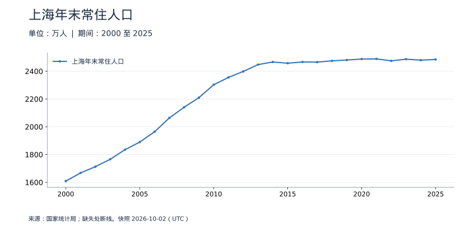
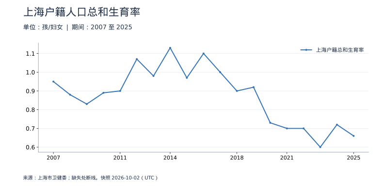

<!-- Generated by scripts/sync_macro.py; edit macro_catalog.py/macro_render.py. -->
# 上海人口与生育：真实数据

上海常住人口和户籍人口生育率分别说明什么？

两张图的统计人群不同：人口总量是上海常住人口，生育率是上海户籍人口。迁移会影响常住人口，不能只用本地出生解释城市人口变化，也不能将户籍生育率当作全部常住女性的生育率。

本页快照获取时间：**2026-10-02T15:21:38+00:00**。这是获取时间，不是所有数据的发布日期。每日检查上游；最新统计期以每个指标为准。

[CSV 下载](https://raw.githubusercontent.com/calcky/finance/main/data/macro/shanghai-population.csv) · [来源与采集参数](https://github.com/calcky/finance/blob/main/data/macro/shanghai-population.metadata.json) · [最近同步状态](https://github.com/calcky/finance/actions/workflows/update-gdp.yml)

```{only} html
本站同版快照：{download}`CSV <../../data/macro/shanghai-population.csv>` · {download}`元数据 <../../data/macro/shanghai-population.metadata.json>`
```

网页支持悬停查看、点击固定读数、按期间选择、缩放和定位明细。GitHub、打印或禁用 JavaScript 时显示静态图；数值与网页使用同一快照。

## 最新观测与覆盖

| 指标 | 最新期间 | 数值 | 单位 | 本项目起点 | 观测数 | 来源 |
|---|---|---:|---|---|---:|---|
| 上海年末常住人口 | 2025 | 2,485 | 万人 | 2000 | 26 | [国家统计局](https://data.stats.gov.cn/) |
| 上海户籍总和生育率 | 2025 | 0.66 | 孩/妇女 | 2007 | 19 | [上海市卫健委](https://wsjkw.sh.gov.cn/tjsj2/20260304/d2dbc3cecabd49a2bae05780e73b8cb9.html) |

起点表示本项目当前覆盖范围，不代表该指标从此时才开始发布。旧定义序列的最后一期也不代表来源停止更新。各来源可能存在发布或入库滞后；空白不补零、不插值。发布日期未知的观测在 CSV 中留空。

图表的“全部”与 CSV 保留完整已采集历史；缩放近期不会删除早期数据。[历史来源、口径断点与剩余缺口](history-coverage.md)说明回溯范围。

## 上海年末常住人口

国家统计局修订后的2000年起序列，整数万人。上海年鉴有更早历史，但本次访问受限；旧公报还存在普查修订差异，暂不拼接，具体限制见历史覆盖说明。



<details class="macro-details">
<summary>上海年末常住人口：展开完整数据表（万人）</summary>
<div class="macro-table-wrap"><table><thead><tr><th>期间</th><th>上海年末常住人口</th></tr></thead><tbody>
<tr id="macro-shanghai-population-2025" tabindex="-1"><td>2025</td><td>2,485</td></tr>
<tr id="macro-shanghai-population-2024" tabindex="-1"><td>2024</td><td>2,480</td></tr>
<tr id="macro-shanghai-population-2023" tabindex="-1"><td>2023</td><td>2,487</td></tr>
<tr id="macro-shanghai-population-2022" tabindex="-1"><td>2022</td><td>2,475</td></tr>
<tr id="macro-shanghai-population-2021" tabindex="-1"><td>2021</td><td>2,489</td></tr>
<tr id="macro-shanghai-population-2020" tabindex="-1"><td>2020</td><td>2,488</td></tr>
<tr id="macro-shanghai-population-2019" tabindex="-1"><td>2019</td><td>2,481</td></tr>
<tr id="macro-shanghai-population-2018" tabindex="-1"><td>2018</td><td>2,475</td></tr>
<tr id="macro-shanghai-population-2017" tabindex="-1"><td>2017</td><td>2,466</td></tr>
<tr id="macro-shanghai-population-2016" tabindex="-1"><td>2016</td><td>2,467</td></tr>
<tr id="macro-shanghai-population-2015" tabindex="-1"><td>2015</td><td>2,458</td></tr>
<tr id="macro-shanghai-population-2014" tabindex="-1"><td>2014</td><td>2,467</td></tr>
<tr id="macro-shanghai-population-2013" tabindex="-1"><td>2013</td><td>2,448</td></tr>
<tr id="macro-shanghai-population-2012" tabindex="-1"><td>2012</td><td>2,399</td></tr>
<tr id="macro-shanghai-population-2011" tabindex="-1"><td>2011</td><td>2,356</td></tr>
<tr id="macro-shanghai-population-2010" tabindex="-1"><td>2010</td><td>2,303</td></tr>
<tr id="macro-shanghai-population-2009" tabindex="-1"><td>2009</td><td>2,210</td></tr>
<tr id="macro-shanghai-population-2008" tabindex="-1"><td>2008</td><td>2,141</td></tr>
<tr id="macro-shanghai-population-2007" tabindex="-1"><td>2007</td><td>2,064</td></tr>
<tr id="macro-shanghai-population-2006" tabindex="-1"><td>2006</td><td>1,964</td></tr>
<tr id="macro-shanghai-population-2005" tabindex="-1"><td>2005</td><td>1,890</td></tr>
<tr id="macro-shanghai-population-2004" tabindex="-1"><td>2004</td><td>1,835</td></tr>
<tr id="macro-shanghai-population-2003" tabindex="-1"><td>2003</td><td>1,766</td></tr>
<tr id="macro-shanghai-population-2002" tabindex="-1"><td>2002</td><td>1,713</td></tr>
<tr id="macro-shanghai-population-2001" tabindex="-1"><td>2001</td><td>1,668</td></tr>
<tr id="macro-shanghai-population-2000" tabindex="-1"><td>2000</td><td>1,609</td></tr>
</tbody></table></div></details>

## 上海户籍人口总和生育率

2007年起卫健委历年报告，明确为户籍口径。0.66表示按该年年龄别生育率合成的终身平均子女数，不是出生率0.66%，也不代表常住人口口径。



<details class="macro-details">
<summary>上海户籍人口总和生育率：展开完整数据表（孩/妇女）</summary>
<div class="macro-table-wrap"><table><thead><tr><th>期间</th><th>上海户籍总和生育率</th></tr></thead><tbody>
<tr id="macro-shanghai-fertility-2025" tabindex="-1"><td>2025</td><td>0.66</td></tr>
<tr id="macro-shanghai-fertility-2024" tabindex="-1"><td>2024</td><td>0.72</td></tr>
<tr id="macro-shanghai-fertility-2023" tabindex="-1"><td>2023</td><td>0.6</td></tr>
<tr id="macro-shanghai-fertility-2022" tabindex="-1"><td>2022</td><td>0.7</td></tr>
<tr id="macro-shanghai-fertility-2021" tabindex="-1"><td>2021</td><td>0.7</td></tr>
<tr id="macro-shanghai-fertility-2020" tabindex="-1"><td>2020</td><td>0.73</td></tr>
<tr id="macro-shanghai-fertility-2019" tabindex="-1"><td>2019</td><td>0.92</td></tr>
<tr id="macro-shanghai-fertility-2018" tabindex="-1"><td>2018</td><td>0.9</td></tr>
<tr id="macro-shanghai-fertility-2017" tabindex="-1"><td>2017</td><td>1</td></tr>
<tr id="macro-shanghai-fertility-2016" tabindex="-1"><td>2016</td><td>1.1</td></tr>
<tr id="macro-shanghai-fertility-2015" tabindex="-1"><td>2015</td><td>0.97</td></tr>
<tr id="macro-shanghai-fertility-2014" tabindex="-1"><td>2014</td><td>1.13</td></tr>
<tr id="macro-shanghai-fertility-2013" tabindex="-1"><td>2013</td><td>0.98</td></tr>
<tr id="macro-shanghai-fertility-2012" tabindex="-1"><td>2012</td><td>1.07</td></tr>
<tr id="macro-shanghai-fertility-2011" tabindex="-1"><td>2011</td><td>0.9</td></tr>
<tr id="macro-shanghai-fertility-2010" tabindex="-1"><td>2010</td><td>0.89</td></tr>
<tr id="macro-shanghai-fertility-2009" tabindex="-1"><td>2009</td><td>0.83</td></tr>
<tr id="macro-shanghai-fertility-2008" tabindex="-1"><td>2008</td><td>0.88</td></tr>
<tr id="macro-shanghai-fertility-2007" tabindex="-1"><td>2007</td><td>0.95</td></tr>
</tbody></table></div></details>

## 口径与阅读提醒

| 指标 | 口径 |
|---|---|
| 上海年末常住人口 | 上海市常住人口，非户籍人口；采用最新修订后的省级年度序列，原表精度为整数万人。2000年前连续可比历史尚未取得，不拼接旧版本或户籍数。 |
| 上海户籍总和生育率 | 仅上海市户籍人口，不代表全体常住人口；总和生育率不是一般生育率、出生率或一孩比例。2007年起历年原始报告。 |

- 已遍历卫健委统计数据全部档案页，2007年起连续户籍总和生育率；不是全体常住人口；早期年份尚未核验。
- 新版常住人口2000年起；上海年鉴更早历史访问受限，1998—1999旧年鉴只有未明确常住口径的年底总人口，暂不拼接；2000不是统计历史起点。

日度图保留日历缺口：节假日、没有操作或上游缺失的日期均无观测，不能仅从空白判断原因。图线在缺失处断开；月度与季度图也不插值。

来源可能修订历史值。同步程序对已有期间的消失报错，合法数值修订保存在 Git 历史中；这不是包含所有官方初值的实时数据库。这里只摘录指标事实并注明来源，来源文件和机构条款仍归各发布机构。

继续理解：[相关基础知识](../housing-population.md) · [如何读宏观数据](../reading-macro-data.md) · [全部数据专题](index.md)
