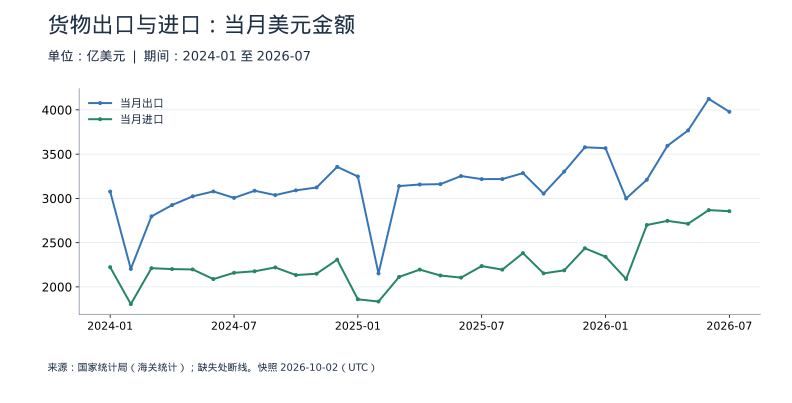
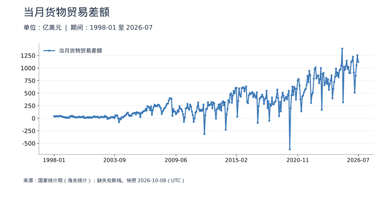
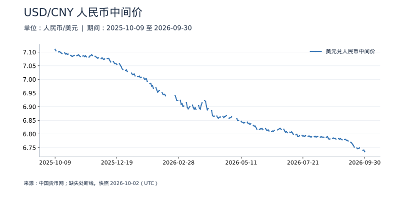

<!-- Generated by scripts/sync_macro.py; edit macro_catalog.py/macro_render.py. -->
# 进出口与人民币汇率：真实数据

外需、贸易收支与人民币计价怎样联系？

货物贸易以单月美元金额展示，汇率单独使用日度人民币中间价。金额变化包含数量和价格因素，中间价不是市场即期成交价。顺差和汇率之间还隔着资本流动、利差、预期与政策等条件。

本页快照获取时间：**2026-10-02T03:25:32+00:00**。这是获取时间，不是所有数据的发布日期。每日检查上游；最新统计期以每个指标为准。

[CSV 下载](https://raw.githubusercontent.com/calcky/finance/main/data/macro/trade-fx.csv) · [来源与采集参数](https://github.com/calcky/finance/blob/main/data/macro/trade-fx.metadata.json) · [最近同步状态](https://github.com/calcky/finance/actions/workflows/update-gdp.yml)

```{only} html
本站同版快照：{download}`CSV <../../data/macro/trade-fx.csv>` · {download}`元数据 <../../data/macro/trade-fx.metadata.json>`
```

网页支持悬停查看、点击固定读数、按期间选择、缩放和定位明细。GitHub、打印或禁用 JavaScript 时显示静态图；数值与网页使用同一快照。

## 最新观测与覆盖

| 指标 | 最新期间 | 数值 | 单位 | 本项目起点 | 来源 |
|---|---|---:|---|---|---|
| 当月出口 | 2026-07 | 3,978.51708 | 亿美元 | 2024-01 | [国家统计局（海关统计）](https://data.stats.gov.cn/dg/website/page.html#/pc/national/monthData) |
| 当月进口 | 2026-07 | 2,855.14272 | 亿美元 | 2024-01 | [国家统计局（海关统计）](https://data.stats.gov.cn/dg/website/page.html#/pc/national/monthData) |
| 当月货物贸易差额 | 2026-07 | 1,123.37436 | 亿美元 | 2024-01 | [国家统计局（海关统计）](https://data.stats.gov.cn/dg/website/page.html#/pc/national/monthData) |
| 美元兑人民币中间价 | 2026-09-30 | 6.7351 | 人民币/美元 | 2025-10-09 | [中国货币网](https://www.chinamoney.com.cn/r/cms/www/chinamoney/data/fx/ccpr-chrt-usd.xml) |

起点表示本项目当前覆盖范围，不代表该指标从此时才开始发布。各来源可能存在发布或入库滞后；空白不补零、不插值。发布日期未知的观测在 CSV 中留空。

## 货物出口与进口：当月美元金额

春节错位会影响单月比较。统计上存在 1—2 月合并发布时，不拆算成两个独立月份。这里不包含服务贸易。



<details class="macro-details">
<summary>货物出口与进口：当月美元金额：展开完整数据表（亿美元）</summary>
<div class="macro-table-wrap"><table><thead><tr><th>期间</th><th>当月出口</th><th>当月进口</th></tr></thead><tbody>
<tr id="macro-trade-2026-07" tabindex="-1"><td>2026-07</td><td>3,978.51708</td><td>2,855.14272</td></tr>
<tr id="macro-trade-2026-06" tabindex="-1"><td>2026-06</td><td>4,123.87125</td><td>2,867.64038</td></tr>
<tr id="macro-trade-2026-05" tabindex="-1"><td>2026-05</td><td>3,767.82594</td><td>2,713.4901</td></tr>
<tr id="macro-trade-2026-04" tabindex="-1"><td>2026-04</td><td>3,594.42136</td><td>2,746.18212</td></tr>
<tr id="macro-trade-2026-03" tabindex="-1"><td>2026-03</td><td>3,210.32653</td><td>2,699.0356</td></tr>
<tr id="macro-trade-2026-02" tabindex="-1"><td>2026-02</td><td>2,998.77987</td><td>2,089.00488</td></tr>
<tr id="macro-trade-2026-01" tabindex="-1"><td>2026-01</td><td>3,566.99626</td><td>2,340.59059</td></tr>
<tr id="macro-trade-2025-12" tabindex="-1"><td>2025-12</td><td>3,577.4717</td><td>2,436.39968</td></tr>
<tr id="macro-trade-2025-11" tabindex="-1"><td>2025-11</td><td>3,303.50566</td><td>2,186.74618</td></tr>
<tr id="macro-trade-2025-10" tabindex="-1"><td>2025-10</td><td>3,053.53192</td><td>2,152.78962</td></tr>
<tr id="macro-trade-2025-09" tabindex="-1"><td>2025-09</td><td>3,285.65399</td><td>2,381.17951</td></tr>
<tr id="macro-trade-2025-08" tabindex="-1"><td>2025-08</td><td>3,218.10157</td><td>2,194.81352</td></tr>
<tr id="macro-trade-2025-07" tabindex="-1"><td>2025-07</td><td>3,217.8393</td><td>2,235.393</td></tr>
<tr id="macro-trade-2025-06" tabindex="-1"><td>2025-06</td><td>3,252.32738</td><td>2,104.81474</td></tr>
<tr id="macro-trade-2025-05" tabindex="-1"><td>2025-05</td><td>3,161.0098</td><td>2,128.80563</td></tr>
<tr id="macro-trade-2025-04" tabindex="-1"><td>2025-04</td><td>3,156.92375</td><td>2,195.12228</td></tr>
<tr id="macro-trade-2025-03" tabindex="-1"><td>2025-03</td><td>3,139.11793</td><td>2,112.69329</td></tr>
<tr id="macro-trade-2025-02" tabindex="-1"><td>2025-02</td><td>2,151.72519</td><td>1,834.53706</td></tr>
<tr id="macro-trade-2025-01" tabindex="-1"><td>2025-01</td><td>3,247.68272</td><td>1,859.71892</td></tr>
<tr id="macro-trade-2024-12" tabindex="-1"><td>2024-12</td><td>3,356.27038</td><td>2,307.89126</td></tr>
<tr id="macro-trade-2024-11" tabindex="-1"><td>2024-11</td><td>3,123.10466</td><td>2,148.67327</td></tr>
<tr id="macro-trade-2024-10" tabindex="-1"><td>2024-10</td><td>3,090.58423</td><td>2,133.39605</td></tr>
<tr id="macro-trade-2024-09" tabindex="-1"><td>2024-09</td><td>3,037.12134</td><td>2,220.01611</td></tr>
<tr id="macro-trade-2024-08" tabindex="-1"><td>2024-08</td><td>3,086.47262</td><td>2,176.25707</td></tr>
<tr id="macro-trade-2024-07" tabindex="-1"><td>2024-07</td><td>3,005.56525</td><td>2,159.096</td></tr>
<tr id="macro-trade-2024-06" tabindex="-1"><td>2024-06</td><td>3,078.54505</td><td>2,088.07983</td></tr>
<tr id="macro-trade-2024-05" tabindex="-1"><td>2024-05</td><td>3,023.48019</td><td>2,197.25898</td></tr>
<tr id="macro-trade-2024-04" tabindex="-1"><td>2024-04</td><td>2,924.53498</td><td>2,201.0181</td></tr>
<tr id="macro-trade-2024-03" tabindex="-1"><td>2024-03</td><td>2,796.81675</td><td>2,211.30611</td></tr>
<tr id="macro-trade-2024-02" tabindex="-1"><td>2024-02</td><td>2,202.79326</td><td>1,805.73806</td></tr>
<tr id="macro-trade-2024-01" tabindex="-1"><td>2024-01</td><td>3,077.34618</td><td>2,222.76794</td></tr>
</tbody></table></div></details>

## 当月货物贸易差额

正值为出口大于进口，负值为逆差。保留官方差额原值；部分历史值取整精度较低，与上图金额直接相减可能有微小差异。贸易差额不等于企业利润，也不等于完整的经常账户差额。



<details class="macro-details">
<summary>当月货物贸易差额：展开完整数据表（亿美元）</summary>
<div class="macro-table-wrap"><table><thead><tr><th>期间</th><th>当月货物贸易差额</th></tr></thead><tbody>
<tr id="macro-trade-balance-2026-07" tabindex="-1"><td>2026-07</td><td>1,123.37436</td></tr>
<tr id="macro-trade-balance-2026-06" tabindex="-1"><td>2026-06</td><td>1,256.23087</td></tr>
<tr id="macro-trade-balance-2026-05" tabindex="-1"><td>2026-05</td><td>1,054.33584</td></tr>
<tr id="macro-trade-balance-2026-04" tabindex="-1"><td>2026-04</td><td>848.23925</td></tr>
<tr id="macro-trade-balance-2026-03" tabindex="-1"><td>2026-03</td><td>511.29093</td></tr>
<tr id="macro-trade-balance-2026-02" tabindex="-1"><td>2026-02</td><td>909.77499</td></tr>
<tr id="macro-trade-balance-2026-01" tabindex="-1"><td>2026-01</td><td>1,226.40568</td></tr>
<tr id="macro-trade-balance-2025-12" tabindex="-1"><td>2025-12</td><td>1,141.07202</td></tr>
<tr id="macro-trade-balance-2025-11" tabindex="-1"><td>2025-11</td><td>1,116.75947</td></tr>
<tr id="macro-trade-balance-2025-10" tabindex="-1"><td>2025-10</td><td>900.74229</td></tr>
<tr id="macro-trade-balance-2025-09" tabindex="-1"><td>2025-09</td><td>904.47447</td></tr>
<tr id="macro-trade-balance-2025-08" tabindex="-1"><td>2025-08</td><td>1,023.28805</td></tr>
<tr id="macro-trade-balance-2025-07" tabindex="-1"><td>2025-07</td><td>982.44631</td></tr>
<tr id="macro-trade-balance-2025-06" tabindex="-1"><td>2025-06</td><td>1,147.51264</td></tr>
<tr id="macro-trade-balance-2025-05" tabindex="-1"><td>2025-05</td><td>1,032.20417</td></tr>
<tr id="macro-trade-balance-2025-04" tabindex="-1"><td>2025-04</td><td>961.80147</td></tr>
<tr id="macro-trade-balance-2025-03" tabindex="-1"><td>2025-03</td><td>1,026.42464</td></tr>
<tr id="macro-trade-balance-2025-02" tabindex="-1"><td>2025-02</td><td>317.18813</td></tr>
<tr id="macro-trade-balance-2025-01" tabindex="-1"><td>2025-01</td><td>1,387.9638</td></tr>
<tr id="macro-trade-balance-2024-12" tabindex="-1"><td>2024-12</td><td>1,048.37912</td></tr>
<tr id="macro-trade-balance-2024-11" tabindex="-1"><td>2024-11</td><td>974.43139</td></tr>
<tr id="macro-trade-balance-2024-10" tabindex="-1"><td>2024-10</td><td>957.18818</td></tr>
<tr id="macro-trade-balance-2024-09" tabindex="-1"><td>2024-09</td><td>817.11</td></tr>
<tr id="macro-trade-balance-2024-08" tabindex="-1"><td>2024-08</td><td>910.22</td></tr>
<tr id="macro-trade-balance-2024-07" tabindex="-1"><td>2024-07</td><td>846.47</td></tr>
<tr id="macro-trade-balance-2024-06" tabindex="-1"><td>2024-06</td><td>990.5</td></tr>
<tr id="macro-trade-balance-2024-05" tabindex="-1"><td>2024-05</td><td>826.2</td></tr>
<tr id="macro-trade-balance-2024-04" tabindex="-1"><td>2024-04</td><td>723.5</td></tr>
<tr id="macro-trade-balance-2024-03" tabindex="-1"><td>2024-03</td><td>585.5</td></tr>
<tr id="macro-trade-balance-2024-02" tabindex="-1"><td>2024-02</td><td>397.06</td></tr>
<tr id="macro-trade-balance-2024-01" tabindex="-1"><td>2024-01</td><td>854.58</td></tr>
</tbody></table></div></details>

## USD/CNY 人民币中间价

数值上升表示一美元可兑换更多人民币，即人民币对美元贬值。这里是中间价，不是可直接成交的银行买卖报价。



<details class="macro-details">
<summary>USD/CNY 人民币中间价：展开完整数据表（人民币/美元）</summary>
<div class="macro-table-wrap"><table><thead><tr><th>期间</th><th>美元兑人民币中间价</th></tr></thead><tbody>
<tr id="macro-exchange-midpoint-2026-09-30" tabindex="-1"><td>2026-09-30</td><td>6.7351</td></tr>
<tr id="macro-exchange-midpoint-2026-09-29" tabindex="-1"><td>2026-09-29</td><td>6.7411</td></tr>
<tr id="macro-exchange-midpoint-2026-09-28" tabindex="-1"><td>2026-09-28</td><td>6.7399</td></tr>
<tr id="macro-exchange-midpoint-2026-09-27" tabindex="-1"><td>2026-09-27</td><td>缺失</td></tr>
<tr id="macro-exchange-midpoint-2026-09-26" tabindex="-1"><td>2026-09-26</td><td>缺失</td></tr>
<tr id="macro-exchange-midpoint-2026-09-25" tabindex="-1"><td>2026-09-25</td><td>缺失</td></tr>
<tr id="macro-exchange-midpoint-2026-09-24" tabindex="-1"><td>2026-09-24</td><td>6.7489</td></tr>
<tr id="macro-exchange-midpoint-2026-09-23" tabindex="-1"><td>2026-09-23</td><td>6.7468</td></tr>
<tr id="macro-exchange-midpoint-2026-09-22" tabindex="-1"><td>2026-09-22</td><td>6.7459</td></tr>
<tr id="macro-exchange-midpoint-2026-09-21" tabindex="-1"><td>2026-09-21</td><td>6.7487</td></tr>
<tr id="macro-exchange-midpoint-2026-09-20" tabindex="-1"><td>2026-09-20</td><td>缺失</td></tr>
<tr id="macro-exchange-midpoint-2026-09-19" tabindex="-1"><td>2026-09-19</td><td>缺失</td></tr>
<tr id="macro-exchange-midpoint-2026-09-18" tabindex="-1"><td>2026-09-18</td><td>6.7521</td></tr>
<tr id="macro-exchange-midpoint-2026-09-17" tabindex="-1"><td>2026-09-17</td><td>6.758</td></tr>
<tr id="macro-exchange-midpoint-2026-09-16" tabindex="-1"><td>2026-09-16</td><td>6.7628</td></tr>
<tr id="macro-exchange-midpoint-2026-09-15" tabindex="-1"><td>2026-09-15</td><td>6.767</td></tr>
<tr id="macro-exchange-midpoint-2026-09-14" tabindex="-1"><td>2026-09-14</td><td>6.7698</td></tr>
<tr id="macro-exchange-midpoint-2026-09-13" tabindex="-1"><td>2026-09-13</td><td>缺失</td></tr>
<tr id="macro-exchange-midpoint-2026-09-12" tabindex="-1"><td>2026-09-12</td><td>缺失</td></tr>
<tr id="macro-exchange-midpoint-2026-09-11" tabindex="-1"><td>2026-09-11</td><td>6.7743</td></tr>
<tr id="macro-exchange-midpoint-2026-09-10" tabindex="-1"><td>2026-09-10</td><td>6.7766</td></tr>
<tr id="macro-exchange-midpoint-2026-09-09" tabindex="-1"><td>2026-09-09</td><td>6.7769</td></tr>
<tr id="macro-exchange-midpoint-2026-09-08" tabindex="-1"><td>2026-09-08</td><td>6.7804</td></tr>
<tr id="macro-exchange-midpoint-2026-09-07" tabindex="-1"><td>2026-09-07</td><td>6.7795</td></tr>
<tr id="macro-exchange-midpoint-2026-09-06" tabindex="-1"><td>2026-09-06</td><td>缺失</td></tr>
<tr id="macro-exchange-midpoint-2026-09-05" tabindex="-1"><td>2026-09-05</td><td>缺失</td></tr>
<tr id="macro-exchange-midpoint-2026-09-04" tabindex="-1"><td>2026-09-04</td><td>6.7787</td></tr>
<tr id="macro-exchange-midpoint-2026-09-03" tabindex="-1"><td>2026-09-03</td><td>6.7807</td></tr>
<tr id="macro-exchange-midpoint-2026-09-02" tabindex="-1"><td>2026-09-02</td><td>6.7829</td></tr>
<tr id="macro-exchange-midpoint-2026-09-01" tabindex="-1"><td>2026-09-01</td><td>6.7809</td></tr>
<tr id="macro-exchange-midpoint-2026-08-31" tabindex="-1"><td>2026-08-31</td><td>6.7828</td></tr>
<tr id="macro-exchange-midpoint-2026-08-30" tabindex="-1"><td>2026-08-30</td><td>缺失</td></tr>
<tr id="macro-exchange-midpoint-2026-08-29" tabindex="-1"><td>2026-08-29</td><td>缺失</td></tr>
<tr id="macro-exchange-midpoint-2026-08-28" tabindex="-1"><td>2026-08-28</td><td>6.7811</td></tr>
<tr id="macro-exchange-midpoint-2026-08-27" tabindex="-1"><td>2026-08-27</td><td>6.784</td></tr>
<tr id="macro-exchange-midpoint-2026-08-26" tabindex="-1"><td>2026-08-26</td><td>6.7829</td></tr>
<tr id="macro-exchange-midpoint-2026-08-25" tabindex="-1"><td>2026-08-25</td><td>6.7852</td></tr>
<tr id="macro-exchange-midpoint-2026-08-24" tabindex="-1"><td>2026-08-24</td><td>6.7841</td></tr>
<tr id="macro-exchange-midpoint-2026-08-23" tabindex="-1"><td>2026-08-23</td><td>缺失</td></tr>
<tr id="macro-exchange-midpoint-2026-08-22" tabindex="-1"><td>2026-08-22</td><td>缺失</td></tr>
<tr id="macro-exchange-midpoint-2026-08-21" tabindex="-1"><td>2026-08-21</td><td>6.7817</td></tr>
<tr id="macro-exchange-midpoint-2026-08-20" tabindex="-1"><td>2026-08-20</td><td>6.7808</td></tr>
<tr id="macro-exchange-midpoint-2026-08-19" tabindex="-1"><td>2026-08-19</td><td>6.7854</td></tr>
<tr id="macro-exchange-midpoint-2026-08-18" tabindex="-1"><td>2026-08-18</td><td>6.7905</td></tr>
<tr id="macro-exchange-midpoint-2026-08-17" tabindex="-1"><td>2026-08-17</td><td>6.7873</td></tr>
<tr id="macro-exchange-midpoint-2026-08-16" tabindex="-1"><td>2026-08-16</td><td>缺失</td></tr>
<tr id="macro-exchange-midpoint-2026-08-15" tabindex="-1"><td>2026-08-15</td><td>缺失</td></tr>
<tr id="macro-exchange-midpoint-2026-08-14" tabindex="-1"><td>2026-08-14</td><td>6.7878</td></tr>
<tr id="macro-exchange-midpoint-2026-08-13" tabindex="-1"><td>2026-08-13</td><td>6.7888</td></tr>
<tr id="macro-exchange-midpoint-2026-08-12" tabindex="-1"><td>2026-08-12</td><td>6.7882</td></tr>
<tr id="macro-exchange-midpoint-2026-08-11" tabindex="-1"><td>2026-08-11</td><td>6.79</td></tr>
<tr id="macro-exchange-midpoint-2026-08-10" tabindex="-1"><td>2026-08-10</td><td>6.7884</td></tr>
<tr id="macro-exchange-midpoint-2026-08-09" tabindex="-1"><td>2026-08-09</td><td>缺失</td></tr>
<tr id="macro-exchange-midpoint-2026-08-08" tabindex="-1"><td>2026-08-08</td><td>缺失</td></tr>
<tr id="macro-exchange-midpoint-2026-08-07" tabindex="-1"><td>2026-08-07</td><td>6.7904</td></tr>
<tr id="macro-exchange-midpoint-2026-08-06" tabindex="-1"><td>2026-08-06</td><td>6.7895</td></tr>
<tr id="macro-exchange-midpoint-2026-08-05" tabindex="-1"><td>2026-08-05</td><td>6.7889</td></tr>
<tr id="macro-exchange-midpoint-2026-08-04" tabindex="-1"><td>2026-08-04</td><td>6.7917</td></tr>
<tr id="macro-exchange-midpoint-2026-08-03" tabindex="-1"><td>2026-08-03</td><td>6.7898</td></tr>
<tr id="macro-exchange-midpoint-2026-08-02" tabindex="-1"><td>2026-08-02</td><td>缺失</td></tr>
<tr id="macro-exchange-midpoint-2026-08-01" tabindex="-1"><td>2026-08-01</td><td>缺失</td></tr>
<tr id="macro-exchange-midpoint-2026-07-31" tabindex="-1"><td>2026-07-31</td><td>6.7894</td></tr>
<tr id="macro-exchange-midpoint-2026-07-30" tabindex="-1"><td>2026-07-30</td><td>6.7892</td></tr>
<tr id="macro-exchange-midpoint-2026-07-29" tabindex="-1"><td>2026-07-29</td><td>6.7899</td></tr>
<tr id="macro-exchange-midpoint-2026-07-28" tabindex="-1"><td>2026-07-28</td><td>6.7928</td></tr>
<tr id="macro-exchange-midpoint-2026-07-27" tabindex="-1"><td>2026-07-27</td><td>6.7911</td></tr>
<tr id="macro-exchange-midpoint-2026-07-26" tabindex="-1"><td>2026-07-26</td><td>缺失</td></tr>
<tr id="macro-exchange-midpoint-2026-07-25" tabindex="-1"><td>2026-07-25</td><td>缺失</td></tr>
<tr id="macro-exchange-midpoint-2026-07-24" tabindex="-1"><td>2026-07-24</td><td>6.7939</td></tr>
<tr id="macro-exchange-midpoint-2026-07-23" tabindex="-1"><td>2026-07-23</td><td>6.7906</td></tr>
<tr id="macro-exchange-midpoint-2026-07-22" tabindex="-1"><td>2026-07-22</td><td>6.7933</td></tr>
<tr id="macro-exchange-midpoint-2026-07-21" tabindex="-1"><td>2026-07-21</td><td>6.7917</td></tr>
<tr id="macro-exchange-midpoint-2026-07-20" tabindex="-1"><td>2026-07-20</td><td>6.7948</td></tr>
<tr id="macro-exchange-midpoint-2026-07-19" tabindex="-1"><td>2026-07-19</td><td>缺失</td></tr>
<tr id="macro-exchange-midpoint-2026-07-18" tabindex="-1"><td>2026-07-18</td><td>缺失</td></tr>
<tr id="macro-exchange-midpoint-2026-07-17" tabindex="-1"><td>2026-07-17</td><td>6.7934</td></tr>
<tr id="macro-exchange-midpoint-2026-07-16" tabindex="-1"><td>2026-07-16</td><td>6.7909</td></tr>
<tr id="macro-exchange-midpoint-2026-07-15" tabindex="-1"><td>2026-07-15</td><td>6.791</td></tr>
<tr id="macro-exchange-midpoint-2026-07-14" tabindex="-1"><td>2026-07-14</td><td>6.799</td></tr>
<tr id="macro-exchange-midpoint-2026-07-13" tabindex="-1"><td>2026-07-13</td><td>6.7972</td></tr>
<tr id="macro-exchange-midpoint-2026-07-12" tabindex="-1"><td>2026-07-12</td><td>缺失</td></tr>
<tr id="macro-exchange-midpoint-2026-07-11" tabindex="-1"><td>2026-07-11</td><td>缺失</td></tr>
<tr id="macro-exchange-midpoint-2026-07-10" tabindex="-1"><td>2026-07-10</td><td>6.7989</td></tr>
<tr id="macro-exchange-midpoint-2026-07-09" tabindex="-1"><td>2026-07-09</td><td>6.8036</td></tr>
<tr id="macro-exchange-midpoint-2026-07-08" tabindex="-1"><td>2026-07-08</td><td>6.8077</td></tr>
<tr id="macro-exchange-midpoint-2026-07-07" tabindex="-1"><td>2026-07-07</td><td>6.8054</td></tr>
<tr id="macro-exchange-midpoint-2026-07-06" tabindex="-1"><td>2026-07-06</td><td>6.8066</td></tr>
<tr id="macro-exchange-midpoint-2026-07-05" tabindex="-1"><td>2026-07-05</td><td>缺失</td></tr>
<tr id="macro-exchange-midpoint-2026-07-04" tabindex="-1"><td>2026-07-04</td><td>缺失</td></tr>
<tr id="macro-exchange-midpoint-2026-07-03" tabindex="-1"><td>2026-07-03</td><td>6.8047</td></tr>
<tr id="macro-exchange-midpoint-2026-07-02" tabindex="-1"><td>2026-07-02</td><td>6.8088</td></tr>
<tr id="macro-exchange-midpoint-2026-07-01" tabindex="-1"><td>2026-07-01</td><td>6.8067</td></tr>
<tr id="macro-exchange-midpoint-2026-06-30" tabindex="-1"><td>2026-06-30</td><td>6.8109</td></tr>
<tr id="macro-exchange-midpoint-2026-06-29" tabindex="-1"><td>2026-06-29</td><td>6.8175</td></tr>
<tr id="macro-exchange-midpoint-2026-06-28" tabindex="-1"><td>2026-06-28</td><td>缺失</td></tr>
<tr id="macro-exchange-midpoint-2026-06-27" tabindex="-1"><td>2026-06-27</td><td>缺失</td></tr>
<tr id="macro-exchange-midpoint-2026-06-26" tabindex="-1"><td>2026-06-26</td><td>6.8166</td></tr>
<tr id="macro-exchange-midpoint-2026-06-25" tabindex="-1"><td>2026-06-25</td><td>6.8209</td></tr>
<tr id="macro-exchange-midpoint-2026-06-24" tabindex="-1"><td>2026-06-24</td><td>6.8195</td></tr>
<tr id="macro-exchange-midpoint-2026-06-23" tabindex="-1"><td>2026-06-23</td><td>6.8171</td></tr>
<tr id="macro-exchange-midpoint-2026-06-22" tabindex="-1"><td>2026-06-22</td><td>6.815</td></tr>
<tr id="macro-exchange-midpoint-2026-06-21" tabindex="-1"><td>2026-06-21</td><td>缺失</td></tr>
<tr id="macro-exchange-midpoint-2026-06-20" tabindex="-1"><td>2026-06-20</td><td>缺失</td></tr>
<tr id="macro-exchange-midpoint-2026-06-19" tabindex="-1"><td>2026-06-19</td><td>缺失</td></tr>
<tr id="macro-exchange-midpoint-2026-06-18" tabindex="-1"><td>2026-06-18</td><td>6.813</td></tr>
<tr id="macro-exchange-midpoint-2026-06-17" tabindex="-1"><td>2026-06-17</td><td>6.8096</td></tr>
<tr id="macro-exchange-midpoint-2026-06-16" tabindex="-1"><td>2026-06-16</td><td>6.8108</td></tr>
<tr id="macro-exchange-midpoint-2026-06-15" tabindex="-1"><td>2026-06-15</td><td>6.8088</td></tr>
<tr id="macro-exchange-midpoint-2026-06-14" tabindex="-1"><td>2026-06-14</td><td>缺失</td></tr>
<tr id="macro-exchange-midpoint-2026-06-13" tabindex="-1"><td>2026-06-13</td><td>缺失</td></tr>
<tr id="macro-exchange-midpoint-2026-06-12" tabindex="-1"><td>2026-06-12</td><td>6.8109</td></tr>
<tr id="macro-exchange-midpoint-2026-06-11" tabindex="-1"><td>2026-06-11</td><td>6.815</td></tr>
<tr id="macro-exchange-midpoint-2026-06-10" tabindex="-1"><td>2026-06-10</td><td>6.813</td></tr>
<tr id="macro-exchange-midpoint-2026-06-09" tabindex="-1"><td>2026-06-09</td><td>6.8147</td></tr>
<tr id="macro-exchange-midpoint-2026-06-08" tabindex="-1"><td>2026-06-08</td><td>6.8198</td></tr>
<tr id="macro-exchange-midpoint-2026-06-07" tabindex="-1"><td>2026-06-07</td><td>缺失</td></tr>
<tr id="macro-exchange-midpoint-2026-06-06" tabindex="-1"><td>2026-06-06</td><td>缺失</td></tr>
<tr id="macro-exchange-midpoint-2026-06-05" tabindex="-1"><td>2026-06-05</td><td>6.8157</td></tr>
<tr id="macro-exchange-midpoint-2026-06-04" tabindex="-1"><td>2026-06-04</td><td>6.8203</td></tr>
<tr id="macro-exchange-midpoint-2026-06-03" tabindex="-1"><td>2026-06-03</td><td>6.8184</td></tr>
<tr id="macro-exchange-midpoint-2026-06-02" tabindex="-1"><td>2026-06-02</td><td>6.8187</td></tr>
<tr id="macro-exchange-midpoint-2026-06-01" tabindex="-1"><td>2026-06-01</td><td>6.8167</td></tr>
<tr id="macro-exchange-midpoint-2026-05-31" tabindex="-1"><td>2026-05-31</td><td>缺失</td></tr>
<tr id="macro-exchange-midpoint-2026-05-30" tabindex="-1"><td>2026-05-30</td><td>缺失</td></tr>
<tr id="macro-exchange-midpoint-2026-05-29" tabindex="-1"><td>2026-05-29</td><td>6.8176</td></tr>
<tr id="macro-exchange-midpoint-2026-05-28" tabindex="-1"><td>2026-05-28</td><td>6.824</td></tr>
<tr id="macro-exchange-midpoint-2026-05-27" tabindex="-1"><td>2026-05-27</td><td>6.8291</td></tr>
<tr id="macro-exchange-midpoint-2026-05-26" tabindex="-1"><td>2026-05-26</td><td>6.8288</td></tr>
<tr id="macro-exchange-midpoint-2026-05-25" tabindex="-1"><td>2026-05-25</td><td>6.8318</td></tr>
<tr id="macro-exchange-midpoint-2026-05-24" tabindex="-1"><td>2026-05-24</td><td>缺失</td></tr>
<tr id="macro-exchange-midpoint-2026-05-23" tabindex="-1"><td>2026-05-23</td><td>缺失</td></tr>
<tr id="macro-exchange-midpoint-2026-05-22" tabindex="-1"><td>2026-05-22</td><td>6.8373</td></tr>
<tr id="macro-exchange-midpoint-2026-05-21" tabindex="-1"><td>2026-05-21</td><td>6.8349</td></tr>
<tr id="macro-exchange-midpoint-2026-05-20" tabindex="-1"><td>2026-05-20</td><td>6.8397</td></tr>
<tr id="macro-exchange-midpoint-2026-05-19" tabindex="-1"><td>2026-05-19</td><td>6.8375</td></tr>
<tr id="macro-exchange-midpoint-2026-05-18" tabindex="-1"><td>2026-05-18</td><td>6.8435</td></tr>
<tr id="macro-exchange-midpoint-2026-05-17" tabindex="-1"><td>2026-05-17</td><td>缺失</td></tr>
<tr id="macro-exchange-midpoint-2026-05-16" tabindex="-1"><td>2026-05-16</td><td>缺失</td></tr>
<tr id="macro-exchange-midpoint-2026-05-15" tabindex="-1"><td>2026-05-15</td><td>6.8415</td></tr>
<tr id="macro-exchange-midpoint-2026-05-14" tabindex="-1"><td>2026-05-14</td><td>6.8401</td></tr>
<tr id="macro-exchange-midpoint-2026-05-13" tabindex="-1"><td>2026-05-13</td><td>6.8431</td></tr>
<tr id="macro-exchange-midpoint-2026-05-12" tabindex="-1"><td>2026-05-12</td><td>6.8426</td></tr>
<tr id="macro-exchange-midpoint-2026-05-11" tabindex="-1"><td>2026-05-11</td><td>6.8467</td></tr>
<tr id="macro-exchange-midpoint-2026-05-10" tabindex="-1"><td>2026-05-10</td><td>缺失</td></tr>
<tr id="macro-exchange-midpoint-2026-05-09" tabindex="-1"><td>2026-05-09</td><td>缺失</td></tr>
<tr id="macro-exchange-midpoint-2026-05-08" tabindex="-1"><td>2026-05-08</td><td>6.8502</td></tr>
<tr id="macro-exchange-midpoint-2026-05-07" tabindex="-1"><td>2026-05-07</td><td>6.8487</td></tr>
<tr id="macro-exchange-midpoint-2026-05-06" tabindex="-1"><td>2026-05-06</td><td>6.8562</td></tr>
<tr id="macro-exchange-midpoint-2026-05-05" tabindex="-1"><td>2026-05-05</td><td>缺失</td></tr>
<tr id="macro-exchange-midpoint-2026-05-04" tabindex="-1"><td>2026-05-04</td><td>缺失</td></tr>
<tr id="macro-exchange-midpoint-2026-05-03" tabindex="-1"><td>2026-05-03</td><td>缺失</td></tr>
<tr id="macro-exchange-midpoint-2026-05-02" tabindex="-1"><td>2026-05-02</td><td>缺失</td></tr>
<tr id="macro-exchange-midpoint-2026-05-01" tabindex="-1"><td>2026-05-01</td><td>缺失</td></tr>
<tr id="macro-exchange-midpoint-2026-04-30" tabindex="-1"><td>2026-04-30</td><td>6.8628</td></tr>
<tr id="macro-exchange-midpoint-2026-04-29" tabindex="-1"><td>2026-04-29</td><td>6.8608</td></tr>
<tr id="macro-exchange-midpoint-2026-04-28" tabindex="-1"><td>2026-04-28</td><td>6.8589</td></tr>
<tr id="macro-exchange-midpoint-2026-04-27" tabindex="-1"><td>2026-04-27</td><td>6.8579</td></tr>
<tr id="macro-exchange-midpoint-2026-04-26" tabindex="-1"><td>2026-04-26</td><td>缺失</td></tr>
<tr id="macro-exchange-midpoint-2026-04-25" tabindex="-1"><td>2026-04-25</td><td>缺失</td></tr>
<tr id="macro-exchange-midpoint-2026-04-24" tabindex="-1"><td>2026-04-24</td><td>6.8674</td></tr>
<tr id="macro-exchange-midpoint-2026-04-23" tabindex="-1"><td>2026-04-23</td><td>6.865</td></tr>
<tr id="macro-exchange-midpoint-2026-04-22" tabindex="-1"><td>2026-04-22</td><td>6.8635</td></tr>
<tr id="macro-exchange-midpoint-2026-04-21" tabindex="-1"><td>2026-04-21</td><td>6.8594</td></tr>
<tr id="macro-exchange-midpoint-2026-04-20" tabindex="-1"><td>2026-04-20</td><td>6.8648</td></tr>
<tr id="macro-exchange-midpoint-2026-04-19" tabindex="-1"><td>2026-04-19</td><td>缺失</td></tr>
<tr id="macro-exchange-midpoint-2026-04-18" tabindex="-1"><td>2026-04-18</td><td>缺失</td></tr>
<tr id="macro-exchange-midpoint-2026-04-17" tabindex="-1"><td>2026-04-17</td><td>6.8622</td></tr>
<tr id="macro-exchange-midpoint-2026-04-16" tabindex="-1"><td>2026-04-16</td><td>6.8616</td></tr>
<tr id="macro-exchange-midpoint-2026-04-15" tabindex="-1"><td>2026-04-15</td><td>6.8582</td></tr>
<tr id="macro-exchange-midpoint-2026-04-14" tabindex="-1"><td>2026-04-14</td><td>6.8593</td></tr>
<tr id="macro-exchange-midpoint-2026-04-13" tabindex="-1"><td>2026-04-13</td><td>6.8657</td></tr>
<tr id="macro-exchange-midpoint-2026-04-12" tabindex="-1"><td>2026-04-12</td><td>缺失</td></tr>
<tr id="macro-exchange-midpoint-2026-04-11" tabindex="-1"><td>2026-04-11</td><td>缺失</td></tr>
<tr id="macro-exchange-midpoint-2026-04-10" tabindex="-1"><td>2026-04-10</td><td>6.8654</td></tr>
<tr id="macro-exchange-midpoint-2026-04-09" tabindex="-1"><td>2026-04-09</td><td>6.8649</td></tr>
<tr id="macro-exchange-midpoint-2026-04-08" tabindex="-1"><td>2026-04-08</td><td>6.868</td></tr>
<tr id="macro-exchange-midpoint-2026-04-07" tabindex="-1"><td>2026-04-07</td><td>6.8854</td></tr>
<tr id="macro-exchange-midpoint-2026-04-06" tabindex="-1"><td>2026-04-06</td><td>缺失</td></tr>
<tr id="macro-exchange-midpoint-2026-04-05" tabindex="-1"><td>2026-04-05</td><td>缺失</td></tr>
<tr id="macro-exchange-midpoint-2026-04-04" tabindex="-1"><td>2026-04-04</td><td>缺失</td></tr>
<tr id="macro-exchange-midpoint-2026-04-03" tabindex="-1"><td>2026-04-03</td><td>6.8929</td></tr>
<tr id="macro-exchange-midpoint-2026-04-02" tabindex="-1"><td>2026-04-02</td><td>6.888</td></tr>
<tr id="macro-exchange-midpoint-2026-04-01" tabindex="-1"><td>2026-04-01</td><td>6.9025</td></tr>
<tr id="macro-exchange-midpoint-2026-03-31" tabindex="-1"><td>2026-03-31</td><td>6.9194</td></tr>
<tr id="macro-exchange-midpoint-2026-03-30" tabindex="-1"><td>2026-03-30</td><td>6.9223</td></tr>
<tr id="macro-exchange-midpoint-2026-03-29" tabindex="-1"><td>2026-03-29</td><td>缺失</td></tr>
<tr id="macro-exchange-midpoint-2026-03-28" tabindex="-1"><td>2026-03-28</td><td>缺失</td></tr>
<tr id="macro-exchange-midpoint-2026-03-27" tabindex="-1"><td>2026-03-27</td><td>6.9141</td></tr>
<tr id="macro-exchange-midpoint-2026-03-26" tabindex="-1"><td>2026-03-26</td><td>6.9056</td></tr>
<tr id="macro-exchange-midpoint-2026-03-25" tabindex="-1"><td>2026-03-25</td><td>6.8911</td></tr>
<tr id="macro-exchange-midpoint-2026-03-24" tabindex="-1"><td>2026-03-24</td><td>6.8943</td></tr>
<tr id="macro-exchange-midpoint-2026-03-23" tabindex="-1"><td>2026-03-23</td><td>6.9041</td></tr>
<tr id="macro-exchange-midpoint-2026-03-22" tabindex="-1"><td>2026-03-22</td><td>缺失</td></tr>
<tr id="macro-exchange-midpoint-2026-03-21" tabindex="-1"><td>2026-03-21</td><td>缺失</td></tr>
<tr id="macro-exchange-midpoint-2026-03-20" tabindex="-1"><td>2026-03-20</td><td>6.8898</td></tr>
<tr id="macro-exchange-midpoint-2026-03-19" tabindex="-1"><td>2026-03-19</td><td>6.8975</td></tr>
<tr id="macro-exchange-midpoint-2026-03-18" tabindex="-1"><td>2026-03-18</td><td>6.8909</td></tr>
<tr id="macro-exchange-midpoint-2026-03-17" tabindex="-1"><td>2026-03-17</td><td>6.8961</td></tr>
<tr id="macro-exchange-midpoint-2026-03-16" tabindex="-1"><td>2026-03-16</td><td>6.9057</td></tr>
<tr id="macro-exchange-midpoint-2026-03-15" tabindex="-1"><td>2026-03-15</td><td>缺失</td></tr>
<tr id="macro-exchange-midpoint-2026-03-14" tabindex="-1"><td>2026-03-14</td><td>缺失</td></tr>
<tr id="macro-exchange-midpoint-2026-03-13" tabindex="-1"><td>2026-03-13</td><td>6.9007</td></tr>
<tr id="macro-exchange-midpoint-2026-03-12" tabindex="-1"><td>2026-03-12</td><td>6.8959</td></tr>
<tr id="macro-exchange-midpoint-2026-03-11" tabindex="-1"><td>2026-03-11</td><td>6.8917</td></tr>
<tr id="macro-exchange-midpoint-2026-03-10" tabindex="-1"><td>2026-03-10</td><td>6.8982</td></tr>
<tr id="macro-exchange-midpoint-2026-03-09" tabindex="-1"><td>2026-03-09</td><td>6.9158</td></tr>
<tr id="macro-exchange-midpoint-2026-03-08" tabindex="-1"><td>2026-03-08</td><td>缺失</td></tr>
<tr id="macro-exchange-midpoint-2026-03-07" tabindex="-1"><td>2026-03-07</td><td>缺失</td></tr>
<tr id="macro-exchange-midpoint-2026-03-06" tabindex="-1"><td>2026-03-06</td><td>6.9025</td></tr>
<tr id="macro-exchange-midpoint-2026-03-05" tabindex="-1"><td>2026-03-05</td><td>6.9007</td></tr>
<tr id="macro-exchange-midpoint-2026-03-04" tabindex="-1"><td>2026-03-04</td><td>6.9124</td></tr>
<tr id="macro-exchange-midpoint-2026-03-03" tabindex="-1"><td>2026-03-03</td><td>6.9088</td></tr>
<tr id="macro-exchange-midpoint-2026-03-02" tabindex="-1"><td>2026-03-02</td><td>6.9236</td></tr>
<tr id="macro-exchange-midpoint-2026-03-01" tabindex="-1"><td>2026-03-01</td><td>缺失</td></tr>
<tr id="macro-exchange-midpoint-2026-02-28" tabindex="-1"><td>2026-02-28</td><td>缺失</td></tr>
<tr id="macro-exchange-midpoint-2026-02-27" tabindex="-1"><td>2026-02-27</td><td>6.9228</td></tr>
<tr id="macro-exchange-midpoint-2026-02-26" tabindex="-1"><td>2026-02-26</td><td>6.9228</td></tr>
<tr id="macro-exchange-midpoint-2026-02-25" tabindex="-1"><td>2026-02-25</td><td>6.9321</td></tr>
<tr id="macro-exchange-midpoint-2026-02-24" tabindex="-1"><td>2026-02-24</td><td>6.9414</td></tr>
<tr id="macro-exchange-midpoint-2026-02-23" tabindex="-1"><td>2026-02-23</td><td>缺失</td></tr>
<tr id="macro-exchange-midpoint-2026-02-22" tabindex="-1"><td>2026-02-22</td><td>缺失</td></tr>
<tr id="macro-exchange-midpoint-2026-02-21" tabindex="-1"><td>2026-02-21</td><td>缺失</td></tr>
<tr id="macro-exchange-midpoint-2026-02-20" tabindex="-1"><td>2026-02-20</td><td>缺失</td></tr>
<tr id="macro-exchange-midpoint-2026-02-19" tabindex="-1"><td>2026-02-19</td><td>缺失</td></tr>
<tr id="macro-exchange-midpoint-2026-02-18" tabindex="-1"><td>2026-02-18</td><td>缺失</td></tr>
<tr id="macro-exchange-midpoint-2026-02-17" tabindex="-1"><td>2026-02-17</td><td>缺失</td></tr>
<tr id="macro-exchange-midpoint-2026-02-16" tabindex="-1"><td>2026-02-16</td><td>缺失</td></tr>
<tr id="macro-exchange-midpoint-2026-02-15" tabindex="-1"><td>2026-02-15</td><td>缺失</td></tr>
<tr id="macro-exchange-midpoint-2026-02-14" tabindex="-1"><td>2026-02-14</td><td>缺失</td></tr>
<tr id="macro-exchange-midpoint-2026-02-13" tabindex="-1"><td>2026-02-13</td><td>6.9398</td></tr>
<tr id="macro-exchange-midpoint-2026-02-12" tabindex="-1"><td>2026-02-12</td><td>6.9457</td></tr>
<tr id="macro-exchange-midpoint-2026-02-11" tabindex="-1"><td>2026-02-11</td><td>6.9438</td></tr>
<tr id="macro-exchange-midpoint-2026-02-10" tabindex="-1"><td>2026-02-10</td><td>6.9458</td></tr>
<tr id="macro-exchange-midpoint-2026-02-09" tabindex="-1"><td>2026-02-09</td><td>6.9523</td></tr>
<tr id="macro-exchange-midpoint-2026-02-08" tabindex="-1"><td>2026-02-08</td><td>缺失</td></tr>
<tr id="macro-exchange-midpoint-2026-02-07" tabindex="-1"><td>2026-02-07</td><td>缺失</td></tr>
<tr id="macro-exchange-midpoint-2026-02-06" tabindex="-1"><td>2026-02-06</td><td>6.959</td></tr>
<tr id="macro-exchange-midpoint-2026-02-05" tabindex="-1"><td>2026-02-05</td><td>6.957</td></tr>
<tr id="macro-exchange-midpoint-2026-02-04" tabindex="-1"><td>2026-02-04</td><td>6.9533</td></tr>
<tr id="macro-exchange-midpoint-2026-02-03" tabindex="-1"><td>2026-02-03</td><td>6.9608</td></tr>
<tr id="macro-exchange-midpoint-2026-02-02" tabindex="-1"><td>2026-02-02</td><td>6.9695</td></tr>
<tr id="macro-exchange-midpoint-2026-02-01" tabindex="-1"><td>2026-02-01</td><td>缺失</td></tr>
<tr id="macro-exchange-midpoint-2026-01-31" tabindex="-1"><td>2026-01-31</td><td>缺失</td></tr>
<tr id="macro-exchange-midpoint-2026-01-30" tabindex="-1"><td>2026-01-30</td><td>6.9678</td></tr>
<tr id="macro-exchange-midpoint-2026-01-29" tabindex="-1"><td>2026-01-29</td><td>6.9771</td></tr>
<tr id="macro-exchange-midpoint-2026-01-28" tabindex="-1"><td>2026-01-28</td><td>6.9755</td></tr>
<tr id="macro-exchange-midpoint-2026-01-27" tabindex="-1"><td>2026-01-27</td><td>6.9858</td></tr>
<tr id="macro-exchange-midpoint-2026-01-26" tabindex="-1"><td>2026-01-26</td><td>6.9843</td></tr>
<tr id="macro-exchange-midpoint-2026-01-25" tabindex="-1"><td>2026-01-25</td><td>缺失</td></tr>
<tr id="macro-exchange-midpoint-2026-01-24" tabindex="-1"><td>2026-01-24</td><td>缺失</td></tr>
<tr id="macro-exchange-midpoint-2026-01-23" tabindex="-1"><td>2026-01-23</td><td>6.9929</td></tr>
<tr id="macro-exchange-midpoint-2026-01-22" tabindex="-1"><td>2026-01-22</td><td>7.0019</td></tr>
<tr id="macro-exchange-midpoint-2026-01-21" tabindex="-1"><td>2026-01-21</td><td>7.0014</td></tr>
<tr id="macro-exchange-midpoint-2026-01-20" tabindex="-1"><td>2026-01-20</td><td>7.0006</td></tr>
<tr id="macro-exchange-midpoint-2026-01-19" tabindex="-1"><td>2026-01-19</td><td>7.0051</td></tr>
<tr id="macro-exchange-midpoint-2026-01-18" tabindex="-1"><td>2026-01-18</td><td>缺失</td></tr>
<tr id="macro-exchange-midpoint-2026-01-17" tabindex="-1"><td>2026-01-17</td><td>缺失</td></tr>
<tr id="macro-exchange-midpoint-2026-01-16" tabindex="-1"><td>2026-01-16</td><td>7.0078</td></tr>
<tr id="macro-exchange-midpoint-2026-01-15" tabindex="-1"><td>2026-01-15</td><td>7.0064</td></tr>
<tr id="macro-exchange-midpoint-2026-01-14" tabindex="-1"><td>2026-01-14</td><td>7.012</td></tr>
<tr id="macro-exchange-midpoint-2026-01-13" tabindex="-1"><td>2026-01-13</td><td>7.0103</td></tr>
<tr id="macro-exchange-midpoint-2026-01-12" tabindex="-1"><td>2026-01-12</td><td>7.0108</td></tr>
<tr id="macro-exchange-midpoint-2026-01-11" tabindex="-1"><td>2026-01-11</td><td>缺失</td></tr>
<tr id="macro-exchange-midpoint-2026-01-10" tabindex="-1"><td>2026-01-10</td><td>缺失</td></tr>
<tr id="macro-exchange-midpoint-2026-01-09" tabindex="-1"><td>2026-01-09</td><td>7.0128</td></tr>
<tr id="macro-exchange-midpoint-2026-01-08" tabindex="-1"><td>2026-01-08</td><td>7.0197</td></tr>
<tr id="macro-exchange-midpoint-2026-01-07" tabindex="-1"><td>2026-01-07</td><td>7.0187</td></tr>
<tr id="macro-exchange-midpoint-2026-01-06" tabindex="-1"><td>2026-01-06</td><td>7.0173</td></tr>
<tr id="macro-exchange-midpoint-2026-01-05" tabindex="-1"><td>2026-01-05</td><td>7.023</td></tr>
<tr id="macro-exchange-midpoint-2026-01-04" tabindex="-1"><td>2026-01-04</td><td>缺失</td></tr>
<tr id="macro-exchange-midpoint-2026-01-03" tabindex="-1"><td>2026-01-03</td><td>缺失</td></tr>
<tr id="macro-exchange-midpoint-2026-01-02" tabindex="-1"><td>2026-01-02</td><td>缺失</td></tr>
<tr id="macro-exchange-midpoint-2026-01-01" tabindex="-1"><td>2026-01-01</td><td>缺失</td></tr>
<tr id="macro-exchange-midpoint-2025-12-31" tabindex="-1"><td>2025-12-31</td><td>7.0288</td></tr>
<tr id="macro-exchange-midpoint-2025-12-30" tabindex="-1"><td>2025-12-30</td><td>7.0348</td></tr>
<tr id="macro-exchange-midpoint-2025-12-29" tabindex="-1"><td>2025-12-29</td><td>7.0331</td></tr>
<tr id="macro-exchange-midpoint-2025-12-28" tabindex="-1"><td>2025-12-28</td><td>缺失</td></tr>
<tr id="macro-exchange-midpoint-2025-12-27" tabindex="-1"><td>2025-12-27</td><td>缺失</td></tr>
<tr id="macro-exchange-midpoint-2025-12-26" tabindex="-1"><td>2025-12-26</td><td>7.0358</td></tr>
<tr id="macro-exchange-midpoint-2025-12-25" tabindex="-1"><td>2025-12-25</td><td>7.0392</td></tr>
<tr id="macro-exchange-midpoint-2025-12-24" tabindex="-1"><td>2025-12-24</td><td>7.0471</td></tr>
<tr id="macro-exchange-midpoint-2025-12-23" tabindex="-1"><td>2025-12-23</td><td>7.0523</td></tr>
<tr id="macro-exchange-midpoint-2025-12-22" tabindex="-1"><td>2025-12-22</td><td>7.0572</td></tr>
<tr id="macro-exchange-midpoint-2025-12-21" tabindex="-1"><td>2025-12-21</td><td>缺失</td></tr>
<tr id="macro-exchange-midpoint-2025-12-20" tabindex="-1"><td>2025-12-20</td><td>缺失</td></tr>
<tr id="macro-exchange-midpoint-2025-12-19" tabindex="-1"><td>2025-12-19</td><td>7.055</td></tr>
<tr id="macro-exchange-midpoint-2025-12-18" tabindex="-1"><td>2025-12-18</td><td>7.0583</td></tr>
<tr id="macro-exchange-midpoint-2025-12-17" tabindex="-1"><td>2025-12-17</td><td>7.0573</td></tr>
<tr id="macro-exchange-midpoint-2025-12-16" tabindex="-1"><td>2025-12-16</td><td>7.0602</td></tr>
<tr id="macro-exchange-midpoint-2025-12-15" tabindex="-1"><td>2025-12-15</td><td>7.0656</td></tr>
<tr id="macro-exchange-midpoint-2025-12-14" tabindex="-1"><td>2025-12-14</td><td>缺失</td></tr>
<tr id="macro-exchange-midpoint-2025-12-13" tabindex="-1"><td>2025-12-13</td><td>缺失</td></tr>
<tr id="macro-exchange-midpoint-2025-12-12" tabindex="-1"><td>2025-12-12</td><td>7.0638</td></tr>
<tr id="macro-exchange-midpoint-2025-12-11" tabindex="-1"><td>2025-12-11</td><td>7.0686</td></tr>
<tr id="macro-exchange-midpoint-2025-12-10" tabindex="-1"><td>2025-12-10</td><td>7.0753</td></tr>
<tr id="macro-exchange-midpoint-2025-12-09" tabindex="-1"><td>2025-12-09</td><td>7.0773</td></tr>
<tr id="macro-exchange-midpoint-2025-12-08" tabindex="-1"><td>2025-12-08</td><td>7.0764</td></tr>
<tr id="macro-exchange-midpoint-2025-12-07" tabindex="-1"><td>2025-12-07</td><td>缺失</td></tr>
<tr id="macro-exchange-midpoint-2025-12-06" tabindex="-1"><td>2025-12-06</td><td>缺失</td></tr>
<tr id="macro-exchange-midpoint-2025-12-05" tabindex="-1"><td>2025-12-05</td><td>7.0749</td></tr>
<tr id="macro-exchange-midpoint-2025-12-04" tabindex="-1"><td>2025-12-04</td><td>7.0733</td></tr>
<tr id="macro-exchange-midpoint-2025-12-03" tabindex="-1"><td>2025-12-03</td><td>7.0754</td></tr>
<tr id="macro-exchange-midpoint-2025-12-02" tabindex="-1"><td>2025-12-02</td><td>7.0794</td></tr>
<tr id="macro-exchange-midpoint-2025-12-01" tabindex="-1"><td>2025-12-01</td><td>7.0759</td></tr>
<tr id="macro-exchange-midpoint-2025-11-30" tabindex="-1"><td>2025-11-30</td><td>缺失</td></tr>
<tr id="macro-exchange-midpoint-2025-11-29" tabindex="-1"><td>2025-11-29</td><td>缺失</td></tr>
<tr id="macro-exchange-midpoint-2025-11-28" tabindex="-1"><td>2025-11-28</td><td>7.0789</td></tr>
<tr id="macro-exchange-midpoint-2025-11-27" tabindex="-1"><td>2025-11-27</td><td>7.0779</td></tr>
<tr id="macro-exchange-midpoint-2025-11-26" tabindex="-1"><td>2025-11-26</td><td>7.0796</td></tr>
<tr id="macro-exchange-midpoint-2025-11-25" tabindex="-1"><td>2025-11-25</td><td>7.0826</td></tr>
<tr id="macro-exchange-midpoint-2025-11-24" tabindex="-1"><td>2025-11-24</td><td>7.0847</td></tr>
<tr id="macro-exchange-midpoint-2025-11-23" tabindex="-1"><td>2025-11-23</td><td>缺失</td></tr>
<tr id="macro-exchange-midpoint-2025-11-22" tabindex="-1"><td>2025-11-22</td><td>缺失</td></tr>
<tr id="macro-exchange-midpoint-2025-11-21" tabindex="-1"><td>2025-11-21</td><td>7.0875</td></tr>
<tr id="macro-exchange-midpoint-2025-11-20" tabindex="-1"><td>2025-11-20</td><td>7.0905</td></tr>
<tr id="macro-exchange-midpoint-2025-11-19" tabindex="-1"><td>2025-11-19</td><td>7.0872</td></tr>
<tr id="macro-exchange-midpoint-2025-11-18" tabindex="-1"><td>2025-11-18</td><td>7.0856</td></tr>
<tr id="macro-exchange-midpoint-2025-11-17" tabindex="-1"><td>2025-11-17</td><td>7.0816</td></tr>
<tr id="macro-exchange-midpoint-2025-11-16" tabindex="-1"><td>2025-11-16</td><td>缺失</td></tr>
<tr id="macro-exchange-midpoint-2025-11-15" tabindex="-1"><td>2025-11-15</td><td>缺失</td></tr>
<tr id="macro-exchange-midpoint-2025-11-14" tabindex="-1"><td>2025-11-14</td><td>7.0825</td></tr>
<tr id="macro-exchange-midpoint-2025-11-13" tabindex="-1"><td>2025-11-13</td><td>7.0865</td></tr>
<tr id="macro-exchange-midpoint-2025-11-12" tabindex="-1"><td>2025-11-12</td><td>7.0833</td></tr>
<tr id="macro-exchange-midpoint-2025-11-11" tabindex="-1"><td>2025-11-11</td><td>7.0866</td></tr>
<tr id="macro-exchange-midpoint-2025-11-10" tabindex="-1"><td>2025-11-10</td><td>7.0856</td></tr>
<tr id="macro-exchange-midpoint-2025-11-09" tabindex="-1"><td>2025-11-09</td><td>缺失</td></tr>
<tr id="macro-exchange-midpoint-2025-11-08" tabindex="-1"><td>2025-11-08</td><td>缺失</td></tr>
<tr id="macro-exchange-midpoint-2025-11-07" tabindex="-1"><td>2025-11-07</td><td>7.0836</td></tr>
<tr id="macro-exchange-midpoint-2025-11-06" tabindex="-1"><td>2025-11-06</td><td>7.0865</td></tr>
<tr id="macro-exchange-midpoint-2025-11-05" tabindex="-1"><td>2025-11-05</td><td>7.0901</td></tr>
<tr id="macro-exchange-midpoint-2025-11-04" tabindex="-1"><td>2025-11-04</td><td>7.0885</td></tr>
<tr id="macro-exchange-midpoint-2025-11-03" tabindex="-1"><td>2025-11-03</td><td>7.0867</td></tr>
<tr id="macro-exchange-midpoint-2025-11-02" tabindex="-1"><td>2025-11-02</td><td>缺失</td></tr>
<tr id="macro-exchange-midpoint-2025-11-01" tabindex="-1"><td>2025-11-01</td><td>缺失</td></tr>
<tr id="macro-exchange-midpoint-2025-10-31" tabindex="-1"><td>2025-10-31</td><td>7.088</td></tr>
<tr id="macro-exchange-midpoint-2025-10-30" tabindex="-1"><td>2025-10-30</td><td>7.0864</td></tr>
<tr id="macro-exchange-midpoint-2025-10-29" tabindex="-1"><td>2025-10-29</td><td>7.0843</td></tr>
<tr id="macro-exchange-midpoint-2025-10-28" tabindex="-1"><td>2025-10-28</td><td>7.0856</td></tr>
<tr id="macro-exchange-midpoint-2025-10-27" tabindex="-1"><td>2025-10-27</td><td>7.0881</td></tr>
<tr id="macro-exchange-midpoint-2025-10-26" tabindex="-1"><td>2025-10-26</td><td>缺失</td></tr>
<tr id="macro-exchange-midpoint-2025-10-25" tabindex="-1"><td>2025-10-25</td><td>缺失</td></tr>
<tr id="macro-exchange-midpoint-2025-10-24" tabindex="-1"><td>2025-10-24</td><td>7.0928</td></tr>
<tr id="macro-exchange-midpoint-2025-10-23" tabindex="-1"><td>2025-10-23</td><td>7.0918</td></tr>
<tr id="macro-exchange-midpoint-2025-10-22" tabindex="-1"><td>2025-10-22</td><td>7.0954</td></tr>
<tr id="macro-exchange-midpoint-2025-10-21" tabindex="-1"><td>2025-10-21</td><td>7.093</td></tr>
<tr id="macro-exchange-midpoint-2025-10-20" tabindex="-1"><td>2025-10-20</td><td>7.0973</td></tr>
<tr id="macro-exchange-midpoint-2025-10-19" tabindex="-1"><td>2025-10-19</td><td>缺失</td></tr>
<tr id="macro-exchange-midpoint-2025-10-18" tabindex="-1"><td>2025-10-18</td><td>缺失</td></tr>
<tr id="macro-exchange-midpoint-2025-10-17" tabindex="-1"><td>2025-10-17</td><td>7.0949</td></tr>
<tr id="macro-exchange-midpoint-2025-10-16" tabindex="-1"><td>2025-10-16</td><td>7.0968</td></tr>
<tr id="macro-exchange-midpoint-2025-10-15" tabindex="-1"><td>2025-10-15</td><td>7.0995</td></tr>
<tr id="macro-exchange-midpoint-2025-10-14" tabindex="-1"><td>2025-10-14</td><td>7.1021</td></tr>
<tr id="macro-exchange-midpoint-2025-10-13" tabindex="-1"><td>2025-10-13</td><td>7.1007</td></tr>
<tr id="macro-exchange-midpoint-2025-10-12" tabindex="-1"><td>2025-10-12</td><td>缺失</td></tr>
<tr id="macro-exchange-midpoint-2025-10-11" tabindex="-1"><td>2025-10-11</td><td>缺失</td></tr>
<tr id="macro-exchange-midpoint-2025-10-10" tabindex="-1"><td>2025-10-10</td><td>7.1048</td></tr>
<tr id="macro-exchange-midpoint-2025-10-09" tabindex="-1"><td>2025-10-09</td><td>7.1102</td></tr>
</tbody></table></div></details>

## 口径与阅读提醒

| 指标 | 口径 |
|---|---|
| 当月出口 | 货物贸易，当月美元金额；不与累计、人民币金额或服务贸易混用。 |
| 当月进口 | 货物贸易，当月美元金额；不与累计、人民币金额或服务贸易混用。 |
| 当月货物贸易差额 | 同月同币种出口减进口；正值为顺差，不等于企业利润。 |
| 美元兑人民币中间价 | 人民币汇率中间价，不是即期成交价、银行结售汇价或离岸 CNH。 |

- 来源滚动窗口，首次约一年；日后保留已采集历史。

日度图保留日历缺口：节假日、没有操作或上游缺失的日期均无观测，不能仅从空白判断原因。图线在缺失处断开；月度与季度图也不插值。

来源可能修订历史值。同步程序对已有期间的消失报错，合法数值修订保存在 Git 历史中；这不是包含所有官方初值的实时数据库。这里只摘录指标事实并注明来源，来源文件和机构条款仍归各发布机构。

继续理解：[相关基础知识](../exchange-rates.md) · [如何读宏观数据](../reading-macro-data.md) · [全部数据专题](index.md)
