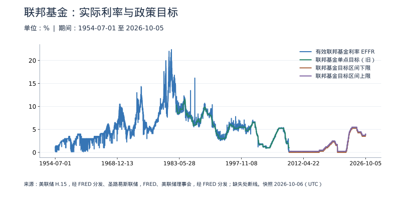
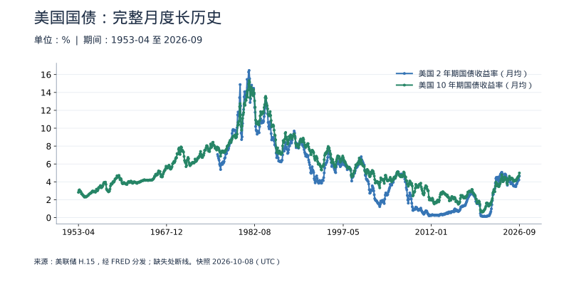
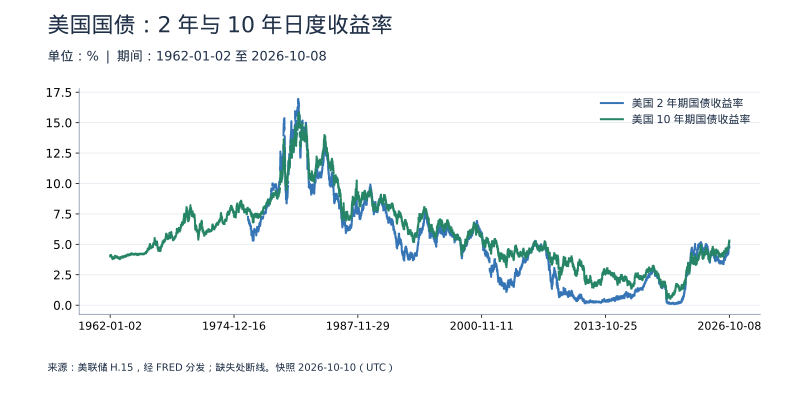
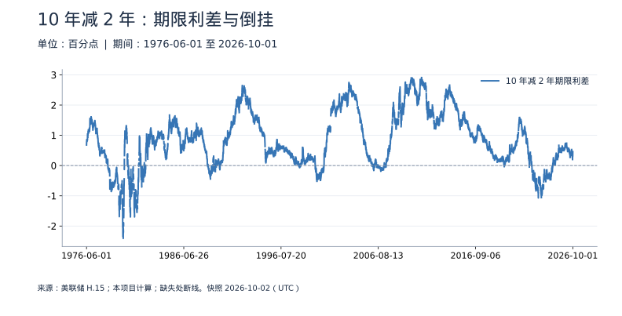
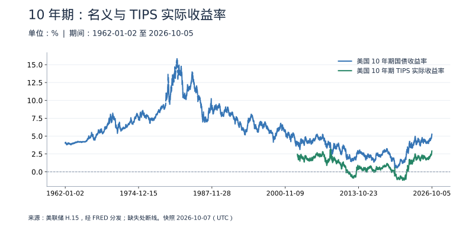
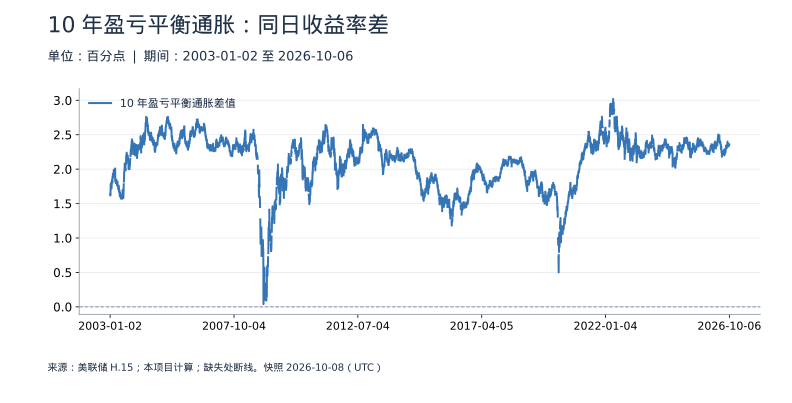

<!-- Generated by scripts/sync_macro.py; edit macro_catalog.py/macro_render.py. -->
# 美联储与美国利率：真实数据

政策目标、实际成交、长短期国债和实际收益率分别告诉我们什么？

美国数据独立标识为USA。保留目标制度转换、EFFR统计方法变化，以及月度和日度历史的不同起点；不拿月均值填补早期日值。所有收益率为年率报价，利差单位为百分点。数据原始来源为美联储理事会H.15及圣路易斯联储，经FRED分发；所选系列标注Public Domain: Citation requested，本项目不代表来源机构背书。

本页快照获取时间：**2026-10-05T01:06:52+00:00**。这是获取时间，不是所有数据的发布日期。每日检查上游；最新统计期以每个指标为准。

[CSV 下载](https://raw.githubusercontent.com/calcky/finance/main/data/macro/us-rates.csv) · [来源与采集参数](https://github.com/calcky/finance/blob/main/data/macro/us-rates.metadata.json) · [最近同步状态](https://github.com/calcky/finance/actions/workflows/update-gdp.yml)

```{only} html
本站同版快照：{download}`CSV <../../data/macro/us-rates.csv>` · {download}`元数据 <../../data/macro/us-rates.metadata.json>`
```

网页支持悬停查看、点击固定读数、按期间选择、缩放和定位明细。GitHub、打印或禁用 JavaScript 时显示静态图；数值与网页使用同一快照。

## 最新观测与覆盖

| 指标 | 最新期间 | 数值 | 单位 | 本项目起点 | 观测数 | 来源 |
|---|---|---:|---|---|---:|---|
| 有效联邦基金利率 EFFR | 2026-10-01 | 3.88 | % | 1954-07-01 | 26391 | [美联储 H.15，经 FRED 分发](https://fred.stlouisfed.org/series/DFF) |
| 联邦基金单点目标（旧） | 2008-12-15 | 1 | % | 1982-09-27 | 9577 | [圣路易斯联储，FRED](https://fred.stlouisfed.org/series/DFEDTAR) |
| 联邦基金目标区间下限 | 2026-10-04 | 3.75 | % | 2008-12-16 | 6502 | [美联储理事会，经 FRED 分发](https://fred.stlouisfed.org/series/DFEDTARL) |
| 联邦基金目标区间上限 | 2026-10-04 | 4 | % | 2008-12-16 | 6502 | [美联储理事会，经 FRED 分发](https://fred.stlouisfed.org/series/DFEDTARU) |
| 美国 2 年期国债收益率（月均） | 2026-09 | 4.65 | % | 1976-06 | 604 | [美联储 H.15，经 FRED 分发](https://fred.stlouisfed.org/series/GS2) |
| 美国 10 年期国债收益率（月均） | 2026-09 | 4.99 | % | 1953-04 | 882 | [美联储 H.15，经 FRED 分发](https://fred.stlouisfed.org/series/GS10) |
| 美国 2 年期国债收益率 | 2026-10-01 | 4.78 | % | 1976-06-01 | 12581 | [美联储 H.15，经 FRED 分发](https://fred.stlouisfed.org/series/DGS2) |
| 美国 10 年期国债收益率 | 2026-10-01 | 5.24 | % | 1962-01-02 | 16173 | [美联储 H.15，经 FRED 分发](https://fred.stlouisfed.org/series/DGS10) |
| 10 年减 2 年期限利差 | 2026-10-01 | 0.46 | 百分点 | 1976-06-01 | 12581 | [美联储 H.15；本项目计算](https://fred.stlouisfed.org/graph/fredgraph.csv?id=DGS10%2CDGS2&cosd=1900-01-01) |
| 美国 10 年期 TIPS 实际收益率 | 2026-10-01 | 2.88 | % | 2003-01-02 | 5942 | [美联储 H.15，经 FRED 分发](https://fred.stlouisfed.org/series/DFII10) |
| 10 年盈亏平衡通胀差值 | 2026-10-01 | 2.36 | 百分点 | 2003-01-02 | 5942 | [美联储 H.15；本项目计算](https://fred.stlouisfed.org/graph/fredgraph.csv?id=DGS10%2CDFII10&cosd=1900-01-01) |

起点表示本项目当前覆盖范围，不代表该指标从此时才开始发布。旧定义序列的最后一期也不代表来源停止更新。各来源可能存在发布或入库滞后；空白不补零、不插值。发布日期未知的观测在 CSV 中留空。

图表的“全部”与 CSV 保留完整已采集历史；缩放近期不会删除早期数据。[历史来源、口径断点与剩余缺口](history-coverage.md)说明回溯范围。

## 联邦基金：实际利率与政策目标

EFFR自1954年起，旧单点目标自1982年起，2008年12月16日改为上下限区间。目标系列缺失的早年不代表没有货币政策；EFFR方法在2016年变化。



<details class="macro-details" id="details-us-policy-rates">
<summary>联邦基金：实际利率与政策目标：分页数据表（%）</summary>
<div class="macro-table-wrap"><table><thead><tr><th>期间</th><th>有效联邦基金利率 EFFR</th><th>联邦基金单点目标（旧）</th><th>联邦基金目标区间下限</th><th>联邦基金目标区间上限</th></tr></thead><tbody>
<tr id="macro-us-policy-rates-2026-10-04" tabindex="-1"><td>2026-10-04</td><td>缺失</td><td>缺失</td><td>3.75</td><td>4</td></tr>
<tr id="macro-us-policy-rates-2026-10-03" tabindex="-1"><td>2026-10-03</td><td>缺失</td><td>缺失</td><td>3.75</td><td>4</td></tr>
<tr id="macro-us-policy-rates-2026-10-02" tabindex="-1"><td>2026-10-02</td><td>缺失</td><td>缺失</td><td>3.75</td><td>4</td></tr>
<tr id="macro-us-policy-rates-2026-10-01" tabindex="-1"><td>2026-10-01</td><td>3.88</td><td>缺失</td><td>3.75</td><td>4</td></tr>
<tr id="macro-us-policy-rates-2026-09-30" tabindex="-1"><td>2026-09-30</td><td>3.88</td><td>缺失</td><td>3.75</td><td>4</td></tr>
<tr id="macro-us-policy-rates-2026-09-29" tabindex="-1"><td>2026-09-29</td><td>3.88</td><td>缺失</td><td>3.75</td><td>4</td></tr>
<tr id="macro-us-policy-rates-2026-09-28" tabindex="-1"><td>2026-09-28</td><td>3.88</td><td>缺失</td><td>3.75</td><td>4</td></tr>
<tr id="macro-us-policy-rates-2026-09-27" tabindex="-1"><td>2026-09-27</td><td>3.88</td><td>缺失</td><td>3.75</td><td>4</td></tr>
<tr id="macro-us-policy-rates-2026-09-26" tabindex="-1"><td>2026-09-26</td><td>3.88</td><td>缺失</td><td>3.75</td><td>4</td></tr>
<tr id="macro-us-policy-rates-2026-09-25" tabindex="-1"><td>2026-09-25</td><td>3.88</td><td>缺失</td><td>3.75</td><td>4</td></tr>
<tr id="macro-us-policy-rates-2026-09-24" tabindex="-1"><td>2026-09-24</td><td>3.88</td><td>缺失</td><td>3.75</td><td>4</td></tr>
<tr id="macro-us-policy-rates-2026-09-23" tabindex="-1"><td>2026-09-23</td><td>3.88</td><td>缺失</td><td>3.75</td><td>4</td></tr>
<tr id="macro-us-policy-rates-2026-09-22" tabindex="-1"><td>2026-09-22</td><td>3.88</td><td>缺失</td><td>3.75</td><td>4</td></tr>
<tr id="macro-us-policy-rates-2026-09-21" tabindex="-1"><td>2026-09-21</td><td>3.88</td><td>缺失</td><td>3.75</td><td>4</td></tr>
<tr id="macro-us-policy-rates-2026-09-20" tabindex="-1"><td>2026-09-20</td><td>3.88</td><td>缺失</td><td>3.75</td><td>4</td></tr>
<tr id="macro-us-policy-rates-2026-09-19" tabindex="-1"><td>2026-09-19</td><td>3.88</td><td>缺失</td><td>3.75</td><td>4</td></tr>
<tr id="macro-us-policy-rates-2026-09-18" tabindex="-1"><td>2026-09-18</td><td>3.88</td><td>缺失</td><td>3.75</td><td>4</td></tr>
<tr id="macro-us-policy-rates-2026-09-17" tabindex="-1"><td>2026-09-17</td><td>3.88</td><td>缺失</td><td>3.75</td><td>4</td></tr>
<tr id="macro-us-policy-rates-2026-09-16" tabindex="-1"><td>2026-09-16</td><td>3.63</td><td>缺失</td><td>3.5</td><td>3.75</td></tr>
<tr id="macro-us-policy-rates-2026-09-15" tabindex="-1"><td>2026-09-15</td><td>3.63</td><td>缺失</td><td>3.5</td><td>3.75</td></tr>
<tr id="macro-us-policy-rates-2026-09-14" tabindex="-1"><td>2026-09-14</td><td>3.63</td><td>缺失</td><td>3.5</td><td>3.75</td></tr>
<tr id="macro-us-policy-rates-2026-09-13" tabindex="-1"><td>2026-09-13</td><td>3.63</td><td>缺失</td><td>3.5</td><td>3.75</td></tr>
<tr id="macro-us-policy-rates-2026-09-12" tabindex="-1"><td>2026-09-12</td><td>3.63</td><td>缺失</td><td>3.5</td><td>3.75</td></tr>
<tr id="macro-us-policy-rates-2026-09-11" tabindex="-1"><td>2026-09-11</td><td>3.63</td><td>缺失</td><td>3.5</td><td>3.75</td></tr>
<tr id="macro-us-policy-rates-2026-09-10" tabindex="-1"><td>2026-09-10</td><td>3.63</td><td>缺失</td><td>3.5</td><td>3.75</td></tr>
<tr id="macro-us-policy-rates-2026-09-09" tabindex="-1"><td>2026-09-09</td><td>3.63</td><td>缺失</td><td>3.5</td><td>3.75</td></tr>
<tr id="macro-us-policy-rates-2026-09-08" tabindex="-1"><td>2026-09-08</td><td>3.63</td><td>缺失</td><td>3.5</td><td>3.75</td></tr>
<tr id="macro-us-policy-rates-2026-09-07" tabindex="-1"><td>2026-09-07</td><td>3.63</td><td>缺失</td><td>3.5</td><td>3.75</td></tr>
<tr id="macro-us-policy-rates-2026-09-06" tabindex="-1"><td>2026-09-06</td><td>3.63</td><td>缺失</td><td>3.5</td><td>3.75</td></tr>
<tr id="macro-us-policy-rates-2026-09-05" tabindex="-1"><td>2026-09-05</td><td>3.63</td><td>缺失</td><td>3.5</td><td>3.75</td></tr>
<tr id="macro-us-policy-rates-2026-09-04" tabindex="-1"><td>2026-09-04</td><td>3.63</td><td>缺失</td><td>3.5</td><td>3.75</td></tr>
<tr id="macro-us-policy-rates-2026-09-03" tabindex="-1"><td>2026-09-03</td><td>3.63</td><td>缺失</td><td>3.5</td><td>3.75</td></tr>
<tr id="macro-us-policy-rates-2026-09-02" tabindex="-1"><td>2026-09-02</td><td>3.63</td><td>缺失</td><td>3.5</td><td>3.75</td></tr>
<tr id="macro-us-policy-rates-2026-09-01" tabindex="-1"><td>2026-09-01</td><td>3.63</td><td>缺失</td><td>3.5</td><td>3.75</td></tr>
<tr id="macro-us-policy-rates-2026-08-31" tabindex="-1"><td>2026-08-31</td><td>3.63</td><td>缺失</td><td>3.5</td><td>3.75</td></tr>
<tr id="macro-us-policy-rates-2026-08-30" tabindex="-1"><td>2026-08-30</td><td>3.63</td><td>缺失</td><td>3.5</td><td>3.75</td></tr>
<tr id="macro-us-policy-rates-2026-08-29" tabindex="-1"><td>2026-08-29</td><td>3.63</td><td>缺失</td><td>3.5</td><td>3.75</td></tr>
<tr id="macro-us-policy-rates-2026-08-28" tabindex="-1"><td>2026-08-28</td><td>3.63</td><td>缺失</td><td>3.5</td><td>3.75</td></tr>
<tr id="macro-us-policy-rates-2026-08-27" tabindex="-1"><td>2026-08-27</td><td>3.63</td><td>缺失</td><td>3.5</td><td>3.75</td></tr>
<tr id="macro-us-policy-rates-2026-08-26" tabindex="-1"><td>2026-08-26</td><td>3.63</td><td>缺失</td><td>3.5</td><td>3.75</td></tr>
<tr id="macro-us-policy-rates-2026-08-25" tabindex="-1"><td>2026-08-25</td><td>3.63</td><td>缺失</td><td>3.5</td><td>3.75</td></tr>
<tr id="macro-us-policy-rates-2026-08-24" tabindex="-1"><td>2026-08-24</td><td>3.63</td><td>缺失</td><td>3.5</td><td>3.75</td></tr>
<tr id="macro-us-policy-rates-2026-08-23" tabindex="-1"><td>2026-08-23</td><td>3.63</td><td>缺失</td><td>3.5</td><td>3.75</td></tr>
<tr id="macro-us-policy-rates-2026-08-22" tabindex="-1"><td>2026-08-22</td><td>3.63</td><td>缺失</td><td>3.5</td><td>3.75</td></tr>
<tr id="macro-us-policy-rates-2026-08-21" tabindex="-1"><td>2026-08-21</td><td>3.63</td><td>缺失</td><td>3.5</td><td>3.75</td></tr>
<tr id="macro-us-policy-rates-2026-08-20" tabindex="-1"><td>2026-08-20</td><td>3.63</td><td>缺失</td><td>3.5</td><td>3.75</td></tr>
<tr id="macro-us-policy-rates-2026-08-19" tabindex="-1"><td>2026-08-19</td><td>3.63</td><td>缺失</td><td>3.5</td><td>3.75</td></tr>
<tr id="macro-us-policy-rates-2026-08-18" tabindex="-1"><td>2026-08-18</td><td>3.63</td><td>缺失</td><td>3.5</td><td>3.75</td></tr>
<tr id="macro-us-policy-rates-2026-08-17" tabindex="-1"><td>2026-08-17</td><td>3.63</td><td>缺失</td><td>3.5</td><td>3.75</td></tr>
<tr id="macro-us-policy-rates-2026-08-16" tabindex="-1"><td>2026-08-16</td><td>3.63</td><td>缺失</td><td>3.5</td><td>3.75</td></tr>
<tr id="macro-us-policy-rates-2026-08-15" tabindex="-1"><td>2026-08-15</td><td>3.63</td><td>缺失</td><td>3.5</td><td>3.75</td></tr>
<tr id="macro-us-policy-rates-2026-08-14" tabindex="-1"><td>2026-08-14</td><td>3.63</td><td>缺失</td><td>3.5</td><td>3.75</td></tr>
<tr id="macro-us-policy-rates-2026-08-13" tabindex="-1"><td>2026-08-13</td><td>3.63</td><td>缺失</td><td>3.5</td><td>3.75</td></tr>
<tr id="macro-us-policy-rates-2026-08-12" tabindex="-1"><td>2026-08-12</td><td>3.63</td><td>缺失</td><td>3.5</td><td>3.75</td></tr>
<tr id="macro-us-policy-rates-2026-08-11" tabindex="-1"><td>2026-08-11</td><td>3.63</td><td>缺失</td><td>3.5</td><td>3.75</td></tr>
<tr id="macro-us-policy-rates-2026-08-10" tabindex="-1"><td>2026-08-10</td><td>3.63</td><td>缺失</td><td>3.5</td><td>3.75</td></tr>
<tr id="macro-us-policy-rates-2026-08-09" tabindex="-1"><td>2026-08-09</td><td>3.63</td><td>缺失</td><td>3.5</td><td>3.75</td></tr>
<tr id="macro-us-policy-rates-2026-08-08" tabindex="-1"><td>2026-08-08</td><td>3.63</td><td>缺失</td><td>3.5</td><td>3.75</td></tr>
<tr id="macro-us-policy-rates-2026-08-07" tabindex="-1"><td>2026-08-07</td><td>3.63</td><td>缺失</td><td>3.5</td><td>3.75</td></tr>
<tr id="macro-us-policy-rates-2026-08-06" tabindex="-1"><td>2026-08-06</td><td>3.63</td><td>缺失</td><td>3.5</td><td>3.75</td></tr>
</tbody></table></div></details>

明细默认显示最近60期；启用交互后可按期间定位或翻页读取全部历史。禁用JavaScript时，可下载页首完整CSV。

## 美国国债：完整月度长历史

10年期月均自1953年4月，比日度历史更早。两条线都是官方月均；早年缺少2年期观测时不填值，也不据此计算完整期限利差。



<details class="macro-details" id="details-us-treasury-monthly">
<summary>美国国债：完整月度长历史：分页数据表（%）</summary>
<div class="macro-table-wrap"><table><thead><tr><th>期间</th><th>美国 2 年期国债收益率（月均）</th><th>美国 10 年期国债收益率（月均）</th></tr></thead><tbody>
<tr id="macro-us-treasury-monthly-2026-09" tabindex="-1"><td>2026-09</td><td>4.65</td><td>4.99</td></tr>
<tr id="macro-us-treasury-monthly-2026-08" tabindex="-1"><td>2026-08</td><td>4.22</td><td>4.68</td></tr>
<tr id="macro-us-treasury-monthly-2026-07" tabindex="-1"><td>2026-07</td><td>4.22</td><td>4.6</td></tr>
<tr id="macro-us-treasury-monthly-2026-06" tabindex="-1"><td>2026-06</td><td>4.11</td><td>4.47</td></tr>
<tr id="macro-us-treasury-monthly-2026-05" tabindex="-1"><td>2026-05</td><td>4</td><td>4.48</td></tr>
<tr id="macro-us-treasury-monthly-2026-04" tabindex="-1"><td>2026-04</td><td>3.8</td><td>4.32</td></tr>
<tr id="macro-us-treasury-monthly-2026-03" tabindex="-1"><td>2026-03</td><td>3.71</td><td>4.25</td></tr>
<tr id="macro-us-treasury-monthly-2026-02" tabindex="-1"><td>2026-02</td><td>3.47</td><td>4.13</td></tr>
<tr id="macro-us-treasury-monthly-2026-01" tabindex="-1"><td>2026-01</td><td>3.54</td><td>4.21</td></tr>
<tr id="macro-us-treasury-monthly-2025-12" tabindex="-1"><td>2025-12</td><td>3.5</td><td>4.14</td></tr>
<tr id="macro-us-treasury-monthly-2025-11" tabindex="-1"><td>2025-11</td><td>3.55</td><td>4.09</td></tr>
<tr id="macro-us-treasury-monthly-2025-10" tabindex="-1"><td>2025-10</td><td>3.52</td><td>4.06</td></tr>
<tr id="macro-us-treasury-monthly-2025-09" tabindex="-1"><td>2025-09</td><td>3.57</td><td>4.12</td></tr>
<tr id="macro-us-treasury-monthly-2025-08" tabindex="-1"><td>2025-08</td><td>3.7</td><td>4.26</td></tr>
<tr id="macro-us-treasury-monthly-2025-07" tabindex="-1"><td>2025-07</td><td>3.88</td><td>4.39</td></tr>
<tr id="macro-us-treasury-monthly-2025-06" tabindex="-1"><td>2025-06</td><td>3.89</td><td>4.38</td></tr>
<tr id="macro-us-treasury-monthly-2025-05" tabindex="-1"><td>2025-05</td><td>3.92</td><td>4.42</td></tr>
<tr id="macro-us-treasury-monthly-2025-04" tabindex="-1"><td>2025-04</td><td>3.78</td><td>4.28</td></tr>
<tr id="macro-us-treasury-monthly-2025-03" tabindex="-1"><td>2025-03</td><td>3.97</td><td>4.28</td></tr>
<tr id="macro-us-treasury-monthly-2025-02" tabindex="-1"><td>2025-02</td><td>4.21</td><td>4.45</td></tr>
<tr id="macro-us-treasury-monthly-2025-01" tabindex="-1"><td>2025-01</td><td>4.27</td><td>4.63</td></tr>
<tr id="macro-us-treasury-monthly-2024-12" tabindex="-1"><td>2024-12</td><td>4.23</td><td>4.39</td></tr>
<tr id="macro-us-treasury-monthly-2024-11" tabindex="-1"><td>2024-11</td><td>4.26</td><td>4.36</td></tr>
<tr id="macro-us-treasury-monthly-2024-10" tabindex="-1"><td>2024-10</td><td>3.97</td><td>4.1</td></tr>
<tr id="macro-us-treasury-monthly-2024-09" tabindex="-1"><td>2024-09</td><td>3.62</td><td>3.72</td></tr>
<tr id="macro-us-treasury-monthly-2024-08" tabindex="-1"><td>2024-08</td><td>3.97</td><td>3.87</td></tr>
<tr id="macro-us-treasury-monthly-2024-07" tabindex="-1"><td>2024-07</td><td>4.5</td><td>4.25</td></tr>
<tr id="macro-us-treasury-monthly-2024-06" tabindex="-1"><td>2024-06</td><td>4.74</td><td>4.31</td></tr>
<tr id="macro-us-treasury-monthly-2024-05" tabindex="-1"><td>2024-05</td><td>4.86</td><td>4.48</td></tr>
<tr id="macro-us-treasury-monthly-2024-04" tabindex="-1"><td>2024-04</td><td>4.87</td><td>4.54</td></tr>
<tr id="macro-us-treasury-monthly-2024-03" tabindex="-1"><td>2024-03</td><td>4.59</td><td>4.21</td></tr>
<tr id="macro-us-treasury-monthly-2024-02" tabindex="-1"><td>2024-02</td><td>4.54</td><td>4.21</td></tr>
<tr id="macro-us-treasury-monthly-2024-01" tabindex="-1"><td>2024-01</td><td>4.32</td><td>4.06</td></tr>
<tr id="macro-us-treasury-monthly-2023-12" tabindex="-1"><td>2023-12</td><td>4.46</td><td>4.02</td></tr>
<tr id="macro-us-treasury-monthly-2023-11" tabindex="-1"><td>2023-11</td><td>4.88</td><td>4.5</td></tr>
<tr id="macro-us-treasury-monthly-2023-10" tabindex="-1"><td>2023-10</td><td>5.07</td><td>4.8</td></tr>
<tr id="macro-us-treasury-monthly-2023-09" tabindex="-1"><td>2023-09</td><td>5.02</td><td>4.38</td></tr>
<tr id="macro-us-treasury-monthly-2023-08" tabindex="-1"><td>2023-08</td><td>4.9</td><td>4.17</td></tr>
<tr id="macro-us-treasury-monthly-2023-07" tabindex="-1"><td>2023-07</td><td>4.83</td><td>3.9</td></tr>
<tr id="macro-us-treasury-monthly-2023-06" tabindex="-1"><td>2023-06</td><td>4.64</td><td>3.75</td></tr>
<tr id="macro-us-treasury-monthly-2023-05" tabindex="-1"><td>2023-05</td><td>4.13</td><td>3.57</td></tr>
<tr id="macro-us-treasury-monthly-2023-04" tabindex="-1"><td>2023-04</td><td>4.02</td><td>3.46</td></tr>
<tr id="macro-us-treasury-monthly-2023-03" tabindex="-1"><td>2023-03</td><td>4.3</td><td>3.66</td></tr>
<tr id="macro-us-treasury-monthly-2023-02" tabindex="-1"><td>2023-02</td><td>4.53</td><td>3.75</td></tr>
<tr id="macro-us-treasury-monthly-2023-01" tabindex="-1"><td>2023-01</td><td>4.21</td><td>3.53</td></tr>
<tr id="macro-us-treasury-monthly-2022-12" tabindex="-1"><td>2022-12</td><td>4.29</td><td>3.62</td></tr>
<tr id="macro-us-treasury-monthly-2022-11" tabindex="-1"><td>2022-11</td><td>4.5</td><td>3.89</td></tr>
<tr id="macro-us-treasury-monthly-2022-10" tabindex="-1"><td>2022-10</td><td>4.38</td><td>3.98</td></tr>
<tr id="macro-us-treasury-monthly-2022-09" tabindex="-1"><td>2022-09</td><td>3.86</td><td>3.52</td></tr>
<tr id="macro-us-treasury-monthly-2022-08" tabindex="-1"><td>2022-08</td><td>3.25</td><td>2.9</td></tr>
<tr id="macro-us-treasury-monthly-2022-07" tabindex="-1"><td>2022-07</td><td>3.04</td><td>2.9</td></tr>
<tr id="macro-us-treasury-monthly-2022-06" tabindex="-1"><td>2022-06</td><td>3</td><td>3.14</td></tr>
<tr id="macro-us-treasury-monthly-2022-05" tabindex="-1"><td>2022-05</td><td>2.62</td><td>2.9</td></tr>
<tr id="macro-us-treasury-monthly-2022-04" tabindex="-1"><td>2022-04</td><td>2.54</td><td>2.75</td></tr>
<tr id="macro-us-treasury-monthly-2022-03" tabindex="-1"><td>2022-03</td><td>1.91</td><td>2.13</td></tr>
<tr id="macro-us-treasury-monthly-2022-02" tabindex="-1"><td>2022-02</td><td>1.44</td><td>1.93</td></tr>
<tr id="macro-us-treasury-monthly-2022-01" tabindex="-1"><td>2022-01</td><td>0.98</td><td>1.76</td></tr>
<tr id="macro-us-treasury-monthly-2021-12" tabindex="-1"><td>2021-12</td><td>0.68</td><td>1.47</td></tr>
<tr id="macro-us-treasury-monthly-2021-11" tabindex="-1"><td>2021-11</td><td>0.51</td><td>1.56</td></tr>
<tr id="macro-us-treasury-monthly-2021-10" tabindex="-1"><td>2021-10</td><td>0.39</td><td>1.58</td></tr>
</tbody></table></div></details>

明细默认显示最近60期；启用交互后可按期间定位或翻页读取全部历史。禁用JavaScript时，可下载页首完整CSV。

## 美国国债：2 年与 10 年日度收益率

同一日比较不同期限，不能把这张随时间变化的图误当成横轴为期限的收益率曲线。周末和假期缺口按来源保留。



<details class="macro-details" id="details-us-treasury-daily">
<summary>美国国债：2 年与 10 年日度收益率：分页数据表（%）</summary>
<div class="macro-table-wrap"><table><thead><tr><th>期间</th><th>美国 2 年期国债收益率</th><th>美国 10 年期国债收益率</th></tr></thead><tbody>
<tr id="macro-us-treasury-daily-2026-10-01" tabindex="-1"><td>2026-10-01</td><td>4.78</td><td>5.24</td></tr>
<tr id="macro-us-treasury-daily-2026-09-30" tabindex="-1"><td>2026-09-30</td><td>4.88</td><td>5.29</td></tr>
<tr id="macro-us-treasury-daily-2026-09-29" tabindex="-1"><td>2026-09-29</td><td>4.89</td><td>5.26</td></tr>
<tr id="macro-us-treasury-daily-2026-09-28" tabindex="-1"><td>2026-09-28</td><td>4.92</td><td>5.24</td></tr>
<tr id="macro-us-treasury-daily-2026-09-27" tabindex="-1"><td>2026-09-27</td><td>缺失</td><td>缺失</td></tr>
<tr id="macro-us-treasury-daily-2026-09-26" tabindex="-1"><td>2026-09-26</td><td>缺失</td><td>缺失</td></tr>
<tr id="macro-us-treasury-daily-2026-09-25" tabindex="-1"><td>2026-09-25</td><td>4.81</td><td>5.17</td></tr>
<tr id="macro-us-treasury-daily-2026-09-24" tabindex="-1"><td>2026-09-24</td><td>4.87</td><td>5.18</td></tr>
<tr id="macro-us-treasury-daily-2026-09-23" tabindex="-1"><td>2026-09-23</td><td>4.85</td><td>5.11</td></tr>
<tr id="macro-us-treasury-daily-2026-09-22" tabindex="-1"><td>2026-09-22</td><td>4.71</td><td>4.96</td></tr>
<tr id="macro-us-treasury-daily-2026-09-21" tabindex="-1"><td>2026-09-21</td><td>4.76</td><td>4.96</td></tr>
<tr id="macro-us-treasury-daily-2026-09-20" tabindex="-1"><td>2026-09-20</td><td>缺失</td><td>缺失</td></tr>
<tr id="macro-us-treasury-daily-2026-09-19" tabindex="-1"><td>2026-09-19</td><td>缺失</td><td>缺失</td></tr>
<tr id="macro-us-treasury-daily-2026-09-18" tabindex="-1"><td>2026-09-18</td><td>4.76</td><td>5.01</td></tr>
<tr id="macro-us-treasury-daily-2026-09-17" tabindex="-1"><td>2026-09-17</td><td>4.67</td><td>4.94</td></tr>
<tr id="macro-us-treasury-daily-2026-09-16" tabindex="-1"><td>2026-09-16</td><td>4.74</td><td>5.01</td></tr>
<tr id="macro-us-treasury-daily-2026-09-15" tabindex="-1"><td>2026-09-15</td><td>4.67</td><td>5</td></tr>
<tr id="macro-us-treasury-daily-2026-09-14" tabindex="-1"><td>2026-09-14</td><td>4.65</td><td>4.97</td></tr>
<tr id="macro-us-treasury-daily-2026-09-13" tabindex="-1"><td>2026-09-13</td><td>缺失</td><td>缺失</td></tr>
<tr id="macro-us-treasury-daily-2026-09-12" tabindex="-1"><td>2026-09-12</td><td>缺失</td><td>缺失</td></tr>
<tr id="macro-us-treasury-daily-2026-09-11" tabindex="-1"><td>2026-09-11</td><td>4.63</td><td>4.96</td></tr>
<tr id="macro-us-treasury-daily-2026-09-10" tabindex="-1"><td>2026-09-10</td><td>4.56</td><td>4.95</td></tr>
<tr id="macro-us-treasury-daily-2026-09-09" tabindex="-1"><td>2026-09-09</td><td>4.43</td><td>4.83</td></tr>
<tr id="macro-us-treasury-daily-2026-09-08" tabindex="-1"><td>2026-09-08</td><td>4.39</td><td>4.8</td></tr>
<tr id="macro-us-treasury-daily-2026-09-07" tabindex="-1"><td>2026-09-07</td><td>缺失</td><td>缺失</td></tr>
<tr id="macro-us-treasury-daily-2026-09-06" tabindex="-1"><td>2026-09-06</td><td>缺失</td><td>缺失</td></tr>
<tr id="macro-us-treasury-daily-2026-09-05" tabindex="-1"><td>2026-09-05</td><td>缺失</td><td>缺失</td></tr>
<tr id="macro-us-treasury-daily-2026-09-04" tabindex="-1"><td>2026-09-04</td><td>4.37</td><td>4.78</td></tr>
<tr id="macro-us-treasury-daily-2026-09-03" tabindex="-1"><td>2026-09-03</td><td>4.34</td><td>4.77</td></tr>
<tr id="macro-us-treasury-daily-2026-09-02" tabindex="-1"><td>2026-09-02</td><td>4.39</td><td>4.79</td></tr>
<tr id="macro-us-treasury-daily-2026-09-01" tabindex="-1"><td>2026-09-01</td><td>4.39</td><td>4.79</td></tr>
<tr id="macro-us-treasury-daily-2026-08-31" tabindex="-1"><td>2026-08-31</td><td>4.34</td><td>4.75</td></tr>
<tr id="macro-us-treasury-daily-2026-08-30" tabindex="-1"><td>2026-08-30</td><td>缺失</td><td>缺失</td></tr>
<tr id="macro-us-treasury-daily-2026-08-29" tabindex="-1"><td>2026-08-29</td><td>缺失</td><td>缺失</td></tr>
<tr id="macro-us-treasury-daily-2026-08-28" tabindex="-1"><td>2026-08-28</td><td>4.34</td><td>4.73</td></tr>
<tr id="macro-us-treasury-daily-2026-08-27" tabindex="-1"><td>2026-08-27</td><td>4.2</td><td>4.67</td></tr>
<tr id="macro-us-treasury-daily-2026-08-26" tabindex="-1"><td>2026-08-26</td><td>4.19</td><td>4.66</td></tr>
<tr id="macro-us-treasury-daily-2026-08-25" tabindex="-1"><td>2026-08-25</td><td>4.17</td><td>4.64</td></tr>
<tr id="macro-us-treasury-daily-2026-08-24" tabindex="-1"><td>2026-08-24</td><td>4.24</td><td>4.7</td></tr>
<tr id="macro-us-treasury-daily-2026-08-23" tabindex="-1"><td>2026-08-23</td><td>缺失</td><td>缺失</td></tr>
<tr id="macro-us-treasury-daily-2026-08-22" tabindex="-1"><td>2026-08-22</td><td>缺失</td><td>缺失</td></tr>
<tr id="macro-us-treasury-daily-2026-08-21" tabindex="-1"><td>2026-08-21</td><td>4.24</td><td>4.74</td></tr>
<tr id="macro-us-treasury-daily-2026-08-20" tabindex="-1"><td>2026-08-20</td><td>4.19</td><td>4.69</td></tr>
<tr id="macro-us-treasury-daily-2026-08-19" tabindex="-1"><td>2026-08-19</td><td>4.19</td><td>4.65</td></tr>
<tr id="macro-us-treasury-daily-2026-08-18" tabindex="-1"><td>2026-08-18</td><td>4.19</td><td>4.71</td></tr>
<tr id="macro-us-treasury-daily-2026-08-17" tabindex="-1"><td>2026-08-17</td><td>4.19</td><td>4.72</td></tr>
<tr id="macro-us-treasury-daily-2026-08-16" tabindex="-1"><td>2026-08-16</td><td>缺失</td><td>缺失</td></tr>
<tr id="macro-us-treasury-daily-2026-08-15" tabindex="-1"><td>2026-08-15</td><td>缺失</td><td>缺失</td></tr>
<tr id="macro-us-treasury-daily-2026-08-14" tabindex="-1"><td>2026-08-14</td><td>4.17</td><td>4.68</td></tr>
<tr id="macro-us-treasury-daily-2026-08-13" tabindex="-1"><td>2026-08-13</td><td>4.15</td><td>4.63</td></tr>
<tr id="macro-us-treasury-daily-2026-08-12" tabindex="-1"><td>2026-08-12</td><td>4.2</td><td>4.68</td></tr>
<tr id="macro-us-treasury-daily-2026-08-11" tabindex="-1"><td>2026-08-11</td><td>4.22</td><td>4.7</td></tr>
<tr id="macro-us-treasury-daily-2026-08-10" tabindex="-1"><td>2026-08-10</td><td>4.25</td><td>4.72</td></tr>
<tr id="macro-us-treasury-daily-2026-08-09" tabindex="-1"><td>2026-08-09</td><td>缺失</td><td>缺失</td></tr>
<tr id="macro-us-treasury-daily-2026-08-08" tabindex="-1"><td>2026-08-08</td><td>缺失</td><td>缺失</td></tr>
<tr id="macro-us-treasury-daily-2026-08-07" tabindex="-1"><td>2026-08-07</td><td>4.19</td><td>4.65</td></tr>
<tr id="macro-us-treasury-daily-2026-08-06" tabindex="-1"><td>2026-08-06</td><td>4.25</td><td>4.69</td></tr>
<tr id="macro-us-treasury-daily-2026-08-05" tabindex="-1"><td>2026-08-05</td><td>4.18</td><td>4.63</td></tr>
<tr id="macro-us-treasury-daily-2026-08-04" tabindex="-1"><td>2026-08-04</td><td>4.2</td><td>4.63</td></tr>
<tr id="macro-us-treasury-daily-2026-08-03" tabindex="-1"><td>2026-08-03</td><td>4.25</td><td>4.7</td></tr>
</tbody></table></div></details>

明细默认显示最近60期；启用交互后可按期间定位或翻页读取全部历史。禁用JavaScript时，可下载页首完整CSV。

## 10 年减 2 年：期限利差与倒挂

0为两期限相等；低于0表示10年收益率低于2年。倒挂可能反映未来短端下降预期与期限溢价变化，不能给衰退发生日期下定论。原始相减与T10Y2Y在1990-11-21、1991-01-29、1995-11-29存在来源差异，本页保留原始计算值，详见历史核验说明。



<details class="macro-details" id="details-us-term-spread">
<summary>10 年减 2 年：期限利差与倒挂：分页数据表（百分点）</summary>
<div class="macro-table-wrap"><table><thead><tr><th>期间</th><th>10 年减 2 年期限利差</th></tr></thead><tbody>
<tr id="macro-us-term-spread-2026-10-01" tabindex="-1"><td>2026-10-01</td><td>0.46</td></tr>
<tr id="macro-us-term-spread-2026-09-30" tabindex="-1"><td>2026-09-30</td><td>0.41</td></tr>
<tr id="macro-us-term-spread-2026-09-29" tabindex="-1"><td>2026-09-29</td><td>0.37</td></tr>
<tr id="macro-us-term-spread-2026-09-28" tabindex="-1"><td>2026-09-28</td><td>0.32</td></tr>
<tr id="macro-us-term-spread-2026-09-27" tabindex="-1"><td>2026-09-27</td><td>缺失</td></tr>
<tr id="macro-us-term-spread-2026-09-26" tabindex="-1"><td>2026-09-26</td><td>缺失</td></tr>
<tr id="macro-us-term-spread-2026-09-25" tabindex="-1"><td>2026-09-25</td><td>0.36</td></tr>
<tr id="macro-us-term-spread-2026-09-24" tabindex="-1"><td>2026-09-24</td><td>0.31</td></tr>
<tr id="macro-us-term-spread-2026-09-23" tabindex="-1"><td>2026-09-23</td><td>0.26</td></tr>
<tr id="macro-us-term-spread-2026-09-22" tabindex="-1"><td>2026-09-22</td><td>0.25</td></tr>
<tr id="macro-us-term-spread-2026-09-21" tabindex="-1"><td>2026-09-21</td><td>0.2</td></tr>
<tr id="macro-us-term-spread-2026-09-20" tabindex="-1"><td>2026-09-20</td><td>缺失</td></tr>
<tr id="macro-us-term-spread-2026-09-19" tabindex="-1"><td>2026-09-19</td><td>缺失</td></tr>
<tr id="macro-us-term-spread-2026-09-18" tabindex="-1"><td>2026-09-18</td><td>0.25</td></tr>
<tr id="macro-us-term-spread-2026-09-17" tabindex="-1"><td>2026-09-17</td><td>0.27</td></tr>
<tr id="macro-us-term-spread-2026-09-16" tabindex="-1"><td>2026-09-16</td><td>0.27</td></tr>
<tr id="macro-us-term-spread-2026-09-15" tabindex="-1"><td>2026-09-15</td><td>0.33</td></tr>
<tr id="macro-us-term-spread-2026-09-14" tabindex="-1"><td>2026-09-14</td><td>0.32</td></tr>
<tr id="macro-us-term-spread-2026-09-13" tabindex="-1"><td>2026-09-13</td><td>缺失</td></tr>
<tr id="macro-us-term-spread-2026-09-12" tabindex="-1"><td>2026-09-12</td><td>缺失</td></tr>
<tr id="macro-us-term-spread-2026-09-11" tabindex="-1"><td>2026-09-11</td><td>0.33</td></tr>
<tr id="macro-us-term-spread-2026-09-10" tabindex="-1"><td>2026-09-10</td><td>0.39</td></tr>
<tr id="macro-us-term-spread-2026-09-09" tabindex="-1"><td>2026-09-09</td><td>0.4</td></tr>
<tr id="macro-us-term-spread-2026-09-08" tabindex="-1"><td>2026-09-08</td><td>0.41</td></tr>
<tr id="macro-us-term-spread-2026-09-07" tabindex="-1"><td>2026-09-07</td><td>缺失</td></tr>
<tr id="macro-us-term-spread-2026-09-06" tabindex="-1"><td>2026-09-06</td><td>缺失</td></tr>
<tr id="macro-us-term-spread-2026-09-05" tabindex="-1"><td>2026-09-05</td><td>缺失</td></tr>
<tr id="macro-us-term-spread-2026-09-04" tabindex="-1"><td>2026-09-04</td><td>0.41</td></tr>
<tr id="macro-us-term-spread-2026-09-03" tabindex="-1"><td>2026-09-03</td><td>0.43</td></tr>
<tr id="macro-us-term-spread-2026-09-02" tabindex="-1"><td>2026-09-02</td><td>0.4</td></tr>
<tr id="macro-us-term-spread-2026-09-01" tabindex="-1"><td>2026-09-01</td><td>0.4</td></tr>
<tr id="macro-us-term-spread-2026-08-31" tabindex="-1"><td>2026-08-31</td><td>0.41</td></tr>
<tr id="macro-us-term-spread-2026-08-30" tabindex="-1"><td>2026-08-30</td><td>缺失</td></tr>
<tr id="macro-us-term-spread-2026-08-29" tabindex="-1"><td>2026-08-29</td><td>缺失</td></tr>
<tr id="macro-us-term-spread-2026-08-28" tabindex="-1"><td>2026-08-28</td><td>0.39</td></tr>
<tr id="macro-us-term-spread-2026-08-27" tabindex="-1"><td>2026-08-27</td><td>0.47</td></tr>
<tr id="macro-us-term-spread-2026-08-26" tabindex="-1"><td>2026-08-26</td><td>0.47</td></tr>
<tr id="macro-us-term-spread-2026-08-25" tabindex="-1"><td>2026-08-25</td><td>0.47</td></tr>
<tr id="macro-us-term-spread-2026-08-24" tabindex="-1"><td>2026-08-24</td><td>0.46</td></tr>
<tr id="macro-us-term-spread-2026-08-23" tabindex="-1"><td>2026-08-23</td><td>缺失</td></tr>
<tr id="macro-us-term-spread-2026-08-22" tabindex="-1"><td>2026-08-22</td><td>缺失</td></tr>
<tr id="macro-us-term-spread-2026-08-21" tabindex="-1"><td>2026-08-21</td><td>0.5</td></tr>
<tr id="macro-us-term-spread-2026-08-20" tabindex="-1"><td>2026-08-20</td><td>0.5</td></tr>
<tr id="macro-us-term-spread-2026-08-19" tabindex="-1"><td>2026-08-19</td><td>0.46</td></tr>
<tr id="macro-us-term-spread-2026-08-18" tabindex="-1"><td>2026-08-18</td><td>0.52</td></tr>
<tr id="macro-us-term-spread-2026-08-17" tabindex="-1"><td>2026-08-17</td><td>0.53</td></tr>
<tr id="macro-us-term-spread-2026-08-16" tabindex="-1"><td>2026-08-16</td><td>缺失</td></tr>
<tr id="macro-us-term-spread-2026-08-15" tabindex="-1"><td>2026-08-15</td><td>缺失</td></tr>
<tr id="macro-us-term-spread-2026-08-14" tabindex="-1"><td>2026-08-14</td><td>0.51</td></tr>
<tr id="macro-us-term-spread-2026-08-13" tabindex="-1"><td>2026-08-13</td><td>0.48</td></tr>
<tr id="macro-us-term-spread-2026-08-12" tabindex="-1"><td>2026-08-12</td><td>0.48</td></tr>
<tr id="macro-us-term-spread-2026-08-11" tabindex="-1"><td>2026-08-11</td><td>0.48</td></tr>
<tr id="macro-us-term-spread-2026-08-10" tabindex="-1"><td>2026-08-10</td><td>0.47</td></tr>
<tr id="macro-us-term-spread-2026-08-09" tabindex="-1"><td>2026-08-09</td><td>缺失</td></tr>
<tr id="macro-us-term-spread-2026-08-08" tabindex="-1"><td>2026-08-08</td><td>缺失</td></tr>
<tr id="macro-us-term-spread-2026-08-07" tabindex="-1"><td>2026-08-07</td><td>0.46</td></tr>
<tr id="macro-us-term-spread-2026-08-06" tabindex="-1"><td>2026-08-06</td><td>0.44</td></tr>
<tr id="macro-us-term-spread-2026-08-05" tabindex="-1"><td>2026-08-05</td><td>0.45</td></tr>
<tr id="macro-us-term-spread-2026-08-04" tabindex="-1"><td>2026-08-04</td><td>0.43</td></tr>
<tr id="macro-us-term-spread-2026-08-03" tabindex="-1"><td>2026-08-03</td><td>0.45</td></tr>
</tbody></table></div></details>

明细默认显示最近60期；启用交互后可按期间定位或翻页读取全部历史。禁用JavaScript时，可下载页首完整CSV。

## 10 年期：名义与 TIPS 实际收益率

TIPS实际收益率从2003年起。名义收益率相同也可能对应不同实际利率；早年没有TIPS序列的部分保留缺口，不用CPI倒推。



<details class="macro-details" id="details-us-real-nominal">
<summary>10 年期：名义与 TIPS 实际收益率：分页数据表（%）</summary>
<div class="macro-table-wrap"><table><thead><tr><th>期间</th><th>美国 10 年期国债收益率</th><th>美国 10 年期 TIPS 实际收益率</th></tr></thead><tbody>
<tr id="macro-us-real-nominal-2026-10-01" tabindex="-1"><td>2026-10-01</td><td>5.24</td><td>2.88</td></tr>
<tr id="macro-us-real-nominal-2026-09-30" tabindex="-1"><td>2026-09-30</td><td>5.29</td><td>2.93</td></tr>
<tr id="macro-us-real-nominal-2026-09-29" tabindex="-1"><td>2026-09-29</td><td>5.26</td><td>2.91</td></tr>
<tr id="macro-us-real-nominal-2026-09-28" tabindex="-1"><td>2026-09-28</td><td>5.24</td><td>2.9</td></tr>
<tr id="macro-us-real-nominal-2026-09-27" tabindex="-1"><td>2026-09-27</td><td>缺失</td><td>缺失</td></tr>
<tr id="macro-us-real-nominal-2026-09-26" tabindex="-1"><td>2026-09-26</td><td>缺失</td><td>缺失</td></tr>
<tr id="macro-us-real-nominal-2026-09-25" tabindex="-1"><td>2026-09-25</td><td>5.17</td><td>2.83</td></tr>
<tr id="macro-us-real-nominal-2026-09-24" tabindex="-1"><td>2026-09-24</td><td>5.18</td><td>2.85</td></tr>
<tr id="macro-us-real-nominal-2026-09-23" tabindex="-1"><td>2026-09-23</td><td>5.11</td><td>2.76</td></tr>
<tr id="macro-us-real-nominal-2026-09-22" tabindex="-1"><td>2026-09-22</td><td>4.96</td><td>2.63</td></tr>
<tr id="macro-us-real-nominal-2026-09-21" tabindex="-1"><td>2026-09-21</td><td>4.96</td><td>2.62</td></tr>
<tr id="macro-us-real-nominal-2026-09-20" tabindex="-1"><td>2026-09-20</td><td>缺失</td><td>缺失</td></tr>
<tr id="macro-us-real-nominal-2026-09-19" tabindex="-1"><td>2026-09-19</td><td>缺失</td><td>缺失</td></tr>
<tr id="macro-us-real-nominal-2026-09-18" tabindex="-1"><td>2026-09-18</td><td>5.01</td><td>2.68</td></tr>
<tr id="macro-us-real-nominal-2026-09-17" tabindex="-1"><td>2026-09-17</td><td>4.94</td><td>2.61</td></tr>
<tr id="macro-us-real-nominal-2026-09-16" tabindex="-1"><td>2026-09-16</td><td>5.01</td><td>2.68</td></tr>
<tr id="macro-us-real-nominal-2026-09-15" tabindex="-1"><td>2026-09-15</td><td>5</td><td>2.62</td></tr>
<tr id="macro-us-real-nominal-2026-09-14" tabindex="-1"><td>2026-09-14</td><td>4.97</td><td>2.6</td></tr>
<tr id="macro-us-real-nominal-2026-09-13" tabindex="-1"><td>2026-09-13</td><td>缺失</td><td>缺失</td></tr>
<tr id="macro-us-real-nominal-2026-09-12" tabindex="-1"><td>2026-09-12</td><td>缺失</td><td>缺失</td></tr>
<tr id="macro-us-real-nominal-2026-09-11" tabindex="-1"><td>2026-09-11</td><td>4.96</td><td>2.6</td></tr>
<tr id="macro-us-real-nominal-2026-09-10" tabindex="-1"><td>2026-09-10</td><td>4.95</td><td>2.55</td></tr>
<tr id="macro-us-real-nominal-2026-09-09" tabindex="-1"><td>2026-09-09</td><td>4.83</td><td>2.46</td></tr>
<tr id="macro-us-real-nominal-2026-09-08" tabindex="-1"><td>2026-09-08</td><td>4.8</td><td>2.43</td></tr>
<tr id="macro-us-real-nominal-2026-09-07" tabindex="-1"><td>2026-09-07</td><td>缺失</td><td>缺失</td></tr>
<tr id="macro-us-real-nominal-2026-09-06" tabindex="-1"><td>2026-09-06</td><td>缺失</td><td>缺失</td></tr>
<tr id="macro-us-real-nominal-2026-09-05" tabindex="-1"><td>2026-09-05</td><td>缺失</td><td>缺失</td></tr>
<tr id="macro-us-real-nominal-2026-09-04" tabindex="-1"><td>2026-09-04</td><td>4.78</td><td>2.43</td></tr>
<tr id="macro-us-real-nominal-2026-09-03" tabindex="-1"><td>2026-09-03</td><td>4.77</td><td>2.42</td></tr>
<tr id="macro-us-real-nominal-2026-09-02" tabindex="-1"><td>2026-09-02</td><td>4.79</td><td>2.45</td></tr>
<tr id="macro-us-real-nominal-2026-09-01" tabindex="-1"><td>2026-09-01</td><td>4.79</td><td>2.44</td></tr>
<tr id="macro-us-real-nominal-2026-08-31" tabindex="-1"><td>2026-08-31</td><td>4.75</td><td>2.44</td></tr>
<tr id="macro-us-real-nominal-2026-08-30" tabindex="-1"><td>2026-08-30</td><td>缺失</td><td>缺失</td></tr>
<tr id="macro-us-real-nominal-2026-08-29" tabindex="-1"><td>2026-08-29</td><td>缺失</td><td>缺失</td></tr>
<tr id="macro-us-real-nominal-2026-08-28" tabindex="-1"><td>2026-08-28</td><td>4.73</td><td>2.42</td></tr>
<tr id="macro-us-real-nominal-2026-08-27" tabindex="-1"><td>2026-08-27</td><td>4.67</td><td>2.34</td></tr>
<tr id="macro-us-real-nominal-2026-08-26" tabindex="-1"><td>2026-08-26</td><td>4.66</td><td>2.34</td></tr>
<tr id="macro-us-real-nominal-2026-08-25" tabindex="-1"><td>2026-08-25</td><td>4.64</td><td>2.32</td></tr>
<tr id="macro-us-real-nominal-2026-08-24" tabindex="-1"><td>2026-08-24</td><td>4.7</td><td>2.38</td></tr>
<tr id="macro-us-real-nominal-2026-08-23" tabindex="-1"><td>2026-08-23</td><td>缺失</td><td>缺失</td></tr>
<tr id="macro-us-real-nominal-2026-08-22" tabindex="-1"><td>2026-08-22</td><td>缺失</td><td>缺失</td></tr>
<tr id="macro-us-real-nominal-2026-08-21" tabindex="-1"><td>2026-08-21</td><td>4.74</td><td>2.4</td></tr>
<tr id="macro-us-real-nominal-2026-08-20" tabindex="-1"><td>2026-08-20</td><td>4.69</td><td>2.35</td></tr>
<tr id="macro-us-real-nominal-2026-08-19" tabindex="-1"><td>2026-08-19</td><td>4.65</td><td>2.35</td></tr>
<tr id="macro-us-real-nominal-2026-08-18" tabindex="-1"><td>2026-08-18</td><td>4.71</td><td>2.41</td></tr>
<tr id="macro-us-real-nominal-2026-08-17" tabindex="-1"><td>2026-08-17</td><td>4.72</td><td>2.44</td></tr>
<tr id="macro-us-real-nominal-2026-08-16" tabindex="-1"><td>2026-08-16</td><td>缺失</td><td>缺失</td></tr>
<tr id="macro-us-real-nominal-2026-08-15" tabindex="-1"><td>2026-08-15</td><td>缺失</td><td>缺失</td></tr>
<tr id="macro-us-real-nominal-2026-08-14" tabindex="-1"><td>2026-08-14</td><td>4.68</td><td>2.41</td></tr>
<tr id="macro-us-real-nominal-2026-08-13" tabindex="-1"><td>2026-08-13</td><td>4.63</td><td>2.39</td></tr>
<tr id="macro-us-real-nominal-2026-08-12" tabindex="-1"><td>2026-08-12</td><td>4.68</td><td>2.42</td></tr>
<tr id="macro-us-real-nominal-2026-08-11" tabindex="-1"><td>2026-08-11</td><td>4.7</td><td>2.43</td></tr>
<tr id="macro-us-real-nominal-2026-08-10" tabindex="-1"><td>2026-08-10</td><td>4.72</td><td>2.43</td></tr>
<tr id="macro-us-real-nominal-2026-08-09" tabindex="-1"><td>2026-08-09</td><td>缺失</td><td>缺失</td></tr>
<tr id="macro-us-real-nominal-2026-08-08" tabindex="-1"><td>2026-08-08</td><td>缺失</td><td>缺失</td></tr>
<tr id="macro-us-real-nominal-2026-08-07" tabindex="-1"><td>2026-08-07</td><td>4.65</td><td>2.4</td></tr>
<tr id="macro-us-real-nominal-2026-08-06" tabindex="-1"><td>2026-08-06</td><td>4.69</td><td>2.43</td></tr>
<tr id="macro-us-real-nominal-2026-08-05" tabindex="-1"><td>2026-08-05</td><td>4.63</td><td>2.41</td></tr>
<tr id="macro-us-real-nominal-2026-08-04" tabindex="-1"><td>2026-08-04</td><td>4.63</td><td>2.4</td></tr>
<tr id="macro-us-real-nominal-2026-08-03" tabindex="-1"><td>2026-08-03</td><td>4.7</td><td>2.43</td></tr>
</tbody></table></div></details>

明细默认显示最近60期；启用交互后可按期间定位或翻页读取全部历史。禁用JavaScript时，可下载页首完整CSV。

## 10 年盈亏平衡通胀：同日收益率差

同日名义10年减实际10年，两个输入缺一则不计算。它包含风险与流动性溢价，不是美联储的通胀目标，也不是无偏预测。



<details class="macro-details" id="details-us-breakeven">
<summary>10 年盈亏平衡通胀：同日收益率差：分页数据表（百分点）</summary>
<div class="macro-table-wrap"><table><thead><tr><th>期间</th><th>10 年盈亏平衡通胀差值</th></tr></thead><tbody>
<tr id="macro-us-breakeven-2026-10-01" tabindex="-1"><td>2026-10-01</td><td>2.36</td></tr>
<tr id="macro-us-breakeven-2026-09-30" tabindex="-1"><td>2026-09-30</td><td>2.36</td></tr>
<tr id="macro-us-breakeven-2026-09-29" tabindex="-1"><td>2026-09-29</td><td>2.35</td></tr>
<tr id="macro-us-breakeven-2026-09-28" tabindex="-1"><td>2026-09-28</td><td>2.34</td></tr>
<tr id="macro-us-breakeven-2026-09-27" tabindex="-1"><td>2026-09-27</td><td>缺失</td></tr>
<tr id="macro-us-breakeven-2026-09-26" tabindex="-1"><td>2026-09-26</td><td>缺失</td></tr>
<tr id="macro-us-breakeven-2026-09-25" tabindex="-1"><td>2026-09-25</td><td>2.34</td></tr>
<tr id="macro-us-breakeven-2026-09-24" tabindex="-1"><td>2026-09-24</td><td>2.33</td></tr>
<tr id="macro-us-breakeven-2026-09-23" tabindex="-1"><td>2026-09-23</td><td>2.35</td></tr>
<tr id="macro-us-breakeven-2026-09-22" tabindex="-1"><td>2026-09-22</td><td>2.33</td></tr>
<tr id="macro-us-breakeven-2026-09-21" tabindex="-1"><td>2026-09-21</td><td>2.34</td></tr>
<tr id="macro-us-breakeven-2026-09-20" tabindex="-1"><td>2026-09-20</td><td>缺失</td></tr>
<tr id="macro-us-breakeven-2026-09-19" tabindex="-1"><td>2026-09-19</td><td>缺失</td></tr>
<tr id="macro-us-breakeven-2026-09-18" tabindex="-1"><td>2026-09-18</td><td>2.33</td></tr>
<tr id="macro-us-breakeven-2026-09-17" tabindex="-1"><td>2026-09-17</td><td>2.33</td></tr>
<tr id="macro-us-breakeven-2026-09-16" tabindex="-1"><td>2026-09-16</td><td>2.33</td></tr>
<tr id="macro-us-breakeven-2026-09-15" tabindex="-1"><td>2026-09-15</td><td>2.38</td></tr>
<tr id="macro-us-breakeven-2026-09-14" tabindex="-1"><td>2026-09-14</td><td>2.37</td></tr>
<tr id="macro-us-breakeven-2026-09-13" tabindex="-1"><td>2026-09-13</td><td>缺失</td></tr>
<tr id="macro-us-breakeven-2026-09-12" tabindex="-1"><td>2026-09-12</td><td>缺失</td></tr>
<tr id="macro-us-breakeven-2026-09-11" tabindex="-1"><td>2026-09-11</td><td>2.36</td></tr>
<tr id="macro-us-breakeven-2026-09-10" tabindex="-1"><td>2026-09-10</td><td>2.4</td></tr>
<tr id="macro-us-breakeven-2026-09-09" tabindex="-1"><td>2026-09-09</td><td>2.37</td></tr>
<tr id="macro-us-breakeven-2026-09-08" tabindex="-1"><td>2026-09-08</td><td>2.37</td></tr>
<tr id="macro-us-breakeven-2026-09-07" tabindex="-1"><td>2026-09-07</td><td>缺失</td></tr>
<tr id="macro-us-breakeven-2026-09-06" tabindex="-1"><td>2026-09-06</td><td>缺失</td></tr>
<tr id="macro-us-breakeven-2026-09-05" tabindex="-1"><td>2026-09-05</td><td>缺失</td></tr>
<tr id="macro-us-breakeven-2026-09-04" tabindex="-1"><td>2026-09-04</td><td>2.35</td></tr>
<tr id="macro-us-breakeven-2026-09-03" tabindex="-1"><td>2026-09-03</td><td>2.35</td></tr>
<tr id="macro-us-breakeven-2026-09-02" tabindex="-1"><td>2026-09-02</td><td>2.34</td></tr>
<tr id="macro-us-breakeven-2026-09-01" tabindex="-1"><td>2026-09-01</td><td>2.35</td></tr>
<tr id="macro-us-breakeven-2026-08-31" tabindex="-1"><td>2026-08-31</td><td>2.31</td></tr>
<tr id="macro-us-breakeven-2026-08-30" tabindex="-1"><td>2026-08-30</td><td>缺失</td></tr>
<tr id="macro-us-breakeven-2026-08-29" tabindex="-1"><td>2026-08-29</td><td>缺失</td></tr>
<tr id="macro-us-breakeven-2026-08-28" tabindex="-1"><td>2026-08-28</td><td>2.31</td></tr>
<tr id="macro-us-breakeven-2026-08-27" tabindex="-1"><td>2026-08-27</td><td>2.33</td></tr>
<tr id="macro-us-breakeven-2026-08-26" tabindex="-1"><td>2026-08-26</td><td>2.32</td></tr>
<tr id="macro-us-breakeven-2026-08-25" tabindex="-1"><td>2026-08-25</td><td>2.32</td></tr>
<tr id="macro-us-breakeven-2026-08-24" tabindex="-1"><td>2026-08-24</td><td>2.32</td></tr>
<tr id="macro-us-breakeven-2026-08-23" tabindex="-1"><td>2026-08-23</td><td>缺失</td></tr>
<tr id="macro-us-breakeven-2026-08-22" tabindex="-1"><td>2026-08-22</td><td>缺失</td></tr>
<tr id="macro-us-breakeven-2026-08-21" tabindex="-1"><td>2026-08-21</td><td>2.34</td></tr>
<tr id="macro-us-breakeven-2026-08-20" tabindex="-1"><td>2026-08-20</td><td>2.34</td></tr>
<tr id="macro-us-breakeven-2026-08-19" tabindex="-1"><td>2026-08-19</td><td>2.3</td></tr>
<tr id="macro-us-breakeven-2026-08-18" tabindex="-1"><td>2026-08-18</td><td>2.3</td></tr>
<tr id="macro-us-breakeven-2026-08-17" tabindex="-1"><td>2026-08-17</td><td>2.28</td></tr>
<tr id="macro-us-breakeven-2026-08-16" tabindex="-1"><td>2026-08-16</td><td>缺失</td></tr>
<tr id="macro-us-breakeven-2026-08-15" tabindex="-1"><td>2026-08-15</td><td>缺失</td></tr>
<tr id="macro-us-breakeven-2026-08-14" tabindex="-1"><td>2026-08-14</td><td>2.27</td></tr>
<tr id="macro-us-breakeven-2026-08-13" tabindex="-1"><td>2026-08-13</td><td>2.24</td></tr>
<tr id="macro-us-breakeven-2026-08-12" tabindex="-1"><td>2026-08-12</td><td>2.26</td></tr>
<tr id="macro-us-breakeven-2026-08-11" tabindex="-1"><td>2026-08-11</td><td>2.27</td></tr>
<tr id="macro-us-breakeven-2026-08-10" tabindex="-1"><td>2026-08-10</td><td>2.29</td></tr>
<tr id="macro-us-breakeven-2026-08-09" tabindex="-1"><td>2026-08-09</td><td>缺失</td></tr>
<tr id="macro-us-breakeven-2026-08-08" tabindex="-1"><td>2026-08-08</td><td>缺失</td></tr>
<tr id="macro-us-breakeven-2026-08-07" tabindex="-1"><td>2026-08-07</td><td>2.25</td></tr>
<tr id="macro-us-breakeven-2026-08-06" tabindex="-1"><td>2026-08-06</td><td>2.26</td></tr>
<tr id="macro-us-breakeven-2026-08-05" tabindex="-1"><td>2026-08-05</td><td>2.22</td></tr>
<tr id="macro-us-breakeven-2026-08-04" tabindex="-1"><td>2026-08-04</td><td>2.23</td></tr>
<tr id="macro-us-breakeven-2026-08-03" tabindex="-1"><td>2026-08-03</td><td>2.27</td></tr>
</tbody></table></div></details>

明细默认显示最近60期；启用交互后可按期间定位或翻页读取全部历史。禁用JavaScript时，可下载页首完整CSV。

## 口径与阅读提醒

| 指标 | 口径 |
|---|---|
| 有效联邦基金利率 EFFR | 市场隔夜无担保利率，不是FOMC目标；2016-03-01起改用FR2420交易报告与成交量加权中位数，此前为经纪商数据加权均值。保留H.15原始日历日观测，不自行填充周末。 |
| 联邦基金单点目标（旧） | 1982-09-27至2008-12-15的历史目标系列；1982—1993年为Thornton研究重建，1994年起来自FOMC材料，并非全段都是当时公开声明。与成交利率及随后区间分开。 |
| 联邦基金目标区间下限 | FOMC目标区间自2008-12-16起；不是每笔贷款适用的上下限。沿用来源每日政策状态值，不自行向未来延伸。 |
| 联邦基金目标区间上限 | FOMC目标区间自2008-12-16起；不是每笔贷款适用的上下限。沿用来源每日政策状态值，不自行向未来延伸。 |
| 美国 2 年期国债收益率（月均） | 2年期名义国债固定期限收益率（CMT），由曲线估计的平价收益率；不是某只单券的票息、成交价或实际持有回报。未季调。官方月均，独立于日度；10年期月度历史早于现有日度。 |
| 美国 10 年期国债收益率（月均） | 10年期名义国债固定期限收益率（CMT），由曲线估计的平价收益率；不是某只单券的票息、成交价或实际持有回报。未季调。官方月均，独立于日度；10年期月度历史早于现有日度。 |
| 美国 2 年期国债收益率 | 2年期名义国债固定期限收益率（CMT），由曲线估计的平价收益率；不是某只单券的票息、成交价或实际持有回报。未季调。日度缺失不填零、不跨假期补值。 |
| 美国 10 年期国债收益率 | 10年期名义国债固定期限收益率（CMT），由曲线估计的平价收益率；不是某只单券的票息、成交价或实际持有回报。未季调。日度缺失不填零、不跨假期补值。 |
| 10 年减 2 年期限利差 | 本项目按同日DGS10−DGS2计算，单位百分点；只有两项均观测到时计算。负值表示这两个期限倒挂，不代表整个曲线或确定的衰退预测。 |
| 美国 10 年期 TIPS 实际收益率 | 通胀保值国债固定期限实际收益率；不是名义利率减当前CPI，不保证投资者任意持有期间的实际回报。缺失日不填充。 |
| 10 年盈亏平衡通胀差值 | 本项目按同日DGS10−DFII10计算，单位百分点；差值含通胀预期、通胀风险溢价和相对流动性等，不是纯通胀预测。 |

- 仅两个输入都存在的同日计算；原始利率为百分比报价，差值为百分点。核对参考利差的重叠日期，公开已核验差异；参考序列可能更早更新，不拿它补齐输入缺口。
- 每次读取1900年至当前的完整可用文件；最早观测按序列分别核验。来源中的缺失留空，不跨假期补值，也不将月均扩展成日值。
- 2016-03-01：EFFR由经纪商汇总的成交量加权均值改为FR2420交易报告的成交量加权中位数；新版首次于2016-03-02发布。。
- 2008-12-01：TIPS实际曲线节点方法调整。。
- 2010-02-22：实际曲线加入30年期限点。。
- 2021-12-06：财政部名义曲线改用monotone convex拟合方法；保留此前官方历史。。

日度图保留日历缺口：节假日、没有操作或上游缺失的日期均无观测，不能仅从空白判断原因。图线在缺失处断开；月度与季度图也不插值。

来源可能修订历史值。同步程序对已有期间的消失报错，合法数值修订保存在 Git 历史中；这不是包含所有官方初值的实时数据库。这里只摘录指标事实并注明来源，来源文件和机构条款仍归各发布机构。

继续理解：[相关基础知识](../fed-and-us-rates.md) · [如何读宏观数据](../reading-macro-data.md) · [全部数据专题](index.md)
