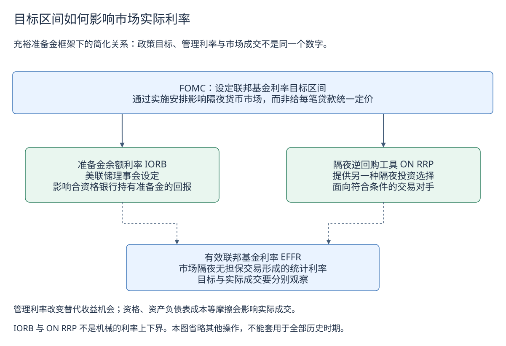
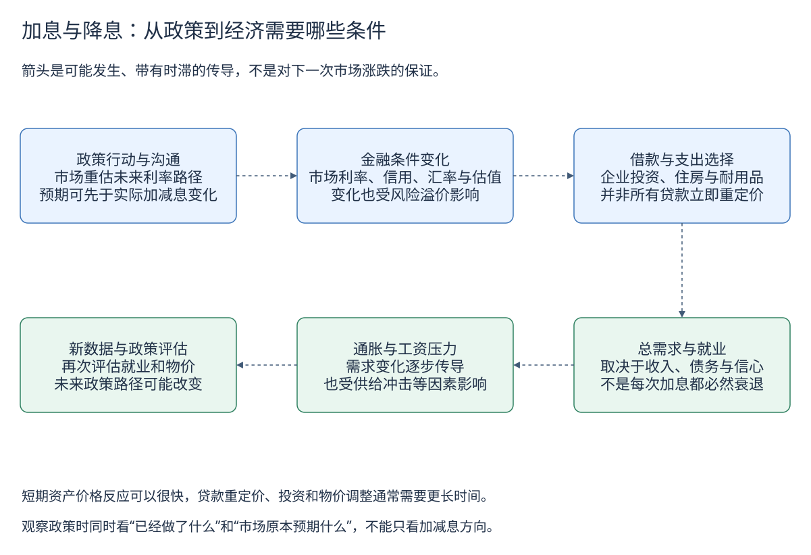
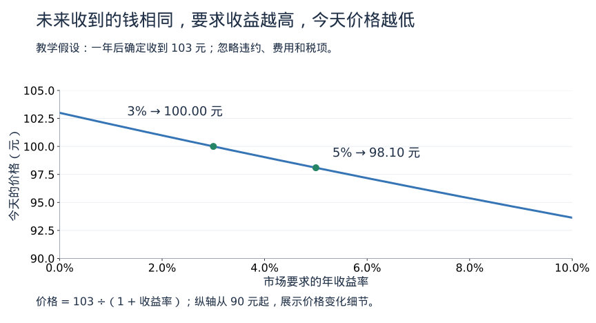
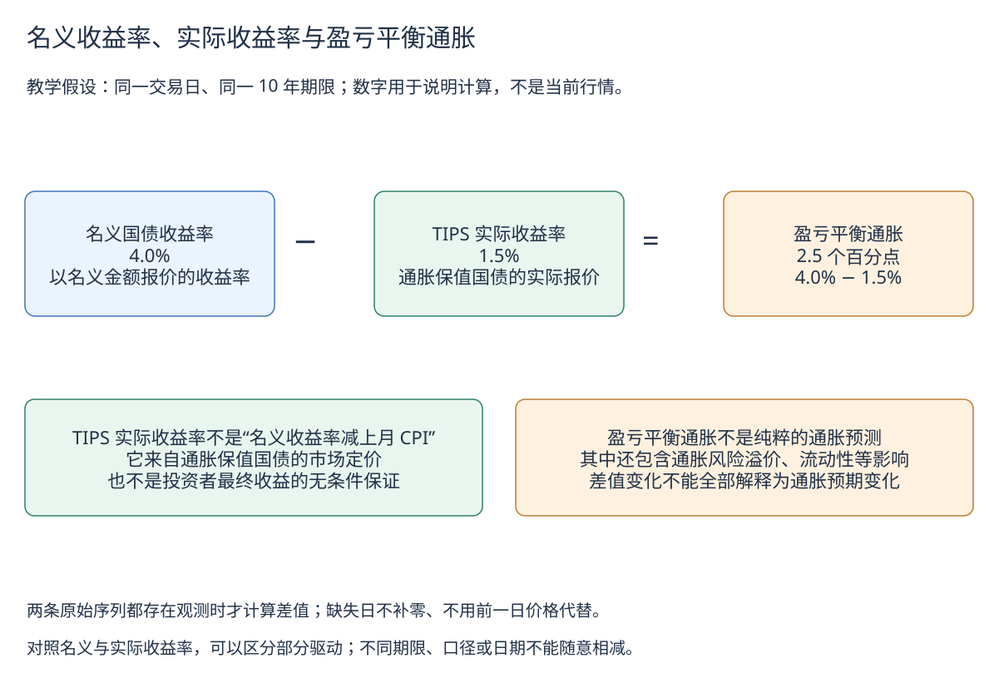

# 美联储与美国利率：从政策目标到市场定价

[返回学习路线](learning-guide.md) · 先读[利率与货币政策](interest-rates.md) · [查看真实历史与 CSV](data/us-rates.md)

新闻说“美联储降息”，为什么十年美债收益率有时反而上涨？因为央行设定的隔夜利率目标，与市场对未来很多年的定价，回答的是不同问题。本章先分清这些利率，再解释它们怎样影响借款、债券、美元和黄金。例子中的数字均为教学假设，不是当前行情。

## 1. 同样叫利率，谁在决定它

| 名称 | 谁设定或形成 | 它告诉我们什么 |
|---|---|---|
| 联邦基金目标区间 | FOMC（联邦公开市场委员会）决定 | 希望特定隔夜市场利率运行的位置，是政策目标 |
| 有效联邦基金利率 EFFR | 纽约联储根据合资格市场交易计算 | 隔夜、美元、无抵押联邦基金交易的实际统计读数 |
| IORB、ON RRP 报价 | 美联储的管理利率与操作安排 | 给合资格机构提供交易选择，用来引导短端市场利率 |
| 2 年、10 年国债收益率 | 国债市场价格，经固定期限曲线估计 | 市场对未来政策、通胀、增长与风险补偿的综合定价 |
| 家庭房贷、企业贷款利率 | 合同与放贷机构定价 | 还包括信用、期限、抵押品、费用等条件，不等于 EFFR |

把目标区间想成“希望温度维持的范围”，EFFR 是特定市场的温度计。温度计的读数不等于所有房间的温度：企业贷款、信用卡和长期国债不会自动采用同一利率。

美联储通常所说的“双重使命”是最大就业和价格稳定。按 **2025 年修订的 FOMC 长期目标声明**，长期通胀目标是 **PCE 价格指数年度涨幅 2%**，不是 CPI，也不是另一套“核心 PCE 目标”。最大就业会随经济结构变化，没有固定的失业率目标。旧框架中的特定补偿性措辞不能自动当作今天的政策承诺。

## 2. 央行如何把市场利率引向目标

在充裕准备金制度下，央行主要借助自己设定的管理利率影响机构的交易选择。这里说明的是这一制度，不能套用于全部历史时期。

[下载可编辑原图](images/learning/fed-rate-implementation.drawio)

**IORB** 是美联储对合资格机构准备金余额支付的利率，由美联储理事会设定。假设一家合资格机构可以把准备金留在联储获得收益，这个选择就会影响它愿意以什么价格向市场出借资金。

**ON RRP** 是隔夜逆回购操作：合资格对手方向联储提供隔夜资金，取得证券作为交易安排的一部分，次日按约定完成反向交易。它给部分无法获得 IORB 的出借方提供另一种隔夜投资选择，帮助缓解短端利率下行压力。获准参与的货币市场基金等可以使用，普通个人不能直接参加。

两者都通过交易机会与套利影响市场，但机构资格、市场分割和中介成本会限制套利。因此 **IORB 不是所有借款人的硬上限，ON RRP 也不是所有成交的绝对下限**。管理利率位置还可能技术调整，不能仅凭这一动作就判断政策目标发生变化。

EFFR 自观察日 **2016-03-01** 起使用 FR 2420 逐笔交易报告与成交量加权中位数；此前是经纪商汇总数据的成交量加权均值。方法变化不等于当天突然加息；历史图保留早期数据并标注断点。

## 3. 加息如何影响经济，为什么需要时间

[下载可编辑原图](images/learning/us-rate-transmission.drawio)

可以用企业建厂的决定来理解：预期融资成本上升，项目需要赚到更多钱才值得做；若订单也转弱，企业可能推迟投资。家庭也可能减少依赖借款的住房或耐用品支出。需求变化逐渐影响就业和价格。

但并非每笔贷款立即重定价，也并非每次加息都必然导致衰退。固定利率合同、企业现金、供给冲击和财政政策都能改变传导力度。资产价格可能在消息公布前就反映预期，实际支出和物价往往调整更慢。

**长期利率关注整条未来路径。** 入门时可近似理解为：长期收益率反映未来短期利率的预期平均水平，再加上承担期限风险的补偿。期限溢价需要模型估计，不是能直接从行情里读出的常数；精确分解也须匹配收益率类型。

假设市场原本预期降息 0.50 个百分点，最终只降 0.25 个百分点，同时未来降息预期减少。即使“今天降了”，长期收益率仍可能上升。也可能是通胀、增长预期或期限溢价发生变化。判断市场反应要同时问：**发生了什么，之前预期什么？**

## 4. 收益率上升，为什么旧债券价格下跌

先看一只一年后确定支付 103 元、期间不付息的债券，暂不考虑违约、税费和交易成本。

- 市场要求年收益率 3%：今天合理价格为 `103 ÷ 1.03 = 100` 元。
- 市场要求年收益率 5%：今天合理价格约为 `103 ÷ 1.05 = 98.10` 元。

未来收到的钱没变，买价必须下降，买入者才能得到更高的收益率。下面复用[债券入门](investing/bonds.md)中的计算图；图的横轴是收益率，不是时间，参数以图注为准。

期限较长不自动等于某个确定跌幅。价格敏感度还取决于现金流结构，常用“久期”作小幅利率变化的近似，再用凸性描述弯曲程度。利差、信用或现金流变化时，不能只看国债收益率解释所有债券价格。

数据页里的 **CMT（固定期限国债收益率）** 是从拟合的平价曲线读取的参考点，可能并不对应任何一只恰好剩余十年的债券。它不是票息、零息即期收益率，也不是未来十年保证拿到的回报。财政部名义曲线自 2021-12-06 起调整了拟合方法，历史说明保留这个变化。

## 5. 收益率曲线与倒挂怎么读

收益率曲线比较的是**同一天、不同剩余期限**的收益率。横轴是期限。数据专题中的“2 年和 10 年历史图”横轴是日期，展示两个期限如何随时间变化，不能直接当作一条收益率曲线。

| 同一天的教学情形 | 2 年期 | 10 年期 | 10 年减 2 年 | 含义 |
|---|---:|---:|---:|---|
| A | 3.0% | 4.0% | +1.0 个百分点 | 这两个点向上倾斜 |
| B | 4.5% | 4.0% | −0.5 个百分点 | 这两个点倒挂，即 −50 个基点 |

倒挂可能包含“眼下短端较高、未来可能降息”的预期，也受期限溢价影响。它不保证一定衰退，不给出固定倒计时，也不能仅凭两个点描述整条曲线。

还要区分指标：纽约联储公开的一个衰退概率模型使用 **10 年减 3 个月**，不是本专题的 10 年减 2 年；该模型也不是 FOMC 的官方预测。理解倒挂需要同时看就业、通胀、信贷等证据。

## 6. 名义、实际收益率与盈亏平衡通胀

[下载可编辑原图](images/learning/us-real-yield.drawio)

**TIPS** 是美国通胀保值国债，本金随规定的消费者价格指数调整，利息按调整后的本金计算。TIPS 实际收益率由这种债券的市场价格形成；本专题用的是财政部固定期限实际曲线读数。

它不是“十年名义利率减最近一年 CPI”。最近一年已发生的通胀，与未来十年的市场定价，时间范围不同。对于普通名义投资，已实现实际回报还需用持有期间实际发生的通胀计算。

同日、同期限的名义收益率减 TIPS 实际收益率，常被称为**盈亏平衡通胀率**或通胀补偿。图中的 `4.0% − 1.5% = 2.5 个百分点` 只是教学算例。这个差值同时包含通胀预期、通胀风险溢价、TIPS 相对流动性等影响，不能直接翻译为“市场确定未来通胀就是 2.5%”。TIPS 的指数口径也不等于美联储的 PCE 目标口径。

若名义收益率下降，可以进一步问：是实际收益率下降、通胀补偿下降，还是两者共同变化？这种拆分比只说“债券市场看多或看空经济”更具体，但仍不是因果识别。

## 7. 怎样连接美元、人民币和黄金

| 观察到的变化 | 可能机制 | 还需要核对 |
|---|---|---|
| 美国相对其他经济体的预期利率上升 | 美元资产相对回报变化，可能影响资金选择 | 其他国家政策、风险情绪、对冲成本和此前预期 |
| 美国实际收益率上升 | 无利息黄金的机会成本可能增加 | 美元、避险需求、央行购金与持仓变化 |
| 美元计价黄金上涨 | 美元金价收益增加 | 人民币投资者还受 USD/CNY、费用与产品跟踪误差影响 |

这些是带条件的联系，不能简化成“加息美元必涨”“降息黄金必涨”。继续读[汇率](exchange-rates.md)和[黄金](gold.md)，将利率与汇率报价、币种收益分开。

## 8. 用真实数据练习

打开[美国利率数据专题](data/us-rates.md)，按下面顺序读取六张交互图。可以选择精确日期、查看完整历史和下载 CSV。

1. **政策目标与 EFFR**：先区分实际读数和目标。旧单点目标序列从 1982 年起，其中 1982—1993 年是研究重建，不能当成当年逐次公开声明；2008-12-16 后上下限分列。
2. **国债月度长历史**：10 年期从 1953-04 起，比其日度历史更早。月均独立保存，不拿来补早期日值。
3. **国债日度与期限利差**：选择同一天，用 10 年减 2 年复算；某天缺少输入就没有差值。休市缺口不代表 0% 利率。
4. **名义与实际、通胀补偿**：选择两项都存在的日期，核对差值。参考利差可能比 H.15 原始收益率更新更快，本项目不据此编造输入。

EFFR 现有序列从 1954 年起，不代表此前没有联邦基金市场。已查 1928—1954 年历史报刊的买入/报出高低值，测量不同，未拼进成交加权有效利率。三处历史期限利差来源差异及完整覆盖见[历史核验说明](data/history-coverage.md)。

### 自测

1. 目标区间不变，EFFR 是否必须每天完全相同？
2. 降息当天十年美债收益率上涨，是否足以证明数据错了？
3. 十年名义 4%、实际 1.5%，能否保证未来通胀为 2.5%？
4. 一年后支付 103 元的债券，市场要求收益率从 3% 升到 5%，今天的价格如何变化？
5. 10 年减 2 年为负，是否等于纽约联储模型预测必然衰退？

### 参考答案

1. 不是。目标是政策设定，EFFR 来自实际市场交易，会受到资金供求等影响。
2. 不能。市场交易未来路径和风险补偿，还取决于本次动作相对预期的差异。
3. 不能。2.5 个百分点是同期限收益率差，包含风险与流动性影响，不是确定预测。
4. 在本节假设下由 100 元降至约 98.10 元；未来现金流没变，较低买价提供较高收益率。
5. 不是。这里仅两个期限倒挂；该公开模型使用 10 年减 3 个月，而且概率不等于保证。

## 一手参考

- [FOMC：2025 年长期目标与策略声明](https://www.federalreserve.gov/monetarypolicy/monetary-policy-strategy-tools-and-communications-statement-on-longer-run-goals-monetary-policy-strategy-2025.htm)：使命、PCE 目标与政策时滞。
- [纽约联储：货币政策实施](https://www.newyorkfed.org/markets/domestic-market-operations/monetary-policy-implementation)、[美联储：充裕准备金制度入门](https://www.federalreserve.gov/econres/notes/feds-notes/implementing-monetary-policy-in-an-ample-reserves-regime-the-basics-note-1-of-3-20200701.html)：管理利率与资格限制。
- [纽约联储：EFFR](https://www.newyorkfed.org/markets/reference-rates/effr)、[2016 年方法实施公告](https://www.newyorkfed.org/markets/opolicy/operating_policy_160106)：实际成交口径与断点。
- [财政部：利率常见问题](https://home.treasury.gov/policy-issues/financing-the-government/interest-rate-statistics/interest-rates-frequently-asked-questions)、[曲线方法](https://home.treasury.gov/policy-issues/financing-the-government/interest-rate-statistics/treasury-yield-curve-methodology)、[TreasuryDirect：TIPS](https://www.treasurydirect.gov/marketable-securities/tips/)：CMT、报价与通胀保值机制。
- [纽约联储：期限溢价](https://www.newyorkfed.org/research/data_indicators/term-premia-tabs)、[美联储：前瞻指引](https://www.federalreserve.gov/faqs/what-is-forward-guidance-how-is-it-used-in-the-federal-reserve-monetary-policy.htm)：长期定价与预期。
- [美联储研究：Tips from TIPS](https://www.federalreserve.gov/econres/notes/feds-notes/tips-from-tips-update-and-discussions-20190521.html)、[收益率曲线研究](https://www.federalreserve.gov/econres/notes/feds-notes/dont-fear-the-yield-curve-reprise-20220325.html)、[纽约联储：收益率曲线模型](https://www.newyorkfed.org/research/capital_markets/ycfaq)：研究模型有假设，不能当作 FOMC 的官方预测。
