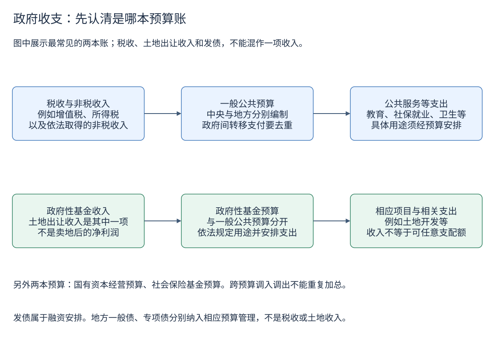
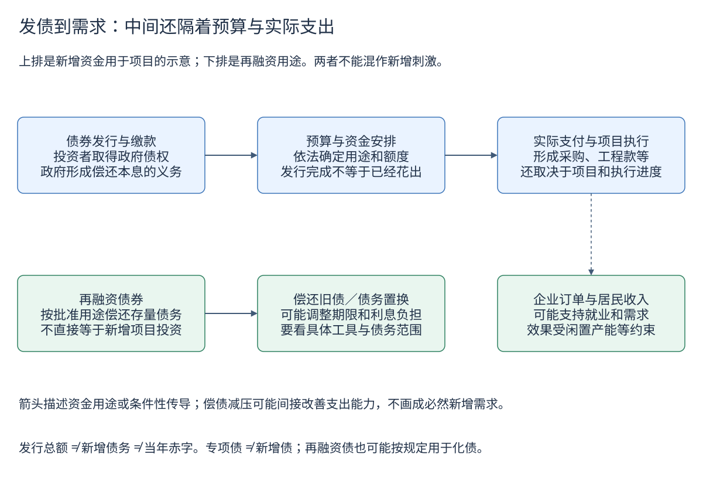
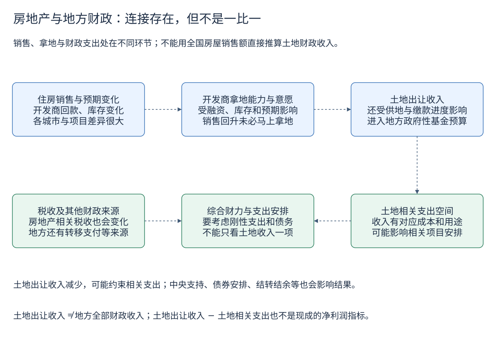

# 财政政策与政府债务：钱从哪里来，又花到哪里去

看到“地方债发行加快”，先不要直接理解为“政府已经多花了同样多的钱”。发行可能用于新项目，也可能用于偿还旧债；即使是新增债券，资金到账、预算安排、项目支付和形成实物工作量也需要时间。

本章把[银行与货币创造](banking-and-money-creation.md)、[社融与信贷结构](credit-structure.md)和[房地产与经济](property-and-economy.md)连到财政。读完应能分清四组概念：**收入与融资、赤字与债务、发行与支出、存量与流量**。图中箭头解释机制，不代表固定比例或必然因果；示例数字均另行标明。

## 1. 财政政策在做什么

财政政策通过税收、政府购买、公共投资、补贴和转移支付等影响经济。货币政策则主要影响货币金融条件；两者可能配合，但政府发债、央行操作和商业银行贷款不是同一件事。

例如，政府购买公共服务会直接产生需求；给家庭发补贴先改变家庭可支配资源，是否转化成消费取决于家庭的消费、储蓄和还债选择。政府向家庭转移一笔钱，本身不是新增生产，不能将这笔转移支付直接再计作等额 GDP。

经济下行时，即使没有出台新政策，税收也可能随利润和收入下降，部分保障性支出则可能增加，这属于“自动稳定器”。主动减税、扩大公共投资等是政策选择。判断财政力度，要结合实际支出、政策范围和融资用途，不能只看某个债券数字。

## 2. 四本预算账：先认识最常见的两本

| 预算 | 主要观察什么 | 容易混淆的地方 |
|---|---|---|
| 一般公共预算 | 税收、非税收入，以及教育、社保、卫生等支出 | 债券融资不属于月报税收或非税收入 |
| 政府性基金预算 | 按规定筹集并用于特定事项的资金，土地相关收入很重要 | 不是公募基金；土地收入只是其中一部分 |
| 国有资本经营预算 | 国有资本收益及其分配 | 国企全部营业收入不等于这本预算的收入 |
| 社会保险基金预算 | 各项社会保险基金收支 | 不能把它与一般公共预算里的社保支出直接重复相加 |



[下载可编辑 Draw.io 源图](images/learning/fiscal-budgets.drawio)

这四本账存在依法安排的调入、调出等联系。因此，“四本预算收入简单相加”也未必就是不重复的政府总收入。全国、中央、地方的统计边界同样重要：全国汇总不能再把中央对地方转移支付重复计算一次。

“中央本级支出”与“中央一般公共预算支出”也不同，后者的总口径可以包含中央对地方转移支付。看表格时先读表名、单位、层级和总计项，再比较数值。

## 3. 预算、执行与决算不是同一版数字

| 阶段 | 回答的问题 | 阅读方法 |
|---|---|---|
| 年初预算及调整预算 | 计划收多少、花多少、批准什么额度？ | 计划不是已经发生的结果 |
| 月度执行报告 | 年初以来已经收了、支出了多少？ | “1—8月”是累计，不能把各月累计值相加 |
| 年度决算、年度统计来源 | 结账或后续整理后是多少？ | 可能修订，不拿来冒充当时月报原值 |

本项目把年度来源和月度累计执行数保存成不同序列。例如，2024 年月报一般公共预算收入为 219702 亿元，而统计局年度来源为 219734.30 亿元；月报支出为 284612 亿元，年度来源为 284605.57 亿元。它们不是解析错误，也不应为了让图表对齐而改成同一个数。

长历史还包含范围变化：2011 年部分预算外收入纳入预算管理，2015 年部分政府性基金转列一般公共预算；2022 年留抵退税影响收入及同比。不能把统计边界变化全部当作经济增长。官方发布的可比增速单独保存，不用两个旧版金额机械重算。

## 4. 赤字是一段时间的安排，债务是一个时点的余额

赤字与某一年度的预算收支平衡有关；债务余额表示某一时点尚未偿还的债务。债务限额是批准的上限，也不是已经借到的钱。

月报中的“支出减收入”不能直接当成官方赤字，因为平衡账还包含结转结余、调入资金、预算稳定调节基金等项目。

一个可核验的例子是财政部 **2024 年中央一般公共预算决算**，单位亿元：

```text
中央一般公共预算支出             141055.90
+ 补充中央预算稳定调节基金         1188.16
− 中央一般公共预算收入           100462.06
− 中央财政调入资金                 3382.00
− 上年结转资金                     5000.00
= 中央财政赤字                   33400.00
```

只看第一项减第三项会得到 40593.84 亿元，和正式赤字不同。这是这一年中央账本的具体平衡关系，不能不核对项目就照搬到所有年份或地方。原表见本章参考资料。

在没有其他调整的简化情况下：

```text
期末债务余额 = 期初余额 + 本期借入 − 偿还本金
```

实际统计还可能有存量债务认定、分类变化、外币折算等调整，因此不要用这个简式强行“修正”官方余额。利息是借钱的成本，本金是归还原来借的钱；在有关地方债预算管理办法中，利息列入相应预算支出，本金收支单列在相应预算总收支线下，不把还本和普通支出混算。

## 5. 地方债有两种互相独立的分类

**一般债／专项债**主要对应预算管理和偿债安排，**新增／再融资**主要说明发行用途。它们不是同一维度，不能列成四个互斥的桶。

| | 新增债券 | 再融资债券 |
|---|---|---|
| 一般债券 | 按批准额度筹集新增一般债资金 | 一般债类别中的再融资安排 |
| 专项债券 | 按批准额度筹集新增专项债资金 | 专项债类别中的再融资安排 |

一般债务纳入一般公共预算管理；专项债务纳入政府性基金预算管理，偿债与相应基金收入、项目专项收入等安排有关。专项债依然是政府债务，并非“项目失败就与财政无关”。具体用途和管理规则应查当期规定，不能只靠名称判断。

“地方专项债”与“特别国债”也不同：前者是地方债类别，后者是中央国债中的特定政策安排，不能把“专项”和“特别”当作同义词。

早期地方债报告还有“置换债券”，或只给“置换和再融资合计”。本项目把这些原始类别分开保存，未公布的分项留空，不擅自拆开。再融资债也不能一律理解为普通到期滚续：特定政策下可能用于化解存量隐性债务。

## 6. 发债之后，怎样传到经济活动



[下载可编辑 Draw.io 源图](images/learning/fiscal-bond-transmission.drawio)

发行债券首先带来融资现金。资金是否用于新增支出，要看用途；什么时候形成需求，要看拨付、支付、项目进度和收款方行为。“发行加快”和“实物工作量加快”可能相隔一段时间。

**教学假设：**期初债务 100，全年发行 30，其中 20 用于偿还旧本金，10 是新增融资；没有其他调整时，期末债务是 110，而不是 130。即使新增融资为 10，也不能据此断言当期 GDP 增加了 10。

再融资和置换并不是“没有作用”：可能缓解集中到期压力、降低利息、延长期限，或帮助清偿历史拖欠。但“改善现金流和债务结构”与“新增采购和投资”需要分别判断。

也不能将社融里的政府债券净融资，与财政部当月地方债发行总额直接对比：前者包含中央和地方等政府债券并扣除偿还，后者这里只是地方债的发行毛额；范围和净额／毛额都不同。

## 7. 房地产怎样影响地方财政



[下载可编辑 Draw.io 源图](images/learning/fiscal-property-link.drawio)

销售和回款走弱，可能降低开发商的拿地意愿和能力；土地成交与缴款变化，可能传到地方土地收入和相关支出安排。但土地收入还受供地数量、地块结构、价格、缴款时点及政策影响，不会和商品房销售逐月同比例变化。

地方财政也不只依赖土地：税收、非税、上级转移支付、批准的债务融资、结余和存量资源都会影响支出能力。不能看到土地收入下降，就断言地方全部财政收入下降同样幅度。

尤其需要区分：

- **土地出让收入是毛收入**，其中有征地拆迁、土地开发等相关成本，不全是可自由使用的钱。
- **土地相关税收**与土地出让收入属于不同统计项目，不能只凭都与房地产有关就混为一项。
- **决算表的“国有土地使用权出让金收入”是较窄项目**；月报的土地出让收入范围较宽，本项目不把两条序列拼接。
- **城投公司负债不自动全是法定政府债务**。隐性债务按规定转为法定债务时，法定余额可能上升，却不等于同期发生了同额新支出。

## 8. 用数据回答问题的顺序

打开[财政与政府债务数据专题](data/fiscal.md)，按以下顺序看：

1. **收入来源：**一般公共预算收入怎样变化？税收与非税是否同向？同比是否受范围调整或退税影响？
2. **支出执行：**看同一累计期间，避免把累计额当单月；如需判断节奏，还要考虑季节性和支付时点。
3. **另一预算：**看政府性基金和其中的土地收入，不重复加总，不以毛收入代替净收益。
4. **融资用途：**发债中有多少新增、多少再融资？再融资是否涉及化债安排？
5. **存量约束：**余额、到期结构、付息压力和收入能力怎样变化？不要只看余额绝对数，也不要凭一个比率推断风险。
6. **传导证据：**再结合投资、项目进度、企业回款、居民收入和消费，区分政策意图与已发生的结果。

本次没有把不同来源和年份的 GDP 拼到债务余额上制作“统一债务率”。这样的比率必须先选定债务范围、分母版本和统计时点，尤其不能把法定债务、隐性债务或全部公共部门负债混称一个指标。

## 自测

1. 某月累计财政支出高于累计收入，差额一定是本年官方赤字吗？
2. 地方债发行 30，其中再融资 20，能说新增财政刺激为 30 吗？
3. 土地收入下降 20%，能说地方全部财政收入也下降 20% 吗？
4. “专项债”和“再融资债”是互斥类别吗？
5. 12 月累计数与年度数据不同，应删掉哪个？

答案：①不能，还要核对平衡项目、范围与时期。②不能，还要看偿旧、拨付和实际支出。③不能，收入结构和其他资金来源不同。④不是，分类维度不同。⑤都可保留，明确执行与年度来源，记录后续修订。

## 参考资料与继续阅读

- [财政部：财政收支月度档案](https://gks.mof.gov.cn/tongjishuju/index.htm)、[全国财政决算档案](https://yss.mof.gov.cn/caizhengshuju/index.htm)。
- [财政部：地方政府债券发行和债务余额统计](https://zwgls.mof.gov.cn/tjsj/index.htm)。
- [国家统计局：中国统计年鉴 2025 财政统计说明](https://www.stats.gov.cn/sj/ndsj/2025/html/sm07.htm)：预算分类、决算来源与统计定义；历史说明不应一概当作当前税收分享规则。
- [财政部转载的预算法相关条款](https://yss.mof.gov.cn/zhuantilanmu/dfzgl/zcfg/201701/t20170125_2527438.htm)：用于解释限额与预算管理，不把该摘录冒充截至当前的完整法律文本。
- [地方政府一般债务预算管理办法](https://yss.mof.gov.cn/zhuantilanmu/dfzgl/zcfg/201701/t20170125_2527827.htm)、[专项债务预算管理办法](https://yss.mof.gov.cn/zhuantilanmu/dfzgl/zcfg/201701/t20170125_2527828.htm)：预算归属与本金、利息处理。
- [2024 年中央一般公共预算收入决算表](https://yss.mof.gov.cn/2024zyjs/202507/t20250716_3967966.htm)、[支出决算表](https://yss.mof.gov.cn/2024zyjs/202507/t20250716_3967962.htm)：本章赤字平衡示例的原始数字。
- [国务院关于 2024 年度政府债务管理情况的报告](https://zwgls.mof.gov.cn/gzdt/202511/t20251102_3975538.htm)：法定与隐性债务范围、再融资与化债用途；报告中债务率采用当时 GDP 版本。
- [财政数据历史、口径与缺口](data/history-coverage.md)、[如何阅读宏观数据](reading-macro-data.md)。
