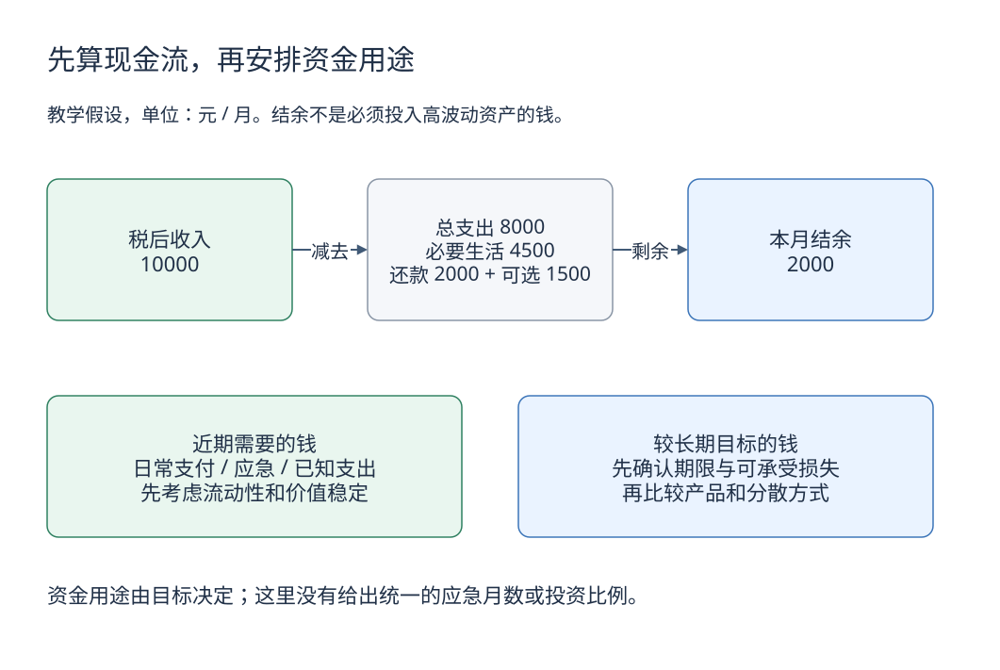

# 3. 个人财务底座：先看目标和现金流

[学习路线](../learning-guide.md) · 前一章：[收益与风险](money-time-risk.md) · 下一章：[存款与债券](../investing/bonds.md)

同一种投资，对三个月后要交学费的人和多年不需用这笔钱的人，意义不同。选产品前先把目标、用钱时间和承受损失的能力说清楚。

## 先准备两张表

| 表 | 记录内容 | 要回答的问题 |
|---|---|---|
| 月度现金流表 | 税后收入、必要开支、还款、可选消费 | 每月有多少结余？收入中断会怎样？ |
| 资产负债表 | 现金、投资、其他资产、各项债务 | 净资产多少？多少能及时变现？ |

假设月税后收入 10000 元，必要生活支出 4500 元，贷款还款 2000 元，可选支出 1500 元，每月结余为 2000 元。还贷里的本金与利息对净资产的影响不同，但在现金流表中都是实际流出。

不要把尚未收到的奖金当成稳定收入，也不要把房屋估值当作随时能用的现金。

[下载可编辑源图](../images/learning/household-cashflow.drawio)

先看上排能否算出结余，再看下排钱的用途。结余只是可以继续安排的现金，不意味着必须全部投入股票或基金；下面两个框也不是规定各分一半。

## 按用钱时间分配任务

| 资金用途 | 首先关注 | 原因 |
|---|---|---|
| 日常支付 | 可用性和支付安全 | 随时需要使用 |
| 应急储备 | 流动性和价值稳定 | 失业、生病或大额必要支出可能突然发生 |
| 已知的近期目标 | 本金波动、到期与赎回安排 | 用钱时间不能随行情推迟 |
| 较长期目标 | 实际购买力、风险与分散 | 有时间承受部分波动，但没有收益保证 |

应急储备可以用“必要月支出 × 可覆盖月数”思考。假设必要支出含还款共 6500 元，覆盖四个月是 26000 元。四个月只是演示，合理范围取决于收入稳定性、家庭责任、保障和可用支持，不是统一答案。

## 负债先看实际成本与约束

比较借款时，不只看广告中的日利率或月费率，要确认资金实际到账、还款时间、利息与手续费，尽量用包含费用的年化成本比较。

偿还一笔高成本债务，可能减少相对确定的未来利息支出；但是否提前还款，还要看违约金、利率性质和保留流动性的需要。不能只用“某投资预期收益更高”忽略投资的不确定性。

## 保险解决的是另一类问题

保险通过合同约定转移特定风险。关注保障责任、除外责任、免赔额、等待期、续保与理赔条件，再看价格。储蓄、投资和保险可以相互配合，但不能仅因为一个产品含“保险”二字，就认为任何损失都能获赔。

具体配置需要结合所在地区公共保障、家庭情况与合同，不在这里给每个人套同一份清单。

## 一个购买前检查表

1. 这笔钱服务哪个目标，最早什么时候需要？
2. 收入减少时，会不会被迫在亏损中卖出？
3. 产品是否锁定，正常和异常情况下多久能取回？
4. 最坏的合理情景下，损失是否影响基本生活和必要支出？
5. 我能否解释发行人、费用和风险，而不只重复销售宣传？

这些问题比先问“今年买什么最赚钱”更容易形成可执行的判断。

## 自测

假设三个月后必须使用的一笔学费投入股票基金，只因“长期股票可能上涨”。这个判断缺少什么？

参考答案：资金期限与资产波动不匹配。长期统计不能保证三个月的结果，学费支付也未必能等待市场恢复；应先按确定的用钱时间评估流动性和可承受损失。

## 延伸阅读

- [国家金融监督管理总局](https://www.nfra.gov.cn/)：金融消费者教育、银行保险风险提示；具体权利义务仍以适用制度和合同为准。
