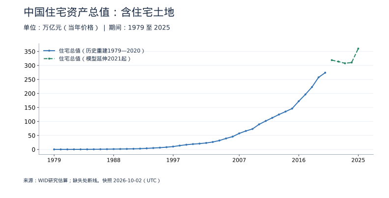

# 房价、人口与住房需求：怎样把这些图放在一起看

房价、人口和生育率有关，但不能用“人口少了，所以所有城市房价都会跌”一句话概括。人口在哪里、家庭怎样组成、收入和贷款能力、已有住房与新增供给，都会影响结果。

本专题接着[房地产的销售、资金与建设](property-and-economy.md)，把观察范围从开发企业扩展到住房价格、住房资产存量与家庭。先从下表进入图表，再回来核对解释。

| 想看什么 | 数据入口 | 先确认什么 |
|---|---|---|
| 中国房价趋势 | [全国成交均价与 BIS 代表性指数](data/housing-prices.md) | 成交均价不是同质房价指数，70 城也不是全国全部房屋 |
| 上海房价趋势 | [上海新房、二手房同比与环比](data/housing-prices.md#上海新房与二手房同比) | 新房与二手房分开，同比与环比分开 |
| 房地产总市值 | [中国住宅资产总值估算](data/housing-wealth.md) | 这里是住宅及对应土地，不是全部房地产；2021 年起为模型延伸 |
| 中国人口与生育率 | [中国人口、生育与家庭](data/population.md) | 总人口、出生率、总和生育率不是同一指标 |
| 上海人口与生育率 | [上海人口与生育](data/shanghai-population.md) | 人口图是常住人口，生育率图是户籍人口，范围不同 |
| 中国家庭数 | [家庭户数与平均规模](data/population.md#中国家庭户数普查与调查推算) | 家庭户不含集体户，调查之间不插值 |

所有图都可以选具体期间、查看数值、缩放和下载完整历史。数据更新频率取决于来源：房价指数按月或季，人口通常按年，普查家庭数不是逐年公布。统计快照不等于实时挂牌行情。

## 第一件事：你说的房价是哪一种

**成交均价**看的是这一年卖出的房屋：销售额除以销售面积，单位元/平方米。高价城市成交占比下降，即使各城市同类房屋没有降价，全国均价也可能下降。新建商品住宅不包括全部二手房、自建房及其他住房。

**价格指数**尝试追踪价格变动，以指数或涨跌幅表达。指数 120 不是每平方米 120 元；同比 −5% 也不代表比上一月下降 5%。

**教学假设**：去年甲城市成交 100 平方米、每平方米 3 万元，乙城市成交 100 平方米、每平方米 1 万元，全国均价为 2 万元。若今年两地单价不变，但甲成交 50 平方米、乙成交 150 平方米，均价就降到 1.5 万元。均价跌了 25%，不表示每套房便宜了 25%。

图中 2005 年单独保留，是因为销售统计范围发生变化。旧年鉴和最新数据库重叠时优先采用数据库修订；不能为了曲线平顺改掉原值。

BIS 的中国代表性住宅价格序列又有另一处变化：2016 年前采用 70 城新建住宅，之后采用二手住宅。图上分线，避免让一条连续线暗示始终是同一统计对象。[详细口径与来源](data/housing-population-methodology.md)

## 上海为什么要同时看新房和二手房

新房价格受新增项目区位、产品结构、销售安排等影响；二手房还反映已有业主的出售意愿、挂牌与成交。两者不能互相替代，也不能简单平均成“上海房价”。

| 读数 | 含义 | 常见误读 |
|---|---|---|
| 环比 −0.5% | 比上个月低 0.5% | 当成比去年低 0.5% |
| 同比 −5% | 比上年同月低 5% | 当成每个月都跌 5% |
| 环比转正、同比仍负 | 最近一个月上升，但仍低于一年前 | 以为两个指标矛盾 |

这里提供国家统计局的上海月度指数变化，不混入中介挂牌均价，也不把“挂牌价变化”说成实际成交价格变化。2011 年调查方法改革以前的数据仍保留，但单列旧法。

## “房地产总市值”为什么更难

一年销售额是**流量**，住宅资产总值是**存量**。一套价值 300 万元的房屋今年没有交易，仍然属于资产存量；同一套房在二手市场多次交易，也不会凭空变出几套住房。

本项目目前可核验的长期序列是 WID 的**住宅资产总值研究估算**，包括住宅建筑及其对应土地，未扣除房贷。它比私人家庭持有住宅更宽，涵盖国民经济各居民部门；但比“所有房地产”更窄，不能把商场、写字楼、厂房等一并想象进去。

尤其注意虚线：基础研究覆盖至 2020 年，后续为来源模型延伸；早期也是研究重建，不是逐套住房的官方估价普查。2024—2025 年这条估算线快速上升，**不能据此断言真实住房市场同幅上涨**。估价方法、存量数量、模型及版本修订都会影响结果。

原始 WID 金额以最新基年不变价提供，本项目用同版价格指数还原成各年的当年价格，明确记录公式与原值。如果不做这一步，就会把“按 2025 年购买力表达的 1979 年资产”错当作 1979 年名义金额。

住宅总值/GDP 为 250%，表示资产存量约等于 2.5 年的 GDP。它不是“房地产贡献了 250% 的 GDP”，也不意味着这些资产能同时按估值变现。

## 人口、出生率与总和生育率

| 指标 | 分子/含义 | 分母或单位 |
|---|---|---|
| 年末人口 | 某一时点有多少人 | 万人，存量 |
| 出生率 | 一年活产人数相对总人口 | 每千名年平均人口，‰ |
| 死亡率 | 一年死亡人数相对总人口 | 每千名年平均人口，‰ |
| 自然增长率 | 出生率减死亡率 | ‰；不包含迁移 |
| 总和生育率 | 把当年各年龄女性生育率合成为一生子女数 | 孩/妇女 |

总和生育率是一个**时期指标**。它回答“如果一名女性一生经历这一年的各年龄生育率，会生育多少孩子”，不等于每位当前女性已经生了多少，也不等于某一代人的最终生育数。推迟生育可能压低当期数值，因此不能仅用一个年份判断一代人的完整生育经历。

此图采用联合国 WPP2024 的 1950—2023 年估计。虽然现在已过 2024 年，WPP2024 文件中的 2024 年仍然是**该版本预测期**，不能因为时间过去就自动改叫历史观测。联合国公告将下一次完整修订推迟到 2027 年；2026 年临时更新仅涉及多哥，因此本页没有把预测伪装成最新实绩。

联合国估计还可能与中国普查当年直接公布的生育率不同：调查遗漏调整、模型、资料和版本不同。不能看到数值不同就任选一个，也不能把多个版本接成貌似一致的长期线。

## 上海常住人口和户籍生育率不是同一人群

常住人口反映实际居住人口；户籍人口以户口登记为准，两者不完全重合。迁入人口可能增加城市住房需求，即使本地户籍生育率很低，常住人口也未必同步下降。

上海生育率图来自卫健委户籍统计，不能拿它与全国联合国估计做严格的同口径排名。它可以观察上海户籍人群自身的变化；若要比较城市全体常住女性，应另找同口径资料。

人口图采用最新修订的国家统计局常住人口序列。旧公告的人口可能在普查后被明显修订，因此没有为了延长曲线，把旧版上海人口数硬接到新版上。

## 人口增长放缓，家庭户数为什么还能增加

**教学假设**：100 人平均每户 4 人时约有 25 户；还是 100 人，平均每户 2 人时约有 50 户。独居、结婚分户、家庭结构和居住安排，都可能让户数与总人口不同步。

这个例子帮助理解方向，但真实数据**不能拿全体人口除以家庭户规模直接计算**：全体人口还包括集体户，而家庭户平均规模的分子只包括家庭户人口。

人口普查的家庭户数、抽样调查推算的全国家庭户数、实际调查到的样本户数，必须区分。图中 2025 年全国推算值约 5.15 亿户，不是调查人员实际访问了 5.15 亿户。普查与调查之间的年份留白，避免制造不存在的精度。

新增一户也不等于新增购买一套房：可能租住、合住、使用既有住房，或在不同城市之间迁移。长期住房需求还要结合收入、就业、城市净流入、存量空置、拆迁更新和新增供给。

## 一个可重复的阅读顺序

1. 看全国和城市人口及家庭结构，先判断长期居住需求的方向与地区分布。
2. 看收入、就业、贷款条件，判断潜在需求能否转成实际购买能力。
3. 看新房和二手房的价格变化、销售与库存，避免仅凭均价或一个月的涨幅下结论。
4. 看开发企业资金、开工和交付，理解供给与资金约束。
5. 最后再看住宅资产估值，始终带着范围、估算方法与版本限制。

继续阅读：[经济活动](data/activity.md) · [收入与就业](data/employment-income.md) · [社融与信贷结构](credit-structure.md) · [房地产与经济](property-and-economy.md)

## 自测

1. 全国成交均价下降 10%，能推断上海同一套房也下降 10% 吗？
2. 上海户籍总和生育率 0.66，等于常住人口出生率 0.66% 吗？
3. 全国总人口增长放缓，家庭户数还能增加吗？
4. 住宅资产总值相当于 GDP 的 2.5 倍，是否意味着房地产创造了 2.5 倍 GDP？

参考答案：不能，范围和成交结构不同；不等于，人群、分母和单位都不同；可以，家庭变小和分户可能增加户数；不意味着，前者是存量，GDP 是年度新增产出。

原始来源、实际覆盖、统计断点和估算公式详见[房价与人口数据方法](data/housing-population-methodology.md)。
