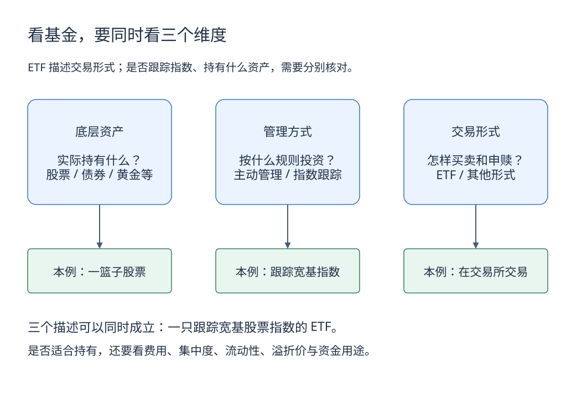

# 6. 基金、指数与 ETF：先拆开三个概念

[学习路线](../learning-guide.md) · 前一章：[股票](stocks.md) · 下一章：[风险与投资组合](portfolio.md)

基金把多位投资者的资金按约定规则共同投资。它让投资者通过份额持有一组资产，但风险取决于持有什么、怎么运作以及支付什么费用。

## 三个不同维度

| 维度 | 常见分类 | 回答的问题 |
|---|---|---|
| 底层资产 | 货币市场、债券、股票、混合等 | 实际持有什么？ |
| 管理方式 | 主动、被动指数跟踪 | 谁按什么规则决定持仓？ |
| 运作与交易形式 | ETF、其他开放式或封闭式形式等 | 怎样买卖、申赎和定价？ |

ETF 是交易所交易基金，不等于“股票基金”，也不等于“低风险”。具体制度下可能存在不同策略与资产类型，应读产品文件，不能仅凭缩写判断。

[下载可编辑源图](../images/learning/fund-dimensions.drawio)

三个框要横着一起读，而不是当成三种互斥产品。图下方展示的是同一只假设基金的三个属性；仅看到“ETF”三个字，还不能确定它持有什么或是否充分分散。

## 指数不是可以直接买入的账户

指数是一套选样、加权和调整规则，用于描述某组资产。指数基金尝试跟踪相应指数，投资者实际买的是基金份额。

一只覆盖多个行业的宽基指数与集中于某个行业的指数，风险分散程度不同。市值加权指数可能被少数大公司显著影响，成分股数量多也不意味着风险均匀分布。

## 净值与交易价格

基金单位净值大致表示基金净资产除以份额数。普通开放式基金申赎按合同约定的净值规则办理，通常不是点击时锁定屏幕上的某个实时价格。

ETF 在交易所的成交价格还受买卖供求影响，可以高于或低于净值或相应参考价值。假设成交价 1.02 元，可比净值为 1.00 元，溢价约为 2%；现实比较时必须确认二者时点与估值口径是否匹配。

申赎机制有助于缩小价差，但跨境时差、申赎限制或流动性问题可能使价差持续。

## 为什么基金收益不等于指数涨幅

费用、交易成本、现金仓位、跟踪方式、税项、分红处理和统计时间都会造成差异。

假设指数全收益为 8%，基金同期净值总回报为 7.6%，差额是 -0.4 个百分点。这个单期差额不是通常统计意义上的“跟踪误差”；跟踪误差还关注一系列回报差异的波动。

## 购买前看六件事

1. 底层资产、基准与允许投资范围。
2. 主动或被动策略，以及集中度。
3. 管理、托管、销售服务、申赎与交易费用，哪些已经反映在净值里。
4. 流动性、封闭期、交易时间和到账安排。
5. 分红方式、计价币种和外汇敞口。
6. 风险揭示、基金合同、招募说明书及定期持仓报告。

货币基金也不是存款；收益率会变，赎回还受合同与渠道规则约束。基金投资范围包含债券，也不意味着保证本金。

## 常见误区

- 持有十只基金就是充分分散：它们可能集中持有相同股票。
- 今年收益冠军最适合长期持有：排名可能来自特定风格、集中风险或运气。
- 定投保证赚钱：它分散买入时点，不消除资产长期下跌或质量恶化的风险。

## 自测

同样叫 ETF，一只持有某个行业的股票，一只跟踪黄金。它们可以只按过去一年收益率比较“谁更好”吗？

参考答案：不够。资产性质、收益来源、波动、集中度、费用、汇率和资金用途都不同，需要先判断比较目标。

## 延伸阅读

- [中国证券投资基金业协会](https://www.amac.org.cn/)：基金行业与投资者教育资料；具体基金以法定披露文件为准。
- [上海证券交易所投资者教育](https://edu.sse.com.cn/)：ETF 与交易机制入门。
