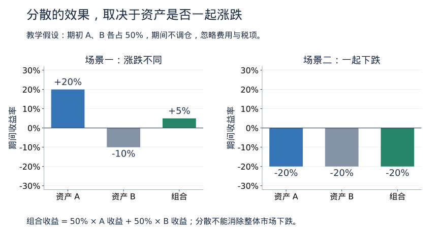

# 7. 风险与投资组合：为什么分散，而不是押一个答案

[学习路线](../learning-guide.md) · 前一章：[基金与 ETF](funds.md) · 下一章：[银行与货币创造](../banking-and-money-creation.md)

认识产品之后，需要把它们放回同一个家庭目标中思考。资产配置是决定不同用途和风险资产各占多少，而不是寻找一个永远上涨的产品。

## 承受意愿与承受能力

“我觉得自己能接受下跌”是主观意愿；“收入中断后是否仍能支付必要开支”是客观能力。两者都要考虑，不能因为看好某种资产就忽略近期现金需求。

评估目标时写清金额、时间、是否可以延后，以及失败会有什么影响。不同目标可以有不同配置，不必让全部资产服务同一种期限。

## 分散为什么可能有效

两个资产不总在同一时间同幅度涨跌，组合的波动可能小于集中持有某一资产。关键是收益之间如何共同变化，不只是名称数量。

假设各投入一半：资产 A 上涨 20%，B 下跌 10%，忽略费用且期间不调仓，组合收益为 `0.5 × 20% + 0.5 × (-10%) = 5%`。

但如果 A、B 都下跌 20%，组合仍下跌 20%。分散不能消除整体市场风险，相关性在危机时还可能上升。



两个面板使用相同的纵轴范围，便于直接比较。组合收益是期初权重的加权结果；一涨一跌的场景有缓冲作用，但这两个例子本身不能估计长期相关性，更不保证组合在未来上涨。

## 组合看穿到底层

同时持有一家公司的股票、重仓该公司的基金，并在该公司工作，工资与资产可能暴露在同一风险上。表面上是三个来源，实际上可能一起受损。

分析时检查行业、地区、币种、期限、信用风险和发行主体，而不只是数账户和基金数量。

## 再平衡是什么

再平衡是把偏离目标的权重调整回来。例如最初 A、B 各 50 元，A 涨至 60 元、B 保持 50 元，A 占比变为 `60 ÷ 110 ≈ 54.5%`。

如果仍决定维持原来的 50:50，在忽略费用与税项时可从 A 转出 5 元到 B，使二者各为 55 元；也可利用新增资金逐步调整。这样做是管理既定风险，并不保证提高收益。

目标本身也要随用钱时间和家庭状况评估。频繁调仓有成本，不能把再平衡变成对短期涨跌的反复猜测。

## 杠杆会改变生存条件

假设自有 100 元、借入 100 元购买资产，资产总值 200 元。资产下跌 20% 后剩 160 元，扣除仍需偿还的 100 元，自有权益剩 60 元，亏损 40%，尚未计息。

保证金要求可能让投资者在恢复前被迫卖出。所谓“长期最终会回来”无法保证能坚持到那个时点。

## 写一页决策记录

```text
目标及用钱日期：
近期必要资金与应急储备：
可接受的损失及其对生活的影响：
资产类别与选择理由：
费用、币种和退出条件：
何时复查、什么条件下调整：
哪些变化会证明原来的判断不成立：
```

记录的作用是让日后能够检验理由，不能把模板当成自动生成适合个人方案的工具。

## 自测

买入多只持仓高度重合的科技基金，是否已经分散了行业风险？

参考答案：没有充分分散。产品数量增加不等于独立风险来源增加，需要查看底层持仓和共同暴露。

## 延伸阅读

- [Investor.gov：投资入门](https://www.investor.gov/introduction-investing)：资产配置、分散与风险教育。具体产品制度另看所在地规则。
