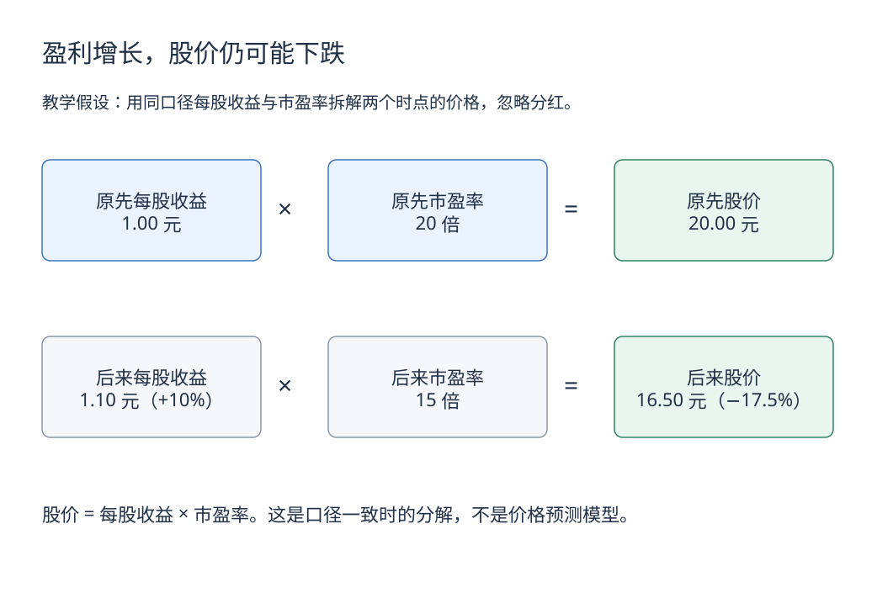

# 5. 股票：买的是企业权益，成交的是市场价格

[学习路线](../learning-guide.md) · 前一章：[存款与债券](bonds.md) · 下一章：[基金与 ETF](funds.md)

股票代表企业的股权。与债权人按合同要求偿付不同，普通股股东承担剩余风险，股息并非固定承诺。

## 企业好，股票就一定值得买吗

要分开两个问题：企业经营是否有价值，以及当前价格已经反映了多好的未来。

一家经营优秀的企业，如果价格隐含极其乐观的增长，后来即使利润增长，也可能因为低于此前预期而股价下跌。市场交易的是预期、风险和价格的组合，不只是一份当期成绩单。

## 最先认识三类报表信息

| 信息 | 问什么 | 不能混淆的地方 |
|---|---|---|
| 收入与利润 | 生意做了多大，扣除成本费用后赚多少？ | 收入不是利润，利润也不一定已收现 |
| 资产与负债 | 有什么资源，欠多少钱？ | 账面价值不一定等于可变现价格 |
| 现金流 | 经营、投资、融资分别带来多少现金？ | 借款流入不等于经营赚钱 |

入门不要求马上做完整估值，但至少知道应读企业公告、定期报告和现金流，而不是只看股价走势图。

## 收益从哪里来

股东可能获得分红，同时承担股价变化。忽略费用时，买入 100 元、卖出 105 元并收到 2 元分红，总收益为 7%。

分红不是凭空增加财富：除息时价格通常会作相应调整，之后还会受市场变化影响。股票拆分同样不会仅凭股数增加就创造价值。

## 市盈率先会用，也要知道不能怎么用

```text
市盈率 P/E = 股价 ÷ 每股收益
```

假设股价 20 元，每股年收益 1 元，市盈率为 20 倍。这只是价格与一项盈利口径的比值，不代表保证 20 年回本。

不同市盈率可能反映增长、风险、资本结构、会计口径或一次性收益。亏损企业的常规市盈率也不适合直接比较。低市盈率可能便宜，也可能反映盈利即将下滑或重大风险。



[下载可编辑源图](../images/learning/earnings-and-valuation.drawio)

图中是两个假设时点的价格分解：`1 × 20 = 20`，`1.1 × 15 = 16.5`。它解释盈利变化与估值变化可以相互抵消，没有告诉我们未来市盈率一定是多少；价格变化也未包含分红、费用与税项。

## 股市和经济不是同一张成绩单

GDP 覆盖整体经济的增加值，股票指数只覆盖特定上市公司，并受估值、预期和成分权重影响。经济增长快，不保证某个市场当期回报高；股市上涨，也不说明每个家庭收入都改善。

指数还要区分价格指数与全收益指数，后者按规则考虑分红再投资。比较长期表现时，不能拿不同口径直接比高低。

## 常见误区

- “股价低就是便宜”：每股价格受股本数量影响，不能脱离盈利与权益判断。
- “跌得多就一定反弹”：可能是价格过度调整，也可能是企业价值永久受损。
- “买熟悉的品牌就懂这只股票”：消费体验不等于了解财务、治理和估值。

## 自测

一家企业盈利增长 10%，股价却下跌，这一定矛盾吗？

参考答案：不矛盾。市场可能原本期待增长 30%，也可能提高了风险补偿要求，或认为增长不可持续。需要比较实际与预期，并查看现金流和估值变化。

## 延伸阅读

- [上海证券交易所投资者教育](https://edu.sse.com.cn/)：股票、信息披露与交易制度基础；具体产品以最新规则和公告为准。
