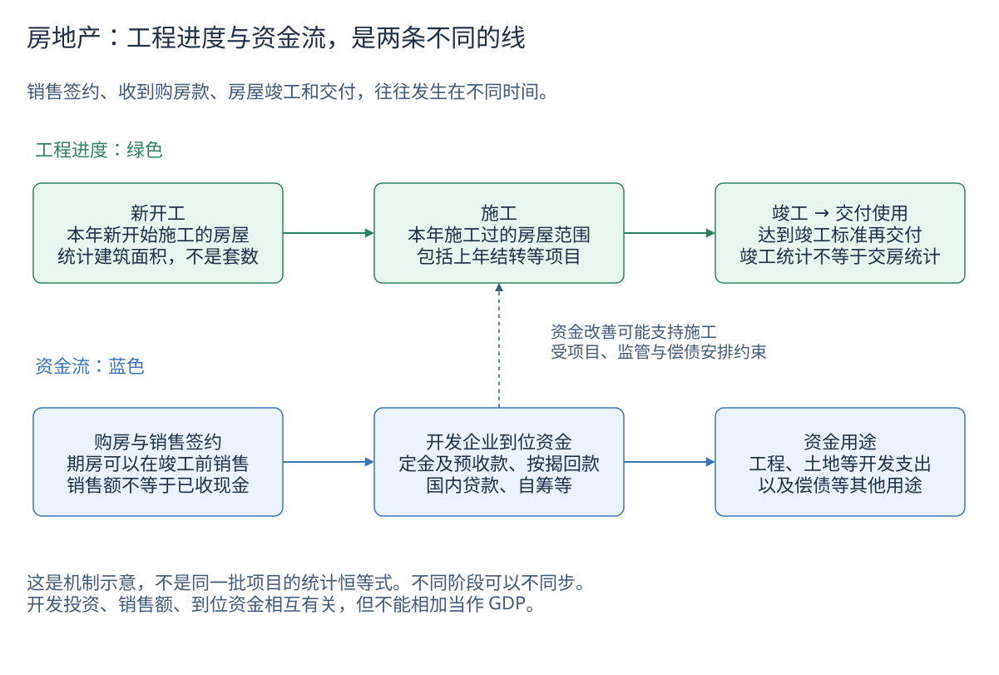

# 房地产如何影响经济：销售、资金与建设

房地产新闻经常把“销售回暖”“保交付”“投资下降”放在一起。这些并不矛盾：它们观察不同阶段，涉及不同批次的房屋，发生时间也不同。

本页接着[社融与信贷结构](credit-structure.md)，解释融资怎样与实际经济活动联系；[房地产数据页](data/property.md)提供可选点的官方历史、完整明细和 CSV。这里讨论全国开发企业的新建商品房与开发建设，不把它当成某个城市房价或二手房市场的代表。

## 先把工程进度和资金流分开

[下载可编辑源图](images/learning/property-cashflow.drawio)

同一个项目通常先开工、再施工、再达到竣工条件。但期房可以在竣工前销售，签约后资金也未必一次到账，所以销售、收款、投资和交付不能排成一条每月同步移动的统计曲线。

全国某个月的新开工面积、销售面积和竣工面积，来自许多不同批次的项目。不能说“本月少开工一平方米，就会在下个月少竣工一平方米”。项目工期、库存、融资、建设安排都会影响结果。[来源一、二]

## 六组指标分别回答什么

| 指标 | 回答的问题 | 最常见的误解 |
|---|---|---|
| 新建商品房销售面积 | 签订正式买卖合同的建筑面积有多少？ | 不是交付面积、居住人数或售出套数；包含住宅及非住宅，不含二手房 |
| 新建商品房销售额 | 合同对应总价款是多少？ | 不是开发商当期已收现金，也不是全部房地产资产市值 |
| 开发企业到位资金 | 报告期内实际用于房地产开发的各种货币资金有多少？ | 不是新增授信额度或账上剩余现金，也不等于销售额；包括不同来源的资金 |
| 房屋新开工面积 | 当年新开始施工的房屋建筑面积有多少？ | 不是新增土地面积，也不是每个月施工工作量 |
| 房屋施工/竣工面积 | 年内施工过的房屋范围/达到竣工标准的建筑面积有多少？ | 施工不是月末未完工库存；竣工统计也不直接等于交房统计 |
| 房地产开发投资 | 开发企业在建筑安装、设备和其他费用等方面完成多少投资？ | 不是销售额，不是全部房屋交易额，也不是房地产增加值 |

住宅投资是全部开发投资的一部分；住宅销售也只是商品房销售的一部分。一个“房地产”标题不能让这些范围自动变成同一个指标。[来源一、二]

## 销售增加，为什么投资不一定立即增加

先用一个**教学假设**：开发商签订了总价 100 万元的购房合同，先收 30 万元，剩余款项后续到账。当期销售额和当期收到的款项就可能不同。真实统计按合同、项目与资金来源分类，不能拿这个例子的付款比例套到全国数据。

收到更多钱后，还要看钱怎么用：可能支付工程款，可能优先完成在建项目，也可能偿还债务。企业对未来销售的判断、预售资金监管要求以及项目进度，都可能影响是否再拿地、开新项目。

所以观察顺序是：**销售及预期 → 实际到位资金 → 项目与债务安排 → 建设和投资**。这是需要证据核对的传导机制，不是固定时滞的预测公式。若竣工改善而新开工仍弱，一个可能的解释是企业优先完成旧项目；仍需结合实际资金、项目和政策资料验证。

到位资金中的“国内贷款”主要观察开发企业从金融机构取得的贷款；“个人按揭贷款”则是购房者按揭等形成的开发商回款。它们与[住户中长期贷款余额](data/credit-structure.md)在借款人、统计对象和期间口径上都不同，不能要求金额一致。

本次历史数据图展示到位资金总量、国内贷款和自筹资金；这些不是全部组成。定金及预收款、个人按揭贷款等可查当期官方完整报告，不能把“总量减国内贷款减自筹”直接命名为按揭回款。[来源一、三]

## 累计同比为什么不等于当月同比

“1—8 月投资同比下降 10%”比较的是今年前八个月和上年前八个月的可比规模，不是 8 月一个月同比下降 10%。前几个月会持续影响这个累计结果，最近单月即使改善，累计增速也可能仍然为负。

金额每年重新累计。例如**教学假设**中的 1—2 月投资 80、1—3 月投资 130，不能把它们相加说前三个月投资 210。3 月与 2 月累计值相减只有在范围、修订和计量一致时，才可解释为推算的当月变化；本专题不自动将它发布成官方单月数据。

国家统计局公布的增速按可比口径计算，可能调整上年比较基数。范围核实、退房、非销售行为和统计执法等都会影响可比性，因此拿本年金额除以上年旧公告金额，未必复现官方增速。数据页同时保存金额和官方增速，不强行改数配平。[来源一、三]

## 三个不能直接套用的等式

**销售额 ÷ 销售面积，不是同质房价指数。** 这个比值受城市、地段、户型、住宅/商用结构影响。例如高单价城市成交占比下降，即使每个城市同类房价都未变化，全国成交均价也可能下降。观察同类住房价格，应另外查住房价格统计，不能用总价/总面积替代。

**新开工 − 竣工，不是库存变化。** 两者不是同一批项目，施工还涉及跨年结转、恢复施工等。待售面积也有特定定义，主要描述已经竣工、可供销售出租但尚未售出或出租的商品房面积，并不覆盖全部在建、预售和已售未交付房屋。[来源二]

**开发投资 + 销售额 + 到位资金，不是房地产贡献的 GDP。** GDP 核算新增生产的价值，不能把融资、资产交易和建设支出重复相加。土地本身的买卖不直接创造等额新增产出；房地产活动还通过建筑、建材、家装、服务等影响经济，但这些行业存在中间投入关系，不能简单叠加营业收入算“产业链占比”。

## 怎样组合阅读

1. 先看销售面积和金额的累计同比，再看住宅与全部商品房的范围；不要仅凭金额下降断言房价等幅下降。
2. 对照到位资金总量、国内贷款、自筹及当期报告中的回款分项，检查融资是否落实。
3. 对照新开工、施工、竣工和投资。区分扩大新项目与完成旧项目，不要求各指标同向。
4. 回到[经济活动](data/activity.md)、[季度 GDP](data/quarterly-gdp.md)及[就业与收入](data/employment-income.md)，寻找实际需求、生产和居民购买能力的证据。

全国总量不能直接用于判断某套房值不值得买。不同地区的人口、供给、库存、收入、交通和政策可能差异很大。

## 历史怎样保留

本项目查询国家统计局现有月度目录的完整可用历史，不只保留近几个月。原表没有的 1 月不填零；2 月标识对应 1—2 月累计。早期确有缺失的开工或到位资金增速，也不从金额反算补齐。

销售统计的目录注释指向 2005 年 8 月附近的范围变化。为避免猜测转换月的边界，2004 年及以前、2005 年转换期、2006 年起分别保存；转换年没有删除，仍能在数据页补充表与 CSV 中查看。其他时期也可能存在调查范围、基数修订和统计治理调整，不将保留历史等同于历年绝对金额完全可比。

具体已采集范围、官方公告补充和仍未核验的月份见[历史覆盖说明](data/history-coverage.md)。网页上的最新值是已入库的统计快照，不是实时交易行情。

## 自测

1. 销售额下降 15%、销售面积下降 10%，能说同一套房便宜了约 5% 吗？
2. 竣工增长而新开工下降，是否一定是统计出错？
3. 为什么两份旧公告的投资金额无法复现官方同比？

参考答案：不能，成交结构不同且同比比值也不是直接相减；不一定，完工和新开工来自不同批次；官方使用调整后的可比范围与上年基数，旧发布金额可能不再可比。

## 一手来源

1. [国家统计局：2026 年 1—8 月全国房地产市场基本情况及附注](https://www.stats.gov.cn/sj/zxfb/202609/t20260915_1965310.html)：指标定义、范围、调查方式、累计口径和可比增长说明。
2. [国家统计局：房地产统计常见问题](https://www.stats.gov.cn/hd/cjwtjd/202302/t20230207_1902275.html)：销售范围、期房与现房、面积及待售口径。
3. [国家统计局：2024 年 1—2 月全国房地产开发和销售情况](https://www.stats.gov.cn/sj/zxfb/202403/t20240322_1948133.html)：退房、非销售行为、调查范围与统计执法调整后，增速按可比口径计算。
4. [国家数据：月度房地产目录](https://data.stats.gov.cn/dg/website/page.html#/pc/national/monthData)：真实历史及原始目录注释，具体指标 ID 和查询参数随 CSV 元数据保存。

核验日期：2026-10-02。
