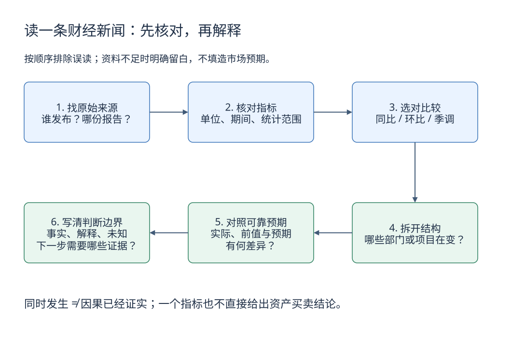

# 14. 怎样综合阅读宏观数据

[学习路线](learning-guide.md) · 前一章：[黄金](gold.md) · 下一章：[数据阅读练习](data/reading-exercise.md)

阅读宏观新闻，先确认指标和比较口径，再分析传导条件。一个数字通常只能回答一个局部问题。

## 六步检查

1. **谁发布**：统计机构、央行、交易所，还是媒体或机构自己的估算？
2. **衡量什么**：产出、物价、货币余额、融资流量，还是资产价格？
3. **怎么比较**：同比、环比、累计、季调；单位、基期和统计范围是否一致？
4. **内部结构怎样**：总量变化来自居民、企业、政府，还是某个价格波动较大的项目？
5. **是否超出预期**：实际结果与市场此前预期有什么差异？
6. **哪些条件会阻断传导**：信用需求、收入预期、汇率政策、风险偏好和时间滞后。



[下载可编辑源图](images/learning/macro-reading-process.drawio)

按编号从上排左端读到右端，再沿下排向左。最后一格不是“得到买卖结论”，而是明确现有证据能支持到哪一步，包括哪些传导条件仍未满足。

## 情景一：M2 增长，消费却偏弱

假设 M2 同比增长 9%，但消费增长较慢、居民增加定期存款。

可能的解释包括居民预防性储蓄增强、资金主要流向特定部门、收入分配差异，或货币周转速度下降。需要继续看居民收入、消费、企业投资、存款结构与贷款用途。

不能从“总货币余额更多”直接推导出“每个人都更愿意消费”。也不能把 M2 的增速与实际 GDP 增速机械相减，直接得出未来通胀率。

## 情景二：社融回升，企业需求仍弱

假设社融同比多增，主要由政府债券推动，企业中长期贷款较弱。

可以先判断融资结构更偏向政府部门。财政资金能否进一步带动投资、就业和收入，还要看使用方向与落地时间。观察企业订单、民间投资、就业和物价能帮助判断传导结果。

## 情景三：央行降息，股票下跌

可能有几条解释：

- 市场原本预期降 50 个基点，实际只降 25 个基点。
- 降息同时释放出比预期更弱的经济信号，盈利预期下降。
- 其他因素占主导，例如风险事件、估值调整或仓位变化。

折现率下降可能支持估值，但未来现金流和风险溢价也会变化。“降息”一个标签无法决定最终价格。

## 情景四：美国降息，人民币没有明显升值

汇率衡量相对价格。需要比较中国与美国各自的利率、增长和政策预期，而不只看美联储。

如果降息已经被提前计价，或同期避险需求增强、其他经济体宽松幅度更大，美元仍可能坚挺。中国的贸易结算、资本流动和在岸/离岸流动性也会影响 USD/CNY。

## 情景五：美元和黄金一起上涨

在特定风险环境下，投资者既需要美元现金和高流动性资产，也希望持有黄金分散风险。两种需求可以同时增强，所以经验上的负相关会阶段性失效。

中国投资者还应把美元金价和 USD/CNY 一起看，不能直接用美元涨幅代替人民币收益。

## 常见数字陷阱

| 表述 | 正确理解 |
|---|---|
| 利率下降 25bp | 下降 0.25 个百分点 |
| CPI 涨幅回落 | 可能只是涨价变慢，不一定降价 |
| PMI 从 48 升到 49 | 有所改善，但仍低于 50 的扩张/收缩分界 |
| 社融增量减少 | 不一定意味着社融存量下降 |
| 美元指数上涨 | 美元相对指定篮子走强，不代表对全部货币走强 |
| GDP 增长 5% | 需确认实际/名义、同比/环比及统计期间 |

## 可复用的阅读记录

```text
事件：
发布时间与统计期间：
官方来源：
指标、单位与口径：
实际值 / 前值 / 市场预期（注明来源）：
主要分项变化：
可能的传导机制：
支持与反对这一解释的证据：
下一次需要观察的数据：
```

市场预期没有找到可靠来源时就留空；同时发生不等于因果关系，事后的价格变化也不能单独证明某种解释正确。

## 自测

新闻说“央行降息后股市下跌”，是否足以证明降息使股市下跌？还应检查什么？

参考答案：不足以证明因果。要比较此前政策预期、同时发布的增长信息、其他风险事件与更长时段证据。同一时间发生，不等于只有一个原因。

## 相关阅读与数据入口

- [货币与信用](money-and-credit.md)、[增长与通胀](growth-and-inflation.md)、[利率](interest-rates.md)、[汇率](exchange-rates.md)、[黄金](gold.md)。
- [中国人民银行](https://www.pbc.gov.cn/)、[国家统计局](https://www.stats.gov.cn/)、[中国货币网](https://www.chinamoney.com.cn/)、[美联储](https://www.federalreserve.gov/)。

整理日期：2026-10-01。上述情景为教学假设，不是对当期经济或行情的判断。
